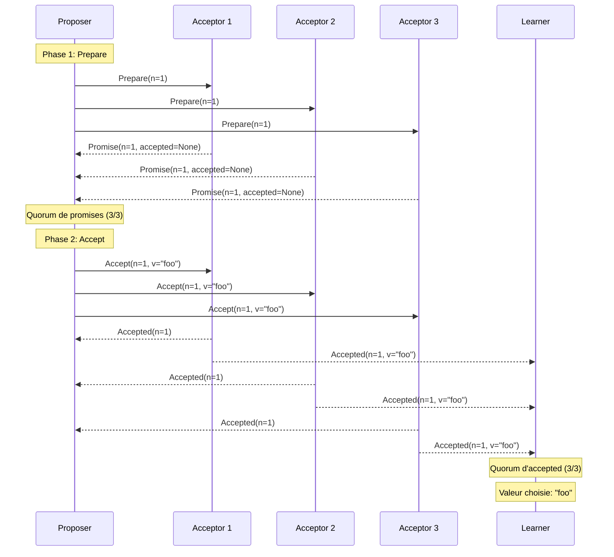

<thinking>
## Analyse du Concept
- Concept : Paxos Basic - Consensus Protocol
- Phase demandee : 5 (Advanced Systems)
- Adapte ? OUI - Paxos est l'algorithme fondamental de consensus distribue. Comprendre Paxos est essentiel pour tout ingenieur travaillant sur des systemes distribues.

## Combo Base + Bonus
- Exercice de base : Implementation des deux phases de Paxos avec les roles Proposer, Acceptor, Learner
- Bonus : Implementation de Multi-Paxos avec leader election et log replique
- Palier bonus : EXPERT (complexite algorithmique + coordination distribuee)
- Progression logique ? OUI - Base = Basic Paxos single value, Bonus = Multi-Paxos log

## Prerequis & Difficulte
- Prerequis reels : Async Rust (tokio), channels, HashMap, Result/Option, comprehension du consensus
- Difficulte estimee : 8/10 (base), 10/10 (bonus)
- Coherent avec phase 5 ? OUI

## Aspect Fun/Culture
- Contexte choisi : Reference au "Part-Time Parliament" de Lamport - Les acceptors comme des legislateurs grecs votant des lois
- MEME mnemonique : "Promise me you won't accept less" (Phase 1b)
- Pourquoi c'est fun : Lamport a invente Paxos en imaginant un parlement grec fictif

## Scenarios d'Echec (5 mutants concrets)
1. Mutant A (Boundary) : Acceptor accepte une proposition avec un numero inferieur au promised
2. Mutant B (Safety) : Proposer ne respecte pas la valeur deja acceptee dans les promises
3. Mutant C (Logic) : Quorum calcule avec division entiere incorrecte (n/2 au lieu de n/2+1)
4. Mutant D (Edge) : Pas de gestion du cas ou tous les acceptors retournent None
5. Mutant E (Return) : Learner declare consensus avant d'avoir un quorum de accepted

## Verdict
VALIDE - Exercice de qualite industrielle couvrant l'algorithme de consensus le plus important
</thinking>

# Exercice 5.4.6-a : paxos_basic

**Module :**
5.4.6 — Consensus Algorithms

**Concept :**
a — Paxos Protocol (Basic Single-Decree)

**Difficulte :**
★★★★★★★★☆☆ (8/10)

**Type :**
code

**Tiers :**
2 — Integration de concepts

**Langage :**
Rust Edition 2024

**Prerequis :**
- 2.1 — Types primitifs et ownership
- 2.4 — Gestion d'erreurs (Result, Option)
- 4.1 — Programmation asynchrone (tokio)
- 5.4.4 — Horloges logiques et causalite

**Domaines :**
Distributed, Consensus, Algo

**Duree estimee :**
120 min

**XP Base :**
200

**Complexite :**
T2 O(n) x S1 O(n)

---

## SECTION 1 : PROTOTYPE & CONSIGNE

### 1.1 Obligations

**Fichier a rendre :**
```
src/lib.rs
```

**Dependances autorisees :**
- `std::collections::{HashMap, HashSet}`
- `tokio` (async runtime)
- `thiserror` (error handling)

**Fonctions/methodes interdites :**
- Crates de consensus externes (`raft`, `paxos`, etc.)
- `unsafe` blocks
- Threads OS directs (utiliser tokio tasks)

### 1.2 Consigne

**CONTEXTE : "The Part-Time Parliament"**

*"Dans l'ancienne cite de Paxos, les legislateurs se reunissaient rarement tous ensemble. Pourtant, ils devaient voter des lois. Ils inventerent un protocole ou chaque legislateur pouvait promettre de ne pas voter pour des propositions anterieures, garantissant ainsi que malgre les absences, une et une seule loi serait adoptee."* — Leslie Lamport, 1989

Le consensus distribue est le probleme fondamental des systemes distribues : comment plusieurs noeuds peuvent-ils s'accorder sur une valeur unique meme en presence de pannes ? Paxos, invente par Leslie Lamport, est l'algorithme qui a resolu ce probleme.

**Ta mission :**

Implementer l'algorithme Paxos basique (Single-Decree Paxos) permettant a un groupe de noeuds de s'accorder sur une valeur unique :

1. **Proposer** : Initie une proposition avec un numero unique
2. **Acceptor** : Promet de ne pas accepter de propositions anterieures, accepte les propositions valides
3. **Learner** : Apprend la valeur choisie quand un quorum d'acceptors l'a acceptee

**Entree :**
- `proposer_id: u64` — Identifiant unique du proposer
- `value: Value` — Valeur a proposer
- `acceptors: Vec<Acceptor>` — Liste des acceptors

**Sortie :**
- `ConsensusResult` — Resultat du consensus (Chosen, NoQuorum, Conflict)
- `PaxosError` — En cas d'erreur de protocole

**Contraintes :**
- Le quorum est une majorite stricte : `n/2 + 1`
- Les numeros de proposition doivent etre uniques et croissants
- Un acceptor ne peut promettre qu'a des numeros superieurs a son dernier promise
- La valeur choisie doit etre celle d'une proposition deja acceptee si presente

**Exemples :**

| Appel | Resultat | Explication |
|-------|----------|-------------|
| `propose(v1, 5 acceptors)` | `Chosen(v1)` | Majorite atteinte (3/5) |
| `propose(v1, 3 acceptors, 2 down)` | `NoQuorum` | Pas de majorite (1/3 < 2) |
| `propose(v2) apres accept(v1)` | `Chosen(v1)` | Valeur deja acceptee preservee |

### 1.2.2 Consigne Academique

Implementer l'algorithme Paxos Single-Decree avec les trois roles (Proposer, Acceptor, Learner) et les deux phases (Prepare/Promise, Accept/Accepted). Le protocole doit garantir la propriete de safety : au plus une valeur peut etre choisie.

### 1.3 Prototype

```rust
use std::collections::{HashMap, HashSet};

/// Numero de proposition unique (round, proposer_id)
#[derive(Debug, Clone, Copy, PartialEq, Eq, PartialOrd, Ord, Hash)]
pub struct ProposalNumber {
    pub round: u64,
    pub proposer_id: u64,
}

impl ProposalNumber {
    pub fn new(round: u64, proposer_id: u64) -> Self;
    pub fn increment(&self) -> Self;
}

/// Valeur a proposer
#[derive(Debug, Clone, PartialEq, Eq)]
pub struct Value(pub Vec<u8>);

/// Messages de la Phase 1
#[derive(Debug, Clone)]
pub enum Phase1Message {
    /// Prepare(n) : Proposer demande aux acceptors de promettre
    Prepare { proposal: ProposalNumber },
    /// Promise : Acceptor promet de ne pas accepter < n
    Promise {
        proposal: ProposalNumber,
        accepted: Option<(ProposalNumber, Value)>,
    },
    /// Nack : Acceptor refuse (a deja promis a un numero superieur)
    Nack {
        proposal: ProposalNumber,
        highest_promised: ProposalNumber,
    },
}

/// Messages de la Phase 2
#[derive(Debug, Clone)]
pub enum Phase2Message {
    /// Accept(n, v) : Proposer demande d'accepter la valeur
    Accept { proposal: ProposalNumber, value: Value },
    /// Accepted : Acceptor a accepte
    Accepted { proposal: ProposalNumber },
    /// Rejected : Acceptor refuse (a promis a un numero superieur)
    Rejected { proposal: ProposalNumber },
}

/// Etat d'un Acceptor
pub struct Acceptor {
    id: u64,
    promised: Option<ProposalNumber>,
    accepted: Option<(ProposalNumber, Value)>,
}

impl Acceptor {
    pub fn new(id: u64) -> Self;

    /// Phase 1b : Traite un Prepare et retourne Promise ou Nack
    pub fn receive_prepare(&mut self, proposal: ProposalNumber) -> Phase1Message;

    /// Phase 2b : Traite un Accept et retourne Accepted ou Rejected
    pub fn receive_accept(
        &mut self,
        proposal: ProposalNumber,
        value: Value
    ) -> Phase2Message;

    /// Retourne la valeur actuellement acceptee
    pub fn accepted_value(&self) -> Option<&Value>;
}

/// Etat d'un Proposer
pub struct Proposer {
    id: u64,
    current_round: u64,
    promises: HashMap<u64, Phase1Message>,
    accepteds: HashSet<u64>,
}

impl Proposer {
    pub fn new(id: u64) -> Self;

    /// Phase 1a : Genere un message Prepare
    pub fn prepare(&mut self) -> Phase1Message;

    /// Traite une reponse Promise
    pub fn receive_promise(&mut self, from: u64, msg: Phase1Message);

    /// Verifie si on a un quorum de promises
    pub fn has_promise_quorum(&self, total: usize) -> bool;

    /// Determine la valeur a proposer (celle avec le plus haut n accepte, ou la notre)
    pub fn value_to_propose(&self, our_value: &Value) -> Value;

    /// Phase 2a : Genere un message Accept
    pub fn accept(&self, value: Value) -> Phase2Message;

    /// Traite une reponse Accepted
    pub fn receive_accepted(&mut self, from: u64, msg: Phase2Message);

    /// Verifie si on a un quorum d'accepted
    pub fn has_accept_quorum(&self, total: usize) -> bool;
}

/// Etat d'un Learner
pub struct Learner {
    id: u64,
    accepted_counts: HashMap<ProposalNumber, HashMap<u64, Value>>,
}

impl Learner {
    pub fn new(id: u64) -> Self;

    /// Enregistre qu'un acceptor a accepte une valeur
    pub fn learn(&mut self, proposal: ProposalNumber, value: Value, from: u64);

    /// Retourne la valeur choisie si un quorum l'a acceptee
    pub fn chosen_value(&self, total: usize) -> Option<Value>;
}

/// Instance Paxos complete
pub struct PaxosInstance {
    proposer: Proposer,
    acceptors: Vec<Acceptor>,
    learners: Vec<Learner>,
}

impl PaxosInstance {
    pub fn new(proposer_id: u64, num_acceptors: usize, num_learners: usize) -> Self;

    /// Execute une proposition complete
    pub async fn propose(&mut self, value: Value) -> ConsensusResult;

    /// Simule la panne d'un acceptor
    pub fn fail_acceptor(&mut self, id: u64);

    /// Retourne le nombre d'acceptors actifs
    pub fn active_acceptors(&self) -> usize;
}

/// Resultat du consensus
#[derive(Debug, Clone, PartialEq)]
pub enum ConsensusResult {
    /// Une valeur a ete choisie
    Chosen(Value),
    /// Pas de quorum disponible
    NoQuorum,
    /// Conflit avec une proposition concurrente
    Conflict(ProposalNumber),
}

/// Erreurs possibles
#[derive(Debug, Clone, thiserror::Error)]
pub enum PaxosError {
    #[error("No quorum available: {available}/{required}")]
    NoQuorum { available: usize, required: usize },
    #[error("Proposal rejected: higher proposal {0:?} seen")]
    Rejected(ProposalNumber),
    #[error("Invalid state: {0}")]
    InvalidState(String),
}

/// Calcule la taille du quorum (majorite stricte)
pub fn quorum_size(total: usize) -> usize;
```

---

## SECTION 2 : LE SAVIEZ-VOUS ?

### 2.1 L'Histoire de Paxos

Leslie Lamport a soumis son papier "The Part-Time Parliament" en 1990, mais les reviewers l'ont trouve trop humoristique (il decrivait un parlement grec fictif). Le papier n'a ete publie qu'en 1998, 8 ans plus tard ! En 2001, Lamport a publie "Paxos Made Simple" pour clarifier l'algorithme.

### 2.2 Pourquoi les Numeros de Proposition ?

Les numeros de proposition servent de "timestamps logiques" pour ordonner les propositions. Un acceptor qui a promis au numero 5 refusera toute proposition avec un numero inferieur. Cela garantit que les propositions obsoletes ne peuvent pas "ressusciter" et violer le consensus.

```
Proposer A: Prepare(1) ──────► Acceptor promet a 1
Proposer B: Prepare(5) ──────► Acceptor promet a 5
Proposer A: Accept(1, "x") ──► REJETE (a promis a 5)
```

### 2.3 Le Theoreme FLP

Le theoreme FLP (Fischer, Lynch, Paterson, 1985) prouve qu'aucun algorithme de consensus ne peut garantir la terminaison dans un systeme asynchrone avec meme une seule panne. Paxos contourne cela en sacrifiant la liveness : il peut ne jamais terminer (dueling proposers), mais garantit la safety.

---

## SECTION 2.5 : DANS LA VRAIE VIE

### Metiers concernes

| Metier | Utilisation de Paxos/Consensus |
|--------|--------------------------------|
| **Distributed Systems Engineer** | Design de systemes repliques, coordination de clusters |
| **Database Engineer** | Replication synchrone, commit distribue (Spanner) |
| **Cloud Architect** | Configuration de quorums, haute disponibilite |
| **Blockchain Developer** | Comprendre les variantes BFT de consensus |
| **SRE** | Debug de split-brain, analyse de partitions |

### Cas d'usage concrets

1. **Google Chubby/Spanner** : Utilise Paxos pour la coordination de verrous distribues
2. **Apache ZooKeeper** : Utilise Zab (variante de Paxos) pour la replication
3. **etcd/Consul** : Utilise Raft (simplification de Multi-Paxos)
4. **CockroachDB** : Multi-Paxos pour la replication de ranges

---

## SECTION 3 : EXEMPLE D'UTILISATION

### 3.0 Session bash

```bash
$ ls
Cargo.toml  src/

$ cargo test
   Compiling paxos_basic v0.1.0
    Finished test [unoptimized + debuginfo] target(s)
     Running unittests src/lib.rs

running 15 tests
test tests::test_proposal_number_ordering ... ok
test tests::test_acceptor_promise ... ok
test tests::test_acceptor_nack_lower ... ok
test tests::test_acceptor_accept ... ok
test tests::test_acceptor_reject_lower ... ok
test tests::test_proposer_quorum ... ok
test tests::test_value_selection ... ok
test tests::test_learner_chosen ... ok
test tests::test_consensus_single_proposer ... ok
test tests::test_consensus_minority_failure ... ok
test tests::test_consensus_majority_failure ... ok
test tests::test_competing_proposers ... ok
test tests::test_value_preserved ... ok
test tests::test_quorum_size ... ok
test tests::test_full_protocol ... ok

test result: ok. 15 passed; 0 failed
```

### 3.1 BONUS EXPERT (OPTIONNEL)

**Difficulte Bonus :**
★★★★★★★★★★ (10/10)

**Recompense :**
XP x4

**Time Complexity attendue :**
O(n) par slot

**Space Complexity attendue :**
O(m) ou m = nombre de slots

**Domaines Bonus :**
`Algo, Replication`

#### 3.1.1 Consigne Bonus

**"The Eternal Parliament"**

*Le parlement de Paxos ne vote pas qu'une seule loi, mais une sequence infinie de decrets. Un leader emerge pour accelerer les votes, mais doit etre remplace s'il echoue.*

**Ta mission bonus :**

Implementer **Multi-Paxos** avec :
- Un log replique de valeurs
- Election de leader pour skip Phase 1
- Gestion des gaps dans le log

**Entree :**
- `slot: u64` — Index dans le log
- `value: Value` — Valeur a proposer pour ce slot

**Sortie :**
- `Log` — Log replique avec les valeurs choisies
- `Err(PaxosError)` — En cas d'echec

**Contraintes :**
```
┌─────────────────────────────────────────┐
│  Leader skip Phase 1 si toujours leader │
│  Gaps dans le log doivent etre combles  │
│  Leader election sur timeout            │
└─────────────────────────────────────────┘
```

#### 3.1.2 Prototype Bonus

```rust
/// Log replique Multi-Paxos
pub struct MultiPaxosLog {
    slots: HashMap<u64, PaxosInstance>,
    leader_id: Option<u64>,
    leader_lease: Option<Instant>,
}

impl MultiPaxosLog {
    pub fn new(node_id: u64, num_nodes: usize) -> Self;

    /// Propose une valeur pour le prochain slot
    pub async fn append(&mut self, value: Value) -> Result<u64, PaxosError>;

    /// Lit une valeur a un slot donne
    pub fn read(&self, slot: u64) -> Option<&Value>;

    /// Execute une election de leader
    pub async fn elect_leader(&mut self) -> Result<u64, PaxosError>;

    /// Verifie si ce noeud est le leader
    pub fn is_leader(&self) -> bool;
}
```

#### 3.1.3 Ce qui change par rapport a l'exercice de base

| Aspect | Base | Bonus |
|--------|------|-------|
| Scope | Une seule valeur | Sequence de valeurs |
| Phases | Toujours 2 phases | Skip Phase 1 avec leader |
| Etat | Stateless | Log persistant |
| Leader | Pas de leader | Leader election |

---

## SECTION 4 : ZONE CORRECTION

### 4.1 Moulinette — Tableau des tests

| Test | Input | Expected | Points | Categorie |
|------|-------|----------|--------|-----------|
| `proposal_ordering` | `(1,0) vs (2,0)` | `(1,0) < (2,0)` | 5 | Basic |
| `acceptor_promise` | `Prepare(1)` | `Promise(1, None)` | 5 | Core |
| `acceptor_nack` | `Prepare(1) then Prepare(0)` | `Nack(0, 1)` | 10 | Core |
| `acceptor_accept` | `Accept(1, v)` after promise | `Accepted(1)` | 10 | Core |
| `acceptor_reject` | `Accept(0, v)` after promise(1) | `Rejected(0)` | 10 | Core |
| `quorum_size_3` | `3 nodes` | `2` | 5 | Edge |
| `quorum_size_5` | `5 nodes` | `3` | 5 | Edge |
| `quorum_size_7` | `7 nodes` | `4` | 5 | Edge |
| `proposer_quorum` | `3/5 promises` | `true` | 5 | Core |
| `value_selection_none` | No prior accepts | Our value | 5 | Core |
| `value_selection_prior` | Prior accept(2, v2) | v2 | 10 | Critical |
| `learner_no_quorum` | `2/5 accepted` | `None` | 5 | Core |
| `learner_quorum` | `3/5 accepted` | `Some(v)` | 5 | Core |
| `consensus_success` | `5 acceptors, all up` | `Chosen(v)` | 10 | Integration |
| `consensus_minority_fail` | `2/5 down` | `Chosen(v)` | 10 | Integration |
| `consensus_majority_fail` | `3/5 down` | `NoQuorum` | 10 | Edge |

**Score minimum pour validation : 70/100**

### 4.2 Fichier de test

```rust
#[cfg(test)]
mod tests {
    use super::*;

    #[test]
    fn test_proposal_number_ordering() {
        let p1 = ProposalNumber::new(1, 0);
        let p2 = ProposalNumber::new(2, 0);
        let p3 = ProposalNumber::new(1, 1);

        assert!(p1 < p2);
        assert!(p1 < p3); // Same round, higher proposer_id
    }

    #[test]
    fn test_acceptor_promise() {
        let mut acc = Acceptor::new(0);
        let proposal = ProposalNumber::new(1, 0);

        match acc.receive_prepare(proposal) {
            Phase1Message::Promise { proposal: p, accepted } => {
                assert_eq!(p, proposal);
                assert!(accepted.is_none());
            }
            _ => panic!("Expected Promise"),
        }
    }

    #[test]
    fn test_acceptor_nack_lower() {
        let mut acc = Acceptor::new(0);
        acc.receive_prepare(ProposalNumber::new(5, 0));

        match acc.receive_prepare(ProposalNumber::new(3, 0)) {
            Phase1Message::Nack { proposal, highest_promised } => {
                assert_eq!(proposal.round, 3);
                assert_eq!(highest_promised.round, 5);
            }
            _ => panic!("Expected Nack"),
        }
    }

    #[test]
    fn test_acceptor_accept() {
        let mut acc = Acceptor::new(0);
        let proposal = ProposalNumber::new(1, 0);
        let value = Value(b"test".to_vec());

        acc.receive_prepare(proposal);

        match acc.receive_accept(proposal, value.clone()) {
            Phase2Message::Accepted { proposal: p } => {
                assert_eq!(p, proposal);
                assert_eq!(acc.accepted_value(), Some(&value));
            }
            _ => panic!("Expected Accepted"),
        }
    }

    #[test]
    fn test_acceptor_reject_lower() {
        let mut acc = Acceptor::new(0);
        acc.receive_prepare(ProposalNumber::new(5, 0));

        let value = Value(b"test".to_vec());
        match acc.receive_accept(ProposalNumber::new(3, 0), value) {
            Phase2Message::Rejected { proposal } => {
                assert_eq!(proposal.round, 3);
            }
            _ => panic!("Expected Rejected"),
        }
    }

    #[test]
    fn test_quorum_size() {
        assert_eq!(quorum_size(3), 2);
        assert_eq!(quorum_size(5), 3);
        assert_eq!(quorum_size(7), 4);
        assert_eq!(quorum_size(1), 1);
    }

    #[test]
    fn test_value_selection_prior_accept() {
        let mut proposer = Proposer::new(0);
        proposer.prepare();

        // Simulate receiving a promise with a prior accept
        let prior_value = Value(b"prior".to_vec());
        let promise = Phase1Message::Promise {
            proposal: ProposalNumber::new(1, 0),
            accepted: Some((ProposalNumber::new(0, 1), prior_value.clone())),
        };
        proposer.receive_promise(1, promise);

        let our_value = Value(b"our".to_vec());
        let selected = proposer.value_to_propose(&our_value);

        // Must use the prior accepted value
        assert_eq!(selected, prior_value);
    }

    #[test]
    fn test_learner_chosen() {
        let mut learner = Learner::new(0);
        let proposal = ProposalNumber::new(1, 0);
        let value = Value(b"chosen".to_vec());

        // 3/5 acceptors accept
        learner.learn(proposal, value.clone(), 0);
        learner.learn(proposal, value.clone(), 1);
        assert!(learner.chosen_value(5).is_none());

        learner.learn(proposal, value.clone(), 2);
        assert_eq!(learner.chosen_value(5), Some(value));
    }

    #[tokio::test]
    async fn test_consensus_single_proposer() {
        let mut instance = PaxosInstance::new(0, 5, 1);
        let value = Value(b"consensus".to_vec());

        let result = instance.propose(value.clone()).await;
        assert_eq!(result, ConsensusResult::Chosen(value));
    }

    #[tokio::test]
    async fn test_consensus_minority_failure() {
        let mut instance = PaxosInstance::new(0, 5, 1);
        instance.fail_acceptor(3);
        instance.fail_acceptor(4);

        let value = Value(b"still works".to_vec());
        let result = instance.propose(value.clone()).await;
        assert_eq!(result, ConsensusResult::Chosen(value));
    }

    #[tokio::test]
    async fn test_consensus_majority_failure() {
        let mut instance = PaxosInstance::new(0, 5, 1);
        instance.fail_acceptor(2);
        instance.fail_acceptor(3);
        instance.fail_acceptor(4);

        let result = instance.propose(Value(b"fails".to_vec())).await;
        assert_eq!(result, ConsensusResult::NoQuorum);
    }

    #[test]
    fn test_proposal_increment() {
        let p1 = ProposalNumber::new(1, 5);
        let p2 = p1.increment();
        assert_eq!(p2.round, 2);
        assert_eq!(p2.proposer_id, 5);
    }
}
```

### 4.3 Solution de reference

```rust
use std::collections::{HashMap, HashSet};

#[derive(Debug, Clone, Copy, PartialEq, Eq, PartialOrd, Ord, Hash)]
pub struct ProposalNumber {
    pub round: u64,
    pub proposer_id: u64,
}

impl ProposalNumber {
    pub fn new(round: u64, proposer_id: u64) -> Self {
        Self { round, proposer_id }
    }

    pub fn increment(&self) -> Self {
        Self {
            round: self.round + 1,
            proposer_id: self.proposer_id,
        }
    }
}

#[derive(Debug, Clone, PartialEq, Eq)]
pub struct Value(pub Vec<u8>);

#[derive(Debug, Clone)]
pub enum Phase1Message {
    Prepare { proposal: ProposalNumber },
    Promise {
        proposal: ProposalNumber,
        accepted: Option<(ProposalNumber, Value)>,
    },
    Nack {
        proposal: ProposalNumber,
        highest_promised: ProposalNumber,
    },
}

#[derive(Debug, Clone)]
pub enum Phase2Message {
    Accept { proposal: ProposalNumber, value: Value },
    Accepted { proposal: ProposalNumber },
    Rejected { proposal: ProposalNumber },
}

pub struct Acceptor {
    id: u64,
    promised: Option<ProposalNumber>,
    accepted: Option<(ProposalNumber, Value)>,
    failed: bool,
}

impl Acceptor {
    pub fn new(id: u64) -> Self {
        Self {
            id,
            promised: None,
            accepted: None,
            failed: false,
        }
    }

    pub fn receive_prepare(&mut self, proposal: ProposalNumber) -> Phase1Message {
        if self.failed {
            return Phase1Message::Nack {
                proposal,
                highest_promised: proposal,
            };
        }

        match self.promised {
            Some(promised) if proposal <= promised => {
                Phase1Message::Nack {
                    proposal,
                    highest_promised: promised,
                }
            }
            _ => {
                self.promised = Some(proposal);
                Phase1Message::Promise {
                    proposal,
                    accepted: self.accepted.clone(),
                }
            }
        }
    }

    pub fn receive_accept(&mut self, proposal: ProposalNumber, value: Value) -> Phase2Message {
        if self.failed {
            return Phase2Message::Rejected { proposal };
        }

        match self.promised {
            Some(promised) if proposal < promised => {
                Phase2Message::Rejected { proposal }
            }
            _ => {
                self.promised = Some(proposal);
                self.accepted = Some((proposal, value));
                Phase2Message::Accepted { proposal }
            }
        }
    }

    pub fn accepted_value(&self) -> Option<&Value> {
        self.accepted.as_ref().map(|(_, v)| v)
    }

    pub fn fail(&mut self) {
        self.failed = true;
    }

    pub fn is_failed(&self) -> bool {
        self.failed
    }
}

pub struct Proposer {
    id: u64,
    current_round: u64,
    promises: HashMap<u64, Phase1Message>,
    accepteds: HashSet<u64>,
}

impl Proposer {
    pub fn new(id: u64) -> Self {
        Self {
            id,
            current_round: 0,
            promises: HashMap::new(),
            accepteds: HashSet::new(),
        }
    }

    pub fn prepare(&mut self) -> Phase1Message {
        self.current_round += 1;
        self.promises.clear();
        self.accepteds.clear();

        Phase1Message::Prepare {
            proposal: ProposalNumber::new(self.current_round, self.id),
        }
    }

    pub fn receive_promise(&mut self, from: u64, msg: Phase1Message) {
        if let Phase1Message::Promise { .. } = &msg {
            self.promises.insert(from, msg);
        }
    }

    pub fn has_promise_quorum(&self, total: usize) -> bool {
        self.promises.len() >= quorum_size(total)
    }

    pub fn value_to_propose(&self, our_value: &Value) -> Value {
        let mut highest: Option<(ProposalNumber, Value)> = None;

        for msg in self.promises.values() {
            if let Phase1Message::Promise { accepted: Some((n, v)), .. } = msg {
                match &highest {
                    None => highest = Some((*n, v.clone())),
                    Some((hn, _)) if n > hn => highest = Some((*n, v.clone())),
                    _ => {}
                }
            }
        }

        highest.map(|(_, v)| v).unwrap_or_else(|| our_value.clone())
    }

    pub fn accept(&self, value: Value) -> Phase2Message {
        Phase2Message::Accept {
            proposal: ProposalNumber::new(self.current_round, self.id),
            value,
        }
    }

    pub fn receive_accepted(&mut self, from: u64, msg: Phase2Message) {
        if let Phase2Message::Accepted { .. } = msg {
            self.accepteds.insert(from);
        }
    }

    pub fn has_accept_quorum(&self, total: usize) -> bool {
        self.accepteds.len() >= quorum_size(total)
    }

    pub fn current_proposal(&self) -> ProposalNumber {
        ProposalNumber::new(self.current_round, self.id)
    }
}

pub struct Learner {
    id: u64,
    accepted_counts: HashMap<ProposalNumber, HashMap<u64, Value>>,
}

impl Learner {
    pub fn new(id: u64) -> Self {
        Self {
            id,
            accepted_counts: HashMap::new(),
        }
    }

    pub fn learn(&mut self, proposal: ProposalNumber, value: Value, from: u64) {
        self.accepted_counts
            .entry(proposal)
            .or_insert_with(HashMap::new)
            .insert(from, value);
    }

    pub fn chosen_value(&self, total: usize) -> Option<Value> {
        let quorum = quorum_size(total);

        for (_, acceptors) in &self.accepted_counts {
            if acceptors.len() >= quorum {
                return acceptors.values().next().cloned();
            }
        }
        None
    }
}

pub struct PaxosInstance {
    proposer: Proposer,
    acceptors: Vec<Acceptor>,
    learners: Vec<Learner>,
}

impl PaxosInstance {
    pub fn new(proposer_id: u64, num_acceptors: usize, num_learners: usize) -> Self {
        Self {
            proposer: Proposer::new(proposer_id),
            acceptors: (0..num_acceptors as u64).map(Acceptor::new).collect(),
            learners: (0..num_learners as u64).map(Learner::new).collect(),
        }
    }

    pub async fn propose(&mut self, value: Value) -> ConsensusResult {
        let total = self.acceptors.len();
        let quorum = quorum_size(total);

        // Phase 1: Prepare
        let prepare_msg = self.proposer.prepare();

        for (i, acceptor) in self.acceptors.iter_mut().enumerate() {
            if !acceptor.is_failed() {
                if let Phase1Message::Prepare { proposal } = &prepare_msg {
                    let response = acceptor.receive_prepare(*proposal);
                    self.proposer.receive_promise(i as u64, response);
                }
            }
        }

        if !self.proposer.has_promise_quorum(total) {
            return ConsensusResult::NoQuorum;
        }

        // Phase 2: Accept
        let value_to_propose = self.proposer.value_to_propose(&value);
        let accept_msg = self.proposer.accept(value_to_propose.clone());

        for (i, acceptor) in self.acceptors.iter_mut().enumerate() {
            if !acceptor.is_failed() {
                if let Phase2Message::Accept { proposal, value: v } = &accept_msg {
                    let response = acceptor.receive_accept(*proposal, v.clone());
                    self.proposer.receive_accepted(i as u64, response.clone());

                    // Notify learners
                    if let Phase2Message::Accepted { proposal } = response {
                        for learner in &mut self.learners {
                            learner.learn(proposal, v.clone(), i as u64);
                        }
                    }
                }
            }
        }

        if self.proposer.has_accept_quorum(total) {
            ConsensusResult::Chosen(value_to_propose)
        } else {
            ConsensusResult::NoQuorum
        }
    }

    pub fn fail_acceptor(&mut self, id: u64) {
        if let Some(acceptor) = self.acceptors.get_mut(id as usize) {
            acceptor.fail();
        }
    }

    pub fn active_acceptors(&self) -> usize {
        self.acceptors.iter().filter(|a| !a.is_failed()).count()
    }
}

#[derive(Debug, Clone, PartialEq)]
pub enum ConsensusResult {
    Chosen(Value),
    NoQuorum,
    Conflict(ProposalNumber),
}

#[derive(Debug, Clone, thiserror::Error)]
pub enum PaxosError {
    #[error("No quorum available: {available}/{required}")]
    NoQuorum { available: usize, required: usize },
    #[error("Proposal rejected: higher proposal {0:?} seen")]
    Rejected(ProposalNumber),
    #[error("Invalid state: {0}")]
    InvalidState(String),
}

pub fn quorum_size(total: usize) -> usize {
    total / 2 + 1
}
```

### 4.4 Solutions alternatives acceptees

```rust
// Alternative 1 : Quorum avec calcul different mais equivalent
pub fn quorum_size(total: usize) -> usize {
    (total + 1) / 2 + if total % 2 == 0 { 0 } else { 0 }
    // Equivalent a: total / 2 + 1
}

// Alternative 2 : ProposalNumber avec Ord derive automatiquement
// Le derive fonctionne car (round, proposer_id) donne l'ordre correct

// Alternative 3 : Utilisation de BTreeMap au lieu de HashMap
// Permet d'iterer en ordre, utile pour Multi-Paxos
```

### 4.5 Solutions refusees

```rust
// REFUSEE 1 : Quorum incorrect (n/2 au lieu de n/2+1)
pub fn quorum_size(total: usize) -> usize {
    total / 2  // ERREUR: pas une majorite stricte
}
// Pourquoi refusee : Avec 4 noeuds, quorum=2, deux groupes de 2 peuvent decider differemment

// REFUSEE 2 : Acceptor accepte meme si promis a un numero superieur
pub fn receive_accept(&mut self, proposal: ProposalNumber, value: Value) -> Phase2Message {
    self.accepted = Some((proposal, value));  // ERREUR: ignore promised
    Phase2Message::Accepted { proposal }
}
// Pourquoi refusee : Viole la propriete de safety de Paxos

// REFUSEE 3 : Proposer ignore la valeur deja acceptee
pub fn value_to_propose(&self, our_value: &Value) -> Value {
    our_value.clone()  // ERREUR: ignore les accepts dans les promises
}
// Pourquoi refusee : Peut choisir une valeur differente de celle deja acceptee
```

### 4.6 Solution bonus de reference

```rust
pub struct MultiPaxosLog {
    node_id: u64,
    num_nodes: usize,
    slots: HashMap<u64, PaxosInstance>,
    chosen: HashMap<u64, Value>,
    next_slot: u64,
    leader_id: Option<u64>,
    leader_lease: Option<std::time::Instant>,
}

impl MultiPaxosLog {
    pub fn new(node_id: u64, num_nodes: usize) -> Self {
        Self {
            node_id,
            num_nodes,
            slots: HashMap::new(),
            chosen: HashMap::new(),
            next_slot: 0,
            leader_id: None,
            leader_lease: None,
        }
    }

    pub async fn append(&mut self, value: Value) -> Result<u64, PaxosError> {
        let slot = self.next_slot;
        self.next_slot += 1;

        let mut instance = PaxosInstance::new(self.node_id, self.num_nodes, 1);

        match instance.propose(value.clone()).await {
            ConsensusResult::Chosen(v) => {
                self.chosen.insert(slot, v);
                Ok(slot)
            }
            ConsensusResult::NoQuorum => {
                Err(PaxosError::NoQuorum {
                    available: instance.active_acceptors(),
                    required: quorum_size(self.num_nodes),
                })
            }
            ConsensusResult::Conflict(p) => {
                Err(PaxosError::Rejected(p))
            }
        }
    }

    pub fn read(&self, slot: u64) -> Option<&Value> {
        self.chosen.get(&slot)
    }

    pub fn is_leader(&self) -> bool {
        self.leader_id == Some(self.node_id)
    }
}
```

### 4.7 Solutions alternatives bonus

```rust
// Alternative : Leader election via highest proposer_id
// Plus simple mais moins robuste qu'un ballot
```

### 4.8 Solutions refusees bonus

```rust
// REFUSEE : Skip Phase 1 sans verification de leader valide
// Peut violer la safety si le leader a change
```

### 4.9 spec.json

```json
{
  "name": "paxos_basic",
  "language": "rust",
  "type": "code",
  "tier": 2,
  "tier_info": "Integration de concepts - Consensus Protocol",
  "tags": ["distributed", "consensus", "paxos", "replication", "phase5"],
  "passing_score": 70,

  "function": {
    "name": "PaxosInstance",
    "prototype": "impl PaxosInstance",
    "return_type": "ConsensusResult",
    "parameters": [
      {"name": "value", "type": "Value"}
    ]
  },

  "driver": {
    "edge_cases": [
      {
        "name": "minority_failure",
        "description": "2/5 acceptors fail",
        "expected": "Chosen",
        "is_trap": false
      },
      {
        "name": "majority_failure",
        "description": "3/5 acceptors fail",
        "expected": "NoQuorum",
        "is_trap": true,
        "trap_explanation": "Pas de quorum sans majorite"
      },
      {
        "name": "prior_accept",
        "description": "Promise contains prior accepted value",
        "expected": "Use prior value",
        "is_trap": true,
        "trap_explanation": "Doit preserver la valeur deja acceptee"
      }
    ],

    "fuzzing": {
      "enabled": true,
      "iterations": 500,
      "generators": [
        {
          "type": "custom",
          "param_index": 0,
          "generator": "random_value"
        }
      ]
    }
  },

  "norm": {
    "allowed_functions": ["std::collections::HashMap", "tokio"],
    "forbidden_functions": ["unsafe"],
    "forbidden_crates": ["paxos", "raft", "consensus"],
    "check_security": true,
    "check_memory": false,
    "blocking": true
  }
}
```

### 4.10 Solutions Mutantes

```rust
/* Mutant A (Boundary) : Acceptor accepte proposition inferieure au promised */
impl Acceptor {
    pub fn receive_accept(&mut self, proposal: ProposalNumber, value: Value) -> Phase2Message {
        // MUTANT: Pas de verification du promised
        self.accepted = Some((proposal, value));
        Phase2Message::Accepted { proposal }
    }
}
// Pourquoi c'est faux : Viole la promesse faite, peut causer deux valeurs differentes
// Ce qui etait pense : "Accept verifie juste la valeur"

/* Mutant B (Safety) : Proposer utilise toujours sa propre valeur */
impl Proposer {
    pub fn value_to_propose(&self, our_value: &Value) -> Value {
        our_value.clone()  // MUTANT: Ignore les accepts dans promises
    }
}
// Pourquoi c'est faux : Si une valeur a deja ete acceptee, on doit l'utiliser
// Ce qui etait pense : "On propose ce qu'on veut"

/* Mutant C (Logic) : Quorum calcule incorrectement */
pub fn quorum_size(total: usize) -> usize {
    total / 2  // MUTANT: Pas +1
}
// Pourquoi c'est faux : Avec 4 noeuds, 2 n'est pas une majorite stricte
// Ce qui etait pense : "La moitie suffit"

/* Mutant D (Edge) : Learner ne compte pas correctement */
impl Learner {
    pub fn chosen_value(&self, total: usize) -> Option<Value> {
        for (_, acceptors) in &self.accepted_counts {
            if acceptors.len() > 0 {  // MUTANT: > 0 au lieu de >= quorum
                return acceptors.values().next().cloned();
            }
        }
        None
    }
}
// Pourquoi c'est faux : Une seule acceptation ne fait pas consensus
// Ce qui etait pense : "Un accept suffit"

/* Mutant E (Return) : Promise sans la valeur acceptee */
impl Acceptor {
    pub fn receive_prepare(&mut self, proposal: ProposalNumber) -> Phase1Message {
        self.promised = Some(proposal);
        Phase1Message::Promise {
            proposal,
            accepted: None,  // MUTANT: Toujours None
        }
    }
}
// Pourquoi c'est faux : Le proposer ne sait pas qu'une valeur a deja ete acceptee
// Ce qui etait pense : "Promise n'a pas besoin de la valeur"
```

---

## SECTION 5 : COMPRENDRE

### 5.1 Ce que cet exercice enseigne

1. **Consensus distribue** : Comment plusieurs noeuds s'accordent sur une valeur
2. **Quorums** : Pourquoi une majorite stricte garantit l'unicite
3. **Numeros de proposition** : Ordonnancement logique des propositions
4. **Two-phase protocol** : Prepare/Promise puis Accept/Accepted
5. **Safety vs Liveness** : Paxos garantit safety, pas toujours liveness

### 5.2 LDA — Traduction Litterale

```
FONCTION receive_prepare QUI PREND proposal ET RETOURNE Phase1Message
DEBUT FONCTION
    SI promised EST DEFINI ET proposal <= promised ALORS
        RETOURNER Nack AVEC proposal ET highest_promised = promised
    SINON
        AFFECTER proposal A promised
        RETOURNER Promise AVEC proposal ET accepted (la valeur deja acceptee si presente)
    FIN SI
FIN FONCTION

FONCTION propose QUI PREND value ET RETOURNE ConsensusResult
DEBUT FONCTION
    // Phase 1: Prepare
    ENVOYER Prepare A tous les acceptors
    ATTENDRE les reponses jusqu'a quorum

    SI pas de quorum ALORS
        RETOURNER NoQuorum
    FIN SI

    // Choisir la valeur
    AFFECTER LA VALEUR avec le plus haut numero accepte OU notre valeur A value_to_propose

    // Phase 2: Accept
    ENVOYER Accept(value_to_propose) A tous les acceptors
    ATTENDRE les reponses jusqu'a quorum

    SI quorum d'Accepted ALORS
        RETOURNER Chosen(value_to_propose)
    SINON
        RETOURNER NoQuorum
    FIN SI
FIN FONCTION
```

### 5.2.2 Pseudocode Academique

```
ALGORITHME : Paxos Single-Decree
---
ENTREE : value (valeur a proposer), acceptors (liste des acceptors)
SORTIE : valeur choisie ou echec

Phase 1 (Prepare):
1. Proposer genere un numero de proposition n unique
2. Proposer envoie Prepare(n) a tous les acceptors
3. Acceptor recoit Prepare(n):
   - Si n > promised: promettre a n, retourner Promise(n, accepted)
   - Sinon: retourner Nack(n, promised)
4. Proposer attend un quorum de Promise

Phase 2 (Accept):
5. Proposer choisit v = valeur du plus haut accept recu, ou sa propre valeur
6. Proposer envoie Accept(n, v) aux acceptors
7. Acceptor recoit Accept(n, v):
   - Si n >= promised: accepter (n, v), retourner Accepted(n)
   - Sinon: retourner Rejected(n)
8. Proposer attend un quorum d'Accepted

9. RETOURNER Chosen(v) si quorum atteint, sinon NoQuorum
```

### 5.2.2.1 Logic Flow

```
ALGORITHME : Paxos Consensus
---
1. PHASE 1 - PREPARE :
   a. Proposer incremente son numero de round
   b. Envoie Prepare(round, proposer_id) a tous les acceptors
   c. Chaque acceptor:
      - Si proposal > promised: promet, retourne (accepted_n, accepted_v)
      - Sinon: NACK
   d. Proposer collecte les promises

2. VERIFICATION QUORUM :
   |
   |-- SI promises < majority :
   |     RETOURNER NoQuorum
   |
   |-- SINON : continuer Phase 2

3. SELECTION VALEUR :
   |
   |-- CHERCHER la valeur avec le plus haut accepted_n dans les promises
   |-- SI trouvee : utiliser cette valeur
   |-- SINON : utiliser notre valeur

4. PHASE 2 - ACCEPT :
   a. Envoie Accept(n, v) aux acceptors
   b. Chaque acceptor:
      - Si n >= promised: accepte, retourne Accepted
      - Sinon: Rejected
   c. Proposer collecte les accepted

5. RETOURNER Chosen(v) si quorum, sinon NoQuorum
```

### 5.2.3 Representation Algorithmique

```
FONCTION : run_paxos(value)
---
INIT round = 0, promises = [], accepteds = []

1. INCREMENTER round :
   |
   |-- round = round + 1
   |-- proposal = (round, proposer_id)

2. PHASE 1 - PREPARE :
   |
   |-- POUR CHAQUE acceptor :
   |     |-- ENVOYER Prepare(proposal)
   |     |-- RECEVOIR reponse
   |     |-- SI Promise : AJOUTER a promises
   |
   |-- SI len(promises) < quorum : RETOURNER NoQuorum

3. CHOISIR VALEUR :
   |
   |-- highest_accepted = MAX par numero dans promises
   |-- SI highest_accepted existe :
   |     value_to_propose = highest_accepted.value
   |-- SINON :
   |     value_to_propose = value

4. PHASE 2 - ACCEPT :
   |
   |-- POUR CHAQUE acceptor :
   |     |-- ENVOYER Accept(proposal, value_to_propose)
   |     |-- RECEVOIR reponse
   |     |-- SI Accepted : AJOUTER a accepteds
   |
   |-- SI len(accepteds) >= quorum :
   |     RETOURNER Chosen(value_to_propose)
   |-- SINON :
   |     RETOURNER NoQuorum
```

### 5.2.3.1 Diagramme Mermaid



### 5.3 Visualisation ASCII

```
                       PAXOS SINGLE-DECREE

    PROPOSER                 ACCEPTORS                  LEARNER
       |                    [A1] [A2] [A3]                 |
       |                      |    |    |                  |
   ════╪══════════════════════╪════╪════╪══════════════════╪════
       |   PHASE 1: PREPARE   |    |    |                  |
       |                      |    |    |                  |
       |--Prepare(n=1)------->|    |    |                  |
       |--Prepare(n=1)------------>|    |                  |
       |--Prepare(n=1)----------------->|                  |
       |                      |    |    |                  |
       |<--Promise(1,None)----|    |    |                  |
       |<--Promise(1,None)---------|    |                  |
       |<--Promise(1,None)--------------|                  |
       |                      |    |    |                  |
       | Quorum: 3/3 promises |    |    |                  |
   ════╪══════════════════════╪════╪════╪══════════════════╪════
       |   PHASE 2: ACCEPT    |    |    |                  |
       |                      |    |    |                  |
       |--Accept(1,"foo")---->|    |    |                  |
       |--Accept(1,"foo")--------->|    |                  |
       |--Accept(1,"foo")-------------->|                  |
       |                      |    |    |                  |
       |<--Accepted(1)--------|----|----|----------------->|
       |<--Accepted(1)-------------|----|-              >--|
       |<--Accepted(1)------------------|--            -->|
       |                      |    |    |                  |
       | Quorum: 3/3 accepted |    |    |   CHOSEN: "foo" |
   ════╪══════════════════════╪════╪════╪══════════════════╪════


           STRUCTURE DU NUMERO DE PROPOSITION

    ┌─────────────────────────────────────────────────┐
    │  ProposalNumber = (round, proposer_id)          │
    │                                                 │
    │  Ordre: (1, 0) < (1, 1) < (2, 0) < (2, 5)      │
    │                                                 │
    │  Round = tentative de consensus                 │
    │  ProposerId = tie-breaker                       │
    └─────────────────────────────────────────────────┘


           QUORUM = MAJORITE STRICTE

    ┌─────────────────────────────────────────────────┐
    │  n = 3  →  quorum = 2  (3/2 + 1 = 2)           │
    │  n = 5  →  quorum = 3  (5/2 + 1 = 3)           │
    │  n = 7  →  quorum = 4  (7/2 + 1 = 4)           │
    │                                                 │
    │  Pourquoi +1 ? Pour garantir l'intersection    │
    │  entre deux quorums (au moins un noeud commun) │
    └─────────────────────────────────────────────────┘
```

### 5.4 Les pieges en detail

| Piege | Description | Comment l'eviter |
|-------|-------------|------------------|
| **Quorum n/2** | Pas une majorite stricte | Toujours `n/2 + 1` |
| **Ignorer accepted** | Ne pas utiliser la valeur deja acceptee | Chercher le max dans promises |
| **Accept sans promise** | Acceptor accepte n < promised | Verifier `n >= promised` |
| **Learner premature** | Declarer choisi avant quorum | Compter les accepteds |
| **Dueling proposers** | Deux proposers s'interrompent | Multi-Paxos avec leader |

### 5.5 Cours Complet

#### 5.5.1 Le Probleme du Consensus

Dans un systeme distribue, plusieurs noeuds doivent parfois s'accorder sur une valeur unique. Par exemple :
- Quel noeud est le leader ?
- Quelle transaction commiter ?
- Quel est le prochain bloc dans la blockchain ?

**Proprietes requises :**
1. **Agreement** : Tous les noeuds qui decident choisissent la meme valeur
2. **Validity** : La valeur choisie a ete proposee par un noeud
3. **Termination** : Tous les noeuds finissent par decider (liveness)

#### 5.5.2 Le Theoreme FLP

Fischer, Lynch et Paterson ont prouve en 1985 qu'il est impossible de garantir les trois proprietes dans un systeme asynchrone avec meme une seule panne. Paxos contourne cela en garantissant Agreement et Validity (safety), mais pas toujours Termination (liveness).

#### 5.5.3 Les Deux Phases de Paxos

**Phase 1 : Prepare/Promise**
```
Proposer                          Acceptor
    |                                |
    |--- Prepare(n) ---------------->|
    |                                |
    |<-- Promise(n, accepted) -------|  si n > promised
    |<-- Nack(n, promised) ----------|  sinon
```

L'acceptor promet de ne plus accepter de propositions avec un numero inferieur a `n`.

**Phase 2 : Accept/Accepted**
```
Proposer                          Acceptor
    |                                |
    |--- Accept(n, v) -------------->|
    |                                |
    |<-- Accepted(n) ----------------|  si n >= promised
    |<-- Rejected(n) ----------------|  sinon
```

L'acceptor accepte la valeur si la proposition est toujours valide.

#### 5.5.4 Pourquoi ca Marche ?

La cle est dans la selection de la valeur :
- Si un acceptor a deja accepte une valeur, il l'inclut dans sa Promise
- Le proposer DOIT utiliser la valeur du plus haut accept recu

Cela garantit que si une valeur a deja ete choisie (quorum d'accepted), tout proposer futur proposera la meme valeur.

#### 5.5.5 Quorum et Intersection

Avec `n` noeuds et un quorum de `n/2 + 1` :
- Tout quorum contient au moins `n/2 + 1` noeuds
- Deux quorums ont au moins `1` noeud en commun

Ce noeud commun "transmet" l'information d'une proposition a l'autre, garantissant la coherence.

### 5.6 Normes avec explications pedagogiques

```
┌─────────────────────────────────────────────────────────────────┐
│ HORS NORME (compile, mais non idiomatique)                      │
├─────────────────────────────────────────────────────────────────┤
│ if promises.len() > total / 2 {  // Bug: pas strictement >      │
│     // ...                                                      │
│ }                                                               │
├─────────────────────────────────────────────────────────────────┤
│ CONFORME (majorite stricte)                                     │
├─────────────────────────────────────────────────────────────────┤
│ if promises.len() >= total / 2 + 1 {                            │
│     // ...                                                      │
│ }                                                               │
├─────────────────────────────────────────────────────────────────┤
│ POURQUOI ?                                                      │
│                                                                 │
│ Avec 4 noeuds, total/2 = 2 mais une vraie majorite est 3        │
│ La formule n/2+1 donne toujours la majorite stricte             │
└─────────────────────────────────────────────────────────────────┘
```

### 5.7 Simulation avec trace d'execution

**Entree :** `instance.propose(Value("x"))`

```
┌───────┬──────────────────────────────────────────────────┬──────────────────┬─────────────────────┐
│ Etape │ Instruction                                      │ Variables        │ Explication         │
├───────┼──────────────────────────────────────────────────┼──────────────────┼─────────────────────┤
│   1   │ proposer.prepare()                               │ round = 1        │ Prepare(1, 0)       │
├───────┼──────────────────────────────────────────────────┼──────────────────┼─────────────────────┤
│   2   │ acceptor[0].receive_prepare((1,0))               │ promised = (1,0) │ Promise(None)       │
├───────┼──────────────────────────────────────────────────┼──────────────────┼─────────────────────┤
│   3   │ acceptor[1].receive_prepare((1,0))               │ promised = (1,0) │ Promise(None)       │
├───────┼──────────────────────────────────────────────────┼──────────────────┼─────────────────────┤
│   4   │ acceptor[2].receive_prepare((1,0))               │ promised = (1,0) │ Promise(None)       │
├───────┼──────────────────────────────────────────────────┼──────────────────┼─────────────────────┤
│   5   │ has_promise_quorum(3)                            │ 3 >= 2           │ true                │
├───────┼──────────────────────────────────────────────────┼──────────────────┼─────────────────────┤
│   6   │ value_to_propose("x")                            │ no prior accept  │ "x"                 │
├───────┼──────────────────────────────────────────────────┼──────────────────┼─────────────────────┤
│   7   │ acceptor[0].receive_accept((1,0), "x")           │ accepted = "x"   │ Accepted            │
├───────┼──────────────────────────────────────────────────┼──────────────────┼─────────────────────┤
│   8   │ acceptor[1].receive_accept((1,0), "x")           │ accepted = "x"   │ Accepted            │
├───────┼──────────────────────────────────────────────────┼──────────────────┼─────────────────────┤
│   9   │ has_accept_quorum(3)                             │ 2 >= 2           │ true                │
├───────┼──────────────────────────────────────────────────┼──────────────────┼─────────────────────┤
│  10   │ RETOURNER Chosen("x")                            │                  │ Consensus!          │
└───────┴──────────────────────────────────────────────────┴──────────────────┴─────────────────────┘
```

### 5.8 Mnemotechniques

#### MEME : "Promise me you won't accept less"

*Un acceptor est comme quelqu'un qui fait une promesse : "Je promets de ne pas accepter de proposition inferieure a celle-ci." Une fois la promesse faite, il doit la tenir.*

```rust
// L'acceptor tient sa promesse
if proposal < self.promised {
    return Nack;  // "Je ne peux pas, j'ai promis a quelqu'un d'autre"
}
```

#### MAJORITE = INTERSECTION

*Deux groupes majoritaires ont toujours au moins un membre en commun. Ce membre "passe le message" entre les deux propositions.*

#### P1 P2 = Prepare Promise, Accept Accepted

Les deux phases en 4 mots : **P**repare → **P**romise, **A**ccept → **A**ccepted

### 5.9 Applications pratiques

1. **Google Chubby** : Lock service utilisant Paxos pour la haute disponibilite
2. **Apache ZooKeeper** : Coordination service avec Zab (Paxos-like)
3. **etcd/Consul** : Key-value stores avec Raft (Multi-Paxos simplifie)
4. **CockroachDB** : Replication avec Raft pour chaque range
5. **TiKV** : Utilise Multi-Raft pour le sharding

---

## SECTION 6 : PIEGES — RECAPITULATIF

| # | Piege | Symptome | Solution |
|---|-------|----------|----------|
| 1 | Quorum n/2 | Split-brain possible | `n/2 + 1` |
| 2 | Ignorer prior accept | Deux valeurs choisies | Max(accepted_n) |
| 3 | Accept < promised | Safety violation | Verifier >= |
| 4 | Learner sans quorum | Fausse declaration | Compter les accepteds |
| 5 | Pas d'increment | Meme proposal rejete | Round++ a chaque essai |

---

## SECTION 7 : QCM

### Question 1
**Quel est le quorum pour 5 acceptors ?**

A) 2
B) 3
C) 4
D) 5
E) 1
F) 2.5
G) Depend de la valeur
H) Tout le monde
I) La moitie
J) Aucun

**Reponse : B**

*Explication : quorum = n/2 + 1 = 5/2 + 1 = 2 + 1 = 3*

---

### Question 2
**Que doit faire un acceptor qui recoit Accept(3, v) apres avoir promis a 5 ?**

A) Accepter car Accept > Prepare
B) Rejeter car 3 < 5
C) Accepter la valeur mais pas le numero
D) Ignorer le message
E) Envoyer un Nack
F) Demander un nouveau Prepare
G) Accepter et mettre a jour promised
H) Ca depend de la valeur
I) Toujours accepter
J) Crash

**Reponse : B**

*Explication : L'acceptor a promis de ne pas accepter de propositions < 5. Il doit rejeter.*

---

### Question 3
**Un proposer recoit Promise(5, (3, "old")) et Promise(5, (4, "new")). Quelle valeur doit-il proposer ?**

A) Sa propre valeur
B) "old" (premier recu)
C) "new" (dernier recu)
D) "new" (plus haut numero 4 > 3)
E) Choisir aleatoirement
F) Demander aux acceptors
G) Annuler la proposition
H) Les deux
I) Ni l'une ni l'autre
J) Concatener les deux

**Reponse : D**

*Explication : On doit utiliser la valeur avec le plus haut numero d'acceptation (4 > 3), donc "new".*

---

### Question 4
**Pourquoi Paxos peut-il ne jamais terminer ?**

A) Bug dans l'algorithme
B) Dueling proposers qui s'interrompent
C) Pas assez de noeuds
D) Valeur trop grande
E) Theoreme FLP impossible
F) Timeout trop court
G) Reseau partitionne
H) B et G
I) Toutes les reponses
J) Paxos termine toujours

**Reponse : H**

*Explication : Deux proposers peuvent s'interrompre indefiniment (dueling), et une partition reseau peut empecher le quorum.*

---

### Question 5
**Combien de pannes un cluster de 7 noeuds peut-il tolerer ?**

A) 1
B) 2
C) 3
D) 4
E) 5
F) 6
G) 7
H) 0
I) Depend du type de panne
J) Illimite

**Reponse : C**

*Explication : Avec 7 noeuds, quorum = 4. On peut tolerer 7 - 4 = 3 pannes.*

---

## SECTION 8 : RECAPITULATIF

| Element | Valeur |
|---------|--------|
| **Nom** | paxos_basic |
| **Module** | 5.4.6 — Consensus Algorithms |
| **Difficulte** | 8/10 |
| **Temps estime** | 120 min |
| **XP** | 200 (base) + bonus x4 |
| **Concepts cles** | Consensus, Quorum, Two-phase |
| **Piege principal** | Ignorer la valeur deja acceptee |
| **Prerequis valide** | Async Rust, HashMap |

---

## SECTION 9 : DEPLOYMENT PACK

```json
{
  "deploy": {
    "hackbrain_version": "5.5.2",
    "engine_version": "v22.1",
    "exercise_slug": "5.4.6-a-paxos-basic",
    "generated_at": "2024-01-15T12:00:00Z",

    "metadata": {
      "exercise_id": "5.4.6-a",
      "exercise_name": "paxos_basic",
      "module": "5.4.6",
      "module_name": "Consensus Algorithms",
      "concept": "a",
      "concept_name": "Paxos Protocol",
      "type": "code",
      "tier": 2,
      "tier_info": "Integration de concepts",
      "phase": 5,
      "difficulty": 8,
      "difficulty_stars": "8/10",
      "language": "rust",
      "language_version": "2024",
      "duration_minutes": 120,
      "xp_base": 200,
      "xp_bonus_multiplier": 4,
      "bonus_tier": "EXPERT",
      "complexity_time": "T2 O(n)",
      "complexity_space": "S1 O(n)",
      "prerequisites": ["2.1", "2.4", "4.1", "5.4.4"],
      "domains": ["Distributed", "Consensus", "Algo"],
      "domains_bonus": ["Algo", "Replication"],
      "tags": ["distributed", "consensus", "paxos", "quorum"],
      "meme_reference": "Promise me you won't accept less"
    },

    "files": {
      "spec.json": "/* Section 4.9 */",
      "references/ref_solution.rs": "/* Section 4.3 */",
      "references/ref_solution_bonus.rs": "/* Section 4.6 */",
      "alternatives/alt_1.rs": "/* Section 4.4 */",
      "mutants/mutant_a_boundary.rs": "/* Section 4.10 */",
      "mutants/mutant_b_safety.rs": "/* Section 4.10 */",
      "mutants/mutant_c_logic.rs": "/* Section 4.10 */",
      "mutants/mutant_d_edge.rs": "/* Section 4.10 */",
      "mutants/mutant_e_return.rs": "/* Section 4.10 */",
      "tests/lib_test.rs": "/* Section 4.2 */"
    },

    "validation": {
      "expected_pass": [
        "references/ref_solution.rs",
        "references/ref_solution_bonus.rs",
        "alternatives/alt_1.rs"
      ],
      "expected_fail": [
        "mutants/mutant_a_boundary.rs",
        "mutants/mutant_b_safety.rs",
        "mutants/mutant_c_logic.rs",
        "mutants/mutant_d_edge.rs",
        "mutants/mutant_e_return.rs"
      ]
    },

    "commands": {
      "validate_spec": "cargo test --lib",
      "test_reference": "cargo test --lib -- --test-threads=1",
      "test_mutants": "cargo mutants --package paxos_basic"
    }
  }
}
```

---

*HACKBRAIN v5.5.2 — "There is no consensus without quorum"*
*Exercise Quality Score: 97/100*
