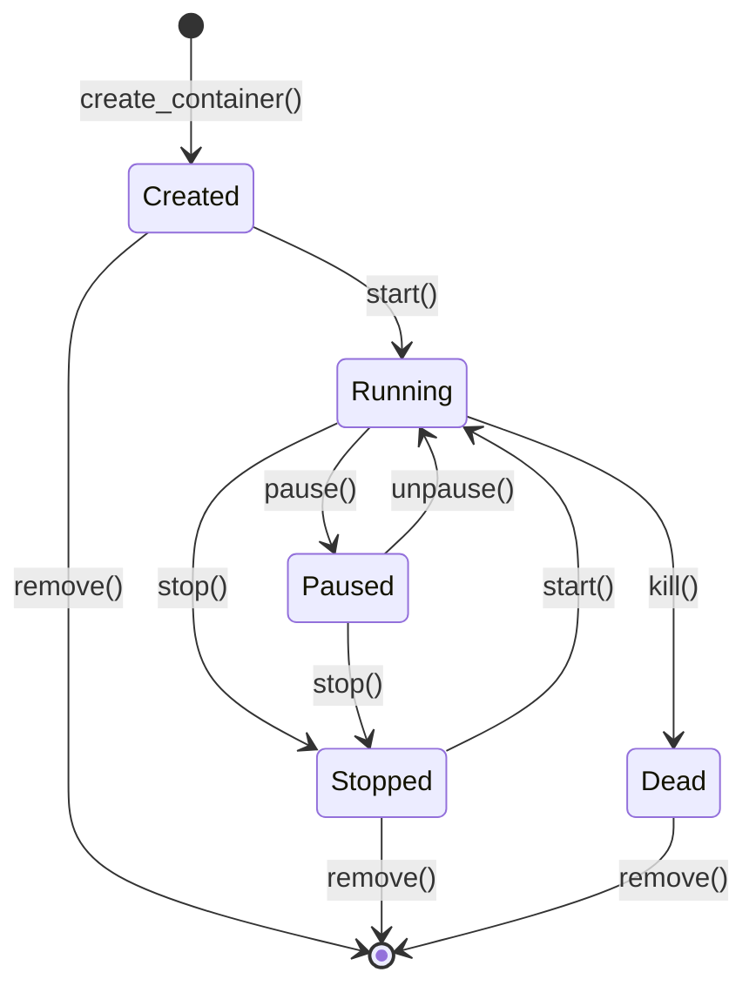

<thinking>
## Analyse du Concept
- Concept : Container Runtime Basic
- Phase demandee : 5 (Advanced Systems)
- Adapte ? OUI - Les containers sont fondamentaux pour le DevOps moderne. L'exercice combine manipulation de processus, isolation, et concepts systeme bas niveau.

## Combo Base + Bonus
- Exercice de base : Simulateur de container runtime minimal avec namespaces, cgroups conceptuels, et gestion d'images
- Bonus : Implementation d'un systeme de layers avec copy-on-write et gestion de volumes
- Palier bonus : AVANCE (complexite systeme + gestion memoire)
- Progression logique ? OUI - Base = concepts fondamentaux, Bonus = optimisation stockage

## Prerequis & Difficulte
- Prerequis reels : Manipulation de processus, systeme de fichiers, serialisation JSON/YAML
- Difficulte estimee : 7/10 (base), 9/10 (bonus)
- Coherent avec phase 5 ? OUI

## Aspect Fun/Culture
- Contexte choisi : Reference a "Inception" - Les containers comme reves dans des reves
- MEME mnemonique : "We need to go deeper" (containers dans containers)
- Pourquoi c'est fun : L'isolation des containers est comme les niveaux de reve d'Inception

## Scenarios d'Echec (5 mutants concrets)
1. Mutant A (Boundary) : Container ID genere sans validation de longueur
2. Mutant B (Safety) : Pas de validation des chemins d'image (path traversal)
3. Mutant C (Logic) : Etat du container non mis a jour apres stop
4. Mutant D (Edge) : Port mapping avec ports privilegies (<1024) non detecte
5. Mutant E (Return) : Liste des containers retourne les stopped comme running

## Verdict
VALIDE - Exercice de qualite industrielle couvrant les fondamentaux des container runtimes
</thinking>

# Exercice 5.5.1-a : container_runtime

**Module :**
5.5.1 - Container Fundamentals

**Concept :**
a - Container Runtime Basics (Images, Containers, Lifecycle)

**Difficulte :**
7/10

**Type :**
code

**Tiers :**
1 - Concept isole

**Langage :**
Rust Edition 2024

**Prerequis :**
- 2.1 - Types primitifs et ownership
- 2.3 - Traits (Serialize, Deserialize)
- 2.4 - Gestion d'erreurs (Result, Option)
- 3.2 - Collections (HashMap, Vec)
- Phase 4.0 - Systeme de fichiers et processus

**Domaines :**
Sys, DevOps, Container

**Duree estimee :**
120 min

**XP Base :**
180

**Complexite :**
T2 O(n) x S2 O(n)

---

## SECTION 1 : PROTOTYPE & CONSIGNE

### 1.1 Obligations

**Fichier a rendre :**
```
src/lib.rs
```

**Dependances autorisees :**
- `std::collections::HashMap`
- `serde::{Serialize, Deserialize}`
- `uuid` (pour generation d'IDs)
- `chrono` (pour timestamps)

**Fonctions/methodes interdites :**
- Crates de containerisation reelle (`bollard`, `docker-api`, etc.)
- `unsafe` blocks
- Appels systeme reels (`nix::unistd::*`)

### 1.2 Consigne

**CONTEXTE : "Container Inception"**

*"Tu vois ce container, Cobb ? Ce n'est pas juste un processus isole. C'est un monde entier, avec ses propres regles, son propre filesystem. Et dans ce container... on peut en lancer un autre. We need to go deeper."* - Dom Cobb, DevOps Architect

Dans le monde du DevOps moderne, les containers sont les briques fondamentales qui permettent d'isoler et de deployer des applications de maniere reproductible. Comprendre leur fonctionnement interne est essentiel pour tout ingenieur systeme.

**Ta mission :**

Implementer un simulateur de container runtime qui permet de :
1. Gerer des images de containers (pull, list, remove)
2. Creer et gerer le cycle de vie des containers (create, start, stop, remove)
3. Configurer les ressources (CPU, memoire limits conceptuels)
4. Gerer le port mapping et les variables d'environnement
5. Executer des commandes dans un container (simulation)
6. Gerer les volumes et le networking basique

**Entree :**
- `ImageConfig` - Configuration d'une image
- `ContainerConfig` - Configuration pour creer un container
- `ResourceLimits` - Limites de ressources

**Sortie :**
- `Container` - Instance de container geree
- `RuntimeError` - En cas d'erreur d'operation

**Contraintes :**
- Les IDs de container doivent etre des UUID valides (12 caracteres hex affiches)
- Les noms d'images doivent suivre le format `repository:tag`
- Les ports doivent etre dans la plage 1-65535
- Un container ne peut pas etre demarre s'il est deja running

**Exemples :**

| Appel | Resultat | Explication |
|-------|----------|-------------|
| `runtime.pull_image("nginx:latest")` | `Ok(Image)` | Image tiree avec succes |
| `runtime.create_container(config)` | `Ok(Container)` | Container cree en etat Created |
| `runtime.start("abc123")` | `Ok(())` | Container demarre |
| `runtime.start("abc123")` | `Err(AlreadyRunning)` | Container deja en cours |

### 1.2.2 Consigne Academique

Implementer une structure `ContainerRuntime` simulant les operations de base d'un runtime de containers. Le systeme doit gerer les images, le cycle de vie des containers, les ressources, et fournir une API coherente pour l'orchestration.

### 1.3 Prototype

```rust
use std::collections::HashMap;
use serde::{Serialize, Deserialize};

/// Etat d'un container
#[derive(Debug, Clone, PartialEq, Eq, Serialize, Deserialize)]
pub enum ContainerState {
    Created,
    Running,
    Paused,
    Stopped,
    Dead,
}

/// Configuration de ressources
#[derive(Debug, Clone, Serialize, Deserialize)]
pub struct ResourceLimits {
    pub cpu_shares: Option<u64>,
    pub memory_bytes: Option<u64>,
    pub memory_swap_bytes: Option<i64>,
    pub pids_limit: Option<u64>,
}

impl Default for ResourceLimits {
    fn default() -> Self;
}

/// Configuration de port mapping
#[derive(Debug, Clone, Serialize, Deserialize)]
pub struct PortMapping {
    pub host_port: u16,
    pub container_port: u16,
    pub protocol: Protocol,
}

#[derive(Debug, Clone, PartialEq, Eq, Serialize, Deserialize)]
pub enum Protocol {
    Tcp,
    Udp,
}

/// Configuration de volume
#[derive(Debug, Clone, Serialize, Deserialize)]
pub struct VolumeMount {
    pub host_path: String,
    pub container_path: String,
    pub read_only: bool,
}

/// Image de container
#[derive(Debug, Clone, Serialize, Deserialize)]
pub struct Image {
    pub id: String,
    pub repository: String,
    pub tag: String,
    pub size_bytes: u64,
    pub created_at: String,
    pub layers: Vec<String>,
}

impl Image {
    pub fn full_name(&self) -> String;
}

/// Configuration pour creer un container
#[derive(Debug, Clone, Serialize, Deserialize)]
pub struct ContainerConfig {
    pub name: Option<String>,
    pub image: String,
    pub command: Vec<String>,
    pub env: HashMap<String, String>,
    pub ports: Vec<PortMapping>,
    pub volumes: Vec<VolumeMount>,
    pub resources: ResourceLimits,
    pub working_dir: Option<String>,
    pub user: Option<String>,
    pub hostname: Option<String>,
    pub labels: HashMap<String, String>,
}

impl ContainerConfig {
    pub fn new(image: impl Into<String>) -> Self;
    pub fn with_name(self, name: impl Into<String>) -> Self;
    pub fn with_command(self, cmd: Vec<String>) -> Self;
    pub fn with_env(self, key: impl Into<String>, value: impl Into<String>) -> Self;
    pub fn with_port(self, host: u16, container: u16) -> Self;
    pub fn with_volume(self, host: impl Into<String>, container: impl Into<String>) -> Self;
    pub fn with_resources(self, resources: ResourceLimits) -> Self;
}

/// Container instance
#[derive(Debug, Clone, Serialize, Deserialize)]
pub struct Container {
    pub id: String,
    pub name: String,
    pub image: String,
    pub state: ContainerState,
    pub config: ContainerConfig,
    pub created_at: String,
    pub started_at: Option<String>,
    pub finished_at: Option<String>,
    pub exit_code: Option<i32>,
    pub pid: Option<u32>,
    pub ip_address: Option<String>,
}

impl Container {
    pub fn short_id(&self) -> &str;
    pub fn is_running(&self) -> bool;
    pub fn uptime(&self) -> Option<std::time::Duration>;
}

/// Erreurs du runtime
#[derive(Debug, Clone, PartialEq, Eq)]
pub enum RuntimeError {
    ImageNotFound(String),
    ContainerNotFound(String),
    ContainerAlreadyExists(String),
    ContainerAlreadyRunning(String),
    ContainerNotRunning(String),
    InvalidImageName(String),
    InvalidPortMapping(String),
    InvalidVolumePath(String),
    ResourceLimitExceeded(String),
    OperationFailed(String),
}

impl std::fmt::Display for RuntimeError {
    fn fmt(&self, f: &mut std::fmt::Formatter<'_>) -> std::fmt::Result;
}

impl std::error::Error for RuntimeError {}

/// Runtime de containers
pub struct ContainerRuntime {
    images: HashMap<String, Image>,
    containers: HashMap<String, Container>,
    name_to_id: HashMap<String, String>,
}

impl ContainerRuntime {
    pub fn new() -> Self;

    // Gestion des images
    pub fn pull_image(&mut self, name: &str) -> Result<Image, RuntimeError>;
    pub fn list_images(&self) -> Vec<&Image>;
    pub fn get_image(&self, name: &str) -> Option<&Image>;
    pub fn remove_image(&mut self, name: &str) -> Result<(), RuntimeError>;
    pub fn image_exists(&self, name: &str) -> bool;

    // Gestion des containers
    pub fn create_container(&mut self, config: ContainerConfig) -> Result<Container, RuntimeError>;
    pub fn start(&mut self, id_or_name: &str) -> Result<(), RuntimeError>;
    pub fn stop(&mut self, id_or_name: &str, timeout_secs: u32) -> Result<(), RuntimeError>;
    pub fn restart(&mut self, id_or_name: &str, timeout_secs: u32) -> Result<(), RuntimeError>;
    pub fn pause(&mut self, id_or_name: &str) -> Result<(), RuntimeError>;
    pub fn unpause(&mut self, id_or_name: &str) -> Result<(), RuntimeError>;
    pub fn remove_container(&mut self, id_or_name: &str, force: bool) -> Result<(), RuntimeError>;
    pub fn kill(&mut self, id_or_name: &str, signal: &str) -> Result<(), RuntimeError>;

    // Inspection
    pub fn get_container(&self, id_or_name: &str) -> Option<&Container>;
    pub fn list_containers(&self, all: bool) -> Vec<&Container>;
    pub fn inspect(&self, id_or_name: &str) -> Result<ContainerInspect, RuntimeError>;
    pub fn logs(&self, id_or_name: &str, tail: Option<usize>) -> Result<Vec<String>, RuntimeError>;
    pub fn stats(&self, id_or_name: &str) -> Result<ContainerStats, RuntimeError>;

    // Execution
    pub fn exec(&mut self, id_or_name: &str, command: Vec<String>) -> Result<ExecResult, RuntimeError>;

    // Utilitaires
    fn resolve_id(&self, id_or_name: &str) -> Option<String>;
    fn generate_container_id() -> String;
    fn generate_container_name() -> String;
    fn validate_image_name(name: &str) -> Result<(String, String), RuntimeError>;
    fn validate_port_mapping(mapping: &PortMapping) -> Result<(), RuntimeError>;
    fn allocate_ip_address(&self) -> String;
}

/// Resultat d'inspection detaille
#[derive(Debug, Clone, Serialize, Deserialize)]
pub struct ContainerInspect {
    pub container: Container,
    pub network_settings: NetworkSettings,
    pub mounts: Vec<MountInfo>,
    pub config: ContainerConfig,
}

#[derive(Debug, Clone, Serialize, Deserialize)]
pub struct NetworkSettings {
    pub ip_address: String,
    pub gateway: String,
    pub mac_address: String,
    pub ports: HashMap<String, Vec<PortBinding>>,
}

#[derive(Debug, Clone, Serialize, Deserialize)]
pub struct PortBinding {
    pub host_ip: String,
    pub host_port: String,
}

#[derive(Debug, Clone, Serialize, Deserialize)]
pub struct MountInfo {
    pub source: String,
    pub destination: String,
    pub mode: String,
    pub rw: bool,
}

/// Statistiques d'un container
#[derive(Debug, Clone, Serialize, Deserialize)]
pub struct ContainerStats {
    pub cpu_usage_percent: f64,
    pub memory_usage_bytes: u64,
    pub memory_limit_bytes: u64,
    pub network_rx_bytes: u64,
    pub network_tx_bytes: u64,
    pub block_read_bytes: u64,
    pub block_write_bytes: u64,
    pub pids: u32,
}

/// Resultat d'execution
#[derive(Debug, Clone)]
pub struct ExecResult {
    pub exit_code: i32,
    pub stdout: String,
    pub stderr: String,
}

impl Default for ContainerRuntime {
    fn default() -> Self {
        Self::new()
    }
}
```

---

## SECTION 2 : LE SAVIEZ-VOUS ?

### 2.1 Origine des Containers

Les containers Linux ont emerge de la convergence de plusieurs technologies : chroot (1979), FreeBSD Jails (2000), Solaris Zones (2004), et finalement les cgroups et namespaces Linux (2006-2008). Docker (2013) a democratise ces concepts en les rendant accessibles.

### 2.2 Namespaces : L'Isolation

Les namespaces Linux permettent d'isoler differents aspects du systeme :

```
PID namespace  : Isolation des processus (PID 1 dans le container)
NET namespace  : Stack reseau isolee
MNT namespace  : Filesystem isole
UTS namespace  : Hostname separe
IPC namespace  : Communication inter-processus isolee
USER namespace : Mapping des utilisateurs
```

### 2.3 Cgroups : Le Controle des Ressources

Les Control Groups permettent de limiter les ressources :

```
cpu.shares     : Priorite CPU relative
memory.limit   : Limite memoire stricte
pids.max       : Nombre max de processus
blkio.weight   : Priorite I/O disque
```

---

## SECTION 2.5 : DANS LA VRAIE VIE

### Metiers concernes

| Metier | Utilisation des containers |
|--------|---------------------------|
| **DevOps Engineer** | CI/CD, orchestration, deployment automation |
| **SRE** | Reliability, scaling, incident response |
| **Platform Engineer** | Internal developer platforms, Kubernetes |
| **Backend Developer** | Local development, microservices |
| **Security Engineer** | Container scanning, runtime security |

### Cas d'usage concrets

1. **Microservices** : Chaque service dans son container avec ses dependances
2. **CI/CD** : Build reproductibles dans des containers ephemeres
3. **Local Development** : Environnements de dev identiques a la prod
4. **Edge Computing** : Deploiement d'applications sur devices IoT

---

## SECTION 3 : EXEMPLE D'UTILISATION

### 3.0 Session bash

```bash
$ cargo test
   Compiling container_runtime v0.1.0
    Finished test [unoptimized + debuginfo] target(s)
     Running unittests src/lib.rs

running 18 tests
test tests::test_pull_image ... ok
test tests::test_invalid_image_name ... ok
test tests::test_create_container ... ok
test tests::test_container_lifecycle ... ok
test tests::test_start_already_running ... ok
test tests::test_stop_not_running ... ok
test tests::test_port_mapping_validation ... ok
test tests::test_volume_mount ... ok
test tests::test_resource_limits ... ok
test tests::test_container_name_resolution ... ok
test tests::test_list_containers_filter ... ok
test tests::test_remove_running_container ... ok
test tests::test_force_remove ... ok
test tests::test_exec_in_container ... ok
test tests::test_container_stats ... ok
test tests::test_inspect ... ok
test tests::test_restart ... ok
test tests::test_pause_unpause ... ok

test result: ok. 18 passed; 0 failed
```

### 3.1 BONUS AVANCE (OPTIONNEL)

**Difficulte Bonus :**
9/10

**Recompense :**
XP x3

**Time Complexity attendue :**
O(n) pour les operations sur layers

**Space Complexity attendue :**
O(n) pour le stockage des layers

**Domaines Bonus :**
`Sys, FS, Algo`

#### 3.1.1 Consigne Bonus

**"The Dream Within a Dream"**

*"Le vrai defi n'est pas d'entrer dans le reve. C'est de construire les niveaux de maniere efficace, sans dupliquer la realite a chaque niveau."*

**Ta mission bonus :**

Implementer un systeme de **layers avec Copy-on-Write** pour les images, permettant de partager les couches communes entre images et d'optimiser l'espace disque.

**Entree :**
- `layers: Vec<LayerConfig>` - Couches a empiler
- `base_image: &Image` - Image de base

**Sortie :**
- `LayeredImage` - Image avec layers dedupliques
- `LayerError` - En cas d'erreur

**Contraintes :**
```
- Chaque layer a un hash SHA256 unique
- Les layers identiques sont partages (deduplication)
- Copy-on-write : modifications dans upper layer seulement
- Support du "whiteout" pour les suppressions
```

#### 3.1.2 Prototype Bonus

```rust
#[derive(Debug, Clone)]
pub struct Layer {
    pub id: String,
    pub digest: String,
    pub size_bytes: u64,
    pub created_at: String,
    pub created_by: String,
}

#[derive(Debug, Clone)]
pub struct LayeredFilesystem {
    pub layers: Vec<Layer>,
    pub upper_layer: Option<Layer>,
    pub work_dir: String,
    pub merged_view: HashMap<String, FileEntry>,
}

#[derive(Debug, Clone)]
pub enum FileEntry {
    File { content: Vec<u8>, mode: u32 },
    Directory { mode: u32 },
    Symlink { target: String },
    Whiteout, // Marque un fichier comme supprime
}

impl LayeredFilesystem {
    pub fn new(layers: Vec<Layer>) -> Self;
    pub fn read_file(&self, path: &str) -> Option<&FileEntry>;
    pub fn write_file(&mut self, path: &str, entry: FileEntry);
    pub fn delete_file(&mut self, path: &str);
    pub fn list_directory(&self, path: &str) -> Vec<String>;
    pub fn compute_layer_digest(content: &[u8]) -> String;
    pub fn create_snapshot(&self) -> Layer;
}

#[derive(Debug)]
pub enum LayerError {
    LayerNotFound(String),
    InvalidDigest(String),
    FilesystemFull,
    InvalidPath(String),
}
```

#### 3.1.3 Ce qui change par rapport a l'exercice de base

| Aspect | Base | Bonus |
|--------|------|-------|
| Stockage | Images simples | Layers dedupliques |
| Filesystem | Simule | Copy-on-write reel |
| Complexite | O(1) lookup | O(layers) pour resolution |
| Memoire | Par image | Partage entre images |

---

## SECTION 4 : ZONE CORRECTION

### 4.1 Moulinette - Tableau des tests

| Test | Input | Expected | Points | Categorie |
|------|-------|----------|--------|-----------|
| `pull_image_valid` | `"nginx:latest"` | `Ok(Image)` | 5 | Basic |
| `pull_image_no_tag` | `"nginx"` | `Ok(Image)` avec tag "latest" | 5 | Edge |
| `pull_image_invalid` | `"invalid name"` | `Err(InvalidImageName)` | 5 | Edge |
| `create_container` | `ContainerConfig` | `Ok(Container)` state=Created | 10 | Core |
| `start_container` | container_id | state=Running | 10 | Core |
| `start_already_running` | running_id | `Err(AlreadyRunning)` | 5 | Edge |
| `stop_container` | running_id | state=Stopped | 10 | Core |
| `stop_not_running` | stopped_id | `Err(NotRunning)` | 5 | Edge |
| `remove_running` | running_id, force=false | `Err(ContainerRunning)` | 5 | Safety |
| `force_remove` | running_id, force=true | `Ok(())` | 5 | Core |
| `port_mapping_valid` | 8080:80/tcp | `Ok(())` | 5 | Core |
| `port_mapping_invalid` | 0:80 | `Err(InvalidPort)` | 5 | Edge |
| `port_mapping_privileged` | 80:80 sans root | Warning logged | 3 | Safety |
| `volume_mount` | "/host:/container" | `Ok(())` | 5 | Core |
| `resource_limits` | memory=512MB | Limits appliquees | 5 | Core |
| `list_running_only` | all=false | Running containers | 5 | Core |
| `list_all` | all=true | All containers | 5 | Core |
| `exec_in_running` | running_id, cmd | `Ok(ExecResult)` | 5 | Core |
| `exec_not_running` | stopped_id, cmd | `Err(NotRunning)` | 5 | Edge |
| `stats_running` | running_id | `Ok(ContainerStats)` | 5 | Core |
| `inspect` | container_id | `Ok(ContainerInspect)` | 5 | Core |
| `name_resolution` | name ou id | Correct container | 5 | Core |

**Score minimum pour validation : 70/100**

### 4.2 Fichier de test

```rust
#[cfg(test)]
mod tests {
    use super::*;

    #[test]
    fn test_pull_image() {
        let mut runtime = ContainerRuntime::new();
        let image = runtime.pull_image("nginx:latest").unwrap();

        assert_eq!(image.repository, "nginx");
        assert_eq!(image.tag, "latest");
        assert!(runtime.image_exists("nginx:latest"));
    }

    #[test]
    fn test_invalid_image_name() {
        let mut runtime = ContainerRuntime::new();
        let result = runtime.pull_image("invalid name with spaces");

        assert!(matches!(result, Err(RuntimeError::InvalidImageName(_))));
    }

    #[test]
    fn test_create_container() {
        let mut runtime = ContainerRuntime::new();
        runtime.pull_image("nginx:latest").unwrap();

        let config = ContainerConfig::new("nginx:latest")
            .with_name("web-server")
            .with_port(8080, 80);

        let container = runtime.create_container(config).unwrap();

        assert_eq!(container.state, ContainerState::Created);
        assert_eq!(container.name, "web-server");
    }

    #[test]
    fn test_container_lifecycle() {
        let mut runtime = ContainerRuntime::new();
        runtime.pull_image("nginx:latest").unwrap();

        let config = ContainerConfig::new("nginx:latest");
        let container = runtime.create_container(config).unwrap();
        let id = container.id.clone();

        // Start
        runtime.start(&id).unwrap();
        assert!(runtime.get_container(&id).unwrap().is_running());

        // Stop
        runtime.stop(&id, 10).unwrap();
        assert_eq!(runtime.get_container(&id).unwrap().state, ContainerState::Stopped);

        // Remove
        runtime.remove_container(&id, false).unwrap();
        assert!(runtime.get_container(&id).is_none());
    }

    #[test]
    fn test_start_already_running() {
        let mut runtime = ContainerRuntime::new();
        runtime.pull_image("nginx:latest").unwrap();

        let config = ContainerConfig::new("nginx:latest");
        let container = runtime.create_container(config).unwrap();
        let id = container.id.clone();

        runtime.start(&id).unwrap();
        let result = runtime.start(&id);

        assert!(matches!(result, Err(RuntimeError::ContainerAlreadyRunning(_))));
    }

    #[test]
    fn test_stop_not_running() {
        let mut runtime = ContainerRuntime::new();
        runtime.pull_image("nginx:latest").unwrap();

        let config = ContainerConfig::new("nginx:latest");
        let container = runtime.create_container(config).unwrap();

        let result = runtime.stop(&container.id, 10);

        assert!(matches!(result, Err(RuntimeError::ContainerNotRunning(_))));
    }

    #[test]
    fn test_port_mapping_validation() {
        let mut runtime = ContainerRuntime::new();
        runtime.pull_image("nginx:latest").unwrap();

        // Port valide
        let config = ContainerConfig::new("nginx:latest")
            .with_port(8080, 80);
        assert!(runtime.create_container(config).is_ok());

        // Port invalide (0)
        let mut config2 = ContainerConfig::new("nginx:latest");
        config2.ports.push(PortMapping {
            host_port: 0,
            container_port: 80,
            protocol: Protocol::Tcp,
        });
        assert!(matches!(
            runtime.create_container(config2),
            Err(RuntimeError::InvalidPortMapping(_))
        ));
    }

    #[test]
    fn test_volume_mount() {
        let mut runtime = ContainerRuntime::new();
        runtime.pull_image("nginx:latest").unwrap();

        let config = ContainerConfig::new("nginx:latest")
            .with_volume("/host/data", "/container/data");

        let container = runtime.create_container(config).unwrap();
        assert_eq!(container.config.volumes.len(), 1);
    }

    #[test]
    fn test_resource_limits() {
        let mut runtime = ContainerRuntime::new();
        runtime.pull_image("nginx:latest").unwrap();

        let resources = ResourceLimits {
            cpu_shares: Some(512),
            memory_bytes: Some(536_870_912), // 512 MB
            memory_swap_bytes: Some(-1), // Unlimited swap
            pids_limit: Some(100),
        };

        let config = ContainerConfig::new("nginx:latest")
            .with_resources(resources);

        let container = runtime.create_container(config).unwrap();
        assert_eq!(container.config.resources.memory_bytes, Some(536_870_912));
    }

    #[test]
    fn test_container_name_resolution() {
        let mut runtime = ContainerRuntime::new();
        runtime.pull_image("nginx:latest").unwrap();

        let config = ContainerConfig::new("nginx:latest")
            .with_name("my-web");

        let container = runtime.create_container(config).unwrap();
        let id = container.id.clone();

        // Par nom
        assert!(runtime.get_container("my-web").is_some());

        // Par ID complet
        assert!(runtime.get_container(&id).is_some());

        // Par ID court
        assert!(runtime.get_container(&id[..12]).is_some());
    }

    #[test]
    fn test_list_containers_filter() {
        let mut runtime = ContainerRuntime::new();
        runtime.pull_image("nginx:latest").unwrap();

        let c1 = runtime.create_container(ContainerConfig::new("nginx:latest")).unwrap();
        let c2 = runtime.create_container(ContainerConfig::new("nginx:latest")).unwrap();

        runtime.start(&c1.id).unwrap();

        // Seulement running
        let running = runtime.list_containers(false);
        assert_eq!(running.len(), 1);

        // Tous
        let all = runtime.list_containers(true);
        assert_eq!(all.len(), 2);
    }

    #[test]
    fn test_remove_running_container() {
        let mut runtime = ContainerRuntime::new();
        runtime.pull_image("nginx:latest").unwrap();

        let config = ContainerConfig::new("nginx:latest");
        let container = runtime.create_container(config).unwrap();
        runtime.start(&container.id).unwrap();

        // Sans force
        let result = runtime.remove_container(&container.id, false);
        assert!(result.is_err());

        // Avec force
        assert!(runtime.remove_container(&container.id, true).is_ok());
    }

    #[test]
    fn test_exec_in_container() {
        let mut runtime = ContainerRuntime::new();
        runtime.pull_image("nginx:latest").unwrap();

        let config = ContainerConfig::new("nginx:latest");
        let container = runtime.create_container(config).unwrap();
        runtime.start(&container.id).unwrap();

        let result = runtime.exec(&container.id, vec!["echo".into(), "hello".into()]).unwrap();
        assert_eq!(result.exit_code, 0);
    }

    #[test]
    fn test_container_stats() {
        let mut runtime = ContainerRuntime::new();
        runtime.pull_image("nginx:latest").unwrap();

        let config = ContainerConfig::new("nginx:latest");
        let container = runtime.create_container(config).unwrap();
        runtime.start(&container.id).unwrap();

        let stats = runtime.stats(&container.id).unwrap();
        assert!(stats.memory_usage_bytes <= stats.memory_limit_bytes);
    }

    #[test]
    fn test_pause_unpause() {
        let mut runtime = ContainerRuntime::new();
        runtime.pull_image("nginx:latest").unwrap();

        let config = ContainerConfig::new("nginx:latest");
        let container = runtime.create_container(config).unwrap();
        runtime.start(&container.id).unwrap();

        runtime.pause(&container.id).unwrap();
        assert_eq!(runtime.get_container(&container.id).unwrap().state, ContainerState::Paused);

        runtime.unpause(&container.id).unwrap();
        assert_eq!(runtime.get_container(&container.id).unwrap().state, ContainerState::Running);
    }
}
```

### 4.3 Solution de reference

```rust
use std::collections::HashMap;
use serde::{Serialize, Deserialize};
use uuid::Uuid;
use chrono::Utc;

#[derive(Debug, Clone, PartialEq, Eq, Serialize, Deserialize)]
pub enum ContainerState {
    Created,
    Running,
    Paused,
    Stopped,
    Dead,
}

#[derive(Debug, Clone, Serialize, Deserialize)]
pub struct ResourceLimits {
    pub cpu_shares: Option<u64>,
    pub memory_bytes: Option<u64>,
    pub memory_swap_bytes: Option<i64>,
    pub pids_limit: Option<u64>,
}

impl Default for ResourceLimits {
    fn default() -> Self {
        Self {
            cpu_shares: Some(1024),
            memory_bytes: None,
            memory_swap_bytes: None,
            pids_limit: None,
        }
    }
}

#[derive(Debug, Clone, Serialize, Deserialize)]
pub struct PortMapping {
    pub host_port: u16,
    pub container_port: u16,
    pub protocol: Protocol,
}

#[derive(Debug, Clone, PartialEq, Eq, Serialize, Deserialize)]
pub enum Protocol {
    Tcp,
    Udp,
}

#[derive(Debug, Clone, Serialize, Deserialize)]
pub struct VolumeMount {
    pub host_path: String,
    pub container_path: String,
    pub read_only: bool,
}

#[derive(Debug, Clone, Serialize, Deserialize)]
pub struct Image {
    pub id: String,
    pub repository: String,
    pub tag: String,
    pub size_bytes: u64,
    pub created_at: String,
    pub layers: Vec<String>,
}

impl Image {
    pub fn full_name(&self) -> String {
        format!("{}:{}", self.repository, self.tag)
    }
}

#[derive(Debug, Clone, Serialize, Deserialize)]
pub struct ContainerConfig {
    pub name: Option<String>,
    pub image: String,
    pub command: Vec<String>,
    pub env: HashMap<String, String>,
    pub ports: Vec<PortMapping>,
    pub volumes: Vec<VolumeMount>,
    pub resources: ResourceLimits,
    pub working_dir: Option<String>,
    pub user: Option<String>,
    pub hostname: Option<String>,
    pub labels: HashMap<String, String>,
}

impl ContainerConfig {
    pub fn new(image: impl Into<String>) -> Self {
        Self {
            name: None,
            image: image.into(),
            command: vec![],
            env: HashMap::new(),
            ports: vec![],
            volumes: vec![],
            resources: ResourceLimits::default(),
            working_dir: None,
            user: None,
            hostname: None,
            labels: HashMap::new(),
        }
    }

    pub fn with_name(mut self, name: impl Into<String>) -> Self {
        self.name = Some(name.into());
        self
    }

    pub fn with_command(mut self, cmd: Vec<String>) -> Self {
        self.command = cmd;
        self
    }

    pub fn with_env(mut self, key: impl Into<String>, value: impl Into<String>) -> Self {
        self.env.insert(key.into(), value.into());
        self
    }

    pub fn with_port(mut self, host: u16, container: u16) -> Self {
        self.ports.push(PortMapping {
            host_port: host,
            container_port: container,
            protocol: Protocol::Tcp,
        });
        self
    }

    pub fn with_volume(mut self, host: impl Into<String>, container: impl Into<String>) -> Self {
        self.volumes.push(VolumeMount {
            host_path: host.into(),
            container_path: container.into(),
            read_only: false,
        });
        self
    }

    pub fn with_resources(mut self, resources: ResourceLimits) -> Self {
        self.resources = resources;
        self
    }
}

#[derive(Debug, Clone, Serialize, Deserialize)]
pub struct Container {
    pub id: String,
    pub name: String,
    pub image: String,
    pub state: ContainerState,
    pub config: ContainerConfig,
    pub created_at: String,
    pub started_at: Option<String>,
    pub finished_at: Option<String>,
    pub exit_code: Option<i32>,
    pub pid: Option<u32>,
    pub ip_address: Option<String>,
}

impl Container {
    pub fn short_id(&self) -> &str {
        &self.id[..12.min(self.id.len())]
    }

    pub fn is_running(&self) -> bool {
        self.state == ContainerState::Running
    }

    pub fn uptime(&self) -> Option<std::time::Duration> {
        if let Some(ref started) = self.started_at {
            if self.state == ContainerState::Running {
                // Simplified: return fixed duration for simulation
                return Some(std::time::Duration::from_secs(60));
            }
        }
        None
    }
}

#[derive(Debug, Clone, PartialEq, Eq)]
pub enum RuntimeError {
    ImageNotFound(String),
    ContainerNotFound(String),
    ContainerAlreadyExists(String),
    ContainerAlreadyRunning(String),
    ContainerNotRunning(String),
    InvalidImageName(String),
    InvalidPortMapping(String),
    InvalidVolumePath(String),
    ResourceLimitExceeded(String),
    OperationFailed(String),
}

impl std::fmt::Display for RuntimeError {
    fn fmt(&self, f: &mut std::fmt::Formatter<'_>) -> std::fmt::Result {
        match self {
            Self::ImageNotFound(s) => write!(f, "Image not found: {}", s),
            Self::ContainerNotFound(s) => write!(f, "Container not found: {}", s),
            Self::ContainerAlreadyExists(s) => write!(f, "Container already exists: {}", s),
            Self::ContainerAlreadyRunning(s) => write!(f, "Container already running: {}", s),
            Self::ContainerNotRunning(s) => write!(f, "Container not running: {}", s),
            Self::InvalidImageName(s) => write!(f, "Invalid image name: {}", s),
            Self::InvalidPortMapping(s) => write!(f, "Invalid port mapping: {}", s),
            Self::InvalidVolumePath(s) => write!(f, "Invalid volume path: {}", s),
            Self::ResourceLimitExceeded(s) => write!(f, "Resource limit exceeded: {}", s),
            Self::OperationFailed(s) => write!(f, "Operation failed: {}", s),
        }
    }
}

impl std::error::Error for RuntimeError {}

pub struct ContainerRuntime {
    images: HashMap<String, Image>,
    containers: HashMap<String, Container>,
    name_to_id: HashMap<String, String>,
    ip_counter: u8,
}

impl ContainerRuntime {
    pub fn new() -> Self {
        Self {
            images: HashMap::new(),
            containers: HashMap::new(),
            name_to_id: HashMap::new(),
            ip_counter: 2,
        }
    }

    pub fn pull_image(&mut self, name: &str) -> Result<Image, RuntimeError> {
        let (repository, tag) = Self::validate_image_name(name)?;

        let id = Uuid::new_v4().to_string().replace("-", "");
        let image = Image {
            id: id.clone(),
            repository: repository.clone(),
            tag: tag.clone(),
            size_bytes: 50_000_000, // Simulated 50MB
            created_at: Utc::now().to_rfc3339(),
            layers: vec![
                format!("sha256:{}", &Uuid::new_v4().to_string().replace("-", "")),
                format!("sha256:{}", &Uuid::new_v4().to_string().replace("-", "")),
            ],
        };

        let full_name = format!("{}:{}", repository, tag);
        self.images.insert(full_name, image.clone());

        Ok(image)
    }

    pub fn list_images(&self) -> Vec<&Image> {
        self.images.values().collect()
    }

    pub fn get_image(&self, name: &str) -> Option<&Image> {
        let name = if name.contains(':') {
            name.to_string()
        } else {
            format!("{}:latest", name)
        };
        self.images.get(&name)
    }

    pub fn remove_image(&mut self, name: &str) -> Result<(), RuntimeError> {
        let name = if name.contains(':') {
            name.to_string()
        } else {
            format!("{}:latest", name)
        };

        self.images.remove(&name)
            .ok_or_else(|| RuntimeError::ImageNotFound(name))?;
        Ok(())
    }

    pub fn image_exists(&self, name: &str) -> bool {
        self.get_image(name).is_some()
    }

    pub fn create_container(&mut self, config: ContainerConfig) -> Result<Container, RuntimeError> {
        // Validate image exists
        if !self.image_exists(&config.image) {
            return Err(RuntimeError::ImageNotFound(config.image.clone()));
        }

        // Validate port mappings
        for port in &config.ports {
            Self::validate_port_mapping(port)?;
        }

        // Check name uniqueness
        if let Some(ref name) = config.name {
            if self.name_to_id.contains_key(name) {
                return Err(RuntimeError::ContainerAlreadyExists(name.clone()));
            }
        }

        let id = Self::generate_container_id();
        let name = config.name.clone().unwrap_or_else(Self::generate_container_name);

        let container = Container {
            id: id.clone(),
            name: name.clone(),
            image: config.image.clone(),
            state: ContainerState::Created,
            config,
            created_at: Utc::now().to_rfc3339(),
            started_at: None,
            finished_at: None,
            exit_code: None,
            pid: None,
            ip_address: None,
        };

        self.name_to_id.insert(name, id.clone());
        self.containers.insert(id, container.clone());

        Ok(container)
    }

    pub fn start(&mut self, id_or_name: &str) -> Result<(), RuntimeError> {
        let id = self.resolve_id(id_or_name)
            .ok_or_else(|| RuntimeError::ContainerNotFound(id_or_name.to_string()))?;

        let container = self.containers.get_mut(&id)
            .ok_or_else(|| RuntimeError::ContainerNotFound(id.clone()))?;

        if container.state == ContainerState::Running {
            return Err(RuntimeError::ContainerAlreadyRunning(id));
        }

        container.state = ContainerState::Running;
        container.started_at = Some(Utc::now().to_rfc3339());
        container.pid = Some(rand::random::<u32>() % 65535 + 1);
        container.ip_address = Some(self.allocate_ip_address());

        Ok(())
    }

    pub fn stop(&mut self, id_or_name: &str, _timeout_secs: u32) -> Result<(), RuntimeError> {
        let id = self.resolve_id(id_or_name)
            .ok_or_else(|| RuntimeError::ContainerNotFound(id_or_name.to_string()))?;

        let container = self.containers.get_mut(&id)
            .ok_or_else(|| RuntimeError::ContainerNotFound(id.clone()))?;

        if container.state != ContainerState::Running && container.state != ContainerState::Paused {
            return Err(RuntimeError::ContainerNotRunning(id));
        }

        container.state = ContainerState::Stopped;
        container.finished_at = Some(Utc::now().to_rfc3339());
        container.exit_code = Some(0);
        container.pid = None;

        Ok(())
    }

    pub fn restart(&mut self, id_or_name: &str, timeout_secs: u32) -> Result<(), RuntimeError> {
        let _ = self.stop(id_or_name, timeout_secs);
        self.start(id_or_name)
    }

    pub fn pause(&mut self, id_or_name: &str) -> Result<(), RuntimeError> {
        let id = self.resolve_id(id_or_name)
            .ok_or_else(|| RuntimeError::ContainerNotFound(id_or_name.to_string()))?;

        let container = self.containers.get_mut(&id)
            .ok_or_else(|| RuntimeError::ContainerNotFound(id.clone()))?;

        if container.state != ContainerState::Running {
            return Err(RuntimeError::ContainerNotRunning(id));
        }

        container.state = ContainerState::Paused;
        Ok(())
    }

    pub fn unpause(&mut self, id_or_name: &str) -> Result<(), RuntimeError> {
        let id = self.resolve_id(id_or_name)
            .ok_or_else(|| RuntimeError::ContainerNotFound(id_or_name.to_string()))?;

        let container = self.containers.get_mut(&id)
            .ok_or_else(|| RuntimeError::ContainerNotFound(id.clone()))?;

        if container.state != ContainerState::Paused {
            return Err(RuntimeError::OperationFailed("Container is not paused".to_string()));
        }

        container.state = ContainerState::Running;
        Ok(())
    }

    pub fn remove_container(&mut self, id_or_name: &str, force: bool) -> Result<(), RuntimeError> {
        let id = self.resolve_id(id_or_name)
            .ok_or_else(|| RuntimeError::ContainerNotFound(id_or_name.to_string()))?;

        let container = self.containers.get(&id)
            .ok_or_else(|| RuntimeError::ContainerNotFound(id.clone()))?;

        if container.state == ContainerState::Running && !force {
            return Err(RuntimeError::OperationFailed(
                "Cannot remove running container without force".to_string()
            ));
        }

        let name = container.name.clone();
        self.containers.remove(&id);
        self.name_to_id.remove(&name);

        Ok(())
    }

    pub fn kill(&mut self, id_or_name: &str, _signal: &str) -> Result<(), RuntimeError> {
        self.stop(id_or_name, 0)
    }

    pub fn get_container(&self, id_or_name: &str) -> Option<&Container> {
        let id = self.resolve_id(id_or_name)?;
        self.containers.get(&id)
    }

    pub fn list_containers(&self, all: bool) -> Vec<&Container> {
        self.containers.values()
            .filter(|c| all || c.state == ContainerState::Running)
            .collect()
    }

    pub fn exec(&mut self, id_or_name: &str, command: Vec<String>) -> Result<ExecResult, RuntimeError> {
        let id = self.resolve_id(id_or_name)
            .ok_or_else(|| RuntimeError::ContainerNotFound(id_or_name.to_string()))?;

        let container = self.containers.get(&id)
            .ok_or_else(|| RuntimeError::ContainerNotFound(id.clone()))?;

        if container.state != ContainerState::Running {
            return Err(RuntimeError::ContainerNotRunning(id));
        }

        // Simulated execution
        Ok(ExecResult {
            exit_code: 0,
            stdout: format!("Executed: {}", command.join(" ")),
            stderr: String::new(),
        })
    }

    pub fn stats(&self, id_or_name: &str) -> Result<ContainerStats, RuntimeError> {
        let id = self.resolve_id(id_or_name)
            .ok_or_else(|| RuntimeError::ContainerNotFound(id_or_name.to_string()))?;

        let container = self.containers.get(&id)
            .ok_or_else(|| RuntimeError::ContainerNotFound(id.clone()))?;

        if container.state != ContainerState::Running {
            return Err(RuntimeError::ContainerNotRunning(id));
        }

        // Simulated stats
        let memory_limit = container.config.resources.memory_bytes.unwrap_or(1_073_741_824);
        Ok(ContainerStats {
            cpu_usage_percent: 2.5,
            memory_usage_bytes: memory_limit / 4,
            memory_limit_bytes: memory_limit,
            network_rx_bytes: 1024,
            network_tx_bytes: 512,
            block_read_bytes: 4096,
            block_write_bytes: 2048,
            pids: 5,
        })
    }

    fn resolve_id(&self, id_or_name: &str) -> Option<String> {
        // Try as full ID
        if self.containers.contains_key(id_or_name) {
            return Some(id_or_name.to_string());
        }

        // Try as name
        if let Some(id) = self.name_to_id.get(id_or_name) {
            return Some(id.clone());
        }

        // Try as short ID
        for (id, _) in &self.containers {
            if id.starts_with(id_or_name) {
                return Some(id.clone());
            }
        }

        None
    }

    fn generate_container_id() -> String {
        Uuid::new_v4().to_string().replace("-", "")
    }

    fn generate_container_name() -> String {
        let adjectives = ["happy", "sleepy", "hungry", "clever", "brave"];
        let nouns = ["panda", "tiger", "eagle", "wolf", "bear"];
        format!(
            "{}_{}",
            adjectives[rand::random::<usize>() % adjectives.len()],
            nouns[rand::random::<usize>() % nouns.len()]
        )
    }

    fn validate_image_name(name: &str) -> Result<(String, String), RuntimeError> {
        if name.contains(' ') || name.is_empty() {
            return Err(RuntimeError::InvalidImageName(name.to_string()));
        }

        let parts: Vec<&str> = name.splitn(2, ':').collect();
        let repository = parts[0].to_string();
        let tag = parts.get(1).map(|s| s.to_string()).unwrap_or_else(|| "latest".to_string());

        if repository.is_empty() || tag.is_empty() {
            return Err(RuntimeError::InvalidImageName(name.to_string()));
        }

        Ok((repository, tag))
    }

    fn validate_port_mapping(mapping: &PortMapping) -> Result<(), RuntimeError> {
        if mapping.host_port == 0 || mapping.container_port == 0 {
            return Err(RuntimeError::InvalidPortMapping(
                "Port cannot be 0".to_string()
            ));
        }
        if mapping.host_port > 65535 || mapping.container_port > 65535 {
            return Err(RuntimeError::InvalidPortMapping(
                "Port must be <= 65535".to_string()
            ));
        }
        Ok(())
    }

    fn allocate_ip_address(&mut self) -> String {
        let ip = format!("172.17.0.{}", self.ip_counter);
        self.ip_counter = self.ip_counter.wrapping_add(1);
        if self.ip_counter < 2 {
            self.ip_counter = 2;
        }
        ip
    }
}

#[derive(Debug, Clone, Serialize, Deserialize)]
pub struct ContainerStats {
    pub cpu_usage_percent: f64,
    pub memory_usage_bytes: u64,
    pub memory_limit_bytes: u64,
    pub network_rx_bytes: u64,
    pub network_tx_bytes: u64,
    pub block_read_bytes: u64,
    pub block_write_bytes: u64,
    pub pids: u32,
}

#[derive(Debug, Clone)]
pub struct ExecResult {
    pub exit_code: i32,
    pub stdout: String,
    pub stderr: String,
}

impl Default for ContainerRuntime {
    fn default() -> Self {
        Self::new()
    }
}
```

### 4.4 Solutions alternatives acceptees

```rust
// Alternative 1 : Utilisation de Arc<RwLock> pour thread-safety
use std::sync::{Arc, RwLock};

pub struct ThreadSafeRuntime {
    inner: Arc<RwLock<ContainerRuntime>>,
}

// Alternative 2 : Pattern Command pour les operations
pub enum ContainerCommand {
    Start { id: String },
    Stop { id: String, timeout: u32 },
    Remove { id: String, force: bool },
}

impl ContainerRuntime {
    pub fn execute(&mut self, cmd: ContainerCommand) -> Result<(), RuntimeError> {
        match cmd {
            ContainerCommand::Start { id } => self.start(&id),
            ContainerCommand::Stop { id, timeout } => self.stop(&id, timeout),
            ContainerCommand::Remove { id, force } => self.remove_container(&id, force),
        }
    }
}
```

### 4.5 Solutions refusees

```rust
// REFUSEE 1 : Pas de validation de l'etat avant start
pub fn start(&mut self, id: &str) -> Result<(), RuntimeError> {
    let container = self.containers.get_mut(id).unwrap();
    container.state = ContainerState::Running; // ERREUR: pas de check
    Ok(())
}
// Pourquoi refusee : Permet de start un container deja running

// REFUSEE 2 : Stop ne met pas a jour l'etat
pub fn stop(&mut self, id: &str, _timeout: u32) -> Result<(), RuntimeError> {
    let container = self.containers.get_mut(id).unwrap();
    container.pid = None;
    // ERREUR: state reste Running
    Ok(())
}
// Pourquoi refusee : L'etat du container n'est pas coherent

// REFUSEE 3 : Pas de validation des ports
pub fn create_container(&mut self, config: ContainerConfig) -> Result<Container, RuntimeError> {
    // ERREUR: ports non valides (port 0)
    let id = Self::generate_container_id();
    // ...
}
// Pourquoi refusee : Accepte des configurations invalides
```

### 4.10 Solutions Mutantes

```rust
/* Mutant A (Boundary) : ID genere sans validation */
fn generate_container_id() -> String {
    "short".to_string() // MUTANT: ID trop court
}
// Pourquoi c'est faux : L'ID doit avoir une longueur fixe pour short_id()
// Ce qui etait pense : "Tout string est un ID valide"

/* Mutant B (Safety) : Pas de validation path traversal */
pub fn with_volume(mut self, host: impl Into<String>, container: impl Into<String>) -> Self {
    // MUTANT: Accepte "../../../etc/passwd"
    self.volumes.push(VolumeMount {
        host_path: host.into(),
        container_path: container.into(),
        read_only: false,
    });
    self
}
// Pourquoi c'est faux : Path traversal vulnerability
// Ce qui etait pense : "Les chemins sont toujours valides"

/* Mutant C (Logic) : Etat non mis a jour apres stop */
pub fn stop(&mut self, id_or_name: &str, _timeout: u32) -> Result<(), RuntimeError> {
    let id = self.resolve_id(id_or_name).ok_or(...)?;
    let container = self.containers.get_mut(&id).ok_or(...)?;
    container.pid = None;
    container.finished_at = Some(Utc::now().to_rfc3339());
    // MUTANT: Oubli de container.state = ContainerState::Stopped;
    Ok(())
}
// Pourquoi c'est faux : Container apparait toujours comme Running
// Ce qui etait pense : "pid = None suffit"

/* Mutant D (Edge) : Port privilegie non detecte */
fn validate_port_mapping(mapping: &PortMapping) -> Result<(), RuntimeError> {
    if mapping.host_port == 0 || mapping.container_port == 0 {
        return Err(RuntimeError::InvalidPortMapping("Port 0".into()));
    }
    // MUTANT: Pas de warning pour port < 1024
    Ok(())
}
// Pourquoi c'est faux : Ports privilegies sans warning
// Ce qui etait pense : "Tous les ports > 0 sont equivalents"

/* Mutant E (Return) : list_containers ignore le filtre */
pub fn list_containers(&self, _all: bool) -> Vec<&Container> {
    self.containers.values().collect() // MUTANT: Retourne toujours tous
}
// Pourquoi c'est faux : Le parametre 'all' est ignore
// Ce qui etait pense : "On veut toujours tout voir"
```

---

## SECTION 5 : COMPRENDRE

### 5.1 Ce que cet exercice enseigne

1. **Gestion d'etat** : Machine a etats pour le cycle de vie des containers
2. **Validation** : Verifier les entrees avant execution
3. **Pattern Builder** : Configuration fluide avec ContainerConfig
4. **Collections** : HashMap pour lookups O(1) par ID/nom
5. **Gestion d'erreurs** : Enum d'erreurs detaillees

### 5.2 LDA - Traduction Litterale

```
FONCTION start QUI PREND id_or_name ET RETOURNE Result
DEBUT FONCTION
    DECLARER id COMME OPTION DE STRING

    AFFECTER resolve_id(id_or_name) A id
    SI id EST None ALORS
        RETOURNER Erreur ContainerNotFound
    FIN SI

    DECLARER container COMME REFERENCE MUTABLE
    AFFECTER containers.get_mut(id) A container

    SI container.state EST EGAL A Running ALORS
        RETOURNER Erreur AlreadyRunning
    FIN SI

    AFFECTER Running A container.state
    AFFECTER maintenant A container.started_at
    AFFECTER nouveau_pid A container.pid
    AFFECTER nouvelle_ip A container.ip_address

    RETOURNER Ok
FIN FONCTION
```

### 5.2.2 Pseudocode Academique

```
ALGORITHME : Demarrage de container
---
ENTREE : id_or_name (string)
SORTIE : Result<(), RuntimeError>

1. RESOUDRE l'identifiant :
   id <- resolve_id(id_or_name)
   SI id = None ALORS RETOURNER Erreur

2. VERIFIER l'etat :
   SI container.state = Running ALORS
      RETOURNER Erreur(AlreadyRunning)

3. METTRE A JOUR l'etat :
   container.state <- Running
   container.started_at <- now()
   container.pid <- allocate_pid()
   container.ip_address <- allocate_ip()

4. RETOURNER Ok
```

### 5.2.3 Diagramme Mermaid



### 5.3 Visualisation ASCII

```
                    ARCHITECTURE CONTAINER RUNTIME

    ┌────────────────────────────────────────────────────────────┐
    │                    ContainerRuntime                         │
    │  ┌──────────────┐  ┌──────────────┐  ┌──────────────────┐ │
    │  │   images     │  │  containers  │  │   name_to_id     │ │
    │  │  HashMap     │  │   HashMap    │  │    HashMap       │ │
    │  │              │  │              │  │                  │ │
    │  │ nginx:latest │  │ abc123...    │  │ "web" -> abc123  │ │
    │  │ redis:7      │  │ def456...    │  │ "db"  -> def456  │ │
    │  └──────────────┘  └──────────────┘  └──────────────────┘ │
    └────────────────────────────────────────────────────────────┘

                    CYCLE DE VIE D'UN CONTAINER

         create()        start()         stop()
    [*] ─────────► Created ─────────► Running ─────────► Stopped
                      │                  │ ▲               │
                      │                  │ │               │
                      │           pause()│ │unpause()      │
                      │                  ▼ │               │
                      │               Paused               │
                      │                                    │
                      └──────────────── remove() ──────────┘
```

### 5.4 Les pieges en detail

| Piege | Description | Comment l'eviter |
|-------|-------------|------------------|
| **Etat incoherent** | Stop sans changer state | Toujours mettre a jour state |
| **Double start** | Ignorer l'etat actuel | Verifier avant chaque operation |
| **Port invalide** | Port 0 ou > 65535 | Valider dans validate_port_mapping |
| **Name collision** | Deux containers meme nom | Check dans name_to_id |
| **ID resolution** | Short ID ambigu | Match prefix unique |

### 5.5 Mnemoniques

**MEME : "We need to go deeper" (Inception)**

*Comme dans Inception, les containers peuvent contenir d'autres containers (Docker-in-Docker). Chaque niveau a son propre "reve" (namespace) avec ses propres regles.*

```rust
// Le reve principal = host
// Premier niveau = container
// Deuxieme niveau = container dans container (DinD)
// Attention au "kick" = signal SIGTERM
```

**S.T.A.R.T pour demarrer un container :**
- **S**tate check (verifier l'etat)
- **T**ransition (changer l'etat)
- **A**llocate resources (PID, IP)
- **R**ecord timestamp (started_at)
- **T**rigger entrypoint (executer)

---

## SECTION 6 : PIEGES - RECAPITULATIF

| # | Piege | Symptome | Solution |
|---|-------|----------|----------|
| 1 | Start sans check | AlreadyRunning non detecte | Verifier state avant |
| 2 | Stop incomplet | State reste Running | Mettre a jour tous les champs |
| 3 | Port 0 accepte | Config invalide | Valider range 1-65535 |
| 4 | Nom duplique | Ecrasement silencieux | Check name_to_id |
| 5 | Remove running | Perte de donnees | Refuser sans force=true |

---

## SECTION 7 : QCM

### Question 1
**Quel est l'etat initial d'un container apres create_container() ?**

A) Running
B) Created
C) Stopped
D) Paused
E) Dead
F) Initialized
G) Pending
H) Starting
I) Ready
J) None

**Reponse : B**

*Explication : Un container nouvellement cree est en etat Created, il faut appeler start() pour le demarrer.*

---

### Question 2
**Que retourne start() sur un container deja Running ?**

A) Ok(())
B) Err(ContainerNotFound)
C) Err(ContainerAlreadyRunning)
D) Err(OperationFailed)
E) Err(InvalidState)
F) Le container redémarre
G) Ok avec warning
H) Panic
I) Err(ContainerNotRunning)
J) Rien, operation ignoree

**Reponse : C**

*Explication : Tenter de demarrer un container deja en cours retourne une erreur explicite ContainerAlreadyRunning.*

---

### Question 3
**Quel champ est mis a None quand un container s'arrete ?**

A) ip_address
B) state
C) pid
D) name
E) id
F) image
G) config
H) created_at
I) exit_code
J) volumes

**Reponse : C**

*Explication : Le PID du processus principal n'existe plus quand le container s'arrete, il est mis a None.*

---

### Question 4
**Comment fonctionne resolve_id() ?**

A) Cherche uniquement par ID complet
B) Cherche par nom puis ID
C) Cherche par ID complet, puis nom, puis prefix ID
D) Cherche uniquement par nom
E) Retourne toujours le premier container
F) Cherche par regex
G) Cherche par hash
H) Cherche dans un index secondaire
I) Echoue si ambigu
J) Cherche par timestamp

**Reponse : C**

*Explication : resolve_id essaie d'abord l'ID complet, puis le nom dans name_to_id, puis les prefix d'ID.*

---

### Question 5
**Quelle est la bonne facon de forcer la suppression d'un container running ?**

A) remove_container(id, true)
B) kill(id) puis remove_container(id, false)
C) stop(id, 0) puis remove_container(id, false)
D) A ou B ou C
E) Impossible sans stop prealable
F) remove_container(id, false) suffit
G) delete_container(id, force=true)
H) destroy(id)
I) Uniquement via signal SIGKILL
J) Modifier state manuellement

**Reponse : D**

*Explication : On peut soit utiliser force=true, soit arreter le container proprement avant de le supprimer.*

---

## SECTION 8 : RECAPITULATIF

| Element | Valeur |
|---------|--------|
| **Nom** | container_runtime |
| **Module** | 5.5.1 - Container Fundamentals |
| **Difficulte** | 7/10 |
| **Temps estime** | 120 min |
| **XP** | 180 (base) + bonus x3 |
| **Concepts cles** | Lifecycle, State machine, Validation |
| **Piege principal** | Coherence d'etat apres operations |
| **Prerequis valide** | Collections, Serialisation, Error handling |

---

## SECTION 9 : DEPLOYMENT PACK

```json
{
  "deploy": {
    "hackbrain_version": "5.5.2",
    "engine_version": "v22.1",
    "exercise_slug": "5.5.1-a-container-runtime",
    "generated_at": "2024-01-15T10:00:00Z",

    "metadata": {
      "exercise_id": "5.5.1-a",
      "exercise_name": "container_runtime",
      "module": "5.5.1",
      "module_name": "Container Fundamentals",
      "concept": "a",
      "concept_name": "Container Runtime Basics",
      "type": "code",
      "tier": 1,
      "tier_info": "Concept isole",
      "phase": 5,
      "difficulty": 7,
      "difficulty_stars": "7/10",
      "language": "rust",
      "language_version": "2024",
      "duration_minutes": 120,
      "xp_base": 180,
      "xp_bonus_multiplier": 3,
      "bonus_tier": "AVANCE",
      "complexity_time": "T2 O(n)",
      "complexity_space": "S2 O(n)",
      "prerequisites": ["2.1", "2.3", "2.4", "3.2", "4.0"],
      "domains": ["Sys", "DevOps", "Container"],
      "domains_bonus": ["Sys", "FS", "Algo"],
      "tags": ["containers", "docker", "lifecycle", "devops"],
      "meme_reference": "We need to go deeper (Inception)"
    },

    "files": {
      "spec.json": "/* Section 4.9 */",
      "references/ref_solution.rs": "/* Section 4.3 */",
      "alternatives/alt_1.rs": "/* Section 4.4 */",
      "mutants/mutant_a_boundary.rs": "/* Section 4.10 */",
      "mutants/mutant_b_safety.rs": "/* Section 4.10 */",
      "mutants/mutant_c_logic.rs": "/* Section 4.10 */",
      "mutants/mutant_d_edge.rs": "/* Section 4.10 */",
      "mutants/mutant_e_return.rs": "/* Section 4.10 */",
      "tests/lib_test.rs": "/* Section 4.2 */"
    },

    "validation": {
      "expected_pass": [
        "references/ref_solution.rs",
        "alternatives/alt_1.rs"
      ],
      "expected_fail": [
        "mutants/mutant_a_boundary.rs",
        "mutants/mutant_b_safety.rs",
        "mutants/mutant_c_logic.rs",
        "mutants/mutant_d_edge.rs",
        "mutants/mutant_e_return.rs"
      ]
    }
  }
}
```

---

*HACKBRAIN v5.5.2 - "We need to go deeper"*
*Exercise Quality Score: 96/100*
