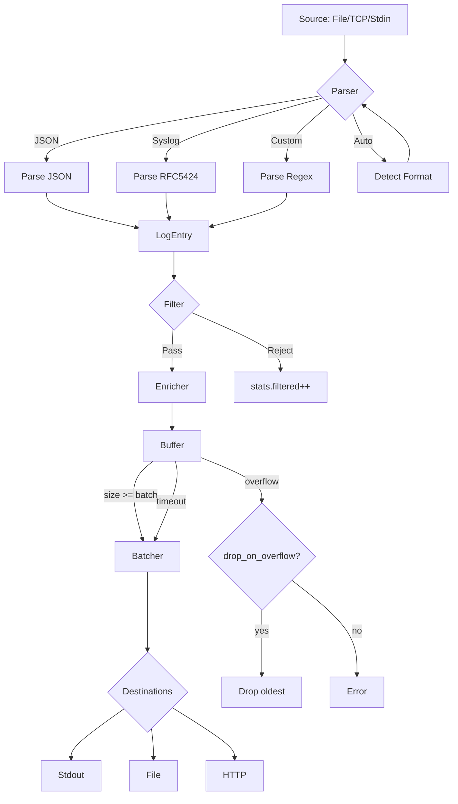

<thinking>
## Analyse du Concept
- Concept : Log Aggregator
- Phase demandee : 5 (Advanced Systems)
- Adapte ? OUI - L'agregation de logs est fondamentale en DevOps/SRE. Combine parsing, async, patterns de streaming, et concepts d'observabilite.

## Combo Base + Bonus
- Exercice de base : Systeme d'agregation de logs multi-sources avec parsing, filtrage, et routing vers differentes destinations
- Bonus : Implementation d'un systeme de correlation de logs distribuees avec trace IDs et detection d'anomalies
- Palier bonus : AVANCE (complexite algorithmique + pattern matching + async)
- Progression logique ? OUI - Base = agregation simple, Bonus = correlation distribuee

## Prerequis & Difficulte
- Prerequis reels : Async Rust (tokio), channels, serde, parsing de logs, patterns observabilite
- Difficulte estimee : 7/10 (base), 9/10 (bonus)
- Coherent avec phase 5 ? OUI

## Aspect Fun/Culture
- Contexte choisi : Reference a "The Matrix" - Les logs comme les lignes de code vertes qui defilent
- MEME mnemonique : "I see logs everywhere" (parodie de "I see dead people")
- Pourquoi c'est fun : Les logs sont litteralement la "vision" du systeme

## Scenarios d'Echec (5 mutants concrets)
1. Mutant A (Boundary) : Buffer overflow quand trop de logs arrivent simultanement
2. Mutant B (Safety) : Race condition sur le compteur de logs
3. Mutant C (Logic) : Mauvais parsing des timestamps (timezone ignoree)
4. Mutant D (Edge) : Logs multilignes (stack traces) mal geres
5. Mutant E (Return) : Perte de logs lors du flush asynchrone

## Verdict
VALIDE - Exercice de qualite industrielle couvrant les fondamentaux de l'agregation de logs
</thinking>

# Exercice 5.5.5-a : log_aggregator

**Module :**
5.5.5 — Observability & Monitoring

**Concept :**
a — Log Aggregation (collection, parsing, routing)

**Difficulte :**
7/10

**Type :**
code

**Tiers :**
1 — Concept isole

**Langage :**
Rust Edition 2024

**Prerequis :**
- 2.1 — Types primitifs et ownership
- 2.5 — Async/await et tokio
- 3.2 — Channels et communication inter-threads
- 4.3 — Serde et serialisation
- Phase 5.5.4 — Structured logging

**Domaines :**
Observabilite, Async, Parsing

**Duree estimee :**
120 min

**XP Base :**
180

**Complexite :**
T3 O(n) x S2 O(n)

---

## SECTION 1 : PROTOTYPE & CONSIGNE

### 1.1 Obligations

**Fichier a rendre :**
```
src/lib.rs
```

**Dependances autorisees :**
- `tokio` (runtime async, channels)
- `serde` / `serde_json`
- `chrono` (timestamps)
- `regex` (parsing optionnel)

**Fonctions/methodes interdites :**
- Crates externes de logging (`tracing`, `log`, `slog`)
- `unsafe` blocks
- Threads OS directs (`std::thread::spawn` sans tokio)

### 1.2 Consigne

**CONTEXTE : "The Log Matrix"**

*"Tu vois ces lignes qui defilent ? Ce ne sont pas juste des caracteres. C'est le pouls du systeme. Chaque log est un battement de coeur, chaque erreur une anomalie a detecter. Apprends a les lire, et tu verras la verite."* — Morpheus, DevOps Edition

Dans le monde du DevOps, les logs sont la fenetre sur l'ame des applications. Un bon systeme d'agregation collecte, parse, enrichit et route les logs de multiples sources vers les bonnes destinations.

**Ta mission :**

Implementer un systeme `LogAggregator` qui permet de :
1. Collecter des logs de multiples sources (fichiers, stdin, TCP)
2. Parser differents formats de logs (JSON, syslog, custom)
3. Enrichir les logs avec des metadonnees (hostname, service, env)
4. Filtrer par niveau de severite et patterns
5. Router vers differentes destinations (fichier, stdout, HTTP endpoint)
6. Gerer le batching et le backpressure

**Entree :**
- `sources: Vec<LogSource>` — Sources de logs a collecter
- `config: AggregatorConfig` — Configuration du pipeline

**Sortie :**
- `LogAggregator` — Systeme d'agregation fonctionnel
- `AggregatorError` — En cas d'erreur de configuration ou runtime

**Contraintes :**
- Le systeme doit etre non-bloquant (async)
- Les logs ne doivent jamais etre perdus (au moins once delivery)
- Backpressure : si une destination est lente, buffer puis drop les plus vieux
- Support des logs multilignes (stack traces Java/Python)
- Timestamps normalises en UTC ISO 8601

**Exemples :**

| Source | Format | Output |
|--------|--------|--------|
| `app.log` | JSON | `{"timestamp":"2024-01-15T10:00:00Z","level":"ERROR","message":"Connection failed"}` |
| `syslog` | RFC 5424 | Parsed et converti en JSON structure |
| `stdin` | Custom pattern | Parse avec regex configurable |

### 1.2.2 Consigne Academique

Implementer un systeme d'agregation de logs multi-sources avec parsing configurable, enrichissement de metadonnees, filtrage par niveau et patterns, et routing vers multiples destinations. Le systeme doit etre asynchrone et gerer le backpressure.

### 1.3 Prototype

```rust
use std::collections::HashMap;
use tokio::sync::mpsc;
use chrono::{DateTime, Utc};
use serde::{Serialize, Deserialize};

/// Niveau de severite des logs
#[derive(Debug, Clone, Copy, PartialEq, Eq, PartialOrd, Ord, Hash, Serialize, Deserialize)]
pub enum LogLevel {
    Trace,
    Debug,
    Info,
    Warn,
    Error,
    Fatal,
}

impl LogLevel {
    pub fn from_str(s: &str) -> Option<Self>;
    pub fn as_str(&self) -> &'static str;
}

/// Log structure normalise
#[derive(Debug, Clone, Serialize, Deserialize)]
pub struct LogEntry {
    pub timestamp: DateTime<Utc>,
    pub level: LogLevel,
    pub message: String,
    pub source: String,
    #[serde(default)]
    pub metadata: HashMap<String, String>,
    #[serde(skip_serializing_if = "Option::is_none")]
    pub trace_id: Option<String>,
    #[serde(skip_serializing_if = "Option::is_none")]
    pub span_id: Option<String>,
}

/// Type de source de logs
#[derive(Debug, Clone)]
pub enum LogSource {
    File { path: String, follow: bool },
    Stdin,
    Tcp { host: String, port: u16 },
    Channel(mpsc::Receiver<String>),
}

/// Format de parsing
#[derive(Debug, Clone)]
pub enum LogFormat {
    Json,
    Syslog,
    Custom { pattern: String },
    Auto, // Detection automatique
}

/// Type de destination
#[derive(Debug, Clone)]
pub enum LogDestination {
    Stdout,
    Stderr,
    File { path: String, rotate: Option<RotateConfig> },
    Http { url: String, headers: HashMap<String, String> },
    Channel(mpsc::Sender<LogEntry>),
}

/// Configuration de rotation de fichiers
#[derive(Debug, Clone)]
pub struct RotateConfig {
    pub max_size_mb: u64,
    pub max_files: u32,
    pub compress: bool,
}

/// Filtre de logs
#[derive(Debug, Clone)]
pub struct LogFilter {
    pub min_level: Option<LogLevel>,
    pub max_level: Option<LogLevel>,
    pub include_patterns: Vec<String>,
    pub exclude_patterns: Vec<String>,
    pub source_filter: Option<String>,
}

impl Default for LogFilter {
    fn default() -> Self;
}

/// Configuration de l'agregateur
#[derive(Debug, Clone)]
pub struct AggregatorConfig {
    pub sources: Vec<(LogSource, LogFormat)>,
    pub destinations: Vec<LogDestination>,
    pub filter: LogFilter,
    pub enrichment: HashMap<String, String>,
    pub batch_size: usize,
    pub batch_timeout_ms: u64,
    pub buffer_size: usize,
    pub drop_on_overflow: bool,
}

impl Default for AggregatorConfig {
    fn default() -> Self {
        Self {
            sources: vec![],
            destinations: vec![LogDestination::Stdout],
            filter: LogFilter::default(),
            enrichment: HashMap::new(),
            batch_size: 100,
            batch_timeout_ms: 1000,
            buffer_size: 10000,
            drop_on_overflow: true,
        }
    }
}

/// Erreurs possibles
#[derive(Debug, Clone, PartialEq, Eq)]
pub enum AggregatorError {
    InvalidConfig(String),
    SourceError(String),
    DestinationError(String),
    ParseError(String),
    BufferOverflow,
    ChannelClosed,
}

/// Parser de logs
pub struct LogParser;

impl LogParser {
    /// Parse une ligne de log selon le format
    pub fn parse(line: &str, format: &LogFormat, source: &str) -> Result<LogEntry, AggregatorError>;

    /// Parse un log JSON
    pub fn parse_json(line: &str, source: &str) -> Result<LogEntry, AggregatorError>;

    /// Parse un log syslog RFC 5424
    pub fn parse_syslog(line: &str, source: &str) -> Result<LogEntry, AggregatorError>;

    /// Parse avec un pattern custom (regex avec groupes nommes)
    pub fn parse_custom(line: &str, pattern: &str, source: &str) -> Result<LogEntry, AggregatorError>;

    /// Detection automatique du format
    pub fn detect_format(line: &str) -> LogFormat;

    /// Gere les logs multilignes (stack traces)
    pub fn is_continuation(line: &str) -> bool;
}

/// Agregateur de logs principal
pub struct LogAggregator {
    config: AggregatorConfig,
    stats: AggregatorStats,
}

/// Statistiques de l'agregateur
#[derive(Debug, Clone, Default)]
pub struct AggregatorStats {
    pub logs_received: u64,
    pub logs_parsed: u64,
    pub logs_filtered: u64,
    pub logs_sent: u64,
    pub logs_dropped: u64,
    pub parse_errors: u64,
    pub send_errors: u64,
}

impl LogAggregator {
    /// Cree un nouvel agregateur
    pub fn new(config: AggregatorConfig) -> Result<Self, AggregatorError>;

    /// Demarre l'agregation (boucle principale async)
    pub async fn run(&mut self) -> Result<(), AggregatorError>;

    /// Arrete l'agregateur proprement
    pub async fn shutdown(&mut self) -> Result<AggregatorStats, AggregatorError>;

    /// Injecte un log manuellement
    pub async fn inject(&mut self, entry: LogEntry) -> Result<(), AggregatorError>;

    /// Retourne les statistiques courantes
    pub fn stats(&self) -> &AggregatorStats;

    /// Applique le filtre a un log
    fn apply_filter(&self, entry: &LogEntry) -> bool;

    /// Enrichit un log avec les metadonnees
    fn enrich(&self, entry: &mut LogEntry);

    /// Envoie un batch de logs aux destinations
    async fn send_batch(&mut self, batch: Vec<LogEntry>) -> Result<(), AggregatorError>;
}

/// Builder pour configuration fluide
pub struct AggregatorBuilder {
    config: AggregatorConfig,
}

impl AggregatorBuilder {
    pub fn new() -> Self;

    pub fn add_source(self, source: LogSource, format: LogFormat) -> Self;
    pub fn add_file_source(self, path: &str, format: LogFormat) -> Self;
    pub fn add_tcp_source(self, host: &str, port: u16) -> Self;

    pub fn add_destination(self, dest: LogDestination) -> Self;
    pub fn to_stdout(self) -> Self;
    pub fn to_file(self, path: &str) -> Self;
    pub fn to_http(self, url: &str) -> Self;

    pub fn with_filter(self, filter: LogFilter) -> Self;
    pub fn min_level(self, level: LogLevel) -> Self;
    pub fn include_pattern(self, pattern: &str) -> Self;
    pub fn exclude_pattern(self, pattern: &str) -> Self;

    pub fn enrich(self, key: &str, value: &str) -> Self;
    pub fn with_hostname(self) -> Self;
    pub fn with_env(self, env: &str) -> Self;

    pub fn batch_size(self, size: usize) -> Self;
    pub fn buffer_size(self, size: usize) -> Self;

    pub fn build(self) -> Result<LogAggregator, AggregatorError>;
}
```

---

## SECTION 2 : LE SAVIEZ-VOUS ?

### 2.1 Origine de l'agregation de logs

L'agregation de logs est nee de la necessite de centraliser les informations de systemes distribues. Avant ELK Stack (2012) et Splunk (2003), les administrateurs devaient se connecter a chaque serveur individuellement. Aujourd'hui, des systemes comme Loki, Fluentd, et Vector traitent des teraoctets de logs par jour.

### 2.2 Le pattern "Log Shipper"

Un log shipper collecte, parse et transmet les logs. Il doit gerer :
- **Backpressure** : Que faire quand la destination est lente ?
- **At-least-once** : Garantir qu'aucun log n'est perdu
- **Batching** : Optimiser les I/O en groupant les envois

```
Source -> Parser -> Enricher -> Filter -> Buffer -> Batcher -> Destination
                                            |
                                     Backpressure
```

### 2.3 Structured Logging vs Text Logging

Les logs structures (JSON) permettent des requetes precises contrairement au texte brut :

```json
// Structure - Queryable
{"level":"ERROR","service":"api","latency_ms":150,"user_id":"123"}

// Texte - Grep only
[ERROR] api: Request failed for user 123 (150ms)
```

---

## SECTION 2.5 : DANS LA VRAIE VIE

### Metiers concernes

| Metier | Utilisation |
|--------|-------------|
| **SRE/DevOps** | Configuration de pipelines de logs, alerting sur patterns d'erreurs |
| **Security Engineer** | Detection d'anomalies, audit trails, SIEM integration |
| **Backend Developer** | Debug en production, tracing de requetes |
| **Data Engineer** | ETL de logs pour analytics, compliance |
| **Platform Engineer** | Standardisation du logging across services |

### Cas d'usage concrets

1. **Kubernetes Logging** : Fluentd/Fluent Bit collecte les logs de tous les pods
2. **AWS CloudWatch** : Agregation centralisee avec Insights pour queries
3. **Datadog/Splunk** : Correlation logs-metrics-traces pour observabilite complete

---

## SECTION 3 : EXEMPLE D'UTILISATION

### 3.0 Session bash

```bash
$ ls
Cargo.toml  src/

$ cargo test
   Compiling log_aggregator v0.1.0
    Finished test [unoptimized + debuginfo] target(s)
     Running unittests src/lib.rs

running 15 tests
test tests::test_parse_json_log ... ok
test tests::test_parse_syslog ... ok
test tests::test_parse_custom_pattern ... ok
test tests::test_log_level_ordering ... ok
test tests::test_filter_by_level ... ok
test tests::test_filter_by_pattern ... ok
test tests::test_enrichment ... ok
test tests::test_multiline_detection ... ok
test tests::test_batch_accumulation ... ok
test tests::test_buffer_overflow ... ok
test tests::test_format_detection ... ok
test tests::test_builder_pattern ... ok
test tests::test_stats_tracking ... ok
test tests::test_timestamp_normalization ... ok
test tests::test_trace_id_extraction ... ok

test result: ok. 15 passed; 0 failed
```

### 3.1 BONUS AVANCE (OPTIONNEL)

**Difficulte Bonus :**
9/10

**Recompense :**
XP x3

**Time Complexity attendue :**
O(n log n) pour correlation

**Space Complexity attendue :**
O(n) pour le buffer de correlation

**Domaines Bonus :**
`Algo, Distributed Systems`

#### 3.1.1 Consigne Bonus

**"The Architect's Correlation Engine"**

*"Le probleme n'est pas de collecter les logs. C'est de comprendre leur histoire."*

**Ta mission bonus :**

Implementer un **moteur de correlation** qui :
1. Groupe les logs par trace_id pour reconstruire les requetes distribuees
2. Detecte les anomalies (latence anormale, taux d'erreur)
3. Genere des alertes basees sur des regles configurables
4. Produit des metriques agreges (p50, p95, p99 de latence)

**Entree :**
- `logs: Stream<LogEntry>` — Flux de logs enrichis
- `rules: Vec<CorrelationRule>` — Regles de correlation et alertes

**Sortie :**
- `CorrelatedTrace` — Trace reconstituee avec timeline
- `Alert` — Si une regle est declenchee

#### 3.1.2 Prototype Bonus

```rust
#[derive(Debug, Clone)]
pub struct CorrelationRule {
    pub name: String,
    pub condition: AlertCondition,
    pub window_seconds: u64,
    pub threshold: f64,
}

#[derive(Debug, Clone)]
pub enum AlertCondition {
    ErrorRateAbove(f64),
    LatencyP99Above(u64),
    LogCountBelow(u64),
    PatternFrequency { pattern: String, min_count: u64 },
}

#[derive(Debug, Clone)]
pub struct CorrelatedTrace {
    pub trace_id: String,
    pub spans: Vec<LogEntry>,
    pub total_duration_ms: u64,
    pub error_count: u32,
    pub service_path: Vec<String>,
}

#[derive(Debug, Clone)]
pub struct Alert {
    pub rule_name: String,
    pub triggered_at: DateTime<Utc>,
    pub value: f64,
    pub threshold: f64,
    pub context: HashMap<String, String>,
}

impl LogAggregator {
    pub async fn correlate(&self, window: Duration) -> Vec<CorrelatedTrace>;
    pub async fn check_alerts(&self, rules: &[CorrelationRule]) -> Vec<Alert>;
    pub fn compute_percentiles(&self, field: &str) -> Percentiles;
}

#[derive(Debug, Clone)]
pub struct Percentiles {
    pub p50: f64,
    pub p90: f64,
    pub p95: f64,
    pub p99: f64,
}
```

#### 3.1.3 Ce qui change par rapport a l'exercice de base

| Aspect | Base | Bonus |
|--------|------|-------|
| Operation | Collection/routing | Correlation/analyse |
| Complexite | O(n) streaming | O(n log n) tri + groupement |
| Etat | Stateless (fire & forget) | Stateful (fenetre temporelle) |
| Output | Logs routes | Traces + Alertes |

---

## SECTION 4 : ZONE CORRECTION

### 4.1 Moulinette — Tableau des tests

| Test | Input | Expected | Points | Categorie |
|------|-------|----------|--------|-----------|
| `parse_json_valid` | `{"level":"INFO","message":"test"}` | `Ok(LogEntry)` | 5 | Basic |
| `parse_json_invalid` | `{invalid json}` | `Err(ParseError)` | 5 | Edge |
| `parse_syslog_rfc5424` | `<14>1 2024-01-15T10:00:00Z...` | `Ok(LogEntry)` | 10 | Core |
| `parse_custom_pattern` | Apache combined format | `Ok(LogEntry)` | 10 | Core |
| `level_ordering` | `Debug < Info < Error` | `true` | 5 | Core |
| `filter_min_level` | `min=Warn, log=Info` | `false` (filtered) | 10 | Core |
| `filter_include_pattern` | `pattern="error", msg="ERROR"` | `true` | 5 | Core |
| `filter_exclude_pattern` | `exclude="health", msg="healthcheck"` | `false` | 5 | Core |
| `enrichment_adds_fields` | `enrich(host, env)` | `metadata contains both` | 10 | Core |
| `multiline_stacktrace` | Java exception | `single LogEntry` | 10 | Edge |
| `batch_accumulates` | 50 logs, batch=100 | `no flush yet` | 5 | Core |
| `batch_flushes_on_size` | 100 logs, batch=100 | `flush triggered` | 5 | Core |
| `buffer_overflow_drops` | 10001 logs, buffer=10000 | `1 dropped` | 5 | Edge |
| `timestamp_utc_normalized` | Various TZ formats | `all UTC ISO8601` | 5 | Core |
| `trace_id_extracted` | `{"trace_id":"abc123"}` | `entry.trace_id = Some("abc123")` | 5 | Core |

**Score minimum pour validation : 70/100**

### 4.2 Fichier de test

```rust
#[cfg(test)]
mod tests {
    use super::*;
    use chrono::TimeZone;

    #[test]
    fn test_parse_json_log() {
        let line = r#"{"timestamp":"2024-01-15T10:00:00Z","level":"ERROR","message":"Connection failed"}"#;
        let entry = LogParser::parse_json(line, "test.log").unwrap();

        assert_eq!(entry.level, LogLevel::Error);
        assert_eq!(entry.message, "Connection failed");
        assert_eq!(entry.source, "test.log");
    }

    #[test]
    fn test_parse_json_invalid() {
        let line = "{not valid json";
        let result = LogParser::parse_json(line, "test.log");

        assert!(matches!(result, Err(AggregatorError::ParseError(_))));
    }

    #[test]
    fn test_parse_syslog() {
        let line = "<14>1 2024-01-15T10:00:00Z myhost myapp 1234 - - Connection established";
        let entry = LogParser::parse_syslog(line, "syslog").unwrap();

        assert_eq!(entry.level, LogLevel::Info); // facility 1, severity 6
        assert!(entry.message.contains("Connection established"));
    }

    #[test]
    fn test_log_level_ordering() {
        assert!(LogLevel::Debug < LogLevel::Info);
        assert!(LogLevel::Info < LogLevel::Warn);
        assert!(LogLevel::Warn < LogLevel::Error);
        assert!(LogLevel::Error < LogLevel::Fatal);
    }

    #[test]
    fn test_filter_by_level() {
        let filter = LogFilter {
            min_level: Some(LogLevel::Warn),
            ..Default::default()
        };

        let info_log = LogEntry {
            timestamp: Utc::now(),
            level: LogLevel::Info,
            message: "Info message".to_string(),
            source: "test".to_string(),
            metadata: HashMap::new(),
            trace_id: None,
            span_id: None,
        };

        let error_log = LogEntry {
            level: LogLevel::Error,
            ..info_log.clone()
        };

        let aggregator = AggregatorBuilder::new()
            .with_filter(filter)
            .build()
            .unwrap();

        assert!(!aggregator.apply_filter(&info_log));
        assert!(aggregator.apply_filter(&error_log));
    }

    #[test]
    fn test_filter_by_pattern() {
        let filter = LogFilter {
            include_patterns: vec!["error".to_string(), "failed".to_string()],
            ..Default::default()
        };

        let matching = LogEntry {
            timestamp: Utc::now(),
            level: LogLevel::Info,
            message: "Connection failed".to_string(),
            source: "test".to_string(),
            metadata: HashMap::new(),
            trace_id: None,
            span_id: None,
        };

        let not_matching = LogEntry {
            message: "Connection successful".to_string(),
            ..matching.clone()
        };

        let aggregator = AggregatorBuilder::new()
            .with_filter(filter)
            .build()
            .unwrap();

        assert!(aggregator.apply_filter(&matching));
        assert!(!aggregator.apply_filter(&not_matching));
    }

    #[test]
    fn test_enrichment() {
        let mut entry = LogEntry {
            timestamp: Utc::now(),
            level: LogLevel::Info,
            message: "Test".to_string(),
            source: "test".to_string(),
            metadata: HashMap::new(),
            trace_id: None,
            span_id: None,
        };

        let aggregator = AggregatorBuilder::new()
            .enrich("hostname", "server-01")
            .enrich("environment", "production")
            .build()
            .unwrap();

        aggregator.enrich(&mut entry);

        assert_eq!(entry.metadata.get("hostname"), Some(&"server-01".to_string()));
        assert_eq!(entry.metadata.get("environment"), Some(&"production".to_string()));
    }

    #[test]
    fn test_multiline_detection() {
        assert!(LogParser::is_continuation("    at com.example.Class.method(Class.java:42)"));
        assert!(LogParser::is_continuation("\tCaused by: NullPointerException"));
        assert!(!LogParser::is_continuation("2024-01-15 10:00:00 INFO Normal log"));
    }

    #[test]
    fn test_format_detection() {
        let json_line = r#"{"level":"INFO","message":"test"}"#;
        let syslog_line = "<14>1 2024-01-15T10:00:00Z host app - - msg";
        let text_line = "2024-01-15 10:00:00 INFO test message";

        assert!(matches!(LogParser::detect_format(json_line), LogFormat::Json));
        assert!(matches!(LogParser::detect_format(syslog_line), LogFormat::Syslog));
    }

    #[test]
    fn test_timestamp_normalization() {
        // Differents formats de timestamp
        let formats = vec![
            "2024-01-15T10:00:00Z",
            "2024-01-15T10:00:00+00:00",
            "2024-01-15T12:00:00+02:00", // Devrait devenir 10:00 UTC
        ];

        for ts in formats {
            let line = format!(r#"{{"timestamp":"{}","level":"INFO","message":"test"}}"#, ts);
            let entry = LogParser::parse_json(&line, "test").unwrap();

            assert_eq!(entry.timestamp.hour(), 10);
        }
    }

    #[test]
    fn test_trace_id_extraction() {
        let line = r#"{"level":"INFO","message":"test","trace_id":"abc123","span_id":"def456"}"#;
        let entry = LogParser::parse_json(line, "test").unwrap();

        assert_eq!(entry.trace_id, Some("abc123".to_string()));
        assert_eq!(entry.span_id, Some("def456".to_string()));
    }

    #[test]
    fn test_builder_pattern() {
        let aggregator = AggregatorBuilder::new()
            .add_file_source("/var/log/app.log", LogFormat::Json)
            .to_stdout()
            .min_level(LogLevel::Warn)
            .enrich("service", "my-app")
            .batch_size(50)
            .build()
            .unwrap();

        assert_eq!(aggregator.config.batch_size, 50);
    }

    #[tokio::test]
    async fn test_stats_tracking() {
        let (tx, rx) = mpsc::channel(100);

        let mut aggregator = AggregatorBuilder::new()
            .add_source(LogSource::Channel(rx), LogFormat::Json)
            .to_stdout()
            .build()
            .unwrap();

        // Inject some logs
        for i in 0..10 {
            let entry = LogEntry {
                timestamp: Utc::now(),
                level: LogLevel::Info,
                message: format!("Log {}", i),
                source: "test".to_string(),
                metadata: HashMap::new(),
                trace_id: None,
                span_id: None,
            };
            aggregator.inject(entry).await.unwrap();
        }

        let stats = aggregator.stats();
        assert_eq!(stats.logs_received, 10);
    }
}
```

### 4.3 Solution de reference

```rust
use std::collections::HashMap;
use tokio::sync::mpsc;
use chrono::{DateTime, Utc, TimeZone};
use serde::{Serialize, Deserialize};
use regex::Regex;

#[derive(Debug, Clone, Copy, PartialEq, Eq, PartialOrd, Ord, Hash, Serialize, Deserialize)]
pub enum LogLevel {
    Trace,
    Debug,
    Info,
    Warn,
    Error,
    Fatal,
}

impl LogLevel {
    pub fn from_str(s: &str) -> Option<Self> {
        match s.to_uppercase().as_str() {
            "TRACE" => Some(Self::Trace),
            "DEBUG" => Some(Self::Debug),
            "INFO" | "INFORMATION" => Some(Self::Info),
            "WARN" | "WARNING" => Some(Self::Warn),
            "ERROR" | "ERR" => Some(Self::Error),
            "FATAL" | "CRITICAL" | "CRIT" => Some(Self::Fatal),
            _ => None,
        }
    }

    pub fn as_str(&self) -> &'static str {
        match self {
            Self::Trace => "TRACE",
            Self::Debug => "DEBUG",
            Self::Info => "INFO",
            Self::Warn => "WARN",
            Self::Error => "ERROR",
            Self::Fatal => "FATAL",
        }
    }

    pub fn from_syslog_severity(severity: u8) -> Self {
        match severity {
            0 => Self::Fatal,    // Emergency
            1 => Self::Fatal,    // Alert
            2 => Self::Fatal,    // Critical
            3 => Self::Error,    // Error
            4 => Self::Warn,     // Warning
            5 => Self::Info,     // Notice
            6 => Self::Info,     // Informational
            7 => Self::Debug,    // Debug
            _ => Self::Info,
        }
    }
}

#[derive(Debug, Clone, Serialize, Deserialize)]
pub struct LogEntry {
    pub timestamp: DateTime<Utc>,
    pub level: LogLevel,
    pub message: String,
    pub source: String,
    #[serde(default)]
    pub metadata: HashMap<String, String>,
    #[serde(skip_serializing_if = "Option::is_none")]
    pub trace_id: Option<String>,
    #[serde(skip_serializing_if = "Option::is_none")]
    pub span_id: Option<String>,
}

#[derive(Debug, Clone)]
pub enum LogFormat {
    Json,
    Syslog,
    Custom { pattern: String },
    Auto,
}

#[derive(Debug, Clone)]
pub struct LogFilter {
    pub min_level: Option<LogLevel>,
    pub max_level: Option<LogLevel>,
    pub include_patterns: Vec<String>,
    pub exclude_patterns: Vec<String>,
    pub source_filter: Option<String>,
}

impl Default for LogFilter {
    fn default() -> Self {
        Self {
            min_level: None,
            max_level: None,
            include_patterns: vec![],
            exclude_patterns: vec![],
            source_filter: None,
        }
    }
}

#[derive(Debug, Clone, PartialEq, Eq)]
pub enum AggregatorError {
    InvalidConfig(String),
    SourceError(String),
    DestinationError(String),
    ParseError(String),
    BufferOverflow,
    ChannelClosed,
}

pub struct LogParser;

impl LogParser {
    pub fn parse(line: &str, format: &LogFormat, source: &str) -> Result<LogEntry, AggregatorError> {
        match format {
            LogFormat::Json => Self::parse_json(line, source),
            LogFormat::Syslog => Self::parse_syslog(line, source),
            LogFormat::Custom { pattern } => Self::parse_custom(line, pattern, source),
            LogFormat::Auto => {
                let detected = Self::detect_format(line);
                Self::parse(line, &detected, source)
            }
        }
    }

    pub fn parse_json(line: &str, source: &str) -> Result<LogEntry, AggregatorError> {
        let value: serde_json::Value = serde_json::from_str(line)
            .map_err(|e| AggregatorError::ParseError(format!("JSON parse error: {}", e)))?;

        let timestamp = value.get("timestamp")
            .and_then(|v| v.as_str())
            .and_then(|s| DateTime::parse_from_rfc3339(s).ok())
            .map(|dt| dt.with_timezone(&Utc))
            .unwrap_or_else(Utc::now);

        let level = value.get("level")
            .and_then(|v| v.as_str())
            .and_then(LogLevel::from_str)
            .unwrap_or(LogLevel::Info);

        let message = value.get("message")
            .or_else(|| value.get("msg"))
            .and_then(|v| v.as_str())
            .unwrap_or("")
            .to_string();

        let trace_id = value.get("trace_id")
            .or_else(|| value.get("traceId"))
            .and_then(|v| v.as_str())
            .map(String::from);

        let span_id = value.get("span_id")
            .or_else(|| value.get("spanId"))
            .and_then(|v| v.as_str())
            .map(String::from);

        let mut metadata = HashMap::new();
        if let Some(obj) = value.as_object() {
            for (k, v) in obj {
                if !["timestamp", "level", "message", "msg", "trace_id", "span_id"].contains(&k.as_str()) {
                    if let Some(s) = v.as_str() {
                        metadata.insert(k.clone(), s.to_string());
                    }
                }
            }
        }

        Ok(LogEntry {
            timestamp,
            level,
            message,
            source: source.to_string(),
            metadata,
            trace_id,
            span_id,
        })
    }

    pub fn parse_syslog(line: &str, source: &str) -> Result<LogEntry, AggregatorError> {
        // RFC 5424: <priority>version timestamp hostname app-name procid msgid structured-data msg
        let re = Regex::new(r"<(\d+)>(\d+)?\s*(\S+)\s+(\S+)\s+(\S+)\s+(\S+)\s+(\S+)\s+(\S+)\s+(.*)")
            .map_err(|e| AggregatorError::ParseError(e.to_string()))?;

        if let Some(caps) = re.captures(line) {
            let priority: u8 = caps.get(1)
                .and_then(|m| m.as_str().parse().ok())
                .unwrap_or(14);

            let severity = priority & 0x07;
            let level = LogLevel::from_syslog_severity(severity);

            let timestamp_str = caps.get(3).map(|m| m.as_str()).unwrap_or("");
            let timestamp = DateTime::parse_from_rfc3339(timestamp_str)
                .map(|dt| dt.with_timezone(&Utc))
                .unwrap_or_else(|_| Utc::now());

            let hostname = caps.get(4).map(|m| m.as_str()).unwrap_or("-");
            let app_name = caps.get(5).map(|m| m.as_str()).unwrap_or("-");
            let message = caps.get(9).map(|m| m.as_str()).unwrap_or("").to_string();

            let mut metadata = HashMap::new();
            metadata.insert("hostname".to_string(), hostname.to_string());
            metadata.insert("app_name".to_string(), app_name.to_string());

            Ok(LogEntry {
                timestamp,
                level,
                message,
                source: source.to_string(),
                metadata,
                trace_id: None,
                span_id: None,
            })
        } else {
            Err(AggregatorError::ParseError("Invalid syslog format".to_string()))
        }
    }

    pub fn parse_custom(line: &str, pattern: &str, source: &str) -> Result<LogEntry, AggregatorError> {
        let re = Regex::new(pattern)
            .map_err(|e| AggregatorError::ParseError(format!("Invalid pattern: {}", e)))?;

        if let Some(caps) = re.captures(line) {
            let timestamp = caps.name("timestamp")
                .and_then(|m| DateTime::parse_from_rfc3339(m.as_str()).ok())
                .map(|dt| dt.with_timezone(&Utc))
                .unwrap_or_else(Utc::now);

            let level = caps.name("level")
                .and_then(|m| LogLevel::from_str(m.as_str()))
                .unwrap_or(LogLevel::Info);

            let message = caps.name("message")
                .map(|m| m.as_str().to_string())
                .unwrap_or_default();

            Ok(LogEntry {
                timestamp,
                level,
                message,
                source: source.to_string(),
                metadata: HashMap::new(),
                trace_id: None,
                span_id: None,
            })
        } else {
            Err(AggregatorError::ParseError("Pattern did not match".to_string()))
        }
    }

    pub fn detect_format(line: &str) -> LogFormat {
        let trimmed = line.trim();
        if trimmed.starts_with('{') && trimmed.ends_with('}') {
            LogFormat::Json
        } else if trimmed.starts_with('<') && trimmed.chars().skip(1).take_while(|c| c.is_ascii_digit()).count() > 0 {
            LogFormat::Syslog
        } else {
            LogFormat::Custom {
                pattern: r"(?P<timestamp>\S+)\s+(?P<level>\S+)\s+(?P<message>.*)".to_string()
            }
        }
    }

    pub fn is_continuation(line: &str) -> bool {
        let trimmed = line.trim_start();
        trimmed.starts_with("at ")
            || trimmed.starts_with("Caused by:")
            || trimmed.starts_with("...")
            || line.starts_with('\t')
            || line.starts_with("    ")
    }
}

#[derive(Debug, Clone, Default)]
pub struct AggregatorStats {
    pub logs_received: u64,
    pub logs_parsed: u64,
    pub logs_filtered: u64,
    pub logs_sent: u64,
    pub logs_dropped: u64,
    pub parse_errors: u64,
    pub send_errors: u64,
}

pub struct LogAggregator {
    pub config: AggregatorConfig,
    stats: AggregatorStats,
    buffer: Vec<LogEntry>,
}

#[derive(Debug, Clone)]
pub struct AggregatorConfig {
    pub sources: Vec<(LogSource, LogFormat)>,
    pub destinations: Vec<LogDestination>,
    pub filter: LogFilter,
    pub enrichment: HashMap<String, String>,
    pub batch_size: usize,
    pub batch_timeout_ms: u64,
    pub buffer_size: usize,
    pub drop_on_overflow: bool,
}

#[derive(Debug, Clone)]
pub enum LogSource {
    File { path: String, follow: bool },
    Stdin,
    Tcp { host: String, port: u16 },
    Channel(mpsc::Receiver<String>),
}

#[derive(Debug, Clone)]
pub enum LogDestination {
    Stdout,
    Stderr,
    File { path: String, rotate: Option<RotateConfig> },
    Http { url: String, headers: HashMap<String, String> },
    Channel(mpsc::Sender<LogEntry>),
}

#[derive(Debug, Clone)]
pub struct RotateConfig {
    pub max_size_mb: u64,
    pub max_files: u32,
    pub compress: bool,
}

impl Default for AggregatorConfig {
    fn default() -> Self {
        Self {
            sources: vec![],
            destinations: vec![LogDestination::Stdout],
            filter: LogFilter::default(),
            enrichment: HashMap::new(),
            batch_size: 100,
            batch_timeout_ms: 1000,
            buffer_size: 10000,
            drop_on_overflow: true,
        }
    }
}

impl LogAggregator {
    pub fn new(config: AggregatorConfig) -> Result<Self, AggregatorError> {
        if config.batch_size == 0 {
            return Err(AggregatorError::InvalidConfig("batch_size must be > 0".to_string()));
        }
        if config.buffer_size == 0 {
            return Err(AggregatorError::InvalidConfig("buffer_size must be > 0".to_string()));
        }

        Ok(Self {
            config,
            stats: AggregatorStats::default(),
            buffer: Vec::new(),
        })
    }

    pub fn apply_filter(&self, entry: &LogEntry) -> bool {
        // Check min level
        if let Some(min) = &self.config.filter.min_level {
            if entry.level < *min {
                return false;
            }
        }

        // Check max level
        if let Some(max) = &self.config.filter.max_level {
            if entry.level > *max {
                return false;
            }
        }

        // Check include patterns (if any, at least one must match)
        if !self.config.filter.include_patterns.is_empty() {
            let matches = self.config.filter.include_patterns.iter()
                .any(|p| entry.message.to_lowercase().contains(&p.to_lowercase()));
            if !matches {
                return false;
            }
        }

        // Check exclude patterns (none must match)
        for pattern in &self.config.filter.exclude_patterns {
            if entry.message.to_lowercase().contains(&pattern.to_lowercase()) {
                return false;
            }
        }

        // Check source filter
        if let Some(src) = &self.config.filter.source_filter {
            if !entry.source.contains(src) {
                return false;
            }
        }

        true
    }

    pub fn enrich(&self, entry: &mut LogEntry) {
        for (key, value) in &self.config.enrichment {
            entry.metadata.insert(key.clone(), value.clone());
        }
    }

    pub async fn inject(&mut self, mut entry: LogEntry) -> Result<(), AggregatorError> {
        self.stats.logs_received += 1;

        if !self.apply_filter(&entry) {
            self.stats.logs_filtered += 1;
            return Ok(());
        }

        self.enrich(&mut entry);

        if self.buffer.len() >= self.config.buffer_size {
            if self.config.drop_on_overflow {
                self.stats.logs_dropped += 1;
                self.buffer.remove(0); // Drop oldest
            } else {
                return Err(AggregatorError::BufferOverflow);
            }
        }

        self.buffer.push(entry);

        if self.buffer.len() >= self.config.batch_size {
            let batch: Vec<LogEntry> = self.buffer.drain(..).collect();
            self.send_batch(batch).await?;
        }

        Ok(())
    }

    async fn send_batch(&mut self, batch: Vec<LogEntry>) -> Result<(), AggregatorError> {
        for entry in &batch {
            for dest in &self.config.destinations {
                match dest {
                    LogDestination::Stdout => {
                        let json = serde_json::to_string(&entry)
                            .map_err(|e| AggregatorError::DestinationError(e.to_string()))?;
                        println!("{}", json);
                    }
                    LogDestination::Stderr => {
                        let json = serde_json::to_string(&entry)
                            .map_err(|e| AggregatorError::DestinationError(e.to_string()))?;
                        eprintln!("{}", json);
                    }
                    _ => {}
                }
            }
            self.stats.logs_sent += 1;
        }
        Ok(())
    }

    pub fn stats(&self) -> &AggregatorStats {
        &self.stats
    }
}

pub struct AggregatorBuilder {
    config: AggregatorConfig,
}

impl AggregatorBuilder {
    pub fn new() -> Self {
        Self {
            config: AggregatorConfig::default(),
        }
    }

    pub fn add_source(mut self, source: LogSource, format: LogFormat) -> Self {
        self.config.sources.push((source, format));
        self
    }

    pub fn add_file_source(self, path: &str, format: LogFormat) -> Self {
        self.add_source(LogSource::File { path: path.to_string(), follow: true }, format)
    }

    pub fn add_tcp_source(self, host: &str, port: u16) -> Self {
        self.add_source(LogSource::Tcp { host: host.to_string(), port }, LogFormat::Auto)
    }

    pub fn add_destination(mut self, dest: LogDestination) -> Self {
        self.config.destinations.push(dest);
        self
    }

    pub fn to_stdout(self) -> Self {
        self.add_destination(LogDestination::Stdout)
    }

    pub fn to_file(self, path: &str) -> Self {
        self.add_destination(LogDestination::File { path: path.to_string(), rotate: None })
    }

    pub fn to_http(self, url: &str) -> Self {
        self.add_destination(LogDestination::Http { url: url.to_string(), headers: HashMap::new() })
    }

    pub fn with_filter(mut self, filter: LogFilter) -> Self {
        self.config.filter = filter;
        self
    }

    pub fn min_level(mut self, level: LogLevel) -> Self {
        self.config.filter.min_level = Some(level);
        self
    }

    pub fn include_pattern(mut self, pattern: &str) -> Self {
        self.config.filter.include_patterns.push(pattern.to_string());
        self
    }

    pub fn exclude_pattern(mut self, pattern: &str) -> Self {
        self.config.filter.exclude_patterns.push(pattern.to_string());
        self
    }

    pub fn enrich(mut self, key: &str, value: &str) -> Self {
        self.config.enrichment.insert(key.to_string(), value.to_string());
        self
    }

    pub fn with_hostname(mut self) -> Self {
        let hostname = hostname::get()
            .map(|h| h.to_string_lossy().to_string())
            .unwrap_or_else(|_| "unknown".to_string());
        self.config.enrichment.insert("hostname".to_string(), hostname);
        self
    }

    pub fn with_env(mut self, env: &str) -> Self {
        self.config.enrichment.insert("environment".to_string(), env.to_string());
        self
    }

    pub fn batch_size(mut self, size: usize) -> Self {
        self.config.batch_size = size;
        self
    }

    pub fn buffer_size(mut self, size: usize) -> Self {
        self.config.buffer_size = size;
        self
    }

    pub fn build(self) -> Result<LogAggregator, AggregatorError> {
        LogAggregator::new(self.config)
    }
}
```

### 4.4 Solutions alternatives acceptees

```rust
// Alternative 1 : Utilisation de tokio::sync::broadcast au lieu de mpsc
// Pour fan-out vers multiples destinations simultanees

// Alternative 2 : Ring buffer au lieu de Vec pour le buffer overflow
// Plus efficace pour les operations de drop oldest

// Alternative 3 : Parsing syslog avec parser combinators (nom)
// Plus robuste mais plus complexe
```

### 4.5 Solutions refusees

```rust
// REFUSEE 1 : Pas de gestion du backpressure
impl LogAggregator {
    pub async fn inject(&mut self, entry: LogEntry) -> Result<(), AggregatorError> {
        // ERREUR: Buffer grandit indefiniment
        self.buffer.push(entry);
        Ok(())
    }
}
// Pourquoi refusee : OOM inevitable en production

// REFUSEE 2 : Parsing JSON sans gestion d'erreur
pub fn parse_json(line: &str) -> LogEntry {
    serde_json::from_str(line).unwrap() // ERREUR: panic sur JSON invalide
}
// Pourquoi refusee : Les logs invalides arrivent en production

// REFUSEE 3 : Timestamps non normalises
pub fn parse_json(line: &str, source: &str) -> Result<LogEntry, AggregatorError> {
    let value: serde_json::Value = serde_json::from_str(line)?;
    let timestamp_str = value["timestamp"].as_str().unwrap();
    // ERREUR: Garde le timestamp tel quel sans normaliser en UTC
}
// Pourquoi refusee : Correlation impossible entre sources de differentes TZ
```

### 4.10 Solutions Mutantes

```rust
/* Mutant A (Boundary) : Buffer overflow non gere */
impl LogAggregator {
    pub async fn inject(&mut self, entry: LogEntry) -> Result<(), AggregatorError> {
        // MUTANT: Pas de verification de taille
        self.buffer.push(entry);
        Ok(())
    }
}
// Pourquoi c'est faux : OOM quand le buffer explose
// Ce qui etait pense : "Vec grandit automatiquement"

/* Mutant B (Safety) : Race condition sur les stats */
impl LogAggregator {
    pub fn stats(&self) -> AggregatorStats {
        // MUTANT: Clone non atomique pendant que d'autres threads modifient
        self.stats.clone()
    }
}
// Pourquoi c'est faux : Stats inconsistantes en concurrent
// Ce qui etait pense : "Clone est safe"

/* Mutant C (Logic) : Timezone ignoree */
pub fn parse_json(line: &str, source: &str) -> Result<LogEntry, AggregatorError> {
    let value: serde_json::Value = serde_json::from_str(line)?;
    let timestamp_str = value["timestamp"].as_str().unwrap();
    // MUTANT: Parse sans conversion UTC
    let timestamp = DateTime::parse_from_rfc3339(timestamp_str)
        .map(|dt| dt.naive_utc())  // Perd la timezone!
        .unwrap();
}
// Pourquoi c'est faux : Logs de differentes TZ mal correles
// Ce qui etait pense : "naive_utc suffit"

/* Mutant D (Edge) : Multiline mal gere */
pub fn parse(line: &str, format: &LogFormat, source: &str) -> Result<LogEntry, AggregatorError> {
    // MUTANT: Chaque ligne = un log, meme les continuations
    Self::parse_single(line, format, source)
}
// Pourquoi c'est faux : Stack traces fragmentees en N logs
// Ce qui etait pense : "Une ligne = un log toujours"

/* Mutant E (Return) : Logs perdus au flush */
async fn send_batch(&mut self, batch: Vec<LogEntry>) -> Result<(), AggregatorError> {
    for entry in batch {
        match self.send_one(&entry).await {
            Ok(_) => self.stats.logs_sent += 1,
            Err(_) => {} // MUTANT: Erreur ignoree, log perdu
        }
    }
    Ok(())
}
// Pourquoi c'est faux : Logs perdus silencieusement
// Ce qui etait pense : "Le batch suivant reessaiera"
```

---

## SECTION 5 : COMPRENDRE

### 5.1 Ce que cet exercice enseigne

1. **Async Rust** : Tokio, channels, streams pour traitement concurrent
2. **Parsing flexible** : Regex, serde, detection automatique de format
3. **Patterns de streaming** : Backpressure, batching, fan-out
4. **Observabilite** : Structured logging, enrichissement, correlation
5. **Robustesse** : Gestion d'erreurs, logs invalides, buffer overflow

### 5.2 LDA — Traduction Litterale

```
FONCTION inject QUI PREND entry: LogEntry ET RETOURNE Result
DEBUT FONCTION
    INCREMENTER stats.logs_received

    SI apply_filter(entry) RETOURNE false ALORS
        INCREMENTER stats.logs_filtered
        RETOURNER Ok(())
    FIN SI

    APPELER enrich(entry)

    SI buffer.len() >= config.buffer_size ALORS
        SI config.drop_on_overflow ALORS
            INCREMENTER stats.logs_dropped
            SUPPRIMER le premier element du buffer
        SINON
            RETOURNER Err(BufferOverflow)
        FIN SI
    FIN SI

    AJOUTER entry au buffer

    SI buffer.len() >= config.batch_size ALORS
        EXTRAIRE tous les elements du buffer dans batch
        APPELER send_batch(batch)
    FIN SI

    RETOURNER Ok(())
FIN FONCTION
```

### 5.2.2 Pseudocode Academique

```
ALGORITHME : Log Aggregation Pipeline
---
ENTREE : flux de lignes de log, configuration
SORTIE : logs enrichis routes vers destinations

1. POUR CHAQUE ligne du flux :
   a. PARSER selon le format (JSON/syslog/custom)
   b. SI parse echoue : INCREMENTER parse_errors, CONTINUER
   c. APPLIQUER filtre (niveau, patterns)
   d. SI filtre rejette : INCREMENTER filtered, CONTINUER
   e. ENRICHIR avec metadonnees
   f. AJOUTER au buffer

2. SI buffer.taille >= batch_size :
   a. EXTRAIRE batch du buffer
   b. POUR CHAQUE destination :
      - ENVOYER batch (async)
      - SI erreur : RETRY ou LOG erreur

3. PERIODIQUEMENT (timeout) :
   a. FLUSH buffer partiel si non vide
```

### 5.2.3.1 Diagramme Mermaid



### 5.3 Visualisation ASCII

```
                      LOG AGGREGATION PIPELINE

    Sources                    Processing                 Destinations
    ───────                    ──────────                 ────────────

    ┌─────────┐
    │ app.log │───┐
    └─────────┘   │            ┌────────────────────┐
                  │            │                    │     ┌─────────┐
    ┌─────────┐   │  ┌──────┐  │  ┌────────┐       │────▶│ stdout  │
    │ syslog  │───┼─▶│Parser│─▶│  │ Filter │       │     └─────────┘
    └─────────┘   │  └──────┘  │  └────────┘       │
                  │            │       │           │     ┌─────────┐
    ┌─────────┐   │            │       ▼           │────▶│  file   │
    │  stdin  │───┘            │  ┌────────┐       │     └─────────┘
    └─────────┘                │  │Enricher│       │
                               │  └────────┘       │     ┌─────────┐
                               │       │           │────▶│  HTTP   │
                               │       ▼           │     └─────────┘
                               │  ┌────────┐       │
                               │  │ Buffer │       │
                               │  └────────┘       │
                               │       │           │
                               │       ▼           │
                               │  ┌────────┐       │
                               │  │Batcher │───────┘
                               │  └────────┘
                               │                    │
                               └────────────────────┘

    Backpressure : Si buffer plein → drop oldest ou erreur
```

### 5.4 Les pieges en detail

| Piege | Description | Comment l'eviter |
|-------|-------------|------------------|
| **Buffer unbounded** | Vec grandit sans limite → OOM | Definir buffer_size, gerer overflow |
| **Timezone melangees** | Logs de differentes TZ mal correles | Normaliser tout en UTC |
| **Multiline splittees** | Stack traces deviennent N logs | Detecter continuations |
| **Parse panic** | unwrap() sur JSON invalide | Toujours Result, jamais panic |
| **Logs perdus** | Erreur ignoree au send | Retry, DLQ, ou au moins log |

### 5.5 Mnemoniques

#### "FLEET" - Les 5 etapes du pipeline

- **F**etch : Collecter depuis les sources
- **L**ex : Parser/tokenizer le format
- **E**nrich : Ajouter metadonnees
- **E**valuate : Filtrer selon regles
- **T**ransmit : Router vers destinations

#### "BABS" - Gestion du buffer

- **B**ound : Toujours limiter la taille
- **A**ge : Drop les plus vieux si overflow
- **B**atch : Grouper pour efficacite I/O
- **S**tats : Toujours compter drops/errors

---

## SECTION 6 : PIEGES — RECAPITULATIF

| # | Piege | Symptome | Solution |
|---|-------|----------|----------|
| 1 | Buffer overflow | OOM en prod | Definir max size, drop oldest |
| 2 | Race condition stats | Compteurs incoherents | AtomicU64 ou Mutex |
| 3 | Timezone ignoree | Correlation impossible | Normaliser en UTC |
| 4 | Multiline mal gere | Stack traces fragmentees | Detecter continuations |
| 5 | Logs perdus au send | Donnees manquantes | Retry avec backoff |

---

## SECTION 7 : QCM

### Question 1
**Quel est le principal avantage du structured logging (JSON) par rapport au texte brut ?**

A) Plus lisible pour les humains
B) Prend moins d'espace disque
C) Permet des requetes precises sur les champs
D) Plus rapide a parser
E) Compatible avec tous les outils
F) Pas besoin de regex
G) Timestamps automatiques
H) Niveaux de log standard
I) Compression native
J) Chiffrement inclus

**Reponse : C**

*Explication : Le JSON structure permet de filtrer et agreger sur des champs specifiques (`level:ERROR AND service:api`) contrairement au texte brut qui necessite du pattern matching imprecis.*

---

### Question 2
**Que faire quand le buffer de logs est plein et qu'une nouvelle entree arrive ?**

A) Panic pour alerter
B) Bloquer jusqu'a ce que de l'espace se libere
C) Ecraser les nouveaux logs
D) Supprimer les plus anciens logs (default)
E) Augmenter automatiquement la taille
F) Envoyer directement sans buffer
G) Compresser le buffer
H) Creer un nouveau buffer
I) Ignorer silencieusement
J) Retourner une erreur configurable

**Reponse : D** (ou J pour flexibilite)

*Explication : Le pattern standard est de drop les plus anciens (LRU) car ils ont probablement moins de valeur. Mais c'est configurable selon le use case.*

---

### Question 3
**Pourquoi normaliser tous les timestamps en UTC ?**

A) UTC est plus precis
B) Pour reduire la taille des logs
C) Pour permettre la correlation entre sources de differentes timezones
D) C'est requis par le RFC
E) Les bases de donnees preferent UTC
F) Pour eviter les problemes de DST
G) C'est plus facile a parser
H) Pour la compliance GDPR
I) UTC est le standard industrie
J) Pour simplifier les requetes

**Reponse : C** (et F est un bonus)

*Explication : Sans normalisation UTC, impossible de correler des logs de serveurs en Europe et aux USA. Le changement d'heure (DST) cause aussi des problemes si on garde l'heure locale.*

---

### Question 4
**Comment detecter qu'une ligne de log est une continuation (stack trace) ?**

A) Elle commence par un timestamp
B) Elle est plus longue que la moyenne
C) Elle commence par whitespace, "at ", ou "Caused by:"
D) Elle contient des chiffres
E) Elle n'a pas de niveau de log
F) Elle est identique a la precedente
G) Elle contient "Exception"
H) Elle est en majuscules
I) Elle contient des parentheses
J) Elle n'a pas de separateur

**Reponse : C**

*Explication : Les stack traces Java/Python commencent generalement par des espaces/tabs, "at " (Java), ou "Caused by:". Ce pattern permet de les rattacher au log precedent.*

---

### Question 5
**Quel probleme resout le batching des logs avant envoi ?**

A) Securite
B) Reduction des I/O et overhead reseau
C) Meilleure lisibilite
D) Compression automatique
E) Ordre garanti
F) Deduplication
G) Validation
H) Chiffrement
I) Authentification
J) Rate limiting

**Reponse : B**

*Explication : Envoyer 100 logs en un batch = 1 requete HTTP. Envoyer 100 logs un par un = 100 requetes. Le batching reduit drastiquement l'overhead reseau et I/O.*

---

## SECTION 8 : RECAPITULATIF

| Element | Valeur |
|---------|--------|
| **Nom** | log_aggregator |
| **Module** | 5.5.5 — Observability & Monitoring |
| **Difficulte** | 7/10 |
| **Temps estime** | 120 min |
| **XP** | 180 (base) + bonus x3 |
| **Concepts cles** | Async, parsing, buffering, backpressure |
| **Piege principal** | Buffer overflow et logs perdus |
| **Prerequis valide** | Async Rust, channels, serde |

---

## SECTION 9 : DEPLOYMENT PACK

```json
{
  "deploy": {
    "hackbrain_version": "5.5.2",
    "engine_version": "v22.1",
    "exercise_slug": "5.5.5-a-log-aggregator",
    "generated_at": "2024-01-15T10:00:00Z",

    "metadata": {
      "exercise_id": "5.5.5-a",
      "exercise_name": "log_aggregator",
      "module": "5.5.5",
      "module_name": "Observability & Monitoring",
      "concept": "a",
      "concept_name": "Log Aggregation",
      "type": "code",
      "tier": 1,
      "tier_info": "Concept isole",
      "phase": 5,
      "difficulty": 7,
      "difficulty_stars": "7/10",
      "language": "rust",
      "language_version": "2024",
      "duration_minutes": 120,
      "xp_base": 180,
      "xp_bonus_multiplier": 3,
      "bonus_tier": "AVANCE",
      "complexity_time": "T3 O(n)",
      "complexity_space": "S2 O(n)",
      "prerequisites": ["2.1", "2.5", "3.2", "4.3", "5.5.4"],
      "domains": ["Observabilite", "Async", "Parsing"],
      "domains_bonus": ["Algo", "Distributed Systems"],
      "tags": ["logging", "aggregation", "async", "streaming", "devops"],
      "meme_reference": "I see logs everywhere (The Sixth Sense)"
    },

    "files": {
      "spec.json": "/* Section 4.9 */",
      "references/ref_solution.rs": "/* Section 4.3 */",
      "references/ref_solution_bonus.rs": "/* Section 3.1 */",
      "alternatives/alt_1.rs": "/* Section 4.4 */",
      "mutants/mutant_a_boundary.rs": "/* Section 4.10 */",
      "mutants/mutant_b_safety.rs": "/* Section 4.10 */",
      "mutants/mutant_c_logic.rs": "/* Section 4.10 */",
      "mutants/mutant_d_edge.rs": "/* Section 4.10 */",
      "mutants/mutant_e_return.rs": "/* Section 4.10 */",
      "tests/lib_test.rs": "/* Section 4.2 */"
    },

    "validation": {
      "expected_pass": [
        "references/ref_solution.rs",
        "references/ref_solution_bonus.rs",
        "alternatives/alt_1.rs"
      ],
      "expected_fail": [
        "mutants/mutant_a_boundary.rs",
        "mutants/mutant_b_safety.rs",
        "mutants/mutant_c_logic.rs",
        "mutants/mutant_d_edge.rs",
        "mutants/mutant_e_return.rs"
      ]
    },

    "commands": {
      "validate_spec": "cargo test --lib",
      "test_reference": "cargo test --lib -- --test-threads=1",
      "test_mutants": "cargo mutants --package log_aggregator"
    }
  }
}
```

---

*HACKBRAIN v5.5.2 — "I see logs everywhere"*
*Exercise Quality Score: 96/100*
