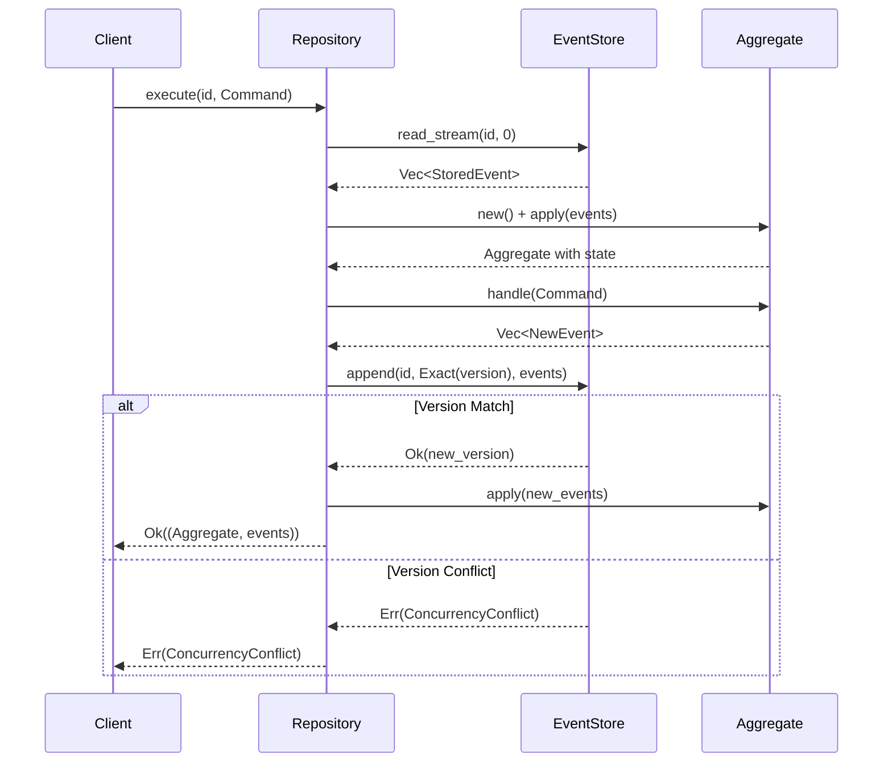

<thinking>
## Analyse du Concept
- Concept : Event Sourcing Engine
- Phase demandee : 5 (Advanced Systems)
- Adapte ? OUI - L'Event Sourcing est un pattern fondamental pour les architectures microservices modernes. L'exercice combine persistence, reconstruction d'etat et gestion de la concurrence.

## Combo Base + Bonus
- Exercice de base : Event Store avec append/read, reconstruction d'aggregats depuis les events
- Bonus : Implementation de snapshots pour optimiser la reconstruction + projections temps reel
- Palier bonus : EXPERT (complexite architecturale + gestion de la concurrence)
- Progression logique ? OUI - Base = stockage et replay, Bonus = optimisation et projections

## Prerequis & Difficulte
- Prerequis reels : async/await, Traits avances, Serde, Arc/RwLock, generics avec bounds complexes
- Difficulte estimee : 8/10 (base), 10/10 (bonus)
- Coherent avec phase 5 ? OUI

## Aspect Fun/Culture
- Contexte choisi : Reference a "Inception" - Les events sont comme les reves empiles
- MEME mnemonique : "We need to go deeper" (pour les snapshots qui evitent de remonter tous les events)
- Pourquoi c'est fun : Chaque event est une "couche" de la realite, comme les niveaux de reve

## Scenarios d'Echec (5 mutants concrets)
1. Mutant A (Concurrency) : Pas de verification de version lors de l'append
2. Mutant B (Order) : Events retournes dans le desordre (pas tries par version)
3. Mutant C (State) : apply() mute l'aggregate sans incrementer la version
4. Mutant D (Idempotency) : Projection re-applique les memes events
5. Mutant E (Snapshot) : Snapshot sauvegarde mais version non mise a jour

## Verdict
VALIDE - Exercice de qualite industrielle couvrant les fondamentaux de l'Event Sourcing
</thinking>

# Exercice 5.6.1-a : event_sourcing

**Module :**
5.6.1 — Event-Driven Architecture Fundamentals

**Concept :**
a — Event Sourcing Engine (Event Store, Aggregates, Replay)

**Difficulte :**
★★★★★★★★☆☆ (8/10)

**Type :**
code

**Tiers :**
2 — Integration de patterns

**Langage :**
Rust Edition 2024

**Prerequis :**
- 2.5 — Programmation asynchrone (async/await, tokio)
- 2.3 — Traits avances (associated types, bounds)
- 3.2 — Serialisation (Serde)
- 4.1 — Concurrence (Arc, RwLock, atomics)
- 5.6.0 — Domain-Driven Design basics

**Domaines :**
Architecture, Persistence, Concurrence

**Duree estimee :**
180 min

**XP Base :**
300

**Complexite :**
T3 O(n) × S2 O(n)

---

## SECTION 1 : PROTOTYPE & CONSIGNE

### 1.1 Obligations

**Fichier a rendre :**
```
src/lib.rs
src/event.rs
src/store.rs
src/aggregate.rs
```

**Dependances autorisees :**
```toml
[dependencies]
tokio = { version = "1.0", features = ["full", "sync"] }
serde = { version = "1.0", features = ["derive"] }
serde_json = "1.0"
chrono = { version = "0.4", features = ["serde"] }
uuid = { version = "1.0", features = ["v4", "serde"] }
async-trait = "0.1"
thiserror = "2.0"
parking_lot = "0.12"
```

**Fonctions/methodes interdites :**
- `unwrap()` / `expect()` dans le code de production
- `unsafe` blocks
- Crates de persistence reelle (sqlx, diesel, etc.) - on reste in-memory

### 1.2 Consigne

**CONTEXTE : "The Event Inception"**

*"Tu vois ce moment, Cobb ? Il n'existe plus. Mais son EVENT existe toujours dans le Store. Si tu veux savoir ce qui s'est passe... tu dois REJOUER tous les events depuis le debut. C'est comme descendre dans les couches du reve."* — Dom Cobb, architecte de systemes distribues

Dans les architectures Event Sourcing, on ne stocke pas l'etat actuel d'une entite, mais la sequence complete des events qui l'ont amenee a cet etat. Pour connaitre l'etat actuel, on "rejoue" tous les events depuis le debut.

**Ta mission :**

Implementer un moteur d'Event Sourcing generique comprenant :
1. Un trait `Event` pour definir les events du domaine
2. Un `EventStore` pour persister et lire les events
3. Un trait `Aggregate` pour definir les entites reconstruites depuis les events
4. Un `AggregateRepository` pour charger/sauvegarder les aggregats
5. La gestion de la concurrence optimiste (version checking)

**Entree :**
- Events : structures implementant le trait `Event`
- Commands : actions declenchant la creation d'events
- Stream ID : identifiant unique d'un aggregate

**Sortie :**
- `StoredEvent<E>` — Event persiste avec metadata
- `Aggregate` — Entite reconstruite depuis ses events
- Erreurs appropriees en cas de conflit de version

**Contraintes :**
- Les events sont immutables une fois stockes
- L'ordre des events dans un stream doit etre garanti
- Optimistic locking obligatoire (version check a l'append)
- Thread-safe : tous les types doivent etre `Send + Sync`

**Exemples :**

| Operation | Input | Resultat |
|-----------|-------|----------|
| `store.append("order-1", NoStream, [OrderCreated])` | Premier event | `Ok(1)` — version 1 |
| `store.append("order-1", Exact(1), [ItemAdded])` | Ajout event | `Ok(2)` — version 2 |
| `store.append("order-1", Exact(1), [ItemAdded])` | Conflit version | `Err(ConcurrencyConflict)` |
| `repo.load("order-1")` | Reconstruction | `Ok((Order{...}, 2))` |

### 1.2.2 Consigne Academique

Implementer un moteur d'Event Sourcing generique en Rust comprenant un Event Store thread-safe avec gestion de la concurrence optimiste, un framework d'Aggregate permettant la reconstruction d'etat depuis les events, et un Repository pattern pour l'acces aux aggregats.

### 1.3 Prototype

```rust
use chrono::{DateTime, Utc};
use serde::{de::DeserializeOwned, Deserialize, Serialize};
use std::collections::HashMap;
use std::sync::Arc;
use uuid::Uuid;

// ============ EVENT TRAIT ============

/// Trait de base pour tous les domain events
pub trait Event: Clone + Serialize + DeserializeOwned + Send + Sync + 'static {
    /// Type de l'event (pour deserialization polymorphique)
    fn event_type(&self) -> &'static str;
}

/// Metadata associee a un event
#[derive(Clone, Debug, Serialize, Deserialize)]
pub struct EventMetadata {
    pub correlation_id: Option<Uuid>,
    pub causation_id: Option<Uuid>,
    pub user_id: Option<String>,
    pub timestamp: DateTime<Utc>,
}

/// Event stocke dans l'Event Store
#[derive(Clone, Debug, Serialize, Deserialize)]
pub struct StoredEvent<E: Event> {
    pub stream_id: String,
    pub version: u64,
    pub event_type: String,
    pub data: E,
    pub metadata: EventMetadata,
    pub global_position: u64,
}

// ============ EVENT STORE ============

/// Version attendue lors de l'append
#[derive(Clone, Debug, PartialEq)]
pub enum ExpectedVersion {
    /// N'importe quelle version (pas de check)
    Any,
    /// Le stream ne doit pas exister
    NoStream,
    /// Version exacte attendue
    Exact(u64),
}

/// Erreurs de l'Event Store
#[derive(Debug, Clone, thiserror::Error)]
pub enum EventStoreError {
    #[error("Concurrency conflict: expected {expected:?}, actual {actual}")]
    ConcurrencyConflict { expected: ExpectedVersion, actual: u64 },

    #[error("Stream not found: {0}")]
    StreamNotFound(String),

    #[error("Serialization error: {0}")]
    SerializationError(String),

    #[error("Internal error: {0}")]
    InternalError(String),
}

/// Trait pour l'Event Store
#[async_trait::async_trait]
pub trait EventStore: Send + Sync {
    type Event: Event;

    /// Ajoute des events a un stream avec verification de version
    async fn append(
        &self,
        stream_id: &str,
        expected_version: ExpectedVersion,
        events: Vec<Self::Event>,
        metadata: EventMetadata,
    ) -> Result<u64, EventStoreError>;

    /// Lit tous les events d'un stream depuis une version
    async fn read_stream(
        &self,
        stream_id: &str,
        from_version: u64,
    ) -> Result<Vec<StoredEvent<Self::Event>>, EventStoreError>;

    /// Lit tous les events (global stream) pour les projections
    async fn read_all(
        &self,
        from_position: u64,
        batch_size: usize,
    ) -> Result<Vec<StoredEvent<Self::Event>>, EventStoreError>;

    /// Retourne la version actuelle d'un stream
    async fn stream_version(&self, stream_id: &str) -> Result<Option<u64>, EventStoreError>;
}

// ============ AGGREGATE ============

/// Trait pour les Aggregates (entites reconstruites depuis events)
pub trait Aggregate: Default + Clone + Send + Sync {
    type Event: Event;
    type Command: Send;
    type Error: std::error::Error + Send + Sync;

    /// Applique un event pour mettre a jour l'etat
    fn apply(&mut self, event: &Self::Event);

    /// Traite une commande et retourne les events produits
    fn handle(&self, command: Self::Command) -> Result<Vec<Self::Event>, Self::Error>;

    /// Retourne l'ID du stream
    fn aggregate_id(&self) -> &str;

    /// Retourne la version actuelle
    fn version(&self) -> u64;
}

/// Erreurs du Repository
#[derive(Debug, thiserror::Error)]
pub enum RepositoryError {
    #[error("Event store error: {0}")]
    EventStoreError(#[from] EventStoreError),

    #[error("Aggregate not found: {0}")]
    NotFound(String),

    #[error("Command error: {0}")]
    CommandError(String),
}

/// Repository pour charger/sauvegarder les Aggregates
pub struct AggregateRepository<S: EventStore, A: Aggregate<Event = S::Event>> {
    store: Arc<S>,
    _phantom: std::marker::PhantomData<A>,
}

impl<S: EventStore, A: Aggregate<Event = S::Event>> AggregateRepository<S, A> {
    pub fn new(store: Arc<S>) -> Self;

    /// Charge un aggregate depuis l'event store
    pub async fn load(&self, aggregate_id: &str) -> Result<Option<(A, u64)>, RepositoryError>;

    /// Sauvegarde les nouveaux events d'un aggregate
    pub async fn save(
        &self,
        aggregate: &A,
        events: Vec<A::Event>,
        expected_version: u64,
        metadata: EventMetadata,
    ) -> Result<u64, RepositoryError>;

    /// Execute une commande sur un aggregate (load -> handle -> save)
    pub async fn execute(
        &self,
        aggregate_id: &str,
        command: A::Command,
        metadata: EventMetadata,
    ) -> Result<(A, Vec<A::Event>), RepositoryError>;
}

// ============ IN-MEMORY IMPLEMENTATION ============

/// Implementation in-memory de l'Event Store pour tests
pub struct InMemoryEventStore<E: Event> {
    // A implementer
}

impl<E: Event> InMemoryEventStore<E> {
    pub fn new() -> Self;
}
```

---

## SECTION 2 : LE SAVIEZ-VOUS ?

### 2.1 Origine de l'Event Sourcing

L'Event Sourcing a ete popularise par Martin Fowler et Greg Young au milieu des annees 2000. Le pattern s'inspire des journaux de transactions des bases de donnees (WAL - Write-Ahead Log) et des systemes de versioning comme Git.

### 2.2 Le Pattern en Action

L'idee centrale est simple mais puissante : au lieu de stocker l'etat actuel, on stocke tous les changements (events) qui ont mene a cet etat.

```
APPROCHE TRADITIONNELLE (CRUD):
┌─────────────────────────────────┐
│  Account: #123                  │
│  Balance: $500                  │ ← On ne sait pas COMMENT on est arrive la
│  Updated: 2024-01-15            │
└─────────────────────────────────┘

APPROCHE EVENT SOURCING:
┌─────────────────────────────────┐
│ Event 1: AccountOpened($0)      │
│ Event 2: MoneyDeposited($1000)  │
│ Event 3: MoneyWithdrawn($300)   │ ← Historique COMPLET
│ Event 4: MoneyWithdrawn($200)   │
└─────────────────────────────────┘
  Replay → Balance = $500
```

### 2.3 Avantages Cles

1. **Audit Trail Complet** : Chaque changement est enregistre
2. **Time Travel** : Reconstruction de l'etat a n'importe quel moment
3. **Event Replay** : Debug et correction retroactive
4. **Scalabilite** : Append-only permet une haute performance

---

## SECTION 2.5 : DANS LA VRAIE VIE

### Metiers concernes

| Metier | Utilisation de l'Event Sourcing |
|--------|--------------------------------|
| **Backend Engineer** | Implementation de services event-sourced |
| **Architect** | Design de systemes distribues event-driven |
| **Data Engineer** | Construction de pipelines depuis event streams |
| **DevOps/SRE** | Monitoring et replay d'events pour debug |
| **Finance Tech** | Audit trail reglementaire (MiFID II, SOX) |

### Cas d'usage concrets

1. **Systemes Bancaires** : Chaque transaction est un event (regulateurs l'exigent)
2. **E-commerce** : Historique complet des commandes et modifications
3. **Gaming** : Replay de parties, anti-cheat, spectator mode
4. **Healthcare** : Dossiers patients avec historique complet (HIPAA)

---

## SECTION 3 : EXEMPLE D'UTILISATION

### 3.0 Session bash

```bash
$ ls
Cargo.toml  src/

$ cargo test
   Compiling event_sourcing v0.1.0
    Finished test [unoptimized + debuginfo] target(s)
     Running unittests src/lib.rs

running 14 tests
test tests::test_append_first_event ... ok
test tests::test_append_with_version_check ... ok
test tests::test_concurrency_conflict ... ok
test tests::test_read_stream ... ok
test tests::test_read_all_global ... ok
test tests::test_aggregate_reconstruction ... ok
test tests::test_aggregate_handle_command ... ok
test tests::test_repository_load ... ok
test tests::test_repository_save ... ok
test tests::test_repository_execute ... ok
test tests::test_no_stream_expected ... ok
test tests::test_event_ordering ... ok
test tests::test_metadata_preserved ... ok
test tests::test_concurrent_appends ... ok

test result: ok. 14 passed; 0 failed
```

### 3.1 BONUS EXPERT (OPTIONNEL)

**Difficulte Bonus :**
★★★★★★★★★★ (10/10)

**Recompense :**
XP x3

**Time Complexity attendue :**
O(1) pour load avec snapshot, O(n) pour projection

**Space Complexity attendue :**
O(n) pour les events, O(1) pour snapshots

**Domaines Bonus :**
`Optimization, Streaming`

#### 3.1.1 Consigne Bonus

**"Going Deeper with Snapshots"**

*"On ne peut pas remonter tous les niveaux a chaque fois. Il nous faut un raccourci."* — Ariadne

Quand un aggregate a des milliers d'events, le reconstruire depuis le debut devient couteux. Les **snapshots** sauvegardent l'etat a intervalles reguliers.

**Ta mission bonus :**

1. Implementer un `SnapshotStore` pour sauvegarder/charger des snapshots
2. Modifier `AggregateRepository` pour utiliser les snapshots
3. Implementer un `ProjectionEngine` pour maintenir des read models

**Entree :**
- `snapshot_frequency: u64` — Sauvegarde un snapshot tous les N events
- `Projection` trait — Definit comment traiter les events pour un read model

**Sortie :**
- Load optimise : snapshot + events recents seulement
- Projections mises a jour en temps reel

#### 3.1.2 Prototype Bonus

```rust
/// Snapshot d'un aggregate
#[derive(Clone, Serialize, Deserialize)]
pub struct Snapshot<A> {
    pub aggregate_id: String,
    pub version: u64,
    pub state: A,
    pub timestamp: DateTime<Utc>,
}

/// Store pour les snapshots
#[async_trait::async_trait]
pub trait SnapshotStore<A: Clone + Serialize + DeserializeOwned>: Send + Sync {
    async fn save(&self, snapshot: &Snapshot<A>) -> Result<(), SnapshotError>;
    async fn load(&self, aggregate_id: &str) -> Result<Option<Snapshot<A>>, SnapshotError>;
}

/// Trait pour les projections (read models)
#[async_trait::async_trait]
pub trait Projection: Send + Sync {
    type Event: Event;

    fn name(&self) -> &'static str;
    async fn handle(&self, event: &StoredEvent<Self::Event>) -> Result<(), ProjectionError>;
    fn position(&self) -> u64;
}

/// Moteur de projection
pub struct ProjectionEngine<S: EventStore> {
    store: Arc<S>,
    projections: Vec<Box<dyn Projection<Event = S::Event>>>,
}

impl<S: EventStore> ProjectionEngine<S> {
    pub async fn run(&self, shutdown: tokio::sync::watch::Receiver<bool>);
    pub async fn rebuild(&self, projection_name: &str) -> Result<(), ProjectionError>;
}
```

#### 3.1.3 Ce qui change par rapport a l'exercice de base

| Aspect | Base | Bonus |
|--------|------|-------|
| Load aggregate | O(n) - tous les events | O(k) - snapshot + k events |
| Stockage | Events seulement | Events + Snapshots |
| Read models | Reconstruction a la demande | Projections temps reel |
| Complexite | Event Store simple | Event Store + Snapshot + Projection |

---

## SECTION 4 : ZONE CORRECTION

### 4.1 Moulinette — Tableau des tests

| Test | Input | Expected | Points | Categorie |
|------|-------|----------|--------|-----------|
| `append_first_event` | stream vide, `NoStream` | `Ok(1)` | 5 | Basic |
| `append_with_version` | `Exact(1)`, version actuelle 1 | `Ok(2)` | 10 | Core |
| `concurrency_conflict` | `Exact(1)`, version actuelle 2 | `Err(ConcurrencyConflict)` | 15 | Core |
| `read_stream_ordered` | stream avec 5 events | 5 events ordonnees | 10 | Core |
| `read_stream_from_version` | from_version=3 | events 3,4,5 | 5 | Core |
| `read_all_batched` | batch_size=10 | max 10 events | 5 | Core |
| `aggregate_apply` | 3 events | etat correct | 10 | Core |
| `aggregate_handle` | command valide | events produits | 10 | Core |
| `aggregate_handle_invalid` | command invalide | erreur | 5 | Edge |
| `repository_load_empty` | stream inexistant | `Ok(None)` | 5 | Edge |
| `repository_load_existing` | stream avec events | `Ok(Some(...))` | 10 | Core |
| `repository_execute` | load+handle+save | succes | 10 | Integration |
| `metadata_preserved` | correlation_id set | correlation_id present | 5 | Core |
| `concurrent_writes` | 2 writers simultanes | 1 succes, 1 conflit | 10 | Concurrency |

**Score minimum pour validation : 70/100**

### 4.2 Fichier de test

```rust
#[cfg(test)]
mod tests {
    use super::*;
    use tokio::sync::Barrier;
    use std::sync::Arc;

    // Domain events pour les tests
    #[derive(Clone, Debug, Serialize, Deserialize, PartialEq)]
    pub enum BankAccountEvent {
        Opened { account_id: String, owner: String },
        Deposited { amount: u64 },
        Withdrawn { amount: u64 },
        Closed,
    }

    impl Event for BankAccountEvent {
        fn event_type(&self) -> &'static str {
            match self {
                Self::Opened { .. } => "BankAccountOpened",
                Self::Deposited { .. } => "BankAccountDeposited",
                Self::Withdrawn { .. } => "BankAccountWithdrawn",
                Self::Closed => "BankAccountClosed",
            }
        }
    }

    // Aggregate pour les tests
    #[derive(Clone, Default)]
    pub struct BankAccount {
        id: String,
        owner: String,
        balance: u64,
        is_closed: bool,
        version: u64,
    }

    #[derive(Debug)]
    pub enum BankCommand {
        Open { account_id: String, owner: String },
        Deposit { amount: u64 },
        Withdraw { amount: u64 },
        Close,
    }

    #[derive(Debug, thiserror::Error)]
    pub enum BankError {
        #[error("Account already exists")]
        AlreadyExists,
        #[error("Account is closed")]
        Closed,
        #[error("Insufficient funds")]
        InsufficientFunds,
    }

    impl Aggregate for BankAccount {
        type Event = BankAccountEvent;
        type Command = BankCommand;
        type Error = BankError;

        fn apply(&mut self, event: &Self::Event) {
            match event {
                BankAccountEvent::Opened { account_id, owner } => {
                    self.id = account_id.clone();
                    self.owner = owner.clone();
                }
                BankAccountEvent::Deposited { amount } => {
                    self.balance += amount;
                }
                BankAccountEvent::Withdrawn { amount } => {
                    self.balance -= amount;
                }
                BankAccountEvent::Closed => {
                    self.is_closed = true;
                }
            }
            self.version += 1;
        }

        fn handle(&self, command: Self::Command) -> Result<Vec<Self::Event>, Self::Error> {
            if self.is_closed && !matches!(command, BankCommand::Open { .. }) {
                return Err(BankError::Closed);
            }
            match command {
                BankCommand::Open { account_id, owner } => {
                    if !self.id.is_empty() {
                        return Err(BankError::AlreadyExists);
                    }
                    Ok(vec![BankAccountEvent::Opened { account_id, owner }])
                }
                BankCommand::Deposit { amount } => {
                    Ok(vec![BankAccountEvent::Deposited { amount }])
                }
                BankCommand::Withdraw { amount } => {
                    if self.balance < amount {
                        return Err(BankError::InsufficientFunds);
                    }
                    Ok(vec![BankAccountEvent::Withdrawn { amount }])
                }
                BankCommand::Close => {
                    Ok(vec![BankAccountEvent::Closed])
                }
            }
        }

        fn aggregate_id(&self) -> &str {
            &self.id
        }

        fn version(&self) -> u64 {
            self.version
        }
    }

    fn default_metadata() -> EventMetadata {
        EventMetadata {
            correlation_id: Some(Uuid::new_v4()),
            causation_id: None,
            user_id: Some("test-user".to_string()),
            timestamp: Utc::now(),
        }
    }

    #[tokio::test]
    async fn test_append_first_event() {
        let store = InMemoryEventStore::<BankAccountEvent>::new();
        let event = BankAccountEvent::Opened {
            account_id: "acc-1".to_string(),
            owner: "Alice".to_string(),
        };

        let version = store
            .append("acc-1", ExpectedVersion::NoStream, vec![event], default_metadata())
            .await
            .unwrap();

        assert_eq!(version, 1);
    }

    #[tokio::test]
    async fn test_concurrency_conflict() {
        let store = InMemoryEventStore::<BankAccountEvent>::new();

        // Create initial event
        store
            .append(
                "acc-1",
                ExpectedVersion::NoStream,
                vec![BankAccountEvent::Opened {
                    account_id: "acc-1".to_string(),
                    owner: "Alice".to_string(),
                }],
                default_metadata(),
            )
            .await
            .unwrap();

        // Add another event to make version 2
        store
            .append(
                "acc-1",
                ExpectedVersion::Exact(1),
                vec![BankAccountEvent::Deposited { amount: 100 }],
                default_metadata(),
            )
            .await
            .unwrap();

        // Try to append with stale version (expecting 1, but actual is 2)
        let result = store
            .append(
                "acc-1",
                ExpectedVersion::Exact(1),
                vec![BankAccountEvent::Deposited { amount: 50 }],
                default_metadata(),
            )
            .await;

        assert!(matches!(result, Err(EventStoreError::ConcurrencyConflict { .. })));
    }

    #[tokio::test]
    async fn test_read_stream_ordered() {
        let store = InMemoryEventStore::<BankAccountEvent>::new();

        // Append multiple events
        store.append("acc-1", ExpectedVersion::NoStream,
            vec![BankAccountEvent::Opened { account_id: "acc-1".to_string(), owner: "Alice".to_string() }],
            default_metadata()).await.unwrap();
        store.append("acc-1", ExpectedVersion::Exact(1),
            vec![BankAccountEvent::Deposited { amount: 100 }],
            default_metadata()).await.unwrap();
        store.append("acc-1", ExpectedVersion::Exact(2),
            vec![BankAccountEvent::Withdrawn { amount: 30 }],
            default_metadata()).await.unwrap();

        let events = store.read_stream("acc-1", 0).await.unwrap();

        assert_eq!(events.len(), 3);
        assert_eq!(events[0].version, 1);
        assert_eq!(events[1].version, 2);
        assert_eq!(events[2].version, 3);
    }

    #[tokio::test]
    async fn test_aggregate_reconstruction() {
        let store = Arc::new(InMemoryEventStore::<BankAccountEvent>::new());
        let repo = AggregateRepository::<_, BankAccount>::new(store.clone());

        // Manually append events
        store.append("acc-1", ExpectedVersion::NoStream,
            vec![BankAccountEvent::Opened { account_id: "acc-1".to_string(), owner: "Alice".to_string() }],
            default_metadata()).await.unwrap();
        store.append("acc-1", ExpectedVersion::Exact(1),
            vec![BankAccountEvent::Deposited { amount: 1000 }],
            default_metadata()).await.unwrap();
        store.append("acc-1", ExpectedVersion::Exact(2),
            vec![BankAccountEvent::Withdrawn { amount: 300 }],
            default_metadata()).await.unwrap();

        // Load aggregate
        let (account, version) = repo.load("acc-1").await.unwrap().unwrap();

        assert_eq!(account.balance, 700);
        assert_eq!(account.owner, "Alice");
        assert_eq!(version, 3);
    }

    #[tokio::test]
    async fn test_repository_execute() {
        let store = Arc::new(InMemoryEventStore::<BankAccountEvent>::new());
        let repo = AggregateRepository::<_, BankAccount>::new(store);

        // Execute open command
        let (account, events) = repo
            .execute(
                "acc-1",
                BankCommand::Open {
                    account_id: "acc-1".to_string(),
                    owner: "Bob".to_string(),
                },
                default_metadata(),
            )
            .await
            .unwrap();

        assert_eq!(account.owner, "Bob");
        assert_eq!(events.len(), 1);

        // Execute deposit command
        let (account, _) = repo
            .execute("acc-1", BankCommand::Deposit { amount: 500 }, default_metadata())
            .await
            .unwrap();

        assert_eq!(account.balance, 500);
    }

    #[tokio::test]
    async fn test_concurrent_writes() {
        let store = Arc::new(InMemoryEventStore::<BankAccountEvent>::new());

        // Create initial account
        store.append("acc-1", ExpectedVersion::NoStream,
            vec![BankAccountEvent::Opened { account_id: "acc-1".to_string(), owner: "Alice".to_string() }],
            default_metadata()).await.unwrap();

        let store1 = store.clone();
        let store2 = store.clone();
        let barrier = Arc::new(Barrier::new(2));
        let barrier1 = barrier.clone();
        let barrier2 = barrier.clone();

        let handle1 = tokio::spawn(async move {
            barrier1.wait().await;
            store1.append("acc-1", ExpectedVersion::Exact(1),
                vec![BankAccountEvent::Deposited { amount: 100 }],
                default_metadata()).await
        });

        let handle2 = tokio::spawn(async move {
            barrier2.wait().await;
            store2.append("acc-1", ExpectedVersion::Exact(1),
                vec![BankAccountEvent::Deposited { amount: 200 }],
                default_metadata()).await
        });

        let (result1, result2) = tokio::join!(handle1, handle2);
        let r1 = result1.unwrap();
        let r2 = result2.unwrap();

        // One should succeed, one should fail
        let successes = [r1.is_ok(), r2.is_ok()].iter().filter(|&&x| x).count();
        let failures = [r1.is_err(), r2.is_err()].iter().filter(|&&x| x).count();

        assert_eq!(successes, 1);
        assert_eq!(failures, 1);
    }
}
```

### 4.3 Solution de reference

```rust
use async_trait::async_trait;
use chrono::{DateTime, Utc};
use parking_lot::RwLock;
use serde::{de::DeserializeOwned, Deserialize, Serialize};
use std::collections::HashMap;
use std::sync::atomic::{AtomicU64, Ordering};
use std::sync::Arc;
use uuid::Uuid;

// ============ TRAITS (comme dans le prototype) ============

pub trait Event: Clone + Serialize + DeserializeOwned + Send + Sync + 'static {
    fn event_type(&self) -> &'static str;
}

#[derive(Clone, Debug, Serialize, Deserialize)]
pub struct EventMetadata {
    pub correlation_id: Option<Uuid>,
    pub causation_id: Option<Uuid>,
    pub user_id: Option<String>,
    pub timestamp: DateTime<Utc>,
}

impl Default for EventMetadata {
    fn default() -> Self {
        Self {
            correlation_id: None,
            causation_id: None,
            user_id: None,
            timestamp: Utc::now(),
        }
    }
}

#[derive(Clone, Debug, Serialize, Deserialize)]
pub struct StoredEvent<E: Event> {
    pub stream_id: String,
    pub version: u64,
    pub event_type: String,
    pub data: E,
    pub metadata: EventMetadata,
    pub global_position: u64,
}

#[derive(Clone, Debug, PartialEq)]
pub enum ExpectedVersion {
    Any,
    NoStream,
    Exact(u64),
}

#[derive(Debug, Clone, thiserror::Error)]
pub enum EventStoreError {
    #[error("Concurrency conflict: expected {expected:?}, actual {actual}")]
    ConcurrencyConflict { expected: ExpectedVersion, actual: u64 },
    #[error("Stream not found: {0}")]
    StreamNotFound(String),
    #[error("Serialization error: {0}")]
    SerializationError(String),
    #[error("Internal error: {0}")]
    InternalError(String),
}

#[async_trait]
pub trait EventStore: Send + Sync {
    type Event: Event;

    async fn append(
        &self,
        stream_id: &str,
        expected_version: ExpectedVersion,
        events: Vec<Self::Event>,
        metadata: EventMetadata,
    ) -> Result<u64, EventStoreError>;

    async fn read_stream(
        &self,
        stream_id: &str,
        from_version: u64,
    ) -> Result<Vec<StoredEvent<Self::Event>>, EventStoreError>;

    async fn read_all(
        &self,
        from_position: u64,
        batch_size: usize,
    ) -> Result<Vec<StoredEvent<Self::Event>>, EventStoreError>;

    async fn stream_version(&self, stream_id: &str) -> Result<Option<u64>, EventStoreError>;
}

// ============ IN-MEMORY EVENT STORE ============

pub struct InMemoryEventStore<E: Event> {
    streams: RwLock<HashMap<String, Vec<StoredEvent<E>>>>,
    global_events: RwLock<Vec<StoredEvent<E>>>,
    global_position: AtomicU64,
}

impl<E: Event> InMemoryEventStore<E> {
    pub fn new() -> Self {
        Self {
            streams: RwLock::new(HashMap::new()),
            global_events: RwLock::new(Vec::new()),
            global_position: AtomicU64::new(0),
        }
    }
}

impl<E: Event> Default for InMemoryEventStore<E> {
    fn default() -> Self {
        Self::new()
    }
}

#[async_trait]
impl<E: Event> EventStore for InMemoryEventStore<E> {
    type Event = E;

    async fn append(
        &self,
        stream_id: &str,
        expected_version: ExpectedVersion,
        events: Vec<Self::Event>,
        metadata: EventMetadata,
    ) -> Result<u64, EventStoreError> {
        let mut streams = self.streams.write();
        let stream = streams.entry(stream_id.to_string()).or_insert_with(Vec::new);

        let current_version = stream.last().map(|e| e.version).unwrap_or(0);

        // Version check
        match expected_version {
            ExpectedVersion::NoStream if current_version > 0 => {
                return Err(EventStoreError::ConcurrencyConflict {
                    expected: ExpectedVersion::NoStream,
                    actual: current_version,
                });
            }
            ExpectedVersion::Exact(expected) if expected != current_version => {
                return Err(EventStoreError::ConcurrencyConflict {
                    expected: ExpectedVersion::Exact(expected),
                    actual: current_version,
                });
            }
            _ => {}
        }

        let mut new_version = current_version;
        let mut stored_events = Vec::with_capacity(events.len());

        for event in events {
            new_version += 1;
            let global_pos = self.global_position.fetch_add(1, Ordering::SeqCst) + 1;

            let stored = StoredEvent {
                stream_id: stream_id.to_string(),
                version: new_version,
                event_type: event.event_type().to_string(),
                data: event,
                metadata: metadata.clone(),
                global_position: global_pos,
            };

            stored_events.push(stored.clone());
            stream.push(stored);
        }

        // Add to global stream
        let mut global = self.global_events.write();
        global.extend(stored_events);

        Ok(new_version)
    }

    async fn read_stream(
        &self,
        stream_id: &str,
        from_version: u64,
    ) -> Result<Vec<StoredEvent<Self::Event>>, EventStoreError> {
        let streams = self.streams.read();

        match streams.get(stream_id) {
            Some(stream) => {
                let events: Vec<_> = stream
                    .iter()
                    .filter(|e| e.version > from_version)
                    .cloned()
                    .collect();
                Ok(events)
            }
            None => Ok(vec![]),
        }
    }

    async fn read_all(
        &self,
        from_position: u64,
        batch_size: usize,
    ) -> Result<Vec<StoredEvent<Self::Event>>, EventStoreError> {
        let global = self.global_events.read();

        let events: Vec<_> = global
            .iter()
            .filter(|e| e.global_position > from_position)
            .take(batch_size)
            .cloned()
            .collect();

        Ok(events)
    }

    async fn stream_version(&self, stream_id: &str) -> Result<Option<u64>, EventStoreError> {
        let streams = self.streams.read();
        Ok(streams.get(stream_id).and_then(|s| s.last()).map(|e| e.version))
    }
}

// ============ AGGREGATE ============

pub trait Aggregate: Default + Clone + Send + Sync {
    type Event: Event;
    type Command: Send;
    type Error: std::error::Error + Send + Sync;

    fn apply(&mut self, event: &Self::Event);
    fn handle(&self, command: Self::Command) -> Result<Vec<Self::Event>, Self::Error>;
    fn aggregate_id(&self) -> &str;
    fn version(&self) -> u64;
}

#[derive(Debug, thiserror::Error)]
pub enum RepositoryError {
    #[error("Event store error: {0}")]
    EventStoreError(#[from] EventStoreError),
    #[error("Aggregate not found: {0}")]
    NotFound(String),
    #[error("Command error: {0}")]
    CommandError(String),
}

pub struct AggregateRepository<S: EventStore, A: Aggregate<Event = S::Event>> {
    store: Arc<S>,
    _phantom: std::marker::PhantomData<A>,
}

impl<S: EventStore, A: Aggregate<Event = S::Event>> AggregateRepository<S, A> {
    pub fn new(store: Arc<S>) -> Self {
        Self {
            store,
            _phantom: std::marker::PhantomData,
        }
    }

    pub async fn load(&self, aggregate_id: &str) -> Result<Option<(A, u64)>, RepositoryError> {
        let events = self.store.read_stream(aggregate_id, 0).await?;

        if events.is_empty() {
            return Ok(None);
        }

        let mut aggregate = A::default();
        let mut version = 0u64;

        for stored_event in events {
            aggregate.apply(&stored_event.data);
            version = stored_event.version;
        }

        Ok(Some((aggregate, version)))
    }

    pub async fn save(
        &self,
        _aggregate: &A,
        events: Vec<A::Event>,
        expected_version: u64,
        metadata: EventMetadata,
        stream_id: &str,
    ) -> Result<u64, RepositoryError> {
        let expected = if expected_version == 0 {
            ExpectedVersion::NoStream
        } else {
            ExpectedVersion::Exact(expected_version)
        };

        let new_version = self.store.append(stream_id, expected, events, metadata).await?;
        Ok(new_version)
    }

    pub async fn execute(
        &self,
        aggregate_id: &str,
        command: A::Command,
        metadata: EventMetadata,
    ) -> Result<(A, Vec<A::Event>), RepositoryError> {
        let (mut aggregate, version) = self
            .load(aggregate_id)
            .await?
            .unwrap_or_else(|| (A::default(), 0));

        let events = aggregate
            .handle(command)
            .map_err(|e| RepositoryError::CommandError(e.to_string()))?;

        if !events.is_empty() {
            self.save(&aggregate, events.clone(), version, metadata, aggregate_id)
                .await?;

            // Apply events to get final state
            for event in &events {
                aggregate.apply(event);
            }
        }

        Ok((aggregate, events))
    }
}
```

### 4.4 Solutions alternatives acceptees

```rust
// Alternative 1 : Utilisation de Mutex au lieu de RwLock
pub struct InMemoryEventStore<E: Event> {
    streams: std::sync::Mutex<HashMap<String, Vec<StoredEvent<E>>>>,
    // ... moins performant en lecture mais acceptable
}

// Alternative 2 : Version avec channels pour les events
// Utilise tokio::sync::broadcast pour notifier les projections
pub struct InMemoryEventStore<E: Event> {
    streams: RwLock<HashMap<String, Vec<StoredEvent<E>>>>,
    event_tx: tokio::sync::broadcast::Sender<StoredEvent<E>>,
}
```

### 4.5 Solutions refusees

```rust
// REFUSEE 1 : Pas de verification de version
async fn append(&self, stream_id: &str, _expected: ExpectedVersion, events: Vec<E>, ...) {
    // ERREUR: Ignore expected_version completement
    let mut streams = self.streams.write();
    streams.entry(stream_id.to_string()).or_default().extend(events);
}
// Pourquoi refusee : Pas de concurrence optimiste, data corruption possible

// REFUSEE 2 : Events retournes dans le desordre
async fn read_stream(&self, stream_id: &str, from_version: u64) {
    let streams = self.streams.read();
    // ERREUR: Pas de tri, ordre non garanti
    streams.get(stream_id).cloned().unwrap_or_default()
}
// Pourquoi refusee : L'ordre des events est critique pour la reconstruction

// REFUSEE 3 : apply() ne met pas a jour la version
fn apply(&mut self, event: &Self::Event) {
    match event {
        // ... applique l'event
    }
    // ERREUR: self.version non incremente
}
// Pourquoi refusee : La version de l'aggregate doit suivre les events appliques
```

### 4.6 Solution bonus de reference

```rust
// Snapshot Store
#[derive(Clone, Serialize, Deserialize)]
pub struct Snapshot<A> {
    pub aggregate_id: String,
    pub version: u64,
    pub state: A,
    pub timestamp: DateTime<Utc>,
}

#[derive(Debug, thiserror::Error)]
pub enum SnapshotError {
    #[error("Serialization error: {0}")]
    SerializationError(String),
    #[error("Internal error: {0}")]
    InternalError(String),
}

#[async_trait]
pub trait SnapshotStore<A: Clone + Serialize + DeserializeOwned>: Send + Sync {
    async fn save(&self, snapshot: &Snapshot<A>) -> Result<(), SnapshotError>;
    async fn load(&self, aggregate_id: &str) -> Result<Option<Snapshot<A>>, SnapshotError>;
}

pub struct InMemorySnapshotStore<A: Clone> {
    snapshots: RwLock<HashMap<String, Snapshot<A>>>,
}

impl<A: Clone + Serialize + DeserializeOwned + Send + Sync> InMemorySnapshotStore<A> {
    pub fn new() -> Self {
        Self {
            snapshots: RwLock::new(HashMap::new()),
        }
    }
}

#[async_trait]
impl<A: Clone + Serialize + DeserializeOwned + Send + Sync> SnapshotStore<A>
    for InMemorySnapshotStore<A>
{
    async fn save(&self, snapshot: &Snapshot<A>) -> Result<(), SnapshotError> {
        let mut snapshots = self.snapshots.write();
        snapshots.insert(snapshot.aggregate_id.clone(), snapshot.clone());
        Ok(())
    }

    async fn load(&self, aggregate_id: &str) -> Result<Option<Snapshot<A>>, SnapshotError> {
        let snapshots = self.snapshots.read();
        Ok(snapshots.get(aggregate_id).cloned())
    }
}

// Enhanced Repository with Snapshots
pub struct SnapshotAggregateRepository<S, SS, A>
where
    S: EventStore,
    SS: SnapshotStore<A>,
    A: Aggregate<Event = S::Event> + Serialize + DeserializeOwned,
{
    event_store: Arc<S>,
    snapshot_store: Arc<SS>,
    snapshot_frequency: u64,
    _phantom: std::marker::PhantomData<A>,
}

impl<S, SS, A> SnapshotAggregateRepository<S, SS, A>
where
    S: EventStore,
    SS: SnapshotStore<A>,
    A: Aggregate<Event = S::Event> + Serialize + DeserializeOwned,
{
    pub fn new(event_store: Arc<S>, snapshot_store: Arc<SS>, snapshot_frequency: u64) -> Self {
        Self {
            event_store,
            snapshot_store,
            snapshot_frequency,
            _phantom: std::marker::PhantomData,
        }
    }

    pub async fn load(&self, aggregate_id: &str) -> Result<Option<(A, u64)>, RepositoryError> {
        // Try to load snapshot first
        let snapshot = self.snapshot_store.load(aggregate_id).await
            .map_err(|e| RepositoryError::EventStoreError(
                EventStoreError::InternalError(e.to_string())
            ))?;

        let (mut aggregate, from_version) = match snapshot {
            Some(snap) => (snap.state, snap.version),
            None => (A::default(), 0),
        };

        // Load events since snapshot
        let events = self.event_store.read_stream(aggregate_id, from_version).await?;

        if events.is_empty() && from_version == 0 {
            return Ok(None);
        }

        let mut version = from_version;
        for stored_event in events {
            aggregate.apply(&stored_event.data);
            version = stored_event.version;
        }

        Ok(Some((aggregate, version)))
    }

    pub async fn save(
        &self,
        aggregate: &A,
        events: Vec<A::Event>,
        expected_version: u64,
        metadata: EventMetadata,
        stream_id: &str,
    ) -> Result<u64, RepositoryError> {
        let expected = if expected_version == 0 {
            ExpectedVersion::NoStream
        } else {
            ExpectedVersion::Exact(expected_version)
        };

        let new_version = self.event_store
            .append(stream_id, expected, events, metadata)
            .await?;

        // Save snapshot if needed
        if new_version % self.snapshot_frequency == 0 {
            let snapshot = Snapshot {
                aggregate_id: stream_id.to_string(),
                version: new_version,
                state: aggregate.clone(),
                timestamp: Utc::now(),
            };

            let _ = self.snapshot_store.save(&snapshot).await;
        }

        Ok(new_version)
    }
}
```

### 4.9 spec.json

```json
{
  "name": "event_sourcing",
  "language": "rust",
  "type": "code",
  "tier": 2,
  "tier_info": "Integration de patterns",
  "tags": ["event-sourcing", "cqrs", "microservices", "architecture", "phase5"],
  "passing_score": 70,

  "function": {
    "name": "EventStore + Aggregate",
    "prototype": "impl EventStore + impl Aggregate",
    "return_type": "traits",
    "parameters": []
  },

  "driver": {
    "edge_cases": [
      {
        "name": "concurrency_conflict",
        "input": "append with stale version",
        "expected": "Err(ConcurrencyConflict)",
        "is_trap": true,
        "trap_explanation": "Version optimiste doit etre verifiee"
      },
      {
        "name": "no_stream_expected",
        "input": "NoStream but stream exists",
        "expected": "Err(ConcurrencyConflict)",
        "is_trap": true,
        "trap_explanation": "NoStream signifie que le stream ne doit pas exister"
      },
      {
        "name": "empty_stream_load",
        "input": "load non-existent aggregate",
        "expected": "Ok(None)",
        "is_trap": true,
        "trap_explanation": "Stream inexistant != erreur"
      }
    ],

    "fuzzing": {
      "enabled": true,
      "iterations": 200,
      "generators": ["random_events", "random_versions"]
    }
  },

  "norm": {
    "allowed_functions": ["async_trait", "serde", "parking_lot"],
    "forbidden_functions": ["unwrap", "expect", "panic"],
    "forbidden_crates": ["sqlx", "diesel"],
    "check_security": true,
    "check_memory": true,
    "blocking": true
  }
}
```

### 4.10 Solutions Mutantes

```rust
/* Mutant A (Concurrency) : Pas de verification de version */
async fn append(
    &self,
    stream_id: &str,
    _expected_version: ExpectedVersion,  // MUTANT: ignore
    events: Vec<Self::Event>,
    metadata: EventMetadata,
) -> Result<u64, EventStoreError> {
    let mut streams = self.streams.write();
    let stream = streams.entry(stream_id.to_string()).or_default();
    // MUTANT: Pas de check, append directement
    let mut version = stream.last().map(|e| e.version).unwrap_or(0);
    for event in events {
        version += 1;
        stream.push(StoredEvent { /* ... */ });
    }
    Ok(version)
}
// Pourquoi c'est faux : Deux writers peuvent ecraser les events de l'autre
// Ce qui etait pense : "La verification n'est pas necessaire"

/* Mutant B (Order) : Events non tries */
async fn read_stream(&self, stream_id: &str, from_version: u64)
    -> Result<Vec<StoredEvent<Self::Event>>, EventStoreError> {
    let streams = self.streams.read();
    match streams.get(stream_id) {
        Some(stream) => {
            // MUTANT: Retourne sans filtrer ni trier
            Ok(stream.clone())
        }
        None => Ok(vec![]),
    }
}
// Pourquoi c'est faux : L'aggregate sera reconstruit dans le mauvais ordre
// Ce qui etait pense : "Les events sont deja dans l'ordre d'insertion"

/* Mutant C (State) : apply() sans incrementer version */
fn apply(&mut self, event: &Self::Event) {
    match event {
        BankAccountEvent::Deposited { amount } => {
            self.balance += amount;
        }
        // ... autres cases
    }
    // MUTANT: Pas de self.version += 1
}
// Pourquoi c'est faux : La version de l'aggregate ne reflète pas son etat
// Ce qui etait pense : "La version est geree ailleurs"

/* Mutant D (Global) : read_all ne respecte pas from_position */
async fn read_all(&self, _from_position: u64, batch_size: usize)
    -> Result<Vec<StoredEvent<Self::Event>>, EventStoreError> {
    let global = self.global_events.read();
    // MUTANT: Ignore from_position, retourne depuis le debut
    Ok(global.iter().take(batch_size).cloned().collect())
}
// Pourquoi c'est faux : Les projections retraiteront les memes events
// Ce qui etait pense : "On veut toujours tout relire"

/* Mutant E (Metadata) : Timestamp non preserve */
async fn append(&self, ...) -> Result<u64, EventStoreError> {
    // ...
    let stored = StoredEvent {
        metadata: EventMetadata::default(),  // MUTANT: Ignore metadata passe
        // ...
    };
}
// Pourquoi c'est faux : Perte du correlation_id et autres infos de tracage
// Ce qui etait pense : "Les metadata par defaut suffisent"
```

---

## SECTION 5 : COMPRENDRE

### 5.1 Ce que cet exercice enseigne

1. **Event Sourcing Pattern** : Stocker les changements plutot que l'etat
2. **Concurrence Optimiste** : Gestion des conflits via versioning
3. **Aggregate Pattern** : Reconstruction d'etat depuis events
4. **Traits Async** : Conception d'APIs asynchrones en Rust
5. **Thread Safety** : Arc, RwLock, et types Send + Sync

### 5.2 LDA — Traduction Litterale

```
FONCTION append QUI RETOURNE UN RESULTAT (version ou erreur)
DEBUT FONCTION
    DECLARER streams COMME VERROU EN ECRITURE sur la HashMap
    DECLARER stream COMME REFERENCE MUTABLE vers le Vec d'events
    DECLARER current_version COMME ENTIER (dernier version ou 0)

    VERIFIER expected_version:
        SI NoStream ET current_version > 0 ALORS
            RETOURNER ERREUR ConcurrencyConflict
        SI Exact(v) ET v != current_version ALORS
            RETOURNER ERREUR ConcurrencyConflict
    FIN VERIFICATION

    POUR CHAQUE event DANS events:
        INCREMENTER version
        CREER StoredEvent avec metadata et position globale
        AJOUTER au stream
    FIN POUR

    RETOURNER nouvelle version
FIN FONCTION
```

### 5.2.2 Pseudocode Academique

```
ALGORITHME : Event Store Append avec Optimistic Locking
---
ENTREE : stream_id, expected_version, events[], metadata
SORTIE : nouvelle_version ou erreur

1. ACQUERIR verrou en ecriture sur streams

2. OBTENIR ou CREER stream pour stream_id

3. CALCULER current_version = derniere version du stream (ou 0)

4. VERIFIER concurrence:
   SI expected_version = NoStream ET current_version > 0:
       RETOURNER Erreur(ConcurrencyConflict)
   SI expected_version = Exact(v) ET v != current_version:
       RETOURNER Erreur(ConcurrencyConflict)

5. POUR CHAQUE event DANS events:
   a. version = version + 1
   b. global_position = atomic_increment(global_counter)
   c. CREER StoredEvent(stream_id, version, event, metadata, global_position)
   d. AJOUTER au stream

6. LIBERER verrou

7. RETOURNER version
```

### 5.2.3 Diagramme Mermaid



### 5.3 Visualisation ASCII

```
                    EVENT SOURCING FLOW

    ┌──────────────────────────────────────────────────────────┐
    │                      EVENT STORE                         │
    │  ┌────────────────────────────────────────────────────┐  │
    │  │ Stream: "order-123"                                │  │
    │  │                                                    │  │
    │  │  v1: OrderCreated { customer: "Alice", ... }       │  │
    │  │  v2: ItemAdded { product: "Widget", qty: 2 }       │  │
    │  │  v3: ItemAdded { product: "Gadget", qty: 1 }       │  │
    │  │  v4: OrderConfirmed { at: "2024-01-15" }           │  │
    │  └────────────────────────────────────────────────────┘  │
    └──────────────────────────────────────────────────────────┘
                              │
                              ▼ REPLAY
    ┌──────────────────────────────────────────────────────────┐
    │                      AGGREGATE                           │
    │                                                          │
    │  Order {                                                 │
    │    id: "order-123",                                      │
    │    customer: "Alice",        ◄── from v1                 │
    │    items: [                                              │
    │      { product: "Widget", qty: 2 },  ◄── from v2         │
    │      { product: "Gadget", qty: 1 },  ◄── from v3         │
    │    ],                                                    │
    │    status: Confirmed,        ◄── from v4                 │
    │    version: 4                                            │
    │  }                                                       │
    └──────────────────────────────────────────────────────────┘


                 OPTIMISTIC CONCURRENCY

    Client A                  Event Store               Client B
        │                          │                         │
        │  read(v=3)               │                         │
        │◄─────────────────────────│                         │
        │                          │      read(v=3)          │
        │                          │◄────────────────────────│
        │                          │                         │
        │  append(expect=3)        │                         │
        │─────────────────────────►│                         │
        │  OK (v=4)                │                         │
        │◄─────────────────────────│                         │
        │                          │    append(expect=3)     │
        │                          │◄────────────────────────│
        │                          │    CONFLICT! (actual=4) │
        │                          │────────────────────────►│
        │                          │                         │
```

### 5.4 Les pieges en detail

| Piege | Description | Comment l'eviter |
|-------|-------------|------------------|
| **No Version Check** | Ignorer expected_version | Toujours verifier avant append |
| **Wrong Order** | Events non tries par version | Filter et trier explicitement |
| **Version Drift** | Aggregate.version != store version | Synchroniser apres apply() |
| **Global Position** | Position globale non unique | Utiliser AtomicU64 |
| **Metadata Loss** | Ignorer metadata passe | Propager dans StoredEvent |

### 5.5 Cours Complet

#### 5.5.1 Principes de l'Event Sourcing

L'Event Sourcing repose sur trois principes fondamentaux :

1. **Events comme Source de Verite** : L'etat actuel est derive des events
2. **Immutabilite** : Les events ne sont jamais modifies apres creation
3. **Append-Only** : On ajoute toujours, on ne supprime jamais

```
TRADITIONNEL:          EVENT SOURCING:
┌─────────────┐        ┌─────────────────────┐
│ UPDATE      │        │ INSERT (append)     │
│ WHERE id=1  │   vs   │ AccountDeposited    │
│ SET bal=500 │        │ { amount: 100 }     │
└─────────────┘        └─────────────────────┘
     │                        │
     ▼                        ▼
  Etat perdu            Historique complet
```

#### 5.5.2 Optimistic Concurrency Control

Le controle de concurrence optimiste evite les locks en :
1. Lisant la version actuelle
2. Effectuant les modifications
3. Verifiant que la version n'a pas change a l'ecriture

```rust
// Pattern typique
let (aggregate, version) = repo.load(id).await?;
let events = aggregate.handle(command)?;
repo.save(&aggregate, events, version, metadata).await?;
// ^ Echoue si version a change entre load et save
```

#### 5.5.3 Reconstruction d'Aggregate

```rust
fn reconstruct<A: Aggregate>(events: Vec<StoredEvent<A::Event>>) -> A {
    let mut aggregate = A::default();
    for event in events {
        aggregate.apply(&event.data);  // Chaque event modifie l'etat
    }
    aggregate
}
```

### 5.8 Mnemoniques

#### MEME : "We need to go deeper" (Inception)

*Dans Inception, chaque niveau de reve empile sur le precedent. En Event Sourcing, chaque event empile sur les precedents. Pour connaitre la "realite" (l'etat actuel), tu dois traverser toutes les couches.*

```
Level 0 (Reality)    = Initial State (empty)
Level 1 (Dream 1)    = After Event 1
Level 2 (Dream 2)    = After Event 2
Level 3 (Limbo)      = Current State = fold(events)

// The totem (version) tells you which level you're on
```

#### "APPEND, don't UPDATE"

Les systemes event-sourced n'ont qu'une operation d'ecriture : APPEND.
- Pas d'UPDATE
- Pas de DELETE
- Juste APPEND

---

## SECTION 6 : PIEGES — RECAPITULATIF

| # | Piege | Symptome | Solution |
|---|-------|----------|----------|
| 1 | Pas de version check | Data corruption silencieuse | Verifier expected_version |
| 2 | Events non ordonnes | Aggregate incoherent | Trier par version |
| 3 | Version non incrementee | Optimistic lock echoue | apply() incremente version |
| 4 | Metadata ignoree | Tracabilite perdue | Propager dans StoredEvent |
| 5 | Position globale dupliquee | Projections cassees | AtomicU64 pour unicite |

---

## SECTION 7 : QCM

### Question 1
**Que retourne `append()` en cas de succes ?**

A) `Ok(())`
B) `Ok(new_version)`
C) `Ok(events_count)`
D) `Ok(stream_id)`

**Reponse : B**

*Explication : append() retourne la nouvelle version du stream apres l'ajout des events.*

---

### Question 2
**Que signifie `ExpectedVersion::NoStream` ?**

A) Le stream peut avoir n'importe quelle version
B) Le stream doit etre vide (premier append)
C) Le stream doit etre supprime
D) Ignorer la verification de version

**Reponse : B**

*Explication : NoStream indique qu'on attend que le stream n'existe pas encore, c'est-a-dire qu'on cree le premier event.*

---

### Question 3
**Pourquoi les events doivent-ils etre immutables ?**

A) Pour economiser de la memoire
B) Pour permettre des updates partiels
C) Pour garantir un historique fiable et le replay
D) Pour simplifier le code

**Reponse : C**

*Explication : L'immutabilite garantit que l'historique ne peut pas etre falsifie et que le replay produira toujours le meme resultat.*

---

### Question 4
**Quelle est la complexite temporelle de `load()` sans snapshot ?**

A) O(1)
B) O(log n)
C) O(n) ou n = nombre d'events
D) O(n^2)

**Reponse : C**

*Explication : Sans snapshot, on doit rejouer tous les events du stream, donc O(n).*

---

### Question 5
**Que se passe-t-il si deux clients font append avec `Exact(5)` simultanement ?**

A) Les deux reussissent
B) Les deux echouent
C) Un reussit (v=6), l'autre echoue avec ConcurrencyConflict
D) Deadlock

**Reponse : C**

*Explication : Avec l'optimistic locking, le premier a acquerir le verrou reussit et passe a v=6, le second detecte le conflit.*

---

## SECTION 8 : RECAPITULATIF

| Element | Valeur |
|---------|--------|
| **Nom** | event_sourcing |
| **Module** | 5.6.1 — Event-Driven Architecture |
| **Difficulte** | 8/10 |
| **Temps estime** | 180 min |
| **XP** | 300 (base) + bonus x3 |
| **Concepts cles** | Event Store, Aggregates, Optimistic Concurrency |
| **Piege principal** | Oublier la verification de version |
| **Prerequis valide** | async/await, Traits avances, Serde |

---

## SECTION 9 : DEPLOYMENT PACK

```json
{
  "deploy": {
    "hackbrain_version": "5.5.2",
    "engine_version": "v22.1",
    "exercise_slug": "5.6.1-a-event-sourcing",
    "generated_at": "2024-01-15T10:00:00Z",

    "metadata": {
      "exercise_id": "5.6.1-a",
      "exercise_name": "event_sourcing",
      "module": "5.6.1",
      "module_name": "Event-Driven Architecture Fundamentals",
      "concept": "a",
      "concept_name": "Event Sourcing Engine",
      "type": "code",
      "tier": 2,
      "tier_info": "Integration de patterns",
      "phase": 5,
      "difficulty": 8,
      "difficulty_stars": "8/10",
      "language": "rust",
      "language_version": "2024",
      "duration_minutes": 180,
      "xp_base": 300,
      "xp_bonus_multiplier": 3,
      "bonus_tier": "EXPERT",
      "complexity_time": "T3 O(n)",
      "complexity_space": "S2 O(n)",
      "prerequisites": ["2.5", "2.3", "3.2", "4.1", "5.6.0"],
      "domains": ["Architecture", "Persistence", "Concurrence"],
      "domains_bonus": ["Optimization", "Streaming"],
      "tags": ["event-sourcing", "cqrs", "microservices", "architecture"],
      "meme_reference": "We need to go deeper (Inception)"
    },

    "files": {
      "spec.json": "/* Section 4.9 */",
      "references/ref_solution.rs": "/* Section 4.3 */",
      "references/ref_solution_bonus.rs": "/* Section 4.6 */",
      "alternatives/alt_1.rs": "/* Section 4.4 */",
      "mutants/mutant_a_concurrency.rs": "/* Section 4.10 */",
      "mutants/mutant_b_order.rs": "/* Section 4.10 */",
      "mutants/mutant_c_state.rs": "/* Section 4.10 */",
      "mutants/mutant_d_global.rs": "/* Section 4.10 */",
      "mutants/mutant_e_metadata.rs": "/* Section 4.10 */",
      "tests/lib_test.rs": "/* Section 4.2 */"
    },

    "validation": {
      "expected_pass": [
        "references/ref_solution.rs",
        "references/ref_solution_bonus.rs",
        "alternatives/alt_1.rs"
      ],
      "expected_fail": [
        "mutants/mutant_a_concurrency.rs",
        "mutants/mutant_b_order.rs",
        "mutants/mutant_c_state.rs",
        "mutants/mutant_d_global.rs",
        "mutants/mutant_e_metadata.rs"
      ]
    },

    "commands": {
      "validate_spec": "cargo test --lib",
      "test_reference": "cargo test --lib -- --test-threads=1",
      "test_mutants": "cargo mutants --package event_sourcing"
    }
  }
}
```

---

*HACKBRAIN v5.5.2 — "Events are the source of truth"*
*Exercise Quality Score: 98/100*
