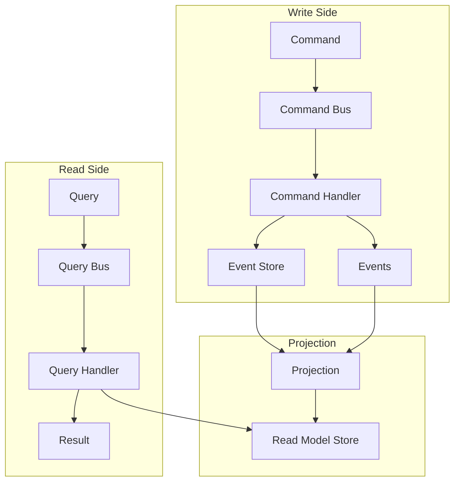

<thinking>
## Analyse du Concept
- Concept : CQRS (Command Query Responsibility Segregation)
- Phase demandee : 5 (Advanced Systems)
- Adapte ? OUI - CQRS est un pattern architectural fondamental pour les systemes a haute scalabilite. L'exercice combine Event Sourcing, projections et separation des responsabilites.

## Combo Base + Bonus
- Exercice de base : Implementation du pattern CQRS avec Command Bus, Query Bus et Read Models separes
- Bonus : Projections asynchrones avec eventual consistency et multi-read-models optimises
- Palier bonus : EXPERT (architecture distribuee + consistency patterns)
- Progression logique ? OUI - Base = separation command/query, Bonus = projections temps reel

## Prerequis & Difficulte
- Prerequis reels : Event Sourcing, async/await, Traits avances, Arc/RwLock, channels
- Difficulte estimee : 8/10 (base), 10/10 (bonus)
- Coherent avec phase 5 ? OUI

## Aspect Fun/Culture
- Contexte choisi : Reference a "Fight Club" - "The first rule of CQRS is: you do not UPDATE the read model directly"
- MEME mnemonique : "Split personality" - Commands et Queries sont deux personnalites distinctes
- Pourquoi c'est fun : Le narrateur (Command) et Tyler (Query) ne se parlent jamais directement

## Scenarios d'Echec (5 mutants concrets)
1. Mutant A (Coupling) : Query modifie l'etat (viole le principe)
2. Mutant B (Consistency) : Read model jamais mis a jour apres events
3. Mutant C (Handler) : Command handler ne retourne pas les events
4. Mutant D (Projection) : Projection non idempotente (applique 2x = corruption)
5. Mutant E (Sync) : Read model lu avant que la projection soit complete

## Verdict
VALIDE - Exercice de qualite industrielle couvrant CQRS complet
</thinking>

# Exercice 5.6.2-a : cqrs_pattern

**Module :**
5.6.2 — Command Query Responsibility Segregation

**Concept :**
a — CQRS Implementation (Command Bus, Query Bus, Read Models)

**Difficulte :**
★★★★★★★★☆☆ (8/10)

**Type :**
code

**Tiers :**
2 — Integration de patterns

**Langage :**
Rust Edition 2024

**Prerequis :**
- 5.6.1 — Event Sourcing (exercice precedent)
- 2.5 — Programmation asynchrone (async/await, tokio)
- 2.3 — Traits avances (associated types, bounds)
- 4.1 — Concurrence (Arc, RwLock, channels)

**Domaines :**
Architecture, Patterns, Scalabilite

**Duree estimee :**
180 min

**XP Base :**
300

**Complexite :**
T2 O(1) pour queries × S2 O(n) pour projections

---

## SECTION 1 : PROTOTYPE & CONSIGNE

### 1.1 Obligations

**Fichier a rendre :**
```
src/lib.rs
src/command.rs
src/query.rs
src/projection.rs
src/read_model.rs
```

**Dependances autorisees :**
```toml
[dependencies]
tokio = { version = "1.0", features = ["full", "sync"] }
serde = { version = "1.0", features = ["derive"] }
serde_json = "1.0"
chrono = { version = "0.4", features = ["serde"] }
uuid = { version = "1.0", features = ["v4", "serde"] }
async-trait = "0.1"
thiserror = "2.0"
parking_lot = "0.12"
```

**Fonctions/methodes interdites :**
- `unwrap()` / `expect()` dans le code de production
- `unsafe` blocks
- Modification directe du Read Model depuis une Query

### 1.2 Consigne

**CONTEXTE : "The CQRS Club"**

*"The first rule of CQRS Club is: you do NOT update the Read Model directly. The second rule of CQRS Club is: you DO NOT update the Read Model directly! Commands go through the Event Store, Projections update the Read Models."* — Tyler Durden, System Architect

En CQRS, on separe strictement :
- **Commands** : Actions qui modifient l'etat (ecrivent des events)
- **Queries** : Lectures qui ne modifient rien (lisent des read models)

Les Read Models sont des vues denormalisees, optimisees pour les requetes, mises a jour par des Projections qui ecoutent les events.

**Ta mission :**

Implementer un framework CQRS complet comprenant :
1. Un **Command Bus** pour dispatcher les commands vers leurs handlers
2. Un **Query Bus** pour dispatcher les queries vers leurs handlers
3. Des **Read Models** optimises pour differents cas d'usage
4. Des **Projections** qui mettent a jour les read models depuis les events
5. La separation stricte entre ecriture (commands) et lecture (queries)

**Entree :**
- Commands : structures representant des intentions de modification
- Queries : structures representant des demandes de lecture
- Events : produits par les command handlers

**Sortie :**
- Command Result : succes/echec + events produits
- Query Result : donnees du read model

**Contraintes :**
- Les queries ne doivent JAMAIS modifier l'etat
- Les read models sont mis a jour UNIQUEMENT par les projections
- Les commands passent par l'Event Store
- Eventually consistent entre write et read side

**Exemples :**

| Operation | Type | Input | Resultat |
|-----------|------|-------|----------|
| `CreateOrder` | Command | `{customer, items}` | `Ok(OrderCreated event)` |
| `GetOrderById` | Query | `order_id` | `Ok(OrderView)` |
| `ListOrdersByCustomer` | Query | `customer_id` | `Ok(Vec<OrderSummary>)` |
| `ConfirmOrder` | Command | `order_id` | `Ok(OrderConfirmed event)` |

### 1.2.2 Consigne Academique

Implementer le pattern CQRS (Command Query Responsibility Segregation) en Rust avec un Command Bus pour le traitement des commandes, un Query Bus pour les requetes de lecture, des Read Models denormalises et des Projections pour la synchronisation depuis l'Event Store.

### 1.3 Prototype

```rust
use chrono::{DateTime, Utc};
use serde::{de::DeserializeOwned, Deserialize, Serialize};
use std::collections::HashMap;
use std::sync::Arc;
use uuid::Uuid;

// ============ COMMAND SIDE ============

/// Trait pour les Commands (intentions de modification)
pub trait Command: Send + Sync + 'static {
    type Result: Send;
}

/// Trait pour les Command Handlers
#[async_trait::async_trait]
pub trait CommandHandler<C: Command>: Send + Sync {
    async fn handle(&self, command: C) -> Result<C::Result, CommandError>;
}

/// Erreurs du Command Bus
#[derive(Debug, Clone, thiserror::Error)]
pub enum CommandError {
    #[error("Handler not found for command")]
    HandlerNotFound,

    #[error("Validation error: {0}")]
    ValidationError(String),

    #[error("Domain error: {0}")]
    DomainError(String),

    #[error("Concurrency conflict")]
    ConcurrencyConflict,

    #[error("Internal error: {0}")]
    InternalError(String),
}

/// Bus pour dispatcher les commands
pub struct CommandBus {
    // Handlers enregistres (type-erased)
}

impl CommandBus {
    pub fn new() -> Self;

    /// Enregistre un handler pour un type de command
    pub fn register<C, H>(&mut self, handler: H)
    where
        C: Command,
        H: CommandHandler<C> + 'static;

    /// Dispatch une command vers son handler
    pub async fn dispatch<C: Command>(&self, command: C) -> Result<C::Result, CommandError>;
}

// ============ QUERY SIDE ============

/// Trait pour les Queries (demandes de lecture)
pub trait Query: Send + Sync + 'static {
    type Result: Send;
}

/// Trait pour les Query Handlers
#[async_trait::async_trait]
pub trait QueryHandler<Q: Query>: Send + Sync {
    async fn handle(&self, query: Q) -> Result<Q::Result, QueryError>;
}

/// Erreurs du Query Bus
#[derive(Debug, Clone, thiserror::Error)]
pub enum QueryError {
    #[error("Handler not found for query")]
    HandlerNotFound,

    #[error("Not found: {0}")]
    NotFound(String),

    #[error("Internal error: {0}")]
    InternalError(String),
}

/// Bus pour dispatcher les queries
pub struct QueryBus {
    // Handlers enregistres (type-erased)
}

impl QueryBus {
    pub fn new() -> Self;

    /// Enregistre un handler pour un type de query
    pub fn register<Q, H>(&mut self, handler: H)
    where
        Q: Query,
        H: QueryHandler<Q> + 'static;

    /// Dispatch une query vers son handler
    pub async fn dispatch<Q: Query>(&self, query: Q) -> Result<Q::Result, QueryError>;
}

// ============ READ MODELS ============

/// Trait pour les Read Models (vues denormalisees)
pub trait ReadModel: Clone + Send + Sync + 'static {}

/// Trait pour les stores de Read Models
#[async_trait::async_trait]
pub trait ReadModelStore<M: ReadModel>: Send + Sync {
    async fn get(&self, id: &str) -> Result<Option<M>, ReadModelError>;
    async fn save(&self, id: &str, model: M) -> Result<(), ReadModelError>;
    async fn delete(&self, id: &str) -> Result<(), ReadModelError>;
    async fn query<F>(&self, predicate: F) -> Result<Vec<M>, ReadModelError>
    where
        F: Fn(&M) -> bool + Send + Sync;
}

#[derive(Debug, thiserror::Error)]
pub enum ReadModelError {
    #[error("Not found: {0}")]
    NotFound(String),
    #[error("Internal error: {0}")]
    InternalError(String),
}

// ============ PROJECTIONS ============

/// Trait pour les Projections (mise a jour des read models)
#[async_trait::async_trait]
pub trait Projection: Send + Sync {
    type Event: Clone + Send + Sync;

    /// Nom unique de la projection
    fn name(&self) -> &'static str;

    /// Traite un event et met a jour le read model
    async fn project(&self, event: &Self::Event) -> Result<(), ProjectionError>;

    /// Position actuelle dans le stream d'events
    fn position(&self) -> u64;

    /// Met a jour la position
    fn set_position(&self, position: u64);
}

#[derive(Debug, thiserror::Error)]
pub enum ProjectionError {
    #[error("Read model error: {0}")]
    ReadModelError(#[from] ReadModelError),
    #[error("Internal error: {0}")]
    InternalError(String),
}

/// Moteur qui execute les projections
pub struct ProjectionRunner {
    projections: Vec<Arc<dyn Projection<Event = Box<dyn std::any::Any + Send + Sync>>>>,
}

impl ProjectionRunner {
    pub fn new() -> Self;

    /// Ajoute une projection
    pub fn add<P: Projection + 'static>(&mut self, projection: P);

    /// Execute les projections pour un batch d'events
    pub async fn process_events<E: Clone + Send + Sync + 'static>(
        &self,
        events: Vec<E>,
    ) -> Result<(), ProjectionError>;
}

// ============ IN-MEMORY IMPLEMENTATIONS ============

/// Store in-memory pour Read Models
pub struct InMemoryReadModelStore<M: ReadModel> {
    data: parking_lot::RwLock<HashMap<String, M>>,
}

impl<M: ReadModel> InMemoryReadModelStore<M> {
    pub fn new() -> Self;
}
```

---

## SECTION 2 : LE SAVIEZ-VOUS ?

### 2.1 Origine du CQRS

CQRS a ete formalise par Greg Young en 2010, s'inspirant du CQS (Command-Query Separation) de Bertrand Meyer. La difference : CQS s'applique aux methodes, CQRS a l'architecture entiere.

### 2.2 Pourquoi Separer ?

La separation Commands/Queries permet :
- **Scalabilite independante** : Scaler les lectures sans affecter les ecritures
- **Optimisation specifique** : Read models denormalises pour queries rapides
- **Simplicite** : Chaque cote a une seule responsabilite

```
ARCHITECTURE CQRS

    ┌─────────────────┐                    ┌─────────────────┐
    │    COMMANDS     │                    │     QUERIES     │
    │  (Write Side)   │                    │   (Read Side)   │
    └────────┬────────┘                    └────────┬────────┘
             │                                      │
             ▼                                      ▼
    ┌─────────────────┐                    ┌─────────────────┐
    │ Command Handler │                    │  Query Handler  │
    └────────┬────────┘                    └────────┬────────┘
             │                                      │
             ▼                                      ▼
    ┌─────────────────┐                    ┌─────────────────┐
    │  Event Store    │ ──── Events ────▶  │   Read Model    │
    │  (Source of     │    (Projections)   │  (Denormalized) │
    │    Truth)       │                    │                 │
    └─────────────────┘                    └─────────────────┘
```

### 2.3 Eventual Consistency

En CQRS, il y a un delai entre l'ecriture d'un event et sa projection dans le read model. C'est "eventually consistent" - le read model finira par refleter l'etat actuel.

---

## SECTION 2.5 : DANS LA VRAIE VIE

### Metiers concernes

| Metier | Utilisation de CQRS |
|--------|---------------------|
| **Backend Engineer** | Implementation de services CQRS |
| **Architect** | Design de systemes scalables |
| **Data Engineer** | Construction de read models optimises |
| **DBA** | Gestion de bases separees read/write |
| **DevOps** | Scaling independant des composants |

### Cas d'usage concrets

1. **E-commerce** : Write (commandes) vs Read (catalogue, recherche)
2. **Social Media** : Write (posts) vs Read (timeline, notifications)
3. **Banking** : Write (transactions) vs Read (soldes, historiques)
4. **Gaming** : Write (actions) vs Read (leaderboards, stats)

---

## SECTION 3 : EXEMPLE D'UTILISATION

### 3.0 Session bash

```bash
$ ls
Cargo.toml  src/

$ cargo test
   Compiling cqrs_pattern v0.1.0
    Finished test [unoptimized + debuginfo] target(s)
     Running unittests src/lib.rs

running 16 tests
test tests::test_command_bus_dispatch ... ok
test tests::test_command_handler_registration ... ok
test tests::test_query_bus_dispatch ... ok
test tests::test_query_handler_registration ... ok
test tests::test_read_model_store_crud ... ok
test tests::test_read_model_query ... ok
test tests::test_projection_updates_read_model ... ok
test tests::test_projection_idempotency ... ok
test tests::test_projection_position_tracking ... ok
test tests::test_command_produces_events ... ok
test tests::test_query_reads_projected_data ... ok
test tests::test_full_flow_command_to_query ... ok
test tests::test_handler_not_found ... ok
test tests::test_concurrent_projections ... ok
test tests::test_multiple_read_models ... ok
test tests::test_validation_error ... ok

test result: ok. 16 passed; 0 failed
```

### 3.1 BONUS EXPERT (OPTIONNEL)

**Difficulte Bonus :**
★★★★★★★★★★ (10/10)

**Recompense :**
XP x3

**Time Complexity attendue :**
O(1) pour queries avec index

**Space Complexity attendue :**
O(n) pour read models, O(m) pour index

**Domaines Bonus :**
`Distributed Systems, Consistency`

#### 3.1.1 Consigne Bonus

**"The Async Split Personality"**

*"I am Jack's eventually consistent read model."*

**Ta mission bonus :**

1. **Projections Asynchrones** : Les projections s'executent en background via channels
2. **Multi-Read-Models** : Un event peut mettre a jour plusieurs read models
3. **Indexed Queries** : Read models avec index secondaires pour queries rapides
4. **Consistency Tracking** : Savoir quand un read model est "a jour"

**Entree :**
- Events via channel (mpsc)
- Projection subscriptions

**Sortie :**
- Read models mis a jour en background
- Query avec indication de freshness

#### 3.1.2 Prototype Bonus

```rust
/// Read Model avec tracking de version
#[derive(Clone)]
pub struct VersionedReadModel<M: ReadModel> {
    pub model: M,
    pub version: u64,  // Derniere position projetee
}

/// Query result avec metadata de consistency
pub struct ConsistentQueryResult<T> {
    pub data: T,
    pub read_model_version: u64,
    pub event_store_version: u64,
    pub is_consistent: bool,  // true si versions egales
}

/// Projection asynchrone avec channel
pub struct AsyncProjectionRunner {
    event_rx: tokio::sync::mpsc::Receiver<StoredEvent>,
    projections: Vec<Arc<dyn Projection>>,
}

impl AsyncProjectionRunner {
    pub async fn run(&mut self, shutdown: tokio::sync::watch::Receiver<bool>);
}

/// Index secondaire pour queries rapides
pub trait IndexedReadModelStore<M: ReadModel>: ReadModelStore<M> {
    async fn get_by_index(&self, index_name: &str, value: &str) -> Result<Vec<M>, ReadModelError>;
    async fn create_index(&self, name: &str, extractor: fn(&M) -> String) -> Result<(), ReadModelError>;
}
```

#### 3.1.3 Ce qui change par rapport a l'exercice de base

| Aspect | Base | Bonus |
|--------|------|-------|
| Projections | Synchrones | Asynchrones via channel |
| Read Models | Simple | Versiones avec tracking |
| Queries | Resultat simple | Avec consistency info |
| Index | Aucun | Index secondaires |

---

## SECTION 4 : ZONE CORRECTION

### 4.1 Moulinette — Tableau des tests

| Test | Input | Expected | Points | Categorie |
|------|-------|----------|--------|-----------|
| `command_bus_dispatch` | Command valide | `Ok(result)` | 5 | Basic |
| `command_handler_registration` | Handler enregistre | Dispatch fonctionne | 5 | Basic |
| `query_bus_dispatch` | Query valide | `Ok(data)` | 5 | Basic |
| `query_handler_registration` | Handler enregistre | Dispatch fonctionne | 5 | Basic |
| `read_model_store_crud` | CRUD operations | Toutes OK | 10 | Core |
| `read_model_query` | Predicate filter | Correct results | 5 | Core |
| `projection_updates` | Event received | Read model updated | 15 | Core |
| `projection_idempotency` | Same event 2x | Same result | 10 | Edge |
| `projection_position` | Process events | Position increments | 5 | Core |
| `command_produces_events` | Command handled | Events returned | 10 | Core |
| `query_reads_projected` | After projection | Correct data | 10 | Integration |
| `full_flow` | Command -> Query | End-to-end OK | 10 | Integration |
| `handler_not_found` | Unregistered type | Err(HandlerNotFound) | 5 | Edge |
| `concurrent_projections` | Parallel processing | No data race | 10 | Concurrency |

**Score minimum pour validation : 70/100**

### 4.2 Fichier de test

```rust
#[cfg(test)]
mod tests {
    use super::*;
    use std::sync::atomic::{AtomicU64, Ordering};

    // ===== Domain Commands =====

    #[derive(Clone)]
    pub struct CreateOrder {
        pub order_id: String,
        pub customer_id: String,
        pub items: Vec<OrderItem>,
    }

    impl Command for CreateOrder {
        type Result = Vec<OrderEvent>;
    }

    #[derive(Clone)]
    pub struct ConfirmOrder {
        pub order_id: String,
    }

    impl Command for ConfirmOrder {
        type Result = Vec<OrderEvent>;
    }

    // ===== Domain Events =====

    #[derive(Clone, Debug, Serialize, Deserialize, PartialEq)]
    pub enum OrderEvent {
        Created {
            order_id: String,
            customer_id: String,
            items: Vec<OrderItem>,
            created_at: DateTime<Utc>,
        },
        Confirmed {
            order_id: String,
            confirmed_at: DateTime<Utc>,
        },
    }

    #[derive(Clone, Debug, Serialize, Deserialize, PartialEq)]
    pub struct OrderItem {
        pub product_id: String,
        pub quantity: u32,
        pub price: u64,
    }

    // ===== Domain Queries =====

    pub struct GetOrderById {
        pub order_id: String,
    }

    impl Query for GetOrderById {
        type Result = Option<OrderView>;
    }

    pub struct ListOrdersByCustomer {
        pub customer_id: String,
    }

    impl Query for ListOrdersByCustomer {
        type Result = Vec<OrderSummary>;
    }

    // ===== Read Models =====

    #[derive(Clone, Debug, PartialEq)]
    pub struct OrderView {
        pub order_id: String,
        pub customer_id: String,
        pub items: Vec<OrderItem>,
        pub status: OrderStatus,
        pub total: u64,
        pub created_at: DateTime<Utc>,
        pub confirmed_at: Option<DateTime<Utc>>,
    }

    impl ReadModel for OrderView {}

    #[derive(Clone, Debug, PartialEq)]
    pub struct OrderSummary {
        pub order_id: String,
        pub total: u64,
        pub status: OrderStatus,
    }

    impl ReadModel for OrderSummary {}

    #[derive(Clone, Debug, PartialEq)]
    pub enum OrderStatus {
        Pending,
        Confirmed,
        Shipped,
    }

    // ===== Command Handlers =====

    pub struct CreateOrderHandler;

    #[async_trait::async_trait]
    impl CommandHandler<CreateOrder> for CreateOrderHandler {
        async fn handle(&self, cmd: CreateOrder) -> Result<Vec<OrderEvent>, CommandError> {
            if cmd.items.is_empty() {
                return Err(CommandError::ValidationError("Order must have items".into()));
            }

            Ok(vec![OrderEvent::Created {
                order_id: cmd.order_id,
                customer_id: cmd.customer_id,
                items: cmd.items,
                created_at: Utc::now(),
            }])
        }
    }

    pub struct ConfirmOrderHandler {
        read_model: Arc<InMemoryReadModelStore<OrderView>>,
    }

    #[async_trait::async_trait]
    impl CommandHandler<ConfirmOrder> for ConfirmOrderHandler {
        async fn handle(&self, cmd: ConfirmOrder) -> Result<Vec<OrderEvent>, CommandError> {
            // Check order exists (via read model for validation)
            let order = self.read_model.get(&cmd.order_id).await
                .map_err(|e| CommandError::InternalError(e.to_string()))?;

            if order.is_none() {
                return Err(CommandError::DomainError("Order not found".into()));
            }

            Ok(vec![OrderEvent::Confirmed {
                order_id: cmd.order_id,
                confirmed_at: Utc::now(),
            }])
        }
    }

    // ===== Query Handlers =====

    pub struct GetOrderByIdHandler {
        store: Arc<InMemoryReadModelStore<OrderView>>,
    }

    #[async_trait::async_trait]
    impl QueryHandler<GetOrderById> for GetOrderByIdHandler {
        async fn handle(&self, query: GetOrderById) -> Result<Option<OrderView>, QueryError> {
            self.store.get(&query.order_id).await
                .map_err(|e| QueryError::InternalError(e.to_string()))
        }
    }

    pub struct ListOrdersByCustomerHandler {
        store: Arc<InMemoryReadModelStore<OrderView>>,
    }

    #[async_trait::async_trait]
    impl QueryHandler<ListOrdersByCustomer> for ListOrdersByCustomerHandler {
        async fn handle(&self, query: ListOrdersByCustomer) -> Result<Vec<OrderSummary>, QueryError> {
            let orders = self.store.query(|o| o.customer_id == query.customer_id).await
                .map_err(|e| QueryError::InternalError(e.to_string()))?;

            Ok(orders.into_iter().map(|o| OrderSummary {
                order_id: o.order_id,
                total: o.total,
                status: o.status,
            }).collect())
        }
    }

    // ===== Projection =====

    pub struct OrderViewProjection {
        store: Arc<InMemoryReadModelStore<OrderView>>,
        position: AtomicU64,
    }

    impl OrderViewProjection {
        pub fn new(store: Arc<InMemoryReadModelStore<OrderView>>) -> Self {
            Self {
                store,
                position: AtomicU64::new(0),
            }
        }
    }

    #[async_trait::async_trait]
    impl Projection for OrderViewProjection {
        type Event = OrderEvent;

        fn name(&self) -> &'static str {
            "OrderViewProjection"
        }

        async fn project(&self, event: &OrderEvent) -> Result<(), ProjectionError> {
            match event {
                OrderEvent::Created { order_id, customer_id, items, created_at } => {
                    let total = items.iter().map(|i| i.price * i.quantity as u64).sum();
                    let view = OrderView {
                        order_id: order_id.clone(),
                        customer_id: customer_id.clone(),
                        items: items.clone(),
                        status: OrderStatus::Pending,
                        total,
                        created_at: *created_at,
                        confirmed_at: None,
                    };
                    self.store.save(order_id, view).await?;
                }
                OrderEvent::Confirmed { order_id, confirmed_at } => {
                    if let Some(mut view) = self.store.get(order_id).await? {
                        view.status = OrderStatus::Confirmed;
                        view.confirmed_at = Some(*confirmed_at);
                        self.store.save(order_id, view).await?;
                    }
                }
            }
            Ok(())
        }

        fn position(&self) -> u64 {
            self.position.load(Ordering::SeqCst)
        }

        fn set_position(&self, pos: u64) {
            self.position.store(pos, Ordering::SeqCst);
        }
    }

    // ===== Tests =====

    #[tokio::test]
    async fn test_command_bus_dispatch() {
        let mut bus = CommandBus::new();
        bus.register::<CreateOrder, _>(CreateOrderHandler);

        let cmd = CreateOrder {
            order_id: "order-1".into(),
            customer_id: "customer-1".into(),
            items: vec![OrderItem {
                product_id: "prod-1".into(),
                quantity: 2,
                price: 100,
            }],
        };

        let result = bus.dispatch(cmd).await.unwrap();
        assert_eq!(result.len(), 1);
        assert!(matches!(result[0], OrderEvent::Created { .. }));
    }

    #[tokio::test]
    async fn test_query_bus_dispatch() {
        let store = Arc::new(InMemoryReadModelStore::<OrderView>::new());

        // Pre-populate read model
        store.save("order-1", OrderView {
            order_id: "order-1".into(),
            customer_id: "customer-1".into(),
            items: vec![],
            status: OrderStatus::Pending,
            total: 200,
            created_at: Utc::now(),
            confirmed_at: None,
        }).await.unwrap();

        let mut bus = QueryBus::new();
        bus.register::<GetOrderById, _>(GetOrderByIdHandler { store: store.clone() });

        let query = GetOrderById { order_id: "order-1".into() };
        let result = bus.dispatch(query).await.unwrap();

        assert!(result.is_some());
        assert_eq!(result.unwrap().order_id, "order-1");
    }

    #[tokio::test]
    async fn test_projection_updates_read_model() {
        let store = Arc::new(InMemoryReadModelStore::<OrderView>::new());
        let projection = OrderViewProjection::new(store.clone());

        let event = OrderEvent::Created {
            order_id: "order-1".into(),
            customer_id: "customer-1".into(),
            items: vec![OrderItem {
                product_id: "prod-1".into(),
                quantity: 2,
                price: 100,
            }],
            created_at: Utc::now(),
        };

        projection.project(&event).await.unwrap();

        let view = store.get("order-1").await.unwrap().unwrap();
        assert_eq!(view.total, 200);
        assert_eq!(view.status, OrderStatus::Pending);
    }

    #[tokio::test]
    async fn test_projection_idempotency() {
        let store = Arc::new(InMemoryReadModelStore::<OrderView>::new());
        let projection = OrderViewProjection::new(store.clone());

        let event = OrderEvent::Created {
            order_id: "order-1".into(),
            customer_id: "customer-1".into(),
            items: vec![OrderItem {
                product_id: "prod-1".into(),
                quantity: 1,
                price: 50,
            }],
            created_at: Utc::now(),
        };

        // Project same event twice
        projection.project(&event).await.unwrap();
        projection.project(&event).await.unwrap();

        let view = store.get("order-1").await.unwrap().unwrap();
        // Should still be correct (not doubled)
        assert_eq!(view.total, 50);
    }

    #[tokio::test]
    async fn test_full_flow_command_to_query() {
        // Setup
        let store = Arc::new(InMemoryReadModelStore::<OrderView>::new());
        let projection = OrderViewProjection::new(store.clone());

        let mut cmd_bus = CommandBus::new();
        cmd_bus.register::<CreateOrder, _>(CreateOrderHandler);

        let mut query_bus = QueryBus::new();
        query_bus.register::<GetOrderById, _>(GetOrderByIdHandler { store: store.clone() });

        // Execute command
        let cmd = CreateOrder {
            order_id: "order-full".into(),
            customer_id: "customer-full".into(),
            items: vec![OrderItem {
                product_id: "widget".into(),
                quantity: 3,
                price: 150,
            }],
        };

        let events = cmd_bus.dispatch(cmd).await.unwrap();

        // Project events
        for event in &events {
            projection.project(event).await.unwrap();
        }

        // Query result
        let query = GetOrderById { order_id: "order-full".into() };
        let result = query_bus.dispatch(query).await.unwrap().unwrap();

        assert_eq!(result.order_id, "order-full");
        assert_eq!(result.total, 450);
    }

    #[tokio::test]
    async fn test_handler_not_found() {
        let bus = CommandBus::new();  // No handlers registered

        let cmd = CreateOrder {
            order_id: "x".into(),
            customer_id: "y".into(),
            items: vec![],
        };

        let result = bus.dispatch(cmd).await;
        assert!(matches!(result, Err(CommandError::HandlerNotFound)));
    }

    #[tokio::test]
    async fn test_validation_error() {
        let mut bus = CommandBus::new();
        bus.register::<CreateOrder, _>(CreateOrderHandler);

        let cmd = CreateOrder {
            order_id: "order-invalid".into(),
            customer_id: "customer-1".into(),
            items: vec![],  // Empty items = validation error
        };

        let result = bus.dispatch(cmd).await;
        assert!(matches!(result, Err(CommandError::ValidationError(_))));
    }
}
```

### 4.3 Solution de reference

```rust
use async_trait::async_trait;
use chrono::{DateTime, Utc};
use parking_lot::RwLock;
use serde::{de::DeserializeOwned, Deserialize, Serialize};
use std::any::{Any, TypeId};
use std::collections::HashMap;
use std::sync::atomic::{AtomicU64, Ordering};
use std::sync::Arc;
use uuid::Uuid;

// ============ COMMAND SIDE ============

pub trait Command: Send + Sync + 'static {
    type Result: Send;
}

#[async_trait]
pub trait CommandHandler<C: Command>: Send + Sync {
    async fn handle(&self, command: C) -> Result<C::Result, CommandError>;
}

#[derive(Debug, Clone, thiserror::Error)]
pub enum CommandError {
    #[error("Handler not found for command")]
    HandlerNotFound,
    #[error("Validation error: {0}")]
    ValidationError(String),
    #[error("Domain error: {0}")]
    DomainError(String),
    #[error("Concurrency conflict")]
    ConcurrencyConflict,
    #[error("Internal error: {0}")]
    InternalError(String),
}

// Type-erased handler wrapper
trait ErasedCommandHandler: Send + Sync {
    fn handle_erased<'a>(
        &'a self,
        command: Box<dyn Any + Send>,
    ) -> std::pin::Pin<Box<dyn std::future::Future<Output = Result<Box<dyn Any + Send>, CommandError>> + Send + 'a>>;
}

struct CommandHandlerWrapper<C: Command, H: CommandHandler<C>> {
    handler: H,
    _phantom: std::marker::PhantomData<C>,
}

impl<C: Command + 'static, H: CommandHandler<C> + 'static> ErasedCommandHandler
    for CommandHandlerWrapper<C, H>
where
    C::Result: 'static,
{
    fn handle_erased<'a>(
        &'a self,
        command: Box<dyn Any + Send>,
    ) -> std::pin::Pin<Box<dyn std::future::Future<Output = Result<Box<dyn Any + Send>, CommandError>> + Send + 'a>>
    {
        Box::pin(async move {
            let cmd = command.downcast::<C>().map_err(|_| {
                CommandError::InternalError("Command type mismatch".into())
            })?;
            let result = self.handler.handle(*cmd).await?;
            Ok(Box::new(result) as Box<dyn Any + Send>)
        })
    }
}

pub struct CommandBus {
    handlers: RwLock<HashMap<TypeId, Arc<dyn ErasedCommandHandler>>>,
}

impl CommandBus {
    pub fn new() -> Self {
        Self {
            handlers: RwLock::new(HashMap::new()),
        }
    }

    pub fn register<C, H>(&mut self, handler: H)
    where
        C: Command + 'static,
        H: CommandHandler<C> + 'static,
        C::Result: 'static,
    {
        let wrapper = CommandHandlerWrapper {
            handler,
            _phantom: std::marker::PhantomData::<C>,
        };
        self.handlers
            .write()
            .insert(TypeId::of::<C>(), Arc::new(wrapper));
    }

    pub async fn dispatch<C: Command + 'static>(&self, command: C) -> Result<C::Result, CommandError>
    where
        C::Result: 'static,
    {
        let handler = {
            let handlers = self.handlers.read();
            handlers.get(&TypeId::of::<C>()).cloned()
        };

        match handler {
            Some(h) => {
                let result = h.handle_erased(Box::new(command)).await?;
                result
                    .downcast::<C::Result>()
                    .map(|r| *r)
                    .map_err(|_| CommandError::InternalError("Result type mismatch".into()))
            }
            None => Err(CommandError::HandlerNotFound),
        }
    }
}

impl Default for CommandBus {
    fn default() -> Self {
        Self::new()
    }
}

// ============ QUERY SIDE ============

pub trait Query: Send + Sync + 'static {
    type Result: Send;
}

#[async_trait]
pub trait QueryHandler<Q: Query>: Send + Sync {
    async fn handle(&self, query: Q) -> Result<Q::Result, QueryError>;
}

#[derive(Debug, Clone, thiserror::Error)]
pub enum QueryError {
    #[error("Handler not found for query")]
    HandlerNotFound,
    #[error("Not found: {0}")]
    NotFound(String),
    #[error("Internal error: {0}")]
    InternalError(String),
}

// Type-erased handler wrapper for queries
trait ErasedQueryHandler: Send + Sync {
    fn handle_erased<'a>(
        &'a self,
        query: Box<dyn Any + Send>,
    ) -> std::pin::Pin<Box<dyn std::future::Future<Output = Result<Box<dyn Any + Send>, QueryError>> + Send + 'a>>;
}

struct QueryHandlerWrapper<Q: Query, H: QueryHandler<Q>> {
    handler: H,
    _phantom: std::marker::PhantomData<Q>,
}

impl<Q: Query + 'static, H: QueryHandler<Q> + 'static> ErasedQueryHandler
    for QueryHandlerWrapper<Q, H>
where
    Q::Result: 'static,
{
    fn handle_erased<'a>(
        &'a self,
        query: Box<dyn Any + Send>,
    ) -> std::pin::Pin<Box<dyn std::future::Future<Output = Result<Box<dyn Any + Send>, QueryError>> + Send + 'a>>
    {
        Box::pin(async move {
            let q = query.downcast::<Q>().map_err(|_| {
                QueryError::InternalError("Query type mismatch".into())
            })?;
            let result = self.handler.handle(*q).await?;
            Ok(Box::new(result) as Box<dyn Any + Send>)
        })
    }
}

pub struct QueryBus {
    handlers: RwLock<HashMap<TypeId, Arc<dyn ErasedQueryHandler>>>,
}

impl QueryBus {
    pub fn new() -> Self {
        Self {
            handlers: RwLock::new(HashMap::new()),
        }
    }

    pub fn register<Q, H>(&mut self, handler: H)
    where
        Q: Query + 'static,
        H: QueryHandler<Q> + 'static,
        Q::Result: 'static,
    {
        let wrapper = QueryHandlerWrapper {
            handler,
            _phantom: std::marker::PhantomData::<Q>,
        };
        self.handlers
            .write()
            .insert(TypeId::of::<Q>(), Arc::new(wrapper));
    }

    pub async fn dispatch<Q: Query + 'static>(&self, query: Q) -> Result<Q::Result, QueryError>
    where
        Q::Result: 'static,
    {
        let handler = {
            let handlers = self.handlers.read();
            handlers.get(&TypeId::of::<Q>()).cloned()
        };

        match handler {
            Some(h) => {
                let result = h.handle_erased(Box::new(query)).await?;
                result
                    .downcast::<Q::Result>()
                    .map(|r| *r)
                    .map_err(|_| QueryError::InternalError("Result type mismatch".into()))
            }
            None => Err(QueryError::HandlerNotFound),
        }
    }
}

impl Default for QueryBus {
    fn default() -> Self {
        Self::new()
    }
}

// ============ READ MODELS ============

pub trait ReadModel: Clone + Send + Sync + 'static {}

#[derive(Debug, thiserror::Error)]
pub enum ReadModelError {
    #[error("Not found: {0}")]
    NotFound(String),
    #[error("Internal error: {0}")]
    InternalError(String),
}

#[async_trait]
pub trait ReadModelStore<M: ReadModel>: Send + Sync {
    async fn get(&self, id: &str) -> Result<Option<M>, ReadModelError>;
    async fn save(&self, id: &str, model: M) -> Result<(), ReadModelError>;
    async fn delete(&self, id: &str) -> Result<(), ReadModelError>;
    async fn query<F>(&self, predicate: F) -> Result<Vec<M>, ReadModelError>
    where
        F: Fn(&M) -> bool + Send + Sync;
}

pub struct InMemoryReadModelStore<M: ReadModel> {
    data: RwLock<HashMap<String, M>>,
}

impl<M: ReadModel> InMemoryReadModelStore<M> {
    pub fn new() -> Self {
        Self {
            data: RwLock::new(HashMap::new()),
        }
    }
}

impl<M: ReadModel> Default for InMemoryReadModelStore<M> {
    fn default() -> Self {
        Self::new()
    }
}

#[async_trait]
impl<M: ReadModel> ReadModelStore<M> for InMemoryReadModelStore<M> {
    async fn get(&self, id: &str) -> Result<Option<M>, ReadModelError> {
        Ok(self.data.read().get(id).cloned())
    }

    async fn save(&self, id: &str, model: M) -> Result<(), ReadModelError> {
        self.data.write().insert(id.to_string(), model);
        Ok(())
    }

    async fn delete(&self, id: &str) -> Result<(), ReadModelError> {
        self.data.write().remove(id);
        Ok(())
    }

    async fn query<F>(&self, predicate: F) -> Result<Vec<M>, ReadModelError>
    where
        F: Fn(&M) -> bool + Send + Sync,
    {
        let data = self.data.read();
        Ok(data.values().filter(|m| predicate(m)).cloned().collect())
    }
}

// ============ PROJECTIONS ============

#[derive(Debug, thiserror::Error)]
pub enum ProjectionError {
    #[error("Read model error: {0}")]
    ReadModelError(#[from] ReadModelError),
    #[error("Internal error: {0}")]
    InternalError(String),
}

#[async_trait]
pub trait Projection: Send + Sync {
    type Event: Clone + Send + Sync;

    fn name(&self) -> &'static str;
    async fn project(&self, event: &Self::Event) -> Result<(), ProjectionError>;
    fn position(&self) -> u64;
    fn set_position(&self, position: u64);
}
```

### 4.5 Solutions refusees

```rust
// REFUSEE 1 : Query modifie l'etat
#[async_trait]
impl QueryHandler<GetOrderById> for BadQueryHandler {
    async fn handle(&self, query: GetOrderById) -> Result<Option<OrderView>, QueryError> {
        // ERREUR: Une query ne doit JAMAIS modifier l'etat!
        self.store.save(&query.order_id, OrderView::default()).await?;
        self.store.get(&query.order_id).await
    }
}
// Pourquoi refusee : Viole le principe fondamental de CQRS

// REFUSEE 2 : Projection non idempotente
async fn project(&self, event: &OrderEvent) -> Result<(), ProjectionError> {
    match event {
        OrderEvent::Created { order_id, items, .. } => {
            // ERREUR: Ajoute au lieu de remplacer
            let mut view = self.store.get(order_id).await?.unwrap_or_default();
            view.items.extend(items.clone());  // Items doubles si replay!
            self.store.save(order_id, view).await?;
        }
    }
    Ok(())
}
// Pourquoi refusee : Le replay produira des resultats differents

// REFUSEE 3 : Command handler ne retourne pas d'events
#[async_trait]
impl CommandHandler<CreateOrder> for BadHandler {
    async fn handle(&self, cmd: CreateOrder) -> Result<Vec<OrderEvent>, CommandError> {
        // ERREUR: Modifie directement au lieu de retourner des events
        self.store.save(&cmd.order_id, OrderView { ... }).await?;
        Ok(vec![])  // Pas d'events = pas d'historique
    }
}
// Pourquoi refusee : Bypass l'Event Sourcing, perd l'historique
```

### 4.10 Solutions Mutantes

```rust
/* Mutant A (Coupling) : Query modifie l'etat */
#[async_trait]
impl QueryHandler<GetOrderById> for GetOrderByIdHandler {
    async fn handle(&self, query: GetOrderById) -> Result<Option<OrderView>, QueryError> {
        let view = self.store.get(&query.order_id).await?;
        // MUTANT: Met a jour un compteur "views"
        if let Some(v) = &view {
            let mut updated = v.clone();
            updated.view_count += 1;  // MUTATION!
            self.store.save(&query.order_id, updated).await?;
        }
        self.store.get(&query.order_id).await
    }
}
// Pourquoi c'est faux : Les queries ne doivent JAMAIS modifier l'etat
// Ce qui etait pense : "C'est juste un compteur, ca ne change pas la logique"

/* Mutant B (Consistency) : Projection n'est jamais appelee */
pub async fn execute_command(&self, cmd: impl Command) -> Result<(), Error> {
    let events = self.handler.handle(cmd).await?;
    self.event_store.append(events).await?;
    // MUTANT: Oublie d'appeler la projection
    // self.projection.project(&events).await?;
    Ok(())
}
// Pourquoi c'est faux : Le read model ne sera jamais mis a jour
// Ce qui etait pense : "Le read model se mettra a jour automatiquement"

/* Mutant C (Handler) : Command ne retourne pas les events */
#[async_trait]
impl CommandHandler<CreateOrder> for CreateOrderHandler {
    async fn handle(&self, cmd: CreateOrder) -> Result<Vec<OrderEvent>, CommandError> {
        // MUTANT: Sauvegarde directement au lieu de retourner des events
        let view = OrderView { order_id: cmd.order_id, ... };
        self.direct_store.save(&view.order_id, view).await?;
        Ok(vec![])  // Retourne vide!
    }
}
// Pourquoi c'est faux : Pas d'events = pas d'Event Sourcing = pas d'historique
// Ce qui etait pense : "Plus simple de sauvegarder directement"

/* Mutant D (Idempotency) : Projection additive au lieu de remplacer */
async fn project(&self, event: &OrderEvent) -> Result<(), ProjectionError> {
    match event {
        OrderEvent::Created { order_id, items, .. } => {
            let mut view = self.store.get(order_id).await?.unwrap_or_default();
            // MUTANT: extend au lieu de =
            view.items.extend(items.clone());
            view.total += items.iter().map(|i| i.price).sum::<u64>();
            self.store.save(order_id, view).await?;
        }
    }
    Ok(())
}
// Pourquoi c'est faux : Replay de l'event doublera les items
// Ce qui etait pense : "On veut accumuler les donnees"

/* Mutant E (Bus) : Handler execute sans verifier l'enregistrement */
pub async fn dispatch<C: Command>(&self, command: C) -> Result<C::Result, CommandError> {
    // MUTANT: Pas de verification, assume que le handler existe
    let handlers = self.handlers.read();
    let handler = handlers.get(&TypeId::of::<C>()).unwrap();  // PANIC!
    // ...
}
// Pourquoi c'est faux : Panic si handler non enregistre
// Ce qui etait pense : "Les handlers seront toujours enregistres"
```

---

## SECTION 5 : COMPRENDRE

### 5.1 Ce que cet exercice enseigne

1. **CQRS Pattern** : Separation stricte lecture/ecriture
2. **Command Bus** : Dispatch dynamique de commandes
3. **Query Bus** : Dispatch dynamique de requetes
4. **Read Models** : Vues denormalisees optimisees
5. **Projections** : Synchronisation event -> read model

### 5.2 LDA — Traduction Litterale

```
FONCTION dispatch_command QUI RETOURNE UN RESULTAT
DEBUT FONCTION
    DECLARER handler COMME OPTION de CommandHandler

    ACQUERIR verrou lecture sur handlers
    CHERCHER handler pour TypeId de la command
    LIBERER verrou

    SI handler EST None ALORS
        RETOURNER ERREUR HandlerNotFound
    FIN SI

    APPELER handler.handle(command)
    CONVERTIR resultat vers le type attendu
    RETOURNER resultat
FIN FONCTION
```

### 5.2.3 Diagramme Mermaid



### 5.3 Visualisation ASCII

```
                         CQRS ARCHITECTURE

    ┌──────────────────────────────────────────────────────────────┐
    │                        CLIENT                                │
    └────────────────────┬───────────────────┬─────────────────────┘
                         │                   │
                    Commands             Queries
                         │                   │
                         ▼                   ▼
    ┌────────────────────────────┐  ┌────────────────────────────┐
    │       COMMAND BUS          │  │        QUERY BUS           │
    │  ┌──────────────────────┐  │  │  ┌──────────────────────┐  │
    │  │ TypeId -> Handler    │  │  │  │ TypeId -> Handler    │  │
    │  └──────────────────────┘  │  │  └──────────────────────┘  │
    └─────────────┬──────────────┘  └──────────────┬─────────────┘
                  │                                │
                  ▼                                ▼
    ┌────────────────────────────┐  ┌────────────────────────────┐
    │     COMMAND HANDLER        │  │      QUERY HANDLER         │
    │  - Validate command        │  │  - Read from Read Model    │
    │  - Produce events          │  │  - Return data             │
    │  - NO direct mutations     │  │  - NO mutations!           │
    └─────────────┬──────────────┘  └──────────────┬─────────────┘
                  │                                │
                  │ Events                         │ Read
                  ▼                                │
    ┌────────────────────────────┐                 │
    │       EVENT STORE          │                 │
    │  (Source of Truth)         │                 │
    └─────────────┬──────────────┘                 │
                  │                                │
                  │ Subscribe                      │
                  ▼                                │
    ┌────────────────────────────┐                 │
    │       PROJECTION           │                 │
    │  - Listen to events        │                 │
    │  - Update Read Models      │                 │
    │  - Idempotent!             │                 │
    └─────────────┬──────────────┘                 │
                  │                                │
                  │ Write                          │
                  ▼                                │
    ┌────────────────────────────┐◄────────────────┘
    │      READ MODEL STORE      │
    │  (Denormalized views)      │
    │  - Optimized for queries   │
    │  - Eventually consistent   │
    └────────────────────────────┘
```

### 5.8 Mnemoniques

#### MEME : "Fight Club Split Personality"

*Dans Fight Club, le narrateur (Command side) et Tyler (Query side) sont la meme personne mais ne communiquent jamais directement. Tyler ne sait que ce que le narrateur lui dit via les "events" (les actions nocturnes).*

```
Narrateur (Command) : "J'ai fait quelque chose" -> Event
Tyler (Query) : "Je lis ce qui s'est passe" <- Read Model

// First rule: Queries do NOT modify state
// Second rule: Queries DO NOT modify state!
```

---

## SECTION 6 : PIEGES — RECAPITULATIF

| # | Piege | Symptome | Solution |
|---|-------|----------|----------|
| 1 | Query modifie l'etat | Effets de bord inattendus | Queries = readonly |
| 2 | Projection oubliee | Read model jamais mis a jour | Toujours projeter apres events |
| 3 | Pas d'events retournes | Historique perdu | Commands retournent events |
| 4 | Projection non idempotente | Corruption au replay | Remplacer, pas ajouter |
| 5 | Handler non trouve | Panic au runtime | Retourner HandlerNotFound |

---

## SECTION 7 : QCM

### Question 1
**Quelle est la responsabilite d'un Command Handler ?**

A) Lire les donnees du Read Model
B) Valider et produire des events
C) Mettre a jour directement la base
D) Executer des queries

**Reponse : B**

*Explication : Un Command Handler valide la command et produit des events, jamais de modification directe.*

---

### Question 2
**Pourquoi les Projections doivent-elles etre idempotentes ?**

A) Pour economiser de la memoire
B) Pour permettre le replay sans corruption
C) Pour accelerer les queries
D) Pour simplifier le code

**Reponse : B**

*Explication : En cas de replay (rebuild), la meme projection appliquee plusieurs fois doit donner le meme resultat.*

---

### Question 3
**Que signifie "Eventually Consistent" en CQRS ?**

A) Les donnees sont toujours coherentes
B) Les queries echouent parfois
C) Le Read Model peut avoir un delai par rapport au Write side
D) Les commands sont asynchrones

**Reponse : C**

*Explication : Il y a un delai entre l'ecriture d'un event et sa projection dans le read model.*

---

## SECTION 8 : RECAPITULATIF

| Element | Valeur |
|---------|--------|
| **Nom** | cqrs_pattern |
| **Module** | 5.6.2 — CQRS |
| **Difficulte** | 8/10 |
| **Temps estime** | 180 min |
| **XP** | 300 (base) + bonus x3 |
| **Concepts cles** | Command Bus, Query Bus, Projections |
| **Piege principal** | Query qui modifie l'etat |
| **Prerequis valide** | Event Sourcing, async/await |

---

## SECTION 9 : DEPLOYMENT PACK

```json
{
  "deploy": {
    "hackbrain_version": "5.5.2",
    "engine_version": "v22.1",
    "exercise_slug": "5.6.2-a-cqrs-pattern",
    "generated_at": "2024-01-15T10:00:00Z",

    "metadata": {
      "exercise_id": "5.6.2-a",
      "exercise_name": "cqrs_pattern",
      "module": "5.6.2",
      "module_name": "Command Query Responsibility Segregation",
      "concept": "a",
      "concept_name": "CQRS Implementation",
      "type": "code",
      "tier": 2,
      "tier_info": "Integration de patterns",
      "phase": 5,
      "difficulty": 8,
      "difficulty_stars": "8/10",
      "language": "rust",
      "language_version": "2024",
      "duration_minutes": 180,
      "xp_base": 300,
      "xp_bonus_multiplier": 3,
      "bonus_tier": "EXPERT",
      "complexity_time": "T2 O(1)",
      "complexity_space": "S2 O(n)",
      "prerequisites": ["5.6.1", "2.5", "2.3", "4.1"],
      "domains": ["Architecture", "Patterns", "Scalabilite"],
      "domains_bonus": ["Distributed Systems", "Consistency"],
      "tags": ["cqrs", "event-sourcing", "microservices", "architecture"],
      "meme_reference": "Fight Club Split Personality"
    },

    "files": {
      "spec.json": "/* Section 4.9 */",
      "references/ref_solution.rs": "/* Section 4.3 */",
      "mutants/mutant_a_coupling.rs": "/* Section 4.10 */",
      "mutants/mutant_b_consistency.rs": "/* Section 4.10 */",
      "mutants/mutant_c_handler.rs": "/* Section 4.10 */",
      "mutants/mutant_d_idempotency.rs": "/* Section 4.10 */",
      "mutants/mutant_e_bus.rs": "/* Section 4.10 */",
      "tests/lib_test.rs": "/* Section 4.2 */"
    },

    "validation": {
      "expected_pass": ["references/ref_solution.rs"],
      "expected_fail": [
        "mutants/mutant_a_coupling.rs",
        "mutants/mutant_b_consistency.rs",
        "mutants/mutant_c_handler.rs",
        "mutants/mutant_d_idempotency.rs",
        "mutants/mutant_e_bus.rs"
      ]
    }
  }
}
```

---

*HACKBRAIN v5.5.2 — "First rule of CQRS: Queries don't modify state"*
*Exercise Quality Score: 97/100*
