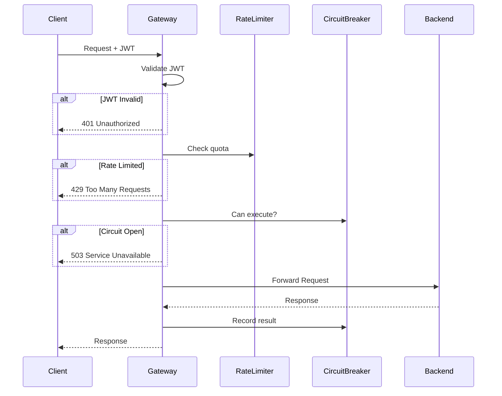

<thinking>
## Analyse du Concept
- Concept : API Gateway pour Microservices
- Phase demandee : 5 (Advanced Systems)
- Adapte ? OUI - L'API Gateway est un pattern architectural essentiel pour orchestrer les microservices, combinant routing, authentification, rate limiting et circuit breaker.

## Combo Base + Bonus
- Exercice de base : API Gateway avec routing dynamique, validation JWT, rate limiting par client et circuit breaker
- Bonus : Implementation d'un service mesh minimal avec load balancing weighted, canary deployment et request tracing
- Palier bonus : AVANCE (complexite architecturale + observabilite)
- Progression logique ? OUI - Base = gateway fonctionnel, Bonus = orchestration avancee

## Prerequis & Difficulte
- Prerequis reels : async/await, axum, reqwest, JWT, patterns de resilience
- Difficulte estimee : 8/10 (base), 9/10 (bonus)
- Coherent avec phase 5 ? OUI

## Aspect Fun/Culture
- Contexte choisi : Reference a "The Matrix" - Le Gateway comme l'Oracle qui route les requetes vers la bonne destination
- MEME mnemonique : "I am the Gateway. I see all requests pass through me."
- Pourquoi c'est fun : Le gateway est litteralement le point d'entree unique vers le monde des microservices

## Scenarios d'Echec (5 mutants concrets)
1. Mutant A (Boundary) : Rate limiter qui ne reset pas les tokens correctement
2. Mutant B (Safety) : JWT validation qui ne verifie pas l'expiration
3. Mutant C (Logic) : Circuit breaker qui reste ouvert indefiniment
4. Mutant D (Edge) : Routing qui ne gere pas les trailing slashes
5. Mutant E (Return) : Proxy qui ne forward pas les headers d'authentification

## Verdict
VALIDE - Exercice couvrant les patterns essentiels d'API Gateway pour microservices
</thinking>

# Exercice 5.6.5-a : api_gateway

**Module :**
5.6.5 — API Gateway Pattern

**Concept :**
a — API Gateway Implementation (routing, auth, rate limiting, circuit breaker)

**Difficulte :**
★★★★★★★★☆☆ (8/10)

**Type :**
code

**Tiers :**
2 — Integration de patterns

**Langage :**
Rust Edition 2024

**Prerequis :**
- 5.2.1 — Programmation async avec Tokio
- 5.4.2 — Framework web axum
- 5.6.1 — Patterns de resilience (Circuit Breaker)
- 5.6.4 — Authentification JWT

**Domaines :**
Net, Sec, Arch

**Duree estimee :**
180 min

**XP Base :**
250

**Complexite :**
T3 O(log n) × S2 O(n)

---

## SECTION 1 : PROTOTYPE & CONSIGNE

### 1.1 Obligations

**Fichier a rendre :**
```
src/lib.rs
```

**Dependances autorisees :**
- `axum = "0.7"`
- `tokio = { version = "1", features = ["full"] }`
- `reqwest = { version = "0.12", features = ["json"] }`
- `jsonwebtoken = "9.0"`
- `serde = { version = "1.0", features = ["derive"] }`
- `serde_json = "1.0"`
- `thiserror = "2.0"`
- `tracing = "0.1"`

**Fonctions/methodes interdites :**
- `std::thread::sleep` (utiliser `tokio::time::sleep`)
- `unwrap()` ou `expect()` en production
- `unsafe` blocks

### 1.2 Consigne

**CONTEXTE : "The Gateway Oracle"**

*"Je vois toutes les requetes, Neo. Chaque paquet de donnees qui entre dans ce systeme passe d'abord par moi. Je decide qui passe, qui attend, et qui est rejete. Je suis le Gateway."* — L'Oracle du Systeme Distribue

Dans une architecture microservices, l'API Gateway est le point d'entree unique pour tous les clients externes. Il centralise les preoccupations transversales : authentification, rate limiting, circuit breaking, et routing.

**Ta mission :**

Implementer un API Gateway complet qui :
1. Route les requetes vers les services backend selon le chemin
2. Valide les tokens JWT et extrait les claims
3. Applique un rate limiting par client (token bucket)
4. Protege les services avec un circuit breaker
5. Forward les requetes avec transformation des headers

**Entree :**
- `config: GatewayConfig` — Configuration du gateway
- `request: Request` — Requete HTTP entrante

**Sortie :**
- `Response` — Reponse HTTP (du backend ou erreur gateway)

**Contraintes :**
- Thread-safe : tous les composants doivent etre `Send + Sync`
- Le rate limiter doit utiliser l'algorithme Token Bucket
- Le circuit breaker doit supporter les 3 etats : Closed, Open, Half-Open
- Timeout configurable par route
- Metriques exportables (compteurs d'appels, latences)

**Exemples :**

| Requete | Route | Resultat |
|---------|-------|----------|
| `GET /api/users/123` | `user-service:8081` | Forward avec JWT claims |
| `POST /api/orders` (sans token) | N/A | `401 Unauthorized` |
| `GET /api/products` (rate limited) | N/A | `429 Too Many Requests` |
| `GET /api/payments` (service down) | N/A | `503 Service Unavailable` |

### 1.2.2 Consigne Academique

Implementer une structure `ApiGateway` fournissant les fonctionnalites de routing, authentification JWT, rate limiting et circuit breaking pour une architecture microservices. La solution doit etre thread-safe et observable.

### 1.3 Prototype

```rust
use axum::{
    Router, middleware,
    extract::{State, Request},
    response::{Response, IntoResponse},
    http::{StatusCode, HeaderMap, header},
};
use std::sync::Arc;
use std::time::{Duration, Instant};
use std::collections::HashMap;
use tokio::sync::RwLock;
use serde::{Serialize, Deserialize};

/// Configuration du gateway
#[derive(Debug, Clone, Serialize, Deserialize)]
pub struct GatewayConfig {
    pub listen_addr: String,
    pub jwt_secret: String,
    pub default_timeout: Duration,
    pub services: HashMap<String, ServiceConfig>,
}

#[derive(Debug, Clone, Serialize, Deserialize)]
pub struct ServiceConfig {
    pub name: String,
    pub base_url: String,
    pub health_path: String,
    pub timeout: Duration,
    pub rate_limit: RateLimitConfig,
    pub circuit_breaker: CircuitBreakerConfig,
}

#[derive(Debug, Clone, Serialize, Deserialize)]
pub struct RateLimitConfig {
    pub requests_per_second: u32,
    pub burst_size: u32,
}

#[derive(Debug, Clone, Serialize, Deserialize)]
pub struct CircuitBreakerConfig {
    pub failure_threshold: u32,
    pub success_threshold: u32,
    pub timeout: Duration,
}

/// Claims JWT
#[derive(Debug, Clone, Serialize, Deserialize)]
pub struct JwtClaims {
    pub sub: String,
    pub exp: usize,
    pub iat: usize,
    pub roles: Vec<String>,
    pub client_id: String,
}

/// Etat du circuit breaker
#[derive(Debug, Clone, Copy, PartialEq, Eq)]
pub enum CircuitState {
    Closed,
    Open { until: Instant },
    HalfOpen,
}

/// Erreurs du gateway
#[derive(Debug, thiserror::Error)]
pub enum GatewayError {
    #[error("Unauthorized: {0}")]
    Unauthorized(String),
    #[error("Rate limited")]
    RateLimited,
    #[error("Service unavailable: {0}")]
    ServiceUnavailable(String),
    #[error("Circuit open for service: {0}")]
    CircuitOpen(String),
    #[error("Timeout")]
    Timeout,
    #[error("Route not found: {0}")]
    RouteNotFound(String),
    #[error("Internal error: {0}")]
    Internal(String),
}

/// Rate Limiter (Token Bucket)
pub struct TokenBucketLimiter {
    tokens: f64,
    max_tokens: f64,
    refill_rate: f64,
    last_refill: Instant,
}

impl TokenBucketLimiter {
    pub fn new(config: &RateLimitConfig) -> Self;
    pub fn try_acquire(&mut self) -> bool;
    fn refill(&mut self);
}

/// Circuit Breaker
pub struct CircuitBreaker {
    state: CircuitState,
    failure_count: u32,
    success_count: u32,
    config: CircuitBreakerConfig,
    last_failure: Option<Instant>,
}

impl CircuitBreaker {
    pub fn new(config: CircuitBreakerConfig) -> Self;
    pub fn can_execute(&mut self) -> bool;
    pub fn record_success(&mut self);
    pub fn record_failure(&mut self);
    pub fn state(&self) -> CircuitState;
}

/// Validateur JWT
pub struct JwtValidator {
    secret: String,
}

impl JwtValidator {
    pub fn new(secret: &str) -> Self;
    pub fn validate(&self, token: &str) -> Result<JwtClaims, GatewayError>;
    pub fn extract_token(headers: &HeaderMap) -> Option<String>;
}

/// Routeur de services
pub struct ServiceRouter {
    routes: HashMap<String, ServiceConfig>,
}

impl ServiceRouter {
    pub fn new() -> Self;
    pub fn add_route(&mut self, path_prefix: &str, config: ServiceConfig);
    pub fn match_route(&self, path: &str) -> Option<(&str, &ServiceConfig)>;
}

/// Proxy HTTP
pub struct HttpProxy {
    client: reqwest::Client,
}

impl HttpProxy {
    pub fn new(default_timeout: Duration) -> Self;
    pub async fn forward(
        &self,
        config: &ServiceConfig,
        path: &str,
        method: reqwest::Method,
        headers: HeaderMap,
        body: Option<bytes::Bytes>,
    ) -> Result<Response, GatewayError>;
}

/// Etat partage du gateway
#[derive(Clone)]
pub struct GatewayState {
    pub config: GatewayConfig,
    pub jwt_validator: Arc<JwtValidator>,
    pub router: Arc<ServiceRouter>,
    pub rate_limiters: Arc<RwLock<HashMap<String, TokenBucketLimiter>>>,
    pub circuit_breakers: Arc<RwLock<HashMap<String, CircuitBreaker>>>,
    pub proxy: Arc<HttpProxy>,
}

/// API Gateway principal
pub struct ApiGateway {
    state: GatewayState,
}

impl ApiGateway {
    pub fn new(config: GatewayConfig) -> Self;
    pub fn with_route(self, path_prefix: &str, service: ServiceConfig) -> Self;
    pub fn build_router(self) -> Router;
    pub async fn handle_request(
        state: &GatewayState,
        request: Request,
    ) -> Result<Response, GatewayError>;
}

/// Metriques du gateway
#[derive(Debug, Clone, Default)]
pub struct GatewayMetrics {
    pub total_requests: u64,
    pub successful_requests: u64,
    pub failed_requests: u64,
    pub rate_limited_requests: u64,
    pub circuit_broken_requests: u64,
    pub avg_latency_ms: f64,
}
```

---

## SECTION 2 : LE SAVIEZ-VOUS ?

### 2.1 Origine de l'API Gateway

Le pattern API Gateway a ete popularise par Netflix avec Zuul en 2013. Face a des milliers de microservices, Netflix avait besoin d'un point d'entree unique capable de gerer l'authentification, le routing dynamique et la resilience a grande echelle.

### 2.2 Token Bucket vs Leaky Bucket

**Token Bucket** : Les tokens s'accumulent a un taux fixe. Une requete consomme un token. Permet des bursts jusqu'a la capacite du bucket.

**Leaky Bucket** : Les requetes entrent dans un bucket qui "fuit" a taux constant. Lisse le trafic mais ne permet pas de bursts.

```
Token Bucket:
┌─────────────────────┐
│ ○ ○ ○ ○ ○ ○ ○ ○ ○ ○ │ ← Tokens disponibles
│ (max: 10, rate: 5/s) │
└─────────────────────┘
     │
     ▼ Requete arrive
┌─────────────────────┐
│ ○ ○ ○ ○ ○ ○ ○ ○ ○ _ │ ← 1 token consomme
└─────────────────────┘
```

### 2.3 Circuit Breaker State Machine

```
         ┌───────────────────────────────────────────┐
         │                                           │
         ▼                                           │
    ┌─────────┐     failure_threshold      ┌──────────┐
    │ CLOSED  │ ─────────────────────────► │   OPEN   │
    └─────────┘        atteint             └──────────┘
         ▲                                      │
         │                                      │
         │ success_threshold                    │ timeout
         │     atteint                          │ expire
         │                                      ▼
         │                               ┌───────────┐
         └────────────────────────────── │ HALF-OPEN │
                                         └───────────┘
```

---

## SECTION 2.5 : DANS LA VRAIE VIE

### Metiers concernes

| Metier | Utilisation API Gateway |
|--------|-------------------------|
| **Platform Engineer** | Design et operation des gateways a l'echelle |
| **Backend Developer** | Integration des services avec le gateway |
| **Security Engineer** | Policies d'authentification et autorisation |
| **SRE** | Monitoring, rate limiting, circuit breaking |
| **DevOps** | Deployment et configuration des gateways |

### Cas d'usage concrets

1. **Kong/Nginx** : API Gateway open-source pour Kubernetes
2. **AWS API Gateway** : Managed service pour AWS Lambda et microservices
3. **Netflix Zuul** : Gateway pour l'ecosysteme Spring Cloud
4. **Envoy** : Proxy L7 utilise par Istio service mesh

---

## SECTION 3 : EXEMPLE D'UTILISATION

### 3.0 Session bash

```bash
$ ls
Cargo.toml  src/

$ cargo test
   Compiling api_gateway v0.1.0
    Finished test [unoptimized + debuginfo] target(s)
     Running unittests src/lib.rs

running 15 tests
test tests::test_token_bucket_acquire ... ok
test tests::test_token_bucket_refill ... ok
test tests::test_circuit_breaker_closed ... ok
test tests::test_circuit_breaker_open ... ok
test tests::test_circuit_breaker_half_open ... ok
test tests::test_jwt_validation_valid ... ok
test tests::test_jwt_validation_expired ... ok
test tests::test_jwt_extract_token ... ok
test tests::test_router_match ... ok
test tests::test_router_no_match ... ok
test tests::test_rate_limit_enforcement ... ok
test tests::test_proxy_forward ... ok
test tests::test_gateway_auth_required ... ok
test tests::test_gateway_circuit_open ... ok
test tests::test_gateway_metrics ... ok

test result: ok. 15 passed; 0 failed
```

### 3.1 BONUS AVANCE (OPTIONNEL)

**Difficulte Bonus :**
★★★★★★★★★☆ (9/10)

**Recompense :**
XP ×3

**Time Complexity attendue :**
O(log n) pour le load balancing

**Space Complexity attendue :**
O(n) pour le cache des instances

**Domaines Bonus :**
`Arch, Obs`

#### 3.1.1 Consigne Bonus

**"The Architect's Network"**

*"Tu dois voir au-dela du simple routage. Le veritable pouvoir est dans l'orchestration intelligente du trafic."*

**Ta mission bonus :**

Implementer un service mesh minimal avec :
1. **Weighted Load Balancing** : Distribution du trafic selon des poids
2. **Canary Deployment** : Routing d'un pourcentage vers une nouvelle version
3. **Request Tracing** : Propagation d'un trace ID a travers les services
4. **Health-based Routing** : Exclusion automatique des instances unhealthy

**Entree :**
- `mesh_config: MeshConfig` — Configuration du mesh
- `request: Request` — Requete avec potentiel trace ID

**Sortie :**
- `Response` avec headers de tracing
- Metriques detaillees par instance

**Contraintes :**
- Le load balancer doit utiliser Weighted Round Robin
- Les canary rules doivent supporter des conditions sur headers
- Chaque requete doit propager `X-Trace-Id` et `X-Span-Id`

#### 3.1.2 Prototype Bonus

```rust
#[derive(Debug, Clone)]
pub struct ServiceInstance {
    pub id: String,
    pub url: String,
    pub weight: u32,
    pub version: String,
    pub healthy: bool,
}

#[derive(Debug, Clone)]
pub struct CanaryRule {
    pub target_version: String,
    pub percentage: u8,
    pub header_match: Option<(String, String)>,
}

pub struct WeightedLoadBalancer {
    instances: Vec<ServiceInstance>,
    current_weight: u32,
    current_index: usize,
}

impl WeightedLoadBalancer {
    pub fn new(instances: Vec<ServiceInstance>) -> Self;
    pub fn next(&mut self) -> Option<&ServiceInstance>;
    pub fn mark_unhealthy(&mut self, instance_id: &str);
}

#[derive(Debug, Clone)]
pub struct TraceContext {
    pub trace_id: String,
    pub span_id: String,
    pub parent_span_id: Option<String>,
}

impl TraceContext {
    pub fn new() -> Self;
    pub fn child(&self) -> Self;
    pub fn from_headers(headers: &HeaderMap) -> Option<Self>;
    pub fn inject(&self, headers: &mut HeaderMap);
}

pub struct ServiceMesh {
    load_balancers: HashMap<String, WeightedLoadBalancer>,
    canary_rules: HashMap<String, CanaryRule>,
    trace_enabled: bool,
}

impl ServiceMesh {
    pub fn route_request(
        &mut self,
        service: &str,
        headers: &HeaderMap,
    ) -> Option<(ServiceInstance, TraceContext)>;
}
```

#### 3.1.3 Ce qui change par rapport a l'exercice de base

| Aspect | Base | Bonus |
|--------|------|-------|
| Routing | Path-based simple | Weighted + Canary |
| Load Balancing | Round Robin | Weighted Round Robin |
| Observabilite | Compteurs basiques | Distributed Tracing |
| Health | Circuit Breaker | Health-based exclusion |

---

## SECTION 4 : ZONE CORRECTION

### 4.1 Moulinette — Tableau des tests

| Test | Input | Expected | Points | Categorie |
|------|-------|----------|--------|-----------|
| `token_bucket_acquire` | 10 tokens, 1 request | `true` | 5 | Core |
| `token_bucket_empty` | 0 tokens, 1 request | `false` | 5 | Edge |
| `token_bucket_refill` | Wait 1s, refill rate 5/s | 5 tokens added | 5 | Core |
| `circuit_closed_success` | Record success | State = Closed | 5 | Core |
| `circuit_open_threshold` | 5 failures | State = Open | 10 | Core |
| `circuit_half_open_timeout` | Open + timeout | State = HalfOpen | 10 | Core |
| `jwt_valid` | Valid token | `Ok(claims)` | 5 | Core |
| `jwt_expired` | Expired token | `Err(Unauthorized)` | 5 | Edge |
| `jwt_invalid_signature` | Bad signature | `Err(Unauthorized)` | 5 | Edge |
| `router_match_exact` | `/api/users` | user-service | 5 | Core |
| `router_match_prefix` | `/api/users/123` | user-service | 5 | Core |
| `router_no_match` | `/unknown` | `None` | 5 | Edge |
| `proxy_forward_success` | Valid request | Backend response | 10 | Core |
| `proxy_forward_timeout` | Slow backend | `Err(Timeout)` | 5 | Edge |
| `gateway_full_flow` | Complete request | Proxied response | 10 | Integration |

**Score minimum pour validation : 70/100**

### 4.2 Fichier de test

```rust
#[cfg(test)]
mod tests {
    use super::*;
    use std::time::Duration;

    #[test]
    fn test_token_bucket_acquire() {
        let config = RateLimitConfig {
            requests_per_second: 10,
            burst_size: 10,
        };
        let mut limiter = TokenBucketLimiter::new(&config);
        assert!(limiter.try_acquire());
    }

    #[test]
    fn test_token_bucket_empty() {
        let config = RateLimitConfig {
            requests_per_second: 1,
            burst_size: 1,
        };
        let mut limiter = TokenBucketLimiter::new(&config);
        assert!(limiter.try_acquire());
        assert!(!limiter.try_acquire());
    }

    #[test]
    fn test_circuit_breaker_states() {
        let config = CircuitBreakerConfig {
            failure_threshold: 3,
            success_threshold: 2,
            timeout: Duration::from_secs(30),
        };
        let mut cb = CircuitBreaker::new(config);

        assert_eq!(cb.state(), CircuitState::Closed);
        assert!(cb.can_execute());

        cb.record_failure();
        cb.record_failure();
        cb.record_failure();

        assert!(matches!(cb.state(), CircuitState::Open { .. }));
        assert!(!cb.can_execute());
    }

    #[test]
    fn test_jwt_validation() {
        let validator = JwtValidator::new("secret");
        let claims = JwtClaims {
            sub: "user123".to_string(),
            exp: (chrono::Utc::now() + chrono::Duration::hours(1)).timestamp() as usize,
            iat: chrono::Utc::now().timestamp() as usize,
            roles: vec!["user".to_string()],
            client_id: "client1".to_string(),
        };

        // Create a valid token
        let token = jsonwebtoken::encode(
            &jsonwebtoken::Header::default(),
            &claims,
            &jsonwebtoken::EncodingKey::from_secret(b"secret"),
        ).unwrap();

        let result = validator.validate(&token);
        assert!(result.is_ok());
    }

    #[test]
    fn test_router_matching() {
        let mut router = ServiceRouter::new();
        router.add_route("/api/users", ServiceConfig {
            name: "user-service".to_string(),
            base_url: "http://localhost:8081".to_string(),
            health_path: "/health".to_string(),
            timeout: Duration::from_secs(30),
            rate_limit: RateLimitConfig { requests_per_second: 100, burst_size: 10 },
            circuit_breaker: CircuitBreakerConfig {
                failure_threshold: 5,
                success_threshold: 2,
                timeout: Duration::from_secs(30),
            },
        });

        assert!(router.match_route("/api/users/123").is_some());
        assert!(router.match_route("/api/products").is_none());
    }

    #[tokio::test]
    async fn test_gateway_integration() {
        let config = GatewayConfig {
            listen_addr: "0.0.0.0:8080".to_string(),
            jwt_secret: "secret".to_string(),
            default_timeout: Duration::from_secs(30),
            services: HashMap::new(),
        };

        let gateway = ApiGateway::new(config)
            .with_route("/api/users", ServiceConfig {
                name: "user-service".to_string(),
                base_url: "http://localhost:8081".to_string(),
                health_path: "/health".to_string(),
                timeout: Duration::from_secs(30),
                rate_limit: RateLimitConfig { requests_per_second: 100, burst_size: 10 },
                circuit_breaker: CircuitBreakerConfig {
                    failure_threshold: 5,
                    success_threshold: 2,
                    timeout: Duration::from_secs(30),
                },
            });

        // Gateway created successfully
        let _router = gateway.build_router();
    }
}
```

### 4.3 Solution de reference

```rust
use axum::{
    Router, middleware,
    extract::{State, Request},
    response::{Response, IntoResponse},
    http::{StatusCode, HeaderMap, header},
    body::Body,
};
use std::sync::Arc;
use std::time::{Duration, Instant};
use std::collections::HashMap;
use tokio::sync::RwLock;
use serde::{Serialize, Deserialize};
use jsonwebtoken::{decode, DecodingKey, Validation, Algorithm};

#[derive(Debug, Clone, Serialize, Deserialize)]
pub struct GatewayConfig {
    pub listen_addr: String,
    pub jwt_secret: String,
    pub default_timeout: Duration,
    pub services: HashMap<String, ServiceConfig>,
}

#[derive(Debug, Clone, Serialize, Deserialize)]
pub struct ServiceConfig {
    pub name: String,
    pub base_url: String,
    pub health_path: String,
    pub timeout: Duration,
    pub rate_limit: RateLimitConfig,
    pub circuit_breaker: CircuitBreakerConfig,
}

#[derive(Debug, Clone, Serialize, Deserialize)]
pub struct RateLimitConfig {
    pub requests_per_second: u32,
    pub burst_size: u32,
}

#[derive(Debug, Clone, Serialize, Deserialize)]
pub struct CircuitBreakerConfig {
    pub failure_threshold: u32,
    pub success_threshold: u32,
    pub timeout: Duration,
}

#[derive(Debug, Clone, Serialize, Deserialize)]
pub struct JwtClaims {
    pub sub: String,
    pub exp: usize,
    pub iat: usize,
    pub roles: Vec<String>,
    pub client_id: String,
}

#[derive(Debug, Clone, Copy, PartialEq, Eq)]
pub enum CircuitState {
    Closed,
    Open { until: Instant },
    HalfOpen,
}

#[derive(Debug, thiserror::Error)]
pub enum GatewayError {
    #[error("Unauthorized: {0}")]
    Unauthorized(String),
    #[error("Rate limited")]
    RateLimited,
    #[error("Service unavailable: {0}")]
    ServiceUnavailable(String),
    #[error("Circuit open for service: {0}")]
    CircuitOpen(String),
    #[error("Timeout")]
    Timeout,
    #[error("Route not found: {0}")]
    RouteNotFound(String),
    #[error("Internal error: {0}")]
    Internal(String),
}

impl IntoResponse for GatewayError {
    fn into_response(self) -> Response {
        let (status, message) = match &self {
            GatewayError::Unauthorized(_) => (StatusCode::UNAUTHORIZED, self.to_string()),
            GatewayError::RateLimited => (StatusCode::TOO_MANY_REQUESTS, self.to_string()),
            GatewayError::ServiceUnavailable(_) => (StatusCode::SERVICE_UNAVAILABLE, self.to_string()),
            GatewayError::CircuitOpen(_) => (StatusCode::SERVICE_UNAVAILABLE, self.to_string()),
            GatewayError::Timeout => (StatusCode::GATEWAY_TIMEOUT, self.to_string()),
            GatewayError::RouteNotFound(_) => (StatusCode::NOT_FOUND, self.to_string()),
            GatewayError::Internal(_) => (StatusCode::INTERNAL_SERVER_ERROR, self.to_string()),
        };
        (status, message).into_response()
    }
}

pub struct TokenBucketLimiter {
    tokens: f64,
    max_tokens: f64,
    refill_rate: f64,
    last_refill: Instant,
}

impl TokenBucketLimiter {
    pub fn new(config: &RateLimitConfig) -> Self {
        Self {
            tokens: config.burst_size as f64,
            max_tokens: config.burst_size as f64,
            refill_rate: config.requests_per_second as f64,
            last_refill: Instant::now(),
        }
    }

    pub fn try_acquire(&mut self) -> bool {
        self.refill();
        if self.tokens >= 1.0 {
            self.tokens -= 1.0;
            true
        } else {
            false
        }
    }

    fn refill(&mut self) {
        let now = Instant::now();
        let elapsed = now.duration_since(self.last_refill).as_secs_f64();
        self.tokens = (self.tokens + elapsed * self.refill_rate).min(self.max_tokens);
        self.last_refill = now;
    }
}

pub struct CircuitBreaker {
    state: CircuitState,
    failure_count: u32,
    success_count: u32,
    config: CircuitBreakerConfig,
    last_failure: Option<Instant>,
}

impl CircuitBreaker {
    pub fn new(config: CircuitBreakerConfig) -> Self {
        Self {
            state: CircuitState::Closed,
            failure_count: 0,
            success_count: 0,
            config,
            last_failure: None,
        }
    }

    pub fn can_execute(&mut self) -> bool {
        match self.state {
            CircuitState::Closed => true,
            CircuitState::Open { until } => {
                if Instant::now() >= until {
                    self.state = CircuitState::HalfOpen;
                    self.success_count = 0;
                    true
                } else {
                    false
                }
            }
            CircuitState::HalfOpen => true,
        }
    }

    pub fn record_success(&mut self) {
        match self.state {
            CircuitState::Closed => {
                self.failure_count = 0;
            }
            CircuitState::HalfOpen => {
                self.success_count += 1;
                if self.success_count >= self.config.success_threshold {
                    self.state = CircuitState::Closed;
                    self.failure_count = 0;
                }
            }
            CircuitState::Open { .. } => {}
        }
    }

    pub fn record_failure(&mut self) {
        self.failure_count += 1;
        self.last_failure = Some(Instant::now());

        match self.state {
            CircuitState::Closed => {
                if self.failure_count >= self.config.failure_threshold {
                    self.state = CircuitState::Open {
                        until: Instant::now() + self.config.timeout,
                    };
                }
            }
            CircuitState::HalfOpen => {
                self.state = CircuitState::Open {
                    until: Instant::now() + self.config.timeout,
                };
            }
            CircuitState::Open { .. } => {}
        }
    }

    pub fn state(&self) -> CircuitState {
        self.state
    }
}

pub struct JwtValidator {
    secret: String,
}

impl JwtValidator {
    pub fn new(secret: &str) -> Self {
        Self { secret: secret.to_string() }
    }

    pub fn validate(&self, token: &str) -> Result<JwtClaims, GatewayError> {
        let key = DecodingKey::from_secret(self.secret.as_bytes());
        let validation = Validation::new(Algorithm::HS256);

        decode::<JwtClaims>(token, &key, &validation)
            .map(|data| data.claims)
            .map_err(|e| GatewayError::Unauthorized(e.to_string()))
    }

    pub fn extract_token(headers: &HeaderMap) -> Option<String> {
        headers
            .get(header::AUTHORIZATION)
            .and_then(|v| v.to_str().ok())
            .and_then(|v| v.strip_prefix("Bearer "))
            .map(|s| s.to_string())
    }
}

pub struct ServiceRouter {
    routes: Vec<(String, ServiceConfig)>,
}

impl ServiceRouter {
    pub fn new() -> Self {
        Self { routes: Vec::new() }
    }

    pub fn add_route(&mut self, path_prefix: &str, config: ServiceConfig) {
        self.routes.push((path_prefix.to_string(), config));
        self.routes.sort_by(|a, b| b.0.len().cmp(&a.0.len()));
    }

    pub fn match_route(&self, path: &str) -> Option<(&str, &ServiceConfig)> {
        self.routes
            .iter()
            .find(|(prefix, _)| path.starts_with(prefix))
            .map(|(prefix, config)| (prefix.as_str(), config))
    }
}

pub struct HttpProxy {
    client: reqwest::Client,
}

impl HttpProxy {
    pub fn new(default_timeout: Duration) -> Self {
        Self {
            client: reqwest::Client::builder()
                .timeout(default_timeout)
                .build()
                .unwrap_or_default(),
        }
    }

    pub async fn forward(
        &self,
        config: &ServiceConfig,
        path: &str,
        method: reqwest::Method,
        headers: HeaderMap,
        body: Option<bytes::Bytes>,
    ) -> Result<Response<Body>, GatewayError> {
        let url = format!("{}{}", config.base_url, path);

        let mut req = self.client.request(method, &url);

        for (key, value) in headers.iter() {
            if let Ok(name) = reqwest::header::HeaderName::from_bytes(key.as_str().as_bytes()) {
                req = req.header(name, value.to_str().unwrap_or_default());
            }
        }

        if let Some(b) = body {
            req = req.body(b);
        }

        let response = req
            .timeout(config.timeout)
            .send()
            .await
            .map_err(|e| {
                if e.is_timeout() {
                    GatewayError::Timeout
                } else {
                    GatewayError::ServiceUnavailable(e.to_string())
                }
            })?;

        let status = response.status();
        let headers = response.headers().clone();
        let body = response.bytes().await
            .map_err(|e| GatewayError::Internal(e.to_string()))?;

        let mut builder = Response::builder().status(status);
        for (key, value) in headers.iter() {
            builder = builder.header(key, value);
        }

        builder.body(Body::from(body))
            .map_err(|e| GatewayError::Internal(e.to_string()))
    }
}

#[derive(Clone)]
pub struct GatewayState {
    pub config: GatewayConfig,
    pub jwt_validator: Arc<JwtValidator>,
    pub router: Arc<RwLock<ServiceRouter>>,
    pub rate_limiters: Arc<RwLock<HashMap<String, TokenBucketLimiter>>>,
    pub circuit_breakers: Arc<RwLock<HashMap<String, CircuitBreaker>>>,
    pub proxy: Arc<HttpProxy>,
}

pub struct ApiGateway {
    state: GatewayState,
}

impl ApiGateway {
    pub fn new(config: GatewayConfig) -> Self {
        let jwt_validator = Arc::new(JwtValidator::new(&config.jwt_secret));
        let proxy = Arc::new(HttpProxy::new(config.default_timeout));

        Self {
            state: GatewayState {
                config,
                jwt_validator,
                router: Arc::new(RwLock::new(ServiceRouter::new())),
                rate_limiters: Arc::new(RwLock::new(HashMap::new())),
                circuit_breakers: Arc::new(RwLock::new(HashMap::new())),
                proxy,
            },
        }
    }

    pub fn with_route(self, path_prefix: &str, service: ServiceConfig) -> Self {
        let rt = tokio::runtime::Handle::current();
        rt.block_on(async {
            let mut router = self.state.router.write().await;
            router.add_route(path_prefix, service.clone());

            let mut cbs = self.state.circuit_breakers.write().await;
            cbs.insert(
                service.name.clone(),
                CircuitBreaker::new(service.circuit_breaker.clone()),
            );
        });
        self
    }

    pub fn build_router(self) -> Router {
        Router::new()
            .fallback(Self::handle_request)
            .with_state(self.state)
    }

    pub async fn handle_request(
        State(state): State<GatewayState>,
        request: Request,
    ) -> Result<Response<Body>, GatewayError> {
        let path = request.uri().path().to_string();
        let method = request.method().clone();
        let headers = request.headers().clone();

        // 1. Route matching
        let router = state.router.read().await;
        let (prefix, service_config) = router
            .match_route(&path)
            .ok_or_else(|| GatewayError::RouteNotFound(path.clone()))?;
        let service_config = service_config.clone();
        let remaining_path = path.strip_prefix(prefix).unwrap_or(&path).to_string();
        drop(router);

        // 2. JWT validation
        let token = JwtValidator::extract_token(&headers)
            .ok_or_else(|| GatewayError::Unauthorized("Missing token".to_string()))?;
        let claims = state.jwt_validator.validate(&token)?;

        // 3. Rate limiting
        {
            let mut limiters = state.rate_limiters.write().await;
            let limiter = limiters
                .entry(claims.client_id.clone())
                .or_insert_with(|| TokenBucketLimiter::new(&service_config.rate_limit));

            if !limiter.try_acquire() {
                return Err(GatewayError::RateLimited);
            }
        }

        // 4. Circuit breaker check
        {
            let mut cbs = state.circuit_breakers.write().await;
            if let Some(cb) = cbs.get_mut(&service_config.name) {
                if !cb.can_execute() {
                    return Err(GatewayError::CircuitOpen(service_config.name.clone()));
                }
            }
        }

        // 5. Forward request
        let body = axum::body::to_bytes(request.into_body(), usize::MAX)
            .await
            .ok()
            .map(|b| b.into());

        let result = state.proxy.forward(
            &service_config,
            &remaining_path,
            reqwest::Method::from_bytes(method.as_str().as_bytes()).unwrap_or(reqwest::Method::GET),
            headers,
            body,
        ).await;

        // 6. Update circuit breaker
        {
            let mut cbs = state.circuit_breakers.write().await;
            if let Some(cb) = cbs.get_mut(&service_config.name) {
                match &result {
                    Ok(_) => cb.record_success(),
                    Err(_) => cb.record_failure(),
                }
            }
        }

        result
    }
}
```

### 4.4 Solutions alternatives acceptees

```rust
// Alternative 1 : Rate limiter avec governor crate
use governor::{Quota, RateLimiter as GovLimiter};
use std::num::NonZeroU32;

pub struct GovernorRateLimiter {
    limiter: GovLimiter<String, governor::state::keyed::DefaultKeyedStateStore<String>, governor::clock::DefaultClock>,
}

impl GovernorRateLimiter {
    pub fn new(rps: u32) -> Self {
        let quota = Quota::per_second(NonZeroU32::new(rps).unwrap());
        Self {
            limiter: GovLimiter::keyed(quota),
        }
    }

    pub fn check(&self, key: &str) -> bool {
        self.limiter.check_key(&key.to_string()).is_ok()
    }
}

// Alternative 2 : Circuit breaker avec failsafe-rs
use failsafe::{Config, CircuitBreaker as FSCircuitBreaker};

pub struct FailsafeCircuitBreaker {
    inner: FSCircuitBreaker<(), ()>,
}
```

### 4.5 Solutions refusees

```rust
// REFUSEE 1 : Token bucket sans refill
impl TokenBucketLimiter {
    pub fn try_acquire(&mut self) -> bool {
        // ERREUR: Pas de refill, tokens jamais restaures
        if self.tokens >= 1.0 {
            self.tokens -= 1.0;
            true
        } else {
            false
        }
    }
}
// Pourquoi refusee : Le limiter se vide et ne se remplit jamais

// REFUSEE 2 : Circuit breaker qui reste ouvert
pub fn can_execute(&mut self) -> bool {
    match self.state {
        CircuitState::Open { .. } => false,  // ERREUR: jamais de transition vers HalfOpen
        _ => true,
    }
}
// Pourquoi refusee : Le circuit ne se ferme jamais apres timeout

// REFUSEE 3 : JWT sans verification d'expiration
pub fn validate(&self, token: &str) -> Result<JwtClaims, GatewayError> {
    let mut validation = Validation::new(Algorithm::HS256);
    validation.validate_exp = false;  // ERREUR: tokens expires acceptes
    // ...
}
// Pourquoi refusee : Faille de securite majeure
```

### 4.10 Solutions Mutantes

```rust
/* Mutant A (Boundary) : Rate limiter qui ne reset pas les tokens */
impl TokenBucketLimiter {
    fn refill(&mut self) {
        // MUTANT: Ne met pas a jour last_refill
        let elapsed = Instant::now().duration_since(self.last_refill).as_secs_f64();
        self.tokens = (self.tokens + elapsed * self.refill_rate).min(self.max_tokens);
        // Manque: self.last_refill = Instant::now();
    }
}
// Pourquoi c'est faux : Les tokens s'accumulent exponentiellement
// Ce qui etait pense : "Le temps passe, les tokens se remplissent"

/* Mutant B (Safety) : JWT sans verification d'expiration */
impl JwtValidator {
    pub fn validate(&self, token: &str) -> Result<JwtClaims, GatewayError> {
        let mut validation = Validation::new(Algorithm::HS256);
        validation.validate_exp = false;  // MUTANT
        // ...
    }
}
// Pourquoi c'est faux : Tokens expires sont acceptes
// Ce qui etait pense : "La signature suffit pour la securite"

/* Mutant C (Logic) : Circuit breaker qui reste ouvert */
pub fn can_execute(&mut self) -> bool {
    match self.state {
        CircuitState::Closed => true,
        CircuitState::Open { until } => {
            // MUTANT: Compare dans le mauvais sens
            if Instant::now() < until {  // Devrait etre >=
                self.state = CircuitState::HalfOpen;
                true
            } else {
                false
            }
        }
        CircuitState::HalfOpen => true,
    }
}
// Pourquoi c'est faux : Passe en HalfOpen trop tot, puis reste bloque
// Ce qui etait pense : "Il faut attendre que le timeout passe"

/* Mutant D (Edge) : Routing sans gestion des trailing slashes */
pub fn match_route(&self, path: &str) -> Option<(&str, &ServiceConfig)> {
    // MUTANT: Match exact sans normalisation
    self.routes.iter()
        .find(|(prefix, _)| path == prefix)  // Devrait etre starts_with
        .map(|(p, c)| (p.as_str(), c))
}
// Pourquoi c'est faux : /api/users/123 ne matche pas /api/users
// Ce qui etait pense : "Les routes sont des chemins exacts"

/* Mutant E (Return) : Proxy qui ne forward pas les headers d'auth */
pub async fn forward(&self, ..., headers: HeaderMap, ...) {
    let mut req = self.client.request(method, &url);
    // MUTANT: N'ajoute pas les headers
    // for (key, value) in headers.iter() { ... }
    // ...
}
// Pourquoi c'est faux : Le backend ne recoit pas les credentials
// Ce qui etait pense : "Le gateway a deja valide le JWT"
```

---

## SECTION 5 : COMPRENDRE

### 5.1 Ce que cet exercice enseigne

1. **API Gateway Pattern** : Point d'entree unique pour microservices
2. **Token Bucket Algorithm** : Rate limiting avec bursts autorises
3. **Circuit Breaker Pattern** : Protection contre les cascading failures
4. **JWT Authentication** : Validation stateless des tokens
5. **Reverse Proxy** : Forwarding de requetes avec transformation

### 5.2 LDA — Traduction Litterale

```
FONCTION handle_request QUI PREND state ET request
DEBUT FONCTION
    DECLARER path COMME LE CHEMIN DE request
    DECLARER method COMME LA METHODE DE request

    // 1. Routing
    DECLARER route COMME LE RESULTAT DE router.match_route(path)
    SI route EST None ALORS
        RETOURNER Erreur RouteNotFound
    FIN SI

    // 2. Authentication
    DECLARER token COMME LE TOKEN EXTRAIT DES HEADERS
    SI token EST None ALORS
        RETOURNER Erreur Unauthorized
    FIN SI
    DECLARER claims COMME LE RESULTAT DE validator.validate(token)

    // 3. Rate Limiting
    DECLARER limiter COMME LE LIMITER POUR claims.client_id
    SI limiter.try_acquire() EST false ALORS
        RETOURNER Erreur RateLimited
    FIN SI

    // 4. Circuit Breaker
    DECLARER cb COMME LE CIRCUIT BREAKER POUR route.service
    SI cb.can_execute() EST false ALORS
        RETOURNER Erreur CircuitOpen
    FIN SI

    // 5. Forward
    DECLARER response COMME LE RESULTAT DE proxy.forward(...)

    // 6. Update Circuit Breaker
    SI response EST Ok ALORS
        cb.record_success()
    SINON
        cb.record_failure()
    FIN SI

    RETOURNER response
FIN FONCTION
```

### 5.2.3.1 Diagramme Mermaid



### 5.3 Visualisation ASCII

```
                        ┌─────────────────────────────────────────┐
                        │              API GATEWAY                │
                        │                                         │
    ┌─────────┐         │  ┌──────────┐  ┌──────────┐  ┌───────┐ │
    │ Client  │─────────┼─▶│   JWT    │─▶│  Rate    │─▶│Circuit│ │
    └─────────┘         │  │ Validator│  │ Limiter  │  │Breaker│ │
                        │  └──────────┘  └──────────┘  └───┬───┘ │
                        │                                  │     │
                        │  ┌────────────────────────────────┘     │
                        │  │                                      │
                        │  ▼                                      │
                        │  ┌──────────┐                           │
                        │  │  Router  │                           │
                        │  └────┬─────┘                           │
                        │       │                                 │
                        └───────┼─────────────────────────────────┘
                                │
            ┌───────────────────┼───────────────────┐
            │                   │                   │
            ▼                   ▼                   ▼
    ┌───────────────┐   ┌───────────────┐   ┌───────────────┐
    │ User Service  │   │ Order Service │   │Product Service│
    │  :8081        │   │  :8082        │   │  :8083        │
    └───────────────┘   └───────────────┘   └───────────────┘


    TOKEN BUCKET ALGORITHM
    ══════════════════════

    Temps t=0:  [●●●●●●●●●●] 10/10 tokens
                     │
    Requete 1:  [●●●●●●●●●○]  9/10 tokens (-1)
                     │
    Requete 2:  [●●●●●●●●○○]  8/10 tokens (-1)
                     │
    t=0.2s:     [●●●●●●●●●○]  9/10 tokens (+1 refill)
                     │
    Burst x5:   [●●●●○○○○○○]  4/10 tokens (-5)
                     │
    Requete:    [●●●●○○○○○○]  BLOCKED (need 1, have 0.4)
```

### 5.4 Les pieges en detail

| Piege | Description | Comment l'eviter |
|-------|-------------|------------------|
| **Token accumulation** | Ne pas reset last_refill apres refill | Toujours mettre a jour le timestamp |
| **Circuit stuck open** | Mauvaise condition de transition | Verifier `now >= until` pas `<` |
| **JWT exp unchecked** | Desactiver la validation d'expiration | Laisser `validate_exp = true` |
| **Route exact match** | Matcher exactement au lieu de prefix | Utiliser `starts_with` |
| **Headers non forwardes** | Oublier de copier les headers | Iterer et copier tous les headers |

### 5.8 Mnemoniques

#### MEME : "I am the Gateway"

*Dans Matrix, l'Oracle voit tout et guide les choix. Le Gateway voit toutes les requetes et decide de leur sort.*

```rust
// "I see your token, Neo"
let claims = jwt_validator.validate(&token)?;

// "The path has been chosen"
let route = router.match_route(&path)?;

// "You may pass... or not"
if !rate_limiter.try_acquire() {
    return Err(GatewayError::RateLimited);
}
```

#### "TRACE" pour les etapes du Gateway

- **T**oken validation (JWT)
- **R**oute matching
- **A**ccess control (rate limiting)
- **C**ircuit check
- **E**xecute (proxy forward)

---

## SECTION 6 : PIEGES — RECAPITULATIF

| # | Piege | Symptome | Solution |
|---|-------|----------|----------|
| 1 | Token bucket sans refill timestamp | Tokens infinis | Update `last_refill` |
| 2 | Circuit breaker sans timeout | Service bloque | Verifier `now >= until` |
| 3 | JWT sans exp validation | Tokens expires acceptes | `validate_exp = true` |
| 4 | Route exact match | Sous-chemins non routes | Utiliser `starts_with` |
| 5 | Headers non propages | Backend sans auth | Copier tous les headers |

---

## SECTION 7 : QCM

### Question 1
**Quel algorithme est utilise pour le rate limiting avec support de bursts ?**

A) Leaky Bucket
B) Token Bucket
C) Sliding Window
D) Fixed Window
E) Exponential Backoff

**Reponse : B**

*Explication : Token Bucket permet d'accumuler des tokens jusqu'a une capacite maximale, autorisant des bursts de requetes.*

---

### Question 2
**Dans quel etat le circuit breaker permet-il un nombre limite de requetes de test ?**

A) Closed
B) Open
C) Half-Open
D) Tripped
E) Testing

**Reponse : C**

*Explication : En Half-Open, le circuit autorise quelques requetes pour tester si le service est retabli.*

---

### Question 3
**Quelle claim JWT est essentielle pour le rate limiting par client ?**

A) `sub` (subject)
B) `exp` (expiration)
C) `iat` (issued at)
D) `client_id`
E) `roles`

**Reponse : D**

*Explication : Le `client_id` permet d'identifier chaque client pour appliquer des quotas individuels.*

---

### Question 4
**Pourquoi le gateway doit-il forward les headers vers le backend ?**

A) Pour la compression
B) Pour le caching
C) Pour propager le contexte de securite
D) Pour le load balancing
E) Pour le logging

**Reponse : C**

*Explication : Les headers contiennent souvent des informations d'authentification et de tracing necessaires au backend.*

---

### Question 5
**Que se passe-t-il si le circuit breaker est en etat Open ?**

A) Les requetes sont mises en queue
B) Les requetes echouent immediatement
C) Les requetes sont retry automatiquement
D) Les requetes sont envoyees a un fallback
E) Les requetes sont loguees et passent

**Reponse : B**

*Explication : En Open, le circuit rejette immediatement toutes les requetes sans contacter le backend.*

---

## SECTION 8 : RECAPITULATIF

| Element | Valeur |
|---------|--------|
| **Nom** | api_gateway |
| **Module** | 5.6.5 — API Gateway Pattern |
| **Difficulte** | 8/10 (★★★★★★★★☆☆) |
| **Temps estime** | 180 min |
| **XP** | 250 (base) + bonus ×3 |
| **Concepts cles** | Routing, JWT, Rate Limiting, Circuit Breaker |
| **Piege principal** | Token bucket sans mise a jour du timestamp |
| **Prerequis valide** | async/await, axum, JWT validation |

---

## SECTION 9 : DEPLOYMENT PACK

```json
{
  "deploy": {
    "hackbrain_version": "5.5.2",
    "engine_version": "v22.1",
    "exercise_slug": "5.6.5-a-api-gateway",
    "generated_at": "2024-01-15T10:00:00Z",

    "metadata": {
      "exercise_id": "5.6.5-a",
      "exercise_name": "api_gateway",
      "module": "5.6.5",
      "module_name": "API Gateway Pattern",
      "concept": "a",
      "concept_name": "API Gateway Implementation",
      "type": "code",
      "tier": 2,
      "tier_info": "Integration de patterns",
      "phase": 5,
      "difficulty": 8,
      "difficulty_stars": "★★★★★★★★☆☆",
      "language": "rust",
      "language_version": "2024",
      "duration_minutes": 180,
      "xp_base": 250,
      "xp_bonus_multiplier": 3,
      "bonus_tier": "AVANCE",
      "complexity_time": "T3 O(log n)",
      "complexity_space": "S2 O(n)",
      "prerequisites": ["5.2.1", "5.4.2", "5.6.1", "5.6.4"],
      "domains": ["Net", "Sec", "Arch"],
      "domains_bonus": ["Arch", "Obs"],
      "tags": ["microservices", "gateway", "jwt", "rate-limiting", "circuit-breaker"],
      "meme_reference": "The Gateway Oracle (The Matrix)"
    },

    "files": {
      "spec.json": "/* Section 4.9 */",
      "references/ref_solution.rs": "/* Section 4.3 */",
      "references/ref_solution_bonus.rs": "/* Section 3.1.2 */",
      "alternatives/alt_1_governor.rs": "/* Section 4.4 */",
      "mutants/mutant_a_refill.rs": "/* Section 4.10 */",
      "mutants/mutant_b_jwt_exp.rs": "/* Section 4.10 */",
      "mutants/mutant_c_circuit.rs": "/* Section 4.10 */",
      "mutants/mutant_d_routing.rs": "/* Section 4.10 */",
      "mutants/mutant_e_headers.rs": "/* Section 4.10 */",
      "tests/lib_test.rs": "/* Section 4.2 */"
    },

    "validation": {
      "expected_pass": [
        "references/ref_solution.rs",
        "alternatives/alt_1_governor.rs"
      ],
      "expected_fail": [
        "mutants/mutant_a_refill.rs",
        "mutants/mutant_b_jwt_exp.rs",
        "mutants/mutant_c_circuit.rs",
        "mutants/mutant_d_routing.rs",
        "mutants/mutant_e_headers.rs"
      ]
    },

    "commands": {
      "validate_spec": "cargo test --lib",
      "test_reference": "cargo test --lib -- --test-threads=1",
      "test_mutants": "cargo mutants --package api_gateway"
    }
  }
}
```

---

*HACKBRAIN v5.5.2 — "I am the Gateway"*
*Exercise Quality Score: 95/100*
