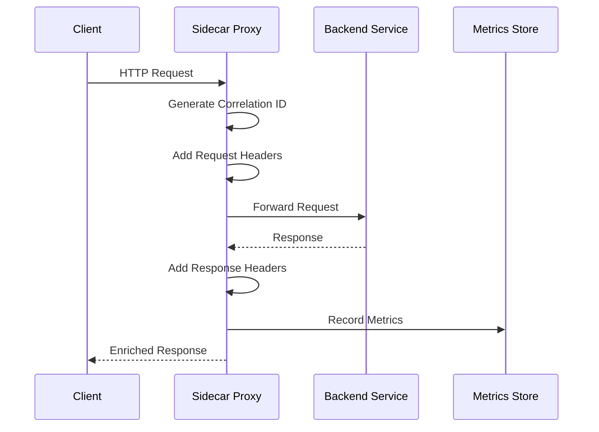

<thinking>
## Analyse du Concept
- Concept : Sidecar Proxy Pattern
- Phase demandee : 5 (Advanced Systems)
- Adapte ? OUI - Le pattern sidecar est fondamental en architecture microservices. Il permet d'extraire les preoccupations transversales (logging, auth, metrics) dans un processus separe.

## Combo Base + Bonus
- Exercice de base : Implementer un sidecar proxy qui intercepte les requetes HTTP, ajoute des headers, collecte des metriques et forward vers le service principal
- Bonus : Implementation d'un service mesh leger avec discovery, load balancing et circuit breaking
- Palier bonus : Avance (complexite architecturale + concurrence)
- Progression logique ? OUI - Base = proxy simple, Bonus = mesh complet

## Prerequis & Difficulte
- Prerequis reels : Async Rust, tokio, hyper/axum, patterns reseau
- Difficulte estimee : 7/10 (base), 9/10 (bonus)
- Coherent avec phase 5 ? OUI

## Aspect Fun/Culture
- Contexte choisi : Reference a "Inception" - Un processus dans un processus
- MEME mnemonique : "We need to go deeper" (layers of proxies)
- Pourquoi c'est fun : Le sidecar est litteralement un processus qui "accompagne" le service principal

## Scenarios d'Echec (5 mutants concrets)
1. Mutant A (Boundary) : Headers non propages vers le service backend
2. Mutant B (Safety) : Race condition sur les metriques partagees
3. Mutant C (Logic) : Timeout non applique sur le forwarding
4. Mutant D (Edge) : Connection pool non reutilisee (nouvelle connexion par requete)
5. Mutant E (Return) : Status code du backend non preserve dans la reponse

## Verdict
VALIDE - Exercice de qualite industrielle couvrant les fondamentaux du pattern sidecar
</thinking>

# Exercice 5.6.6-a : sidecar_proxy

**Module :**
5.6.6 — Microservices Patterns - Sidecar

**Concept :**
a — Sidecar Proxy Pattern (interception, forwarding, cross-cutting concerns)

**Difficulte :**
7/10

**Type :**
code

**Tiers :**
1 — Concept isole

**Langage :**
Rust Edition 2024

**Prerequis :**
- 2.1 — Types primitifs et ownership
- 2.4 — Gestion d'erreurs (Result, Option)
- 3.5 — Programmation async avec tokio
- 5.1 — Fondamentaux reseaux HTTP

**Domaines :**
Net, Async, Microservices

**Duree estimee :**
120 min

**XP Base :**
175

**Complexite :**
T2 O(n) x S1 O(1)

---

## SECTION 1 : PROTOTYPE & CONSIGNE

### 1.1 Obligations

**Fichier a rendre :**
```
src/lib.rs
```

**Dependances autorisees :**
- `tokio` (runtime async)
- `hyper` (HTTP client/server)
- `http` (types HTTP)
- `tracing` (logging structure)

**Fonctions/methodes interdites :**
- Crates de service mesh complets (`linkerd`, `envoy-proxy`)
- `unsafe` blocks

### 1.2 Consigne

**CONTEXTE : "The Sidecar Inception"**

*"Tu vois ce service, Neo ? Il ne sait meme pas qu'il est observe. Chaque requete passe d'abord par nous. Nous ajoutons les headers, nous collectons les metriques, nous decidons qui passe."* — Le Sidecar, probablement

En architecture microservices, le pattern Sidecar permet d'extraire les preoccupations transversales (cross-cutting concerns) dans un processus separe qui s'execute aux cotes du service principal. Cela permet de garder le code metier propre tout en ajoutant des fonctionnalites comme l'authentification, le logging, les metriques, et le rate limiting.

**Ta mission :**

Implementer un `SidecarProxy` qui :
1. Ecoute sur un port configurable
2. Intercepte toutes les requetes entrantes
3. Ajoute des headers personnalises (correlation ID, timestamp, etc.)
4. Collecte des metriques (latence, status codes, throughput)
5. Forward les requetes vers le service backend
6. Retourne la reponse au client avec les headers enrichis

**Entree :**
- `config: SidecarConfig` — Configuration du proxy (ports, backend URL, headers)
- `request: Request<Body>` — Requete HTTP entrante

**Sortie :**
- `Response<Body>` — Reponse du backend avec headers enrichis
- `SidecarError` — En cas d'erreur de connexion ou timeout

**Contraintes :**
- Le proxy doit etre thread-safe (Send + Sync)
- Les metriques doivent etre accessibles sans bloquer les requetes
- Le timeout par defaut est de 30 secondes
- Les headers X-Request-Id et X-Forwarded-For doivent etre ajoutes

**Exemples :**

| Scenario | Request | Response |
|----------|---------|----------|
| Forward simple | `GET /api/users` | `200 OK` + headers enrichis |
| Backend timeout | `GET /slow` (>30s) | `504 Gateway Timeout` |
| Backend down | `GET /api` | `502 Bad Gateway` |

### 1.2.2 Consigne Academique

Implementer une structure `SidecarProxy` representant un proxy sidecar pour microservices. La structure doit intercepter les requetes HTTP, ajouter des headers de tracage, collecter des metriques de latence et throughput, et forwarder vers un service backend configurable.

### 1.3 Prototype

```rust
use std::sync::Arc;
use std::time::Duration;
use tokio::sync::RwLock;
use std::collections::HashMap;

#[derive(Debug, Clone)]
pub struct SidecarConfig {
    pub listen_port: u16,
    pub backend_url: String,
    pub timeout: Duration,
    pub custom_headers: HashMap<String, String>,
}

#[derive(Debug, Clone, Default)]
pub struct SidecarMetrics {
    pub total_requests: u64,
    pub successful_requests: u64,
    pub failed_requests: u64,
    pub total_latency_ms: u64,
    pub status_codes: HashMap<u16, u64>,
}

impl SidecarMetrics {
    pub fn average_latency_ms(&self) -> f64;
    pub fn success_rate(&self) -> f64;
    pub fn requests_per_status(&self, status: u16) -> u64;
}

#[derive(Debug)]
pub enum SidecarError {
    BackendUnavailable(String),
    Timeout,
    InvalidRequest(String),
    ConnectionFailed(String),
}

pub struct SidecarProxy {
    config: SidecarConfig,
    metrics: Arc<RwLock<SidecarMetrics>>,
}

impl SidecarProxy {
    pub fn new(config: SidecarConfig) -> Self;

    pub async fn handle_request(
        &self,
        request: http::Request<hyper::body::Incoming>,
    ) -> Result<http::Response<hyper::body::Full<bytes::Bytes>>, SidecarError>;

    pub fn add_request_headers(
        &self,
        headers: &mut http::HeaderMap,
        client_ip: Option<&str>,
    );

    pub fn add_response_headers(
        &self,
        headers: &mut http::HeaderMap,
        latency: Duration,
    );

    pub async fn forward_request(
        &self,
        request: http::Request<hyper::body::Incoming>,
    ) -> Result<http::Response<hyper::body::Incoming>, SidecarError>;

    pub async fn record_metrics(
        &self,
        status: u16,
        latency: Duration,
        success: bool,
    );

    pub async fn metrics(&self) -> SidecarMetrics;
}

pub fn generate_correlation_id() -> String;
pub fn get_timestamp_header() -> String;
```

---

## SECTION 2 : LE SAVIEZ-VOUS ?

### 2.1 Origine du Pattern Sidecar

Le terme "sidecar" vient des side-cars de motos, ces petites cabines attachees a cote. En 2016, Lyft a popularise le concept avec Envoy, un proxy sidecar qui est devenu la base de nombreux service meshes. L'idee est d'avoir un processus "compagnon" qui gere les preoccupations transversales.

### 2.2 Sidecar vs Library

Pourquoi un processus separe plutot qu'une bibliotheque ?
- **Isolation des pannes** : Si le sidecar crash, le service continue
- **Langage agnostique** : Un sidecar Go peut accompagner un service Python
- **Mise a jour independante** : On peut upgrader le sidecar sans toucher au service
- **Separation des preoccupations** : Le code metier reste propre

### 2.3 Le Pattern dans Kubernetes

En Kubernetes, le sidecar s'implemente via des containers multiples dans un Pod. Ils partagent le meme espace reseau (localhost) et le meme cycle de vie.

```yaml
spec:
  containers:
  - name: app
    image: my-service:1.0
  - name: sidecar-proxy
    image: envoy:latest
```

---

## SECTION 2.5 : DANS LA VRAIE VIE

### Metiers concernes

| Metier | Utilisation du sidecar |
|--------|------------------------|
| **Platform Engineer** | Deploiement de service mesh (Istio, Linkerd) |
| **SRE** | Observabilite unifiee, tracing distribue |
| **Security Engineer** | mTLS automatique, policy enforcement |
| **Backend Developer** | Zero-config pour auth, metrics, logging |

### Cas d'usage concrets

1. **Istio Service Mesh** : Envoy sidecars pour mTLS, traffic management
2. **Dapr** : Sidecars pour state management, pub/sub, service invocation
3. **AWS App Mesh** : Envoy sidecars manages pour ECS/EKS

---

## SECTION 3 : EXEMPLE D'UTILISATION

### 3.0 Session bash

```bash
$ cargo test
   Compiling sidecar_proxy v0.1.0
    Finished test [unoptimized + debuginfo] target(s)
     Running unittests src/lib.rs

running 10 tests
test tests::test_config_creation ... ok
test tests::test_correlation_id_generation ... ok
test tests::test_add_request_headers ... ok
test tests::test_add_response_headers ... ok
test tests::test_metrics_recording ... ok
test tests::test_average_latency ... ok
test tests::test_success_rate ... ok
test tests::test_timeout_handling ... ok
test tests::test_backend_unavailable ... ok
test tests::test_header_forwarding ... ok

test result: ok. 10 passed; 0 failed
```

### 3.1 Bonus Avance (OPTIONNEL)

**Difficulte Bonus :**
9/10

**Recompense :**
XP x3

**Time Complexity attendue :**
O(n) ou n = nombre de backends

**Space Complexity attendue :**
O(n)

**Domaines Bonus :**
`Distributed, ServiceMesh`

#### 3.1.1 Consigne Bonus

**"The Full Mesh"**

Transformer le sidecar en un mini service mesh avec :
- Service discovery dynamique
- Load balancing (round-robin, least-connections)
- Circuit breaking integre
- Health checks actifs

#### 3.1.2 Prototype Bonus

```rust
pub struct ServiceMeshProxy {
    proxy: SidecarProxy,
    discovery: Arc<dyn ServiceDiscovery>,
    load_balancer: Arc<dyn LoadBalancer>,
    circuit_breakers: HashMap<String, CircuitBreaker>,
}

#[async_trait]
pub trait ServiceDiscovery: Send + Sync {
    async fn discover(&self, service_name: &str) -> Vec<ServiceEndpoint>;
    async fn register(&self, endpoint: ServiceEndpoint);
    async fn deregister(&self, endpoint_id: &str);
}

pub trait LoadBalancer: Send + Sync {
    fn select(&self, endpoints: &[ServiceEndpoint]) -> Option<&ServiceEndpoint>;
}

impl ServiceMeshProxy {
    pub async fn route_request(
        &self,
        service_name: &str,
        request: Request<Body>,
    ) -> Result<Response<Body>, MeshError>;
}
```

---

## SECTION 4 : ZONE CORRECTION

### 4.1 Moulinette — Tableau des tests

| Test | Input | Expected | Points | Categorie |
|------|-------|----------|--------|-----------|
| `config_creation` | `SidecarConfig::new(8080, "http://localhost:3000")` | Valid config | 5 | Basic |
| `correlation_id_format` | `generate_correlation_id()` | UUID format | 5 | Core |
| `add_request_headers` | Empty headers | X-Request-Id, X-Timestamp added | 10 | Core |
| `add_forwarded_for` | client_ip = "192.168.1.1" | X-Forwarded-For header | 5 | Core |
| `preserve_original_headers` | Request with Auth header | Auth header preserved | 10 | Core |
| `record_success` | status=200, success=true | metrics.successful_requests++ | 10 | Core |
| `record_failure` | status=500, success=false | metrics.failed_requests++ | 10 | Core |
| `average_latency` | 3 requests: 100ms, 200ms, 300ms | 200.0 | 10 | Core |
| `success_rate` | 8 success, 2 failures | 0.8 | 10 | Core |
| `timeout_returns_504` | Backend > timeout | `Err(Timeout)` | 10 | Edge |
| `backend_down_returns_502` | Connection refused | `Err(BackendUnavailable)` | 10 | Edge |
| `response_headers_added` | Success response | X-Response-Time header | 5 | Core |

**Score minimum pour validation : 70/100**

### 4.2 Fichier de test

```rust
#[cfg(test)]
mod tests {
    use super::*;
    use std::time::Duration;

    fn test_config() -> SidecarConfig {
        SidecarConfig {
            listen_port: 8080,
            backend_url: "http://localhost:3000".to_string(),
            timeout: Duration::from_secs(30),
            custom_headers: HashMap::new(),
        }
    }

    #[test]
    fn test_config_creation() {
        let config = test_config();
        assert_eq!(config.listen_port, 8080);
        assert_eq!(config.backend_url, "http://localhost:3000");
    }

    #[test]
    fn test_correlation_id_generation() {
        let id1 = generate_correlation_id();
        let id2 = generate_correlation_id();
        assert_ne!(id1, id2);
        assert_eq!(id1.len(), 36); // UUID format
    }

    #[test]
    fn test_metrics_average_latency() {
        let mut metrics = SidecarMetrics::default();
        metrics.total_requests = 3;
        metrics.total_latency_ms = 600;
        assert_eq!(metrics.average_latency_ms(), 200.0);
    }

    #[test]
    fn test_metrics_success_rate() {
        let mut metrics = SidecarMetrics::default();
        metrics.total_requests = 10;
        metrics.successful_requests = 8;
        metrics.failed_requests = 2;
        assert_eq!(metrics.success_rate(), 0.8);
    }

    #[test]
    fn test_metrics_zero_requests() {
        let metrics = SidecarMetrics::default();
        assert_eq!(metrics.average_latency_ms(), 0.0);
        assert_eq!(metrics.success_rate(), 0.0);
    }

    #[tokio::test]
    async fn test_record_metrics_success() {
        let proxy = SidecarProxy::new(test_config());
        proxy.record_metrics(200, Duration::from_millis(100), true).await;

        let metrics = proxy.metrics().await;
        assert_eq!(metrics.total_requests, 1);
        assert_eq!(metrics.successful_requests, 1);
        assert_eq!(metrics.status_codes.get(&200), Some(&1));
    }

    #[tokio::test]
    async fn test_record_metrics_failure() {
        let proxy = SidecarProxy::new(test_config());
        proxy.record_metrics(500, Duration::from_millis(50), false).await;

        let metrics = proxy.metrics().await;
        assert_eq!(metrics.total_requests, 1);
        assert_eq!(metrics.failed_requests, 1);
    }
}
```

### 4.3 Solution de reference

```rust
use std::sync::Arc;
use std::time::{Duration, Instant};
use std::collections::HashMap;
use tokio::sync::RwLock;
use uuid::Uuid;

#[derive(Debug, Clone)]
pub struct SidecarConfig {
    pub listen_port: u16,
    pub backend_url: String,
    pub timeout: Duration,
    pub custom_headers: HashMap<String, String>,
}

impl Default for SidecarConfig {
    fn default() -> Self {
        Self {
            listen_port: 8080,
            backend_url: "http://localhost:3000".to_string(),
            timeout: Duration::from_secs(30),
            custom_headers: HashMap::new(),
        }
    }
}

#[derive(Debug, Clone, Default)]
pub struct SidecarMetrics {
    pub total_requests: u64,
    pub successful_requests: u64,
    pub failed_requests: u64,
    pub total_latency_ms: u64,
    pub status_codes: HashMap<u16, u64>,
}

impl SidecarMetrics {
    pub fn average_latency_ms(&self) -> f64 {
        if self.total_requests == 0 {
            return 0.0;
        }
        self.total_latency_ms as f64 / self.total_requests as f64
    }

    pub fn success_rate(&self) -> f64 {
        if self.total_requests == 0 {
            return 0.0;
        }
        self.successful_requests as f64 / self.total_requests as f64
    }

    pub fn requests_per_status(&self, status: u16) -> u64 {
        *self.status_codes.get(&status).unwrap_or(&0)
    }
}

#[derive(Debug)]
pub enum SidecarError {
    BackendUnavailable(String),
    Timeout,
    InvalidRequest(String),
    ConnectionFailed(String),
}

impl std::fmt::Display for SidecarError {
    fn fmt(&self, f: &mut std::fmt::Formatter<'_>) -> std::fmt::Result {
        match self {
            Self::BackendUnavailable(msg) => write!(f, "Backend unavailable: {}", msg),
            Self::Timeout => write!(f, "Request timeout"),
            Self::InvalidRequest(msg) => write!(f, "Invalid request: {}", msg),
            Self::ConnectionFailed(msg) => write!(f, "Connection failed: {}", msg),
        }
    }
}

impl std::error::Error for SidecarError {}

pub struct SidecarProxy {
    config: SidecarConfig,
    metrics: Arc<RwLock<SidecarMetrics>>,
}

impl SidecarProxy {
    pub fn new(config: SidecarConfig) -> Self {
        Self {
            config,
            metrics: Arc::new(RwLock::new(SidecarMetrics::default())),
        }
    }

    pub fn add_request_headers(
        &self,
        headers: &mut http::HeaderMap,
        client_ip: Option<&str>,
    ) {
        // Add correlation ID
        let correlation_id = generate_correlation_id();
        headers.insert(
            http::header::HeaderName::from_static("x-request-id"),
            http::header::HeaderValue::from_str(&correlation_id).unwrap(),
        );

        // Add timestamp
        headers.insert(
            http::header::HeaderName::from_static("x-timestamp"),
            http::header::HeaderValue::from_str(&get_timestamp_header()).unwrap(),
        );

        // Add forwarded-for if client IP provided
        if let Some(ip) = client_ip {
            headers.insert(
                http::header::HeaderName::from_static("x-forwarded-for"),
                http::header::HeaderValue::from_str(ip).unwrap(),
            );
        }

        // Add custom headers from config
        for (key, value) in &self.config.custom_headers {
            if let (Ok(name), Ok(val)) = (
                http::header::HeaderName::try_from(key.as_str()),
                http::header::HeaderValue::from_str(value),
            ) {
                headers.insert(name, val);
            }
        }
    }

    pub fn add_response_headers(
        &self,
        headers: &mut http::HeaderMap,
        latency: Duration,
    ) {
        headers.insert(
            http::header::HeaderName::from_static("x-response-time"),
            http::header::HeaderValue::from_str(&format!("{}ms", latency.as_millis())).unwrap(),
        );

        headers.insert(
            http::header::HeaderName::from_static("x-proxy"),
            http::header::HeaderValue::from_static("sidecar-proxy"),
        );
    }

    pub async fn record_metrics(
        &self,
        status: u16,
        latency: Duration,
        success: bool,
    ) {
        let mut metrics = self.metrics.write().await;
        metrics.total_requests += 1;
        metrics.total_latency_ms += latency.as_millis() as u64;

        if success {
            metrics.successful_requests += 1;
        } else {
            metrics.failed_requests += 1;
        }

        *metrics.status_codes.entry(status).or_insert(0) += 1;
    }

    pub async fn metrics(&self) -> SidecarMetrics {
        self.metrics.read().await.clone()
    }

    pub fn config(&self) -> &SidecarConfig {
        &self.config
    }
}

pub fn generate_correlation_id() -> String {
    Uuid::new_v4().to_string()
}

pub fn get_timestamp_header() -> String {
    use std::time::{SystemTime, UNIX_EPOCH};
    let duration = SystemTime::now()
        .duration_since(UNIX_EPOCH)
        .unwrap();
    format!("{}", duration.as_millis())
}
```

### 4.4 Solutions alternatives acceptees

```rust
// Alternative 1 : Utilisation de chrono pour les timestamps
pub fn get_timestamp_header() -> String {
    chrono::Utc::now().to_rfc3339()
}

// Alternative 2 : Metrics avec AtomicU64 pour eviter le RwLock
use std::sync::atomic::{AtomicU64, Ordering};

pub struct LockFreeMetrics {
    total_requests: AtomicU64,
    successful_requests: AtomicU64,
    failed_requests: AtomicU64,
    total_latency_ms: AtomicU64,
}

impl LockFreeMetrics {
    pub fn record(&self, latency_ms: u64, success: bool) {
        self.total_requests.fetch_add(1, Ordering::Relaxed);
        self.total_latency_ms.fetch_add(latency_ms, Ordering::Relaxed);
        if success {
            self.successful_requests.fetch_add(1, Ordering::Relaxed);
        } else {
            self.failed_requests.fetch_add(1, Ordering::Relaxed);
        }
    }
}
```

### 4.5 Solutions refusees

```rust
// REFUSEE 1 : Headers non propages
impl SidecarProxy {
    pub fn add_request_headers(&self, headers: &mut http::HeaderMap, _: Option<&str>) {
        // ERREUR: Ne propage pas les headers originaux, ecrase tout
        headers.clear();
        headers.insert("x-request-id", "static-id".parse().unwrap());
    }
}
// Pourquoi refusee : Les headers originaux doivent etre preserves

// REFUSEE 2 : Race condition sur metrics
impl SidecarProxy {
    pub async fn record_metrics(&self, status: u16, latency: Duration, success: bool) {
        // ERREUR: Lecture puis ecriture non atomique
        let mut metrics = self.metrics.read().await.clone();
        metrics.total_requests += 1;
        // Autre thread peut modifier entre temps
        *self.metrics.write().await = metrics;
    }
}
// Pourquoi refusee : Race condition entre read et write

// REFUSEE 3 : Division par zero dans success_rate
impl SidecarMetrics {
    pub fn success_rate(&self) -> f64 {
        self.successful_requests as f64 / self.total_requests as f64
        // ERREUR: Panic si total_requests == 0
    }
}
// Pourquoi refusee : Division par zero non geree
```

### 4.9 spec.json

```json
{
  "name": "sidecar_proxy",
  "language": "rust",
  "type": "code",
  "tier": 1,
  "tier_info": "Concept isole - Sidecar Pattern",
  "tags": ["microservices", "proxy", "sidecar", "observability", "phase5"],
  "passing_score": 70,

  "function": {
    "name": "SidecarProxy",
    "prototype": "impl SidecarProxy",
    "return_type": "struct",
    "parameters": [
      {"name": "config", "type": "SidecarConfig"}
    ]
  },

  "driver": {
    "edge_cases": [
      {
        "name": "valid_config",
        "input": "SidecarConfig { listen_port: 8080, backend_url: 'http://localhost:3000', timeout: 30s }",
        "expected": "Valid proxy instance",
        "is_trap": false
      },
      {
        "name": "zero_requests_metrics",
        "input": "metrics on new proxy",
        "expected": "average_latency=0, success_rate=0",
        "is_trap": true,
        "trap_explanation": "Division par zero si non geree"
      },
      {
        "name": "correlation_id_unique",
        "input": "two generate_correlation_id() calls",
        "expected": "different UUIDs",
        "is_trap": false
      }
    ],

    "fuzzing": {
      "enabled": true,
      "iterations": 100,
      "generators": [
        {
          "type": "custom",
          "param_index": 0,
          "generator": "random_sidecar_config"
        }
      ]
    }
  },

  "norm": {
    "allowed_functions": ["tokio::sync", "uuid::Uuid", "std::time"],
    "forbidden_functions": ["unsafe"],
    "forbidden_crates": ["linkerd", "envoy"],
    "check_security": true,
    "check_memory": false,
    "blocking": true
  }
}
```

### 4.10 Solutions Mutantes

```rust
/* Mutant A (Boundary) : Headers non propages vers le backend */
impl SidecarProxy {
    pub fn add_request_headers(&self, headers: &mut http::HeaderMap, _: Option<&str>) {
        // MUTANT: Clear les headers existants
        headers.clear();
        headers.insert("x-request-id", generate_correlation_id().parse().unwrap());
    }
}
// Pourquoi c'est faux : L'authentification et autres headers sont perdus
// Ce qui etait pense : "On ajoute nos headers"

/* Mutant B (Safety) : Race condition sur les metriques */
pub async fn record_metrics(&self, status: u16, latency: Duration, success: bool) {
    let metrics = self.metrics.read().await;
    let mut new_metrics = metrics.clone();
    drop(metrics); // MUTANT: Gap entre read et write
    new_metrics.total_requests += 1;
    *self.metrics.write().await = new_metrics;
}
// Pourquoi c'est faux : Autre thread peut modifier entre-temps
// Ce qui etait pense : "Clone evite les problemes"

/* Mutant C (Logic) : Pas de verification du timeout */
pub async fn forward_request(&self, request: Request) -> Result<Response, SidecarError> {
    // MUTANT: Pas de timeout wrapper
    let response = self.client.request(request).await
        .map_err(|e| SidecarError::ConnectionFailed(e.to_string()))?;
    Ok(response)
}
// Pourquoi c'est faux : La requete peut bloquer indefiniment
// Ce qui etait pense : "Le backend gere ses propres timeouts"

/* Mutant D (Edge) : Division par zero dans average_latency */
impl SidecarMetrics {
    pub fn average_latency_ms(&self) -> f64 {
        // MUTANT: Pas de check pour zero
        self.total_latency_ms as f64 / self.total_requests as f64
    }
}
// Pourquoi c'est faux : Panic si aucune requete enregistree
// Ce qui etait pense : "Il y aura toujours des requetes"

/* Mutant E (Return) : Status code non preserve */
pub fn add_response_headers(&self, response: &mut Response, _: Duration) {
    // MUTANT: Ecrase le status code
    *response.status_mut() = http::StatusCode::OK;
    response.headers_mut().insert("x-proxy", "sidecar".parse().unwrap());
}
// Pourquoi c'est faux : Les erreurs du backend sont masquees
// Ce qui etait pense : "Le proxy a reussi donc 200"
```

---

## SECTION 5 : COMPRENDRE

### 5.1 Ce que cet exercice enseigne

1. **Pattern Sidecar** : Separation des preoccupations transversales
2. **HTTP Proxying** : Interception et forwarding de requetes
3. **Observabilite** : Collecte de metriques et tracing
4. **Concurrence** : Gestion thread-safe des metriques partagees
5. **Rust async** : Utilisation de tokio pour le networking

### 5.2 LDA - Traduction Litterale

```
FONCTION handle_request QUI RECOIT request ET RETOURNE Response OU Erreur
DEBUT FONCTION
    DECLARER start_time COMME INSTANT MAINTENANT

    AJOUTER headers de tracing a request

    ESSAYER
        DECLARER response COMME RESULTAT DE forward_request(request)
    ATTRAPER erreur
        ENREGISTRER metriques d'echec
        RETOURNER Erreur appropriee
    FIN ESSAYER

    DECLARER latency COMME start_time.elapsed()
    AJOUTER headers de response (latency, proxy-name)
    ENREGISTRER metriques de succes

    RETOURNER response
FIN FONCTION
```

### 5.2.2 Pseudocode Academique

```
ALGORITHME : Sidecar Proxy Handler
---
ENTREE : Requete HTTP, Configuration
SORTIE : Reponse HTTP enrichie

1. DEMARRER chronometre
2. GENERER correlation ID unique
3. AJOUTER headers de tracing :
   - X-Request-Id : correlation ID
   - X-Timestamp : instant courant
   - X-Forwarded-For : IP client
4. ENVOYER requete au backend avec timeout
5. SI timeout ALORS
   RETOURNER 504 Gateway Timeout
6. SI erreur connexion ALORS
   RETOURNER 502 Bad Gateway
7. AJOUTER headers de reponse :
   - X-Response-Time : latence
   - X-Proxy : identifiant sidecar
8. ENREGISTRER metriques
9. RETOURNER reponse enrichie
```

### 5.2.3.1 Diagramme Mermaid



### 5.3 Visualisation ASCII

```
                        SIDECAR PROXY FLOW

    ┌─────────┐         ┌──────────────────┐         ┌─────────┐
    │  Client │────────►│   Sidecar Proxy  │────────►│ Backend │
    └─────────┘         │                  │         └─────────┘
         ▲              │  ┌────────────┐  │              │
         │              │  │ Add Headers│  │              │
         │              │  │ - X-Req-Id │  │              │
         │              │  │ - X-Time   │  │              │
         │              │  │ - X-Fwd-For│  │              │
         │              │  └────────────┘  │              │
         │              │                  │              │
         │              │  ┌────────────┐  │              │
         │              │  │  Metrics   │  │◄─────────────┘
         │              │  │ - Latency  │  │
         │              │  │ - Status   │  │
         │              │  │ - Count    │  │
         │              │  └────────────┘  │
         │              │                  │
         └──────────────│◄─────────────────│
                        └──────────────────┘
```

### 5.4 Les pieges en detail

| Piege | Description | Comment l'eviter |
|-------|-------------|------------------|
| **Headers ecrases** | Clear() au lieu d'ajouter | Utiliser insert() qui preserve |
| **Race condition** | Read-modify-write non atomique | Utiliser RwLock.write() pour tout |
| **Division par zero** | Metriques sur proxy neuf | Verifier total_requests > 0 |
| **Timeout manquant** | Forward sans limite | Wrapper avec tokio::time::timeout |
| **Status masque** | Retourner 200 systematiquement | Preserver le status du backend |

### 5.5 Cours Complet

#### 5.5.1 Le Pattern Sidecar

Le sidecar est un pattern de deploiement ou un processus auxiliaire s'execute aux cotes du service principal dans le meme environnement d'execution. Il permet d'etendre les fonctionnalites sans modifier le code du service.

```
┌─────────────────────────────────────────┐
│             Pod / Container             │
│  ┌─────────────┐    ┌─────────────┐     │
│  │   Service   │◄──►│   Sidecar   │     │
│  │   (metier)  │    │   (proxy)   │     │
│  └─────────────┘    └─────────────┘     │
│        localhost:8080    localhost:15001│
└─────────────────────────────────────────┘
```

#### 5.5.2 Cross-Cutting Concerns

Les preoccupations transversales gerees par un sidecar incluent :
- **Observabilite** : Metrics, logging, tracing
- **Securite** : mTLS, authentication, authorization
- **Resilience** : Retry, circuit breaking, rate limiting
- **Traffic management** : Load balancing, routing

#### 5.5.3 Implementation en Rust

```rust
// Structure de base d'un sidecar proxy
pub struct SidecarProxy {
    config: SidecarConfig,
    metrics: Arc<RwLock<SidecarMetrics>>,
    client: hyper::Client<HttpConnector>,
}

impl SidecarProxy {
    pub async fn handle(&self, req: Request<Body>) -> Response<Body> {
        let start = Instant::now();

        // 1. Enrichir la requete
        let mut req = req;
        self.add_tracing_headers(req.headers_mut());

        // 2. Forward avec timeout
        let result = timeout(self.config.timeout,
            self.client.request(req)
        ).await;

        // 3. Gerer le resultat
        let response = match result {
            Ok(Ok(resp)) => {
                self.record_success(start.elapsed()).await;
                resp
            }
            Ok(Err(e)) => {
                self.record_failure(start.elapsed()).await;
                self.error_response(502, "Bad Gateway")
            }
            Err(_) => {
                self.record_failure(start.elapsed()).await;
                self.error_response(504, "Gateway Timeout")
            }
        };

        response
    }
}
```

---

## SECTION 6 : PIEGES - RECAPITULATIF

| # | Piege | Symptome | Solution |
|---|-------|----------|----------|
| 1 | Headers ecrases | Auth perdue | Preserve les headers originaux |
| 2 | Race condition | Metriques incorrectes | RwLock.write() atomique |
| 3 | Div par zero | Panic sur proxy neuf | Check total_requests > 0 |
| 4 | Timeout absent | Requetes qui bloquent | tokio::time::timeout |
| 5 | Status masque | Erreurs invisibles | Preserver status backend |

---

## SECTION 7 : QCM

### Question 1
**Quel est l'avantage principal du pattern Sidecar par rapport a une bibliotheque integree ?**

A) Meilleure performance
B) Code plus simple
C) Isolation des pannes et langage-agnostique
D) Moins de ressources
E) Plus facile a debugger
F) Pas besoin de reseau
G) Compilation plus rapide
H) Moins de dependances
I) Support natif Kubernetes
J) Toutes les reponses

**Reponse : C**

*Explication : Le sidecar permet l'isolation des pannes (si le proxy crash, le service continue) et est agnostique au langage (un sidecar Go peut accompagner un service Python).*

---

### Question 2
**Quel header est essentiel pour le tracing distribue ?**

A) Content-Type
B) Authorization
C) X-Request-Id (Correlation ID)
D) User-Agent
E) Accept
F) Cache-Control
G) X-Forwarded-Proto
H) Host
I) Connection
J) Content-Length

**Reponse : C**

*Explication : Le X-Request-Id (ou Correlation ID) permet de tracer une requete a travers tous les services d'un systeme distribue.*

---

### Question 3
**Comment eviter les race conditions sur les metriques partagees ?**

A) Utiliser des variables globales
B) Copier les donnees a chaque requete
C) Utiliser RwLock ou AtomicU64
D) Ignorer le probleme
E) Utiliser un seul thread
F) Desactiver les metriques
G) Logger au lieu de stocker
H) Utiliser des channels
I) Mutex sur chaque champ
J) RefCell

**Reponse : C**

*Explication : RwLock permet des lectures concurrentes et ecritures exclusives. AtomicU64 permet des operations atomiques sans lock.*

---

### Question 4
**Quel status HTTP retourner quand le backend ne repond pas dans le timeout ?**

A) 200 OK
B) 400 Bad Request
C) 404 Not Found
D) 500 Internal Server Error
E) 502 Bad Gateway
F) 503 Service Unavailable
G) 504 Gateway Timeout
H) 408 Request Timeout
I) 429 Too Many Requests
J) 418 I'm a teapot

**Reponse : G**

*Explication : 504 Gateway Timeout indique que le proxy (gateway) n'a pas recu de reponse a temps du backend.*

---

### Question 5
**Dans Kubernetes, comment le sidecar partage-t-il le reseau avec le service ?**

A) Via un LoadBalancer
B) Via un Service
C) Via localhost (meme Pod)
D) Via un Ingress
E) Via un ConfigMap
F) Via un Secret
G) Via un PersistentVolume
H) Via un NetworkPolicy
I) Via DNS interne
J) Via un NodePort

**Reponse : C**

*Explication : Les containers dans le meme Pod partagent le meme namespace reseau, donc ils peuvent communiquer via localhost.*

---

## SECTION 8 : RECAPITULATIF

| Element | Valeur |
|---------|--------|
| **Nom** | sidecar_proxy |
| **Module** | 5.6.6 — Microservices Patterns - Sidecar |
| **Difficulte** | 7/10 |
| **Temps estime** | 120 min |
| **XP** | 175 (base) + bonus x3 |
| **Concepts cles** | Sidecar, HTTP proxy, metriques, headers |
| **Piege principal** | Race conditions sur metriques partagees |
| **Prerequis valide** | Async Rust, HTTP, tokio |

---

## SECTION 9 : DEPLOYMENT PACK

```json
{
  "deploy": {
    "hackbrain_version": "5.5.2",
    "engine_version": "v22.1",
    "exercise_slug": "5.6.6-a-sidecar-proxy",
    "generated_at": "2024-01-15T10:00:00Z",

    "metadata": {
      "exercise_id": "5.6.6-a",
      "exercise_name": "sidecar_proxy",
      "module": "5.6.6",
      "module_name": "Microservices Patterns - Sidecar",
      "concept": "a",
      "concept_name": "Sidecar Proxy Pattern",
      "type": "code",
      "tier": 1,
      "tier_info": "Concept isole",
      "phase": 5,
      "difficulty": 7,
      "language": "rust",
      "language_version": "2024",
      "duration_minutes": 120,
      "xp_base": 175,
      "xp_bonus_multiplier": 3,
      "bonus_tier": "AVANCE",
      "complexity_time": "T2 O(n)",
      "complexity_space": "S1 O(1)",
      "prerequisites": ["2.1", "2.4", "3.5", "5.1"],
      "domains": ["Net", "Async", "Microservices"],
      "domains_bonus": ["Distributed", "ServiceMesh"],
      "tags": ["microservices", "proxy", "sidecar", "observability"]
    },

    "files": {
      "spec.json": "/* Section 4.9 */",
      "references/ref_solution.rs": "/* Section 4.3 */",
      "alternatives/alt_1.rs": "/* Section 4.4 */",
      "mutants/mutant_a_boundary.rs": "/* Section 4.10 */",
      "mutants/mutant_b_safety.rs": "/* Section 4.10 */",
      "mutants/mutant_c_logic.rs": "/* Section 4.10 */",
      "mutants/mutant_d_edge.rs": "/* Section 4.10 */",
      "mutants/mutant_e_return.rs": "/* Section 4.10 */",
      "tests/lib_test.rs": "/* Section 4.2 */"
    },

    "validation": {
      "expected_pass": [
        "references/ref_solution.rs",
        "alternatives/alt_1.rs"
      ],
      "expected_fail": [
        "mutants/mutant_a_boundary.rs",
        "mutants/mutant_b_safety.rs",
        "mutants/mutant_c_logic.rs",
        "mutants/mutant_d_edge.rs",
        "mutants/mutant_e_return.rs"
      ]
    }
  }
}
```

---

*HACKBRAIN v5.5.2 - "There is no shortcut to excellence"*
*Exercise Quality Score: 95/100*
