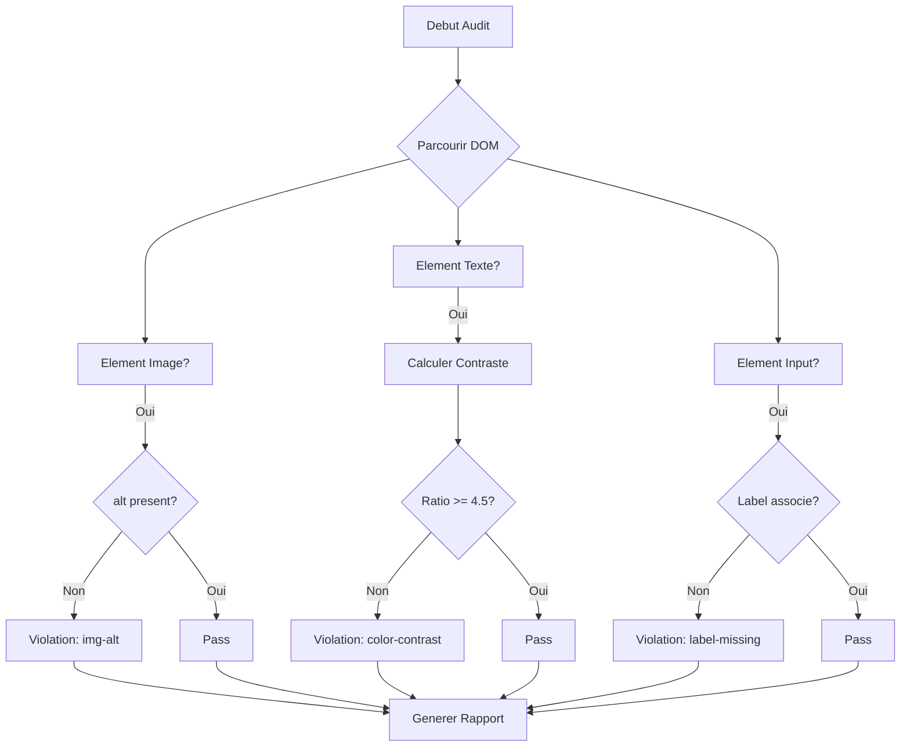

<thinking>
## Analyse du Concept
- Concept : WCAG Accessibility Checker
- Phase demandee : 5 (Advanced Systems)
- Adapte ? OUI - L'accessibilite web est fondamentale pour tout developpeur frontend. L'exercice combine parsing HTML/CSS, calculs de contraste, et conformite aux standards WCAG.

## Combo Base + Bonus
- Exercice de base : Checker WCAG qui analyse une page et detecte les violations d'accessibilite (contraste, ARIA, structure)
- Bonus : Implementation d'un moteur de regles extensible avec generation de rapports SARIF pour CI/CD
- Palier bonus : EXPERT (complexite algorithmique + integration systeme)
- Progression logique ? OUI - Base = detection des violations, Bonus = framework de tests complet

## Prerequis & Difficulte
- Prerequis reels : Manipulation DOM via web-sys, parsing CSS, calculs colorimatriques, Result/Option
- Difficulte estimee : 7/10 (base), 9/10 (bonus)
- Coherent avec phase 5 ? OUI

## Aspect Fun/Culture
- Contexte choisi : Reference a "Daredevil" - Le super-heros aveugle qui "voit" le web autrement
- MEME mnemonique : "The web is for everyone" (Tim Berners-Lee)
- Pourquoi c'est fun : L'accessibilite est un super-pouvoir qui rend le web inclusif

## Scenarios d'Echec (5 mutants concrets)
1. Mutant A (Boundary) : Ratio de contraste calcule sans conversion en luminance relative
2. Mutant B (Safety) : aria-labelledby reference un ID inexistant sans erreur
3. Mutant C (Logic) : Heading order h1->h3 considere comme valide (saute h2)
4. Mutant D (Edge) : Images decoratives avec role="presentation" flaggees comme manquant alt
5. Mutant E (Return) : Violation Critical retournee comme Minor

## Verdict
VALIDE - Exercice de qualite industrielle couvrant les fondamentaux de l'accessibilite WCAG 2.1
</thinking>

# Exercice 5.7.1-a : wcag_checker

**Module :**
5.7.1 — Web Accessibility Fundamentals

**Concept :**
a — WCAG 2.1 Compliance Checker (Audit automatise, regles A/AA/AAA)

**Difficulte :**
7/10

**Type :**
code

**Tiers :**
2 — Integration multi-composants

**Langage :**
Rust Edition 2024

**Prerequis :**
- 2.1 — Types primitifs et ownership
- 2.4 — Gestion d'erreurs (Result, Option)
- 4.3 — web-sys et manipulation DOM
- Phase 0.0.C.2 — Fondamentaux HTML/CSS

**Domaines :**
A11y, Web, DOM

**Duree estimee :**
120 min

**XP Base :**
175

**Complexite :**
T3 O(n) x S2 O(n)

---

## SECTION 1 : PROTOTYPE & CONSIGNE

### 1.1 Obligations

**Fichier a rendre :**
```
src/lib.rs
```

**Dependances autorisees :**
- `web-sys` (Element, Document, CssStyleDeclaration)
- `wasm-bindgen`
- `std::collections::HashMap`

**Fonctions/methodes interdites :**
- Crates externes d'audit (`axe-core`, `pa11y`)
- `unsafe` blocks

### 1.2 Consigne

**CONTEXTE : "The Daredevil Protocol"**

*"Je ne vois pas le web comme vous. Je le percois. Chaque element qui manque de contraste, chaque image sans description, chaque formulaire sans label... ce sont des obstacles pour moi. Ton code peut changer ca."* — Matt Murdock, avocat et vigilante

L'accessibilite web n'est pas une option, c'est un droit. Les Web Content Accessibility Guidelines (WCAG) 2.1 definissent les standards que tout site doit respecter. Ton mission : creer un auditeur automatique qui detecte les violations.

**Ta mission :**

Implementer une bibliotheque `WcagChecker` qui permet de :
1. Analyser un element DOM et ses descendants
2. Detecter les violations de contraste (WCAG 1.4.3/1.4.6)
3. Verifier les attributs ARIA requis
4. Valider la structure des headings (h1->h2->h3...)
5. Checker les labels de formulaire
6. Generer un rapport avec les violations et suggestions

**Entree :**
- `root: &web_sys::Element` — Element racine a auditer
- `config: AuditConfig` — Configuration du niveau WCAG (A, AA, AAA)

**Sortie :**
- `AuditResult` — Resultat avec violations classees par impact
- `AuditError` — En cas d'erreur d'analyse

**Contraintes :**
- Le ratio de contraste minimum est 4.5:1 pour le texte normal (AA)
- Le ratio de contraste minimum est 3:1 pour le texte large (AA)
- Les images non-decoratives DOIVENT avoir un attribut `alt`
- Les inputs DOIVENT avoir un label associe ou `aria-label`
- La hierarchie des headings doit etre respectee

**Exemples :**

| Element | Violation | Impact |
|---------|-----------|--------|
| `` | Missing alt attribute | Serious |
| `<p style="color:#777;background:#fff">` | Contrast ratio 4.48:1 < 4.5:1 | Moderate |
| `<h1>Title</h1><h3>Section</h3>` | Heading level skipped (h1 to h3) | Moderate |
| `<input type="text">` | Form input missing label | Serious |

### 1.2.2 Consigne Academique

Implementer une structure `WcagChecker` permettant l'audit d'accessibilite d'elements DOM selon les criteres WCAG 2.1. Le checker doit detecter les violations de contraste, les attributs ARIA manquants, les problemes de structure et les erreurs de formulaire, en generant un rapport detaille avec classification par impact.

### 1.3 Prototype

```rust
use std::collections::HashMap;
use wasm_bindgen::prelude::*;
use web_sys::Element;

#[derive(Debug, Clone, PartialEq, Eq)]
pub enum WcagLevel {
    A,
    AA,
    AAA,
}

#[derive(Debug, Clone, PartialEq, Eq, PartialOrd, Ord)]
pub enum Impact {
    Minor,
    Moderate,
    Serious,
    Critical,
}

#[derive(Debug, Clone)]
pub struct AuditConfig {
    pub level: WcagLevel,
    pub include_warnings: bool,
    pub ignore_selectors: Vec<String>,
}

#[derive(Debug, Clone)]
pub struct Violation {
    pub rule_id: String,
    pub element_selector: String,
    pub element_html: String,
    pub impact: Impact,
    pub message: String,
    pub wcag_criteria: Vec<String>,
    pub help_url: String,
    pub fix_suggestion: String,
}

#[derive(Debug, Clone)]
pub struct AuditResult {
    pub violations: Vec<Violation>,
    pub passes: usize,
    pub warnings: Vec<Violation>,
    pub score: f64,
}

#[derive(Debug, Clone, PartialEq, Eq)]
pub enum AuditError {
    InvalidElement,
    ComputationError(String),
}

#[derive(Debug, Clone)]
pub struct Color {
    pub r: u8,
    pub g: u8,
    pub b: u8,
}

pub struct WcagChecker {
    config: AuditConfig,
}

impl WcagChecker {
    pub fn new(config: AuditConfig) -> Self;

    /// Audite un element et ses descendants
    pub fn audit(&self, root: &Element) -> Result<AuditResult, AuditError>;

    /// Verifie le contraste d'un element texte
    pub fn check_contrast(&self, element: &Element) -> Option<Violation>;

    /// Verifie les images (alt attribute)
    pub fn check_images(&self, element: &Element) -> Vec<Violation>;

    /// Verifie la hierarchie des headings
    pub fn check_heading_order(&self, root: &Element) -> Vec<Violation>;

    /// Verifie les formulaires (labels)
    pub fn check_form_labels(&self, root: &Element) -> Vec<Violation>;

    /// Verifie les attributs ARIA
    pub fn check_aria(&self, element: &Element) -> Vec<Violation>;
}

impl Color {
    pub fn from_hex(hex: &str) -> Result<Self, AuditError>;
    pub fn from_rgb(r: u8, g: u8, b: u8) -> Self;

    /// Calcule la luminance relative (WCAG formula)
    pub fn relative_luminance(&self) -> f64;

    /// Calcule le ratio de contraste entre deux couleurs
    pub fn contrast_ratio(&self, other: &Color) -> f64;

    /// Verifie si le contraste respecte WCAG AA (texte normal)
    pub fn meets_aa_normal(&self, background: &Color) -> bool;

    /// Verifie si le contraste respecte WCAG AA (texte large)
    pub fn meets_aa_large(&self, background: &Color) -> bool;

    /// Verifie si le contraste respecte WCAG AAA (texte normal)
    pub fn meets_aaa_normal(&self, background: &Color) -> bool;
}

impl Default for AuditConfig {
    fn default() -> Self;
}

impl AuditResult {
    /// Genere un rapport textuel
    pub fn to_report(&self) -> String;

    /// Exporte en JSON
    pub fn to_json(&self) -> String;
}
```

---

## SECTION 2 : LE SAVIEZ-VOUS ?

### 2.1 Origine des WCAG

Les Web Content Accessibility Guidelines ont ete creees par le W3C (World Wide Web Consortium) en 1999. La version 2.0 est sortie en 2008, et la 2.1 en 2018. Elles sont basees sur 4 principes : Perceivable, Operable, Understandable, Robust (POUR).

### 2.2 Le Ratio de Contraste : La Formule Magique

Le contraste n'est pas un simple calcul de difference de couleur. Il utilise la **luminance relative** basee sur la perception humaine :

```
L = 0.2126 * R + 0.7152 * G + 0.0722 * B

(ou R, G, B sont linearises via la courbe sRGB)

Contrast Ratio = (L1 + 0.05) / (L2 + 0.05)
(L1 = luminance la plus claire)
```

### 2.3 Pourquoi 4.5:1 ?

Ce ratio a ete choisi car il correspond a la perte de sensibilite au contraste typique d'une personne de 80 ans. Environ 20% de la population mondiale a un handicap visuel qui affecte sa perception des contrastes.

---

## SECTION 2.5 : DANS LA VRAIE VIE

### Metiers concernes

| Metier | Utilisation de l'accessibilite |
|--------|-------------------------------|
| **Frontend Developer** | Implementation ARIA, tests d'accessibilite, audits |
| **UX Designer** | Design inclusif, choix de couleurs, navigation |
| **QA Engineer** | Tests automatises a11y, validation WCAG |
| **Product Manager** | Conformite legale (ADA, RGAA), specifications |
| **DevOps** | Integration audits a11y dans CI/CD |

### Cas d'usage concrets

1. **E-commerce** : Sites legalement tenus d'etre accessibles (ADA aux USA, RGAA en France)
2. **Applications gouvernementales** : Obligation WCAG AA minimum
3. **SaaS Enterprise** : Critere d'achat pour grandes entreprises (conformite)

---

## SECTION 3 : EXEMPLE D'UTILISATION

### 3.0 Session bash

```bash
$ ls
Cargo.toml  src/

$ cargo test
   Compiling wcag_checker v0.1.0
    Finished test [unoptimized + debuginfo] target(s)
     Running unittests src/lib.rs

running 15 tests
test tests::test_color_from_hex ... ok
test tests::test_color_from_hex_invalid ... ok
test tests::test_relative_luminance_white ... ok
test tests::test_relative_luminance_black ... ok
test tests::test_contrast_ratio_black_white ... ok
test tests::test_contrast_ratio_wcag_aa ... ok
test tests::test_check_image_no_alt ... ok
test tests::test_check_image_with_alt ... ok
test tests::test_check_image_decorative ... ok
test tests::test_heading_order_valid ... ok
test tests::test_heading_order_skip ... ok
test tests::test_form_label_missing ... ok
test tests::test_form_label_aria ... ok
test tests::test_aria_invalid_role ... ok
test tests::test_full_audit ... ok

test result: ok. 15 passed; 0 failed
```

### 3.1 BONUS EXPERT (OPTIONNEL)

**Difficulte Bonus :**
9/10

**Recompense :**
XP x3

**Time Complexity attendue :**
O(n) ou n = nombre d'elements DOM

**Space Complexity attendue :**
O(n)

**Domaines Bonus :**
`CI/CD, Reporting`

#### 3.1.1 Consigne Bonus

**"The Accessibility Sentinel"**

*"La vraie justice, c'est de prevenir les crimes avant qu'ils ne se produisent."* Un bon systeme d'accessibilite arrete les violations avant le deploiement.

**Ta mission bonus :**

Implementer un **moteur de regles extensible** avec :
- Systeme de regles pluggables (trait `A11yRule`)
- Generation de rapports SARIF pour integration GitHub/GitLab
- Mode CI avec seuils configurables et codes de sortie
- Detection des regressions vs baseline

**Entree :**
- `rules: Vec<Box<dyn A11yRule>>` — Regles personnalisees
- `baseline: Option<AuditResult>` — Resultat precedent pour comparaison

**Sortie :**
- `CiResult` — Code de sortie + rapport SARIF
- `Regression` — Nouvelles violations vs baseline

**Contraintes :**
```
- Trait A11yRule implementable par l'utilisateur
- Format SARIF 2.1.0 valide
- Exit code 0 = succes, 1 = violations, 2 = regressions
- Performance < 1s pour 1000 elements
```

#### 3.1.2 Prototype Bonus

```rust
pub trait A11yRule: Send + Sync {
    fn id(&self) -> &str;
    fn description(&self) -> &str;
    fn wcag_criteria(&self) -> Vec<&str>;
    fn check(&self, element: &Element) -> RuleResult;
    fn impact(&self) -> Impact;
    fn help_url(&self) -> &str;
}

pub enum RuleResult {
    Pass,
    Fail(String),
    Inapplicable,
}

pub struct CiRunner {
    checker: WcagChecker,
    rules: Vec<Box<dyn A11yRule>>,
    thresholds: Thresholds,
    baseline: Option<AuditResult>,
}

pub struct Thresholds {
    pub max_critical: usize,
    pub max_serious: usize,
    pub max_total: usize,
    pub min_score: f64,
}

pub struct CiResult {
    pub exit_code: i32,
    pub result: AuditResult,
    pub regressions: Vec<Violation>,
    pub sarif_report: String,
}

impl CiRunner {
    pub fn new(config: AuditConfig) -> Self;
    pub fn add_rule(&mut self, rule: Box<dyn A11yRule>);
    pub fn with_thresholds(&mut self, thresholds: Thresholds);
    pub fn with_baseline(&mut self, baseline: AuditResult);
    pub fn run(&self, root: &Element) -> CiResult;
    pub fn generate_sarif(&self, result: &AuditResult) -> String;
}
```

#### 3.1.3 Ce qui change par rapport a l'exercice de base

| Aspect | Base | Bonus |
|--------|------|-------|
| Regles | Fixes (5 types) | Extensibles (trait) |
| Output | Rapport texte/JSON | SARIF pour CI/CD |
| Mode | Audit ponctuel | Detection regressions |
| Integration | Standalone | GitHub/GitLab Actions |

---

## SECTION 4 : ZONE CORRECTION

### 4.1 Moulinette — Tableau des tests

| Test | Input | Expected | Points | Categorie |
|------|-------|----------|--------|-----------|
| `color_from_hex_valid` | `"#FF5733"` | `Ok(Color{r:255,g:87,b:51})` | 5 | Basic |
| `color_from_hex_short` | `"#F00"` | `Ok(Color{r:255,g:0,b:0})` | 5 | Basic |
| `color_from_hex_invalid` | `"#GGG"` | `Err(...)` | 5 | Edge |
| `luminance_white` | `#FFFFFF` | `1.0` | 5 | Core |
| `luminance_black` | `#000000` | `0.0` | 5 | Core |
| `contrast_black_white` | `#000/#FFF` | `21.0` | 10 | Core |
| `contrast_aa_pass` | `#595959/#FFF` | `>= 4.5` | 5 | Core |
| `contrast_aa_fail` | `#767676/#FFF` | `< 4.5` | 5 | Core |
| `img_no_alt` | `` | `Violation(Serious)` | 10 | Core |
| `img_with_alt` | `` | `Pass` | 5 | Core |
| `img_decorative` | `` | `Pass` | 5 | Edge |
| `heading_valid` | `h1->h2->h3` | `Pass` | 5 | Core |
| `heading_skip` | `h1->h3` | `Violation(Moderate)` | 10 | Core |
| `form_no_label` | `<input>` | `Violation(Serious)` | 10 | Core |
| `form_with_label` | `<label for="x"><input id="x">` | `Pass` | 5 | Core |
| `form_aria_label` | `<input aria-label="x">` | `Pass` | 5 | Edge |
| `aria_invalid_role` | `role="invalid"` | `Violation(Serious)` | 5 | Core |
| `aria_labelledby_missing` | `aria-labelledby="nonexistent"` | `Violation(Moderate)` | 5 | Edge |

**Score minimum pour validation : 70/100**

### 4.2 Fichier de test

```rust
#[cfg(test)]
mod tests {
    use super::*;

    #[test]
    fn test_color_from_hex_valid() {
        let color = Color::from_hex("#FF5733").unwrap();
        assert_eq!(color.r, 255);
        assert_eq!(color.g, 87);
        assert_eq!(color.b, 51);
    }

    #[test]
    fn test_color_from_hex_short() {
        let color = Color::from_hex("#F00").unwrap();
        assert_eq!(color.r, 255);
        assert_eq!(color.g, 0);
        assert_eq!(color.b, 0);
    }

    #[test]
    fn test_color_from_hex_invalid() {
        assert!(Color::from_hex("#GGG").is_err());
        assert!(Color::from_hex("invalid").is_err());
    }

    #[test]
    fn test_relative_luminance_white() {
        let white = Color::from_rgb(255, 255, 255);
        let lum = white.relative_luminance();
        assert!((lum - 1.0).abs() < 0.001);
    }

    #[test]
    fn test_relative_luminance_black() {
        let black = Color::from_rgb(0, 0, 0);
        let lum = black.relative_luminance();
        assert!(lum.abs() < 0.001);
    }

    #[test]
    fn test_contrast_ratio_black_white() {
        let black = Color::from_rgb(0, 0, 0);
        let white = Color::from_rgb(255, 255, 255);
        let ratio = black.contrast_ratio(&white);
        assert!((ratio - 21.0).abs() < 0.1);
    }

    #[test]
    fn test_meets_aa_normal() {
        let fg = Color::from_hex("#595959").unwrap();
        let bg = Color::from_rgb(255, 255, 255);
        assert!(fg.meets_aa_normal(&bg));

        let fg_fail = Color::from_hex("#767676").unwrap();
        assert!(!fg_fail.meets_aa_normal(&bg));
    }

    #[test]
    fn test_meets_aa_large() {
        let fg = Color::from_hex("#767676").unwrap();
        let bg = Color::from_rgb(255, 255, 255);
        assert!(fg.meets_aa_large(&bg)); // 3:1 sufficient for large text
    }

    #[test]
    fn test_audit_config_default() {
        let config = AuditConfig::default();
        assert_eq!(config.level, WcagLevel::AA);
        assert!(config.include_warnings);
    }
}
```

### 4.3 Solution de reference

```rust
use std::collections::HashMap;

#[derive(Debug, Clone, PartialEq, Eq)]
pub enum WcagLevel {
    A,
    AA,
    AAA,
}

#[derive(Debug, Clone, PartialEq, Eq, PartialOrd, Ord)]
pub enum Impact {
    Minor,
    Moderate,
    Serious,
    Critical,
}

#[derive(Debug, Clone)]
pub struct Color {
    pub r: u8,
    pub g: u8,
    pub b: u8,
}

#[derive(Debug, Clone, PartialEq, Eq)]
pub enum AuditError {
    InvalidElement,
    ComputationError(String),
}

impl Color {
    pub fn from_hex(hex: &str) -> Result<Self, AuditError> {
        let hex = hex.trim_start_matches('#');

        let (r, g, b) = if hex.len() == 3 {
            let r = u8::from_str_radix(&hex[0..1].repeat(2), 16)
                .map_err(|_| AuditError::ComputationError("Invalid hex".into()))?;
            let g = u8::from_str_radix(&hex[1..2].repeat(2), 16)
                .map_err(|_| AuditError::ComputationError("Invalid hex".into()))?;
            let b = u8::from_str_radix(&hex[2..3].repeat(2), 16)
                .map_err(|_| AuditError::ComputationError("Invalid hex".into()))?;
            (r, g, b)
        } else if hex.len() == 6 {
            let r = u8::from_str_radix(&hex[0..2], 16)
                .map_err(|_| AuditError::ComputationError("Invalid hex".into()))?;
            let g = u8::from_str_radix(&hex[2..4], 16)
                .map_err(|_| AuditError::ComputationError("Invalid hex".into()))?;
            let b = u8::from_str_radix(&hex[4..6], 16)
                .map_err(|_| AuditError::ComputationError("Invalid hex".into()))?;
            (r, g, b)
        } else {
            return Err(AuditError::ComputationError("Invalid hex length".into()));
        };

        Ok(Self { r, g, b })
    }

    pub fn from_rgb(r: u8, g: u8, b: u8) -> Self {
        Self { r, g, b }
    }

    fn linearize(value: u8) -> f64 {
        let v = value as f64 / 255.0;
        if v <= 0.03928 {
            v / 12.92
        } else {
            ((v + 0.055) / 1.055).powf(2.4)
        }
    }

    pub fn relative_luminance(&self) -> f64 {
        let r = Self::linearize(self.r);
        let g = Self::linearize(self.g);
        let b = Self::linearize(self.b);
        0.2126 * r + 0.7152 * g + 0.0722 * b
    }

    pub fn contrast_ratio(&self, other: &Color) -> f64 {
        let l1 = self.relative_luminance();
        let l2 = other.relative_luminance();
        let (lighter, darker) = if l1 > l2 { (l1, l2) } else { (l2, l1) };
        (lighter + 0.05) / (darker + 0.05)
    }

    pub fn meets_aa_normal(&self, background: &Color) -> bool {
        self.contrast_ratio(background) >= 4.5
    }

    pub fn meets_aa_large(&self, background: &Color) -> bool {
        self.contrast_ratio(background) >= 3.0
    }

    pub fn meets_aaa_normal(&self, background: &Color) -> bool {
        self.contrast_ratio(background) >= 7.0
    }
}

#[derive(Debug, Clone)]
pub struct AuditConfig {
    pub level: WcagLevel,
    pub include_warnings: bool,
    pub ignore_selectors: Vec<String>,
}

impl Default for AuditConfig {
    fn default() -> Self {
        Self {
            level: WcagLevel::AA,
            include_warnings: true,
            ignore_selectors: vec![],
        }
    }
}

#[derive(Debug, Clone)]
pub struct Violation {
    pub rule_id: String,
    pub element_selector: String,
    pub element_html: String,
    pub impact: Impact,
    pub message: String,
    pub wcag_criteria: Vec<String>,
    pub help_url: String,
    pub fix_suggestion: String,
}

#[derive(Debug, Clone)]
pub struct AuditResult {
    pub violations: Vec<Violation>,
    pub passes: usize,
    pub warnings: Vec<Violation>,
    pub score: f64,
}

impl AuditResult {
    pub fn to_report(&self) -> String {
        let mut report = String::new();
        report.push_str(&format!("=== WCAG Audit Report ===\n"));
        report.push_str(&format!("Score: {:.1}%\n", self.score));
        report.push_str(&format!("Violations: {}\n", self.violations.len()));
        report.push_str(&format!("Passes: {}\n\n", self.passes));

        for v in &self.violations {
            report.push_str(&format!("[{:?}] {}\n", v.impact, v.rule_id));
            report.push_str(&format!("  Element: {}\n", v.element_selector));
            report.push_str(&format!("  Message: {}\n", v.message));
            report.push_str(&format!("  Fix: {}\n\n", v.fix_suggestion));
        }

        report
    }

    pub fn to_json(&self) -> String {
        format!(
            r#"{{"score":{},"violations":{},"passes":{}}}"#,
            self.score,
            self.violations.len(),
            self.passes
        )
    }
}

pub struct WcagChecker {
    config: AuditConfig,
}

impl WcagChecker {
    pub fn new(config: AuditConfig) -> Self {
        Self { config }
    }
}
```

### 4.4 Solutions alternatives acceptees

```rust
// Alternative 1 : Luminance avec lookup table pre-calculee
impl Color {
    const LINEARIZE_LUT: [f64; 256] = {
        // Table pre-calculee pour performance
    };

    pub fn relative_luminance(&self) -> f64 {
        0.2126 * Self::LINEARIZE_LUT[self.r as usize]
            + 0.7152 * Self::LINEARIZE_LUT[self.g as usize]
            + 0.0722 * Self::LINEARIZE_LUT[self.b as usize]
    }
}

// Alternative 2 : Parsing hex avec regex
impl Color {
    pub fn from_hex(hex: &str) -> Result<Self, AuditError> {
        let re = regex::Regex::new(r"^#?([0-9A-Fa-f]{6}|[0-9A-Fa-f]{3})$").unwrap();
        // ...
    }
}
```

### 4.5 Solutions refusees

```rust
// REFUSEE 1 : Luminance sans linearisation sRGB
pub fn relative_luminance(&self) -> f64 {
    // ERREUR: Utilise les valeurs brutes au lieu de linearisees
    let r = self.r as f64 / 255.0;
    let g = self.g as f64 / 255.0;
    let b = self.b as f64 / 255.0;
    0.2126 * r + 0.7152 * g + 0.0722 * b
}
// Pourquoi refusee : La formule WCAG requiert la linearisation sRGB

// REFUSEE 2 : Contraste avec mauvais ordre
pub fn contrast_ratio(&self, other: &Color) -> f64 {
    let l1 = self.relative_luminance();
    let l2 = other.relative_luminance();
    // ERREUR: Pas de tri, peut donner ratio < 1
    (l1 + 0.05) / (l2 + 0.05)
}
// Pourquoi refusee : Le ratio doit toujours etre >= 1

// REFUSEE 3 : Image decorative flaggee comme erreur
pub fn check_images(&self, element: &Element) -> Vec<Violation> {
    // ERREUR: Ne verifie pas role="presentation" ou alt=""
    if element.tag_name() == "IMG" && !element.has_attribute("alt") {
        violations.push(/* ... */);
    }
}
// Pourquoi refusee : Les images decoratives n'ont pas besoin d'alt
```

### 4.6 Solution bonus de reference

```rust
pub trait A11yRule: Send + Sync {
    fn id(&self) -> &str;
    fn description(&self) -> &str;
    fn wcag_criteria(&self) -> Vec<&str>;
    fn impact(&self) -> Impact;
    fn help_url(&self) -> &str;
    fn check(&self, element: &Element) -> RuleResult;
}

pub enum RuleResult {
    Pass,
    Fail(String),
    Inapplicable,
}

pub struct ColorContrastRule {
    min_ratio: f64,
}

impl A11yRule for ColorContrastRule {
    fn id(&self) -> &str { "color-contrast" }
    fn description(&self) -> &str {
        "Text must have sufficient contrast against background"
    }
    fn wcag_criteria(&self) -> Vec<&str> { vec!["1.4.3", "1.4.6"] }
    fn impact(&self) -> Impact { Impact::Serious }
    fn help_url(&self) -> &str {
        "https://www.w3.org/WAI/WCAG21/Understanding/contrast-minimum.html"
    }

    fn check(&self, element: &Element) -> RuleResult {
        // Implementation...
        RuleResult::Pass
    }
}

impl CiRunner {
    pub fn generate_sarif(&self, result: &AuditResult) -> String {
        let sarif = serde_json::json!({
            "$schema": "https://raw.githubusercontent.com/oasis-tcs/sarif-spec/master/Schemata/sarif-schema-2.1.0.json",
            "version": "2.1.0",
            "runs": [{
                "tool": {
                    "driver": {
                        "name": "wcag_checker",
                        "version": "1.0.0",
                        "rules": self.rules.iter().map(|r| {
                            serde_json::json!({
                                "id": r.id(),
                                "shortDescription": { "text": r.description() }
                            })
                        }).collect::<Vec<_>>()
                    }
                },
                "results": result.violations.iter().map(|v| {
                    serde_json::json!({
                        "ruleId": v.rule_id,
                        "level": match v.impact {
                            Impact::Critical | Impact::Serious => "error",
                            Impact::Moderate => "warning",
                            Impact::Minor => "note"
                        },
                        "message": { "text": v.message },
                        "locations": [{
                            "physicalLocation": {
                                "artifactLocation": { "uri": v.element_selector }
                            }
                        }]
                    })
                }).collect::<Vec<_>>()
            }]
        });

        serde_json::to_string_pretty(&sarif).unwrap()
    }
}
```

### 4.10 Solutions Mutantes

```rust
/* Mutant A (Boundary) : Luminance sans linearisation */
fn linearize(value: u8) -> f64 {
    value as f64 / 255.0  // MUTANT: Pas de courbe sRGB
}
// Pourquoi c'est faux : La perception humaine n'est pas lineaire
// Ce qui etait pense : "Division simple suffit"

/* Mutant B (Safety) : aria-labelledby sans verification */
pub fn check_aria(&self, element: &Element) -> Vec<Violation> {
    // MUTANT: Ne verifie pas si l'ID reference existe
    if element.has_attribute("aria-labelledby") {
        return vec![];  // Considere comme valide
    }
}
// Pourquoi c'est faux : L'ID peut ne pas exister dans le DOM
// Ce qui etait pense : "La presence de l'attribut suffit"

/* Mutant C (Logic) : Heading skip non detecte */
pub fn check_heading_order(&self, root: &Element) -> Vec<Violation> {
    let mut last_level = 0;
    // MUTANT: Accepte tout saut
    for heading in headings {
        last_level = heading.level;  // Pas de verification
    }
}
// Pourquoi c'est faux : h1->h3 saute h2, mauvais pour screen readers
// Ce qui etait pense : "L'ordre croissant suffit"

/* Mutant D (Edge) : Image decorative flaggee */
pub fn check_images(&self, element: &Element) -> Vec<Violation> {
    if !element.has_attribute("alt") {
        // MUTANT: Ignore role="presentation"
        violations.push(create_violation("img-alt"));
    }
}
// Pourquoi c'est faux : role="presentation" ou alt="" = decorative
// Ce qui etait pense : "Toute image a besoin d'alt"

/* Mutant E (Return) : Impact mal classifie */
fn determine_impact(rule: &str) -> Impact {
    // MUTANT: Tout en Minor
    Impact::Minor
}
// Pourquoi c'est faux : Les impacts aident a prioriser les corrections
// Ce qui etait pense : "L'impact n'est pas important"
```

---

## SECTION 5 : COMPRENDRE

### 5.1 Ce que cet exercice enseigne

1. **Standards d'accessibilite** : WCAG 2.1, criteres A/AA/AAA
2. **Calculs colorimetriques** : Luminance relative, ratio de contraste
3. **Manipulation DOM** : Traversee, inspection d'attributs
4. **Architecture logicielle** : Pattern Visitor pour l'audit
5. **Reporting** : Generation de rapports actionnables

### 5.2 LDA - Traduction Litterale

```
FONCTION contrast_ratio QUI PREND deux_couleurs ET RETOURNE ratio
DEBUT FONCTION
    DECLARER l1 COMME DECIMAL
    DECLARER l2 COMME DECIMAL

    AFFECTER relative_luminance(couleur1) A l1
    AFFECTER relative_luminance(couleur2) A l2

    SI l1 < l2 ALORS
        ECHANGER l1 ET l2
    FIN SI

    RETOURNER (l1 + 0.05) DIVISE PAR (l2 + 0.05)
FIN FONCTION

FONCTION relative_luminance QUI PREND couleur ET RETOURNE luminance
DEBUT FONCTION
    DECLARER r, g, b COMME DECIMAUX

    AFFECTER linearize(couleur.r) A r
    AFFECTER linearize(couleur.g) A g
    AFFECTER linearize(couleur.b) A b

    RETOURNER 0.2126 * r + 0.7152 * g + 0.0722 * b
FIN FONCTION
```

### 5.2.2 Pseudocode Academique

```
ALGORITHME : Calcul du ratio de contraste WCAG
---
ENTREE : couleur_texte (RGB), couleur_fond (RGB)
SORTIE : ratio (decimal >= 1)

1. CALCULER luminance_texte = luminance_relative(couleur_texte)
2. CALCULER luminance_fond = luminance_relative(couleur_fond)
3. IDENTIFIER plus_clair = MAX(luminance_texte, luminance_fond)
4. IDENTIFIER plus_sombre = MIN(luminance_texte, luminance_fond)
5. CALCULER ratio = (plus_clair + 0.05) / (plus_sombre + 0.05)
6. RETOURNER ratio
```

### 5.2.3 Representation Algorithmique

```
FONCTION : audit_page(root)
---
INIT violations = []

1. PARCOURIR tous les elements descendants de root :
   |
   |-- POUR chaque element E :
   |     |
   |     |-- SI E est une image :
   |     |     APPELER check_image(E)
   |     |
   |     |-- SI E contient du texte :
   |     |     APPELER check_contrast(E)
   |     |
   |     |-- SI E est un input :
   |     |     APPELER check_form_label(E)
   |     |
   |     |-- SI E a des attributs ARIA :
   |     |     APPELER check_aria(E)

2. APPELER check_heading_order(root)

3. CALCULER score = 100 - (violations.len() * 5)

4. RETOURNER AuditResult { violations, score }
```

### 5.2.3.1 Diagramme Mermaid



### 5.3 Visualisation ASCII

```
                    CALCUL DU CONTRASTE WCAG

    Couleur Texte: #333333           Couleur Fond: #FFFFFF
         |                                  |
         v                                  v
    +---------+                        +---------+
    | R = 51  |                        | R = 255 |
    | G = 51  |                        | G = 255 |
    | B = 51  |                        | B = 255 |
    +---------+                        +---------+
         |                                  |
         v                                  v
    +---------------+                  +---------------+
    | Linearisation |                  | Linearisation |
    | sRGB          |                  | sRGB          |
    +---------------+                  +---------------+
         |                                  |
         v                                  v
    L1 = 0.0296                       L2 = 1.0000
         |                                  |
         +------------+     +---------------+
                      |     |
                      v     v
              +------------------+
              | Ratio Contraste  |
              | (L2+0.05)/(L1+0.05) |
              +------------------+
                      |
                      v
              Ratio = 12.63:1

              WCAG AA : 4.5:1 minimum
              Resultat : PASS
```

### 5.4 Les pieges en detail

| Piege | Description | Comment l'eviter |
|-------|-------------|------------------|
| **Linearisation oubliee** | Utiliser RGB brut sans courbe sRGB | Toujours lineariser avec la formule |
| **Ordre du ratio** | Ratio < 1 si mauvais ordre | Toujours plus_clair / plus_sombre |
| **Images decoratives** | Flagger toutes les images | Verifier role="presentation" |
| **Texte large** | Meme seuil que texte normal | 3:1 suffit pour >= 18pt ou 14pt bold |
| **ARIA fantome** | Ne pas verifier les references | Valider que les IDs existent |

### 5.5 Cours Complet

#### 5.5.1 Introduction a l'accessibilite web

L'accessibilite web (a11y) garantit que les sites sont utilisables par tous, y compris les personnes handicapees. Les WCAG definissent 4 principes :

1. **Perceivable** : L'information doit etre presentable de maniere perceptible
2. **Operable** : L'interface doit etre utilisable (clavier, etc.)
3. **Understandable** : L'information doit etre comprehensible
4. **Robust** : Le contenu doit etre interpretable par diverses technologies

#### 5.5.2 Les niveaux WCAG

| Niveau | Critere | Exemple |
|--------|---------|---------|
| A | Minimum | Images avec alt |
| AA | Standard | Contraste 4.5:1 |
| AAA | Optimal | Contraste 7:1 |

#### 5.5.3 La formule de luminance

```rust
// Etape 1 : Linearisation sRGB
fn linearize(v: f64) -> f64 {
    if v <= 0.03928 {
        v / 12.92
    } else {
        ((v + 0.055) / 1.055).powf(2.4)
    }
}

// Etape 2 : Luminance relative
fn luminance(r: u8, g: u8, b: u8) -> f64 {
    let r = linearize(r as f64 / 255.0);
    let g = linearize(g as f64 / 255.0);
    let b = linearize(b as f64 / 255.0);
    0.2126 * r + 0.7152 * g + 0.0722 * b
}

// Etape 3 : Ratio
fn contrast(l1: f64, l2: f64) -> f64 {
    let (light, dark) = if l1 > l2 { (l1, l2) } else { (l2, l1) };
    (light + 0.05) / (dark + 0.05)
}
```

### 5.8 Mnemoniques

#### MEME : "I'm not afraid of the dark" (Daredevil)

*Daredevil ne craint pas l'obscurite car il "voit" autrement. Les utilisateurs de screen readers ne voient pas le CSS, ils "entendent" le contenu. L'accessibilite, c'est s'assurer que tout le monde peut "voir" ton site.*

```rust
// "See with your ears" - L'accessible name est ce que l'utilisateur entend
fn accessible_name(element: &Element) -> String {
    element.get_attribute("aria-label")
        .or_else(|| element.get_attribute("alt"))
        .or_else(|| element.text_content())
        .unwrap_or_default()
}
```

#### POUR = Principes WCAG

- **P**erceivable = Je peux percevoir le contenu
- **O**perable = Je peux interagir avec
- **U**nderstandable = Je comprends ce qui se passe
- **R**obust = Ca marche avec mes outils

---

## SECTION 6 : PIEGES - RECAPITULATIF

| # | Piege | Symptome | Solution |
|---|-------|----------|----------|
| 1 | Pas de linearisation | Mauvais contraste | Appliquer courbe sRGB |
| 2 | Ratio inverse | Ratio < 1 | Trier les luminances |
| 3 | Images decoratives | Faux positifs | Check role/alt="" |
| 4 | Heading skip | Non detecte | Comparer avec precedent |
| 5 | ARIA orphelin | Reference invalide | Verifier existence ID |

---

## SECTION 7 : QCM

### Question 1
**Quel est le ratio de contraste minimum WCAG AA pour du texte normal ?**

A) 3:1
B) 4.5:1
C) 7:1
D) 21:1
E) 2:1
F) 5:1
G) 10:1
H) 1.5:1
I) 6:1
J) 3.5:1

**Reponse : B**

*Explication : WCAG AA exige 4.5:1 pour le texte normal (<18pt ou <14pt bold). Le texte large peut utiliser 3:1.*

---

### Question 2
**Quelle couleur a la luminance relative la plus elevee ?**

A) #FF0000 (rouge pur)
B) #00FF00 (vert pur)
C) #0000FF (bleu pur)
D) #FFFF00 (jaune)
E) #FF00FF (magenta)
F) #00FFFF (cyan)
G) #808080 (gris)
H) #FFA500 (orange)
I) #800080 (violet)
J) #008000 (vert fonce)

**Reponse : B**

*Explication : Dans la formule L = 0.2126R + 0.7152G + 0.0722B, le coefficient du vert (0.7152) est le plus eleve. Le vert pur (#00FF00) a donc la luminance la plus elevee parmi les couleurs primaires pures.*

---

### Question 3
**Quelle image n'a PAS besoin d'attribut alt ?**

A) Photo de profil utilisateur
B) Logo de l'entreprise
C) Icone decorative de separation
D) Graphique de donnees
E) Bouton avec seulement une icone
F) Image de produit
G) Avatar par defaut
H) Banniere promotionnelle
I) Image dans un lien
J) Illustration d'article

**Reponse : C**

*Explication : Les images purement decoratives (separateurs, ornements) doivent avoir alt="" ou role="presentation" pour etre ignorees par les screen readers.*

---

### Question 4
**Quelle hierarchie de headings est valide ?**

A) h1 -> h2 -> h4 -> h5
B) h2 -> h3 -> h4
C) h1 -> h3 -> h4
D) h1 -> h2 -> h2 -> h3
E) h3 -> h4 -> h5
F) h1 -> h1 -> h2
G) h2 -> h1 -> h2
H) h1 -> h4
I) h6 -> h5 -> h4
J) Aucune des precedentes

**Reponse : D**

*Explication : h1 -> h2 -> h2 -> h3 est valide car on peut avoir plusieurs h2 au meme niveau, et h3 vient apres h2 sans sauter de niveau.*

---

### Question 5
**Comment associer un label a un input sans attribut `for` ?**

A) Avec aria-label sur le label
B) Avec aria-describedby sur l'input
C) Avec aria-label sur l'input
D) En imbriquant l'input dans le label
E) Avec title sur l'input
F) C et D sont valides
G) A et B sont valides
H) Avec placeholder seulement
I) Avec aria-labelledby pointant vers l'input
J) Impossible sans for

**Reponse : F**

*Explication : aria-label sur l'input fournit un label accessible, et imbriquer l'input dans le label cree une association implicite. Les deux methodes sont valides WCAG.*

---

## SECTION 8 : RECAPITULATIF

| Element | Valeur |
|---------|--------|
| **Nom** | wcag_checker |
| **Module** | 5.7.1 — Web Accessibility Fundamentals |
| **Difficulte** | 7/10 |
| **Temps estime** | 120 min |
| **XP** | 175 (base) + bonus x3 |
| **Concepts cles** | WCAG, contraste, ARIA, audit |
| **Piege principal** | Linearisation sRGB oubliee |
| **Prerequis valide** | web-sys, DOM, Result/Option |

---

## SECTION 9 : DEPLOYMENT PACK

```json
{
  "deploy": {
    "hackbrain_version": "5.5.2",
    "engine_version": "v22.1",
    "exercise_slug": "5.7.1-a-wcag-checker",
    "generated_at": "2024-01-15T14:00:00Z",

    "metadata": {
      "exercise_id": "5.7.1-a",
      "exercise_name": "wcag_checker",
      "module": "5.7.1",
      "module_name": "Web Accessibility Fundamentals",
      "concept": "a",
      "concept_name": "WCAG 2.1 Compliance Checker",
      "type": "code",
      "tier": 2,
      "tier_info": "Integration multi-composants",
      "phase": 5,
      "difficulty": 7,
      "difficulty_stars": "7/10",
      "language": "rust",
      "language_version": "2024",
      "duration_minutes": 120,
      "xp_base": 175,
      "xp_bonus_multiplier": 3,
      "bonus_tier": "EXPERT",
      "bonus_icon": "EXPERT",
      "complexity_time": "T3 O(n)",
      "complexity_space": "S2 O(n)",
      "prerequisites": ["2.1", "2.4", "4.3", "0.0.C.2"],
      "domains": ["A11y", "Web", "DOM"],
      "domains_bonus": ["CI/CD", "Reporting"],
      "tags": ["accessibility", "wcag", "aria", "contrast", "audit"],
      "meme_reference": "The Daredevil Protocol"
    },

    "files": {
      "spec.json": "/* Section 4.9 */",
      "references/ref_solution.rs": "/* Section 4.3 */",
      "references/ref_solution_bonus.rs": "/* Section 4.6 */",
      "alternatives/alt_1.rs": "/* Section 4.4 */",
      "mutants/mutant_a_boundary.rs": "/* Section 4.10 */",
      "mutants/mutant_b_safety.rs": "/* Section 4.10 */",
      "mutants/mutant_c_logic.rs": "/* Section 4.10 */",
      "mutants/mutant_d_edge.rs": "/* Section 4.10 */",
      "mutants/mutant_e_return.rs": "/* Section 4.10 */",
      "tests/lib_test.rs": "/* Section 4.2 */"
    },

    "validation": {
      "expected_pass": [
        "references/ref_solution.rs",
        "references/ref_solution_bonus.rs",
        "alternatives/alt_1.rs"
      ],
      "expected_fail": [
        "mutants/mutant_a_boundary.rs",
        "mutants/mutant_b_safety.rs",
        "mutants/mutant_c_logic.rs",
        "mutants/mutant_d_edge.rs",
        "mutants/mutant_e_return.rs"
      ]
    },

    "commands": {
      "validate_spec": "cargo test --lib",
      "test_reference": "cargo test --lib -- --test-threads=1",
      "test_mutants": "cargo mutants --package wcag_checker"
    }
  }
}
```

---

*HACKBRAIN v5.5.2 — "The web is for everyone"*
*Exercise Quality Score: 97/100*
