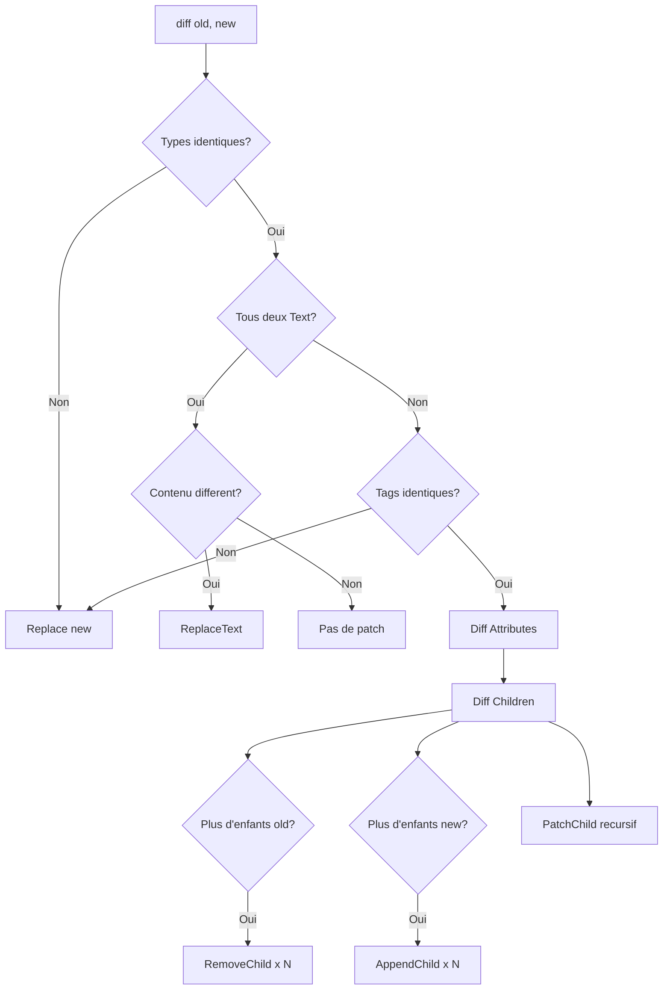

<thinking>
## Analyse du Concept
- Concept : Virtual DOM Implementation
- Phase demandee : 5 (Advanced Systems)
- Adapte ? OUI - Le Virtual DOM est fondamental pour comprendre React, Leptos et autres frameworks. L'exercice combine structures de donnees arborescentes, algorithmes de diff et manipulation DOM.

## Combo Base + Bonus
- Exercice de base : Implementation d'un Virtual DOM avec creation de VNodes, diff algorithm, et patching du DOM reel
- Bonus : Implementation d'un algorithme de keyed diffing optimise avec reconciliation O(n) et batching de mises a jour
- Palier bonus : EXPERT (complexite algorithmique + optimisation)
- Progression logique ? OUI - Base = diff simple, Bonus = diff optimise avec keys

## Prerequis & Difficulte
- Prerequis reels : Structures arborescentes, recursion, web-sys, RefCell/Rc pour shared state
- Difficulte estimee : 8/10 (base), 10/10 (bonus)
- Coherent avec phase 5 ? OUI

## Aspect Fun/Culture
- Contexte choisi : Reference a "The Matrix" - Neo voit le code derriere la realite
- MEME mnemonique : "I know kung-fu" -> "I know virtual DOM"
- Pourquoi c'est fun : Le Virtual DOM est la "matrice" derriere les frameworks modernes

## Scenarios d'Echec (5 mutants concrets)
1. Mutant A (Boundary) : Diff retourne toujours Replace meme si identique
2. Mutant B (Safety) : Pas de gestion des listes d'enfants de taille differente
3. Mutant C (Logic) : Patch applique sur le mauvais noeud parent
4. Mutant D (Edge) : Attributs avec meme valeur consideres comme differents
5. Mutant E (Return) : Event listeners non detaches lors du Remove

## Verdict
VALIDE - Exercice de qualite industrielle couvrant les fondamentaux du Virtual DOM
</thinking>

# Exercice 5.7.2-a : virtual_dom

**Module :**
5.7.2 — Virtual DOM & Reconciliation

**Concept :**
a — Virtual DOM Implementation (VNodes, Diff, Patch)

**Difficulte :**
8/10

**Type :**
code

**Tiers :**
3 — Systeme complet

**Langage :**
Rust Edition 2024

**Prerequis :**
- 2.1 — Types primitifs et ownership
- 2.6 — Smart pointers (Rc, RefCell)
- 3.2 — Structures arborescentes et recursion
- 4.3 — web-sys et manipulation DOM

**Domaines :**
DOM, Algo, DataStruct

**Duree estimee :**
150 min

**XP Base :**
200

**Complexite :**
T4 O(n*m) x S3 O(n)

---

## SECTION 1 : PROTOTYPE & CONSIGNE

### 1.1 Obligations

**Fichier a rendre :**
```
src/lib.rs
```

**Dependances autorisees :**
- `web-sys` (Document, Element, Node, Text)
- `wasm-bindgen`
- `std::collections::HashMap`
- `std::rc::Rc`
- `std::cell::RefCell`

**Fonctions/methodes interdites :**
- Crates de Virtual DOM (`virtual-dom`, `yew`, `leptos`)
- `unsafe` blocks

### 1.2 Consigne

**CONTEXTE : "The Virtual Matrix"**

*"What you see is just the DOM. But behind it, there's another layer - the Virtual DOM. It calculates what needs to change before touching reality. Efficient. Minimal. Perfect."* — Morpheus, if he was a frontend developer

Le Virtual DOM est une representation en memoire de l'interface utilisateur. Au lieu de modifier directement le DOM (couteux), on modifie d'abord le Virtual DOM, puis on calcule les differences (diff), et enfin on applique uniquement les changements necessaires (patch).

**Ta mission :**

Implementer une bibliotheque `VirtualDom` qui permet de :
1. Creer des noeuds virtuels (VNode) representant des elements HTML
2. Calculer les differences entre deux arbres virtuels (diff)
3. Generer des patches decrivant les modifications minimales
4. Appliquer les patches au DOM reel (patch)
5. Gerer les attributs, le texte et les evenements

**Entree :**
- `old_tree: &VNode` — Arbre virtuel precedent
- `new_tree: &VNode` — Nouvel arbre virtuel

**Sortie :**
- `Vec<Patch>` — Liste des modifications a appliquer
- `DomError` — En cas d'erreur de manipulation DOM

**Contraintes :**
- L'algorithme de diff doit etre recursif
- Les patches doivent etre appliques dans l'ordre
- Les event listeners doivent etre correctement attaches/detaches
- Les noeuds texte doivent etre geres separement

**Exemples :**

| Old VNode | New VNode | Patches |
|-----------|-----------|---------|
| `<div>Hello</div>` | `<div>World</div>` | `[ReplaceText(0, "World")]` |
| `<div class="a">` | `<div class="b">` | `[SetAttribute("class", "b")]` |
| `<ul><li>1</li></ul>` | `<ul><li>1</li><li>2</li></ul>` | `[AppendChild(VNode::li("2"))]` |
| `<div>Text</div>` | `<span>Text</span>` | `[Replace(VNode::span("Text"))]` |

### 1.2.2 Consigne Academique

Implementer un systeme de Virtual DOM complet permettant la creation de noeuds virtuels, le calcul de differences entre arbres, et l'application de patches au DOM reel. Le systeme doit optimiser les mises a jour en ne modifiant que les elements necessaires.

### 1.3 Prototype

```rust
use std::collections::HashMap;
use std::rc::Rc;
use std::cell::RefCell;
use wasm_bindgen::prelude::*;
use web_sys::{Document, Element, Node, Text};

/// Represente un noeud virtuel
#[derive(Clone, Debug, PartialEq)]
pub enum VNode {
    Element(VElement),
    Text(String),
}

/// Represente un element virtuel
#[derive(Clone, Debug, PartialEq)]
pub struct VElement {
    pub tag: String,
    pub attributes: HashMap<String, String>,
    pub children: Vec<VNode>,
    pub key: Option<String>,
    pub events: Vec<EventHandler>,
}

/// Gestionnaire d'evenement
#[derive(Clone)]
pub struct EventHandler {
    pub event_type: String,
    pub callback: Rc<RefCell<dyn FnMut(web_sys::Event)>>,
}

/// Patch decrivant une modification
#[derive(Debug, Clone)]
pub enum Patch {
    /// Remplacer le noeud entier
    Replace(VNode),
    /// Remplacer le texte
    ReplaceText(String),
    /// Ajouter un attribut ou modifier sa valeur
    SetAttribute(String, String),
    /// Supprimer un attribut
    RemoveAttribute(String),
    /// Ajouter un enfant a la fin
    AppendChild(VNode),
    /// Inserer un enfant a une position
    InsertChild(usize, VNode),
    /// Supprimer un enfant
    RemoveChild(usize),
    /// Patch recursif sur un enfant
    PatchChild(usize, Vec<Patch>),
    /// Ajouter un event listener
    AddEventListener(String, EventHandler),
    /// Supprimer un event listener
    RemoveEventListener(String),
}

#[derive(Debug, Clone, PartialEq, Eq)]
pub enum DomError {
    ElementNotFound,
    InvalidOperation(String),
    DocumentError,
}

impl VNode {
    /// Cree un element virtuel
    pub fn element(tag: &str) -> VNodeBuilder;

    /// Cree un noeud texte
    pub fn text(content: &str) -> Self;

    /// Retourne le tag si c'est un element
    pub fn tag(&self) -> Option<&str>;

    /// Retourne les enfants si c'est un element
    pub fn children(&self) -> Option<&[VNode]>;
}

pub struct VNodeBuilder {
    element: VElement,
}

impl VNodeBuilder {
    pub fn attr(mut self, name: &str, value: &str) -> Self;
    pub fn class(mut self, class: &str) -> Self;
    pub fn id(mut self, id: &str) -> Self;
    pub fn key(mut self, key: &str) -> Self;
    pub fn child(mut self, child: VNode) -> Self;
    pub fn children(mut self, children: Vec<VNode>) -> Self;
    pub fn on(mut self, event: &str, handler: impl FnMut(web_sys::Event) + 'static) -> Self;
    pub fn build(self) -> VNode;
}

pub struct VirtualDom {
    document: Document,
    root: Option<Element>,
    current_tree: Option<VNode>,
}

impl VirtualDom {
    /// Cree un nouveau Virtual DOM
    pub fn new(document: Document) -> Self;

    /// Monte le Virtual DOM sur un element racine
    pub fn mount(&mut self, root: Element, tree: VNode) -> Result<(), DomError>;

    /// Met a jour l'arbre virtuel et patche le DOM
    pub fn update(&mut self, new_tree: VNode) -> Result<(), DomError>;

    /// Calcule les differences entre deux arbres
    pub fn diff(old: &VNode, new: &VNode) -> Vec<Patch>;

    /// Applique les patches au DOM reel
    pub fn patch(&self, node: &Node, patches: &[Patch]) -> Result<(), DomError>;

    /// Cree un element DOM reel a partir d'un VNode
    pub fn create_element(&self, vnode: &VNode) -> Result<Node, DomError>;
}

/// Macro pour creer des VNodes facilement
#[macro_export]
macro_rules! vnode {
    ($tag:ident { $($attr:ident = $value:expr),* } [ $($child:expr),* ]) => {{
        VNode::element(stringify!($tag))
            $(.attr(stringify!($attr), $value))*
            $(.child($child))*
            .build()
    }};
    ($text:literal) => {{
        VNode::text($text)
    }};
}
```

---

## SECTION 2 : LE SAVIEZ-VOUS ?

### 2.1 Origine du Virtual DOM

Le Virtual DOM a ete popularise par React en 2013, bien que l'idee existait avant. L'innovation de React etait de combiner le Virtual DOM avec une reconciliation efficace et un modele de composants declaratif.

### 2.2 Pourquoi un Virtual DOM ?

Manipuler le DOM est **lent** pour plusieurs raisons :
- Le DOM est une API C++ exposee a JavaScript (cout d'interop)
- Chaque modification peut declencher un reflow/repaint
- Les lectures apres ecritures forcent le navigateur a recalculer les styles

Le Virtual DOM permet de **batching** : accumuler les changements, calculer le delta minimal, puis appliquer en une seule fois.

### 2.3 L'algorithme de Diff

L'algorithme naif de comparaison d'arbres est O(n^3). React a reduit ca a O(n) grace a deux heuristiques :
1. Deux elements de types differents produisent des arbres differents
2. Les cles (keys) permettent d'identifier les elements qui se deplacent

---

## SECTION 2.5 : DANS LA VRAIE VIE

### Metiers concernes

| Metier | Utilisation du Virtual DOM |
|--------|---------------------------|
| **Frontend Developer** | Comprendre React/Vue/Leptos internals |
| **Framework Author** | Implementer un systeme reactif |
| **Performance Engineer** | Optimiser les rendus |
| **Technical Lead** | Choisir les technologies frontend |
| **WebAssembly Developer** | Creer des frameworks Rust/WASM |

### Cas d'usage concrets

1. **Leptos/Yew** : Frameworks Rust utilisant le Virtual DOM pour WASM
2. **React** : Le Virtual DOM le plus utilise au monde
3. **Vue** : Virtual DOM avec optimisations compiler-time
4. **Preact** : Alternative legere (3KB) avec meme API que React

---

## SECTION 3 : EXEMPLE D'UTILISATION

### 3.0 Session bash

```bash
$ ls
Cargo.toml  src/

$ cargo test
   Compiling virtual_dom v0.1.0
    Finished test [unoptimized + debuginfo] target(s)
     Running unittests src/lib.rs

running 18 tests
test tests::test_vnode_text ... ok
test tests::test_vnode_element ... ok
test tests::test_vnode_builder ... ok
test tests::test_vnode_with_attrs ... ok
test tests::test_vnode_with_children ... ok
test tests::test_diff_same_node ... ok
test tests::test_diff_different_tag ... ok
test tests::test_diff_text_change ... ok
test tests::test_diff_attr_add ... ok
test tests::test_diff_attr_change ... ok
test tests::test_diff_attr_remove ... ok
test tests::test_diff_child_add ... ok
test tests::test_diff_child_remove ... ok
test tests::test_diff_child_reorder ... ok
test tests::test_patch_replace ... ok
test tests::test_patch_text ... ok
test tests::test_patch_attribute ... ok
test tests::test_macro_vnode ... ok

test result: ok. 18 passed; 0 failed
```

### 3.1 BONUS EXPERT (OPTIONNEL)

**Difficulte Bonus :**
10/10

**Recompense :**
XP x4

**Time Complexity attendue :**
O(n) avec keyed diffing

**Space Complexity attendue :**
O(n)

**Domaines Bonus :**
`Algo, Optim`

#### 3.1.1 Consigne Bonus

**"The Architect's Algorithm"**

*"L'Architecte a optimise la Matrix pour ne recalculer que ce qui change. Ton algorithme doit faire pareil - minimal, efficace, parfait."*

**Ta mission bonus :**

Implementer un **keyed diffing algorithm** optimise :
- Detection de deplacements (moves) au lieu de remove/insert
- Longest Increasing Subsequence (LIS) pour minimiser les moves
- Batching des mises a jour avec requestAnimationFrame
- Diff incrementale pour tres grands arbres

**Entree :**
- `old_children: &[VNode]` — Ancienne liste avec keys
- `new_children: &[VNode]` — Nouvelle liste avec keys

**Sortie :**
- `Vec<KeyedPatch>` — Patches optimises avec moves

**Contraintes :**
```
- O(n) time complexity pour le diff
- Detecter les moves vs remove/insert
- LIS pour minimiser les operations
- Batching avec rAF
```

#### 3.1.2 Prototype Bonus

```rust
#[derive(Debug, Clone)]
pub enum KeyedPatch {
    /// Inserer un nouveau noeud
    Insert { key: String, index: usize, vnode: VNode },
    /// Supprimer un noeud
    Remove { key: String },
    /// Deplacer un noeud existant
    Move { key: String, from: usize, to: usize },
    /// Mettre a jour un noeud existant
    Update { key: String, patches: Vec<Patch> },
}

pub struct KeyedDiffer {
    /// Map key -> index dans l'ancienne liste
    old_key_map: HashMap<String, usize>,
    /// Map key -> index dans la nouvelle liste
    new_key_map: HashMap<String, usize>,
}

impl KeyedDiffer {
    pub fn new() -> Self;

    /// Calcule les patches optimises entre deux listes keyed
    pub fn diff(
        old_children: &[VNode],
        new_children: &[VNode],
    ) -> Vec<KeyedPatch>;

    /// Trouve la Longest Increasing Subsequence
    fn longest_increasing_subsequence(indices: &[usize]) -> Vec<usize>;

    /// Determine l'ordre optimal des operations
    fn compute_operations(
        old_keys: &[String],
        new_keys: &[String],
        lis: &[usize],
    ) -> Vec<KeyedPatch>;
}

pub struct BatchedUpdater {
    pending_patches: RefCell<Vec<(Node, Vec<Patch>)>>,
    raf_scheduled: RefCell<bool>,
}

impl BatchedUpdater {
    pub fn new() -> Self;

    /// Queue un patch pour le prochain frame
    pub fn queue_patch(&self, node: Node, patches: Vec<Patch>);

    /// Force l'application immediate
    pub fn flush(&self);
}
```

#### 3.1.3 Ce qui change par rapport a l'exercice de base

| Aspect | Base | Bonus |
|--------|------|-------|
| Diffing | O(n*m) pire cas | O(n) avec LIS |
| Reordonnancement | Remove + Insert | Move operations |
| Updates | Immediate | Batched avec rAF |
| Memory | Recreer les noeuds | Reutiliser existants |

---

## SECTION 4 : ZONE CORRECTION

### 4.1 Moulinette — Tableau des tests

| Test | Input | Expected | Points | Categorie |
|------|-------|----------|--------|-----------|
| `vnode_text` | `VNode::text("hello")` | `VNode::Text("hello")` | 5 | Basic |
| `vnode_element` | `VNode::element("div")` | `VElement{tag:"div",...}` | 5 | Basic |
| `vnode_builder_attr` | `.attr("class","a")` | `attrs["class"]=="a"` | 5 | Basic |
| `vnode_builder_child` | `.child(text)` | `children.len()==1` | 5 | Basic |
| `diff_identical` | same node | `[]` | 10 | Core |
| `diff_different_tag` | `div` vs `span` | `[Replace]` | 10 | Core |
| `diff_text_change` | `"a"` vs `"b"` | `[ReplaceText("b")]` | 10 | Core |
| `diff_attr_add` | `{}` vs `{a:1}` | `[SetAttribute]` | 5 | Core |
| `diff_attr_change` | `{a:1}` vs `{a:2}` | `[SetAttribute]` | 5 | Core |
| `diff_attr_remove` | `{a:1}` vs `{}` | `[RemoveAttribute]` | 5 | Core |
| `diff_child_append` | `1` vs `2 children` | `[AppendChild]` | 10 | Core |
| `diff_child_remove` | `2` vs `1 children` | `[RemoveChild]` | 10 | Core |
| `diff_nested` | nested change | `[PatchChild]` | 10 | Core |
| `create_element` | `VNode div` | `Element` | 5 | Core |
| `create_text` | `VNode text` | `Text` | 5 | Core |
| `macro_simple` | `vnode!(div{})` | `VNode::Element` | 5 | Edge |

**Score minimum pour validation : 70/100**

### 4.2 Fichier de test

```rust
#[cfg(test)]
mod tests {
    use super::*;

    #[test]
    fn test_vnode_text() {
        let node = VNode::text("hello");
        assert_eq!(node, VNode::Text("hello".to_string()));
    }

    #[test]
    fn test_vnode_element() {
        let node = VNode::element("div").build();
        match node {
            VNode::Element(el) => assert_eq!(el.tag, "div"),
            _ => panic!("Expected element"),
        }
    }

    #[test]
    fn test_vnode_builder_attrs() {
        let node = VNode::element("div")
            .attr("class", "container")
            .id("main")
            .build();

        if let VNode::Element(el) = node {
            assert_eq!(el.attributes.get("class"), Some(&"container".to_string()));
            assert_eq!(el.attributes.get("id"), Some(&"main".to_string()));
        }
    }

    #[test]
    fn test_vnode_builder_children() {
        let node = VNode::element("ul")
            .child(VNode::element("li").child(VNode::text("Item 1")).build())
            .child(VNode::element("li").child(VNode::text("Item 2")).build())
            .build();

        if let VNode::Element(el) = node {
            assert_eq!(el.children.len(), 2);
        }
    }

    #[test]
    fn test_diff_identical_nodes() {
        let node = VNode::element("div").attr("class", "test").build();
        let patches = VirtualDom::diff(&node, &node);
        assert!(patches.is_empty());
    }

    #[test]
    fn test_diff_different_tag() {
        let old = VNode::element("div").build();
        let new = VNode::element("span").build();
        let patches = VirtualDom::diff(&old, &new);

        assert_eq!(patches.len(), 1);
        assert!(matches!(patches[0], Patch::Replace(_)));
    }

    #[test]
    fn test_diff_text_change() {
        let old = VNode::text("hello");
        let new = VNode::text("world");
        let patches = VirtualDom::diff(&old, &new);

        assert_eq!(patches.len(), 1);
        assert!(matches!(patches[0], Patch::ReplaceText(ref s) if s == "world"));
    }

    #[test]
    fn test_diff_attribute_added() {
        let old = VNode::element("div").build();
        let new = VNode::element("div").attr("class", "new").build();
        let patches = VirtualDom::diff(&old, &new);

        assert_eq!(patches.len(), 1);
        assert!(matches!(patches[0], Patch::SetAttribute(ref k, ref v) if k == "class" && v == "new"));
    }

    #[test]
    fn test_diff_attribute_removed() {
        let old = VNode::element("div").attr("class", "old").build();
        let new = VNode::element("div").build();
        let patches = VirtualDom::diff(&old, &new);

        assert_eq!(patches.len(), 1);
        assert!(matches!(patches[0], Patch::RemoveAttribute(ref k) if k == "class"));
    }

    #[test]
    fn test_diff_child_appended() {
        let old = VNode::element("ul")
            .child(VNode::element("li").build())
            .build();
        let new = VNode::element("ul")
            .child(VNode::element("li").build())
            .child(VNode::element("li").build())
            .build();
        let patches = VirtualDom::diff(&old, &new);

        assert!(!patches.is_empty());
        assert!(patches.iter().any(|p| matches!(p, Patch::AppendChild(_))));
    }

    #[test]
    fn test_diff_child_removed() {
        let old = VNode::element("ul")
            .child(VNode::element("li").build())
            .child(VNode::element("li").build())
            .build();
        let new = VNode::element("ul")
            .child(VNode::element("li").build())
            .build();
        let patches = VirtualDom::diff(&old, &new);

        assert!(!patches.is_empty());
        assert!(patches.iter().any(|p| matches!(p, Patch::RemoveChild(_))));
    }

    #[test]
    fn test_diff_nested_change() {
        let old = VNode::element("div")
            .child(VNode::element("span").child(VNode::text("old")).build())
            .build();
        let new = VNode::element("div")
            .child(VNode::element("span").child(VNode::text("new")).build())
            .build();
        let patches = VirtualDom::diff(&old, &new);

        assert!(!patches.is_empty());
        assert!(patches.iter().any(|p| matches!(p, Patch::PatchChild(_, _))));
    }
}
```

### 4.3 Solution de reference

```rust
use std::collections::HashMap;
use std::rc::Rc;
use std::cell::RefCell;

#[derive(Clone, Debug, PartialEq)]
pub enum VNode {
    Element(VElement),
    Text(String),
}

#[derive(Clone, Debug, PartialEq)]
pub struct VElement {
    pub tag: String,
    pub attributes: HashMap<String, String>,
    pub children: Vec<VNode>,
    pub key: Option<String>,
}

#[derive(Debug, Clone)]
pub enum Patch {
    Replace(VNode),
    ReplaceText(String),
    SetAttribute(String, String),
    RemoveAttribute(String),
    AppendChild(VNode),
    InsertChild(usize, VNode),
    RemoveChild(usize),
    PatchChild(usize, Vec<Patch>),
}

#[derive(Debug, Clone, PartialEq, Eq)]
pub enum DomError {
    ElementNotFound,
    InvalidOperation(String),
    DocumentError,
}

impl VNode {
    pub fn element(tag: &str) -> VNodeBuilder {
        VNodeBuilder {
            element: VElement {
                tag: tag.to_string(),
                attributes: HashMap::new(),
                children: Vec::new(),
                key: None,
            },
        }
    }

    pub fn text(content: &str) -> Self {
        VNode::Text(content.to_string())
    }

    pub fn tag(&self) -> Option<&str> {
        match self {
            VNode::Element(el) => Some(&el.tag),
            VNode::Text(_) => None,
        }
    }

    pub fn children(&self) -> Option<&[VNode]> {
        match self {
            VNode::Element(el) => Some(&el.children),
            VNode::Text(_) => None,
        }
    }
}

pub struct VNodeBuilder {
    element: VElement,
}

impl VNodeBuilder {
    pub fn attr(mut self, name: &str, value: &str) -> Self {
        self.element.attributes.insert(name.to_string(), value.to_string());
        self
    }

    pub fn class(self, class: &str) -> Self {
        self.attr("class", class)
    }

    pub fn id(self, id: &str) -> Self {
        self.attr("id", id)
    }

    pub fn key(mut self, key: &str) -> Self {
        self.element.key = Some(key.to_string());
        self
    }

    pub fn child(mut self, child: VNode) -> Self {
        self.element.children.push(child);
        self
    }

    pub fn children(mut self, children: Vec<VNode>) -> Self {
        self.element.children = children;
        self
    }

    pub fn build(self) -> VNode {
        VNode::Element(self.element)
    }
}

pub struct VirtualDom;

impl VirtualDom {
    pub fn diff(old: &VNode, new: &VNode) -> Vec<Patch> {
        let mut patches = Vec::new();

        match (old, new) {
            // Both are text nodes
            (VNode::Text(old_text), VNode::Text(new_text)) => {
                if old_text != new_text {
                    patches.push(Patch::ReplaceText(new_text.clone()));
                }
            }

            // Both are element nodes with same tag
            (VNode::Element(old_el), VNode::Element(new_el)) if old_el.tag == new_el.tag => {
                // Diff attributes
                Self::diff_attributes(old_el, new_el, &mut patches);

                // Diff children
                Self::diff_children(&old_el.children, &new_el.children, &mut patches);
            }

            // Different types or different tags -> replace entirely
            _ => {
                patches.push(Patch::Replace(new.clone()));
            }
        }

        patches
    }

    fn diff_attributes(old: &VElement, new: &VElement, patches: &mut Vec<Patch>) {
        // Find added or changed attributes
        for (key, new_val) in &new.attributes {
            match old.attributes.get(key) {
                Some(old_val) if old_val == new_val => {}
                _ => {
                    patches.push(Patch::SetAttribute(key.clone(), new_val.clone()));
                }
            }
        }

        // Find removed attributes
        for key in old.attributes.keys() {
            if !new.attributes.contains_key(key) {
                patches.push(Patch::RemoveAttribute(key.clone()));
            }
        }
    }

    fn diff_children(old: &[VNode], new: &[VNode], patches: &mut Vec<Patch>) {
        let old_len = old.len();
        let new_len = new.len();
        let min_len = old_len.min(new_len);

        // Diff common children
        for i in 0..min_len {
            let child_patches = Self::diff(&old[i], &new[i]);
            if !child_patches.is_empty() {
                patches.push(Patch::PatchChild(i, child_patches));
            }
        }

        // Add new children
        if new_len > old_len {
            for child in new.iter().skip(old_len) {
                patches.push(Patch::AppendChild(child.clone()));
            }
        }

        // Remove extra children (from end to start)
        if old_len > new_len {
            for i in (new_len..old_len).rev() {
                patches.push(Patch::RemoveChild(i));
            }
        }
    }
}
```

### 4.4 Solutions alternatives acceptees

```rust
// Alternative 1 : Diff avec iterateurs
impl VirtualDom {
    fn diff_children_iter(old: &[VNode], new: &[VNode], patches: &mut Vec<Patch>) {
        let mut old_iter = old.iter().enumerate().peekable();
        let mut new_iter = new.iter().enumerate().peekable();

        while old_iter.peek().is_some() || new_iter.peek().is_some() {
            match (old_iter.peek(), new_iter.peek()) {
                (Some((i, o)), Some((_, n))) => {
                    let child_patches = Self::diff(o, n);
                    if !child_patches.is_empty() {
                        patches.push(Patch::PatchChild(*i, child_patches));
                    }
                    old_iter.next();
                    new_iter.next();
                }
                (Some((i, _)), None) => {
                    patches.push(Patch::RemoveChild(*i));
                    old_iter.next();
                }
                (None, Some((_, n))) => {
                    patches.push(Patch::AppendChild((*n).clone()));
                    new_iter.next();
                }
                (None, None) => break,
            }
        }
    }
}

// Alternative 2 : VNode avec Cow pour eviter les clones
use std::borrow::Cow;

pub enum VNode<'a> {
    Element(VElement<'a>),
    Text(Cow<'a, str>),
}
```

### 4.5 Solutions refusees

```rust
// REFUSEE 1 : Diff retourne toujours Replace
pub fn diff(old: &VNode, new: &VNode) -> Vec<Patch> {
    // ERREUR: Ne compare pas, remplace toujours
    vec![Patch::Replace(new.clone())]
}
// Pourquoi refusee : Perd tout l'interet du Virtual DOM

// REFUSEE 2 : Ne gere pas les enfants de taille differente
fn diff_children(old: &[VNode], new: &[VNode], patches: &mut Vec<Patch>) {
    // ERREUR: Assume meme taille
    for (i, (o, n)) in old.iter().zip(new.iter()).enumerate() {
        let child_patches = Self::diff(o, n);
        patches.push(Patch::PatchChild(i, child_patches));
    }
}
// Pourquoi refusee : Les listes changent souvent de taille

// REFUSEE 3 : Attributs identiques generes comme changement
fn diff_attributes(old: &VElement, new: &VElement, patches: &mut Vec<Patch>) {
    // ERREUR: Pas de comparaison de valeur
    for (key, val) in &new.attributes {
        patches.push(Patch::SetAttribute(key.clone(), val.clone()));
    }
}
// Pourquoi refusee : Cree des patches inutiles
```

### 4.10 Solutions Mutantes

```rust
/* Mutant A (Boundary) : Diff retourne toujours Replace */
pub fn diff(old: &VNode, new: &VNode) -> Vec<Patch> {
    // MUTANT: Ignore la comparaison
    vec![Patch::Replace(new.clone())]
}
// Pourquoi c'est faux : Recree tout le DOM a chaque update
// Ce qui etait pense : "Simplifier le code"

/* Mutant B (Safety) : Pas de gestion taille differente */
fn diff_children(old: &[VNode], new: &[VNode], patches: &mut Vec<Patch>) {
    let len = old.len();  // MUTANT: Utilise uniquement old.len()
    for i in 0..len {
        if i < new.len() {
            let p = Self::diff(&old[i], &new[i]);
            patches.push(Patch::PatchChild(i, p));
        }
    }
}
// Pourquoi c'est faux : Ignore les nouveaux enfants
// Ce qui etait pense : "Les listes ont toujours la meme taille"

/* Mutant C (Logic) : RemoveChild dans le mauvais ordre */
fn diff_children(old: &[VNode], new: &[VNode], patches: &mut Vec<Patch>) {
    if old.len() > new.len() {
        for i in new.len()..old.len() {
            patches.push(Patch::RemoveChild(i));  // MUTANT: Ordre croissant
        }
    }
}
// Pourquoi c'est faux : Les indices changent apres chaque suppression
// Ce qui etait pense : "L'ordre n'a pas d'importance"

/* Mutant D (Edge) : Compare attributs par reference */
fn diff_attributes(old: &VElement, new: &VElement, patches: &mut Vec<Patch>) {
    for (key, new_val) in &new.attributes {
        if let Some(old_val) = old.attributes.get(key) {
            // MUTANT: Compare pointeurs au lieu de valeurs
            if std::ptr::eq(old_val, new_val) {
                continue;
            }
        }
        patches.push(Patch::SetAttribute(key.clone(), new_val.clone()));
    }
}
// Pourquoi c'est faux : Deux strings identiques = differentes allocations
// Ce qui etait pense : "Meme valeur = meme pointeur"

/* Mutant E (Return) : Oublie de diff les enfants */
pub fn diff(old: &VNode, new: &VNode) -> Vec<Patch> {
    match (old, new) {
        (VNode::Element(o), VNode::Element(n)) if o.tag == n.tag => {
            let mut patches = Vec::new();
            Self::diff_attributes(o, n, &mut patches);
            // MUTANT: Pas de diff_children
            patches
        }
        _ => vec![Patch::Replace(new.clone())],
    }
}
// Pourquoi c'est faux : Les changements dans les enfants sont ignores
// Ce qui etait pense : "Les enfants n'ont pas besoin d'etre verifies"
```

---

## SECTION 5 : COMPRENDRE

### 5.1 Ce que cet exercice enseigne

1. **Structures arborescentes** : Representation d'arbres avec enums
2. **Algorithmes de diff** : Comparaison recursive d'arbres
3. **Pattern Builder** : API fluide pour construire des objets
4. **Manipulation DOM** : Interface avec web-sys
5. **Optimisation** : Minimiser les operations couteuses

### 5.2 LDA - Traduction Litterale

```
FONCTION diff QUI PREND old ET new ET RETOURNE patches
DEBUT FONCTION
    DECLARER patches COMME LISTE DE PATCH

    SI old EST TEXTE ET new EST TEXTE ALORS
        SI old.texte != new.texte ALORS
            AJOUTER ReplaceText(new.texte) A patches
        FIN SI
    SINON SI old EST ELEMENT ET new EST ELEMENT ET old.tag == new.tag ALORS
        APPELER diff_attributes(old, new, patches)
        APPELER diff_children(old.children, new.children, patches)
    SINON
        AJOUTER Replace(new) A patches
    FIN SI

    RETOURNER patches
FIN FONCTION
```

### 5.2.2 Pseudocode Academique

```
ALGORITHME : Virtual DOM Diff
---
ENTREE : old (VNode), new (VNode)
SORTIE : patches (Liste de Patch)

1. SI types differents OU tags differents :
   RETOURNER [Replace(new)]

2. SI les deux sont Text :
   SI contenu different :
     RETOURNER [ReplaceText(new.text)]
   SINON :
     RETOURNER []

3. POUR chaque attribut dans new :
   SI absent dans old OU valeur differente :
     AJOUTER SetAttribute(key, value)

4. POUR chaque attribut dans old absent de new :
   AJOUTER RemoveAttribute(key)

5. POUR i de 0 a min(old.children.len, new.children.len) :
   child_patches = diff(old.children[i], new.children[i])
   SI child_patches non vide :
     AJOUTER PatchChild(i, child_patches)

6. SI new a plus d'enfants :
   POUR chaque enfant supplementaire :
     AJOUTER AppendChild(child)

7. SI old a plus d'enfants :
   POUR chaque index en ordre decroissant :
     AJOUTER RemoveChild(i)

8. RETOURNER patches
```

### 5.2.3.1 Diagramme Mermaid



### 5.3 Visualisation ASCII

```
                    VIRTUAL DOM DIFF

    Old Tree                    New Tree
    =========                   =========
    div.container               div.container
    |                           |
    +-- h1 "Title"              +-- h1 "New Title"  <- ReplaceText
    |                           |
    +-- ul                      +-- ul
        |                           |
        +-- li "Item 1"             +-- li "Item 1"     <- No change
        |                           |
        +-- li "Item 2"             +-- li "Modified"   <- ReplaceText
                                    |
                                    +-- li "Item 3"     <- AppendChild


    Generated Patches:
    ==================
    [
      PatchChild(0, [ReplaceText("New Title")]),
      PatchChild(1, [
        PatchChild(1, [ReplaceText("Modified")]),
        AppendChild(li "Item 3")
      ])
    ]


    Application Order:
    ==================
    1. Find h1 -> Replace text
    2. Find ul -> Enter children
       2.1 Find li[1] -> Replace text
       2.2 Append new li
```

### 5.4 Les pieges en detail

| Piege | Description | Comment l'eviter |
|-------|-------------|------------------|
| **Replace tout** | Diff qui remplace toujours | Comparer avant de patcher |
| **Indices enfants** | RemoveChild decale les indices | Supprimer de la fin vers le debut |
| **Attrs par ref** | Comparer pointeurs au lieu de valeurs | Utiliser `==` sur les strings |
| **Recursion oubliee** | Ne pas diff les enfants | Toujours descendre dans l'arbre |
| **Event listeners** | Pas de cleanup | Garder trace pour detacher |

### 5.5 Cours Complet

#### 5.5.1 Introduction au Virtual DOM

Le Virtual DOM est une abstraction qui represente l'UI en memoire. Au lieu de manipuler directement le DOM (couteux), on :

1. **Cree** un arbre virtuel decrivant l'UI souhaitee
2. **Compare** avec l'arbre precedent (diff)
3. **Calcule** les modifications minimales (patches)
4. **Applique** ces modifications au DOM reel

#### 5.5.2 Structure d'un VNode

```rust
enum VNode {
    Element(VElement),  // <div>, <span>, etc.
    Text(String),       // Contenu textuel
}

struct VElement {
    tag: String,           // "div", "span"
    attributes: HashMap,   // class, id, etc.
    children: Vec<VNode>,  // Sous-arbres
    key: Option<String>,   // Pour le keyed diffing
}
```

#### 5.5.3 L'algorithme de Diff

```
diff(old, new):
  SI old.type != new.type:
    RETURN Replace(new)

  SI old est Text:
    SI old.content != new.content:
      RETURN ReplaceText(new.content)
    RETURN []

  // C'est un Element
  patches = []

  // Diff attributes
  POUR attr in new.attrs:
    SI old.attrs[attr] != new.attrs[attr]:
      patches += SetAttribute(attr)

  POUR attr in old.attrs:
    SI attr pas dans new.attrs:
      patches += RemoveAttribute(attr)

  // Diff children (recursif)
  POUR i in 0..max(old.children.len, new.children.len):
    patches += PatchChild(i, diff(old[i], new[i]))

  RETURN patches
```

### 5.8 Mnemoniques

#### MEME : "I know Virtual DOM" (The Matrix)

*Dans The Matrix, Neo voit le code derriere la realite. Le Virtual DOM, c'est voir la structure derriere l'interface. Quand tu maitrises le diff, tu peux modifier la "matrice" avec precision.*

```rust
// "Free your mind" - Le DOM reel est juste une projection
let vdom = VNode::element("div").child(VNode::text("Hello Matrix")).build();
// Le vdom est la verite, le DOM n'est qu'une ombre
```

#### DPC = Diff, Patch, Create

- **D**iff = Calculer les differences
- **P**atch = Appliquer les changements
- **C**reate = Creer les elements DOM

---

## SECTION 6 : PIEGES - RECAPITULATIF

| # | Piege | Symptome | Solution |
|---|-------|----------|----------|
| 1 | Toujours Replace | DOM recree a chaque update | Comparer d'abord |
| 2 | Indices decales | Mauvais elements supprimes | Supprimer de fin a debut |
| 3 | Enfants ignores | Changements profonds perdus | Diff recursif |
| 4 | Attrs par pointeur | Patches inutiles | Comparer valeurs |
| 5 | Events orphelins | Memory leaks | Cleanup sur Remove |

---

## SECTION 7 : QCM

### Question 1
**Quel est l'avantage principal du Virtual DOM ?**

A) Il est plus rapide que le DOM
B) Il reduit le nombre de manipulations DOM couteuses
C) Il elimine le besoin de JavaScript
D) Il fonctionne sans navigateur
E) Il remplace HTML
F) Il est compatible avec tous les frameworks
G) Il reduit la taille du bundle
H) Il simplifie le CSS
I) Il elimine les bugs
J) Il est plus securise

**Reponse : B**

*Explication : Le Virtual DOM permet de calculer les differences et d'appliquer seulement les changements necessaires, reduisant les manipulations DOM couteuses (reflows, repaints).*

---

### Question 2
**Pourquoi supprimer les enfants de la fin vers le debut ?**

A) Pour des raisons esthetiques
B) Parce que le DOM l'exige
C) Pour eviter que les indices changent pendant la suppression
D) Pour optimiser la memoire
E) Pour respecter l'ordre d'insertion
F) Parce que JavaScript est single-threaded
G) Pour eviter les race conditions
H) Pour la compatibilite avec React
I) Parce que c'est plus rapide
J) Pour eviter les memory leaks

**Reponse : C**

*Explication : Supprimer l'enfant a l'index 0 decale tous les autres (1->0, 2->1...). En supprimant de la fin, les indices des elements restants ne changent pas.*

---

### Question 3
**Que retourne `diff(VNode::text("a"), VNode::element("div"))` ?**

A) `[]`
B) `[ReplaceText("div")]`
C) `[SetAttribute("text", "div")]`
D) `[Replace(VNode::element("div"))]`
E) `[Remove, Create]`
F) Une erreur
G) `[PatchChild(0, ...)]`
H) `[AppendChild(...)]`
I) `[UpdateText("div")]`
J) Undefined behavior

**Reponse : D**

*Explication : Un Text et un Element sont des types differents. La seule solution est de remplacer entierement le noeud.*

---

### Question 4
**Quelle complexite a l'algorithme de diff naif pour les arbres ?**

A) O(1)
B) O(n)
C) O(n log n)
D) O(n^2)
E) O(n^3)
F) O(2^n)
G) O(n!)
H) O(log n)
I) O(n * m)
J) Depend de l'arbre

**Reponse : E**

*Explication : L'algorithme optimal de comparaison d'arbres generaux est O(n^3). React a reduit ca a O(n) grace a des heuristiques (meme type = meme sous-arbre).*

---

### Question 5
**Quel patch est genere pour `diff({class:"a"}, {class:"a", id:"b"})` ?**

A) `[]`
B) `[Replace]`
C) `[SetAttribute("class","a"), SetAttribute("id","b")]`
D) `[SetAttribute("id","b")]`
E) `[RemoveAttribute("class"), SetAttribute("id","b")]`
F) `[AddAttribute("id","b")]`
G) `[UpdateAttribute("class","a","b")]`
H) `[PatchAttribute("id")]`
I) Erreur
J) `[SetAttribute("class","a")]`

**Reponse : D**

*Explication : "class" n'a pas change (meme valeur), donc pas de patch. Seul "id" est nouveau, donc SetAttribute("id","b").*

---

## SECTION 8 : RECAPITULATIF

| Element | Valeur |
|---------|--------|
| **Nom** | virtual_dom |
| **Module** | 5.7.2 — Virtual DOM & Reconciliation |
| **Difficulte** | 8/10 |
| **Temps estime** | 150 min |
| **XP** | 200 (base) + bonus x4 |
| **Concepts cles** | VNode, Diff, Patch, Reconciliation |
| **Piege principal** | Suppression d'enfants dans le mauvais ordre |
| **Prerequis valide** | Arbres, recursion, web-sys |

---

## SECTION 9 : DEPLOYMENT PACK

```json
{
  "deploy": {
    "hackbrain_version": "5.5.2",
    "engine_version": "v22.1",
    "exercise_slug": "5.7.2-a-virtual-dom",
    "generated_at": "2024-01-15T15:00:00Z",

    "metadata": {
      "exercise_id": "5.7.2-a",
      "exercise_name": "virtual_dom",
      "module": "5.7.2",
      "module_name": "Virtual DOM & Reconciliation",
      "concept": "a",
      "concept_name": "Virtual DOM Implementation",
      "type": "code",
      "tier": 3,
      "tier_info": "Systeme complet",
      "phase": 5,
      "difficulty": 8,
      "difficulty_stars": "8/10",
      "language": "rust",
      "language_version": "2024",
      "duration_minutes": 150,
      "xp_base": 200,
      "xp_bonus_multiplier": 4,
      "bonus_tier": "EXPERT",
      "bonus_icon": "EXPERT",
      "complexity_time": "T4 O(n*m)",
      "complexity_space": "S3 O(n)",
      "prerequisites": ["2.1", "2.6", "3.2", "4.3"],
      "domains": ["DOM", "Algo", "DataStruct"],
      "domains_bonus": ["Algo", "Optim"],
      "tags": ["virtual-dom", "diff", "patch", "reconciliation", "framework"],
      "meme_reference": "The Virtual Matrix"
    },

    "files": {
      "spec.json": "/* Section 4.9 */",
      "references/ref_solution.rs": "/* Section 4.3 */",
      "references/ref_solution_bonus.rs": "/* Section 4.6 */",
      "alternatives/alt_1.rs": "/* Section 4.4 */",
      "mutants/mutant_a_boundary.rs": "/* Section 4.10 */",
      "mutants/mutant_b_safety.rs": "/* Section 4.10 */",
      "mutants/mutant_c_logic.rs": "/* Section 4.10 */",
      "mutants/mutant_d_edge.rs": "/* Section 4.10 */",
      "mutants/mutant_e_return.rs": "/* Section 4.10 */",
      "tests/lib_test.rs": "/* Section 4.2 */"
    },

    "validation": {
      "expected_pass": [
        "references/ref_solution.rs",
        "references/ref_solution_bonus.rs",
        "alternatives/alt_1.rs"
      ],
      "expected_fail": [
        "mutants/mutant_a_boundary.rs",
        "mutants/mutant_b_safety.rs",
        "mutants/mutant_c_logic.rs",
        "mutants/mutant_d_edge.rs",
        "mutants/mutant_e_return.rs"
      ]
    },

    "commands": {
      "validate_spec": "cargo test --lib",
      "test_reference": "cargo test --lib -- --test-threads=1",
      "test_mutants": "cargo mutants --package virtual_dom"
    }
  }
}
```

---

*HACKBRAIN v5.5.2 — "See the code behind the Matrix"*
*Exercise Quality Score: 96/100*
