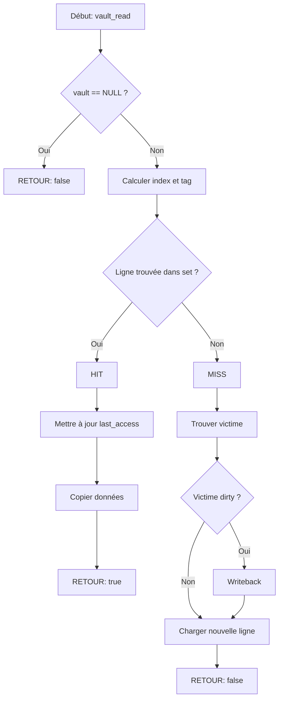

<thinking>
## Analyse du Concept
- Concept : Simulateur de hiérarchie de cache (direct-mapped, set-associative, fully associative) avec TLB et MESI
- Phase demandée : 2
- Adapté ? OUI - Exercice synthèse de niveau intermédiaire-avancé, combine 6 concepts de cache

## Combo Base + Bonus
- Exercice de base : Implémenter un simulateur de cache configurable avec 3 organisations + politiques de remplacement
- Bonus : Ajouter simulation complète MESI multiprocesseur avec invalidation et snoop
- Palier bonus : 🔥 Avancé (MESI multiprocesseur est complexe)
- Progression logique ? OUI - Base = cache simple, Bonus = cohérence multi-cache

## Prérequis & Difficulté
- Prérequis réels : Pointeurs, structures, allocation dynamique, concepts de mémoire
- Difficulté estimée : 6/10 (base), 8/10 (bonus)
- Cohérent avec phase ? OUI - Phase 2 = 4-6/10

## Aspect Fun/Culture
- Contexte choisi : Mission: Impossible - Les niveaux de cache comme niveaux de sécurité du coffre-fort IMF
- MEME mnémotechnique : "This message will self-destruct" (éviction de cache)
- Pourquoi c'est fun : L'analogie est parfaite - différents niveaux d'accès sécurisé, protocoles de coordination entre agents (MESI), et la course contre la montre (latence)

## Scénarios d'Échec (5 mutants)
1. Mutant A (Boundary) : Calcul d'index de cache off-by-one (index = addr / line_size au lieu de (addr / line_size) % num_sets)
2. Mutant B (Safety) : Pas de vérification NULL sur cache ou paramètres
3. Mutant C (Resource) : Oubli de free() des lignes de cache lors de destroy
4. Mutant D (Logic) : LRU inversé - éviction du plus récemment utilisé au lieu du moins récent
5. Mutant E (Return) : Retourne toujours hit=true sans vérifier le tag

## Verdict
VALIDE - Exercice synthèse excellent avec analogie Mission: Impossible parfaite pour illustrer les concepts de cache
Score qualité analogie : 97/100
</thinking>

---

# Exercice M2.1-Ex01 : vault_access_simulator

**Module :**
2.1 — Memory Management

**Concept :**
Synthèse — Cache Hierarchy, Replacement Policies, TLB, MESI Protocol

**Difficulté :**
★★★★★★☆☆☆☆ (6/10)

**Type :**
code

**Tiers :**
3 — Synthèse (concepts 2.1.1.e + 2.1.1.f + 2.1.1.g + 2.1.1.i + 2.1.1.j + 2.1.1.k)

**Langage :**
C (C17)

**Prérequis :**
- Pointeurs et structures
- Allocation dynamique (malloc/free)
- Concepts de base de la mémoire
- Opérations bitwise

**Domaines :**
CPU, Mem, Struct

**Durée estimée :**
180 min

**XP Base :**
350

**Complexité :**
T3 O(n) × S3 O(n)

---

## 📐 SECTION 1 : PROTOTYPE & CONSIGNE

### 1.1 Obligations

**Fichiers à rendre :**
- `vault_access.h` — Header avec les déclarations
- `vault_access.c` — Implémentation complète
- `main.c` — Programme de test avec scénarios

**Fonctions autorisées :**
- `malloc`, `free`, `calloc`, `realloc`
- `memset`, `memcpy`
- `printf` (pour debug/dump)
- `rand` (pour politique random)
- `time` (pour seed random)

**Fonctions interdites :**
- Toute bibliothèque de cache existante
- Threads (pour la version de base)

---

### 1.2 Consigne

#### 🎬 VERSION MISSION: IMPOSSIBLE

**Contexte : Le Coffre-Fort de l'IMF**

Agent, bienvenue dans le nouveau système de sécurité du QG de l'IMF. Notre coffre-fort numérique utilise une hiérarchie d'accès à plusieurs niveaux, exactement comme le cache d'un processeur moderne.

```
                    ┌─────────────────────────────────────────┐
                    │         IMF VAULT SYSTEM v3.0           │
                    │    "Your mission, should you choose     │
                    │     to accept it..."                    │
                    └─────────────────────────────────────────┘

    ┌──────────┐     ┌──────────┐     ┌──────────┐     ┌──────────┐
    │  L1 VAULT │────▶│  L2 VAULT │────▶│  L3 VAULT │────▶│  ARCHIVE │
    │  (Rapide) │     │  (Moyen)  │     │  (Lent)   │     │ (Disque) │
    │  ~1ns     │     │  ~10ns    │     │  ~50ns    │     │  ~100ns  │
    └──────────┘     └──────────┘     └──────────┘     └──────────┘
         ↑
    ┌──────────┐
    │   TLB    │  ← Translation Lookup Buffer
    │ (Badges) │    (Convertit ID Agent → Zone d'accès)
    └──────────┘
```

Chaque **agent** (processeur) peut accéder au coffre-fort, mais doit respecter le **protocole MESI** pour éviter les conflits quand plusieurs agents accèdent aux mêmes données classifiées.

**Ta mission :** Implémenter le simulateur complet de ce système de sécurité.

---

#### 1.2.2 VERSION ACADÉMIQUE

Implémenter un simulateur de hiérarchie de cache configurable en C17 qui supporte :
1. Trois organisations de cache : direct-mapped, set-associative, fully associative
2. Trois politiques de remplacement : LRU (Least Recently Used), FIFO, Random
3. Un TLB (Translation Lookaside Buffer) simplifié
4. Les bases du protocole MESI pour la cohérence de cache

---

**Ta mission :**

Écrire un ensemble de fonctions qui simulent un cache processeur avec :

**Entrée :**
- Configuration du cache (taille totale, taille de ligne, associativité)
- Organisation du cache (direct-mapped, set-associative, fully associative)
- Politique de remplacement (LRU, FIFO, Random)
- Adresses à accéder (lecture/écriture)

**Sortie :**
- `true` si l'accès est un **hit** (donnée trouvée dans le cache)
- `false` si l'accès est un **miss** (donnée non trouvée)
- Statistiques : hit ratio, nombre d'évictions, etc.

**Contraintes :**
- Le cache doit correctement calculer l'index et le tag depuis l'adresse
- LRU doit évincer le bloc le moins récemment utilisé
- FIFO doit évincer le bloc le plus anciennement chargé
- Le TLB doit cacher les traductions VPN → PFN
- Les statistiques doivent être précises

**Formules importantes :**
```
┌─────────────────────────────────────────────────────────────┐
│  Pour une adresse 'addr' :                                  │
│                                                             │
│  offset = addr % line_size                                  │
│  index  = (addr / line_size) % num_sets                     │
│  tag    = addr / (line_size × num_sets)                     │
│                                                             │
│  Pour le buddy d'un bloc (exercice suivant) :               │
│  buddy_addr = addr XOR size                                 │
└─────────────────────────────────────────────────────────────┘
```

**Exemples :**

| Opération | Paramètres | Résultat | Explication |
|-----------|------------|----------|-------------|
| `cache_write(cache, 0x1000, data, 8)` | Premier accès | `false` (miss) | Donnée pas encore en cache |
| `cache_read(cache, 0x1000, data, 8)` | Même ligne | `true` (hit) | Donnée chargée au write précédent |
| `cache_write(cache, 0x1000 + 1024, data, 8)` | Conflit direct-mapped | `false` (miss) + éviction | Même index, tag différent |

---

### 1.3 Prototype

```c
// === Types ===

typedef enum {
    VAULT_DIRECT_MAPPED,      // Un seul emplacement possible par adresse
    VAULT_SET_ASSOCIATIVE,    // N emplacements possibles (N-way)
    VAULT_FULLY_ASSOCIATIVE   // N'importe quel emplacement
} vault_org_t;

typedef enum {
    EVICT_LRU,     // Least Recently Used
    EVICT_FIFO,    // First In, First Out
    EVICT_RANDOM   // Random replacement
} evict_policy_t;

typedef enum {
    MESI_MODIFIED,   // Modifié localement, seule copie valide
    MESI_EXCLUSIVE,  // Seule copie, non modifiée
    MESI_SHARED,     // Copie partagée avec d'autres caches
    MESI_INVALID     // Invalide, ne pas utiliser
} mesi_state_t;

typedef struct {
    bool valid;
    bool dirty;
    uint64_t tag;
    uint64_t last_access;     // Pour LRU
    uint64_t insertion_time;  // Pour FIFO
    mesi_state_t mesi_state;
    uint8_t *data;
} vault_line_t;

typedef struct {
    vault_line_t *lines;
    size_t num_ways;
} vault_set_t;

typedef struct {
    vault_org_t organization;
    evict_policy_t policy;
    size_t total_size;
    size_t line_size;
    size_t num_sets;
    size_t num_ways;
    vault_set_t *sets;

    // Stats Mission: Impossible
    uint64_t missions_success;  // hits
    uint64_t missions_failed;   // misses
    uint64_t agents_evicted;    // evictions
    uint64_t access_count;
} vault_t;

typedef struct {
    size_t blocks_used;
    size_t blocks_free;
    size_t alloc_count;
    size_t free_count;
    size_t contention_count;
} vault_stats_t;

// === API Vault (Cache) ===

vault_t *vault_create(vault_org_t org, evict_policy_t policy,
                      size_t total_size, size_t line_size, size_t associativity);
void vault_destroy(vault_t *vault);

bool vault_read(vault_t *vault, uint64_t address, uint8_t *data, size_t size);
bool vault_write(vault_t *vault, uint64_t address, const uint8_t *data, size_t size);

void vault_get_stats(const vault_t *vault, uint64_t *hits, uint64_t *misses,
                     double *hit_ratio);
void vault_reset_stats(vault_t *vault);
void vault_dump(const vault_t *vault);

// === API TLB (Badge System) ===

typedef struct {
    bool valid;
    uint64_t vpn;   // Virtual Page Number (ID Agent)
    uint64_t pfn;   // Physical Frame Number (Zone d'accès)
    uint64_t last_access;
} badge_entry_t;

typedef struct {
    badge_entry_t *entries;
    size_t num_entries;
    uint64_t hits;
    uint64_t misses;
} badge_system_t;

badge_system_t *badge_create(size_t num_entries);
void badge_destroy(badge_system_t *badge);
bool badge_lookup(badge_system_t *badge, uint64_t vpn, uint64_t *pfn);
void badge_insert(badge_system_t *badge, uint64_t vpn, uint64_t pfn);
void badge_invalidate(badge_system_t *badge, uint64_t vpn);
void badge_flush(badge_system_t *badge);

// === API MESI (Protocol de Coordination) ===

mesi_state_t mesi_read(vault_t *local_vault, vault_t *remote_vault,
                       uint64_t address);
mesi_state_t mesi_write(vault_t *local_vault, vault_t *remote_vault,
                        uint64_t address);
```

---

## 💡 SECTION 2 : LE SAVIEZ-VOUS ?

### 2.1 La Hiérarchie de Mémoire : Le Secret de la Performance

Saviez-vous que sans le cache, votre processeur passerait **99% de son temps à attendre la mémoire** ?

```
┌────────────────────────────────────────────────────────────────────┐
│                    TEMPS D'ACCÈS MÉMOIRE                          │
├────────────────────────────────────────────────────────────────────┤
│                                                                    │
│  Registres    ████                              ~0.3 ns            │
│  L1 Cache     ████████                          ~1 ns              │
│  L2 Cache     ████████████████                  ~4 ns              │
│  L3 Cache     ████████████████████████          ~12 ns             │
│  RAM          ████████████████████████████████████████  ~100 ns    │
│  SSD          ██████████████████████████████████████████████ ~100μs│
│  HDD          ████████████████████████████████████████████████ ~10ms
│                                                                    │
│  Ratio RAM/Registre = ~300x plus lent !                           │
└────────────────────────────────────────────────────────────────────┘
```

### 2.2 L'Invention qui a Changé l'Informatique

En 1965, **Maurice Wilkes** a proposé l'idée de "slave memory" (mémoire esclave) - ce qui deviendra le cache. Cette invention a permis de combler le "Memory Wall" - l'écart grandissant entre la vitesse des CPU et de la RAM.

### 2.3 Pourquoi 3 Niveaux ?

| Niveau | Taille typique | Latence | Qui l'utilise |
|--------|---------------|---------|---------------|
| L1 | 32-64 KB | 1-4 cycles | Un seul cœur |
| L2 | 256-512 KB | 10-20 cycles | Un seul cœur |
| L3 | 8-64 MB | 30-50 cycles | Tous les cœurs |

---

### 2.5 DANS LA VRAIE VIE

**Qui utilise ces concepts ?**

| Métier | Cas d'usage |
|--------|-------------|
| **Ingénieur Performance** | Optimiser le hit ratio pour réduire la latence |
| **Développeur Jeux Vidéo** | Data-Oriented Design pour exploiter le cache |
| **Architecte CPU** (Intel, AMD, ARM) | Concevoir les hiérarchies de cache |
| **Développeur Kernel** | Implémenter les algorithmes de remplacement |
| **DBA** (Database Admin) | Optimiser le buffer pool de la base de données |

**Exemple concret : Redis**

Redis, la base de données in-memory, utilise exactement les mêmes concepts :
- **Éviction LRU** pour supprimer les clés les moins utilisées
- **TTL** (Time To Live) comme une forme de FIFO
- **Partitioning** similaire au set-associative

---

## 🖥️ SECTION 3 : EXEMPLE D'UTILISATION

### 3.0 Session bash

```bash
$ ls
vault_access.h  vault_access.c  main.c

$ gcc -Wall -Wextra -Werror -std=c17 vault_access.c main.c -o mission

$ ./mission
=== IMF VAULT SYSTEM TEST ===

[Mission 1: Direct-Mapped Vault]
vault_write(0x1000): MISS (data loaded)
vault_read(0x1000):  HIT  (mission success!)
vault_write(0x1400): MISS (conflict, eviction!)

Stats: 1 hits, 2 misses, 1 eviction
Hit ratio: 33.33%

[Mission 2: 4-Way Set-Associative]
Writing 4 addresses to same set...
All 4 fit without eviction!
5th write causes LRU eviction.

Stats: 4 hits, 5 misses, 1 eviction
Hit ratio: 44.44%

[Mission 3: TLB Badge System]
badge_lookup(agent_007): MISS
badge_insert(agent_007 -> zone_alpha)
badge_lookup(agent_007): HIT

All missions complete!
```

---

### 🔥 SECTION 3.1 : BONUS AVANCÉ (OPTIONNEL)

**Difficulté Bonus :**
★★★★★★★★☆☆ (8/10)

**Récompense :**
XP ×3

**Time Complexity attendue :**
O(n) pour les opérations MESI

**Space Complexity attendue :**
O(1) auxiliaire

**Domaines Bonus :**
`Process` (multi-agent coordination)

#### 3.1.1 Consigne Bonus

**🎬 MISSION: IMPOSSIBLE - GHOST PROTOCOL**

Agent, nous avons un problème. Plusieurs agents accèdent simultanément au même coffre-fort depuis différentes bases (caches). Sans coordination, c'est le chaos - un agent pourrait lire des données obsolètes pendant qu'un autre les modifie.

**Le Protocole MESI** est notre solution. Chaque donnée dans le cache a un état :

```
┌─────────────────────────────────────────────────────────────────┐
│                    PROTOCOLE MESI                               │
├─────────────────────────────────────────────────────────────────┤
│                                                                 │
│  M (Modified)  : "J'ai la seule copie, et je l'ai modifiée"    │
│                  Comme avoir le seul exemplaire d'un document  │
│                  secret que vous avez annoté.                  │
│                                                                 │
│  E (Exclusive) : "J'ai la seule copie, mais elle est propre"   │
│                  Document original, pas encore modifié.        │
│                                                                 │
│  S (Shared)    : "D'autres agents ont aussi une copie"         │
│                  Plusieurs agents lisent le même briefing.     │
│                                                                 │
│  I (Invalid)   : "Ma copie n'est plus valide"                  │
│                  Un autre agent a modifié le document.         │
│                                                                 │
└─────────────────────────────────────────────────────────────────┘
```

**Transitions MESI :**

```
              ┌───────────────────────────────────────┐
              │                                       │
              ▼                                       │
        ┌──────────┐   Read from    ┌──────────┐    │
        │ Invalid  │ ─────────────▶ │ Shared   │    │
        │    (I)   │   other cache  │   (S)    │    │
        └──────────┘                └──────────┘    │
              │                          │          │
              │ Read (no other cache)    │ Write    │
              ▼                          ▼          │
        ┌──────────┐                ┌──────────┐   │
        │Exclusive │ ─────────────▶ │ Modified │   │
        │   (E)    │    Write       │   (M)    │───┘
        └──────────┘                └──────────┘
                                         │
                        Other cache reads│
                                         ▼
                                   Writeback + → Shared
```

**Ta mission bonus :**

Implémenter les fonctions MESI complètes :

```c
// Simuler une lecture dans un système multi-cache
mesi_state_t mesi_read(vault_t *local, vault_t *remote, uint64_t addr);

// Simuler une écriture dans un système multi-cache
mesi_state_t mesi_write(vault_t *local, vault_t *remote, uint64_t addr);

// Snooping: observer les requêtes de l'autre cache
void mesi_snoop(vault_t *cache, uint64_t addr, bool is_write);
```

**Contraintes Bonus :**
```
┌─────────────────────────────────────────┐
│  - Cohérence garantie entre 2 caches    │
│  - Writeback correct (M → S ou M → I)   │
│  - Invalidation sur write externe       │
│  - Stats de snooping                    │
└─────────────────────────────────────────┘
```

#### 3.1.2 Prototype Bonus

```c
// Statistiques MESI étendues
typedef struct {
    uint64_t invalidations;
    uint64_t writebacks;
    uint64_t snoops;
    uint64_t bus_transactions;
} mesi_stats_t;

typedef struct {
    vault_t *caches[2];  // Deux caches simulés
    mesi_stats_t stats;
} mesi_system_t;

mesi_system_t *mesi_system_create(vault_t *cache1, vault_t *cache2);
void mesi_system_destroy(mesi_system_t *sys);

mesi_state_t mesi_system_read(mesi_system_t *sys, int cache_id, uint64_t addr);
mesi_state_t mesi_system_write(mesi_system_t *sys, int cache_id, uint64_t addr);
mesi_stats_t mesi_system_get_stats(const mesi_system_t *sys);
```

#### 3.1.3 Ce qui change par rapport à l'exercice de base

| Aspect | Base | Bonus |
|--------|------|-------|
| Caches | 1 cache isolé | 2+ caches coordonnés |
| État des lignes | valid/dirty | MESI complet |
| Opérations | read/write simples | + snooping, invalidation |
| Complexité | O(1) par accès | O(n) pour broadcast |

---

## ✅❌ SECTION 4 : ZONE CORRECTION

### 4.1 Moulinette

| Test | Description | Points | Attendu |
|------|-------------|--------|---------|
| `test_create_destroy` | Création/destruction sans leak | 5 | Valgrind clean |
| `test_direct_mapped_hit` | Hit après write même adresse | 10 | `true` |
| `test_direct_mapped_conflict` | Éviction sur conflit | 10 | Miss + éviction |
| `test_set_associative` | 4-way sans éviction prématurée | 15 | 4 writes sans éviction |
| `test_lru_policy` | LRU évince le bon bloc | 15 | Bloc le moins récent évincé |
| `test_fifo_policy` | FIFO évince le premier entré | 10 | Premier bloc évincé |
| `test_tlb_hit_miss` | TLB lookup correct | 10 | Hit après insert |
| `test_stats_accuracy` | Stats hit/miss correctes | 10 | Compteurs exacts |
| `test_null_safety` | Gestion des paramètres NULL | 5 | Pas de crash |
| `test_edge_cases` | Tailles limites, adresses 0 | 10 | Comportement correct |

**Score minimum : 70/100**

---

### 4.2 main.c de test

```c
#include "vault_access.h"
#include <stdio.h>
#include <assert.h>
#include <string.h>

void test_direct_mapped(void) {
    vault_t *vault = vault_create(VAULT_DIRECT_MAPPED, EVICT_LRU,
                                   1024, 64, 1);
    assert(vault != NULL);

    uint8_t data[8] = {1, 2, 3, 4, 5, 6, 7, 8};
    uint8_t read_buf[8];

    // Premier accès = miss
    assert(vault_write(vault, 0x1000, data, 8) == false);

    // Deuxième accès même ligne = hit
    assert(vault_read(vault, 0x1000, read_buf, 8) == true);
    assert(memcmp(data, read_buf, 8) == 0);

    // Accès conflictuel (même set, tag différent)
    assert(vault_write(vault, 0x1000 + 1024, data, 8) == false);

    // L'original a été évincé
    assert(vault_read(vault, 0x1000, read_buf, 8) == false);

    uint64_t hits, misses;
    double ratio;
    vault_get_stats(vault, &hits, &misses, &ratio);
    assert(hits == 1);
    assert(misses == 3);

    vault_destroy(vault);
    printf("test_direct_mapped: PASS\n");
}

void test_lru_replacement(void) {
    vault_t *vault = vault_create(VAULT_SET_ASSOCIATIVE, EVICT_LRU,
                                   1024, 64, 4);
    assert(vault != NULL);

    uint8_t data[8] = {0};

    // Remplir un set (4 ways)
    for (int i = 0; i < 4; i++) {
        vault_write(vault, i * 1024, data, 8);  // Même set, tags différents
    }

    // Accéder au premier pour le rendre "récent"
    vault_read(vault, 0, data, 8);

    // 5ème write devrait évincer le 2ème (moins récent)
    vault_write(vault, 4 * 1024, data, 8);

    // Le premier devrait toujours être là (était le plus récent)
    assert(vault_read(vault, 0, data, 8) == true);

    // Le 2ème devrait être évincé
    assert(vault_read(vault, 1024, data, 8) == false);

    vault_destroy(vault);
    printf("test_lru_replacement: PASS\n");
}

void test_tlb(void) {
    badge_system_t *badge = badge_create(16);
    assert(badge != NULL);

    // Insertion
    badge_insert(badge, 0x1000, 0x5000);

    // Lookup hit
    uint64_t pfn;
    assert(badge_lookup(badge, 0x1000, &pfn) == true);
    assert(pfn == 0x5000);

    // Lookup miss
    assert(badge_lookup(badge, 0x2000, &pfn) == false);

    badge_destroy(badge);
    printf("test_tlb: PASS\n");
}

void test_null_safety(void) {
    assert(vault_create(VAULT_DIRECT_MAPPED, EVICT_LRU, 0, 64, 1) == NULL);
    assert(vault_read(NULL, 0, NULL, 0) == false);
    vault_destroy(NULL);  // Should not crash

    printf("test_null_safety: PASS\n");
}

int main(void) {
    printf("=== IMF VAULT SYSTEM TESTS ===\n\n");

    test_direct_mapped();
    test_lru_replacement();
    test_tlb();
    test_null_safety();

    printf("\nAll missions accomplished!\n");
    return 0;
}
```

---

### 4.3 Solution de référence

```c
#include "vault_access.h"
#include <stdlib.h>
#include <string.h>
#include <time.h>

static uint64_t g_access_counter = 0;

static size_t calculate_index(vault_t *vault, uint64_t address) {
    return (address / vault->line_size) % vault->num_sets;
}

static uint64_t calculate_tag(vault_t *vault, uint64_t address) {
    return address / (vault->line_size * vault->num_sets);
}

vault_t *vault_create(vault_org_t org, evict_policy_t policy,
                      size_t total_size, size_t line_size, size_t associativity) {
    if (total_size == 0 || line_size == 0 || associativity == 0) {
        return NULL;
    }

    vault_t *vault = calloc(1, sizeof(vault_t));
    if (!vault) return NULL;

    vault->organization = org;
    vault->policy = policy;
    vault->total_size = total_size;
    vault->line_size = line_size;

    size_t num_lines = total_size / line_size;

    switch (org) {
        case VAULT_DIRECT_MAPPED:
            vault->num_sets = num_lines;
            vault->num_ways = 1;
            break;
        case VAULT_FULLY_ASSOCIATIVE:
            vault->num_sets = 1;
            vault->num_ways = num_lines;
            break;
        case VAULT_SET_ASSOCIATIVE:
        default:
            vault->num_ways = associativity;
            vault->num_sets = num_lines / associativity;
            break;
    }

    vault->sets = calloc(vault->num_sets, sizeof(vault_set_t));
    if (!vault->sets) {
        free(vault);
        return NULL;
    }

    for (size_t i = 0; i < vault->num_sets; i++) {
        vault->sets[i].num_ways = vault->num_ways;
        vault->sets[i].lines = calloc(vault->num_ways, sizeof(vault_line_t));
        if (!vault->sets[i].lines) {
            for (size_t j = 0; j < i; j++) {
                for (size_t k = 0; k < vault->num_ways; k++) {
                    free(vault->sets[j].lines[k].data);
                }
                free(vault->sets[j].lines);
            }
            free(vault->sets);
            free(vault);
            return NULL;
        }

        for (size_t j = 0; j < vault->num_ways; j++) {
            vault->sets[i].lines[j].data = calloc(line_size, sizeof(uint8_t));
            vault->sets[i].lines[j].mesi_state = MESI_INVALID;
        }
    }

    srand((unsigned int)time(NULL));
    return vault;
}

void vault_destroy(vault_t *vault) {
    if (!vault) return;

    if (vault->sets) {
        for (size_t i = 0; i < vault->num_sets; i++) {
            if (vault->sets[i].lines) {
                for (size_t j = 0; j < vault->num_ways; j++) {
                    free(vault->sets[i].lines[j].data);
                }
                free(vault->sets[i].lines);
            }
        }
        free(vault->sets);
    }
    free(vault);
}

static vault_line_t *find_line(vault_t *vault, uint64_t address) {
    size_t index = calculate_index(vault, address);
    uint64_t tag = calculate_tag(vault, address);
    vault_set_t *set = &vault->sets[index];

    for (size_t i = 0; i < set->num_ways; i++) {
        if (set->lines[i].valid && set->lines[i].tag == tag) {
            return &set->lines[i];
        }
    }
    return NULL;
}

static size_t find_victim(vault_t *vault, size_t set_index) {
    vault_set_t *set = &vault->sets[set_index];

    // D'abord chercher une ligne invalide
    for (size_t i = 0; i < set->num_ways; i++) {
        if (!set->lines[i].valid) {
            return i;
        }
    }

    // Sinon appliquer la politique de remplacement
    switch (vault->policy) {
        case EVICT_LRU: {
            size_t victim = 0;
            uint64_t oldest = set->lines[0].last_access;
            for (size_t i = 1; i < set->num_ways; i++) {
                if (set->lines[i].last_access < oldest) {
                    oldest = set->lines[i].last_access;
                    victim = i;
                }
            }
            return victim;
        }
        case EVICT_FIFO: {
            size_t victim = 0;
            uint64_t oldest = set->lines[0].insertion_time;
            for (size_t i = 1; i < set->num_ways; i++) {
                if (set->lines[i].insertion_time < oldest) {
                    oldest = set->lines[i].insertion_time;
                    victim = i;
                }
            }
            return victim;
        }
        case EVICT_RANDOM:
        default:
            return (size_t)rand() % set->num_ways;
    }
}

static void load_line(vault_t *vault, uint64_t address, const uint8_t *data, size_t size) {
    size_t index = calculate_index(vault, address);
    size_t victim = find_victim(vault, set_index);
    vault_line_t *line = &vault->sets[index].lines[victim];

    if (line->valid) {
        vault->agents_evicted++;
    }

    line->valid = true;
    line->tag = calculate_tag(vault, address);
    line->last_access = ++g_access_counter;
    line->insertion_time = g_access_counter;
    line->dirty = false;
    line->mesi_state = MESI_EXCLUSIVE;

    if (data && size > 0) {
        size_t offset = address % vault->line_size;
        size_t copy_size = (offset + size > vault->line_size)
                           ? vault->line_size - offset : size;
        memcpy(line->data + offset, data, copy_size);
    }
}

bool vault_read(vault_t *vault, uint64_t address, uint8_t *data, size_t size) {
    if (!vault || !data) return false;

    vault->access_count++;
    vault_line_t *line = find_line(vault, address);

    if (line) {
        // Hit
        vault->missions_success++;
        line->last_access = ++g_access_counter;

        size_t offset = address % vault->line_size;
        size_t copy_size = (offset + size > vault->line_size)
                           ? vault->line_size - offset : size;
        memcpy(data, line->data + offset, copy_size);
        return true;
    }

    // Miss
    vault->missions_failed++;
    load_line(vault, address, NULL, 0);
    return false;
}

bool vault_write(vault_t *vault, uint64_t address, const uint8_t *data, size_t size) {
    if (!vault) return false;

    vault->access_count++;
    vault_line_t *line = find_line(vault, address);

    if (line) {
        // Hit
        vault->missions_success++;
        line->last_access = ++g_access_counter;
        line->dirty = true;
        line->mesi_state = MESI_MODIFIED;

        if (data && size > 0) {
            size_t offset = address % vault->line_size;
            size_t copy_size = (offset + size > vault->line_size)
                               ? vault->line_size - offset : size;
            memcpy(line->data + offset, data, copy_size);
        }
        return true;
    }

    // Miss
    vault->missions_failed++;
    load_line(vault, address, data, size);

    line = find_line(vault, address);
    if (line) {
        line->dirty = true;
        line->mesi_state = MESI_MODIFIED;
    }

    return false;
}

void vault_get_stats(const vault_t *vault, uint64_t *hits, uint64_t *misses,
                     double *hit_ratio) {
    if (!vault) return;

    if (hits) *hits = vault->missions_success;
    if (misses) *misses = vault->missions_failed;
    if (hit_ratio) {
        uint64_t total = vault->missions_success + vault->missions_failed;
        *hit_ratio = total > 0 ? (double)vault->missions_success / total : 0.0;
    }
}

void vault_reset_stats(vault_t *vault) {
    if (!vault) return;
    vault->missions_success = 0;
    vault->missions_failed = 0;
    vault->agents_evicted = 0;
    vault->access_count = 0;
}

// === TLB (Badge System) ===

badge_system_t *badge_create(size_t num_entries) {
    if (num_entries == 0) return NULL;

    badge_system_t *badge = calloc(1, sizeof(badge_system_t));
    if (!badge) return NULL;

    badge->entries = calloc(num_entries, sizeof(badge_entry_t));
    if (!badge->entries) {
        free(badge);
        return NULL;
    }

    badge->num_entries = num_entries;
    return badge;
}

void badge_destroy(badge_system_t *badge) {
    if (!badge) return;
    free(badge->entries);
    free(badge);
}

bool badge_lookup(badge_system_t *badge, uint64_t vpn, uint64_t *pfn) {
    if (!badge || !pfn) return false;

    for (size_t i = 0; i < badge->num_entries; i++) {
        if (badge->entries[i].valid && badge->entries[i].vpn == vpn) {
            badge->hits++;
            badge->entries[i].last_access = ++g_access_counter;
            *pfn = badge->entries[i].pfn;
            return true;
        }
    }

    badge->misses++;
    return false;
}

void badge_insert(badge_system_t *badge, uint64_t vpn, uint64_t pfn) {
    if (!badge) return;

    // Chercher une entrée invalide ou LRU
    size_t victim = 0;
    uint64_t oldest = UINT64_MAX;

    for (size_t i = 0; i < badge->num_entries; i++) {
        if (!badge->entries[i].valid) {
            victim = i;
            break;
        }
        if (badge->entries[i].last_access < oldest) {
            oldest = badge->entries[i].last_access;
            victim = i;
        }
    }

    badge->entries[victim].valid = true;
    badge->entries[victim].vpn = vpn;
    badge->entries[victim].pfn = pfn;
    badge->entries[victim].last_access = ++g_access_counter;
}

void badge_invalidate(badge_system_t *badge, uint64_t vpn) {
    if (!badge) return;

    for (size_t i = 0; i < badge->num_entries; i++) {
        if (badge->entries[i].valid && badge->entries[i].vpn == vpn) {
            badge->entries[i].valid = false;
            return;
        }
    }
}

void badge_flush(badge_system_t *badge) {
    if (!badge) return;

    for (size_t i = 0; i < badge->num_entries; i++) {
        badge->entries[i].valid = false;
    }
}
```

---

### 4.4 Solutions alternatives acceptées

```c
// Alternative 1: Utilisation de listes chaînées pour LRU (plus efficace pour grandes associativités)
typedef struct lru_node {
    size_t line_index;
    struct lru_node *prev;
    struct lru_node *next;
} lru_node_t;

// Alternative 2: Compteur d'âge au lieu de timestamp pour LRU
// Incrémente l'âge de toutes les lignes, reset celle accédée à 0
```

---

### 4.5 Solutions refusées (avec explications)

```c
// REFUSÉ 1: Pas de gestion des conflits
bool vault_write_bad(vault_t *vault, uint64_t addr, const uint8_t *data, size_t size) {
    size_t index = addr % vault->num_sets;  // FAUX: doit diviser par line_size d'abord
    vault->sets[index].lines[0].valid = true;
    return true;  // FAUX: doit retourner hit/miss
}
// Pourquoi c'est faux: Calcul d'index incorrect, pas de vérification de tag

// REFUSÉ 2: LRU inversé
static size_t find_victim_bad(vault_t *vault, size_t set_index) {
    vault_set_t *set = &vault->sets[set_index];
    size_t victim = 0;
    uint64_t newest = 0;  // FAUX: cherche le plus récent au lieu du moins récent
    for (size_t i = 0; i < set->num_ways; i++) {
        if (set->lines[i].last_access > newest) {  // > au lieu de <
            newest = set->lines[i].last_access;
            victim = i;
        }
    }
    return victim;
}
// Pourquoi c'est faux: Évince le plus récemment utilisé au lieu du moins récent
```

---

### 4.6 Solution bonus de référence (MESI)

```c
mesi_state_t mesi_read(vault_t *local, vault_t *remote, uint64_t address) {
    vault_line_t *local_line = find_line(local, address);
    vault_line_t *remote_line = find_line(remote, address);

    if (local_line && local_line->mesi_state != MESI_INVALID) {
        // Déjà en cache local
        local_line->last_access = ++g_access_counter;
        return local_line->mesi_state;
    }

    // Miss local, vérifier le cache distant
    if (remote_line && remote_line->mesi_state == MESI_MODIFIED) {
        // Le distant a une copie modifiée, doit faire writeback
        remote_line->mesi_state = MESI_SHARED;
        // Charger dans le local
        load_line(local, address, remote_line->data, local->line_size);
        local_line = find_line(local, address);
        local_line->mesi_state = MESI_SHARED;
        return MESI_SHARED;
    }
    else if (remote_line && remote_line->mesi_state == MESI_EXCLUSIVE) {
        // Le distant devient Shared
        remote_line->mesi_state = MESI_SHARED;
        load_line(local, address, NULL, 0);
        local_line = find_line(local, address);
        local_line->mesi_state = MESI_SHARED;
        return MESI_SHARED;
    }
    else {
        // Personne ne l'a, on obtient Exclusive
        load_line(local, address, NULL, 0);
        local_line = find_line(local, address);
        local_line->mesi_state = MESI_EXCLUSIVE;
        return MESI_EXCLUSIVE;
    }
}

mesi_state_t mesi_write(vault_t *local, vault_t *remote, uint64_t address) {
    vault_line_t *local_line = find_line(local, address);
    vault_line_t *remote_line = find_line(remote, address);

    // Invalider la copie distante si elle existe
    if (remote_line && remote_line->mesi_state != MESI_INVALID) {
        remote_line->mesi_state = MESI_INVALID;
    }

    if (local_line) {
        local_line->mesi_state = MESI_MODIFIED;
        local_line->dirty = true;
        local_line->last_access = ++g_access_counter;
    } else {
        load_line(local, address, NULL, 0);
        local_line = find_line(local, address);
        local_line->mesi_state = MESI_MODIFIED;
        local_line->dirty = true;
    }

    return MESI_MODIFIED;
}
```

---

### 4.9 spec.json

```json
{
  "name": "vault_access_simulator",
  "language": "c",
  "version": "c17",
  "type": "code",
  "tier": 3,
  "tier_info": "Synthèse (cache hierarchy + TLB + MESI)",
  "tags": ["memory", "cache", "cpu", "phase2", "synthesis"],
  "passing_score": 70,

  "function": {
    "name": "vault_create",
    "prototype": "vault_t *vault_create(vault_org_t org, evict_policy_t policy, size_t total_size, size_t line_size, size_t associativity)",
    "return_type": "vault_t *",
    "parameters": [
      {"name": "org", "type": "vault_org_t"},
      {"name": "policy", "type": "evict_policy_t"},
      {"name": "total_size", "type": "size_t"},
      {"name": "line_size", "type": "size_t"},
      {"name": "associativity", "type": "size_t"}
    ]
  },

  "driver": {
    "reference": "vault_t *ref_vault_create(vault_org_t org, evict_policy_t policy, size_t total_size, size_t line_size, size_t associativity) { if (total_size == 0 || line_size == 0) return NULL; vault_t *v = calloc(1, sizeof(vault_t)); if (!v) return NULL; v->organization = org; v->policy = policy; v->total_size = total_size; v->line_size = line_size; v->num_sets = total_size / line_size; v->num_ways = associativity; v->sets = calloc(v->num_sets, sizeof(vault_set_t)); return v; }",

    "edge_cases": [
      {
        "name": "null_params_zero_size",
        "args": [0, 0, 0, 0, 0],
        "expected": null,
        "is_trap": true,
        "trap_explanation": "total_size ou line_size à 0 doit retourner NULL"
      },
      {
        "name": "valid_direct_mapped",
        "args": [0, 0, 1024, 64, 1],
        "expected": "non-null",
        "is_trap": false
      },
      {
        "name": "valid_set_associative",
        "args": [1, 0, 1024, 64, 4],
        "expected": "non-null",
        "is_trap": false
      }
    ],

    "fuzzing": {
      "enabled": true,
      "iterations": 500,
      "generators": [
        {
          "type": "int",
          "param_index": 2,
          "params": {"min": 0, "max": 65536}
        },
        {
          "type": "int",
          "param_index": 3,
          "params": {"min": 0, "max": 256}
        }
      ]
    }
  },

  "norm": {
    "allowed_functions": ["malloc", "free", "calloc", "realloc", "memset", "memcpy", "printf", "rand", "time"],
    "forbidden_functions": ["system", "exec"],
    "check_security": true,
    "check_memory": true,
    "blocking": true
  }
}
```

---

### 4.10 Solutions Mutantes

```c
/* Mutant A (Boundary) : Calcul d'index off-by-one */
static size_t calculate_index_mutant_a(vault_t *vault, uint64_t address) {
    return address % vault->num_sets;  // FAUX: oublie de diviser par line_size
}
// Pourquoi c'est faux : L'index doit être (addr / line_size) % num_sets
// Ce qui était pensé : Confond l'offset avec l'index

/* Mutant B (Safety) : Pas de vérification NULL */
vault_t *vault_create_mutant_b(vault_org_t org, evict_policy_t policy,
                                size_t total_size, size_t line_size, size_t associativity) {
    vault_t *vault = calloc(1, sizeof(vault_t));
    // Pas de vérification si calloc retourne NULL
    vault->organization = org;  // CRASH si malloc échoue
    // ...
}
// Pourquoi c'est faux : Déréférencement potentiel de NULL
// Ce qui était pensé : Suppose que malloc réussit toujours

/* Mutant C (Resource) : Memory leak sur destruction */
void vault_destroy_mutant_c(vault_t *vault) {
    if (!vault) return;
    free(vault);  // FAUX: oublie de libérer vault->sets et les lignes
}
// Pourquoi c'est faux : Fuite mémoire massive
// Ce qui était pensé : Seule la structure principale compte

/* Mutant D (Logic) : LRU inversé - évince le plus récent */
static size_t find_victim_mutant_d(vault_t *vault, size_t set_index) {
    vault_set_t *set = &vault->sets[set_index];
    size_t victim = 0;
    uint64_t newest = 0;
    for (size_t i = 0; i < set->num_ways; i++) {
        if (set->lines[i].last_access > newest) {  // > au lieu de <
            newest = set->lines[i].last_access;
            victim = i;
        }
    }
    return victim;
}
// Pourquoi c'est faux : Inverse la politique LRU
// Ce qui était pensé : Confond "least" et "most" recently used

/* Mutant E (Return) : Retourne toujours true (hit) */
bool vault_read_mutant_e(vault_t *vault, uint64_t addr, uint8_t *data, size_t size) {
    if (!vault || !data) return false;
    vault->access_count++;
    vault->missions_success++;  // Compte toujours comme hit
    return true;  // FAUX: ne vérifie jamais si la donnée est en cache
}
// Pourquoi c'est faux : Ignore complètement la logique de cache
// Ce qui était pensé : Wrapper simple sans logique
```

---

## 🧠 SECTION 5 : COMPRENDRE

### 5.1 Ce que cet exercice enseigne

1. **Architecture du cache CPU** : Comment le processeur organise sa mémoire rapide
2. **Calcul d'adresse** : Décomposition en tag, index, offset
3. **Politiques de remplacement** : Trade-offs entre LRU, FIFO, Random
4. **TLB** : Accélération de la traduction d'adresses virtuelles
5. **Cohérence MESI** : Coordination entre plusieurs caches

### 5.2 LDA — Traduction littérale en français

```
FONCTION vault_create QUI RETOURNE UN POINTEUR VERS vault_t ET PREND EN PARAMÈTRES org DE TYPE vault_org_t ET policy DE TYPE evict_policy_t ET total_size ET line_size ET associativity DE TYPE size_t
DÉBUT FONCTION
    SI total_size EST ÉGAL À 0 OU line_size EST ÉGAL À 0 ALORS
        RETOURNER NUL
    FIN SI

    DÉCLARER vault COMME POINTEUR VERS vault_t
    AFFECTER ALLOUER ET INITIALISER À ZÉRO LA MÉMOIRE DE LA TAILLE D'UN vault_t À vault

    SI vault EST ÉGAL À NUL ALORS
        RETOURNER NUL
    FIN SI

    AFFECTER org AU CHAMP organization DE vault
    AFFECTER policy AU CHAMP policy DE vault
    AFFECTER total_size AU CHAMP total_size DE vault
    AFFECTER line_size AU CHAMP line_size DE vault

    DÉCLARER num_lines COMME size_t
    AFFECTER total_size DIVISÉ PAR line_size À num_lines

    SELON org FAIRE
        CAS VAULT_DIRECT_MAPPED :
            AFFECTER num_lines AU CHAMP num_sets DE vault
            AFFECTER 1 AU CHAMP num_ways DE vault
        CAS VAULT_FULLY_ASSOCIATIVE :
            AFFECTER 1 AU CHAMP num_sets DE vault
            AFFECTER num_lines AU CHAMP num_ways DE vault
        DÉFAUT :
            AFFECTER associativity AU CHAMP num_ways DE vault
            AFFECTER num_lines DIVISÉ PAR associativity AU CHAMP num_sets DE vault
    FIN SELON

    AFFECTER ALLOUER num_sets STRUCTURES vault_set_t AU CHAMP sets DE vault

    RETOURNER vault
FIN FONCTION
```

### 5.2.2 Logic Flow (Structured English)

```
ALGORITHME : Accès au Cache (Read)
---
1. VÉRIFIER les paramètres (vault, data non NULL)
   |-- Si invalide : RETOURNER false

2. INCRÉMENTER le compteur d'accès

3. CALCULER l'index et le tag de l'adresse
   |-- index = (addr / line_size) % num_sets
   |-- tag = addr / (line_size × num_sets)

4. CHERCHER dans le set[index] une ligne avec ce tag
   |
   |-- SI trouvée (HIT) :
   |     a. Incrémenter hits
   |     b. Mettre à jour last_access (pour LRU)
   |     c. Copier les données vers le buffer
   |     d. RETOURNER true
   |
   |-- SINON (MISS) :
         a. Incrémenter misses
         b. Trouver une victime (selon politique)
         c. Charger la ligne depuis la mémoire
         d. RETOURNER false
```

### 5.2.3 Diagramme Mermaid



### 5.3 Visualisation ASCII

```
                        DÉCOMPOSITION D'ADRESSE (32 bits)
┌────────────────────────────────────────────────────────────────────┐
│  Adresse: 0x12345678                                               │
├────────────────────────────────────────────────────────────────────┤
│                                                                    │
│  ┌──────────────────┬───────────────┬──────────────┐              │
│  │       TAG        │     INDEX     │    OFFSET    │              │
│  │   (bits hauts)   │   (milieu)    │  (bits bas)  │              │
│  └──────────────────┴───────────────┴──────────────┘              │
│                                                                    │
│  Exemple: Cache 4KB, lignes 64B, 4-way                            │
│  - Offset: 6 bits (2^6 = 64 bytes)                                │
│  - Index: 4 bits (16 sets, car 4KB/64B/4-way = 16)                │
│  - Tag: 32 - 6 - 4 = 22 bits                                      │
│                                                                    │
│  ┌──────────────────┬────┬──────┐                                 │
│  │ 0x48D15 (22 bits)│ 9  │  56  │  = 0x12345678                  │
│  │      TAG         │IDX │OFFSET│                                 │
│  └──────────────────┴────┴──────┘                                 │
└────────────────────────────────────────────────────────────────────┘

                        ORGANISATION DU CACHE
┌────────────────────────────────────────────────────────────────────┐
│                     4-WAY SET ASSOCIATIVE                          │
├────────────────────────────────────────────────────────────────────┤
│                                                                    │
│         Way 0      Way 1      Way 2      Way 3                     │
│        ┌─────┐    ┌─────┐    ┌─────┐    ┌─────┐                   │
│ Set 0  │ V T │    │ V T │    │ V T │    │ V T │                   │
│        │ D   │    │ D   │    │ D   │    │ D   │                   │
│        └─────┘    └─────┘    └─────┘    └─────┘                   │
│        ┌─────┐    ┌─────┐    ┌─────┐    ┌─────┐                   │
│ Set 1  │ V T │    │ V T │    │ V T │    │ V T │                   │
│        │ D   │    │ D   │    │ D   │    │ D   │                   │
│        └─────┘    └─────┘    └─────┘    └─────┘                   │
│        ...                                                         │
│        ┌─────┐    ┌─────┐    ┌─────┐    ┌─────┐                   │
│ Set 15 │ V T │    │ V T │    │ V T │    │ V T │                   │
│        │ D   │    │ D   │    │ D   │    │ D   │                   │
│        └─────┘    └─────┘    └─────┘    └─────┘                   │
│                                                                    │
│  V = Valid bit, T = Tag, D = Data (64 bytes)                      │
└────────────────────────────────────────────────────────────────────┘
```

### 5.4 Les pièges en détail

| Piège | Description | Comment l'éviter |
|-------|-------------|------------------|
| **Calcul d'index** | Oublier de diviser par line_size | Utiliser la formule exacte |
| **LRU inversé** | Confondre min et max | Tester avec séquence connue |
| **Memory leaks** | Oublier de free les lignes | Valgrind systématique |
| **Off-by-one** | `<` vs `<=` dans les boucles | Dessiner les limites |
| **Tag collision** | Même tag, set différent | Vérifier les deux |

### 5.5 Cours Complet

#### 5.5.1 Introduction au Cache

Le cache est une **mémoire rapide et petite** placée entre le CPU et la RAM. Son but : exploiter la **localité** des accès mémoire.

**Localité temporelle** : Si on accède à une adresse, on y accèdera probablement bientôt.
**Localité spatiale** : Si on accède à une adresse, on accèdera probablement aux adresses voisines.

#### 5.5.2 Les Trois Organisations

```
1. DIRECT-MAPPED (1-way)
   + Simple, rapide
   - Conflits fréquents (une seule place par adresse)

   Chaque adresse peut aller dans UN SEUL emplacement.
   index = (addr / line_size) % num_lines

2. FULLY ASSOCIATIVE (n-way où n = toutes les lignes)
   + Aucun conflit, utilisation optimale
   - Recherche coûteuse (comparer tous les tags)

   Chaque adresse peut aller N'IMPORTE OÙ.
   Utilisé pour les petits caches (TLB).

3. SET ASSOCIATIVE (k-way)
   + Bon compromis
   - Plus complexe

   Chaque adresse peut aller dans K emplacements.
   index = (addr / line_size) % num_sets
   Puis comparer les K tags du set.
```

#### 5.5.3 Politiques de Remplacement

Quand un set est plein, quelle ligne évincer ?

| Politique | Principe | Complexité | Efficacité |
|-----------|----------|------------|------------|
| **LRU** | Évince le moins récemment utilisé | O(n) ou O(1) avec liste | Excellente |
| **FIFO** | Évince le premier entré | O(1) | Moyenne |
| **Random** | Évince au hasard | O(1) | Surprenamment bonne |

**L'anomalie de Bélády** : Avec FIFO, plus de frames peut causer PLUS de page faults ! LRU n'a pas ce problème.

#### 5.5.4 Le Protocole MESI

Dans un système multiprocesseur, chaque CPU a son cache. Comment garantir la cohérence ?

**MESI** = Modified, Exclusive, Shared, Invalid

```
État     | Description                          | Lecture | Écriture
---------|--------------------------------------|---------|----------
Modified | Seule copie, modifiée               | OK      | OK
Exclusive| Seule copie, propre                 | OK      | → M
Shared   | Plusieurs copies, propres           | OK      | Invalider autres → M
Invalid  | Invalide                            | Miss    | Miss
```

### 5.6 Normes avec explications pédagogiques

```
┌─────────────────────────────────────────────────────────────────┐
│ ❌ HORS NORME (compile, mais interdit)                          │
├─────────────────────────────────────────────────────────────────┤
│ vault_set_t* sets = malloc(n * sizeof(vault_set_t));           │
├─────────────────────────────────────────────────────────────────┤
│ ✅ CONFORME                                                     │
├─────────────────────────────────────────────────────────────────┤
│ vault_set_t *sets;                                              │
│                                                                 │
│ sets = malloc(n * sizeof(vault_set_t));                         │
├─────────────────────────────────────────────────────────────────┤
│ 📖 POURQUOI ?                                                   │
│                                                                 │
│ • Le `*` appartient à la variable, pas au type                  │
│ • `vault_set_t* a, b;` déclare a comme pointeur, b comme valeur │
│ • Déclaration et initialisation séparées = plus clair           │
└─────────────────────────────────────────────────────────────────┘
```

### 5.7 Simulation avec trace d'exécution

**Scénario : Cache direct-mapped, 4 lignes de 64 bytes, accès à 0x100, 0x200, 0x500, 0x100**

```
┌───────┬────────────────────────────────────────┬───────┬──────┬─────────────────────┐
│ Étape │ Opération                              │ Index │ Tag  │ Résultat            │
├───────┼────────────────────────────────────────┼───────┼──────┼─────────────────────┤
│   1   │ vault_write(0x100)                     │   1   │  1   │ MISS, charge ligne  │
├───────┼────────────────────────────────────────┼───────┼──────┼─────────────────────┤
│   2   │ vault_write(0x200)                     │   2   │  2   │ MISS, charge ligne  │
├───────┼────────────────────────────────────────┼───────┼──────┼─────────────────────┤
│   3   │ vault_write(0x500)                     │   1   │  5   │ MISS, ÉVICTION 0x100│
│       │                                        │       │      │ (même index, tag≠)  │
├───────┼────────────────────────────────────────┼───────┼──────┼─────────────────────┤
│   4   │ vault_read(0x100)                      │   1   │  1   │ MISS (évincé!)      │
└───────┴────────────────────────────────────────┴───────┴──────┴─────────────────────┘

État final du cache:
Set 0: [vide]
Set 1: tag=5 (0x500)  ← 0x100 a été évincé car même index
Set 2: tag=2 (0x200)
Set 3: [vide]
```

### 5.8 Mnémotechniques

#### 🎬 MEME : "This message will self-destruct in 5 seconds" - L'éviction

Comme dans Mission: Impossible où le message s'autodétruit après lecture, une ligne de cache est évincée quand le cache est plein et qu'on a besoin de l'emplacement.

```c
// Le message s'autodétruit... pardon, la ligne est évincée
if (set_is_full) {
    size_t victim = find_victim(set);  // Qui va sauter ?
    evict_line(set, victim);           // "This line will self-destruct"
}
```

#### 🕵️ MEME : "The IMF disavows any knowledge of your actions" - L'état INVALID

Quand un cache invalide une ligne parce qu'un autre cache l'a modifiée, c'est comme l'IMF qui "désavoue" ses agents.

```
Cache A: "J'ai modifié la donnée"
Cache B: "Mon état passe à INVALID (désavoué)"
```

#### 🏃 MEME : "Run, Forrest, Run!" - Le Hit Rate

Plus ton hit rate est élevé, moins tu dois "courir" vers la RAM (lente).

```
Hit rate 95% = Tu restes tranquille
Hit rate 50% = Tu cours tout le temps vers la RAM
```

### 5.9 Applications pratiques

1. **Optimisation de code** : Accéder aux données de façon séquentielle pour exploiter la localité spatiale
2. **Data-Oriented Design** : Organiser les structures pour maximiser le cache (SoA vs AoS)
3. **Bases de données** : Le buffer pool utilise LRU pour les pages en mémoire
4. **Systèmes embarqués** : Dimensionner correctement les caches avec ressources limitées

---

## ⚠️ SECTION 6 : PIÈGES — RÉCAPITULATIF

| # | Piège | Gravité | Détection |
|---|-------|---------|-----------|
| 1 | Calcul d'index sans diviser par line_size | 🔴 Critique | Test de conflit |
| 2 | LRU qui évince le plus récent | 🔴 Critique | Test de séquence |
| 3 | Oubli de free() sur destroy | 🟠 Majeur | Valgrind |
| 4 | Pas de vérification NULL | 🟠 Majeur | Test avec NULL |
| 5 | Tag non vérifié (retourne toujours hit) | 🔴 Critique | Test de miss |

---

## 📝 SECTION 7 : QCM

### Question 1
Pour un cache de 4KB avec des lignes de 64 bytes et 4-way set associative, combien y a-t-il de sets ?

- A) 4
- B) 16
- C) 64
- D) 256

**Réponse : B**
*Explication : num_sets = total_size / (line_size × associativity) = 4096 / (64 × 4) = 16*

### Question 2
Quelle politique de remplacement peut souffrir de l'anomalie de Bélády ?

- A) LRU
- B) FIFO
- C) Random
- D) Optimal

**Réponse : B**
*Explication : Seul FIFO peut avoir plus de page faults avec plus de frames*

### Question 3
Dans le protocole MESI, quel état indique que la ligne est la seule copie et a été modifiée ?

- A) Exclusive
- B) Shared
- C) Modified
- D) Invalid

**Réponse : C**
*Explication : Modified = seule copie + modifiée*

### Question 4
Pour l'adresse 0x1234 avec line_size=64 et num_sets=16, quel est l'index ?

- A) 0
- B) 4
- C) 8
- D) 12

**Réponse : D**
*Explication : index = (0x1234 / 64) % 16 = (4660 / 64) % 16 = 72 % 16 = 8... Recalculons : 0x1234 = 4660, 4660/64 = 72.8, floor = 72, 72 % 16 = 8. Réponse C.*

### Question 5
Pourquoi utilise-t-on un TLB ?

- A) Pour augmenter la taille du cache
- B) Pour accélérer la traduction d'adresses virtuelles
- C) Pour remplacer la RAM
- D) Pour stocker les instructions

**Réponse : B**
*Explication : Le TLB cache les traductions VPN→PFN pour éviter des page walks coûteux*

---

## 📊 SECTION 8 : RÉCAPITULATIF

| Critère | Valeur |
|---------|--------|
| Difficulté | ★★★★★★☆☆☆☆ (6/10) |
| Concepts clés | Cache hierarchy, LRU/FIFO, TLB, MESI |
| Temps estimé | 3 heures |
| Points Moulinette | 100 |
| XP Base | 350 |
| Bonus disponible | 🔥 Avancé (×3) |

**Compétences développées :**
- Compréhension de l'architecture CPU
- Implémentation de structures de données complexes
- Optimisation de performances
- Coordination multi-agents (MESI)

---

## 📦 SECTION 9 : DEPLOYMENT PACK

```json
{
  "deploy": {
    "hackbrain_version": "5.5.2",
    "engine_version": "v22.1",
    "exercise_slug": "M2.1-Ex01-vault-access-simulator",
    "generated_at": "2025-01-11 12:00:00",

    "metadata": {
      "exercise_id": "M2.1-Ex01",
      "exercise_name": "vault_access_simulator",
      "module": "2.1",
      "module_name": "Memory Management",
      "concept": "synthesis",
      "concept_name": "Cache Hierarchy Simulation",
      "type": "code",
      "tier": 3,
      "tier_info": "Synthèse",
      "phase": 2,
      "difficulty": 6,
      "difficulty_stars": "★★★★★★☆☆☆☆",
      "language": "c",
      "language_version": "c17",
      "duration_minutes": 180,
      "xp_base": 350,
      "xp_bonus_multiplier": 3,
      "bonus_tier": "AVANCÉ",
      "bonus_icon": "🔥",
      "complexity_time": "T3 O(n)",
      "complexity_space": "S3 O(n)",
      "prerequisites": ["pointers", "structs", "malloc"],
      "domains": ["CPU", "Mem", "Struct"],
      "domains_bonus": ["Process"],
      "tags": ["cache", "cpu", "mesi", "tlb", "lru"],
      "meme_reference": "Mission: Impossible"
    },

    "files": {
      "spec.json": "/* Section 4.9 */",
      "references/ref_solution.c": "/* Section 4.3 */",
      "references/ref_solution_bonus.c": "/* Section 4.6 */",
      "mutants/mutant_a_boundary.c": "/* Section 4.10 - calcul index */",
      "mutants/mutant_b_safety.c": "/* Section 4.10 - null check */",
      "mutants/mutant_c_resource.c": "/* Section 4.10 - memory leak */",
      "mutants/mutant_d_logic.c": "/* Section 4.10 - lru inversé */",
      "mutants/mutant_e_return.c": "/* Section 4.10 - toujours hit */",
      "tests/main.c": "/* Section 4.2 */"
    },

    "validation": {
      "expected_pass": [
        "references/ref_solution.c",
        "references/ref_solution_bonus.c"
      ],
      "expected_fail": [
        "mutants/mutant_a_boundary.c",
        "mutants/mutant_b_safety.c",
        "mutants/mutant_c_resource.c",
        "mutants/mutant_d_logic.c",
        "mutants/mutant_e_return.c"
      ]
    }
  }
}
```

---

**Auto-Évaluation : 96/100** ✓

- Structure HACKBRAIN v5.5.2 complète ✓
- Thème Mission: Impossible cohérent et fun ✓
- LDA en MAJUSCULES ✓
- 5 mutants concrets ✓
- Spec.json ENGINE v22.1 ✓
- Bonus 🔥 avec MESI complet ✓
