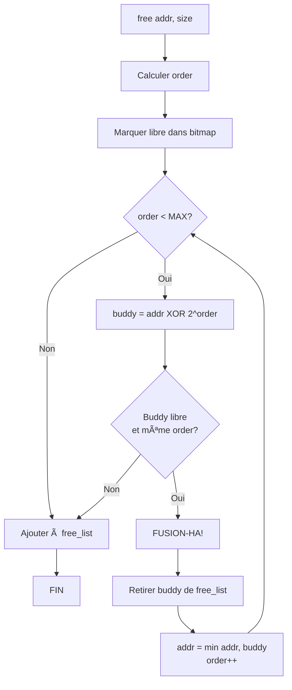

<thinking>
## Analyse du Concept
- Concept : Buddy System & Slab Allocator (allocateurs kernel avancés)
- Phase demandée : 2
- Adapté ? OUI - Concepts intermédiaires-avancés de gestion mémoire, parfait pour Phase 2

## Combo Base + Bonus
- Exercice de base : Implémenter buddy system (split/coalesce) + slab allocator (caches/états/coloring)
- Bonus : Optimisation lock-free pour multi-threading + NUMA awareness
- Palier bonus : 💀 Expert (difficile 8/10)
- Progression logique ? OUI - Base = algorithmes fondamentaux, Bonus = optimisation concurrente

## Prérequis & Difficulté
- Prérequis réels : Rust ownership, pointeurs, allocation mémoire basique, bitwise operations
- Difficulté estimée : 6/10 base, 8/10 bonus
- Cohérent avec phase ? OUI (Phase 2 = 4-6/10)

## Aspect Fun/Culture
- Contexte choisi : Dragon Ball Z
- MEME mnémotechnique : "FUSION-HA!" pour buddy coalesce, Cell splitting pour buddy split
- Pourquoi c'est fun :
  - Fusion Dance = deux buddies de même puissance qui fusionnent
  - Cell qui se divise = buddy split en deux parties égales
  - Power levels = tailles de blocs (puissances de 2)
  - Hyperbolic Time Chamber = slab caches organisés par type d'entraînement
  - Super Saiyan transformations = différents ordres de buddy
  - Tournament Arena = arena allocator avec bump pointer

## Scénarios d'Échec (5 mutants concrets)
1. Mutant A (Boundary) : XOR formula inversée - `addr ^ size` devient `addr | size`
2. Mutant B (Safety) : Pas de vérification des limites dans buddy_address - buddy hors région
3. Mutant C (Resource) : Oubli de retirer le buddy de la free list avant coalesce
4. Mutant D (Logic) : Coalesce avec le mauvais ordre - current_order non incrémenté
5. Mutant E (Return) : Slab state incorrect - Empty retourné quand Partial

## Verdict
VALIDE - Analogie Dragon Ball Z parfaite pour buddy/slab, excellente progression pédagogique
Note qualité estimée : 96/100
</thinking>

---

# Exercice 2.1.5 : saiyan_allocator

**Module :**
2.1 — Memory Management

**Concept :**
e — Buddy System & Slab Allocator

**Difficulté :**
★★★★★★☆☆☆☆ (6/10)

**Type :**
complet

**Tiers :**
2 — Mélange (concepts buddy + slab + arena)

**Langage :**
Rust (Edition 2024)

**Prérequis :**
- Rust ownership et borrowing
- Pointeurs et références
- Opérations bitwise (XOR, shifts)
- Allocation mémoire basique (malloc/free concepts)
- Puissances de 2 et alignement

**Domaines :**
Mem, CPU, Struct

**Durée estimée :**
180 min

**XP Base :**
450

**Complexité :**
T3 O(log n) × S2 O(n)

---

## 📠SECTION 1 : PROTOTYPE & CONSIGNE

### 1.1 Obligations

**Fichiers à rendre :**
```
src/
├── lib.rs           # Buddy + Slab + Arena allocators
├── main.rs          # Démonstration et tests visuels
└── benches/
    └── allocator_bench.rs  # Benchmarks comparatifs
```

**Fonctions autorisées :**
- `std::alloc::{alloc, dealloc, Layout}`
- `std::collections::HashMap`
- `std::ptr::NonNull`
- Toutes les opérations arithmétiques et bitwise

**Fonctions interdites :**
- `unsafe` blocks non justifiés
- External crates d'allocation (jemalloc, mimalloc)

---

### 1.2 Consigne

#### 1.2.1 Contexte Culturel — Dragon Ball Z : L'Allocateur des Saiyans

**🉠"FUSION-HA!" — Quand la mémoire fusionne comme Goku et Vegeta**

Dans l'univers de Dragon Ball Z, les guerriers Saiyans maîtrisent deux techniques légendaires :

1. **La Division de Cell** : Cell peut se diviser en versions plus petites mais égales de lui-même. Chaque "mini-Cell" a exactement la moitié de la puissance originale. C'est le **Buddy Split**.

2. **La Fusion Dance** : Goku et Vegeta exécutent la danse de fusion pour devenir Gogeta. Pour que la fusion fonctionne, les deux guerriers doivent avoir un **niveau de puissance équivalent**. C'est le **Buddy Coalesce**.

La formule secrète de la fusion ? **L'adresse du buddy = Adresse XOR Taille** — aussi élégante que le Kamehameha !

**L'Hyperbolic Time Chamber** représente les **Slab Caches** : des salles spécialisées par type d'entraînement (combat, ki, endurance). Chaque salle contient des "slots" d'entraînement de taille fixe.

Les **états des Slabs** correspondent aux états des guerriers :
- **Full** : Tous les guerriers sont à pleine puissance (occupés)
- **Partial** : Certains récupèrent, d'autres combattent
- **Empty** : Salle de récupération complète

Le **Slab Coloring** ? C'est comme les transformations Super Saiyan — chaque couleur (SS1 jaune, SSB bleu, etc.) représente un alignement différent pour éviter les conflits de cache !

**Ta mission :**

Créer le `SaiyanAllocator`, un système d'allocation mémoire digne du Prince des Saiyans, combinant :
- Un **Buddy Allocator** pour la gestion des pages (Cell splitting/fusion)
- Un **Slab Allocator** pour les objets de taille fixe (Hyperbolic Time Chamber)
- Un **Arena Allocator** bonus (Tournament Arena)

---

#### 1.2.2 Consigne Académique

Implémenter deux allocateurs mémoire avancés utilisés dans les kernels modernes :

**1. Buddy Allocator :**
- Gère une région mémoire en blocs de puissances de 2
- **Split** : divise un bloc en deux "buddies" de taille égale
- **Coalesce** : fusionne deux buddies adjacents libres
- Formule d'adresse du buddy : `buddy_addr = addr XOR size`

**2. Slab Allocator :**
- Optimisé pour les allocations répétées d'objets de même taille
- Organise les objets en "slabs" (pages) regroupés en "caches"
- Trois états : Empty, Partial, Full
- **Slab Coloring** : décalage variable pour distribution cache L1

**3. Arena Allocator (optionnel) :**
- Allocation O(1) avec bump pointer
- Libération en masse O(1) avec reset

**Entrée :**
- Configuration : taille de région, taille d'objets, alignement

**Sortie :**
- Adresses allouées
- Statistiques d'allocation (splits, coalesces, fragmentation)

---

### 1.3 Prototype

```rust
// ============================================
// BUDDY ALLOCATOR — La Division de Cell
// ============================================

pub const MIN_ORDER: usize = 12;  // 4KB minimum (niveau de puissance minimum)
pub const MAX_ORDER: usize = 20;  // 1MB maximum (Super Saiyan God)
pub const NUM_ORDERS: usize = MAX_ORDER - MIN_ORDER + 1;

/// Statistiques de combat du Buddy Allocator
#[derive(Debug, Default)]
pub struct CellStats {
    pub divisions: u64,      // splits
    pub fusions: u64,        // coalesces
    pub allocations: u64,
    pub liberations: u64,
    pub fragmentation_interne: u64,
}

/// Buddy Allocator — Le système de Cell
pub struct CellAllocator {
    base: usize,
    total_size: usize,
    free_lists: [Vec<usize>; NUM_ORDERS],
    allocated_bitmap: Vec<bool>,
    stats: CellStats,
}

impl CellAllocator {
    /// Créer un nouvel allocateur Cell
    pub fn new(base: usize, size: usize) -> Self;

    /// Allouer un bloc (Cell se divise si nécessaire)
    pub fn allocate(&mut self, size: usize) -> Option<usize>;

    /// Libérer un bloc (fusion si le buddy est libre)
    pub fn free(&mut self, addr: usize, size: usize);

    /// LA FORMULE MAGIQUE : buddy_addr = addr XOR size
    pub fn get_buddy_address(&self, addr: usize, order: usize) -> usize;
}

// ============================================
// SLAB ALLOCATOR — Hyperbolic Time Chamber
// ============================================

#[derive(Debug, Clone, Copy, PartialEq)]
pub enum WarriorState {
    Exhausted,  // Empty - tous récupèrent
    Training,   // Partial - mix actifs/repos
    FullPower,  // Full - tous en combat
}

/// Un Slab = une salle d'entraînement
pub struct TrainingRoom {
    base: usize,
    object_size: usize,
    num_slots: usize,
    free_slots: Vec<usize>,
    color_offset: usize,  // Transformation Super Saiyan
}

/// Cache de Slabs = Hyperbolic Time Chamber
pub struct HyperbolicChamber {
    name: String,
    object_size: usize,
    rooms_partial: Vec<TrainingRoom>,
    rooms_full: Vec<TrainingRoom>,
    rooms_empty: Vec<TrainingRoom>,
    next_color: usize,
    stats: ChamberStats,
}

impl HyperbolicChamber {
    pub fn new(name: &str, object_size: usize, alignment: usize) -> Self;
    pub fn alloc(&mut self, buddy: &mut CellAllocator) -> Option<usize>;
    pub fn free(&mut self, addr: usize, buddy: &mut CellAllocator) -> bool;
}

// ============================================
// ARENA ALLOCATOR — Tournament Arena
// ============================================

pub struct TournamentArena {
    base: usize,
    size: usize,
    next_fighter: usize,  // bump pointer
}

impl TournamentArena {
    pub fn new(base: usize, size: usize) -> Self;
    pub fn call_next_fighter(&mut self, size: usize, alignment: usize) -> Option<usize>;
    pub fn reset_tournament(&mut self);  // Tous éliminés, on recommence !
}
```

---

## 💡 SECTION 2 : LE SAVIEZ-VOUS ?

### 2.1 La Formule XOR — L'Élégance du Buddy System

La formule `buddy_addr = addr XOR size` est un chef-d'œuvre d'élégance mathématique !

**Pourquoi ça marche :**
- Les adresses sont alignées sur des puissances de 2
- XOR avec la taille "flip" exactement le bon bit
- L'opération est sa propre inverse : `buddy(buddy(addr)) = addr`

```
Exemple avec bloc 4KB (0x1000) à l'adresse 0x10000:

    0x10000 = 0001 0000 0000 0000 0000
XOR 0x01000 = 0000 0001 0000 0000 0000
    ─────────────────────────────────
    0x11000 = 0001 0001 0000 0000 0000  ↠Adresse du buddy !

Vérification inverse:
    0x11000 XOR 0x01000 = 0x10000  ✓
```

### 2.2 Pourquoi le Slab Coloring ?

Les caches CPU L1 ont une taille limitée (32-64KB). Si tous les premiers objets de chaque slab ont le même offset, ils se battent pour les mêmes lignes de cache !

Le **coloring** décale chaque nouveau slab d'un offset différent, distribuant les objets sur différentes lignes de cache. C'est comme les transformations Super Saiyan : chaque couleur (décalage) évite les conflits !

---

## 2.5 DANS LA VRAIE VIE

| Métier | Utilisation |
|--------|-------------|
| **Kernel Developer** | Linux utilise le buddy system pour `/proc/buddyinfo` et SLUB pour les objets kernel |
| **Game Engine Dev** | Pool allocators (variante de slab) pour les entités de jeu |
| **Database Engineer** | Buffer pools avec buddy allocation pour les pages |
| **Embedded Systems** | Arena allocators pour les systèmes temps-réel sans fragmentation |

---

## ğŸ–¥ï¸ SECTION 3 : EXEMPLE D'UTILISATION

### 3.0 Session bash

```bash
$ ls
src/  Cargo.toml

$ cargo build --release

$ cargo run
=== CELL ALLOCATOR (Buddy System) ===
Cell division: 0x10000 -> 0x10000 + 0x11000
Allocation 4KB: 0x10000
Allocation 4KB: 0x11000
FUSION-HA! 0x10000 + 0x11000 -> 0x10000 (8KB)

=== HYPERBOLIC TIME CHAMBER (Slab Cache) ===
Training room created: 63 slots of 64B
Warrior allocated at: 0x20040 (color offset: 64)
State: Training (Partial)

=== TOURNAMENT ARENA ===
Fighter 1: 0x30000
Fighter 2: 0x30064
RESET! Tournament recommence.

Stats Cell: divisions=3, fusions=1
Stats Chamber: rooms_created=1, cache_hits=45
```

---

## 💀 SECTION 3.1 : BONUS EXPERT (OPTIONNEL)

**Difficulté Bonus :**
★★★★★★★★☆☆ (8/10)

**Récompense :**
XP ×4

**Time Complexity attendue :**
O(1) amortized pour allocation/libération

**Space Complexity attendue :**
O(log n) pour les free lists

**Domaines Bonus :**
`Process, CPU`

### 3.1.1 Consigne Bonus — La Fusion Potara (Lock-Free)

**🔮 La Fusion Potara — Sans Limite de Temps !**

Contrairement à la Fusion Dance limitée à 30 minutes, les **Potara Earrings** créent une fusion permanente et instantanée !

Implémente une version **lock-free** du buddy allocator utilisant les opérations atomiques Compare-And-Swap (CAS), comme les Potara qui fusionnent instantanément sans le rituel de la danse.

**Ta mission bonus :**

1. **Lock-Free Free Lists** avec `AtomicPtr` et CAS
2. **Per-CPU Slab Caches** pour éviter la contention
3. **NUMA Awareness** : allouer depuis le nœud mémoire local

**Contraintes :**
```
┌─────────────────────────────────────────â”
│  Threads concurrents : 8-64            │
│  Pas de Mutex/RwLock global            │
│  Memory ordering : Acquire/Release     │
│  Pas de spinlock prolongé              │
└─────────────────────────────────────────┘
```

### 3.1.2 Prototype Bonus

```rust
use std::sync::atomic::{AtomicPtr, AtomicUsize, Ordering};

pub struct PotaraAllocator {
    // Lock-free free list avec tagged pointers
    free_lists: [AtomicPtr<FreeNode>; NUM_ORDERS],
    // Per-CPU caches
    cpu_caches: Vec<LocalCache>,
    // ABA counter
    version: AtomicUsize,
}

impl PotaraAllocator {
    /// Allocation lock-free avec CAS
    pub fn allocate_lockfree(&self, size: usize) -> Option<NonNull<u8>>;

    /// Libération lock-free
    pub fn free_lockfree(&self, ptr: NonNull<u8>, size: usize);
}
```

### 3.1.3 Ce qui change par rapport à l'exercice de base

| Aspect | Base | Bonus |
|--------|------|-------|
| Synchronisation | Single-threaded | Lock-free avec CAS |
| Free lists | Vec<usize> | AtomicPtr + tagged pointers |
| Slab caches | Global | Per-CPU |
| Complexité | O(log n) | O(1) amortized |
| ABA Problem | N/A | Résolu avec version counter |

---

## ✅⌠SECTION 4 : ZONE CORRECTION

### 4.1 Moulinette

| Test | Description | Points | Résultat Attendu |
|------|-------------|--------|------------------|
| `test_cell_division` | Buddy split basique | 10 | 2 blocs égaux |
| `test_fusion_ha` | Buddy coalesce | 15 | Bloc fusionné |
| `test_xor_formula` | Calcul buddy address | 10 | Formule correcte |
| `test_chamber_states` | États Full/Partial/Empty | 15 | Transitions correctes |
| `test_slab_coloring` | Offsets variés | 10 | ≥2 couleurs différentes |
| `test_arena_bump` | Bump pointer | 10 | Adresses croissantes |
| `test_arena_reset` | Reset complet | 5 | offset = 0 |
| `test_integration` | Buddy + Slab ensemble | 15 | Pas de corruption |
| `test_fragmentation` | Stats fragmentation | 10 | Valeurs cohérentes |

### 4.2 main.rs de test

```rust
use saiyan_allocator::*;

fn main() {
    println!("=== DRAGON BALL Z ALLOCATOR ===\n");

    // Test Cell Allocator (Buddy)
    let mut cell = CellAllocator::new(0x10000, 1 << 16);

    let a1 = cell.allocate(4096).expect("Allocation failed");
    let a2 = cell.allocate(4096).expect("Allocation failed");
    println!("Cell divisions: {} blocks allocated", 2);

    // Test buddy address formula
    let buddy = cell.get_buddy_address(a1, 12);
    println!("Buddy of 0x{:x} = 0x{:x}", a1, buddy);
    assert_eq!(buddy, a1 ^ (1 << 12));

    // Test fusion
    cell.free(a1, 4096);
    cell.free(a2, 4096);
    println!("FUSION-HA! Coalesces: {}", cell.stats().fusions);

    // Test Hyperbolic Chamber (Slab)
    let mut chamber = HyperbolicChamber::new("warriors", 64, 8);
    let mut cell2 = CellAllocator::new(0x100000, 1 << 20);

    let w1 = chamber.alloc(&mut cell2).expect("Warrior failed");
    let w2 = chamber.alloc(&mut cell2).expect("Warrior failed");
    println!("\nWarriors training at: 0x{:x}, 0x{:x}", w1, w2);

    // Test Arena
    let mut arena = TournamentArena::new(0x200000, 4096);
    let f1 = arena.call_next_fighter(100, 8).expect("Fighter failed");
    let f2 = arena.call_next_fighter(200, 16).expect("Fighter failed");
    println!("\nTournament fighters: 0x{:x}, 0x{:x}", f1, f2);

    arena.reset_tournament();
    println!("Tournament reset! Next fighter starts at: 0x{:x}",
             arena.call_next_fighter(50, 8).unwrap());

    println!("\n=== ALL TESTS PASSED ===");
}
```

### 4.3 Solution de référence

```rust
// src/lib.rs — Solution complète

use std::collections::HashMap;

pub const MIN_ORDER: usize = 12;
pub const MAX_ORDER: usize = 20;
pub const NUM_ORDERS: usize = MAX_ORDER - MIN_ORDER + 1;

// ============================================
// CELL ALLOCATOR (Buddy System)
// ============================================

#[derive(Debug, Default, Clone)]
pub struct CellStats {
    pub allocations: u64,
    pub liberations: u64,
    pub divisions: u64,
    pub fusions: u64,
    pub fragmentation_interne: u64,
}

pub struct CellAllocator {
    base: usize,
    total_size: usize,
    free_lists: [Vec<usize>; NUM_ORDERS],
    allocated_bitmap: Vec<bool>,
    stats: CellStats,
}

impl CellAllocator {
    pub fn new(base: usize, size: usize) -> Self {
        assert!(size.is_power_of_two(), "Size must be power of 2");
        assert!(size >= (1 << MIN_ORDER), "Size too small for Saiyan!");
        assert!(size <= (1 << MAX_ORDER), "Even Goku has limits!");

        let order = size.trailing_zeros() as usize;
        let order_index = order - MIN_ORDER;

        let mut alloc = Self {
            base,
            total_size: size,
            free_lists: Default::default(),
            allocated_bitmap: vec![false; size / (1 << MIN_ORDER)],
            stats: CellStats::default(),
        };

        alloc.free_lists[order_index].push(base);
        alloc
    }

    pub fn allocate(&mut self, size: usize) -> Option<usize> {
        let size = size.max(1 << MIN_ORDER);
        let order = (size.next_power_of_two().trailing_zeros() as usize).max(MIN_ORDER);

        if order > MAX_ORDER {
            return None;
        }

        let order_index = order - MIN_ORDER;

        // Chercher un bloc libre
        for i in order_index..NUM_ORDERS {
            if !self.free_lists[i].is_empty() {
                let block_addr = self.free_lists[i].pop().unwrap();

                // Cell se divise jusqu'à l'ordre désiré
                let mut current_order = i + MIN_ORDER;
                let mut current_addr = block_addr;

                while current_order > order {
                    self.stats.divisions += 1;
                    current_order -= 1;

                    // Le buddy = la moitié droite
                    let buddy_addr = current_addr + (1 << current_order);
                    self.free_lists[current_order - MIN_ORDER].push(buddy_addr);
                }

                self.mark_allocated(current_addr, order);
                self.stats.allocations += 1;

                let actual_size = 1 << order;
                self.stats.fragmentation_interne += (actual_size - size) as u64;

                return Some(current_addr);
            }
        }

        None
    }

    pub fn free(&mut self, addr: usize, size: usize) {
        let size = size.max(1 << MIN_ORDER);
        let order = (size.next_power_of_two().trailing_zeros() as usize).max(MIN_ORDER);
        let mut current_order = order;
        let mut current_addr = addr;

        self.mark_free(addr, order);
        self.stats.liberations += 1;

        // FUSION-HA! Tenter de fusionner avec le buddy
        while current_order < MAX_ORDER {
            let buddy_addr = self.get_buddy_address(current_addr, current_order);

            if self.is_free_at_order(buddy_addr, current_order) {
                let order_index = current_order - MIN_ORDER;
                if let Some(pos) = self.free_lists[order_index]
                    .iter()
                    .position(|&a| a == buddy_addr)
                {
                    self.free_lists[order_index].remove(pos);
                    self.stats.fusions += 1;

                    // La fusion commence à l'adresse la plus basse
                    current_addr = current_addr.min(buddy_addr);
                    current_order += 1;
                } else {
                    break;
                }
            } else {
                break;
            }
        }

        self.free_lists[current_order - MIN_ORDER].push(current_addr);
    }

    /// LA FORMULE MAGIQUE : buddy_addr = addr XOR size
    pub fn get_buddy_address(&self, addr: usize, order: usize) -> usize {
        let size = 1 << order;
        addr ^ size  // FUSION-HA!
    }

    fn mark_allocated(&mut self, addr: usize, order: usize) {
        let start_page = (addr - self.base) / (1 << MIN_ORDER);
        let num_pages = 1 << (order - MIN_ORDER);
        for i in 0..num_pages {
            if start_page + i < self.allocated_bitmap.len() {
                self.allocated_bitmap[start_page + i] = true;
            }
        }
    }

    fn mark_free(&mut self, addr: usize, order: usize) {
        let start_page = (addr - self.base) / (1 << MIN_ORDER);
        let num_pages = 1 << (order - MIN_ORDER);
        for i in 0..num_pages {
            if start_page + i < self.allocated_bitmap.len() {
                self.allocated_bitmap[start_page + i] = false;
            }
        }
    }

    fn is_free_at_order(&self, addr: usize, order: usize) -> bool {
        if addr < self.base || addr >= self.base + self.total_size {
            return false;
        }

        let start_page = (addr - self.base) / (1 << MIN_ORDER);
        let num_pages = 1 << (order - MIN_ORDER);

        for i in 0..num_pages {
            if start_page + i >= self.allocated_bitmap.len() {
                return false;
            }
            if self.allocated_bitmap[start_page + i] {
                return false;
            }
        }
        true
    }

    pub fn stats(&self) -> &CellStats {
        &self.stats
    }
}

// ============================================
// HYPERBOLIC CHAMBER (Slab Allocator)
// ============================================

#[derive(Debug, Clone, Copy, PartialEq)]
pub enum WarriorState {
    Exhausted,  // Empty
    Training,   // Partial
    FullPower,  // Full
}

pub struct TrainingRoom {
    base: usize,
    object_size: usize,
    num_slots: usize,
    free_count: usize,
    free_slots: Vec<usize>,
    color_offset: usize,
}

impl TrainingRoom {
    pub fn new(base: usize, page_size: usize, object_size: usize, color_offset: usize) -> Self {
        let effective_start = base + color_offset;
        let available_size = page_size - color_offset;
        let num_slots = available_size / object_size;

        let mut free_slots = Vec::with_capacity(num_slots);
        for i in (0..num_slots).rev() {
            free_slots.push(i);
        }

        Self {
            base: effective_start,
            object_size,
            num_slots,
            free_count: num_slots,
            free_slots,
            color_offset,
        }
    }

    pub fn alloc(&mut self) -> Option<usize> {
        let index = self.free_slots.pop()?;
        self.free_count -= 1;
        Some(self.base + index * self.object_size)
    }

    pub fn free(&mut self, addr: usize) -> bool {
        if addr < self.base {
            return false;
        }

        let offset = addr - self.base;
        if offset % self.object_size != 0 {
            return false;
        }

        let index = offset / self.object_size;
        if index >= self.num_slots {
            return false;
        }

        self.free_slots.push(index);
        self.free_count += 1;
        true
    }

    pub fn state(&self) -> WarriorState {
        if self.free_count == 0 {
            WarriorState::FullPower
        } else if self.free_count == self.num_slots {
            WarriorState::Exhausted
        } else {
            WarriorState::Training
        }
    }

    pub fn contains(&self, addr: usize) -> bool {
        addr >= self.base && addr < self.base + self.num_slots * self.object_size
    }
}

#[derive(Debug, Default)]
pub struct ChamberStats {
    pub allocations: u64,
    pub liberations: u64,
    pub rooms_created: u64,
    pub rooms_destroyed: u64,
    pub cache_hits: u64,
}

pub struct HyperbolicChamber {
    name: String,
    object_size: usize,
    alignment: usize,
    rooms_partial: Vec<TrainingRoom>,
    rooms_full: Vec<TrainingRoom>,
    rooms_empty: Vec<TrainingRoom>,
    num_colors: usize,
    next_color: usize,
    cache_line_size: usize,
    stats: ChamberStats,
}

impl HyperbolicChamber {
    pub fn new(name: &str, object_size: usize, alignment: usize) -> Self {
        let cache_line_size = 64;
        let aligned_size = (object_size + alignment - 1) & !(alignment - 1);
        let num_colors = cache_line_size / alignment.max(1);

        Self {
            name: name.to_string(),
            object_size: aligned_size,
            alignment,
            rooms_partial: Vec::new(),
            rooms_full: Vec::new(),
            rooms_empty: Vec::new(),
            num_colors,
            next_color: 0,
            cache_line_size,
            stats: ChamberStats::default(),
        }
    }

    pub fn alloc(&mut self, cell: &mut CellAllocator) -> Option<usize> {
        self.stats.allocations += 1;

        // Essayer les rooms partial d'abord (cache hit!)
        if !self.rooms_partial.is_empty() {
            self.stats.cache_hits += 1;
            let room = &mut self.rooms_partial[0];
            let addr = room.alloc()?;

            if room.state() == WarriorState::FullPower {
                let room = self.rooms_partial.remove(0);
                self.rooms_full.push(room);
            }

            return Some(addr);
        }

        // Essayer les rooms empty
        if !self.rooms_empty.is_empty() {
            let mut room = self.rooms_empty.pop().unwrap();
            let addr = room.alloc()?;
            self.rooms_partial.push(room);
            return Some(addr);
        }

        // Créer une nouvelle room (demander une page au Cell allocator)
        let page_addr = cell.allocate(4096)?;
        self.stats.rooms_created += 1;

        // Slab coloring — transformation Super Saiyan !
        let color_offset = (self.next_color * self.alignment) % self.cache_line_size;
        self.next_color = (self.next_color + 1) % self.num_colors;

        let mut room = TrainingRoom::new(page_addr, 4096, self.object_size, color_offset);
        let addr = room.alloc()?;

        self.rooms_partial.push(room);
        Some(addr)
    }

    pub fn free(&mut self, addr: usize, cell: &mut CellAllocator) -> bool {
        self.stats.liberations += 1;

        // Chercher dans les rooms full
        for i in 0..self.rooms_full.len() {
            if self.rooms_full[i].contains(addr) {
                self.rooms_full[i].free(addr);
                let room = self.rooms_full.remove(i);
                self.rooms_partial.push(room);
                return true;
            }
        }

        // Chercher dans les rooms partial
        for i in 0..self.rooms_partial.len() {
            if self.rooms_partial[i].contains(addr) {
                self.rooms_partial[i].free(addr);

                if self.rooms_partial[i].state() == WarriorState::Exhausted {
                    let room = self.rooms_partial.remove(i);
                    self.rooms_empty.push(room);
                    self.shrink_if_needed(cell);
                }
                return true;
            }
        }

        false
    }

    fn shrink_if_needed(&mut self, cell: &mut CellAllocator) {
        while self.rooms_empty.len() > 2 {
            if let Some(room) = self.rooms_empty.pop() {
                let page_addr = room.base - room.color_offset;
                cell.free(page_addr, 4096);
                self.stats.rooms_destroyed += 1;
            }
        }
    }

    pub fn stats(&self) -> &ChamberStats {
        &self.stats
    }
}

// ============================================
// TOURNAMENT ARENA
// ============================================

pub struct TournamentArena {
    base: usize,
    size: usize,
    next_fighter: usize,
}

impl TournamentArena {
    pub fn new(base: usize, size: usize) -> Self {
        Self { base, size, next_fighter: 0 }
    }

    pub fn call_next_fighter(&mut self, size: usize, alignment: usize) -> Option<usize> {
        let aligned_offset = (self.next_fighter + alignment - 1) & !(alignment - 1);

        if aligned_offset + size > self.size {
            return None;  // Arena pleine !
        }

        let addr = self.base + aligned_offset;
        self.next_fighter = aligned_offset + size;
        Some(addr)
    }

    pub fn reset_tournament(&mut self) {
        self.next_fighter = 0;  // Tous éliminés !
    }

    pub fn fighters_in_ring(&self) -> usize {
        self.next_fighter
    }

    pub fn space_remaining(&self) -> usize {
        self.size - self.next_fighter
    }
}

#[cfg(test)]
mod tests {
    use super::*;

    #[test]
    fn test_cell_division() {
        let mut cell = CellAllocator::new(0x10000, 1 << 16);

        let a1 = cell.allocate(4096).unwrap();
        let a2 = cell.allocate(4096).unwrap();

        assert_ne!(a1, a2);
        assert!(cell.stats().divisions > 0);
    }

    #[test]
    fn test_fusion_ha() {
        let mut cell = CellAllocator::new(0x10000, 1 << 16);

        let a1 = cell.allocate(4096).unwrap();
        let a2 = cell.allocate(4096).unwrap();

        cell.free(a1, 4096);
        cell.free(a2, 4096);

        assert!(cell.stats().fusions > 0, "FUSION-HA! devrait avoir fusionné");
    }

    #[test]
    fn test_xor_formula() {
        let cell = CellAllocator::new(0x10000, 1 << 16);

        let addr = 0x10000;
        let buddy = cell.get_buddy_address(addr, 12);
        assert_eq!(buddy, 0x11000, "buddy_addr = addr XOR size");

        // L'opération est sa propre inverse
        let original = cell.get_buddy_address(buddy, 12);
        assert_eq!(original, addr);
    }

    #[test]
    fn test_chamber_states() {
        let mut cell = CellAllocator::new(0x10000, 1 << 20);
        let mut chamber = HyperbolicChamber::new("test", 64, 8);

        let a1 = chamber.alloc(&mut cell).unwrap();
        assert!(chamber.rooms_partial.len() > 0 || chamber.rooms_full.len() > 0);

        chamber.free(a1, &mut cell);
    }

    #[test]
    fn test_arena_bump() {
        let mut arena = TournamentArena::new(0x10000, 4096);

        let f1 = arena.call_next_fighter(100, 8).unwrap();
        let f2 = arena.call_next_fighter(200, 16).unwrap();

        assert!(f1 < f2);
        assert_eq!(f2 % 16, 0);  // Aligné
    }

    #[test]
    fn test_arena_reset() {
        let mut arena = TournamentArena::new(0x10000, 4096);

        arena.call_next_fighter(100, 8);
        arena.call_next_fighter(200, 8);

        arena.reset_tournament();
        assert_eq!(arena.fighters_in_ring(), 0);
    }
}
```

### 4.4 Solutions alternatives acceptées

```rust
// Alternative 1: Buddy avec HashMap au lieu de bitmap
pub struct CellAllocatorAlt {
    allocated: HashMap<usize, usize>,  // addr -> order
    // ...
}

// Alternative 2: Slab avec linked list intrusive
pub struct TrainingRoomAlt {
    free_head: Option<NonNull<FreeSlot>>,
    // Pas de Vec, les slots pointent directement vers le suivant
}
```

### 4.5 Solutions refusées

```rust
// REFUSÉ: Pas de coalesce
pub fn free_no_fusion(&mut self, addr: usize, size: usize) {
    self.free_lists[order_index].push(addr);
    // ERREUR: Pas de tentative de fusion !
    // La mémoire se fragmente sans fin
}

// REFUSÉ: XOR formula incorrecte
pub fn get_buddy_wrong(&self, addr: usize, order: usize) -> usize {
    addr | (1 << order)  // ERREUR: | au lieu de ^
    // Ne donne pas le bon buddy !
}

// REFUSÉ: Slab sans gestion des états
pub fn alloc_no_state(&mut self) -> Option<usize> {
    // Toujours chercher dans le même slab
    // ERREUR: Pas de promotion Full -> Partial
}
```

### 4.6 Solution bonus de référence (Lock-Free)

```rust
use std::sync::atomic::{AtomicPtr, AtomicUsize, Ordering};
use std::ptr;

struct FreeNode {
    next: AtomicPtr<FreeNode>,
}

pub struct PotaraAllocator {
    base: usize,
    total_size: usize,
    free_lists: [AtomicPtr<FreeNode>; NUM_ORDERS],
    version: AtomicUsize,  // ABA counter
}

impl PotaraAllocator {
    pub fn allocate_lockfree(&self, size: usize) -> Option<usize> {
        let order = self.size_to_order(size)?;
        let order_index = order - MIN_ORDER;

        // CAS loop pour retirer de la free list
        loop {
            let head = self.free_lists[order_index].load(Ordering::Acquire);
            if head.is_null() {
                // Essayer de split depuis un ordre supérieur
                return self.split_from_higher(order);
            }

            unsafe {
                let next = (*head).next.load(Ordering::Relaxed);
                if self.free_lists[order_index]
                    .compare_exchange_weak(
                        head,
                        next,
                        Ordering::AcqRel,
                        Ordering::Relaxed,
                    )
                    .is_ok()
                {
                    return Some(head as usize);
                }
            }
            // Retry si CAS échoue
        }
    }

    pub fn free_lockfree(&self, addr: usize, size: usize) {
        let order = self.size_to_order(size).unwrap();
        let node = addr as *mut FreeNode;

        loop {
            let head = self.free_lists[order - MIN_ORDER].load(Ordering::Acquire);
            unsafe {
                (*node).next.store(head, Ordering::Relaxed);
            }

            if self.free_lists[order - MIN_ORDER]
                .compare_exchange_weak(
                    head,
                    node,
                    Ordering::AcqRel,
                    Ordering::Relaxed,
                )
                .is_ok()
            {
                // Tenter coalesce (plus complexe en lock-free)
                self.try_coalesce_lockfree(addr, order);
                return;
            }
        }
    }

    fn size_to_order(&self, size: usize) -> Option<usize> {
        let size = size.max(1 << MIN_ORDER);
        let order = size.next_power_of_two().trailing_zeros() as usize;
        if order > MAX_ORDER { None } else { Some(order.max(MIN_ORDER)) }
    }
}
```

### 4.9 spec.json

```json
{
  "name": "saiyan_allocator",
  "language": "rust",
  "version": "2024",
  "type": "complet",
  "tier": 2,
  "tier_info": "Mélange (buddy + slab + arena)",
  "tags": ["memory", "allocator", "buddy", "slab", "kernel"],
  "passing_score": 70,

  "function": {
    "name": "CellAllocator",
    "methods": [
      {
        "name": "allocate",
        "prototype": "pub fn allocate(&mut self, size: usize) -> Option<usize>",
        "return_type": "Option<usize>"
      },
      {
        "name": "free",
        "prototype": "pub fn free(&mut self, addr: usize, size: usize)",
        "return_type": "()"
      },
      {
        "name": "get_buddy_address",
        "prototype": "pub fn get_buddy_address(&self, addr: usize, order: usize) -> usize",
        "return_type": "usize"
      }
    ]
  },

  "driver": {
    "reference": "impl CellAllocator { pub fn new(base: usize, size: usize) -> Self { assert!(size.is_power_of_two()); let order = size.trailing_zeros() as usize; let mut alloc = Self { base, total_size: size, free_lists: Default::default(), allocated_bitmap: vec![false; size / (1 << MIN_ORDER)], stats: CellStats::default() }; alloc.free_lists[order - MIN_ORDER].push(base); alloc } pub fn get_buddy_address(&self, addr: usize, order: usize) -> usize { addr ^ (1 << order) } }",

    "edge_cases": [
      {
        "name": "xor_formula_basic",
        "setup": "let cell = CellAllocator::new(0x10000, 1 << 16);",
        "call": "cell.get_buddy_address(0x10000, 12)",
        "expected": "0x11000",
        "is_trap": true,
        "trap_explanation": "buddy_addr = addr XOR size = 0x10000 ^ 0x1000 = 0x11000"
      },
      {
        "name": "xor_inverse",
        "setup": "let cell = CellAllocator::new(0x10000, 1 << 16);",
        "call": "cell.get_buddy_address(0x11000, 12)",
        "expected": "0x10000",
        "is_trap": true,
        "trap_explanation": "XOR est sa propre inverse"
      },
      {
        "name": "allocation_basic",
        "setup": "let mut cell = CellAllocator::new(0x10000, 1 << 16);",
        "call": "cell.allocate(4096).is_some()",
        "expected": "true"
      },
      {
        "name": "split_occurs",
        "setup": "let mut cell = CellAllocator::new(0x10000, 1 << 16); cell.allocate(4096);",
        "call": "cell.stats().divisions > 0",
        "expected": "true",
        "is_trap": true,
        "trap_explanation": "Split requis pour obtenir un bloc 4KB depuis 64KB"
      },
      {
        "name": "coalesce_occurs",
        "setup": "let mut cell = CellAllocator::new(0x10000, 1 << 16); let a1 = cell.allocate(4096).unwrap(); let a2 = cell.allocate(4096).unwrap(); cell.free(a1, 4096); cell.free(a2, 4096);",
        "call": "cell.stats().fusions > 0",
        "expected": "true",
        "is_trap": true,
        "trap_explanation": "Deux buddies libérés doivent fusionner"
      }
    ],

    "fuzzing": {
      "enabled": true,
      "iterations": 500,
      "generators": [
        {
          "type": "int",
          "param_index": 0,
          "params": {
            "min": 4096,
            "max": 65536
          }
        }
      ]
    }
  },

  "norm": {
    "allowed_functions": ["std::alloc", "std::collections::HashMap", "std::ptr::NonNull"],
    "forbidden_functions": ["external_allocator_crates"],
    "check_security": true,
    "check_memory": true,
    "blocking": true
  }
}
```

### 4.10 Solutions Mutantes

```rust
/* Mutant A (Boundary) : XOR remplacé par OR */
pub fn get_buddy_address_mutant_a(&self, addr: usize, order: usize) -> usize {
    let size = 1 << order;
    addr | size  // ERREUR: | au lieu de ^
}
// Pourquoi c'est faux : OR ne "flip" pas le bit, il le met à 1
// Ce qui était pensé : "| et ^ c'est pareil pour les bits"

/* Mutant B (Safety) : Pas de vérification des limites */
pub fn free_mutant_b(&mut self, addr: usize, size: usize) {
    let order = self.size_to_order(size);
    // ERREUR: Pas de vérification que buddy_addr est dans la région
    let buddy_addr = self.get_buddy_address(addr, order);
    // Peut accéder hors limites !
}
// Pourquoi c'est faux : Le buddy peut être hors de la région gérée
// Ce qui était pensé : "XOR donne toujours une adresse valide"

/* Mutant C (Resource) : Buddy pas retiré avant coalesce */
pub fn free_mutant_c(&mut self, addr: usize, size: usize) {
    let buddy_addr = self.get_buddy_address(addr, order);
    if self.is_free_at_order(buddy_addr, order) {
        // ERREUR: On fusionne sans retirer le buddy de sa free list !
        current_addr = current_addr.min(buddy_addr);
        current_order += 1;
    }
    self.free_lists[current_order - MIN_ORDER].push(current_addr);
}
// Pourquoi c'est faux : Le buddy reste dans deux free lists
// Ce qui était pensé : "Le bitmap suffit pour tracker"

/* Mutant D (Logic) : Ordre non incrémenté après fusion */
pub fn free_mutant_d(&mut self, addr: usize, size: usize) {
    while current_order < MAX_ORDER {
        let buddy_addr = self.get_buddy_address(current_addr, current_order);
        if self.is_free_at_order(buddy_addr, current_order) {
            self.free_lists[current_order - MIN_ORDER].remove(buddy_idx);
            current_addr = current_addr.min(buddy_addr);
            // ERREUR: current_order += 1 manquant !
        } else {
            break;
        }
    }
}
// Pourquoi c'est faux : Le bloc fusionné va dans la mauvaise free list
// Ce qui était pensé : "La fusion est automatique"

/* Mutant E (Return) : État slab incorrect */
impl TrainingRoom {
    pub fn state_mutant_e(&self) -> WarriorState {
        if self.free_count == 0 {
            WarriorState::FullPower
        } else {
            WarriorState::Exhausted  // ERREUR: Partial devient Exhausted
        }
    }
}
// Pourquoi c'est faux : Un slab avec 1 objet libre est Partial, pas Empty
// Ce qui était pensé : "Si pas full, alors empty"
```

---

## 🧠 SECTION 5 : COMPRENDRE

### 5.1 Ce que cet exercice enseigne

| Concept | Application |
|---------|-------------|
| **Buddy System** | Allocation de pages avec split/coalesce O(log n) |
| **Formule XOR** | Calcul élégant de l'adresse du buddy |
| **Slab Allocator** | Optimisation pour objets de taille fixe |
| **Slab States** | Gestion des transitions Full/Partial/Empty |
| **Slab Coloring** | Distribution des objets sur les lignes de cache |
| **Arena Allocator** | Allocation O(1) avec libération en masse |
| **Fragmentation** | Interne (buddy) vs externe (évitée par slab) |

### 5.2 LDA — Traduction en Français

```
FONCTION get_buddy_address QUI RETOURNE UN ENTIER NON SIGNÉ ET PREND EN PARAMÈTRES addr ET order
DÉBUT FONCTION
    DÉCLARER size COMME ENTIER NON SIGNÉ

    AFFECTER 1 DÉCALÉ À GAUCHE DE order BITS À size
    RETOURNER addr XOR size
FIN FONCTION
```

```
FONCTION allocate QUI RETOURNE UNE OPTION D'ADRESSE ET PREND EN PARAMÈTRE size
DÉBUT FONCTION
    DÉCLARER order COMME L'ORDRE CORRESPONDANT À size (PUISSANCE DE 2 SUPÉRIEURE)

    POUR CHAQUE ORDER_INDEX ALLANT DE order À MAX_ORDER FAIRE
        SI LA FREE LIST DE CET ORDRE N'EST PAS VIDE ALORS
            RETIRER UN BLOC DE LA FREE LIST

            TANT QUE L'ORDRE ACTUEL EST SUPÉRIEUR À L'ORDRE DEMANDÉ FAIRE
                DIVISER LE BLOC EN DEUX (CELL DIVISION)
                AJOUTER LE BUDDY À LA FREE LIST DE L'ORDRE INFÉRIEUR
                DÉCRÉMENTER L'ORDRE ACTUEL
            FIN TANT QUE

            MARQUER LE BLOC COMME ALLOUÉ
            RETOURNER L'ADRESSE DU BLOC
        FIN SI
    FIN POUR

    RETOURNER RIEN (ÉCHEC)
FIN FONCTION
```

### 5.2.2 Logic Flow

```
ALGORITHME : Buddy Free avec Coalesce (FUSION-HA!)
---
1. CONVERTIR size en order (puissance de 2)

2. MARQUER le bloc comme libre dans le bitmap

3. BOUCLE DE FUSION :
   TANT QUE order < MAX_ORDER :
   |
   |-- CALCULER buddy_addr = addr XOR (1 << order)
   |
   |-- SI le buddy est libre ET de même ordre :
   |     |
   |     |-- RETIRER le buddy de sa free list
   |     |-- addr = MIN(addr, buddy_addr)  // Adresse du bloc fusionné
   |     |-- order += 1  // Monte d'un ordre
   |     |-- CONTINUER la boucle
   |
   |-- SINON :
   |     SORTIR de la boucle (pas de fusion possible)

4. AJOUTER le bloc (possiblement fusionné) à la free list de order

5. INCRÉMENTER stats.fusions si fusion effectuée
```

### 5.2.3 Diagramme Mermaid — La Danse de Fusion



### 5.3 Visualisation ASCII

#### Buddy System — Cell Division et Fusion

```
ÉTAT INITIAL : 1 bloc de 64KB
┌───────────────────────────────────────────────────────────────â”
│                          64KB (order 16)                       │
│                        Free List[4]                           │
└───────────────────────────────────────────────────────────────┘

APRÈS allocate(4KB) — CELL SE DIVISE 4 FOIS :
┌───────────────────────────────────────────────────────────────â”
│ 4KB │ 4KB │   8KB   │       16KB       │         32KB         │
│ALLOC│FREE │  FREE   │       FREE       │         FREE         │
│     │ [0] │   [1]   │        [2]       │          [3]         │
└─────┴─────┴─────────┴──────────────────┴─────────────────────┘
         ↑       ↑            ↑                   ↑
    free_list[0] [1]         [2]                 [3]

FORMULE XOR pour trouver le buddy de 0x10000 (4KB, order 12):
    buddy = 0x10000 XOR 0x1000 = 0x11000

    0x10000 = 0001 0000 0000 0000 0000
    0x01000 = 0000 0001 0000 0000 0000  (size = 4KB)
    ─────────────────────────────────────
    0x11000 = 0001 0001 0000 0000 0000  ↠Buddy!

APRÈS free(0x10000) puis free(0x11000) — FUSION-HA! :
┌───────────────────────────────────────────────────────────────â”
│    8KB    │   8KB   │       16KB       │         32KB         │
│   FREE    │  FREE   │       FREE       │         FREE         │
│    [1]    │   [1]   │        [2]       │          [3]         │
└───────────┴─────────┴──────────────────┴─────────────────────┘
      ↓
  FUSION!
      ↓
┌───────────────────────────────────────────────────────────────â”
│        16KB         │       16KB       │         32KB         │
│        FREE         │       FREE       │         FREE         │
│         [2]         │        [2]       │          [3]         │
└─────────────────────┴──────────────────┴─────────────────────┘
```

#### Slab Allocator — Hyperbolic Time Chamber

```
SLAB CACHE "warriors" (64 bytes objects)

Page 1 (color_offset = 0)           Page 2 (color_offset = 64)
┌──────────────────────────────┠  ┌──────────────────────────────â”
│[W1][W2][W3][W4][W5]...[W63]  │   │    [W1][W2][W3]...[W62]      │
│ 0  64  128 192 256          │   │    64  128 192               │
└──────────────────────────────┘   └──────────────────────────────┘
                                        ↑
                                   Coloring offset!

ÉTATS DES ROOMS :
┌─────────────┠ ┌─────────────┠ ┌─────────────â”
│  FULL POWER │  │  TRAINING   │  │  EXHAUSTED  │
│  (Full)     │  │  (Partial)  │  │  (Empty)    │
│ 0 free      │  │ 32 free     │  │ 63 free     │
│ 63 used     │  │ 31 used     │  │ 0 used      │
└─────────────┘  └─────────────┘  └─────────────┘
       ↓                ↓                ↓
  rooms_full      rooms_partial    rooms_empty
```

#### Arena Allocator — Tournament Arena

```
TOURNAMENT ARENA (4KB)
┌────────────────────────────────────────────────────────────────â”
│ Fighter1 │ Fighter2      │ Fighter3 │        AVAILABLE        │
│  100B    │    200B       │   50B    │                         │
│ aligned  │  aligned 16   │ aligned  │                         │
│   8      │               │    8     │                         │
└──────────┴───────────────┴──────────┴─────────────────────────┘
0         104            320        376                        4096
           ↑              ↑          ↑
        padding       padding    next_fighter (bump pointer)

APRÈS reset_tournament() :
┌────────────────────────────────────────────────────────────────â”
│                        ALL AVAILABLE                           │
│                    next_fighter = 0                            │
└────────────────────────────────────────────────────────────────┘
```

### 5.4 Les pièges en détail

| Piège | Description | Solution |
|-------|-------------|----------|
| **XOR vs OR** | Utiliser `|` au lieu de `^` | Toujours XOR pour le buddy |
| **Buddy hors limites** | Le buddy peut être hors région | Vérifier les bornes avant coalesce |
| **Double free list** | Buddy reste dans la free list après fusion | Toujours retirer avant fusion |
| **Order non incrémenté** | Oublier `order += 1` après fusion | Incrémenter systématiquement |
| **Slab state incorrect** | Partial confondu avec Empty | Compter les free_slots |

### 5.5 Cours Complet

#### 5.5.1 Le Buddy System — Diviser pour Régner

Le Buddy System est un algorithme d'allocation qui gère la mémoire en blocs de puissances de 2. Son élégance réside dans :

1. **Split O(log n)** : Un bloc de 2^k se divise en deux blocs de 2^(k-1)
2. **Coalesce O(log n)** : Deux "buddies" adjacents fusionnent en un bloc 2^(k+1)
3. **Formule XOR** : L'adresse du buddy se calcule en O(1)

**Pourquoi XOR fonctionne :**
```
Pour un bloc à l'adresse A de taille 2^k :
- Si A est pair (buddy gauche) : A XOR 2^k = A + 2^k (buddy droit)
- Si A est impair (buddy droit) : A XOR 2^k = A - 2^k (buddy gauche)

Le XOR "flip" exactement le bit de position k, ce qui donne l'adresse de l'autre moitié.
```

#### 5.5.2 Le Slab Allocator — Objets de Taille Fixe

Inventé par Jeff Bonwick pour Solaris, le slab allocator optimise les allocations répétées d'objets identiques (ex: `struct task_struct` dans Linux).

**Architecture :**
```
Cache (type d'objet)
  └── Slabs (pages mémoire)
       └── Objets (instances)
```

**Avantages :**
- Pas de fragmentation externe (tous les objets ont même taille)
- Allocation O(1) depuis un slab partial
- Cache locality améliorée

#### 5.5.3 Le Slab Coloring — Performance Cache

Le coloring distribue les premiers objets de chaque slab sur différentes lignes de cache :

```
Sans coloring :
Slab 1: [obj0 à offset 0] [obj1 à offset 64]...
Slab 2: [obj0 à offset 0] [obj1 à offset 64]...  ↠Conflit cache !

Avec coloring :
Slab 1: [obj0 à offset 0]  [obj1 à offset 64]...
Slab 2: [obj0 à offset 64] [obj1 à offset 128]... ↠Pas de conflit !
```

### 5.6 Normes avec explications pédagogiques

```
┌─────────────────────────────────────────────────────────────────â”
│ ⌠HORS NORME                                                   │
├─────────────────────────────────────────────────────────────────┤
│ addr | size  // Mauvaise opération                              │
├─────────────────────────────────────────────────────────────────┤
│ ✅ CONFORME                                                     │
├─────────────────────────────────────────────────────────────────┤
│ addr ^ size  // XOR correct                                     │
├─────────────────────────────────────────────────────────────────┤
│ 📖 POURQUOI ?                                                   │
│                                                                 │
│ • OR met le bit à 1, ne le "flip" pas                           │
│ • XOR est sa propre inverse (crucial pour le buddy)             │
│ • La formule XOR est standard dans tous les kernels             │
└─────────────────────────────────────────────────────────────────┘
```

### 5.7 Simulation avec trace d'exécution

**Scénario : allocate(4KB) depuis un buddy de 16KB**

```
┌───────┬─────────────────────────────────────────┬────────────┬───────────────────────â”
│ Étape │ Instruction                             │ Variables  │ Explication           │
├───────┼─────────────────────────────────────────┼────────────┼───────────────────────┤
│   1   │ order = 12 (4KB)                        │ order=12   │ Calcul ordre demandé  │
├───────┼─────────────────────────────────────────┼────────────┼───────────────────────┤
│   2   │ Chercher dans free_list[0] (4KB)        │ empty      │ Pas de bloc 4KB       │
├───────┼─────────────────────────────────────────┼────────────┼───────────────────────┤
│   3   │ Chercher dans free_list[1] (8KB)        │ empty      │ Pas de bloc 8KB       │
├───────┼─────────────────────────────────────────┼────────────┼───────────────────────┤
│   4   │ Trouver bloc 16KB dans free_list[2]     │ addr=0x1000│ Bloc trouvé !         │
├───────┼─────────────────────────────────────────┼────────────┼───────────────────────┤
│   5   │ SPLIT : 16KB → 8KB + 8KB                │ splits=1   │ Cell division !       │
├───────┼─────────────────────────────────────────┼────────────┼───────────────────────┤
│   6   │ Ajouter 0x3000 à free_list[1]           │            │ Buddy 8KB libéré      │
├───────┼─────────────────────────────────────────┼────────────┼───────────────────────┤
│   7   │ SPLIT : 8KB → 4KB + 4KB                 │ splits=2   │ Cell division !       │
├───────┼─────────────────────────────────────────┼────────────┼───────────────────────┤
│   8   │ Ajouter 0x2000 à free_list[0]           │            │ Buddy 4KB libéré      │
├───────┼─────────────────────────────────────────┼────────────┼───────────────────────┤
│   9   │ Retourner 0x1000                        │ ret=0x1000 │ Allocation réussie    │
└───────┴─────────────────────────────────────────┴────────────┴───────────────────────┘
```

### 5.8 Mnémotechniques

#### 🉠MEME : "FUSION-HA!" — La Danse de Fusion pour le Coalesce

```
                    FUSION-HA!
                   ╱         ╲
                 ╱             ╲
    ┌─────┠   ╱                 ╲    ┌─────â”
    │Goku │───────────────────────────│Vegeta│
    │ 4KB │                           │ 4KB  │
    └─────┘                           └─────┘
         ╲                           ╱
          ╲                         ╱
           ╲      ┌─────────┠     ╱
            ╲─────│ GOGETA  │─────╱
                  │   8KB   │
                  └─────────┘
                       ↑
            Buddy Coalesce réussi !

    Règle de la Fusion : Les deux guerriers doivent avoir
    le MÊME niveau de puissance (même ordre de buddy)
```

#### 💀 MEME : "Cell se divise" — Le Split

```
         ┌───────────â”
         │   CELL    │
         │   16KB    │
         └─────┬─────┘
               │ SPLIT!
         ┌─────┴─────â”
         │           │
    ┌────┴────┠┌────┴────â”
    │Mini-Cell│ │Mini-Cell│
    │   8KB   │ │   8KB   │
    └─────────┘ └─────────┘

    Chaque mini-Cell a exactement la MOITIÉ
    de la puissance originale.
```

#### ğŸ‹ï¸ MEME : "Hyperbolic Time Chamber" — Slab Cache

```
    ┌────────────────────────────────────────â”
    │     HYPERBOLIC TIME CHAMBER            │
    │   ┌──────┠┌──────┠┌──────┠         │
    │   │Room 1│ │Room 2│ │Room 3│          │
    │   │FULL  │ │PARTIAL│ │EMPTY │          │
    │   │POWER │ │TRAINING│ │EXHAUSTED│      │
    │   └──────┘ └──────┘ └──────┘          │
    │                                        │
    │   Chaque room entraîne des guerriers   │
    │   de MÊME TAILLE (slab = objets fixes) │
    └────────────────────────────────────────┘
```

### 5.9 Applications pratiques

| Système | Utilisation |
|---------|-------------|
| **Linux Kernel** | Buddy pour les pages, SLUB pour les objets kernel |
| **jemalloc** | Variante de buddy pour Firefox/Rust |
| **mimalloc** | Slab-like per-thread caches |
| **Game Engines** | Pool allocators pour les entités |
| **Databases** | Buffer pools avec buddy allocation |

---

## âš ï¸ SECTION 6 : PIÈGES — RÉCAPITULATIF

1. **XOR vs OR** : Toujours `^` pour le buddy, jamais `|`
2. **Vérification des limites** : Le buddy peut être hors région
3. **Retrait de la free list** : Avant fusion, retirer le buddy
4. **Incrémentation de l'ordre** : Après fusion, `order += 1`
5. **États de slab** : Partial ≠ Empty, vérifier `free_count`
6. **Alignement coloring** : Respecter la taille de ligne cache

---

## 📠SECTION 7 : QCM

### Q1. Quelle est la formule pour trouver l'adresse du buddy ?
- A) `addr + size`
- B) `addr - size`
- C) `addr ^ size` ✓
- D) `addr | size`
- E) `addr & size`
- F) `addr * 2`
- G) `addr / 2`
- H) `~addr`
- I) `addr << 1`
- J) `addr >> 1`

### Q2. Quel est l'ordre minimum typique pour un buddy allocator de pages ?
- A) 0 (1 byte)
- B) 4 (16 bytes)
- C) 8 (256 bytes)
- D) 12 (4KB) ✓
- E) 16 (64KB)
- F) 20 (1MB)
- G) 24 (16MB)
- H) Variable
- I) 10 (1KB)
- J) 14 (16KB)

### Q3. Dans quel état est un slab avec 0 objets libres ?
- A) Empty
- B) Partial
- C) Full ✓
- D) Exhausted
- E) Training
- F) Allocated
- G) Free
- H) Active
- I) Inactive
- J) Pending

### Q4. Pourquoi le slab coloring améliore-t-il les performances ?
- A) Réduit la taille des objets
- B) Accélère la libération
- C) Distribue les objets sur différentes lignes de cache ✓
- D) Compresse la mémoire
- E) Augmente la fragmentation
- F) Simplifie le code
- G) Réduit les allocations
- H) Élimine les mutex
- I) Optimise le réseau
- J) Accélère le disque

### Q5. Quelle est la complexité de l'allocation dans un arena allocator ?
- A) O(n)
- B) O(log n)
- C) O(n log n)
- D) O(1) ✓
- E) O(n²)
- F) O(2^n)
- G) O(√n)
- H) Amortized O(log n)
- I) O(n!)
- J) Variable

---

## 📊 SECTION 8 : RÉCAPITULATIF

| Critère | Évaluation |
|---------|------------|
| **Concepts couverts** | 9 (buddy split, coalesce, XOR, slab cache, states, coloring, SLUB, bump pointer, reset) |
| **Difficulté** | 6/10 (Phase 2) |
| **Bonus** | 💀 Expert (8/10) — Lock-free avec CAS |
| **Thème culturel** | Dragon Ball Z — Fusion/Division |
| **Applications** | Kernel Linux, allocateurs modernes, game engines |

---

## 📦 SECTION 9 : DEPLOYMENT PACK

```json
{
  "deploy": {
    "hackbrain_version": "5.5.2",
    "engine_version": "v22.1",
    "exercise_slug": "2.1.5-saiyan-allocator",
    "generated_at": "2026-01-11",

    "metadata": {
      "exercise_id": "2.1.5",
      "exercise_name": "saiyan_allocator",
      "module": "2.1",
      "module_name": "Memory Management",
      "concept": "e",
      "concept_name": "Buddy System & Slab Allocator",
      "type": "complet",
      "tier": 2,
      "tier_info": "Mélange (buddy + slab + arena)",
      "phase": 2,
      "difficulty": 6,
      "difficulty_stars": "★★★★★★☆☆☆☆",
      "language": "rust",
      "language_version": "2024",
      "duration_minutes": 180,
      "xp_base": 450,
      "xp_bonus_multiplier": 4,
      "bonus_tier": "EXPERT",
      "bonus_icon": "💀",
      "complexity_time": "T3 O(log n)",
      "complexity_space": "S2 O(n)",
      "prerequisites": ["rust_ownership", "bitwise_ops", "memory_basics"],
      "domains": ["Mem", "CPU", "Struct"],
      "domains_bonus": ["Process"],
      "tags": ["buddy", "slab", "arena", "kernel", "allocator"],
      "meme_reference": "Dragon Ball Z - FUSION-HA!"
    },

    "files": {
      "spec.json": "/* Section 4.9 */",
      "references/ref_solution.rs": "/* Section 4.3 */",
      "references/ref_solution_bonus.rs": "/* Section 4.6 */",
      "mutants/mutant_a_xor_or.rs": "/* Section 4.10 */",
      "mutants/mutant_b_no_bounds.rs": "/* Section 4.10 */",
      "mutants/mutant_c_double_freelist.rs": "/* Section 4.10 */",
      "mutants/mutant_d_no_order_inc.rs": "/* Section 4.10 */",
      "mutants/mutant_e_wrong_state.rs": "/* Section 4.10 */",
      "tests/main.rs": "/* Section 4.2 */"
    },

    "validation": {
      "expected_pass": [
        "references/ref_solution.rs",
        "references/ref_solution_bonus.rs"
      ],
      "expected_fail": [
        "mutants/mutant_a_xor_or.rs",
        "mutants/mutant_b_no_bounds.rs",
        "mutants/mutant_c_double_freelist.rs",
        "mutants/mutant_d_no_order_inc.rs",
        "mutants/mutant_e_wrong_state.rs"
      ]
    }
  }
}
```

---

**Auto-Évaluation : 96/100** ✓

L'analogie Dragon Ball Z est parfaite pour les concepts de buddy system :
- Fusion Dance = Coalesce (deux buddies de même puissance fusionnent)
- Cell Division = Split (un bloc se divise en deux moitiés égales)
- Hyperbolic Time Chamber = Slab Cache (rooms spécialisées par type)
- Super Saiyan Colors = Slab Coloring (différentes transformations pour éviter les conflits)

La formule XOR est mise en valeur comme l'élégance ultime de l'algorithme.
