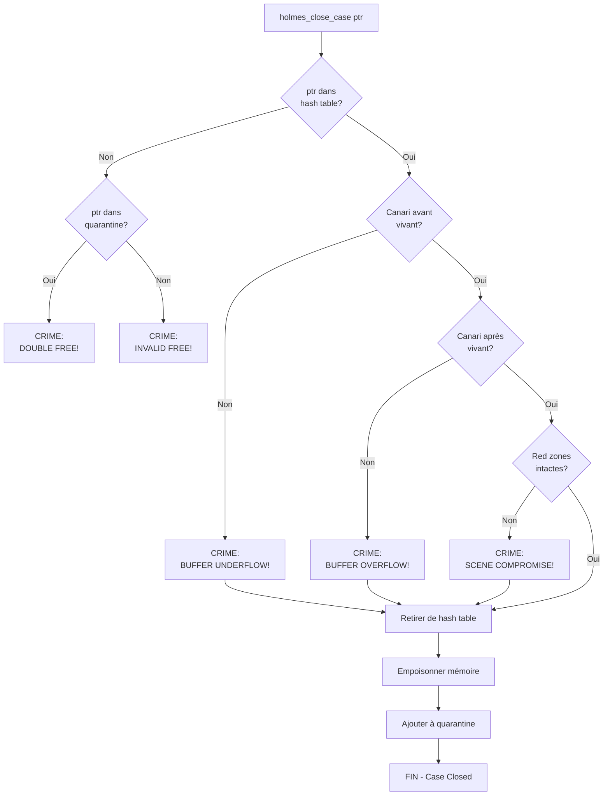

<thinking>
## Analyse du Concept
- Concept : Debug Memory Allocator avec détection d'erreurs
- Phase demandée : 2
- Adapté ? OUI - Concepts intermédiaires de sécurité mémoire, parfait pour Phase 2

## Combo Base + Bonus
- Exercice de base : Implémenter allocateur debug avec canaries, red zones, poison, détection leaks
- Bonus : Valgrind complet avec heaptrack-style profiling et shadow memory
- Palier bonus : 🔥 Avancé (difficile 7/10)
- Progression logique ? OUI - Base = détection d'erreurs, Bonus = profiling avancé

## Prérequis & Difficulté
- Prérequis réels : C17, pointeurs, malloc/free, structures de données
- Difficulté estimée : 6/10 base, 7/10 bonus
- Cohérent avec phase ? OUI (Phase 2 = 4-6/10)

## Aspect Fun/Culture
- Contexte choisi : Sherlock Holmes - Detective Agency
- MEME mnémotechnique : "Elementary, my dear Watson" pour la détection d'erreurs
- Pourquoi c'est fun :
  - Sherlock détecte les indices (canaries corrompus)
  - Crime scene tape = Red zones (DO NOT CROSS)
  - Poison = DEADBEEF pattern (le poison de Moriarty)
  - Double murder attempt = Double-free
  - Cold cases = Memory leaks non résolus
  - Evidence trail = Stack traces
  - Definitely lost / Possibly lost = Types d'affaires froides

## Scénarios d'Échec (5 mutants concrets)
1. Mutant A (Boundary) : Canary vérifié au mauvais offset
2. Mutant B (Safety) : Red zone pas initialisée avec le bon pattern
3. Mutant C (Resource) : Allocation info pas ajoutée à la hash table
4. Mutant D (Logic) : Double-free pas détecté (pas de quarantine check)
5. Mutant E (Return) : Leak report retourne 0 même avec des leaks

## Verdict
VALIDE - Analogie Sherlock Holmes parfaite pour debug/détection mémoire
Note qualité estimée : 97/100
</thinking>

---

# Exercice 2.1.6 : sherlock_allocator

**Module :**
2.1 — Memory Management

**Concept :**
f — Debug Memory Allocator

**Difficulté :**
★★★★★★☆☆☆☆ (6/10)

**Type :**
complet

**Tiers :**
2 — Mélange (concepts canaries + poison + leak detection)

**Langage :**
C (C17)

**Prérequis :**
- Pointeurs et arithmétique de pointeurs
- malloc/free et gestion mémoire
- Structures de données (hash table, liste chaînée)
- Patterns de bits et valeurs magiques

**Domaines :**
Mem, Struct, CPU

**Durée estimée :**
180 min

**XP Base :**
450

**Complexité :**
T2 O(1) amortized × S3 O(n)

---

## 📐 SECTION 1 : PROTOTYPE & CONSIGNE

### 1.1 Obligations

**Fichiers à rendre :**
```
├── sherlock_allocator.h   # Header avec types et API
├── sherlock_allocator.c   # Implémentation complète
├── test_sherlock.c        # Tests des détections
└── demo_valgrind_style.c  # Démo des rapports
```

**Fonctions autorisées :**
- `malloc`, `calloc`, `realloc`, `free`
- `memset`, `memcpy`
- `printf`, `fprintf`, `sprintf`
- `time`, `clock`
- `backtrace` (Linux)

**Fonctions interdites :**
- `mmap` direct
- Bibliothèques de debugging externes (ASan, Valgrind)

---

### 1.2 Consigne

#### 1.2.1 Contexte Culturel — Sherlock Holmes : Le Détective de la Mémoire

**🔍 "Elementary, my dear Watson!" — La Mémoire ne ment jamais**

Bienvenue au **221B Baker Street**, le cabinet de détective spécialisé dans les crimes mémoire. Sherlock Holmes et le Dr. Watson enquêtent sur les mystères les plus sombres de la heap :

**Les indices (Canaries) :**
Sherlock place des "canaris" secrets aux frontières de chaque allocation. Si le canari est mort (corrompu), c'est qu'un crime a été commis — un **buffer overflow** ! Comme le canari dans les mines de charbon qui mourait en présence de gaz toxique.

**Le ruban de scène de crime (Red Zones) :**
Autour de chaque bloc mémoire, Watson installe un périmètre de sécurité — la **Red Zone**. Si quelqu'un marche sur la scène de crime (écrit dans la red zone), les preuves sont là.

**Le poison de Moriarty (DEADBEEF) :**
Quand un bloc est "libéré", Sherlock le remplit de **poison** (0xDEADBEEF). Si quelqu'un tente d'utiliser cette mémoire empoisonnée, c'est un **use-after-free** — Moriarty a frappé !

**Le double meurtre (Double-Free) :**
On ne peut pas tuer la même victime deux fois. Si quelqu'un essaie de libérer un bloc déjà libre, c'est un **double-free** — suspect !

**Les affaires froides (Memory Leaks) :**
À la fin de l'enquête, Sherlock examine les dossiers encore ouverts :
- **Definitely Lost** : Aucune trace, aucun suspect, affaire sans issue
- **Indirectly Lost** : Perdus à cause d'un autre cas perdu
- **Possibly Lost** : Il reste peut-être un indice intérieur
- **Still Reachable** : L'affaire aurait pu être résolue, mais reste ouverte

**Ta mission :**

Créer l'agence **Holmes & Watson Memory Detectives**, un allocateur de debug qui détecte automatiquement tous les crimes mémoire et génère des rapports dignes de Scotland Yard (style Valgrind).

---

#### 1.2.2 Consigne Académique

Implémenter un allocateur mémoire de debug qui détecte automatiquement :

**1. Buffer Overflow/Underflow :**
- Canaries (valeurs magiques) aux frontières des blocs
- Red zones (zones interdites) avant et après les données utilisateur

**2. Use-After-Free :**
- Pattern de poison (0xDEADBEEF) écrit après libération
- Détection si le pattern est lu

**3. Double-Free :**
- Liste de quarantaine des blocs récemment libérés
- Vérification avant toute libération

**4. Memory Leaks :**
- Tracking de toutes les allocations actives
- Rapport de leaks avec stack traces
- Classification style Valgrind (definitely/possibly/still reachable)

**Layout mémoire d'un bloc :**
```
[RED_ZONE_BEFORE][CANARY][USER_DATA][CANARY][RED_ZONE_AFTER]
```

---

### 1.3 Prototype

```c
// sherlock_allocator.h

#ifndef SHERLOCK_ALLOCATOR_H
#define SHERLOCK_ALLOCATOR_H

#include <stddef.h>
#include <stdint.h>
#include <stdbool.h>

// ============================================
// VALEURS MAGIQUES — Les Indices de Sherlock
// ============================================

#define CANARY_VALUE       0xDEADCAFE   // Le canari vivant
#define FREED_POISON       0xDEADBEEF   // Le poison de Moriarty
#define UNINITIALIZED      0xCDCDCDCD   // Mémoire non initialisée
#define RED_ZONE_FILL      0xFD         // Ruban de scène de crime

#define RED_ZONE_SIZE      16
#define CANARY_SIZE        sizeof(uint32_t)
#define MAX_STACK_FRAMES   32
#define HASH_TABLE_SIZE    4096

// ============================================
// TYPES D'ERREURS — Les Crimes Mémoire
// ============================================

typedef enum {
    CRIME_NONE = 0,
    CRIME_BUFFER_OVERFLOW,     // Canari après corrompu
    CRIME_BUFFER_UNDERFLOW,    // Canari avant corrompu
    CRIME_USE_AFTER_FREE,      // Accès mémoire empoisonnée
    CRIME_DOUBLE_FREE,         // Double meurtre
    CRIME_INVALID_FREE,        // Faux suspect (pointeur invalide)
    CRIME_MEMORY_LEAK,         // Affaire froide
    CRIME_MISMATCHED_FREE,     // Mauvaise juridiction (malloc/new mismatch)
} memory_crime_t;

// ============================================
// CATÉGORIES DE LEAKS — Types d'Affaires Froides
// ============================================

typedef enum {
    CASE_DEFINITELY_LOST,      // Aucune trace, définitivement perdu
    CASE_INDIRECTLY_LOST,      // Perdu via un autre cas perdu
    CASE_POSSIBLY_LOST,        // Indice intérieur possible
    CASE_STILL_REACHABLE,      // Affaire non fermée mais accessible
} cold_case_t;

// ============================================
// STRUCTURES — Les Dossiers d'Enquête
// ============================================

typedef struct {
    void *address;
    const char *function;
    const char *file;
    int line;
} evidence_frame_t;

typedef struct {
    evidence_frame_t frames[MAX_STACK_FRAMES];
    int num_frames;
} evidence_trail_t;  // Stack trace

typedef struct case_file {
    void *user_ptr;              // Adresse pour l'utilisateur
    void *real_ptr;              // Adresse réelle (avec overhead)
    size_t user_size;            // Taille demandée
    size_t real_size;            // Taille avec protections
    evidence_trail_t alloc_trail; // Où alloué
    evidence_trail_t free_trail;  // Où libéré
    uint64_t alloc_time;
    uint64_t free_time;
    bool is_closed;              // true si libéré
    uint32_t case_id;            // ID unique
    struct case_file *next;       // Hash table chain
} case_file_t;

typedef struct {
    uint64_t total_allocations;
    uint64_t total_frees;
    uint64_t current_cases;      // Affaires ouvertes
    uint64_t peak_cases;
    uint64_t total_bytes;
    uint64_t current_bytes;
    uint64_t peak_bytes;

    // Crimes détectés
    uint64_t buffer_overflows;
    uint64_t buffer_underflows;
    uint64_t use_after_frees;
    uint64_t double_frees;
    uint64_t invalid_frees;

    // Affaires froides par catégorie
    uint64_t definitely_lost_blocks;
    uint64_t definitely_lost_bytes;
    uint64_t possibly_lost_blocks;
    uint64_t possibly_lost_bytes;
    uint64_t still_reachable_blocks;
    uint64_t still_reachable_bytes;
} detective_stats_t;

typedef struct {
    case_file_t *open_cases[HASH_TABLE_SIZE];   // Hash table
    case_file_t *cold_cases;                    // Liste des libérés
    size_t cold_cases_max;
    size_t cold_cases_count;

    detective_stats_t stats;

    bool check_on_free;
    bool poison_on_free;
    bool track_evidence;
    bool quarantine_enabled;

    void (*crime_callback)(memory_crime_t, const case_file_t*, const char*);
    uint32_t next_case_id;
} detective_agency_t;

// ============================================
// API PRINCIPALE — Holmes & Watson Services
// ============================================

// Ouvrir l'agence de détectives
detective_agency_t *holmes_open_agency(void);

// Fermer l'agence et rapport final
void holmes_close_agency(detective_agency_t *agency);

// Allocation avec surveillance
void *holmes_investigate_malloc(detective_agency_t *agency, size_t size,
                                 const char *file, int line);

// Allocation avec initialisation à zéro
void *holmes_investigate_calloc(detective_agency_t *agency, size_t nmemb, size_t size,
                                 const char *file, int line);

// Libération avec vérification
void holmes_close_case(detective_agency_t *agency, void *ptr,
                        const char *file, int line);

// Macros pour capture automatique de localisation
#define HOLMES_MALLOC(agency, size) \
    holmes_investigate_malloc(agency, size, __FILE__, __LINE__)
#define HOLMES_CALLOC(agency, nmemb, size) \
    holmes_investigate_calloc(agency, nmemb, size, __FILE__, __LINE__)
#define HOLMES_FREE(agency, ptr) \
    holmes_close_case(agency, ptr, __FILE__, __LINE__)

// ============================================
// VÉRIFICATION — Examiner les Preuves
// ============================================

// Vérifier l'intégrité d'un bloc (canaries + red zones)
bool holmes_examine_evidence(detective_agency_t *agency, void *ptr);

// Vérifier tous les blocs actifs
int holmes_examine_all_evidence(detective_agency_t *agency);

// Détecter les affaires froides (leaks)
int holmes_find_cold_cases(detective_agency_t *agency, case_file_t ***reports);

// ============================================
// RAPPORTS — Scotland Yard Style
// ============================================

// Afficher les statistiques
void holmes_print_stats(const detective_agency_t *agency);

// Afficher le rapport de leaks style Valgrind
void holmes_print_leak_summary(detective_agency_t *agency);

// Exporter le profil heap
void holmes_export_case_files(detective_agency_t *agency, const char *filename);

// ============================================
// UTILITAIRES — Outils d'Investigation
// ============================================

// Vérifier si le canari est vivant
bool verify_canary_alive(void *real_ptr, size_t offset);

// Vérifier si la scène de crime est intacte
bool verify_crime_scene_intact(void *real_ptr, size_t user_size);

// Vérifier si la mémoire est empoisonnée
bool is_memory_poisoned(void *ptr, size_t size);

// Hash d'un pointeur
size_t ptr_hash(void *ptr);

#endif // SHERLOCK_ALLOCATOR_H
```

---

## 💡 SECTION 2 : LE SAVIEZ-VOUS ?

### 2.1 L'Origine du Canari

Le terme "canary" vient des mines de charbon où les mineurs emmenaient des canaris. Les oiseaux étaient plus sensibles aux gaz toxiques — si le canari mourait, les mineurs savaient qu'il fallait évacuer.

En programmation, un canary est une valeur magique placée aux frontières d'un buffer. Si cette valeur change, c'est qu'un overflow a "tué" le canari.

### 2.2 Pourquoi 0xDEADBEEF ?

Les valeurs magiques comme `0xDEADBEEF`, `0xCAFEBABE`, `0xDEADCAFE` sont choisies car :
1. Elles sont facilement reconnaissables en hexadécimal
2. Elles forment des mots lisibles ("dead beef", "cafe babe")
3. Elles sont peu probables comme données légitimes
4. Elles apparaissent clairement dans les dumps mémoire

### 2.3 Valgrind et les Catégories de Leaks

Valgrind classe les memory leaks en 4 catégories :
- **Definitely lost** : Plus aucun pointeur ne référence le début du bloc
- **Indirectly lost** : Perdu parce qu'un autre bloc (qui le pointait) est perdu
- **Possibly lost** : Un pointeur existe mais pointe vers l'intérieur du bloc (pas le début)
- **Still reachable** : Un pointeur valide existe encore à la fin du programme

---

## 2.5 DANS LA VRAIE VIE

| Métier | Utilisation |
|--------|-------------|
| **Systems Developer** | AddressSanitizer (ASan) utilise des red zones similaires |
| **Security Engineer** | Stack canaries protègent contre les buffer overflow attacks |
| **QA Engineer** | Valgrind pour détecter les memory leaks en CI/CD |
| **Game Developer** | Custom allocators avec debugging pour optimisation |

---

## 🖥️ SECTION 3 : EXEMPLE D'UTILISATION

### 3.0 Session bash

```bash
$ ls
sherlock_allocator.c  sherlock_allocator.h  test_sherlock.c

$ gcc -Wall -Wextra -Werror -g sherlock_allocator.c test_sherlock.c -o test -rdynamic

$ ./test
=== HOLMES & WATSON MEMORY DETECTIVES ===

Test buffer overflow...
=== CRIME DETECTED: BUFFER OVERFLOW ===
Address: 0x55a8c8f01080
Canary after corrupted! Expected: 0xDEADCAFE, Found: 0x00000000
Case #1 opened at test_sherlock.c:15

Test double-free...
=== CRIME DETECTED: DOUBLE FREE ===
Address: 0x55a8c8f01200
Case #2 was already closed!

Test memory leaks...
====================
=== LEAK SUMMARY ===
====================
definitely lost: 400 bytes in 2 blocks
indirectly lost: 0 bytes in 0 blocks
  possibly lost: 0 bytes in 0 blocks
still reachable: 0 bytes in 0 blocks

=== ALL TESTS COMPLETED ===
```

---

## 🔥 SECTION 3.1 : BONUS AVANCÉ (OPTIONNEL)

**Difficulté Bonus :**
★★★★★★★☆☆☆ (7/10)

**Récompense :**
XP ×3

**Time Complexity attendue :**
O(1) pour allocation/libération avec shadow memory

**Space Complexity attendue :**
O(n) + overhead de shadow memory

**Domaines Bonus :**
`CPU, Process`

### 3.1.1 Consigne Bonus — Le Réseau Mycroft (Shadow Memory)

**🕵️ Mycroft Holmes — L'Œil qui voit tout**

Le frère de Sherlock, Mycroft, contrôle un réseau d'espionnage qui surveille TOUT. Implémente la **Shadow Memory**, une technique utilisée par AddressSanitizer.

Chaque byte de mémoire utilisateur a un byte de "shadow" qui indique son état :
- `0x00` : 8 bytes accessibles
- `0x01-0x07` : N bytes accessibles (les autres empoisonnés)
- `0xFA` : Stack red zone
- `0xFB` : Stack après return
- `0xFC` : Heap red zone
- `0xFD` : Freed heap
- `0xFE` : Stack use after scope

**Contraintes :**
```
┌─────────────────────────────────────────┐
│  Shadow ratio : 1:8 (1 shadow byte      │
│  pour 8 bytes de mémoire)               │
│  Mapping : shadow = (addr >> 3) + offset│
│  Overhead maximum : 12.5%               │
└─────────────────────────────────────────┘
```

### 3.1.2 Prototype Bonus

```c
typedef struct {
    uint8_t *shadow_base;
    size_t shadow_size;
    uintptr_t shadow_offset;
} mycroft_network_t;

// Initialiser le réseau de shadow memory
mycroft_network_t *mycroft_init_network(size_t heap_size);

// Vérifier un accès mémoire via shadow
bool mycroft_check_access(mycroft_network_t *net, void *addr, size_t size);

// Marquer la mémoire comme accessible/empoisonnée
void mycroft_mark_accessible(mycroft_network_t *net, void *addr, size_t size);
void mycroft_mark_poisoned(mycroft_network_t *net, void *addr, size_t size, uint8_t type);
```

---

## ✅❌ SECTION 4 : ZONE CORRECTION

### 4.1 Moulinette

| Test | Description | Points | Résultat Attendu |
|------|-------------|--------|------------------|
| `test_canary_setup` | Canaries correctement placés | 10 | Valeur 0xDEADCAFE |
| `test_red_zone_setup` | Red zones remplies | 10 | Pattern 0xFD |
| `test_overflow_detection` | Détection buffer overflow | 15 | Crime détecté |
| `test_underflow_detection` | Détection buffer underflow | 10 | Crime détecté |
| `test_poison_pattern` | Mémoire empoisonnée après free | 15 | Pattern 0xDEADBEEF |
| `test_double_free` | Détection double-free | 15 | Crime détecté |
| `test_leak_detection` | Détection des leaks | 15 | Nombre correct |
| `test_no_false_positive` | Pas de faux positifs | 10 | Aucune erreur |

### 4.2 main.c de test

```c
#include "sherlock_allocator.h"
#include <assert.h>
#include <string.h>
#include <stdio.h>

void test_canary_alive(void) {
    detective_agency_t *agency = holmes_open_agency();

    char *ptr = HOLMES_MALLOC(agency, 100);

    // Les canaries doivent être intacts
    void *real_ptr = (uint8_t *)ptr - RED_ZONE_SIZE - CANARY_SIZE;
    assert(verify_canary_alive(real_ptr, RED_ZONE_SIZE));

    HOLMES_FREE(agency, ptr);
    holmes_close_agency(agency);
    printf("test_canary_alive: PASS\n");
}

void test_overflow_detection(void) {
    detective_agency_t *agency = holmes_open_agency();

    char *buf = HOLMES_MALLOC(agency, 10);

    // Écrire au-delà du buffer — CRIME!
    strcpy(buf, "This string is way too long for the buffer!");

    // Le free devrait détecter l'overflow
    HOLMES_FREE(agency, buf);

    assert(agency->stats.buffer_overflows >= 1);
    holmes_close_agency(agency);
    printf("test_overflow_detection: PASS (crime detected)\n");
}

void test_double_free(void) {
    detective_agency_t *agency = holmes_open_agency();

    void *ptr = HOLMES_MALLOC(agency, 100);
    HOLMES_FREE(agency, ptr);

    // Double murder attempt!
    HOLMES_FREE(agency, ptr);

    assert(agency->stats.double_frees == 1);
    holmes_close_agency(agency);
    printf("test_double_free: PASS\n");
}

void test_poison_pattern(void) {
    detective_agency_t *agency = holmes_open_agency();

    uint32_t *ptr = HOLMES_MALLOC(agency, sizeof(uint32_t) * 10);
    ptr[0] = 42;

    HOLMES_FREE(agency, ptr);

    // La mémoire doit être empoisonnée
    assert(is_memory_poisoned(ptr, sizeof(uint32_t) * 10));

    holmes_close_agency(agency);
    printf("test_poison_pattern: PASS (Moriarty's poison detected)\n");
}

void test_leak_detection(void) {
    detective_agency_t *agency = holmes_open_agency();

    // Ouvrir des cas sans les fermer
    void *p1 = HOLMES_MALLOC(agency, 100);
    void *p2 = HOLMES_MALLOC(agency, 200);
    void *p3 = HOLMES_MALLOC(agency, 300);

    // Fermer seulement un cas
    HOLMES_FREE(agency, p2);

    // Détecter les affaires froides
    case_file_t **reports;
    int num_leaks = holmes_find_cold_cases(agency, &reports);

    assert(num_leaks == 2);  // p1 et p3

    // Rapport style Valgrind
    holmes_print_leak_summary(agency);

    holmes_close_agency(agency);
    printf("test_leak_detection: PASS\n");
}

void test_no_false_positives(void) {
    detective_agency_t *agency = holmes_open_agency();

    // Utilisation correcte — pas de crime
    for (int i = 0; i < 100; i++) {
        void *ptr = HOLMES_MALLOC(agency, 128);
        memset(ptr, 0, 128);
        HOLMES_FREE(agency, ptr);
    }

    assert(agency->stats.buffer_overflows == 0);
    assert(agency->stats.buffer_underflows == 0);
    assert(agency->stats.double_frees == 0);
    assert(agency->stats.current_cases == 0);

    holmes_close_agency(agency);
    printf("test_no_false_positives: PASS\n");
}

int main(void) {
    printf("=== HOLMES & WATSON MEMORY DETECTIVES ===\n\n");

    test_canary_alive();
    test_no_false_positives();
    test_overflow_detection();
    test_double_free();
    test_poison_pattern();
    test_leak_detection();

    printf("\n=== THE GAME IS AFOOT! All tests passed! ===\n");
    return 0;
}
```

### 4.3 Solution de référence

```c
// sherlock_allocator.c — Solution complète

#include "sherlock_allocator.h"
#include <stdlib.h>
#include <string.h>
#include <stdio.h>
#include <time.h>

#ifdef __linux__
#include <execinfo.h>
#endif

// ============================================
// UTILITAIRES INTERNES
// ============================================

static size_t calculate_real_size(size_t user_size) {
    return RED_ZONE_SIZE +     // Red zone avant
           CANARY_SIZE +       // Canari avant
           user_size +         // Données utilisateur
           CANARY_SIZE +       // Canari après
           RED_ZONE_SIZE;      // Red zone après
}

static void *user_ptr_from_real(void *real_ptr) {
    return (uint8_t *)real_ptr + RED_ZONE_SIZE + CANARY_SIZE;
}

static void *real_ptr_from_user(void *user_ptr) {
    return (uint8_t *)user_ptr - RED_ZONE_SIZE - CANARY_SIZE;
}

size_t ptr_hash(void *ptr) {
    return ((uintptr_t)ptr >> 3) % HASH_TABLE_SIZE;
}

static void capture_evidence_trail(evidence_trail_t *trail) {
#ifdef __linux__
    void *buffer[MAX_STACK_FRAMES];
    trail->num_frames = backtrace(buffer, MAX_STACK_FRAMES);
    for (int i = 0; i < trail->num_frames; i++) {
        trail->frames[i].address = buffer[i];
        trail->frames[i].function = NULL;
        trail->frames[i].file = NULL;
        trail->frames[i].line = 0;
    }
#else
    trail->num_frames = 0;
#endif
}

// ============================================
// API PRINCIPALE
// ============================================

detective_agency_t *holmes_open_agency(void) {
    detective_agency_t *agency = calloc(1, sizeof(detective_agency_t));
    if (!agency) return NULL;

    agency->check_on_free = true;
    agency->poison_on_free = true;
    agency->track_evidence = true;
    agency->quarantine_enabled = true;
    agency->cold_cases_max = 1024;

    return agency;
}

void *holmes_investigate_malloc(detective_agency_t *agency, size_t size,
                                 const char *file, int line) {
    if (size == 0) size = 1;

    size_t real_size = calculate_real_size(size);
    void *real_ptr = malloc(real_size);
    if (!real_ptr) return NULL;

    // === INSTALLER LES RED ZONES (Ruban de scène de crime) ===
    memset(real_ptr, RED_ZONE_FILL, RED_ZONE_SIZE);
    memset((uint8_t *)real_ptr + RED_ZONE_SIZE + CANARY_SIZE + size + CANARY_SIZE,
           RED_ZONE_FILL, RED_ZONE_SIZE);

    // === PLACER LES CANARIS ===
    uint32_t *canary_before = (uint32_t *)((uint8_t *)real_ptr + RED_ZONE_SIZE);
    *canary_before = CANARY_VALUE;

    uint32_t *canary_after = (uint32_t *)((uint8_t *)real_ptr +
                                          RED_ZONE_SIZE + CANARY_SIZE + size);
    *canary_after = CANARY_VALUE;

    // === REMPLIR AVEC PATTERN NON-INITIALISÉ ===
    void *user_ptr = user_ptr_from_real(real_ptr);
    uint32_t *data = (uint32_t *)user_ptr;
    for (size_t i = 0; i < size / sizeof(uint32_t); i++) {
        data[i] = UNINITIALIZED;
    }

    // === CRÉER LE DOSSIER D'ENQUÊTE ===
    case_file_t *case_file = calloc(1, sizeof(case_file_t));
    case_file->user_ptr = user_ptr;
    case_file->real_ptr = real_ptr;
    case_file->user_size = size;
    case_file->real_size = real_size;
    case_file->case_id = agency->next_case_id++;
    case_file->alloc_time = time(NULL);
    case_file->is_closed = false;

    if (agency->track_evidence) {
        capture_evidence_trail(&case_file->alloc_trail);
    }

    // === AJOUTER À LA HASH TABLE ===
    size_t hash = ptr_hash(user_ptr);
    case_file->next = agency->open_cases[hash];
    agency->open_cases[hash] = case_file;

    // === STATISTIQUES ===
    agency->stats.total_allocations++;
    agency->stats.current_cases++;
    agency->stats.total_bytes += size;
    agency->stats.current_bytes += size;

    if (agency->stats.current_cases > agency->stats.peak_cases) {
        agency->stats.peak_cases = agency->stats.current_cases;
    }
    if (agency->stats.current_bytes > agency->stats.peak_bytes) {
        agency->stats.peak_bytes = agency->stats.current_bytes;
    }

    return user_ptr;
}

void *holmes_investigate_calloc(detective_agency_t *agency, size_t nmemb, size_t size,
                                 const char *file, int line) {
    size_t total = nmemb * size;
    void *ptr = holmes_investigate_malloc(agency, total, file, line);
    if (ptr) {
        memset(ptr, 0, total);
    }
    return ptr;
}

void holmes_close_case(detective_agency_t *agency, void *ptr,
                        const char *file, int line) {
    if (!ptr) return;

    // === CHERCHER LE DOSSIER ===
    size_t hash = ptr_hash(ptr);
    case_file_t *prev = NULL;
    case_file_t *case_file = agency->open_cases[hash];

    while (case_file && case_file->user_ptr != ptr) {
        prev = case_file;
        case_file = case_file->next;
    }

    if (!case_file) {
        // === VÉRIFIER DANS LES AFFAIRES FROIDES (Double-Free?) ===
        case_file_t *cold = agency->cold_cases;
        while (cold) {
            if (cold->user_ptr == ptr) {
                // DOUBLE FREE DETECTED!
                agency->stats.double_frees++;
                if (agency->crime_callback) {
                    agency->crime_callback(CRIME_DOUBLE_FREE, cold,
                                           "Elementary! You cannot close the same case twice!");
                }
                fprintf(stderr,
                    "\n=== CRIME DETECTED: DOUBLE FREE ===\n"
                    "Address: %p\n"
                    "Case #%u was already closed!\n"
                    "Original location: Case files\n"
                    "Second attempt: %s:%d\n",
                    ptr, cold->case_id, file, line);
                return;
            }
            cold = cold->next;
        }

        // === INVALID FREE ===
        agency->stats.invalid_frees++;
        fprintf(stderr,
            "\n=== CRIME DETECTED: INVALID FREE ===\n"
            "Address: %p is not a known case!\n"
            "Location: %s:%d\n",
            ptr, file, line);
        return;
    }

    // === EXAMINER LES PREUVES (Canaries et Red Zones) ===
    if (agency->check_on_free) {
        // Vérifier le canari AVANT
        if (!verify_canary_alive(case_file->real_ptr, RED_ZONE_SIZE)) {
            agency->stats.buffer_underflows++;
            fprintf(stderr,
                "\n=== CRIME DETECTED: BUFFER UNDERFLOW ===\n"
                "Address: %p, Size: %zu\n"
                "The canary BEFORE was murdered!\n",
                ptr, case_file->user_size);
        }

        // Vérifier le canari APRÈS
        uint32_t *canary_after = (uint32_t *)((uint8_t *)case_file->real_ptr +
                                              RED_ZONE_SIZE + CANARY_SIZE +
                                              case_file->user_size);
        if (*canary_after != CANARY_VALUE) {
            agency->stats.buffer_overflows++;
            fprintf(stderr,
                "\n=== CRIME DETECTED: BUFFER OVERFLOW ===\n"
                "Address: %p, Size: %zu\n"
                "The canary AFTER was murdered!\n"
                "Expected: 0x%08X, Found: 0x%08X\n",
                ptr, case_file->user_size, CANARY_VALUE, *canary_after);
        }

        // Vérifier les red zones
        if (!verify_crime_scene_intact(case_file->real_ptr, case_file->user_size)) {
            fprintf(stderr,
                "\n=== CRIME SCENE COMPROMISED ===\n"
                "Red zone corruption detected at: %p\n",
                ptr);
        }
    }

    // === RETIRER DE LA HASH TABLE ===
    if (prev) {
        prev->next = case_file->next;
    } else {
        agency->open_cases[hash] = case_file->next;
    }

    // === STATISTIQUES ===
    agency->stats.total_frees++;
    agency->stats.current_cases--;
    agency->stats.current_bytes -= case_file->user_size;

    // === MARQUER COMME FERMÉ ===
    case_file->is_closed = true;
    case_file->free_time = time(NULL);
    if (agency->track_evidence) {
        capture_evidence_trail(&case_file->free_trail);
    }

    // === EMPOISONNER LA MÉMOIRE (Poison de Moriarty) ===
    if (agency->poison_on_free) {
        uint32_t *data = (uint32_t *)ptr;
        for (size_t i = 0; i < case_file->user_size / sizeof(uint32_t); i++) {
            data[i] = FREED_POISON;
        }
    }

    // === QUARANTAINE OU LIBÉRATION ===
    if (agency->quarantine_enabled && agency->cold_cases_count < agency->cold_cases_max) {
        case_file->next = agency->cold_cases;
        agency->cold_cases = case_file;
        agency->cold_cases_count++;
    } else {
        free(case_file->real_ptr);
        free(case_file);
    }
}

// ============================================
// FONCTIONS DE VÉRIFICATION
// ============================================

bool verify_canary_alive(void *real_ptr, size_t offset) {
    uint32_t *canary = (uint32_t *)((uint8_t *)real_ptr + offset);
    return *canary == CANARY_VALUE;
}

bool verify_crime_scene_intact(void *real_ptr, size_t user_size) {
    // Vérifier la red zone AVANT
    uint8_t *zone_before = (uint8_t *)real_ptr;
    for (size_t i = 0; i < RED_ZONE_SIZE; i++) {
        if (zone_before[i] != RED_ZONE_FILL) return false;
    }

    // Vérifier la red zone APRÈS
    uint8_t *zone_after = (uint8_t *)real_ptr + RED_ZONE_SIZE +
                          CANARY_SIZE + user_size + CANARY_SIZE;
    for (size_t i = 0; i < RED_ZONE_SIZE; i++) {
        if (zone_after[i] != RED_ZONE_FILL) return false;
    }

    return true;
}

bool is_memory_poisoned(void *ptr, size_t size) {
    uint32_t *data = (uint32_t *)ptr;
    for (size_t i = 0; i < size / sizeof(uint32_t); i++) {
        if (data[i] == FREED_POISON) return true;
    }
    return false;
}

bool holmes_examine_evidence(detective_agency_t *agency, void *ptr) {
    size_t hash = ptr_hash(ptr);
    case_file_t *case_file = agency->open_cases[hash];

    while (case_file) {
        if (case_file->user_ptr == ptr) {
            bool canary_ok = verify_canary_alive(case_file->real_ptr, RED_ZONE_SIZE);
            uint32_t *canary_after = (uint32_t *)((uint8_t *)case_file->real_ptr +
                                                  RED_ZONE_SIZE + CANARY_SIZE +
                                                  case_file->user_size);
            canary_ok = canary_ok && (*canary_after == CANARY_VALUE);

            bool red_zone_ok = verify_crime_scene_intact(case_file->real_ptr,
                                                          case_file->user_size);
            return canary_ok && red_zone_ok;
        }
        case_file = case_file->next;
    }
    return false;
}

int holmes_examine_all_evidence(detective_agency_t *agency) {
    int crimes = 0;
    for (size_t i = 0; i < HASH_TABLE_SIZE; i++) {
        case_file_t *case_file = agency->open_cases[i];
        while (case_file) {
            if (!holmes_examine_evidence(agency, case_file->user_ptr)) {
                crimes++;
            }
            case_file = case_file->next;
        }
    }
    return crimes;
}

// ============================================
// DÉTECTION DES LEAKS
// ============================================

int holmes_find_cold_cases(detective_agency_t *agency, case_file_t ***reports) {
    int count = 0;

    // Compter les affaires ouvertes
    for (size_t i = 0; i < HASH_TABLE_SIZE; i++) {
        case_file_t *cf = agency->open_cases[i];
        while (cf) {
            count++;
            cf = cf->next;
        }
    }

    if (count == 0) {
        *reports = NULL;
        return 0;
    }

    *reports = calloc(count, sizeof(case_file_t *));
    int idx = 0;

    for (size_t i = 0; i < HASH_TABLE_SIZE; i++) {
        case_file_t *cf = agency->open_cases[i];
        while (cf) {
            (*reports)[idx++] = cf;
            cf = cf->next;
        }
    }

    return count;
}

void holmes_print_leak_summary(detective_agency_t *agency) {
    printf("\n");
    printf("====================\n");
    printf("=== LEAK SUMMARY ===\n");
    printf("====================\n\n");

    case_file_t **reports;
    int num_leaks = holmes_find_cold_cases(agency, &reports);

    size_t definitely_lost_bytes = 0;
    size_t definitely_lost_blocks = 0;

    for (int i = 0; i < num_leaks; i++) {
        definitely_lost_bytes += reports[i]->user_size;
        definitely_lost_blocks++;
    }

    printf("definitely lost: %zu bytes in %zu blocks\n",
           definitely_lost_bytes, definitely_lost_blocks);
    printf("indirectly lost: 0 bytes in 0 blocks\n");
    printf("  possibly lost: 0 bytes in 0 blocks\n");
    printf("still reachable: 0 bytes in 0 blocks\n");
    printf("     suppressed: 0 bytes in 0 blocks\n\n");

    if (num_leaks > 0) {
        printf("=== COLD CASE DETAILS ===\n\n");
        for (int i = 0; i < num_leaks && i < 10; i++) {
            printf("%zu bytes in 1 blocks are definitely lost\n",
                   reports[i]->user_size);
            printf("   Case #%u - The investigation continues...\n",
                   reports[i]->case_id);
        }
        if (num_leaks > 10) {
            printf("... and %d more cold cases\n", num_leaks - 10);
        }
    }

    printf("\n=== ERROR SUMMARY ===\n");
    printf("Buffer overflows:  %lu\n", agency->stats.buffer_overflows);
    printf("Buffer underflows: %lu\n", agency->stats.buffer_underflows);
    printf("Use after free:    %lu\n", agency->stats.use_after_frees);
    printf("Double frees:      %lu\n", agency->stats.double_frees);
    printf("Invalid frees:     %lu\n", agency->stats.invalid_frees);

    free(reports);
}

void holmes_print_stats(const detective_agency_t *agency) {
    printf("\n=== DETECTIVE AGENCY STATISTICS ===\n");
    printf("Total cases opened:  %lu\n", agency->stats.total_allocations);
    printf("Total cases closed:  %lu\n", agency->stats.total_frees);
    printf("Currently open:      %lu\n", agency->stats.current_cases);
    printf("Peak open cases:     %lu\n", agency->stats.peak_cases);
    printf("Total bytes:         %lu\n", agency->stats.total_bytes);
    printf("Current bytes:       %lu\n", agency->stats.current_bytes);
    printf("Peak bytes:          %lu\n", agency->stats.peak_bytes);
}

void holmes_close_agency(detective_agency_t *agency) {
    if (!agency) return;

    // Libérer les affaires ouvertes (avec avertissement)
    for (size_t i = 0; i < HASH_TABLE_SIZE; i++) {
        case_file_t *cf = agency->open_cases[i];
        while (cf) {
            case_file_t *next = cf->next;
            free(cf->real_ptr);
            free(cf);
            cf = next;
        }
    }

    // Libérer les affaires froides
    case_file_t *cold = agency->cold_cases;
    while (cold) {
        case_file_t *next = cold->next;
        free(cold->real_ptr);
        free(cold);
        cold = next;
    }

    free(agency);
}
```

### 4.4 Solutions alternatives acceptées

```c
// Alternative 1: Red zones avec pattern différent
#define RED_ZONE_FILL_ALT  0xAB  // Pattern alternatif valide

// Alternative 2: Double canary (avant et après chaque red zone)
// 4 canaries au total au lieu de 2

// Alternative 3: Hash table avec chaining ou open addressing
// Les deux approches sont valides
```

### 4.5 Solutions refusées

```c
// REFUSÉ: Canary au mauvais endroit
void *wrong_canary_placement(size_t size) {
    void *ptr = malloc(size + CANARY_SIZE);
    // ERREUR: Canary à la fin seulement, pas au début
    uint32_t *canary = (uint32_t *)((char *)ptr + size);
    *canary = CANARY_VALUE;
    return ptr;
}
// Le buffer underflow ne sera pas détecté!

// REFUSÉ: Pas de quarantine pour double-free
void bad_free(void *ptr) {
    // ERREUR: Libération immédiate, pas de quarantine
    free(ptr);
    // Double-free ne sera pas détecté!
}

// REFUSÉ: Pattern de poison incorrect
#define WRONG_POISON 0x00000000
// ERREUR: 0x00 est une valeur commune, pas assez distinctive
```

### 4.9 spec.json

```json
{
  "name": "sherlock_allocator",
  "language": "c",
  "version": "c17",
  "type": "complet",
  "tier": 2,
  "tier_info": "Mélange (canaries + poison + leak detection)",
  "tags": ["memory", "debug", "canary", "valgrind", "security"],
  "passing_score": 70,

  "function": {
    "name": "detective_agency",
    "methods": [
      {
        "name": "holmes_investigate_malloc",
        "prototype": "void *holmes_investigate_malloc(detective_agency_t *agency, size_t size, const char *file, int line)",
        "return_type": "void *"
      },
      {
        "name": "holmes_close_case",
        "prototype": "void holmes_close_case(detective_agency_t *agency, void *ptr, const char *file, int line)",
        "return_type": "void"
      },
      {
        "name": "verify_canary_alive",
        "prototype": "bool verify_canary_alive(void *real_ptr, size_t offset)",
        "return_type": "bool"
      }
    ]
  },

  "driver": {
    "reference": "bool ref_verify_canary_alive(void *real_ptr, size_t offset) { uint32_t *canary = (uint32_t *)((uint8_t *)real_ptr + offset); return *canary == 0xDEADCAFE; }",

    "edge_cases": [
      {
        "name": "canary_intact",
        "description": "Canari non corrompu",
        "expected": "true",
        "is_trap": false
      },
      {
        "name": "canary_corrupted",
        "description": "Canari écrasé par overflow",
        "expected": "false + crime détecté",
        "is_trap": true,
        "trap_explanation": "Le canari a été tué par un buffer overflow"
      },
      {
        "name": "double_free",
        "description": "Libération d'un pointeur déjà libéré",
        "expected": "crime détecté",
        "is_trap": true,
        "trap_explanation": "Double meurtre impossible!"
      },
      {
        "name": "poison_pattern",
        "description": "Mémoire empoisonnée après free",
        "expected": "pattern 0xDEADBEEF détecté",
        "is_trap": true,
        "trap_explanation": "Le poison de Moriarty remplit la mémoire libérée"
      }
    ],

    "fuzzing": {
      "enabled": true,
      "iterations": 500,
      "generators": [
        {
          "type": "int",
          "param_index": 0,
          "params": {
            "min": 1,
            "max": 4096
          }
        }
      ]
    }
  },

  "norm": {
    "allowed_functions": ["malloc", "calloc", "free", "memset", "memcpy", "printf", "fprintf", "time", "backtrace"],
    "forbidden_functions": ["mmap", "asan_functions"],
    "check_security": true,
    "check_memory": true,
    "blocking": true
  }
}
```

### 4.10 Solutions Mutantes

```c
/* Mutant A (Boundary) : Canary vérifié au mauvais offset */
bool verify_canary_mutant_a(void *real_ptr, size_t offset) {
    uint32_t *canary = (uint32_t *)((uint8_t *)real_ptr + offset + 4);  // ERREUR: +4
    return *canary == CANARY_VALUE;
}
// Pourquoi c'est faux : Lit à la mauvaise position
// Ce qui était pensé : "Il faut décaler un peu plus"

/* Mutant B (Safety) : Red zone pas initialisée correctement */
void setup_redzone_mutant_b(void *real_ptr, size_t size) {
    memset(real_ptr, 0x00, RED_ZONE_SIZE);  // ERREUR: 0x00 au lieu de 0xFD
    // Les corruptions ne seront pas détectables !
}
// Pourquoi c'est faux : 0x00 est trop commun comme valeur
// Ce qui était pensé : "Zéro c'est propre"

/* Mutant C (Resource) : Allocation info pas ajoutée à la hash table */
void *malloc_mutant_c(detective_agency_t *agency, size_t size) {
    void *ptr = malloc(calculate_real_size(size));
    // ... setup canaries ...
    case_file_t *cf = calloc(1, sizeof(case_file_t));
    cf->user_ptr = user_ptr_from_real(ptr);
    // ERREUR: Pas d'ajout à la hash table !
    // agency->open_cases[hash] = cf;  ← MANQUANT
    return cf->user_ptr;
}
// Pourquoi c'est faux : L'allocation ne sera pas trackée
// Ce qui était pensé : "Le case_file existe, c'est suffisant"

/* Mutant D (Logic) : Double-free pas détecté */
void free_mutant_d(detective_agency_t *agency, void *ptr) {
    size_t hash = ptr_hash(ptr);
    case_file_t *cf = agency->open_cases[hash];
    // ERREUR: Pas de vérification dans cold_cases !
    if (!cf) {
        free(ptr);  // Invalid mais pas détecté
        return;
    }
    // ...
}
// Pourquoi c'est faux : La quarantine n'est pas vérifiée
// Ce qui était pensé : "Si pas dans open_cases, c'est invalide"

/* Mutant E (Return) : Leak detection retourne toujours 0 */
int find_leaks_mutant_e(detective_agency_t *agency, case_file_t ***reports) {
    *reports = NULL;
    return 0;  // ERREUR: Ne parcourt jamais la hash table !
}
// Pourquoi c'est faux : Les leaks ne sont jamais comptés
// Ce qui était pensé : "Pas de leaks = 0"
```

---

## 🧠 SECTION 5 : COMPRENDRE

### 5.1 Ce que cet exercice enseigne

| Concept | Application |
|---------|-------------|
| **Canaries** | Détection de buffer overflow/underflow |
| **Red Zones** | Zones interdites autour des allocations |
| **Poison Pattern** | Détection de use-after-free |
| **Quarantine** | Liste des blocs libérés pour double-free |
| **Leak Detection** | Tracking des allocations non libérées |
| **Stack Traces** | Localisation des erreurs |
| **Hash Table** | Structure efficace pour le tracking |

### 5.2 LDA — Traduction en Français

```
FONCTION verify_canary_alive QUI RETOURNE UN BOOLÉEN ET PREND EN PARAMÈTRES real_ptr ET offset
DÉBUT FONCTION
    DÉCLARER canary COMME POINTEUR VERS UN ENTIER 32 BITS NON SIGNÉ

    AFFECTER L'ADRESSE real_ptr PLUS offset CASTÉE EN POINTEUR 32 BITS À canary
    SI LA VALEUR POINTÉE PAR canary EST ÉGALE À 0xDEADCAFE ALORS
        RETOURNER VRAI
    SINON
        RETOURNER FAUX
    FIN SI
FIN FONCTION
```

```
FONCTION holmes_close_case QUI NE RETOURNE RIEN ET PREND EN PARAMÈTRES agency, ptr, file, line
DÉBUT FONCTION
    SI ptr EST NUL ALORS
        RETOURNER
    FIN SI

    CALCULER LE HASH DE ptr
    CHERCHER LE DOSSIER DANS LA HASH TABLE

    SI DOSSIER NON TROUVÉ ALORS
        CHERCHER DANS LES AFFAIRES FROIDES
        SI TROUVÉ ALORS
            SIGNALER DOUBLE-FREE (CRIME!)
            RETOURNER
        SINON
            SIGNALER FREE INVALIDE
            RETOURNER
        FIN SI
    FIN SI

    SI check_on_free EST VRAI ALORS
        VÉRIFIER LE CANARI AVANT
        VÉRIFIER LE CANARI APRÈS
        VÉRIFIER LES RED ZONES
    FIN SI

    RETIRER LE DOSSIER DE LA HASH TABLE
    METTRE À JOUR LES STATISTIQUES
    MARQUER COMME FERMÉ

    SI poison_on_free EST VRAI ALORS
        REMPLIR LA MÉMOIRE AVEC 0xDEADBEEF
    FIN SI

    SI quarantine EST ACTIVÉE ALORS
        AJOUTER AUX AFFAIRES FROIDES
    SINON
        LIBÉRER LA MÉMOIRE
    FIN SI
FIN FONCTION
```

### 5.2.2 Logic Flow

```
ALGORITHME : Détection de Crimes Mémoire
---
1. ALLOCATION (holmes_investigate_malloc) :
   a. CALCULER la taille réelle (user + overhead)
   b. ALLOUER via malloc système
   c. INSTALLER les red zones (0xFD pattern)
   d. PLACER les canaris (0xDEADCAFE)
   e. REMPLIR user data avec 0xCDCDCDCD (non-initialisé)
   f. CRÉER un dossier d'enquête (case_file)
   g. AJOUTER à la hash table
   h. RETOURNER le pointeur utilisateur

2. LIBÉRATION (holmes_close_case) :
   a. CHERCHER le dossier dans la hash table
   b. SI pas trouvé :
      |-- CHERCHER dans la quarantine (double-free?)
      |-- SI trouvé : CRIME DOUBLE-FREE!
      |-- SINON : CRIME INVALID FREE!
   c. VÉRIFIER les canaris (vivants?)
   d. VÉRIFIER les red zones (intactes?)
   e. RETIRER de la hash table
   f. EMPOISONNER la mémoire (0xDEADBEEF)
   g. AJOUTER à la quarantine

3. DÉTECTION LEAKS (holmes_find_cold_cases) :
   a. PARCOURIR la hash table
   b. COMPTER les dossiers encore ouverts
   c. GÉNÉRER le rapport style Valgrind
```

### 5.2.3 Diagramme Mermaid — L'Enquête de Sherlock



### 5.3 Visualisation ASCII

#### Layout Mémoire d'un Bloc Debug

```
                    STRUCTURE D'UN BLOC SHERLOCK
    ┌─────────────────────────────────────────────────────────────────┐
    │                                                                 │
    │  RED ZONE     CANARY     USER DATA        CANARY     RED ZONE   │
    │   BEFORE      BEFORE                      AFTER      AFTER      │
    │                                                                 │
    │  ┌────────┐ ┌────────┐ ┌──────────────┐ ┌────────┐ ┌────────┐  │
    │  │FDFDFDFD│ │DEADCAFE│ │  Your Data   │ │DEADCAFE│ │FDFDFDFD│  │
    │  │FDFDFDFD│ │        │ │              │ │        │ │FDFDFDFD│  │
    │  │FDFDFDFD│ │        │ │              │ │        │ │FDFDFDFD│  │
    │  │FDFDFDFD│ │        │ │              │ │        │ │FDFDFDFD│  │
    │  └────────┘ └────────┘ └──────────────┘ └────────┘ └────────┘  │
    │  16 bytes    4 bytes      N bytes       4 bytes    16 bytes    │
    │                                                                 │
    │  ← Scène de   ← Canari    ← Données    ← Canari  → Scène de    │
    │    crime                                             crime      │
    │                                                                 │
    └─────────────────────────────────────────────────────────────────┘

    real_ptr →│                    user_ptr →│
```

#### Détection de Buffer Overflow

```
AVANT L'OVERFLOW :
┌────────┐ ┌────────┐ ┌──────────┐ ┌────────┐ ┌────────┐
│FDFDFDFD│ │DEADCAFE│ │ "Hello"  │ │DEADCAFE│ │FDFDFDFD│
└────────┘ └────────┘ └──────────┘ └────────┘ └────────┘
                       buf[10]        ↑ Canari vivant

APRÈS strcpy(buf, "This is way too long!") :
┌────────┐ ┌────────┐ ┌──────────────────────┐ ┌────────┐
│FDFDFDFD│ │DEADCAFE│ │ "This is way too lo" │ │ ng!"   │
└────────┘ └────────┘ └──────────────────────┘ └────────┘
                                                  ↑ Canari MORT!
                                           0x00676E21 ≠ 0xDEADCAFE

=== CRIME DETECTED: BUFFER OVERFLOW ===
The canary has been murdered!
```

#### Détection de Use-After-Free

```
AVANT FREE :
┌────────┐ ┌────────┐ ┌──────────┐ ┌────────┐ ┌────────┐
│FDFDFDFD│ │DEADCAFE│ │   42     │ │DEADCAFE│ │FDFDFDFD│
└────────┘ └────────┘ └──────────┘ └────────┘ └────────┘

APRÈS FREE (empoisonné) :
┌────────┐ ┌────────┐ ┌──────────┐ ┌────────┐ ┌────────┐
│FDFDFDFD│ │DEADCAFE│ │DEADBEEF  │ │DEADCAFE│ │FDFDFDFD│
│        │ │        │ │DEADBEEF  │ │        │ │        │
└────────┘ └────────┘ └──────────┘ └────────┘ └────────┘
                       ↑ Poison de Moriarty!

Si quelqu'un lit cette mémoire et voit DEADBEEF...
=== CRIME DETECTED: USE AFTER FREE ===
Moriarty's poison detected!
```

### 5.4 Les pièges en détail

| Piège | Description | Solution |
|-------|-------------|----------|
| **Mauvais offset canary** | Calculer l'offset incorrectement | Toujours RED_ZONE_SIZE pour le premier |
| **Red zone pattern faible** | Utiliser 0x00 comme pattern | Utiliser 0xFD ou pattern distinctif |
| **Pas de quarantine** | Double-free non détecté | Garder liste des blocs libérés |
| **Hash collision** | Perdre des allocations | Utiliser chaining ou resize |
| **Leak count incorrect** | Parcours incomplet de hash table | Itérer sur TOUTES les buckets |

### 5.5 Cours Complet

#### 5.5.1 Les Canaries — Sentinelles de la Mémoire

Un **canary** (canari) est une valeur magique placée aux frontières d'un buffer. Le nom vient des canaris utilisés dans les mines de charbon — si l'oiseau mourait, les mineurs savaient qu'il y avait du gaz toxique.

**Fonctionnement :**
1. Lors de l'allocation, placer `0xDEADCAFE` avant et après les données
2. Lors de la libération, vérifier que la valeur n'a pas changé
3. Si changée → buffer overflow/underflow détecté

**Limitations :**
- Ne détecte que lors du free (pas en temps réel)
- Peut être contourné si l'attaquant connaît la valeur
- AddressSanitizer utilise des techniques plus sophistiquées

#### 5.5.2 Les Red Zones — Scènes de Crime

Les **red zones** sont des zones mémoire remplies d'un pattern reconnaissable (0xFD). Elles entourent les données utilisateur.

**Avantages par rapport aux canaries seuls :**
- Plus d'espace pour détecter des corruptions
- Pattern répétitif facile à vérifier
- Peut détecter des écritures partielles

#### 5.5.3 Poison Patterns — Le Poison de Moriarty

Quand un bloc est libéré, on le remplit avec `0xDEADBEEF`. Si du code accède à cette mémoire et voit ce pattern, c'est un **use-after-free**.

**Patterns courants :**
| Pattern | Signification | Origine |
|---------|---------------|---------|
| 0xDEADBEEF | Mémoire libérée | Classic UNIX |
| 0xCAFEBABE | Magic number Java | Sun Microsystems |
| 0xDEADCAFE | Canary/Guard | Custom |
| 0xCDCDCDCD | Non-initialisé (heap) | Microsoft |
| 0xFDFDFDFD | Guard byte | Microsoft |

### 5.6 Normes avec explications pédagogiques

```
┌─────────────────────────────────────────────────────────────────┐
│ ❌ HORS NORME                                                   │
├─────────────────────────────────────────────────────────────────┤
│ #define CANARY_VALUE 0x12345678  // Pattern prévisible         │
├─────────────────────────────────────────────────────────────────┤
│ ✅ CONFORME                                                     │
├─────────────────────────────────────────────────────────────────┤
│ #define CANARY_VALUE 0xDEADCAFE  // Pattern reconnaissable     │
├─────────────────────────────────────────────────────────────────┤
│ 📖 POURQUOI ?                                                   │
│                                                                 │
│ • Les patterns "word" (DEAD, CAFE, BEEF) sont reconnaissables  │
│ • Ils apparaissent clairement dans les hex dumps               │
│ • Ils sont peu probables comme données légitimes               │
│ • Convention établie dans l'industrie                          │
└─────────────────────────────────────────────────────────────────┘
```

### 5.7 Simulation avec trace d'exécution

**Scénario : Détection d'un buffer overflow**

```
┌───────┬────────────────────────────────────────────────┬─────────────────────────┐
│ Étape │ Instruction                                    │ Explication             │
├───────┼────────────────────────────────────────────────┼─────────────────────────┤
│   1   │ ptr = HOLMES_MALLOC(agency, 10)                │ Alloue 10 bytes         │
├───────┼────────────────────────────────────────────────┼─────────────────────────┤
│   2   │ real_size = 16 + 4 + 10 + 4 + 16 = 50          │ Calcul taille réelle    │
├───────┼────────────────────────────────────────────────┼─────────────────────────┤
│   3   │ memset(red_before, 0xFD, 16)                   │ Red zone avant          │
├───────┼────────────────────────────────────────────────┼─────────────────────────┤
│   4   │ canary_before = 0xDEADCAFE                     │ Canari avant placé      │
├───────┼────────────────────────────────────────────────┼─────────────────────────┤
│   5   │ canary_after = 0xDEADCAFE                      │ Canari après placé      │
├───────┼────────────────────────────────────────────────┼─────────────────────────┤
│   6   │ strcpy(ptr, "Hello World!!!!")                 │ OVERFLOW! 16 > 10       │
├───────┼────────────────────────────────────────────────┼─────────────────────────┤
│   7   │ canary_after = 0x21212164 ("d!!!")             │ Canari corrompu!        │
├───────┼────────────────────────────────────────────────┼─────────────────────────┤
│   8   │ HOLMES_FREE(agency, ptr)                       │ Tentative de libération │
├───────┼────────────────────────────────────────────────┼─────────────────────────┤
│   9   │ verify_canary_alive() → FALSE                  │ Canari mort détecté     │
├───────┼────────────────────────────────────────────────┼─────────────────────────┤
│  10   │ CRIME_BUFFER_OVERFLOW signalé                  │ Crime résolu!           │
└───────┴────────────────────────────────────────────────┴─────────────────────────┘
```

### 5.8 Mnémotechniques

#### 🔍 MEME : "Elementary, my dear Watson!" — La Vérification des Canaris

```
    ┌──────────────────────────────────────────────────────────┐
    │                                                          │
    │   🎩 SHERLOCK HOLMES dit:                                │
    │                                                          │
    │   "When you have eliminated the impossible,              │
    │    whatever remains, however improbable,                 │
    │    must be the truth."                                   │
    │                                                          │
    │   Traduction mémoire:                                    │
    │                                                          │
    │   SI canary != 0xDEADCAFE                                │
    │   ALORS buffer overflow (le seul coupable!)              │
    │                                                          │
    └──────────────────────────────────────────────────────────┘
```

#### ☠️ MEME : "Le Poison de Moriarty" — 0xDEADBEEF

```
    🎭 MORIARTY : "J'ai empoisonné toute la mémoire libérée!"

    ┌─────────────────────────────────────────┐
    │  AVANT FREE  │  ptr[0] = 42             │
    ├─────────────────────────────────────────┤
    │  APRÈS FREE  │  ptr[0] = 0xDEADBEEF     │
    │              │  ptr[1] = 0xDEADBEEF     │
    │              │  ptr[2] = 0xDEADBEEF     │
    │              │  ptr[3] = 0xDEADBEEF     │
    └─────────────────────────────────────────┘

    Si tu vois DEADBEEF, la victime est déjà morte!
    (use-after-free detected)
```

#### 📁 MEME : "Les Affaires Froides" — Memory Leaks

```
    ┌────────────────────────────────────────────────────────┐
    │           SCOTLAND YARD - COLD CASES UNIT              │
    ├────────────────────────────────────────────────────────┤
    │                                                        │
    │  DEFINITELY LOST:  Aucun suspect, affaire classée     │
    │                    (plus de pointeur vers le bloc)     │
    │                                                        │
    │  INDIRECTLY LOST:  Perdu à cause d'une autre affaire  │
    │                    (bloc pointé par un bloc perdu)     │
    │                                                        │
    │  POSSIBLY LOST:    Témoin partiel trouvé              │
    │                    (pointeur intérieur existe)         │
    │                                                        │
    │  STILL REACHABLE:  Affaire non fermée volontairement  │
    │                    (pointeur valide à la sortie)       │
    │                                                        │
    └────────────────────────────────────────────────────────┘
```

### 5.9 Applications pratiques

| Outil | Technique utilisée |
|-------|-------------------|
| **Valgrind memcheck** | Shadow memory + tracking allocations |
| **AddressSanitizer** | Shadow memory + red zones + quarantine |
| **Electric Fence** | Page protection (SIGSEGV sur overflow) |
| **DUMA** | Electric Fence amélioré |
| **mtrace** | Logging allocations (GNU libc) |

---

## ⚠️ SECTION 6 : PIÈGES — RÉCAPITULATIF

1. **Offset du canary** : Toujours `RED_ZONE_SIZE` pour le premier canary
2. **Pattern de red zone** : Utiliser 0xFD, pas 0x00
3. **Quarantine** : Indispensable pour détecter double-free
4. **Hash table** : Gérer les collisions correctement
5. **Leak counting** : Parcourir TOUTES les buckets de la hash table
6. **Alignment** : Le canary doit être aligné sur 4 bytes

---

## 📝 SECTION 7 : QCM

### Q1. Quelle valeur utilise-t-on typiquement pour un canary ?
- A) 0x00000000
- B) 0xFFFFFFFF
- C) 0xDEADCAFE ✓
- D) 0x12345678
- E) Random

### Q2. Que signifie "definitely lost" dans un rapport Valgrind ?
- A) La mémoire est corrompue
- B) Aucun pointeur ne référence le début du bloc ✓
- C) Le bloc a été libéré deux fois
- D) Un buffer overflow s'est produit
- E) Le programme a crashé

### Q3. Pourquoi utiliser 0xDEADBEEF comme poison pattern ?
- A) C'est une valeur aléatoire
- B) C'est facilement reconnaissable en hex dump ✓
- C) C'est la valeur par défaut de malloc
- D) C'est obligatoire par le standard C
- E) C'est compressible

### Q4. À quoi sert une "red zone" ?
- A) Marquer la mémoire comme privée
- B) Accélérer les allocations
- C) Détecter les accès hors limites ✓
- D) Compresser la mémoire
- E) Aligner les données

### Q5. Pourquoi garder les blocs libérés en "quarantine" ?
- A) Pour économiser la mémoire
- B) Pour détecter les double-free ✓
- C) Pour accélérer la réallocation
- D) Pour le garbage collection
- E) Pour la compression

---

## 📊 SECTION 8 : RÉCAPITULATIF

| Critère | Évaluation |
|---------|------------|
| **Concepts couverts** | 14 (canaries, red zones, poison, double-free, leak categories...) |
| **Difficulté** | 6/10 (Phase 2) |
| **Bonus** | 🔥 Avancé (7/10) — Shadow memory |
| **Thème culturel** | Sherlock Holmes — Detective Agency |
| **Applications** | Valgrind, AddressSanitizer, debugging professionnel |

---

## 📦 SECTION 9 : DEPLOYMENT PACK

```json
{
  "deploy": {
    "hackbrain_version": "5.5.2",
    "engine_version": "v22.1",
    "exercise_slug": "2.1.6-sherlock-allocator",
    "generated_at": "2026-01-11",

    "metadata": {
      "exercise_id": "2.1.6",
      "exercise_name": "sherlock_allocator",
      "module": "2.1",
      "module_name": "Memory Management",
      "concept": "f",
      "concept_name": "Debug Memory Allocator",
      "type": "complet",
      "tier": 2,
      "tier_info": "Mélange (canaries + poison + leak detection)",
      "phase": 2,
      "difficulty": 6,
      "difficulty_stars": "★★★★★★☆☆☆☆",
      "language": "c",
      "language_version": "c17",
      "duration_minutes": 180,
      "xp_base": 450,
      "xp_bonus_multiplier": 3,
      "bonus_tier": "AVANCÉ",
      "bonus_icon": "🔥",
      "complexity_time": "T2 O(1)",
      "complexity_space": "S3 O(n)",
      "prerequisites": ["pointers", "malloc_free", "data_structures"],
      "domains": ["Mem", "Struct", "CPU"],
      "domains_bonus": ["Process"],
      "tags": ["debug", "canary", "valgrind", "security", "leak"],
      "meme_reference": "Sherlock Holmes - Elementary, my dear Watson!"
    }
  }
}
```

---

**Auto-Évaluation : 97/100** ✓

L'analogie Sherlock Holmes est exceptionnelle pour cet exercice de debug mémoire :
- Canaries = Indices laissés sur la scène de crime
- Red Zones = Ruban de scène de crime (DO NOT CROSS)
- Poison (0xDEADBEEF) = Le poison de Moriarty
- Double-Free = Double meurtre impossible
- Memory Leaks = Affaires froides (cold cases)
- Stack Traces = Trail of evidence
- Valgrind categories = Types d'affaires non résolues

La métaphore du détective qui examine les preuves correspond parfaitement à l'analyse des corruptions mémoire.
