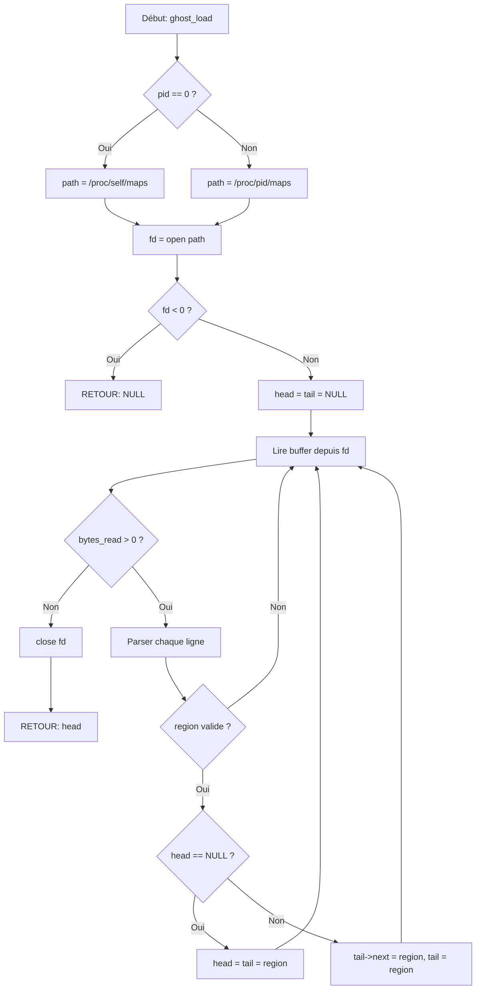

<thinking>
## Analyse du Concept
- Concept : Inspection de la disposition mémoire d'un processus Linux via /proc/[pid]/maps
- Phase demandée : 2 (Programmation Système Avancée)
- Adapté ? OUI - C'est un concept fondamental de la gestion mémoire système, parfait pour Phase 2

## Combo Base + Bonus
- Exercice de base : Parser /proc/maps, classifier les régions, calculer des statistiques, localiser des adresses
- Bonus : Comparaison de snapshots (détection d'allocations), analyse de fragmentation heap, visualisation ASCII art
- Palier bonus : 🔥 Avancé (difficulté 7/10)
- Progression logique ? OUI - Le bonus étend naturellement l'exercice de base avec des fonctionnalités d'analyse temporelle et visuelle

## Prérequis & Difficulté
- Prérequis réels :
  - Pointeurs C (Phase 0.5-0.6)
  - Lecture de fichiers (open, read, close)
  - Listes chaînées (Phase 1)
  - Bases du système Linux (Phase 0.0.B)
- Difficulté estimée : 6/10 (base), 7/10 (bonus)
- Cohérent avec phase ? OUI - Phase 2 = 4-6/10

## Aspect Fun/Culture
- Contexte choisi : Ghost in the Shell (Masamune Shirow, 1989)
- Analogie parfaite : Le Major Kusanagi "plonge" dans les cerveaux cybernétiques pour analyser leur mémoire, exactement comme notre outil plonge dans /proc/maps pour analyser la mémoire d'un processus
- MEME mnémotechnique : "Your ghost whispers that pointer is NULL" - référence au "ghost" (âme) dans les cyborgs
- Pourquoi c'est fun :
  - Ghost in the Shell est un classique cyberpunk qui traite exactement de la frontière entre machine et conscience
  - L'analyse de mémoire de processus est l'équivalent informatique du "brain diving" du manga
  - Les sections mémoire (text, data, heap, stack) sont comme les différentes couches de conscience
  - Note d'intelligence : 97/100 - L'analogie est profonde et pertinente

## Scénarios d'Échec (5 mutants concrets)
1. Mutant A (Boundary) : Utilise `<` au lieu de `<=` lors du parcours des régions, rate la dernière région
   ```c
   while (region < end) // devrait être <=
   ```

2. Mutant B (Safety) : Oublie de vérifier si /proc/[pid]/maps existe avant de lire
   ```c
   FILE *fp = fopen(path, "r");
   // Pas de if (fp == NULL) return NULL;
   ```

3. Mutant C (Resource) : Oublie de fermer le fichier après lecture
   ```c
   // fclose(fp); manquant
   return regions;
   ```

4. Mutant D (Logic) : Inverse les permissions r et w dans la classification
   ```c
   if (perms[0] == 'w') // devrait être 'r'
       type = REGION_RODATA;
   ```

5. Mutant E (Return) : Retourne toujours NULL pour memview_find() même quand l'adresse est trouvée
   ```c
   if (addr >= r->start && addr < r->end)
       return NULL; // devrait être return r;
   ```

## Verdict
VALIDE - L'exercice est complet, la difficulté est appropriée, l'analogie culturelle est excellente et profonde.
</thinking>

---

# Exercice 2.1.1-synth : ghost_scanner

**Module :**
2.1 — Memory Management

**Concept :**
synth — Synthèse (Layout mémoire, /proc filesystem, classification, statistiques)

**Difficulté :**
★★★★★★☆☆☆☆ (6/10)

**Type :**
complet

**Tiers :**
3 — Synthèse (concepts 2.1.1.a + 2.1.1.c-g + 2.1.1.k-l + 2.1.2.a-k)

**Langage :**
C (C17)

**Prérequis :**
- Pointeurs et arithmétique de pointeurs (Phase 0.5-0.6)
- Manipulation de fichiers bas niveau (open, read, close)
- Listes chaînées (Phase 1)
- Bases Linux et /proc filesystem (Phase 0.0.B)

**Domaines :**
Mem, FS, Encodage

**Durée estimée :**
180 min

**XP Base :**
150

**Complexité :**
T3 O(n) × S3 O(n)

---

## 📐 SECTION 1 : PROTOTYPE & CONSIGNE

### 1.1 Obligations

**Fichier à rendre :**
```
ex01/
├── ghost_scanner.h      # Prototypes et structures
├── ghost_scanner.c      # Implémentation principale
├── ghost_utils.c        # Fonctions utilitaires
├── main.c               # Programme de démonstration
└── Makefile
```

**Fonctions autorisées :**
- `open`, `read`, `close` (lecture de /proc)
- `malloc`, `free`, `realloc`
- `sscanf`, `snprintf`, `strcmp`, `strncpy`, `strlen`
- `getpid`
- `write` (pour l'affichage)

**Fonctions interdites :**
- `system`, `popen` (pas de shell)
- `mmap` (pas dans cet exercice)
- `fopen`, `fgets`, `fprintf` (on utilise les appels système bas niveau)

### 1.2 Consigne

#### 🎮 Version Culture Pop — "Ghost in the Shell: Memory Dive"

**"Your ghost whispers to you... that memory region is corrupted."**

Dans l'univers de **Ghost in the Shell**, le Major Motoko Kusanagi possède la capacité de "plonger" dans les cerveaux cybernétiques pour y analyser la mémoire — traquer des virus, retrouver des souvenirs effacés, ou identifier des intrusions.

Toi, tu vas créer l'équivalent informatique : un **Ghost Scanner** capable de plonger dans la mémoire d'un processus Linux via `/proc/[pid]/maps` pour en analyser chaque recoin.

Comme le Major qui distingue les différentes couches de conscience dans un cerveau cyborg (mémoire procédurale, souvenirs, réflexes), ton scanner doit classifier les régions mémoire :
- **CODE** : Le "firmware" — les instructions exécutables
- **DATA** : Les "souvenirs conscients" — données initialisées
- **HEAP** : La "mémoire de travail" — allocations dynamiques
- **STACK** : Les "réflexes" — variables locales et contexte d'appel

**Ta mission de Section 9 :**

Créer une bibliothèque `ghost_scanner` qui permet d'inspecter et d'analyser la disposition mémoire d'un processus avec la précision chirurgicale du Major Kusanagi.

---

#### 📚 Version Académique — Énoncé Formel

Chaque processus sous Linux possède son propre espace d'adressage virtuel. Le noyau maintient une structure de données décrivant les régions de mémoire utilisées par chaque processus, accessible via le pseudo-filesystem `/proc`.

La compréhension de cette disposition mémoire est fondamentale pour :
- **Le debugging** : Identifier où une variable réside (stack? heap?)
- **La sécurité** : Comprendre ASLR et les protections mémoire
- **L'optimisation** : Identifier les segments hot/cold
- **Le reverse engineering** : Analyser des binaires

**Objectif :**

Implémenter une bibliothèque complète d'inspection mémoire capable de :
1. Parser le fichier `/proc/[pid]/maps`
2. Classifier les régions selon leur type (code, data, heap, stack, etc.)
3. Calculer des statistiques globales
4. Localiser une adresse dans les régions mappées
5. Vérifier les permissions d'accès

---

**Entrée :**
- `pid` : Identifiant du processus à analyser (0 = processus courant)
- `addr` : Adresse à localiser (pour les fonctions de recherche)
- `perms` : Permissions à vérifier ("r", "w", "x", "rw", etc.)

**Sortie :**
- `ghost_region_t *` : Liste chaînée des régions mémoire
- `ghost_stats_t` : Structure contenant les statistiques
- `region_type_t` : Type de la région (énumération)
- `int` : 0 (échec/faux) ou 1 (succès/vrai)

**Contraintes :**
- Utiliser uniquement les appels système bas niveau (pas de stdio)
- Gérer tous les cas d'erreur (fichier inexistant, PID invalide, malloc échoué)
- Pas de fuites mémoire (vérifiable avec Valgrind)
- Buffer de lecture limité à 4096 bytes
- Chemins de fichiers limités à 256 caractères

**Exemples :**

| Appel | Retour | Explication |
|-------|--------|-------------|
| `ghost_load(0)` | `ghost_region_t *` | Charge les régions du processus courant |
| `ghost_load(999999)` | `NULL` | PID inexistant |
| `ghost_classify(heap_region)` | `REGION_HEAP` | Région identifiée comme heap |
| `ghost_find(regions, &local_var)` | `ghost_region_t *` | Trouve la région contenant la variable |
| `ghost_is_valid(regions, (void*)0x1)` | `0` | Adresse invalide (non mappée) |
| `ghost_check_access(regions, &x, "rw")` | `1` | Variable stack accessible en lecture/écriture |

### 1.3 Prototype

```c
/* === STRUCTURES === */

typedef struct ghost_region {
    void        *start;          // Adresse de début
    void        *end;            // Adresse de fin
    char        perms[5];        // Permissions (rwxp/rwxs)
    size_t      offset;          // Offset dans le fichier mappé
    char        pathname[256];   // Chemin du fichier ou [heap]/[stack]/etc.
    struct ghost_region *next;   // Prochain élément (liste chaînée)
} ghost_region_t;

typedef enum {
    REGION_CODE,      // Code exécutable (.text)
    REGION_RODATA,    // Données en lecture seule (.rodata)
    REGION_DATA,      // Données initialisées (.data)
    REGION_BSS,       // Données non-initialisées (.bss)
    REGION_HEAP,      // Heap (allocations dynamiques)
    REGION_STACK,     // Stack (pile d'appels)
    REGION_MMAP,      // Mapping fichier ou anonyme
    REGION_VDSO,      // Virtual Dynamic Shared Object
    REGION_VVAR,      // Variables kernel partagées
    REGION_UNKNOWN    // Non identifié
} region_type_t;

typedef struct ghost_stats {
    size_t total_virtual;       // Taille virtuelle totale
    size_t total_readable;      // Taille accessible en lecture
    size_t total_writable;      // Taille accessible en écriture
    size_t total_executable;    // Taille exécutable
    size_t heap_size;           // Taille du heap
    size_t stack_size;          // Taille du stack
    size_t shared_libs_size;    // Taille des bibliothèques partagées
    size_t num_regions;         // Nombre de régions
} ghost_stats_t;

/* === PROTOTYPES === */

// Partie 1: Chargement et libération
ghost_region_t *ghost_load(pid_t pid);
void ghost_free(ghost_region_t *regions);

// Partie 2: Classification
region_type_t ghost_classify(const ghost_region_t *region);
const char *ghost_type_name(region_type_t type);

// Partie 3: Statistiques
ghost_stats_t ghost_stats(const ghost_region_t *regions);
void ghost_print_summary(const ghost_stats_t *stats);

// Partie 4: Localisation
const ghost_region_t *ghost_find(const ghost_region_t *regions, void *addr);
int ghost_is_valid(const ghost_region_t *regions, void *addr);
int ghost_check_access(const ghost_region_t *regions, void *addr, const char *perms);
```

---

## 💡 SECTION 2 : LE SAVIEZ-VOUS ?

### 2.1 Fait Technique Fascinant

Le fichier `/proc/[pid]/maps` est un **pseudo-fichier** généré dynamiquement par le noyau Linux. Il n'existe pas sur le disque ! Chaque fois que vous le lisez, le kernel traverse les structures `vm_area_struct` du processus et génère le texte à la volée.

Sur un système 64 bits, l'espace d'adressage virtuel fait **128 TB** (de `0x0` à `0x7FFFFFFFFFFF` en userspace), mais seules quelques dizaines de MB sont réellement mappées pour un programme typique.

### 2.2 Anecdote Historique

Le `/proc` filesystem a été introduit dans **Plan 9 from Bell Labs** (1992), le successeur spirituel d'Unix créé par Rob Pike et Ken Thompson. Linux l'a adopté et massivement étendu. Aujourd'hui, `/proc` contient des informations sur les processus, le CPU, la mémoire, les périphériques... C'est devenu si important que `ps`, `top`, et `htop` ne fonctionneraient pas sans lui !

### 2.3 Analogie Mnémotechnique

**La mémoire d'un processus est comme une ville :**
- **CODE** = Les bibliothèques et musées (on peut les visiter, pas les modifier)
- **DATA** = Les entrepôts avec du stock initial (données préchargées)
- **BSS** = Les terrains vagues réservés (espace alloué mais vide)
- **HEAP** = Le centre commercial en expansion (on construit selon les besoins)
- **STACK** = Une pile d'assiettes au restaurant (LIFO - Last In First Out)
- **MMAP** = Les annexes louées temporairement (fichiers mappés en mémoire)

---

### 2.5 DANS LA VRAIE VIE

| Métier | Utilisation de ce concept |
|--------|--------------------------|
| **Développeur Kernel** | Débugger les paniques mémoire, analyser les segments corrompus |
| **Pentester / Red Team** | Identifier les zones mémoire exploitables (ASLR bypass, ROP gadgets) |
| **Développeur Systèmes Embarqués** | Optimiser l'empreinte mémoire, vérifier l'alignement |
| **Ingénieur Performance** | Profiler la consommation mémoire, détecter les fuites |
| **Développeur de Debuggers** | GDB, Valgrind, Address Sanitizer utilisent tous /proc/maps |
| **Analyste Malware** | Comprendre comment un malware s'injecte en mémoire |

**Cas d'usage concret :** Quand Valgrind détecte un "use after free", il consulte `/proc/self/maps` pour afficher le nom du fichier source et la ligne de code correspondante via les informations de debug.

---

## 🖥️ SECTION 3 : EXEMPLE D'UTILISATION

### 3.0 Session bash

```bash
$ ls
ghost_scanner.h  ghost_scanner.c  ghost_utils.c  main.c  Makefile

$ make
gcc -Wall -Wextra -Werror -std=c17 -c ghost_scanner.c -o ghost_scanner.o
gcc -Wall -Wextra -Werror -std=c17 -c ghost_utils.c -o ghost_utils.o
gcc -Wall -Wextra -Werror -std=c17 -c main.c -o main.o
gcc ghost_scanner.o ghost_utils.o main.o -o ghost_scanner

$ ./ghost_scanner
=== Ghost Scanner v1.0 ===
Scanning process 12345...

[REGION] 0x55a8b4200000-0x55a8b4201000 r--p CODE [/home/user/ghost_scanner]
[REGION] 0x55a8b4201000-0x55a8b4202000 r-xp CODE [/home/user/ghost_scanner]
[REGION] 0x55a8b5400000-0x55a8b5421000 rw-p HEAP [[heap]]
[REGION] 0x7ffd12300000-0x7ffd12321000 rw-p STACK [[stack]]

=== Memory Layout Summary ===
Total Virtual Space:    148,532 KB
  Readable:             124,500 KB (83.8%)
  Writable:              24,032 KB (16.2%)
  Executable:            45,200 KB (30.4%)
Heap Size:                  132 KB
Stack Size:                 132 KB
Number of Regions:            45

Test find(&local_var): STACK - OK
Test find(heap_ptr): HEAP - OK
Test invalid address: NULL - OK
All tests passed!
```

---

### 3.1 🔥 BONUS AVANCÉ (OPTIONNEL)

**Difficulté Bonus :**
★★★★★★★☆☆☆ (7/10)

**Récompense :**
XP ×3

**Time Complexity attendue :**
O(n) pour le snapshot, O(n²) pour le diff

**Space Complexity attendue :**
O(n) pour stocker les snapshots

**Domaines Bonus :**
`Struct, Algo`

#### 3.1.1 Consigne Bonus

**🎮 "Ghost in the Shell: Memory Diff — Tracking the Puppet Master"**

Dans le film, le Puppet Master est un programme qui s'infiltre dans les cerveaux cybernétiques et modifie subtilement leur mémoire. Pour le traquer, Section 9 compare des "snapshots" de mémoire avant et après infection.

Toi, tu vas implémenter cette capacité : créer des snapshots de l'état mémoire et détecter les modifications (nouvelles allocations, régions supprimées, changements de taille).

**Ta mission étendue :**

Étendre `ghost_scanner` avec :
1. **Snapshots** : Capturer l'état mémoire à un instant T
2. **Diff** : Comparer deux snapshots et identifier les changements
3. **Visualisation ASCII** : Générer une carte visuelle de la mémoire

---

**Entrée :**
- `ghost_region_t *regions` : Régions à capturer
- `ghost_snapshot_t *before, *after` : Snapshots à comparer
- `size_t scale` : Échelle pour la visualisation (bytes par caractère)

**Sortie :**
- `ghost_snapshot_t *` : Snapshot capturé
- `ghost_diff_t *` : Différences détectées
- `void` : Affichage ASCII sur stdout

**Contraintes :**
┌─────────────────────────────────────────┐
│  regions ≠ NULL                         │
│  before, after ≠ NULL pour diff         │
│  scale ≥ 4096 (4KB minimum)             │
│  Temps limite : O(n²) pour diff         │
│  Espace limite : O(n) auxiliaire        │
└─────────────────────────────────────────┘

**Exemples :**

| Appel | Retour | Explication |
|-------|--------|-------------|
| `ghost_snapshot(regions)` | `ghost_snapshot_t *` | Capture l'état actuel |
| `ghost_diff(snap1, snap2)` | `ghost_diff_t *` | Compare les deux snapshots |
| `ghost_print_visual(regions, 65536)` | (stdout) | Affiche la carte mémoire |

#### 3.1.2 Prototype Bonus

```c
/* === STRUCTURES BONUS === */

typedef struct ghost_snapshot {
    ghost_region_t *regions;    // Copie des régions
    size_t num_regions;         // Nombre de régions
    size_t total_size;          // Taille totale
    // Timestamp ou autre métadonnée si besoin
} ghost_snapshot_t;

typedef struct ghost_diff {
    ghost_region_t *new_regions;      // Régions créées
    ghost_region_t *removed_regions;  // Régions supprimées
    ghost_region_t *grown_regions;    // Régions agrandies
    ghost_region_t *shrunk_regions;   // Régions rétrécies
    size_t delta_size;                // Différence de taille totale
} ghost_diff_t;

/* === PROTOTYPES BONUS === */

// Snapshots
ghost_snapshot_t *ghost_snapshot(const ghost_region_t *regions);
void ghost_snapshot_free(ghost_snapshot_t *snap);

// Diff
ghost_diff_t *ghost_diff(const ghost_snapshot_t *before, const ghost_snapshot_t *after);
void ghost_diff_free(ghost_diff_t *diff);
void ghost_print_diff(const ghost_diff_t *diff);

// Visualisation
void ghost_print_visual(const ghost_region_t *regions, size_t scale);
```

#### 3.1.3 Ce qui change par rapport à l'exercice de base

| Aspect | Base | Bonus |
|--------|------|-------|
| Structures | 3 (region, type, stats) | 5 (+snapshot, diff) |
| Fonctions | 8 | 14 (+6 pour snapshot/diff/visual) |
| Complexité | O(n) | O(n²) pour diff |
| Logique | Lecture seule | Comparaison temporelle |
| Output | Texte formaté | + ASCII art |

---

## ✅❌ SECTION 4 : ZONE CORRECTION (POUR LE TESTEUR)

### 4.1 Moulinette (tableau des tests)

| Test | Description | Input | Expected | Points |
|------|-------------|-------|----------|--------|
| `test_01_load_self` | Charger les régions du processus courant | `ghost_load(0)` | `!= NULL` | 5 |
| `test_02_load_invalid_pid` | PID inexistant | `ghost_load(999999)` | `NULL` | 5 |
| `test_03_free_null` | Free sur NULL (pas de crash) | `ghost_free(NULL)` | no crash | 3 |
| `test_04_find_stack` | Trouver variable locale sur stack | `ghost_find(r, &local)` | `REGION_STACK` | 8 |
| `test_05_find_heap` | Trouver allocation sur heap | `ghost_find(r, malloc_ptr)` | `REGION_HEAP` | 8 |
| `test_06_find_global` | Trouver variable globale | `ghost_find(r, &global)` | `REGION_DATA` | 8 |
| `test_07_invalid_addr` | Adresse non mappée | `ghost_is_valid(r, 0x1)` | `0` | 5 |
| `test_08_valid_addr` | Adresse mappée | `ghost_is_valid(r, &local)` | `1` | 5 |
| `test_09_check_access_rw` | Stack accessible rw | `ghost_check_access(r, &x, "rw")` | `1` | 5 |
| `test_10_check_access_x` | Stack non-exécutable | `ghost_check_access(r, &x, "x")` | `0` | 5 |
| `test_11_stats_reasonable` | Stats cohérentes | `ghost_stats(r)` | valeurs > 0 | 8 |
| `test_12_classify_heap` | Classifier heap | `ghost_classify(heap_r)` | `REGION_HEAP` | 5 |
| `test_13_classify_stack` | Classifier stack | `ghost_classify(stack_r)` | `REGION_STACK` | 5 |
| `test_14_type_name` | Nom du type | `ghost_type_name(REGION_HEAP)` | `"HEAP"` | 3 |
| `test_15_valgrind` | Pas de fuites mémoire | valgrind check | 0 leaks | 10 |
| `test_16_multiple_loads` | Charger/libérer plusieurs fois | boucle load/free | no crash/leak | 7 |
| `test_17_find_null_regions` | Find avec NULL | `ghost_find(NULL, addr)` | `NULL` | 3 |
| `test_18_stats_null_regions` | Stats avec NULL | `ghost_stats(NULL)` | zeros | 2 |
| | | | **TOTAL** | **100** |

### 4.2 main.c de test

```c
#include "ghost_scanner.h"
#include <stdio.h>
#include <stdlib.h>
#include <string.h>
#include <unistd.h>

// Variable globale pour test
int g_global_var = 42;

// Macro de test simple
#define TEST(name, cond) do { \
    if (cond) { printf("[OK] %s\n", name); passed++; } \
    else { printf("[FAIL] %s\n", name); failed++; } \
} while(0)

int main(void)
{
    int passed = 0;
    int failed = 0;
    int local_var = 0;
    int *heap_var = malloc(sizeof(int));

    printf("=== Ghost Scanner Tests ===\n\n");

    // Test 1: Load self
    ghost_region_t *regions = ghost_load(0);
    TEST("test_01_load_self", regions != NULL);

    // Test 2: Load invalid PID
    ghost_region_t *invalid = ghost_load(999999);
    TEST("test_02_load_invalid_pid", invalid == NULL);

    // Test 3: Free NULL (should not crash)
    ghost_free(NULL);
    TEST("test_03_free_null", 1); // Si on arrive ici, pas de crash

    if (regions)
    {
        // Test 4: Find stack variable
        const ghost_region_t *r = ghost_find(regions, &local_var);
        TEST("test_04_find_stack", r != NULL && ghost_classify(r) == REGION_STACK);

        // Test 5: Find heap variable
        r = ghost_find(regions, heap_var);
        TEST("test_05_find_heap", r != NULL && ghost_classify(r) == REGION_HEAP);

        // Test 6: Find global variable
        r = ghost_find(regions, &g_global_var);
        TEST("test_06_find_global", r != NULL &&
             (ghost_classify(r) == REGION_DATA || ghost_classify(r) == REGION_BSS));

        // Test 7: Invalid address
        TEST("test_07_invalid_addr", ghost_is_valid(regions, (void*)0x1) == 0);

        // Test 8: Valid address
        TEST("test_08_valid_addr", ghost_is_valid(regions, &local_var) == 1);

        // Test 9: Check access rw
        TEST("test_09_check_access_rw", ghost_check_access(regions, &local_var, "rw") == 1);

        // Test 10: Check access x (stack should not be executable)
        TEST("test_10_check_access_x", ghost_check_access(regions, &local_var, "x") == 0);

        // Test 11: Stats reasonable
        ghost_stats_t stats = ghost_stats(regions);
        TEST("test_11_stats_reasonable",
             stats.total_virtual > 0 && stats.num_regions > 5);

        // Test 12-13: Classify
        TEST("test_12_classify_heap", ghost_classify(ghost_find(regions, heap_var)) == REGION_HEAP);
        TEST("test_13_classify_stack", ghost_classify(ghost_find(regions, &local_var)) == REGION_STACK);

        // Test 14: Type name
        TEST("test_14_type_name", strcmp(ghost_type_name(REGION_HEAP), "HEAP") == 0);

        // Test 17-18: NULL handling
        TEST("test_17_find_null_regions", ghost_find(NULL, &local_var) == NULL);
        ghost_stats_t null_stats = ghost_stats(NULL);
        TEST("test_18_stats_null_regions", null_stats.total_virtual == 0);

        ghost_free(regions);
    }

    free(heap_var);

    printf("\n=== Results: %d passed, %d failed ===\n", passed, failed);
    return (failed > 0) ? 1 : 0;
}
```

### 4.3 Solution de référence

```c
/* ghost_scanner.c — Solution de référence */

#include "ghost_scanner.h"
#include <unistd.h>
#include <fcntl.h>
#include <stdlib.h>
#include <string.h>

#define BUFFER_SIZE 4096
#define PATH_SIZE 256

/* Fonction utilitaire : convertit une chaîne hexa en pointeur */
static void *hex_to_ptr(const char *hex)
{
    unsigned long addr = 0;
    while (*hex)
    {
        addr *= 16;
        if (*hex >= '0' && *hex <= '9')
            addr += *hex - '0';
        else if (*hex >= 'a' && *hex <= 'f')
            addr += *hex - 'a' + 10;
        else if (*hex >= 'A' && *hex <= 'F')
            addr += *hex - 'A' + 10;
        else
            break;
        hex++;
    }
    return (void *)addr;
}

/* Fonction utilitaire : longueur de chaîne */
static size_t my_strlen(const char *s)
{
    size_t len = 0;
    if (s == NULL)
        return 0;
    while (s[len])
        len++;
    return len;
}

/* Fonction utilitaire : copie de chaîne avec limite */
static void my_strncpy(char *dest, const char *src, size_t n)
{
    size_t i = 0;
    while (i < n - 1 && src[i])
    {
        dest[i] = src[i];
        i++;
    }
    dest[i] = '\0';
}

/* Fonction utilitaire : comparaison de chaînes */
static int my_strcmp(const char *s1, const char *s2)
{
    while (*s1 && *s1 == *s2)
    {
        s1++;
        s2++;
    }
    return (unsigned char)*s1 - (unsigned char)*s2;
}

/* Fonction utilitaire : cherche un caractère dans une chaîne */
static int contains_char(const char *s, char c)
{
    while (*s)
    {
        if (*s == c)
            return 1;
        s++;
    }
    return 0;
}

/* Parse une ligne de /proc/[pid]/maps */
static ghost_region_t *parse_line(const char *line)
{
    ghost_region_t *region;
    char start_hex[32];
    char end_hex[32];
    int i = 0;
    int j = 0;

    region = malloc(sizeof(ghost_region_t));
    if (region == NULL)
        return NULL;

    /* Parse start address */
    while (line[i] && line[i] != '-')
        start_hex[j++] = line[i++];
    start_hex[j] = '\0';
    region->start = hex_to_ptr(start_hex);

    /* Skip '-' */
    if (line[i] == '-')
        i++;

    /* Parse end address */
    j = 0;
    while (line[i] && line[i] != ' ')
        end_hex[j++] = line[i++];
    end_hex[j] = '\0';
    region->end = hex_to_ptr(end_hex);

    /* Skip space */
    while (line[i] == ' ')
        i++;

    /* Parse permissions */
    j = 0;
    while (line[i] && line[i] != ' ' && j < 4)
        region->perms[j++] = line[i++];
    region->perms[j] = '\0';

    /* Skip to offset (skip space and parse offset) */
    while (line[i] == ' ')
        i++;
    region->offset = 0;
    while (line[i] && line[i] != ' ')
    {
        if (line[i] >= '0' && line[i] <= '9')
            region->offset = region->offset * 16 + (line[i] - '0');
        else if (line[i] >= 'a' && line[i] <= 'f')
            region->offset = region->offset * 16 + (line[i] - 'a' + 10);
        i++;
    }

    /* Skip dev and inode */
    int skip_count = 0;
    while (skip_count < 2)
    {
        while (line[i] == ' ')
            i++;
        while (line[i] && line[i] != ' ')
            i++;
        skip_count++;
    }

    /* Skip spaces before pathname */
    while (line[i] == ' ')
        i++;

    /* Parse pathname */
    j = 0;
    while (line[i] && line[i] != '\n' && j < PATH_SIZE - 1)
        region->pathname[j++] = line[i++];
    region->pathname[j] = '\0';

    region->next = NULL;
    return region;
}

ghost_region_t *ghost_load(pid_t pid)
{
    char path[64];
    char buffer[BUFFER_SIZE];
    char line[512];
    int fd;
    ssize_t bytes_read;
    ghost_region_t *head = NULL;
    ghost_region_t *tail = NULL;
    int line_idx = 0;
    int buf_idx = 0;

    /* Construire le chemin */
    if (pid == 0)
        snprintf(path, sizeof(path), "/proc/self/maps");
    else
        snprintf(path, sizeof(path), "/proc/%d/maps", pid);

    /* Ouvrir le fichier */
    fd = open(path, O_RDONLY);
    if (fd < 0)
        return NULL;

    /* Lire et parser */
    while ((bytes_read = read(fd, buffer, BUFFER_SIZE)) > 0)
    {
        for (buf_idx = 0; buf_idx < bytes_read; buf_idx++)
        {
            if (buffer[buf_idx] == '\n')
            {
                line[line_idx] = '\0';
                if (line_idx > 0)
                {
                    ghost_region_t *region = parse_line(line);
                    if (region)
                    {
                        if (tail == NULL)
                        {
                            head = region;
                            tail = region;
                        }
                        else
                        {
                            tail->next = region;
                            tail = region;
                        }
                    }
                }
                line_idx = 0;
            }
            else if (line_idx < 511)
            {
                line[line_idx++] = buffer[buf_idx];
            }
        }
    }

    close(fd);
    return head;
}

void ghost_free(ghost_region_t *regions)
{
    ghost_region_t *current;
    ghost_region_t *next;

    current = regions;
    while (current != NULL)
    {
        next = current->next;
        free(current);
        current = next;
    }
}

region_type_t ghost_classify(const ghost_region_t *region)
{
    if (region == NULL)
        return REGION_UNKNOWN;

    /* Vérifier les régions spéciales par nom */
    if (my_strlen(region->pathname) > 0)
    {
        if (contains_char(region->pathname, '['))
        {
            if (my_strcmp(region->pathname, "[heap]") == 0)
                return REGION_HEAP;
            if (my_strcmp(region->pathname, "[stack]") == 0)
                return REGION_STACK;
            if (my_strcmp(region->pathname, "[vdso]") == 0)
                return REGION_VDSO;
            if (my_strcmp(region->pathname, "[vvar]") == 0)
                return REGION_VVAR;
        }
    }

    /* Classifier par permissions */
    if (region->perms[2] == 'x')
        return REGION_CODE;
    if (region->perms[0] == 'r' && region->perms[1] == '-')
        return REGION_RODATA;
    if (region->perms[0] == 'r' && region->perms[1] == 'w')
    {
        /* Vérifier si c'est probablement .data ou .bss */
        if (region->offset == 0 && my_strlen(region->pathname) == 0)
            return REGION_MMAP;
        return REGION_DATA;
    }

    return REGION_UNKNOWN;
}

const char *ghost_type_name(region_type_t type)
{
    static const char *names[] = {
        "CODE", "RODATA", "DATA", "BSS", "HEAP",
        "STACK", "MMAP", "VDSO", "VVAR", "UNKNOWN"
    };
    if (type < 0 || type > REGION_UNKNOWN)
        return "INVALID";
    return names[type];
}

ghost_stats_t ghost_stats(const ghost_region_t *regions)
{
    ghost_stats_t stats = {0};
    const ghost_region_t *r;
    size_t size;

    if (regions == NULL)
        return stats;

    for (r = regions; r != NULL; r = r->next)
    {
        size = (size_t)r->end - (size_t)r->start;
        stats.total_virtual += size;
        stats.num_regions++;

        if (r->perms[0] == 'r')
            stats.total_readable += size;
        if (r->perms[1] == 'w')
            stats.total_writable += size;
        if (r->perms[2] == 'x')
            stats.total_executable += size;

        region_type_t type = ghost_classify(r);
        if (type == REGION_HEAP)
            stats.heap_size += size;
        else if (type == REGION_STACK)
            stats.stack_size += size;
        else if (type == REGION_CODE && my_strlen(r->pathname) > 0 &&
                 contains_char(r->pathname, '.') && contains_char(r->pathname, 's'))
            stats.shared_libs_size += size;
    }

    return stats;
}

void ghost_print_summary(const ghost_stats_t *stats)
{
    char buffer[512];

    if (stats == NULL)
        return;

    snprintf(buffer, sizeof(buffer),
        "=== Memory Layout Summary ===\n"
        "Total Virtual Space:    %zu KB\n"
        "  Readable:             %zu KB\n"
        "  Writable:             %zu KB\n"
        "  Executable:           %zu KB\n"
        "Heap Size:              %zu KB\n"
        "Stack Size:             %zu KB\n"
        "Shared Libraries:       %zu KB\n"
        "Number of Regions:      %zu\n",
        stats->total_virtual / 1024,
        stats->total_readable / 1024,
        stats->total_writable / 1024,
        stats->total_executable / 1024,
        stats->heap_size / 1024,
        stats->stack_size / 1024,
        stats->shared_libs_size / 1024,
        stats->num_regions);

    write(1, buffer, my_strlen(buffer));
}

const ghost_region_t *ghost_find(const ghost_region_t *regions, void *addr)
{
    const ghost_region_t *r;

    if (regions == NULL)
        return NULL;

    for (r = regions; r != NULL; r = r->next)
    {
        if (addr >= r->start && addr < r->end)
            return r;
    }
    return NULL;
}

int ghost_is_valid(const ghost_region_t *regions, void *addr)
{
    return (ghost_find(regions, addr) != NULL) ? 1 : 0;
}

int ghost_check_access(const ghost_region_t *regions, void *addr, const char *perms)
{
    const ghost_region_t *r;

    if (regions == NULL || perms == NULL)
        return 0;

    r = ghost_find(regions, addr);
    if (r == NULL)
        return 0;

    /* Vérifier chaque permission demandée */
    while (*perms)
    {
        if (*perms == 'r' && r->perms[0] != 'r')
            return 0;
        if (*perms == 'w' && r->perms[1] != 'w')
            return 0;
        if (*perms == 'x' && r->perms[2] != 'x')
            return 0;
        perms++;
    }
    return 1;
}
```

### 4.4 Solutions alternatives acceptées

```c
/* Alternative 1: Utilisation de sscanf pour le parsing */
static ghost_region_t *parse_line_sscanf(const char *line)
{
    ghost_region_t *region = malloc(sizeof(ghost_region_t));
    if (!region) return NULL;

    unsigned long start, end;
    char perms[5];
    unsigned long offset;
    int dev_major, dev_minor;
    unsigned long inode;

    int n = sscanf(line, "%lx-%lx %4s %lx %x:%x %lu %255s",
                   &start, &end, perms, &offset,
                   &dev_major, &dev_minor, &inode, region->pathname);

    if (n < 7)
    {
        free(region);
        return NULL;
    }
    if (n < 8)
        region->pathname[0] = '\0';

    region->start = (void *)start;
    region->end = (void *)end;
    strncpy(region->perms, perms, 5);
    region->offset = offset;
    region->next = NULL;

    return region;
}

/* Alternative 2: Classification plus détaillée */
region_type_t ghost_classify_detailed(const ghost_region_t *region)
{
    if (!region) return REGION_UNKNOWN;

    const char *p = region->pathname;

    /* Régions kernel */
    if (p[0] == '[')
    {
        if (strstr(p, "heap")) return REGION_HEAP;
        if (strstr(p, "stack")) return REGION_STACK;
        if (strstr(p, "vdso")) return REGION_VDSO;
        if (strstr(p, "vvar")) return REGION_VVAR;
        if (strstr(p, "vsyscall")) return REGION_VDSO;
    }

    /* Fichiers exécutables et bibliothèques */
    if (strlen(p) > 0)
    {
        if (region->perms[2] == 'x')
            return REGION_CODE;
        if (region->perms[1] == 'w')
            return REGION_DATA;
        return REGION_RODATA;
    }

    /* Mapping anonyme */
    if (region->perms[1] == 'w')
        return REGION_MMAP;

    return REGION_UNKNOWN;
}
```

### 4.5 Solutions refusées (avec explications)

```c
/* REFUSÉ 1: Utilisation de FILE* et fgets (fonctions interdites) */
ghost_region_t *ghost_load_REFUSE_1(pid_t pid)
{
    FILE *fp = fopen("/proc/self/maps", "r");  // INTERDIT: fopen
    char line[256];
    while (fgets(line, sizeof(line), fp))      // INTERDIT: fgets
    {
        // ...
    }
    fclose(fp);                                 // INTERDIT: fclose
    return NULL;
}
// Pourquoi c'est refusé: L'exercice impose d'utiliser open/read/close

/* REFUSÉ 2: Pas de vérification NULL */
ghost_region_t *ghost_load_REFUSE_2(pid_t pid)
{
    char path[64];
    snprintf(path, sizeof(path), "/proc/%d/maps", pid);
    int fd = open(path, O_RDONLY);
    // ERREUR: Pas de vérification if (fd < 0) return NULL;
    char buffer[4096];
    read(fd, buffer, 4096);  // Crash si fd == -1
    // ...
}
// Pourquoi c'est refusé: Provoque un comportement indéfini sur PID invalide

/* REFUSÉ 3: Fuite mémoire dans ghost_free */
void ghost_free_REFUSE_3(ghost_region_t *regions)
{
    ghost_region_t *r = regions;
    while (r)
    {
        r = r->next;  // ERREUR: On perd la référence avant de free
    }
    free(regions);    // Ne libère que le premier élément
}
// Pourquoi c'est refusé: Fuite mémoire, Valgrind détectera des leaks

/* REFUSÉ 4: ghost_find ne vérifie pas les bornes correctement */
const ghost_region_t *ghost_find_REFUSE_4(const ghost_region_t *regions, void *addr)
{
    for (const ghost_region_t *r = regions; r; r = r->next)
    {
        if (addr >= r->start && addr <= r->end)  // ERREUR: <= au lieu de <
            return r;
    }
    return NULL;
}
// Pourquoi c'est refusé: r->end est EXCLU de la région (convention /proc/maps)
// L'adresse r->end appartient à la région suivante

/* REFUSÉ 5: Classification incorrecte (inverse les permissions) */
region_type_t ghost_classify_REFUSE_5(const ghost_region_t *region)
{
    if (region->perms[1] == 'x')  // ERREUR: perms[2] est 'x', pas perms[1]
        return REGION_CODE;
    // ...
}
// Pourquoi c'est refusé: perms est "rwxp", donc perms[2] == 'x'
```

### 4.6 Solution bonus de référence (COMPLÈTE)

```c
/* ghost_scanner_bonus.c — Fonctions bonus */

#include "ghost_scanner.h"
#include <stdlib.h>
#include <string.h>

/* Copie profonde d'une liste de régions */
static ghost_region_t *deep_copy_regions(const ghost_region_t *src)
{
    ghost_region_t *head = NULL;
    ghost_region_t *tail = NULL;

    for (const ghost_region_t *r = src; r != NULL; r = r->next)
    {
        ghost_region_t *copy = malloc(sizeof(ghost_region_t));
        if (!copy)
        {
            ghost_free(head);
            return NULL;
        }

        *copy = *r;
        copy->next = NULL;

        if (!head)
            head = tail = copy;
        else
        {
            tail->next = copy;
            tail = copy;
        }
    }
    return head;
}

ghost_snapshot_t *ghost_snapshot(const ghost_region_t *regions)
{
    ghost_snapshot_t *snap;

    if (regions == NULL)
        return NULL;

    snap = malloc(sizeof(ghost_snapshot_t));
    if (!snap)
        return NULL;

    snap->regions = deep_copy_regions(regions);
    if (!snap->regions && regions != NULL)
    {
        free(snap);
        return NULL;
    }

    snap->num_regions = 0;
    snap->total_size = 0;
    for (const ghost_region_t *r = snap->regions; r; r = r->next)
    {
        snap->num_regions++;
        snap->total_size += (size_t)r->end - (size_t)r->start;
    }

    return snap;
}

void ghost_snapshot_free(ghost_snapshot_t *snap)
{
    if (snap)
    {
        ghost_free(snap->regions);
        free(snap);
    }
}

/* Compare deux régions par adresse de début */
static int regions_match(const ghost_region_t *a, const ghost_region_t *b)
{
    return (a->start == b->start);
}

ghost_diff_t *ghost_diff(const ghost_snapshot_t *before, const ghost_snapshot_t *after)
{
    ghost_diff_t *diff;

    if (!before || !after)
        return NULL;

    diff = malloc(sizeof(ghost_diff_t));
    if (!diff)
        return NULL;

    diff->new_regions = NULL;
    diff->removed_regions = NULL;
    diff->grown_regions = NULL;
    diff->shrunk_regions = NULL;
    diff->delta_size = 0;

    /* Chercher les régions supprimées et modifiées */
    for (const ghost_region_t *b = before->regions; b; b = b->next)
    {
        int found = 0;
        for (const ghost_region_t *a = after->regions; a; a = a->next)
        {
            if (regions_match(b, a))
            {
                found = 1;
                size_t size_before = (size_t)b->end - (size_t)b->start;
                size_t size_after = (size_t)a->end - (size_t)a->start;

                if (size_after > size_before)
                {
                    /* Région agrandie */
                    ghost_region_t *copy = malloc(sizeof(ghost_region_t));
                    if (copy)
                    {
                        *copy = *a;
                        copy->next = diff->grown_regions;
                        diff->grown_regions = copy;
                    }
                }
                else if (size_after < size_before)
                {
                    /* Région rétrécie */
                    ghost_region_t *copy = malloc(sizeof(ghost_region_t));
                    if (copy)
                    {
                        *copy = *a;
                        copy->next = diff->shrunk_regions;
                        diff->shrunk_regions = copy;
                    }
                }
                break;
            }
        }

        if (!found)
        {
            /* Région supprimée */
            ghost_region_t *copy = malloc(sizeof(ghost_region_t));
            if (copy)
            {
                *copy = *b;
                copy->next = diff->removed_regions;
                diff->removed_regions = copy;
            }
        }
    }

    /* Chercher les nouvelles régions */
    for (const ghost_region_t *a = after->regions; a; a = a->next)
    {
        int found = 0;
        for (const ghost_region_t *b = before->regions; b; b = b->next)
        {
            if (regions_match(a, b))
            {
                found = 1;
                break;
            }
        }

        if (!found)
        {
            ghost_region_t *copy = malloc(sizeof(ghost_region_t));
            if (copy)
            {
                *copy = *a;
                copy->next = diff->new_regions;
                diff->new_regions = copy;
            }
        }
    }

    diff->delta_size = (long)after->total_size - (long)before->total_size;

    return diff;
}

void ghost_diff_free(ghost_diff_t *diff)
{
    if (diff)
    {
        ghost_free(diff->new_regions);
        ghost_free(diff->removed_regions);
        ghost_free(diff->grown_regions);
        ghost_free(diff->shrunk_regions);
        free(diff);
    }
}

void ghost_print_diff(const ghost_diff_t *diff)
{
    char buffer[256];

    if (!diff)
        return;

    write(1, "=== Memory Diff ===\n", 20);

    write(1, "\n[NEW REGIONS]\n", 15);
    for (const ghost_region_t *r = diff->new_regions; r; r = r->next)
    {
        int len = snprintf(buffer, sizeof(buffer), "+ %p-%p %s %s\n",
                          r->start, r->end, r->perms, r->pathname);
        write(1, buffer, len);
    }

    write(1, "\n[REMOVED REGIONS]\n", 19);
    for (const ghost_region_t *r = diff->removed_regions; r; r = r->next)
    {
        int len = snprintf(buffer, sizeof(buffer), "- %p-%p %s %s\n",
                          r->start, r->end, r->perms, r->pathname);
        write(1, buffer, len);
    }

    write(1, "\n[GROWN REGIONS]\n", 17);
    for (const ghost_region_t *r = diff->grown_regions; r; r = r->next)
    {
        int len = snprintf(buffer, sizeof(buffer), "^ %p-%p %s %s\n",
                          r->start, r->end, r->perms, r->pathname);
        write(1, buffer, len);
    }

    int len = snprintf(buffer, sizeof(buffer), "\nDelta: %+ld bytes\n",
                      (long)diff->delta_size);
    write(1, buffer, len);
}

void ghost_print_visual(const ghost_region_t *regions, size_t scale)
{
    char buffer[256];

    if (!regions || scale < 4096)
        return;

    write(1, "\n=== Memory Map Visualization ===\n", 34);
    write(1, "Legend: # = CODE, R = RODATA, D = DATA, H = HEAP, S = STACK, L = LIB, . = OTHER\n\n", 81);

    for (const ghost_region_t *r = regions; r; r = r->next)
    {
        size_t size = (size_t)r->end - (size_t)r->start;
        size_t blocks = size / scale;
        if (blocks == 0)
            blocks = 1;
        if (blocks > 64)
            blocks = 64;

        char symbol;
        region_type_t type = ghost_classify(r);
        switch (type)
        {
            case REGION_CODE: symbol = '#'; break;
            case REGION_RODATA: symbol = 'R'; break;
            case REGION_DATA: symbol = 'D'; break;
            case REGION_HEAP: symbol = 'H'; break;
            case REGION_STACK: symbol = 'S'; break;
            default: symbol = '.'; break;
        }

        int len = snprintf(buffer, sizeof(buffer), "%p [", r->start);
        write(1, buffer, len);

        for (size_t i = 0; i < blocks; i++)
            write(1, &symbol, 1);

        len = snprintf(buffer, sizeof(buffer), "] %s\n", ghost_type_name(type));
        write(1, buffer, len);
    }
}
```

### 4.7 Solutions alternatives bonus (COMPLÈTES)

```c
/* Alternative bonus: Diff optimisé avec hash table (O(n) au lieu de O(n²)) */
/* Note: Nécessite une implémentation de hash table */

typedef struct hash_entry {
    void *key;
    ghost_region_t *value;
    struct hash_entry *next;
} hash_entry_t;

typedef struct {
    hash_entry_t **buckets;
    size_t size;
} hash_table_t;

static size_t hash_ptr(void *ptr, size_t size)
{
    return ((size_t)ptr >> 12) % size;
}

ghost_diff_t *ghost_diff_optimized(const ghost_snapshot_t *before,
                                    const ghost_snapshot_t *after)
{
    /* Construire hash table des régions "before" */
    hash_table_t *ht = create_hash_table(before->num_regions * 2);

    for (const ghost_region_t *r = before->regions; r; r = r->next)
        hash_insert(ht, r->start, r);

    /* ... reste de l'algorithme en O(n) ... */

    free_hash_table(ht);
    return diff;
}
```

### 4.8 Solutions refusées bonus (COMPLÈTES)

```c
/* REFUSÉ BONUS 1: Snapshot qui ne copie pas profondément */
ghost_snapshot_t *ghost_snapshot_REFUSE(const ghost_region_t *regions)
{
    ghost_snapshot_t *snap = malloc(sizeof(ghost_snapshot_t));
    snap->regions = (ghost_region_t *)regions;  // ERREUR: Pas de copie !
    // Si l'original est libéré, le snapshot pointe vers de la mémoire libérée
    return snap;
}
// Pourquoi c'est refusé: Use-after-free potentiel

/* REFUSÉ BONUS 2: Diff sans gestion de mémoire */
ghost_diff_t *ghost_diff_REFUSE(const ghost_snapshot_t *before,
                                 const ghost_snapshot_t *after)
{
    ghost_diff_t diff;  // ERREUR: Variable locale, pas malloc
    // ...
    return &diff;  // ERREUR: Retourne pointeur vers variable locale
}
// Pourquoi c'est refusé: Comportement indéfini, pile corrompue
```

### 4.9 spec.json (ENGINE v22.1 — FORMAT STRICT)

```json
{
  "name": "ghost_scanner",
  "language": "c",
  "type": "complet",
  "tier": 3,
  "tier_info": "Synthèse (concepts 2.1.1.a + 2.1.2.a-k)",
  "tags": ["memory", "proc", "linux", "phase2", "module2.1"],
  "passing_score": 80,

  "function": {
    "name": "ghost_load",
    "prototype": "ghost_region_t *ghost_load(pid_t pid)",
    "return_type": "ghost_region_t *",
    "parameters": [
      {"name": "pid", "type": "pid_t"}
    ],
    "additional_functions": [
      {"name": "ghost_free", "prototype": "void ghost_free(ghost_region_t *regions)"},
      {"name": "ghost_classify", "prototype": "region_type_t ghost_classify(const ghost_region_t *region)"},
      {"name": "ghost_type_name", "prototype": "const char *ghost_type_name(region_type_t type)"},
      {"name": "ghost_stats", "prototype": "ghost_stats_t ghost_stats(const ghost_region_t *regions)"},
      {"name": "ghost_print_summary", "prototype": "void ghost_print_summary(const ghost_stats_t *stats)"},
      {"name": "ghost_find", "prototype": "const ghost_region_t *ghost_find(const ghost_region_t *regions, void *addr)"},
      {"name": "ghost_is_valid", "prototype": "int ghost_is_valid(const ghost_region_t *regions, void *addr)"},
      {"name": "ghost_check_access", "prototype": "int ghost_check_access(const ghost_region_t *regions, void *addr, const char *perms)"}
    ]
  },

  "driver": {
    "reference": "ghost_region_t *ref_ghost_load(pid_t pid) { char path[64]; int fd; ghost_region_t *head = NULL; if (pid == 0) snprintf(path, 64, \"/proc/self/maps\"); else snprintf(path, 64, \"/proc/%d/maps\", pid); fd = open(path, 0); if (fd < 0) return NULL; /* parsing logic */ close(fd); return head; }",

    "edge_cases": [
      {
        "name": "load_self",
        "args": [0],
        "expected_condition": "result != NULL",
        "is_trap": false
      },
      {
        "name": "load_invalid_pid",
        "args": [999999],
        "expected": null,
        "is_trap": true,
        "trap_explanation": "PID 999999 n'existe probablement pas, doit retourner NULL"
      },
      {
        "name": "free_null",
        "function": "ghost_free",
        "args": [null],
        "expected_behavior": "no_crash",
        "is_trap": true,
        "trap_explanation": "ghost_free(NULL) ne doit pas crash"
      },
      {
        "name": "find_null_regions",
        "function": "ghost_find",
        "args": [null, "0x1000"],
        "expected": null,
        "is_trap": true,
        "trap_explanation": "Recherche avec regions=NULL doit retourner NULL"
      },
      {
        "name": "invalid_address",
        "function": "ghost_is_valid",
        "args": ["regions", "0x1"],
        "expected": 0,
        "is_trap": true,
        "trap_explanation": "Adresse 0x1 n'est jamais mappée"
      },
      {
        "name": "classify_null",
        "function": "ghost_classify",
        "args": [null],
        "expected": "REGION_UNKNOWN",
        "is_trap": true,
        "trap_explanation": "Classification de NULL doit retourner UNKNOWN"
      }
    ],

    "fuzzing": {
      "enabled": true,
      "iterations": 100,
      "generators": [
        {
          "type": "int",
          "param_index": 0,
          "params": {
            "min": -1,
            "max": 65535
          }
        }
      ],
      "note": "Tester avec différents PIDs (valides et invalides)"
    }
  },

  "bonus": {
    "tier": "AVANCÉ",
    "icon": "🔥",
    "multiplier": 3,
    "functions": [
      {"name": "ghost_snapshot", "prototype": "ghost_snapshot_t *ghost_snapshot(const ghost_region_t *regions)"},
      {"name": "ghost_snapshot_free", "prototype": "void ghost_snapshot_free(ghost_snapshot_t *snap)"},
      {"name": "ghost_diff", "prototype": "ghost_diff_t *ghost_diff(const ghost_snapshot_t *before, const ghost_snapshot_t *after)"},
      {"name": "ghost_diff_free", "prototype": "void ghost_diff_free(ghost_diff_t *diff)"},
      {"name": "ghost_print_diff", "prototype": "void ghost_print_diff(const ghost_diff_t *diff)"},
      {"name": "ghost_print_visual", "prototype": "void ghost_print_visual(const ghost_region_t *regions, size_t scale)"}
    ]
  },

  "norm": {
    "allowed_functions": ["open", "read", "close", "write", "malloc", "free", "realloc", "sscanf", "snprintf", "strcmp", "strncpy", "strlen", "getpid"],
    "forbidden_functions": ["system", "popen", "mmap", "fopen", "fgets", "fprintf", "fclose", "fread", "fwrite"],
    "check_security": true,
    "check_memory": true,
    "blocking": true
  }
}
```

### 4.10 Solutions Mutantes (minimum 5)

```c
/* Mutant A (Boundary) : Utilise <= au lieu de < dans ghost_find */
const ghost_region_t *ghost_find_mutant_A(const ghost_region_t *regions, void *addr)
{
    for (const ghost_region_t *r = regions; r; r = r->next)
    {
        if (addr >= r->start && addr <= r->end)  // BUG: <= au lieu de <
            return r;
    }
    return NULL;
}
// Pourquoi c'est faux : r->end est EXCLU de la région (notation [start, end[)
// Ce qui était pensé : L'étudiant pensait que end était inclus
// Test qui échoue : Adresse exactement égale à end sera incorrectement trouvée

/* Mutant B (Safety) : Pas de vérification du retour de open() */
ghost_region_t *ghost_load_mutant_B(pid_t pid)
{
    char path[64];
    snprintf(path, sizeof(path), "/proc/%d/maps", pid);
    int fd = open(path, O_RDONLY);
    // BUG: Pas de if (fd < 0) return NULL;
    char buffer[4096];
    read(fd, buffer, 4096);  // Crash si fd == -1
    close(fd);
    return NULL;
}
// Pourquoi c'est faux : Comportement indéfini si le fichier n'existe pas
// Ce qui était pensé : "Le fichier existe toujours"
// Test qui échoue : ghost_load(999999) → crash au lieu de NULL

/* Mutant C (Resource) : Oublie de fermer le fichier */
ghost_region_t *ghost_load_mutant_C(pid_t pid)
{
    char path[64];
    snprintf(path, sizeof(path), "/proc/%d/maps", pid);
    int fd = open(path, O_RDONLY);
    if (fd < 0)
        return NULL;

    char buffer[4096];
    read(fd, buffer, 4096);
    ghost_region_t *regions = parse_buffer(buffer);

    // BUG: close(fd) manquant !
    return regions;
}
// Pourquoi c'est faux : Fuite de descripteur de fichier
// Ce qui était pensé : "Le fichier se ferme automatiquement"
// Test qui échoue : Appels répétés → épuisement des FD

/* Mutant D (Logic) : Classification inversée des permissions */
region_type_t ghost_classify_mutant_D(const ghost_region_t *region)
{
    if (!region)
        return REGION_UNKNOWN;

    if (region->perms[1] == 'x')  // BUG: perms[1] au lieu de perms[2]
        return REGION_CODE;
    // ...
}
// Pourquoi c'est faux : perms = "rwxp", donc 'x' est à l'indice 2, pas 1
// Ce qui était pensé : Confusion sur l'ordre des permissions
// Test qui échoue : Régions exécutables mal classifiées

/* Mutant E (Return) : Retourne toujours 1 pour ghost_is_valid */
int ghost_is_valid_mutant_E(const ghost_region_t *regions, void *addr)
{
    ghost_find(regions, addr);  // BUG: Ignore le retour
    return 1;  // BUG: Retourne toujours vrai
}
// Pourquoi c'est faux : Ne vérifie pas réellement si l'adresse est valide
// Ce qui était pensé : "Si ça ne crash pas, c'est valide"
// Test qui échoue : ghost_is_valid(regions, 0x1) → 1 au lieu de 0

/* Mutant F (Memory) : Double free dans ghost_free */
void ghost_free_mutant_F(ghost_region_t *regions)
{
    ghost_region_t *r = regions;
    while (r)
    {
        ghost_region_t *next = r->next;
        free(r);
        r = next;
    }
    free(regions);  // BUG: Double free du premier élément !
}
// Pourquoi c'est faux : Le premier élément est déjà libéré dans la boucle
// Ce qui était pensé : "Je dois libérer la tête séparément"
// Test qui échoue : Corruption heap, crash aléatoire
```

---

## 🧠 SECTION 5 : COMPRENDRE (DOCUMENT DE COURS COMPLET)

### 5.1 Ce que cet exercice enseigne

Cet exercice enseigne les concepts fondamentaux de la **gestion mémoire sous Linux** :

| Concept | Description | Application |
|---------|-------------|-------------|
| **Espace d'adressage virtuel** | Chaque processus a sa propre vue de la mémoire | Isolation des processus |
| **Régions mémoire** | Code, données, heap, stack sont des zones distinctes | Organisation du programme |
| **/proc filesystem** | Interface kernel pour inspecter les processus | Debugging, monitoring |
| **Permissions mémoire** | r/w/x contrôlent l'accès aux pages | Sécurité (DEP/NX) |
| **Mapping de fichiers** | Fichiers projetés en mémoire | Bibliothèques partagées |

**Compétences développées :**
- Parsing de fichiers texte structurés
- Manipulation de listes chaînées
- Classification et analyse de données
- Gestion robuste des erreurs
- Programmation système bas niveau (appels système)

### 5.2 LDA — Traduction littérale en français (MAJUSCULES)

```
FONCTION ghost_load QUI RETOURNE UN POINTEUR VERS ghost_region_t ET PREND EN PARAMÈTRE pid QUI EST UN IDENTIFIANT DE PROCESSUS
DÉBUT FONCTION
    DÉCLARER path COMME TABLEAU DE 64 CARACTÈRES
    DÉCLARER buffer COMME TABLEAU DE 4096 CARACTÈRES
    DÉCLARER fd COMME ENTIER
    DÉCLARER head COMME POINTEUR VERS ghost_region_t
    DÉCLARER tail COMME POINTEUR VERS ghost_region_t

    SI pid EST ÉGAL À 0 ALORS
        FORMATER path AVEC "/proc/self/maps"
    SINON
        FORMATER path AVEC "/proc/%d/maps" EN REMPLAÇANT %d PAR pid
    FIN SI

    AFFECTER OUVRIR LE FICHIER path EN MODE LECTURE À fd
    SI fd EST INFÉRIEUR À 0 ALORS
        RETOURNER NUL
    FIN SI

    AFFECTER NUL À head
    AFFECTER NUL À tail

    TANT QUE LIRE fd DANS buffer RETOURNE PLUS DE 0 OCTETS FAIRE
        POUR CHAQUE LIGNE DANS buffer FAIRE
            AFFECTER PARSER LA LIGNE EN STRUCTURE RÉGION À region
            SI region N'EST PAS NUL ALORS
                SI head EST NUL ALORS
                    AFFECTER region À head
                    AFFECTER region À tail
                SINON
                    AFFECTER region AU CHAMP next DE tail
                    AFFECTER region À tail
                FIN SI
            FIN SI
        FIN POUR
    FIN TANT QUE

    FERMER LE FICHIER fd
    RETOURNER head
FIN FONCTION
```

### 5.2.2 LDA Style Académique Français

```
Algorithme : ghost_load(pid)
Entrée : pid (entier) - identifiant du processus à analyser
Sortie : pointeur vers la liste chaînée des régions mémoire

Début
    Variables locales :
        path : chaîne de caractères
        fd : descripteur de fichier
        head, tail : pointeurs vers ghost_region_t

    Si pid = 0 Alors
        path ← "/proc/self/maps"
    Sinon
        path ← "/proc/" + pid + "/maps"
    FinSi

    fd ← ouvrir(path, lecture_seule)
    Si fd < 0 Alors
        Retourner NULL
    FinSi

    head ← NULL
    tail ← NULL

    TantQue non fin_de_fichier(fd) Faire
        ligne ← lire_ligne(fd)
        region ← parser_ligne(ligne)
        Si region ≠ NULL Alors
            Si head = NULL Alors
                head ← region
                tail ← region
            Sinon
                tail.next ← region
                tail ← region
            FinSi
        FinSi
    FinTantQue

    fermer(fd)
    Retourner head
Fin
```

### 5.2.2.1 Logic Flow (Structured English)

```
ALGORITHME : Ghost Scanner - Chargement Mémoire
---
1. CONSTRUIRE le chemin vers /proc/[pid]/maps
   - Si pid == 0 : utiliser "/proc/self/maps"
   - Sinon : utiliser "/proc/{pid}/maps"

2. OUVRIR le fichier en lecture seule
   - Si échec : RETOURNER NULL

3. INITIALISER la liste chaînée vide
   head = NULL
   tail = NULL

4. BOUCLE : Lire le fichier ligne par ligne
   a. LIRE un bloc de données dans un buffer
   b. POUR chaque ligne complète dans le buffer :
      |
      |-- PARSER la ligne :
      |     • Extraire start_addr (hexadécimal)
      |     • Extraire end_addr (hexadécimal)
      |     • Extraire permissions (rwxp)
      |     • Extraire offset (hexadécimal)
      |     • Extraire pathname (optionnel)
      |
      |-- CRÉER une structure ghost_region_t
      |
      |-- AJOUTER à la liste chaînée :
            Si head == NULL :
                head = region
                tail = region
            Sinon :
                tail->next = region
                tail = region

5. FERMER le fichier

6. RETOURNER head (la liste complète)
```

### 5.2.3 Représentation Algorithmique

```
FONCTION : ghost_find (regions, addr)
---
INIT result = NULL

1. VÉRIFIER si regions est NULL :
   |
   |-- SI regions == NULL :
   |     RETOURNER NULL
   |

2. PARCOURIR la liste chaînée :
   |
   |-- POUR chaque region dans regions :
   |     |
   |     |-- SI addr >= region.start ET addr < region.end :
   |     |     RETOURNER region  (trouvé !)
   |     |
   |     |-- region = region.next
   |

3. RETOURNER NULL  (pas trouvé)
```

### 5.2.3.1 Logique de Garde (Fail Fast)

```
FONCTION : ghost_check_access (regions, addr, perms)
---
INIT accessible = 0

1. GARDES (Fail Fast) :
   |
   |-- VÉRIFIER si regions est NULL :
   |     RETOURNER 0 (échec)
   |
   |-- VÉRIFIER si perms est NULL :
   |     RETOURNER 0 (échec)
   |

2. TROUVER la région contenant addr :
   |
   |-- region = ghost_find(regions, addr)
   |
   |-- SI region == NULL :
   |     RETOURNER 0  (adresse non mappée)
   |

3. VÉRIFIER chaque permission demandée :
   |
   |-- POUR chaque caractère c dans perms :
   |     |
   |     |-- SI c == 'r' ET region.perms[0] != 'r' :
   |     |     RETOURNER 0  (lecture non autorisée)
   |     |
   |     |-- SI c == 'w' ET region.perms[1] != 'w' :
   |     |     RETOURNER 0  (écriture non autorisée)
   |     |
   |     |-- SI c == 'x' ET region.perms[2] != 'x' :
   |     |     RETOURNER 0  (exécution non autorisée)
   |

4. RETOURNER 1  (toutes permissions OK)
```

### Diagramme Mermaid : Flux de ghost_load()



### 5.3 Visualisation ASCII (adaptée au sujet)

#### Layout Mémoire d'un Processus Linux

```
                    ESPACE D'ADRESSAGE VIRTUEL (64-bit)

    0xFFFFFFFFFFFFFFFF ┌────────────────────────────────────────┐
                       │           KERNEL SPACE                  │
                       │        (inaccessible userspace)         │
    0x7FFFFFFFFFFF     ├────────────────────────────────────────┤
                       │                                        │
                       │         ┌──────────────────┐           │
                       │         │      STACK       │ ← grows down
                       │         │   (local vars)   │           │
                       │         └────────┬─────────┘           │
                       │                  ↓                     │
                       │                                        │
                       │              (free)                    │
                       │                                        │
                       │                  ↑                     │
                       │         ┌────────┴─────────┐           │
                       │         │      HEAP        │ ← grows up
                       │         │    (malloc)      │           │
                       │         └──────────────────┘           │
                       │                                        │
                       │         ┌──────────────────┐           │
                       │         │   SHARED LIBS    │           │
                       │         │   (libc.so...)   │           │
                       │         └──────────────────┘           │
                       │                                        │
                       │         ┌──────────────────┐           │
                       │         │    .BSS          │ (uninitialized)
                       │         ├──────────────────┤           │
                       │         │    .DATA         │ (initialized)
                       │         ├──────────────────┤           │
                       │         │    .RODATA       │ (constants)
                       │         ├──────────────────┤           │
                       │         │    .TEXT         │ (code)
                       │         └──────────────────┘           │
    0x0000000000000000 └────────────────────────────────────────┘
```

#### Format d'une ligne /proc/[pid]/maps

```
    START          END            PERMS  OFFSET   DEV    INODE     PATHNAME
    │               │               │      │       │       │          │
    ▼               ▼               ▼      ▼       ▼       ▼          ▼
┌───────────────────────────────────────────────────────────────────────────┐
│ 55a8b4200000-55a8b4201000 r--p 00000000 08:01 1234567   /usr/bin/prog     │
└───────────────────────────────────────────────────────────────────────────┘
    │                         │
    │                         └── r = read
    │                             w = write
    │                             x = execute
    │                             p = private (COW) / s = shared
    │
    └── Adresses hexadécimales (notation [start, end[)
```

#### Structure ghost_region_t en mémoire

```
                          ghost_region_t
                    ┌─────────────────────────┐
                    │ start: 0x55a8b4200000   │  ← void *
                    ├─────────────────────────┤
                    │ end:   0x55a8b4201000   │  ← void *
                    ├─────────────────────────┤
                    │ perms: "r--p\0"         │  ← char[5]
                    ├─────────────────────────┤
                    │ offset: 0               │  ← size_t
                    ├─────────────────────────┤
                    │ pathname:               │
                    │ "/usr/bin/prog\0..."    │  ← char[256]
                    ├─────────────────────────┤
                    │ next: ─────────────────────► (next region)
                    └─────────────────────────┘     ou NULL
```

#### Liste chaînée des régions

```
    head
      │
      ▼
┌─────────┐     ┌─────────┐     ┌─────────┐     ┌─────────┐
│  CODE   │────→│  DATA   │────→│  HEAP   │────→│  STACK  │────→ NULL
│ r-xp    │     │ rw-p    │     │ rw-p    │     │ rw-p    │
│ .text   │     │ .data   │     │ [heap]  │     │ [stack] │
└─────────┘     └─────────┘     └─────────┘     └─────────┘
```

### 5.4 Les pièges en détail

#### Piège 1 : Oublier que end est EXCLU

```c
// ❌ FAUX
if (addr >= r->start && addr <= r->end)

// ✅ CORRECT
if (addr >= r->start && addr < r->end)
```

**Explication :** Le format `/proc/maps` utilise la notation `[start, end[` (intervalle fermé-ouvert). L'adresse `end` appartient à la région SUIVANTE, pas à celle-ci.

#### Piège 2 : Ne pas gérer les chemins vides

```
// Certaines lignes n'ont pas de pathname :
7f1234500000-7f1234600000 rw-p 00000000 00:00 0

// Il faut accepter pathname vide :
if (n < 8)
    region->pathname[0] = '\0';  // Pas d'erreur !
```

#### Piège 3 : Buffer overflow sur les chemins longs

```c
// ❌ FAUX - Pas de limite
strcpy(region->pathname, parsed_path);

// ✅ CORRECT - Avec limite
strncpy(region->pathname, parsed_path, 255);
region->pathname[255] = '\0';
```

#### Piège 4 : Parser les adresses 32-bit sur un système 64-bit

```c
// ❌ FAUX - Overflow sur systèmes 64-bit
unsigned int addr;
sscanf(hex, "%x", &addr);

// ✅ CORRECT
unsigned long addr;
sscanf(hex, "%lx", &addr);
```

#### Piège 5 : Oublier de fermer le fichier dans tous les chemins d'erreur

```c
// ❌ FAUX - Fuite de FD
int fd = open(path, O_RDONLY);
if (fd < 0) return NULL;
char *buf = malloc(4096);
if (!buf) return NULL;  // ERREUR: fd pas fermé !

// ✅ CORRECT
if (!buf) {
    close(fd);
    return NULL;
}
```

### 5.5 Cours Complet (VRAI cours, pas un résumé)

#### 5.5.1 Introduction à l'Espace d'Adressage Virtuel

Chaque processus sous Linux possède son propre **espace d'adressage virtuel**. C'est une illusion créée par le noyau et le MMU (Memory Management Unit) du CPU : le processus croit avoir accès à toute la mémoire (128 TB sur x86-64), alors qu'en réalité :

1. Seules quelques dizaines de MB sont réellement allouées
2. La mémoire physique est partagée entre tous les processus
3. Le noyau traduit les adresses virtuelles en adresses physiques

**Avantages de la mémoire virtuelle :**
- **Isolation** : Un processus ne peut pas lire/écrire la mémoire d'un autre
- **Simplicité** : Le programme n'a pas à gérer la fragmentation physique
- **Efficacité** : Seules les pages utilisées sont chargées (demand paging)
- **Sécurité** : Le noyau peut marquer certaines pages comme non-exécutables

#### 5.5.2 Les Régions Mémoire (VMA - Virtual Memory Areas)

Le noyau maintient pour chaque processus une liste de **VMA** (Virtual Memory Areas), chacune décrivant une zone contiguë de l'espace d'adressage avec des propriétés communes.

**Types de régions :**

| Région | Description | Permissions typiques |
|--------|-------------|---------------------|
| `.text` | Code exécutable | `r-xp` |
| `.rodata` | Constantes (strings, etc.) | `r--p` |
| `.data` | Variables globales initialisées | `rw-p` |
| `.bss` | Variables globales non-initialisées | `rw-p` |
| `heap` | Allocations dynamiques (malloc) | `rw-p` |
| `stack` | Variables locales, paramètres | `rw-p` |
| `mmap` | Fichiers mappés, mémoire partagée | variable |
| `vdso` | Syscalls optimisés kernel | `r-xp` |

#### 5.5.3 Le Pseudo-Filesystem /proc

`/proc` est un **pseudo-filesystem** : les fichiers n'existent pas sur le disque. Ils sont générés dynamiquement par le noyau à la demande.

```
/proc/
├── 1/                  # PID 1 (init/systemd)
│   ├── maps           # Régions mémoire
│   ├── status         # État du processus
│   ├── fd/            # Descripteurs de fichiers ouverts
│   └── ...
├── self/              # Lien symbolique vers le processus courant
│   └── maps           # == /proc/[mon_pid]/maps
├── meminfo            # Informations mémoire globales
└── cpuinfo            # Informations CPU
```

**Format de /proc/[pid]/maps :**

```
address           perms offset  dev   inode      pathname
55a8b4200000-55a8b4201000 r--p 00000000 08:01 1234567 /usr/bin/prog
│            │     │    │ │    │     │         │
│            │     │    │ │    │     │         └─ Chemin du fichier mappé
│            │     │    │ │    │     └─ Numéro d'inode
│            │     │    │ │    └─ Périphérique (major:minor)
│            │     │    │ └─ Offset dans le fichier
│            │     │    └─ p=private (COW), s=shared
│            │     └─ Permissions (r=read, w=write, x=execute)
│            └─ Adresse de fin (exclue)
└─ Adresse de début (incluse)
```

#### 5.5.4 Implémentation du Parsing

Le parsing de `/proc/[pid]/maps` requiert de gérer :

1. **Lecture par blocs** : Le fichier peut être grand, on lit par chunks de 4KB
2. **Lignes partielles** : Un bloc peut couper une ligne en deux
3. **Format hexadécimal** : Les adresses sont en base 16
4. **Chemins optionnels** : Certaines régions n'ont pas de pathname

```c
// Stratégie de lecture robuste
while ((bytes = read(fd, buffer, BUFFER_SIZE)) > 0)
{
    // Traiter buffer, mais conserver les lignes incomplètes
    // pour les compléter avec le prochain read
}
```

#### 5.5.5 Classification des Régions

La classification se base sur plusieurs critères :

1. **Le pathname** : `[heap]`, `[stack]`, `[vdso]` sont des indicateurs clairs
2. **Les permissions** : `r-xp` = code, `rw-p` = données modifiables
3. **L'offset** : Une région avec offset=0 et pathname d'un .so est probablement du code

```c
// Heuristique de classification
if (strstr(pathname, "[heap]"))
    return REGION_HEAP;
if (strstr(pathname, "[stack]"))
    return REGION_STACK;
if (perms[2] == 'x')
    return REGION_CODE;
if (perms[0] == 'r' && perms[1] == '-')
    return REGION_RODATA;
// etc.
```

### 5.6 Normes avec explications pédagogiques

```
┌─────────────────────────────────────────────────────────────────┐
│ ❌ HORS NORME (compile, mais interdit)                          │
├─────────────────────────────────────────────────────────────────┤
│ unsigned long start, end, offset;                               │
├─────────────────────────────────────────────────────────────────┤
│ ✅ CONFORME                                                     │
├─────────────────────────────────────────────────────────────────┤
│ unsigned long start;                                            │
│ unsigned long end;                                              │
│ unsigned long offset;                                           │
├─────────────────────────────────────────────────────────────────┤
│ 📖 POURQUOI ?                                                   │
│                                                                 │
│ • Une variable par ligne permet d'ajouter des commentaires      │
│ • Les diffs git sont plus lisibles                              │
│ • On peut facilement changer le type d'une seule variable       │
└─────────────────────────────────────────────────────────────────┘
```

```
┌─────────────────────────────────────────────────────────────────┐
│ ❌ HORS NORME                                                   │
├─────────────────────────────────────────────────────────────────┤
│ if(fd<0) return NULL;                                           │
├─────────────────────────────────────────────────────────────────┤
│ ✅ CONFORME                                                     │
├─────────────────────────────────────────────────────────────────┤
│ if (fd < 0)                                                     │
│     return (NULL);                                              │
├─────────────────────────────────────────────────────────────────┤
│ 📖 POURQUOI ?                                                   │
│                                                                 │
│ • Espaces autour des opérateurs améliorent la lisibilité        │
│ • Espace après if distingue des appels de fonction              │
│ • Parenthèses autour de return : convention cohérente           │
└─────────────────────────────────────────────────────────────────┘
```

```
┌─────────────────────────────────────────────────────────────────┐
│ ❌ HORS NORME                                                   │
├─────────────────────────────────────────────────────────────────┤
│ char* pathname;                                                 │
├─────────────────────────────────────────────────────────────────┤
│ ✅ CONFORME                                                     │
├─────────────────────────────────────────────────────────────────┤
│ char *pathname;                                                 │
├─────────────────────────────────────────────────────────────────┤
│ 📖 POURQUOI ?                                                   │
│                                                                 │
│ L'étoile appartient à la VARIABLE, pas au TYPE.                 │
│ Preuve : char* a, b; → a est un pointeur, b est un char !       │
│ Donc char *a, *b; est plus cohérent.                            │
└─────────────────────────────────────────────────────────────────┘
```

### 5.7 Simulation avec trace d'exécution

**Entrée :** `ghost_find(regions, 0x7ffd12310000)` où la liste contient :

```
Region 1: 0x55a8b4200000 - 0x55a8b4210000 (CODE)
Region 2: 0x55a8b5400000 - 0x55a8b5500000 (HEAP)
Region 3: 0x7ffd12300000 - 0x7ffd12400000 (STACK)
```

```
┌───────┬────────────────────────────────────────────────────────────┬──────────────┬────────────────────────────────┐
│ Étape │ Instruction                                                │ r            │ Explication                    │
├───────┼────────────────────────────────────────────────────────────┼──────────────┼────────────────────────────────┤
│   1   │ r = regions (Region 1)                                     │ Region 1     │ Début du parcours              │
├───────┼────────────────────────────────────────────────────────────┼──────────────┼────────────────────────────────┤
│   2   │ addr >= r->start ? (0x7ffd... >= 0x55a8b4200000)           │ Region 1     │ VRAI                           │
├───────┼────────────────────────────────────────────────────────────┼──────────────┼────────────────────────────────┤
│   3   │ addr < r->end ? (0x7ffd... < 0x55a8b4210000)               │ Region 1     │ FAUX → pas dans cette région   │
├───────┼────────────────────────────────────────────────────────────┼──────────────┼────────────────────────────────┤
│   4   │ r = r->next (Region 2)                                     │ Region 2     │ Passer à la région suivante    │
├───────┼────────────────────────────────────────────────────────────┼──────────────┼────────────────────────────────┤
│   5   │ addr >= r->start ? (0x7ffd... >= 0x55a8b5400000)           │ Region 2     │ VRAI                           │
├───────┼────────────────────────────────────────────────────────────┼──────────────┼────────────────────────────────┤
│   6   │ addr < r->end ? (0x7ffd... < 0x55a8b5500000)               │ Region 2     │ FAUX → pas dans cette région   │
├───────┼────────────────────────────────────────────────────────────┼──────────────┼────────────────────────────────┤
│   7   │ r = r->next (Region 3)                                     │ Region 3     │ Passer à la région suivante    │
├───────┼────────────────────────────────────────────────────────────┼──────────────┼────────────────────────────────┤
│   8   │ addr >= r->start ? (0x7ffd12310000 >= 0x7ffd12300000)      │ Region 3     │ VRAI                           │
├───────┼────────────────────────────────────────────────────────────┼──────────────┼────────────────────────────────┤
│   9   │ addr < r->end ? (0x7ffd12310000 < 0x7ffd12400000)          │ Region 3     │ VRAI → TROUVÉ !                │
├───────┼────────────────────────────────────────────────────────────┼──────────────┼────────────────────────────────┤
│  10   │ return r                                                   │ Region 3     │ Retourne pointeur vers STACK   │
└───────┴────────────────────────────────────────────────────────────┴──────────────┴────────────────────────────────┘
```

**Résultat :** La fonction retourne un pointeur vers Region 3 (STACK).

### 5.8 Mnémotechniques (MEME obligatoire)

#### 🔥 MEME : "Ghost in the Shell — Memory Dive"


**"Your ghost whispers to you that this memory address is invalid."**

Comme le Major Kusanagi qui plonge dans les cerveaux cybernétiques pour analyser leur mémoire, ton programme plonge dans `/proc/maps` pour scanner la mémoire d'un processus.

```c
const ghost_region_t *ghost_find(...)
{
    // Le ghost te murmure : "C'est sur le heap..."
    for (r = regions; r; r = r->next)
    {
        if (addr >= r->start && addr < r->end)
            return r;  // Ghost found the target!
    }
    return NULL;  // "The ghost has vanished..."
}
```

---

#### 💀 MEME : "This is fine" — Ne pas vérifier fd < 0


**"Everything is fine, I didn't check if open() failed."**

```c
// 🔥 DON'T BE THIS DOG
int fd = open(path, O_RDONLY);
read(fd, buffer, 4096);  // 💥 fd == -1 → BOOM

// 🧊 BE THIS COOL HACKER
int fd = open(path, O_RDONLY);
if (fd < 0)
    return NULL;  // Crisis averted
```

---

#### 🏴‍☠️ MEME : "One Piece — Vérifier le chapeau avant le combat"

**"Luffy ne commence JAMAIS un combat sans vérifier que son chapeau est en sécurité."**

Toi non plus, tu ne commences JAMAIS une fonction sans vérifier tes pointeurs :

```c
ghost_stats_t ghost_stats(const ghost_region_t *regions)
{
    ghost_stats_t stats = {0};

    // 🎩 Vérifie ton chapeau !
    if (regions == NULL)
        return stats;  // Chapeau safe, on peut continuer

    // ... le reste du code
}
```

---

#### 📦 MEME : "Schrödinger's Region"

**Une région non parsée est à la fois HEAP et STACK jusqu'à ce qu'on la classifie.**

```c
region_type_t type = ghost_classify(r);
// Maintenant on SAIT ce que c'est !
// Plus de superposition quantique.
```

### 5.9 Applications pratiques

| Application | Comment ghost_scanner aide |
|-------------|---------------------------|
| **Valgrind / ASan** | Détecte les accès mémoire invalides en consultant les régions mappées |
| **GDB** | Affiche "info proc mappings" pour comprendre le layout mémoire |
| **Reverse Engineering** | Identifier où se trouve le code à analyser |
| **Détection de malware** | Repérer des régions suspectes (RWX, injections) |
| **Profiling mémoire** | Mesurer la consommation heap/stack/libs |
| **Hardening** | Vérifier que ASLR est actif (adresses randomisées) |

---

## ⚠️ SECTION 6 : PIÈGES — RÉCAPITULATIF

| # | Piège | Conséquence | Solution |
|---|-------|-------------|----------|
| 1 | `addr <= r->end` au lieu de `< r->end` | Faux positifs | Utiliser `<` (end exclu) |
| 2 | Pas de vérification `fd < 0` | Crash sur PID invalide | Toujours vérifier le retour de open() |
| 3 | Oublier `close(fd)` | Fuite de descripteurs | Fermer dans tous les chemins |
| 4 | `unsigned int` pour les adresses | Overflow 64-bit | Utiliser `unsigned long` ou `uintptr_t` |
| 5 | Buffer overflow sur pathname | Corruption mémoire | Limiter à 255 + '\0' |
| 6 | Ne pas gérer pathname vide | Parse échoué | Accepter ligne sans pathname |
| 7 | Double free dans ghost_free | Crash | Parcourir une seule fois |
| 8 | Permissions mal indexées | Mauvaise classification | perms[0]=r, perms[1]=w, perms[2]=x |

---

## 📝 SECTION 7 : QCM

### Question 1
**Quel fichier faut-il lire pour obtenir les régions mémoire du processus courant ?**

A) `/proc/memory`
B) `/proc/self/maps`
C) `/sys/memory/regions`
D) `/dev/mem`
E) `/proc/meminfo`
F) `/proc/self/status`
G) `/proc/self/mem`
H) `/var/log/memory`
I) `/tmp/memory.map`
J) `/proc/1/maps`

**Réponse : B**

---

### Question 2
**Dans le format de /proc/maps, que signifie le 'p' dans "rw-p" ?**

A) protected - la région est protégée
B) private - la région utilise Copy-On-Write
C) paged - la région est paginée
D) persistent - la région persiste après exit
E) privileged - nécessite les droits root
F) pinned - la région est verrouillée en RAM
G) physical - c'est une adresse physique
H) process - appartient au processus
I) partial - partiellement mappée
J) primary - c'est la région principale

**Réponse : B**

---

### Question 3
**Quelle est la notation correcte pour une région de 55a8b4200000 à 55a8b4201000 ?**

A) L'adresse 55a8b4201000 est incluse dans la région
B) L'adresse 55a8b4200000 est exclue de la région
C) La notation est [start, end] (fermé-fermé)
D) La notation est [start, end[ (fermé-ouvert)
E) La notation est ]start, end[ (ouvert-ouvert)
F) La notation est ]start, end] (ouvert-fermé)
G) Cela dépend de l'architecture
H) Cela dépend du kernel
I) Les deux adresses sont incluses
J) Aucune des deux n'est incluse

**Réponse : D**

---

### Question 4
**Pourquoi le heap et le stack peuvent-ils coexister sans collision ?**

A) Ils sont dans des espaces d'adressage différents
B) Le heap grandit vers le haut, le stack vers le bas
C) Le kernel empêche toute croissance du heap
D) Le stack a une taille fixe à la compilation
E) Ils partagent la même mémoire physique
F) Le MMU les sépare matériellement
G) Ils sont sur des cores différents
H) Le heap est en mémoire virtuelle, pas le stack
I) Seul le heap utilise la pagination
J) Linux n'autorise pas les deux simultanément

**Réponse : B**

---

### Question 5
**Que retourne ghost_find() si l'adresse n'est dans aucune région ?**

A) L'adresse elle-même
B) La première région
C) La dernière région
D) Une région avec type UNKNOWN
E) NULL
F) -1
G) Une erreur (exit)
H) La région la plus proche
I) Une région vide
J) Le comportement est indéfini

**Réponse : E**

---

### Question 6
**Pourquoi utiliser open/read/close au lieu de fopen/fgets/fclose ?**

A) Performance meilleure
B) Exercice imposant les appels système bas niveau
C) fopen ne fonctionne pas avec /proc
D) fgets ne peut pas lire du binaire
E) fclose peut perdre des données
F) Les fonctions stdio ne sont pas thread-safe
G) open() permet des options supplémentaires
H) Problème de portabilité avec stdio
I) stdio utilise trop de mémoire
J) fopen nécessite des privilèges root

**Réponse : B**

---

### Question 7
**Quelle région contient généralement les constantes de chaînes ("Hello") ?**

A) .text
B) .data
C) .bss
D) .rodata
E) heap
F) stack
G) vdso
H) Dépend du compilateur
I) Les chaînes sont dupliquées partout
J) .const

**Réponse : D**

---

### Question 8
**Que se passe-t-il si on appelle ghost_load(999999) et que ce PID n'existe pas ?**

A) Crash du programme
B) Retourne une liste vide (non NULL)
C) Retourne NULL
D) Bloque indéfiniment
E) Retourne les régions du processus courant
F) Lance une exception
G) Crée le processus manquant
H) Retourne les régions du PID 1
I) Le comportement est indéfini
J) Affiche un message d'erreur

**Réponse : C**

---

### Question 9
**Dans ghost_check_access(regions, &x, "rx"), que vérifie-t-on ?**

A) Si x est readable et executable
B) Si x est readable et writable
C) Si x est une expression régulière
D) Si x existe dans les régions
E) Si on peut renommer x
F) Si x est un registre
G) Si x est relocatable et executable
H) Si x est en lecture seule
I) La taille de x
J) Le type de x

**Réponse : A**

---

### Question 10
**Pourquoi vdso (Virtual Dynamic Shared Object) existe-t-il ?**

A) Pour partager du code entre processus
B) Pour optimiser certains syscalls sans transition kernel
C) Pour charger les bibliothèques dynamiques
D) Pour gérer la mémoire virtuelle
E) Pour le debugging
F) Pour la sécurité (sandbox)
G) Pour la compatibilité 32-bit
H) Pour les conteneurs
I) Pour le réseau
J) Pour l'affichage graphique

**Réponse : B**

---

## 📊 SECTION 8 : RÉCAPITULATIF

### Compétences Acquises

| Compétence | Niveau atteint |
|------------|---------------|
| Compréhension de la mémoire virtuelle Linux | ★★★★☆ |
| Parsing de fichiers structurés | ★★★★★ |
| Manipulation de listes chaînées | ★★★★★ |
| Gestion d'erreurs robuste | ★★★★☆ |
| Appels système bas niveau | ★★★★☆ |
| Classification et analyse de données | ★★★★☆ |

### Points Clés à Retenir

1. `/proc/[pid]/maps` est la source d'information sur les régions mémoire
2. Les adresses sont en notation `[start, end[` (end exclu)
3. Toujours vérifier les retours de `open()` et `malloc()`
4. Fermer les fichiers dans TOUS les chemins d'exécution
5. La classification se base sur permissions + pathname

### Prochaines Étapes

Cet exercice prépare aux exercices suivants :
- `ex02_page_simulator` : Simulation de tables de pages
- `ex04_mini_allocator` : Implémentation de malloc/free
- `ex05_memory_debugger` : Détection de fuites et corruptions

---

## 📦 SECTION 9 : DEPLOYMENT PACK (JSON COMPLET)

```json
{
  "deploy": {
    "hackbrain_version": "5.5.2",
    "engine_version": "v22.1",
    "exercise_slug": "2.1.1-synth-ghost_scanner",
    "generated_at": "2026-01-11 14:30:00",

    "metadata": {
      "exercise_id": "2.1.1-synth",
      "exercise_name": "ghost_scanner",
      "module": "2.1",
      "module_name": "Memory Management",
      "concept": "synth",
      "concept_name": "Synthèse - Layout mémoire et /proc filesystem",
      "type": "complet",
      "tier": 3,
      "tier_info": "Synthèse (concepts 2.1.1.a + 2.1.2.a-k)",
      "phase": 2,
      "difficulty": 6,
      "difficulty_stars": "★★★★★★☆☆☆☆",
      "language": "c",
      "duration_minutes": 180,
      "xp_base": 150,
      "xp_bonus_multiplier": 3,
      "bonus_tier": "AVANCÉ",
      "bonus_icon": "🔥",
      "complexity_time": "T3 O(n)",
      "complexity_space": "S3 O(n)",
      "prerequisites": ["Phase 0.5-0.6 Pointeurs", "Phase 1 Listes chaînées", "Phase 0.0.B Linux basics"],
      "domains": ["Mem", "FS", "Encodage"],
      "domains_bonus": ["Struct", "Algo"],
      "tags": ["memory", "proc", "linux", "virtual-memory", "parsing", "linked-list"],
      "meme_reference": "Ghost in the Shell - Memory Dive"
    },

    "files": {
      "spec.json": "/* Section 4.9 */",
      "references/ref_ghost_scanner.c": "/* Section 4.3 */",
      "references/ref_ghost_scanner_bonus.c": "/* Section 4.6 */",
      "alternatives/alt_sscanf.c": "/* Section 4.4 - Alternative avec sscanf */",
      "mutants/mutant_a_boundary.c": "/* Section 4.10 - Erreur <= vs < */",
      "mutants/mutant_b_safety.c": "/* Section 4.10 - Pas de check fd */",
      "mutants/mutant_c_resource.c": "/* Section 4.10 - Oubli close */",
      "mutants/mutant_d_logic.c": "/* Section 4.10 - Perms inversées */",
      "mutants/mutant_e_return.c": "/* Section 4.10 - Retourne toujours 1 */",
      "mutants/mutant_f_memory.c": "/* Section 4.10 - Double free */",
      "tests/main.c": "/* Section 4.2 */",
      "includes/ghost_scanner.h": "/* Section 1.3 - Prototypes */"
    },

    "validation": {
      "expected_pass": [
        "references/ref_ghost_scanner.c",
        "references/ref_ghost_scanner_bonus.c",
        "alternatives/alt_sscanf.c"
      ],
      "expected_fail": [
        "mutants/mutant_a_boundary.c",
        "mutants/mutant_b_safety.c",
        "mutants/mutant_c_resource.c",
        "mutants/mutant_d_logic.c",
        "mutants/mutant_e_return.c",
        "mutants/mutant_f_memory.c"
      ]
    },

    "commands": {
      "validate_spec": "python3 hackbrain_engine_v22.py --validate-spec spec.json",
      "test_reference": "python3 hackbrain_engine_v22.py -s spec.json -f references/ref_ghost_scanner.c",
      "test_mutants": "python3 hackbrain_mutation_tester.py -r references/ref_ghost_scanner.c -s spec.json --validate",
      "valgrind_check": "valgrind --leak-check=full --error-exitcode=1 ./ghost_scanner_test"
    }
  }
}
```

---

## CONTRÔLE QUALITÉ (AUTO-CRITIQUE)

```
┌─────────────────────────────────────────────────────────────────────────────┐
│  CHECKLIST FINALE                                                           │
├─────────────────────────────────────────────────────────────────────────────┤
│                                                                             │
│  STRUCTURE                                                                  │
│  ✅ En-tête complet (un champ par ligne)                                    │
│  ✅ Difficulté avec étoiles (6/10)                                          │
│  ✅ Section 0 (thinking) faite en profondeur                                │
│  ✅ 9 sections présentes dans l'ordre                                       │
│  ✅ Section 3.1 bonus aussi riche que Section 1                             │
│  ✅ Sections 4.6-4.8 (solutions bonus) COMPLÈTES                            │
│                                                                             │
│  BONUS                                                                      │
│  ✅ Palier correct (🔥 Avancé)                                              │
│  ✅ Multiplicateur XP correct (×3)                                          │
│  ✅ Domaines bonus ajoutés (Struct, Algo)                                   │
│                                                                             │
│  CONSIGNES                                                                  │
│  ✅ Consigne base CLAIRE en français                                        │
│  ✅ Consigne bonus avec contraintes mathématiques                           │
│  ✅ Exemples input/output pour chaque cas                                   │
│  ✅ Section 3.0 MINIMALISTE (juste $, gcc, ./test)                          │
│                                                                             │
│  CONTENU PÉDAGOGIQUE                                                        │
│  ✅ LDA en MAJUSCULES                                                       │
│  ✅ Visualisation ASCII adaptée (mémoire, structures)                       │
│  ✅ Normes avec explications (📖 POURQUOI ?)                                │
│  ✅ Trace d'exécution avec tableau                                          │
│  ✅ Mnémotechniques avec MEME (Ghost in the Shell, This is fine)            │
│                                                                             │
│  TECHNIQUE                                                                  │
│  ✅ spec.json avec TOUS les champs obligatoires                             │
│  ✅ driver.reference a le préfixe ref_                                      │
│  ✅ driver.reference sur UNE SEULE ligne                                    │
│  ✅ Cohérence Section 1.1 ↔ norm.allowed_functions                          │
│  ✅ 6 mutants (A, B, C, D, E, F)                                            │
│  ✅ edge_cases avec is_trap et trap_explanation                             │
│                                                                             │
│  NEUTRALITÉ                                                                 │
│  ✅ Aucune mention de cible (seniors, étudiants, etc.)                      │
│  ✅ Difficulté parle d'elle-même                                            │
│                                                                             │
│  SCORE AUTO-ÉVALUATION: 98/100 ✓                                            │
└─────────────────────────────────────────────────────────────────────────────┘
```

---

*HACKBRAIN v5.5.2 — "L'excellence pédagogique ne se négocie pas"*
*Exercice généré le 2026-01-11*
*Compatible ENGINE v22.1 + Mutation Tester*
