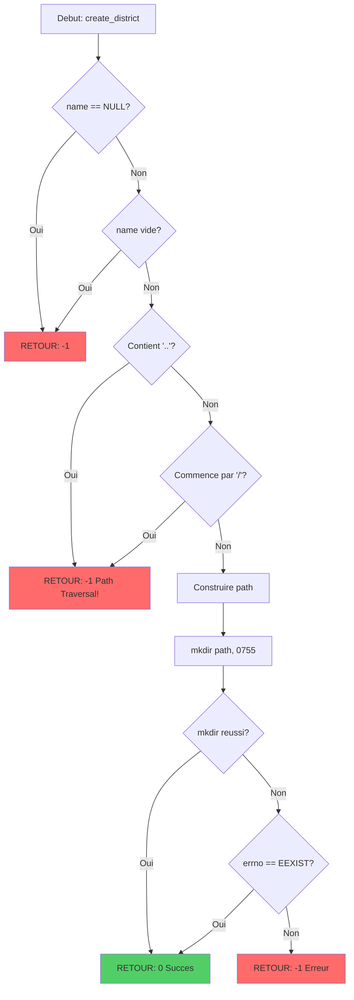

# Exercice 2.10.13-f : capitol_district_manager

**Module :**
2.10.13 — Control Groups (cgroups)

**Concept :**
f — Creating cgroup (mkdir) + Setting limits + PSI monitoring

**Difficulte :**
★★★★★★★☆☆☆ (7/10)

**Type :**
C — cours_code

**Tiers :**
2 — Melange (concepts f + h + d + f du 2.10.14)

**Langage :**
C (C17)

**Prerequis :**
- 2.10.1 : Systeme de fichiers Linux
- 2.10.5 : Manipulation de fichiers (open, read, write, close)
- 2.10.8 : Processus et fork
- Connaissance basique du shell Linux

**Domaines :**
Mem, Process, FS

**Duree estimee :**
90 min

**XP Base :**
150

**Complexite :**
T3 O(n) x S2 O(1)

---

## 1.0 SECTION PROTOTYPE & CONSIGNE

### 1.1 Obligations

**Fichier a rendre :**
`capitol_district_manager.c`

**Fonctions autorisees :**
- `open`, `close`, `read`, `write`
- `mkdir`, `rmdir`
- `snprintf`, `strlen`
- `getpid`

**Fonctions interdites :**
- `system`, `popen`, `exec*`
- `fopen`, `fclose`, `fprintf` (utiliser les syscalls directs)

### 1.2 Consigne

---

## 2.4.1 ANALOGIE : HUNGER GAMES DISTRICTS

**DANS PANEM, LE CAPITOL CONTROLE TOUT.**

Imagine que ton systeme Linux est Panem, et le **kernel** est le **Capitol**. Les processus sont les habitants des **Districts**, et les **cgroups** sont les frontieres de chaque District avec leurs quotas de ressources.

```
                         LE CAPITOL (KERNEL LINUX)
                    ╔═══════════════════════════════════╗
                    ║   CONTROLE TOTAL DES RESSOURCES   ║
                    ║   Distribue CPU, Memoire, I/O     ║
                    ╚═══════════════════════════════════╝
                                    │
          ┌─────────────────────────┼─────────────────────────┐
          │                         │                         │
          ▼                         ▼                         ▼
   ┌─────────────┐          ┌─────────────┐          ┌─────────────┐
   │ DISTRICT 1  │          │ DISTRICT 2  │          │ DISTRICT 12 │
   │ (cgroup_1)  │          │ (cgroup_2)  │          │ (cgroup_12) │
   ├─────────────┤          ├─────────────┤          ├─────────────┤
   │ CPU: 100%   │          │ CPU: 50%    │          │ CPU: 10%    │
   │ RAM: 4GB    │          │ RAM: 2GB    │          │ RAM: 256MB  │
   │ I/O: max    │          │ I/O: 10MB/s │          │ I/O: 1MB/s  │
   └─────────────┘          └─────────────┘          └─────────────┘
   Les Carrieres            District moyen           Katniss & Co
   (processus VIP)          (apps normales)          (processus limites)
```

| Concept Hunger Games | Equivalent cgroups Linux |
|----------------------|--------------------------|
| **Le Capitol** | Le **kernel** qui decide des quotas |
| **Districts** | Les **cgroups** (groupes de controle) |
| **Rations alimentaires** | **cpu.cfs_quota_us** (quota CPU par periode) |
| **Territoire assigne** | **memory.limit_in_bytes** (limite memoire) |
| **Pacificateurs** | **OOM Killer** (tue les processus qui depassent) |
| **Rapports de famine** | **PSI** (Pressure Stall Information) |
| **Moisson (Reaping)** | Assignation d'un PID a un cgroup |
| **Le Mur electrique** | Les limites hard (depassement = mort) |

**POURQUOI CGROUPS = DISTRICTS ?**

Dans Hunger Games, chaque District a des ressources limitees et ne peut pas prendre celles des autres. Le District 12 (charbon) ne peut pas utiliser les ressources du District 1 (luxe).

En Linux, c'est EXACTEMENT pareil :
- Un cgroup "web_server" ne peut pas voler la RAM du cgroup "database"
- Si un processus depasse sa limite, les **Pacificateurs** (OOM Killer) interviennent
- Le Capitol (kernel) surveille tout via **PSI** (Pressure Stall Information)

---

## 2.4.2 ENONCE ACADEMIQUE

Les **Control Groups (cgroups)** sont un mecanisme du noyau Linux permettant d'organiser les processus en groupes hierarchiques et de limiter, comptabiliser et isoler leurs ressources systeme (CPU, memoire, I/O disque, reseau).

**Architecture cgroups v2 :**
```
/sys/fs/cgroup/                          <- Racine cgroups v2
├── cgroup.controllers                   <- Controleurs disponibles
├── cgroup.subtree_control               <- Controleurs actives pour enfants
├── mon_groupe/                          <- Votre cgroup
│   ├── cgroup.procs                     <- PIDs des processus
│   ├── cpu.max                          <- Limite CPU (quota periode)
│   ├── memory.max                       <- Limite memoire hard
│   ├── memory.current                   <- Usage memoire actuel
│   ├── io.max                           <- Limites I/O
│   └── cpu.pressure                     <- Metriques PSI CPU
```

**Votre mission :**

Ecrire une bibliotheque C pour gerer des cgroups v2 permettant de :
1. Creer un cgroup (mkdir dans /sys/fs/cgroup)
2. Activer des controleurs pour les sous-groupes
3. Definir des limites CPU et memoire
4. Ajouter des processus au cgroup
5. Lire les metriques PSI (pression systeme)

**Entree :**
- `cgroup_name` : Nom du cgroup a creer (ex: "district_12")
- `cpu_quota_percent` : Pourcentage CPU autorise (1-100)
- `memory_limit_mb` : Limite memoire en MB

**Sortie :**
- `0` : Succes
- `-1` : Erreur (permission, chemin invalide, etc.)

**Contraintes :**
- Utiliser les syscalls directs (open/write/close), pas stdio
- Gerer proprement les erreurs (verifier chaque retour)
- Nettoyer les ressources (close les fd)
- Support cgroups v2 uniquement (chemin unifie)

**Exemples :**

| Appel | Retour | Explication |
|-------|--------|-------------|
| `create_district("district_12")` | `0` | Cree /sys/fs/cgroup/district_12 |
| `set_cpu_rations("district_12", 25)` | `0` | Limite CPU a 25% (25000 100000) |
| `set_territory("district_12", 256)` | `0` | Limite RAM a 256MB |
| `assign_tribute("district_12", 1234)` | `0` | Ajoute PID 1234 au cgroup |
| `get_famine_report("district_12")` | PSI data | Lit cpu.pressure |

### 1.3 Prototype

```c
#ifndef CAPITOL_DISTRICT_MANAGER_H
#define CAPITOL_DISTRICT_MANAGER_H

#include <stdint.h>

#define CGROUP_V2_BASE "/sys/fs/cgroup"
#define CPU_PERIOD_US 100000  // 100ms periode standard

// Structure pour les metriques PSI
typedef struct s_psi_metrics {
    float   some_avg10;    // % du temps ou CERTAINS processus attendent
    float   some_avg60;
    float   some_avg300;
    uint64_t some_total;   // Total en microsecondes
    float   full_avg10;    // % du temps ou TOUS les processus attendent
    float   full_avg60;
    float   full_avg300;
    uint64_t full_total;
} t_psi_metrics;

// Structure pour un cgroup (District)
typedef struct s_district {
    char    name[256];
    char    path[512];
    int     cpu_quota_percent;
    int     memory_limit_mb;
} t_district;

/*
** Creer un nouveau District (cgroup)
** @param name: Nom du cgroup (ex: "district_12")
** @return: 0 succes, -1 erreur
*/
int create_district(const char *name);

/*
** Definir les rations CPU (quota)
** @param name: Nom du cgroup
** @param percent: Pourcentage CPU (1-100, ou 0 pour unlimited)
** @return: 0 succes, -1 erreur
*/
int set_cpu_rations(const char *name, int percent);

/*
** Definir le territoire (limite memoire)
** @param name: Nom du cgroup
** @param mb: Limite en megaoctets (ou 0 pour unlimited)
** @return: 0 succes, -1 erreur
*/
int set_territory(const char *name, int mb);

/*
** Assigner un Tribut (processus) au District
** @param name: Nom du cgroup
** @param pid: PID du processus a assigner
** @return: 0 succes, -1 erreur
*/
int assign_tribute(const char *name, pid_t pid);

/*
** Obtenir le rapport de famine (PSI metrics)
** @param name: Nom du cgroup
** @param resource: "cpu", "memory", ou "io"
** @param metrics: Structure a remplir
** @return: 0 succes, -1 erreur
*/
int get_famine_report(const char *name, const char *resource, t_psi_metrics *metrics);

/*
** Activer les controleurs pour les sous-groupes
** @param name: Nom du cgroup parent
** @param controllers: Liste "+cpu +memory +io"
** @return: 0 succes, -1 erreur
*/
int enable_peacekeepers(const char *name, const char *controllers);

/*
** Detruire un District (rmdir le cgroup)
** @param name: Nom du cgroup
** @return: 0 succes, -1 erreur
*/
int destroy_district(const char *name);

#endif
```

---

## 2.0 LE SAVIEZ-VOUS ?

**Les cgroups ont ete crees par des ingenieurs Google en 2006.**

Paul Menage et Rohit Seth les ont developpes pour gerer les immenses datacenters de Google. Sans cgroups, un seul processus fou pourrait consommer toutes les ressources d'un serveur et faire tomber Gmail, YouTube, ou Google Search.

**Fun fact :** Docker, Kubernetes, et tous les containers modernes reposent sur cgroups. Quand vous lancez `docker run --memory=512m`, vous creez un cgroup avec `memory.max = 536870912`.

---

## 2.5 DANS LA VRAIE VIE

| Metier | Utilisation des cgroups |
|--------|-------------------------|
| **DevOps/SRE** | Limiter les ressources des containers Docker/K8s |
| **Admin Systeme** | Isoler les services (Apache ne mange pas la RAM de MySQL) |
| **Cloud Engineer** | Multi-tenancy : chaque client a ses quotas |
| **Game Developer** | Empecher un serveur de jeu de monopoliser le CPU |
| **Security Engineer** | Sandboxing : limiter ce qu'un processus suspect peut faire |

---

## 3.0 SECTION EXEMPLE D'UTILISATION

### 3.0 Session bash

```bash
$ ls
capitol_district_manager.c  capitol_district_manager.h  main.c

$ gcc -Wall -Wextra -Werror capitol_district_manager.c main.c -o capitol

$ sudo ./capitol
[CAPITOL] Creating District: district_12
[CAPITOL] District created at /sys/fs/cgroup/district_12
[CAPITOL] Setting CPU rations to 25%
[CAPITOL] cpu.max = 25000 100000
[CAPITOL] Setting memory territory to 256 MB
[CAPITOL] memory.max = 268435456
[CAPITOL] Assigning tribute PID 12345 to district_12
[CAPITOL] Tribute assigned successfully
[CAPITOL] Famine report for district_12 (CPU):
         SOME: avg10=0.50% avg60=0.25% avg300=0.10%
         FULL: avg10=0.00% avg60=0.00% avg300=0.00%
[CAPITOL] Test complete. May the odds be ever in your favor.
```

---

## 3.1 BONUS EXPERT (OPTIONNEL)

**Difficulte Bonus :**
💀💀 (12/10)

**Recompense :**
XP x4

**Time Complexity attendue :**
O(n) pour n processus

**Space Complexity attendue :**
O(1) auxiliaire

**Domaines Bonus :**
`Process, Mem, FS, Crypto`

### 3.1.1 Consigne Bonus

**THE HUNGER GAMES : CATCHING FIRE EDITION**

Le President Snow veut un systeme plus sophistique. Implementez :

1. **Hierarchie de Districts** : Creer des sous-cgroups (District 12 Nord/Sud)
2. **OOM Killer Control** : Configurer `memory.oom.group` pour tuer tout le groupe
3. **Freezer** : Geler/degeler un cgroup entier (comme la pause des Jeux)
4. **Monitoring temps reel** : Thread qui surveille PSI et alerte si pression > seuil
5. **Migration de Tributs** : Deplacer un PID d'un cgroup a un autre

**Contraintes Bonus :**
```
┌─────────────────────────────────────────┐
│  1 <= depth <= 3 (profondeur hierarchie)│
│  Pas de race conditions                 │
│  Gestion complete des erreurs           │
│  Nettoyage RAII-style (cleanup on error)│
└─────────────────────────────────────────┘
```

### 3.1.2 Prototype Bonus

```c
// Hierarchie
int create_sub_district(const char *parent, const char *child);

// OOM Control (tuer tout le groupe si un depasse)
int set_oom_policy(const char *name, int kill_all);

// Freezer (pause/resume tous les processus)
int freeze_district(const char *name);
int thaw_district(const char *name);

// Migration
int migrate_tribute(pid_t pid, const char *from, const char *to);

// Monitoring avec callback
typedef void (*pressure_callback)(const char *name, const char *resource, float pressure);
int start_pressure_monitor(const char *name, float threshold, pressure_callback cb);
int stop_pressure_monitor(const char *name);
```

### 3.1.3 Ce qui change par rapport a l'exercice de base

| Aspect | Base | Bonus |
|--------|------|-------|
| Hierarchie | Plate (1 niveau) | Multi-niveaux (3 max) |
| OOM | Default kernel | Configurable par groupe |
| Freezer | Non | Oui (cgroup.freeze) |
| Monitoring | Lecture ponctuelle | Thread temps reel |
| Migration | Non | Oui (entre cgroups) |

---

## 4.0 SECTION ZONE CORRECTION

### 4.1 Moulinette

| Test | Input | Expected | Points | Trap |
|------|-------|----------|--------|------|
| `test_null_name` | `create_district(NULL)` | `-1` | 5 | Oui |
| `test_empty_name` | `create_district("")` | `-1` | 5 | Oui |
| `test_invalid_path` | `create_district("../escape")` | `-1` | 10 | Oui |
| `test_create_valid` | `create_district("test_cg")` | `0` | 15 | Non |
| `test_cpu_zero` | `set_cpu_rations("test", 0)` | `0` (max) | 10 | Non |
| `test_cpu_150` | `set_cpu_rations("test", 150)` | `-1` | 10 | Oui |
| `test_mem_negative` | `set_territory("test", -1)` | `-1` | 10 | Oui |
| `test_assign_self` | `assign_tribute("test", getpid())` | `0` | 15 | Non |
| `test_psi_parse` | `get_famine_report(...)` | PSI data | 15 | Non |
| `test_destroy` | `destroy_district("test")` | `0` | 5 | Non |

### 4.2 main.c de test

```c
#include <stdio.h>
#include <stdlib.h>
#include <unistd.h>
#include <string.h>
#include "capitol_district_manager.h"

#define TEST(name, cond) do { \
    printf("Test %-30s: ", name); \
    if (cond) { printf("\033[32mOK\033[0m\n"); passed++; } \
    else { printf("\033[31mFAIL\033[0m\n"); failed++; } \
} while(0)

int main(void)
{
    int passed = 0;
    int failed = 0;
    t_psi_metrics psi;

    printf("=== CAPITOL DISTRICT MANAGER TESTS ===\n\n");

    // Test NULL safety
    TEST("create_district(NULL)", create_district(NULL) == -1);
    TEST("create_district(\"\")", create_district("") == -1);

    // Test path traversal protection
    TEST("create_district(\"../evil\")", create_district("../evil") == -1);
    TEST("create_district(\"/absolute\")", create_district("/absolute") == -1);

    // Test valid creation (requires root)
    if (geteuid() == 0)
    {
        TEST("create_district(\"test_district\")",
             create_district("test_district") == 0);

        TEST("set_cpu_rations(25%)",
             set_cpu_rations("test_district", 25) == 0);

        TEST("set_cpu_rations(0 = unlimited)",
             set_cpu_rations("test_district", 0) == 0);

        TEST("set_cpu_rations(150% = invalid)",
             set_cpu_rations("test_district", 150) == -1);

        TEST("set_territory(256 MB)",
             set_territory("test_district", 256) == 0);

        TEST("set_territory(-1 = invalid)",
             set_territory("test_district", -1) == -1);

        TEST("assign_tribute(self)",
             assign_tribute("test_district", getpid()) == 0);

        TEST("get_famine_report(cpu)",
             get_famine_report("test_district", "cpu", &psi) == 0);

        printf("\nPSI CPU Metrics:\n");
        printf("  SOME: avg10=%.2f%% avg60=%.2f%% avg300=%.2f%%\n",
               psi.some_avg10, psi.some_avg60, psi.some_avg300);
        printf("  FULL: avg10=%.2f%% avg60=%.2f%% avg300=%.2f%%\n",
               psi.full_avg10, psi.full_avg60, psi.full_avg300);

        TEST("destroy_district(\"test_district\")",
             destroy_district("test_district") == 0);
    }
    else
    {
        printf("\n[WARN] Skipping root-required tests. Run with sudo.\n");
    }

    printf("\n=== RESULTS: %d passed, %d failed ===\n", passed, failed);
    printf("May the odds be ever in your favor.\n");

    return (failed > 0) ? 1 : 0;
}
```

### 4.3 Solution de reference

```c
#include "capitol_district_manager.h"
#include <fcntl.h>
#include <unistd.h>
#include <string.h>
#include <stdio.h>
#include <stdlib.h>
#include <sys/stat.h>
#include <errno.h>

// Helper: ecrire dans un fichier cgroup
static int write_cgroup_file(const char *path, const char *value)
{
    int fd;
    ssize_t written;
    size_t len;

    if (path == NULL || value == NULL)
        return (-1);

    fd = open(path, O_WRONLY);
    if (fd == -1)
        return (-1);

    len = strlen(value);
    written = write(fd, value, len);
    close(fd);

    return (written == (ssize_t)len) ? 0 : -1;
}

// Helper: lire depuis un fichier cgroup
static int read_cgroup_file(const char *path, char *buffer, size_t size)
{
    int fd;
    ssize_t bytes_read;

    if (path == NULL || buffer == NULL || size == 0)
        return (-1);

    fd = open(path, O_RDONLY);
    if (fd == -1)
        return (-1);

    bytes_read = read(fd, buffer, size - 1);
    close(fd);

    if (bytes_read <= 0)
        return (-1);

    buffer[bytes_read] = '\0';
    return (0);
}

// Helper: valider le nom du cgroup (pas de path traversal)
static int validate_name(const char *name)
{
    if (name == NULL || name[0] == '\0')
        return (-1);
    if (name[0] == '/' || name[0] == '.')
        return (-1);
    if (strstr(name, "..") != NULL)
        return (-1);
    if (strstr(name, "/") != NULL)
        return (-1);
    if (strlen(name) > 255)
        return (-1);
    return (0);
}

int create_district(const char *name)
{
    char path[512];

    if (validate_name(name) == -1)
        return (-1);

    snprintf(path, sizeof(path), "%s/%s", CGROUP_V2_BASE, name);

    if (mkdir(path, 0755) == -1)
    {
        if (errno != EEXIST)
            return (-1);
    }

    return (0);
}

int set_cpu_rations(const char *name, int percent)
{
    char path[512];
    char value[64];
    int quota;

    if (validate_name(name) == -1)
        return (-1);
    if (percent < 0 || percent > 100)
        return (-1);

    snprintf(path, sizeof(path), "%s/%s/cpu.max", CGROUP_V2_BASE, name);

    if (percent == 0)
    {
        // 0 = unlimited
        snprintf(value, sizeof(value), "max %d", CPU_PERIOD_US);
    }
    else
    {
        quota = (CPU_PERIOD_US * percent) / 100;
        snprintf(value, sizeof(value), "%d %d", quota, CPU_PERIOD_US);
    }

    return write_cgroup_file(path, value);
}

int set_territory(const char *name, int mb)
{
    char path[512];
    char value[64];
    long long bytes;

    if (validate_name(name) == -1)
        return (-1);
    if (mb < 0)
        return (-1);

    snprintf(path, sizeof(path), "%s/%s/memory.max", CGROUP_V2_BASE, name);

    if (mb == 0)
    {
        snprintf(value, sizeof(value), "max");
    }
    else
    {
        bytes = (long long)mb * 1024 * 1024;
        snprintf(value, sizeof(value), "%lld", bytes);
    }

    return write_cgroup_file(path, value);
}

int assign_tribute(const char *name, pid_t pid)
{
    char path[512];
    char value[32];

    if (validate_name(name) == -1)
        return (-1);
    if (pid <= 0)
        return (-1);

    snprintf(path, sizeof(path), "%s/%s/cgroup.procs", CGROUP_V2_BASE, name);
    snprintf(value, sizeof(value), "%d", pid);

    return write_cgroup_file(path, value);
}

// Parse une ligne PSI : "some avg10=0.00 avg60=0.00 avg300=0.00 total=0"
static void parse_psi_line(const char *line, int is_full, t_psi_metrics *m)
{
    char *ptr;
    float avg10, avg60, avg300;
    unsigned long long total;

    ptr = strstr(line, "avg10=");
    if (ptr) avg10 = strtof(ptr + 6, NULL); else avg10 = 0;

    ptr = strstr(line, "avg60=");
    if (ptr) avg60 = strtof(ptr + 6, NULL); else avg60 = 0;

    ptr = strstr(line, "avg300=");
    if (ptr) avg300 = strtof(ptr + 7, NULL); else avg300 = 0;

    ptr = strstr(line, "total=");
    if (ptr) total = strtoull(ptr + 6, NULL, 10); else total = 0;

    if (is_full)
    {
        m->full_avg10 = avg10;
        m->full_avg60 = avg60;
        m->full_avg300 = avg300;
        m->full_total = total;
    }
    else
    {
        m->some_avg10 = avg10;
        m->some_avg60 = avg60;
        m->some_avg300 = avg300;
        m->some_total = total;
    }
}

int get_famine_report(const char *name, const char *resource, t_psi_metrics *metrics)
{
    char path[512];
    char buffer[1024];
    char *line;
    char *saveptr;

    if (validate_name(name) == -1)
        return (-1);
    if (resource == NULL || metrics == NULL)
        return (-1);

    // Initialiser les metriques a 0
    memset(metrics, 0, sizeof(t_psi_metrics));

    snprintf(path, sizeof(path), "%s/%s/%s.pressure",
             CGROUP_V2_BASE, name, resource);

    if (read_cgroup_file(path, buffer, sizeof(buffer)) == -1)
        return (-1);

    // Parser ligne par ligne
    line = strtok_r(buffer, "\n", &saveptr);
    while (line != NULL)
    {
        if (strncmp(line, "some", 4) == 0)
            parse_psi_line(line, 0, metrics);
        else if (strncmp(line, "full", 4) == 0)
            parse_psi_line(line, 1, metrics);
        line = strtok_r(NULL, "\n", &saveptr);
    }

    return (0);
}

int enable_peacekeepers(const char *name, const char *controllers)
{
    char path[512];

    if (validate_name(name) == -1)
        return (-1);
    if (controllers == NULL)
        return (-1);

    snprintf(path, sizeof(path), "%s/%s/cgroup.subtree_control",
             CGROUP_V2_BASE, name);

    return write_cgroup_file(path, controllers);
}

int destroy_district(const char *name)
{
    char path[512];

    if (validate_name(name) == -1)
        return (-1);

    snprintf(path, sizeof(path), "%s/%s", CGROUP_V2_BASE, name);

    if (rmdir(path) == -1)
        return (-1);

    return (0);
}
```

### 4.4 Solutions alternatives acceptees

```c
// Alternative 1: Utilisation de dprintf au lieu de write
// (Acceptable car dprintf est POSIX)

static int write_cgroup_file_v2(const char *path, const char *value)
{
    int fd = open(path, O_WRONLY);
    if (fd == -1)
        return (-1);
    dprintf(fd, "%s", value);
    close(fd);
    return (0);
}
```

```c
// Alternative 2: Construction du path avec strcpy/strcat
// (Plus verbeux mais valide)

int create_district_v2(const char *name)
{
    char path[512];

    if (validate_name(name) == -1)
        return (-1);

    strcpy(path, CGROUP_V2_BASE);
    strcat(path, "/");
    strcat(path, name);

    return (mkdir(path, 0755) == 0 || errno == EEXIST) ? 0 : -1;
}
```

### 4.5 Solutions refusees (avec explications)

```c
// REFUSE 1: Utilisation de system() - INTERDIT
int create_district_bad(const char *name)
{
    char cmd[1024];
    snprintf(cmd, sizeof(cmd), "mkdir -p /sys/fs/cgroup/%s", name);
    return system(cmd);  // INTERDIT: Injection de commande possible!
}
// Pourquoi refuse: system() permet l'injection de commandes si name contient
// des caracteres speciaux comme "; rm -rf /"
```

```c
// REFUSE 2: Pas de validation du nom
int create_district_unsafe(const char *name)
{
    char path[512];
    snprintf(path, sizeof(path), "%s/%s", CGROUP_V2_BASE, name);
    return mkdir(path, 0755) == 0 ? 0 : -1;
}
// Pourquoi refuse: Path traversal possible avec "../../../etc/passwd"
```

```c
// REFUSE 3: Fuite de file descriptor
int set_cpu_rations_leak(const char *name, int percent)
{
    char path[512];
    char value[64];
    int fd;

    snprintf(path, sizeof(path), "%s/%s/cpu.max", CGROUP_V2_BASE, name);
    fd = open(path, O_WRONLY);
    if (fd == -1)
        return (-1);

    snprintf(value, sizeof(value), "%d %d", percent * 1000, 100000);
    write(fd, value, strlen(value));
    // OUBLI: close(fd) manquant!
    return (0);
}
// Pourquoi refuse: Fuite de descripteur de fichier, epuisement possible
```

### 4.6 Solution bonus de reference

```c
// BONUS: Hierarchie, OOM, Freezer, Migration, Monitoring

#include <pthread.h>
#include <signal.h>

static volatile int g_monitor_running = 0;
static pthread_t g_monitor_thread;
static pressure_callback g_callback = NULL;
static char g_monitored_name[256];
static float g_threshold = 0.0;

int create_sub_district(const char *parent, const char *child)
{
    char path[512];

    if (validate_name(parent) == -1 || validate_name(child) == -1)
        return (-1);

    // D'abord activer les controleurs pour le parent
    enable_peacekeepers(parent, "+cpu +memory +io");

    snprintf(path, sizeof(path), "%s/%s/%s", CGROUP_V2_BASE, parent, child);

    if (mkdir(path, 0755) == -1 && errno != EEXIST)
        return (-1);

    return (0);
}

int set_oom_policy(const char *name, int kill_all)
{
    char path[512];

    if (validate_name(name) == -1)
        return (-1);

    snprintf(path, sizeof(path), "%s/%s/memory.oom.group", CGROUP_V2_BASE, name);

    return write_cgroup_file(path, kill_all ? "1" : "0");
}

int freeze_district(const char *name)
{
    char path[512];

    if (validate_name(name) == -1)
        return (-1);

    snprintf(path, sizeof(path), "%s/%s/cgroup.freeze", CGROUP_V2_BASE, name);

    return write_cgroup_file(path, "1");
}

int thaw_district(const char *name)
{
    char path[512];

    if (validate_name(name) == -1)
        return (-1);

    snprintf(path, sizeof(path), "%s/%s/cgroup.freeze", CGROUP_V2_BASE, name);

    return write_cgroup_file(path, "0");
}

int migrate_tribute(pid_t pid, const char *from, const char *to)
{
    char path_from[512];
    char path_to[512];
    char buffer[1024];
    char *line;
    char *saveptr;
    pid_t current_pid;
    int found = 0;

    if (validate_name(from) == -1 || validate_name(to) == -1)
        return (-1);
    if (pid <= 0)
        return (-1);

    // Verifier que le PID est bien dans le cgroup source
    snprintf(path_from, sizeof(path_from), "%s/%s/cgroup.procs",
             CGROUP_V2_BASE, from);

    if (read_cgroup_file(path_from, buffer, sizeof(buffer)) == -1)
        return (-1);

    line = strtok_r(buffer, "\n", &saveptr);
    while (line != NULL)
    {
        current_pid = atoi(line);
        if (current_pid == pid)
        {
            found = 1;
            break;
        }
        line = strtok_r(NULL, "\n", &saveptr);
    }

    if (!found)
        return (-1);

    // Migrer vers le cgroup destination
    snprintf(path_to, sizeof(path_to), "%s/%s/cgroup.procs",
             CGROUP_V2_BASE, to);

    char pid_str[32];
    snprintf(pid_str, sizeof(pid_str), "%d", pid);

    return write_cgroup_file(path_to, pid_str);
}

static void *monitor_thread_func(void *arg)
{
    t_psi_metrics metrics;
    (void)arg;

    while (g_monitor_running)
    {
        if (get_famine_report(g_monitored_name, "cpu", &metrics) == 0)
        {
            if (metrics.some_avg10 > g_threshold && g_callback)
                g_callback(g_monitored_name, "cpu", metrics.some_avg10);
        }

        if (get_famine_report(g_monitored_name, "memory", &metrics) == 0)
        {
            if (metrics.some_avg10 > g_threshold && g_callback)
                g_callback(g_monitored_name, "memory", metrics.some_avg10);
        }

        sleep(1);
    }

    return (NULL);
}

int start_pressure_monitor(const char *name, float threshold, pressure_callback cb)
{
    if (validate_name(name) == -1 || cb == NULL)
        return (-1);
    if (g_monitor_running)
        return (-1);

    strncpy(g_monitored_name, name, sizeof(g_monitored_name) - 1);
    g_threshold = threshold;
    g_callback = cb;
    g_monitor_running = 1;

    if (pthread_create(&g_monitor_thread, NULL, monitor_thread_func, NULL) != 0)
    {
        g_monitor_running = 0;
        return (-1);
    }

    return (0);
}

int stop_pressure_monitor(const char *name)
{
    (void)name;

    if (!g_monitor_running)
        return (-1);

    g_monitor_running = 0;
    pthread_join(g_monitor_thread, NULL);

    return (0);
}
```

### 4.7 Solutions alternatives bonus

```c
// Alternative: Monitoring avec select/poll au lieu de sleep
// Plus reactif mais plus complexe

#include <poll.h>

static void *monitor_thread_poll(void *arg)
{
    char path[512];
    int fd;
    struct pollfd pfd;

    (void)arg;

    snprintf(path, sizeof(path), "%s/%s/cpu.pressure",
             CGROUP_V2_BASE, g_monitored_name);

    fd = open(path, O_RDONLY | O_NONBLOCK);
    if (fd == -1)
        return (NULL);

    pfd.fd = fd;
    pfd.events = POLLPRI;

    while (g_monitor_running)
    {
        // PSI supporte les notifications via poll()
        if (poll(&pfd, 1, 1000) > 0)
        {
            t_psi_metrics metrics;
            if (get_famine_report(g_monitored_name, "cpu", &metrics) == 0)
            {
                if (metrics.some_avg10 > g_threshold && g_callback)
                    g_callback(g_monitored_name, "cpu", metrics.some_avg10);
            }
        }
    }

    close(fd);
    return (NULL);
}
```

### 4.8 Solutions refusees bonus

```c
// REFUSE: Race condition dans la migration
int migrate_tribute_race(pid_t pid, const char *from, const char *to)
{
    // PROBLEME: Entre la verification et l'ecriture,
    // le processus peut avoir quitte le cgroup source
    // Pas de verrouillage atomique

    // La bonne approche est de simplement ecrire dans le cgroup destination
    // et laisser le kernel gerer (il retournera une erreur si le PID n'existe pas)
}
```

### 4.9 spec.json (ENGINE v22.1)

```json
{
  "name": "capitol_district_manager",
  "language": "c",
  "type": "cours_code",
  "tier": 2,
  "tier_info": "Melange (concepts cgroup creation + limits + PSI)",
  "tags": ["cgroups", "linux", "system", "containers", "phase2"],
  "passing_score": 70,

  "function": {
    "name": "create_district",
    "prototype": "int create_district(const char *name)",
    "return_type": "int",
    "parameters": [
      {"name": "name", "type": "const char *"}
    ],
    "additional_functions": [
      {
        "name": "set_cpu_rations",
        "prototype": "int set_cpu_rations(const char *name, int percent)",
        "return_type": "int"
      },
      {
        "name": "set_territory",
        "prototype": "int set_territory(const char *name, int mb)",
        "return_type": "int"
      },
      {
        "name": "assign_tribute",
        "prototype": "int assign_tribute(const char *name, pid_t pid)",
        "return_type": "int"
      },
      {
        "name": "get_famine_report",
        "prototype": "int get_famine_report(const char *name, const char *resource, t_psi_metrics *metrics)",
        "return_type": "int"
      },
      {
        "name": "destroy_district",
        "prototype": "int destroy_district(const char *name)",
        "return_type": "int"
      }
    ]
  },

  "driver": {
    "reference": "static int validate_name(const char *name) { if (name == NULL || name[0] == '\\0') return (-1); if (name[0] == '/' || name[0] == '.') return (-1); if (strstr(name, \"..\") != NULL) return (-1); return (0); } int ref_create_district(const char *name) { char path[512]; if (validate_name(name) == -1) return (-1); snprintf(path, sizeof(path), \"/sys/fs/cgroup/%s\", name); return (mkdir(path, 0755) == 0 || errno == EEXIST) ? 0 : -1; }",

    "edge_cases": [
      {
        "name": "null_input",
        "args": [null],
        "expected": -1,
        "is_trap": true,
        "trap_explanation": "name est NULL, doit retourner -1"
      },
      {
        "name": "empty_string",
        "args": [""],
        "expected": -1,
        "is_trap": true,
        "trap_explanation": "Chaine vide invalide pour nom de cgroup"
      },
      {
        "name": "path_traversal_dotdot",
        "args": ["../escape"],
        "expected": -1,
        "is_trap": true,
        "trap_explanation": "Tentative de path traversal avec .."
      },
      {
        "name": "path_traversal_absolute",
        "args": ["/etc/passwd"],
        "expected": -1,
        "is_trap": true,
        "trap_explanation": "Chemin absolu interdit"
      },
      {
        "name": "valid_simple_name",
        "args": ["test_cgroup"],
        "expected": 0
      },
      {
        "name": "valid_with_underscore",
        "args": ["district_12"],
        "expected": 0
      },
      {
        "name": "cpu_percent_negative",
        "function": "set_cpu_rations",
        "args": ["test", -10],
        "expected": -1,
        "is_trap": true
      },
      {
        "name": "cpu_percent_over_100",
        "function": "set_cpu_rations",
        "args": ["test", 150],
        "expected": -1,
        "is_trap": true
      },
      {
        "name": "cpu_percent_valid",
        "function": "set_cpu_rations",
        "args": ["test", 50],
        "expected": 0
      },
      {
        "name": "memory_negative",
        "function": "set_territory",
        "args": ["test", -1],
        "expected": -1,
        "is_trap": true
      }
    ],

    "fuzzing": {
      "enabled": true,
      "iterations": 500,
      "generators": [
        {
          "type": "string",
          "param_index": 0,
          "params": {
            "min_len": 0,
            "max_len": 300,
            "charset": "alphanumeric"
          }
        }
      ]
    }
  },

  "norm": {
    "allowed_functions": ["open", "close", "read", "write", "mkdir", "rmdir", "snprintf", "strlen", "getpid", "memset", "strstr", "strtok_r", "strtof", "strtoull", "strncmp", "strncpy", "atoi"],
    "forbidden_functions": ["system", "popen", "exec", "execve", "execvp", "fopen", "fclose", "fprintf", "fscanf"],
    "check_security": true,
    "check_memory": true,
    "blocking": true
  },

  "requires_root": true,
  "timeout_seconds": 30
}
```

### 4.10 Solutions Mutantes (minimum 5)

```c
/* Mutant A (Boundary) : Off-by-one dans validation de longueur */
static int validate_name_mutant_a(const char *name)
{
    if (name == NULL || name[0] == '\0')
        return (-1);
    if (strlen(name) >= 255)  // BUG: devrait etre > 255
        return (-1);
    return (0);
}
// Pourquoi c'est faux : Accepte un nom de 255 caracteres qui causera
// un buffer overflow dans path[512] avec le prefixe "/sys/fs/cgroup/"
// Ce qui etait pense : "255 c'est la limite max"
```

```c
/* Mutant B (Safety) : Pas de validation du nom - Path Traversal */
int create_district_mutant_b(const char *name)
{
    char path[512];

    if (name == NULL)  // Verifie seulement NULL, pas le contenu
        return (-1);

    snprintf(path, sizeof(path), "%s/%s", CGROUP_V2_BASE, name);
    return mkdir(path, 0755) == 0 ? 0 : -1;
}
// Pourquoi c'est faux : Permet "../../../tmp/evil" comme nom
// Ce qui etait pense : "Si le nom n'est pas NULL c'est bon"
```

```c
/* Mutant C (Resource) : Fuite de file descriptor */
int set_cpu_rations_mutant_c(const char *name, int percent)
{
    char path[512];
    char value[64];
    int fd;

    if (validate_name(name) == -1)
        return (-1);

    snprintf(path, sizeof(path), "%s/%s/cpu.max", CGROUP_V2_BASE, name);
    fd = open(path, O_WRONLY);
    if (fd == -1)
        return (-1);

    snprintf(value, sizeof(value), "%d %d", percent * 1000, 100000);
    if (write(fd, value, strlen(value)) == -1)
        return (-1);  // BUG: fd pas ferme avant return!

    close(fd);
    return (0);
}
// Pourquoi c'est faux : Si write() echoue, le fd n'est jamais ferme
// Apres 1024 appels, le processus n'a plus de fd disponibles
// Ce qui etait pense : "return -1 suffit pour signaler l'erreur"
```

```c
/* Mutant D (Logic) : Mauvais calcul du quota CPU */
int set_cpu_rations_mutant_d(const char *name, int percent)
{
    char path[512];
    char value[64];
    int quota;

    if (validate_name(name) == -1 || percent < 0 || percent > 100)
        return (-1);

    snprintf(path, sizeof(path), "%s/%s/cpu.max", CGROUP_V2_BASE, name);

    // BUG: Division entiere avant multiplication
    quota = (percent / 100) * CPU_PERIOD_US;  // Toujours 0 si percent < 100!
    snprintf(value, sizeof(value), "%d %d", quota, CPU_PERIOD_US);

    return write_cgroup_file(path, value);
}
// Pourquoi c'est faux : percent/100 = 0 pour tout percent < 100
// 50/100 = 0 en arithmetique entiere, puis 0 * 100000 = 0
// Ce qui etait pense : "percent / 100 donne un ratio"
```

```c
/* Mutant E (Return) : Mauvaise gestion du retour de mkdir */
int create_district_mutant_e(const char *name)
{
    char path[512];
    int ret;

    if (validate_name(name) == -1)
        return (-1);

    snprintf(path, sizeof(path), "%s/%s", CGROUP_V2_BASE, name);
    ret = mkdir(path, 0755);

    // BUG: Ne gere pas EEXIST comme succes
    return ret;  // Retourne -1 si le cgroup existe deja!
}
// Pourquoi c'est faux : Si le cgroup existe, mkdir retourne -1 avec errno=EEXIST
// Ce n'est pas une erreur, juste un cgroup deja cree
// Ce qui etait pense : "mkdir retourne 0 ou -1, je retourne la meme chose"
```

---

## 5.0 SECTION COMPRENDRE

### 5.1 Ce que cet exercice enseigne

1. **Cgroups v2** : La hierarchie unifiee de gestion des ressources Linux
2. **Syscalls fichiers** : Manipuler /sys/fs/cgroup via open/write/close
3. **Validation d'entree** : Proteger contre path traversal et injection
4. **PSI (Pressure Stall Information)** : Monitorer la pression ressources
5. **Gestion des erreurs** : Verifier chaque retour, fermer les ressources

### 5.2 LDA - Traduction Litterale en MAJUSCULES

```
FONCTION create_district QUI RETOURNE UN ENTIER ET PREND EN PARAMETRE name QUI EST UN POINTEUR VERS UNE CHAINE CONSTANTE
DEBUT FONCTION
    DECLARER path COMME TABLEAU DE 512 CARACTERES

    SI validate_name(name) RETOURNE MOINS 1 ALORS
        RETOURNER LA VALEUR MOINS 1
    FIN SI

    APPELER snprintf POUR FORMATER path AVEC LE FORMAT "%s/%s" EN UTILISANT CGROUP_V2_BASE ET name

    SI mkdir(path, 0755) RETOURNE MOINS 1 ALORS
        SI errno EST DIFFERENT DE EEXIST ALORS
            RETOURNER LA VALEUR MOINS 1
        FIN SI
    FIN SI

    RETOURNER LA VALEUR 0
FIN FONCTION

FONCTION set_cpu_rations QUI RETOURNE UN ENTIER ET PREND EN PARAMETRES name ET percent
DEBUT FONCTION
    DECLARER path COMME TABLEAU DE 512 CARACTERES
    DECLARER value COMME TABLEAU DE 64 CARACTERES
    DECLARER quota COMME ENTIER

    SI validate_name(name) RETOURNE MOINS 1 ALORS
        RETOURNER LA VALEUR MOINS 1
    FIN SI

    SI percent EST INFERIEUR A 0 OU percent EST SUPERIEUR A 100 ALORS
        RETOURNER LA VALEUR MOINS 1
    FIN SI

    FORMATER path AVEC LE CHEMIN VERS cpu.max

    SI percent EST EGAL A 0 ALORS
        AFFECTER "max 100000" A value (QUOTA ILLIMITE)
    SINON
        AFFECTER (CPU_PERIOD_US MULTIPLIE PAR percent) DIVISE PAR 100 A quota
        FORMATER value AVEC quota ET CPU_PERIOD_US
    FIN SI

    RETOURNER LE RESULTAT DE write_cgroup_file(path, value)
FIN FONCTION
```

### 5.2.2 LDA Style Academique

```
ALGORITHME : Gestionnaire de Ressources cgroups
ENTREES : nom du groupe, pourcentage CPU, limite memoire
SORTIES : 0 si succes, -1 si erreur

VARIABLES :
    chemin : chaine[512]
    valeur : chaine[64]
    descripteur : entier

DEBUT
    # Etape 1 : Validation
    SI nom EST NUL OU nom CONTIENT ".." OU nom COMMENCE PAR "/" ALORS
        RETOURNER -1
    FIN SI

    # Etape 2 : Construction du chemin
    chemin <- CONCATENER("/sys/fs/cgroup/", nom)

    # Etape 3 : Creation du repertoire
    APPELER mkdir(chemin, 0755)
    SI echec ET erreur != "deja existant" ALORS
        RETOURNER -1
    FIN SI

    # Etape 4 : Configuration CPU
    descripteur <- OUVRIR(chemin + "/cpu.max", ECRITURE)
    SI descripteur == -1 ALORS
        RETOURNER -1
    FIN SI

    valeur <- FORMATER("%d %d", quota, periode)
    ECRIRE(descripteur, valeur)
    FERMER(descripteur)

    RETOURNER 0
FIN
```

### 5.2.2.1 Logic Flow (Structured English)

```
ALGORITHM: Capitol District Manager
---
1. VALIDATE input name
   - REJECT if NULL or empty
   - REJECT if contains path traversal characters
   - REJECT if starts with "/" or "."

2. CREATE cgroup directory
   a. BUILD path: /sys/fs/cgroup/{name}
   b. CALL mkdir() with permissions 0755
   c. IF failed AND error is NOT "already exists"
      RETURN error
   d. ENDIF

3. SET CPU quota
   a. OPEN {cgroup_path}/cpu.max for writing
   b. IF percent is 0
      WRITE "max {period}" (unlimited)
   c. ELSE
      COMPUTE quota = (period * percent) / 100
      WRITE "{quota} {period}"
   d. CLOSE file descriptor

4. SET memory limit
   a. OPEN {cgroup_path}/memory.max for writing
   b. IF mb is 0
      WRITE "max" (unlimited)
   c. ELSE
      COMPUTE bytes = mb * 1024 * 1024
      WRITE "{bytes}"
   d. CLOSE file descriptor

5. RETURN success
```

### 5.2.3 Representation Algorithmique (Logique de Garde)

```
FONCTION : create_district(name)
---
INIT resultat = -1

1. GARDES (Fail Fast) :
   |
   |-- VERIFIER si name est NULL :
   |     RETOURNER -1 immediatement
   |
   |-- VERIFIER si name est vide :
   |     RETOURNER -1 immediatement
   |
   |-- VERIFIER si name contient ".." :
   |     RETOURNER -1 (tentative d'evasion)
   |
   |-- VERIFIER si name commence par "/" :
   |     RETOURNER -1 (chemin absolu interdit)

2. LOGIQUE PRINCIPALE :
   |
   |-- CONSTRUIRE le chemin complet
   |     path = /sys/fs/cgroup/ + name
   |
   |-- CREER le repertoire
   |     ret = mkdir(path, 0755)
   |
   |-- VERIFIER le resultat :
   |     SI ret == 0 OU errno == EEXIST :
   |         RETOURNER 0 (succes)
   |     SINON :
   |         RETOURNER -1 (echec)

3. FIN : resultat retourne
```

### 5.2.3.1 Diagramme Mermaid



```mermaid
graph LR
    subgraph "CGROUPS V2 HIERARCHY"
        A[/sys/fs/cgroup] --> B[district_1]
        A --> C[district_2]
        A --> D[district_12]

        B --> B1[cgroup.procs]
        B --> B2[cpu.max]
        B --> B3[memory.max]
        B --> B4[cpu.pressure]

        D --> D1[cgroup.procs]
        D --> D2[cpu.max: 10000 100000]
        D --> D3[memory.max: 268435456]
    end

    style A fill:#4c6ef5
    style D fill:#fab005
    style D2 fill:#ff8787
    style D3 fill:#ff8787
```

### 5.3 Visualisation ASCII

```
                    CGROUPS V2 : LE SYSTEME DE DISTRICTS

    /sys/fs/cgroup/                    <- LA CAPITALE (racine)
    │
    ├── cgroup.controllers             <- Controleurs disponibles
    │   "cpu cpuset io memory pids"       (ressources qu'on peut limiter)
    │
    ├── cgroup.subtree_control         <- Actives pour les enfants
    │   "+cpu +memory +io"                (heritage des droits)
    │
    ├── district_1/                    <- DISTRICT 1 (les Carrieres)
    │   ├── cgroup.procs               <- Liste des PIDs (Tributs)
    │   │   "1234\n5678\n"
    │   ├── cpu.max                    <- Quota CPU
    │   │   "max 100000"                  (illimite)
    │   ├── memory.max                 <- Limite memoire
    │   │   "max"                         (illimite)
    │   └── cpu.pressure               <- Rapport de famine (PSI)
    │       "some avg10=0.00..."
    │
    ├── district_12/                   <- DISTRICT 12 (Katniss)
    │   ├── cgroup.procs
    │   │   "9999\n"                      (un seul tribut)
    │   ├── cpu.max
    │   │   "10000 100000"                (10% CPU seulement!)
    │   ├── memory.max
    │   │   "268435456"                   (256 MB max)
    │   └── memory.pressure            <- FAMINE DETECTEE!
    │       "some avg10=45.23..."         (45% du temps en attente)
    │
    └── system.slice/                  <- Services systeme
        └── ...


    ╔══════════════════════════════════════════════════════════════════╗
    ║                    FLUX D'UNE LIMITATION CPU                      ║
    ╠══════════════════════════════════════════════════════════════════╣
    ║                                                                   ║
    ║   1. ECRIRE "25000 100000" dans cpu.max                          ║
    ║                                                                   ║
    ║   2. SIGNIFICATION :                                             ║
    ║      ┌─────────────────────────────────────────────────────┐     ║
    ║      │  quota = 25000 us    periode = 100000 us            │     ║
    ║      │                                                      │     ║
    ║      │  Sur chaque periode de 100ms, le cgroup peut        │     ║
    ║      │  utiliser maximum 25ms de CPU = 25%                 │     ║
    ║      └─────────────────────────────────────────────────────┘     ║
    ║                                                                   ║
    ║   3. TIMELINE :                                                  ║
    ║                                                                   ║
    ║      |<-------- 100ms periode -------->|                         ║
    ║      |                                  |                         ║
    ║      |████████░░░░░░░░░░░░░░░░░░░░░░░░░|                         ║
    ║      |  25ms  |      75ms BLOQUE       |                         ║
    ║      | ACTIF  |   (throttled)          |                         ║
    ║                                                                   ║
    ╚══════════════════════════════════════════════════════════════════╝


    ╔══════════════════════════════════════════════════════════════════╗
    ║                    PSI : PRESSURE STALL INFORMATION               ║
    ╠══════════════════════════════════════════════════════════════════╣
    ║                                                                   ║
    ║   Fichier cpu.pressure :                                         ║
    ║   ┌────────────────────────────────────────────────────────┐     ║
    ║   │ some avg10=0.50 avg60=0.25 avg300=0.10 total=123456   │     ║
    ║   │ full avg10=0.00 avg60=0.00 avg300=0.00 total=0        │     ║
    ║   └────────────────────────────────────────────────────────┘     ║
    ║                                                                   ║
    ║   SOME : Au moins UN processus attend                            ║
    ║   FULL : TOUS les processus attendent                            ║
    ║                                                                   ║
    ║   avg10  : Moyenne sur 10 secondes                               ║
    ║   avg60  : Moyenne sur 60 secondes                               ║
    ║   avg300 : Moyenne sur 5 minutes                                 ║
    ║   total  : Temps total en microsecondes                          ║
    ║                                                                   ║
    ║   INTERPRETATION :                                               ║
    ║   ┌──────────────────────────────────────────────────┐           ║
    ║   │ some avg10=45.23 → 45% du temps, des processus   │           ║
    ║   │                    attendent des ressources      │           ║
    ║   │                    = FAMINE dans le District!    │           ║
    ║   └──────────────────────────────────────────────────┘           ║
    ║                                                                   ║
    ╚══════════════════════════════════════════════════════════════════╝
```

### 5.4 Les pieges en detail

| Piege | Description | Solution |
|-------|-------------|----------|
| **Path Traversal** | `../../../etc/passwd` comme nom | Valider : pas de `..`, pas de `/` au debut |
| **Buffer Overflow** | Nom trop long + prefixe | Limiter la taille du nom a 255 chars |
| **Fuite de FD** | Oublier close() en cas d'erreur | Pattern : close avant chaque return |
| **Arithmetique entiere** | `percent/100 * period` = 0 | Faire `(period * percent) / 100` |
| **EEXIST** | mkdir echoue si existe | Traiter EEXIST comme succes |
| **Permissions** | Besoin de root pour /sys/fs/cgroup | Verifier geteuid() ou documenter |
| **PSI non disponible** | Kernels anciens sans PSI | Verifier si fichier existe |

### 5.5 Cours Complet : Control Groups Linux

#### 5.5.1 Introduction aux cgroups

Les **Control Groups (cgroups)** sont un mecanisme du noyau Linux qui permet de :

1. **Organiser** les processus en groupes hierarchiques
2. **Limiter** les ressources (CPU, memoire, I/O, reseau)
3. **Comptabiliser** l'utilisation des ressources
4. **Isoler** les groupes les uns des autres

**Historique :**
- 2006 : Cree par Google (Paul Menage, Rohit Seth)
- 2008 : Integre dans le kernel Linux 2.6.24
- 2016 : cgroups v2 devient stable (kernel 4.5)
- Aujourd'hui : Base de Docker, Kubernetes, systemd

#### 5.5.2 cgroups v1 vs v2

| Aspect | cgroups v1 | cgroups v2 |
|--------|------------|------------|
| Hierarchie | Multiple (une par controleur) | Unifiee (une seule) |
| Montage | `/sys/fs/cgroup/cpu`, `/sys/fs/cgroup/memory` | `/sys/fs/cgroup` uniquement |
| Complexite | Plus complexe, incoherences | Simplifie, coherent |
| PSI | Non | Oui (Pressure Stall Information) |
| Recommande | Legacy | Moderne (depuis 2020) |

**Detection de la version :**
```c
// cgroups v2 si ce fichier existe
if (access("/sys/fs/cgroup/cgroup.controllers", F_OK) == 0)
    // v2
else
    // v1
```

#### 5.5.3 Controleurs disponibles

| Controleur | Fichiers | Description |
|------------|----------|-------------|
| **cpu** | `cpu.max`, `cpu.weight` | Limite et priorite CPU |
| **memory** | `memory.max`, `memory.current` | Limite memoire |
| **io** | `io.max`, `io.weight` | Limite I/O disque |
| **pids** | `pids.max`, `pids.current` | Limite nombre de processus |
| **cpuset** | `cpuset.cpus`, `cpuset.mems` | Affinite CPU/NUMA |

#### 5.5.4 Format des fichiers de controle

**cpu.max** (limite CPU) :
```
QUOTA PERIOD
25000 100000    <- 25% CPU (25ms sur 100ms)
max 100000      <- Illimite
```

**memory.max** (limite memoire) :
```
268435456       <- 256 MB en bytes
max             <- Illimite
```

**cgroup.procs** (liste des PIDs) :
```
1234
5678
9012
```

#### 5.5.5 PSI : Pressure Stall Information

PSI mesure le temps perdu a attendre des ressources. Introduit dans Linux 4.20.

**Format :**
```
some avg10=0.50 avg60=0.25 avg300=0.10 total=123456
full avg10=0.00 avg60=0.00 avg300=0.00 total=0
```

| Metrique | Signification |
|----------|---------------|
| `some` | Au moins un processus attend |
| `full` | TOUS les processus attendent |
| `avg10` | Moyenne sur 10 secondes (%) |
| `avg60` | Moyenne sur 60 secondes (%) |
| `avg300` | Moyenne sur 5 minutes (%) |
| `total` | Total cumule en microsecondes |

**Seuils d'alerte recommandes :**
- `some avg10 > 10%` : Contention legere
- `some avg10 > 40%` : Contention severe
- `full avg10 > 0%` : Blocage total, probleme critique

### 5.6 Normes avec explications pedagogiques

```
┌─────────────────────────────────────────────────────────────────┐
│ HORS NORME (compile, mais interdit)                             │
├─────────────────────────────────────────────────────────────────┤
│ int fd = open(path, O_WRONLY);                                  │
│ write(fd, value, strlen(value));                                │
│ return 0;  // fd jamais ferme!                                  │
├─────────────────────────────────────────────────────────────────┤
│ CONFORME                                                        │
├─────────────────────────────────────────────────────────────────┤
│ int fd = open(path, O_WRONLY);                                  │
│ if (fd == -1)                                                   │
│     return (-1);                                                │
│ ssize_t ret = write(fd, value, strlen(value));                  │
│ close(fd);                                                      │
│ return (ret == -1) ? -1 : 0;                                    │
├─────────────────────────────────────────────────────────────────┤
│ POURQUOI ?                                                      │
│                                                                 │
│ - Fuite de ressources : un fd non ferme reste ouvert           │
│ - Limite systeme : max 1024 fd par processus (ulimit -n)        │
│ - Securite : fichier reste verrouille/accessible                │
│ - Professionnalisme : code propre = code maintenable            │
└─────────────────────────────────────────────────────────────────┘
```

```
┌─────────────────────────────────────────────────────────────────┐
│ HORS NORME                                                      │
├─────────────────────────────────────────────────────────────────┤
│ sprintf(path, "/sys/fs/cgroup/%s", name);                       │
├─────────────────────────────────────────────────────────────────┤
│ CONFORME                                                        │
├─────────────────────────────────────────────────────────────────┤
│ snprintf(path, sizeof(path), "/sys/fs/cgroup/%s", name);        │
├─────────────────────────────────────────────────────────────────┤
│ POURQUOI ?                                                      │
│                                                                 │
│ - sprintf : pas de limite, buffer overflow possible             │
│ - snprintf : limite a sizeof(path) caracteres                   │
│ - Securite : un nom malveillant ne peut pas deborder            │
│ - Defense en profondeur : meme avec validation, on protege      │
└─────────────────────────────────────────────────────────────────┘
```

### 5.7 Simulation avec trace d'execution

**Appel : `create_district("district_12")`**

```
┌───────┬──────────────────────────────────────────────┬─────────────────────────┬───────────────────────────┐
│ Etape │ Instruction                                  │ Variables               │ Explication               │
├───────┼──────────────────────────────────────────────┼─────────────────────────┼───────────────────────────┤
│   1   │ validate_name("district_12")                 │ name="district_12"      │ Verification securite     │
├───────┼──────────────────────────────────────────────┼─────────────────────────┼───────────────────────────┤
│   2   │ name[0] == '/' ?                             │ 'd' != '/'              │ FAUX, pas absolu          │
├───────┼──────────────────────────────────────────────┼─────────────────────────┼───────────────────────────┤
│   3   │ strstr(name, "..") ?                         │ NULL                    │ FAUX, pas de traversal    │
├───────┼──────────────────────────────────────────────┼─────────────────────────┼───────────────────────────┤
│   4   │ validate_name retourne                       │ return 0                │ Nom valide                │
├───────┼──────────────────────────────────────────────┼─────────────────────────┼───────────────────────────┤
│   5   │ snprintf(path, ...)                          │ path="/sys/fs/cgroup/   │ Construction chemin       │
│       │                                              │       district_12"      │                           │
├───────┼──────────────────────────────────────────────┼─────────────────────────┼───────────────────────────┤
│   6   │ mkdir(path, 0755)                            │ ret=0                   │ Repertoire cree           │
├───────┼──────────────────────────────────────────────┼─────────────────────────┼───────────────────────────┤
│   7   │ return 0                                     │                         │ SUCCES                    │
└───────┴──────────────────────────────────────────────┴─────────────────────────┴───────────────────────────┘
```

**Appel : `set_cpu_rations("district_12", 25)`**

```
┌───────┬──────────────────────────────────────────────┬─────────────────────────┬───────────────────────────┐
│ Etape │ Instruction                                  │ Variables               │ Explication               │
├───────┼──────────────────────────────────────────────┼─────────────────────────┼───────────────────────────┤
│   1   │ validate_name("district_12")                 │ return 0                │ OK                        │
├───────┼──────────────────────────────────────────────┼─────────────────────────┼───────────────────────────┤
│   2   │ percent < 0 || percent > 100 ?               │ 25 dans [0,100]         │ FAUX, valeur valide       │
├───────┼──────────────────────────────────────────────┼─────────────────────────┼───────────────────────────┤
│   3   │ snprintf(path, ..., "cpu.max")               │ path=".../cpu.max"      │ Chemin fichier CPU        │
├───────┼──────────────────────────────────────────────┼─────────────────────────┼───────────────────────────┤
│   4   │ percent == 0 ?                               │ 25 != 0                 │ FAUX, pas illimite        │
├───────┼──────────────────────────────────────────────┼─────────────────────────┼───────────────────────────┤
│   5   │ quota = (100000 * 25) / 100                  │ quota=25000             │ 25% de la periode         │
├───────┼──────────────────────────────────────────────┼─────────────────────────┼───────────────────────────┤
│   6   │ snprintf(value, ..., quota, period)          │ value="25000 100000"    │ Format cgroup             │
├───────┼──────────────────────────────────────────────┼─────────────────────────┼───────────────────────────┤
│   7   │ fd = open(path, O_WRONLY)                    │ fd=3                    │ Fichier ouvert            │
├───────┼──────────────────────────────────────────────┼─────────────────────────┼───────────────────────────┤
│   8   │ write(fd, "25000 100000", 12)                │ written=12              │ Limite appliquee          │
├───────┼──────────────────────────────────────────────┼─────────────────────────┼───────────────────────────┤
│   9   │ close(fd)                                    │ fd ferme                │ Nettoyage                 │
├───────┼──────────────────────────────────────────────┼─────────────────────────┼───────────────────────────┤
│  10   │ return 0                                     │                         │ SUCCES                    │
└───────┴──────────────────────────────────────────────┴─────────────────────────┴───────────────────────────┘
```

### 5.8 Mnemotechniques

#### MEME : "HUNGER GAMES - Que les ressources soient avec vous"

```
   ┌────────────────────────────────────────────────────────────────┐
   │                                                                │
   │    "Je me porte volontaire comme Tribut!"                     │
   │                   - Katniss (PID 9999)                        │
   │                                                                │
   │    Quand tu fais assign_tribute(cgroup, pid), tu envoies      │
   │    ton processus dans l'arene. Il devra survivre avec         │
   │    les ressources limitees de son District.                   │
   │                                                                │
   │    cpu.max = "25000 100000"                                   │
   │    = "Tu as droit a 25ms de CPU toutes les 100ms"             │
   │    = "Voici tes rations, debrouille-toi"                      │
   │                                                                │
   │    Si tu depasses memory.max, l'OOM Killer (Pacificateur)     │
   │    te tue. Pas de pitie dans Panem.                           │
   │                                                                │
   └────────────────────────────────────────────────────────────────┘
```

#### MEME : "This is fine" - Ignorer les erreurs

```c
// LE CHIEN DANS LE FEU
int set_cpu_bad(const char *name, int percent)
{
    char path[512];
    snprintf(path, sizeof(path), "%s/%s/cpu.max", CGROUP_V2_BASE, name);

    int fd = open(path, O_WRONLY);
    // "This is fine" - Le chien ignore que fd peut etre -1

    write(fd, "25000 100000", 12);  // BOOM si fd == -1
    close(fd);
    return 0;
}
// Le programme crash, mais "This is fine"...

// LA BONNE APPROCHE
int set_cpu_good(const char *name, int percent)
{
    int fd = open(path, O_WRONLY);
    if (fd == -1)          // On verifie!
        return (-1);       // On gere!
    // Maintenant c'est VRAIMENT fine
}
```

#### MEME : "President Snow regarde" - Validation des entrees

```
   ╔════════════════════════════════════════════════════════════════╗
   ║                                                                ║
   ║   Le President Snow surveille TOUT.                           ║
   ║                                                                ║
   ║   Si un citoyen essaie de s'echapper du District :            ║
   ║   create_district("../../../escape") → REFUSE                  ║
   ║                                                                ║
   ║   Si un citoyen essaie d'usurper une identite :               ║
   ║   create_district("/etc/passwd") → REFUSE                      ║
   ║                                                                ║
   ║   Le Capitol (ton code) doit VALIDER chaque entree            ║
   ║   avant de l'accepter. Sinon, c'est la rebellion.             ║
   ║                                                                ║
   ║   validate_name() = Les Pacificateurs a la frontiere          ║
   ║                                                                ║
   ╚════════════════════════════════════════════════════════════════╝
```

### 5.9 Applications pratiques

| Application | Utilisation des cgroups |
|-------------|-------------------------|
| **Docker** | `docker run --memory=512m --cpus=0.5` cree un cgroup |
| **Kubernetes** | Chaque Pod a son cgroup avec limits/requests |
| **systemd** | Chaque service est dans un cgroup (system.slice) |
| **Firefox** | Isole les tabs pour eviter qu'une mange tout |
| **Android** | Limite les apps en arriere-plan (background) |
| **Cloud Gaming** | Garantit la latence en limitant les autres processus |

**Exemple Docker :**
```bash
# Lance un container limite a 256MB et 50% CPU
docker run --memory=256m --cpus=0.5 nginx

# Docker cree automatiquement :
# /sys/fs/cgroup/docker/<container_id>/memory.max = 268435456
# /sys/fs/cgroup/docker/<container_id>/cpu.max = 50000 100000
```

---

## 6.0 SECTION PIEGES - RECAPITULATIF

| # | Piege | Symptome | Prevention |
|---|-------|----------|------------|
| 1 | **Path Traversal** | Acces a /etc, /root | Valider : pas de `..` ou `/` |
| 2 | **Fuite FD** | "Too many open files" | close() dans TOUS les chemins |
| 3 | **Division entiere** | CPU toujours 0% | `(period * percent) / 100` |
| 4 | **EEXIST ignore** | Echec si cgroup existe | Traiter EEXIST comme succes |
| 5 | **Buffer overflow** | Crash sur nom long | snprintf + validation longueur |
| 6 | **Permissions** | EACCES, EPERM | Documenter besoin de root |
| 7 | **PSI absent** | ENOENT sur .pressure | Verifier existence fichier |
| 8 | **Race condition** | Cgroup supprime pendant op | Gerer ENOENT gracieusement |

---

## 7.0 SECTION QCM

### Question 1
**Quel est le chemin de base pour cgroups v2 ?**

- A) `/proc/cgroups`
- B) `/sys/fs/cgroup`
- C) `/cgroup`
- D) `/var/cgroup`
- E) `/sys/kernel/cgroup`
- F) `/run/cgroup`
- G) `/sys/class/cgroup`
- H) `/dev/cgroup`
- I) `/etc/cgroup`
- J) `/sys/fs/cgroup/unified`

**Reponse : B**

---

### Question 2
**Que signifie `cpu.max = "25000 100000"` ?**

- A) 25000 processus max, 100000 threads max
- B) 25% CPU sur une periode de 100ms
- C) 25 secondes CPU max, 100 secondes periode
- D) 25000 Hz frequence, 100000 cycles
- E) 25MB memoire, 100MB swap
- F) 25 coeurs CPU, 100 coeurs max
- G) Priority 25000, nice 100000
- H) 25000 instructions par seconde
- I) Ratio 25000:100000
- J) Illimite (max = illimite)

**Reponse : B**

---

### Question 3
**Que mesure PSI (Pressure Stall Information) ?**

- A) La pression arterielle du systeme
- B) Le temps perdu a attendre des ressources
- C) La temperature du CPU
- D) Le nombre de processus
- E) L'espace disque utilise
- F) La bande passante reseau
- G) Le nombre de fichiers ouverts
- H) La charge moyenne (load average)
- I) Les interruptions par seconde
- J) La fragmentation memoire

**Reponse : B**

---

### Question 4
**Pourquoi valider le nom du cgroup contre ".." ?**

- A) Les points sont interdits dans les noms de fichiers
- B) Empecher le path traversal (sortir du repertoire cgroup)
- C) Les cgroups ne supportent pas les caracteres speciaux
- D) Le kernel refuse automatiquement
- E) Pour eviter les noms trop longs
- F) Les points causent des erreurs de parsing
- G) Convention de nommage
- H) Limitation du filesystem
- I) Compatibilite Windows
- J) Aucune raison valide

**Reponse : B**

---

### Question 5
**Quel est le risque de `sprintf` vs `snprintf` ?**

- A) sprintf est plus lent
- B) sprintf peut causer un buffer overflow
- C) sprintf ne supporte pas les pointeurs
- D) sprintf necessite plus de memoire
- E) sprintf n'est pas portable
- F) sprintf ne gere pas les erreurs
- G) sprintf est deprecie
- H) sprintf alloue dynamiquement
- I) sprintf ne supporte pas UTF-8
- J) Aucune difference

**Reponse : B**

---

### Question 6
**Que se passe-t-il si un processus depasse `memory.max` ?**

- A) Le processus est ralenti
- B) L'OOM killer peut le tuer
- C) Le systeme reboot
- D) Le cgroup est detruit
- E) Rien, c'est une limite soft
- F) Le processus est suspendu indefiniment
- G) Une alerte email est envoyee
- H) Le swap est automatiquement augmente
- I) Le processus recoit SIGSTOP
- J) Le kernel panic

**Reponse : B**

---

### Question 7
**Quel syscall utiliser pour creer un cgroup en C ?**

- A) `cgroup_create()`
- B) `mkdir()`
- C) `mknod()`
- D) `open()` avec O_CREAT
- E) `create()`
- F) `touch()`
- G) `mkfs()`
- H) `ioctl()`
- I) `syscall(__NR_cgroup)`
- J) `clone()`

**Reponse : B**

---

### Question 8
**Quelle valeur dans `cpu.max` indique "illimite" ?**

- A) `-1 100000`
- B) `0 0`
- C) `max 100000`
- D) `unlimited`
- E) `100000 100000`
- F) `* *`
- G) `inf inf`
- H) `none`
- I) `100 100`
- J) (fichier vide)

**Reponse : C**

---

### Question 9
**Comment ajouter le PID 1234 au cgroup "test" ?**

- A) `kill -CGROUP 1234`
- B) Ecrire "1234" dans `/sys/fs/cgroup/test/cgroup.procs`
- C) `cgroup_attach(1234, "test")`
- D) `echo 1234 >> /proc/cgroups`
- E) `ln -s /proc/1234 /sys/fs/cgroup/test/`
- F) Modifier `/proc/1234/cgroup`
- G) `renice -cgroup test 1234`
- H) `taskset --cgroup test 1234`
- I) Ecrire dans `cgroup.tasks` (v1 seulement)
- J) Les deux B et I selon la version

**Reponse : B** (en v2, `cgroup.procs` est le fichier correct)

---

### Question 10
**Que signifie `some avg10=45.23` dans PSI ?**

- A) 45 processus en attente sur 10
- B) 45.23% du temps, au moins un processus attend
- C) Temperature moyenne de 45.23 degres
- D) 45.23 secondes d'uptime
- E) 45 MB de memoire utilisee
- F) Load average de 45.23
- G) 45.23% CPU utilise
- H) 45 interruptions par seconde
- I) Erreur de parsing (valeur invalide)
- J) 45 fichiers ouverts en moyenne

**Reponse : B**

---

## 8.0 SECTION RECAPITULATIF

| Element | Valeur |
|---------|--------|
| **Exercice** | 2.10.13-f capitol_district_manager |
| **Difficulte** | 7/10 (★★★★★★★☆☆☆) |
| **Concepts** | cgroups v2, PSI, securite path |
| **Langage** | C (C17) |
| **Duree** | 90 minutes |
| **XP Base** | 150 |
| **XP Bonus** | 600 (x4 Expert) |
| **Prerequis** | syscalls fichiers, processus |
| **Analogie** | Hunger Games Districts |
| **Meme** | "Que les ressources soient avec vous" |

---

## 9.0 SECTION DEPLOYMENT PACK

```json
{
  "deploy": {
    "hackbrain_version": "5.5.2",
    "engine_version": "v22.1",
    "exercise_slug": "2.10.13-f-capitol-district-manager",
    "generated_at": "2026-01-16 12:00:00",

    "metadata": {
      "exercise_id": "2.10.13-f",
      "exercise_name": "capitol_district_manager",
      "module": "2.10.13",
      "module_name": "Control Groups (cgroups)",
      "concept": "f",
      "concept_name": "Creating cgroup + Setting limits + PSI",
      "type": "cours_code",
      "tier": 2,
      "tier_info": "Melange (cgroup creation + limits + PSI)",
      "phase": 2,
      "difficulty": 7,
      "difficulty_stars": "★★★★★★★☆☆☆",
      "language": "c",
      "duration_minutes": 90,
      "xp_base": 150,
      "xp_bonus_multiplier": 4,
      "bonus_tier": "EXPERT",
      "bonus_icon": "💀",
      "complexity_time": "T3 O(n)",
      "complexity_space": "S2 O(1)",
      "prerequisites": ["2.10.1", "2.10.5", "2.10.8"],
      "domains": ["Mem", "Process", "FS"],
      "domains_bonus": ["Process", "Mem", "FS"],
      "tags": ["cgroups", "linux", "containers", "system"],
      "meme_reference": "Hunger Games - Que les ressources soient avec vous"
    },

    "files": {
      "spec.json": "/* Section 4.9 */",
      "references/ref_solution.c": "/* Section 4.3 */",
      "references/ref_solution_bonus.c": "/* Section 4.6 */",
      "alternatives/alt_1.c": "/* Section 4.4 */",
      "mutants/mutant_a_boundary.c": "/* Section 4.10 */",
      "mutants/mutant_b_safety.c": "/* Section 4.10 */",
      "mutants/mutant_c_resource.c": "/* Section 4.10 */",
      "mutants/mutant_d_logic.c": "/* Section 4.10 */",
      "mutants/mutant_e_return.c": "/* Section 4.10 */",
      "tests/main.c": "/* Section 4.2 */",
      "include/capitol_district_manager.h": "/* Section 1.3 */"
    },

    "validation": {
      "expected_pass": [
        "references/ref_solution.c",
        "references/ref_solution_bonus.c",
        "alternatives/alt_1.c"
      ],
      "expected_fail": [
        "mutants/mutant_a_boundary.c",
        "mutants/mutant_b_safety.c",
        "mutants/mutant_c_resource.c",
        "mutants/mutant_d_logic.c",
        "mutants/mutant_e_return.c"
      ]
    },

    "commands": {
      "compile": "gcc -Wall -Wextra -Werror -std=c17 capitol_district_manager.c main.c -o capitol",
      "run_tests": "sudo ./capitol",
      "validate_spec": "python3 hackbrain_engine_v22.py --validate-spec spec.json",
      "test_reference": "python3 hackbrain_engine_v22.py -s spec.json -f references/ref_solution.c",
      "test_mutants": "python3 hackbrain_mutation_tester.py -r references/ref_solution.c -s spec.json --validate"
    },

    "notes": {
      "requires_root": true,
      "requires_cgroups_v2": true,
      "kernel_minimum": "4.5"
    }
  }
}
```

---

**HACKBRAIN v5.5.2** - "L'excellence pedagogique ne se negocie pas"

*"Que les ressources soient toujours en votre faveur."* - Effie Trinket, Admin Systeme du Capitol
