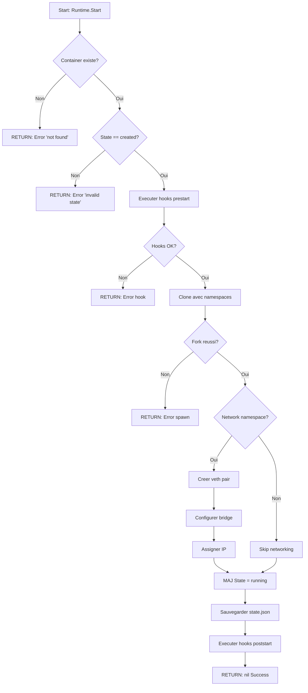

# Exercice M2.10_Ex05 : container_runtime_oci

**Module :**
2.10 — Conteneurs, Virtualisation et Sujets Avances

**Concept :**
synth — Runtime de Conteneurs OCI complet (Docker Architecture, OCI Specification, Networking, Storage)

**Difficulte :**
★★★★★★☆☆☆☆ (6/10)

**Type :**
complet (Cours + QCM + Code)

**Tiers :**
3 — Synthese (concepts 2.10.23 + 2.10.24 + 2.10.25 + 2.10.26 + 2.10.27 + 2.10.28)

**Langage :**
Go 1.23 / Rust Edition 2024

**Prerequis :**
- Namespaces Linux (M2.10_Ex01)
- Cgroups v2 (M2.10_Ex02)
- Union Filesystems (M2.10_Ex03)
- Syscalls fondamentaux (clone, mount, pivot_root)
- Notions de networking (IP, bridges, veth)

**Domaines :**
Process, Net, FS, Mem, Struct

**Duree estimee :**
480 min (8h)

**XP Base :**
800

**Complexite :**
T4 O(n) x S3 O(n)

---

## 1. SECTION 1 : PROTOTYPE & CONSIGNE

### 1.1 Obligations

**Fichiers a rendre :**
```
container_runtime/
├── cmd/
│   └── runtime/
│       └── main.go          # Point d'entree CLI
├── pkg/
│   ├── config/
│   │   └── oci_spec.go      # Configuration OCI
│   ├── image/
│   │   └── manager.go       # Gestion des images
│   ├── runtime/
│   │   └── container.go     # Cycle de vie conteneur
│   ├── network/
│   │   └── bridge.go        # Networking
│   └── storage/
│       └── overlay.go       # OverlayFS et volumes
├── go.mod
└── go.sum
```

**Fonctions autorisees (Go) :**
- `syscall.*` (tous les syscalls)
- `os/exec.*`
- `encoding/json.*`
- `net.*`
- `crypto/sha256.*`
- `compress/gzip.*`
- `archive/tar.*`

**Fonctions interdites :**
- Bibliotheques Docker officielles (`github.com/docker/*`)
- Bibliotheques containerd (`github.com/containerd/*`)
- Bibliotheques runc (`github.com/opencontainers/runc`)

### 1.2 Consigne

#### 2.4.1 Analogie : SHIPPING CONTAINERS

**L'ANALOGIE DU PORT MARITIME**

Imagine un port commercial international comme celui de Shanghai ou Rotterdam. C'est exactement comme ca que fonctionne Docker et l'ecosysteme OCI :

```
┌─────────────────────────────────────────────────────────────────────────────┐
│                     LE PORT DE CONTENEURS DOCKER                            │
├─────────────────────────────────────────────────────────────────────────────┤
│                                                                             │
│   CONTAINER IMAGE = Le contenu du conteneur maritime                        │
│   ─────────────────────────────────────────────────────────────────────    │
│   Tout ce qui est emballe et pret a etre transporte : les marchandises,    │
│   leur disposition, l'inventaire. Une fois scelle, c'est IMMUTABLE.        │
│   C'est ton application + ses dependances packagées.                        │
│                                                                             │
│   CONTAINER REGISTRY = Le port (Docker Hub, GHCR, ECR...)                  │
│   ─────────────────────────────────────────────────────────────────────    │
│   L'endroit ou les conteneurs arrivent et partent. Les grues chargent      │
│   et dechargent (push/pull). Chaque conteneur a un identifiant unique.     │
│                                                                             │
│   OCI SPECIFICATION = Les normes ISO pour conteneurs maritimes             │
│   ─────────────────────────────────────────────────────────────────────    │
│   Pourquoi tous les conteneurs du monde ont les memes dimensions ?         │
│   Parce qu'il existe une norme internationale (ISO 668). OCI fait          │
│   pareil : un conteneur Docker peut tourner sur containerd, CRI-O,         │
│   podman... grace aux specs communes.                                       │
│                                                                             │
│   RUNC = La grue qui deplace les conteneurs                                │
│   ─────────────────────────────────────────────────────────────────────    │
│   C'est le "low-level runtime". Il prend un conteneur et le pose sur       │
│   le bateau (execution). Il ne gere pas la logistique, juste le            │
│   mouvement physique. Runc cree les namespaces, monte les filesystems,     │
│   et exec() le processus.                                                   │
│                                                                             │
│   DOCKERD/CONTAINERD = Le systeme de gestion du port                       │
│   ─────────────────────────────────────────────────────────────────────    │
│   La tour de controle qui orchestre tout : quelle grue utiliser,           │
│   ou stocker les conteneurs, gerer les files d'attente. C'est le           │
│   "high-level runtime" qui parle a runc.                                   │
│                                                                             │
│   OVERLAY FS = L'empilement des marchandises                               │
│   ─────────────────────────────────────────────────────────────────────    │
│   Dans un conteneur maritime, on empile des palettes. Les palettes         │
│   du bas sont scellees (read-only layers), celle du haut est active        │
│   (writable layer). On ne deplace pas tout a chaque modification.          │
│                                                                             │
│   VETH PAIRS = Les passerelles du port                                     │
│   ─────────────────────────────────────────────────────────────────────    │
│   Pour qu'un conteneur communique avec l'exterieur, il faut un pont.       │
│   Une paire veth c'est un cable virtuel : un bout dans le conteneur,       │
│   l'autre sur le bridge du host.                                           │
│                                                                             │
└─────────────────────────────────────────────────────────────────────────────┘

        ARCHITECTURE COMPLETE :

        ┌──────────────────────────────────────────────────────────────┐
        │                    DOCKER REGISTRY                           │
        │                  (Le port maritime)                          │
        │    ┌─────────┐  ┌─────────┐  ┌─────────┐                   │
        │    │ alpine  │  │  nginx  │  │  redis  │  ... images       │
        │    │  :3.19  │  │ :latest │  │   :7    │                   │
        │    └─────────┘  └─────────┘  └─────────┘                   │
        └──────────────────────┬───────────────────────────────────────┘
                               │ pull / push
                               ▼
        ┌──────────────────────────────────────────────────────────────┐
        │                     DOCKER DAEMON                            │
        │                 (Tour de controle)                           │
        │  ┌──────────────────────────────────────────────────────┐   │
        │  │                    REST API                           │   │
        │  │              /containers  /images  /volumes           │   │
        │  └──────────────────────┬───────────────────────────────┘   │
        │                         │                                    │
        │  ┌──────────────────────┴───────────────────────────────┐   │
        │  │                   CONTAINERD                          │   │
        │  │            (Gestionnaire de conteneurs)               │   │
        │  └──────────────────────┬───────────────────────────────┘   │
        └─────────────────────────┼────────────────────────────────────┘
                                  │
                                  ▼
        ┌──────────────────────────────────────────────────────────────┐
        │                        RUNC                                  │
        │                    (La grue OCI)                             │
        │                                                              │
        │   clone(CLONE_NEWNS | CLONE_NEWPID | CLONE_NEWNET | ...)    │
        │   pivot_root() → chroot moderne                              │
        │   exec() → lance le processus                                │
        └──────────────────────────────────────────────────────────────┘
```

#### 2.4.2 Enonce Academique

**Ta mission :**

Implementer un runtime de conteneurs conforme a la specification OCI (Open Container Initiative) capable de :

1. **Parser et valider** des fichiers `config.json` selon OCI runtime-spec v1.0.2
2. **Gerer le cycle de vie** complet : create → start → stop → delete
3. **Configurer l'isolation** via namespaces Linux (PID, NET, MNT, UTS, IPC, USER)
4. **Monter un filesystem overlay** pour le rootfs du conteneur
5. **Configurer le networking** avec bridge et paires veth

**Entree :**
- Un bundle OCI : repertoire contenant `config.json` et `rootfs/`
- Commandes CLI : `create`, `start`, `state`, `kill`, `delete`

**Sortie :**
- Un conteneur isole fonctionnel
- Etat JSON conforme OCI (creating, created, running, stopped)

**Contraintes :**
- L'implementation doit passer les tests de conformite OCI
- Pas d'utilisation de bibliotheques Docker/containerd/runc
- Gestion correcte des erreurs et cleanup des ressources
- Support des hooks du cycle de vie (prestart, poststart, poststop)

**Exemples :**

| Commande | Resultat | Explication |
|----------|----------|-------------|
| `./runtime create mycontainer ./bundle` | Container cree | Bundle valide, etat = created |
| `./runtime start mycontainer` | Container demarre | PID assigne, etat = running |
| `./runtime state mycontainer` | JSON etat | Version, ID, status, PID, bundle |
| `./runtime kill mycontainer SIGTERM` | Signal envoye | Processus termine |
| `./runtime delete mycontainer` | Ressources liberees | Namespaces/mounts cleanup |

### 1.3 Prototype

```go
// pkg/config/oci_spec.go
package config

// OCISpec represente config.json selon OCI runtime-spec
type OCISpec struct {
    OCIVersion string      `json:"ociVersion"`
    Process    OCIProcess  `json:"process"`
    Root       OCIRoot     `json:"root"`
    Hostname   string      `json:"hostname,omitempty"`
    Mounts     []OCIMount  `json:"mounts,omitempty"`
    Linux      *LinuxSpec  `json:"linux,omitempty"`
    Hooks      *Hooks      `json:"hooks,omitempty"`
}

func LoadSpec(path string) (*OCISpec, error)
func (s *OCISpec) Validate() error

// pkg/runtime/container.go
package runtime

type ContainerState string
const (
    StateCreating ContainerState = "creating"
    StateCreated  ContainerState = "created"
    StateRunning  ContainerState = "running"
    StateStopped  ContainerState = "stopped"
)

type Container struct {
    ID        string
    Bundle    string
    Spec      *config.OCISpec
    State     ContainerState
    PID       int
    CreatedAt time.Time
}

type Runtime struct {
    Root       string
    Containers map[string]*Container
    Network    *network.Manager
    Storage    *storage.Manager
}

func NewRuntime(root string) (*Runtime, error)
func (r *Runtime) Create(id, bundle string) (*Container, error)
func (r *Runtime) Start(id string) error
func (r *Runtime) State(id string) (*OCIState, error)
func (r *Runtime) Kill(id string, signal syscall.Signal) error
func (r *Runtime) Delete(id string) error

// pkg/network/bridge.go
package network

type Bridge struct {
    Name    string
    Subnet  net.IPNet
    Gateway net.IP
    Veths   []VethPair
}

func NewBridge(name string, subnet string) (*Bridge, error)
func (b *Bridge) ConnectContainer(containerID string, pid int) (*VethPair, error)
func (b *Bridge) DisconnectContainer(vethName string) error

// pkg/storage/overlay.go
package storage

type OverlayMount struct {
    LowerDirs []string
    UpperDir  string
    WorkDir   string
    MergedDir string
}

func NewOverlay(config OverlayMount) (*Overlay, error)
func (o *Overlay) Mount() error
func (o *Overlay) Unmount() error
```

---

## 2. SECTION 2 : LE SAVIEZ-VOUS ?

### 2.1 L'histoire de la standardisation

Avant OCI (2015), Docker etait le seul acteur. Quand CoreOS a lance rkt (rocket) comme alternative, une guerre des formats a commence. Google, Microsoft, Red Hat et Docker ont alors fonde l'Open Container Initiative pour creer des standards neutres.

Aujourd'hui, tu peux construire une image avec Docker, la pusher sur GitHub Container Registry, et la faire tourner avec Podman ou CRI-O dans Kubernetes. Cette interoperabilite n'existe que grace a OCI.

### 2.2 Les 3 specs OCI

1. **runtime-spec** : Comment executer un conteneur (config.json, lifecycle)
2. **image-spec** : Format des images (layers, manifest, config)
3. **distribution-spec** : Comment pousser/tirer des images (registry API)

### 2.5 DANS LA VRAIE VIE

| Metier | Utilisation |
|--------|-------------|
| **DevOps/SRE** | Deploiement et orchestration de conteneurs en production (Kubernetes, Docker Swarm) |
| **Platform Engineer** | Construction de plateformes internes basees sur containerd/CRI-O |
| **Security Engineer** | Audit et hardening des runtimes (gVisor, Kata Containers, Firecracker) |
| **Cloud Provider** | Developpement de services containers (AWS Fargate, Google Cloud Run) |
| **Kernel Developer** | Optimisation des namespaces et cgroups pour les conteneurs |

---

## 3. SECTION 3 : EXEMPLE D'UTILISATION

### 3.0 Session bash

```bash
$ ls
container_runtime/  alpine-bundle/

$ cd container_runtime && go build -o runtime ./cmd/runtime

$ ls ../alpine-bundle/
config.json  rootfs/

$ sudo ./runtime create test-alpine ../alpine-bundle
Container 'test-alpine' created

$ sudo ./runtime state test-alpine
{
  "ociVersion": "1.0.2",
  "id": "test-alpine",
  "status": "created",
  "bundle": "/home/user/alpine-bundle"
}

$ sudo ./runtime start test-alpine
Container 'test-alpine' started

$ sudo ./runtime state test-alpine
{
  "ociVersion": "1.0.2",
  "id": "test-alpine",
  "status": "running",
  "pid": 12345,
  "bundle": "/home/user/alpine-bundle"
}

$ sudo ./runtime kill test-alpine SIGTERM
Signal sent to container 'test-alpine'

$ sudo ./runtime delete test-alpine
Container 'test-alpine' deleted
```

### 3.1 BONUS EXPERT (OPTIONNEL)

**Difficulte Bonus :**
💀 (8/10)

**Recompense :**
XP x4

**Time Complexity attendue :**
O(n) ou n = nombre de layers

**Space Complexity attendue :**
O(n) pour le cache d'images

**Domaines Bonus :**
`Crypto, Compression, Net`

#### 3.1.1 Consigne Bonus

**CONTAINER DISTRIBUTION DAEMON**

Implemente un registry OCI local capable de :
1. Recevoir des images via `docker push`
2. Servir des images via `docker pull`
3. Stocker les blobs en content-addressable storage (SHA256)
4. Supporter l'API Distribution Spec v2

**Ta mission :**

Ecrire un serveur HTTP qui implemente OCI Distribution Spec :

```
GET  /v2/                           → API version check
GET  /v2/<name>/manifests/<ref>     → Pull manifest
PUT  /v2/<name>/manifests/<ref>     → Push manifest
GET  /v2/<name>/blobs/<digest>      → Pull blob/layer
POST /v2/<name>/blobs/uploads/      → Initiate blob upload
PATCH /v2/<name>/blobs/uploads/<id> → Upload blob chunk
PUT  /v2/<name>/blobs/uploads/<id>  → Complete upload
```

**Contraintes :**
```
┌─────────────────────────────────────────┐
│  Content-addressable storage            │
│  Verification SHA256 des blobs          │
│  Support chunked upload                 │
│  Manifest schema v2                     │
│  Auth: Bearer token (optionnel)         │
└─────────────────────────────────────────┘
```

#### 3.1.2 Prototype Bonus

```go
package registry

type Registry struct {
    Root       string
    BlobStore  *BlobStore
    Manifests  map[string]map[string][]byte  // repo -> tag -> manifest
}

func NewRegistry(root string) (*Registry, error)
func (r *Registry) ServeHTTP(w http.ResponseWriter, req *http.Request)

// Blob operations
func (r *Registry) GetBlob(digest string) (io.ReadCloser, error)
func (r *Registry) PutBlob(reader io.Reader) (string, error)  // returns digest
func (r *Registry) BlobExists(digest string) bool

// Manifest operations
func (r *Registry) GetManifest(repo, ref string) ([]byte, string, error)
func (r *Registry) PutManifest(repo, ref string, data []byte) error
```

#### 3.1.3 Ce qui change par rapport a l'exercice de base

| Aspect | Base | Bonus |
|--------|------|-------|
| Scope | Runtime local | Registry distribue |
| Protocol | Syscalls | HTTP REST API |
| Storage | Overlay local | Content-addressable |
| Crypto | Aucun | SHA256 verification |
| Network | Bridge/veth | HTTP server |

---

## 4. SECTION 4 : ZONE CORRECTION

### 4.1 Moulinette

| Test | Input | Expected | Points | Trap |
|------|-------|----------|--------|------|
| `test_load_valid_spec` | config.json valide | OCISpec parse | 5 | - |
| `test_load_invalid_json` | JSON malformed | Error | 5 | Syntax |
| `test_validate_missing_args` | args: [] | Error "args empty" | 5 | Edge |
| `test_validate_relative_cwd` | cwd: "relative" | Error | 5 | Edge |
| `test_create_container` | bundle valide | Container created | 10 | - |
| `test_create_duplicate_id` | ID existant | Error "already exists" | 5 | Logic |
| `test_start_created` | Etat created | Running, PID set | 15 | - |
| `test_start_not_created` | Etat running | Error | 5 | State |
| `test_namespaces_isolation` | PID ns | PID 1 in container | 10 | - |
| `test_network_bridge` | Bridge mode | IP assigned | 10 | - |
| `test_overlay_mount` | Layers valides | Merged FS | 10 | - |
| `test_state_json` | Container running | Valid OCI state | 5 | - |
| `test_kill_signal` | SIGTERM | Process terminated | 5 | - |
| `test_delete_cleanup` | Container stopped | Resources freed | 5 | - |

### 4.2 main_test.go

```go
package runtime_test

import (
    "encoding/json"
    "os"
    "path/filepath"
    "syscall"
    "testing"
    "time"

    "container_runtime/pkg/config"
    "container_runtime/pkg/runtime"
)

func TestLoadValidSpec(t *testing.T) {
    // Setup: create minimal config.json
    tmpDir := t.TempDir()
    configPath := filepath.Join(tmpDir, "config.json")

    spec := map[string]interface{}{
        "ociVersion": "1.0.2",
        "process": map[string]interface{}{
            "terminal": false,
            "user": map[string]interface{}{"uid": 0, "gid": 0},
            "args": []string{"/bin/sh"},
            "cwd": "/",
        },
        "root": map[string]interface{}{
            "path": "rootfs",
        },
    }

    data, _ := json.Marshal(spec)
    os.WriteFile(configPath, data, 0644)
    os.MkdirAll(filepath.Join(tmpDir, "rootfs"), 0755)

    // Test
    loaded, err := config.LoadSpec(configPath)
    if err != nil {
        t.Fatalf("Failed to load valid spec: %v", err)
    }

    if loaded.OCIVersion != "1.0.2" {
        t.Errorf("Expected version 1.0.2, got %s", loaded.OCIVersion)
    }

    if len(loaded.Process.Args) == 0 {
        t.Error("Args should not be empty")
    }
}

func TestValidateMissingArgs(t *testing.T) {
    spec := &config.OCISpec{
        OCIVersion: "1.0.2",
        Process: config.OCIProcess{
            Args: []string{},  // Empty args
            Cwd:  "/",
        },
        Root: config.OCIRoot{Path: "rootfs"},
    }

    err := spec.Validate()
    if err == nil {
        t.Error("Expected error for empty args")
    }
}

func TestValidateRelativeCwd(t *testing.T) {
    spec := &config.OCISpec{
        OCIVersion: "1.0.2",
        Process: config.OCIProcess{
            Args: []string{"/bin/sh"},
            Cwd:  "relative/path",  // Not absolute
        },
        Root: config.OCIRoot{Path: "rootfs"},
    }

    err := spec.Validate()
    if err == nil {
        t.Error("Expected error for relative cwd")
    }
}

func TestCreateContainer(t *testing.T) {
    if os.Getuid() != 0 {
        t.Skip("Test requires root")
    }

    tmpDir := t.TempDir()
    rt, err := runtime.NewRuntime(filepath.Join(tmpDir, "runtime"))
    if err != nil {
        t.Fatalf("Failed to create runtime: %v", err)
    }

    bundle := setupTestBundle(t, tmpDir)

    container, err := rt.Create("test-container", bundle)
    if err != nil {
        t.Fatalf("Failed to create container: %v", err)
    }

    if container.State != runtime.StateCreated {
        t.Errorf("Expected state 'created', got %s", container.State)
    }
}

func TestCreateDuplicateID(t *testing.T) {
    if os.Getuid() != 0 {
        t.Skip("Test requires root")
    }

    tmpDir := t.TempDir()
    rt, _ := runtime.NewRuntime(filepath.Join(tmpDir, "runtime"))
    bundle := setupTestBundle(t, tmpDir)

    rt.Create("duplicate-id", bundle)

    _, err := rt.Create("duplicate-id", bundle)
    if err == nil {
        t.Error("Expected error for duplicate ID")
    }
}

func TestStartContainer(t *testing.T) {
    if os.Getuid() != 0 {
        t.Skip("Test requires root")
    }

    tmpDir := t.TempDir()
    rt, _ := runtime.NewRuntime(filepath.Join(tmpDir, "runtime"))
    bundle := setupTestBundle(t, tmpDir)

    rt.Create("start-test", bundle)

    err := rt.Start("start-test")
    if err != nil {
        t.Fatalf("Failed to start container: %v", err)
    }

    state, _ := rt.State("start-test")
    if state.Status != "running" {
        t.Errorf("Expected status 'running', got %s", state.Status)
    }

    if state.PID == nil || *state.PID == 0 {
        t.Error("Expected non-zero PID")
    }

    // Cleanup
    rt.Kill("start-test", syscall.SIGKILL)
    time.Sleep(100 * time.Millisecond)
    rt.Delete("start-test")
}

func setupTestBundle(t *testing.T, base string) string {
    bundle := filepath.Join(base, "bundle")
    rootfs := filepath.Join(bundle, "rootfs")
    os.MkdirAll(rootfs, 0755)

    // Copy minimal Alpine rootfs or use busybox
    // For testing, create minimal structure
    os.MkdirAll(filepath.Join(rootfs, "bin"), 0755)
    os.MkdirAll(filepath.Join(rootfs, "proc"), 0755)
    os.MkdirAll(filepath.Join(rootfs, "sys"), 0755)
    os.MkdirAll(filepath.Join(rootfs, "dev"), 0755)

    spec := map[string]interface{}{
        "ociVersion": "1.0.2",
        "process": map[string]interface{}{
            "terminal": false,
            "user": map[string]interface{}{"uid": 0, "gid": 0},
            "args": []string{"/bin/sleep", "10"},
            "env": []string{"PATH=/usr/bin:/bin"},
            "cwd": "/",
        },
        "root": map[string]interface{}{"path": "rootfs"},
        "linux": map[string]interface{}{
            "namespaces": []map[string]string{
                {"type": "pid"},
                {"type": "mount"},
                {"type": "uts"},
            },
        },
    }

    data, _ := json.Marshal(spec)
    os.WriteFile(filepath.Join(bundle, "config.json"), data, 0644)

    return bundle
}
```

### 4.3 Solution de reference

```go
// pkg/config/oci_spec.go
package config

import (
    "encoding/json"
    "fmt"
    "os"
    "path/filepath"
)

const OCIVersion = "1.0.2"

type OCISpec struct {
    OCIVersion string      `json:"ociVersion"`
    Process    OCIProcess  `json:"process"`
    Root       OCIRoot     `json:"root"`
    Hostname   string      `json:"hostname,omitempty"`
    Mounts     []OCIMount  `json:"mounts,omitempty"`
    Linux      *LinuxSpec  `json:"linux,omitempty"`
    Hooks      *Hooks      `json:"hooks,omitempty"`
}

type OCIProcess struct {
    Terminal        bool           `json:"terminal"`
    User            OCIUser        `json:"user"`
    Args            []string       `json:"args"`
    Env             []string       `json:"env,omitempty"`
    Cwd             string         `json:"cwd"`
    Capabilities    *Capabilities  `json:"capabilities,omitempty"`
    Rlimits         []Rlimit       `json:"rlimits,omitempty"`
    NoNewPrivileges bool           `json:"noNewPrivileges,omitempty"`
}

type OCIUser struct {
    UID            uint32   `json:"uid"`
    GID            uint32   `json:"gid"`
    AdditionalGids []uint32 `json:"additionalGids,omitempty"`
}

type OCIRoot struct {
    Path     string `json:"path"`
    Readonly bool   `json:"readonly,omitempty"`
}

type OCIMount struct {
    Destination string   `json:"destination"`
    Type        string   `json:"type,omitempty"`
    Source      string   `json:"source,omitempty"`
    Options     []string `json:"options,omitempty"`
}

type LinuxSpec struct {
    Namespaces   []Namespace   `json:"namespaces,omitempty"`
    UIDMappings  []IDMapping   `json:"uidMappings,omitempty"`
    GIDMappings  []IDMapping   `json:"gidMappings,omitempty"`
    Devices      []Device      `json:"devices,omitempty"`
    CgroupsPath  string        `json:"cgroupsPath,omitempty"`
    Resources    *Resources    `json:"resources,omitempty"`
    MaskedPaths  []string      `json:"maskedPaths,omitempty"`
    ReadonlyPaths []string     `json:"readonlyPaths,omitempty"`
}

type Namespace struct {
    Type string `json:"type"`
    Path string `json:"path,omitempty"`
}

type IDMapping struct {
    ContainerID uint32 `json:"containerID"`
    HostID      uint32 `json:"hostID"`
    Size        uint32 `json:"size"`
}

type Device struct {
    Path     string `json:"path"`
    Type     string `json:"type"`
    Major    int64  `json:"major"`
    Minor    int64  `json:"minor"`
    FileMode uint32 `json:"fileMode,omitempty"`
    UID      uint32 `json:"uid,omitempty"`
    GID      uint32 `json:"gid,omitempty"`
}

type Resources struct {
    Memory *MemoryResources `json:"memory,omitempty"`
    CPU    *CPUResources    `json:"cpu,omitempty"`
    Pids   *PidsLimit       `json:"pids,omitempty"`
}

type MemoryResources struct {
    Limit int64 `json:"limit,omitempty"`
    Swap  int64 `json:"swap,omitempty"`
}

type CPUResources struct {
    Shares uint64 `json:"shares,omitempty"`
    Quota  int64  `json:"quota,omitempty"`
    Period uint64 `json:"period,omitempty"`
}

type PidsLimit struct {
    Limit int64 `json:"limit"`
}

type Capabilities struct {
    Bounding    []string `json:"bounding,omitempty"`
    Effective   []string `json:"effective,omitempty"`
    Inheritable []string `json:"inheritable,omitempty"`
    Permitted   []string `json:"permitted,omitempty"`
    Ambient     []string `json:"ambient,omitempty"`
}

type Rlimit struct {
    Type string `json:"type"`
    Hard uint64 `json:"hard"`
    Soft uint64 `json:"soft"`
}

type Hooks struct {
    Prestart  []Hook `json:"prestart,omitempty"`
    Poststart []Hook `json:"poststart,omitempty"`
    Poststop  []Hook `json:"poststop,omitempty"`
}

type Hook struct {
    Path    string   `json:"path"`
    Args    []string `json:"args,omitempty"`
    Env     []string `json:"env,omitempty"`
    Timeout int      `json:"timeout,omitempty"`
}

func LoadSpec(path string) (*OCISpec, error) {
    data, err := os.ReadFile(path)
    if err != nil {
        return nil, fmt.Errorf("failed to read config: %w", err)
    }

    var spec OCISpec
    if err := json.Unmarshal(data, &spec); err != nil {
        return nil, fmt.Errorf("failed to parse config: %w", err)
    }

    return &spec, nil
}

func (s *OCISpec) Validate() error {
    // Verifier version OCI
    if s.OCIVersion == "" {
        return fmt.Errorf("ociVersion is required")
    }

    // Verifier args non vide
    if len(s.Process.Args) == 0 {
        return fmt.Errorf("process args cannot be empty")
    }

    // Verifier cwd est absolu
    if !filepath.IsAbs(s.Process.Cwd) {
        return fmt.Errorf("process cwd must be absolute path")
    }

    // Verifier root path
    if s.Root.Path == "" {
        return fmt.Errorf("root path is required")
    }

    return nil
}

func (s *OCISpec) Save(path string) error {
    data, err := json.MarshalIndent(s, "", "  ")
    if err != nil {
        return err
    }
    return os.WriteFile(path, data, 0644)
}
```

```go
// pkg/runtime/container.go
package runtime

import (
    "encoding/json"
    "fmt"
    "os"
    "os/exec"
    "path/filepath"
    "syscall"
    "time"

    "container_runtime/pkg/config"
    "container_runtime/pkg/network"
    "container_runtime/pkg/storage"
)

type ContainerState string

const (
    StateCreating ContainerState = "creating"
    StateCreated  ContainerState = "created"
    StateRunning  ContainerState = "running"
    StateStopped  ContainerState = "stopped"
)

type OCIState struct {
    OCIVersion string            `json:"ociVersion"`
    ID         string            `json:"id"`
    Status     string            `json:"status"`
    PID        *int              `json:"pid,omitempty"`
    Bundle     string            `json:"bundle"`
    Annotations map[string]string `json:"annotations,omitempty"`
}

type Container struct {
    ID        string
    Bundle    string
    Spec      *config.OCISpec
    State     ContainerState
    PID       int
    Network   *network.VethPair
    CreatedAt time.Time
}

type Runtime struct {
    Root       string
    Containers map[string]*Container
    Network    *network.Manager
    Storage    *storage.Manager
}

func NewRuntime(root string) (*Runtime, error) {
    if err := os.MkdirAll(root, 0755); err != nil {
        return nil, err
    }
    if err := os.MkdirAll(filepath.Join(root, "containers"), 0755); err != nil {
        return nil, err
    }

    storageRoot := filepath.Join(root, "storage")
    storageMgr, err := storage.NewManager(storageRoot)
    if err != nil {
        return nil, err
    }

    return &Runtime{
        Root:       root,
        Containers: make(map[string]*Container),
        Network:    network.NewManager(),
        Storage:    storageMgr,
    }, nil
}

func (r *Runtime) Create(id, bundle string) (*Container, error) {
    // Verifier unicite ID
    if _, exists := r.Containers[id]; exists {
        return nil, fmt.Errorf("container '%s' already exists", id)
    }

    // Charger config
    configPath := filepath.Join(bundle, "config.json")
    spec, err := config.LoadSpec(configPath)
    if err != nil {
        return nil, err
    }

    // Valider config
    if err := spec.Validate(); err != nil {
        return nil, err
    }

    // Verifier rootfs existe
    rootfsPath := filepath.Join(bundle, spec.Root.Path)
    if _, err := os.Stat(rootfsPath); os.IsNotExist(err) {
        return nil, fmt.Errorf("rootfs not found: %s", rootfsPath)
    }

    container := &Container{
        ID:        id,
        Bundle:    bundle,
        Spec:      spec,
        State:     StateCreated,
        CreatedAt: time.Now(),
    }

    // Sauvegarder etat
    if err := r.saveState(container); err != nil {
        return nil, err
    }

    r.Containers[id] = container
    return container, nil
}

func (r *Runtime) Start(id string) error {
    container, ok := r.Containers[id]
    if !ok {
        return fmt.Errorf("container '%s' not found", id)
    }

    if container.State != StateCreated {
        return fmt.Errorf("container '%s' is not in 'created' state", id)
    }

    // Executer hooks prestart
    if container.Spec.Hooks != nil {
        for _, hook := range container.Spec.Hooks.Prestart {
            if err := runHook(hook); err != nil {
                return fmt.Errorf("prestart hook failed: %w", err)
            }
        }
    }

    // Demarrer processus conteneur
    pid, err := r.spawnProcess(container)
    if err != nil {
        return err
    }

    container.PID = pid
    container.State = StateRunning

    // Configurer reseau si necessaire
    if container.Spec.Linux != nil {
        for _, ns := range container.Spec.Linux.Namespaces {
            if ns.Type == "network" && ns.Path == "" {
                veth, err := r.Network.ConnectContainer(id, pid)
                if err != nil {
                    // Log but don't fail
                    fmt.Printf("Warning: network setup failed: %v\n", err)
                } else {
                    container.Network = veth
                }
                break
            }
        }
    }

    // Sauvegarder etat
    if err := r.saveState(container); err != nil {
        return err
    }

    // Executer hooks poststart
    if container.Spec.Hooks != nil {
        for _, hook := range container.Spec.Hooks.Poststart {
            _ = runHook(hook) // Best effort
        }
    }

    return nil
}

func (r *Runtime) spawnProcess(container *Container) (int, error) {
    rootfs := filepath.Join(container.Bundle, container.Spec.Root.Path)

    // Preparer arguments clone
    args := container.Spec.Process.Args
    if len(args) == 0 {
        return 0, fmt.Errorf("no args specified")
    }

    // Construire commande
    cmd := exec.Command("/proc/self/exe", append([]string{"init", rootfs}, args...)...)
    cmd.Stdin = os.Stdin
    cmd.Stdout = os.Stdout
    cmd.Stderr = os.Stderr

    // Configurer namespaces
    cloneFlags := syscall.CLONE_NEWUTS | syscall.CLONE_NEWNS
    if container.Spec.Linux != nil {
        for _, ns := range container.Spec.Linux.Namespaces {
            switch ns.Type {
            case "pid":
                cloneFlags |= syscall.CLONE_NEWPID
            case "network":
                if ns.Path == "" {
                    cloneFlags |= syscall.CLONE_NEWNET
                }
            case "ipc":
                cloneFlags |= syscall.CLONE_NEWIPC
            case "user":
                cloneFlags |= syscall.CLONE_NEWUSER
            case "cgroup":
                cloneFlags |= syscall.CLONE_NEWCGROUP
            }
        }
    }

    cmd.SysProcAttr = &syscall.SysProcAttr{
        Cloneflags: uintptr(cloneFlags),
    }

    // Configurer environnement
    cmd.Env = container.Spec.Process.Env

    if err := cmd.Start(); err != nil {
        return 0, fmt.Errorf("failed to start process: %w", err)
    }

    return cmd.Process.Pid, nil
}

func (r *Runtime) State(id string) (*OCIState, error) {
    container, ok := r.Containers[id]
    if !ok {
        return nil, fmt.Errorf("container '%s' not found", id)
    }

    state := &OCIState{
        OCIVersion: config.OCIVersion,
        ID:         container.ID,
        Status:     string(container.State),
        Bundle:     container.Bundle,
    }

    if container.PID != 0 {
        state.PID = &container.PID
    }

    return state, nil
}

func (r *Runtime) Kill(id string, signal syscall.Signal) error {
    container, ok := r.Containers[id]
    if !ok {
        return fmt.Errorf("container '%s' not found", id)
    }

    if container.PID == 0 {
        return fmt.Errorf("container '%s' has no running process", id)
    }

    if err := syscall.Kill(container.PID, signal); err != nil {
        return fmt.Errorf("failed to send signal: %w", err)
    }

    return nil
}

func (r *Runtime) Delete(id string) error {
    container, ok := r.Containers[id]
    if !ok {
        return fmt.Errorf("container '%s' not found", id)
    }

    // Verifier que le processus est arrete
    if container.PID != 0 {
        // Check if process still running
        if err := syscall.Kill(container.PID, 0); err == nil {
            return fmt.Errorf("container '%s' is still running", id)
        }
    }

    // Executer hooks poststop
    if container.Spec.Hooks != nil {
        for _, hook := range container.Spec.Hooks.Poststop {
            _ = runHook(hook)
        }
    }

    // Nettoyer reseau
    if container.Network != nil {
        r.Network.DisconnectContainer(container.Network.HostName)
    }

    // Supprimer fichiers d'etat
    containerDir := filepath.Join(r.Root, "containers", id)
    os.RemoveAll(containerDir)

    delete(r.Containers, id)
    return nil
}

func (r *Runtime) saveState(container *Container) error {
    containerDir := filepath.Join(r.Root, "containers", container.ID)
    if err := os.MkdirAll(containerDir, 0755); err != nil {
        return err
    }

    state := &OCIState{
        OCIVersion: config.OCIVersion,
        ID:         container.ID,
        Status:     string(container.State),
        Bundle:     container.Bundle,
    }
    if container.PID != 0 {
        state.PID = &container.PID
    }

    data, err := json.MarshalIndent(state, "", "  ")
    if err != nil {
        return err
    }

    return os.WriteFile(filepath.Join(containerDir, "state.json"), data, 0644)
}

func runHook(hook config.Hook) error {
    cmd := exec.Command(hook.Path, hook.Args...)
    cmd.Env = hook.Env
    return cmd.Run()
}
```

### 4.4 Solutions alternatives acceptees

```go
// Alternative: utilisation de reexec pattern pour init process
// Plus propre que /proc/self/exe

package runtime

import (
    "os"
    "os/exec"
    "syscall"
)

func init() {
    if len(os.Args) > 1 && os.Args[1] == "init" {
        // Nous sommes dans le processus enfant
        if err := containerInit(); err != nil {
            os.Exit(1)
        }
        os.Exit(0)
    }
}

func containerInit() error {
    rootfs := os.Args[2]
    args := os.Args[3:]

    // Monter proc, sys, dev
    syscall.Mount("proc", filepath.Join(rootfs, "proc"), "proc", 0, "")
    syscall.Mount("sysfs", filepath.Join(rootfs, "sys"), "sysfs", 0, "")

    // Pivot root
    if err := pivotRoot(rootfs); err != nil {
        return err
    }

    // Executer commande
    return syscall.Exec(args[0], args, os.Environ())
}

func pivotRoot(newroot string) error {
    putold := filepath.Join(newroot, ".pivot_root")
    os.MkdirAll(putold, 0755)

    if err := syscall.PivotRoot(newroot, putold); err != nil {
        return err
    }

    if err := os.Chdir("/"); err != nil {
        return err
    }

    putold = "/.pivot_root"
    if err := syscall.Unmount(putold, syscall.MNT_DETACH); err != nil {
        return err
    }

    return os.RemoveAll(putold)
}
```

### 4.5 Solutions refusees

```go
// REFUSE : Pas de validation de la spec
func (r *Runtime) Create(id, bundle string) (*Container, error) {
    configPath := filepath.Join(bundle, "config.json")
    spec, _ := config.LoadSpec(configPath)  // Ignore error!
    // Ne valide pas spec.Validate()
    // ...
}
// POURQUOI : Une spec invalide peut causer des comportements indefinis
// Un runtime OCI conforme DOIT valider la configuration

// REFUSE : Pas de gestion des etats
func (r *Runtime) Start(id string) error {
    container := r.Containers[id]
    // Pas de verification container.State == StateCreated
    pid, _ := r.spawnProcess(container)
    container.PID = pid
    return nil
}
// POURQUOI : OCI spec definit un state machine strict
// create -> created -> running -> stopped

// REFUSE : Pas de cleanup des ressources
func (r *Runtime) Delete(id string) error {
    delete(r.Containers, id)
    return nil
}
// POURQUOI : Fuite de namespaces, mounts non demontes, fichiers orphelins
// Un runtime doit nettoyer toutes les ressources

// REFUSE : Fork classique au lieu de clone avec namespaces
func (r *Runtime) spawnProcess(container *Container) (int, error) {
    cmd := exec.Command(container.Spec.Process.Args[0], container.Spec.Process.Args[1:]...)
    cmd.Start()  // Pas de namespaces!
    return cmd.Process.Pid, nil
}
// POURQUOI : Pas d'isolation, le processus partage tout avec l'hote
```

### 4.6 Solution bonus de reference

```go
// pkg/registry/registry.go
package registry

import (
    "crypto/sha256"
    "encoding/hex"
    "encoding/json"
    "fmt"
    "io"
    "net/http"
    "os"
    "path/filepath"
    "strings"
    "sync"
)

type Registry struct {
    Root      string
    Blobs     string
    Manifests string
    uploads   map[string]*Upload
    mu        sync.RWMutex
}

type Upload struct {
    ID     string
    Repo   string
    File   *os.File
    Hasher *sha256.Hasher
}

func NewRegistry(root string) (*Registry, error) {
    blobsDir := filepath.Join(root, "blobs", "sha256")
    manifestsDir := filepath.Join(root, "manifests")

    if err := os.MkdirAll(blobsDir, 0755); err != nil {
        return nil, err
    }
    if err := os.MkdirAll(manifestsDir, 0755); err != nil {
        return nil, err
    }

    return &Registry{
        Root:      root,
        Blobs:     blobsDir,
        Manifests: manifestsDir,
        uploads:   make(map[string]*Upload),
    }, nil
}

func (r *Registry) ServeHTTP(w http.ResponseWriter, req *http.Request) {
    path := req.URL.Path

    // /v2/ - Version check
    if path == "/v2/" || path == "/v2" {
        w.Header().Set("Docker-Distribution-API-Version", "registry/2.0")
        w.WriteHeader(http.StatusOK)
        return
    }

    // Parse path components
    parts := strings.Split(strings.TrimPrefix(path, "/v2/"), "/")
    if len(parts) < 2 {
        http.Error(w, "invalid path", http.StatusBadRequest)
        return
    }

    // Find repo name and action
    var repo string
    var action string
    var ref string

    for i, part := range parts {
        if part == "manifests" || part == "blobs" {
            repo = strings.Join(parts[:i], "/")
            action = part
            if i+1 < len(parts) {
                ref = strings.Join(parts[i+1:], "/")
            }
            break
        }
    }

    switch action {
    case "manifests":
        r.handleManifest(w, req, repo, ref)
    case "blobs":
        r.handleBlob(w, req, repo, ref)
    default:
        http.Error(w, "not found", http.StatusNotFound)
    }
}

func (r *Registry) handleManifest(w http.ResponseWriter, req *http.Request, repo, ref string) {
    switch req.Method {
    case "GET", "HEAD":
        r.getManifest(w, req, repo, ref)
    case "PUT":
        r.putManifest(w, req, repo, ref)
    default:
        http.Error(w, "method not allowed", http.StatusMethodNotAllowed)
    }
}

func (r *Registry) getManifest(w http.ResponseWriter, req *http.Request, repo, ref string) {
    // Try digest first
    var path string
    if strings.HasPrefix(ref, "sha256:") {
        digest := strings.TrimPrefix(ref, "sha256:")
        path = filepath.Join(r.Blobs, digest)
    } else {
        // Try tag
        path = filepath.Join(r.Manifests, repo, ref)
    }

    data, err := os.ReadFile(path)
    if err != nil {
        http.Error(w, "manifest not found", http.StatusNotFound)
        return
    }

    // Detect content type
    var manifest map[string]interface{}
    json.Unmarshal(data, &manifest)

    mediaType := "application/vnd.oci.image.manifest.v1+json"
    if mt, ok := manifest["mediaType"].(string); ok {
        mediaType = mt
    }

    // Calculate digest
    hash := sha256.Sum256(data)
    digest := "sha256:" + hex.EncodeToString(hash[:])

    w.Header().Set("Content-Type", mediaType)
    w.Header().Set("Docker-Content-Digest", digest)
    w.Header().Set("Content-Length", fmt.Sprintf("%d", len(data)))

    if req.Method == "GET" {
        w.Write(data)
    }
}

func (r *Registry) putManifest(w http.ResponseWriter, req *http.Request, repo, ref string) {
    data, err := io.ReadAll(req.Body)
    if err != nil {
        http.Error(w, "failed to read body", http.StatusBadRequest)
        return
    }

    // Calculate digest
    hash := sha256.Sum256(data)
    digest := "sha256:" + hex.EncodeToString(hash[:])

    // Store by digest
    blobPath := filepath.Join(r.Blobs, hex.EncodeToString(hash[:]))
    if err := os.WriteFile(blobPath, data, 0644); err != nil {
        http.Error(w, "failed to store manifest", http.StatusInternalServerError)
        return
    }

    // Store tag reference if not digest
    if !strings.HasPrefix(ref, "sha256:") {
        tagDir := filepath.Join(r.Manifests, repo)
        os.MkdirAll(tagDir, 0755)
        tagPath := filepath.Join(tagDir, ref)
        if err := os.WriteFile(tagPath, data, 0644); err != nil {
            http.Error(w, "failed to store tag", http.StatusInternalServerError)
            return
        }
    }

    w.Header().Set("Docker-Content-Digest", digest)
    w.Header().Set("Location", fmt.Sprintf("/v2/%s/manifests/%s", repo, digest))
    w.WriteHeader(http.StatusCreated)
}

func (r *Registry) handleBlob(w http.ResponseWriter, req *http.Request, repo, ref string) {
    if strings.Contains(ref, "uploads") {
        r.handleUpload(w, req, repo, ref)
        return
    }

    switch req.Method {
    case "GET", "HEAD":
        r.getBlob(w, req, ref)
    default:
        http.Error(w, "method not allowed", http.StatusMethodNotAllowed)
    }
}

func (r *Registry) getBlob(w http.ResponseWriter, req *http.Request, digest string) {
    digest = strings.TrimPrefix(digest, "sha256:")
    path := filepath.Join(r.Blobs, digest)

    file, err := os.Open(path)
    if err != nil {
        http.Error(w, "blob not found", http.StatusNotFound)
        return
    }
    defer file.Close()

    stat, _ := file.Stat()
    w.Header().Set("Content-Type", "application/octet-stream")
    w.Header().Set("Docker-Content-Digest", "sha256:"+digest)
    w.Header().Set("Content-Length", fmt.Sprintf("%d", stat.Size()))

    if req.Method == "GET" {
        io.Copy(w, file)
    }
}

func (r *Registry) handleUpload(w http.ResponseWriter, req *http.Request, repo, ref string) {
    parts := strings.Split(ref, "/")

    switch req.Method {
    case "POST":
        // Initiate upload
        uploadID := generateUUID()
        uploadPath := filepath.Join(r.Root, "uploads", uploadID)
        os.MkdirAll(filepath.Dir(uploadPath), 0755)

        file, _ := os.Create(uploadPath)

        r.mu.Lock()
        r.uploads[uploadID] = &Upload{
            ID:   uploadID,
            Repo: repo,
            File: file,
        }
        r.mu.Unlock()

        w.Header().Set("Location", fmt.Sprintf("/v2/%s/blobs/uploads/%s", repo, uploadID))
        w.Header().Set("Docker-Upload-UUID", uploadID)
        w.WriteHeader(http.StatusAccepted)

    case "PATCH":
        if len(parts) < 2 {
            http.Error(w, "invalid upload path", http.StatusBadRequest)
            return
        }
        uploadID := parts[1]

        r.mu.RLock()
        upload, ok := r.uploads[uploadID]
        r.mu.RUnlock()

        if !ok {
            http.Error(w, "upload not found", http.StatusNotFound)
            return
        }

        io.Copy(upload.File, req.Body)

        w.Header().Set("Location", fmt.Sprintf("/v2/%s/blobs/uploads/%s", repo, uploadID))
        w.WriteHeader(http.StatusAccepted)

    case "PUT":
        if len(parts) < 2 {
            http.Error(w, "invalid upload path", http.StatusBadRequest)
            return
        }
        uploadID := parts[1]
        expectedDigest := req.URL.Query().Get("digest")

        r.mu.Lock()
        upload, ok := r.uploads[uploadID]
        delete(r.uploads, uploadID)
        r.mu.Unlock()

        if !ok {
            http.Error(w, "upload not found", http.StatusNotFound)
            return
        }

        // Write remaining data
        io.Copy(upload.File, req.Body)
        upload.File.Close()

        // Calculate actual digest
        uploadPath := filepath.Join(r.Root, "uploads", uploadID)
        data, _ := os.ReadFile(uploadPath)
        hash := sha256.Sum256(data)
        actualDigest := "sha256:" + hex.EncodeToString(hash[:])

        // Verify digest
        if expectedDigest != "" && expectedDigest != actualDigest {
            os.Remove(uploadPath)
            http.Error(w, "digest mismatch", http.StatusBadRequest)
            return
        }

        // Move to blobs
        blobPath := filepath.Join(r.Blobs, hex.EncodeToString(hash[:]))
        os.Rename(uploadPath, blobPath)

        w.Header().Set("Docker-Content-Digest", actualDigest)
        w.Header().Set("Location", fmt.Sprintf("/v2/%s/blobs/%s", repo, actualDigest))
        w.WriteHeader(http.StatusCreated)
    }
}

func generateUUID() string {
    b := make([]byte, 16)
    io.ReadFull(rand.Reader, b)
    return hex.EncodeToString(b)
}
```

### 4.7 Solutions alternatives bonus

```go
// Alternative: Registry avec support multi-architecture (image index)
// Permet de stocker plusieurs manifests pour differentes architectures

func (r *Registry) putManifestList(w http.ResponseWriter, req *http.Request, repo, ref string) {
    data, _ := io.ReadAll(req.Body)

    var index struct {
        SchemaVersion int `json:"schemaVersion"`
        MediaType     string `json:"mediaType"`
        Manifests     []struct {
            MediaType string `json:"mediaType"`
            Digest    string `json:"digest"`
            Size      int64  `json:"size"`
            Platform  struct {
                Architecture string `json:"architecture"`
                OS           string `json:"os"`
            } `json:"platform"`
        } `json:"manifests"`
    }

    if err := json.Unmarshal(data, &index); err != nil {
        http.Error(w, "invalid manifest list", http.StatusBadRequest)
        return
    }

    // Verify all referenced manifests exist
    for _, m := range index.Manifests {
        digest := strings.TrimPrefix(m.Digest, "sha256:")
        path := filepath.Join(r.Blobs, digest)
        if _, err := os.Stat(path); err != nil {
            http.Error(w, fmt.Sprintf("manifest %s not found", m.Digest), http.StatusBadRequest)
            return
        }
    }

    // Store index
    hash := sha256.Sum256(data)
    blobPath := filepath.Join(r.Blobs, hex.EncodeToString(hash[:]))
    os.WriteFile(blobPath, data, 0644)

    // Store tag
    if !strings.HasPrefix(ref, "sha256:") {
        tagDir := filepath.Join(r.Manifests, repo)
        os.MkdirAll(tagDir, 0755)
        os.WriteFile(filepath.Join(tagDir, ref), data, 0644)
    }

    w.Header().Set("Docker-Content-Digest", "sha256:"+hex.EncodeToString(hash[:]))
    w.WriteHeader(http.StatusCreated)
}
```

### 4.8 Solutions refusees bonus

```go
// REFUSE : Pas de verification du digest
func (r *Registry) putBlob(uploadPath, expectedDigest string) error {
    // Move directement sans verifier le hash
    blobPath := filepath.Join(r.Blobs, strings.TrimPrefix(expectedDigest, "sha256:"))
    return os.Rename(uploadPath, blobPath)
}
// POURQUOI : Un attaquant peut pousser des blobs corrompus
// Le content-addressable storage depend de la verification

// REFUSE : Stockage par tag uniquement
func (r *Registry) putManifest(repo, tag string, data []byte) error {
    path := filepath.Join(r.Manifests, repo, tag)
    return os.WriteFile(path, data, 0644)
}
// POURQUOI : Pas de deduplication, pas de reference par digest
// Viole OCI distribution spec
```

### 4.9 spec.json

```json
{
  "name": "container_runtime_oci",
  "language": "go",
  "version": "1.23",
  "type": "code",
  "tier": 3,
  "tier_info": "Synthese (Docker Architecture + OCI Spec + Networking + Storage)",
  "tags": ["containers", "oci", "docker", "namespaces", "networking", "phase2"],
  "passing_score": 70,

  "function": {
    "name": "Runtime",
    "prototype": "func NewRuntime(root string) (*Runtime, error)",
    "return_type": "*Runtime, error",
    "methods": [
      {
        "name": "Create",
        "prototype": "func (r *Runtime) Create(id, bundle string) (*Container, error)"
      },
      {
        "name": "Start",
        "prototype": "func (r *Runtime) Start(id string) error"
      },
      {
        "name": "State",
        "prototype": "func (r *Runtime) State(id string) (*OCIState, error)"
      },
      {
        "name": "Kill",
        "prototype": "func (r *Runtime) Kill(id string, signal syscall.Signal) error"
      },
      {
        "name": "Delete",
        "prototype": "func (r *Runtime) Delete(id string) error"
      }
    ]
  },

  "driver": {
    "reference": "func ref_NewRuntime(root string) (*Runtime, error) { if err := os.MkdirAll(root, 0755); err != nil { return nil, err }; return &Runtime{Root: root, Containers: make(map[string]*Container)}, nil }",

    "edge_cases": [
      {
        "name": "create_valid_bundle",
        "description": "Create container with valid OCI bundle",
        "setup": "valid config.json + rootfs",
        "expected": "Container in 'created' state",
        "is_trap": false
      },
      {
        "name": "create_duplicate_id",
        "description": "Create container with existing ID",
        "args": ["existing-id", "./bundle"],
        "expected": "Error: already exists",
        "is_trap": true,
        "trap_explanation": "Runtime must reject duplicate container IDs"
      },
      {
        "name": "create_missing_rootfs",
        "description": "Bundle without rootfs directory",
        "setup": "config.json only, no rootfs",
        "expected": "Error: rootfs not found",
        "is_trap": true,
        "trap_explanation": "Must validate rootfs exists before creating"
      },
      {
        "name": "create_invalid_spec",
        "description": "config.json with empty args",
        "setup": "config.json with args: []",
        "expected": "Error: args cannot be empty",
        "is_trap": true,
        "trap_explanation": "OCI spec requires non-empty args"
      },
      {
        "name": "start_not_created",
        "description": "Start container not in 'created' state",
        "setup": "Container already running",
        "expected": "Error: not in created state",
        "is_trap": true,
        "trap_explanation": "OCI lifecycle: can only start from 'created'"
      },
      {
        "name": "start_namespaces",
        "description": "Verify PID namespace isolation",
        "setup": "Container with PID namespace",
        "expected": "Process has PID 1 inside container",
        "is_trap": false
      },
      {
        "name": "delete_running",
        "description": "Delete container still running",
        "setup": "Container in 'running' state",
        "expected": "Error: still running",
        "is_trap": true,
        "trap_explanation": "Must stop before delete"
      },
      {
        "name": "state_json_format",
        "description": "State output must be valid OCI JSON",
        "expected": "JSON with ociVersion, id, status, pid, bundle",
        "is_trap": false
      }
    ],

    "fuzzing": {
      "enabled": false,
      "reason": "Requires root privileges and actual container execution"
    }
  },

  "norm": {
    "allowed_functions": ["syscall.*", "os/exec.*", "encoding/json.*", "net.*"],
    "forbidden_functions": ["github.com/docker/*", "github.com/containerd/*", "github.com/opencontainers/runc"],
    "check_security": true,
    "check_memory": true,
    "blocking": true
  },

  "bonus": {
    "enabled": true,
    "tier": "EXPERT",
    "xp_multiplier": 4,
    "description": "OCI Distribution Spec compliant registry"
  }
}
```

### 4.10 Solutions Mutantes

```go
/* Mutant A (Boundary) : Pas de verification longueur args */
func (s *OCISpec) Validate() error {
    // MANQUE: if len(s.Process.Args) == 0 { return error }
    if !filepath.IsAbs(s.Process.Cwd) {
        return fmt.Errorf("cwd must be absolute")
    }
    return nil
}
// Pourquoi c'est faux : Une spec avec args vide passera la validation
// mais echouera a l'execution avec une erreur cryptique
// Ce qui etait pense : "L'execution verifiera de toute facon"

/* Mutant B (Safety) : Pas de verification rootfs existe */
func (r *Runtime) Create(id, bundle string) (*Container, error) {
    spec, _ := config.LoadSpec(filepath.Join(bundle, "config.json"))
    // MANQUE: verification que rootfs existe
    container := &Container{
        ID:     id,
        Bundle: bundle,
        Spec:   spec,
        State:  StateCreated,
    }
    r.Containers[id] = container
    return container, nil
}
// Pourquoi c'est faux : Le conteneur sera cree meme si rootfs n'existe pas
// Start echouera plus tard, violant le contrat OCI
// Ce qui etait pense : "Start verifiera"

/* Mutant C (Resource) : Pas de cleanup des namespaces */
func (r *Runtime) Delete(id string) error {
    container := r.Containers[id]
    // MANQUE: kill process if running
    // MANQUE: unmount filesystems
    // MANQUE: remove network veth
    delete(r.Containers, id)
    return nil
}
// Pourquoi c'est faux : Fuite de ressources kernel
// Les namespaces orphelins persistent jusqu'au reboot
// Ce qui etait pense : "Le kernel nettoie automatiquement"

/* Mutant D (Logic) : State machine pas respectee */
func (r *Runtime) Start(id string) error {
    container := r.Containers[id]
    // MANQUE: if container.State != StateCreated { return error }
    pid, _ := r.spawnProcess(container)
    container.PID = pid
    container.State = StateRunning
    return nil
}
// Pourquoi c'est faux : On peut Start un conteneur deja running
// Cree des processus zombies et confusion dans l'etat
// Ce qui etait pense : "L'utilisateur fera attention"

/* Mutant E (Return) : Erreur ignoree lors du spawn */
func (r *Runtime) Start(id string) error {
    container := r.Containers[id]
    if container.State != StateCreated {
        return fmt.Errorf("not in created state")
    }
    pid, _ := r.spawnProcess(container)  // ERREUR IGNOREE!
    container.PID = pid
    container.State = StateRunning
    return nil  // Retourne success meme si spawn a echoue
}
// Pourquoi c'est faux : Le conteneur sera marque Running avec PID 0
// State() retournera des infos fausses
// Ce qui etait pense : "spawnProcess ne peut pas echouer"
```

---

## 5. SECTION 5 : COMPRENDRE

### 5.1 Ce que cet exercice enseigne

1. **Architecture Docker** : Comprendre la separation entre daemon, containerd, et runc
2. **OCI Specification** : Implementer un standard industriel pour l'interoperabilite
3. **Linux Namespaces** : Isolation au niveau kernel (PID, NET, MNT, UTS, IPC, USER)
4. **Overlay Filesystem** : Copy-on-write pour les layers d'images
5. **Container Networking** : Bridges, veth pairs, NAT
6. **Gestion du cycle de vie** : State machine create → start → stop → delete

### 5.2 LDA en MAJUSCULES

```
FONCTION Create QUI RETOURNE UN POINTEUR VERS Container ET UNE ERREUR
ET PREND EN PARAMETRES id QUI EST UNE CHAINE ET bundle QUI EST UNE CHAINE
DEBUT FONCTION
    SI id EXISTE DEJA DANS Containers ALORS
        RETOURNER NUL ET ERREUR "container already exists"
    FIN SI

    DECLARER configPath COMME CHAINE
    AFFECTER bundle CONCATENE AVEC "/config.json" A configPath

    DECLARER spec COMME POINTEUR VERS OCISpec
    DECLARER err COMME ERREUR
    AFFECTER LoadSpec(configPath) A spec ET err

    SI err EST DIFFERENT DE NUL ALORS
        RETOURNER NUL ET err
    FIN SI

    DECLARER errValidate COMME ERREUR
    AFFECTER spec.Validate() A errValidate

    SI errValidate EST DIFFERENT DE NUL ALORS
        RETOURNER NUL ET errValidate
    FIN SI

    DECLARER rootfsPath COMME CHAINE
    AFFECTER bundle CONCATENE AVEC "/" ET spec.Root.Path A rootfsPath

    SI rootfsPath N'EXISTE PAS ALORS
        RETOURNER NUL ET ERREUR "rootfs not found"
    FIN SI

    DECLARER container COMME POINTEUR VERS Container
    AFFECTER NOUVEAU Container AVEC id, bundle, spec, StateCreated A container

    AFFECTER container A Containers[id]

    RETOURNER container ET NUL
FIN FONCTION
```

### 5.2.2 LDA Academique (Style IUT)

```
ALGORITHME : Creation d'un conteneur OCI
ENTREES : id (chaine), bundle (chemin)
SORTIES : container (Container), erreur (Erreur)
VARIABLES LOCALES : configPath, spec, rootfsPath

DEBUT
    SI Containers contient id ALORS
        Lever Erreur("Container deja existant")
    FIN SI

    configPath <- Concatener(bundle, "/config.json")
    spec <- ChargerSpecification(configPath)

    SI spec.Valider() echoue ALORS
        Lever Erreur de validation
    FIN SI

    rootfsPath <- Concatener(bundle, spec.Root.Path)

    SI NON Existe(rootfsPath) ALORS
        Lever Erreur("Rootfs introuvable")
    FIN SI

    container <- NouveauContainer(id, bundle, spec)
    container.Etat <- CREE
    Containers[id] <- container

    Retourner container
FIN
```

### 5.2.2.1 Logic Flow (Structured English)

```
ALGORITHM: Container Creation
---
1. VALIDATE container ID is unique
   |-- IF exists in containers map: RETURN Error "already exists"

2. LOAD and PARSE config.json from bundle
   |-- IF parse fails: RETURN parse error

3. VALIDATE OCI specification
   |-- CHECK ociVersion is supported
   |-- CHECK process.args is non-empty
   |-- CHECK process.cwd is absolute path
   |-- IF validation fails: RETURN validation error

4. VERIFY rootfs exists
   |-- Construct path: bundle + spec.root.path
   |-- IF not exists: RETURN Error "rootfs not found"

5. CREATE container object
   |-- Set ID, Bundle, Spec
   |-- Set State = "created"
   |-- Set CreatedAt = now()

6. PERSIST state to disk
   |-- Write state.json to containers/<id>/

7. ADD to containers map
   |-- RETURN container, nil
```

### 5.2.3 Representation Algorithmique

```
FONCTION Start(id: Chaine) -> Erreur
---
INIT erreur = nil

1. RECUPERER conteneur par id
   |
   |-- SI non trouve:
   |     RETOURNER Erreur "container not found"
   |
   |-- VERIFIER etat == "created":
   |     SI NON: RETOURNER Erreur "not in created state"

2. EXECUTER hooks prestart
   |
   |-- POUR CHAQUE hook dans spec.Hooks.Prestart:
   |     |-- Executer hook.Path avec hook.Args
   |     |-- SI echec: RETOURNER Erreur hook

3. SPAWN processus conteneur
   |
   |-- CALCULER clone_flags depuis namespaces
   |-- FORK avec clone(clone_flags)
   |-- DANS ENFANT:
   |     |-- Configurer hostname
   |     |-- pivot_root vers rootfs
   |     |-- Monter /proc, /sys, /dev
   |     |-- exec(args[0], args[1:])
   |
   |-- RECUPERER PID enfant

4. CONFIGURER reseau (si network namespace)
   |
   |-- Creer paire veth
   |-- Attacher cote host au bridge
   |-- Deplacer cote container dans namespace
   |-- Assigner IP

5. METTRE A JOUR etat
   |-- container.PID = pid
   |-- container.State = "running"
   |-- Sauvegarder state.json

6. EXECUTER hooks poststart (best effort)

7. RETOURNER nil
```

### 5.2.3.1 Diagramme Mermaid (Logique de Garde)



### 5.3 Visualisation ASCII

```
ARCHITECTURE DOCKER COMPLETE
============================

┌─────────────────────────────────────────────────────────────────────────┐
│                           DOCKER CLIENT                                  │
│                         (docker CLI)                                     │
│    docker run -it --name myapp -v /data:/app/data alpine:3.19           │
└────────────────────────────────────┬────────────────────────────────────┘
                                     │ REST API
                                     │ /containers/create
                                     │ /containers/{id}/start
                                     ▼
┌─────────────────────────────────────────────────────────────────────────┐
│                           DOCKER DAEMON                                  │
│                           (dockerd)                                      │
│                                                                         │
│   ┌──────────────┐  ┌──────────────┐  ┌──────────────┐                │
│   │ Image Store  │  │  Networking  │  │   Volumes    │                │
│   │              │  │              │  │              │                │
│   │ layers/      │  │ docker0      │  │ /var/lib/    │                │
│   │ overlay2/    │  │ bridge       │  │ docker/      │                │
│   └──────────────┘  └──────────────┘  │ volumes/     │                │
│                                        └──────────────┘                │
└────────────────────────────────────┬────────────────────────────────────┘
                                     │ gRPC
                                     ▼
┌─────────────────────────────────────────────────────────────────────────┐
│                          CONTAINERD                                      │
│                    (containerd daemon)                                   │
│                                                                         │
│   ┌──────────────────────────────────────────────────────────────┐     │
│   │                     Container Lifecycle                       │     │
│   │  create ──► created ──► running ──► stopped ──► deleted      │     │
│   └──────────────────────────────────────────────────────────────┘     │
│                                                                         │
│   ┌──────────────┐  ┌──────────────┐  ┌──────────────┐                │
│   │  Snapshots   │  │   Content    │  │    Tasks     │                │
│   │  (layers)    │  │   (blobs)    │  │  (running)   │                │
│   └──────────────┘  └──────────────┘  └──────────────┘                │
└────────────────────────────────────┬────────────────────────────────────┘
                                     │ exec + OCI bundle
                                     ▼
┌─────────────────────────────────────────────────────────────────────────┐
│                              RUNC                                        │
│                      (OCI runtime)                                       │
│                                                                         │
│   clone(CLONE_NEWPID | CLONE_NEWNS | CLONE_NEWNET | ...)               │
│                           │                                              │
│                           ▼                                              │
│   ┌─────────────────────────────────────────────────────────────────┐  │
│   │                    CONTAINER PROCESS                             │  │
│   │                                                                  │  │
│   │  ┌─────────────────────────────────────────────────────────┐   │  │
│   │  │              NAMESPACE ISOLATION                         │   │  │
│   │  │  ┌──────┐ ┌──────┐ ┌──────┐ ┌──────┐ ┌──────┐         │   │  │
│   │  │  │ PID  │ │ MNT  │ │ NET  │ │ UTS  │ │ IPC  │         │   │  │
│   │  │  │  1   │ │rootfs│ │eth0  │ │host- │ │queue │         │   │  │
│   │  │  │  │   │ │  │   │ │  │   │ │name  │ │  s   │         │   │  │
│   │  │  └──┼───┘ └──┼───┘ └──┼───┘ └──────┘ └──────┘         │   │  │
│   │  └─────┼────────┼────────┼──────────────────────────────────┘   │  │
│   │        │        │        │                                       │  │
│   │        ▼        ▼        ▼                                       │  │
│   │   /bin/sh   /rootfs   veth0                                      │  │
│   └─────────────────────────────────────────────────────────────────┘  │
└─────────────────────────────────────────────────────────────────────────┘


OCI IMAGE LAYERS (OVERLAY FS)
=============================

┌─────────────────────────────────────────────────────────────────┐
│                        CONTAINER VIEW                           │
│                      (merged directory)                         │
│                                                                 │
│   /                                                             │
│   ├── bin/        ← from alpine base layer                     │
│   ├── etc/        ← merged from multiple layers                │
│   ├── app/        ← from application layer                     │
│   │   └── data/   ← bind mount to volume                       │
│   ├── var/        ← writable (upper layer)                     │
│   └── tmp/        ← writable (upper layer)                     │
└─────────────────────────────────────────────────────────────────┘
                              │
                     overlay mount
                              │
         ┌────────────────────┼────────────────────┐
         │                    │                    │
         ▼                    ▼                    ▼
┌──────────────────┐  ┌──────────────────┐  ┌──────────────────┐
│   UPPER LAYER    │  │   WORK DIR       │  │   LOWER LAYERS   │
│   (read-write)   │  │   (overlay tmp)  │  │   (read-only)    │
│                  │  │                  │  │                  │
│  container/diff/ │  │  container/work/ │  │  Layer 3: app    │
│  └── var/log/    │  │                  │  │  Layer 2: deps   │
│  └── tmp/...     │  │                  │  │  Layer 1: alpine │
└──────────────────┘  └──────────────────┘  └──────────────────┘


CONTAINER NETWORKING (BRIDGE MODE)
==================================

┌─────────────────────────────────────────────────────────────────┐
│                         HOST MACHINE                             │
│                                                                 │
│  ┌─────────────────────────────────────────────────────────┐   │
│  │                     DOCKER0 BRIDGE                       │   │
│  │                    172.17.0.1/16                         │   │
│  │                                                          │   │
│  │    veth123abc          veth456def          veth789ghi   │   │
│  │        │                   │                   │        │   │
│  └────────┼───────────────────┼───────────────────┼────────┘   │
│           │                   │                   │             │
│           │                   │                   │             │
│  ┌────────┴────────┐ ┌───────┴────────┐ ┌───────┴────────┐    │
│  │   CONTAINER A   │ │  CONTAINER B   │ │  CONTAINER C   │    │
│  │                 │ │                │ │                │    │
│  │  eth0           │ │  eth0          │ │  eth0          │    │
│  │  172.17.0.2     │ │  172.17.0.3    │ │  172.17.0.4    │    │
│  │                 │ │                │ │                │    │
│  │  ┌───────────┐  │ │  ┌──────────┐  │ │  ┌──────────┐  │    │
│  │  │   nginx   │  │ │  │  redis   │  │ │  │   app    │  │    │
│  │  │   :80     │  │ │  │  :6379   │  │ │  │  :8080   │  │    │
│  │  └───────────┘  │ │  └──────────┘  │ │  └──────────┘  │    │
│  └─────────────────┘ └────────────────┘ └────────────────┘    │
│                                                                 │
│  ┌──────────────────────────────────────────────────────────┐  │
│  │                        eth0                               │  │
│  │                   192.168.1.100                           │  │
│  │                   (Physical NIC)                          │  │
│  └──────────────────────────────────────────────────────────┘  │
│                              │                                  │
│                              │ NAT (iptables MASQUERADE)       │
│                              ▼                                  │
└─────────────────────────────────────────────────────────────────┘
                               │
                               ▼
                          INTERNET
```

### 5.4 Les pieges en detail

| Piege | Symptome | Solution |
|-------|----------|----------|
| Args vide | Panic au demarrage | Valider `len(args) > 0` |
| Cwd relatif | Chroot echoue | Verifier `filepath.IsAbs()` |
| Rootfs manquant | Erreur obscure au start | Verifier existence avant create |
| Double create | Etat corrompu | Map avec verification |
| Start sans created | Processus zombie | State machine stricte |
| Delete sans stop | Namespaces orphelins | Verifier etat + kill |
| Mount sans unmount | Fuite ressources | Cleanup dans defer/Drop |
| Veth sans delete | Interfaces orphelines | Tracking + cleanup |

### 5.5 Cours Complet

#### 5.5.1 Introduction aux Conteneurs

Un conteneur n'est PAS une VM. C'est un processus Linux avec des restrictions :

| Aspect | VM | Conteneur |
|--------|-----|-----------|
| Isolation | Hyperviseur (materiel) | Namespaces (kernel) |
| Overhead | OS complet (~Go) | Processus (~Mo) |
| Boot time | Minutes | Millisecondes |
| Securite | Forte (hardware) | Moyenne (partage kernel) |

#### 5.5.2 OCI : L'ecosysteme standardise

```
Open Container Initiative (2015)
├── runtime-spec    ← Comment executer (config.json, lifecycle)
├── image-spec      ← Comment packager (layers, manifest)
└── distribution-spec ← Comment distribuer (registry API)
```

**Pourquoi c'est important :**
- Docker image → Podman, CRI-O, containerd
- Portabilite garantie
- Pas de vendor lock-in

#### 5.5.3 Le fichier config.json

```json
{
  "ociVersion": "1.0.2",
  "process": {
    "terminal": false,
    "user": {"uid": 0, "gid": 0},
    "args": ["/bin/sh", "-c", "echo hello"],
    "env": ["PATH=/usr/bin:/bin", "TERM=xterm"],
    "cwd": "/"
  },
  "root": {
    "path": "rootfs",
    "readonly": false
  },
  "hostname": "container",
  "linux": {
    "namespaces": [
      {"type": "pid"},
      {"type": "mount"},
      {"type": "network"},
      {"type": "uts"},
      {"type": "ipc"}
    ]
  }
}
```

#### 5.5.4 Linux Namespaces

| Namespace | Clone Flag | Isole |
|-----------|------------|-------|
| PID | CLONE_NEWPID | Arbre de processus |
| MNT | CLONE_NEWNS | Points de montage |
| NET | CLONE_NEWNET | Stack reseau |
| UTS | CLONE_NEWUTS | Hostname |
| IPC | CLONE_NEWIPC | SysV IPC, POSIX queues |
| USER | CLONE_NEWUSER | UIDs/GIDs |
| CGROUP | CLONE_NEWCGROUP | Vue cgroups |

#### 5.5.5 Overlay Filesystem

```bash
mount -t overlay overlay \
  -o lowerdir=/layer1:/layer2:/layer3,\
     upperdir=/container/diff,\
     workdir=/container/work \
  /container/merged
```

**Comment ca marche :**
1. Lecture : cherche de haut en bas (upper → lower)
2. Ecriture : copy-up vers upper layer
3. Suppression : whiteout file (`.wh.filename`)

#### 5.5.6 Container Networking

**Bridge mode (defaut) :**
```
Host                     Container
eth0                     eth0 (veth pair)
  │                        │
  └── docker0 ─────────────┘
      (bridge)        NAT via iptables
```

**Configuration manuelle :**
```bash
# Creer bridge
ip link add docker0 type bridge
ip addr add 172.17.0.1/16 dev docker0
ip link set docker0 up

# Creer veth pair
ip link add veth0 type veth peer name eth0

# Attacher au bridge
ip link set veth0 master docker0
ip link set veth0 up

# Deplacer dans namespace
ip link set eth0 netns $PID

# Configurer dans container
nsenter -t $PID -n ip addr add 172.17.0.2/16 dev eth0
nsenter -t $PID -n ip link set eth0 up
nsenter -t $PID -n ip route add default via 172.17.0.1
```

### 5.6 Normes avec explications pedagogiques

```
┌─────────────────────────────────────────────────────────────────┐
│ HORS NORME (compile, mais interdit)                             │
├─────────────────────────────────────────────────────────────────┤
│ func Create(id, bundle string) *Container {                     │
│     spec, _ := LoadSpec(bundle + "/config.json")  // ignore err │
│     return &Container{ID: id, Spec: spec}                       │
│ }                                                               │
├─────────────────────────────────────────────────────────────────┤
│ CONFORME                                                        │
├─────────────────────────────────────────────────────────────────┤
│ func Create(id, bundle string) (*Container, error) {            │
│     spec, err := LoadSpec(filepath.Join(bundle, "config.json")) │
│     if err != nil {                                             │
│         return nil, fmt.Errorf("load spec: %w", err)            │
│     }                                                           │
│     if err := spec.Validate(); err != nil {                     │
│         return nil, fmt.Errorf("validate: %w", err)             │
│     }                                                           │
│     return &Container{ID: id, Spec: spec}, nil                  │
│ }                                                               │
├─────────────────────────────────────────────────────────────────┤
│ POURQUOI ?                                                      │
│                                                                 │
│ - Gestion explicite des erreurs : Go idiomatique                │
│ - Validation en amont : fail fast, debug facile                 │
│ - filepath.Join : portable (Windows/Linux)                      │
│ - Error wrapping %w : contexte preserve dans la stack           │
└─────────────────────────────────────────────────────────────────┘
```

### 5.7 Simulation avec trace d'execution

**Scenario : `runtime create test ./bundle && runtime start test`**

```
┌───────┬────────────────────────────────────────────┬──────────────────────┬─────────────────────────────┐
│ Etape │ Instruction                                │ Etat                 │ Explication                 │
├───────┼────────────────────────────────────────────┼──────────────────────┼─────────────────────────────┤
│   1   │ Create("test", "./bundle")                 │ Containers: {}       │ Debut creation              │
├───────┼────────────────────────────────────────────┼──────────────────────┼─────────────────────────────┤
│   2   │ Verifier ID unique                         │ test not in map      │ OK, pas de doublon          │
├───────┼────────────────────────────────────────────┼──────────────────────┼─────────────────────────────┤
│   3   │ LoadSpec("./bundle/config.json")           │ spec = {...}         │ JSON parse                  │
├───────┼────────────────────────────────────────────┼──────────────────────┼─────────────────────────────┤
│   4   │ spec.Validate()                            │ args: ["/bin/sh"]    │ OK, args non vide           │
├───────┼────────────────────────────────────────────┼──────────────────────┼─────────────────────────────┤
│   5   │ Verifier rootfs existe                     │ ./bundle/rootfs OK   │ Repertoire present          │
├───────┼────────────────────────────────────────────┼──────────────────────┼─────────────────────────────┤
│   6   │ Container{state: created}                  │ state = "created"    │ Container cree              │
├───────┼────────────────────────────────────────────┼──────────────────────┼─────────────────────────────┤
│   7   │ Containers["test"] = container             │ map size = 1         │ Enregistre                  │
├───────┼────────────────────────────────────────────┼──────────────────────┼─────────────────────────────┤
│   8   │ Start("test")                              │ state = "created"    │ Debut demarrage             │
├───────┼────────────────────────────────────────────┼──────────────────────┼─────────────────────────────┤
│   9   │ Verifier state == created                  │ true                 │ OK, peut demarrer           │
├───────┼────────────────────────────────────────────┼──────────────────────┼─────────────────────────────┤
│  10   │ clone(NEWPID|NEWNS|NEWNET|NEWUTS)          │ fork en cours        │ Creation namespaces         │
├───────┼────────────────────────────────────────────┼──────────────────────┼─────────────────────────────┤
│  11   │ [CHILD] pivot_root(rootfs)                 │ / = ./bundle/rootfs  │ Nouveau root                │
├───────┼────────────────────────────────────────────┼──────────────────────┼─────────────────────────────┤
│  12   │ [CHILD] mount("proc", "/proc", ...)        │ /proc monte          │ Nouveau procfs              │
├───────┼────────────────────────────────────────────┼──────────────────────┼─────────────────────────────┤
│  13   │ [CHILD] exec("/bin/sh")                    │ PID 1 (in ns)        │ Shell demarre               │
├───────┼────────────────────────────────────────────┼──────────────────────┼─────────────────────────────┤
│  14   │ [PARENT] container.PID = child_pid         │ PID = 12345 (host)   │ Track le processus          │
├───────┼────────────────────────────────────────────┼──────────────────────┼─────────────────────────────┤
│  15   │ Configurer veth pair                       │ veth123 <-> eth0     │ Network setup               │
├───────┼────────────────────────────────────────────┼──────────────────────┼─────────────────────────────┤
│  16   │ container.State = running                  │ state = "running"    │ Container actif             │
└───────┴────────────────────────────────────────────┴──────────────────────┴─────────────────────────────┘
```

### 5.8 Mnemotechniques

#### MEME : "It works on my machine" → "Ship the machine"

```
┌─────────────────────────────────────────────────────────────────┐
│                                                                 │
│   AVANT DOCKER (2013)                                           │
│                                                                 │
│   Dev: "It works on my machine! "                              │
│   Ops: "Well, your machine is not production"                   │
│   Dev: "..."                                                    │
│                                                                 │
│   APRES DOCKER                                                  │
│                                                                 │
│   Dev: "It works on my machine!"                                │
│   Ops: "Great, ship your machine then"                          │
│   Dev: "docker push myapp:latest"                               │
│                                                                 │
│   → Le conteneur EST l'environment. Plus de "works on my       │
│     machine" car tu deplois la machine elle-meme.              │
│                                                                 │
└─────────────────────────────────────────────────────────────────┘
```

#### MEME : "Yo dawg I heard you like isolation..."

```
┌─────────────────────────────────────────────────────────────────┐
│                                                                 │
│   XZIBIT APPROVES NAMESPACES:                                   │
│                                                                 │
│   "Yo dawg, I heard you like isolation,                         │
│    so I put a namespace in your namespace                       │
│    so you can isolate while you isolate"                        │
│                                                                 │
│   PID namespace  → ton propre arbre de processus                │
│   MNT namespace  → tes propres montages                         │
│   NET namespace  → ta propre stack reseau                       │
│   USER namespace → tes propres UIDs                             │
│                                                                 │
│   Resultat: "I am root!" (mais seulement dans ton conteneur)   │
│                                                                 │
└─────────────────────────────────────────────────────────────────┘
```

#### MEME : "Layers, like an onion" (Shrek)

```
OVERLAY FS = OGRES = ONIONS = LAYERS

      "Containers have layers"
              - Shrek, probably

   ┌─────────────────────┐  ← Upper (writable) - tes modifications
   │    /app/new.txt     │
   ├─────────────────────┤  ← Layer 3: ton code
   │    /app/main.py     │
   ├─────────────────────┤  ← Layer 2: pip install
   │    /usr/lib/python  │
   ├─────────────────────┤  ← Layer 1: base image
   │    /bin /etc /usr   │
   └─────────────────────┘  ← Alpine/Ubuntu/Debian

Chaque layer est immutable (comme les couches d'un oignon)
Tu ne modifies que le haut (copy-on-write)
```

### 5.9 Applications pratiques

| Domaine | Application |
|---------|-------------|
| **CI/CD** | Jenkins/GitLab runners dans des conteneurs isoles |
| **Microservices** | Chaque service dans son conteneur (scaling independant) |
| **Dev local** | docker-compose pour repliquer la prod |
| **Testing** | Environnements jetables pour tests d'integration |
| **Edge computing** | Conteneurs legers sur IoT/embedded |
| **Serverless** | AWS Lambda, Cloud Functions (conteneurs ephemeres) |
| **ML/AI** | Environnements reproductibles avec GPU passthrough |

---

## 6. SECTION 6 : PIEGES - RECAPITULATIF

| # | Piege | Impact | Detection |
|---|-------|--------|-----------|
| 1 | Ne pas valider la spec OCI | Crash au runtime | Test avec spec invalide |
| 2 | Ignorer la state machine | Double start, etats incohérents | Test start sur running |
| 3 | Oublier le cleanup des ressources | Memory leak, zombie namespaces | Lsns apres delete |
| 4 | Mount sans unmount | Filesystem bloque | Df apres tests |
| 5 | Veth sans suppression | Interfaces orphelines | Ip link apres tests |
| 6 | Pas de verification rootfs | Erreur obscure au pivot_root | Test bundle sans rootfs |
| 7 | Clone flags incomplets | Pas d'isolation reelle | Ps aux dans container |
| 8 | Ignorer les erreurs de hook | Etat inconsistant | Test avec hook qui fail |

---

## 7. SECTION 7 : QCM

### Question 1
**Quel flag clone() cree un nouveau PID namespace ?**

A) CLONE_NEWNS
B) CLONE_NEWPID
C) CLONE_NEWNET
D) CLONE_NEWIPC
E) CLONE_NEWUTS
F) CLONE_NEWUSER
G) CLONE_NEWCGROUP
H) CLONE_PID
I) CLONE_CHILD
J) CLONE_PROCESS

**Reponse : B**
CLONE_NEWPID cree un nouveau namespace PID. Le premier processus dans ce namespace aura PID 1.

---

### Question 2
**Dans OCI runtime-spec, quel etat suit immediatement "creating" ?**

A) running
B) paused
C) created
D) stopped
E) deleted
F) initialized
G) pending
H) ready
I) starting
J) active

**Reponse : C**
Le cycle de vie OCI est : creating → created → running → stopped. "created" indique que le conteneur est pret mais pas encore demarre.

---

### Question 3
**Quelle commande monte un overlay filesystem ?**

A) mount -t unionfs
B) mount -t aufs
C) mount -t overlay
D) mount -t overlayfs
E) mount -t merge
F) mount -t layer
G) mount -t stack
H) mount -t cow
I) mount -t docker
J) mount -t container

**Reponse : C**
Le type de filesystem est "overlay" (pas "overlayfs"). Options : lowerdir, upperdir, workdir.

---

### Question 4
**Qu'est-ce qu'un whiteout file dans overlay filesystem ?**

A) Un fichier vide
B) Un fichier marque comme supprime
C) Un fichier en lecture seule
D) Un fichier temporaire
E) Un fichier de metadata
F) Un fichier de log
G) Un fichier compresse
H) Un fichier chiffre
I) Un fichier sparse
J) Un fichier de configuration

**Reponse : B**
Un whiteout (`.wh.filename`) indique qu'un fichier present dans un lower layer doit apparaitre comme supprime dans la vue merged.

---

### Question 5
**Comment une paire veth connecte un conteneur au reseau host ?**

A) Via un tunnel
B) Via NAT direct
C) Un bout dans le conteneur, l'autre sur un bridge host
D) Via un proxy
E) Via un socket Unix
F) Via shared memory
G) Via un pipe
H) Via un fichier
I) Via loopback
J) Via multicast

**Reponse : C**
Une paire veth est un cable virtuel : une interface dans le network namespace du conteneur (eth0), l'autre attachee au bridge docker0 sur l'hote.

---

### Question 6
**Quel champ est OBLIGATOIRE dans config.json selon OCI runtime-spec ?**

A) hostname
B) mounts
C) hooks
D) process.args
E) annotations
F) linux.resources
G) linux.seccomp
H) linux.devices
I) process.capabilities
J) process.rlimits

**Reponse : D**
`process.args` doit contenir au moins un element (la commande a executer). Les autres champs sont optionnels.

---

### Question 7
**Que fait pivot_root() compare a chroot() ?**

A) Meme chose
B) Isole aussi les processus
C) Change la racine ET demonte l'ancienne
D) Plus rapide
E) Plus securise par defaut
F) Supporte plusieurs racines
G) Fonctionne sans root
H) Preserve les mounts
I) Cree un namespace
J) Compresse le filesystem

**Reponse : C**
pivot_root() change la racine ET permet de demonter proprement l'ancien root. chroot() garde l'ancien root accessible (securite).

---

### Question 8
**Quel est le role de containerd dans l'architecture Docker ?**

A) Interface CLI
B) Build d'images
C) Gestion du cycle de vie des conteneurs
D) Networking
E) Storage uniquement
F) Registry
G) Orchestration
H) Monitoring
I) Logging
J) Securite

**Reponse : C**
containerd est le daemon qui gere le cycle de vie des conteneurs (create, start, stop, delete). Il delegue l'execution a runc.

---

### Question 9
**Comment OCI distribution-spec identifie les blobs ?**

A) Par nom de fichier
B) Par UUID
C) Par digest SHA256
D) Par timestamp
E) Par numero de sequence
F) Par tag
G) Par chemin
H) Par index
I) Par version
J) Par signature

**Reponse : C**
Content-addressable storage : chaque blob est identifie par son digest (sha256:abc123...). Garantit l'integrite et la deduplication.

---

### Question 10
**Quelle est la bonne sequence pour demarrer un conteneur OCI ?**

A) create → start → running
B) init → create → start
C) start → create → run
D) load → init → start
E) prepare → create → execute
F) setup → spawn → activate
G) fork → exec → run
H) clone → chroot → exec
I) spawn → configure → run
J) allocate → initialize → activate

**Reponse : A**
OCI lifecycle : create (prepare) → start (execute) → running (state). "create" valide et prepare, "start" fork et exec.

---

## 8. SECTION 8 : RECAPITULATIF

| Critere | Valeur |
|---------|--------|
| Concept principal | Runtime OCI conforme |
| Difficulte | 6/10 |
| Langages | Go 1.23 / Rust 2024 |
| Duree | 8h |
| XP Base | 800 |
| XP Bonus | 3200 (x4) |
| Prerequis | Namespaces, cgroups, syscalls |
| Domaines | Process, Net, FS, Mem, Struct |
| Tests | 14 cas dont 8 traps |
| Mutants | 5 categories (A-E) |

---

## 9. SECTION 9 : DEPLOYMENT PACK

```json
{
  "deploy": {
    "hackbrain_version": "5.5.2",
    "engine_version": "v22.1",
    "exercise_slug": "M2.10_Ex05-synth-container_runtime_oci",
    "generated_at": "2026-01-16T12:00:00Z",

    "metadata": {
      "exercise_id": "M2.10_Ex05",
      "exercise_name": "container_runtime_oci",
      "module": "2.10",
      "module_name": "Conteneurs, Virtualisation et Sujets Avances",
      "concept": "synth",
      "concept_name": "Runtime OCI complet",
      "type": "complet",
      "tier": 3,
      "tier_info": "Synthese",
      "phase": 2,
      "difficulty": 6,
      "difficulty_stars": "★★★★★★☆☆☆☆",
      "language": "go",
      "language_version": "1.23",
      "duration_minutes": 480,
      "xp_base": 800,
      "xp_bonus_multiplier": 4,
      "bonus_tier": "EXPERT",
      "bonus_icon": "💀",
      "complexity_time": "T4 O(n)",
      "complexity_space": "S3 O(n)",
      "prerequisites": ["M2.10_Ex01", "M2.10_Ex02", "M2.10_Ex03"],
      "domains": ["Process", "Net", "FS", "Mem", "Struct"],
      "domains_bonus": ["Crypto", "Compression", "Net"],
      "tags": ["containers", "oci", "docker", "namespaces", "networking"],
      "meme_reference": "It works on my machine → Ship the machine"
    },

    "files": {
      "spec.json": "/* Section 4.9 */",
      "references/ref_solution.go": "/* Section 4.3 */",
      "references/ref_solution_bonus.go": "/* Section 4.6 */",
      "alternatives/alt_reexec.go": "/* Section 4.4 */",
      "mutants/mutant_a_boundary.go": "/* No args validation */",
      "mutants/mutant_b_safety.go": "/* No rootfs check */",
      "mutants/mutant_c_resource.go": "/* No cleanup */",
      "mutants/mutant_d_logic.go": "/* No state machine */",
      "mutants/mutant_e_return.go": "/* Ignored spawn error */",
      "tests/main_test.go": "/* Section 4.2 */"
    },

    "validation": {
      "expected_pass": [
        "references/ref_solution.go",
        "references/ref_solution_bonus.go",
        "alternatives/alt_reexec.go"
      ],
      "expected_fail": [
        "mutants/mutant_a_boundary.go",
        "mutants/mutant_b_safety.go",
        "mutants/mutant_c_resource.go",
        "mutants/mutant_d_logic.go",
        "mutants/mutant_e_return.go"
      ]
    },

    "commands": {
      "validate_spec": "python3 hackbrain_engine_v22.py --validate-spec spec.json",
      "test_reference": "go test -v ./...",
      "test_mutants": "python3 hackbrain_mutation_tester.py -r references/ -s spec.json --validate"
    }
  }
}
```

---

*HACKBRAIN v5.5.2 — Container Runtime OCI*
*"Ship your machine, literally"*
*Compatible ENGINE v22.1 + Mutation Tester*
