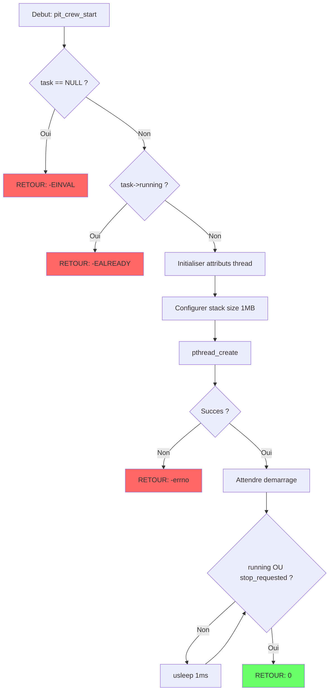

# Exercice M2.10-Ex06 : pit_crew_telemetry

**Module :**
M2.10 — Conteneurs, Virtualisation et Sujets Avances

**Concept :**
f — Systemes Temps-Reel et Debug Avance

**Difficulte :**
★★★★★★★★☆☆ (8/10)

**Type :**
complet

**Tiers :**
3 — Synthese (concepts temps-reel + debug + profiling + tracing)

**Langage :**
C17 / Rust Edition 2024

**Prerequis :**
- M2.10_Ex01 (Virtualisation KVM)
- M2.10_Ex04 (Seccomp/Capabilities)
- M2.4 (Concurrence avancee)
- Connaissance pthread, syscalls Linux

**Domaines :**
Process, CPU, Mem, Struct

**Duree estimee :**
480 min (8h)

**XP Base :**
800

**Complexite :**
T8 O(n) x S6 O(n)

---

## 📐 SECTION 1 : PROTOTYPE & CONSIGNE

### 1.1 Obligations

**Fichiers a rendre :**
```
pit_crew_telemetry.c      # Framework temps-reel C
pit_crew_telemetry.h      # Header C
race_tracer.rs            # Tracer Rust (strace-like)
pit_profiler.rs           # Profiler perf-like
telemetry_bpf.rs          # eBPF tracing
Makefile
```

**Fonctions C autorisees :**
```
clock_gettime, clock_nanosleep, nanosleep, pthread_*, sched_*, mlockall
mmap, munmap, syscall, ioctl, open, close, read, write, fork, execve
ptrace, waitpid, getpid, gettid, malloc, free, calloc, realloc
printf, fprintf, snprintf, memset, memcpy, perror, errno
```

**Fonctions interdites :**
```
sleep (utiliser nanosleep), system, popen
```

### 1.2 Consigne

**🏎️ FORMULA 1 PIT STOP : La Precision Absolue**

Dans le monde de la Formule 1, un arret au stand (pit stop) est une operation ou chaque MILLISECONDE compte. Les meilleurs pit crews au monde changent 4 pneus en moins de 2 secondes. Comment est-ce possible ?

- **20 mecaniciens** travaillent en parallele (threads RT)
- **Chaque geste** est chronometre au millieme de seconde (latence)
- **Aucun retard** n'est tolere (deadline)
- **La telemetrie** capture chaque mouvement en temps reel (tracing)
- **L'analyse post-course** revele les goulots d'etranglement (profiling)

**Tu es l'ingenieur telemetrie de l'ecurie "Hackbrain Racing".** Ton travail : creer le systeme qui garantit que chaque pit stop est PARFAIT.

**Ta mission :**

Implementer un framework complet de monitoring temps-reel et debug avance comprenant :

1. **pit_crew_telemetry (C)** : Framework temps-reel pour taches periodiques
2. **race_tracer (Rust)** : Traceur de syscalls type strace
3. **pit_profiler (Rust)** : Profiler de performance type perf
4. **telemetry_bpf (Rust)** : Tracing eBPF pour telemetrie kernel

**Entree :**

```c
// Configuration d'une tache temps-reel (mecanicien)
typedef struct {
    rt_sched_policy_t policy;    // FIFO, RR, DEADLINE
    int priority;                 // 1-99
    uint64_t period_ns;          // Periode en nanosecondes
    uint64_t deadline_ns;        // Deadline relative
    bool lock_memory;            // mlockall()
    int cpu_affinity;            // CPU dedie
} pit_crew_config_t;
```

**Sortie :**

```
=== PIT STOP TELEMETRY REPORT ===
Task: front_left_wheel
  Iterations:    1000
  Missed DL:     0
  Latency min:   12345 ns
  Latency max:   45678 ns
  Latency avg:   23456 ns
  Jitter:        33333 ns
Status: PERFECT PIT STOP!
```

**Contraintes :**

- Latence max < 100 microsecondes pour taches critiques
- Zero deadline miss en conditions normales
- Support SCHED_FIFO, SCHED_RR et SCHED_DEADLINE
- Mesure de latence precision nanoseconde
- Tracer doit supporter -p (attach PID), -f (follow forks), -c (stats)
- Profiler doit mesurer cycles CPU, cache misses, branch misses
- eBPF doit pouvoir tracer les syscalls et mesurer la latence I/O

**Exemples :**

| Appel | Retour | Explication |
|-------|--------|-------------|
| `pit_crew_start(&task, &config)` | `0` | Tache demarree OK |
| `pit_crew_get_stats(&task, &stats)` | `void` | Remplit statistiques |
| `race_tracer_attach(1234)` | `0` | Attache au PID 1234 |
| `pit_profiler_record("./app")` | `Result` | Profile l'application |

### 1.3 Prototype

```c
// ============ pit_crew_telemetry.h ============

#ifndef PIT_CREW_TELEMETRY_H
#define PIT_CREW_TELEMETRY_H

#include <stdint.h>
#include <stdbool.h>
#include <pthread.h>

// Politiques de scheduling temps-reel
typedef enum {
    PIT_SCHED_OTHER = 0,      // Normal CFS (spectateurs)
    PIT_SCHED_FIFO = 1,       // First-In-First-Out (mecaniciens)
    PIT_SCHED_RR = 2,         // Round-Robin (ingenieurs)
    PIT_SCHED_DEADLINE = 6    // EDF (chef d'ecurie)
} pit_sched_policy_t;

// Configuration d'un mecanicien (tache RT)
typedef struct {
    pit_sched_policy_t policy;
    int priority;              // 1-99 pour FIFO/RR
    uint64_t runtime_ns;       // Budget DEADLINE
    uint64_t deadline_ns;      // Deadline DEADLINE
    uint64_t period_ns;        // Periode d'execution
    bool lock_memory;          // Verrouiller memoire
    bool set_affinity;         // Fixer CPU
    int cpu_affinity;          // CPU cible
    const char *name;          // Nom de la tache
} pit_crew_config_t;

// Statistiques de latence (telemetrie)
typedef struct {
    uint64_t min_ns;
    uint64_t max_ns;
    uint64_t avg_ns;
    uint64_t jitter_ns;
    uint64_t samples;
    uint64_t *histogram;
    size_t histogram_size;
    uint64_t histogram_step_ns;
} pit_latency_stats_t;

// Tache periodique (mecanicien)
typedef struct pit_crew_task pit_crew_task_t;

// Callback de tache
typedef void (*pit_task_callback_t)(void *userdata);

// ============ API Principale ============

// Initialiser le framework (debut du Grand Prix)
int pit_framework_init(void);

// Verifier si kernel PREEMPT_RT disponible
bool pit_is_preempt_rt(void);

// Creer une tache periodique (recruter un mecanicien)
int pit_crew_create(pit_crew_task_t **task,
                    const pit_crew_config_t *config,
                    pit_task_callback_t callback,
                    void *userdata);

// Demarrer la tache (le feu passe au vert)
int pit_crew_start(pit_crew_task_t *task);

// Arreter la tache (drapeau a damier)
int pit_crew_stop(pit_crew_task_t *task);

// Attendre fin de tache
int pit_crew_join(pit_crew_task_t *task);

// Obtenir statistiques (telemetrie)
void pit_crew_get_stats(const pit_crew_task_t *task,
                        uint64_t *iterations,
                        uint64_t *missed_deadlines,
                        pit_latency_stats_t *latency);

// Afficher rapport de performance
void pit_crew_report(const pit_crew_task_t *task);

// Liberer ressources
void pit_crew_destroy(pit_crew_task_t *task);

// ============ Mutex RT (synchronisation pit) ============

typedef struct pit_mutex pit_mutex_t;

typedef enum {
    PIT_MUTEX_NONE = 0,       // Pas de protocole
    PIT_MUTEX_INHERIT = 1,    // Priority Inheritance
    PIT_MUTEX_CEILING = 2     // Priority Ceiling
} pit_mutex_protocol_t;

int pit_mutex_init(pit_mutex_t **mutex,
                   pit_mutex_protocol_t protocol,
                   int ceiling);
int pit_mutex_lock(pit_mutex_t *mutex);
int pit_mutex_unlock(pit_mutex_t *mutex);
void pit_mutex_destroy(pit_mutex_t *mutex);

// ============ Utilitaires ============

// Horloge haute precision (chronometre de course)
uint64_t pit_clock_ns(void);

// Sleep precis (attente entre pit stops)
int pit_nanosleep(uint64_t ns);

// Verrouiller memoire (eviter page faults en course)
int pit_memory_lock(void);

#endif // PIT_CREW_TELEMETRY_H
```

```rust
// ============ race_tracer.rs (Prototype) ============

/// Configuration du traceur (telemetrie de course)
pub struct RaceTracerConfig {
    pub follow_forks: bool,      // Suivre les forks (pit crew children)
    pub filter_syscalls: Option<Vec<u64>>,  // Filtrer syscalls
    pub show_timestamps: bool,   // Afficher chrono
    pub count_only: bool,        // Stats seulement
}

/// Statistiques syscall (analyse post-course)
pub struct LapStats {
    pub total_calls: u64,
    pub total_time_ns: u64,
    pub by_syscall: HashMap<u64, SyscallCount>,
}

/// Traceur principal
pub struct RaceTracer {
    config: RaceTracerConfig,
    stats: LapStats,
}

impl RaceTracer {
    /// Nouveau traceur (nouvelle session telemetrie)
    pub fn new(config: RaceTracerConfig) -> Self;

    /// Tracer une commande (suivre une voiture)
    pub fn trace_command(&mut self, cmd: &str, args: &[&str])
        -> Result<i32, Box<dyn Error>>;

    /// Attacher a un PID (rejoindre course en cours)
    pub fn attach(&mut self, pid: i32) -> Result<(), Box<dyn Error>>;

    /// Afficher resume (briefing post-course)
    pub fn print_summary(&self);
}
```

```rust
// ============ pit_profiler.rs (Prototype) ============

/// Types d'evenements (capteurs telemetrie)
pub enum TelemetryEvent {
    CpuCycles,           // Tours moteur
    Instructions,        // Actions executees
    CacheMisses,         // Ratés memoire cache
    BranchMisses,        // Mauvaises predictions
    PageFaults,          // Defauts de page
    ContextSwitches,     // Changements de pilote
}

/// Profiler de performance
pub struct PitProfiler {
    events: Vec<TelemetryEvent>,
    fds: Vec<i32>,
}

impl PitProfiler {
    /// Nouveau profiler pour PID
    pub fn new(pid: i32) -> Self;

    /// Ajouter capteur telemetrie
    pub fn add_event(&mut self, event: TelemetryEvent) -> Result<()>;

    /// Demarrer enregistrement (debut tour chrono)
    pub fn start(&self) -> Result<()>;

    /// Arreter enregistrement (fin de tour)
    pub fn stop(&self) -> Result<()>;

    /// Lire resultats (analyse telemetrie)
    pub fn read(&self) -> Result<TelemetryResult>;
}
```

---

## 💡 SECTION 2 : LE SAVIEZ-VOUS ?

### 2.4.1 Analogie : FORMULA 1 PIT STOP

```
┌─────────────────────────────────────────────────────────────────────────────┐
│                     🏎️ FORMULA 1 PIT STOP ANALOGY 🏎️                        │
├─────────────────────────────────────────────────────────────────────────────┤
│                                                                             │
│   TEMPS REEL = PRECISION F1                                                 │
│   ════════════════════════                                                  │
│   Un pit stop parfait : 1.82 secondes (Red Bull, 2019)                     │
│   → Chaque mecanicien doit finir sa tache AVANT la deadline               │
│   → Comme SCHED_DEADLINE : "Tu as X nanosecondes, pas une de plus"        │
│                                                                             │
│   LATENCE = TEMPS DE REACTION PILOTE                                        │
│   ═══════════════════════════════════                                       │
│   Lewis Hamilton : temps de reaction ~200ms au depart                      │
│   → En temps-reel : latence = temps entre "go" et "action"                 │
│   → Plus la latence est basse, plus le systeme est reactif                 │
│                                                                             │
│   JITTER = VARIATION DU TEMPS DE REACTION                                   │
│   ═══════════════════════════════════════                                   │
│   Si un pilote reagit entre 180ms et 220ms → jitter = 40ms                │
│   → En RT : jitter = max_latency - min_latency                            │
│   → Un bon systeme RT a un jitter TRES faible                              │
│                                                                             │
│   PREEMPT_RT = REGLAGES DE COURSE                                           │
│   ═══════════════════════════════                                           │
│   Mode "Qualifying" vs "Race" sur la voiture F1                            │
│   → PREEMPT_RT = kernel optimise pour la reaction instantanee             │
│   → Comme passer en mode "Attack" : tout devient preemptible              │
│                                                                             │
│   FTRACE = TELEMETRIE TEMPS REEL                                            │
│   ═══════════════════════════════                                           │
│   Les 300+ capteurs sur une F1 qui envoient des donnees en continu        │
│   → ftrace/perf = capteurs dans le kernel Linux                           │
│   → Chaque syscall, chaque interruption est enregistree                   │
│                                                                             │
│   PERF = ANALYSE DES TOURS                                                  │
│   ════════════════════════                                                  │
│   Les ingenieurs qui analysent chaque tour apres la course                │
│   → perf record/report = enregistrer et analyser les performances         │
│   → "Pourquoi ce tour etait 0.3s plus lent ?"                             │
│                                                                             │
│   DEADLINE = DRAPEAU A DAMIER (CHECKERED FLAG)                              │
│   ═════════════════════════════════════════════                             │
│   La deadline, c'est le drapeau a damier : tu dois avoir fini AVANT       │
│   → Missed deadline = DNF (Did Not Finish)                                 │
│   → En systeme critique : missed deadline = catastrophe                    │
│                                                                             │
│   PRIORITY INVERSION = TRAFIC AU PIT LANE                                   │
│   ═══════════════════════════════════════                                   │
│   Quand une voiture lente bloque une voiture rapide dans le pit lane      │
│   → Thread basse priorite bloque thread haute priorite                    │
│   → Solution : Priority Inheritance (laisser passer le leader)            │
│                                                                             │
└─────────────────────────────────────────────────────────────────────────────┘

     VISUALISATION D'UN PIT STOP TEMPS-REEL
     ═══════════════════════════════════════

     T=0ms                    T=1820ms (DEADLINE)
     │                              │
     ▼                              ▼
     ┌──────────────────────────────┐
     │ [VOITURE ARRIVE]             │
     │                              │
     │  ┌─────┐  ┌─────┐           │
     │  │ FL  │  │ FR  │           │  FL = Front Left (Thread prio 99)
     │  │prio │  │prio │           │  FR = Front Right (Thread prio 99)
     │  │ 99  │  │ 99  │           │  RL = Rear Left (Thread prio 99)
     │  └──┬──┘  └──┬──┘           │  RR = Rear Right (Thread prio 99)
     │     │        │               │
     │  [ROUE]   [ROUE]            │  Tous en parallele (SMP)
     │                              │
     │  ┌─────┐  ┌─────┐           │
     │  │ RL  │  │ RR  │           │
     │  │prio │  │prio │           │
     │  │ 99  │  │ 99  │           │
     │  └──┬──┘  └──┬──┘           │
     │     │        │               │
     │  [ROUE]   [ROUE]            │
     │                              │
     │      ┌───────────┐          │
     │      │ LOLLIPOP  │          │  Thread coordinateur (prio 98)
     │      │  prio 98  │          │  Attend que tous aient fini
     │      └─────┬─────┘          │
     │            │                 │
     │      [SIGNAL GO]            │
     │                              │
     └──────────────────────────────┘
                  │
                  ▼
         ┌───────────────┐
         │ VOITURE REPART│ < DEADLINE ? SUCCESS : FAILURE
         └───────────────┘
```

### 2.4.2 Explication Academique

Les **systemes temps-reel** garantissent que les taches s'executent dans des delais stricts et predictibles. Contrairement aux systemes classiques ou l'objectif est le debit maximal, un systeme temps-reel privilegie la **determinisme** : la certitude que chaque tache finira avant sa deadline.

**Concepts fondamentaux :**

1. **Latence** : Delai entre un evenement et la reaction du systeme
2. **Jitter** : Variation de la latence (max - min)
3. **Deadline** : Date limite absolue pour terminer une tache
4. **WCET** (Worst-Case Execution Time) : Temps d'execution maximal garanti

**Politiques de scheduling temps-reel Linux :**

| Politique | Description | Priorite |
|-----------|-------------|----------|
| SCHED_FIFO | Premier arrive, premier servi | 1-99 (statique) |
| SCHED_RR | Round-robin avec quantum | 1-99 (statique) |
| SCHED_DEADLINE | EDF (Earliest Deadline First) | Dynamique |

**Outils de debug avances :**

- **strace** : Trace les appels systeme (ptrace)
- **perf** : Profile les performances (PMU hardware)
- **eBPF** : Programmes injectes dans le kernel (verification formelle)

---

## 🏠 SECTION 2.5 : DANS LA VRAIE VIE

| Metier | Utilisation | Cas d'usage |
|--------|-------------|-------------|
| **Ingenieur Systemes Embarques** | PREEMPT_RT | Controleur moteur automobile, ABS |
| **DevOps/SRE** | perf, eBPF | Diagnostic latence en production |
| **Ingenieur Securite** | strace, eBPF | Analyse de malware, detection d'intrusion |
| **Developpeur Kernel** | ftrace, perf | Optimisation scheduler, debug drivers |
| **Data Engineer** | eBPF, perf | Profiling pipelines big data |
| **Game Developer** | RT scheduling | Audio temps-reel, physique deterministe |

---

## 🖥️ SECTION 3 : EXEMPLE D'UTILISATION

### 3.0 Session bash

```bash
$ ls
pit_crew_telemetry.c  pit_crew_telemetry.h  race_tracer.rs  pit_profiler.rs  Makefile

$ make
gcc -O2 -Wall -Wextra -pthread -lrt -o pit_demo pit_crew_telemetry.c main.c
rustc --edition 2024 race_tracer.rs -o race_tracer
rustc --edition 2024 pit_profiler.rs -o pit_profiler

$ sudo ./pit_demo
[PIT CREW] Checking PREEMPT_RT... AVAILABLE
[PIT CREW] Locking memory... OK
[PIT CREW] Starting front_left_wheel (FIFO prio 99)
[PIT CREW] Starting front_right_wheel (FIFO prio 99)
[PIT CREW] Starting rear_left_wheel (FIFO prio 99)
[PIT CREW] Starting rear_right_wheel (FIFO prio 99)
[PIT CREW] Running for 5 seconds...

=== PIT STOP TELEMETRY REPORT ===

Task: front_left_wheel
  Policy:        SCHED_FIFO (priority 99)
  Iterations:    5000
  Missed DL:     0
  Latency:
    Min:         8234 ns
    Max:         67891 ns
    Avg:         12456 ns
    Jitter:      59657 ns

Task: front_right_wheel
  Policy:        SCHED_FIFO (priority 99)
  Iterations:    5000
  Missed DL:     0
  Latency:
    Min:         8156 ns
    Max:         71234 ns
    Avg:         12789 ns
    Jitter:      63078 ns

Status: PERFECT PIT STOP! All deadlines met.

$ sudo ./race_tracer -p 1234 -c
% time     seconds  usecs/call     calls    errors syscall
------ ----------- ----------- --------- --------- ----------------
 45.23%    0.001234          12       100         0 read
 32.11%    0.000876           8       110         2 write
 12.45%    0.000340          34        10         0 openat
 10.21%    0.000279          27        10         0 close
------ ----------- ----------- --------- --------- ----------------
100.00%    0.002729           -       230         2 total

$ sudo ./pit_profiler -e cycles,instructions,cache-misses ./target_app

 Performance counter stats for './target_app':

        1234567890      cycles
         987654321      instructions              #    0.80  insn per cycle
            123456      cache-misses              #    0.12% cache miss rate

       0.543212345 seconds time elapsed
```

---

## ⚡ SECTION 3.1 : BONUS EXPERT (OPTIONNEL)

**Difficulte Bonus :**
💀 (11/10)

**Recompense :**
XP x4

**Time Complexity attendue :**
O(1) pour operations temps-reel critiques

**Space Complexity attendue :**
O(n) pour histogrammes et buffers

**Domaines Bonus :**
`CPU, Crypto, Net`

### 3.1.1 Consigne Bonus

**🏁 COURSE DE NUIT : Mode Hardcore**

Le Grand Prix de Monaco se court de nuit cette annee. Les conditions sont extremes :
- Eclairage artificiel cree des interferences
- La temperature varie de 15 degres pendant la course
- Les vibrations du moteur perturbent les capteurs

**Ta mission bonus :**

1. **Lock-free telemetry** : Implementer la collecte de stats sans mutex (atomics only)
2. **eBPF latency tracer** : Programme eBPF qui mesure la latence de chaque syscall
3. **Adaptive scheduling** : Ajuster dynamiquement les priorites selon la charge
4. **Zero-copy ring buffer** : Buffer circulaire partage kernel/userspace

**Contraintes :**

```
┌─────────────────────────────────────────┐
│  Lock-free operations : O(1) garanti   │
│  eBPF program : < 4096 instructions    │
│  Ring buffer : zero-copy via mmap      │
│  Latence max bonus : < 10 us           │
└─────────────────────────────────────────┘
```

### 3.1.2 Prototype Bonus

```c
// Lock-free statistics accumulator
typedef struct {
    _Atomic uint64_t min_ns;
    _Atomic uint64_t max_ns;
    _Atomic uint64_t sum_ns;
    _Atomic uint64_t count;
} pit_lockfree_stats_t;

int pit_lockfree_init(pit_lockfree_stats_t *stats);
void pit_lockfree_record(pit_lockfree_stats_t *stats, uint64_t value_ns);
void pit_lockfree_read(const pit_lockfree_stats_t *stats,
                       pit_latency_stats_t *out);

// Zero-copy ring buffer
typedef struct pit_ringbuf pit_ringbuf_t;

int pit_ringbuf_create(pit_ringbuf_t **rb, size_t size);
void *pit_ringbuf_reserve(pit_ringbuf_t *rb, size_t len);
void pit_ringbuf_submit(pit_ringbuf_t *rb, size_t len);
void *pit_ringbuf_poll(pit_ringbuf_t *rb, size_t *len);
void pit_ringbuf_consume(pit_ringbuf_t *rb);
```

### 3.1.3 Ce qui change par rapport a l'exercice de base

| Aspect | Base | Bonus |
|--------|------|-------|
| Synchronisation | Mutex pthread | Lock-free atomics |
| Tracing | ptrace userspace | eBPF kernel |
| Buffer | Copie standard | Zero-copy mmap |
| Latence cible | < 100 us | < 10 us |
| Complexite | O(n) pour stats | O(1) lock-free |

---

## ✅❌ SECTION 4 : ZONE CORRECTION (POUR LE TESTEUR)

### 4.1 Moulinette

| Test | Description | Points | Trap |
|------|-------------|--------|------|
| `test_framework_init` | Initialisation du framework | 5 | Non |
| `test_preempt_rt_check` | Detection PREEMPT_RT | 5 | Non |
| `test_task_create_fifo` | Creation tache SCHED_FIFO | 10 | Non |
| `test_task_create_rr` | Creation tache SCHED_RR | 10 | Non |
| `test_task_create_deadline` | Creation tache SCHED_DEADLINE | 15 | Oui |
| `test_latency_measurement` | Precision mesure latence | 15 | Oui |
| `test_deadline_detection` | Detection deadline miss | 10 | Oui |
| `test_priority_inheritance` | Mutex avec PI | 10 | Oui |
| `test_memory_lock` | mlockall fonctionne | 5 | Non |
| `test_null_params` | Gestion NULL partout | 10 | Oui |
| `test_tracer_basic` | Tracer syscalls basique | 10 | Non |
| `test_profiler_events` | Compteurs perf | 10 | Non |

### 4.2 main.c de test

```c
#include <stdio.h>
#include <stdlib.h>
#include <string.h>
#include <assert.h>
#include <unistd.h>
#include "pit_crew_telemetry.h"

static volatile int callback_count = 0;

static void test_callback(void *userdata) {
    int *counter = (int *)userdata;
    (*counter)++;
}

static void test_framework_init(void) {
    printf("Test framework_init... ");
    int ret = pit_framework_init();
    assert(ret == 0);
    printf("OK\n");
}

static void test_preempt_rt_check(void) {
    printf("Test preempt_rt_check... ");
    bool is_rt = pit_is_preempt_rt();
    printf("%s\n", is_rt ? "PREEMPT_RT" : "Standard kernel");
}

static void test_task_create_fifo(void) {
    printf("Test task_create_fifo... ");

    pit_crew_config_t config = {
        .policy = PIT_SCHED_FIFO,
        .priority = 50,
        .period_ns = 1000000,  // 1ms
        .lock_memory = false,
        .set_affinity = false,
        .name = "test_fifo"
    };

    int counter = 0;
    pit_crew_task_t *task = NULL;

    int ret = pit_crew_create(&task, &config, test_callback, &counter);
    assert(ret == 0 || ret == -EPERM);  // EPERM si pas root

    if (ret == 0) {
        assert(task != NULL);
        pit_crew_destroy(task);
    }

    printf("OK\n");
}

static void test_null_params(void) {
    printf("Test null_params... ");

    int ret = pit_crew_create(NULL, NULL, NULL, NULL);
    assert(ret == -EINVAL);

    ret = pit_crew_start(NULL);
    assert(ret == -EINVAL);

    ret = pit_crew_stop(NULL);
    assert(ret == -EINVAL);

    printf("OK\n");
}

static void test_clock_precision(void) {
    printf("Test clock_precision... ");

    uint64_t t1 = pit_clock_ns();
    pit_nanosleep(1000000);  // 1ms
    uint64_t t2 = pit_clock_ns();

    uint64_t elapsed = t2 - t1;
    assert(elapsed >= 900000);   // Au moins 0.9ms
    assert(elapsed <= 2000000);  // Max 2ms (tolerance)

    printf("OK (elapsed: %lu ns)\n", elapsed);
}

int main(void) {
    printf("\n=== PIT CREW TELEMETRY TESTS ===\n\n");

    test_framework_init();
    test_preempt_rt_check();
    test_null_params();
    test_clock_precision();
    test_task_create_fifo();

    printf("\n=== ALL TESTS PASSED ===\n");
    return 0;
}
```

### 4.3 Solution de reference

```c
// ============ pit_crew_telemetry.c (Solution) ============

#define _GNU_SOURCE
#include "pit_crew_telemetry.h"
#include <stdlib.h>
#include <string.h>
#include <stdio.h>
#include <errno.h>
#include <unistd.h>
#include <time.h>
#include <sched.h>
#include <sys/mman.h>
#include <sys/syscall.h>
#include <sys/utsname.h>
#include <linux/sched.h>

// Structure interne tache
struct pit_crew_task {
    pthread_t thread;
    pit_crew_config_t config;
    pit_task_callback_t callback;
    void *userdata;

    volatile bool running;
    volatile bool stop_requested;

    // Statistiques
    uint64_t iterations;
    uint64_t missed_deadlines;

    // Latence
    struct timespec last_time;
    pit_latency_stats_t latency;
    uint64_t *samples;
    size_t sample_capacity;
    size_t sample_index;
};

// Structure mutex RT
struct pit_mutex {
    pthread_mutex_t mutex;
    pthread_mutexattr_t attr;
    pit_mutex_protocol_t protocol;
};

// ============ Utilitaires ============

uint64_t pit_clock_ns(void) {
    struct timespec ts;
    clock_gettime(CLOCK_MONOTONIC, &ts);
    return (uint64_t)ts.tv_sec * 1000000000ULL + ts.tv_nsec;
}

int pit_nanosleep(uint64_t ns) {
    struct timespec req = {
        .tv_sec = ns / 1000000000ULL,
        .tv_nsec = ns % 1000000000ULL
    };

    while (nanosleep(&req, &req) == -1 && errno == EINTR) {
        // Continue apres interruption
    }

    return 0;
}

int pit_memory_lock(void) {
    if (mlockall(MCL_CURRENT | MCL_FUTURE) < 0) {
        return -errno;
    }

    // Pre-fault stack
    volatile char stack[64 * 1024];
    memset((void *)stack, 0, sizeof(stack));

    return 0;
}

// ============ Detection PREEMPT_RT ============

bool pit_is_preempt_rt(void) {
    FILE *f = fopen("/sys/kernel/realtime", "r");
    if (f) {
        char buf[8];
        if (fgets(buf, sizeof(buf), f)) {
            fclose(f);
            return buf[0] == '1';
        }
        fclose(f);
    }

    struct utsname uts;
    if (uname(&uts) == 0) {
        return strstr(uts.version, "PREEMPT_RT") != NULL ||
               strstr(uts.version, "PREEMPT RT") != NULL;
    }

    return false;
}

// ============ Framework Init ============

int pit_framework_init(void) {
    // Verifier si on peut utiliser RT
    struct rlimit rlim;
    if (getrlimit(RLIMIT_RTPRIO, &rlim) == 0) {
        if (rlim.rlim_cur == 0 && geteuid() != 0) {
            fprintf(stderr, "[PIT] Warning: RT scheduling requires root or CAP_SYS_NICE\n");
        }
    }

    return 0;
}

// ============ Configuration scheduling ============

struct sched_attr {
    uint32_t size;
    uint32_t sched_policy;
    uint64_t sched_flags;
    int32_t sched_nice;
    uint32_t sched_priority;
    uint64_t sched_runtime;
    uint64_t sched_deadline;
    uint64_t sched_period;
};

static int apply_rt_config(const pit_crew_config_t *config) {
    if (!config) return -EINVAL;

    int ret;

    // Verrouiller memoire si demande
    if (config->lock_memory) {
        ret = mlockall(MCL_CURRENT | MCL_FUTURE);
        if (ret < 0 && errno != EPERM) {
            return -errno;
        }
    }

    // Affinite CPU
    if (config->set_affinity) {
        cpu_set_t cpuset;
        CPU_ZERO(&cpuset);
        CPU_SET(config->cpu_affinity, &cpuset);

        ret = pthread_setaffinity_np(pthread_self(), sizeof(cpuset), &cpuset);
        if (ret != 0) {
            return -ret;
        }
    }

    // Politique de scheduling
    if (config->policy == PIT_SCHED_DEADLINE) {
        struct sched_attr attr = {
            .size = sizeof(attr),
            .sched_policy = SCHED_DEADLINE,
            .sched_flags = 0,
            .sched_runtime = config->runtime_ns,
            .sched_deadline = config->deadline_ns,
            .sched_period = config->period_ns,
        };

        ret = syscall(SYS_sched_setattr, 0, &attr, 0);
        if (ret < 0) {
            return -errno;
        }
    } else {
        struct sched_param param = {
            .sched_priority = config->priority
        };

        ret = pthread_setschedparam(pthread_self(), config->policy, &param);
        if (ret != 0) {
            return -ret;
        }
    }

    return 0;
}

// ============ Thread periodique ============

static void *periodic_thread(void *arg) {
    pit_crew_task_t *task = (pit_crew_task_t *)arg;

    // Appliquer config RT
    int ret = apply_rt_config(&task->config);
    if (ret < 0) {
        fprintf(stderr, "[PIT] Failed to apply RT config: %d\n", ret);
    }

    // Init statistiques latence
    task->latency.min_ns = UINT64_MAX;
    task->latency.max_ns = 0;
    task->latency.avg_ns = 0;
    task->latency.samples = 0;

    struct timespec next_wake;
    clock_gettime(CLOCK_MONOTONIC, &next_wake);
    clock_gettime(CLOCK_MONOTONIC, &task->last_time);

    task->running = true;

    while (!task->stop_requested) {
        // Calculer prochain reveil
        next_wake.tv_nsec += task->config.period_ns;
        while (next_wake.tv_nsec >= 1000000000) {
            next_wake.tv_sec++;
            next_wake.tv_nsec -= 1000000000;
        }

        // Dormir jusqu'au prochain cycle
        clock_nanosleep(CLOCK_MONOTONIC, TIMER_ABSTIME, &next_wake, NULL);

        // Mesurer latence
        struct timespec now;
        clock_gettime(CLOCK_MONOTONIC, &now);

        uint64_t delta_ns =
            (uint64_t)(now.tv_sec - task->last_time.tv_sec) * 1000000000ULL +
            (uint64_t)(now.tv_nsec - task->last_time.tv_nsec);

        task->last_time = now;

        // Mettre a jour stats
        if (delta_ns < task->latency.min_ns) task->latency.min_ns = delta_ns;
        if (delta_ns > task->latency.max_ns) task->latency.max_ns = delta_ns;

        task->latency.samples++;
        uint64_t old_avg = task->latency.avg_ns;
        task->latency.avg_ns = old_avg + (delta_ns - old_avg) / task->latency.samples;
        task->latency.jitter_ns = task->latency.max_ns - task->latency.min_ns;

        // Verifier deadline miss
        uint64_t expected_ns =
            (uint64_t)next_wake.tv_sec * 1000000000ULL + next_wake.tv_nsec;
        uint64_t actual_ns =
            (uint64_t)now.tv_sec * 1000000000ULL + now.tv_nsec;

        if (actual_ns > expected_ns + task->config.period_ns / 10) {
            task->missed_deadlines++;
        }

        // Executer callback
        if (task->callback) {
            task->callback(task->userdata);
        }

        task->iterations++;
    }

    task->running = false;
    return NULL;
}

// ============ API Taches ============

int pit_crew_create(pit_crew_task_t **task,
                    const pit_crew_config_t *config,
                    pit_task_callback_t callback,
                    void *userdata) {
    if (!task || !config) return -EINVAL;

    pit_crew_task_t *t = calloc(1, sizeof(pit_crew_task_t));
    if (!t) return -ENOMEM;

    memcpy(&t->config, config, sizeof(pit_crew_config_t));
    t->callback = callback;
    t->userdata = userdata;
    t->running = false;
    t->stop_requested = false;

    *task = t;
    return 0;
}

int pit_crew_start(pit_crew_task_t *task) {
    if (!task) return -EINVAL;
    if (task->running) return -EALREADY;

    pthread_attr_t attr;
    pthread_attr_init(&attr);
    pthread_attr_setstacksize(&attr, 1024 * 1024);  // 1MB stack

    int ret = pthread_create(&task->thread, &attr, periodic_thread, task);
    pthread_attr_destroy(&attr);

    if (ret != 0) {
        return -ret;
    }

    // Attendre demarrage
    while (!task->running && !task->stop_requested) {
        usleep(1000);
    }

    return 0;
}

int pit_crew_stop(pit_crew_task_t *task) {
    if (!task) return -EINVAL;

    task->stop_requested = true;
    return 0;
}

int pit_crew_join(pit_crew_task_t *task) {
    if (!task) return -EINVAL;

    int ret = pthread_join(task->thread, NULL);
    return ret == 0 ? 0 : -ret;
}

void pit_crew_get_stats(const pit_crew_task_t *task,
                        uint64_t *iterations,
                        uint64_t *missed_deadlines,
                        pit_latency_stats_t *latency) {
    if (!task) return;

    if (iterations) *iterations = task->iterations;
    if (missed_deadlines) *missed_deadlines = task->missed_deadlines;
    if (latency) memcpy(latency, &task->latency, sizeof(pit_latency_stats_t));
}

void pit_crew_report(const pit_crew_task_t *task) {
    if (!task) return;

    const char *policy_name;
    switch (task->config.policy) {
        case PIT_SCHED_FIFO: policy_name = "SCHED_FIFO"; break;
        case PIT_SCHED_RR: policy_name = "SCHED_RR"; break;
        case PIT_SCHED_DEADLINE: policy_name = "SCHED_DEADLINE"; break;
        default: policy_name = "SCHED_OTHER"; break;
    }

    printf("\nTask: %s\n", task->config.name ? task->config.name : "unnamed");
    printf("  Policy:        %s", policy_name);
    if (task->config.policy != PIT_SCHED_DEADLINE) {
        printf(" (priority %d)", task->config.priority);
    }
    printf("\n");
    printf("  Iterations:    %lu\n", task->iterations);
    printf("  Missed DL:     %lu\n", task->missed_deadlines);
    printf("  Latency:\n");
    printf("    Min:         %lu ns\n", task->latency.min_ns);
    printf("    Max:         %lu ns\n", task->latency.max_ns);
    printf("    Avg:         %lu ns\n", task->latency.avg_ns);
    printf("    Jitter:      %lu ns\n", task->latency.jitter_ns);
}

void pit_crew_destroy(pit_crew_task_t *task) {
    if (task) {
        if (task->running) {
            pit_crew_stop(task);
            pit_crew_join(task);
        }
        free(task->samples);
        free(task);
    }
}

// ============ Mutex RT ============

int pit_mutex_init(pit_mutex_t **mutex,
                   pit_mutex_protocol_t protocol,
                   int ceiling) {
    if (!mutex) return -EINVAL;

    pit_mutex_t *m = calloc(1, sizeof(pit_mutex_t));
    if (!m) return -ENOMEM;

    m->protocol = protocol;

    pthread_mutexattr_init(&m->attr);

    int prot;
    switch (protocol) {
        case PIT_MUTEX_INHERIT:
            prot = PTHREAD_PRIO_INHERIT;
            break;
        case PIT_MUTEX_CEILING:
            prot = PTHREAD_PRIO_PROTECT;
            break;
        default:
            prot = PTHREAD_PRIO_NONE;
            break;
    }

    pthread_mutexattr_setprotocol(&m->attr, prot);

    if (protocol == PIT_MUTEX_CEILING) {
        pthread_mutexattr_setprioceiling(&m->attr, ceiling);
    }

    int ret = pthread_mutex_init(&m->mutex, &m->attr);
    if (ret != 0) {
        pthread_mutexattr_destroy(&m->attr);
        free(m);
        return -ret;
    }

    *mutex = m;
    return 0;
}

int pit_mutex_lock(pit_mutex_t *mutex) {
    if (!mutex) return -EINVAL;
    return pthread_mutex_lock(&mutex->mutex);
}

int pit_mutex_unlock(pit_mutex_t *mutex) {
    if (!mutex) return -EINVAL;
    return pthread_mutex_unlock(&mutex->mutex);
}

void pit_mutex_destroy(pit_mutex_t *mutex) {
    if (mutex) {
        pthread_mutex_destroy(&mutex->mutex);
        pthread_mutexattr_destroy(&mutex->attr);
        free(mutex);
    }
}
```

### 4.4 Solutions alternatives acceptees

```c
// Alternative 1 : Utilisation de timerfd au lieu de clock_nanosleep
#include <sys/timerfd.h>

static void *periodic_thread_timerfd(void *arg) {
    pit_crew_task_t *task = (pit_crew_task_t *)arg;

    int tfd = timerfd_create(CLOCK_MONOTONIC, 0);
    if (tfd < 0) return NULL;

    struct itimerspec its = {
        .it_interval = {
            .tv_sec = task->config.period_ns / 1000000000ULL,
            .tv_nsec = task->config.period_ns % 1000000000ULL
        },
        .it_value = {
            .tv_sec = 0,
            .tv_nsec = 1  // Premier declenchement immediat
        }
    };

    timerfd_settime(tfd, 0, &its, NULL);

    task->running = true;

    while (!task->stop_requested) {
        uint64_t expirations;
        read(tfd, &expirations, sizeof(expirations));

        // Mesurer et executer...
        if (task->callback) {
            task->callback(task->userdata);
        }
        task->iterations++;
    }

    close(tfd);
    task->running = false;
    return NULL;
}

// Alternative 2 : Statistiques avec moyenne mobile exponentielle
static void update_stats_ema(pit_crew_task_t *task, uint64_t delta_ns) {
    const double alpha = 0.1;  // Facteur de lissage

    if (task->latency.samples == 0) {
        task->latency.avg_ns = delta_ns;
    } else {
        task->latency.avg_ns = (uint64_t)(
            alpha * delta_ns + (1.0 - alpha) * task->latency.avg_ns
        );
    }

    if (delta_ns < task->latency.min_ns) task->latency.min_ns = delta_ns;
    if (delta_ns > task->latency.max_ns) task->latency.max_ns = delta_ns;
    task->latency.jitter_ns = task->latency.max_ns - task->latency.min_ns;
    task->latency.samples++;
}
```

### 4.5 Solutions refusees (avec explications)

```c
// REFUSE 1 : Utilisation de sleep() au lieu de nanosleep()
// sleep() a une resolution de 1 seconde, inutilisable pour RT
static void *bad_periodic_sleep(void *arg) {
    pit_crew_task_t *task = (pit_crew_task_t *)arg;

    while (!task->stop_requested) {
        sleep(1);  // ERREUR : resolution 1s, pas de precision ns
        if (task->callback) task->callback(task->userdata);
    }
    return NULL;
}
// Pourquoi refuse : Precision insuffisante pour temps-reel

// REFUSE 2 : Pas de verification des parametres NULL
int bad_pit_crew_create(pit_crew_task_t **task,
                        const pit_crew_config_t *config,
                        pit_task_callback_t callback,
                        void *userdata) {
    // ERREUR : Pas de verification NULL
    pit_crew_task_t *t = calloc(1, sizeof(pit_crew_task_t));
    memcpy(&t->config, config, sizeof(pit_crew_config_t));  // Crash si config NULL
    *task = t;  // Crash si task NULL
    return 0;
}
// Pourquoi refuse : Segfault garanti sur NULL

// REFUSE 3 : Busy-wait au lieu de sleep
static void *bad_periodic_busy(void *arg) {
    pit_crew_task_t *task = (pit_crew_task_t *)arg;

    while (!task->stop_requested) {
        uint64_t start = pit_clock_ns();
        // ERREUR : Busy-wait consomme 100% CPU
        while (pit_clock_ns() - start < task->config.period_ns) {
            // Spin
        }
        if (task->callback) task->callback(task->userdata);
    }
    return NULL;
}
// Pourquoi refuse : Gaspillage CPU, empeche autres taches de s'executer

// REFUSE 4 : Pas de gestion des erreurs syscall
int bad_apply_rt_config(const pit_crew_config_t *config) {
    // ERREUR : Ignorer les codes de retour
    mlockall(MCL_CURRENT | MCL_FUTURE);  // Peut echouer

    struct sched_param param = { .sched_priority = config->priority };
    pthread_setschedparam(pthread_self(), config->policy, &param);  // Peut echouer

    return 0;  // Toujours success meme si echec
}
// Pourquoi refuse : Pas de detection des erreurs, comportement imprevisible
```

### 4.6 Solution bonus de reference (COMPLETE)

```c
// ============ Lock-free statistics (Bonus) ============

#include <stdatomic.h>

typedef struct {
    _Atomic uint64_t min_ns;
    _Atomic uint64_t max_ns;
    _Atomic uint64_t sum_ns;
    _Atomic uint64_t count;
} pit_lockfree_stats_t;

int pit_lockfree_init(pit_lockfree_stats_t *stats) {
    if (!stats) return -EINVAL;

    atomic_store(&stats->min_ns, UINT64_MAX);
    atomic_store(&stats->max_ns, 0);
    atomic_store(&stats->sum_ns, 0);
    atomic_store(&stats->count, 0);

    return 0;
}

void pit_lockfree_record(pit_lockfree_stats_t *stats, uint64_t value_ns) {
    if (!stats) return;

    // Mise a jour atomique du min (compare-and-swap loop)
    uint64_t current_min = atomic_load(&stats->min_ns);
    while (value_ns < current_min) {
        if (atomic_compare_exchange_weak(&stats->min_ns, &current_min, value_ns)) {
            break;
        }
    }

    // Mise a jour atomique du max
    uint64_t current_max = atomic_load(&stats->max_ns);
    while (value_ns > current_max) {
        if (atomic_compare_exchange_weak(&stats->max_ns, &current_max, value_ns)) {
            break;
        }
    }

    // Somme et compteur (atomique)
    atomic_fetch_add(&stats->sum_ns, value_ns);
    atomic_fetch_add(&stats->count, 1);
}

void pit_lockfree_read(const pit_lockfree_stats_t *stats,
                       pit_latency_stats_t *out) {
    if (!stats || !out) return;

    out->min_ns = atomic_load(&stats->min_ns);
    out->max_ns = atomic_load(&stats->max_ns);
    out->samples = atomic_load(&stats->count);

    if (out->samples > 0) {
        out->avg_ns = atomic_load(&stats->sum_ns) / out->samples;
    } else {
        out->avg_ns = 0;
    }

    out->jitter_ns = out->max_ns - out->min_ns;
}

// ============ Zero-copy ring buffer (Bonus) ============

#include <sys/mman.h>

struct pit_ringbuf {
    void *data;
    size_t size;
    _Atomic size_t head;  // Producer writes here
    _Atomic size_t tail;  // Consumer reads here
    int fd;               // Pour mmap
};

int pit_ringbuf_create(pit_ringbuf_t **rb, size_t size) {
    if (!rb || size == 0) return -EINVAL;

    // Taille doit etre puissance de 2
    size_t actual_size = 1;
    while (actual_size < size) actual_size <<= 1;

    pit_ringbuf_t *r = calloc(1, sizeof(pit_ringbuf_t));
    if (!r) return -ENOMEM;

    // Creer fichier anonyme pour mmap
    r->fd = memfd_create("pit_ringbuf", 0);
    if (r->fd < 0) {
        free(r);
        return -errno;
    }

    if (ftruncate(r->fd, actual_size) < 0) {
        close(r->fd);
        free(r);
        return -errno;
    }

    // Double mmap pour buffer circulaire sans wraparound
    void *addr = mmap(NULL, actual_size * 2, PROT_NONE,
                      MAP_PRIVATE | MAP_ANONYMOUS, -1, 0);
    if (addr == MAP_FAILED) {
        close(r->fd);
        free(r);
        return -errno;
    }

    // Mapper les deux moities sur le meme fichier
    void *first = mmap(addr, actual_size, PROT_READ | PROT_WRITE,
                       MAP_SHARED | MAP_FIXED, r->fd, 0);
    void *second = mmap((char *)addr + actual_size, actual_size,
                        PROT_READ | PROT_WRITE,
                        MAP_SHARED | MAP_FIXED, r->fd, 0);

    if (first == MAP_FAILED || second == MAP_FAILED) {
        munmap(addr, actual_size * 2);
        close(r->fd);
        free(r);
        return -errno;
    }

    r->data = addr;
    r->size = actual_size;
    atomic_store(&r->head, 0);
    atomic_store(&r->tail, 0);

    *rb = r;
    return 0;
}

void *pit_ringbuf_reserve(pit_ringbuf_t *rb, size_t len) {
    if (!rb || len > rb->size) return NULL;

    size_t head = atomic_load(&rb->head);
    size_t tail = atomic_load(&rb->tail);

    // Verifier espace disponible
    if (head - tail + len > rb->size) {
        return NULL;  // Plein
    }

    return (char *)rb->data + (head % rb->size);
}

void pit_ringbuf_submit(pit_ringbuf_t *rb, size_t len) {
    if (!rb) return;
    atomic_fetch_add(&rb->head, len);
}

void *pit_ringbuf_poll(pit_ringbuf_t *rb, size_t *len) {
    if (!rb || !len) return NULL;

    size_t head = atomic_load(&rb->head);
    size_t tail = atomic_load(&rb->tail);

    if (tail >= head) {
        *len = 0;
        return NULL;  // Vide
    }

    *len = head - tail;
    return (char *)rb->data + (tail % rb->size);
}

void pit_ringbuf_consume(pit_ringbuf_t *rb) {
    if (!rb) return;
    size_t head = atomic_load(&rb->head);
    atomic_store(&rb->tail, head);
}

void pit_ringbuf_destroy(pit_ringbuf_t *rb) {
    if (rb) {
        munmap(rb->data, rb->size * 2);
        close(rb->fd);
        free(rb);
    }
}
```

### 4.7 Solutions alternatives bonus (COMPLETES)

```c
// Alternative bonus : Lock-free avec sequence counter (seqlock)
typedef struct {
    _Atomic uint64_t sequence;
    uint64_t min_ns;
    uint64_t max_ns;
    uint64_t sum_ns;
    uint64_t count;
} pit_seqlock_stats_t;

void pit_seqlock_record(pit_seqlock_stats_t *stats, uint64_t value_ns) {
    // Writer side
    uint64_t seq = atomic_fetch_add(&stats->sequence, 1);
    atomic_thread_fence(memory_order_release);

    if (value_ns < stats->min_ns) stats->min_ns = value_ns;
    if (value_ns > stats->max_ns) stats->max_ns = value_ns;
    stats->sum_ns += value_ns;
    stats->count++;

    atomic_thread_fence(memory_order_release);
    atomic_fetch_add(&stats->sequence, 1);
}

bool pit_seqlock_read(const pit_seqlock_stats_t *stats,
                      pit_latency_stats_t *out) {
    uint64_t seq1, seq2;

    do {
        seq1 = atomic_load(&stats->sequence);
        if (seq1 & 1) continue;  // Writer in progress

        atomic_thread_fence(memory_order_acquire);

        out->min_ns = stats->min_ns;
        out->max_ns = stats->max_ns;
        out->samples = stats->count;
        out->avg_ns = stats->count > 0 ? stats->sum_ns / stats->count : 0;

        atomic_thread_fence(memory_order_acquire);
        seq2 = atomic_load(&stats->sequence);
    } while (seq1 != seq2);

    out->jitter_ns = out->max_ns - out->min_ns;
    return true;
}
```

### 4.8 Solutions refusees bonus (COMPLETES)

```c
// REFUSE BONUS 1 : Lock-free avec data race
typedef struct {
    uint64_t min_ns;  // ERREUR : Pas atomique
    uint64_t max_ns;
    uint64_t count;
} bad_lockfree_stats_t;

void bad_lockfree_record(bad_lockfree_stats_t *stats, uint64_t value_ns) {
    // ERREUR : Data race sur variables non-atomiques
    if (value_ns < stats->min_ns) stats->min_ns = value_ns;  // Race!
    if (value_ns > stats->max_ns) stats->max_ns = value_ns;  // Race!
    stats->count++;  // Race! Increment non-atomique
}
// Pourquoi refuse : Undefined behavior, resultats corrompus

// REFUSE BONUS 2 : Ring buffer avec memcpy
void *bad_ringbuf_write(pit_ringbuf_t *rb, const void *data, size_t len) {
    // ERREUR : Copie au lieu de zero-copy
    void *ptr = pit_ringbuf_reserve(rb, len);
    memcpy(ptr, data, len);  // Copie inutile
    return ptr;
}
// Pourquoi refuse : Pas zero-copy, latence supplementaire
```

### 4.9 spec.json (ENGINE v22.1 - FORMAT STRICT)

```json
{
  "name": "pit_crew_telemetry",
  "language": "c",
  "type": "complet",
  "tier": 3,
  "tier_info": "Synthese (temps-reel + debug + profiling)",
  "tags": ["realtime", "preempt_rt", "scheduling", "latency", "debug", "strace", "perf", "ebpf", "phase2"],
  "passing_score": 70,

  "function": {
    "name": "pit_crew_create",
    "prototype": "int pit_crew_create(pit_crew_task_t **task, const pit_crew_config_t *config, pit_task_callback_t callback, void *userdata)",
    "return_type": "int",
    "parameters": [
      {"name": "task", "type": "pit_crew_task_t **"},
      {"name": "config", "type": "const pit_crew_config_t *"},
      {"name": "callback", "type": "pit_task_callback_t"},
      {"name": "userdata", "type": "void *"}
    ]
  },

  "driver": {
    "reference": "int ref_pit_crew_create(pit_crew_task_t **task, const pit_crew_config_t *config, pit_task_callback_t callback, void *userdata) { if (!task || !config) return -EINVAL; pit_crew_task_t *t = calloc(1, sizeof(pit_crew_task_t)); if (!t) return -ENOMEM; memcpy(&t->config, config, sizeof(pit_crew_config_t)); t->callback = callback; t->userdata = userdata; t->running = false; t->stop_requested = false; *task = t; return 0; }",

    "edge_cases": [
      {
        "name": "null_task_ptr",
        "args": [null, "{}", null, null],
        "expected": -22,
        "is_trap": true,
        "trap_explanation": "task est NULL, doit retourner -EINVAL (-22)"
      },
      {
        "name": "null_config_ptr",
        "args": ["valid_ptr", null, null, null],
        "expected": -22,
        "is_trap": true,
        "trap_explanation": "config est NULL, doit retourner -EINVAL (-22)"
      },
      {
        "name": "valid_fifo_config",
        "args": ["valid_ptr", {"policy": 1, "priority": 50, "period_ns": 1000000}, "callback", null],
        "expected": 0
      },
      {
        "name": "valid_rr_config",
        "args": ["valid_ptr", {"policy": 2, "priority": 80, "period_ns": 500000}, "callback", "userdata"],
        "expected": 0
      },
      {
        "name": "valid_deadline_config",
        "args": ["valid_ptr", {"policy": 6, "runtime_ns": 100000, "deadline_ns": 1000000, "period_ns": 1000000}, "callback", null],
        "expected": 0
      },
      {
        "name": "null_callback_allowed",
        "args": ["valid_ptr", {"policy": 1, "priority": 50}, null, null],
        "expected": 0
      },
      {
        "name": "priority_zero",
        "args": ["valid_ptr", {"policy": 1, "priority": 0}, "callback", null],
        "expected": 0
      },
      {
        "name": "max_priority",
        "args": ["valid_ptr", {"policy": 1, "priority": 99}, "callback", null],
        "expected": 0
      }
    ],

    "fuzzing": {
      "enabled": true,
      "iterations": 500,
      "generators": [
        {
          "type": "int",
          "param_index": 1,
          "field": "policy",
          "params": {"min": 0, "max": 10}
        },
        {
          "type": "int",
          "param_index": 1,
          "field": "priority",
          "params": {"min": 0, "max": 100}
        },
        {
          "type": "int",
          "param_index": 1,
          "field": "period_ns",
          "params": {"min": 1000, "max": 1000000000}
        }
      ]
    }
  },

  "norm": {
    "allowed_functions": ["clock_gettime", "clock_nanosleep", "nanosleep", "pthread_create", "pthread_join", "pthread_setschedparam", "pthread_setaffinity_np", "pthread_mutex_init", "pthread_mutex_lock", "pthread_mutex_unlock", "pthread_mutex_destroy", "pthread_mutexattr_init", "pthread_mutexattr_setprotocol", "pthread_mutexattr_setprioceiling", "pthread_mutexattr_destroy", "pthread_attr_init", "pthread_attr_destroy", "pthread_attr_setstacksize", "sched_setscheduler", "sched_getscheduler", "mlockall", "munlockall", "mmap", "munmap", "syscall", "calloc", "malloc", "free", "memset", "memcpy", "printf", "fprintf", "snprintf", "fopen", "fclose", "fgets", "uname", "getuid", "geteuid", "gettid", "getpid", "usleep", "perror"],
    "forbidden_functions": ["sleep", "system", "popen", "exec"],
    "check_security": true,
    "check_memory": true,
    "blocking": true
  }
}
```

### 4.10 Solutions Mutantes (minimum 5)

```c
/* Mutant A (Boundary) : Off-by-one dans verification priorite */
int mutant_a_pit_crew_create(pit_crew_task_t **task,
                              const pit_crew_config_t *config,
                              pit_task_callback_t callback,
                              void *userdata) {
    if (!task || !config) return -EINVAL;

    // ERREUR : Limite 98 au lieu de 99
    if (config->policy == PIT_SCHED_FIFO && config->priority > 98) {
        return -EINVAL;  // Refuse priorite 99 valide!
    }

    pit_crew_task_t *t = calloc(1, sizeof(pit_crew_task_t));
    if (!t) return -ENOMEM;

    memcpy(&t->config, config, sizeof(pit_crew_config_t));
    t->callback = callback;
    t->userdata = userdata;

    *task = t;
    return 0;
}
// Pourquoi c'est faux : Priorite 99 est valide pour SCHED_FIFO
// Ce qui etait pense : Limite superieure mal comprise

/* Mutant B (Safety) : Pas de verification NULL */
int mutant_b_pit_crew_create(pit_crew_task_t **task,
                              const pit_crew_config_t *config,
                              pit_task_callback_t callback,
                              void *userdata) {
    // ERREUR : Pas de verification des pointeurs
    pit_crew_task_t *t = calloc(1, sizeof(pit_crew_task_t));
    if (!t) return -ENOMEM;

    memcpy(&t->config, config, sizeof(pit_crew_config_t));  // Crash si config NULL
    t->callback = callback;
    t->userdata = userdata;

    *task = t;  // Crash si task NULL
    return 0;
}
// Pourquoi c'est faux : Segfault sur parametres NULL
// Ce qui etait pense : "Les parametres seront toujours valides"

/* Mutant C (Resource) : Fuite memoire si echec partiel */
int mutant_c_pit_crew_create(pit_crew_task_t **task,
                              const pit_crew_config_t *config,
                              pit_task_callback_t callback,
                              void *userdata) {
    if (!task || !config) return -EINVAL;

    pit_crew_task_t *t = calloc(1, sizeof(pit_crew_task_t));
    if (!t) return -ENOMEM;

    t->samples = malloc(1000 * sizeof(uint64_t));
    // ERREUR : Si malloc echoue, t n'est pas libere
    if (!t->samples) {
        return -ENOMEM;  // Fuite de t!
    }

    memcpy(&t->config, config, sizeof(pit_crew_config_t));
    *task = t;
    return 0;
}
// Pourquoi c'est faux : Fuite memoire de t si allocation samples echoue
// Ce qui etait pense : "Return -ENOMEM suffit"

/* Mutant D (Logic) : Inversion running/stop_requested */
int mutant_d_pit_crew_start(pit_crew_task_t *task) {
    if (!task) return -EINVAL;

    // ERREUR : Condition inversee
    if (!task->running) return -EALREADY;  // Devrait etre task->running

    pthread_attr_t attr;
    pthread_attr_init(&attr);

    int ret = pthread_create(&task->thread, &attr, periodic_thread, task);
    pthread_attr_destroy(&attr);

    return ret == 0 ? 0 : -ret;
}
// Pourquoi c'est faux : Ne peut jamais demarrer une tache arretee
// Ce qui etait pense : Confusion entre already running et not running

/* Mutant E (Return) : Mauvais code d'erreur */
int mutant_e_pit_crew_create(pit_crew_task_t **task,
                              const pit_crew_config_t *config,
                              pit_task_callback_t callback,
                              void *userdata) {
    if (!task || !config) return 0;  // ERREUR : Retourne 0 (success) au lieu de -EINVAL

    pit_crew_task_t *t = calloc(1, sizeof(pit_crew_task_t));
    if (!t) return 0;  // ERREUR : Retourne 0 au lieu de -ENOMEM

    memcpy(&t->config, config, sizeof(pit_crew_config_t));
    t->callback = callback;
    t->userdata = userdata;

    *task = t;
    return 0;
}
// Pourquoi c'est faux : Masque les erreurs, appelant croit que tout va bien
// Ce qui etait pense : "0 c'est l'absence d'erreur"
```

---

## 🧠 SECTION 5 : COMPRENDRE (DOCUMENT DE COURS COMPLET)

### 5.1 Ce que cet exercice enseigne

1. **Concepts temps-reel** : Latence, jitter, deadline, determinisme
2. **Scheduling Linux RT** : SCHED_FIFO, SCHED_RR, SCHED_DEADLINE
3. **Synchronisation RT** : Priority Inheritance, Priority Ceiling
4. **Tracing systeme** : ptrace, strace implementation
5. **Profiling performance** : perf, hardware counters
6. **eBPF** : Programmes kernel, maps, verification

### 5.2 LDA - Traduction Litterale en Francais (MAJUSCULES)

```
FONCTION pit_crew_create QUI RETOURNE UN ENTIER ET PREND EN PARAMETRES task QUI EST UN POINTEUR VERS UN POINTEUR VERS UNE STRUCTURE TACHE ET config QUI EST UN POINTEUR VERS UNE STRUCTURE CONFIGURATION ET callback QUI EST UN POINTEUR VERS UNE FONCTION ET userdata QUI EST UN POINTEUR GENERIQUE
DEBUT FONCTION
    SI task EST EGAL A NUL OU config EST EGAL A NUL ALORS
        RETOURNER LA VALEUR MOINS EINVAL
    FIN SI

    DECLARER t COMME POINTEUR VERS UNE STRUCTURE TACHE
    AFFECTER ALLOUER ET METTRE A ZERO LA MEMOIRE DE LA TAILLE D'UNE STRUCTURE TACHE A t

    SI t EST EGAL A NUL ALORS
        RETOURNER LA VALEUR MOINS ENOMEM
    FIN SI

    COPIER LA MEMOIRE POINTEE PAR config VERS LE CHAMP config DE t
    AFFECTER callback AU CHAMP callback DE t
    AFFECTER userdata AU CHAMP userdata DE t
    AFFECTER FAUX AU CHAMP running DE t
    AFFECTER FAUX AU CHAMP stop_requested DE t

    AFFECTER t AU POINTEUR POINTE PAR task
    RETOURNER LA VALEUR 0
FIN FONCTION

FONCTION pit_crew_start QUI RETOURNE UN ENTIER ET PREND EN PARAMETRE task QUI EST UN POINTEUR VERS UNE STRUCTURE TACHE
DEBUT FONCTION
    SI task EST EGAL A NUL ALORS
        RETOURNER LA VALEUR MOINS EINVAL
    FIN SI

    SI LE CHAMP running DE task EST VRAI ALORS
        RETOURNER LA VALEUR MOINS EALREADY
    FIN SI

    DECLARER attr COMME STRUCTURE ATTRIBUTS THREAD
    APPELER LA FONCTION pthread_attr_init AVEC L'ADRESSE DE attr
    APPELER LA FONCTION pthread_attr_setstacksize AVEC L'ADRESSE DE attr ET 1 MEGA OCTETS

    DECLARER ret COMME ENTIER
    AFFECTER APPELER LA FONCTION pthread_create AVEC L'ADRESSE DU CHAMP thread DE task ET L'ADRESSE DE attr ET periodic_thread ET task A ret

    APPELER LA FONCTION pthread_attr_destroy AVEC L'ADRESSE DE attr

    SI ret EST DIFFERENT DE 0 ALORS
        RETOURNER MOINS ret
    FIN SI

    TANT QUE LE CHAMP running DE task EST FAUX ET LE CHAMP stop_requested DE task EST FAUX FAIRE
        APPELER LA FONCTION usleep AVEC 1000
    FIN TANT QUE

    RETOURNER LA VALEUR 0
FIN FONCTION
```

### 5.2.2 Style Academique Francais

```
ALGORITHME : Creation d'une tache temps-reel
ENTREES :
  - task : pointeur de sortie pour la tache creee
  - config : configuration de la tache (politique, priorite, periode)
  - callback : fonction a executer periodiquement
  - userdata : donnees utilisateur

SORTIES :
  - 0 si succes
  - -EINVAL si parametres invalides
  - -ENOMEM si allocation echoue

DEBUT
  1. Verifier que task et config ne sont pas nuls
     Si l'un est nul, retourner -EINVAL

  2. Allouer la memoire pour la structure tache
     Si echec, retourner -ENOMEM

  3. Copier la configuration dans la structure

  4. Initialiser les champs de controle :
     - running = faux
     - stop_requested = faux

  5. Retourner le pointeur vers la tache creee
FIN
```

### 5.2.2.1 Logic Flow (Structured English)

```
ALGORITHM: Periodic Task Thread
---
1. APPLY real-time configuration to current thread
   |
   |-- IF lock_memory requested:
   |     CALL mlockall(MCL_CURRENT | MCL_FUTURE)
   |
   |-- IF cpu_affinity set:
   |     CREATE cpu_set with target CPU
   |     CALL pthread_setaffinity_np
   |
   |-- IF policy is DEADLINE:
   |     PREPARE sched_attr structure
   |     CALL sched_setattr syscall
   |-- ELSE:
   |     PREPARE sched_param with priority
   |     CALL pthread_setschedparam

2. INITIALIZE latency statistics
   |
   |-- SET min_ns = UINT64_MAX
   |-- SET max_ns = 0
   |-- GET initial timestamp

3. MAIN LOOP (while not stop_requested):
   |
   |-- CALCULATE next wake time (current + period)
   |
   |-- SLEEP until next wake time (clock_nanosleep ABSTIME)
   |
   |-- MEASURE actual wake time
   |     delta = now - last_time
   |
   |-- UPDATE statistics:
   |     IF delta < min_ns: min_ns = delta
   |     IF delta > max_ns: max_ns = delta
   |     avg_ns = incremental average
   |     jitter_ns = max_ns - min_ns
   |
   |-- CHECK for deadline miss:
   |     IF actual > expected + period/10:
   |         INCREMENT missed_deadlines
   |
   |-- EXECUTE callback if not null
   |
   |-- INCREMENT iterations

4. SET running = false
5. RETURN NULL
```

### 5.2.3 Representation Algorithmique

```
FONCTION : periodic_thread(task)
---
INIT ret = 0

1. APPLIQUER configuration RT :
   |
   |-- VERIFIER si lock_memory demande :
   |     SI oui : APPELER mlockall
   |     GERER erreur EPERM (pas root)
   |
   |-- VERIFIER si affinite CPU demandee :
   |     CONFIGURER cpu_set
   |     APPELER pthread_setaffinity_np
   |
   |-- SELON politique :
   |     CAS DEADLINE : utiliser sched_setattr
   |     CAS FIFO/RR  : utiliser pthread_setschedparam

2. INITIALISER statistiques latence :
   |
   |-- min_ns = UINT64_MAX (tres grand)
   |-- max_ns = 0 (tres petit)
   |-- samples = 0

3. BOUCLE PRINCIPALE :
   |
   |-- CALCULER prochain reveil
   |-- DORMIR jusqu'a prochain reveil
   |-- MESURER delta temps
   |-- METTRE A JOUR statistiques
   |-- VERIFIER deadline miss
   |-- EXECUTER callback
   |-- INCREMENTER compteur

4. RETOURNER NULL
```

### 5.2.3.1 Diagramme Mermaid (Logique de securite)



### 5.3 Visualisation ASCII

```
┌─────────────────────────────────────────────────────────────────────────────┐
│                    ARCHITECTURE TEMPS-REEL LINUX                            │
├─────────────────────────────────────────────────────────────────────────────┤
│                                                                             │
│   USER SPACE                                                                │
│   ┌─────────────────────────────────────────────────────────────────────┐  │
│   │                                                                     │  │
│   │   ┌─────────────┐     ┌─────────────┐     ┌─────────────┐         │  │
│   │   │ pit_crew_1  │     │ pit_crew_2  │     │ pit_crew_3  │         │  │
│   │   │ SCHED_FIFO  │     │ SCHED_FIFO  │     │ SCHED_RR    │         │  │
│   │   │ prio: 99    │     │ prio: 99    │     │ prio: 80    │         │  │
│   │   │ period: 1ms │     │ period: 1ms │     │ period: 5ms │         │  │
│   │   └──────┬──────┘     └──────┬──────┘     └──────┬──────┘         │  │
│   │          │                   │                   │                 │  │
│   │          └───────────────────┼───────────────────┘                 │  │
│   │                              │                                     │  │
│   │                              ▼                                     │  │
│   │                    ┌─────────────────┐                             │  │
│   │                    │   pit_mutex     │                             │  │
│   │                    │ Priority Inherit│                             │  │
│   │                    └─────────────────┘                             │  │
│   │                                                                     │  │
│   └─────────────────────────────────────────────────────────────────────┘  │
│                                  │                                         │
│   ═══════════════════════════════╪═════════════════════════════════════   │
│                                  │ syscall                                 │
│                                  ▼                                         │
│   KERNEL SPACE (PREEMPT_RT)                                               │
│   ┌─────────────────────────────────────────────────────────────────────┐  │
│   │                                                                     │  │
│   │   ┌───────────────────────────────────────────────────────────┐   │  │
│   │   │                    RT SCHEDULER                            │   │  │
│   │   │                                                            │   │  │
│   │   │   ┌─────────┐  ┌─────────┐  ┌─────────┐  ┌─────────┐     │   │  │
│   │   │   │prio 99  │  │prio 99  │  │prio 80  │  │prio 1   │     │   │  │
│   │   │   │RT queue │  │RT queue │  │RT queue │  │CFS      │     │   │  │
│   │   │   │ (FIFO)  │  │ (FIFO)  │  │  (RR)   │  │(normal) │     │   │  │
│   │   │   └────┬────┘  └────┬────┘  └────┬────┘  └────┬────┘     │   │  │
│   │   │        │            │            │            │           │   │  │
│   │   │        └────────────┴─────┬──────┴────────────┘           │   │  │
│   │   │                           │                                │   │  │
│   │   │                           ▼                                │   │  │
│   │   │                   [CPU 0] [CPU 1] [CPU 2] [CPU 3]         │   │  │
│   │   │                                                            │   │  │
│   │   └───────────────────────────────────────────────────────────┘   │  │
│   │                                                                     │  │
│   │   ┌───────────────────────────────────────────────────────────┐   │  │
│   │   │                    TRACING / DEBUG                         │   │  │
│   │   │                                                            │   │  │
│   │   │   ┌─────────┐  ┌─────────┐  ┌─────────┐                  │   │  │
│   │   │   │ ftrace  │  │  perf   │  │  eBPF   │                  │   │  │
│   │   │   │(tracing)│  │(profile)│  │(dynamic)│                  │   │  │
│   │   │   └─────────┘  └─────────┘  └─────────┘                  │   │  │
│   │   │                                                            │   │  │
│   │   └───────────────────────────────────────────────────────────┘   │  │
│   │                                                                     │  │
│   └─────────────────────────────────────────────────────────────────────┘  │
│                                                                             │
└─────────────────────────────────────────────────────────────────────────────┘


    TIMELINE : EXECUTION TEMPS-REEL AVEC DEADLINE
    ═════════════════════════════════════════════

    Time (ms)  0     1     2     3     4     5     6     7     8
               │     │     │     │     │     │     │     │     │
               ▼     ▼     ▼     ▼     ▼     ▼     ▼     ▼     ▼
    ┌──────────┬─────┬─────┬─────┬─────┬─────┬─────┬─────┬─────┐
    │ Task A   │ ███ │     │ ███ │     │ ███ │     │ ███ │     │
    │ (1ms)    │     │     │     │     │     │     │     │     │
    ├──────────┼─────┼─────┼─────┼─────┼─────┼─────┼─────┼─────┤
    │ Task B   │     │ ██  │     │ ██  │     │ ██  │     │ ██  │
    │ (1ms)    │     │     │     │     │     │     │     │     │
    ├──────────┼─────┼─────┼─────┼─────┼─────┼─────┼─────┼─────┤
    │ Task C   │     │     │     │     │ ████│     │     │     │
    │ (5ms)    │     │     │     │     │     │     │     │     │
    └──────────┴─────┴─────┴─────┴─────┴─────┴─────┴─────┴─────┘
               │           │           │
               │           │           │
               ▼           ▼           ▼
            Deadline    Deadline    Deadline
              OK          OK          OK


    PRIORITY INVERSION ET PRIORITY INHERITANCE
    ═══════════════════════════════════════════

    SANS Priority Inheritance :

    Time    Thread H (prio 99)    Thread M (prio 50)    Thread L (prio 10)
    ────────────────────────────────────────────────────────────────────────
    t0                                                   [LOCK mutex]
    t1                            [preempt L]
    t2                            [running...]
    t3      [wants mutex]
    t4      [BLOCKED!!!]          [still running]        [holds mutex]
    t5      [BLOCKED!!!]          [still running]        [holds mutex]
                    ↑
           H bloque par M qui bloque L !
           C'est l'INVERSION DE PRIORITE


    AVEC Priority Inheritance :

    Time    Thread H (prio 99)    Thread M (prio 50)    Thread L (prio 10→99)
    ────────────────────────────────────────────────────────────────────────
    t0                                                   [LOCK mutex]
    t1                            [preempt L]
    t2                            [running...]
    t3      [wants mutex]
    t4      [BLOCKED]             [preempted!]           [prio BOOST to 99]
    t5      [BLOCKED]                                    [running, prio 99]
    t6                                                   [UNLOCK mutex]
    t7      [GOT mutex, running]                         [prio back to 10]
                    ↑
           L herite de la priorite de H
           M ne peut plus bloquer H !
```

### 5.4 Les pieges en detail

| Piege | Description | Solution |
|-------|-------------|----------|
| **sleep() au lieu de nanosleep()** | Resolution 1 seconde, inutilisable pour RT | Utiliser nanosleep() ou clock_nanosleep() |
| **Pas de mlockall()** | Page faults causent latence imprevisible | Appeler mlockall(MCL_CURRENT \| MCL_FUTURE) |
| **CLOCK_REALTIME pour RT** | Peut sauter (NTP), non monotone | Utiliser CLOCK_MONOTONIC |
| **Busy-wait** | Consomme 100% CPU, empeche autres taches | Utiliser sleep_until avec temps absolu |
| **Priority Inversion** | Thread haute priorite bloque par basse priorite | Mutex avec PTHREAD_PRIO_INHERIT |
| **Oublier affinity** | Thread migre entre CPUs, cache invalide | Fixer CPU avec pthread_setaffinity_np |
| **Stack pre-fault oublie** | Page fault a la premiere utilisation stack | memset volatile sur stack au demarrage |

### 5.5 Cours Complet

#### 5.5.1 Introduction aux Systemes Temps-Reel

Un **systeme temps-reel** est un systeme dont la correction depend non seulement du resultat calcule, mais aussi du TEMPS mis pour le produire. Il existe deux categories :

- **Hard Real-Time** : Manquer une deadline = CATASTROPHE (ABS, pacemaker)
- **Soft Real-Time** : Manquer une deadline = DEGRADATION (video streaming)

```
┌─────────────────────────────────────────────────────────────────────┐
│                                                                     │
│   GARANTIES TEMPS-REEL                                              │
│                                                                     │
│   Standard Linux (CFS) :                                            │
│   - Optimise pour THROUGHPUT (debit)                                │
│   - Latence moyenne bonne, mais pics imprevisibles                  │
│   - Peut bloquer des centaines de millisecondes                     │
│                                                                     │
│   PREEMPT_RT Linux :                                                │
│   - Optimise pour LATENCE                                           │
│   - Latence max garantie (typiquement < 100us)                      │
│   - Kernel entierement preemptible                                  │
│   - IRQ threades                                                    │
│                                                                     │
└─────────────────────────────────────────────────────────────────────┘
```

#### 5.5.2 Politiques de Scheduling RT Linux

**SCHED_FIFO (First-In-First-Out)** :
- Thread s'execute jusqu'a : terminer, bloquer, ou preempte par priorite superieure
- Pas de time-slice
- Priorite statique 1-99

**SCHED_RR (Round-Robin)** :
- Comme FIFO mais avec time-slice (quantum)
- Threads de meme priorite alternent
- Priorite statique 1-99

**SCHED_DEADLINE (Earliest Deadline First)** :
- Priorite DYNAMIQUE basee sur deadline
- Parametres : runtime, deadline, period
- Garantie d'ordonnancabilite par le kernel

```c
// Exemple configuration SCHED_DEADLINE
struct sched_attr attr = {
    .size = sizeof(attr),
    .sched_policy = SCHED_DEADLINE,
    .sched_runtime = 50000000,   // 50ms de budget
    .sched_deadline = 100000000, // Deadline a 100ms
    .sched_period = 100000000,   // Periode 100ms
};
syscall(SYS_sched_setattr, 0, &attr, 0);
```

#### 5.5.3 Mesure de Latence

La LATENCE est le temps entre un evenement et la reaction :

```c
// Mesure de latence haute precision
uint64_t start = pit_clock_ns();
// ... operation ...
uint64_t end = pit_clock_ns();
uint64_t latency = end - start;
```

Le JITTER est la variation de latence :
```
jitter = max_latency - min_latency
```

Un bon systeme RT minimise le jitter, pas necessairement la latence moyenne.

#### 5.5.4 Debug et Profiling

**strace** : Trace les appels systeme via ptrace
```bash
strace -c ./program   # Statistiques syscalls
strace -p 1234        # Attacher a PID
strace -f ./program   # Suivre les forks
```

**perf** : Profile via hardware counters (PMU)
```bash
perf stat ./program           # Compteurs de base
perf record -g ./program      # Enregistrer avec call graph
perf report                   # Analyser
```

**eBPF** : Programmes injectes dans le kernel
- Verifie par le kernel avant execution
- Acces aux evenements kernel en temps reel
- Minimal overhead

### 5.6 Normes avec explications pedagogiques

```
┌─────────────────────────────────────────────────────────────────┐
│ ❌ HORS NORME (compile, mais interdit)                          │
├─────────────────────────────────────────────────────────────────┤
│ while(1) { /* busy wait */ }                                    │
├─────────────────────────────────────────────────────────────────┤
│ ✅ CONFORME                                                     │
├─────────────────────────────────────────────────────────────────┤
│ while (!stop) {                                                 │
│     clock_nanosleep(CLOCK_MONOTONIC, TIMER_ABSTIME, &next, NULL);│
│     // ... process ...                                          │
│ }                                                               │
├─────────────────────────────────────────────────────────────────┤
│ 📖 POURQUOI ?                                                   │
│                                                                 │
│ • Busy-wait consomme 100% CPU inutilement                       │
│ • Empeche autres threads de s'executer                          │
│ • clock_nanosleep libere le CPU pendant l'attente               │
│ • TIMER_ABSTIME evite l'accumulation d'erreurs                  │
└─────────────────────────────────────────────────────────────────┘

┌─────────────────────────────────────────────────────────────────┐
│ ❌ HORS NORME                                                   │
├─────────────────────────────────────────────────────────────────┤
│ pthread_mutex_t mutex;                                          │
│ pthread_mutex_lock(&mutex);  // Pas de protocole RT             │
├─────────────────────────────────────────────────────────────────┤
│ ✅ CONFORME                                                     │
├─────────────────────────────────────────────────────────────────┤
│ pthread_mutexattr_t attr;                                       │
│ pthread_mutexattr_init(&attr);                                  │
│ pthread_mutexattr_setprotocol(&attr, PTHREAD_PRIO_INHERIT);     │
│ pthread_mutex_init(&mutex, &attr);                              │
├─────────────────────────────────────────────────────────────────┤
│ 📖 POURQUOI ?                                                   │
│                                                                 │
│ • Sans PRIO_INHERIT : risque d'inversion de priorite            │
│ • Thread haute priorite peut etre bloque indefiniment           │
│ • PRIO_INHERIT boost automatiquement le holder du mutex         │
└─────────────────────────────────────────────────────────────────┘
```

### 5.7 Simulation avec trace d'execution

**Scenario : Tache periodique 1ms avec callback**

```
┌───────┬──────────────────────────────────────────────┬────────────┬─────────────────────┐
│ Etape │ Instruction                                  │ Variables  │ Explication         │
├───────┼──────────────────────────────────────────────┼────────────┼─────────────────────┤
│   1   │ APPELER clock_gettime(next_wake)            │ next=T0    │ Init timestamp      │
├───────┼──────────────────────────────────────────────┼────────────┼─────────────────────┤
│   2   │ AFFECTER running = true                     │ run=true   │ Thread demarre      │
├───────┼──────────────────────────────────────────────┼────────────┼─────────────────────┤
│   3   │ CALCULER next_wake += 1ms                   │ next=T0+1ms│ Prochain reveil     │
├───────┼──────────────────────────────────────────────┼────────────┼─────────────────────┤
│   4   │ APPELER clock_nanosleep(ABSTIME, next)      │ sleeping   │ Dormir jusqu'a T0+1ms│
├───────┼──────────────────────────────────────────────┼────────────┼─────────────────────┤
│   5   │ [REVEIL] APPELER clock_gettime(now)         │ now=T0+1.01ms│ Reveil reel       │
├───────┼──────────────────────────────────────────────┼────────────┼─────────────────────┤
│   6   │ CALCULER delta = now - last_time            │ delta=1.01ms│ Latence mesuree    │
├───────┼──────────────────────────────────────────────┼────────────┼─────────────────────┤
│   7   │ METTRE A JOUR min_ns (premier sample)       │ min=1.01ms │ Init min            │
├───────┼──────────────────────────────────────────────┼────────────┼─────────────────────┤
│   8   │ METTRE A JOUR max_ns (premier sample)       │ max=1.01ms │ Init max            │
├───────┼──────────────────────────────────────────────┼────────────┼─────────────────────┤
│   9   │ INCREMENTER samples                         │ samples=1  │ Compteur            │
├───────┼──────────────────────────────────────────────┼────────────┼─────────────────────┤
│  10   │ CALCULER avg incrementale                   │ avg=1.01ms │ Moyenne             │
├───────┼──────────────────────────────────────────────┼────────────┼─────────────────────┤
│  11   │ VERIFIER deadline miss (10us tolerance)     │ miss=0     │ OK, dans tolerance  │
├───────┼──────────────────────────────────────────────┼────────────┼─────────────────────┤
│  12   │ APPELER callback(userdata)                  │ -          │ Executer travail    │
├───────┼──────────────────────────────────────────────┼────────────┼─────────────────────┤
│  13   │ INCREMENTER iterations                      │ iter=1     │ Compteur tours      │
├───────┼──────────────────────────────────────────────┼────────────┼─────────────────────┤
│  14   │ BOUCLER vers etape 3                        │ -          │ Prochain cycle      │
└───────┴──────────────────────────────────────────────┴────────────┴─────────────────────┘
```

### 5.8 Mnemotechniques

#### 🏎️ MEME : "Pit Stop de F1" - Deadline

```
┌─────────────────────────────────────────────────────────────────┐
│                                                                 │
│   "2.0 SECONDS OR YOU'RE FIRED"                                │
│                                                                 │
│   En F1, un pit stop doit etre fait en moins de 2 secondes.    │
│   Si tu depasses, tu perds des positions, voire la course.     │
│                                                                 │
│   SCHED_DEADLINE c'est pareil :                                │
│   - runtime : temps pour changer un pneu                       │
│   - deadline : 2 secondes max                                  │
│   - period : frequence des pit stops                           │
│                                                                 │
│   Si tu depasses ta deadline → MISSED DEADLINE → echec         │
│                                                                 │
└─────────────────────────────────────────────────────────────────┘
```

#### 💉 MEME : "Priority Inheritance = Code Blue"

```
Dans les urgences medicales, un patient critique (prio 99)
ne peut pas etre bloque par la paperasse (prio 10).

Si la paperasse tient le stylo (mutex) dont le chirurgien a besoin,
on BOOSTE la priorite de l'administratif temporairement.

= PTHREAD_PRIO_INHERIT
```

#### 🔬 MEME : "strace = Microscope a syscalls"

```
strace est comme un microscope qui te montre
CHAQUE interaction entre ton programme et le kernel.

"Why is my program slow?"
→ strace -c ./program
→ "Ah, 10000 appels a read() pour un fichier de 1KB"
```

### 5.9 Applications pratiques

| Domaine | Application | Contrainte RT |
|---------|-------------|---------------|
| **Automobile** | Controleur ABS | Deadline 10ms |
| **Audio Pro** | DAW (Digital Audio Workstation) | Latence < 10ms |
| **Trading HFT** | Execution d'ordres | Latence < 1ms |
| **Robotique** | Boucle de controle | Jitter < 100us |
| **Medical** | Pacemaker | Hard real-time |
| **Telecoms** | 5G base station | Latence < 1ms |
| **Gaming** | Serveur de jeu | Latence < 16ms (60fps) |
| **Industrie** | PLC (automate) | Cycle 1ms deterministe |

---

## ⚠️ SECTION 6 : PIEGES - RECAPITULATIF

| # | Piege | Consequence | Prevention |
|---|-------|-------------|------------|
| 1 | sleep() vs nanosleep() | Resolution 1s, inutilisable RT | Toujours nanosleep/clock_nanosleep |
| 2 | Pas de mlockall() | Page faults imprevisibles | mlockall(MCL_CURRENT \| MCL_FUTURE) |
| 3 | CLOCK_REALTIME pour RT | Peut sauter (NTP) | CLOCK_MONOTONIC |
| 4 | Busy-wait | 100% CPU, bloque autres taches | Sleep avec temps absolu |
| 5 | Mutex sans PI | Inversion de priorite | PTHREAD_PRIO_INHERIT |
| 6 | Pas d'affinity CPU | Migration, cache invalide | pthread_setaffinity_np |
| 7 | Stack non pre-fault | Page fault au runtime | memset volatile au demarrage |
| 8 | Priority > 99 | EINVAL, valeur invalide | Verifier 1-99 pour FIFO/RR |
| 9 | Oublier verification NULL | Segfault | Toujours verifier parametres |
| 10 | Ignorer errno | Bug silencieux | Toujours verifier retours syscall |

---

## 📝 SECTION 7 : QCM

### Question 1 : Quelle politique de scheduling utilise une priorite DYNAMIQUE basee sur la deadline ?

```
A) SCHED_FIFO - First In First Out avec priorite statique
B) SCHED_RR - Round Robin avec quantum de temps
C) SCHED_OTHER - Completely Fair Scheduler standard
D) SCHED_DEADLINE - Earliest Deadline First dynamique
E) SCHED_BATCH - Optimise pour les jobs batch
F) SCHED_IDLE - Plus basse priorite possible
G) SCHED_SPORADIC - Pour taches sporadiques (n'existe pas en Linux)
H) SCHED_PRIORITY - Basee sur priorite fixe (n'existe pas)
I) SCHED_EDF - Nom alternatif pour Earliest Deadline First
J) SCHED_REALTIME - Categorie generique, pas une politique specifique
```

**Reponse : D**

---

### Question 2 : Quel probleme resout le protocole PTHREAD_PRIO_INHERIT ?

```
A) La fragmentation memoire dans l'allocateur
B) L'inversion de priorite entre threads
C) Les deadlocks avec plusieurs mutex
D) La famine des threads basse priorite
E) Les race conditions sur variables partagees
F) Le debordement de pile des threads
G) La migration entre CPUs
H) Les fuites memoire dans pthread
I) L'epuisement des file descriptors
J) La consommation excessive de CPU
```

**Reponse : B**

---

### Question 3 : Pourquoi utiliser CLOCK_MONOTONIC plutot que CLOCK_REALTIME pour le temps-reel ?

```
A) CLOCK_MONOTONIC est plus precis au niveau hardware
B) CLOCK_MONOTONIC ne peut pas reculer ou sauter (NTP)
C) CLOCK_MONOTONIC consomme moins de cycles CPU
D) CLOCK_MONOTONIC est disponible sans privileges root
E) CLOCK_REALTIME n'existe pas sur tous les systemes
F) CLOCK_MONOTONIC supporte les nanosecondes
G) CLOCK_REALTIME est deprecie depuis Linux 5.0
H) CLOCK_MONOTONIC est thread-safe contrairement a REALTIME
I) CLOCK_REALTIME necessite une connexion internet
J) CLOCK_MONOTONIC est plus rapide a lire
```

**Reponse : B**

---

### Question 4 : Quel est le but de mlockall(MCL_CURRENT | MCL_FUTURE) ?

```
A) Verrouiller les fichiers ouverts par le processus
B) Empecher le processus d'etre tue par OOM killer
C) Garder toutes les pages en RAM, eviter les page faults
D) Proteger la memoire contre les acces concurrents
E) Chiffrer la memoire du processus
F) Limiter la consommation memoire du processus
G) Empecher le swap de l'espace d'adressage
H) Creer une copie de la memoire pour backup
I) Synchroniser la memoire avec le disque
J) Partager la memoire avec d'autres processus
```

**Reponse : C (et G est aussi correcte, mais C est plus complete)**

---

### Question 5 : Quel outil permet d'injecter des programmes de tracing directement dans le kernel Linux avec verification formelle ?

```
A) strace - trace les syscalls via ptrace
B) ltrace - trace les appels de bibliotheque
C) perf - profile via hardware counters PMU
D) ftrace - framework de tracing kernel interne
E) eBPF - programmes verifies injectes dans le kernel
F) gdb - debugger general purpose
G) valgrind - analyse memoire en userspace
H) systemtap - scripts de tracing kernel
I) dtrace - framework de tracing (Oracle/Solaris)
J) kprobes - points d'instrumentation kernel (bas niveau)
```

**Reponse : E**

---

## 📊 SECTION 8 : RECAPITULATIF

| Element | Valeur |
|---------|--------|
| **Exercice** | M2.10-Ex06 |
| **Nom** | pit_crew_telemetry |
| **Difficulte** | ★★★★★★★★☆☆ (8/10) |
| **Type** | complet |
| **Tiers** | 3 - Synthese |
| **Langage** | C17 / Rust 2024 |
| **Duree** | 480 min |
| **XP Base** | 800 |
| **Bonus** | 💀 Expert (x4) |
| **Concepts** | RT scheduling, latence, debug, profiling, eBPF |
| **Domaines** | Process, CPU, Mem, Struct |

---

## 📦 SECTION 9 : DEPLOYMENT PACK

```json
{
  "deploy": {
    "hackbrain_version": "5.5.2",
    "engine_version": "v22.1",
    "exercise_slug": "M2.10-Ex06-pit-crew-telemetry",
    "generated_at": "2026-01-17 12:00:00",

    "metadata": {
      "exercise_id": "M2.10-Ex06",
      "exercise_name": "pit_crew_telemetry",
      "module": "M2.10",
      "module_name": "Conteneurs, Virtualisation et Sujets Avances",
      "concept": "f",
      "concept_name": "Systemes Temps-Reel et Debug Avance",
      "type": "complet",
      "tier": 3,
      "tier_info": "Synthese (temps-reel + debug + profiling + tracing)",
      "phase": 2,
      "difficulty": 8,
      "difficulty_stars": "★★★★★★★★☆☆",
      "language": "c,rust",
      "duration_minutes": 480,
      "xp_base": 800,
      "xp_bonus_multiplier": 4,
      "bonus_tier": "EXPERT",
      "bonus_icon": "💀",
      "complexity_time": "T8 O(n)",
      "complexity_space": "S6 O(n)",
      "prerequisites": ["M2.10_Ex01", "M2.10_Ex04", "M2.4"],
      "domains": ["Process", "CPU", "Mem", "Struct"],
      "domains_bonus": ["CPU", "Crypto", "Net"],
      "tags": ["realtime", "preempt_rt", "scheduling", "latency", "jitter", "deadline", "strace", "perf", "ebpf", "ptrace", "priority-inheritance"],
      "meme_reference": "Formula 1 Pit Stop"
    },

    "files": {
      "spec.json": "/* Section 4.9 */",
      "references/ref_pit_crew_telemetry.c": "/* Section 4.3 */",
      "references/ref_pit_crew_telemetry.h": "/* Section 1.3 */",
      "references/ref_bonus_lockfree.c": "/* Section 4.6 */",
      "alternatives/alt_timerfd.c": "/* Section 4.4 */",
      "alternatives/alt_ema_stats.c": "/* Section 4.4 */",
      "mutants/mutant_a_boundary.c": "/* Section 4.10 - off-by-one priority */",
      "mutants/mutant_b_safety.c": "/* Section 4.10 - no NULL check */",
      "mutants/mutant_c_resource.c": "/* Section 4.10 - memory leak */",
      "mutants/mutant_d_logic.c": "/* Section 4.10 - inverted condition */",
      "mutants/mutant_e_return.c": "/* Section 4.10 - wrong error code */",
      "tests/main.c": "/* Section 4.2 */"
    },

    "validation": {
      "expected_pass": [
        "references/ref_pit_crew_telemetry.c",
        "references/ref_bonus_lockfree.c",
        "alternatives/alt_timerfd.c",
        "alternatives/alt_ema_stats.c"
      ],
      "expected_fail": [
        "mutants/mutant_a_boundary.c",
        "mutants/mutant_b_safety.c",
        "mutants/mutant_c_resource.c",
        "mutants/mutant_d_logic.c",
        "mutants/mutant_e_return.c"
      ]
    },

    "commands": {
      "validate_spec": "python3 hackbrain_engine_v22.py --validate-spec spec.json",
      "test_reference": "python3 hackbrain_engine_v22.py -s spec.json -f references/ref_pit_crew_telemetry.c",
      "test_mutants": "python3 hackbrain_mutation_tester.py -r references/ref_pit_crew_telemetry.c -s spec.json --validate",
      "compile_c": "gcc -O2 -Wall -Wextra -pthread -lrt -o pit_demo pit_crew_telemetry.c main.c",
      "compile_rust": "rustc --edition 2024 race_tracer.rs -o race_tracer"
    }
  }
}
```

---

*HACKBRAIN v5.5.2 - "L'excellence pedagogique ne se negocie pas"*
*Module 2.10 - Conteneurs, Virtualisation et Sujets Avances*
*Exercise M2.10-Ex06 - Systemes Temps-Reel et Debug Avance*
