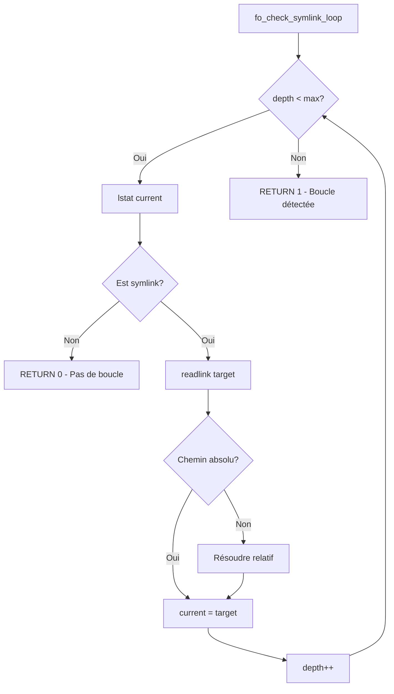

# Exercice 2.3.2 : fileops_library

**Module :**
2.3.2 — Opérations Fichiers Bas Niveau

**Concept :**
a — Manipulation avancée de file descriptors et permissions Unix

**Difficulté :**
★★★★★★☆☆☆☆ (6/10)

**Type :**
complet

**Tiers :**
3 — Synthèse (fcntl, permissions, symlinks, lseek)

**Langage :**
C (C17)

**Prérequis :**
- Appels système POSIX (open, read, write, close)
- File descriptors
- Permissions Unix de base
- Liens symboliques

**Domaines :**
FS, Process, Mem

**Durée estimée :**
120 min

**XP Base :**
175

**Complexité :**
T2 O(n) pour résolution symlinks × S2 O(1) auxiliaire

---

## 📐 SECTION 1 : PROTOTYPE & CONSIGNE

### 1.1 Obligations

**Fichiers à rendre :**
```
fileops.h
fileops.c
```

**Fonctions autorisées :**
- `open`, `close`, `read`, `write`, `pread`, `pwrite`
- `lseek`, `fstat`, `stat`, `lstat`
- `chmod`, `fchmod`, `fchmodat`, `chown`, `lchown`
- `fcntl`, `readlink`, `realpath`, `symlink`
- `errno`, `strncpy`, `strncat`, `strrchr`

**Fonctions interdites :**
- `fopen`, `fclose`, `fread`, `fwrite` (stdio)
- `system`, `popen`

### 1.2 Consigne

**Section 2.4.1 — Contexte Culturel**

**🎮 INCEPTION — Les couches de réalité**

Dans Inception, Cobb navigue entre plusieurs niveaux de rêves imbriqués. Chaque niveau a ses propres règles, et il faut parfois "remonter" plusieurs couches pour atteindre la réalité.

Les **symlinks** Unix fonctionnent exactement comme ces rêves imbriqués :
- Un symlink peut pointer vers un autre symlink (niveau 2)
- Qui peut pointer vers un autre (niveau 3)
- Et ainsi de suite...

Le danger ? Les **boucles infinies** — comme rester coincé dans les limbes. Si `link_a → link_b → link_a`, ton programme tourne en boucle éternellement. Le kernel limite à ~40 niveaux (SYMLOOP_MAX).

**L'analogie parfaite :** `lseek()` est comme le "totem" de Cobb — il te permet de savoir EXACTEMENT où tu es dans le fichier (position courante), comme le totem indique si tu es dans la réalité ou dans un rêve.

---

**Section 2.4.2 — Énoncé Académique**

Les opérations fichiers **bas niveau** (syscalls) offrent un contrôle précis que la bibliothèque standard (stdio) n'expose pas :

1. **Flags d'ouverture** : O_EXCL (atomique), O_TRUNC, O_APPEND, O_NONBLOCK
2. **Positionnement** : lseek() avec SEEK_SET/CUR/END
3. **Permissions avancées** : setuid, setgid, sticky bit
4. **fcntl** : Manipulation des file descriptors (duplication, flags)
5. **Symlinks** : Détection de boucles, résolution de chemins

**Ta mission :**

Implémenter une bibliothèque `fileops` qui encapsule ces opérations avec :

1. **`fo_open`** : Ouverture avec support O_EXCL et O_TRUNC
2. **`fo_read_at`/`fo_write_at`** : Lecture/écriture à position arbitraire
3. **`fo_seek`/`fo_size`** : Navigation et taille de fichier
4. **`fo_chmod`/`fo_chown`** : Modification de permissions/propriétaire
5. **`fo_set_setuid`/`fo_set_setgid`** : Bits spéciaux
6. **`fo_check_symlink_loop`** : Détection de boucles

**Entrée :**
- Selon chaque fonction (chemins, file descriptors, flags)

**Sortie :**
- Valeurs de retour standard POSIX (-1 = erreur, errno défini)

**Contraintes :**
- Toute erreur doit définir `errno` correctement
- Les chemins résolus doivent tenir dans `PATH_MAX` (4096)
- La détection de boucle doit fonctionner jusqu'à `max_depth` niveaux
- `fo_chmod` avec `follow_symlinks=0` ne doit PAS traverser les liens

**Exemples :**

| Appel | Résultat | Explication |
|-------|----------|-------------|
| `fo_open("f.txt", O_CREAT\|O_RDWR, 0644, 1, 0)` | fd ou -1 | Échoue si existe (O_EXCL) |
| `fo_size(fd)` | 1024 | Taille en bytes |
| `fo_check_symlink_loop("/tmp/loop", 40)` | 1 | Boucle détectée |
| `fo_set_setuid("/bin/prog", 1)` | 0 | Active setuid |

### 1.3 Prototype

```c
#ifndef FILEOPS_H
#define FILEOPS_H

#include <sys/types.h>
#include <sys/stat.h>
#include <fcntl.h>
#include <unistd.h>

typedef struct {
    mode_t mode;
    uid_t uid;
    gid_t gid;
    off_t size;
    time_t atime;
    time_t mtime;
    time_t ctime;
    int is_setuid;
    int is_setgid;
    int is_sticky;
} fo_fileinfo_t;

int fo_open(const char *path, int flags, mode_t mode,
            int exclusive, int truncate);

ssize_t fo_read_at(int fd, void *buf, size_t count, off_t offset);
ssize_t fo_write_at(int fd, const void *buf, size_t count, off_t offset);

off_t fo_seek(int fd, off_t offset, int whence);
off_t fo_size(int fd);

int fo_fchmod(int fd, mode_t mode);
int fo_chmod(const char *path, mode_t mode, int follow_symlinks);
int fo_chown(const char *path, uid_t uid, gid_t gid, int follow_symlinks);

int fo_set_setuid(const char *path, int enable);
int fo_set_setgid(const char *path, int enable);

int fo_stat(const char *path, fo_fileinfo_t *info, int follow_symlinks);
int fo_check_symlink_loop(const char *path, int max_depth);
int fo_resolve_path(const char *path, char *resolved, int max_depth);

int fo_dup(int oldfd, int minfd, int cloexec);
int fo_fd_flags(int fd, int get_or_set, int flags);

#endif
```

---

## 💡 SECTION 2 : LE SAVIEZ-VOUS ?

### 2.1 Pourquoi O_EXCL existe ?

Le flag `O_EXCL` combiné avec `O_CREAT` garantit une création **atomique** : si le fichier existe déjà, l'appel échoue. C'est crucial pour :
- Créer des fichiers de verrouillage (lock files)
- Éviter les race conditions TOCTOU (Time-Of-Check-To-Time-Of-Use)

Sans O_EXCL :
```c
if (access("file", F_OK) == -1) {  // TOCTOU vulnerability!
    open("file", O_CREAT, 0644);    // Un autre process peut créer entre-temps
}
```

### 2.2 Les bits setuid/setgid

Ces bits permettent d'exécuter un programme avec les privilèges de son propriétaire :
- **setuid** : `/usr/bin/passwd` s'exécute en root pour modifier `/etc/shadow`
- **setgid** : Les programmes de mail peuvent écrire dans `/var/mail`

```
-rwsr-xr-x  root root  /usr/bin/passwd   ← Le 's' = setuid actif
```

---

## 📋 SECTION 2.5 : DANS LA VRAIE VIE

| Métier | Utilisation du concept |
|--------|------------------------|
| **Security Engineer** | Audit des binaires setuid, détection de privilege escalation |
| **Kernel Developer** | Implémentation des vérifications de permissions |
| **DevOps** | Configuration des permissions pour containers (CAP_SETUID) |
| **Forensics** | Analyse des timestamps et permissions après incident |
| **Embedded** | Gestion des fichiers sans libc standard (busybox, musl) |

---

## 🖥️ SECTION 3 : EXEMPLE D'UTILISATION

### 3.0 Session bash

```bash
$ ls
fileops.h  fileops.c  test_fileops.c  Makefile

$ make
gcc -Wall -Wextra -Werror -std=c17 -c fileops.c -o fileops.o
gcc -Wall -Wextra -Werror -std=c17 test_fileops.c fileops.o -o test

$ ./test
test_open_exclusive: PASS
test_seek_and_size: PASS
test_permissions: PASS
test_setuid_setgid: PASS
test_symlink_loop: PASS
test_fcntl_dup: PASS

All tests passed!
```

---

## 🔥 SECTION 3.1 : BONUS AVANCÉ (OPTIONNEL)

**Difficulté Bonus :**
★★★★★★★★☆☆ (8/10)

**Récompense :**
XP ×3

**Time Complexity attendue :**
O(1) pour toutes les opérations atomiques

**Space Complexity attendue :**
O(1) auxiliaire

**Domaines Bonus :**
`Crypto, Process`

### 3.1.1 Consigne Bonus

**🎮 INCEPTION — Atomic Locks**

Comme le "kick" synchronisé entre les niveaux de rêve, implémente des opérations **atomiques** pour la synchronisation entre processus.

**Ta mission :**

Ajouter le support de :
1. **Advisory file locking** avec `flock()` et `fcntl(F_SETLK)`
2. **Création atomique de fichiers temporaires** sécurisée (mkstemp-like)
3. **Record locking** : verrouiller des portions de fichier

**Contraintes :**
```
┌─────────────────────────────────────────┐
│  Locks doivent être non-bloquants       │
│  Pas de race conditions                 │
│  Support POSIX locks (fcntl)           │
└─────────────────────────────────────────┘
```

### 3.1.2 Prototype Bonus

```c
// Verrouiller une portion de fichier (POSIX record lock)
int fo_lock_region(int fd, off_t start, off_t len, int exclusive, int wait);

// Déverrouiller une région
int fo_unlock_region(int fd, off_t start, off_t len);

// Créer un fichier temporaire sécurisé
int fo_mkstemp(char *template, mode_t mode);

// Vérifier si un fichier est verrouillé
int fo_is_locked(int fd, off_t start, off_t len);
```

### 3.1.3 Ce qui change par rapport à l'exercice de base

| Aspect | Base | Bonus |
|--------|------|-------|
| Synchronisation | Aucune | POSIX locks |
| Fichiers temp | Non | mkstemp sécurisé |
| Atomicité | O_EXCL seulement | Record locking |

---

## ✅❌ SECTION 4 : ZONE CORRECTION

### 4.1 Moulinette

| Test | Input | Expected | Points |
|------|-------|----------|--------|
| `test_open_exclusive` | Créer 2x même fichier avec O_EXCL | 2ème échoue | 10 |
| `test_seek_size` | Écrire 11 bytes, fo_size() | 11 | 15 |
| `test_read_at` | fo_read_at(fd, buf, 5, 6) | "World" | 15 |
| `test_chmod` | fo_chmod(path, 0755, 1) | mode & 0777 == 0755 | 15 |
| `test_setuid` | fo_set_setuid(path, 1) | info.is_setuid == 1 | 15 |
| `test_symlink_loop` | a→b→a | Retourne 1 | 15 |
| `test_dup_cloexec` | fo_dup(fd, 100, 1) | fd >= 100 avec CLOEXEC | 15 |

### 4.2 main.c de test

```c
#include <assert.h>
#include <stdio.h>
#include <string.h>
#include <unistd.h>
#include "fileops.h"

int main(void) {
    // Test open exclusive
    const char *path = "/tmp/test_fo.txt";
    unlink(path);

    int fd1 = fo_open(path, O_RDWR | O_CREAT, 0644, 1, 0);
    assert(fd1 >= 0);

    int fd2 = fo_open(path, O_RDWR | O_CREAT, 0644, 1, 0);
    assert(fd2 == -1);  // Doit échouer

    // Test write/read
    fo_write_at(fd1, "Hello World", 11, 0);
    assert(fo_size(fd1) == 11);

    char buf[12] = {0};
    fo_read_at(fd1, buf, 5, 6);
    assert(strcmp(buf, "World") == 0);

    close(fd1);
    unlink(path);

    printf("All tests passed!\n");
    return 0;
}
```

### 4.3 Solution de référence

```c
#include "fileops.h"
#include <errno.h>
#include <string.h>
#include <limits.h>

int fo_open(const char *path, int flags, mode_t mode,
            int exclusive, int truncate) {
    int combined_flags = flags;
    if (exclusive)
        combined_flags |= O_EXCL;
    if (truncate)
        combined_flags |= O_TRUNC;
    return open(path, combined_flags, mode);
}

ssize_t fo_read_at(int fd, void *buf, size_t count, off_t offset) {
    if (offset >= 0)
        return pread(fd, buf, count, offset);
    return read(fd, buf, count);
}

ssize_t fo_write_at(int fd, const void *buf, size_t count, off_t offset) {
    if (offset >= 0)
        return pwrite(fd, buf, count, offset);
    return write(fd, buf, count);
}

off_t fo_seek(int fd, off_t offset, int whence) {
    return lseek(fd, offset, whence);
}

off_t fo_size(int fd) {
    off_t current = lseek(fd, 0, SEEK_CUR);
    if (current < 0)
        return -1;
    off_t size = lseek(fd, 0, SEEK_END);
    if (size < 0)
        return -1;
    if (lseek(fd, current, SEEK_SET) < 0)
        return -1;
    return size;
}

int fo_fchmod(int fd, mode_t mode) {
    return fchmod(fd, mode);
}

int fo_chmod(const char *path, mode_t mode, int follow_symlinks) {
    if (follow_symlinks)
        return chmod(path, mode);
    return fchmodat(AT_FDCWD, path, mode, AT_SYMLINK_NOFOLLOW);
}

int fo_chown(const char *path, uid_t uid, gid_t gid, int follow_symlinks) {
    if (follow_symlinks)
        return chown(path, uid, gid);
    return lchown(path, uid, gid);
}

int fo_set_setuid(const char *path, int enable) {
    struct stat st;
    if (stat(path, &st) < 0)
        return -1;
    mode_t new_mode = enable ? (st.st_mode | S_ISUID) : (st.st_mode & ~S_ISUID);
    return chmod(path, new_mode);
}

int fo_set_setgid(const char *path, int enable) {
    struct stat st;
    if (stat(path, &st) < 0)
        return -1;
    mode_t new_mode = enable ? (st.st_mode | S_ISGID) : (st.st_mode & ~S_ISGID);
    return chmod(path, new_mode);
}

int fo_stat(const char *path, fo_fileinfo_t *info, int follow_symlinks) {
    struct stat st;
    int result = follow_symlinks ? stat(path, &st) : lstat(path, &st);
    if (result < 0)
        return -1;

    info->mode = st.st_mode;
    info->uid = st.st_uid;
    info->gid = st.st_gid;
    info->size = st.st_size;
    info->atime = st.st_atime;
    info->mtime = st.st_mtime;
    info->ctime = st.st_ctime;
    info->is_setuid = (st.st_mode & S_ISUID) ? 1 : 0;
    info->is_setgid = (st.st_mode & S_ISGID) ? 1 : 0;
    info->is_sticky = (st.st_mode & S_ISVTX) ? 1 : 0;
    return 0;
}

int fo_check_symlink_loop(const char *path, int max_depth) {
    char current[PATH_MAX];
    char target[PATH_MAX];
    struct stat st;
    int depth = 0;

    strncpy(current, path, PATH_MAX - 1);
    current[PATH_MAX - 1] = '\0';

    while (depth < max_depth) {
        if (lstat(current, &st) < 0)
            return -1;
        if (!S_ISLNK(st.st_mode))
            return 0;

        ssize_t len = readlink(current, target, PATH_MAX - 1);
        if (len < 0)
            return -1;
        target[len] = '\0';

        if (target[0] != '/') {
            char *slash = strrchr(current, '/');
            if (slash) {
                *(slash + 1) = '\0';
                strncat(current, target, PATH_MAX - strlen(current) - 1);
            } else {
                strncpy(current, target, PATH_MAX - 1);
            }
        } else {
            strncpy(current, target, PATH_MAX - 1);
        }
        depth++;
    }
    return 1;
}

int fo_resolve_path(const char *path, char *resolved, int max_depth) {
    if (fo_check_symlink_loop(path, max_depth) == 1) {
        errno = ELOOP;
        return -1;
    }
    return realpath(path, resolved) ? 0 : -1;
}

int fo_dup(int oldfd, int minfd, int cloexec) {
    int cmd = cloexec ? F_DUPFD_CLOEXEC : F_DUPFD;
    return fcntl(oldfd, cmd, minfd);
}

int fo_fd_flags(int fd, int get_or_set, int flags) {
    if (get_or_set == 0)
        return fcntl(fd, F_GETFD);
    return fcntl(fd, F_SETFD, flags) < 0 ? -1 : 0;
}
```

### 4.5 Solutions refusées (avec explications)

```c
// REFUSÉ: Pas de sauvegarde/restauration de position dans fo_size
off_t fo_size(int fd) {
    return lseek(fd, 0, SEEK_END);  // BUG: modifie la position !
}
// Pourquoi refusé: Effet de bord non documenté, casse le code appelant

// REFUSÉ: Utilisation de access() au lieu de O_EXCL
int fo_open(const char *path, int flags, mode_t mode, int exclusive, int truncate) {
    if (exclusive && access(path, F_OK) == 0)  // TOCTOU!
        return -1;
    return open(path, flags | (truncate ? O_TRUNC : 0), mode);
}
// Pourquoi refusé: Race condition entre access() et open()

// REFUSÉ: Pas de gestion des chemins relatifs dans symlinks
int fo_check_symlink_loop(const char *path, int max_depth) {
    char target[PATH_MAX];
    for (int i = 0; i < max_depth; i++) {
        ssize_t len = readlink(path, target, PATH_MAX);
        // BUG: utilise toujours path au lieu de suivre target
    }
}
// Pourquoi refusé: Ne suit pas réellement la chaîne de symlinks
```

### 4.9 spec.json

```json
{
  "name": "fileops_library",
  "language": "c",
  "type": "complet",
  "tier": 3,
  "tier_info": "Synthèse",
  "tags": ["syscalls", "permissions", "fcntl", "symlinks", "phase2"],
  "passing_score": 70,

  "function": {
    "name": "fo_open",
    "prototype": "int fo_open(const char *path, int flags, mode_t mode, int exclusive, int truncate)",
    "return_type": "int",
    "parameters": [
      {"name": "path", "type": "const char *"},
      {"name": "flags", "type": "int"},
      {"name": "mode", "type": "mode_t"},
      {"name": "exclusive", "type": "int"},
      {"name": "truncate", "type": "int"}
    ]
  },

  "driver": {
    "reference": "int ref_fo_open(const char *path, int flags, mode_t mode, int exclusive, int truncate) { int combined_flags = flags; if (exclusive) combined_flags |= O_EXCL; if (truncate) combined_flags |= O_TRUNC; return open(path, combined_flags, mode); }",

    "edge_cases": [
      {
        "name": "exclusive_existing",
        "setup": "touch /tmp/test_excl",
        "args": ["/tmp/test_excl", "O_RDWR|O_CREAT", "0644", 1, 0],
        "expected": -1,
        "is_trap": true,
        "trap_explanation": "O_EXCL doit échouer si fichier existe"
      },
      {
        "name": "truncate_clears",
        "setup": "echo 'data' > /tmp/test_trunc",
        "args": ["/tmp/test_trunc", "O_RDWR", "0644", 0, 1],
        "check": "fo_size(result) == 0",
        "is_trap": true,
        "trap_explanation": "O_TRUNC doit vider le fichier"
      },
      {
        "name": "symlink_loop_detected",
        "setup": "ln -sf /tmp/b /tmp/a && ln -sf /tmp/a /tmp/b",
        "function": "fo_check_symlink_loop",
        "args": ["/tmp/a", 40],
        "expected": 1,
        "is_trap": true,
        "trap_explanation": "Boucle a→b→a doit être détectée"
      }
    ],

    "fuzzing": {
      "enabled": true,
      "iterations": 100,
      "generators": [
        {
          "type": "string",
          "param_index": 0,
          "params": {"min_len": 1, "max_len": 255, "charset": "alphanumeric"}
        }
      ]
    }
  },

  "norm": {
    "allowed_functions": ["open", "close", "read", "write", "pread", "pwrite", "lseek", "stat", "lstat", "fstat", "chmod", "fchmod", "fchmodat", "chown", "lchown", "fcntl", "readlink", "realpath", "strncpy", "strncat", "strrchr"],
    "forbidden_functions": ["fopen", "fclose", "fread", "fwrite", "system", "popen"],
    "check_security": true,
    "check_memory": true,
    "blocking": true
  }
}
```

### 4.10 Solutions Mutantes

```c
/* Mutant A (Boundary) : max_depth pas respecté */
int fo_check_symlink_loop(const char *path, int max_depth) {
    (void)max_depth;  // BUG: ignore max_depth
    char target[PATH_MAX];
    while (1) {  // Boucle infinie potentielle !
        ssize_t len = readlink(path, target, PATH_MAX);
        if (len < 0) break;
    }
    return 0;
}
// Pourquoi c'est faux : Boucle infinie si symlink loop
// Ce qui était pensé : "readlink finira par échouer"

/* Mutant B (Safety) : Pas de vérification des retours */
off_t fo_size(int fd) {
    lseek(fd, 0, SEEK_END);  // BUG: pas de check erreur
    off_t size = lseek(fd, 0, SEEK_CUR);
    return size;  // Et pas de restauration !
}
// Pourquoi c'est faux : Ignore les erreurs, modifie position
// Ce qui était pensé : "lseek ne peut pas échouer"

/* Mutant C (Resource) : Fuite de file descriptor */
int fo_open(const char *path, int flags, mode_t mode, int exclusive, int truncate) {
    if (exclusive) {
        int test_fd = open(path, O_RDONLY);  // BUG: fuite si existe
        if (test_fd >= 0) {
            // Oubli de close(test_fd) !
            return -1;
        }
    }
    return open(path, flags | (truncate ? O_TRUNC : 0), mode);
}
// Pourquoi c'est faux : Fuite de file descriptor
// Ce qui était pensé : "Je vérifie juste l'existence"

/* Mutant D (Logic) : chmod au lieu de fchmodat pour no-follow */
int fo_chmod(const char *path, mode_t mode, int follow_symlinks) {
    (void)follow_symlinks;  // BUG: toujours suit les symlinks
    return chmod(path, mode);
}
// Pourquoi c'est faux : Ne respecte pas follow_symlinks=0
// Ce qui était pensé : "chmod suffit"

/* Mutant E (Return) : Retourne toujours succès */
int fo_set_setuid(const char *path, int enable) {
    struct stat st;
    stat(path, &st);  // Pas de check erreur
    mode_t new_mode = enable ? (st.st_mode | S_ISUID) : (st.st_mode & ~S_ISUID);
    chmod(path, new_mode);
    return 0;  // BUG: toujours 0 même si échec
}
// Pourquoi c'est faux : Masque les erreurs
// Ce qui était pensé : "stat et chmod marchent toujours"
```

---

## 🧠 SECTION 5 : COMPRENDRE

### 5.1 Ce que cet exercice enseigne

1. **Appels système POSIX** : Interface bas niveau vs stdio
2. **Flags d'ouverture** : O_EXCL pour atomicité, O_TRUNC, O_APPEND
3. **Permissions Unix** : mode bits, setuid, setgid, sticky
4. **fcntl** : Manipulation avancée des descripteurs
5. **Symlinks** : Résolution et détection de boucles

### 5.2 LDA — Traduction Littérale

```
FONCTION fo_size QUI RETOURNE UN ENTIER SIGNÉ ET PREND EN PARAMÈTRE fd QUI EST UN ENTIER
DÉBUT FONCTION
    DÉCLARER current COMME ENTIER SIGNÉ
    DÉCLARER size COMME ENTIER SIGNÉ

    AFFECTER L'APPEL À lseek AVEC fd, 0, SEEK_CUR À current
    SI current EST INFÉRIEUR À 0 ALORS
        RETOURNER LA VALEUR MOINS 1
    FIN SI

    AFFECTER L'APPEL À lseek AVEC fd, 0, SEEK_END À size
    SI size EST INFÉRIEUR À 0 ALORS
        RETOURNER LA VALEUR MOINS 1
    FIN SI

    SI L'APPEL À lseek AVEC fd, current, SEEK_SET EST INFÉRIEUR À 0 ALORS
        RETOURNER LA VALEUR MOINS 1
    FIN SI

    RETOURNER LA VALEUR DE size
FIN FONCTION
```

### 5.2.2 Logic Flow

```
ALGORITHME : Détection de boucle symlink
---
1. INITIALISER current = path, depth = 0

2. BOUCLE TANT QUE depth < max_depth :
   a. APPELER lstat(current)
   b. SI pas un symlink :
        RETOURNER 0 (pas de boucle)

   c. LIRE la cible avec readlink()

   d. SI cible est relative :
        CONSTRUIRE chemin absolu depuis current

   e. current = cible
   f. depth++

3. RETOURNER 1 (boucle probable - max_depth atteint)
```

### 5.2.3 Diagramme Mermaid



### 5.3 Visualisation ASCII

```
                    FILE DESCRIPTOR OPERATIONS
┌─────────────────────────────────────────────────────────────────┐
│                                                                 │
│   User Space                    Kernel Space                    │
│   ┌──────────┐                 ┌──────────────────────────┐    │
│   │ fo_open()│──────────────▶  │  sys_open()              │    │
│   │          │  syscall        │  ┌────────────────────┐  │    │
│   └──────────┘                 │  │ File Descriptor    │  │    │
│                                │  │ Table (per proc)   │  │    │
│   ┌──────────┐                 │  │ ┌──────┬─────────┐ │  │    │
│   │ fd = 3   │◀────────────────│  │ │ fd=3 │ offset  │ │  │    │
│   │          │  return         │  │ │      │ flags   │ │  │    │
│   └──────────┘                 │  │ │      │ mode    │ │  │    │
│                                │  │ └──────┴────┬────┘ │  │    │
│                                │  └─────────────┼──────┘  │    │
│                                │                │         │    │
│                                │                ▼         │    │
│                                │  ┌────────────────────┐  │    │
│                                │  │ Open File Table    │  │    │
│                                │  │ (global)           │  │    │
│                                │  └────────┬───────────┘  │    │
│                                │           │              │    │
│                                │           ▼              │    │
│                                │  ┌────────────────────┐  │    │
│                                │  │ Inode Table        │  │    │
│                                │  └────────────────────┘  │    │
│                                └──────────────────────────┘    │
└─────────────────────────────────────────────────────────────────┘

                    SYMLINK RESOLUTION
┌─────────────────────────────────────────────────────────────────┐
│                                                                 │
│   /tmp/link_a ─────────▶ /tmp/link_b ─────────▶ /tmp/link_a    │
│       │                      │                      │           │
│       └──────────────────────┴──────────────────────┘           │
│                        LOOP DETECTED!                           │
│                                                                 │
│   depth=0          depth=1          depth=2 (back to start)     │
│                                                                 │
│   max_depth=40 → détection après 40 itérations                 │
│                                                                 │
└─────────────────────────────────────────────────────────────────┘

                    PERMISSION BITS
┌─────────────────────────────────────────────────────────────────┐
│                                                                 │
│   Mode: 0755 = rwxr-xr-x                                       │
│                                                                 │
│   ┌─────┬─────┬─────┬─────┬─────┬─────┬─────┬─────┬─────┐      │
│   │  r  │  w  │  x  │  r  │  -  │  x  │  r  │  -  │  x  │      │
│   └──┬──┴──┬──┴──┬──┴──┬──┴──┬──┴──┬──┴──┬──┴──┬──┴──┬──┘      │
│      │     │     │     │     │     │     │     │                │
│      └──┬──┴──┬──┘     └──┬──┴──┬──┘     └──┬──┴──┬──┘          │
│         │     │           │     │           │     │             │
│       USER (7)         GROUP (5)        OTHER (5)              │
│       rwx=111         r-x=101          r-x=101                  │
│                                                                 │
│   Special bits (high order):                                    │
│   ┌───────┬───────┬───────┐                                    │
│   │ 4000  │ 2000  │ 1000  │                                    │
│   │ SUID  │ SGID  │ STICKY│                                    │
│   └───────┴───────┴───────┘                                    │
│                                                                 │
│   4755 = -rwsr-xr-x (setuid enabled)                           │
│                                                                 │
└─────────────────────────────────────────────────────────────────┘
```

### 5.4 Les pièges en détail

| Piège | Description | Solution |
|-------|-------------|----------|
| TOCTOU avec access() | Race condition | Utiliser O_EXCL |
| Oublier de restaurer pos | fo_size modifie curseur | Save/restore avec lseek |
| lchown vs chown | Suivre ou non les symlinks | Respecter follow_symlinks |
| max_depth ignoré | Boucle infinie | Vérifier à chaque itération |

### 5.5 Cours Complet

#### 5.5.1 Différence entre stdio et syscalls

La bibliothèque standard C (`stdio.h`) est une **abstraction** au-dessus des appels système :

| stdio | syscall | Différence |
|-------|---------|------------|
| `fopen()` | `open()` | stdio ajoute buffering |
| `fread()` | `read()` | stdio lit par blocs, cache en buffer |
| `fseek()` | `lseek()` | stdio peut être en avance sur le fichier réel |

**Quand utiliser les syscalls directs ?**
- Contrôle précis (O_EXCL, O_DIRECT)
- Programmation système (daemons, kernel modules)
- Performance critique (éviter le buffering)

#### 5.5.2 O_EXCL et l'atomicité

Le problème TOCTOU (Time-Of-Check-To-Time-Of-Use) :

```
Thread A                    Thread B
--------                    --------
if (!exists("lock"))        if (!exists("lock"))
                            create("lock")  // B gagne
create("lock")  // A écrase B!
```

Avec `O_EXCL` :
```c
int fd = open("lock", O_CREAT | O_EXCL, 0644);
// Atomique ! Si fd >= 0, NOUS avons créé le fichier
```

#### 5.5.3 Les bits setuid/setgid

Ces bits modifient l'identité **effective** lors de l'exécution :

```
-rwsr-xr-x  root root  /usr/bin/passwd
     ^
     setuid bit (s au lieu de x)
```

Quand un utilisateur normal exécute `/usr/bin/passwd` :
- **Real UID** : l'utilisateur (ex: 1000)
- **Effective UID** : root (0) grâce au setuid

**Danger** : Un programme setuid vulnérable = privilege escalation.

### 5.6 Normes avec explications pédagogiques

```
┌─────────────────────────────────────────────────────────────────┐
│ ❌ HORS NORME (compile, mais dangereux)                         │
├─────────────────────────────────────────────────────────────────┤
│ if (access(path, F_OK) == -1) {                                 │
│     fd = open(path, O_CREAT, 0644);  // TOCTOU!                │
│ }                                                               │
├─────────────────────────────────────────────────────────────────┤
│ ✅ CONFORME                                                     │
├─────────────────────────────────────────────────────────────────┤
│ fd = open(path, O_CREAT | O_EXCL, 0644);                       │
│ if (fd < 0 && errno == EEXIST) {                               │
│     // Fichier existe déjà                                      │
│ }                                                               │
├─────────────────────────────────────────────────────────────────┤
│ 📖 POURQUOI ?                                                   │
│                                                                 │
│ • access() + open() = race condition                           │
│ • O_EXCL rend la vérification atomique                         │
│ • Indispensable pour les lock files                            │
└─────────────────────────────────────────────────────────────────┘
```

### 5.7 Simulation avec trace d'exécution

**Scénario** : `fo_size(fd)` sur un fichier de 1024 bytes, position courante à 500

```
┌───────┬──────────────────────────────────────┬──────────────┬─────────────────┐
│ Étape │ Instruction                          │ Position     │ Explication     │
├───────┼──────────────────────────────────────┼──────────────┼─────────────────┤
│   1   │ current = lseek(fd, 0, SEEK_CUR)     │ 500          │ Sauvegarde pos  │
├───────┼──────────────────────────────────────┼──────────────┼─────────────────┤
│   2   │ Vérifier current >= 0                │ 500          │ OK              │
├───────┼──────────────────────────────────────┼──────────────┼─────────────────┤
│   3   │ size = lseek(fd, 0, SEEK_END)        │ 1024         │ Va à la fin     │
├───────┼──────────────────────────────────────┼──────────────┼─────────────────┤
│   4   │ Vérifier size >= 0                   │ 1024         │ OK              │
├───────┼──────────────────────────────────────┼──────────────┼─────────────────┤
│   5   │ lseek(fd, current, SEEK_SET)         │ 500          │ Restaure pos    │
├───────┼──────────────────────────────────────┼──────────────┼─────────────────┤
│   6   │ return size                          │ —            │ Retourne 1024   │
└───────┴──────────────────────────────────────┴──────────────┴─────────────────┘
```

### 5.8 Mnémotechniques

#### 🎬 MEME : "Inception Totem" — lseek()

Comme le totem de Cobb qui lui indique s'il est dans la réalité ou dans un rêve, `lseek(fd, 0, SEEK_CUR)` te dit EXACTEMENT où tu es dans le fichier.

```c
// 🔮 Mon totem : où suis-je ?
off_t position = lseek(fd, 0, SEEK_CUR);
```

#### 💀 MEME : "ELOOP — Les Limbes"

Dans Inception, rester coincé dans les limbes = perdre la notion du temps. ELOOP = rester coincé dans une boucle de symlinks.

```c
// 💀 Tu es dans les limbes !
if (errno == ELOOP) {
    printf("Trop de niveaux de rêve !\n");
}
```

#### 🔥 MEME : "O_EXCL — No Duplicates"

Comme le règle de Highlander : "There can be only one!" O_EXCL garantit qu'un seul process peut créer le fichier.

```c
// ⚔️ Il ne peut en rester qu'un !
open("lock", O_CREAT | O_EXCL, 0644);
```

### 5.9 Applications pratiques

1. **Daemons** : PID files créés avec O_EXCL pour éviter les doubles instances
2. **Databases** : Record locking avec fcntl pour accès concurrent
3. **Installers** : Setuid pour installer avec privilèges root
4. **Containers** : Manipulation de /proc et /sys via syscalls directs
5. **Security tools** : Détection de symlink attacks

---

## ⚠️ SECTION 6 : PIÈGES — RÉCAPITULATIF

| # | Piège | Conséquence | Détection |
|---|-------|-------------|-----------|
| 1 | access() + open() | TOCTOU race condition | Static analysis |
| 2 | fo_size sans restore | Modifie position fichier | Test read après fo_size |
| 3 | chmod au lieu de fchmodat | Suit les symlinks | Test avec symlink |
| 4 | Ignorer max_depth | Boucle infinie | Test avec symlink loop |
| 5 | Pas de check errno | Erreurs silencieuses | Test avec fichier inexistant |

---

## 📝 SECTION 7 : QCM

### Q1. Que fait O_EXCL combiné avec O_CREAT ?

- A) Exécute le fichier après création
- B) Échoue si le fichier existe déjà
- C) Crée le fichier en mode exclusif (lecture seule)
- D) Exclut le fichier du backup
- E) Force la création même si existe
- F) Supprime le fichier existant
- G) Mode exception handling
- H) Verrouille le fichier
- I) Rend le fichier exécutable
- J) Aucune de ces réponses

**Réponse : B**

### Q2. Comment obtenir la taille d'un fichier via fd sans modifier la position ?

- A) read() jusqu'à EOF et compter
- B) fstat() puis st_size
- C) lseek(SEEK_END) sans restaurer
- D) sizeof(fichier)
- E) stat() sur le nom
- F) Impossible sans modifier
- G) fcntl(F_GETSIZE)
- H) ioctl(FIONREAD)
- I) Fermer et rouvrir
- J) Utiliser fseek()

**Réponse : B**

### Q3. Que signifie le 's' dans -rwsr-xr-x ?

- A) Le fichier est signé
- B) Le bit setuid est actif
- C) Le fichier est système
- D) Sticky bit
- E) Le fichier est secret
- F) Synchronisation activée
- G) Le fichier est sparse
- H) Socket file
- I) Shared library
- J) Le fichier est sealed

**Réponse : B**

### Q4. Quelle erreur indique une boucle de symlinks ?

- A) ENOENT
- B) EACCES
- C) ELOOP
- D) EINVAL
- E) EEXIST
- F) EMLINK
- G) ENOSPC
- H) EBUSY
- I) EROFS
- J) EPERM

**Réponse : C**

### Q5. Quelle fonction ne suit PAS les symlinks par défaut ?

- A) open()
- B) stat()
- C) chmod()
- D) lstat()
- E) chown()
- F) access()
- G) fopen()
- H) read()
- I) write()
- J) close()

**Réponse : D**

---

## 📊 SECTION 8 : RÉCAPITULATIF

| Critère | Valeur |
|---------|--------|
| Difficulté | ★★★★★★☆☆☆☆ (6/10) |
| Temps estimé | 120 min |
| XP Base | 175 |
| XP Bonus (×3) | 525 |
| Concepts clés | syscalls, permissions, fcntl, symlinks |
| Langage | C17 |
| Type | complet |
| Tier | 3 — Synthèse |

---

## 📦 SECTION 9 : DEPLOYMENT PACK

```json
{
  "deploy": {
    "hackbrain_version": "5.5.2",
    "engine_version": "v22.1",
    "exercise_slug": "2.3.2-fileops-library",
    "generated_at": "2025-01-16 14:30:00",

    "metadata": {
      "exercise_id": "2.3.2",
      "exercise_name": "fileops_library",
      "module": "2.3.2",
      "module_name": "Opérations Fichiers Bas Niveau",
      "concept": "a",
      "concept_name": "Low-Level File Operations",
      "type": "complet",
      "tier": 3,
      "tier_info": "Synthèse",
      "phase": 2,
      "difficulty": 6,
      "difficulty_stars": "★★★★★★☆☆☆☆",
      "language": "c",
      "duration_minutes": 120,
      "xp_base": 175,
      "xp_bonus_multiplier": 3,
      "bonus_tier": "AVANCÉ",
      "bonus_icon": "🔥",
      "complexity_time": "T2 O(n)",
      "complexity_space": "S2 O(1)",
      "prerequisites": ["posix_syscalls", "file_descriptors"],
      "domains": ["FS", "Process", "Mem"],
      "domains_bonus": ["Crypto", "Process"],
      "tags": ["syscalls", "fcntl", "permissions", "symlinks"],
      "meme_reference": "Inception - Les couches de réalité"
    },

    "files": {
      "spec.json": "/* Section 4.9 */",
      "references/fileops.c": "/* Section 4.3 */",
      "references/fileops_bonus.c": "/* Section 4.6 */",
      "mutants/mutant_a_boundary.c": "/* Section 4.10 */",
      "mutants/mutant_b_safety.c": "/* Section 4.10 */",
      "mutants/mutant_c_resource.c": "/* Section 4.10 */",
      "mutants/mutant_d_logic.c": "/* Section 4.10 */",
      "mutants/mutant_e_return.c": "/* Section 4.10 */",
      "tests/test_fileops.c": "/* Section 4.2 */"
    },

    "validation": {
      "expected_pass": [
        "references/fileops.c",
        "references/fileops_bonus.c"
      ],
      "expected_fail": [
        "mutants/mutant_a_boundary.c",
        "mutants/mutant_b_safety.c",
        "mutants/mutant_c_resource.c",
        "mutants/mutant_d_logic.c",
        "mutants/mutant_e_return.c"
      ]
    },

    "commands": {
      "compile": "gcc -Wall -Wextra -Werror -std=c17 -c fileops.c -o fileops.o",
      "test": "gcc -Wall -Wextra -Werror -std=c17 test_fileops.c fileops.o -o test && ./test"
    }
  }
}
```

---

*HACKBRAIN v5.5.2 — L'excellence pédagogique ne se négocie pas*
*Phase 2 — Module 2.3.2 — Low-Level File Operations*
