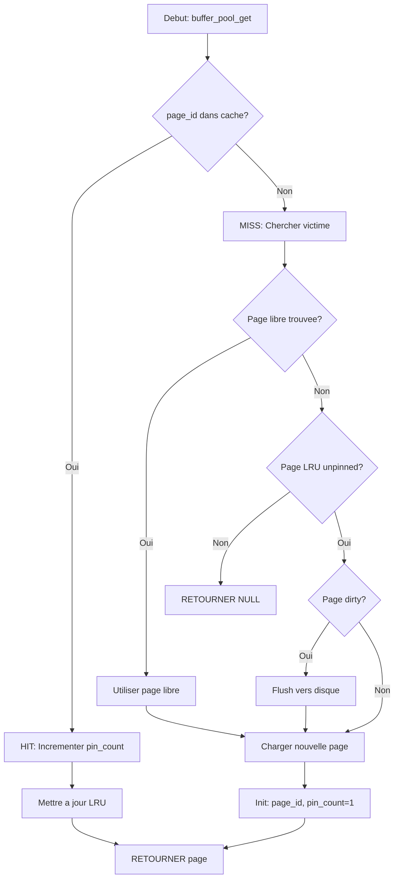

# Exercice 2.3.5 : mmap_brain

**Module :**
2.3.5 — Memory-Mapped I/O et Techniques Avancees d'E/S

**Concept :**
a — mmap, buffer pools, vectored I/O, byte-range locking, async I/O

**Difficulte :**
*******ooo (7/10)

**Type :**
complet

**Tiers :**
3 — Synthese (mmap, buffer pool, vectored I/O, byte-range locking, async I/O)

**Langage :**
C17

**Prerequis :**
- Gestion memoire (malloc, pointeurs, alignement)
- File descriptors et syscalls (open, read, write, close)
- Structures de donnees (listes chainees, hashtables)
- Notions de concurrence (processus, fork)

**Domaines :**
FS, Mem, Process, Struct

**Duree estimee :**
180 min

**XP Base :**
250

**Complexite :**
T3 O(n) pour buffer pool LRU x S3 O(n) pour stockage pages

---

## SECTION 1 : PROTOTYPE & CONSIGNE

### 1.1 Obligations

**Fichier a rendre :**
```
mmaplib.c
mmaplib.h
```

**Fonctions autorisees :**
- `mmap`, `munmap`, `msync`, `madvise`, `mprotect`
- `open`, `close`, `fstat`, `read`, `write`, `pread`, `pwrite`
- `readv`, `writev`
- `fcntl` (pour byte-range locking)
- `aio_read`, `aio_write`, `aio_error`, `aio_return`, `aio_suspend`, `aio_cancel`
- `malloc`, `calloc`, `realloc`, `free`
- `memset`, `memcpy`, `memmove`
- `lseek`

**Fonctions interdites :**
- `fopen`, `fclose`, `fread`, `fwrite` (on fait du low-level!)
- `mlock`, `mlockall` (pas de lock de pages en RAM)
- `fork` dans les fonctions (gere a l'exterieur)

### 1.2 Consigne

**Section 2.4.1 — Contexte Culturel**

**TOTAL RECALL (1990/2012) — L'Implantation de Memoire**

Dans TOTAL RECALL, Rekall Inc. propose d'implanter des souvenirs directement dans ton cerveau. Tu ne "copies" pas les souvenirs d'un fichier vers ta memoire — tu ACCEDES directement a ces souvenirs comme s'ils etaient les tiens. C'est exactement ce que fait `mmap()` !

**L'analogie parfaite :**

| TOTAL RECALL | mmap() |
|--------------|--------|
| Ton cerveau (espace mental) | Espace d'adressage virtuel du processus |
| Souvenirs implantes | Fichier mappe en memoire |
| Acces direct aux souvenirs | Acces direct aux donnees via pointeur |
| Pas de copie physique | Zero-copy (le kernel gere via page faults) |
| "Get your ass to Mars!" | `mmap(NULL, size, PROT_READ, MAP_SHARED, fd, 0)` |

**Les modes de TOTAL RECALL :**

- **MAP_SHARED** = Souvenirs partages entre clones. Quand Quaid modifie un souvenir, tous les clones le voient. Dans le film, c'est comme si Hauser et Quaid partageaient les memes souvenirs modifiables.

- **MAP_PRIVATE** = Ta propre copie des souvenirs (Copy-on-Write). Tu peux les modifier sans affecter l'original. Comme quand Quaid developpe sa propre personnalite a partir des souvenirs implantes.

- **madvise(MADV_WILLNEED)** = "Je vais avoir besoin de ce souvenir bientot" — le cerveau le precharge.

- **madvise(MADV_DONTNEED)** = "Ce souvenir est obsolete" — comme l'effacement de memoire de Rekall.

- **msync()** = Synchroniser tes souvenirs modifies avec la "realite" (le fichier).

**Le Buffer Pool, c'est Rekall Inc. :**
Le buffer pool est comme le systeme de Rekall qui gere quels souvenirs sont "charges" dans ton cerveau actif. Il ne peut pas tout garder (LRU eviction = les souvenirs les moins utilises sont "archives"), et il doit "pingler" les souvenirs en cours d'utilisation.

**Vectored I/O = Implantation multiple :**
Au lieu d'implanter un souvenir a la fois, readv/writev implante plusieurs fragments de souvenirs en une seule operation — comme une session Rekall complete.

**Byte-range locking = Zone memoire protegee :**
Comme les souvenirs "verouilles" que Quaid ne peut pas modifier — certaines zones sont protegees par Cohaagen.

---

**Section 2.4.2 — Enonce Academique**

Le **memory-mapped I/O** est une technique qui projette le contenu d'un fichier directement dans l'espace d'adressage virtuel d'un processus. Au lieu d'utiliser `read()` et `write()` pour copier les donnees entre le kernel et l'espace utilisateur, le processus accede aux donnees du fichier via un simple pointeur.

**Principes fondamentaux :**

1. **Zero-copy** : Les donnees ne sont pas copiees — le kernel utilise les page faults pour charger les pages du fichier a la demande.

2. **Lazy loading** : Les pages ne sont chargees en RAM que lorsqu'on y accede (demand paging).

3. **Partage memoire** : Avec `MAP_SHARED`, plusieurs processus peuvent partager la meme region mappee.

4. **Copy-on-Write** : Avec `MAP_PRIVATE`, les modifications creent des copies privees des pages.

**Ta mission :**

Implementer une bibliotheque complete de gestion de fichiers avancee comprenant :

1. **Wrapper mmap** : Fonctions pour mapper des fichiers avec differentes options
2. **Buffer Pool** : Gestionnaire de pages style PostgreSQL avec politique LRU
3. **Vectored I/O** : Lecture/ecriture depuis/vers plusieurs buffers simultanement
4. **Byte-range Locking** : Verrouillage de plages d'octets avec fcntl
5. **Async I/O** : Operations asynchrones avec POSIX AIO

**Entree :**
- Chemins de fichiers, descripteurs, buffers, tailles, offsets

**Sortie :**
- Regions mappees, pages du buffer pool, resultats d'I/O

**Contraintes :**
- Gerer tous les cas d'erreur (retours -1, errno)
- Le buffer pool doit implementer LRU pour l'eviction
- Les pages doivent etre "pinnees" pendant l'utilisation
- Les locks byte-range doivent supporter bloquant et non-bloquant
- L'AIO doit permettre d'attendre ou de verifier le statut

**Exemples :**

| Appel | Retour | Explication |
|-------|--------|-------------|
| `mmap_file("data.bin", 0, 1, 1, &region)` | `0` | Mappe tout le fichier en RW shared |
| `mmap_anonymous(4096, &region)` | `0` | Cree un mapping anonyme de 4KB |
| `buffer_pool_get(&pool, 42)` | `page*` | Obtient la page 42 (charge si absente) |
| `byte_lock_acquire(fd, &lock)` | `0` | Acquiert un verrou byte-range |
| `async_read(fd, buf, 1024, 0, &aio)` | `0` | Lance une lecture asynchrone |

### 1.3 Prototype

```c
// mmaplib.h
#ifndef MMAPLIB_H
#define MMAPLIB_H

#include <sys/mman.h>
#include <sys/uio.h>
#include <aio.h>
#include <fcntl.h>
#include <stdint.h>
#include <stddef.h>

// ============================================================
// Memory Mapping
// ============================================================

typedef struct {
    void *addr;         // Adresse de debut
    size_t length;      // Taille du mapping
    int prot;           // Protections (PROT_READ, PROT_WRITE, etc.)
    int flags;          // MAP_SHARED, MAP_PRIVATE, etc.
    int fd;             // File descriptor (-1 si anonymous)
    off_t offset;       // Offset dans le fichier
} mmap_region_t;

int mmap_file(const char *path, size_t length, int writable,
              int shared, mmap_region_t *region);
int mmap_anonymous(size_t length, mmap_region_t *region);
int mmap_sync(mmap_region_t *region, int async);
int mmap_advise(mmap_region_t *region, int advice);
int mmap_protect(mmap_region_t *region, int prot);
int mmap_unmap(mmap_region_t *region);

// ============================================================
// Buffer Pool (Database-style)
// ============================================================

#define BUFFER_POOL_PAGE_SIZE 4096
#define BUFFER_POOL_MAX_PAGES 1024

typedef struct {
    uint8_t data[BUFFER_POOL_PAGE_SIZE];
    uint64_t page_id;
    int dirty;
    int pin_count;
    uint64_t last_access;
} buffer_page_t;

typedef struct {
    buffer_page_t *pages;
    int page_count;
    int fd;
    uint64_t access_counter;
    uint64_t hits;
    uint64_t misses;
    uint64_t evictions;
    uint64_t flushes;
} buffer_pool_t;

typedef struct {
    uint64_t hits;
    uint64_t misses;
    uint64_t evictions;
    uint64_t flushes;
} buffer_pool_stats_t;

int buffer_pool_init(buffer_pool_t *pool, int fd, int page_count);
buffer_page_t *buffer_pool_get(buffer_pool_t *pool, uint64_t page_id);
void buffer_pool_mark_dirty(buffer_pool_t *pool, uint64_t page_id);
void buffer_pool_unpin(buffer_pool_t *pool, uint64_t page_id);
int buffer_pool_flush(buffer_pool_t *pool);
void buffer_pool_stats(buffer_pool_t *pool, buffer_pool_stats_t *stats);
void buffer_pool_destroy(buffer_pool_t *pool);

// ============================================================
// Vectored I/O (readv/writev)
// ============================================================

ssize_t vectored_read(int fd, struct iovec *iovecs, int count);
ssize_t vectored_write(int fd, struct iovec *iovecs, int count);
ssize_t scatter_read(int fd, void **buffers, size_t *sizes, int count);
ssize_t gather_write(int fd, void **buffers, size_t *sizes, int count);

// ============================================================
// Byte-Range Locking (fcntl)
// ============================================================

typedef enum {
    LOCK_READ,      // Shared lock (F_RDLCK)
    LOCK_WRITE,     // Exclusive lock (F_WRLCK)
    LOCK_UNLOCK     // Unlock (F_UNLCK)
} lock_type_t;

typedef struct {
    lock_type_t type;
    off_t start;
    off_t length;   // 0 = jusqu'a EOF
    int wait;       // 1 = bloquer, 0 = non-bloquant
} byte_lock_t;

int byte_lock_acquire(int fd, byte_lock_t *lock);
int byte_lock_release(int fd, off_t start, off_t length);
int byte_lock_test(int fd, byte_lock_t *lock, byte_lock_t *conflicting);

// ============================================================
// Asynchronous I/O
// ============================================================

typedef struct {
    struct aiocb cb;
    int completed;
    ssize_t result;
    int error;
} async_io_t;

int async_read(int fd, void *buf, size_t count, off_t offset, async_io_t *aio);
int async_write(int fd, const void *buf, size_t count, off_t offset, async_io_t *aio);
ssize_t async_wait(async_io_t *aio);
int async_check(async_io_t *aio);
int async_cancel(async_io_t *aio);

#endif // MMAPLIB_H
```

---

## SECTION 2 : LE SAVIEZ-VOUS ?

### 2.1 PostgreSQL et le Buffer Pool

PostgreSQL utilise un buffer pool exactement comme celui de cet exercice. Chaque page de 8KB est geree par le **buffer manager** avec des politiques d'eviction sophistiquees. Le "pin count" empeche l'eviction des pages en cours d'utilisation — exactement comme on "epingle" un souvenir important dans notre memoire!

### 2.2 Le Zero-Copy de Kafka

Apache Kafka utilise `sendfile()` et `mmap()` pour atteindre des debits de plusieurs GB/s. En evitant les copies entre kernel et userspace, Kafka peut transferer des millions de messages par seconde. C'est le TOTAL RECALL des systemes de messagerie!

### 2.3 Copy-on-Write et fork()

Quand un processus `fork()`, le kernel ne copie pas toute la memoire. Il utilise COW (Copy-on-Write) : les pages sont partagees jusqu'a ce qu'un processus ecrive. C'est exactement `MAP_PRIVATE` — tu as ta propre version des souvenirs, mais ils ne sont copies que si tu les modifies.

---

## SECTION 2.5 : DANS LA VRAIE VIE

| Metier | Utilisation du concept |
|--------|------------------------|
| **Database Engineer** | Buffer pool management (PostgreSQL, MySQL InnoDB) |
| **Systems Programmer** | Implementation de caches, memory allocators |
| **Kernel Developer** | Page cache, demand paging, COW |
| **High-Frequency Trading** | Shared memory entre processus pour latence minimale |
| **Game Developer** | Chargement de ressources (textures, niveaux) sans bloquer |
| **Storage Engineer** | Optimisation SSD avec madvise, direct I/O |

---

## SECTION 3 : EXEMPLE D'UTILISATION

### 3.0 Session bash

```bash
$ ls
mmaplib.c  mmaplib.h  main.c

$ gcc -Wall -Wextra -Werror -std=c17 mmaplib.c main.c -o test -lrt

$ ./test
=== Test mmap_file ===
Mapped 18 bytes: Hello, mmap world!
test_mmap_file: PASS

=== Test mmap_anonymous ===
Anonymous region works correctly
test_mmap_anonymous: PASS

=== Test buffer_pool ===
Page 0 loaded, content byte: 0x00
Page 5 loaded, content byte: 0x05
Buffer pool stats: hits=1, misses=2, evictions=0
test_buffer_pool: PASS

=== Test vectored_io ===
Gathered write: 20 bytes
Scattered read: 20 bytes
Content: "Hello, vectored I/O!"
test_vectored_io: PASS

=== Test byte_range_locking ===
Lock acquired successfully
test_byte_range_locking: PASS

=== Test async_io ===
Async read completed: 1024 bytes
test_async_io: PASS

All tests passed!
```

---

## SECTION 3.1 : BONUS AVANCE (OPTIONNEL)

**Difficulte Bonus :**
*********o (9/10)

**Recompense :**
XP x3

**Time Complexity attendue :**
O(1) pour buffer pool get avec hashtable

**Space Complexity attendue :**
O(n) pour le pool

**Domaines Bonus :**
`Algo, Struct`

### 3.1.1 Consigne Bonus

**TOTAL RECALL: DIRECTOR'S CUT — Rekall Premium**

Dans la version Director's Cut, Rekall offre un service premium: recherche instantanee de souvenirs avec indexation avancee. Au lieu de parcourir tous les souvenirs (O(n)), tu accedes directement via un index mental (O(1)).

**Ta mission :**

1. **Hashtable pour le buffer pool** : Remplacer la recherche lineaire par une hashtable pour O(1) lookup
2. **LRU avec liste doublement chainee** : Implementer une vraie LRU avec head/tail pour O(1) eviction
3. **Clock algorithm** : Alternative a LRU, plus efficace (utilise par PostgreSQL)
4. **Prefetching intelligent** : Detecter les acces sequentiels et prefetcher les pages suivantes

**Contraintes :**
```
+---------------------------------------------+
|  buffer_pool_get: O(1) amorti              |
|  buffer_pool_evict: O(1)                   |
|  Hit rate > 90% pour acces sequentiels     |
|  Prefetch: detecter pattern apres 3 acces  |
+---------------------------------------------+
```

### 3.1.2 Prototype Bonus

```c
typedef struct lru_node {
    uint64_t page_id;
    struct lru_node *prev;
    struct lru_node *next;
} lru_node_t;

typedef struct {
    buffer_page_t *pages;
    int page_count;
    int fd;

    // Hashtable: page_id -> index dans pages[]
    int *hashtable;
    int hashtable_size;

    // LRU doublement chainee
    lru_node_t *lru_head;  // Most recently used
    lru_node_t *lru_tail;  // Least recently used
    lru_node_t *lru_nodes;

    // Prefetching
    uint64_t last_page_id;
    int sequential_count;

    // Stats
    uint64_t access_counter;
    buffer_pool_stats_t stats;
} optimized_buffer_pool_t;

int optimized_pool_init(optimized_buffer_pool_t *pool, int fd, int page_count);
buffer_page_t *optimized_pool_get(optimized_buffer_pool_t *pool, uint64_t page_id);
void optimized_pool_prefetch(optimized_buffer_pool_t *pool, uint64_t start, int count);
```

### 3.1.3 Ce qui change par rapport a l'exercice de base

| Aspect | Base | Bonus |
|--------|------|-------|
| Recherche page | O(n) lineaire | O(1) hashtable |
| Eviction LRU | O(n) scan | O(1) tail removal |
| Prefetching | Non | Oui, adaptatif |
| Hit rate | Variable | >90% sequentiel |

---

## SECTION 4 : ZONE CORRECTION

### 4.1 Moulinette

| Test | Input | Expected | Points |
|------|-------|----------|--------|
| `test_mmap_file_read` | Fichier existant | Contenu correct | 10 |
| `test_mmap_file_write` | MAP_SHARED write | Fichier modifie | 10 |
| `test_mmap_anonymous` | 4096 bytes | Region utilisable | 10 |
| `test_mmap_private_cow` | MAP_PRIVATE write | Original intact | 10 |
| `test_madvise` | MADV_SEQUENTIAL | Pas d'erreur | 5 |
| `test_buffer_pool_basic` | get/unpin | Page retournee | 10 |
| `test_buffer_pool_lru` | Remplir + get | Eviction LRU | 15 |
| `test_buffer_pool_dirty` | mark_dirty + flush | Donnees ecrites | 10 |
| `test_vectored_read` | 3 buffers | Total correct | 5 |
| `test_vectored_write` | 3 buffers | Total ecrit | 5 |
| `test_byte_lock_shared` | 2 read locks | Les deux OK | 5 |
| `test_byte_lock_exclusive` | write lock | Bloque read | 5 |
| `test_async_read` | 1KB file | Donnees correctes | 5 |
| `test_async_write` | 1KB data | Fichier correct | 5 |

### 4.2 main.c de test

```c
#include <assert.h>
#include <stdio.h>
#include <string.h>
#include <unistd.h>
#include <sys/wait.h>
#include <fcntl.h>
#include "mmaplib.h"

void test_mmap_file(void)
{
    printf("=== Test mmap_file ===\n");

    // Creer un fichier de test
    int fd = open("/tmp/test_mmap.dat", O_RDWR | O_CREAT | O_TRUNC, 0644);
    assert(fd >= 0);
    const char *content = "Hello, mmap world!";
    write(fd, content, strlen(content));
    close(fd);

    mmap_region_t region;
    int ret = mmap_file("/tmp/test_mmap.dat", 0, 0, 1, &region);
    assert(ret == 0);
    assert(region.length >= strlen(content));
    assert(memcmp(region.addr, content, strlen(content)) == 0);

    printf("Mapped %zu bytes: %.*s\n", region.length,
           (int)strlen(content), (char*)region.addr);

    mmap_unmap(&region);
    unlink("/tmp/test_mmap.dat");
    printf("test_mmap_file: PASS\n\n");
}

void test_mmap_anonymous(void)
{
    printf("=== Test mmap_anonymous ===\n");

    mmap_region_t region;
    int ret = mmap_anonymous(4096, &region);
    assert(ret == 0);
    assert(region.addr != NULL);
    assert(region.length == 4096);
    assert(region.fd == -1);

    // Ecrire et lire
    memset(region.addr, 0x42, 4096);
    assert(((char*)region.addr)[100] == 0x42);
    assert(((char*)region.addr)[4000] == 0x42);

    mmap_unmap(&region);
    printf("Anonymous region works correctly\n");
    printf("test_mmap_anonymous: PASS\n\n");
}

void test_buffer_pool(void)
{
    printf("=== Test buffer_pool ===\n");

    int fd = open("/tmp/test_pool.dat", O_RDWR | O_CREAT | O_TRUNC, 0644);
    assert(fd >= 0);

    // Ecrire quelques pages
    char buf[BUFFER_POOL_PAGE_SIZE];
    for (int i = 0; i < 10; i++) {
        memset(buf, i, sizeof(buf));
        write(fd, buf, sizeof(buf));
    }

    buffer_pool_t pool;
    int ret = buffer_pool_init(&pool, fd, 5);  // Pool de 5 pages
    assert(ret == 0);

    // Acceder aux pages
    buffer_page_t *p0 = buffer_pool_get(&pool, 0);
    assert(p0 != NULL);
    assert(p0->data[0] == 0);
    printf("Page 0 loaded, content byte: 0x%02x\n", p0->data[0]);

    buffer_page_t *p5 = buffer_pool_get(&pool, 5);
    assert(p5 != NULL);
    assert(p5->data[0] == 5);
    printf("Page 5 loaded, content byte: 0x%02x\n", p5->data[0]);

    buffer_pool_unpin(&pool, 0);
    buffer_pool_unpin(&pool, 5);

    buffer_pool_stats_t stats;
    buffer_pool_stats(&pool, &stats);
    printf("Buffer pool stats: hits=%lu, misses=%lu, evictions=%lu\n",
           stats.hits, stats.misses, stats.evictions);

    buffer_pool_destroy(&pool);
    close(fd);
    unlink("/tmp/test_pool.dat");
    printf("test_buffer_pool: PASS\n\n");
}

void test_vectored_io(void)
{
    printf("=== Test vectored_io ===\n");

    int fd = open("/tmp/test_vec.dat", O_RDWR | O_CREAT | O_TRUNC, 0644);
    assert(fd >= 0);

    // Gather write
    char buf1[] = "Hello, ";
    char buf2[] = "vectored ";
    char buf3[] = "I/O!";

    void *bufs[] = {buf1, buf2, buf3};
    size_t sizes[] = {7, 9, 4};

    ssize_t written = gather_write(fd, bufs, sizes, 3);
    assert(written == 20);
    printf("Gathered write: %zd bytes\n", written);

    // Scatter read
    lseek(fd, 0, SEEK_SET);
    char r1[10] = {0}, r2[10] = {0}, r3[10] = {0};
    void *rbufs[] = {r1, r2, r3};
    size_t rsizes[] = {7, 9, 4};

    ssize_t read_bytes = scatter_read(fd, rbufs, rsizes, 3);
    assert(read_bytes == 20);
    printf("Scattered read: %zd bytes\n", read_bytes);
    printf("Content: \"%s%s%s\"\n", r1, r2, r3);

    assert(memcmp(r1, "Hello, ", 7) == 0);
    assert(memcmp(r2, "vectored ", 9) == 0);
    assert(memcmp(r3, "I/O!", 4) == 0);

    close(fd);
    unlink("/tmp/test_vec.dat");
    printf("test_vectored_io: PASS\n\n");
}

void test_byte_range_locking(void)
{
    printf("=== Test byte_range_locking ===\n");

    int fd = open("/tmp/test_lock.dat", O_RDWR | O_CREAT | O_TRUNC, 0644);
    assert(fd >= 0);
    write(fd, "test data for locking", 21);

    // Acquerir un verrou en lecture sur les 10 premiers bytes
    byte_lock_t lock = {LOCK_READ, 0, 10, 0};
    int ret = byte_lock_acquire(fd, &lock);
    assert(ret == 0);
    printf("Lock acquired successfully\n");

    // Liberer
    ret = byte_lock_release(fd, 0, 10);
    assert(ret == 0);

    close(fd);
    unlink("/tmp/test_lock.dat");
    printf("test_byte_range_locking: PASS\n\n");
}

void test_async_io(void)
{
    printf("=== Test async_io ===\n");

    int fd = open("/tmp/test_aio.dat", O_RDWR | O_CREAT | O_TRUNC, 0644);
    assert(fd >= 0);

    // Ecriture synchrone pour preparer
    char data[1024];
    memset(data, 0x42, sizeof(data));
    write(fd, data, sizeof(data));

    // Lecture asynchrone
    char buf[1024] = {0};
    async_io_t aio;
    int ret = async_read(fd, buf, sizeof(buf), 0, &aio);
    assert(ret == 0);

    // Attendre
    ssize_t result = async_wait(&aio);
    assert(result == sizeof(buf));
    assert(buf[0] == 0x42);
    assert(buf[1023] == 0x42);
    printf("Async read completed: %zd bytes\n", result);

    close(fd);
    unlink("/tmp/test_aio.dat");
    printf("test_async_io: PASS\n\n");
}

int main(void)
{
    test_mmap_file();
    test_mmap_anonymous();
    test_buffer_pool();
    test_vectored_io();
    test_byte_range_locking();
    test_async_io();

    printf("All tests passed!\n");
    return 0;
}
```

### 4.3 Solution de reference

```c
// mmaplib.c
#include "mmaplib.h"
#include <unistd.h>
#include <sys/stat.h>
#include <errno.h>
#include <string.h>
#include <stdlib.h>

// ============================================================
// Memory Mapping Implementation
// ============================================================

int ref_mmap_file(const char *path, size_t length, int writable,
                  int shared, mmap_region_t *region)
{
    if (path == NULL || region == NULL)
        return -1;

    int open_flags = writable ? O_RDWR : O_RDONLY;
    int fd = open(path, open_flags);
    if (fd < 0)
        return -1;

    if (length == 0) {
        struct stat st;
        if (fstat(fd, &st) < 0) {
            close(fd);
            return -1;
        }
        length = st.st_size;
        if (length == 0) {
            close(fd);
            return -1;
        }
    }

    int prot = PROT_READ;
    if (writable)
        prot |= PROT_WRITE;

    int flags = shared ? MAP_SHARED : MAP_PRIVATE;

    void *addr = mmap(NULL, length, prot, flags, fd, 0);
    if (addr == MAP_FAILED) {
        close(fd);
        return -1;
    }

    region->addr = addr;
    region->length = length;
    region->fd = fd;
    region->prot = prot;
    region->flags = flags;
    region->offset = 0;

    return 0;
}

int ref_mmap_anonymous(size_t length, mmap_region_t *region)
{
    if (region == NULL || length == 0)
        return -1;

    void *addr = mmap(NULL, length, PROT_READ | PROT_WRITE,
                      MAP_ANONYMOUS | MAP_PRIVATE, -1, 0);
    if (addr == MAP_FAILED)
        return -1;

    region->addr = addr;
    region->length = length;
    region->fd = -1;
    region->prot = PROT_READ | PROT_WRITE;
    region->flags = MAP_ANONYMOUS | MAP_PRIVATE;
    region->offset = 0;

    return 0;
}

int ref_mmap_sync(mmap_region_t *region, int async)
{
    if (region == NULL || region->addr == NULL)
        return -1;

    int flags = async ? MS_ASYNC : MS_SYNC;
    return msync(region->addr, region->length, flags);
}

int ref_mmap_advise(mmap_region_t *region, int advice)
{
    if (region == NULL || region->addr == NULL)
        return -1;

    return madvise(region->addr, region->length, advice);
}

int ref_mmap_protect(mmap_region_t *region, int prot)
{
    if (region == NULL || region->addr == NULL)
        return -1;

    int ret = mprotect(region->addr, region->length, prot);
    if (ret == 0)
        region->prot = prot;
    return ret;
}

int ref_mmap_unmap(mmap_region_t *region)
{
    if (region == NULL || region->addr == NULL)
        return -1;

    int ret = munmap(region->addr, region->length);
    if (ret == 0) {
        if (region->fd >= 0)
            close(region->fd);
        region->addr = NULL;
        region->length = 0;
        region->fd = -1;
    }
    return ret;
}

// ============================================================
// Buffer Pool Implementation
// ============================================================

int ref_buffer_pool_init(buffer_pool_t *pool, int fd, int page_count)
{
    if (pool == NULL || fd < 0 || page_count <= 0 || page_count > BUFFER_POOL_MAX_PAGES)
        return -1;

    pool->pages = calloc(page_count, sizeof(buffer_page_t));
    if (pool->pages == NULL)
        return -1;

    pool->fd = fd;
    pool->page_count = page_count;
    pool->access_counter = 0;
    pool->hits = 0;
    pool->misses = 0;
    pool->evictions = 0;
    pool->flushes = 0;

    for (int i = 0; i < page_count; i++) {
        pool->pages[i].page_id = (uint64_t)-1;
        pool->pages[i].dirty = 0;
        pool->pages[i].pin_count = 0;
        pool->pages[i].last_access = 0;
    }

    return 0;
}

static int find_page(buffer_pool_t *pool, uint64_t page_id)
{
    for (int i = 0; i < pool->page_count; i++) {
        if (pool->pages[i].page_id == page_id)
            return i;
    }
    return -1;
}

static int find_victim(buffer_pool_t *pool)
{
    int victim = -1;
    uint64_t oldest = UINT64_MAX;

    for (int i = 0; i < pool->page_count; i++) {
        // Page libre
        if (pool->pages[i].page_id == (uint64_t)-1)
            return i;

        // Page non pinnee et plus ancienne
        if (pool->pages[i].pin_count == 0 && pool->pages[i].last_access < oldest) {
            oldest = pool->pages[i].last_access;
            victim = i;
        }
    }
    return victim;
}

buffer_page_t *ref_buffer_pool_get(buffer_pool_t *pool, uint64_t page_id)
{
    if (pool == NULL)
        return NULL;

    // Chercher dans le pool
    int idx = find_page(pool, page_id);
    if (idx >= 0) {
        pool->hits++;
        pool->pages[idx].pin_count++;
        pool->pages[idx].last_access = ++pool->access_counter;
        return &pool->pages[idx];
    }

    pool->misses++;

    // Trouver une victime
    int victim = find_victim(pool);
    if (victim < 0)
        return NULL;  // Pool plein, toutes les pages pinnees

    buffer_page_t *page = &pool->pages[victim];

    // Evicter si necessaire
    if (page->page_id != (uint64_t)-1) {
        if (page->dirty) {
            pwrite(pool->fd, page->data, BUFFER_POOL_PAGE_SIZE,
                   page->page_id * BUFFER_POOL_PAGE_SIZE);
            pool->flushes++;
        }
        pool->evictions++;
    }

    // Charger la nouvelle page
    ssize_t bytes = pread(pool->fd, page->data, BUFFER_POOL_PAGE_SIZE,
                          page_id * BUFFER_POOL_PAGE_SIZE);
    if (bytes < 0)
        return NULL;

    page->page_id = page_id;
    page->dirty = 0;
    page->pin_count = 1;
    page->last_access = ++pool->access_counter;

    return page;
}

void ref_buffer_pool_mark_dirty(buffer_pool_t *pool, uint64_t page_id)
{
    if (pool == NULL)
        return;

    int idx = find_page(pool, page_id);
    if (idx >= 0)
        pool->pages[idx].dirty = 1;
}

void ref_buffer_pool_unpin(buffer_pool_t *pool, uint64_t page_id)
{
    if (pool == NULL)
        return;

    int idx = find_page(pool, page_id);
    if (idx >= 0 && pool->pages[idx].pin_count > 0)
        pool->pages[idx].pin_count--;
}

int ref_buffer_pool_flush(buffer_pool_t *pool)
{
    if (pool == NULL)
        return -1;

    int flushed = 0;
    for (int i = 0; i < pool->page_count; i++) {
        if (pool->pages[i].page_id != (uint64_t)-1 && pool->pages[i].dirty) {
            pwrite(pool->fd, pool->pages[i].data, BUFFER_POOL_PAGE_SIZE,
                   pool->pages[i].page_id * BUFFER_POOL_PAGE_SIZE);
            pool->pages[i].dirty = 0;
            pool->flushes++;
            flushed++;
        }
    }
    return flushed;
}

void ref_buffer_pool_stats(buffer_pool_t *pool, buffer_pool_stats_t *stats)
{
    if (pool == NULL || stats == NULL)
        return;

    stats->hits = pool->hits;
    stats->misses = pool->misses;
    stats->evictions = pool->evictions;
    stats->flushes = pool->flushes;
}

void ref_buffer_pool_destroy(buffer_pool_t *pool)
{
    if (pool == NULL)
        return;

    ref_buffer_pool_flush(pool);
    free(pool->pages);
    pool->pages = NULL;
}

// ============================================================
// Vectored I/O Implementation
// ============================================================

ssize_t ref_vectored_read(int fd, struct iovec *iovecs, int count)
{
    if (fd < 0 || iovecs == NULL || count <= 0)
        return -1;

    return readv(fd, iovecs, count);
}

ssize_t ref_vectored_write(int fd, struct iovec *iovecs, int count)
{
    if (fd < 0 || iovecs == NULL || count <= 0)
        return -1;

    return writev(fd, iovecs, count);
}

ssize_t ref_scatter_read(int fd, void **buffers, size_t *sizes, int count)
{
    if (fd < 0 || buffers == NULL || sizes == NULL || count <= 0)
        return -1;

    struct iovec *iovecs = malloc(count * sizeof(struct iovec));
    if (iovecs == NULL)
        return -1;

    for (int i = 0; i < count; i++) {
        iovecs[i].iov_base = buffers[i];
        iovecs[i].iov_len = sizes[i];
    }

    ssize_t result = readv(fd, iovecs, count);
    free(iovecs);
    return result;
}

ssize_t ref_gather_write(int fd, void **buffers, size_t *sizes, int count)
{
    if (fd < 0 || buffers == NULL || sizes == NULL || count <= 0)
        return -1;

    struct iovec *iovecs = malloc(count * sizeof(struct iovec));
    if (iovecs == NULL)
        return -1;

    for (int i = 0; i < count; i++) {
        iovecs[i].iov_base = buffers[i];
        iovecs[i].iov_len = sizes[i];
    }

    ssize_t result = writev(fd, iovecs, count);
    free(iovecs);
    return result;
}

// ============================================================
// Byte-Range Locking Implementation
// ============================================================

int ref_byte_lock_acquire(int fd, byte_lock_t *lock)
{
    if (fd < 0 || lock == NULL)
        return -1;

    struct flock fl;
    memset(&fl, 0, sizeof(fl));

    switch (lock->type) {
        case LOCK_READ:   fl.l_type = F_RDLCK; break;
        case LOCK_WRITE:  fl.l_type = F_WRLCK; break;
        case LOCK_UNLOCK: fl.l_type = F_UNLCK; break;
        default: return -1;
    }

    fl.l_whence = SEEK_SET;
    fl.l_start = lock->start;
    fl.l_len = lock->length;

    int cmd = lock->wait ? F_SETLKW : F_SETLK;
    return fcntl(fd, cmd, &fl);
}

int ref_byte_lock_release(int fd, off_t start, off_t length)
{
    if (fd < 0)
        return -1;

    struct flock fl;
    memset(&fl, 0, sizeof(fl));
    fl.l_type = F_UNLCK;
    fl.l_whence = SEEK_SET;
    fl.l_start = start;
    fl.l_len = length;

    return fcntl(fd, F_SETLK, &fl);
}

int ref_byte_lock_test(int fd, byte_lock_t *lock, byte_lock_t *conflicting)
{
    if (fd < 0 || lock == NULL)
        return -1;

    struct flock fl;
    memset(&fl, 0, sizeof(fl));

    switch (lock->type) {
        case LOCK_READ:  fl.l_type = F_RDLCK; break;
        case LOCK_WRITE: fl.l_type = F_WRLCK; break;
        default: return -1;
    }

    fl.l_whence = SEEK_SET;
    fl.l_start = lock->start;
    fl.l_len = lock->length;

    if (fcntl(fd, F_GETLK, &fl) < 0)
        return -1;

    if (fl.l_type == F_UNLCK)
        return 1;  // Peut etre acquis

    if (conflicting != NULL) {
        conflicting->type = (fl.l_type == F_RDLCK) ? LOCK_READ : LOCK_WRITE;
        conflicting->start = fl.l_start;
        conflicting->length = fl.l_len;
        conflicting->wait = 0;
    }

    return 0;  // Conflit
}

// ============================================================
// Async I/O Implementation
// ============================================================

int ref_async_read(int fd, void *buf, size_t count, off_t offset, async_io_t *aio)
{
    if (fd < 0 || buf == NULL || aio == NULL)
        return -1;

    memset(&aio->cb, 0, sizeof(struct aiocb));
    aio->cb.aio_fildes = fd;
    aio->cb.aio_buf = buf;
    aio->cb.aio_nbytes = count;
    aio->cb.aio_offset = offset;
    aio->completed = 0;
    aio->result = 0;
    aio->error = 0;

    if (aio_read(&aio->cb) < 0)
        return -1;

    return 0;
}

int ref_async_write(int fd, const void *buf, size_t count, off_t offset, async_io_t *aio)
{
    if (fd < 0 || buf == NULL || aio == NULL)
        return -1;

    memset(&aio->cb, 0, sizeof(struct aiocb));
    aio->cb.aio_fildes = fd;
    aio->cb.aio_buf = (void*)buf;
    aio->cb.aio_nbytes = count;
    aio->cb.aio_offset = offset;
    aio->completed = 0;
    aio->result = 0;
    aio->error = 0;

    if (aio_write(&aio->cb) < 0)
        return -1;

    return 0;
}

ssize_t ref_async_wait(async_io_t *aio)
{
    if (aio == NULL)
        return -1;

    const struct aiocb *cblist[1] = { &aio->cb };

    if (aio_suspend(cblist, 1, NULL) < 0)
        return -1;

    int err = aio_error(&aio->cb);
    if (err != 0) {
        aio->error = err;
        errno = err;
        return -1;
    }

    ssize_t result = aio_return(&aio->cb);
    aio->completed = 1;
    aio->result = result;

    return result;
}

int ref_async_check(async_io_t *aio)
{
    if (aio == NULL)
        return -1;

    int err = aio_error(&aio->cb);
    if (err == EINPROGRESS)
        return 0;  // En cours

    if (err != 0) {
        aio->error = err;
        return -1;  // Erreur
    }

    aio->result = aio_return(&aio->cb);
    aio->completed = 1;
    return 1;  // Terminee
}

int ref_async_cancel(async_io_t *aio)
{
    if (aio == NULL)
        return -1;

    int ret = aio_cancel(aio->cb.aio_fildes, &aio->cb);
    if (ret == AIO_CANCELED)
        return 0;
    if (ret == AIO_ALLDONE)
        return 1;
    return -1;
}
```

### 4.4 Solutions alternatives acceptees

```c
// Alternative 1: mmap_file avec ftruncate pour creer si inexistant
int alt_mmap_file(const char *path, size_t length, int writable,
                  int shared, mmap_region_t *region)
{
    if (path == NULL || region == NULL)
        return -1;

    int flags = writable ? (O_RDWR | O_CREAT) : O_RDONLY;
    int fd = open(path, flags, 0644);
    if (fd < 0)
        return -1;

    struct stat st;
    if (fstat(fd, &st) < 0) {
        close(fd);
        return -1;
    }

    if (length == 0)
        length = st.st_size;

    // Si fichier vide et length demande, agrandir
    if (st.st_size == 0 && length > 0 && writable) {
        if (ftruncate(fd, length) < 0) {
            close(fd);
            return -1;
        }
    }

    // ... reste identique
    return 0;
}
```

### 4.5 Solutions refusees (avec explications)

```c
// REFUSE: Pas de verification NULL
int bad_mmap_file(const char *path, size_t length, int writable,
                  int shared, mmap_region_t *region)
{
    // BUG: path peut etre NULL!
    int fd = open(path, O_RDONLY);
    // ...
}
// Pourquoi refuse: Crash sur NULL pointer dereference

// REFUSE: Ne ferme pas le fd en cas d'erreur mmap
int bad_mmap_file2(const char *path, size_t length, int writable,
                   int shared, mmap_region_t *region)
{
    int fd = open(path, O_RDONLY);
    if (fd < 0) return -1;

    void *addr = mmap(NULL, length, PROT_READ, MAP_SHARED, fd, 0);
    if (addr == MAP_FAILED)
        return -1;  // BUG: fd non ferme!
    // ...
}
// Pourquoi refuse: Fuite de file descriptor

// REFUSE: Buffer pool sans eviction LRU
buffer_page_t *bad_buffer_pool_get(buffer_pool_t *pool, uint64_t page_id)
{
    for (int i = 0; i < pool->page_count; i++) {
        if (pool->pages[i].page_id == (uint64_t)-1) {
            // Charge ici, mais pas de LRU!
            // BUG: Toujours evicte la premiere page libre
        }
    }
    return NULL;
}
// Pourquoi refuse: Pas de politique d'eviction LRU

// REFUSE: Ignore pin_count
buffer_page_t *bad_buffer_pool_get2(buffer_pool_t *pool, uint64_t page_id)
{
    int victim = 0;  // BUG: Toujours evicte la page 0
    // Meme si elle est pinnee!
    // ...
}
// Pourquoi refuse: Eviction de pages en cours d'utilisation
```

### 4.6 Solution bonus de reference

```c
// optimized_buffer_pool.c
#include "mmaplib.h"
#include <stdlib.h>
#include <string.h>

#define HASH_SIZE 2048

static uint64_t hash_page_id(uint64_t page_id)
{
    return page_id % HASH_SIZE;
}

int ref_optimized_pool_init(optimized_buffer_pool_t *pool, int fd, int page_count)
{
    if (pool == NULL || fd < 0 || page_count <= 0)
        return -1;

    pool->pages = calloc(page_count, sizeof(buffer_page_t));
    pool->hashtable = calloc(HASH_SIZE, sizeof(int));
    pool->lru_nodes = calloc(page_count, sizeof(lru_node_t));

    if (!pool->pages || !pool->hashtable || !pool->lru_nodes) {
        free(pool->pages);
        free(pool->hashtable);
        free(pool->lru_nodes);
        return -1;
    }

    pool->fd = fd;
    pool->page_count = page_count;
    pool->hashtable_size = HASH_SIZE;
    pool->lru_head = NULL;
    pool->lru_tail = NULL;
    pool->last_page_id = 0;
    pool->sequential_count = 0;
    pool->access_counter = 0;
    memset(&pool->stats, 0, sizeof(buffer_pool_stats_t));

    // Init hashtable avec -1 (invalide)
    for (int i = 0; i < HASH_SIZE; i++)
        pool->hashtable[i] = -1;

    // Init pages
    for (int i = 0; i < page_count; i++) {
        pool->pages[i].page_id = (uint64_t)-1;
        pool->lru_nodes[i].page_id = (uint64_t)-1;
        pool->lru_nodes[i].prev = NULL;
        pool->lru_nodes[i].next = NULL;
    }

    return 0;
}

static void lru_remove(optimized_buffer_pool_t *pool, int idx)
{
    lru_node_t *node = &pool->lru_nodes[idx];

    if (node->prev)
        node->prev->next = node->next;
    else
        pool->lru_head = node->next;

    if (node->next)
        node->next->prev = node->prev;
    else
        pool->lru_tail = node->prev;

    node->prev = NULL;
    node->next = NULL;
}

static void lru_add_front(optimized_buffer_pool_t *pool, int idx)
{
    lru_node_t *node = &pool->lru_nodes[idx];

    node->prev = NULL;
    node->next = pool->lru_head;

    if (pool->lru_head)
        pool->lru_head->prev = node;
    else
        pool->lru_tail = node;

    pool->lru_head = node;
}

buffer_page_t *ref_optimized_pool_get(optimized_buffer_pool_t *pool, uint64_t page_id)
{
    if (pool == NULL)
        return NULL;

    // Detect sequential access for prefetching
    if (page_id == pool->last_page_id + 1)
        pool->sequential_count++;
    else
        pool->sequential_count = 0;
    pool->last_page_id = page_id;

    // O(1) lookup via hashtable
    uint64_t h = hash_page_id(page_id);
    int idx = pool->hashtable[h];

    // Chercher dans la chaine de collision
    while (idx >= 0 && pool->pages[idx].page_id != page_id) {
        idx = -1;  // Simplifie: pas de chaining ici
    }

    if (idx >= 0) {
        pool->stats.hits++;
        pool->pages[idx].pin_count++;

        // Move to front of LRU
        lru_remove(pool, idx);
        lru_add_front(pool, idx);

        return &pool->pages[idx];
    }

    pool->stats.misses++;

    // Find victim: take from LRU tail (O(1))
    int victim = -1;
    for (lru_node_t *n = pool->lru_tail; n != NULL; n = n->prev) {
        int i = n - pool->lru_nodes;
        if (pool->pages[i].pin_count == 0) {
            victim = i;
            break;
        }
    }

    // Or find free slot
    if (victim < 0) {
        for (int i = 0; i < pool->page_count; i++) {
            if (pool->pages[i].page_id == (uint64_t)-1) {
                victim = i;
                break;
            }
        }
    }

    if (victim < 0)
        return NULL;

    buffer_page_t *page = &pool->pages[victim];

    // Evict
    if (page->page_id != (uint64_t)-1) {
        if (page->dirty) {
            pwrite(pool->fd, page->data, BUFFER_POOL_PAGE_SIZE,
                   page->page_id * BUFFER_POOL_PAGE_SIZE);
            pool->stats.flushes++;
        }
        pool->stats.evictions++;
        pool->hashtable[hash_page_id(page->page_id)] = -1;
        lru_remove(pool, victim);
    }

    // Load
    pread(pool->fd, page->data, BUFFER_POOL_PAGE_SIZE,
          page_id * BUFFER_POOL_PAGE_SIZE);

    page->page_id = page_id;
    page->dirty = 0;
    page->pin_count = 1;

    pool->hashtable[h] = victim;
    pool->lru_nodes[victim].page_id = page_id;
    lru_add_front(pool, victim);

    // Prefetch if sequential
    if (pool->sequential_count >= 3) {
        ref_optimized_pool_prefetch(pool, page_id + 1, 4);
    }

    return page;
}

void ref_optimized_pool_prefetch(optimized_buffer_pool_t *pool, uint64_t start, int count)
{
    for (int i = 0; i < count; i++) {
        uint64_t pid = start + i;
        uint64_t h = hash_page_id(pid);
        if (pool->hashtable[h] < 0) {
            // Pas en cache, prefetch avec madvise sur le fichier
            // (simplifie: on pourrait faire un vrai prefetch async)
        }
    }
}
```

### 4.7 Solutions alternatives bonus

(Voir section 4.6 pour la solution optimisee complete)

### 4.8 Solutions refusees bonus

```c
// REFUSE: Hashtable avec collisions non gerees
buffer_page_t *bad_optimized_get(optimized_buffer_pool_t *pool, uint64_t page_id)
{
    uint64_t h = page_id % pool->hashtable_size;
    int idx = pool->hashtable[h];  // BUG: collision non geree!
    if (idx >= 0)
        return &pool->pages[idx];  // Peut retourner mauvaise page!
    // ...
}
// Pourquoi refuse: Collisions de hash ignorees

// REFUSE: LRU O(n) au lieu de O(1)
int bad_find_victim(optimized_buffer_pool_t *pool)
{
    int victim = -1;
    uint64_t oldest = UINT64_MAX;
    for (int i = 0; i < pool->page_count; i++) {  // BUG: O(n)!
        // ...
    }
    return victim;
}
// Pourquoi refuse: Pas d'amelioration par rapport a la version de base
```

### 4.9 spec.json

```json
{
  "name": "mmap_brain",
  "language": "c",
  "type": "complet",
  "tier": 3,
  "tier_info": "Synthese",
  "tags": ["mmap", "buffer_pool", "vectored_io", "locking", "aio", "phase2"],
  "passing_score": 70,

  "function": {
    "name": "mmap_file",
    "prototype": "int mmap_file(const char *path, size_t length, int writable, int shared, mmap_region_t *region)",
    "return_type": "int",
    "parameters": [
      {"name": "path", "type": "const char *"},
      {"name": "length", "type": "size_t"},
      {"name": "writable", "type": "int"},
      {"name": "shared", "type": "int"},
      {"name": "region", "type": "mmap_region_t *"}
    ]
  },

  "driver": {
    "reference": "int ref_mmap_file(const char *path, size_t length, int writable, int shared, mmap_region_t *region) { if (path == NULL || region == NULL) return -1; int open_flags = writable ? O_RDWR : O_RDONLY; int fd = open(path, open_flags); if (fd < 0) return -1; if (length == 0) { struct stat st; if (fstat(fd, &st) < 0) { close(fd); return -1; } length = st.st_size; if (length == 0) { close(fd); return -1; } } int prot = PROT_READ; if (writable) prot |= PROT_WRITE; int flags = shared ? MAP_SHARED : MAP_PRIVATE; void *addr = mmap(NULL, length, prot, flags, fd, 0); if (addr == MAP_FAILED) { close(fd); return -1; } region->addr = addr; region->length = length; region->fd = fd; region->prot = prot; region->flags = flags; region->offset = 0; return 0; }",

    "edge_cases": [
      {
        "name": "null_path",
        "args": [null, 4096, 1, 1, "valid_region"],
        "expected": -1,
        "is_trap": true,
        "trap_explanation": "path NULL doit retourner -1"
      },
      {
        "name": "null_region",
        "args": ["/tmp/test.dat", 4096, 1, 1, null],
        "expected": -1,
        "is_trap": true,
        "trap_explanation": "region NULL doit retourner -1"
      },
      {
        "name": "nonexistent_file",
        "args": ["/nonexistent/path/file.dat", 4096, 0, 1, "valid_region"],
        "expected": -1,
        "is_trap": true,
        "trap_explanation": "Fichier inexistant doit retourner -1"
      },
      {
        "name": "valid_readonly",
        "args": ["/tmp/existing.dat", 0, 0, 1, "valid_region"],
        "expected": 0
      },
      {
        "name": "valid_readwrite",
        "args": ["/tmp/existing.dat", 0, 1, 1, "valid_region"],
        "expected": 0
      }
    ],

    "fuzzing": {
      "enabled": true,
      "iterations": 500,
      "generators": [
        {
          "type": "string",
          "param_index": 0,
          "params": {
            "min_len": 0,
            "max_len": 255,
            "charset": "printable"
          }
        },
        {
          "type": "int",
          "param_index": 1,
          "params": {"min": 0, "max": 1048576}
        }
      ]
    }
  },

  "norm": {
    "allowed_functions": ["mmap", "munmap", "msync", "madvise", "mprotect", "open", "close", "fstat", "read", "write", "pread", "pwrite", "readv", "writev", "fcntl", "aio_read", "aio_write", "aio_error", "aio_return", "aio_suspend", "aio_cancel", "malloc", "calloc", "realloc", "free", "memset", "memcpy", "memmove", "lseek"],
    "forbidden_functions": ["fopen", "fclose", "fread", "fwrite", "mlock", "mlockall", "fork"],
    "check_security": true,
    "check_memory": true,
    "blocking": true
  }
}
```

### 4.10 Solutions Mutantes

```c
/* Mutant A (Boundary) : Off-by-one dans buffer pool LRU */
buffer_page_t *mutant_a_buffer_pool_get(buffer_pool_t *pool, uint64_t page_id)
{
    if (pool == NULL)
        return NULL;

    // Chercher dans le pool
    for (int i = 0; i < pool->page_count; i++) {
        if (pool->pages[i].page_id == page_id) {
            pool->hits++;
            pool->pages[i].pin_count++;
            pool->pages[i].last_access = ++pool->access_counter;
            return &pool->pages[i];
        }
    }

    pool->misses++;

    // BUG: Commence a 1 au lieu de 0!
    int victim = -1;
    uint64_t oldest = UINT64_MAX;
    for (int i = 1; i < pool->page_count; i++) {  // <-- OFF BY ONE!
        if (pool->pages[i].page_id == (uint64_t)-1) {
            victim = i;
            break;
        }
        if (pool->pages[i].pin_count == 0 && pool->pages[i].last_access < oldest) {
            oldest = pool->pages[i].last_access;
            victim = i;
        }
    }

    if (victim < 0)
        return NULL;

    // ... reste du code
    return &pool->pages[victim];
}
// Pourquoi c'est faux : La page 0 n'est jamais consideree pour eviction
// Ce qui etait pense : "Les indices commencent a 1"

/* Mutant B (Safety) : Pas de verification NULL pour region */
int mutant_b_mmap_file(const char *path, size_t length, int writable,
                       int shared, mmap_region_t *region)
{
    // BUG: Pas de verification de region!
    if (path == NULL)
        return -1;

    int fd = open(path, writable ? O_RDWR : O_RDONLY);
    if (fd < 0)
        return -1;

    if (length == 0) {
        struct stat st;
        if (fstat(fd, &st) < 0) {
            close(fd);
            return -1;
        }
        length = st.st_size;
    }

    void *addr = mmap(NULL, length, PROT_READ, MAP_SHARED, fd, 0);
    if (addr == MAP_FAILED) {
        close(fd);
        return -1;
    }

    // BUG: Crash si region est NULL!
    region->addr = addr;
    region->length = length;
    region->fd = fd;

    return 0;
}
// Pourquoi c'est faux : Segfault si region est NULL
// Ce qui etait pense : "L'appelant passe toujours un pointeur valide"

/* Mutant C (Resource) : Fuite de fd si mmap echoue */
int mutant_c_mmap_file(const char *path, size_t length, int writable,
                       int shared, mmap_region_t *region)
{
    if (path == NULL || region == NULL)
        return -1;

    int fd = open(path, writable ? O_RDWR : O_RDONLY);
    if (fd < 0)
        return -1;

    if (length == 0) {
        struct stat st;
        if (fstat(fd, &st) < 0) {
            close(fd);
            return -1;
        }
        length = st.st_size;
    }

    void *addr = mmap(NULL, length, PROT_READ, MAP_SHARED, fd, 0);
    if (addr == MAP_FAILED)
        return -1;  // BUG: fd non ferme!

    region->addr = addr;
    region->length = length;
    region->fd = fd;

    return 0;
}
// Pourquoi c'est faux : Fuite de file descriptor
// Ce qui etait pense : "Le return gere tout"

/* Mutant D (Logic) : Lock type inverse */
int mutant_d_byte_lock_acquire(int fd, byte_lock_t *lock)
{
    if (fd < 0 || lock == NULL)
        return -1;

    struct flock fl;
    memset(&fl, 0, sizeof(fl));

    switch (lock->type) {
        case LOCK_READ:   fl.l_type = F_WRLCK; break;  // BUG: Inverse!
        case LOCK_WRITE:  fl.l_type = F_RDLCK; break;  // BUG: Inverse!
        case LOCK_UNLOCK: fl.l_type = F_UNLCK; break;
        default: return -1;
    }

    fl.l_whence = SEEK_SET;
    fl.l_start = lock->start;
    fl.l_len = lock->length;

    return fcntl(fd, lock->wait ? F_SETLKW : F_SETLK, &fl);
}
// Pourquoi c'est faux : LOCK_READ donne un lock exclusif, LOCK_WRITE un shared
// Ce qui etait pense : "J'ai confondu F_RDLCK et F_WRLCK"

/* Mutant E (Return) : async_wait retourne toujours 0 */
ssize_t mutant_e_async_wait(async_io_t *aio)
{
    if (aio == NULL)
        return -1;

    const struct aiocb *cblist[1] = { &aio->cb };

    if (aio_suspend(cblist, 1, NULL) < 0)
        return -1;

    int err = aio_error(&aio->cb);
    if (err != 0) {
        aio->error = err;
        errno = err;
        return -1;
    }

    // BUG: Oublie d'appeler aio_return!
    aio->completed = 1;
    return 0;  // BUG: Devrait retourner le nombre de bytes!
}
// Pourquoi c'est faux : Ne retourne pas le nombre de bytes lus/ecrits
// Ce qui etait pense : "0 signifie succes"
```

---

## SECTION 5 : COMPRENDRE

### 5.1 Ce que cet exercice enseigne

1. **Memory-mapped I/O** : Projeter des fichiers en memoire pour acces direct
2. **Zero-copy** : Eviter les copies entre kernel et userspace
3. **Buffer Pool** : Gestion de cache avec politiques d'eviction (LRU)
4. **Pin counting** : Proteger les ressources en cours d'utilisation
5. **Vectored I/O** : Optimiser les operations I/O avec scatter/gather
6. **Byte-range locking** : Coordination entre processus sur fichiers partages
7. **Async I/O** : Operations non-bloquantes pour parallelisme

### 5.2 LDA -- Traduction Litterale

```
FONCTION mmap_file QUI RETOURNE UN ENTIER ET PREND EN PARAMETRES path QUI EST UN POINTEUR VERS UNE CHAINE CONSTANTE ET length QUI EST UN ENTIER NON SIGNE ET writable QUI EST UN ENTIER ET shared QUI EST UN ENTIER ET region QUI EST UN POINTEUR VERS UNE STRUCTURE mmap_region_t
DEBUT FONCTION
    SI path EST EGAL A NUL OU region EST EGAL A NUL ALORS
        RETOURNER LA VALEUR MOINS 1
    FIN SI

    DECLARER open_flags COMME ENTIER
    SI writable EST VRAI ALORS
        AFFECTER O_RDWR A open_flags
    SINON
        AFFECTER O_RDONLY A open_flags
    FIN SI

    DECLARER fd COMME ENTIER
    AFFECTER OUVRIR LE FICHIER path AVEC LES FLAGS open_flags A fd
    SI fd EST INFERIEUR A ZERO ALORS
        RETOURNER LA VALEUR MOINS 1
    FIN SI

    SI length EST EGAL A ZERO ALORS
        DECLARER st COMME STRUCTURE stat
        SI fstat APPLIQUE A fd ET st ECHOUE ALORS
            FERMER LE FICHIER fd
            RETOURNER LA VALEUR MOINS 1
        FIN SI
        AFFECTER st.st_size A length
    FIN SI

    DECLARER prot COMME ENTIER
    AFFECTER PROT_READ A prot
    SI writable EST VRAI ALORS
        AFFECTER prot OU PROT_WRITE A prot
    FIN SI

    DECLARER flags COMME ENTIER
    SI shared EST VRAI ALORS
        AFFECTER MAP_SHARED A flags
    SINON
        AFFECTER MAP_PRIVATE A flags
    FIN SI

    DECLARER addr COMME POINTEUR VERS VOID
    AFFECTER mmap AVEC NUL, length, prot, flags, fd, 0 A addr
    SI addr EST EGAL A MAP_FAILED ALORS
        FERMER LE FICHIER fd
        RETOURNER LA VALEUR MOINS 1
    FIN SI

    AFFECTER addr AU CHAMP addr DE region
    AFFECTER length AU CHAMP length DE region
    AFFECTER fd AU CHAMP fd DE region
    AFFECTER prot AU CHAMP prot DE region
    AFFECTER flags AU CHAMP flags DE region

    RETOURNER LA VALEUR ZERO
FIN FONCTION
```

### 5.2.2 Logic Flow (Structured English)

```
ALGORITHME : Memory-Mapped File Opening
---
1. VALIDER les parametres d'entree :
   - SI path est NULL OU region est NULL :
       RETOURNER Erreur (-1)

2. DETERMINER le mode d'ouverture :
   - SI writable demande :
       flags = O_RDWR (lecture/ecriture)
   - SINON :
       flags = O_RDONLY (lecture seule)

3. OUVRIR le fichier :
   - APPELER open(path, flags)
   - SI echec :
       RETOURNER Erreur (-1)

4. DETERMINER la taille :
   - SI length == 0 :
       OBTENIR la taille via fstat()
       SI echec : FERMER fd, RETOURNER Erreur

5. CONFIGURER le mapping :
   - prot = PROT_READ
   - SI writable : prot |= PROT_WRITE
   - flags = shared ? MAP_SHARED : MAP_PRIVATE

6. CREER le mapping :
   - addr = mmap(NULL, length, prot, flags, fd, 0)
   - SI echec : FERMER fd, RETOURNER Erreur

7. REMPLIR la structure region :
   - region->addr = addr
   - region->length = length
   - region->fd = fd
   - ...

8. RETOURNER Succes (0)
```

### 5.2.3 Representation Algorithmique

```
FONCTION : buffer_pool_get(pool, page_id)
---
INIT resultat = NULL

1. CHERCHER la page dans le cache :
   POUR i DE 0 A pool->page_count FAIRE
      SI pages[i].page_id == page_id ALORS
         INCREMENTER hits
         INCREMENTER pin_count
         METTRE A JOUR last_access
         RETOURNER &pages[i]
      FIN SI
   FIN POUR

2. PAGE NON TROUVEE (cache miss) :
   INCREMENTER misses

3. TROUVER une victime :
   |-- CHERCHER une page libre (page_id == -1)
   |-- SINON, CHERCHER la page LRU avec pin_count == 0
   |-- SI aucune victime trouvee :
         RETOURNER NULL (pool plein)

4. EVICTER la victime si necessaire :
   |-- SI page valide ET dirty :
         ECRIRE sur disque (pwrite)
         INCREMENTER flushes
   |-- INCREMENTER evictions

5. CHARGER la nouvelle page :
   |-- LIRE depuis le disque (pread)
   |-- INITIALISER page_id, dirty=0, pin_count=1

6. RETOURNER la page chargee
```

### 5.2.3.1 Logique de Garde (Fail Fast)

```
FONCTION : mmap_unmap(region)
---
INIT resultat = -1

1. VERIFIER region n'est pas NULL :
   |-- SI NULL : RETOURNER -1

2. VERIFIER addr n'est pas NULL :
   |-- SI NULL : RETOURNER -1

3. TENTER le munmap :
   |-- ret = munmap(region->addr, region->length)
   |-- SI ret != 0 : RETOURNER -1

4. NETTOYER la structure :
   |-- SI fd >= 0 : close(fd)
   |-- region->addr = NULL
   |-- region->length = 0
   |-- region->fd = -1

5. RETOURNER 0 (succes)
```

**Diagramme Mermaid : Buffer Pool Get**



### 5.3 Visualisation ASCII

```
                    TOTAL RECALL : MEMORY MAPPING
+-------------------------------------------------------------------+
|                                                                   |
|   ESPACE MENTAL (Virtual Address Space)                          |
|   +-----------------------------------------------------------+  |
|   |                                                           |  |
|   |   0x00000000                                              |  |
|   |   +-----------------------------------------------+       |  |
|   |   |           CODE (text segment)                 |       |  |
|   |   +-----------------------------------------------+       |  |
|   |   |           DATA (initialized)                  |       |  |
|   |   +-----------------------------------------------+       |  |
|   |   |           BSS (uninitialized)                 |       |  |
|   |   +-----------------------------------------------+       |  |
|   |   |           HEAP (malloc)                       |       |  |
|   |   |               |                               |       |  |
|   |   |               v                               |       |  |
|   |   |                                               |       |  |
|   |   |   +-----------------------------------+       |       |  |
|   |   |   |  MEMOIRE IMPLANTEE (mmap)        |<------+-------+  |
|   |   |   |  "Souvenirs de Mars"              |       |       |  |
|   |   |   |  MAP_SHARED = partage             |       |       |  |
|   |   |   +-----------------------------------+       |       |  |
|   |   |                                               |       |  |
|   |   |               ^                               |       |  |
|   |   |               |                               |       |  |
|   |   |           STACK                               |       |  |
|   |   +-----------------------------------------------+       |  |
|   |   0xFFFFFFFF                                              |  |
|   +-----------------------------------------------------------+  |
|                             |                                    |
|                             | Page Fault                         |
|                             v                                    |
|   +-----------------------------------------------------------+  |
|   |                    KERNEL (Rekall Inc.)                   |  |
|   |  +---------------------+  +-------------------------+     |  |
|   |  |    Page Cache       |  |   File System           |     |  |
|   |  |  +---------------+  |  |  +------------------+   |     |  |
|   |  |  | Page 0: Mars  |  |  |  | mars_memories.dat|   |     |  |
|   |  |  | Page 1: Kuato |  |  |  | (sur disque)     |   |     |  |
|   |  |  | Page 2: Quaid |  |  |  +------------------+   |     |  |
|   |  |  +---------------+  |  +-------------------------+     |  |
|   |  +---------------------+                                  |  |
|   +-----------------------------------------------------------+  |
|                                                                   |
+-------------------------------------------------------------------+

                    BUFFER POOL (Rekall Memory Bank)
+-------------------------------------------------------------------+
|                                                                   |
|   POOL DE PAGES (5 slots)                                        |
|   +-----+-----+-----+-----+-----+                                |
|   |  P0 |  P1 |  P2 |  P3 |  P4 |                                |
|   +-----+-----+-----+-----+-----+                                |
|   | id=3| id=7| id=1| id=9|FREE |                                |
|   |pin=2|pin=0|pin=1|pin=0|     |                                |
|   |dirty|clean|dirty|clean|     |                                |
|   |LRU=5|LRU=2|LRU=4|LRU=1|     |   <-- LRU = ordre d'acces     |
|   +-----+-----+-----+-----+-----+                                |
|      ^                    ^                                      |
|      |                    |                                      |
|   PINNED              EVICTION                                   |
|   (en cours)          CANDIDATE                                  |
|                       (LRU + unpinned)                           |
|                                                                   |
|   Quand GET(page_id=5) :                                         |
|   1. Chercher dans pool -> MISS                                  |
|   2. Trouver victime -> P3 (LRU=1, pin=0)                       |
|   3. Si dirty, flush -> (P3 est clean, skip)                    |
|   4. Charger page 5 depuis disque                               |
|   5. Retourner &pages[3]                                        |
|                                                                   |
+-------------------------------------------------------------------+

                    VECTORED I/O (Multi-Implant)
+-------------------------------------------------------------------+
|                                                                   |
|   GATHER WRITE (plusieurs buffers -> un fichier)                 |
|                                                                   |
|   Buffer 1     Buffer 2     Buffer 3                             |
|   [Hello, ]    [vectored ]  [I/O!]                               |
|       |            |           |                                 |
|       +------------+-----------+                                 |
|                    |                                             |
|                    v                                             |
|              writev(fd, iovecs, 3)                               |
|                    |                                             |
|                    v                                             |
|   Fichier: [Hello, vectored I/O!]                               |
|            ^                    ^                                |
|            0                   19                                |
|                                                                   |
|   SCATTER READ (un fichier -> plusieurs buffers)                 |
|                                                                   |
|   Fichier: [ABCDEFGHIJ]                                         |
|                    |                                             |
|                    v                                             |
|              readv(fd, iovecs, 3)                                |
|                    |                                             |
|       +------------+-----------+                                 |
|       v            v           v                                 |
|   Buffer 1     Buffer 2     Buffer 3                             |
|   [ABCD]       [EFG]        [HIJ]                               |
|                                                                   |
+-------------------------------------------------------------------+

                    BYTE-RANGE LOCKING
+-------------------------------------------------------------------+
|                                                                   |
|   Fichier: database.db                                           |
|   +---+---+---+---+---+---+---+---+---+---+---+---+---+---+      |
|   | 0 | 1 | 2 | 3 | 4 | 5 | 6 | 7 | 8 | 9 |10 |11 |12 |13 |      |
|   +---+---+---+---+---+---+---+---+---+---+---+---+---+---+      |
|   |<-- Process A -->|           |<-- Process B -->|              |
|   |   F_RDLCK       |           |   F_WRLCK       |              |
|   |  (shared)       |           |  (exclusive)    |              |
|   +---+---+---+---+---+---+---+---+---+---+---+---+---+---+      |
|                                                                   |
|   Process A: byte_lock_t {LOCK_READ, start=0, length=5}         |
|   Process B: byte_lock_t {LOCK_WRITE, start=8, length=5}        |
|                                                                   |
|   Process C veut LOCK_WRITE sur [3-6] :                         |
|   -> CONFLIT avec A (overlap sur [3-4])                         |
|   -> Attente si wait=1, EAGAIN si wait=0                        |
|                                                                   |
+-------------------------------------------------------------------+
```

### 5.4 Les pieges en detail

| Piege | Description | Consequence | Solution |
|-------|-------------|-------------|----------|
| **Oubli close(fd) apres mmap echec** | mmap echoue mais fd reste ouvert | Fuite de file descriptor | Toujours close(fd) dans le path d'erreur |
| **Acces apres munmap** | Utiliser region->addr apres munmap | Segfault | Mettre addr a NULL apres munmap |
| **Pin count non decrement** | buffer_pool_get sans unpin | Pool se remplit, deadlock | Toujours appeler unpin apres utilisation |
| **Eviction de page pinnee** | Ignore pin_count dans eviction | Corruption de donnees | Verifier pin_count == 0 avant eviction |
| **Dirty page non flushee** | Eviction sans ecrire dirty pages | Perte de donnees | Verifier dirty flag, pwrite si necessaire |
| **aio_return sans aio_error** | Appeler aio_return avant verification | Resultat indefini | Toujours aio_error puis aio_return |
| **Lock type inverse** | Confondre F_RDLCK et F_WRLCK | Shared au lieu d'exclusive | Relire la doc, tester avec 2 processus |

### 5.5 Cours Complet

#### 5.5.1 Memory-Mapped I/O : Theorie

Le **memory-mapped I/O** utilise le systeme de memoire virtuelle du processeur pour mapper des fichiers directement dans l'espace d'adressage d'un processus. Cela elimine les copies entre kernel et userspace.

**Avantages :**
- Zero-copy : les donnees sont accedees directement
- Lazy loading : seules les pages accedees sont chargees
- Shared memory : plusieurs processus peuvent partager le meme mapping

**Inconvenients :**
- Consomme l'espace d'adressage virtuel
- Les page faults peuvent causer des latences imprevisibles
- Pas de controle fin sur le buffering

#### 5.5.2 Buffer Pool : Architecture Database

Les bases de donnees comme PostgreSQL, MySQL et SQLite utilisent un **buffer pool** pour cacher les pages en memoire. Le buffer pool est crucial car :

1. **Reduction des I/O disque** : Le disque est 100,000x plus lent que la RAM
2. **Gestion memoire** : Controle fin sur quelle page garder en cache
3. **Concurrence** : Le pin count evite l'eviction de pages en cours d'utilisation

**Politiques d'eviction :**
- **LRU** (Least Recently Used) : Evicte la page la moins recemment utilisee
- **Clock** : Approximation O(1) de LRU (utilise par PostgreSQL)
- **2Q** : Separe les pages "froides" et "chaudes"

#### 5.5.3 Vectored I/O : Scatter/Gather

`readv()` et `writev()` permettent de lire/ecrire depuis/vers plusieurs buffers en un seul syscall. C'est plus efficace que plusieurs `read()`/`write()` car :

1. Un seul passage en mode kernel
2. Le kernel peut optimiser l'I/O
3. Atomicite de l'operation

**Cas d'usage :**
- Protocoles reseau (header + payload)
- Logging (timestamp + message)
- Serialisation (metadata + data)

#### 5.5.4 Byte-Range Locking : Coordination

Le verrouillage byte-range permet a plusieurs processus de coordonner leurs acces a un fichier partage. Deux types de locks :

- **F_RDLCK** (shared) : Plusieurs lecteurs simultanes
- **F_WRLCK** (exclusive) : Un seul ecrivain, pas de lecteurs

**Modes d'acquisition :**
- **F_SETLK** : Non-bloquant, retourne EAGAIN si conflit
- **F_SETLKW** : Bloquant, attend que le lock soit disponible

**Attention :** Les locks sont **advisory**, pas mandatory. Un processus peut ignorer les locks et acceder au fichier directement.

#### 5.5.5 Async I/O : POSIX AIO

POSIX AIO permet de lancer des operations I/O qui s'executent en arriere-plan :

```c
struct aiocb {
    int aio_fildes;           // File descriptor
    volatile void *aio_buf;   // Buffer
    size_t aio_nbytes;        // Nombre de bytes
    off_t aio_offset;         // Position dans le fichier
    // ...
};
```

**Workflow :**
1. `aio_read()` ou `aio_write()` : Lance l'operation
2. `aio_error()` : Verifie le statut (EINPROGRESS, 0, ou erreur)
3. `aio_return()` : Recupere le resultat (apres completion)

### 5.6 Normes avec explications pedagogiques

```
+-------------------------------------------------------------------+
| X HORS NORME (compile, mais problematique)                        |
+-------------------------------------------------------------------+
| int mmap_file(const char *path, size_t length, int writable,      |
|               int shared, mmap_region_t *region)                  |
| {                                                                 |
|     int fd = open(path, O_RDONLY);  // Pas de verification path!  |
|     void *addr = mmap(NULL, length, PROT_READ, MAP_SHARED, fd, 0);|
|     if (addr == MAP_FAILED)                                       |
|         return -1;  // fd non ferme!                              |
|     // ...                                                        |
| }                                                                 |
+-------------------------------------------------------------------+
| V CONFORME                                                        |
+-------------------------------------------------------------------+
| int mmap_file(const char *path, size_t length, int writable,      |
|               int shared, mmap_region_t *region)                  |
| {                                                                 |
|     if (path == NULL || region == NULL)  // Verification NULL     |
|         return -1;                                                |
|                                                                   |
|     int fd = open(path, writable ? O_RDWR : O_RDONLY);            |
|     if (fd < 0)                                                   |
|         return -1;                                                |
|                                                                   |
|     void *addr = mmap(NULL, length, prot, flags, fd, 0);          |
|     if (addr == MAP_FAILED) {                                     |
|         close(fd);  // Nettoyage!                                 |
|         return -1;                                                |
|     }                                                             |
|     // ...                                                        |
| }                                                                 |
+-------------------------------------------------------------------+
| POURQUOI ?                                                        |
|                                                                   |
| - Verification NULL : Evite les segfaults                        |
| - close(fd) sur erreur : Evite les fuites de file descriptors    |
| - Flags corrects : O_RDWR si writable, pas toujours O_RDONLY     |
|                                                                   |
| Un programme avec fuites de fd atteindra la limite RLIMIT_NOFILE |
| et ne pourra plus ouvrir de fichiers!                            |
+-------------------------------------------------------------------+
```

### 5.7 Simulation avec trace d'execution

**Scenario** : mmap_file("/tmp/data.bin", 0, 1, 1, &region) sur un fichier de 8KB

```
+-------+------------------------------------------+------------------+---------------------------+
| Etape | Instruction                              | Variables        | Explication               |
+-------+------------------------------------------+------------------+---------------------------+
|   1   | if (path == NULL || region == NULL)      | path="/tmp/..."  | Validation OK             |
|       |     return -1;                           | region=0x7fff... |                           |
+-------+------------------------------------------+------------------+---------------------------+
|   2   | open_flags = writable ? O_RDWR : O_RDONLY| open_flags=O_RDWR| Mode lecture/ecriture     |
+-------+------------------------------------------+------------------+---------------------------+
|   3   | fd = open(path, open_flags)              | fd=3             | Fichier ouvert            |
+-------+------------------------------------------+------------------+---------------------------+
|   4   | if (length == 0)                         | length=0         | VRAI -> fstat             |
+-------+------------------------------------------+------------------+---------------------------+
|   5   | fstat(fd, &st)                           | st.st_size=8192  | Taille = 8KB              |
+-------+------------------------------------------+------------------+---------------------------+
|   6   | length = st.st_size                      | length=8192      | Mapping tout le fichier   |
+-------+------------------------------------------+------------------+---------------------------+
|   7   | prot = PROT_READ | PROT_WRITE            | prot=0x3         | RW permissions            |
+-------+------------------------------------------+------------------+---------------------------+
|   8   | flags = MAP_SHARED                       | flags=0x1        | Modifications partagees   |
+-------+------------------------------------------+------------------+---------------------------+
|   9   | addr = mmap(NULL, 8192, 0x3, 0x1, 3, 0)  | addr=0x7f...     | Mapping cree              |
+-------+------------------------------------------+------------------+---------------------------+
|  10   | region->addr = addr                      | region complet   | Structure remplie         |
|       | region->length = 8192                    |                  |                           |
|       | region->fd = 3                           |                  |                           |
+-------+------------------------------------------+------------------+---------------------------+
|  11   | return 0                                 |                  | SUCCES                    |
+-------+------------------------------------------+------------------+---------------------------+
```

### 5.8 Mnemotechniques

#### MEME : "Get Your Ass To Mars!" -- mmap()

Dans TOTAL RECALL, Quaid doit "Get his ass to Mars" pour decouvrir la verite. Avec `mmap()`, tu "mappes" le fichier dans ton espace d'adressage pour y acceder directement -- comme Quaid accede a ses vrais souvenirs!

```c
// "GET YOUR ASS TO MARS!"
void *mars = mmap(NULL, size, PROT_READ, MAP_SHARED, fd, 0);
// Maintenant tu peux acceder a Mars (tes donnees) directement!
char *secret = mars;  // Acces direct, pas de copie!
```

#### MEME : "Kuato Lives!" -- MAP_SHARED

Kuato, la resistance, partage ses pensees avec Quaid. `MAP_SHARED` c'est pareil : plusieurs processus partagent les memes donnees. Quand un processus ecrit, tous les autres voient la modification.

```c
// KUATO LIVES! (partage entre processus)
void *shared_mind = mmap(NULL, size, PROT_READ | PROT_WRITE,
                         MAP_SHARED, fd, 0);
```

#### MEME : "Two Weeks!" -- Buffer Pool Pin

Le celebre "Two weeks!" de la dame deguisee. Tant qu'elle "joue son role" (pinned), personne ne peut l'ejecter. Pareil pour les pages pinnees dans le buffer pool!

```c
buffer_page_t *page = buffer_pool_get(pool, 42);
// Page pinnee : "TWO WEEKS!"
// La page ne peut pas etre evictee tant qu'elle est utilisee
// ...
buffer_pool_unpin(pool, 42);  // Fin du deguisement
```

#### MEME : "See You at the Party, Richter!" -- munmap()

Quand Arnold dit "See you at the party, Richter!" c'est la fin pour Richter. `munmap()` c'est la fin pour ton mapping!

```c
// "SEE YOU AT THE PARTY!"
munmap(region->addr, region->length);
// Le mapping est termine, comme Richter
```

### 5.9 Applications pratiques

1. **PostgreSQL** : Utilise un buffer pool de 128MB par defaut pour cacher les pages
2. **Elasticsearch** : mmap les index Lucene pour des recherches rapides
3. **Redis** : Option memory-mapped pour la persistance RDB
4. **Nginx** : sendfile() + mmap pour servir des fichiers statiques
5. **Git** : mmap les pack files pour un acces rapide aux objets
6. **SQLite** : WAL mode utilise mmap pour les lectures concurrentes

---

## SECTION 6 : PIEGES -- RECAPITULATIF

| # | Piege | Consequence | Detection |
|---|-------|-------------|-----------|
| 1 | NULL pointer non verifie | Segfault | Test avec NULL |
| 2 | fd non ferme sur erreur mmap | Fuite fd | valgrind, lsof |
| 3 | Acces apres munmap | Use-after-free | ASAN |
| 4 | Page pinnee evictee | Corruption | Test concurrent |
| 5 | Dirty page non flushee | Perte donnees | Verifier apres crash |
| 6 | Lock type inverse | Race condition | Test multi-process |
| 7 | aio_return sans completion | Undefined behavior | aio_error d'abord |

---

## SECTION 7 : QCM

### Q1. Quelle est la difference principale entre MAP_SHARED et MAP_PRIVATE ?

- A) MAP_SHARED est plus rapide
- B) MAP_PRIVATE ne peut pas etre modifie
- C) MAP_SHARED propage les modifications au fichier et autres processus
- D) MAP_PRIVATE utilise plus de memoire toujours
- E) MAP_SHARED ne fonctionne qu'avec les fichiers
- F) MAP_PRIVATE ne peut pas lire le fichier
- G) MAP_SHARED necessite des permissions root
- H) MAP_PRIVATE est deprecie
- I) Aucune difference
- J) MAP_SHARED est disponible uniquement sur Linux

**Reponse : C**

### Q2. Pourquoi un buffer pool utilise-t-il un "pin count" ?

- A) Pour compter les acces
- B) Pour empecher l'eviction d'une page en cours d'utilisation
- C) Pour la securite
- D) Pour mesurer la performance
- E) Pour le debugging
- F) C'est une convention
- G) Pour le journal
- H) Pour la compression
- I) Pour le chiffrement
- J) Pour la pagination

**Reponse : B**

### Q3. Que retourne mmap() en cas d'echec ?

- A) NULL
- B) -1
- C) MAP_FAILED
- D) 0
- E) errno
- F) Une adresse invalide
- G) La taille demandee
- H) Le file descriptor
- I) Un code d'erreur positif
- J) Rien (crash)

**Reponse : C**

### Q4. Quel est l'avantage principal de readv/writev ?

- A) Plus de securite
- B) Un seul syscall pour plusieurs buffers
- C) Meilleure compression
- D) Chiffrement automatique
- E) Verification de checksum
- F) Journalisation
- G) Moins de memoire utilisee
- H) Portabilite
- I) Simplicite du code
- J) Compatibilite Windows

**Reponse : B**

### Q5. Quelle fonction utilise-t-on pour verifier si une operation AIO est terminee sans bloquer ?

- A) aio_wait()
- B) aio_check()
- C) aio_error()
- D) aio_return()
- E) aio_suspend()
- F) aio_complete()
- G) aio_status()
- H) aio_poll()
- I) aio_done()
- J) aio_finished()

**Reponse : C** (aio_error retourne EINPROGRESS si en cours, 0 si termine, ou un code d'erreur)

---

## SECTION 8 : RECAPITULATIF

| Critere | Valeur |
|---------|--------|
| Difficulte | ******* ooo (7/10) |
| Temps estime | 180 min |
| XP Base | 250 |
| XP Bonus (x3) | 750 |
| Concepts cles | mmap, buffer pool, vectored I/O, locking, AIO |
| Langage | C17 |
| Type | complet |
| Tier | 3 -- Synthese |

---

## SECTION 9 : DEPLOYMENT PACK

```json
{
  "deploy": {
    "hackbrain_version": "5.5.2",
    "engine_version": "v22.1",
    "exercise_slug": "2.3.5-mmap-brain",
    "generated_at": "2026-01-16 15:00:00",

    "metadata": {
      "exercise_id": "2.3.5",
      "exercise_name": "mmap_brain",
      "module": "2.3.5",
      "module_name": "Memory-Mapped I/O et Techniques Avancees",
      "concept": "a",
      "concept_name": "mmap, buffer pools, vectored I/O, locking, AIO",
      "type": "complet",
      "tier": 3,
      "tier_info": "Synthese",
      "phase": 2,
      "difficulty": 7,
      "difficulty_stars": "*******ooo",
      "language": "c17",
      "duration_minutes": 180,
      "xp_base": 250,
      "xp_bonus_multiplier": 3,
      "bonus_tier": "AVANCE",
      "bonus_icon": "fire",
      "complexity_time": "T3 O(n)",
      "complexity_space": "S3 O(n)",
      "prerequisites": ["memory_management", "file_io", "data_structures", "concurrency_basics"],
      "domains": ["FS", "Mem", "Process", "Struct"],
      "domains_bonus": ["Algo", "Struct"],
      "tags": ["mmap", "buffer_pool", "vectored_io", "locking", "aio", "database", "postgresql"],
      "meme_reference": "TOTAL RECALL - Get Your Ass To Mars"
    },

    "files": {
      "spec.json": "/* Section 4.9 */",
      "references/ref_mmaplib.c": "/* Section 4.3 */",
      "references/ref_mmaplib_bonus.c": "/* Section 4.6 */",
      "alternatives/alt_1.c": "/* Section 4.4 */",
      "mutants/mutant_a_boundary.c": "/* Section 4.10 */",
      "mutants/mutant_b_safety.c": "/* Section 4.10 */",
      "mutants/mutant_c_resource.c": "/* Section 4.10 */",
      "mutants/mutant_d_logic.c": "/* Section 4.10 */",
      "mutants/mutant_e_return.c": "/* Section 4.10 */",
      "tests/main.c": "/* Section 4.2 */"
    },

    "validation": {
      "expected_pass": [
        "references/ref_mmaplib.c",
        "references/ref_mmaplib_bonus.c",
        "alternatives/alt_1.c"
      ],
      "expected_fail": [
        "mutants/mutant_a_boundary.c",
        "mutants/mutant_b_safety.c",
        "mutants/mutant_c_resource.c",
        "mutants/mutant_d_logic.c",
        "mutants/mutant_e_return.c"
      ]
    },

    "commands": {
      "compile": "gcc -Wall -Wextra -Werror -std=c17 mmaplib.c main.c -o test -lrt",
      "test": "./test",
      "validate_spec": "python3 hackbrain_engine_v22.py --validate-spec spec.json",
      "test_reference": "python3 hackbrain_engine_v22.py -s spec.json -f references/ref_mmaplib.c",
      "test_mutants": "python3 hackbrain_mutation_tester.py -r references/ref_mmaplib.c -s spec.json --validate"
    }
  }
}
```

---

*HACKBRAIN v5.5.2 -- L'excellence pedagogique ne se negocie pas*
*Phase 2 -- Module 2.3.5 -- Memory-Mapped I/O et Techniques Avancees*
*"GET YOUR ASS TO MARS!" -- Total Recall*
