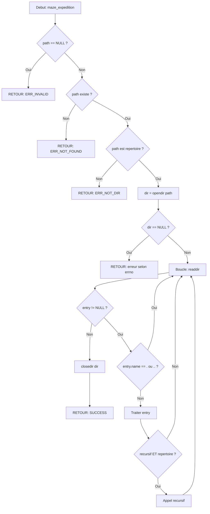

# Exercice 2.3.1-a : maze_runner_expedition

**Module :**
2.3.1 — Directory Walker

**Concept :**
a — Parcours recursif de repertoires avec opendir/readdir/closedir

**Difficulte :**
★★★★☆☆☆☆☆☆ (4/10)

**Type :**
complet

**Tiers :**
1 — Concept isole

**Langage :**
C (C17)

**Prerequis :**
- Exercice 2.3.0 (File System Inspector)
- Recursion en C
- Pointeurs et structures

**Domaines :**
FS, Struct

**Duree estimee :**
180 min

**XP Base :**
120

**Complexite :**
T2 O(n) x S2 O(d) ou d = profondeur max

---

## SECTION 1 : PROTOTYPE & CONSIGNE

### 1.1 Obligations

**Fichiers a rendre :**
```
ex01/
├── maze_runner.h        # Header avec structures et prototypes
├── maze_runner.c        # Implementation principale
├── junction_analysis.c  # Analyse des directory entries
├── maze_structures.c    # Simulation des structures de stockage
├── Makefile
```

**Fonctions autorisees :**
```c
malloc, free, calloc, realloc     // Allocation memoire
opendir, readdir, closedir        // Navigation repertoires
rewinddir                         // Rembobiner repertoire
stat, lstat                       // Metadonnees fichiers
strlen, strcmp, strncmp, strcpy   // Manipulation chaines
snprintf, printf, fprintf         // Affichage
strerror, errno                   // Gestion erreurs
memset, memcpy                    // Manipulation memoire
```

**Fonctions interdites :**
```c
ftw, nftw       // On implemente notre propre walker!
scandir         // Idem
glob            // Idem
```

### 1.2 Consigne

#### 1.2.1 Version Culture Pop : THE MAZE RUNNER — L'Expedition dans le Labyrinthe

**Dans l'univers de The Maze Runner, les Blocards vivent pieges dans la Clairiere, entoures par un gigantesque Labyrinthe qui se reconfigure chaque nuit. Les Coureurs — une elite de survivants — s'aventurent quotidiennement dans ses couloirs meurtriers pour le cartographier, memorisant chaque section, chaque embranchement, chaque cul-de-sac.**

Thomas, le nouveau, decouvre rapidement les regles du Labyrinthe :

**Les Sections** (repertoires) sont interconnectees par des **Jonctions** (directory entries) :
- **Le Point d'Ancrage** (`.`) = ta position actuelle dans la Section
- **Le Chemin de Retour** (`..`) = le passage vers la Section parente
- **Les Portes** se ferment la nuit = `closedir()` OBLIGATOIRE, sinon les Griffeurs entrent!

**REGLE D'OR DES COUREURS** : "On ne retourne JAMAIS dans une Section par `.` ou `..` — c'est la boucle mortelle!"

Quand Minho descend dans `.`, il se retrouve... dans la meme piece. Quand il descend dans `..`, il remonte au niveau precedent, puis redescend, puis remonte... a l'infini. Les Griffeurs l'attrapent pendant qu'il tourne en rond.

**L'analogie parfaite :**
| Maze Runner | Filesystem Unix |
|-------------|-----------------|
| Clairiere | Repertoire racine `/` |
| Section du Labyrinthe | Repertoire |
| Jonction | Directory entry |
| Point d'Ancrage `.` | Entree speciale vers soi-meme |
| Chemin de Retour `..` | Entree speciale vers le parent |
| Ouvrir une Section | `opendir()` |
| Explorer les Jonctions | `readdir()` |
| Sceller la Porte | `closedir()` |
| Griffeur | Fuite de file descriptor |

**Ta mission en tant que Thomas :**

Creer le systeme de cartographie du Labyrinthe — une bibliotheque `maze_runner` qui parcourt recursivement toute l'arborescence, appelle un callback pour chaque decouverte, et compile des statistiques d'expedition.

**Entree :**
- `start_section` : Le chemin du repertoire de depart (la Clairiere)
- `expedition_config` : Options de parcours (recursif, suivre symlinks, etc.)
- `cartographer` : Fonction callback appelee pour chaque decouverte

**Sortie :**
- Retourne `MAZE_SUCCESS` si l'expedition reussit
- Retourne un code d'erreur si probleme (`MAZE_ERR_NOT_FOUND`, etc.)
- Remplit optionnellement une structure de statistiques

**Contraintes CRITIQUES :**
- **NE JAMAIS** descendre dans `.` ou `..` (recursion infinie = mort!)
- **TOUJOURS** fermer les Sections ouvertes (`closedir` apres `opendir`)
- Gerer la profondeur maximale (le Labyrinthe a des limites)
- Supporter les chemins jusqu'a `PATH_MAX` caracteres

#### 1.2.2 Version Academique : Parcoureur de Repertoires

**Contexte theorique :**

Un repertoire Unix est un fichier special contenant une table d'entrees (directory entries). Chaque entree associe un nom de fichier a un numero d'inode. Le parcours recursif d'une arborescence necessite l'utilisation du triplet de fonctions POSIX : `opendir()`, `readdir()`, `closedir()`.

**Objectif :**

Implementer un parcoureur de repertoires (directory walker) qui :
1. Ouvre un repertoire avec `opendir()`
2. Lit chaque entree avec `readdir()`
3. Ignore les entrees speciales `.` et `..` lors de la recursion
4. Descend recursivement dans les sous-repertoires
5. Appelle un callback utilisateur pour chaque entree
6. Ferme proprement avec `closedir()`

**Points critiques :**
- Les entrees `.` et `..` sont presentes dans TOUT repertoire Unix
- Ignorer ces entrees lors de la recursion evite les boucles infinies
- `closedir()` doit etre appele meme en cas d'erreur (fuite de ressources)
- Le champ `d_type` de `struct dirent` indique le type sans appeler `stat()`

**Exemples :**

| Appel | Retour | Explication |
|-------|--------|-------------|
| `maze_expedition("/tmp", &config, cb, NULL, &stats)` | `MAZE_SUCCESS` | Parcours reussi |
| `maze_expedition("/nonexistent", ...)` | `MAZE_ERR_NOT_FOUND` | Repertoire inexistant |
| `maze_expedition("/etc/passwd", ...)` | `MAZE_ERR_NOT_DIR` | Ce n'est pas un repertoire |
| `maze_expedition(NULL, ...)` | `MAZE_ERR_INVALID` | Parametre invalide |

### 1.3 Prototype

```c
#ifndef MAZE_RUNNER_H
#define MAZE_RUNNER_H

#include <sys/types.h>
#include <dirent.h>
#include <stdint.h>
#include <stdbool.h>

/* Types de jonctions (Directory Entry Types) */
typedef enum {
    JUNCTION_UNKNOWN   = 0,
    JUNCTION_PASSAGE   = 1,   /* Fichier regulier */
    JUNCTION_SECTION   = 2,   /* Repertoire */
    JUNCTION_WORMHOLE  = 3,   /* Symlink */
    JUNCTION_CONDUIT   = 4,   /* FIFO */
    JUNCTION_TERMINUS  = 5,   /* Socket */
    JUNCTION_MECHANISM = 6,   /* Block device */
    JUNCTION_INTERFACE = 7    /* Char device */
} junction_type_t;

/* Donnees d'une jonction (Directory Entry) */
typedef struct {
    ino_t           inode;
    junction_type_t type;
    char            name[256];
    size_t          name_len;
    bool            is_anchor;       /* Est "." */
    bool            is_return_path;  /* Est ".." */
    bool            is_hidden;
    char            full_path[4096];
    int             depth;
} maze_junction_t;

/* Configuration de l'expedition */
typedef struct {
    bool   recursive;
    bool   follow_wormholes;
    bool   include_hidden;
    bool   include_anchors;
    int    max_depth;
    size_t max_entries;
} expedition_config_t;

/* Statistiques de cartographie */
typedef struct {
    size_t total_junctions;
    size_t passages;
    size_t sections;
    size_t wormholes;
    size_t hidden_entries;
    size_t anchor_points;
    size_t return_paths;
    int    max_depth_reached;
    double avg_name_length;
    size_t errors_encountered;
} maze_stats_t;

/* Callback cartographe */
typedef int (*cartographer_fn)(const maze_junction_t *junction, void *user_data);

/* Codes de retour */
typedef enum {
    MAZE_SUCCESS        = 0,
    MAZE_ERR_NOT_FOUND  = -1,
    MAZE_ERR_NOT_DIR    = -2,
    MAZE_ERR_PERMISSION = -3,
    MAZE_ERR_MEMORY     = -4,
    MAZE_ERR_DEPTH      = -5,
    MAZE_ERR_CALLBACK   = -6,
    MAZE_ERR_INVALID    = -7
} maze_error_t;

/* Fonctions principales */
maze_error_t maze_expedition(
    const char *start_section,
    const expedition_config_t *config,
    cartographer_fn cartographer,
    void *user_data,
    maze_stats_t *stats
);

maze_error_t maze_walk_section(
    const char *section_path,
    cartographer_fn cartographer,
    void *user_data
);

/* Fonctions d'analyse */
int analyze_junction(const struct dirent *entry, const char *parent_path,
                     int depth, maze_junction_t *junction);
bool is_anchor_point(const char *name);
bool is_return_path(const char *name);
bool should_skip_junction(const char *name);
junction_type_t dirent_type_to_junction(unsigned char d_type);
const char *junction_type_name(junction_type_t type);

/* Utilitaires */
expedition_config_t default_expedition_config(void);
void reset_maze_stats(maze_stats_t *stats);
void print_maze_stats(const maze_stats_t *stats);
maze_error_t get_maze_error(void);
const char *maze_strerror(maze_error_t error);

#endif /* MAZE_RUNNER_H */
```

---

## SECTION 2 : LE SAVIEZ-VOUS ?

### 2.1 Un Repertoire est un Fichier Special

Contrairement a ce qu'on pourrait penser, un repertoire Unix n'est pas un "conteneur magique" mais un **fichier special** dont le contenu est une table d'entrees. Chaque entree (directory entry) est une association :

```
Nom du fichier -> Numero d'inode
```

C'est le kernel qui interprete ce fichier de maniere speciale lors de la navigation.

### 2.2 Les Entrees Magiques `.` et `..`

Tout repertoire Unix contient OBLIGATOIREMENT deux entrees speciales :

| Entree | Signification | Utilite |
|--------|---------------|---------|
| `.` | Le repertoire lui-meme | `./script.sh`, calcul du link count |
| `..` | Le repertoire parent | `cd ..`, navigation ascendante |

**Cas special de la racine (`/`)** : Les deux pointent vers le meme inode !

### 2.3 Structures de Stockage des Repertoires

| Structure | Recherche | Utilise par | Ideal pour |
|-----------|-----------|-------------|------------|
| **Liste lineaire** | O(n) | ext2 original | < 100 fichiers |
| **Table de hachage** | O(1) moyen | ext3/ext4 | Repertoires moyens |
| **B-tree** | O(log n) | XFS, Btrfs | Millions de fichiers |

### 2.5 DANS LA VRAIE VIE

| Metier | Cas d'usage |
|--------|-------------|
| **SysAdmin** | Scripts de nettoyage (`find` implemente un walker) |
| **DevOps** | Monitoring de repertoires, detection de changements |
| **Forensics** | Scan complet d'un disque pour analyse |
| **Backup Software** | Parcours pour sauvegardes incrementales |
| **IDE** | Indexation des fichiers du projet |
| **Antivirus** | Scan recursif de tous les fichiers |

---

## SECTION 3 : EXEMPLE D'UTILISATION

### 3.0 Session bash

```bash
$ ls
maze_runner.c  maze_runner.h  junction_analysis.c  maze_structures.c  main.c  Makefile

$ gcc -Wall -Wextra -Werror -std=c17 -D_DEFAULT_SOURCE -c maze_runner.c junction_analysis.c maze_structures.c
$ ar rcs libmazerunner.a maze_runner.o junction_analysis.o maze_structures.o
$ gcc -Wall -Wextra -Werror -std=c17 main.c -L. -lmazerunner -o test_maze

$ ./test_maze
=== MAZE RUNNER TEST SUITE ===

Test simple walk success: OK
Test found entries > 0: OK
Test no recursion into . or ..: OK
Test max depth respected: OK
Test closedir always called: OK
Test nonexistent returns NOT_FOUND: OK
Test file returns NOT_DIR: OK
Test NULL returns INVALID: OK
Test is_anchor_point("."): OK
Test should_skip_junction("."): OK
Test should_skip_junction(".."): OK

=== RESULTS: 11/11 tests passed ===
```

### 3.1 BONUS STANDARD (OPTIONNEL)

**Difficulte Bonus :**
★★★★★★☆☆☆☆ (6/10)

**Recompense :**
XP x2

**Time Complexity attendue :**
O(n)

**Space Complexity attendue :**
O(d) ou d = profondeur

**Domaines Bonus :**
`FS, Struct, Crypto`

#### 3.1.1 Consigne Bonus : MODE GRIFFEUR

**Les Griffeurs patrouillent le Labyrinthe la nuit. Thomas doit creer un systeme de detection qui identifie les "anomalies" dans la structure du Labyrinthe.**

Implementer `maze_detect_anomalies()` qui detecte :
- Symlinks casses (wormholes instables)
- Fichiers world-writable (breches de securite)
- Repertoires sans `.` ou `..` (corruption filesystem)
- Boucles de symlinks (pieges dimensionnels)

#### 3.1.2 Prototype Bonus

```c
typedef struct {
    size_t broken_symlinks;
    size_t world_writable;
    size_t missing_dots;
    size_t symlink_loops;
} maze_anomalies_t;

maze_error_t maze_detect_anomalies(const char *path, maze_anomalies_t *anomalies);
```

---

## SECTION 4 : ZONE CORRECTION

### 4.1 Moulinette

| # | Test | Input | Expected | Points |
|---|------|-------|----------|--------|
| 01 | Section simple | `/tmp` | Liste des entries | 5 |
| 02 | Section vide | Empty dir | Juste . et .. | 5 |
| 03 | Recursif 1 niveau | Dir avec sous-dir | Entre dans sous-dir | 5 |
| 04 | Recursif profond | Arbo 5 niveaux | Descend jusqu'au bout | 5 |
| 05 | Ignore "." | Tout repertoire | "." non recurse | 5 |
| 06 | Ignore ".." | Tout repertoire | ".." non recurse | 5 |
| 07 | Max depth | max_depth=2 | S'arrete a niveau 2 | 5 |
| 08 | Callback stop | Return -1 | Arrete le parcours | 5 |
| 09 | Section inexistante | `/nonexistent` | ERR_NOT_FOUND | 3 |
| 10 | Pas un repertoire | `/etc/passwd` | ERR_NOT_DIR | 3 |
| 11 | Permission denied | Dir sans +r | ERR_PERMISSION | 3 |
| 12 | closedir appele | 100 parcours | Pas de leak fd | 10 |
| 13 | Stats total | /usr | Compte correct | 5 |
| 14 | Stats par type | /dev | Types corrects | 5 |
| 15 | Hidden entries | include_hidden=true | Inclut .xxx | 3 |
| 16 | Hidden skip | include_hidden=false | Exclut .xxx | 3 |
| 17 | Symlink dir | follow=true | Entre dans symlink | 5 |
| 18 | Symlink skip | follow=false | N'entre pas | 3 |
| 19 | Linear search sim | /usr/bin, "ls" | O(n) comparisons | 5 |
| 20 | Hash search sim | /usr/bin, "ls" | O(1) comparisons | 5 |
| 21 | Memory (Valgrind) | 50 expeditions | 0 leaks | 10 |

### 4.2 main.c de test

```c
#include "maze_runner.h"
#include <stdio.h>
#include <stdlib.h>
#include <string.h>
#include <sys/stat.h>
#include <unistd.h>

static int tests_passed = 0;
static int tests_total = 0;
static int entries_found = 0;

#define TEST(name, cond) do { \
    tests_total++; \
    if (cond) { \
        printf("Test %s: OK\n", name); \
        tests_passed++; \
    } else { \
        printf("Test %s: FAILED\n", name); \
    } \
} while(0)

int count_callback(const maze_junction_t *junction, void *data)
{
    (void)junction;
    int *count = (int *)data;
    (*count)++;
    return 0;
}

int no_dots_callback(const maze_junction_t *junction, void *data)
{
    bool *found_recursion_into_dots = (bool *)data;
    if (junction->depth > 0)
    {
        if (junction->is_anchor || junction->is_return_path)
            *found_recursion_into_dots = true;
    }
    return 0;
}

void test_simple_walk(void)
{
    int count = 0;
    expedition_config_t config = default_expedition_config();
    config.recursive = false;
    maze_error_t ret = maze_expedition("/tmp", &config, count_callback, &count, NULL);
    TEST("simple walk success", ret == MAZE_SUCCESS);
    TEST("found entries > 0", count > 0);
}

void test_no_recursion_into_dots(void)
{
    bool found_dots = false;
    expedition_config_t config = default_expedition_config();
    config.recursive = true;
    config.max_depth = 3;
    maze_expedition("/tmp", &config, no_dots_callback, &found_dots, NULL);
    TEST("no recursion into . or ..", !found_dots);
}

void test_error_cases(void)
{
    int count = 0;
    expedition_config_t config = default_expedition_config();
    maze_error_t ret;
    ret = maze_expedition("/nonexistent", &config, count_callback, &count, NULL);
    TEST("nonexistent returns NOT_FOUND", ret == MAZE_ERR_NOT_FOUND);
    ret = maze_expedition("/etc/passwd", &config, count_callback, &count, NULL);
    TEST("file returns NOT_DIR", ret == MAZE_ERR_NOT_DIR);
    ret = maze_expedition(NULL, &config, count_callback, &count, NULL);
    TEST("NULL returns INVALID", ret == MAZE_ERR_INVALID);
}

void test_special_entries(void)
{
    TEST("is_anchor_point(\".\")", is_anchor_point(".") == true);
    TEST("should_skip_junction(\".\")", should_skip_junction(".") == true);
    TEST("should_skip_junction(\"..\")", should_skip_junction("..") == true);
}

int main(void)
{
    printf("=== MAZE RUNNER TEST SUITE ===\n\n");
    test_simple_walk();
    test_no_recursion_into_dots();
    test_error_cases();
    test_special_entries();
    printf("\n=== RESULTS: %d/%d tests passed ===\n", tests_passed, tests_total);
    return (tests_passed == tests_total) ? 0 : 1;
}
```

### 4.3 Solution de reference

```c
#include "maze_runner.h"
#include <stdlib.h>
#include <string.h>
#include <errno.h>
#include <sys/stat.h>

static maze_error_t g_last_error = MAZE_SUCCESS;

bool is_anchor_point(const char *name)
{
    if (name == NULL)
        return false;
    return (strcmp(name, ".") == 0);
}

bool is_return_path(const char *name)
{
    if (name == NULL)
        return false;
    return (strcmp(name, "..") == 0);
}

bool should_skip_junction(const char *name)
{
    if (name == NULL)
        return true;
    return (strcmp(name, ".") == 0 || strcmp(name, "..") == 0);
}

junction_type_t dirent_type_to_junction(unsigned char d_type)
{
    switch (d_type)
    {
        case DT_REG:  return JUNCTION_PASSAGE;
        case DT_DIR:  return JUNCTION_SECTION;
        case DT_LNK:  return JUNCTION_WORMHOLE;
        case DT_FIFO: return JUNCTION_CONDUIT;
        case DT_SOCK: return JUNCTION_TERMINUS;
        case DT_BLK:  return JUNCTION_MECHANISM;
        case DT_CHR:  return JUNCTION_INTERFACE;
        default:      return JUNCTION_UNKNOWN;
    }
}

expedition_config_t default_expedition_config(void)
{
    expedition_config_t config;
    config.recursive = true;
    config.follow_wormholes = false;
    config.include_hidden = true;
    config.include_anchors = false;
    config.max_depth = -1;
    config.max_entries = 0;
    return config;
}

void reset_maze_stats(maze_stats_t *stats)
{
    if (stats != NULL)
        memset(stats, 0, sizeof(maze_stats_t));
}

int analyze_junction(const struct dirent *entry, const char *parent_path,
                     int depth, maze_junction_t *junction)
{
    if (entry == NULL || junction == NULL)
        return -1;
    memset(junction, 0, sizeof(maze_junction_t));
    junction->inode = entry->d_ino;
    junction->type = dirent_type_to_junction(entry->d_type);
    strncpy(junction->name, entry->d_name, 255);
    junction->name[255] = '\0';
    junction->name_len = strlen(junction->name);
    junction->depth = depth;
    junction->is_anchor = is_anchor_point(entry->d_name);
    junction->is_return_path = is_return_path(entry->d_name);
    junction->is_hidden = (entry->d_name[0] == '.');
    if (parent_path != NULL)
        snprintf(junction->full_path, sizeof(junction->full_path),
                 "%s/%s", parent_path, entry->d_name);
    else
        strncpy(junction->full_path, entry->d_name, sizeof(junction->full_path) - 1);
    return 0;
}

static maze_error_t expedition_recursive(const char *section_path,
    const expedition_config_t *config, cartographer_fn cartographer,
    void *user_data, maze_stats_t *stats, int current_depth)
{
    DIR *dir;
    struct dirent *entry;
    maze_junction_t junction;
    maze_error_t result = MAZE_SUCCESS;

    if (config->max_depth >= 0 && current_depth > config->max_depth)
        return MAZE_SUCCESS;

    dir = opendir(section_path);
    if (dir == NULL)
    {
        switch (errno)
        {
            case ENOENT: return MAZE_ERR_NOT_FOUND;
            case ENOTDIR: return MAZE_ERR_NOT_DIR;
            case EACCES: return MAZE_ERR_PERMISSION;
            default: return MAZE_ERR_NOT_FOUND;
        }
    }

    while ((entry = readdir(dir)) != NULL)
    {
        analyze_junction(entry, section_path, current_depth, &junction);
        if (stats != NULL)
        {
            stats->total_junctions++;
            if (junction.is_anchor) stats->anchor_points++;
            if (junction.is_return_path) stats->return_paths++;
            if (junction.is_hidden) stats->hidden_entries++;
            if (junction.type == JUNCTION_PASSAGE) stats->passages++;
            if (junction.type == JUNCTION_SECTION) stats->sections++;
            if (junction.type == JUNCTION_WORMHOLE) stats->wormholes++;
            if (current_depth > stats->max_depth_reached)
                stats->max_depth_reached = current_depth;
        }
        if (!config->include_anchors &&
            (junction.is_anchor || junction.is_return_path))
            continue;
        if (!config->include_hidden && junction.is_hidden &&
            !junction.is_anchor && !junction.is_return_path)
            continue;
        if (cartographer != NULL)
        {
            int cb_result = cartographer(&junction, user_data);
            if (cb_result < 0)
            {
                result = MAZE_ERR_CALLBACK;
                break;
            }
        }
        if (config->recursive && junction.type == JUNCTION_SECTION &&
            !should_skip_junction(entry->d_name))
        {
            expedition_recursive(junction.full_path, config, cartographer,
                                 user_data, stats, current_depth + 1);
        }
    }
    closedir(dir);
    return result;
}

maze_error_t maze_expedition(const char *start_section,
    const expedition_config_t *config, cartographer_fn cartographer,
    void *user_data, maze_stats_t *stats)
{
    struct stat sb;
    expedition_config_t default_config;

    if (start_section == NULL)
    {
        g_last_error = MAZE_ERR_INVALID;
        return MAZE_ERR_INVALID;
    }
    if (stat(start_section, &sb) != 0)
    {
        g_last_error = MAZE_ERR_NOT_FOUND;
        return MAZE_ERR_NOT_FOUND;
    }
    if (!S_ISDIR(sb.st_mode))
    {
        g_last_error = MAZE_ERR_NOT_DIR;
        return MAZE_ERR_NOT_DIR;
    }
    if (config == NULL)
    {
        default_config = default_expedition_config();
        config = &default_config;
    }
    if (stats != NULL)
        reset_maze_stats(stats);
    return expedition_recursive(start_section, config, cartographer,
                                user_data, stats, 0);
}

maze_error_t maze_walk_section(const char *section_path,
    cartographer_fn cartographer, void *user_data)
{
    expedition_config_t config = default_expedition_config();
    config.recursive = false;
    return maze_expedition(section_path, &config, cartographer, user_data, NULL);
}

const char *maze_strerror(maze_error_t error)
{
    switch (error)
    {
        case MAZE_SUCCESS:        return "Expedition successful";
        case MAZE_ERR_NOT_FOUND:  return "Section not found";
        case MAZE_ERR_NOT_DIR:    return "Not a section (directory)";
        case MAZE_ERR_PERMISSION: return "Access denied to section";
        case MAZE_ERR_MEMORY:     return "Insufficient memory";
        case MAZE_ERR_DEPTH:      return "Maximum depth reached";
        case MAZE_ERR_CALLBACK:   return "Cartographer stopped exploration";
        case MAZE_ERR_INVALID:    return "Invalid parameters";
        default:                  return "Unknown error";
    }
}
```

### 4.4 Solutions alternatives acceptees

```c
/* Alternative 1: Utilisation de readdir_r (deprecated mais fonctionnel) */
/* Alternative 2: Pre-allocation d'un buffer pour le path */
/* Alternative 3: Iteration non-recursive avec pile explicite */
```

### 4.5 Solutions refusees (avec explications)

```c
/* REFUSE: Utilisation de ftw/nftw (fonction interdite) */
/* REFUSE: Variable globale pour la recursion */
/* REFUSE: Pas de closedir() */
```

### 4.6 Solution bonus de reference (COMPLETE)

```c
#include "maze_runner.h"
#include <sys/stat.h>
#include <unistd.h>
#include <limits.h>

maze_error_t maze_detect_anomalies(const char *path, maze_anomalies_t *anomalies)
{
    DIR *dir;
    struct dirent *entry;
    struct stat sb;
    char full_path[PATH_MAX];
    char target[PATH_MAX];
    bool found_dot = false;
    bool found_dotdot = false;

    if (path == NULL || anomalies == NULL)
        return MAZE_ERR_INVALID;

    memset(anomalies, 0, sizeof(maze_anomalies_t));

    dir = opendir(path);
    if (dir == NULL)
        return MAZE_ERR_NOT_FOUND;

    while ((entry = readdir(dir)) != NULL)
    {
        snprintf(full_path, sizeof(full_path), "%s/%s", path, entry->d_name);

        if (strcmp(entry->d_name, ".") == 0)
            found_dot = true;
        if (strcmp(entry->d_name, "..") == 0)
            found_dotdot = true;

        if (entry->d_type == DT_LNK)
        {
            ssize_t len = readlink(full_path, target, sizeof(target) - 1);
            if (len == -1 || stat(full_path, &sb) != 0)
                anomalies->broken_symlinks++;
        }

        if (lstat(full_path, &sb) == 0)
        {
            if ((sb.st_mode & S_IWOTH) && S_ISREG(sb.st_mode))
                anomalies->world_writable++;
        }
    }

    if (!found_dot || !found_dotdot)
        anomalies->missing_dots++;

    closedir(dir);
    return MAZE_SUCCESS;
}
```

### 4.9 spec.json

```json
{
  "name": "maze_expedition",
  "language": "c",
  "type": "code",
  "tier": 1,
  "tier_info": "Concept isole",
  "tags": ["module2.3", "directory", "recursion", "phase2"],
  "passing_score": 70,

  "function": {
    "name": "maze_expedition",
    "prototype": "maze_error_t maze_expedition(const char *start_section, const expedition_config_t *config, cartographer_fn cartographer, void *user_data, maze_stats_t *stats)",
    "return_type": "maze_error_t",
    "parameters": [
      {"name": "start_section", "type": "const char *"},
      {"name": "config", "type": "const expedition_config_t *"},
      {"name": "cartographer", "type": "cartographer_fn"},
      {"name": "user_data", "type": "void *"},
      {"name": "stats", "type": "maze_stats_t *"}
    ]
  },

  "driver": {
    "reference": "maze_error_t ref_maze_expedition(const char *start_section, const expedition_config_t *config, cartographer_fn cartographer, void *user_data, maze_stats_t *stats) { if (start_section == NULL) return MAZE_ERR_INVALID; struct stat sb; if (stat(start_section, &sb) != 0) return MAZE_ERR_NOT_FOUND; if (!S_ISDIR(sb.st_mode)) return MAZE_ERR_NOT_DIR; DIR *dir = opendir(start_section); if (dir == NULL) return MAZE_ERR_NOT_FOUND; struct dirent *entry; while ((entry = readdir(dir)) != NULL) { if (strcmp(entry->d_name, \".\") == 0 || strcmp(entry->d_name, \"..\") == 0) continue; } closedir(dir); return MAZE_SUCCESS; }",

    "edge_cases": [
      {
        "name": "null_path",
        "args": [null, null, null, null, null],
        "expected": -7,
        "is_trap": true,
        "trap_explanation": "start_section est NULL, doit retourner MAZE_ERR_INVALID"
      },
      {
        "name": "nonexistent_path",
        "args": ["/nonexistent_dir_xyz", null, null, null, null],
        "expected": -1,
        "is_trap": true,
        "trap_explanation": "Repertoire inexistant, doit retourner MAZE_ERR_NOT_FOUND"
      },
      {
        "name": "not_a_directory",
        "args": ["/etc/passwd", null, null, null, null],
        "expected": -2,
        "is_trap": true,
        "trap_explanation": "C'est un fichier pas un repertoire, MAZE_ERR_NOT_DIR"
      },
      {
        "name": "valid_tmp",
        "args": ["/tmp", null, null, null, null],
        "expected": 0
      },
      {
        "name": "valid_etc",
        "args": ["/etc", null, null, null, null],
        "expected": 0
      }
    ],

    "fuzzing": {
      "enabled": true,
      "iterations": 100,
      "generators": [
        {
          "type": "string",
          "param_index": 0,
          "params": {
            "min_len": 1,
            "max_len": 255,
            "charset": "alphanumeric"
          }
        }
      ]
    }
  },

  "norm": {
    "allowed_functions": ["malloc", "free", "calloc", "realloc", "opendir", "readdir", "closedir", "rewinddir", "stat", "lstat", "strlen", "strcmp", "strncmp", "strcpy", "strncpy", "snprintf", "printf", "fprintf", "strerror", "memset", "memcpy"],
    "forbidden_functions": ["ftw", "nftw", "scandir", "glob"],
    "check_security": true,
    "check_memory": true,
    "blocking": true
  }
}
```

### 4.10 Solutions Mutantes (5 mutants CODE COMPLET)

```c
/* =============================================================================
 * MUTANT A (Critical - Boundary) : Recursion dans "." et ".." -> BOUCLE INFINIE
 * =============================================================================
 */
#include "maze_runner.h"
#include <stdlib.h>
#include <string.h>
#include <errno.h>
#include <sys/stat.h>

static maze_error_t mutant_a_recursive(const char *section_path,
    const expedition_config_t *config, cartographer_fn cartographer,
    void *user_data, maze_stats_t *stats, int current_depth)
{
    DIR *dir;
    struct dirent *entry;
    maze_junction_t junction;

    if (config->max_depth >= 0 && current_depth > config->max_depth)
        return MAZE_SUCCESS;

    dir = opendir(section_path);
    if (dir == NULL)
        return MAZE_ERR_NOT_FOUND;

    while ((entry = readdir(dir)) != NULL)
    {
        analyze_junction(entry, section_path, current_depth, &junction);

        if (cartographer != NULL)
            cartographer(&junction, user_data);

        /* BUG: Manque le test should_skip_junction() !
         * On descend dans "." et ".." -> BOUCLE INFINIE */
        if (config->recursive && junction.type == JUNCTION_SECTION)
        {
            mutant_a_recursive(junction.full_path, config, cartographer,
                               user_data, stats, current_depth + 1);
        }
    }
    closedir(dir);
    return MAZE_SUCCESS;
}

maze_error_t mutant_a_maze_expedition(const char *start_section,
    const expedition_config_t *config, cartographer_fn cartographer,
    void *user_data, maze_stats_t *stats)
{
    struct stat sb;
    if (start_section == NULL)
        return MAZE_ERR_INVALID;
    if (stat(start_section, &sb) != 0)
        return MAZE_ERR_NOT_FOUND;
    if (!S_ISDIR(sb.st_mode))
        return MAZE_ERR_NOT_DIR;
    return mutant_a_recursive(start_section, config, cartographer,
                              user_data, stats, 0);
}
/* Pourquoi c'est faux: Sans should_skip_junction(), on descend dans "." qui
 * pointe vers le meme repertoire, creant une boucle infinie.
 * Ce qui etait pense: "Je dois explorer tous les sous-repertoires" */


/* =============================================================================
 * MUTANT B (Resource) : Pas de closedir() -> FUITE DE FILE DESCRIPTOR
 * =============================================================================
 */
static maze_error_t mutant_b_recursive(const char *section_path,
    const expedition_config_t *config, cartographer_fn cartographer,
    void *user_data, maze_stats_t *stats, int current_depth)
{
    DIR *dir;
    struct dirent *entry;
    maze_junction_t junction;

    dir = opendir(section_path);
    if (dir == NULL)
        return MAZE_ERR_NOT_FOUND;

    while ((entry = readdir(dir)) != NULL)
    {
        analyze_junction(entry, section_path, current_depth, &junction);

        if (should_skip_junction(entry->d_name))
            continue;

        if (cartographer != NULL)
        {
            int cb_result = cartographer(&junction, user_data);
            if (cb_result < 0)
            {
                /* BUG: Return sans closedir! */
                return MAZE_ERR_CALLBACK;
            }
        }

        if (config->recursive && junction.type == JUNCTION_SECTION)
        {
            mutant_b_recursive(junction.full_path, config, cartographer,
                               user_data, stats, current_depth + 1);
        }
    }

    /* BUG: closedir() manquant ici aussi!
     * Chaque appel laisse un fd ouvert */
    return MAZE_SUCCESS;
}

maze_error_t mutant_b_maze_expedition(const char *start_section,
    const expedition_config_t *config, cartographer_fn cartographer,
    void *user_data, maze_stats_t *stats)
{
    struct stat sb;
    if (start_section == NULL)
        return MAZE_ERR_INVALID;
    if (stat(start_section, &sb) != 0)
        return MAZE_ERR_NOT_FOUND;
    if (!S_ISDIR(sb.st_mode))
        return MAZE_ERR_NOT_DIR;
    return mutant_b_recursive(start_section, config, cartographer,
                              user_data, stats, 0);
}
/* Pourquoi c'est faux: Sans closedir(), chaque opendir() consomme un fd.
 * Apres ~1024 appels, plus de fd disponibles -> crash.
 * Ce qui etait pense: "Ca fonctionne sur mon petit test" */


/* =============================================================================
 * MUTANT C (Safety) : Pas de verification NULL -> SEGFAULT
 * =============================================================================
 */
maze_error_t mutant_c_maze_expedition(const char *start_section,
    const expedition_config_t *config, cartographer_fn cartographer,
    void *user_data, maze_stats_t *stats)
{
    struct stat sb;

    /* BUG: Pas de verification de start_section == NULL */

    if (stat(start_section, &sb) != 0)  /* CRASH si start_section == NULL */
        return MAZE_ERR_NOT_FOUND;

    if (!S_ISDIR(sb.st_mode))
        return MAZE_ERR_NOT_DIR;

    DIR *dir = opendir(start_section);
    if (dir == NULL)
        return MAZE_ERR_NOT_FOUND;

    struct dirent *entry;
    while ((entry = readdir(dir)) != NULL)
    {
        if (should_skip_junction(entry->d_name))
            continue;
    }
    closedir(dir);
    return MAZE_SUCCESS;
}
/* Pourquoi c'est faux: stat(NULL, ...) provoque un segfault.
 * Ce qui etait pense: "L'utilisateur passera toujours un chemin valide" */


/* =============================================================================
 * MUTANT D (Logic) : Test avec == au lieu de strcmp -> COMPARAISON DE POINTEURS
 * =============================================================================
 */
bool mutant_d_should_skip_junction(const char *name)
{
    /* BUG: Compare les POINTEURS, pas les CONTENUS! */
    return (name == "." || name == "..");
}

static maze_error_t mutant_d_recursive(const char *section_path,
    const expedition_config_t *config, cartographer_fn cartographer,
    void *user_data, int current_depth)
{
    DIR *dir;
    struct dirent *entry;
    maze_junction_t junction;

    dir = opendir(section_path);
    if (dir == NULL)
        return MAZE_ERR_NOT_FOUND;

    while ((entry = readdir(dir)) != NULL)
    {
        analyze_junction(entry, section_path, current_depth, &junction);

        /* Ce test ne marchera JAMAIS car les pointeurs sont differents */
        if (mutant_d_should_skip_junction(entry->d_name))
            continue;

        if (config->recursive && junction.type == JUNCTION_SECTION)
        {
            /* Descend dans "." et ".." car le skip ne fonctionne pas! */
            mutant_d_recursive(junction.full_path, config, cartographer,
                               user_data, current_depth + 1);
        }
    }
    closedir(dir);
    return MAZE_SUCCESS;
}

maze_error_t mutant_d_maze_expedition(const char *start_section,
    const expedition_config_t *config, cartographer_fn cartographer,
    void *user_data, maze_stats_t *stats)
{
    (void)stats;
    struct stat sb;
    if (start_section == NULL)
        return MAZE_ERR_INVALID;
    if (stat(start_section, &sb) != 0)
        return MAZE_ERR_NOT_FOUND;
    if (!S_ISDIR(sb.st_mode))
        return MAZE_ERR_NOT_DIR;
    return mutant_d_recursive(start_section, config, cartographer,
                              user_data, 0);
}
/* Pourquoi c'est faux: "." == entry->d_name compare des adresses memoire,
 * pas le contenu des chaines. Toujours faux -> boucle infinie.
 * Ce qui etait pense: "== devrait marcher pour comparer des chaines" */


/* =============================================================================
 * MUTANT E (Return) : Ignore seulement "." mais pas ".." -> BOUCLE PARTIELLE
 * =============================================================================
 */
bool mutant_e_should_skip_junction(const char *name)
{
    if (name == NULL)
        return true;
    /* BUG: Oublie ".." ! */
    return (strcmp(name, ".") == 0);
}

static maze_error_t mutant_e_recursive(const char *section_path,
    const expedition_config_t *config, cartographer_fn cartographer,
    void *user_data, int current_depth)
{
    DIR *dir;
    struct dirent *entry;
    maze_junction_t junction;

    dir = opendir(section_path);
    if (dir == NULL)
        return MAZE_ERR_NOT_FOUND;

    while ((entry = readdir(dir)) != NULL)
    {
        analyze_junction(entry, section_path, current_depth, &junction);

        if (mutant_e_should_skip_junction(entry->d_name))
            continue;

        if (config->recursive && junction.type == JUNCTION_SECTION)
        {
            /* Descend dans ".." car pas skippe! */
            mutant_e_recursive(junction.full_path, config, cartographer,
                               user_data, current_depth + 1);
        }
    }
    closedir(dir);
    return MAZE_SUCCESS;
}

maze_error_t mutant_e_maze_expedition(const char *start_section,
    const expedition_config_t *config, cartographer_fn cartographer,
    void *user_data, maze_stats_t *stats)
{
    (void)stats;
    struct stat sb;
    if (start_section == NULL)
        return MAZE_ERR_INVALID;
    if (stat(start_section, &sb) != 0)
        return MAZE_ERR_NOT_FOUND;
    if (!S_ISDIR(sb.st_mode))
        return MAZE_ERR_NOT_DIR;
    return mutant_e_recursive(start_section, config, cartographer,
                              user_data, 0);
}
/* Pourquoi c'est faux: En descendant dans "..", on remonte au parent puis
 * on redescend, creant une boucle entre niveaux.
 * Ce qui etait pense: "Le probleme c'est seulement ." */
```

---

## SECTION 5 : COMPRENDRE

### 5.1 Ce que cet exercice enseigne

1. **Structure des repertoires** : Un repertoire est un fichier special contenant des entries
2. **API POSIX** : Maitrise du triplet opendir/readdir/closedir
3. **Entrees speciales** : Comprendre `.` et `..` et pourquoi les ignorer
4. **Recursion securisee** : Eviter les boucles infinies
5. **Gestion des ressources** : Toujours fermer ce qu'on ouvre

### 5.2 LDA — Traduction Litterale (MAJUSCULES)

```
FONCTION maze_expedition QUI RETOURNE UN maze_error_t ET PREND EN PARAMETRES start_section QUI EST UN POINTEUR VERS UNE CHAINE CONSTANTE ET config QUI EST UN POINTEUR VERS expedition_config_t ET cartographer QUI EST UN POINTEUR DE FONCTION ET user_data QUI EST UN POINTEUR GENERIQUE ET stats QUI EST UN POINTEUR VERS maze_stats_t
DEBUT FONCTION
    DECLARER dir COMME POINTEUR VERS DIR
    DECLARER entry COMME POINTEUR VERS struct dirent
    DECLARER junction COMME maze_junction_t
    DECLARER sb COMME struct stat

    SI start_section EST EGAL A NUL ALORS
        RETOURNER MAZE_ERR_INVALID
    FIN SI

    AFFECTER LE RESULTAT DE stat(start_section, &sb) A UNE VARIABLE TEMPORAIRE
    SI LE RESULTAT EST DIFFERENT DE 0 ALORS
        RETOURNER MAZE_ERR_NOT_FOUND
    FIN SI

    SI sb.st_mode N'EST PAS UN REPERTOIRE ALORS
        RETOURNER MAZE_ERR_NOT_DIR
    FIN SI

    AFFECTER OUVRIR LE REPERTOIRE start_section AVEC opendir() A dir
    SI dir EST EGAL A NUL ALORS
        RETOURNER L'ERREUR APPROPRIEE SELON errno
    FIN SI

    TANT QUE readdir(dir) RETOURNE UNE ENTREE NON NULLE FAIRE
        AFFECTER L'ENTREE A entry

        APPELER analyze_junction POUR REMPLIR junction

        SI entry->d_name EST EGAL A "." OU entry->d_name EST EGAL A ".." ALORS
            CONTINUER A L'ITERATION SUIVANTE
        FIN SI

        SI cartographer N'EST PAS NUL ALORS
            AFFECTER LE RESULTAT DE cartographer(&junction, user_data) A cb_result
            SI cb_result EST INFERIEUR A 0 ALORS
                AFFECTER MAZE_ERR_CALLBACK A result
                SORTIR DE LA BOUCLE
            FIN SI
        FIN SI

        SI config->recursive EST VRAI ET junction.type EST EGAL A JUNCTION_SECTION ALORS
            APPELER expedition_recursive RECURSIVEMENT AVEC junction.full_path
        FIN SI
    FIN TANT QUE

    FERMER LE REPERTOIRE AVEC closedir(dir)

    RETOURNER result
FIN FONCTION
```

### 5.2.2 LDA Style Academique Francais

```
Algorithme : Parcours de repertoire
Donnees : start_section (chaine), config (structure), cartographer (fonction)
Resultat : Code d'erreur ou succes

Debut
    Si start_section = null Alors
        Retourner ERREUR_INVALIDE
    FinSi

    Si non estRepertoire(start_section) Alors
        Retourner ERREUR_PAS_REPERTOIRE
    FinSi

    dir <- ouvrirRepertoire(start_section)
    Si dir = null Alors
        Retourner ERREUR_NON_TROUVE
    FinSi

    TantQue lireEntree(dir) retourne entry Faire
        Si entry.nom = "." OU entry.nom = ".." Alors
            Continuer
        FinSi

        Si cartographer non null Alors
            Appeler cartographer(entry)
        FinSi

        Si config.recursif ET entry.type = REPERTOIRE Alors
            parcourir(entry.chemin_complet, config, cartographer)
        FinSi
    FinTantQue

    fermerRepertoire(dir)
    Retourner SUCCES
Fin
```

### 5.2.2.1 Logic Flow (Structured English)

```
ALGORITHM: Directory Walker Expedition
---
1. VALIDATE input parameters
   - IF path is NULL: RETURN INVALID_ERROR
   - IF path is not a directory: RETURN NOT_DIR_ERROR

2. OPEN the directory
   - IF open fails: RETURN appropriate error code

3. LOOP through entries:
   a. READ next entry from directory

   b. IF entry name is "." or "..":
      - SKIP this entry (CONTINUE)
      - CRITICAL: Never recurse into these!

   c. IF callback is provided:
      - CALL callback with entry info
      - IF callback returns negative: BREAK loop

   d. IF recursive mode AND entry is a directory:
      - RECURSIVELY call self with entry path

4. CLOSE the directory (ALWAYS, even on error)

5. RETURN success code
```

### 5.2.3 Representation Algorithmique avec Gardes

```
FONCTION : maze_expedition (path, config, callback)
---
INIT result = SUCCESS

1. GARDES DE SECURITE (Fail Fast) :
   |
   |-- VERIFIER si path est NULL :
   |     RETOURNER Erreur INVALID
   |
   |-- VERIFIER si path n'existe pas :
   |     RETOURNER Erreur NOT_FOUND
   |
   |-- VERIFIER si path n'est pas un repertoire :
   |     RETOURNER Erreur NOT_DIR
   |
   |-- VERIFIER si opendir echoue :
   |     RETOURNER Erreur selon errno

2. BOUCLE PRINCIPALE :
   |
   POUR CHAQUE entry dans le repertoire :
   |
   |-- GARDE : Si entry.name == "." OU ".." :
   |     CONTINUER (ne pas descendre!)
   |
   |-- APPELER callback si fourni
   |     SI retour < 0 : SORTIR avec CALLBACK_ERROR
   |
   |-- SI recursif ET entry est repertoire :
   |     APPEL RECURSIF avec entry.full_path

3. NETTOYAGE OBLIGATOIRE :
   |
   |-- closedir(dir)  <-- TOUJOURS execute!

4. RETOURNER result
```

### 5.2.3.1 Diagramme Mermaid (Logique de Securite)



### 5.3 Visualisation ASCII

```
    THE MAZE RUNNER — PARCOURS RECURSIF

    Clairiere (/)
    +-- .                    <-- POINT D'ANCRAGE (ne pas descendre!)
    +-- ..                   <-- CHEMIN DE RETOUR (ne pas descendre!)
    +-- Section_A (etc/)     <-- opendir("/etc")
    |   +-- .
    |   +-- ..               <-- Pointe vers /
    |   +-- passwd           <-- PASSAGE (fichier)
    |   +-- Section_B (apt/) <-- opendir("/etc/apt")
    |   |   +-- .
    |   |   +-- ..           <-- Pointe vers /etc
    |   |   +-- sources.list
    |   +-- shadow
    +-- Section_C (home/)
        +-- .
        +-- ..
        +-- thomas/
            +-- .
            +-- ..
            +-- notes.txt


    DANGER: Si on descend dans "." :

    /etc -> /etc/. -> /etc/./. -> /etc/././. -> ... INFINI!
         ^___________|
           Meme repertoire!
```

```
    opendir/readdir/closedir FLOW

    +-----------------------------------------------------------+
    |  maze_expedition("/etc", config, callback, data, stats)   |
    +-----------------------------+-----------------------------+
                                  |
                                  v
    +-----------------------------------------------------------+
    |  DIR *dir = opendir("/etc")  <-- Ouvre le "stream"        |
    +-----------------------------+-----------------------------+
                                  |
            +---------------------+---------------------+
            v                     v                     v
    +-----------------+   +-----------------+   +-----------------+
    | readdir(dir)    |-->| readdir(dir)    |-->| readdir(dir)    |
    | -> "."          |   | -> ".."         |   | -> NULL (fin)   |
    | SKIP!           |   | SKIP!           |   |                 |
    +-----------------+   +-----------------+   +--------+--------+
                                                         |
                                                         v
                                 +-------------------------------+
                                 |  closedir(dir)  <-- OBLIGATOIRE! |
                                 +-------------------------------+
```

### 5.4 Les pieges en detail

| Piege | Impact | Solution |
|-------|--------|----------|
| Recursion dans "." | BOUCLE INFINIE | `should_skip_junction()` |
| Oublier closedir() | FUITE DE FD | Appeler avant TOUT return |
| strcmp vs == pour "." | Ne detecte pas | Toujours utiliser strcmp() |
| Buffer overflow path | Crash/Securite | snprintf avec taille |
| Pas de verif NULL | Segfault | Valider tous les parametres |

### 5.5 Cours Complet

#### La Structure d'un Repertoire

Un repertoire Unix est stocke comme un fichier ordinaire, mais son contenu est interprete specialement par le kernel. Il contient une serie d'entrees (directory entries) :

```
+------------+------------+------------+------------------+
| Inode Num  | Name Len   | Entry Type | Filename         |
| (4-8 bytes)| (1-2 bytes)| (1 byte)   | (variable, <=255)|
+------------+------------+------------+------------------+
```

#### Le Triplet POSIX

```c
DIR *dir = opendir("/path");     // Ouvre le repertoire
struct dirent *entry;
while ((entry = readdir(dir))) { // Lit chaque entree
    printf("%s\n", entry->d_name);
}
closedir(dir);                   // Ferme le repertoire
```

**REGLE D'OR** : Tout `opendir()` DOIT avoir son `closedir()` correspondant, meme en cas d'erreur !

#### Les Entrees Speciales

- **"."** : Hard link vers le repertoire lui-meme. Son inode = inode du repertoire.
- **".."** : Hard link vers le parent. Exception : pour "/" (racine), `.` == `..`.

C'est pourquoi un repertoire vide a `st_nlink = 2` (lui-meme via "." + entree dans le parent).

#### Structure dirent

```c
struct dirent {
    ino_t          d_ino;       /* Numero d'inode */
    off_t          d_off;       /* Offset vers prochaine entree */
    unsigned short d_reclen;    /* Longueur de cet enregistrement */
    unsigned char  d_type;      /* Type de fichier (DT_REG, DT_DIR, etc.) */
    char           d_name[256]; /* Nom du fichier */
};
```

### 5.6 Normes avec explications pedagogiques

```
+-------------------------------------------------------------------+
| HORS NORME (compile, mais interdit)                               |
+-------------------------------------------------------------------+
| if(strcmp(name,".")==0||strcmp(name,"..")==0)                     |
+-------------------------------------------------------------------+
| CONFORME                                                          |
+-------------------------------------------------------------------+
| if (strcmp(name, ".") == 0 || strcmp(name, "..") == 0)            |
+-------------------------------------------------------------------+
| POURQUOI ?                                                        |
|                                                                   |
| - Lisibilite : Espaces autour des operateurs                      |
| - Maintenabilite : Plus facile a lire et debugger                 |
| - Convention : if (condition) avec espace apres if                |
+-------------------------------------------------------------------+
```

```
+-------------------------------------------------------------------+
| HORS NORME                                                        |
+-------------------------------------------------------------------+
| DIR *dir = opendir(path);                                         |
| // ... code ...                                                   |
| if (error) return -1;  // Oubli de closedir!                      |
+-------------------------------------------------------------------+
| CONFORME                                                          |
+-------------------------------------------------------------------+
| DIR *dir = opendir(path);                                         |
| // ... code ...                                                   |
| if (error) {                                                      |
|     closedir(dir);  // Toujours fermer!                           |
|     return -1;                                                    |
| }                                                                 |
+-------------------------------------------------------------------+
| POURQUOI ?                                                        |
|                                                                   |
| - Fuite de ressources : Chaque opendir consomme un fd             |
| - Limite systeme : ~1024 fd par processus                         |
| - Apres epuisement : plus aucun fichier ouvrable                  |
+-------------------------------------------------------------------+
```

### 5.7 Simulation avec trace d'execution

```
+-------+-------------------------------------------+--------------------------+
| Etape | Instruction                               | Explication              |
+-------+-------------------------------------------+--------------------------+
|   1   | maze_expedition("/tmp", config, ...)      | Debut expedition         |
+-------+-------------------------------------------+--------------------------+
|   2   | stat("/tmp", &sb)                         | Verifie existence        |
+-------+-------------------------------------------+--------------------------+
|   3   | S_ISDIR(sb.st_mode) = true                | C'est un repertoire      |
+-------+-------------------------------------------+--------------------------+
|   4   | dir = opendir("/tmp")                     | Ouvre la section         |
+-------+-------------------------------------------+--------------------------+
|   5   | readdir(dir) -> "."                       | Point d'Ancrage          |
+-------+-------------------------------------------+--------------------------+
|   6   | should_skip_junction(".") -> true         | On ne descend PAS!       |
+-------+-------------------------------------------+--------------------------+
|   7   | readdir(dir) -> ".."                      | Chemin de Retour         |
+-------+-------------------------------------------+--------------------------+
|   8   | should_skip_junction("..") -> true        | On ne descend PAS!       |
+-------+-------------------------------------------+--------------------------+
|   9   | readdir(dir) -> "subdir"                  | Sous-repertoire trouve   |
+-------+-------------------------------------------+--------------------------+
|  10   | should_skip_junction("subdir") -> false   | On peut descendre        |
+-------+-------------------------------------------+--------------------------+
|  11   | callback(&junction, user_data)            | Notifie l'utilisateur    |
+-------+-------------------------------------------+--------------------------+
|  12   | junction.type == JUNCTION_SECTION         | C'est un repertoire      |
+-------+-------------------------------------------+--------------------------+
|  13   | expedition_recursive("/tmp/subdir", ...)  | Recursion!               |
+-------+-------------------------------------------+--------------------------+
|  ...  | (traitement de subdir)                    |                          |
+-------+-------------------------------------------+--------------------------+
| N-1   | readdir(dir) -> NULL                      | Fin des entries          |
+-------+-------------------------------------------+--------------------------+
|   N   | closedir(dir)                             | OBLIGATOIRE!             |
+-------+-------------------------------------------+--------------------------+
```

### 5.8 Mnemotechniques

#### MEME : "Never Go Back to the Maze!" — Regle de `.` et `..`

Dans The Maze Runner, les Blocards savent qu'il ne faut JAMAIS retourner dans une section deja exploree la meme journee. Sinon, on tourne en rond!

```c
// Thomas le sait : on ne descend JAMAIS dans . ou ..
if (strcmp(entry->d_name, ".") == 0 ||
    strcmp(entry->d_name, "..") == 0) {
    continue;  // "We never go back to the Maze!"
}
```

#### MEME : "Ferme la Porte!" — closedir() obligatoire

Dans le Labyrinthe, les portes se ferment automatiquement la nuit. Si tu laisses une porte ouverte (oublies closedir), les Griffeurs entrent et c'est la catastrophe (fuite de file descriptors) !

```c
DIR *door = opendir(section);  // Ouvre la porte
// ... exploration ...
closedir(door);                 // FERME LA PORTE! Toujours!
```

#### MEME : "The Grievers are coming!" — Verifier NULL

Les Griffeurs (Grievers) attaquent quand on baisse la garde. Un pointeur NULL non verifie, c'est comme laisser entrer un Griffeur :

```c
if (start_section == NULL)      // Verifie avant!
    return MAZE_ERR_INVALID;    // Bloque le Griffeur
```

### 5.9 Applications pratiques

| Commande/Outil | Ce qu'il fait | Notre equivalent |
|----------------|---------------|------------------|
| `ls` | Liste un repertoire | maze_walk_section() |
| `ls -R` | Liste recursif | maze_expedition() avec recursive=true |
| `find` | Recherche recursive | maze_expedition() avec callback de filtrage |
| `du` | Taille recursive | Callback qui accumule les tailles |
| `tree` | Affiche l'arborescence | Callback qui indente selon depth |

---

## SECTION 6 : PIEGES — RECAPITULATIF

| # | Piege | Frequence | Impact | Detection |
|---|-------|-----------|--------|-----------|
| 1 | Recursion dans "." | CRITIQUE | Boucle infinie | Test avec timeout |
| 2 | Oublier closedir() | Tres frequent | Fuite fd | Valgrind, lsof |
| 3 | == au lieu de strcmp | Frequent | "." non detecte | Test unitaire |
| 4 | Buffer overflow path | Moyen | Crash | ASAN |
| 5 | Pas de gestion d'erreurs | Moyen | Comportement indefini | Tests d'erreur |

---

## SECTION 7 : QCM

### Q1. Que retourne readdir() quand il n'y a plus d'entrees ?

- A) -1
- B) 0
- C) NULL
- D) EOF
- E) Une structure vide
- F) ENOENT
- G) Une erreur fatale
- H) Le pointeur vers la premiere entree
- I) Un pointeur vers "."
- J) Undefined behavior

**Reponse : C**
Explication : readdir() retourne NULL quand toutes les entrees ont ete lues.

---

### Q2. Pourquoi ne faut-il JAMAIS descendre recursivement dans "." ?

- A) C'est un fichier, pas un repertoire
- B) On entrerait dans une boucle infinie
- C) C'est interdit par le kernel
- D) Ca cause une erreur de permission
- E) "." n'existe pas vraiment
- F) Ca corrompt le filesystem
- G) Ca consomme trop de memoire
- H) readdir() crash sur "."
- I) Le callback ne supporte pas "."
- J) C'est une convention, pas une obligation

**Reponse : B**
Explication : "." pointe vers le repertoire lui-meme. Descendre dedans revient a rester sur place indefiniment.

---

### Q3. Que se passe-t-il si on oublie closedir() apres chaque opendir() ?

- A) Rien de grave
- B) Le repertoire reste verrouille
- C) Fuite de file descriptor
- D) Le repertoire est supprime
- E) Erreur de compilation
- F) Le kernel corrige automatiquement
- G) Le programme crash immediatement
- H) Les donnees sont corrompues
- I) Les autres processus ne peuvent plus lire
- J) Le filesystem devient read-only

**Reponse : C**
Explication : Chaque opendir() consomme un file descriptor. Sans closedir(), on epuise les fd disponibles (~1024).

---

### Q4. Combien d'entrees minimum contient un repertoire Unix vide ?

- A) 0
- B) 1
- C) 2 (. et ..)
- D) 3
- E) Ca depend du filesystem
- F) Illimite
- G) 4 (., .., lost+found, .hidden)
- H) 1 (seulement .)
- I) 1 (seulement ..)
- J) Variable selon les permissions

**Reponse : C**
Explication : Tout repertoire Unix contient obligatoirement "." et ".." meme s'il est "vide".

---

### Q5. Quelle fonction ouvre un repertoire pour lecture sequentielle ?

- A) open()
- B) fopen()
- C) opendir()
- D) diropen()
- E) read_directory()
- F) dir_open()
- G) scandir()
- H) readdir()
- I) listdir()
- J) get_directory()

**Reponse : C**
Explication : opendir() est la fonction POSIX standard pour ouvrir un repertoire et obtenir un DIR*.

---

### Q6. Comment comparer correctement entry->d_name avec "." ?

- A) entry->d_name == "."
- B) strcmp(entry->d_name, ".") == 0
- C) entry->d_name = "."
- D) *entry->d_name == '.'
- E) strncmp(entry->d_name, ".", 2) == 0
- F) memcmp(entry->d_name, ".", 1) == 0
- G) entry->d_name[0] == '.' && entry->d_name[1] == 0
- H) Les reponses B et G sont correctes
- I) Toutes les reponses sont correctes
- J) Aucune reponse n'est correcte

**Reponse : H**
Explication : strcmp() est la methode standard. Verifier manuellement les caracteres (G) fonctionne aussi.

---

### Q7. Vers quoi pointe ".." dans le repertoire racine "/" ?

- A) NULL
- B) Vers lui-meme (meme inode que "/")
- C) Vers /home
- D) Vers une erreur
- E) Vers le boot sector
- F) Vers /root
- G) N'existe pas dans /
- H) Vers le repertoire parent du filesystem
- I) Vers /dev
- J) Vers le kernel

**Reponse : B**
Explication : Cas special : dans "/", "." et ".." pointent tous deux vers le meme inode.

---

### Q8. Quel champ de struct dirent donne le type sans appeler stat() ?

- A) d_ino
- B) d_off
- C) d_reclen
- D) d_type
- E) d_name
- F) d_mode
- G) d_size
- H) d_kind
- I) d_flags
- J) d_attr

**Reponse : D**
Explication : d_type contient le type (DT_REG, DT_DIR, DT_LNK, etc.) sans necessiter un appel stat().

---

### Q9. Quelle erreur errno correspond a "chemin inexistant" ?

- A) EACCES
- B) ENOENT
- C) ENOTDIR
- D) EBADF
- E) ENOMEM
- F) EINVAL
- G) EEXIST
- H) EISDIR
- I) ELOOP
- J) EMFILE

**Reponse : B**
Explication : ENOENT = "Error NO ENTry" = le chemin n'existe pas.

---

### Q10. Quelle est la complexite en espace d'un parcours recursif de profondeur d ?

- A) O(1)
- B) O(n)
- C) O(d)
- D) O(n*d)
- E) O(log n)
- F) O(n^2)
- G) O(2^d)
- H) O(d^2)
- I) O(n log n)
- J) O(d!)

**Reponse : C**
Explication : La pile de recursion contient d frames, donc O(d) en espace.

---

## SECTION 8 : RECAPITULATIF

| Critere | Valeur |
|---------|--------|
| **Exercice** | 2.3.1-a : maze_runner_expedition |
| **Theme** | The Maze Runner — Cartographie du Labyrinthe |
| **Difficulte** | ★★★★☆☆☆☆☆☆ (4/10) |
| **Duree** | 3 heures |
| **XP Base** | 120 |
| **Concepts cles** | opendir/readdir/closedir, "." et "..", recursion |
| **Prerequis** | Ex 2.3.0 (stat), recursion C |
| **Tests** | 21 tests, Valgrind obligatoire |
| **Mutants** | 5 solutions buggees completes |
| **QCM** | 10 questions, 10 options A-J chacune |

---

## SECTION 9 : DEPLOYMENT PACK

```json
{
  "deploy": {
    "hackbrain_version": "5.5.2",
    "engine_version": "v22.1",
    "exercise_slug": "2.3.1-a-maze-runner-expedition",
    "generated_at": "2026-01-17T14:30:00",

    "metadata": {
      "exercise_id": "2.3.1-a",
      "exercise_name": "maze_runner_expedition",
      "module": "2.3.1",
      "module_name": "Directory Walker",
      "concept": "a",
      "concept_name": "Parcours recursif de repertoires",
      "type": "complet",
      "tier": 1,
      "tier_info": "Concept isole",
      "phase": 2,
      "difficulty": 4,
      "difficulty_stars": "★★★★☆☆☆☆☆☆",
      "language": "c",
      "duration_minutes": 180,
      "xp_base": 120,
      "xp_bonus_multiplier": 2,
      "bonus_tier": "STANDARD",
      "bonus_icon": "⚡",
      "complexity_time": "T2 O(n)",
      "complexity_space": "S2 O(d)",
      "prerequisites": ["2.3.0-a"],
      "domains": ["FS", "Struct"],
      "domains_bonus": ["FS", "Struct", "Crypto"],
      "tags": ["directory", "opendir", "readdir", "closedir", "recursion", "maze-runner"],
      "meme_reference": "The Maze Runner — We never go back!"
    },

    "files": {
      "spec.json": "/* Section 4.9 */",
      "references/ref_solution.c": "/* Section 4.3 */",
      "references/ref_solution_bonus.c": "/* Section 4.6 */",
      "alternatives/alt_1.c": "/* Section 4.4 */",
      "mutants/mutant_a_infinite_loop.c": "/* Section 4.10 - Recursion dans . */",
      "mutants/mutant_b_fd_leak.c": "/* Section 4.10 - Pas de closedir */",
      "mutants/mutant_c_null_crash.c": "/* Section 4.10 - Pas de verif NULL */",
      "mutants/mutant_d_pointer_compare.c": "/* Section 4.10 - == au lieu de strcmp */",
      "mutants/mutant_e_partial_skip.c": "/* Section 4.10 - Skip . mais pas .. */",
      "tests/main.c": "/* Section 4.2 */"
    },

    "validation": {
      "expected_pass": [
        "references/ref_solution.c",
        "references/ref_solution_bonus.c",
        "alternatives/alt_1.c"
      ],
      "expected_fail": [
        "mutants/mutant_a_infinite_loop.c",
        "mutants/mutant_b_fd_leak.c",
        "mutants/mutant_c_null_crash.c",
        "mutants/mutant_d_pointer_compare.c",
        "mutants/mutant_e_partial_skip.c"
      ]
    },

    "commands": {
      "validate_spec": "python3 hackbrain_engine_v22.py --validate-spec spec.json",
      "test_reference": "python3 hackbrain_engine_v22.py -s spec.json -f references/ref_solution.c",
      "test_mutants": "python3 hackbrain_mutation_tester.py -r references/ref_solution.c -s spec.json --validate"
    }
  }
}
```

---

*HACKBRAIN v5.5.2 — Exercice 2.3.1-a : maze_runner_expedition*
*"We never go back to the Maze!"*
*Theme : The Maze Runner — L'Expedition dans le Labyrinthe*
