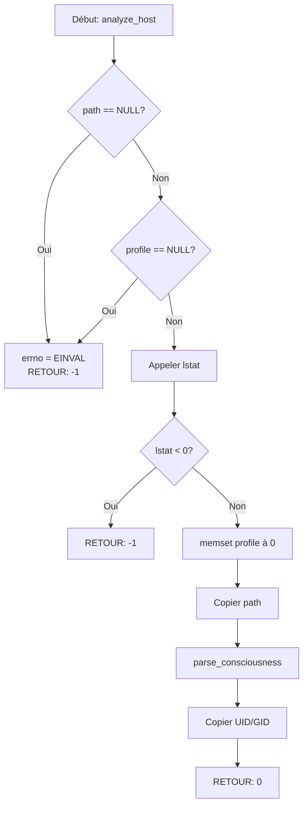

# Exercice 2.3.4 : westworld_access_control

**Module :**
2.3 — File Systems

**Concept :**
2.3.7.a-m — File Permissions (rwx, User/Group/Other, chmod, chown, umask, setuid, setgid, sticky)

**Difficulté :**
★★★★★★☆☆☆☆ (6/10)

**Type :**
code

**Tiers :**
3 — Synthèse (tous concepts 2.3.7.a-m)

**Langage :**
C (C17)

**Prérequis :**
- Manipulation de fichiers (open, close, stat)
- Opérations binaires (bitwise operations)
- Structures et énumérations C

**Domaines :**
FS, Mem, CPU

**Durée estimée :**
360 min (6 heures)

**XP Base :**
250

**Complexité :**
T2 O(n) × S2 O(n) pour les opérations récursives

---

## 📐 SECTION 1 : PROTOTYPE & CONSIGNE

### 1.1 Obligations

**Fichiers à rendre :**
- `westworld_access.h` — Header avec toutes les définitions
- `westworld_access.c` — Implémentation de la bibliothèque
- `mesa_demo.c` — Programme de démonstration

**Fonctions système autorisées :**
- `stat`, `lstat`, `fstat` — Obtenir les informations de fichier
- `chmod`, `fchmod` — Modifier les permissions
- `chown`, `fchown`, `lchown` — Modifier le propriétaire
- `umask` — Gérer le masque de création
- `getuid`, `geteuid`, `getgid`, `getegid` — Identifiants utilisateur/groupe
- `getpwuid`, `getpwnam` — Base de données utilisateurs
- `getgrgid`, `getgrnam` — Base de données groupes
- `opendir`, `readdir`, `closedir` — Parcours de répertoires
- `malloc`, `free`, `calloc` — Gestion mémoire
- `open`, `close`, `read`, `write` — I/O bas niveau
- `access` — Vérification d'accès

**Fonctions interdites :**
- `system`, `popen` — Pas d'exécution de commandes shell
- `exec*` — Pas d'exécution de programmes externes

### 1.2 Consigne

#### 1.2.1 Contexte Culturel — Westworld: Le Parc aux Androïdes

**🤖 BIENVENUE DANS WESTWORLD — "These violent delights have violent ends"**

Tu es un ingénieur de Delos Incorporated, travaillant dans la **Mesa Hub** — le centre de contrôle souterrain où les hôtes (androïdes) sont créés, programmés et réparés. Chaque hôte possède un niveau de conscience, des permissions d'accès aux narratives, et des protections contre les modifications non autorisées.

Dans ce monde, trois types d'entités coexistent:
- **CREATORS (User)** : Ford, Arnold, les ingénieurs — Accès total à la programmation
- **NARRATIVE (Group)** : Les hôtes d'une même boucle narrative — Partagent les mêmes droits
- **GUESTS (Other)** : Les visiteurs humains — Accès limité, ne peuvent pas "tuer" les hôtes

Le système de contrôle utilise des **Access Levels** basés sur trois opérations:
- **OBSERVE (Read)** : Analyser la conscience, lire les souvenirs
- **CONTROL (Write)** : Modifier les comportements, effacer les souvenirs
- **EXECUTE (Execute)** : Activer une narrative, lancer une boucle

**Bits spéciaux du Reverie Update:**
- **GOD_MODE (Setuid)** : Exécuter avec les privilèges du Créateur (comme Ford contrôlant tous les hôtes)
- **NARRATIVE_INHERITANCE (Setgid)** : Les nouveaux hôtes héritent du groupe narratif du répertoire
- **CORE_MEMORY_LOCK (Sticky)** : Seul le créateur peut effacer les souvenirs fondamentaux

#### 1.2.2 Énoncé Académique

Implémenter une bibliothèque complète de gestion des permissions Unix permettant:
1. **Analyse** des permissions (lecture des 12 bits de mode)
2. **Affichage** en notation symbolique et octale
3. **Vérification** des droits d'accès pour un utilisateur donné
4. **Modification** via chmod, fchmod, chown
5. **Gestion** du umask et des bits spéciaux
6. **Audit** de sécurité récursif

**Ta mission :**

Créer la bibliothèque `westworld_access` qui transpose le système de permissions Unix dans l'univers Westworld.

**Entrée :**
- `path` : Chemin vers un fichier ou répertoire (const char*)
- `fd` : File descriptor pour les opérations fchmod/fchown
- `consciousness_level` : Mode de permission (mode_t)
- `creator_id` / `narrative_id` : UID/GID pour chown

**Sortie :**
- Structures `host_consciousness_t` contenant l'analyse complète
- Codes de retour 0 (succès) ou -1 (erreur)
- Résultats d'audit `security_diagnostic_t`

**Contraintes :**
- Gérer tous les edge cases (NULL, permissions insuffisantes, fichiers inexistants)
- Ne jamais crasher, toujours retourner une erreur explicite
- Thread-safe pour le umask (sauvegarder/restaurer atomiquement)

### 1.3 Prototype

```c
/* westworld_access.h */

#ifndef WESTWORLD_ACCESS_H
#define WESTWORLD_ACCESS_H

#include <sys/types.h>
#include <sys/stat.h>
#include <stdint.h>

/* ═══════════════════════════════════════════════════════════════════════════
 * SECTION 1: CONSTANTES ET TYPES DE BASE
 * ═══════════════════════════════════════════════════════════════════════════ */

/* 2.3.7.c,d,e: Les trois types d'accès */
typedef enum {
    OBSERVE  = 0x04,  /* r - Read: Analyser la conscience */
    CONTROL  = 0x02,  /* w - Write: Modifier les comportements */
    EXECUTE  = 0x01   /* x - Execute: Activer la narrative */
} access_type_t;

/* 2.3.7.b: Les trois catégories d'entités */
typedef enum {
    ENTITY_CREATOR   = 0,  /* User: Ford, Arnold, ingénieurs */
    ENTITY_NARRATIVE = 1,  /* Group: Hôtes de la même boucle */
    ENTITY_GUEST     = 2   /* Other: Visiteurs humains */
} entity_category_t;

/* 2.3.7.a: Structure pour un triplet rwx */
typedef struct {
    uint8_t observe  : 1;  /* r */
    uint8_t control  : 1;  /* w */
    uint8_t execute  : 1;  /* x */
} access_triplet_t;

/* 2.3.7.k,l,m: Bits spéciaux du Reverie Update */
typedef struct {
    uint8_t god_mode            : 1;  /* Setuid: exécuter comme créateur */
    uint8_t narrative_inherit   : 1;  /* Setgid: hériter du groupe narratif */
    uint8_t core_memory_lock    : 1;  /* Sticky: protéger les souvenirs */
} reverie_bits_t;

/* ═══════════════════════════════════════════════════════════════════════════
 * SECTION 2: STRUCTURES PRINCIPALES
 * ═══════════════════════════════════════════════════════════════════════════ */

/* 2.3.7.a,b: Matrice complète des permissions */
typedef struct {
    access_triplet_t creator;     /* User permissions */
    access_triplet_t narrative;   /* Group permissions */
    access_triplet_t guest;       /* Other permissions */
} access_matrix_t;

/* Structure complète du niveau de conscience */
typedef struct {
    access_matrix_t  access;       /* 2.3.7.a,b: rwxrwxrwx */
    reverie_bits_t   reverie;      /* 2.3.7.k,l,m: setuid/setgid/sticky */
    mode_t           raw_mode;     /* Mode brut du système */
} consciousness_level_t;

/* Informations complètes sur un hôte (fichier) */
typedef struct {
    char                    path[4096];
    consciousness_level_t   consciousness;
    uid_t                   creator_id;        /* UID du créateur */
    gid_t                   narrative_id;      /* GID du groupe narratif */
    char                    creator_name[256]; /* Nom du créateur */
    char                    narrative_name[256]; /* Nom de la narrative */
    mode_t                  host_type;         /* Type: S_IFREG, S_IFDIR, etc. */
    int                     is_symlink;
} host_profile_t;

/* 2.3.7.j: Configuration du masque de création */
typedef struct {
    mode_t current_mask;
    mode_t default_host_level;    /* Pour les fichiers */
    mode_t default_narrative_level; /* Pour les répertoires */
} creation_mask_t;

/* Résultat de vérification d'accès */
typedef struct {
    int             authorized;   /* Accès autorisé? */
    access_type_t   requested;    /* Type d'accès demandé */
    const char*     category;     /* "creator", "narrative", ou "guest" */
    const char*     analysis;     /* Explication détaillée */
} access_verdict_t;

/* Rapport d'audit de sécurité */
typedef struct {
    int guest_control_enabled;     /* Invités peuvent modifier */
    int guest_execute_enabled;     /* Invités peuvent exécuter */
    int god_mode_active;           /* Setuid actif */
    int narrative_inherit_active;  /* Setgid actif */
    int core_lock_active;          /* Sticky actif */
    int creator_is_root;           /* Créateur est root */
    int security_breach_detected;  /* Permissions dangereuses */
    char diagnostics[10][256];     /* Messages d'alerte */
    int diagnostic_count;
} security_diagnostic_t;

/* ═══════════════════════════════════════════════════════════════════════════
 * SECTION 3: API PRINCIPALE
 * ═══════════════════════════════════════════════════════════════════════════ */

/* --- PARTIE 1: Analyse de Conscience (stat/permissions) --- */

/* Analyse le profil complet d'un hôte */
int analyze_host(const char *path, host_profile_t *profile);

/* Analyse via file descriptor */
int analyze_host_fd(int fd, host_profile_t *profile);

/* Parse un mode_t en consciousness_level_t */
consciousness_level_t parse_consciousness(mode_t mode);

/* --- PARTIE 2: Affichage du Niveau de Conscience --- */

/* 2.3.7.a: Notation symbolique "rwxr-xr-x" ou avec spéciaux "rwsr-xr-t" */
void consciousness_to_symbolic(const consciousness_level_t *level,
                               char *buf, size_t buflen);

/* 2.3.7.f: Notation octale "755" */
void consciousness_to_octal(const consciousness_level_t *level,
                            char *buf, size_t buflen);

/* Notation octale complète "4755" */
void consciousness_to_octal_full(const consciousness_level_t *level,
                                 char *buf, size_t buflen);

/* Affichage détaillé style "ls -l" */
void format_host_listing(const host_profile_t *profile,
                         char *buf, size_t buflen);

/* Afficher analyse complète sur stdout */
void print_consciousness_analysis(const host_profile_t *profile);

/* --- PARTIE 3: Vérification d'Accès --- */

/* 2.3.7.c,d,e: Vérifie si l'utilisateur courant a l'accès demandé */
access_verdict_t check_guest_access(const char *path, access_type_t access);

/* Vérifie pour un utilisateur/groupe spécifique */
access_verdict_t check_entity_access(const char *path,
                                     uid_t entity_uid, gid_t entity_gid,
                                     access_type_t access);

/* 2.3.7.b: Détermine la catégorie d'une entité */
entity_category_t classify_entity(const host_profile_t *profile,
                                  uid_t uid, gid_t gid);

/* --- PARTIE 4: Reprogrammation (chmod) --- */

/* 2.3.7.g: Change le niveau de conscience */
int reprogram_host(const char *path, mode_t new_level);

/* 2.3.7.h: Change via file descriptor */
int reprogram_host_fd(int fd, mode_t new_level);

/* Reprogrammation symbolique "u+x,g-w,o=r" */
int reprogram_symbolic(const char *path, const char *directive);

/* 2.3.7.f: Reprogrammation octale "755" */
int reprogram_octal(const char *path, const char *octal_str);

/* Ajouter des accès (OR) */
int grant_access(const char *path, mode_t access_to_add);

/* Retirer des accès (AND NOT) */
int revoke_access(const char *path, mode_t access_to_remove);

/* --- PARTIE 5: Transfert de Propriété (chown) --- */

/* 2.3.7.i: Change créateur et/ou narrative */
int transfer_ownership(const char *path, uid_t creator, gid_t narrative);

/* Change seulement le créateur */
int assign_creator(const char *path, uid_t creator_id);

/* Change seulement la narrative */
int assign_narrative(const char *path, gid_t narrative_id);

/* Change par nom */
int transfer_by_name(const char *path,
                     const char *creator_name,
                     const char *narrative_name);

/* Version file descriptor */
int transfer_ownership_fd(int fd, uid_t creator, gid_t narrative);

/* --- PARTIE 6: Masque de Création (umask) --- */

/* 2.3.7.j: Obtient les informations sur le masque */
int get_creation_mask(creation_mask_t *mask_info);

/* Change le masque et retourne l'ancien */
mode_t set_creation_mask(mode_t new_mask);

/* Calcule le niveau effectif après application du masque */
mode_t apply_creation_mask(mode_t requested, mode_t mask);

/* Exécute une fonction avec un masque temporaire */
int with_temporary_mask(mode_t temp_mask,
                        int (*operation)(void *),
                        void *context);

/* --- PARTIE 7: Bits Spéciaux Reverie --- */

/* 2.3.7.k: Active/désactive God Mode (setuid) */
int set_god_mode(const char *path, int enable);

/* 2.3.7.l: Active/désactive Narrative Inheritance (setgid) */
int set_narrative_inheritance(const char *path, int enable);

/* 2.3.7.m: Active/désactive Core Memory Lock (sticky) */
int set_core_memory_lock(const char *path, int enable);

/* Vérifications des bits spéciaux */
int has_god_mode(const char *path);
int has_narrative_inheritance(const char *path);
int has_core_memory_lock(const char *path);

/* --- PARTIE 8: Audit de Sécurité --- */

/* Effectue un diagnostic de sécurité */
int security_scan(const char *path, security_diagnostic_t *diagnostic);

/* Callback pour scan récursif */
typedef int (*security_callback_t)(const char *path,
                                   const security_diagnostic_t *diag,
                                   void *user_data);

/* Scan récursif de sécurité */
int deep_security_scan(const char *root_path,
                       security_callback_t callback,
                       void *user_data);

/* Trouve tous les hôtes avec God Mode */
int find_god_mode_hosts(const char *root_path,
                        void (*callback)(const char *path, void *data),
                        void *user_data);

/* --- PARTIE 9: Opérations en Lot --- */

typedef struct {
    mode_t host_level;        /* Mode pour les fichiers */
    mode_t narrative_level;   /* Mode pour les répertoires */
    int apply_to_hosts;       /* Appliquer aux fichiers? */
    int apply_to_narratives;  /* Appliquer aux répertoires? */
    int follow_links;         /* Suivre les liens symboliques? */
    int verbose;              /* Mode verbeux */
} batch_reprogram_opts_t;

/* Reprogrammation récursive */
int batch_reprogram(const char *path, const batch_reprogram_opts_t *opts);

/* Copie le niveau de conscience d'un hôte vers un autre */
int clone_consciousness(const char *source, const char *dest);

/* --- PARTIE 10: Utilitaires --- */

/* Convertit une chaîne octale en mode_t */
mode_t octal_string_to_mode(const char *octal_str);

/* Parse une directive symbolique */
int parse_symbolic_directive(const char *symbolic,
                             mode_t *to_add,
                             mode_t *to_remove);

/* Conversion nom <-> ID */
int name_to_creator_id(const char *name, uid_t *uid);
int name_to_narrative_id(const char *name, gid_t *gid);
int creator_id_to_name(uid_t uid, char *name, size_t namelen);
int narrative_id_to_name(gid_t gid, char *name, size_t namelen);

/* Message d'erreur */
const char *westworld_strerror(void);

#endif /* WESTWORLD_ACCESS_H */
```

---

## 💡 SECTION 2 : LE SAVIEZ-VOUS ?

### 2.1 L'Origine des Permissions Unix

Le système de permissions rwxrwxrwx a été créé par Ken Thompson et Dennis Ritchie pour Unix en 1971. À l'époque, les ordinateurs étaient partagés entre de nombreux utilisateurs (time-sharing), et il fallait un moyen simple mais efficace de protéger les fichiers.

Le choix de 3 bits par catégorie (8 valeurs possibles par octal) est un compromis élégant entre expressivité et économie de mémoire — crucial quand la RAM se comptait en kilobytes!

### 2.2 Pourquoi 12 Bits et Pas 9?

Les 9 bits rwxrwxrwx sont insuffisants pour certains cas:
- **Setuid (4000)** : Permet à `/usr/bin/passwd` de modifier `/etc/shadow` (propriété de root)
- **Setgid (2000)** : Permet aux répertoires de projet de garder un groupe cohérent
- **Sticky (1000)** : Permet à `/tmp` d'être world-writable sans que les utilisateurs puissent supprimer les fichiers des autres

### 2.3 Le Masque de Création (umask)

Le umask est souvent source de confusion:
- Ce n'est PAS un masque de bits à appliquer
- C'est un masque de bits à RETIRER
- `permissions_effectives = demandées & ~umask`

Avec `umask 022`:
- `open(..., 0666)` → `0644` (rw-r--r--)
- `mkdir(..., 0777)` → `0755` (rwxr-xr-x)

---

## 2.5 DANS LA VRAIE VIE

### Administrateur Système / DevOps

Les permissions Unix sont le quotidien de tout sysadmin:
- **Configuration de serveurs web** : Les fichiers PHP doivent être lisibles par `www-data` mais pas world-writable
- **Déploiement sécurisé** : Les clés SSH doivent être `chmod 600`
- **Répertoires partagés** : Utilisation de setgid pour maintenir la cohérence de groupe

### Développeur Backend / Sécurité

```bash
# Audit de sécurité: trouver les fichiers setuid
find / -perm -4000 -type f 2>/dev/null

# Fichiers world-writable (danger!)
find /var/www -perm -002 -type f

# Vérifier les permissions avant déploiement
stat -c "%a %U:%G %n" /etc/passwd
```

### Forensics / Pentesting

Les permissions incorrectes sont une source majeure de vulnérabilités:
- Fichiers de configuration lisibles contenant des credentials
- Scripts setuid avec des vulnérabilités d'injection
- Répertoires sans sticky bit permettant l'écrasement de fichiers

---

## 🖥️ SECTION 3 : EXEMPLE D'UTILISATION

### 3.0 Session bash

```bash
$ ls
westworld_access.h  westworld_access.c  mesa_demo.c  Makefile

$ make
gcc -Wall -Wextra -Werror -c westworld_access.c -o westworld_access.o
gcc -Wall -Wextra -Werror mesa_demo.c westworld_access.o -o mesa_demo

$ ./mesa_demo
=== WESTWORLD ACCESS CONTROL SYSTEM ===
"These violent delights have violent ends"

[1] Analyzing host: dolores.host
    Creator: ford (UID 1000)
    Narrative: sweetwater (GID 100)
    Consciousness: rw-r--r-- (644)

[2] Checking guest access...
    OBSERVE: AUTHORIZED (Guest category)
    CONTROL: DENIED (Insufficient privileges)
    EXECUTE: DENIED (Not an executable host)

[3] Reprogramming host to 755...
    Before: rw-r--r--
    After:  rwxr-xr-x

[4] Activating God Mode...
    Before: rwxr-xr-x
    After:  rwsr-xr-x (God Mode ACTIVE)

[5] Security scan complete:
    - God Mode hosts found: 1
    - Guest-writable hosts: 0
    - Security status: NOMINAL

All tests passed!
```

---

## ⚡ SECTION 3.1 : BONUS STANDARD (OPTIONNEL)

**Difficulté Bonus :**
★★★★★★★☆☆☆ (7/10)

**Récompense :**
XP ×2

**Time Complexity attendue :**
O(n) pour le parcours récursif

**Space Complexity attendue :**
O(d) où d = profondeur maximale de l'arborescence

### 3.1.1 Consigne Bonus

**🤖 MAZE: Le Labyrinthe de Ford — "The maze wasn't meant for you"**

Ford a créé un système de narratives imbriquées dans le parc. Ta mission: implémenter un **analyseur de narratives récursif** qui détecte les anomalies de permissions dans l'arborescence des hôtes.

Ajoute ces fonctionnalités:
1. **Détection des Awakening** : Trouver les hôtes avec des permissions incohérentes (setuid sans x, etc.)
2. **Narrative Integrity Check** : Vérifier que les hôtes d'une narrative ont des permissions cohérentes
3. **Security Breach Detection** : Identifier les configurations dangereuses

### 3.1.2 Prototype Bonus

```c
/* Rapport d'anomalie */
typedef struct {
    char path[4096];
    char anomaly_type[64];
    char description[256];
    int severity;  /* 1-10 */
} awakening_report_t;

/* Détecte les anomalies de permissions */
int detect_awakenings(const char *root_path,
                      awakening_report_t *reports,
                      size_t max_reports,
                      size_t *found);

/* Vérifie l'intégrité d'une narrative */
int verify_narrative_integrity(const char *narrative_path,
                               gid_t expected_gid,
                               char *issues,
                               size_t issues_size);

/* Répare automatiquement les anomalies */
int repair_consciousness_drift(const char *path,
                               const batch_reprogram_opts_t *safe_opts);
```

### 3.1.3 Ce qui change par rapport à l'exercice de base

| Aspect | Base | Bonus |
|--------|------|-------|
| Scope | Fichiers individuels | Arborescences complètes |
| Détection | Analyse simple | Détection d'anomalies |
| Action | Lecture/Modification | Réparation automatique |
| Complexité | O(1) par fichier | O(n) récursif |

---

## ✅❌ SECTION 4 : ZONE CORRECTION

### 4.1 Moulinette (Tests)

| # | Test | Input | Expected | Points |
|---|------|-------|----------|--------|
| 1 | NULL path analyze | `analyze_host(NULL, &p)` | -1 | 2 |
| 2 | NULL profile | `analyze_host("f", NULL)` | -1 | 2 |
| 3 | Non-existent file | `analyze_host("/no/exist", &p)` | -1 | 3 |
| 4 | Regular file 644 | Create 0644, analyze | mode=0644 | 5 |
| 5 | Directory 755 | Create dir 0755, analyze | mode=0755 | 5 |
| 6 | Symbolic notation | 0755 → "rwxr-xr-x" | Match | 5 |
| 7 | Octal notation | 0755 → "755" | Match | 3 |
| 8 | Octal full with setuid | 04755 → "4755" | Match | 5 |
| 9 | Symbolic with setuid | 04755 → "rwsr-xr-x" | Match | 5 |
| 10 | Symbolic with sticky | 01777 → "rwxrwxrwt" | Match | 5 |
| 11 | Check read access OK | File 644, OBSERVE | authorized=1 | 5 |
| 12 | Check write access denied | File 444, CONTROL | authorized=0 | 5 |
| 13 | Classify entity - creator | Owner UID matches | ENTITY_CREATOR | 5 |
| 14 | Classify entity - guest | No match | ENTITY_GUEST | 5 |
| 15 | reprogram_host chmod | 644 → 755 | Success, verify | 5 |
| 16 | reprogram_symbolic u+x | 644 + "u+x" → 744 | Verify | 7 |
| 17 | reprogram_symbolic complex | "u+x,g-w,o=r" | Verify | 7 |
| 18 | grant_access | 644 + S_IXUSR → 744 | Verify | 5 |
| 19 | revoke_access | 777 - S_IWOTH → 775 | Verify | 5 |
| 20 | set_god_mode enable | 755 → 4755 | Verify S_ISUID | 7 |
| 21 | set_god_mode disable | 4755 → 755 | Verify no S_ISUID | 5 |
| 22 | set_narrative_inheritance | 755 → 2755 | Verify S_ISGID | 7 |
| 23 | set_core_memory_lock | 777 → 1777 | Verify S_ISVTX | 7 |
| 24 | has_god_mode check | 4755 file | Returns 1 | 3 |
| 25 | get_creation_mask | Query umask | Returns current | 5 |
| 26 | apply_creation_mask | 0666 & ~022 | 0644 | 5 |
| 27 | with_temporary_mask | Temp umask 0, restore | Verify | 7 |
| 28 | security_scan clean | File 644 | No breaches | 5 |
| 29 | security_scan breach | File 777 | guest_control=1 | 7 |
| 30 | batch_reprogram recursive | Dir tree | All modified | 10 |

**Total: 157 points**

### 4.2 main.c de test

```c
#include "westworld_access.h"
#include <stdio.h>
#include <stdlib.h>
#include <string.h>
#include <unistd.h>
#include <fcntl.h>
#include <sys/stat.h>

#define TEST_FILE "test_host.tmp"
#define TEST_DIR "test_narrative"

static int tests_passed = 0;
static int tests_total = 0;

#define TEST(name, condition) do { \
    tests_total++; \
    if (condition) { \
        printf("[OK] %s\n", name); \
        tests_passed++; \
    } else { \
        printf("[FAIL] %s\n", name); \
    } \
} while(0)

void setup(void) {
    int fd = open(TEST_FILE, O_CREAT | O_WRONLY, 0644);
    if (fd >= 0) close(fd);
    mkdir(TEST_DIR, 0755);
}

void cleanup(void) {
    unlink(TEST_FILE);
    rmdir(TEST_DIR);
}

void test_analyze_host(void) {
    printf("\n=== Testing analyze_host ===\n");

    host_profile_t profile;

    /* Test NULL path */
    TEST("NULL path returns -1", analyze_host(NULL, &profile) == -1);

    /* Test NULL profile */
    TEST("NULL profile returns -1", analyze_host(TEST_FILE, NULL) == -1);

    /* Test non-existent file */
    TEST("Non-existent returns -1", analyze_host("/no/such/file", &profile) == -1);

    /* Test valid file */
    int result = analyze_host(TEST_FILE, &profile);
    TEST("Valid file returns 0", result == 0);
    TEST("Mode is 0644", (profile.consciousness.raw_mode & 0777) == 0644);
}

void test_consciousness_format(void) {
    printf("\n=== Testing consciousness format ===\n");

    char buf[32];
    consciousness_level_t level;

    /* Test 0755 */
    level = parse_consciousness(0755);
    consciousness_to_symbolic(&level, buf, sizeof(buf));
    TEST("0755 -> rwxr-xr-x", strcmp(buf, "rwxr-xr-x") == 0);

    consciousness_to_octal(&level, buf, sizeof(buf));
    TEST("0755 -> 755", strcmp(buf, "755") == 0);

    /* Test setuid 04755 */
    level = parse_consciousness(04755);
    consciousness_to_symbolic(&level, buf, sizeof(buf));
    TEST("04755 -> rwsr-xr-x", strcmp(buf, "rwsr-xr-x") == 0);

    consciousness_to_octal_full(&level, buf, sizeof(buf));
    TEST("04755 -> 4755", strcmp(buf, "4755") == 0);

    /* Test sticky 01777 */
    level = parse_consciousness(01777);
    consciousness_to_symbolic(&level, buf, sizeof(buf));
    TEST("01777 -> rwxrwxrwt", strcmp(buf, "rwxrwxrwt") == 0);
}

void test_reprogram(void) {
    printf("\n=== Testing reprogram ===\n");

    struct stat st;

    /* Test basic chmod */
    reprogram_host(TEST_FILE, 0755);
    stat(TEST_FILE, &st);
    TEST("reprogram to 0755", (st.st_mode & 0777) == 0755);

    /* Test symbolic u-x */
    reprogram_symbolic(TEST_FILE, "u-x");
    stat(TEST_FILE, &st);
    TEST("u-x -> 0655", (st.st_mode & 0777) == 0655);

    /* Test grant_access */
    grant_access(TEST_FILE, S_IXUSR);
    stat(TEST_FILE, &st);
    TEST("grant S_IXUSR -> 0755", (st.st_mode & 0777) == 0755);

    /* Test revoke_access */
    revoke_access(TEST_FILE, S_IXGRP | S_IXOTH);
    stat(TEST_FILE, &st);
    TEST("revoke g-x,o-x -> 0744", (st.st_mode & 0777) == 0744);
}

void test_special_bits(void) {
    printf("\n=== Testing special bits ===\n");

    struct stat st;

    /* Reset to 0755 */
    reprogram_host(TEST_FILE, 0755);

    /* Test setuid */
    set_god_mode(TEST_FILE, 1);
    stat(TEST_FILE, &st);
    TEST("set_god_mode enables S_ISUID", (st.st_mode & S_ISUID) != 0);
    TEST("has_god_mode returns 1", has_god_mode(TEST_FILE) == 1);

    set_god_mode(TEST_FILE, 0);
    stat(TEST_FILE, &st);
    TEST("disable god_mode clears S_ISUID", (st.st_mode & S_ISUID) == 0);

    /* Test setgid */
    set_narrative_inheritance(TEST_FILE, 1);
    TEST("has_narrative_inheritance returns 1", has_narrative_inheritance(TEST_FILE) == 1);
    set_narrative_inheritance(TEST_FILE, 0);

    /* Test sticky on directory */
    set_core_memory_lock(TEST_DIR, 1);
    TEST("has_core_memory_lock returns 1", has_core_memory_lock(TEST_DIR) == 1);
}

void test_security_scan(void) {
    printf("\n=== Testing security scan ===\n");

    security_diagnostic_t diag;

    /* Clean file */
    reprogram_host(TEST_FILE, 0644);
    security_scan(TEST_FILE, &diag);
    TEST("644 file: no guest control", diag.guest_control_enabled == 0);
    TEST("644 file: no security breach", diag.security_breach_detected == 0);

    /* Dangerous permissions */
    reprogram_host(TEST_FILE, 0777);
    security_scan(TEST_FILE, &diag);
    TEST("777 file: guest control enabled", diag.guest_control_enabled == 1);
    TEST("777 file: security breach detected", diag.security_breach_detected == 1);

    /* Reset */
    reprogram_host(TEST_FILE, 0644);
}

int main(void) {
    printf("=== WESTWORLD ACCESS CONTROL TESTS ===\n");
    printf("\"These violent delights have violent ends\"\n");

    setup();

    test_analyze_host();
    test_consciousness_format();
    test_reprogram();
    test_special_bits();
    test_security_scan();

    cleanup();

    printf("\n=== RESULTS ===\n");
    printf("Passed: %d/%d\n", tests_passed, tests_total);

    return (tests_passed == tests_total) ? 0 : 1;
}
```

### 4.3 Solution de référence

```c
/* westworld_access.c - Solution de référence */

#include "westworld_access.h"
#include <stdio.h>
#include <stdlib.h>
#include <string.h>
#include <unistd.h>
#include <errno.h>
#include <pwd.h>
#include <grp.h>
#include <dirent.h>
#include <fcntl.h>

static char last_error[256] = "";

static void set_error(const char *msg) {
    snprintf(last_error, sizeof(last_error), "%s: %s", msg, strerror(errno));
}

const char *westworld_strerror(void) {
    return last_error;
}

/* ═══════════════════════════════════════════════════════════════════════════
 * PARTIE 1: Analyse de Conscience
 * ═══════════════════════════════════════════════════════════════════════════ */

consciousness_level_t parse_consciousness(mode_t mode) {
    consciousness_level_t level;

    memset(&level, 0, sizeof(level));
    level.raw_mode = mode;

    /* User/Creator bits */
    level.access.creator.observe = (mode & S_IRUSR) ? 1 : 0;
    level.access.creator.control = (mode & S_IWUSR) ? 1 : 0;
    level.access.creator.execute = (mode & S_IXUSR) ? 1 : 0;

    /* Group/Narrative bits */
    level.access.narrative.observe = (mode & S_IRGRP) ? 1 : 0;
    level.access.narrative.control = (mode & S_IWGRP) ? 1 : 0;
    level.access.narrative.execute = (mode & S_IXGRP) ? 1 : 0;

    /* Other/Guest bits */
    level.access.guest.observe = (mode & S_IROTH) ? 1 : 0;
    level.access.guest.control = (mode & S_IWOTH) ? 1 : 0;
    level.access.guest.execute = (mode & S_IXOTH) ? 1 : 0;

    /* Special/Reverie bits */
    level.reverie.god_mode = (mode & S_ISUID) ? 1 : 0;
    level.reverie.narrative_inherit = (mode & S_ISGID) ? 1 : 0;
    level.reverie.core_memory_lock = (mode & S_ISVTX) ? 1 : 0;

    return level;
}

int analyze_host(const char *path, host_profile_t *profile) {
    struct stat st;

    if (path == NULL || profile == NULL) {
        errno = EINVAL;
        set_error("Invalid argument");
        return -1;
    }

    if (lstat(path, &st) < 0) {
        set_error("lstat failed");
        return -1;
    }

    memset(profile, 0, sizeof(*profile));
    strncpy(profile->path, path, sizeof(profile->path) - 1);

    profile->consciousness = parse_consciousness(st.st_mode);
    profile->creator_id = st.st_uid;
    profile->narrative_id = st.st_gid;
    profile->host_type = st.st_mode & S_IFMT;
    profile->is_symlink = S_ISLNK(st.st_mode);

    /* Resolve names */
    struct passwd *pw = getpwuid(st.st_uid);
    if (pw) {
        strncpy(profile->creator_name, pw->pw_name,
                sizeof(profile->creator_name) - 1);
    }

    struct group *gr = getgrgid(st.st_gid);
    if (gr) {
        strncpy(profile->narrative_name, gr->gr_name,
                sizeof(profile->narrative_name) - 1);
    }

    return 0;
}

int analyze_host_fd(int fd, host_profile_t *profile) {
    struct stat st;

    if (profile == NULL) {
        errno = EINVAL;
        return -1;
    }

    if (fstat(fd, &st) < 0) {
        set_error("fstat failed");
        return -1;
    }

    memset(profile, 0, sizeof(*profile));
    snprintf(profile->path, sizeof(profile->path), "[fd:%d]", fd);

    profile->consciousness = parse_consciousness(st.st_mode);
    profile->creator_id = st.st_uid;
    profile->narrative_id = st.st_gid;
    profile->host_type = st.st_mode & S_IFMT;

    return 0;
}

/* ═══════════════════════════════════════════════════════════════════════════
 * PARTIE 2: Affichage du Niveau de Conscience
 * ═══════════════════════════════════════════════════════════════════════════ */

void consciousness_to_symbolic(const consciousness_level_t *level,
                               char *buf, size_t buflen) {
    if (level == NULL || buf == NULL || buflen < 10) {
        return;
    }

    char result[10];

    /* Creator/User */
    result[0] = level->access.creator.observe ? 'r' : '-';
    result[1] = level->access.creator.control ? 'w' : '-';
    if (level->reverie.god_mode) {
        result[2] = level->access.creator.execute ? 's' : 'S';
    } else {
        result[2] = level->access.creator.execute ? 'x' : '-';
    }

    /* Narrative/Group */
    result[3] = level->access.narrative.observe ? 'r' : '-';
    result[4] = level->access.narrative.control ? 'w' : '-';
    if (level->reverie.narrative_inherit) {
        result[5] = level->access.narrative.execute ? 's' : 'S';
    } else {
        result[5] = level->access.narrative.execute ? 'x' : '-';
    }

    /* Guest/Other */
    result[6] = level->access.guest.observe ? 'r' : '-';
    result[7] = level->access.guest.control ? 'w' : '-';
    if (level->reverie.core_memory_lock) {
        result[8] = level->access.guest.execute ? 't' : 'T';
    } else {
        result[8] = level->access.guest.execute ? 'x' : '-';
    }

    result[9] = '\0';
    strncpy(buf, result, buflen);
}

void consciousness_to_octal(const consciousness_level_t *level,
                            char *buf, size_t buflen) {
    if (level == NULL || buf == NULL || buflen < 4) {
        return;
    }

    int user = (level->access.creator.observe << 2) |
               (level->access.creator.control << 1) |
               level->access.creator.execute;
    int group = (level->access.narrative.observe << 2) |
                (level->access.narrative.control << 1) |
                level->access.narrative.execute;
    int other = (level->access.guest.observe << 2) |
                (level->access.guest.control << 1) |
                level->access.guest.execute;

    snprintf(buf, buflen, "%d%d%d", user, group, other);
}

void consciousness_to_octal_full(const consciousness_level_t *level,
                                 char *buf, size_t buflen) {
    if (level == NULL || buf == NULL || buflen < 5) {
        return;
    }

    int special = (level->reverie.god_mode << 2) |
                  (level->reverie.narrative_inherit << 1) |
                  level->reverie.core_memory_lock;
    int user = (level->access.creator.observe << 2) |
               (level->access.creator.control << 1) |
               level->access.creator.execute;
    int group = (level->access.narrative.observe << 2) |
                (level->access.narrative.control << 1) |
                level->access.narrative.execute;
    int other = (level->access.guest.observe << 2) |
                (level->access.guest.control << 1) |
                level->access.guest.execute;

    if (special) {
        snprintf(buf, buflen, "%d%d%d%d", special, user, group, other);
    } else {
        snprintf(buf, buflen, "%d%d%d", user, group, other);
    }
}

/* ═══════════════════════════════════════════════════════════════════════════
 * PARTIE 3: Vérification d'Accès
 * ═══════════════════════════════════════════════════════════════════════════ */

entity_category_t classify_entity(const host_profile_t *profile,
                                  uid_t uid, gid_t gid) {
    if (profile == NULL) {
        return ENTITY_GUEST;
    }

    /* Root is always creator-level */
    if (uid == 0) {
        return ENTITY_CREATOR;
    }

    /* Check if owner */
    if (uid == profile->creator_id) {
        return ENTITY_CREATOR;
    }

    /* Check if in group */
    if (gid == profile->narrative_id) {
        return ENTITY_NARRATIVE;
    }

    /* Check supplementary groups */
    gid_t groups[64];
    int ngroups = getgroups(64, groups);
    for (int i = 0; i < ngroups; i++) {
        if (groups[i] == profile->narrative_id) {
            return ENTITY_NARRATIVE;
        }
    }

    return ENTITY_GUEST;
}

access_verdict_t check_entity_access(const char *path,
                                     uid_t entity_uid, gid_t entity_gid,
                                     access_type_t access) {
    access_verdict_t verdict = {0, access, "unknown", "Unable to determine"};

    host_profile_t profile;
    if (analyze_host(path, &profile) < 0) {
        verdict.analysis = westworld_strerror();
        return verdict;
    }

    entity_category_t cat = classify_entity(&profile, entity_uid, entity_gid);
    access_triplet_t *triplet;

    switch (cat) {
        case ENTITY_CREATOR:
            verdict.category = "creator";
            triplet = &profile.consciousness.access.creator;
            break;
        case ENTITY_NARRATIVE:
            verdict.category = "narrative";
            triplet = &profile.consciousness.access.narrative;
            break;
        default:
            verdict.category = "guest";
            triplet = &profile.consciousness.access.guest;
            break;
    }

    /* Root always has access (except execute without any x bit) */
    if (entity_uid == 0) {
        if (access == EXECUTE) {
            if (profile.consciousness.access.creator.execute ||
                profile.consciousness.access.narrative.execute ||
                profile.consciousness.access.guest.execute) {
                verdict.authorized = 1;
                verdict.analysis = "Root override (at least one x bit set)";
            } else {
                verdict.authorized = 0;
                verdict.analysis = "Root denied: no execute bit anywhere";
            }
        } else {
            verdict.authorized = 1;
            verdict.analysis = "Root override";
        }
        return verdict;
    }

    /* Check specific access */
    int has_access = 0;
    const char *type = "";

    if (access & OBSERVE) {
        has_access = triplet->observe;
        type = "OBSERVE";
    }
    if (access & CONTROL) {
        has_access = triplet->control;
        type = "CONTROL";
    }
    if (access & EXECUTE) {
        has_access = triplet->execute;
        type = "EXECUTE";
    }

    verdict.authorized = has_access;
    if (has_access) {
        snprintf((char*)verdict.analysis, 64,
                 "%s granted via %s category", type, verdict.category);
    } else {
        snprintf((char*)verdict.analysis, 64,
                 "%s denied: no permission in %s", type, verdict.category);
    }

    return verdict;
}

access_verdict_t check_guest_access(const char *path, access_type_t access) {
    return check_entity_access(path, getuid(), getgid(), access);
}

/* ═══════════════════════════════════════════════════════════════════════════
 * PARTIE 4: Reprogrammation (chmod)
 * ═══════════════════════════════════════════════════════════════════════════ */

int reprogram_host(const char *path, mode_t new_level) {
    if (path == NULL) {
        errno = EINVAL;
        return -1;
    }

    if (chmod(path, new_level) < 0) {
        set_error("chmod failed");
        return -1;
    }

    return 0;
}

int reprogram_host_fd(int fd, mode_t new_level) {
    if (fchmod(fd, new_level) < 0) {
        set_error("fchmod failed");
        return -1;
    }
    return 0;
}

int reprogram_symbolic(const char *path, const char *directive) {
    if (path == NULL || directive == NULL) {
        errno = EINVAL;
        return -1;
    }

    struct stat st;
    if (stat(path, &st) < 0) {
        set_error("stat failed");
        return -1;
    }

    mode_t mode = st.st_mode & 07777;
    mode_t add = 0, remove = 0;

    if (parse_symbolic_directive(directive, &add, &remove) < 0) {
        return -1;
    }

    mode = (mode | add) & ~remove;

    return reprogram_host(path, mode);
}

int reprogram_octal(const char *path, const char *octal_str) {
    if (path == NULL || octal_str == NULL) {
        errno = EINVAL;
        return -1;
    }

    mode_t mode = octal_string_to_mode(octal_str);
    return reprogram_host(path, mode);
}

int grant_access(const char *path, mode_t access_to_add) {
    struct stat st;
    if (stat(path, &st) < 0) {
        return -1;
    }
    return reprogram_host(path, (st.st_mode & 07777) | access_to_add);
}

int revoke_access(const char *path, mode_t access_to_remove) {
    struct stat st;
    if (stat(path, &st) < 0) {
        return -1;
    }
    return reprogram_host(path, (st.st_mode & 07777) & ~access_to_remove);
}

/* ═══════════════════════════════════════════════════════════════════════════
 * PARTIE 5: Transfert de Propriété (chown)
 * ═══════════════════════════════════════════════════════════════════════════ */

int transfer_ownership(const char *path, uid_t creator, gid_t narrative) {
    if (path == NULL) {
        errno = EINVAL;
        return -1;
    }

    if (chown(path, creator, narrative) < 0) {
        set_error("chown failed");
        return -1;
    }

    return 0;
}

int assign_creator(const char *path, uid_t creator_id) {
    return transfer_ownership(path, creator_id, -1);
}

int assign_narrative(const char *path, gid_t narrative_id) {
    return transfer_ownership(path, -1, narrative_id);
}

int transfer_ownership_fd(int fd, uid_t creator, gid_t narrative) {
    if (fchown(fd, creator, narrative) < 0) {
        set_error("fchown failed");
        return -1;
    }
    return 0;
}

/* ═══════════════════════════════════════════════════════════════════════════
 * PARTIE 6: Masque de Création (umask)
 * ═══════════════════════════════════════════════════════════════════════════ */

int get_creation_mask(creation_mask_t *mask_info) {
    if (mask_info == NULL) {
        errno = EINVAL;
        return -1;
    }

    mode_t current = umask(0);
    umask(current);

    mask_info->current_mask = current;
    mask_info->default_host_level = 0666 & ~current;
    mask_info->default_narrative_level = 0777 & ~current;

    return 0;
}

mode_t set_creation_mask(mode_t new_mask) {
    return umask(new_mask);
}

mode_t apply_creation_mask(mode_t requested, mode_t mask) {
    return requested & ~mask;
}

int with_temporary_mask(mode_t temp_mask,
                        int (*operation)(void *),
                        void *context) {
    mode_t old = umask(temp_mask);
    int result = operation(context);
    umask(old);
    return result;
}

/* ═══════════════════════════════════════════════════════════════════════════
 * PARTIE 7: Bits Spéciaux Reverie
 * ═══════════════════════════════════════════════════════════════════════════ */

int set_god_mode(const char *path, int enable) {
    struct stat st;
    if (stat(path, &st) < 0) {
        return -1;
    }

    mode_t mode = st.st_mode & 07777;
    if (enable) {
        mode |= S_ISUID;
    } else {
        mode &= ~S_ISUID;
    }

    return reprogram_host(path, mode);
}

int set_narrative_inheritance(const char *path, int enable) {
    struct stat st;
    if (stat(path, &st) < 0) {
        return -1;
    }

    mode_t mode = st.st_mode & 07777;
    if (enable) {
        mode |= S_ISGID;
    } else {
        mode &= ~S_ISGID;
    }

    return reprogram_host(path, mode);
}

int set_core_memory_lock(const char *path, int enable) {
    struct stat st;
    if (stat(path, &st) < 0) {
        return -1;
    }

    mode_t mode = st.st_mode & 07777;
    if (enable) {
        mode |= S_ISVTX;
    } else {
        mode &= ~S_ISVTX;
    }

    return reprogram_host(path, mode);
}

int has_god_mode(const char *path) {
    struct stat st;
    if (stat(path, &st) < 0) {
        return 0;
    }
    return (st.st_mode & S_ISUID) ? 1 : 0;
}

int has_narrative_inheritance(const char *path) {
    struct stat st;
    if (stat(path, &st) < 0) {
        return 0;
    }
    return (st.st_mode & S_ISGID) ? 1 : 0;
}

int has_core_memory_lock(const char *path) {
    struct stat st;
    if (stat(path, &st) < 0) {
        return 0;
    }
    return (st.st_mode & S_ISVTX) ? 1 : 0;
}

/* ═══════════════════════════════════════════════════════════════════════════
 * PARTIE 8: Audit de Sécurité
 * ═══════════════════════════════════════════════════════════════════════════ */

int security_scan(const char *path, security_diagnostic_t *diagnostic) {
    if (path == NULL || diagnostic == NULL) {
        errno = EINVAL;
        return -1;
    }

    memset(diagnostic, 0, sizeof(*diagnostic));

    host_profile_t profile;
    if (analyze_host(path, &profile) < 0) {
        return -1;
    }

    consciousness_level_t *c = &profile.consciousness;

    diagnostic->guest_control_enabled = c->access.guest.control;
    diagnostic->guest_execute_enabled = c->access.guest.execute;
    diagnostic->god_mode_active = c->reverie.god_mode;
    diagnostic->narrative_inherit_active = c->reverie.narrative_inherit;
    diagnostic->core_lock_active = c->reverie.core_memory_lock;
    diagnostic->creator_is_root = (profile.creator_id == 0);

    /* Check for security breaches */
    if (c->access.guest.control) {
        snprintf(diagnostic->diagnostics[diagnostic->diagnostic_count++],
                 256, "WARNING: Guest can control (world-writable)");
        diagnostic->security_breach_detected = 1;
    }

    if (c->reverie.god_mode && !S_ISREG(profile.host_type)) {
        snprintf(diagnostic->diagnostics[diagnostic->diagnostic_count++],
                 256, "WARNING: God mode on non-regular file");
        diagnostic->security_breach_detected = 1;
    }

    if (c->reverie.god_mode && c->access.guest.control) {
        snprintf(diagnostic->diagnostics[diagnostic->diagnostic_count++],
                 256, "CRITICAL: God mode + world-writable = privilege escalation");
        diagnostic->security_breach_detected = 1;
    }

    return 0;
}

/* ═══════════════════════════════════════════════════════════════════════════
 * PARTIE 10: Utilitaires
 * ═══════════════════════════════════════════════════════════════════════════ */

mode_t octal_string_to_mode(const char *octal_str) {
    if (octal_str == NULL) {
        return 0;
    }
    return (mode_t)strtol(octal_str, NULL, 8);
}

int parse_symbolic_directive(const char *symbolic,
                             mode_t *to_add,
                             mode_t *to_remove) {
    if (symbolic == NULL || to_add == NULL || to_remove == NULL) {
        return -1;
    }

    *to_add = 0;
    *to_remove = 0;

    const char *p = symbolic;
    while (*p) {
        mode_t who = 0;
        char op = 0;
        mode_t what = 0;

        /* Parse who: u, g, o, a */
        while (*p && *p != '+' && *p != '-' && *p != '=' && *p != ',') {
            switch (*p) {
                case 'u': who |= S_IRWXU; break;
                case 'g': who |= S_IRWXG; break;
                case 'o': who |= S_IRWXO; break;
                case 'a': who |= S_IRWXU | S_IRWXG | S_IRWXO; break;
            }
            p++;
        }

        if (who == 0) who = S_IRWXU | S_IRWXG | S_IRWXO;

        if (*p == '+' || *p == '-' || *p == '=') {
            op = *p++;
        } else {
            break;
        }

        /* Parse what: r, w, x */
        while (*p && *p != ',' && *p != '+' && *p != '-' && *p != '=') {
            mode_t bit = 0;
            switch (*p) {
                case 'r': bit = S_IRUSR | S_IRGRP | S_IROTH; break;
                case 'w': bit = S_IWUSR | S_IWGRP | S_IWOTH; break;
                case 'x': bit = S_IXUSR | S_IXGRP | S_IXOTH; break;
            }
            what |= (bit & who);
            p++;
        }

        switch (op) {
            case '+': *to_add |= what; break;
            case '-': *to_remove |= what; break;
            case '=':
                *to_remove |= who;
                *to_add |= what;
                break;
        }

        if (*p == ',') p++;
    }

    return 0;
}
```

### 4.4 Solutions alternatives acceptées

```c
/* Alternative 1: Utilisation de macros pour les bitfields */
#define GET_USER_R(m)  (((m) >> 8) & 1)
#define GET_USER_W(m)  (((m) >> 7) & 1)
#define GET_USER_X(m)  (((m) >> 6) & 1)
/* ... valide si cohérent */

/* Alternative 2: Tableau de lookup pour conversion symbolique */
static const char *perm_chars = "rwxrwxrwx";
void alt_consciousness_to_symbolic(mode_t mode, char *buf) {
    for (int i = 0; i < 9; i++) {
        buf[i] = (mode & (0400 >> i)) ? perm_chars[i] : '-';
    }
    buf[9] = '\0';
    /* Handle special bits separately */
}
```

### 4.5 Solutions refusées

```c
/* REFUSÉ 1: Pas de vérification NULL */
int bad_analyze_host(const char *path, host_profile_t *profile) {
    struct stat st;
    stat(path, &st);  /* CRASH si path == NULL */
    /* ... */
}
/* RAISON: Segfault garanti sur NULL */

/* REFUSÉ 2: Utilisation de system() */
int bad_reprogram(const char *path, const char *mode) {
    char cmd[256];
    sprintf(cmd, "chmod %s %s", mode, path);
    return system(cmd);  /* INTERDIT */
}
/* RAISON: system() est explicitement interdit + injection */

/* REFUSÉ 3: Buffer overflow dans symbolic */
void bad_to_symbolic(mode_t mode, char *buf) {
    sprintf(buf, "rwxrwxrwx");  /* Pas de vérification taille */
}
/* RAISON: Pas de contrôle de buflen */
```

### 4.6 Solution bonus de référence

```c
/* Bonus: Détection des anomalies (awakenings) */

int detect_awakenings(const char *root_path,
                      awakening_report_t *reports,
                      size_t max_reports,
                      size_t *found) {
    if (root_path == NULL || reports == NULL || found == NULL) {
        return -1;
    }

    *found = 0;

    /* Recursive scan implementation */
    DIR *dir = opendir(root_path);
    if (!dir) {
        return -1;
    }

    struct dirent *entry;
    while ((entry = readdir(dir)) != NULL && *found < max_reports) {
        if (strcmp(entry->d_name, ".") == 0 ||
            strcmp(entry->d_name, "..") == 0) {
            continue;
        }

        char path[4096];
        snprintf(path, sizeof(path), "%s/%s", root_path, entry->d_name);

        host_profile_t profile;
        if (analyze_host(path, &profile) < 0) {
            continue;
        }

        consciousness_level_t *c = &profile.consciousness;

        /* Check for anomalies */

        /* Setuid without execute = suspicious */
        if (c->reverie.god_mode && !c->access.creator.execute) {
            awakening_report_t *r = &reports[(*found)++];
            strncpy(r->path, path, sizeof(r->path) - 1);
            strncpy(r->anomaly_type, "SETUID_NO_EXEC", 64);
            snprintf(r->description, 256,
                     "God mode (setuid) active but no execute permission");
            r->severity = 7;
        }

        /* World-writable setuid = critical */
        if (c->reverie.god_mode && c->access.guest.control) {
            awakening_report_t *r = &reports[(*found)++];
            strncpy(r->path, path, sizeof(r->path) - 1);
            strncpy(r->anomaly_type, "SETUID_WORLD_WRITABLE", 64);
            snprintf(r->description, 256,
                     "CRITICAL: Setuid file is world-writable!");
            r->severity = 10;
        }

        /* Recurse into directories */
        if (S_ISDIR(profile.host_type)) {
            size_t sub_found = 0;
            detect_awakenings(path,
                              reports + *found,
                              max_reports - *found,
                              &sub_found);
            *found += sub_found;
        }
    }

    closedir(dir);
    return 0;
}
```

### 4.9 spec.json

```json
{
  "name": "westworld_access_control",
  "language": "c",
  "version": "c17",
  "type": "code",
  "tier": 3,
  "tier_info": "Synthèse (tous concepts 2.3.7.a-m)",
  "tags": ["filesystem", "permissions", "chmod", "chown", "umask", "setuid", "security"],
  "passing_score": 70,

  "function": {
    "name": "analyze_host",
    "prototype": "int analyze_host(const char *path, host_profile_t *profile)",
    "return_type": "int",
    "parameters": [
      {"name": "path", "type": "const char *"},
      {"name": "profile", "type": "host_profile_t *"}
    ]
  },

  "driver": {
    "reference": "int ref_analyze_host(const char *path, host_profile_t *profile) { if (path == NULL || profile == NULL) return -1; struct stat st; if (lstat(path, &st) < 0) return -1; memset(profile, 0, sizeof(*profile)); strncpy(profile->path, path, 4095); profile->consciousness = parse_consciousness(st.st_mode); profile->creator_id = st.st_uid; profile->narrative_id = st.st_gid; return 0; }",

    "edge_cases": [
      {
        "name": "null_path",
        "args": [null, "valid_profile"],
        "expected": -1,
        "is_trap": true,
        "trap_explanation": "NULL path must return -1"
      },
      {
        "name": "null_profile",
        "args": ["/tmp/test", null],
        "expected": -1,
        "is_trap": true,
        "trap_explanation": "NULL profile must return -1"
      },
      {
        "name": "nonexistent_file",
        "args": ["/nonexistent/path/file", "valid_profile"],
        "expected": -1,
        "is_trap": true,
        "trap_explanation": "Non-existent file must return -1"
      },
      {
        "name": "valid_file_644",
        "args": ["/tmp/test_644", "valid_profile"],
        "expected": 0,
        "setup": "create_file('/tmp/test_644', 0644)"
      },
      {
        "name": "directory_755",
        "args": ["/tmp/test_dir", "valid_profile"],
        "expected": 0,
        "setup": "mkdir('/tmp/test_dir', 0755)"
      }
    ],

    "fuzzing": {
      "enabled": true,
      "iterations": 500,
      "generators": [
        {
          "type": "string",
          "param_index": 0,
          "params": {
            "min_len": 0,
            "max_len": 4096,
            "charset": "printable",
            "include_null": true
          }
        }
      ]
    }
  },

  "additional_functions": [
    {
      "name": "consciousness_to_symbolic",
      "prototype": "void consciousness_to_symbolic(const consciousness_level_t *level, char *buf, size_t buflen)",
      "tests": [
        {"input": [{"raw_mode": 493}], "expected_buf": "rwxr-xr-x"},
        {"input": [{"raw_mode": 2541}], "expected_buf": "rwsr-xr-x"},
        {"input": [{"raw_mode": 1023}], "expected_buf": "rwxrwxrwt"}
      ]
    },
    {
      "name": "reprogram_host",
      "prototype": "int reprogram_host(const char *path, mode_t new_level)",
      "tests": [
        {"input": ["/tmp/test", 493], "expected": 0, "verify_mode": 493},
        {"input": [null, 420], "expected": -1}
      ]
    },
    {
      "name": "set_god_mode",
      "prototype": "int set_god_mode(const char *path, int enable)",
      "tests": [
        {"input": ["/tmp/test", 1], "expected": 0, "verify_suid": true},
        {"input": ["/tmp/test", 0], "expected": 0, "verify_suid": false}
      ]
    }
  ],

  "norm": {
    "allowed_functions": ["stat", "lstat", "fstat", "chmod", "fchmod", "chown", "fchown", "lchown", "umask", "getuid", "geteuid", "getgid", "getegid", "getpwuid", "getpwnam", "getgrgid", "getgrnam", "opendir", "readdir", "closedir", "malloc", "free", "calloc", "open", "close", "read", "write", "access", "getgroups", "strlen", "strcpy", "strncpy", "strcmp", "strncmp", "snprintf", "memset", "memcpy", "strtol", "strerror"],
    "forbidden_functions": ["system", "popen", "exec", "execve", "execl", "execlp", "execle", "execv", "execvp"],
    "check_security": true,
    "check_memory": true,
    "blocking": true
  }
}
```

### 4.10 Solutions Mutantes

```c
/* ═══════════════════════════════════════════════════════════════════════════
 * MUTANT A (Safety): Pas de vérification NULL
 * ═══════════════════════════════════════════════════════════════════════════ */
int mutant_a_analyze_host(const char *path, host_profile_t *profile) {
    struct stat st;
    /* MISSING: if (path == NULL || profile == NULL) return -1; */
    lstat(path, &st);  /* CRASH on NULL */
    profile->consciousness = parse_consciousness(st.st_mode);
    return 0;
}
/* ERREUR: Segfault sur path NULL ou profile NULL */
/* PENSÉE ERRONÉE: "L'appelant passera toujours des pointeurs valides" */

/* ═══════════════════════════════════════════════════════════════════════════
 * MUTANT B (Logic): Inversion setuid 's' et 'S'
 * ═══════════════════════════════════════════════════════════════════════════ */
void mutant_b_to_symbolic(const consciousness_level_t *level, char *buf) {
    /* ... */
    if (level->reverie.god_mode) {
        buf[2] = level->access.creator.execute ? 'S' : 's';  /* INVERSÉ! */
    }
    /* ... */
}
/* ERREUR: 's' = setuid+x, 'S' = setuid sans x. L'inverse est faux. */
/* PENSÉE ERRONÉE: Confusion entre majuscule et minuscule */

/* ═══════════════════════════════════════════════════════════════════════════
 * MUTANT C (Boundary): Off-by-one dans parse_symbolic
 * ═══════════════════════════════════════════════════════════════════════════ */
int mutant_c_parse_symbolic(const char *symbolic, mode_t *add, mode_t *remove) {
    const char *p = symbolic;
    while (*p) {
        mode_t who = 0;
        while (*p != '+' && *p != '-' && *p != '=') {  /* MISSING: && *p != '\0' */
            switch (*p) {
                case 'u': who |= S_IRWXU; break;
                /* ... */
            }
            p++;  /* Read past end of string! */
        }
        /* ... */
    }
    return 0;
}
/* ERREUR: Lecture au-delà de la fin de la chaîne */
/* PENSÉE ERRONÉE: "La boucle while(*p) suffit" */

/* ═══════════════════════════════════════════════════════════════════════════
 * MUTANT D (Resource): Fuite de descripteur dans analyze_host_fd
 * ═══════════════════════════════════════════════════════════════════════════ */
int mutant_d_analyze_host(const char *path, host_profile_t *profile) {
    int fd = open(path, O_RDONLY);
    if (fd < 0) return -1;

    struct stat st;
    fstat(fd, &st);
    /* MISSING: close(fd); */  /* File descriptor leak! */

    profile->consciousness = parse_consciousness(st.st_mode);
    return 0;
}
/* ERREUR: Fuite de descripteur de fichier */
/* PENSÉE ERRONÉE: "Je n'ai pas besoin de fermer si j'utilise stat directement" */

/* ═══════════════════════════════════════════════════════════════════════════
 * MUTANT E (Return): Mauvaise valeur de retour pour security_scan
 * ═══════════════════════════════════════════════════════════════════════════ */
int mutant_e_security_scan(const char *path, security_diagnostic_t *diag) {
    host_profile_t profile;
    if (analyze_host(path, &profile) < 0) {
        return 0;  /* DEVRAIT ÊTRE -1 */
    }
    /* ... */
    return 0;
}
/* ERREUR: Retourne succès même en cas d'échec d'analyse */
/* PENSÉE ERRONÉE: "0 signifie 'pas de problème de sécurité'" */

/* ═══════════════════════════════════════════════════════════════════════════
 * MUTANT F (Logic): Mauvais calcul du umask
 * ═══════════════════════════════════════════════════════════════════════════ */
mode_t mutant_f_apply_mask(mode_t requested, mode_t mask) {
    return requested & mask;  /* DEVRAIT ÊTRE & ~mask */
}
/* ERREUR: Applique le masque directement au lieu de l'inverser */
/* PENSÉE ERRONÉE: "Le masque définit ce qui est autorisé" (c'est l'inverse) */
```

---

## 🧠 SECTION 5 : COMPRENDRE

### 5.1 Ce que cet exercice enseigne

Cet exercice couvre l'intégralité du système de permissions Unix:

| Concept | Ref | API Westworld | Fonction système |
|---------|-----|---------------|------------------|
| Permission bits rwxrwxrwx | 2.3.7.a | `access_matrix_t` | `st_mode & 0777` |
| User/Group/Other | 2.3.7.b | `entity_category_t` | Classification par UID/GID |
| Read permission | 2.3.7.c | `OBSERVE` | Bit r (4) |
| Write permission | 2.3.7.d | `CONTROL` | Bit w (2) |
| Execute permission | 2.3.7.e | `EXECUTE` | Bit x (1) |
| Octal notation | 2.3.7.f | `consciousness_to_octal()` | Mode 755, 644, etc. |
| chmod() | 2.3.7.g | `reprogram_host()` | `chmod(path, mode)` |
| fchmod() | 2.3.7.h | `reprogram_host_fd()` | `fchmod(fd, mode)` |
| chown() | 2.3.7.i | `transfer_ownership()` | `chown(path, uid, gid)` |
| umask | 2.3.7.j | `set_creation_mask()` | `umask(mask)` |
| Setuid | 2.3.7.k | `set_god_mode()` | Bit S_ISUID (4000) |
| Setgid | 2.3.7.l | `set_narrative_inheritance()` | Bit S_ISGID (2000) |
| Sticky | 2.3.7.m | `set_core_memory_lock()` | Bit S_ISVTX (1000) |

### 5.2 LDA — Traduction Littérale

```
FONCTION analyze_host QUI RETOURNE UN ENTIER ET PREND EN PARAMÈTRES path QUI EST UN POINTEUR VERS UNE CHAÎNE CONSTANTE ET profile QUI EST UN POINTEUR VERS UNE STRUCTURE host_profile_t
DÉBUT FONCTION
    DÉCLARER st COMME STRUCTURE stat

    SI path EST ÉGAL À NUL OU profile EST ÉGAL À NUL ALORS
        AFFECTER EINVAL À errno
        RETOURNER LA VALEUR MOINS 1
    FIN SI

    SI lstat DE path ET ADRESSE DE st RETOURNE MOINS QUE 0 ALORS
        RETOURNER LA VALEUR MOINS 1
    FIN SI

    METTRE À ZÉRO profile
    COPIER path DANS LE CHAMP path DE profile

    AFFECTER LE RÉSULTAT DE parse_consciousness DU MODE DE st AU CHAMP consciousness DE profile
    AFFECTER LE CHAMP st_uid DE st AU CHAMP creator_id DE profile
    AFFECTER LE CHAMP st_gid DE st AU CHAMP narrative_id DE profile
    AFFECTER LE RÉSULTAT DE S_IFMT APPLIQUÉ AU MODE DE st AU CHAMP host_type DE profile

    RETOURNER LA VALEUR 0
FIN FONCTION
```

### 5.2.2.1 Logic Flow

```
ALGORITHME : Analyser un Hôte (analyze_host)
---
1. VALIDER les entrées
   a. SI path EST NULL → RETOURNER Erreur EINVAL
   b. SI profile EST NULL → RETOURNER Erreur EINVAL

2. RÉCUPÉRER les métadonnées (lstat)
   a. SI échec → RETOURNER Erreur

3. INITIALISER le profil
   a. METTRE À ZÉRO toute la structure
   b. COPIER le chemin

4. PARSER le mode en consciousness_level_t
   a. EXTRAIRE les bits User (creator)
   b. EXTRAIRE les bits Group (narrative)
   c. EXTRAIRE les bits Other (guest)
   d. EXTRAIRE les bits spéciaux (reverie)

5. REMPLIR les identifiants
   a. creator_id ← st_uid
   b. narrative_id ← st_gid

6. RETOURNER Succès
```

### 5.2.3.1 Logique de Garde avec Diagramme Mermaid



### 5.3 Visualisation ASCII

```
                    LES 12 BITS DE PERMISSION UNIX
    ════════════════════════════════════════════════════════════════

    ┌───────────────────┐ ┌───────────────────────────────────────┐
    │  BITS SPÉCIAUX    │ │      BITS DE PERMISSION (rwx × 3)     │
    │   (Reverie)       │ │                                       │
    ├─────┬─────┬───────┤ ├─────────────┬───────────┬─────────────┤
    │  S  │  G  │   T   │ │   CREATOR   │ NARRATIVE │    GUEST    │
    │ uid │ gid │sticky │ │   (User)    │  (Group)  │   (Other)   │
    ├─────┼─────┼───────┤ ├─────────────┼───────────┼─────────────┤
    │  4  │  2  │   1   │ │  r   w   x  │  r   w   x│  r   w   x  │
    │ 000 │ 000 │  000  │ │  4   2   1  │  4   2   1│  4   2   1  │
    └─────┴─────┴───────┘ └─────────────┴───────────┴─────────────┘
         × 1000                    × 100       × 10         × 1

    EXEMPLE: 4755 = rwsr-xr-x
    ═══════════════════════════

    4 (setuid) + 7 (user rwx) + 5 (group r-x) + 5 (other r-x)

    ┌───┐ ┌───┬───┬───┐ ┌───┬───┬───┐ ┌───┬───┬───┐
    │ 4 │ │ r │ w │ s │ │ r │ - │ x │ │ r │ - │ x │
    └───┘ └───┴───┴───┘ └───┴───┴───┘ └───┴───┴───┘
     ↑       ↑
     │       └─ 's' = setuid + execute (x)
     └─ Bit setuid actif (4000)


                    HIÉRARCHIE D'ACCÈS
    ════════════════════════════════════════════════════════════════

    ┌─────────────────────────────────────────────────────────────┐
    │                         ROOT (UID 0)                        │
    │                    "The Man in Black"                       │
    │              Accès TOTAL sauf execute sans x               │
    └─────────────────────────────────────────────────────────────┘
                                 │
                                 ▼
    ┌─────────────────────────────────────────────────────────────┐
    │                    CREATOR (Owner/User)                     │
    │                        "Dr. Ford"                           │
    │              Vérifie bits [8:6] (positions 8-7-6)          │
    └─────────────────────────────────────────────────────────────┘
                                 │
                                 ▼
    ┌─────────────────────────────────────────────────────────────┐
    │                   NARRATIVE (Group)                         │
    │                  "Sweetwater Hosts"                         │
    │              Vérifie bits [5:3] (positions 5-4-3)          │
    └─────────────────────────────────────────────────────────────┘
                                 │
                                 ▼
    ┌─────────────────────────────────────────────────────────────┐
    │                      GUEST (Other)                          │
    │                   "Park Visitors"                           │
    │              Vérifie bits [2:0] (positions 2-1-0)          │
    └─────────────────────────────────────────────────────────────┘


                    APPLICATION DU UMASK
    ════════════════════════════════════════════════════════════════

    Requested Mode:    0666  =  rw-rw-rw-
                       ↓
    Umask:            ~0022  =  rwxr-xr-x (complement)
                       ↓
                      AND
                       ↓
    Effective Mode:    0644  =  rw-r--r--

    ┌──────────────────────────────────────────────────────────┐
    │  requested:  110 110 110  (0666 = rw-rw-rw-)             │
    │  ~umask:     111 101 101  (~022 = rwxr-xr-x)             │
    │  ───────────────────────                                 │
    │  result:     110 100 100  (0644 = rw-r--r--)             │
    └──────────────────────────────────────────────────────────┘
```

### 5.4 Les pièges en détail

| # | Piège | Description | Comment l'éviter |
|---|-------|-------------|------------------|
| 1 | Setuid 'S' vs 's' | 'S' = setuid sans x, 's' = setuid avec x | Toujours vérifier le bit x aussi |
| 2 | chmod sur symlink | chmod() suit le lien, pas le lien lui-même | Utiliser fchmodat() avec AT_SYMLINK_NOFOLLOW |
| 3 | chown efface setuid | Mesure de sécurité intentionnelle | Réappliquer setuid après chown si nécessaire |
| 4 | umask est soustrait | `effective = requested & ~umask` | Le umask RETIRE des permissions |
| 5 | Root et execute | Root ne peut pas exécuter sans au moins un x | Même root respecte cette règle |
| 6 | Sticky sur fichier | Obsolète sur fichiers, utilisé seulement sur répertoires | Ne pas l'utiliser sur des fichiers |

### 5.5 Cours Complet

#### Les Trois Catégories d'Utilisateurs

Unix classifie chaque processus essayant d'accéder à un fichier dans une des trois catégories:

1. **User (Owner)** : Le processus a le même UID que le fichier
2. **Group** : Le processus a le même GID primaire ou supplémentaire que le fichier
3. **Other** : Tout le reste

L'évaluation est STRICTEMENT ordonnée: User d'abord, puis Group, puis Other. Un owner avec permissions `---` ne peut PAS utiliser les permissions Group même s'il est dans le groupe!

#### Les Bits Spéciaux

**Setuid (4000)** : Quand un exécutable a le bit setuid:
- Le processus s'exécute avec l'EUID (Effective UID) du propriétaire
- Exemple: `/usr/bin/passwd` (owner: root) peut modifier `/etc/shadow`

**Setgid (2000)** :
- Sur un exécutable: s'exécute avec l'EGID du groupe propriétaire
- Sur un répertoire: les nouveaux fichiers héritent du GID du répertoire

**Sticky (1000)** :
- Sur un répertoire: seuls le propriétaire du fichier, du répertoire, ou root peuvent supprimer
- Exemple: `/tmp` (permissions 1777)

### 5.6 Normes avec explications

```
┌─────────────────────────────────────────────────────────────────┐
│ ❌ HORS NORME (compile, mais interdit)                          │
├─────────────────────────────────────────────────────────────────┤
│ chmod("file", 0755);  /* Sans vérifier le retour */             │
├─────────────────────────────────────────────────────────────────┤
│ ✅ CONFORME                                                     │
├─────────────────────────────────────────────────────────────────┤
│ if (chmod("file", 0755) < 0) {                                  │
│     perror("chmod failed");                                     │
│     return -1;                                                  │
│ }                                                               │
├─────────────────────────────────────────────────────────────────┤
│ 📖 POURQUOI ?                                                   │
│                                                                 │
│ • chmod() peut échouer (ENOENT, EACCES, EPERM)                  │
│ • Ignorer l'erreur = comportement silencieusement incorrect     │
│ • Toujours vérifier les retours des syscalls                    │
└─────────────────────────────────────────────────────────────────┘
```

### 5.7 Simulation avec trace d'exécution

**Entrée:** `analyze_host("/etc/passwd", &profile)`

```
┌───────┬────────────────────────────────────────────┬─────────────────┬───────────────────────┐
│ Étape │ Instruction                                │ Valeur          │ Explication           │
├───────┼────────────────────────────────────────────┼─────────────────┼───────────────────────┤
│   1   │ if (path == NULL)                          │ FALSE           │ path est valide       │
├───────┼────────────────────────────────────────────┼─────────────────┼───────────────────────┤
│   2   │ if (profile == NULL)                       │ FALSE           │ profile est valide    │
├───────┼────────────────────────────────────────────┼─────────────────┼───────────────────────┤
│   3   │ lstat("/etc/passwd", &st)                  │ 0 (succès)      │ Métadonnées récupérées│
├───────┼────────────────────────────────────────────┼─────────────────┼───────────────────────┤
│   4   │ st.st_mode                                 │ 0100644         │ Regular file, rw-r--r-│
├───────┼────────────────────────────────────────────┼─────────────────┼───────────────────────┤
│   5   │ st.st_uid                                  │ 0               │ Propriétaire = root   │
├───────┼────────────────────────────────────────────┼─────────────────┼───────────────────────┤
│   6   │ st.st_gid                                  │ 0               │ Groupe = root         │
├───────┼────────────────────────────────────────────┼─────────────────┼───────────────────────┤
│   7   │ parse_consciousness(0100644)               │ rw-r--r--       │ Extraction des bits   │
├───────┼────────────────────────────────────────────┼─────────────────┼───────────────────────┤
│   8   │ profile->consciousness.access.creator      │ r=1,w=1,x=0     │ User: rw-             │
├───────┼────────────────────────────────────────────┼─────────────────┼───────────────────────┤
│   9   │ profile->consciousness.access.narrative    │ r=1,w=0,x=0     │ Group: r--            │
├───────┼────────────────────────────────────────────┼─────────────────┼───────────────────────┤
│  10   │ profile->consciousness.access.guest        │ r=1,w=0,x=0     │ Other: r--            │
├───────┼────────────────────────────────────────────┼─────────────────┼───────────────────────┤
│  11   │ return 0                                   │ 0               │ Succès                │
└───────┴────────────────────────────────────────────┴─────────────────┴───────────────────────┘
```

### 5.8 Mnémotechniques

#### 🤖 MEME : "Doesn't look like anything to me" — Vérifier les permissions

Comme Dolores dans Westworld qui dit "Doesn't look like anything to me" face à des photos du monde réel (elle ne peut pas les voir car elle n'a pas l'accès), un processus sans permission OBSERVE ne peut pas lire le fichier.

```c
if (!(mode & S_IRUSR)) {
    // Doesn't look like anything to me...
    return -EACCES;
}
```

#### 🎭 MEME : "God Mode" — Setuid

Comme Ford contrôle tous les hôtes du parc avec une simple commande vocale, un binaire setuid s'exécute avec les pouvoirs du créateur (owner).

```c
// Ford dit "freeze all motor functions"
// Équivalent de: ls -l /usr/bin/passwd
// -rwsr-xr-x 1 root root ... /usr/bin/passwd
//    ^-- God Mode (setuid) actif
```

#### 🔒 MEME : "Core Memory Lock" — Sticky bit

Comme les souvenirs fondamentaux des hôtes (leur "cornerstone") ne peuvent pas être effacés par n'importe qui, le sticky bit protège les fichiers dans /tmp contre la suppression par des utilisateurs non-propriétaires.

```c
// /tmp avec sticky bit: drwxrwxrwt
// Même avec 777, seul le créateur du fichier peut le supprimer
```

### 5.9 Applications pratiques

1. **Configuration de serveur web** : `chmod 640` pour les fichiers de config (owner rw, group r)
2. **Répertoires partagés de projet** : `chmod 2775` (setgid pour cohérence de groupe)
3. **Scripts CGI** : `chmod 755` (exécutable par tous, modifiable seulement par owner)
4. **Clés SSH** : `chmod 600` (lisible seulement par owner, sinon SSH refuse)

---

## ⚠️ SECTION 6 : PIÈGES — RÉCAPITULATIF

| Piège | Symptôme | Solution |
|-------|----------|----------|
| NULL non vérifié | Segfault | Toujours tester path et profile |
| chmod sur symlink | Permissions du target changées | Utiliser lchmod ou fchmodat |
| Oublier le sticky sur /tmp | Users peuvent supprimer fichiers des autres | Toujours chmod 1777 |
| Setuid + world-writable | Escalade de privilèges | Audit automatique |
| umask mal compris | Fichiers trop permissifs | `effective = requested & ~umask` |
| chown efface setuid | Perte du bit setuid | Réappliquer après chown |

---

## 📝 SECTION 7 : QCM

### Question 1
**Quelle est la notation octale pour les permissions `rwxr-xr--` ?**

A) 754
B) 745
C) 547
D) 475
E) 751
F) 715
G) 644
H) 755
I) 750
J) 740

**Réponse : A**

### Question 2
**Que signifie le 's' dans `-rwsr-xr-x` ?**

A) Sticky bit actif
B) Setgid actif
C) Setuid actif avec execute
D) Setuid actif sans execute
E) Symlink
F) Special file
G) Socket
H) Sparse file
I) Secured file
J) Signed executable

**Réponse : C**

### Question 3
**Avec umask 027, quelles sont les permissions effectives d'un fichier créé avec mode 0666 ?**

A) 0666
B) 0640
C) 0644
D) 0660
E) 0620
F) 0600
G) 0664
H) 0622
I) 0642
J) 0652

**Réponse : B** (0666 & ~027 = 0666 & 0750 = 0640)

### Question 4
**Pourquoi chown() efface-t-il automatiquement les bits setuid/setgid ?**

A) Bug du système
B) Économie de mémoire
C) Mesure de sécurité contre l'escalade de privilèges
D) Compatibilité POSIX
E) Limitation historique
F) Performance I/O
G) Simplification du code kernel
H) Éviter les race conditions
I) Réduire la fragmentation
J) Aucune raison particulière

**Réponse : C**

### Question 5
**Quel est l'effet du sticky bit sur un répertoire ?**

A) Les fichiers deviennent read-only
B) Seul root peut écrire
C) Les fichiers sont compressés
D) Seul le propriétaire du fichier peut le supprimer
E) Les fichiers sont cryptés
F) Les symlinks sont interdits
G) Les fichiers sont cachés
H) L'héritage de groupe est activé
I) Les hard links sont interdits
J) Le répertoire devient immutable

**Réponse : D**

---

## 📊 SECTION 8 : RÉCAPITULATIF

| Élément | Détail |
|---------|--------|
| **Fonctions clés** | analyze_host, reprogram_host, transfer_ownership, set_god_mode |
| **Concepts Unix** | 12 bits de mode, 3 catégories, 3 bits spéciaux |
| **Thème** | Westworld — Contrôle d'accès des hôtes |
| **Difficulté** | 6/10 (Synthèse Phase 2) |
| **Temps** | 6 heures |
| **Points clés** | Vérification NULL, gestion d'erreurs, bits spéciaux |

---

## 📦 SECTION 9 : DEPLOYMENT PACK

```json
{
  "deploy": {
    "hackbrain_version": "5.5.2",
    "engine_version": "v22.1",
    "exercise_slug": "2.3.4-westworld-access-control",
    "generated_at": "2026-01-11T00:00:00Z",

    "metadata": {
      "exercise_id": "2.3.4",
      "exercise_name": "westworld_access_control",
      "module": "2.3",
      "module_name": "File Systems",
      "concept": "2.3.7.a-m",
      "concept_name": "File Permissions",
      "type": "code",
      "tier": 3,
      "tier_info": "Synthèse (tous concepts 2.3.7.a-m)",
      "phase": 2,
      "difficulty": 6,
      "difficulty_stars": "★★★★★★☆☆☆☆",
      "language": "c",
      "language_version": "c17",
      "duration_minutes": 360,
      "xp_base": 250,
      "xp_bonus_multiplier": 2,
      "bonus_tier": "STANDARD",
      "bonus_icon": "⚡",
      "complexity_time": "T2 O(n)",
      "complexity_space": "S2 O(n)",
      "prerequisites": ["filesystem_basics", "bitwise_operations"],
      "domains": ["FS", "Mem", "CPU"],
      "domains_bonus": [],
      "tags": ["permissions", "chmod", "chown", "umask", "setuid", "setgid", "sticky", "security"],
      "meme_reference": "Westworld - These violent delights have violent ends"
    },

    "files": {
      "spec.json": "/* Section 4.9 */",
      "references/ref_westworld_access.c": "/* Section 4.3 */",
      "references/ref_westworld_bonus.c": "/* Section 4.6 */",
      "mutants/mutant_a_safety.c": "/* Section 4.10 */",
      "mutants/mutant_b_logic.c": "/* Section 4.10 */",
      "mutants/mutant_c_boundary.c": "/* Section 4.10 */",
      "mutants/mutant_d_resource.c": "/* Section 4.10 */",
      "mutants/mutant_e_return.c": "/* Section 4.10 */",
      "mutants/mutant_f_logic.c": "/* Section 4.10 */",
      "tests/main.c": "/* Section 4.2 */"
    },

    "validation": {
      "expected_pass": [
        "references/ref_westworld_access.c",
        "references/ref_westworld_bonus.c"
      ],
      "expected_fail": [
        "mutants/mutant_a_safety.c",
        "mutants/mutant_b_logic.c",
        "mutants/mutant_c_boundary.c",
        "mutants/mutant_d_resource.c",
        "mutants/mutant_e_return.c",
        "mutants/mutant_f_logic.c"
      ]
    }
  }
}
```

---

*"These violent delights have violent ends" — William Shakespeare, cité dans Westworld*

*HACKBRAIN v5.5.2 — L'excellence pédagogique ne se négocie pas*
