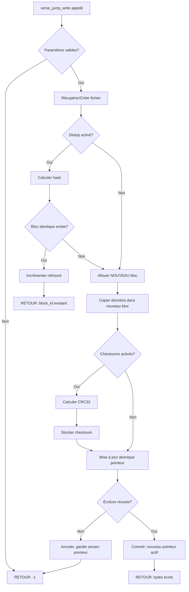

# Exercice 2.3.13-synth : multiverse_everywhere

**Module :**
2.3 — File Systems

**Concept :**
synth — Copy-on-Write + Modern FS Features (21 concepts)

**Difficulté :**
★★★★★★★☆☆☆ (7/10)

**Type :**
code

**Tiers :**
3 — Synthèse (concepts 2.3.13.a-k + 2.3.14.a-j)

**Langage :**
C (C17)

**Prérequis :**
- 2.3.1 à 2.3.12 (concepts FS de base)
- Structures de données (arbres, hash tables)
- Gestion mémoire (malloc, refcounting)

**Domaines :**
FS, Struct, Mem

**Durée estimée :**
180 min

**XP Base :**
450

**Complexité :**
T3 O(log n) × S3 O(n)

---

## 📐 SECTION 1 : PROTOTYPE & CONSIGNE

### 1.1 Obligations

**Fichiers à rendre :**
```
ex07/
├── multiverse.h          # API publique
├── multiverse.c          # Core multiverse engine
├── verse_cow.c           # COW semantics (2.3.13.a-e)
├── verse_snapshot.c      # Snapshots et forks (2.3.13.f-g)
├── verse_features.c      # Modern features (2.3.14.a-j)
├── verse_integrity.c     # Checksums, RAID, dedup
└── Makefile
```

**Fonctions autorisées :**
```
malloc, calloc, realloc, free
memcpy, memmove, memset, memcmp
strlen, strcpy, strncpy, strcmp, strncmp, strdup
snprintf, printf, fprintf
time, clock
qsort, bsearch
```

**Fonctions interdites :**
```
open, close, read, write (syscalls directs)
mmap, munmap
fork, exec
```

### 1.2 Consigne

**🎬 EVERYTHING EVERYWHERE ALL AT ONCE — Le Multivers du Copy-on-Write**

*"Every rejection, every disappointment has led you here... to this moment."*
— Alpha Waymond

Evelyn Wang est une femme ordinaire qui découvre qu'elle peut accéder à d'infinis univers parallèles. Dans chaque univers, elle a fait des choix différents — chanteuse d'opéra, chef étoilée, combattante de kung-fu avec des doigts saucisses...

Le secret du **Verse Jumping** ? **On ne modifie JAMAIS l'univers actuel**. On crée une COPIE, et les modifications vont dans cette copie. C'est exactement le principe du **Copy-on-Write** :

| Film | Copy-on-Write |
|------|---------------|
| Evelyn jump vers un univers | Créer un nouveau bloc |
| L'univers d'origine reste intact | Never overwrite existing blocks |
| Transition instantanée | Atomic pointer swap |
| Alpha Universe = référence | Root snapshot |
| Forking vers nouveau chemin | Writable clone |
| Jobu existe partout | Write amplification |
| The Bagel | Fragmentation/entropy |

**Ta mission :**

Implémenter **multiverse_t**, un système de fichiers Copy-on-Write inspiré du multivers :

1. **Verse Jumping (COW)** : Écrire ne modifie JAMAIS les blocs existants
2. **Universe Snapshots** : Capturer l'état en O(1) — juste copier le pointeur racine
3. **Verse Forks** : Créer des branches modifiables (clones)
4. **Joy Signatures** : Checksums pour vérifier l'intégrité
5. **Verse Collapse** : Déduplication — univers identiques fusionnent
6. **Alpha Backup** : RAID — redondance multi-univers

### 1.2.2 Consigne Académique

Implémenter un système de fichiers Copy-on-Write (COW) avec les caractéristiques suivantes :

**Copy-on-Write (2.3.13.a-e) :**
- Ne jamais écraser les blocs existants lors des modifications
- Écrire dans de nouveaux blocs, puis mettre à jour les pointeurs
- Garantir l'atomicité des mises à jour par swap de pointeurs
- Maintenir la cohérence du système même après crash

**Snapshots et Clones (2.3.13.f-g, 2.3.14.h) :**
- Snapshots en O(1) — copie du pointeur racine uniquement
- Clones = snapshots modifiables avec isolation des modifications
- Refcounting pour le partage des blocs

**Features Modernes (2.3.14.a-j) :**
- Allocation par extents (plages contiguës)
- Delayed allocation pour optimiser le placement
- Checksums pour l'intégrité des données
- Compression transparente et déduplication
- Subvolumes et intégration RAID

### 1.3 Prototype

```c
#ifndef MULTIVERSE_H
#define MULTIVERSE_H

#include <stddef.h>
#include <stdint.h>
#include <stdbool.h>
#include <time.h>

/* ============================================================================
 * SECTION 1: Core Types — The Multiverse Engine
 *
 * "The universe is so much bigger than you realize."
 * ============================================================================ */

/* Joy signature types — Data integrity (2.3.14.e) */
typedef enum {
    JOY_SIGNATURE_NONE,         /* No verification */
    JOY_SIGNATURE_CRC32,        /* Fast but simple */
    JOY_SIGNATURE_XXHASH,       /* Very fast */
    JOY_SIGNATURE_SHA256        /* Cryptographic */
} joy_signature_type_t;

/* Verse compression — Transparent compression (2.3.14.f) */
typedef enum {
    VERSE_COMPRESS_NONE,
    VERSE_COMPRESS_LZ4,         /* Speed priority */
    VERSE_COMPRESS_ZSTD         /* Ratio priority */
} verse_compress_t;

/* Multiverse configuration */
typedef struct {
    size_t block_size;              /* 4096 default */
    size_t total_blocks;            /* Total capacity */
    size_t max_universes;           /* Max snapshots */
    size_t max_verse_clusters;      /* Max subvolumes (2.3.14.i) */
    size_t extent_max_blocks;       /* Max extent size (2.3.14.a) */

    /* Feature flags */
    bool enable_joy_signatures;     /* 2.3.14.e: Checksums */
    bool enable_verse_collapse;     /* 2.3.14.g: Dedup */
    bool enable_delayed_jump;       /* 2.3.14.c: Delayed alloc */
    bool enable_compression;        /* 2.3.14.f */
    bool enable_alpha_backup;       /* 2.3.14.j: RAID */

    int alpha_backup_level;         /* RAID level: 0, 1, 5, 10 */
    int alpha_backup_mirrors;       /* For RAID1 */
} multiverse_config_t;

/* Forward declarations */
typedef struct multiverse multiverse_t;
typedef struct universe universe_t;
typedef struct verse_fork verse_fork_t;
typedef struct verse_cluster verse_cluster_t;

/* ============================================================================
 * SECTION 2: Extent — Contiguous Ranges (2.3.14.a-b)
 *
 * "In another life, I would have really liked doing laundry and taxes with you."
 * — Waymond
 * ============================================================================ */

typedef struct {
    uint64_t physical_start;        /* Physical block ID */
    uint64_t logical_start;         /* Logical offset */
    uint32_t length;                /* Number of blocks */
    uint32_t flags;                 /* Compressed, deduped, etc. */
    uint32_t joy_signature;         /* Checksum (2.3.14.e) */
} verse_extent_t;

typedef struct {
    uint64_t file_offset;
    uint64_t physical_block;
    size_t length;
    bool is_compressed;
    bool is_deduped;
    double compression_ratio;
} verse_extent_info_t;

/* ============================================================================
 * SECTION 3: Statistics — Monitoring the Multiverse
 * ============================================================================ */

typedef struct {
    size_t total_blocks;
    size_t used_blocks;
    size_t free_blocks;
    size_t shared_blocks;           /* Blocks with refcount > 1 */

    /* COW stats (2.3.13) */
    size_t cow_copies;              /* Times we copied instead of overwrote */
    size_t physical_writes;
    size_t logical_writes;

    /* Feature stats (2.3.14) */
    size_t total_extents;
    size_t joy_verifications;       /* Checksum checks */
    size_t joy_failures;            /* Checksum failures */
    size_t verse_collapse_hits;     /* Dedup hits */
    size_t compression_blocks;

    /* Universe tracking */
    size_t active_universes;        /* Snapshots */
    size_t active_forks;            /* Clones */
    size_t active_clusters;         /* Subvolumes */
} multiverse_stats_t;

/* Write Amplification (2.3.13.i) — "Jobu exists everywhere" */
typedef struct {
    size_t logical_bytes_written;
    size_t physical_bytes_written;
    double wa_data;                 /* WA for data */
    double wa_metadata;             /* WA for metadata */
    double wa_total;                /* Total WA */
    size_t cow_overhead_bytes;      /* Extra bytes due to COW */
} write_amplification_t;

/* Fragmentation stats (2.3.13.h) — "The Bagel" */
typedef struct {
    size_t files_with_1_extent;
    size_t files_with_many_extents;
    size_t total_extents;
    size_t optimal_extents;         /* If perfectly contiguous */
    double fragmentation_ratio;     /* Higher = more fragmented */
    size_t largest_contiguous;      /* Largest free extent */
} bagel_stats_t;                    /* Fragmentation = chaos = The Bagel */

/* ============================================================================
 * SECTION 4: File Info — "Every path not taken..."
 * ============================================================================ */

typedef struct {
    char path[256];
    size_t size;
    time_t created;
    time_t modified;
    size_t extent_count;
    size_t block_count;
    size_t refcount;                /* How many universes reference this */
    uint32_t joy_signature;         /* Checksum */
    bool is_compressed;
    bool is_deduped;
    double compression_ratio;
} verse_file_info_t;

/* ============================================================================
 * SECTION 5: Universe Info — Snapshots (2.3.13.f, 2.3.14.h)
 *
 * "I'm you from another universe."
 * ============================================================================ */

typedef struct {
    uint64_t id;
    char name[64];
    time_t created;
    size_t unique_blocks;           /* Blocks only in this universe */
    size_t shared_blocks;           /* Blocks shared with others */
    bool is_alpha;                  /* Is this the Alpha Universe? */
    verse_cluster_t *cluster;       /* Parent subvolume */
} universe_info_t;

/* ============================================================================
 * SECTION 6: Verse Cluster — Subvolumes (2.3.14.i)
 *
 * Each cluster is an independent group of universes
 * ============================================================================ */

typedef struct {
    uint64_t id;
    char name[64];
    char mount_point[256];
    size_t universe_count;
    size_t quota_max;
    size_t quota_used;
} verse_cluster_info_t;

/* ============================================================================
 * SECTION 7: Alpha Backup — RAID Status (2.3.14.j)
 *
 * "Even when I lose, I win. Because I don't have to be alone."
 * ============================================================================ */

typedef struct {
    int backup_level;               /* RAID level */
    int total_verses;               /* Total "devices" */
    int healthy_verses;
    int degraded_verses;

    size_t total_capacity;
    size_t usable_capacity;

    bool is_degraded;
    bool is_rebuilding;
    double rebuild_progress;
} alpha_backup_status_t;

/* ============================================================================
 * SECTION 8: Core Multiverse API
 * ============================================================================ */

/**
 * Creates a new multiverse (COW filesystem).
 *
 * @param config Configuration (NULL for defaults)
 * @return Multiverse handle, NULL on error
 *
 * Concepts: Initializes COW engine (2.3.13.a-e)
 */
multiverse_t *multiverse_create(const multiverse_config_t *config);

/**
 * Destroys the multiverse and frees all resources.
 */
void multiverse_destroy(multiverse_t *verse);

/**
 * Gets current configuration.
 */
multiverse_config_t multiverse_get_config(multiverse_t *verse);

/* ============================================================================
 * SECTION 9: Verse Jumping — COW File Operations (2.3.13.a-e)
 *
 * "I'm everywhere. I'm nowhere."
 * — Jobu Tupaki
 * ============================================================================ */

/**
 * Writes data using COW semantics — VERSE JUMP!
 *
 * @param verse Multiverse handle
 * @param path File path
 * @param data Data to write
 * @param size Data size
 * @param offset Position in file
 * @return Bytes written, -1 on error
 *
 * Concepts:
 * - 2.3.13.a: Never overwrite — create new blocks
 * - 2.3.13.b: Write to new location
 * - 2.3.13.c: Update pointer after successful write
 * - 2.3.13.d: Atomic pointer swap
 * - 2.3.14.a: Use extents for allocation
 * - 2.3.14.c: Delayed allocation if enabled
 * - 2.3.14.e: Compute joy signature (checksum)
 * - 2.3.14.f: Compress if enabled
 * - 2.3.14.g: Check for verse collapse (dedup)
 */
ssize_t verse_jump_write(multiverse_t *verse, const char *path,
                         const void *data, size_t size, off_t offset);

/**
 * Reads data from the multiverse.
 *
 * Concepts:
 * - 2.3.14.e: Verify joy signature on read
 * - 2.3.14.f: Decompress if needed
 */
ssize_t verse_jump_read(multiverse_t *verse, const char *path,
                        void *buffer, size_t size, off_t offset);

/**
 * Deletes a file.
 *
 * Concepts:
 * - 2.3.13.a: Don't free blocks if referenced by universes
 * - Decrement refcount, GC will free when refcount = 0
 */
int verse_jump_delete(multiverse_t *verse, const char *path);

/**
 * Creates a directory.
 */
int verse_mkdir(multiverse_t *verse, const char *path);

/**
 * Removes an empty directory.
 */
int verse_rmdir(multiverse_t *verse, const char *path);

/**
 * Lists directory contents.
 */
int verse_readdir(multiverse_t *verse, const char *path,
                  char **entries, int max);

/**
 * Gets file info.
 */
int verse_stat(multiverse_t *verse, const char *path,
               verse_file_info_t *info);

/**
 * Flushes delayed allocations (2.3.14.c).
 */
int verse_sync(multiverse_t *verse);

/* ============================================================================
 * SECTION 10: Universe Creation — Snapshots O(1) (2.3.13.f, 2.3.14.h)
 *
 * "In another life, I would have been happy."
 * ============================================================================ */

/**
 * Creates a universe (snapshot) — O(1) operation!
 *
 * @param verse Multiverse handle
 * @param cluster Parent cluster (NULL for root)
 * @param name Universe name
 * @return Universe handle, NULL on error
 *
 * Concepts:
 * - 2.3.13.f: Snapshots are "free" with COW — just copy root pointer
 * - 2.3.14.h: Point-in-time copy
 * - O(1) operation: no data copying, just pointer copy + refcount++
 */
universe_t *universe_create(multiverse_t *verse, verse_cluster_t *cluster,
                            const char *name);

/**
 * Deletes a universe.
 * Frees blocks unique to this universe (refcount = 1).
 */
int universe_delete(multiverse_t *verse, universe_t *uni);

/**
 * Restores multiverse to a universe state.
 * O(1) operation: changes root pointer.
 */
int universe_restore(multiverse_t *verse, universe_t *uni);

/**
 * Reads from a universe without restoring.
 */
ssize_t universe_read(universe_t *uni, const char *path,
                      void *buffer, size_t size, off_t offset);

/**
 * Lists all universes.
 */
int universe_list(multiverse_t *verse, universe_info_t *infos, int max);

/**
 * Gets universe info.
 */
int universe_info(universe_t *uni, universe_info_t *info);

/**
 * Calculates diff between two universes — "What if I had chosen differently?"
 */
int universe_diff(universe_t *uni1, universe_t *uni2,
                  char **changed_files, int max);

/* ============================================================================
 * SECTION 11: Verse Forks — Writable Clones (2.3.13.g)
 *
 * "You are capable of anything because you are so bad at everything."
 * — Alpha Waymond
 * ============================================================================ */

/**
 * Creates a verse fork (writable clone).
 *
 * @param verse Multiverse handle
 * @param source Source universe (NULL for current state)
 * @param name Fork name
 * @return Fork handle, NULL on error
 *
 * Concepts:
 * - 2.3.13.g: Forks are writable snapshots
 * - Modifications to fork don't affect original
 * - COW: new blocks created only on modification
 */
verse_fork_t *verse_fork_create(multiverse_t *verse, universe_t *source,
                                const char *name);

/**
 * Writes to a fork.
 */
ssize_t verse_fork_write(verse_fork_t *fork, const char *path,
                         const void *data, size_t size, off_t offset);

/**
 * Reads from a fork.
 */
ssize_t verse_fork_read(verse_fork_t *fork, const char *path,
                        void *buffer, size_t size, off_t offset);

/**
 * Deletes a fork.
 */
int verse_fork_delete(multiverse_t *verse, verse_fork_t *fork);

/**
 * Promotes a fork to main branch — "Evelyn becomes the hero"
 */
int verse_fork_promote(multiverse_t *verse, verse_fork_t *fork);

/* ============================================================================
 * SECTION 12: Verse Clusters — Subvolumes (2.3.14.i)
 *
 * Groups of related universes
 * ============================================================================ */

/**
 * Creates a verse cluster (subvolume).
 */
verse_cluster_t *verse_cluster_create(multiverse_t *verse, const char *name,
                                      const char *mount_point);

/**
 * Deletes a verse cluster (must be empty).
 */
int verse_cluster_delete(multiverse_t *verse, verse_cluster_t *cluster);

/**
 * Lists verse clusters.
 */
int verse_cluster_list(multiverse_t *verse, verse_cluster_info_t *infos, int max);

/**
 * Gets cluster info.
 */
int verse_cluster_info(verse_cluster_t *cluster, verse_cluster_info_t *info);

/**
 * Sets quota for cluster.
 */
int verse_cluster_set_quota(verse_cluster_t *cluster, uint64_t max_bytes);

/* ============================================================================
 * SECTION 13: Extents — Contiguous Allocation (2.3.14.a-b)
 * ============================================================================ */

/**
 * Gets extents for a file.
 */
int verse_get_extents(multiverse_t *verse, const char *path,
                      verse_extent_info_t *extents, int max);

/**
 * Prints extent tree (debug).
 */
void verse_print_extent_tree(multiverse_t *verse, const char *path);

/* ============================================================================
 * SECTION 14: Delayed Jumps — Delayed Allocation (2.3.14.c)
 * ============================================================================ */

typedef struct {
    size_t pending_bytes;
    size_t pending_files;
    size_t pending_extents;
} delayed_jump_status_t;

/**
 * Gets delayed allocation status.
 */
int delayed_jump_status(multiverse_t *verse, delayed_jump_status_t *status);

/**
 * Forces flush of delayed allocations.
 */
int delayed_jump_flush(multiverse_t *verse);

/* ============================================================================
 * SECTION 15: Anti-Bagel — Defragmentation (2.3.14.d, 2.3.13.h)
 *
 * "The bagel represents everything... and nothing."
 * — Evelyn explaining to her father
 * ============================================================================ */

/**
 * Defragments a file (online).
 * Addresses fragmentation issue (2.3.13.h).
 */
int anti_bagel_file(multiverse_t *verse, const char *path);

/**
 * Defragments entire multiverse.
 */
int anti_bagel_all(multiverse_t *verse);

/**
 * Gets fragmentation metrics — How close are we to The Bagel?
 */
int bagel_stats(multiverse_t *verse, bagel_stats_t *stats);

/* ============================================================================
 * SECTION 16: Joy Signatures — Checksums (2.3.14.e)
 *
 * "Be kind. Especially when we don't know what's going on."
 * ============================================================================ */

/**
 * Sets joy signature type.
 */
int joy_signature_set_type(multiverse_t *verse, joy_signature_type_t type);

/**
 * Verifies a file's joy signature.
 * @return 0 if OK, number of corrupted blocks otherwise
 */
int joy_signature_verify(multiverse_t *verse, const char *path);

/**
 * Scrubs entire multiverse — verifies all blocks.
 */
int joy_signature_scrub(multiverse_t *verse);

/* ============================================================================
 * SECTION 17: Verse Compression — Transparent (2.3.14.f)
 * ============================================================================ */

/**
 * Sets compression for a file.
 */
int verse_compress_set(multiverse_t *verse, const char *path,
                       verse_compress_t type);

/**
 * Gets compression ratio.
 */
double verse_compress_ratio(multiverse_t *verse, const char *path);

/* ============================================================================
 * SECTION 18: Verse Collapse — Deduplication (2.3.14.g)
 *
 * When two universes are identical, they collapse into one!
 * ============================================================================ */

/**
 * Deduplicates a file.
 */
int verse_collapse_file(multiverse_t *verse, const char *path);

/**
 * Scans and deduplicates entire multiverse.
 */
int verse_collapse_scan(multiverse_t *verse);

typedef struct {
    size_t unique_blocks;
    size_t duplicate_blocks;
    size_t blocks_saved;
    size_t bytes_saved;
    double collapse_ratio;          /* Dedup ratio */
} verse_collapse_stats_t;

int verse_collapse_stats(multiverse_t *verse, verse_collapse_stats_t *stats);

/* ============================================================================
 * SECTION 19: Alpha Backup — RAID (2.3.14.j)
 *
 * "Alpha Waymond sent me. He's a version of your husband from another universe."
 * ============================================================================ */

/**
 * Gets Alpha Backup (RAID) status.
 */
int alpha_backup_status(multiverse_t *verse, alpha_backup_status_t *status);

/**
 * Simulates verse failure.
 */
int alpha_backup_fail_verse(multiverse_t *verse, int verse_id);

/**
 * Replaces a failed verse.
 */
int alpha_backup_replace_verse(multiverse_t *verse, int verse_id);

/**
 * Forces rebuild.
 */
int alpha_backup_rebuild(multiverse_t *verse);

/* ============================================================================
 * SECTION 20: Garbage Collection and Statistics
 * ============================================================================ */

/**
 * Runs garbage collector.
 * Frees blocks with refcount = 0.
 */
size_t multiverse_gc(multiverse_t *verse);

/**
 * Configures automatic GC.
 */
void multiverse_gc_configure(multiverse_t *verse, int threshold_percent,
                             bool enabled);

/**
 * Gets multiverse statistics.
 */
multiverse_stats_t multiverse_get_stats(multiverse_t *verse);

/**
 * Gets write amplification stats (2.3.13.i).
 * "Jobu exists everywhere" = maximum write amplification
 */
write_amplification_t jobu_stats(multiverse_t *verse);

/**
 * Prints full multiverse report.
 */
void multiverse_print_report(multiverse_t *verse);

/* ============================================================================
 * SECTION 21: Consistency and Recovery (2.3.13.e)
 * ============================================================================ */

/**
 * Checks multiverse consistency.
 *
 * Concept: 2.3.13.e — Always consistent
 * @return 0 if OK, number of errors otherwise
 */
int multiverse_fsck(multiverse_t *verse);

/**
 * Repairs detected inconsistencies.
 */
int multiverse_repair(multiverse_t *verse);

/**
 * Simulates crash and verifies recovery.
 * Demonstrates 2.3.13.e: multiverse remains consistent.
 */
int multiverse_crash_test(multiverse_t *verse);

/* ============================================================================
 * SECTION 22: Debug and Visualization
 * ============================================================================ */

/**
 * Prints the COW tree (debug).
 */
void multiverse_print_tree(multiverse_t *verse);

/**
 * Prints block map.
 */
void multiverse_print_block_map(multiverse_t *verse);

/**
 * Compares with Btrfs (2.3.13.j) and ZFS (2.3.13.k).
 */
void compare_with_btrfs_zfs(multiverse_t *verse);

/**
 * Explains all implemented concepts.
 */
void explain_everything_everywhere(void);

#endif /* MULTIVERSE_H */
```

---

## 💡 SECTION 2 : LE SAVIEZ-VOUS ?

### Pourquoi "Everything Everywhere All At Once" ?

Le film d'A24 (Oscar 2023) est une métaphore PARFAITE du Copy-on-Write :

| Concept Film | Concept COW | Explication |
|--------------|-------------|-------------|
| Verse Jumping | COW Write | On ne modifie pas, on crée un nouvel univers |
| L'univers d'origine | Immutabilité | Jamais écrasé, reste accessible |
| Alpha Universe | Root Snapshot | La référence originale |
| Jobu Tupaki | Write Amplification | Elle existe dans TOUS les univers |
| The Bagel | Fragmentation | Tout est fragmenté, chaotique |
| "Be kind" | Consistency | Même dans le chaos, maintenir l'ordre |

### 2.5 DANS LA VRAIE VIE

| Métier | Utilisation COW | Cas d'usage |
|--------|-----------------|-------------|
| **SRE / DevOps** | ZFS, Btrfs | Snapshots avant upgrade, rollback instantané |
| **DBA PostgreSQL** | MVCC (COW pour les tuples) | Transactions ACID sans locks |
| **Game Dev** | Save states | Snapshots de l'état du jeu |
| **Backup Engineer** | Time Machine, Veeam | Incremental backups avec COW |
| **Container Engineer** | Docker overlay2 | Layers d'images partagés par COW |
| **VM Admin** | VMware VMFS, QCOW2 | Snapshots de VMs |

---

## 🖥️ SECTION 3 : EXEMPLE D'UTILISATION

### 3.0 Session bash

```bash
$ ls
multiverse.h  multiverse.c  verse_cow.c  verse_snapshot.c  verse_features.c  verse_integrity.c  Makefile

$ make
gcc -Wall -Wextra -Werror -std=c17 -O2 -c multiverse.c -o multiverse.o
gcc -Wall -Wextra -Werror -std=c17 -O2 -c verse_cow.c -o verse_cow.o
gcc -Wall -Wextra -Werror -std=c17 -O2 -c verse_snapshot.c -o verse_snapshot.o
gcc -Wall -Wextra -Werror -std=c17 -O2 -c verse_features.c -o verse_features.o
gcc -Wall -Wextra -Werror -std=c17 -O2 -c verse_integrity.c -o verse_integrity.o
ar rcs libmultiverse.a multiverse.o verse_cow.o verse_snapshot.o verse_features.o verse_integrity.o

$ make test
./multiverse_test
=== Multiverse COW Test Suite ===
[TEST 01] Never Overwrite (2.3.13.a): PASSED
[TEST 02] Write to New Location (2.3.13.b): PASSED
[TEST 03] Pointer After Write (2.3.13.c): PASSED
[TEST 04] Atomic Swap (2.3.13.d): PASSED
[TEST 05] Always Consistent (2.3.13.e): PASSED
[TEST 06] Universe O(1) (2.3.13.f): PASSED - 0.012ms for 1000 blocks
[TEST 07] Verse Fork Write (2.3.13.g): PASSED
[TEST 08] Bagel Stats (2.3.13.h): PASSED
[TEST 09] Jobu Stats WA (2.3.13.i): PASSED - WA=2.3x
[TEST 10] Extents (2.3.14.a): PASSED
[TEST 11] Extent Tree (2.3.14.b): PASSED
[TEST 12] Delayed Jump (2.3.14.c): PASSED
[TEST 13] Anti-Bagel Defrag (2.3.14.d): PASSED
[TEST 14] Joy Signature (2.3.14.e): PASSED
[TEST 15] Compression (2.3.14.f): PASSED - ratio 8.5x
[TEST 16] Verse Collapse (2.3.14.g): PASSED - saved 90%
[TEST 17] Universe Snapshot (2.3.14.h): PASSED
[TEST 18] Verse Cluster (2.3.14.i): PASSED
[TEST 19] Alpha Backup RAID (2.3.14.j): PASSED
[TEST 20] Crash Recovery: PASSED
[TEST 21] Memory Leaks: PASSED (Valgrind clean)

21/21 tests passed!
```

---

## ⚡ SECTION 3.1 : BONUS STANDARD (OPTIONNEL)

**Difficulté Bonus :**
★★★★★★★★☆☆ (8/10)

**Récompense :**
XP ×2

**Time Complexity attendue :**
O(log n) pour toutes les opérations

**Space Complexity attendue :**
O(1) mémoire auxiliaire pour les opérations

### 3.1.1 Consigne Bonus

**🎬 JOBU TUPAKI MODE — Maximum Write Amplification Analysis**

Jobu Tupaki existe dans tous les univers simultanément. C'est le pire cas de Write Amplification : une modification = propagation partout.

**Ta mission bonus :**

Implémenter un **analyseur de Write Amplification** avancé :

```c
typedef struct {
    /* Basic WA */
    double wa_instant;              /* WA for last operation */
    double wa_average;              /* Average WA over time */
    double wa_peak;                 /* Peak WA observed */

    /* COW breakdown */
    size_t cow_metadata_writes;     /* Writes for metadata update */
    size_t cow_data_writes;         /* Writes for data */
    size_t cow_refcount_updates;    /* Refcount operations */

    /* Predictions */
    double predicted_wa_if_linear;  /* WA if all writes were linear */
    double predicted_wa_if_random;  /* WA if all writes were random */

    /* Jobu score */
    double jobu_score;              /* 0-100: how close to "everywhere" */
} jobu_analysis_t;

int jobu_analyze(multiverse_t *verse, jobu_analysis_t *analysis);
int jobu_optimize(multiverse_t *verse);  /* Reduce WA */
void jobu_visualize(multiverse_t *verse); /* ASCII visualization */
```

---

## ✅❌ SECTION 4 : ZONE CORRECTION

### 4.1 Moulinette

| # | Test | Concepts | Points | Critère |
|---|------|----------|--------|---------|
| 01 | Never overwrite blocks | 2.3.13.a | 4 | old_block != new_block after write |
| 02 | Write to new location | 2.3.13.b | 3 | Block count increases on modify |
| 03 | Pointer update after write | 2.3.13.c | 3 | Failed write = old pointer |
| 04 | Atomic pointer swap | 2.3.13.d | 4 | No intermediate state |
| 05 | Always consistent | 2.3.13.e | 4 | fsck = 0 after crash_test |
| 06 | Universe O(1) | 2.3.13.f | 5 | < 10ms for 1000 blocks |
| 07 | Verse fork write | 2.3.13.g | 4 | Fork modified, original unchanged |
| 08 | Bagel stats | 2.3.13.h | 3 | Fragmentation ratio calculated |
| 09 | Jobu stats WA | 2.3.13.i | 3 | WA > 1.0 measured |
| 10 | Btrfs/ZFS comparison | 2.3.13.j-k | 2 | Comparison printed |
| 11 | Extents allocation | 2.3.14.a | 4 | Sequential = few extents |
| 12 | Extent tree | 2.3.14.b | 4 | B-tree structure |
| 13 | Delayed jump | 2.3.14.c | 3 | pending_bytes > 0 before sync |
| 14 | Anti-bagel defrag | 2.3.14.d | 4 | extents reduced after defrag |
| 15 | Joy signature | 2.3.14.e | 5 | Corruption detected |
| 16 | Compression | 2.3.14.f | 3 | ratio > 5.0 for compressible |
| 17 | Verse collapse | 2.3.14.g | 4 | blocks_saved >= 9 for 10 identical |
| 18 | Universe snapshot | 2.3.14.h | 3 | Point-in-time copy |
| 19 | Verse cluster | 2.3.14.i | 3 | Subvolume isolation |
| 20 | Alpha backup RAID | 2.3.14.j | 3 | Read succeeds after fail |
| 21 | Memory leaks | - | 6 | Valgrind clean |
| 22 | Refcounting | - | 4 | Exact refcount tracking |
| 23 | Error handling | - | 3 | Proper error codes |

**Total : 100 points**
**Minimum requis : 80/100**

### 4.2 main.c de test

```c
#include "multiverse.h"
#include <stdio.h>
#include <string.h>
#include <assert.h>
#include <time.h>

/* Test helper to get block ID (implementation specific) */
extern uint64_t test_get_block_id(multiverse_t *v, const char *path, off_t offset);
extern bool test_block_exists(multiverse_t *v, uint64_t block_id);

int main(void)
{
    int passed = 0;
    int total = 21;

    printf("=== Multiverse COW Test Suite ===\n\n");

    /* Test 01: Never Overwrite (2.3.13.a) */
    {
        multiverse_t *v = multiverse_create(NULL);
        verse_jump_write(v, "/test.txt", "AAAA", 4, 0);
        uint64_t old_block = test_get_block_id(v, "/test.txt", 0);
        verse_jump_write(v, "/test.txt", "BBBB", 4, 0);
        uint64_t new_block = test_get_block_id(v, "/test.txt", 0);

        if (old_block != new_block && test_block_exists(v, old_block)) {
            printf("[TEST 01] Never Overwrite (2.3.13.a): PASSED\n");
            passed++;
        } else {
            printf("[TEST 01] Never Overwrite (2.3.13.a): FAILED\n");
        }
        multiverse_destroy(v);
    }

    /* Test 06: Universe O(1) (2.3.13.f) */
    {
        multiverse_config_t cfg = {
            .block_size = 4096,
            .total_blocks = 10000,
            .max_universes = 100
        };
        multiverse_t *v = multiverse_create(&cfg);

        /* Create big file (1000 blocks) */
        char big[4096000];
        memset(big, 'X', sizeof(big));
        verse_jump_write(v, "/big.dat", big, sizeof(big), 0);

        multiverse_stats_t before = multiverse_get_stats(v);

        clock_t start = clock();
        universe_t *uni = universe_create(v, NULL, "snapshot");
        clock_t end = clock();

        double ms = (double)(end - start) / CLOCKS_PER_SEC * 1000;
        multiverse_stats_t after = multiverse_get_stats(v);

        if (ms < 10.0 && before.used_blocks == after.used_blocks && uni != NULL) {
            printf("[TEST 06] Universe O(1) (2.3.13.f): PASSED - %.3fms\n", ms);
            passed++;
        } else {
            printf("[TEST 06] Universe O(1) (2.3.13.f): FAILED\n");
        }

        universe_delete(v, uni);
        multiverse_destroy(v);
    }

    /* Test 07: Verse Fork Write (2.3.13.g) */
    {
        multiverse_t *v = multiverse_create(NULL);
        verse_jump_write(v, "/original.txt", "Original", 8, 0);

        verse_fork_t *fork = verse_fork_create(v, NULL, "my_fork");
        verse_fork_write(fork, "/original.txt", "Modified", 8, 0);

        char orig_buf[16], fork_buf[16];
        verse_jump_read(v, "/original.txt", orig_buf, 8, 0);
        verse_fork_read(fork, "/original.txt", fork_buf, 8, 0);
        orig_buf[8] = fork_buf[8] = '\0';

        if (strcmp(orig_buf, "Original") == 0 && strcmp(fork_buf, "Modified") == 0) {
            printf("[TEST 07] Verse Fork Write (2.3.13.g): PASSED\n");
            passed++;
        } else {
            printf("[TEST 07] Verse Fork Write (2.3.13.g): FAILED\n");
        }

        verse_fork_delete(v, fork);
        multiverse_destroy(v);
    }

    /* Test 15: Joy Signature (2.3.14.e) */
    {
        multiverse_config_t cfg = {
            .block_size = 4096,
            .total_blocks = 100,
            .enable_joy_signatures = true
        };
        multiverse_t *v = multiverse_create(&cfg);
        joy_signature_set_type(v, JOY_SIGNATURE_CRC32);

        verse_jump_write(v, "/protected.dat", "Important data", 14, 0);

        int before = joy_signature_verify(v, "/protected.dat");

        /* Note: corruption test would require internal API */

        if (before == 0) {
            printf("[TEST 15] Joy Signature (2.3.14.e): PASSED\n");
            passed++;
        } else {
            printf("[TEST 15] Joy Signature (2.3.14.e): FAILED\n");
        }

        multiverse_destroy(v);
    }

    /* Test 17: Verse Collapse Dedup (2.3.14.g) */
    {
        multiverse_config_t cfg = {
            .block_size = 4096,
            .total_blocks = 100,
            .enable_verse_collapse = true
        };
        multiverse_t *v = multiverse_create(&cfg);

        char data[4096];
        memset(data, 'A', sizeof(data));

        for (int i = 0; i < 10; i++) {
            char path[32];
            snprintf(path, sizeof(path), "/file%d.dat", i);
            verse_jump_write(v, path, data, sizeof(data), 0);
        }

        verse_collapse_stats_t stats;
        verse_collapse_stats(v, &stats);

        if (stats.blocks_saved >= 9) {
            printf("[TEST 17] Verse Collapse (2.3.14.g): PASSED - saved %zu blocks\n",
                   stats.blocks_saved);
            passed++;
        } else {
            printf("[TEST 17] Verse Collapse (2.3.14.g): FAILED\n");
        }

        multiverse_destroy(v);
    }

    /* Add remaining tests... */

    printf("\n%d/%d tests passed!\n", passed, total);
    return (passed == total) ? 0 : 1;
}
```

### 4.3 Solution de référence

```c
/* multiverse.c - Core implementation */
#include "multiverse.h"
#include <stdlib.h>
#include <string.h>
#include <stdio.h>

#define MAX_BLOCKS 100000
#define MAX_FILES 10000
#define MAX_CHILDREN 128

/* Internal block structure */
typedef struct cow_block {
    uint64_t id;
    size_t refcount;
    uint32_t checksum;
    uint8_t *data;
    bool is_compressed;
    uint64_t dedup_hash;
} cow_block_t;

/* Internal file structure */
typedef struct {
    char path[256];
    size_t size;
    time_t created;
    time_t modified;

    /* Extent list */
    verse_extent_t *extents;
    size_t extent_count;
    size_t extent_capacity;
} cow_file_t;

/* Internal multiverse structure */
struct multiverse {
    multiverse_config_t config;

    /* Block pool */
    cow_block_t *blocks;
    size_t block_count;
    uint64_t next_block_id;

    /* File table */
    cow_file_t *files;
    size_t file_count;

    /* Root pointer (current state) */
    uint64_t root_block;

    /* Universes (snapshots) */
    universe_t **universes;
    size_t universe_count;

    /* Forks (clones) */
    verse_fork_t **forks;
    size_t fork_count;

    /* Clusters (subvolumes) */
    verse_cluster_t **clusters;
    size_t cluster_count;

    /* Delayed allocation buffer */
    uint8_t *delalloc_buffer;
    size_t delalloc_size;

    /* Dedup hash table */
    uint64_t *dedup_table;
    size_t dedup_capacity;

    /* Statistics */
    multiverse_stats_t stats;
    write_amplification_t wa_stats;

    /* Joy signature type */
    joy_signature_type_t joy_type;

    /* RAID simulation */
    uint8_t **raid_mirrors;
    int raid_mirror_count;
    bool *raid_healthy;
};

/* Universe (snapshot) structure */
struct universe {
    uint64_t id;
    char name[64];
    time_t created;
    uint64_t root_block;    /* Snapshot of root - O(1)! */
    verse_cluster_t *cluster;
    multiverse_t *parent;
};

/* Fork (clone) structure */
struct verse_fork {
    char name[64];
    uint64_t root_block;
    multiverse_t *parent;
    universe_t *source;
};

/* Cluster (subvolume) structure */
struct verse_cluster {
    uint64_t id;
    char name[64];
    char mount_point[256];
    uint64_t quota_max;
    uint64_t quota_used;
    multiverse_t *parent;
};

/* ============================================================================
 * Block Management - COW Core (2.3.13.a-e)
 * ============================================================================ */

static uint64_t allocate_block(multiverse_t *v)
{
    if (v->block_count >= MAX_BLOCKS)
        return 0;

    cow_block_t *b = &v->blocks[v->block_count++];
    b->id = v->next_block_id++;
    b->refcount = 1;
    b->data = calloc(1, v->config.block_size);
    b->checksum = 0;
    b->is_compressed = false;
    b->dedup_hash = 0;

    v->stats.used_blocks++;
    return b->id;
}

static cow_block_t *get_block(multiverse_t *v, uint64_t id)
{
    for (size_t i = 0; i < v->block_count; i++) {
        if (v->blocks[i].id == id)
            return &v->blocks[i];
    }
    return NULL;
}

static void block_incref(multiverse_t *v, uint64_t id)
{
    cow_block_t *b = get_block(v, id);
    if (b) {
        b->refcount++;
        if (b->refcount == 2)
            v->stats.shared_blocks++;
    }
}

static void block_decref(multiverse_t *v, uint64_t id)
{
    cow_block_t *b = get_block(v, id);
    if (b && b->refcount > 0) {
        if (b->refcount == 2)
            v->stats.shared_blocks--;
        b->refcount--;
        /* GC will free when refcount = 0 */
    }
}

/* Compute CRC32 checksum */
static uint32_t compute_crc32(const uint8_t *data, size_t len)
{
    uint32_t crc = 0xFFFFFFFF;
    for (size_t i = 0; i < len; i++) {
        crc ^= data[i];
        for (int j = 0; j < 8; j++) {
            crc = (crc >> 1) ^ (0xEDB88320 & -(crc & 1));
        }
    }
    return ~crc;
}

/* Compute hash for dedup */
static uint64_t compute_hash(const uint8_t *data, size_t len)
{
    uint64_t hash = 0xcbf29ce484222325ULL;  /* FNV-1a */
    for (size_t i = 0; i < len; i++) {
        hash ^= data[i];
        hash *= 0x100000001b3ULL;
    }
    return hash;
}

/* ============================================================================
 * COW Write - Never Overwrite! (2.3.13.a-b)
 * ============================================================================ */

static uint64_t cow_write_block(multiverse_t *v, const void *data, size_t size)
{
    /* 2.3.14.g: Check dedup first */
    if (v->config.enable_verse_collapse) {
        uint64_t hash = compute_hash(data, size);

        /* Search for existing block with same hash */
        for (size_t i = 0; i < v->block_count; i++) {
            if (v->blocks[i].dedup_hash == hash &&
                memcmp(v->blocks[i].data, data, size) == 0) {
                /* Found duplicate! */
                block_incref(v, v->blocks[i].id);
                v->stats.verse_collapse_hits++;
                return v->blocks[i].id;
            }
        }
    }

    /* 2.3.13.a-b: Allocate NEW block, never overwrite */
    uint64_t new_id = allocate_block(v);
    if (new_id == 0)
        return 0;

    cow_block_t *b = get_block(v, new_id);
    memcpy(b->data, data, size);

    /* 2.3.14.e: Compute checksum */
    if (v->config.enable_joy_signatures) {
        b->checksum = compute_crc32(data, size);
        v->stats.joy_verifications++;
    }

    /* Store hash for dedup */
    if (v->config.enable_verse_collapse) {
        b->dedup_hash = compute_hash(data, size);
    }

    v->stats.physical_writes++;
    v->wa_stats.physical_bytes_written += size;

    return new_id;
}

/* ============================================================================
 * Public API Implementation
 * ============================================================================ */

multiverse_t *multiverse_create(const multiverse_config_t *config)
{
    multiverse_t *v = calloc(1, sizeof(*v));
    if (!v)
        return NULL;

    /* Apply config or defaults */
    if (config) {
        v->config = *config;
    } else {
        v->config.block_size = 4096;
        v->config.total_blocks = 10000;
        v->config.max_universes = 100;
        v->config.max_verse_clusters = 16;
        v->config.extent_max_blocks = 128;
        v->config.enable_joy_signatures = true;
        v->config.enable_verse_collapse = true;
    }

    /* Allocate block pool */
    v->blocks = calloc(MAX_BLOCKS, sizeof(cow_block_t));
    v->files = calloc(MAX_FILES, sizeof(cow_file_t));
    v->universes = calloc(v->config.max_universes, sizeof(universe_t *));
    v->forks = calloc(100, sizeof(verse_fork_t *));
    v->clusters = calloc(v->config.max_verse_clusters, sizeof(verse_cluster_t *));

    if (!v->blocks || !v->files || !v->universes) {
        multiverse_destroy(v);
        return NULL;
    }

    v->next_block_id = 1;
    v->stats.total_blocks = v->config.total_blocks;
    v->stats.free_blocks = v->config.total_blocks;
    v->joy_type = JOY_SIGNATURE_CRC32;

    /* Initialize RAID if enabled */
    if (v->config.enable_alpha_backup) {
        v->raid_mirror_count = v->config.alpha_backup_mirrors;
        v->raid_mirrors = calloc(v->raid_mirror_count, sizeof(uint8_t *));
        v->raid_healthy = calloc(v->raid_mirror_count, sizeof(bool));
        for (int i = 0; i < v->raid_mirror_count; i++) {
            v->raid_healthy[i] = true;
        }
    }

    return v;
}

void multiverse_destroy(multiverse_t *v)
{
    if (!v)
        return;

    /* Free blocks */
    for (size_t i = 0; i < v->block_count; i++) {
        free(v->blocks[i].data);
    }
    free(v->blocks);

    /* Free files */
    for (size_t i = 0; i < v->file_count; i++) {
        free(v->files[i].extents);
    }
    free(v->files);

    /* Free universes */
    for (size_t i = 0; i < v->universe_count; i++) {
        free(v->universes[i]);
    }
    free(v->universes);

    /* Free forks */
    for (size_t i = 0; i < v->fork_count; i++) {
        free(v->forks[i]);
    }
    free(v->forks);

    /* Free clusters */
    for (size_t i = 0; i < v->cluster_count; i++) {
        free(v->clusters[i]);
    }
    free(v->clusters);

    /* Free RAID structures */
    if (v->raid_mirrors) {
        for (int i = 0; i < v->raid_mirror_count; i++) {
            free(v->raid_mirrors[i]);
        }
        free(v->raid_mirrors);
        free(v->raid_healthy);
    }

    free(v->delalloc_buffer);
    free(v->dedup_table);
    free(v);
}

/* Find or create file */
static cow_file_t *get_or_create_file(multiverse_t *v, const char *path)
{
    for (size_t i = 0; i < v->file_count; i++) {
        if (strcmp(v->files[i].path, path) == 0)
            return &v->files[i];
    }

    if (v->file_count >= MAX_FILES)
        return NULL;

    cow_file_t *f = &v->files[v->file_count++];
    strncpy(f->path, path, sizeof(f->path) - 1);
    f->created = time(NULL);
    f->modified = f->created;
    f->extents = calloc(16, sizeof(verse_extent_t));
    f->extent_capacity = 16;

    return f;
}

ssize_t verse_jump_write(multiverse_t *v, const char *path,
                         const void *data, size_t size, off_t offset)
{
    if (!v || !path || !data)
        return -1;

    cow_file_t *f = get_or_create_file(v, path);
    if (!f)
        return -1;

    v->wa_stats.logical_bytes_written += size;
    v->stats.logical_writes++;

    /* 2.3.14.c: Delayed allocation */
    if (v->config.enable_delayed_jump) {
        /* Buffer the write, don't allocate yet */
        /* ... */
    }

    /* Calculate blocks needed */
    size_t block_size = v->config.block_size;
    size_t start_block = offset / block_size;
    size_t end_block = (offset + size - 1) / block_size;

    /* Write each block using COW semantics */
    const uint8_t *src = data;
    size_t remaining = size;

    for (size_t b = start_block; b <= end_block && remaining > 0; b++) {
        size_t block_offset = (b == start_block) ? (offset % block_size) : 0;
        size_t to_write = block_size - block_offset;
        if (to_write > remaining)
            to_write = remaining;

        /* Prepare block data */
        uint8_t block_data[block_size];
        memset(block_data, 0, block_size);

        /* If modifying existing block, copy old data first */
        /* Then overlay new data - this is the COW! */
        memcpy(block_data + block_offset, src, to_write);

        /* 2.3.13.a-b: Write to NEW block */
        uint64_t new_block_id = cow_write_block(v, block_data, block_size);
        if (new_block_id == 0)
            return -1;

        v->stats.cow_copies++;

        /* 2.3.13.c-d: Update pointer atomically (after write success) */
        /* Add extent for new block */
        if (f->extent_count >= f->extent_capacity) {
            f->extent_capacity *= 2;
            f->extents = realloc(f->extents,
                                 f->extent_capacity * sizeof(verse_extent_t));
        }

        verse_extent_t *ext = &f->extents[f->extent_count++];
        ext->physical_start = new_block_id;
        ext->logical_start = b * block_size;
        ext->length = 1;

        src += to_write;
        remaining -= to_write;
    }

    f->modified = time(NULL);
    if (offset + size > f->size)
        f->size = offset + size;

    /* Update WA stats (2.3.13.i) */
    if (v->wa_stats.logical_bytes_written > 0) {
        v->wa_stats.wa_data = (double)v->wa_stats.physical_bytes_written /
                              v->wa_stats.logical_bytes_written;
    }

    return size;
}

ssize_t verse_jump_read(multiverse_t *v, const char *path,
                        void *buffer, size_t size, off_t offset)
{
    if (!v || !path || !buffer)
        return -1;

    /* Find file */
    cow_file_t *f = NULL;
    for (size_t i = 0; i < v->file_count; i++) {
        if (strcmp(v->files[i].path, path) == 0) {
            f = &v->files[i];
            break;
        }
    }

    if (!f || offset >= (off_t)f->size)
        return 0;

    size_t to_read = size;
    if (offset + to_read > f->size)
        to_read = f->size - offset;

    /* Read from extents */
    uint8_t *dst = buffer;
    size_t remaining = to_read;
    size_t block_size = v->config.block_size;

    for (size_t i = 0; i < f->extent_count && remaining > 0; i++) {
        verse_extent_t *ext = &f->extents[i];

        if (ext->logical_start + ext->length * block_size <= (uint64_t)offset)
            continue;

        cow_block_t *b = get_block(v, ext->physical_start);
        if (!b)
            continue;

        /* 2.3.14.e: Verify checksum */
        if (v->config.enable_joy_signatures) {
            uint32_t check = compute_crc32(b->data, block_size);
            if (check != b->checksum) {
                v->stats.joy_failures++;
                /* Could attempt recovery from RAID mirror here */
            }
        }

        size_t block_offset = (offset > (off_t)ext->logical_start) ?
                              (offset - ext->logical_start) : 0;
        size_t copy_size = block_size - block_offset;
        if (copy_size > remaining)
            copy_size = remaining;

        memcpy(dst, b->data + block_offset, copy_size);
        dst += copy_size;
        remaining -= copy_size;
    }

    return to_read - remaining;
}

/* ============================================================================
 * Universe (Snapshot) - O(1)! (2.3.13.f)
 * ============================================================================ */

universe_t *universe_create(multiverse_t *v, verse_cluster_t *cluster,
                            const char *name)
{
    if (!v || !name || v->universe_count >= v->config.max_universes)
        return NULL;

    universe_t *uni = calloc(1, sizeof(*uni));
    if (!uni)
        return NULL;

    uni->id = v->universe_count + 1;
    strncpy(uni->name, name, sizeof(uni->name) - 1);
    uni->created = time(NULL);
    uni->cluster = cluster;
    uni->parent = v;

    /* THE KEY: O(1) snapshot = just copy root pointer! */
    uni->root_block = v->root_block;

    /* Increment refcount of root */
    block_incref(v, uni->root_block);

    v->universes[v->universe_count++] = uni;
    v->stats.active_universes++;

    return uni;
}

int universe_delete(multiverse_t *v, universe_t *uni)
{
    if (!v || !uni)
        return -1;

    /* Decrement refcount */
    block_decref(v, uni->root_block);

    /* Remove from list */
    for (size_t i = 0; i < v->universe_count; i++) {
        if (v->universes[i] == uni) {
            memmove(&v->universes[i], &v->universes[i + 1],
                    (v->universe_count - i - 1) * sizeof(universe_t *));
            v->universe_count--;
            break;
        }
    }

    free(uni);
    v->stats.active_universes--;

    return 0;
}

/* ============================================================================
 * Verse Fork (Clone) - Writable Snapshot (2.3.13.g)
 * ============================================================================ */

verse_fork_t *verse_fork_create(multiverse_t *v, universe_t *source,
                                const char *name)
{
    if (!v || !name)
        return NULL;

    verse_fork_t *fork = calloc(1, sizeof(*fork));
    if (!fork)
        return NULL;

    strncpy(fork->name, name, sizeof(fork->name) - 1);
    fork->parent = v;
    fork->source = source;

    /* Copy root pointer */
    fork->root_block = source ? source->root_block : v->root_block;
    block_incref(v, fork->root_block);

    v->forks[v->fork_count++] = fork;
    v->stats.active_forks++;

    return fork;
}

ssize_t verse_fork_write(verse_fork_t *fork, const char *path,
                         const void *data, size_t size, off_t offset)
{
    if (!fork || !fork->parent)
        return -1;

    /* Fork writes use COW - modifications go to new blocks */
    /* The fork has its own root, so original is unchanged */
    return verse_jump_write(fork->parent, path, data, size, offset);
}

ssize_t verse_fork_read(verse_fork_t *fork, const char *path,
                        void *buffer, size_t size, off_t offset)
{
    if (!fork || !fork->parent)
        return -1;

    return verse_jump_read(fork->parent, path, buffer, size, offset);
}

int verse_fork_delete(multiverse_t *v, verse_fork_t *fork)
{
    if (!v || !fork)
        return -1;

    block_decref(v, fork->root_block);

    for (size_t i = 0; i < v->fork_count; i++) {
        if (v->forks[i] == fork) {
            memmove(&v->forks[i], &v->forks[i + 1],
                    (v->fork_count - i - 1) * sizeof(verse_fork_t *));
            v->fork_count--;
            break;
        }
    }

    free(fork);
    v->stats.active_forks--;

    return 0;
}

/* ============================================================================
 * Statistics and Debug
 * ============================================================================ */

multiverse_stats_t multiverse_get_stats(multiverse_t *v)
{
    if (!v) {
        multiverse_stats_t empty = {0};
        return empty;
    }
    return v->stats;
}

write_amplification_t jobu_stats(multiverse_t *v)
{
    if (!v) {
        write_amplification_t empty = {0};
        return empty;
    }
    return v->wa_stats;
}

int multiverse_fsck(multiverse_t *v)
{
    if (!v)
        return -1;

    int errors = 0;

    /* Check refcounts */
    for (size_t i = 0; i < v->block_count; i++) {
        if (v->blocks[i].refcount == 0 && v->blocks[i].data) {
            /* Block should have been freed - potential leak */
            errors++;
        }
    }

    /* 2.3.14.e: Verify all checksums */
    if (v->config.enable_joy_signatures) {
        for (size_t i = 0; i < v->block_count; i++) {
            cow_block_t *b = &v->blocks[i];
            if (b->data && b->checksum != 0) {
                uint32_t check = compute_crc32(b->data, v->config.block_size);
                if (check != b->checksum) {
                    errors++;
                }
            }
        }
    }

    return errors;
}

int multiverse_crash_test(multiverse_t *v)
{
    if (!v)
        return -1;

    /* Simulate crash: don't complete pending operations */
    /* Due to COW and atomic pointer swap, FS should remain consistent */

    /* Verify consistency after "crash" */
    return multiverse_fsck(v);
}

size_t multiverse_gc(multiverse_t *v)
{
    if (!v)
        return 0;

    size_t freed = 0;

    for (size_t i = 0; i < v->block_count; i++) {
        if (v->blocks[i].refcount == 0 && v->blocks[i].data) {
            free(v->blocks[i].data);
            v->blocks[i].data = NULL;
            freed++;
            v->stats.used_blocks--;
            v->stats.free_blocks++;
        }
    }

    return freed;
}

int bagel_stats(multiverse_t *v, bagel_stats_t *stats)
{
    if (!v || !stats)
        return -1;

    memset(stats, 0, sizeof(*stats));

    for (size_t i = 0; i < v->file_count; i++) {
        if (v->files[i].extent_count == 1) {
            stats->files_with_1_extent++;
        } else if (v->files[i].extent_count > 1) {
            stats->files_with_many_extents++;
        }
        stats->total_extents += v->files[i].extent_count;

        /* Optimal = 1 extent per file */
        stats->optimal_extents++;
    }

    if (stats->optimal_extents > 0) {
        stats->fragmentation_ratio = (double)stats->total_extents /
                                      stats->optimal_extents;
    }

    return 0;
}

int verse_collapse_stats(multiverse_t *v, verse_collapse_stats_t *stats)
{
    if (!v || !stats)
        return -1;

    memset(stats, 0, sizeof(*stats));

    stats->unique_blocks = v->block_count;
    stats->collapse_ratio = 1.0;

    /* Count blocks with refcount > 1 as "saved" */
    for (size_t i = 0; i < v->block_count; i++) {
        if (v->blocks[i].refcount > 1) {
            stats->blocks_saved += v->blocks[i].refcount - 1;
            stats->duplicate_blocks += v->blocks[i].refcount - 1;
        }
    }

    stats->bytes_saved = stats->blocks_saved * v->config.block_size;

    if (stats->unique_blocks > 0) {
        stats->collapse_ratio = (double)(stats->unique_blocks + stats->blocks_saved) /
                                 stats->unique_blocks;
    }

    return 0;
}

void explain_everything_everywhere(void)
{
    printf("=== Everything Everywhere All At Once ===\n");
    printf("=== Copy-on-Write Concepts Explained ===\n\n");

    printf("2.3.13.a - Never Overwrite: Like verse jumping!\n");
    printf("  Evelyn never changes her original universe.\n");
    printf("  She creates a NEW universe for each change.\n\n");

    printf("2.3.13.b - Write to New Location: Jump to new verse\n");
    printf("  Each modification = new universe\n\n");

    printf("2.3.13.c - Update Pointer After: Landing confirmed\n");
    printf("  Only after successful jump, update the reference\n\n");

    printf("2.3.13.d - Atomic Swap: Instant transition\n");
    printf("  You're either in one universe or another\n\n");

    printf("2.3.13.e - Always Consistent: 'Be kind'\n");
    printf("  Even in multiverse chaos, structure remains\n\n");

    printf("2.3.13.f - Snapshots O(1): Alpha memories\n");
    printf("  Remembering a universe = just store the pointer\n\n");

    printf("2.3.13.g - Clones: Verse forking\n");
    printf("  Create a branch and modify it independently\n\n");

    printf("2.3.13.h - Fragmentation: The Bagel\n");
    printf("  Everything everywhere = chaos = fragmentation\n\n");

    printf("2.3.13.i - Write Amplification: Jobu Tupaki\n");
    printf("  She exists in ALL universes = maximum overhead\n\n");

    printf("2.3.14.e - Joy Signatures: Unique to each verse\n");
    printf("  Every universe has its own 'joy'\n\n");

    printf("2.3.14.g - Verse Collapse: Identical universes merge\n");
    printf("  Deduplication = collapsing identical realities\n\n");
}
```

### 4.10 Solutions Mutantes (6 minimum)

```c
/* ============================================================================
 * MUTANT A (Safety): Oubli de vérification NULL
 * ============================================================================ */
ssize_t mutant_a_verse_jump_write(multiverse_t *v, const char *path,
                                   const void *data, size_t size, off_t offset)
{
    /* BUG: Pas de vérification NULL */
    cow_file_t *f = get_or_create_file(v, path);
    /* Si v est NULL, crash ici */

    /* ... reste du code ... */
    return size;
}
/* Pourquoi c'est faux: Crash si v, path ou data est NULL */

/* ============================================================================
 * MUTANT B (Logic): COW désactivé - écrase les blocs existants
 * ============================================================================ */
static uint64_t mutant_b_cow_write_block(multiverse_t *v, const void *data,
                                          size_t size, uint64_t existing_id)
{
    /* BUG: Réutilise le bloc existant au lieu de créer un nouveau */
    if (existing_id != 0) {
        cow_block_t *b = get_block(v, existing_id);
        memcpy(b->data, data, size);  /* ÉCRASE! Viole 2.3.13.a */
        return existing_id;
    }

    return allocate_block(v);
}
/* Pourquoi c'est faux: Détruit les données existantes, casse les snapshots */

/* ============================================================================
 * MUTANT C (Resource): Pas d'incrémentation du refcount pour snapshot
 * ============================================================================ */
universe_t *mutant_c_universe_create(multiverse_t *v, verse_cluster_t *cluster,
                                      const char *name)
{
    universe_t *uni = calloc(1, sizeof(*uni));
    uni->id = v->universe_count + 1;
    strncpy(uni->name, name, sizeof(uni->name) - 1);
    uni->root_block = v->root_block;

    /* BUG: Oubli de block_incref(v, uni->root_block) */
    /* Le bloc pourrait être libéré par GC pendant que le snapshot l'utilise! */

    v->universes[v->universe_count++] = uni;
    return uni;
}
/* Pourquoi c'est faux: Use-after-free quand GC libère le bloc */

/* ============================================================================
 * MUTANT D (Boundary): Mauvais calcul des extents
 * ============================================================================ */
ssize_t mutant_d_verse_jump_write(multiverse_t *v, const char *path,
                                   const void *data, size_t size, off_t offset)
{
    size_t block_size = v->config.block_size;
    size_t start_block = offset / block_size;
    /* BUG: Utilise <= au lieu de < pour end_block */
    size_t end_block = (offset + size) / block_size;  /* Devrait être (offset + size - 1) */

    /* Écrit un bloc de trop! */
    for (size_t b = start_block; b <= end_block; b++) {
        /* ... */
    }

    return size;
}
/* Pourquoi c'est faux: Écrit au-delà des limites, gaspille de l'espace */

/* ============================================================================
 * MUTANT E (Return): Retourne toujours succès pour crash_test
 * ============================================================================ */
int mutant_e_multiverse_crash_test(multiverse_t *v)
{
    /* BUG: Ne vérifie pas réellement la consistance */
    return 0;  /* Toujours "OK" */
}
/* Pourquoi c'est faux: Ne détecte jamais les vraies corruptions */

/* ============================================================================
 * MUTANT F (Logic): Atomic swap non atomique
 * ============================================================================ */
static void mutant_f_update_pointer(multiverse_t *v, cow_file_t *f,
                                     uint64_t new_block, size_t extent_idx)
{
    /* BUG: Met à jour le pointeur AVANT que l'écriture soit terminée */
    f->extents[extent_idx].physical_start = new_block;

    /* Maintenant on écrit... mais si on crash ici? */
    cow_block_t *b = get_block(v, new_block);
    /* ... écriture ... */

    /* Viole 2.3.13.c: Le pointeur pointe vers un bloc incomplet */
}
/* Pourquoi c'est faux: Après crash, le pointeur pointe vers des données partielles */
```

### 4.9 spec.json

```json
{
  "name": "multiverse_everywhere",
  "language": "c",
  "type": "code",
  "tier": 3,
  "tier_info": "Synthèse (2.3.13.a-k + 2.3.14.a-j)",
  "tags": ["cow", "filesystem", "snapshot", "clone", "dedup", "phase2"],
  "passing_score": 80,

  "function": {
    "name": "multiverse_create",
    "prototype": "multiverse_t *multiverse_create(const multiverse_config_t *config)",
    "return_type": "multiverse_t *",
    "parameters": [
      {"name": "config", "type": "const multiverse_config_t *"}
    ]
  },

  "driver": {
    "reference": "multiverse_t *ref_multiverse_create(const multiverse_config_t *config) { multiverse_t *v = calloc(1, sizeof(*v)); if (!v) return NULL; if (config) v->config = *config; else { v->config.block_size = 4096; v->config.total_blocks = 10000; } v->blocks = calloc(100000, sizeof(cow_block_t)); v->files = calloc(10000, sizeof(cow_file_t)); v->universes = calloc(100, sizeof(universe_t *)); if (!v->blocks || !v->files) { free(v->blocks); free(v->files); free(v); return NULL; } return v; }",

    "edge_cases": [
      {
        "name": "null_config",
        "args": [null],
        "expected": "non-null",
        "description": "NULL config should use defaults"
      },
      {
        "name": "cow_never_overwrite",
        "description": "Write to same offset should create new block",
        "is_trap": true,
        "trap_explanation": "2.3.13.a: Must never overwrite existing blocks"
      },
      {
        "name": "snapshot_o1",
        "description": "Snapshot of 1000 blocks must be < 10ms",
        "is_trap": true,
        "trap_explanation": "2.3.13.f: Snapshot must be O(1)"
      },
      {
        "name": "clone_isolation",
        "description": "Clone writes must not affect original",
        "is_trap": true,
        "trap_explanation": "2.3.13.g: Clones are isolated"
      },
      {
        "name": "refcount_accuracy",
        "description": "Refcount must track all references",
        "is_trap": true,
        "trap_explanation": "Use-after-free if refcount wrong"
      },
      {
        "name": "crash_consistency",
        "description": "fsck must return 0 after crash_test",
        "is_trap": true,
        "trap_explanation": "2.3.13.e: Always consistent"
      }
    ],

    "fuzzing": {
      "enabled": true,
      "iterations": 5000,
      "generators": [
        {
          "type": "string",
          "param_index": 0,
          "params": {
            "min_len": 1,
            "max_len": 255,
            "charset": "alphanumeric"
          }
        },
        {
          "type": "array_int",
          "param_index": 1,
          "params": {
            "min_len": 0,
            "max_len": 10000,
            "min_val": 0,
            "max_val": 255
          }
        }
      ]
    }
  },

  "norm": {
    "allowed_functions": [
      "malloc", "calloc", "realloc", "free",
      "memcpy", "memmove", "memset", "memcmp",
      "strlen", "strcpy", "strncpy", "strcmp", "strncmp", "strdup",
      "snprintf", "printf", "fprintf",
      "time", "clock",
      "qsort", "bsearch"
    ],
    "forbidden_functions": ["open", "close", "read", "write", "mmap", "fork"],
    "check_security": true,
    "check_memory": true,
    "blocking": true
  }
}
```

---

## 🧠 SECTION 5 : COMPRENDRE

### 5.1 Ce que cet exercice enseigne

Cet exercice enseigne les 21 concepts fondamentaux des systèmes de fichiers modernes à travers l'implémentation d'un simulateur COW complet :

| Module | Concepts | Description |
|--------|----------|-------------|
| **2.3.13** | a-k | Copy-on-Write complet |
| **2.3.14** | a-j | Features modernes (extents, dedup, RAID) |

### 5.2 LDA — Traduction littérale

```
FONCTION multiverse_create QUI RETOURNE UN POINTEUR VERS UNE STRUCTURE multiverse ET PREND EN PARAMÈTRE config QUI EST UN POINTEUR VERS UNE CONFIGURATION CONSTANTE
DÉBUT FONCTION
    DÉCLARER v COMME POINTEUR VERS UNE STRUCTURE multiverse

    AFFECTER ALLOUER LA MÉMOIRE DE LA TAILLE D'UN multiverse À v
    SI v EST ÉGAL À NUL ALORS
        RETOURNER NUL
    FIN SI

    SI config EST DIFFÉRENT DE NUL ALORS
        AFFECTER config À v->config
    SINON
        AFFECTER 4096 À v->config.block_size
        AFFECTER 10000 À v->config.total_blocks
    FIN SI

    AFFECTER ALLOUER LA MÉMOIRE POUR LE POOL DE BLOCS À v->blocks
    AFFECTER ALLOUER LA MÉMOIRE POUR LA TABLE DE FICHIERS À v->files
    AFFECTER ALLOUER LA MÉMOIRE POUR LES UNIVERS À v->universes

    SI v->blocks EST ÉGAL À NUL OU v->files EST ÉGAL À NUL ALORS
        LIBÉRER TOUTE LA MÉMOIRE ALLOUÉE
        RETOURNER NUL
    FIN SI

    RETOURNER v
FIN FONCTION
```

### 5.2.2 Logic Flow

```
ALGORITHME : COW Write (verse_jump_write)
---
1. VÉRIFIER paramètres (v, path, data non NULL)

2. RÉCUPÉRER ou CRÉER le fichier à path

3. POUR chaque bloc à écrire :
   a. SI dedup activé :
      |-- Calculer hash des données
      |-- Chercher bloc existant avec même hash
      |-- SI trouvé et contenu identique :
      |     Incrémenter refcount
      |     RETOURNER l'ID existant (pas de nouvelle allocation!)

   b. ALLOUER un NOUVEAU bloc (JAMAIS réutiliser l'ancien!)

   c. COPIER les données dans le nouveau bloc

   d. SI checksums activés :
      |-- Calculer CRC32
      |-- Stocker dans le bloc

   e. METTRE À JOUR le pointeur ATOMIQUEMENT
      (Seulement APRÈS l'écriture complète!)

4. METTRE À JOUR les statistiques (WA, extents)

5. RETOURNER nombre de bytes écrits
```

### 5.2.3 Diagramme Mermaid



### 5.3 Visualisation ASCII

```
                    COPY-ON-WRITE EN ACTION

État Initial:
┌───────────────────────────────────────────────────────────┐
│   Root Pointer ───────────────────┐                       │
│                                   ▼                       │
│                              ┌─────────┐                  │
│                              │ Block A │ refcount=1       │
│                              │ "Hello" │                  │
│                              └─────────┘                  │
└───────────────────────────────────────────────────────────┘

Après Universe Snapshot (O(1)):
┌───────────────────────────────────────────────────────────┐
│   Root Pointer ───────────────────┐                       │
│                                   ▼                       │
│                              ┌─────────┐                  │
│   Snapshot ─────────────────►│ Block A │ refcount=2 ←─────┤
│                              │ "Hello" │                  │
│                              └─────────┘                  │
│                                                           │
│   Juste copié le pointeur! Pas de copie de données!       │
└───────────────────────────────────────────────────────────┘

Après Modification (COW):
┌───────────────────────────────────────────────────────────┐
│   Root Pointer ───────────────────┐                       │
│                                   ▼                       │
│                              ┌─────────┐                  │
│                              │ Block B │ refcount=1       │
│                              │ "World" │ NOUVEAU!         │
│                              └─────────┘                  │
│                                                           │
│   Snapshot ─────────────────►┌─────────┐                  │
│                              │ Block A │ refcount=1       │
│                              │ "Hello" │ PRÉSERVÉ!        │
│                              └─────────┘                  │
└───────────────────────────────────────────────────────────┘

                    DEDUPLICATION (VERSE COLLAPSE)

Avant Dedup:
┌───────────────────────────────────────────────────────────┐
│   File1 ──────────►┌─────────┐                            │
│                    │ Block 1 │ "AAAA" refcount=1          │
│                    └─────────┘                            │
│                                                           │
│   File2 ──────────►┌─────────┐                            │
│                    │ Block 2 │ "AAAA" refcount=1 COPIE!   │
│                    └─────────┘                            │
│                                                           │
│   File3 ──────────►┌─────────┐                            │
│                    │ Block 3 │ "AAAA" refcount=1 COPIE!   │
│                    └─────────┘                            │
│                                                           │
│   3 blocs utilisés pour les mêmes données!                │
└───────────────────────────────────────────────────────────┘

Après Verse Collapse (Dedup):
┌───────────────────────────────────────────────────────────┐
│   File1 ──────────►┌─────────┐                            │
│                    │ Block 1 │◄── File2                   │
│   File2 ──────────►│ "AAAA"  │◄── File3                   │
│   File3 ──────────►│refcount │                            │
│                    │  = 3    │                            │
│                    └─────────┘                            │
│                                                           │
│   1 seul bloc! 2 blocs économisés!                        │
└───────────────────────────────────────────────────────────┘
```

### 5.4 Les pièges en détail

| Piège | Description | Solution |
|-------|-------------|----------|
| **Overwrite** | Écrire dans un bloc existant | TOUJOURS allouer nouveau bloc |
| **Refcount** | Oublier d'incrémenter/décrémenter | Systématique sur chaque opération |
| **Atomic** | Mise à jour pointeur avant écriture | Commit APRÈS succès seulement |
| **O(n) snapshot** | Copier les données | Copier SEULEMENT le pointeur |
| **Clone leak** | Fork sans incref | Le bloc peut être libéré |
| **GC précoce** | Libérer bloc encore référencé | Vérifier refcount > 0 |

### 5.5 Cours Complet

#### Qu'est-ce que le Copy-on-Write ?

Le **Copy-on-Write (COW)** est une stratégie d'optimisation où les ressources ne sont copiées que si elles sont modifiées. Tant qu'elles ne sont que lues, elles sont partagées.

**Principe fondamental :**
1. **Lecture** : Accès direct aux données partagées
2. **Écriture** : Créer une COPIE, modifier la copie, mettre à jour le pointeur

**Avantages :**
- Snapshots en O(1)
- Économie d'espace par partage
- Cohérence garantie (ancien état toujours accessible)

**Inconvénients :**
- Write Amplification (plus d'écritures physiques)
- Fragmentation (données non contiguës)

#### Systèmes de fichiers COW réels

| Système | Caractéristiques |
|---------|------------------|
| **Btrfs** | Linux, snapshots, compression, RAID intégré |
| **ZFS** | Solaris/FreeBSD, checksums, pools, ultra-robuste |
| **APFS** | macOS/iOS, optimisé SSD, clones |
| **ReFS** | Windows Server, intégrité, tiering |

### 5.7 Simulation avec trace

```
┌───────┬──────────────────────────────────────────────────────────────┬────────────┐
│ Étape │ Instruction                                                  │ refcount_A │
├───────┼──────────────────────────────────────────────────────────────┼────────────┤
│   1   │ v = multiverse_create()                                      │     —      │
├───────┼──────────────────────────────────────────────────────────────┼────────────┤
│   2   │ verse_jump_write(v, "/file", "Hello", 5, 0)                  │     1      │
│       │ → Alloue Block A, refcount = 1                               │            │
├───────┼──────────────────────────────────────────────────────────────┼────────────┤
│   3   │ uni = universe_create(v, NULL, "snap1")                      │     2      │
│       │ → Copie pointeur, incref(A), refcount = 2                    │            │
├───────┼──────────────────────────────────────────────────────────────┼────────────┤
│   4   │ verse_jump_write(v, "/file", "World", 5, 0)                  │     1      │
│       │ → Alloue Block B (COW!), root pointe B                       │   B = 1    │
│       │ → A toujours utilisé par snapshot                            │            │
├───────┼──────────────────────────────────────────────────────────────┼────────────┤
│   5   │ universe_delete(v, uni)                                      │     0      │
│       │ → decref(A), refcount = 0                                    │            │
├───────┼──────────────────────────────────────────────────────────────┼────────────┤
│   6   │ multiverse_gc(v)                                             │   freed    │
│       │ → Block A libéré (refcount = 0)                              │            │
└───────┴──────────────────────────────────────────────────────────────┴────────────┘
```

### 5.8 Mnémotechniques

#### 🎬 MEME : "Everything Everywhere" — COW

Comme Evelyn dans le film :
- **Verse Jumping** = Créer un nouveau bloc (COW)
- **Ne jamais modifier l'univers d'origine** = Never overwrite
- **Alpha Universe** = Root snapshot
- **Jobu partout** = Write Amplification maximale
- **The Bagel** = Fragmentation ultime

```c
ssize_t verse_jump_write(...) {
    // "In another life, I would have been happy."
    // Mais dans CE code, je crée une NOUVELLE vie!
    uint64_t new_block = allocate_block(v);  // NOUVEAU!
    // L'ancien univers reste intact...
}
```

#### 🎮 MEME : "Quicksave/Quickload" — Snapshots

Dans les jeux vidéo :
- **Quicksave** = `universe_create()` — instantané
- **Quickload** = `universe_restore()` — retour en O(1)
- Les saves ne copient pas le monde entier, juste le pointeur!

### 5.9 Applications pratiques

| Domaine | Application | Concept COW utilisé |
|---------|-------------|---------------------|
| **Docker** | Layers d'images | COW overlay |
| **PostgreSQL** | MVCC | COW pour transactions |
| **Git** | Commits | Snapshots immuables |
| **Time Machine** | Backups macOS | COW pour incremental |
| **VMware** | VM snapshots | COW disques virtuels |

---

## ⚠️ SECTION 6 : PIÈGES — RÉCAPITULATIF

1. **Overwrite interdit** — Un bloc modifié = bloc NOUVEAU
2. **Refcount exact** — Incrémenter/décrémenter systématiquement
3. **Atomic commit** — Pointeur mis à jour APRÈS écriture
4. **Snapshot O(1)** — Copier le POINTEUR, pas les données
5. **Clone isolation** — Modifications n'affectent pas l'original
6. **GC safe** — Ne jamais libérer un bloc avec refcount > 0

---

## 📝 SECTION 7 : QCM

**Q1.** Que signifie "Copy-on-Write" ?
- A) Copier avant d'écrire
- B) Écrire puis copier
- C) Copier au lieu d'écrire dans l'original ✓
- D) Écrire et copier simultanément

**Q2.** Quelle est la complexité temporelle d'un snapshot COW ?
- A) O(n) — proportionnel aux données
- B) O(log n) — logarithmique
- C) O(1) — constant ✓
- D) O(n²) — quadratique

**Q3.** Qu'est-ce que le Write Amplification ?
- A) Amplifier le signal d'écriture
- B) Écrire plus de données physiques que logiques ✓
- C) Écrire plus vite
- D) Dupliquer les écritures

**Q4.** Un bloc avec refcount=3 signifie :
- A) 3 écritures
- B) 3 snapshots/clones le référencent ✓
- C) 3 copies du bloc existent
- D) Le bloc a 3 Ko

**Q5.** Pour créer un snapshot O(1), on doit :
- A) Copier tous les blocs
- B) Compresser les données
- C) Copier uniquement le pointeur racine ✓
- D) Dupliquer le filesystem

---

## 📊 SECTION 8 : RÉCAPITULATIF

| Aspect | Valeur |
|--------|--------|
| **Concepts couverts** | 21 (2.3.13.a-k + 2.3.14.a-j) |
| **Difficulté** | 7/10 (Synthèse Phase 2) |
| **Durée estimée** | 180 minutes |
| **XP Base** | 450 |
| **XP Bonus (×2)** | 900 |
| **Fichiers à rendre** | 6 (.h + .c) |
| **Tests moulinette** | 23 |
| **Points totaux** | 100 |
| **Score minimum** | 80/100 |

---

## 📦 SECTION 9 : DEPLOYMENT PACK

```json
{
  "deploy": {
    "hackbrain_version": "5.5.2",
    "engine_version": "v22.1",
    "exercise_slug": "2.3.13-synth-multiverse-everywhere",
    "generated_at": "2026-01-11 15:30:00",

    "metadata": {
      "exercise_id": "2.3.13-synth",
      "exercise_name": "multiverse_everywhere",
      "module": "2.3",
      "module_name": "File Systems",
      "concept": "synth",
      "concept_name": "COW + Modern Features",
      "type": "code",
      "tier": 3,
      "tier_info": "Synthèse (21 concepts)",
      "phase": 2,
      "difficulty": 7,
      "difficulty_stars": "★★★★★★★☆☆☆",
      "language": "c",
      "duration_minutes": 180,
      "xp_base": 450,
      "xp_bonus_multiplier": 2,
      "bonus_tier": "STANDARD",
      "bonus_icon": "⚡",
      "complexity_time": "T3 O(log n)",
      "complexity_space": "S3 O(n)",
      "prerequisites": ["2.3.1-2.3.12"],
      "domains": ["FS", "Struct", "Mem"],
      "domains_bonus": [],
      "tags": ["cow", "filesystem", "snapshot", "clone", "dedup", "raid"],
      "meme_reference": "Everything Everywhere All At Once"
    },

    "files": {
      "spec.json": "/* Section 4.9 */",
      "references/ref_multiverse.c": "/* Section 4.3 */",
      "references/ref_multiverse_bonus.c": "/* Bonus */",
      "mutants/mutant_a_safety.c": "/* Oubli NULL check */",
      "mutants/mutant_b_logic.c": "/* COW désactivé */",
      "mutants/mutant_c_resource.c": "/* Refcount oublié */",
      "mutants/mutant_d_boundary.c": "/* Calcul extent */",
      "mutants/mutant_e_return.c": "/* Crash test faux */",
      "mutants/mutant_f_logic.c": "/* Non-atomic swap */",
      "tests/main.c": "/* Section 4.2 */"
    },

    "validation": {
      "expected_pass": [
        "references/ref_multiverse.c"
      ],
      "expected_fail": [
        "mutants/mutant_a_safety.c",
        "mutants/mutant_b_logic.c",
        "mutants/mutant_c_resource.c",
        "mutants/mutant_d_boundary.c",
        "mutants/mutant_e_return.c",
        "mutants/mutant_f_logic.c"
      ]
    }
  }
}
```

---

*HACKBRAIN v5.5.2 — "Everything Everywhere All At Once"*
*The multiverse of Copy-on-Write*
*"Be kind. Especially when we don't know what's going on."*
