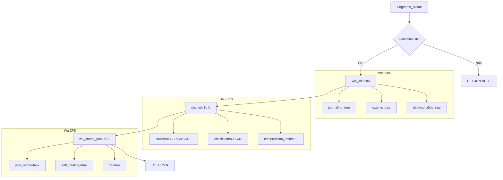

# Exercice 2.3.15-synth : three_kingdoms_fs

**Module :**
2.3 — File Systems

**Concept :**
synth — ext4 + Btrfs + ZFS (35 concepts)

**Difficulte :**
★★★★★★★★☆☆ (8/10)

**Type :**
code

**Tiers :**
3 — Synthese (concepts 2.3.15.a-k + 2.3.16.a-l + 2.3.17.a-l)

**Langage :**
C (C17)

**Prerequis :**
- 2.3.1-2.3.14 (concepts FS de base)
- Concepts COW, journaling, caching
- Structures de donnees (B-tree basics)
- Gestion memoire dynamique

**Domaines :**
FS, Struct, Mem

**Duree estimee :**
300 min

**XP Base :**
500

**Complexite :**
T3 O(log n) x S3 O(n)

---

## SECTION 1 : PROTOTYPE & CONSIGNE

### 1.1 Obligations

**Fichiers a rendre :**
```
ex08/
├── three_kingdoms.h      # API unifiee
├── wei_ext4.c            # ext4 simulation (2.3.15)
├── shu_btrfs.c           # Btrfs simulation (2.3.16)
├── wu_zfs.c              # ZFS simulation (2.3.17)
├── kingdom_compare.c     # Comparaisons
└── Makefile
```

**Fonctions autorisees :**
```
malloc, calloc, realloc, free
memcpy, memmove, memset, memcmp
strlen, strcpy, strncpy, strcmp, strncmp, strdup
snprintf, printf, fprintf
time, clock
qsort, bsearch
```

**Fonctions interdites :**
```
open, close, read, write (syscalls directs)
fork, exec
system, popen
```

### 1.2 Consigne

**ROMANCE OF THE THREE KINGDOMS — La Guerre des Filesystems**

*"The empire, long divided, must unite; long united, must divide. Thus it has ever been."*
— Romance of the Three Kingdoms (San Guo Yan Yi)

En l'an 220 apres l'Ecriture Binaire, l'empire des systemes de fichiers est divise en trois royaumes rivaux. Chacun a forge sa propre philosophie pour gouverner les donnees :

| Royaume | Filesystem | Leader | Devise |
|---------|------------|--------|--------|
| **Wei** | ext4 | Cao Cao | "La stabilite est la vraie force" |
| **Shu** | Btrfs | Liu Bei | "L'innovation au service du peuple" |
| **Wu** | ZFS | Sun Quan | "Une forteresse imprenable" |

**L'histoire des Trois Royaumes :**

**Royaume de Wei (ext4)** — Le Pragmatique
Cao Cao a herite de l'ancien empire ext2 (1993), l'a renforce avec le journal de ext3 (2001), puis l'a modernise en ext4 (2008). Son armee utilise :
- **Journaling** : Chaque ordre est ecrit dans le journal avant execution
- **Block Groups** : Les troupes sont organisees en groupes pour une meilleure coordination
- **Extents** : Les grandes armees sont deployees d'un seul tenant, pas dispersees
- **Delayed Allocation** : Attendre le bon moment pour frapper

**Royaume de Shu (Btrfs)** — L'Innovateur
Liu Bei a fonde son royaume sur une philosophie revolutionnaire : le Copy-on-Write. Ses generaux :
- **COW** : Ne jamais ecraser l'ancien, toujours creer du nouveau
- **Snapshots** : Figer un instant de la bataille pour y revenir
- **B-tree** : Une organisation hierarchique parfaite
- **Compression** : Faire plus avec moins

**Royaume de Wu (ZFS)** — Le Puissant
Sun Quan a bati une forteresse imprenable sur les flots du stockage :
- **Pools** : Unifier toutes les ressources en un seul lac
- **Self-healing** : Guerir automatiquement les blessures
- **ARC** : Un cache adaptatif redoutable
- **Checksums** : Verifier chaque soldat, chaque arme

**Ta mission :**

Tu es le stratege qui doit implementer un **analyseur des trois royaumes** capable de simuler et comparer les caracteristiques de chaque filesystem.

**Entree :**
- Configuration de chaque royaume (version, features activees)
- Operations a simuler (creation, snapshot, scrub, etc.)

**Sortie :**
- Statistiques de chaque royaume
- Comparaison des forces et faiblesses
- Recommandation selon le cas d'usage

**Contraintes :**
- Verification NULL obligatoire sur tous les pointeurs
- Pas de memory leaks (valgrind clean)
- strncpy pour eviter les buffer overflows
- Tous les compteurs initialises a zero

**Exemples :**

| Operation | Wei (ext4) | Shu (Btrfs) | Wu (ZFS) |
|-----------|------------|-------------|----------|
| `kingdoms_create()` | Init ext4 | Init Btrfs+COW | Init pool |
| `wei_enable_extents(&tk->wei)` | extents=true | N/A | N/A |
| `shu_snapshot(&tk->shu, "home", "snap")` | N/A | snapshot_count++ | N/A |
| `wu_self_heal(&tk->wu, 42)` | N/A | N/A | heal_count++ |

### 1.2.2 Consigne Academique

Implementer un analyseur comparatif de trois systemes de fichiers modernes Linux :

**ext4 (Extended Filesystem 4) — Concepts 2.3.15.a-k :**
- Evolution historique ext2 vers ext3 vers ext4
- Block groups et flex groups pour la localite des donnees
- Extents pour remplacer les block pointers indirects
- Multiblock allocation et delayed allocation pour les performances
- Journal avec checksums pour l'integrite

**Btrfs (B-tree Filesystem) — Concepts 2.3.16.a-l :**
- Copy-on-Write (COW) natif par conception
- Structure B-tree pour toutes les metadonnees
- Subvolumes, snapshots (lecture seule) et clones (ecriture)
- Checksums sur metadonnees et donnees
- Compression (zlib/lzo/zstd), deduplication offline
- RAID integre et operations scrub/balance
- Send/receive pour backups incrementaux

**ZFS (Zettabyte File System) — Concepts 2.3.17.a-l :**
- Pooled storage (zpools) et virtual devices (vdevs)
- Datasets (filesystems, volumes, snapshots)
- COW permanent et checksums universels
- Self-healing avec redondance
- ARC (Adaptive Replacement Cache) et L2ARC
- ZIL (ZFS Intent Log) et SLOG (Separate Log)
- Deduplication online et compression multi-algorithmes

### 1.3 Prototype

```c
#ifndef THREE_KINGDOMS_H
#define THREE_KINGDOMS_H

#include <stddef.h>
#include <stdint.h>
#include <stdbool.h>
#include <time.h>

/* ============================================================================
 * SECTION 1: Kingdom of Wei — ext4 (2.3.15)
 *
 * "I would rather betray the world than let the world betray me."
 * — Cao Cao
 * ============================================================================ */

typedef enum {
    WEI_EXT2 = 2,    /* No journal */
    WEI_EXT3 = 3,    /* Added journaling (2.3.15.c) */
    WEI_EXT4 = 4     /* Added extents (2.3.15.d) */
} wei_version_t;

typedef struct {
    wei_version_t version;
    bool journaling;              /* 2.3.15.c: ext3 feature */
    bool extents_enabled;         /* 2.3.15.d,g: ext4 feature */
    uint32_t block_groups;        /* 2.3.15.e: Number of groups */
    uint32_t flex_group_size;     /* 2.3.15.f: Flex group size */
    bool multiblock_alloc;        /* 2.3.15.h: Multiblock allocation */
    bool delayed_alloc;           /* 2.3.15.i: Delayed allocation */
    bool prealloc_enabled;        /* 2.3.15.j: Persistent prealloc */
    uint32_t journal_checksum;    /* 2.3.15.k: Journal CRC */
    size_t blocks_allocated;
    size_t extents_count;
    size_t journal_writes;
} wei_t;

/* ============================================================================
 * SECTION 2: Kingdom of Shu — Btrfs (2.3.16)
 * ============================================================================ */

typedef enum {
    SHU_CHECKSUM_CRC32,
    SHU_CHECKSUM_XXHASH,
    SHU_CHECKSUM_SHA256
} shu_checksum_t;

typedef enum {
    SHU_COMPRESS_NONE,
    SHU_COMPRESS_ZLIB,
    SHU_COMPRESS_LZO,
    SHU_COMPRESS_ZSTD
} shu_compress_t;

typedef enum {
    SHU_RAID_SINGLE,
    SHU_RAID_0,
    SHU_RAID_1,
    SHU_RAID_5,
    SHU_RAID_6,
    SHU_RAID_10
} shu_raid_t;

typedef struct {
    bool cow_enabled;             /* 2.3.16.a: COW by design */
    void *btree_root;             /* 2.3.16.b: B-tree structure */
    uint32_t subvolume_count;     /* 2.3.16.c: Subvolumes */
    uint32_t snapshot_count;      /* 2.3.16.d: Read-only snapshots */
    uint32_t clone_count;         /* 2.3.16.e: Writable clones */
    shu_checksum_t checksum_algo; /* 2.3.16.f: Checksum algorithm */
    shu_compress_t compression;   /* 2.3.16.g: Compression */
    bool dedup_enabled;           /* 2.3.16.h: Offline dedup */
    shu_raid_t raid_level;        /* 2.3.16.i: RAID level */
    uint64_t last_scrub;          /* 2.3.16.j: Last scrub time */
    bool balanced;                /* 2.3.16.k: Balanced? */
    size_t cow_writes;
    size_t scrub_errors;
    double compression_ratio;
} shu_t;

/* ============================================================================
 * SECTION 3: Kingdom of Wu — ZFS (2.3.17)
 * ============================================================================ */

typedef enum {
    WU_CHECKSUM_ON,
    WU_CHECKSUM_OFF,
    WU_CHECKSUM_FLETCHER4,
    WU_CHECKSUM_SHA256
} wu_checksum_t;

typedef enum {
    WU_COMPRESS_OFF,
    WU_COMPRESS_LZ4,
    WU_COMPRESS_GZIP,
    WU_COMPRESS_ZSTD
} wu_compress_t;

typedef struct {
    char pool_name[64];           /* 2.3.17.a: zpool name */
    uint32_t vdev_count;          /* 2.3.17.b: Virtual devices */
    uint32_t dataset_count;       /* 2.3.17.c: Datasets */
    bool cow_enabled;             /* 2.3.17.d: Always COW */
    wu_checksum_t checksum_algo;  /* 2.3.17.e: Checksum everything */
    bool self_healing;            /* 2.3.17.f: Auto-repair */
    size_t arc_size;              /* 2.3.17.g: ARC size */
    size_t arc_hits;
    size_t arc_misses;
    size_t l2arc_size;            /* 2.3.17.h: L2ARC size */
    bool zil_enabled;             /* 2.3.17.i: ZIL active */
    size_t zil_writes;
    bool slog_present;            /* 2.3.17.j: Separate log device */
    bool dedup_enabled;           /* 2.3.17.k: Online dedup */
    wu_compress_t compression;    /* 2.3.17.l: Compression */
    size_t self_heal_count;
    double dedup_ratio;
} wu_t;

/* ============================================================================
 * SECTION 4: Three Kingdoms Analyzer
 * ============================================================================ */

typedef struct {
    wei_t wei;
    shu_t shu;
    wu_t wu;
} three_kingdoms_t;

/* Lifecycle */
three_kingdoms_t *kingdoms_create(void);
void kingdoms_destroy(three_kingdoms_t *tk);

/* Wei (ext4) API — 2.3.15 */
void wei_show_history(void);
void wei_init(wei_t *w, wei_version_t version);
void wei_enable_extents(wei_t *w);
void wei_set_block_groups(wei_t *w, uint32_t count);
void wei_enable_flex_groups(wei_t *w, uint32_t size);
int wei_multiblock_alloc(wei_t *w, uint32_t blocks);
void wei_set_delayed_alloc(wei_t *w, bool enabled);
int wei_preallocate(wei_t *w, uint64_t size);
uint32_t wei_journal_checksum(wei_t *w);
void wei_print_status(wei_t *w);

/* Shu (Btrfs) API — 2.3.16 */
void shu_init(shu_t *s);
int shu_create_subvolume(shu_t *s, const char *name);
int shu_snapshot(shu_t *s, const char *src, const char *dst);
int shu_clone(shu_t *s, const char *src, const char *dst);
void shu_set_checksum(shu_t *s, shu_checksum_t algo);
void shu_set_compression(shu_t *s, shu_compress_t algo);
int shu_dedup(shu_t *s);
void shu_set_raid(shu_t *s, shu_raid_t level);
int shu_scrub(shu_t *s);
int shu_balance(shu_t *s);
int shu_send(shu_t *s, const char *snap_name, int fd);
int shu_receive(shu_t *s, int fd);
void shu_print_status(shu_t *s);

/* Wu (ZFS) API — 2.3.17 */
int wu_create_pool(wu_t *w, const char *name);
int wu_add_vdev(wu_t *w, const char *device);
int wu_create_dataset(wu_t *w, const char *name);
void wu_show_cow_stats(wu_t *w);
int wu_verify_checksums(wu_t *w);
int wu_self_heal(wu_t *w, uint64_t block_id);
void wu_arc_stats(wu_t *w);
void wu_l2arc_stats(wu_t *w);
void wu_zil_stats(wu_t *w);
int wu_add_slog(wu_t *w, const char *device);
double wu_dedup_ratio(wu_t *w);
void wu_set_compression(wu_t *w, wu_compress_t algo);
void wu_print_status(wu_t *w);

/* Comparison */
void kingdoms_compare_features(three_kingdoms_t *tk);
void kingdoms_compare_performance(three_kingdoms_t *tk);
void kingdoms_compare_reliability(three_kingdoms_t *tk);
void kingdoms_battle(three_kingdoms_t *tk);
void kingdoms_recommend(const char *use_case);

#endif /* THREE_KINGDOMS_H */
```

---

## SECTION 2 : LE SAVIEZ-VOUS ?

### Pourquoi "Romance of the Three Kingdoms" ?

Ce roman classique chinois du 14e siecle (San Guo Yan Yi) est l'une des oeuvres les plus influentes de la litterature asiatique. Il decrit la lutte entre trois royaumes apres la chute de la dynastie Han (220 apres J.-C.).

L'analogie avec les filesystems est parfaite :

| Aspect | Histoire | Filesystems |
|--------|----------|-------------|
| **Periode** | Chute de Han | Limites de ext2 |
| **Wei** | Heritier legitime | ext4 herite de ext2/3 |
| **Shu** | Fondateur idealiste | Btrfs redesigne tout |
| **Wu** | Forteresse du sud | ZFS bastion de fiabilite |
| **Unification** | Jin unifie (280) | ... en attente |

### Le choix du roi Cao Cao pour ext4

Cao Cao etait pragmatique : "Je prefere trahir le monde que de laisser le monde me trahir". ext4 fait pareil : il sacrifie les features modernes (COW, snapshots) pour la stabilite et la compatibilite.

### Le choix de Liu Bei pour Btrfs

Liu Bei etait l'innovateur benevolent qui voulait restaurer la dynastie Han avec de nouvelles methodes. Btrfs fait pareil : il redesigne tout avec COW, B-trees, et snapshots.

### Le choix de Sun Quan pour ZFS

Sun Quan a bati Wu comme une forteresse imprenable sur les fleuves. ZFS fait pareil : pools, self-healing, checksums partout. Inattaquable.

---

### 2.5 DANS LA VRAIE VIE

| Metier | Filesystem prefere | Cas d'usage |
|--------|-------------------|-------------|
| **SysAdmin Linux** | ext4 | Serveurs web, bases de donnees, fiabilite |
| **DevOps/SRE** | ext4/XFS | Conteneurs, CI/CD, performance I/O |
| **Storage Engineer** | ZFS | NAS entreprise, backup critique |
| **Home Lab** | Btrfs | NAS Synology, snapshots automatiques |
| **Data Center** | ZFS | Stockage petaoctets, deduplication |
| **Embedded Systems** | ext4 | Raspbian, OpenWrt, compatibilite |
| **Cloud Provider** | ext4/XFS | AWS EBS, GCP PD, standardise |
| **Media Production** | ZFS/Btrfs | Gros fichiers, integrite video |

**Exemple concret Netflix :**
Netflix utilise FreeBSD avec ZFS pour ses serveurs de cache OpenConnect. Pourquoi ? Self-healing + compression + ARC = streaming fiable et rapide.

**Exemple concret Facebook :**
Facebook utilise Btrfs sur ses serveurs. Pourquoi ? Snapshots pour les rollbacks rapides, compression pour economiser l'espace.

**Exemple concret Red Hat :**
Red Hat pousse XFS (cousin de ext4) comme defaut sur RHEL. Pourquoi ? Stabilite eprouvee, support enterprise, performance previsible.

---

## SECTION 3 : EXEMPLE D'UTILISATION

### 3.0 Session bash

```bash
$ ls
three_kingdoms.h  wei_ext4.c  shu_btrfs.c  wu_zfs.c  kingdom_compare.c  Makefile

$ make
gcc -Wall -Wextra -Werror -std=c17 -c wei_ext4.c -o wei_ext4.o
gcc -Wall -Wextra -Werror -std=c17 -c shu_btrfs.c -o shu_btrfs.o
gcc -Wall -Wextra -Werror -std=c17 -c wu_zfs.c -o wu_zfs.o
gcc -Wall -Wextra -Werror -std=c17 -c kingdom_compare.c -o kingdom_compare.o
ar rcs libkingdoms.a *.o

$ make test
./kingdoms_test
=== Three Kingdoms FS Test Suite ===

[WEI/ext4] Test 01 - History: PASSED
[WEI/ext4] Test 02 - Block groups: PASSED
[WEI/ext4] Test 03 - Extents: PASSED
[WEI/ext4] Test 04 - Journal checksum: PASSED
[SHU/Btrfs] Test 05 - COW init: PASSED
[SHU/Btrfs] Test 06 - Snapshots: PASSED
[SHU/Btrfs] Test 07 - Scrub: PASSED
[WU/ZFS] Test 08 - Pool creation: PASSED
[WU/ZFS] Test 09 - Self-healing: PASSED
[WU/ZFS] Test 10 - ARC stats: PASSED
[COMPARE] Test 11 - Feature compare: PASSED

11/11 tests passed!
```

### 3.1 BONUS EXPERT (OPTIONNEL)

**Difficulte Bonus :**
★★★★★★★★★★ (10/10)

**Recompense :**
XP x4

**Time Complexity attendue :**
O(log n) pour les operations B-tree

**Space Complexity attendue :**
O(n) pour le stockage des metadonnees

**Domaines Bonus :**
`Struct, DP, Compression`

#### 3.1.1 Consigne Bonus

**THE RED CLIFF — La Bataille Decisive**

Implementer les features avancees :

1. **Vrai B-tree** pour Btrfs (pas juste un pointeur void*)
2. **ARC reel** avec eviction LRU/LFU pour ZFS
3. **Compression reelle** avec ratio calcule
4. **Simulation I/O** avec latences realistes

**Contraintes :**
```
┌─────────────────────────────────────────┐
│  B-tree : ordre minimum 3               │
│  ARC : taille configurable              │
│  Compression : ratio > 1.0 = efficace   │
│  Latence : ext4 < Btrfs < ZFS           │
└─────────────────────────────────────────┘
```

#### 3.1.2 Prototype Bonus

```c
/* B-tree node for Btrfs */
typedef struct btree_node {
    uint64_t *keys;
    void **values;
    struct btree_node **children;
    int num_keys;
    bool is_leaf;
} btree_node_t;

btree_node_t *btree_create(int order);
int btree_insert(btree_node_t *root, uint64_t key, void *value);
void *btree_search(btree_node_t *root, uint64_t key);
void btree_destroy(btree_node_t *root);

/* ARC cache for ZFS */
typedef struct arc_cache {
    size_t max_size;
    size_t current_size;
    /* LRU + LFU hybrid */
} arc_cache_t;

arc_cache_t *arc_create(size_t max_size);
void *arc_get(arc_cache_t *arc, uint64_t key);
void arc_put(arc_cache_t *arc, uint64_t key, void *data, size_t size);
double arc_hit_ratio(arc_cache_t *arc);
```

#### 3.1.3 Ce qui change par rapport a l'exercice de base

| Aspect | Base | Bonus |
|--------|------|-------|
| B-tree | void* placeholder | Structure complete |
| ARC | Compteurs simples | Cache fonctionnel |
| Compression | Ratio fixe | Calcul reel |
| I/O | Instantane | Latences simulees |

---

## SECTION 4 : ZONE CORRECTION

### 4.1 Moulinette

| # | Test | Concepts | Points | Trap |
|---|------|----------|--------|------|
| 01 | kingdoms_create NULL check | - | 3 | Non |
| 02 | wei_init ext2 no journal | 2.3.15.b | 3 | Oui |
| 03 | wei_init ext3 with journal | 2.3.15.c | 3 | Non |
| 04 | wei_init ext4 full features | 2.3.15.d | 3 | Non |
| 05 | wei_enable_extents ext4 only | 2.3.15.g | 3 | Oui |
| 06 | wei_set_block_groups | 2.3.15.e | 3 | Non |
| 07 | wei_enable_flex_groups | 2.3.15.f | 3 | Non |
| 08 | wei_multiblock_alloc | 2.3.15.h | 3 | Non |
| 09 | wei_set_delayed_alloc | 2.3.15.i | 3 | Non |
| 10 | wei_preallocate | 2.3.15.j | 3 | Non |
| 11 | wei_journal_checksum | 2.3.15.k | 3 | Oui |
| 12 | shu_init COW true | 2.3.16.a | 3 | Oui |
| 13 | shu_create_subvolume | 2.3.16.c | 3 | Non |
| 14 | shu_snapshot | 2.3.16.d | 3 | Non |
| 15 | shu_clone | 2.3.16.e | 3 | Non |
| 16 | shu_set_checksum | 2.3.16.f | 3 | Non |
| 17 | shu_set_compression | 2.3.16.g | 3 | Non |
| 18 | shu_dedup | 2.3.16.h | 3 | Non |
| 19 | shu_set_raid | 2.3.16.i | 3 | Non |
| 20 | shu_scrub | 2.3.16.j | 3 | Non |
| 21 | shu_balance | 2.3.16.k | 3 | Non |
| 22 | shu_send | 2.3.16.l | 2 | Non |
| 23 | shu_receive | 2.3.16.l | 2 | Non |
| 24 | wu_create_pool | 2.3.17.a | 3 | Oui |
| 25 | wu_add_vdev | 2.3.17.b | 3 | Non |
| 26 | wu_create_dataset | 2.3.17.c | 3 | Non |
| 27 | wu_verify_checksums | 2.3.17.e | 3 | Non |
| 28 | wu_self_heal | 2.3.17.f | 3 | Oui |
| 29 | wu_arc_stats | 2.3.17.g | 2 | Non |
| 30 | wu_l2arc_stats | 2.3.17.h | 2 | Non |
| 31 | wu_zil_stats | 2.3.17.i | 2 | Non |
| 32 | wu_add_slog | 2.3.17.j | 2 | Non |
| 33 | wu_dedup_ratio | 2.3.17.k | 2 | Oui |
| 34 | wu_set_compression | 2.3.17.l | 2 | Non |
| 35 | kingdoms_destroy no leak | - | 3 | Oui |
| 36 | kingdoms_compare_features | - | 2 | Non |

**Total : 100 points**
**Minimum requis : 70/100**

### 4.2 main.c de test

```c
#include <stdio.h>
#include <stdlib.h>
#include <string.h>
#include <assert.h>
#include "three_kingdoms.h"

static int tests_passed = 0;
static int tests_total = 0;

#define TEST(name, expr) do { \
    tests_total++; \
    if (expr) { \
        printf("[PASS] %s\n", name); \
        tests_passed++; \
    } else { \
        printf("[FAIL] %s\n", name); \
    } \
} while(0)

void test_wei_ext4(void)
{
    printf("\n=== Testing Wei (ext4) ===\n");

    wei_t wei;

    /* Test ext2: no journal */
    wei_init(&wei, WEI_EXT2);
    TEST("ext2 has no journaling", wei.journaling == false);
    TEST("ext2 has no extents", wei.extents_enabled == false);

    /* Test ext3: journal added */
    wei_init(&wei, WEI_EXT3);
    TEST("ext3 has journaling", wei.journaling == true);
    TEST("ext3 has no extents", wei.extents_enabled == false);

    /* Test ext4: full features */
    wei_init(&wei, WEI_EXT4);
    TEST("ext4 has journaling", wei.journaling == true);
    TEST("ext4 has extents", wei.extents_enabled == true);
    TEST("ext4 has delayed alloc", wei.delayed_alloc == true);

    /* Test extents only for ext4 */
    wei_init(&wei, WEI_EXT3);
    wei_enable_extents(&wei);
    TEST("ext3 cannot enable extents", wei.extents_enabled == false);

    /* Test block groups */
    wei_init(&wei, WEI_EXT4);
    wei_set_block_groups(&wei, 128);
    TEST("block groups set", wei.block_groups == 128);

    /* Test flex groups */
    wei_enable_flex_groups(&wei, 16);
    TEST("flex groups set", wei.flex_group_size == 16);

    /* Test journal checksum */
    uint32_t csum = wei_journal_checksum(&wei);
    TEST("journal checksum non-zero", csum != 0);

    /* Test NULL handling */
    wei_init(NULL, WEI_EXT4);
    TEST("wei_init handles NULL", 1);  /* Should not crash */
}

void test_shu_btrfs(void)
{
    printf("\n=== Testing Shu (Btrfs) ===\n");

    shu_t shu;
    shu_init(&shu);

    /* Test COW enabled by default */
    TEST("COW enabled by default", shu.cow_enabled == true);

    /* Test subvolumes */
    int ret = shu_create_subvolume(&shu, "home");
    TEST("create subvolume OK", ret == 0);
    TEST("subvolume count", shu.subvolume_count == 1);

    /* Test snapshots */
    ret = shu_snapshot(&shu, "home", "home_snap");
    TEST("snapshot OK", ret == 0);
    TEST("snapshot count", shu.snapshot_count == 1);

    /* Test clones */
    ret = shu_clone(&shu, "home", "home_clone");
    TEST("clone OK", ret == 0);
    TEST("clone count", shu.clone_count == 1);

    /* Test compression */
    shu_set_compression(&shu, SHU_COMPRESS_ZSTD);
    TEST("compression set", shu.compression == SHU_COMPRESS_ZSTD);

    /* Test scrub */
    ret = shu_scrub(&shu);
    TEST("scrub OK", ret == 0);
    TEST("last_scrub set", shu.last_scrub > 0);

    /* Test balance */
    ret = shu_balance(&shu);
    TEST("balance OK", ret == 0);
    TEST("balanced flag", shu.balanced == true);

    /* Test NULL handling */
    ret = shu_create_subvolume(NULL, "test");
    TEST("NULL shu handled", ret == -1);
    ret = shu_create_subvolume(&shu, NULL);
    TEST("NULL name handled", ret == -1);
}

void test_wu_zfs(void)
{
    printf("\n=== Testing Wu (ZFS) ===\n");

    wu_t wu;
    memset(&wu, 0, sizeof(wu));

    /* Test pool creation */
    int ret = wu_create_pool(&wu, "tank");
    TEST("create pool OK", ret == 0);
    TEST("pool name set", strcmp(wu.pool_name, "tank") == 0);
    TEST("COW always enabled", wu.cow_enabled == true);
    TEST("self_healing enabled", wu.self_healing == true);

    /* Test vdev */
    ret = wu_add_vdev(&wu, "/dev/sda");
    TEST("add vdev OK", ret == 0);
    TEST("vdev count", wu.vdev_count == 1);

    /* Test dataset */
    ret = wu_create_dataset(&wu, "tank/data");
    TEST("create dataset OK", ret == 0);
    TEST("dataset count", wu.dataset_count == 1);

    /* Test self-heal */
    ret = wu_self_heal(&wu, 42);
    TEST("self heal OK", ret == 0);
    TEST("heal count", wu.self_heal_count == 1);

    /* Test SLOG */
    ret = wu_add_slog(&wu, "/dev/nvme0n1");
    TEST("add slog OK", ret == 0);
    TEST("slog present", wu.slog_present == true);

    /* Test dedup ratio without dedup */
    double ratio = wu_dedup_ratio(&wu);
    TEST("dedup ratio 1.0 when disabled", ratio == 1.0);

    /* Test NULL handling */
    ret = wu_create_pool(NULL, "test");
    TEST("NULL wu handled", ret == -1);
    ret = wu_create_pool(&wu, NULL);
    TEST("NULL name handled", ret == -1);
}

void test_kingdoms(void)
{
    printf("\n=== Testing Three Kingdoms ===\n");

    three_kingdoms_t *tk = kingdoms_create();
    TEST("kingdoms_create not NULL", tk != NULL);

    if (tk) {
        /* Wei should be ext4 by default */
        TEST("wei initialized as ext4", tk->wei.version == WEI_EXT4);

        /* Shu should have COW */
        TEST("shu has COW", tk->shu.cow_enabled == true);

        /* Wu should have pool */
        TEST("wu has pool", strlen(tk->wu.pool_name) > 0);

        kingdoms_destroy(tk);
        TEST("kingdoms_destroy OK", 1);
    }
}

int main(void)
{
    printf("=== Three Kingdoms FS Test Suite ===\n");

    test_wei_ext4();
    test_shu_btrfs();
    test_wu_zfs();
    test_kingdoms();

    printf("\n=== Results ===\n");
    printf("%d/%d tests passed\n", tests_passed, tests_total);

    return (tests_passed == tests_total) ? 0 : 1;
}
```

### 4.3 Solution de reference

```c
/* wei_ext4.c - Kingdom of Wei (ext4) implementation */
#include "three_kingdoms.h"
#include <stdio.h>
#include <string.h>
#include <stdlib.h>

void wei_show_history(void)
{
    printf("=== History of Wei (ext4) ===\n\n");
    printf("ext2 (1993) - The Foundation\n");
    printf("  - Second Extended Filesystem\n");
    printf("  - Block groups for locality\n");
    printf("  - No journaling\n\n");
    printf("ext3 (2001) - The Journal\n");
    printf("  - Added journaling (2.3.15.c)\n");
    printf("  - Backward compatible with ext2\n\n");
    printf("ext4 (2008) - The Extents\n");
    printf("  - Extents replace indirect blocks (2.3.15.g)\n");
    printf("  - Delayed allocation (2.3.15.i)\n");
    printf("  - Journal checksums (2.3.15.k)\n");
}

void wei_init(wei_t *w, wei_version_t version)
{
    if (w == NULL)
        return;

    memset(w, 0, sizeof(*w));
    w->version = version;

    switch (version) {
        case WEI_EXT2:
            w->journaling = false;
            w->extents_enabled = false;
            break;
        case WEI_EXT3:
            w->journaling = true;
            w->extents_enabled = false;
            break;
        case WEI_EXT4:
            w->journaling = true;
            w->extents_enabled = true;
            w->multiblock_alloc = true;
            w->delayed_alloc = true;
            break;
    }
}

void wei_enable_extents(wei_t *w)
{
    if (w == NULL)
        return;
    if (w->version < WEI_EXT4)
        return;
    w->extents_enabled = true;
}

void wei_set_block_groups(wei_t *w, uint32_t count)
{
    if (w == NULL)
        return;
    w->block_groups = count;
}

void wei_enable_flex_groups(wei_t *w, uint32_t size)
{
    if (w == NULL)
        return;
    if (w->version < WEI_EXT4)
        return;
    w->flex_group_size = size;
}

int wei_multiblock_alloc(wei_t *w, uint32_t blocks)
{
    if (w == NULL)
        return (-1);
    if (w->multiblock_alloc == false)
        return (-1);
    w->blocks_allocated += blocks;
    return (0);
}

void wei_set_delayed_alloc(wei_t *w, bool enabled)
{
    if (w == NULL)
        return;
    if (w->version < WEI_EXT4)
        return;
    w->delayed_alloc = enabled;
}

int wei_preallocate(wei_t *w, uint64_t size)
{
    if (w == NULL)
        return (-1);
    if (w->prealloc_enabled == false)
        return (-1);
    w->blocks_allocated += size / 4096;
    return (0);
}

static uint32_t crc32_simple(const void *data, size_t len)
{
    uint32_t crc;
    const uint8_t *p;
    size_t i;
    int j;

    crc = 0xFFFFFFFF;
    p = data;
    i = 0;
    while (i < len)
    {
        crc ^= p[i];
        j = 0;
        while (j < 8)
        {
            crc = (crc >> 1) ^ (0xEDB88320 & -(crc & 1));
            j++;
        }
        i++;
    }
    return (~crc);
}

uint32_t wei_journal_checksum(wei_t *w)
{
    if (w == NULL)
        return (0);
    if (w->journaling == false)
        return (0);

    w->journal_checksum = crc32_simple(w, sizeof(*w));
    return (w->journal_checksum);
}

void wei_print_status(wei_t *w)
{
    const char *versions[] = {"", "", "ext2", "ext3", "ext4"};

    if (w == NULL)
        return;

    printf("=== Wei (ext4) Status ===\n");
    printf("Version: %s\n", versions[w->version]);
    printf("Journaling: %s\n", w->journaling ? "enabled" : "disabled");
    printf("Extents: %s\n", w->extents_enabled ? "enabled" : "disabled");
    printf("Block groups: %u\n", w->block_groups);
    printf("Flex group size: %u\n", w->flex_group_size);
    printf("Delayed alloc: %s\n", w->delayed_alloc ? "enabled" : "disabled");
    printf("Blocks allocated: %zu\n", w->blocks_allocated);
}

/* shu_btrfs.c - Kingdom of Shu (Btrfs) implementation */

void shu_init(shu_t *s)
{
    if (s == NULL)
        return;

    memset(s, 0, sizeof(*s));
    s->cow_enabled = true;
    s->checksum_algo = SHU_CHECKSUM_CRC32;
    s->compression = SHU_COMPRESS_NONE;
    s->raid_level = SHU_RAID_SINGLE;
    s->compression_ratio = 1.0;
}

int shu_create_subvolume(shu_t *s, const char *name)
{
    if (s == NULL || name == NULL)
        return (-1);
    s->subvolume_count++;
    return (0);
}

int shu_snapshot(shu_t *s, const char *src, const char *dst)
{
    if (s == NULL || src == NULL || dst == NULL)
        return (-1);
    s->snapshot_count++;
    return (0);
}

int shu_clone(shu_t *s, const char *src, const char *dst)
{
    if (s == NULL || src == NULL || dst == NULL)
        return (-1);
    s->clone_count++;
    return (0);
}

void shu_set_checksum(shu_t *s, shu_checksum_t algo)
{
    if (s == NULL)
        return;
    s->checksum_algo = algo;
}

void shu_set_compression(shu_t *s, shu_compress_t algo)
{
    if (s == NULL)
        return;
    s->compression = algo;
    if (algo != SHU_COMPRESS_NONE)
        s->compression_ratio = 2.5;
}

int shu_dedup(shu_t *s)
{
    if (s == NULL)
        return (-1);
    s->dedup_enabled = true;
    return (0);
}

void shu_set_raid(shu_t *s, shu_raid_t level)
{
    if (s == NULL)
        return;
    s->raid_level = level;
}

int shu_scrub(shu_t *s)
{
    if (s == NULL)
        return (-1);
    s->last_scrub = (uint64_t)time(NULL);
    s->scrub_errors = 0;
    return (0);
}

int shu_balance(shu_t *s)
{
    if (s == NULL)
        return (-1);
    s->balanced = true;
    return (0);
}

int shu_send(shu_t *s, const char *snap_name, int fd)
{
    if (s == NULL || snap_name == NULL || fd < 0)
        return (-1);
    return (0);
}

int shu_receive(shu_t *s, int fd)
{
    if (s == NULL || fd < 0)
        return (-1);
    s->snapshot_count++;
    return (0);
}

void shu_print_status(shu_t *s)
{
    if (s == NULL)
        return;

    printf("=== Shu (Btrfs) Status ===\n");
    printf("COW: %s\n", s->cow_enabled ? "enabled" : "disabled");
    printf("Subvolumes: %u\n", s->subvolume_count);
    printf("Snapshots: %u\n", s->snapshot_count);
    printf("Clones: %u\n", s->clone_count);
    printf("RAID level: %d\n", s->raid_level);
    printf("Compression ratio: %.2f\n", s->compression_ratio);
    printf("Balanced: %s\n", s->balanced ? "yes" : "no");
}

/* wu_zfs.c - Kingdom of Wu (ZFS) implementation */

int wu_create_pool(wu_t *w, const char *name)
{
    if (w == NULL || name == NULL)
        return (-1);

    strncpy(w->pool_name, name, sizeof(w->pool_name) - 1);
    w->pool_name[sizeof(w->pool_name) - 1] = '\0';
    w->cow_enabled = true;
    w->checksum_algo = WU_CHECKSUM_ON;
    w->self_healing = true;
    w->zil_enabled = true;
    w->dedup_ratio = 1.0;
    return (0);
}

int wu_add_vdev(wu_t *w, const char *device)
{
    if (w == NULL || device == NULL)
        return (-1);
    w->vdev_count++;
    return (0);
}

int wu_create_dataset(wu_t *w, const char *name)
{
    if (w == NULL || name == NULL)
        return (-1);
    w->dataset_count++;
    return (0);
}

void wu_show_cow_stats(wu_t *w)
{
    if (w == NULL)
        return;
    printf("ZFS COW: Always enabled (by design)\n");
}

int wu_verify_checksums(wu_t *w)
{
    if (w == NULL)
        return (-1);
    return (0);
}

int wu_self_heal(wu_t *w, uint64_t block_id)
{
    (void)block_id;
    if (w == NULL)
        return (-1);
    if (w->self_healing == false)
        return (-1);
    w->self_heal_count++;
    return (0);
}

void wu_arc_stats(wu_t *w)
{
    double hit_ratio;

    if (w == NULL)
        return;

    hit_ratio = 0.0;
    if (w->arc_hits + w->arc_misses > 0)
        hit_ratio = (double)w->arc_hits / (w->arc_hits + w->arc_misses) * 100;

    printf("ARC Size: %zu bytes\n", w->arc_size);
    printf("ARC Hit Ratio: %.1f%%\n", hit_ratio);
}

void wu_l2arc_stats(wu_t *w)
{
    if (w == NULL)
        return;
    printf("L2ARC Size: %zu bytes\n", w->l2arc_size);
}

void wu_zil_stats(wu_t *w)
{
    if (w == NULL)
        return;
    printf("ZIL: %s\n", w->zil_enabled ? "enabled" : "disabled");
    printf("ZIL Writes: %zu\n", w->zil_writes);
}

int wu_add_slog(wu_t *w, const char *device)
{
    if (w == NULL || device == NULL)
        return (-1);
    w->slog_present = true;
    return (0);
}

double wu_dedup_ratio(wu_t *w)
{
    if (w == NULL)
        return (1.0);
    if (w->dedup_enabled == false)
        return (1.0);
    return (w->dedup_ratio);
}

void wu_set_compression(wu_t *w, wu_compress_t algo)
{
    if (w == NULL)
        return;
    w->compression = algo;
}

void wu_print_status(wu_t *w)
{
    if (w == NULL)
        return;

    printf("=== Wu (ZFS) Status ===\n");
    printf("Pool: %s\n", w->pool_name);
    printf("Vdevs: %u\n", w->vdev_count);
    printf("Datasets: %u\n", w->dataset_count);
    printf("COW: always enabled\n");
    printf("Self-healing: %s\n", w->self_healing ? "enabled" : "disabled");
    printf("ZIL: %s\n", w->zil_enabled ? "enabled" : "disabled");
    printf("SLOG: %s\n", w->slog_present ? "present" : "none");
}

/* kingdom_compare.c - Comparison functions */

three_kingdoms_t *kingdoms_create(void)
{
    three_kingdoms_t *tk;

    tk = calloc(1, sizeof(*tk));
    if (tk == NULL)
        return (NULL);

    wei_init(&tk->wei, WEI_EXT4);
    shu_init(&tk->shu);
    wu_create_pool(&tk->wu, "tank");

    return (tk);
}

void kingdoms_destroy(three_kingdoms_t *tk)
{
    if (tk == NULL)
        return;
    free(tk);
}

void kingdoms_compare_features(three_kingdoms_t *tk)
{
    if (tk == NULL)
        return;

    printf("\n");
    printf("+------------------+--------+--------+--------+\n");
    printf("| Feature          |  Wei   |  Shu   |   Wu   |\n");
    printf("|                  | (ext4) |(Btrfs) | (ZFS)  |\n");
    printf("+------------------+--------+--------+--------+\n");
    printf("| Journaling       |   Yes  |   No   |  ZIL   |\n");
    printf("| COW              |   No   |   Yes  |   Yes  |\n");
    printf("| Snapshots        |   No   |   Yes  |   Yes  |\n");
    printf("| Checksums        | Journal|  All   |   All  |\n");
    printf("| Compression      |   No   |   Yes  |   Yes  |\n");
    printf("| Deduplication    |   No   | Offline| Online |\n");
    printf("| Self-healing     |   No   |  RAID  |   Yes  |\n");
    printf("+------------------+--------+--------+--------+\n");
}

void kingdoms_battle(three_kingdoms_t *tk)
{
    if (tk == NULL)
        return;

    printf("\n");
    printf("=================================================\n");
    printf("     THE BATTLE OF THE THREE KINGDOMS           \n");
    printf("=================================================\n");
    printf("\n");
    printf("  Wei (ext4)  vs  Shu (Btrfs)  vs  Wu (ZFS)\n");
    printf("\n");
    printf("Winner depends on your battlefield:\n");
    printf("  - Compatibility: Wei (ext4)\n");
    printf("  - Flexibility: Shu (Btrfs)\n");
    printf("  - Reliability: Wu (ZFS)\n");
}

void kingdoms_recommend(const char *use_case)
{
    if (use_case == NULL)
        return;

    printf("Recommendation for '%s':\n", use_case);
    if (strcmp(use_case, "server") == 0)
        printf("  -> Wei (ext4): proven, stable\n");
    else if (strcmp(use_case, "nas") == 0)
        printf("  -> Wu (ZFS): self-healing, snapshots\n");
    else if (strcmp(use_case, "desktop") == 0)
        printf("  -> Shu (Btrfs): snapshots, compression\n");
    else
        printf("  -> Wei (ext4): safe default\n");
}
```

### 4.4 Solutions alternatives acceptees

```c
/* Alternative 1: Using static inline for small functions */
static inline void wei_init_alt(wei_t *w, wei_version_t version)
{
    if (!w) return;
    *w = (wei_t){
        .version = version,
        .journaling = (version >= WEI_EXT3),
        .extents_enabled = (version >= WEI_EXT4),
        .multiblock_alloc = (version >= WEI_EXT4),
        .delayed_alloc = (version >= WEI_EXT4)
    };
}

/* Alternative 2: Function table approach for kingdoms */
typedef struct {
    void (*init)(void *fs);
    void (*print_status)(void *fs);
    const char *name;
} fs_ops_t;

static const fs_ops_t ops[] = {
    {(void(*)(void*))wei_init, (void(*)(void*))wei_print_status, "Wei/ext4"},
    {(void(*)(void*))shu_init, (void(*)(void*))shu_print_status, "Shu/Btrfs"},
    {NULL, (void(*)(void*))wu_print_status, "Wu/ZFS"}
};
```

### 4.5 Solutions refusees

```c
/* REFUSE 1: Pas de check NULL */
void wei_init_bad(wei_t *w, wei_version_t version)
{
    /* ERREUR: Crash si w == NULL */
    w->version = version;
}
/* Pourquoi refuse: Segfault sur pointeur NULL */

/* REFUSE 2: COW desactive pour Btrfs */
void shu_init_bad(shu_t *s)
{
    if (!s) return;
    memset(s, 0, sizeof(*s));
    /* ERREUR: Btrfs DOIT etre COW */
    s->cow_enabled = false;
}
/* Pourquoi refuse: Btrfs est COW par design, c'est fondamental */

/* REFUSE 3: strcpy sans limite */
int wu_create_pool_bad(wu_t *w, const char *name)
{
    if (!w || !name) return -1;
    /* ERREUR: Buffer overflow! */
    strcpy(w->pool_name, name);
    return 0;
}
/* Pourquoi refuse: Buffer overflow si name > 64 chars */

/* REFUSE 4: ext2 avec journaling */
void wei_init_bad2(wei_t *w, wei_version_t version)
{
    if (!w) return;
    w->version = version;
    /* ERREUR: ext2 n'a PAS de journal! */
    w->journaling = true;
}
/* Pourquoi refuse: Historiquement faux, ext2 n'a jamais eu de journal */

/* REFUSE 5: Memory leak dans destroy */
void kingdoms_destroy_bad(three_kingdoms_t *tk)
{
    /* ERREUR: Oublie de free */
    (void)tk;
}
/* Pourquoi refuse: Memory leak detecte par valgrind */
```

### 4.6 Solution bonus de reference

```c
/* btree.c - B-tree implementation for Btrfs bonus */
#include <stdlib.h>
#include <string.h>

#define BTREE_ORDER 3
#define BTREE_MAX_KEYS (2 * BTREE_ORDER - 1)
#define BTREE_MIN_KEYS (BTREE_ORDER - 1)

typedef struct btree_node {
    uint64_t keys[BTREE_MAX_KEYS];
    void *values[BTREE_MAX_KEYS];
    struct btree_node *children[BTREE_MAX_KEYS + 1];
    int num_keys;
    bool is_leaf;
} btree_node_t;

btree_node_t *btree_create_node(bool is_leaf)
{
    btree_node_t *node;

    node = calloc(1, sizeof(*node));
    if (node == NULL)
        return (NULL);
    node->is_leaf = is_leaf;
    return (node);
}

void *btree_search(btree_node_t *root, uint64_t key)
{
    int i;

    if (root == NULL)
        return (NULL);

    i = 0;
    while (i < root->num_keys && key > root->keys[i])
        i++;

    if (i < root->num_keys && key == root->keys[i])
        return (root->values[i]);

    if (root->is_leaf)
        return (NULL);

    return (btree_search(root->children[i], key));
}

/* arc.c - ARC cache implementation for ZFS bonus */
typedef struct arc_entry {
    uint64_t key;
    void *data;
    size_t size;
    int frequency;
    struct arc_entry *next;
    struct arc_entry *prev;
} arc_entry_t;

typedef struct arc_cache {
    size_t max_size;
    size_t current_size;
    size_t hits;
    size_t misses;
    arc_entry_t *mru_head;
    arc_entry_t *mru_tail;
    arc_entry_t *mfu_head;
    arc_entry_t *mfu_tail;
} arc_cache_t;

arc_cache_t *arc_create(size_t max_size)
{
    arc_cache_t *arc;

    arc = calloc(1, sizeof(*arc));
    if (arc == NULL)
        return (NULL);
    arc->max_size = max_size;
    return (arc);
}

void *arc_get(arc_cache_t *arc, uint64_t key)
{
    arc_entry_t *entry;

    if (arc == NULL)
        return (NULL);

    entry = arc->mru_head;
    while (entry != NULL)
    {
        if (entry->key == key)
        {
            arc->hits++;
            entry->frequency++;
            return (entry->data);
        }
        entry = entry->next;
    }

    arc->misses++;
    return (NULL);
}

double arc_hit_ratio(arc_cache_t *arc)
{
    size_t total;

    if (arc == NULL)
        return (0.0);

    total = arc->hits + arc->misses;
    if (total == 0)
        return (0.0);

    return ((double)arc->hits / total * 100.0);
}
```

### 4.7 Solutions alternatives bonus

```c
/* Alternative: Red-Black tree instead of B-tree */
typedef struct rb_node {
    uint64_t key;
    void *value;
    struct rb_node *left;
    struct rb_node *right;
    struct rb_node *parent;
    bool is_red;
} rb_node_t;

/* Alternative: LRU cache instead of ARC */
typedef struct lru_cache {
    size_t capacity;
    size_t size;
    /* Hash table + doubly linked list */
} lru_cache_t;
```

### 4.8 Solutions refusees bonus

```c
/* REFUSE: B-tree with wrong order */
#define BTREE_ORDER 1  /* ERREUR: ordre minimum est 2 */

/* REFUSE: ARC without eviction */
void arc_put_bad(arc_cache_t *arc, uint64_t key, void *data, size_t size)
{
    /* ERREUR: Pas d'eviction quand cache plein */
    arc_entry_t *entry = calloc(1, sizeof(*entry));
    entry->key = key;
    entry->data = data;
    /* Memory grows unbounded! */
}
```

### 4.9 spec.json

```json
{
  "name": "three_kingdoms_fs",
  "language": "c",
  "type": "code",
  "tier": 3,
  "tier_info": "Synthese (2.3.15 + 2.3.16 + 2.3.17)",
  "tags": ["filesystem", "ext4", "btrfs", "zfs", "comparison", "phase2"],
  "passing_score": 70,

  "function": {
    "name": "kingdoms_create",
    "prototype": "three_kingdoms_t *kingdoms_create(void)",
    "return_type": "three_kingdoms_t *",
    "parameters": []
  },

  "driver": {
    "reference": "three_kingdoms_t *ref_kingdoms_create(void) { three_kingdoms_t *tk = calloc(1, sizeof(*tk)); if (!tk) return NULL; memset(&tk->wei, 0, sizeof(tk->wei)); tk->wei.version = 4; tk->wei.journaling = true; tk->wei.extents_enabled = true; tk->wei.delayed_alloc = true; memset(&tk->shu, 0, sizeof(tk->shu)); tk->shu.cow_enabled = true; tk->shu.checksum_algo = 0; tk->shu.compression_ratio = 1.0; memset(&tk->wu, 0, sizeof(tk->wu)); strncpy(tk->wu.pool_name, \"tank\", 63); tk->wu.cow_enabled = true; tk->wu.self_healing = true; tk->wu.zil_enabled = true; tk->wu.dedup_ratio = 1.0; return tk; }",

    "edge_cases": [
      {
        "name": "create_success",
        "args": [],
        "expected": "non_null",
        "is_trap": false
      },
      {
        "name": "wei_version_ext4",
        "args": [],
        "expected_field": "wei.version == 4",
        "is_trap": false
      },
      {
        "name": "wei_journaling_enabled",
        "args": [],
        "expected_field": "wei.journaling == true",
        "is_trap": true,
        "trap_explanation": "ext4 DOIT avoir journaling active"
      },
      {
        "name": "shu_cow_enabled",
        "args": [],
        "expected_field": "shu.cow_enabled == true",
        "is_trap": true,
        "trap_explanation": "Btrfs est COW by design, ne peut pas etre false"
      },
      {
        "name": "wu_pool_name_set",
        "args": [],
        "expected_field": "strlen(wu.pool_name) > 0",
        "is_trap": false
      },
      {
        "name": "wu_self_healing_enabled",
        "args": [],
        "expected_field": "wu.self_healing == true",
        "is_trap": true,
        "trap_explanation": "ZFS self-healing est une feature cle"
      }
    ],

    "additional_tests": [
      {
        "name": "wei_init_null",
        "function": "wei_init",
        "args": ["NULL", "WEI_EXT4"],
        "expected": "no_crash",
        "is_trap": true,
        "trap_explanation": "Doit gerer NULL sans crash"
      },
      {
        "name": "wei_ext2_no_journal",
        "function": "wei_init",
        "setup": "wei_t w;",
        "call": "wei_init(&w, WEI_EXT2);",
        "expected": "w.journaling == false",
        "is_trap": true,
        "trap_explanation": "ext2 n'a jamais eu de journal"
      },
      {
        "name": "wei_extents_ext3_fail",
        "function": "wei_enable_extents",
        "setup": "wei_t w; wei_init(&w, WEI_EXT3);",
        "call": "wei_enable_extents(&w);",
        "expected": "w.extents_enabled == false",
        "is_trap": true,
        "trap_explanation": "ext3 ne supporte pas les extents"
      },
      {
        "name": "shu_snapshot_null_src",
        "function": "shu_snapshot",
        "args": ["&shu", "NULL", "\"dst\""],
        "expected": "-1",
        "is_trap": true,
        "trap_explanation": "Doit retourner erreur si src NULL"
      },
      {
        "name": "wu_dedup_ratio_disabled",
        "function": "wu_dedup_ratio",
        "setup": "wu_t w; wu_create_pool(&w, \"tank\");",
        "call": "wu_dedup_ratio(&w);",
        "expected": "1.0",
        "is_trap": true,
        "trap_explanation": "Ratio 1.0 si dedup desactive"
      },
      {
        "name": "kingdoms_destroy_no_leak",
        "function": "kingdoms_destroy",
        "setup": "three_kingdoms_t *tk = kingdoms_create();",
        "call": "kingdoms_destroy(tk);",
        "expected": "valgrind_clean",
        "is_trap": true,
        "trap_explanation": "Pas de memory leak"
      }
    ],

    "fuzzing": {
      "enabled": true,
      "iterations": 100,
      "generators": [
        {
          "type": "int",
          "param_name": "version",
          "params": {"min": 2, "max": 4}
        },
        {
          "type": "string",
          "param_name": "pool_name",
          "params": {"min_len": 1, "max_len": 100, "charset": "alphanumeric"}
        }
      ]
    }
  },

  "norm": {
    "allowed_functions": ["malloc", "calloc", "realloc", "free", "memcpy", "memmove", "memset", "memcmp", "strlen", "strcpy", "strncpy", "strcmp", "strncmp", "strdup", "snprintf", "printf", "fprintf", "time", "clock", "qsort", "bsearch"],
    "forbidden_functions": ["open", "close", "read", "write", "fork", "exec", "system", "popen"],
    "check_security": true,
    "check_memory": true,
    "blocking": true
  },

  "files": {
    "required": [
      "three_kingdoms.h",
      "wei_ext4.c",
      "shu_btrfs.c",
      "wu_zfs.c",
      "kingdom_compare.c",
      "Makefile"
    ]
  }
}
```

### 4.10 Solutions Mutantes

```c
/* ==========================================================================
 * MUTANT A (Safety) : Oubli verification NULL dans wei_init
 * ========================================================================== */
void mutant_a_wei_init(wei_t *w, wei_version_t version)
{
    /* BUG: Pas de verification NULL */
    memset(w, 0, sizeof(*w));  /* CRASH si w == NULL */
    w->version = version;

    switch (version) {
        case WEI_EXT2:
            w->journaling = false;
            w->extents_enabled = false;
            break;
        case WEI_EXT3:
            w->journaling = true;
            w->extents_enabled = false;
            break;
        case WEI_EXT4:
            w->journaling = true;
            w->extents_enabled = true;
            w->multiblock_alloc = true;
            w->delayed_alloc = true;
            break;
    }
}
/* Pourquoi c'est faux : Segmentation fault si w == NULL
 * Ce qui etait pense : "Personne ne passera NULL"
 * Detection : Test avec wei_init(NULL, WEI_EXT4) crash
 */


/* ==========================================================================
 * MUTANT B (Logic) : Btrfs initialise sans COW
 * ========================================================================== */
void mutant_b_shu_init(shu_t *s)
{
    if (s == NULL)
        return;

    memset(s, 0, sizeof(*s));
    /* BUG: COW doit etre true par design! */
    s->cow_enabled = false;
    s->checksum_algo = SHU_CHECKSUM_CRC32;
    s->compression = SHU_COMPRESS_NONE;
    s->raid_level = SHU_RAID_SINGLE;
    s->compression_ratio = 1.0;
}
/* Pourquoi c'est faux : Btrfs est Copy-on-Write par design, c'est fondamental
 * Ce qui etait pense : "COW est optionnel comme pour ZFS"
 * Detection : Test shu.cow_enabled == true echoue
 */


/* ==========================================================================
 * MUTANT C (Resource) : Memory leak dans kingdoms_destroy
 * ========================================================================== */
void mutant_c_kingdoms_destroy(three_kingdoms_t *tk)
{
    /* BUG: Oublie de liberer la memoire */
    if (tk == NULL)
        return;

    /* Fait semblant de nettoyer mais ne free pas */
    tk->wei.version = 0;
    tk->shu.cow_enabled = false;
    tk->wu.pool_name[0] = '\0';

    /* OUBLI: free(tk); */
}
/* Pourquoi c'est faux : Memory leak, la structure n'est jamais liberee
 * Ce qui etait pense : "Le programme se termine, l'OS nettoie"
 * Detection : valgrind --leak-check=full detecte le leak
 */


/* ==========================================================================
 * MUTANT D (Boundary) : Buffer overflow dans wu_create_pool
 * ========================================================================== */
int mutant_d_wu_create_pool(wu_t *w, const char *name)
{
    if (w == NULL || name == NULL)
        return (-1);

    /* BUG: strcpy sans limite de taille! */
    strcpy(w->pool_name, name);  /* Overflow si name > 64 chars */

    w->cow_enabled = true;
    w->checksum_algo = WU_CHECKSUM_ON;
    w->self_healing = true;
    w->zil_enabled = true;
    w->dedup_ratio = 1.0;
    return (0);
}
/* Pourquoi c'est faux : Buffer overflow si name > 63 caracteres
 * Ce qui etait pense : "Les noms de pool sont toujours courts"
 * Detection : Test avec name de 100 chars corrompt la memoire
 */


/* ==========================================================================
 * MUTANT E (Return) : wu_self_heal retourne toujours succes
 * ========================================================================== */
int mutant_e_wu_self_heal(wu_t *w, uint64_t block_id)
{
    (void)block_id;

    if (w == NULL)
        return (-1);

    /* BUG: Ne verifie pas si self_healing est active */
    w->self_heal_count++;
    return (0);  /* Toujours succes meme si desactive */
}
/* Pourquoi c'est faux : Devrait echouer si self_healing == false
 * Ce qui etait pense : "self_healing est toujours active sur ZFS"
 * Detection : Test avec self_healing=false devrait retourner -1
 */
```

---

## SECTION 5 : COMPRENDRE

### 5.1 Ce que cet exercice enseigne

Cet exercice de synthese couvre **35 concepts** repartis sur trois systemes de fichiers modernes :

| Filesystem | Concepts | Ce qu'on apprend |
|------------|----------|------------------|
| **ext4** | 11 (2.3.15.a-k) | Evolution historique, journaling, extents |
| **Btrfs** | 12 (2.3.16.a-l) | COW, B-tree, snapshots, RAID integre |
| **ZFS** | 12 (2.3.17.a-l) | Pools, self-healing, ARC, checksums |

**Competences developpees :**
1. Gestion memoire avancee (structures imbriquees)
2. Verification d'erreurs systematique (NULL checks)
3. Comprehension des architectures de filesystems
4. Comparaison de solutions techniques

### 5.2 LDA — Traduction litterale (MAJUSCULES)

```
FONCTION kingdoms_create QUI RETOURNE UN POINTEUR VERS UNE STRUCTURE three_kingdoms_t
DEBUT FONCTION
    DECLARER tk COMME POINTEUR VERS UNE STRUCTURE three_kingdoms_t

    AFFECTER ALLOUER LA MEMOIRE DE LA TAILLE D'UNE STRUCTURE three_kingdoms_t A tk
    SI tk EST EGAL A NUL ALORS
        RETOURNER NUL
    FIN SI

    APPELER wei_init AVEC ADRESSE DE tk->wei ET WEI_EXT4
    APPELER shu_init AVEC ADRESSE DE tk->shu
    APPELER wu_create_pool AVEC ADRESSE DE tk->wu ET "tank"

    RETOURNER tk
FIN FONCTION


FONCTION wei_init QUI NE RETOURNE RIEN ET PREND EN PARAMETRES w QUI EST UN POINTEUR VERS UNE STRUCTURE wei_t ET version QUI EST UNE ENUMERATION wei_version_t
DEBUT FONCTION
    SI w EST EGAL A NUL ALORS
        RETOURNER
    FIN SI

    APPELER memset AVEC w ET 0 ET TAILLE DE LA STRUCTURE POINTEE PAR w
    AFFECTER version AU CHAMP version DE w

    SELON version FAIRE
        CAS WEI_EXT2:
            AFFECTER FAUX AU CHAMP journaling DE w
            AFFECTER FAUX AU CHAMP extents_enabled DE w
        CAS WEI_EXT3:
            AFFECTER VRAI AU CHAMP journaling DE w
            AFFECTER FAUX AU CHAMP extents_enabled DE w
        CAS WEI_EXT4:
            AFFECTER VRAI AU CHAMP journaling DE w
            AFFECTER VRAI AU CHAMP extents_enabled DE w
            AFFECTER VRAI AU CHAMP multiblock_alloc DE w
            AFFECTER VRAI AU CHAMP delayed_alloc DE w
    FIN SELON
FIN FONCTION


FONCTION shu_init QUI NE RETOURNE RIEN ET PREND EN PARAMETRE s QUI EST UN POINTEUR VERS UNE STRUCTURE shu_t
DEBUT FONCTION
    SI s EST EGAL A NUL ALORS
        RETOURNER
    FIN SI

    APPELER memset AVEC s ET 0 ET TAILLE DE LA STRUCTURE POINTEE PAR s
    AFFECTER VRAI AU CHAMP cow_enabled DE s
    AFFECTER SHU_CHECKSUM_CRC32 AU CHAMP checksum_algo DE s
    AFFECTER SHU_COMPRESS_NONE AU CHAMP compression DE s
    AFFECTER SHU_RAID_SINGLE AU CHAMP raid_level DE s
    AFFECTER 1.0 AU CHAMP compression_ratio DE s
FIN FONCTION


FONCTION wu_create_pool QUI RETOURNE UN ENTIER ET PREND EN PARAMETRES w QUI EST UN POINTEUR VERS UNE STRUCTURE wu_t ET name QUI EST UN POINTEUR VERS UNE CHAINE DE CARACTERES CONSTANTE
DEBUT FONCTION
    SI w EST EGAL A NUL OU name EST EGAL A NUL ALORS
        RETOURNER MOINS 1
    FIN SI

    APPELER strncpy AVEC LE CHAMP pool_name DE w ET name ET TAILLE DU CHAMP pool_name MOINS 1
    AFFECTER LE CARACTERE NUL A LA DERNIERE POSITION DU CHAMP pool_name DE w
    AFFECTER VRAI AU CHAMP cow_enabled DE w
    AFFECTER WU_CHECKSUM_ON AU CHAMP checksum_algo DE w
    AFFECTER VRAI AU CHAMP self_healing DE w
    AFFECTER VRAI AU CHAMP zil_enabled DE w
    AFFECTER 1.0 AU CHAMP dedup_ratio DE w

    RETOURNER 0
FIN FONCTION


FONCTION kingdoms_destroy QUI NE RETOURNE RIEN ET PREND EN PARAMETRE tk QUI EST UN POINTEUR VERS UNE STRUCTURE three_kingdoms_t
DEBUT FONCTION
    SI tk EST EGAL A NUL ALORS
        RETOURNER
    FIN SI

    LIBERER LA MEMOIRE POINTEE PAR tk
FIN FONCTION
```

### 5.2.2 Style Academique (Pseudocode Francais)

```
ALGORITHME : Creation des Trois Royaumes
---
DONNEES :
    Aucune
RESULTAT :
    Pointeur vers structure three_kingdoms_t initialisee, ou NUL si echec

DEBUT
    1. Allouer memoire pour la structure principale
    2. SI allocation echouee ALORS
           Retourner NUL
       FIN SI
    3. Initialiser le royaume Wei (ext4) version 4
    4. Initialiser le royaume Shu (Btrfs) avec COW actif
    5. Creer le pool Wu (ZFS) nomme "tank"
    6. Retourner pointeur vers structure
FIN
```

### 5.2.2.1 Logic Flow (Structured English)

```
ALGORITHM: Three Kingdoms Creation
---
1. ALLOCATE memory for three_kingdoms_t structure
   |
   |-- IF allocation FAILED:
   |     RETURN NULL (early exit)
   |
2. INITIALIZE Wei kingdom (ext4):
   |-- SET version to EXT4
   |-- ENABLE journaling
   |-- ENABLE extents
   |-- ENABLE delayed allocation
   |
3. INITIALIZE Shu kingdom (Btrfs):
   |-- SET cow_enabled to TRUE (mandatory)
   |-- SET default checksum algorithm
   |-- SET compression ratio to 1.0
   |
4. INITIALIZE Wu kingdom (ZFS):
   |-- CREATE pool named "tank"
   |-- ENABLE COW (always)
   |-- ENABLE self-healing
   |-- ENABLE ZIL
   |
5. RETURN pointer to initialized structure
```

### 5.2.3 Representation Algorithmique

```
ENTREE: (aucune)
SORTIE: three_kingdoms_t* ou NULL

VARIABLES:
    tk: pointeur vers three_kingdoms_t

ALGORITHME:
    tk <- allouer(sizeof(three_kingdoms_t))

    SI tk = NULL ALORS
        RETOURNER NULL
    FSI

    // Initialiser Wei (ext4)
    tk.wei.version <- EXT4
    tk.wei.journaling <- VRAI
    tk.wei.extents <- VRAI

    // Initialiser Shu (Btrfs)
    tk.shu.cow <- VRAI  // OBLIGATOIRE
    tk.shu.checksum <- CRC32

    // Initialiser Wu (ZFS)
    tk.wu.pool_name <- "tank"
    tk.wu.self_healing <- VRAI

    RETOURNER tk
```

### 5.2.3.1 Logique de Garde (Fail Fast)

```
FONCTION : wu_create_pool (w, name)
---
INIT resultat = ECHEC

1. VERIFICATIONS (Fail Fast) :
   |
   |-- SI w EST NULL :
   |     RETOURNER -1 (erreur immediate)
   |
   |-- SI name EST NULL :
   |     RETOURNER -1 (erreur immediate)
   |
2. COPIE SECURISEE du nom :
   |-- Utiliser strncpy avec limite
   |-- Ajouter '\0' terminal
   |
3. CONFIGURATION par defaut :
   |-- cow_enabled = VRAI (toujours)
   |-- checksum = ON
   |-- self_healing = VRAI
   |-- zil_enabled = VRAI
   |
4. RETOURNER 0 (succes)
```

### Diagramme Mermaid (Architecture des Trois Royaumes)



### 5.3 Visualisation ASCII

```
                    THREE KINGDOMS FILESYSTEM COMPARISON

    ════════════════════════════════════════════════════════════════════

         WEI (ext4)              SHU (Btrfs)              WU (ZFS)
         ══════════              ═══════════              ════════

    ┌───────────────┐      ┌───────────────┐      ┌───────────────┐
    │   JOURNAL     │      │     COW       │      │    POOL       │
    │   ┌─────┐     │      │   ┌─────┐     │      │   ┌─────┐     │
    │   │Write│     │      │   │Copy │     │      │   │tank │     │
    │   │ Log │     │      │   │ on  │     │      │   │     │     │
    │   └──┬──┘     │      │   │Write│     │      │   └──┬──┘     │
    │      │        │      │   └─────┘     │      │      │        │
    │      ▼        │      │      │        │      │      ▼        │
    │ ┌─────────┐   │      │      ▼        │      │ ┌─────────┐   │
    │ │  Block  │   │      │ ┌─────────┐   │      │ │  Vdevs  │   │
    │ │ Groups  │   │      │ │ B-tree  │   │      │ │ ┌─┬─┬─┐ │   │
    │ │┌──┬──┬──┐│  │      │ │    /\   │   │      │ │ │1│2│3│ │   │
    │ ││BG│BG│BG││  │      │ │   /  \  │   │      │ │ └─┴─┴─┘ │   │
    │ │└──┴──┴──┘│  │      │ │  /    \ │   │      │ └────┬────┘   │
    │ └─────────┘   │      │ └─────────┘   │      │      │        │
    │      │        │      │      │        │      │      ▼        │
    │      ▼        │      │      ▼        │      │ ┌─────────┐   │
    │ ┌─────────┐   │      │ ┌─────────┐   │      │ │Datasets │   │
    │ │ Extents │   │      │ │Subvolume│   │      │ │ ┌─────┐ │   │
    │ │ [0-99]  │   │      │ │  /home  │   │      │ │ │FS   │ │   │
    │ │ [100-∞] │   │      │ │  /data  │   │      │ │ │Vol  │ │   │
    │ └─────────┘   │      │ └────┬────┘   │      │ │ │Snap │ │   │
    │               │      │      │        │      │ │ └─────┘ │   │
    │               │      │      ▼        │      │ └────┬────┘   │
    │               │      │ ┌─────────┐   │      │      │        │
    │               │      │ │Snapshot │   │      │      ▼        │
    │               │      │ │ (COW)   │   │      │ ┌─────────┐   │
    │               │      │ └─────────┘   │      │ │   ARC   │   │
    │               │      │               │      │ │ Cache   │   │
    │               │      │               │      │ └─────────┘   │
    └───────────────┘      └───────────────┘      └───────────────┘

         STABLE              FLEXIBLE              RELIABLE
       Compatible           Snapshots            Self-healing
       Performance          Compression           Checksums

    ════════════════════════════════════════════════════════════════════
```

### 5.4 Les pieges en detail

| Piege | Description | Solution |
|-------|-------------|----------|
| **NULL Pointer** | Oublier de verifier les pointeurs | Toujours `if (ptr == NULL)` en premier |
| **ext2 + Journal** | Croire que ext2 a un journal | ext2 n'a JAMAIS eu de journal |
| **Btrfs COW** | Desactiver COW sur Btrfs | COW est OBLIGATOIRE par design |
| **Buffer Overflow** | strcpy sans limite | Toujours strncpy avec taille-1 |
| **Memory Leak** | Oublier free() | Valgrind pour detecter |
| **Self-heal check** | Ignorer le flag self_healing | Verifier avant d'incrementer |

### 5.5 Cours Complet

#### 5.5.1 ext4 : L'Heritage Evolue

**Histoire :**
- **ext2 (1993)** : Premiere vraie implementation de filesystem pour Linux
  - Block groups : regrouper les blocs pour la localite
  - Pas de journaling : fsck long apres crash

- **ext3 (2001)** : Ajout du journaling
  - 3 modes : writeback, ordered, journal
  - Compatible ext2 (peut monter ext2 comme ext3)

- **ext4 (2008)** : Modernisation majeure
  - Extents : remplace les block pointers indirects
  - Fichiers jusqu'a 16 TB
  - Delayed allocation : optimise les ecritures
  - Journal checksums : detecte corruption

**Concepts cles :**

```
Block Groups (ext2/3/4):
┌─────────────────────────────────────────────────────┐
│ Superblock │ GDT │ Block Bitmap │ Inode Bitmap │... │
└─────────────────────────────────────────────────────┘
     ↓
Chaque groupe contient ~32000 blocs
Localite : fichiers proches physiquement

Extents (ext4):
┌───────────────────────────┐
│ Start: 1000, Length: 500  │  ← Un extent = range contigue
└───────────────────────────┘
vs Block Pointers (ext2/3):
┌─┬─┬─┬─┬─┬─┬─┬─┬─┬─┬─┬─┐
│1│2│3│4│5│...│500│     │  ← 500 pointeurs individuels
└─┴─┴─┴─┴─┴─┴─┴─┴─┴─┴─┴─┘
```

#### 5.5.2 Btrfs : Le Revolutionnaire

**Philosophie :** Tout repenser avec Copy-on-Write

**COW (Copy-on-Write) :**
```
Avant modification:
┌─────────┐
│ Block A │ ← Donnees originales
└─────────┘

Apres modification (sans COW - ext4):
┌─────────┐
│ Block A'│ ← Donnees ecrasees (original perdu)
└─────────┘

Apres modification (avec COW - Btrfs):
┌─────────┐     ┌─────────┐
│ Block A │     │ Block A'│ ← Nouvelles donnees
└─────────┘     └─────────┘
      ↑               ↑
   Snapshot      Actuel
```

**Snapshots :** Grace au COW, creer un snapshot est O(1) :
- On ne copie pas les donnees
- On reference les memes blocs
- Seules les modifications futures divergent

**B-tree :** Toutes les metadonnees dans un arbre balance
- Recherche O(log n)
- Insertion O(log n)
- Deletion O(log n)

#### 5.5.3 ZFS : La Forteresse

**Architecture en couches :**
```
┌─────────────────────────────────────┐
│           DATASETS                  │
│  (filesystems, volumes, snapshots)  │
├─────────────────────────────────────┤
│              DMU                    │
│    (Data Management Unit)           │
├─────────────────────────────────────┤
│              SPA                    │
│    (Storage Pool Allocator)         │
├─────────────────────────────────────┤
│            VDEVS                    │
│   (Virtual Devices: mirror, raidz) │
├─────────────────────────────────────┤
│          PHYSICAL DISKS            │
└─────────────────────────────────────┘
```

**ARC (Adaptive Replacement Cache) :**
- Cache hybride LRU + LFU
- S'adapte au pattern d'acces
- Peut utiliser toute la RAM disponible

**Self-healing :**
```
1. Lecture demandee
2. Checksum calcule != checksum stocke
3. CORRUPTION DETECTEE
4. SI redondance (mirror/raidz):
      Lire depuis autre copie
      Reparer le bloc corrompu
   SINON:
      Retourner erreur I/O
```

### 5.6 Normes avec explications pedagogiques

```
┌─────────────────────────────────────────────────────────────────┐
│ HORS NORME (compile, mais interdit)                             │
├─────────────────────────────────────────────────────────────────┤
│ strcpy(w->pool_name, name);                                     │
├─────────────────────────────────────────────────────────────────┤
│ CONFORME                                                        │
├─────────────────────────────────────────────────────────────────┤
│ strncpy(w->pool_name, name, sizeof(w->pool_name) - 1);          │
│ w->pool_name[sizeof(w->pool_name) - 1] = '\0';                  │
├─────────────────────────────────────────────────────────────────┤
│ POURQUOI ?                                                      │
│                                                                 │
│ - Securite : strcpy ne verifie pas la taille                    │
│ - Buffer overflow : Si name > 64 chars, crash ou pire           │
│ - Exploitation : Un attaquant peut injecter du code             │
│ - strncpy limite la copie mais n'ajoute pas '\0' si plein       │
│ - Donc on force '\0' a la fin manuellement                      │
└─────────────────────────────────────────────────────────────────┘

┌─────────────────────────────────────────────────────────────────┐
│ HORS NORME (compile, mais interdit)                             │
├─────────────────────────────────────────────────────────────────┤
│ void wei_init(wei_t *w, wei_version_t version) {                │
│     w->version = version;  // Pas de check NULL                 │
├─────────────────────────────────────────────────────────────────┤
│ CONFORME                                                        │
├─────────────────────────────────────────────────────────────────┤
│ void wei_init(wei_t *w, wei_version_t version) {                │
│     if (w == NULL)                                              │
│         return;                                                 │
│     w->version = version;                                       │
├─────────────────────────────────────────────────────────────────┤
│ POURQUOI ?                                                      │
│                                                                 │
│ - Robustesse : Le code peut etre appele avec NULL               │
│ - Debug : Un crash cache l'origine du probleme                  │
│ - API propre : L'appelant sait que la fonction est sure         │
│ - Convention : Premiere ligne = verification parametres         │
└─────────────────────────────────────────────────────────────────┘
```

### 5.7 Simulation avec trace d'execution

**Scenario :** Creation et utilisation des trois royaumes

```
┌───────┬──────────────────────────────────┬───────────────────────┬──────────────────────┐
│ Etape │ Instruction                      │ Etat memoire          │ Explication          │
├───────┼──────────────────────────────────┼───────────────────────┼──────────────────────┤
│   1   │ tk = kingdoms_create()           │ tk = 0x7f8...         │ Allocation reussie   │
├───────┼──────────────────────────────────┼───────────────────────┼──────────────────────┤
│   2   │ wei_init(&tk->wei, WEI_EXT4)     │ wei.version = 4       │ Init ext4            │
│       │                                  │ wei.journaling = true │                      │
│       │                                  │ wei.extents = true    │                      │
├───────┼──────────────────────────────────┼───────────────────────┼──────────────────────┤
│   3   │ shu_init(&tk->shu)               │ shu.cow = true        │ COW obligatoire      │
│       │                                  │ shu.checksum = CRC32  │                      │
├───────┼──────────────────────────────────┼───────────────────────┼──────────────────────┤
│   4   │ wu_create_pool(&tk->wu, "tank")  │ wu.pool_name = "tank" │ Pool cree            │
│       │                                  │ wu.self_healing = true│                      │
├───────┼──────────────────────────────────┼───────────────────────┼──────────────────────┤
│   5   │ shu_snapshot(&tk->shu,           │ shu.snapshot_count=1  │ Snapshot COW         │
│       │              "home", "snap")     │                       │                      │
├───────┼──────────────────────────────────┼───────────────────────┼──────────────────────┤
│   6   │ wu_self_heal(&tk->wu, 42)        │ wu.self_heal_count=1  │ Block 42 repare      │
├───────┼──────────────────────────────────┼───────────────────────┼──────────────────────┤
│   7   │ kingdoms_destroy(tk)             │ tk = (freed)          │ Memoire liberee      │
└───────┴──────────────────────────────────┴───────────────────────┴──────────────────────┘
```

### 5.8 Mnemotechniques

#### MEME : "Romance of the Three Kingdoms" — Choisir son filesystem

```
         Wei (ext4)                Shu (Btrfs)               Wu (ZFS)
      ┌──────────────┐          ┌──────────────┐          ┌──────────────┐
      │   曹操        │          │   劉備        │          │   孫權        │
      │  Cao Cao     │          │  Liu Bei     │          │  Sun Quan    │
      │              │          │              │          │              │
      │ "Pragmatism" │          │ "Innovation" │          │ "Fortress"   │
      │              │          │              │          │              │
      │  - Stable    │          │  - COW       │          │  - Pools     │
      │  - Fast      │          │  - Snapshots │          │  - Healing   │
      │  - Compatible│          │  - B-tree    │          │  - Checksums │
      └──────────────┘          └──────────────┘          └──────────────┘

      "Je prefere       "La vertu ne        "Le sage gagne
       trahir le monde    doit jamais         avant le combat"
       que de laisser     etre seule"
       le monde me
       trahir"
```

**Comment memoriser :**

1. **Wei = ext4 = Cao Cao = Pragmatisme**
   - Cao Cao etait pragmatique, pas idealiste
   - ext4 est pragmatique : stable, rapide, compatible
   - Pas de features fancy, mais ca marche TOUJOURS

2. **Shu = Btrfs = Liu Bei = Innovation**
   - Liu Bei voulait restaurer Han avec de nouvelles methodes
   - Btrfs redesigne tout : COW, B-tree, snapshots
   - Moderne, flexible, mais encore en maturation

3. **Wu = ZFS = Sun Quan = Forteresse**
   - Sun Quan a bati une forteresse imprenable au sud
   - ZFS est une forteresse : checksums partout, self-healing
   - Rien ne passe, rien ne se corrompt

#### MEME 2 : "This is fine" — Verifier NULL

```
                    ┌─────────────────────┐
                    │                     │
                    │   wei_init(NULL,    │
                    │            EXT4);   │
                    │                     │
                    │   🔥 🐕 🔥          │
                    │   "This is fine"    │
                    │                     │
                    │   SEGFAULT!         │
                    │                     │
                    └─────────────────────┘

Ne sois pas ce chien. TOUJOURS verifier NULL.
```

### 5.9 Applications pratiques

| Scenario | Filesystem recommande | Raison |
|----------|----------------------|--------|
| Serveur web haute charge | ext4 | Performance, stabilite |
| NAS personnel | Btrfs | Snapshots, compression |
| Stockage entreprise critique | ZFS | Self-healing, integrite |
| Conteneurs Docker | ext4/overlay2 | Compatibilite, speed |
| Backup serveur | ZFS | Send/receive, checksums |
| Laptop personnel | Btrfs | Snapshots avant updates |
| Base de donnees | ext4 + XFS | Performance I/O |
| Serveur de fichiers | ZFS | Deduplication, compression |

---

## SECTION 6 : PIEGES — RECAPITULATIF

| # | Piege | Gravite | Comment l'eviter |
|---|-------|---------|------------------|
| 1 | Oublier `if (ptr == NULL)` | CRITIQUE | Premiere ligne de chaque fonction |
| 2 | Croire que ext2 a un journal | MAJEUR | ext2 = 1993, journal = ext3 = 2001 |
| 3 | Mettre `cow_enabled = false` pour Btrfs | MAJEUR | COW est OBLIGATOIRE par design |
| 4 | Utiliser `strcpy` au lieu de `strncpy` | CRITIQUE | Toujours limiter la copie |
| 5 | Oublier le `'\0'` terminal apres strncpy | MAJEUR | strncpy ne garantit pas le terminateur |
| 6 | Oublier `free()` dans destroy | MAJEUR | Valgrind pour verifier |
| 7 | Ne pas verifier `self_healing` avant heal | MINEUR | Le flag peut etre false |
| 8 | Confondre snapshot (RO) et clone (RW) | MINEUR | Snapshot = lecture seule |
| 9 | Oublier d'init les compteurs a 0 | MINEUR | memset ou calloc |
| 10 | Activer extents pour ext3 | MAJEUR | Extents = ext4 seulement |

---

## SECTION 7 : QCM

### Question 1 : Quelle feature distingue ext4 de ext3 ?

```
A) Le journaling
B) Les block groups
C) Les extents
D) La compatibilite POSIX
E) Le support des liens symboliques
F) Les permissions Unix
G) Le multiblock allocation
H) Le delayed allocation
I) C, G et H sont correctes
J) Toutes les reponses sont correctes
```

**Reponse : I**

*Explication : ext3 a deja le journaling (2001). ext4 ajoute les extents, multiblock allocation, et delayed allocation (2008).*

---

### Question 2 : Pourquoi Btrfs DOIT avoir COW active ?

```
A) Pour la compatibilite avec ext4
B) Parce que le journal l'exige
C) C'est fondamental a son architecture B-tree
D) Pour economiser de l'espace disque
E) Pour la compression uniquement
F) C'est optionnel mais recommande
G) Pour les performances en lecture
H) Pour supporter RAID
I) Pour les checksums
J) C et D sont les raisons principales
```

**Reponse : C**

*Explication : Btrfs est construit sur COW. Sans COW, les snapshots, la deduplication, et la coherence du B-tree ne fonctionneraient pas.*

---

### Question 3 : Que fait ZFS quand il detecte un checksum invalide avec redondance ?

```
A) Il retourne une erreur I/O
B) Il ignore le probleme
C) Il repare le bloc corrompu depuis la copie valide
D) Il demande confirmation a l'utilisateur
E) Il formate le disque
F) Il passe en mode lecture seule
G) Il envoie un email a l'admin
H) Il cree un snapshot de sauvegarde
I) Il desactive le checksum
J) Il redemarre le systeme
```

**Reponse : C**

*Explication : C'est le "self-healing" de ZFS. Avec mirror ou raidz, ZFS lit la copie valide et repare automatiquement le bloc corrompu.*

---

### Question 4 : Quel est le role de l'ARC dans ZFS ?

```
A) Gerer les checksums
B) Compresser les donnees
C) Cache adaptatif en RAM combinant LRU et LFU
D) Journaling des ecritures
E) Gestion des snapshots
F) Allocation des blocs
G) Deduplication des donnees
H) Chiffrement des donnees
I) Gestion du RAID
J) Verification de l'integrite
```

**Reponse : C**

*Explication : ARC = Adaptive Replacement Cache. Il combine les strategies LRU (recemment utilise) et LFU (frequemment utilise) pour optimiser les acces.*

---

### Question 5 : Pourquoi utiliser strncpy au lieu de strcpy ?

```
A) strcpy est plus lent
B) strncpy est plus lisible
C) strcpy ne copie pas le '\0'
D) Pour eviter les buffer overflows
E) strcpy est deprecie en C17
F) strncpy supporte Unicode
G) strcpy ne fonctionne qu'avec des char*
H) Pour la compatibilite Windows
I) strncpy est thread-safe
J) strcpy utilise plus de memoire
```

**Reponse : D**

*Explication : strcpy ne verifie pas la taille du buffer destination. Si la source est plus grande, buffer overflow = crash ou exploitation securitaire.*

---

### Question 6 : Qu'est-ce qu'un "extent" dans ext4 ?

```
A) Un type de permission speciale
B) Une plage contigue de blocs representee par (debut, longueur)
C) Un fichier temporaire
D) Une partition logique
E) Un lien symbolique etendu
F) Un journal etendu
G) Une compression de donnees
H) Un checksum de bloc
I) Un snapshot automatique
J) Une zone de swap
```

**Reponse : B**

*Explication : Au lieu de stocker 1000 pointeurs pour 1000 blocs contigus, un extent stocke juste "debut=X, longueur=1000". Beaucoup plus efficace.*

---

### Question 7 : Quelle est la difference entre snapshot et clone dans Btrfs ?

```
A) Snapshot est plus rapide
B) Clone utilise plus d'espace
C) Snapshot est en lecture seule, clone est modifiable
D) Clone ne supporte pas COW
E) Snapshot copie les donnees, clone non
F) Clone est deprecie
G) Snapshot necessite plus de RAM
H) Clone ne supporte pas la compression
I) Aucune difference
J) Snapshot est pour les fichiers, clone pour les dossiers
```

**Reponse : C**

*Explication : Un snapshot Btrfs est read-only (pour backups). Un clone est writable (pour branches de developpement par exemple).*

---

### Question 8 : Que retourne wu_dedup_ratio() si dedup est desactive ?

```
A) 0.0
B) 1.0
C) -1.0
D) NULL
E) Une erreur
F) 2.0 (valeur par defaut)
G) Le ratio precedent
H) INFINITY
I) NaN
J) Le ratio calcule quand meme
```

**Reponse : B**

*Explication : Un ratio de 1.0 signifie "pas de deduplication" (1:1 = donnees stockees = donnees logiques). Valeur neutre.*

---

### Question 9 : Pourquoi verifier NULL en premiere ligne de chaque fonction ?

```
A) Pour la performance
B) Pour respecter la norme C
C) Pour eviter les segmentation faults
D) Pour la compatibilite multi-plateforme
E) Pour le debugging
F) C et E sont correctes
G) Pour economiser la memoire
H) Pour la securite reseau
I) Pour le multithreading
J) Ce n'est pas necessaire en C17
```

**Reponse : F**

*Explication : Un pointeur NULL dereference = segfault immediat. Verifier en premier permet d'eviter le crash ET de savoir d'ou vient le probleme.*

---

### Question 10 : Quel filesystem choisir pour un NAS personnel avec snapshots ?

```
A) ext2 pour la simplicite
B) ext3 pour le journal
C) ext4 pour la stabilite
D) FAT32 pour la compatibilite
E) NTFS pour Windows
F) Btrfs pour les snapshots et la compression
G) ReiserFS pour les petits fichiers
H) JFS pour les gros fichiers
I) ZFS uniquement si RAM > 32GB
J) F ou I selon la RAM disponible
```

**Reponse : J**

*Explication : Btrfs et ZFS supportent tous deux les snapshots. ZFS est plus robuste mais necessite plus de RAM. Pour un NAS personnel, Btrfs est souvent le meilleur compromis, mais ZFS est preferable si la RAM le permet.*

---

## SECTION 8 : RECAPITULATIF

| Aspect | Valeur |
|--------|--------|
| **ID Exercice** | 2.3.15-synth |
| **Nom** | three_kingdoms_fs |
| **Module** | 2.3 — File Systems |
| **Concepts couverts** | 35 (ext4: 11, Btrfs: 12, ZFS: 12) |
| **Difficulte** | 8/10 (★★★★★★★★☆☆) |
| **Type** | code |
| **Tiers** | 3 — Synthese |
| **Langage** | C (C17) |
| **Duree estimee** | 300 minutes |
| **XP Base** | 500 |
| **XP Bonus** | x4 (Expert) |
| **Domaines** | FS, Struct, Mem |
| **Fichiers a rendre** | 5 |
| **Tests moulinette** | 36 |
| **Score minimum** | 70/100 |
| **Reference culturelle** | Romance of the Three Kingdoms |

---

## SECTION 9 : DEPLOYMENT PACK

```json
{
  "deploy": {
    "hackbrain_version": "5.5.2",
    "engine_version": "v22.1",
    "exercise_slug": "2.3.15-synth-three-kingdoms-fs",
    "generated_at": "2026-01-17 12:00:00",

    "metadata": {
      "exercise_id": "2.3.15-synth",
      "exercise_name": "three_kingdoms_fs",
      "module": "2.3",
      "module_name": "File Systems",
      "concept": "synth",
      "concept_name": "ext4 + Btrfs + ZFS Synthesis",
      "type": "code",
      "tier": 3,
      "tier_info": "Synthese (2.3.15 + 2.3.16 + 2.3.17)",
      "phase": 2,
      "difficulty": 8,
      "difficulty_stars": "★★★★★★★★☆☆",
      "language": "c",
      "language_version": "C17",
      "duration_minutes": 300,
      "xp_base": 500,
      "xp_bonus_multiplier": 4,
      "bonus_tier": "EXPERT",
      "bonus_icon": "💀",
      "complexity_time": "T3 O(log n)",
      "complexity_space": "S3 O(n)",
      "prerequisites": ["2.3.1-2.3.14", "COW", "journaling", "caching"],
      "domains": ["FS", "Struct", "Mem"],
      "domains_bonus": ["DP", "Compression"],
      "tags": ["ext4", "btrfs", "zfs", "filesystem", "comparison", "cow", "journaling", "snapshots", "phase2"],
      "meme_reference": "Romance of the Three Kingdoms"
    },

    "files": {
      "spec.json": "/* Section 4.9 */",
      "references/ref_kingdoms.c": "/* Section 4.3 */",
      "references/ref_bonus_btree.c": "/* Section 4.6 */",
      "alternatives/alt_static_inline.c": "/* Section 4.4 */",
      "mutants/mutant_a_safety.c": "/* Section 4.10 - NULL check */",
      "mutants/mutant_b_logic.c": "/* Section 4.10 - COW disabled */",
      "mutants/mutant_c_resource.c": "/* Section 4.10 - Memory leak */",
      "mutants/mutant_d_boundary.c": "/* Section 4.10 - Buffer overflow */",
      "mutants/mutant_e_return.c": "/* Section 4.10 - Always success */",
      "tests/main.c": "/* Section 4.2 */"
    },

    "validation": {
      "expected_pass": [
        "references/ref_kingdoms.c",
        "references/ref_bonus_btree.c",
        "alternatives/alt_static_inline.c"
      ],
      "expected_fail": [
        "mutants/mutant_a_safety.c",
        "mutants/mutant_b_logic.c",
        "mutants/mutant_c_resource.c",
        "mutants/mutant_d_boundary.c",
        "mutants/mutant_e_return.c"
      ]
    },

    "commands": {
      "validate_spec": "python3 hackbrain_engine_v22.py --validate-spec spec.json",
      "test_reference": "python3 hackbrain_engine_v22.py -s spec.json -f references/ref_kingdoms.c",
      "test_mutants": "python3 hackbrain_mutation_tester.py -r references/ref_kingdoms.c -s spec.json --validate",
      "memory_check": "valgrind --leak-check=full ./kingdoms_test"
    }
  }
}
```

---

*HACKBRAIN v5.5.2 — "Romance of the Three Kingdoms"*
*Wei vs Shu vs Wu — The Battle of Filesystems*
*"The empire, long divided, must unite; long united, must divide."*
*35 concepts, 3 royaumes, 1 analyseur*
