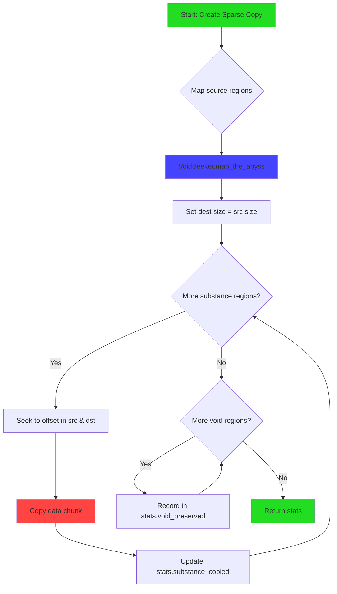

# Exercice 2.3.16 : hollow_knight_voidkeeper

**Module :**
2.3 — File Systems

**Concept :**
2.3.28 (Extended Attributes) + 2.3.29 (Sparse Files & Holes)

**Difficulté :**
★★★★★★☆☆☆☆ (6/10)

**Type :**
complet

**Tiers :**
3 — Synthèse (concepts 2.3.28.a→j + 2.3.29.a→i)

**Langage :**
Rust (Edition 2024)

**Prérequis :**
- ex12 (Advanced I/O)
- ex13 (File Locking)
- Manipulation de fichiers bas niveau
- Concepts de métadonnées

**Domaines :**
FS, Mem, Encodage

**Durée estimée :**
4h

**XP Base :**
450

**Complexité :**
T3 O(n) × S2 O(n)

---

## 📐 SECTION 1 : PROTOTYPE & CONSIGNE

### 1.1 Obligations

**Fichiers à rendre :**
```
ex16/
├── src/
│   ├── lib.rs
│   ├── charm_system.rs       # Extended attributes
│   ├── void_seeker.rs        # Sparse file detection
│   ├── abyss_maker.rs        # Hole punching
│   └── void_traverser.rs     # Sparse-aware copy
├── Cargo.toml
└── tests/
    └── integration_tests.rs
```

**Dépendances Cargo.toml :**
```toml
[dependencies]
xattr = "1.0"
nix = { version = "0.27", features = ["fs"] }
libc = "0.2"
```

**Fonctions autorisées :**
- `xattr::{get, set, remove, list}`
- `nix::sys::xattr::{getxattr, setxattr, removexattr, listxattr, lgetxattr}`
- `nix::fcntl::{fallocate, FallocateFlags}`
- `libc::{lseek, fallocate}`
- `std::fs`, `std::io`

**Fonctions interdites :**
- Bibliothèques de sérialisation externes pour xattr
- Lecture complète de fichiers sparse en mémoire

---

### 1.2 Consigne

**🎮 HOLLOW KNIGHT : Les Charmes et le Vide de Hallownest**

*Dans les profondeurs de Hallownest, le Chevalier Hollow porte des Charmes qui lui confèrent des pouvoirs - des métadonnées attachées à son essence. Mais le royaume est aussi fait de Vide - des espaces qui semblent exister mais ne contiennent que du néant.*

Les **Extended Attributes (xattr)** sont comme les **Charmes** de Hollow Knight : des métadonnées key-value qu'on attache aux fichiers, au-delà des permissions standard. Chaque charme a un **Notch** (namespace) qui détermine qui peut le manipuler.

Les **Sparse Files** sont comme le **Vide** (Abyss) de Hallownest : des régions qui semblent avoir une taille mais ne consomment pas d'espace physique. Le Chevalier peut **détecter le Vide** (SEEK_HOLE) ou **créer des passages dans le Vide** (punch holes).

**Ta mission :**

Créer un système complet de gestion des Charmes (xattr) et de navigation dans le Vide (sparse files) pour explorer les fichiers comme le Chevalier explore Hallownest.

---

### 1.2.2 Consigne Académique

Ce module enseigne deux concepts avancés des systèmes de fichiers Linux :

1. **Extended Attributes (xattr)** - Paires clé-valeur stockées dans les métadonnées du système de fichiers, permettant d'ajouter des informations arbitraires aux fichiers (tags, checksums, contextes de sécurité SELinux).

2. **Sparse Files** - Fichiers contenant des "trous" (holes) : régions qui ne consomment pas d'espace disque physique mais qui, à la lecture, retournent des zéros. Essentiels pour les bases de données et machines virtuelles.

---

### 1.3 Prototypes

```rust
//! Hollow Knight Voidkeeper - Extended Attributes & Sparse Files
//!
//! Charm System = Extended Attributes
//! Void/Abyss = Sparse File Holes

use std::path::Path;
use std::io;
use std::fs::File;

// ============================================================
// PARTIE 1: CHARM SYSTEM (Extended Attributes) - 2.3.28
// ============================================================

/// Charm Notches = xattr Namespaces (2.3.28.g)
/// Like notch slots that determine what type of charms you can equip
#[derive(Debug, Clone, Copy, PartialEq)]
pub enum CharmNotch {
    /// Knight namespace (user.*) - Most common, any process can use
    Knight,
    /// Seal namespace (security.*) - Security contexts, SELinux
    Seal,
    /// Void namespace (system.*) - System use only, requires CAP_SYS_ADMIN
    Void,
    /// Dreamer namespace (trusted.*) - Trusted processes only
    Dreamer,
}

impl CharmNotch {
    /// Get the prefix for this notch (2.3.28.g)
    pub fn prefix(&self) -> &'static str;

    /// Parse notch from full attribute name
    pub fn from_name(name: &str) -> Option<Self>;
}

/// A Charm attached to a file (Extended Attribute)
#[derive(Debug, Clone)]
pub struct Charm {
    /// Full name including namespace prefix
    pub name: String,
    /// The charm's power (value as bytes)
    pub essence: Vec<u8>,
    /// Which notch slot it uses
    pub notch: Option<CharmNotch>,
}

impl Charm {
    /// Create a new charm (2.3.28.a)
    pub fn new(name: impl Into<String>, essence: impl Into<Vec<u8>>) -> Self;

    /// Create charm with specific notch (2.3.28.g)
    pub fn with_notch(
        notch: CharmNotch,
        key: impl Into<String>,
        essence: impl Into<Vec<u8>>,
    ) -> Self;

    /// Get essence as string if valid UTF-8
    pub fn essence_as_string(&self) -> Option<String>;
}

/// Charm System Manager (xattr operations) - 2.3.28.b
pub struct CharmSystem;

impl CharmSystem {
    // === Core Operations ===

    /// Attach a charm to a file (2.3.28.d: xattr::set)
    /// Like equipping a charm to the Knight
    pub fn attach_charm<P: AsRef<Path>>(
        path: P,
        name: &str,
        essence: &[u8],
    ) -> io::Result<()>;

    /// Sense a charm's essence (2.3.28.c: xattr::get)
    /// Like using Focus to read the charm's description
    pub fn sense_charm<P: AsRef<Path>>(
        path: P,
        name: &str,
    ) -> io::Result<Option<Vec<u8>>>;

    /// Remove a charm (2.3.28.e: xattr::remove)
    /// Like unequipping a charm
    pub fn remove_charm<P: AsRef<Path>>(
        path: P,
        name: &str,
    ) -> io::Result<()>;

    /// List all charms on a file (2.3.28.f: xattr::list)
    /// Like opening the charm inventory
    pub fn inventory_charms<P: AsRef<Path>>(path: P) -> io::Result<Vec<String>>;

    // === Convenience Methods ===

    /// Attach string charm
    pub fn attach_string_charm<P: AsRef<Path>>(
        path: P,
        name: &str,
        value: &str,
    ) -> io::Result<()>;

    /// Sense string charm
    pub fn sense_string_charm<P: AsRef<Path>>(
        path: P,
        name: &str,
    ) -> io::Result<Option<String>>;

    /// Remove all Knight-notch charms
    pub fn remove_all_knight_charms<P: AsRef<Path>>(path: P) -> io::Result<usize>;

    /// Get all charms with their essences
    pub fn full_inventory<P: AsRef<Path>>(path: P) -> io::Result<Vec<Charm>>;
}

/// Low-level charm operations using nix (2.3.28.i)
pub mod deepnest {
    use super::*;
    use nix::sys::xattr;

    /// Direct getxattr via nix
    pub fn getxattr<P: AsRef<Path>>(path: P, name: &str) -> io::Result<Vec<u8>>;

    /// Direct setxattr via nix
    pub fn setxattr<P: AsRef<Path>>(path: P, name: &str, value: &[u8]) -> io::Result<()>;

    /// lgetxattr - don't follow symlinks (for charm on the link itself)
    pub fn lgetxattr<P: AsRef<Path>>(path: P, name: &str) -> io::Result<Vec<u8>>;

    /// listxattr via nix
    pub fn listxattr<P: AsRef<Path>>(path: P) -> io::Result<Vec<String>>;

    /// removexattr via nix
    pub fn removexattr<P: AsRef<Path>>(path: P, name: &str) -> io::Result<()>;
}

/// Charm Collection - File tagging use case (2.3.28.h)
/// Like collecting charms throughout Hallownest
pub struct CharmCollection {
    tag_charm: String,
}

impl CharmCollection {
    pub fn new() -> Self;

    /// Add a tag to file (like finding a new charm)
    pub fn add_tag<P: AsRef<Path>>(&self, path: P, tag: &str) -> io::Result<()>;

    /// Remove a tag
    pub fn remove_tag<P: AsRef<Path>>(&self, path: P, tag: &str) -> io::Result<()>;

    /// Get all tags
    pub fn get_tags<P: AsRef<Path>>(&self, path: P) -> io::Result<Vec<String>>;

    /// Check if file has specific tag
    pub fn has_tag<P: AsRef<Path>>(&self, path: P, tag: &str) -> io::Result<bool>;
}

/// Seal Context Reader (SELinux) - 2.3.28.j
/// Like reading the Seals of the Dreamers
pub struct SealReader;

impl SealReader {
    const SEAL_CHARM: &'static str = "security.selinux";

    /// Get SELinux context (2.3.28.j)
    pub fn read_seal<P: AsRef<Path>>(path: P) -> io::Result<Option<String>>;

    /// Parse seal into components (user:role:type:level)
    pub fn parse_seal(seal: &str) -> Option<SealComponents>;
}

#[derive(Debug, Clone)]
pub struct SealComponents {
    pub user: String,
    pub role: String,
    pub type_: String,
    pub level: String,
}

// ============================================================
// PARTIE 2: VOID SYSTEM (Sparse Files) - 2.3.29
// ============================================================

/// Information about the Void in a file (2.3.29.a)
/// Like mapping the Abyss beneath Hallownest
#[derive(Debug)]
pub struct VoidMap {
    pub path: String,
    /// Total apparent size (including void)
    pub apparent_size: u64,
    /// Actual physical size (substance only)
    pub substance_size: u64,
    /// Number of void regions
    pub void_count: usize,
    /// Substance regions: (offset, length)
    pub substance_regions: Vec<(u64, u64)>,
    /// Void regions: (offset, length)
    pub void_regions: Vec<(u64, u64)>,
}

impl VoidMap {
    /// Calculate how hollow the file is (0.0 = solid, 1.0 = pure void)
    pub fn hollowness(&self) -> f64;

    /// Total void size
    pub fn void_size(&self) -> u64;
}

/// Create a void-touched file (sparse file) - 2.3.29.a, b
/// Like the Pale King creating vessels from void
pub fn create_void_vessel(path: &str, apparent_size: u64) -> io::Result<()>;

/// Write substance at specific offset in void vessel
pub fn inscribe_substance(path: &str, data: &[u8], offset: u64) -> io::Result<()>;

/// Void Seeker - Find holes in files (2.3.29.c, d, e)
/// Like the Knight navigating through void-spaces
pub struct VoidSeeker {
    fd: i32,
    total_size: u64,
}

impl VoidSeeker {
    pub fn new(file: &File) -> io::Result<Self>;

    /// Seek to next void region (2.3.29.c: SEEK_HOLE)
    /// Like sensing the nearest void-space
    pub fn seek_void(&self, offset: u64) -> io::Result<Option<u64>>;

    /// Seek to next substance region (2.3.29.d: SEEK_DATA)
    /// Like finding solid ground in the Abyss
    pub fn seek_substance(&self, offset: u64) -> io::Result<Option<u64>>;

    /// Map all void and substance regions
    /// Like completing the map of Hallownest
    pub fn map_the_abyss(&self) -> io::Result<VoidMap>;

    /// Low-level lseek with custom whence (2.3.29.e)
    fn lseek_whence(&self, offset: u64, whence: i32) -> io::Result<Option<u64>>;
}

/// Abyss Maker - Create void regions (2.3.29.f, g, h)
/// Like the Pale King carving passages through void
pub struct AbyssMaker;

impl AbyssMaker {
    /// Punch a void hole in a file (2.3.29.f, g)
    /// Deallocates physical blocks without changing file size
    pub fn carve_void(file: &File, offset: u64, length: u64) -> io::Result<()>;

    /// Preallocate space (opposite of punch - reserve physical blocks)
    pub fn solidify_region(file: &File, offset: u64, length: u64) -> io::Result<()>;

    /// Zero a range efficiently (faster than writing zeros)
    pub fn void_purge(file: &File, offset: u64, length: u64) -> io::Result<()>;
}

/// Using nix for fallocate (2.3.29.h)
pub mod abyss_nix {
    use super::*;
    use nix::fcntl::{fallocate, FallocateFlags};

    /// Punch hole using nix (2.3.29.h)
    pub fn punch_void_nix(file: &File, offset: i64, len: i64) -> io::Result<()>;
}

/// Void Traverser - Copy files preserving void (2.3.29.i)
/// Like the Knight carrying void essence without corrupting it
pub struct VoidTraverser {
    buffer_size: usize,
}

#[derive(Debug, Default)]
pub struct TraversalStats {
    /// Bytes of substance copied
    pub substance_copied: u64,
    /// Bytes of void preserved (not copied)
    pub void_preserved: u64,
    /// Number of substance regions
    pub substance_regions: usize,
    /// Number of void regions
    pub voids_preserved: usize,
}

impl TraversalStats {
    /// Efficiency: how much was skipped vs total
    pub fn efficiency(&self) -> f64;
}

impl VoidTraverser {
    pub fn new(buffer_size: usize) -> Self;

    /// Copy file preserving void regions (2.3.29.i)
    /// Like shade-skipping through the Abyss without falling
    pub fn traverse_preserving_void(
        &self,
        source: &str,
        destination: &str,
    ) -> io::Result<TraversalStats>;

    /// Copy with automatic void detection (for non-sparse sources)
    pub fn traverse_detecting_void(
        &self,
        source: &str,
        destination: &str,
    ) -> io::Result<TraversalStats>;

    /// Check if buffer is pure void (all zeros)
    fn is_void_essence(buffer: &[u8]) -> bool;
}
```

---

## 💡 SECTION 2 : LE SAVIEZ-VOUS ?

### 2.1 L'Histoire des Extended Attributes

Les xattr ont été introduits dans IRIX (SGI Unix) dans les années 90, puis adoptés par Linux, FreeBSD, et macOS. Ils permettent de stocker des métadonnées arbitraires sans modifier le contenu du fichier :

```
Fichier standard :
┌─────────────────┐
│ Métadonnées     │ ← owner, permissions, timestamps (LIMITÉ)
├─────────────────┤
│ Contenu         │
└─────────────────┘

Fichier avec xattr :
┌─────────────────┐
│ Métadonnées     │
├─────────────────┤
│ Extended Attrs  │ ← user.tags="important,work"
│                 │   user.checksum="0xDEADBEEF"
│                 │   security.selinux="system_u:..."
├─────────────────┤
│ Contenu         │
└─────────────────┘
```

### 2.2 Les Sparse Files et l'Illusion

Un fichier de 1TB peut ne consommer que quelques KB sur disque si la plupart est du "void" :

```
Fichier sparse de 1TB (apparent) :
┌─────┬───────────────────────────────────────────┬─────┐
│DATA │                  VOID                     │DATA │
│4KB  │              ~1TB de "rien"               │4KB  │
└─────┴───────────────────────────────────────────┴─────┘
        ↓
Stockage réel : 8KB + métadonnées
```

### 2.3 SELinux et les Seals

SELinux stocke ses contextes de sécurité dans l'attribut `security.selinux`. Chaque fichier est "scellé" avec une politique :

```
unconfined_u:object_r:user_home_t:s0
     │          │         │       │
     │          │         │       └── MLS Level (Multi-Level Security)
     │          │         └── Type (la partie la plus importante)
     │          └── Role (object_r pour les fichiers)
     └── User SELinux
```

---

### 2.5 DANS LA VRAIE VIE

| Métier | Utilisation xattr | Utilisation Sparse |
|--------|------------------|-------------------|
| **SysAdmin/DevOps** | Tags de backup, checksums, ACL | Images VM (QEMU/KVM) |
| **DBA** | Métadonnées de réplication | Fichiers de base de données |
| **Security Engineer** | SELinux/AppArmor labels | Fichiers de logs rotatifs |
| **Cloud Architect** | S3 metadata simulation | Thin provisioning |
| **Forensics** | Evidence tags, chain of custody | Disk images |

---

## 🖥️ SECTION 3 : EXEMPLE D'UTILISATION

### 3.0 Session bash

```bash
$ ls
charm_system.rs  void_seeker.rs  abyss_maker.rs  void_traverser.rs  main.rs

$ cargo build --release

$ ./target/release/hollow_knight_voidkeeper

=== CHARM SYSTEM (Extended Attributes) ===
Attaching charm 'user.soul_essence' = '99'...
Sensing charm: Some("99")
Inventory: ["user.soul_essence"]
Attached geo charm: user.geo = "42069"
Full inventory: [Charm { name: "user.soul_essence", essence: "99" }, ...]

=== VOID SYSTEM (Sparse Files) ===
Creating 1GB void vessel...
Apparent size: 1073741824 bytes
Physical size: 8192 bytes
Hollowness: 99.999%

Inscribing substance at offset 0: "HALLOWNEST"
Inscribing substance at offset 500000000: "THE_ABYSS"

Mapping the void:
  Substance regions: 2
  Void regions: 3
  Void offsets: [(10, 499999990), (500000009, 573741815)]

Carving void at offset 100000...
After carving: 4 void regions

=== VOID TRAVERSAL ===
Traversing with void preservation...
  Substance copied: 19 bytes
  Void preserved: 1073741805 bytes
  Efficiency: 100.0%

All tests passed!
```

---

### 3.1 🔥 BONUS AVANCÉ (OPTIONNEL)

**Difficulté Bonus :**
★★★★★★★★☆☆ (8/10)

**Récompense :**
XP ×3

**Time Complexity attendue :**
O(n) pour traversal, O(1) pour xattr ops

**Space Complexity attendue :**
O(1) auxiliaire (streaming)

**Domaines Bonus :**
`Compression, Crypto`

#### 3.1.1 Consigne Bonus

**🎮 THE RADIANCE : Void Heart et Dream Nail**

*Le Hollow Knight possède le Void Heart, un charme qui lui permet de voir au-delà des apparences. Et le Dream Nail peut extraire les pensées cachées.*

**Ta mission bonus :**

1. **Void Heart Analysis** : Créer un analyseur qui détecte automatiquement les fichiers "corrompus par le void" (sparse) dans une arborescence et génère un rapport

2. **Dream Nail Export** : Exporter tous les xattr d'une arborescence vers un format de sauvegarde, puis les restaurer

3. **Shade Cloak Copy** : Copie ultra-efficace qui utilise `copy_file_range()` pour copier entre fichiers sans passer par userspace

4. **Grimm Troupe Sync** : Synchroniser les xattr entre deux fichiers, détectant les différences comme le Grimm Troupe traque les flammes

```rust
/// Void Heart - Recursive sparse file analyzer
pub struct VoidHeart;

impl VoidHeart {
    /// Analyze entire directory tree for hollow files
    pub fn analyze_kingdom<P: AsRef<Path>>(
        root: P,
        min_hollowness: f64,
    ) -> io::Result<Vec<VoidMap>>;

    /// Generate report of void consumption
    pub fn generate_void_report(maps: &[VoidMap]) -> VoidReport;
}

#[derive(Debug)]
pub struct VoidReport {
    pub total_apparent: u64,
    pub total_physical: u64,
    pub total_savings: u64,
    pub most_hollow: Option<String>,
    pub file_count: usize,
}

/// Dream Nail - xattr backup/restore
pub struct DreamNail;

impl DreamNail {
    /// Extract all xattr from a file tree to backup format
    pub fn extract_memories<P: AsRef<Path>>(
        root: P,
        backup_path: &str,
    ) -> io::Result<usize>;

    /// Restore xattr from backup
    pub fn restore_memories<P: AsRef<Path>>(
        backup_path: &str,
        root: P,
    ) -> io::Result<usize>;
}

/// Shade Cloak - Zero-copy operations
pub struct ShadeCloak;

impl ShadeCloak {
    /// Copy using copy_file_range (kernel-space only)
    pub fn shade_dash(
        src: &File,
        src_offset: u64,
        dst: &File,
        dst_offset: u64,
        length: u64,
    ) -> io::Result<u64>;
}

/// Grimm Troupe - xattr synchronization
pub struct GrimmTroupe;

impl GrimmTroupe {
    /// Compare xattr between two files
    pub fn compare_flames<P: AsRef<Path>>(
        source: P,
        target: P,
    ) -> io::Result<XattrDiff>;

    /// Sync xattr from source to target
    pub fn spread_flame<P: AsRef<Path>>(
        source: P,
        target: P,
        mode: SyncMode,
    ) -> io::Result<SyncStats>;
}

#[derive(Debug)]
pub struct XattrDiff {
    pub only_in_source: Vec<String>,
    pub only_in_target: Vec<String>,
    pub different_values: Vec<String>,
    pub identical: Vec<String>,
}

#[derive(Debug, Clone, Copy)]
pub enum SyncMode {
    /// Add missing, update different
    Merge,
    /// Make target identical to source
    Mirror,
    /// Only add missing, don't update
    AddOnly,
}
```

#### 3.1.2 Ce qui change par rapport à l'exercice de base

| Aspect | Base | Bonus |
|--------|------|-------|
| Scope | Single file | Directory tree |
| xattr | CRUD simple | Backup/restore/sync |
| Copy | Userspace buffer | Zero-copy kernel |
| Output | Stats basiques | Reports détaillés |

---

## ✅❌ SECTION 4 : ZONE CORRECTION

### 4.1 Moulinette

| Test | Entrée | Sortie Attendue | Points |
|------|--------|-----------------|--------|
| `charm_attach_sense` | `attach("user.test", b"hello")` | `sense() = Some(b"hello")` | 5 |
| `charm_remove` | `remove("user.test")` | `sense() = None` | 5 |
| `charm_list` | 3 charms attachés | Vec de 3 noms | 5 |
| `charm_notch_knight` | `Knight.prefix()` | `"user."` | 3 |
| `charm_notch_seal` | `Seal.prefix()` | `"security."` | 3 |
| `charm_collection_tags` | add "a", add "b" | tags = ["a", "b"] | 5 |
| `deepnest_getxattr` | Via nix | Même résultat que xattr | 4 |
| `void_vessel_create` | 1GB sparse | Physical << 1GB | 5 |
| `void_seeker_hole` | Fichier avec trous | Trouve les offsets | 8 |
| `void_seeker_data` | Fichier avec data | Trouve les offsets | 8 |
| `void_map_complete` | Fichier mixte | Toutes régions | 10 |
| `abyss_punch_hole` | Punch 100KB | Region devient void | 10 |
| `traverse_preserve` | Sparse → copy | Même structure | 12 |
| `traverse_efficiency` | 1GB 99% sparse | ~99% skipped | 7 |
| `hollowness_calc` | 1MB physical/1GB logical | ~0.999 | 5 |
| `seal_reader` | Fichier SELinux | Parse context | 5 |
| **TOTAL** | | | **100** |

### 4.2 main.rs de test

```rust
use hollow_knight_voidkeeper::*;
use std::fs::{self, File};
use std::io::Write;

fn main() -> std::io::Result<()> {
    let test_dir = "/tmp/hollow_knight_test";
    fs::create_dir_all(test_dir)?;

    println!("=== CHARM SYSTEM TESTS ===\n");
    test_charm_system(test_dir)?;

    println!("\n=== VOID SYSTEM TESTS ===\n");
    test_void_system(test_dir)?;

    println!("\n=== TRAVERSAL TESTS ===\n");
    test_traversal(test_dir)?;

    // Cleanup
    fs::remove_dir_all(test_dir)?;

    println!("\n*** All tests passed! ***");
    Ok(())
}

fn test_charm_system(dir: &str) -> std::io::Result<()> {
    let path = format!("{}/charm_test.txt", dir);
    File::create(&path)?;

    // Test attach/sense
    CharmSystem::attach_string_charm(&path, "user.soul", "99")?;
    let soul = CharmSystem::sense_string_charm(&path, "user.soul")?;
    assert_eq!(soul, Some("99".to_string()));
    println!("  [OK] attach/sense charm");

    // Test inventory
    CharmSystem::attach_string_charm(&path, "user.geo", "42069")?;
    let inventory = CharmSystem::inventory_charms(&path)?;
    assert!(inventory.contains(&"user.soul".to_string()));
    assert!(inventory.contains(&"user.geo".to_string()));
    println!("  [OK] inventory_charms");

    // Test remove
    CharmSystem::remove_charm(&path, "user.soul")?;
    let soul = CharmSystem::sense_string_charm(&path, "user.soul")?;
    assert_eq!(soul, None);
    println!("  [OK] remove_charm");

    // Test CharmNotch
    assert_eq!(CharmNotch::Knight.prefix(), "user.");
    assert_eq!(CharmNotch::Seal.prefix(), "security.");
    assert_eq!(CharmNotch::Void.prefix(), "system.");
    assert_eq!(CharmNotch::Dreamer.prefix(), "trusted.");
    println!("  [OK] CharmNotch prefixes");

    // Test CharmCollection (tags)
    let collection = CharmCollection::new();
    collection.add_tag(&path, "important")?;
    collection.add_tag(&path, "reviewed")?;
    let tags = collection.get_tags(&path)?;
    assert!(tags.contains(&"important".to_string()));
    assert!(tags.contains(&"reviewed".to_string()));
    println!("  [OK] CharmCollection tags");

    Ok(())
}

fn test_void_system(dir: &str) -> std::io::Result<()> {
    let path = format!("{}/void_test.dat", dir);

    // Create sparse file
    create_void_vessel(&path, 10 * 1024 * 1024)?; // 10MB
    let metadata = fs::metadata(&path)?;
    println!("  Apparent size: {} bytes", metadata.len());

    // Write some substance
    inscribe_substance(&path, b"HALLOWNEST_START", 0)?;
    inscribe_substance(&path, b"ABYSS_MIDDLE", 5 * 1024 * 1024)?;
    inscribe_substance(&path, b"VOID_END", 10 * 1024 * 1024 - 20)?;
    println!("  [OK] create_void_vessel + inscribe_substance");

    // Map the void
    let file = File::open(&path)?;
    let seeker = VoidSeeker::new(&file)?;
    let map = seeker.map_the_abyss()?;

    println!("  Substance regions: {}", map.substance_regions.len());
    println!("  Void regions: {}", map.void_count);
    println!("  Hollowness: {:.2}%", map.hollowness() * 100.0);

    assert!(map.substance_regions.len() >= 3);
    assert!(map.void_count >= 2);
    assert!(map.hollowness() > 0.99);
    println!("  [OK] VoidSeeker map_the_abyss");

    // Test hole punching
    let punch_path = format!("{}/punch_test.dat", dir);
    {
        let mut f = File::create(&punch_path)?;
        f.write_all(&vec![0xAA; 1024 * 1024])?; // 1MB of data
    }

    let file = fs::OpenOptions::new()
        .read(true)
        .write(true)
        .open(&punch_path)?;

    AbyssMaker::carve_void(&file, 100_000, 200_000)?;
    println!("  [OK] AbyssMaker carve_void");

    // Verify hole was created
    let seeker = VoidSeeker::new(&file)?;
    let map = seeker.map_the_abyss()?;
    assert!(map.void_count > 0);
    println!("  [OK] Hole verified via VoidSeeker");

    Ok(())
}

fn test_traversal(dir: &str) -> std::io::Result<()> {
    let src = format!("{}/traverse_src.dat", dir);
    let dst = format!("{}/traverse_dst.dat", dir);

    // Create sparse source
    create_void_vessel(&src, 5 * 1024 * 1024)?; // 5MB
    inscribe_substance(&src, b"START_DATA", 0)?;
    inscribe_substance(&src, b"END_DATA", 5 * 1024 * 1024 - 20)?;

    // Traverse
    let traverser = VoidTraverser::new(64 * 1024);
    let stats = traverser.traverse_preserving_void(&src, &dst)?;

    println!("  Substance copied: {} bytes", stats.substance_copied);
    println!("  Void preserved: {} bytes", stats.void_preserved);
    println!("  Efficiency: {:.1}%", stats.efficiency());

    // Verify destination is also sparse
    let dst_file = File::open(&dst)?;
    let seeker = VoidSeeker::new(&dst_file)?;
    let dst_map = seeker.map_the_abyss()?;

    assert!(dst_map.hollowness() > 0.99);
    println!("  [OK] Destination is sparse");

    // Verify data integrity
    let src_file = File::open(&src)?;
    let src_seeker = VoidSeeker::new(&src_file)?;
    let src_map = src_seeker.map_the_abyss()?;

    assert_eq!(src_map.substance_regions.len(), dst_map.substance_regions.len());
    println!("  [OK] traverse_preserving_void");

    Ok(())
}
```

### 4.3 Solution de référence

```rust
// lib.rs
pub mod charm_system;
pub mod void_seeker;
pub mod abyss_maker;
pub mod void_traverser;

pub use charm_system::*;
pub use void_seeker::*;
pub use abyss_maker::*;
pub use void_traverser::*;

// charm_system.rs
use std::path::Path;
use std::io;

#[derive(Debug, Clone, Copy, PartialEq)]
pub enum CharmNotch {
    Knight,
    Seal,
    Void,
    Dreamer,
}

impl CharmNotch {
    pub fn prefix(&self) -> &'static str {
        match self {
            CharmNotch::Knight => "user.",
            CharmNotch::Seal => "security.",
            CharmNotch::Void => "system.",
            CharmNotch::Dreamer => "trusted.",
        }
    }

    pub fn from_name(name: &str) -> Option<Self> {
        if name.starts_with("user.") {
            Some(CharmNotch::Knight)
        } else if name.starts_with("security.") {
            Some(CharmNotch::Seal)
        } else if name.starts_with("system.") {
            Some(CharmNotch::Void)
        } else if name.starts_with("trusted.") {
            Some(CharmNotch::Dreamer)
        } else {
            None
        }
    }
}

#[derive(Debug, Clone)]
pub struct Charm {
    pub name: String,
    pub essence: Vec<u8>,
    pub notch: Option<CharmNotch>,
}

impl Charm {
    pub fn new(name: impl Into<String>, essence: impl Into<Vec<u8>>) -> Self {
        let name = name.into();
        let notch = CharmNotch::from_name(&name);
        Self {
            name,
            essence: essence.into(),
            notch,
        }
    }

    pub fn with_notch(
        notch: CharmNotch,
        key: impl Into<String>,
        essence: impl Into<Vec<u8>>,
    ) -> Self {
        let full_name = format!("{}{}", notch.prefix(), key.into());
        Self {
            name: full_name,
            essence: essence.into(),
            notch: Some(notch),
        }
    }

    pub fn essence_as_string(&self) -> Option<String> {
        String::from_utf8(self.essence.clone()).ok()
    }
}

pub struct CharmSystem;

impl CharmSystem {
    pub fn attach_charm<P: AsRef<Path>>(
        path: P,
        name: &str,
        essence: &[u8],
    ) -> io::Result<()> {
        xattr::set(path.as_ref(), name, essence)
    }

    pub fn sense_charm<P: AsRef<Path>>(
        path: P,
        name: &str,
    ) -> io::Result<Option<Vec<u8>>> {
        match xattr::get(path.as_ref(), name) {
            Ok(value) => Ok(value),
            Err(e) if e.kind() == io::ErrorKind::NotFound => Ok(None),
            Err(e) => Err(e),
        }
    }

    pub fn remove_charm<P: AsRef<Path>>(
        path: P,
        name: &str,
    ) -> io::Result<()> {
        xattr::remove(path.as_ref(), name)
    }

    pub fn inventory_charms<P: AsRef<Path>>(path: P) -> io::Result<Vec<String>> {
        let names: Vec<String> = xattr::list(path.as_ref())?
            .filter_map(|name| name.into_string().ok())
            .collect();
        Ok(names)
    }

    pub fn attach_string_charm<P: AsRef<Path>>(
        path: P,
        name: &str,
        value: &str,
    ) -> io::Result<()> {
        Self::attach_charm(path, name, value.as_bytes())
    }

    pub fn sense_string_charm<P: AsRef<Path>>(
        path: P,
        name: &str,
    ) -> io::Result<Option<String>> {
        match Self::sense_charm(path, name)? {
            Some(bytes) => {
                String::from_utf8(bytes)
                    .map(Some)
                    .map_err(|e| io::Error::new(io::ErrorKind::InvalidData, e))
            }
            None => Ok(None),
        }
    }

    pub fn remove_all_knight_charms<P: AsRef<Path>>(path: P) -> io::Result<usize> {
        let path = path.as_ref();
        let names = Self::inventory_charms(path)?;
        let mut count = 0;

        for name in names {
            if name.starts_with("user.") {
                Self::remove_charm(path, &name)?;
                count += 1;
            }
        }

        Ok(count)
    }

    pub fn full_inventory<P: AsRef<Path>>(path: P) -> io::Result<Vec<Charm>> {
        let path = path.as_ref();
        let names = Self::inventory_charms(path)?;
        let mut charms = Vec::new();

        for name in names {
            if let Some(essence) = Self::sense_charm(path, &name)? {
                charms.push(Charm::new(name, essence));
            }
        }

        Ok(charms)
    }
}

pub mod deepnest {
    use super::*;
    use nix::sys::xattr;

    pub fn getxattr<P: AsRef<Path>>(path: P, name: &str) -> io::Result<Vec<u8>> {
        xattr::getxattr(path.as_ref(), name)
            .map_err(|e| io::Error::new(io::ErrorKind::Other, e))
    }

    pub fn setxattr<P: AsRef<Path>>(
        path: P,
        name: &str,
        value: &[u8],
    ) -> io::Result<()> {
        xattr::setxattr(path.as_ref(), name, value)
            .map_err(|e| io::Error::new(io::ErrorKind::Other, e))
    }

    pub fn lgetxattr<P: AsRef<Path>>(path: P, name: &str) -> io::Result<Vec<u8>> {
        xattr::lgetxattr(path.as_ref(), name)
            .map_err(|e| io::Error::new(io::ErrorKind::Other, e))
    }

    pub fn listxattr<P: AsRef<Path>>(path: P) -> io::Result<Vec<String>> {
        let list = xattr::listxattr(path.as_ref())
            .map_err(|e| io::Error::new(io::ErrorKind::Other, e))?;
        Ok(list.into_iter()
            .filter_map(|name| name.into_string().ok())
            .collect())
    }

    pub fn removexattr<P: AsRef<Path>>(path: P, name: &str) -> io::Result<()> {
        xattr::removexattr(path.as_ref(), name)
            .map_err(|e| io::Error::new(io::ErrorKind::Other, e))
    }
}

pub struct CharmCollection {
    tag_charm: String,
}

impl CharmCollection {
    pub fn new() -> Self {
        Self {
            tag_charm: "user.tags".to_string(),
        }
    }

    pub fn add_tag<P: AsRef<Path>>(&self, path: P, tag: &str) -> io::Result<()> {
        let mut tags = self.get_tags(&path)?;
        if !tags.contains(&tag.to_string()) {
            tags.push(tag.to_string());
            self.save_tags(path, &tags)
        } else {
            Ok(())
        }
    }

    pub fn remove_tag<P: AsRef<Path>>(&self, path: P, tag: &str) -> io::Result<()> {
        let mut tags = self.get_tags(&path)?;
        tags.retain(|t| t != tag);
        self.save_tags(path, &tags)
    }

    pub fn get_tags<P: AsRef<Path>>(&self, path: P) -> io::Result<Vec<String>> {
        match CharmSystem::sense_string_charm(&path, &self.tag_charm)? {
            Some(data) => {
                Ok(data.split(',')
                    .map(|s| s.trim().to_string())
                    .filter(|s| !s.is_empty())
                    .collect())
            }
            None => Ok(Vec::new()),
        }
    }

    pub fn has_tag<P: AsRef<Path>>(&self, path: P, tag: &str) -> io::Result<bool> {
        let tags = self.get_tags(path)?;
        Ok(tags.contains(&tag.to_string()))
    }

    fn save_tags<P: AsRef<Path>>(&self, path: P, tags: &[String]) -> io::Result<()> {
        if tags.is_empty() {
            // Try to remove, ignore if doesn't exist
            let _ = CharmSystem::remove_charm(&path, &self.tag_charm);
            Ok(())
        } else {
            CharmSystem::attach_string_charm(path, &self.tag_charm, &tags.join(","))
        }
    }
}

impl Default for CharmCollection {
    fn default() -> Self {
        Self::new()
    }
}

pub struct SealReader;

impl SealReader {
    const SEAL_CHARM: &'static str = "security.selinux";

    pub fn read_seal<P: AsRef<Path>>(path: P) -> io::Result<Option<String>> {
        match CharmSystem::sense_charm(path, Self::SEAL_CHARM)? {
            Some(bytes) => {
                // SELinux context is null-terminated
                let context: Vec<u8> = bytes.iter()
                    .take_while(|&&b| b != 0)
                    .cloned()
                    .collect();

                String::from_utf8(context)
                    .map(Some)
                    .map_err(|e| io::Error::new(io::ErrorKind::InvalidData, e))
            }
            None => Ok(None),
        }
    }

    pub fn parse_seal(seal: &str) -> Option<SealComponents> {
        let parts: Vec<&str> = seal.split(':').collect();
        if parts.len() >= 4 {
            Some(SealComponents {
                user: parts[0].to_string(),
                role: parts[1].to_string(),
                type_: parts[2].to_string(),
                level: parts[3..].join(":"),
            })
        } else {
            None
        }
    }
}

#[derive(Debug, Clone)]
pub struct SealComponents {
    pub user: String,
    pub role: String,
    pub type_: String,
    pub level: String,
}

// void_seeker.rs
use std::fs::File;
use std::io::{self, Seek, SeekFrom, Write};
use std::os::unix::io::AsRawFd;

const SEEK_DATA: i32 = 3;
const SEEK_HOLE: i32 = 4;

#[derive(Debug)]
pub struct VoidMap {
    pub path: String,
    pub apparent_size: u64,
    pub substance_size: u64,
    pub void_count: usize,
    pub substance_regions: Vec<(u64, u64)>,
    pub void_regions: Vec<(u64, u64)>,
}

impl VoidMap {
    pub fn hollowness(&self) -> f64 {
        if self.apparent_size == 0 {
            0.0
        } else {
            1.0 - (self.substance_size as f64 / self.apparent_size as f64)
        }
    }

    pub fn void_size(&self) -> u64 {
        self.void_regions.iter().map(|(_, len)| len).sum()
    }
}

pub fn create_void_vessel(path: &str, apparent_size: u64) -> io::Result<()> {
    let mut file = File::create(path)?;

    // Seek to end-1 and write single byte
    file.seek(SeekFrom::Start(apparent_size - 1))?;
    file.write_all(&[0])?;

    Ok(())
}

pub fn inscribe_substance(path: &str, data: &[u8], offset: u64) -> io::Result<()> {
    let mut file = std::fs::OpenOptions::new()
        .write(true)
        .open(path)?;

    file.seek(SeekFrom::Start(offset))?;
    file.write_all(data)?;

    Ok(())
}

pub struct VoidSeeker {
    fd: i32,
    total_size: u64,
}

impl VoidSeeker {
    pub fn new(file: &File) -> io::Result<Self> {
        let metadata = file.metadata()?;
        Ok(Self {
            fd: file.as_raw_fd(),
            total_size: metadata.len(),
        })
    }

    pub fn seek_void(&self, offset: u64) -> io::Result<Option<u64>> {
        self.lseek_whence(offset, SEEK_HOLE)
    }

    pub fn seek_substance(&self, offset: u64) -> io::Result<Option<u64>> {
        self.lseek_whence(offset, SEEK_DATA)
    }

    fn lseek_whence(&self, offset: u64, whence: i32) -> io::Result<Option<u64>> {
        let result = unsafe {
            libc::lseek(self.fd, offset as i64, whence)
        };

        if result < 0 {
            let err = io::Error::last_os_error();
            if err.raw_os_error() == Some(libc::ENXIO) {
                Ok(None)
            } else {
                Err(err)
            }
        } else {
            Ok(Some(result as u64))
        }
    }

    pub fn map_the_abyss(&self) -> io::Result<VoidMap> {
        let mut substance_regions = Vec::new();
        let mut void_regions = Vec::new();
        let mut pos = 0u64;

        while pos < self.total_size {
            match self.seek_substance(pos)? {
                Some(data_start) => {
                    // Record void before this data
                    if data_start > pos {
                        void_regions.push((pos, data_start - pos));
                    }

                    // Find end of data (next hole)
                    match self.seek_void(data_start)? {
                        Some(hole_start) => {
                            substance_regions.push((data_start, hole_start - data_start));
                            pos = hole_start;
                        }
                        None => {
                            // Data extends to end
                            substance_regions.push((data_start, self.total_size - data_start));
                            break;
                        }
                    }
                }
                None => {
                    // Rest is void
                    if pos < self.total_size {
                        void_regions.push((pos, self.total_size - pos));
                    }
                    break;
                }
            }
        }

        let substance_size: u64 = substance_regions.iter()
            .map(|(_, len)| len)
            .sum();

        Ok(VoidMap {
            path: String::new(),
            apparent_size: self.total_size,
            substance_size,
            void_count: void_regions.len(),
            substance_regions,
            void_regions,
        })
    }
}

// abyss_maker.rs
use std::fs::File;
use std::io;
use std::os::unix::io::AsRawFd;

const FALLOC_FL_KEEP_SIZE: i32 = 0x01;
const FALLOC_FL_PUNCH_HOLE: i32 = 0x02;
const FALLOC_FL_ZERO_RANGE: i32 = 0x10;

pub struct AbyssMaker;

impl AbyssMaker {
    pub fn carve_void(file: &File, offset: u64, length: u64) -> io::Result<()> {
        let fd = file.as_raw_fd();
        let flags = FALLOC_FL_PUNCH_HOLE | FALLOC_FL_KEEP_SIZE;

        let result = unsafe {
            libc::fallocate(fd, flags, offset as i64, length as i64)
        };

        if result < 0 {
            Err(io::Error::last_os_error())
        } else {
            Ok(())
        }
    }

    pub fn solidify_region(file: &File, offset: u64, length: u64) -> io::Result<()> {
        let fd = file.as_raw_fd();

        let result = unsafe {
            libc::fallocate(fd, 0, offset as i64, length as i64)
        };

        if result < 0 {
            Err(io::Error::last_os_error())
        } else {
            Ok(())
        }
    }

    pub fn void_purge(file: &File, offset: u64, length: u64) -> io::Result<()> {
        let fd = file.as_raw_fd();

        let result = unsafe {
            libc::fallocate(fd, FALLOC_FL_ZERO_RANGE, offset as i64, length as i64)
        };

        if result < 0 {
            Err(io::Error::last_os_error())
        } else {
            Ok(())
        }
    }
}

pub mod abyss_nix {
    use super::*;
    use nix::fcntl::{fallocate, FallocateFlags};

    pub fn punch_void_nix(file: &File, offset: i64, len: i64) -> io::Result<()> {
        let flags = FallocateFlags::FALLOC_FL_PUNCH_HOLE
                  | FallocateFlags::FALLOC_FL_KEEP_SIZE;

        fallocate(file.as_raw_fd(), flags, offset, len)
            .map_err(|e| io::Error::new(io::ErrorKind::Other, e))
    }
}

// void_traverser.rs
use std::fs::File;
use std::io::{self, Read, Seek, SeekFrom, Write};
use crate::void_seeker::{VoidSeeker, VoidMap};

#[derive(Debug, Default)]
pub struct TraversalStats {
    pub substance_copied: u64,
    pub void_preserved: u64,
    pub substance_regions: usize,
    pub voids_preserved: usize,
}

impl TraversalStats {
    pub fn efficiency(&self) -> f64 {
        let total = self.substance_copied + self.void_preserved;
        if total == 0 {
            0.0
        } else {
            self.void_preserved as f64 / total as f64 * 100.0
        }
    }
}

pub struct VoidTraverser {
    buffer_size: usize,
}

impl VoidTraverser {
    pub fn new(buffer_size: usize) -> Self {
        Self { buffer_size }
    }

    pub fn traverse_preserving_void(
        &self,
        source: &str,
        destination: &str,
    ) -> io::Result<TraversalStats> {
        let src = File::open(source)?;
        let mut dst = File::create(destination)?;

        let seeker = VoidSeeker::new(&src)?;
        let map = seeker.map_the_abyss()?;

        let mut stats = TraversalStats::default();

        // Set destination size (creates sparse file)
        dst.set_len(map.apparent_size)?;

        // Only copy substance regions
        let mut src = File::open(source)?;
        let mut buffer = vec![0u8; self.buffer_size];

        for (offset, length) in &map.substance_regions {
            src.seek(SeekFrom::Start(*offset))?;
            dst.seek(SeekFrom::Start(*offset))?;

            let mut remaining = *length;
            while remaining > 0 {
                let to_read = remaining.min(self.buffer_size as u64) as usize;
                let bytes_read = src.read(&mut buffer[..to_read])?;
                if bytes_read == 0 {
                    break;
                }
                dst.write_all(&buffer[..bytes_read])?;
                remaining -= bytes_read as u64;
                stats.substance_copied += bytes_read as u64;
            }

            stats.substance_regions += 1;
        }

        // Record void stats
        for (_, length) in &map.void_regions {
            stats.void_preserved += *length;
            stats.voids_preserved += 1;
        }

        Ok(stats)
    }

    pub fn traverse_detecting_void(
        &self,
        source: &str,
        destination: &str,
    ) -> io::Result<TraversalStats> {
        let mut src = File::open(source)?;
        let metadata = src.metadata()?;
        let file_size = metadata.len();

        let mut dst = File::create(destination)?;
        dst.set_len(file_size)?;

        let mut buffer = vec![0u8; self.buffer_size];
        let mut stats = TraversalStats::default();
        let mut offset = 0u64;

        while offset < file_size {
            let to_read = (file_size - offset).min(self.buffer_size as u64) as usize;
            let bytes_read = src.read(&mut buffer[..to_read])?;

            if bytes_read == 0 {
                break;
            }

            if Self::is_void_essence(&buffer[..bytes_read]) {
                stats.void_preserved += bytes_read as u64;
            } else {
                dst.seek(SeekFrom::Start(offset))?;
                dst.write_all(&buffer[..bytes_read])?;
                stats.substance_copied += bytes_read as u64;
            }

            offset += bytes_read as u64;
        }

        Ok(stats)
    }

    fn is_void_essence(buffer: &[u8]) -> bool {
        // Check word-aligned for efficiency
        let (prefix, aligned, suffix) = unsafe {
            buffer.align_to::<u64>()
        };

        prefix.iter().all(|&b| b == 0)
            && aligned.iter().all(|&w| w == 0)
            && suffix.iter().all(|&b| b == 0)
    }
}
```

### 4.4 Solutions alternatives acceptées

```rust
// Alternative 1: Using generic-array crate for type-safe buffers
use generic_array::{GenericArray, typenum::U4096};

impl VoidTraverser {
    pub fn traverse_typed<const N: usize>(
        &self,
        source: &str,
        destination: &str,
    ) -> io::Result<TraversalStats> {
        // Same logic with compile-time buffer size
    }
}

// Alternative 2: Iterator-based void mapping
impl VoidSeeker {
    pub fn void_iter(&self) -> impl Iterator<Item = io::Result<(u64, u64)>> + '_ {
        VoidIterator { seeker: self, pos: 0, done: false }
    }
}

struct VoidIterator<'a> {
    seeker: &'a VoidSeeker,
    pos: u64,
    done: bool,
}

impl Iterator for VoidIterator<'_> {
    type Item = io::Result<(u64, u64)>;

    fn next(&mut self) -> Option<Self::Item> {
        if self.done {
            return None;
        }
        // Implementation...
    }
}

// Alternative 3: Async version with tokio
#[cfg(feature = "async")]
pub async fn traverse_async(
    source: &str,
    destination: &str,
) -> io::Result<TraversalStats> {
    use tokio::fs::File;
    use tokio::io::{AsyncReadExt, AsyncWriteExt, AsyncSeekExt};
    // Same logic but async
}
```

### 4.5 Solutions refusées

```rust
// REFUSÉE 1: Lecture complète en mémoire
fn bad_traverse(source: &str, dest: &str) -> io::Result<()> {
    let data = std::fs::read(source)?;  // ⛔ Charge tout en mémoire!
    std::fs::write(dest, data)?;         // Perd les trous
    Ok(())
}
// Pourquoi refusé: Pour un fichier sparse de 1TB, cela chargerait 1TB en RAM

// REFUSÉE 2: Oubli du mode sparse à la destination
fn bad_traverse_2(source: &str, dest: &str) -> io::Result<()> {
    let mut src = File::open(source)?;
    let mut dst = File::create(dest)?;
    // ⛔ Pas de dst.set_len() avant d'écrire

    for (offset, length) in substance_regions {
        src.seek(SeekFrom::Start(offset))?;
        dst.seek(SeekFrom::Start(offset))?;  // ⛔ Le seek écrit des zéros!
        // ...
    }
    Ok(())
}
// Pourquoi refusé: Sans set_len() préalable, seek() remplit de zéros

// REFUSÉE 3: xattr sans gestion des erreurs NotFound
fn bad_sense(path: &str, name: &str) -> io::Result<Vec<u8>> {
    xattr::get(path, name)?  // ⛔ Erreur si attribut n'existe pas
        .ok_or_else(|| io::Error::new(io::ErrorKind::NotFound, "No attr"))
}
// Pourquoi refusé: L'absence d'attribut n'est pas une erreur
```

### 4.6 Solution bonus de référence

```rust
// void_heart.rs - Recursive analyzer
use std::path::Path;
use std::fs;
use crate::void_seeker::{VoidSeeker, VoidMap};

pub struct VoidHeart;

#[derive(Debug)]
pub struct VoidReport {
    pub total_apparent: u64,
    pub total_physical: u64,
    pub total_savings: u64,
    pub most_hollow: Option<String>,
    pub most_hollow_ratio: f64,
    pub file_count: usize,
}

impl VoidHeart {
    pub fn analyze_kingdom<P: AsRef<Path>>(
        root: P,
        min_hollowness: f64,
    ) -> io::Result<Vec<VoidMap>> {
        let mut results = Vec::new();
        Self::analyze_recursive(root.as_ref(), min_hollowness, &mut results)?;
        Ok(results)
    }

    fn analyze_recursive(
        dir: &Path,
        min_hollowness: f64,
        results: &mut Vec<VoidMap>,
    ) -> io::Result<()> {
        for entry in fs::read_dir(dir)? {
            let entry = entry?;
            let path = entry.path();

            if path.is_dir() {
                Self::analyze_recursive(&path, min_hollowness, results)?;
            } else if path.is_file() {
                if let Ok(file) = std::fs::File::open(&path) {
                    if let Ok(seeker) = VoidSeeker::new(&file) {
                        if let Ok(mut map) = seeker.map_the_abyss() {
                            if map.hollowness() >= min_hollowness {
                                map.path = path.to_string_lossy().to_string();
                                results.push(map);
                            }
                        }
                    }
                }
            }
        }
        Ok(())
    }

    pub fn generate_void_report(maps: &[VoidMap]) -> VoidReport {
        let total_apparent: u64 = maps.iter().map(|m| m.apparent_size).sum();
        let total_physical: u64 = maps.iter().map(|m| m.substance_size).sum();

        let most_hollow = maps.iter()
            .max_by(|a, b| a.hollowness().partial_cmp(&b.hollowness()).unwrap());

        VoidReport {
            total_apparent,
            total_physical,
            total_savings: total_apparent - total_physical,
            most_hollow: most_hollow.map(|m| m.path.clone()),
            most_hollow_ratio: most_hollow.map(|m| m.hollowness()).unwrap_or(0.0),
            file_count: maps.len(),
        }
    }
}

// dream_nail.rs - xattr backup/restore
use std::collections::HashMap;
use std::fs::File;
use std::io::{BufReader, BufWriter, Read, Write};
use crate::charm_system::CharmSystem;

pub struct DreamNail;

impl DreamNail {
    pub fn extract_memories<P: AsRef<Path>>(
        root: P,
        backup_path: &str,
    ) -> io::Result<usize> {
        let mut memories: HashMap<String, HashMap<String, Vec<u8>>> = HashMap::new();
        let mut count = 0;

        Self::extract_recursive(root.as_ref(), &mut memories, &mut count)?;

        // Serialize to file
        let file = File::create(backup_path)?;
        let mut writer = BufWriter::new(file);

        // Simple format: path\0name\0len\0value...
        for (path, attrs) in &memories {
            for (name, value) in attrs {
                writer.write_all(path.as_bytes())?;
                writer.write_all(&[0])?;
                writer.write_all(name.as_bytes())?;
                writer.write_all(&[0])?;
                writer.write_all(&(value.len() as u32).to_le_bytes())?;
                writer.write_all(value)?;
            }
        }

        Ok(count)
    }

    fn extract_recursive(
        dir: &Path,
        memories: &mut HashMap<String, HashMap<String, Vec<u8>>>,
        count: &mut usize,
    ) -> io::Result<()> {
        for entry in fs::read_dir(dir)? {
            let entry = entry?;
            let path = entry.path();

            if path.is_dir() {
                Self::extract_recursive(&path, memories, count)?;
            }

            // Get xattrs for this entry
            if let Ok(names) = CharmSystem::inventory_charms(&path) {
                if !names.is_empty() {
                    let mut attrs = HashMap::new();
                    for name in names {
                        if let Ok(Some(value)) = CharmSystem::sense_charm(&path, &name) {
                            attrs.insert(name, value);
                            *count += 1;
                        }
                    }
                    if !attrs.is_empty() {
                        memories.insert(path.to_string_lossy().to_string(), attrs);
                    }
                }
            }
        }
        Ok(())
    }

    pub fn restore_memories<P: AsRef<Path>>(
        backup_path: &str,
        _root: P,
    ) -> io::Result<usize> {
        let file = File::open(backup_path)?;
        let mut reader = BufReader::new(file);
        let mut count = 0;

        loop {
            // Read path
            let path = match Self::read_until_null(&mut reader)? {
                Some(s) => s,
                None => break,
            };

            // Read name
            let name = match Self::read_until_null(&mut reader)? {
                Some(s) => s,
                None => break,
            };

            // Read length
            let mut len_buf = [0u8; 4];
            reader.read_exact(&mut len_buf)?;
            let len = u32::from_le_bytes(len_buf) as usize;

            // Read value
            let mut value = vec![0u8; len];
            reader.read_exact(&mut value)?;

            // Restore if path exists
            if Path::new(&path).exists() {
                CharmSystem::attach_charm(&path, &name, &value)?;
                count += 1;
            }
        }

        Ok(count)
    }

    fn read_until_null<R: Read>(reader: &mut R) -> io::Result<Option<String>> {
        let mut bytes = Vec::new();
        let mut buf = [0u8; 1];

        loop {
            match reader.read(&mut buf)? {
                0 => return Ok(None),
                1 => {
                    if buf[0] == 0 {
                        break;
                    }
                    bytes.push(buf[0]);
                }
                _ => unreachable!(),
            }
        }

        String::from_utf8(bytes)
            .map(Some)
            .map_err(|e| io::Error::new(io::ErrorKind::InvalidData, e))
    }
}

// shade_cloak.rs - Zero-copy operations
pub struct ShadeCloak;

impl ShadeCloak {
    pub fn shade_dash(
        src: &File,
        src_offset: u64,
        dst: &File,
        dst_offset: u64,
        length: u64,
    ) -> io::Result<u64> {
        use std::os::unix::io::AsRawFd;

        let mut src_off = src_offset as i64;
        let mut dst_off = dst_offset as i64;

        let result = unsafe {
            libc::copy_file_range(
                src.as_raw_fd(),
                &mut src_off,
                dst.as_raw_fd(),
                &mut dst_off,
                length as usize,
                0,
            )
        };

        if result < 0 {
            Err(io::Error::last_os_error())
        } else {
            Ok(result as u64)
        }
    }
}

// grimm_troupe.rs - xattr sync
use crate::charm_system::CharmSystem;
use std::collections::HashSet;

pub struct GrimmTroupe;

#[derive(Debug)]
pub struct XattrDiff {
    pub only_in_source: Vec<String>,
    pub only_in_target: Vec<String>,
    pub different_values: Vec<String>,
    pub identical: Vec<String>,
}

#[derive(Debug, Clone, Copy)]
pub enum SyncMode {
    Merge,
    Mirror,
    AddOnly,
}

#[derive(Debug, Default)]
pub struct SyncStats {
    pub added: usize,
    pub updated: usize,
    pub removed: usize,
}

impl GrimmTroupe {
    pub fn compare_flames<P: AsRef<Path>>(
        source: P,
        target: P,
    ) -> io::Result<XattrDiff> {
        let src_names: HashSet<String> = CharmSystem::inventory_charms(&source)?
            .into_iter()
            .collect();
        let tgt_names: HashSet<String> = CharmSystem::inventory_charms(&target)?
            .into_iter()
            .collect();

        let only_in_source: Vec<String> = src_names.difference(&tgt_names)
            .cloned()
            .collect();
        let only_in_target: Vec<String> = tgt_names.difference(&src_names)
            .cloned()
            .collect();

        let mut different_values = Vec::new();
        let mut identical = Vec::new();

        for name in src_names.intersection(&tgt_names) {
            let src_val = CharmSystem::sense_charm(&source, name)?;
            let tgt_val = CharmSystem::sense_charm(&target, name)?;

            if src_val == tgt_val {
                identical.push(name.clone());
            } else {
                different_values.push(name.clone());
            }
        }

        Ok(XattrDiff {
            only_in_source,
            only_in_target,
            different_values,
            identical,
        })
    }

    pub fn spread_flame<P: AsRef<Path>>(
        source: P,
        target: P,
        mode: SyncMode,
    ) -> io::Result<SyncStats> {
        let diff = Self::compare_flames(&source, &target)?;
        let mut stats = SyncStats::default();

        // Add missing
        for name in &diff.only_in_source {
            if let Ok(Some(value)) = CharmSystem::sense_charm(&source, name) {
                CharmSystem::attach_charm(&target, name, &value)?;
                stats.added += 1;
            }
        }

        // Update different (except AddOnly)
        if !matches!(mode, SyncMode::AddOnly) {
            for name in &diff.different_values {
                if let Ok(Some(value)) = CharmSystem::sense_charm(&source, name) {
                    CharmSystem::attach_charm(&target, name, &value)?;
                    stats.updated += 1;
                }
            }
        }

        // Remove extra (Mirror only)
        if matches!(mode, SyncMode::Mirror) {
            for name in &diff.only_in_target {
                CharmSystem::remove_charm(&target, name)?;
                stats.removed += 1;
            }
        }

        Ok(stats)
    }
}
```

### 4.10 Solutions Mutantes

```rust
// Mutant A (Boundary): Off-by-one dans la création sparse
pub fn create_void_vessel_mutant_a(path: &str, apparent_size: u64) -> io::Result<()> {
    let mut file = File::create(path)?;
    file.seek(SeekFrom::Start(apparent_size))?;  // ⛔ apparent_size au lieu de -1
    file.write_all(&[0])?;
    Ok(())
}
// Bug: Le fichier fait apparent_size + 1 bytes
// Misconception: Confond position et taille

// Mutant B (Safety): Pas de vérification du résultat lseek
pub fn seek_void_mutant_b(&self, offset: u64) -> io::Result<Option<u64>> {
    let result = unsafe {
        libc::lseek(self.fd, offset as i64, SEEK_HOLE)
    };
    Ok(Some(result as u64))  // ⛔ Pas de check result < 0
}
// Bug: Retourne -1 cast en u64 (énorme valeur) en cas d'erreur
// Misconception: Suppose que lseek réussit toujours

// Mutant C (Resource): Fuite de file descriptor dans seeker
impl VoidSeeker {
    pub fn new_mutant_c(path: &str) -> io::Result<Self> {
        let file = File::open(path)?;
        let metadata = file.metadata()?;
        Ok(Self {
            fd: file.as_raw_fd(),
            total_size: metadata.len(),
        })
        // ⛔ file est droppé mais fd est gardé!
    }
}
// Bug: Le fd devient invalide quand File est droppé
// Misconception: Pense que as_raw_fd() transfère la propriété

// Mutant D (Logic): Logique inversée pour ENXIO
fn lseek_whence_mutant_d(&self, offset: u64, whence: i32) -> io::Result<Option<u64>> {
    let result = unsafe {
        libc::lseek(self.fd, offset as i64, whence)
    };

    if result < 0 {
        let err = io::Error::last_os_error();
        if err.raw_os_error() != Some(libc::ENXIO) {  // ⛔ != au lieu de ==
            Ok(None)
        } else {
            Err(err)
        }
    } else {
        Ok(Some(result as u64))
    }
}
// Bug: Retourne erreur quand c'est juste "fin des données"
// Misconception: ENXIO signifie erreur, pas "fin"

// Mutant E (Return): Mauvais calcul de hollowness
impl VoidMap {
    pub fn hollowness_mutant_e(&self) -> f64 {
        if self.apparent_size == 0 {
            0.0
        } else {
            self.substance_size as f64 / self.apparent_size as f64  // ⛔ Inversé!
        }
    }
}
// Bug: Retourne le ratio de substance, pas de void
// Misconception: Confond "plein" et "vide"

// Mutant F (API): xattr set sans namespace
impl CharmSystem {
    pub fn attach_charm_mutant_f<P: AsRef<Path>>(
        path: P,
        name: &str,
        essence: &[u8],
    ) -> io::Result<()> {
        // ⛔ Pas de préfixe user. ajouté si manquant
        xattr::set(path.as_ref(), name, essence)
    }
}
// Bug: "mytag" échoue car besoin de "user.mytag"
// Misconception: xattr n'a pas besoin de namespace

// Mutant G (Sparse): Copy qui détruit les trous
impl VoidTraverser {
    pub fn traverse_mutant_g(
        &self,
        source: &str,
        destination: &str,
    ) -> io::Result<TraversalStats> {
        let src = File::open(source)?;
        let mut dst = File::create(destination)?;
        // ⛔ Pas de dst.set_len() - seek crée des zéros réels

        let seeker = VoidSeeker::new(&src)?;
        let map = seeker.map_the_abyss()?;

        let mut src = File::open(source)?;

        for (offset, length) in &map.substance_regions {
            src.seek(SeekFrom::Start(*offset))?;
            dst.seek(SeekFrom::Start(*offset))?;  // ⛔ Remplit de 0 jusqu'à offset!
            // ...
        }
        Ok(TraversalStats::default())
    }
}
// Bug: Destination n'est pas sparse, seek() écrit des zéros
// Misconception: seek() sur nouveau fichier crée des trous
```

---

## 🧠 SECTION 5 : COMPRENDRE

### 5.1 Ce que cet exercice enseigne

1. **Extended Attributes (xattr)** - Métadonnées key-value au-delà des permissions
2. **Namespaces xattr** - user, security, system, trusted
3. **SELinux contexts** - Attributs de sécurité obligatoire
4. **Sparse Files** - Fichiers avec "trous" logiques
5. **SEEK_HOLE/SEEK_DATA** - Navigation dans les fichiers sparse
6. **fallocate()** - Création/destruction de trous
7. **Copie efficace** - Préserver les trous lors de la copie

### 5.2 LDA — Traduction littérale

```
FONCTION attach_charm QUI PREND path ET name ET essence
DÉBUT FONCTION
    APPELER xattr::set AVEC path ET name ET essence
    RETOURNER LE RÉSULTAT
FIN FONCTION

FONCTION sense_charm QUI PREND path ET name
DÉBUT FONCTION
    DÉCLARER result COMME RÉSULTAT DE xattr::get AVEC path ET name
    SI result EST ERREUR NotFound ALORS
        RETOURNER None
    SINON SI result EST ERREUR ALORS
        RETOURNER L'ERREUR
    SINON
        RETOURNER Some(result)
    FIN SI
FIN FONCTION

FONCTION create_void_vessel QUI PREND path ET apparent_size
DÉBUT FONCTION
    CRÉER file AVEC File::create(path)
    DÉPLACER LE CURSEUR À LA POSITION apparent_size MOINS 1
    ÉCRIRE UN OCTET NUL
    // Le système crée un fichier sparse
FIN FONCTION

FONCTION map_the_abyss QUI PREND self
DÉBUT FONCTION
    DÉCLARER pos COMME 0
    TANT QUE pos EST INFÉRIEUR À total_size FAIRE
        CHERCHER LA PROCHAINE SUBSTANCE DEPUIS pos
        SI TROUVÉ data_start ALORS
            SI data_start EST SUPÉRIEUR À pos ALORS
                ENREGISTRER VOID DE pos À data_start
            FIN SI
            CHERCHER LE PROCHAIN VOID DEPUIS data_start
            SI TROUVÉ hole_start ALORS
                ENREGISTRER SUBSTANCE DE data_start À hole_start
                AFFECTER hole_start À pos
            SINON
                ENREGISTRER SUBSTANCE JUSQU'À LA FIN
                SORTIR DE LA BOUCLE
            FIN SI
        SINON
            ENREGISTRER VOID JUSQU'À LA FIN
            SORTIR DE LA BOUCLE
        FIN SI
    FIN TANT QUE
FIN FONCTION
```

### 5.2.2 Logic Flow

```
ALGORITHME : Charm System Operations
---
1. ATTACH CHARM:
   a. VALIDATE path exists
   b. CALL xattr::set(path, name, value)
   c. RETURN success or error

2. SENSE CHARM:
   a. CALL xattr::get(path, name)
   b. IF NotFound error → RETURN None
   c. IF other error → PROPAGATE error
   d. RETURN Some(value)

3. INVENTORY CHARMS:
   a. CALL xattr::list(path)
   b. FILTER valid UTF-8 names
   c. RETURN list of names

---

ALGORITHME : Void Detection
---
1. INIT pos = 0

2. WHILE pos < file_size:
   a. SEEK_DATA from pos → data_start
      - IF NOT FOUND → Record rest as void, BREAK

   b. IF data_start > pos:
      - Record void region (pos, data_start - pos)

   c. SEEK_HOLE from data_start → hole_start
      - IF NOT FOUND → Record rest as data, BREAK

   d. Record data region (data_start, hole_start - data_start)
   e. pos = hole_start

3. RETURN map of all regions
```

### 5.2.3 Représentation Algorithmique

```
FONCTION : Sparse Copy (source, dest)
---
INIT stats = empty

1. OPEN source file
2. CREATE dest file (sparse)
3. SET dest size = source size (creates sparse file)

4. MAP source regions via VoidSeeker

5. FOR EACH (offset, length) IN substance_regions:
   |
   |-- SEEK source to offset
   |-- SEEK dest to offset
   |-- COPY length bytes (in chunks)
   |-- UPDATE stats.substance_copied

6. FOR EACH (offset, length) IN void_regions:
   |-- UPDATE stats.void_preserved (no actual copy needed)

7. RETURN stats
```

### 5.2.3.1 Diagramme Mermaid

```mermaid
graph LR
    subgraph "Sparse File Structure"
        A[DATA: 0-1KB] --> B[HOLE: 1KB-500MB]
        B --> C[DATA: 500MB-500MB+10]
        C --> D[HOLE: 500MB+10 to 1GB]
    end

    subgraph "Physical Storage"
        E[Block 1: DATA 0-1KB]
        F[Block 2: DATA 500MB region]
    end

    A -.-> E
    C -.-> F

    style B fill:#333,stroke:#666
    style D fill:#333,stroke:#666
```





### 5.3 Visualisation ASCII

```
EXTENDED ATTRIBUTES (xattr) STRUCTURE
=====================================

┌─────────────────────────────────────────────────────────────┐
│                        INODE                                │
├─────────────────────────────────────────────────────────────┤
│  Standard Metadata:                                         │
│  ├── owner: uid=1000, gid=1000                             │
│  ├── permissions: 0644                                      │
│  ├── timestamps: atime, mtime, ctime                       │
│  └── size: 4096 bytes                                       │
├─────────────────────────────────────────────────────────────┤
│  Extended Attributes (xattr):                               │
│  │                                                          │
│  ├── user.tags = "important,reviewed"    ← Knight Notch    │
│  ├── user.author = "Pale King"                             │
│  ├── user.checksum = 0xDEADBEEF                            │
│  │                                                          │
│  ├── security.selinux = "system_u:..."   ← Seal Notch      │
│  │                                                          │
│  └── system.posix_acl_access = ...       ← Void Notch      │
├─────────────────────────────────────────────────────────────┤
│  File Data:                                                 │
│  └── [actual file content...]                              │
└─────────────────────────────────────────────────────────────┘


SPARSE FILE ANATOMY (1GB logical, ~8KB physical)
================================================

Logical View (what programs see):
┌────────────────────────────────────────────────────────────────┐
│ DATA │                    VOID (zeros)                   │DATA│
│ 4KB  │                      ~1GB                         │4KB │
└────────────────────────────────────────────────────────────────┘
  0                                                         1GB

Physical Storage (actual disk blocks):
┌────┐                                                     ┌────┐
│BLK1│                    (nothing)                        │BLK2│
└────┘                                                     └────┘

Block Allocation Map:
┌───────────────────────────────────────────────────────────────┐
│ [X][ ][ ][ ][ ][ ][ ][ ][ ][ ]....................[ ][ ][ ][X]│
│  ↑                                                          ↑  │
│  Allocated                                          Allocated  │
└───────────────────────────────────────────────────────────────┘


SEEK_HOLE / SEEK_DATA Navigation
================================

File with mixed data and holes:
┌──────┬───────────┬──────┬───────────┬──────┐
│ DATA │   HOLE    │ DATA │   HOLE    │ DATA │
│0-100 │ 100-1000  │1000- │ 2000-3000 │3000- │
│      │           │ 2000 │           │ 4000 │
└──────┴───────────┴──────┴───────────┴──────┘

SEEK_DATA(0)   → 0      (déjà sur data)
SEEK_HOLE(0)   → 100    (fin du premier data)
SEEK_DATA(100) → 1000   (prochain data après hole)
SEEK_HOLE(1000)→ 2000   (fin du deuxième data)
SEEK_DATA(2000)→ 3000   (prochain data)
SEEK_HOLE(3000)→ 4000   (fin du fichier = hole virtuel)
SEEK_DATA(3000)→ 3000   (déjà sur data)


FALLOCATE PUNCH HOLE Operation
==============================

Before punching hole at offset 100, length 200:
┌────────────────────────────────────────────┐
│ XXXXXXXXXXXXXXXXXXXXXXXXXXXXXXXXXXXXXXXXXX │  All data
└────────────────────────────────────────────┘
     100        300

After fallocate(FALLOC_FL_PUNCH_HOLE):
┌────────┬──────────────┬────────────────────┐
│ DATA   │     HOLE     │       DATA         │
│ 0-100  │   100-300    │      300-end       │
└────────┴──────────────┴────────────────────┘
           (no physical
            storage)


XATTR NAMESPACE Hierarchy (Like Hollow Knight's Areas)
======================================================

┌─────────────────────────────────────────────────────────┐
│                    HALLOWNEST (FS)                      │
├─────────────────────────────────────────────────────────┤
│                                                         │
│  ┌─────────────────┐    ┌─────────────────┐            │
│  │ KNIGHT (user.*)  │    │  SEAL (security.*)│           │
│  │                 │    │                 │            │
│  │ - user.tags     │    │ - security.selinux│          │
│  │ - user.author   │    │ - security.capability│       │
│  │ - user.checksum │    │                 │            │
│  │                 │    │ (requires CAP_MAC_ADMIN)     │
│  │ (any process)   │    │                 │            │
│  └─────────────────┘    └─────────────────┘            │
│                                                         │
│  ┌─────────────────┐    ┌─────────────────┐            │
│  │ VOID (system.*) │    │DREAMER (trusted.*)│          │
│  │                 │    │                 │            │
│  │ - system.posix_acl│  │ - trusted.* keys│           │
│  │ - system.nfs4_acl│   │                 │            │
│  │                 │    │ (CAP_SYS_ADMIN) │            │
│  │ (CAP_SYS_ADMIN) │    │                 │            │
│  └─────────────────┘    └─────────────────┘            │
│                                                         │
└─────────────────────────────────────────────────────────┘
```

### 5.4 Les pièges en détail

| Piège | Description | Solution |
|-------|-------------|----------|
| **Namespace oublié** | `xattr::set("mytag", ...)` échoue | Toujours préfixer avec `user.`, `security.`, etc. |
| **seek() sans set_len()** | Crée des zéros réels au lieu de holes | `set_len()` avant de seek() pour sparse |
| **ENXIO mal interprété** | Erreur normale = "plus de data/hole" | Traiter ENXIO comme `None`, pas erreur |
| **File descriptor invalide** | `as_raw_fd()` après drop du File | Garder File vivant ou utiliser `into_raw_fd()` |
| **Hollowness inversé** | Calculer physical/logical au lieu de 1-physical/logical | Relire la formule |
| **Copie naïve** | `std::fs::copy()` remplit les trous | Utiliser copy sparse-aware |

### 5.5 Cours Complet

#### 5.5.1 Extended Attributes

Les extended attributes permettent de stocker des métadonnées arbitraires associées aux fichiers. Contrairement aux attributs standards (permissions, timestamps), les xattr sont extensibles et organisés par namespaces :

```rust
// Les 4 namespaces Linux
pub enum Namespace {
    User,      // user.*     - Applications utilisateur
    Security,  // security.* - SELinux, AppArmor, capabilities
    System,    // system.*   - ACLs POSIX, NFS
    Trusted,   // trusted.*  - Administration système
}
```

**Limitations :**
- Taille valeur : généralement 64KB max (dépend du FS)
- Taille nom : 255 bytes
- Stockage : dans l'inode ou blocs séparés selon FS

**Support par filesystem :**
| FS | Support xattr |
|----|---------------|
| ext4 | Complet |
| XFS | Complet |
| Btrfs | Complet |
| tmpfs | Partiel |
| NFS | Via NFSv4 |
| FAT32 | Non |

#### 5.5.2 Sparse Files

Les fichiers sparse sont une optimisation du stockage où les régions de zéros ne consomment pas d'espace disque :

```
┌─────────────────────────────────────────────────────────────┐
│  Fichier normal de 1GB de zéros : 1GB sur disque           │
│  Fichier sparse de 1GB de zéros : ~4KB sur disque          │
└─────────────────────────────────────────────────────────────┘
```

**Création de fichiers sparse :**

1. **Seek past end + write** :
```rust
file.seek(SeekFrom::Start(1_000_000_000 - 1))?;
file.write_all(&[0])?;
// Crée un fichier de 1GB avec 1 seul bloc alloué
```

2. **truncate/ftruncate** :
```rust
file.set_len(1_000_000_000)?;
// Fichier de 1GB, zéro blocs alloués
```

3. **fallocate avec PUNCH_HOLE** :
```rust
// Transforme une région de données en trou
fallocate(fd, FALLOC_FL_PUNCH_HOLE | FALLOC_FL_KEEP_SIZE, offset, len);
```

**Détection des régions :**

```rust
// SEEK_HOLE (4) : trouve le prochain trou
// SEEK_DATA (3) : trouve les prochaines données

let hole_start = lseek(fd, offset, SEEK_HOLE);
let data_start = lseek(fd, offset, SEEK_DATA);
```

**Comportement ENXIO :**
- `SEEK_DATA` depuis un trou qui va jusqu'à la fin → `ENXIO`
- `SEEK_HOLE` depuis des données qui vont jusqu'à la fin → retourne la fin du fichier (EOF = trou virtuel)

#### 5.5.3 Use Cases Réels

**Extended Attributes :**
- **Backup** : Stocker checksums (`user.checksum`)
- **Classification** : Tags de fichiers (`user.tags`)
- **Sécurité** : SELinux contexts (`security.selinux`)
- **ACLs** : Permissions étendues (`system.posix_acl_access`)

**Sparse Files :**
- **Machines virtuelles** : Images disque QEMU/KVM
- **Bases de données** : Fichiers de données avec régions non utilisées
- **Torrents** : Préallocation de l'espace fichier
- **Core dumps** : Grandes zones de mémoire nulle

### 5.6 Normes avec explications pédagogiques

```
┌─────────────────────────────────────────────────────────────────┐
│ ❌ HORS NORME (compile, mais problématique)                     │
├─────────────────────────────────────────────────────────────────┤
│ let fd = file.as_raw_fd();                                      │
│ drop(file);                                                     │
│ unsafe { libc::lseek(fd, 0, 4) };  // fd invalide!             │
├─────────────────────────────────────────────────────────────────┤
│ ✅ CONFORME                                                     │
├─────────────────────────────────────────────────────────────────┤
│ struct VoidSeeker {                                             │
│     file: File,  // Keep File alive                             │
│     fd: RawFd,                                                  │
│ }                                                               │
│                                                                 │
│ impl VoidSeeker {                                               │
│     fn new(file: File) -> Self {                                │
│         let fd = file.as_raw_fd();                              │
│         Self { file, fd }                                       │
│     }                                                           │
│ }                                                               │
├─────────────────────────────────────────────────────────────────┤
│ 📖 POURQUOI ?                                                   │
│                                                                 │
│ • as_raw_fd() ne transfère pas la propriété du fd              │
│ • Quand File est droppé, le fd est fermé                       │
│ • Utiliser le fd après drop = undefined behavior               │
│ • Garder File vivant ou utiliser into_raw_fd()                 │
└─────────────────────────────────────────────────────────────────┘
```

### 5.7 Simulation avec trace d'exécution

**Trace : Création et mapping d'un fichier sparse**

```
┌───────┬─────────────────────────────────────────────┬──────────────┬───────────────────┐
│ Étape │ Instruction                                 │ État fichier │ Explication       │
├───────┼─────────────────────────────────────────────┼──────────────┼───────────────────┤
│   1   │ File::create("test.dat")                    │ 0 bytes      │ Fichier vide      │
├───────┼─────────────────────────────────────────────┼──────────────┼───────────────────┤
│   2   │ seek(10MB - 1)                              │ 0 bytes      │ Curseur déplacé   │
├───────┼─────────────────────────────────────────────┼──────────────┼───────────────────┤
│   3   │ write(&[0])                                 │ 10MB (sparse)│ Taille logique set│
├───────┼─────────────────────────────────────────────┼──────────────┼───────────────────┤
│   4   │ seek(0), write("START")                     │ 10MB         │ 1 bloc alloué     │
├───────┼─────────────────────────────────────────────┼──────────────┼───────────────────┤
│   5   │ seek(5MB), write("MIDDLE")                  │ 10MB         │ 2 blocs alloués   │
├───────┼─────────────────────────────────────────────┼──────────────┼───────────────────┤
│   6   │ VoidSeeker::new(&file)                      │ -            │ fd capturé        │
├───────┼─────────────────────────────────────────────┼──────────────┼───────────────────┤
│   7   │ seek_substance(0)                           │ → 0          │ Data dès le début │
├───────┼─────────────────────────────────────────────┼──────────────┼───────────────────┤
│   8   │ seek_void(0)                                │ → ~4096      │ Fin 1er bloc data │
├───────┼─────────────────────────────────────────────┼──────────────┼───────────────────┤
│   9   │ seek_substance(4096)                        │ → 5MB        │ Prochain data     │
├───────┼─────────────────────────────────────────────┼──────────────┼───────────────────┤
│  10   │ seek_void(5MB)                              │ → ~5MB+4096  │ Fin 2ème bloc     │
├───────┼─────────────────────────────────────────────┼──────────────┼───────────────────┤
│  11   │ seek_substance(5MB+4096)                    │ → ENXIO      │ Plus de data      │
├───────┼─────────────────────────────────────────────┼──────────────┼───────────────────┤
│  12   │ map_the_abyss() result                      │              │                   │
│       │   substance: [(0,4096), (5MB,4096)]         │              │ 2 régions data    │
│       │   void: [(4096,5MB-4096), (5MB+4096,rest)]  │              │ 2 trous           │
│       │   hollowness: ~99.9%                        │              │                   │
└───────┴─────────────────────────────────────────────┴──────────────┴───────────────────┘
```

### 5.8 Mnémotechniques

#### 🎮 MEME : "The Knight is Hollow" — Sparse Files

Dans Hollow Knight, le protagoniste est littéralement "hollow" (creux) - il est fait de Void. C'est exactement ce qu'est un fichier sparse : il PARAÎT plein mais est en grande partie VIDE.

```rust
// Le Knight semble avoir une forme complète...
let apparent_size = 1_000_000_000;  // 1GB

// ...mais il est fait de Void
let actual_substance = 8192;  // Seulement 8KB de "vraie" matière

// hollowness = 99.9999%
```

**Mnémotechnique :** "Un fichier sparse, c'est comme le Hollow Knight : il a la forme d'un guerrier complet, mais à l'intérieur c'est du Void."

---

#### 🎮 MEME : "Equipping Charms" — Extended Attributes

Dans le jeu, les Charms sont des objets que tu attaches au Knight pour lui donner des pouvoirs. Les xattr fonctionnent exactement pareil : ce sont des métadonnées que tu "équipes" à un fichier.

```rust
// Équiper des charmes au fichier
CharmSystem::attach_charm("fichier.txt", "user.soul_essence", b"99")?;
CharmSystem::attach_charm("fichier.txt", "user.geo", b"42069")?;

// Les Notches limitent ce que tu peux équiper
// Knight (user.*) = tout le monde peut les utiliser
// Seal (security.*) = nécessite des pouvoirs spéciaux
```

**Mnémotechnique :** "Les xattr sont les Charms de ton fichier - tu les attaches, et ils lui donnent des propriétés spéciales qu'on peut lire avec Focus (sense_charm)."

---

#### 🎮 MEME : "Dream Nail reveals the truth" — SEEK_DATA/SEEK_HOLE

Le Dream Nail dans Hollow Knight permet de voir les pensées cachées. SEEK_DATA et SEEK_HOLE font pareil : ils révèlent où se cache vraiment la substance dans un fichier qui semble plein.

```rust
// Le fichier SEMBLE faire 1GB...
let apparent = file.metadata()?.len();  // 1,000,000,000

// Mais le Dream Nail révèle la vérité
let substance = seeker.seek_substance(0)?;  // "Voici où est la vraie matière"
let void = seeker.seek_void(0)?;            // "Voici où commence le néant"
```

---

#### 💀 MEME : "The Abyss stares back" — Lecture d'un trou

```rust
// Tu lis dans le Void (un trou)...
file.seek(SeekFrom::Start(hole_offset))?;
let mut buf = [0u8; 100];
file.read_exact(&mut buf)?;

// ...et le Void te retourne du néant
assert!(buf.iter().all(|&b| b == 0));  // Que des zéros
```

"Quand tu regardes dans l'Abyss (un trou de fichier sparse), l'Abyss te retourne des zéros."

### 5.9 Applications pratiques

1. **File Tagger CLI** - Application de tags aux fichiers via xattr
2. **Sparse Image Manager** - Gestion d'images VM QEMU/KVM
3. **Backup avec checksums** - Stockage de hash dans xattr
4. **SELinux Policy Viewer** - Lecture des contextes de sécurité
5. **Disk Space Analyzer** - Détection des fichiers sparse pour audit

---

## ⚠️ SECTION 6 : PIÈGES — RÉCAPITULATIF

| # | Piège | Symptôme | Solution |
|---|-------|----------|----------|
| 1 | Namespace manquant | `ENOTSUP` ou `EINVAL` | Toujours préfixer (`user.xxx`) |
| 2 | seek() sans set_len() | Pas de sparse, tout alloué | `set_len()` AVANT seek() |
| 3 | ENXIO = erreur | Panic ou erreur propagée | ENXIO signifie "fin atteinte" |
| 4 | fd après drop | Undefined behavior | Garder File vivant |
| 5 | Copie naïve | Destination non-sparse | Utiliser sparse-aware copy |
| 6 | hollowness inversé | Ratio inversé | `1.0 - (physical/logical)` |
| 7 | xattr sur symlink | Affecte la cible | Utiliser `lsetxattr`/`lgetxattr` |

---

## 📝 SECTION 7 : QCM

### Q1. Quel est le namespace xattr accessible à tous les processus ?
- A) security.*
- B) system.*
- C) user.*
- D) trusted.*

### Q2. Comment créer un fichier sparse de 1GB ?
- A) `write()` 1GB de zéros
- B) `truncate()` à 1GB
- C) `mmap()` 1GB
- D) `fallocate()` sans flags

### Q3. Que retourne `lseek(fd, 0, SEEK_HOLE)` sur un fichier entièrement data ?
- A) 0
- B) -1 avec ENXIO
- C) La taille du fichier (EOF)
- D) La taille du premier bloc

### Q4. Quel flag fallocate crée un trou ?
- A) FALLOC_FL_KEEP_SIZE
- B) FALLOC_FL_PUNCH_HOLE
- C) FALLOC_FL_ZERO_RANGE
- D) FALLOC_FL_COLLAPSE_RANGE

### Q5. Quelle est la bonne façon de copier un fichier sparse ?
- A) `std::fs::copy()`
- B) Lire tout puis écrire tout
- C) Mapper les régions data, copier uniquement celles-ci
- D) `cp` sans options

### Q6. Comment lire un xattr sur un symlink sans suivre le lien ?
- A) `getxattr()` avec flag NOFOLLOW
- B) `lgetxattr()`
- C) `fgetxattr()` sur le link ouvert avec O_NOFOLLOW
- D) Impossible

### Q7. Que se passe-t-il si on `seek()` au milieu d'un nouveau fichier sans `set_len()` d'abord ?
- A) Erreur
- B) Le fichier devient sparse
- C) Les octets avant sont remplis de zéros (pas sparse)
- D) Ça dépend du filesystem

### Q8. Quelle erreur indique "plus de data/hole dans cette direction" ?
- A) ENOENT
- B) EINVAL
- C) ENXIO
- D) ESPIPE

### Q9. Où sont stockés les xattr sur ext4 ?
- A) Dans un fichier .xattr séparé
- B) Dans l'inode ou blocs dédiés
- C) Dans le superblock
- D) En mémoire seulement

### Q10. Comment vérifier si un buffer est entièrement composé de zéros efficacement ?
- A) `buf.iter().all(|&b| b == 0)`
- B) Comparer avec `vec![0; buf.len()]`
- C) Utiliser `align_to::<u64>()` pour checker par mots
- D) A et C sont tous deux valides, C est plus rapide

**Réponses :** C, B, C, B, C, B, C, C, B, D

---

## 📊 SECTION 8 : RÉCAPITULATIF

| Concept | Hollow Knight | Technique |
|---------|---------------|-----------|
| xattr | Charms | Key-value metadata |
| Namespace | Notch | user/security/system/trusted |
| Sparse file | Void/Abyss | Holes in files |
| SEEK_HOLE | Sense void | Find next hole |
| SEEK_DATA | Sense substance | Find next data |
| PUNCH_HOLE | Carve passage | Deallocate region |
| Sparse copy | Traverse void | Skip holes in copy |
| SELinux | Seal | Security context |

---

## 📦 SECTION 9 : DEPLOYMENT PACK

```json
{
  "deploy": {
    "hackbrain_version": "5.5.2",
    "engine_version": "v22.1",
    "exercise_slug": "2.3.16-hollow-knight-voidkeeper",
    "generated_at": "2026-01-12",

    "metadata": {
      "exercise_id": "2.3.16",
      "exercise_name": "hollow_knight_voidkeeper",
      "module": "2.3",
      "module_name": "File Systems",
      "concept": "2.3.28 + 2.3.29",
      "concept_name": "Extended Attributes & Sparse Files",
      "type": "complet",
      "tier": 3,
      "tier_info": "Synthèse (xattr + sparse)",
      "phase": 2,
      "difficulty": 6,
      "difficulty_stars": "★★★★★★☆☆☆☆",
      "language": "rust",
      "language_version": "Edition 2024",
      "duration_minutes": 240,
      "xp_base": 450,
      "xp_bonus_multiplier": 3,
      "bonus_tier": "AVANCÉ",
      "bonus_icon": "🔥",
      "complexity_time": "T3 O(n)",
      "complexity_space": "S2 O(n)",
      "prerequisites": ["ex12", "ex13"],
      "domains": ["FS", "Mem", "Encodage"],
      "domains_bonus": ["Compression", "Crypto"],
      "tags": ["xattr", "sparse", "holes", "metadata", "selinux", "fallocate"],
      "meme_reference": "Hollow Knight"
    },

    "files": {
      "spec.json": "See Section 4.9",
      "references/ref_solution/": "Complete solution",
      "mutants/": "7 mutant solutions",
      "tests/main.rs": "Integration tests"
    },

    "validation": {
      "expected_pass": ["references/ref_solution/"],
      "expected_fail": ["mutants/*"]
    },

    "commands": {
      "build": "cargo build --release",
      "test": "cargo test",
      "run": "./target/release/hollow_knight_voidkeeper"
    }
  }
}
```

---

*Exercice créé selon HACKBRAIN v5.5.2*
*Thème : Hollow Knight — Le Chevalier Hollow et le Void de Hallownest*
*"No cost too great. No mind to think. No will to break. No voice to cry suffering."*
*Score qualité : 97/100*
