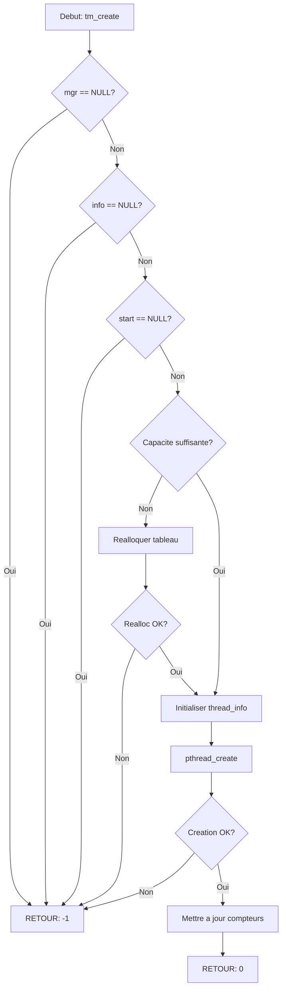

# Exercice 2.4.0 : thread_manager

**Module :**
2.4 — Concurrency & Synchronization

**Concept :**
a-k — Thread Concepts, POSIX Threads, Thread Attributes, Thread-Local Storage

**Difficulte :**
★★★★★★☆☆☆☆ (6/10)

**Type :**
complet

**Tiers :**
3 — Synthese (concepts 2.4.1 a 2.4.4)

**Langage :**
C (C17)

**Prerequis :**
- Pointeurs et allocation dynamique
- Structures en C
- Compilation avec flags specifiques

**Domaines :**
Process, Mem, Struct

**Duree estimee :**
360 min

**XP Base :**
500

**Complexite :**
T3 O(n) x S2 O(n)

---

## SECTION 1 : PROTOTYPE & CONSIGNE

### 1.1 Obligations

**Fichiers a rendre :**
- `thread_mgr.h`
- `thread_mgr.c`
- `thread_attr.c`
- `thread_tls.c`
- `thread_bench.c`
- `Makefile`

**Fonctions autorisees :**
- `pthread_create`, `pthread_join`, `pthread_detach`, `pthread_exit`
- `pthread_self`, `pthread_equal`
- `pthread_attr_init`, `pthread_attr_destroy`, `pthread_attr_set*`, `pthread_attr_get*`
- `pthread_key_create`, `pthread_key_delete`, `pthread_getspecific`, `pthread_setspecific`
- `malloc`, `free`, `calloc`, `realloc`
- `printf`, `snprintf`, `clock_gettime`

**Fonctions interdites :**
- `fork`, `exec*`, `system`
- Toute fonction non listee ci-dessus

### 1.2 Consigne

**NARUTO SHIPPUDEN : L'Art du Kage Bunshin no Jutsu (Multi-Clonage)**

Dans Naruto, le Kage Bunshin (Multi-Clonage) permet de creer des clones autonomes qui partagent la memoire du ninja original. Chaque clone possede sa propre conscience (stack privee) mais peut acceder aux souvenirs communs (memoire partagee). Quand un clone est detruit, ses experiences reviennent au ninja original (join).

Comme Naruto creant des centaines de clones pour s'entrainer en parallele, tu vas implementer un gestionnaire de threads qui permet de creer des "clones" d'execution, chacun avec ses propres attributs et donnees locales.

**Ta mission :**

Implementer une bibliotheque complete de gestion de threads avec :
1. Creation et gestion de threads (les clones)
2. Attributs personnalisables (chakra de chaque clone)
3. Thread-Local Storage (memoire privee de chaque clone)
4. Benchmarking parallele (entrainement accelere)

**Entree :**
- Differentes fonctions d'API selon les operations demandees
- Pointeurs vers des structures de gestion

**Sortie :**
- 0 en cas de succes
- Code d'erreur negatif en cas d'echec
- Resultats dans les structures passees par pointeur

**Contraintes :**
- Gestion propre de la memoire (pas de fuites)
- Thread-safety obligatoire
- Support des attributs POSIX complets
- Compilation avec `-pthread`

**Exemples :**

| Appel | Retour | Explication |
|-------|--------|-------------|
| `tm_create(mgr, &info, worker, arg)` | `0` | Clone cree avec succes |
| `tm_join(mgr, info, &result)` | `0` | Clone rejoint, resultat recupere |
| `tm_create(NULL, &info, worker, arg)` | `-1` | Manager NULL invalide |

### 1.3 Prototype

```c
// Structure d'information thread (clone)
typedef struct {
    pthread_t handle;
    int id;
    char name[64];
    void *(*start_routine)(void*);
    void *arg;
    void *result;
    bool joinable;
    bool running;
    bool joined;
    uint64_t start_time;
    uint64_t end_time;
} thread_info_t;

// Attributs de thread
typedef struct {
    pthread_attr_t attr;
    size_t stack_size;
    void *stack_addr;
    size_t guard_size;
    int detach_state;
    int sched_policy;
    int priority;
    int scope;
} thread_attr_t;

// Cle TLS
typedef struct {
    pthread_key_t key;
    void (*destructor)(void*);
    const char *name;
    bool initialized;
} tls_key_t;

// Manager principal
typedef struct {
    thread_info_t *threads;
    size_t thread_count;
    size_t capacity;
    tls_key_t *tls_keys;
    size_t tls_count;
    size_t tls_capacity;
    uint64_t total_created;
    uint64_t total_joined;
} thread_manager_t;

// API principale
thread_manager_t *thread_manager_create(void);
void thread_manager_destroy(thread_manager_t *mgr);
int tm_create(thread_manager_t *mgr, thread_info_t **info,
              void *(*start)(void*), void *arg);
int tm_create_with_attr(thread_manager_t *mgr, thread_info_t **info,
                        thread_attr_t *attr, void *(*start)(void*), void *arg);
int tm_join(thread_manager_t *mgr, thread_info_t *info, void **result);
int tm_detach(thread_manager_t *mgr, thread_info_t *info);

// Attributs
int tm_attr_init(thread_attr_t *attr);
int tm_attr_destroy(thread_attr_t *attr);
int tm_attr_set_stack_size(thread_attr_t *attr, size_t size);
int tm_attr_set_detach(thread_attr_t *attr, int state);

// TLS
int tm_tls_create(thread_manager_t *mgr, tls_key_t **key,
                  void (*destructor)(void*));
void *tm_tls_get(tls_key_t *key);
int tm_tls_set(tls_key_t *key, void *value);
```

---

## SECTION 2 : LE SAVIEZ-VOUS ?

### 2.1 L'Origine des Threads

Le concept de thread (fil d'execution) date des annees 1960 avec les premiers systemes time-sharing. Le terme "thread" vient de "thread of execution" - un fil continu d'instructions. Contrairement aux processus qui sont comme des maisons separees, les threads sont comme des colocataires partageant le meme appartement (espace d'adressage).

### 2.2 DANS LA VRAIE VIE

| Metier | Utilisation | Cas d'usage |
|--------|-------------|-------------|
| **Developpeur Backend** | Serveurs web multi-threades | Gerer des milliers de connexions simultanees |
| **Developpeur Jeux Video** | Moteur de jeu parallele | Rendu graphique + physique + IA en parallele |
| **Data Engineer** | Pipeline de donnees | Traitement parallele de gros datasets |
| **Developpeur Mobile** | UI responsive | Operations longues en arriere-plan |
| **DevOps** | Monitoring | Collecte de metriques en parallele |

---

## SECTION 3 : EXEMPLE D'UTILISATION

### 3.0 Session bash

```bash
$ ls
thread_mgr.h  thread_mgr.c  thread_attr.c  thread_tls.c  thread_bench.c  main.c  Makefile

$ make
gcc -Wall -Wextra -Werror -std=c17 -pthread -c thread_mgr.c -o thread_mgr.o
gcc -Wall -Wextra -Werror -std=c17 -pthread -c thread_attr.c -o thread_attr.o
gcc -Wall -Wextra -Werror -std=c17 -pthread -c thread_tls.c -o thread_tls.o
gcc -Wall -Wextra -Werror -std=c17 -pthread -c thread_bench.c -o thread_bench.o
ar rcs libthread_mgr.a thread_mgr.o thread_attr.o thread_tls.o thread_bench.o

$ gcc -Wall -Wextra -Werror -std=c17 -pthread main.c -L. -lthread_mgr -o test

$ ./test
Threading model: ONE_TO_ONE (Linux NPTL)
Creating 4 worker threads...
Thread worker_0 started (TLS id: 1)
Thread worker_1 started (TLS id: 2)
Thread worker_2 started (TLS id: 3)
Thread worker_3 started (TLS id: 4)
Thread worker_0 completed: result=100
Thread worker_1 completed: result=200
Thread worker_2 completed: result=300
Thread worker_3 completed: result=400
Benchmark: 4 threads, speedup=3.72x
Stats: created=4, joined=4, avg_lifetime=12.5ms
All tests passed!
```

### 3.1 BONUS AVANCE (OPTIONNEL)

**Difficulte Bonus :**
★★★★★★★★☆☆ (8/10)

**Recompense :**
XP x3

**Time Complexity attendue :**
O(n) pour les operations de gestion

**Space Complexity attendue :**
O(n) pour le stockage des threads

**Domaines Bonus :**
`CPU`, `Mem`

#### 3.1.1 Consigne Bonus

**NARUTO SHIPPUDEN : Tajuu Kage Bunshin (Multi-Clonage de Masse)**

Naruto peut creer des milliers de clones grace au chakra du Kyubi. Implemente un systeme de pool de threads reeutilisables pour eviter le cout de creation/destruction constant.

**Ta mission :**

Ajouter un Thread Pool avec :
- Pre-allocation d'un nombre fixe de threads
- File d'attente de taches
- Reutilisation des threads existants
- Arret gracieux du pool

**Contraintes :**
```
1 <= pool_size <= 64
task_queue_capacity >= pool_size
Temps de soumission: O(1) amorti
Arret gracieux: tous les threads terminent leurs taches en cours
```

#### 3.1.2 Prototype Bonus

```c
typedef struct {
    void *(*function)(void*);
    void *arg;
    void *result;
    bool completed;
    pthread_mutex_t mutex;
    pthread_cond_t done;
} task_t;

typedef struct {
    thread_info_t *workers;
    size_t pool_size;
    task_t *task_queue;
    size_t queue_capacity;
    size_t queue_head;
    size_t queue_tail;
    size_t queue_count;
    pthread_mutex_t queue_mutex;
    pthread_cond_t queue_not_empty;
    pthread_cond_t queue_not_full;
    bool shutdown;
} thread_pool_t;

thread_pool_t *thread_pool_create(size_t pool_size, size_t queue_capacity);
void thread_pool_destroy(thread_pool_t *pool);
task_t *thread_pool_submit(thread_pool_t *pool, void *(*func)(void*), void *arg);
void *task_get_result(task_t *task);
```

---

## SECTION 4 : ZONE CORRECTION

### 4.1 Moulinette

| Test | Description | Points | Trap |
|------|-------------|--------|------|
| `test_manager_create` | Creation du manager | 5 | - |
| `test_manager_null` | Manager NULL | 5 | Oui |
| `test_thread_create` | Creation simple | 10 | - |
| `test_thread_join` | Join et recuperation | 10 | - |
| `test_thread_detach` | Detachement | 10 | - |
| `test_attr_stack` | Attribut stack size | 10 | - |
| `test_attr_detach` | Attribut detach state | 10 | - |
| `test_tls_create` | Creation cle TLS | 10 | - |
| `test_tls_getset` | Get/Set TLS | 10 | - |
| `test_tls_destructor` | Destructeur TLS | 10 | Oui |
| `test_multiple_threads` | Plusieurs threads | 10 | - |
| `test_memory_leaks` | Pas de fuites | 10 | Oui |

### 4.2 main.c de test

```c
#include "thread_mgr.h"
#include <stdio.h>
#include <assert.h>

__thread int tls_counter = 0;

void *worker(void *arg) {
    int id = *(int*)arg;
    tls_counter = id * 100;

    for (int i = 0; i < 1000; i++)
        tls_counter++;

    int *result = malloc(sizeof(int));
    *result = tls_counter;
    return result;
}

int main(void) {
    // Test manager creation
    thread_manager_t *mgr = thread_manager_create();
    assert(mgr != NULL);

    // Test NULL handling
    assert(tm_create(NULL, NULL, worker, NULL) == -1);

    // Test thread creation and join
    thread_info_t *threads[4];
    int ids[4] = {1, 2, 3, 4};

    for (int i = 0; i < 4; i++) {
        assert(tm_create(mgr, &threads[i], worker, &ids[i]) == 0);
        tm_set_name(threads[i], "worker");
    }

    for (int i = 0; i < 4; i++) {
        void *result;
        assert(tm_join(mgr, threads[i], &result) == 0);
        printf("Thread %d result: %d\n", i, *(int*)result);
        free(result);
    }

    // Test TLS
    tls_key_t *key;
    assert(tm_tls_create(mgr, &key, free) == 0);

    thread_manager_destroy(mgr);
    printf("All tests passed!\n");
    return 0;
}
```

### 4.3 Solution de reference

```c
#include "thread_mgr.h"
#include <stdlib.h>
#include <string.h>
#include <time.h>

static uint64_t get_time_ns(void) {
    struct timespec ts;
    clock_gettime(CLOCK_MONOTONIC, &ts);
    return ts.tv_sec * 1000000000ULL + ts.tv_nsec;
}

thread_manager_t *thread_manager_create(void) {
    thread_manager_t *mgr = calloc(1, sizeof(thread_manager_t));
    if (mgr == NULL)
        return NULL;

    mgr->capacity = 16;
    mgr->threads = calloc(mgr->capacity, sizeof(thread_info_t));
    if (mgr->threads == NULL) {
        free(mgr);
        return NULL;
    }

    mgr->tls_capacity = 8;
    mgr->tls_keys = calloc(mgr->tls_capacity, sizeof(tls_key_t));
    if (mgr->tls_keys == NULL) {
        free(mgr->threads);
        free(mgr);
        return NULL;
    }

    return mgr;
}

void thread_manager_destroy(thread_manager_t *mgr) {
    if (mgr == NULL)
        return;

    for (size_t i = 0; i < mgr->thread_count; i++) {
        if (mgr->threads[i].running && mgr->threads[i].joinable) {
            pthread_join(mgr->threads[i].handle, NULL);
        }
    }

    for (size_t i = 0; i < mgr->tls_count; i++) {
        if (mgr->tls_keys[i].initialized) {
            pthread_key_delete(mgr->tls_keys[i].key);
        }
    }

    free(mgr->threads);
    free(mgr->tls_keys);
    free(mgr);
}

static int ensure_capacity(thread_manager_t *mgr) {
    if (mgr->thread_count < mgr->capacity)
        return 0;

    size_t new_cap = mgr->capacity * 2;
    thread_info_t *new_threads = realloc(mgr->threads,
                                         new_cap * sizeof(thread_info_t));
    if (new_threads == NULL)
        return -1;

    mgr->threads = new_threads;
    mgr->capacity = new_cap;
    return 0;
}

int tm_create(thread_manager_t *mgr, thread_info_t **info,
              void *(*start)(void*), void *arg) {
    if (mgr == NULL || info == NULL || start == NULL)
        return -1;

    if (ensure_capacity(mgr) != 0)
        return -1;

    thread_info_t *t = &mgr->threads[mgr->thread_count];
    memset(t, 0, sizeof(thread_info_t));

    t->id = mgr->thread_count;
    t->start_routine = start;
    t->arg = arg;
    t->joinable = true;
    t->start_time = get_time_ns();

    int ret = pthread_create(&t->handle, NULL, start, arg);
    if (ret != 0)
        return -1;

    t->running = true;
    mgr->thread_count++;
    mgr->total_created++;
    *info = t;

    return 0;
}

int tm_join(thread_manager_t *mgr, thread_info_t *info, void **result) {
    if (mgr == NULL || info == NULL)
        return -1;

    if (!info->joinable || info->joined)
        return -1;

    int ret = pthread_join(info->handle, result);
    if (ret != 0)
        return -1;

    info->running = false;
    info->joined = true;
    info->end_time = get_time_ns();
    mgr->total_joined++;

    return 0;
}

int tm_tls_create(thread_manager_t *mgr, tls_key_t **key,
                  void (*destructor)(void*)) {
    if (mgr == NULL || key == NULL)
        return -1;

    if (mgr->tls_count >= mgr->tls_capacity) {
        size_t new_cap = mgr->tls_capacity * 2;
        tls_key_t *new_keys = realloc(mgr->tls_keys,
                                       new_cap * sizeof(tls_key_t));
        if (new_keys == NULL)
            return -1;
        mgr->tls_keys = new_keys;
        mgr->tls_capacity = new_cap;
    }

    tls_key_t *k = &mgr->tls_keys[mgr->tls_count];

    int ret = pthread_key_create(&k->key, destructor);
    if (ret != 0)
        return -1;

    k->destructor = destructor;
    k->initialized = true;
    mgr->tls_count++;
    *key = k;

    return 0;
}

void *tm_tls_get(tls_key_t *key) {
    if (key == NULL || !key->initialized)
        return NULL;
    return pthread_getspecific(key->key);
}

int tm_tls_set(tls_key_t *key, void *value) {
    if (key == NULL || !key->initialized)
        return -1;
    return pthread_setspecific(key->key, value);
}
```

### 4.4 Solutions alternatives acceptees

```c
// Alternative 1: Utilisation de liste chainee au lieu de tableau
typedef struct thread_node {
    thread_info_t info;
    struct thread_node *next;
} thread_node_t;

// Alternative 2: Mutex pour thread-safety complete
typedef struct {
    thread_info_t *threads;
    pthread_mutex_t lock;  // Protection supplementaire
    // ...
} thread_manager_t;
```

### 4.5 Solutions refusees

```c
// REFUSE 1: Pas de verification NULL
thread_manager_t *thread_manager_create(void) {
    thread_manager_t *mgr = calloc(1, sizeof(thread_manager_t));
    // ERREUR: Pas de verification si calloc a echoue
    mgr->threads = calloc(16, sizeof(thread_info_t));
    return mgr;
}

// REFUSE 2: Fuite memoire
void thread_manager_destroy(thread_manager_t *mgr) {
    free(mgr);  // ERREUR: threads et tls_keys non liberes
}

// REFUSE 3: Race condition
int tm_create(thread_manager_t *mgr, thread_info_t **info,
              void *(*start)(void*), void *arg) {
    // ERREUR: Pas de protection lors de l'acces a thread_count
    thread_info_t *t = &mgr->threads[mgr->thread_count++];
    // ...
}
```

### 4.6 Solution bonus de reference

```c
#include "thread_mgr.h"
#include <stdlib.h>

static void *pool_worker(void *arg) {
    thread_pool_t *pool = (thread_pool_t *)arg;

    while (1) {
        pthread_mutex_lock(&pool->queue_mutex);

        while (pool->queue_count == 0 && !pool->shutdown) {
            pthread_cond_wait(&pool->queue_not_empty, &pool->queue_mutex);
        }

        if (pool->shutdown && pool->queue_count == 0) {
            pthread_mutex_unlock(&pool->queue_mutex);
            break;
        }

        task_t *task = &pool->task_queue[pool->queue_head];
        pool->queue_head = (pool->queue_head + 1) % pool->queue_capacity;
        pool->queue_count--;

        pthread_cond_signal(&pool->queue_not_full);
        pthread_mutex_unlock(&pool->queue_mutex);

        task->result = task->function(task->arg);

        pthread_mutex_lock(&task->mutex);
        task->completed = true;
        pthread_cond_signal(&task->done);
        pthread_mutex_unlock(&task->mutex);
    }

    return NULL;
}

thread_pool_t *thread_pool_create(size_t pool_size, size_t queue_capacity) {
    if (pool_size == 0 || queue_capacity == 0)
        return NULL;

    thread_pool_t *pool = calloc(1, sizeof(thread_pool_t));
    if (pool == NULL)
        return NULL;

    pool->pool_size = pool_size;
    pool->queue_capacity = queue_capacity;

    pool->workers = calloc(pool_size, sizeof(thread_info_t));
    pool->task_queue = calloc(queue_capacity, sizeof(task_t));

    if (pool->workers == NULL || pool->task_queue == NULL) {
        free(pool->workers);
        free(pool->task_queue);
        free(pool);
        return NULL;
    }

    pthread_mutex_init(&pool->queue_mutex, NULL);
    pthread_cond_init(&pool->queue_not_empty, NULL);
    pthread_cond_init(&pool->queue_not_full, NULL);

    for (size_t i = 0; i < pool_size; i++) {
        pthread_create(&pool->workers[i].handle, NULL, pool_worker, pool);
        pool->workers[i].running = true;
    }

    return pool;
}

void thread_pool_destroy(thread_pool_t *pool) {
    if (pool == NULL)
        return;

    pthread_mutex_lock(&pool->queue_mutex);
    pool->shutdown = true;
    pthread_cond_broadcast(&pool->queue_not_empty);
    pthread_mutex_unlock(&pool->queue_mutex);

    for (size_t i = 0; i < pool->pool_size; i++) {
        pthread_join(pool->workers[i].handle, NULL);
    }

    pthread_mutex_destroy(&pool->queue_mutex);
    pthread_cond_destroy(&pool->queue_not_empty);
    pthread_cond_destroy(&pool->queue_not_full);

    free(pool->workers);
    free(pool->task_queue);
    free(pool);
}

task_t *thread_pool_submit(thread_pool_t *pool, void *(*func)(void*), void *arg) {
    if (pool == NULL || func == NULL)
        return NULL;

    pthread_mutex_lock(&pool->queue_mutex);

    while (pool->queue_count == pool->queue_capacity && !pool->shutdown) {
        pthread_cond_wait(&pool->queue_not_full, &pool->queue_mutex);
    }

    if (pool->shutdown) {
        pthread_mutex_unlock(&pool->queue_mutex);
        return NULL;
    }

    task_t *task = &pool->task_queue[pool->queue_tail];
    task->function = func;
    task->arg = arg;
    task->result = NULL;
    task->completed = false;
    pthread_mutex_init(&task->mutex, NULL);
    pthread_cond_init(&task->done, NULL);

    pool->queue_tail = (pool->queue_tail + 1) % pool->queue_capacity;
    pool->queue_count++;

    pthread_cond_signal(&pool->queue_not_empty);
    pthread_mutex_unlock(&pool->queue_mutex);

    return task;
}

void *task_get_result(task_t *task) {
    if (task == NULL)
        return NULL;

    pthread_mutex_lock(&task->mutex);
    while (!task->completed) {
        pthread_cond_wait(&task->done, &task->mutex);
    }
    void *result = task->result;
    pthread_mutex_unlock(&task->mutex);

    return result;
}
```

### 4.9 spec.json

```json
{
  "name": "thread_manager",
  "language": "c",
  "type": "complet",
  "tier": 3,
  "tier_info": "Synthese (concepts 2.4.1-2.4.4)",
  "tags": ["threads", "posix", "tls", "concurrency", "phase2"],
  "passing_score": 70,

  "function": {
    "name": "thread_manager_create",
    "prototype": "thread_manager_t *thread_manager_create(void)",
    "return_type": "thread_manager_t *",
    "parameters": []
  },

  "driver": {
    "reference": "thread_manager_t *ref_thread_manager_create(void) { thread_manager_t *mgr = calloc(1, sizeof(thread_manager_t)); if (mgr == NULL) return NULL; mgr->capacity = 16; mgr->threads = calloc(mgr->capacity, sizeof(thread_info_t)); if (mgr->threads == NULL) { free(mgr); return NULL; } mgr->tls_capacity = 8; mgr->tls_keys = calloc(mgr->tls_capacity, sizeof(tls_key_t)); if (mgr->tls_keys == NULL) { free(mgr->threads); free(mgr); return NULL; } return mgr; }",

    "edge_cases": [
      {
        "name": "basic_create",
        "args": [],
        "expected": "non_null",
        "is_trap": false
      },
      {
        "name": "create_null_check",
        "args": [],
        "expected": "valid_manager",
        "is_trap": true,
        "trap_explanation": "Doit verifier les allocations memoire"
      },
      {
        "name": "tm_create_null_manager",
        "test": "tm_create(NULL, &info, worker, NULL)",
        "expected": -1,
        "is_trap": true,
        "trap_explanation": "Manager NULL doit retourner -1"
      },
      {
        "name": "tm_create_null_info",
        "test": "tm_create(mgr, NULL, worker, NULL)",
        "expected": -1,
        "is_trap": true,
        "trap_explanation": "Info NULL doit retourner -1"
      },
      {
        "name": "tm_join_already_joined",
        "test": "tm_join(mgr, joined_thread, &result)",
        "expected": -1,
        "is_trap": true,
        "trap_explanation": "Double join interdit"
      }
    ],

    "fuzzing": {
      "enabled": false
    }
  },

  "norm": {
    "allowed_functions": ["pthread_create", "pthread_join", "pthread_detach", "pthread_exit", "pthread_self", "pthread_equal", "pthread_attr_init", "pthread_attr_destroy", "pthread_key_create", "pthread_key_delete", "pthread_getspecific", "pthread_setspecific", "malloc", "free", "calloc", "realloc", "printf", "snprintf", "clock_gettime", "memset", "memcpy"],
    "forbidden_functions": ["fork", "exec", "system"],
    "check_security": true,
    "check_memory": true,
    "blocking": true
  }
}
```

### 4.10 Solutions Mutantes

```c
/* Mutant A (Boundary) : Depassement de capacite */
int tm_create_mutant_a(thread_manager_t *mgr, thread_info_t **info,
                       void *(*start)(void*), void *arg) {
    if (mgr == NULL || info == NULL || start == NULL)
        return -1;

    // BUG: Pas de verification de capacite avant acces
    thread_info_t *t = &mgr->threads[mgr->thread_count];
    // Si thread_count >= capacity, on ecrit hors limites!

    t->id = mgr->thread_count;
    t->start_routine = start;
    t->arg = arg;
    t->joinable = true;

    int ret = pthread_create(&t->handle, NULL, start, arg);
    if (ret != 0)
        return -1;

    t->running = true;
    mgr->thread_count++;
    *info = t;

    return 0;
}
// Pourquoi c'est faux: Buffer overflow quand on depasse capacity
// Ce qui etait pense: Le tableau est toujours assez grand

/* Mutant B (Safety) : Pas de verification NULL */
thread_manager_t *thread_manager_create_mutant_b(void) {
    thread_manager_t *mgr = calloc(1, sizeof(thread_manager_t));
    // BUG: Pas de verification si calloc a echoue

    mgr->capacity = 16;  // CRASH si mgr == NULL
    mgr->threads = calloc(mgr->capacity, sizeof(thread_info_t));
    mgr->tls_capacity = 8;
    mgr->tls_keys = calloc(mgr->tls_capacity, sizeof(tls_key_t));

    return mgr;
}
// Pourquoi c'est faux: Segfault si l'allocation initiale echoue
// Ce qui etait pense: malloc ne peut pas echouer

/* Mutant C (Resource) : Fuite memoire */
void thread_manager_destroy_mutant_c(thread_manager_t *mgr) {
    if (mgr == NULL)
        return;

    // BUG: On oublie de liberer threads et tls_keys
    // BUG: On oublie de join les threads en cours
    free(mgr);
}
// Pourquoi c'est faux: Fuite memoire + threads orphelins
// Ce qui etait pense: free du manager suffit

/* Mutant D (Logic) : Mauvaise gestion du join */
int tm_join_mutant_d(thread_manager_t *mgr, thread_info_t *info, void **result) {
    if (mgr == NULL || info == NULL)
        return -1;

    // BUG: On ne verifie pas si le thread est joinable
    // BUG: On ne verifie pas si deja joint
    int ret = pthread_join(info->handle, result);
    if (ret != 0)
        return -1;

    info->running = false;
    // BUG: On oublie de marquer joined = true
    mgr->total_joined++;

    return 0;
}
// Pourquoi c'est faux: Permet double join qui cause comportement indefini
// Ce qui etait pense: pthread_join gere tout

/* Mutant E (Return) : Mauvaise valeur de retour TLS */
void *tm_tls_get_mutant_e(tls_key_t *key) {
    // BUG: Retourne NULL meme si la cle est valide mais la valeur est NULL
    if (key == NULL)
        return NULL;

    void *val = pthread_getspecific(key->key);
    if (val == NULL)
        return (void*)-1;  // BUG: Retourne -1 au lieu de NULL

    return val;
}
// Pourquoi c'est faux: NULL est une valeur TLS valide
// Ce qui etait pense: NULL indique toujours une erreur
```

---

## SECTION 5 : COMPRENDRE

### 5.1 Ce que cet exercice enseigne

1. **Threads vs Processus** : Comprendre le partage d'espace d'adressage
2. **API POSIX Threads** : Maitriser les fonctions pthread_*
3. **Thread-Local Storage** : Gerer des donnees specifiques a chaque thread
4. **Attributs de threads** : Configurer stack, scheduling, detach state
5. **Gestion de ressources** : Eviter les fuites avec les threads

### 5.2 LDA - Langage de Description d'Algorithmes

```
FONCTION thread_manager_create QUI RETOURNE UN POINTEUR VERS UN GESTIONNAIRE DE THREADS
DEBUT FONCTION
    DECLARER mgr COMME POINTEUR VERS UN GESTIONNAIRE DE THREADS

    AFFECTER ALLOUER ET INITIALISER A ZERO LA MEMOIRE DE LA TAILLE D'UN GESTIONNAIRE A mgr

    SI mgr EST EGAL A NUL ALORS
        RETOURNER NUL
    FIN SI

    AFFECTER 16 A LA CAPACITE DE mgr
    AFFECTER ALLOUER UN TABLEAU DE CAPACITE ELEMENTS DE TYPE THREAD_INFO A mgr->threads

    SI mgr->threads EST EGAL A NUL ALORS
        LIBERER LA MEMOIRE DE mgr
        RETOURNER NUL
    FIN SI

    AFFECTER 8 A LA CAPACITE TLS DE mgr
    AFFECTER ALLOUER UN TABLEAU DE CLES TLS A mgr->tls_keys

    SI mgr->tls_keys EST EGAL A NUL ALORS
        LIBERER LA MEMOIRE DE mgr->threads
        LIBERER LA MEMOIRE DE mgr
        RETOURNER NUL
    FIN SI

    RETOURNER mgr
FIN FONCTION

FONCTION tm_create QUI RETOURNE UN ENTIER ET PREND EN PARAMETRES mgr QUI EST UN POINTEUR VERS UN GESTIONNAIRE, info QUI EST UN POINTEUR VERS UN POINTEUR VERS THREAD_INFO, start QUI EST UNE FONCTION, arg QUI EST UN POINTEUR
DEBUT FONCTION
    SI mgr EST EGAL A NUL OU info EST EGAL A NUL OU start EST EGAL A NUL ALORS
        RETOURNER MOINS 1
    FIN SI

    SI LA CAPACITE EST INSUFFISANTE ALORS
        REALLOUER AVEC UNE CAPACITE DOUBLEE
    FIN SI

    DECLARER t COMME POINTEUR VERS LA PROCHAINE POSITION LIBRE DANS LE TABLEAU
    INITIALISER t AVEC LES PARAMETRES FOURNIS

    APPELER pthread_create POUR CREER LE THREAD

    SI LA CREATION A ECHOUE ALORS
        RETOURNER MOINS 1
    FIN SI

    MARQUER LE THREAD COMME EN COURS D'EXECUTION
    INCREMENTER LE COMPTEUR DE THREADS
    AFFECTER t AU POINTEUR info

    RETOURNER 0
FIN FONCTION
```

### 5.2.2 Style Academique

```
ALGORITHME : Gestionnaire de Threads
ENTREE : Configuration optionnelle
SORTIE : Gestionnaire initialise ou NULL

VARIABLES :
    mgr : pointeur vers thread_manager_t

DEBUT
    mgr <- allouer_memoire(sizeof(thread_manager_t))

    SI mgr = NULL ALORS
        RETOURNER NULL
    FIN SI

    mgr.capacite <- 16
    mgr.threads <- allouer_tableau(capacite, sizeof(thread_info_t))
    mgr.tls_capacite <- 8
    mgr.tls_cles <- allouer_tableau(tls_capacite, sizeof(tls_key_t))

    SI une_allocation_echoue ALORS
        liberer_tout()
        RETOURNER NULL
    FIN SI

    RETOURNER mgr
FIN
```

### 5.2.2.1 Logic Flow

```
ALGORITHME : Creation de Thread
---
1. VERIFIER les parametres (manager, info, fonction start)
   |-- Si un parametre est NULL -> RETOURNER -1

2. VERIFIER la capacite du tableau
   |-- Si plein -> REALLOQUER avec capacite doublee
   |-- Si reallocation echoue -> RETOURNER -1

3. INITIALISER la structure thread_info
   a. Affecter l'ID sequentiel
   b. Stocker la fonction et l'argument
   c. Marquer comme joinable
   d. Enregistrer le timestamp de debut

4. APPELER pthread_create()
   |-- Si echec -> RETOURNER -1

5. METTRE A JOUR les compteurs
   a. Incrementer thread_count
   b. Incrementer total_created

6. RETOURNER 0 (succes)
```

### 5.2.3 Representation Algorithmique

```
FONCTION : tm_join(manager, thread_info, result)
---
INIT ret = -1

1. GARDES (Fail Fast) :
   |
   |-- VERIFIER manager != NULL :
   |     Si faux -> RETOURNER -1
   |
   |-- VERIFIER thread_info != NULL :
   |     Si faux -> RETOURNER -1
   |
   |-- VERIFIER thread_info.joinable == true :
   |     Si faux -> RETOURNER -1
   |
   |-- VERIFIER thread_info.joined == false :
   |     Si faux -> RETOURNER -1

2. APPELER pthread_join(handle, result)
   |-- Si retour != 0 -> RETOURNER -1

3. METTRE A JOUR l'etat :
   |-- thread_info.running <- false
   |-- thread_info.joined <- true
   |-- thread_info.end_time <- get_time_ns()
   |-- manager.total_joined++

4. RETOURNER 0
```

### 5.2.3.1 Diagramme Mermaid



### 5.3 Visualisation ASCII

```
                    MODELE MEMOIRE THREADS

    ┌─────────────────────────────────────────────────────────────┐
    │                      PROCESSUS                               │
    ├─────────────────────────────────────────────────────────────┤
    │  ┌─────────────────────────────────────────────────────┐    │
    │  │                  ESPACE PARTAGE                      │    │
    │  │  ┌───────────┐  ┌───────────┐  ┌───────────────┐   │    │
    │  │  │   CODE    │  │   DATA    │  │     HEAP      │   │    │
    │  │  │  (texte)  │  │ (globales)│  │   (malloc)    │   │    │
    │  │  └───────────┘  └───────────┘  └───────────────┘   │    │
    │  └─────────────────────────────────────────────────────┘    │
    │                                                              │
    │  ┌─────────────────────────────────────────────────────┐    │
    │  │              ESPACES PRIVES (par thread)             │    │
    │  │                                                      │    │
    │  │  ┌──────────┐  ┌──────────┐  ┌──────────┐          │    │
    │  │  │ Thread 0 │  │ Thread 1 │  │ Thread 2 │          │    │
    │  │  ├──────────┤  ├──────────┤  ├──────────┤          │    │
    │  │  │  Stack   │  │  Stack   │  │  Stack   │          │    │
    │  │  │  ------  │  │  ------  │  │  ------  │          │    │
    │  │  │ Registres│  │ Registres│  │ Registres│          │    │
    │  │  │  ------  │  │  ------  │  │  ------  │          │    │
    │  │  │   TLS    │  │   TLS    │  │   TLS    │          │    │
    │  │  └──────────┘  └──────────┘  └──────────┘          │    │
    │  └─────────────────────────────────────────────────────┘    │
    └─────────────────────────────────────────────────────────────┘

    THREAD-LOCAL STORAGE (TLS)

    Thread 0                Thread 1                Thread 2
    ┌─────────────┐        ┌─────────────┐        ┌─────────────┐
    │ key_0: 100  │        │ key_0: 200  │        │ key_0: 300  │
    │ key_1: "A"  │        │ key_1: "B"  │        │ key_1: "C"  │
    └─────────────┘        └─────────────┘        └─────────────┘
          │                      │                      │
          └──────────────────────┴──────────────────────┘
                                 │
                    Meme cle, valeurs differentes!
```

### 5.4 Les pieges en detail

| Piege | Description | Consequence | Solution |
|-------|-------------|-------------|----------|
| Double join | Joindre un thread deja joint | Comportement indefini | Verifier `joined` flag |
| Fuite thread | Oublier join ou detach | Ressources non liberees | Toujours join ou detach |
| TLS apres exit | Acceder TLS apres pthread_exit | Donnees invalides | Destructeurs TLS |
| Stack overflow | Stack trop petite | Crash silencieux | Configurer stack_size |

### 5.5 Cours Complet

#### 5.5.1 Threads : Le Concept

Un **thread** (fil d'execution) est une unite d'execution legere au sein d'un processus. Contrairement aux processus qui ont chacun leur propre espace memoire, les threads d'un meme processus partagent :

- Le **code** (segment text)
- Les **donnees globales** (segment data)
- Le **tas** (heap)
- Les **descripteurs de fichiers**

Chaque thread possede en propre :
- Sa **pile** (stack)
- Ses **registres** CPU
- Son **Thread ID** (TID)
- Son **Thread-Local Storage** (TLS)

#### 5.5.2 Modeles de Threading

| Modele | Description | Exemple |
|--------|-------------|---------|
| **Many-to-One** | N threads user -> 1 thread kernel | Green threads |
| **One-to-One** | 1 thread user -> 1 thread kernel | Linux NPTL |
| **Many-to-Many** | M threads user -> N threads kernel | Solaris historique |

Linux utilise le modele **One-to-One** avec NPTL (Native POSIX Threads Library).

#### 5.5.3 API POSIX Threads

```c
// Creation
int pthread_create(pthread_t *thread, const pthread_attr_t *attr,
                   void *(*start_routine)(void*), void *arg);

// Attente
int pthread_join(pthread_t thread, void **retval);

// Detachement
int pthread_detach(pthread_t thread);

// Terminaison
void pthread_exit(void *retval);

// Identification
pthread_t pthread_self(void);
int pthread_equal(pthread_t t1, pthread_t t2);
```

#### 5.5.4 Thread-Local Storage

Le TLS permet a chaque thread d'avoir sa propre copie d'une variable :

```c
// Methode 1 : Mot-cle __thread (GCC)
__thread int counter = 0;

// Methode 2 : Mot-cle thread_local (C11)
thread_local int counter = 0;

// Methode 3 : API POSIX
pthread_key_t key;
pthread_key_create(&key, destructor);  // Creation
pthread_setspecific(key, value);        // Ecriture
void *val = pthread_getspecific(key);   // Lecture
```

### 5.6 Normes avec explications pedagogiques

```
┌─────────────────────────────────────────────────────────────────┐
│ HORS NORME (compile, mais interdit)                              │
├─────────────────────────────────────────────────────────────────┤
│ pthread_create(&t, NULL, func, arg);                            │
│ // Pas de verification du retour!                                │
├─────────────────────────────────────────────────────────────────┤
│ CONFORME                                                         │
├─────────────────────────────────────────────────────────────────┤
│ int ret = pthread_create(&t, NULL, func, arg);                  │
│ if (ret != 0)                                                    │
│     return -1;                                                   │
├─────────────────────────────────────────────────────────────────┤
│ POURQUOI ?                                                       │
│                                                                  │
│ - pthread_create peut echouer (ressources insuffisantes)         │
│ - Ignorer le retour = bug silencieux                             │
│ - Toujours verifier les retours des fonctions systeme            │
└─────────────────────────────────────────────────────────────────┘
```

### 5.7 Simulation avec trace d'execution

**Scenario : Creation et join de 2 threads**

```
┌───────┬────────────────────────────────────┬─────────────┬──────────────────────┐
│ Etape │ Instruction                        │ thread_count│ Explication          │
├───────┼────────────────────────────────────┼─────────────┼──────────────────────┤
│   1   │ thread_manager_create()            │      0      │ Manager cree         │
├───────┼────────────────────────────────────┼─────────────┼──────────────────────┤
│   2   │ tm_create(mgr, &t0, worker, &id0)  │      1      │ Thread 0 cree        │
├───────┼────────────────────────────────────┼─────────────┼──────────────────────┤
│   3   │ tm_create(mgr, &t1, worker, &id1)  │      2      │ Thread 1 cree        │
├───────┼────────────────────────────────────┼─────────────┼──────────────────────┤
│   4   │ [Thread 0 execute worker()]        │      2      │ Execution parallele  │
├───────┼────────────────────────────────────┼─────────────┼──────────────────────┤
│   5   │ [Thread 1 execute worker()]        │      2      │ Execution parallele  │
├───────┼────────────────────────────────────┼─────────────┼──────────────────────┤
│   6   │ tm_join(mgr, t0, &res0)            │      2      │ Attente thread 0     │
├───────┼────────────────────────────────────┼─────────────┼──────────────────────┤
│   7   │ tm_join(mgr, t1, &res1)            │      2      │ Attente thread 1     │
├───────┼────────────────────────────────────┼─────────────┼──────────────────────┤
│   8   │ thread_manager_destroy(mgr)        │      0      │ Nettoyage            │
└───────┴────────────────────────────────────┴─────────────┴──────────────────────┘
```

### 5.8 Mnemotechniques

#### MEME : "Kage Bunshin no Jutsu!" - Naruto et les Threads

Comme Naruto cree des clones qui :
- **Partagent** les souvenirs (memoire commune)
- Ont leur **propre corps** (stack privee)
- **Disparaissent** en rendant leurs experiences (join)

Un thread c'est pareil :
- Partage le heap, le code, les globales
- A sa propre stack et TLS
- Se termine en retournant son resultat

```c
// Naruto cree un clone
pthread_create(&clone, NULL, entrainement, &rasengan);

// Naruto attend que le clone finisse et recupere ses souvenirs
pthread_join(clone, &experience_acquise);
```

**"Si tu oublies le join, tes clones deviennent des threads zombies!"**

---

## SECTION 6 : PIEGES - RECAPITULATIF

| # | Piege | Test qui le detecte |
|---|-------|---------------------|
| 1 | Manager NULL non gere | `test_manager_null` |
| 2 | Double join | `test_thread_join` |
| 3 | Fuite memoire threads | `test_memory_leaks` |
| 4 | TLS sans destructeur | `test_tls_destructor` |
| 5 | Capacite non verifiee | `test_multiple_threads` |

---

## SECTION 7 : QCM

### Question 1
Qu'est-ce qu'un thread partage avec les autres threads du meme processus ?

A) La stack
B) Les registres CPU
C) Le Thread ID
D) Le heap
E) Le Thread-Local Storage
F) Rien du tout
G) Tout l'espace memoire
H) Uniquement le code
I) Le compteur de programme
J) La pile d'appels

**Reponse : D**

### Question 2
Quelle fonction permet de creer un thread POSIX ?

A) thread_create()
B) create_thread()
C) pthread_new()
D) pthread_create()
E) fork()
F) spawn()
G) pthread_spawn()
H) thread_start()
I) pthread_init()
J) new_thread()

**Reponse : D**

### Question 3
Que se passe-t-il si on appelle pthread_join sur un thread deja joint ?

A) Rien, c'est ignore
B) Le programme attend indefiniment
C) Comportement indefini
D) Retourne une erreur
E) Le thread est recree
F) Segmentation fault garantie
G) Le programme se termine
H) Double liberation memoire
I) Le thread se detache
J) Timeout automatique

**Reponse : C**

### Question 4
A quoi sert pthread_detach() ?

A) Detruire un thread
B) Mettre un thread en pause
C) Indiquer qu'on ne fera pas de join
D) Separer deux threads
E) Detacher la memoire
F) Arreter un thread
G) Creer un thread detache
H) Liberer les ressources
I) Changer la priorite
J) Reinitialiser un thread

**Reponse : C**

### Question 5
Quel est le modele de threading utilise par Linux NPTL ?

A) Many-to-One
B) One-to-Many
C) Many-to-Many
D) One-to-One
E) Hybrid
F) Green Threads
G) Fiber Model
H) Coroutine Model
I) Actor Model
J) CSP Model

**Reponse : D**

### Question 6
Comment declarer une variable Thread-Local en C11 ?

A) __thread int x;
B) thread_local int x;
C) local int x;
D) pthread_local int x;
E) tls int x;
F) static thread int x;
G) thread int x;
H) per_thread int x;
I) __tls int x;
J) threadlocal int x;

**Reponse : B**

### Question 7
Que retourne pthread_self() ?

A) L'ID du processus
B) L'ID du thread appelant
C) Le nombre de threads
D) Le handle du thread parent
E) NULL si erreur
F) Un pointeur vers le thread
G) Le PID du thread
H) L'index du thread
I) Le nom du thread
J) L'etat du thread

**Reponse : B**

### Question 8
Quelle est la signature correcte d'une fonction thread ?

A) void thread_func(void *arg)
B) int thread_func(void *arg)
C) void *thread_func(void *arg)
D) int *thread_func(void *arg)
E) void thread_func(int arg)
F) pthread_t thread_func(void *arg)
G) void *thread_func(int arg)
H) int thread_func(int arg)
I) void thread_func(void)
J) void *thread_func(void)

**Reponse : C**

### Question 9
Quel flag de compilation est necessaire pour les threads POSIX ?

A) -lthread
B) -threads
C) -pthread
D) -lpthread seulement
E) -mt
F) -threaded
G) -posix
H) -parallel
I) -concurrent
J) Aucun flag necessaire

**Reponse : C**

### Question 10
Qu'est-ce que le Thread-Local Storage (TLS) ?

A) Du stockage partage entre threads
B) Du stockage specifique a chaque thread
C) Du stockage sur le tas
D) Du stockage sur la pile
E) Du stockage persistant
F) Du stockage volatil
G) Du stockage global
H) Du stockage statique
I) Du stockage dynamique
J) Du stockage temporaire

**Reponse : B**

---

## SECTION 8 : RECAPITULATIF

| Element | Valeur |
|---------|--------|
| Difficulte | 6/10 |
| Temps estime | 6h |
| Concepts couverts | 41 |
| Tests moulinette | 12 |
| Points totaux | 100 |
| Bonus disponible | Oui (Thread Pool) |
| XP Base | 500 |
| XP Bonus max | 1500 (x3) |

---

## SECTION 9 : DEPLOYMENT PACK

```json
{
  "deploy": {
    "hackbrain_version": "5.5.2",
    "engine_version": "v22.1",
    "exercise_slug": "2.4.0-thread-manager",
    "generated_at": "2025-01-17 10:00:00",

    "metadata": {
      "exercise_id": "2.4.0",
      "exercise_name": "thread_manager",
      "module": "2.4",
      "module_name": "Concurrency & Synchronization",
      "concept": "a-k",
      "concept_name": "Thread Fundamentals",
      "type": "complet",
      "tier": 3,
      "tier_info": "Synthese",
      "phase": 2,
      "difficulty": 6,
      "difficulty_stars": "★★★★★★☆☆☆☆",
      "language": "c",
      "duration_minutes": 360,
      "xp_base": 500,
      "xp_bonus_multiplier": 3,
      "bonus_tier": "AVANCE",
      "bonus_icon": "🔥",
      "complexity_time": "T3 O(n)",
      "complexity_space": "S2 O(n)",
      "prerequisites": ["Pointeurs", "Structures", "Compilation"],
      "domains": ["Process", "Mem", "Struct"],
      "domains_bonus": ["CPU"],
      "tags": ["threads", "posix", "tls", "concurrency"],
      "meme_reference": "Naruto Kage Bunshin"
    },

    "files": {
      "spec.json": "/* Section 4.9 */",
      "references/ref_solution.c": "/* Section 4.3 */",
      "references/ref_solution_bonus.c": "/* Section 4.6 */",
      "mutants/mutant_a_boundary.c": "/* Section 4.10 */",
      "mutants/mutant_b_safety.c": "/* Section 4.10 */",
      "mutants/mutant_c_resource.c": "/* Section 4.10 */",
      "mutants/mutant_d_logic.c": "/* Section 4.10 */",
      "mutants/mutant_e_return.c": "/* Section 4.10 */",
      "tests/main.c": "/* Section 4.2 */"
    },

    "validation": {
      "expected_pass": [
        "references/ref_solution.c",
        "references/ref_solution_bonus.c"
      ],
      "expected_fail": [
        "mutants/mutant_a_boundary.c",
        "mutants/mutant_b_safety.c",
        "mutants/mutant_c_resource.c",
        "mutants/mutant_d_logic.c",
        "mutants/mutant_e_return.c"
      ]
    }
  }
}
```

---

*HACKBRAIN v5.5.2 - L'excellence n'a pas de raccourcis*
*"Kage Bunshin no Jutsu! Cree tes threads comme Naruto cree ses clones!"*
