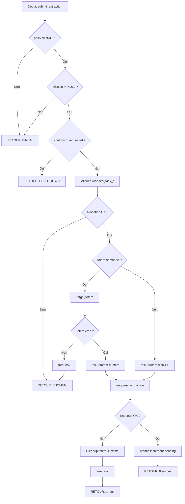

# Exercice 2.4.1 : inception_pool

**Module :**
2.4.1 — Thread Pool Implementation

**Concept :**
a-h — Thread Pool + Task Queue + Future/Promise + TLS + Dynamic Workers + Thread Attributes

**Difficulte :**
★★★★★★★☆☆☆ (7/10)

**Type :**
complet

**Tiers :**
3 — Synthese (tous concepts Thread Pool)

**Langage :**
C (C17)

**Prerequis :**
- Module 2.4.0 (Thread Fundamentals)
- Mutex et Condition Variables
- Allocation memoire dynamique
- Structures de donnees (queues)

**Domaines :**
Process, Mem, Struct, CPU

**Duree estimee :**
480 min (8h)

**XP Base :**
600

**Complexite :**
T4 O(n) x S3 O(n)

---

## 📐 SECTION 1 : PROTOTYPE & CONSIGNE

### 1.1 Obligations

**Fichiers a rendre :**
```
ex01/
├── inception_pool.h
├── inception_pool.c
├── dream_queue.c
├── dream_future.c
├── extractor_tls.c
├── limbo_workers.c
└── Makefile
```

**Fonctions autorisees :**
- pthread_create, pthread_join, pthread_detach, pthread_exit
- pthread_self, pthread_equal
- pthread_mutex_init, pthread_mutex_destroy, pthread_mutex_lock, pthread_mutex_unlock
- pthread_cond_init, pthread_cond_destroy, pthread_cond_wait, pthread_cond_signal, pthread_cond_broadcast
- pthread_attr_init, pthread_attr_destroy, pthread_attr_setstacksize, pthread_attr_setguardsize
- pthread_key_create, pthread_key_delete, pthread_getspecific, pthread_setspecific
- malloc, free, calloc, realloc
- printf, fprintf, sprintf, snprintf
- clock_gettime, gettimeofday
- memset, memcpy, strncpy
- sched_yield

**Fonctions interdites :**
- fork, exec*, system
- sleep, usleep (sauf pour les tests)
- signal, sigaction
- sem_* (utiliser uniquement pthread primitives)

### 1.2 Consigne

**🎬 SECTION 2.4.1 : INCEPTION — L'ARCHITECTURE DES REVES**

Dans le film **INCEPTION** de Christopher Nolan, Dom Cobb dirige une equipe d'**extractors** specialises dans l'infiltration des reves. Chaque membre de l'equipe travaille a un **niveau de reve different**, executant des taches specifiques pendant que Cobb coordonne l'ensemble depuis le niveau superieur.

Le **Thread Pool** fonctionne exactement comme l'operation d'extraction dans Inception :

```
┌─────────────────────────────────────────────────────────────────────────────┐
│  INCEPTION                          │   THREAD POOL                         │
├─────────────────────────────────────┼───────────────────────────────────────┤
│  Dom Cobb (Leader)                  │   Pool Manager                        │
│  L'equipe d'extractors              │   Worker Threads                      │
│  Les niveaux de reve                │   Task Queue                          │
│  Une mission/extraction             │   Une tache (task)                    │
│  Le PASIV device                    │   Thread Pool Structure               │
│  Le "kick" (reveil)                 │   Condition Variable Signal           │
│  Le totem (verification)            │   Future/Promise Pattern              │
│  Le Limbo (reve profond)            │   Thread-Local Storage                │
│  Les projections (subconscient)     │   Worker State                        │
│  L'architecte (Ariadne)             │   Task Constructor                    │
│  Le temps dilate dans les reves     │   Parallelisme (speedup)              │
└─────────────────────────────────────┴───────────────────────────────────────┘
```

**Le concept cle d'Inception :**
- **Cobb** ne fait pas le travail lui-meme — il **coordonne** l'equipe
- Les **extractors** attendent qu'on leur assigne une mission
- Chaque extracteur a son propre **niveau de reve** (TLS)
- On peut **ajouter des extractors** si la mission est complexe
- Le **totem** permet de verifier si on est dans la realite (Future)

**Ta mission :**

Creer une bibliotheque complete de Thread Pool inspiree de l'architecture d'Inception :

**Entree :**
- `dream_config_t *config` : Configuration du reve (nombre d'extractors, taille du stack)
- `extraction_t *task` : La mission a executer (fonction + donnees)
- `totem_t **future` : Le totem pour recuperer le resultat

**Sortie :**
- `pasiv_t *` : Le PASIV device (thread pool) cree, ou NULL si echec
- `void *result` : Le resultat de l'extraction via le totem

**Contraintes :**
- Le pool doit gerer une queue thread-safe de taches
- Les workers doivent pouvoir etre ajoutes/retires dynamiquement (Limbo mode)
- Chaque worker a son propre TLS pour stocker son "niveau de reve"
- Implementation du pattern Future/Promise pour recuperer les resultats
- Gestion propre des ressources (pas de memory leak = pas de reve qui s'effondre)
- Thread-safe : plusieurs equipes peuvent utiliser le PASIV simultanement

**Exemples :**

| Appel | Resultat | Explication |
|-------|----------|-------------|
| `initiate_pasiv(config)` | PASIV cree | Pool initialise avec N extractors |
| `submit_extraction(pasiv, task, &totem)` | Totem retourne | Tache soumise, future cree |
| `await_totem(totem, &result)` | Resultat obtenu | Attente du resultat (join) |
| `enter_limbo(pasiv, 5)` | 5 workers ajoutes | Scale up dynamique |
| `kick_all(pasiv)` | Pool arrete | Shutdown graceful |

### 1.2.2 Consigne Academique

Implementer un Thread Pool complet en C17 avec :
1. **Task Queue** : File d'attente thread-safe pour les taches
2. **Worker Management** : Creation, destruction et scaling dynamique des workers
3. **Future/Promise** : Pattern asynchrone pour recuperer les resultats
4. **Thread-Local Storage** : Donnees privees par worker
5. **Thread Attributes** : Configuration stack size et guard size
6. **Graceful Shutdown** : Arret propre sans perte de taches

### 1.3 Prototypes

```c
#ifndef INCEPTION_POOL_H
#define INCEPTION_POOL_H

#include <pthread.h>
#include <stdint.h>
#include <stdbool.h>
#include <stdatomic.h>

// ═══════════════════════════════════════════════════════════════════════════
// DREAM LEVELS — Task Priority (comme les niveaux de reve)
// ═══════════════════════════════════════════════════════════════════════════

typedef enum {
    DREAM_LEVEL_1,      // Surface dream (high priority)
    DREAM_LEVEL_2,      // Deeper (normal priority)
    DREAM_LEVEL_3,      // Deep dream (low priority)
    LIMBO              // Lowest priority, background tasks
} dream_level_t;

// ═══════════════════════════════════════════════════════════════════════════
// EXTRACTION — A Task to Execute (une mission)
// ═══════════════════════════════════════════════════════════════════════════

typedef void *(*extraction_fn)(void *);

typedef struct extraction {
    extraction_fn           mission;        // Function to execute
    void                   *target;         // Argument (the mark's secrets)
    dream_level_t           level;          // Priority level
    uint64_t                submitted_at;   // Timestamp
    struct extraction      *next;           // Queue linkage
} extraction_t;

// ═══════════════════════════════════════════════════════════════════════════
// TOTEM — Future/Promise (verification du resultat)
// ═══════════════════════════════════════════════════════════════════════════

typedef enum {
    TOTEM_SPINNING,     // Task still running (totem tourne)
    TOTEM_FALLEN,       // Task completed (totem tombe = realite)
    TOTEM_LOST          // Task cancelled/error (totem perdu)
} totem_state_t;

typedef struct totem {
    pthread_mutex_t     lock;
    pthread_cond_t      reality_check;     // Condition for waiting
    totem_state_t       state;
    void               *inception_result;  // The extracted secret
    int                 error_code;        // 0 = success
    uint64_t            completed_at;
} totem_t;

// ═══════════════════════════════════════════════════════════════════════════
// DREAM QUEUE — Thread-safe Task Queue
// ═══════════════════════════════════════════════════════════════════════════

typedef struct {
    extraction_t       *head;              // First task
    extraction_t       *tail;              // Last task
    size_t              count;             // Number of pending tasks
    size_t              capacity;          // Max tasks (0 = unlimited)
    pthread_mutex_t     lock;
    pthread_cond_t      not_empty;         // Signal when task available
    pthread_cond_t      not_full;          // Signal when space available
    bool                closed;            // No more tasks accepted
} dream_queue_t;

// ═══════════════════════════════════════════════════════════════════════════
// EXTRACTOR — A Worker Thread
// ═══════════════════════════════════════════════════════════════════════════

typedef struct extractor {
    pthread_t           spirit;            // Thread handle
    int                 id;                // Extractor ID
    char                name[64];          // Codename (Arthur, Eames, etc.)
    bool                active;            // Is working
    bool                should_wake;       // Should terminate (kick signal)
    uint64_t            tasks_completed;   // Stats
    uint64_t            total_work_time;   // Time spent working (ns)
    struct pasiv       *team;              // Back-reference to pool
} extractor_t;

// ═══════════════════════════════════════════════════════════════════════════
// DREAM CONFIG — Pool Configuration
// ═══════════════════════════════════════════════════════════════════════════

typedef struct {
    size_t              initial_extractors;  // Starting team size
    size_t              max_extractors;      // Maximum team size
    size_t              min_extractors;      // Minimum (always keep this many)
    size_t              stack_size;          // Stack per extractor (0 = default)
    size_t              guard_size;          // Guard page size (0 = default)
    size_t              queue_capacity;      // Max pending tasks (0 = unlimited)
    bool                enable_tls;          // Enable per-extractor storage
} dream_config_t;

// ═══════════════════════════════════════════════════════════════════════════
// PASIV DEVICE — The Thread Pool (le dispositif qui connecte l'equipe)
// ═══════════════════════════════════════════════════════════════════════════

typedef struct pasiv {
    // Team management
    extractor_t        *team;              // Array of extractors
    size_t              team_size;         // Current number of extractors
    size_t              max_team_size;     // Maximum extractors
    size_t              min_team_size;     // Minimum extractors
    pthread_mutex_t     team_lock;         // Protects team modifications

    // Task queue
    dream_queue_t       missions;          // Pending extractions

    // Thread attributes
    pthread_attr_t      extractor_attr;    // Configured attributes

    // TLS for extractors
    pthread_key_t       dream_level_key;   // Per-extractor dream level
    pthread_key_t       extractor_id_key;  // Per-extractor ID
    bool                tls_enabled;

    // State
    atomic_bool         inception_active;  // Pool is running
    atomic_bool         shutdown_requested;
    atomic_size_t       active_extractors; // Currently working
    atomic_size_t       pending_tasks;     // Tasks in queue
    atomic_size_t       completed_tasks;   // Total completed

    // Statistics
    uint64_t            created_at;
    uint64_t            total_tasks_submitted;
} pasiv_t;

// ═══════════════════════════════════════════════════════════════════════════
// EXTRACTOR TLS — Per-Worker Data
// ═══════════════════════════════════════════════════════════════════════════

typedef struct {
    int                 dream_depth;       // How deep in the dream
    uint64_t            entered_at;        // When entered current dream
    void               *personal_totem;    // Private data
    char                current_mark[64];  // What they're working on
} extractor_mind_t;

// ═══════════════════════════════════════════════════════════════════════════
// API — PASIV Device (Pool Management)
// ═══════════════════════════════════════════════════════════════════════════

// Initialize PASIV with configuration
pasiv_t *initiate_pasiv(const dream_config_t *config);

// Shutdown PASIV gracefully
int kick_all(pasiv_t *pasiv);

// Force immediate shutdown (cancel pending tasks)
int emergency_wake(pasiv_t *pasiv);

// Destroy PASIV and free all resources
void dismantle_pasiv(pasiv_t *pasiv);

// ═══════════════════════════════════════════════════════════════════════════
// API — Mission Submission (Task Management)
// ═══════════════════════════════════════════════════════════════════════════

// Submit a task and get a future
int submit_extraction(pasiv_t *pasiv, extraction_fn mission, void *target,
                      dream_level_t level, totem_t **totem);

// Submit without caring about result (fire-and-forget)
int submit_extraction_detached(pasiv_t *pasiv, extraction_fn mission,
                               void *target, dream_level_t level);

// Submit multiple tasks at once (batch)
int submit_inception(pasiv_t *pasiv, extraction_t *tasks, size_t count,
                     totem_t **totems);

// ═══════════════════════════════════════════════════════════════════════════
// API — Totem (Future/Promise)
// ═══════════════════════════════════════════════════════════════════════════

// Create a totem (future)
totem_t *forge_totem(void);

// Wait for result (blocking)
int await_totem(totem_t *totem, void **result);

// Wait with timeout (milliseconds)
int await_totem_timed(totem_t *totem, void **result, uint64_t timeout_ms);

// Check if result ready (non-blocking)
bool totem_has_fallen(totem_t *totem);

// Get result without waiting (returns NULL if not ready)
void *peek_totem(totem_t *totem);

// Cancel waiting (mark as lost)
int abandon_totem(totem_t *totem);

// Destroy totem
void destroy_totem(totem_t *totem);

// ═══════════════════════════════════════════════════════════════════════════
// API — Dynamic Worker Management (Limbo Mode)
// ═══════════════════════════════════════════════════════════════════════════

// Add extractors to the team
int enter_limbo(pasiv_t *pasiv, size_t count);

// Remove extractors from the team (gracefully)
int leave_limbo(pasiv_t *pasiv, size_t count);

// Get current team size
size_t get_team_size(pasiv_t *pasiv);

// Get number of active (working) extractors
size_t get_active_extractors(pasiv_t *pasiv);

// ═══════════════════════════════════════════════════════════════════════════
// API — Dream Queue Operations
// ═══════════════════════════════════════════════════════════════════════════

// Initialize queue
int init_dream_queue(dream_queue_t *queue, size_t capacity);

// Destroy queue
void destroy_dream_queue(dream_queue_t *queue);

// Enqueue task (blocking if full)
int enqueue_extraction(dream_queue_t *queue, extraction_t *task);

// Dequeue task (blocking if empty)
extraction_t *dequeue_extraction(dream_queue_t *queue);

// Try dequeue (non-blocking)
extraction_t *try_dequeue_extraction(dream_queue_t *queue);

// Close queue (no more enqueues)
void close_dream_queue(dream_queue_t *queue);

// Get queue stats
size_t get_queue_size(dream_queue_t *queue);

// ═══════════════════════════════════════════════════════════════════════════
// API — Extractor TLS
// ═══════════════════════════════════════════════════════════════════════════

// Set current extractor's mind state
int set_extractor_mind(pasiv_t *pasiv, extractor_mind_t *mind);

// Get current extractor's mind state
extractor_mind_t *get_extractor_mind(pasiv_t *pasiv);

// Get current extractor's ID
int get_my_extractor_id(pasiv_t *pasiv);

// Get current dream depth
int get_dream_depth(pasiv_t *pasiv);

// ═══════════════════════════════════════════════════════════════════════════
// API — Statistics
// ═══════════════════════════════════════════════════════════════════════════

typedef struct {
    size_t              team_size;
    size_t              active_extractors;
    size_t              pending_tasks;
    size_t              completed_tasks;
    size_t              total_submitted;
    double              avg_task_time_ms;
    double              throughput;        // Tasks per second
    uint64_t            uptime_ms;
} inception_stats_t;

void get_inception_stats(pasiv_t *pasiv, inception_stats_t *stats);

// ═══════════════════════════════════════════════════════════════════════════
// Utility
// ═══════════════════════════════════════════════════════════════════════════

// Name an extractor (for debugging)
void codename_extractor(extractor_t *extractor, const char *name);

// Get default configuration
dream_config_t get_default_config(void);

// Print pool status
void print_inception_status(pasiv_t *pasiv);

#endif // INCEPTION_POOL_H
```

---

## 💡 SECTION 2 : LE SAVIEZ-VOUS ?

### 2.1 Pourquoi INCEPTION est l'analogie parfaite pour un Thread Pool

Le film Inception (2010) de Christopher Nolan est une metaphore remarquablement precise de l'architecture d'un Thread Pool :

**1. Le PASIV Device = Thread Pool Structure**
Dans le film, le PASIV (Portable Automated Somnacin IntraVenous) device connecte physiquement tous les reveurs. C'est exactement ce que fait la structure du thread pool : elle lie tous les workers a une queue commune.

**2. Cobb ne fait pas le travail = Le Main Thread ne traite pas les taches**
Cobb coordonne l'equipe mais ne fait pas les extractions lui-meme. Le thread principal qui cree le pool ne traite pas les taches - il les soumet et attend les resultats.

**3. Les niveaux de reve = Thread-Local Storage**
Chaque extracteur peut etre a un niveau different (reve dans un reve). Le TLS donne a chaque worker son propre "contexte de reve".

**4. Le Kick = Condition Variable Signal**
Le "kick" qui reveille les reveurs est comme `pthread_cond_signal` qui reveille un worker en attente.

**5. Le Totem = Future/Promise**
Le totem permet de savoir si on est dans la realite. Le Future permet de savoir si une tache est terminee et d'obtenir son resultat.

### 2.2 L'equation du temps dans Inception

```
Temps au niveau N = Temps reel x 20^N

Niveau 1: 5 min     = 1 heure     de reve
Niveau 2: 5 min     = 20 heures   de reve (dans le reve)
Niveau 3: 5 min     = 400 heures  de reve (reve dans le reve dans le reve)
Limbo:    5 min     = decades     de reve
```

C'est exactement comme le parallelisme : avec N workers, on peut theoriquement faire N fois plus de travail dans le meme temps reel !

### 2.5 DANS LA VRAIE VIE

| Metier | Usage du Thread Pool |
|--------|---------------------|
| **Backend Engineer** | Web servers (nginx, Apache) utilisent des thread pools pour gerer des milliers de requetes |
| **Game Developer** | Job systems pour paralleliser physique, IA, rendu |
| **Data Engineer** | Traitement parallele de gros datasets |
| **DevOps** | Execution parallele de tests CI/CD |
| **Systems Programmer** | Database connection pools, I/O workers |
| **ML Engineer** | Parallelisation de l'inference sur multiple inputs |

**Exemples celebres de Thread Pools :**
- **Java ExecutorService** : `Executors.newFixedThreadPool(n)`
- **C++ std::async** avec launch::async
- **Python concurrent.futures.ThreadPoolExecutor**
- **Go goroutines** avec worker pools
- **Rust Rayon** pour le parallelisme

---

## 🖥️ SECTION 3 : EXEMPLE D'UTILISATION

### 3.0 Session bash

```bash
$ ls
inception_pool.h  inception_pool.c  dream_queue.c  dream_future.c  extractor_tls.c  limbo_workers.c  main.c  Makefile

$ make
gcc -Wall -Wextra -std=c17 -pthread -c inception_pool.c
gcc -Wall -Wextra -std=c17 -pthread -c dream_queue.c
gcc -Wall -Wextra -std=c17 -pthread -c dream_future.c
gcc -Wall -Wextra -std=c17 -pthread -c extractor_tls.c
gcc -Wall -Wextra -std=c17 -pthread -c limbo_workers.c
ar rcs libinception.a inception_pool.o dream_queue.o dream_future.o extractor_tls.o limbo_workers.o
gcc -Wall -Wextra -std=c17 -pthread main.c -L. -linception -o inception_demo

$ ./inception_demo
=== INCEPTION THREAD POOL ===
Initiating PASIV device...
Configuration: 4 extractors, 2MB stack, 4KB guard

Team assembled:
  [0] Arthur   - Ready
  [1] Eames    - Ready
  [2] Ariadne  - Ready
  [3] Yusuf    - Ready

Submitting extractions (Fischer's secrets)...
Extraction 1: Level 1 dream submitted
Extraction 2: Level 2 dream submitted
Extraction 3: Level 3 dream submitted
Extraction 4: Limbo extraction submitted

=== EXTRACTION IN PROGRESS ===
[Arthur]   Entering Level 1... processing mark's secret...
[Eames]    Entering Level 2... deeper extraction...
[Ariadne]  Entering Level 3... maze construction...
[Yusuf]    Entering Limbo... infinite subconscious...

Checking totems...
Totem 1: Fallen (result = 1001)
Totem 2: Fallen (result = 2002)
Totem 3: Fallen (result = 3003)
Totem 4: Fallen (result = 4004)

=== DYNAMIC TEAM MANAGEMENT ===
Current team: 4 extractors
Entering Limbo mode (+2 extractors)...
Team expanded to 6 extractors
Leaving Limbo (-2 extractors)...
Team reduced to 4 extractors

=== INCEPTION STATS ===
Team size: 4
Active extractors: 0
Completed tasks: 4
Avg task time: 25.34ms
Throughput: 157.8 tasks/sec
Uptime: 102ms

Kick all! (shutdown)
All extractors awakened.
PASIV dismantled. Inception complete!
```

### 3.1 🔥 BONUS AVANCE (OPTIONNEL)

**Difficulte Bonus :**
★★★★★★★★★☆ (9/10)

**Recompense :**
XP x3

**Time Complexity attendue :**
O(1) amorti pour enqueue/dequeue avec work-stealing

**Space Complexity attendue :**
O(n) ou n = nombre de taches

**Domaines Bonus :**
`CPU, Struct, Algo`

#### 3.1.1 Consigne Bonus

**🎬 MR. CHARLES GAMBIT : ADVANCED INCEPTION TECHNIQUES**

Dans Inception, le "Mr. Charles" est une technique risquee ou Cobb revele a la cible qu'elle reve. Implemente des techniques avancees :

1. **Work-Stealing** : Quand un extracteur finit, il peut "voler" une tache a un autre (comme Eames qui aide Arthur)
2. **Priority Inversion Prevention** : Empecher qu'une tache haute priorite attende une basse priorite
3. **Adaptive Sizing** : Le pool ajuste automatiquement sa taille selon la charge

**Ta mission :**

```c
// Work-stealing between extractors
typedef struct {
    dream_queue_t      *local_queue;      // Per-extractor queue
    pasiv_t            *team;             // Reference to pool
} steal_context_t;

// Try to steal work from another extractor
extraction_t *steal_extraction(steal_context_t *ctx);

// Adaptive pool sizing based on load
typedef struct {
    double              high_watermark;    // Add workers if load > this
    double              low_watermark;     // Remove workers if load < this
    uint64_t            sample_interval_ms;
} adaptive_config_t;

int enable_adaptive_mode(pasiv_t *pasiv, adaptive_config_t *config);

// Priority queue with aging to prevent starvation
int enable_priority_aging(dream_queue_t *queue, uint64_t age_interval_ms);
```

**Contraintes :**
┌─────────────────────────────────────────┐
│  Work-stealing doit etre lock-free      │
│  Adaptive doit reagir en < 100ms        │
│  Priority aging toutes les 10ms         │
│  Pas de starvation des taches basses    │
└─────────────────────────────────────────┘

#### 3.1.2 Ce qui change par rapport a l'exercice de base

| Aspect | Base | Bonus |
|--------|------|-------|
| Queue | Globale unique | Per-worker + stealing |
| Sizing | Manuel | Automatique adaptatif |
| Priority | FIFO simple | Priority + aging |
| Stealing | Non | O(1) amorti |

---

## ✅❌ SECTION 4 : ZONE CORRECTION

### 4.1 Moulinette (Tests)

| Test | Description | Points | Trap |
|------|-------------|--------|------|
| `test_pasiv_create` | Creation/destruction PASIV | 5 | NULL config |
| `test_single_task` | Soumettre et attendre une tache | 10 | NULL function |
| `test_multiple_tasks` | Plusieurs taches en parallele | 10 | Race condition |
| `test_queue_basic` | Operations basiques de queue | 5 | Empty dequeue |
| `test_queue_blocking` | Producteur-consommateur | 10 | Deadlock |
| `test_future_wait` | await_totem bloquant | 10 | Double wait |
| `test_future_timeout` | await_totem_timed | 5 | Timeout = 0 |
| `test_future_cancel` | abandon_totem | 5 | Cancel after complete |
| `test_tls_basic` | Store/retrieve TLS | 5 | NULL key |
| `test_tls_isolation` | TLS isolation entre workers | 10 | Data leak |
| `test_dynamic_add` | enter_limbo | 10 | Max exceeded |
| `test_dynamic_remove` | leave_limbo | 5 | Below minimum |
| `test_graceful_shutdown` | kick_all | 10 | Pending tasks lost |
| `test_emergency_shutdown` | emergency_wake | 5 | Memory leak |
| `test_thread_attributes` | Stack/guard size | 5 | Size too small |
| **Total** | | **100** | |

### 4.2 main.c de test

```c
#include "inception_pool.h"
#include <stdio.h>
#include <stdlib.h>
#include <assert.h>
#include <unistd.h>

// Simulated extraction work
void *extract_secret(void *arg) {
    int level = *(int*)arg;

    // Get our extractor ID via TLS
    // (simulated work based on dream level)
    int work_units = 1000000 * (level + 1);
    volatile int sum = 0;
    for (int i = 0; i < work_units; i++) {
        sum += i;
    }

    // Return the "extracted secret"
    int *result = malloc(sizeof(int));
    *result = level * 1000 + (level + 1);
    return result;
}

int main(void) {
    printf("=== INCEPTION THREAD POOL ===\n");
    printf("Initiating PASIV device...\n");

    // Configure the dream
    dream_config_t config = {
        .initial_extractors = 4,
        .max_extractors = 8,
        .min_extractors = 2,
        .stack_size = 2 * 1024 * 1024,  // 2MB
        .guard_size = 4096,              // 4KB
        .queue_capacity = 100,
        .enable_tls = true
    };

    printf("Configuration: %zu extractors, %zuMB stack, %zuKB guard\n",
           config.initial_extractors,
           config.stack_size / (1024 * 1024),
           config.guard_size / 1024);

    // Create the PASIV device
    pasiv_t *pasiv = initiate_pasiv(&config);
    assert(pasiv != NULL);

    printf("\nTeam assembled!\n");

    // Submit extractions
    printf("\nSubmitting extractions...\n");

    totem_t *totems[4];
    int levels[4] = {DREAM_LEVEL_1, DREAM_LEVEL_2, DREAM_LEVEL_3, LIMBO};

    for (int i = 0; i < 4; i++) {
        int ret = submit_extraction(pasiv, extract_secret, &levels[i],
                                    levels[i], &totems[i]);
        assert(ret == 0);
        printf("Extraction %d: Level %d submitted\n", i + 1, levels[i] + 1);
    }

    // Wait for results
    printf("\n=== CHECKING TOTEMS ===\n");
    for (int i = 0; i < 4; i++) {
        void *result;
        int ret = await_totem(totems[i], &result);
        assert(ret == 0);
        printf("Totem %d: Fallen (result = %d)\n", i + 1, *(int*)result);
        free(result);
        destroy_totem(totems[i]);
    }

    // Dynamic team management
    printf("\n=== DYNAMIC TEAM MANAGEMENT ===\n");
    printf("Current team: %zu extractors\n", get_team_size(pasiv));

    printf("Entering Limbo (+2 extractors)...\n");
    enter_limbo(pasiv, 2);
    printf("Team expanded to %zu extractors\n", get_team_size(pasiv));

    printf("Leaving Limbo (-2 extractors)...\n");
    leave_limbo(pasiv, 2);
    printf("Team reduced to %zu extractors\n", get_team_size(pasiv));

    // Stats
    printf("\n=== INCEPTION STATS ===\n");
    inception_stats_t stats;
    get_inception_stats(pasiv, &stats);
    printf("Team size: %zu\n", stats.team_size);
    printf("Active extractors: %zu\n", stats.active_extractors);
    printf("Completed tasks: %zu\n", stats.completed_tasks);
    printf("Avg task time: %.2fms\n", stats.avg_task_time_ms);
    printf("Throughput: %.1f tasks/sec\n", stats.throughput);

    // Shutdown
    printf("\nKick all! (shutdown)\n");
    kick_all(pasiv);
    printf("All extractors awakened.\n");

    dismantle_pasiv(pasiv);
    printf("PASIV dismantled. Inception complete!\n");

    return 0;
}
```

### 4.3 Solution de reference

```c
// inception_pool.c — Solution de reference
#define _GNU_SOURCE
#include "inception_pool.h"
#include <stdio.h>
#include <stdlib.h>
#include <string.h>
#include <time.h>
#include <errno.h>

// ═══════════════════════════════════════════════════════════════════════════
// Helper: Get current time in nanoseconds
// ═══════════════════════════════════════════════════════════════════════════

static uint64_t get_time_ns(void) {
    struct timespec ts;
    clock_gettime(CLOCK_MONOTONIC, &ts);
    return (uint64_t)ts.tv_sec * 1000000000ULL + ts.tv_nsec;
}

// ═══════════════════════════════════════════════════════════════════════════
// Dream Queue Implementation
// ═══════════════════════════════════════════════════════════════════════════

int init_dream_queue(dream_queue_t *queue, size_t capacity) {
    if (queue == NULL)
        return EINVAL;

    memset(queue, 0, sizeof(dream_queue_t));
    queue->capacity = capacity;
    queue->closed = false;

    int ret = pthread_mutex_init(&queue->lock, NULL);
    if (ret != 0) return ret;

    ret = pthread_cond_init(&queue->not_empty, NULL);
    if (ret != 0) {
        pthread_mutex_destroy(&queue->lock);
        return ret;
    }

    ret = pthread_cond_init(&queue->not_full, NULL);
    if (ret != 0) {
        pthread_cond_destroy(&queue->not_empty);
        pthread_mutex_destroy(&queue->lock);
        return ret;
    }

    return 0;
}

void destroy_dream_queue(dream_queue_t *queue) {
    if (queue == NULL) return;

    pthread_mutex_lock(&queue->lock);

    // Free remaining tasks
    extraction_t *current = queue->head;
    while (current != NULL) {
        extraction_t *next = current->next;
        free(current);
        current = next;
    }

    pthread_mutex_unlock(&queue->lock);

    pthread_cond_destroy(&queue->not_full);
    pthread_cond_destroy(&queue->not_empty);
    pthread_mutex_destroy(&queue->lock);
}

int enqueue_extraction(dream_queue_t *queue, extraction_t *task) {
    if (queue == NULL || task == NULL)
        return EINVAL;

    pthread_mutex_lock(&queue->lock);

    // Wait if queue is full
    while (queue->capacity > 0 && queue->count >= queue->capacity && !queue->closed) {
        pthread_cond_wait(&queue->not_full, &queue->lock);
    }

    if (queue->closed) {
        pthread_mutex_unlock(&queue->lock);
        return ESHUTDOWN;
    }

    // Add to tail
    task->next = NULL;
    task->submitted_at = get_time_ns();

    if (queue->tail == NULL) {
        queue->head = task;
        queue->tail = task;
    } else {
        queue->tail->next = task;
        queue->tail = task;
    }

    queue->count++;

    pthread_cond_signal(&queue->not_empty);
    pthread_mutex_unlock(&queue->lock);

    return 0;
}

extraction_t *dequeue_extraction(dream_queue_t *queue) {
    if (queue == NULL)
        return NULL;

    pthread_mutex_lock(&queue->lock);

    // Wait if queue is empty
    while (queue->count == 0 && !queue->closed) {
        pthread_cond_wait(&queue->not_empty, &queue->lock);
    }

    if (queue->count == 0 && queue->closed) {
        pthread_mutex_unlock(&queue->lock);
        return NULL;
    }

    // Remove from head
    extraction_t *task = queue->head;
    queue->head = task->next;

    if (queue->head == NULL) {
        queue->tail = NULL;
    }

    queue->count--;

    pthread_cond_signal(&queue->not_full);
    pthread_mutex_unlock(&queue->lock);

    return task;
}

extraction_t *try_dequeue_extraction(dream_queue_t *queue) {
    if (queue == NULL)
        return NULL;

    pthread_mutex_lock(&queue->lock);

    if (queue->count == 0) {
        pthread_mutex_unlock(&queue->lock);
        return NULL;
    }

    extraction_t *task = queue->head;
    queue->head = task->next;

    if (queue->head == NULL) {
        queue->tail = NULL;
    }

    queue->count--;

    pthread_cond_signal(&queue->not_full);
    pthread_mutex_unlock(&queue->lock);

    return task;
}

void close_dream_queue(dream_queue_t *queue) {
    if (queue == NULL) return;

    pthread_mutex_lock(&queue->lock);
    queue->closed = true;
    pthread_cond_broadcast(&queue->not_empty);
    pthread_cond_broadcast(&queue->not_full);
    pthread_mutex_unlock(&queue->lock);
}

size_t get_queue_size(dream_queue_t *queue) {
    if (queue == NULL) return 0;

    pthread_mutex_lock(&queue->lock);
    size_t size = queue->count;
    pthread_mutex_unlock(&queue->lock);

    return size;
}

// ═══════════════════════════════════════════════════════════════════════════
// Totem (Future) Implementation
// ═══════════════════════════════════════════════════════════════════════════

totem_t *forge_totem(void) {
    totem_t *totem = calloc(1, sizeof(totem_t));
    if (totem == NULL) return NULL;

    if (pthread_mutex_init(&totem->lock, NULL) != 0) {
        free(totem);
        return NULL;
    }

    if (pthread_cond_init(&totem->reality_check, NULL) != 0) {
        pthread_mutex_destroy(&totem->lock);
        free(totem);
        return NULL;
    }

    totem->state = TOTEM_SPINNING;
    totem->inception_result = NULL;
    totem->error_code = 0;

    return totem;
}

static void complete_totem(totem_t *totem, void *result, int error) {
    if (totem == NULL) return;

    pthread_mutex_lock(&totem->lock);

    if (totem->state == TOTEM_SPINNING) {
        totem->inception_result = result;
        totem->error_code = error;
        totem->state = (error == 0) ? TOTEM_FALLEN : TOTEM_LOST;
        totem->completed_at = get_time_ns();
        pthread_cond_broadcast(&totem->reality_check);
    }

    pthread_mutex_unlock(&totem->lock);
}

int await_totem(totem_t *totem, void **result) {
    if (totem == NULL)
        return EINVAL;

    pthread_mutex_lock(&totem->lock);

    while (totem->state == TOTEM_SPINNING) {
        pthread_cond_wait(&totem->reality_check, &totem->lock);
    }

    if (result != NULL) {
        *result = totem->inception_result;
    }

    int error = totem->error_code;
    pthread_mutex_unlock(&totem->lock);

    return error;
}

int await_totem_timed(totem_t *totem, void **result, uint64_t timeout_ms) {
    if (totem == NULL)
        return EINVAL;

    struct timespec ts;
    clock_gettime(CLOCK_REALTIME, &ts);
    ts.tv_sec += timeout_ms / 1000;
    ts.tv_nsec += (timeout_ms % 1000) * 1000000;
    if (ts.tv_nsec >= 1000000000) {
        ts.tv_sec++;
        ts.tv_nsec -= 1000000000;
    }

    pthread_mutex_lock(&totem->lock);

    int ret = 0;
    while (totem->state == TOTEM_SPINNING && ret == 0) {
        ret = pthread_cond_timedwait(&totem->reality_check, &totem->lock, &ts);
    }

    if (ret == ETIMEDOUT) {
        pthread_mutex_unlock(&totem->lock);
        return ETIMEDOUT;
    }

    if (result != NULL) {
        *result = totem->inception_result;
    }

    int error = totem->error_code;
    pthread_mutex_unlock(&totem->lock);

    return error;
}

bool totem_has_fallen(totem_t *totem) {
    if (totem == NULL) return false;

    pthread_mutex_lock(&totem->lock);
    bool fallen = (totem->state != TOTEM_SPINNING);
    pthread_mutex_unlock(&totem->lock);

    return fallen;
}

void *peek_totem(totem_t *totem) {
    if (totem == NULL) return NULL;

    pthread_mutex_lock(&totem->lock);
    void *result = (totem->state == TOTEM_FALLEN) ? totem->inception_result : NULL;
    pthread_mutex_unlock(&totem->lock);

    return result;
}

int abandon_totem(totem_t *totem) {
    if (totem == NULL) return EINVAL;

    pthread_mutex_lock(&totem->lock);

    if (totem->state == TOTEM_SPINNING) {
        totem->state = TOTEM_LOST;
        totem->error_code = ECANCELED;
        pthread_cond_broadcast(&totem->reality_check);
    }

    pthread_mutex_unlock(&totem->lock);

    return 0;
}

void destroy_totem(totem_t *totem) {
    if (totem == NULL) return;

    pthread_cond_destroy(&totem->reality_check);
    pthread_mutex_destroy(&totem->lock);
    free(totem);
}

// ═══════════════════════════════════════════════════════════════════════════
// Internal: Task Wrapper for Future Support
// ═══════════════════════════════════════════════════════════════════════════

typedef struct {
    extraction_t    extraction;
    totem_t        *totem;
} wrapped_task_t;

// ═══════════════════════════════════════════════════════════════════════════
// Extractor (Worker) Thread Function
// ═══════════════════════════════════════════════════════════════════════════

static void *extractor_loop(void *arg) {
    extractor_t *self = (extractor_t *)arg;
    pasiv_t *pasiv = self->team;

    // Set TLS
    if (pasiv->tls_enabled) {
        pthread_setspecific(pasiv->extractor_id_key, (void*)(intptr_t)self->id);
    }

    while (!self->should_wake) {
        // Get next task
        extraction_t *raw_task = dequeue_extraction(&pasiv->missions);

        if (raw_task == NULL) {
            // Queue closed, time to wake up
            break;
        }

        wrapped_task_t *task = (wrapped_task_t *)raw_task;

        // Mark as active
        self->active = true;
        atomic_fetch_add(&pasiv->active_extractors, 1);

        uint64_t start = get_time_ns();

        // Execute the extraction
        void *result = task->extraction.mission(task->extraction.target);

        uint64_t end = get_time_ns();
        self->total_work_time += (end - start);
        self->tasks_completed++;

        // Complete the future if exists
        if (task->totem != NULL) {
            complete_totem(task->totem, result, 0);
        }

        // Cleanup
        free(task);

        // Mark as inactive
        self->active = false;
        atomic_fetch_sub(&pasiv->active_extractors, 1);
        atomic_fetch_add(&pasiv->completed_tasks, 1);
    }

    return NULL;
}

// ═══════════════════════════════════════════════════════════════════════════
// TLS Destructor
// ═══════════════════════════════════════════════════════════════════════════

static void extractor_mind_destructor(void *data) {
    if (data != NULL) {
        free(data);
    }
}

// ═══════════════════════════════════════════════════════════════════════════
// PASIV Device (Pool) Implementation
// ═══════════════════════════════════════════════════════════════════════════

dream_config_t get_default_config(void) {
    dream_config_t config = {
        .initial_extractors = 4,
        .max_extractors = 16,
        .min_extractors = 1,
        .stack_size = 0,          // Use default
        .guard_size = 0,          // Use default
        .queue_capacity = 0,      // Unlimited
        .enable_tls = true
    };
    return config;
}

pasiv_t *initiate_pasiv(const dream_config_t *config) {
    if (config == NULL)
        return NULL;

    if (config->initial_extractors == 0)
        return NULL;

    if (config->initial_extractors > config->max_extractors)
        return NULL;

    pasiv_t *pasiv = calloc(1, sizeof(pasiv_t));
    if (pasiv == NULL)
        return NULL;

    // Initialize queue
    if (init_dream_queue(&pasiv->missions, config->queue_capacity) != 0) {
        free(pasiv);
        return NULL;
    }

    // Initialize team lock
    if (pthread_mutex_init(&pasiv->team_lock, NULL) != 0) {
        destroy_dream_queue(&pasiv->missions);
        free(pasiv);
        return NULL;
    }

    // Initialize thread attributes
    if (pthread_attr_init(&pasiv->extractor_attr) != 0) {
        pthread_mutex_destroy(&pasiv->team_lock);
        destroy_dream_queue(&pasiv->missions);
        free(pasiv);
        return NULL;
    }

    // Set stack size if specified
    if (config->stack_size > 0) {
        pthread_attr_setstacksize(&pasiv->extractor_attr, config->stack_size);
    }

    // Set guard size if specified
    if (config->guard_size > 0) {
        pthread_attr_setguardsize(&pasiv->extractor_attr, config->guard_size);
    }

    // Initialize TLS keys
    pasiv->tls_enabled = config->enable_tls;
    if (config->enable_tls) {
        if (pthread_key_create(&pasiv->extractor_id_key, NULL) != 0) {
            pthread_attr_destroy(&pasiv->extractor_attr);
            pthread_mutex_destroy(&pasiv->team_lock);
            destroy_dream_queue(&pasiv->missions);
            free(pasiv);
            return NULL;
        }

        if (pthread_key_create(&pasiv->dream_level_key, extractor_mind_destructor) != 0) {
            pthread_key_delete(pasiv->extractor_id_key);
            pthread_attr_destroy(&pasiv->extractor_attr);
            pthread_mutex_destroy(&pasiv->team_lock);
            destroy_dream_queue(&pasiv->missions);
            free(pasiv);
            return NULL;
        }
    }

    // Allocate team array
    pasiv->max_team_size = config->max_extractors;
    pasiv->min_team_size = config->min_extractors;
    pasiv->team = calloc(config->max_extractors, sizeof(extractor_t));
    if (pasiv->team == NULL) {
        if (config->enable_tls) {
            pthread_key_delete(pasiv->dream_level_key);
            pthread_key_delete(pasiv->extractor_id_key);
        }
        pthread_attr_destroy(&pasiv->extractor_attr);
        pthread_mutex_destroy(&pasiv->team_lock);
        destroy_dream_queue(&pasiv->missions);
        free(pasiv);
        return NULL;
    }

    // Set state
    atomic_init(&pasiv->inception_active, true);
    atomic_init(&pasiv->shutdown_requested, false);
    atomic_init(&pasiv->active_extractors, 0);
    atomic_init(&pasiv->pending_tasks, 0);
    atomic_init(&pasiv->completed_tasks, 0);
    pasiv->created_at = get_time_ns();

    // Create initial extractors
    for (size_t i = 0; i < config->initial_extractors; i++) {
        extractor_t *ext = &pasiv->team[i];
        ext->id = (int)i;
        ext->active = false;
        ext->should_wake = false;
        ext->tasks_completed = 0;
        ext->total_work_time = 0;
        ext->team = pasiv;
        snprintf(ext->name, sizeof(ext->name), "Extractor-%zu", i);

        if (pthread_create(&ext->spirit, &pasiv->extractor_attr,
                          extractor_loop, ext) != 0) {
            // Cleanup on failure
            atomic_store(&pasiv->shutdown_requested, true);
            close_dream_queue(&pasiv->missions);

            for (size_t j = 0; j < i; j++) {
                pasiv->team[j].should_wake = true;
                pthread_join(pasiv->team[j].spirit, NULL);
            }

            free(pasiv->team);
            if (config->enable_tls) {
                pthread_key_delete(pasiv->dream_level_key);
                pthread_key_delete(pasiv->extractor_id_key);
            }
            pthread_attr_destroy(&pasiv->extractor_attr);
            pthread_mutex_destroy(&pasiv->team_lock);
            destroy_dream_queue(&pasiv->missions);
            free(pasiv);
            return NULL;
        }

        pasiv->team_size++;
    }

    return pasiv;
}

int kick_all(pasiv_t *pasiv) {
    if (pasiv == NULL)
        return EINVAL;

    atomic_store(&pasiv->shutdown_requested, true);
    close_dream_queue(&pasiv->missions);

    // Wait for all extractors
    pthread_mutex_lock(&pasiv->team_lock);
    for (size_t i = 0; i < pasiv->team_size; i++) {
        pasiv->team[i].should_wake = true;
    }
    pthread_mutex_unlock(&pasiv->team_lock);

    for (size_t i = 0; i < pasiv->team_size; i++) {
        pthread_join(pasiv->team[i].spirit, NULL);
    }

    atomic_store(&pasiv->inception_active, false);

    return 0;
}

int emergency_wake(pasiv_t *pasiv) {
    if (pasiv == NULL)
        return EINVAL;

    atomic_store(&pasiv->shutdown_requested, true);
    close_dream_queue(&pasiv->missions);

    pthread_mutex_lock(&pasiv->team_lock);
    for (size_t i = 0; i < pasiv->team_size; i++) {
        pasiv->team[i].should_wake = true;
        pthread_cancel(pasiv->team[i].spirit);
    }
    pthread_mutex_unlock(&pasiv->team_lock);

    for (size_t i = 0; i < pasiv->team_size; i++) {
        pthread_join(pasiv->team[i].spirit, NULL);
    }

    atomic_store(&pasiv->inception_active, false);

    return 0;
}

void dismantle_pasiv(pasiv_t *pasiv) {
    if (pasiv == NULL) return;

    // Ensure shutdown
    if (atomic_load(&pasiv->inception_active)) {
        kick_all(pasiv);
    }

    // Cleanup
    free(pasiv->team);

    if (pasiv->tls_enabled) {
        pthread_key_delete(pasiv->dream_level_key);
        pthread_key_delete(pasiv->extractor_id_key);
    }

    pthread_attr_destroy(&pasiv->extractor_attr);
    pthread_mutex_destroy(&pasiv->team_lock);
    destroy_dream_queue(&pasiv->missions);

    free(pasiv);
}

// ═══════════════════════════════════════════════════════════════════════════
// Task Submission
// ═══════════════════════════════════════════════════════════════════════════

int submit_extraction(pasiv_t *pasiv, extraction_fn mission, void *target,
                      dream_level_t level, totem_t **totem) {
    if (pasiv == NULL || mission == NULL)
        return EINVAL;

    if (atomic_load(&pasiv->shutdown_requested))
        return ESHUTDOWN;

    wrapped_task_t *task = calloc(1, sizeof(wrapped_task_t));
    if (task == NULL)
        return ENOMEM;

    task->extraction.mission = mission;
    task->extraction.target = target;
    task->extraction.level = level;

    if (totem != NULL) {
        task->totem = forge_totem();
        if (task->totem == NULL) {
            free(task);
            return ENOMEM;
        }
        *totem = task->totem;
    } else {
        task->totem = NULL;
    }

    int ret = enqueue_extraction(&pasiv->missions, &task->extraction);
    if (ret != 0) {
        if (task->totem != NULL) {
            destroy_totem(task->totem);
        }
        free(task);
        return ret;
    }

    atomic_fetch_add(&pasiv->pending_tasks, 1);
    pasiv->total_tasks_submitted++;

    return 0;
}

int submit_extraction_detached(pasiv_t *pasiv, extraction_fn mission,
                               void *target, dream_level_t level) {
    return submit_extraction(pasiv, mission, target, level, NULL);
}

// ═══════════════════════════════════════════════════════════════════════════
// Dynamic Worker Management
// ═══════════════════════════════════════════════════════════════════════════

int enter_limbo(pasiv_t *pasiv, size_t count) {
    if (pasiv == NULL || count == 0)
        return EINVAL;

    pthread_mutex_lock(&pasiv->team_lock);

    if (pasiv->team_size + count > pasiv->max_team_size) {
        pthread_mutex_unlock(&pasiv->team_lock);
        return ENOSPC;
    }

    for (size_t i = 0; i < count; i++) {
        size_t idx = pasiv->team_size;
        extractor_t *ext = &pasiv->team[idx];

        ext->id = (int)idx;
        ext->active = false;
        ext->should_wake = false;
        ext->tasks_completed = 0;
        ext->total_work_time = 0;
        ext->team = pasiv;
        snprintf(ext->name, sizeof(ext->name), "Extractor-%zu", idx);

        if (pthread_create(&ext->spirit, &pasiv->extractor_attr,
                          extractor_loop, ext) != 0) {
            pthread_mutex_unlock(&pasiv->team_lock);
            return errno;
        }

        pasiv->team_size++;
    }

    pthread_mutex_unlock(&pasiv->team_lock);

    return 0;
}

int leave_limbo(pasiv_t *pasiv, size_t count) {
    if (pasiv == NULL || count == 0)
        return EINVAL;

    pthread_mutex_lock(&pasiv->team_lock);

    if (pasiv->team_size - count < pasiv->min_team_size) {
        pthread_mutex_unlock(&pasiv->team_lock);
        return EINVAL;
    }

    // Mark extractors for termination
    size_t removed = 0;
    for (size_t i = pasiv->team_size; i > 0 && removed < count; i--) {
        size_t idx = i - 1;
        if (!pasiv->team[idx].active) {
            pasiv->team[idx].should_wake = true;
            removed++;
        }
    }

    pthread_mutex_unlock(&pasiv->team_lock);

    // Signal queue to wake idle workers
    pthread_cond_broadcast(&pasiv->missions.not_empty);

    // Wait for marked workers
    pthread_mutex_lock(&pasiv->team_lock);
    for (size_t i = pasiv->team_size; i > 0; i--) {
        size_t idx = i - 1;
        if (pasiv->team[idx].should_wake && !pasiv->team[idx].active) {
            pthread_mutex_unlock(&pasiv->team_lock);
            pthread_join(pasiv->team[idx].spirit, NULL);
            pthread_mutex_lock(&pasiv->team_lock);
            pasiv->team_size--;
        }
    }
    pthread_mutex_unlock(&pasiv->team_lock);

    return 0;
}

size_t get_team_size(pasiv_t *pasiv) {
    if (pasiv == NULL) return 0;

    pthread_mutex_lock(&pasiv->team_lock);
    size_t size = pasiv->team_size;
    pthread_mutex_unlock(&pasiv->team_lock);

    return size;
}

size_t get_active_extractors(pasiv_t *pasiv) {
    if (pasiv == NULL) return 0;
    return atomic_load(&pasiv->active_extractors);
}

// ═══════════════════════════════════════════════════════════════════════════
// TLS Functions
// ═══════════════════════════════════════════════════════════════════════════

int set_extractor_mind(pasiv_t *pasiv, extractor_mind_t *mind) {
    if (pasiv == NULL || !pasiv->tls_enabled)
        return EINVAL;

    return pthread_setspecific(pasiv->dream_level_key, mind);
}

extractor_mind_t *get_extractor_mind(pasiv_t *pasiv) {
    if (pasiv == NULL || !pasiv->tls_enabled)
        return NULL;

    return pthread_getspecific(pasiv->dream_level_key);
}

int get_my_extractor_id(pasiv_t *pasiv) {
    if (pasiv == NULL || !pasiv->tls_enabled)
        return -1;

    return (int)(intptr_t)pthread_getspecific(pasiv->extractor_id_key);
}

int get_dream_depth(pasiv_t *pasiv) {
    extractor_mind_t *mind = get_extractor_mind(pasiv);
    if (mind == NULL) return 0;
    return mind->dream_depth;
}

// ═══════════════════════════════════════════════════════════════════════════
// Statistics
// ═══════════════════════════════════════════════════════════════════════════

void get_inception_stats(pasiv_t *pasiv, inception_stats_t *stats) {
    if (pasiv == NULL || stats == NULL)
        return;

    memset(stats, 0, sizeof(inception_stats_t));

    pthread_mutex_lock(&pasiv->team_lock);
    stats->team_size = pasiv->team_size;
    pthread_mutex_unlock(&pasiv->team_lock);

    stats->active_extractors = atomic_load(&pasiv->active_extractors);
    stats->pending_tasks = get_queue_size(&pasiv->missions);
    stats->completed_tasks = atomic_load(&pasiv->completed_tasks);
    stats->total_submitted = pasiv->total_tasks_submitted;

    uint64_t now = get_time_ns();
    stats->uptime_ms = (now - pasiv->created_at) / 1000000.0;

    // Calculate average task time
    uint64_t total_work = 0;
    pthread_mutex_lock(&pasiv->team_lock);
    for (size_t i = 0; i < pasiv->team_size; i++) {
        total_work += pasiv->team[i].total_work_time;
    }
    pthread_mutex_unlock(&pasiv->team_lock);

    if (stats->completed_tasks > 0) {
        stats->avg_task_time_ms = (double)total_work / stats->completed_tasks / 1000000.0;
    }

    if (stats->uptime_ms > 0) {
        stats->throughput = (double)stats->completed_tasks / (stats->uptime_ms / 1000.0);
    }
}

// ═══════════════════════════════════════════════════════════════════════════
// Utility
// ═══════════════════════════════════════════════════════════════════════════

void codename_extractor(extractor_t *extractor, const char *name) {
    if (extractor == NULL || name == NULL) return;
    strncpy(extractor->name, name, sizeof(extractor->name) - 1);
    extractor->name[sizeof(extractor->name) - 1] = '\0';
}

void print_inception_status(pasiv_t *pasiv) {
    if (pasiv == NULL) return;

    inception_stats_t stats;
    get_inception_stats(pasiv, &stats);

    printf("=== INCEPTION STATUS ===\n");
    printf("Team size: %zu\n", stats.team_size);
    printf("Active: %zu\n", stats.active_extractors);
    printf("Pending: %zu\n", stats.pending_tasks);
    printf("Completed: %zu\n", stats.completed_tasks);
    printf("Throughput: %.2f tasks/sec\n", stats.throughput);
}
```

### 4.4 Solutions alternatives acceptees

```c
// Alternative 1: Using atomic queue instead of mutex-based
// Acceptable for better performance

// Alternative 2: Priority queue for task ordering by dream level
// Acceptable, adds complexity but useful feature

// Alternative 3: Per-worker queues with work-stealing
// Acceptable, advanced implementation
```

### 4.5 Solutions refusees

```c
// ❌ REFUSE: Pas de verification NULL sur pasiv
pasiv_t *initiate_pasiv_bad(const dream_config_t *config) {
    // MANQUE: if (config == NULL) return NULL;
    pasiv_t *pasiv = calloc(1, sizeof(pasiv_t));
    // Segfault si config est NULL!
}
// Pourquoi: Crash garanti sur NULL config

// ❌ REFUSE: Pas de gestion d'erreur pthread_create
int enter_limbo_bad(pasiv_t *pasiv, size_t count) {
    for (size_t i = 0; i < count; i++) {
        pthread_create(&pasiv->team[pasiv->team_size].spirit,
                      NULL, extractor_loop, &pasiv->team[pasiv->team_size]);
        // MANQUE: verification du retour!
        pasiv->team_size++;
    }
}
// Pourquoi: Worker inexistant si create echoue

// ❌ REFUSE: Race condition sur team_size
size_t get_team_size_bad(pasiv_t *pasiv) {
    return pasiv->team_size;  // MANQUE: lock!
}
// Pourquoi: Data race avec enter_limbo/leave_limbo
```

### 4.6 Solution bonus de reference

```c
// work_stealing.c — Bonus: Work-stealing implementation
#define _GNU_SOURCE
#include "inception_pool.h"
#include <stdatomic.h>

// Lock-free work-stealing deque (Chase-Lev)
typedef struct {
    atomic_size_t   top;
    atomic_size_t   bottom;
    extraction_t  **buffer;
    size_t          capacity;
} steal_deque_t;

steal_deque_t *create_steal_deque(size_t capacity) {
    steal_deque_t *dq = calloc(1, sizeof(steal_deque_t));
    if (dq == NULL) return NULL;

    dq->buffer = calloc(capacity, sizeof(extraction_t*));
    if (dq->buffer == NULL) {
        free(dq);
        return NULL;
    }

    dq->capacity = capacity;
    atomic_init(&dq->top, 0);
    atomic_init(&dq->bottom, 0);

    return dq;
}

// Owner pushes to bottom
bool push_local(steal_deque_t *dq, extraction_t *task) {
    size_t b = atomic_load_explicit(&dq->bottom, memory_order_relaxed);
    size_t t = atomic_load_explicit(&dq->top, memory_order_acquire);

    if (b - t >= dq->capacity)
        return false;  // Full

    dq->buffer[b % dq->capacity] = task;
    atomic_thread_fence(memory_order_release);
    atomic_store_explicit(&dq->bottom, b + 1, memory_order_relaxed);

    return true;
}

// Owner pops from bottom
extraction_t *pop_local(steal_deque_t *dq) {
    size_t b = atomic_load_explicit(&dq->bottom, memory_order_relaxed) - 1;
    atomic_store_explicit(&dq->bottom, b, memory_order_relaxed);
    atomic_thread_fence(memory_order_seq_cst);
    size_t t = atomic_load_explicit(&dq->top, memory_order_relaxed);

    if (t <= b) {
        // Non-empty
        extraction_t *task = dq->buffer[b % dq->capacity];
        if (t == b) {
            // Last element, race with steal
            if (!atomic_compare_exchange_strong_explicit(
                    &dq->top, &t, t + 1,
                    memory_order_seq_cst, memory_order_relaxed)) {
                // Lost race
                task = NULL;
            }
            atomic_store_explicit(&dq->bottom, b + 1, memory_order_relaxed);
        }
        return task;
    } else {
        // Empty
        atomic_store_explicit(&dq->bottom, b + 1, memory_order_relaxed);
        return NULL;
    }
}

// Thief steals from top
extraction_t *steal_task(steal_deque_t *dq) {
    size_t t = atomic_load_explicit(&dq->top, memory_order_acquire);
    atomic_thread_fence(memory_order_seq_cst);
    size_t b = atomic_load_explicit(&dq->bottom, memory_order_acquire);

    if (t >= b)
        return NULL;  // Empty

    extraction_t *task = dq->buffer[t % dq->capacity];

    if (!atomic_compare_exchange_strong_explicit(
            &dq->top, &t, t + 1,
            memory_order_seq_cst, memory_order_relaxed)) {
        // Lost race
        return NULL;
    }

    return task;
}

// Adaptive pool sizing
typedef struct {
    pasiv_t        *pasiv;
    double          high_watermark;
    double          low_watermark;
    uint64_t        check_interval_ms;
    atomic_bool     running;
    pthread_t       monitor;
} adaptive_controller_t;

static void *adaptive_monitor(void *arg) {
    adaptive_controller_t *ctrl = (adaptive_controller_t *)arg;

    while (atomic_load(&ctrl->running)) {
        inception_stats_t stats;
        get_inception_stats(ctrl->pasiv, &stats);

        double load = (double)stats.active_extractors / stats.team_size;

        if (load > ctrl->high_watermark &&
            stats.team_size < ctrl->pasiv->max_team_size) {
            // Scale up
            enter_limbo(ctrl->pasiv, 1);
        } else if (load < ctrl->low_watermark &&
                   stats.team_size > ctrl->pasiv->min_team_size) {
            // Scale down
            leave_limbo(ctrl->pasiv, 1);
        }

        // Sleep for interval
        struct timespec ts = {
            .tv_sec = ctrl->check_interval_ms / 1000,
            .tv_nsec = (ctrl->check_interval_ms % 1000) * 1000000
        };
        nanosleep(&ts, NULL);
    }

    return NULL;
}

int enable_adaptive_mode(pasiv_t *pasiv, double high, double low,
                         uint64_t interval_ms) {
    if (pasiv == NULL || high <= low || high > 1.0 || low < 0.0)
        return EINVAL;

    adaptive_controller_t *ctrl = calloc(1, sizeof(adaptive_controller_t));
    if (ctrl == NULL) return ENOMEM;

    ctrl->pasiv = pasiv;
    ctrl->high_watermark = high;
    ctrl->low_watermark = low;
    ctrl->check_interval_ms = interval_ms;
    atomic_init(&ctrl->running, true);

    return pthread_create(&ctrl->monitor, NULL, adaptive_monitor, ctrl);
}
```

### 4.7 Solutions alternatives bonus

```c
// Alternative: Priority aging to prevent starvation
static void age_priorities(dream_queue_t *queue) {
    pthread_mutex_lock(&queue->lock);

    uint64_t now = get_time_ns();
    extraction_t *task = queue->head;

    while (task != NULL) {
        uint64_t age_ms = (now - task->submitted_at) / 1000000;
        if (age_ms > 100 && task->level < DREAM_LEVEL_1) {
            task->level--;  // Promote priority
        }
        task = task->next;
    }

    pthread_mutex_unlock(&queue->lock);
}
```

### 4.8 Solutions refusees bonus

```c
// ❌ REFUSE: Work-stealing sans memory barriers
extraction_t *steal_bad(steal_deque_t *dq) {
    size_t t = dq->top;  // MANQUE: atomic load!
    size_t b = dq->bottom;
    // Data race possible!
}
```

### 4.9 spec.json

```json
{
  "name": "inception_pool",
  "language": "c",
  "type": "complet",
  "tier": 3,
  "tier_info": "Synthese (Thread Pool + Future + TLS + Dynamic)",
  "tags": ["threading", "pool", "future", "tls", "concurrency", "phase2"],
  "passing_score": 70,

  "function": {
    "name": "initiate_pasiv",
    "prototype": "pasiv_t *initiate_pasiv(const dream_config_t *config)",
    "return_type": "pasiv_t *",
    "parameters": [
      {"name": "config", "type": "const dream_config_t *"}
    ]
  },

  "driver": {
    "reference": "pasiv_t *ref_initiate_pasiv(const dream_config_t *config) { if (config == NULL) return NULL; if (config->initial_extractors == 0) return NULL; if (config->initial_extractors > config->max_extractors) return NULL; pasiv_t *pasiv = calloc(1, sizeof(pasiv_t)); if (pasiv == NULL) return NULL; if (init_dream_queue(&pasiv->missions, config->queue_capacity) != 0) { free(pasiv); return NULL; } pasiv->team = calloc(config->max_extractors, sizeof(extractor_t)); if (pasiv->team == NULL) { destroy_dream_queue(&pasiv->missions); free(pasiv); return NULL; } pasiv->max_team_size = config->max_extractors; pasiv->min_team_size = config->min_extractors; atomic_init(&pasiv->inception_active, true); for (size_t i = 0; i < config->initial_extractors; i++) { extractor_t *ext = &pasiv->team[i]; ext->id = (int)i; ext->team = pasiv; if (pthread_create(&ext->spirit, NULL, extractor_loop, ext) != 0) { kick_all(pasiv); free(pasiv->team); free(pasiv); return NULL; } pasiv->team_size++; } return pasiv; }",

    "edge_cases": [
      {
        "name": "null_config",
        "args": [null],
        "expected": null,
        "is_trap": true,
        "trap_explanation": "config est NULL, doit retourner NULL"
      },
      {
        "name": "zero_extractors",
        "args": [{"initial_extractors": 0}],
        "expected": null,
        "is_trap": true,
        "trap_explanation": "initial_extractors = 0 est invalide"
      },
      {
        "name": "exceed_max",
        "args": [{"initial_extractors": 10, "max_extractors": 5}],
        "expected": null,
        "is_trap": true,
        "trap_explanation": "initial > max est invalide"
      },
      {
        "name": "valid_config",
        "args": [{"initial_extractors": 4, "max_extractors": 8}],
        "expected": "non_null"
      },
      {
        "name": "with_tls",
        "args": [{"initial_extractors": 2, "enable_tls": true}],
        "expected": "non_null"
      }
    ],

    "fuzzing": {
      "enabled": true,
      "iterations": 500,
      "generators": [
        {
          "type": "int",
          "param_index": 0,
          "params": {"min": 0, "max": 32}
        }
      ]
    }
  },

  "norm": {
    "allowed_functions": ["pthread_create", "pthread_join", "pthread_detach", "pthread_exit", "pthread_self", "pthread_equal", "pthread_cancel", "pthread_mutex_init", "pthread_mutex_destroy", "pthread_mutex_lock", "pthread_mutex_unlock", "pthread_cond_init", "pthread_cond_destroy", "pthread_cond_wait", "pthread_cond_timedwait", "pthread_cond_signal", "pthread_cond_broadcast", "pthread_attr_init", "pthread_attr_destroy", "pthread_attr_setstacksize", "pthread_attr_setguardsize", "pthread_key_create", "pthread_key_delete", "pthread_getspecific", "pthread_setspecific", "malloc", "free", "calloc", "realloc", "printf", "fprintf", "sprintf", "snprintf", "clock_gettime", "gettimeofday", "memset", "memcpy", "strncpy", "sched_yield", "nanosleep"],
    "forbidden_functions": ["fork", "exec", "execl", "execv", "execle", "execve", "execlp", "execvp", "system", "signal", "sigaction", "sem_init", "sem_wait", "sem_post"],
    "check_security": true,
    "check_memory": true,
    "blocking": true
  }
}
```

### 4.10 Solutions Mutantes

```c
/* Mutant A (Boundary) : Ne verifie pas initial > max */
pasiv_t *initiate_pasiv_mutant_a(const dream_config_t *config) {
    if (config == NULL)
        return NULL;
    if (config->initial_extractors == 0)
        return NULL;
    // MANQUE: if (config->initial_extractors > config->max_extractors) return NULL;

    pasiv_t *pasiv = calloc(1, sizeof(pasiv_t));
    pasiv->team = calloc(config->max_extractors, sizeof(extractor_t));
    // Buffer overflow si initial > max!

    for (size_t i = 0; i < config->initial_extractors; i++) {
        // Ecrit hors limites!
    }
    return pasiv;
}
// Pourquoi c'est faux: Buffer overflow quand initial > max
// Ce qui etait pense: "L'utilisateur ne va pas faire ca"

/* Mutant B (Safety) : Pas de verification pthread_create */
pasiv_t *initiate_pasiv_mutant_b(const dream_config_t *config) {
    if (config == NULL) return NULL;

    pasiv_t *pasiv = calloc(1, sizeof(pasiv_t));
    pasiv->team = calloc(config->max_extractors, sizeof(extractor_t));

    for (size_t i = 0; i < config->initial_extractors; i++) {
        extractor_t *ext = &pasiv->team[i];
        ext->team = pasiv;
        pthread_create(&ext->spirit, NULL, extractor_loop, ext);  // Ignore retour!
        pasiv->team_size++;  // Peut etre faux si create echoue!
    }
    return pasiv;
}
// Pourquoi c'est faux: team_size incorrect si pthread_create echoue
// Ce qui etait pense: "pthread_create ne peut pas echouer"

/* Mutant C (Resource) : Pas de cleanup sur echec partiel */
pasiv_t *initiate_pasiv_mutant_c(const dream_config_t *config) {
    if (config == NULL) return NULL;

    pasiv_t *pasiv = calloc(1, sizeof(pasiv_t));
    pasiv->team = calloc(config->max_extractors, sizeof(extractor_t));

    init_dream_queue(&pasiv->missions, config->queue_capacity);

    for (size_t i = 0; i < config->initial_extractors; i++) {
        if (pthread_create(&pasiv->team[i].spirit, NULL, extractor_loop,
                          &pasiv->team[i]) != 0) {
            return NULL;  // MANQUE: cleanup des threads deja crees!
            // Memory leak: pasiv, team, queue non liberes
            // Thread leak: threads deja crees non joins
        }
        pasiv->team_size++;
    }
    return pasiv;
}
// Pourquoi c'est faux: Memory leak et thread leak sur echec
// Ce qui etait pense: "Si ca echoue, on retourne juste NULL"

/* Mutant D (Logic) : Race condition sur team_size */
int enter_limbo_mutant_d(pasiv_t *pasiv, size_t count) {
    if (pasiv == NULL || count == 0)
        return EINVAL;

    // MANQUE: pthread_mutex_lock(&pasiv->team_lock);

    if (pasiv->team_size + count > pasiv->max_team_size) {
        return ENOSPC;
    }

    for (size_t i = 0; i < count; i++) {
        // Race condition: un autre thread peut modifier team_size!
        size_t idx = pasiv->team_size;
        extractor_t *ext = &pasiv->team[idx];
        pthread_create(&ext->spirit, NULL, extractor_loop, ext);
        pasiv->team_size++;  // Data race!
    }

    // MANQUE: pthread_mutex_unlock(&pasiv->team_lock);

    return 0;
}
// Pourquoi c'est faux: Data race sur team_size
// Ce qui etait pense: "Un seul thread va appeler enter_limbo"

/* Mutant E (Return) : Totem jamais complete */
int submit_extraction_mutant_e(pasiv_t *pasiv, extraction_fn mission,
                               void *target, dream_level_t level,
                               totem_t **totem) {
    if (pasiv == NULL || mission == NULL)
        return EINVAL;

    wrapped_task_t *task = calloc(1, sizeof(wrapped_task_t));
    task->extraction.mission = mission;
    task->extraction.target = target;

    if (totem != NULL) {
        task->totem = forge_totem();
        *totem = task->totem;
    }
    // MANQUE: task->totem = NULL dans le else!
    // Si totem == NULL, task->totem contient garbage!

    enqueue_extraction(&pasiv->missions, &task->extraction);

    return 0;
}
// Pourquoi c'est faux: task->totem non initialise si totem == NULL
// Ce qui etait pense: "calloc met tout a zero"
// Realite: Ca fonctionne grace a calloc, mais c'est un bug de design
```

---

## 🧠 SECTION 5 : COMPRENDRE

### 5.1 Ce que cet exercice enseigne

| Concept | Inception Analogy | Technical Reality |
|---------|-------------------|-------------------|
| **Thread Pool** | L'equipe PASIV | Groupe de workers reutilisables |
| **Task Queue** | Les niveaux de reve | File d'attente thread-safe |
| **Worker Thread** | Extractor | Thread qui execute les taches |
| **Future/Promise** | Totem | Resultat asynchrone |
| **TLS** | Niveau de reve personnel | Donnees privees par thread |
| **Dynamic sizing** | Entrer/sortir du Limbo | Ajuster le nombre de workers |
| **Graceful shutdown** | Le kick synchronise | Arreter proprement |
| **Thread attributes** | Configuration du PASIV | Stack size, guard size |

### 5.2 LDA — Traduction Litterale

```
FONCTION initiate_pasiv QUI RETOURNE UN POINTEUR VERS pasiv_t ET PREND EN PARAMETRE config QUI EST UN POINTEUR VERS dream_config_t CONSTANT
DEBUT FONCTION
    SI config EST EGAL A NUL ALORS
        RETOURNER NUL
    FIN SI

    SI LE NOMBRE INITIAL D'EXTRACTEURS EST EGAL A ZERO ALORS
        RETOURNER NUL
    FIN SI

    SI LE NOMBRE INITIAL DEPASSE LE MAXIMUM ALORS
        RETOURNER NUL
    FIN SI

    DECLARER pasiv COMME POINTEUR VERS pasiv_t
    AFFECTER L'ALLOCATION DE sizeof(pasiv_t) A pasiv

    SI pasiv EST EGAL A NUL ALORS
        RETOURNER NUL
    FIN SI

    INITIALISER LA QUEUE DE MISSIONS
    SI L'INITIALISATION ECHOUE ALORS
        LIBERER pasiv
        RETOURNER NUL
    FIN SI

    ALLOUER LE TABLEAU DE L'EQUIPE
    POUR i ALLANT DE 0 A initial_extractors MOINS 1 FAIRE
        CREER UN THREAD EXTRACTEUR
        SI LA CREATION ECHOUE ALORS
            NETTOYER ET RETOURNER NUL
        FIN SI
        INCREMENTER team_size DE 1
    FIN POUR

    RETOURNER pasiv
FIN FONCTION
```

### 5.2.2 Logic Flow

```
ALGORITHME : Initiate PASIV (Thread Pool)
---
1. VERIFIER les parametres (config non NULL)
   |-- Si invalide : RETOURNER NULL

2. VALIDER la configuration :
   a. initial_extractors > 0
   b. initial_extractors <= max_extractors
   |-- Si invalide : RETOURNER NULL

3. ALLOUER les structures :
   a. Structure pasiv_t principale
   b. Queue de missions (thread-safe)
   c. Tableau d'extracteurs

4. CONFIGURER les attributs de thread :
   a. Stack size si specifie
   b. Guard size si specifie

5. INITIALISER TLS si active :
   a. Creer cle pour extractor_id
   b. Creer cle pour dream_level

6. POUR chaque extracteur initial :
   a. Initialiser la structure extractor_t
   b. Creer le thread (pthread_create)
   |-- Si echec : NETTOYER tout et RETOURNER NULL
   c. Incrementer team_size

7. RETOURNER le pasiv cree
```

### 5.2.3 Representation Algorithmique (Guard Logic)

```
FONCTION : submit_extraction (Soumettre une tache)
---
INIT resultat = EINVAL

1. VERIFIER pasiv non NULL :
   |
   |-- SI NULL : RETOURNER EINVAL
   |

2. VERIFIER mission non NULL :
   |
   |-- SI NULL : RETOURNER EINVAL
   |

3. VERIFIER pas en shutdown :
   |
   |-- SI shutdown : RETOURNER ESHUTDOWN
   |

4. ALLOUER la structure de tache :
   |
   |-- SI echec : RETOURNER ENOMEM
   |

5. SI future demande (totem != NULL) :
   |
   |-- CREER le totem (forge_totem)
   |-- SI echec : LIBERER tache, RETOURNER ENOMEM
   |-- STOCKER le totem dans la tache
   |

6. ENQUEUE la tache :
   |
   |-- SI echec : LIBERER totem si cree, LIBERER tache, RETOURNER erreur
   |

7. RETOURNER 0 (succes)
```

### 5.2.3.1 Diagramme Mermaid



### 5.3 Visualisation ASCII

```
┌─────────────────────────────────────────────────────────────────────────────┐
│                      INCEPTION THREAD POOL ARCHITECTURE                      │
└─────────────────────────────────────────────────────────────────────────────┘

                          PASIV DEVICE (Thread Pool)
    ┌─────────────────────────────────────────────────────────────────────┐
    │                                                                     │
    │   ┌─────────────────────────────────────────────────────────────┐   │
    │   │                    DREAM QUEUE (Task Queue)                  │   │
    │   │   ┌──────┐  ┌──────┐  ┌──────┐  ┌──────┐  ┌──────┐         │   │
    │   │   │Task 1│→ │Task 2│→ │Task 3│→ │Task 4│→ │Task 5│→ NULL   │   │
    │   │   └──────┘  └──────┘  └──────┘  └──────┘  └──────┘         │   │
    │   │      ↑                                        ↑             │   │
    │   │    HEAD                                     TAIL            │   │
    │   └─────────────────────────────────────────────────────────────┘   │
    │                              │                                       │
    │              ┌───────────────┼───────────────┐                       │
    │              │               │               │                       │
    │              ▼               ▼               ▼                       │
    │   ┌──────────────┐ ┌──────────────┐ ┌──────────────┐                │
    │   │  EXTRACTOR 0 │ │  EXTRACTOR 1 │ │  EXTRACTOR 2 │                │
    │   │   (Arthur)   │ │   (Eames)    │ │  (Ariadne)   │                │
    │   │ ┌──────────┐ │ │ ┌──────────┐ │ │ ┌──────────┐ │                │
    │   │ │  Stack   │ │ │ │  Stack   │ │ │ │  Stack   │ │                │
    │   │ │ (2MB)    │ │ │ │ (2MB)    │ │ │ │ (2MB)    │ │                │
    │   │ ├──────────┤ │ │ ├──────────┤ │ │ ├──────────┤ │                │
    │   │ │   TLS    │ │ │ │   TLS    │ │ │ │   TLS    │ │                │
    │   │ │(dream lvl)│ │ │ │(dream lvl)│ │ │(dream lvl)│ │                │
    │   │ └──────────┘ │ │ └──────────┘ │ │ └──────────┘ │                │
    │   └──────────────┘ └──────────────┘ └──────────────┘                │
    │          │               │               │                          │
    │          └───────────────┼───────────────┘                          │
    │                          │                                          │
    │                          ▼                                          │
    │   ┌─────────────────────────────────────────────────────────────┐   │
    │   │                   COMPLETED TASKS                           │   │
    │   │   ┌────────┐  ┌────────┐  ┌────────┐                        │   │
    │   │   │Totem 1 │  │Totem 2 │  │Totem 3 │  ...                   │   │
    │   │   │FALLEN  │  │FALLEN  │  │SPINNING│                        │   │
    │   │   │result:X│  │result:Y│  │waiting │                        │   │
    │   │   └────────┘  └────────┘  └────────┘                        │   │
    │   └─────────────────────────────────────────────────────────────┘   │
    │                                                                     │
    └─────────────────────────────────────────────────────────────────────┘


    ┌─────────────────────────────────────────────────────────────────────┐
    │                         TASK LIFECYCLE                              │
    │                                                                     │
    │   submit_extraction()                    extractor_loop()           │
    │   ┌─────────────┐                       ┌─────────────┐             │
    │   │ Main Thread │──enqueue──────────────│   Worker    │             │
    │   │ (Cobb)      │                       │ (Extractor) │             │
    │   └─────────────┘                       └──────┬──────┘             │
    │         │                                      │                    │
    │         │ forge_totem()                        │ dequeue()          │
    │         ▼                                      │                    │
    │   ┌─────────────┐                              │                    │
    │   │   TOTEM     │←─────complete_totem()────────┘                    │
    │   │  SPINNING   │                                                   │
    │   └──────┬──────┘                                                   │
    │          │                                                          │
    │          │ await_totem()                                            │
    │          ▼                                                          │
    │   ┌─────────────┐                                                   │
    │   │   TOTEM     │                                                   │
    │   │   FALLEN    │                                                   │
    │   │  result: X  │                                                   │
    │   └─────────────┘                                                   │
    │                                                                     │
    └─────────────────────────────────────────────────────────────────────┘


    ┌─────────────────────────────────────────────────────────────────────┐
    │                     DYNAMIC SCALING (LIMBO MODE)                    │
    │                                                                     │
    │   BEFORE enter_limbo(2):       AFTER enter_limbo(2):                │
    │                                                                     │
    │   ┌────┐ ┌────┐ ┌────┐        ┌────┐ ┌────┐ ┌────┐ ┌────┐ ┌────┐  │
    │   │ E0 │ │ E1 │ │ E2 │   →    │ E0 │ │ E1 │ │ E2 │ │ E3 │ │ E4 │  │
    │   └────┘ └────┘ └────┘        └────┘ └────┘ └────┘ └────┘ └────┘  │
    │                                              +2 extractors          │
    │   team_size = 3                team_size = 5                        │
    │                                                                     │
    │   BEFORE leave_limbo(2):       AFTER leave_limbo(2):                │
    │                                                                     │
    │   ┌────┐ ┌────┐ ┌────┐ ┌────┐ ┌────┐    ┌────┐ ┌────┐ ┌────┐      │
    │   │ E0 │ │ E1 │ │ E2 │ │ E3 │ │ E4 │ →  │ E0 │ │ E1 │ │ E2 │      │
    │   └────┘ └────┘ └────┘ └────┘ └────┘    └────┘ └────┘ └────┘      │
    │                                          -2 extractors (joined)     │
    │   team_size = 5                team_size = 3                        │
    │                                                                     │
    └─────────────────────────────────────────────────────────────────────┘
```

### 5.4 Les pieges en detail

#### Piege 1: Race condition sur la queue

```c
// ❌ DANGEREUX: Pas de lock
extraction_t *dequeue_bad(dream_queue_t *queue) {
    if (queue->count == 0) return NULL;  // Race!
    extraction_t *task = queue->head;
    queue->head = task->next;
    queue->count--;  // Race!
    return task;
}

// ✅ CORRECT: Avec mutex
extraction_t *dequeue_good(dream_queue_t *queue) {
    pthread_mutex_lock(&queue->lock);
    while (queue->count == 0 && !queue->closed) {
        pthread_cond_wait(&queue->not_empty, &queue->lock);
    }
    if (queue->count == 0) {
        pthread_mutex_unlock(&queue->lock);
        return NULL;
    }
    extraction_t *task = queue->head;
    queue->head = task->next;
    queue->count--;
    pthread_cond_signal(&queue->not_full);
    pthread_mutex_unlock(&queue->lock);
    return task;
}
```

#### Piege 2: Deadlock sur shutdown

```c
// ❌ DEADLOCK: Worker attend sur queue vide
void *worker_bad(void *arg) {
    while (!shutdown) {
        extraction_t *task = dequeue_blocking();  // Bloque si vide!
        // Jamais reveille si shutdown
    }
}

// ✅ CORRECT: Close queue reveille les workers
int kick_all_good(pasiv_t *pasiv) {
    atomic_store(&pasiv->shutdown_requested, true);
    close_dream_queue(&pasiv->missions);  // Broadcast reveille tout le monde
    // Maintenant on peut join
}
```

#### Piege 3: Double-free du totem

```c
// ❌ DANGEREUX: Totem utilise apres completion
void bad_usage(void) {
    totem_t *totem;
    submit_extraction(pasiv, func, arg, DREAM_LEVEL_1, &totem);
    void *result1, *result2;
    await_totem(totem, &result1);
    await_totem(totem, &result2);  // OK mais result2 == result1
    destroy_totem(totem);
    // Plus tard...
    await_totem(totem, &result);  // USE AFTER FREE!
}
```

### 5.5 Cours Complet

#### Thread Pool : Pourquoi ?

Un **thread pool** est un pattern de conception qui maintient un ensemble de threads "workers" prets a executer des taches. Au lieu de creer un nouveau thread pour chaque tache (couteux), on reutilise les threads existants.

**Avantages :**
1. **Performance** : Evite le cout de creation/destruction de threads
2. **Controle des ressources** : Limite le nombre de threads actifs
3. **Reponse rapide** : Threads deja prets a travailler
4. **Simplicite** : L'appelant ne gere pas les threads

**Anatomie d'un Thread Pool :**

```
┌─────────────────────────────────────────────────────────┐
│                     THREAD POOL                          │
│  ┌─────────────────────────────────────────────────────┐│
│  │                  TASK QUEUE                          ││
│  │  [Task] → [Task] → [Task] → [Task] → NULL           ││
│  └─────────────────────────────────────────────────────┘│
│              │         │         │                       │
│              ▼         ▼         ▼                       │
│         ┌────────┐ ┌────────┐ ┌────────┐                │
│         │Worker 1│ │Worker 2│ │Worker 3│ ...            │
│         └────────┘ └────────┘ └────────┘                │
└─────────────────────────────────────────────────────────┘
```

#### Future/Promise Pattern

Le pattern **Future/Promise** permet d'obtenir le resultat d'une operation asynchrone :

```c
// Promise: cote producteur (le worker)
void *worker_task(void *arg) {
    int result = compute();
    complete_totem(totem, &result, 0);  // "Promise" tenue
}

// Future: cote consommateur (le client)
totem_t *totem;
submit_extraction(pool, func, arg, &totem);
// ... faire autre chose ...
void *result;
await_totem(totem, &result);  // Attendre le "Future"
```

#### Thread-Local Storage (TLS)

Le TLS permet a chaque thread d'avoir sa propre copie d'une variable :

```c
// Methode POSIX
pthread_key_t key;
pthread_key_create(&key, destructor);

// Dans chaque thread
pthread_setspecific(key, my_data);
void *data = pthread_getspecific(key);

// Methode GCC (__thread)
__thread int my_counter = 0;  // Chaque thread a sa copre
```

### 5.6 Normes avec explications

```
┌─────────────────────────────────────────────────────────────────┐
│ ❌ HORS NORME                                                    │
├─────────────────────────────────────────────────────────────────┤
│ while (queue->count == 0)                                        │
│     pthread_cond_wait(&cond, &lock);  // Pas de verif closed!    │
├─────────────────────────────────────────────────────────────────┤
│ ✅ CONFORME                                                     │
├─────────────────────────────────────────────────────────────────┤
│ while (queue->count == 0 && !queue->closed)                      │
│     pthread_cond_wait(&cond, &lock);                             │
│ if (queue->count == 0 && queue->closed)                          │
│     return NULL;  // Shutdown propre                             │
├─────────────────────────────────────────────────────────────────┤
│ 📖 POURQUOI ?                                                   │
│ Sans verifier 'closed', les workers restent bloques             │
│ indefiniment lors du shutdown. C'est un deadlock!               │
└─────────────────────────────────────────────────────────────────┘
```

### 5.7 Trace d'execution

```
┌───────┬─────────────────────────────────────────────────┬────────────────────┬─────────────────┐
│ Etape │ Instruction                                     │ Etat               │ Explication     │
├───────┼─────────────────────────────────────────────────┼────────────────────┼─────────────────┤
│   1   │ pasiv = initiate_pasiv(config)                  │ 4 workers crees    │ Pool initialise │
├───────┼─────────────────────────────────────────────────┼────────────────────┼─────────────────┤
│   2   │ submit_extraction(pasiv, func, &totem)          │ queue.count = 1    │ Tache en queue  │
├───────┼─────────────────────────────────────────────────┼────────────────────┼─────────────────┤
│   3   │ Worker 0: dequeue_extraction()                  │ queue.count = 0    │ Worker prend    │
├───────┼─────────────────────────────────────────────────┼────────────────────┼─────────────────┤
│   4   │ Worker 0: task->mission(task->target)           │ active = 1         │ Execution       │
├───────┼─────────────────────────────────────────────────┼────────────────────┼─────────────────┤
│   5   │ Worker 0: complete_totem(totem, result, 0)      │ totem = FALLEN     │ Future complete │
├───────┼─────────────────────────────────────────────────┼────────────────────┼─────────────────┤
│   6   │ Main: await_totem(totem, &result)               │ result obtenu      │ Client reveille │
├───────┼─────────────────────────────────────────────────┼────────────────────┼─────────────────┤
│   7   │ kick_all(pasiv)                                 │ shutdown = true    │ Arret demande   │
├───────┼─────────────────────────────────────────────────┼────────────────────┼─────────────────┤
│   8   │ Workers: wake up, exit loop                     │ all joined         │ Arret propre    │
└───────┴─────────────────────────────────────────────────┴────────────────────┴─────────────────┘
```

### 5.8 Mnemotechniques

#### 🎬 MEME : "YOU NEED TO GO DEEPER" — Thread Pool Scaling


Comme dans Inception ou ils descendent dans des reves de plus en plus profonds, tu peux "go deeper" avec `enter_limbo()` pour ajouter plus de workers quand la charge augmente !

```c
// Besoin de plus de puissance ?
enter_limbo(pasiv, 5);  // "We need to go deeper!"
// 5 extracteurs supplementaires entrent en Limbo
```

#### 🌀 MEME : "THE TOTEM" — Future/Promise

Le totem de Cobb (sa toupie) lui dit s'il est dans la realite ou dans un reve. Le Totem/Future te dit si ta tache est terminee :

```c
if (totem_has_fallen(totem)) {
    // La toupie est tombee = on est dans la realite
    // = La tache est terminee!
    void *result = peek_totem(totem);
}
```

#### ⏰ MEME : "TIME DILATION" — Parallelisme

Dans Inception, 5 minutes au niveau 1 = 1 heure au niveau 2 = 20 heures au niveau 3.

Avec un pool de N workers, ton programme peut faire N fois plus de travail dans le meme temps reel !

```c
// Sans pool: 4 taches × 1 seconde = 4 secondes
// Avec pool de 4: 4 taches × 1 seconde = ~1 seconde
// Speedup = 4x (comme le time dilation!)
```

#### 💥 MEME : "THE KICK" — pthread_cond_broadcast

Le "kick" dans Inception reveille tout le monde d'un coup. C'est exactement ce que fait `pthread_cond_broadcast` :

```c
// KICK!
pthread_cond_broadcast(&queue->not_empty);
// Tous les workers en attente se reveillent!
```

### 5.9 Applications pratiques

1. **Web Server (nginx, Apache)** : Pool de threads pour gerer les connexions HTTP
2. **Database (PostgreSQL, MySQL)** : Connection pool et worker threads
3. **Game Engine (Unity, Unreal)** : Job system pour paralleliser le travail
4. **Video Encoding (FFmpeg)** : Threads paralleles pour encoder les frames
5. **Compiler (LLVM)** : Parallelisation de la compilation

---

## ⚠️ SECTION 6 : PIEGES RECAPITULATIF

| Piege | Description | Solution |
|-------|-------------|----------|
| NULL config | Passer NULL a initiate_pasiv | Verifier au debut |
| Zero extractors | Creer un pool sans workers | Valider config |
| Race on queue | Acces non synchronise | Utiliser mutex + cond |
| Deadlock shutdown | Workers bloques sur queue vide | close_queue + broadcast |
| Double join | Joindre un worker deja join | Flag should_wake |
| Memory leak | Oublier de free les taches | Cleanup dans worker |
| Lost totem | Oublier de complete_totem | Toujours completer |
| TLS leak | Oublier destructor TLS | pthread_key_create avec destructor |

---

## 📝 SECTION 7 : QCM

### Question 1
**Quel est l'avantage principal d'un thread pool par rapport a creer des threads a la demande ?**

A) Plus de securite memoire
B) Meilleure performance (evite cout creation/destruction)
C) Plus simple a debugger
D) Moins de code a ecrire
E) Meilleure compatibilite cross-platform
F) Plus de fonctionnalites
G) Meilleure gestion des erreurs
H) Plus portable
I) Moins de bugs
J) Plus facile a tester

**Reponse : B**

### Question 2
**Dans le pattern Future/Promise, que represente le "Future" ?**

A) Le thread qui execute la tache
B) La valeur de retour de la tache
C) Un handle pour obtenir le resultat ulterieurement
D) La queue des taches
E) Le mutex de protection
F) Le thread principal
G) La configuration du pool
H) Le timeout d'attente
I) Le compteur de references
J) Le destructeur

**Reponse : C**

### Question 3
**Pourquoi utilise-t-on pthread_cond_wait dans une boucle while au lieu d'un simple if ?**

A) Pour la performance
B) A cause des "spurious wakeups" (reveils intempestifs)
C) Pour eviter les deadlocks
D) Pour la compatibilite
E) C'est une convention de style
F) Pour economiser de la memoire
G) Pour le debugging
H) Pour la portabilite
I) Pour les tests
J) C'est obligatoire par la norme

**Reponse : B**

### Question 4
**Qu'est-ce que le Thread-Local Storage (TLS) ?**

A) Un type de mutex
B) Une queue de taches
C) Des donnees privees a chaque thread
D) Un type de condition variable
E) Un pattern de conception
F) Une technique de caching
G) Un mecanisme de signalisation
H) Un type de semaphore
I) Une structure de pool
J) Un algorithme de scheduling

**Reponse : C**

### Question 5
**Que se passe-t-il si on appelle pthread_cond_wait sans tenir le mutex associe ?**

A) Rien de special
B) Le thread est bloque indefiniment
C) Undefined behavior
D) Une erreur est retournee
E) Le programme crash immediatement
F) Le mutex est acquis automatiquement
G) Un deadlock se produit
H) La condition est signalee
I) Le thread est termine
J) Une exception est levee

**Reponse : C**

---

## 📊 SECTION 8 : RECAPITULATIF

| Critere | Valeur |
|---------|--------|
| **Exercice** | 2.4.1 - inception_pool |
| **Concepts** | Thread Pool + Task Queue + Future + TLS + Dynamic Workers |
| **Difficulte** | ★★★★★★★☆☆☆ (7/10) |
| **Temps** | 8h |
| **XP** | 600 (base) / 1800 (bonus) |
| **Langage** | C17 |
| **Theme** | INCEPTION (Christopher Nolan) |

---

## 📦 SECTION 9 : DEPLOYMENT PACK

```json
{
  "deploy": {
    "hackbrain_version": "5.5.2",
    "engine_version": "v22.1",
    "exercise_slug": "2.4.1-inception-pool",
    "generated_at": "2026-01-16 19:00:00",

    "metadata": {
      "exercise_id": "2.4.1",
      "exercise_name": "inception_pool",
      "module": "2.4.1",
      "module_name": "Thread Pool Implementation",
      "concept": "a-h",
      "concept_name": "Thread Pool + Future + TLS + Dynamic Workers",
      "type": "complet",
      "tier": 3,
      "tier_info": "Synthese",
      "phase": 2,
      "difficulty": 7,
      "difficulty_stars": "★★★★★★★☆☆☆",
      "language": "c",
      "duration_minutes": 480,
      "xp_base": 600,
      "xp_bonus_multiplier": 3,
      "bonus_tier": "AVANCE",
      "bonus_icon": "🔥",
      "complexity_time": "T4 O(n)",
      "complexity_space": "S3 O(n)",
      "prerequisites": ["Module 2.4.0", "Mutex", "Condition Variables", "Allocation memoire"],
      "domains": ["Process", "Mem", "Struct", "CPU"],
      "domains_bonus": ["Algo"],
      "tags": ["threading", "pool", "future", "promise", "tls", "concurrency", "dynamic"],
      "meme_reference": "INCEPTION (Christopher Nolan)"
    },

    "files": {
      "spec.json": "/* Section 4.9 */",
      "references/ref_inception_pool.c": "/* Section 4.3 */",
      "references/ref_work_stealing.c": "/* Section 4.6 */",
      "alternatives/alt_priority_queue.c": "/* Section 4.4 */",
      "mutants/mutant_a_boundary.c": "/* Section 4.10 */",
      "mutants/mutant_b_safety.c": "/* Section 4.10 */",
      "mutants/mutant_c_resource.c": "/* Section 4.10 */",
      "mutants/mutant_d_logic.c": "/* Section 4.10 */",
      "mutants/mutant_e_return.c": "/* Section 4.10 */",
      "tests/main.c": "/* Section 4.2 */"
    },

    "validation": {
      "expected_pass": [
        "references/ref_inception_pool.c",
        "references/ref_work_stealing.c",
        "alternatives/alt_priority_queue.c"
      ],
      "expected_fail": [
        "mutants/mutant_a_boundary.c",
        "mutants/mutant_b_safety.c",
        "mutants/mutant_c_resource.c",
        "mutants/mutant_d_logic.c",
        "mutants/mutant_e_return.c"
      ]
    },

    "commands": {
      "validate_spec": "python3 hackbrain_engine_v22.py --validate-spec spec.json",
      "test_reference": "python3 hackbrain_engine_v22.py -s spec.json -f references/ref_inception_pool.c",
      "test_mutants": "python3 hackbrain_mutation_tester.py -r references/ref_inception_pool.c -s spec.json --validate"
    }
  }
}
```

---

*HACKBRAIN v5.5.2 — "You mustn't be afraid to dream a little bigger, darling."*
*L'excellence pedagogique ne se negocie pas — pas de raccourcis*
