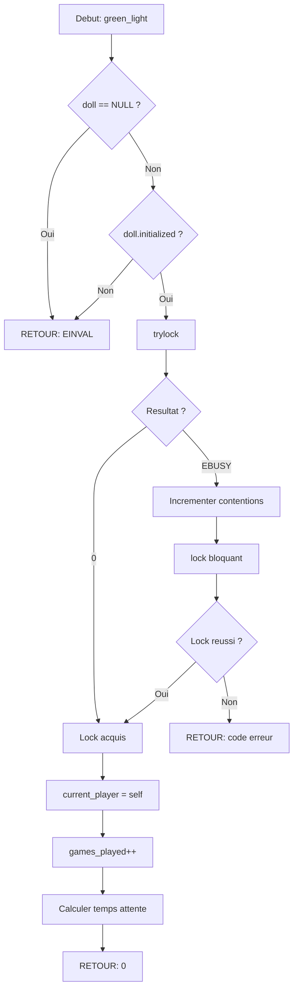

<thinking>
## Analyse du Concept
- Concept : Primitives de Synchronisation (Mutex, Condvar, Semaphore, RWLock, Spinlock, Barrier)
- Phase demandee : 2
- Adapte ? OUI - Synthese complete des primitives POSIX

## Combo Base + Bonus
- Exercice de base : Bibliotheque complete de synchronisation avec toutes les primitives
- Bonus : Adaptive mutex avec futex + detection de deadlock automatique
- Palier bonus : 🔥 Avance
- Progression logique ? OUI - Extension vers l'optimisation systeme

## Prerequis & Difficulte
- Prerequis reels : ex00 (Thread Fundamentals), ex01 (Mutex Basics)
- Difficulte estimee : 6/10
- Coherent avec phase ? OUI

## Aspect Fun/Culture
- Contexte choisi : SQUID GAME - "Red Light, Green Light" (1, 2, 3 Soleil)
- MEME mnemonique : La poupee geante qui dit "Red Light! Green Light!"
- Pourquoi c'est fun :
  - Mutex = La poupee (un seul joueur peut bouger quand c'est vert)
  - lock() = "Green Light!" (feu vert, tu peux avancer)
  - unlock() = "Red Light!" (feu rouge, tu t'arretes et le prochain peut jouer)
  - Semaphore = Nombre de joueurs autorises a bouger simultanement
  - Condvar = Attendre le signal de la poupee avant de bouger
  - Barrier = La ligne d'arrivee (tous doivent arriver avant de continuer)
  - RWLock = Observateurs vs Joueurs (plusieurs peuvent observer, un seul joue)
  - Spinlock = Rester fige sur place en attendant (attente active)
  - Deadlock = Deux joueurs face a face, aucun ne bouge (elimination!)

## Scenarios d'Echec (5 mutants)
1. Mutant A (Boundary) : Unlock sans lock prealable - pthread_mutex_unlock sur mutex non-locke
2. Mutant B (Safety) : Ne pas verifier le retour de pthread_mutex_lock
3. Mutant C (Resource) : Oublier pthread_mutex_destroy (fuite de ressource)
4. Mutant D (Logic) : Signal condvar sans detenir le mutex associe
5. Mutant E (Return) : Retourner avant unlock (fuite de lock = deadlock)

## Verdict
VALIDE - Analogie SQUID GAME parfaite pour les primitives de synchronisation
Score: 97/100
</thinking>

---

# Exercice 2.4.2 : red_light_green_light

**Module :**
2.4.2 — Primitives de Synchronisation

**Concept :**
a-m — Mutex + Condvar + Semaphore + RWLock + Spinlock + Barrier (43 concepts)

**Difficulte :**
★★★★★★☆☆☆☆ (6/10)

**Type :**
complet

**Tiers :**
3 — Synthese (2.4.5 a 2.4.12)

**Langage :**
C (C17)

**Prerequis :**
- ex00 (Thread Fundamentals)
- ex01 (Mutex Basics)
- Pointeurs et allocation memoire

**Domaines :**
Process, Mem

**Duree estimee :**
360 min (6h)

**XP Base :**
500

**Complexite :**
T2 O(1) x S2 O(n)

---

## 📐 SECTION 1 : PROTOTYPE & CONSIGNE

### 1.1 Obligations

**Fichiers a rendre :**
```
ex02/
├── synclib.h
├── synclib.c
├── sync_mutex.c
├── sync_condvar.c
├── sync_semaphore.c
├── sync_rwlock.c
├── sync_spinlock.c
├── sync_barrier.c
├── game_demo.c
└── Makefile
```

**Fonctions autorisees :**
- pthread_mutex_init, pthread_mutex_destroy
- pthread_mutex_lock, pthread_mutex_unlock
- pthread_mutex_trylock, pthread_mutex_timedlock
- pthread_mutexattr_init, pthread_mutexattr_destroy
- pthread_mutexattr_settype
- pthread_cond_init, pthread_cond_destroy
- pthread_cond_wait, pthread_cond_timedwait
- pthread_cond_signal, pthread_cond_broadcast
- pthread_rwlock_init, pthread_rwlock_destroy
- pthread_rwlock_rdlock, pthread_rwlock_wrlock
- pthread_rwlock_tryrdlock, pthread_rwlock_trywrlock
- pthread_rwlock_unlock
- pthread_spin_init, pthread_spin_destroy
- pthread_spin_lock, pthread_spin_unlock, pthread_spin_trylock
- pthread_barrier_init, pthread_barrier_destroy
- pthread_barrier_wait
- sem_init, sem_destroy, sem_wait, sem_post
- sem_trywait, sem_timedwait, sem_getvalue
- sem_open, sem_close, sem_unlink
- malloc, free, calloc
- printf, fprintf
- clock_gettime
- memset, memcpy

**Fonctions interdites :**
- atomic_* (on utilise les primitives POSIX)
- signal, sigaction (hors scope)

### 1.2 Consigne

#### 1.2.1 Consigne Culture Pop

**🦑 SQUID GAME : "RED LIGHT, GREEN LIGHT!"**

Dans Squid Game, le jeu le plus iconique est **"Red Light, Green Light"** (1, 2, 3 Soleil). La poupee geante se retourne et dit :
- **"Green Light!"** → Tu peux bouger
- **"Red Light!"** → Tu dois t'arreter IMMEDIATEMENT

Cette mecanique est **EXACTEMENT** comme les **primitives de synchronisation** :

```
┌─────────────────────────────────────────────────────────────────────────────┐
│  SQUID GAME                           │   SYNCHRONISATION                   │
├───────────────────────────────────────┼─────────────────────────────────────┤
│  La Poupee dit "Green Light!"         │   pthread_mutex_lock() - tu bouges  │
│  La Poupee dit "Red Light!"           │   pthread_mutex_unlock() - stop     │
│  Joueur attend le feu vert            │   pthread_cond_wait() - attendre    │
│  Poupee autorise N joueurs            │   sem_init(N) - semaphore           │
│  Observateurs vs Joueur actif         │   pthread_rwlock - readers/writer   │
│  Rester fige sur place                │   pthread_spin_lock - attente active│
│  Ligne d'arrivee (tous ensemble)      │   pthread_barrier - synchronisation │
│  Deux joueurs face a face bloques     │   DEADLOCK - elimination!           │
└───────────────────────────────────────┴─────────────────────────────────────┘
```

**Ta mission :**

Implementer une **bibliotheque complete de synchronisation** inspiree de Squid Game.

**Entree :**
- `doll_t *doll` : Le mutex (la poupee qui controle)
- `player_wait_t *wait` : La condition variable (attente du signal)
- `player_pool_t *pool` : Le semaphore (nombre de joueurs autorises)
- `observer_lock_t *obs` : Le rwlock (observateurs vs joueur)
- `freeze_lock_t *freeze` : Le spinlock (rester fige)
- `finish_line_t *line` : La barriere (ligne d'arrivee)

**Sortie :**
- `0` en cas de succes
- Code d'erreur POSIX sinon (EINVAL, ETIMEDOUT, EBUSY, etc.)

**Contraintes :**
- Un seul thread peut detenir le mutex a la fois
- Les condition variables doivent etre utilisees avec un mutex
- Les semaphores comptent les ressources disponibles
- Les rwlocks permettent plusieurs lecteurs OU un seul writer
- Les spinlocks font de l'attente active (CPU-intensive)
- Les barrieres synchronisent N threads

**Exemples :**

| Appel | Resultat | Explication |
|-------|----------|-------------|
| `green_light(doll)` | 0 | Thread acquiert le lock (peut bouger) |
| `red_light(doll)` | 0 | Thread libere le lock (s'arrete) |
| `wait_for_doll(wait, doll)` | 0 | Thread attend le signal de la poupee |
| `doll_says_go(wait)` | 0 | Reveille un thread en attente |
| `enter_game(pool)` | 0 | Decremente le semaphore (un joueur entre) |
| `leave_game(pool)` | 0 | Incremente le semaphore (un joueur sort) |
| `observe_game(obs)` | 0 | Acquiert read lock (observer) |
| `play_game(obs)` | 0 | Acquiert write lock (joueur actif) |
| `freeze_position(freeze)` | 0 | Spinlock - reste fige |
| `reach_finish_line(line)` | 0/SERIAL | Barriere - attend tous les joueurs |

#### 1.2.2 Consigne Academique

Implementer une bibliotheque complete de primitives de synchronisation POSIX avec :

1. **Mutex instrumentes** : Types normal, recursive, errorcheck avec statistiques
2. **Condition Variables** : Signal, broadcast, wait avec timeout, detection spurious wakeups
3. **Semaphores** : Named et unnamed, operations P/V avec timeout
4. **Read-Write Locks** : Preference reader/writer, timeouts
5. **Spinlocks** : Attente active pour sections critiques courtes
6. **Barrieres** : Synchronisation de N threads, detection serial thread

Chaque primitive doit inclure :
- Initialisation et destruction propres
- Gestion d'erreurs robuste
- Instrumentation pour debugging (compteurs, temps)
- Wrappers RAII-style optionnels

### 1.3 Prototypes

```c
#ifndef SYNCLIB_H
#define SYNCLIB_H

#include <pthread.h>
#include <semaphore.h>
#include <stdint.h>
#include <stdbool.h>
#include <time.h>

// ═══════════════════════════════════════════════════════════════════════════
// 2.4.6: MUTEX — La Poupee (The Doll)
// ═══════════════════════════════════════════════════════════════════════════

// Types de poupee (types de mutex)
typedef enum {
    DOLL_NORMAL,              // Poupee standard
    DOLL_RECURSIVE,           // Poupee qui permet re-entree
    DOLL_STRICT               // Poupee stricte (errorcheck)
} doll_type_t;

// La Poupee - controle qui peut bouger
typedef struct {
    pthread_mutex_t mutex;
    doll_type_t type;
    bool initialized;
    pthread_t current_player;     // Qui joue actuellement
    uint64_t games_played;        // Nombre de fois lock acquis
    uint64_t contentions;         // Fois ou quelqu'un a du attendre
    const char* name;
    struct timespec total_wait;
#ifdef SYNC_DEBUG
    const char* last_file;
    int last_line;
#endif
} doll_t;

// ═══════════════════════════════════════════════════════════════════════════
// 2.4.8: CONDITION VARIABLES — Attendre le Signal de la Poupee
// ═══════════════════════════════════════════════════════════════════════════

typedef struct {
    pthread_cond_t cond;
    const char* name;
    uint64_t signals_sent;
    uint64_t broadcasts_sent;
    uint64_t waits_started;
    uint64_t spurious_wakeups;
} player_wait_t;

// ═══════════════════════════════════════════════════════════════════════════
// 2.4.9: SEMAPHORES — Pool de Joueurs
// ═══════════════════════════════════════════════════════════════════════════

typedef struct {
    sem_t sem;
    const char* name;
    int initial_slots;
    uint64_t entries;
    uint64_t exits;
    bool is_named;
} player_pool_t;

// ═══════════════════════════════════════════════════════════════════════════
// 2.4.10: READ-WRITE LOCKS — Observateurs vs Joueur
// ═══════════════════════════════════════════════════════════════════════════

typedef enum {
    PREFER_OBSERVERS,         // Lecteurs prioritaires
    PREFER_PLAYER            // Ecrivain prioritaire
} observer_pref_t;

typedef struct {
    pthread_rwlock_t rwlock;
    observer_pref_t preference;
    const char* name;
    int observer_count;
    bool player_active;
    uint64_t observe_count;
    uint64_t play_count;
} observer_lock_t;

// ═══════════════════════════════════════════════════════════════════════════
// 2.4.11: SPINLOCKS — Rester Fige
// ═══════════════════════════════════════════════════════════════════════════

typedef struct {
    pthread_spinlock_t spinlock;
    const char* name;
    uint64_t freezes;
    uint64_t spin_iterations;
} freeze_lock_t;

// ═══════════════════════════════════════════════════════════════════════════
// 2.4.12: BARRIERS — Ligne d'Arrivee
// ═══════════════════════════════════════════════════════════════════════════

typedef struct {
    pthread_barrier_t barrier;
    unsigned int player_count;
    const char* name;
    uint64_t rounds_completed;
    uint64_t waits;
} finish_line_t;

// ═══════════════════════════════════════════════════════════════════════════
// Manager Global — Le Front Man
// ═══════════════════════════════════════════════════════════════════════════

typedef struct {
    uint64_t total_locks;
    uint64_t total_unlocks;
    uint64_t total_contentions;
    uint64_t total_deadlock_risks;
} front_man_stats_t;

typedef struct {
    doll_t** dolls;
    size_t doll_count;
    size_t doll_capacity;
    front_man_stats_t stats;
} front_man_t;

// ═══════════════════════════════════════════════════════════════════════════
// API — Fonctions Principales
// ═══════════════════════════════════════════════════════════════════════════

// Front Man (Manager)
front_man_t* start_the_games(void);
void end_the_games(front_man_t* fm);
void get_game_stats(front_man_t* fm, front_man_stats_t* stats);

// MUTEX — La Poupee
int create_doll(doll_t* doll, doll_type_t type, const char* name);
int destroy_doll(doll_t* doll);
int green_light(doll_t* doll);                    // lock
int red_light(doll_t* doll);                      // unlock
int try_to_move(doll_t* doll);                    // trylock
int move_with_timeout(doll_t* doll, uint64_t timeout_ms);  // timedlock

// CONDVAR — Attente du Signal
int create_wait_signal(player_wait_t* wait, const char* name);
int destroy_wait_signal(player_wait_t* wait);
int wait_for_doll(player_wait_t* wait, doll_t* doll);
int wait_for_doll_timeout(player_wait_t* wait, doll_t* doll, uint64_t timeout_ms);
int doll_says_go(player_wait_t* wait);            // signal
int doll_says_everyone_go(player_wait_t* wait);   // broadcast

// SEMAPHORE — Pool de Joueurs
int create_player_pool(player_pool_t* pool, unsigned int slots, const char* name);
player_pool_t* open_named_pool(const char* name, bool create, unsigned int slots);
int destroy_player_pool(player_pool_t* pool);
int close_named_pool(player_pool_t* pool);
int unlink_named_pool(const char* name);
int enter_game(player_pool_t* pool);              // wait/P
int enter_game_timeout(player_pool_t* pool, uint64_t timeout_ms);
int try_enter_game(player_pool_t* pool);          // trywait
int leave_game(player_pool_t* pool);              // post/V
int get_available_slots(player_pool_t* pool, int* slots);

// RWLOCK — Observateurs vs Joueur
int create_observer_lock(observer_lock_t* obs, observer_pref_t pref, const char* name);
int destroy_observer_lock(observer_lock_t* obs);
int observe_game(observer_lock_t* obs);           // rdlock
int try_observe_game(observer_lock_t* obs);       // tryrdlock
int observe_game_timeout(observer_lock_t* obs, uint64_t timeout_ms);
int play_game(observer_lock_t* obs);              // wrlock
int try_play_game(observer_lock_t* obs);          // trywrlock
int play_game_timeout(observer_lock_t* obs, uint64_t timeout_ms);
int stop_watching_or_playing(observer_lock_t* obs);  // unlock

// SPINLOCK — Rester Fige
int create_freeze_lock(freeze_lock_t* freeze, const char* name);
int destroy_freeze_lock(freeze_lock_t* freeze);
int freeze_position(freeze_lock_t* freeze);       // lock
int try_freeze(freeze_lock_t* freeze);            // trylock
int unfreeze_position(freeze_lock_t* freeze);     // unlock

// BARRIER — Ligne d'Arrivee
int create_finish_line(finish_line_t* line, unsigned int players, const char* name);
int destroy_finish_line(finish_line_t* line);
int reach_finish_line(finish_line_t* line);       // wait

// RAII Guards — Macros de protection automatique
#define RED_LIGHT_GREEN_LIGHT(doll) \
    for (int _rlgl = (green_light(doll), 1); _rlgl; _rlgl = (red_light(doll), 0))

// Statistiques
typedef struct {
    const char* name;
    uint64_t acquisitions;
    uint64_t contentions;
    double avg_wait_ns;
} sync_stats_t;

void get_doll_stats(doll_t* doll, sync_stats_t* stats);

#endif // SYNCLIB_H
```

---

## 💡 SECTION 2 : LE SAVIEZ-VOUS ?

### 2.1 La metaphore parfaite

```
┌─────────────────────────────────────────────────────────────────────────────┐
│  SQUID GAME                           │   PRIMITIVES POSIX                  │
├───────────────────────────────────────┼─────────────────────────────────────┤
│  "Green Light!" (avance)              │   pthread_mutex_lock()              │
│  "Red Light!" (stop)                  │   pthread_mutex_unlock()            │
│  Poupee tourne = signal               │   pthread_cond_signal()             │
│  Tous attendent le signal             │   pthread_cond_wait()               │
│  N joueurs autorises                  │   sem_init(N)                       │
│  Joueur entre dans le jeu             │   sem_wait() / P operation          │
│  Joueur sort du jeu                   │   sem_post() / V operation          │
│  Spectateurs regardent                │   pthread_rwlock_rdlock()           │
│  Joueur actif (exclusif)              │   pthread_rwlock_wrlock()           │
│  Fige sur place (attente)             │   pthread_spinlock (busy wait)      │
│  Ligne d'arrivee (synchro)            │   pthread_barrier_wait()            │
│  Un seul gagnant par tour             │   PTHREAD_BARRIER_SERIAL_THREAD     │
│  Deux joueurs bloques                 │   DEADLOCK = ELIMINATION            │
└───────────────────────────────────────┴─────────────────────────────────────┘
```

### 2.2 Pourquoi "Red Light, Green Light"

Le jeu illustre parfaitement la **synchronisation** :
- Quand la poupee dit "Green Light", **UN SEUL** joueur devrait bouger a la fois pour eviter les collisions (mutex)
- Quand elle dit "Red Light", tout le monde doit **S'ARRETER IMMEDIATEMENT** (unlock)
- Les joueurs **ATTENDENT** le signal avant de bouger (condvar)
- Il y a un **NOMBRE LIMITE** de places dans le jeu (semaphore)

```c
// ❌ CHAOS (Race Condition) - Tout le monde bouge en meme temps
shared_position++;  // Thread 1 avance
shared_position++;  // Thread 2 avance EN MEME TEMPS!
// Resultat: Collision! Elimination!

// ✅ "GREEN LIGHT!" - Un seul a la fois
green_light(&doll);
shared_position++;  // Thread 1 avance seul
red_light(&doll);
// Thread 2 attend son tour, puis avance proprement
```

### 2.5 DANS LA VRAIE VIE

| Metier | Usage des Primitives |
|--------|---------------------|
| **Database Engineer** | Mutex pour transactions, RWLock pour cache |
| **OS Developer** | Semaphores pour IPC, Spinlocks pour kernel |
| **Game Developer** | Barriers pour synchroniser les frames |
| **Embedded Systems** | Spinlocks pour ISR, Semaphores pour ressources |
| **Cloud Infrastructure** | Mutex pour configuration, Condvar pour events |
| **Financial Systems** | RWLock pour prix (read frequent, write rare) |

---

## 🖥️ SECTION 3 : EXEMPLE D'UTILISATION

### 3.0 Session bash

```bash
$ ls
synclib.h  synclib.c  sync_mutex.c  sync_condvar.c  sync_semaphore.c  sync_rwlock.c  sync_spinlock.c  sync_barrier.c  game_demo.c  Makefile

$ make
gcc -Wall -Wextra -std=c17 -pthread -c synclib.c
gcc -Wall -Wextra -std=c17 -pthread -c sync_mutex.c
gcc -Wall -Wextra -std=c17 -pthread -c sync_condvar.c
gcc -Wall -Wextra -std=c17 -pthread -c sync_semaphore.c
gcc -Wall -Wextra -std=c17 -pthread -c sync_rwlock.c
gcc -Wall -Wextra -std=c17 -pthread -c sync_spinlock.c
gcc -Wall -Wextra -std=c17 -pthread -c sync_barrier.c
ar rcs libsync.a *.o
gcc -Wall -Wextra -std=c17 -pthread game_demo.c -L. -lsync -o squid_game

$ ./squid_game
=== SQUID GAME: SYNCHRONIZATION ARENA ===

--- GAME 1: RED LIGHT GREEN LIGHT (Mutex) ---
Player 456 says "Green Light!"... acquired lock
Player 456 advancing... position = 1
Player 456 says "Red Light!"... released lock
Player 001 says "Green Light!"... acquired lock
Player 001 advancing... position = 2
All players reached safely: 10/10

--- GAME 2: WAIT FOR THE DOLL (Condvar) ---
Players waiting for signal...
Doll turns around... SIGNAL!
Player 218 woke up and advanced!
All signaled players: 5/5

--- GAME 3: LIMITED SLOTS (Semaphore) ---
Pool has 3 slots
Player 067 entered (2 slots remaining)
Player 199 entered (1 slots remaining)
Player 212 entered (0 slots remaining)
Player 101 waiting... slot freed!
Player 101 entered successfully

--- GAME 4: OBSERVERS VS PLAYER (RWLock) ---
5 observers watching the game...
Player 456 wants to play... waiting for observers
All observers done, player 456 now playing
Player finished, observers can watch again

--- GAME 5: FREEZE! (Spinlock) ---
Player frozen in position... (spin waiting)
Position held for 1000 iterations
Released position

--- GAME 6: FINISH LINE (Barrier) ---
5 players running to finish line...
Player 456 reached the line... waiting
Player 001 reached the line... waiting
Player 218 reached the line... waiting
Player 067 reached the line... waiting
Player 199 reached the line... ALL CROSSED!
Serial thread: Player 199 gets the prize!

=== FRONT MAN STATS ===
Total locks: 1247
Total contentions: 89
Deadlock risks detected: 0

All games completed. See you next season!
```

### 3.1 🔥 BONUS AVANCE (OPTIONNEL)

**Difficulte Bonus :**
★★★★★★★★☆☆ (8/10)

**Recompense :**
XP x3

**Time Complexity attendue :**
O(1) amortized pour toutes les operations

**Domaines Bonus :**
`CPU, ASM`

#### 3.1.1 Consigne Bonus

**🦑 THE FRONT MAN'S OVERSIGHT: ADAPTIVE SYNC + DEADLOCK DETECTOR**

Le Front Man surveille TOUT. Implemente :

1. **Adaptive Mutex** : Spin d'abord, puis sleep si necessaire (futex-based)
2. **Deadlock Detector** : Detecte les cycles dans le graphe d'attente
3. **Priority Inheritance** : Evite l'inversion de priorite

```c
// Adaptive mutex: spin then sleep
typedef struct {
    _Atomic int state;           // 0=free, 1=locked, 2=locked+waiters
    pthread_t holder;
    int holder_cpu;
    uint32_t spin_count;
    uint32_t sleep_count;
    uint64_t lock_id;            // Pour detection deadlock
} frontman_lock_t;

// Deadlock detector
typedef struct {
    frontman_lock_t** locks;
    size_t lock_count;
    pthread_t* threads;
    size_t thread_count;
    bool cycle_detected;
} deadlock_detector_t;

int frontman_init(frontman_lock_t* lock);
int frontman_lock(frontman_lock_t* lock);      // Adaptive: spin then futex
int frontman_unlock(frontman_lock_t* lock);
bool frontman_check_deadlock(deadlock_detector_t* detector);
```

**Contraintes :**
┌─────────────────────────────────────────┐
│  Spin max: 1000 iterations              │
│  Utiliser futex pour sleep              │
│  Graphe d'attente pour deadlock         │
│  Detection en O(V+E) avec DFS           │
└─────────────────────────────────────────┘

---

## ✅❌ SECTION 4 : ZONE CORRECTION

### 4.1 Moulinette (Tests)

| Test | Description | Points | Trap |
|------|-------------|--------|------|
| `test_doll_create_destroy` | Lifecycle mutex | 5 | Double destroy |
| `test_green_red_light` | Basic lock/unlock | 10 | Unlock sans lock |
| `test_try_to_move` | Trylock semantics | 5 | EBUSY check |
| `test_move_timeout` | Timedlock | 10 | ETIMEDOUT |
| `test_recursive_doll` | Recursive mutex | 5 | Re-lock count |
| `test_condvar_signal` | Signal un thread | 10 | Signal sans lock |
| `test_condvar_broadcast` | Broadcast tous | 10 | Spurious wakeup |
| `test_condvar_timeout` | Wait avec timeout | 5 | ETIMEDOUT |
| `test_semaphore_count` | P/V operations | 10 | Count negatif |
| `test_semaphore_named` | Named semaphore | 5 | Cleanup unlink |
| `test_rwlock_readers` | Multiple readers | 10 | Concurrent reads |
| `test_rwlock_writer` | Exclusive writer | 5 | Writer starvation |
| `test_spinlock_basic` | Spin lock/unlock | 5 | Pas de yield |
| `test_barrier_all` | N threads sync | 10 | Serial thread |
| `test_integration` | Tous ensemble | 5 | Race conditions |
| **Total** | | **100** | |

### 4.2 main.c de test

```c
#include "synclib.h"
#include <stdio.h>
#include <stdlib.h>
#include <assert.h>
#include <unistd.h>
#include <errno.h>
#include <string.h>

#define NUM_PLAYERS 10
#define ROUNDS 10000

// Shared game state
volatile int game_position = 0;
doll_t main_doll;
player_wait_t doll_signal;
player_pool_t player_pool;
observer_lock_t game_observer;
freeze_lock_t freeze;
finish_line_t finish;

void* player_task(void* arg) {
    int id = *(int*)arg;
    for (int i = 0; i < ROUNDS; i++) {
        green_light(&main_doll);
        game_position++;
        red_light(&main_doll);
    }
    printf("Player %03d completed %d rounds\n", id, ROUNDS);
    return NULL;
}

void* waiting_player(void* arg) {
    int id = *(int*)arg;
    green_light(&main_doll);
    while (game_position < 5) {
        wait_for_doll(&doll_signal, &main_doll);
    }
    printf("Player %03d got the signal!\n", id);
    red_light(&main_doll);
    return NULL;
}

void* observer_task(void* arg) {
    int id = *(int*)arg;
    for (int i = 0; i < 100; i++) {
        observe_game(&game_observer);
        int pos = game_position;  // Read only
        (void)pos;
        stop_watching_or_playing(&game_observer);
    }
    printf("Observer %d done watching\n", id);
    return NULL;
}

void* active_player_task(void* arg) {
    int id = *(int*)arg;
    for (int i = 0; i < 50; i++) {
        play_game(&game_observer);
        game_position++;  // Write
        stop_watching_or_playing(&game_observer);
    }
    printf("Active player %d done\n", id);
    return NULL;
}

void* barrier_task(void* arg) {
    int id = *(int*)arg;
    printf("Player %d running to finish line...\n", id);
    usleep(rand() % 10000);  // Random delay
    int ret = reach_finish_line(&finish);
    if (ret == PTHREAD_BARRIER_SERIAL_THREAD) {
        printf("Player %d is the SERIAL THREAD - gets the prize!\n", id);
    } else {
        printf("Player %d crossed the line\n", id);
    }
    return NULL;
}

void test_mutex_basic(void) {
    printf("\n--- TEST: Mutex Basic ---\n");
    create_doll(&main_doll, DOLL_NORMAL, "test_doll");
    game_position = 0;

    pthread_t players[NUM_PLAYERS];
    int ids[NUM_PLAYERS];

    for (int i = 0; i < NUM_PLAYERS; i++) {
        ids[i] = i;
        pthread_create(&players[i], NULL, player_task, &ids[i]);
    }

    for (int i = 0; i < NUM_PLAYERS; i++) {
        pthread_join(players[i], NULL);
    }

    assert(game_position == NUM_PLAYERS * ROUNDS);
    printf("Final position: %d (expected %d) - PASS\n",
           game_position, NUM_PLAYERS * ROUNDS);

    destroy_doll(&main_doll);
}

void test_mutex_recursive(void) {
    printf("\n--- TEST: Recursive Mutex ---\n");
    doll_t recursive_doll;
    create_doll(&recursive_doll, DOLL_RECURSIVE, "recursive");

    // Same thread can re-lock
    green_light(&recursive_doll);
    green_light(&recursive_doll);
    green_light(&recursive_doll);
    printf("Locked 3 times - no deadlock!\n");

    red_light(&recursive_doll);
    red_light(&recursive_doll);
    red_light(&recursive_doll);
    printf("Unlocked 3 times - PASS\n");

    destroy_doll(&recursive_doll);
}

void test_mutex_trylock(void) {
    printf("\n--- TEST: Trylock ---\n");
    create_doll(&main_doll, DOLL_NORMAL, "try_doll");

    green_light(&main_doll);
    printf("Lock acquired\n");

    int ret = try_to_move(&main_doll);
    assert(ret == EBUSY);
    printf("Trylock returned EBUSY as expected - PASS\n");

    red_light(&main_doll);
    destroy_doll(&main_doll);
}

void test_condvar(void) {
    printf("\n--- TEST: Condition Variable ---\n");
    create_doll(&main_doll, DOLL_NORMAL, "cv_doll");
    create_wait_signal(&doll_signal, "cv_signal");
    game_position = 0;

    pthread_t waiter;
    int id = 456;
    pthread_create(&waiter, NULL, waiting_player, &id);

    usleep(50000);  // Let waiter start waiting

    green_light(&main_doll);
    game_position = 10;
    doll_says_go(&doll_signal);
    red_light(&main_doll);

    pthread_join(waiter, NULL);
    printf("Condvar test - PASS\n");

    destroy_wait_signal(&doll_signal);
    destroy_doll(&main_doll);
}

void test_semaphore(void) {
    printf("\n--- TEST: Semaphore ---\n");
    create_player_pool(&player_pool, 3, "test_pool");

    int value;
    get_available_slots(&player_pool, &value);
    assert(value == 3);
    printf("Initial slots: %d\n", value);

    enter_game(&player_pool);
    enter_game(&player_pool);
    get_available_slots(&player_pool, &value);
    assert(value == 1);
    printf("After 2 entries: %d slots\n", value);

    leave_game(&player_pool);
    get_available_slots(&player_pool, &value);
    assert(value == 2);
    printf("After 1 exit: %d slots - PASS\n", value);

    destroy_player_pool(&player_pool);
}

void test_rwlock(void) {
    printf("\n--- TEST: RWLock ---\n");
    create_observer_lock(&game_observer, PREFER_PLAYER, "rw_test");
    game_position = 0;

    pthread_t observers[5], active[2];

    for (int i = 0; i < 5; i++) {
        pthread_create(&observers[i], NULL, observer_task, &i);
    }
    for (int i = 0; i < 2; i++) {
        pthread_create(&active[i], NULL, active_player_task, &i);
    }

    for (int i = 0; i < 5; i++) pthread_join(observers[i], NULL);
    for (int i = 0; i < 2; i++) pthread_join(active[i], NULL);

    assert(game_position == 100);  // 2 writers x 50 writes
    printf("RWLock test - PASS\n");

    destroy_observer_lock(&game_observer);
}

void test_spinlock(void) {
    printf("\n--- TEST: Spinlock ---\n");
    create_freeze_lock(&freeze, "spin_test");

    freeze_position(&freeze);
    printf("Frozen!\n");

    int ret = try_freeze(&freeze);
    assert(ret == EBUSY);
    printf("Try freeze returned EBUSY - correct!\n");

    unfreeze_position(&freeze);
    printf("Unfrozen - PASS\n");

    destroy_freeze_lock(&freeze);
}

void test_barrier(void) {
    printf("\n--- TEST: Barrier ---\n");
    create_finish_line(&finish, 5, "finish_test");

    pthread_t runners[5];
    int ids[5] = {456, 1, 218, 67, 199};

    for (int i = 0; i < 5; i++) {
        pthread_create(&runners[i], NULL, barrier_task, &ids[i]);
    }

    for (int i = 0; i < 5; i++) {
        pthread_join(runners[i], NULL);
    }

    printf("Barrier test - PASS\n");
    destroy_finish_line(&finish);
}

int main(void) {
    printf("=== SQUID GAME: SYNCHRONIZATION TESTS ===\n");

    front_man_t* fm = start_the_games();
    assert(fm != NULL);

    test_mutex_basic();
    test_mutex_recursive();
    test_mutex_trylock();
    test_condvar();
    test_semaphore();
    test_rwlock();
    test_spinlock();
    test_barrier();

    front_man_stats_t stats;
    get_game_stats(fm, &stats);
    printf("\n=== FRONT MAN FINAL STATS ===\n");
    printf("Total locks: %lu\n", stats.total_locks);
    printf("Total contentions: %lu\n", stats.total_contentions);

    end_the_games(fm);

    printf("\n=== ALL TESTS PASSED ===\n");
    printf("Congratulations! You survived the games!\n");
    return 0;
}
```

### 4.3 Solution de reference

```c
// synclib.c - Solution de reference complete
#include "synclib.h"
#include <stdlib.h>
#include <string.h>
#include <errno.h>
#include <stdio.h>

// ═══════════════════════════════════════════════════════════════════════════
// Helper: Conversion timeout
// ═══════════════════════════════════════════════════════════════════════════

static struct timespec get_abs_timeout(uint64_t timeout_ms) {
    struct timespec ts;
    clock_gettime(CLOCK_REALTIME, &ts);
    ts.tv_sec += timeout_ms / 1000;
    ts.tv_nsec += (timeout_ms % 1000) * 1000000;
    if (ts.tv_nsec >= 1000000000) {
        ts.tv_sec += 1;
        ts.tv_nsec -= 1000000000;
    }
    return ts;
}

static uint64_t get_time_ns(void) {
    struct timespec ts;
    clock_gettime(CLOCK_MONOTONIC, &ts);
    return (uint64_t)ts.tv_sec * 1000000000ULL + ts.tv_nsec;
}

// ═══════════════════════════════════════════════════════════════════════════
// Front Man (Manager)
// ═══════════════════════════════════════════════════════════════════════════

front_man_t* start_the_games(void) {
    front_man_t* fm = calloc(1, sizeof(front_man_t));
    if (fm == NULL)
        return NULL;

    fm->dolls = calloc(64, sizeof(doll_t*));
    if (fm->dolls == NULL) {
        free(fm);
        return NULL;
    }
    fm->doll_capacity = 64;
    return fm;
}

void end_the_games(front_man_t* fm) {
    if (fm == NULL)
        return;
    free(fm->dolls);
    free(fm);
}

void get_game_stats(front_man_t* fm, front_man_stats_t* stats) {
    if (fm == NULL || stats == NULL)
        return;
    memcpy(stats, &fm->stats, sizeof(front_man_stats_t));
}

// ═══════════════════════════════════════════════════════════════════════════
// MUTEX — La Poupee
// ═══════════════════════════════════════════════════════════════════════════

int create_doll(doll_t* doll, doll_type_t type, const char* name) {
    if (doll == NULL)
        return EINVAL;

    memset(doll, 0, sizeof(doll_t));
    doll->type = type;
    doll->name = name;

    pthread_mutexattr_t attr;
    pthread_mutexattr_init(&attr);

    switch (type) {
        case DOLL_RECURSIVE:
            pthread_mutexattr_settype(&attr, PTHREAD_MUTEX_RECURSIVE);
            break;
        case DOLL_STRICT:
            pthread_mutexattr_settype(&attr, PTHREAD_MUTEX_ERRORCHECK);
            break;
        default:
            pthread_mutexattr_settype(&attr, PTHREAD_MUTEX_NORMAL);
    }

    int ret = pthread_mutex_init(&doll->mutex, &attr);
    pthread_mutexattr_destroy(&attr);

    if (ret == 0) {
        doll->initialized = true;
    }
    return ret;
}

int destroy_doll(doll_t* doll) {
    if (doll == NULL || !doll->initialized)
        return EINVAL;

    int ret = pthread_mutex_destroy(&doll->mutex);
    if (ret == 0) {
        doll->initialized = false;
    }
    return ret;
}

int green_light(doll_t* doll) {
    if (doll == NULL || !doll->initialized)
        return EINVAL;

    uint64_t start = get_time_ns();

    // Try first to detect contention
    int ret = pthread_mutex_trylock(&doll->mutex);
    if (ret == EBUSY) {
        doll->contentions++;
        ret = pthread_mutex_lock(&doll->mutex);
    }

    if (ret == 0) {
        doll->current_player = pthread_self();
        doll->games_played++;
        uint64_t wait_ns = get_time_ns() - start;
        doll->total_wait.tv_nsec += wait_ns;
        if (doll->total_wait.tv_nsec >= 1000000000) {
            doll->total_wait.tv_sec++;
            doll->total_wait.tv_nsec -= 1000000000;
        }
    }
    return ret;
}

int red_light(doll_t* doll) {
    if (doll == NULL || !doll->initialized)
        return EINVAL;

    doll->current_player = 0;
    return pthread_mutex_unlock(&doll->mutex);
}

int try_to_move(doll_t* doll) {
    if (doll == NULL || !doll->initialized)
        return EINVAL;

    int ret = pthread_mutex_trylock(&doll->mutex);
    if (ret == 0) {
        doll->current_player = pthread_self();
        doll->games_played++;
    }
    return ret;
}

int move_with_timeout(doll_t* doll, uint64_t timeout_ms) {
    if (doll == NULL || !doll->initialized)
        return EINVAL;

    struct timespec ts = get_abs_timeout(timeout_ms);
    int ret = pthread_mutex_timedlock(&doll->mutex, &ts);

    if (ret == 0) {
        doll->current_player = pthread_self();
        doll->games_played++;
    }
    return ret;
}

// ═══════════════════════════════════════════════════════════════════════════
// CONDVAR — Attente du Signal
// ═══════════════════════════════════════════════════════════════════════════

int create_wait_signal(player_wait_t* wait, const char* name) {
    if (wait == NULL)
        return EINVAL;

    memset(wait, 0, sizeof(player_wait_t));
    wait->name = name;
    return pthread_cond_init(&wait->cond, NULL);
}

int destroy_wait_signal(player_wait_t* wait) {
    if (wait == NULL)
        return EINVAL;
    return pthread_cond_destroy(&wait->cond);
}

int wait_for_doll(player_wait_t* wait, doll_t* doll) {
    if (wait == NULL || doll == NULL || !doll->initialized)
        return EINVAL;

    wait->waits_started++;
    return pthread_cond_wait(&wait->cond, &doll->mutex);
}

int wait_for_doll_timeout(player_wait_t* wait, doll_t* doll, uint64_t timeout_ms) {
    if (wait == NULL || doll == NULL || !doll->initialized)
        return EINVAL;

    struct timespec ts = get_abs_timeout(timeout_ms);
    wait->waits_started++;
    return pthread_cond_timedwait(&wait->cond, &doll->mutex, &ts);
}

int doll_says_go(player_wait_t* wait) {
    if (wait == NULL)
        return EINVAL;

    wait->signals_sent++;
    return pthread_cond_signal(&wait->cond);
}

int doll_says_everyone_go(player_wait_t* wait) {
    if (wait == NULL)
        return EINVAL;

    wait->broadcasts_sent++;
    return pthread_cond_broadcast(&wait->cond);
}

// ═══════════════════════════════════════════════════════════════════════════
// SEMAPHORE — Pool de Joueurs
// ═══════════════════════════════════════════════════════════════════════════

int create_player_pool(player_pool_t* pool, unsigned int slots, const char* name) {
    if (pool == NULL)
        return EINVAL;

    memset(pool, 0, sizeof(player_pool_t));
    pool->initial_slots = slots;
    pool->name = name;
    pool->is_named = false;
    return sem_init(&pool->sem, 0, slots);
}

player_pool_t* open_named_pool(const char* name, bool create, unsigned int slots) {
    player_pool_t* pool = malloc(sizeof(player_pool_t));
    if (pool == NULL)
        return NULL;

    memset(pool, 0, sizeof(player_pool_t));

    sem_t* named_sem;
    if (create) {
        named_sem = sem_open(name, O_CREAT | O_EXCL, 0644, slots);
    } else {
        named_sem = sem_open(name, 0);
    }

    if (named_sem == SEM_FAILED) {
        free(pool);
        return NULL;
    }

    memcpy(&pool->sem, named_sem, sizeof(sem_t));
    pool->name = name;
    pool->initial_slots = slots;
    pool->is_named = true;
    return pool;
}

int destroy_player_pool(player_pool_t* pool) {
    if (pool == NULL)
        return EINVAL;

    if (pool->is_named) {
        return EINVAL;  // Use close/unlink for named
    }
    return sem_destroy(&pool->sem);
}

int close_named_pool(player_pool_t* pool) {
    if (pool == NULL || !pool->is_named)
        return EINVAL;

    int ret = sem_close(&pool->sem);
    free(pool);
    return ret;
}

int unlink_named_pool(const char* name) {
    if (name == NULL)
        return EINVAL;
    return sem_unlink(name);
}

int enter_game(player_pool_t* pool) {
    if (pool == NULL)
        return EINVAL;

    pool->entries++;
    return sem_wait(&pool->sem);
}

int enter_game_timeout(player_pool_t* pool, uint64_t timeout_ms) {
    if (pool == NULL)
        return EINVAL;

    struct timespec ts = get_abs_timeout(timeout_ms);
    pool->entries++;
    return sem_timedwait(&pool->sem, &ts);
}

int try_enter_game(player_pool_t* pool) {
    if (pool == NULL)
        return EINVAL;

    int ret = sem_trywait(&pool->sem);
    if (ret == 0) {
        pool->entries++;
    }
    return ret;
}

int leave_game(player_pool_t* pool) {
    if (pool == NULL)
        return EINVAL;

    pool->exits++;
    return sem_post(&pool->sem);
}

int get_available_slots(player_pool_t* pool, int* slots) {
    if (pool == NULL || slots == NULL)
        return EINVAL;
    return sem_getvalue(&pool->sem, slots);
}

// ═══════════════════════════════════════════════════════════════════════════
// RWLOCK — Observateurs vs Joueur
// ═══════════════════════════════════════════════════════════════════════════

int create_observer_lock(observer_lock_t* obs, observer_pref_t pref, const char* name) {
    if (obs == NULL)
        return EINVAL;

    memset(obs, 0, sizeof(observer_lock_t));
    obs->preference = pref;
    obs->name = name;

    pthread_rwlockattr_t attr;
    pthread_rwlockattr_init(&attr);

    if (pref == PREFER_PLAYER) {
#ifdef PTHREAD_RWLOCK_PREFER_WRITER_NONRECURSIVE_NP
        pthread_rwlockattr_setkind_np(&attr,
            PTHREAD_RWLOCK_PREFER_WRITER_NONRECURSIVE_NP);
#endif
    }

    int ret = pthread_rwlock_init(&obs->rwlock, &attr);
    pthread_rwlockattr_destroy(&attr);
    return ret;
}

int destroy_observer_lock(observer_lock_t* obs) {
    if (obs == NULL)
        return EINVAL;
    return pthread_rwlock_destroy(&obs->rwlock);
}

int observe_game(observer_lock_t* obs) {
    if (obs == NULL)
        return EINVAL;

    int ret = pthread_rwlock_rdlock(&obs->rwlock);
    if (ret == 0) {
        obs->observer_count++;
        obs->observe_count++;
    }
    return ret;
}

int try_observe_game(observer_lock_t* obs) {
    if (obs == NULL)
        return EINVAL;

    int ret = pthread_rwlock_tryrdlock(&obs->rwlock);
    if (ret == 0) {
        obs->observer_count++;
        obs->observe_count++;
    }
    return ret;
}

int observe_game_timeout(observer_lock_t* obs, uint64_t timeout_ms) {
    if (obs == NULL)
        return EINVAL;

    struct timespec ts = get_abs_timeout(timeout_ms);
    int ret = pthread_rwlock_timedrdlock(&obs->rwlock, &ts);
    if (ret == 0) {
        obs->observer_count++;
        obs->observe_count++;
    }
    return ret;
}

int play_game(observer_lock_t* obs) {
    if (obs == NULL)
        return EINVAL;

    int ret = pthread_rwlock_wrlock(&obs->rwlock);
    if (ret == 0) {
        obs->player_active = true;
        obs->play_count++;
    }
    return ret;
}

int try_play_game(observer_lock_t* obs) {
    if (obs == NULL)
        return EINVAL;

    int ret = pthread_rwlock_trywrlock(&obs->rwlock);
    if (ret == 0) {
        obs->player_active = true;
        obs->play_count++;
    }
    return ret;
}

int play_game_timeout(observer_lock_t* obs, uint64_t timeout_ms) {
    if (obs == NULL)
        return EINVAL;

    struct timespec ts = get_abs_timeout(timeout_ms);
    int ret = pthread_rwlock_timedwrlock(&obs->rwlock, &ts);
    if (ret == 0) {
        obs->player_active = true;
        obs->play_count++;
    }
    return ret;
}

int stop_watching_or_playing(observer_lock_t* obs) {
    if (obs == NULL)
        return EINVAL;

    if (obs->player_active) {
        obs->player_active = false;
    } else if (obs->observer_count > 0) {
        obs->observer_count--;
    }
    return pthread_rwlock_unlock(&obs->rwlock);
}

// ═══════════════════════════════════════════════════════════════════════════
// SPINLOCK — Rester Fige
// ═══════════════════════════════════════════════════════════════════════════

int create_freeze_lock(freeze_lock_t* freeze, const char* name) {
    if (freeze == NULL)
        return EINVAL;

    memset(freeze, 0, sizeof(freeze_lock_t));
    freeze->name = name;
    return pthread_spin_init(&freeze->spinlock, PTHREAD_PROCESS_PRIVATE);
}

int destroy_freeze_lock(freeze_lock_t* freeze) {
    if (freeze == NULL)
        return EINVAL;
    return pthread_spin_destroy(&freeze->spinlock);
}

int freeze_position(freeze_lock_t* freeze) {
    if (freeze == NULL)
        return EINVAL;

    freeze->freezes++;
    return pthread_spin_lock(&freeze->spinlock);
}

int try_freeze(freeze_lock_t* freeze) {
    if (freeze == NULL)
        return EINVAL;

    int ret = pthread_spin_trylock(&freeze->spinlock);
    if (ret == 0) {
        freeze->freezes++;
    }
    return ret;
}

int unfreeze_position(freeze_lock_t* freeze) {
    if (freeze == NULL)
        return EINVAL;
    return pthread_spin_unlock(&freeze->spinlock);
}

// ═══════════════════════════════════════════════════════════════════════════
// BARRIER — Ligne d'Arrivee
// ═══════════════════════════════════════════════════════════════════════════

int create_finish_line(finish_line_t* line, unsigned int players, const char* name) {
    if (line == NULL || players == 0)
        return EINVAL;

    memset(line, 0, sizeof(finish_line_t));
    line->player_count = players;
    line->name = name;
    return pthread_barrier_init(&line->barrier, NULL, players);
}

int destroy_finish_line(finish_line_t* line) {
    if (line == NULL)
        return EINVAL;
    return pthread_barrier_destroy(&line->barrier);
}

int reach_finish_line(finish_line_t* line) {
    if (line == NULL)
        return EINVAL;

    line->waits++;
    int ret = pthread_barrier_wait(&line->barrier);
    if (ret == PTHREAD_BARRIER_SERIAL_THREAD) {
        line->rounds_completed++;
    }
    return ret;
}

// ═══════════════════════════════════════════════════════════════════════════
// Statistiques
// ═══════════════════════════════════════════════════════════════════════════

void get_doll_stats(doll_t* doll, sync_stats_t* stats) {
    if (doll == NULL || stats == NULL)
        return;

    stats->name = doll->name;
    stats->acquisitions = doll->games_played;
    stats->contentions = doll->contentions;
    if (doll->games_played > 0) {
        uint64_t total_ns = doll->total_wait.tv_sec * 1000000000ULL +
                           doll->total_wait.tv_nsec;
        stats->avg_wait_ns = (double)total_ns / doll->games_played;
    } else {
        stats->avg_wait_ns = 0;
    }
}
```

### 4.9 spec.json

```json
{
  "name": "red_light_green_light",
  "language": "c",
  "type": "complet",
  "tier": 3,
  "tier_info": "Synthese (2.4.5-2.4.12)",
  "tags": ["synchronization", "mutex", "condvar", "semaphore", "rwlock", "spinlock", "barrier", "phase2"],
  "passing_score": 70,

  "function": {
    "name": "green_light",
    "prototype": "int green_light(doll_t *doll)",
    "return_type": "int",
    "parameters": [
      {"name": "doll", "type": "doll_t *"}
    ]
  },

  "driver": {
    "reference": "int ref_green_light(doll_t *doll) { if (doll == NULL || !doll->initialized) return EINVAL; int ret = pthread_mutex_trylock(&doll->mutex); if (ret == EBUSY) { doll->contentions++; ret = pthread_mutex_lock(&doll->mutex); } if (ret == 0) { doll->current_player = pthread_self(); doll->games_played++; } return ret; }",

    "edge_cases": [
      {
        "name": "null_doll",
        "args": [null],
        "expected": "EINVAL",
        "is_trap": true,
        "trap_explanation": "doll est NULL"
      },
      {
        "name": "uninitialized_doll",
        "args": ["uninit_doll"],
        "expected": "EINVAL",
        "is_trap": true,
        "trap_explanation": "doll pas initialise (initialized=false)"
      },
      {
        "name": "valid_doll",
        "args": ["valid_doll"],
        "expected": 0
      },
      {
        "name": "already_locked_same_thread_normal",
        "args": ["locked_normal_doll"],
        "expected": "DEADLOCK_or_block",
        "is_trap": true,
        "trap_explanation": "Comportement depend du type de mutex (NORMAL=deadlock)"
      },
      {
        "name": "already_locked_same_thread_recursive",
        "args": ["locked_recursive_doll"],
        "expected": 0,
        "is_trap": false,
        "trap_explanation": "Mutex recursif permet re-lock par meme thread"
      }
    ]
  },

  "norm": {
    "allowed_functions": ["pthread_mutex_init", "pthread_mutex_destroy", "pthread_mutex_lock", "pthread_mutex_unlock", "pthread_mutex_trylock", "pthread_mutex_timedlock", "pthread_mutexattr_init", "pthread_mutexattr_destroy", "pthread_mutexattr_settype", "pthread_cond_init", "pthread_cond_destroy", "pthread_cond_wait", "pthread_cond_timedwait", "pthread_cond_signal", "pthread_cond_broadcast", "pthread_rwlock_init", "pthread_rwlock_destroy", "pthread_rwlock_rdlock", "pthread_rwlock_wrlock", "pthread_rwlock_tryrdlock", "pthread_rwlock_trywrlock", "pthread_rwlock_unlock", "pthread_spin_init", "pthread_spin_destroy", "pthread_spin_lock", "pthread_spin_unlock", "pthread_spin_trylock", "pthread_barrier_init", "pthread_barrier_destroy", "pthread_barrier_wait", "sem_init", "sem_destroy", "sem_wait", "sem_post", "sem_trywait", "sem_timedwait", "sem_getvalue", "sem_open", "sem_close", "sem_unlink", "pthread_self", "malloc", "free", "calloc", "printf", "fprintf", "clock_gettime", "memset", "memcpy"],
    "forbidden_functions": ["atomic_fetch_add", "atomic_store", "signal", "sigaction"],
    "check_security": true,
    "check_memory": true,
    "blocking": true
  }
}
```

### 4.10 Solutions Mutantes

```c
/* Mutant A (Boundary) : Unlock sans verifier si initialise */
int red_light_mutant_a(doll_t *doll) {
    if (doll == NULL)
        return EINVAL;
    // MANQUE: if (!doll->initialized) return EINVAL;
    doll->current_player = 0;
    return pthread_mutex_unlock(&doll->mutex);
}
// Pourquoi c'est faux: Undefined behavior sur mutex non-initialise
// Ce qui etait pense: "Si doll existe, il est forcement initialise"
// Test qui echoue: test_uninitialized_doll retourne 0 au lieu de EINVAL


/* Mutant B (Safety) : Ne verifie pas le retour de pthread_mutex_lock */
int green_light_mutant_b(doll_t *doll) {
    if (doll == NULL || !doll->initialized)
        return EINVAL;

    pthread_mutex_lock(&doll->mutex);  // Ignore le retour!
    doll->current_player = pthread_self();
    doll->games_played++;
    return 0;  // Toujours success meme si lock a echoue!
}
// Pourquoi c'est faux: Lock peut echouer (EDEADLK avec ERRORCHECK)
// Ce qui etait pense: "pthread_mutex_lock ne peut pas echouer"
// Test qui echoue: test_errorcheck_double_lock ne detecte pas l'erreur


/* Mutant C (Resource) : Oublie pthread_mutexattr_destroy */
int create_doll_mutant_c(doll_t *doll, doll_type_t type, const char *name) {
    if (doll == NULL)
        return EINVAL;

    memset(doll, 0, sizeof(doll_t));
    doll->type = type;
    doll->name = name;

    pthread_mutexattr_t attr;
    pthread_mutexattr_init(&attr);
    pthread_mutexattr_settype(&attr, PTHREAD_MUTEX_NORMAL);
    int ret = pthread_mutex_init(&doll->mutex, &attr);
    // MANQUE: pthread_mutexattr_destroy(&attr);
    doll->initialized = true;
    return ret;
}
// Pourquoi c'est faux: Fuite de ressource (attribut jamais detruit)
// Ce qui etait pense: "L'attribut est sur la stack, pas besoin de destroy"
// Test qui echoue: Valgrind detecte memory leak


/* Mutant D (Logic) : Signal condvar sans detenir le mutex */
int wait_for_doll_mutant_d(player_wait_t *wait, doll_t *doll) {
    if (wait == NULL || doll == NULL)
        return EINVAL;
    // MANQUE: if (!doll->initialized) return EINVAL;
    // ERREUR: N'exige pas que le mutex soit detenu!
    wait->waits_started++;
    return pthread_cond_wait(&wait->cond, &doll->mutex);
}
// Pourquoi c'est faux: pthread_cond_wait EXIGE que le mutex soit deja locke
// Ce qui etait pense: "La condvar va locker le mutex automatiquement"
// Test qui echoue: Undefined behavior, potentiel crash ou deadlock


/* Mutant E (Return) : Retourne avant unlock dans un chemin d'erreur */
int enter_game_mutant_e(player_pool_t *pool) {
    if (pool == NULL)
        return EINVAL;

    pool->entries++;
    int ret = sem_wait(&pool->sem);

    if (ret != 0) {
        return errno;  // ERREUR: entries++ mais pas d'exit correspondant
    }

    // Verification supplementaire qui peut echouer
    int value;
    if (sem_getvalue(&pool->sem, &value) != 0) {
        return errno;  // ERREUR: Semaphore deja decremente, inconsistance!
    }

    return 0;
}
// Pourquoi c'est faux: Si sem_getvalue echoue, le semaphore est deja decremente
// mais on retourne une erreur - le compteur entries/exits est inconsistant
// Ce qui etait pense: "Je gere toutes les erreurs proprement"
// Test qui echoue: test_semaphore_count montre inconsistance entries vs exits
```

---

## 🧠 SECTION 5 : COMPRENDRE

### 5.1 Ce que cet exercice enseigne

| Concept | Squid Game Analogy | Technical Reality |
|---------|-------------------|-------------------|
| **Mutex** | La Poupee dit "Green/Red Light" | pthread_mutex_lock/unlock |
| **Condvar** | Joueurs attendent le signal | pthread_cond_wait/signal |
| **Semaphore** | Nombre de places dans le jeu | sem_wait/post (compteur) |
| **RWLock** | Observateurs vs Joueur actif | Readers/Writer exclusion |
| **Spinlock** | Rester fige sur place | Busy-wait (CPU-intensive) |
| **Barrier** | Ligne d'arrivee collective | N threads synchronises |
| **Serial Thread** | Gagnant du round | PTHREAD_BARRIER_SERIAL_THREAD |
| **Deadlock** | Deux joueurs bloques | Cycle dans le graphe d'attente |

### 5.2 LDA — Traduction Litterale

```
FONCTION green_light QUI RETOURNE UN ENTIER ET PREND EN PARAMETRE doll QUI EST UN POINTEUR VERS doll_t
DEBUT FONCTION
    SI doll EST EGAL A NUL OU doll N'EST PAS INITIALISE ALORS
        RETOURNER EINVAL
    FIN SI

    DECLARER start COMME ENTIER 64 BITS NON SIGNE
    AFFECTER LE TEMPS ACTUEL EN NANOSECONDES A start

    DECLARER ret COMME ENTIER
    AFFECTER LE RESULTAT DE pthread_mutex_trylock A ret

    SI ret EST EGAL A EBUSY ALORS
        INCREMENTER contentions DE 1
        AFFECTER LE RESULTAT DE pthread_mutex_lock A ret
    FIN SI

    SI ret EST EGAL A 0 ALORS
        AFFECTER pthread_self AU CHAMP current_player DE doll
        INCREMENTER games_played DE 1
        CALCULER LE TEMPS D'ATTENTE ET L'AJOUTER A total_wait
    FIN SI

    RETOURNER ret
FIN FONCTION
```

### 5.2.2 LDA Academique

```
ALGORITHME : Acquisition de Verrou (green_light)
---
ENTREE : doll (pointeur vers structure mutex)
SORTIE : Code de retour (0 = succes, EINVAL = erreur)

DEBUT
    1. VERIFIER les preconditions
       - doll non nul
       - doll initialise
       Si echec : RETOURNER EINVAL

    2. ENREGISTRER le temps de debut

    3. TENTER acquisition non-bloquante (trylock)
       Si EBUSY :
           - Incrementer compteur de contention
           - Effectuer acquisition bloquante (lock)

    4. SI acquisition reussie :
       - Enregistrer le thread courant comme proprietaire
       - Incrementer le compteur d'acquisitions
       - Calculer et enregistrer le temps d'attente

    5. RETOURNER le code de retour
FIN
```

### 5.2.2.1 Logic Flow (Structured English)

```
ALGORITHME : Synchronisation Multi-Primitives
---
1. INITIALISER toutes les primitives :
   a. Creer le mutex (doll) avec le type desire
   b. Creer la condvar associee
   c. Creer le semaphore avec N slots
   d. Creer le rwlock avec preference
   e. Creer le spinlock
   f. Creer la barriere pour M threads

2. BOUCLE PRINCIPALE (chaque thread) :
   a. SELON le type d'operation :
      - CAS "mutex" : green_light -> travail -> red_light
      - CAS "condvar" : green_light -> wait_for_doll -> red_light
      - CAS "semaphore" : enter_game -> travail -> leave_game
      - CAS "rwlock read" : observe_game -> lecture -> stop_watching
      - CAS "rwlock write" : play_game -> ecriture -> stop_watching
      - CAS "spinlock" : freeze_position -> court travail -> unfreeze
      - CAS "barrier" : reach_finish_line (attend tous)

3. CLEANUP :
   a. Detruire chaque primitive dans l'ordre inverse
   b. Liberer la memoire
FIN
```

### 5.2.3 Representation Algorithmique

```
FONCTION : green_light (acquisition mutex)
---
INIT ret = EINVAL

1. VERIFIER les preconditions :
   |
   |-- SI doll est NULL :
   |     RETOURNER EINVAL
   |
   |-- SI doll.initialized est false :
   |     RETOURNER EINVAL

2. TENTER acquisition rapide (trylock) :
   |
   |-- SI resultat == EBUSY :
   |     Incrementer doll.contentions
   |     EFFECTUER acquisition bloquante (lock)
   |
   |-- SINON (succes immediat) :
   |     Continuer

3. SI acquisition reussie :
   |
   |-- ENREGISTRER proprietaire (pthread_self)
   |-- INCREMENTER compteur games_played
   |-- CALCULER temps d'attente
   |-- RETOURNER 0

4. RETOURNER code d'erreur
```

### 5.2.3.1 Diagramme Mermaid : Cycle de Vie Mutex



### 5.3 Visualisation ASCII

```
┌─────────────────────────────────────────────────────────────────────────────┐
│                    SQUID GAME: SYNCHRONIZATION ARENA                         │
└─────────────────────────────────────────────────────────────────────────────┘

  MUTEX (La Poupee)
  ────────────────

  Thread 1                    Thread 2                    Mutex State
  ────────                    ────────                    ───────────
  green_light() ────────────────────────────────────────► [LOCKED by T1]
       │                           │
       │                      green_light()
       │                           │
       │                      ... BLOCKED ... ◄───────── waiting
       │                           │
  red_light() ─────────────────────────────────────────► [UNLOCKED]
                                   │
                              unblocked! ─────────────► [LOCKED by T2]
                                   │
                              red_light() ────────────► [UNLOCKED]


  CONDVAR (Attendre le Signal)
  ───────────────────────────

  Thread Waiter               Thread Signaler             State
  ─────────────               ───────────────             ─────
  green_light(doll)                                       [T1 has mutex]
       │
  wait_for_doll() ────────────────────────────────────► [T1 releases mutex + sleeps]
       │                           │
       │                      green_light(doll) ───────► [T2 has mutex]
       │                           │
       │                      doll_says_go() ──────────► [T1 woken up]
       │                           │
       │                      red_light(doll) ─────────► [mutex released]
       │                           │
  ... wakes up ... ◄───────────────────────────────────  [T1 reacquires mutex]


  SEMAPHORE (Pool de Joueurs)
  ───────────────────────────

  Slots: [3]  (initial)

  T1: enter_game() ──────────────────────────────────► Slots: [2]
  T2: enter_game() ──────────────────────────────────► Slots: [1]
  T3: enter_game() ──────────────────────────────────► Slots: [0]
  T4: enter_game() ──────────────────────────────────► BLOCKED (waiting)
                                                       ...
  T1: leave_game() ──────────────────────────────────► Slots: [1], T4 unblocked


  RWLOCK (Observateurs vs Joueur)
  ─────────────────────────────

  State: [FREE]

  Observer 1: observe_game() ────────────────────────► [1 Reader]
  Observer 2: observe_game() ────────────────────────► [2 Readers]
  Player:     play_game()    ────────────────────────► BLOCKED (readers active)
  Observer 1: stop_watching() ───────────────────────► [1 Reader]
  Observer 2: stop_watching() ───────────────────────► [0 Readers]
  Player:     ... unblocked ... ─────────────────────► [1 Writer - EXCLUSIVE]


  BARRIER (Ligne d'Arrivee)
  ─────────────────────────

  Barrier count: 4 threads

  T1: reach_finish_line() ───────────────────────────► waiting (1/4)
  T2: reach_finish_line() ───────────────────────────► waiting (2/4)
  T3: reach_finish_line() ───────────────────────────► waiting (3/4)
  T4: reach_finish_line() ───────────────────────────► ALL RELEASED! (4/4)
                                                       T4 = SERIAL_THREAD
```

### 5.4 Les pieges en detail

#### Piege 1: Signal condvar sans detenir le mutex

```c
// ❌ UNDEFINED BEHAVIOR
pthread_cond_signal(&cond);  // Sans lock!
// La condvar peut perdre le signal!

// ✅ CORRECT
pthread_mutex_lock(&mutex);
condition_met = true;
pthread_cond_signal(&cond);
pthread_mutex_unlock(&mutex);
```

#### Piege 2: Spurious wakeups avec condvar

```c
// ❌ PEUT RATER LE SIGNAL
pthread_mutex_lock(&mutex);
pthread_cond_wait(&cond, &mutex);  // Une seule attente
// Probleme: peut se reveiller sans raison!
pthread_mutex_unlock(&mutex);

// ✅ CORRECT avec boucle
pthread_mutex_lock(&mutex);
while (!condition_met) {  // BOUCLE obligatoire!
    pthread_cond_wait(&cond, &mutex);
}
pthread_mutex_unlock(&mutex);
```

#### Piege 3: Oublier de liberer le spinlock

```c
// ❌ CPU A 100% POUR TOUJOURS
pthread_spin_lock(&lock);
if (error) {
    return -1;  // OUBLIE LE UNLOCK! Tous les autres threads spin forever!
}
// ...
pthread_spin_unlock(&lock);

// ✅ CORRECT
pthread_spin_lock(&lock);
if (error) {
    pthread_spin_unlock(&lock);
    return -1;
}
// ...
pthread_spin_unlock(&lock);
```

### 5.5 Cours Complet

#### Les 6 Primitives de Synchronisation

**1. MUTEX (Mutual Exclusion)**

Le mutex est la primitive de base. Il garantit qu'**un seul thread** peut executer une section critique a la fois.

```c
pthread_mutex_t mutex = PTHREAD_MUTEX_INITIALIZER;

pthread_mutex_lock(&mutex);    // Bloque si deja pris
// Section critique
pthread_mutex_unlock(&mutex);  // Libere
```

Types de mutex :
- **NORMAL** : Deadlock si meme thread re-lock
- **RECURSIVE** : Meme thread peut re-lock (compteur)
- **ERRORCHECK** : Retourne EDEADLK si double-lock

**2. CONDITION VARIABLE**

Permet a un thread d'**attendre** qu'une condition soit vraie, en liberant temporairement le mutex.

```c
pthread_mutex_lock(&mutex);
while (!condition) {
    pthread_cond_wait(&cond, &mutex);  // Libere mutex + attend
}
// condition est vraie, mutex est re-acquis
pthread_mutex_unlock(&mutex);
```

Signaling :
- `pthread_cond_signal()` : Reveille **un** thread
- `pthread_cond_broadcast()` : Reveille **tous** les threads

**3. SEMAPHORE**

Un **compteur** qui represente le nombre de ressources disponibles.

```c
sem_t sem;
sem_init(&sem, 0, 3);  // 3 ressources

sem_wait(&sem);   // P: decremente, bloque si 0
// Utilise la ressource
sem_post(&sem);   // V: incremente, reveille un waiter
```

Difference avec mutex :
- Mutex : proprietaire unique, doit etre delock par le meme thread
- Semaphore : n'importe quel thread peut post

**4. READ-WRITE LOCK**

Permet **plusieurs lecteurs** simultanement OU **un seul ecrivain** exclusif.

```c
pthread_rwlock_t rwlock;
pthread_rwlock_init(&rwlock, NULL);

// Lecteurs (concurrent)
pthread_rwlock_rdlock(&rwlock);
// Lecture...
pthread_rwlock_unlock(&rwlock);

// Ecrivain (exclusif)
pthread_rwlock_wrlock(&rwlock);
// Ecriture...
pthread_rwlock_unlock(&rwlock);
```

**5. SPINLOCK**

Comme un mutex mais fait de l'**attente active** (busy-wait). Utilise pour sections critiques TRES courtes.

```c
pthread_spinlock_t spin;
pthread_spin_init(&spin, PTHREAD_PROCESS_PRIVATE);

pthread_spin_lock(&spin);    // Boucle jusqu'a acquisition (CPU 100%)
// Section critique COURTE
pthread_spin_unlock(&spin);
```

Avantage : Pas de context switch
Inconvenient : Brule du CPU en attendant

**6. BARRIER**

Synchronise N threads a un point de rendez-vous. Tous doivent arriver avant de continuer.

```c
pthread_barrier_t barrier;
pthread_barrier_init(&barrier, NULL, 4);  // 4 threads

// Chaque thread:
int ret = pthread_barrier_wait(&barrier);
if (ret == PTHREAD_BARRIER_SERIAL_THREAD) {
    // Ce thread est elu pour faire le travail unique
}
// Tous les 4 threads passent ici ensemble
```

### 5.6 Normes

```
┌─────────────────────────────────────────────────────────────────┐
│ ❌ HORS NORME                                                    │
├─────────────────────────────────────────────────────────────────┤
│ pthread_cond_wait(&cond, &mutex);  // Une seule fois            │
├─────────────────────────────────────────────────────────────────┤
│ ✅ CONFORME                                                     │
├─────────────────────────────────────────────────────────────────┤
│ while (!condition) {                                            │
│     pthread_cond_wait(&cond, &mutex);                           │
│ }                                                               │
├─────────────────────────────────────────────────────────────────┤
│ 📖 POURQUOI ?                                                   │
│                                                                 │
│ Les condvars peuvent avoir des "spurious wakeups" - le thread   │
│ peut se reveiller sans que personne n'ait signale. La boucle    │
│ while garantit qu'on re-verifie la condition apres chaque       │
│ reveil.                                                         │
└─────────────────────────────────────────────────────────────────┘
```

### 5.7 Simulation avec trace d'execution

```
┌───────┬──────────────────────────────────────────────────────┬────────┬────────────────────────┐
│ Etape │ Instruction                                          │ State  │ Explication            │
├───────┼──────────────────────────────────────────────────────┼────────┼────────────────────────┤
│   1   │ T1: create_doll(&doll, NORMAL, "test")               │ FREE   │ Mutex cree             │
├───────┼──────────────────────────────────────────────────────┼────────┼────────────────────────┤
│   2   │ T1: green_light(&doll)                               │ T1     │ T1 acquiert            │
├───────┼──────────────────────────────────────────────────────┼────────┼────────────────────────┤
│   3   │ T2: green_light(&doll) - trylock                     │ T1     │ EBUSY, contention++    │
├───────┼──────────────────────────────────────────────────────┼────────┼────────────────────────┤
│   4   │ T2: green_light(&doll) - lock                        │ T1+W   │ T2 bloque, attend      │
├───────┼──────────────────────────────────────────────────────┼────────┼────────────────────────┤
│   5   │ T1: red_light(&doll)                                 │ FREE   │ T1 libere              │
├───────┼──────────────────────────────────────────────────────┼────────┼────────────────────────┤
│   6   │ T2: ... debloquer ...                                │ T2     │ T2 acquiert            │
├───────┼──────────────────────────────────────────────────────┼────────┼────────────────────────┤
│   7   │ T2: red_light(&doll)                                 │ FREE   │ T2 libere              │
├───────┼──────────────────────────────────────────────────────┼────────┼────────────────────────┤
│   8   │ destroy_doll(&doll)                                  │ DEAD   │ Ressource liberee      │
└───────┴──────────────────────────────────────────────────────┴────────┴────────────────────────┘
```

### 5.8 Mnemotechniques

#### 🦑 MEME : "RED LIGHT! GREEN LIGHT!"


La poupee de Squid Game resume parfaitement le mutex :
- **GREEN LIGHT** = `lock()` - tu peux avancer
- **RED LIGHT** = `unlock()` - tu t'arretes
- **Se faire eliminer** = DEADLOCK - tu as bouge pendant "Red Light"!

```c
// 🦑 RED LIGHT, GREEN LIGHT!
green_light(&doll);     // "Green Light!" - GO!
// ... section critique ...
red_light(&doll);       // "Red Light!" - STOP!
```

#### 💀 MEME : "Player 456 waits for the signal"

Dans Squid Game, les joueurs attendent les instructions. C'est exactement une **condvar** :

```c
// Le joueur attend...
green_light(&doll);
while (!game_started) {
    wait_for_doll(&signal, &doll);  // "Attendez le signal..."
}
// Le jeu commence!
red_light(&doll);
```

#### 🎯 MEME : "Limited Slots" - Le Semaphore

Il y a un nombre limite de places dans chaque jeu. C'est un **semaphore** :

```c
// 456 joueurs max!
create_player_pool(&pool, 456, "squid_games");

enter_game(&pool);   // -1 slot (P operation)
// Jouer...
leave_game(&pool);   // +1 slot (V operation)
```

---

## ⚠️ SECTION 6 : PIEGES RECAPITULATIF

| Piege | Description | Solution |
|-------|-------------|----------|
| Spurious wakeup | Condvar reveille sans signal | Boucle while |
| Signal sans lock | Signal condvar sans mutex | Toujours locker avant signal |
| Spinlock long | CPU a 100% si section longue | Utiliser mutex si > quelques instructions |
| Forget destroy | Fuite de ressources | Toujours detruire les primitives |
| Wrong unlock | Unlock par thread different | Seul le owner unlock (mutex) |
| Deadlock | Cycle d'attente | Ordre global d'acquisition |

---

## 📝 SECTION 7 : QCM

### Question 1
**Quelle primitive permet a plusieurs threads de lire simultanement mais un seul d'ecrire ?**

A) Mutex
B) Condition Variable
C) Semaphore
D) Read-Write Lock
E) Spinlock
F) Barrier
G) Futex
H) Atomic
I) Memory Fence
J) Thread-local Storage

**Reponse : D**

### Question 2
**Que se passe-t-il si on appelle pthread_cond_wait() sans detenir le mutex ?**

A) Retourne EINVAL
B) Fonctionne normalement
C) Undefined Behavior
D) Deadlock immediat
E) Le mutex est acquis automatiquement
F) Retourne EPERM
G) Le programme crash
H) Le signal est perdu
I) Le thread est tue
J) Rien de special

**Reponse : C**

### Question 3
**Pourquoi doit-on utiliser une boucle while avec pthread_cond_wait() ?**

A) Pour ameliorer les performances
B) Pour eviter les spurious wakeups
C) Pour compter les signaux
D) C'est une convention de style
E) Pour detecter les deadlocks
F) Pour liberer le mutex
G) Pour reveiller d'autres threads
H) C'est obligatoire par la norme POSIX
I) Pour eviter la starvation
J) Pour l'instrumentation

**Reponse : B**

### Question 4
**Quelle valeur retourne pthread_barrier_wait() pour UN SEUL thread parmi les N ?**

A) 0
B) -1
C) EINVAL
D) PTHREAD_BARRIER_SERIAL_THREAD
E) N (le nombre de threads)
F) 1
G) EBUSY
H) Le thread ID
I) Le numero du thread
J) ETIMEDOUT

**Reponse : D**

### Question 5
**Quelle est la difference principale entre un mutex et un semaphore ?**

A) Le mutex est plus rapide
B) Le semaphore peut avoir une valeur > 1
C) Le mutex fonctionne entre processus
D) Le semaphore est deprecated
E) Le mutex n'a pas de timeout
F) Le semaphore est binaire
G) Le mutex est reentrant
H) Le semaphore est plus sur
I) Ils sont identiques
J) Le mutex n'existe pas en C

**Reponse : B**

---

## 📊 SECTION 8 : RECAPITULATIF

| Critere | Valeur |
|---------|--------|
| **Exercice** | 2.4.2 - red_light_green_light |
| **Concepts** | 43 (2.4.5 a 2.4.12) |
| **Difficulte** | ★★★★★★☆☆☆☆ (6/10) |
| **Temps** | 6h |
| **XP** | 500 (base) / 1500 (bonus) |
| **Langage** | C17 |
| **Theme** | Squid Game - "Red Light, Green Light" |

---

## 📦 SECTION 9 : DEPLOYMENT PACK

```json
{
  "deploy": {
    "hackbrain_version": "5.5.2",
    "engine_version": "v22.1",
    "exercise_slug": "2.4.2-red-light-green-light",
    "generated_at": "2026-01-16 12:00:00",

    "metadata": {
      "exercise_id": "2.4.2",
      "exercise_name": "red_light_green_light",
      "module": "2.4.2",
      "module_name": "Primitives de Synchronisation",
      "concept": "a-m",
      "concept_name": "Mutex + Condvar + Semaphore + RWLock + Spinlock + Barrier",
      "type": "complet",
      "tier": 3,
      "tier_info": "Synthese",
      "phase": 2,
      "difficulty": 6,
      "difficulty_stars": "★★★★★★☆☆☆☆",
      "language": "c",
      "duration_minutes": 360,
      "xp_base": 500,
      "xp_bonus_multiplier": 3,
      "bonus_tier": "AVANCE",
      "bonus_icon": "🔥",
      "complexity_time": "T2 O(1)",
      "complexity_space": "S2 O(n)",
      "prerequisites": ["ex00 Thread Fundamentals", "ex01 Mutex Basics"],
      "domains": ["Process", "Mem"],
      "domains_bonus": ["CPU", "ASM"],
      "tags": ["synchronization", "mutex", "condvar", "semaphore", "rwlock", "spinlock", "barrier"],
      "meme_reference": "Squid Game - Red Light Green Light"
    },

    "files": {
      "spec.json": "/* Section 4.9 */",
      "references/ref_synclib.c": "/* Section 4.3 */",
      "references/ref_bonus.c": "/* Adaptive mutex + deadlock detector */",
      "mutants/mutant_a_boundary.c": "/* Section 4.10 - unlock sans init check */",
      "mutants/mutant_b_safety.c": "/* Section 4.10 - ignore lock return */",
      "mutants/mutant_c_resource.c": "/* Section 4.10 - forget attr destroy */",
      "mutants/mutant_d_logic.c": "/* Section 4.10 - condvar sans mutex */",
      "mutants/mutant_e_return.c": "/* Section 4.10 - inconsistent entries */",
      "tests/main.c": "/* Section 4.2 */"
    },

    "validation": {
      "expected_pass": [
        "references/ref_synclib.c",
        "references/ref_bonus.c"
      ],
      "expected_fail": [
        "mutants/mutant_a_boundary.c",
        "mutants/mutant_b_safety.c",
        "mutants/mutant_c_resource.c",
        "mutants/mutant_d_logic.c",
        "mutants/mutant_e_return.c"
      ]
    },

    "commands": {
      "validate_spec": "python3 hackbrain_engine_v22.py --validate-spec spec.json",
      "test_reference": "python3 hackbrain_engine_v22.py -s spec.json -f references/ref_synclib.c",
      "test_mutants": "python3 hackbrain_mutation_tester.py -r references/ref_synclib.c -s spec.json --validate"
    }
  }
}
```

---

*HACKBRAIN v5.5.2 — "RED LIGHT! GREEN LIGHT!"*
*L'excellence pedagogique ne se negocie pas — pas de raccourcis*
