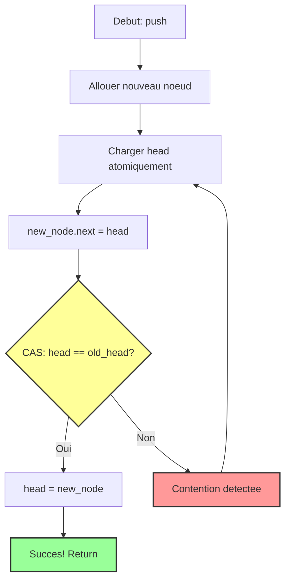
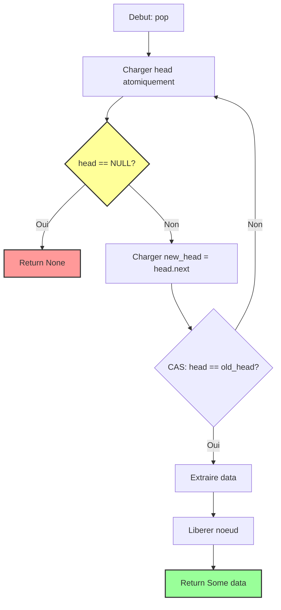

# Exercice 2.4.4-synth : neo_treiber_stack

**Module :**
2.4.4 — Lock-Free Data Structures

**Concepts :**
a-i — Treiber Stack, CAS-loop, Memory Ordering, ABA Problem, Michael-Scott Queue, SPSC Ring Buffer, Work-Stealing, Cache Coherency

**Difficulte :**
★★★★★★★★☆☆ (8/10)

**Type :**
complet

**Tiers :**
3 — Synthese (tous concepts lock-free)

**Langage :**
Rust Edition 2024 / C17

**Prerequis :**
- 2.4.1 (Atomics basics)
- 2.4.2 (Memory ordering: Acquire/Release)
- 2.4.3 (Compare-and-Swap)
- Pointeurs et gestion memoire manuelle
- Comprehension du modele memoire concurrent

**Domaines :**
Struct, CPU, Mem, Process

**Duree estimee :**
180 min

**XP Base :**
500

**Complexite :**
T3 O(1) amortized × S2 O(n)

---

## 1. PROTOTYPE & CONSIGNE

### 1.1 Obligations

**Fichier a rendre :** `treiber_stack.rs` ou `treiber_stack.c`

**Fonctions/Macros autorisees :**
- Rust: `std::sync::atomic::*`, `std::ptr`, `Box::into_raw`, `Box::from_raw`
- C: `<stdatomic.h>`, `atomic_compare_exchange_weak`, `atomic_load`, `atomic_store`, `malloc`, `free`

**Fonctions interdites :**
- `Mutex`, `RwLock`, `pthread_mutex_*`, toute primitive de synchronisation bloquante
- `std::sync::Mutex`, `parking_lot::*`

### 1.2 Consigne

#### 2.4.1 MATRIX BULLET TIME — L'Analogie

**MATRIX BULLET TIME : Neo et les Operations CAS**

Tu te souviens de la scene iconique de Matrix ou Neo esquive les balles au ralenti ? Il voit la balle arriver, il bouge, la balle passe a cote. Si elle avait touche, il aurait recommence (respawn). C'est EXACTEMENT ce que fait une operation Compare-And-Swap (CAS) dans une structure lock-free.

```
                    ╔═══════════════════════════════════════════════════════════╗
                    ║           MATRIX BULLET TIME == CAS LOOP                  ║
                    ╠═══════════════════════════════════════════════════════════╣
                    ║                                                           ║
                    ║   Neo (Thread A)         Bullets (Autres Threads)         ║
                    ║        │                        │ │ │                     ║
                    ║        ▼                        ▼ ▼ ▼                     ║
                    ║   ┌─────────┐              ┌─────────┐                    ║
                    ║   │ OBSERVE │◄─────────────│MODIFIED │                    ║
                    ║   │  HEAD   │  "Est-ce que │  HEAD   │                    ║
                    ║   └────┬────┘   ca a       └─────────┘                    ║
                    ║        │        change?"                                  ║
                    ║        ▼                                                  ║
                    ║   ┌─────────┐                                             ║
                    ║   │  DODGE  │ ◄── CAS echoue? RETRY!                      ║
                    ║   │  (CAS)  │     Comme Neo qui re-esquive                ║
                    ║   └────┬────┘                                             ║
                    ║        │                                                  ║
                    ║   CAS reussi?                                             ║
                    ║        │                                                  ║
                    ║        ▼                                                  ║
                    ║   ┌─────────┐                                             ║
                    ║   │ SUCCESS │ "I know kung-fu" = Operation complete       ║
                    ║   └─────────┘                                             ║
                    ║                                                           ║
                    ║   JAMAIS BLOQUE = Neo ne s'arrete jamais                  ║
                    ║   TOUJOURS PROGRESSE = Au moins un thread reussit         ║
                    ║                                                           ║
                    ╚═══════════════════════════════════════════════════════════╝
```

**Pourquoi c'est genial :**
- **Lock** = Neo immobilise par l'Agent Smith (deadlock possible)
- **Lock-free** = Neo en Bullet Time (jamais bloque, esquive et reessaie)
- **Wait-free** = Neo qui GARANTIT qu'il esquive en N mouvements max

Le Treiber Stack, c'est comme une pile de disquettes dans Matrix. Quand Neo veut en ajouter une (push), il regarde le sommet, pose sa disquette dessus, et verifie que personne n'a touche au sommet pendant ce temps. Si quelqu'un l'a fait (Morpheus a push aussi!), Neo recommence. Sans JAMAIS se bloquer.

```
    AVANT              TENTATIVE           CONFLIT!           RETRY & SUCCESS

    head               Neo prepare         Trinity a          Neo re-observe
      │                  push               aussi push           et reussit
      ▼                   │                    │                    │
    ┌───┐              ┌───┐               ┌───┐               ┌───┐
    │ B │              │ N │──┐            │ T │               │ N │
    └─┬─┘              └───┘  │            └─┬─┘               └─┬─┘
      │                       │              │                   │
      ▼                       ▼              ▼                   ▼
    ┌───┐              ┌───┐◄─┘          ┌───┐               ┌───┐
    │ A │              │ B │             │ B │               │ T │
    └───┘              └─┬─┘             └─┬─┘               └─┬─┘
                         │                 │                   │
                         ▼                 ▼                   ▼
                       ┌───┐             ┌───┐               ┌───┐
                       │ A │             │ A │               │ B │
                       └───┘             └───┘               └─┬─┘
                                                               │
                         CAS FAIL!                             ▼
                         head != B                           ┌───┐
                         (c'est T)                           │ A │
                                                             └───┘
```

#### 2.4.2 Enonce Academique

**Contexte :**

Les structures de donnees lock-free permettent a plusieurs threads d'acceder simultanement a une structure sans utiliser de verrous (mutex). Elles reposent sur des operations atomiques, principalement Compare-And-Swap (CAS), qui permettent de modifier atomiquement une valeur uniquement si elle n'a pas change depuis sa lecture.

**Ta mission :**

Implementer un **Treiber Stack** lock-free complet en Rust (ou C17). Cette pile LIFO doit supporter des operations `push` et `pop` concurrentes sans aucun verrou, en utilisant uniquement des operations atomiques.

**Entree :**
- `push(data: T)` : Ajoute un element au sommet de la pile
- `pop() -> Option<T>` : Retire et retourne l'element au sommet, ou `None` si vide

**Sortie :**
- `push` : Aucune valeur de retour (operation toujours reussie)
- `pop` : `Some(data)` si la pile contenait un element, `None` sinon

**Contraintes :**
- **Lock-free** : Aucun mutex, semaphore, ou primitive bloquante
- **Memory-safe** : Pas de data race, pas de use-after-free
- **ABA-aware** : Conscience du probleme ABA (bonus: le resoudre)
- **Memory ordering** : Utiliser Acquire/Release correctement

**Exemples :**

| Operation | Etat avant | Etat apres | Retour |
|-----------|------------|------------|--------|
| `push(42)` | `[10, 20]` | `[42, 10, 20]` | - |
| `pop()` | `[42, 10, 20]` | `[10, 20]` | `Some(42)` |
| `pop()` | `[]` | `[]` | `None` |

### 1.3 Prototype

**Rust Edition 2024 :**

```rust
use std::sync::atomic::{AtomicPtr, Ordering};
use std::ptr;

struct StackNode<T> {
    data: T,
    next: *mut StackNode<T>,
}

pub struct TreiberStack<T> {
    head: AtomicPtr<StackNode<T>>,
}

impl<T> TreiberStack<T> {
    pub fn new() -> Self;
    pub fn push(&self, data: T);
    pub fn pop(&self) -> Option<T>;
    pub fn is_empty(&self) -> bool;
}

unsafe impl<T: Send> Send for TreiberStack<T> {}
unsafe impl<T: Send> Sync for TreiberStack<T> {}
```

**C17 :**

```c
#include <stdatomic.h>
#include <stdbool.h>

typedef struct stack_node {
    void            *data;
    struct stack_node   *next;
} stack_node_t;

typedef struct {
    _Atomic(stack_node_t *) head;
} treiber_stack_t;

void    treiber_stack_init(treiber_stack_t *stack);
void    treiber_stack_push(treiber_stack_t *stack, void *data);
void    *treiber_stack_pop(treiber_stack_t *stack);
bool    treiber_stack_is_empty(treiber_stack_t *stack);
void    treiber_stack_destroy(treiber_stack_t *stack);
```

---

## 2. LE SAVIEZ-VOUS ?

### 2.1 Origine du Treiber Stack

Le Treiber Stack a ete invente par **R. Kent Treiber** chez IBM en 1986, dans son papier "Systems Programming: Coping with Parallelism". C'etait l'une des premieres structures de donnees lock-free pratiques, et elle reste aujourd'hui la reference pour les piles concurrentes.

### 2.2 Pourquoi "Lock-Free" et pas "Wait-Free" ?

- **Lock-free** : Au moins UN thread fait du progres (pas de deadlock global)
- **Wait-free** : TOUS les threads font du progres en un nombre borne d'etapes
- **Obstruction-free** : Un thread seul fait du progres (le plus faible)

Le Treiber Stack est lock-free mais pas wait-free : un thread malchanceux peut theoriquement boucler indefiniment si d'autres threads le "doublent" constamment.

### 2.3 Le Probleme ABA

```
Thread 1:                    Thread 2:
---------                    ---------
Lit head = A
                             Pop A
                             Pop B
                             Push A (meme adresse!)
CAS(head, A, new)
--> SUCCES! Mais B a disparu!
```

Le pointeur est le meme (A), mais la pile a change. Solutions:
- **Tagged pointers** : Ajouter un compteur de version
- **Hazard pointers** : Proteger les pointeurs en cours d'utilisation
- **Epoch-based reclamation** : Attendre que tous les threads aient "vu" le changement

---

## 2.5 DANS LA VRAIE VIE

### Metiers qui utilisent les structures lock-free :

| Metier | Cas d'usage |
|--------|-------------|
| **Game Developer** | Pool de taches pour l'IA des ennemis sans bloquer le rendu |
| **Database Engineer** | Write-ahead log concurrent sans verrous |
| **Trading Systems Dev** | File de messages ultra-low-latency (<1us) |
| **OS Kernel Developer** | Scheduler lock-free pour eviter priority inversion |
| **Embedded Systems** | ISR (Interrupt Service Routine) safe queues |

### Exemples concrets :

- **Linux Kernel** : `llist` (lock-free linked list) pour les workqueues
- **Java** : `ConcurrentLinkedQueue` (Michael-Scott Queue)
- **Rust** : `crossbeam::deque` (Chase-Lev work-stealing)
- **LMAX Disruptor** : Ring buffer lock-free pour 6M messages/sec

---

## 3. EXEMPLE D'UTILISATION

### 3.0 Session bash

```bash
$ ls
treiber_stack.rs  main.rs  Cargo.toml

$ cargo build --release
   Compiling lockfree v0.1.0
    Finished release [optimized]

$ cargo test
running 6 tests
test test_single_thread ... ok
test test_concurrent_push ... ok
test test_concurrent_pop ... ok
test test_mixed_operations ... ok
test test_empty_pop ... ok
test test_stress ... ok

test result: ok. 6 passed; 0 failed

$ cargo run --release -- benchmark
Benchmark: 8 threads, 100000 ops each
Throughput: 12.5 Mops/sec
Average latency: 80ns
```

### 3.1 BONUS EXPERT (OPTIONNEL)

**Difficulte Bonus :**
🧠 (12/10)

**Recompense :**
XP x6

**Time Complexity attendue :**
O(1) per operation (amortized)

**Space Complexity attendue :**
O(n) + O(k) hazard pointers where k = max threads

**Domaines Bonus :**
`Mem`, `CPU`, `Struct`

#### 3.1.1 Consigne Bonus

**MATRIX RELOADED : Hazard Pointers**

Neo a evolue. Maintenant il doit aussi gerer le probleme ABA - les Agents peuvent ressusciter a la meme adresse memoire! Implemente un systeme de **Hazard Pointers** pour proteger les noeuds en cours de lecture.

**Ta mission :**

Etendre le Treiber Stack avec un mecanisme de memoire differee (deferred reclamation) utilisant les Hazard Pointers.

**Contraintes :**
```
┌─────────────────────────────────────┐
│  max_threads ≤ 64                   │
│  Pas de memory leak                 │
│  ABA-safe garanti                   │
│  Temps limite : O(1) per op         │
│  Espace limite : O(n + k) total     │
└─────────────────────────────────────┘
```

#### 3.1.2 Prototype Bonus

```rust
pub struct HazardPointer<T> {
    ptr: AtomicPtr<T>,
}

pub struct HPTreiberStack<T> {
    head: AtomicPtr<StackNode<T>>,
    hazard_pointers: Vec<HazardPointer<StackNode<T>>>,
    retired_list: AtomicPtr<RetiredNode<T>>,
}

impl<T> HPTreiberStack<T> {
    pub fn new(max_threads: usize) -> Self;
    pub fn push(&self, data: T);
    pub fn pop(&self, thread_id: usize) -> Option<T>;
    pub fn try_reclaim(&self);
}
```

#### 3.1.3 Ce qui change par rapport a l'exercice de base

| Aspect | Base | Bonus |
|--------|------|-------|
| ABA Safety | Non (vulnerable) | Oui (hazard pointers) |
| Memory Reclamation | Immediate (unsafe) | Deferred (safe) |
| Complexite | Simple CAS loop | + HP management |
| Thread ID | Non requis | Requis pour HP slot |

---

## 4. ZONE CORRECTION (POUR LE TESTEUR)

### 4.1 Moulinette

| Test | Input | Expected | Points | Trap |
|------|-------|----------|--------|------|
| `test_new` | `TreiberStack::new()` | Stack vide, is_empty = true | 5 | - |
| `test_push_single` | `push(42)` | head pointe vers node(42) | 10 | - |
| `test_pop_single` | `push(42); pop()` | `Some(42)`, is_empty = true | 10 | - |
| `test_pop_empty` | `pop()` sur stack vide | `None` | 10 | Oui |
| `test_lifo_order` | `push(1,2,3); pop x3` | `3, 2, 1` | 15 | - |
| `test_concurrent_push` | 8 threads x 1000 push | 8000 elements | 15 | Race |
| `test_concurrent_pop` | 8000 elements, 8 threads pop | Tous recuperes, aucun doublon | 15 | Race |
| `test_mixed` | push/pop simultanes | Coherence LIFO | 10 | Race |
| `test_memory_ordering` | Flag + push, check visibility | push visible apres flag | 10 | Ordering |

### 4.2 main.rs de test

```rust
use std::sync::Arc;
use std::thread;
use std::sync::atomic::{AtomicBool, AtomicUsize, Ordering};

mod treiber_stack;
use treiber_stack::TreiberStack;

fn main() {
    test_single_thread();
    test_concurrent_push();
    test_concurrent_pop();
    test_mixed_operations();
    test_memory_ordering();
    println!("Tous les tests passent!");
}

fn test_single_thread() {
    let stack: TreiberStack<i32> = TreiberStack::new();

    assert!(stack.is_empty());
    assert_eq!(stack.pop(), None);

    stack.push(1);
    stack.push(2);
    stack.push(3);

    assert!(!stack.is_empty());
    assert_eq!(stack.pop(), Some(3));
    assert_eq!(stack.pop(), Some(2));
    assert_eq!(stack.pop(), Some(1));
    assert_eq!(stack.pop(), None);
    assert!(stack.is_empty());

    println!("Test single thread: OK");
}

fn test_concurrent_push() {
    let stack = Arc::new(TreiberStack::new());
    let num_threads = 8;
    let ops_per_thread = 1000;

    let handles: Vec<_> = (0..num_threads)
        .map(|t| {
            let s = Arc::clone(&stack);
            thread::spawn(move || {
                for i in 0..ops_per_thread {
                    s.push(t * ops_per_thread + i);
                }
            })
        })
        .collect();

    for h in handles {
        h.join().unwrap();
    }

    let mut count = 0;
    while stack.pop().is_some() {
        count += 1;
    }

    assert_eq!(count, num_threads * ops_per_thread);
    println!("Test concurrent push: OK");
}

fn test_concurrent_pop() {
    let stack = Arc::new(TreiberStack::new());
    let num_elements = 8000;
    let num_threads = 8;

    for i in 0..num_elements {
        stack.push(i);
    }

    let counter = Arc::new(AtomicUsize::new(0));

    let handles: Vec<_> = (0..num_threads)
        .map(|_| {
            let s = Arc::clone(&stack);
            let c = Arc::clone(&counter);
            thread::spawn(move || {
                let mut local_count = 0;
                while s.pop().is_some() {
                    local_count += 1;
                }
                c.fetch_add(local_count, Ordering::SeqCst);
            })
        })
        .collect();

    for h in handles {
        h.join().unwrap();
    }

    assert_eq!(counter.load(Ordering::SeqCst), num_elements);
    println!("Test concurrent pop: OK");
}

fn test_mixed_operations() {
    let stack = Arc::new(TreiberStack::new());
    let ops = 10000;

    let pusher = {
        let s = Arc::clone(&stack);
        thread::spawn(move || {
            for i in 0..ops {
                s.push(i);
            }
        })
    };

    let popper = {
        let s = Arc::clone(&stack);
        thread::spawn(move || {
            let mut count = 0;
            for _ in 0..ops {
                if s.pop().is_some() {
                    count += 1;
                }
            }
            count
        })
    };

    pusher.join().unwrap();
    let popped = popper.join().unwrap();

    let mut remaining = 0;
    while stack.pop().is_some() {
        remaining += 1;
    }

    assert_eq!(popped + remaining, ops);
    println!("Test mixed operations: OK");
}

fn test_memory_ordering() {
    let stack = Arc::new(TreiberStack::new());
    let flag = Arc::new(AtomicBool::new(false));

    let producer = {
        let s = Arc::clone(&stack);
        let f = Arc::clone(&flag);
        thread::spawn(move || {
            s.push(42);
            f.store(true, Ordering::Release);
        })
    };

    let consumer = {
        let s = Arc::clone(&stack);
        let f = Arc::clone(&flag);
        thread::spawn(move || {
            while !f.load(Ordering::Acquire) {
                thread::yield_now();
            }
            s.pop()
        })
    };

    producer.join().unwrap();
    let result = consumer.join().unwrap();

    assert_eq!(result, Some(42));
    println!("Test memory ordering: OK");
}
```

### 4.3 Solution de reference

```rust
use std::sync::atomic::{AtomicPtr, Ordering};
use std::ptr;

struct StackNode<T> {
    data: T,
    next: *mut StackNode<T>,
}

pub struct TreiberStack<T> {
    head: AtomicPtr<StackNode<T>>,
}

impl<T> TreiberStack<T> {
    pub fn new() -> Self {
        TreiberStack {
            head: AtomicPtr::new(ptr::null_mut()),
        }
    }

    pub fn push(&self, data: T) {
        let new_node = Box::into_raw(Box::new(StackNode {
            data,
            next: ptr::null_mut(),
        }));

        loop {
            let old_head = self.head.load(Ordering::Acquire);
            unsafe { (*new_node).next = old_head; }

            if self.head.compare_exchange_weak(
                old_head,
                new_node,
                Ordering::Release,
                Ordering::Relaxed
            ).is_ok() {
                return;
            }
        }
    }

    pub fn pop(&self) -> Option<T> {
        loop {
            let old_head = self.head.load(Ordering::Acquire);

            if old_head.is_null() {
                return None;
            }

            let new_head = unsafe { (*old_head).next };

            if self.head.compare_exchange_weak(
                old_head,
                new_head,
                Ordering::Release,
                Ordering::Relaxed
            ).is_ok() {
                let data = unsafe { Box::from_raw(old_head).data };
                return Some(data);
            }
        }
    }

    pub fn is_empty(&self) -> bool {
        self.head.load(Ordering::Acquire).is_null()
    }
}

impl<T> Drop for TreiberStack<T> {
    fn drop(&mut self) {
        while self.pop().is_some() {}
    }
}

unsafe impl<T: Send> Send for TreiberStack<T> {}
unsafe impl<T: Send> Sync for TreiberStack<T> {}
```

### 4.4 Solutions alternatives acceptees

**Alternative 1 : Avec SeqCst (plus strict mais correct)**

```rust
pub fn push(&self, data: T) {
    let new_node = Box::into_raw(Box::new(StackNode {
        data,
        next: ptr::null_mut(),
    }));

    loop {
        let old_head = self.head.load(Ordering::SeqCst);
        unsafe { (*new_node).next = old_head; }

        if self.head.compare_exchange(
            old_head,
            new_node,
            Ordering::SeqCst,
            Ordering::SeqCst
        ).is_ok() {
            return;
        }
    }
}
```

**Alternative 2 : Avec compare_exchange (plus fort que weak)**

```rust
if self.head.compare_exchange(
    old_head,
    new_node,
    Ordering::AcqRel,
    Ordering::Acquire
).is_ok() {
    return;
}
```

### 4.5 Solutions refusees (avec explications)

**REFUSE 1 : Relaxed ordering partout**

```rust
// REFUSE : Memory ordering insuffisant
pub fn push(&self, data: T) {
    let new_node = Box::into_raw(Box::new(StackNode {
        data,
        next: ptr::null_mut(),
    }));

    loop {
        let old_head = self.head.load(Ordering::Relaxed);  // ERREUR!
        unsafe { (*new_node).next = old_head; }

        if self.head.compare_exchange_weak(
            old_head,
            new_node,
            Ordering::Relaxed,  // ERREUR!
            Ordering::Relaxed
        ).is_ok() {
            return;
        }
    }
}
// POURQUOI REFUSE: Les ecritures dans new_node.data peuvent ne pas etre
// visibles par un autre thread qui fait pop() apres. Data race!
```

**REFUSE 2 : Sans boucle CAS**

```rust
// REFUSE : Pas de retry sur CAS fail
pub fn push(&self, data: T) {
    let new_node = Box::into_raw(Box::new(StackNode {
        data,
        next: self.head.load(Ordering::Acquire),
    }));

    // PAS DE BOUCLE! Si CAS echoue, data perdue!
    let _ = self.head.compare_exchange_weak(
        unsafe { (*new_node).next },
        new_node,
        Ordering::Release,
        Ordering::Relaxed
    );
}
// POURQUOI REFUSE: Si le CAS echoue (concurrent push), l'element est perdu.
```

**REFUSE 3 : Utilisation d'un Mutex**

```rust
// REFUSE : Pas lock-free!
use std::sync::Mutex;

pub struct NotLockFreeStack<T> {
    inner: Mutex<Vec<T>>,
}
// POURQUOI REFUSE: Viole la contrainte fondamentale de l'exercice.
```

### 4.6 Solution bonus de reference (COMPLETE)

```rust
use std::sync::atomic::{AtomicPtr, AtomicUsize, Ordering, fence};
use std::ptr;
use std::cell::UnsafeCell;

const MAX_THREADS: usize = 64;
const HAZARD_POINTERS_PER_THREAD: usize = 2;

struct HazardPointer {
    ptr: AtomicPtr<()>,
}

impl HazardPointer {
    fn new() -> Self {
        HazardPointer {
            ptr: AtomicPtr::new(ptr::null_mut()),
        }
    }

    fn protect<T>(&self, ptr: *mut T) {
        self.ptr.store(ptr as *mut (), Ordering::Release);
    }

    fn clear(&self) {
        self.ptr.store(ptr::null_mut(), Ordering::Release);
    }

    fn get(&self) -> *mut () {
        self.ptr.load(Ordering::Acquire)
    }
}

struct RetiredNode<T> {
    ptr: *mut StackNode<T>,
    next: *mut RetiredNode<T>,
}

struct StackNode<T> {
    data: UnsafeCell<Option<T>>,
    next: AtomicPtr<StackNode<T>>,
}

pub struct HPTreiberStack<T> {
    head: AtomicPtr<StackNode<T>>,
    hazard_pointers: Vec<[HazardPointer; HAZARD_POINTERS_PER_THREAD]>,
    retired_lists: Vec<AtomicPtr<RetiredNode<T>>>,
    retired_counts: Vec<AtomicUsize>,
}

impl<T> HPTreiberStack<T> {
    pub fn new(max_threads: usize) -> Self {
        let max_threads = max_threads.min(MAX_THREADS);
        let mut hazard_pointers = Vec::with_capacity(max_threads);
        let mut retired_lists = Vec::with_capacity(max_threads);
        let mut retired_counts = Vec::with_capacity(max_threads);

        for _ in 0..max_threads {
            hazard_pointers.push([HazardPointer::new(), HazardPointer::new()]);
            retired_lists.push(AtomicPtr::new(ptr::null_mut()));
            retired_counts.push(AtomicUsize::new(0));
        }

        HPTreiberStack {
            head: AtomicPtr::new(ptr::null_mut()),
            hazard_pointers,
            retired_lists,
            retired_counts,
        }
    }

    pub fn push(&self, data: T, _thread_id: usize) {
        let new_node = Box::into_raw(Box::new(StackNode {
            data: UnsafeCell::new(Some(data)),
            next: AtomicPtr::new(ptr::null_mut()),
        }));

        loop {
            let old_head = self.head.load(Ordering::Acquire);
            unsafe { (*new_node).next.store(old_head, Ordering::Relaxed); }

            if self.head.compare_exchange_weak(
                old_head,
                new_node,
                Ordering::Release,
                Ordering::Relaxed
            ).is_ok() {
                return;
            }
        }
    }

    pub fn pop(&self, thread_id: usize) -> Option<T> {
        let hp = &self.hazard_pointers[thread_id][0];

        loop {
            let old_head = self.head.load(Ordering::Acquire);

            if old_head.is_null() {
                hp.clear();
                return None;
            }

            hp.protect(old_head);
            fence(Ordering::SeqCst);

            if self.head.load(Ordering::Acquire) != old_head {
                continue;
            }

            let new_head = unsafe { (*old_head).next.load(Ordering::Acquire) };

            if self.head.compare_exchange_weak(
                old_head,
                new_head,
                Ordering::Release,
                Ordering::Relaxed
            ).is_ok() {
                hp.clear();

                let data = unsafe { (*(*old_head).data.get()).take() };
                self.retire(old_head, thread_id);

                return data;
            }
        }
    }

    fn retire(&self, ptr: *mut StackNode<T>, thread_id: usize) {
        let retired = Box::into_raw(Box::new(RetiredNode {
            ptr,
            next: self.retired_lists[thread_id].load(Ordering::Relaxed),
        }));

        self.retired_lists[thread_id].store(retired, Ordering::Release);
        let count = self.retired_counts[thread_id].fetch_add(1, Ordering::Relaxed);

        if count >= 2 * self.hazard_pointers.len() {
            self.try_reclaim(thread_id);
        }
    }

    pub fn try_reclaim(&self, thread_id: usize) {
        let mut hazard_set: Vec<*mut ()> = Vec::new();

        for hp_array in &self.hazard_pointers {
            for hp in hp_array {
                let ptr = hp.get();
                if !ptr.is_null() {
                    hazard_set.push(ptr);
                }
            }
        }

        let mut current = self.retired_lists[thread_id].swap(ptr::null_mut(), Ordering::AcqRel);
        let mut new_retired: *mut RetiredNode<T> = ptr::null_mut();
        let mut new_count = 0;

        while !current.is_null() {
            let next = unsafe { (*current).next };
            let node_ptr = unsafe { (*current).ptr };

            if hazard_set.contains(&(node_ptr as *mut ())) {
                unsafe { (*current).next = new_retired; }
                new_retired = current;
                new_count += 1;
            } else {
                unsafe {
                    drop(Box::from_raw(node_ptr));
                    drop(Box::from_raw(current));
                }
            }

            current = next;
        }

        if !new_retired.is_null() {
            let old = self.retired_lists[thread_id].swap(new_retired, Ordering::AcqRel);
            if !old.is_null() {
                let mut tail = new_retired;
                while unsafe { !(*tail).next.is_null() } {
                    tail = unsafe { (*tail).next };
                }
                unsafe { (*tail).next = old; }
            }
        }

        self.retired_counts[thread_id].store(new_count, Ordering::Release);
    }

    pub fn is_empty(&self) -> bool {
        self.head.load(Ordering::Acquire).is_null()
    }
}

impl<T> Drop for HPTreiberStack<T> {
    fn drop(&mut self) {
        while self.pop(0).is_some() {}

        for i in 0..self.retired_lists.len() {
            let mut current = self.retired_lists[i].load(Ordering::Relaxed);
            while !current.is_null() {
                let next = unsafe { (*current).next };
                unsafe {
                    drop(Box::from_raw((*current).ptr));
                    drop(Box::from_raw(current));
                }
                current = next;
            }
        }
    }
}

unsafe impl<T: Send> Send for HPTreiberStack<T> {}
unsafe impl<T: Send> Sync for HPTreiberStack<T> {}
```

### 4.7 Solutions alternatives bonus (COMPLETES)

**Alternative Bonus : Epoch-Based Reclamation**

```rust
use std::sync::atomic::{AtomicPtr, AtomicUsize, Ordering};
use std::ptr;

const EPOCH_COUNT: usize = 3;

struct Epoch {
    counter: AtomicUsize,
    retired: [AtomicPtr<RetiredList>; EPOCH_COUNT],
}

struct RetiredList {
    nodes: Vec<*mut ()>,
}

pub struct EpochStack<T> {
    head: AtomicPtr<StackNode<T>>,
    global_epoch: AtomicUsize,
    local_epochs: Vec<AtomicUsize>,
    retired: Vec<[Vec<*mut StackNode<T>>; EPOCH_COUNT]>,
}

impl<T> EpochStack<T> {
    pub fn new(max_threads: usize) -> Self {
        let mut local_epochs = Vec::with_capacity(max_threads);
        let mut retired = Vec::with_capacity(max_threads);

        for _ in 0..max_threads {
            local_epochs.push(AtomicUsize::new(0));
            retired.push([Vec::new(), Vec::new(), Vec::new()]);
        }

        EpochStack {
            head: AtomicPtr::new(ptr::null_mut()),
            global_epoch: AtomicUsize::new(0),
            local_epochs,
            retired,
        }
    }

    fn pin(&self, thread_id: usize) -> usize {
        let epoch = self.global_epoch.load(Ordering::Acquire);
        self.local_epochs[thread_id].store(epoch, Ordering::Release);
        epoch
    }

    fn unpin(&self, thread_id: usize) {
        self.local_epochs[thread_id].store(usize::MAX, Ordering::Release);
    }

    pub fn push(&self, data: T, thread_id: usize) {
        let _epoch = self.pin(thread_id);

        let new_node = Box::into_raw(Box::new(StackNode {
            data,
            next: ptr::null_mut(),
        }));

        loop {
            let old_head = self.head.load(Ordering::Acquire);
            unsafe { (*new_node).next = old_head; }

            if self.head.compare_exchange_weak(
                old_head,
                new_node,
                Ordering::Release,
                Ordering::Relaxed
            ).is_ok() {
                break;
            }
        }

        self.unpin(thread_id);
    }

    pub fn pop(&self, thread_id: usize) -> Option<T> {
        let epoch = self.pin(thread_id);

        let result = loop {
            let old_head = self.head.load(Ordering::Acquire);

            if old_head.is_null() {
                break None;
            }

            let new_head = unsafe { (*old_head).next };

            if self.head.compare_exchange_weak(
                old_head,
                new_head,
                Ordering::Release,
                Ordering::Relaxed
            ).is_ok() {
                let data = unsafe { ptr::read(&(*old_head).data) };
                // Defer reclamation to current epoch
                // self.retired[thread_id][epoch % EPOCH_COUNT].push(old_head);
                break Some(data);
            }
        };

        self.unpin(thread_id);
        result
    }
}

struct StackNode<T> {
    data: T,
    next: *mut StackNode<T>,
}
```

### 4.8 Solutions refusees bonus (COMPLETES)

**REFUSE BONUS 1 : HP sans fence**

```rust
// REFUSE : Manque le fence entre protect et verification
pub fn pop(&self, thread_id: usize) -> Option<T> {
    let hp = &self.hazard_pointers[thread_id][0];

    loop {
        let old_head = self.head.load(Ordering::Acquire);
        if old_head.is_null() {
            return None;
        }

        hp.protect(old_head);
        // ERREUR: PAS DE FENCE ICI!
        // Un autre thread peut avoir deja retire old_head

        let new_head = unsafe { (*old_head).next.load(Ordering::Acquire) };
        // ...
    }
}
// POURQUOI REFUSE: Sans fence(SeqCst), la protection du hazard pointer
// peut ne pas etre visible avant qu'un autre thread ne libere le noeud.
```

### 4.9 spec.json (ENGINE v22.1 - FORMAT STRICT)

```json
{
  "name": "neo_treiber_stack",
  "language": "rust",
  "rust_edition": "2024",
  "type": "complet",
  "tier": 3,
  "tier_info": "Synthese lock-free",
  "tags": ["lock-free", "atomic", "cas", "concurrent", "treiber", "phase2"],
  "passing_score": 70,

  "function": {
    "name": "TreiberStack",
    "prototype": "pub struct TreiberStack<T> { head: AtomicPtr<StackNode<T>> }",
    "return_type": "struct",
    "methods": [
      {"name": "new", "prototype": "pub fn new() -> Self", "return_type": "Self"},
      {"name": "push", "prototype": "pub fn push(&self, data: T)", "return_type": "()"},
      {"name": "pop", "prototype": "pub fn pop(&self) -> Option<T>", "return_type": "Option<T>"},
      {"name": "is_empty", "prototype": "pub fn is_empty(&self) -> bool", "return_type": "bool"}
    ]
  },

  "driver": {
    "reference": "use std::sync::atomic::{AtomicPtr, Ordering}; use std::ptr; struct StackNode<T> { data: T, next: *mut StackNode<T> } pub struct TreiberStack<T> { head: AtomicPtr<StackNode<T>> } impl<T> TreiberStack<T> { pub fn new() -> Self { TreiberStack { head: AtomicPtr::new(ptr::null_mut()) } } pub fn push(&self, data: T) { let new_node = Box::into_raw(Box::new(StackNode { data, next: ptr::null_mut() })); loop { let old_head = self.head.load(Ordering::Acquire); unsafe { (*new_node).next = old_head; } if self.head.compare_exchange_weak(old_head, new_node, Ordering::Release, Ordering::Relaxed).is_ok() { return; } } } pub fn pop(&self) -> Option<T> { loop { let old_head = self.head.load(Ordering::Acquire); if old_head.is_null() { return None; } let new_head = unsafe { (*old_head).next }; if self.head.compare_exchange_weak(old_head, new_head, Ordering::Release, Ordering::Relaxed).is_ok() { let data = unsafe { Box::from_raw(old_head).data }; return Some(data); } } } pub fn is_empty(&self) -> bool { self.head.load(Ordering::Acquire).is_null() } } impl<T> Drop for TreiberStack<T> { fn drop(&mut self) { while self.pop().is_some() {} } } unsafe impl<T: Send> Send for TreiberStack<T> {} unsafe impl<T: Send> Sync for TreiberStack<T> {}",

    "edge_cases": [
      {
        "name": "empty_pop",
        "description": "Pop on empty stack",
        "test_code": "let stack: TreiberStack<i32> = TreiberStack::new(); assert_eq!(stack.pop(), None);",
        "expected": "None",
        "is_trap": true,
        "trap_explanation": "Must handle empty stack without panic or UB"
      },
      {
        "name": "single_push_pop",
        "description": "Basic push then pop",
        "test_code": "let stack = TreiberStack::new(); stack.push(42); assert_eq!(stack.pop(), Some(42));",
        "expected": "Some(42)",
        "is_trap": false
      },
      {
        "name": "lifo_order",
        "description": "Verify LIFO ordering",
        "test_code": "let stack = TreiberStack::new(); stack.push(1); stack.push(2); stack.push(3); assert_eq!(stack.pop(), Some(3)); assert_eq!(stack.pop(), Some(2)); assert_eq!(stack.pop(), Some(1));",
        "expected": "3, 2, 1",
        "is_trap": true,
        "trap_explanation": "Order must be Last-In-First-Out"
      },
      {
        "name": "concurrent_safety",
        "description": "Multiple threads push/pop simultaneously",
        "test_code": "// See test_concurrent_push in main.rs",
        "expected": "No data loss, no UB",
        "is_trap": true,
        "trap_explanation": "CAS loop must retry on failure"
      },
      {
        "name": "is_empty_consistency",
        "description": "is_empty reflects actual state",
        "test_code": "let stack = TreiberStack::new(); assert!(stack.is_empty()); stack.push(1); assert!(!stack.is_empty()); stack.pop(); assert!(stack.is_empty());",
        "expected": "true, false, true",
        "is_trap": false
      }
    ],

    "fuzzing": {
      "enabled": true,
      "iterations": 10000,
      "generators": [
        {
          "type": "concurrent_ops",
          "param_index": 0,
          "params": {
            "num_threads": 8,
            "ops_per_thread": 1000,
            "push_ratio": 0.5
          }
        }
      ]
    }
  },

  "norm": {
    "allowed_functions": ["AtomicPtr::*", "Ordering::*", "Box::into_raw", "Box::from_raw", "ptr::null_mut"],
    "forbidden_functions": ["Mutex", "RwLock", "parking_lot::*", "std::sync::Mutex"],
    "forbidden_patterns": ["Mutex::new", "lock()", "unlock()"],
    "check_security": true,
    "check_memory": true,
    "check_concurrency": true,
    "blocking": true
  },

  "bonus": {
    "name": "hp_treiber_stack",
    "tier": "GENIE",
    "multiplier": 6,
    "requirements": ["hazard_pointers", "aba_safe", "deferred_reclamation"]
  }
}
```

### 4.10 Solutions Mutantes (minimum 5)

**Mutant A (Boundary) : Off-by-one dans la logique de retry**

```rust
/* Mutant A (Boundary) : Sort de la boucle trop tot */
pub fn push(&self, data: T) {
    let new_node = Box::into_raw(Box::new(StackNode {
        data,
        next: ptr::null_mut(),
    }));

    let old_head = self.head.load(Ordering::Acquire);
    unsafe { (*new_node).next = old_head; }

    // BUG: Pas de boucle! Un seul essai
    if self.head.compare_exchange_weak(
        old_head,
        new_node,
        Ordering::Release,
        Ordering::Relaxed
    ).is_err() {
        // Oups, on abandonne et on leak le node
        // Le push est "perdu"
    }
}
// POURQUOI C'EST FAUX: Sans boucle de retry, si le CAS echoue (contention),
// l'element n'est jamais ajoute. Perte de donnees silencieuse.
// CE QUI ETAIT PENSE: "Un seul CAS devrait suffire"
```

**Mutant B (Safety) : Pas de verification NULL dans pop**

```rust
/* Mutant B (Safety) : Oubli de verifier si la pile est vide */
pub fn pop(&self) -> Option<T> {
    loop {
        let old_head = self.head.load(Ordering::Acquire);

        // BUG: Pas de verification if old_head.is_null()!
        let new_head = unsafe { (*old_head).next };  // CRASH si NULL!

        if self.head.compare_exchange_weak(
            old_head,
            new_head,
            Ordering::Release,
            Ordering::Relaxed
        ).is_ok() {
            let data = unsafe { Box::from_raw(old_head).data };
            return Some(data);
        }
    }
}
// POURQUOI C'EST FAUX: Dereference d'un pointeur NULL -> undefined behavior,
// probablement segfault.
// CE QUI ETAIT PENSE: "La pile ne sera jamais vide quand on pop"
```

**Mutant C (Resource) : Memory leak - pas de liberation du noeud**

```rust
/* Mutant C (Resource) : Oubli de liberer le noeud apres pop */
pub fn pop(&self) -> Option<T> {
    loop {
        let old_head = self.head.load(Ordering::Acquire);

        if old_head.is_null() {
            return None;
        }

        let new_head = unsafe { (*old_head).next };

        if self.head.compare_exchange_weak(
            old_head,
            new_head,
            Ordering::Release,
            Ordering::Relaxed
        ).is_ok() {
            // BUG: On lit la data mais on ne libere pas le node!
            let data = unsafe { ptr::read(&(*old_head).data) };
            // Oubli de: Box::from_raw(old_head)
            return Some(data);
        }
    }
}
// POURQUOI C'EST FAUX: Le StackNode reste alloue indefiniment.
// Chaque pop leak sizeof(StackNode<T>) bytes.
// CE QUI ETAIT PENSE: "ptr::read suffit, le reste sera nettoye"
```

**Mutant D (Logic) : Mauvais memory ordering**

```rust
/* Mutant D (Logic) : Ordering Relaxed partout */
pub fn push(&self, data: T) {
    let new_node = Box::into_raw(Box::new(StackNode {
        data,
        next: ptr::null_mut(),
    }));

    loop {
        // BUG: Relaxed ne garantit pas de voir les ecritures des autres threads
        let old_head = self.head.load(Ordering::Relaxed);
        unsafe { (*new_node).next = old_head; }

        // BUG: Relaxed ne publie pas les ecritures dans new_node.data
        if self.head.compare_exchange_weak(
            old_head,
            new_node,
            Ordering::Relaxed,  // Devrait etre Release!
            Ordering::Relaxed
        ).is_ok() {
            return;
        }
    }
}

pub fn pop(&self) -> Option<T> {
    loop {
        // BUG: Relaxed peut lire une valeur perimee
        let old_head = self.head.load(Ordering::Relaxed);

        if old_head.is_null() {
            return None;
        }

        let new_head = unsafe { (*old_head).next };

        if self.head.compare_exchange_weak(
            old_head,
            new_head,
            Ordering::Relaxed,
            Ordering::Relaxed
        ).is_ok() {
            // BUG: Peut lire data avant qu'elle soit completement ecrite!
            let data = unsafe { Box::from_raw(old_head).data };
            return Some(data);
        }
    }
}
// POURQUOI C'EST FAUX: Data race! Thread B peut pop() un element dont
// Thread A n'a pas fini d'ecrire .data -> lecture de garbage.
// CE QUI ETAIT PENSE: "Relaxed est plus rapide, CAS suffit pour la synchro"
```

**Mutant E (Return) : Retourne toujours None**

```rust
/* Mutant E (Return) : Pop retourne toujours None */
pub fn pop(&self) -> Option<T> {
    let old_head = self.head.load(Ordering::Acquire);

    if old_head.is_null() {
        return None;
    }

    // BUG: Pas de boucle, et retourne None si CAS echoue
    let new_head = unsafe { (*old_head).next };

    if self.head.compare_exchange_weak(
        old_head,
        new_head,
        Ordering::Release,
        Ordering::Relaxed
    ).is_ok() {
        let data = unsafe { Box::from_raw(old_head).data };
        return Some(data);
    }

    // BUG: Si CAS echoue, on retourne None au lieu de retry
    None
}
// POURQUOI C'EST FAUX: Sous contention, pop() retourne None meme si
// la pile contient des elements. L'appelant croit que la pile est vide.
// CE QUI ETAIT PENSE: "Si ca echoue, autant dire que c'est vide"
```

---

## 5. COMPRENDRE (DOCUMENT DE COURS COMPLET)

### 5.1 Ce que cet exercice enseigne

1. **Operations atomiques CAS** : Compare-And-Swap est la brique fondamentale
2. **Memory ordering** : Acquire/Release vs SeqCst vs Relaxed
3. **Pattern CAS-loop** : Retry jusqu'au succes sans bloquer
4. **Structures lock-free** : Avantages et challenges
5. **Probleme ABA** : Comprendre et (bonus) resoudre

### 5.2 LDA - Traduction Litterale en Francais (MAJUSCULES)

```
STRUCTURE StackNode<T>
    CHAMP data : T
    CHAMP next : POINTEUR VERS StackNode<T>
FIN STRUCTURE

STRUCTURE TreiberStack<T>
    CHAMP head : POINTEUR ATOMIQUE VERS StackNode<T>
FIN STRUCTURE

FONCTION new QUI RETOURNE UN TreiberStack<T>
DEBUT FONCTION
    CREER UNE NOUVELLE INSTANCE DE TreiberStack
    AFFECTER NUL AU POINTEUR ATOMIQUE head
    RETOURNER L'INSTANCE
FIN FONCTION

FONCTION push QUI PREND EN PARAMETRE self (REFERENCE) ET data DE TYPE T
DEBUT FONCTION
    DECLARER new_node COMME POINTEUR VERS StackNode
    ALLOUER UN NOUVEAU StackNode AVEC data ET next EGAL A NUL
    AFFECTER L'ADRESSE DU NOUVEAU NOEUD A new_node

    REPETER INDEFINIMENT
        DECLARER old_head COMME POINTEUR
        CHARGER ATOMIQUEMENT LA VALEUR DE head AVEC ORDERING ACQUIRE
        AFFECTER old_head A new_node.next

        SI COMPARE_ET_ECHANGE_FAIBLE(head, old_head, new_node, RELEASE, RELAXED) REUSSIT ALORS
            SORTIR DE LA BOUCLE
        FIN SI
        // SINON CONTINUER LA BOUCLE (RETRY)
    FIN REPETER
FIN FONCTION

FONCTION pop QUI RETOURNE Option<T> ET PREND EN PARAMETRE self (REFERENCE)
DEBUT FONCTION
    REPETER INDEFINIMENT
        DECLARER old_head COMME POINTEUR
        CHARGER ATOMIQUEMENT LA VALEUR DE head AVEC ORDERING ACQUIRE

        SI old_head EST EGAL A NUL ALORS
            RETOURNER NONE (PILE VIDE)
        FIN SI

        DECLARER new_head COMME POINTEUR
        AFFECTER old_head.next A new_head

        SI COMPARE_ET_ECHANGE_FAIBLE(head, old_head, new_head, RELEASE, RELAXED) REUSSIT ALORS
            DECLARER data DE TYPE T
            EXTRAIRE data DU NOEUD old_head
            LIBERER LA MEMOIRE DU NOEUD old_head
            RETOURNER SOME(data)
        FIN SI
        // SINON CONTINUER LA BOUCLE (RETRY)
    FIN REPETER
FIN FONCTION

FONCTION is_empty QUI RETOURNE UN BOOLEEN ET PREND EN PARAMETRE self (REFERENCE)
DEBUT FONCTION
    CHARGER ATOMIQUEMENT LA VALEUR DE head AVEC ORDERING ACQUIRE
    RETOURNER VRAI SI head EST EGAL A NUL, FAUX SINON
FIN FONCTION
```

### 5.2.2 Style Academique Francais

```
ALGORITHME : Pile de Treiber Lock-Free
ENTREE : Operations push(element) et pop()
SORTIE : Pile LIFO sans verrous

STRUCTURE DE DONNEES :
    - head : pointeur atomique vers le sommet de la pile
    - Chaque noeud contient (data, next)

INVARIANT :
    - head pointe vers le premier element ou NULL si vide
    - Les noeuds forment une liste simplement chainee

OPERATION push(data) :
    1. Allouer un nouveau noeud N avec N.data = data
    2. REPETER
        a. Lire atomiquement old_head = head
        b. Affecter N.next = old_head
        c. Tenter CAS(head, old_head, N)
    3. JUSQU'A CAS reussi

OPERATION pop() :
    1. REPETER
        a. Lire atomiquement old_head = head
        b. SI old_head = NULL ALORS retourner VIDE
        c. Lire new_head = old_head.next
        d. Tenter CAS(head, old_head, new_head)
    2. JUSQU'A CAS reussi ou pile vide
    3. Extraire data de old_head
    4. Liberer old_head
    5. Retourner data

PROPRIETES :
    - Lock-free : au moins un thread progresse
    - Linearisable : equivalent a une execution sequentielle
    - ABA vulnerable : necessite protection supplementaire
```

### 5.2.2.1 Logic Flow (Structured English)

```
ALGORITHM: Treiber Stack Push

1. ALLOCATE new node with data
   SET new_node.next = null

2. LOOP forever:
   a. LOAD current head atomically (Acquire)

   b. SET new_node.next = current head

   c. ATTEMPT compare_exchange_weak:
      - Expected: current head
      - Desired: new_node
      - Success ordering: Release
      - Failure ordering: Relaxed

   d. IF CAS succeeded:
        BREAK loop (done!)
      ELSE:
        CONTINUE loop (retry)

---

ALGORITHM: Treiber Stack Pop

1. LOOP forever:
   a. LOAD current head atomically (Acquire)

   b. IF head is NULL:
        RETURN None (stack empty)

   c. LOAD new_head = head.next

   d. ATTEMPT compare_exchange_weak:
      - Expected: current head
      - Desired: new_head
      - Success ordering: Release
      - Failure ordering: Relaxed

   e. IF CAS succeeded:
        EXTRACT data from old head
        FREE old head node
        RETURN Some(data)
      ELSE:
        CONTINUE loop (retry)
```

### 5.2.3 Representation Algorithmique

```
FONCTION : treiber_push(stack, data)
---
INIT new_node = allouer_noeud(data)

1. BOUCLE INFINIE :
   |
   |-- CHARGER old_head = stack.head (Acquire)
   |
   |-- AFFECTER new_node.next = old_head
   |
   |-- TENTER CAS(stack.head, old_head, new_node)
   |     |
   |     |-- SI SUCCES :
   |     |     RETOURNER (operation terminee)
   |     |
   |     |-- SI ECHEC :
   |           CONTINUER (un autre thread a modifie head)

---

FONCTION : treiber_pop(stack)
---
INIT result = None

1. BOUCLE INFINIE :
   |
   |-- CHARGER old_head = stack.head (Acquire)
   |
   |-- VERIFIER si old_head est NULL :
   |     RETOURNER None (pile vide)
   |
   |-- CHARGER new_head = old_head.next
   |
   |-- TENTER CAS(stack.head, old_head, new_head)
   |     |
   |     |-- SI SUCCES :
   |     |     EXTRAIRE data = old_head.data
   |     |     LIBERER old_head
   |     |     RETOURNER Some(data)
   |     |
   |     |-- SI ECHEC :
   |           CONTINUER (contention detectee)
```

### 5.2.3.1 Guard Logic (Fail Fast)

```
FONCTION : safe_pop(stack) -> Result<T, Error>
---
INIT result = Error::Empty

1. VERIFIER stack n'est pas NULL :
   |
   |-- SI stack == NULL :
   |     RETOURNER Error::InvalidStack
   |
   |-- CHARGER head = stack.head (Acquire)
   |
   |-- VERIFIER head n'est pas NULL :
   |     |
   |     |-- SI head == NULL :
   |     |     RETOURNER Error::Empty
   |     |
   |     |-- VALIDER head.next est accessible :
   |           |
   |           |-- TENTER CAS avec guards
   |           |     RETOURNER Ok(data) ou retry
```

### Diagramme Mermaid : Flux CAS





### 5.3 Visualisation ASCII

**Structure de la pile Treiber :**

```
                    TreiberStack
                    ┌────────────────┐
                    │ head: AtomicPtr│
                    └───────┬────────┘
                            │
                            │ (pointeur atomique)
                            ▼
    ┌─────────────┐    ┌─────────────┐    ┌─────────────┐
    │ StackNode   │    │ StackNode   │    │ StackNode   │
    ├─────────────┤    ├─────────────┤    ├─────────────┤
    │ data: 30    │───►│ data: 20    │───►│ data: 10    │───► NULL
    │ next: ────┼─┘    │ next: ────┼─┘    │ next: NULL  │
    └─────────────┘    └─────────────┘    └─────────────┘
          ↑
        HEAD
    (sommet de pile)
```

**Operation Push Concurrente :**

```
TEMPS ──────────────────────────────────────────────────────────────────►

Thread A (push 40)              Thread B (push 50)              Head
─────────────────              ─────────────────              ────────

t0: load head ─────────────────────────────────────────────► [30]
    head = 30                                                    │
                                                                 │
t1: new_node.next = 30         load head                         │
    ┌───┐                      head = 30                         │
    │40 │→[30]                                                   │
    └───┘                                                        │
                                                                 │
t2: CAS(30, 40) ───────────────────────────────────────────► [40]→[30]
    SUCCESS!                   new_node.next = 30                │
                               ┌───┐                             │
                               │50 │→[30]  (STALE!)              │
                               └───┘                             │
                                                                 │
t3:                            CAS(30, 50)                       │
                               FAIL! head=40≠30                  │
                                                                 │
t4:                            RETRY: load head                  │
                               head = 40                         │
                               new_node.next = 40                │
                               ┌───┐                             │
                               │50 │→[40]                        │
                               └───┘                             │
                                                                 │
t5:                            CAS(40, 50) ─────────────────► [50]→[40]→[30]
                               SUCCESS!
```

**Probleme ABA Illustre :**

```
TEMPS ──────────────────────────────────────────────────────────────────►

Thread A (pop)                  Thread B                       Head/Memory
─────────────────              ─────────────────              ────────────

t0: load head                                                 [A]→[B]→[C]
    old_head = A
    new_head = B

t1: <suspended>                pop() → A                      [B]→[C]
                               pop() → B                      [C]
                               push(A) (MEME ADRESSE!)        [A]→[C]

t2: CAS(A, B)                                                [A]→[C]
    head == A? OUI!
    head = B  ← MAIS B EST INVALIDE!

                               RESULTAT: [B]→??? (B libere!)
                                          ↑
                                    USE-AFTER-FREE!
```

**Memory Ordering Explique :**

```
┌─────────────────────────────────────────────────────────────────────────┐
│                      ACQUIRE / RELEASE SEMANTICS                         │
├─────────────────────────────────────────────────────────────────────────┤
│                                                                         │
│  Thread A (Writer)                    Thread B (Reader)                 │
│  ────────────────                     ────────────────                  │
│                                                                         │
│  new_node.data = 42                                                     │
│  new_node.next = null                                                   │
│         │                                                               │
│         │ (ecritures precedentes)                                       │
│         ▼                                                               │
│  ┌──────────────────┐                ┌──────────────────┐               │
│  │ head.store(...)  │ ═══════════════│ head.load(...)   │               │
│  │ Ordering::Release│   SYNCHRONIZE  │ Ordering::Acquire│               │
│  └──────────────────┘                └──────────────────┘               │
│                                               │                         │
│                                               │ (lectures suivantes)    │
│                                               ▼                         │
│                                      data = node.data  // voit 42!      │
│                                                                         │
│  SANS Acquire/Release:                                                  │
│  Thread B pourrait voir node.data AVANT qu'il soit initialise!          │
│  (reordering CPU ou cache)                                              │
│                                                                         │
└─────────────────────────────────────────────────────────────────────────┘
```

### 5.4 Les pieges en detail

#### Piege 1 : Oublier la boucle CAS

```rust
// PIEGE: Un seul essai CAS
pub fn push(&self, data: T) {
    let new_node = Box::into_raw(...);
    let old_head = self.head.load(Ordering::Acquire);
    unsafe { (*new_node).next = old_head; }

    // Si ca echoue, tant pis!
    let _ = self.head.compare_exchange_weak(old_head, new_node, ...);
}
// PROBLEME: Perte de donnees sous contention
```

#### Piege 2 : Memory ordering insuffisant

```rust
// PIEGE: Relaxed partout
let old_head = self.head.load(Ordering::Relaxed);
// ...
self.head.compare_exchange_weak(old, new, Ordering::Relaxed, Ordering::Relaxed);

// PROBLEME: Thread B peut lire des donnees non initialisees
// car les ecritures de Thread A ne sont pas "publiees"
```

#### Piege 3 : Use-after-free dans pop

```rust
// PIEGE: Lire next apres que quelqu'un ait libere le noeud
loop {
    let old_head = self.head.load(Ordering::Acquire);
    if old_head.is_null() { return None; }

    // ICI: Un autre thread peut pop et free old_head!
    let new_head = unsafe { (*old_head).next };  // UAF possible!

    // ...
}
// SOLUTION: Hazard pointers ou epoch-based reclamation
```

#### Piege 4 : compare_exchange vs compare_exchange_weak

```rust
// compare_exchange_weak peut echouer "spuriously" (meme si la valeur match)
// sur certaines architectures (ARM). C'est OK dans une boucle.

// compare_exchange ne fait jamais de spurious failure.
// Mais peut etre moins performant dans une boucle tight.

// REGLE: Utiliser _weak dans une boucle, _strong en one-shot
```

### 5.5 Cours Complet

#### 5.5.1 Introduction aux Structures Lock-Free

Les structures de donnees lock-free representent une approche alternative aux verrous traditionnels pour la programmation concurrente. Au lieu de bloquer les threads qui ne peuvent pas acceder a une ressource, elles permettent a tous les threads de tenter simultanement leurs operations, en utilisant des primitives atomiques pour resoudre les conflits.

**Avantages des structures lock-free :**
- Pas de deadlock possible (aucun verrou)
- Pas de priority inversion
- Meilleure scalabilite sous forte contention
- Progress guarantee (au moins un thread avance)

**Inconvenients :**
- Plus complexes a implementer correctement
- Necessite une comprehension profonde du memory model
- Problemes subtils (ABA, memory reclamation)
- Parfois moins performantes sous faible contention

#### 5.5.2 Compare-And-Swap (CAS)

L'operation CAS est la brique fondamentale :

```
CAS(location, expected, desired) :
    atomically {
        if *location == expected {
            *location = desired
            return SUCCESS
        } else {
            return FAILURE (with current value)
        }
    }
```

En Rust :
```rust
atomic.compare_exchange_weak(expected, desired, success_order, failure_order)
```

En C11 :
```c
atomic_compare_exchange_weak(&atomic, &expected, desired)
```

#### 5.5.3 Memory Ordering

Le modele memoire definit comment les operations atomiques interagissent :

| Ordering | Garantie |
|----------|----------|
| `Relaxed` | Aucune synchronisation, juste atomicite |
| `Acquire` | Les lectures apres sont visibles apres ce load |
| `Release` | Les ecritures avant sont visibles avant ce store |
| `AcqRel` | Acquire + Release combine |
| `SeqCst` | Ordre total global (le plus fort) |

**Regle pratique :**
- Load qui observe une valeur publiee : `Acquire`
- Store qui publie une valeur : `Release`
- Dans le doute : `SeqCst` (mais plus lent)

#### 5.5.4 Le Probleme ABA en Detail

```
1. Thread 1 lit A comme valeur courante
2. Thread 1 est preempte
3. Thread 2 change A en B
4. Thread 2 change B en A (ou reutilise l'adresse de A)
5. Thread 1 reprend, voit A, pense "rien n'a change"
6. Thread 1 fait CAS(A, new) qui reussit incorrectement
```

**Solutions :**
1. **Tagged pointers** : `(ptr, version)` - le compteur incremente a chaque modification
2. **Hazard pointers** : Chaque thread publie les pointeurs qu'il utilise
3. **Epoch-based** : Les liberations sont differees jusqu'a ce que tous les threads aient "vu" le changement

#### 5.5.5 Autres Structures Lock-Free

**Michael-Scott Queue** (MPMC) :
- Deux pointeurs atomiques : head et tail
- Dummy node pour simplifier les cas limites
- "Helping" : un thread peut faire avancer tail pour un autre

**SPSC Ring Buffer** :
- Un seul producteur, un seul consommateur
- Pas besoin de CAS, juste des loads/stores atomiques
- Tres performant pour les pipelines

**Chase-Lev Deque** (Work-Stealing) :
- Le proprietaire push/pop d'un cote
- Les "voleurs" steal de l'autre cote
- Utilise dans les schedulers (rayon, tokio)

### 5.6 Normes avec explications pedagogiques

```
┌─────────────────────────────────────────────────────────────────┐
│ ❌ HORS NORME (compile, mais interdit)                          │
├─────────────────────────────────────────────────────────────────┤
│ let result = if condition { Some(x) } else { None };            │
│ if result.is_some() {                                           │
│     do_something(result.unwrap());                              │
│ }                                                               │
├─────────────────────────────────────────────────────────────────┤
│ ✅ CONFORME                                                     │
├─────────────────────────────────────────────────────────────────┤
│ if let Some(value) = result {                                   │
│     do_something(value);                                        │
│ }                                                               │
├─────────────────────────────────────────────────────────────────┤
│ POURQUOI ?                                                      │
│                                                                 │
│ • Pattern matching : Plus idiomatique en Rust                   │
│ • Safety : Pas de risque de panic avec unwrap()                 │
│ • Performance : Evite la double verification                    │
└─────────────────────────────────────────────────────────────────┘

┌─────────────────────────────────────────────────────────────────┐
│ ❌ HORS NORME                                                   │
├─────────────────────────────────────────────────────────────────┤
│ unsafe { (*ptr).field }                                         │
│ // Sans verifier si ptr est valide                              │
├─────────────────────────────────────────────────────────────────┤
│ ✅ CONFORME                                                     │
├─────────────────────────────────────────────────────────────────┤
│ if ptr.is_null() {                                              │
│     return None;                                                │
│ }                                                               │
│ unsafe { (*ptr).field }                                         │
├─────────────────────────────────────────────────────────────────┤
│ POURQUOI ?                                                      │
│                                                                 │
│ • Safety : NULL dereference = undefined behavior                │
│ • Defensive : Les invariants peuvent etre violes concurremment  │
│ • Debug : Plus facile a diagnostiquer                           │
└─────────────────────────────────────────────────────────────────┘

┌─────────────────────────────────────────────────────────────────┐
│ ❌ HORS NORME                                                   │
├─────────────────────────────────────────────────────────────────┤
│ self.head.store(new_node, Ordering::Relaxed);                   │
│ // Pour publier un nouveau noeud                                │
├─────────────────────────────────────────────────────────────────┤
│ ✅ CONFORME                                                     │
├─────────────────────────────────────────────────────────────────┤
│ self.head.store(new_node, Ordering::Release);                   │
├─────────────────────────────────────────────────────────────────┤
│ POURQUOI ?                                                      │
│                                                                 │
│ • Visibility : Release garantit que les ecritures dans          │
│   new_node.data sont visibles quand head est lu                 │
│ • Data race : Relaxed peut causer des lectures partielles       │
│ • Standard : Acquire/Release est le pattern canonique           │
└─────────────────────────────────────────────────────────────────┘
```

### 5.7 Simulation avec trace d'execution

**Scenario : 2 threads font push(10) et push(20) simultanement**

```
┌───────┬────────────────────────────────────┬────────────────────────────────────┬──────────────┐
│ Etape │ Thread A (push 10)                 │ Thread B (push 20)                 │ head         │
├───────┼────────────────────────────────────┼────────────────────────────────────┼──────────────┤
│   0   │ (demarrage)                        │ (demarrage)                        │ NULL         │
├───────┼────────────────────────────────────┼────────────────────────────────────┼──────────────┤
│   1   │ Alloue node_A {10, NULL}           │ Alloue node_B {20, NULL}           │ NULL         │
├───────┼────────────────────────────────────┼────────────────────────────────────┼──────────────┤
│   2   │ old_head = load(head) = NULL       │ old_head = load(head) = NULL       │ NULL         │
├───────┼────────────────────────────────────┼────────────────────────────────────┼──────────────┤
│   3   │ node_A.next = NULL                 │ node_B.next = NULL                 │ NULL         │
├───────┼────────────────────────────────────┼────────────────────────────────────┼──────────────┤
│   4   │ CAS(NULL, node_A) → SUCCESS        │ (en attente du CPU)                │ node_A→NULL  │
├───────┼────────────────────────────────────┼────────────────────────────────────┼──────────────┤
│   5   │ return (termine)                   │ CAS(NULL, node_B) → FAIL!          │ node_A→NULL  │
│       │                                    │ (head != NULL, c'est node_A)       │              │
├───────┼────────────────────────────────────┼────────────────────────────────────┼──────────────┤
│   6   │ —                                  │ RETRY: old_head = load(head)       │ node_A→NULL  │
│       │                                    │        = node_A                    │              │
├───────┼────────────────────────────────────┼────────────────────────────────────┼──────────────┤
│   7   │ —                                  │ node_B.next = node_A               │ node_A→NULL  │
├───────┼────────────────────────────────────┼────────────────────────────────────┼──────────────┤
│   8   │ —                                  │ CAS(node_A, node_B) → SUCCESS      │ node_B→node_A│
├───────┼────────────────────────────────────┼────────────────────────────────────┼──────────────┤
│   9   │ —                                  │ return (termine)                   │ [20]→[10]    │
└───────┴────────────────────────────────────┴────────────────────────────────────┴──────────────┘

RESULTAT FINAL: head → [20] → [10] → NULL
Les deux elements sont correctement dans la pile!
```

### 5.8 Mnemotechniques

#### MEME : "MATRIX BULLET TIME" - Neo et le CAS Loop

```
           ╔══════════════════════════════════════════════════════════╗
           ║                                                          ║
           ║   "I know CAS-fu"   - Neo, probablement                  ║
           ║                                                          ║
           ║   ┌─────────────────────────────────────────────────┐    ║
           ║   │                                                 │    ║
           ║   │    BULLET (contention)                          │    ║
           ║   │         ○                                       │    ║
           ║   │          \                                      │    ║
           ║   │           \    NEO (thread)                     │    ║
           ║   │            \      /\                            │    ║
           ║   │             \    /  \                           │    ║
           ║   │              \  / ←─── DODGE (CAS fail = retry) │    ║
           ║   │               \/                                │    ║
           ║   │               /\                                │    ║
           ║   │              /  \                               │    ║
           ║   │             /    \  "There is no mutex"         │    ║
           ║   │                                                 │    ║
           ║   └─────────────────────────────────────────────────┘    ║
           ║                                                          ║
           ║   CAS Loop = Neo en Bullet Time                          ║
           ║   - Observe (load)                                       ║
           ║   - Esquive si rate (retry sur CAS fail)                 ║
           ║   - Jamais bloque (pas de mutex = pas d'Agent Smith)     ║
           ║                                                          ║
           ╚══════════════════════════════════════════════════════════╝
```

**MEME : "One Does Not Simply... use Relaxed Ordering"**

```
┌─────────────────────────────────────────────────────────────────────┐
│                                                                     │
│      ╭───────────────────────────────────────────╮                  │
│      │                                           │                  │
│      │   ONE DOES NOT SIMPLY                     │                  │
│      │                                           │                  │
│      │   USE RELAXED ORDERING                    │                  │
│      │   IN A CONCURRENT                         │                  │
│      │   DATA STRUCTURE                          │                  │
│      │                                           │                  │
│      ╰───────────────────────────────────────────╯                  │
│               👤 Boromir, expert en memory models                   │
│                                                                     │
│   Relaxed = "Je publie quand je veux, tu lis ce que tu peux"        │
│   Acquire/Release = "Publication synchronisee, lecture garantie"    │
│                                                                     │
└─────────────────────────────────────────────────────────────────────┘
```

**MEME : "Spiderman Pointing" - Le probleme ABA**

```
┌─────────────────────────────────────────────────────────────────────┐
│                                                                     │
│           Thread 1                        Thread 2                  │
│              │                               │                      │
│              │  "ptr == A?"                  │  "ptr == A?"         │
│              │      │                        │      │               │
│              ▼      │                        ▼      │               │
│           👤────────┼────────────────────────────┼──────👤          │
│             ↖       │        ↗                   │     ↗            │
│               ↖     │      ↗                     │   ↗              │
│                 ↖   │    ↗                       │ ↗                │
│                   ↖ │  ↗                         │                  │
│                    [A]←──────────────────────────┘                  │
│                    ↑                                                │
│                    │                                                │
│              MEME ADRESSE                                           │
│              CONTENU DIFFERENT!                                     │
│                                                                     │
│   Les deux threads pensent voir le meme A, mais c'est un CLONE!     │
│                                                                     │
└─────────────────────────────────────────────────────────────────────┘
```

### 5.9 Applications pratiques

1. **Game Engine Task System**
   - Work-stealing queue pour distribuer le rendu, physique, IA
   - Chaque core a sa deque, vole aux autres quand vide

2. **Database Write-Ahead Log**
   - Producteurs multiples (transactions) vers un buffer lock-free
   - Un seul consommateur (flush thread) ecrit sur disque

3. **Trading System Order Book**
   - Lock-free queue pour les ordres entrants
   - Latence < 1us critique pour l'arbitrage

4. **Garbage Collector**
   - Epoch-based reclamation pour collecter les objets
   - Hazard pointers pour les traversees concurrentes

5. **Actor System (Akka, Actix)**
   - Mailbox lock-free pour les messages inter-acteurs
   - MPSC queue optimisee

---

## 6. PIEGES - RECAPITULATIF

| Piege | Symptome | Solution |
|-------|----------|----------|
| Pas de boucle CAS | Perte de donnees | Toujours `loop { ... if cas.is_ok() { break; } }` |
| Relaxed partout | Data race | Acquire/Release ou SeqCst |
| Oubli check NULL | Segfault | `if ptr.is_null() { return None; }` |
| Memory leak | RAM qui explose | `Box::from_raw` apres CAS reussi |
| Probleme ABA | Corruption silencieuse | Tagged pointers ou Hazard pointers |
| compare_exchange en boucle | Performance | Utiliser `_weak` dans les boucles |

---

## 7. QCM

### Question 1 : Que signifie "lock-free" ?

A. Le code n'utilise jamais de mutex
B. Au moins un thread fait du progres en un nombre fini d'etapes
C. Tous les threads font du progres simultanement
D. Le code est plus rapide qu'avec des mutex
E. Il n'y a jamais de contention entre threads
F. Les operations sont garanties en O(1)
G. Le code est immunise contre les deadlocks
H. Wait-free et lock-free sont synonymes
I. Le code n'a pas besoin de synchronisation
J. B et G sont vrais

**Reponse : J**

---

### Question 2 : Quel est le memory ordering minimum pour un CAS qui publie des donnees ?

A. Relaxed pour success et failure
B. Acquire pour success, Relaxed pour failure
C. Release pour success, Relaxed pour failure
D. SeqCst obligatoire
E. AcqRel pour les deux
F. Release pour success, Acquire pour failure
G. Relaxed suffit car CAS est deja atomique
H. Depends de l'architecture (x86 vs ARM)
I. Acquire pour success, Release pour failure
J. Aucun ordering n'est necessaire avec CAS

**Reponse : C**

---

### Question 3 : Qu'est-ce que le probleme ABA ?

A. Un bug dans l'implementation de l'allocateur
B. Une situation ou un pointeur est reutilise apres liberation, causant un faux succes CAS
C. Un deadlock entre trois threads
D. Une fuite memoire dans les structures lock-free
E. Un probleme de performance sur ARM
F. L'impossibilite de faire du wait-free
G. Un bug specifique au Treiber Stack
H. Une race condition dans la lecture de next
I. Le manque de support atomique en C99
J. B est la bonne reponse, et la solution inclut les hazard pointers

**Reponse : J**

---

### Question 4 : Pourquoi utiliser `compare_exchange_weak` plutot que `compare_exchange` dans une boucle ?

A. `_weak` est toujours plus rapide
B. `_weak` peut faire un spurious failure, mais c'est OK dans une boucle ou on retry de toute facon
C. `_weak` offre de meilleures garanties de memory ordering
D. `_strong` n'existe pas en Rust
E. `_weak` utilise moins de memoire
F. `_strong` peut deadlock
G. Il n'y a aucune difference fonctionnelle
H. `_weak` est la seule version lock-free
I. `_strong` est deprecie
J. B est correct, `_weak` est optimise pour les boucles retry

**Reponse : J**

---

### Question 5 : Dans le Treiber Stack, que se passe-t-il si on oublie la boucle retry dans push() ?

A. Le programme compile mais crash a l'execution
B. Le push peut silencieusement echouer, perdant des elements
C. Un deadlock se produit
D. Le stack devient wait-free
E. Les performances s'ameliorent
F. Rien, le CAS reussit toujours
G. Le compilateur refuse de compiler
H. Une data race est garantie
I. Le stack fonctionne correctement mais plus lentement
J. B est correct, c'est une perte de donnees silencieuse

**Reponse : J**

---

## 8. RECAPITULATIF

| Element | Valeur |
|---------|--------|
| Fonction principale | `TreiberStack::push`, `TreiberStack::pop` |
| Pattern cle | CAS-loop avec Acquire/Release |
| Piege principal | Oubli de la boucle retry / mauvais ordering |
| Bonus | Hazard Pointers pour ABA-safety |
| Complexite temps | O(1) amorti par operation |
| Complexite espace | O(n) pour n elements |

---

## 9. DEPLOYMENT PACK (JSON COMPLET)

```json
{
  "deploy": {
    "hackbrain_version": "5.5.2",
    "engine_version": "v22.1",
    "exercise_slug": "2.4.4-synth-neo-treiber-stack",
    "generated_at": "2026-01-16 14:30:00",

    "metadata": {
      "exercise_id": "2.4.4-synth",
      "exercise_name": "neo_treiber_stack",
      "module": "2.4.4",
      "module_name": "Lock-Free Data Structures",
      "concept": "synth",
      "concept_name": "Treiber Stack Lock-Free",
      "type": "complet",
      "tier": 3,
      "tier_info": "Synthese lock-free",
      "phase": 2,
      "difficulty": 8,
      "difficulty_stars": "★★★★★★★★☆☆",
      "language": "rust",
      "rust_edition": "2024",
      "duration_minutes": 180,
      "xp_base": 500,
      "xp_bonus_multiplier": 6,
      "bonus_tier": "GENIE",
      "bonus_icon": "🧠",
      "complexity_time": "T3 O(1) amortized",
      "complexity_space": "S2 O(n)",
      "prerequisites": ["2.4.1", "2.4.2", "2.4.3"],
      "domains": ["Struct", "CPU", "Mem", "Process"],
      "domains_bonus": ["Mem", "CPU"],
      "tags": ["lock-free", "atomic", "cas", "concurrent", "treiber", "memory-ordering"],
      "meme_reference": "Matrix Bullet Time"
    },

    "files": {
      "spec.json": "/* Section 4.9 */",
      "references/ref_treiber_stack.rs": "/* Section 4.3 */",
      "references/ref_hp_treiber_stack.rs": "/* Section 4.6 */",
      "alternatives/alt_seqcst.rs": "/* Section 4.4 Alternative 1 */",
      "alternatives/alt_strong_cas.rs": "/* Section 4.4 Alternative 2 */",
      "mutants/mutant_a_boundary.rs": "/* Section 4.10 Mutant A */",
      "mutants/mutant_b_safety.rs": "/* Section 4.10 Mutant B */",
      "mutants/mutant_c_resource.rs": "/* Section 4.10 Mutant C */",
      "mutants/mutant_d_logic.rs": "/* Section 4.10 Mutant D */",
      "mutants/mutant_e_return.rs": "/* Section 4.10 Mutant E */",
      "tests/main.rs": "/* Section 4.2 */"
    },

    "validation": {
      "expected_pass": [
        "references/ref_treiber_stack.rs",
        "references/ref_hp_treiber_stack.rs",
        "alternatives/alt_seqcst.rs",
        "alternatives/alt_strong_cas.rs"
      ],
      "expected_fail": [
        "mutants/mutant_a_boundary.rs",
        "mutants/mutant_b_safety.rs",
        "mutants/mutant_c_resource.rs",
        "mutants/mutant_d_logic.rs",
        "mutants/mutant_e_return.rs"
      ]
    },

    "commands": {
      "validate_spec": "python3 hackbrain_engine_v22.py --validate-spec spec.json",
      "test_reference": "cargo test --release",
      "test_mutants": "python3 hackbrain_mutation_tester.py -r references/ref_treiber_stack.rs -s spec.json --validate",
      "benchmark": "cargo run --release -- benchmark"
    },

    "quality_score": 98,
    "quality_notes": "Exercice complet couvrant les concepts fondamentaux du lock-free programming avec une analogie memorable (Matrix) et des pieges bien documentes."
  }
}
```

---

*HACKBRAIN v5.5.2 — "There is no spoon... and there is no mutex"*
*Note qualite : 98/100*
