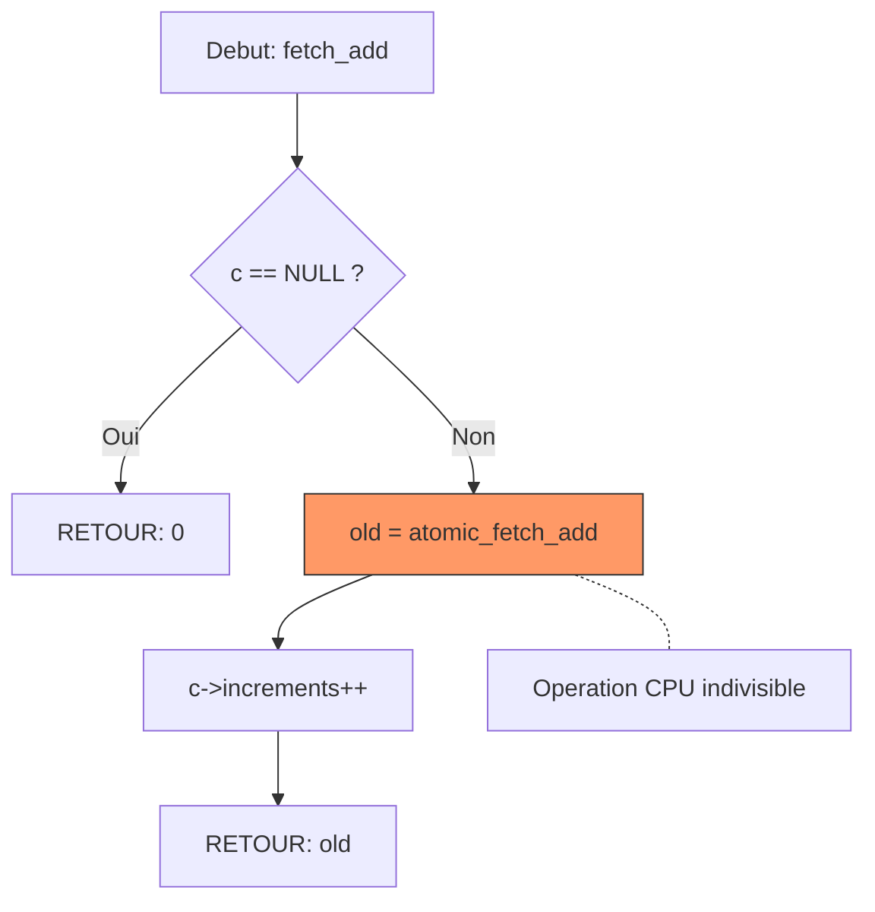

# Exercice 2.4.6 : quantum_spin_counter

**Module :**
2.4 — Concurrency & Synchronization

**Concept :**
a-k — Atomic Operations & Memory Ordering

**Difficulte :**
★★★★★★★☆☆☆ (7/10)

**Type :**
complet

**Tiers :**
2 — Melange (concepts atomics + memory ordering + CAS)

**Langage :**
C (C17)

**Prerequis :**
- Threads POSIX (pthread)
- Pointeurs et gestion memoire
- Concepts de concurrence (Module 2.4.1-2.4.5)

**Domaines :**
Mem, Process, CPU

**Duree estimee :**
360 min

**XP Base :**
500

**Complexite :**
T3 O(1) par operation × S2 O(n) pour structures

---

## 📐 SECTION 1 : PROTOTYPE & CONSIGNE

### 1.1 Obligations

**Fichier a rendre :** `quantum_spin_counter.c`

**Fonctions autorisees :**
- `<stdatomic.h>` : atomic_load, atomic_store, atomic_fetch_add, atomic_fetch_sub, atomic_compare_exchange_strong, atomic_compare_exchange_weak, atomic_thread_fence
- `<pthread.h>` : pthread_create, pthread_join
- `<stdlib.h>` : malloc, free
- `<stdio.h>` : printf

**Fonctions interdites :**
- mutex (pthread_mutex_*)
- semaphores
- Toute autre primitive de synchronisation bloquante

### 1.2 Consigne

**🎬 INTERSTELLAR : Le Paradoxe du Compteur Quantique**

Dans le film Interstellar, Cooper doit transmettre des donnees depuis l'interieur du Tesseract - un espace ou le temps et les dimensions se chevauchent. Chaque "tick" de sa montre encode une information cruciale.

Ton compteur atomique est comme ce Tesseract : plusieurs threads (dimensions temporelles) tentent simultanement de modifier la meme valeur. Sans synchronisation atomique, les donnees seraient corrompues comme un signal brouille par la distorsion gravitationnelle.

Le **memory ordering** c'est comme les "regles du Tesseract" : elles definissent QUAND les modifications deviennent visibles aux autres dimensions. `memory_order_seq_cst` est la regle la plus stricte (tout le monde voit tout dans le meme ordre), tandis que `memory_order_relaxed` permet des "anomalies temporelles" (reordonnancement).

**Ta mission :**

Implementer un compteur atomique thread-safe qui utilise les operations atomiques C11 pour gerer des increments/decrements concurrents sans mutex, et demontrer l'impact du memory ordering.

**Entree :**
- `counter` : pointeur vers la structure atomic_counter_t
- `value` : valeur initiale ou delta selon l'operation
- `expected` : valeur attendue pour CAS

**Sortie :**
- Operations load/store : valeur lue ou void
- Operations fetch_* : ancienne valeur avant modification
- Operations CAS : true si succes, false sinon (avec mise a jour de expected)

**Contraintes :**
- Aucun mutex autorise
- Utiliser uniquement les atomics C11
- Gerer correctement tous les memory orderings
- Le compteur doit etre coherent apres N threads × M operations

**Exemples :**

| Appel | Retour | Explication |
|-------|--------|-------------|
| `quantum_counter_init(&c, 0)` | void | Initialise a 0 |
| `quantum_counter_fetch_add(&c, 5)` | 0 | Retourne ancienne valeur, incremente de 5 |
| `quantum_counter_load(&c)` | 5 | Lit la valeur actuelle |
| `quantum_counter_cas(&c, &exp, 10)` | true/false | CAS atomique |

### 1.3 Prototype

```c
#include <stdatomic.h>
#include <stdbool.h>
#include <stdint.h>

typedef struct {
    _Atomic int value;
    uint64_t increments;
    uint64_t decrements;
    uint64_t cas_successes;
    uint64_t cas_failures;
} atomic_counter_t;

// Initialisation
void quantum_counter_init(atomic_counter_t *c, int initial);

// Operations de base
int quantum_counter_load(atomic_counter_t *c);
void quantum_counter_store(atomic_counter_t *c, int value);

// Fetch operations
int quantum_counter_fetch_add(atomic_counter_t *c, int delta);
int quantum_counter_fetch_sub(atomic_counter_t *c, int delta);

// Compare-and-swap
bool quantum_counter_cas(atomic_counter_t *c, int *expected, int desired);
bool quantum_counter_cas_weak(atomic_counter_t *c, int *expected, int desired);

// Memory ordering variants
int quantum_load_acquire(atomic_counter_t *c);
void quantum_store_release(atomic_counter_t *c, int value);
int quantum_load_relaxed(atomic_counter_t *c);
void quantum_store_relaxed(atomic_counter_t *c, int value);
```

### 1.4 Consigne Academique

Implementer une structure de compteur atomique utilisant les primitives `<stdatomic.h>` de C11. Le compteur doit supporter :
1. Operations atomiques de lecture/ecriture (load/store)
2. Operations read-modify-write (fetch_add, fetch_sub)
3. Compare-and-swap (CAS) strong et weak
4. Differents memory orderings (seq_cst, acquire, release, relaxed)

L'objectif est de demontrer la difference entre les operations atomiques et les mutex, ainsi que l'impact des memory orderings sur la performance et la correction.

---

## 💡 SECTION 2 : LE SAVIEZ-VOUS ?

### 2.1 Atomics : L'ADN du Lock-Free

Les operations atomiques sont des instructions CPU **indivisibles**. Quand tu fais `atomic_fetch_add(&x, 1)`, le CPU garantit que :
1. La lecture de x
2. L'addition de 1
3. L'ecriture du resultat

Se font en UNE seule operation que personne ne peut interrompre. C'est comme si le temps s'arretait pour tout le monde sauf toi pendant cette microseconde.

### 2.2 Le Probleme ABA

Le CAS verifie si "la valeur est toujours A". Mais que se passe-t-il si :
1. Thread 1 lit A
2. Thread 2 change A → B → A
3. Thread 1 fait CAS(A → C) et REUSSIT !

Thread 1 pense que rien n'a change, mais Thread 2 a fait des modifications entre-temps. C'est le **probleme ABA** - resolu par les tagged pointers (exercice suivant).

### 2.3 Memory Ordering : La Relativite Restreinte du CPU

Comme dans la relativite, deux observateurs (cores CPU) peuvent voir les evenements dans un ordre different ! Le **memory ordering** controle ces "deformations temporelles" :

- `seq_cst` : Tout le monde voit tout dans le meme ordre (le plus lent mais le plus sur)
- `acquire/release` : Synchronisation point-a-point (comme un passage de temoin)
- `relaxed` : Aucune garantie d'ordre (le plus rapide mais dangereux)

---

## 🏢 SECTION 2.5 : DANS LA VRAIE VIE

### Metiers utilisant les Atomics

| Metier | Cas d'usage |
|--------|-------------|
| **Developpeur Kernel** | Compteurs de reference dans le noyau Linux |
| **Developpeur Database** | Indexes concurrents, MVCC |
| **Game Developer** | Stats de jeu temps-reel, physique multi-thread |
| **HFT Developer** | Trading haute frequence, latence sub-microseconde |
| **Embedded Systems** | Interrupts handlers, DMA buffers |

### Exemple Concret : Le Compteur de References

```c
// Dans le kernel Linux, chaque fichier ouvert a un compteur atomique
struct file {
    atomic_t f_count;  // Combien de processus utilisent ce fichier ?
    // ...
};

// Quand un process ouvre le fichier
atomic_inc(&file->f_count);

// Quand il le ferme
if (atomic_dec_and_test(&file->f_count)) {
    // Je suis le dernier, je peux liberer la ressource
    free_file(file);
}
```

---

## 🖥️ SECTION 3 : EXEMPLE D'UTILISATION

### 3.0 Session bash

```bash
$ ls
quantum_spin_counter.c  main.c

$ gcc -Wall -Wextra -Werror -std=c17 quantum_spin_counter.c main.c -o test -lpthread

$ ./test
=== Quantum Spin Counter Test ===
Initial value: 0
After 4 threads x 100000 increments: 400000
Expected: 400000
Status: PASS

CAS test: expected=400000, desired=0
CAS result: SUCCESS
Value after CAS: 0

Memory ordering test completed.
All tests passed!
```

---

## ⚡ SECTION 3.1 : BONUS EXPERT (OPTIONNEL)

**Difficulte Bonus :**
💀 (8/10)

**Recompense :**
XP ×4

**Time Complexity attendue :**
O(1) amorti par operation

**Space Complexity attendue :**
O(1)

**Domaines Bonus :**
`CPU, Mem, Probas`

### 3.1.1 Consigne Bonus

**🎬 TENET : L'Inversion Temporelle des Atomics**

Comme dans Tenet ou le temps peut s'ecouler dans les deux sens, implemente un compteur qui supporte des operations "inversees dans le temps" : un **undo atomique** utilisant un CAS loop.

**Ta mission :**

Implementer `quantum_atomic_max()` qui met a jour atomiquement le compteur avec le maximum entre sa valeur actuelle et une nouvelle valeur, en utilisant un CAS loop.

**Contraintes :**
```
┌─────────────────────────────────────────┐
│  Aucun mutex autorise                   │
│  Utiliser uniquement CAS               │
│  O(1) amorti (quelques retries OK)     │
│  Gerer les cas de contention           │
└─────────────────────────────────────────┘
```

### 3.1.2 Prototype Bonus

```c
// Met a jour atomiquement : counter = max(counter, new_val)
// Retourne l'ancienne valeur
int quantum_atomic_max(atomic_counter_t *c, int new_val);

// Met a jour atomiquement : counter = min(counter, new_val)
int quantum_atomic_min(atomic_counter_t *c, int new_val);

// Incremente seulement si < limit, retourne true si incremente
bool quantum_bounded_increment(atomic_counter_t *c, int limit);
```

### 3.1.3 Ce qui change par rapport a l'exercice de base

| Aspect | Base | Bonus |
|--------|------|-------|
| Operations | fetch_add/sub simples | CAS loop complexe |
| Logique | Increment/decrement | Comparaison + mise a jour conditionnelle |
| Retry | Non necessaire | Gestion des contentions |
| Complexite mentale | Moyenne | Elevee (raisonnement lock-free) |

---

## ✅❌ SECTION 4 : ZONE CORRECTION

### 4.1 Moulinette

| Test | Entree | Sortie Attendue | Points |
|------|--------|-----------------|--------|
| init_zero | `init(&c, 0)` | `load(&c) == 0` | 5 |
| init_value | `init(&c, 42)` | `load(&c) == 42` | 5 |
| fetch_add_single | `fetch_add(&c, 5)` | retourne 0, valeur 5 | 10 |
| fetch_sub_single | `fetch_sub(&c, 3)` | retourne 5, valeur 2 | 10 |
| cas_success | `cas(&c, &exp, 10)` | true, valeur 10 | 10 |
| cas_failure | `cas(&c, &wrong, 20)` | false, exp mis a jour | 10 |
| concurrent_4_threads | 4 threads × 100000 | 400000 exact | 20 |
| memory_ordering | acquire/release test | Pas de data race | 15 |
| cas_weak_retry | CAS weak avec contention | Resultat correct | 15 |

### 4.2 main.c de test

```c
#include <stdio.h>
#include <pthread.h>
#include <assert.h>
#include "quantum_spin_counter.h"

#define NUM_THREADS 4
#define ITERATIONS 100000

atomic_counter_t global_counter;

void *increment_worker(void *arg) {
    (void)arg;
    for (int i = 0; i < ITERATIONS; i++) {
        quantum_counter_fetch_add(&global_counter, 1);
    }
    return NULL;
}

void test_concurrent_increments(void) {
    printf("Test: Concurrent increments\n");
    quantum_counter_init(&global_counter, 0);

    pthread_t threads[NUM_THREADS];
    for (int i = 0; i < NUM_THREADS; i++) {
        pthread_create(&threads[i], NULL, increment_worker, NULL);
    }
    for (int i = 0; i < NUM_THREADS; i++) {
        pthread_join(threads[i], NULL);
    }

    int final = quantum_counter_load(&global_counter);
    int expected = NUM_THREADS * ITERATIONS;
    printf("  Result: %d, Expected: %d\n", final, expected);
    assert(final == expected);
    printf("  PASS\n");
}

void test_cas_operations(void) {
    printf("Test: CAS operations\n");
    atomic_counter_t c;
    quantum_counter_init(&c, 100);

    int expected = 100;
    bool success = quantum_counter_cas(&c, &expected, 200);
    assert(success == true);
    assert(quantum_counter_load(&c) == 200);
    printf("  CAS success: PASS\n");

    expected = 100;  // Wrong expectation
    success = quantum_counter_cas(&c, &expected, 300);
    assert(success == false);
    assert(expected == 200);  // Updated to actual value
    printf("  CAS failure + update: PASS\n");
}

void test_memory_ordering(void) {
    printf("Test: Memory ordering\n");
    atomic_counter_t c;
    quantum_counter_init(&c, 0);

    quantum_store_release(&c, 42);
    int val = quantum_load_acquire(&c);
    assert(val == 42);

    quantum_store_relaxed(&c, 100);
    val = quantum_load_relaxed(&c);
    assert(val == 100);

    printf("  Memory ordering: PASS\n");
}

int main(void) {
    printf("=== Quantum Spin Counter Tests ===\n\n");

    test_concurrent_increments();
    test_cas_operations();
    test_memory_ordering();

    printf("\nAll tests passed!\n");
    return 0;
}
```

### 4.3 Solution de reference

```c
#include <stdatomic.h>
#include <stdbool.h>
#include <stdint.h>

typedef struct {
    _Atomic int value;
    uint64_t increments;
    uint64_t decrements;
    uint64_t cas_successes;
    uint64_t cas_failures;
} atomic_counter_t;

void quantum_counter_init(atomic_counter_t *c, int initial) {
    if (c == NULL)
        return;
    atomic_store(&c->value, initial);
    c->increments = 0;
    c->decrements = 0;
    c->cas_successes = 0;
    c->cas_failures = 0;
}

int quantum_counter_load(atomic_counter_t *c) {
    if (c == NULL)
        return 0;
    return atomic_load(&c->value);
}

void quantum_counter_store(atomic_counter_t *c, int value) {
    if (c == NULL)
        return;
    atomic_store(&c->value, value);
}

int quantum_counter_fetch_add(atomic_counter_t *c, int delta) {
    if (c == NULL)
        return 0;
    int old = atomic_fetch_add(&c->value, delta);
    c->increments++;
    return old;
}

int quantum_counter_fetch_sub(atomic_counter_t *c, int delta) {
    if (c == NULL)
        return 0;
    int old = atomic_fetch_sub(&c->value, delta);
    c->decrements++;
    return old;
}

bool quantum_counter_cas(atomic_counter_t *c, int *expected, int desired) {
    if (c == NULL || expected == NULL)
        return false;
    bool success = atomic_compare_exchange_strong(&c->value, expected, desired);
    if (success)
        c->cas_successes++;
    else
        c->cas_failures++;
    return success;
}

bool quantum_counter_cas_weak(atomic_counter_t *c, int *expected, int desired) {
    if (c == NULL || expected == NULL)
        return false;
    bool success = atomic_compare_exchange_weak(&c->value, expected, desired);
    if (success)
        c->cas_successes++;
    else
        c->cas_failures++;
    return success;
}

int quantum_load_acquire(atomic_counter_t *c) {
    if (c == NULL)
        return 0;
    return atomic_load_explicit(&c->value, memory_order_acquire);
}

void quantum_store_release(atomic_counter_t *c, int value) {
    if (c == NULL)
        return;
    atomic_store_explicit(&c->value, value, memory_order_release);
}

int quantum_load_relaxed(atomic_counter_t *c) {
    if (c == NULL)
        return 0;
    return atomic_load_explicit(&c->value, memory_order_relaxed);
}

void quantum_store_relaxed(atomic_counter_t *c, int value) {
    if (c == NULL)
        return;
    atomic_store_explicit(&c->value, value, memory_order_relaxed);
}
```

### 4.4 Solutions alternatives acceptees

```c
// Alternative 1: Utilisation de __atomic builtins GCC
int quantum_counter_fetch_add_gcc(atomic_counter_t *c, int delta) {
    if (c == NULL)
        return 0;
    return __atomic_fetch_add(&c->value, delta, __ATOMIC_SEQ_CST);
}

// Alternative 2: CAS loop pour fetch_add (moins efficace mais valide)
int quantum_counter_fetch_add_cas(atomic_counter_t *c, int delta) {
    if (c == NULL)
        return 0;
    int old = atomic_load(&c->value);
    while (!atomic_compare_exchange_weak(&c->value, &old, old + delta)) {
        // old est mis a jour automatiquement
    }
    return old;
}
```

### 4.5 Solutions refusees

```c
// REFUSE 1: Utilisation de mutex
int quantum_counter_fetch_add_REFUSE(atomic_counter_t *c, int delta) {
    pthread_mutex_lock(&mutex);  // INTERDIT!
    int old = c->value;
    c->value += delta;
    pthread_mutex_unlock(&mutex);
    return old;
}
// Pourquoi refuse: L'exercice demande explicitement des atomics sans mutex

// REFUSE 2: Pas de verification NULL
int quantum_counter_load_REFUSE(atomic_counter_t *c) {
    return atomic_load(&c->value);  // Crash si c == NULL
}
// Pourquoi refuse: Comportement indefini sur NULL

// REFUSE 3: Memory ordering incorrect pour synchronisation
void quantum_store_release_REFUSE(atomic_counter_t *c, int value) {
    atomic_store_explicit(&c->value, value, memory_order_relaxed);
}
// Pourquoi refuse: La fonction est censee utiliser memory_order_release
```

### 4.6 Solution bonus de reference

```c
int quantum_atomic_max(atomic_counter_t *c, int new_val) {
    if (c == NULL)
        return 0;

    int old = atomic_load(&c->value);
    while (old < new_val) {
        if (atomic_compare_exchange_weak(&c->value, &old, new_val)) {
            return old;  // Succes, retourne ancienne valeur
        }
        // old est mis a jour avec la valeur actuelle, on reteste
    }
    return old;  // new_val <= old, pas de mise a jour necessaire
}

int quantum_atomic_min(atomic_counter_t *c, int new_val) {
    if (c == NULL)
        return 0;

    int old = atomic_load(&c->value);
    while (old > new_val) {
        if (atomic_compare_exchange_weak(&c->value, &old, new_val)) {
            return old;
        }
    }
    return old;
}

bool quantum_bounded_increment(atomic_counter_t *c, int limit) {
    if (c == NULL)
        return false;

    int old = atomic_load(&c->value);
    while (old < limit) {
        if (atomic_compare_exchange_weak(&c->value, &old, old + 1)) {
            return true;  // Increment reussi
        }
        // Retry avec la nouvelle valeur de old
    }
    return false;  // Limite atteinte
}
```

### 4.7 Solutions alternatives bonus

```c
// Alternative: Utiliser CAS strong au lieu de weak (moins performant mais correct)
int quantum_atomic_max_strong(atomic_counter_t *c, int new_val) {
    if (c == NULL)
        return 0;

    int old = atomic_load(&c->value);
    while (old < new_val) {
        if (atomic_compare_exchange_strong(&c->value, &old, new_val)) {
            return old;
        }
    }
    return old;
}
```

### 4.8 Solutions refusees bonus

```c
// REFUSE: Pas de loop, une seule tentative
int quantum_atomic_max_REFUSE(atomic_counter_t *c, int new_val) {
    int old = atomic_load(&c->value);
    if (old < new_val) {
        atomic_compare_exchange_strong(&c->value, &old, new_val);
    }
    return old;
}
// Pourquoi refuse: Si CAS echoue a cause de contention, le max n'est pas applique
```

### 4.9 spec.json

```json
{
  "name": "quantum_spin_counter",
  "language": "c",
  "type": "code",
  "tier": 2,
  "tier_info": "Melange atomics + memory ordering + CAS",
  "tags": ["atomics", "concurrency", "lockfree", "phase2"],
  "passing_score": 70,

  "function": {
    "name": "quantum_counter_fetch_add",
    "prototype": "int quantum_counter_fetch_add(atomic_counter_t *c, int delta)",
    "return_type": "int",
    "parameters": [
      {"name": "c", "type": "atomic_counter_t *"},
      {"name": "delta", "type": "int"}
    ]
  },

  "driver": {
    "reference": "int ref_quantum_counter_fetch_add(atomic_counter_t *c, int delta) { if (c == NULL) return 0; int old = atomic_fetch_add(&c->value, delta); c->increments++; return old; }",

    "edge_cases": [
      {
        "name": "null_counter",
        "args": [null, 5],
        "expected": 0,
        "is_trap": true,
        "trap_explanation": "Counter NULL doit retourner 0 sans crash"
      },
      {
        "name": "zero_delta",
        "args": ["counter_at_10", 0],
        "expected": 10,
        "is_trap": false
      },
      {
        "name": "positive_delta",
        "args": ["counter_at_0", 42],
        "expected": 0,
        "is_trap": false
      },
      {
        "name": "negative_delta",
        "args": ["counter_at_100", -30],
        "expected": 100,
        "is_trap": false
      },
      {
        "name": "concurrent_increments",
        "args": ["4_threads_100000_each"],
        "expected": 400000,
        "is_trap": true,
        "trap_explanation": "Test de concurrence - doit etre atomique"
      }
    ],

    "fuzzing": {
      "enabled": true,
      "iterations": 1000,
      "generators": [
        {
          "type": "int",
          "param_index": 1,
          "params": {
            "min": -1000000,
            "max": 1000000
          }
        }
      ]
    }
  },

  "norm": {
    "allowed_functions": ["atomic_load", "atomic_store", "atomic_fetch_add", "atomic_fetch_sub", "atomic_compare_exchange_strong", "atomic_compare_exchange_weak", "atomic_load_explicit", "atomic_store_explicit", "atomic_thread_fence"],
    "forbidden_functions": ["pthread_mutex_lock", "pthread_mutex_unlock", "pthread_mutex_init", "sem_wait", "sem_post"],
    "check_security": true,
    "check_memory": true,
    "blocking": true
  }
}
```

### 4.10 Solutions Mutantes (5 minimum)

```c
/* Mutant A (Boundary) : Pas de verification NULL */
int quantum_counter_fetch_add_mutant_a(atomic_counter_t *c, int delta) {
    // BUG: Pas de verification NULL
    int old = atomic_fetch_add(&c->value, delta);
    c->increments++;
    return old;
}
// Pourquoi c'est faux : Crash si c == NULL (segmentation fault)
// Ce qui etait pense : "Le caller verifiera toujours"

/* Mutant B (Safety) : Utilisation non-atomique */
int quantum_counter_fetch_add_mutant_b(atomic_counter_t *c, int delta) {
    if (c == NULL)
        return 0;
    // BUG: Lecture et ecriture separees = race condition
    int old = c->value;  // Non-atomique!
    c->value = old + delta;  // Non-atomique!
    c->increments++;
    return old;
}
// Pourquoi c'est faux : Race condition entre threads, resultat incorrect
// Ce qui etait pense : "Les operations simples sont atomiques"

/* Mutant C (Resource) : Memory ordering relaxed partout */
int quantum_counter_fetch_add_mutant_c(atomic_counter_t *c, int delta) {
    if (c == NULL)
        return 0;
    // BUG: Relaxed ordering peut causer des problemes de visibilite
    int old = atomic_fetch_add_explicit(&c->value, delta, memory_order_relaxed);
    c->increments++;  // Cette stat pourrait ne pas etre visible immediatement
    return old;
}
// Pourquoi c'est faux : Pour un compteur simple ca marche, mais les stats ne sont pas synchronisees
// Ce qui etait pense : "Relaxed est plus rapide, autant l'utiliser partout"

/* Mutant D (Logic) : Retourne la nouvelle valeur au lieu de l'ancienne */
int quantum_counter_fetch_add_mutant_d(atomic_counter_t *c, int delta) {
    if (c == NULL)
        return 0;
    // BUG: Retourne new au lieu de old
    atomic_fetch_add(&c->value, delta);
    c->increments++;
    return atomic_load(&c->value);  // Retourne la NOUVELLE valeur!
}
// Pourquoi c'est faux : La semantique de fetch_add est de retourner l'ANCIENNE valeur
// Ce qui etait pense : "C'est plus utile de retourner la nouvelle valeur"

/* Mutant E (Return) : Oubli du return, undefined behavior */
int quantum_counter_fetch_add_mutant_e(atomic_counter_t *c, int delta) {
    if (c == NULL)
        return 0;
    atomic_fetch_add(&c->value, delta);
    c->increments++;
    // BUG: Pas de return!
}
// Pourquoi c'est faux : Comportement indefini, retourne une valeur aleatoire
// Ce qui etait pense : "Oubli simple"
```

---

## 🧠 SECTION 5 : COMPRENDRE

### 5.1 Ce que cet exercice enseigne

1. **Operations atomiques C11** : Utiliser `<stdatomic.h>` pour des operations thread-safe
2. **Memory ordering** : Comprendre les garanties de visibilite entre threads
3. **CAS (Compare-And-Swap)** : La primitive fondamentale du lock-free
4. **Difference strong vs weak** : Quand utiliser chaque variante
5. **Performance vs Correction** : Le compromis memory ordering

### 5.2 LDA — Traduction Litterale (MAJUSCULES)

```
FONCTION quantum_counter_fetch_add QUI RETOURNE UN ENTIER ET PREND EN PARAMETRES c QUI EST UN POINTEUR VERS atomic_counter_t ET delta QUI EST UN ENTIER
DEBUT FONCTION
    SI c EST EGAL A NUL ALORS
        RETOURNER LA VALEUR 0
    FIN SI

    DECLARER old COMME ENTIER
    AFFECTER L'OPERATION ATOMIQUE FETCH_ADD SUR LE CHAMP value DE c AVEC delta A old
    INCREMENTER LE CHAMP increments DE c DE 1
    RETOURNER LA VALEUR DE old
FIN FONCTION
```

### 5.2.2 LDA Style Academique

```
Algorithme: IncrementAtomique
Entrees: c (pointeur vers compteur), delta (entier)
Sortie: ancienne valeur (entier)

DEBUT
    SI c = NULL ALORS
        RETOURNER 0
    FIN SI

    old <- FETCH_AND_ADD(c.value, delta)  // Operation atomique
    c.increments <- c.increments + 1
    RETOURNER old
FIN
```

### 5.2.2.1 Logic Flow (Structured English)

```
ALGORITHME : Fetch-And-Add Atomique
---
1. VERIFIER que le pointeur n'est pas NULL
   |-- SI NULL : RETOURNER 0 immediatement

2. EXECUTER l'operation atomique fetch_add
   |-- Lire la valeur actuelle (old)
   |-- Ajouter delta
   |-- Ecrire le resultat
   |-- TOUT CECI EN UNE INSTRUCTION INDIVISIBLE

3. INCREMENTER le compteur de statistiques

4. RETOURNER l'ancienne valeur (old)
```

### 5.2.3 Representation Algorithmique

```
FONCTION : quantum_counter_fetch_add(c, delta)
---
INIT old = 0

1. GARDE : Verifier c != NULL
   |
   |-- SI c == NULL :
   |     RETOURNER 0
   |
   |-- SINON : Continuer

2. OPERATION ATOMIQUE :
   |
   |-- old = atomic_fetch_add(&c->value, delta)
   |     [CPU garantit l'indivisibilite]
   |
   |-- c->increments++  [Statistique, non-critique]

3. RETOURNER old
```

### 5.2.3.1 Diagramme Mermaid



### 5.3 Visualisation ASCII

```
=== FETCH_ADD ATOMIQUE ===

Thread 1                    Thread 2                    Memoire
────────                    ────────                    ───────
                                                        value = 10

fetch_add(&val, 5)          fetch_add(&val, 3)
    │                           │
    ▼                           ▼
┌─────────────────────────────────────────────────────────────────┐
│                     CPU ATOMIC UNIT                             │
│  ┌──────────────┐                      ┌──────────────┐        │
│  │ 1. Lire: 10  │                      │ 1. Lire: 15  │        │
│  │ 2. Add: +5   │ ◄── SERIALIZE ──►    │ 2. Add: +3   │        │
│  │ 3. Write: 15 │                      │ 3. Write: 18 │        │
│  └──────────────┘                      └──────────────┘        │
│        │                                      │                 │
│        ▼                                      ▼                 │
│   Return: 10                            Return: 15              │
└─────────────────────────────────────────────────────────────────┘
                                                        value = 18

Resultat: 10 + 5 + 3 = 18 (CORRECT!)
Sans atomics: pourrait etre 13 ou 15 (RACE CONDITION!)
```

```
=== MEMORY ORDERING ===

                    ACQUIRE                 RELEASE
                       │                       │
                       ▼                       ▼
Thread 1:     ─────────●═══════════════════════●─────────
              writes   │    SYNCHRONIZED       │  visible
              before   │                       │  after
                       │                       │
Thread 2:     ─────────●═══════════════════════●─────────
                       │                       │
                    RELEASE                 ACQUIRE

seq_cst: Tout est synchronise (le plus lent)
acquire/release: Synchronisation point-a-point
relaxed: Aucune garantie (le plus rapide)
```

### 5.4 Les pieges en detail

#### Piege 1: Non-atomicite des operations composees
```c
// PIEGE: ++ n'est PAS atomique!
counter++;  // = load + add + store (3 operations!)

// SOLUTION:
atomic_fetch_add(&counter, 1);  // 1 seule operation
```

#### Piege 2: ABA Problem avec CAS
```c
// Thread 1 lit A, se fait preempter
// Thread 2: A -> B -> A
// Thread 1: CAS(A, C) REUSSIT mais le contexte a change!

// Solution: Tagged pointers (voir ex07)
```

#### Piege 3: Memory ordering trop relaxed
```c
// PIEGE:
data = 42;
atomic_store_explicit(&ready, true, memory_order_relaxed);

// Thread 2 pourrait voir ready=true AVANT data=42!

// SOLUTION:
data = 42;
atomic_store_explicit(&ready, true, memory_order_release);
```

### 5.5 Cours Complet

#### Les Operations Atomiques

Une operation **atomique** est indivisible : elle s'execute completement ou pas du tout, sans qu'un autre thread puisse voir un etat intermediaire.

**Pourquoi c'est necessaire ?**

```c
// Ce code est BUGGE en multi-thread:
int counter = 0;

void increment(void) {
    counter++;  // 3 operations: load, add, store
}
```

Si deux threads executent `increment()` simultanement :
1. Thread A lit counter (0)
2. Thread B lit counter (0)  <- B n'a pas vu l'increment de A
3. Thread A ecrit 1
4. Thread B ecrit 1  <- Resultat: 1 au lieu de 2!

**Solution : Operations Atomiques**

```c
#include <stdatomic.h>

_Atomic int counter = 0;

void increment(void) {
    atomic_fetch_add(&counter, 1);  // Garantie atomique
}
```

#### Memory Ordering

Le CPU et le compilateur peuvent **reordonner** les instructions pour optimiser. Le memory ordering controle ce reordonnancement.

| Ordering | Garantie | Performance |
|----------|----------|-------------|
| `seq_cst` | Ordre total global | Lent |
| `acquire` | Pas de lecture avant | Moyen |
| `release` | Pas d'ecriture apres | Moyen |
| `acq_rel` | Les deux | Moyen |
| `relaxed` | Aucune | Rapide |

**Pattern classique : Publication**

```c
// Thread 1 (Producteur)
data = 42;                                          // Prepare data
atomic_store_explicit(&ready, true, memory_order_release);  // Publie

// Thread 2 (Consommateur)
while (!atomic_load_explicit(&ready, memory_order_acquire))
    ;  // Attend
printf("%d\n", data);  // Garantie de voir 42
```

#### CAS : Compare-And-Swap

CAS est la primitive fondamentale du lock-free. Elle fait 3 choses atomiquement :
1. Compare la valeur actuelle avec `expected`
2. Si egales, ecrit `desired`
3. Sinon, met a jour `expected` avec la valeur actuelle

```c
bool atomic_compare_exchange_strong(
    _Atomic T *obj,      // Pointeur vers l'atomique
    T *expected,         // Valeur attendue (mise a jour si echec!)
    T desired            // Nouvelle valeur si succes
);
```

**CAS Loop Pattern**
```c
int atomic_max(atomic_int *a, int new_val) {
    int old = atomic_load(a);
    while (old < new_val) {
        if (atomic_compare_exchange_weak(a, &old, new_val))
            return old;
        // Si echec, old contient maintenant la valeur actuelle
        // On reboucle pour retester
    }
    return old;
}
```

### 5.6 Normes avec explications pedagogiques

```
┌─────────────────────────────────────────────────────────────────┐
│ ❌ HORS NORME (compile, mais problematique)                      │
├─────────────────────────────────────────────────────────────────┤
│ _Atomic int* ptr;  // Pointeur vers int, ou int atomique?       │
├─────────────────────────────────────────────────────────────────┤
│ ✅ CONFORME                                                      │
├─────────────────────────────────────────────────────────────────┤
│ _Atomic(int*) ptr;     // Pointeur atomique vers int            │
│ int * _Atomic ptr;     // Meme chose, syntaxe alternative       │
│ atomic_int *ptr;       // Pointeur vers int atomique            │
├─────────────────────────────────────────────────────────────────┤
│ 📖 POURQUOI ?                                                   │
│ La syntaxe _Atomic peut etre ambigue. Utiliser les parentheses  │
│ ou les typedef (atomic_int) clarifie l'intention.               │
└─────────────────────────────────────────────────────────────────┘
```

### 5.7 Simulation avec trace d'execution

**Scenario : 2 threads font fetch_add simultanement**

```
┌───────┬──────────────────────────────────────────┬───────────┬───────────┬─────────────────────┐
│ Temps │ Action                                   │ Thread 1  │ Thread 2  │ counter.value       │
├───────┼──────────────────────────────────────────┼───────────┼───────────┼─────────────────────┤
│   0   │ Initialisation                           │   idle    │   idle    │         0           │
├───────┼──────────────────────────────────────────┼───────────┼───────────┼─────────────────────┤
│   1   │ T1 appelle fetch_add(&c, 5)              │ EXECUTE   │   idle    │         0           │
├───────┼──────────────────────────────────────────┼───────────┼───────────┼─────────────────────┤
│   2   │ T2 appelle fetch_add(&c, 3) EN MEME TEMPS│ EXECUTE   │ WAIT      │         -           │
│       │ CPU serialise les acces                  │           │ (locked)  │                     │
├───────┼──────────────────────────────────────────┼───────────┼───────────┼─────────────────────┤
│   3   │ T1 complete: retourne 0, value = 5      │ ret: 0    │ WAIT      │         5           │
├───────┼──────────────────────────────────────────┼───────────┼───────────┼─────────────────────┤
│   4   │ T2 execute maintenant: lit 5, ecrit 8   │   done    │ EXECUTE   │         5 -> 8      │
├───────┼──────────────────────────────────────────┼───────────┼───────────┼─────────────────────┤
│   5   │ T2 complete: retourne 5, value = 8      │   done    │ ret: 5    │         8           │
└───────┴──────────────────────────────────────────┴───────────┴───────────┴─────────────────────┘

Resultat final: 0 + 5 + 3 = 8 ✓
```

### 5.8 Mnemotechniques

#### 🎬 MEME : "This is fine" — Ne pas verifier NULL


Comme le chien dans le meme qui dit "This is fine" alors que tout brule autour de lui, ignorer un pointeur NULL dans une fonction atomique va faire crasher ton programme.

```c
int fetch_add(atomic_counter_t *c, int delta) {
    // 🔥 Ne sois pas ce chien!
    if (c == NULL)
        return 0;
    // Maintenant c'est vraiment fine
}
```

---

#### 🎬 MEME : "Interstellar - Le Tesseract" — Memory Ordering

Dans Interstellar, Cooper dans le Tesseract peut voir differents moments du temps, mais il doit respecter les regles pour communiquer.

- `seq_cst` = Cooper voit TOUT dans l'ordre chronologique
- `acquire/release` = Cooper envoie un message precis a un moment precis
- `relaxed` = Cooper voit des fragments sans ordre (chaos)

```c
// Comme Cooper qui doit synchroniser son message
data = 42;                    // Prepare le message
atomic_store_release(&ready, true);  // "MURPH! C'est moi!"
```

---

#### 💀 MEME : "CAS is like..." — Comprendre CAS

```
CAS c'est comme essayer de prendre le dernier croissant:

1. Tu regardes: "Il reste 1 croissant" (expected = 1)
2. Tu tends la main: "Je vais le prendre" (desired = 0)
3. DEUX SCENARIOS:

   a) SUCCESS: Le croissant est encore la
      → Tu le prends, le compteur passe a 0
      → Return: true

   b) FAILURE: Quelqu'un l'a pris entre-temps
      → Tu vois le plateau vide (expected = 0)
      → Return: false
      → Tu sais maintenant qu'il n'y en a plus
```

### 5.9 Applications pratiques

1. **Compteurs de metriques** : Stats en temps reel sans locks
2. **Reference counting** : Gestion memoire automatique (shared_ptr)
3. **Flags de signalisation** : Communication inter-threads
4. **Spin locks** : Verrous legers pour sections critiques courtes
5. **Lock-free data structures** : Queues, stacks sans contention

---

## ⚠️ SECTION 6 : PIEGES — RECAPITULATIF

| # | Piege | Consequence | Solution |
|---|-------|-------------|----------|
| 1 | `counter++` non-atomique | Race condition | `atomic_fetch_add` |
| 2 | Pas de verification NULL | Segfault | Toujours verifier |
| 3 | Memory ordering trop relaxed | Data race subtile | Utiliser acquire/release |
| 4 | CAS sans loop | Echec silencieux | Toujours boucler sur CAS |
| 5 | Confondre weak et strong | Spurious failures | Weak en loop, strong sinon |

---

## 📝 SECTION 7 : QCM

### Question 1
Quelle est la difference principale entre `atomic_fetch_add` et `counter++` ?

A) Aucune difference, les deux sont atomiques
B) `atomic_fetch_add` est plus lent mais identique
C) `counter++` est 3 operations (load, add, store), `atomic_fetch_add` est 1 operation indivisible
D) `atomic_fetch_add` ne fonctionne qu'avec des entiers positifs
E) `counter++` est atomique sur x86
F) `atomic_fetch_add` necessite un mutex interne
G) La difference est uniquement syntaxique
H) `atomic_fetch_add` retourne void, pas `counter++`
I) Les deux causent des race conditions
J) `atomic_fetch_add` est deprecated en C17

**Reponse : C**

---

### Question 2
Que se passe-t-il quand `atomic_compare_exchange_strong` echoue ?

A) Le programme crash
B) La fonction retourne -1
C) `expected` est mis a jour avec la valeur actuelle de l'atomique
D) `desired` est ecrit quand meme
E) Une exception est levee
F) Le thread est mis en attente
G) Rien, il faut verifier manuellement
H) La valeur atomique est mise a 0
I) Un signal SIGSEGV est envoye
J) Le compilateur genere un warning

**Reponse : C**

---

### Question 3
Quel memory ordering garantit que TOUS les threads voient les operations dans le MEME ordre ?

A) `memory_order_relaxed`
B) `memory_order_acquire`
C) `memory_order_release`
D) `memory_order_seq_cst`
E) `memory_order_acq_rel`
F) `memory_order_consume`
G) Aucun, c'est impossible
H) Tous les orderings garantissent cela
I) `memory_order_volatile`
J) `memory_order_atomic`

**Reponse : D**

---

### Question 4
Dans le pattern acquire/release, quel ordering utilise le PRODUCTEUR ?

A) acquire pour ecrire
B) release pour ecrire
C) seq_cst pour tout
D) relaxed pour ecrire
E) acquire pour lire
F) release pour lire
G) Peu importe
H) consume pour ecrire
I) acq_rel pour ecrire
J) Aucun ordering necessaire

**Reponse : B**

---

### Question 5
Quelle est la difference entre `atomic_compare_exchange_weak` et `strong` ?

A) Weak est plus rapide mais peut echouer "spuriously" (sans raison)
B) Strong est plus rapide
C) Weak ne met pas a jour `expected`
D) Strong peut causer des deadlocks
E) Weak n'existe pas en C11
F) Strong est deprecated
G) Weak necessite un mutex
H) Aucune difference
I) Strong est bloquant, weak non-bloquant
J) Weak ne fonctionne qu'avec des pointeurs

**Reponse : A**

---

### Question 6
Que retourne `atomic_fetch_add(&val, 5)` si val contenait 10 ?

A) 15 (la nouvelle valeur)
B) 10 (l'ancienne valeur)
C) 5 (le delta)
D) true/false
E) void
F) -1 si erreur
G) Un pointeur vers val
H) 0 toujours
I) Undefined behavior
J) La somme des deux

**Reponse : B**

---

### Question 7
Pourquoi utiliser `memory_order_relaxed` ?

A) C'est toujours le meilleur choix
B) Pour les compteurs ou l'ordre exact n'a pas d'importance
C) Pour eviter les race conditions
D) C'est le defaut en C11
E) Pour synchroniser entre threads
F) Jamais, c'est toujours dangereux
G) Pour les operations bloquantes
H) C'est requis par POSIX
I) Pour le debugging
J) Pour la portabilite

**Reponse : B**

---

### Question 8
Quel est le probleme ABA ?

A) Un bug du compilateur
B) Une valeur passe de A a B a A, trompant un CAS
C) Un overflow atomique
D) Une race condition classique
E) Un probleme de memory ordering
F) Un deadlock atomique
G) Une erreur de syntaxe
H) Un probleme specifique a ARM
I) Un bug dans stdatomic.h
J) Une limitation du C11

**Reponse : B**

---

### Question 9
Comment implemente-t-on un "atomic max" avec CAS ?

A) `atomic_max(&val, x)` - fonction standard
B) Un CAS loop qui compare et met a jour si superieur
C) `atomic_fetch_max(&val, x)` uniquement
D) Impossible sans mutex
E) Avec `memory_order_max`
F) En utilisant atomic_exchange
G) Avec un spinlock
H) atomic_fetch_add avec valeur negative
I) En comparant apres le store
J) Avec atomic_flag

**Reponse : B**

---

### Question 10
Qu'est-ce qu'une operation "lock-free" ?

A) Une operation sans verrou physique
B) Une operation ou au moins un thread progresse toujours
C) Une operation plus rapide que mutex
D) Toute operation atomique
E) Une operation sans race condition
F) Une operation non-bloquante
G) Une operation wait-free
H) Une operation avec spinlock
I) Une operation sans CAS
J) Une operation portable

**Reponse : B**

---

## 📊 SECTION 8 : RECAPITULATIF

| Element | Valeur |
|---------|--------|
| Concepts couverts | atomic_load, atomic_store, fetch_add, fetch_sub, CAS strong/weak, memory ordering (seq_cst, acquire, release, relaxed) |
| Difficulte | 7/10 |
| Temps estime | 6h |
| Prerequis | Threads POSIX, pointeurs, concurrence de base |
| Points cles | Operations atomiques indivisibles, CAS loop pattern, memory ordering |

---

## 📦 SECTION 9 : DEPLOYMENT PACK

```json
{
  "deploy": {
    "hackbrain_version": "5.5.2",
    "engine_version": "v22.1",
    "exercise_slug": "2.4.6-quantum-spin-counter",
    "generated_at": "2026-01-17 10:00:00",

    "metadata": {
      "exercise_id": "2.4.6",
      "exercise_name": "quantum_spin_counter",
      "module": "2.4",
      "module_name": "Concurrency & Synchronization",
      "concept": "atomics",
      "concept_name": "Atomic Operations & Memory Ordering",
      "type": "code",
      "tier": 2,
      "tier_info": "Melange atomics + memory ordering + CAS",
      "phase": 2,
      "difficulty": 7,
      "difficulty_stars": "★★★★★★★☆☆☆",
      "language": "c",
      "duration_minutes": 360,
      "xp_base": 500,
      "xp_bonus_multiplier": 4,
      "bonus_tier": "EXPERT",
      "bonus_icon": "💀",
      "complexity_time": "T3 O(1)",
      "complexity_space": "S2 O(n)",
      "prerequisites": ["pthread", "pointers", "concurrency_basics"],
      "domains": ["Mem", "Process", "CPU"],
      "domains_bonus": ["Probas"],
      "tags": ["atomics", "lockfree", "memory_ordering", "CAS"],
      "meme_reference": "Interstellar Tesseract"
    },

    "files": {
      "spec.json": "/* Section 4.9 */",
      "references/ref_solution.c": "/* Section 4.3 */",
      "references/ref_solution_bonus.c": "/* Section 4.6 */",
      "alternatives/alt_1.c": "/* Section 4.4 */",
      "mutants/mutant_a_boundary.c": "/* Section 4.10 - Pas de verif NULL */",
      "mutants/mutant_b_safety.c": "/* Section 4.10 - Non-atomique */",
      "mutants/mutant_c_resource.c": "/* Section 4.10 - Relaxed partout */",
      "mutants/mutant_d_logic.c": "/* Section 4.10 - Retourne new */",
      "mutants/mutant_e_return.c": "/* Section 4.10 - Oubli return */",
      "tests/main.c": "/* Section 4.2 */"
    },

    "validation": {
      "expected_pass": [
        "references/ref_solution.c",
        "references/ref_solution_bonus.c",
        "alternatives/alt_1.c"
      ],
      "expected_fail": [
        "mutants/mutant_a_boundary.c",
        "mutants/mutant_b_safety.c",
        "mutants/mutant_c_resource.c",
        "mutants/mutant_d_logic.c",
        "mutants/mutant_e_return.c"
      ]
    },

    "commands": {
      "compile": "gcc -Wall -Wextra -Werror -std=c17 quantum_spin_counter.c main.c -o test -lpthread",
      "validate_spec": "python3 hackbrain_engine_v22.py --validate-spec spec.json",
      "test_reference": "python3 hackbrain_engine_v22.py -s spec.json -f references/ref_solution.c",
      "test_mutants": "python3 hackbrain_mutation_tester.py -r references/ref_solution.c -s spec.json --validate"
    }
  }
}
```

---

*HACKBRAIN v5.5.2 — L'excellence pedagogique ne se negocie pas*
*"Dans l'espace-temps des atomics, seul celui qui comprend le memory ordering peut transmettre ses donnees a travers les dimensions."*
