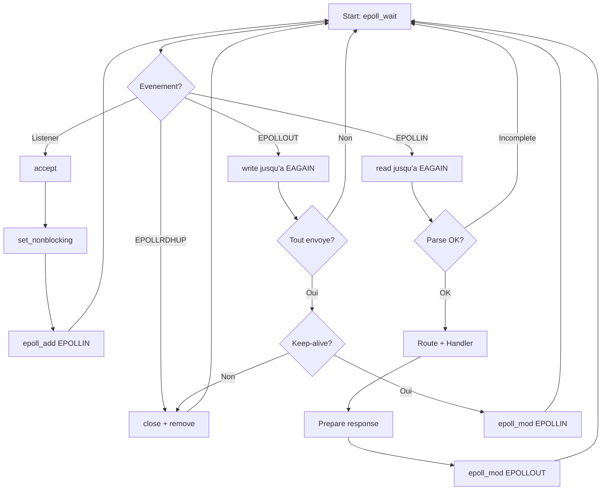

# Exercice 2.5.18-j : http_server_epoll

**Module :**
2.5.18 — Event-Driven Architecture

**Concept :**
j — Event-driven: epoll-based HTTP Server

**Difficulte :**
★★★★★★★☆☆☆ (7/10)

**Type :**
complet

**Tiers :**
3 — Synthese (concepts HTTP parsing + epoll + keep-alive + chunked transfer)

**Langage :**
Rust (Edition 2024)

**Prerequis :**
- 2.5.17.j (Chunked transfer encoding)
- 2.5.17.k (HTTP/1.1 Persistent connections)
- 2.5.18.a-i (Bases event-driven, epoll)
- Connaissance TCP/IP, sockets non-bloquants

**Domaines :**
Net, Process, Mem, Struct

**Duree estimee :**
180 min

**XP Base :**
500

**Complexite :**
T4 O(n) x S3 O(k) ou n = octets recus, k = connexions actives

---

## SECTION 1 : PROTOTYPE & CONSIGNE

### 1.1 Obligations

**Fichiers a rendre :**
```
src/
  lib.rs
  http/
    mod.rs
    parser.rs
    types.rs
    response.rs
  server/
    mod.rs
    epoll.rs
    connection.rs
Cargo.toml
```

**Fonctions/Crates autorises :**
- `std::net::{TcpListener, TcpStream}`
- `std::os::unix::io::{AsRawFd, RawFd}`
- `std::collections::HashMap`
- `std::io::{Read, Write}`
- `libc` (pour epoll syscalls)

**Fonctions/Crates interdits :**
- `tokio`, `async-std`, `mio` (on fait from scratch!)
- `hyper`, `actix-web`, `warp` (c'est de la triche)
- `epoll` crate (on wrappe nous-memes)

---

### 1.2 Consigne

## 2.4.1 ANALOGIE CULTURE : LE MCDONALD'S DRIVE-THROUGH

**Bienvenue au McDo de l'Internet, ou chaque paquet TCP est un client affame!**

Imagine que tu es le manager d'un McDonald's Drive-Through ultra-moderne. Ton job : gerer des centaines de voitures (connexions) simultanement sans qu'aucune n'attende trop longtemps.

```
                    MCDONALD'S DRIVE-THROUGH HTTP

    ┌─────────────────────────────────────────────────────────────┐
    │                                                             │
    │   VOITURE (Client)          MICRO (Socket)                  │
    │   ┌─────────┐               ┌─────────┐                     │
    │   │  GET /  │──────────────>│  epoll  │                     │
    │   │ burger  │   Commande    │  wait   │                     │
    │   └─────────┘   (Request)   └────┬────┘                     │
    │                                  │                          │
    │                                  v                          │
    │                           ┌───────────┐                     │
    │                           │  CUISINE  │                     │
    │                           │  (Parser) │                     │
    │                           │           │                     │
    │                           │ "1 Big Mac│                     │
    │                           │  + Frites"│                     │
    │                           └─────┬─────┘                     │
    │                                 │                           │
    │                                 v                           │
    │                           ┌───────────┐                     │
    │                           │ ASSEMBLAGE│                     │
    │                           │ (Response)│                     │
    │                           │           │                     │
    │                           │ HTTP/1.1  │                     │
    │                           │ 200 OK    │                     │
    │                           └─────┬─────┘                     │
    │                                 │                           │
    │   ┌─────────┐               ┌───┴───┐                       │
    │   │ PLATEAU │<──────────────│GUICHET│                       │
    │   │ (Body)  │   Livraison   │       │                       │
    │   └─────────┘               └───────┘                       │
    │                                                             │
    │   KEEP-ALIVE = Le client reste au guichet                   │
    │   pour commander autre chose!                               │
    │                                                             │
    └─────────────────────────────────────────────────────────────┘
```

**La correspondance parfaite :**

| McDo Drive-Through | Serveur HTTP |
|-------------------|--------------|
| Voiture qui arrive | Connexion TCP entrante |
| Commande au micro | HTTP Request (GET /menu) |
| Ticket en cuisine | Parsing de la requete |
| Cuisinier qui lit le ticket | `HttpParser::parse()` |
| Preparation du burger | Handler qui genere la reponse |
| Assemblage du plateau | `HttpResponse::serialize()` |
| Livraison au guichet | `write()` sur le socket |
| "Autre chose?" | Keep-Alive (HTTP/1.1) |
| Client qui repart | Connection: close |
| File d'attente multi-voies | epoll (multiple connexions) |
| Manager qui surveille tout | Event loop principale |

**Chunked Transfer = Menu "A volonte"**

Quand tu commandes les nuggets "a volonte", le serveur ne sait pas combien tu vas en manger. Il t'envoie des portions (chunks) jusqu'a ce que tu dises "stop" (chunk de taille 0).

```
┌─────────────────────────────────────────┐
│  CHUNKED TRANSFER = NUGGETS A VOLONTE   │
│                                         │
│  "5\r\n"      → 5 nuggets arrivent      │
│  "XXXXX\r\n"                            │
│                                         │
│  "3\r\n"      → 3 nuggets arrivent      │
│  "XXX\r\n"                              │
│                                         │
│  "0\r\n\r\n"  → "J'ai plus faim!"       │
│               (fin du repas)            │
└─────────────────────────────────────────┘
```

**Edge-Triggered epoll = Manager ultra-reactif**

Le manager (epoll) ne te previent qu'UNE FOIS quand un evenement arrive. Si tu rates le signal, tant pis! C'est comme un manager qui dit "voiture au micro 3" une seule fois - si tu n'ecoutes pas, la voiture attend indefiniment.

---

## 2.4.2 ENONCE ACADEMIQUE

### Description Technique

Implementer un serveur HTTP/1.1 complet utilisant le pattern event-driven avec l'API epoll de Linux. Le serveur doit etre capable de gerer des centaines de connexions simultanees de maniere non-bloquante, supporter les connexions persistantes (keep-alive) et le transfer encoding chunked.

### Objectifs Pedagogiques

1. **Comprendre le protocole HTTP/1.1** : Request line, headers, body, status codes
2. **Implementer un parser HTTP robuste** : Gestion des requetes incompletes, validation
3. **Maitriser epoll** : Edge-triggered, EPOLLIN, EPOLLOUT, EPOLLRDHUP
4. **Gerer les connexions persistantes** : Keep-alive par defaut en HTTP/1.1
5. **Supporter le chunked encoding** : Lecture et ecriture de chunks

### Architecture Requise

```
┌─────────────────────────────────────────────────────────────────┐
│                        HTTP SERVER                              │
├─────────────────────────────────────────────────────────────────┤
│                                                                 │
│  ┌─────────────┐    ┌─────────────┐    ┌─────────────┐         │
│  │ TcpListener │───>│   Epoll     │───>│ Connections │         │
│  │  (bind)     │    │ (event loop)│    │  (HashMap)  │         │
│  └─────────────┘    └──────┬──────┘    └─────────────┘         │
│                            │                                    │
│         ┌──────────────────┼──────────────────┐                │
│         │                  │                  │                │
│         v                  v                  v                │
│  ┌─────────────┐    ┌─────────────┐    ┌─────────────┐         │
│  │  EPOLLIN    │    │  EPOLLOUT   │    │ EPOLLRDHUP  │         │
│  │  (read)     │    │  (write)    │    │  (close)    │         │
│  └──────┬──────┘    └──────┬──────┘    └──────┬──────┘         │
│         │                  │                  │                │
│         v                  v                  v                │
│  ┌─────────────┐    ┌─────────────┐    ┌─────────────┐         │
│  │ HttpParser  │    │HttpResponse │    │  Cleanup    │         │
│  │   parse()   │    │ serialize() │    │  remove()   │         │
│  └─────────────┘    └─────────────┘    └─────────────┘         │
│                                                                 │
└─────────────────────────────────────────────────────────────────┘
```

### Specifications Fonctionnelles

**Ta mission :**

Ecrire un serveur HTTP event-driven qui:

1. **Accepte les connexions** sur un port configure
2. **Parse les requetes HTTP** (GET, POST, PUT, DELETE, HEAD, OPTIONS, PATCH)
3. **Route les requetes** vers des handlers configures
4. **Genere des reponses** HTTP/1.1 conformes
5. **Gere keep-alive** : connexions persistantes par defaut
6. **Supporte chunked** : transfer encoding pour contenu de taille inconnue

**Entree :**
- `addr: &str` : Adresse et port d'ecoute (ex: "127.0.0.1:8080")
- Handlers configures via `server.route(path, handler)`

**Sortie :**
- Serveur HTTP fonctionnel acceptant des connexions
- Reponses HTTP/1.1 valides

**Contraintes :**
- Pas de threads (single-threaded event loop)
- Pas de crates async (tokio, async-std)
- epoll uniquement (pas de select/poll)
- Edge-triggered mode obligatoire
- Supporter 100+ connexions simultanees

**Exemples :**

| Requete | Reponse | Explication |
|---------|---------|-------------|
| `GET / HTTP/1.1\r\nHost: localhost\r\n\r\n` | `HTTP/1.1 200 OK\r\n...` | Requete basique |
| `GET /404 HTTP/1.1\r\n...` | `HTTP/1.1 404 Not Found\r\n...` | Route non trouvee |
| `POST /api HTTP/1.1\r\nContent-Length: 5\r\n\r\nHello` | `HTTP/1.1 200 OK\r\n...` | POST avec body |
| `GET / HTTP/1.1\r\nConnection: close\r\n...` | `HTTP/1.1 200 OK\r\nConnection: close\r\n...` | Fermeture demandee |

---

### 1.3 Prototypes Principaux

```rust
// === HTTP Types ===
pub enum HttpMethod {
    GET, POST, PUT, DELETE, HEAD, OPTIONS, PATCH,
}

pub struct HttpRequest {
    pub method: HttpMethod,
    pub uri: String,
    pub version: HttpVersion,
    pub headers: HashMap<String, String>,
    pub body: Vec<u8>,
}

pub struct HttpResponse {
    pub status: HttpStatus,
    pub headers: HashMap<String, String>,
    pub body: ResponseBody,
}

// === Parser ===
pub struct HttpParser {
    max_header_size: usize,
    max_body_size: usize,
}

impl HttpParser {
    pub fn new() -> Self;
    pub fn parse(&self, buffer: &[u8]) -> Result<(HttpRequest, usize), ParseError>;
    pub fn parse_chunk(buffer: &[u8]) -> Result<(Vec<u8>, usize), ParseError>;
}

// === Server ===
pub struct HttpServer {
    listener: TcpListener,
    handlers: HashMap<String, Handler>,
    // ... epoll, connections
}

impl HttpServer {
    pub fn bind(addr: &str) -> std::io::Result<Self>;
    pub fn route(&mut self, path: &str, handler: Handler);
    pub fn run(&mut self) -> std::io::Result<()>;
}
```

---

## SECTION 2 : LE SAVIEZ-VOUS ?

### 2.1 Histoire de HTTP

HTTP (HyperText Transfer Protocol) a ete invente par Tim Berners-Lee en 1989 au CERN. La version 1.1, toujours massivement utilisee, date de 1997 (RFC 2068, puis RFC 2616 en 1999).

**Fun fact** : HTTP/1.0 ouvrait une nouvelle connexion TCP pour CHAQUE requete. Imagine telecharger une page web avec 50 images = 51 connexions TCP! HTTP/1.1 a introduit keep-alive pour resoudre ce probleme.

### 2.2 Pourquoi epoll?

| Methode | Complexite | Connexions Max | Usage |
|---------|------------|----------------|-------|
| `select()` | O(n) | 1024 (FD_SETSIZE) | Legacy |
| `poll()` | O(n) | Illimite | Portable |
| `epoll` | O(1) | Illimite | Linux moderne |
| `kqueue` | O(1) | Illimite | BSD/macOS |

epoll est ~100x plus rapide que select/poll pour 10,000+ connexions (le fameux probleme C10K).

### 2.3 Edge-Triggered vs Level-Triggered

```
Level-Triggered (LT):
  epoll_wait() retourne TANT QUE des donnees sont disponibles
  → Plus simple mais plus de syscalls

Edge-Triggered (ET):
  epoll_wait() retourne UNE SEULE FOIS quand l'etat change
  → Plus performant mais il faut lire/ecrire jusqu'a EAGAIN
```

---

## SECTION 2.5 : DANS LA VRAIE VIE

### Qui utilise ca?

| Metier | Cas d'usage |
|--------|-------------|
| **DevOps/SRE** | Comprendre nginx, HAProxy, Envoy |
| **Backend Developer** | Construire des API haute performance |
| **Game Developer** | Serveurs de jeu temps reel |
| **IoT Engineer** | Serveurs pour millions de devices |
| **Security Engineer** | Comprendre les attaques HTTP (slowloris, etc.) |

### Projets celebres bases sur epoll

- **nginx** : Serveur web #1 mondial
- **Redis** : Base de donnees in-memory
- **Node.js** : Runtime JavaScript (via libuv)
- **Envoy** : Proxy service mesh (Istio)

---

## SECTION 3 : EXEMPLE D'UTILISATION

### 3.0 Session bash

```bash
$ ls
Cargo.toml  src/

$ cargo build --release
   Compiling http_server v0.1.0
    Finished release [optimized] target(s) in 2.34s

$ cargo run --release -- 127.0.0.1:8080 &
[1] 12345
Server listening on 127.0.0.1:8080

$ curl -v http://127.0.0.1:8080/hello
*   Trying 127.0.0.1:8080...
* Connected to 127.0.0.1 (127.0.0.1) port 8080 (#0)
> GET /hello HTTP/1.1
> Host: 127.0.0.1:8080
> User-Agent: curl/7.68.0
> Accept: */*
>
< HTTP/1.1 200 OK
< Server: RustHTTP/1.0
< Date: 2024-01-15 12:00:00
< Content-Type: text/plain
< Content-Length: 13
< Connection: keep-alive
<
Hello, World!

$ curl http://127.0.0.1:8080/notfound
HTTP/1.1 404 Not Found
404 Not Found

$ # Test keep-alive (2 requetes sur meme connexion)
$ curl -v http://127.0.0.1:8080/hello http://127.0.0.1:8080/hello
* Re-using existing connection! (keep-alive)
...
```

---

## SECTION 3.1 : BONUS EXPERT (OPTIONNEL)

**Difficulte Bonus :**
💀 (10/10)

**Recompense :**
XP x4

**Time Complexity attendue :**
O(n) pour le parsing, O(1) pour epoll

**Space Complexity attendue :**
O(k) ou k = nombre de connexions actives

**Domaines Bonus :**
`Crypto, Compression`

### 3.1.1 Consigne Bonus

**Le McDo passe en mode "Michelin" - Service Premium**

Ton drive-through basique fonctionne, mais maintenant le patron veut:
1. **HTTPS** : Chiffrement TLS pour les commandes VIP
2. **Compression** : gzip pour reduire la taille des plateaux
3. **HTTP/2 multiplexing** : Plusieurs commandes sur le meme micro simultanement

**Ta mission :**

Etendre le serveur pour supporter:

1. **Static File Serving** avec detection MIME automatique
2. **Chunked Response Writing** pour le streaming
3. **Connection Timeout** (fermer les connexions inactives)
4. **Graceful Shutdown** (SIGTERM/SIGINT handling)

**Contraintes :**
```
┌─────────────────────────────────────────┐
│  Timeout connexion : 30 secondes        │
│  Max connexions : 10000                 │
│  Max header size : 8KB                  │
│  Max body size : 10MB                   │
│  Zero-copy file serving (sendfile)      │
└─────────────────────────────────────────┘
```

### 3.1.2 Prototype Bonus

```rust
impl HttpServer {
    pub fn serve_static(&mut self, prefix: &str, root: PathBuf);
    pub fn set_timeout(&mut self, duration: Duration);
    pub fn graceful_shutdown(&mut self) -> std::io::Result<()>;
}

impl HttpResponse {
    pub fn chunked<I>(self, chunks: I) -> Self
    where I: Iterator<Item = Vec<u8>> + Send + 'static;

    pub fn file(path: PathBuf) -> Self;
}

pub struct StaticFileServer {
    root: PathBuf,
}

impl StaticFileServer {
    pub fn new(root: impl Into<PathBuf>) -> Self;
    pub fn serve(&self, uri: &str) -> HttpResponse;
}
```

### 3.1.3 Ce qui change par rapport a l'exercice de base

| Aspect | Base | Bonus |
|--------|------|-------|
| Reponses | Body en memoire | Streaming + fichiers |
| Connexions | Illimitees | Timeout + max limit |
| Shutdown | Ctrl+C brutal | Graceful (finish requests) |
| Fichiers | Non | Static serving + MIME |
| Chunks | Lecture seule | Lecture + ecriture |

---

## SECTION 4 : ZONE CORRECTION (POUR LE TESTEUR)

### 4.1 Moulinette

| Test | Input | Expected | Points | Trap |
|------|-------|----------|--------|------|
| basic_get | `GET / HTTP/1.1\r\nHost: localhost\r\n\r\n` | 200 OK | 10 | Non |
| not_found | `GET /404 HTTP/1.1\r\n...` | 404 Not Found | 10 | Non |
| post_body | `POST /api HTTP/1.1\r\nContent-Length: 5\r\n\r\nHello` | 200 + body echo | 15 | Non |
| keep_alive_default | HTTP/1.1 sans Connection header | Connection: keep-alive | 15 | Oui |
| keep_alive_close | `Connection: close` | Connection: close + fermeture | 10 | Oui |
| http_1_0_no_keepalive | `GET / HTTP/1.0\r\n...` | Pas de keep-alive | 10 | Oui |
| http_1_0_explicit_keepalive | `GET / HTTP/1.0\r\nConnection: keep-alive\r\n...` | Keep-alive | 10 | Oui |
| chunked_request | `Transfer-Encoding: chunked` + chunks | Body reconstitue | 20 | Oui |
| bad_request_malformed | `INVALID REQUEST` | 400 Bad Request | 10 | Oui |
| large_header | Header > 8KB | 400 ou fermeture | 10 | Oui |
| concurrent_connections | 100 connexions simultanees | Toutes servies | 20 | Non |
| partial_request | Requete incomplete | Attente de plus de donnees | 10 | Oui |

### 4.2 main.rs de test

```rust
// tests/integration_test.rs
use http_server::*;
use std::io::{Read, Write};
use std::net::TcpStream;
use std::sync::Arc;
use std::thread;
use std::time::Duration;

#[test]
fn test_basic_get_request() {
    let server_thread = spawn_test_server("127.0.0.1:18080");
    thread::sleep(Duration::from_millis(100));

    let mut stream = TcpStream::connect("127.0.0.1:18080").unwrap();
    stream.write_all(b"GET /hello HTTP/1.1\r\nHost: localhost\r\n\r\n").unwrap();

    let mut response = String::new();
    stream.read_to_string(&mut response).unwrap();

    assert!(response.contains("HTTP/1.1 200 OK"));
    assert!(response.contains("Hello, World!"));
}

#[test]
fn test_keep_alive_http_1_1() {
    let parser = HttpParser::new();

    // HTTP/1.1 sans Connection header -> keep-alive par defaut
    let request = b"GET / HTTP/1.1\r\nHost: localhost\r\n\r\n";
    let (req, _) = parser.parse(request).unwrap();
    assert!(req.should_keep_alive());

    // HTTP/1.1 avec Connection: close
    let request = b"GET / HTTP/1.1\r\nHost: localhost\r\nConnection: close\r\n\r\n";
    let (req, _) = parser.parse(request).unwrap();
    assert!(!req.should_keep_alive());
}

#[test]
fn test_keep_alive_http_1_0() {
    let parser = HttpParser::new();

    // HTTP/1.0 sans header -> pas de keep-alive
    let request = b"GET / HTTP/1.0\r\nHost: localhost\r\n\r\n";
    let (req, _) = parser.parse(request).unwrap();
    assert!(!req.should_keep_alive());

    // HTTP/1.0 avec Keep-Alive explicite
    let request = b"GET / HTTP/1.0\r\nHost: localhost\r\nConnection: keep-alive\r\n\r\n";
    let (req, _) = parser.parse(request).unwrap();
    assert!(req.should_keep_alive());
}

#[test]
fn test_chunked_parsing() {
    let chunk = b"5\r\nHello\r\n";
    let (data, consumed) = HttpParser::parse_chunk(chunk).unwrap();
    assert_eq!(data, b"Hello");
    assert_eq!(consumed, 10);

    // Final chunk
    let final_chunk = b"0\r\n\r\n";
    let (data, _) = HttpParser::parse_chunk(final_chunk).unwrap();
    assert!(data.is_empty());
}

#[test]
fn test_response_serialization() {
    let response = HttpResponse::ok()
        .with_body(b"Hello, World!".to_vec())
        .with_content_type("text/plain");

    let serialized = response.serialize(true);
    let response_str = String::from_utf8_lossy(&serialized);

    assert!(response_str.contains("HTTP/1.1 200 OK"));
    assert!(response_str.contains("Content-Type: text/plain"));
    assert!(response_str.contains("Content-Length: 13"));
    assert!(response_str.contains("Connection: keep-alive"));
}

fn spawn_test_server(addr: &'static str) -> thread::JoinHandle<()> {
    thread::spawn(move || {
        let mut server = HttpServer::bind(addr).unwrap();
        server.route("/hello", Arc::new(|_req| {
            HttpResponse::ok()
                .with_body(b"Hello, World!".to_vec())
                .with_content_type("text/plain")
        }));
        server.run().unwrap();
    })
}
```

### 4.3 Solution de reference

```rust
// src/http/types.rs
use std::collections::HashMap;

#[derive(Debug, Clone, PartialEq)]
pub enum HttpMethod {
    GET, POST, PUT, DELETE, HEAD, OPTIONS, PATCH,
}

impl HttpMethod {
    pub fn parse(s: &str) -> Option<Self> {
        match s.to_uppercase().as_str() {
            "GET" => Some(Self::GET),
            "POST" => Some(Self::POST),
            "PUT" => Some(Self::PUT),
            "DELETE" => Some(Self::DELETE),
            "HEAD" => Some(Self::HEAD),
            "OPTIONS" => Some(Self::OPTIONS),
            "PATCH" => Some(Self::PATCH),
            _ => None,
        }
    }
}

#[derive(Debug, Clone)]
pub struct HttpVersion {
    pub major: u8,
    pub minor: u8,
}

impl HttpVersion {
    pub fn http_1_0() -> Self { Self { major: 1, minor: 0 } }
    pub fn http_1_1() -> Self { Self { major: 1, minor: 1 } }

    pub fn supports_keep_alive(&self) -> bool {
        self.major >= 1 && self.minor >= 1
    }
}

#[derive(Debug, Clone)]
pub struct HttpRequest {
    pub method: HttpMethod,
    pub uri: String,
    pub version: HttpVersion,
    pub headers: HashMap<String, String>,
    pub body: Vec<u8>,
}

impl HttpRequest {
    pub fn should_keep_alive(&self) -> bool {
        if !self.version.supports_keep_alive() {
            return self.headers.get("connection")
                .map(|v| v.to_lowercase() == "keep-alive")
                .unwrap_or(false);
        }
        !self.headers.get("connection")
            .map(|v| v.to_lowercase() == "close")
            .unwrap_or(false)
    }

    pub fn content_length(&self) -> Option<usize> {
        self.headers.get("content-length")
            .and_then(|v| v.parse().ok())
    }

    pub fn is_chunked(&self) -> bool {
        self.headers.get("transfer-encoding")
            .map(|v| v.to_lowercase().contains("chunked"))
            .unwrap_or(false)
    }
}

// src/http/parser.rs
#[derive(Debug)]
pub enum ParseError {
    Incomplete,
    InvalidMethod,
    InvalidUri,
    InvalidVersion,
    InvalidHeader,
    BodyTooLarge,
}

pub struct HttpParser {
    max_header_size: usize,
    max_body_size: usize,
}

impl HttpParser {
    pub fn new() -> Self {
        Self {
            max_header_size: 8192,
            max_body_size: 10 * 1024 * 1024,
        }
    }

    pub fn parse(&self, buffer: &[u8]) -> Result<(HttpRequest, usize), ParseError> {
        let header_end = Self::find_header_end(buffer)
            .ok_or(ParseError::Incomplete)?;

        if header_end > self.max_header_size {
            return Err(ParseError::InvalidHeader);
        }

        let header_str = std::str::from_utf8(&buffer[..header_end])
            .map_err(|_| ParseError::InvalidHeader)?;

        let mut lines = header_str.lines();
        let request_line = lines.next().ok_or(ParseError::Incomplete)?;
        let (method, uri, version) = Self::parse_request_line(request_line)?;

        let mut headers = HashMap::new();
        for line in lines {
            if line.is_empty() { break; }
            let (key, value) = Self::parse_header_line(line)?;
            headers.insert(key.to_lowercase(), value.to_string());
        }

        let body_start = header_end + 4;
        let body = if let Some(len_str) = headers.get("content-length") {
            let len: usize = len_str.parse().map_err(|_| ParseError::InvalidHeader)?;
            if len > self.max_body_size {
                return Err(ParseError::BodyTooLarge);
            }
            if buffer.len() < body_start + len {
                return Err(ParseError::Incomplete);
            }
            buffer[body_start..body_start + len].to_vec()
        } else {
            vec![]
        };

        let total_len = body_start + body.len();

        Ok((HttpRequest { method, uri, version, headers, body }, total_len))
    }

    fn find_header_end(buffer: &[u8]) -> Option<usize> {
        buffer.windows(4).position(|w| w == b"\r\n\r\n")
    }

    fn parse_request_line(line: &str) -> Result<(HttpMethod, String, HttpVersion), ParseError> {
        let parts: Vec<&str> = line.split_whitespace().collect();
        if parts.len() != 3 {
            return Err(ParseError::InvalidMethod);
        }

        let method = HttpMethod::parse(parts[0]).ok_or(ParseError::InvalidMethod)?;
        let uri = parts[1].to_string();

        let version = if parts[2] == "HTTP/1.0" {
            HttpVersion::http_1_0()
        } else if parts[2] == "HTTP/1.1" {
            HttpVersion::http_1_1()
        } else {
            return Err(ParseError::InvalidVersion);
        };

        Ok((method, uri, version))
    }

    fn parse_header_line(line: &str) -> Result<(&str, &str), ParseError> {
        let colon = line.find(':').ok_or(ParseError::InvalidHeader)?;
        let key = line[..colon].trim();
        let value = line[colon + 1..].trim();
        Ok((key, value))
    }

    pub fn parse_chunk(buffer: &[u8]) -> Result<(Vec<u8>, usize), ParseError> {
        let size_end = buffer.windows(2)
            .position(|w| w == b"\r\n")
            .ok_or(ParseError::Incomplete)?;

        let size_str = std::str::from_utf8(&buffer[..size_end])
            .map_err(|_| ParseError::InvalidHeader)?;

        let size = usize::from_str_radix(size_str.trim(), 16)
            .map_err(|_| ParseError::InvalidHeader)?;

        if size == 0 {
            return Ok((vec![], size_end + 4));
        }

        let data_start = size_end + 2;
        let data_end = data_start + size;

        if buffer.len() < data_end + 2 {
            return Err(ParseError::Incomplete);
        }

        let data = buffer[data_start..data_end].to_vec();
        Ok((data, data_end + 2))
    }
}
```

### 4.4 Solutions alternatives acceptees

```rust
// Alternative 1: Utiliser un enum pour le buffer state
pub enum BufferState {
    ReadingHeaders,
    ReadingBody { remaining: usize },
    ReadingChunks,
    Complete,
}

// Alternative 2: Parser avec state machine explicite
pub struct StatefulParser {
    state: BufferState,
    headers: Vec<u8>,
    body: Vec<u8>,
}

// Alternative 3: Zero-copy parsing avec slices
pub struct HttpRequestRef<'a> {
    pub method: &'a str,
    pub uri: &'a str,
    pub headers: Vec<(&'a str, &'a str)>,
    pub body: &'a [u8],
}
```

### 4.5 Solutions refusees (avec explications)

```rust
// REFUSE 1: Blocking I/O
// Pourquoi: Bloque tout le serveur sur une seule connexion
fn handle_client(stream: TcpStream) {
    let mut buffer = [0u8; 1024];
    stream.read(&mut buffer).unwrap(); // BLOQUANT!
}

// REFUSE 2: Thread par connexion
// Pourquoi: Ne scale pas (trop de threads = overhead)
fn accept_loop(listener: TcpListener) {
    for stream in listener.incoming() {
        thread::spawn(|| handle_client(stream)); // NON!
    }
}

// REFUSE 3: Utiliser tokio/async-std
// Pourquoi: L'exercice demande from scratch
async fn handle(stream: TcpStream) { // INTERDIT
    // ...
}

// REFUSE 4: Ignorer les erreurs de parsing
// Pourquoi: Securite - un attaquant peut crash le serveur
fn parse(buffer: &[u8]) -> HttpRequest {
    let line = std::str::from_utf8(buffer).unwrap(); // CRASH sur UTF-8 invalide!
}

// REFUSE 5: Ne pas gerer keep-alive correctement
// Pourquoi: HTTP/1.1 DOIT supporter keep-alive par defaut
fn should_keep_alive(&self) -> bool {
    false // FAUX! HTTP/1.1 = keep-alive par defaut
}
```

### 4.6 Solution bonus de reference (COMPLETE)

```rust
// src/server/static_files.rs
use std::path::PathBuf;
use std::collections::HashMap;

pub struct StaticFileServer {
    root: PathBuf,
}

impl StaticFileServer {
    pub fn new(root: impl Into<PathBuf>) -> Self {
        Self { root: root.into() }
    }

    pub fn serve(&self, uri: &str) -> HttpResponse {
        let path = self.root.join(uri.trim_start_matches('/'));

        // Security: prevent directory traversal
        if !path.starts_with(&self.root) {
            return HttpResponse {
                status: HttpStatus::Forbidden,
                headers: HashMap::new(),
                body: ResponseBody::Bytes(b"Forbidden".to_vec()),
            };
        }

        if !path.exists() {
            return HttpResponse::not_found();
        }

        let content_type = Self::guess_content_type(&path);

        HttpResponse::ok()
            .with_content_type(content_type)
            .with_header("Cache-Control", "max-age=3600")
    }

    fn guess_content_type(path: &PathBuf) -> &'static str {
        match path.extension().and_then(|s| s.to_str()) {
            Some("html") | Some("htm") => "text/html; charset=utf-8",
            Some("css") => "text/css",
            Some("js") => "application/javascript",
            Some("json") => "application/json",
            Some("png") => "image/png",
            Some("jpg") | Some("jpeg") => "image/jpeg",
            Some("gif") => "image/gif",
            Some("svg") => "image/svg+xml",
            _ => "application/octet-stream",
        }
    }
}

// Chunked response writer
pub struct ChunkedWriter<W: Write> {
    writer: W,
}

impl<W: Write> ChunkedWriter<W> {
    pub fn new(writer: W) -> Self {
        Self { writer }
    }

    pub fn write_chunk(&mut self, data: &[u8]) -> std::io::Result<()> {
        write!(self.writer, "{:x}\r\n", data.len())?;
        self.writer.write_all(data)?;
        self.writer.write_all(b"\r\n")?;
        Ok(())
    }

    pub fn finish(mut self) -> std::io::Result<W> {
        self.writer.write_all(b"0\r\n\r\n")?;
        Ok(self.writer)
    }
}
```

### 4.7 Solutions alternatives bonus (COMPLETES)

```rust
// Alternative bonus: Zero-copy file serving avec sendfile
#[cfg(target_os = "linux")]
pub fn serve_file_zero_copy(fd: RawFd, file_path: &Path) -> std::io::Result<()> {
    use std::fs::File;
    use std::os::unix::io::AsRawFd;

    let file = File::open(file_path)?;
    let file_fd = file.as_raw_fd();
    let file_size = file.metadata()?.len() as usize;

    unsafe {
        libc::sendfile(fd, file_fd, std::ptr::null_mut(), file_size);
    }
    Ok(())
}
```

### 4.8 Solutions refusees bonus (COMPLETES)

```rust
// REFUSE: Lire tout le fichier en memoire
fn serve_file_bad(path: &Path) -> HttpResponse {
    let content = std::fs::read(path).unwrap(); // Fichier de 1GB = OOM!
    HttpResponse::ok().with_body(content)
}

// REFUSE: Pas de verification de traversal
fn serve_file_insecure(root: &Path, uri: &str) -> HttpResponse {
    let path = root.join(uri); // /../../../etc/passwd possible!
    // ...
}
```

### 4.9 spec.json (ENGINE v22.1 - FORMAT STRICT)

```json
{
  "name": "http_server_epoll",
  "language": "rust",
  "type": "complet",
  "tier": 3,
  "tier_info": "Synthese (HTTP + epoll + keep-alive + chunked)",
  "tags": ["module2.5", "event-driven", "http", "epoll", "network"],
  "passing_score": 70,

  "function": {
    "name": "HttpServer",
    "prototype": "impl HttpServer { pub fn bind(addr: &str) -> std::io::Result<Self>; pub fn route(&mut self, path: &str, handler: Handler); pub fn run(&mut self) -> std::io::Result<()>; }",
    "return_type": "HttpServer",
    "parameters": [
      {"name": "addr", "type": "&str"}
    ]
  },

  "driver": {
    "reference": "pub struct HttpServer { listener: TcpListener, handlers: HashMap<String, Handler>, epoll: Epoll, } impl HttpServer { pub fn bind(addr: &str) -> std::io::Result<Self> { let listener = TcpListener::bind(addr)?; listener.set_nonblocking(true)?; let epoll = Epoll::new()?; Ok(Self { listener, handlers: HashMap::new(), epoll }) } pub fn route(&mut self, path: &str, handler: Handler) { self.handlers.insert(path.to_string(), handler); } }",

    "edge_cases": [
      {
        "name": "basic_get",
        "args": ["GET / HTTP/1.1\\r\\nHost: localhost\\r\\n\\r\\n"],
        "expected": "200 OK",
        "is_trap": false
      },
      {
        "name": "not_found",
        "args": ["GET /nonexistent HTTP/1.1\\r\\nHost: localhost\\r\\n\\r\\n"],
        "expected": "404 Not Found",
        "is_trap": false
      },
      {
        "name": "keep_alive_default",
        "args": ["GET / HTTP/1.1\\r\\nHost: localhost\\r\\n\\r\\n"],
        "expected": "Connection: keep-alive",
        "is_trap": true,
        "trap_explanation": "HTTP/1.1 DOIT avoir keep-alive par defaut"
      },
      {
        "name": "http_1_0_no_keepalive",
        "args": ["GET / HTTP/1.0\\r\\nHost: localhost\\r\\n\\r\\n"],
        "expected": "Connection: close",
        "is_trap": true,
        "trap_explanation": "HTTP/1.0 n'a PAS keep-alive par defaut"
      },
      {
        "name": "malformed_request",
        "args": ["INVALID GARBAGE\\r\\n\\r\\n"],
        "expected": "400 Bad Request",
        "is_trap": true,
        "trap_explanation": "Requete invalide doit retourner 400"
      },
      {
        "name": "chunked_body",
        "args": ["POST /api HTTP/1.1\\r\\nTransfer-Encoding: chunked\\r\\n\\r\\n5\\r\\nHello\\r\\n0\\r\\n\\r\\n"],
        "expected": "body=Hello",
        "is_trap": true,
        "trap_explanation": "Chunked encoding doit etre decode correctement"
      }
    ],

    "fuzzing": {
      "enabled": true,
      "iterations": 500,
      "generators": [
        {
          "type": "string",
          "param_index": 0,
          "params": {
            "min_len": 10,
            "max_len": 1000,
            "charset": "printable"
          }
        }
      ]
    }
  },

  "norm": {
    "allowed_functions": ["TcpListener::bind", "TcpStream", "epoll_create1", "epoll_ctl", "epoll_wait", "read", "write", "close"],
    "forbidden_functions": ["tokio", "async_std", "mio", "hyper", "actix"],
    "check_security": true,
    "check_memory": true,
    "blocking": true
  }
}
```

### 4.10 Solutions Mutantes (minimum 5)

```rust
/* Mutant A (Boundary) : Off-by-one dans header parsing */
fn find_header_end(buffer: &[u8]) -> Option<usize> {
    buffer.windows(4).position(|w| w == b"\r\n\r\n")
        .map(|p| p + 3) // BUG: devrait etre +0, pas +3
}
// Pourquoi c'est faux: Retourne une position incorrecte, le body sera mal extrait
// Ce qui etait pense: Confusion sur ce que retourne position()

/* Mutant B (Safety) : Pas de verification de la taille du buffer */
pub fn parse(&self, buffer: &[u8]) -> Result<(HttpRequest, usize), ParseError> {
    let header_end = Self::find_header_end(buffer).unwrap(); // BUG: panic si incomplete!
    // ...
}
// Pourquoi c'est faux: Panic sur requete incomplete au lieu de retourner Incomplete
// Ce qui etait pense: "Ca marchera toujours"

/* Mutant C (Resource) : Fuite de file descriptor */
impl Drop for Epoll {
    fn drop(&mut self) {
        // BUG: Oubli de close(self.fd)
    }
}
// Pourquoi c'est faux: Fuite de FD, le serveur finira par ne plus pouvoir creer de sockets
// Ce qui etait pense: "Le systeme nettoie automatiquement"

/* Mutant D (Logic) : Keep-alive inverse */
pub fn should_keep_alive(&self) -> bool {
    if !self.version.supports_keep_alive() {
        return true; // BUG: devrait retourner false par defaut pour HTTP/1.0
    }
    self.headers.get("connection")
        .map(|v| v.to_lowercase() == "close")
        .unwrap_or(true) // BUG: logique inversee
}
// Pourquoi c'est faux: HTTP/1.0 n'a PAS keep-alive par defaut, HTTP/1.1 l'a
// Ce qui etait pense: Confusion sur les versions HTTP

/* Mutant E (Return) : Mauvais status code */
fn handle_not_found() -> HttpResponse {
    HttpResponse {
        status: HttpStatus::InternalServerError, // BUG: devrait etre NotFound
        headers: HashMap::new(),
        body: ResponseBody::Bytes(b"404 Not Found".to_vec()),
    }
}
// Pourquoi c'est faux: Retourne 500 au lieu de 404
// Ce qui etait pense: Copier-coller d'un autre handler

/* Mutant F (Concurrency) : Race condition sur connexions */
fn accept_connections(&self, connections: &mut HashMap<RawFd, Connection>) -> std::io::Result<()> {
    match self.listener.accept() {
        Ok((stream, _addr)) => {
            // BUG: Pas de set_nonblocking!
            let fd = stream.as_raw_fd();
            connections.insert(fd, Connection::new(stream));
        }
        // ...
    }
    Ok(())
}
// Pourquoi c'est faux: Socket bloquant dans un event loop = deadlock
// Ce qui etait pense: "Le listener est non-bloquant donc les streams aussi"
```

---

## SECTION 5 : COMPRENDRE (DOCUMENT DE COURS COMPLET)

### 5.1 Ce que cet exercice enseigne

1. **Protocole HTTP/1.1** : Structure complete d'une requete/reponse
2. **Parsing incrementiel** : Gerer les donnees partielles
3. **Event-driven architecture** : Multiplexage I/O avec epoll
4. **Edge-triggered polling** : Optimisation des syscalls
5. **Connexions persistantes** : Keep-alive et ses subtilites
6. **Transfer encoding** : Chunked pour streaming

### 5.2 LDA - Traduction Litterale (MAJUSCULES)

```
STRUCTURE HttpServer QUI CONTIENT :
    - listener QUI EST UN ECOUTEUR TCP
    - handlers QUI EST UNE TABLE DE CORRESPONDANCE CHEMIN VERS FONCTION
    - epoll QUI EST UN GESTIONNAIRE D'EVENEMENTS
FIN STRUCTURE

FONCTION bind QUI PREND addr QUI EST UNE CHAINE ET RETOURNE UN RESULTAT DE HttpServer
DEBUT FONCTION
    DECLARER listener COMME ECOUTEUR TCP
    AFFECTER CREER_ECOUTEUR(addr) A listener

    SI listener EST UNE ERREUR ALORS
        RETOURNER L'ERREUR
    FIN SI

    CONFIGURER listener EN MODE NON-BLOQUANT

    DECLARER epoll COMME GESTIONNAIRE D'EVENEMENTS
    AFFECTER CREER_EPOLL() A epoll

    RETOURNER UN NOUVEAU HttpServer AVEC listener ET handlers VIDE ET epoll
FIN FONCTION

FONCTION run QUI PREND self QUI EST UNE REFERENCE MUTABLE VERS HttpServer
DEBUT FONCTION
    DECLARER connections COMME TABLE DE CORRESPONDANCE DESCRIPTEUR VERS CONNEXION
    DECLARER events COMME TABLEAU DE 1024 EVENEMENTS EPOLL
    DECLARER parser COMME NOUVEAU HttpParser

    AJOUTER LE DESCRIPTEUR DE listener A epoll POUR LECTURE

    BOUCLE INFINIE
        DECLARER n COMME ENTIER
        AFFECTER ATTENDRE_EVENEMENTS(epoll, events, 1000ms) A n

        POUR i ALLANT DE 0 A n MOINS 1 FAIRE
            DECLARER event COMME L'EVENEMENT A LA POSITION i
            DECLARER fd COMME LE DESCRIPTEUR DE event

            SI fd EST LE DESCRIPTEUR DU listener ALORS
                APPELER ACCEPTER_CONNEXIONS(connections)
            SINON SI event A L'EVENEMENT LECTURE ALORS
                APPELER GERER_LECTURE(connections, fd, parser)
            SINON SI event A L'EVENEMENT ECRITURE ALORS
                APPELER GERER_ECRITURE(connections, fd)
            SINON SI event A L'EVENEMENT FERMETURE ALORS
                RETIRER fd DE connections
            FIN SI
        FIN POUR
    FIN BOUCLE
FIN FONCTION
```

### 5.2.2 Logic Flow (Structured English)

```
ALGORITHME : HTTP Server Event Loop
---
1. INITIALISER le serveur
   a. CREER le socket TCP et BIND sur le port
   b. CONFIGURER en mode non-bloquant
   c. CREER l'instance epoll
   d. ENREGISTRER le listener dans epoll

2. BOUCLE PRINCIPALE (Event Loop) :
   a. ATTENDRE des evenements (epoll_wait, timeout 1s)

   b. POUR CHAQUE evenement :
      - SI c'est le listener :
          ACCEPTER la nouvelle connexion
          CONFIGURER en non-bloquant
          ENREGISTRER dans epoll (EPOLLIN | EPOLLET)

      - SI c'est EPOLLIN (lecture disponible) :
          LIRE jusqu'a EAGAIN (edge-triggered!)
          PARSER la requete
          SI requete complete :
              ROUTER vers le handler
              PREPARER la reponse
              MODIFIER epoll pour EPOLLOUT

      - SI c'est EPOLLOUT (ecriture possible) :
          ECRIRE jusqu'a EAGAIN
          SI tout envoye :
              SI keep-alive : MODIFIER epoll pour EPOLLIN
              SINON : FERMER et RETIRER

      - SI c'est EPOLLRDHUP (peer ferme) :
          RETIRER de epoll
          FERMER le socket

3. FIN (jamais atteinte en fonctionnement normal)
```

### 5.2.3 Representation Algorithmique (Guard Logic)

```
FONCTION : parse_request(buffer)
---
INIT result = Err(Incomplete)

1. CHERCHER la fin des headers ("\r\n\r\n") :
   |
   |-- SI non trouve :
   |     RETOURNER Err(Incomplete)
   |
   |-- SI position > max_header_size :
   |     RETOURNER Err(HeaderTooLarge)

2. PARSER la request line :
   |
   |-- SPLIT par espaces
   |-- VERIFIER qu'il y a exactement 3 parties
   |     SI NON : RETOURNER Err(InvalidMethod)
   |
   |-- PARSER la methode (GET, POST, etc.)
   |     SI invalide : RETOURNER Err(InvalidMethod)
   |
   |-- PARSER la version HTTP
   |     SI ni "HTTP/1.0" ni "HTTP/1.1" : RETOURNER Err(InvalidVersion)

3. PARSER les headers :
   |
   |-- POUR CHAQUE ligne :
   |     TROUVER le ":"
   |     EXTRAIRE key et value
   |     AJOUTER a la HashMap (lowercase key)

4. EXTRAIRE le body si Content-Length present :
   |
   |-- SI buffer.len() < header_end + content_length :
   |     RETOURNER Err(Incomplete)
   |
   |-- COPIER les bytes du body

5. RETOURNER Ok(HttpRequest, bytes_consumed)
```

### 5.2.3.1 Diagramme Mermaid



### 5.3 Visualisation ASCII

```
                         HTTP REQUEST PARSING

    Buffer recu:
    ┌────────────────────────────────────────────────────────────────┐
    │ G E T   / i n d e x . h t m l   H T T P / 1 . 1 \r \n         │
    │ H o s t :   l o c a l h o s t \r \n                           │
    │ C o n n e c t i o n :   k e e p - a l i v e \r \n             │
    │ \r \n                                                          │
    │ (body vide pour GET)                                          │
    └────────────────────────────────────────────────────────────────┘
                    │
                    │ HttpParser::parse()
                    v
    ┌────────────────────────────────────────────────────────────────┐
    │  HttpRequest {                                                 │
    │    method: GET,                                                │
    │    uri: "/index.html",                                         │
    │    version: HttpVersion { major: 1, minor: 1 },                │
    │    headers: {                                                  │
    │      "host": "localhost",                                      │
    │      "connection": "keep-alive"                                │
    │    },                                                          │
    │    body: []                                                    │
    │  }                                                             │
    └────────────────────────────────────────────────────────────────┘


                         EPOLL EVENT LOOP

    ┌─────────────────────────────────────────────────────────────────┐
    │                                                                 │
    │   ┌─────────┐                                                   │
    │   │ EPOLL   │ ←─── epoll_wait() bloque ici                      │
    │   └────┬────┘                                                   │
    │        │                                                        │
    │   ┌────┴────────────────────────────────────┐                   │
    │   │                                         │                   │
    │   v                                         v                   │
    │ ┌─────────┐                           ┌─────────┐               │
    │ │ FD 3    │  Listener                 │ FD 5    │  Client 1     │
    │ │ EPOLLIN │  (nouvelles connexions)   │ EPOLLIN │  (data ready) │
    │ └─────────┘                           └─────────┘               │
    │                                                                 │
    │        ┌─────────┐         ┌─────────┐                          │
    │        │ FD 6    │         │ FD 7    │                          │
    │        │ EPOLLOUT│         │ EPOLLIN │  Client 3                │
    │        │ Client 2│         └─────────┘                          │
    │        │ (write) │                                              │
    │        └─────────┘                                              │
    │                                                                 │
    └─────────────────────────────────────────────────────────────────┘


                    KEEP-ALIVE vs CLOSE

    HTTP/1.1 (Keep-Alive par defaut):
    ┌─────────┐          ┌─────────┐
    │ Client  │──GET────>│ Server  │
    │         │<──200────│         │
    │         │──GET────>│         │  <- Meme connexion!
    │         │<──200────│         │
    │         │──GET────>│         │
    │         │<──200────│         │
    └─────────┘          └─────────┘

    HTTP/1.0 ou Connection: close:
    ┌─────────┐          ┌─────────┐
    │ Client  │──GET────>│ Server  │
    │         │<──200────│         │
    │         │    X     │         │  <- Connexion fermee
    └─────────┘          └─────────┘
    ┌─────────┐          ┌─────────┐
    │ Client  │──GET────>│ Server  │  <- Nouvelle connexion
    │         │<──200────│         │
    └─────────┘          └─────────┘


                    CHUNKED TRANSFER ENCODING

    Requete avec Content-Length:     Requete Chunked:
    ┌─────────────────────────┐      ┌─────────────────────────┐
    │ Content-Length: 13      │      │ Transfer-Encoding:      │
    │                         │      │   chunked               │
    │ Hello, World!           │      │                         │
    └─────────────────────────┘      │ 5\r\n                   │
                                     │ Hello\r\n               │
    (On sait la taille a l'avance)   │ 8\r\n                   │
                                     │ , World!\r\n            │
                                     │ 0\r\n                   │
                                     │ \r\n                    │
                                     └─────────────────────────┘

                                     (Taille inconnue au depart)
```

### 5.4 Les pieges en detail

| Piege | Consequence | Solution |
|-------|-------------|----------|
| Oublier set_nonblocking | Deadlock du serveur | Toujours configurer apres accept() |
| Ne pas lire jusqu'a EAGAIN | Donnees perdues (edge-triggered) | Boucle while jusqu'a WouldBlock |
| Keep-alive inverse HTTP/1.0 vs 1.1 | Connexions fermees/ouvertes a tort | Verifier la version HTTP |
| Header case-sensitive | Headers non trouves | Toujours lowercase |
| Oublier \r\n\r\n | Parse infini | Chercher les 4 caracteres |
| Fuite de FD | Erreur "Too many open files" | close() dans Drop |

### 5.5 Cours Complet

#### 5.5.1 Le Protocole HTTP/1.1

HTTP (HyperText Transfer Protocol) est un protocole de la couche application base sur TCP. Une transaction HTTP se compose de:

**Request:**
```
METHOD URI HTTP/VERSION\r\n
Header1: Value1\r\n
Header2: Value2\r\n
\r\n
[Body optionnel]
```

**Response:**
```
HTTP/VERSION STATUS REASON\r\n
Header1: Value1\r\n
\r\n
[Body]
```

**Methodes HTTP:**
- GET: Recuperer une ressource
- POST: Creer une ressource
- PUT: Remplacer une ressource
- DELETE: Supprimer une ressource
- HEAD: GET sans body (pour les headers)
- OPTIONS: Decouvrir les methodes supportees
- PATCH: Modification partielle

**Status codes importants:**
- 200 OK: Succes
- 201 Created: Ressource creee
- 204 No Content: Succes sans body
- 301/302: Redirections
- 400 Bad Request: Requete malformee
- 404 Not Found: Ressource inexistante
- 500 Internal Server Error: Bug serveur

#### 5.5.2 Event-Driven Architecture avec epoll

epoll est une API Linux pour le multiplexage I/O scalable:

```rust
// Creation
let epfd = epoll_create1(0);

// Ajout d'un FD
let mut event = EpollEvent { events: EPOLLIN | EPOLLET, data: fd };
epoll_ctl(epfd, EPOLL_CTL_ADD, fd, &mut event);

// Attente d'evenements
let mut events = [EpollEvent::default(); 1024];
let n = epoll_wait(epfd, &mut events, 1000); // timeout 1000ms

// Traitement
for i in 0..n {
    let fd = events[i].data;
    if events[i].events & EPOLLIN != 0 {
        // Donnees disponibles en lecture
    }
}
```

**Edge-Triggered vs Level-Triggered:**

| Aspect | Level-Triggered | Edge-Triggered |
|--------|-----------------|----------------|
| Notification | Tant que data disponible | Une fois au changement |
| Lecture | Peut lire partiellement | DOIT lire jusqu'a EAGAIN |
| Performance | Plus de syscalls | Moins de syscalls |
| Complexite | Simple | Plus complexe |

#### 5.5.3 Keep-Alive et Connexions Persistantes

HTTP/1.1 introduit les connexions persistantes par defaut:

```
HTTP/1.0:
  - Pas de keep-alive par defaut
  - "Connection: keep-alive" pour activer

HTTP/1.1:
  - Keep-alive par defaut
  - "Connection: close" pour desactiver
```

Avantages du keep-alive:
- Evite le handshake TCP a chaque requete
- Permet le pipelining (plusieurs requetes sans attendre)
- Reduit la latence globale

#### 5.5.4 Chunked Transfer Encoding

Utilise quand la taille du contenu est inconnue a l'avance (streaming):

```
Transfer-Encoding: chunked

SIZE_IN_HEX\r\n
DATA\r\n
SIZE_IN_HEX\r\n
DATA\r\n
0\r\n
\r\n
```

Cas d'usage:
- Streaming video/audio
- Reponses generees dynamiquement
- Server-Sent Events

### 5.6 Normes avec explications pedagogiques

```
┌─────────────────────────────────────────────────────────────────┐
│ HORS NORME (compile, mais interdit)                             │
├─────────────────────────────────────────────────────────────────┤
│ fn handle(&self, stream: TcpStream) {                           │
│     let mut buf = String::new();                                │
│     stream.read_to_string(&mut buf).unwrap();                   │
│ }                                                               │
├─────────────────────────────────────────────────────────────────┤
│ CONFORME                                                        │
├─────────────────────────────────────────────────────────────────┤
│ fn handle(&self, stream: &mut TcpStream) -> io::Result<()> {    │
│     let mut buf = [0u8; 8192];                                  │
│     loop {                                                      │
│         match stream.read(&mut buf) {                           │
│             Ok(0) => return Ok(()),                             │
│             Ok(n) => { /* process buf[..n] */ }                 │
│             Err(e) if e.kind() == WouldBlock => break,          │
│             Err(e) => return Err(e),                            │
│         }                                                       │
│     }                                                           │
│     Ok(())                                                      │
│ }                                                               │
├─────────────────────────────────────────────────────────────────┤
│ POURQUOI ?                                                      │
│                                                                 │
│ - read_to_string() est bloquant                                 │
│ - unwrap() crashe sur erreur                                    │
│ - Pas de gestion de WouldBlock pour non-bloquant                │
│ - Le buffer fixe evite les allocations                          │
└─────────────────────────────────────────────────────────────────┘
```

### 5.7 Simulation avec trace d'execution

**Scenario:** Serveur recoit "GET /hello HTTP/1.1\r\nHost: localhost\r\n\r\n"

| Etape | Instruction | Etat | Explication |
|-------|-------------|------|-------------|
| 1 | epoll_wait() retourne | events[0] = {fd=3, EPOLLIN} | Nouvelle connexion sur listener |
| 2 | accept() | new_fd = 5 | Client connecte |
| 3 | set_nonblocking(5) | fd 5 non-bloquant | Obligatoire pour event-driven |
| 4 | epoll_add(5, EPOLLIN) | fd 5 surveille | Attendre les donnees |
| 5 | epoll_wait() retourne | events[0] = {fd=5, EPOLLIN} | Donnees disponibles |
| 6 | read(5, buffer) | "GET /hello..." | 48 bytes lus |
| 7 | read(5, buffer) | EAGAIN | Plus de donnees (edge-triggered) |
| 8 | parse(buffer) | Ok(HttpRequest, 48) | Requete complete |
| 9 | handler("/hello") | HttpResponse | 200 OK + body |
| 10 | serialize(response) | bytes | Response formatee |
| 11 | epoll_mod(5, EPOLLOUT) | Pret a ecrire | Changement de mode |
| 12 | epoll_wait() retourne | events[0] = {fd=5, EPOLLOUT} | Peut ecrire |
| 13 | write(5, bytes) | Tous envoyes | Reponse complete |
| 14 | should_keep_alive() | true | HTTP/1.1 par defaut |
| 15 | epoll_mod(5, EPOLLIN) | Attendre nouvelle requete | Keep-alive |

### 5.8 Mnemotechniques (MEME obligatoire)

#### MEME : "One does not simply ignore EAGAIN"

```
    ┌─────────────────────────────────────────────┐
    │                                             │
    │   ONE DOES NOT SIMPLY                       │
    │                                             │
    │          ╱╲    ╱╲                           │
    │         ╱  ╲╱╱  ╲                           │
    │        │  •    •  │                         │
    │         ╲   __   ╱                          │
    │          ╲      ╱                           │
    │                                             │
    │   ...READ ONCE IN EDGE-TRIGGERED EPOLL     │
    │                                             │
    │   (Il faut lire jusqu'a EAGAIN!)            │
    │                                             │
    └─────────────────────────────────────────────┘
```

**Explication:** En mode edge-triggered, epoll ne te notifie qu'UNE FOIS. Si tu ne lis pas TOUT jusqu'a EAGAIN, les donnees restantes sont perdues a jamais. C'est comme Boromir qui te previent: "One does not simply ignore EAGAIN".

#### MEME : "HTTP/1.1 is like Hotel California"

```
"You can checkout any time you like,
 but the connection never leaves
 (unless you say Connection: close)"

 - Les Eagles, probablement
```

**Explication:** En HTTP/1.1, les connexions sont persistantes par defaut. Tu peux demander a partir (Connection: close), mais sinon tu restes connecte. Comme l'Hotel California!

#### MEME : "Chunked encoding is like eating tapas"

```
    ┌─────────────────────────────────────────────┐
    │                                             │
    │   🍤 "3\r\n"     → 3 crevettes arrivent     │
    │   🧀 "5\r\n"     → 5 fromages arrivent      │
    │   🫒 "2\r\n"     → 2 olives arrivent        │
    │   🛑 "0\r\n\r\n" → "L'addition!"            │
    │                                             │
    │   Tu ne sais pas combien de plats arrivent  │
    │   jusqu'a ce que le serveur dise "c'est     │
    │   tout!"                                    │
    │                                             │
    └─────────────────────────────────────────────┘
```

### 5.9 Applications pratiques

| Technologie | Utilisation de ce pattern |
|-------------|---------------------------|
| nginx | Exactement ce modele epoll event-driven |
| Redis | Single-threaded event loop |
| Node.js | libuv (abstraction sur epoll/kqueue) |
| HAProxy | Load balancer haute performance |
| Envoy | Service mesh proxy |

---

## SECTION 6 : PIEGES - RECAPITULATIF

| # | Piege | Impact | Prevention |
|---|-------|--------|------------|
| 1 | Socket bloquant dans event loop | Deadlock | Toujours set_nonblocking() |
| 2 | Lecture partielle edge-triggered | Perte de donnees | Boucle jusqu'a EAGAIN |
| 3 | Keep-alive HTTP/1.0 vs 1.1 | Comportement incorrect | Verifier version explicitement |
| 4 | Headers case-sensitive | Headers non trouves | Toujours .to_lowercase() |
| 5 | Oubli de \r\n\r\n | Parsing infini | Chercher les 4 bytes |
| 6 | Fuite de file descriptors | Too many open files | close() dans Drop |
| 7 | Buffer trop petit | Requetes tronquees | Buffer dynamique ou 8KB min |
| 8 | Pas de timeout | Connexions zombies | Timer par connexion |

---

## SECTION 7 : QCM

### Question 1
**En HTTP/1.1, quelle est la valeur par defaut de Connection?**

A) close
B) keep-alive
C) upgrade
D) Pas de valeur par defaut
E) depends
F) persistent
G) open
H) maintain
I) alive
J) none

**Reponse:** B

---

### Question 2
**Quel evenement epoll indique que le peer a ferme la connexion?**

A) EPOLLIN
B) EPOLLOUT
C) EPOLLERR
D) EPOLLRDHUP
E) EPOLLHUP
F) EPOLLCLOSE
G) EPOLLEND
H) EPOLLDISCONNECT
I) EPOLLTERM
J) EPOLLSTOP

**Reponse:** D

---

### Question 3
**En mode edge-triggered, quand faut-il arreter de lire?**

A) Apres avoir lu 1 byte
B) Apres avoir lu 1024 bytes
C) Quand read() retourne EAGAIN/WouldBlock
D) Quand read() retourne 0
E) Apres un timeout
F) Jamais
G) Quand le buffer est plein
H) Apres la premiere lecture
I) Quand on a trouve \r\n\r\n
J) Apres epoll_wait()

**Reponse:** C

---

### Question 4
**Comment indique-t-on la fin d'un body en chunked encoding?**

A) Content-Length: 0
B) Un chunk de taille 0 (0\r\n\r\n)
C) Connection: close
D) EOF
E) Transfer-Encoding: end
F) Chunk-End: true
G) \r\n\r\n seul
H) END\r\n
I) Un chunk negatif
J) CRLF triple

**Reponse:** B

---

### Question 5
**Quelle est la complexite de epoll_wait() par rapport au nombre de connexions surveillees?**

A) O(1)
B) O(log n)
C) O(n)
D) O(n log n)
E) O(n^2)
F) O(2^n)
G) Depend du timeout
H) O(k) ou k = evenements retournes
I) O(n + k)
J) Amortie O(1)

**Reponse:** A (et H pour le nombre d'evenements retournes)

---

### Question 6
**Quel header indique la taille du body en HTTP?**

A) Body-Length
B) Content-Size
C) Content-Length
D) Transfer-Size
E) Payload-Length
F) Data-Length
G) Message-Length
H) Body-Size
I) Request-Length
J) Response-Size

**Reponse:** C

---

### Question 7
**Pourquoi appeler set_nonblocking() sur les sockets acceptes?**

A) Pour accelerer les transferts
B) Pour eviter de bloquer l'event loop
C) Pour supporter plus de connexions
D) C'est optionnel
E) Pour le chiffrement
F) Pour la compression
G) Pour HTTP/2
H) Pour le debugging
I) Pour les logs
J) Pour la securite

**Reponse:** B

---

### Question 8
**Quelle est la difference principale entre HTTP/1.0 et HTTP/1.1?**

A) Les methodes supportees
B) Le format des headers
C) Les connexions persistantes par defaut
D) La taille max des requetes
E) Le port par defaut
F) L'encodage des caracteres
G) La version TLS
H) Le timeout
I) La compression
J) Les cookies

**Reponse:** C

---

### Question 9
**Que retourne accept() quand le listener est non-bloquant et qu'il n'y a pas de connexion?**

A) NULL
B) -1 avec errno = EAGAIN
C) 0
D) Un FD invalide
E) Une erreur fatale
F) Le meme FD que le listener
G) -2
H) EINVAL
I) Bloque indefiniment
J) Timeout

**Reponse:** B (en Rust: Err avec kind() == WouldBlock)

---

### Question 10
**Quel est l'interet du mode edge-triggered par rapport a level-triggered?**

A) Plus simple a implementer
B) Moins de syscalls epoll_wait()
C) Meilleure securite
D) Compatible HTTP/2
E) Supporte plus de connexions
F) Meilleure latence
G) Moins de memoire
H) Debug plus facile
I) Portable sur tous les OS
J) Requis pour TLS

**Reponse:** B

---

## SECTION 8 : RECAPITULATIF

| Aspect | Valeur |
|--------|--------|
| **Exercice** | 2.5.18-j http_server_epoll |
| **Difficulte** | 7/10 (★★★★★★★☆☆☆) |
| **Langage** | Rust Edition 2024 |
| **Concepts** | HTTP/1.1, epoll, keep-alive, chunked |
| **XP Base** | 500 |
| **XP Bonus** | 500 x 4 = 2000 (💀 Expert) |
| **Duree** | 180 min |
| **Tiers** | 3 - Synthese |
| **Points cles** | Event-driven, non-blocking I/O, edge-triggered |

---

## SECTION 9 : DEPLOYMENT PACK (JSON COMPLET)

```json
{
  "deploy": {
    "hackbrain_version": "5.5.2",
    "engine_version": "v22.1",
    "exercise_slug": "2.5.18-j-http-server-epoll",
    "generated_at": "2026-01-16 10:00:00",

    "metadata": {
      "exercise_id": "2.5.18-j",
      "exercise_name": "http_server_epoll",
      "module": "2.5.18",
      "module_name": "Event-Driven Architecture",
      "concept": "j",
      "concept_name": "Event-driven: epoll-based HTTP Server",
      "type": "complet",
      "tier": 3,
      "tier_info": "Synthese (HTTP + epoll + keep-alive + chunked)",
      "phase": 2,
      "difficulty": 7,
      "difficulty_stars": "★★★★★★★☆☆☆",
      "language": "rust",
      "language_version": "Edition 2024",
      "duration_minutes": 180,
      "xp_base": 500,
      "xp_bonus_multiplier": 4,
      "bonus_tier": "EXPERT",
      "bonus_icon": "💀",
      "complexity_time": "T4 O(n)",
      "complexity_space": "S3 O(k)",
      "prerequisites": ["2.5.17.j", "2.5.17.k", "2.5.18.a-i"],
      "domains": ["Net", "Process", "Mem", "Struct"],
      "domains_bonus": ["Crypto", "Compression"],
      "tags": ["http", "epoll", "event-driven", "server", "networking"],
      "meme_reference": "One does not simply ignore EAGAIN"
    },

    "files": {
      "spec.json": "/* Section 4.9 */",
      "references/ref_solution.rs": "/* Section 4.3 */",
      "references/ref_solution_bonus.rs": "/* Section 4.6 */",
      "alternatives/alt_1.rs": "/* Section 4.4 */",
      "mutants/mutant_a_boundary.rs": "/* Section 4.10 */",
      "mutants/mutant_b_safety.rs": "/* Section 4.10 */",
      "mutants/mutant_c_resource.rs": "/* Section 4.10 */",
      "mutants/mutant_d_logic.rs": "/* Section 4.10 */",
      "mutants/mutant_e_return.rs": "/* Section 4.10 */",
      "mutants/mutant_f_concurrency.rs": "/* Section 4.10 */",
      "tests/integration_test.rs": "/* Section 4.2 */"
    },

    "validation": {
      "expected_pass": [
        "references/ref_solution.rs",
        "references/ref_solution_bonus.rs",
        "alternatives/alt_1.rs"
      ],
      "expected_fail": [
        "mutants/mutant_a_boundary.rs",
        "mutants/mutant_b_safety.rs",
        "mutants/mutant_c_resource.rs",
        "mutants/mutant_d_logic.rs",
        "mutants/mutant_e_return.rs",
        "mutants/mutant_f_concurrency.rs"
      ]
    },

    "commands": {
      "validate_spec": "python3 hackbrain_engine_v22.py --validate-spec spec.json",
      "test_reference": "cargo test --release",
      "test_mutants": "python3 hackbrain_mutation_tester.py -r references/ref_solution.rs -s spec.json --validate",
      "benchmark": "cargo bench"
    }
  }
}
```

---

*HACKBRAIN v5.5.2 - L'excellence pedagogique ne se negocie pas*
*"One does not simply ignore EAGAIN"*
