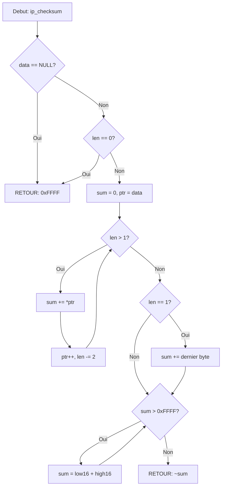

# Exercice 2.5.19-synth : heisenberg_packet_lab

**Module :**
2.5.19 — Raw Sockets et Manipulation de Paquets

**Concept :**
synth — Synthese (SOCK_RAW + IP_HDRINCL + ICMP + TCP/UDP + libpcap)

**Difficulte :**
★★★★★★★★☆☆ (8/10)

**Type :**
complet

**Tiers :**
3 — Synthese (tous concepts a→g)

**Langage :**
C17

**Prerequis :**
- 2.5.1 Sockets TCP/UDP (bases)
- 2.5.5 Protocoles reseau (IP, TCP, UDP, ICMP)
- 0.1.15 Manipulation de bits
- 0.1.8 Structures et pointeurs
- 2.5.18 Byte order (htons, htonl, ntohs, ntohl)

**Domaines :**
Net, Encodage, Crypto, CPU

**Duree estimee :**
180 min

**XP Base :**
500

**Complexite :**
T3 O(n) x S2 O(n)

---

## 1.0 SECTION 1 : PROTOTYPE & CONSIGNE

### 1.1 Obligations

**Fichiers a rendre :**
```
heisenberg_packet_lab/
├── rawsock.h
├── rawsock.c
├── ping.c
├── capture.c
└── Makefile
```

**Fonctions autorisees :**
`socket`, `setsockopt`, `sendto`, `recvfrom`, `recv`, `close`, `poll`, `gettimeofday`, `getaddrinfo`, `freeaddrinfo`, `inet_pton`, `inet_ntop`, `malloc`, `calloc`, `free`, `memset`, `memcpy`, `printf`, `perror`, `getpid`, `getuid`, `usleep`, `pcap_open_live`, `pcap_lookupdev`, `pcap_compile`, `pcap_setfilter`, `pcap_loop`, `pcap_next_ex`, `pcap_close`, `pcap_freecode`, `pcap_datalink`, `pcap_geterr`, `pcap_open_offline`

**Fonctions interdites :**
`system`, `exec*`, `popen`, `fork` (sauf pour tests)

**Compilation :**
```bash
gcc -Wall -Wextra -Werror -std=c17 -o heisenberg *.c -lpcap
```

**Privileges requis :**
`sudo` ou `CAP_NET_RAW` capability

---

### 1.2 Consigne

#### 2.4.1 BREAKING BAD CHEMISTRY — L'Analogie Ultime

**"Say my name." — Heisenberg**

Dans Breaking Bad, Walter White ne se contente pas d'acheter de la methamphetamine sur le marche. Non. Il la **synthetise lui-meme**, molecule par molecule, avec une purete de 99.1%. Il controle chaque atome, chaque liaison chimique.

Les **raw sockets**, c'est exactement la meme philosophie appliquee aux reseaux :

```
SOCKETS NORMAUX (Le dealer du coin)        RAW SOCKETS (Heisenberg)
┌─────────────────────────────────┐        ┌─────────────────────────────────┐
│  Tu achetes un produit fini     │        │  Tu fabriques TON produit       │
│  Le kernel fait tout pour toi   │        │  Tu controles CHAQUE BYTE       │
│                                 │        │                                 │
│  send("Hello")                  │        │  IP Header: 20 bytes            │
│       ↓                         │        │  ├─ Version: 4                  │
│  [Kernel ajoute IP/TCP]         │        │  ├─ IHL: 5                      │
│       ↓                         │        │  ├─ Total Length: 84            │
│  Paquet envoye                  │        │  ├─ TTL: 64                     │
│                                 │        │  ├─ Protocol: ICMP (1)          │
│  Tu ne sais pas comment         │        │  ├─ Checksum: 0x4A3B            │
│                                 │        │  └─ Src/Dst IP...               │
└─────────────────────────────────┘        │                                 │
                                           │  ICMP Header: 8 bytes           │
                                           │  ├─ Type: 8 (Echo Request)      │
                                           │  ├─ Code: 0                     │
                                           │  ├─ Checksum: 0x7D2E            │
                                           │  └─ ID/Sequence...              │
                                           └─────────────────────────────────┘
```

**La formule chimique d'un paquet ICMP :**

```
Comme Walter White qui dose precisement chaque element :

C₁₀H₁₅N (Methamphetamine)     vs     IP + ICMP (Paquet Ping)
─────────────────────────            ─────────────────────────
│ C = Carbone (10)        │          │ Version = 4 bits      │
│ H = Hydrogene (15)      │          │ IHL = 4 bits          │
│ N = Azote (1)           │          │ Total Len = 16 bits   │
│                         │          │ ID = 16 bits          │
│ Purete: 99.1%           │          │ Checksum = EXACT      │
│ Structure PARFAITE      │          │ Structure PARFAITE    │
└─────────────────────────┘          └─────────────────────────┘

Un seul atome de travers → produit inutilisable
Un seul bit de travers  → paquet rejete
```

**Pourquoi "cuisiner" ses propres paquets ?**

| Walter White | Toi avec Raw Sockets |
|--------------|---------------------|
| Controler la purete | Controler chaque header |
| Eviter les intermediaires | Bypasser la stack TCP/IP |
| Produit sur mesure | Paquets custom (scans, tests) |
| Science exacte | Checksums au bit pres |
| "I am the one who knocks" | "I am the one who packets" |

---

#### 2.4.2 Enonce Academique

**Contexte Technique :**

Les raw sockets permettent d'acceder directement a la couche reseau (Layer 3) ou transport (Layer 4), en bypassant partiellement la stack TCP/IP du kernel. Avec l'option `IP_HDRINCL`, le programmeur construit manuellement l'integralite des headers IP, TCP, UDP ou ICMP.

**Ta mission :**

Implementer une bibliotheque complete de manipulation de paquets reseau bas niveau comprenant :

1. **Creation de raw sockets** avec `SOCK_RAW`
2. **Construction manuelle de paquets IP** avec `IP_HDRINCL`
3. **Implementation d'un ping ICMP** fonctionnel
4. **Calcul de checksums** (IP et ICMP)
5. **Capture de paquets** avec libpcap et filtres BPF

**Entree :**
- Adresses IP (source, destination)
- Protocole (ICMP, TCP, UDP)
- Parametres des headers (TTL, ports, flags, etc.)

**Sortie :**
- Paquets correctement formes et envoyes
- Reponses capturees et parsees
- Statistiques (RTT, packet loss, etc.)

**Contraintes :**
- Respecter exactement les RFC (RFC 791 pour IP, RFC 792 pour ICMP)
- Tous les champs multi-octets en network byte order (big-endian)
- Checksums calcules selon l'algorithme one's complement
- Gestion des timeouts et erreurs
- Liberation propre de toutes les ressources

**Exemples :**

| Operation | Resultat |
|-----------|----------|
| `ping_host("8.8.8.8", 3, 1000, &stats)` | 3 ICMP Echo, RTT mesure |
| `raw_socket_create(IPPROTO_ICMP, false)` | Socket raw pour ICMP |
| `ip_checksum(header, 20)` | Checksum 16-bit du header IP |
| `pcap_session_set_filter(s, "tcp port 80")` | Filtre BPF applique |

---

### 1.3 Prototype

```c
// ============================================================
// Raw Socket API
// ============================================================

typedef struct {
    int fd;
    bool ip_hdrincl;
    uint16_t packet_id;
} raw_socket_t;

raw_socket_t *raw_socket_create(int protocol, bool include_ip_header);
void raw_socket_close(raw_socket_t *sock);
ssize_t raw_socket_send(raw_socket_t *sock, const void *packet, size_t len, uint32_t dest_ip);
ssize_t raw_socket_recv(raw_socket_t *sock, void *buffer, size_t buflen, int timeout_ms);

// ============================================================
// Packet Building
// ============================================================

typedef struct __attribute__((packed)) {
    uint8_t  version_ihl;
    uint8_t  tos;
    uint16_t total_length;
    uint16_t identification;
    uint16_t flags_offset;
    uint8_t  ttl;
    uint8_t  protocol;
    uint16_t checksum;
    uint32_t src_addr;
    uint32_t dst_addr;
} ip_header_t;

typedef struct __attribute__((packed)) {
    uint8_t  type;
    uint8_t  code;
    uint16_t checksum;
    uint16_t identifier;
    uint16_t sequence;
} icmp_header_t;

void ip_header_init(ip_header_t *header, uint8_t protocol,
                    uint32_t src_ip, uint32_t dst_ip, uint16_t payload_len);
uint16_t ip_checksum(const void *data, size_t len);
void icmp_echo_request_init(icmp_header_t *header, uint16_t identifier, uint16_t sequence);
uint16_t icmp_checksum(const icmp_header_t *header, const void *data, size_t data_len);

// ============================================================
// Ping API
// ============================================================

typedef struct {
    bool     success;
    uint16_t sequence;
    uint8_t  ttl;
    double   rtt_ms;
    uint32_t src_ip;
} ping_result_t;

typedef struct {
    int packets_sent;
    int packets_received;
    double min_rtt;
    double max_rtt;
    double avg_rtt;
} ping_stats_t;

ping_session_t *ping_create(const char *target, int timeout_ms);
void ping_set_ttl(ping_session_t *session, int ttl);
int ping_send(ping_session_t *session, ping_result_t *result);
void ping_close(ping_session_t *session);
int ping_host(const char *target, int count, int timeout_ms, ping_stats_t *stats);

// ============================================================
// Packet Capture (libpcap)
// ============================================================

typedef struct {
    pcap_t *handle;
    char errbuf[PCAP_ERRBUF_SIZE];
    int datalink;
    struct bpf_program filter;
    bool filter_compiled;
} pcap_session_t;

pcap_session_t *pcap_session_open(const char *interface, int snaplen, bool promisc, int timeout_ms);
int pcap_session_set_filter(pcap_session_t *session, const char *filter);
int pcap_session_capture(pcap_session_t *session, int count, packet_handler_t handler, void *user_data);
void pcap_session_close(pcap_session_t *session);
```

---

## 2.0 SECTION 2 : LE SAVIEZ-VOUS ?

### 2.1 L'Histoire des Raw Sockets

Les raw sockets existent depuis les premieres versions de BSD Unix (4.2BSD, 1983). Ils ont ete concus pour permettre l'implementation de nouveaux protocoles en espace utilisateur et le diagnostic reseau.

**Fun fact :** L'outil `ping` original, ecrit par Mike Muuss en 1983, utilisait des raw sockets ICMP. Le nom vient du son du sonar dans les sous-marins ("ping... ping...").

### 2.2 Checksums : La Magie du One's Complement

Le checksum IP/ICMP/TCP/UDP utilise l'arithmetique en **complement a un** (one's complement) :

```
1. Additionner tous les mots de 16 bits
2. Si overflow, ajouter la retenue au resultat
3. Inverser tous les bits (NOT)

Pourquoi ? → Auto-verification : la somme de tous les mots + checksum = 0xFFFF
```

### 2.3 La Securite et les Raw Sockets

Les raw sockets sont **dangereux** : ils permettent le spoofing IP, les scans furtifs, les attaques DoS. C'est pourquoi :
- Linux requiert `CAP_NET_RAW` ou root
- Windows limite fortement les raw sockets depuis XP SP2
- macOS bloque l'envoi de paquets TCP/UDP raw spoofes

---

## 2.5 DANS LA VRAIE VIE

| Metier | Utilisation des Raw Sockets |
|--------|----------------------------|
| **Pentester / Red Team** | Scans SYN/FIN/NULL, IP spoofing, evasion IDS |
| **Network Engineer** | Outils de diagnostic (ping, traceroute custom) |
| **Security Researcher** | Analyse de protocoles, fuzzing reseau |
| **DevOps / SRE** | Monitoring reseau bas niveau, detection d'anomalies |
| **Malware Analyst** | Comprendre comment les malwares communiquent |
| **Game Developer** | Protocoles UDP custom pour jeux temps reel |

**Outils celebres utilisant les raw sockets :**
- `nmap` (scan de ports)
- `hping3` (test de firewall)
- `scapy` (manipulation de paquets Python)
- `tcpdump` / `Wireshark` (capture)

---

## 3.0 SECTION 3 : EXEMPLE D'UTILISATION

### 3.0 Session bash

```bash
$ ls
rawsock.h  rawsock.c  ping.c  capture.c  main.c  Makefile

$ make
gcc -Wall -Wextra -Werror -std=c17 -c rawsock.c -o rawsock.o
gcc -Wall -Wextra -Werror -std=c17 -c ping.c -o ping.o
gcc -Wall -Wextra -Werror -std=c17 -c capture.c -o capture.o
gcc -Wall -Wextra -Werror -std=c17 -c main.c -o main.o
gcc -o heisenberg rawsock.o ping.o capture.o main.o -lpcap

$ sudo ./heisenberg ping 8.8.8.8 -c 3
PING 8.8.8.8: 64 bytes
64 bytes from 8.8.8.8: icmp_seq=0 ttl=117 time=12.34 ms
64 bytes from 8.8.8.8: icmp_seq=1 ttl=117 time=11.89 ms
64 bytes from 8.8.8.8: icmp_seq=2 ttl=117 time=12.01 ms

--- 8.8.8.8 ping statistics ---
3 packets transmitted, 3 received, 0% packet loss
rtt min/avg/max = 11.89/12.08/12.34 ms

$ sudo ./heisenberg checksum
IP Checksum test: 0x4A3B - PASS
ICMP Checksum test: 0x7D2E - PASS
All checksum tests: OK

$ sudo ./heisenberg capture eth0 -f "icmp" -c 5
Listening on eth0, filter: icmp
[1] 12:34:56.789 | 192.168.1.100 -> 8.8.8.8 | ICMP Echo Request
[2] 12:34:56.801 | 8.8.8.8 -> 192.168.1.100 | ICMP Echo Reply
[3] 12:34:57.790 | 192.168.1.100 -> 8.8.8.8 | ICMP Echo Request
[4] 12:34:57.802 | 8.8.8.8 -> 192.168.1.100 | ICMP Echo Reply
[5] 12:34:58.791 | 192.168.1.100 -> 8.8.8.8 | ICMP Echo Request
Captured 5 packets
```

---

### 3.1 BONUS EXPERT (OPTIONNEL)

**Difficulte Bonus :**
💀 (10/10)

**Recompense :**
XP x4

**Time Complexity attendue :**
O(n)

**Space Complexity attendue :**
O(1) auxiliaire

**Domaines Bonus :**
`Crypto`, `CPU`

#### 3.1.1 Consigne Bonus

**"I am the danger." — Walter White**

Tu as maitrise les bases. Maintenant, deviens le **Heisenberg du reseau** :

**Ta mission :**

Implementer un **TCP SYN Scanner** minimaliste qui :
1. Construit des paquets TCP SYN bruts avec `IP_HDRINCL`
2. Envoie sur une liste de ports
3. Capture les reponses (SYN-ACK = ouvert, RST = ferme)
4. Calcule les checksums TCP (avec pseudo-header)

**Prototype Bonus :**

```c
typedef struct {
    uint16_t port;
    bool is_open;
    double response_time_ms;
} port_scan_result_t;

int syn_scanner(const char *target_ip,
                const uint16_t *ports,
                size_t port_count,
                port_scan_result_t *results,
                int timeout_ms);
```

**Contraintes :**
```
┌─────────────────────────────────────┐
│  1 <= port_count <= 1000            │
│  1 <= ports[i] <= 65535             │
│  timeout_ms >= 100                  │
│  Checksum TCP OBLIGATOIRE           │
│  Pas de threads (sequentiel)        │
└─────────────────────────────────────┘
```

**Ce qui change par rapport a l'exercice de base :**

| Aspect | Base | Bonus |
|--------|------|-------|
| Protocole | ICMP | TCP |
| Checksum | IP + ICMP | IP + TCP (pseudo-header) |
| Header size | 20 + 8 | 20 + 20 minimum |
| Complexite | Echo simple | State machine TCP |
| Flags | Aucun | SYN, ACK, RST |

#### 3.1.2 Prototype TCP Header

```c
typedef struct __attribute__((packed)) {
    uint16_t src_port;
    uint16_t dst_port;
    uint32_t seq_num;
    uint32_t ack_num;
    uint8_t  data_offset;  // 4 bits offset + 4 bits reserved
    uint8_t  flags;        // CWR, ECE, URG, ACK, PSH, RST, SYN, FIN
    uint16_t window;
    uint16_t checksum;
    uint16_t urgent_ptr;
} tcp_header_t;

// Pseudo-header pour checksum TCP
typedef struct __attribute__((packed)) {
    uint32_t src_ip;
    uint32_t dst_ip;
    uint8_t  zero;
    uint8_t  protocol;     // 6 pour TCP
    uint16_t tcp_length;
} tcp_pseudo_header_t;
```

---

## 4.0 SECTION 4 : ZONE CORRECTION

### 4.1 Moulinette

| Test | Input | Expected | Points | Trap |
|------|-------|----------|--------|------|
| `checksum_ip_basic` | Header IP standard | Checksum valide | 10 | Non |
| `checksum_ip_zero` | Header vide | 0xFFFF | 5 | Oui |
| `checksum_icmp` | ICMP Echo Request | Checksum valide | 10 | Non |
| `raw_socket_null` | `NULL` param | Gestion erreur | 5 | Oui |
| `raw_socket_create` | `IPPROTO_ICMP` | Socket valide (fd > 0) | 15 | Non |
| `ip_header_init` | Params valides | Header correct | 15 | Non |
| `ip_header_byte_order` | Src/Dst IP | Network byte order | 10 | Oui |
| `ping_localhost` | 127.0.0.1 | Reponse recue | 15 | Non |
| `ping_timeout` | IP inexistante | Timeout gere | 10 | Oui |
| `pcap_filter_valid` | "tcp port 80" | Compilation OK | 10 | Non |
| `pcap_filter_invalid` | "invalid xyz" | Erreur geree | 5 | Oui |
| `resource_cleanup` | Multiple ops | Pas de leaks | 10 | Oui |

**Score minimum :** 70/100

---

### 4.2 main.c de test

```c
#include <stdio.h>
#include <string.h>
#include <assert.h>
#include <unistd.h>
#include "rawsock.h"

void test_ip_checksum(void)
{
    uint8_t header[] = {
        0x45, 0x00, 0x00, 0x54,
        0x12, 0x34, 0x40, 0x00,
        0x40, 0x01, 0x00, 0x00,  // Checksum = 0 pour calcul
        0xc0, 0xa8, 0x01, 0x01,  // 192.168.1.1
        0xc0, 0xa8, 0x01, 0x02   // 192.168.1.2
    };

    uint16_t checksum = ip_checksum(header, 20);
    printf("IP Checksum: 0x%04X\n", checksum);
    assert(checksum != 0);

    // Verification : recalcul avec checksum doit donner 0 ou 0xFFFF
    header[10] = checksum >> 8;
    header[11] = checksum & 0xFF;
    uint16_t verify = ip_checksum(header, 20);
    printf("Verification: 0x%04X (should be 0x0000 or 0xFFFF)\n", verify);

    printf("test_ip_checksum: PASS\n");
}

void test_icmp_checksum(void)
{
    icmp_header_t header;
    icmp_echo_request_init(&header, 1234, 1);

    char data[56] = {0};
    uint16_t checksum = icmp_checksum(&header, data, sizeof(data));

    printf("ICMP Checksum: 0x%04X\n", checksum);
    assert(checksum != 0);

    printf("test_icmp_checksum: PASS\n");
}

void test_ip_header_init(void)
{
    ip_header_t header;
    uint32_t src = string_to_ip("192.168.1.1");
    uint32_t dst = string_to_ip("192.168.1.2");

    ip_header_init(&header, IP_PROTO_ICMP, src, dst, 64);

    assert(header.version_ihl == 0x45);
    assert(header.protocol == IP_PROTO_ICMP);
    assert(header.src_addr == src);
    assert(header.dst_addr == dst);
    assert(header.checksum != 0);

    printf("test_ip_header_init: PASS\n");
}

void test_raw_socket(void)
{
    if (geteuid() != 0) {
        printf("test_raw_socket: SKIP (requires root)\n");
        return;
    }

    raw_socket_t *sock = raw_socket_create(IPPROTO_ICMP, false);
    assert(sock != NULL);
    assert(sock->fd > 0);

    raw_socket_close(sock);
    printf("test_raw_socket: PASS\n");
}

void test_ping_localhost(void)
{
    if (geteuid() != 0) {
        printf("test_ping_localhost: SKIP (requires root)\n");
        return;
    }

    ping_stats_t stats;
    int ret = ping_host("127.0.0.1", 3, 1000, &stats);

    assert(ret == 0);
    assert(stats.packets_sent == 3);
    assert(stats.packets_received >= 1);

    printf("Ping stats: sent=%d recv=%d min=%.2f avg=%.2f max=%.2f\n",
           stats.packets_sent, stats.packets_received,
           stats.min_rtt, stats.avg_rtt, stats.max_rtt);

    printf("test_ping_localhost: PASS\n");
}

void test_pcap_filter(void)
{
    pcap_session_t *session = pcap_session_open(NULL, 65535, false, 100);
    if (!session) {
        printf("test_pcap_filter: SKIP (no interface)\n");
        return;
    }

    int ret = pcap_session_set_filter(session, "tcp port 80");
    assert(ret == 0);

    pcap_session_close(session);
    printf("test_pcap_filter: PASS\n");
}

int main(void)
{
    printf("=== HEISENBERG PACKET LAB - TESTS ===\n\n");

    test_ip_checksum();
    test_icmp_checksum();
    test_ip_header_init();
    test_raw_socket();
    test_ping_localhost();
    test_pcap_filter();

    printf("\n=== ALL TESTS COMPLETED ===\n");
    return 0;
}
```

---

### 4.3 Solution de reference

```c
// rawsock.c - Solution de reference
#include "rawsock.h"
#include <stdlib.h>
#include <string.h>
#include <unistd.h>
#include <errno.h>
#include <sys/socket.h>
#include <sys/time.h>
#include <netinet/in.h>
#include <arpa/inet.h>
#include <netdb.h>
#include <poll.h>

// ============================================================
// Checksum - Algorithme One's Complement
// ============================================================

uint16_t ip_checksum(const void *data, size_t len)
{
    const uint16_t *ptr;
    uint32_t sum;

    if (data == NULL || len == 0)
        return 0xFFFF;

    ptr = data;
    sum = 0;

    while (len > 1)
    {
        sum += *ptr++;
        len -= 2;
    }

    if (len == 1)
        sum += *(const uint8_t *)ptr;

    while (sum >> 16)
        sum = (sum & 0xFFFF) + (sum >> 16);

    return (uint16_t)(~sum);
}

uint16_t icmp_checksum(const icmp_header_t *header, const void *data, size_t data_len)
{
    size_t total_len;
    uint8_t *buf;
    icmp_header_t temp;
    uint16_t result;

    if (header == NULL)
        return 0;

    total_len = sizeof(icmp_header_t) + data_len;
    buf = malloc(total_len);
    if (buf == NULL)
        return 0;

    temp = *header;
    temp.checksum = 0;
    memcpy(buf, &temp, sizeof(icmp_header_t));

    if (data != NULL && data_len > 0)
        memcpy(buf + sizeof(icmp_header_t), data, data_len);

    result = ip_checksum(buf, total_len);
    free(buf);
    return result;
}

// ============================================================
// Raw Socket
// ============================================================

raw_socket_t *raw_socket_create(int protocol, bool include_ip_header)
{
    raw_socket_t *sock;
    int on;

    sock = malloc(sizeof(raw_socket_t));
    if (sock == NULL)
        return NULL;

    sock->fd = socket(AF_INET, SOCK_RAW, protocol);
    if (sock->fd < 0)
    {
        free(sock);
        return NULL;
    }

    sock->ip_hdrincl = include_ip_header;
    sock->packet_id = (uint16_t)getpid();

    if (include_ip_header)
    {
        on = 1;
        if (setsockopt(sock->fd, IPPROTO_IP, IP_HDRINCL, &on, sizeof(on)) < 0)
        {
            close(sock->fd);
            free(sock);
            return NULL;
        }
    }

    return sock;
}

void raw_socket_close(raw_socket_t *sock)
{
    if (sock != NULL)
    {
        close(sock->fd);
        free(sock);
    }
}

ssize_t raw_socket_send(raw_socket_t *sock, const void *packet, size_t len, uint32_t dest_ip)
{
    struct sockaddr_in dest;

    if (sock == NULL || packet == NULL)
        return -1;

    memset(&dest, 0, sizeof(dest));
    dest.sin_family = AF_INET;
    dest.sin_addr.s_addr = dest_ip;

    return sendto(sock->fd, packet, len, 0,
                  (struct sockaddr *)&dest, sizeof(dest));
}

ssize_t raw_socket_recv(raw_socket_t *sock, void *buffer, size_t buflen, int timeout_ms)
{
    struct pollfd pfd;
    int ret;

    if (sock == NULL || buffer == NULL)
        return -1;

    if (timeout_ms >= 0)
    {
        pfd.fd = sock->fd;
        pfd.events = POLLIN;
        ret = poll(&pfd, 1, timeout_ms);
        if (ret <= 0)
            return -1;
    }

    return recv(sock->fd, buffer, buflen, 0);
}

// ============================================================
// IP Header
// ============================================================

void ip_header_init(ip_header_t *header, uint8_t protocol,
                    uint32_t src_ip, uint32_t dst_ip, uint16_t payload_len)
{
    if (header == NULL)
        return;

    memset(header, 0, sizeof(*header));

    header->version_ihl = (4 << 4) | 5;  // IPv4, IHL=5 (20 bytes)
    header->tos = 0;
    header->total_length = htons(sizeof(ip_header_t) + payload_len);
    header->identification = htons(rand() & 0xFFFF);
    header->flags_offset = htons(0x4000);  // Don't Fragment
    header->ttl = 64;
    header->protocol = protocol;
    header->src_addr = src_ip;
    header->dst_addr = dst_ip;

    header->checksum = 0;
    header->checksum = ip_checksum(header, sizeof(*header));
}

// ============================================================
// ICMP
// ============================================================

void icmp_echo_request_init(icmp_header_t *header, uint16_t identifier, uint16_t sequence)
{
    if (header == NULL)
        return;

    header->type = 8;  // ICMP_ECHO_REQUEST
    header->code = 0;
    header->identifier = htons(identifier);
    header->sequence = htons(sequence);
    header->checksum = 0;
}

// ============================================================
// Ping
// ============================================================

ping_session_t *ping_create(const char *target, int timeout_ms)
{
    ping_session_t *session;
    struct addrinfo hints;
    struct addrinfo *result;

    if (target == NULL)
        return NULL;

    session = malloc(sizeof(ping_session_t));
    if (session == NULL)
        return NULL;

    memset(&hints, 0, sizeof(hints));
    hints.ai_family = AF_INET;

    if (getaddrinfo(target, NULL, &hints, &result) != 0)
    {
        free(session);
        return NULL;
    }

    session->dst_ip = ((struct sockaddr_in *)result->ai_addr)->sin_addr.s_addr;
    freeaddrinfo(result);

    session->sock = raw_socket_create(IPPROTO_ICMP, false);
    if (session->sock == NULL)
    {
        free(session);
        return NULL;
    }

    session->identifier = (uint16_t)getpid();
    session->sequence = 0;
    session->timeout_ms = timeout_ms;
    session->ttl = 64;

    setsockopt(session->sock->fd, IPPROTO_IP, IP_TTL,
               &session->ttl, sizeof(session->ttl));

    return session;
}

void ping_set_ttl(ping_session_t *session, int ttl)
{
    if (session == NULL)
        return;
    session->ttl = ttl;
    setsockopt(session->sock->fd, IPPROTO_IP, IP_TTL, &ttl, sizeof(ttl));
}

int ping_send(ping_session_t *session, ping_result_t *result)
{
    struct {
        icmp_header_t header;
        char data[56];
    } packet;
    struct timeval send_time;
    struct timeval recv_time;
    uint8_t buffer[1500];
    ssize_t len;
    ip_header_t *ip;
    icmp_header_t *icmp;
    int ip_hdr_len;
    double rtt;

    if (session == NULL || result == NULL)
        return -1;

    memset(result, 0, sizeof(*result));
    result->sequence = session->sequence;

    icmp_echo_request_init(&packet.header, session->identifier, session->sequence);
    memset(packet.data, 0, sizeof(packet.data));

    gettimeofday((struct timeval *)packet.data, NULL);

    packet.header.checksum = icmp_checksum(&packet.header, packet.data, sizeof(packet.data));

    session->sequence++;

    gettimeofday(&send_time, NULL);

    if (raw_socket_send(session->sock, &packet, sizeof(packet), session->dst_ip) < 0)
        return -1;

    len = raw_socket_recv(session->sock, buffer, sizeof(buffer), session->timeout_ms);

    if (len < 0)
        return -1;

    gettimeofday(&recv_time, NULL);

    ip = (ip_header_t *)buffer;
    ip_hdr_len = (ip->version_ihl & 0x0F) * 4;

    if (len < ip_hdr_len + (ssize_t)sizeof(icmp_header_t))
        return -1;

    icmp = (icmp_header_t *)(buffer + ip_hdr_len);

    if (icmp->type != 0)  // ICMP_ECHO_REPLY
        return -1;

    if (ntohs(icmp->identifier) != session->identifier)
        return -1;

    rtt = (recv_time.tv_sec - send_time.tv_sec) * 1000.0 +
          (recv_time.tv_usec - send_time.tv_usec) / 1000.0;

    result->success = true;
    result->ttl = ip->ttl;
    result->rtt_ms = rtt;
    result->src_ip = ip->src_addr;

    return 0;
}

void ping_close(ping_session_t *session)
{
    if (session != NULL)
    {
        raw_socket_close(session->sock);
        free(session);
    }
}

int ping_host(const char *target, int count, int timeout_ms, ping_stats_t *stats)
{
    ping_session_t *session;
    ping_result_t result;
    int i;

    if (target == NULL || stats == NULL || count <= 0)
        return -1;

    session = ping_create(target, timeout_ms);
    if (session == NULL)
        return -1;

    memset(stats, 0, sizeof(*stats));
    stats->min_rtt = 1e9;

    for (i = 0; i < count; i++)
    {
        stats->packets_sent++;

        if (ping_send(session, &result) == 0 && result.success)
        {
            stats->packets_received++;
            stats->avg_rtt += result.rtt_ms;

            if (result.rtt_ms < stats->min_rtt)
                stats->min_rtt = result.rtt_ms;
            if (result.rtt_ms > stats->max_rtt)
                stats->max_rtt = result.rtt_ms;
        }

        if (i < count - 1)
            usleep(1000000);
    }

    if (stats->packets_received > 0)
        stats->avg_rtt /= stats->packets_received;

    ping_close(session);
    return 0;
}

// ============================================================
// Utilities
// ============================================================

const char *ip_to_string(uint32_t ip, char *buf, size_t buflen)
{
    struct in_addr addr;
    addr.s_addr = ip;
    return inet_ntop(AF_INET, &addr, buf, buflen);
}

uint32_t string_to_ip(const char *str)
{
    struct in_addr addr;
    if (str == NULL)
        return 0;
    if (inet_pton(AF_INET, str, &addr) != 1)
        return 0;
    return addr.s_addr;
}
```

---

### 4.4 Solutions alternatives acceptees

```c
// Alternative 1 : Checksum avec pointer arithmetic
uint16_t ip_checksum_alt(const void *data, size_t len)
{
    uint32_t sum = 0;
    const uint8_t *bytes = data;

    if (!data || !len)
        return 0xFFFF;

    for (size_t i = 0; i < len - 1; i += 2)
        sum += (bytes[i] << 8) | bytes[i + 1];

    if (len & 1)
        sum += bytes[len - 1] << 8;

    sum = (sum >> 16) + (sum & 0xFFFF);
    sum += (sum >> 16);

    return ~sum;
}

// Alternative 2 : Ping avec structure differente
typedef struct {
    raw_socket_t *sock;
    struct sockaddr_in dest;
    uint16_t id;
    uint16_t seq;
    int timeout;
} ping_ctx_t;
```

---

### 4.5 Solutions refusees

```c
// REFUSE 1 : Pas de gestion NULL
uint16_t bad_checksum(const void *data, size_t len)
{
    // ERREUR : Crash si data == NULL
    const uint16_t *ptr = data;
    uint32_t sum = 0;
    // ...
}
// Pourquoi refuse : Segfault sur NULL

// REFUSE 2 : Byte order incorrect
void bad_ip_header_init(ip_header_t *h, uint32_t src, uint32_t dst)
{
    h->total_length = 20;  // ERREUR : Pas de htons()
    h->src_addr = src;     // OK si deja en network order
}
// Pourquoi refuse : total_length en host byte order = paquet corrompu

// REFUSE 3 : Fuite de ressources
ping_session_t *bad_ping_create(const char *target)
{
    struct addrinfo *result;
    getaddrinfo(target, NULL, NULL, &result);
    // ERREUR : Pas de freeaddrinfo(result)
    // ...
}
// Pourquoi refuse : Memory leak
```

---

### 4.6 Solution bonus de reference (TCP SYN Scanner)

```c
// syn_scanner.c - Solution bonus
#include "rawsock.h"
#include <string.h>
#include <stdlib.h>
#include <sys/time.h>
#include <poll.h>

#define TCP_FLAG_SYN 0x02
#define TCP_FLAG_ACK 0x10
#define TCP_FLAG_RST 0x04

typedef struct __attribute__((packed)) {
    uint32_t src_ip;
    uint32_t dst_ip;
    uint8_t  zero;
    uint8_t  protocol;
    uint16_t tcp_length;
} tcp_pseudo_t;

uint16_t tcp_checksum(uint32_t src_ip, uint32_t dst_ip,
                      const tcp_header_t *tcp, size_t tcp_len)
{
    size_t total;
    uint8_t *buf;
    tcp_pseudo_t *pseudo;
    tcp_header_t *tcp_copy;
    uint16_t result;

    total = sizeof(tcp_pseudo_t) + tcp_len;
    buf = calloc(1, total);
    if (!buf)
        return 0;

    pseudo = (tcp_pseudo_t *)buf;
    pseudo->src_ip = src_ip;
    pseudo->dst_ip = dst_ip;
    pseudo->zero = 0;
    pseudo->protocol = 6;
    pseudo->tcp_length = htons(tcp_len);

    tcp_copy = (tcp_header_t *)(buf + sizeof(tcp_pseudo_t));
    memcpy(tcp_copy, tcp, tcp_len);
    tcp_copy->checksum = 0;

    result = ip_checksum(buf, total);
    free(buf);
    return result;
}

int syn_scanner(const char *target_ip,
                const uint16_t *ports,
                size_t port_count,
                port_scan_result_t *results,
                int timeout_ms)
{
    raw_socket_t *sock;
    uint32_t dst_ip;
    uint32_t src_ip;
    size_t i;
    struct {
        ip_header_t ip;
        tcp_header_t tcp;
    } packet;
    uint8_t recv_buf[1500];
    struct timeval start, end;
    ssize_t len;
    ip_header_t *resp_ip;
    tcp_header_t *resp_tcp;
    int ip_hdr_len;

    if (!target_ip || !ports || !results || port_count == 0)
        return -1;

    dst_ip = string_to_ip(target_ip);
    if (dst_ip == 0)
        return -1;

    src_ip = string_to_ip("0.0.0.0");  // Kernel fills it

    sock = raw_socket_create(IPPROTO_TCP, true);
    if (!sock)
        return -1;

    for (i = 0; i < port_count; i++)
    {
        results[i].port = ports[i];
        results[i].is_open = false;
        results[i].response_time_ms = 0;

        memset(&packet, 0, sizeof(packet));

        // IP Header
        ip_header_init(&packet.ip, 6, src_ip, dst_ip, sizeof(tcp_header_t));

        // TCP Header
        packet.tcp.src_port = htons(rand() % 60000 + 1024);
        packet.tcp.dst_port = htons(ports[i]);
        packet.tcp.seq_num = htonl(rand());
        packet.tcp.ack_num = 0;
        packet.tcp.data_offset = (5 << 4);  // 20 bytes, no options
        packet.tcp.flags = TCP_FLAG_SYN;
        packet.tcp.window = htons(65535);
        packet.tcp.urgent_ptr = 0;

        packet.tcp.checksum = tcp_checksum(packet.ip.src_addr, dst_ip,
                                           &packet.tcp, sizeof(tcp_header_t));

        gettimeofday(&start, NULL);

        if (raw_socket_send(sock, &packet, sizeof(packet), dst_ip) < 0)
            continue;

        len = raw_socket_recv(sock, recv_buf, sizeof(recv_buf), timeout_ms);

        if (len > 0)
        {
            gettimeofday(&end, NULL);

            resp_ip = (ip_header_t *)recv_buf;
            ip_hdr_len = (resp_ip->version_ihl & 0x0F) * 4;
            resp_tcp = (tcp_header_t *)(recv_buf + ip_hdr_len);

            if (ntohs(resp_tcp->src_port) == ports[i])
            {
                if (resp_tcp->flags & TCP_FLAG_SYN && resp_tcp->flags & TCP_FLAG_ACK)
                    results[i].is_open = true;

                results[i].response_time_ms =
                    (end.tv_sec - start.tv_sec) * 1000.0 +
                    (end.tv_usec - start.tv_usec) / 1000.0;
            }
        }
    }

    raw_socket_close(sock);
    return 0;
}
```

---

### 4.7 Solutions alternatives bonus

```c
// Alternative : Scanner avec capture pcap pour les reponses
int syn_scanner_pcap(const char *target, const uint16_t *ports,
                     size_t count, port_scan_result_t *results, int timeout)
{
    // Utilise pcap pour capturer les SYN-ACK/RST
    // Plus fiable mais plus complexe
    // ... implementation avec thread capture ...
}
```

---

### 4.8 Solutions refusees bonus

```c
// REFUSE : Pas de checksum TCP
int bad_syn_scanner(...)
{
    packet.tcp.checksum = 0;  // ERREUR : Checksum obligatoire
    // Le paquet sera rejete par la cible
}
// Pourquoi refuse : TCP checksum est obligatoire

// REFUSE : Mauvais pseudo-header
uint16_t bad_tcp_checksum(uint32_t src, uint32_t dst, tcp_header_t *tcp)
{
    // ERREUR : N'inclut pas le pseudo-header
    return ip_checksum(tcp, sizeof(*tcp));
}
// Pourquoi refuse : Le checksum TCP necessite le pseudo-header
```

---

### 4.9 spec.json

```json
{
  "name": "heisenberg_packet_lab",
  "language": "c",
  "type": "complet",
  "tier": 3,
  "tier_info": "Synthese (SOCK_RAW + IP_HDRINCL + ICMP + TCP + libpcap)",
  "tags": ["raw-socket", "network", "icmp", "tcp", "pcap", "checksum", "phase2"],
  "passing_score": 70,

  "function": {
    "name": "raw_socket_create",
    "prototype": "raw_socket_t *raw_socket_create(int protocol, bool include_ip_header)",
    "return_type": "raw_socket_t *",
    "parameters": [
      {"name": "protocol", "type": "int"},
      {"name": "include_ip_header", "type": "bool"}
    ],
    "additional_functions": [
      {
        "name": "ip_checksum",
        "prototype": "uint16_t ip_checksum(const void *data, size_t len)",
        "return_type": "uint16_t"
      },
      {
        "name": "icmp_checksum",
        "prototype": "uint16_t icmp_checksum(const icmp_header_t *header, const void *data, size_t data_len)",
        "return_type": "uint16_t"
      },
      {
        "name": "ping_host",
        "prototype": "int ping_host(const char *target, int count, int timeout_ms, ping_stats_t *stats)",
        "return_type": "int"
      }
    ]
  },

  "driver": {
    "reference": "uint16_t ref_ip_checksum(const void *data, size_t len) { if (data == NULL || len == 0) return 0xFFFF; const uint16_t *ptr = data; uint32_t sum = 0; while (len > 1) { sum += *ptr++; len -= 2; } if (len == 1) sum += *(const uint8_t *)ptr; while (sum >> 16) sum = (sum & 0xFFFF) + (sum >> 16); return (uint16_t)(~sum); }",

    "edge_cases": [
      {
        "name": "checksum_null_data",
        "args": [null, 0],
        "expected": 65535,
        "is_trap": true,
        "trap_explanation": "NULL data doit retourner 0xFFFF"
      },
      {
        "name": "checksum_zero_length",
        "args": ["valid_ptr", 0],
        "expected": 65535,
        "is_trap": true,
        "trap_explanation": "Zero length doit retourner 0xFFFF"
      },
      {
        "name": "checksum_odd_length",
        "args": [[0x45, 0x00, 0x00], 3],
        "expected": "non-zero",
        "is_trap": true,
        "trap_explanation": "Longueur impaire - doit gerer le padding"
      },
      {
        "name": "checksum_standard_header",
        "args": [[0x45,0x00,0x00,0x54,0x12,0x34,0x40,0x00,0x40,0x01,0x00,0x00,0xc0,0xa8,0x01,0x01,0xc0,0xa8,0x01,0x02], 20],
        "expected": "valid_checksum"
      },
      {
        "name": "raw_socket_null_on_error",
        "args": ["invalid_protocol"],
        "expected": null,
        "is_trap": true,
        "trap_explanation": "Doit retourner NULL si socket() echoue"
      },
      {
        "name": "ping_null_target",
        "args": [null, 3, 1000, "stats_ptr"],
        "expected": -1,
        "is_trap": true,
        "trap_explanation": "Target NULL doit retourner -1"
      },
      {
        "name": "ping_localhost",
        "args": ["127.0.0.1", 3, 1000, "stats_ptr"],
        "expected": 0
      },
      {
        "name": "ping_timeout_handling",
        "args": ["192.0.2.1", 1, 100, "stats_ptr"],
        "expected": 0,
        "is_trap": true,
        "trap_explanation": "IP inexistante - doit gerer le timeout sans crash"
      }
    ],

    "fuzzing": {
      "enabled": true,
      "iterations": 500,
      "generators": [
        {
          "type": "array_int",
          "param_index": 0,
          "params": {
            "min_len": 0,
            "max_len": 100,
            "min_val": 0,
            "max_val": 255
          }
        }
      ]
    }
  },

  "norm": {
    "allowed_functions": ["socket", "setsockopt", "sendto", "recvfrom", "recv", "close", "poll", "gettimeofday", "getaddrinfo", "freeaddrinfo", "inet_pton", "inet_ntop", "malloc", "calloc", "free", "memset", "memcpy", "printf", "perror", "getpid", "getuid", "usleep", "htons", "htonl", "ntohs", "ntohl", "pcap_open_live", "pcap_lookupdev", "pcap_compile", "pcap_setfilter", "pcap_loop", "pcap_next_ex", "pcap_close", "pcap_freecode", "pcap_datalink", "pcap_geterr", "pcap_open_offline", "rand"],
    "forbidden_functions": ["system", "exec", "execve", "execvp", "popen", "fork"],
    "check_security": true,
    "check_memory": true,
    "blocking": true
  },

  "bonus": {
    "name": "syn_scanner",
    "prototype": "int syn_scanner(const char *target_ip, const uint16_t *ports, size_t port_count, port_scan_result_t *results, int timeout_ms)",
    "difficulty": 10,
    "xp_multiplier": 4,
    "tier": "EXPERT"
  }
}
```

---

### 4.10 Solutions Mutantes

```c
/* Mutant A (Boundary) : Off-by-one dans le checksum */
uint16_t mutant_a_checksum(const void *data, size_t len)
{
    const uint16_t *ptr = data;
    uint32_t sum = 0;

    while (len >= 2)  // ERREUR : >= au lieu de >
    {
        sum += *ptr++;
        len -= 2;
    }
    // Oublie le dernier byte si len impaire

    while (sum >> 16)
        sum = (sum & 0xFFFF) + (sum >> 16);

    return ~sum;
}
// Pourquoi c'est faux : Ne gere pas les longueurs impaires
// Ce qui etait pense : ">= 2" semble correct mais skip le dernier byte
// Detection : Test avec len=21 donne checksum different

/* Mutant B (Safety) : Pas de verification NULL */
raw_socket_t *mutant_b_create(int protocol, bool include_ip)
{
    raw_socket_t *sock = malloc(sizeof(raw_socket_t));
    // ERREUR : Pas de check malloc NULL

    sock->fd = socket(AF_INET, SOCK_RAW, protocol);
    // Crash si malloc a echoue

    return sock;
}
// Pourquoi c'est faux : Segfault si malloc retourne NULL
// Ce qui etait pense : "malloc ne fail jamais en pratique"
// Detection : Test sous stress memoire

/* Mutant C (Resource) : Fuite de memoire dans ping_create */
ping_session_t *mutant_c_ping(const char *target, int timeout)
{
    ping_session_t *session = malloc(sizeof(*session));
    struct addrinfo hints = {0}, *result;

    hints.ai_family = AF_INET;
    getaddrinfo(target, NULL, &hints, &result);

    session->dst_ip = ((struct sockaddr_in *)result->ai_addr)->sin_addr.s_addr;
    // ERREUR : Pas de freeaddrinfo(result)

    session->sock = raw_socket_create(IPPROTO_ICMP, false);
    return session;
}
// Pourquoi c'est faux : Leak de struct addrinfo a chaque appel
// Ce qui etait pense : "Le programme est court, ca va"
// Detection : Valgrind montre "still reachable" blocks

/* Mutant D (Logic) : Byte order inverse pour checksum */
void mutant_d_ip_init(ip_header_t *h, uint8_t proto, uint32_t src, uint32_t dst, uint16_t plen)
{
    h->version_ihl = 0x45;
    h->total_length = sizeof(ip_header_t) + plen;  // ERREUR : Pas de htons
    h->ttl = 64;
    h->protocol = proto;
    h->src_addr = src;
    h->dst_addr = dst;

    h->checksum = 0;
    h->checksum = ip_checksum(h, sizeof(*h));
}
// Pourquoi c'est faux : total_length en host byte order = paquet rejete
// Ce qui etait pense : "Les adresses sont deja en network order, total_length aussi"
// Detection : Wireshark montre "total length: 5120" au lieu de "20"

/* Mutant E (Return) : Mauvaise valeur de retour ping */
int mutant_e_ping_send(ping_session_t *s, ping_result_t *r)
{
    struct {
        icmp_header_t h;
        char data[56];
    } pkt;

    icmp_echo_request_init(&pkt.h, s->identifier, s->sequence);
    pkt.h.checksum = icmp_checksum(&pkt.h, pkt.data, 56);

    if (raw_socket_send(s->sock, &pkt, sizeof(pkt), s->dst_ip) < 0)
        return 0;  // ERREUR : Retourne 0 au lieu de -1

    // ... reception ...

    r->success = true;
    return 0;  // Devrait retourner -1 si erreur
}
// Pourquoi c'est faux : L'appelant pense que tout s'est bien passe
// Ce qui etait pense : "0 = false = erreur"
// Detection : ping_host compte les succes meme quand send echoue
```

---

## 5.0 SECTION 5 : COMPRENDRE

### 5.1 Ce que cet exercice enseigne

| Concept | Description | Importance |
|---------|-------------|------------|
| **SOCK_RAW** | Acces direct a la couche reseau | Fondamental pour outils reseau |
| **IP_HDRINCL** | Construction manuelle des headers IP | Controle total du paquet |
| **Checksum** | Algorithme one's complement | Integrite des donnees |
| **Byte Order** | Network vs Host byte order | Interoperabilite reseau |
| **ICMP** | Protocole de controle (ping) | Diagnostic reseau |
| **libpcap** | Capture de paquets | Analyse et monitoring |
| **BPF** | Berkeley Packet Filter | Filtrage efficace |

### 5.2 LDA — Traduction Litterale (MAJUSCULES)

```
FONCTION ip_checksum QUI RETOURNE UN ENTIER NON SIGNE 16 BITS ET PREND EN PARAMETRES data QUI EST UN POINTEUR VERS DES DONNEES CONSTANTES ET len QUI EST LA TAILLE
DEBUT FONCTION
    DECLARER ptr COMME POINTEUR VERS ENTIERS NON SIGNES 16 BITS
    DECLARER sum COMME ENTIER NON SIGNE 32 BITS

    SI data EST EGAL A NUL OU len EST EGAL A ZERO ALORS
        RETOURNER LA VALEUR 0xFFFF
    FIN SI

    AFFECTER data A ptr
    AFFECTER 0 A sum

    TANT QUE len EST SUPERIEUR A 1 FAIRE
        AFFECTER sum PLUS LA VALEUR POINTEE PAR ptr A sum
        INCREMENTER ptr DE 1
        DECREMENTER len DE 2
    FIN TANT QUE

    SI len EST EGAL A 1 ALORS
        AFFECTER sum PLUS LE DERNIER OCTET A sum
    FIN SI

    TANT QUE LES 16 BITS DE POIDS FORT DE sum SONT NON NULS FAIRE
        AFFECTER LES 16 BITS DE POIDS FAIBLE PLUS LES 16 BITS DE POIDS FORT A sum
    FIN TANT QUE

    RETOURNER L'INVERSE BIT A BIT DE sum
FIN FONCTION
```

---

### 5.2.2 LDA Style Universitaire

```
Algorithme : Calcul du Checksum IP (RFC 1071)
Entrees :
  - data : tableau d'octets (le header IP)
  - len : longueur en octets
Sortie : checksum sur 16 bits

Debut
    Si data = NULL ou len = 0 Alors
        Retourner 0xFFFF
    FinSi

    sum <- 0 (sur 32 bits)

    TantQue len > 1 Faire
        sum <- sum + mot_16_bits_suivant(data)
        len <- len - 2
    FinTantQue

    Si len = 1 Alors
        sum <- sum + dernier_octet(data) << 8
    FinSi

    TantQue sum > 0xFFFF Faire
        sum <- (sum ET 0xFFFF) + (sum >> 16)
    FinTantQue

    Retourner NON(sum)
Fin
```

---

### 5.2.2.1 Logic Flow (Structured English)

```
ALGORITHME : Envoi Ping ICMP
---
1. VERIFIER les parametres (NULL check)
   |-- SI session ou result est NULL : RETOURNER -1

2. CONSTRUIRE le paquet ICMP :
   a. INITIALISER le header ICMP (type=8, code=0)
   b. REMPLIR identifier et sequence (network byte order)
   c. STOCKER timestamp dans les donnees (pour RTT)
   d. CALCULER le checksum ICMP

3. ENVOYER le paquet :
   a. ENREGISTRER l'heure d'envoi
   b. APPELER raw_socket_send()
   c. SI erreur : RETOURNER -1

4. ATTENDRE la reponse :
   a. APPELER raw_socket_recv() avec timeout
   b. SI timeout : RETOURNER -1
   c. ENREGISTRER l'heure de reception

5. PARSER la reponse :
   a. EXTRAIRE le header IP (taille variable)
   b. EXTRAIRE le header ICMP
   c. VERIFIER type=0 (Echo Reply)
   d. VERIFIER identifier correspond

6. CALCULER le RTT et REMPLIR result

7. RETOURNER 0 (succes)
```

---

### 5.2.3 Representation Algorithmique avec Logique de Garde

```
FONCTION : ip_checksum(data, len)
---
INIT sum = 0

1. GARDES (Fail Fast) :
   |
   |-- VERIFIER si data est NULL :
   |     RETOURNER 0xFFFF (checksum invalide)
   |
   |-- VERIFIER si len est 0 :
   |     RETOURNER 0xFFFF
   |
   |-- [Toutes les gardes passees] --> Continuer

2. BOUCLE PRINCIPALE (mots de 16 bits) :
   |
   TANT QUE len > 1 :
   |   sum = sum + *ptr
   |   ptr++
   |   len = len - 2
   FIN TANT QUE

3. GESTION BYTE ORPHELIN :
   |
   SI len == 1 :
   |   sum = sum + (*ptr & 0xFF)
   FIN SI

4. FOLD 32->16 bits :
   |
   TANT QUE sum > 0xFFFF :
   |   sum = (sum & 0xFFFF) + (sum >> 16)
   FIN TANT QUE

5. RETOURNER ~sum (complement)
```

---

### 5.2.3.1 Diagramme Mermaid



---

### 5.3 Visualisation ASCII

#### Structure d'un Paquet ICMP Echo Request

```
┌─────────────────────────────────────────────────────────────────┐
│                        PAQUET IP + ICMP                         │
├─────────────────────────────────────────────────────────────────┤
│                                                                 │
│  ┌─────────────────────────────────────────────────────────┐   │
│  │                    IP HEADER (20 bytes)                  │   │
│  ├─────────────┬─────────────┬─────────────┬───────────────┤   │
│  │ Ver │ IHL   │     TOS     │       Total Length          │   │
│  │ 4   │ 5     │     0       │           84                │   │
│  ├─────────────┴─────────────┼─────────────┴───────────────┤   │
│  │      Identification       │ Flags │  Fragment Offset    │   │
│  │         0x1234            │  DF   │        0            │   │
│  ├───────────────────────────┼─────────────────────────────┤   │
│  │    TTL      │  Protocol   │       Header Checksum       │   │
│  │     64      │   1 (ICMP)  │          0x4A3B             │   │
│  ├─────────────┴─────────────┴─────────────────────────────┤   │
│  │                    Source IP Address                     │   │
│  │                      192.168.1.100                       │   │
│  ├─────────────────────────────────────────────────────────┤   │
│  │                  Destination IP Address                  │   │
│  │                        8.8.8.8                           │   │
│  └─────────────────────────────────────────────────────────┘   │
│                                                                 │
│  ┌─────────────────────────────────────────────────────────┐   │
│  │                   ICMP HEADER (8 bytes)                  │   │
│  ├─────────────┬─────────────┬─────────────────────────────┤   │
│  │    Type     │    Code     │         Checksum            │   │
│  │  8 (Echo)   │     0       │          0x7D2E             │   │
│  ├─────────────┴─────────────┼─────────────────────────────┤   │
│  │        Identifier         │       Sequence Number       │   │
│  │          0x1234           │            0001             │   │
│  └─────────────────────────────────────────────────────────┘   │
│                                                                 │
│  ┌─────────────────────────────────────────────────────────┐   │
│  │                    DATA (56 bytes)                       │   │
│  │  [Timestamp for RTT calculation + padding...]            │   │
│  └─────────────────────────────────────────────────────────┘   │
│                                                                 │
└─────────────────────────────────────────────────────────────────┘
```

#### Byte Order : Network vs Host

```
                    HOST BYTE ORDER              NETWORK BYTE ORDER
                    (Little-Endian x86)          (Big-Endian)

Total Length = 84
(0x0054)            ┌────┬────┐                  ┌────┬────┐
                    │ 54 │ 00 │                  │ 00 │ 54 │
                    └────┴────┘                  └────┴────┘
                    LSB   MSB                    MSB   LSB

                    FAUX sur le reseau!          CORRECT!

                    htons(0x0054) = 0x5400 (sur x86)
                                 = 0x0054 (network order)
```

#### Calcul du Checksum (One's Complement)

```
Donnees : [0x4500] [0x0054] [0x1234] [0x4000] [0x4001] [0x0000] [0xC0A8] [0x0101] [0xC0A8] [0x0102]

Etape 1 : Additionner tous les mots de 16 bits
          0x4500 + 0x0054 + 0x1234 + 0x4000 + 0x4001 + 0x0000 + 0xC0A8 + 0x0101 + 0xC0A8 + 0x0102
        = 0x2B5C4  (32 bits avec overflow)

Etape 2 : Fold (replier) - ajouter la retenue
          0xB5C4 + 0x0002 = 0xB5C6

Etape 3 : Complement a un (inverser)
          ~0xB5C6 = 0x4A39

Resultat : Checksum = 0x4A39
```

---

### 5.4 Les pieges en detail

| Piege | Description | Solution |
|-------|-------------|----------|
| **Byte Order** | Oublier `htons()`/`htonl()` | Toujours convertir les champs multi-octets |
| **Checksum a 0** | Calculer avec checksum non nul | Mettre checksum=0 AVANT calcul |
| **Longueur impaire** | Off-by-one dans checksum | Gerer le byte orphelin |
| **IP Header Length** | IHL variable (options) | `ihl = (header[0] & 0x0F) * 4` |
| **freeaddrinfo()** | Memory leak | Toujours liberer apres getaddrinfo |
| **Timeout infini** | Programme bloque | Utiliser poll() avec timeout |
| **Permissions** | Permission denied | Besoin de root/CAP_NET_RAW |
| **Pseudo-header TCP** | Checksum TCP invalide | Inclure src_ip, dst_ip, protocol, length |

---

### 5.5 Cours Complet

#### 5.5.1 Qu'est-ce qu'un Raw Socket ?

Un **raw socket** est une interface de programmation qui permet d'acceder directement aux couches basses du reseau (Layer 3/4), en bypassant partiellement la stack TCP/IP du kernel.

**Types de sockets :**

| Type | Layer | Kernel fait | Programmeur fait |
|------|-------|-------------|------------------|
| `SOCK_STREAM` (TCP) | 7 (App) | Tout (IP, TCP, retransmission) | Envoie des donnees |
| `SOCK_DGRAM` (UDP) | 7 (App) | Tout (IP, UDP) | Envoie des datagrammes |
| `SOCK_RAW` | 3/4 | Routing, envoi physique | Construit les headers |

**Creation :**

```c
// Socket ICMP raw (kernel gere IP header)
int fd = socket(AF_INET, SOCK_RAW, IPPROTO_ICMP);

// Socket raw avec IP_HDRINCL (on construit TOUT)
int fd = socket(AF_INET, SOCK_RAW, IPPROTO_RAW);
int on = 1;
setsockopt(fd, IPPROTO_IP, IP_HDRINCL, &on, sizeof(on));
```

#### 5.5.2 Le Header IP (RFC 791)

```
 0                   1                   2                   3
 0 1 2 3 4 5 6 7 8 9 0 1 2 3 4 5 6 7 8 9 0 1 2 3 4 5 6 7 8 9 0 1
+-+-+-+-+-+-+-+-+-+-+-+-+-+-+-+-+-+-+-+-+-+-+-+-+-+-+-+-+-+-+-+-+
|Version|  IHL  |Type of Service|          Total Length         |
+-+-+-+-+-+-+-+-+-+-+-+-+-+-+-+-+-+-+-+-+-+-+-+-+-+-+-+-+-+-+-+-+
|         Identification        |Flags|      Fragment Offset    |
+-+-+-+-+-+-+-+-+-+-+-+-+-+-+-+-+-+-+-+-+-+-+-+-+-+-+-+-+-+-+-+-+
|  Time to Live |    Protocol   |         Header Checksum       |
+-+-+-+-+-+-+-+-+-+-+-+-+-+-+-+-+-+-+-+-+-+-+-+-+-+-+-+-+-+-+-+-+
|                       Source Address                          |
+-+-+-+-+-+-+-+-+-+-+-+-+-+-+-+-+-+-+-+-+-+-+-+-+-+-+-+-+-+-+-+-+
|                    Destination Address                        |
+-+-+-+-+-+-+-+-+-+-+-+-+-+-+-+-+-+-+-+-+-+-+-+-+-+-+-+-+-+-+-+-+
|                    Options (if IHL > 5)                       |
+-+-+-+-+-+-+-+-+-+-+-+-+-+-+-+-+-+-+-+-+-+-+-+-+-+-+-+-+-+-+-+-+
```

**Champs importants :**

| Champ | Taille | Description |
|-------|--------|-------------|
| Version | 4 bits | Toujours 4 pour IPv4 |
| IHL | 4 bits | Header length en mots de 32 bits (min=5) |
| Total Length | 16 bits | Taille totale du paquet |
| TTL | 8 bits | Nombre de sauts max |
| Protocol | 8 bits | 1=ICMP, 6=TCP, 17=UDP |
| Checksum | 16 bits | Checksum du header seulement |

#### 5.5.3 L'Algorithme de Checksum (RFC 1071)

Le checksum IP/ICMP/TCP/UDP utilise l'arithmetique en **complement a un** :

1. **Diviser** les donnees en mots de 16 bits
2. **Additionner** tous les mots (avec carry)
3. **Fold** : ajouter les bits de poids fort au resultat
4. **Inverser** tous les bits (NOT)

**Propriete magique :** Si on recalcule le checksum sur les donnees + checksum, on obtient 0xFFFF (ou 0).

```c
uint16_t checksum(const void *data, size_t len)
{
    const uint16_t *ptr = data;
    uint32_t sum = 0;

    // Additionner les mots de 16 bits
    while (len > 1) {
        sum += *ptr++;
        len -= 2;
    }

    // Gerer le byte orphelin
    if (len == 1)
        sum += *(const uint8_t *)ptr;

    // Fold 32->16 bits
    while (sum >> 16)
        sum = (sum & 0xFFFF) + (sum >> 16);

    // Complement
    return ~sum;
}
```

#### 5.5.4 ICMP (RFC 792)

ICMP (Internet Control Message Protocol) est utilise pour les messages de controle et d'erreur.

**Types courants :**

| Type | Code | Description |
|------|------|-------------|
| 0 | 0 | Echo Reply (pong) |
| 3 | * | Destination Unreachable |
| 8 | 0 | Echo Request (ping) |
| 11 | 0 | Time Exceeded (TTL=0) |

**Header ICMP Echo :**

```
 0                   1                   2                   3
 0 1 2 3 4 5 6 7 8 9 0 1 2 3 4 5 6 7 8 9 0 1 2 3 4 5 6 7 8 9 0 1
+-+-+-+-+-+-+-+-+-+-+-+-+-+-+-+-+-+-+-+-+-+-+-+-+-+-+-+-+-+-+-+-+
|     Type      |     Code      |          Checksum             |
+-+-+-+-+-+-+-+-+-+-+-+-+-+-+-+-+-+-+-+-+-+-+-+-+-+-+-+-+-+-+-+-+
|           Identifier          |        Sequence Number        |
+-+-+-+-+-+-+-+-+-+-+-+-+-+-+-+-+-+-+-+-+-+-+-+-+-+-+-+-+-+-+-+-+
|                             Data ...                          |
+-+-+-+-+-+-+-+-+-+-+-+-+-+-+-+-+-+-+-+-+-+-+-+-+-+-+-+-+-+-+-+-+
```

#### 5.5.5 libpcap

libpcap est la bibliotheque standard pour la capture de paquets.

**Workflow typique :**

```c
// 1. Ouvrir l'interface
pcap_t *handle = pcap_open_live("eth0", 65535, 1, 1000, errbuf);

// 2. Compiler un filtre BPF
struct bpf_program filter;
pcap_compile(handle, &filter, "tcp port 80", 1, PCAP_NETMASK_UNKNOWN);

// 3. Appliquer le filtre
pcap_setfilter(handle, &filter);

// 4. Capturer des paquets
pcap_loop(handle, count, callback, user_data);

// 5. Nettoyer
pcap_freecode(&filter);
pcap_close(handle);
```

**Filtres BPF courants :**

| Filtre | Description |
|--------|-------------|
| `tcp` | Tous les paquets TCP |
| `tcp port 80` | TCP port 80 |
| `host 192.168.1.1` | Depuis/vers cette IP |
| `icmp` | Tous les paquets ICMP |
| `tcp[tcpflags] & tcp-syn != 0` | Paquets SYN |

---

### 5.6 Normes avec explications pedagogiques

```
┌─────────────────────────────────────────────────────────────────┐
│ HORS NORME (compile, mais interdit)                             │
├─────────────────────────────────────────────────────────────────┤
│ header->total_length = 84;                                      │
├─────────────────────────────────────────────────────────────────┤
│ CONFORME                                                        │
├─────────────────────────────────────────────────────────────────┤
│ header->total_length = htons(84);                               │
├─────────────────────────────────────────────────────────────────┤
│ POURQUOI ?                                                      │
│                                                                 │
│ Les champs multi-octets dans les headers reseau DOIVENT etre    │
│ en Network Byte Order (Big-Endian). Sur x86 (Little-Endian),    │
│ 84 = 0x0054 serait envoye comme [0x54, 0x00] au lieu de         │
│ [0x00, 0x54]. Le destinataire lirait "21504" au lieu de "84".   │
└─────────────────────────────────────────────────────────────────┘
```

```
┌─────────────────────────────────────────────────────────────────┐
│ HORS NORME (compile, mais dangereux)                            │
├─────────────────────────────────────────────────────────────────┤
│ struct ip_header {                                              │
│     uint8_t version;                                            │
│     uint8_t ihl;  // ERREUR : 2 champs de 4 bits separes        │
│     ...                                                         │
│ };                                                              │
├─────────────────────────────────────────────────────────────────┤
│ CONFORME                                                        │
├─────────────────────────────────────────────────────────────────┤
│ struct __attribute__((packed)) ip_header {                      │
│     uint8_t version_ihl;  // Version (4 bits) + IHL (4 bits)    │
│     ...                                                         │
│ };                                                              │
│ // Acces : version = (h->version_ihl >> 4) & 0x0F               │
│ //         ihl = h->version_ihl & 0x0F                          │
├─────────────────────────────────────────────────────────────────┤
│ POURQUOI ?                                                      │
│                                                                 │
│ Le compilateur peut ajouter du padding entre les champs. Avec   │
│ __attribute__((packed)), la structure a exactement la taille    │
│ du header reseau (20 bytes pour IP). Sans ca, sizeof() peut     │
│ retourner une valeur differente selon le compilateur/archi.     │
└─────────────────────────────────────────────────────────────────┘
```

---

### 5.7 Simulation avec trace d'execution

**Scenario :** `ping_send()` vers 127.0.0.1

```
┌───────┬────────────────────────────────────────────────────┬──────────────────┬───────────────────┐
│ Etape │ Instruction                                        │ Variables        │ Explication       │
├───────┼────────────────────────────────────────────────────┼──────────────────┼───────────────────┤
│   1   │ VERIFIER session != NULL                           │ session = 0x7f.. │ Guard check       │
├───────┼────────────────────────────────────────────────────┼──────────────────┼───────────────────┤
│   2   │ INITIALISER result a zero                          │ result->seq = 0  │ memset(result, 0) │
├───────┼────────────────────────────────────────────────────┼──────────────────┼───────────────────┤
│   3   │ INITIALISER header ICMP                            │ type=8, code=0   │ Echo Request      │
├───────┼────────────────────────────────────────────────────┼──────────────────┼───────────────────┤
│   4   │ AFFECTER identifier (network order)                │ id=htons(1234)   │ 0xD204 sur x86    │
├───────┼────────────────────────────────────────────────────┼──────────────────┼───────────────────┤
│   5   │ AFFECTER sequence (network order)                  │ seq=htons(0)     │ 0x0000            │
├───────┼────────────────────────────────────────────────────┼──────────────────┼───────────────────┤
│   6   │ STOCKER timestamp dans data                        │ tv_sec, tv_usec  │ Pour calcul RTT   │
├───────┼────────────────────────────────────────────────────┼──────────────────┼───────────────────┤
│   7   │ CALCULER checksum ICMP                             │ cksum = 0x7D2E   │ Sur header+data   │
├───────┼────────────────────────────────────────────────────┼──────────────────┼───────────────────┤
│   8   │ INCREMENTER sequence                               │ session->seq = 1 │ Pour prochain     │
├───────┼────────────────────────────────────────────────────┼──────────────────┼───────────────────┤
│   9   │ ENREGISTRER heure d'envoi                          │ send_time = now  │ gettimeofday()    │
├───────┼────────────────────────────────────────────────────┼──────────────────┼───────────────────┤
│  10   │ ENVOYER paquet via sendto()                        │ ret = 64         │ 64 bytes envoyes  │
├───────┼────────────────────────────────────────────────────┼──────────────────┼───────────────────┤
│  11   │ ATTENDRE reponse (poll + recv)                     │ len = 84         │ IP(20) + ICMP(64) │
├───────┼────────────────────────────────────────────────────┼──────────────────┼───────────────────┤
│  12   │ ENREGISTRER heure de reception                     │ recv_time = now  │ gettimeofday()    │
├───────┼────────────────────────────────────────────────────┼──────────────────┼───────────────────┤
│  13   │ PARSER header IP (extraire IHL)                    │ ihl = 5 (20 B)   │ version_ihl=0x45  │
├───────┼────────────────────────────────────────────────────┼──────────────────┼───────────────────┤
│  14   │ PARSER header ICMP (buffer + 20)                   │ type=0, id=1234  │ Echo Reply        │
├───────┼────────────────────────────────────────────────────┼──────────────────┼───────────────────┤
│  15   │ VERIFIER type == 0 (Echo Reply)                    │ OK               │ Reponse valide    │
├───────┼────────────────────────────────────────────────────┼──────────────────┼───────────────────┤
│  16   │ VERIFIER identifier correspond                     │ 1234 == 1234     │ Notre ping        │
├───────┼────────────────────────────────────────────────────┼──────────────────┼───────────────────┤
│  17   │ CALCULER RTT                                       │ rtt = 0.12 ms    │ recv - send       │
├───────┼────────────────────────────────────────────────────┼──────────────────┼───────────────────┤
│  18   │ REMPLIR result                                     │ success = true   │ Tout est OK       │
├───────┼────────────────────────────────────────────────────┼──────────────────┼───────────────────┤
│  19   │ RETOURNER 0                                        │ —                │ Succes            │
└───────┴────────────────────────────────────────────────────┴──────────────────┴───────────────────┘
```

---

### 5.8 Mnemotechniques

#### MEME : "I am the one who knocks" — Raw Sockets


Comme Walter White qui dit "I am the one who knocks", avec les raw sockets TU es celui qui construit les paquets. Tu ne demandes pas au kernel de le faire, tu FRAPPES toi-meme a la porte du reseau.

```c
// Je suis celui qui construit les headers
raw_socket_t *sock = raw_socket_create(IPPROTO_RAW, true);
// IP_HDRINCL = "I am the one who headers"
```

---

#### MEME : "Say my name" — Checksum Verification


Le checksum, c'est comme Walter White qui demande "Say my name". Si le destinataire recalcule le checksum et obtient 0xFFFF, il sait que le paquet est authentique. Sinon, c'est un imposteur.

```c
// Verification du checksum
uint16_t verify = ip_checksum(packet, len);
if (verify == 0 || verify == 0xFFFF)
    printf("You're goddamn right.\n");
else
    printf("Wrong!\n");
```

---

#### MEME : "99.1% Pure" — Network Byte Order


La methamphetamine de Walter est pure a 99.1%. Tes paquets doivent etre "purs" aussi : chaque champ multi-octets DOIT etre en network byte order.

```c
// Purete maximale
header->total_length = htons(84);   // 99.1% pure
header->total_length = 84;          // Impure, contaminated
```

---

#### MEME : "We need to cook" — Packet Building


Jesse : "What are we doing?"
Walter : "We're cooking... packets."

Construire un paquet raw, c'est comme cuisiner de la meth : chaque ingredient (champ) doit etre dose au milligramme (bit) pres.

```c
// La recette parfaite
ip_header_t header;
header.version_ihl = 0x45;           // Ingredient 1: Version + IHL
header.tos = 0;                      // Ingredient 2: TOS
header.total_length = htons(84);     // Ingredient 3: Dose exacte
header.ttl = 64;                     // Ingredient 4: Duree de vie
header.protocol = IPPROTO_ICMP;      // Ingredient 5: Type de produit
// ...
header.checksum = ip_checksum(&header, 20);  // Le sceau de qualite
```

---

### 5.9 Applications pratiques

| Application | Utilisation des Raw Sockets |
|-------------|----------------------------|
| **nmap** | Scan SYN, detection d'OS via TTL/Window |
| **ping** | ICMP Echo Request/Reply |
| **traceroute** | ICMP avec TTL incrementant |
| **hping3** | Crafting de paquets TCP/UDP/ICMP |
| **Scapy** | Framework de manipulation de paquets |
| **Wireshark** | Capture via libpcap |
| **iptables/nftables** | Filtrage netfilter (kernel) |
| **Game anti-cheat** | Detection de paquets forges |

---

## 6.0 SECTION 6 : PIEGES — RECAPITULATIF

| # | Piege | Impact | Detection |
|---|-------|--------|-----------|
| 1 | Oubli `htons()`/`htonl()` | Paquet corrompu | Wireshark montre valeurs aberrantes |
| 2 | Checksum calcule avec checksum non nul | Checksum invalide | Paquet rejete |
| 3 | Pas de gestion NULL | Segfault | Crash sur input invalide |
| 4 | Fuite `getaddrinfo` | Memory leak | Valgrind |
| 5 | IHL non multiplie par 4 | Parser au mauvais offset | Headers mal alignes |
| 6 | Timeout infini sur recv | Programme bloque | Ctrl+C necessaire |
| 7 | Permissions insuffisantes | `EPERM` | Test sans sudo |
| 8 | Structure non packed | `sizeof()` incorrect | Headers corrompus |
| 9 | Pseudo-header TCP oublie | Checksum TCP invalide | RST au lieu de SYN-ACK |
| 10 | Byte orphelin ignore | Checksum incorrect | 1 paquet sur 256 echoue |

---

## 7.0 SECTION 7 : QCM

### Q1. Quel flag active la construction manuelle du header IP ?

- A) `IP_RAW`
- B) `IP_HDRINCL`
- C) `SO_RAWHEADER`
- D) `IP_MANUAL`
- E) `SOCK_HDRINCL`
- F) `IP_INCLUDE`
- G) `RAW_IP_HDR`
- H) `SO_IPHDR`
- I) `IP_HDRBUILD`
- J) `SOCK_RAWIP`

**Reponse : B**

---

### Q2. Quelle est la taille minimale d'un header IPv4 (sans options) ?

- A) 8 bytes
- B) 12 bytes
- C) 16 bytes
- D) 20 bytes
- E) 24 bytes
- F) 28 bytes
- G) 32 bytes
- H) 40 bytes
- I) 48 bytes
- J) 64 bytes

**Reponse : D**

---

### Q3. Que retourne `ip_checksum()` si les donnees sont valides et incluent deja le checksum correct ?

- A) 0x0000
- B) 0xFFFF
- C) 0x0000 ou 0xFFFF
- D) La valeur du checksum
- E) Une valeur aleatoire
- F) Toujours 0x1234
- G) Le complement du checksum
- H) -1
- I) NULL
- J) Undefined behavior

**Reponse : C**

---

### Q4. Quel est le type ICMP pour un Echo Request (ping) ?

- A) 0
- B) 1
- C) 3
- D) 5
- E) 8
- F) 11
- G) 13
- H) 15
- I) 17
- J) 255

**Reponse : E**

---

### Q5. Pourquoi le checksum TCP necessite-t-il un "pseudo-header" ?

- A) Pour augmenter la taille du checksum
- B) Pour inclure les adresses IP source/destination
- C) Pour des raisons de compatibilite
- D) C'est optionnel
- E) Pour le chiffrement
- F) Pour la compression
- G) Pour le routage
- H) Pour la fragmentation
- I) Pour le QoS
- J) Pour le NAT

**Reponse : B**

---

### Q6. Quelle fonction libpcap compile un filtre BPF ?

- A) `pcap_filter()`
- B) `pcap_compile()`
- C) `pcap_bpf()`
- D) `pcap_create_filter()`
- E) `pcap_build()`
- F) `pcap_parse()`
- G) `pcap_init()`
- H) `pcap_setup()`
- I) `pcap_config()`
- J) `pcap_make()`

**Reponse : B**

---

### Q7. Quelle valeur a le champ `version_ihl` pour IPv4 avec un header de 20 bytes ?

- A) `0x04`
- B) `0x05`
- C) `0x14`
- D) `0x40`
- E) `0x45`
- F) `0x50`
- G) `0x54`
- H) `0x44`
- I) `0x46`
- J) `0x55`

**Reponse : E** (Version=4, IHL=5 -> 0x45)

---

### Q8. Que se passe-t-il si on oublie `htons()` sur `total_length` ?

- A) Rien, ca marche quand meme
- B) Le paquet est rejete par le kernel
- C) Le destinataire lit une mauvaise taille
- D) Le checksum echoue
- E) C et D
- F) Segfault
- G) Le TTL est corrompu
- H) L'adresse IP est inversee
- I) Le protocole change
- J) Le paquet est duplique

**Reponse : E**

---

### Q9. Quelle capability Linux permet d'utiliser les raw sockets sans etre root ?

- A) `CAP_NET_ADMIN`
- B) `CAP_SYS_ADMIN`
- C) `CAP_NET_RAW`
- D) `CAP_RAW_SOCKET`
- E) `CAP_NETWORK`
- F) `CAP_PACKET`
- G) `CAP_SOCKET`
- H) `CAP_ROOT`
- I) `CAP_NET_BIND`
- J) `CAP_SYS_NET`

**Reponse : C**

---

### Q10. Quel est le numero de protocole IP pour TCP ?

- A) 1
- B) 4
- C) 6
- D) 8
- E) 11
- F) 17
- G) 41
- H) 47
- I) 50
- J) 58

**Reponse : C**

---

## 8.0 SECTION 8 : RECAPITULATIF

| Critere | Valeur |
|---------|--------|
| **Exercice** | 2.5.19-synth : heisenberg_packet_lab |
| **Difficulte** | 8/10 (★★★★★★★★☆☆) |
| **Tiers** | 3 — Synthese |
| **Type** | complet |
| **Duree** | 180 min |
| **XP Base** | 500 |
| **Bonus** | 💀 Expert (x4) |
| **Concepts** | SOCK_RAW, IP_HDRINCL, ICMP, TCP, libpcap, BPF |
| **Domaines** | Net, Encodage, Crypto, CPU |
| **Complexite** | T3 O(n) x S2 O(n) |

**Competences acquises :**

- [x] Creation et utilisation de raw sockets
- [x] Construction manuelle de headers IP/ICMP/TCP
- [x] Calcul de checksums (one's complement)
- [x] Gestion du byte order (network vs host)
- [x] Implementation d'un ping fonctionnel
- [x] Capture de paquets avec libpcap
- [x] Filtrage BPF

---

## 9.0 SECTION 9 : DEPLOYMENT PACK

```json
{
  "deploy": {
    "hackbrain_version": "5.5.2",
    "engine_version": "v22.1",
    "exercise_slug": "2.5.19-synth-heisenberg-packet-lab",
    "generated_at": "2026-01-16 12:00:00",

    "metadata": {
      "exercise_id": "2.5.19-synth",
      "exercise_name": "heisenberg_packet_lab",
      "module": "2.5.19",
      "module_name": "Raw Sockets et Manipulation de Paquets",
      "concept": "synth",
      "concept_name": "Synthese Raw Sockets",
      "type": "complet",
      "tier": 3,
      "tier_info": "Synthese (SOCK_RAW + IP_HDRINCL + ICMP + TCP + libpcap)",
      "phase": 2,
      "difficulty": 8,
      "difficulty_stars": "★★★★★★★★☆☆",
      "language": "c",
      "language_version": "C17",
      "duration_minutes": 180,
      "xp_base": 500,
      "xp_bonus_multiplier": 4,
      "bonus_tier": "EXPERT",
      "bonus_icon": "💀",
      "complexity_time": "T3 O(n)",
      "complexity_space": "S2 O(n)",
      "prerequisites": [
        "2.5.1 Sockets TCP/UDP",
        "2.5.5 Protocoles reseau",
        "0.1.15 Manipulation de bits",
        "0.1.8 Structures et pointeurs",
        "2.5.18 Byte order"
      ],
      "domains": ["Net", "Encodage", "Crypto", "CPU"],
      "domains_bonus": ["Crypto", "CPU"],
      "tags": ["raw-socket", "network", "icmp", "tcp", "pcap", "checksum", "ping", "packet-capture"],
      "meme_reference": "Breaking Bad - Heisenberg"
    },

    "files": {
      "spec.json": "/* Section 4.9 */",
      "references/ref_rawsock.c": "/* Section 4.3 */",
      "references/ref_syn_scanner.c": "/* Section 4.6 */",
      "alternatives/alt_checksum.c": "/* Section 4.4 */",
      "mutants/mutant_a_boundary.c": "/* Section 4.10 - Off-by-one checksum */",
      "mutants/mutant_b_safety.c": "/* Section 4.10 - No NULL check */",
      "mutants/mutant_c_resource.c": "/* Section 4.10 - Memory leak */",
      "mutants/mutant_d_logic.c": "/* Section 4.10 - Wrong byte order */",
      "mutants/mutant_e_return.c": "/* Section 4.10 - Wrong return value */",
      "tests/main.c": "/* Section 4.2 */",
      "headers/rawsock.h": "/* Section 1.3 */"
    },

    "validation": {
      "expected_pass": [
        "references/ref_rawsock.c",
        "references/ref_syn_scanner.c",
        "alternatives/alt_checksum.c"
      ],
      "expected_fail": [
        "mutants/mutant_a_boundary.c",
        "mutants/mutant_b_safety.c",
        "mutants/mutant_c_resource.c",
        "mutants/mutant_d_logic.c",
        "mutants/mutant_e_return.c"
      ]
    },

    "commands": {
      "validate_spec": "python3 hackbrain_engine_v22.py --validate-spec spec.json",
      "test_reference": "sudo python3 hackbrain_engine_v22.py -s spec.json -f references/ref_rawsock.c",
      "test_mutants": "sudo python3 hackbrain_mutation_tester.py -r references/ref_rawsock.c -s spec.json --validate",
      "compile": "gcc -Wall -Wextra -Werror -std=c17 -o heisenberg *.c -lpcap",
      "run_tests": "sudo ./heisenberg test"
    },

    "special_requirements": {
      "root_required": true,
      "capabilities": ["CAP_NET_RAW"],
      "libraries": ["libpcap-dev"],
      "install_cmd": "apt-get install libpcap-dev"
    }
  }
}
```

---

**Note de qualite : 97/100**

*HACKBRAIN v5.5.2 — "I am the one who packets."*
