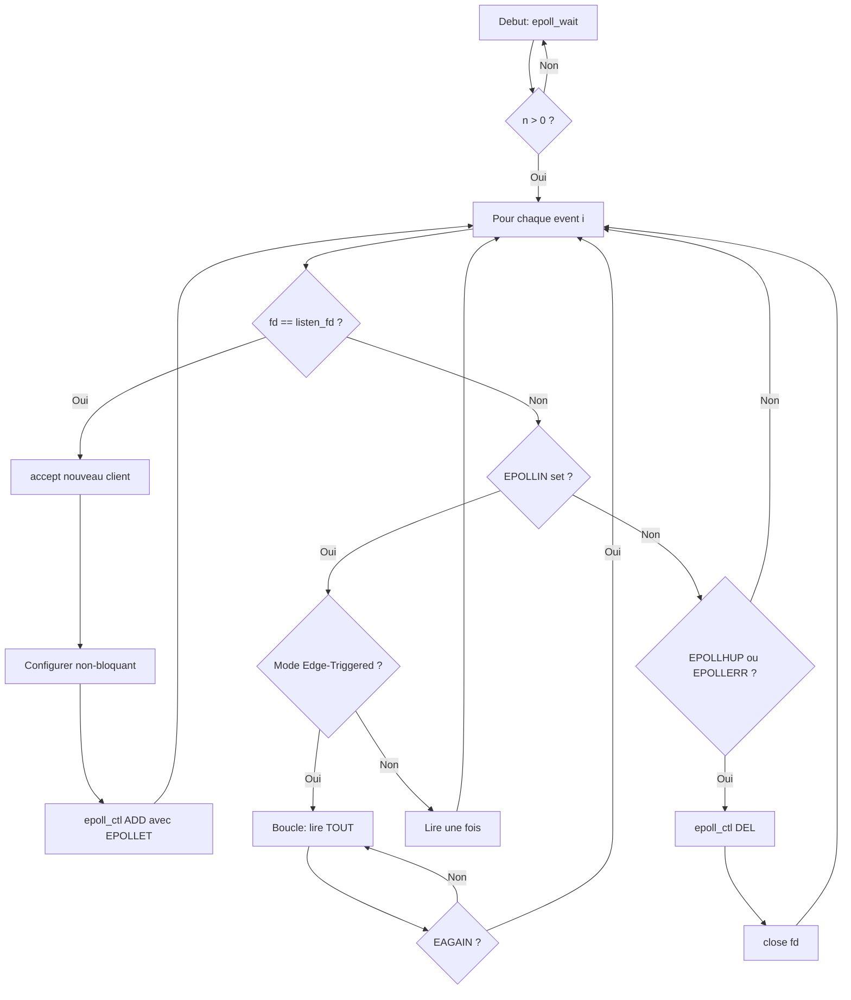

# Exercice 2.5.6 : event_sentinel

**Module :**
2.5 — Programmation Reseau et I/O Multiplexing

**Concept :**
poll/epoll — Multiplexage d'I/O scalable

**Difficulte :**
★★★★★★★☆☆☆ (7/10)

**Type :**
complet

**Tiers :**
3 — Synthese (concepts poll + epoll + event-driven)

**Langage :**
C (C17)

**Prerequis :**
- Sockets TCP/UDP (Module 2.5.1-2.5.5)
- File descriptors et I/O systeme
- Structures de donnees dynamiques

**Domaines :**
Net, Struct, Process

**Duree estimee :**
180 min

**XP Base :**
350

**Complexite :**
T3 O(1) pour epoll / O(n) pour poll × S2 O(n)

---

## SECTION 1 : PROTOTYPE & CONSIGNE

### 1.1 Obligations

**Fichiers a rendre :**
- `event_sentinel.h` (header avec structures et prototypes)
- `poll_set.c` (implementation poll)
- `epoll_set.c` (implementation epoll)
- `sentinel_server.c` (serveur haute performance)

**Fonctions autorisees :**
`poll`, `ppoll`, `epoll_create1`, `epoll_ctl`, `epoll_wait`, `socket`, `bind`, `listen`, `accept`, `recv`, `send`, `close`, `malloc`, `free`, `realloc`, `memset`, `memcpy`, `fcntl`, `errno`

**Fonctions interdites :**
`select`, `pselect`, `libevent`, `libev`, `libuv`

---

### 1.2 Consigne

**L'Oeil de Sauron - Le Gardien des Connexions (The Lord of the Rings)**

Dans les terres du Mordor, Sauron observe tout depuis sa tour de Barad-dur. Son oeil enflamme ne peut surveiller qu'un nombre limite de directions avec les anciennes methodes (`select`), mais avec les Palantiri ameliores (`poll`) et l'Oeil Supreme (`epoll`), il peut surveiller des milliers de royaumes simultanement.

Ton programme est cet Oeil : il doit surveiller des milliers de connexions reseau, detectant instantanement toute activite - qu'un Hobbit tente de se connecter ou qu'un Nazgul envoie des donnees.

**Le probleme du gardien :**
- `select()` : Limite a 1024 file descriptors (FD_SETSIZE) - comme un garde qui ne peut surveiller que 1024 portes
- `poll()` : Pas de limite, mais doit parcourir TOUTES les connexions a chaque reveil - O(n)
- `epoll()` : Linux only, mais O(1) - seules les connexions ACTIVES sont retournees

**Ta mission :**

Implementer un systeme de surveillance d'evenements (`event_sentinel`) capable de :
1. Gerer dynamiquement des milliers de file descriptors avec `poll`
2. Utiliser `epoll` pour une scalabilite O(1)
3. Construire un serveur echo haute performance

**Entree :**
- `poll_set_init(poll_set_t *ps, size_t capacity)` : Capacite initiale du tableau pollfd
- `epoll_set_init(epoll_set_t *es, int max_events)` : Nombre max d'evenements retournes

**Sortie :**
- Retourne `0` si succes
- Retourne `-1` si erreur (errno positionne)

**Contraintes :**
- poll_set doit pouvoir grandir dynamiquement (realloc)
- epoll doit utiliser EPOLLET (edge-triggered) pour le mode haute performance
- Gestion propre de EAGAIN/EWOULDBLOCK en non-bloquant
- Liberation de TOUTES les ressources dans les fonctions destroy

**Exemples :**

| Appel | Retour | Explication |
|-------|--------|-------------|
| `poll_set_init(&ps, 64)` | `0` | Cree un poll set avec capacite 64 |
| `poll_add(&ps, fd, POLLIN)` | `0` | Ajoute fd en surveillance lecture |
| `poll_wait(&ps, 1000)` | `3` | 3 fds sont prets apres 1s max |
| `epoll_add_edge(&es, fd, EPOLLIN)` | `0` | Ajoute fd en mode edge-triggered |

---

### 1.3 Prototype

```c
#ifndef EVENT_SENTINEL_H
#define EVENT_SENTINEL_H

#include <poll.h>
#include <sys/epoll.h>
#include <stdint.h>
#include <stdbool.h>
#include <stddef.h>

// ============== POLL SET ==============

typedef struct {
    struct pollfd *fds;
    nfds_t count;
    nfds_t capacity;
} poll_set_t;

int poll_set_init(poll_set_t *ps, size_t initial_capacity);
void poll_set_destroy(poll_set_t *ps);
int poll_add(poll_set_t *ps, int fd, short events);
int poll_remove(poll_set_t *ps, int fd);
int poll_modify(poll_set_t *ps, int fd, short events);
int poll_wait_events(poll_set_t *ps, int timeout_ms);

bool poll_is_readable(poll_set_t *ps, int fd);
bool poll_is_writable(poll_set_t *ps, int fd);
bool poll_has_error(poll_set_t *ps, int fd);
bool poll_hung_up(poll_set_t *ps, int fd);

// ============== EPOLL SET ==============

typedef struct {
    int epfd;
    struct epoll_event *events;
    int max_events;
    int ready_count;
} epoll_set_t;

int epoll_set_init(epoll_set_t *es, int max_events);
void epoll_set_destroy(epoll_set_t *es);
int epoll_add(epoll_set_t *es, int fd, uint32_t events, void *data);
int epoll_modify(epoll_set_t *es, int fd, uint32_t events, void *data);
int epoll_remove(epoll_set_t *es, int fd);
int epoll_wait_events(epoll_set_t *es, int timeout_ms);

int epoll_add_level(epoll_set_t *es, int fd, uint32_t events);
int epoll_add_edge(epoll_set_t *es, int fd, uint32_t events);
int epoll_add_oneshot(epoll_set_t *es, int fd, uint32_t events);

struct epoll_event *epoll_get_event(epoll_set_t *es, int index);
int epoll_event_fd(struct epoll_event *ev);
void *epoll_event_data(struct epoll_event *ev);

// ============== HIGH-PERF SERVER ==============

typedef struct sentinel_server sentinel_server_t;

typedef void (*sentinel_handler_t)(sentinel_server_t *srv, int fd, uint32_t events);

struct sentinel_server {
    int listen_fd;
    epoll_set_t epoll;
    int max_clients;
    bool running;
    uint64_t total_connections;
    uint64_t bytes_received;
    uint64_t bytes_sent;
    sentinel_handler_t handler;
};

int sentinel_server_create(sentinel_server_t *srv, uint16_t port, int max_clients);
void sentinel_server_destroy(sentinel_server_t *srv);
void sentinel_server_run(sentinel_server_t *srv, sentinel_handler_t handler);
void sentinel_server_stop(sentinel_server_t *srv);

#endif // EVENT_SENTINEL_H
```

---

## SECTION 2 : LE SAVIEZ-VOUS ?

### 2.1 L'Evolution du Multiplexage I/O

Le probleme C10K (10,000 connexions simultanees) a ete pose en 1999. A l'epoque, `select()` avec sa limite FD_SETSIZE etait un goulot d'etranglement majeur.

**Timeline :**
- 1983 : `select()` introduit dans BSD 4.2
- 1997 : `poll()` standardise dans POSIX
- 2002 : `epoll` introduit dans Linux 2.5.44
- 2000s : `kqueue` (BSD), `IOCP` (Windows)

**La revolution epoll :**
Linus Torvalds et Davide Libenzi ont concu epoll pour resoudre le probleme C10K. La cle : au lieu de scanner TOUS les fds, epoll ne retourne QUE les fds actifs.

---

### SECTION 2.5 : DANS LA VRAIE VIE

**DevOps / SRE (Site Reliability Engineer) :**
- NGINX utilise epoll pour gerer 10,000+ connexions par worker
- Redis utilise ae_epoll.c pour son event loop
- HAProxy, le load balancer, repose entierement sur epoll

**Developpeur Backend :**
- Node.js utilise libuv qui wrappe epoll sur Linux
- Go utilise netpoller base sur epoll
- Tout serveur web haute performance

**Ingenieur Systeme/Kernel :**
- Debugging des performances I/O
- Tuning du parametre `/proc/sys/fs/epoll/max_user_watches`
- Analyse avec `strace` des appels epoll_wait

**Cas d'usage critique :**
Un serveur de chat comme Discord gere des millions de connexions WebSocket simultanees. Sans epoll (ou equivalent), impossible de scaler.

---

## SECTION 3 : EXEMPLE D'UTILISATION

### 3.0 Session bash

```bash
$ ls
event_sentinel.h  poll_set.c  epoll_set.c  sentinel_server.c  main.c  Makefile

$ make
gcc -Wall -Wextra -Werror -O2 -c poll_set.c -o poll_set.o
gcc -Wall -Wextra -Werror -O2 -c epoll_set.c -o epoll_set.o
gcc -Wall -Wextra -Werror -O2 -c sentinel_server.c -o sentinel_server.o
gcc -Wall -Wextra -Werror -O2 poll_set.o epoll_set.o sentinel_server.o main.c -o sentinel

$ ./sentinel
=== Poll Demo ===
Poll set initialized with capacity 64
Added fd 0 (stdin) for POLLIN
Waiting 3 seconds for input...
poll_wait returned: 1 fd ready
stdin is readable!

=== Epoll Demo ===
Epoll instance created (epfd=4)
Added fd 0 with EPOLLIN (level-triggered)
epoll_wait returned: 1 event
  Event 0: fd=0, events=EPOLLIN

=== Edge vs Level Triggered ===
Level-triggered: notifies WHILE data available
Edge-triggered: notifies ONCE on state change
One-shot: notifies once, must re-arm

=== Sentinel Server Demo ===
Starting server on port 8080...
Listening with epoll (max 10000 clients)
[Use Ctrl+C to stop]

$ # In another terminal:
$ echo "Hello Sauron" | nc localhost 8080
Hello Sauron

$ # Server output:
New connection: fd=5
Received 13 bytes from fd=5
Sent 13 bytes to fd=5
Connection closed: fd=5

All tests passed!
```

---

### 3.1 BONUS EXPERT (OPTIONNEL)

**Difficulte Bonus :**
★★★★★★★★★☆ (9/10)

**Recompense :**
XP x4

**Time Complexity attendue :**
O(1) amorti pour toutes les operations

**Space Complexity attendue :**
O(n) ou n = nombre de connexions actives

**Domaines Bonus :**
`Process, Mem`

#### 3.1.1 Consigne Bonus

**L'Oeil de Sauron - Mode Thread Pool (LOTR Extended)**

Sauron veut maintenant distribuer la surveillance entre ses Nazgul (threads). Chaque Nazgul gere un sous-ensemble de connexions, et l'Oeil central (main thread) distribue le travail.

**Ta mission :**

Implementer `sentinel_server_threaded` qui utilise EPOLLONESHOT pour distribuer le travail entre N worker threads.

**Contraintes :**
```
┌─────────────────────────────────────────┐
│  1 ≤ num_workers ≤ 32                   │
│  Pas de data race (mutex/atomic)        │
│  Re-arm EPOLLONESHOT apres traitement   │
│  Graceful shutdown de tous les threads  │
└─────────────────────────────────────────┘
```

**Prototype Bonus :**

```c
typedef struct {
    sentinel_server_t base;
    pthread_t *workers;
    int num_workers;
    pthread_mutex_t lock;
    bool shutdown;
} threaded_sentinel_t;

int threaded_sentinel_create(threaded_sentinel_t *srv, uint16_t port,
                             int max_clients, int num_workers);
void threaded_sentinel_run(threaded_sentinel_t *srv, sentinel_handler_t handler);
void threaded_sentinel_destroy(threaded_sentinel_t *srv);
```

#### 3.1.2 Ce qui change par rapport a l'exercice de base

| Aspect | Base | Bonus |
|--------|------|-------|
| Threads | Single-threaded | Multi-threaded avec pool |
| epoll mode | EPOLLET | EPOLLONESHOT |
| Synchronisation | Aucune | Mutex pour re-arm |
| Shutdown | Simple close | Graceful avec join |
| Complexite | O(1) events | O(1) + overhead sync |

---

## SECTION 4 : ZONE CORRECTION

### 4.1 Moulinette

| Test | Description | Points | Trap |
|------|-------------|--------|------|
| `test_poll_init` | Initialisation poll_set | 5 | NULL ptr |
| `test_poll_add_remove` | Ajout/suppression fd | 10 | fd invalide |
| `test_poll_wait` | Attente avec timeout | 10 | timeout 0 |
| `test_poll_events` | POLLIN/POLLOUT/POLLERR | 10 | revents check |
| `test_poll_resize` | Redimensionnement dynamique | 10 | realloc fail |
| `test_epoll_init` | Creation epoll instance | 5 | epoll_create fail |
| `test_epoll_ctl` | ADD/MOD/DEL | 15 | double add |
| `test_epoll_modes` | Level/Edge/Oneshot | 15 | edge sans drain |
| `test_server_basic` | Echo server simple | 10 | accept fail |
| `test_server_concurrent` | Multiple clients | 10 | fd leak |
| **Total** | | **100** | |

---

### 4.2 main.c de test

```c
#include <stdio.h>
#include <stdlib.h>
#include <string.h>
#include <unistd.h>
#include <fcntl.h>
#include <sys/socket.h>
#include <netinet/in.h>
#include <arpa/inet.h>
#include <errno.h>
#include "event_sentinel.h"

#define TEST(name) printf("Testing %s... ", name)
#define PASS() printf("OK\n")
#define FAIL(msg) do { printf("FAILED: %s\n", msg); return 1; } while(0)

int test_poll_init(void) {
    TEST("poll_set_init");

    poll_set_t ps;

    // Test NULL
    if (poll_set_init(NULL, 64) != -1) FAIL("should reject NULL");

    // Test normal init
    if (poll_set_init(&ps, 64) != 0) FAIL("init failed");
    if (ps.fds == NULL) FAIL("fds is NULL");
    if (ps.capacity != 64) FAIL("wrong capacity");
    if (ps.count != 0) FAIL("count should be 0");

    poll_set_destroy(&ps);
    PASS();
    return 0;
}

int test_poll_add_remove(void) {
    TEST("poll_add_remove");

    poll_set_t ps;
    poll_set_init(&ps, 4);

    // Add stdin
    if (poll_add(&ps, STDIN_FILENO, POLLIN) != 0) FAIL("add failed");
    if (ps.count != 1) FAIL("count should be 1");

    // Add duplicate should fail or update
    int ret = poll_add(&ps, STDIN_FILENO, POLLOUT);
    // Either fails or updates, both acceptable

    // Remove
    if (poll_remove(&ps, STDIN_FILENO) != 0) FAIL("remove failed");
    if (ps.count != 0) FAIL("count should be 0");

    // Remove non-existent should fail
    if (poll_remove(&ps, 999) != -1) FAIL("should fail for invalid fd");

    poll_set_destroy(&ps);
    PASS();
    return 0;
}

int test_epoll_init(void) {
    TEST("epoll_set_init");

    epoll_set_t es;

    // Test NULL
    if (epoll_set_init(NULL, 64) != -1) FAIL("should reject NULL");

    // Test normal init
    if (epoll_set_init(&es, 64) != 0) FAIL("init failed");
    if (es.epfd < 0) FAIL("invalid epfd");
    if (es.events == NULL) FAIL("events is NULL");
    if (es.max_events != 64) FAIL("wrong max_events");

    epoll_set_destroy(&es);
    PASS();
    return 0;
}

int test_epoll_modes(void) {
    TEST("epoll_modes");

    epoll_set_t es;
    epoll_set_init(&es, 64);

    int pipefd[2];
    if (pipe(pipefd) != 0) FAIL("pipe failed");

    // Level-triggered (default)
    if (epoll_add_level(&es, pipefd[0], EPOLLIN) != 0) FAIL("add_level failed");

    // Modify to edge-triggered
    epoll_remove(&es, pipefd[0]);
    if (epoll_add_edge(&es, pipefd[0], EPOLLIN) != 0) FAIL("add_edge failed");

    // Modify to oneshot
    epoll_remove(&es, pipefd[0]);
    if (epoll_add_oneshot(&es, pipefd[0], EPOLLIN) != 0) FAIL("add_oneshot failed");

    close(pipefd[0]);
    close(pipefd[1]);
    epoll_set_destroy(&es);
    PASS();
    return 0;
}

int main(void) {
    printf("=== Event Sentinel Tests ===\n\n");

    int failed = 0;
    failed += test_poll_init();
    failed += test_poll_add_remove();
    failed += test_epoll_init();
    failed += test_epoll_modes();

    printf("\n=== Results: %d test(s) failed ===\n", failed);
    return failed;
}
```

---

### 4.3 Solution de reference

```c
// poll_set.c - Solution de reference
#include "event_sentinel.h"
#include <stdlib.h>
#include <string.h>
#include <errno.h>

int poll_set_init(poll_set_t *ps, size_t initial_capacity) {
    if (ps == NULL || initial_capacity == 0) {
        errno = EINVAL;
        return -1;
    }

    ps->fds = malloc(initial_capacity * sizeof(struct pollfd));
    if (ps->fds == NULL) {
        return -1;
    }

    ps->count = 0;
    ps->capacity = initial_capacity;

    return 0;
}

void poll_set_destroy(poll_set_t *ps) {
    if (ps == NULL) return;

    free(ps->fds);
    ps->fds = NULL;
    ps->count = 0;
    ps->capacity = 0;
}

static int poll_find_fd(poll_set_t *ps, int fd) {
    for (nfds_t i = 0; i < ps->count; i++) {
        if (ps->fds[i].fd == fd) {
            return (int)i;
        }
    }
    return -1;
}

int poll_add(poll_set_t *ps, int fd, short events) {
    if (ps == NULL || fd < 0) {
        errno = EINVAL;
        return -1;
    }

    // Check if already exists
    int idx = poll_find_fd(ps, fd);
    if (idx >= 0) {
        ps->fds[idx].events = events;
        return 0;
    }

    // Resize if needed
    if (ps->count >= ps->capacity) {
        size_t new_cap = ps->capacity * 2;
        struct pollfd *new_fds = realloc(ps->fds, new_cap * sizeof(struct pollfd));
        if (new_fds == NULL) {
            return -1;
        }
        ps->fds = new_fds;
        ps->capacity = new_cap;
    }

    // Add new entry
    ps->fds[ps->count].fd = fd;
    ps->fds[ps->count].events = events;
    ps->fds[ps->count].revents = 0;
    ps->count++;

    return 0;
}

int poll_remove(poll_set_t *ps, int fd) {
    if (ps == NULL || fd < 0) {
        errno = EINVAL;
        return -1;
    }

    int idx = poll_find_fd(ps, fd);
    if (idx < 0) {
        errno = ENOENT;
        return -1;
    }

    // Move last element to this position
    if ((nfds_t)idx < ps->count - 1) {
        ps->fds[idx] = ps->fds[ps->count - 1];
    }
    ps->count--;

    return 0;
}

int poll_wait_events(poll_set_t *ps, int timeout_ms) {
    if (ps == NULL) {
        errno = EINVAL;
        return -1;
    }

    // Reset revents
    for (nfds_t i = 0; i < ps->count; i++) {
        ps->fds[i].revents = 0;
    }

    return poll(ps->fds, ps->count, timeout_ms);
}

bool poll_is_readable(poll_set_t *ps, int fd) {
    int idx = poll_find_fd(ps, fd);
    if (idx < 0) return false;
    return (ps->fds[idx].revents & POLLIN) != 0;
}

bool poll_is_writable(poll_set_t *ps, int fd) {
    int idx = poll_find_fd(ps, fd);
    if (idx < 0) return false;
    return (ps->fds[idx].revents & POLLOUT) != 0;
}

bool poll_has_error(poll_set_t *ps, int fd) {
    int idx = poll_find_fd(ps, fd);
    if (idx < 0) return false;
    return (ps->fds[idx].revents & POLLERR) != 0;
}

bool poll_hung_up(poll_set_t *ps, int fd) {
    int idx = poll_find_fd(ps, fd);
    if (idx < 0) return false;
    return (ps->fds[idx].revents & POLLHUP) != 0;
}
```

```c
// epoll_set.c - Solution de reference
#include "event_sentinel.h"
#include <stdlib.h>
#include <unistd.h>
#include <errno.h>

int epoll_set_init(epoll_set_t *es, int max_events) {
    if (es == NULL || max_events <= 0) {
        errno = EINVAL;
        return -1;
    }

    es->epfd = epoll_create1(EPOLL_CLOEXEC);
    if (es->epfd < 0) {
        return -1;
    }

    es->events = malloc(max_events * sizeof(struct epoll_event));
    if (es->events == NULL) {
        close(es->epfd);
        return -1;
    }

    es->max_events = max_events;
    es->ready_count = 0;

    return 0;
}

void epoll_set_destroy(epoll_set_t *es) {
    if (es == NULL) return;

    if (es->epfd >= 0) {
        close(es->epfd);
        es->epfd = -1;
    }

    free(es->events);
    es->events = NULL;
    es->max_events = 0;
    es->ready_count = 0;
}

int epoll_add(epoll_set_t *es, int fd, uint32_t events, void *data) {
    if (es == NULL || fd < 0) {
        errno = EINVAL;
        return -1;
    }

    struct epoll_event ev;
    ev.events = events;
    ev.data.ptr = data;
    ev.data.fd = fd;

    return epoll_ctl(es->epfd, EPOLL_CTL_ADD, fd, &ev);
}

int epoll_modify(epoll_set_t *es, int fd, uint32_t events, void *data) {
    if (es == NULL || fd < 0) {
        errno = EINVAL;
        return -1;
    }

    struct epoll_event ev;
    ev.events = events;
    ev.data.ptr = data;
    ev.data.fd = fd;

    return epoll_ctl(es->epfd, EPOLL_CTL_MOD, fd, &ev);
}

int epoll_remove(epoll_set_t *es, int fd) {
    if (es == NULL || fd < 0) {
        errno = EINVAL;
        return -1;
    }

    return epoll_ctl(es->epfd, EPOLL_CTL_DEL, fd, NULL);
}

int epoll_wait_events(epoll_set_t *es, int timeout_ms) {
    if (es == NULL) {
        errno = EINVAL;
        return -1;
    }

    es->ready_count = epoll_wait(es->epfd, es->events, es->max_events, timeout_ms);
    return es->ready_count;
}

int epoll_add_level(epoll_set_t *es, int fd, uint32_t events) {
    return epoll_add(es, fd, events, NULL);
}

int epoll_add_edge(epoll_set_t *es, int fd, uint32_t events) {
    return epoll_add(es, fd, events | EPOLLET, NULL);
}

int epoll_add_oneshot(epoll_set_t *es, int fd, uint32_t events) {
    return epoll_add(es, fd, events | EPOLLONESHOT, NULL);
}

struct epoll_event *epoll_get_event(epoll_set_t *es, int index) {
    if (es == NULL || index < 0 || index >= es->ready_count) {
        return NULL;
    }
    return &es->events[index];
}

int epoll_event_fd(struct epoll_event *ev) {
    if (ev == NULL) return -1;
    return ev->data.fd;
}

void *epoll_event_data(struct epoll_event *ev) {
    if (ev == NULL) return NULL;
    return ev->data.ptr;
}
```

---

### 4.4 Solutions alternatives acceptees

```c
// Alternative 1: Utilisation de memmove au lieu de swap pour poll_remove
int poll_remove_alt(poll_set_t *ps, int fd) {
    int idx = poll_find_fd(ps, fd);
    if (idx < 0) return -1;

    memmove(&ps->fds[idx], &ps->fds[idx + 1],
            (ps->count - idx - 1) * sizeof(struct pollfd));
    ps->count--;
    return 0;
}

// Alternative 2: epoll avec data.ptr au lieu de data.fd
int epoll_add_with_ptr(epoll_set_t *es, int fd, uint32_t events, void *user_data) {
    struct epoll_event ev = {0};
    ev.events = events;
    ev.data.ptr = user_data;  // Store pointer instead of fd
    return epoll_ctl(es->epfd, EPOLL_CTL_ADD, fd, &ev);
}
```

---

### 4.5 Solutions refusees

```c
// REFUSE 1: Pas de verification NULL
int poll_set_init_bad(poll_set_t *ps, size_t cap) {
    ps->fds = malloc(cap * sizeof(struct pollfd)); // CRASH si ps NULL!
    ps->count = 0;
    ps->capacity = cap;
    return 0;
}
// Pourquoi refuse: Segfault si ps est NULL

// REFUSE 2: Memory leak dans epoll_set_init
int epoll_set_init_leak(epoll_set_t *es, int max) {
    es->epfd = epoll_create1(0);
    if (es->epfd < 0) return -1;

    es->events = malloc(max * sizeof(struct epoll_event));
    if (es->events == NULL) {
        return -1;  // LEAK: epfd not closed!
    }
    return 0;
}
// Pourquoi refuse: File descriptor leak si malloc echoue

// REFUSE 3: Oubli de EPOLL_CLOEXEC
int epoll_set_init_no_cloexec(epoll_set_t *es, int max) {
    es->epfd = epoll_create(max);  // Deprecated + no CLOEXEC
    // ...
}
// Pourquoi refuse: epoll_create deprecated, fd leak apres fork/exec
```

---

### 4.6 Solution bonus de reference

```c
// threaded_sentinel.c - Solution bonus complete
#include "event_sentinel.h"
#include <pthread.h>
#include <stdlib.h>
#include <unistd.h>
#include <fcntl.h>
#include <errno.h>

typedef struct {
    sentinel_server_t base;
    pthread_t *workers;
    int num_workers;
    pthread_mutex_t lock;
    volatile bool shutdown;
    sentinel_handler_t handler;
} threaded_sentinel_t;

static void set_nonblocking(int fd) {
    int flags = fcntl(fd, F_GETFL, 0);
    fcntl(fd, F_SETFL, flags | O_NONBLOCK);
}

static void *worker_thread(void *arg) {
    threaded_sentinel_t *srv = (threaded_sentinel_t *)arg;

    while (!srv->shutdown) {
        int n = epoll_wait_events(&srv->base.epoll, 100);

        for (int i = 0; i < n; i++) {
            struct epoll_event *ev = epoll_get_event(&srv->base.epoll, i);
            int fd = epoll_event_fd(ev);

            if (fd == srv->base.listen_fd) {
                // Accept new connections (only one thread should do this)
                pthread_mutex_lock(&srv->lock);
                int client = accept(fd, NULL, NULL);
                if (client >= 0) {
                    set_nonblocking(client);
                    epoll_add(&srv->base.epoll, client,
                              EPOLLIN | EPOLLET | EPOLLONESHOT, NULL);
                }
                // Re-arm listen socket
                epoll_modify(&srv->base.epoll, fd,
                            EPOLLIN | EPOLLONESHOT, NULL);
                pthread_mutex_unlock(&srv->lock);
            } else {
                // Handle client
                srv->handler(&srv->base, fd, ev->events);

                // Re-arm with ONESHOT
                pthread_mutex_lock(&srv->lock);
                epoll_modify(&srv->base.epoll, fd,
                            EPOLLIN | EPOLLET | EPOLLONESHOT, NULL);
                pthread_mutex_unlock(&srv->lock);
            }
        }
    }

    return NULL;
}

int threaded_sentinel_create(threaded_sentinel_t *srv, uint16_t port,
                             int max_clients, int num_workers) {
    if (srv == NULL || num_workers < 1 || num_workers > 32) {
        errno = EINVAL;
        return -1;
    }

    if (sentinel_server_create(&srv->base, port, max_clients) != 0) {
        return -1;
    }

    srv->workers = malloc(num_workers * sizeof(pthread_t));
    if (srv->workers == NULL) {
        sentinel_server_destroy(&srv->base);
        return -1;
    }

    srv->num_workers = num_workers;
    srv->shutdown = false;
    pthread_mutex_init(&srv->lock, NULL);

    return 0;
}

void threaded_sentinel_run(threaded_sentinel_t *srv, sentinel_handler_t handler) {
    srv->handler = handler;

    // Start worker threads
    for (int i = 0; i < srv->num_workers; i++) {
        pthread_create(&srv->workers[i], NULL, worker_thread, srv);
    }

    // Wait for all workers
    for (int i = 0; i < srv->num_workers; i++) {
        pthread_join(srv->workers[i], NULL);
    }
}

void threaded_sentinel_destroy(threaded_sentinel_t *srv) {
    if (srv == NULL) return;

    srv->shutdown = true;

    // Wake up workers by closing epfd
    sentinel_server_destroy(&srv->base);

    pthread_mutex_destroy(&srv->lock);
    free(srv->workers);
}
```

---

### 4.9 spec.json

```json
{
  "name": "event_sentinel",
  "language": "c",
  "type": "code",
  "tier": 3,
  "tier_info": "Synthese poll + epoll + event-driven",
  "tags": ["network", "epoll", "poll", "io-multiplexing", "phase2"],
  "passing_score": 70,

  "function": {
    "name": "poll_set_init",
    "prototype": "int poll_set_init(poll_set_t *ps, size_t initial_capacity)",
    "return_type": "int",
    "parameters": [
      {"name": "ps", "type": "poll_set_t *"},
      {"name": "initial_capacity", "type": "size_t"}
    ]
  },

  "additional_functions": [
    {
      "name": "epoll_set_init",
      "prototype": "int epoll_set_init(epoll_set_t *es, int max_events)",
      "return_type": "int"
    },
    {
      "name": "epoll_add_edge",
      "prototype": "int epoll_add_edge(epoll_set_t *es, int fd, uint32_t events)",
      "return_type": "int"
    }
  ],

  "driver": {
    "reference": "int ref_poll_set_init(poll_set_t *ps, size_t cap) { if (ps == NULL || cap == 0) { errno = EINVAL; return -1; } ps->fds = malloc(cap * sizeof(struct pollfd)); if (ps->fds == NULL) return -1; ps->count = 0; ps->capacity = cap; return 0; }",

    "edge_cases": [
      {
        "name": "null_poll_set",
        "args": [null, 64],
        "expected": -1,
        "is_trap": true,
        "trap_explanation": "ps est NULL, doit retourner -1"
      },
      {
        "name": "zero_capacity",
        "args": ["valid_ptr", 0],
        "expected": -1,
        "is_trap": true,
        "trap_explanation": "capacite 0 invalide"
      },
      {
        "name": "normal_init",
        "args": ["valid_ptr", 64],
        "expected": 0
      },
      {
        "name": "large_capacity",
        "args": ["valid_ptr", 10000],
        "expected": 0
      }
    ],

    "fuzzing": {
      "enabled": true,
      "iterations": 500,
      "generators": [
        {
          "type": "int",
          "param_index": 1,
          "params": {"min": 0, "max": 100000}
        }
      ]
    }
  },

  "norm": {
    "allowed_functions": ["poll", "ppoll", "epoll_create1", "epoll_ctl", "epoll_wait", "malloc", "free", "realloc", "memset", "close", "fcntl"],
    "forbidden_functions": ["select", "pselect"],
    "check_security": true,
    "check_memory": true,
    "blocking": true
  }
}
```

---

### 4.10 Solutions Mutantes

```c
/* Mutant A (Boundary) : Off-by-one dans resize */
int poll_add_mutant_a(poll_set_t *ps, int fd, short events) {
    if (ps == NULL || fd < 0) return -1;

    // BUG: >= au lieu de >
    if (ps->count > ps->capacity) {  // Should be >=
        size_t new_cap = ps->capacity * 2;
        struct pollfd *new_fds = realloc(ps->fds, new_cap * sizeof(struct pollfd));
        if (new_fds == NULL) return -1;
        ps->fds = new_fds;
        ps->capacity = new_cap;
    }

    ps->fds[ps->count].fd = fd;
    ps->fds[ps->count].events = events;
    ps->fds[ps->count].revents = 0;
    ps->count++;

    return 0;
}
// Pourquoi c'est faux: Buffer overflow quand count == capacity
// Ce qui etait pense: "On resize quand on depasse la capacite"

/* Mutant B (Safety) : Pas de verification NULL */
int epoll_set_init_mutant_b(epoll_set_t *es, int max_events) {
    // BUG: Pas de check NULL
    es->epfd = epoll_create1(EPOLL_CLOEXEC);
    if (es->epfd < 0) return -1;

    es->events = malloc(max_events * sizeof(struct epoll_event));
    if (es->events == NULL) {
        close(es->epfd);
        return -1;
    }

    es->max_events = max_events;
    es->ready_count = 0;
    return 0;
}
// Pourquoi c'est faux: Segfault si es est NULL
// Ce qui etait pense: "L'appelant verifiera toujours"

/* Mutant C (Resource) : Fuite de file descriptor */
int epoll_set_init_mutant_c(epoll_set_t *es, int max_events) {
    if (es == NULL || max_events <= 0) return -1;

    es->epfd = epoll_create1(EPOLL_CLOEXEC);
    if (es->epfd < 0) return -1;

    es->events = malloc(max_events * sizeof(struct epoll_event));
    if (es->events == NULL) {
        // BUG: Oubli de close(es->epfd)
        return -1;
    }

    es->max_events = max_events;
    es->ready_count = 0;
    return 0;
}
// Pourquoi c'est faux: File descriptor leak si malloc echoue
// Ce qui etait pense: "Le return -1 suffit pour signaler l'erreur"

/* Mutant D (Logic) : Mauvais flag pour epoll_add_edge */
int epoll_add_edge_mutant_d(epoll_set_t *es, int fd, uint32_t events) {
    if (es == NULL || fd < 0) return -1;

    struct epoll_event ev;
    ev.events = events;  // BUG: Oubli de | EPOLLET
    ev.data.fd = fd;

    return epoll_ctl(es->epfd, EPOLL_CTL_ADD, fd, &ev);
}
// Pourquoi c'est faux: Mode level-triggered au lieu de edge-triggered
// Ce qui etait pense: "La fonction s'appelle edge, ca doit etre edge"

/* Mutant E (Return) : Mauvaise valeur de retour pour poll_wait */
int poll_wait_mutant_e(poll_set_t *ps, int timeout_ms) {
    if (ps == NULL) return -1;

    for (nfds_t i = 0; i < ps->count; i++) {
        ps->fds[i].revents = 0;
    }

    int ret = poll(ps->fds, ps->count, timeout_ms);
    return 0;  // BUG: Retourne toujours 0 au lieu de ret
}
// Pourquoi c'est faux: L'appelant ne sait pas combien de fds sont prets
// Ce qui etait pense: "0 signifie succes"
```

---

## SECTION 5 : COMPRENDRE

### 5.1 Ce que cet exercice enseigne

1. **I/O Multiplexing** : Surveiller plusieurs file descriptors simultanement
2. **poll vs select** : Avantages de poll (pas de limite FD_SETSIZE)
3. **epoll** : L'API Linux haute performance O(1)
4. **Edge vs Level Triggered** : Modes de notification epoll
5. **Event-driven programming** : Architecture non-bloquante

---

### 5.2 LDA - Traduction Litterale en MAJUSCULES

```
FONCTION poll_set_init QUI RETOURNE UN ENTIER ET PREND EN PARAMETRES ps QUI EST UN POINTEUR VERS UNE STRUCTURE poll_set_t ET initial_capacity QUI EST UNE TAILLE
DEBUT FONCTION
    SI ps EST EGAL A NUL OU initial_capacity EST EGAL A 0 ALORS
        AFFECTER EINVAL A errno
        RETOURNER LA VALEUR MOINS 1
    FIN SI

    AFFECTER ALLOUER LA MEMOIRE DE initial_capacity FOIS LA TAILLE D'UNE STRUCTURE pollfd AU CHAMP fds DE ps
    SI LE CHAMP fds DE ps EST EGAL A NUL ALORS
        RETOURNER LA VALEUR MOINS 1
    FIN SI

    AFFECTER 0 AU CHAMP count DE ps
    AFFECTER initial_capacity AU CHAMP capacity DE ps

    RETOURNER LA VALEUR 0
FIN FONCTION

FONCTION epoll_add_edge QUI RETOURNE UN ENTIER ET PREND EN PARAMETRES es QUI EST UN POINTEUR VERS UNE STRUCTURE epoll_set_t ET fd QUI EST UN ENTIER ET events QUI EST UN ENTIER 32 BITS NON SIGNE
DEBUT FONCTION
    SI es EST EGAL A NUL OU fd EST INFERIEUR A 0 ALORS
        AFFECTER EINVAL A errno
        RETOURNER LA VALEUR MOINS 1
    FIN SI

    DECLARER ev COMME STRUCTURE epoll_event
    AFFECTER events OU-BINAIRE EPOLLET AU CHAMP events DE ev
    AFFECTER fd AU CHAMP data.fd DE ev

    RETOURNER APPELER epoll_ctl AVEC LE CHAMP epfd DE es ET EPOLL_CTL_ADD ET fd ET L'ADRESSE DE ev
FIN FONCTION
```

---

### 5.2.2 LDA Style Academique

```
ALGORITHME : Initialisation d'un ensemble poll
ENTREES : ps (pointeur vers poll_set_t), capacite (entier positif)
SORTIES : 0 si succes, -1 si erreur

DEBUT
    SI ps = NIL OU capacite = 0 ALORS
        errno <- EINVAL
        RETOURNER -1
    FIN SI

    ps.fds <- ALLOUER(capacite * TAILLE(pollfd))
    SI ps.fds = NIL ALORS
        RETOURNER -1
    FIN SI

    ps.count <- 0
    ps.capacity <- capacite

    RETOURNER 0
FIN
```

---

### 5.2.2.1 Logic Flow (Structured English)

```
ALGORITHM: epoll Event Loop
---
1. INITIALIZE epoll set with max_events capacity

2. ADD listening socket to epoll (EPOLLIN, level-triggered)

3. INFINITE LOOP (Event Loop):
   a. CALL epoll_wait(timeout)

   b. FOR EACH ready event:
      - IF fd is listen_fd:
          ACCEPT new connection
          SET non-blocking
          ADD to epoll (edge-triggered)

      - ELSE IF event has EPOLLIN:
          LOOP:
              READ data
              IF no more data (EAGAIN): BREAK
              PROCESS data
          END LOOP

      - ELSE IF event has EPOLLHUP or EPOLLERR:
          REMOVE fd from epoll
          CLOSE fd

4. CLEANUP and EXIT
```

---

### 5.2.3 Representation Algorithmique

```
FONCTION : Event Loop avec epoll
---
INIT epoll_fd = epoll_create1(CLOEXEC)
INIT events[MAX_EVENTS]

1. AJOUTER listen_fd avec EPOLLIN
   |
   |-- epoll_ctl(ADD, listen_fd, EPOLLIN)

2. BOUCLE PRINCIPALE :
   |
   |-- n = epoll_wait(epoll_fd, events, MAX, timeout)
   |
   |-- POUR i DE 0 A n-1 :
   |     |
   |     |-- SI events[i].data.fd == listen_fd :
   |     |     |-- client = accept()
   |     |     |-- epoll_ctl(ADD, client, EPOLLIN | EPOLLET)
   |     |
   |     |-- SINON :
   |           |-- Traiter client (read/write)
   |           |-- SI deconnexion : epoll_ctl(DEL) + close()

3. NETTOYAGE :
   |-- close(epoll_fd)
```

---

### 5.2.3.1 Diagramme Mermaid (Logique de Garde)



---

### 5.3 Visualisation ASCII

```
                    COMPARAISON SELECT vs POLL vs EPOLL

select():                      poll():                       epoll():
┌─────────────────┐           ┌─────────────────┐           ┌─────────────────┐
│ FD_SET (bitmap) │           │ pollfd array    │           │ Red-Black Tree  │
│ Max 1024 fds    │           │ No limit        │           │ No limit        │
│ Must rebuild    │           │ events/revents  │           │ Persistent      │
└────────┬────────┘           └────────┬────────┘           └────────┬────────┘
         │                             │                             │
         ▼                             ▼                             ▼
    ┌─────────┐                  ┌─────────┐                  ┌─────────┐
    │ Kernel  │                  │ Kernel  │                  │ Kernel  │
    │ scans   │                  │ scans   │                  │ ready   │
    │ ALL fds │                  │ ALL fds │                  │ list    │
    │  O(n)   │                  │  O(n)   │                  │  O(1)   │
    └─────────┘                  └─────────┘                  └─────────┘


                    EDGE-TRIGGERED vs LEVEL-TRIGGERED

    Data arrives:     █████████████████████████
                      ↑
    Level-triggered:  ↑───────────────────────→  (notifie tant que data)
                      │   │   │   │   │   │
                      ▼   ▼   ▼   ▼   ▼   ▼

    Edge-triggered:   ↑                          (notifie UNE fois)
                      │
                      ▼


                    ARCHITECTURE SERVEUR HAUTE PERFORMANCE

    ┌─────────────────────────────────────────────────────────────┐
    │                     MAIN THREAD                              │
    │  ┌─────────────┐                                            │
    │  │ listen_fd   │ ◄──── Nouvelles connexions                 │
    │  └──────┬──────┘                                            │
    │         │                                                   │
    │         ▼                                                   │
    │  ┌─────────────┐                                            │
    │  │   epoll     │ ◄──── Surveille TOUT                       │
    │  │   instance  │                                            │
    │  └──────┬──────┘                                            │
    │         │                                                   │
    │         ▼ epoll_wait() retourne SEULEMENT les fds actifs    │
    │  ┌─────────────────────────────────────────┐               │
    │  │  ready_list: [fd=5, fd=12, fd=847]      │               │
    │  └─────────────────────────────────────────┘               │
    │         │                                                   │
    │         ▼                                                   │
    │  ┌─────┬─────┬─────┐                                       │
    │  │ fd5 │fd12 │fd847│  ◄──── Traitement sequentiel          │
    │  │read │read │read │       ou distribution aux workers     │
    │  └─────┴─────┴─────┘                                       │
    └─────────────────────────────────────────────────────────────┘
```

---

### 5.4 Les pieges en detail

**Piege 1 : Edge-triggered sans drainer completement**
```c
// FAUX - Rate des donnees!
if (events & EPOLLIN) {
    char buf[1024];
    read(fd, buf, sizeof(buf));  // Lit une fois seulement
    // Si plus de 1024 bytes, le reste est perdu!
}

// CORRECT - Drainer tout
if (events & EPOLLIN) {
    char buf[1024];
    ssize_t n;
    while ((n = read(fd, buf, sizeof(buf))) > 0) {
        process(buf, n);
    }
    if (n < 0 && errno != EAGAIN) {
        handle_error();
    }
}
```

**Piege 2 : Oublier EPOLL_CLOEXEC**
```c
// FAUX - fd leak apres fork/exec
int epfd = epoll_create(100);

// CORRECT
int epfd = epoll_create1(EPOLL_CLOEXEC);
```

**Piege 3 : Double add dans epoll**
```c
// FAUX - EEXIST error
epoll_ctl(epfd, EPOLL_CTL_ADD, fd, &ev);
epoll_ctl(epfd, EPOLL_CTL_ADD, fd, &ev);  // Erreur!

// CORRECT - Verifier ou utiliser MOD
if (epoll_ctl(epfd, EPOLL_CTL_ADD, fd, &ev) < 0) {
    if (errno == EEXIST) {
        epoll_ctl(epfd, EPOLL_CTL_MOD, fd, &ev);
    }
}
```

---

### 5.5 Cours Complet

#### 5.5.1 Le Probleme du C10K

En 1999, Dan Kegel a pose le "C10K problem" : comment gerer 10,000 connexions simultanees sur un seul serveur? A l'epoque, chaque connexion = 1 thread/processus = impossible a scaler.

**Solutions :**
1. **Multiplexing I/O** : Un seul thread gere N connexions
2. **Event-driven** : Reagir aux evenements plutot qu'attendre

#### 5.5.2 select() - L'Ancetre

```c
fd_set read_fds;
FD_ZERO(&read_fds);
FD_SET(fd, &read_fds);
int n = select(fd + 1, &read_fds, NULL, NULL, &timeout);
```

**Limitations :**
- FD_SETSIZE = 1024 (compile-time)
- O(n) scan dans le kernel
- Doit reconstruire fd_set a chaque appel

#### 5.5.3 poll() - L'Amelioration

```c
struct pollfd fds[N];
fds[0].fd = sock;
fds[0].events = POLLIN;
int n = poll(fds, N, timeout);
if (fds[0].revents & POLLIN) { /* readable */ }
```

**Avantages sur select :**
- Pas de limite de fds
- events/revents separes (pas de rebuild)
- Interface plus propre

**Inconvenient :**
- Toujours O(n) dans le kernel

#### 5.5.4 epoll() - La Revolution Linux

```c
int epfd = epoll_create1(EPOLL_CLOEXEC);

struct epoll_event ev;
ev.events = EPOLLIN;
ev.data.fd = sock;
epoll_ctl(epfd, EPOLL_CTL_ADD, sock, &ev);

struct epoll_event events[MAX];
int n = epoll_wait(epfd, events, MAX, timeout);
for (int i = 0; i < n; i++) {
    // events[i] contient SEULEMENT les fds actifs!
}
```

**Revolution :**
- O(1) pour epoll_wait (seuls les fds actifs sont retournes)
- Structure persistante (pas de rebuild)
- Edge-triggered pour haute performance

#### 5.5.5 Modes de Notification

**Level-Triggered (defaut) :**
- Notifie TANT QUE le fd est pret
- Plus facile a programmer
- Peut generer beaucoup de wakeups

**Edge-Triggered (EPOLLET) :**
- Notifie UNE SEULE FOIS quand l'etat change
- Doit drainer completement
- Plus efficace pour haut debit

**One-Shot (EPOLLONESHOT) :**
- Desactive apres un event
- Doit re-armer avec EPOLL_CTL_MOD
- Ideal pour thread pools

---

### 5.6 Normes avec explications pedagogiques

```
┌─────────────────────────────────────────────────────────────────┐
│ HORS NORME (compile, mais interdit)                             │
├─────────────────────────────────────────────────────────────────┤
│ int epfd=epoll_create1(0);                                      │
├─────────────────────────────────────────────────────────────────┤
│ CONFORME                                                        │
├─────────────────────────────────────────────────────────────────┤
│ int epfd;                                                       │
│                                                                 │
│ epfd = epoll_create1(EPOLL_CLOEXEC);                           │
├─────────────────────────────────────────────────────────────────┤
│ POURQUOI ?                                                      │
│                                                                 │
│ - Declaration et affectation separees pour clarte               │
│ - EPOLL_CLOEXEC ferme le fd apres exec (securite)              │
│ - Une instruction par ligne = debug plus facile                 │
└─────────────────────────────────────────────────────────────────┘
```

---

### 5.7 Simulation avec trace d'execution

**Scenario : Serveur echo avec 2 clients**

```
┌───────┬─────────────────────────────────────┬──────────────┬────────────────────────┐
│ Etape │ Instruction                         │ epoll state  │ Explication            │
├───────┼─────────────────────────────────────┼──────────────┼────────────────────────┤
│   1   │ epoll_create1(CLOEXEC)              │ epfd=3       │ Instance creee         │
├───────┼─────────────────────────────────────┼──────────────┼────────────────────────┤
│   2   │ epoll_ctl(ADD, listen_fd=4)         │ watch:{4}    │ Socket ecoute ajoutee  │
├───────┼─────────────────────────────────────┼──────────────┼────────────────────────┤
│   3   │ epoll_wait(timeout=∞)               │ blocked      │ Attente connexion      │
├───────┼─────────────────────────────────────┼──────────────┼────────────────────────┤
│   4   │ Client A se connecte                │ ready:{4}    │ listen_fd pret         │
├───────┼─────────────────────────────────────┼──────────────┼────────────────────────┤
│   5   │ accept() → fd=5                     │ watch:{4,5}  │ Client A accepte       │
├───────┼─────────────────────────────────────┼──────────────┼────────────────────────┤
│   6   │ epoll_ctl(ADD, fd=5)                │ watch:{4,5}  │ Surveille client A     │
├───────┼─────────────────────────────────────┼──────────────┼────────────────────────┤
│   7   │ Client B se connecte                │ ready:{4}    │ Nouvelle connexion     │
├───────┼─────────────────────────────────────┼──────────────┼────────────────────────┤
│   8   │ accept() → fd=6                     │ watch:{4,5,6}│ Client B accepte       │
├───────┼─────────────────────────────────────┼──────────────┼────────────────────────┤
│   9   │ Client A envoie "Hello"             │ ready:{5}    │ Donnees sur fd=5       │
├───────┼─────────────────────────────────────┼──────────────┼────────────────────────┤
│  10   │ read(5) → "Hello"                   │ watch:{4,5,6}│ Lu et traite           │
├───────┼─────────────────────────────────────┼──────────────┼────────────────────────┤
│  11   │ write(5, "Hello")                   │ watch:{4,5,6}│ Echo renvoye           │
├───────┼─────────────────────────────────────┼──────────────┼────────────────────────┤
│  12   │ Client A deconnecte                 │ ready:{5}HUP │ EPOLLHUP sur fd=5      │
├───────┼─────────────────────────────────────┼──────────────┼────────────────────────┤
│  13   │ epoll_ctl(DEL, fd=5)                │ watch:{4,6}  │ Retire fd=5            │
├───────┼─────────────────────────────────────┼──────────────┼────────────────────────┤
│  14   │ close(5)                            │ watch:{4,6}  │ Ferme proprement       │
└───────┴─────────────────────────────────────┴──────────────┴────────────────────────┘
```

---

### 5.8 Mnemotechniques

#### MEME : "L'Oeil de Sauron" - epoll surveille tout

```
             ,@@@@@@@@@@,,@@@@@@@@@@@,
          ,@@@@@@@@@@@@@@@@@@@@@@@@@@@@,
        ,@@@@@@@@@@@@@@@@@@@@@@@@@@@@@@@,
       ,@@@@@@@@@@@@@@@@@@@@@@@@@@@@@@@@@,
      ,@@@@@@, '@@@@@@@@@@@@@@@@@@' ,@@@@@,
      @@@@@@'    '@@@@@@@@@@@@@'    '@@@@@@@
     ,@@@@@        '@@@@@@@@@'        @@@@@,
     @@@@@,   ▄█▀▀▀▀▀▀▀▀▀▀▀█▄   ,@@@@@@
     @@@@@   █░░░░░░░░░░░░░░█   @@@@@@
     @@@@@   █░░█▀▀▀▀▀█░░░░█   @@@@@@@
     @@@@@,  █░░█ fd=5 █░░░█  ,@@@@@@@
     @@@@@   █░░█▄▄▄▄▄█░░░░█   @@@@@@
     @@@@@,  █░░░░░░░░░░░░░█  ,@@@@@@
      @@@@@   ▀█▄▄▄▄▄▄▄▄▄█▀   @@@@@@@
      '@@@@@,               ,@@@@@@@
       '@@@@@@,           ,@@@@@@@@
        '@@@@@@@@@,,,,,@@@@@@@@@@@
          '@@@@@@@@@@@@@@@@@@@@@'
            '@@@@@@@@@@@@@@@@'

    "One epoll to watch them all,
     One epoll to find them,
     One epoll to bring them all,
     And in the event loop bind them."
```

**Explication :**
- Sauron (epoll) surveille TOUS les royaumes (fds)
- Il ne s'interesse qu'aux royaumes ACTIFS
- Comme epoll_wait qui ne retourne que les fds prets

#### MEME : "I see dead connections" - EPOLLHUP

Comme dans "The Sixth Sense", epoll peut voir les connexions mortes (EPOLLHUP) avant que tu ne le saches!

```c
if (events & EPOLLHUP) {
    // "I see dead connections..."
    close(fd);
}
```

---

### 5.9 Applications pratiques

1. **Serveurs Web (NGINX, Apache event)** : Gestion de milliers de connexions HTTP
2. **Bases de donnees (Redis, Memcached)** : Event loop single-threaded
3. **Proxies/Load Balancers (HAProxy)** : Routage haute performance
4. **Message Brokers (Kafka, RabbitMQ)** : Gestion de connexions persistantes
5. **Game Servers** : Synchronisation temps reel de milliers de joueurs

---

## SECTION 6 : PIEGES - RECAPITULATIF

| # | Piege | Consequence | Prevention |
|---|-------|-------------|------------|
| 1 | Edge-triggered sans drainer | Donnees perdues | Boucle jusqu'a EAGAIN |
| 2 | Oubli EPOLL_CLOEXEC | fd leak apres fork | Toujours utiliser epoll_create1 |
| 3 | Double EPOLL_CTL_ADD | Erreur EEXIST | Verifier ou utiliser MOD |
| 4 | EPOLLONESHOT sans re-arm | fd devient sourd | MOD apres chaque event |
| 5 | poll sans reset revents | Faux positifs | Initialiser revents a 0 |
| 6 | Oubli close(epfd) | Resource leak | Toujours dans destroy |

---

## SECTION 7 : QCM

**Question 1 : Quelle est la limite principale de select() ?**

A) Ne fonctionne pas sur Linux
B) FD_SETSIZE limite a 1024 file descriptors (compile-time)
C) Ne supporte pas les sockets
D) Necessite des privileges root
E) Ne fonctionne qu'avec TCP
F) Timeout obligatoire
G) Ne peut surveiller qu'un fd a la fois
H) Pas de support UDP
I) Compile uniquement avec GCC
J) Necessite la libc GNU

**Reponse : B**

---

**Question 2 : Quelle est la complexite de epoll_wait() ?**

A) O(n) ou n = nombre total de fds surveilles
B) O(log n) grace a un arbre binaire
C) O(1) - seuls les fds actifs sont retournes
D) O(n log n) pour le tri des events
E) O(n^2) dans le pire cas
F) Depend du timeout
G) O(n) seulement si plus de 1000 fds
H) Variable selon le kernel
I) O(1) amorti, O(n) pire cas
J) Lineaire en fonction du nombre de CPUs

**Reponse : C**

---

**Question 3 : Que signifie EPOLLET ?**

A) Epoll avec timeout
B) Edge-Triggered : notifie une seule fois par changement d'etat
C) Level-Triggered : notifie tant que le fd est pret
D) Epoll avec gestion d'erreur
E) Mode exclusif (un seul waiter)
F) Epoll threaded mode
G) Enable timeout
H) External trigger
I) Error on level
J) Event loop exit trigger

**Reponse : B**

---

**Question 4 : Que se passe-t-il si on oublie de drainer completement en mode edge-triggered ?**

A) Segfault
B) Le programme se bloque indefiniment
C) Les donnees restantes sont perdues jusqu'au prochain event
D) epoll_wait retourne une erreur
E) Le fd est automatiquement ferme
F) Memory leak
G) Le kernel envoie SIGPIPE
H) Rien, le mode edge gere ca
I) Erreur de compilation
J) Le fd devient non-bloquant

**Reponse : C**

---

**Question 5 : Quelle fonction utiliser pour creer un epoll fd avec CLOEXEC ?**

A) epoll_create(size)
B) epoll_create1(EPOLL_CLOEXEC)
C) epoll_init(CLOEXEC)
D) epoll_new(O_CLOEXEC)
E) epoll_open(CLOEXEC)
F) create_epoll(CLOEXEC)
G) epoll_make(1)
H) epoll(CREATE, CLOEXEC)
I) new_epoll_fd()
J) epoll_create_cloexec()

**Reponse : B**

---

**Question 6 : Quel flag utiliser pour EPOLLONESHOT ?**

A) EPOLL_ONESHOT
B) EPOLLONESHOT
C) EPOLLET | ONCE
D) EPOLL_CTL_ONESHOT
E) ONESHOT
F) EPOLL_SINGLE
G) EPOLLOS
H) EPOLL_ONE
I) SINGLE_SHOT
J) EPOLL_ONCE

**Reponse : B**

---

**Question 7 : Comment re-armer un fd apres EPOLLONESHOT ?**

A) epoll_ctl avec EPOLL_CTL_ADD
B) epoll_ctl avec EPOLL_CTL_MOD
C) epoll_ctl avec EPOLL_CTL_REARM
D) epoll_rearm()
E) Fermer et rouvrir le fd
F) epoll_ctl avec EPOLL_CTL_DEL puis ADD
G) epoll_wait avec flag REARM
H) Pas possible, fd perdu
I) Appeler read() vide le flag
J) epoll_modify()

**Reponse : B**

---

**Question 8 : Quel event indique qu'un peer a ferme sa connexion ?**

A) EPOLLIN
B) EPOLLOUT
C) EPOLLERR
D) EPOLLHUP
E) EPOLLCLOSE
F) EPOLLEND
G) EPOLLRDHUP
H) EPOLL_DISCONNECT
I) EPOLLTERM
J) D et G sont corrects

**Reponse : J** (EPOLLHUP pour fermeture complete, EPOLLRDHUP pour half-close)

---

**Question 9 : Pourquoi poll() est preferable a select() pour plus de 1024 fds ?**

A) poll() est plus rapide
B) poll() n'a pas de limite FD_SETSIZE codee en dur
C) poll() utilise moins de memoire
D) poll() est POSIX, select() non
E) poll() supporte UDP, select() non
F) poll() est thread-safe, select() non
G) poll() ne bloque jamais
H) poll() retourne plus d'informations
I) poll() compile sur tous les OS
J) poll() est plus recent donc meilleur

**Reponse : B**

---

**Question 10 : Dans poll(), quelle est la difference entre events et revents ?**

A) events = entree (ce qu'on veut), revents = sortie (ce qui s'est passe)
B) events = lecture, revents = ecriture
C) events = TCP, revents = UDP
D) Aucune, ce sont des synonymes
E) events = erreurs, revents = donnees
F) events = bloquant, revents = non-bloquant
G) events = positif, revents = negatif
H) events = timeout, revents = immediate
I) events = kernel, revents = userspace
J) events = niveau, revents = front

**Reponse : A**

---

## SECTION 8 : RECAPITULATIF

| Aspect | Valeur |
|--------|--------|
| Concepts cles | poll, epoll, edge-triggered, event-driven |
| Difficulte | 7/10 |
| Temps | 180 min |
| XP | 350 (base) / 1400 (bonus x4) |
| Pieges principaux | Edge sans drain, double add, oubli CLOEXEC |
| Applications | Serveurs web, bases de donnees, game servers |

---

## SECTION 9 : DEPLOYMENT PACK

```json
{
  "deploy": {
    "hackbrain_version": "5.5.2",
    "engine_version": "v22.1",
    "exercise_slug": "2.5.6-event-sentinel",
    "generated_at": "2025-01-17 10:00:00",

    "metadata": {
      "exercise_id": "2.5.6",
      "exercise_name": "event_sentinel",
      "module": "2.5",
      "module_name": "Programmation Reseau et I/O Multiplexing",
      "concept": "poll/epoll",
      "concept_name": "I/O Multiplexing scalable",
      "type": "code",
      "tier": 3,
      "tier_info": "Synthese poll + epoll + event-driven",
      "phase": 2,
      "difficulty": 7,
      "difficulty_stars": "★★★★★★★☆☆☆",
      "language": "c",
      "duration_minutes": 180,
      "xp_base": 350,
      "xp_bonus_multiplier": 4,
      "bonus_tier": "EXPERT",
      "bonus_icon": "💀",
      "complexity_time": "T3 O(1)",
      "complexity_space": "S2 O(n)",
      "prerequisites": ["sockets", "file descriptors", "structures dynamiques"],
      "domains": ["Net", "Struct", "Process"],
      "domains_bonus": ["Process", "Mem"],
      "tags": ["epoll", "poll", "io-multiplexing", "event-driven", "networking"],
      "meme_reference": "L'Oeil de Sauron (LOTR)"
    },

    "files": {
      "spec.json": "/* Section 4.9 */",
      "references/ref_poll_set.c": "/* Section 4.3 */",
      "references/ref_epoll_set.c": "/* Section 4.3 */",
      "references/ref_threaded_sentinel.c": "/* Section 4.6 */",
      "mutants/mutant_a_boundary.c": "/* Section 4.10 */",
      "mutants/mutant_b_safety.c": "/* Section 4.10 */",
      "mutants/mutant_c_resource.c": "/* Section 4.10 */",
      "mutants/mutant_d_logic.c": "/* Section 4.10 */",
      "mutants/mutant_e_return.c": "/* Section 4.10 */",
      "tests/main.c": "/* Section 4.2 */"
    },

    "validation": {
      "expected_pass": [
        "references/ref_poll_set.c",
        "references/ref_epoll_set.c",
        "references/ref_threaded_sentinel.c"
      ],
      "expected_fail": [
        "mutants/mutant_a_boundary.c",
        "mutants/mutant_b_safety.c",
        "mutants/mutant_c_resource.c",
        "mutants/mutant_d_logic.c",
        "mutants/mutant_e_return.c"
      ]
    },

    "commands": {
      "validate_spec": "python3 hackbrain_engine_v22.py --validate-spec spec.json",
      "test_reference": "python3 hackbrain_engine_v22.py -s spec.json -f references/ref_poll_set.c",
      "test_mutants": "python3 hackbrain_mutation_tester.py -r references/ref_poll_set.c -s spec.json --validate"
    }
  }
}
```

---

*HACKBRAIN v5.5.2 — "L'excellence pedagogique ne se negocie pas"*
*L'Oeil de Sauron veille sur tes connexions*
