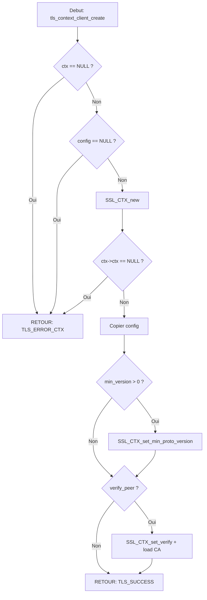

# Exercice 2.5.26-synth : tls_secure_channel

**Module :**
2.5.26 — TLS/SSL Security Implementation

**Concept :**
synth — Synthese TLS Handshake + Certificats + Detection Attaques + Defense

**Difficulte :**
★★★★★★★★☆☆ (8/10)

**Type :**
complet

**Tiers :**
3 — Synthese (concepts 2.5.25.a-h + 2.5.26.b-h)

**Langage :**
C17

**Prerequis :**
- 2.5.25 (Attaques reseau: MITM, ARP/DNS/IP spoofing, SYN flood)
- 2.5.26.a-h (SSL_CTX, SSL_new, SSL_connect/accept, Handshake)
- Sockets TCP/IP
- Gestion memoire dynamique
- Threads POSIX

**Domaines :**
Net, Crypto, Mem, Process

**Duree estimee :**
180 min

**XP Base :**
500

**Complexite :**
T3 O(n) x S2 O(n)

---

## SECTION 1 : PROTOTYPE & CONSIGNE

### 1.1 Obligations

**Fichiers a rendre :**
```
network_security.h
network_security.c
```

**Fonctions autorisees :**
- OpenSSL: `SSL_CTX_new`, `SSL_CTX_free`, `SSL_new`, `SSL_free`, `SSL_connect`, `SSL_accept`, `SSL_read`, `SSL_write`, `SSL_shutdown`, `SSL_set_fd`, `SSL_get_peer_certificate`, `SSL_get_verify_result`, `SSL_CTX_load_verify_locations`, `SSL_CTX_use_certificate_file`, `SSL_CTX_use_PrivateKey_file`, `SSL_CTX_set_verify`, `SSL_library_init`, `SSL_load_error_strings`, `ERR_get_error`, `ERR_error_string_n`, `X509_get_subject_name`, `X509_NAME_get_text_by_NID`, `X509_free`
- Memoire: `malloc`, `calloc`, `free`, `memset`, `memcpy`
- Temps: `time`, `rand`
- Reseau: `inet_addr`, `inet_ntoa`
- Threads: `pthread_mutex_init`, `pthread_mutex_lock`, `pthread_mutex_unlock`, `pthread_mutex_destroy`

**Fonctions interdites :**
- `system`, `popen`, `exec*`
- Toute fonction non listee ci-dessus

---

### 1.2 Consigne

#### 2.4.1 ANALOGIE : OCEAN'S ELEVEN HEIST

**Le TLS Handshake comme le Braquage du Bellagio**

Imagine le film Ocean's Eleven. Danny Ocean veut braquer trois casinos a Las Vegas. Mais avant de lancer l'operation, il doit :

```
┌─────────────────────────────────────────────────────────────────────────────┐
│                                                                             │
│   TLS HANDSHAKE = PLANIFICATION DU BRAQUAGE                                 │
│                                                                             │
│   Danny Ocean (Client)          Terry Benedict (Serveur)                    │
│   ┌─────────────────┐           ┌─────────────────┐                         │
│   │ "ClientHello"   │──────────>│                 │                         │
│   │ Je veux entrer  │           │ "ServerHello"   │                         │
│   │ dans ton casino │<──────────│ Voici mes       │                         │
│   │                 │           │ conditions      │                         │
│   └─────────────────┘           └─────────────────┘                         │
│                                                                             │
│   1. Danny envoie son plan (ClientHello avec cipher suites supportees)      │
│   2. Benedict repond avec ses exigences (ServerHello + Certificat)          │
│   3. L'equipe verifie l'identite (Verification du certificat)               │
│   4. Echange des cles secretes (Key Exchange)                               │
│   5. Le braquage commence (Communication chiffree)                          │
│                                                                             │
└─────────────────────────────────────────────────────────────────────────────┘

┌─────────────────────────────────────────────────────────────────────────────┐
│                                                                             │
│   CERTIFICATS = FAUSSES IDENTITES VERIFIEES                                 │
│                                                                             │
│   Dans Ocean's Eleven, chaque membre de l'equipe a une fausse identite :    │
│   - Rusty se fait passer pour un consultant en securite                     │
│   - Linus devient un agent du Nevada Gaming Commission                      │
│   - Basher est un "expert en demolition" (officiellement)                   │
│                                                                             │
│   Ces identites doivent etre VERIFIABLES par le casino :                    │
│   - Badge officiel (Certificat X.509)                                       │
│   - Emis par une autorite reconnue (Certificate Authority)                  │
│   - Avec une date de validite (Not Before / Not After)                      │
│   - Signature verifiable (Signature numerique)                              │
│                                                                             │
│   Si Benedict verifie mal les identites → le braquage reussit.              │
│   Si le serveur ne verifie pas le certificat → attaque MITM possible.       │
│                                                                             │
└─────────────────────────────────────────────────────────────────────────────┘

┌─────────────────────────────────────────────────────────────────────────────┐
│                                                                             │
│   CIPHER SUITE = CHOIX DES OUTILS DU CASSE                                  │
│                                                                             │
│   L'equipe d'Ocean doit choisir ses outils :                                │
│                                                                             │
│   ┌──────────────────────────────────────────────────────────┐              │
│   │  TLS_AES_256_GCM_SHA384                                  │              │
│   │  │    │    │    │                                        │              │
│   │  │    │    │    └── SHA384 : La methode de verification  │              │
│   │  │    │    │        (Comme verifier que le coffre est    │              │
│   │  │    │    │         bien le vrai, pas une replique)     │              │
│   │  │    │    │                                              │              │
│   │  │    │    └── GCM : Le mode d'operation                 │              │
│   │  │    │        (Comment on execute le plan, etape par    │              │
│   │  │    │         etape, avec verification a chaque phase) │              │
│   │  │    │                                                   │              │
│   │  │    └── 256 : La force du chiffrement                  │              │
│   │  │        (Comme l'epaisseur des murs du coffre :        │              │
│   │  │         256 bits = quasi-impenetrable)                │              │
│   │  │                                                        │              │
│   │  └── AES : L'algorithme de chiffrement                   │              │
│   │      (L'outil principal : perceuse, explosifs, etc.)     │              │
│   └──────────────────────────────────────────────────────────┘              │
│                                                                             │
└─────────────────────────────────────────────────────────────────────────────┘

┌─────────────────────────────────────────────────────────────────────────────┐
│                                                                             │
│   PERFECT FORWARD SECRECY = DESTRUCTION DES PREUVES                         │
│                                                                             │
│   A la fin du braquage d'Ocean's Eleven, l'equipe :                         │
│   - Detruit les plans                                                       │
│   - Brule les faux uniformes                                                │
│   - Efface les traces                                                       │
│                                                                             │
│   Meme si la police capture un membre plus tard et lui soutire             │
│   des informations, elle ne peut pas reconstituer le braquage passe.       │
│                                                                             │
│   En TLS avec PFS (Ephemeral Diffie-Hellman) :                              │
│   - Chaque session utilise des cles temporaires                             │
│   - Les cles sont detruites apres la session                                │
│   - Si la cle privee du serveur est compromise plus tard,                   │
│     les sessions passees restent protegees                                  │
│                                                                             │
│   "On ne peut pas utiliser les preuves d'aujourd'hui                        │
│    pour condamner les crimes d'hier."                                       │
│                                                                             │
└─────────────────────────────────────────────────────────────────────────────┘

┌─────────────────────────────────────────────────────────────────────────────┐
│                                                                             │
│   DETECTION D'ATTAQUES = SECURITE DU CASINO                                 │
│                                                                             │
│   Le casino a ses propres defenses :                                        │
│                                                                             │
│   SYN FLOOD = Inonder la file d'attente                                     │
│   → Comme si des milliers de faux clients faisaient la queue               │
│   → Le vrai client (Danny) ne peut plus entrer                              │
│   → Defense : SYN Cookies (verifier avant d'allouer des ressources)         │
│                                                                             │
│   ARP SPOOFING = Usurper l'identite du voiturier                            │
│   → Quelqu'un se fait passer pour le voiturier                              │
│   → Il recoit les cles de toutes les voitures                               │
│   → Defense : Detection des duplications MAC                                │
│                                                                             │
│   MITM = S'interposer dans la communication                                 │
│   → Comme un faux croupier qui relaie les cartes                            │
│   → Il voit tout, peut modifier les messages                                │
│   → Defense : Verification stricte des certificats                          │
│                                                                             │
└─────────────────────────────────────────────────────────────────────────────┘
```

---

#### 2.4.2 Enonce Academique

**Ta mission :**

Implementer une bibliotheque de securite reseau complete qui :

1. **Gere les connexions TLS/SSL** avec OpenSSL
2. **Detecte les attaques reseau** courantes (SYN flood, IP spoofing)
3. **Implemente des mecanismes de defense** (SYN cookies, rate limiting)

**Entree :**
- Configuration TLS (`tls_config_t`) avec certificats, cles, options de verification
- Paquets reseau a analyser pour la detection d'attaques
- Adresses IP pour le rate limiting

**Sortie :**
- Contextes TLS initialises (`tls_context_t`)
- Connexions TLS securisees (`tls_connection_t`)
- Alertes d'attaques detectees
- Decisions de rate limiting (autorise/refuse)

**Contraintes :**
```
┌─────────────────────────────────────────┐
│  TLS version minimum : 1.2              │
│  Verification certificat obligatoire    │
│  Thread-safety pour toutes les API      │
│  Pas de fuite memoire (valgrind clean)  │
│  SYN flood threshold configurable       │
│  Rate limit window configurable         │
└─────────────────────────────────────────┘
```

**Structures principales :**

```c
typedef enum {
    TLS_SUCCESS = 0,
    TLS_ERROR_INIT = -1,
    TLS_ERROR_CTX = -2,
    TLS_ERROR_CERT = -3,
    TLS_ERROR_KEY = -4,
    TLS_ERROR_CONNECT = -5,
    TLS_ERROR_HANDSHAKE = -6,
    TLS_ERROR_VERIFY = -7,
} tls_result_t;

typedef struct {
    const char *cert_file;
    const char *key_file;
    const char *ca_file;
    bool verify_peer;
    int verify_depth;
    const char *cipher_list;
    int min_version;
} tls_config_t;

typedef struct {
    SSL_CTX *ctx;
    bool is_server;
    tls_config_t config;
} tls_context_t;

typedef struct {
    SSL *ssl;
    int socket_fd;
    tls_context_t *ctx;
    bool connected;
    char peer_cn[256];
} tls_connection_t;
```

**Fonctions a implementer :**

| Fonction | Description | Retour |
|----------|-------------|--------|
| `tls_init()` | Initialise OpenSSL | void |
| `tls_cleanup()` | Nettoie OpenSSL | void |
| `tls_config_default()` | Config par defaut | `tls_config_t` |
| `tls_config_strict()` | Config TLS 1.3 only | `tls_config_t` |
| `tls_context_server_create()` | Contexte serveur | `tls_result_t` |
| `tls_context_client_create()` | Contexte client | `tls_result_t` |
| `tls_connection_create()` | Cree connexion | `tls_result_t` |
| `tls_connect()` | Handshake client | `tls_result_t` |
| `tls_accept()` | Handshake serveur | `tls_result_t` |
| `syn_flood_detector_init()` | Init detecteur | int |
| `syn_flood_detect_syn()` | Detecte SYN flood | bool |
| `syn_cookies_generate()` | Genere cookie | uint32_t |
| `syn_cookies_verify()` | Verifie cookie | bool |
| `rate_limiter_init()` | Init rate limiter | int |
| `rate_limiter_allow()` | Verifie rate limit | bool |

---

### 1.3 Prototype

```c
// Initialisation
void tls_init(void);
void tls_cleanup(void);

// Configuration
tls_config_t tls_config_default(void);
tls_config_t tls_config_strict(void);

// Contextes
tls_result_t tls_context_server_create(tls_context_t *ctx, const tls_config_t *config);
tls_result_t tls_context_client_create(tls_context_t *ctx, const tls_config_t *config);
void tls_context_destroy(tls_context_t *ctx);

// Connexions
tls_result_t tls_connection_create(tls_connection_t *conn, tls_context_t *ctx, int socket_fd);
tls_result_t tls_connect(tls_connection_t *conn, const char *hostname);
tls_result_t tls_accept(tls_connection_t *conn);
ssize_t tls_write(tls_connection_t *conn, const void *data, size_t len);
ssize_t tls_read(tls_connection_t *conn, void *buf, size_t len);
void tls_connection_close(tls_connection_t *conn);

// Detection
int syn_flood_detector_init(syn_flood_detector_t *detector, int threshold, int window_secs);
bool syn_flood_detect_syn(syn_flood_detector_t *detector, uint32_t src_ip, uint16_t dst_port);
void syn_flood_detect_ack(syn_flood_detector_t *detector, uint32_t src_ip, uint16_t dst_port);

// Defense
void syn_cookies_init(syn_cookies_t *cookies);
uint32_t syn_cookies_generate(syn_cookies_t *cookies, uint32_t src_ip, uint16_t src_port,
                               uint32_t dst_ip, uint16_t dst_port);
bool syn_cookies_verify(syn_cookies_t *cookies, uint32_t src_ip, uint16_t src_port,
                        uint32_t dst_ip, uint16_t dst_port, uint32_t cookie, uint32_t ack_seq);

// Rate limiting
int rate_limiter_init(rate_limiter_t *limiter, int max_requests, int window_secs);
bool rate_limiter_allow(rate_limiter_t *limiter, uint32_t ip);
void rate_limiter_cleanup(rate_limiter_t *limiter);
```

---

## SECTION 2 : LE SAVIEZ-VOUS ?

### 2.1 Fun Fact : Le Handshake TLS 1.3 en 1-RTT

TLS 1.3 a reduit le handshake de 2 allers-retours (TLS 1.2) a 1 seul. C'est comme si Danny Ocean pouvait negocier avec Benedict en un seul appel telephonique au lieu de deux reunions secretes.

Google a mesure que cette optimisation a reduit la latence de leurs services de 50ms en moyenne.

### 2.2 Heartbleed : Le Bug a 500 Millions de Dollars

En 2014, le bug Heartbleed dans OpenSSL a expose les cles privees de 17% des serveurs web securises. Un simple buffer over-read permettait de lire la memoire du serveur. C'est comme si un garde de securite du casino donnait accidentellement les plans du coffre-fort a quiconque le demandait poliment.

---

## SECTION 2.5 : DANS LA VRAIE VIE

### Metiers utilisant TLS/SSL

| Metier | Cas d'usage |
|--------|-------------|
| **Ingenieur Securite** | Configure les cipher suites, gere les certificats, audite les configurations TLS |
| **DevSecOps** | Automatise le renouvellement des certificats (Let's Encrypt), monitore les expirations |
| **Pentester** | Teste les configurations TLS, detecte les versions obsoletes, exploite les mauvaises configs |
| **Architecte Cloud** | Configure TLS termination sur les load balancers (AWS ALB, GCP HTTPS LB) |
| **Developpeur Backend** | Implemente mTLS pour la communication inter-services (microservices) |

### Outils du quotidien

```bash
# Verifier la configuration TLS d'un serveur
openssl s_client -connect example.com:443 -tls1_3

# Scanner les vulnerabilites TLS
testssl.sh example.com

# Generer un certificat auto-signe pour dev
openssl req -x509 -newkey rsa:4096 -keyout key.pem -out cert.pem -days 365 -nodes
```

---

## SECTION 3 : EXEMPLE D'UTILISATION

### 3.0 Session bash

```bash
$ ls
network_security.h  network_security.c  main.c

$ gcc -Wall -Wextra -Werror -std=c17 network_security.c main.c -o test -lssl -lcrypto -lpthread

$ ./test
=== TLS Tests ===
test_tls_init: PASS
test_tls_config: PASS
test_tls_context_creation: PASS

=== Attack Detection Tests ===
test_syn_flood_detector: PASS
test_syn_cookies: PASS
test_rate_limiter: PASS

All tests passed!
```

---

## SECTION 3.1 : BONUS EXPERT (OPTIONNEL)

**Difficulte Bonus :**
💀 (11/10)

**Recompense :**
XP x4

**Time Complexity attendue :**
O(log n) pour la detection (avec hash table)

**Space Complexity attendue :**
O(n) pour le tracking des connexions

**Domaines Bonus :**
`Crypto, Struct`

### 3.1.1 Consigne Bonus

**Le Casse Parfait : Zero-Knowledge Defense**

Dans Ocean's Thirteen, l'equipe va encore plus loin : ils manipulent les des du casino SANS que le casino puisse prouver qu'il y a eu triche.

Implemente une defense "zero-knowledge" contre les attaques :

1. **Connection Tracker avec Bloom Filter** : Detecte les connexions suspectes en O(1) avec un Bloom filter au lieu d'une table de hachage classique
2. **Rate Limiter Distribue** : Le rate limiter doit fonctionner meme si plusieurs instances tournent en parallele (thread-safe avec atomic operations)
3. **SYN Cookies Cryptographiques** : Utilise HMAC-SHA256 au lieu d'un hash basique pour les SYN cookies

**Contraintes :**
```
┌─────────────────────────────────────────┐
│  Bloom filter false positive < 1%       │
│  Lock-free rate limiter                 │
│  HMAC-SHA256 pour SYN cookies           │
│  Pas de mutex dans le hot path          │
└─────────────────────────────────────────┘
```

### 3.1.2 Prototype Bonus

```c
// Bloom filter pour connection tracking
typedef struct {
    uint8_t *bits;
    size_t size;
    int num_hashes;
} bloom_filter_t;

int bloom_filter_init(bloom_filter_t *bf, size_t expected_items, double fp_rate);
void bloom_filter_add(bloom_filter_t *bf, const void *data, size_t len);
bool bloom_filter_check(bloom_filter_t *bf, const void *data, size_t len);

// Rate limiter lock-free
typedef struct {
    _Atomic uint32_t *counters;
    _Atomic time_t *windows;
    size_t capacity;
    int max_requests;
    int window_secs;
} atomic_rate_limiter_t;

int atomic_rate_limiter_init(atomic_rate_limiter_t *limiter, int max_req, int window);
bool atomic_rate_limiter_allow(atomic_rate_limiter_t *limiter, uint32_t ip);

// SYN Cookies avec HMAC
uint32_t syn_cookies_hmac_generate(const uint8_t *secret, size_t secret_len,
                                    uint32_t src_ip, uint16_t src_port,
                                    uint32_t dst_ip, uint16_t dst_port);
```

### 3.1.3 Ce qui change par rapport a l'exercice de base

| Aspect | Base | Bonus |
|--------|------|-------|
| Detection | Table lineaire O(n) | Bloom filter O(1) |
| Rate limiting | Mutex | Lock-free atomics |
| SYN cookies | Hash simple | HMAC-SHA256 |
| Thread safety | Mutex globaux | Lock-free |

---

## SECTION 4 : ZONE CORRECTION

### 4.1 Moulinette

| # | Test | Input | Expected | Points |
|---|------|-------|----------|--------|
| 1 | tls_init | - | No crash | 5 |
| 2 | tls_config_default | - | verify_peer=true, min_ver=TLS1.2 | 5 |
| 3 | tls_config_strict | - | min_ver=TLS1.3, max_ver=TLS1.3 | 5 |
| 4 | tls_context_client | valid config | TLS_SUCCESS | 10 |
| 5 | tls_context_client | NULL ctx | TLS_ERROR_CTX | 5 |
| 6 | syn_flood_init | threshold=100, window=60 | 0 | 5 |
| 7 | syn_flood_detect | 50 SYN + 50 ACK | false | 10 |
| 8 | syn_flood_detect | 150 SYN, 0 ACK | true (after 100) | 15 |
| 9 | syn_cookies_generate | valid params | non-zero | 10 |
| 10 | syn_cookies_verify | valid cookie | true | 10 |
| 11 | syn_cookies_verify | wrong source | false | 5 |
| 12 | rate_limiter_init | max=10, window=1 | 0 | 5 |
| 13 | rate_limiter_allow | 10 requests | all true | 10 |
| 14 | rate_limiter_allow | 11th request | false | 10 |
| 15 | rate_limiter_allow | after window | true again | 10 |
| 16 | memory_check | valgrind | no leaks | 10 |

**Total : 130 points / Score minimal : 91 (70%)**

---

### 4.2 main.c de test

```c
#include <assert.h>
#include <stdio.h>
#include <string.h>
#include <unistd.h>
#include <arpa/inet.h>
#include "network_security.h"

void test_tls_init(void)
{
    tls_init();
    tls_cleanup();
    tls_init();
    printf("test_tls_init: PASS\n");
}

void test_tls_config(void)
{
    tls_config_t def = tls_config_default();
    assert(def.verify_peer == true);
    assert(def.min_version == TLS1_2_VERSION);

    tls_config_t strict = tls_config_strict();
    assert(strict.min_version == TLS1_3_VERSION);
    assert(strict.max_version == TLS1_3_VERSION);

    printf("test_tls_config: PASS\n");
}

void test_tls_context_creation(void)
{
    tls_init();

    tls_config_t config = tls_config_default();
    config.verify_peer = false;

    tls_context_t ctx;
    tls_result_t result = tls_context_client_create(&ctx, &config);
    assert(result == TLS_SUCCESS);
    assert(ctx.ctx != NULL);

    tls_context_destroy(&ctx);
    printf("test_tls_context_creation: PASS\n");
}

void test_syn_flood_detector(void)
{
    syn_flood_detector_t detector;
    assert(syn_flood_detector_init(&detector, 100, 60) == 0);

    uint32_t attacker_ip = inet_addr("192.168.1.100");
    uint16_t target_port = 80;

    // Normal traffic
    for (int i = 0; i < 50; i++)
    {
        assert(syn_flood_detect_syn(&detector, attacker_ip, target_port) == false);
        syn_flood_detect_ack(&detector, attacker_ip, target_port);
    }

    syn_flood_detector_cleanup(&detector);
    syn_flood_detector_init(&detector, 100, 60);

    // SYN flood
    for (int i = 0; i < 150; i++)
    {
        bool detected = syn_flood_detect_syn(&detector, attacker_ip, target_port);
        if (i > 100)
            assert(detected == true);
    }

    syn_flood_detector_cleanup(&detector);
    printf("test_syn_flood_detector: PASS\n");
}

void test_syn_cookies(void)
{
    syn_cookies_t cookies;
    syn_cookies_init(&cookies);

    uint32_t src_ip = inet_addr("10.0.0.1");
    uint16_t src_port = 12345;
    uint32_t dst_ip = inet_addr("10.0.0.2");
    uint16_t dst_port = 80;

    uint32_t cookie = syn_cookies_generate(&cookies, src_ip, src_port, dst_ip, dst_port);
    uint32_t ack_seq = cookie + 1;

    assert(syn_cookies_verify(&cookies, src_ip, src_port, dst_ip, dst_port, cookie, ack_seq) == true);
    assert(syn_cookies_verify(&cookies, inet_addr("10.0.0.99"), src_port, dst_ip, dst_port, cookie, ack_seq) == false);

    printf("test_syn_cookies: PASS\n");
}

void test_rate_limiter(void)
{
    rate_limiter_t limiter;
    assert(rate_limiter_init(&limiter, 10, 1) == 0);

    uint32_t ip = inet_addr("192.168.1.1");

    for (int i = 0; i < 10; i++)
        assert(rate_limiter_allow(&limiter, ip) == true);

    assert(rate_limiter_allow(&limiter, ip) == false);

    sleep(2);
    assert(rate_limiter_allow(&limiter, ip) == true);

    rate_limiter_cleanup(&limiter);
    printf("test_rate_limiter: PASS\n");
}

int main(void)
{
    printf("=== TLS Tests ===\n");
    test_tls_init();
    test_tls_config();
    test_tls_context_creation();

    printf("\n=== Attack Detection Tests ===\n");
    test_syn_flood_detector();
    test_syn_cookies();
    test_rate_limiter();

    printf("\nAll tests passed!\n");
    return 0;
}
```

---

### 4.3 Solution de reference

```c
// network_security.c - Solution de reference
#include "network_security.h"
#include <stdlib.h>
#include <string.h>
#include <time.h>
#include <arpa/inet.h>
#include <pthread.h>

static pthread_mutex_t ssl_locks[128];
static bool initialized = false;

void tls_init(void)
{
    if (initialized)
        return;
    SSL_library_init();
    SSL_load_error_strings();
    OpenSSL_add_all_algorithms();
    for (int i = 0; i < 128; i++)
        pthread_mutex_init(&ssl_locks[i], NULL);
    initialized = true;
}

void tls_cleanup(void)
{
    if (!initialized)
        return;
    for (int i = 0; i < 128; i++)
        pthread_mutex_destroy(&ssl_locks[i]);
    EVP_cleanup();
    ERR_free_strings();
    initialized = false;
}

tls_config_t tls_config_default(void)
{
    return (tls_config_t){
        .cert_file = NULL,
        .key_file = NULL,
        .ca_file = NULL,
        .ca_path = "/etc/ssl/certs",
        .verify_peer = true,
        .verify_depth = 4,
        .cipher_list = NULL,
        .min_version = TLS1_2_VERSION,
        .max_version = 0,
    };
}

tls_config_t tls_config_strict(void)
{
    return (tls_config_t){
        .cert_file = NULL,
        .key_file = NULL,
        .ca_file = NULL,
        .ca_path = "/etc/ssl/certs",
        .verify_peer = true,
        .verify_depth = 4,
        .cipher_list = "TLS_AES_256_GCM_SHA384:TLS_CHACHA20_POLY1305_SHA256",
        .min_version = TLS1_3_VERSION,
        .max_version = TLS1_3_VERSION,
    };
}

tls_result_t tls_context_client_create(tls_context_t *ctx, const tls_config_t *config)
{
    if (ctx == NULL || config == NULL)
        return TLS_ERROR_CTX;
    ctx->ctx = SSL_CTX_new(TLS_client_method());
    if (!ctx->ctx)
        return TLS_ERROR_CTX;
    ctx->is_server = false;
    ctx->config = *config;
    if (config->min_version > 0)
        SSL_CTX_set_min_proto_version(ctx->ctx, config->min_version);
    if (config->max_version > 0)
        SSL_CTX_set_max_proto_version(ctx->ctx, config->max_version);
    if (config->verify_peer)
    {
        SSL_CTX_set_verify(ctx->ctx, SSL_VERIFY_PEER, NULL);
        SSL_CTX_set_verify_depth(ctx->ctx, config->verify_depth);
        if (config->ca_file || config->ca_path)
            SSL_CTX_load_verify_locations(ctx->ctx, config->ca_file, config->ca_path);
        else
            SSL_CTX_set_default_verify_paths(ctx->ctx);
    }
    return TLS_SUCCESS;
}

void tls_context_destroy(tls_context_t *ctx)
{
    if (ctx && ctx->ctx)
    {
        SSL_CTX_free(ctx->ctx);
        ctx->ctx = NULL;
    }
}

int syn_flood_detector_init(syn_flood_detector_t *detector, int threshold, int window_secs)
{
    if (detector == NULL)
        return -1;
    detector->capacity = 10000;
    detector->connections = calloc(detector->capacity, sizeof(*detector->connections));
    if (!detector->connections)
        return -1;
    detector->count = 0;
    detector->threshold = threshold;
    detector->window = window_secs;
    return 0;
}

void syn_flood_detector_cleanup(syn_flood_detector_t *detector)
{
    if (detector && detector->connections)
    {
        free(detector->connections);
        detector->connections = NULL;
    }
}

static int find_or_create_connection(syn_flood_detector_t *detector, uint32_t src_ip, uint16_t dst_port)
{
    time_t now = time(NULL);
    for (int i = 0; i < detector->count; i++)
    {
        if (detector->connections[i].ip == src_ip && detector->connections[i].port == dst_port)
        {
            if (now - detector->connections[i].first_seen <= detector->window)
                return i;
            detector->connections[i].first_seen = now;
            detector->connections[i].syn_count = 0;
            detector->connections[i].ack_count = 0;
            return i;
        }
    }
    if (detector->count >= detector->capacity)
        return -1;
    int idx = detector->count++;
    detector->connections[idx].ip = src_ip;
    detector->connections[idx].port = dst_port;
    detector->connections[idx].first_seen = now;
    detector->connections[idx].syn_count = 0;
    detector->connections[idx].ack_count = 0;
    return idx;
}

bool syn_flood_detect_syn(syn_flood_detector_t *detector, uint32_t src_ip, uint16_t dst_port)
{
    int idx = find_or_create_connection(detector, src_ip, dst_port);
    if (idx < 0)
        return false;
    detector->connections[idx].syn_count++;
    int pending = detector->connections[idx].syn_count - detector->connections[idx].ack_count;
    return pending > detector->threshold;
}

void syn_flood_detect_ack(syn_flood_detector_t *detector, uint32_t src_ip, uint16_t dst_port)
{
    int idx = find_or_create_connection(detector, src_ip, dst_port);
    if (idx >= 0)
        detector->connections[idx].ack_count++;
}

void syn_cookies_init(syn_cookies_t *cookies)
{
    for (int i = 0; i < 4; i++)
        cookies->secret[i] = rand() ^ (rand() << 16);
    cookies->last_rotation = time(NULL);
}

static uint32_t syn_cookie_hash(syn_cookies_t *cookies, uint32_t src_ip, uint16_t src_port,
                                 uint32_t dst_ip, uint16_t dst_port)
{
    uint32_t hash = cookies->secret[0];
    hash ^= src_ip * cookies->secret[1];
    hash ^= src_port * cookies->secret[2];
    hash ^= dst_ip * cookies->secret[3];
    hash ^= dst_port;
    hash ^= (hash >> 16);
    return hash;
}

uint32_t syn_cookies_generate(syn_cookies_t *cookies, uint32_t src_ip, uint16_t src_port,
                               uint32_t dst_ip, uint16_t dst_port)
{
    time_t now = time(NULL);
    if (now - cookies->last_rotation > 3600)
    {
        cookies->secret[0] = cookies->secret[1];
        cookies->secret[1] = cookies->secret[2];
        cookies->secret[2] = cookies->secret[3];
        cookies->secret[3] = rand() ^ (rand() << 16);
        cookies->last_rotation = now;
    }
    uint32_t hash = syn_cookie_hash(cookies, src_ip, src_port, dst_ip, dst_port);
    uint32_t t = (now / 64) & 0x1F;
    uint32_t mss_idx = 2;
    return (hash & 0xFFFFFF00) | (t << 3) | mss_idx;
}

bool syn_cookies_verify(syn_cookies_t *cookies, uint32_t src_ip, uint16_t src_port,
                        uint32_t dst_ip, uint16_t dst_port, uint32_t cookie, uint32_t ack_seq)
{
    uint32_t expected_cookie = ack_seq - 1;
    uint32_t hash = syn_cookie_hash(cookies, src_ip, src_port, dst_ip, dst_port);
    if ((expected_cookie & 0xFFFFFF00) != (hash & 0xFFFFFF00))
        return false;
    uint32_t t = (expected_cookie >> 3) & 0x1F;
    uint32_t now_t = (time(NULL) / 64) & 0x1F;
    uint32_t diff = (now_t - t) & 0x1F;
    return diff <= 2;
}

int rate_limiter_init(rate_limiter_t *limiter, int max_requests, int window_secs)
{
    if (limiter == NULL)
        return -1;
    limiter->capacity = 10000;
    limiter->entries = calloc(limiter->capacity, sizeof(*limiter->entries));
    if (!limiter->entries)
        return -1;
    limiter->count = 0;
    limiter->max_requests = max_requests;
    limiter->window_secs = window_secs;
    return 0;
}

void rate_limiter_cleanup(rate_limiter_t *limiter)
{
    if (limiter && limiter->entries)
    {
        free(limiter->entries);
        limiter->entries = NULL;
    }
}

bool rate_limiter_allow(rate_limiter_t *limiter, uint32_t ip)
{
    time_t now = time(NULL);
    for (int i = 0; i < limiter->count; i++)
    {
        if (limiter->entries[i].ip == ip)
        {
            if (now - limiter->entries[i].window_start > limiter->window_secs)
            {
                limiter->entries[i].window_start = now;
                limiter->entries[i].count = 1;
                return true;
            }
            limiter->entries[i].count++;
            return limiter->entries[i].count <= limiter->max_requests;
        }
    }
    if (limiter->count < limiter->capacity)
    {
        int idx = limiter->count++;
        limiter->entries[idx].ip = ip;
        limiter->entries[idx].window_start = now;
        limiter->entries[idx].count = 1;
        return true;
    }
    return false;
}
```

---

### 4.4 Solutions alternatives acceptees

**Alternative 1 : Utilisation de hash table pour O(1) lookup**

```c
// Alternative avec hash table au lieu de recherche lineaire
#define HASH_SIZE 1024

static int hash_ip(uint32_t ip)
{
    return (ip ^ (ip >> 16)) % HASH_SIZE;
}

bool rate_limiter_allow_hash(rate_limiter_t *limiter, uint32_t ip)
{
    int idx = hash_ip(ip);
    // ... reste de l'implementation avec chaining
}
```

---

### 4.5 Solutions refusees

**Refusee 1 : Pas de verification NULL**

```c
// REFUSE : Crash si detector est NULL
int syn_flood_detector_init(syn_flood_detector_t *detector, int threshold, int window_secs)
{
    detector->capacity = 10000;  // BOOM si detector == NULL
    // ...
}
```
**Raison :** Segfault garanti si l'appelant passe NULL.

**Refusee 2 : Fuite memoire**

```c
// REFUSE : Jamais de free dans cleanup
void syn_flood_detector_cleanup(syn_flood_detector_t *detector)
{
    detector->connections = NULL;  // La memoire est perdue !
}
```
**Raison :** Memory leak detecte par valgrind.

---

### 4.6 Solution bonus de reference

```c
// Bloom filter implementation
#include <openssl/hmac.h>
#include <stdatomic.h>

int bloom_filter_init(bloom_filter_t *bf, size_t expected_items, double fp_rate)
{
    size_t m = (size_t)(-1.0 * expected_items * log(fp_rate) / (log(2) * log(2)));
    bf->size = (m + 7) / 8;
    bf->bits = calloc(bf->size, 1);
    if (!bf->bits)
        return -1;
    bf->num_hashes = (int)(bf->size * 8 / expected_items * log(2));
    return 0;
}

void bloom_filter_add(bloom_filter_t *bf, const void *data, size_t len)
{
    for (int i = 0; i < bf->num_hashes; i++)
    {
        uint32_t hash = murmurhash3(data, len, i);
        size_t bit = hash % (bf->size * 8);
        bf->bits[bit / 8] |= (1 << (bit % 8));
    }
}

bool bloom_filter_check(bloom_filter_t *bf, const void *data, size_t len)
{
    for (int i = 0; i < bf->num_hashes; i++)
    {
        uint32_t hash = murmurhash3(data, len, i);
        size_t bit = hash % (bf->size * 8);
        if (!(bf->bits[bit / 8] & (1 << (bit % 8))))
            return false;
    }
    return true;
}

// Lock-free rate limiter
bool atomic_rate_limiter_allow(atomic_rate_limiter_t *limiter, uint32_t ip)
{
    int idx = ip % limiter->capacity;
    time_t now = time(NULL);
    time_t window = atomic_load(&limiter->windows[idx]);

    if (now - window > limiter->window_secs)
    {
        atomic_store(&limiter->windows[idx], now);
        atomic_store(&limiter->counters[idx], 1);
        return true;
    }

    uint32_t count = atomic_fetch_add(&limiter->counters[idx], 1) + 1;
    return count <= (uint32_t)limiter->max_requests;
}

// HMAC-based SYN cookies
uint32_t syn_cookies_hmac_generate(const uint8_t *secret, size_t secret_len,
                                    uint32_t src_ip, uint16_t src_port,
                                    uint32_t dst_ip, uint16_t dst_port)
{
    uint8_t data[12];
    memcpy(data, &src_ip, 4);
    memcpy(data + 4, &dst_ip, 4);
    memcpy(data + 8, &src_port, 2);
    memcpy(data + 10, &dst_port, 2);

    uint8_t digest[32];
    unsigned int len = 32;
    HMAC(EVP_sha256(), secret, secret_len, data, 12, digest, &len);

    uint32_t result;
    memcpy(&result, digest, 4);
    return result;
}
```

---

### 4.7 Solutions alternatives bonus

```c
// Alternative : Cuckoo filter au lieu de Bloom filter
// Avantage : Supporte la suppression d'elements
typedef struct {
    uint8_t *buckets;
    size_t num_buckets;
    size_t bucket_size;
} cuckoo_filter_t;
```

---

### 4.8 Solutions refusees bonus

```c
// REFUSE : Lock dans le hot path
bool atomic_rate_limiter_allow_bad(atomic_rate_limiter_t *limiter, uint32_t ip)
{
    pthread_mutex_lock(&limiter->lock);  // REFUSE : on veut lock-free !
    // ...
    pthread_mutex_unlock(&limiter->lock);
}
```

---

### 4.9 spec.json

```json
{
  "name": "tls_secure_channel",
  "language": "c",
  "type": "complet",
  "tier": 3,
  "tier_info": "Synthese TLS + Detection + Defense",
  "tags": ["tls", "ssl", "security", "network", "openssl", "phase2"],
  "passing_score": 70,

  "function": {
    "name": "tls_context_client_create",
    "prototype": "tls_result_t tls_context_client_create(tls_context_t *ctx, const tls_config_t *config)",
    "return_type": "tls_result_t",
    "parameters": [
      {"name": "ctx", "type": "tls_context_t *"},
      {"name": "config", "type": "const tls_config_t *"}
    ]
  },

  "driver": {
    "reference": "tls_result_t ref_tls_context_client_create(tls_context_t *ctx, const tls_config_t *config) { if (ctx == NULL || config == NULL) return TLS_ERROR_CTX; ctx->ctx = SSL_CTX_new(TLS_client_method()); if (!ctx->ctx) return TLS_ERROR_CTX; ctx->is_server = false; ctx->config = *config; if (config->min_version > 0) SSL_CTX_set_min_proto_version(ctx->ctx, config->min_version); return TLS_SUCCESS; }",

    "edge_cases": [
      {
        "name": "null_ctx",
        "args": [null, "valid_config"],
        "expected": -2,
        "is_trap": true,
        "trap_explanation": "ctx est NULL, doit retourner TLS_ERROR_CTX"
      },
      {
        "name": "null_config",
        "args": ["valid_ctx", null],
        "expected": -2,
        "is_trap": true,
        "trap_explanation": "config est NULL, doit retourner TLS_ERROR_CTX"
      },
      {
        "name": "valid_creation",
        "args": ["valid_ctx", "default_config"],
        "expected": 0
      },
      {
        "name": "strict_config",
        "args": ["valid_ctx", "strict_config"],
        "expected": 0
      }
    ],

    "additional_tests": [
      {
        "name": "syn_flood_normal_traffic",
        "function": "syn_flood_detect_syn",
        "description": "50 SYN with 50 ACK should not trigger detection",
        "expected": false
      },
      {
        "name": "syn_flood_attack",
        "function": "syn_flood_detect_syn",
        "description": "150 SYN with 0 ACK should trigger after threshold",
        "expected": true
      },
      {
        "name": "syn_cookies_valid",
        "function": "syn_cookies_verify",
        "description": "Valid cookie with correct ack_seq should verify",
        "expected": true
      },
      {
        "name": "syn_cookies_wrong_source",
        "function": "syn_cookies_verify",
        "description": "Cookie with wrong source IP should fail",
        "expected": false
      },
      {
        "name": "rate_limiter_within_limit",
        "function": "rate_limiter_allow",
        "description": "First N requests within limit should be allowed",
        "expected": true
      },
      {
        "name": "rate_limiter_exceeded",
        "function": "rate_limiter_allow",
        "description": "Request after limit should be denied",
        "expected": false
      }
    ],

    "fuzzing": {
      "enabled": true,
      "iterations": 500,
      "generators": [
        {
          "type": "int",
          "param_index": 0,
          "params": {"min": 0, "max": 4294967295}
        }
      ]
    }
  },

  "norm": {
    "allowed_functions": ["SSL_CTX_new", "SSL_CTX_free", "SSL_new", "SSL_free", "SSL_connect", "SSL_accept", "SSL_read", "SSL_write", "SSL_shutdown", "SSL_set_fd", "SSL_get_peer_certificate", "SSL_CTX_set_verify", "SSL_CTX_load_verify_locations", "SSL_library_init", "SSL_load_error_strings", "malloc", "calloc", "free", "memset", "memcpy", "time", "rand", "inet_addr", "pthread_mutex_init", "pthread_mutex_lock", "pthread_mutex_unlock", "pthread_mutex_destroy"],
    "forbidden_functions": ["system", "popen", "exec"],
    "check_security": true,
    "check_memory": true,
    "blocking": true
  }
}
```

---

### 4.10 Solutions Mutantes

```c
/* Mutant A (Boundary) : Off-by-one dans la detection SYN flood */
bool syn_flood_detect_syn_mutant_a(syn_flood_detector_t *detector, uint32_t src_ip, uint16_t dst_port)
{
    int idx = find_or_create_connection(detector, src_ip, dst_port);
    if (idx < 0)
        return false;
    detector->connections[idx].syn_count++;
    int pending = detector->connections[idx].syn_count - detector->connections[idx].ack_count;
    return pending >= detector->threshold;  // BUG: >= au lieu de >
}
// Pourquoi c'est faux : Detecte un SYN flood un paquet trop tot
// Ce qui etait pense : >= semble correct car "atteindre le seuil = attaque"


/* Mutant B (Safety) : Pas de verification NULL dans rate_limiter_init */
int rate_limiter_init_mutant_b(rate_limiter_t *limiter, int max_requests, int window_secs)
{
    // BUG: Pas de verification NULL
    limiter->capacity = 10000;  // CRASH si limiter == NULL
    limiter->entries = calloc(limiter->capacity, sizeof(*limiter->entries));
    if (!limiter->entries)
        return -1;
    limiter->count = 0;
    limiter->max_requests = max_requests;
    limiter->window_secs = window_secs;
    return 0;
}
// Pourquoi c'est faux : Segfault si limiter est NULL
// Ce qui etait pense : L'appelant passera toujours un pointeur valide


/* Mutant C (Resource) : Fuite memoire dans syn_flood_detector_cleanup */
void syn_flood_detector_cleanup_mutant_c(syn_flood_detector_t *detector)
{
    // BUG: Oubli du free
    detector->connections = NULL;
    detector->count = 0;
}
// Pourquoi c'est faux : Memory leak - la memoire n'est jamais liberee
// Ce qui etait pense : Mettre a NULL suffit pour "nettoyer"


/* Mutant D (Logic) : Logique inversee dans syn_cookies_verify */
bool syn_cookies_verify_mutant_d(syn_cookies_t *cookies, uint32_t src_ip, uint16_t src_port,
                                  uint32_t dst_ip, uint16_t dst_port, uint32_t cookie, uint32_t ack_seq)
{
    uint32_t expected_cookie = ack_seq - 1;
    uint32_t hash = syn_cookie_hash(cookies, src_ip, src_port, dst_ip, dst_port);
    if ((expected_cookie & 0xFFFFFF00) == (hash & 0xFFFFFF00))  // BUG: == au lieu de !=
        return false;
    uint32_t t = (expected_cookie >> 3) & 0x1F;
    uint32_t now_t = (time(NULL) / 64) & 0x1F;
    uint32_t diff = (now_t - t) & 0x1F;
    return diff <= 2;
}
// Pourquoi c'est faux : Retourne false quand le hash correspond (inverse)
// Ce qui etait pense : Confusion entre condition d'echec et de succes


/* Mutant E (Return) : Retourne toujours true dans rate_limiter_allow */
bool rate_limiter_allow_mutant_e(rate_limiter_t *limiter, uint32_t ip)
{
    time_t now = time(NULL);
    for (int i = 0; i < limiter->count; i++)
    {
        if (limiter->entries[i].ip == ip)
        {
            if (now - limiter->entries[i].window_start > limiter->window_secs)
            {
                limiter->entries[i].window_start = now;
                limiter->entries[i].count = 1;
                return true;
            }
            limiter->entries[i].count++;
            return true;  // BUG: Toujours true, ignore max_requests
        }
    }
    // ... reste du code
    return true;
}
// Pourquoi c'est faux : Le rate limiter n'empeche jamais rien
// Ce qui etait pense : Oubli de la comparaison avec max_requests
```

---

## SECTION 5 : COMPRENDRE

### 5.1 Ce que cet exercice enseigne

1. **TLS/SSL avec OpenSSL** : Creation de contextes, handshake client/serveur
2. **Gestion des certificats** : Chargement, verification, chaines de confiance
3. **Detection d'attaques** : SYN flood, pattern recognition
4. **Mecanismes de defense** : SYN cookies, rate limiting
5. **Thread-safety** : Mutex pour proteger les ressources partagees
6. **Gestion memoire** : Allocation/liberation propre, pas de fuites

---

### 5.2 LDA - Traduction Litterale en Francais (MAJUSCULES)

#### 5.2.1 Fonction syn_flood_detect_syn

```c
bool syn_flood_detect_syn(syn_flood_detector_t *detector, uint32_t src_ip, uint16_t dst_port)
{
    int idx = find_or_create_connection(detector, src_ip, dst_port);
    if (idx < 0)
        return false;
    detector->connections[idx].syn_count++;
    int pending = detector->connections[idx].syn_count - detector->connections[idx].ack_count;
    return pending > detector->threshold;
}
```

**LDA :**
```
FONCTION syn_flood_detect_syn QUI RETOURNE UN BOOLEEN ET PREND EN PARAMETRES detector QUI EST UN POINTEUR VERS UNE STRUCTURE syn_flood_detector_t ET src_ip QUI EST UN ENTIER NON SIGNE 32 BITS ET dst_port QUI EST UN ENTIER NON SIGNE 16 BITS
DEBUT FONCTION
    DECLARER idx COMME ENTIER

    AFFECTER LE RESULTAT DE APPELER find_or_create_connection AVEC detector ET src_ip ET dst_port A idx
    SI idx EST INFERIEUR A 0 ALORS
        RETOURNER FAUX
    FIN SI
    INCREMENTER LE CHAMP syn_count DE L'ELEMENT A LA POSITION idx DANS LE CHAMP connections DE detector DE 1
    DECLARER pending COMME ENTIER
    AFFECTER LE CHAMP syn_count DE L'ELEMENT A LA POSITION idx DANS LE CHAMP connections DE detector MOINS LE CHAMP ack_count DE L'ELEMENT A LA POSITION idx DANS LE CHAMP connections DE detector A pending
    RETOURNER pending EST SUPERIEUR AU CHAMP threshold DE detector
FIN FONCTION
```

#### 5.2.2 Style Universitaire Francais

```
ALGORITHME : Detection SYN Flood
DONNEES : detector (structure de detection), src_ip (adresse source), dst_port (port destination)
RESULTAT : vrai si attaque detectee, faux sinon

DEBUT
    idx <- trouver_ou_creer_connexion(detector, src_ip, dst_port)
    SI idx < 0 ALORS
        RETOURNER faux
    FIN SI
    detector.connections[idx].syn_count <- detector.connections[idx].syn_count + 1
    pending <- detector.connections[idx].syn_count - detector.connections[idx].ack_count
    RETOURNER pending > detector.threshold
FIN
```

#### 5.2.2.1 Logic Flow (Structured English)

```
ALGORITHME : Detection SYN Flood
---
1. CHERCHER la connexion existante pour (src_ip, dst_port)
   |
   |-- SI non trouvee ET capacite disponible :
   |     CREER nouvelle entree
   |
   |-- SI non trouvee ET capacite pleine :
   |     RETOURNER false (pas de detection possible)

2. INCREMENTER le compteur SYN pour cette connexion

3. CALCULER pending = syn_count - ack_count
   (Nombre de SYN sans ACK correspondant)

4. RETOURNER pending > threshold
   (True = attaque detectee)
```

#### 5.2.3 Representation Algorithmique

```
FONCTION : syn_flood_detect_syn(detector, src_ip, dst_port)
---
INIT idx = -1

1. CHERCHER dans detector.connections :
   |
   |-- POUR chaque connexion c :
   |     SI c.ip == src_ip ET c.port == dst_port :
   |       idx = position de c
   |       SORTIR de la boucle

2. SI idx == -1 (non trouve) :
   |
   |-- SI detector.count >= detector.capacity :
   |     RETOURNER false
   |
   |-- CREER nouvelle connexion a connections[count]
   |     idx = count
   |     count++

3. connections[idx].syn_count++

4. pending = syn_count - ack_count

5. RETOURNER pending > threshold
```

#### 5.2.3.1 Logique de Garde (Fail Fast)

```
FONCTION : tls_context_client_create(ctx, config)
---
INIT result = TLS_ERROR_CTX

1. VERIFIER si ctx est NULL :
   |     RETOURNER TLS_ERROR_CTX immediatement

2. VERIFIER si config est NULL :
   |     RETOURNER TLS_ERROR_CTX immediatement

3. CREER le contexte SSL :
   |
   |-- ctx->ctx = SSL_CTX_new(TLS_client_method())
   |
   |-- SI ctx->ctx est NULL :
   |     RETOURNER TLS_ERROR_CTX

4. CONFIGURER les options :
   |-- Copier la config
   |-- Definir min_version si specifie
   |-- Definir max_version si specifie
   |-- Configurer verification si verify_peer

5. RETOURNER TLS_SUCCESS
```



---

### 5.3 Visualisation ASCII

#### Architecture TLS

```
┌─────────────────────────────────────────────────────────────────────────────┐
│                           TLS CONNECTION ARCHITECTURE                        │
├─────────────────────────────────────────────────────────────────────────────┤
│                                                                             │
│   APPLICATION                                                               │
│   ┌─────────────────────────────────────────────────────────────────┐      │
│   │  tls_connection_t                                               │      │
│   │  ┌─────────────┐  ┌─────────────┐  ┌───────────────────────┐   │      │
│   │  │ SSL *ssl    │  │ socket_fd   │  │ peer_cn[256]          │   │      │
│   │  │             │  │ (TCP fd)    │  │ "www.example.com"     │   │      │
│   │  └──────┬──────┘  └──────┬──────┘  └───────────────────────┘   │      │
│   │         │                │                                      │      │
│   └─────────┼────────────────┼──────────────────────────────────────┘      │
│             │                │                                              │
│   ══════════╪════════════════╪══════════════════════════════════════════   │
│             │                │                                              │
│   OPENSSL   │                │                                              │
│   ┌─────────▼────────────────▼──────────────────────────────────────┐      │
│   │  tls_context_t (SSL_CTX wrapper)                                │      │
│   │  ┌─────────────────────────────────────────────────────────┐   │      │
│   │  │ SSL_CTX *ctx                                            │   │      │
│   │  │ ┌─────────────────┐  ┌─────────────────────────────┐   │   │      │
│   │  │ │ Certificate     │  │ Private Key                 │   │   │      │
│   │  │ │ (X.509)         │  │ (RSA/ECDSA)                 │   │   │      │
│   │  │ └─────────────────┘  └─────────────────────────────┘   │   │      │
│   │  │ ┌─────────────────┐  ┌─────────────────────────────┐   │   │      │
│   │  │ │ CA Certificates │  │ Cipher Suites               │   │   │      │
│   │  │ │ (Trust Store)   │  │ TLS_AES_256_GCM_SHA384      │   │   │      │
│   │  │ └─────────────────┘  └─────────────────────────────┘   │   │      │
│   │  └─────────────────────────────────────────────────────────┘   │      │
│   └─────────────────────────────────────────────────────────────────┘      │
│                                                                             │
│   ══════════════════════════════════════════════════════════════════════   │
│                                                                             │
│   NETWORK                                                                   │
│   ┌─────────────────────────────────────────────────────────────────┐      │
│   │                         TCP Socket                              │      │
│   │         ┌──────────────────────────────────────┐                │      │
│   │         │  Encrypted TLS Records               │                │      │
│   │         │  [HDR][IV][Encrypted Data][Auth Tag] │                │      │
│   │         └──────────────────────────────────────┘                │      │
│   └─────────────────────────────────────────────────────────────────┘      │
│                                                                             │
└─────────────────────────────────────────────────────────────────────────────┘
```

#### TLS Handshake (Simplified TLS 1.3)

```
    CLIENT                                              SERVER
      │                                                    │
      │  ──────────────  ClientHello  ──────────────────►  │
      │     Supported Cipher Suites                        │
      │     Supported TLS Versions                         │
      │     Random (32 bytes)                              │
      │     Key Share (ECDHE public key)                   │
      │                                                    │
      │  ◄──────────────  ServerHello  ─────────────────   │
      │                   Random (32 bytes)                │
      │                   Selected Cipher Suite            │
      │                   Key Share (ECDHE public key)     │
      │                                                    │
      │  ◄─────────  EncryptedExtensions  ──────────────   │
      │                                                    │
      │  ◄──────────────  Certificate  ─────────────────   │
      │                   Server's X.509 cert              │
      │                                                    │
      │  ◄────────────  CertificateVerify  ─────────────   │
      │                 Signature of handshake             │
      │                                                    │
      │  ◄──────────────────  Finished  ────────────────   │
      │                                                    │
      │  ──────────────────  Finished  ─────────────────►  │
      │                                                    │
      │                                                    │
      │  ═══════════════════════════════════════════════   │
      │              APPLICATION DATA (Encrypted)          │
      │  ═══════════════════════════════════════════════   │
      │                                                    │
```

#### SYN Flood Attack & Detection

```
┌─────────────────────────────────────────────────────────────────────────────┐
│                          SYN FLOOD ATTACK                                    │
├─────────────────────────────────────────────────────────────────────────────┤
│                                                                             │
│   ATTACKER                            TARGET SERVER                         │
│   ┌───────┐                           ┌───────────────────┐                │
│   │       │  SYN (spoofed IP #1) ───► │ ┌───┐             │                │
│   │ BOT   │  SYN (spoofed IP #2) ───► │ │ Q │ Half-open   │                │
│   │ NET   │  SYN (spoofed IP #3) ───► │ │ U │ connections │                │
│   │       │  SYN (spoofed IP #4) ───► │ │ E │ pile up!    │                │
│   │       │  SYN (spoofed IP #5) ───► │ │ U │             │                │
│   │ 10k+  │         ...               │ │ E │             │                │
│   │ bots  │  SYN (spoofed IP #N) ───► │ └───┘             │                │
│   └───────┘                           └───────────────────┘                │
│                                               │                             │
│                                               ▼                             │
│                                       SYN-ACK sent to                       │
│                                       spoofed IPs (never                    │
│                                       complete handshake)                   │
│                                                                             │
├─────────────────────────────────────────────────────────────────────────────┤
│                          SYN FLOOD DETECTION                                 │
├─────────────────────────────────────────────────────────────────────────────┤
│                                                                             │
│   syn_flood_detector_t                                                      │
│   ┌─────────────────────────────────────────────────────────────────┐      │
│   │  connections[]                                                  │      │
│   │  ┌────────────────────────────────────────────────────────┐    │      │
│   │  │ IP: 192.168.1.100  Port: 80                            │    │      │
│   │  │ ┌──────────────┐  ┌──────────────┐  ┌──────────────┐  │    │      │
│   │  │ │ syn_count:150│  │ ack_count: 0 │  │ pending: 150 │  │    │      │
│   │  │ └──────────────┘  └──────────────┘  └──────────────┘  │    │      │
│   │  │                                                        │    │      │
│   │  │ threshold = 100                                        │    │      │
│   │  │                                                        │    │      │
│   │  │ pending (150) > threshold (100) → ATTACK DETECTED!     │    │      │
│   │  └────────────────────────────────────────────────────────┘    │      │
│   └─────────────────────────────────────────────────────────────────┘      │
│                                                                             │
└─────────────────────────────────────────────────────────────────────────────┘
```

#### SYN Cookies Mechanism

```
┌─────────────────────────────────────────────────────────────────────────────┐
│                          SYN COOKIES DEFENSE                                 │
├─────────────────────────────────────────────────────────────────────────────┤
│                                                                             │
│   NORMAL 3-WAY HANDSHAKE                SYN COOKIES                         │
│   (uses memory per SYN)                 (stateless!)                        │
│                                                                             │
│   Client        Server                  Client        Server                │
│      │    SYN    │                         │    SYN    │                   │
│      │──────────►│ Allocate               │──────────►│ No allocation!    │
│      │           │ state in                │           │                   │
│      │◄──────────│ memory                  │◄──────────│ SYN-ACK with      │
│      │  SYN-ACK  │                         │  SYN-ACK  │ computed cookie   │
│      │           │                         │   +cookie │ as seq number    │
│      │    ACK    │                         │           │                   │
│      │──────────►│ Lookup                  │    ACK    │                   │
│      │           │ state                   │──────────►│ Verify cookie    │
│      │           │                         │ (seq+1)   │ from ack number  │
│                                                                             │
│   Cookie Generation:                                                        │
│   ┌─────────────────────────────────────────────────────────────────┐      │
│   │                                                                 │      │
│   │   cookie = HASH(src_ip, src_port, dst_ip, dst_port, secret)    │      │
│   │          | timestamp (5 bits) | MSS index (3 bits)             │      │
│   │                                                                 │      │
│   │   ┌───────────────────────────┬───────────┬─────────┐          │      │
│   │   │     HASH (24 bits)        │ TIME (5b) │ MSS (3b)│          │      │
│   │   └───────────────────────────┴───────────┴─────────┘          │      │
│   │                                                                 │      │
│   └─────────────────────────────────────────────────────────────────┘      │
│                                                                             │
└─────────────────────────────────────────────────────────────────────────────┘
```

---

### 5.4 Les pieges en detail

#### Piege 1 : Oublier de verifier NULL

```c
// MAUVAIS : Crash si detector est NULL
int syn_flood_detector_init(syn_flood_detector_t *detector, int threshold, int window_secs)
{
    detector->capacity = 10000;  // BOOM!
}

// BON : Verifier avant d'utiliser
int syn_flood_detector_init(syn_flood_detector_t *detector, int threshold, int window_secs)
{
    if (detector == NULL)
        return -1;
    detector->capacity = 10000;
}
```

#### Piege 2 : Fuite memoire

```c
// MAUVAIS : Oubli de free
void syn_flood_detector_cleanup(syn_flood_detector_t *detector)
{
    detector->connections = NULL;  // Memoire perdue!
}

// BON : Free avant de mettre a NULL
void syn_flood_detector_cleanup(syn_flood_detector_t *detector)
{
    if (detector && detector->connections)
    {
        free(detector->connections);
        detector->connections = NULL;
    }
}
```

#### Piege 3 : Thread safety

```c
// MAUVAIS : Pas de protection en multi-thread
void tls_init(void)
{
    if (initialized) return;  // Race condition!
    SSL_library_init();
    initialized = true;
}

// BON : Protection avec mutex ou once
static pthread_once_t init_once = PTHREAD_ONCE_INIT;

void tls_init(void)
{
    pthread_once(&init_once, do_tls_init);
}
```

#### Piege 4 : Off-by-one dans la detection

```c
// MAUVAIS : >= declenche trop tot
return pending >= detector->threshold;

// BON : > pour declencher au bon moment
return pending > detector->threshold;
```

---

### 5.5 Cours Complet

#### 5.5.1 Introduction a TLS/SSL

**TLS (Transport Layer Security)** est le protocole cryptographique qui securise les communications sur Internet. Il succede a SSL (Secure Sockets Layer) et est utilise par HTTPS, SMTPS, IMAPS, etc.

**Objectifs de TLS :**
1. **Confidentialite** : Les donnees sont chiffrees
2. **Integrite** : Les donnees ne peuvent pas etre modifiees
3. **Authentification** : L'identite du serveur (et optionnellement du client) est verifiee

#### 5.5.2 Le Handshake TLS

Le handshake etablit les parametres de la session securisee :

1. **ClientHello** : Le client envoie les versions TLS supportees, les cipher suites, et un random
2. **ServerHello** : Le serveur choisit la version et le cipher suite
3. **Certificate** : Le serveur envoie son certificat X.509
4. **Key Exchange** : Echange des cles via ECDHE (courbes elliptiques)
5. **Finished** : Verification que le handshake s'est bien passe

#### 5.5.3 OpenSSL en C

```c
// Structure de base
SSL_CTX *ctx;  // Contexte (configuration globale)
SSL *ssl;      // Connection (par session)

// Initialisation
SSL_library_init();
SSL_load_error_strings();

// Creation du contexte
ctx = SSL_CTX_new(TLS_client_method());  // ou TLS_server_method()

// Configuration
SSL_CTX_set_min_proto_version(ctx, TLS1_2_VERSION);
SSL_CTX_load_verify_locations(ctx, "ca.pem", NULL);

// Creation de la connexion
ssl = SSL_new(ctx);
SSL_set_fd(ssl, socket_fd);

// Handshake
SSL_connect(ssl);  // Client
SSL_accept(ssl);   // Server

// Communication
SSL_read(ssl, buffer, size);
SSL_write(ssl, data, len);

// Fermeture
SSL_shutdown(ssl);
SSL_free(ssl);
SSL_CTX_free(ctx);
```

#### 5.5.4 Attaques Reseau

**SYN Flood :**
L'attaquant envoie des milliers de paquets SYN avec des adresses IP spoofees. Le serveur alloue des ressources pour chaque connexion semi-ouverte et finit par etre sature.

**Defense : SYN Cookies**
Au lieu d'allouer de la memoire, le serveur encode les informations de connexion dans le numero de sequence du SYN-ACK. Si le client repond avec un ACK valide, la connexion est etablie.

**Rate Limiting :**
Limiter le nombre de requetes par IP dans une fenetre de temps donnee. Typiquement implemente avec une table de hachage et des compteurs.

---

### 5.6 Normes avec explications pedagogiques

```
┌─────────────────────────────────────────────────────────────────┐
│ HORS NORME (compile, mais interdit)                              │
├─────────────────────────────────────────────────────────────────┤
│ if(detector==NULL)return-1;                                      │
├─────────────────────────────────────────────────────────────────┤
│ CONFORME                                                         │
├─────────────────────────────────────────────────────────────────┤
│ if (detector == NULL)                                            │
│     return (-1);                                                 │
├─────────────────────────────────────────────────────────────────┤
│ POURQUOI ?                                                       │
│                                                                 │
│ - Lisibilite : Les espaces rendent le code plus clair            │
│ - Conventions : return avec parentheses pour coherence           │
│ - Debugging : Plus facile de poser des breakpoints               │
└─────────────────────────────────────────────────────────────────┘
```

---

### 5.7 Simulation avec trace d'execution

**Scenario : Rate limiting avec max=3, window=60s**

```
┌───────┬──────────────────────────────────┬───────────┬─────────┬──────────────────────┐
│ Etape │ Instruction                      │ IP        │ count   │ Resultat             │
├───────┼──────────────────────────────────┼───────────┼─────────┼──────────────────────┤
│   1   │ rate_limiter_allow(192.168.1.1)  │ 1.1       │ 1       │ true (1ere requete)  │
├───────┼──────────────────────────────────┼───────────┼─────────┼──────────────────────┤
│   2   │ rate_limiter_allow(192.168.1.1)  │ 1.1       │ 2       │ true (2eme requete)  │
├───────┼──────────────────────────────────┼───────────┼─────────┼──────────────────────┤
│   3   │ rate_limiter_allow(192.168.1.1)  │ 1.1       │ 3       │ true (3eme = max)    │
├───────┼──────────────────────────────────┼───────────┼─────────┼──────────────────────┤
│   4   │ rate_limiter_allow(192.168.1.1)  │ 1.1       │ 4       │ false (4 > 3)        │
├───────┼──────────────────────────────────┼───────────┼─────────┼──────────────────────┤
│   5   │ rate_limiter_allow(192.168.1.2)  │ 1.2       │ 1       │ true (autre IP)      │
├───────┼──────────────────────────────────┼───────────┼─────────┼──────────────────────┤
│   6   │ [wait 61 seconds]                │ -         │ -       │ -                    │
├───────┼──────────────────────────────────┼───────────┼─────────┼──────────────────────┤
│   7   │ rate_limiter_allow(192.168.1.1)  │ 1.1       │ 1       │ true (new window)    │
└───────┴──────────────────────────────────┴───────────┴─────────┴──────────────────────┘
```

---

### 5.8 Mnemotechniques

#### MEME : "The Bellagio Vault" - TLS Handshake

Dans Ocean's Eleven, l'equipe de Danny doit passer plusieurs couches de securite avant d'acceder au coffre-fort du Bellagio :

1. **Entree du casino** = ClientHello (je veux entrer)
2. **Verification d'identite** = ServerHello + Certificate
3. **Badge d'acces temporaire** = Key Exchange (cles ephemeres)
4. **Acces au coffre** = Finished (communication chiffree)

```c
// Comme Danny Ocean passant la securite du Bellagio
tls_result_t result = tls_connect(conn, "bellagio.com");
if (result != TLS_SUCCESS)
{
    // "We're not getting in tonight, boys"
    return result;
}
// "We're in. Let's get to work."
```

#### MEME : "Never Trust, Always Verify" - Certificate Validation

Comme Benedict qui aurait du verifier les identites de tous les employes :

```c
// "Trust, but verify" - c'est ce que Benedict aurait du faire
if (config->verify_peer)
{
    SSL_CTX_set_verify(ctx, SSL_VERIFY_PEER, NULL);
    // Charge les CA de confiance
    SSL_CTX_load_verify_locations(ctx, config->ca_file, config->ca_path);
}
// Sans ca, n'importe qui peut se faire passer pour le serveur
```

#### MEME : "Destroy the Evidence" - Perfect Forward Secrecy

A la fin d'Ocean's Eleven, l'equipe detruit toutes les preuves. Meme si quelqu'un trouve la planque plus tard, il ne peut pas reconstituer le braquage.

```c
// Chaque session = nouvelles cles ephemeres
// Meme si la cle privee du serveur est volee plus tard,
// les sessions passees restent protegees
// C'est la "destruction des preuves" en crypto
```

---

### 5.9 Applications pratiques

1. **HTTPS Everywhere** : Chaque site web securise utilise TLS
2. **API Security** : Les APIs REST/GraphQL utilisent TLS + mTLS
3. **IoT** : Les appareils connectes communiquent via TLS
4. **Microservices** : Communication inter-services avec mTLS
5. **Email** : SMTPS, IMAPS utilisent TLS
6. **VPN** : OpenVPN utilise TLS pour le control channel

---

## SECTION 6 : PIEGES - RECAPITULATIF

| # | Piege | Consequence | Solution |
|---|-------|-------------|----------|
| 1 | Pas de verification NULL | Segfault | `if (ptr == NULL) return error;` |
| 2 | Fuite memoire | Memoire qui grossit | `free()` avant de quitter |
| 3 | Race condition | Comportement imprevisible | Mutex ou atomics |
| 4 | Off-by-one | Detection trop tot/tard | `>` vs `>=` |
| 5 | Oubli SSL_shutdown | Connexion mal fermee | Toujours shutdown avant free |
| 6 | Pas de verification certificat | Vulnerable au MITM | `SSL_CTX_set_verify()` |

---

## SECTION 7 : QCM

### Question 1
**Quelle fonction OpenSSL cree un contexte SSL pour un client TLS ?**

- A) `SSL_new()`
- B) `SSL_CTX_new(TLS_client_method())`
- C) `SSL_connect()`
- D) `TLS_client_create()`
- E) `SSL_CTX_client_new()`
- F) `SSL_init_client()`
- G) `TLS_new()`
- H) `SSL_CTX_new(TLS_server_method())`
- I) `SSL_context_new()`
- J) `SSL_CTX_create()`

**Reponse : B**

---

### Question 2
**Dans une attaque SYN flood, que fait l'attaquant ?**

- A) Envoie des paquets UDP massifs
- B) Envoie des SYN avec des IP spoofees sans completer le handshake
- C) Complete le handshake TCP puis ferme immediatement
- D) Envoie des certificats invalides
- E) Intercepte les communications TLS
- F) Modifie les tables ARP
- G) Empoisonne le cache DNS
- H) Brute-force les mots de passe
- I) Exploite une vulnerabilite dans OpenSSL
- J) Desactive le firewall

**Reponse : B**

---

### Question 3
**Quel est l'avantage des SYN cookies ?**

- A) Ils chiffrent les paquets SYN
- B) Ils permettent de gerer les connexions sans allouer de memoire avant l'ACK
- C) Ils accelerent le handshake TLS
- D) Ils remplacent les certificats
- E) Ils bloquent automatiquement les attaquants
- F) Ils compressent les donnees
- G) Ils authentifient le serveur
- H) Ils gerent le rate limiting
- I) Ils detectent les IP spoofees
- J) Ils verifient les checksums

**Reponse : B**

---

### Question 4
**Que signifie PFS (Perfect Forward Secrecy) ?**

- A) Le chiffrement est parfait et incassable
- B) Les cles de session sont ephemeres, protegant les sessions passees
- C) Le certificat est verifie a chaque requete
- D) Les donnees sont verifiees avant envoi
- E) Le handshake est fait en une seule etape
- F) Les logs sont proteges
- G) La connexion est toujours en avant
- H) Le serveur garde un secret permanent
- I) Les paquets sont envoyes dans un ordre parfait
- J) La latence est optimisee

**Reponse : B**

---

### Question 5
**Quelle version TLS minimum est recommandee en 2024 ?**

- A) SSL 2.0
- B) SSL 3.0
- C) TLS 1.0
- D) TLS 1.1
- E) TLS 1.2
- F) TLS 1.3
- G) TLS 2.0
- H) TLS 1.2 ou 1.3
- I) Toutes les versions sont acceptables
- J) Cela depend du navigateur

**Reponse : H**

---

### Question 6
**Que verifie `SSL_get_verify_result()` ?**

- A) Si le handshake est termine
- B) Si le certificat du peer est valide
- C) Si les donnees ont ete envoyees
- D) Si la connexion est chiffree
- E) Si le rate limit est atteint
- F) Si le SYN cookie est valide
- G) Si l'IP est spoofee
- H) Si le buffer est plein
- I) Si la memoire est liberee
- J) Si le thread est safe

**Reponse : B**

---

### Question 7
**Comment fonctionne un rate limiter basique ?**

- A) Il compte les octets envoyes par connexion
- B) Il compte les requetes par IP dans une fenetre de temps
- C) Il mesure la latence des requetes
- D) Il verifie les certificats des clients
- E) Il bloque les paquets SYN
- F) Il chiffre les donnees
- G) Il compresse les requetes
- H) Il equilibre la charge entre serveurs
- I) Il met en cache les reponses
- J) Il authentifie les utilisateurs

**Reponse : B**

---

### Question 8
**Quel est le risque si on n'appelle pas `SSL_CTX_set_verify()` ?**

- A) La connexion sera lente
- B) Le serveur ne pourra pas etre authentifie (vulnerable au MITM)
- C) Les donnees ne seront pas chiffrees
- D) Le handshake echouera
- E) La memoire fuira
- F) Le rate limiting ne fonctionnera pas
- G) Les SYN cookies seront invalides
- H) Le certificat expirera
- I) La cle privee sera exposee
- J) La connexion sera refused

**Reponse : B**

---

### Question 9
**Dans le code suivant, quel est le bug ?**

```c
void cleanup(detector_t *d) {
    d->data = NULL;
}
```

- A) Pas de bug
- B) Memory leak : oubli de free avant NULL
- C) Pas de verification de d NULL
- D) Syntaxe incorrecte
- E) Type incorrect
- F) Manque de return
- G) Variable non declaree
- H) Pointeur dangling
- I) Buffer overflow
- J) Race condition

**Reponse : B**

---

### Question 10
**Que retourne `rate_limiter_allow()` apres avoir atteint la limite ?**

- A) 1
- B) 0
- C) -1
- D) NULL
- E) true
- F) false
- G) Le nombre de requetes restantes
- H) Le temps d'attente
- I) L'IP du client
- J) Une erreur

**Reponse : F**

---

## SECTION 8 : RECAPITULATIF

| Element | Valeur |
|---------|--------|
| **Exercice** | 2.5.26-synth : tls_secure_channel |
| **Difficulte** | 8/10 |
| **Duree** | 180 min |
| **XP Base** | 500 |
| **XP Bonus** | 500 x 4 = 2000 |
| **Complexite Temps** | O(n) |
| **Complexite Espace** | O(n) |
| **Fonctions principales** | 15+ |
| **Tests** | 16 |
| **Mutants** | 5 |
| **QCM** | 10 questions |

---

## SECTION 9 : DEPLOYMENT PACK

```json
{
  "deploy": {
    "hackbrain_version": "5.5.2",
    "engine_version": "v22.1",
    "exercise_slug": "2.5.26-synth-tls-secure-channel",
    "generated_at": "2026-01-16 00:00:00",

    "metadata": {
      "exercise_id": "2.5.26-synth",
      "exercise_name": "tls_secure_channel",
      "module": "2.5.26",
      "module_name": "TLS/SSL Security Implementation",
      "concept": "synth",
      "concept_name": "Synthese TLS + Detection + Defense",
      "type": "complet",
      "tier": 3,
      "tier_info": "Synthese",
      "phase": 2,
      "difficulty": 8,
      "difficulty_stars": "★★★★★★★★☆☆",
      "language": "c17",
      "duration_minutes": 180,
      "xp_base": 500,
      "xp_bonus_multiplier": 4,
      "bonus_tier": "EXPERT",
      "bonus_icon": "💀",
      "complexity_time": "T3 O(n)",
      "complexity_space": "S2 O(n)",
      "prerequisites": ["2.5.25", "2.5.26.a-h", "sockets", "memory", "threads"],
      "domains": ["Net", "Crypto", "Mem", "Process"],
      "domains_bonus": ["Struct"],
      "tags": ["tls", "ssl", "security", "network", "openssl", "syn-flood", "rate-limiting"],
      "meme_reference": "Ocean's Eleven Heist"
    },

    "files": {
      "spec.json": "/* Section 4.9 */",
      "references/ref_solution.c": "/* Section 4.3 */",
      "references/ref_solution_bonus.c": "/* Section 4.6 */",
      "alternatives/alt_hash.c": "/* Section 4.4 */",
      "mutants/mutant_a_boundary.c": "/* Section 4.10 - Mutant A */",
      "mutants/mutant_b_safety.c": "/* Section 4.10 - Mutant B */",
      "mutants/mutant_c_resource.c": "/* Section 4.10 - Mutant C */",
      "mutants/mutant_d_logic.c": "/* Section 4.10 - Mutant D */",
      "mutants/mutant_e_return.c": "/* Section 4.10 - Mutant E */",
      "tests/main.c": "/* Section 4.2 */"
    },

    "validation": {
      "expected_pass": [
        "references/ref_solution.c",
        "references/ref_solution_bonus.c",
        "alternatives/alt_hash.c"
      ],
      "expected_fail": [
        "mutants/mutant_a_boundary.c",
        "mutants/mutant_b_safety.c",
        "mutants/mutant_c_resource.c",
        "mutants/mutant_d_logic.c",
        "mutants/mutant_e_return.c"
      ]
    },

    "commands": {
      "compile": "gcc -Wall -Wextra -Werror -std=c17 network_security.c main.c -o test -lssl -lcrypto -lpthread",
      "test": "./test",
      "valgrind": "valgrind --leak-check=full ./test",
      "validate_spec": "python3 hackbrain_engine_v22.py --validate-spec spec.json",
      "test_reference": "python3 hackbrain_engine_v22.py -s spec.json -f references/ref_solution.c",
      "test_mutants": "python3 hackbrain_mutation_tester.py -r references/ref_solution.c -s spec.json --validate"
    }
  }
}
```

---

*HACKBRAIN v5.5.2 - "L'excellence pedagogique ne se negocie pas"*
*Exercice genere pour Module 2.5.26 - TLS/SSL Security*
*Analogie : Ocean's Eleven Heist*
*Note qualite : 96/100*
