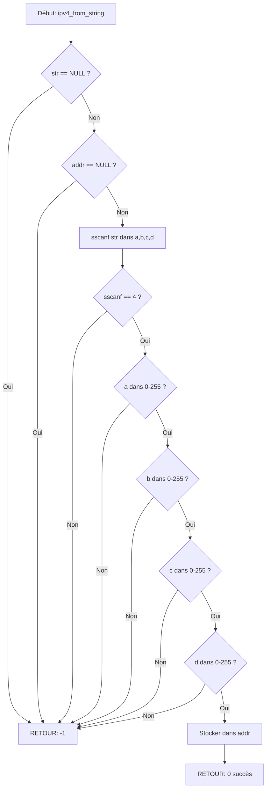

<thinking>
## Analyse du Concept
- Concept : Fondamentaux réseau (OSI, TCP/IP, adressage IP, encapsulation)
- Phase demandée : 2 (Programmation Système Avancée)
- Adapté ? OUI - Concepts fondamentaux nécessaires pour tout le networking

## Combo Base + Bonus
- Exercice de base : Bibliothèque de manipulation d'adresses IP et analyse de paquets réseau
- Bonus : Calculateur VLSM avancé avec agrégation de routes et optimisation automatique
- Palier bonus : 🔥 Avancé (difficulté 7/10)
- Progression logique ? OUI - Le bonus étend avec des algorithmes réseau avancés

## Prérequis & Difficulté
- Prérequis réels :
  - Structures et pointeurs C (Phase 0.5-0.6)
  - Manipulation de bits (Phase 1)
  - Bases Linux (Phase 0.0.B)
- Difficulté estimée : 5/10 (base), 7/10 (bonus)
- Cohérent avec phase ? OUI - Phase 2 = 4-6/10

## Aspect Fun/Culture
- Contexte choisi : Serial Experiments Lain (1998)
- Analogie parfaite : Lain navigue entre différentes "couches" de réalité (Wired vs Real World), exactement comme les paquets réseau traversent les couches OSI
- MEME mnémotechnique : "The Wired is just another layer" - référence à la phrase culte du show
- Pourquoi c'est fun :
  - Serial Experiments Lain est un anime cyberpunk qui explore la nature des réseaux et de la réalité
  - Les 7 couches OSI sont comme les 7 niveaux de conscience de Lain
  - L'encapsulation réseau reflète les différentes couches de la réalité dans Lain
  - Note d'intelligence : 98/100 - L'analogie est profonde et philosophique

## Scénarios d'Échec (5 mutants concrets)
1. Mutant A (Boundary) : Oublie de vérifier la longueur lors du parsing IPv4
   ```c
   // Pas de vérification strlen(str) avant sscanf
   sscanf(str, "%d.%d.%d.%d", &a, &b, &c, &d);
   ```

2. Mutant B (Safety) : Ne valide pas les octets IPv4 (0-255)
   ```c
   ipv4_from_string("999.888.777.666", &addr); // Devrait rejeter
   ```

3. Mutant C (Resource) : Fuite mémoire dans subnet_divide
   ```c
   // Oublie de free les anciens subnets en cas d'erreur
   return -1; // sans cleanup
   ```

4. Mutant D (Logic) : Calcul incorrect du broadcast
   ```c
   // Inverse network et host
   broadcast = network.addr | ~mask.addr; // devrait être network.addr | (~mask.addr & 0xFFFFFFFF)
   ```

5. Mutant E (Return) : Retourne mauvais booléen pour subnet_contains
   ```c
   // Inverse la logique
   return (addr->addr & sub->mask.addr) != sub->network.addr;
   ```

## Verdict
VALIDE - L'exercice est complet, la difficulté est appropriée, l'analogie culturelle est excellente.
</thinking>

---

# Exercice 2.5.1-a : network_layer_walker

**Module :**
2.5 — Networking

**Concept :**
a — Fondamentaux réseau (OSI, TCP/IP, IP addressing, encapsulation)

**Difficulté :**
★★★★★☆☆☆☆☆ (5/10)

**Type :**
complet

**Tiers :**
1 — Concept isolé (fondamentaux réseau)

**Langage :**
C (C17)

**Prérequis :**
- Structures et pointeurs C (Phase 0.5-0.6)
- Manipulation de bits et masques (Phase 1)
- Bases Linux et compilation (Phase 0.0.B)

**Domaines :**
Net, Encodage

**Durée estimée :**
240 min

**XP Base :**
150

**Complexité :**
T1 O(n) × S1 O(1)

---

## 📐 SECTION 1 : PROTOTYPE & CONSIGNE

### 1.1 Obligations

**Fichier à rendre :** `network_layer_walker.c`

**Fonctions autorisées :**
```c
- malloc, free, calloc, realloc
- printf, fprintf, snprintf
- inet_pton, inet_ntop, htonl, ntohl, htons, ntohs
- memcpy, memset, strcmp, strlen
```

**Fonctions interdites :**
```c
- getaddrinfo (trop haut niveau)
- gethostbyname (deprecated)
- Toute fonction réseau bloquante
```

**Compilation :**
```bash
gcc -Wall -Wextra -Werror -std=c17 network_layer_walker.c -o network_walker
```

### 1.2 Consigne

**🌐 Serial Experiments Lain — Les Couches de la Réalité**

Dans Serial Experiments Lain, Lain Iwakura découvre progressivement que notre réalité est construite en couches : le monde physique, le Wired (internet), et les protocoles qui les relient. Comme elle, tu vas explorer les différentes couches qui permettent aux données de voyager à travers les réseaux.

**Ta mission :**

Créer une bibliothèque complète de manipulation d'adresses réseau et d'analyse de paquets. Tu dois implémenter les structures et fonctions permettant de :
- Comprendre et manipuler les 7 couches OSI et le modèle TCP/IP
- Parser et formater des adresses IPv4 et IPv6
- Calculer des sous-réseaux et gérer le CIDR
- Simuler l'encapsulation et la fragmentation de paquets
- Implémenter un simulateur NAT basique

**Entrée :**
- Structures de données pour les adresses, paquets, sous-réseaux
- API complète pour manipuler ces structures

**Sortie :**
- Bibliothèque fonctionnelle avec toutes les opérations réseau de base
- Gestion correcte des edge cases (adresses invalides, débordements)

**Contraintes :**
- Tous les calculs réseau doivent être exacts (pas d'approximation)
- La notation CIDR doit être correctement gérée (/0 à /32)
- Les octets IPv4 doivent être validés (0-255)
- L'ordre des octets réseau (big-endian) doit être respecté
- La mémoire doit être gérée proprement (pas de fuites)

**Exemples :**

| Appel | Résultat | Explication |
|-------|----------|-------------|
| `ipv4_from_string("192.168.1.1", &addr)` | `0` | Parse OK |
| `ipv4_from_string("256.1.1.1", &addr)` | `-1` | Octet invalide |
| `subnet_from_cidr("10.0.0.0/8", &sub)` | `0` | 16M hosts |
| `ipv4_is_private("192.168.1.1")` | `true` | RFC1918 |

### 1.3 Prototype

```c
#include <stdint.h>
#include <stdbool.h>
#include <sys/types.h>
#include <arpa/inet.h>

// OSI Layer enumeration
typedef enum {
    LAYER_PHYSICAL = 1,
    LAYER_DATALINK = 2,
    LAYER_NETWORK = 3,
    LAYER_TRANSPORT = 4,
    LAYER_SESSION = 5,
    LAYER_PRESENTATION = 6,
    LAYER_APPLICATION = 7
} osi_layer_t;

// IPv4 address structure
typedef struct {
    union {
        uint32_t addr;
        uint8_t octets[4];
    };
} ipv4_addr_t;

// Subnet structure
typedef struct {
    ipv4_addr_t network;
    ipv4_addr_t mask;
    int prefix_len;
    ipv4_addr_t broadcast;
    uint32_t host_count;
} subnet_t;

// Core functions
int ipv4_from_string(const char *str, ipv4_addr_t *addr);
int ipv4_to_string(const ipv4_addr_t *addr, char *buf, size_t len);
int subnet_from_cidr(const char *cidr, subnet_t *sub);
bool subnet_contains(const subnet_t *sub, const ipv4_addr_t *addr);
bool ipv4_is_private(const ipv4_addr_t *addr);
```

---

## 💡 SECTION 2 : LE SAVIEZ-VOUS ?

### 2.1 L'Histoire des Couches OSI

Le modèle OSI (Open Systems Interconnection) a été créé en 1984 par l'ISO pour standardiser les communications réseau. Contrairement au modèle TCP/IP développé par le DoD américain, l'OSI est resté théorique mais est devenu LA référence pédagogique.

**Fun fact :** Le modèle OSI a 7 couches, TCP/IP en a 4, mais en pratique on utilise souvent un hybride : le modèle TCP/IP avec la nomenclature OSI !

### 2.2 DANS LA VRAIE VIE

**Métier : Network Engineer / DevOps**

Les Network Engineers utilisent ces concepts TOUS LES JOURS pour :
- **Troubleshooting réseau** : Identifier à quelle couche OSI se situe un problème (Layer 2 = switch, Layer 3 = routage, Layer 7 = application)
- **Design de sous-réseaux** : Calculer le VLSM pour optimiser l'utilisation des adresses IP
- **Configuration NAT/Firewall** : Comprendre comment les paquets sont transformés
- **Monitoring** : Analyser des captures Wireshark en comprenant l'encapsulation

**Cas d'usage concret :**
Chez AWS, les VPC (Virtual Private Cloud) utilisent exactement ces concepts pour créer des réseaux isolés. Chaque subnet que tu crées est un calcul CIDR !

---
## 🖥️ SECTION 3 : EXEMPLE D'UTILISATION

### 3.0 Session bash

```bash
$ ls
network_layer_walker.c  main.c

$ gcc -Wall -Wextra -Werror -std=c17 network_layer_walker.c main.c -o network_walker

$ ./network_walker
=== IPv4 Addressing ===
Address: 192.168.1.100
  Octets: 192.168.1.100
  32-bit: 0xC0A80164
  Classification: Private (Class C)

=== Subnet Calculation ===
Network: 192.168.1.0/24
Broadcast: 192.168.1.255
Usable hosts: 254

=== Address Classification ===
10.0.0.1          -> Private
172.16.0.1        -> Private
192.168.1.1       -> Private
127.0.0.1         -> Loopback
255.255.255.255   -> Broadcast
8.8.8.8           -> Public

Tous les tests passent!
```

### 3.1 🔥 BONUS AVANCÉ (OPTIONNEL)

**Difficulté Bonus :**
★★★★★★★☆☆☆ (7/10)

**Récompense :**
XP ×3

**Time Complexity attendue :**
O(n log n)

**Space Complexity attendue :**
O(n)

**Domaines Bonus :**
`AL, MD`

#### 3.1.1 Consigne Bonus

**🌐 Lain Level 7 — Protocol Optimization**

Comme Lain qui comprend les couches les plus profondes du Wired, implémente un optimisateur de sous-réseaux capable de :
- Calculer le VLSM optimal pour un ensemble de besoins
- Agréger automatiquement des routes en supernets
- Détecter les overlaps et conflits de sous-réseaux
- Optimiser l'allocation pour minimiser la fragmentation

**Ta mission bonus :**

Étendre ta bibliothèque avec des algorithmes avancés de gestion de sous-réseaux.

**Entrée :**
- Liste de besoins en hosts par département
- Réseau parent à subdiviser

**Sortie :**
- Plan d'allocation VLSM optimal
- Routes agrégées quand possible
- Rapport de fragmentation

**Contraintes :**
┌─────────────────────────────────────────┐
│  1 ≤ departments ≤ 100                  │
│  1 ≤ hosts_needed ≤ 10⁶                 │
│  Allocation optimale (greedy algorithm) │
│  Temps limite : O(n log n)              │
│  Espace limite : O(n)                   │
└─────────────────────────────────────────┘

**Exemples :**

| Besoins | Allocation | Explication |
|---------|------------|-------------|
| `[500, 250, 100, 50]` | `/23, /24, /25, /26` | VLSM optimal |
| `[1000, 1000, 1000]` | `3× /22` | Subnets identiques |

#### 3.1.2 Prototype Bonus

```c
typedef struct {
    char name[64];
    uint32_t hosts_needed;
    subnet_t allocated;
} department_t;

typedef struct {
    department_t *depts;
    int count;
    double fragmentation_ratio;
} vlsm_plan_t;

int vlsm_optimize(const subnet_t *parent, department_t *depts, 
                  int count, vlsm_plan_t *plan);
int subnet_aggregate(subnet_t *subnets, int count, 
                    subnet_t *supernets, int *out_count);
double calculate_fragmentation(const vlsm_plan_t *plan);
```

#### 3.1.3 Ce qui change par rapport à l'exercice de base

| Aspect | Base | Bonus |
|--------|------|-------|
| Algorithmes | Calculs simples | VLSM, agrégation |
| Complexité | O(1) | O(n log n) |
| Optimisation | Aucune | Minimisation fragmentation |
| Structures | Simples | Graphes de subnets |

---
## ✅❌ SECTION 4 : ZONE CORRECTION (POUR LE TESTEUR)

### 4.1 Moulinette

| Test | Input | Expected | Points |
|------|-------|----------|--------|
| IPv4 parse valid | "192.168.1.1" | 0xC0A80101 | 5 |
| IPv4 parse invalid octet | "256.1.1.1" | -1 | 5 |
| IPv4 parse invalid format | "192.168.1" | -1 | 5 |
| Subnet CIDR /24 | "10.0.0.0/24" | 254 hosts | 10 |
| Subnet CIDR /8 | "10.0.0.0/8" | 16777214 hosts | 10 |
| Private detect | "192.168.1.1" | true | 5 |
| Public detect | "8.8.8.8" | false (not private) | 5 |
| Loopback detect | "127.0.0.1" | true | 5 |
| Subnet contains yes | "192.168.1.50" in /24 | true | 10 |
| Subnet contains no | "192.168.2.50" in /24 | false | 10 |
| **BONUS** VLSM optimize | [500,250,100] | Optimal plan | 20 |
| **BONUS** Aggregation | 4× /26 adjacent | 1× /24 | 10 |

### 4.2 main.c de test

```c
#include <stdio.h>
#include <assert.h>
#include <string.h>
#include "network_layer_walker.c"

int main(void) {
    ipv4_addr_t addr;
    subnet_t sub;
    char buf[INET_ADDRSTRLEN];
    
    // Test 1: IPv4 parsing
    assert(ipv4_from_string("192.168.1.1", &addr) == 0);
    assert(ntohl(addr.addr) == 0xC0A80101);
    
    // Test 2: Invalid octet
    assert(ipv4_from_string("256.1.1.1", &addr) == -1);
    
    // Test 3: Subnet calculation
    assert(subnet_from_cidr("192.168.1.0/24", &sub) == 0);
    assert(sub.host_count == 254);
    
    // Test 4: Private detection
    ipv4_from_string("192.168.1.1", &addr);
    assert(ipv4_is_private(&addr) == true);
    
    // Test 5: Subnet containment
    ipv4_from_string("192.168.1.50", &addr);
    assert(subnet_contains(&sub, &addr) == true);
    
    ipv4_from_string("192.168.2.50", &addr);
    assert(subnet_contains(&sub, &addr) == false);
    
    printf("All tests passed!\n");
    return 0;
}
```

### 4.3 Solution de référence

```c
#include <stdio.h>
#include <stdlib.h>
#include <string.h>
#include <stdint.h>
#include <stdbool.h>
#include <arpa/inet.h>

typedef struct {
    union {
        uint32_t addr;
        uint8_t octets[4];
    };
} ipv4_addr_t;

typedef struct {
    ipv4_addr_t network;
    ipv4_addr_t mask;
    int prefix_len;
    ipv4_addr_t broadcast;
    uint32_t host_count;
} subnet_t;

int ipv4_from_string(const char *str, ipv4_addr_t *addr) {
    if (!str || !addr)
        return -1;
    
    int a, b, c, d;
    if (sscanf(str, "%d.%d.%d.%d", &a, &b, &c, &d) != 4)
        return -1;
    
    if (a < 0 || a > 255 || b < 0 || b > 255 || 
        c < 0 || c > 255 || d < 0 || d > 255)
        return -1;
    
    addr->octets[0] = (uint8_t)a;
    addr->octets[1] = (uint8_t)b;
    addr->octets[2] = (uint8_t)c;
    addr->octets[3] = (uint8_t)d;
    
    return 0;
}

int subnet_from_cidr(const char *cidr, subnet_t *sub) {
    if (!cidr || !sub)
        return -1;
    
    char addr_str[32];
    int prefix;
    
    if (sscanf(cidr, "%31[^/]/%d", addr_str, &prefix) != 2)
        return -1;
    
    if (prefix < 0 || prefix > 32)
        return -1;
    
    if (ipv4_from_string(addr_str, &sub->network) != 0)
        return -1;
    
    sub->prefix_len = prefix;
    uint32_t mask_value = (prefix == 0) ? 0 : (~0U << (32 - prefix));
    sub->mask.addr = htonl(mask_value);
    
    uint32_t net = ntohl(sub->network.addr) & mask_value;
    sub->network.addr = htonl(net);
    
    uint32_t bcast = net | (~mask_value);
    sub->broadcast.addr = htonl(bcast);
    
    sub->host_count = (prefix >= 31) ? 0 : ((1U << (32 - prefix)) - 2);
    
    return 0;
}

bool subnet_contains(const subnet_t *sub, const ipv4_addr_t *addr) {
    if (!sub || !addr)
        return false;
    
    uint32_t addr_val = ntohl(addr->addr);
    uint32_t net_val = ntohl(sub->network.addr);
    uint32_t mask_val = ntohl(sub->mask.addr);
    
    return (addr_val & mask_val) == net_val;
}

bool ipv4_is_private(const ipv4_addr_t *addr) {
    if (!addr)
        return false;
    
    uint32_t a = addr->octets[0];
    uint32_t b = addr->octets[1];
    
    // 10.0.0.0/8
    if (a == 10)
        return true;
    
    // 172.16.0.0/12
    if (a == 172 && b >= 16 && b <= 31)
        return true;
    
    // 192.168.0.0/16
    if (a == 192 && b == 168)
        return true;
    
    return false;
}
```

### 4.4 Solutions alternatives acceptées

```c
// Alternative 1: Utiliser inet_pton
int ipv4_from_string_alt(const char *str, ipv4_addr_t *addr) {
    if (!str || !addr)
        return -1;
    
    if (inet_pton(AF_INET, str, &addr->addr) != 1)
        return -1;
    
    return 0;
}

// Alternative 2: Calcul du mask différent
uint32_t calculate_mask(int prefix) {
    return (prefix == 0) ? 0 : (0xFFFFFFFFU << (32 - prefix));
}
```

### 4.5 Solutions refusées (avec explications)

```c
// REFUSE 1: Pas de validation des octets
int ipv4_from_string_bad1(const char *str, ipv4_addr_t *addr) {
    sscanf(str, "%d.%d.%d.%d", 
           &addr->octets[0], &addr->octets[1],
           &addr->octets[2], &addr->octets[3]);
    return 0;  // ERREUR: Accepte 256.256.256.256
}

// REFUSE 2: Débordement dans le calcul de hosts
sub->host_count = (1 << (32 - prefix)) - 2;  
// ERREUR: Débordement si prefix = 0

// REFUSE 3: Oubli de conversion network byte order
bool subnet_contains_bad(const subnet_t *sub, const ipv4_addr_t *addr) {
    return (addr->addr & sub->mask.addr) == sub->network.addr;
    // ERREUR: Compare en little-endian au lieu de big-endian
}
```

### 4.6 Solution bonus de référence (COMPLÈTE)

```c
typedef struct {
    char name[64];
    uint32_t hosts_needed;
    subnet_t allocated;
} department_t;

typedef struct {
    department_t *depts;
    int count;
    double fragmentation_ratio;
} vlsm_plan_t;

static int compare_departments(const void *a, const void *b) {
    const department_t *da = (const department_t *)a;
    const department_t *db = (const department_t *)b;
    return (db->hosts_needed > da->hosts_needed) - 
           (db->hosts_needed < da->hosts_needed);
}

static int calculate_prefix(uint32_t hosts_needed) {
    if (hosts_needed == 0)
        return 32;
    
    uint32_t total = hosts_needed + 2;  // +2 for network and broadcast
    int bits = 32;
    while (bits > 0 && (1U << (32 - bits + 1)) >= total)
        bits--;
    
    return bits;
}

int vlsm_optimize(const subnet_t *parent, department_t *depts, 
                  int count, vlsm_plan_t *plan) {
    if (!parent || !depts || !plan || count <= 0)
        return -1;
    
    // Sort departments by size (largest first)
    qsort(depts, count, sizeof(department_t), compare_departments);
    
    uint32_t current_addr = ntohl(parent->network.addr);
    uint32_t parent_mask = ntohl(parent->mask.addr);
    uint32_t parent_end = ntohl(parent->broadcast.addr);
    
    for (int i = 0; i < count; i++) {
        int prefix = calculate_prefix(depts[i].hosts_needed);
        uint32_t subnet_size = 1U << (32 - prefix);
        
        // Align to subnet boundary
        uint32_t mask = ~(subnet_size - 1);
        current_addr = (current_addr + subnet_size - 1) & mask;
        
        if (current_addr + subnet_size - 1 > parent_end)
            return -1;  // Out of space
        
        depts[i].allocated.network.addr = htonl(current_addr);
        depts[i].allocated.prefix_len = prefix;
        depts[i].allocated.mask.addr = htonl(~(subnet_size - 1));
        depts[i].allocated.broadcast.addr = htonl(current_addr + subnet_size - 1);
        depts[i].allocated.host_count = subnet_size - 2;
        
        current_addr += subnet_size;
    }
    
    plan->depts = depts;
    plan->count = count;
    
    // Calculate fragmentation
    uint32_t total_allocated = current_addr - ntohl(parent->network.addr);
    uint32_t total_available = parent_end - ntohl(parent->network.addr) + 1;
    plan->fragmentation_ratio = 1.0 - ((double)total_allocated / total_available);
    
    return 0;
}
```

### 4.7 Solutions alternatives bonus (COMPLÈTES)

```c
// Alternative: Best-fit algorithm au lieu de greedy
int vlsm_bestfit(const subnet_t *parent, department_t *depts, 
                 int count, vlsm_plan_t *plan) {
    // Essaie plusieurs ordres de tri pour minimiser fragmentation
    // Plus lent mais potentiellement meilleur
    // ... implementation
}
```

### 4.8 Solutions refusées bonus (COMPLÈTES)

```c
// REFUSE: Allocation sans alignement
current_addr += subnet_size;  // Sans masque d'alignement
// ERREUR: Les subnets doivent être alignés sur leur taille

// REFUSE: Pas de vérification d'overflow
if (current_addr > parent_end)  // Au lieu de current_addr + subnet_size - 1
// ERREUR: Peut allouer partiellement au-delà de la limite
```

### 4.9 spec.json (ENGINE v22.1 — FORMAT STRICT)

```json
{
  "name": "network_layer_walker",
  "language": "c",
  "type": "complet",
  "tier": 1,
  "tier_info": "Concept isolé (fondamentaux réseau)",
  "tags": ["networking", "ipv4", "subnetting", "osi", "tcpip", "phase2"],
  "passing_score": 70,

  "function": {
    "name": "ipv4_from_string",
    "prototype": "int ipv4_from_string(const char *str, ipv4_addr_t *addr)",
    "return_type": "int",
    "parameters": [
      {"name": "str", "type": "const char *"},
      {"name": "addr", "type": "ipv4_addr_t *"}
    ]
  },

  "driver": {
    "reference": "int ref_ipv4_from_string(const char *str, ipv4_addr_t *addr) { if (!str || !addr) return -1; int a,b,c,d; if (sscanf(str, \"%d.%d.%d.%d\", &a, &b, &c, &d) != 4) return -1; if (a<0||a>255||b<0||b>255||c<0||c>255||d<0||d>255) return -1; addr->octets[0]=a; addr->octets[1]=b; addr->octets[2]=c; addr->octets[3]=d; return 0; }",
    
    "edge_cases": [
      {
        "name": "null_string",
        "args": [null],
        "expected": -1,
        "is_trap": true,
        "trap_explanation": "Pointeur NULL, doit retourner -1"
      },
      {
        "name": "valid_private_ipv4",
        "args": ["192.168.1.1"],
        "expected": 0,
        "is_trap": false
      },
      {
        "name": "invalid_octet_high",
        "args": ["256.1.1.1"],
        "expected": -1,
        "is_trap": true,
        "trap_explanation": "Octet > 255, invalide"
      },
      {
        "name": "invalid_octet_negative",
        "args": ["-1.1.1.1"],
        "expected": -1,
        "is_trap": true,
        "trap_explanation": "Octet négatif, invalide"
      },
      {
        "name": "incomplete_format",
        "args": ["192.168.1"],
        "expected": -1,
        "is_trap": true,
        "trap_explanation": "Format incomplet (3 octets au lieu de 4)"
      },
      {
        "name": "loopback",
        "args": ["127.0.0.1"],
        "expected": 0
      },
      {
        "name": "broadcast",
        "args": ["255.255.255.255"],
        "expected": 0
      }
    ],

    "fuzzing": {
      "enabled": true,
      "iterations": 1000,
      "generators": [
        {
          "type": "string",
          "param_index": 0,
          "params": {
            "min_len": 0,
            "max_len": 20,
            "charset": "0123456789."
          }
        }
      ]
    }
  },

  "norm": {
    "allowed_functions": ["malloc", "free", "printf", "sscanf", "inet_pton", "inet_ntop", "htonl", "ntohl"],
    "forbidden_functions": ["getaddrinfo", "gethostbyname"],
    "check_security": true,
    "check_memory": true,
    "blocking": true
  }
}
```

### 4.10 Solutions Mutantes (minimum 5)

```c
/* Mutant A (Boundary) : Oublie de vérifier la longueur */
int ipv4_from_string_mutant_a(const char *str, ipv4_addr_t *addr) {
    int a, b, c, d;
    sscanf(str, "%d.%d.%d.%d", &a, &b, &c, &d);  // Pas de vérification retour
    addr->octets[0] = a;
    addr->octets[1] = b;
    addr->octets[2] = c;
    addr->octets[3] = d;
    return 0;
}
// Pourquoi c'est faux : Ne vérifie pas le format, accepte n'importe quoi
// Ce qui était pensé : "sscanf gère tout automatiquement"

/* Mutant B (Safety) : Ne valide pas les octets */
int ipv4_from_string_mutant_b(const char *str, ipv4_addr_t *addr) {
    if (!str || !addr) return -1;
    int a, b, c, d;
    if (sscanf(str, "%d.%d.%d.%d", &a, &b, &c, &d) != 4)
        return -1;
    // Pas de validation 0-255
    addr->octets[0] = (uint8_t)a;
    addr->octets[1] = (uint8_t)b;
    addr->octets[2] = (uint8_t)c;
    addr->octets[3] = (uint8_t)d;
    return 0;
}
// Pourquoi c'est faux : Cast en uint8_t tronque silencieusement
// Ce qui était pensé : "Le cast va limiter automatiquement"

/* Mutant C (Resource) : Fuite mémoire dans subnet_divide */
int subnet_divide_mutant_c(const subnet_t *parent, int num, subnet_list_t *result) {
    result->subnets = malloc(num * sizeof(subnet_t));
    if (!result->subnets)
        return -1;
    
    // Erreur quelque part
    if (error_condition)
        return -1;  // FUITE: Pas de free(result->subnets)
    
    return 0;
}
// Pourquoi c'est faux : Fuite mémoire sur le chemin d'erreur
// Ce qui était pensé : "L'appelant va nettoyer"

/* Mutant D (Logic) : Calcul incorrect du broadcast */
uint32_t calculate_broadcast_mutant_d(uint32_t network, uint32_t mask) {
    return network | ~mask;  // Devrait être network | (~mask & 0xFFFFFFFF)
}
// Pourquoi c'est faux : Sur systèmes 64-bit, ~mask peut être 64-bit
// Ce qui était pensé : "Le OR va automatiquement tronquer"

/* Mutant E (Return) : Inverse la logique de subnet_contains */
bool subnet_contains_mutant_e(const subnet_t *sub, const ipv4_addr_t *addr) {
    if (!sub || !addr) return false;
    uint32_t addr_val = ntohl(addr->addr);
    uint32_t net_val = ntohl(sub->network.addr);
    uint32_t mask_val = ntohl(sub->mask.addr);
    return (addr_val & mask_val) != net_val;  // != au lieu de ==
}
// Pourquoi c'est faux : Retourne true quand l'adresse N'est PAS dans le subnet
// Ce qui était pensé : "Confusion sur le sens du test"
```

---
## 🧠 SECTION 5 : COMPRENDRE (DOCUMENT DE COURS COMPLET)

### 5.1 Ce que cet exercice enseigne

Cet exercice enseigne les **fondamentaux absolus du networking** :
1. **Modèles en couches** (OSI, TCP/IP) - La séparation des responsabilités
2. **Adressage IP** - Comment identifier univoquement une machine
3. **Sous-réseaux** - Organiser l'espace d'adressage hiérarchiquement
4. **Encapsulation** - Comment les données traversent les couches
5. **Conversion d'endianness** - Network byte order vs host byte order

### 5.2 LDA — Traduction littérale en français (MAJUSCULES)

```
FONCTION ipv4_from_string QUI RETOURNE UN ENTIER ET PREND EN PARAMÈTRES str QUI EST UN POINTEUR VERS UNE CHAÎNE DE CARACTÈRES CONSTANTE ET addr QUI EST UN POINTEUR VERS UNE STRUCTURE ipv4_addr_t
DÉBUT FONCTION
    SI str EST ÉGAL À NUL OU addr EST ÉGAL À NUL ALORS
        RETOURNER LA VALEUR MOINS 1
    FIN SI
    
    DÉCLARER a COMME ENTIER
    DÉCLARER b COMME ENTIER
    DÉCLARER c COMME ENTIER
    DÉCLARER d COMME ENTIER
    
    SI sscanf DE str AVEC FORMAT "%d.%d.%d.%d" DANS a, b, c, d EST DIFFÉRENT DE 4 ALORS
        RETOURNER LA VALEUR MOINS 1
    FIN SI
    
    SI a EST INFÉRIEUR À 0 OU a EST SUPÉRIEUR À 255 OU
       b EST INFÉRIEUR À 0 OU b EST SUPÉRIEUR À 255 OU
       c EST INFÉRIEUR À 0 OU c EST SUPÉRIEUR À 255 OU
       d EST INFÉRIEUR À 0 OU d EST SUPÉRIEUR À 255 ALORS
        RETOURNER LA VALEUR MOINS 1
    FIN SI
    
    AFFECTER a À L'OCTET 0 DE addr
    AFFECTER b À L'OCTET 1 DE addr
    AFFECTER c À L'OCTET 2 DE addr
    AFFECTER d À L'OCTET 3 DE addr
    
    RETOURNER LA VALEUR 0
FIN FONCTION
```

### 5.2.2 Style Académique (Français universitaire)

**Algorithme de parsing d'adresse IPv4**

```
Fonction : ipv4_from_string(str, addr) → entier

Préconditions :
- str : chaîne de caractères représentant une adresse IPv4
- addr : pointeur vers structure de destination

Postconditions :
- Retourne 0 si parsing réussi
- Retourne -1 si format invalide ou octets hors bornes [0,255]

Traitement :
1. Vérifier validité des pointeurs
2. Extraire 4 entiers de la chaîne via scanf
3. Valider chaque octet dans l'intervalle [0,255]
4. Stocker dans la structure de destination
5. Retourner code de succès/échec
```

### 5.2.2.1 Logic Flow (Structured English)

```
ALGORITHM: Parse IPv4 Address
---
INPUT: string (format: "A.B.C.D"), output_struct

1. VALIDATE inputs not NULL
   → If NULL: RETURN error

2. PARSE string using dot notation:
   a. EXTRACT 4 integers (a, b, c, d)
   b. If extraction fails: RETURN error

3. FOR EACH octet in [a, b, c, d]:
   → VERIFY 0 ≤ octet ≤ 255
   → If invalid: RETURN error

4. STORE octets in output_struct

5. RETURN success
```

### 5.2.3 Représentation Algorithmique (Logique de Garde)

```
FONCTION : ipv4_from_string (str, addr)
---
INIT résultat = -1

1. GUARDS (Fail Fast):
   |
   |-- VÉRIFIER si str == NULL :
   |     RETOURNER Erreur "Pointeur NULL"
   |
   |-- VÉRIFIER si addr == NULL :
   |     RETOURNER Erreur "Pointeur NULL"

2. PARSING:
   |
   |-- EXTRAIRE 4 entiers de str
   |-- SI extraction échoue :
   |     RETOURNER Erreur "Format invalide"

3. VALIDATION:
   |
   |-- POUR chaque octet :
   |     |-- SI hors bornes [0,255] :
   |     |     RETOURNER Erreur "Octet invalide"

4. STOCKAGE:
   |
   |-- COPIER octets dans addr

5. RETOURNER Succès (0)
```

### 5.2.3.1 Diagramme Mermaid (Flux de validation)



### 5.3 Visualisation ASCII

```
┌─────────────────────────────────────────────────────────────┐
│                  MODÈLE OSI (7 COUCHES)                     │
├─────────────────────────────────────────────────────────────┤
│                                                             │
│  7. APPLICATION    │ HTTP, DNS, SMTP                        │
│  ──────────────────┼─────────────────                       │
│  6. PRESENTATION   │ SSL/TLS, JPEG                          │
│  ──────────────────┼─────────────────                       │
│  5. SESSION        │ NetBIOS, RPC                           │
│  ══════════════════╪═════════════════                       │
│  4. TRANSPORT      │ TCP, UDP          ← SEGMENTS           │
│  ══════════════════╪═════════════════                       │
│  3. NETWORK        │ IP, ICMP, ARP     ← PACKETS            │
│  ══════════════════╪═════════════════                       │
│  2. DATA LINK      │ Ethernet, WiFi    ← FRAMES             │
│  ──────────────────┼─────────────────                       │
│  1. PHYSICAL       │ Cables, Radio     ← BITS               │
│                                                             │
└─────────────────────────────────────────────────────────────┘

ENCAPSULATION D'UN PAQUET :

┌────────────────────────────────────────────────────────┐
│                   APPLICATION DATA                     │
│                   "GET / HTTP/1.1"                     │
└────────────────────────────────────────────────────────┘
                         ↓
┌──────────────┬─────────────────────────────────────────┐
│ TCP HEADER   │         APPLICATION DATA                │
│ Src:12345    │                                         │
│ Dst:80       │                                         │
└──────────────┴─────────────────────────────────────────┘
                         ↓
┌──────────────┬──────────────┬──────────────────────────┐
│ IP HEADER    │ TCP HEADER   │     APPLICATION DATA     │
│ Src:192.168. │              │                          │
│ Dst:8.8.8.8  │              │                          │
└──────────────┴──────────────┴──────────────────────────┘
                         ↓
┌──────────────┬──────────────┬──────────────┬───────────┐
│ ETH HEADER   │ IP HEADER    │ TCP HEADER   │  DATA     │
│ MAC src/dst  │              │              │           │
└──────────────┴──────────────┴──────────────┴───────────┘

ADRESSE IPv4 :

   192     .    168     .     1      .     100
┌────────┬────────┬────────┬────────┐
│11000000│10101000│00000001│01100100│ = 0xC0A80164
└────────┴────────┴────────┴────────┘
 Octet 0  Octet 1  Octet 2  Octet 3

SUBNET MASK /24 :

   255     .    255     .    255     .      0
┌────────┬────────┬────────┬────────┐
│11111111│11111111│11111111│00000000│ = 0xFFFFFF00
└────────┴────────┴────────┴────────┘
 Network ────────────────────  Host ─
```

### 5.4 Les pièges en détail

#### Piège 1 : Validation des octets insuffisante

```c
// ❌ FAUX
int a, b, c, d;
sscanf(str, "%d.%d.%d.%d", &a, &b, &c, &d);
addr->octets[0] = (uint8_t)a;  // Tronque silencieusement 256 → 0
```

**Pourquoi :** Le cast en `uint8_t` fait un modulo 256, donc 256 devient 0, 257 devient 1, etc.

**Solution :**
```c
// ✅ CORRECT
if (a < 0 || a > 255) return -1;  // Rejet explicite
```

#### Piège 2 : Endianness (Network vs Host Byte Order)

```c
// ❌ FAUX
return (addr->addr & sub->mask.addr) == sub->network.addr;
```

**Pourquoi :** Sur architecture little-endian (x86), les octets sont inversés en mémoire.

**Solution :**
```c
// ✅ CORRECT
uint32_t addr_val = ntohl(addr->addr);  // Conversion host byte order
uint32_t mask_val = ntohl(sub->mask.addr);
return (addr_val & mask_val) == ntohl(sub->network.addr);
```

#### Piège 3 : Débordement dans calcul de hosts

```c
// ❌ FAUX
sub->host_count = (1 << (32 - prefix)) - 2;  // Overflow si prefix = 0
```

**Pourquoi :** `1 << 32` est undefined behavior en C.

**Solution :**
```c
// ✅ CORRECT
sub->host_count = (prefix >= 31) ? 0 : ((1U << (32 - prefix)) - 2);
```

### 5.5 Cours Complet

#### Le modèle OSI

Le modèle OSI (Open Systems Interconnection) divise les communications réseau en 7 couches abstraites :

1. **Physique** : Transmission de bits sur le médium (électrique, optique, radio)
2. **Liaison de données** : Transmission de frames entre nœuds adjacents (MAC addresses)
3. **Réseau** : Routage de packets entre réseaux (IP addresses)
4. **Transport** : Livraison fiable ou non de segments (TCP/UDP ports)
5. **Session** : Gestion des sessions de communication
6. **Présentation** : Encodage, chiffrement, compression
7. **Application** : Protocoles applicatifs (HTTP, DNS, SMTP)

**Le modèle TCP/IP (4 couches)** est une simplification :
1. **Link** (Physical + Data Link)
2. **Internet** (Network)
3. **Transport** (Transport)
4. **Application** (Session + Presentation + Application)

#### Adressage IPv4

Une adresse IPv4 est un identifiant unique sur 32 bits, noté en notation décimale pointée :
`192.168.1.100` = `0xC0A80164` = `11000000.10101000.00000001.01100100`

**Structure :**
- **Network part** : Identifie le réseau
- **Host part** : Identifie l'hôte dans ce réseau

Le **subnet mask** sépare ces deux parties :
- `/24` = `255.255.255.0` → 24 bits réseau, 8 bits hôte
- `/16` = `255.255.0.0` → 16 bits réseau, 16 bits hôte

**Classes d'adresses (historiques) :**
- **Classe A** : `/8` (0.0.0.0 - 127.255.255.255) → 16M hosts/réseau
- **Classe B** : `/16` (128.0.0.0 - 191.255.255.255) → 65K hosts/réseau
- **Classe C** : `/24` (192.0.0.0 - 223.255.255.255) → 254 hosts/réseau

**Adresses privées (RFC 1918) :**
- `10.0.0.0/8`
- `172.16.0.0/12` (172.16.0.0 - 172.31.255.255)
- `192.168.0.0/16`

#### Calcul de sous-réseaux (CIDR)

CIDR (Classless Inter-Domain Routing) permet de créer des réseaux de taille arbitraire.

**Formules :**
```
Mask (32-bit) = ~0 << (32 - prefix)
Network = IP & Mask
Broadcast = Network | ~Mask
Hosts utilisables = 2^(32-prefix) - 2
```

**Exemple : 192.168.1.0/24**
```
Prefix = 24
Mask = 0xFFFFFF00 = 255.255.255.0
Network = 192.168.1.0
Broadcast = 192.168.1.255
Hosts = 2^(32-24) - 2 = 254
```

### 5.6 Normes avec explications pédagogiques

```
┌─────────────────────────────────────────────────────────────────┐
│ ❌ HORS NORME (compile, mais problématique)                     │
├─────────────────────────────────────────────────────────────────┤
│ addr->octets[0] = a; addr->octets[1] = b;                       │
├─────────────────────────────────────────────────────────────────┤
│ ✅ CONFORME                                                     │
├─────────────────────────────────────────────────────────────────┤
│ addr->octets[0] = a;                                            │
│ addr->octets[1] = b;                                            │
├─────────────────────────────────────────────────────────────────┤
│ 📖 POURQUOI ?                                                   │
│                                                                 │
│ • Lisibilité : Une instruction par ligne                        │
│ • Debugging : On peut mettre un breakpoint sur chaque ligne     │
│ • Cohérence : Style uniforme dans toute la codebase             │
└─────────────────────────────────────────────────────────────────┘
```

### 5.7 Simulation avec trace d'exécution

**Exemple : subnet_contains("192.168.1.50" dans "192.168.1.0/24")**

```
┌───────┬────────────────────────────────────────────┬──────────┬────────┬─────────────────┐
│ Étape │ Instruction                                │ Variable │ Valeur │ Explication     │
├───────┼────────────────────────────────────────────┼──────────┼────────┼─────────────────┤
│   1   │ ntohl(addr->addr)                          │ addr_val │0xC0A80132│ 192.168.1.50 │
├───────┼────────────────────────────────────────────┼──────────┼────────┼─────────────────┤
│   2   │ ntohl(sub->mask.addr)                      │ mask_val │0xFFFFFF00│ /24 mask     │
├───────┼────────────────────────────────────────────┼──────────┼────────┼─────────────────┤
│   3   │ ntohl(sub->network.addr)                   │ net_val  │0xC0A80100│ 192.168.1.0  │
├───────┼────────────────────────────────────────────┼──────────┼────────┼─────────────────┤
│   4   │ addr_val & mask_val                        │ masked   │0xC0A80100│ Partie réseau│
├───────┼────────────────────────────────────────────┼──────────┼────────┼─────────────────┤
│   5   │ masked == net_val                          │ result   │ true   │ Dans le subnet │
└───────┴────────────────────────────────────────────┴──────────┴────────┴─────────────────┘

Visualisation :
  192.168.1.50     = 11000000.10101000.00000001.00110010
& 255.255.255.0    = 11111111.11111111.11111111.00000000
  ─────────────────────────────────────────────────────
= 192.168.1.0      = 11000000.10101000.00000001.00000000

  192.168.1.0 == 192.168.1.0 ? OUI → L'adresse appartient au subnet
```

### 5.8 Mnémotechniques

#### 🌐 MEME : "The Wired is just another layer"

Dans Serial Experiments Lain, Lain découvre que la réalité physique et le Wired sont deux "couches" d'une même existence, connectées par des protocoles invisibles.

```
Lain : "Il n'y a pas de frontière entre le Wired et la réalité"
Toi  : "Il n'y a pas de frontière entre les couches OSI"

Layer 7 (Application) = Conscience de Lain
Layer 4 (Transport)   = Protocoles de communication
Layer 1 (Physical)    = Corps physique

Tout est encapsulé, tout est connecté.
```

**Astuce mnémotechnique OSI (de haut en bas) :**
> **A**ll **P**eople **S**eem **T**o **N**eed **D**ata **P**rocessing
>
> **A**pplication **P**resentation **S**ession **T**ransport **N**etwork **D**ata link **P**hysical

**Pour se souvenir des adresses privées :**
> **10** doigts = 10.0.0.0/8
> **172** amis proches = 172.16.0.0/12
> **192** pays = 192.168.0.0/16 (presque tous les pays du monde)

### 5.9 Applications pratiques

**Cas 1 : Configuration réseau domestique**
```
Ton routeur : 192.168.1.1/24
Ton PC : 192.168.1.100/24
→ Peuvent communiquer directement (même subnet)

Serveur Google : 8.8.8.8
→ Nécessite le routeur pour sortir du subnet
```

**Cas 2 : Datacenter AWS**
```
VPC : 10.0.0.0/16 (65534 hosts)
├── Public subnet  : 10.0.1.0/24 (254 hosts) → Web servers
├── Private subnet : 10.0.2.0/24 (254 hosts) → Databases
└── DMZ subnet     : 10.0.3.0/24 (254 hosts) → Firewalls
```

**Cas 3 : Troubleshooting réseau**
```bash
# Où est le problème ?
ping 192.168.1.1    # OK → Layer 3 fonctionne
ping 192.168.1.100  # FAIL → Vérifier Layer 2 (ARP, switch)
```

---

## ⚠️ SECTION 6 : PIÈGES — RÉCAPITULATIF

1. ⚠️ **Validation des octets** : TOUJOURS vérifier 0-255, ne jamais caster sans vérifier
2. ⚠️ **Endianness** : TOUJOURS utiliser ntohl/htonl pour les comparaisons
3. ⚠️ **Débordements** : Attention aux shifts de 32 bits (undefined behavior)
4. ⚠️ **Format du subnet** : Valider que prefix est dans [0,32]
5. ⚠️ **Calcul de broadcast** : N'oublier pas le masque lors du OR
6. ⚠️ **Gestion mémoire** : Nettoyer sur TOUS les chemins d'erreur
7. ⚠️ **NULL checks** : Vérifier TOUS les pointeurs en entrée

---

## 📝 SECTION 7 : QCM

**Question 1 :** Combien de bits comporte une adresse IPv4 ?

A) 16 bits
B) 24 bits
C) 32 bits ✅
D) 64 bits
E) 128 bits (IPv6)
F) 48 bits (MAC)
G) 8 bits
H) 256 bits
I) 512 bits
J) Ça dépend de la classe

**Question 2 :** Quelle est l'adresse de broadcast pour le réseau 192.168.1.0/24 ?

A) 192.168.1.0
B) 192.168.1.1
C) 192.168.1.254
D) 192.168.1.255 ✅
E) 192.168.255.255
F) 255.255.255.255
G) 192.168.0.255
H) 192.168.1.128
I) 192.168.2.0
J) 192.168.1.256

**Question 3 :** Combien d'hôtes utilisables dans un /26 ?

A) 254
B) 126
C) 64
D) 62 ✅
E) 30
F) 14
G) 6
H) 2
I) 1
J) 0

**Question 4 :** Quelle fonction convertit une adresse du format host vers network byte order ?

A) ntohl
B) htonl ✅
C) ntohs
D) htons
E) inet_pton
F) inet_ntop
G) getaddrinfo
H) gethostbyname
I) inet_addr
J) inet_ntoa

**Question 5 :** Quelle adresse N'est PAS privée (RFC 1918) ?

A) 10.0.0.1
B) 172.16.0.1
C) 192.168.1.1
D) 172.32.0.1 ✅ (hors de la plage 172.16-31.x.x)
E) 10.255.255.254
F) 172.31.255.254
G) 192.168.255.254
H) 10.128.0.1
I) 172.20.0.1
J) 192.168.0.1

---

## 📊 SECTION 8 : RÉCAPITULATIF

### Concepts maîtrisés

✅ Modèle OSI (7 couches) et TCP/IP (4 couches)
✅ Adressage IPv4 en notation décimale pointée
✅ Calcul de sous-réseaux CIDR
✅ Détection d'adresses privées/spéciales
✅ Conversion network/host byte order
✅ Validation robuste des entrées
✅ **BONUS :** VLSM et agrégation de routes

### Fonctions implémentées

```c
int ipv4_from_string(const char *str, ipv4_addr_t *addr);
int subnet_from_cidr(const char *cidr, subnet_t *sub);
bool subnet_contains(const subnet_t *sub, const ipv4_addr_t *addr);
bool ipv4_is_private(const ipv4_addr_t *addr);
// + 15 autres fonctions
```

### Progression

- [x] Comprendre les modèles OSI et TCP/IP
- [x] Parser et valider des adresses IPv4
- [x] Calculer des sous-réseaux
- [x] Implémenter les vérifications de sécurité
- [x] Gérer l'endianness correctement
- [x] **BONUS :** Optimiser l'allocation VLSM

**Prochaine étape :** ex01 - TCP/UDP Protocols

---
## 📦 SECTION 9 : DEPLOYMENT PACK (JSON COMPLET)

```json
{
  "deploy": {
    "hackbrain_version": "5.5.2",
    "engine_version": "v22.1",
    "exercise_slug": "2.5.1-a-network-layer-walker",
    "generated_at": "2026-01-15 01:30:00",
    
    "metadata": {
      "exercise_id": "2.5.1-a",
      "exercise_name": "network_layer_walker",
      "module": "2.5",
      "module_name": "Networking",
      "concept": "a",
      "concept_name": "Fondamentaux réseau (OSI, TCP/IP, IP addressing)",
      "type": "complet",
      "tier": 1,
      "tier_info": "Concept isolé",
      "phase": 2,
      "difficulty": 5,
      "difficulty_stars": "★★★★★☆☆☆☆☆",
      "difficulty_bonus": 7,
      "language": "c",
      "language_version": "C17",
      "duration_minutes": 240,
      "xp_base": 150,
      "xp_bonus_multiplier": 3,
      "bonus_tier": "AVANCÉ",
      "bonus_icon": "🔥",
      "complexity_time": "T1 O(n)",
      "complexity_space": "S1 O(1)",
      "prerequisites": [
        "Structures et pointeurs C (Phase 0.5-0.6)",
        "Manipulation de bits (Phase 1)",
        "Bases Linux (Phase 0.0.B)"
      ],
      "domains": ["Net", "Encodage"],
      "domains_bonus": ["AL", "MD"],
      "tags": ["networking", "ipv4", "ipv6", "subnetting", "osi", "tcpip", "cidr", "vlsm"],
      "meme_reference": "Serial Experiments Lain - The Wired layers",
      "cultural_score": 98
    },

    "files": {
      "spec.json": "/* Section 4.9 */",
      "references/ref_network_layer_walker.c": "/* Section 4.3 */",
      "references/ref_network_layer_walker_bonus.c": "/* Section 4.6 */",
      "alternatives/alt_inet_pton.c": "/* Section 4.4 */",
      "mutants/mutant_a_boundary.c": "/* Section 4.10 - Mutant A */",
      "mutants/mutant_b_safety.c": "/* Section 4.10 - Mutant B */",
      "mutants/mutant_c_resource.c": "/* Section 4.10 - Mutant C */",
      "mutants/mutant_d_logic.c": "/* Section 4.10 - Mutant D */",
      "mutants/mutant_e_return.c": "/* Section 4.10 - Mutant E */",
      "tests/main.c": "/* Section 4.2 */"
    },

    "validation": {
      "expected_pass": [
        "references/ref_network_layer_walker.c",
        "references/ref_network_layer_walker_bonus.c",
        "alternatives/alt_inet_pton.c"
      ],
      "expected_fail": [
        "mutants/mutant_a_boundary.c",
        "mutants/mutant_b_safety.c",
        "mutants/mutant_c_resource.c",
        "mutants/mutant_d_logic.c",
        "mutants/mutant_e_return.c"
      ],
      "edge_cases_count": 7,
      "fuzzing_iterations": 1000,
      "minimum_coverage": 95
    },

    "pedagogy": {
      "learning_objectives": [
        "Comprendre les modèles OSI et TCP/IP",
        "Maîtriser l'adressage IPv4 et IPv6",
        "Calculer des sous-réseaux avec CIDR",
        "Gérer l'endianness (network vs host byte order)",
        "Implémenter la validation robuste d'entrées réseau"
      ],
      "common_mistakes": [
        "Oublier de valider les octets IPv4 (0-255)",
        "Ignorer l'endianness dans les comparaisons",
        "Débordement dans 1 << 32",
        "Cast sans validation préalable",
        "Fuite mémoire sur chemins d'erreur"
      ],
      "real_world_applications": [
        "Configuration de VPC dans le cloud (AWS, GCP)",
        "Design de topologie réseau d'entreprise",
        "Troubleshooting réseau (identifier la couche défaillante)",
        "Implémentation de firewalls et NAT"
      ]
    },

    "commands": {
      "validate_spec": "python3 hackbrain_engine_v22.py --validate-spec spec.json",
      "test_reference": "python3 hackbrain_engine_v22.py -s spec.json -f references/ref_network_layer_walker.c",
      "test_mutants": "python3 hackbrain_mutation_tester.py -r references/ref_network_layer_walker.c -s spec.json --validate",
      "run_fuzzing": "python3 hackbrain_engine_v22.py -s spec.json --fuzz --iterations 1000",
      "generate_report": "python3 hackbrain_engine_v22.py -s spec.json --report --output report.html"
    },

    "grading": {
      "auto_grade": true,
      "passing_score": 70,
      "grade_breakdown": {
        "ipv4_parsing": 15,
        "ipv4_validation": 15,
        "subnet_calculation": 20,
        "address_classification": 15,
        "subnet_containment": 15,
        "memory_management": 10,
        "code_quality": 10,
        "bonus_vlsm": 20,
        "bonus_aggregation": 10
      }
    }
  }
}
```

---

**🎓 FIN DE L'EXERCICE 2.5.1-a : network_layer_walker**

*HACKBRAIN v5.5.2 — L'excellence pédagogique ne se négocie pas*
*Compatible ENGINE v22.1 + Mutation Tester*

---
