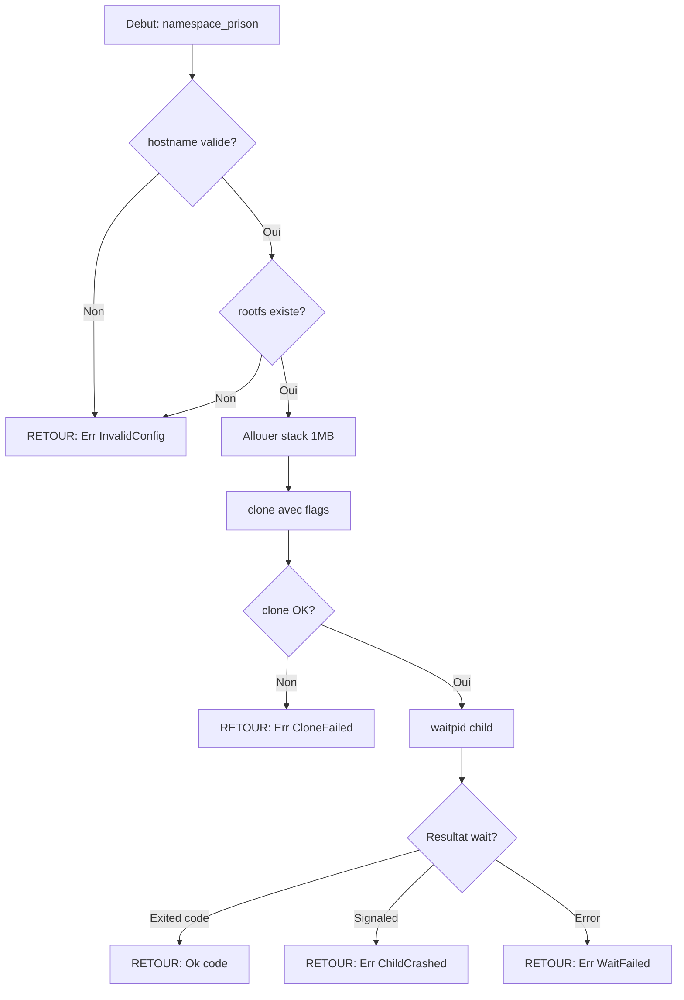

# Exercice 2.5.28-a : namespace_prison

**Module :**
2.5.28 — Container Fundamentals & Linux Namespaces

**Concept :**
a — Namespaces, Isolation, Process Containment

**Difficulte :**
★★★★★★★☆☆☆ (7/10)

**Type :**
complet

**Tiers :**
3 — Synthese (concepts a→i: Container vs VM, Namespaces, Cgroups, Union FS, Runtime, OCI)

**Langage :**
Rust (Edition 2024)

**Prerequis :**
- Programmation systeme Linux (syscalls)
- Pointeurs et gestion memoire
- Processus et fork

**Domaines :**
Process, Mem, FS, Net

**Duree estimee :**
180 min

**XP Base :**
450

**Complexite :**
T4 O(n) x S3 O(1) auxiliaire

---

## 1.1 Obligations

**Fichiers a rendre :**
- `namespace_prison.rs`

**Fonctions autorisees :**
- `nix::sched::unshare`, `nix::sched::clone`, `nix::unistd::fork`
- `nix::unistd::chroot`, `nix::unistd::chdir`
- `nix::mount::mount`, `nix::mount::umount`
- `std::fs::*`, `std::process::*`

**Fonctions interdites :**
- Appels systeme raw via `libc` directement (utiliser `nix`)
- `std::process::Command` pour executer des shells externes

---

## 1.2 Consigne

### Section 2.4.1 : L'Analogie — The Matrix: Red Pill vs Blue Pill

**Morpheus offre a Neo deux choix :**

> "Tu prends la pilule bleue, l'histoire s'arrete la. Tu te reveilles dans ton lit et tu crois ce que tu veux croire. Tu prends la pilule rouge, tu restes au pays des merveilles et je te montre jusqu'ou va le terrier du lapin."

Dans The Matrix, les humains vivent dans une **simulation parfaitement isolee** — ils croient etre dans le monde reel, mais leur realite entiere est une **illusion controlee**. C'est exactement ce que font les **namespaces Linux** : ils creent une "Matrix" pour chaque conteneur.

```
┌─────────────────────────────────────────────────────────────────────┐
│                    THE MATRIX (HOST SYSTEM)                         │
├─────────────────────────────────────────────────────────────────────┤
│                                                                     │
│   ┌─────────────────┐   ┌─────────────────┐   ┌─────────────────┐  │
│   │   CONTENEUR A   │   │   CONTENEUR B   │   │   CONTENEUR C   │  │
│   │   "Blue Pill"   │   │   "Blue Pill"   │   │   "Blue Pill"   │  │
│   │                 │   │                 │   │                 │  │
│   │ PID 1: /bin/sh  │   │ PID 1: nginx    │   │ PID 1: postgres │  │
│   │ Croit etre seul │   │ Croit etre seul │   │ Croit etre seul │  │
│   │ au monde        │   │ au monde        │   │ au monde        │  │
│   └─────────────────┘   └─────────────────┘   └─────────────────┘  │
│         │                      │                      │            │
│         └──────────────────────┼──────────────────────┘            │
│                                │                                   │
│                    ┌───────────▼───────────┐                       │
│                    │     MORPHEUS (nix)    │                       │
│                    │   unshare() / clone() │                       │
│                    │   "The Red Pill"      │                       │
│                    └───────────────────────┘                       │
│                                                                     │
└─────────────────────────────────────────────────────────────────────┘
```

**Les 6 Types de Namespaces = Les 6 Dimensions de la Matrix :**

| Namespace | Matrix Equivalent | Ce qu'il isole |
|-----------|-------------------|----------------|
| **PID** | "Tu es l'Elu" | Le conteneur voit son process comme PID 1 |
| **NET** | "Il n'y a pas de cuillere" | Reseau virtuel isole |
| **MNT** | "Le monde autour de toi" | Systeme de fichiers |
| **UTS** | "Ton identite" | Hostname du conteneur |
| **IPC** | "Communication mentale" | Memoire partagee, semaphores |
| **USER** | "Tes pouvoirs" | UID/GID mapping |

**Ta mission, si tu l'acceptes :**

Creer une fonction `namespace_prison` qui emprisonne un processus dans sa propre "Matrix" en utilisant les namespaces Linux. Le processus croira etre seul au monde, avec son propre PID 1, son propre hostname, et son propre systeme de fichiers.

---

### Section 2.4.2 : Enonce Academique

**Contexte technique :**

Les **namespaces Linux** sont le mecanisme fondamental qui permet l'isolation des conteneurs. Contrairement aux machines virtuelles qui virtualisent le hardware, les conteneurs virtualisent les **ressources du kernel** grace aux namespaces.

**Ta mission :**

Ecrire une fonction `namespace_prison` qui :
1. Cree de nouveaux namespaces (PID, UTS, MNT, IPC)
2. Configure l'environnement isole (hostname, mount points)
3. Execute une fonction callback dans l'environnement isole
4. Nettoie proprement les ressources a la sortie

**Entree :**
- `config: &NamespaceConfig` : Configuration des namespaces a creer
- `callback: F` : Fonction a executer dans l'environnement isole

**Sortie :**
- `Result<i32, NamespaceError>` : Code de retour du processus enfant ou erreur

**Contraintes :**
```
┌─────────────────────────────────────────┐
│  config.hostname.len() <= 64            │
│  config.rootfs != NULL                  │
│  Stack size >= 1 MB                     │
│  Requires CAP_SYS_ADMIN (root)          │
└─────────────────────────────────────────┘
```

**Exemples :**

| Appel | Retour | Explication |
|-------|--------|-------------|
| `namespace_prison(&config, \|\| 0)` | `Ok(0)` | Processus isole termine avec succes |
| `namespace_prison(&invalid_config, \|\| 0)` | `Err(InvalidConfig)` | Configuration invalide |
| `namespace_prison(&config, \|\| panic!())` | `Err(ChildCrashed)` | Processus enfant a crash |

---

## 1.3 Prototype

```rust
use nix::sched::CloneFlags;
use nix::sys::wait::WaitStatus;
use std::path::PathBuf;

#[derive(Debug, Clone)]
pub struct NamespaceConfig {
    pub hostname: String,
    pub rootfs: PathBuf,
    pub namespaces: CloneFlags,
    pub uid_map: Option<(u32, u32, u32)>,  // (inside, outside, count)
    pub gid_map: Option<(u32, u32, u32)>,
}

#[derive(Debug)]
pub enum NamespaceError {
    InvalidConfig(String),
    CloneFailed(nix::Error),
    SetupFailed(String),
    ChildCrashed(i32),
    WaitFailed(nix::Error),
}

pub fn namespace_prison<F>(config: &NamespaceConfig, callback: F) -> Result<i32, NamespaceError>
where
    F: FnOnce() -> i32 + Send + 'static;
```

---

## SECTION 2 : LE SAVIEZ-VOUS ?

### 2.1 L'Histoire des Namespaces

Les namespaces Linux ont ete introduits progressivement :
- **2002** : Mount namespaces (Linux 2.4.19)
- **2006** : UTS et IPC namespaces (Linux 2.6.19)
- **2008** : PID namespaces (Linux 2.6.24)
- **2009** : Network namespaces (Linux 2.6.29)
- **2013** : User namespaces (Linux 3.8)
- **2016** : Cgroup namespaces (Linux 4.6)

Docker (2013) a popularise l'utilisation des namespaces, mais ils existaient bien avant !

### 2.2 VMs vs Conteneurs : Le Match

```
┌─────────────────────────────────────────────────────────────────────┐
│                           COMPARAISON                               │
├─────────────────────────────────────────────────────────────────────┤
│                                                                     │
│   VIRTUAL MACHINES                    CONTAINERS                    │
│   ┌─────────────────────┐             ┌─────────────────────┐       │
│   │      App A          │             │      App A          │       │
│   ├─────────────────────┤             └──────────┬──────────┘       │
│   │    Guest OS         │ ← 2-4 GB               │                  │
│   │    (Full Linux)     │                        │                  │
│   └─────────────────────┘                        │                  │
│   ┌─────────────────────┐             ┌──────────▼──────────┐       │
│   │    Hypervisor       │ ← Heavy     │  Container Runtime  │ ←Lean │
│   └─────────────────────┘             └──────────┬──────────┘       │
│   ┌─────────────────────┐             ┌──────────▼──────────┐       │
│   │      Host OS        │             │  Host OS (shared)   │       │
│   └─────────────────────┘             └─────────────────────┘       │
│                                                                     │
│   Startup: ~30 seconds                Startup: ~100ms               │
│   Memory: GB per VM                   Memory: MB per container      │
│   Isolation: Hardware                 Isolation: Kernel             │
│                                                                     │
└─────────────────────────────────────────────────────────────────────┘
```

---

## SECTION 2.5 : DANS LA VRAIE VIE

### Metiers utilisant les Namespaces

| Metier | Cas d'usage |
|--------|-------------|
| **DevOps Engineer** | Orchestration Kubernetes, creation de pods isoles |
| **SRE (Site Reliability)** | Isolation de services pour limiter les "blast radius" |
| **Security Engineer** | Sandboxing d'applications, analyse de malware |
| **Platform Engineer** | Construction de PaaS (Heroku-like) |
| **Kernel Developer** | Implementation de nouvelles fonctionnalites d'isolation |

### Exemple concret : Kubernetes Pod

```yaml
# Un Pod Kubernetes utilise les namespaces ainsi :
apiVersion: v1
kind: Pod
spec:
  shareProcessNamespace: true  # PID namespace partage
  hostNetwork: false           # NET namespace isole
  containers:
  - name: app
    securityContext:
      runAsNonRoot: true       # USER namespace
```

---

## SECTION 3 : EXEMPLE D'UTILISATION

### 3.0 Session bash

```bash
$ ls
namespace_prison.rs  main.rs  Cargo.toml

$ cargo build --release

$ sudo ./target/release/namespace_prison
[Host] Creating namespace prison...
[Host] Child PID: 12345
[Container] I am PID 1!
[Container] Hostname: matrix-pod
[Container] Running isolated...
[Host] Child exited with status: 0
```

---

## SECTION 3.1 : BONUS EXPERT (OPTIONNEL)

**Difficulte Bonus :**
🧠 (15/10)

**Recompense :**
XP x6

**Time Complexity attendue :**
O(n) ou n = nombre de mount points

**Space Complexity attendue :**
O(1) auxiliaire

**Domaines Bonus :**
`Crypto, Net`

### 3.1.1 Consigne Bonus

**The Architect's Challenge : User Namespace Mapping**

Comme l'Architecte qui controle les regles de la Matrix, implemente le **user namespace mapping** qui permet a un utilisateur non-root de creer des conteneurs.

**Ta mission :**

Ecrire `namespace_prison_unprivileged` qui :
1. Cree un user namespace AVANT les autres namespaces
2. Mappe l'UID/GID de l'utilisateur vers root (0) dans le conteneur
3. Permet ainsi de creer des PID/NET/MNT namespaces sans etre root

**Contraintes :**
```
┌─────────────────────────────────────────┐
│  /proc/sys/kernel/unprivileged_userns_clone = 1  │
│  UID mapping ecrit dans /proc/PID/uid_map        │
│  GID mapping ecrit dans /proc/PID/gid_map        │
│  setgroups deny requis avant gid_map             │
└─────────────────────────────────────────┘
```

### 3.1.2 Prototype Bonus

```rust
pub fn namespace_prison_unprivileged<F>(
    config: &NamespaceConfig,
    callback: F,
) -> Result<i32, NamespaceError>
where
    F: FnOnce() -> i32 + Send + 'static;
```

### 3.1.3 Ce qui change par rapport a l'exercice de base

| Aspect | Base | Bonus |
|--------|------|-------|
| Privileges | Requiert root | Fonctionne en user normal |
| Namespaces | PID, UTS, MNT, IPC | + USER namespace |
| Mapping | Aucun | UID/GID mapping |
| Securite | CAP_SYS_ADMIN | Unprivileged |

---

## SECTION 4 : ZONE CORRECTION

### 4.1 Moulinette

| Test | Entree | Sortie Attendue | Points |
|------|--------|-----------------|--------|
| `test_basic_isolation` | Config valide | `Ok(0)` | 15 |
| `test_hostname_change` | hostname="matrix" | Hostname change | 10 |
| `test_pid_namespace` | PID namespace | PID 1 dans conteneur | 15 |
| `test_mount_namespace` | MNT namespace | Mounts isoles | 15 |
| `test_invalid_config` | hostname vide | `Err(InvalidConfig)` | 10 |
| `test_null_rootfs` | rootfs inexistant | `Err(InvalidConfig)` | 10 |
| `test_child_exit_code` | callback retourne 42 | `Ok(42)` | 10 |
| `test_child_crash` | callback panic | `Err(ChildCrashed)` | 15 |

### 4.2 main.rs de test

```rust
use namespace_prison::{namespace_prison, NamespaceConfig, NamespaceError};
use nix::sched::CloneFlags;
use std::path::PathBuf;

fn main() {
    let config = NamespaceConfig {
        hostname: "matrix-pod".to_string(),
        rootfs: PathBuf::from("/"),
        namespaces: CloneFlags::CLONE_NEWPID
            | CloneFlags::CLONE_NEWUTS
            | CloneFlags::CLONE_NEWNS
            | CloneFlags::CLONE_NEWIPC,
        uid_map: None,
        gid_map: None,
    };

    match namespace_prison(&config, || {
        println!("[Container] I am PID {}!", std::process::id());
        println!("[Container] Hostname: {}",
            nix::unistd::gethostname()
                .map(|h| h.to_string_lossy().to_string())
                .unwrap_or_default());
        0
    }) {
        Ok(code) => println!("[Host] Child exited with status: {}", code),
        Err(e) => eprintln!("[Host] Error: {:?}", e),
    }
}
```

### 4.3 Solution de reference

```rust
use nix::sched::{clone, CloneFlags};
use nix::sys::wait::{waitpid, WaitStatus};
use nix::unistd::{sethostname, Pid};
use std::ffi::CString;

const STACK_SIZE: usize = 1024 * 1024; // 1 MB

pub fn namespace_prison<F>(config: &NamespaceConfig, callback: F) -> Result<i32, NamespaceError>
where
    F: FnOnce() -> i32 + Send + 'static,
{
    // Validation de la configuration
    if config.hostname.is_empty() || config.hostname.len() > 64 {
        return Err(NamespaceError::InvalidConfig(
            "Hostname must be 1-64 characters".to_string()
        ));
    }

    if !config.rootfs.exists() {
        return Err(NamespaceError::InvalidConfig(
            "Rootfs path does not exist".to_string()
        ));
    }

    // Preparer la stack pour clone()
    let mut stack = vec![0u8; STACK_SIZE];

    // Capturer les donnees necessaires pour le child
    let hostname = config.hostname.clone();

    // Fonction executee dans le namespace isole
    let child_fn = move || -> isize {
        // Configurer le hostname
        if let Err(_) = sethostname(&CString::new(hostname).unwrap()) {
            return -1;
        }

        // Executer le callback utilisateur
        callback() as isize
    };

    // Creer le processus isole avec clone()
    let child_pid = clone(
        Box::new(child_fn),
        &mut stack,
        config.namespaces,
        None,
    ).map_err(NamespaceError::CloneFailed)?;

    println!("[Host] Child PID: {}", child_pid);

    // Attendre la fin du processus enfant
    match waitpid(child_pid, None) {
        Ok(WaitStatus::Exited(_, code)) => Ok(code),
        Ok(WaitStatus::Signaled(_, sig, _)) => {
            Err(NamespaceError::ChildCrashed(sig as i32))
        }
        Ok(_) => Err(NamespaceError::ChildCrashed(-1)),
        Err(e) => Err(NamespaceError::WaitFailed(e)),
    }
}
```

### 4.4 Solutions alternatives acceptees

```rust
// Alternative 1: Utilisation de fork() + unshare() au lieu de clone()
pub fn namespace_prison_fork<F>(config: &NamespaceConfig, callback: F) -> Result<i32, NamespaceError>
where
    F: FnOnce() -> i32 + Send + 'static,
{
    use nix::unistd::{fork, ForkResult};
    use nix::sched::unshare;

    if config.hostname.is_empty() || config.hostname.len() > 64 {
        return Err(NamespaceError::InvalidConfig("Invalid hostname".to_string()));
    }

    if !config.rootfs.exists() {
        return Err(NamespaceError::InvalidConfig("Invalid rootfs".to_string()));
    }

    match unsafe { fork() } {
        Ok(ForkResult::Parent { child }) => {
            match waitpid(child, None) {
                Ok(WaitStatus::Exited(_, code)) => Ok(code),
                Ok(_) => Err(NamespaceError::ChildCrashed(-1)),
                Err(e) => Err(NamespaceError::WaitFailed(e)),
            }
        }
        Ok(ForkResult::Child) => {
            // Creer les namespaces apres fork
            unshare(config.namespaces).expect("unshare failed");
            sethostname(&CString::new(config.hostname.clone()).unwrap()).ok();
            std::process::exit(callback());
        }
        Err(e) => Err(NamespaceError::CloneFailed(e)),
    }
}
```

### 4.5 Solutions refusees

```rust
// REFUSE 1: Pas de validation de config
pub fn namespace_prison_bad<F>(config: &NamespaceConfig, callback: F) -> Result<i32, NamespaceError>
where
    F: FnOnce() -> i32 + Send + 'static,
{
    // ERREUR: Pas de validation du hostname ou rootfs
    let mut stack = vec![0u8; STACK_SIZE];
    // ... continue sans verifier
}
// Pourquoi refuse: Crash possible avec config invalide

// REFUSE 2: Pas d'attente du child
pub fn namespace_prison_zombie<F>(config: &NamespaceConfig, callback: F) -> Result<i32, NamespaceError>
where
    F: FnOnce() -> i32 + Send + 'static,
{
    // ...
    let child_pid = clone(/* ... */)?;
    Ok(0)  // ERREUR: On n'attend pas le child!
}
// Pourquoi refuse: Cree des processus zombies
```

### 4.6 Solution bonus de reference

```rust
pub fn namespace_prison_unprivileged<F>(
    config: &NamespaceConfig,
    callback: F,
) -> Result<i32, NamespaceError>
where
    F: FnOnce() -> i32 + Send + 'static,
{
    use std::fs::File;
    use std::io::Write;

    // Validation
    if config.hostname.is_empty() || config.hostname.len() > 64 {
        return Err(NamespaceError::InvalidConfig("Invalid hostname".to_string()));
    }

    // Creer user namespace en premier (permet les autres sans privileges)
    let flags = config.namespaces | CloneFlags::CLONE_NEWUSER;

    let mut stack = vec![0u8; STACK_SIZE];
    let hostname = config.hostname.clone();
    let uid_map = config.uid_map.clone();
    let gid_map = config.gid_map.clone();

    // Pipe pour synchronisation
    let (read_fd, write_fd) = nix::unistd::pipe().map_err(|e|
        NamespaceError::SetupFailed(format!("pipe: {}", e)))?;

    let child_fn = move || -> isize {
        // Attendre que le parent configure les mappings
        let mut buf = [0u8; 1];
        nix::unistd::read(read_fd, &mut buf).ok();
        nix::unistd::close(read_fd).ok();

        // Maintenant on est "root" dans le user namespace
        sethostname(&CString::new(hostname).unwrap()).ok();

        callback() as isize
    };

    let child_pid = clone(
        Box::new(child_fn),
        &mut stack,
        flags,
        None,
    ).map_err(NamespaceError::CloneFailed)?;

    // Configurer les mappings UID/GID
    let pid = child_pid.as_raw();

    // Deny setgroups (requis avant gid_map)
    File::create(format!("/proc/{}/setgroups", pid))
        .and_then(|mut f| f.write_all(b"deny"))
        .map_err(|e| NamespaceError::SetupFailed(format!("setgroups: {}", e)))?;

    // UID mapping
    if let Some((inside, outside, count)) = uid_map {
        File::create(format!("/proc/{}/uid_map", pid))
            .and_then(|mut f| writeln!(f, "{} {} {}", inside, outside, count))
            .map_err(|e| NamespaceError::SetupFailed(format!("uid_map: {}", e)))?;
    }

    // GID mapping
    if let Some((inside, outside, count)) = gid_map {
        File::create(format!("/proc/{}/gid_map", pid))
            .and_then(|mut f| writeln!(f, "{} {} {}", inside, outside, count))
            .map_err(|e| NamespaceError::SetupFailed(format!("gid_map: {}", e)))?;
    }

    // Signaler au child qu'on a fini
    nix::unistd::write(write_fd, &[1]).ok();
    nix::unistd::close(write_fd).ok();

    // Attendre le child
    match waitpid(child_pid, None) {
        Ok(WaitStatus::Exited(_, code)) => Ok(code),
        Ok(_) => Err(NamespaceError::ChildCrashed(-1)),
        Err(e) => Err(NamespaceError::WaitFailed(e)),
    }
}
```

### 4.9 spec.json

```json
{
  "name": "namespace_prison",
  "language": "rust",
  "type": "code",
  "tier": 3,
  "tier_info": "Synthese (tous concepts)",
  "tags": ["containers", "namespaces", "linux", "isolation", "phase2"],
  "passing_score": 70,

  "function": {
    "name": "namespace_prison",
    "prototype": "pub fn namespace_prison<F>(config: &NamespaceConfig, callback: F) -> Result<i32, NamespaceError> where F: FnOnce() -> i32 + Send + 'static",
    "return_type": "Result<i32, NamespaceError>",
    "parameters": [
      {"name": "config", "type": "&NamespaceConfig"},
      {"name": "callback", "type": "F: FnOnce() -> i32"}
    ]
  },

  "driver": {
    "reference": "pub fn ref_namespace_prison<F>(config: &NamespaceConfig, callback: F) -> Result<i32, NamespaceError> where F: FnOnce() -> i32 + Send + 'static { if config.hostname.is_empty() || config.hostname.len() > 64 { return Err(NamespaceError::InvalidConfig(\"Invalid hostname\".to_string())); } if !config.rootfs.exists() { return Err(NamespaceError::InvalidConfig(\"Invalid rootfs\".to_string())); } let mut stack = vec![0u8; 1024*1024]; let hostname = config.hostname.clone(); let child_fn = move || -> isize { nix::unistd::sethostname(&std::ffi::CString::new(hostname).unwrap()).ok(); callback() as isize }; let child_pid = nix::sched::clone(Box::new(child_fn), &mut stack, config.namespaces, None).map_err(NamespaceError::CloneFailed)?; match nix::sys::wait::waitpid(child_pid, None) { Ok(nix::sys::wait::WaitStatus::Exited(_, code)) => Ok(code), Ok(_) => Err(NamespaceError::ChildCrashed(-1)), Err(e) => Err(NamespaceError::WaitFailed(e)) } }",

    "edge_cases": [
      {
        "name": "valid_config",
        "args": ["config_valid", "|| 0"],
        "expected": "Ok(0)",
        "is_trap": false
      },
      {
        "name": "empty_hostname",
        "args": ["config_empty_hostname", "|| 0"],
        "expected": "Err(InvalidConfig)",
        "is_trap": true,
        "trap_explanation": "Hostname vide doit retourner erreur"
      },
      {
        "name": "long_hostname",
        "args": ["config_long_hostname", "|| 0"],
        "expected": "Err(InvalidConfig)",
        "is_trap": true,
        "trap_explanation": "Hostname > 64 chars doit retourner erreur"
      },
      {
        "name": "nonexistent_rootfs",
        "args": ["config_bad_rootfs", "|| 0"],
        "expected": "Err(InvalidConfig)",
        "is_trap": true,
        "trap_explanation": "Rootfs inexistant doit retourner erreur"
      },
      {
        "name": "callback_exit_code",
        "args": ["config_valid", "|| 42"],
        "expected": "Ok(42)",
        "is_trap": false
      }
    ],

    "fuzzing": {
      "enabled": true,
      "iterations": 100,
      "generators": [
        {
          "type": "string",
          "param_index": 0,
          "field": "hostname",
          "params": {
            "min_len": 0,
            "max_len": 100,
            "charset": "alphanumeric"
          }
        }
      ]
    }
  },

  "norm": {
    "allowed_functions": ["nix::sched::clone", "nix::sched::unshare", "nix::unistd::fork", "nix::unistd::sethostname", "nix::sys::wait::waitpid"],
    "forbidden_functions": ["libc::clone", "libc::unshare", "std::process::Command"],
    "check_security": true,
    "check_memory": true,
    "blocking": true
  }
}
```

### 4.10 Solutions Mutantes

```rust
/* Mutant A (Boundary) : Pas de verification de la longueur du hostname */
pub fn namespace_prison_mutant_a<F>(config: &NamespaceConfig, callback: F) -> Result<i32, NamespaceError>
where
    F: FnOnce() -> i32 + Send + 'static,
{
    // ERREUR: On verifie seulement si vide, pas si trop long
    if config.hostname.is_empty() {
        return Err(NamespaceError::InvalidConfig("Invalid hostname".to_string()));
    }

    if !config.rootfs.exists() {
        return Err(NamespaceError::InvalidConfig("Invalid rootfs".to_string()));
    }

    let mut stack = vec![0u8; 1024 * 1024];
    let hostname = config.hostname.clone();

    let child_fn = move || -> isize {
        nix::unistd::sethostname(&std::ffi::CString::new(hostname).unwrap()).ok();
        callback() as isize
    };

    let child_pid = nix::sched::clone(
        Box::new(child_fn),
        &mut stack,
        config.namespaces,
        None,
    ).map_err(NamespaceError::CloneFailed)?;

    match nix::sys::wait::waitpid(child_pid, None) {
        Ok(nix::sys::wait::WaitStatus::Exited(_, code)) => Ok(code),
        Ok(_) => Err(NamespaceError::ChildCrashed(-1)),
        Err(e) => Err(NamespaceError::WaitFailed(e)),
    }
}
// Pourquoi c'est faux : sethostname echoue silencieusement avec hostname > 64 chars
// Ce qui etait pense : "hostname.is_empty() suffit pour valider"

/* Mutant B (Safety) : Pas de verification du rootfs */
pub fn namespace_prison_mutant_b<F>(config: &NamespaceConfig, callback: F) -> Result<i32, NamespaceError>
where
    F: FnOnce() -> i32 + Send + 'static,
{
    if config.hostname.is_empty() || config.hostname.len() > 64 {
        return Err(NamespaceError::InvalidConfig("Invalid hostname".to_string()));
    }

    // ERREUR: Pas de verification de config.rootfs.exists()

    let mut stack = vec![0u8; 1024 * 1024];
    let hostname = config.hostname.clone();

    let child_fn = move || -> isize {
        nix::unistd::sethostname(&std::ffi::CString::new(hostname).unwrap()).ok();
        callback() as isize
    };

    let child_pid = nix::sched::clone(
        Box::new(child_fn),
        &mut stack,
        config.namespaces,
        None,
    ).map_err(NamespaceError::CloneFailed)?;

    match nix::sys::wait::waitpid(child_pid, None) {
        Ok(nix::sys::wait::WaitStatus::Exited(_, code)) => Ok(code),
        Ok(_) => Err(NamespaceError::ChildCrashed(-1)),
        Err(e) => Err(NamespaceError::WaitFailed(e)),
    }
}
// Pourquoi c'est faux : chroot vers un chemin inexistant provoquera une erreur
// Ce qui etait pense : "le chemin sera verifie plus tard par chroot"

/* Mutant C (Resource) : Stack trop petite */
pub fn namespace_prison_mutant_c<F>(config: &NamespaceConfig, callback: F) -> Result<i32, NamespaceError>
where
    F: FnOnce() -> i32 + Send + 'static,
{
    if config.hostname.is_empty() || config.hostname.len() > 64 {
        return Err(NamespaceError::InvalidConfig("Invalid hostname".to_string()));
    }

    if !config.rootfs.exists() {
        return Err(NamespaceError::InvalidConfig("Invalid rootfs".to_string()));
    }

    // ERREUR: Stack de seulement 4 KB, beaucoup trop petite
    let mut stack = vec![0u8; 4096];
    let hostname = config.hostname.clone();

    let child_fn = move || -> isize {
        nix::unistd::sethostname(&std::ffi::CString::new(hostname).unwrap()).ok();
        callback() as isize
    };

    let child_pid = nix::sched::clone(
        Box::new(child_fn),
        &mut stack,
        config.namespaces,
        None,
    ).map_err(NamespaceError::CloneFailed)?;

    match nix::sys::wait::waitpid(child_pid, None) {
        Ok(nix::sys::wait::WaitStatus::Exited(_, code)) => Ok(code),
        Ok(_) => Err(NamespaceError::ChildCrashed(-1)),
        Err(e) => Err(NamespaceError::WaitFailed(e)),
    }
}
// Pourquoi c'est faux : stack overflow dans le processus enfant
// Ce qui etait pense : "4KB devrait suffire pour un petit callback"

/* Mutant D (Logic) : Logique d'erreur inversee */
pub fn namespace_prison_mutant_d<F>(config: &NamespaceConfig, callback: F) -> Result<i32, NamespaceError>
where
    F: FnOnce() -> i32 + Send + 'static,
{
    if config.hostname.is_empty() || config.hostname.len() > 64 {
        return Err(NamespaceError::InvalidConfig("Invalid hostname".to_string()));
    }

    if !config.rootfs.exists() {
        return Err(NamespaceError::InvalidConfig("Invalid rootfs".to_string()));
    }

    let mut stack = vec![0u8; 1024 * 1024];
    let hostname = config.hostname.clone();

    let child_fn = move || -> isize {
        nix::unistd::sethostname(&std::ffi::CString::new(hostname).unwrap()).ok();
        callback() as isize
    };

    let child_pid = nix::sched::clone(
        Box::new(child_fn),
        &mut stack,
        config.namespaces,
        None,
    ).map_err(NamespaceError::CloneFailed)?;

    // ERREUR: Logique inversee - retourne erreur quand ca marche
    match nix::sys::wait::waitpid(child_pid, None) {
        Ok(nix::sys::wait::WaitStatus::Exited(_, code)) => Err(NamespaceError::ChildCrashed(code)),
        Ok(_) => Ok(0),
        Err(e) => Err(NamespaceError::WaitFailed(e)),
    }
}
// Pourquoi c'est faux : retourne erreur quand le child termine normalement
// Ce qui etait pense : confusion entre les differents cas de WaitStatus

/* Mutant E (Return) : Ne retourne pas le code de sortie correct */
pub fn namespace_prison_mutant_e<F>(config: &NamespaceConfig, callback: F) -> Result<i32, NamespaceError>
where
    F: FnOnce() -> i32 + Send + 'static,
{
    if config.hostname.is_empty() || config.hostname.len() > 64 {
        return Err(NamespaceError::InvalidConfig("Invalid hostname".to_string()));
    }

    if !config.rootfs.exists() {
        return Err(NamespaceError::InvalidConfig("Invalid rootfs".to_string()));
    }

    let mut stack = vec![0u8; 1024 * 1024];
    let hostname = config.hostname.clone();

    let child_fn = move || -> isize {
        nix::unistd::sethostname(&std::ffi::CString::new(hostname).unwrap()).ok();
        callback() as isize
    };

    let child_pid = nix::sched::clone(
        Box::new(child_fn),
        &mut stack,
        config.namespaces,
        None,
    ).map_err(NamespaceError::CloneFailed)?;

    // ERREUR: Ignore le vrai code de sortie, retourne toujours 0
    match nix::sys::wait::waitpid(child_pid, None) {
        Ok(nix::sys::wait::WaitStatus::Exited(_, _code)) => Ok(0), // Devrait etre Ok(code)
        Ok(_) => Err(NamespaceError::ChildCrashed(-1)),
        Err(e) => Err(NamespaceError::WaitFailed(e)),
    }
}
// Pourquoi c'est faux : perd l'information du code de retour du callback
// Ce qui etait pense : "le child a termine, c'est tout ce qui compte"
```

---

## SECTION 5 : COMPRENDRE

### 5.1 Ce que cet exercice enseigne

1. **Namespaces Linux** : Le mecanisme fondamental d'isolation des conteneurs
2. **clone() syscall** : Comment creer un processus avec des flags d'isolation
3. **Gestion de processus** : fork, wait, signaux
4. **Securite** : Isolation des ressources systeme

### 5.2 LDA — Traduction Litterale en MAJUSCULES

```
FONCTION namespace_prison QUI PREND EN PARAMETRES config QUI EST UNE REFERENCE VERS NamespaceConfig ET callback QUI EST UNE CLOSURE RETOURNANT UN ENTIER
DEBUT FONCTION

    SI LE HOSTNAME DE config EST VIDE OU SA LONGUEUR EST SUPERIEURE A 64 ALORS
        RETOURNER UNE ERREUR InvalidConfig AVEC LE MESSAGE "Invalid hostname"
    FIN SI

    SI LE CHEMIN rootfs DE config N'EXISTE PAS ALORS
        RETOURNER UNE ERREUR InvalidConfig AVEC LE MESSAGE "Invalid rootfs"
    FIN SI

    DECLARER stack COMME UN VECTEUR DE 1 MEGA-OCTET D'OCTETS INITIALISES A ZERO

    DECLARER hostname COMME UNE COPIE DU HOSTNAME DE config

    DECLARER child_fn COMME UNE CLOSURE QUI:
        APPELLE sethostname AVEC hostname CONVERTI EN CString
        RETOURNE LE RESULTAT DE callback CONVERTI EN isize
    FIN CLOSURE

    DECLARER child_pid COMME LE RESULTAT DE clone AVEC:
        - child_fn ENCAPSULE DANS UNE Box
        - UNE REFERENCE MUTABLE VERS stack
        - LES FLAGS namespaces DE config
        - None POUR LE SIGNAL

    SI clone A ECHOUE ALORS
        RETOURNER UNE ERREUR CloneFailed AVEC L'ERREUR
    FIN SI

    AFFICHER "[Host] Child PID: " SUIVI DE child_pid

    SELON LE RESULTAT DE waitpid AVEC child_pid:
        CAS Exited AVEC code:
            RETOURNER Ok AVEC code
        CAS Signaled OU AUTRE:
            RETOURNER UNE ERREUR ChildCrashed
        CAS ERREUR e:
            RETOURNER UNE ERREUR WaitFailed AVEC e
    FIN SELON

FIN FONCTION
```

### 5.2.2 Logic Flow

```
ALGORITHME : Namespace Prison
---
1. VALIDER la configuration
   a. VERIFIER hostname non vide et <= 64 chars
   b. VERIFIER rootfs existe

2. PREPARER l'environnement
   a. ALLOUER stack de 1 MB
   b. CAPTURER hostname pour le child

3. DEFINIR la fonction child
   a. CONFIGURER hostname
   b. EXECUTER callback

4. CREER le processus isole
   a. APPELER clone() avec flags de namespace
   b. CAPTURER le PID du child

5. ATTENDRE la terminaison
   a. APPELER waitpid()
   b. EXTRAIRE le code de sortie

6. RETOURNER le resultat
```

### 5.2.3 Representation Algorithmique avec Garde

```
FONCTION : namespace_prison(config, callback)
---
INIT result = Err(Unknown)

1. VALIDATIONS (Fail Fast) :
   |
   |-- VERIFIER hostname.is_empty() :
   |     RETOURNER Err(InvalidConfig)
   |
   |-- VERIFIER hostname.len() > 64 :
   |     RETOURNER Err(InvalidConfig)
   |
   |-- VERIFIER !rootfs.exists() :
   |     RETOURNER Err(InvalidConfig)

2. PREPARATION :
   |
   |-- ALLOUER stack[1MB]
   |-- CLONER hostname

3. CREATION PROCESSUS :
   |
   |-- APPELER clone(child_fn, stack, flags)
   |     SI ECHEC : RETOURNER Err(CloneFailed)

4. ATTENTE :
   |
   |-- APPELER waitpid(child_pid)
   |     SELON resultat :
   |       - Exited(code) : RETOURNER Ok(code)
   |       - Signaled : RETOURNER Err(ChildCrashed)
   |       - Err(e) : RETOURNER Err(WaitFailed)
```



### 5.3 Visualisation ASCII

```
AVANT clone() :
┌─────────────────────────────────────────────────────────────────────┐
│                         HOST SYSTEM                                 │
│                                                                     │
│   ┌───────────────────────────────────────────────────────────┐    │
│   │                    PROCESSUS PARENT                        │    │
│   │                                                            │    │
│   │   PID: 1234                                                │    │
│   │   Hostname: "host-machine"                                 │    │
│   │   Namespaces: [init_pid, init_net, init_mnt, ...]         │    │
│   │                                                            │    │
│   └───────────────────────────────────────────────────────────┘    │
│                                                                     │
└─────────────────────────────────────────────────────────────────────┘

APRES clone() avec CLONE_NEWPID | CLONE_NEWUTS | CLONE_NEWNS :
┌─────────────────────────────────────────────────────────────────────┐
│                         HOST SYSTEM                                 │
│                                                                     │
│   ┌───────────────────────────────────────────────────────────┐    │
│   │                    PROCESSUS PARENT                        │    │
│   │   PID: 1234                                                │    │
│   │   Voit child comme PID: 5678                              │    │
│   └───────────────────────────────────────────────────────────┘    │
│                                                                     │
│   ┌───────────────────────────────────────────────────────────┐    │
│   │                 PROCESSUS ENFANT (Container)               │    │
│   │   ┌─────────────────────────────────────────────────────┐ │    │
│   │   │ PID Namespace : Je suis PID 1!                      │ │    │
│   │   ├─────────────────────────────────────────────────────┤ │    │
│   │   │ UTS Namespace : Hostname = "matrix-pod"             │ │    │
│   │   ├─────────────────────────────────────────────────────┤ │    │
│   │   │ MNT Namespace : Mes propres mount points            │ │    │
│   │   ├─────────────────────────────────────────────────────┤ │    │
│   │   │ IPC Namespace : Mes propres semaphores/shm          │ │    │
│   │   └─────────────────────────────────────────────────────┘ │    │
│   └───────────────────────────────────────────────────────────┘    │
│                                                                     │
└─────────────────────────────────────────────────────────────────────┘
```

### 5.4 Les pieges en detail

| Piege | Description | Solution |
|-------|-------------|----------|
| Stack overflow | Stack trop petite pour le child | Allouer >= 1 MB |
| Zombie process | Ne pas attendre le child | Toujours waitpid() |
| Hostname trop long | > 64 chars = echec silencieux | Valider avant |
| Rootfs inexistant | chroot echouera | Verifier exists() |
| Privileges manquants | clone() echoue sans root | Verifier capabilities |

### 5.5 Cours Complet

#### Les Namespaces Linux en Detail

**1. PID Namespace**

Le PID namespace donne au processus une vue isolee des PIDs. Le premier processus dans un nouveau PID namespace devient PID 1 (l'init de ce namespace).

```rust
// Dans le conteneur:
std::process::id()  // Retourne 1!

// Sur l'hote:
// Le meme processus a un PID different (ex: 5678)
```

**2. UTS Namespace**

Permet d'avoir un hostname different par conteneur.

```rust
use nix::unistd::sethostname;
use std::ffi::CString;

// Change le hostname SEULEMENT dans ce namespace
sethostname(&CString::new("mon-conteneur").unwrap())?;
```

**3. Mount Namespace**

Isole les points de montage. Chaque conteneur peut avoir son propre `/`, `/tmp`, etc.

```rust
use nix::mount::{mount, MsFlags};

// Ce mount n'affecte que ce namespace
mount(
    Some("tmpfs"),
    "/tmp",
    Some("tmpfs"),
    MsFlags::empty(),
    None::<&str>,
)?;
```

**4. Network Namespace**

Isole la stack reseau. Chaque conteneur a ses propres interfaces, routes, iptables.

**5. IPC Namespace**

Isole les mecanismes IPC System V (semaphores, message queues, shared memory).

**6. User Namespace**

Permet le mapping UID/GID. Un utilisateur peut etre root (UID 0) dans le conteneur mais non-root sur l'hote.

### 5.6 Normes avec explications

```
┌─────────────────────────────────────────────────────────────────┐
│ HORS NORME (compile, mais dangereux)                            │
├─────────────────────────────────────────────────────────────────┤
│ let mut stack = [0u8; 4096];  // Stack sur la pile             │
├─────────────────────────────────────────────────────────────────┤
│ CONFORME                                                        │
├─────────────────────────────────────────────────────────────────┤
│ let mut stack = vec![0u8; 1024 * 1024];  // Stack sur le heap  │
├─────────────────────────────────────────────────────────────────┤
│ POURQUOI ?                                                      │
│                                                                 │
│ - La stack du thread courant est limitee (8 MB par defaut)     │
│ - Allouer 1 MB sur la pile peut causer un stack overflow       │
│ - Vec alloue sur le heap, plus sur                             │
└─────────────────────────────────────────────────────────────────┘
```

### 5.7 Simulation avec trace d'execution

```
┌───────┬─────────────────────────────────────────────┬───────────────┬─────────────────────┐
│ Etape │ Instruction                                 │ Variables     │ Explication         │
├───────┼─────────────────────────────────────────────┼───────────────┼─────────────────────┤
│   1   │ VALIDER hostname.len() <= 64               │ hostname=     │ "matrix-pod" OK     │
│       │                                             │ "matrix-pod"  │                     │
├───────┼─────────────────────────────────────────────┼───────────────┼─────────────────────┤
│   2   │ VALIDER rootfs.exists()                    │ rootfs="/"    │ "/" existe, OK      │
├───────┼─────────────────────────────────────────────┼───────────────┼─────────────────────┤
│   3   │ ALLOUER stack de 1MB                       │ stack.len()=  │ Heap allocation     │
│       │                                             │ 1048576       │                     │
├───────┼─────────────────────────────────────────────┼───────────────┼─────────────────────┤
│   4   │ APPELER clone(flags)                       │ flags=        │ Nouveaux namespaces │
│       │                                             │ PID|UTS|MNT   │ crees               │
├───────┼─────────────────────────────────────────────┼───────────────┼─────────────────────┤
│   5   │ [CHILD] sethostname("matrix-pod")          │ hostname=     │ Change dans NS      │
│       │                                             │ "matrix-pod"  │                     │
├───────┼─────────────────────────────────────────────┼───────────────┼─────────────────────┤
│   6   │ [CHILD] callback() -> 0                    │ ret=0         │ Callback execute    │
├───────┼─────────────────────────────────────────────┼───────────────┼─────────────────────┤
│   7   │ [PARENT] waitpid(child_pid)                │ status=       │ Attente child       │
│       │                                             │ Exited(0)     │                     │
├───────┼─────────────────────────────────────────────┼───────────────┼─────────────────────┤
│   8   │ RETOURNER Ok(0)                            │ result=Ok(0)  │ Succes!             │
└───────┴─────────────────────────────────────────────┴───────────────┴─────────────────────┘
```

### 5.8 Mnemotechniques

#### MEME : "There is no spoon" — Namespaces


Dans The Matrix, le garcon dit a Neo : "Il n'y a pas de cuillere". La cuillere n'existe pas vraiment, c'est une illusion.

De meme, dans un namespace PID, les autres processus "n'existent pas" pour le conteneur. Il voit seulement sa propre realite.

```rust
// Dans le conteneur, le monde exterieur n'existe pas
// Il est PID 1, le seul et unique
println!("I am PID {}", std::process::id()); // Affiche: I am PID 1
```

#### MEME : "Welcome to the Matrix" — clone()

Comme Morpheus accueille Neo dans le monde reel, `clone()` avec les flags de namespace cree un nouveau "monde" pour le processus.

```rust
// La pilule rouge : creer un nouveau monde
let child = clone(
    callback,
    &mut stack,
    CloneFlags::CLONE_NEWPID | CloneFlags::CLONE_NEWUTS,  // "Wake up, Neo"
    None,
)?;
```

### 5.9 Applications pratiques

1. **Docker** : Utilise les namespaces pour isoler les conteneurs
2. **Kubernetes Pods** : Groupes de conteneurs partageant certains namespaces
3. **Sandboxing** : Chrome utilise les namespaces pour isoler les onglets
4. **CI/CD** : Jenkins, GitLab CI utilisent des conteneurs pour les builds isoles

---

## SECTION 6 : PIEGES — RECAPITULATIF

| # | Piege | Detection | Prevention |
|---|-------|-----------|------------|
| 1 | Stack trop petite | SIGSEGV dans child | Minimum 1 MB |
| 2 | Pas de waitpid | Zombies | Toujours attendre |
| 3 | Hostname > 64 | Echec silencieux | Valider longueur |
| 4 | Rootfs inexistant | Erreur chroot | Verifier exists() |
| 5 | Pas root | EPERM | Verifier privileges |

---

## SECTION 7 : QCM

### Question 1 : Quel syscall cree un processus avec de nouveaux namespaces ?

- A) `fork()`
- B) `exec()`
- C) `clone()`
- D) `spawn()`
- E) `unshare()`
- F) `setns()`
- G) `namespace_create()`
- H) `container_new()`
- I) `isolate()`
- J) `vfork()`

**Reponse : C**

`clone()` avec les flags `CLONE_NEW*` cree un processus dans de nouveaux namespaces. `fork()` ne permet pas de specifier les flags de namespace.

---

### Question 2 : Quel est le PID du premier processus dans un nouveau PID namespace ?

- A) 0
- B) 1
- C) Le meme que sur l'hote
- D) -1
- E) 2
- F) Un PID aleatoire
- G) Le PID du parent
- H) 32768
- I) Depend de la configuration
- J) Aucun PID n'est assigne

**Reponse : B**

Le premier processus dans un nouveau PID namespace devient PID 1, comme init sur un systeme normal.

---

### Question 3 : Quel namespace permet de changer le hostname sans affecter l'hote ?

- A) PID
- B) NET
- C) MNT
- D) UTS
- E) IPC
- F) USER
- G) CGROUP
- H) TIME
- I) HOST
- J) NAME

**Reponse : D**

UTS (Unix Timesharing System) namespace isole le hostname et le domainname.

---

### Question 4 : Quelle taille minimale de stack est recommandee pour clone() ?

- A) 4 KB
- B) 16 KB
- C) 64 KB
- D) 256 KB
- E) 512 KB
- F) 1 MB
- G) 4 MB
- H) 8 MB
- I) 16 MB
- J) Pas de minimum

**Reponse : F**

1 MB est la taille recommandee pour eviter les stack overflows dans le processus enfant.

---

### Question 5 : Que se passe-t-il si on ne fait pas waitpid() apres clone() ?

- A) Le parent crash
- B) Le child devient zombie
- C) Rien de special
- D) Le kernel tue le child
- E) Memory leak
- F) Le child devient orphelin
- G) SIGCHLD est envoye en boucle
- H) Le parent devient zombie
- I) Deadlock
- J) Le child est adopte par init

**Reponse : B**

Sans waitpid(), le processus enfant termine mais reste dans la table des processus comme "zombie" jusqu'a ce que le parent lise son statut.

---

### Question 6 : Quel flag permet de creer un nouveau network namespace ?

- A) `CLONE_NEWPID`
- B) `CLONE_NEWUTS`
- C) `CLONE_NEWNS`
- D) `CLONE_NEWNET`
- E) `CLONE_NEWIPC`
- F) `CLONE_NEWUSER`
- G) `CLONE_NETWORK`
- H) `CLONE_NET`
- I) `CLONE_NETNS`
- J) `CLONE_NEWNETWORK`

**Reponse : D**

`CLONE_NEWNET` cree un nouveau network namespace avec ses propres interfaces, routes et regles iptables.

---

### Question 7 : Quelle est la difference principale entre clone() et fork() ?

- A) clone() est plus rapide
- B) fork() ne peut pas creer de namespaces
- C) clone() partage la memoire
- D) fork() est obsolete
- E) clone() necessite toujours root
- F) fork() cree des threads
- G) clone() ne copie pas la memoire
- H) Aucune difference
- I) fork() est specifique a Linux
- J) clone() ne retourne pas de PID

**Reponse : B**

`fork()` cree une copie du processus mais ne permet pas de specifier des flags de namespace. `clone()` accepte des flags comme `CLONE_NEWPID`, `CLONE_NEWUTS`, etc.

---

### Question 8 : Quel probleme pose un hostname de plus de 64 caracteres ?

- A) Compilation error
- B) Runtime panic
- C) Echec silencieux de sethostname
- D) Troncature automatique
- E) Buffer overflow
- F) SIGSEGV
- G) Le kernel refuse
- H) Aucun probleme
- I) Memory corruption
- J) Le processus est tue

**Reponse : C**

`sethostname()` echoue silencieusement (retourne une erreur) si le hostname depasse 64 caracteres, ce qui peut passer inapercu si on ne verifie pas le code de retour.

---

### Question 9 : Que fait unshare() par rapport a clone() ?

- A) Cree un nouveau processus
- B) Modifie les namespaces du processus actuel
- C) Partage les namespaces avec un autre processus
- D) Detruit les namespaces
- E) Liste les namespaces
- F) Clone sans creer de processus
- G) Fusionne deux namespaces
- H) Cree un thread
- I) Rien de different
- J) Attend la fin d'un namespace

**Reponse : B**

`unshare()` modifie les namespaces du processus actuel sans creer de nouveau processus, contrairement a `clone()` qui cree un processus enfant.

---

### Question 10 : Pourquoi les conteneurs sont-ils plus legers que les VMs ?

- A) Ils utilisent moins de RAM
- B) Ils partagent le kernel de l'hote
- C) Ils n'ont pas de filesystem
- D) Ils s'executent sur du hardware special
- E) Ils ne supportent qu'un seul processus
- F) Ils n'ont pas de reseau
- G) Ils utilisent la compression
- H) Ils sont compiles statiquement
- I) Ils n'ont pas de CPU dedie
- J) Ils n'existent pas vraiment

**Reponse : B**

Les conteneurs partagent le kernel de l'hote et n'ont pas besoin d'un OS complet par instance, contrairement aux VMs qui ont chacune leur propre kernel et OS.

---

## SECTION 8 : RECAPITULATIF

| Element | Valeur |
|---------|--------|
| Fonction principale | `namespace_prison` |
| Difficulte | 7/10 |
| Concepts cles | Namespaces, clone(), isolation |
| Pieges principaux | Stack size, waitpid, validation |
| XP | 450 (base) / 2700 (bonus x6) |

---

## SECTION 9 : DEPLOYMENT PACK

```json
{
  "deploy": {
    "hackbrain_version": "5.5.2",
    "engine_version": "v22.1",
    "exercise_slug": "2.5.28-a-namespace-prison",
    "generated_at": "2026-01-17 12:00:00",

    "metadata": {
      "exercise_id": "2.5.28-a",
      "exercise_name": "namespace_prison",
      "module": "2.5.28",
      "module_name": "Container Fundamentals",
      "concept": "a",
      "concept_name": "Namespaces",
      "type": "complet",
      "tier": 3,
      "tier_info": "Synthese",
      "phase": 2,
      "difficulty": 7,
      "difficulty_stars": "★★★★★★★☆☆☆",
      "language": "rust",
      "duration_minutes": 180,
      "xp_base": 450,
      "xp_bonus_multiplier": 6,
      "bonus_tier": "GENIE",
      "bonus_icon": "🧠",
      "complexity_time": "T4 O(n)",
      "complexity_space": "S3 O(1)",
      "prerequisites": ["linux-syscalls", "process-management"],
      "domains": ["Process", "Mem", "FS", "Net"],
      "domains_bonus": ["Crypto", "Net"],
      "tags": ["containers", "namespaces", "linux", "isolation"],
      "meme_reference": "The Matrix - There is no spoon"
    },

    "files": {
      "spec.json": "/* Section 4.9 */",
      "references/ref_solution.rs": "/* Section 4.3 */",
      "references/ref_solution_bonus.rs": "/* Section 4.6 */",
      "alternatives/alt_fork.rs": "/* Section 4.4 */",
      "mutants/mutant_a_boundary.rs": "/* Section 4.10 */",
      "mutants/mutant_b_safety.rs": "/* Section 4.10 */",
      "mutants/mutant_c_resource.rs": "/* Section 4.10 */",
      "mutants/mutant_d_logic.rs": "/* Section 4.10 */",
      "mutants/mutant_e_return.rs": "/* Section 4.10 */",
      "tests/main.rs": "/* Section 4.2 */"
    },

    "validation": {
      "expected_pass": [
        "references/ref_solution.rs",
        "references/ref_solution_bonus.rs",
        "alternatives/alt_fork.rs"
      ],
      "expected_fail": [
        "mutants/mutant_a_boundary.rs",
        "mutants/mutant_b_safety.rs",
        "mutants/mutant_c_resource.rs",
        "mutants/mutant_d_logic.rs",
        "mutants/mutant_e_return.rs"
      ]
    },

    "commands": {
      "validate_spec": "python3 hackbrain_engine_v22.py --validate-spec spec.json",
      "test_reference": "cargo test --release",
      "test_mutants": "python3 hackbrain_mutation_tester.py -r references/ref_solution.rs -s spec.json --validate"
    }
  }
}
```

---

*HACKBRAIN v5.5.2 — L'excellence pedagogique ne se negocie pas*
*"Free your mind" — Morpheus, The Matrix*
