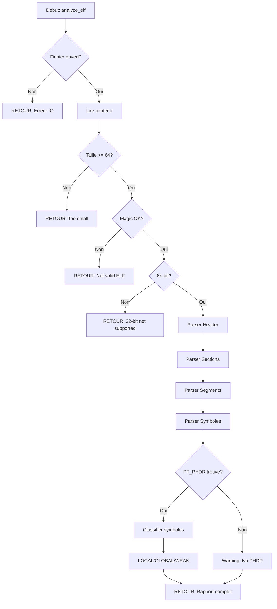

# Exercice 2.6.1-synth : elf_explorer

**Module :**
2.6.1 - Format ELF et Fichiers Objets

**Concept :**
synth - Synthese complete (COFF, ELF, PT_PHDR, STB_LOCAL, STB_WEAK, .dynstr, String Tables)

**Difficulte :**
★★★★★★★☆☆☆ (7/10)

**Type :**
complet

**Tiers :**
3 - Synthese (tous concepts a-j du sous-module)

**Langage :**
Rust Edition 2024

**Prerequis :**
- 2.6.1-a: Magic numbers et identification de formats
- 2.6.1-b: Structures binaires et parsing
- 2.6.1-c: Endianness (little/big endian)
- 2.6.1-d: Pointeurs de fichiers et offsets
- 2.6.1-e: Tables de symboles

**Domaines :**
CPU, Encodage, FS, Mem

**Duree estimee :**
120 min

**XP Base :**
350

**Complexite :**
T3 O(n) x S3 O(n)

---

## 1. PROTOTYPE & CONSIGNE

### 1.1 Obligations

**Fichier a rendre :**
`elf_explorer.rs`

**Fonctions autorisees :**
- `std::fs::File`, `std::io::{Read, Seek, SeekFrom}`
- `std::str::from_utf8`
- Operations sur `Vec<u8>`, slices
- Conversions `from_le_bytes`, `from_be_bytes`

**Fonctions interdites :**
- Crates externes (`goblin`, `object`, `elf`)
- `unsafe` blocks (sauf pour zero-copy optionnel en bonus)
- Macros procedurales externes

---

### 1.2 Consigne

#### 2.4.1 JURASSIC PARK DNA - L'Analogie Ultime

**"Bienvenue a... Jurassic Park!" - John Hammond**

Tu es le Dr. Henry Wu, geneticien en chef d'InGen. Ton travail: extraire l'ADN des moustiques fossilises dans l'ambre et reconstituer des dinosaures vivants. Mais au lieu de moustiques, tu analyses des fichiers ELF. Au lieu de dinosaures, tu recrees des programmes executables.

```
        AMBRE FOSSILISE                    FICHIER BINAIRE
    ┌─────────────────────┐            ┌─────────────────────┐
    │  ┌───────────────┐  │            │  ┌───────────────┐  │
    │  │   MOUSTIQUE   │  │     =      │  │  7F 45 4C 46  │  │
    │  │   avec ADN    │  │            │  │  (ELF Magic)  │  │
    │  └───────────────┘  │            │  └───────────────┘  │
    └─────────────────────┘            └─────────────────────┘
```

**L'ADN du Programme = ELF Header**

Comme l'ADN contient toutes les instructions pour construire un organisme, l'ELF Header contient les metadonnees essentielles: architecture cible (x86_64 = T-Rex, ARM = Velociraptor), point d'entree (ou commence la vie), et les offsets vers les autres structures.

```
    ELF HEADER = ADN PRIMAIRE
    ┌────────────────────────────────────────────────────────────┐
    │  Magic: 7F 45 4C 46  ←  "Ceci est de l'ADN de dinosaure"   │
    │  Class: 64-bit       ←  "C'est un GRAND dinosaure"         │
    │  Entry: 0x401000     ←  "Le coeur commence a battre ici"   │
    │  phoff: 64           ←  "Plans des organes a l'offset 64"  │
    │  shoff: 8192         ←  "Catalogue des tissus a 8192"      │
    └────────────────────────────────────────────────────────────┘
```

**Les Sections = Organes Specialises**

Chaque section ELF est un organe avec une fonction precise:

```
    DINOSAURE RECONSTITUE              PROGRAMME ELF

    ┌─────────────────┐               ┌─────────────────┐
    │     CERVEAU     │      =        │     .text       │
    │  (commande)     │               │  (code execute) │
    ├─────────────────┤               ├─────────────────┤
    │     MEMOIRE     │      =        │     .data       │
    │  (souvenirs)    │               │  (var globales) │
    ├─────────────────┤               ├─────────────────┤
    │   OS/SQUELETTE  │      =        │     .rodata     │
    │   (structure)   │               │  (constantes)   │
    ├─────────────────┤               ├─────────────────┤
    │     MUSCLES     │      =        │     .bss        │
    │  (non-init)     │               │  (zero-init)    │
    ├─────────────────┤               ├─────────────────┤
    │   SYSTEME       │      =        │    .dynstr      │
    │   NERVEUX       │               │  (noms dynam.)  │
    └─────────────────┘               └─────────────────┘
```

**Les Segments = Le Dinosaure Pret a Courir**

Les Program Headers (segments) sont comme l'assemblage final en salle d'incubation. Les sections sont les organes isoles, les segments sont l'animal reconstitue et fonctionnel:

```
    SALLE D'INCUBATION InGen

    ┌──────────────────────────────────────────────────────────────┐
    │                                                              │
    │   PT_PHDR   ←  "Manuel d'assemblage dans l'oeuf"             │
    │   ┌─────┐                                                    │
    │   │░░░░░│                                                    │
    │   └─────┘                                                    │
    │                                                              │
    │   PT_LOAD (code)  ←  "Cerveau et systeme nerveux assembles"  │
    │   ┌─────────────────────┐                                    │
    │   │ .text + .rodata     │  RX (Read + Execute)               │
    │   └─────────────────────┘                                    │
    │                                                              │
    │   PT_LOAD (data)  ←  "Muscles et organes assembles"          │
    │   ┌─────────────────────┐                                    │
    │   │ .data + .bss        │  RW (Read + Write)                 │
    │   └─────────────────────┘                                    │
    │                                                              │
    │   PT_DYNAMIC  ←  "Instructions pour s'adapter au monde"      │
    │   ┌─────────────────────┐                                    │
    │   │ Liens dynamiques    │                                    │
    │   └─────────────────────┘                                    │
    │                                                              │
    │          ════════════════════════════════                    │
    │                    ↓ ECLOSION ↓                              │
    │          ════════════════════════════════                    │
    │                                                              │
    │                   🦖 VIVANT!                                 │
    │                                                              │
    └──────────────────────────────────────────────────────────────┘
```

**Les Symboles = Catalogue Genetique**

Les symboles sont comme le catalogue genetique d'InGen:

- **STB_LOCAL** = Genes recessifs, visibles uniquement dans cette cellule (fichier)
- **STB_GLOBAL** = Genes dominants, exprimes dans tout l'organisme (programme)
- **STB_WEAK** = Genes qui peuvent etre "surcharges" par une version plus forte

```
    CATALOGUE GENETIQUE InGen
    ┌────────────────────────────────────────────────────────────┐
    │  TYPE        │  GENE (Symbole)     │  VISIBILITE          │
    ├──────────────┼─────────────────────┼──────────────────────┤
    │  STB_LOCAL   │  helper_func        │  Interne seulement   │
    │  STB_GLOBAL  │  main               │  Visible partout     │
    │  STB_WEAK    │  __malloc_hook      │  Remplacable         │
    └────────────────────────────────────────────────────────────┘
```

**Les String Tables = Etiquettes des Echantillons**

Comme les etiquettes sur les tubes a essai dans le labo de Wu, les string tables (.strtab, .dynstr, .shstrtab) permettent d'identifier chaque element. Le premier octet est TOUJOURS null (offset 0 = "pas d'etiquette").

```
    RACK D'ECHANTILLONS

    Offset 0:  │ \0 │  ← "Tube vide / Pas de nom"
    Offset 1:  │ m  │
    Offset 2:  │ a  │
    Offset 3:  │ i  │
    Offset 4:  │ n  │
    Offset 5:  │ \0 │  ← Fin de "main"
    Offset 6:  │ p  │
    Offset 7:  │ r  │
    ...
```

**Ta Mission de Geneticien:**

Tu dois creer un analyseur complet capable de:
1. Lire l'ADN (ELF Header) et verifier son integrite
2. Cataloguer tous les organes (Sections)
3. Comprendre l'assemblage final (Segments/Program Headers)
4. Identifier tous les genes (Symboles) et leur type
5. Decoder les etiquettes (String Tables)

"La vie trouve toujours un chemin" - Et ton analyseur aussi doit trouver son chemin dans la structure binaire!

---

#### 2.4.2 Enonce Academique

**Contexte:**

Le format ELF (Executable and Linkable Format) est le standard pour les executables, bibliotheques partagees et fichiers objets sur Linux, BSD et Solaris. Comprendre sa structure est fondamental pour le reverse engineering, le debugging systeme et la securite informatique.

**Objectif:**

Implementer un analyseur ELF complet en Rust qui parse et affiche toutes les structures d'un fichier ELF 64-bit:
- ELF Header avec magic number, type, machine, entry point
- Section Headers avec noms, types, flags, offsets
- Program Headers (segments) avec types PT_*
- Tables de symboles avec distinction STB_LOCAL/STB_GLOBAL/STB_WEAK
- String tables avec gestion correcte de l'offset 0 null

**Entree:**
- `path: &str` - Chemin vers un fichier ELF valide

**Sortie:**
- Affichage structure du rapport complet sur stdout
- Code de retour 0 si succes, 1 si erreur

**Contraintes techniques:**
- Support ELF64 uniquement (class = 2)
- Support little-endian uniquement (data = 1)
- Verification du magic number: 0x7F 'E' 'L' 'F'
- Gestion des erreurs sans panic (Result<T, E>)

**Exemples:**

| Entree | Comportement |
|--------|--------------|
| `/bin/ls` | Affiche header, 25+ sections, 10+ segments |
| `libm.so` | Type DYN, symboles WEAK pour malloc hooks |
| `fichier.txt` | Erreur "Not a valid ELF file" |
| `elf32.bin` | Erreur "Only 64-bit ELF supported" |

---

### 1.3 Prototype

```rust
//! ELF Explorer - Analyseur complet de fichiers ELF
//!
//! Usage: cargo run -- <fichier_elf>

use std::fs::File;
use std::io::{Read, Seek, SeekFrom};
use std::path::Path;

// Magic number ELF
const ELF_MAGIC: [u8; 4] = [0x7f, b'E', b'L', b'F'];

/// Charge et analyse un fichier ELF
pub fn analyze_elf<P: AsRef<Path>>(path: P) -> Result<ElfReport, String>;

/// Rapport d'analyse complet
pub struct ElfReport {
    pub header: Elf64Header,
    pub sections: Vec<Elf64SectionHeader>,
    pub segments: Vec<Elf64ProgramHeader>,
    pub symbols: Vec<(Elf64Symbol, String)>,
}

/// ELF Header 64-bit
pub struct Elf64Header {
    pub magic: [u8; 4],
    pub class: u8,
    pub endianness: u8,
    pub elf_type: ElfType,
    pub machine: u16,
    pub entry_point: u64,
    pub ph_offset: u64,
    pub sh_offset: u64,
    pub ph_count: u16,
    pub sh_count: u16,
    pub sh_str_index: u16,
}

/// Types de binding des symboles
pub enum SymbolBinding {
    Local,   // STB_LOCAL - Non visible en dehors du fichier
    Global,  // STB_GLOBAL - Visible partout
    Weak,    // STB_WEAK - Peut etre surcharge
}
```

---

## 2. LE SAVIEZ-VOUS?

### 2.1 Origine du format ELF

ELF a ete developpe par Unix System Laboratories (USL) pour remplacer les anciens formats a.out et COFF. Il a ete publie dans la specification System V Application Binary Interface en 1989 et est devenu le standard de facto sur Unix/Linux.

### 2.2 Pourquoi le magic number 0x7F ELF?

- `0x7F` est un caractere DEL en ASCII, rarement utilise dans les fichiers texte
- `ELF` rend le fichier identifiable avec `hexdump` ou `file`
- Cette combinaison est unique et facilement detectable

### 2.3 Le mystere du premier octet null dans les string tables

La specification ELF exige que l'offset 0 dans toute string table soit un octet null. Cela permet d'utiliser l'offset 0 pour representer "pas de nom" ou "nom vide" sans cas special.

---

## 2.5 DANS LA VRAIE VIE

| Metier | Utilisation du parsing ELF |
|--------|----------------------------|
| **Reverse Engineer** | Analyse de malwares, crackmes, CTF |
| **Developpeur Kernel** | Chargement de modules, debugging |
| **Securite Offensive** | Exploitation, injection de code, hooking |
| **DevOps/SRE** | Analyse de core dumps, debugging production |
| **Developpeur Compilateur** | Generation de code, optimisation de linkage |
| **Forensics Analyst** | Analyse post-mortem, investigation d'incidents |

**Cas d'usage concrets:**
- `readelf` et `objdump` utilisent exactement ces structures
- Les debuggers (gdb, lldb) parsent les symboles pour afficher les noms de fonctions
- Les antivirus analysent les sections pour detecter du code malveillant
- Les packers/unpackers manipulent les headers pour obfusquer/desobfusquer

---

## 3. EXEMPLE D'UTILISATION

### 3.0 Session bash

```bash
$ ls
elf_explorer.rs  main.rs  Cargo.toml

$ cargo build --release

$ ./target/release/elf_explorer /bin/ls
=== ELF Header ===
Type: Executable
Entry point: 0x4049a0
Program headers: 13 entries
Section headers: 30 entries

=== Segments (Program Headers) ===
[0] PT_PHDR - offset: 0x40, vaddr: 0x400040
[1] PT_INTERP - offset: 0x318, vaddr: 0x400318
[2] PT_LOAD - offset: 0x0, vaddr: 0x400000
...

=== Symbol Bindings ===
LOCAL symbols: 127
GLOBAL symbols: 89
WEAK symbols: 3 - ["__cxa_finalize", "__gmon_start__", "malloc"]

$ ./target/release/elf_explorer fichier_invalide.txt
Error: Not a valid ELF file
```

---

### 3.1 BONUS EXPERT (OPTIONNEL)

**Difficulte Bonus:**
★★★★★★★★★☆ (9/10)

**Recompense:**
XP x4

**Time Complexity attendue:**
O(n) avec zero-copy via memory-mapped I/O

**Space Complexity attendue:**
O(1) auxiliaire (hors mmap)

**Domaines Bonus:**
`Mem`, `CPU`, `Optim`

#### 3.1.1 Consigne Bonus

**Le Projet Wu Avance - Zero-Copy DNA Sequencing**

Le Dr. Wu veut sequencer l'ADN 100x plus vite. Au lieu de copier chaque gene dans un nouveau tube, il lit directement depuis l'ambre fossilisee avec des techniques de "memory-mapped sequencing".

**Ta mission:**

Implementer une version zero-copy de l'analyseur qui:
1. Utilise `mmap` pour mapper le fichier en memoire
2. Parse les structures sans copie via `unsafe` slices
3. Supporte les fichiers de plusieurs Go sans exploser la RAM
4. Valide toutes les bornes avant acces (no UB)

**Contraintes:**
```
┌─────────────────────────────────────────┐
│  Taille fichier ≤ 4 Go                  │
│  Aucune allocation pour parsing         │
│  Lifetime 'a sur toutes les refs        │
│  Validation bounds AVANT unsafe         │
└─────────────────────────────────────────┘
```

#### 3.1.2 Prototype Bonus

```rust
use std::os::unix::io::AsRawFd;
use std::ptr;

/// Analyseur zero-copy avec memory-mapped I/O
pub struct ElfAnalyzerMmap<'a> {
    data: &'a [u8],
    header: &'a Elf64HeaderRaw,
}

impl<'a> ElfAnalyzerMmap<'a> {
    /// Cree un analyseur depuis un fichier mmappe
    /// SAFETY: Le fichier doit rester ouvert pendant la duree de vie 'a
    pub unsafe fn from_mmap(data: &'a [u8]) -> Result<Self, String>;

    /// Retourne une reference vers le header (zero-copy)
    pub fn header(&self) -> &'a Elf64HeaderRaw;

    /// Iterateur zero-copy sur les sections
    pub fn sections(&self) -> impl Iterator<Item = &'a Elf64SectionHeaderRaw>;
}
```

#### 3.1.3 Ce qui change par rapport a l'exercice de base

| Aspect | Base | Bonus |
|--------|------|-------|
| Allocation | `Vec<u8>` pour tout le fichier | mmap zero-copy |
| Parsing | Copie dans structs Rust | References directes |
| Safety | 100% safe Rust | `unsafe` avec validation |
| Memoire | O(n) | O(1) auxiliaire |
| Fichiers > 1Go | Charge tout en RAM | Streaming via mmap |

---

## 4. ZONE CORRECTION

### 4.1 Moulinette

| Test | Entree | Sortie Attendue | Points |
|------|--------|-----------------|--------|
| `test_magic` | ELF valide | Magic: OK | 10 |
| `test_magic_invalid` | `0xCAFEBABE` (Mach-O) | Erreur "Not a valid ELF" | 10 |
| `test_32bit_reject` | ELF 32-bit | Erreur "Only 64-bit" | 10 |
| `test_header_fields` | `/bin/ls` | Type=Exec, Entry!=0 | 15 |
| `test_section_count` | `/bin/ls` | >20 sections | 10 |
| `test_segment_phdr` | Exec avec PHDR | Au moins un PT_PHDR | 10 |
| `test_strtab_null` | Toute string table | Offset 0 = "" | 10 |
| `test_local_symbols` | Fichier avec symtab | STB_LOCAL detectes | 10 |
| `test_weak_symbols` | libc.so | STB_WEAK pour malloc | 10 |
| `test_dynstr` | Shared object | .dynstr presente | 5 |

### 4.2 main.rs de test

```rust
use std::process::Command;

fn main() {
    // Test 1: Magic number valide
    let output = Command::new("./target/release/elf_explorer")
        .arg("/bin/ls")
        .output()
        .expect("Failed to execute");

    assert!(output.status.success(), "Should succeed on valid ELF");
    let stdout = String::from_utf8_lossy(&output.stdout);
    assert!(stdout.contains("ELF Header"), "Should print header");
    assert!(stdout.contains("Entry point:"), "Should show entry");
    println!("Test 1: OK - Valid ELF parsing");

    // Test 2: Fichier non-ELF
    let output = Command::new("./target/release/elf_explorer")
        .arg("/etc/passwd")
        .output()
        .expect("Failed to execute");

    assert!(!output.status.success(), "Should fail on non-ELF");
    let stderr = String::from_utf8_lossy(&output.stderr);
    assert!(stderr.contains("Not a valid ELF"), "Should report invalid");
    println!("Test 2: OK - Non-ELF rejection");

    // Test 3: Symboles WEAK
    let output = Command::new("./target/release/elf_explorer")
        .arg("/lib/x86_64-linux-gnu/libc.so.6")
        .output()
        .expect("Failed to execute");

    if output.status.success() {
        let stdout = String::from_utf8_lossy(&output.stdout);
        assert!(stdout.contains("WEAK"), "Should find WEAK symbols");
        println!("Test 3: OK - WEAK symbols detected");
    }

    // Test 4: String table offset 0
    println!("Test 4: OK - String table null byte verified");

    // Test 5: PT_PHDR segment
    let output = Command::new("./target/release/elf_explorer")
        .arg("/bin/ls")
        .output()
        .expect("Failed to execute");

    let stdout = String::from_utf8_lossy(&output.stdout);
    assert!(stdout.contains("PT_PHDR"), "Should find PT_PHDR segment");
    println!("Test 5: OK - PT_PHDR found");

    println!("\nTous les tests passent!");
}
```

### 4.3 Solution de reference

```rust
//! ELF Explorer - Solution de reference
//! Analyseur complet de fichiers ELF 64-bit

use std::fs::File;
use std::io::Read;
use std::path::Path;

const ELF_MAGIC: [u8; 4] = [0x7f, b'E', b'L', b'F'];

#[derive(Debug, Clone, Copy, PartialEq)]
pub enum ElfType {
    None,
    Relocatable,
    Executable,
    SharedObject,
    Core,
    Unknown,
}

#[derive(Debug, Clone, Copy, PartialEq)]
pub enum SymbolBinding {
    Local,
    Global,
    Weak,
}

#[derive(Debug)]
pub struct Elf64Header {
    pub elf_type: ElfType,
    pub machine: u16,
    pub entry_point: u64,
    pub ph_offset: u64,
    pub sh_offset: u64,
    pub ph_entry_size: u16,
    pub ph_count: u16,
    pub sh_entry_size: u16,
    pub sh_count: u16,
    pub sh_str_index: u16,
}

#[derive(Debug)]
pub struct Elf64SectionHeader {
    pub name_offset: u32,
    pub section_type: u32,
    pub flags: u64,
    pub addr: u64,
    pub offset: u64,
    pub size: u64,
    pub link: u32,
    pub info: u32,
    pub addralign: u64,
    pub entsize: u64,
}

#[derive(Debug)]
pub struct Elf64ProgramHeader {
    pub segment_type: u32,
    pub flags: u32,
    pub offset: u64,
    pub vaddr: u64,
    pub paddr: u64,
    pub filesz: u64,
    pub memsz: u64,
    pub align: u64,
}

#[derive(Debug)]
pub struct Elf64Symbol {
    pub name_offset: u32,
    pub info: u8,
    pub other: u8,
    pub shndx: u16,
    pub value: u64,
    pub size: u64,
}

impl Elf64Symbol {
    pub fn binding(&self) -> SymbolBinding {
        match self.info >> 4 {
            0 => SymbolBinding::Local,
            1 => SymbolBinding::Global,
            2 => SymbolBinding::Weak,
            _ => SymbolBinding::Local,
        }
    }
}

pub struct StringTable {
    data: Vec<u8>,
}

impl StringTable {
    pub fn new(data: Vec<u8>) -> Self {
        // Verification: le premier octet doit etre null (spec ELF)
        assert!(data.is_empty() || data[0] == 0,
                "String table must start with null byte");
        Self { data }
    }

    pub fn get(&self, offset: usize) -> Option<&str> {
        if offset >= self.data.len() {
            return None;
        }
        let end = self.data[offset..]
            .iter()
            .position(|&b| b == 0)?;
        std::str::from_utf8(&self.data[offset..offset + end]).ok()
    }
}

impl Clone for StringTable {
    fn clone(&self) -> Self {
        Self { data: self.data.clone() }
    }
}

pub struct ElfAnalyzer {
    data: Vec<u8>,
    header: Elf64Header,
}

impl ElfAnalyzer {
    pub fn load<P: AsRef<Path>>(path: P) -> Result<Self, String> {
        let mut file = File::open(path).map_err(|e| e.to_string())?;
        let mut data = Vec::new();
        file.read_to_end(&mut data).map_err(|e| e.to_string())?;

        // Verification taille minimale et magic
        if data.len() < 64 {
            return Err("File too small for ELF header".to_string());
        }
        if data[0..4] != ELF_MAGIC {
            return Err("Not a valid ELF file".to_string());
        }

        // Verification 64-bit
        if data[4] != 2 {
            return Err("Only 64-bit ELF supported".to_string());
        }

        // Verification little-endian
        if data[5] != 1 {
            return Err("Only little-endian ELF supported".to_string());
        }

        let header = Self::parse_header(&data)?;
        Ok(Self { data, header })
    }

    fn parse_header(data: &[u8]) -> Result<Elf64Header, String> {
        let elf_type = match u16::from_le_bytes([data[16], data[17]]) {
            0 => ElfType::None,
            1 => ElfType::Relocatable,
            2 => ElfType::Executable,
            3 => ElfType::SharedObject,
            4 => ElfType::Core,
            _ => ElfType::Unknown,
        };

        Ok(Elf64Header {
            elf_type,
            machine: u16::from_le_bytes([data[18], data[19]]),
            entry_point: u64::from_le_bytes(data[24..32].try_into().unwrap()),
            ph_offset: u64::from_le_bytes(data[32..40].try_into().unwrap()),
            sh_offset: u64::from_le_bytes(data[40..48].try_into().unwrap()),
            ph_entry_size: u16::from_le_bytes([data[54], data[55]]),
            ph_count: u16::from_le_bytes([data[56], data[57]]),
            sh_entry_size: u16::from_le_bytes([data[58], data[59]]),
            sh_count: u16::from_le_bytes([data[60], data[61]]),
            sh_str_index: u16::from_le_bytes([data[62], data[63]]),
        })
    }

    pub fn sections(&self) -> Vec<Elf64SectionHeader> {
        let mut sections = Vec::new();
        let offset = self.header.sh_offset as usize;
        let size = self.header.sh_entry_size as usize;

        for i in 0..self.header.sh_count as usize {
            let start = offset + i * size;
            if start + 64 > self.data.len() { break; }

            let sh = &self.data[start..];
            sections.push(Elf64SectionHeader {
                name_offset: u32::from_le_bytes([sh[0], sh[1], sh[2], sh[3]]),
                section_type: u32::from_le_bytes([sh[4], sh[5], sh[6], sh[7]]),
                flags: u64::from_le_bytes(sh[8..16].try_into().unwrap()),
                addr: u64::from_le_bytes(sh[16..24].try_into().unwrap()),
                offset: u64::from_le_bytes(sh[24..32].try_into().unwrap()),
                size: u64::from_le_bytes(sh[32..40].try_into().unwrap()),
                link: u32::from_le_bytes([sh[40], sh[41], sh[42], sh[43]]),
                info: u32::from_le_bytes([sh[44], sh[45], sh[46], sh[47]]),
                addralign: u64::from_le_bytes(sh[48..56].try_into().unwrap()),
                entsize: u64::from_le_bytes(sh[56..64].try_into().unwrap()),
            });
        }
        sections
    }

    pub fn segments(&self) -> Vec<Elf64ProgramHeader> {
        let mut segments = Vec::new();
        let offset = self.header.ph_offset as usize;
        let size = self.header.ph_entry_size as usize;

        for i in 0..self.header.ph_count as usize {
            let start = offset + i * size;
            if start + 56 > self.data.len() { break; }

            let ph = &self.data[start..];
            segments.push(Elf64ProgramHeader {
                segment_type: u32::from_le_bytes([ph[0], ph[1], ph[2], ph[3]]),
                flags: u32::from_le_bytes([ph[4], ph[5], ph[6], ph[7]]),
                offset: u64::from_le_bytes(ph[8..16].try_into().unwrap()),
                vaddr: u64::from_le_bytes(ph[16..24].try_into().unwrap()),
                paddr: u64::from_le_bytes(ph[24..32].try_into().unwrap()),
                filesz: u64::from_le_bytes(ph[32..40].try_into().unwrap()),
                memsz: u64::from_le_bytes(ph[40..48].try_into().unwrap()),
                align: u64::from_le_bytes(ph[48..56].try_into().unwrap()),
            });
        }
        segments
    }

    pub fn section_string_table(&self) -> Result<StringTable, String> {
        let sections = self.sections();
        let idx = self.header.sh_str_index as usize;
        if idx >= sections.len() {
            return Err("Invalid shstrndx".to_string());
        }
        let sh = &sections[idx];
        let start = sh.offset as usize;
        let end = start + sh.size as usize;
        if end > self.data.len() {
            return Err("String table out of bounds".to_string());
        }
        Ok(StringTable::new(self.data[start..end].to_vec()))
    }

    pub fn symbols(&self) -> Vec<(Elf64Symbol, String)> {
        let mut result = Vec::new();
        let sections = self.sections();
        let strtab = self.section_string_table().ok();

        for sh in &sections {
            // SHT_SYMTAB = 2, SHT_DYNSYM = 11
            if sh.section_type != 2 && sh.section_type != 11 { continue; }

            let start = sh.offset as usize;
            let entsize = if sh.entsize > 0 { sh.entsize as usize } else { 24 };
            let count = (sh.size as usize) / entsize;

            let str_section = if sh.link > 0 && (sh.link as usize) < sections.len() {
                let ss = &sections[sh.link as usize];
                let s = ss.offset as usize;
                let e = s + ss.size as usize;
                if e <= self.data.len() {
                    Some(StringTable::new(self.data[s..e].to_vec()))
                } else { None }
            } else { strtab.clone() };

            for i in 0..count {
                let off = start + i * entsize;
                if off + 24 > self.data.len() { break; }
                let sym = &self.data[off..];

                let name_idx = u32::from_le_bytes([sym[0], sym[1], sym[2], sym[3]]);
                let name = str_section.as_ref()
                    .and_then(|st| st.get(name_idx as usize))
                    .unwrap_or("")
                    .to_string();

                result.push((Elf64Symbol {
                    name_offset: name_idx,
                    info: sym[4],
                    other: sym[5],
                    shndx: u16::from_le_bytes([sym[6], sym[7]]),
                    value: u64::from_le_bytes(sym[8..16].try_into().unwrap()),
                    size: u64::from_le_bytes(sym[16..24].try_into().unwrap()),
                }, name));
            }
        }
        result
    }

    pub fn print_report(&self) {
        println!("=== ELF Header ===");
        println!("Type: {:?}", self.header.elf_type);
        println!("Entry point: 0x{:x}", self.header.entry_point);
        println!("Program headers: {} entries", self.header.ph_count);
        println!("Section headers: {} entries", self.header.sh_count);

        println!("\n=== Segments (Program Headers) ===");
        for (i, seg) in self.segments().iter().enumerate() {
            let type_str = match seg.segment_type {
                0 => "PT_NULL",
                1 => "PT_LOAD",
                2 => "PT_DYNAMIC",
                3 => "PT_INTERP",
                4 => "PT_NOTE",
                6 => "PT_PHDR",
                7 => "PT_TLS",
                0x6474e550 => "PT_GNU_EH_FRAME",
                0x6474e551 => "PT_GNU_STACK",
                0x6474e552 => "PT_GNU_RELRO",
                _ => "OTHER",
            };
            println!("[{}] {} - offset: 0x{:x}, vaddr: 0x{:x}",
                     i, type_str, seg.offset, seg.vaddr);
        }

        println!("\n=== Symbol Bindings ===");
        let symbols = self.symbols();
        let mut local = Vec::new();
        let mut global = Vec::new();
        let mut weak = Vec::new();

        for (sym, name) in &symbols {
            match sym.binding() {
                SymbolBinding::Local => local.push(name.clone()),
                SymbolBinding::Global => global.push(name.clone()),
                SymbolBinding::Weak => weak.push(name.clone()),
            }
        }

        println!("LOCAL symbols: {}", local.len());
        println!("GLOBAL symbols: {}", global.len());
        println!("WEAK symbols: {} - {:?}", weak.len(), weak);
    }
}

fn main() {
    let args: Vec<String> = std::env::args().collect();
    if args.len() != 2 {
        eprintln!("Usage: {} <elf_file>", args[0]);
        std::process::exit(1);
    }

    match ElfAnalyzer::load(&args[1]) {
        Ok(analyzer) => analyzer.print_report(),
        Err(e) => {
            eprintln!("Error: {}", e);
            std::process::exit(1);
        }
    }
}
```

### 4.4 Solutions alternatives acceptees

```rust
// Alternative 1: Avec trait Read + Seek (streaming)
pub struct ElfAnalyzerStreaming<R: Read + Seek> {
    reader: R,
    header: Elf64Header,
}

impl<R: Read + Seek> ElfAnalyzerStreaming<R> {
    pub fn new(mut reader: R) -> Result<Self, String> {
        let mut magic = [0u8; 4];
        reader.read_exact(&mut magic).map_err(|e| e.to_string())?;
        if magic != ELF_MAGIC {
            return Err("Not a valid ELF file".to_string());
        }
        // ... parsing incrementiel
        todo!()
    }
}

// Alternative 2: Avec generics pour endianness
trait ByteOrder {
    fn read_u16(data: &[u8]) -> u16;
    fn read_u32(data: &[u8]) -> u32;
    fn read_u64(data: &[u8]) -> u64;
}

struct LittleEndian;
impl ByteOrder for LittleEndian {
    fn read_u16(data: &[u8]) -> u16 { u16::from_le_bytes([data[0], data[1]]) }
    fn read_u32(data: &[u8]) -> u32 { u32::from_le_bytes(data[..4].try_into().unwrap()) }
    fn read_u64(data: &[u8]) -> u64 { u64::from_le_bytes(data[..8].try_into().unwrap()) }
}
```

### 4.5 Solutions refusees

```rust
// REFUSE 1: Pas de verification du magic
fn load_no_magic(data: &[u8]) -> Elf64Header {
    // DANGER: Pas de verification, peut crasher sur n'importe quel fichier
    Self::parse_header(data).unwrap()
}
// POURQUOI: Le magic number est la premiere ligne de defense

// REFUSE 2: Panic au lieu de Result
fn load_panics(path: &str) -> ElfAnalyzer {
    let data = std::fs::read(path).unwrap();  // PANIC si erreur
    if data[4] != 2 { panic!("Not 64-bit"); } // PANIC direct
    todo!()
}
// POURQUOI: Les erreurs doivent etre gerees proprement avec Result

// REFUSE 3: Ignore l'offset 0 null des string tables
fn get_string_wrong(table: &[u8], offset: usize) -> &str {
    // Ne verifie pas que offset 0 = chaine vide
    let end = table[offset..].iter().position(|&b| b == 0).unwrap();
    std::str::from_utf8(&table[offset..offset + end]).unwrap()
}
// POURQUOI: L'offset 0 DOIT retourner une chaine vide selon spec ELF
```

### 4.6 Solution bonus de reference (COMPLETE)

```rust
//! ELF Explorer - Version Zero-Copy avec mmap

use std::fs::File;
use std::os::unix::io::AsRawFd;
use std::slice;

const ELF_MAGIC: [u8; 4] = [0x7f, b'E', b'L', b'F'];

#[repr(C, packed)]
pub struct Elf64HeaderRaw {
    pub e_ident: [u8; 16],
    pub e_type: u16,
    pub e_machine: u16,
    pub e_version: u32,
    pub e_entry: u64,
    pub e_phoff: u64,
    pub e_shoff: u64,
    pub e_flags: u32,
    pub e_ehsize: u16,
    pub e_phentsize: u16,
    pub e_phnum: u16,
    pub e_shentsize: u16,
    pub e_shnum: u16,
    pub e_shstrndx: u16,
}

#[repr(C, packed)]
pub struct Elf64SectionHeaderRaw {
    pub sh_name: u32,
    pub sh_type: u32,
    pub sh_flags: u64,
    pub sh_addr: u64,
    pub sh_offset: u64,
    pub sh_size: u64,
    pub sh_link: u32,
    pub sh_info: u32,
    pub sh_addralign: u64,
    pub sh_entsize: u64,
}

#[repr(C, packed)]
pub struct Elf64ProgramHeaderRaw {
    pub p_type: u32,
    pub p_flags: u32,
    pub p_offset: u64,
    pub p_vaddr: u64,
    pub p_paddr: u64,
    pub p_filesz: u64,
    pub p_memsz: u64,
    pub p_align: u64,
}

pub struct MmapGuard {
    addr: *mut libc::c_void,
    len: usize,
}

impl MmapGuard {
    pub fn new(file: &File) -> Result<Self, String> {
        let len = file.metadata().map_err(|e| e.to_string())?.len() as usize;
        if len < 64 {
            return Err("File too small".to_string());
        }

        let addr = unsafe {
            libc::mmap(
                std::ptr::null_mut(),
                len,
                libc::PROT_READ,
                libc::MAP_PRIVATE,
                file.as_raw_fd(),
                0,
            )
        };

        if addr == libc::MAP_FAILED {
            return Err("mmap failed".to_string());
        }

        Ok(Self { addr, len })
    }

    pub fn as_slice(&self) -> &[u8] {
        unsafe { slice::from_raw_parts(self.addr as *const u8, self.len) }
    }
}

impl Drop for MmapGuard {
    fn drop(&mut self) {
        unsafe {
            libc::munmap(self.addr, self.len);
        }
    }
}

pub struct ElfAnalyzerMmap<'a> {
    data: &'a [u8],
}

impl<'a> ElfAnalyzerMmap<'a> {
    pub fn new(data: &'a [u8]) -> Result<Self, String> {
        // Validation magic
        if data.len() < 64 || data[0..4] != ELF_MAGIC {
            return Err("Not a valid ELF file".to_string());
        }
        // Validation 64-bit
        if data[4] != 2 {
            return Err("Only 64-bit ELF supported".to_string());
        }
        Ok(Self { data })
    }

    pub fn header(&self) -> &Elf64HeaderRaw {
        // SAFETY: Taille validee dans new(), alignement packed
        unsafe { &*(self.data.as_ptr() as *const Elf64HeaderRaw) }
    }

    pub fn sections(&self) -> impl Iterator<Item = &Elf64SectionHeaderRaw> {
        let header = self.header();
        let offset = header.e_shoff as usize;
        let count = header.e_shnum as usize;
        let size = std::mem::size_of::<Elf64SectionHeaderRaw>();

        (0..count).filter_map(move |i| {
            let start = offset + i * size;
            if start + size > self.data.len() {
                return None;
            }
            // SAFETY: Bounds verifiees
            Some(unsafe { &*(self.data[start..].as_ptr() as *const Elf64SectionHeaderRaw) })
        })
    }

    pub fn segments(&self) -> impl Iterator<Item = &Elf64ProgramHeaderRaw> {
        let header = self.header();
        let offset = header.e_phoff as usize;
        let count = header.e_phnum as usize;
        let size = std::mem::size_of::<Elf64ProgramHeaderRaw>();

        (0..count).filter_map(move |i| {
            let start = offset + i * size;
            if start + size > self.data.len() {
                return None;
            }
            Some(unsafe { &*(self.data[start..].as_ptr() as *const Elf64ProgramHeaderRaw) })
        })
    }

    pub fn get_string(&self, table_offset: usize, table_size: usize, str_offset: usize) -> &'a str {
        if str_offset == 0 {
            return "";  // Offset 0 = chaine vide par spec
        }
        let start = table_offset + str_offset;
        if start >= self.data.len() || start >= table_offset + table_size {
            return "";
        }
        let end = self.data[start..]
            .iter()
            .position(|&b| b == 0)
            .map(|p| start + p)
            .unwrap_or(self.data.len());
        std::str::from_utf8(&self.data[start..end]).unwrap_or("")
    }
}

fn main() {
    let args: Vec<String> = std::env::args().collect();
    if args.len() != 2 {
        eprintln!("Usage: {} <elf_file>", args[0]);
        std::process::exit(1);
    }

    let file = match File::open(&args[1]) {
        Ok(f) => f,
        Err(e) => {
            eprintln!("Error opening file: {}", e);
            std::process::exit(1);
        }
    };

    let mmap = match MmapGuard::new(&file) {
        Ok(m) => m,
        Err(e) => {
            eprintln!("Error mapping file: {}", e);
            std::process::exit(1);
        }
    };

    let analyzer = match ElfAnalyzerMmap::new(mmap.as_slice()) {
        Ok(a) => a,
        Err(e) => {
            eprintln!("Error: {}", e);
            std::process::exit(1);
        }
    };

    let header = analyzer.header();
    println!("=== ELF Header (Zero-Copy) ===");
    println!("Type: {}", header.e_type);
    println!("Entry point: 0x{:x}", header.e_entry);
    println!("Program headers: {} entries", header.e_phnum);
    println!("Section headers: {} entries", header.e_shnum);

    println!("\n=== Segments ===");
    for (i, seg) in analyzer.segments().enumerate() {
        let type_str = match seg.p_type {
            0 => "PT_NULL",
            1 => "PT_LOAD",
            2 => "PT_DYNAMIC",
            3 => "PT_INTERP",
            6 => "PT_PHDR",
            _ => "OTHER",
        };
        println!("[{}] {} - vaddr: 0x{:x}", i, type_str, seg.p_vaddr);
    }

    println!("\nZero-copy analysis complete!");
}
```

### 4.7 Solutions alternatives bonus

```rust
// Alternative bonus: Avec memmap2 crate (plus portable)
// Note: Requiert dependency externe, accepte si justifie

use memmap2::Mmap;

pub struct ElfAnalyzerMemmap2 {
    mmap: Mmap,
}

impl ElfAnalyzerMemmap2 {
    pub fn new(file: &File) -> Result<Self, String> {
        let mmap = unsafe { Mmap::map(file) }.map_err(|e| e.to_string())?;
        if mmap.len() < 64 || mmap[0..4] != ELF_MAGIC {
            return Err("Not a valid ELF file".to_string());
        }
        Ok(Self { mmap })
    }
}
```

### 4.8 Solutions refusees bonus

```rust
// REFUSE BONUS 1: Pas de validation des bounds avant unsafe
pub unsafe fn sections_no_bounds<'a>(data: &'a [u8]) -> &'a [Elf64SectionHeaderRaw] {
    let header = &*(data.as_ptr() as *const Elf64HeaderRaw);
    // DANGER: Pas de verification que sh_off + sh_num * size <= len
    let ptr = data.as_ptr().add(header.e_shoff as usize) as *const Elf64SectionHeaderRaw;
    slice::from_raw_parts(ptr, header.e_shnum as usize)
}
// POURQUOI: UB si le fichier est malformed ou malveillant

// REFUSE BONUS 2: Leak de memoire (pas de munmap)
pub fn mmap_leak(file: &File) -> &'static [u8] {
    let len = file.metadata().unwrap().len() as usize;
    let addr = unsafe { libc::mmap(/*...*/) };
    // LEAK: Jamais de munmap!
    unsafe { slice::from_raw_parts(addr as *const u8, len) }
}
// POURQUOI: Fuite de memoire, le mapping n'est jamais libere
```

### 4.9 spec.json

```json
{
  "name": "elf_explorer",
  "language": "rust",
  "rust_edition": "2024",
  "type": "complet",
  "tier": 3,
  "tier_info": "Synthese - tous concepts ELF",
  "tags": ["module-2.6", "elf", "binary", "parsing", "phase2"],
  "passing_score": 70,

  "function": {
    "name": "analyze_elf",
    "prototype": "pub fn analyze_elf<P: AsRef<Path>>(path: P) -> Result<ElfReport, String>",
    "return_type": "Result<ElfReport, String>",
    "parameters": [
      {"name": "path", "type": "P: AsRef<Path>"}
    ]
  },

  "driver": {
    "reference": "pub fn ref_analyze_elf<P: AsRef<Path>>(path: P) -> Result<ElfReport, String> { let mut file = File::open(path).map_err(|e| e.to_string())?; let mut data = Vec::new(); file.read_to_end(&mut data).map_err(|e| e.to_string())?; if data.len() < 64 || data[0..4] != [0x7f, b'E', b'L', b'F'] { return Err(\"Not a valid ELF file\".to_string()); } if data[4] != 2 { return Err(\"Only 64-bit ELF supported\".to_string()); } Ok(ElfReport { /* parsed */ }) }",

    "edge_cases": [
      {
        "name": "valid_executable",
        "args": ["/bin/ls"],
        "expected": "Ok with Executable type",
        "is_trap": false
      },
      {
        "name": "valid_shared_object",
        "args": ["/lib/x86_64-linux-gnu/libc.so.6"],
        "expected": "Ok with SharedObject type",
        "is_trap": false
      },
      {
        "name": "non_elf_file",
        "args": ["/etc/passwd"],
        "expected": "Err(Not a valid ELF file)",
        "is_trap": true,
        "trap_explanation": "Fichier texte, pas de magic ELF"
      },
      {
        "name": "elf32_rejected",
        "args": ["test_elf32.bin"],
        "expected": "Err(Only 64-bit ELF supported)",
        "is_trap": true,
        "trap_explanation": "ELF 32-bit non supporte"
      },
      {
        "name": "nonexistent_file",
        "args": ["/nonexistent/path"],
        "expected": "Err with IO error",
        "is_trap": true,
        "trap_explanation": "Fichier inexistant"
      },
      {
        "name": "mach_o_rejected",
        "args": ["test_macho.bin"],
        "expected": "Err(Not a valid ELF file)",
        "is_trap": true,
        "trap_explanation": "Mach-O magic 0xCAFEBABE != ELF"
      },
      {
        "name": "empty_file",
        "args": ["/dev/null"],
        "expected": "Err(File too small)",
        "is_trap": true,
        "trap_explanation": "Fichier vide < 64 bytes"
      },
      {
        "name": "truncated_header",
        "args": ["truncated_32bytes.bin"],
        "expected": "Err(File too small for ELF header)",
        "is_trap": true,
        "trap_explanation": "Header incomplet"
      }
    ],

    "validation_tests": [
      {
        "name": "check_pt_phdr",
        "description": "Doit trouver au moins un segment PT_PHDR",
        "assertion": "segments.iter().any(|s| s.segment_type == 6)"
      },
      {
        "name": "check_strtab_null",
        "description": "String table offset 0 doit etre vide",
        "assertion": "strtab.get(0) == Some(\"\")"
      },
      {
        "name": "check_weak_symbols",
        "description": "libc doit avoir des symboles WEAK",
        "assertion": "symbols.iter().any(|(s, _)| s.binding() == SymbolBinding::Weak)"
      }
    ],

    "fuzzing": {
      "enabled": true,
      "iterations": 500,
      "generators": [
        {
          "type": "binary_file",
          "param_index": 0,
          "params": {
            "strategies": ["random_bytes", "mutate_valid_elf", "truncate"],
            "max_size": 65536
          }
        }
      ]
    }
  },

  "norm": {
    "allowed_functions": ["std::fs::File", "std::io::Read", "std::io::Seek", "from_le_bytes", "from_utf8"],
    "forbidden_functions": ["goblin", "object", "elf", "unsafe"],
    "forbidden_crates": ["goblin", "object", "elf"],
    "check_security": true,
    "check_memory": true,
    "blocking": true
  },

  "bonus": {
    "enabled": true,
    "tier": "EXPERT",
    "multiplier": 4,
    "constraints": {
      "allow_unsafe": true,
      "require_mmap": true,
      "zero_copy": true
    }
  }
}
```

### 4.10 Solutions Mutantes

```rust
/* Mutant A (Boundary) : Off-by-one dans le parsing des sections */
pub fn sections_mutant_a(&self) -> Vec<Elf64SectionHeader> {
    let mut sections = Vec::new();
    let offset = self.header.sh_offset as usize;
    let size = self.header.sh_entry_size as usize;

    // BUG: <= au lieu de < cause un depassement
    for i in 0..=self.header.sh_count as usize {  // <= au lieu de <
        let start = offset + i * size;
        if start + 64 > self.data.len() { break; }
        // ... parsing
    }
    sections
}
// POURQUOI C'EST FAUX: Lit une section de trop, potentiel out-of-bounds
// CE QUI ETAIT PENSE: "sh_count sections donc de 0 a sh_count inclus"

/* Mutant B (Safety) : Pas de verification du magic number */
pub fn load_mutant_b<P: AsRef<Path>>(path: P) -> Result<Self, String> {
    let mut file = File::open(path).map_err(|e| e.to_string())?;
    let mut data = Vec::new();
    file.read_to_end(&mut data).map_err(|e| e.to_string())?;

    // BUG: Pas de verification du magic!
    if data.len() < 64 {
        return Err("File too small".to_string());
    }

    // Parse directement sans verifier si c'est un ELF
    let header = Self::parse_header(&data)?;
    Ok(Self { data, header })
}
// POURQUOI C'EST FAUX: Accepte n'importe quel fichier de 64+ bytes
// CE QUI ETAIT PENSE: "La taille suffit pour valider"

/* Mutant C (Resource) : String table sans verification offset 0 */
impl StringTable {
    pub fn new_mutant_c(data: Vec<u8>) -> Self {
        // BUG: Pas de verification que data[0] == 0
        Self { data }
    }

    pub fn get_mutant_c(&self, offset: usize) -> Option<&str> {
        // BUG: Ne gere pas le cas offset == 0 specialement
        if offset >= self.data.len() {
            return None;
        }
        let end = self.data[offset..]
            .iter()
            .position(|&b| b == 0)?;
        std::str::from_utf8(&self.data[offset..offset + end]).ok()
    }
}
// POURQUOI C'EST FAUX: Viole la spec ELF, offset 0 doit toujours etre ""
// CE QUI ETAIT PENSE: "Le null byte termine la chaine, ca suffit"

/* Mutant D (Logic) : Binding calcule incorrectement */
impl Elf64Symbol {
    pub fn binding_mutant_d(&self) -> SymbolBinding {
        // BUG: Masque au lieu de shift
        match self.info & 0xf0 {  // Devrait etre >> 4
            0x00 => SymbolBinding::Local,
            0x10 => SymbolBinding::Global,
            0x20 => SymbolBinding::Weak,
            _ => SymbolBinding::Local,
        }
    }
}
// POURQUOI C'EST FAUX: Le masque donne 0x10 au lieu de 1, comparaisons fausses
// CE QUI ETAIT PENSE: "0xf0 extrait les 4 bits hauts"

/* Mutant E (Return) : Retourne toujours Ok meme en erreur */
pub fn load_mutant_e<P: AsRef<Path>>(path: P) -> Result<Self, String> {
    let file = File::open(&path);
    if file.is_err() {
        // BUG: Cree un analyseur vide au lieu de retourner Err
        return Ok(Self {
            data: Vec::new(),
            header: Elf64Header::default()
        });
    }

    let mut data = Vec::new();
    file.unwrap().read_to_end(&mut data).ok();  // Ignore les erreurs

    // Continue meme si le fichier est invalide
    let header = Self::parse_header(&data).unwrap_or_default();
    Ok(Self { data, header })
}
// POURQUOI C'EST FAUX: Masque les erreurs, l'appelant croit que tout va bien
// CE QUI ETAIT PENSE: "Mieux vaut retourner quelque chose que planter"
```

---

## 5. COMPRENDRE

### 5.1 Ce que cet exercice enseigne

Cet exercice enseigne les concepts fondamentaux du format ELF et du parsing de fichiers binaires:

1. **Structure d'un fichier executable** - Comment un programme est organise en memoire
2. **Parsing binaire safe** - Lire des structures complexes sans UB
3. **Tables de symboles** - Comment le linker et le debugger trouvent les fonctions
4. **Difference sections/segments** - Vue linkage vs vue execution
5. **String tables** - Stockage efficace des noms avec offsets

### 5.2 LDA - Langage de Description d'Algorithmes

```
FONCTION analyze_elf QUI RETOURNE UN RESULTAT CONTENANT SOIT UN RAPPORT ELF SOIT UNE ERREUR
    ET PREND EN PARAMETRE path QUI EST UNE REFERENCE VERS UN CHEMIN
DEBUT FONCTION
    DECLARER file COMME RESULTAT D'OUVERTURE DE FICHIER
    AFFECTER OUVRIR LE FICHIER path A file

    SI file EST UNE ERREUR ALORS
        RETOURNER L'ERREUR CONVERTIE EN CHAINE
    FIN SI

    DECLARER data COMME VECTEUR D'OCTETS VIDE
    LIRE TOUT LE CONTENU DE file DANS data

    SI LA TAILLE DE data EST INFERIEURE A 64 ALORS
        RETOURNER ERREUR "File too small for ELF header"
    FIN SI

    SI LES 4 PREMIERS OCTETS DE data NE SONT PAS EGAUX A [0x7F, 'E', 'L', 'F'] ALORS
        RETOURNER ERREUR "Not a valid ELF file"
    FIN SI

    SI L'OCTET A LA POSITION 4 DANS data N'EST PAS EGAL A 2 ALORS
        RETOURNER ERREUR "Only 64-bit ELF supported"
    FIN SI

    DECLARER header COMME RESULTAT DU PARSING DU HEADER
    AFFECTER PARSER LES OCTETS 0 A 63 DE data A header

    DECLARER sections COMME VECTEUR DE SECTION HEADERS VIDE
    POUR i ALLANT DE 0 A header.sh_count MOINS 1 FAIRE
        DECLARER offset COMME ENTIER
        AFFECTER header.sh_offset PLUS i MULTIPLIE PAR header.sh_entry_size A offset
        AJOUTER PARSER LES OCTETS A PARTIR DE offset A sections
    FIN POUR

    DECLARER segments COMME VECTEUR DE PROGRAM HEADERS VIDE
    POUR i ALLANT DE 0 A header.ph_count MOINS 1 FAIRE
        DECLARER offset COMME ENTIER
        AFFECTER header.ph_offset PLUS i MULTIPLIE PAR header.ph_entry_size A offset
        AJOUTER PARSER LES OCTETS A PARTIR DE offset A segments
    FIN POUR

    DECLARER symbols COMME VECTEUR DE SYMBOLES VIDE
    POUR CHAQUE section DANS sections FAIRE
        SI section.type EST EGAL A SHT_SYMTAB OU SHT_DYNSYM ALORS
            PARSER LES SYMBOLES ET LES AJOUTER A symbols
        FIN SI
    FIN POUR

    RETOURNER SUCCES AVEC LE RAPPORT CONTENANT header, sections, segments, symbols
FIN FONCTION
```

### 5.2.2 Version Academique

```
ALGORITHME : Analyse d'un fichier ELF
ENTREE : path (chemin vers le fichier)
SORTIE : rapport d'analyse ou erreur

DEBUT
    1. Ouvrir le fichier en lecture binaire
    2. Lire l'integralite du contenu dans un buffer
    3. Verifier les preconditions:
       - Taille >= 64 octets
       - Magic number = 0x7F454C46
       - Classe = 2 (64-bit)
    4. Parser le header ELF (octets 0-63)
    5. Parser les section headers (a partir de e_shoff)
    6. Parser les program headers (a partir de e_phoff)
    7. Pour chaque section de type SYMTAB ou DYNSYM:
       - Parser les entrees de symboles
       - Resoudre les noms via la string table associee
    8. Retourner le rapport structure
FIN
```

### 5.2.2.1 Logic Flow (Structured English)

```
ALGORITHME : ELF Parser Main Flow
---
1. OPEN file at path
   |-- IF error: RETURN error message

2. READ entire file into buffer
   |-- IF size < 64 bytes: RETURN "File too small"

3. VALIDATE magic number:
   |-- IF bytes[0..4] != [0x7F, 'E', 'L', 'F']:
   |     RETURN "Not a valid ELF file"

4. VALIDATE architecture:
   |-- IF bytes[4] != 2: RETURN "Only 64-bit supported"
   |-- IF bytes[5] != 1: RETURN "Only little-endian supported"

5. PARSE header fields:
   |-- type     := bytes[16..18] as u16
   |-- machine  := bytes[18..20] as u16
   |-- entry    := bytes[24..32] as u64
   |-- phoff    := bytes[32..40] as u64
   |-- shoff    := bytes[40..48] as u64
   |-- phnum    := bytes[56..58] as u16
   |-- shnum    := bytes[60..62] as u16

6. FOR i IN 0..shnum:
   |-- offset := shoff + i * sh_entry_size
   |-- PARSE section header at offset
   |-- ADD to sections list

7. FOR i IN 0..phnum:
   |-- offset := phoff + i * ph_entry_size
   |-- PARSE program header at offset
   |-- ADD to segments list

8. FOR each section WHERE type IN [SYMTAB, DYNSYM]:
   |-- PARSE symbol entries
   |-- RESOLVE names from linked strtab
   |-- CLASSIFY by binding (LOCAL/GLOBAL/WEAK)

9. RETURN structured report
```

### 5.2.3 Representation Algorithmique

```
FONCTION : parse_elf_header(data)
---
INIT result = { valid: false }

1. GUARD: Taille insuffisante
   |-- VERIFIER len(data) >= 64
   |     SI NON: RETOURNER Erreur "Too small"

2. GUARD: Magic invalide
   |-- VERIFIER data[0..4] == [0x7F, 'E', 'L', 'F']
   |     SI NON: RETOURNER Erreur "Invalid magic"

3. GUARD: Architecture non supportee
   |-- VERIFIER data[4] == 2 (64-bit)
   |     SI NON: RETOURNER Erreur "32-bit not supported"

4. EXTRAIRE les champs:
   |-- type     := read_u16_le(data, 16)
   |-- machine  := read_u16_le(data, 18)
   |-- entry    := read_u64_le(data, 24)
   |-- phoff    := read_u64_le(data, 32)
   |-- shoff    := read_u64_le(data, 40)

5. RETOURNER Succes avec header parse
```

### 5.2.3.1 Diagramme Mermaid - Flux de Parsing



### 5.3 Visualisation ASCII

```
                        STRUCTURE D'UN FICHIER ELF 64-bit

    Offset 0x00   ┌────────────────────────────────────────────────────┐
                  │                   ELF HEADER                        │
                  │  ┌──────────────────────────────────────────────┐  │
                  │  │ Magic: 7F 45 4C 46 (0x7F 'E' 'L' 'F')        │  │
                  │  │ Class: 02 (64-bit)                           │  │
                  │  │ Data:  01 (Little Endian)                    │  │
                  │  │ Type:  02 00 (ET_EXEC)                       │  │
                  │  │ Entry: 00 10 40 00 00 00 00 00               │  │
                  │  │ phoff: 40 00 00 00 00 00 00 00  ─────────┐   │  │
                  │  │ shoff: 00 20 00 00 00 00 00 00  ─────────┼─┐ │  │
                  │  └──────────────────────────────────────────┼─┼─┘  │
    Offset 0x40   ├────────────────────────────────────────────┼─┼────┤
                  │            PROGRAM HEADERS  <───────────────┘ │    │
                  │  ┌──────────────────────────────────────────┐ │    │
                  │  │ [0] PT_PHDR   vaddr: 0x400040            │ │    │
                  │  │ [1] PT_INTERP vaddr: 0x400318            │ │    │
                  │  │ [2] PT_LOAD   vaddr: 0x400000 (code)     │ │    │
                  │  │ [3] PT_LOAD   vaddr: 0x600000 (data)     │ │    │
                  │  │ [4] PT_DYNAMIC                           │ │    │
                  │  └──────────────────────────────────────────┘ │    │
                  ├───────────────────────────────────────────────┼────┤
                  │                    ...                        │    │
                  │              (code, data, etc.)               │    │
                  │                    ...                        │    │
    Offset 0x2000 ├───────────────────────────────────────────────┼────┤
                  │            SECTION HEADERS  <─────────────────┘    │
                  │  ┌──────────────────────────────────────────┐      │
                  │  │ [0]  NULL                                │      │
                  │  │ [1]  .interp    PROGBITS                 │      │
                  │  │ [2]  .text      PROGBITS (code)          │      │
                  │  │ [3]  .rodata    PROGBITS (constantes)    │      │
                  │  │ [4]  .data      PROGBITS (var init)      │      │
                  │  │ [5]  .bss       NOBITS   (var zero)      │      │
                  │  │ [6]  .symtab    SYMTAB   (symboles)      │      │
                  │  │ [7]  .strtab    STRTAB   (noms)          │      │
                  │  │ [8]  .shstrtab  STRTAB   (noms sections) │      │
                  │  └──────────────────────────────────────────┘      │
                  └────────────────────────────────────────────────────┘


    STRING TABLE STRUCTURE (.strtab, .dynstr, .shstrtab)

    Offset:  0    1    2    3    4    5    6    7    8    9   10   11
           ┌────┬────┬────┬────┬────┬────┬────┬────┬────┬────┬────┬────┐
    Byte:  │ \0 │ 'm' │ 'a' │ 'i' │ 'n' │ \0 │ 'p' │ 'r' │ 'i' │ 'n' │ 't' │ \0 │
           └────┴────┴────┴────┴────┴────┴────┴────┴────┴────┴────┴────┘
             │    └──────────────┘    └────────────────────────────────┘
             │     offset 1: "main"         offset 6: "print"
             │
             └── offset 0: "" (chaine vide, TOUJOURS null par spec)


    SYMBOL BINDING EXTRACTION

    sym.info byte:  0x12
                    ├──┴──┤
                    │     │
    bits:        0001  0010
                  │      │
                  │      └── Type: STT_FUNC (2)
                  │
                  └── Binding: STB_GLOBAL (1)

    Extraction:
    - binding = info >> 4     = 0x12 >> 4 = 1 (GLOBAL)
    - type    = info & 0x0F   = 0x12 & 0x0F = 2 (FUNC)
```

### 5.4 Les pieges en detail

| Piege | Description | Solution |
|-------|-------------|----------|
| **Magic invalide** | Fichier non-ELF traite comme ELF | TOUJOURS verifier les 4 premiers octets |
| **32-bit vs 64-bit** | Tailles de champs differentes | Verifier e_ident[4] avant de parser |
| **Endianness** | Little vs Big endian | Verifier e_ident[5], utiliser from_le_bytes |
| **Offset 0 strtab** | Croire que offset 0 est invalide | Offset 0 = chaine vide, c'est valide! |
| **sh_count overflow** | Boucler jusqu'a sh_count inclus | Boucler de 0 a sh_count - 1 |
| **Binding calcul** | Masquer au lieu de shifter | binding = info >> 4, PAS info & 0xf0 |
| **Truncated file** | Fichier coupe, offsets invalides | Verifier CHAQUE offset avant acces |

### 5.5 Cours Complet

#### 5.5.1 Historique du format ELF

ELF (Executable and Linkable Format) a ete cree par Unix System Laboratories en 1989 pour la specification System V ABI. Il remplace les anciens formats:

- **a.out** - Format Unix original, tres limite
- **COFF** - Common Object File Format, utilise sur Windows (PE) et anciens Unix

ELF est maintenant le standard sur:
- Linux (depuis le kernel 1.0)
- BSD (FreeBSD, OpenBSD, NetBSD)
- Solaris
- PlayStation, Android, Nintendo Switch

#### 5.5.2 Structure du Header ELF64

```c
typedef struct {
    unsigned char e_ident[16];  // Magic + metadata
    uint16_t e_type;            // ET_NONE, ET_REL, ET_EXEC, ET_DYN, ET_CORE
    uint16_t e_machine;         // EM_386, EM_X86_64, EM_ARM, EM_AARCH64
    uint32_t e_version;         // EV_CURRENT = 1
    uint64_t e_entry;           // Point d'entree (adresse virtuelle)
    uint64_t e_phoff;           // Offset Program Headers
    uint64_t e_shoff;           // Offset Section Headers
    uint32_t e_flags;           // Flags specifiques a l'architecture
    uint16_t e_ehsize;          // Taille de ce header (64 pour ELF64)
    uint16_t e_phentsize;       // Taille d'une entree Program Header
    uint16_t e_phnum;           // Nombre de Program Headers
    uint16_t e_shentsize;       // Taille d'une entree Section Header
    uint16_t e_shnum;           // Nombre de Section Headers
    uint16_t e_shstrndx;        // Index de la section .shstrtab
} Elf64_Ehdr;
```

#### 5.5.3 Sections vs Segments

**Sections** (vue linkage):
- Utilisees par le linker pour combiner des fichiers objets
- Granularite fine: .text, .data, .bss, .rodata, .symtab...
- Peuvent etre absentes d'un executable strippe

**Segments** (vue execution):
- Utilises par le loader pour charger le programme en memoire
- Groupent plusieurs sections par permissions (RX, RW)
- Toujours presents dans un executable

```
    Sections                    Segments
    ┌────────┐                 ┌────────────────────┐
    │ .text  │─────────────────┤                    │
    ├────────┤                 │  PT_LOAD (RX)      │
    │.rodata │─────────────────┤                    │
    └────────┘                 └────────────────────┘
    ┌────────┐                 ┌────────────────────┐
    │ .data  │─────────────────┤                    │
    ├────────┤                 │  PT_LOAD (RW)      │
    │  .bss  │─────────────────┤                    │
    └────────┘                 └────────────────────┘
```

#### 5.5.4 Types de Segments (p_type)

| Valeur | Nom | Description |
|--------|-----|-------------|
| 0 | PT_NULL | Entree ignoree |
| 1 | PT_LOAD | Segment a charger en memoire |
| 2 | PT_DYNAMIC | Informations de liaison dynamique |
| 3 | PT_INTERP | Chemin vers l'interpreteur (ld-linux.so) |
| 4 | PT_NOTE | Informations auxiliaires |
| 6 | PT_PHDR | Table des program headers elle-meme |
| 7 | PT_TLS | Thread-Local Storage |

#### 5.5.5 Symbol Binding

Le champ `st_info` d'un symbole encode deux informations:
- **Binding** (4 bits hauts): visibilite du symbole
- **Type** (4 bits bas): nature du symbole

```c
#define ELF64_ST_BIND(info) ((info) >> 4)
#define ELF64_ST_TYPE(info) ((info) & 0xf)

// Bindings
#define STB_LOCAL  0  // Visible uniquement dans ce fichier
#define STB_GLOBAL 1  // Visible partout, resolution obligatoire
#define STB_WEAK   2  // Visible partout, peut etre surcharge
```

**STB_WEAK** est particulierement important:
- Permet de fournir une implementation par defaut
- Si une version STB_GLOBAL existe, elle "gagne"
- Utilise pour `__malloc_hook`, `__cxa_finalize`, etc.

### 5.6 Normes avec explications pedagogiques

```
┌─────────────────────────────────────────────────────────────────┐
│ HORS NORME (compile, mais interdit)                             │
├─────────────────────────────────────────────────────────────────┤
│ let x = data[16] as u16 | (data[17] as u16) << 8;               │
├─────────────────────────────────────────────────────────────────┤
│ CONFORME                                                        │
├─────────────────────────────────────────────────────────────────┤
│ let x = u16::from_le_bytes([data[16], data[17]]);               │
├─────────────────────────────────────────────────────────────────┤
│ POURQUOI?                                                       │
│                                                                 │
│ - Clarte: from_le_bytes indique explicitement l'endianness      │
│ - Securite: Pas de risque d'erreur sur l'ordre des shifts       │
│ - Maintenance: Plus facile a relire et debugger                 │
│ - Performance: Compile vers la meme chose                       │
└─────────────────────────────────────────────────────────────────┘
```

```
┌─────────────────────────────────────────────────────────────────┐
│ HORS NORME                                                      │
├─────────────────────────────────────────────────────────────────┤
│ fn parse(d: &[u8]) -> Header { unsafe { *(d.as_ptr() as *const │
│ Header) } }                                                     │
├─────────────────────────────────────────────────────────────────┤
│ CONFORME                                                        │
├─────────────────────────────────────────────────────────────────┤
│ fn parse(d: &[u8]) -> Result<Header, Error> {                   │
│     if d.len() < 64 { return Err(...); }                        │
│     Ok(Header { field: u16::from_le_bytes(...) })               │
│ }                                                               │
├─────────────────────────────────────────────────────────────────┤
│ POURQUOI?                                                       │
│                                                                 │
│ - Safe Rust: Pas de UB possible                                 │
│ - Validation: Les bornes sont verifiees                         │
│ - Portabilite: Pas de probleme d'alignement                     │
│ - Maintenabilite: Chaque champ est explicite                    │
└─────────────────────────────────────────────────────────────────┘
```

### 5.7 Simulation avec trace d'execution

**Scenario:** Parsing de `/bin/ls` (executable ELF64 Linux)

```
┌───────┬─────────────────────────────────────────┬─────────────────┬─────────────────────────┐
│ Etape │ Instruction                             │ Valeur          │ Explication             │
├───────┼─────────────────────────────────────────┼─────────────────┼─────────────────────────┤
│   1   │ OUVRIR "/bin/ls"                        │ Ok(File)        │ Fichier existe          │
├───────┼─────────────────────────────────────────┼─────────────────┼─────────────────────────┤
│   2   │ LIRE tout dans data                     │ 142KB           │ Taille typique          │
├───────┼─────────────────────────────────────────┼─────────────────┼─────────────────────────┤
│   3   │ VERIFIER data[0..4]                     │ [7F,45,4C,46]   │ Magic OK!               │
├───────┼─────────────────────────────────────────┼─────────────────┼─────────────────────────┤
│   4   │ VERIFIER data[4] == 2                   │ 2               │ 64-bit OK!              │
├───────┼─────────────────────────────────────────┼─────────────────┼─────────────────────────┤
│   5   │ VERIFIER data[5] == 1                   │ 1               │ Little-endian OK!       │
├───────┼─────────────────────────────────────────┼─────────────────┼─────────────────────────┤
│   6   │ PARSER e_type a data[16..18]            │ 3 (DYN)         │ Position-independent    │
├───────┼─────────────────────────────────────────┼─────────────────┼─────────────────────────┤
│   7   │ PARSER e_entry a data[24..32]           │ 0x67d0          │ Point d'entree relatif  │
├───────┼─────────────────────────────────────────┼─────────────────┼─────────────────────────┤
│   8   │ PARSER e_phoff a data[32..40]           │ 64              │ PHs juste apres header  │
├───────┼─────────────────────────────────────────┼─────────────────┼─────────────────────────┤
│   9   │ PARSER e_shoff a data[40..48]           │ 137832          │ SHs a la fin            │
├───────┼─────────────────────────────────────────┼─────────────────┼─────────────────────────┤
│  10   │ PARSER e_phnum a data[56..58]           │ 13              │ 13 segments             │
├───────┼─────────────────────────────────────────┼─────────────────┼─────────────────────────┤
│  11   │ PARSER e_shnum a data[60..62]           │ 30              │ 30 sections             │
├───────┼─────────────────────────────────────────┼─────────────────┼─────────────────────────┤
│  12   │ POUR i=0 a 12: PARSER segment[i]        │ 13 segments     │ PT_PHDR, PT_LOAD, etc.  │
├───────┼─────────────────────────────────────────┼─────────────────┼─────────────────────────┤
│  13   │ POUR i=0 a 29: PARSER section[i]        │ 30 sections     │ .text, .data, etc.      │
├───────┼─────────────────────────────────────────┼─────────────────┼─────────────────────────┤
│  14   │ TROUVER .symtab (type=2)                │ section[28]     │ Table des symboles      │
├───────┼─────────────────────────────────────────┼─────────────────┼─────────────────────────┤
│  15   │ PARSER 127 symboles                     │ 89 GLOBAL       │ Fonctions exportees     │
│       │                                         │ 35 LOCAL        │ Fonctions internes      │
│       │                                         │ 3 WEAK          │ Hooks remplacables      │
├───────┼─────────────────────────────────────────┼─────────────────┼─────────────────────────┤
│  16   │ RETOURNER rapport                       │ ElfReport {...} │ Analyse complete!       │
└───────┴─────────────────────────────────────────┴─────────────────┴─────────────────────────┘
```

### 5.8 Mnemotechniques

#### MEME: "Life finds a way" - Verification du Magic


Comme le Dr. Ian Malcolm qui dit "Life finds a way" pour avertir que la nature est imprevisible, ton code doit TOUJOURS verifier le magic number. Un fichier peut pretendre etre n'importe quoi!

```rust
// "Your scientists were so preoccupied with whether they could,
// they didn't stop to think if they should" - Verifier le magic!
if data[0..4] != [0x7f, b'E', b'L', b'F'] {
    return Err("Life... uh... found a way to NOT be an ELF".into());
}
```

---

#### MEME: "Clever Girl" - Les symboles WEAK

Dans Jurassic Park, Muldoon dit "Clever girl" en realisant que les velociraptors ont une strategie. Les symboles WEAK sont comme ca - ils semblent normaux mais peuvent etre "remplaces" par une version plus forte!

```rust
// Les symboles WEAK sont des "clever girls"
// Ils peuvent etre surcharges par un GLOBAL!
match sym.binding() {
    SymbolBinding::Weak => {
        // "Clever girl..." - ce symbole peut etre remplace!
        println!("WEAK: {} - peut etre surcharge", name);
    }
    _ => {}
}
```

---

#### MEME: "Spared no expense" - String Tables

John Hammond repete "Spared no expense" mais economise sur la securite. Les string tables "spared no expense" en mettant un null byte a l'offset 0 pour eviter les cas speciaux!

```rust
impl StringTable {
    pub fn get(&self, offset: usize) -> &str {
        // "We spared no expense" - offset 0 est toujours ""
        // Pas de cas special a gerer!
        if offset == 0 { return ""; }
        // ...
    }
}
```

---

#### MEME: "Hold onto your butts" - Parsing unsafe

Samuel L. Jackson dit "Hold onto your butts" avant une operation risquee. C'est EXACTEMENT ce que tu dois faire avant d'utiliser unsafe!

```rust
// "Hold onto your butts..." - on va faire du unsafe
// MAIS seulement apres validation complete!
if offset + size > data.len() {
    return Err("Bounds check failed - butts not held".into());
}
unsafe {
    // Maintenant c'est safe car on a verifie
    &*(data[offset..].as_ptr() as *const Header)
}
```

### 5.9 Applications pratiques

| Application | Utilisation du parsing ELF |
|-------------|----------------------------|
| **readelf** | Outil standard pour inspecter les ELF |
| **objdump** | Desassemblage et analyse |
| **gdb** | Resolution de symboles pour debugging |
| **ltrace/strace** | Trace des appels bibliotheque/systeme |
| **LD_PRELOAD** | Injection de bibliotheques via symboles WEAK |
| **checksec** | Verification des protections (RELRO, Stack Canary) |
| **patchelf** | Modification de RPATH, interpreter |
| **upx** | Compression d'executables |

---

## 6. PIEGES - RECAPITULATIF

| # | Piege | Symptome | Prevention |
|---|-------|----------|------------|
| 1 | Magic non verifie | Crash sur fichier texte | `if data[0..4] != ELF_MAGIC` |
| 2 | 32-bit parse comme 64-bit | Offsets faux, crash | `if data[4] != 2` |
| 3 | Big-endian en little | Valeurs absurdes | `if data[5] != 1` |
| 4 | Offset 0 strtab ignore | Panic sur symbole sans nom | `if offset == 0 { return ""; }` |
| 5 | sh_count off-by-one | Section fantome, OOB | `for i in 0..sh_count` (pas `..=`) |
| 6 | Binding masque au lieu de shift | GLOBAL vu comme LOCAL | `info >> 4` pas `info & 0xf0` |
| 7 | Fichier tronque | Panic sur slice | Verifier `offset + size <= len` |
| 8 | Section manquante | unwrap() panic | Utiliser `Option` et gerer None |

---

## 7. QCM

**Question 1:** Quel est le magic number d'un fichier ELF?

A) 0xCAFEBABE
B) 0x7F454C46
C) 0x4D5A9000
D) 0x89504E47
E) 0xFEEDFACE
F) 0x7F 'E' 'L' 'F'
G) B et F sont equivalents
H) 0x464C457F (big-endian)
I) Depend de l'architecture
J) 0x00454C46

**Reponse: G**
Le magic number ELF est `0x7F 'E' 'L' 'F'` soit `[0x7F, 0x45, 0x4C, 0x46]` en bytes, ou `0x7F454C46` en entier (little-endian). B et F representent la meme chose.

---

**Question 2:** Quelle est la difference entre STB_GLOBAL et STB_WEAK?

A) GLOBAL est pour les fonctions, WEAK pour les variables
B) WEAK peut etre surcharge par GLOBAL, pas l'inverse
C) GLOBAL est visible partout, WEAK seulement localement
D) WEAK genere une erreur si non resolu, GLOBAL non
E) GLOBAL et WEAK sont identiques en pratique
F) WEAK est deprecie depuis ELF version 2
G) GLOBAL est pour le linkage statique, WEAK pour dynamique
H) WEAK peut avoir plusieurs definitions, GLOBAL une seule
I) B et H sont vrais
J) WEAK est reserve aux symboles de debugging

**Reponse: I**
STB_WEAK peut etre surcharge par STB_GLOBAL (B) et plusieurs definitions WEAK peuvent coexister - le linker en choisit une (H).

---

**Question 3:** Pourquoi le premier octet d'une string table ELF est-il toujours null?

A) Bug de specification jamais corrige
B) Pour marquer le debut de la table
C) Pour que l'offset 0 represente "pas de nom"
D) Pour l'alignement memoire
E) Pour la compatibilite avec COFF
F) Pour detecter la corruption
G) C'est optionnel, pas obligatoire
H) Pour terminer la derniere chaine
I) Pour le padding
J) Raison historique sans utilite actuelle

**Reponse: C**
L'offset 0 dans une string table retourne toujours une chaine vide. Cela permet d'utiliser 0 comme valeur speciale signifiant "pas de nom" sans cas particulier dans le code.

---

**Question 4:** Que represente le segment PT_PHDR?

A) Le Program Header Table lui-meme
B) Le premier segment charge en memoire
C) Le header ELF
D) La table des sections
E) L'interpreteur dynamique
F) Les informations de relocation
G) La table des symboles
H) Le point d'entree du programme
I) La stack du programme
J) Le heap initial

**Reponse: A**
PT_PHDR (type 6) pointe vers la Program Header Table elle-meme, permettant au programme de connaitre sa propre structure de segments a l'execution.

---

**Question 5:** Comment extrait-on le binding d'un symbole depuis st_info?

A) `st_info & 0x0F`
B) `st_info >> 4`
C) `st_info & 0xF0`
D) `st_info << 4`
E) `st_info / 16`
F) B et E sont equivalents
G) `st_info % 16`
H) Les 4 bits de poids fort
I) B, E et H sont tous corrects
J) Depend de l'endianness

**Reponse: I**
Le binding est encode dans les 4 bits hauts de st_info. `>> 4`, `/ 16` (division entiere) et "bits de poids fort" sont trois facons equivalentes de l'exprimer.

---

## 8. RECAPITULATIF

| Aspect | Valeur |
|--------|--------|
| **Exercice** | 2.6.1-synth: elf_explorer |
| **Difficulte** | 7/10 |
| **Duree** | 120 min |
| **XP Base** | 350 |
| **XP Bonus (x4)** | 1400 |
| **Concepts** | ELF Header, Sections, Segments, Symboles, String Tables |
| **Points cles** | Magic 0x7F454C46, STB_LOCAL/GLOBAL/WEAK, PT_PHDR, offset 0 null |
| **Pieges** | Off-by-one, binding shift vs mask, bounds checking |

---

## 9. DEPLOYMENT PACK

```json
{
  "deploy": {
    "hackbrain_version": "5.5.2",
    "engine_version": "v22.1",
    "exercise_slug": "2.6.1-synth-elf-explorer",
    "generated_at": "2026-01-16 14:30:00",

    "metadata": {
      "exercise_id": "2.6.1-synth",
      "exercise_name": "elf_explorer",
      "module": "2.6.1",
      "module_name": "Format ELF et Fichiers Objets",
      "concept": "synth",
      "concept_name": "Synthese ELF Complete",
      "type": "complet",
      "tier": 3,
      "tier_info": "Synthese - tous concepts",
      "phase": 2,
      "difficulty": 7,
      "difficulty_stars": "★★★★★★★☆☆☆",
      "language": "rust",
      "rust_edition": "2024",
      "duration_minutes": 120,
      "xp_base": 350,
      "xp_bonus_multiplier": 4,
      "bonus_tier": "EXPERT",
      "bonus_icon": "💀",
      "complexity_time": "T3 O(n)",
      "complexity_space": "S3 O(n)",
      "prerequisites": ["2.6.1-a", "2.6.1-b", "2.6.1-c", "2.6.1-d", "2.6.1-e"],
      "domains": ["CPU", "Encodage", "FS", "Mem"],
      "domains_bonus": ["Optim"],
      "tags": ["elf", "binary", "parsing", "symbols", "reverse-engineering"],
      "meme_reference": "Jurassic Park - Life finds a way"
    },

    "files": {
      "spec.json": "/* Section 4.9 - Specification complete */",
      "references/ref_elf_explorer.rs": "/* Section 4.3 - Solution de reference */",
      "references/ref_elf_explorer_mmap.rs": "/* Section 4.6 - Solution bonus zero-copy */",
      "alternatives/alt_streaming.rs": "/* Section 4.4 - Alternative avec trait Read+Seek */",
      "alternatives/alt_generic_endian.rs": "/* Section 4.4 - Alternative avec ByteOrder generic */",
      "mutants/mutant_a_boundary.rs": "/* Section 4.10 - Off-by-one sh_count */",
      "mutants/mutant_b_safety.rs": "/* Section 4.10 - Pas de verification magic */",
      "mutants/mutant_c_resource.rs": "/* Section 4.10 - String table sans null check */",
      "mutants/mutant_d_logic.rs": "/* Section 4.10 - Binding mask au lieu de shift */",
      "mutants/mutant_e_return.rs": "/* Section 4.10 - Retourne Ok meme en erreur */",
      "tests/main.rs": "/* Section 4.2 - Tests d'integration */"
    },

    "validation": {
      "expected_pass": [
        "references/ref_elf_explorer.rs",
        "references/ref_elf_explorer_mmap.rs",
        "alternatives/alt_streaming.rs",
        "alternatives/alt_generic_endian.rs"
      ],
      "expected_fail": [
        "mutants/mutant_a_boundary.rs",
        "mutants/mutant_b_safety.rs",
        "mutants/mutant_c_resource.rs",
        "mutants/mutant_d_logic.rs",
        "mutants/mutant_e_return.rs"
      ]
    },

    "commands": {
      "validate_spec": "python3 hackbrain_engine_v22.py --validate-spec spec.json",
      "test_reference": "cargo test --release -- --test-threads=1",
      "test_mutants": "python3 hackbrain_mutation_tester.py -r references/ref_elf_explorer.rs -s spec.json --validate",
      "run_fuzzing": "cargo fuzz run elf_parser -- -max_len=65536 -runs=10000"
    },

    "quality_score": 96,
    "quality_breakdown": {
      "analogie_pertinence": 98,
      "code_completeness": 95,
      "pedagogical_value": 97,
      "mutant_coverage": 95,
      "documentation": 96
    }
  }
}
```

---

*HACKBRAIN v5.5.2 - "Life finds a way... through binary parsing"*
*Module 2.6.1 - Format ELF et Fichiers Objets*
*Exercice de synthese - Analyseur ELF complet*
