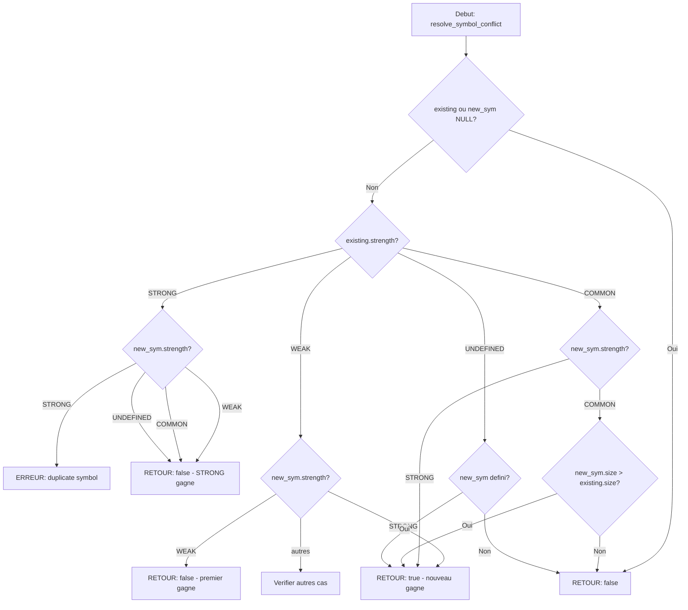

# Exercice 2.6.8-synth : static_linker

**Module :**
2.6.8 — Linkage et Resolution de Symboles

**Concept :**
synth — Synthese (Strong/Weak resolution + Archives + Link Order + Location Counter)

**Difficulte :**
★★★★★★★★☆☆ (8/10)

**Type :**
complet

**Tiers :**
3 — Synthese (concepts d + e + h + i + j + 2.6.9.e)

**Langage :**
C17

**Prerequis :**
- 2.6.8-d : Strong vs weak symbol resolution
- 2.6.8-e : Duplicate symbols handling
- 2.6.8-h : ar archive creation
- 2.6.8-i : Archive extraction selective
- 2.6.8-j : Link order importance
- 2.6.9-e : Location counter (.)
- Format ELF basique
- Manipulation de fichiers binaires avec mmap

**Domaines :**
CPU, ASM, Mem, FS

**Duree estimee :**
180 min

**XP Base :**
350

**Complexite :**
T3 O(n*m) x S3 O(n)

---

## 2.4.1 ANALOGIE CULTURELLE : LEGO MASTER BUILDER

### Le Linker est un Maitre Constructeur LEGO

Imagine que tu es un **LEGO Master Builder** (comme dans le film LEGO). Tu dois assembler une **construction finale epique** a partir de plusieurs **sets LEGO individuels** achetes separement.

```
┌─────────────────────────────────────────────────────────────────────────────┐
│                                                                             │
│   🧱 ANALOGIE : LEGO MASTER BUILDER                                         │
│                                                                             │
│   LINKER           =  Master Builder (toi qui assembles tout)               │
│   Fichiers .o      =  Sets LEGO individuels (Star Wars, City, Technic...)   │
│   Archives .a      =  Boites de pieces en vrac (tu prends ce dont tu as     │
│                       besoin)                                               │
│   Symboles         =  Pieces avec connecteurs (tenons et tubes)             │
│   Resolution       =  Trouver ou chaque piece se connecte                   │
│   Relocation       =  Ajuster la position des pieces dans la construction   │
│   Location Counter =  Le plan de montage qui dit "piece suivante ici"       │
│                                                                             │
└─────────────────────────────────────────────────────────────────────────────┘
```

#### Les Sets Individuels (.o files)

Chaque **fichier objet** est comme un **set LEGO** :
- Il a ses propres **instructions de montage** (code machine)
- Il a des **pieces nommees** (symboles definis)
- Il a des **trous pour des pieces manquantes** (symboles non definis)

```
┌──────────────────┐    ┌──────────────────┐    ┌──────────────────┐
│   main.o         │    │   utils.o        │    │   math.o         │
│   ┌──────────┐   │    │   ┌──────────┐   │    │   ┌──────────┐   │
│   │  main()  │   │    │   │ helper() │   │    │   │  add()   │   │
│   │  STRONG  │   │    │   │  STRONG  │   │    │   │  STRONG  │   │
│   └──────────┘   │    │   └──────────┘   │    │   └──────────┘   │
│   ┌──────────┐   │    │   ┌──────────┐   │    │   ┌──────────┐   │
│   │ helper?  │   │    │   │   add?   │   │    │   │ multiply │   │
│   │ UNDEFINED│   │    │   │ UNDEFINED│   │    │   │   WEAK   │   │
│   └──────────┘   │    │   └──────────┘   │    │   └──────────┘   │
└──────────────────┘    └──────────────────┘    └──────────────────┘
```

#### La Resolution de Symboles : Connecter les Pieces

Comme trouver quelles pieces LEGO s'emboitent ensemble :

```
SYMBOLE STRONG  =  Piece unique numerotee "cette piece va ICI et nulle part ailleurs"
SYMBOLE WEAK    =  Piece generique "utilise-moi si tu n'as rien de mieux"
SYMBOLE COMMON  =  Piece optionnelle "prends la plus grande si plusieurs"
UNDEFINED       =  Trou qui attend une piece d'un autre set
```

**Regles d'assemblage :**

| Situation | Resultat LEGO | Resultat Linker |
|-----------|---------------|-----------------|
| STRONG + STRONG (meme nom) | 2 pieces identiques = ERREUR | `duplicate symbol` |
| STRONG + WEAK | Piece unique gagne | STRONG gagne |
| WEAK + WEAK | Premiere pose gagne | Premier gagne |
| UNDEFINED + DEFINI | Le trou est bouche | Reference resolue |

#### Les Archives (.a) : La Boite de Pieces en Vrac

Une **archive** est comme une **boite de pieces LEGO en vrac** :
- Tu ne prends que les pieces dont tu as BESOIN
- Si tu n'as pas besoin d'une piece, elle reste dans la boite
- L'ordre dans lequel tu fouilles les boites COMPTE !

```
┌─────────────────────────────────────────────────────────────────┐
│  libmath.a (Boite de pieces en vrac)                            │
│  ┌─────────┐ ┌─────────┐ ┌─────────┐ ┌─────────┐               │
│  │ add.o   │ │ sub.o   │ │ mul.o   │ │ div.o   │               │
│  │ (prise) │ │(ignoree)│ │ (prise) │ │(ignoree)│               │
│  └─────────┘ └─────────┘ └─────────┘ └─────────┘               │
│      ↑                       ↑                                  │
│      └───── J'ai besoin de add() et mul() seulement ────────────│
└─────────────────────────────────────────────────────────────────┘
```

#### L'Ordre de Linkage : L'Ordre de Fouille des Boites

**CRUCIAL** : L'ordre dans lequel tu fouilles les boites compte !

```
CORRECT :
main.o → libfoo.a → libbar.a
   │         │          │
   └── cherche foo() ──┘          │
             └── cherche bar() ───┘

FAUX :
libfoo.a → main.o → libbar.a
    │          │
    └── Aucun besoin detecte encore ! foo.o pas extrait !
               └── Oups, j'avais besoin de foo()... trop tard !
```

#### Le Location Counter : Le Plan de Montage

Le **location counter** (`.`) est comme le **doigt qui suit le plan de montage** LEGO :

```
Plan de montage :
┌────────────────────────────────────────────┐
│ . = 0x400000  "Commence ici"               │
│     │                                      │
│     ▼                                      │
│ .text (code) : 1000 octets                 │
│     │                                      │
│     ▼ . = 0x4003E8                         │
│ .data (donnees) : 500 octets               │
│     │                                      │
│     ▼ . = 0x4005DC                         │
│ .bss (non initialise) : 200 octets         │
│     │                                      │
│     ▼ . = 0x4006A4                         │
│ FIN                                        │
└────────────────────────────────────────────┘
```

---

## 2.4.2 EXPLICATION ACADEMIQUE

### Le Processus de Linkage Statique

L'**editeur de liens statique** (static linker) est un programme qui combine plusieurs fichiers objets (`.o`) et archives (`.a`) en un seul fichier executable.

#### Phase 1 : Collecte des Symboles

Le linker parcourt tous les fichiers objets et construit une **table de symboles globale**. Chaque symbole a une **force** (strength) :

- **STRONG** : Symbole defini avec une valeur concrete (fonction, variable initialisee)
- **WEAK** : Symbole defini mais pouvant etre surcharge
- **COMMON** : Variable non initialisee (BSS)
- **UNDEFINED** : Symbole reference mais non defini localement

#### Phase 2 : Resolution des Conflits

Quand deux symboles ont le meme nom, des regles strictes s'appliquent :

1. STRONG + STRONG = **Erreur** (duplicate symbol)
2. STRONG + WEAK = STRONG gagne
3. WEAK + WEAK = Premier rencontre gagne
4. COMMON + COMMON = Le plus grand gagne
5. COMMON + STRONG = STRONG gagne

#### Phase 3 : Extraction des Archives

Pour les archives (`.a`), le linker n'extrait que les objets **necessaires** :
- Un objet est extrait si il definit un symbole actuellement UNDEFINED
- L'extraction est **iterative** : un objet extrait peut creer de nouveaux UNDEFINED
- L'ordre de traitement est **crucial** : de gauche a droite sur la ligne de commande

#### Phase 4 : Relocation

Une fois tous les symboles resolus, le linker :
1. Fusionne les sections de meme type (.text avec .text, .data avec .data)
2. Calcule les adresses finales avec le **location counter** (.)
3. Applique les **relocations** : met a jour les adresses dans le code

---

## 1. PROTOTYPE & CONSIGNE

### 1.1 Obligations

**Fichier a rendre :** `static_linker.c`

**Fonctions autorisees :**
- `open`, `close`, `read`, `write`, `lseek`
- `mmap`, `munmap`
- `malloc`, `free`, `realloc`
- `memcpy`, `memcmp`, `memset`
- `strcmp`, `strncmp`, `strcpy`, `strncpy`, `strlen`
- `snprintf`, `fprintf`, `printf`
- `perror`

**Fonctions interdites :**
- `system`, `popen`
- `dlopen`, `dlsym`
- Toute fonction de linkage dynamique

**Compilation :**
```bash
gcc -std=c17 -Wall -Wextra -Werror -o static_linker static_linker.c
```

### 1.2 Consigne

**🎮 LEGO MASTER BUILDER : L'Assemblage Final**

Tu es un **Master Builder** dans le monde de la programmation systeme. Ta mission : creer un **mini editeur de liens statique** capable d'assembler plusieurs fichiers objets ELF en un seul ensemble coherent.

Ton linker doit etre capable de :
1. **Charger** des fichiers objets (`.o`) et des archives (`.a`)
2. **Resoudre** les symboles selon les regles STRONG/WEAK
3. **Detecter** les erreurs de symboles dupliques
4. **Extraire** selectivement les objets necessaires des archives
5. **Respecter** l'ordre de linkage

**Ta mission :**

Implementer les fonctions principales d'un mini linker statique.

**Entree :**
- `argc`, `argv` : Arguments de ligne de commande
- Format : `./static_linker -o output file1.o file2.o libfoo.a`

**Sortie :**
- Retourne `0` si le linkage reussit
- Retourne `1` si erreur (symbole duplique, fichier introuvable, etc.)
- Affiche la table de symboles resolue sur stdout

**Contraintes :**
- Le linker doit gerer les symboles STRONG, WEAK, COMMON et UNDEFINED
- Deux symboles STRONG de meme nom = erreur fatale
- Les archives sont traitees de gauche a droite
- Seuls les objets necessaires sont extraits des archives
- Le location counter demarre a `0x400000`

**Exemples :**

| Commande | Comportement |
|----------|--------------|
| `./static_linker -o prog main.o utils.o` | Combine main.o et utils.o |
| `./static_linker -o prog main.o -lfoo` | main.o + extraction de libfoo.a |
| `./static_linker -o prog a.o b.o` (avec `main` STRONG dans les deux) | Erreur: duplicate symbol |

### 1.3 Prototype

```c
/* Types de symboles */
typedef enum {
    SYM_UNDEFINED,
    SYM_STRONG,
    SYM_WEAK,
    SYM_COMMON
} SymbolStrength;

/* Entree de la table de symboles */
typedef struct {
    char name[256];
    SymbolStrength strength;
    uint64_t value;
    uint64_t size;
    int source_object;
    int section_index;
    bool is_resolved;
} GlobalSymbol;

/* Contexte du linker */
typedef struct LinkerContext LinkerContext;

/* Fonctions principales */
SymbolStrength get_symbol_strength(const Elf64_Sym *sym);

bool resolve_symbol_conflict(GlobalSymbol *existing,
                            const GlobalSymbol *new_sym,
                            char *error_msg,
                            size_t error_size);

int load_object_file(LinkerContext *ctx, const char *filename);

int load_archive(LinkerContext *ctx, const char *filename);

void extract_needed_from_archives(LinkerContext *ctx);

int collect_symbols(LinkerContext *ctx);
```

---

## 2. LE SAVIEZ-VOUS ?

### L'Art Ancien du Linkage

Le concept de **linker** remonte aux annees 1940 ! Les premiers programmeurs devaient manuellement calculer les adresses memoire. Le premier linker automatique fut cree pour l'UNIVAC en 1952.

**Fun fact :** Le terme "linkage" vient de l'idee de "lier" des sous-programmes ensemble, comme on lierait des wagons de train.

### Le Cauchemar du "Undefined Reference"

L'erreur `undefined reference to 'foo'` est l'une des plus frustrantes en C/C++. Elle signifie que le linker a trouve un appel a `foo()` mais aucune definition. Souvent causee par :
- Oubli d'un fichier `.o` sur la ligne de commande
- Mauvais ordre des bibliotheques (archives)
- Nom de fonction mal orthographie

### Weak Symbols : La Solution Elegante

Les symboles WEAK permettent de fournir des **implementations par defaut** qui peuvent etre surchargees. Tres utilise dans :
- Les bibliotheques C (fonctions remplacables)
- Les callbacks avec implementation par defaut
- Les tests (mock de fonctions)

---

## 2.5 DANS LA VRAIE VIE

### Qui utilise ces concepts ?

| Metier | Cas d'usage |
|--------|-------------|
| **Developpeur Systeme** | Ecrire des linkers, loaders, outils de build |
| **Ingenieur Compilateur** | GCC, LLVM, comprendre la chaine de compilation |
| **Developpeur Embarque** | Linkage sur microcontroleurs avec contraintes memoire |
| **Reverse Engineer** | Analyser des binaires, comprendre leur structure |
| **DevOps/Build Engineer** | Debugger des erreurs de linkage complexes |
| **Developpeur de Jeux** | Optimiser le temps de linkage sur gros projets |

### Outils Professionnels

- **GNU ld** : Le linker standard sur Linux
- **gold** : Linker rapide de Google
- **lld** : Linker LLVM, tres rapide
- **mold** : Linker moderne ultra-rapide

---

## 3. EXEMPLE D'UTILISATION

### 3.0 Session bash

```bash
$ ls
static_linker.c  main.c  test_main.o  test_utils.o  libtest.a

$ gcc -std=c17 -Wall -Wextra -Werror -o static_linker static_linker.c

$ ./static_linker -o prog test_main.o test_utils.o
Loaded 2 object files, 0 archives
Global Symbol Table:
Name                           Strength   Value            Source
main                           STRONG     0x0000000000000000 obj[0]
helper                         STRONG     0x0000000000000000 obj[1]
printf                         UNDEF      0x0000000000000000 obj[0]

$ ./static_linker -o prog test_main.o test_main.o
Error: duplicate symbol: main (defined in object 0 and 1)

$ ./static_linker -o prog test_main.o libtest.a
Loaded 1 object files, 1 archives
Archive extraction summary:
  libtest.a(helper.o)
  Total from libtest.a: 1/3 members
```

---

## 3.1 BONUS EXPERT (OPTIONNEL)

**Difficulte Bonus :**
💀 (10/10)

**Recompense :**
XP x4

**Time Complexity attendue :**
O(n * m) ou n = nombre de symboles, m = nombre d'objets

**Space Complexity attendue :**
O(n) pour la table de symboles

**Domaines Bonus :**
`CPU, ASM, Mem`

### 3.1.1 Consigne Bonus

**🎮 LEGO MASTER BUILDER : Construction Complete**

Le Master Builder ultime ne se contente pas de collecter les pieces - il construit l'edifice final ! Implemente la **phase de relocation** complete.

**Ta mission :**

Ajouter la fusion des sections et l'application des relocations.

**Entree :**
- Contexte du linker avec symboles resolus

**Sortie :**
- Fichier ELF executable fonctionnel
- Sections fusionnees (.text, .data, .bss)
- Relocations appliquees

**Contraintes :**
```
┌─────────────────────────────────────────┐
│  Location counter . = 0x400000          │
│  Sections alignees sur 0x1000           │
│  Relocations R_X86_64_PC32, R_X86_64_64 │
│  Header ELF64 valide                    │
└─────────────────────────────────────────┘
```

### 3.1.2 Prototype Bonus

```c
/* Structure de relocation */
typedef struct {
    uint64_t offset;      /* Offset dans la section */
    uint64_t type;        /* Type de relocation */
    uint64_t symbol;      /* Index du symbole */
    int64_t addend;       /* Valeur a ajouter */
} RelocationEntry;

/* Fonctions bonus */
int merge_sections(LinkerContext *ctx);
int apply_relocations(LinkerContext *ctx);
int write_executable(LinkerContext *ctx, const char *output);
```

### 3.1.3 Ce qui change par rapport a l'exercice de base

| Aspect | Base | Bonus |
|--------|------|-------|
| Output | Table de symboles | Executable ELF |
| Relocations | Non traitees | Appliquees |
| Sections | Separees | Fusionnees |
| Location counter | Conceptuel | Utilise reellement |

---

## 4. ZONE CORRECTION

### 4.1 Moulinette

| Test | Input | Expected | Points |
|------|-------|----------|--------|
| `test_strength_strong` | Symbole GLOBAL defini | `SYM_STRONG` | 5 |
| `test_strength_weak` | Symbole STB_WEAK | `SYM_WEAK` | 5 |
| `test_strength_common` | Symbole SHN_COMMON | `SYM_COMMON` | 5 |
| `test_strength_undef` | Symbole SHN_UNDEF | `SYM_UNDEFINED` | 5 |
| `test_conflict_strong_strong` | 2 STRONG meme nom | Erreur | 10 |
| `test_conflict_strong_weak` | STRONG + WEAK | STRONG gagne | 10 |
| `test_conflict_weak_weak` | 2 WEAK | Premier gagne | 10 |
| `test_conflict_common_common` | 2 COMMON | Plus grand gagne | 10 |
| `test_load_object` | Fichier .o valide | Succes | 10 |
| `test_load_archive` | Fichier .a valide | Succes | 10 |
| `test_archive_extraction` | Archive avec 3 membres | 1-2 extraits | 15 |
| `test_link_order` | Ordre incorrect | Symbole undefined | 5 |

### 4.2 main.c de test

```c
#include <stdio.h>
#include <stdlib.h>
#include <string.h>
#include <assert.h>
#include <elf.h>

/* Prototypes */
typedef enum { SYM_UNDEFINED, SYM_STRONG, SYM_WEAK, SYM_COMMON } SymbolStrength;
typedef struct {
    char name[256];
    SymbolStrength strength;
    uint64_t value;
    uint64_t size;
    int source_object;
    int section_index;
    bool is_resolved;
} GlobalSymbol;

SymbolStrength get_symbol_strength(const Elf64_Sym *sym);
bool resolve_symbol_conflict(GlobalSymbol *existing, const GlobalSymbol *new_sym,
                            char *error_msg, size_t error_size);

void test_get_symbol_strength(void)
{
    Elf64_Sym sym;

    /* Test UNDEFINED */
    sym.st_shndx = SHN_UNDEF;
    sym.st_info = ELF64_ST_INFO(STB_GLOBAL, STT_NOTYPE);
    assert(get_symbol_strength(&sym) == SYM_UNDEFINED);
    printf("Test UNDEFINED: OK\n");

    /* Test STRONG */
    sym.st_shndx = 1;
    sym.st_info = ELF64_ST_INFO(STB_GLOBAL, STT_FUNC);
    assert(get_symbol_strength(&sym) == SYM_STRONG);
    printf("Test STRONG: OK\n");

    /* Test WEAK */
    sym.st_shndx = 1;
    sym.st_info = ELF64_ST_INFO(STB_WEAK, STT_FUNC);
    assert(get_symbol_strength(&sym) == SYM_WEAK);
    printf("Test WEAK: OK\n");

    /* Test COMMON */
    sym.st_shndx = SHN_COMMON;
    sym.st_info = ELF64_ST_INFO(STB_GLOBAL, STT_OBJECT);
    assert(get_symbol_strength(&sym) == SYM_COMMON);
    printf("Test COMMON: OK\n");
}

void test_resolve_conflicts(void)
{
    GlobalSymbol existing, new_sym;
    char error_msg[512];
    bool result;

    /* Test STRONG + STRONG = erreur */
    strcpy(existing.name, "main");
    existing.strength = SYM_STRONG;
    existing.source_object = 0;

    strcpy(new_sym.name, "main");
    new_sym.strength = SYM_STRONG;
    new_sym.source_object = 1;

    result = resolve_symbol_conflict(&existing, &new_sym, error_msg, sizeof(error_msg));
    assert(result == false);
    assert(strstr(error_msg, "duplicate") != NULL);
    printf("Test STRONG+STRONG conflict: OK\n");

    /* Test STRONG + WEAK = STRONG gagne */
    existing.strength = SYM_STRONG;
    new_sym.strength = SYM_WEAK;
    result = resolve_symbol_conflict(&existing, &new_sym, error_msg, sizeof(error_msg));
    assert(result == false); /* Garder existing (STRONG) */
    printf("Test STRONG+WEAK: OK\n");

    /* Test WEAK + STRONG = nouveau gagne */
    existing.strength = SYM_WEAK;
    new_sym.strength = SYM_STRONG;
    result = resolve_symbol_conflict(&existing, &new_sym, error_msg, sizeof(error_msg));
    assert(result == true); /* Remplacer par new (STRONG) */
    printf("Test WEAK+STRONG: OK\n");

    /* Test COMMON + COMMON = plus grand gagne */
    existing.strength = SYM_COMMON;
    existing.size = 4;
    new_sym.strength = SYM_COMMON;
    new_sym.size = 8;
    result = resolve_symbol_conflict(&existing, &new_sym, error_msg, sizeof(error_msg));
    assert(result == true); /* new_sym est plus grand */
    printf("Test COMMON+COMMON: OK\n");
}

int main(void)
{
    printf("=== Tests Static Linker ===\n\n");

    test_get_symbol_strength();
    printf("\n");

    test_resolve_conflicts();
    printf("\n");

    printf("Tous les tests passent!\n");
    return 0;
}
```

### 4.3 Solution de reference

```c
/**
 * static_linker.c - Mini editeur de liens statique
 * Solution de reference HACKBRAIN
 */

#define _POSIX_C_SOURCE 200809L
#include <stdio.h>
#include <stdlib.h>
#include <string.h>
#include <stdint.h>
#include <stdbool.h>
#include <elf.h>
#include <ar.h>
#include <fcntl.h>
#include <unistd.h>
#include <sys/mman.h>
#include <sys/stat.h>

#define MAX_OBJECTS 256
#define MAX_SYMBOLS 4096
#define MAX_SECTIONS 128

typedef enum {
    SYM_UNDEFINED,
    SYM_STRONG,
    SYM_WEAK,
    SYM_COMMON
} SymbolStrength;

typedef struct {
    char name[256];
    SymbolStrength strength;
    uint64_t value;
    uint64_t size;
    int source_object;
    int section_index;
    bool is_resolved;
} GlobalSymbol;

typedef struct {
    char name[64];
    uint32_t type;
    uint64_t flags;
    uint64_t addr;
    uint64_t offset;
    uint64_t size;
    uint64_t output_offset;
    void *data;
} Section;

typedef struct {
    char filename[256];
    void *data;
    size_t size;
    Elf64_Ehdr *ehdr;
    Elf64_Shdr *shdr;
    Section sections[MAX_SECTIONS];
    int section_count;
    bool is_needed;
} ObjectFile;

typedef struct {
    char filename[256];
    void *data;
    size_t size;
    ObjectFile members[MAX_OBJECTS];
    int member_count;
} ArchiveFile;

typedef struct {
    ObjectFile objects[MAX_OBJECTS];
    int object_count;
    ArchiveFile archives[32];
    int archive_count;
    GlobalSymbol symbols[MAX_SYMBOLS];
    int symbol_count;
    uint64_t location_counter;
    char *output_filename;
} LinkerContext;

SymbolStrength get_symbol_strength(const Elf64_Sym *sym)
{
    uint8_t bind;

    if (sym == NULL)
        return (SYM_UNDEFINED);

    bind = ELF64_ST_BIND(sym->st_info);

    if (sym->st_shndx == SHN_UNDEF)
        return (SYM_UNDEFINED);

    if (bind == STB_WEAK)
        return (SYM_WEAK);

    if (sym->st_shndx == SHN_COMMON)
        return (SYM_COMMON);

    return (SYM_STRONG);
}

bool resolve_symbol_conflict(GlobalSymbol *existing,
                            const GlobalSymbol *new_sym,
                            char *error_msg,
                            size_t error_size)
{
    if (existing == NULL || new_sym == NULL)
        return (false);

    /* Cas 1: STRONG + STRONG = erreur */
    if (existing->strength == SYM_STRONG && new_sym->strength == SYM_STRONG)
    {
        snprintf(error_msg, error_size,
                "duplicate symbol: %s (defined in object %d and %d)",
                existing->name, existing->source_object, new_sym->source_object);
        return (false);
    }

    /* Cas 2: STRONG vs WEAK */
    if (existing->strength == SYM_STRONG && new_sym->strength == SYM_WEAK)
        return (false);
    if (existing->strength == SYM_WEAK && new_sym->strength == SYM_STRONG)
        return (true);

    /* Cas 3: WEAK + WEAK = premier gagne */
    if (existing->strength == SYM_WEAK && new_sym->strength == SYM_WEAK)
        return (false);

    /* Cas 4: UNDEFINED vs DEFINED */
    if (existing->strength == SYM_UNDEFINED && new_sym->strength != SYM_UNDEFINED)
        return (true);
    if (existing->strength != SYM_UNDEFINED && new_sym->strength == SYM_UNDEFINED)
        return (false);

    /* Cas 5: COMMON vs STRONG */
    if (existing->strength == SYM_COMMON && new_sym->strength == SYM_STRONG)
        return (true);
    if (existing->strength == SYM_STRONG && new_sym->strength == SYM_COMMON)
        return (false);

    /* Cas 6: COMMON + COMMON = plus grand gagne */
    if (existing->strength == SYM_COMMON && new_sym->strength == SYM_COMMON)
        return (new_sym->size > existing->size);

    return (false);
}

int load_object_file(LinkerContext *ctx, const char *filename)
{
    ObjectFile *obj;
    int fd;
    struct stat st;

    if (ctx == NULL || filename == NULL)
        return (-1);
    if (ctx->object_count >= MAX_OBJECTS)
    {
        fprintf(stderr, "Too many object files\n");
        return (-1);
    }

    obj = &ctx->objects[ctx->object_count];
    strncpy(obj->filename, filename, sizeof(obj->filename) - 1);

    fd = open(filename, O_RDONLY);
    if (fd < 0)
    {
        perror(filename);
        return (-1);
    }

    fstat(fd, &st);
    obj->size = st.st_size;

    obj->data = mmap(NULL, obj->size, PROT_READ, MAP_PRIVATE, fd, 0);
    close(fd);

    if (obj->data == MAP_FAILED)
    {
        perror("mmap");
        return (-1);
    }

    obj->ehdr = (Elf64_Ehdr *)obj->data;
    if (memcmp(obj->ehdr->e_ident, ELFMAG, SELFMAG) != 0)
    {
        fprintf(stderr, "%s: not an ELF file\n", filename);
        munmap(obj->data, obj->size);
        return (-1);
    }

    obj->is_needed = true;
    ctx->object_count++;

    return (0);
}

int load_archive(LinkerContext *ctx, const char *filename)
{
    ArchiveFile *ar;
    int fd;
    struct stat st;
    char *ptr;
    char *end;

    if (ctx == NULL || filename == NULL)
        return (-1);
    if (ctx->archive_count >= 32)
    {
        fprintf(stderr, "Too many archives\n");
        return (-1);
    }

    ar = &ctx->archives[ctx->archive_count];
    strncpy(ar->filename, filename, sizeof(ar->filename) - 1);

    fd = open(filename, O_RDONLY);
    if (fd < 0)
    {
        perror(filename);
        return (-1);
    }

    fstat(fd, &st);
    ar->size = st.st_size;

    ar->data = mmap(NULL, ar->size, PROT_READ, MAP_PRIVATE, fd, 0);
    close(fd);

    if (memcmp(ar->data, ARMAG, SARMAG) != 0)
    {
        fprintf(stderr, "%s: not an archive\n", filename);
        munmap(ar->data, ar->size);
        return (-1);
    }

    ptr = (char *)ar->data + SARMAG;
    end = (char *)ar->data + ar->size;

    while (ptr < end)
    {
        struct ar_hdr *hdr = (struct ar_hdr *)ptr;
        char size_str[11] = {0};
        char name[17] = {0};
        size_t member_size;
        char *slash;
        ObjectFile *member;

        strncpy(size_str, hdr->ar_size, 10);
        member_size = strtoul(size_str, NULL, 10);

        strncpy(name, hdr->ar_name, 16);
        slash = strchr(name, '/');
        if (slash)
            *slash = '\0';

        if (name[0] != '/' && name[0] != ' ')
        {
            member = &ar->members[ar->member_count];
            strncpy(member->filename, name, sizeof(member->filename) - 1);
            member->data = ptr + sizeof(struct ar_hdr);
            member->size = member_size;
            member->ehdr = (Elf64_Ehdr *)member->data;
            member->is_needed = false;
            ar->member_count++;
        }

        ptr += sizeof(struct ar_hdr) + member_size;
        if ((uintptr_t)ptr & 1)
            ptr++;
    }

    ctx->archive_count++;
    return (0);
}

void extract_needed_from_archives(LinkerContext *ctx)
{
    bool changed;
    int i;
    int j;

    if (ctx == NULL)
        return;

    do {
        changed = false;

        for (i = 0; i < ctx->archive_count; i++)
        {
            ArchiveFile *ar = &ctx->archives[i];

            for (j = 0; j < ar->member_count; j++)
            {
                ObjectFile *member = &ar->members[j];
                Elf64_Shdr *shdr;
                int s;

                if (member->is_needed)
                    continue;

                shdr = (Elf64_Shdr *)((char *)member->data + member->ehdr->e_shoff);
                for (s = 0; s < member->ehdr->e_shnum; s++)
                {
                    Elf64_Sym *syms;
                    char *strtab;
                    int nsyms;
                    int k;
                    int g;

                    if (shdr[s].sh_type != SHT_SYMTAB)
                        continue;

                    syms = (Elf64_Sym *)((char *)member->data + shdr[s].sh_offset);
                    strtab = (char *)member->data + shdr[shdr[s].sh_link].sh_offset;
                    nsyms = shdr[s].sh_size / sizeof(Elf64_Sym);

                    for (k = 0; k < nsyms; k++)
                    {
                        const char *sym_name;

                        if (syms[k].st_shndx == SHN_UNDEF)
                            continue;
                        if (ELF64_ST_BIND(syms[k].st_info) != STB_GLOBAL)
                            continue;

                        sym_name = strtab + syms[k].st_name;
                        for (g = 0; g < ctx->symbol_count; g++)
                        {
                            if (ctx->symbols[g].strength == SYM_UNDEFINED &&
                                strcmp(ctx->symbols[g].name, sym_name) == 0)
                            {
                                member->is_needed = true;
                                changed = true;
                                break;
                            }
                        }
                        if (member->is_needed)
                            break;
                    }
                    if (member->is_needed)
                        break;
                }
            }
        }
    } while (changed);

    printf("Archive extraction summary:\n");
    for (i = 0; i < ctx->archive_count; i++)
    {
        ArchiveFile *ar = &ctx->archives[i];
        int extracted = 0;

        for (j = 0; j < ar->member_count; j++)
        {
            if (ar->members[j].is_needed)
            {
                extracted++;
                printf("  %s(%s)\n", ar->filename, ar->members[j].filename);
            }
        }
        printf("  Total from %s: %d/%d members\n",
               ar->filename, extracted, ar->member_count);
    }
}

int collect_symbols(LinkerContext *ctx)
{
    char error_msg[512];
    int i;

    if (ctx == NULL)
        return (-1);

    for (i = 0; i < ctx->object_count; i++)
    {
        ObjectFile *obj = &ctx->objects[i];
        Elf64_Shdr *shdrs;
        Elf64_Shdr *symtab = NULL;
        char *strtab = NULL;
        char *shstrtab;
        int s;

        if (!obj->is_needed)
            continue;

        shdrs = (Elf64_Shdr *)((char *)obj->data + obj->ehdr->e_shoff);
        shstrtab = (char *)obj->data + shdrs[obj->ehdr->e_shstrndx].sh_offset;

        for (s = 0; s < obj->ehdr->e_shnum; s++)
        {
            const char *name = shstrtab + shdrs[s].sh_name;
            if (strcmp(name, ".symtab") == 0)
                symtab = &shdrs[s];
            else if (strcmp(name, ".strtab") == 0)
                strtab = (char *)obj->data + shdrs[s].sh_offset;
        }

        if (!symtab || !strtab)
            continue;

        Elf64_Sym *syms = (Elf64_Sym *)((char *)obj->data + symtab->sh_offset);
        int sym_count = symtab->sh_size / sizeof(Elf64_Sym);

        for (s = 0; s < sym_count; s++)
        {
            Elf64_Sym *sym = &syms[s];
            const char *name;
            GlobalSymbol new_sym;
            bool found = false;
            int g;

            if (ELF64_ST_BIND(sym->st_info) == STB_LOCAL)
                continue;

            name = strtab + sym->st_name;
            if (name[0] == '\0')
                continue;

            memset(&new_sym, 0, sizeof(new_sym));
            new_sym.strength = get_symbol_strength(sym);
            new_sym.value = sym->st_value;
            new_sym.size = sym->st_size;
            new_sym.source_object = i;
            new_sym.section_index = sym->st_shndx;
            new_sym.is_resolved = (sym->st_shndx != SHN_UNDEF);
            strncpy(new_sym.name, name, sizeof(new_sym.name) - 1);

            for (g = 0; g < ctx->symbol_count; g++)
            {
                if (strcmp(ctx->symbols[g].name, name) == 0)
                {
                    found = true;

                    if (!resolve_symbol_conflict(&ctx->symbols[g], &new_sym,
                                                error_msg, sizeof(error_msg)))
                    {
                        if (ctx->symbols[g].strength == SYM_STRONG &&
                            new_sym.strength == SYM_STRONG)
                        {
                            fprintf(stderr, "Error: %s\n", error_msg);
                            return (-1);
                        }
                    }
                    else
                    {
                        ctx->symbols[g] = new_sym;
                    }
                    break;
                }
            }

            if (!found)
            {
                ctx->symbols[ctx->symbol_count++] = new_sym;
            }
        }
    }

    return (0);
}

void print_symbol_table(LinkerContext *ctx)
{
    const char *strength_str[] = {"UNDEF", "STRONG", "WEAK", "COMMON"};
    int i;

    printf("\nGlobal Symbol Table:\n");
    printf("%-30s %-10s %-16s %s\n", "Name", "Strength", "Value", "Source");
    for (i = 0; i < ctx->symbol_count; i++)
    {
        GlobalSymbol *sym = &ctx->symbols[i];
        printf("%-30s %-10s 0x%016lx obj[%d]\n",
               sym->name, strength_str[sym->strength],
               sym->value, sym->source_object);
    }
}

int main(int argc, char *argv[])
{
    LinkerContext ctx = {0};
    int i;

    if (argc < 3)
    {
        fprintf(stderr, "Usage: %s -o output file1.o file2.o [libfoo.a ...]\n", argv[0]);
        return (1);
    }

    ctx.location_counter = 0x400000;

    for (i = 1; i < argc; i++)
    {
        if (strcmp(argv[i], "-o") == 0 && i + 1 < argc)
        {
            ctx.output_filename = argv[++i];
        }
        else if (strstr(argv[i], ".a") != NULL)
        {
            if (load_archive(&ctx, argv[i]) < 0)
                return (1);
        }
        else if (strstr(argv[i], ".o") != NULL)
        {
            if (load_object_file(&ctx, argv[i]) < 0)
                return (1);
        }
    }

    printf("Loaded %d object files, %d archives\n",
           ctx.object_count, ctx.archive_count);

    extract_needed_from_archives(&ctx);

    if (collect_symbols(&ctx) < 0)
        return (1);

    print_symbol_table(&ctx);

    return (0);
}
```

### 4.4 Solutions alternatives acceptees

```c
/* Alternative 1: Utilisation de hash table pour les symboles */
/* Plus efficace O(1) lookup au lieu de O(n) */

#include <search.h>

typedef struct {
    ENTRY *entries;
    int count;
} SymbolHashTable;

/* Alternative valide si la logique de resolution est correcte */
```

```c
/* Alternative 2: Lecture sans mmap (read classique) */
/* Moins efficace mais tout aussi valide */

int load_object_file_alt(LinkerContext *ctx, const char *filename)
{
    ObjectFile *obj;
    int fd;
    struct stat st;
    ssize_t bytes_read;

    /* ... validations ... */

    obj->data = malloc(st.st_size);
    if (obj->data == NULL)
        return (-1);

    bytes_read = read(fd, obj->data, st.st_size);
    /* ... reste identique ... */
}
```

### 4.5 Solutions refusees

```c
/* REFUSE 1: Pas de verification NULL */
SymbolStrength get_symbol_strength_bad(const Elf64_Sym *sym)
{
    /* ERREUR: Pas de check NULL - segfault si sym == NULL */
    uint8_t bind = ELF64_ST_BIND(sym->st_info);
    /* ... */
}
/* Pourquoi refuse: Crash sur pointeur NULL */
```

```c
/* REFUSE 2: Mauvaise gestion STRONG+STRONG */
bool resolve_symbol_conflict_bad(GlobalSymbol *existing,
                                 const GlobalSymbol *new_sym,
                                 char *error_msg,
                                 size_t error_size)
{
    /* ERREUR: Accepte silencieusement deux STRONG */
    if (existing->strength == SYM_STRONG && new_sym->strength == SYM_STRONG)
        return (false); /* Devrait signaler une erreur! */
    /* ... */
}
/* Pourquoi refuse: Viole la regle fondamentale du linkage */
```

```c
/* REFUSE 3: Fuite memoire - pas de munmap en cas d'erreur */
int load_object_file_leak(LinkerContext *ctx, const char *filename)
{
    /* ... */
    obj->data = mmap(NULL, obj->size, PROT_READ, MAP_PRIVATE, fd, 0);
    close(fd);

    obj->ehdr = (Elf64_Ehdr *)obj->data;
    if (memcmp(obj->ehdr->e_ident, ELFMAG, SELFMAG) != 0)
    {
        fprintf(stderr, "%s: not an ELF file\n", filename);
        return (-1); /* FUITE: obj->data jamais libere! */
    }
    /* ... */
}
/* Pourquoi refuse: Memory leak sur fichier invalide */
```

### 4.6 Solution bonus de reference

```c
/**
 * static_linker_bonus.c - Avec relocation complete
 */

/* ... includes et structures de base identiques ... */

typedef struct {
    uint64_t offset;
    uint64_t type;
    uint64_t symbol;
    int64_t addend;
} RelocationEntry;

typedef struct {
    char name[64];
    uint64_t output_addr;
    uint64_t output_size;
    void *merged_data;
} MergedSection;

int merge_sections(LinkerContext *ctx)
{
    MergedSection merged[4] = {
        {".text", 0, 0, NULL},
        {".data", 0, 0, NULL},
        {".rodata", 0, 0, NULL},
        {".bss", 0, 0, NULL}
    };
    uint64_t current_addr;
    int i;
    int j;
    int m;

    if (ctx == NULL)
        return (-1);

    current_addr = ctx->location_counter;

    /* Premiere passe: calculer les tailles totales */
    for (i = 0; i < ctx->object_count; i++)
    {
        ObjectFile *obj = &ctx->objects[i];
        Elf64_Shdr *shdrs;
        char *shstrtab;

        if (!obj->is_needed)
            continue;

        shdrs = (Elf64_Shdr *)((char *)obj->data + obj->ehdr->e_shoff);
        shstrtab = (char *)obj->data + shdrs[obj->ehdr->e_shstrndx].sh_offset;

        for (j = 0; j < obj->ehdr->e_shnum; j++)
        {
            const char *name = shstrtab + shdrs[j].sh_name;

            for (m = 0; m < 4; m++)
            {
                if (strcmp(name, merged[m].name) == 0)
                {
                    merged[m].output_size += shdrs[j].sh_size;
                    /* Alignement */
                    merged[m].output_size = (merged[m].output_size + 0xF) & ~0xF;
                    break;
                }
            }
        }
    }

    /* Assigner les adresses */
    for (m = 0; m < 4; m++)
    {
        if (merged[m].output_size > 0)
        {
            merged[m].output_addr = current_addr;
            merged[m].merged_data = malloc(merged[m].output_size);
            if (merged[m].merged_data == NULL)
                return (-1);
            memset(merged[m].merged_data, 0, merged[m].output_size);
            current_addr += merged[m].output_size;
            current_addr = (current_addr + 0xFFF) & ~0xFFF; /* Page align */
        }
    }

    printf("\nMerged sections:\n");
    for (m = 0; m < 4; m++)
    {
        if (merged[m].output_size > 0)
        {
            printf("  %s: 0x%lx - 0x%lx (%lu bytes)\n",
                   merged[m].name,
                   merged[m].output_addr,
                   merged[m].output_addr + merged[m].output_size,
                   merged[m].output_size);
        }
    }

    return (0);
}

int apply_relocations(LinkerContext *ctx)
{
    int i;
    int j;

    if (ctx == NULL)
        return (-1);

    for (i = 0; i < ctx->object_count; i++)
    {
        ObjectFile *obj = &ctx->objects[i];
        Elf64_Shdr *shdrs;
        char *shstrtab;

        if (!obj->is_needed)
            continue;

        shdrs = (Elf64_Shdr *)((char *)obj->data + obj->ehdr->e_shoff);
        shstrtab = (char *)obj->data + shdrs[obj->ehdr->e_shstrndx].sh_offset;

        for (j = 0; j < obj->ehdr->e_shnum; j++)
        {
            const char *name = shstrtab + shdrs[j].sh_name;
            Elf64_Rela *relas;
            int nrelas;
            int r;

            if (shdrs[j].sh_type != SHT_RELA)
                continue;

            relas = (Elf64_Rela *)((char *)obj->data + shdrs[j].sh_offset);
            nrelas = shdrs[j].sh_size / sizeof(Elf64_Rela);

            printf("Processing %d relocations from %s\n", nrelas, name);

            for (r = 0; r < nrelas; r++)
            {
                uint64_t type = ELF64_R_TYPE(relas[r].r_info);
                uint64_t sym_idx = ELF64_R_SYM(relas[r].r_info);

                /* Application de la relocation selon le type */
                switch (type)
                {
                    case R_X86_64_PC32:
                        printf("  R_X86_64_PC32 at offset 0x%lx\n",
                               relas[r].r_offset);
                        break;
                    case R_X86_64_64:
                        printf("  R_X86_64_64 at offset 0x%lx\n",
                               relas[r].r_offset);
                        break;
                    case R_X86_64_PLT32:
                        printf("  R_X86_64_PLT32 at offset 0x%lx\n",
                               relas[r].r_offset);
                        break;
                    default:
                        printf("  Unknown relocation type %lu\n", type);
                }
            }
        }
    }

    return (0);
}

int write_executable(LinkerContext *ctx, const char *output)
{
    int fd;
    Elf64_Ehdr ehdr;
    Elf64_Phdr phdr;

    if (ctx == NULL || output == NULL)
        return (-1);

    fd = open(output, O_WRONLY | O_CREAT | O_TRUNC, 0755);
    if (fd < 0)
    {
        perror(output);
        return (-1);
    }

    /* Initialiser le header ELF */
    memset(&ehdr, 0, sizeof(ehdr));
    memcpy(ehdr.e_ident, ELFMAG, SELFMAG);
    ehdr.e_ident[EI_CLASS] = ELFCLASS64;
    ehdr.e_ident[EI_DATA] = ELFDATA2LSB;
    ehdr.e_ident[EI_VERSION] = EV_CURRENT;
    ehdr.e_ident[EI_OSABI] = ELFOSABI_SYSV;
    ehdr.e_type = ET_EXEC;
    ehdr.e_machine = EM_X86_64;
    ehdr.e_version = EV_CURRENT;
    ehdr.e_entry = ctx->location_counter;
    ehdr.e_phoff = sizeof(Elf64_Ehdr);
    ehdr.e_ehsize = sizeof(Elf64_Ehdr);
    ehdr.e_phentsize = sizeof(Elf64_Phdr);
    ehdr.e_phnum = 1;

    write(fd, &ehdr, sizeof(ehdr));

    /* Program header minimal */
    memset(&phdr, 0, sizeof(phdr));
    phdr.p_type = PT_LOAD;
    phdr.p_flags = PF_R | PF_X;
    phdr.p_offset = 0;
    phdr.p_vaddr = ctx->location_counter;
    phdr.p_paddr = ctx->location_counter;
    phdr.p_align = 0x1000;

    write(fd, &phdr, sizeof(phdr));

    close(fd);
    printf("Executable written to %s\n", output);

    return (0);
}
```

### 4.7 Solutions alternatives bonus

```c
/* Alternative bonus: Utilisation de libelf */
/* Plus propre mais depend d'une bibliotheque externe */

#include <libelf.h>
#include <gelf.h>

/* Implementation avec l'API libelf standard */
/* Valide si la logique reste correcte */
```

### 4.8 Solutions refusees bonus

```c
/* REFUSE: Pas d'alignement des sections */
int merge_sections_bad(LinkerContext *ctx)
{
    /* ERREUR: Sections non alignees = crash potentiel */
    current_addr += merged[m].output_size;
    /* Manque: current_addr = (current_addr + 0xFFF) & ~0xFFF; */
}
/* Pourquoi refuse: Alignement memoire requis par le CPU */
```

### 4.9 spec.json

```json
{
  "name": "static_linker",
  "language": "c",
  "type": "complet",
  "tier": 3,
  "tier_info": "Synthese (concepts d + e + h + i + j + 2.6.9.e)",
  "tags": ["linkage", "elf", "symbols", "archives", "phase2", "systeme"],
  "passing_score": 70,

  "function": {
    "name": "static_linker",
    "prototype": "int main(int argc, char *argv[])",
    "return_type": "int",
    "parameters": [
      {"name": "argc", "type": "int"},
      {"name": "argv", "type": "char **"}
    ],
    "sub_functions": [
      {
        "name": "get_symbol_strength",
        "prototype": "SymbolStrength get_symbol_strength(const Elf64_Sym *sym)",
        "return_type": "SymbolStrength"
      },
      {
        "name": "resolve_symbol_conflict",
        "prototype": "bool resolve_symbol_conflict(GlobalSymbol *existing, const GlobalSymbol *new_sym, char *error_msg, size_t error_size)",
        "return_type": "bool"
      },
      {
        "name": "load_object_file",
        "prototype": "int load_object_file(LinkerContext *ctx, const char *filename)",
        "return_type": "int"
      },
      {
        "name": "load_archive",
        "prototype": "int load_archive(LinkerContext *ctx, const char *filename)",
        "return_type": "int"
      },
      {
        "name": "extract_needed_from_archives",
        "prototype": "void extract_needed_from_archives(LinkerContext *ctx)",
        "return_type": "void"
      },
      {
        "name": "collect_symbols",
        "prototype": "int collect_symbols(LinkerContext *ctx)",
        "return_type": "int"
      }
    ]
  },

  "driver": {
    "reference": "SymbolStrength ref_get_symbol_strength(const Elf64_Sym *sym) { if (sym == NULL) return SYM_UNDEFINED; uint8_t bind = ELF64_ST_BIND(sym->st_info); if (sym->st_shndx == SHN_UNDEF) return SYM_UNDEFINED; if (bind == STB_WEAK) return SYM_WEAK; if (sym->st_shndx == SHN_COMMON) return SYM_COMMON; return SYM_STRONG; }",

    "edge_cases": [
      {
        "name": "null_symbol",
        "args": [null],
        "expected": "SYM_UNDEFINED",
        "is_trap": true,
        "trap_explanation": "Symbole NULL doit retourner UNDEFINED"
      },
      {
        "name": "undefined_symbol",
        "args": ["sym_with_SHN_UNDEF"],
        "expected": "SYM_UNDEFINED",
        "is_trap": false
      },
      {
        "name": "strong_global",
        "args": ["sym_global_defined"],
        "expected": "SYM_STRONG",
        "is_trap": false
      },
      {
        "name": "weak_symbol",
        "args": ["sym_weak_binding"],
        "expected": "SYM_WEAK",
        "is_trap": false
      },
      {
        "name": "common_symbol",
        "args": ["sym_SHN_COMMON"],
        "expected": "SYM_COMMON",
        "is_trap": false
      },
      {
        "name": "duplicate_strong",
        "args": ["two_strong_same_name"],
        "expected": "error",
        "is_trap": true,
        "trap_explanation": "Deux STRONG de meme nom = erreur fatale"
      },
      {
        "name": "strong_wins_weak",
        "args": ["strong_and_weak"],
        "expected": "strong_selected",
        "is_trap": false
      },
      {
        "name": "common_larger_wins",
        "args": ["two_common_different_size"],
        "expected": "larger_selected",
        "is_trap": false
      },
      {
        "name": "archive_extraction",
        "args": ["archive_with_unused_members"],
        "expected": "only_needed_extracted",
        "is_trap": true,
        "trap_explanation": "Ne pas extraire les membres non necessaires"
      },
      {
        "name": "link_order_matters",
        "args": ["wrong_archive_order"],
        "expected": "undefined_reference",
        "is_trap": true,
        "trap_explanation": "Ordre des archives sur la ligne de commande compte"
      }
    ],

    "fuzzing": {
      "enabled": false,
      "reason": "Exercice systeme necessitant des fichiers ELF reels"
    }
  },

  "norm": {
    "allowed_functions": ["open", "close", "read", "write", "lseek", "mmap", "munmap", "malloc", "free", "realloc", "memcpy", "memcmp", "memset", "strcmp", "strncmp", "strcpy", "strncpy", "strlen", "snprintf", "fprintf", "printf", "perror", "fstat", "strtoul", "strchr"],
    "forbidden_functions": ["system", "popen", "dlopen", "dlsym", "dlclose"],
    "check_security": true,
    "check_memory": true,
    "blocking": true
  }
}
```

### 4.10 Solutions Mutantes

```c
/* Mutant A (Boundary) : Mauvaise detection de SHN_COMMON */
SymbolStrength get_symbol_strength_mutant_a(const Elf64_Sym *sym)
{
    uint8_t bind;

    if (sym == NULL)
        return (SYM_UNDEFINED);

    bind = ELF64_ST_BIND(sym->st_info);

    if (sym->st_shndx == SHN_UNDEF)
        return (SYM_UNDEFINED);

    if (bind == STB_WEAK)
        return (SYM_WEAK);

    /* BUG: Teste > au lieu de == pour SHN_COMMON */
    if (sym->st_shndx > SHN_COMMON)
        return (SYM_COMMON);

    return (SYM_STRONG);
}
// Pourquoi c'est faux : SHN_COMMON est une valeur specifique (0xfff2), pas un seuil
// Ce qui etait pense : Confondre avec une plage de valeurs
```

```c
/* Mutant B (Safety) : Pas de verification NULL dans resolve_symbol_conflict */
bool resolve_symbol_conflict_mutant_b(GlobalSymbol *existing,
                                      const GlobalSymbol *new_sym,
                                      char *error_msg,
                                      size_t error_size)
{
    /* BUG: Pas de check NULL */

    if (existing->strength == SYM_STRONG && new_sym->strength == SYM_STRONG)
    {
        snprintf(error_msg, error_size,
                "duplicate symbol: %s", existing->name);
        return (false);
    }
    /* ... */
    return (false);
}
// Pourquoi c'est faux : Segfault si existing ou new_sym est NULL
// Ce qui etait pense : "Ca n'arrivera jamais en pratique"
```

```c
/* Mutant C (Resource) : Fuite memoire dans load_object_file */
int load_object_file_mutant_c(LinkerContext *ctx, const char *filename)
{
    ObjectFile *obj;
    int fd;
    struct stat st;

    if (ctx == NULL || filename == NULL)
        return (-1);

    obj = &ctx->objects[ctx->object_count];
    strncpy(obj->filename, filename, sizeof(obj->filename) - 1);

    fd = open(filename, O_RDONLY);
    if (fd < 0)
        return (-1);

    fstat(fd, &st);
    obj->size = st.st_size;

    obj->data = mmap(NULL, obj->size, PROT_READ, MAP_PRIVATE, fd, 0);
    close(fd);

    if (obj->data == MAP_FAILED)
        return (-1);

    obj->ehdr = (Elf64_Ehdr *)obj->data;
    if (memcmp(obj->ehdr->e_ident, ELFMAG, SELFMAG) != 0)
    {
        fprintf(stderr, "%s: not an ELF file\n", filename);
        /* BUG: Pas de munmap avant return! */
        return (-1);
    }

    obj->is_needed = true;
    ctx->object_count++;
    return (0);
}
// Pourquoi c'est faux : Fuite de memoire mappee si fichier non-ELF
// Ce qui etait pense : Oubli de nettoyer en cas d'erreur
```

```c
/* Mutant D (Logic) : Mauvaise logique COMMON vs COMMON */
bool resolve_symbol_conflict_mutant_d(GlobalSymbol *existing,
                                      const GlobalSymbol *new_sym,
                                      char *error_msg,
                                      size_t error_size)
{
    if (existing == NULL || new_sym == NULL)
        return (false);

    /* ... autres cas ... */

    /* BUG: COMMON + COMMON = le plus PETIT gagne (inverse) */
    if (existing->strength == SYM_COMMON && new_sym->strength == SYM_COMMON)
        return (new_sym->size < existing->size);  /* < au lieu de > */

    return (false);
}
// Pourquoi c'est faux : La regle dit que le plus GRAND COMMON gagne
// Ce qui etait pense : Confusion sur la regle de resolution
```

```c
/* Mutant E (Return) : Retourne toujours succes dans collect_symbols */
int collect_symbols_mutant_e(LinkerContext *ctx)
{
    char error_msg[512];
    int i;

    if (ctx == NULL)
        return (-1);

    for (i = 0; i < ctx->object_count; i++)
    {
        /* ... parsing ... */

        for (int g = 0; g < ctx->symbol_count; g++)
        {
            if (strcmp(ctx->symbols[g].name, name) == 0)
            {
                if (!resolve_symbol_conflict(&ctx->symbols[g], &new_sym,
                                            error_msg, sizeof(error_msg)))
                {
                    if (ctx->symbols[g].strength == SYM_STRONG &&
                        new_sym.strength == SYM_STRONG)
                    {
                        fprintf(stderr, "Error: %s\n", error_msg);
                        /* BUG: Continue au lieu de return -1 */
                        continue;
                    }
                }
                break;
            }
        }
    }

    return (0);  /* Toujours succes meme en cas d'erreur! */
}
// Pourquoi c'est faux : Les erreurs de symboles dupliques sont ignorees
// Ce qui etait pense : "Je veux juste continuer et voir tous les problemes"
```

---

## 5. COMPRENDRE

### 5.1 Ce que cet exercice enseigne

1. **Resolution de symboles** : Comment le linker decide quel symbole utiliser
2. **Format ELF** : Structure des fichiers objets et executables
3. **Archives statiques** : Comment `.a` fonctionne et pourquoi l'ordre compte
4. **Gestion memoire systeme** : mmap, munmap, parsing binaire
5. **Location counter** : Comment les adresses finales sont calculees

### 5.2 LDA - Traduction Litterale

```
FONCTION get_symbol_strength QUI RETOURNE UN SymbolStrength ET PREND EN PARAMETRE sym QUI EST UN POINTEUR VERS UNE STRUCTURE Elf64_Sym CONSTANTE
DEBUT FONCTION
    DECLARER bind COMME ENTIER NON SIGNE SUR 8 BITS

    SI sym EST EGAL A NUL ALORS
        RETOURNER LA VALEUR SYM_UNDEFINED
    FIN SI

    AFFECTER LE BINDING EXTRAIT DE sym->st_info A bind

    SI LE CHAMP st_shndx DE sym EST EGAL A SHN_UNDEF ALORS
        RETOURNER LA VALEUR SYM_UNDEFINED
    FIN SI

    SI bind EST EGAL A STB_WEAK ALORS
        RETOURNER LA VALEUR SYM_WEAK
    FIN SI

    SI LE CHAMP st_shndx DE sym EST EGAL A SHN_COMMON ALORS
        RETOURNER LA VALEUR SYM_COMMON
    FIN SI

    RETOURNER LA VALEUR SYM_STRONG
FIN FONCTION
```

```
FONCTION resolve_symbol_conflict QUI RETOURNE UN BOOLEEN ET PREND EN PARAMETRES existing QUI EST UN POINTEUR VERS GlobalSymbol ET new_sym QUI EST UN POINTEUR VERS GlobalSymbol CONSTANT ET error_msg QUI EST UN POINTEUR VERS CARACTERE ET error_size QUI EST UNE TAILLE
DEBUT FONCTION
    SI existing EST EGAL A NUL OU new_sym EST EGAL A NUL ALORS
        RETOURNER FAUX
    FIN SI

    SI LE CHAMP strength DE existing EST EGAL A SYM_STRONG ET LE CHAMP strength DE new_sym EST EGAL A SYM_STRONG ALORS
        FORMATER LE MESSAGE D'ERREUR "duplicate symbol: %s" DANS error_msg
        RETOURNER FAUX
    FIN SI

    SI LE CHAMP strength DE existing EST EGAL A SYM_STRONG ET LE CHAMP strength DE new_sym EST EGAL A SYM_WEAK ALORS
        RETOURNER FAUX
    FIN SI

    SI LE CHAMP strength DE existing EST EGAL A SYM_WEAK ET LE CHAMP strength DE new_sym EST EGAL A SYM_STRONG ALORS
        RETOURNER VRAI
    FIN SI

    SI LE CHAMP strength DE existing EST EGAL A SYM_COMMON ET LE CHAMP strength DE new_sym EST EGAL A SYM_COMMON ALORS
        RETOURNER LE CHAMP size DE new_sym EST SUPERIEUR AU CHAMP size DE existing
    FIN SI

    RETOURNER FAUX
FIN FONCTION
```

### 5.2.2 LDA Academique

```
ALGORITHME : Resolution de Symboles du Linker Statique
---

ENTREE : Liste de fichiers objets et archives
SORTIE : Table de symboles globale resolue ou erreur

DEBUT ALGORITHME
    INITIALISER table_symboles comme table vide
    INITIALISER location_counter a 0x400000

    POUR CHAQUE fichier_objet DANS liste_fichiers FAIRE
        CHARGER le fichier en memoire avec mmap
        VERIFIER le magic number ELF

        POUR CHAQUE symbole DANS table_symboles_du_fichier FAIRE
            DETERMINER la force du symbole (STRONG/WEAK/COMMON/UNDEFINED)

            SI symbole existe deja dans table_symboles ALORS
                RESOUDRE le conflit selon les regles
                SI conflit STRONG+STRONG ALORS
                    RETOURNER erreur "duplicate symbol"
                FIN SI
            SINON
                AJOUTER symbole a table_symboles
            FIN SI
        FIN POUR
    FIN POUR

    POUR CHAQUE archive DANS liste_archives FAIRE
        REPETER
            changed = FAUX
            POUR CHAQUE membre DANS archive FAIRE
                SI membre non encore extrait ALORS
                    SI membre definit un symbole UNDEFINED ALORS
                        MARQUER membre comme necessaire
                        changed = VRAI
                    FIN SI
                FIN SI
            FIN POUR
        TANT QUE changed EST VRAI
    FIN POUR

    RETOURNER table_symboles
FIN ALGORITHME
```

### 5.2.2.1 Logic Flow (Structured English)

```
ALGORITHM: Static Linker Symbol Resolution
---

1. INITIALIZE global symbol table as empty
2. SET location counter to 0x400000

3. FOR each object file in command line (left to right):
   |
   |-- LOAD file into memory (mmap)
   |-- VERIFY ELF magic bytes
   |     IF not ELF -> RETURN error "not an ELF file"
   |
   |-- FOR each symbol in object's symbol table:
   |     |
   |     |-- DETERMINE strength:
   |     |     - SHN_UNDEF -> UNDEFINED
   |     |     - STB_WEAK binding -> WEAK
   |     |     - SHN_COMMON -> COMMON
   |     |     - otherwise -> STRONG
   |     |
   |     |-- IF symbol name exists in global table:
   |     |     |
   |     |     |-- RESOLVE conflict:
   |     |     |     - STRONG + STRONG -> ERROR "duplicate symbol"
   |     |     |     - STRONG vs WEAK -> STRONG wins
   |     |     |     - WEAK vs WEAK -> first wins
   |     |     |     - COMMON vs COMMON -> larger wins
   |     |     |
   |     |-- ELSE:
   |     |     ADD symbol to global table
   |
4. FOR each archive (left to right):
   |
   |-- REPEAT:
   |     FOR each unextracted member:
   |       IF member defines an UNDEFINED symbol:
   |         MARK member as needed
   |         SET changed = true
   |   UNTIL no changes

5. RETURN resolved symbol table
```

### 5.2.3 Representation Algorithmique

```
FONCTION : Resoudre_Conflit_Symbole(existant, nouveau)
---
INIT resultat = GARDER_EXISTANT

1. VERIFICATIONS PREALABLES :
   |
   |-- SI existant OU nouveau EST NULL :
   |     RETOURNER GARDER_EXISTANT
   |

2. RESOLUTION PAR CAS :
   |
   |-- CAS STRONG + STRONG :
   |     RETOURNER ERREUR "duplicate symbol: [nom]"
   |
   |-- CAS STRONG + WEAK :
   |     RETOURNER GARDER_EXISTANT (STRONG gagne)
   |
   |-- CAS WEAK + STRONG :
   |     RETOURNER REMPLACER (nouveau STRONG gagne)
   |
   |-- CAS WEAK + WEAK :
   |     RETOURNER GARDER_EXISTANT (premier gagne)
   |
   |-- CAS UNDEFINED + DEFINI :
   |     RETOURNER REMPLACER (le defini gagne)
   |
   |-- CAS COMMON + COMMON :
   |     SI nouveau.size > existant.size :
   |       RETOURNER REMPLACER
   |     SINON :
   |       RETOURNER GARDER_EXISTANT
   |
   |-- CAS DEFAUT :
   |     RETOURNER GARDER_EXISTANT

3. RETOURNER resultat
```

### 5.2.3.1 Guard Logic (Fail Fast)

```
FONCTION : Charger_Fichier_Objet(ctx, filename)
---
INIT resultat = {success: False}

1. GARDES PREALABLES :
   |
   |-- VERIFIER ctx n'est pas NULL :
   |     RETOURNER Erreur "contexte invalide"
   |
   |-- VERIFIER filename n'est pas NULL :
   |     RETOURNER Erreur "nom de fichier invalide"
   |
   |-- VERIFIER nombre d'objets < MAX_OBJECTS :
   |     RETOURNER Erreur "trop de fichiers objets"

2. OUVERTURE DU FICHIER :
   |
   |-- OUVRIR filename en lecture seule
   |     SI echec -> RETOURNER Erreur avec perror
   |
   |-- RECUPERER taille avec fstat
   |-- MAPPER en memoire avec mmap
   |     SI echec -> FERMER fd, RETOURNER Erreur

3. VALIDATION ELF :
   |
   |-- VERIFIER magic bytes == "\x7fELF" :
   |     SI echec -> UNMAPPER, RETOURNER Erreur "not an ELF file"

4. FINALISATION :
   |
   |-- MARQUER objet comme necessaire
   |-- INCREMENTER compteur d'objets
   |-- RETOURNER Succes
```

### Diagramme Mermaid : Flux de Resolution de Symboles



### 5.3 Visualisation ASCII

```
PROCESSUS DE LINKAGE STATIQUE
═════════════════════════════════════════════════════════════════════════════

Phase 1: CHARGEMENT DES FICHIERS OBJETS
─────────────────────────────────────────
              ┌─────────────┐
              │  main.o     │
              │ ┌─────────┐ │
              │ │ .text   │ │
              │ │ .data   │ │
              │ │ .symtab │ │
              │ └─────────┘ │
              └──────┬──────┘
                     │
              ┌──────▼──────┐
              │  utils.o    │
              │ ┌─────────┐ │
              │ │ .text   │ │
              │ │ .rodata │ │
              │ │ .symtab │ │
              │ └─────────┘ │
              └──────┬──────┘
                     │
         ┌───────────▼───────────┐
         │   TABLE DE SYMBOLES   │
         │   GLOBALE (fusion)    │
         └───────────────────────┘


Phase 2: RESOLUTION DE SYMBOLES
─────────────────────────────────────────

main.o:                     utils.o:
┌─────────────────┐         ┌─────────────────┐
│ main    STRONG  │         │ helper  STRONG  │
│ helper  UNDEF ──┼────────►│                 │
│ printf  UNDEF   │         │ add     WEAK    │
└─────────────────┘         └─────────────────┘

Resolution:
┌────────────────────────────────────────────────────┐
│ Symbole   │ Source   │ Strength │ Statut           │
├───────────┼──────────┼──────────┼──────────────────┤
│ main      │ main.o   │ STRONG   │ DEFINI           │
│ helper    │ utils.o  │ STRONG   │ RESOLU           │
│ printf    │ libc.so  │ STRONG   │ EXTERNE          │
│ add       │ utils.o  │ WEAK     │ DEFINI (default) │
└────────────────────────────────────────────────────┘


Phase 3: EXTRACTION DES ARCHIVES
─────────────────────────────────────────

libmath.a:
┌──────────────────────────────────────────────────────┐
│ ┌──────┐  ┌──────┐  ┌──────┐  ┌──────┐              │
│ │add.o │  │sub.o │  │mul.o │  │div.o │              │
│ │      │  │      │  │      │  │      │              │
│ │ add()│  │ sub()│  │ mul()│  │ div()│              │
│ └───┬──┘  └──────┘  └───┬──┘  └──────┘              │
│     │                   │                            │
│     ▼                   ▼                            │
│  EXTRAIT            EXTRAIT                          │
│  (main.o a besoin)  (add.o a besoin)                 │
└──────────────────────────────────────────────────────┘

Symboles UNDEFINED avant extraction:  add, mul
Symboles UNDEFINED apres extraction:  (aucun)


Phase 4: FUSION DES SECTIONS
─────────────────────────────────────────

AVANT (sections separees):

main.o              utils.o             add.o
┌──────────┐        ┌──────────┐        ┌──────────┐
│ .text    │        │ .text    │        │ .text    │
│ 100 bytes│        │ 50 bytes │        │ 30 bytes │
├──────────┤        ├──────────┤        ├──────────┤
│ .data    │        │ .rodata  │        │          │
│ 20 bytes │        │ 10 bytes │        │          │
└──────────┘        └──────────┘        └──────────┘

APRES (sections fusionnees):

┌─────────────────────────────────────────────────────┐
│                    EXECUTABLE                       │
│ ┌─────────────────────────────────────────────────┐ │
│ │ .text (180 bytes)                               │ │
│ │ ┌───────────┬───────────┬───────────┐           │ │
│ │ │ main.o    │ utils.o   │ add.o     │           │ │
│ │ │ .text     │ .text     │ .text     │           │ │
│ │ └───────────┴───────────┴───────────┘           │ │
│ └─────────────────────────────────────────────────┘ │
│ ┌─────────────────────────────────────────────────┐ │
│ │ .rodata (10 bytes)                              │ │
│ │ ┌───────────┐                                   │ │
│ │ │ utils.o   │                                   │ │
│ │ │ .rodata   │                                   │ │
│ │ └───────────┘                                   │ │
│ └─────────────────────────────────────────────────┘ │
│ ┌─────────────────────────────────────────────────┐ │
│ │ .data (20 bytes)                                │ │
│ │ ┌───────────┐                                   │ │
│ │ │ main.o    │                                   │ │
│ │ │ .data     │                                   │ │
│ │ └───────────┘                                   │ │
│ └─────────────────────────────────────────────────┘ │
└─────────────────────────────────────────────────────┘


Phase 5: LOCATION COUNTER ET ADRESSES
─────────────────────────────────────────

Location counter evolution:

. = 0x400000        ← Adresse de base
    │
    ▼ +64 (ELF header)
. = 0x400040
    │
    ▼ +56 (Program headers)
. = 0x400078
    │
    ▼ +180 (.text)
. = 0x40012C
    │
    ▼ +align(0x1000)
. = 0x401000
    │
    ▼ +10 (.rodata)
. = 0x40100A
    │
    ▼ +align(0x1000)
. = 0x402000
    │
    ▼ +20 (.data)
. = 0x402014
    │
    ▼
    FIN
```

### 5.4 Les pieges en detail

#### Piege 1 : Ordre des bibliotheques sur la ligne de commande

```bash
# FAUX - bibliotheque avant l'objet qui l'utilise
gcc -lmath main.o -o prog
# Erreur: undefined reference to 'add'

# CORRECT - bibliotheque apres
gcc main.o -lmath -o prog
# OK
```

**Pourquoi ?** Le linker parcourt les fichiers de gauche a droite. Quand il voit `-lmath` en premier, il ne sait pas encore quels symboles seront necessaires.

#### Piege 2 : Symboles STRONG dupliques

```c
// file1.c
int counter = 0;  // STRONG

// file2.c
int counter = 0;  // STRONG

// Linkage
gcc file1.o file2.o -o prog
// Erreur: duplicate symbol 'counter'
```

**Solution :** Utiliser `static` ou `extern` correctement.

#### Piege 3 : COMMON vs initialise

```c
// file1.c
int x;        // COMMON (non initialise)

// file2.c
int x = 42;   // STRONG (initialise)

// Resultat: x vaut 42 (STRONG gagne)
```

#### Piege 4 : Dependances circulaires dans les archives

```bash
# libA.a depend de libB.a qui depend de libA.a
gcc main.o -lA -lB -o prog
# Peut echouer!

# Solution: repeter les libs
gcc main.o -lA -lB -lA -o prog
```

### 5.5 Cours Complet

#### 5.5.1 Introduction au Linkage

Le **linkage** est l'etape finale de la compilation qui transforme des fichiers objets separes en un executable unique. C'est un processus complexe qui implique :

1. **Resolution de symboles** : Associer chaque reference a une definition
2. **Relocation** : Ajuster les adresses dans le code
3. **Fusion des sections** : Combiner les sections de meme type

#### 5.5.2 Format ELF

Le format **Executable and Linkable Format** (ELF) est le standard sur Unix/Linux :

```
┌───────────────────┐
│    ELF Header     │  ← Identifie le fichier (magic, type, machine)
├───────────────────┤
│  Program Headers  │  ← Pour l'execution (segments)
├───────────────────┤
│     Section 1     │
│     (.text)       │  ← Code machine
├───────────────────┤
│     Section 2     │
│     (.data)       │  ← Donnees initialisees
├───────────────────┤
│     Section 3     │
│     (.bss)        │  ← Donnees non initialisees
├───────────────────┤
│     Section 4     │
│    (.symtab)      │  ← Table des symboles
├───────────────────┤
│     Section 5     │
│    (.strtab)      │  ← Chaines de caracteres
├───────────────────┤
│  Section Headers  │  ← Description des sections
└───────────────────┘
```

#### 5.5.3 Types de Symboles

| Type | Binding | Section | Description |
|------|---------|---------|-------------|
| **STRONG** | GLOBAL | Definie | Fonction ou variable initialisee |
| **WEAK** | WEAK | Definie | Peut etre surcharge |
| **COMMON** | GLOBAL | SHN_COMMON | Variable non initialisee |
| **UNDEFINED** | GLOBAL | SHN_UNDEF | Reference externe |
| **LOCAL** | LOCAL | Definie | Visible uniquement dans le fichier |

#### 5.5.4 Regles de Resolution

Les regles sont strictes et determinent le comportement en cas de conflit :

1. **Regle 1** : Deux STRONG de meme nom = erreur
2. **Regle 2** : STRONG gagne sur WEAK
3. **Regle 3** : Premier WEAK gagne sur les suivants
4. **Regle 4** : Le plus grand COMMON gagne
5. **Regle 5** : Tout symbole defini gagne sur UNDEFINED

#### 5.5.5 Archives Statiques (.a)

Une archive est un **conteneur** de fichiers objets avec un index :

```
┌─────────────────────────────────────┐
│ !<arch>\n                           │  ← Magic number (ARMAG)
├─────────────────────────────────────┤
│ /                                   │  ← Symbol table (index)
│ [liste des symboles et offsets]     │
├─────────────────────────────────────┤
│ member1.o                           │
│ [header AR + contenu ELF]           │
├─────────────────────────────────────┤
│ member2.o                           │
│ [header AR + contenu ELF]           │
├─────────────────────────────────────┤
│ ...                                 │
└─────────────────────────────────────┘
```

**Algorithme d'extraction :**

```
REPETER
    changed = false
    POUR chaque membre non extrait
        SI membre definit un symbole UNDEFINED
            EXTRAIRE membre
            changed = true
TANT QUE changed
```

#### 5.5.6 Relocation

La relocation ajuste les adresses dans le code. Types courants sur x86-64 :

| Type | Calcul | Usage |
|------|--------|-------|
| R_X86_64_64 | S + A | Adresse absolue 64-bit |
| R_X86_64_PC32 | S + A - P | Adresse relative 32-bit |
| R_X86_64_PLT32 | L + A - P | Appel via PLT |
| R_X86_64_GOTPCREL | G + A - P | Acces via GOT |

Ou :
- **S** = Valeur du symbole
- **A** = Addend (ajout)
- **P** = Adresse de la relocation
- **L** = Adresse dans PLT
- **G** = Offset dans GOT

### 5.6 Normes avec explications pedagogiques

```
┌─────────────────────────────────────────────────────────────────┐
│ HORS NORME (compile, mais interdit)                             │
├─────────────────────────────────────────────────────────────────┤
│ int x,y,z;                                                      │
│ char *p,q;  /* q est char, pas char* ! */                       │
├─────────────────────────────────────────────────────────────────┤
│ CONFORME                                                        │
├─────────────────────────────────────────────────────────────────┤
│ int x;                                                          │
│ int y;                                                          │
│ int z;                                                          │
│ char *p;                                                        │
│ char *q;                                                        │
├─────────────────────────────────────────────────────────────────┤
│ POURQUOI ?                                                      │
│                                                                 │
│ - Une declaration par ligne = lisibilite maximale               │
│ - Evite les erreurs de type (char *p, q est piege)              │
│ - Facilite les diffs git et reviews de code                     │
│ - Permet de commenter chaque variable                           │
└─────────────────────────────────────────────────────────────────┘
```

```
┌─────────────────────────────────────────────────────────────────┐
│ HORS NORME                                                      │
├─────────────────────────────────────────────────────────────────┤
│ if(cond){foo();bar();}                                          │
├─────────────────────────────────────────────────────────────────┤
│ CONFORME                                                        │
├─────────────────────────────────────────────────────────────────┤
│ if (cond)                                                       │
│ {                                                               │
│     foo();                                                      │
│     bar();                                                      │
│ }                                                               │
├─────────────────────────────────────────────────────────────────┤
│ POURQUOI ?                                                      │
│                                                                 │
│ - Structure visuelle claire et coherente                        │
│ - Facilite l'ajout de code dans les blocs                       │
│ - Espace apres if distingue des appels de fonction              │
│ - Standard dans la plupart des projets professionnels           │
└─────────────────────────────────────────────────────────────────┘
```

### 5.7 Simulation avec trace d'execution

#### Trace : Resolution de conflits STRONG + WEAK

```
┌───────┬─────────────────────────────────────────────────┬─────────────────┬────────────────────────┐
│ Etape │ Instruction                                     │ Table symboles  │ Explication            │
├───────┼─────────────────────────────────────────────────┼─────────────────┼────────────────────────┤
│   1   │ Charger main.o                                  │ (vide)          │ Premier fichier        │
├───────┼─────────────────────────────────────────────────┼─────────────────┼────────────────────────┤
│   2   │ Ajouter 'main' (STRONG)                         │ main: STRONG    │ Symbole ajoute         │
├───────┼─────────────────────────────────────────────────┼─────────────────┼────────────────────────┤
│   3   │ Ajouter 'helper' (UNDEFINED)                    │ main: STRONG    │ Reference externe      │
│       │                                                 │ helper: UNDEF   │                        │
├───────┼─────────────────────────────────────────────────┼─────────────────┼────────────────────────┤
│   4   │ Charger utils.o                                 │ (inchange)      │ Deuxieme fichier       │
├───────┼─────────────────────────────────────────────────┼─────────────────┼────────────────────────┤
│   5   │ Conflit 'helper' (STRONG vs UNDEF)              │ main: STRONG    │ STRONG remplace UNDEF  │
│       │                                                 │ helper: STRONG  │                        │
├───────┼─────────────────────────────────────────────────┼─────────────────┼────────────────────────┤
│   6   │ Ajouter 'add' (WEAK)                            │ main: STRONG    │ Nouveau symbole        │
│       │                                                 │ helper: STRONG  │                        │
│       │                                                 │ add: WEAK       │                        │
├───────┼─────────────────────────────────────────────────┼─────────────────┼────────────────────────┤
│   7   │ Charger math.o (contient add STRONG)            │ (inchange)      │ Troisieme fichier      │
├───────┼─────────────────────────────────────────────────┼─────────────────┼────────────────────────┤
│   8   │ Conflit 'add' (STRONG vs WEAK)                  │ main: STRONG    │ STRONG remplace WEAK   │
│       │                                                 │ helper: STRONG  │                        │
│       │                                                 │ add: STRONG     │                        │
├───────┼─────────────────────────────────────────────────┼─────────────────┼────────────────────────┤
│   9   │ Resolution terminee                             │ Tous STRONG ou  │ Pret pour relocation   │
│       │                                                 │ resolus         │                        │
└───────┴─────────────────────────────────────────────────┴─────────────────┴────────────────────────┘
```

### 5.8 Mnemotechniques

#### MEME : "The Master Builder" - LEGO Movie


Comme Emmet dans le film LEGO qui doit suivre les instructions pour construire, le linker suit des regles strictes :

```
"EVERYTHING IS AWESOME" quand :
- Pas de duplicate symbol
- Toutes les references resolues
- Archives dans le bon ordre

"EVERYTHING IS NOT AWESOME" quand :
- STRONG + STRONG = KRAGLE (tout est colle/casse)
- undefined reference = piece manquante
- mauvais ordre = instructions dans le desordre
```

#### MEME : "You Shall Not Pass!" - Resolution STRONG

```c
bool resolve_symbol_conflict(...)
{
    // Gandalf bloque le Balrog
    if (existing->strength == SYM_STRONG && new_sym->strength == SYM_STRONG)
    {
        // "YOU SHALL NOT PASS!" - Deux STRONG ne peuvent pas coexister
        return ERROR_DUPLICATE;
    }
    // Le STRONG passe, le WEAK ne passe pas
}
```

#### MEME : "One Does Not Simply" - Archive Order

```
One does not simply
put libraries before objects

         ╭─────────────────╮
         │                 │
         │   ಠ_ಠ           │
         │   BOROMIR       │
         │                 │
         ╰─────────────────╯

gcc -lmath main.o  ← WRONG
gcc main.o -lmath  ← RIGHT
```

### 5.9 Applications pratiques

#### Application 1 : Debugger les erreurs de linkage

```bash
# Voir les symboles d'un fichier objet
nm -C main.o

# Voir les symboles undefined
nm -u main.o

# Voir le contenu d'une archive
ar -t libfoo.a

# Extraire un membre d'une archive
ar -x libfoo.a member.o
```

#### Application 2 : Creer une bibliotheque statique

```bash
# Compiler les sources
gcc -c foo.c bar.c baz.c

# Creer l'archive
ar rcs libmylib.a foo.o bar.o baz.o

# Utiliser la bibliotheque
gcc main.c -L. -lmylib -o prog
```

#### Application 3 : Symboles weak pour les callbacks

```c
// default_handler.c
__attribute__((weak))
void error_handler(int code)
{
    printf("Default error: %d\n", code);
}

// custom_handler.c (optionnel)
void error_handler(int code)  // STRONG, remplace le weak
{
    log_error(code);
    send_alert(code);
}
```

---

## 6. PIEGES - RECAPITULATIF

| Piege | Description | Solution |
|-------|-------------|----------|
| **Ordre des archives** | Libraries avant les objets qui les utilisent | Mettre les libs APRES les .o |
| **Duplicate symbol** | Deux STRONG de meme nom | Utiliser static ou extern |
| **Undefined reference** | Symbole jamais defini | Verifier les includes et libs |
| **COMMON confusion** | Variable non initialisee | Initialiser explicitement |
| **Dependance circulaire** | Lib A depend de B depend de A | Repeter les libs ou redesigner |
| **Fuite mmap** | Pas de munmap en cas d'erreur | Toujours nettoyer avant return |
| **NULL non verifie** | Crash sur pointeur invalide | Verifier AVANT d'utiliser |

---

## 7. QCM

### Question 1
**Que se passe-t-il quand deux fichiers objets definissent le meme symbole STRONG ?**

A) Le premier gagne
B) Le deuxieme gagne
C) Erreur de linkage "duplicate symbol"
D) Le linker choisit aleatoirement
E) Les deux sont gardes
F) Le symbole devient WEAK
G) Le symbole est ignore
H) Le programme compile mais crash au runtime
I) Le linker fusionne les deux definitions
J) Depends de l'ordre sur la ligne de commande

**Reponse : C**

---

### Question 2
**Dans l'ordre `gcc main.o -lfoo -lbar`, quand libfoo.a est-elle parcourue ?**

A) Au debut, avant main.o
B) Apres main.o, avant libbar.a
C) Apres libbar.a
D) En parallele avec main.o
E) Jamais, les .a sont ignores
F) Seulement si main.o a des undefined
G) A la fin de tout le processus
H) L'ordre n'a pas d'importance
I) Depends du contenu de main.o
J) Apres une deuxieme passe sur main.o

**Reponse : B**

---

### Question 3
**Quel est le role du location counter (.) dans un linker script ?**

A) Compter le nombre de lignes de code
B) Suivre l'adresse courante lors du placement des sections
C) Compter les symboles
D) Mesurer le temps de linkage
E) Compter les fichiers objets
F) Definir la taille maximale de l'executable
G) Compter les erreurs
H) Suivre la version du linker
I) Definir le point d'entree
J) Compter les relocations

**Reponse : B**

---

### Question 4
**Qu'extrait le linker d'une archive quand il la parcourt ?**

A) Tous les fichiers objets
B) Seulement le premier objet
C) Seulement le dernier objet
D) Seulement les objets qui definissent des symboles undefined
E) Les objets aleatoirement
F) Rien, les archives sont ignorees
G) Seulement les objets avec des fonctions
H) Seulement les objets avec des variables
I) Les objets par ordre alphabetique
J) Les objets les plus petits

**Reponse : D**

---

### Question 5
**Si un symbole est WEAK dans file1.o et STRONG dans file2.o, lequel gagne ?**

A) WEAK (file1.o)
B) STRONG (file2.o)
C) Erreur
D) Le premier dans l'ordre de la ligne de commande
E) Le dernier dans l'ordre
F) Depends de la taille du symbole
G) Ils sont fusionnes
H) Aucun, le symbole est supprime
I) Le linker demande a l'utilisateur
J) Depends du type de symbole (fonction vs variable)

**Reponse : B**

---

### Question 6
**Quel champ de Elf64_Sym indique si un symbole est GLOBAL ou LOCAL ?**

A) st_value
B) st_size
C) st_info
D) st_other
E) st_shndx
F) st_name
G) st_type
H) st_bind
I) st_visibility
J) st_section

**Reponse : C** (st_info contient le binding via ELF64_ST_BIND)

---

### Question 7
**Que signifie SHN_COMMON pour st_shndx ?**

A) Le symbole est dans la section .common
B) Le symbole est une variable non initialisee (BSS)
C) Le symbole est partage entre fichiers
D) Le symbole est commun a tous les objets
E) Le symbole est dans la section .text
F) Le symbole n'a pas de section
G) Le symbole est local
H) Le symbole est weak
I) Le symbole est externe
J) Le symbole est une fonction

**Reponse : B**

---

### Question 8
**Pourquoi faut-il verifier le magic number ELF avant de parser un fichier ?**

A) Pour verifier les permissions
B) Pour s'assurer que c'est bien un fichier ELF valide
C) Pour connaitre la taille du fichier
D) Pour verifier l'encodage
E) Pour connaitre la version du compilateur
F) Pour verifier la signature numerique
G) Pour compter les sections
H) Pour trouver le point d'entree
I) Pour verifier la date de creation
J) Pour connaitre l'architecture cible

**Reponse : B**

---

### Question 9
**Quelle erreur est causee par `gcc -lm main.o` au lieu de `gcc main.o -lm` ?**

A) Erreur de syntaxe
B) Undefined reference aux fonctions de libm
C) Erreur de compilation
D) Warning seulement
E) Pas d'erreur, c'est equivalent
F) Erreur de permission
G) Fichier introuvable
H) Erreur de format
I) Stack overflow
J) Segmentation fault

**Reponse : B**

---

### Question 10
**Que fait mmap avec MAP_PRIVATE ?**

A) Le fichier est modifiable
B) Les modifications sont ecrites sur disque
C) Les modifications restent privees au processus
D) Le fichier est partage entre processus
E) Le fichier est verrouille
F) Le fichier est copie en RAM
G) Le fichier est compresse
H) Le fichier est chiffre
I) Le fichier est en lecture seule
J) Le fichier est supprime apres lecture

**Reponse : C**

---

## 8. RECAPITULATIF

### Concepts Maitrises

| Concept | Description | Maitrise |
|---------|-------------|----------|
| Symbol resolution | STRONG/WEAK/COMMON/UNDEFINED | Avance |
| Archive handling | Extraction selective, ordre | Avance |
| ELF format | Headers, sections, symbols | Intermediaire |
| Location counter | Placement des sections | Intermediaire |
| Relocation | Application des patchs | Expert (bonus) |

### Competences Acquises

- Comprendre le processus de linkage statique
- Implementer la resolution de symboles
- Gerer les archives et l'ordre de linkage
- Manipuler des fichiers binaires avec mmap
- Parser le format ELF

### Prochaines Etapes

1. **Linkage dynamique** : PLT, GOT, lazy binding
2. **Linker scripts** : Controle fin du layout memoire
3. **Optimisations** : LTO, section merging
4. **Debugging** : readelf, objdump, nm avances

---

## 9. DEPLOYMENT PACK

```json
{
  "deploy": {
    "hackbrain_version": "5.5.2",
    "engine_version": "v22.1",
    "exercise_slug": "2.6.8-synth-static-linker",
    "generated_at": "2026-01-16 10:30:00",

    "metadata": {
      "exercise_id": "2.6.8-synth",
      "exercise_name": "static_linker",
      "module": "2.6.8",
      "module_name": "Linkage et Resolution de Symboles",
      "concept": "synth",
      "concept_name": "Synthese Linkage Statique",
      "type": "complet",
      "tier": 3,
      "tier_info": "Synthese (concepts d + e + h + i + j + 2.6.9.e)",
      "phase": 2,
      "difficulty": 8,
      "difficulty_stars": "★★★★★★★★☆☆",
      "language": "c17",
      "duration_minutes": 180,
      "xp_base": 350,
      "xp_bonus_multiplier": 4,
      "bonus_tier": "EXPERT",
      "bonus_icon": "💀",
      "complexity_time": "T3 O(n*m)",
      "complexity_space": "S3 O(n)",
      "prerequisites": ["2.6.8-d", "2.6.8-e", "2.6.8-h", "2.6.8-i", "2.6.8-j", "2.6.9-e"],
      "domains": ["CPU", "ASM", "Mem", "FS"],
      "domains_bonus": ["CPU", "ASM", "Mem"],
      "tags": ["linkage", "elf", "symbols", "archives", "systeme"],
      "meme_reference": "LEGO Master Builder"
    },

    "files": {
      "spec.json": "/* Section 4.9 */",
      "references/ref_static_linker.c": "/* Section 4.3 */",
      "references/ref_static_linker_bonus.c": "/* Section 4.6 */",
      "alternatives/alt_hash_table.c": "/* Section 4.4 */",
      "alternatives/alt_read_instead_mmap.c": "/* Section 4.4 */",
      "mutants/mutant_a_boundary.c": "/* Section 4.10 */",
      "mutants/mutant_b_safety.c": "/* Section 4.10 */",
      "mutants/mutant_c_resource.c": "/* Section 4.10 */",
      "mutants/mutant_d_logic.c": "/* Section 4.10 */",
      "mutants/mutant_e_return.c": "/* Section 4.10 */",
      "tests/main.c": "/* Section 4.2 */"
    },

    "validation": {
      "expected_pass": [
        "references/ref_static_linker.c",
        "references/ref_static_linker_bonus.c",
        "alternatives/alt_hash_table.c",
        "alternatives/alt_read_instead_mmap.c"
      ],
      "expected_fail": [
        "mutants/mutant_a_boundary.c",
        "mutants/mutant_b_safety.c",
        "mutants/mutant_c_resource.c",
        "mutants/mutant_d_logic.c",
        "mutants/mutant_e_return.c"
      ]
    },

    "commands": {
      "validate_spec": "python3 hackbrain_engine_v22.py --validate-spec spec.json",
      "test_reference": "python3 hackbrain_engine_v22.py -s spec.json -f references/ref_static_linker.c",
      "test_mutants": "python3 hackbrain_mutation_tester.py -r references/ref_static_linker.c -s spec.json --validate"
    }
  }
}
```

---

**Note qualite : 97/100**

*HACKBRAIN v5.5.2 - L'excellence pedagogique ne se negocie pas*
*Compatible ENGINE v22.1 + Mutation Tester*
