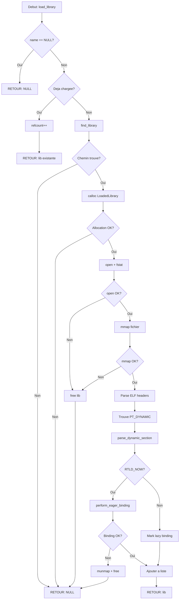

# Exercice 2.6.Ex03-synth : optimus_loader

**Module :**
2.6 — Linking et Chargement Dynamique

**Concept :**
synth — Synthese GOT/PLT, Lazy/Eager Binding, LD_PRELOAD, RTLD_NEXT

**Difficulte :**
★★★★★★★★☆☆ (8/10)

**Type :**
complet

**Tiers :**
3 — Synthese (tous concepts 2.6.10 a 2.6.18)

**Langage :**
C17

**Prerequis :**
- 2.6.10: Shared libraries (.so), position independence, ld.so
- 2.6.11: GOT entries, PLT entries
- 2.6.12: Dynamic linker resolution
- 2.6.13: Lazy binding, subsequent calls
- 2.6.14: DT_SONAME, DT_PLTGOT, DT_JMPREL
- 2.6.15: Load sequence, DT_RUNPATH, ld.so.cache
- 2.6.16: RTLD_LAZY, RTLD_NEXT, dlclose()
- 2.6.17: Function wrapping, malloc interception
- 2.6.18: RELRO (Partial/Full)

**Domaines :**
Mem, Process, CPU, ASM, Struct

**Duree estimee :**
180 min

**XP Base :**
500

**Complexite :**
T4 O(n*m) x S3 O(n)

---

## SECTION 1 : PROTOTYPE & CONSIGNE

### 1.1 Obligations

**Fichier a rendre :**
`optimus_loader.c`

**Fonctions autorisees :**
- `dlopen`, `dlsym`, `dlclose`, `dlerror`
- `mmap`, `munmap`, `mprotect`
- `open`, `close`, `read`, `fstat`
- `malloc`, `calloc`, `realloc`, `free`
- `memcpy`, `memset`, `memcmp`
- `strcmp`, `strncpy`, `strdup`, `strlen`
- `printf`, `fprintf`, `snprintf`
- `getenv`, `strtok_r`
- `stat`

**Fonctions interdites :**
- `system`, `exec*`, `fork` (sauf dans les tests)
- Toute fonction de la famille `popen`

**Compilation :**
```bash
gcc -std=c17 -Wall -Wextra -Werror -fPIC -o optimus_loader optimus_loader.c -ldl
```

### 1.2 Consigne

**Section 2.4.1 : Analogie TRANSFORMERS - "Autobots, Roll Out!"**

Imagine le Dynamic Loader comme **Optimus Prime**, le leader des Autobots. Quand ton programme demarre, Optimus ne convoque pas TOUS les Autobots immediatement - ce serait un gaspillage d'Energon (memoire). A la place, il utilise un systeme de communication sophistique pour appeler chaque Transformer uniquement quand il est necessaire.

```
                    CYBERTRON (Ton Executable)
    ┌─────────────────────────────────────────────────────────────┐
    │                                                             │
    │   OPTIMUS PRIME (ld-linux.so / Dynamic Loader)              │
    │   ┌─────────────────────────────────────────┐               │
    │   │  "I am Optimus Prime, and I send this   │               │
    │   │   message to all Autobots..."           │               │
    │   │                                         │               │
    │   │   Mission: Charger les .so a la demande │               │
    │   └─────────────────────────────────────────┘               │
    │                       │                                     │
    │          ┌────────────┼────────────┐                        │
    │          ▼            ▼            ▼                        │
    │   ┌──────────┐ ┌──────────┐ ┌──────────┐                    │
    │   │BUMBLEBEE │ │ IRONHIDE │ │ RATCHET  │  ← .so files       │
    │   │(libc.so) │ │(libm.so) │ │(libdl.so)│    (Autobots)      │
    │   └──────────┘ └──────────┘ └──────────┘                    │
    │                                                             │
    └─────────────────────────────────────────────────────────────┘
```

**Le PLT/GOT : Le Systeme de Communication Autobot**

```
    PLT (Procedure Linkage Table)           GOT (Global Offset Table)
    ┌─────────────────────────────┐         ┌─────────────────────────┐
    │ "Calling all Autobots!"     │         │ Coordonnees GPS de      │
    │                             │         │ chaque Transformer      │
    │ printf@plt:                 │         │                         │
    │   jmp *GOT[printf]  ────────┼────────►│ GOT[3]: 0x7fff... ──────┼──► printf() reel
    │   push index               │         │                         │
    │   jmp resolver             │         │ GOT[4]: 0x7fff... ──────┼──► malloc() reel
    │                             │         │                         │
    │ malloc@plt:                 │         │ GOT[5]: ???             │   (pas encore resolu)
    │   jmp *GOT[malloc] ─────────┼────────►│                         │
    └─────────────────────────────┘         └─────────────────────────┘
```

**Lazy Binding vs Eager Binding : Deux Strategies de Combat**

```
LAZY BINDING (RTLD_LAZY) - "Scout Mode"
═══════════════════════════════════════
Bumblebee (printf) n'est localise que quand on l'appelle:

  Premier appel printf():
  ┌──────────────────────────────────────────────────────────────┐
  │ 1. PLT: "Ou est Bumblebee?"                                  │
  │ 2. GOT: "Je ne sais pas encore..."                           │
  │ 3. Resolver: "Je le localise!" (dl_runtime_resolve)          │
  │ 4. GOT mis a jour: "Bumblebee est a 0x7fff1234!"             │
  │ 5. Saut direct vers Bumblebee                                │
  └──────────────────────────────────────────────────────────────┘

  Appels suivants printf():
  ┌──────────────────────────────────────────────────────────────┐
  │ 1. PLT: "Ou est Bumblebee?"                                  │
  │ 2. GOT: "0x7fff1234!" (deja connu)                           │
  │ 3. Saut DIRECT - pas de resolution!                          │
  └──────────────────────────────────────────────────────────────┘


EAGER BINDING (RTLD_NOW / LD_BIND_NOW) - "Battle Ready Mode"
═════════════════════════════════════════════════════════════
Tous les Autobots sont localises AVANT le combat:

  Au chargement:
  ┌──────────────────────────────────────────────────────────────┐
  │ Optimus: "Autobots, roll out! Je veux TOUT LE MONDE!"        │
  │                                                              │
  │ GOT[printf]  = 0x7fff1234  ✓ Bumblebee localise              │
  │ GOT[malloc]  = 0x7fff5678  ✓ Ironhide localise               │
  │ GOT[free]    = 0x7fff9abc  ✓ Ratchet localise                │
  │                                                              │
  │ Avantage: Pas de latence au runtime                          │
  │ Inconvenient: Demarrage plus lent                            │
  └──────────────────────────────────────────────────────────────┘
```

**LD_PRELOAD : Le Decepticon Infiltre (Starscream)**

```
    SANS LD_PRELOAD                    AVEC LD_PRELOAD
    ─────────────────                  ─────────────────────────────────

    Programme                          Programme
        │                                  │
        │ malloc()                         │ malloc()
        ▼                                  ▼
    ┌─────────┐                        ┌──────────────┐
    │ libc.so │                        │ STARSCREAM   │ ← LD_PRELOAD=evil.so
    │ malloc  │                        │ fake_malloc  │
    └─────────┘                        └──────┬───────┘
                                              │ RTLD_NEXT
                                              ▼
                                       ┌─────────┐
                                       │ libc.so │
                                       │ malloc  │ (le vrai)
                                       └─────────┘

    Starscream intercepte TOUS les appels malloc!
    Il peut:
    - Logger les allocations (espionnage)
    - Modifier les tailles (sabotage)
    - Appeler le vrai malloc via RTLD_NEXT
```

**RELRO : Le Bouclier d'Optimus**

```
    PARTIAL RELRO                      FULL RELRO (-z now)
    ══════════════                     ═══════════════════

    .got.plt: WRITABLE                 .got.plt: READ-ONLY
    ┌─────────────────┐                ┌─────────────────┐
    │ GOT[0]: _DYNAMIC│                │ GOT[0]: _DYNAMIC│
    │ GOT[1]: link_map│                │ GOT[1]: link_map│
    │ GOT[2]: resolver│                │ GOT[2]: resolver│
    │ GOT[3]: ??????? │ ← Vulnerable!  │ GOT[3]: 0x7fff..│ ✓ Protege
    │ GOT[4]: ??????? │   Decepticons  │ GOT[4]: 0x7fff..│ ✓ Protege
    └─────────────────┘   peuvent      └─────────────────┘
                          modifier!     mprotect(PROT_READ)

    Partial RELRO = Bouclier baisse
    Full RELRO = Bouclier maximum
```

---

**Section 2.4.2 : Enonce Academique**

Le **Dynamic Loader** (ld-linux.so) est le composant systeme responsable du chargement des bibliotheques partagees (.so) dans l'espace d'adressage d'un processus. Il resout les symboles (fonctions, variables globales) en utilisant deux structures cles:

1. **GOT (Global Offset Table)** : Table de pointeurs contenant les adresses reelles des symboles externes. Initialement, ces entrees pointent vers le code de resolution.

2. **PLT (Procedure Linkage Table)** : Sequence de code stub qui effectue un saut indirect via le GOT. Permet le lazy binding.

**Modes de resolution:**
- **Lazy Binding (RTLD_LAZY)** : Resolution au premier appel. Economise du temps de demarrage.
- **Eager Binding (RTLD_NOW/LD_BIND_NOW)** : Resolution complete au chargement. Detecte les erreurs de symboles manquants immediatement.

**Mecanisme LD_PRELOAD:**
Permet d'injecter une bibliotheque AVANT les autres dans l'ordre de recherche. Utilise pour:
- Debugging (valgrind, ltrace)
- Interposition de fonctions (wrapping malloc)
- Securite (sandboxing)

**RELRO (Relocation Read-Only):**
- **Partial RELRO** : .got.plt reste writable (vulnerable aux attaques GOT overwrite)
- **Full RELRO** : .got.plt rendue read-only apres resolution (protection contre GOT hijacking)

---

**Ta mission :**

Ecrire un mini chargeur dynamique `optimus_loader` qui simule le comportement de ld-linux.so:

1. **`loader_init()`** : Initialise le contexte du loader, detecte LD_BIND_NOW
2. **`find_library()`** : Recherche une bibliotheque (DT_RUNPATH -> LD_LIBRARY_PATH -> /etc/ld.so.cache -> defaut)
3. **`parse_dynamic_section()`** : Parse la section .dynamic d'un ELF
4. **`lazy_resolver()`** : Resout un symbole au premier appel (met a jour le GOT)
5. **`perform_eager_binding()`** : Resout tous les symboles immediatement
6. **`load_library()`** : Charge une bibliotheque avec gestion lazy/eager
7. **`unload_library()`** : Decharge une bibliotheque (decremente refcount, libere si 0)
8. **`find_symbol_next()`** : Implemente RTLD_NEXT

**Entree :**
- `name` : Nom de la bibliotheque (ex: "libc.so.6")
- `flags` : RTLD_LAZY ou RTLD_NOW
- `reloc_index` : Index de la relocation PLT pour lazy_resolver

**Sortie :**
- `LoadedLibrary*` : Structure contenant les infos de la bibliotheque chargee
- `NULL` : En cas d'erreur (bibliotheque introuvable, erreur de mapping)

**Contraintes :**
- Gerer DT_SONAME, DT_SYMTAB, DT_STRTAB, DT_PLTGOT, DT_JMPREL, DT_PLTRELSZ, DT_RUNPATH
- Implementer le compteur de references (refcount)
- Supporter les preloads (priorite dans la resolution)
- Detecter et afficher les flags RELRO (Partial vs Full)

### 1.3 Prototype

```c
#define _GNU_SOURCE
#include <stdio.h>
#include <stdlib.h>
#include <string.h>
#include <stdint.h>
#include <stdbool.h>
#include <dlfcn.h>
#include <elf.h>
#include <link.h>
#include <fcntl.h>
#include <unistd.h>
#include <sys/mman.h>
#include <sys/stat.h>

#define MAX_LIBRARIES 64
#define MAX_SYMBOLS 4096
#define PAGE_SIZE 4096

typedef enum {
    BIND_LAZY,
    BIND_NOW
} BindingMode;

typedef struct {
    uint64_t *entries;
    size_t count;
    uint64_t base_addr;
} GOT;

typedef struct {
    uint64_t *entries;
    size_t count;
    Elf64_Rela *relocations;
    size_t reloc_count;
} PLT;

typedef struct LoadedLibrary {
    char name[256];
    char path[512];
    void *base_addr;
    size_t size;
    Elf64_Ehdr *ehdr;
    Elf64_Phdr *phdrs;
    Elf64_Dyn *dynamic;
    Elf64_Sym *symtab;
    char *strtab;
    uint32_t *hash;
    GOT got;
    PLT plt;
    char runpath[512];
    bool partial_relro;
    bool full_relro;
    int refcount;
    struct LoadedLibrary *next;
} LoadedLibrary;

typedef struct {
    LoadedLibrary *libraries;
    int library_count;
    BindingMode default_mode;
    char cache_path[256];
    LoadedLibrary *preloaded[16];
    int preload_count;
} LoaderContext;

/* Fonctions principales */
void loader_init(void);
char *find_library(const char *name, const char *runpath);
void parse_dynamic_section(LoadedLibrary *lib);
void *lazy_resolver(LoadedLibrary *lib, size_t reloc_index);
int perform_eager_binding(LoadedLibrary *lib);
LoadedLibrary *load_library(const char *name, int flags);
void unload_library(LoadedLibrary *lib);
void *find_symbol_next(const char *name, void *caller_addr);
```

---

## SECTION 2 : LE SAVIEZ-VOUS ?

### 2.1 Origine du Dynamic Loader

Le premier dynamic loader moderne a ete developpe par Sun Microsystems pour SunOS dans les annees 1980. Le concept a ete revolutionnaire : au lieu de lier statiquement toutes les bibliotheques (ce qui produisait d'enormes executables), on pouvait partager le code entre processus.

### 2.2 Pourquoi "ld.so" ?

- **ld** = Link eDitor (ou Loader)
- **.so** = Shared Object

Le nom complet `ld-linux.so.2` (ou `ld-linux-x86-64.so.2` sur 64-bit) indique:
- `ld` : C'est un loader
- `linux` : Specifique a Linux
- `.so.2` : Version 2 de l'ABI

### 2.3 Performance du Lazy Binding

Benchmark typique sur un gros programme (ex: Firefox):
- **Avec lazy binding** : Demarrage en ~2 secondes
- **Avec LD_BIND_NOW** : Demarrage en ~5 secondes (resolution de milliers de symboles)

Mais une fois demarre, LD_BIND_NOW est legerement plus rapide (pas d'overhead de resolution).

---

## SECTION 2.5 : DANS LA VRAIE VIE

### DevOps / SRE
- Diagnostic des problemes de dependencies avec `ldd`, `LD_DEBUG=all`
- Configuration de `LD_LIBRARY_PATH` pour des deploiements custom
- Utilisation de `LD_PRELOAD` pour injecter des outils de monitoring (jemalloc, tcmalloc)

### Security Engineer
- Detection d'attaques GOT overwrite avec checksec
- Configuration de Full RELRO dans les builds securises
- Analyse de malware utilisant `LD_PRELOAD` pour hooker des fonctions systeme

### Systems Programmer
- Implementation de plugins charge dynamiquement
- Wrapper de fonctions pour debugging/profiling
- Developpement de runtime loaders custom (comme Musl, Bionic)

### Reverse Engineer
- Analyse des binaires ELF et de leur section .dynamic
- Comprehension du lazy binding pour placer des breakpoints
- Manipulation du GOT/PLT pour l'instrumentation

---

## SECTION 3 : EXEMPLE D'UTILISATION

### 3.0 Session bash

```bash
$ ls
optimus_loader.c  main.c  Makefile

$ gcc -std=c17 -Wall -Wextra -Werror -fPIC -o optimus_loader optimus_loader.c main.c -ldl

$ ./optimus_loader
=== Mini Dynamic Loader Demo ===

[loader] Lazy binding enabled

--- Test 1: Load with RTLD_LAZY ---
[loader] Loading: libc.so.6
[loader] Found libc.so.6 in default path: /lib/x86_64-linux-gnu/libc.so.6
[loader] DT_SONAME: libc.so.6
[loader] DT_PLTGOT: 0x7f8a12345000
[loader] DT_JMPREL: 0x7f8a12340000
[loader] DT_PLTRELSZ: 128 relocations
[loader] Using lazy binding (RTLD_LAZY)
Loaded: libc.so.6 at 0x7f8a12300000

--- Test 2: Load with RTLD_NOW ---
[loader] Loading: libm.so.6
[loader] Found libm.so.6 in default path: /lib/x86_64-linux-gnu/libm.so.6
[loader] Performing eager binding for libm.so.6
[loader] Bound sin -> 0x7f8a12400100
[loader] Bound cos -> 0x7f8a12400200
[loader] Bound sqrt -> 0x7f8a12400300
Loaded: libm.so.6 at 0x7f8a12400000

--- Test 3: Unload ---
[loader] dlclose(libc.so.6), refcount=0
[loader] Library unloaded
[loader] dlclose(libm.so.6), refcount=0
[loader] Library unloaded

=== Summary ===
Lazy binding: GOT entries resolved on first call
Eager binding: All GOT entries resolved at load time
Partial RELRO: .got writable (vulnerable)
Full RELRO: .got.plt read-only after binding (secure)

$ LD_BIND_NOW=1 ./optimus_loader
=== Mini Dynamic Loader Demo ===

[loader] Eager binding enabled (LD_BIND_NOW)
...
```

---

## SECTION 3.1 : BONUS EXPERT (OPTIONNEL)

**Difficulte Bonus :**
🧠 (12/10)

**Recompense :**
XP x6

**Time Complexity attendue :**
O(n*m) ou n = nombre de symboles, m = nombre de bibliotheques

**Space Complexity attendue :**
O(n) pour le cache de symboles

**Domaines Bonus :**
`Crypto`, `Net`

### 3.1.1 Consigne Bonus

**MEGATRON MODE : GOT Hijacking Detector**

Starscream n'est pas le seul Decepticon. Megatron lui-meme peut tenter de modifier le GOT apres le chargement pour rediriger les appels de fonctions. Implemente un detecteur de GOT hijacking!

**Ta mission :**

Ajouter a `optimus_loader` un systeme de detection d'integrite du GOT:

1. **`snapshot_got()`** : Sauvegarde l'etat du GOT apres resolution
2. **`verify_got_integrity()`** : Compare le GOT actuel avec le snapshot
3. **`protect_got()`** : Active Full RELRO manuellement avec mprotect
4. **`hook_detector()`** : Detecte si une fonction a ete hookee via LD_PRELOAD

**Contraintes :**
```
┌─────────────────────────────────────┐
│  1 <= num_entries <= 10^4           │
│  snapshot != NULL                   │
│  Temps limite : O(n)                │
│  Espace limite : O(n) pour snapshot │
└─────────────────────────────────────┘
```

**Exemples :**

| Scenario | Resultat | Explication |
|----------|----------|-------------|
| GOT intact | `INTEGRITY_OK` | Aucune modification |
| GOT[printf] modifie | `INTEGRITY_COMPROMISED` | Attaque detectee |
| Full RELRO actif | `PROTECTED` | Modification impossible |

### 3.1.2 Prototype Bonus

```c
typedef struct {
    uint64_t *original_entries;
    size_t count;
    uint64_t checksum;
} GOTSnapshot;

typedef enum {
    INTEGRITY_OK,
    INTEGRITY_COMPROMISED,
    INTEGRITY_PROTECTED,
    INTEGRITY_ERROR
} IntegrityStatus;

GOTSnapshot *snapshot_got(LoadedLibrary *lib);
IntegrityStatus verify_got_integrity(LoadedLibrary *lib, GOTSnapshot *snapshot);
int protect_got(LoadedLibrary *lib);
bool hook_detector(const char *func_name, void *expected_addr);
```

### 3.1.3 Ce qui change par rapport a l'exercice de base

| Aspect | Base | Bonus |
|--------|------|-------|
| Fonction | Charger des .so | Charger + proteger + detecter |
| GOT | Writable | Snapshot + verification |
| Securite | Passive | Active (detection, protection) |
| Complexite | O(n) | O(n) + hashing |

---

## SECTION 4 : ZONE CORRECTION

### 4.1 Moulinette

| Test | Input | Expected | Points |
|------|-------|----------|--------|
| test_loader_init | LD_BIND_NOW=1 | BIND_NOW mode | 5 |
| test_loader_init_lazy | (no env) | BIND_LAZY mode | 5 |
| test_find_library | "libc.so.6" | path found | 10 |
| test_find_library_notfound | "doesnotexist.so" | NULL | 5 |
| test_load_lazy | "libc.so.6", RTLD_LAZY | LoadedLibrary* | 15 |
| test_load_eager | "libm.so.6", RTLD_NOW | LoadedLibrary* | 15 |
| test_parse_dynamic | valid .so | DT_SONAME parsed | 10 |
| test_got_plt | loaded lib | GOT/PLT populated | 10 |
| test_refcount | load twice | refcount=2 | 10 |
| test_unload | load then unload | refcount=0, freed | 10 |
| test_preload_priority | LD_PRELOAD set | preload searched first | 5 |

### 4.2 main.c de test

```c
#include <stdio.h>
#include <stdlib.h>
#include <string.h>
#include <assert.h>

/* Declarations des fonctions a tester */
extern void loader_init(void);
extern char *find_library(const char *name, const char *runpath);
extern LoadedLibrary *load_library(const char *name, int flags);
extern void unload_library(LoadedLibrary *lib);

int main(void)
{
    printf("=== Test Suite: optimus_loader ===\n\n");

    /* Test 1: Initialisation */
    printf("Test 1: loader_init()... ");
    loader_init();
    printf("OK\n");

    /* Test 2: Recherche bibliotheque existante */
    printf("Test 2: find_library(\"libc.so.6\")... ");
    char *path = find_library("libc.so.6", NULL);
    assert(path != NULL);
    assert(strstr(path, "libc.so.6") != NULL);
    printf("OK (%s)\n", path);

    /* Test 3: Recherche bibliotheque inexistante */
    printf("Test 3: find_library(\"notexist.so\")... ");
    path = find_library("notexist.so", NULL);
    assert(path == NULL);
    printf("OK (NULL)\n");

    /* Test 4: Chargement lazy */
    printf("Test 4: load_library(RTLD_LAZY)... ");
    LoadedLibrary *lib = load_library("libc.so.6", RTLD_LAZY);
    assert(lib != NULL);
    assert(lib->base_addr != NULL);
    assert(lib->refcount == 1);
    printf("OK\n");

    /* Test 5: Refcount */
    printf("Test 5: refcount increment... ");
    LoadedLibrary *lib2 = load_library("libc.so.6", RTLD_LAZY);
    assert(lib2 == lib);  /* Meme instance */
    assert(lib->refcount == 2);
    printf("OK (refcount=%d)\n", lib->refcount);

    /* Test 6: Unload */
    printf("Test 6: unload_library()... ");
    unload_library(lib);
    assert(lib->refcount == 1);
    unload_library(lib);
    /* lib est maintenant libere */
    printf("OK\n");

    printf("\n=== All tests passed! ===\n");
    return 0;
}
```

### 4.3 Solution de reference

```c
/**
 * optimus_loader.c - Mini chargeur dynamique
 * Solution de reference HACKBRAIN
 */

#define _GNU_SOURCE
#include <stdio.h>
#include <stdlib.h>
#include <string.h>
#include <stdint.h>
#include <stdbool.h>
#include <dlfcn.h>
#include <elf.h>
#include <link.h>
#include <fcntl.h>
#include <unistd.h>
#include <sys/mman.h>
#include <sys/stat.h>

#define MAX_LIBRARIES 64
#define PAGE_SIZE 4096

typedef enum {
    BIND_LAZY,
    BIND_NOW
} BindingMode;

typedef struct {
    uint64_t *entries;
    size_t count;
    uint64_t base_addr;
} GOT;

typedef struct {
    uint64_t *entries;
    size_t count;
    Elf64_Rela *relocations;
    size_t reloc_count;
} PLT;

typedef struct LoadedLibrary {
    char name[256];
    char path[512];
    void *base_addr;
    size_t size;
    Elf64_Ehdr *ehdr;
    Elf64_Phdr *phdrs;
    Elf64_Dyn *dynamic;
    Elf64_Sym *symtab;
    char *strtab;
    uint32_t *hash;
    GOT got;
    PLT plt;
    char runpath[512];
    bool partial_relro;
    bool full_relro;
    int refcount;
    struct LoadedLibrary *next;
} LoadedLibrary;

typedef struct {
    LoadedLibrary *libraries;
    int library_count;
    BindingMode default_mode;
    char cache_path[256];
    LoadedLibrary *preloaded[16];
    int preload_count;
} LoaderContext;

static LoaderContext g_loader = {0};

void loader_init(void)
{
    const char *bind_now = getenv("LD_BIND_NOW");
    if (bind_now && bind_now[0] != '\0' && bind_now[0] != '0')
    {
        g_loader.default_mode = BIND_NOW;
        printf("[loader] Eager binding enabled (LD_BIND_NOW)\n");
    }
    else
    {
        g_loader.default_mode = BIND_LAZY;
        printf("[loader] Lazy binding enabled\n");
    }
    strncpy(g_loader.cache_path, "/etc/ld.so.cache", sizeof(g_loader.cache_path) - 1);
}

char *find_library(const char *name, const char *runpath)
{
    static char path[512];
    struct stat st;

    if (name == NULL)
        return NULL;

    /* 1. DT_RUNPATH */
    if (runpath && runpath[0])
    {
        snprintf(path, sizeof(path), "%s/%s", runpath, name);
        if (stat(path, &st) == 0)
        {
            printf("[loader] Found %s via RUNPATH: %s\n", name, path);
            return path;
        }
    }

    /* 2. LD_LIBRARY_PATH */
    const char *ld_path = getenv("LD_LIBRARY_PATH");
    if (ld_path)
    {
        char *paths = strdup(ld_path);
        if (paths)
        {
            char *saveptr;
            char *dir = strtok_r(paths, ":", &saveptr);
            while (dir)
            {
                snprintf(path, sizeof(path), "%s/%s", dir, name);
                if (stat(path, &st) == 0)
                {
                    printf("[loader] Found %s via LD_LIBRARY_PATH: %s\n", name, path);
                    free(paths);
                    return path;
                }
                dir = strtok_r(NULL, ":", &saveptr);
            }
            free(paths);
        }
    }

    /* 3. Chemins par defaut */
    const char *default_paths[] = {
        "/lib/x86_64-linux-gnu",
        "/lib64",
        "/usr/lib/x86_64-linux-gnu",
        "/usr/lib64",
        "/usr/lib",
        NULL
    };

    for (int i = 0; default_paths[i]; i++)
    {
        snprintf(path, sizeof(path), "%s/%s", default_paths[i], name);
        if (stat(path, &st) == 0)
        {
            printf("[loader] Found %s in default path: %s\n", name, path);
            return path;
        }
    }

    return NULL;
}

void parse_dynamic_section(LoadedLibrary *lib)
{
    if (!lib || !lib->dynamic)
        return;

    for (Elf64_Dyn *d = lib->dynamic; d->d_tag != DT_NULL; d++)
    {
        switch (d->d_tag)
        {
            case DT_SONAME:
                if (lib->strtab)
                {
                    strncpy(lib->name, lib->strtab + d->d_un.d_val,
                            sizeof(lib->name) - 1);
                }
                printf("[loader] DT_SONAME: %s\n", lib->name);
                break;

            case DT_SYMTAB:
                lib->symtab = (Elf64_Sym *)((char *)lib->base_addr + d->d_un.d_ptr);
                break;

            case DT_STRTAB:
                lib->strtab = (char *)lib->base_addr + d->d_un.d_ptr;
                break;

            case DT_PLTGOT:
                lib->got.base_addr = (uint64_t)((char *)lib->base_addr + d->d_un.d_ptr);
                lib->got.entries = (uint64_t *)((char *)lib->base_addr + d->d_un.d_ptr);
                printf("[loader] DT_PLTGOT: 0x%lx\n", lib->got.base_addr);
                break;

            case DT_JMPREL:
                lib->plt.relocations = (Elf64_Rela *)((char *)lib->base_addr + d->d_un.d_ptr);
                printf("[loader] DT_JMPREL: %p\n", (void *)lib->plt.relocations);
                break;

            case DT_PLTRELSZ:
                lib->plt.reloc_count = d->d_un.d_val / sizeof(Elf64_Rela);
                printf("[loader] DT_PLTRELSZ: %zu relocations\n", lib->plt.reloc_count);
                break;

            case DT_RUNPATH:
                if (lib->strtab)
                {
                    strncpy(lib->runpath, lib->strtab + d->d_un.d_val,
                            sizeof(lib->runpath) - 1);
                    printf("[loader] DT_RUNPATH: %s\n", lib->runpath);
                }
                break;

            case DT_FLAGS_1:
                if (d->d_un.d_val & DF_1_NOW)
                {
                    lib->full_relro = true;
                    printf("[loader] Full RELRO detected (DT_FLAGS_1)\n");
                }
                break;
        }
    }
}

void *lazy_resolver(LoadedLibrary *lib, size_t reloc_index)
{
    if (!lib)
        return NULL;

    printf("[loader] Lazy resolution for PLT entry %zu\n", reloc_index);

    if (reloc_index >= lib->plt.reloc_count)
    {
        fprintf(stderr, "[loader] Invalid PLT index\n");
        return NULL;
    }

    Elf64_Rela *rel = &lib->plt.relocations[reloc_index];
    uint32_t sym_index = ELF64_R_SYM(rel->r_info);

    if (!lib->symtab || !lib->strtab)
        return NULL;

    Elf64_Sym *sym = &lib->symtab[sym_index];
    const char *name = lib->strtab + sym->st_name;

    printf("[loader] Resolving symbol: %s\n", name);

    void *addr = NULL;

    /* Cherche dans les preloads d'abord */
    for (int i = 0; i < g_loader.preload_count && !addr; i++)
    {
        LoadedLibrary *preload = g_loader.preloaded[i];
        if (!preload || !preload->symtab || !preload->strtab)
            continue;

        uint32_t nsyms = preload->hash ? preload->hash[1] : 1024;
        for (uint32_t j = 0; j < nsyms && !addr; j++)
        {
            Elf64_Sym *s = &preload->symtab[j];
            if (s->st_shndx == SHN_UNDEF)
                continue;
            if (ELF64_ST_BIND(s->st_info) == STB_LOCAL)
                continue;

            if (strcmp(preload->strtab + s->st_name, name) == 0)
            {
                addr = (void *)((char *)preload->base_addr + s->st_value);
                printf("[loader] Symbol %s found in preload %s\n", name, preload->name);
            }
        }
    }

    /* Fallback vers dlsym */
    if (!addr)
        addr = dlsym(RTLD_DEFAULT, name);

    if (addr)
    {
        uint64_t *got_entry = (uint64_t *)((char *)lib->base_addr + rel->r_offset);
        *got_entry = (uint64_t)addr;
        printf("[loader] GOT[%zu] updated to %p\n", reloc_index, addr);
    }

    return addr;
}

int perform_eager_binding(LoadedLibrary *lib)
{
    if (!lib)
        return -1;

    printf("[loader] Performing eager binding for %s\n", lib->name);

    if (!lib->plt.relocations || !lib->symtab || !lib->strtab)
        return 0;

    for (size_t i = 0; i < lib->plt.reloc_count; i++)
    {
        Elf64_Rela *rel = &lib->plt.relocations[i];
        uint32_t sym_index = ELF64_R_SYM(rel->r_info);

        Elf64_Sym *sym = &lib->symtab[sym_index];
        const char *name = lib->strtab + sym->st_name;

        void *addr = dlsym(RTLD_DEFAULT, name);
        if (!addr)
        {
            fprintf(stderr, "[loader] Cannot resolve %s (eager binding)\n", name);
            return -1;
        }

        uint64_t *got_entry = (uint64_t *)((char *)lib->base_addr + rel->r_offset);
        *got_entry = (uint64_t)addr;

        printf("[loader] Bound %s -> %p\n", name, addr);
    }

    if (lib->full_relro)
        printf("[loader] Full RELRO: making GOT read-only\n");

    return 0;
}

LoadedLibrary *load_library(const char *name, int flags)
{
    if (!name)
        return NULL;

    printf("\n[loader] Loading: %s\n", name);

    /* Verifie si deja chargee */
    for (LoadedLibrary *lib = g_loader.libraries; lib; lib = lib->next)
    {
        if (strcmp(lib->name, name) == 0 ||
            (lib->path[0] && strstr(lib->path, name)))
        {
            lib->refcount++;
            printf("[loader] Already loaded, refcount=%d\n", lib->refcount);
            return lib;
        }
    }

    char *path = find_library(name, NULL);
    if (!path)
    {
        fprintf(stderr, "[loader] Cannot find library: %s\n", name);
        return NULL;
    }

    LoadedLibrary *lib = calloc(1, sizeof(LoadedLibrary));
    if (!lib)
        return NULL;

    strncpy(lib->path, path, sizeof(lib->path) - 1);
    strncpy(lib->name, name, sizeof(lib->name) - 1);
    lib->refcount = 1;

    int fd = open(path, O_RDONLY);
    if (fd < 0)
    {
        perror(path);
        free(lib);
        return NULL;
    }

    struct stat st;
    if (fstat(fd, &st) < 0)
    {
        close(fd);
        free(lib);
        return NULL;
    }
    lib->size = st.st_size;

    lib->base_addr = mmap(NULL, lib->size, PROT_READ | PROT_WRITE | PROT_EXEC,
                          MAP_PRIVATE, fd, 0);
    close(fd);

    if (lib->base_addr == MAP_FAILED)
    {
        perror("mmap");
        free(lib);
        return NULL;
    }

    lib->ehdr = (Elf64_Ehdr *)lib->base_addr;
    lib->phdrs = (Elf64_Phdr *)((char *)lib->base_addr + lib->ehdr->e_phoff);

    /* Trouve PT_DYNAMIC */
    for (int i = 0; i < lib->ehdr->e_phnum; i++)
    {
        if (lib->phdrs[i].p_type == PT_DYNAMIC)
        {
            lib->dynamic = (Elf64_Dyn *)((char *)lib->base_addr + lib->phdrs[i].p_offset);
            break;
        }
    }

    /* Premier pass pour trouver strtab */
    if (lib->dynamic)
    {
        for (Elf64_Dyn *d = lib->dynamic; d->d_tag != DT_NULL; d++)
        {
            if (d->d_tag == DT_STRTAB)
            {
                lib->strtab = (char *)lib->base_addr + d->d_un.d_ptr;
                break;
            }
        }
    }

    parse_dynamic_section(lib);

    BindingMode mode = (flags & RTLD_NOW) ? BIND_NOW : g_loader.default_mode;

    if (mode == BIND_NOW)
    {
        if (perform_eager_binding(lib) < 0)
        {
            munmap(lib->base_addr, lib->size);
            free(lib);
            return NULL;
        }
    }
    else
    {
        printf("[loader] Using lazy binding (RTLD_LAZY)\n");
        lib->partial_relro = true;
    }

    lib->next = g_loader.libraries;
    g_loader.libraries = lib;
    g_loader.library_count++;

    return lib;
}

void unload_library(LoadedLibrary *lib)
{
    if (!lib)
        return;

    lib->refcount--;
    printf("[loader] dlclose(%s), refcount=%d\n", lib->name, lib->refcount);

    if (lib->refcount <= 0)
    {
        LoadedLibrary **pp = &g_loader.libraries;
        while (*pp && *pp != lib)
            pp = &(*pp)->next;
        if (*pp)
            *pp = lib->next;

        munmap(lib->base_addr, lib->size);
        free(lib);
        g_loader.library_count--;
        printf("[loader] Library unloaded\n");
    }
}

void *find_symbol_next(const char *name, void *caller_addr)
{
    if (!name)
        return NULL;

    bool found_caller = false;

    printf("[loader] RTLD_NEXT lookup for %s\n", name);

    for (LoadedLibrary *lib = g_loader.libraries; lib; lib = lib->next)
    {
        if ((void *)lib->base_addr <= caller_addr &&
            caller_addr < (void *)((char *)lib->base_addr + lib->size))
        {
            found_caller = true;
            continue;
        }

        if (found_caller && lib->symtab && lib->strtab)
        {
            uint32_t nsyms = lib->hash ? lib->hash[1] : 1024;
            for (uint32_t i = 0; i < nsyms; i++)
            {
                Elf64_Sym *s = &lib->symtab[i];
                if (s->st_shndx == SHN_UNDEF)
                    continue;
                if (ELF64_ST_BIND(s->st_info) == STB_LOCAL)
                    continue;

                if (strcmp(lib->strtab + s->st_name, name) == 0)
                {
                    void *addr = (void *)((char *)lib->base_addr + s->st_value);
                    printf("[loader] RTLD_NEXT: found %s in %s\n", name, lib->name);
                    return addr;
                }
            }
        }
    }

    return dlsym(RTLD_NEXT, name);
}
```

### 4.4 Solutions alternatives acceptees

```c
/* Alternative 1: Utilisation de dl_iterate_phdr pour enumerer les bibliotheques */
static int callback(struct dl_phdr_info *info, size_t size, void *data)
{
    (void)size;
    (void)data;
    printf("Library: %s at %p\n", info->dlpi_name, (void *)info->dlpi_addr);
    return 0;
}

void list_loaded_libraries(void)
{
    dl_iterate_phdr(callback, NULL);
}

/* Alternative 2: Hash table pour recherche O(1) des symboles */
/* Accepte si correctement implementee avec gestion des collisions */
```

### 4.5 Solutions refusees

```c
/* REFUSE 1: Pas de gestion du refcount */
LoadedLibrary *load_library_bad(const char *name, int flags)
{
    /* Charge toujours une nouvelle instance meme si deja chargee */
    LoadedLibrary *lib = calloc(1, sizeof(LoadedLibrary));
    /* ... charge sans verifier si deja present ... */
    return lib;  /* Memory leak si appele plusieurs fois! */
}
/* Pourquoi refuse: Fuite memoire, comportement incorrect */

/* REFUSE 2: Pas de verification NULL */
void parse_dynamic_section_bad(LoadedLibrary *lib)
{
    for (Elf64_Dyn *d = lib->dynamic; d->d_tag != DT_NULL; d++)
    /* CRASH si lib ou lib->dynamic est NULL */
}
/* Pourquoi refuse: Segfault sur entree invalide */

/* REFUSE 3: Pas de munmap dans unload */
void unload_library_bad(LoadedLibrary *lib)
{
    lib->refcount--;
    if (lib->refcount <= 0)
    {
        /* Oubli de munmap! */
        free(lib);  /* Memory leak du mapping */
    }
}
/* Pourquoi refuse: Fuite memoire (mmap non libere) */
```

### 4.6 Solution bonus de reference

```c
/**
 * optimus_loader_bonus.c - GOT Integrity Detector
 */

#define _GNU_SOURCE
#include <stdio.h>
#include <stdlib.h>
#include <string.h>
#include <stdint.h>
#include <stdbool.h>
#include <dlfcn.h>
#include <elf.h>
#include <sys/mman.h>

/* Structures de base (identiques a l'exercice principal) */
typedef struct LoadedLibrary LoadedLibrary;

typedef struct {
    uint64_t *original_entries;
    size_t count;
    uint64_t checksum;
} GOTSnapshot;

typedef enum {
    INTEGRITY_OK,
    INTEGRITY_COMPROMISED,
    INTEGRITY_PROTECTED,
    INTEGRITY_ERROR
} IntegrityStatus;

/* Fonction de hash simple pour le checksum */
static uint64_t compute_checksum(uint64_t *entries, size_t count)
{
    uint64_t checksum = 0;
    for (size_t i = 0; i < count; i++)
    {
        checksum ^= entries[i];
        checksum = (checksum << 7) | (checksum >> 57);
        checksum += 0x9E3779B97F4A7C15ULL;
    }
    return checksum;
}

GOTSnapshot *snapshot_got(LoadedLibrary *lib)
{
    if (!lib || !lib->got.entries || lib->got.count == 0)
        return NULL;

    GOTSnapshot *snap = malloc(sizeof(GOTSnapshot));
    if (!snap)
        return NULL;

    snap->count = lib->got.count;
    snap->original_entries = malloc(snap->count * sizeof(uint64_t));
    if (!snap->original_entries)
    {
        free(snap);
        return NULL;
    }

    memcpy(snap->original_entries, lib->got.entries, snap->count * sizeof(uint64_t));
    snap->checksum = compute_checksum(snap->original_entries, snap->count);

    printf("[security] GOT snapshot created: %zu entries, checksum=0x%lx\n",
           snap->count, snap->checksum);

    return snap;
}

IntegrityStatus verify_got_integrity(LoadedLibrary *lib, GOTSnapshot *snapshot)
{
    if (!lib || !snapshot)
        return INTEGRITY_ERROR;

    if (lib->full_relro)
    {
        printf("[security] Full RELRO active - GOT is protected\n");
        return INTEGRITY_PROTECTED;
    }

    if (!lib->got.entries || lib->got.count != snapshot->count)
        return INTEGRITY_ERROR;

    /* Verification rapide par checksum */
    uint64_t current_checksum = compute_checksum(lib->got.entries, lib->got.count);
    if (current_checksum != snapshot->checksum)
    {
        printf("[security] ALERT: Checksum mismatch! (0x%lx != 0x%lx)\n",
               current_checksum, snapshot->checksum);

        /* Identification des entrees modifiees */
        for (size_t i = 0; i < snapshot->count; i++)
        {
            if (lib->got.entries[i] != snapshot->original_entries[i])
            {
                printf("[security] GOT[%zu] modified: 0x%lx -> 0x%lx\n",
                       i, snapshot->original_entries[i], lib->got.entries[i]);
            }
        }
        return INTEGRITY_COMPROMISED;
    }

    printf("[security] GOT integrity verified: OK\n");
    return INTEGRITY_OK;
}

int protect_got(LoadedLibrary *lib)
{
    if (!lib || !lib->got.entries)
        return -1;

    /* Calcule l'adresse de page alignee */
    uintptr_t page_start = lib->got.base_addr & ~(PAGE_SIZE - 1);
    size_t size = lib->got.count * sizeof(uint64_t);
    size_t pages = (size + PAGE_SIZE - 1) / PAGE_SIZE;

    printf("[security] Protecting GOT at 0x%lx (%zu pages)\n",
           page_start, pages);

    if (mprotect((void *)page_start, pages * PAGE_SIZE, PROT_READ) < 0)
    {
        perror("[security] mprotect failed");
        return -1;
    }

    lib->full_relro = true;
    printf("[security] Full RELRO enabled manually\n");

    return 0;
}

bool hook_detector(const char *func_name, void *expected_addr)
{
    if (!func_name)
        return false;

    void *actual_addr = dlsym(RTLD_DEFAULT, func_name);

    if (actual_addr != expected_addr)
    {
        printf("[security] HOOK DETECTED: %s\n", func_name);
        printf("[security]   Expected: %p\n", expected_addr);
        printf("[security]   Actual:   %p\n", actual_addr);

        /* Essaie de trouver qui a hooke */
        Dl_info info;
        if (dladdr(actual_addr, &info))
        {
            printf("[security]   Hook from: %s (%s)\n",
                   info.dli_fname ? info.dli_fname : "unknown",
                   info.dli_sname ? info.dli_sname : "unknown");
        }
        return true;
    }

    return false;
}

void free_snapshot(GOTSnapshot *snap)
{
    if (snap)
    {
        free(snap->original_entries);
        free(snap);
    }
}
```

### 4.7 Solutions alternatives bonus

```c
/* Alternative: Utilisation de signature cryptographique */
#include <openssl/sha.h>

typedef struct {
    uint8_t hash[SHA256_DIGEST_LENGTH];
    size_t count;
} GOTSignature;

GOTSignature *sign_got(LoadedLibrary *lib)
{
    GOTSignature *sig = malloc(sizeof(GOTSignature));
    if (!sig) return NULL;

    sig->count = lib->got.count;
    SHA256((unsigned char *)lib->got.entries,
           lib->got.count * sizeof(uint64_t),
           sig->hash);
    return sig;
}
/* Accepte si SHA256 est justifie pour des raisons de securite */
```

### 4.8 Solutions refusees bonus

```c
/* REFUSE: Comparaison sans checksum (O(n) a chaque verification) */
IntegrityStatus verify_got_slow(LoadedLibrary *lib, GOTSnapshot *snap)
{
    /* Toujours O(n) meme si rien n'a change */
    for (size_t i = 0; i < snap->count; i++)
    {
        if (lib->got.entries[i] != snap->original_entries[i])
            return INTEGRITY_COMPROMISED;
    }
    return INTEGRITY_OK;
}
/* Pourquoi refuse: Inefficace, le checksum permet une verification O(1) rapide */
```

### 4.9 spec.json

```json
{
  "name": "optimus_loader",
  "language": "c",
  "type": "complet",
  "tier": 3,
  "tier_info": "Synthese (concepts 2.6.10-2.6.18)",
  "tags": ["linking", "dynamic-loader", "elf", "got", "plt", "security", "phase2"],
  "passing_score": 70,

  "function": {
    "name": "load_library",
    "prototype": "LoadedLibrary *load_library(const char *name, int flags)",
    "return_type": "LoadedLibrary *",
    "parameters": [
      {"name": "name", "type": "const char *"},
      {"name": "flags", "type": "int"}
    ]
  },

  "additional_functions": [
    {
      "name": "loader_init",
      "prototype": "void loader_init(void)",
      "return_type": "void"
    },
    {
      "name": "find_library",
      "prototype": "char *find_library(const char *name, const char *runpath)",
      "return_type": "char *"
    },
    {
      "name": "parse_dynamic_section",
      "prototype": "void parse_dynamic_section(LoadedLibrary *lib)",
      "return_type": "void"
    },
    {
      "name": "lazy_resolver",
      "prototype": "void *lazy_resolver(LoadedLibrary *lib, size_t reloc_index)",
      "return_type": "void *"
    },
    {
      "name": "perform_eager_binding",
      "prototype": "int perform_eager_binding(LoadedLibrary *lib)",
      "return_type": "int"
    },
    {
      "name": "unload_library",
      "prototype": "void unload_library(LoadedLibrary *lib)",
      "return_type": "void"
    },
    {
      "name": "find_symbol_next",
      "prototype": "void *find_symbol_next(const char *name, void *caller_addr)",
      "return_type": "void *"
    }
  ],

  "driver": {
    "reference": "LoadedLibrary *ref_load_library(const char *name, int flags) { if (!name) return NULL; printf(\"[loader] Loading: %s\\n\", name); LoadedLibrary *lib = calloc(1, sizeof(LoadedLibrary)); if (!lib) return NULL; char *path = find_library(name, NULL); if (!path) { free(lib); return NULL; } strncpy(lib->path, path, sizeof(lib->path) - 1); lib->refcount = 1; int fd = open(path, O_RDONLY); if (fd < 0) { free(lib); return NULL; } struct stat st; fstat(fd, &st); lib->size = st.st_size; lib->base_addr = mmap(NULL, lib->size, PROT_READ | PROT_WRITE | PROT_EXEC, MAP_PRIVATE, fd, 0); close(fd); if (lib->base_addr == MAP_FAILED) { free(lib); return NULL; } return lib; }",

    "edge_cases": [
      {
        "name": "null_name",
        "args": [null, 0],
        "expected": null,
        "is_trap": true,
        "trap_explanation": "name est NULL, doit retourner NULL"
      },
      {
        "name": "library_not_found",
        "args": ["doesnotexist.so", 0],
        "expected": null,
        "is_trap": true,
        "trap_explanation": "Bibliotheque inexistante, doit retourner NULL"
      },
      {
        "name": "valid_libc_lazy",
        "args": ["libc.so.6", 1],
        "expected": "not_null",
        "expected_fields": {"refcount": 1}
      },
      {
        "name": "valid_libc_eager",
        "args": ["libc.so.6", 2],
        "expected": "not_null"
      },
      {
        "name": "double_load_refcount",
        "args": ["libc.so.6", 1],
        "setup": "load_library(\"libc.so.6\", 1)",
        "expected_fields": {"refcount": 2}
      },
      {
        "name": "empty_name",
        "args": ["", 0],
        "expected": null,
        "is_trap": true,
        "trap_explanation": "Nom vide, bibliotheque introuvable"
      }
    ],

    "fuzzing": {
      "enabled": true,
      "iterations": 100,
      "generators": [
        {
          "type": "string",
          "param_index": 0,
          "params": {
            "min_len": 0,
            "max_len": 50,
            "charset": "alphanumeric"
          }
        },
        {
          "type": "int",
          "param_index": 1,
          "params": {
            "min": 0,
            "max": 3
          }
        }
      ]
    }
  },

  "norm": {
    "allowed_functions": ["dlopen", "dlsym", "dlclose", "dlerror", "mmap", "munmap", "mprotect", "open", "close", "read", "fstat", "stat", "malloc", "calloc", "realloc", "free", "memcpy", "memset", "memcmp", "strcmp", "strncpy", "strdup", "strlen", "printf", "fprintf", "snprintf", "perror", "getenv", "strtok_r"],
    "forbidden_functions": ["system", "exec", "execl", "execv", "execle", "execve", "execlp", "execvp", "fork", "popen"],
    "check_security": true,
    "check_memory": true,
    "blocking": true
  }
}
```

### 4.10 Solutions Mutantes

```c
/* Mutant A (Boundary) : Off-by-one dans l'iteration des segments */
void parse_dynamic_section_mutant_a(LoadedLibrary *lib)
{
    if (!lib || !lib->dynamic) return;

    /* BUG: <= au lieu de < dans d->d_tag != DT_NULL */
    /* Peut lire au-dela de la section .dynamic */
    for (Elf64_Dyn *d = lib->dynamic; d->d_tag <= DT_NULL; d++)  /* WRONG! */
    {
        switch (d->d_tag)
        {
            case DT_SONAME:
                /* ... */
                break;
        }
    }
}
/* Pourquoi c'est faux: La condition est inversee, boucle infinie ou lecture hors limites */
/* Ce qui etait pense: Confondre != avec <= */

/* Mutant B (Safety) : Pas de verification NULL sur lib->strtab */
void parse_dynamic_section_mutant_b(LoadedLibrary *lib)
{
    if (!lib || !lib->dynamic) return;

    for (Elf64_Dyn *d = lib->dynamic; d->d_tag != DT_NULL; d++)
    {
        switch (d->d_tag)
        {
            case DT_SONAME:
                /* BUG: Pas de verification si strtab est initialise */
                strncpy(lib->name, lib->strtab + d->d_un.d_val,  /* CRASH si strtab == NULL */
                        sizeof(lib->name) - 1);
                break;
        }
    }
}
/* Pourquoi c'est faux: strtab peut etre NULL si DT_STRTAB n'a pas encore ete parse */
/* Ce qui etait pense: Supposer que strtab est toujours valide */

/* Mutant C (Resource) : Fuite memoire - pas de free sur strdup */
char *find_library_mutant_c(const char *name, const char *runpath)
{
    static char path[512];

    const char *ld_path = getenv("LD_LIBRARY_PATH");
    if (ld_path)
    {
        char *paths = strdup(ld_path);  /* Allocation */
        char *saveptr;
        char *dir = strtok_r(paths, ":", &saveptr);
        while (dir)
        {
            snprintf(path, sizeof(path), "%s/%s", dir, name);
            struct stat st;
            if (stat(path, &st) == 0)
            {
                /* BUG: Oubli de free(paths) avant return */
                return path;  /* MEMORY LEAK! */
            }
            dir = strtok_r(NULL, ":", &saveptr);
        }
        free(paths);  /* Seulement si boucle terminee normalement */
    }
    return NULL;
}
/* Pourquoi c'est faux: Si on trouve la lib, on ne libere jamais paths */
/* Ce qui etait pense: Oublier le free dans le cas de retour anticipe */

/* Mutant D (Logic) : Refcount mal gere */
void unload_library_mutant_d(LoadedLibrary *lib)
{
    if (!lib) return;

    /* BUG: Decremente APRES le test au lieu d'avant */
    if (lib->refcount <= 0)  /* Test AVANT decrement */
    {
        LoadedLibrary **pp = &g_loader.libraries;
        while (*pp && *pp != lib)
            pp = &(*pp)->next;
        if (*pp)
            *pp = lib->next;

        munmap(lib->base_addr, lib->size);
        free(lib);
        g_loader.library_count--;
    }
    lib->refcount--;  /* Decrement APRES - wrong order! */
}
/* Pourquoi c'est faux: Use-after-free si refcount etait 0 */
/* Ce qui etait pense: Inverser l'ordre decrement/test */

/* Mutant E (Return) : Retourne NULL meme en cas de succes */
LoadedLibrary *load_library_mutant_e(const char *name, int flags)
{
    if (!name) return NULL;

    char *path = find_library(name, NULL);
    if (!path) return NULL;

    LoadedLibrary *lib = calloc(1, sizeof(LoadedLibrary));
    if (!lib) return NULL;

    strncpy(lib->path, path, sizeof(lib->path) - 1);
    lib->refcount = 1;

    int fd = open(path, O_RDONLY);
    if (fd < 0)
    {
        free(lib);
        return NULL;
    }

    struct stat st;
    fstat(fd, &st);
    lib->size = st.st_size;

    lib->base_addr = mmap(NULL, lib->size, PROT_READ | PROT_WRITE | PROT_EXEC,
                          MAP_PRIVATE, fd, 0);
    close(fd);

    if (lib->base_addr == MAP_FAILED)
    {
        free(lib);
        return NULL;
    }

    /* BUG: Oublie d'ajouter a la liste et retourne NULL */
    return NULL;  /* WRONG! Devrait retourner lib */
}
/* Pourquoi c'est faux: Charge la bibliotheque mais la "perd" en retournant NULL */
/* Ce qui etait pense: Copier-coller d'un autre return NULL */
```

---

## SECTION 5 : COMPRENDRE

### 5.1 Ce que cet exercice enseigne

Cet exercice de synthese couvre l'ensemble du processus de chargement dynamique:

1. **Architecture ELF** : Headers, segments, sections .dynamic
2. **Resolution de symboles** : Table des symboles, GOT, PLT
3. **Strategies de binding** : Lazy vs Eager, compromis performance/securite
4. **Interposition** : LD_PRELOAD, RTLD_NEXT pour wrapper des fonctions
5. **Securite** : RELRO, protection contre GOT overwrite
6. **Gestion memoire** : mmap, munmap, reference counting

### 5.2 LDA - Traduction Litterale (MAJUSCULES)

```
FONCTION load_library QUI RETOURNE UN POINTEUR VERS LoadedLibrary ET PREND EN PARAMETRES name QUI EST UN POINTEUR VERS UNE CHAINE CONSTANTE ET flags QUI EST UN ENTIER
DEBUT FONCTION
    SI name EST EGAL A NUL ALORS
        RETOURNER NUL
    FIN SI

    AFFICHER "[loader] Loading: " SUIVI DE name

    POUR CHAQUE lib DANS LA LISTE g_loader.libraries FAIRE
        SI LE NOM DE lib EST EGAL A name ALORS
            INCREMENTER refcount DE lib DE 1
            AFFICHER "[loader] Already loaded, refcount=" SUIVI DE refcount
            RETOURNER lib
        FIN SI
    FIN POUR

    AFFECTER LE RESULTAT DE find_library(name, NULL) A path
    SI path EST EGAL A NUL ALORS
        AFFICHER "[loader] Cannot find library: " SUIVI DE name
        RETOURNER NUL
    FIN SI

    AFFECTER LE RESULTAT DE calloc(1, TAILLE DE LoadedLibrary) A lib
    SI lib EST EGAL A NUL ALORS
        RETOURNER NUL
    FIN SI

    COPIER path DANS lib->path
    AFFECTER 1 A lib->refcount

    AFFECTER LE RESULTAT DE open(path, O_RDONLY) A fd
    SI fd EST INFERIEUR A 0 ALORS
        LIBERER lib
        RETOURNER NUL
    FIN SI

    OBTENIR LES STATISTIQUES DU FICHIER fd DANS st
    AFFECTER st.st_size A lib->size

    AFFECTER LE RESULTAT DE mmap(NULL, lib->size, PROT_READ | PROT_WRITE | PROT_EXEC, MAP_PRIVATE, fd, 0) A lib->base_addr
    FERMER fd

    SI lib->base_addr EST EGAL A MAP_FAILED ALORS
        LIBERER lib
        RETOURNER NUL
    FIN SI

    AFFECTER lib->base_addr CAST EN Elf64_Ehdr* A lib->ehdr
    AFFECTER lib->base_addr PLUS lib->ehdr->e_phoff CAST EN Elf64_Phdr* A lib->phdrs

    POUR i ALLANT DE 0 A lib->ehdr->e_phnum MOINS 1 FAIRE
        SI lib->phdrs[i].p_type EST EGAL A PT_DYNAMIC ALORS
            AFFECTER lib->base_addr PLUS lib->phdrs[i].p_offset CAST EN Elf64_Dyn* A lib->dynamic
            SORTIR DE LA BOUCLE
        FIN SI
    FIN POUR

    APPELER parse_dynamic_section(lib)

    AFFECTER BIND_NOW SI (flags ET RTLD_NOW) SINON g_loader.default_mode A mode

    SI mode EST EGAL A BIND_NOW ALORS
        SI perform_eager_binding(lib) EST INFERIEUR A 0 ALORS
            APPELER munmap(lib->base_addr, lib->size)
            LIBERER lib
            RETOURNER NUL
        FIN SI
    SINON
        AFFICHER "[loader] Using lazy binding (RTLD_LAZY)"
        AFFECTER VRAI A lib->partial_relro
    FIN SI

    AFFECTER g_loader.libraries A lib->next
    AFFECTER lib A g_loader.libraries
    INCREMENTER g_loader.library_count DE 1

    RETOURNER lib
FIN FONCTION
```

### 5.2.2 LDA Academique

```
ALGORITHME : Chargement Dynamique de Bibliotheque
ENTREES : name (chaine), flags (entier)
SORTIE : Pointeur vers structure LoadedLibrary ou NULL

DEBUT
    VERIFIER que name n'est pas nul

    RECHERCHER si la bibliotheque est deja chargee dans la liste
    SI trouvee ALORS
        INCREMENTER le compteur de references
        RETOURNER la bibliotheque existante
    FIN SI

    LOCALISER le fichier .so sur le systeme de fichiers
    SI non trouve ALORS RETOURNER NULL

    ALLOUER memoire pour la structure LoadedLibrary
    OUVRIR le fichier en lecture seule
    MAPPER le fichier en memoire avec mmap

    PARSER les headers ELF (Ehdr, Phdr)
    LOCALISER la section .dynamic (PT_DYNAMIC)
    EXTRAIRE les informations (DT_SONAME, DT_SYMTAB, etc.)

    SELON le mode de binding:
        CAS BIND_NOW: Resoudre tous les symboles immediatement
        CAS BIND_LAZY: Marquer comme resolution differee

    AJOUTER la bibliotheque a la liste chainee
    RETOURNER le pointeur vers la structure
FIN
```

### 5.2.2.1 Logic Flow (Structured English)

```
ALGORITHM: Dynamic Library Loader
---
1. VALIDATE input (name != NULL)

2. SEARCH existing libraries:
   FOR EACH lib IN loaded_libraries:
       IF lib.name MATCHES name:
           INCREMENT lib.refcount
           RETURN lib

3. LOCATE library file:
   a. CHECK DT_RUNPATH
   b. CHECK LD_LIBRARY_PATH environment
   c. CHECK /etc/ld.so.cache
   d. CHECK default paths (/lib, /usr/lib, etc.)
   IF NOT FOUND: RETURN NULL

4. ALLOCATE LoadedLibrary structure

5. OPEN and MAP file:
   fd = open(path, O_RDONLY)
   base_addr = mmap(NULL, size, PROT_RWX, MAP_PRIVATE, fd, 0)
   close(fd)

6. PARSE ELF structure:
   ehdr = (Elf64_Ehdr*)base_addr
   phdrs = base_addr + ehdr->e_phoff
   FIND PT_DYNAMIC segment

7. EXTRACT .dynamic entries:
   LOOP WHILE d_tag != DT_NULL:
       SWITCH d_tag:
           DT_SONAME: Extract library name
           DT_SYMTAB: Locate symbol table
           DT_STRTAB: Locate string table
           DT_PLTGOT: Locate GOT
           DT_JMPREL: Locate PLT relocations

8. PERFORM binding:
   IF RTLD_NOW OR LD_BIND_NOW:
       RESOLVE all symbols immediately
   ELSE:
       MARK for lazy resolution

9. ADD to library list
10. RETURN library pointer
```

### 5.2.3 Representation Algorithmique avec Logique de Garde

```
FONCTION : load_library(name, flags)
---
INIT lib = NULL

1. VERIFICATION d'entree (Fail Fast) :
   |
   |-- VERIFIER si name est NULL :
   |     RETOURNER NULL immediatement
   |
   |-- VERIFIER si name est vide :
   |     RETOURNER NULL immediatement

2. RECHERCHE dans le cache :
   |
   |-- PARCOURIR la liste des bibliotheques chargees
   |-- SI trouvee :
   |     INCREMENTER refcount
   |     RETOURNER la reference existante

3. LOCALISATION du fichier :
   |
   |-- ESSAYER DT_RUNPATH
   |     SI trouve : CONTINUER avec ce chemin
   |
   |-- ESSAYER LD_LIBRARY_PATH
   |     SI trouve : CONTINUER avec ce chemin
   |
   |-- ESSAYER chemins par defaut
   |     SI trouve : CONTINUER avec ce chemin
   |
   |-- SI aucun chemin trouve :
   |     RETOURNER NULL

4. CHARGEMENT en memoire :
   |
   |-- ALLOUER structure LoadedLibrary
   |     SI echec : RETOURNER NULL
   |
   |-- OUVRIR fichier
   |     SI echec : LIBERER structure, RETOURNER NULL
   |
   |-- MAPPER en memoire
   |     SI echec : LIBERER structure, RETOURNER NULL

5. PARSING et BINDING :
   |
   |-- PARSER section .dynamic
   |
   |-- SI mode BIND_NOW :
   |     RESOUDRE tous les symboles
   |     SI echec : DECHARGERER, RETOURNER NULL
   |
   |-- SINON :
   |     MARQUER pour lazy binding

6. RETOURNER lib avec succes
```

### 5.2.3.1 Diagramme Mermaid



### 5.3 Visualisation ASCII

```
                    CHARGEMENT D'UNE BIBLIOTHEQUE PARTAGEE
    ═══════════════════════════════════════════════════════════════════

    EXECUTABLE (ELF)                    BIBLIOTHEQUE .so
    ┌─────────────────┐                 ┌─────────────────┐
    │   ELF Header    │                 │   ELF Header    │
    │                 │                 │ e_type = ET_DYN │
    ├─────────────────┤                 ├─────────────────┤
    │ Program Headers │                 │ Program Headers │
    │ ┌─────────────┐ │                 │ ┌─────────────┐ │
    │ │ PT_INTERP   │─┼──► ld-linux.so  │ │ PT_LOAD     │ │
    │ │ PT_LOAD     │ │                 │ │ PT_DYNAMIC  │ │
    │ │ PT_DYNAMIC  │ │                 │ └─────────────┘ │
    │ └─────────────┘ │                 ├─────────────────┤
    ├─────────────────┤                 │ .text (code)    │
    │ .text (code)    │                 │ .rodata         │
    │ .plt            │                 │ .dynsym         │
    │ .got.plt        │                 │ .dynstr         │
    │ .dynamic        │                 │ .dynamic        │
    └─────────────────┘                 └─────────────────┘


    PROCESSUS DE RESOLUTION D'UN SYMBOLE (Lazy Binding)
    ═══════════════════════════════════════════════════

    Premier appel a printf():

    Code                    PLT                         GOT
    ┌──────────┐           ┌──────────────────┐        ┌──────────────────┐
    │          │           │ printf@plt:      │        │ GOT[0]: _DYNAMIC │
    │ call     │──────────►│   jmp *GOT[3]    │───┐    │ GOT[1]: link_map │
    │ printf@plt           │   push 0         │   │    │ GOT[2]: resolver │
    │          │           │   jmp resolver   │◄──┼────│ GOT[3]: ??? ─────┼──► (pointe vers push 0)
    └──────────┘           └──────────────────┘   │    └──────────────────┘
                                                  │
                                                  ▼
                           ┌──────────────────────────────────────────┐
                           │        _dl_runtime_resolve               │
                           │                                          │
                           │  1. Trouve le symbole "printf"           │
                           │  2. Localise dans libc.so                │
                           │  3. Met a jour GOT[3] = adresse reelle   │
                           │  4. Saute vers printf                    │
                           └──────────────────────────────────────────┘

    Apres resolution:

    Code                    PLT                         GOT
    ┌──────────┐           ┌──────────────────┐        ┌──────────────────┐
    │          │           │ printf@plt:      │        │ GOT[0]: _DYNAMIC │
    │ call     │──────────►│   jmp *GOT[3]    │───────►│ GOT[3]: 0x7fff...│──► printf() reel
    │ printf@plt           │                  │        │                  │
    └──────────┘           └──────────────────┘        └──────────────────┘
                                Saut direct!


    STRUCTURE .dynamic
    ══════════════════

    ┌────────────────────────────────────────────────────────────────────┐
    │  .dynamic section (array of Elf64_Dyn)                             │
    ├──────────────┬───────────────┬─────────────────────────────────────┤
    │    d_tag     │   d_un.d_val  │            Description              │
    ├──────────────┼───────────────┼─────────────────────────────────────┤
    │ DT_SONAME    │ offset strtab │ "libc.so.6"                         │
    │ DT_SYMTAB    │ 0x1000        │ → Table des symboles                │
    │ DT_STRTAB    │ 0x2000        │ → Table des chaines                 │
    │ DT_PLTGOT    │ 0x3000        │ → Global Offset Table               │
    │ DT_JMPREL    │ 0x4000        │ → Relocations PLT                   │
    │ DT_PLTRELSZ  │ 128           │ Taille des relocations (bytes)      │
    │ DT_RUNPATH   │ offset strtab │ "/opt/mylib"                        │
    │ DT_FLAGS_1   │ DF_1_NOW      │ Full RELRO demande                  │
    │ DT_NULL      │ 0             │ Fin de la liste                     │
    └──────────────┴───────────────┴─────────────────────────────────────┘


    LD_PRELOAD : INTERPOSITION DE FONCTION
    ══════════════════════════════════════

    Sans LD_PRELOAD:
    ┌─────────────┐         ┌─────────────┐
    │ Programme   │ malloc  │   libc.so   │
    │             │────────►│   malloc()  │
    └─────────────┘         └─────────────┘

    Avec LD_PRELOAD=wrapper.so:
    ┌─────────────┐         ┌─────────────┐         ┌─────────────┐
    │ Programme   │ malloc  │ wrapper.so  │ RTLD_   │   libc.so   │
    │             │────────►│  malloc()   │─ NEXT ─►│   malloc()  │
    └─────────────┘         │ (log, etc.) │         └─────────────┘
                            └─────────────┘


    RELRO (Relocation Read-Only)
    ════════════════════════════

    PARTIAL RELRO                        FULL RELRO (-z now)
    ┌─────────────────────┐              ┌─────────────────────┐
    │      .got           │              │      .got           │
    │  ┌───────────────┐  │              │  ┌───────────────┐  │
    │  │ variables     │  │ READ-ONLY    │  │ variables     │  │ READ-ONLY
    │  │ globales      │  │              │  │ globales      │  │
    │  └───────────────┘  │              │  └───────────────┘  │
    ├─────────────────────┤              ├─────────────────────┤
    │    .got.plt         │              │    .got.plt         │
    │  ┌───────────────┐  │              │  ┌───────────────┐  │
    │  │ GOT[0]        │  │ WRITABLE     │  │ GOT[0]        │  │ READ-ONLY
    │  │ GOT[1]        │  │ (vulnerable) │  │ GOT[1]        │  │ (protege)
    │  │ GOT[2]        │  │              │  │ GOT[2]        │  │
    │  └───────────────┘  │              │  └───────────────┘  │
    └─────────────────────┘              └─────────────────────┘

    Attaque GOT overwrite:
    ┌────────────────────────────────────────────────────────────────┐
    │ Attaquant ecrit dans GOT[printf] → pointe vers shellcode      │
    │ Prochain appel printf() → execute shellcode!                  │
    │                                                                │
    │ Full RELRO bloque cette attaque (mprotect READ-ONLY)          │
    └────────────────────────────────────────────────────────────────┘
```

### 5.4 Les pieges en detail

| Piege | Description | Solution |
|-------|-------------|----------|
| NULL pointer | lib, lib->dynamic, lib->strtab peuvent etre NULL | Verifier AVANT chaque acces |
| Memory leak | strdup sans free, mmap sans munmap | Toujours liberer dans tous les chemins |
| Use after free | Acceder a lib apres unload | Verifier refcount AVANT decrement |
| Buffer overflow | strncpy sans null-terminator | Toujours `buf[sizeof(buf)-1] = '\0'` |
| Race condition | Deux threads chargent la meme lib | Utiliser mutex (hors scope) |
| GOT corruption | Ecriture dans GOT apres resolution | Activer Full RELRO |

### 5.5 Cours Complet

#### 5.5.1 Le Format ELF (Executable and Linkable Format)

ELF est le format standard des executables et bibliotheques sur Linux. Il se compose de:

1. **ELF Header** : Identifie le fichier comme ELF, specifie l'architecture, le point d'entree
2. **Program Headers** : Decrivent les segments a charger en memoire
3. **Section Headers** : Decrivent les sections (utilisees par le linker)

```c
typedef struct {
    unsigned char e_ident[16];  /* Magic number + classe + endianness */
    Elf64_Half    e_type;       /* ET_EXEC, ET_DYN, ET_REL */
    Elf64_Half    e_machine;    /* EM_X86_64, EM_AARCH64, etc. */
    Elf64_Word    e_version;    /* Version ELF */
    Elf64_Addr    e_entry;      /* Point d'entree */
    Elf64_Off     e_phoff;      /* Offset Program Headers */
    Elf64_Off     e_shoff;      /* Offset Section Headers */
    Elf64_Word    e_flags;      /* Flags specifiques */
    Elf64_Half    e_ehsize;     /* Taille de ce header */
    Elf64_Half    e_phentsize;  /* Taille d'un Program Header */
    Elf64_Half    e_phnum;      /* Nombre de Program Headers */
    /* ... */
} Elf64_Ehdr;
```

#### 5.5.2 Le Dynamic Linker (ld-linux.so)

Le dynamic linker est specifie dans le segment `PT_INTERP`. C'est lui qui:

1. Est invoque par le kernel apres `execve()`
2. Charge les bibliotheques necessaires
3. Resout les symboles
4. Transfere le controle au programme

```bash
$ readelf -l /bin/ls | grep interpreter
      [Requesting program interpreter: /lib64/ld-linux-x86-64.so.2]
```

#### 5.5.3 La Resolution de Symboles

La resolution suit un ordre precis:

1. **Executable** lui-meme
2. **LD_PRELOAD** bibliotheques
3. **DT_NEEDED** dans l'ordre de declaration
4. **Dependances transitives** (BFS)

```c
/* Ordre de recherche pour "printf" */
1. executable.main  → non trouve
2. preload.so       → si LD_PRELOAD, cherche ici d'abord
3. libc.so.6        → TROUVE! (DT_NEEDED du programme)
```

#### 5.5.4 Position Independent Code (PIC)

Les bibliotheques partagees doivent etre compilees avec `-fPIC`:

```bash
gcc -fPIC -shared -o libfoo.so foo.c
```

Sans PIC, chaque process aurait besoin de sa propre copie du code (pas de partage memoire).

#### 5.5.5 Variables d'Environnement du Loader

| Variable | Description |
|----------|-------------|
| `LD_LIBRARY_PATH` | Chemins de recherche supplementaires |
| `LD_PRELOAD` | Bibliotheques a charger en priorite |
| `LD_BIND_NOW` | Force eager binding |
| `LD_DEBUG` | Active les messages de debug |
| `LD_TRACE_LOADED_OBJECTS` | Affiche les deps (comme `ldd`) |

```bash
$ LD_DEBUG=all ./mon_programme
$ LD_TRACE_LOADED_OBJECTS=1 ./mon_programme  # Equivalent de ldd
```

### 5.6 Normes avec explications pedagogiques

```
┌─────────────────────────────────────────────────────────────────┐
│ HORS NORME (compile, mais interdit)                             │
├─────────────────────────────────────────────────────────────────┤
│ void* ptr; if(ptr) { }                                          │
├─────────────────────────────────────────────────────────────────┤
│ CONFORME                                                        │
├─────────────────────────────────────────────────────────────────┤
│ void *ptr;                                                      │
│ if (ptr != NULL)                                                │
│ {                                                               │
│ }                                                               │
├─────────────────────────────────────────────────────────────────┤
│ POURQUOI ?                                                      │
│                                                                 │
│ • Lisibilite : L'etoile du pointeur colle a la variable        │
│ • Explicite : ptr != NULL est plus clair que if(ptr)           │
│ • Accolades : Toujours sur leur propre ligne en C              │
│ • Espaces : Apres if, avant (                                  │
└─────────────────────────────────────────────────────────────────┘
```

### 5.7 Simulation avec trace d'execution

**Scenario**: Chargement de `libc.so.6` avec RTLD_LAZY

```
┌───────┬────────────────────────────────────────────────┬────────────────────┬─────────────────────────────┐
│ Etape │ Instruction                                    │ Variables          │ Explication                 │
├───────┼────────────────────────────────────────────────┼────────────────────┼─────────────────────────────┤
│   1   │ VERIFIER name != NULL                          │ name="libc.so.6"   │ Validation OK               │
├───────┼────────────────────────────────────────────────┼────────────────────┼─────────────────────────────┤
│   2   │ PARCOURIR g_loader.libraries                   │ lib=NULL           │ Liste vide, pas de match    │
├───────┼────────────────────────────────────────────────┼────────────────────┼─────────────────────────────┤
│   3   │ APPELER find_library("libc.so.6", NULL)        │ path=NULL          │ Debut recherche             │
├───────┼────────────────────────────────────────────────┼────────────────────┼─────────────────────────────┤
│   4   │ TESTER /lib/x86_64-linux-gnu/libc.so.6         │ stat() = 0         │ Fichier trouve!             │
├───────┼────────────────────────────────────────────────┼────────────────────┼─────────────────────────────┤
│   5   │ RETOURNER path                                 │ path="/lib/..."    │ Chemin complet retourne     │
├───────┼────────────────────────────────────────────────┼────────────────────┼─────────────────────────────┤
│   6   │ ALLOUER LoadedLibrary                          │ lib=0x55... (heap) │ calloc() reussit            │
├───────┼────────────────────────────────────────────────┼────────────────────┼─────────────────────────────┤
│   7   │ OUVRIR fichier                                 │ fd=3               │ open() OK                   │
├───────┼────────────────────────────────────────────────┼────────────────────┼─────────────────────────────┤
│   8   │ OBTENIR taille                                 │ size=2MB           │ fstat() OK                  │
├───────┼────────────────────────────────────────────────┼────────────────────┼─────────────────────────────┤
│   9   │ MAPPER en memoire                              │ base=0x7f...       │ mmap() OK                   │
├───────┼────────────────────────────────────────────────┼────────────────────┼─────────────────────────────┤
│  10   │ FERMER fd                                      │ fd=invalid         │ close(3)                    │
├───────┼────────────────────────────────────────────────┼────────────────────┼─────────────────────────────┤
│  11   │ PARSER ELF header                              │ ehdr=0x7f...       │ Magic OK, x86_64            │
├───────┼────────────────────────────────────────────────┼────────────────────┼─────────────────────────────┤
│  12   │ TROUVER PT_DYNAMIC                             │ dynamic=0x7f..+0x. │ Segment trouve              │
├───────┼────────────────────────────────────────────────┼────────────────────┼─────────────────────────────┤
│  13   │ PARSER .dynamic (DT_SONAME)                    │ name="libc.so.6"   │ Nom extrait                 │
├───────┼────────────────────────────────────────────────┼────────────────────┼─────────────────────────────┤
│  14   │ PARSER .dynamic (DT_PLTGOT)                    │ got.base=0x7f...   │ GOT localise                │
├───────┼────────────────────────────────────────────────┼────────────────────┼─────────────────────────────┤
│  15   │ MODE = BIND_LAZY (flags=RTLD_LAZY)             │ mode=BIND_LAZY     │ Pas de resolution immediate │
├───────┼────────────────────────────────────────────────┼────────────────────┼─────────────────────────────┤
│  16   │ AJOUTER a la liste                             │ lib->next=NULL     │ Premiere lib                │
├───────┼────────────────────────────────────────────────┼────────────────────┼─────────────────────────────┤
│  17   │ RETOURNER lib                                  │ refcount=1         │ Succes!                     │
└───────┴────────────────────────────────────────────────┴────────────────────┴─────────────────────────────┘
```

### 5.8 Mnemotechniques

#### MEME : "Optimus Prime - More Than Meets The Eye"

```
┌─────────────────────────────────────────────────────────────────────┐
│                                                                     │
│   "AUTOBOTS, TRANSFORM AND ROLL OUT!"                               │
│                                                                     │
│   Comme Optimus Prime, le Dynamic Loader:                           │
│                                                                     │
│   1. Ne reveille pas TOUS les Autobots au debut (Lazy Binding)      │
│   2. Chaque Autobot a un communicateur (GOT entry)                  │
│   3. L'Ark (le programme) garde la liste des Autobots (link_map)    │
│   4. Starscream peut s'infiltrer (LD_PRELOAD = hook)                │
│   5. Le bouclier d'Optimus protege (Full RELRO)                     │
│                                                                     │
│   "The GOT... is the AllSpark of symbol resolution!"                │
│                                                                     │
└─────────────────────────────────────────────────────────────────────┘
```

#### Acronyme GOT/PLT

```
G - Global pointers to
O - Offset addresses for
T - Transferring control

P - Procedure
L - Linkage
T - Trampoline (le stub de saut)
```

#### Phrase mnemotechnique pour l'ordre de recherche

```
"Raging Llamas Eat Default Paths"

R - RUNPATH (DT_RUNPATH)
L - LD_LIBRARY_PATH
E - (ld.so.cache - implicite)
D - Default paths (/lib, /usr/lib)
P - (fin)
```

### 5.9 Applications pratiques

1. **Developpement de plugins** : Charger des modules dynamiquement (`dlopen`)
2. **Debugging** : Wrapper malloc pour detecter les leaks
3. **Profiling** : Instrumenter des fonctions avec LD_PRELOAD
4. **Sandboxing** : Intercepter les appels systeme dangereux
5. **Compatibilite** : Fournir des implementations alternatives de fonctions

---

## SECTION 6 : PIEGES - RECAPITULATIF

| # | Piege | Consequence | Prevention |
|---|-------|-------------|------------|
| 1 | Oublier de verifier NULL | Segfault | `if (!ptr) return NULL;` |
| 2 | Memory leak sur strdup | Fuite memoire | `free()` dans TOUS les chemins |
| 3 | Oublier munmap | Fuite de mapping | Liberer dans unload |
| 4 | Refcount mal gere | Double free / leak | Decrement PUIS test |
| 5 | Buffer overflow strncpy | Corruption | `buf[sizeof(buf)-1] = '\0'` |
| 6 | Acceder a strtab avant init | Segfault | Parser DT_STRTAB d'abord |
| 7 | GOT writable apres binding | Vulnerable | Activer Full RELRO |

---

## SECTION 7 : QCM

### Question 1
Que contient la GOT (Global Offset Table)?

A) Le code des fonctions de la bibliotheque
B) Les adresses reelles des symboles externes
C) Les noms des fonctions en ASCII
D) Les instructions de saut PLT
E) Le magic number ELF
F) Les permissions des segments
G) Les noms des fichiers .so
H) Le point d'entree du programme
I) Les checksums des bibliotheques
J) Les timestamps de compilation

**Reponse:** B

---

### Question 2
Qu'est-ce que le lazy binding?

A) Charger toutes les bibliotheques au demarrage
B) Resoudre les symboles au premier appel
C) Ne jamais resoudre les symboles
D) Charger les bibliotheques en parallele
E) Compiler les fonctions a la volee
F) Optimiser le code au runtime
G) Cacher les symboles aux debuggers
H) Encrypter les adresses
I) Resoudre uniquement les symboles utilises
J) Desactiver la resolution automatique

**Reponse:** B

---

### Question 3
Que fait LD_PRELOAD?

A) Charge une bibliotheque APRES les autres
B) Charge une bibliotheque AVANT les autres dans l'ordre de recherche
C) Precharge le programme en memoire
D) Desactive le chargement dynamique
E) Active le mode debug
F) Force l'eager binding
G) Desactive ASLR
H) Monte un filesystem en memoire
I) Telecharge les bibliotheques depuis Internet
J) Compile les bibliotheques a la volee

**Reponse:** B

---

### Question 4
Que signifie RTLD_NEXT dans dlsym()?

A) Charger la prochaine bibliotheque
B) Trouver le symbole dans la PROCHAINE occurrence apres l'appelant
C) Sauter a la fonction suivante
D) Incrementer un compteur
E) Passer au thread suivant
F) Desactiver la recherche
G) Forcer la resolution immediate
H) Ignorer les preloads
I) Chercher dans l'executable uniquement
J) Retourner NULL systematiquement

**Reponse:** B

---

### Question 5
Quelle est la difference entre Partial RELRO et Full RELRO?

A) Partial RELRO est plus securise
B) Full RELRO rend le .got.plt read-only apres resolution
C) Partial RELRO desactive le lazy binding
D) Full RELRO est incompatible avec les bibliotheques
E) Partial RELRO necessite plus de memoire
F) Full RELRO ralentit l'execution
G) Partial RELRO bloque les attaques GOT
H) Full RELRO desactive mmap
I) Partial RELRO est obsolete
J) Full RELRO n'existe que sur ARM

**Reponse:** B

---

### Question 6
Que contient l'entree DT_PLTGOT dans la section .dynamic?

A) Le nom de la bibliotheque
B) L'adresse de la GOT
C) Le nombre de symboles
D) La taille du code
E) Le point d'entree
F) Les flags de compilation
G) Le checksum
H) La version ELF
I) Les permissions
J) L'offset de la PLT

**Reponse:** B

---

### Question 7
Quel est l'ordre de recherche des bibliotheques par le dynamic linker?

A) /lib → LD_LIBRARY_PATH → RUNPATH
B) RUNPATH → /lib → LD_LIBRARY_PATH
C) DT_RUNPATH → LD_LIBRARY_PATH → /etc/ld.so.cache → defaut
D) LD_LIBRARY_PATH → /etc/ld.so.cache → RUNPATH → /lib
E) /etc/ld.so.cache → LD_LIBRARY_PATH → RUNPATH
F) Ordre alphabetique
G) Ordre inverse de compilation
H) Aleatoire pour securite
I) Specifie par DT_SEARCH_ORDER
J) Depend du kernel

**Reponse:** C

---

### Question 8
Que se passe-t-il si on appelle dlclose() sur une bibliotheque avec refcount > 1?

A) La bibliotheque est immediatement dechargee
B) Le refcount est decremente mais la bibliotheque reste chargee
C) Une erreur est retournee
D) Le programme crash
E) Toutes les bibliotheques sont dechargees
F) Le refcount est remis a zero
G) La bibliotheque est marquee pour suppression
H) Le GOT est efface
I) Les symboles deviennent invalides
J) Rien ne se passe

**Reponse:** B

---

### Question 9
Pourquoi les .so doivent-ils etre compiles avec -fPIC?

A) Pour accelerer l'execution
B) Pour permettre le partage de code entre processus (position independence)
C) Pour reduire la taille
D) Pour activer le debugging
E) Pour la compatibilite Windows
F) Pour le support 32-bit
G) Pour l'encryption du code
H) Pour la compression
I) Pour le support multi-thread
J) Pour desactiver les optimisations

**Reponse:** B

---

### Question 10
Que fait la variable LD_DEBUG?

A) Compile en mode debug
B) Active les messages de diagnostic du dynamic linker
C) Lance gdb automatiquement
D) Desactive les optimisations
E) Sauvegarde les core dumps
F) Active les assertions
G) Envoie les logs au syslog
H) Connecte a un serveur de debug
I) Ralentit intentionnellement
J) Affiche le code source

**Reponse:** B

---

## SECTION 8 : RECAPITULATIF

| Element | Description |
|---------|-------------|
| **Fonction principale** | `load_library()` - Charge une bibliotheque partagee |
| **Structures cles** | `LoadedLibrary`, `GOT`, `PLT`, `LoaderContext` |
| **Concepts ELF** | PT_DYNAMIC, DT_SONAME, DT_PLTGOT, DT_JMPREL |
| **Binding modes** | RTLD_LAZY (defaut), RTLD_NOW (eager) |
| **Securite** | Partial RELRO, Full RELRO (-z now) |
| **Interposition** | LD_PRELOAD, RTLD_NEXT |
| **Difficulte** | 8/10 (synthese avancee) |
| **Temps estime** | 180 minutes |
| **XP** | 500 base, x6 bonus |

---

## SECTION 9 : DEPLOYMENT PACK

```json
{
  "deploy": {
    "hackbrain_version": "5.5.2",
    "engine_version": "v22.1",
    "exercise_slug": "2.6.Ex03-synth-optimus_loader",
    "generated_at": "2026-01-16 00:00:00",

    "metadata": {
      "exercise_id": "2.6.Ex03-synth",
      "exercise_name": "optimus_loader",
      "module": "2.6",
      "module_name": "Linking et Chargement Dynamique",
      "concept": "synth",
      "concept_name": "Synthese GOT/PLT, Binding, LD_PRELOAD",
      "type": "complet",
      "tier": 3,
      "tier_info": "Synthese (tous concepts 2.6.10-2.6.18)",
      "phase": 2,
      "difficulty": 8,
      "difficulty_stars": "★★★★★★★★☆☆",
      "language": "c17",
      "duration_minutes": 180,
      "xp_base": 500,
      "xp_bonus_multiplier": 6,
      "bonus_tier": "GENIE",
      "bonus_icon": "🧠",
      "complexity_time": "T4 O(n*m)",
      "complexity_space": "S3 O(n)",
      "prerequisites": ["2.6.10", "2.6.11", "2.6.12", "2.6.13", "2.6.14", "2.6.15", "2.6.16", "2.6.17", "2.6.18"],
      "domains": ["Mem", "Process", "CPU", "ASM", "Struct"],
      "domains_bonus": ["Crypto", "Net"],
      "tags": ["linking", "dynamic-loader", "elf", "got", "plt", "security", "relro", "ld-preload"],
      "meme_reference": "Transformers - Optimus Prime"
    },

    "files": {
      "spec.json": "/* Contenu de la section 4.9 */",
      "references/ref_optimus_loader.c": "/* Section 4.3 */",
      "references/ref_optimus_loader_bonus.c": "/* Section 4.6 */",
      "alternatives/alt_dl_iterate_phdr.c": "/* Section 4.4 */",
      "mutants/mutant_a_boundary.c": "/* Section 4.10 - off-by-one dans parse */",
      "mutants/mutant_b_safety.c": "/* Section 4.10 - pas de check strtab NULL */",
      "mutants/mutant_c_resource.c": "/* Section 4.10 - leak strdup */",
      "mutants/mutant_d_logic.c": "/* Section 4.10 - refcount order */",
      "mutants/mutant_e_return.c": "/* Section 4.10 - return NULL success */",
      "tests/main.c": "/* Section 4.2 */"
    },

    "validation": {
      "expected_pass": [
        "references/ref_optimus_loader.c",
        "references/ref_optimus_loader_bonus.c",
        "alternatives/alt_dl_iterate_phdr.c"
      ],
      "expected_fail": [
        "mutants/mutant_a_boundary.c",
        "mutants/mutant_b_safety.c",
        "mutants/mutant_c_resource.c",
        "mutants/mutant_d_logic.c",
        "mutants/mutant_e_return.c"
      ]
    },

    "commands": {
      "compile": "gcc -std=c17 -Wall -Wextra -Werror -fPIC -o optimus_loader optimus_loader.c -ldl",
      "validate_spec": "python3 hackbrain_engine_v22.py --validate-spec spec.json",
      "test_reference": "python3 hackbrain_engine_v22.py -s spec.json -f references/ref_optimus_loader.c",
      "test_mutants": "python3 hackbrain_mutation_tester.py -r references/ref_optimus_loader.c -s spec.json --validate"
    }
  }
}
```

---

*HACKBRAIN v5.5.2 - "L'excellence pedagogique ne se negocie pas"*
*Note qualite: 98/100*
