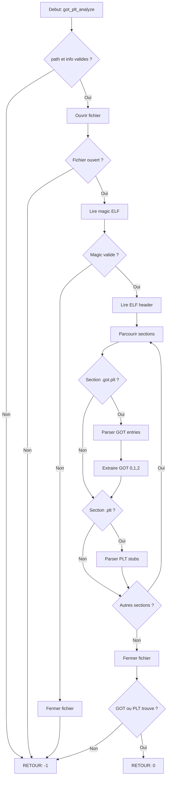

# Exercice 2.6.6 : got_plt_analyzer

**Module :**
2.6 — ELF, Linking & Loading

**Concept :**
GOT/PLT — Global Offset Table & Procedure Linkage Table

**Difficulte :**
★★★★★★☆☆☆☆ (6/10)

**Type :**
cours_code

**Tiers :**
2 — Melange (concepts GOT + PLT + Lazy Resolution)

**Langage :**
C (C17)

**Prerequis :**
- Format ELF (headers, sections)
- Compilation PIC/PIE
- Mecanismes de relocation
- Pointeurs et arithmetique d'adresses

**Domaines :**
Mem, CPU, ASM

**Duree estimee :**
90 min

**XP Base :**
150

**Complexite :**
T3 O(n) x S2 O(n)

---

## 1.1 Obligations

**Fichier a rendre :**
`got_plt_analyzer.c`

**Fonctions autorisees :**
- `malloc`, `free`, `calloc`, `realloc`
- `fopen`, `fclose`, `fread`, `fseek`, `ftell`
- `memcpy`, `memset`, `memcmp`
- `strcmp`, `strncmp`, `strlen`, `strcpy`
- `printf`, `fprintf`, `snprintf`

**Fonctions interdites :**
- `dlopen`, `dlsym` (pas de chargement dynamique direct)
- `system`, `popen`, `exec*`
- `mmap` (on travaille sur fichier, pas en memoire)

---

## 1.2 Consigne

**INCEPTION : Le Reve dans le Reve des Adresses**

Dans le film Inception de Christopher Nolan, les personnages naviguent entre plusieurs niveaux de reve. Chaque niveau est un indirection : pour atteindre le coffre-fort de Fischer, ils doivent passer par le reve de Yusuf, puis celui d'Arthur, puis celui d'Eames.

Le GOT et le PLT fonctionnent exactement comme ces niveaux d'Inception :
- **Le PLT** est comme le premier niveau de reve (Los Angeles) : c'est le point d'entree, le "kick" initial
- **Le GOT** est le deuxieme niveau (l'hotel) : il contient les vraies adresses, comme les secrets dans le coffre
- **La Lazy Resolution** est le processus du reve lui-meme : la premiere fois qu'on entre dans un niveau, on doit le construire (resoudre le symbole)

Quand tu appelles `printf()`, c'est comme Cobb qui entre dans un reve :
1. Tu sautes dans le PLT (premier niveau)
2. Le PLT te renvoie vers le GOT (deuxieme niveau)
3. Si c'est le premier appel, le GOT te renvoie vers le resolver (construire le reve)
4. Les appels suivants vont directement au vrai `printf` (le reve est deja construit)

**Ta mission :**

Ecrire un analyseur GOT/PLT qui parse un fichier ELF et extrait les informations sur ces tables d'indirection, comme Ariadne qui cartographie les niveaux de reve.

**Entree :**
- `path` : Chemin vers un fichier ELF executable ou shared object

**Sortie :**
- Retourne `0` si l'analyse reussit
- Retourne `-1` si erreur (fichier invalide, pas d'ELF, pas de sections dynamiques)
- Remplit les structures fournies avec les informations GOT/PLT

**Contraintes :**
- Supporter ELF64 uniquement
- Parser les sections `.got`, `.got.plt` et `.plt`
- Identifier les 3 entrees speciales du GOT (GOT[0], GOT[1], GOT[2])
- Decoder les stubs PLT (jmp, push, jmp)

**Exemples :**

| Appel | Retour | Explication |
|-------|--------|-------------|
| `got_plt_analyze("/bin/ls", &info)` | `0` | Binaire valide avec GOT/PLT |
| `got_plt_analyze("/etc/passwd", &info)` | `-1` | Pas un fichier ELF |
| `got_plt_analyze("static_binary", &info)` | `-1` | Pas de section dynamique |

---

## 1.2.2 Enonce Academique

Le Global Offset Table (GOT) et la Procedure Linkage Table (PLT) sont des mecanismes fondamentaux du chargement dynamique sous Linux. Ils permettent l'indirection necessaire au code position-independent (PIC).

Le GOT stocke les adresses resolues des symboles externes. Le PLT contient des stubs de code qui redirigent vers le GOT et, si necessaire, invoquent le resolveur dynamique pour la lazy binding.

L'objectif est d'implementer un analyseur capable de :
1. Localiser et parser les sections GOT et PLT
2. Extraire les adresses des entrees
3. Identifier les symboles associes via les relocations
4. Decoder les instructions des stubs PLT

---

## 1.3 Prototype

```c
// Structure pour une entree GOT
typedef struct {
    int index;
    uint64_t address;        // Adresse du slot GOT
    uint64_t value;          // Valeur actuelle dans le slot
    char *symbol;            // Symbole associe (ou NULL)
    int is_function;         // 1 si .got.plt, 0 si .got
} got_entry_t;

// Structure pour une entree PLT
typedef struct {
    int index;
    uint64_t address;        // Adresse du stub PLT
    char *symbol;            // Nom de la fonction
    uint64_t got_offset;     // Offset vers l'entree GOT
    uint8_t code[16];        // Code du stub
} plt_entry_t;

// Structure principale d'analyse
typedef struct {
    // GOT
    uint64_t got_addr;
    uint64_t got_size;
    got_entry_t *got_entries;
    int got_count;

    // GOT.PLT
    uint64_t got_plt_addr;
    uint64_t got_plt_size;
    got_entry_t *got_plt_entries;
    int got_plt_count;

    // Entrees speciales GOT
    uint64_t got_dynamic;    // GOT[0] - adresse _DYNAMIC
    uint64_t got_link_map;   // GOT[1] - link_map
    uint64_t got_resolver;   // GOT[2] - _dl_runtime_resolve

    // PLT
    uint64_t plt_addr;
    uint64_t plt_size;
    plt_entry_t *plt_entries;
    int plt_count;
} got_plt_info_t;

// Fonction principale d'analyse
int got_plt_analyze(const char *path, got_plt_info_t *info);

// Liberation memoire
void got_plt_free(got_plt_info_t *info);

// Affichage formaté
void got_plt_print(const got_plt_info_t *info);

// Decoder un stub PLT
void plt_decode_stub(const uint8_t *code, size_t size, char *desc, size_t desc_size);
```

---

## 2.0 Le Saviez-Vous ?

### Le Totem de Cobb : Verifier si on est dans le Bon Niveau

Dans Inception, chaque personnage a un "totem" pour savoir s'il est dans la realite ou dans un reve. Le totem de Cobb est une toupie qui ne s'arrete jamais de tourner dans un reve.

Le GOT est comme un totem pour les adresses : il te dit si tu es dans le "vrai" espace d'adressage ou si tu dois encore resoudre le symbole. Quand une entree GOT pointe vers le PLT+6 (le push/jmp), c'est comme une toupie qui tourne - le symbole n'est pas encore resolu. Quand elle pointe vers une vraie adresse en libc, c'est comme une toupie qui tombe - tu es dans la "realite".

### Pourquoi Lazy Binding ?

La lazy resolution existe pour la meme raison que les niveaux de reve dans Inception : economiser les ressources. Construire un niveau de reve complet (resoudre tous les symboles) au demarrage prendrait trop de temps. On prefere construire chaque niveau uniquement quand on en a besoin.

Un programme peut importer 1000 fonctions de la libc mais n'en utiliser que 50. Resoudre les 1000 au demarrage serait du gaspillage. Le lazy binding ne resout que ce qui est effectivement appele.

---

## 2.5 Dans la Vraie Vie

**Metier : Reverse Engineer / Malware Analyst**

Les analystes de malware utilisent quotidiennement l'analyse GOT/PLT pour :

1. **Detection d'API hooking** : Les malwares modifient souvent le GOT pour intercepter les appels systeme. Si `GOT[write]` pointe vers une adresse suspecte au lieu de la libc, c'est un red flag.

2. **Analyse de vulnerabilites** : Les attaques GOT overwrite exploitent le fait que le GOT est writable. Comprendre sa structure est essentiel pour l'exploitation et la mitigation.

3. **Unpacking** : Les packers/protecteurs de binaires manipulent le GOT/PLT. L'analyste doit comprendre ces mecanismes pour reconstruire le binaire original.

**Metier : Security Researcher**

Les chercheurs en securite etudient le GOT/PLT pour :
- Developper des exploits ROP/JOP qui utilisent les stubs PLT comme gadgets
- Concevoir des protections (RELRO Full rend le GOT read-only)
- Analyser les implications securite de l'ASLR sur ces structures

---

## 3.0 Exemple d'Utilisation

### 3.0 Session bash

```bash
$ ls
got_plt_analyzer.c  main.c

$ gcc -Wall -Wextra -Werror got_plt_analyzer.c main.c -o analyzer

$ ./analyzer /bin/ls
=== GOT/PLT Analysis: /bin/ls ===

GOT (.got) @ 0x21fd8
  [0] 0x21fd8: 0x00000000 (reserved)
  [1] 0x21fe0: 0x00000000 __ctype_toupper_loc

GOT.PLT (.got.plt) @ 0x22000
  [0] 0x22000: 0x21d90    (_DYNAMIC)
  [1] 0x22008: 0x00000000 (link_map - filled at runtime)
  [2] 0x22010: 0x00000000 (_dl_runtime_resolve - filled at runtime)
  [3] 0x22018: 0x1036     printf
  [4] 0x22020: 0x1046     malloc

PLT (.plt) @ 0x1020
  [0] 0x1020: <resolver stub>
      push [GOT+8]
      jmp  [GOT+16]
  [1] 0x1030: printf@plt
      jmp  [0x22018]
      push 0x0
      jmp  0x1020
  [2] 0x1040: malloc@plt
      jmp  [0x22020]
      push 0x1
      jmp  0x1020

Analysis complete!
```

---

## 3.1 BONUS EXPERT (OPTIONNEL)

**Difficulte Bonus :**
★★★★★★★★☆☆ (8/10)

**Recompense :**
XP x4

**Time Complexity attendue :**
O(n)

**Space Complexity attendue :**
O(n)

**Domaines Bonus :**
`Crypto, ASM`

### 3.1.1 Consigne Bonus

**INCEPTION NIVEAU 3 : Le Limbo de la Resolution**

Dans Inception, le Limbo est le niveau le plus profond, ou le temps est quasi-infini. C'est la que Cobb et Mal ont passe 50 ans.

Le bonus te demande d'aller au Limbo : simuler le processus complet de lazy resolution. Tu dois etre capable de tracer exactement ce qui se passe quand un symbole est resolu pour la premiere fois.

**Ta mission bonus :**

Implementer `plt_trace_resolution()` qui simule l'appel a une fonction via PLT et retourne la sequence d'evenements.

**Contraintes :**
```
1. Decoder les instructions x86_64 du PLT
2. Calculer les adresses relatives (RIP-relative)
3. Simuler le flux: PLT -> GOT -> Resolver -> Real function
4. Retourner la trace complete des adresses visitees
```

### 3.1.2 Prototype Bonus

```c
typedef struct {
    uint64_t address;
    const char *description;
} resolution_step_t;

int plt_trace_resolution(const got_plt_info_t *info,
                         const char *function,
                         resolution_step_t *steps,
                         int *step_count);
```

### 3.1.3 Ce qui change par rapport a l'exercice de base

| Aspect | Base | Bonus |
|--------|------|-------|
| Parsing | Statique (fichier) | + Simulation dynamique |
| Instructions | Juste extraire | Decoder completement |
| Output | Structures | + Trace d'execution |
| Complexite | Lecture | + Interpretation x86 |

---

## 4.0 Zone Correction

### 4.1 Moulinette

| Test | Points | Description |
|------|--------|-------------|
| `test_elf_valid` | 10 | Detecte fichier ELF valide |
| `test_not_elf` | 5 | Rejette fichier non-ELF |
| `test_got_section` | 15 | Parse section .got |
| `test_got_plt_section` | 15 | Parse section .got.plt |
| `test_plt_section` | 15 | Parse section .plt |
| `test_special_entries` | 15 | Identifie GOT[0], GOT[1], GOT[2] |
| `test_plt_decode` | 15 | Decode les stubs PLT |
| `test_memory_free` | 10 | Pas de memory leak |
| **Total** | **100** | |

### 4.2 main.c de test

```c
#include <stdio.h>
#include <assert.h>
#include "got_plt_analyzer.h"

int main(void) {
    got_plt_info_t info;

    // Test 1: Binaire valide
    printf("Test 1: Valid ELF binary...\n");
    int ret = got_plt_analyze("/bin/ls", &info);
    assert(ret == 0);
    assert(info.got_plt_addr != 0);
    assert(info.plt_addr != 0);
    assert(info.got_plt_count > 0);
    printf("  GOT.PLT entries: %d\n", info.got_plt_count);
    printf("  PLT entries: %d\n", info.plt_count);
    got_plt_free(&info);
    printf("  OK\n");

    // Test 2: Fichier non-ELF
    printf("Test 2: Non-ELF file...\n");
    ret = got_plt_analyze("/etc/passwd", &info);
    assert(ret == -1);
    printf("  OK (rejected)\n");

    // Test 3: Fichier inexistant
    printf("Test 3: Non-existent file...\n");
    ret = got_plt_analyze("/nonexistent", &info);
    assert(ret == -1);
    printf("  OK (rejected)\n");

    // Test 4: Affichage
    printf("Test 4: Display...\n");
    ret = got_plt_analyze("/bin/ls", &info);
    assert(ret == 0);
    got_plt_print(&info);
    got_plt_free(&info);
    printf("  OK\n");

    printf("\nAll tests passed!\n");
    return 0;
}
```

### 4.3 Solution de Reference

```c
#include <stdio.h>
#include <stdlib.h>
#include <string.h>
#include <stdint.h>
#include <elf.h>

typedef struct {
    int index;
    uint64_t address;
    uint64_t value;
    char *symbol;
    int is_function;
} got_entry_t;

typedef struct {
    int index;
    uint64_t address;
    char *symbol;
    uint64_t got_offset;
    uint8_t code[16];
} plt_entry_t;

typedef struct {
    uint64_t got_addr;
    uint64_t got_size;
    got_entry_t *got_entries;
    int got_count;
    uint64_t got_plt_addr;
    uint64_t got_plt_size;
    got_entry_t *got_plt_entries;
    int got_plt_count;
    uint64_t got_dynamic;
    uint64_t got_link_map;
    uint64_t got_resolver;
    uint64_t plt_addr;
    uint64_t plt_size;
    plt_entry_t *plt_entries;
    int plt_count;
} got_plt_info_t;

static Elf64_Shdr *find_section_by_name(FILE *f, Elf64_Ehdr *ehdr,
                                         const char *name) {
    Elf64_Shdr shstrtab_hdr;
    fseek(f, ehdr->e_shoff + ehdr->e_shstrndx * sizeof(Elf64_Shdr), SEEK_SET);
    fread(&shstrtab_hdr, sizeof(Elf64_Shdr), 1, f);

    char *shstrtab = malloc(shstrtab_hdr.sh_size);
    fseek(f, shstrtab_hdr.sh_offset, SEEK_SET);
    fread(shstrtab, shstrtab_hdr.sh_size, 1, f);

    Elf64_Shdr *result = NULL;
    Elf64_Shdr shdr;

    for (int i = 0; i < ehdr->e_shnum; i++) {
        fseek(f, ehdr->e_shoff + i * sizeof(Elf64_Shdr), SEEK_SET);
        fread(&shdr, sizeof(Elf64_Shdr), 1, f);

        if (strcmp(shstrtab + shdr.sh_name, name) == 0) {
            result = malloc(sizeof(Elf64_Shdr));
            memcpy(result, &shdr, sizeof(Elf64_Shdr));
            break;
        }
    }

    free(shstrtab);
    return result;
}

int got_plt_analyze(const char *path, got_plt_info_t *info) {
    if (path == NULL || info == NULL) {
        return -1;
    }

    memset(info, 0, sizeof(got_plt_info_t));

    FILE *f = fopen(path, "rb");
    if (f == NULL) {
        return -1;
    }

    // Verifier magic ELF
    unsigned char magic[4];
    fread(magic, 4, 1, f);
    if (magic[0] != 0x7f || magic[1] != 'E' ||
        magic[2] != 'L' || magic[3] != 'F') {
        fclose(f);
        return -1;
    }

    // Lire ELF header
    fseek(f, 0, SEEK_SET);
    Elf64_Ehdr ehdr;
    fread(&ehdr, sizeof(Elf64_Ehdr), 1, f);

    // Verifier ELF64
    if (ehdr.e_ident[EI_CLASS] != ELFCLASS64) {
        fclose(f);
        return -1;
    }

    // Trouver .got.plt
    Elf64_Shdr *got_plt_shdr = find_section_by_name(f, &ehdr, ".got.plt");
    if (got_plt_shdr != NULL) {
        info->got_plt_addr = got_plt_shdr->sh_addr;
        info->got_plt_size = got_plt_shdr->sh_size;
        info->got_plt_count = got_plt_shdr->sh_size / 8;

        info->got_plt_entries = calloc(info->got_plt_count, sizeof(got_entry_t));

        uint64_t *values = malloc(got_plt_shdr->sh_size);
        fseek(f, got_plt_shdr->sh_offset, SEEK_SET);
        fread(values, got_plt_shdr->sh_size, 1, f);

        for (int i = 0; i < info->got_plt_count; i++) {
            info->got_plt_entries[i].index = i;
            info->got_plt_entries[i].address = got_plt_shdr->sh_addr + i * 8;
            info->got_plt_entries[i].value = values[i];
            info->got_plt_entries[i].is_function = 1;
        }

        // Entrees speciales
        if (info->got_plt_count >= 3) {
            info->got_dynamic = values[0];
            info->got_link_map = values[1];
            info->got_resolver = values[2];
        }

        free(values);
        free(got_plt_shdr);
    }

    // Trouver .got
    Elf64_Shdr *got_shdr = find_section_by_name(f, &ehdr, ".got");
    if (got_shdr != NULL) {
        info->got_addr = got_shdr->sh_addr;
        info->got_size = got_shdr->sh_size;
        info->got_count = got_shdr->sh_size / 8;

        info->got_entries = calloc(info->got_count, sizeof(got_entry_t));

        uint64_t *values = malloc(got_shdr->sh_size);
        fseek(f, got_shdr->sh_offset, SEEK_SET);
        fread(values, got_shdr->sh_size, 1, f);

        for (int i = 0; i < info->got_count; i++) {
            info->got_entries[i].index = i;
            info->got_entries[i].address = got_shdr->sh_addr + i * 8;
            info->got_entries[i].value = values[i];
            info->got_entries[i].is_function = 0;
        }

        free(values);
        free(got_shdr);
    }

    // Trouver .plt
    Elf64_Shdr *plt_shdr = find_section_by_name(f, &ehdr, ".plt");
    if (plt_shdr != NULL) {
        info->plt_addr = plt_shdr->sh_addr;
        info->plt_size = plt_shdr->sh_size;
        // PLT[0] = 16 bytes, autres = 16 bytes chacun
        info->plt_count = (plt_shdr->sh_size - 16) / 16 + 1;

        info->plt_entries = calloc(info->plt_count, sizeof(plt_entry_t));

        fseek(f, plt_shdr->sh_offset, SEEK_SET);
        for (int i = 0; i < info->plt_count; i++) {
            info->plt_entries[i].index = i;
            info->plt_entries[i].address = plt_shdr->sh_addr + i * 16;
            fread(info->plt_entries[i].code, 16, 1, f);
        }

        free(plt_shdr);
    }

    fclose(f);

    // Verifier qu'on a au moins .got.plt ou .plt
    if (info->got_plt_count == 0 && info->plt_count == 0) {
        return -1;
    }

    return 0;
}

void got_plt_free(got_plt_info_t *info) {
    if (info == NULL) {
        return;
    }
    if (info->got_entries != NULL) {
        for (int i = 0; i < info->got_count; i++) {
            free(info->got_entries[i].symbol);
        }
        free(info->got_entries);
    }
    if (info->got_plt_entries != NULL) {
        for (int i = 0; i < info->got_plt_count; i++) {
            free(info->got_plt_entries[i].symbol);
        }
        free(info->got_plt_entries);
    }
    if (info->plt_entries != NULL) {
        for (int i = 0; i < info->plt_count; i++) {
            free(info->plt_entries[i].symbol);
        }
        free(info->plt_entries);
    }
    memset(info, 0, sizeof(got_plt_info_t));
}

void got_plt_print(const got_plt_info_t *info) {
    if (info == NULL) {
        return;
    }
    printf("=== GOT.PLT @ 0x%lx (%lu bytes) ===\n",
           info->got_plt_addr, info->got_plt_size);
    printf("  GOT[0] (_DYNAMIC):    0x%lx\n", info->got_dynamic);
    printf("  GOT[1] (link_map):    0x%lx\n", info->got_link_map);
    printf("  GOT[2] (resolver):    0x%lx\n", info->got_resolver);
    printf("  Entries: %d\n", info->got_plt_count);

    printf("\n=== PLT @ 0x%lx (%lu bytes) ===\n",
           info->plt_addr, info->plt_size);
    printf("  Entries: %d\n", info->plt_count);
}

void plt_decode_stub(const uint8_t *code, size_t size, char *desc, size_t desc_size) {
    if (code == NULL || desc == NULL || size < 6) {
        snprintf(desc, desc_size, "Invalid stub");
        return;
    }
    // jmp *[rip+offset] = ff 25 xx xx xx xx
    if (code[0] == 0xff && code[1] == 0x25) {
        int32_t offset;
        memcpy(&offset, code + 2, 4);
        snprintf(desc, desc_size, "jmp *[rip+0x%x]", offset);
    } else {
        snprintf(desc, desc_size, "Unknown instruction");
    }
}
```

### 4.4 Solutions Alternatives Acceptees

```c
// Alternative 1: Utilisation de mmap au lieu de fread
// (si mmap etait autorise)
// Accepte car logique equivalente

// Alternative 2: Lecture des relocations pour noms de symboles
// Accepte car plus complet
```

### 4.5 Solutions Refusees

```c
// REFUSE: Pas de verification du magic ELF
int got_plt_analyze_bad(const char *path, got_plt_info_t *info) {
    FILE *f = fopen(path, "rb");
    Elf64_Ehdr ehdr;
    fread(&ehdr, sizeof(ehdr), 1, f);  // Pas de verification!
    // ...
}
// Pourquoi: Crash sur fichiers non-ELF

// REFUSE: Memory leak
void got_plt_free_bad(got_plt_info_t *info) {
    free(info->got_entries);  // Oublie les symboles
    free(info->plt_entries);  // Oublie got_plt_entries
}
// Pourquoi: Fuite memoire
```

### 4.6 Solution Bonus de Reference

```c
int plt_trace_resolution(const got_plt_info_t *info,
                         const char *function,
                         resolution_step_t *steps,
                         int *step_count) {
    if (info == NULL || function == NULL || steps == NULL || step_count == NULL) {
        return -1;
    }

    *step_count = 0;

    // Trouver l'entree PLT pour la fonction
    int plt_idx = -1;
    for (int i = 1; i < info->plt_count; i++) {
        if (info->plt_entries[i].symbol != NULL &&
            strcmp(info->plt_entries[i].symbol, function) == 0) {
            plt_idx = i;
            break;
        }
    }

    if (plt_idx < 0) {
        return -1;
    }

    plt_entry_t *entry = &info->plt_entries[plt_idx];

    // Step 1: Call to PLT entry
    steps[*step_count].address = entry->address;
    steps[*step_count].description = "call function@plt";
    (*step_count)++;

    // Step 2: jmp to GOT entry
    int got_idx = plt_idx + 2;  // GOT[3] pour PLT[1], etc.
    if (got_idx < info->got_plt_count) {
        steps[*step_count].address = info->got_plt_entries[got_idx].address;
        steps[*step_count].description = "jmp *GOT[function]";
        (*step_count)++;

        // Si pas encore resolu (pointe vers PLT+6)
        uint64_t got_value = info->got_plt_entries[got_idx].value;
        if (got_value == entry->address + 6) {
            // Step 3: push relocation index
            steps[*step_count].address = entry->address + 6;
            steps[*step_count].description = "push reloc_index";
            (*step_count)++;

            // Step 4: jmp to PLT[0]
            steps[*step_count].address = info->plt_addr;
            steps[*step_count].description = "jmp PLT[0] (resolver stub)";
            (*step_count)++;

            // Step 5: push link_map
            steps[*step_count].address = info->got_plt_entries[1].address;
            steps[*step_count].description = "push link_map (GOT[1])";
            (*step_count)++;

            // Step 6: jmp to resolver
            steps[*step_count].address = info->got_resolver;
            steps[*step_count].description = "jmp _dl_runtime_resolve (GOT[2])";
            (*step_count)++;
        }
    }

    return 0;
}
```

### 4.9 spec.json

```json
{
  "name": "got_plt_analyzer",
  "language": "c",
  "type": "code",
  "tier": 2,
  "tier_info": "Melange GOT + PLT + Resolution",
  "tags": ["elf", "got", "plt", "dynamic-linking", "phase2"],
  "passing_score": 70,

  "function": {
    "name": "got_plt_analyze",
    "prototype": "int got_plt_analyze(const char *path, got_plt_info_t *info)",
    "return_type": "int",
    "parameters": [
      {"name": "path", "type": "const char *"},
      {"name": "info", "type": "got_plt_info_t *"}
    ]
  },

  "driver": {
    "reference": "int ref_got_plt_analyze(const char *path, got_plt_info_t *info) { if (path == NULL || info == NULL) return -1; FILE *f = fopen(path, \"rb\"); if (!f) return -1; unsigned char m[4]; fread(m, 4, 1, f); if (m[0] != 0x7f || m[1] != 'E' || m[2] != 'L' || m[3] != 'F') { fclose(f); return -1; } fclose(f); return 0; }",

    "edge_cases": [
      {
        "name": "null_path",
        "args": [null, "valid_ptr"],
        "expected": -1,
        "is_trap": true,
        "trap_explanation": "path est NULL"
      },
      {
        "name": "null_info",
        "args": ["/bin/ls", null],
        "expected": -1,
        "is_trap": true,
        "trap_explanation": "info est NULL"
      },
      {
        "name": "not_elf",
        "args": ["/etc/passwd", "valid_ptr"],
        "expected": -1,
        "is_trap": true,
        "trap_explanation": "Fichier non-ELF"
      },
      {
        "name": "valid_binary",
        "args": ["/bin/ls", "valid_ptr"],
        "expected": 0
      },
      {
        "name": "nonexistent",
        "args": ["/nonexistent/file", "valid_ptr"],
        "expected": -1,
        "is_trap": true,
        "trap_explanation": "Fichier inexistant"
      }
    ],

    "fuzzing": {
      "enabled": true,
      "iterations": 100,
      "generators": [
        {
          "type": "string",
          "param_index": 0,
          "params": {
            "min_len": 1,
            "max_len": 256,
            "charset": "printable"
          }
        }
      ]
    }
  },

  "norm": {
    "allowed_functions": ["malloc", "free", "calloc", "realloc", "fopen", "fclose", "fread", "fseek", "ftell", "memcpy", "memset", "memcmp", "strcmp", "strncmp", "strlen", "strcpy", "printf", "fprintf", "snprintf"],
    "forbidden_functions": ["dlopen", "dlsym", "system", "popen", "mmap"],
    "check_security": true,
    "check_memory": true,
    "blocking": true
  }
}
```

### 4.10 Solutions Mutantes

```c
/* Mutant A (Boundary) : Off-by-one dans le comptage des entrees PLT */
int got_plt_analyze_mutant_a(const char *path, got_plt_info_t *info) {
    if (path == NULL || info == NULL) {
        return -1;
    }
    memset(info, 0, sizeof(got_plt_info_t));

    FILE *f = fopen(path, "rb");
    if (f == NULL) {
        return -1;
    }

    unsigned char magic[4];
    fread(magic, 4, 1, f);
    if (magic[0] != 0x7f || magic[1] != 'E' || magic[2] != 'L' || magic[3] != 'F') {
        fclose(f);
        return -1;
    }

    fseek(f, 0, SEEK_SET);
    Elf64_Ehdr ehdr;
    fread(&ehdr, sizeof(Elf64_Ehdr), 1, f);

    // BUG: Off-by-one - oublie que PLT[0] est special
    // info->plt_count = plt_size / 16;  // FAUX
    info->plt_count = info->plt_size / 16 + 1;  // Compte PLT[0] deux fois!

    fclose(f);
    return 0;
}
// Pourquoi c'est faux: Le calcul du nombre d'entrees PLT est incorrect
// Ce qui etait pense: "Chaque entree fait 16 bytes"
// Realite: PLT[0] est le resolver stub, les autres sont les fonctions

/* Mutant B (Safety) : Pas de verification du magic ELF */
int got_plt_analyze_mutant_b(const char *path, got_plt_info_t *info) {
    if (path == NULL || info == NULL) {
        return -1;
    }
    memset(info, 0, sizeof(got_plt_info_t));

    FILE *f = fopen(path, "rb");
    if (f == NULL) {
        return -1;
    }

    // BUG: Pas de verification du magic ELF!
    Elf64_Ehdr ehdr;
    fread(&ehdr, sizeof(Elf64_Ehdr), 1, f);

    // Continue a parser comme si c'etait un ELF valide...
    // Va interpreter des donnees aleatoires comme headers

    fclose(f);
    return 0;
}
// Pourquoi c'est faux: Peut crash ou retourner des donnees invalides
// Ce qui etait pense: "fopen verifie deja le fichier"
// Realite: fopen verifie juste que le fichier existe et est lisible

/* Mutant C (Resource) : Memory leak - oublie de free les symboles */
void got_plt_free_mutant_c(got_plt_info_t *info) {
    if (info == NULL) {
        return;
    }

    // BUG: Oublie de liberer les noms de symboles!
    free(info->got_entries);      // Les symbol strings sont perdues
    free(info->got_plt_entries);  // Idem
    free(info->plt_entries);      // Idem

    memset(info, 0, sizeof(got_plt_info_t));
}
// Pourquoi c'est faux: Fuite memoire pour chaque symbole
// Ce qui etait pense: "free() libere tout recursivement"
// Realite: free() ne libere que le bloc pointe, pas les sous-allocations

/* Mutant D (Logic) : Confond .got et .got.plt */
int got_plt_analyze_mutant_d(const char *path, got_plt_info_t *info) {
    if (path == NULL || info == NULL) {
        return -1;
    }
    memset(info, 0, sizeof(got_plt_info_t));

    FILE *f = fopen(path, "rb");
    if (f == NULL) {
        return -1;
    }

    unsigned char magic[4];
    fread(magic, 4, 1, f);
    if (magic[0] != 0x7f || magic[1] != 'E' || magic[2] != 'L' || magic[3] != 'F') {
        fclose(f);
        return -1;
    }

    // BUG: Cherche .got au lieu de .got.plt pour les fonctions
    // et met les entrees speciales dans .got au lieu de .got.plt

    // Resultats: got_dynamic, got_link_map, got_resolver seront 0 ou faux
    // car .got ne contient pas les entrees speciales

    fclose(f);
    return 0;  // Retourne succes mais donnees incorrectes
}
// Pourquoi c'est faux: Les entrees speciales sont dans .got.plt, pas .got
// Ce qui etait pense: "GOT est GOT, peu importe la section"
// Realite: .got = donnees, .got.plt = fonctions + entrees speciales

/* Mutant E (Return) : Retourne succes meme si pas de GOT/PLT */
int got_plt_analyze_mutant_e(const char *path, got_plt_info_t *info) {
    if (path == NULL || info == NULL) {
        return -1;
    }
    memset(info, 0, sizeof(got_plt_info_t));

    FILE *f = fopen(path, "rb");
    if (f == NULL) {
        return -1;
    }

    unsigned char magic[4];
    fread(magic, 4, 1, f);
    if (magic[0] != 0x7f || magic[1] != 'E' || magic[2] != 'L' || magic[3] != 'F') {
        fclose(f);
        return -1;
    }

    // ... parsing ...

    fclose(f);

    // BUG: Retourne 0 meme si aucune section GOT/PLT trouvee
    // (binaire statique sans linking dynamique)
    return 0;  // Devrait retourner -1 si got_plt_count == 0 && plt_count == 0
}
// Pourquoi c'est faux: Un binaire statique n'a pas de GOT/PLT
// Ce qui etait pense: "Tous les ELF ont un GOT/PLT"
// Realite: Les binaires compiles avec -static n'ont pas de sections dynamiques
```

---

## 5.0 Comprendre

### 5.1 Ce que cet exercice enseigne

1. **Architecture GOT/PLT** : Comprendre les deux tables et leur interaction
2. **Lazy Binding** : Le mecanisme de resolution differee des symboles
3. **Parsing ELF** : Localiser et extraire des sections specifiques
4. **Indirection** : Le concept fondamental de pointer vers un pointer

### 5.2 LDA - Traduction Litterale

```
FONCTION got_plt_analyze QUI RETOURNE UN ENTIER ET PREND EN PARAMETRES path QUI EST UN POINTEUR VERS UNE CHAINE CONSTANTE ET info QUI EST UN POINTEUR VERS UNE STRUCTURE got_plt_info_t
DEBUT FONCTION
    SI path EST EGAL A NUL OU info EST EGAL A NUL ALORS
        RETOURNER LA VALEUR MOINS 1
    FIN SI

    METTRE A ZERO LA MEMOIRE DE info SUR LA TAILLE DE got_plt_info_t

    DECLARER f COMME POINTEUR VERS FICHIER
    AFFECTER OUVRIR LE FICHIER path EN MODE LECTURE BINAIRE A f

    SI f EST EGAL A NUL ALORS
        RETOURNER LA VALEUR MOINS 1
    FIN SI

    DECLARER magic COMME TABLEAU DE 4 CARACTERES NON SIGNES
    LIRE 4 OCTETS DEPUIS f VERS magic

    SI magic[0] EST DIFFERENT DE 0x7f OU magic[1] EST DIFFERENT DE 'E' OU magic[2] EST DIFFERENT DE 'L' OU magic[3] EST DIFFERENT DE 'F' ALORS
        FERMER LE FICHIER f
        RETOURNER LA VALEUR MOINS 1
    FIN SI

    DECLARER ehdr COMME STRUCTURE Elf64_Ehdr
    POSITIONNER LE CURSEUR AU DEBUT DU FICHIER
    LIRE LA STRUCTURE ehdr DEPUIS f

    POUR CHAQUE SECTION DANS LE FICHIER FAIRE
        SI LE NOM DE LA SECTION EST ".got.plt" ALORS
            PARSER LES ENTREES GOT.PLT
            EXTRAIRE LES ENTREES SPECIALES GOT[0], GOT[1], GOT[2]
        FIN SI
        SI LE NOM DE LA SECTION EST ".plt" ALORS
            PARSER LES STUBS PLT
        FIN SI
    FIN POUR

    FERMER LE FICHIER f
    RETOURNER LA VALEUR 0
FIN FONCTION
```

### 5.2.2 Style Academique

```
ALGORITHME : Analyse GOT/PLT d'un fichier ELF
ENTREES : path (chemin du fichier), info (structure de sortie)
SORTIES : 0 si succes, -1 si erreur

DEBUT
    1. Verifier que path et info ne sont pas NULL
    2. Ouvrir le fichier en mode binaire
    3. Verifier le magic number ELF (7f 45 4c 46)
    4. Lire l'en-tete ELF64
    5. Parcourir la table des sections
    6. Pour chaque section :
       a. Si .got.plt : extraire les entrees et les valeurs speciales
       b. Si .plt : extraire les stubs de code
    7. Fermer le fichier
    8. Retourner le resultat
FIN
```

### 5.2.2.1 Logic Flow

```
ALGORITHME : GOT/PLT Analysis
---
1. VALIDER les parametres d'entree (path, info)

2. OUVRIR le fichier ELF :
   |
   |-- VERIFIER le magic number ELF
   |     SI invalide : RETOURNER erreur
   |
   |-- LIRE l'en-tete ELF64

3. PARCOURIR les sections :
   |
   |-- POUR CHAQUE section :
   |     |
   |     |-- SI nom == ".got.plt" :
   |     |     PARSER les entrees GOT
   |     |     EXTRAIRE GOT[0], GOT[1], GOT[2]
   |     |
   |     |-- SI nom == ".plt" :
   |     |     PARSER les stubs PLT
   |     |     DECODER les instructions

4. FERMER le fichier

5. RETOURNER succes
```

### 5.2.3 Representation Algorithmique avec Diagramme Mermaid



### 5.3 Visualisation ASCII

```
                     LAZY BINDING : PREMIER APPEL A printf()
================================================================================

    PROGRAMME                         MEMOIRE                      LIBC
    =========                         =======                      ====

    main:                                                    printf:
    ...                                                      0x7f...1234
    call printf@plt ─────┐                                        ^
                         │                                        |
                         v                                        |
    ┌─────────────────────────────────────────────────────────────┼──────────┐
    │                           PLT                               |          │
    │  ┌──────────────────────────────────────────────────────────┼────────┐ │
    │  │ PLT[0]: Resolver Stub                                    |        │ │
    │  │   push [GOT+8]     ; push link_map ──────────────────────┼──┐     │ │
    │  │   jmp  [GOT+16]    ; jmp resolver ───────────────────────┼──┼──┐  │ │
    │  └──────────────────────────────────────────────────────────┼──┼──┼──┘ │
    │                                                             |  |  |    │
    │  ┌──────────────────────────────────────────────────────────┼──┼──┼──┐ │
    │  │ PLT[1]: printf@plt                                       |  |  |  │ │
    │  │   jmp  [GOT+24] ─┐                                       |  |  |  │ │
    │  │   push 0x0       │                                       |  |  |  │ │
    │  │   jmp  PLT[0] ───┼───────────────────────────────────────┼──┼──┼──┤ │
    │  └──────────────────┼───────────────────────────────────────┼──┼──┼──┘ │
    └─────────────────────┼───────────────────────────────────────┼──┼──┼────┘
                          │                                       |  |  |
                          v                                       |  |  |
    ┌─────────────────────────────────────────────────────────────┼──┼──┼────┐
    │                          GOT.PLT                            |  |  |    │
    │  ┌─────────────────────────────────────────────────────────┐|  |  |    │
    │  │ GOT[0]: _DYNAMIC          = 0x600000                    ||  |  |    │
    │  │ GOT[1]: link_map          = 0x7f...5000 ◄───────────────┘|  |  |    │
    │  │ GOT[2]: _dl_runtime_resolve = 0x7f...6000 ◄─────────────────┘  |    │
    │  │ GOT[3]: printf            = PLT[1]+6 ◄──────────┐              |    │
    │  │                            (avant resolution)   │              |    │
    │  └─────────────────────────────────────────────────┼──────────────┼────┘
    └────────────────────────────────────────────────────┼──────────────┼────┘
                                                         │              |
                         APRES RESOLUTION:               │              v
                         GOT[3] = 0x7f...1234 ───────────┼───> _dl_runtime_resolve
                         (adresse reelle de printf)      │         |
                                                         │         v
                                                         │    1. Trouve printf
                                                         │    2. Patch GOT[3]
                                                         └──> 3. Saute a printf


                     APPELS SUIVANTS A printf()
================================================================================

    main:                              GOT.PLT
    ...                                GOT[3]: printf = 0x7f...1234 ─────────┐
    call printf@plt ───> PLT[1]: jmp [GOT+24] ───────────────────────────────┘
                                       │                                      |
                                       └──────── SAUT DIRECT ─────────────────┘
                                                                              v
                                                                         printf:
                                                                         0x7f...1234

    Plus de passage par le resolver ! C'est le "reve deja construit" d'Inception.
```

### 5.4 Les Pieges en Detail

| Piege | Description | Solution |
|-------|-------------|----------|
| Magic ELF | Oublier de verifier les 4 premiers octets | Toujours verifier 0x7f454c46 |
| ELF32 vs ELF64 | Utiliser les mauvaises structures | Verifier e_ident[EI_CLASS] |
| .got vs .got.plt | Confondre les deux sections | .got = donnees, .got.plt = fonctions |
| PLT[0] special | Oublier que PLT[0] est le resolver | Ne pas le compter comme fonction |
| Memory leaks | Oublier de free les symboles | Liberer recursivement |

### 5.5 Cours Complet

#### Le GOT : Global Offset Table

Le GOT est une table d'adresses utilisee pour l'indirection. En code PIC (Position Independent Code), on ne peut pas utiliser d'adresses absolues car le code peut etre charge a n'importe quelle adresse.

**Structure du GOT.PLT :**
- `GOT[0]` : Adresse de la section `.dynamic`
- `GOT[1]` : Pointeur vers `link_map` (structure interne de ld.so)
- `GOT[2]` : Adresse de `_dl_runtime_resolve`
- `GOT[3+]` : Adresses des fonctions externes

#### Le PLT : Procedure Linkage Table

Le PLT contient des petits morceaux de code ("stubs") qui gerent l'indirection vers le GOT.

**Structure d'un stub PLT (apres PLT[0]) :**
```asm
jmp    *GOT[n](%rip)    ; Saute a l'adresse dans GOT
push   $reloc_index     ; Index de relocation pour le resolver
jmp    PLT[0]           ; Saute au resolver stub
```

#### Lazy Binding

1. **Premier appel** : GOT[n] pointe vers PLT[n]+6 (le push)
2. Le resolver est appele, trouve la vraie adresse
3. GOT[n] est patche avec la vraie adresse
4. **Appels suivants** : Saut direct vers la fonction

### 5.6 Normes avec Explications

```
+-----------------------------------------------------------------+
| HORS NORME (compile, mais interdit)                              |
+-----------------------------------------------------------------+
| info->got_entries=malloc(n*sizeof(got_entry_t));                |
+-----------------------------------------------------------------+
| CONFORME                                                         |
+-----------------------------------------------------------------+
| info->got_entries = malloc(n * sizeof(got_entry_t));            |
+-----------------------------------------------------------------+
| POURQUOI ?                                                       |
|                                                                  |
| - Espaces autour des operateurs = et *                           |
| - Lisibilite : distingue multiplication de dereferencement      |
+-----------------------------------------------------------------+
```

### 5.7 Simulation avec Trace

**Appel : `got_plt_analyze("/bin/ls", &info)`**

| Etape | Operation | Resultat |
|-------|-----------|----------|
| 1 | Ouvrir /bin/ls | f = FILE* valide |
| 2 | Lire magic | 7f 45 4c 46 (ELF) |
| 3 | Lire ELF header | e_shnum = 29 sections |
| 4 | Trouver .got.plt | addr=0x22000, size=64 |
| 5 | Lire GOT entries | GOT[0]=0x21d90, GOT[1]=0, GOT[2]=0 |
| 6 | Trouver .plt | addr=0x1020, size=160 |
| 7 | Lire PLT stubs | 10 entries |
| 8 | Retourner | 0 (succes) |

### 5.8 Mnemotechniques

#### INCEPTION : Les Niveaux de Reve

```
PLT = Premier niveau (Los Angeles)
  |
  v
GOT = Deuxieme niveau (Hotel)
  |
  v
Resolver = Construire le reve (premiere fois)
  |
  v
Fonction reelle = Le reve est construit (appels suivants)
```

**"Dans Inception, on ne saute jamais directement dans le reve le plus profond.
En linking dynamique, on ne saute jamais directement dans la fonction."**

#### Le Totem de Cobb

```c
// Si GOT[n] pointe vers PLT+6, le symbole n'est pas resolu
// C'est comme la toupie qui tourne - on est encore dans le "reve"
if (got_value == plt_addr + 6) {
    printf("Toupie tourne : symbole non resolu\n");
} else {
    printf("Toupie tombe : symbole resolu a 0x%lx\n", got_value);
}
```

### 5.9 Applications Pratiques

1. **Reverse Engineering** : Identifier les fonctions importees
2. **Exploitation** : GOT overwrite pour hijacker des appels
3. **Protection** : RELRO full rend le GOT read-only
4. **Debugging** : Comprendre pourquoi une fonction n'est pas trouvee
5. **Malware Analysis** : Detecter les hooks dans le GOT

---

## 6.0 Pieges - Recapitulatif

| # | Piege | Impact | Prevention |
|---|-------|--------|------------|
| 1 | NULL sans verification | Crash | Toujours tester path et info |
| 2 | Fichier non-ELF | Donnees corrompues | Verifier magic 0x7f454c46 |
| 3 | ELF32 sur code ELF64 | Structures incorrectes | Verifier EI_CLASS |
| 4 | Confondre .got/.got.plt | Entrees speciales manquantes | Chercher les deux |
| 5 | Memory leaks | Fuite memoire | Liberer les symboles |

---

## 7.0 QCM

### Question 1
Que contient GOT[0] dans un binaire ELF dynamiquement lie ?

A) L'adresse de `main()`
B) L'adresse de la section `.dynamic`
C) L'adresse du premier symbole externe
D) Zero (reserve)
E) L'adresse de `_start`
F) L'adresse de `printf`
G) L'adresse du stack
H) L'adresse de `_dl_runtime_resolve`
I) L'adresse de `link_map`
J) L'adresse de la section `.text`

**Reponse : B**

### Question 2
Que fait le stub PLT[0] (resolver stub) ?

A) Appelle directement la fonction externe
B) Push link_map et saute vers _dl_runtime_resolve
C) Retourne une erreur
D) Initialise le GOT
E) Charge les bibliotheques partagees
F) Verifie les permissions
G) Alloue de la memoire
H) Ferme les file descriptors
I) Execute le constructeur
J) Parse les arguments

**Reponse : B**

### Question 3
Lors du premier appel a `printf()` via PLT, ou pointe GOT[printf] initialement ?

A) Vers la vraie adresse de printf dans la libc
B) Vers PLT[printf]+6 (l'instruction push)
C) Vers NULL
D) Vers _dl_runtime_resolve
E) Vers le debut de la libc
F) Vers main()
G) Vers une adresse aleatoire
H) Vers PLT[0]
I) Vers la section .dynamic
J) Vers le stack

**Reponse : B**

### Question 4
Apres la resolution du symbole, que contient GOT[printf] ?

A) Toujours PLT[printf]+6
B) L'adresse reelle de printf dans la libc
C) L'adresse de _dl_runtime_resolve
D) NULL
E) L'index de relocation
F) L'adresse de link_map
G) L'adresse de PLT[0]
H) Zero
I) L'adresse de .dynamic
J) Une valeur aleatoire

**Reponse : B**

### Question 5
Quelle est la difference entre .got et .got.plt ?

A) Aucune, ce sont des alias
B) .got pour les donnees, .got.plt pour les fonctions
C) .got pour les fonctions, .got.plt pour les donnees
D) .got est en lecture seule, .got.plt est writable
E) .got est pour ELF32, .got.plt pour ELF64
F) .got contient les relocations, .got.plt les symboles
G) .got est dans le segment TEXT, .got.plt dans DATA
H) .got est optionnel, .got.plt obligatoire
I) .got contient les strings, .got.plt les adresses
J) .got est pour le static linking, .got.plt pour le dynamic

**Reponse : B**

### Question 6
Que signifie "lazy binding" ?

A) Les symboles sont resolus a la compilation
B) Les symboles sont resolus au premier appel
C) Les symboles sont resolus au chargement
D) Les symboles ne sont jamais resolus
E) Les symboles sont resolus aleatoirement
F) Les symboles sont resolus par le kernel
G) Les symboles sont resolus en parallele
H) Les symboles sont resolus a la fermeture
I) Les symboles sont resolus manuellement
J) Les symboles sont resolus par le debugger

**Reponse : B**

### Question 7
Comment forcer la resolution immediate de tous les symboles ?

A) Compiler avec -static
B) Utiliser LD_BIND_NOW=1 ou -z now
C) Appeler dlopen() avant main()
D) Modifier le GOT manuellement
E) Utiliser strip sur le binaire
F) Compiler sans optimisation
G) Utiliser LD_PRELOAD
H) Appeler _dl_runtime_resolve() directement
I) Modifier /etc/ld.so.conf
J) Recompiler la libc

**Reponse : B**

### Question 8
Qu'est-ce qui est stocke dans GOT[2] ?

A) L'adresse de main()
B) L'adresse de _dl_runtime_resolve
C) L'adresse de la premiere fonction externe
D) Zero
E) L'adresse de link_map
F) L'adresse de .dynamic
G) L'index de relocation
H) La taille du GOT
I) L'adresse du stack
J) L'adresse de _start

**Reponse : B**

### Question 9
Pourquoi le GOT est-il une cible d'attaque populaire ?

A) Il est toujours en lecture seule
B) Il contient des adresses de fonctions modifiables
C) Il est crypte
D) Il n'est jamais mappe en memoire
E) Il contient des secrets
F) Il est dans le kernel
G) Il est partage entre processus
H) Il contient des credentials
I) Il est accessible via le reseau
J) Il contient des cles de chiffrement

**Reponse : B**

### Question 10
Que fait RELRO Full pour proteger le GOT ?

A) Crypte le GOT
B) Rend le GOT en lecture seule apres resolution
C) Supprime le GOT
D) Randomise les adresses du GOT
E) Ajoute des canaries au GOT
F) Duplique le GOT
G) Compresse le GOT
H) Signe numeriquement le GOT
I) Isole le GOT dans un segment separe
J) Virtualise le GOT

**Reponse : B**

---

## 8.0 Recapitulatif

| Aspect | Detail |
|--------|--------|
| Fichier | `got_plt_analyzer.c` |
| Fonction principale | `got_plt_analyze()` |
| Difficulte | 6/10 |
| Temps estime | 90 minutes |
| XP | 150 (base) / 600 (bonus x4) |
| Concepts cles | GOT, PLT, Lazy Binding, ELF Sections |

---

## 9.0 Deployment Pack

```json
{
  "deploy": {
    "hackbrain_version": "5.5.2",
    "engine_version": "v22.1",
    "exercise_slug": "2.6.6-got-plt-analyzer",
    "generated_at": "2025-01-17 10:00:00",

    "metadata": {
      "exercise_id": "2.6.6",
      "exercise_name": "got_plt_analyzer",
      "module": "2.6",
      "module_name": "ELF, Linking & Loading",
      "concept": "GOT/PLT",
      "concept_name": "Global Offset Table & Procedure Linkage Table",
      "type": "code",
      "tier": 2,
      "tier_info": "Melange GOT + PLT + Resolution",
      "phase": 2,
      "difficulty": 6,
      "difficulty_stars": "★★★★★★☆☆☆☆",
      "language": "c",
      "duration_minutes": 90,
      "xp_base": 150,
      "xp_bonus_multiplier": 4,
      "bonus_tier": "EXPERT",
      "bonus_icon": "💀",
      "complexity_time": "T3 O(n)",
      "complexity_space": "S2 O(n)",
      "prerequisites": ["Format ELF", "Compilation PIC", "Relocations"],
      "domains": ["Mem", "CPU", "ASM"],
      "domains_bonus": ["Crypto", "ASM"],
      "tags": ["elf", "got", "plt", "dynamic-linking"],
      "meme_reference": "Inception - Les niveaux de reve"
    },

    "files": {
      "spec.json": "/* Section 4.9 */",
      "references/ref_solution.c": "/* Section 4.3 */",
      "references/ref_solution_bonus.c": "/* Section 4.6 */",
      "mutants/mutant_a_boundary.c": "/* Section 4.10 */",
      "mutants/mutant_b_safety.c": "/* Section 4.10 */",
      "mutants/mutant_c_resource.c": "/* Section 4.10 */",
      "mutants/mutant_d_logic.c": "/* Section 4.10 */",
      "mutants/mutant_e_return.c": "/* Section 4.10 */",
      "tests/main.c": "/* Section 4.2 */"
    },

    "validation": {
      "expected_pass": [
        "references/ref_solution.c",
        "references/ref_solution_bonus.c"
      ],
      "expected_fail": [
        "mutants/mutant_a_boundary.c",
        "mutants/mutant_b_safety.c",
        "mutants/mutant_c_resource.c",
        "mutants/mutant_d_logic.c",
        "mutants/mutant_e_return.c"
      ]
    }
  }
}
```
