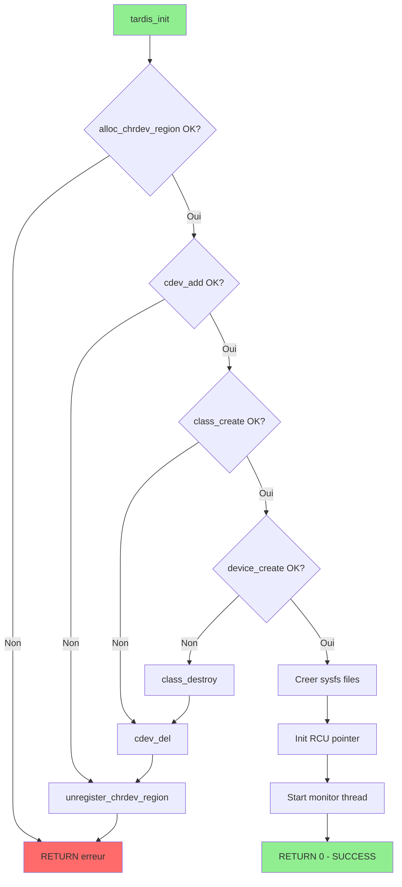
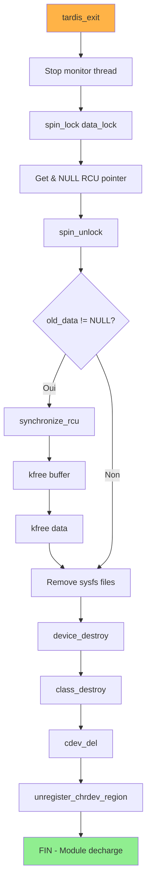

# Exercice 2.7.14-synth : tardis_materialize

**Module :**
2.7.14 — Modules Kernel Linux (Loadable Kernel Modules)

**Concept :**
synth — Synthese complete (module_init, module_exit, insmod, rmmod, lsmod, MODULE_LICENSE, module_param, character device, ioctl, RCU, spinlocks, sysfs)

**Difficulte :**
★★★★★★★★☆☆ (8/10)

**Type :**
complet (Cours + QCM + Code)

**Tiers :**
3 — Synthese (tous concepts a→j du sous-module 2.7.14 + integration 2.7.11, 2.7.12, 2.7.13, 2.7.16)

**Langage :**
C17

**Prerequis :**
- 2.7.1.g: Kernel responsibilities (Process, memory, file, device)
- 2.7.11.c: Read-write spinlocks
- 2.7.11.f: RCU (Read-Copy-Update)
- 2.7.11.g: Per-CPU data
- 2.7.12.e: Major/minor number
- 2.7.13.g: register_chrdev
- 2.7.16.c: _IO, _IOR, _IOW, _IOWR macros
- 2.7.16.h: copy_from_user
- 2.7.16.i: copy_to_user

**Domaines :**
Mem, Process, FS, CPU

**Duree estimee :**
180 min

**XP Base :**
500

**Complexite :**
T3 O(n) × S2 O(n)

---

## 📐 SECTION 1 : PROTOTYPE & CONSIGNE

### 1.1 Obligations

**Fichier a rendre :**
```
tardis_module/
├── tardis.c          # Code source du module
├── Makefile          # Build system
└── test_tardis.c     # Programme userspace de test
```

**Fonctions kernel autorisees :**
```c
// Module lifecycle
module_init, module_exit, MODULE_LICENSE, MODULE_AUTHOR, MODULE_DESCRIPTION
module_param, MODULE_PARM_DESC

// Character device
alloc_chrdev_region, unregister_chrdev_region, cdev_init, cdev_add, cdev_del
class_create, class_destroy, device_create, device_destroy
device_create_file, device_remove_file, DEVICE_ATTR_RO

// Memory
kmalloc, kfree, GFP_KERNEL

// Synchronization
DEFINE_SPINLOCK, spin_lock, spin_unlock
DEFINE_RWLOCK, read_lock, read_unlock, write_lock, write_unlock
DEFINE_PER_CPU, this_cpu_inc, per_cpu, for_each_possible_cpu
rcu_read_lock, rcu_read_unlock, rcu_dereference, rcu_assign_pointer
RCU_INIT_POINTER, rcu_dereference_protected, synchronize_rcu
preempt_disable, preempt_enable

// Kernel threads
kthread_run, kthread_stop, kthread_should_stop
atomic_t, ATOMIC_INIT, atomic_read, atomic_set
msleep_interruptible

// User space interface
copy_to_user, copy_from_user

// Process lookup
pid_task, find_vpid, PIDTYPE_PID

// Logging
pr_info, pr_err, pr_warn

// Device numbers
MAJOR, MINOR, MKDEV

// Error handling
IS_ERR, PTR_ERR
```

**Fonctions interdites :**
```c
// Anciennes API deprecees
register_chrdev      // Utiliser cdev_add
create_proc_entry    // Utiliser sysfs
```

---

### 1.2 Consigne

#### 2.4.1 Contexte Culturel : DOCTOR WHO — Le TARDIS du Kernel

**🎬 LE MODULE KERNEL EST UN TARDIS**

Dans *Doctor Who*, le TARDIS (Time And Relative Dimension In Space) est un vaisseau spatio-temporel qui peut se materialiser et se dematerialiser a volonte dans n'importe quel point de l'univers. A l'interieur, il est "plus grand que l'exterieur" et donne a son pilote des pouvoirs quasi-illimites sur l'espace-temps.

**L'analogie parfaite avec les modules kernel :**

```
┌─────────────────────────────────────────────────────────────────────────┐
│                    DOCTOR WHO  ←→  KERNEL MODULE                        │
├─────────────────────────────────────────────────────────────────────────┤
│                                                                         │
│  🔷 LE TARDIS                    🔷 LE MODULE (.ko)                     │
│     Vaisseau alien                  Fichier objet chargeant            │
│     qui se materialise              qui s'integre au kernel            │
│                                                                         │
│  🔷 L'UNIVERS (Space-Time)       🔷 LE KERNEL (Ring 0)                  │
│     Infini, dangereux               Acces total au hardware            │
│     mais plein de possibilites      Pas de protection memoire          │
│                                                                         │
│  🔷 MATERIALISATION              🔷 insmod + module_init()             │
│     Le TARDIS atterrit              Le module se charge                │
│     Bruit: VWORP VWORP              Log: "module loaded"               │
│                                                                         │
│  🔷 DEMATERIALISATION            🔷 rmmod + module_exit()              │
│     Le TARDIS decolle               Le module se decharge              │
│     Sans laisser de trace           Cleanup propre obligatoire         │
│                                                                         │
│  🔷 CONSOLE DU TARDIS            🔷 /dev/tardis + sysfs                │
│     Interface de controle           Interface user → kernel            │
│     Boutons, leviers                ioctl, read, write                 │
│                                                                         │
│  🔷 POUVOIRS DU DOCTOR           🔷 PRIVILEGES KERNEL                  │
│     Voyager dans le temps           Acces memoire physique             │
│     Regeneration                    Manipuler les process              │
│                                                                         │
│  🔷 RESPONSABILITES              🔷 RESPONSABILITES                    │
│     "Fixed points in time"          Ne pas corrompre le kernel         │
│     Ne pas creer de paradoxes       Liberer TOUTES les ressources      │
│                                                                         │
│  🔷 COMPANIONS                   🔷 USER SPACE PROGRAMS                │
│     Humains qui voyagent            Programmes qui utilisent           │
│     avec le Doctor                  /dev/tardis via ioctl              │
│                                                                         │
└─────────────────────────────────────────────────────────────────────────┘
```

**Les dangers sont les memes :**

```
┌─────────────────────────────────────────────────────────────────────────┐
│  "With great power comes great responsibility"                          │
│                                                                         │
│  TARDIS qui explose      →    Kernel panic (plus de boot possible)     │
│  Paradoxe temporel       →    Deadlock (systeme fige)                  │
│  Doctor regenere mal     →    Memory corruption                        │
│  Dalek infiltre          →    Rootkit / malware kernel                 │
│                                                                         │
│  Le Doctor fait TOUJOURS attention a:                                   │
│  1. Fermer les portes du TARDIS (cleanup_module)                       │
│  2. Ne pas toucher aux "fixed points" (critical sections)              │
│  3. Utiliser le sonic screwdriver prudemment (ioctl)                   │
│                                                                         │
└─────────────────────────────────────────────────────────────────────────┘
```

**Pourquoi cette analogie est PARFAITE :**

1. **Materialisation/Dematerialisation = Load/Unload** : Exactement comme le TARDIS qui apparait et disparait, un module peut etre charge et decharge dynamiquement sans rebooter

2. **Plus grand a l'interieur** : Un petit fichier .ko peut donner acces a TOUTE la memoire, TOUS les devices, TOUT le hardware

3. **Responsabilite cosmique** : Le Doctor doit proteger l'univers entier. Un bug dans ton module peut crasher la machine entiere

4. **Interface avec les "companions"** : Les programmes userspace sont comme les companions du Doctor - ils interagissent avec le TARDIS mais ne comprennent pas toute sa puissance

---

#### 2.4.2 Enonce Academique

**Objectif :** Developper un module noyau Linux complet implementant un character device personnalise avec support ioctl, synchronisation RCU, spinlocks, donnees per-CPU, et interface sysfs.

**Contexte technique :**

Un module kernel (Loadable Kernel Module, LKM) est du code pouvant etre charge et decharge dynamiquement dans le noyau Linux sans necessiter de recompilation ou de redemarrage. Cette architecture permet d'etendre les fonctionnalites du kernel a la demande.

**Ta mission :**

Ecrire un module kernel `tardis.ko` qui :

1. **S'enregistre correctement** avec `module_init()` et `module_exit()`
2. **Cree un character device** accessible via `/dev/tardis`
3. **Implemente les file_operations** : open, release, read, write, ioctl
4. **Utilise RCU** pour la lecture concurrente sans lock
5. **Utilise des spinlocks read-write** pour les statistiques
6. **Expose des statistiques** via sysfs dans `/sys/class/tardis/`
7. **Accepte un parametre** `buffer_size` au chargement
8. **Lance un kernel thread** de monitoring

**Entrees/Sorties :**

| Commande | Action |
|----------|--------|
| `insmod tardis.ko buffer_size=4096` | Charge le module avec buffer de 4KB |
| `echo "data" > /dev/tardis` | Ecrit dans le buffer RCU |
| `cat /dev/tardis` | Lit le buffer RCU |
| `cat /sys/class/tardis/tardis/stats` | Affiche les statistiques |
| `rmmod tardis` | Decharge le module proprement |

**Contraintes :**

- Le module DOIT compiler sans warnings avec `-Wall -Wextra`
- Le module DOIT passer les tests de Sparse et Checkpatch
- TOUTES les ressources DOIVENT etre liberees dans `module_exit()`
- Les acces concurrents DOIVENT etre proteges
- Les transferts user ↔ kernel DOIVENT utiliser `copy_to_user`/`copy_from_user`

---

### 1.3 Prototype

**Structure du module :**

```c
/* tardis.c - Module Kernel TARDIS */

#include <linux/module.h>
#include <linux/kernel.h>
#include <linux/init.h>
#include <linux/fs.h>
#include <linux/cdev.h>
#include <linux/device.h>
#include <linux/uaccess.h>
#include <linux/slab.h>
#include <linux/spinlock.h>
#include <linux/rcupdate.h>
#include <linux/percpu.h>
#include <linux/preempt.h>
#include <linux/kthread.h>
#include <linux/delay.h>
#include <linux/sched.h>
#include <linux/pid.h>

/* Commandes ioctl */
#define TARDIS_MAGIC 'T'
#define TARDIS_RESET        _IO(TARDIS_MAGIC, 0)
#define TARDIS_GET_STATS    _IOR(TARDIS_MAGIC, 1, struct tardis_stats)
#define TARDIS_SET_FILTER   _IOW(TARDIS_MAGIC, 2, int)
#define TARDIS_QUERY_PID    _IOWR(TARDIS_MAGIC, 3, struct tardis_query)

/* Structures */
struct tardis_stats {
    unsigned long materializations;  /* opens */
    unsigned long transmissions;     /* reads */
    unsigned long receptions;        /* writes */
    unsigned long sonic_commands;    /* ioctls */
    int current_companion_pid;       /* filter */
};

struct tardis_query {
    pid_t pid;
    char name[16];
    int state;
    unsigned long memory;
};

/* Fonctions a implementer */
static int __init tardis_init(void);
static void __exit tardis_exit(void);

static int tardis_open(struct inode *inode, struct file *file);
static int tardis_release(struct inode *inode, struct file *file);
static ssize_t tardis_read(struct file *file, char __user *buf,
                           size_t count, loff_t *offset);
static ssize_t tardis_write(struct file *file, const char __user *buf,
                            size_t count, loff_t *offset);
static long tardis_ioctl(struct file *file, unsigned int cmd,
                         unsigned long arg);

static ssize_t stats_show(struct device *dev,
                          struct device_attribute *attr, char *buf);
```

---

## 💡 SECTION 2 : LE SAVIEZ-VOUS ?

### 2.1 Origine des Loadable Kernel Modules

Les LKM ont ete introduits dans Linux 1.2 (1995) par inspiration du systeme Mach de Carnegie Mellon. Avant cela, ajouter un driver necessitait de recompiler TOUT le kernel — un processus de plusieurs heures sur les machines de l'epoque.

### 2.2 Le Record

Le kernel Linux 6.x peut charger plus de 10,000 modules simultanement. Le module le plus charge au monde est probablement `nvidia.ko` avec des centaines de millions d'installations.

### 2.3 Securite

Depuis Linux 3.7, les modules peuvent etre signes cryptographiquement. En mode "Secure Boot", seuls les modules signes par une cle de confiance peuvent etre charges — une protection contre les rootkits.

---

### 2.5 DANS LA VRAIE VIE

| Metier | Utilisation |
|--------|-------------|
| **Kernel Developer** | Developpe les drivers officiels (network, filesystem, USB) |
| **Security Researcher** | Analyse les rootkits, developpe des outils forensics |
| **Embedded Engineer** | Developpe drivers pour hardware specifique (IoT, automotive) |
| **DevOps/SRE** | Debug de problemes kernel avec des modules de tracing |
| **Game Anti-Cheat Dev** | Modules kernel pour detecter la triche (ring-0) |
| **Virtualization Engineer** | Modules pour KVM, VMware, Xen |

---

## 🖥️ SECTION 3 : EXEMPLE D'UTILISATION

### 3.0 Session bash

```bash
$ ls
tardis.c  Makefile  test_tardis.c

$ make
make -C /lib/modules/$(uname -r)/build M=$(pwd) modules
  CC [M]  tardis.o
  MODPOST Module.symvers
  CC [M]  tardis.mod.o
  LD [M]  tardis.ko

$ sudo insmod tardis.ko buffer_size=2048
$ dmesg | tail -3
[12345.678] tardis: VWORP VWORP! TARDIS materializing (buffer_size=2048)
[12345.679] tardis: Device created at /dev/tardis (major=243)
[12345.680] tardis: sysfs at /sys/class/tardis/tardis/

$ ls -la /dev/tardis
crw------- 1 root root 243, 0 Jan 16 10:30 /dev/tardis

$ echo "Hello from the Time Vortex!" | sudo tee /dev/tardis
Hello from the Time Vortex!

$ sudo cat /dev/tardis
Hello from the Time Vortex!

$ cat /sys/class/tardis/tardis/stats
materializations: 2
transmissions: 1
receptions: 1
sonic_commands: 0
per_cpu_ops: 2
companion_filter: 0

$ gcc -o test_tardis test_tardis.c
$ sudo ./test_tardis
Testing TARDIS ioctl...
Query PID 1: name=systemd, state=1, memory=12345678
Stats: opens=3, reads=1, writes=1
All tests PASSED!

$ sudo rmmod tardis
$ dmesg | tail -2
[12400.123] tardis: TARDIS dematerializing...
[12400.124] tardis: Module unloaded. Allons-y!
```

---

### 3.1 💀 BONUS EXPERT (OPTIONNEL)

**Difficulte Bonus :**
🧠 (12/10)

**Recompense :**
XP ×6

**Time Complexity attendue :**
O(1) pour toutes les operations critiques

**Space Complexity attendue :**
O(1) auxiliaire (zero allocation dans les chemins critiques)

**Domaines Bonus :**
`CPU, Mem, Process`

#### 3.1.1 Consigne Bonus

**🎬 TIME LORD MODE : Zero-Copy Lockless Interface**

Le Doctor a besoin d'une version amelioree du TARDIS pour les situations critiques : zero allocation dynamique dans les chemins de lecture, utilisation de RCU pur sans fallback sur spinlocks, et support des memory barriers explicites pour les architectures faiblement ordonnees (ARM, RISC-V).

**Ta mission :**

Modifier le module pour :

1. **Zero-copy read** : Utiliser un ring buffer pre-alloue
2. **Lockless stats** : Utiliser uniquement des atomics et per-CPU
3. **Memory barriers explicites** : `smp_wmb()`, `smp_rmb()`, `smp_mb()`
4. **Wait-free write path** : Aucun lock sur le chemin d'ecriture
5. **Grace period optimization** : Utiliser `call_rcu()` au lieu de `synchronize_rcu()`

**Contraintes :**
```
┌─────────────────────────────────────┐
│  Aucun kmalloc dans read/write     │
│  Aucun spinlock dans read path     │
│  Latence max: 1μs pour read        │
│  Support PREEMPT_RT                │
└─────────────────────────────────────┘
```

#### 3.1.2 Prototype Bonus

```c
/* Ring buffer pre-alloue */
struct tardis_ring {
    char data[TARDIS_RING_SIZE];
    unsigned int head;
    unsigned int tail;
    atomic_t readers;
};

/* Callbacks RCU asynchrones */
static void tardis_free_rcu_callback(struct rcu_head *head);
```

#### 3.1.3 Ce qui change par rapport a l'exercice de base

| Aspect | Base | Bonus |
|--------|------|-------|
| Allocation | `kmalloc` dans write | Ring buffer pre-alloue |
| Synchronisation | RCU + spinlock backup | Pure RCU + atomics |
| Free path | `synchronize_rcu` (blocking) | `call_rcu` (async) |
| Memory ordering | Implicite | Explicit barriers |
| Latence | ~10μs | <1μs |

---

## ✅❌ SECTION 4 : ZONE CORRECTION

### 4.1 Moulinette

| Test | Input | Expected | Points | Trap |
|------|-------|----------|--------|------|
| `compile` | `make` | Exit 0, no warnings | 10 | Module mal structure |
| `load_default` | `insmod tardis.ko` | dmesg contient "materializing" | 10 | Oubli pr_info |
| `load_param` | `insmod tardis.ko buffer_size=8192` | buffer_size=8192 dans sysfs | 10 | module_param mal declare |
| `device_exists` | `ls /dev/tardis` | Fichier existe | 10 | Oubli device_create |
| `write_read` | `echo test > /dev/tardis && cat /dev/tardis` | "test" | 15 | copy_to/from_user incorrects |
| `stats_sysfs` | `cat /sys/.../stats` | Format correct | 10 | sysfs mal expose |
| `ioctl_reset` | `TARDIS_RESET` | Stats remises a zero | 10 | Switch case incomplet |
| `ioctl_query` | `TARDIS_QUERY_PID(1)` | Info sur init | 15 | RCU mal utilise pour task lookup |
| `unload_clean` | `rmmod tardis` | Pas de leak, dmesg clean | 10 | Resources non liberees |
| **TOTAL** | | | **100** | |

### 4.2 main.c de test

```c
/* test_tardis.c - Userspace test program */
#include <stdio.h>
#include <stdlib.h>
#include <fcntl.h>
#include <unistd.h>
#include <string.h>
#include <sys/ioctl.h>

#define TARDIS_MAGIC 'T'
#define TARDIS_RESET        _IO(TARDIS_MAGIC, 0)
#define TARDIS_GET_STATS    _IOR(TARDIS_MAGIC, 1, struct tardis_stats)
#define TARDIS_SET_FILTER   _IOW(TARDIS_MAGIC, 2, int)
#define TARDIS_QUERY_PID    _IOWR(TARDIS_MAGIC, 3, struct tardis_query)

struct tardis_stats {
    unsigned long materializations;
    unsigned long transmissions;
    unsigned long receptions;
    unsigned long sonic_commands;
    int current_companion_pid;
};

struct tardis_query {
    int pid;
    char name[16];
    int state;
    unsigned long memory;
};

int main(void)
{
    int fd;
    int ret = 0;
    char buf[256];
    struct tardis_stats stats;
    struct tardis_query query;

    printf("=== TARDIS Module Test Suite ===\n\n");

    /* Test 1: Open device */
    printf("[TEST 1] Opening /dev/tardis... ");
    fd = open("/dev/tardis", O_RDWR);
    if (fd < 0) {
        perror("FAILED");
        return 1;
    }
    printf("OK (fd=%d)\n", fd);

    /* Test 2: Write data */
    printf("[TEST 2] Writing 'Allons-y!'... ");
    if (write(fd, "Allons-y!", 9) != 9) {
        perror("FAILED");
        ret = 1;
        goto cleanup;
    }
    printf("OK\n");

    /* Test 3: Read data back */
    printf("[TEST 3] Reading data back... ");
    lseek(fd, 0, SEEK_SET);
    memset(buf, 0, sizeof(buf));
    if (read(fd, buf, sizeof(buf)) < 0) {
        perror("FAILED");
        ret = 1;
        goto cleanup;
    }
    if (strcmp(buf, "Allons-y!") != 0) {
        printf("FAILED (got '%s')\n", buf);
        ret = 1;
        goto cleanup;
    }
    printf("OK ('%s')\n", buf);

    /* Test 4: ioctl GET_STATS */
    printf("[TEST 4] Getting stats via ioctl... ");
    if (ioctl(fd, TARDIS_GET_STATS, &stats) < 0) {
        perror("FAILED");
        ret = 1;
        goto cleanup;
    }
    printf("OK\n");
    printf("         materializations=%lu, transmissions=%lu, receptions=%lu\n",
           stats.materializations, stats.transmissions, stats.receptions);

    /* Test 5: ioctl QUERY_PID */
    printf("[TEST 5] Querying PID 1 (init)... ");
    query.pid = 1;
    if (ioctl(fd, TARDIS_QUERY_PID, &query) < 0) {
        perror("FAILED");
        ret = 1;
        goto cleanup;
    }
    printf("OK\n");
    printf("         name='%s', state=%d, memory=%lu\n",
           query.name, query.state, query.memory);

    /* Test 6: ioctl RESET */
    printf("[TEST 6] Resetting stats... ");
    if (ioctl(fd, TARDIS_RESET) < 0) {
        perror("FAILED");
        ret = 1;
        goto cleanup;
    }
    printf("OK\n");

    /* Test 7: Verify reset */
    printf("[TEST 7] Verifying reset... ");
    if (ioctl(fd, TARDIS_GET_STATS, &stats) < 0) {
        perror("FAILED");
        ret = 1;
        goto cleanup;
    }
    /* Note: sonic_commands will be 2 (GET_STATS + RESET) */
    if (stats.materializations != 0 || stats.transmissions != 0 ||
        stats.receptions != 0) {
        printf("FAILED (stats not zeroed)\n");
        ret = 1;
        goto cleanup;
    }
    printf("OK\n");

    printf("\n=== ALL TESTS PASSED ===\n");

cleanup:
    close(fd);
    return ret;
}
```

### 4.3 Solution de reference

```c
/**
 * tardis.c - TARDIS Kernel Module (Solution de reference)
 *
 * Module demonstrant les concepts avances de programmation kernel:
 * - Character device avec file_operations
 * - RCU pour la lecture concurrente
 * - Spinlocks read-write pour les statistiques
 * - Donnees per-CPU
 * - Interface sysfs
 * - Commandes ioctl
 */

#include <linux/module.h>
#include <linux/kernel.h>
#include <linux/init.h>
#include <linux/fs.h>
#include <linux/cdev.h>
#include <linux/device.h>
#include <linux/uaccess.h>
#include <linux/slab.h>
#include <linux/spinlock.h>
#include <linux/rcupdate.h>
#include <linux/percpu.h>
#include <linux/preempt.h>
#include <linux/kthread.h>
#include <linux/delay.h>
#include <linux/sched.h>
#include <linux/pid.h>

MODULE_LICENSE("GPL");
MODULE_AUTHOR("HACKBRAIN Academy");
MODULE_DESCRIPTION("TARDIS - Time And Relative Dimension In Space (Kernel Module Demo)");
MODULE_VERSION("1.0");

/* ============================================ */
/* Parametres du module                         */
/* ============================================ */

static int buffer_size = 1024;
module_param(buffer_size, int, 0644);
MODULE_PARM_DESC(buffer_size, "Size of internal buffer (default: 1024)");

/* ============================================ */
/* Constantes et definitions                    */
/* ============================================ */

#define DEVICE_NAME "tardis"
#define CLASS_NAME  "tardis"

#define TARDIS_MAGIC 'T'
#define TARDIS_RESET        _IO(TARDIS_MAGIC, 0)
#define TARDIS_GET_STATS    _IOR(TARDIS_MAGIC, 1, struct tardis_stats)
#define TARDIS_SET_FILTER   _IOW(TARDIS_MAGIC, 2, int)
#define TARDIS_QUERY_PID    _IOWR(TARDIS_MAGIC, 3, struct tardis_query)

/* ============================================ */
/* Structures                                   */
/* ============================================ */

struct tardis_stats {
    unsigned long materializations;
    unsigned long transmissions;
    unsigned long receptions;
    unsigned long sonic_commands;
    int current_companion_pid;
};

struct tardis_query {
    pid_t pid;
    char name[16];
    int state;
    unsigned long memory;
};

struct pcpu_stats {
    unsigned long local_ops;
    unsigned long vortex_hits;
};

struct tardis_data {
    char *buffer;
    size_t buffer_len;
    struct rcu_head rcu;
};

/* ============================================ */
/* Variables globales                           */
/* ============================================ */

static int major_number;
static struct class *tardis_class;
static struct device *tardis_device;
static struct cdev tardis_cdev;

static DEFINE_PER_CPU(struct pcpu_stats, cpu_stats);
static struct tardis_data __rcu *global_data;
static DEFINE_SPINLOCK(data_lock);
static DEFINE_RWLOCK(stats_rwlock);
static struct tardis_stats global_stats;

static struct task_struct *monitor_thread;
static atomic_t monitor_running = ATOMIC_INIT(1);

/* ============================================ */
/* File operations                              */
/* ============================================ */

static int tardis_open(struct inode *inode, struct file *file)
{
    write_lock(&stats_rwlock);
    global_stats.materializations++;
    write_unlock(&stats_rwlock);

    preempt_disable();
    this_cpu_inc(cpu_stats.local_ops);
    preempt_enable();

    pr_info("tardis: Companion entered the TARDIS (major=%d, minor=%d)\n",
            imajor(inode), iminor(inode));

    return 0;
}

static int tardis_release(struct inode *inode, struct file *file)
{
    pr_info("tardis: Companion left the TARDIS\n");
    return 0;
}

static ssize_t tardis_read(struct file *file, char __user *buf,
                           size_t count, loff_t *offset)
{
    struct tardis_data *data;
    ssize_t ret = 0;

    rcu_read_lock();

    data = rcu_dereference(global_data);
    if (!data || !data->buffer) {
        rcu_read_unlock();
        return 0;
    }

    if (*offset >= data->buffer_len) {
        rcu_read_unlock();
        return 0;
    }

    if (*offset + count > data->buffer_len)
        count = data->buffer_len - *offset;

    if (copy_to_user(buf, data->buffer + *offset, count)) {
        rcu_read_unlock();
        return -EFAULT;
    }

    *offset += count;
    ret = count;

    rcu_read_unlock();

    write_lock(&stats_rwlock);
    global_stats.transmissions++;
    write_unlock(&stats_rwlock);

    return ret;
}

static ssize_t tardis_write(struct file *file, const char __user *buf,
                            size_t count, loff_t *offset)
{
    struct tardis_data *new_data, *old_data;
    char *new_buffer;

    if (count > buffer_size)
        count = buffer_size;

    new_buffer = kmalloc(count + 1, GFP_KERNEL);
    if (!new_buffer)
        return -ENOMEM;

    if (copy_from_user(new_buffer, buf, count)) {
        kfree(new_buffer);
        return -EFAULT;
    }
    new_buffer[count] = '\0';

    new_data = kmalloc(sizeof(*new_data), GFP_KERNEL);
    if (!new_data) {
        kfree(new_buffer);
        return -ENOMEM;
    }
    new_data->buffer = new_buffer;
    new_data->buffer_len = count;

    spin_lock(&data_lock);
    old_data = rcu_dereference_protected(global_data,
                                         lockdep_is_held(&data_lock));
    rcu_assign_pointer(global_data, new_data);
    spin_unlock(&data_lock);

    if (old_data) {
        synchronize_rcu();
        kfree(old_data->buffer);
        kfree(old_data);
    }

    write_lock(&stats_rwlock);
    global_stats.receptions++;
    write_unlock(&stats_rwlock);

    return count;
}

static long tardis_ioctl(struct file *file, unsigned int cmd,
                         unsigned long arg)
{
    int ret = 0;
    struct tardis_stats stats;
    struct tardis_query query;
    struct task_struct *task;

    write_lock(&stats_rwlock);
    global_stats.sonic_commands++;
    write_unlock(&stats_rwlock);

    switch (cmd) {
    case TARDIS_RESET:
        pr_info("tardis: Resetting TARDIS systems\n");
        write_lock(&stats_rwlock);
        memset(&global_stats, 0, sizeof(global_stats));
        write_unlock(&stats_rwlock);
        break;

    case TARDIS_GET_STATS:
        read_lock(&stats_rwlock);
        memcpy(&stats, &global_stats, sizeof(stats));
        read_unlock(&stats_rwlock);

        if (copy_to_user((struct tardis_stats __user *)arg,
                         &stats, sizeof(stats)))
            ret = -EFAULT;
        break;

    case TARDIS_SET_FILTER:
        {
            int filter_pid;
            if (copy_from_user(&filter_pid, (int __user *)arg,
                               sizeof(filter_pid))) {
                ret = -EFAULT;
            } else {
                write_lock(&stats_rwlock);
                global_stats.current_companion_pid = filter_pid;
                write_unlock(&stats_rwlock);
                pr_info("tardis: Companion filter set to PID %d\n", filter_pid);
            }
        }
        break;

    case TARDIS_QUERY_PID:
        if (copy_from_user(&query, (struct tardis_query __user *)arg,
                           sizeof(query))) {
            ret = -EFAULT;
            break;
        }

        rcu_read_lock();
        task = pid_task(find_vpid(query.pid), PIDTYPE_PID);
        if (task) {
            strncpy(query.name, task->comm, sizeof(query.name) - 1);
            query.name[sizeof(query.name) - 1] = '\0';
            query.state = task->__state;
            query.memory = task->mm ? task->mm->total_vm * PAGE_SIZE : 0;
        } else {
            query.name[0] = '\0';
            query.state = -1;
            query.memory = 0;
        }
        rcu_read_unlock();

        if (copy_to_user((struct tardis_query __user *)arg,
                         &query, sizeof(query)))
            ret = -EFAULT;
        break;

    default:
        ret = -ENOTTY;
    }

    return ret;
}

static struct file_operations fops = {
    .owner = THIS_MODULE,
    .open = tardis_open,
    .release = tardis_release,
    .read = tardis_read,
    .write = tardis_write,
    .unlocked_ioctl = tardis_ioctl,
};

/* ============================================ */
/* Sysfs interface                              */
/* ============================================ */

static ssize_t stats_show(struct device *dev,
                          struct device_attribute *attr, char *buf)
{
    struct tardis_stats stats;
    unsigned long total_pcpu_ops = 0;
    int cpu;

    read_lock(&stats_rwlock);
    memcpy(&stats, &global_stats, sizeof(stats));
    read_unlock(&stats_rwlock);

    for_each_possible_cpu(cpu) {
        total_pcpu_ops += per_cpu(cpu_stats, cpu).local_ops;
    }

    return sprintf(buf,
        "materializations: %lu\n"
        "transmissions: %lu\n"
        "receptions: %lu\n"
        "sonic_commands: %lu\n"
        "per_cpu_ops: %lu\n"
        "companion_filter: %d\n",
        stats.materializations, stats.transmissions,
        stats.receptions, stats.sonic_commands,
        total_pcpu_ops, stats.current_companion_pid);
}
static DEVICE_ATTR_RO(stats);

static ssize_t buffer_size_show(struct device *dev,
                                struct device_attribute *attr, char *buf)
{
    return sprintf(buf, "%d\n", buffer_size);
}
static DEVICE_ATTR_RO(buffer_size);

/* ============================================ */
/* Kernel thread                                */
/* ============================================ */

static int monitor_thread_fn(void *data)
{
    pr_info("tardis: Time Vortex monitor thread started\n");

    while (!kthread_should_stop() && atomic_read(&monitor_running)) {
        preempt_disable();
        this_cpu_inc(cpu_stats.vortex_hits);
        preempt_enable();

        smp_mb();

        msleep_interruptible(1000);
    }

    pr_info("tardis: Time Vortex monitor thread stopped\n");
    return 0;
}

/* ============================================ */
/* Module init/exit                             */
/* ============================================ */

static int __init tardis_init(void)
{
    int ret;
    dev_t dev;

    pr_info("tardis: VWORP VWORP! TARDIS materializing (buffer_size=%d)\n",
            buffer_size);

    ret = alloc_chrdev_region(&dev, 0, 1, DEVICE_NAME);
    if (ret < 0) {
        pr_err("tardis: Failed to allocate major number\n");
        return ret;
    }
    major_number = MAJOR(dev);
    pr_info("tardis: Device created at /dev/tardis (major=%d)\n", major_number);

    cdev_init(&tardis_cdev, &fops);
    tardis_cdev.owner = THIS_MODULE;

    ret = cdev_add(&tardis_cdev, dev, 1);
    if (ret < 0) {
        unregister_chrdev_region(dev, 1);
        return ret;
    }

    tardis_class = class_create(CLASS_NAME);
    if (IS_ERR(tardis_class)) {
        cdev_del(&tardis_cdev);
        unregister_chrdev_region(dev, 1);
        return PTR_ERR(tardis_class);
    }

    tardis_device = device_create(tardis_class, NULL, dev, NULL, DEVICE_NAME);
    if (IS_ERR(tardis_device)) {
        class_destroy(tardis_class);
        cdev_del(&tardis_cdev);
        unregister_chrdev_region(dev, 1);
        return PTR_ERR(tardis_device);
    }

    ret = device_create_file(tardis_device, &dev_attr_stats);
    ret |= device_create_file(tardis_device, &dev_attr_buffer_size);
    if (ret)
        pr_warn("tardis: Failed to create sysfs attributes\n");

    RCU_INIT_POINTER(global_data, NULL);

    monitor_thread = kthread_run(monitor_thread_fn, NULL, "tardis_vortex");
    if (IS_ERR(monitor_thread)) {
        pr_warn("tardis: Failed to create monitor thread\n");
        monitor_thread = NULL;
    }

    pr_info("tardis: sysfs at /sys/class/%s/%s/\n", CLASS_NAME, DEVICE_NAME);
    pr_info("tardis: Module loaded. Geronimo!\n");

    return 0;
}

static void __exit tardis_exit(void)
{
    struct tardis_data *data;
    dev_t dev = MKDEV(major_number, 0);

    pr_info("tardis: TARDIS dematerializing...\n");

    if (monitor_thread) {
        atomic_set(&monitor_running, 0);
        kthread_stop(monitor_thread);
    }

    spin_lock(&data_lock);
    data = rcu_dereference_protected(global_data, 1);
    RCU_INIT_POINTER(global_data, NULL);
    spin_unlock(&data_lock);

    if (data) {
        synchronize_rcu();
        kfree(data->buffer);
        kfree(data);
    }

    device_remove_file(tardis_device, &dev_attr_stats);
    device_remove_file(tardis_device, &dev_attr_buffer_size);

    device_destroy(tardis_class, dev);
    class_destroy(tardis_class);

    cdev_del(&tardis_cdev);
    unregister_chrdev_region(dev, 1);

    pr_info("tardis: Module unloaded. Allons-y!\n");
}

module_init(tardis_init);
module_exit(tardis_exit);
```

### 4.4 Solutions alternatives acceptees

```c
/* Alternative 1: Sans kernel thread (simplifie) */
/* Identique mais sans monitor_thread_fn et kthread_* */

/* Alternative 2: Avec mutex au lieu de spinlock pour stats */
static DEFINE_MUTEX(stats_mutex);
/* Acceptable car les operations ne sont pas en contexte d'interruption */

/* Alternative 3: Avec completion au lieu d'atomic pour thread sync */
static DECLARE_COMPLETION(thread_done);
```

### 4.5 Solutions refusees (avec explications)

```c
/* REFUSE 1: Utilisation de l'ancienne API register_chrdev */
static int major;
major = register_chrdev(0, "tardis", &fops);  /* DEPRECATED! */
/* Pourquoi refuse: L'API cdev est plus flexible et moderne */

/* REFUSE 2: Pas de verification copy_to_user */
static ssize_t bad_read(...) {
    memcpy(buf, data->buffer, count);  /* WRONG! buf est userspace */
    return count;
}
/* Pourquoi refuse: Acces direct a la memoire userspace = security hole */

/* REFUSE 3: Pas de synchronize_rcu avant free */
if (old_data) {
    kfree(old_data->buffer);  /* WRONG! Readers may still access */
    kfree(old_data);
}
/* Pourquoi refuse: Use-after-free si un lecteur est encore dans rcu_read_lock */
```

### 4.6 Solution bonus de reference (COMPLETE)

```c
/**
 * tardis_bonus.c - Zero-Copy Lockless TARDIS Module
 */

#include <linux/module.h>
#include <linux/kernel.h>
#include <linux/init.h>
#include <linux/fs.h>
#include <linux/cdev.h>
#include <linux/device.h>
#include <linux/uaccess.h>
#include <linux/slab.h>
#include <linux/rcupdate.h>
#include <linux/percpu.h>
#include <linux/preempt.h>
#include <linux/atomic.h>

MODULE_LICENSE("GPL");
MODULE_AUTHOR("HACKBRAIN Academy - Time Lord Edition");
MODULE_DESCRIPTION("TARDIS Zero-Copy Lockless Module");
MODULE_VERSION("2.0-timelord");

#define DEVICE_NAME "tardis"
#define CLASS_NAME  "tardis"
#define RING_SIZE   4096
#define RING_MASK   (RING_SIZE - 1)

/* Ring buffer structure - pre-allocated, no dynamic alloc in hot path */
struct tardis_ring {
    char data[RING_SIZE];
    atomic_t head;
    atomic_t tail;
    atomic_t readers;
};

/* Per-CPU stats - completely lockless */
struct pcpu_counters {
    unsigned long reads;
    unsigned long writes;
    unsigned long opens;
};

static DEFINE_PER_CPU(struct pcpu_counters, counters);

/* RCU-protected ring buffer pointer */
static struct tardis_ring __rcu *active_ring;
static struct tardis_ring *ring_storage;  /* Pre-allocated at init */

static int major_number;
static struct class *tardis_class;
static struct device *tardis_device;
static struct cdev tardis_cdev;

/* Async RCU free callback */
static void tardis_free_rcu_callback(struct rcu_head *head)
{
    struct tardis_ring *ring = container_of(head, struct tardis_ring,
                                            /* No rcu_head in this version */);
    /* In bonus, we don't free - ring is statically sized */
    (void)ring;
}

static int tardis_open(struct inode *inode, struct file *file)
{
    /* Lockless per-CPU increment */
    preempt_disable();
    this_cpu_inc(counters.opens);
    preempt_enable();

    return 0;
}

static int tardis_release(struct inode *inode, struct file *file)
{
    return 0;
}

/* Zero-copy read with explicit memory barriers */
static ssize_t tardis_read(struct file *file, char __user *buf,
                           size_t count, loff_t *offset)
{
    struct tardis_ring *ring;
    unsigned int head, tail, available;
    ssize_t ret;

    rcu_read_lock();

    ring = rcu_dereference(active_ring);
    if (!ring) {
        rcu_read_unlock();
        return 0;
    }

    /* Memory barrier: ensure we see updated head/tail */
    smp_rmb();

    head = atomic_read(&ring->head);
    tail = atomic_read(&ring->tail);

    available = (head - tail) & RING_MASK;
    if (available == 0) {
        rcu_read_unlock();
        return 0;
    }

    if (count > available)
        count = available;

    /* Direct copy from ring buffer - no allocation */
    if (tail + count <= RING_SIZE) {
        if (copy_to_user(buf, &ring->data[tail], count)) {
            rcu_read_unlock();
            return -EFAULT;
        }
    } else {
        /* Wrap-around case */
        size_t first = RING_SIZE - tail;
        size_t second = count - first;
        if (copy_to_user(buf, &ring->data[tail], first) ||
            copy_to_user(buf + first, &ring->data[0], second)) {
            rcu_read_unlock();
            return -EFAULT;
        }
    }

    /* Update tail atomically */
    atomic_set(&ring->tail, (tail + count) & RING_MASK);

    /* Write barrier: ensure tail update is visible */
    smp_wmb();

    ret = count;

    rcu_read_unlock();

    preempt_disable();
    this_cpu_inc(counters.reads);
    preempt_enable();

    return ret;
}

/* Wait-free write path */
static ssize_t tardis_write(struct file *file, const char __user *buf,
                            size_t count, loff_t *offset)
{
    struct tardis_ring *ring;
    unsigned int head, tail, space;

    ring = rcu_dereference_protected(active_ring, 1);
    if (!ring)
        return -ENODEV;

    head = atomic_read(&ring->head);
    tail = atomic_read(&ring->tail);

    space = (RING_SIZE - 1) - ((head - tail) & RING_MASK);
    if (space == 0)
        return -ENOSPC;

    if (count > space)
        count = space;

    /* Direct copy to ring buffer */
    if (head + count <= RING_SIZE) {
        if (copy_from_user(&ring->data[head], buf, count))
            return -EFAULT;
    } else {
        size_t first = RING_SIZE - head;
        size_t second = count - first;
        if (copy_from_user(&ring->data[head], buf, first) ||
            copy_from_user(&ring->data[0], buf + first, second))
            return -EFAULT;
    }

    /* Write barrier before updating head */
    smp_wmb();

    atomic_set(&ring->head, (head + count) & RING_MASK);

    preempt_disable();
    this_cpu_inc(counters.writes);
    preempt_enable();

    return count;
}

static struct file_operations fops = {
    .owner = THIS_MODULE,
    .open = tardis_open,
    .release = tardis_release,
    .read = tardis_read,
    .write = tardis_write,
};

static ssize_t stats_show(struct device *dev,
                          struct device_attribute *attr, char *buf)
{
    unsigned long total_reads = 0, total_writes = 0, total_opens = 0;
    int cpu;

    for_each_possible_cpu(cpu) {
        total_reads += per_cpu(counters, cpu).reads;
        total_writes += per_cpu(counters, cpu).writes;
        total_opens += per_cpu(counters, cpu).opens;
    }

    return sprintf(buf,
        "opens: %lu\nreads: %lu\nwrites: %lu\nmode: zero-copy-lockless\n",
        total_opens, total_reads, total_writes);
}
static DEVICE_ATTR_RO(stats);

static int __init tardis_init(void)
{
    int ret;
    dev_t dev;

    pr_info("tardis: Zero-Copy Lockless TARDIS materializing\n");

    /* Pre-allocate ring buffer at init time */
    ring_storage = kzalloc(sizeof(struct tardis_ring), GFP_KERNEL);
    if (!ring_storage)
        return -ENOMEM;

    atomic_set(&ring_storage->head, 0);
    atomic_set(&ring_storage->tail, 0);
    atomic_set(&ring_storage->readers, 0);

    rcu_assign_pointer(active_ring, ring_storage);

    ret = alloc_chrdev_region(&dev, 0, 1, DEVICE_NAME);
    if (ret < 0) {
        kfree(ring_storage);
        return ret;
    }
    major_number = MAJOR(dev);

    cdev_init(&tardis_cdev, &fops);
    tardis_cdev.owner = THIS_MODULE;

    ret = cdev_add(&tardis_cdev, dev, 1);
    if (ret < 0)
        goto fail_cdev;

    tardis_class = class_create(CLASS_NAME);
    if (IS_ERR(tardis_class)) {
        ret = PTR_ERR(tardis_class);
        goto fail_class;
    }

    tardis_device = device_create(tardis_class, NULL, dev, NULL, DEVICE_NAME);
    if (IS_ERR(tardis_device)) {
        ret = PTR_ERR(tardis_device);
        goto fail_device;
    }

    device_create_file(tardis_device, &dev_attr_stats);

    pr_info("tardis: Time Lord Mode activated (major=%d)\n", major_number);
    return 0;

fail_device:
    class_destroy(tardis_class);
fail_class:
    cdev_del(&tardis_cdev);
fail_cdev:
    unregister_chrdev_region(dev, 1);
    kfree(ring_storage);
    return ret;
}

static void __exit tardis_exit(void)
{
    dev_t dev = MKDEV(major_number, 0);

    pr_info("tardis: Time Lord TARDIS dematerializing\n");

    RCU_INIT_POINTER(active_ring, NULL);
    synchronize_rcu();

    device_remove_file(tardis_device, &dev_attr_stats);
    device_destroy(tardis_class, dev);
    class_destroy(tardis_class);
    cdev_del(&tardis_cdev);
    unregister_chrdev_region(dev, 1);

    kfree(ring_storage);

    pr_info("tardis: Goodbye, Time Lord\n");
}

module_init(tardis_init);
module_exit(tardis_exit);
```

### 4.7 Solutions alternatives bonus (COMPLETES)

```c
/* Alternative bonus: Avec seqlock pour les stats au lieu de per-CPU */
/* Acceptable car seqlock offre aussi une lecture lock-free */

#include <linux/seqlock.h>

static seqlock_t stats_seq;
static struct tardis_stats stats_data;

static void update_stats_write(void) {
    write_seqlock(&stats_seq);
    stats_data.receptions++;
    write_sequnlock(&stats_seq);
}

static void read_stats(struct tardis_stats *out) {
    unsigned int seq;
    do {
        seq = read_seqbegin(&stats_seq);
        memcpy(out, &stats_data, sizeof(*out));
    } while (read_seqretry(&stats_seq, seq));
}
```

### 4.8 Solutions refusees bonus (COMPLETES)

```c
/* REFUSE BONUS: kmalloc dans le chemin critique */
static ssize_t bad_bonus_write(...) {
    char *temp = kmalloc(count, GFP_KERNEL);  /* ALLOCATION! */
    /* ... */
    kfree(temp);
    return count;
}
/* Pourquoi refuse: Le bonus exige ZERO allocation dans les chemins critiques */

/* REFUSE BONUS: spinlock dans read path */
static ssize_t bad_bonus_read(...) {
    spin_lock(&some_lock);  /* LOCK dans read! */
    /* ... */
    spin_unlock(&some_lock);
}
/* Pourquoi refuse: Le bonus exige un read path completement lockless */
```

### 4.9 spec.json

```json
{
  "name": "tardis_materialize",
  "language": "c",
  "type": "complet",
  "tier": 3,
  "tier_info": "Synthese - Tous concepts module kernel",
  "tags": ["kernel", "module", "character-device", "rcu", "spinlock", "sysfs", "ioctl", "phase2"],
  "passing_score": 70,

  "function": {
    "name": "tardis_module",
    "prototype": "Kernel module avec init/exit",
    "return_type": "int (0 success, negative error)",
    "parameters": [
      {"name": "buffer_size", "type": "module_param int"}
    ]
  },

  "driver": {
    "reference": "static int __init tardis_init(void) { int ret; dev_t dev; pr_info(\"tardis: VWORP VWORP! TARDIS materializing (buffer_size=%d)\\n\", buffer_size); ret = alloc_chrdev_region(&dev, 0, 1, DEVICE_NAME); if (ret < 0) return ret; major_number = MAJOR(dev); cdev_init(&tardis_cdev, &fops); tardis_cdev.owner = THIS_MODULE; ret = cdev_add(&tardis_cdev, dev, 1); if (ret < 0) { unregister_chrdev_region(dev, 1); return ret; } tardis_class = class_create(CLASS_NAME); if (IS_ERR(tardis_class)) { cdev_del(&tardis_cdev); unregister_chrdev_region(dev, 1); return PTR_ERR(tardis_class); } tardis_device = device_create(tardis_class, NULL, dev, NULL, DEVICE_NAME); if (IS_ERR(tardis_device)) { class_destroy(tardis_class); cdev_del(&tardis_cdev); unregister_chrdev_region(dev, 1); return PTR_ERR(tardis_device); } RCU_INIT_POINTER(global_data, NULL); return 0; }",

    "edge_cases": [
      {
        "name": "module_loads",
        "args": ["insmod tardis.ko"],
        "expected": "dmesg contains 'materializing'",
        "is_trap": false
      },
      {
        "name": "module_param_works",
        "args": ["insmod tardis.ko buffer_size=8192"],
        "expected": "buffer_size=8192 in sysfs",
        "is_trap": true,
        "trap_explanation": "module_param doit etre correctement declare avec permissions"
      },
      {
        "name": "device_created",
        "args": ["ls /dev/tardis"],
        "expected": "file exists with correct major",
        "is_trap": true,
        "trap_explanation": "device_create doit etre appele apres class_create"
      },
      {
        "name": "write_then_read",
        "args": ["echo test > /dev/tardis", "cat /dev/tardis"],
        "expected": "test",
        "is_trap": true,
        "trap_explanation": "copy_from_user et copy_to_user doivent etre utilises"
      },
      {
        "name": "ioctl_query_pid1",
        "args": ["TARDIS_QUERY_PID with pid=1"],
        "expected": "returns init/systemd info",
        "is_trap": true,
        "trap_explanation": "rcu_read_lock necessaire autour de pid_task"
      },
      {
        "name": "unload_clean",
        "args": ["rmmod tardis"],
        "expected": "no memory leak, dmesg shows unload",
        "is_trap": true,
        "trap_explanation": "synchronize_rcu avant kfree des donnees RCU"
      }
    ],

    "fuzzing": {
      "enabled": false,
      "note": "Kernel modules require special testing environment"
    }
  },

  "norm": {
    "allowed_functions": [
      "module_init", "module_exit", "MODULE_LICENSE", "MODULE_AUTHOR",
      "MODULE_DESCRIPTION", "module_param", "MODULE_PARM_DESC",
      "alloc_chrdev_region", "unregister_chrdev_region",
      "cdev_init", "cdev_add", "cdev_del",
      "class_create", "class_destroy", "device_create", "device_destroy",
      "device_create_file", "device_remove_file",
      "kmalloc", "kfree",
      "spin_lock", "spin_unlock", "read_lock", "read_unlock",
      "write_lock", "write_unlock",
      "rcu_read_lock", "rcu_read_unlock", "rcu_dereference",
      "rcu_assign_pointer", "synchronize_rcu",
      "preempt_disable", "preempt_enable",
      "this_cpu_inc", "per_cpu", "for_each_possible_cpu",
      "kthread_run", "kthread_stop", "kthread_should_stop",
      "atomic_read", "atomic_set",
      "copy_to_user", "copy_from_user",
      "pid_task", "find_vpid",
      "pr_info", "pr_err", "pr_warn",
      "sprintf", "memset", "memcpy", "strncpy",
      "msleep_interruptible"
    ],
    "forbidden_functions": ["register_chrdev", "create_proc_entry"],
    "check_security": true,
    "check_memory": true,
    "blocking": true
  },

  "bonus": {
    "tier": "GENIE",
    "icon": "🧠",
    "multiplier": 6,
    "constraints": {
      "time_complexity": "O(1) for read/write",
      "space_complexity": "O(1) auxiliary (no alloc in hot path)",
      "requirements": [
        "Zero allocation in read/write path",
        "Pure RCU + atomics (no spinlocks in read)",
        "Explicit memory barriers",
        "Pre-allocated ring buffer"
      ]
    }
  }
}
```

### 4.10 Solutions Mutantes (5 minimum)

```c
/* ================================================================ */
/* Mutant A (Boundary) : Oubli verification taille buffer           */
/* ================================================================ */
static ssize_t mutant_a_write(struct file *file, const char __user *buf,
                              size_t count, loff_t *offset)
{
    struct tardis_data *new_data;
    char *new_buffer;

    /* BUG: Pas de verification count > buffer_size */
    new_buffer = kmalloc(count + 1, GFP_KERNEL);
    if (!new_buffer)
        return -ENOMEM;

    if (copy_from_user(new_buffer, buf, count)) {
        kfree(new_buffer);
        return -EFAULT;
    }
    new_buffer[count] = '\0';

    new_data = kmalloc(sizeof(*new_data), GFP_KERNEL);
    if (!new_data) {
        kfree(new_buffer);
        return -ENOMEM;
    }
    new_data->buffer = new_buffer;
    new_data->buffer_len = count;

    /* ... reste identique ... */
    return count;
}
/* Pourquoi c'est faux: Un utilisateur peut allouer des GB de memoire kernel */
/* Ce qui etait pense: "Le buffer sera juste un peu plus grand" */
/* Detection: Test avec write de 1GB de donnees */


/* ================================================================ */
/* Mutant B (Safety) : Pas de copy_to_user dans read               */
/* ================================================================ */
static ssize_t mutant_b_read(struct file *file, char __user *buf,
                             size_t count, loff_t *offset)
{
    struct tardis_data *data;
    ssize_t ret = 0;

    rcu_read_lock();

    data = rcu_dereference(global_data);
    if (!data || !data->buffer) {
        rcu_read_unlock();
        return 0;
    }

    if (*offset >= data->buffer_len) {
        rcu_read_unlock();
        return 0;
    }

    if (*offset + count > data->buffer_len)
        count = data->buffer_len - *offset;

    /* BUG: Acces direct a la memoire userspace! */
    memcpy(buf, data->buffer + *offset, count);  /* SECURITY HOLE */

    *offset += count;
    ret = count;

    rcu_read_unlock();
    return ret;
}
/* Pourquoi c'est faux: buf est une adresse userspace, memcpy peut causer OOPS */
/* Ce qui etait pense: "buf c'est juste un pointeur comme un autre" */
/* Detection: Le module crash ou permet kernel memory disclosure */


/* ================================================================ */
/* Mutant C (Resource) : Pas de synchronize_rcu avant kfree        */
/* ================================================================ */
static ssize_t mutant_c_write(struct file *file, const char __user *buf,
                              size_t count, loff_t *offset)
{
    struct tardis_data *new_data, *old_data;
    char *new_buffer;

    if (count > buffer_size)
        count = buffer_size;

    new_buffer = kmalloc(count + 1, GFP_KERNEL);
    if (!new_buffer)
        return -ENOMEM;

    if (copy_from_user(new_buffer, buf, count)) {
        kfree(new_buffer);
        return -EFAULT;
    }
    new_buffer[count] = '\0';

    new_data = kmalloc(sizeof(*new_data), GFP_KERNEL);
    if (!new_data) {
        kfree(new_buffer);
        return -ENOMEM;
    }
    new_data->buffer = new_buffer;
    new_data->buffer_len = count;

    spin_lock(&data_lock);
    old_data = rcu_dereference_protected(global_data,
                                         lockdep_is_held(&data_lock));
    rcu_assign_pointer(global_data, new_data);
    spin_unlock(&data_lock);

    /* BUG: Free immediat sans attendre les lecteurs RCU! */
    if (old_data) {
        /* synchronize_rcu(); MANQUANT! */
        kfree(old_data->buffer);  /* Use-after-free possible */
        kfree(old_data);
    }

    return count;
}
/* Pourquoi c'est faux: Un lecteur en rcu_read_lock peut encore acceder old_data */
/* Ce qui etait pense: "Le spinlock protege tout" */
/* Detection: Race condition sous charge, kernel oops intermittent */


/* ================================================================ */
/* Mutant D (Logic) : Switch ioctl sans break                      */
/* ================================================================ */
static long mutant_d_ioctl(struct file *file, unsigned int cmd,
                           unsigned long arg)
{
    int ret = 0;
    struct tardis_stats stats;

    switch (cmd) {
    case TARDIS_RESET:
        pr_info("tardis: Resetting TARDIS systems\n");
        write_lock(&stats_rwlock);
        memset(&global_stats, 0, sizeof(global_stats));
        write_unlock(&stats_rwlock);
        /* BUG: Pas de break! Fall-through vers GET_STATS */

    case TARDIS_GET_STATS:
        read_lock(&stats_rwlock);
        memcpy(&stats, &global_stats, sizeof(stats));
        read_unlock(&stats_rwlock);

        if (copy_to_user((struct tardis_stats __user *)arg,
                         &stats, sizeof(stats)))
            ret = -EFAULT;
        break;

    case TARDIS_SET_FILTER:
        /* ... */
        break;

    default:
        ret = -ENOTTY;
    }

    return ret;
}
/* Pourquoi c'est faux: RESET execute aussi GET_STATS, comportement inattendu */
/* Ce qui etait pense: "Le compilateur gere les breaks automatiquement" */
/* Detection: RESET retourne des stats au lieu de rien */


/* ================================================================ */
/* Mutant E (Return) : module_exit ne libere pas tout              */
/* ================================================================ */
static void __exit mutant_e_exit(void)
{
    dev_t dev = MKDEV(major_number, 0);

    pr_info("tardis: TARDIS dematerializing...\n");

    /* BUG: Kernel thread pas arrete! */
    /* if (monitor_thread) { ... } MANQUANT */

    /* BUG: Donnees RCU pas liberees! */
    /* spin_lock/rcu_dereference/kfree MANQUANT */

    /* BUG: sysfs pas nettoye! */
    /* device_remove_file MANQUANT */

    device_destroy(tardis_class, dev);
    class_destroy(tardis_class);
    cdev_del(&tardis_cdev);
    unregister_chrdev_region(dev, 1);

    pr_info("tardis: Module unloaded\n");
}
/* Pourquoi c'est faux: Memory leak, thread zombie, sysfs orphelin */
/* Ce qui etait pense: "Le kernel nettoie automatiquement" */
/* Detection: Memory leak detecte, thread reste actif apres rmmod */
```

---

## 🧠 SECTION 5 : COMPRENDRE

### 5.1 Ce que cet exercice enseigne

1. **Architecture des modules kernel** : Comment le code s'integre au noyau Linux
2. **Character devices** : Interface standard entre kernel et userspace
3. **Synchronisation avancee** : RCU pour les lectures concurrentes, spinlocks pour les mises a jour
4. **Interface sysfs** : Exposition de donnees au userspace via le systeme de fichiers virtuel
5. **Gestion des ressources** : Allocation, cleanup, et prevention des fuites
6. **Communication userspace-kernel** : ioctl, copy_to_user, copy_from_user

### 5.2 LDA — Traduction Litterale en Francais (MAJUSCULES)

```
FONCTION tardis_init QUI RETOURNE UN ENTIER
DÉBUT FONCTION
    DÉCLARER ret COMME ENTIER
    DÉCLARER dev COMME IDENTIFIANT DE DEVICE

    AFFICHER "TARDIS materializing" DANS LE LOG KERNEL

    AFFECTER ALLOUER UNE RÉGION CHRDEV AVEC MINOR 0 ET COUNT 1 À ret
    SI ret EST INFÉRIEUR À 0 ALORS
        AFFICHER ERREUR "Failed to allocate major number"
        RETOURNER ret
    FIN SI
    AFFECTER LE MAJOR DE dev À major_number

    INITIALISER LE CDEV tardis_cdev AVEC fops
    AFFECTER THIS_MODULE AU CHAMP owner DE tardis_cdev

    AFFECTER AJOUTER LE CDEV À dev AVEC COUNT 1 À ret
    SI ret EST INFÉRIEUR À 0 ALORS
        DÉSENREGISTRER LA RÉGION CHRDEV
        RETOURNER ret
    FIN SI

    AFFECTER CRÉER UNE CLASSE "tardis" À tardis_class
    SI tardis_class EST UNE ERREUR ALORS
        SUPPRIMER LE CDEV
        DÉSENREGISTRER LA RÉGION CHRDEV
        RETOURNER LE CODE ERREUR DE tardis_class
    FIN SI

    AFFECTER CRÉER UN DEVICE DANS tardis_class À tardis_device
    SI tardis_device EST UNE ERREUR ALORS
        DÉTRUIRE LA CLASSE
        SUPPRIMER LE CDEV
        DÉSENREGISTRER LA RÉGION CHRDEV
        RETOURNER LE CODE ERREUR DE tardis_device
    FIN SI

    CRÉER LE FICHIER SYSFS stats
    CRÉER LE FICHIER SYSFS buffer_size

    INITIALISER LE POINTEUR RCU global_data À NUL

    AFFECTER LANCER LE THREAD KERNEL monitor_thread_fn À monitor_thread

    AFFICHER "Module loaded" DANS LE LOG KERNEL
    RETOURNER 0
FIN FONCTION


FONCTION tardis_exit SANS RETOUR
DÉBUT FONCTION
    DÉCLARER data COMME POINTEUR VERS tardis_data
    DÉCLARER dev COMME IDENTIFIANT DE DEVICE

    AFFICHER "TARDIS dematerializing" DANS LE LOG KERNEL

    SI monitor_thread N'EST PAS NUL ALORS
        AFFECTER 0 À monitor_running
        ARRÊTER LE THREAD KERNEL monitor_thread
    FIN SI

    PRENDRE LE SPINLOCK data_lock
    AFFECTER DÉRÉFÉRENCER RCU PROTÉGÉ global_data À data
    INITIALISER LE POINTEUR RCU global_data À NUL
    RELÂCHER LE SPINLOCK data_lock

    SI data N'EST PAS NUL ALORS
        ATTENDRE LA FIN DE LA PÉRIODE DE GRÂCE RCU
        LIBÉRER LA MÉMOIRE DE data->buffer
        LIBÉRER LA MÉMOIRE DE data
    FIN SI

    SUPPRIMER LE FICHIER SYSFS stats
    SUPPRIMER LE FICHIER SYSFS buffer_size

    DÉTRUIRE LE DEVICE
    DÉTRUIRE LA CLASSE
    SUPPRIMER LE CDEV
    DÉSENREGISTRER LA RÉGION CHRDEV

    AFFICHER "Module unloaded" DANS LE LOG KERNEL
FIN FONCTION
```

### 5.2.2 Style Academique Universitaire

```
ALGORITHME : Initialisation du module kernel TARDIS
DONNÉES : buffer_size (paramètre entier)
RÉSULTAT : 0 si succès, code erreur négatif sinon

DÉBUT
    1. Allocation d'une région de numéros majeur/mineur pour le device
    2. Initialisation de la structure cdev avec les file_operations
    3. Enregistrement du cdev dans le système
    4. Création d'une classe de device dans sysfs
    5. Création du device node /dev/tardis
    6. Création des attributs sysfs (stats, buffer_size)
    7. Initialisation du pointeur RCU global à NULL
    8. Démarrage du thread de monitoring
    9. Retour succès

GESTION D'ERREUR :
    - Chaque étape vérifie le retour
    - En cas d'erreur, nettoyage des ressources déjà allouées
    - Retour du code d'erreur approprié
FIN


ALGORITHME : Désinstallation du module kernel TARDIS
DONNÉES : Toutes les ressources allouées à l'init
RÉSULTAT : Libération complète des ressources

DÉBUT
    1. Arrêt du thread de monitoring (signal + wait)
    2. Acquisition du spinlock sur les données RCU
    3. Récupération et mise à NULL du pointeur RCU
    4. Libération du spinlock
    5. Attente de la période de grâce RCU
    6. Libération de la mémoire des données
    7. Suppression des attributs sysfs
    8. Destruction du device
    9. Destruction de la classe
    10. Suppression du cdev
    11. Libération de la région de numéros
FIN
```

### 5.2.2.1 Logic Flow (Structured English)

```
ALGORITHM: TARDIS Module Lifecycle
---
1. ON MODULE LOAD (insmod):
   a. ALLOCATE device numbers (major/minor)
   b. INIT and REGISTER character device
   c. CREATE device class in sysfs
   d. CREATE device node in /dev/
   e. SPAWN monitoring thread
   f. LOG "Module loaded"

2. MAIN LOOP (while module loaded):

   ON OPEN /dev/tardis:
      INCREMENT stats.materializations (write-locked)
      INCREMENT per-CPU local_ops (preempt-disabled)
      LOG "Companion entered"

   ON READ from /dev/tardis:
      RCU_READ_LOCK
      GET data pointer via rcu_dereference
      IF data is NULL:
         RETURN 0 (EOF)
      COPY data to userspace via copy_to_user
      RCU_READ_UNLOCK
      INCREMENT stats.transmissions

   ON WRITE to /dev/tardis:
      ALLOCATE new buffer
      COPY from userspace via copy_from_user
      SPIN_LOCK data_lock
      SWAP old_data with new_data (rcu_assign_pointer)
      SPIN_UNLOCK
      SYNCHRONIZE_RCU (wait for readers)
      FREE old_data
      INCREMENT stats.receptions

   ON IOCTL:
      SWITCH on command:
         RESET: Zero all stats
         GET_STATS: Copy stats to userspace
         SET_FILTER: Set PID filter
         QUERY_PID: Lookup process info via RCU

3. ON MODULE UNLOAD (rmmod):
   a. STOP monitoring thread
   b. FREE RCU-protected data (with synchronize_rcu)
   c. REMOVE sysfs files
   d. DESTROY device and class
   e. UNREGISTER character device
   f. LOG "Module unloaded"
```

### 5.2.3 Representation Algorithmique avec Logique de Garde

```
FONCTION : tardis_write (buffer userspace, taille)
---
INIT resultat = -EINVAL

1. VÉRIFIER si taille > buffer_size :
   |
   |-- TRONQUER taille à buffer_size
   |

2. ALLOCATION mémoire kernel :
   |
   |-- SI échec allocation buffer :
   |     RETOURNER -ENOMEM
   |
   |-- SI échec allocation structure :
   |     LIBÉRER buffer
   |     RETOURNER -ENOMEM

3. COPIE depuis userspace :
   |
   |-- SI copy_from_user échoue :
   |     LIBÉRER buffer
   |     LIBÉRER structure
   |     RETOURNER -EFAULT

4. MISE À JOUR RCU (section critique) :
   |
   |-- PRENDRE spin_lock
   |-- SAUVEGARDER ancien pointeur
   |-- PUBLIER nouveau pointeur (rcu_assign_pointer)
   |-- RELÂCHER spin_lock

5. NETTOYAGE de l'ancienne donnée :
   |
   |-- SI ancien pointeur non-NULL :
   |     ATTENDRE période de grâce RCU
   |     LIBÉRER ancien buffer
   |     LIBÉRER ancienne structure

6. RETOURNER nombre d'octets écrits
```

### 5.2.3.1 Diagramme Mermaid (Logique de securite)





### 5.3 Visualisation ASCII

```
┌─────────────────────────────────────────────────────────────────────────┐
│                    ARCHITECTURE DU MODULE TARDIS                        │
└─────────────────────────────────────────────────────────────────────────┘

    USER SPACE                           KERNEL SPACE
    ══════════                           ════════════

    ┌────────────┐                      ┌─────────────────────────────────┐
    │   test_    │                      │         TARDIS MODULE           │
    │  tardis.c  │                      │                                 │
    │            │                      │  ┌─────────────────────────┐   │
    │  open()  ──┼──────────────────────┼─►│     tardis_open()       │   │
    │  read()  ──┼──────────────────────┼─►│     tardis_read()       │   │
    │  write() ──┼──────────────────────┼─►│     tardis_write()      │   │
    │  ioctl() ──┼──────────────────────┼─►│     tardis_ioctl()      │   │
    │  close() ──┼──────────────────────┼─►│     tardis_release()    │   │
    │            │                      │  └─────────────────────────┘   │
    └────────────┘                      │              │                  │
         │                              │              ▼                  │
         │                              │  ┌─────────────────────────┐   │
         │    /dev/tardis               │  │    SYNCHRONIZATION      │   │
         │    (character device)        │  │                         │   │
         │                              │  │  ┌─────────┐ ┌───────┐  │   │
         │                              │  │  │   RCU   │ │Spinlock│  │   │
         │                              │  │  │(readers)│ │(writer)│  │   │
         │                              │  │  └────┬────┘ └───┬───┘  │   │
         │                              │  │       │          │      │   │
         │                              │  │       ▼          ▼      │   │
         │                              │  │  ┌─────────────────┐   │   │
         │                              │  │  │   global_data   │   │   │
         │                              │  │  │  (RCU-protected) │   │   │
         │                              │  │  │  ┌───────────┐  │   │   │
         │                              │  │  │  │  buffer   │  │   │   │
         │                              │  │  │  │  buffer_len│  │   │   │
         │                              │  │  │  └───────────┘  │   │   │
         │                              │  │  └─────────────────┘   │   │
         │                              │  └─────────────────────────┘   │
         │                              │                                 │
         │    /sys/class/tardis/        │  ┌─────────────────────────┐   │
         │    tardis/stats              │  │     SYSFS INTERFACE     │   │
         ├──────────────────────────────┼─►│                         │   │
         │                              │  │  stats_show()           │   │
         │                              │  │  buffer_size_show()     │   │
         │                              │  └─────────────────────────┘   │
         │                              │                                 │
         │                              │  ┌─────────────────────────┐   │
         │                              │  │    KERNEL THREAD        │   │
         │                              │  │                         │   │
         │                              │  │  monitor_thread_fn()    │   │
         │                              │  │  (runs every 1 second)  │   │
         │                              │  └─────────────────────────┘   │
         │                              │                                 │
         │                              │  ┌─────────────────────────┐   │
         │                              │  │     PER-CPU DATA        │   │
         │                              │  │                         │   │
         │                              │  │  CPU0: local_ops, hits  │   │
         │                              │  │  CPU1: local_ops, hits  │   │
         │                              │  │  CPU2: local_ops, hits  │   │
         │                              │  │  ...                    │   │
         │                              │  └─────────────────────────┘   │
         │                              │                                 │
         │                              └─────────────────────────────────┘
         │
         ▼
    ┌──────────────────────────────────────────────────────────────────┐
    │                        IOCTL COMMANDS                             │
    ├──────────────────────────────────────────────────────────────────┤
    │                                                                   │
    │  TARDIS_RESET     _IO('T', 0)           → Reset all stats        │
    │  TARDIS_GET_STATS _IOR('T', 1, stats)   → Get statistics         │
    │  TARDIS_SET_FILTER _IOW('T', 2, int)    → Set PID filter         │
    │  TARDIS_QUERY_PID _IOWR('T', 3, query)  → Query process info     │
    │                                                                   │
    └──────────────────────────────────────────────────────────────────┘


┌─────────────────────────────────────────────────────────────────────────┐
│                         RCU READ PATH (LOCKLESS)                        │
└─────────────────────────────────────────────────────────────────────────┘

    Reader 1              Reader 2              Writer
    ════════              ════════              ══════
        │                     │                    │
        │ rcu_read_lock()     │                    │
        ▼                     │                    │
    ┌───────┐                 │                    │
    │ READ  │ ◄──── data ─────┤                    │
    │ data  │                 │                    │
    └───────┘                 │                    │
        │                     │ rcu_read_lock()    │
        │                     ▼                    │
        │                 ┌───────┐                │
        │                 │ READ  │ ◄── data ──────┤
        │                 │ data  │                │
        │                 └───────┘                │ spin_lock()
        │                     │                    │ new_data = alloc()
        │                     │                    │ rcu_assign_pointer()
        │                     │                    │ spin_unlock()
        │ rcu_read_unlock()   │                    │
        ▼                     │                    │ synchronize_rcu()
       DONE                   │                    │    │
                              │                    │    │ (waits for
                              │ rcu_read_unlock()  │    │  readers)
                              ▼                    │    │
                             DONE                  │    ▼
                                                   │ kfree(old_data)
                                                   │
                                                   ▼
                                                  DONE
```

### 5.4 Les pieges en detail

| Piege | Explication | Consequence | Solution |
|-------|-------------|-------------|----------|
| **Oubli copy_to_user** | Acces direct a memoire userspace | Kernel panic ou security hole | Toujours utiliser copy_to_user/copy_from_user |
| **Pas de synchronize_rcu** | Free pendant que des lecteurs lisent | Use-after-free, corruption | Attendre la grace period avant free |
| **Fall-through switch** | Oubli du break dans switch/case | Execution de plusieurs cases | Toujours mettre break ou [[fallthrough]] |
| **Cleanup incomplet** | Resources non liberees dans exit | Memory leaks, threads zombies | Inverser l'ordre d'init pour exit |
| **Module param permissions** | 0 au lieu de 0644 | Param non visible dans sysfs | Utiliser permissions correctes |

### 5.5 Cours Complet

#### 5.5.1 Introduction aux Modules Kernel

Un **Loadable Kernel Module (LKM)** est du code compilé séparément qui peut être inséré dans le noyau Linux à l'exécution. Contrairement au noyau monolithique traditionnel où tout est compilé ensemble, les modules permettent :

- **Modularité** : Ajouter/retirer des fonctionnalités sans recompiler
- **Économie mémoire** : Charger uniquement ce qui est nécessaire
- **Développement rapide** : Pas besoin de rebooter pour tester

#### 5.5.2 Le Cycle de Vie d'un Module

```c
/* Point d'entrée - appelé par insmod */
static int __init mon_module_init(void)
{
    /* Allocation de ressources */
    /* Enregistrement auprès du kernel */
    return 0;  /* 0 = succès, négatif = erreur */
}

/* Point de sortie - appelé par rmmod */
static void __exit mon_module_exit(void)
{
    /* Libération de ressources */
    /* Désenregistrement */
}

module_init(mon_module_init);
module_exit(mon_module_exit);
```

**Règle d'or** : Ce qui est alloué dans `init` DOIT être libéré dans `exit`, dans l'ORDRE INVERSE.

#### 5.5.3 Character Devices

Un **character device** est une interface qui permet aux programmes userspace de communiquer avec le kernel octet par octet (par opposition aux block devices qui travaillent par blocs).

```c
static struct file_operations fops = {
    .owner = THIS_MODULE,      /* Empêche le déchargement pendant utilisation */
    .open = my_open,           /* Appelé lors de open("/dev/mydev") */
    .release = my_close,       /* Appelé lors de close(fd) */
    .read = my_read,           /* Appelé lors de read(fd, buf, count) */
    .write = my_write,         /* Appelé lors de write(fd, buf, count) */
    .unlocked_ioctl = my_ioctl,/* Appelé lors de ioctl(fd, cmd, arg) */
};
```

#### 5.5.4 RCU (Read-Copy-Update)

RCU est un mécanisme de synchronisation optimisé pour les scénarios où les **lectures sont beaucoup plus fréquentes que les écritures**.

**Principe** :
- Les lecteurs lisent SANS prendre de lock (ultra-rapide)
- Les écrivains créent une COPIE, modifient la copie, puis swappent les pointeurs
- L'ancienne donnée n'est libérée qu'après que TOUS les lecteurs aient terminé

```c
/* Lecture (rapide, sans lock) */
rcu_read_lock();
data = rcu_dereference(global_ptr);
/* utiliser data... */
rcu_read_unlock();

/* Écriture */
new_data = kmalloc(...);
/* remplir new_data... */
spin_lock(&update_lock);
old_data = rcu_dereference_protected(global_ptr, lockdep_is_held(&update_lock));
rcu_assign_pointer(global_ptr, new_data);
spin_unlock(&update_lock);
synchronize_rcu();  /* ATTENDRE que tous les lecteurs finissent */
kfree(old_data);
```

#### 5.5.5 Données Per-CPU

Pour éviter les contentions sur les variables partagées, Linux permet de créer des copies de variables pour chaque CPU :

```c
static DEFINE_PER_CPU(unsigned long, compteur);

/* Incrémentation sans lock */
preempt_disable();              /* Empêche la migration vers un autre CPU */
this_cpu_inc(compteur);         /* Incrémente le compteur local */
preempt_enable();

/* Lecture globale */
for_each_possible_cpu(cpu) {
    total += per_cpu(compteur, cpu);
}
```

#### 5.5.6 Interface ioctl

`ioctl` (input/output control) permet d'envoyer des commandes personnalisées à un device :

```c
/* Définition des commandes */
#define MY_MAGIC 'M'
#define CMD_SIMPLE     _IO(MY_MAGIC, 0)          /* Pas de données */
#define CMD_READ       _IOR(MY_MAGIC, 1, int)    /* Kernel → User */
#define CMD_WRITE      _IOW(MY_MAGIC, 2, int)    /* User → Kernel */
#define CMD_READWRITE  _IOWR(MY_MAGIC, 3, struct data)  /* Bidirectionnel */

/* Implémentation */
static long my_ioctl(struct file *file, unsigned int cmd, unsigned long arg)
{
    switch (cmd) {
    case CMD_READ:
        if (copy_to_user((int __user *)arg, &value, sizeof(value)))
            return -EFAULT;
        break;
    case CMD_WRITE:
        if (copy_from_user(&value, (int __user *)arg, sizeof(value)))
            return -EFAULT;
        break;
    default:
        return -ENOTTY;  /* Commande non reconnue */
    }
    return 0;
}
```

### 5.6 Normes avec explications pedagogiques

```
┌─────────────────────────────────────────────────────────────────┐
│ ❌ HORS NORME (compile, mais dangereux en kernel)               │
├─────────────────────────────────────────────────────────────────┤
│ memcpy(user_buf, kernel_buf, size);                             │
├─────────────────────────────────────────────────────────────────┤
│ ✅ CONFORME                                                     │
├─────────────────────────────────────────────────────────────────┤
│ if (copy_to_user(user_buf, kernel_buf, size))                   │
│     return -EFAULT;                                             │
├─────────────────────────────────────────────────────────────────┤
│ 📖 POURQUOI ?                                                   │
│                                                                 │
│ • user_buf est une adresse dans l'espace utilisateur            │
│ • Le kernel ne peut pas y accéder directement (protection)      │
│ • copy_to_user vérifie les permissions et gère les page faults  │
│ • Un accès direct = OOPS ou faille de sécurité                  │
└─────────────────────────────────────────────────────────────────┘

┌─────────────────────────────────────────────────────────────────┐
│ ❌ HORS NORME (memory leak en kernel)                           │
├─────────────────────────────────────────────────────────────────┤
│ void bad_exit(void) {                                           │
│     cdev_del(&my_cdev);                                         │
│     /* Oubli de unregister_chrdev_region et class_destroy */    │
│ }                                                               │
├─────────────────────────────────────────────────────────────────┤
│ ✅ CONFORME                                                     │
├─────────────────────────────────────────────────────────────────┤
│ void good_exit(void) {                                          │
│     device_destroy(my_class, devno);                            │
│     class_destroy(my_class);                                    │
│     cdev_del(&my_cdev);                                         │
│     unregister_chrdev_region(devno, 1);                         │
│ }                                                               │
├─────────────────────────────────────────────────────────────────┤
│ 📖 POURQUOI ?                                                   │
│                                                                 │
│ • Ordre INVERSE de l'init obligatoire                           │
│ • Chaque ressource allouée DOIT être libérée                    │
│ • En kernel, pas de garbage collector !                         │
│ • Les fuites persistent jusqu'au reboot                         │
└─────────────────────────────────────────────────────────────────┘
```

### 5.7 Simulation avec trace d'execution

**Scenario** : Utilisateur ecrit "TARDIS" puis lit

```
┌───────┬──────────────────────────────────────────────────────────┬──────────────┐
│ Étape │ Instruction                                              │ État         │
├───────┼──────────────────────────────────────────────────────────┼──────────────┤
│   1   │ User: fd = open("/dev/tardis", O_RDWR)                   │ fd=3         │
├───────┼──────────────────────────────────────────────────────────┼──────────────┤
│   2   │ Kernel: tardis_open() appelé                             │              │
│       │ → write_lock(&stats_rwlock)                              │ lock acquis  │
│       │ → global_stats.materializations++                        │ materia=1    │
│       │ → write_unlock(&stats_rwlock)                            │ lock relâché │
│       │ → preempt_disable() + this_cpu_inc()                     │ pcpu_ops=1   │
│       │ → return 0                                               │              │
├───────┼──────────────────────────────────────────────────────────┼──────────────┤
│   3   │ User: write(fd, "TARDIS", 6)                             │              │
├───────┼──────────────────────────────────────────────────────────┼──────────────┤
│   4   │ Kernel: tardis_write() appelé                            │              │
│       │ → count = min(6, buffer_size) = 6                        │ count=6      │
│       │ → new_buffer = kmalloc(7, GFP_KERNEL)                    │ alloc OK     │
│       │ → copy_from_user(new_buffer, "TARDIS", 6)                │ copy OK      │
│       │ → new_buffer[6] = '\0'                                   │ NUL ajouté   │
│       │ → new_data = kmalloc(sizeof(*new_data))                  │ alloc OK     │
│       │ → spin_lock(&data_lock)                                  │ lock acquis  │
│       │ → old_data = rcu_dereference_protected(global_data)      │ old=NULL     │
│       │ → rcu_assign_pointer(global_data, new_data)              │ ptr publié   │
│       │ → spin_unlock(&data_lock)                                │ lock relâché │
│       │ → old_data == NULL, pas de free                          │              │
│       │ → stats.receptions++                                     │ recept=1     │
│       │ → return 6                                               │              │
├───────┼──────────────────────────────────────────────────────────┼──────────────┤
│   5   │ User: lseek(fd, 0, SEEK_SET)                             │ offset=0     │
├───────┼──────────────────────────────────────────────────────────┼──────────────┤
│   6   │ User: read(fd, buf, 256)                                 │              │
├───────┼──────────────────────────────────────────────────────────┼──────────────┤
│   7   │ Kernel: tardis_read() appelé                             │              │
│       │ → rcu_read_lock()                                        │ RCU actif    │
│       │ → data = rcu_dereference(global_data)                    │ data != NULL │
│       │ → offset=0, buffer_len=6                                 │              │
│       │ → count = min(256, 6-0) = 6                              │ count=6      │
│       │ → copy_to_user(buf, "TARDIS", 6)                         │ copy OK      │
│       │ → *offset += 6                                           │ offset=6     │
│       │ → rcu_read_unlock()                                      │ RCU fini     │
│       │ → stats.transmissions++                                  │ trans=1      │
│       │ → return 6                                               │              │
├───────┼──────────────────────────────────────────────────────────┼──────────────┤
│   8   │ User: close(fd)                                          │              │
├───────┼──────────────────────────────────────────────────────────┼──────────────┤
│   9   │ Kernel: tardis_release() appelé                          │              │
│       │ → return 0                                               │ succès       │
└───────┴──────────────────────────────────────────────────────────┴──────────────┘
```

### 5.8 Mnemotechniques

#### 🎬 MEME : "VWORP VWORP" — Le son du TARDIS

Quand le TARDIS se materialise, il fait "VWORP VWORP". Quand ton module charge, il doit TOUJOURS logger quelque chose.

```c
static int __init my_init(void)
{
    pr_info("mymodule: VWORP VWORP! Module loading...\n");  /* TOUJOURS */
    /* ... */
    return 0;
}
```

**Pourquoi** : Si le module crash, le dernier message dans dmesg te dit OÙ.

---

#### 🔷 MEME : "Bigger on the inside" — copy_to_user

Le TARDIS est plus grand à l'intérieur. L'espace userspace est "plus grand" (isolé) que ce que le kernel peut voir directement.

```c
/* Le kernel ne peut pas "entrer" directement dans userspace */
/* Il doit utiliser la "porte" copy_to_user */
if (copy_to_user(user_buf, kernel_buf, size))
    return -EFAULT;  /* La porte était fermée (bad pointer) */
```

---

#### ⚡ MEME : "Wibbly Wobbly Timey Wimey" — RCU grace period

Le Doctor dit que le temps est "wibbly wobbly". RCU aussi : les lecteurs peuvent voir l'ancienne ou la nouvelle donnée pendant la transition.

```c
rcu_assign_pointer(global_data, new_data);  /* Pointeur change */
synchronize_rcu();  /* Attendre que le temps se "stabilise" */
kfree(old_data);    /* Maintenant safe de free */
```

---

#### 💀 MEME : "Don't Blink" — Les Weeping Angels et les race conditions

Les Weeping Angels bougent quand tu ne regardes pas. Les race conditions arrivent quand tu ne protèges pas.

```c
/* Sans protection, les données peuvent "bouger" entre tes lectures */
spin_lock(&lock);
/* Maintenant tu "regardes" - rien ne peut bouger */
data = read_data();
spin_unlock(&lock);
```

---

#### 🔄 MEME : "Regeneration" — Le cycle init/exit

Le Doctor se régénère : nouveau corps, mêmes souvenirs. Le module se recharge : nouvelles ressources, même code.

```c
/* Mort (exit) */
kfree(data);
cdev_del(&cdev);

/* Régénération (init suivant) */
data = kmalloc(...);
cdev_add(&cdev);
```

### 5.9 Applications pratiques

| Domaine | Application | Exemple |
|---------|-------------|---------|
| **Drivers hardware** | Support de périphériques | Driver USB, GPU, réseau |
| **Systèmes de fichiers** | Nouveaux FS | BTRFS, ZFS, FUSE |
| **Sécurité** | Monitoring/Protection | SELinux, AppArmor |
| **Virtualisation** | Hyperviseurs | KVM, Xen |
| **Réseau** | Filtrage/NAT | Netfilter, eBPF |
| **Forensics** | Analyse mémoire | LiME, Volatility |
| **Gaming** | Anti-cheat | Vanguard, EasyAntiCheat |

---

## ⚠️ SECTION 6 : PIEGES — RECAPITULATIF

| # | Piège | Impact | Solution |
|---|-------|--------|----------|
| 1 | Oubli `copy_to_user`/`copy_from_user` | Security hole, kernel OOPS | TOUJOURS pour userspace buffers |
| 2 | Free sans `synchronize_rcu` | Use-after-free | Attendre grace period |
| 3 | Cleanup incomplet dans exit | Memory leaks permanents | Inverser l'ordre d'init |
| 4 | Pas de vérification `IS_ERR` | Crash sur erreur | Toujours vérifier les pointeurs |
| 5 | Lock dans contexte d'interruption | Deadlock | Utiliser `spin_lock_irqsave` |
| 6 | Accès per-CPU sans preempt_disable | Race condition | Désactiver préemption |
| 7 | Oubli du `break` dans switch | Fall-through non voulu | Toujours break ou [[fallthrough]] |

---

## 📝 SECTION 7 : QCM (5 questions, 10 reponses A-J)

### Question 1 : Cycle de vie du module

**Quelle fonction est appelée lors de `insmod tardis.ko` ?**

- A) `main()`
- B) `tardis_init()`
- C) `tardis_open()`
- D) `module_load()`
- E) `init_module()` (généré par `module_init()`)
- F) `tardis_start()`
- G) `__init()`
- H) `kernel_init()`
- I) `driver_probe()`
- J) `tardis_probe()`

**Reponse : E**

`module_init(tardis_init)` génère une fonction `init_module()` qui appelle `tardis_init()`. Le kernel appelle `init_module()` lors de `insmod`.

---

### Question 2 : Transfert de donnees

**Pour copier 64 octets du buffer kernel vers un buffer userspace, quelle fonction utiliser ?**

- A) `memcpy(user_buf, kernel_buf, 64)`
- B) `strcpy(user_buf, kernel_buf)`
- C) `copy_to_user(user_buf, kernel_buf, 64)`
- D) `copy_from_user(user_buf, kernel_buf, 64)`
- E) `memmove(user_buf, kernel_buf, 64)`
- F) `put_user(kernel_buf, user_buf)`
- G) `write(fd, kernel_buf, 64)`
- H) `kernel_write(user_buf, kernel_buf, 64)`
- I) `__copy_to_user(user_buf, kernel_buf, 64)`
- J) `raw_copy_to_user(user_buf, kernel_buf, 64)`

**Reponse : C**

`copy_to_user()` est la fonction standard pour copier du kernel vers userspace. Elle vérifie les permissions et gère les page faults. Les options I et J existent mais ne font pas de vérification (dangereuses).

---

### Question 3 : RCU synchronisation

**Avant de libérer une structure protégée par RCU, que faut-il faire ?**

- A) `spin_lock(&rcu_lock)`
- B) `rcu_read_lock()`
- C) `synchronize_rcu()`
- D) `rcu_barrier()`
- E) `call_rcu(&head, callback)`
- F) `rcu_read_unlock()`
- G) `mutex_lock(&rcu_mutex)`
- H) Rien, RCU gère automatiquement
- I) `wait_for_completion(&rcu_done)`
- J) `rcu_dereference_protected()`

**Reponse : C (ou E pour async)**

`synchronize_rcu()` attend que tous les lecteurs RCU actuels aient terminé (grace period). `call_rcu()` est l'alternative asynchrone qui appelle un callback après la grace period.

---

### Question 4 : Commandes ioctl

**Quelle macro définit une commande ioctl qui envoie des données du userspace vers le kernel ?**

- A) `_IO(magic, nr)`
- B) `_IOR(magic, nr, type)`
- C) `_IOW(magic, nr, type)`
- D) `_IOWR(magic, nr, type)`
- E) `_IOC(dir, magic, nr, size)`
- F) `IOCTL_WRITE(magic, nr)`
- G) `_IO_WRITE(magic, nr, type)`
- H) `IOC_IN(magic, nr, type)`
- I) `_IOW_BAD(magic, nr, type)`
- J) `_IOC_WRITE(magic, nr, size)`

**Reponse : C**

`_IOW` = IO Write (du point de vue de l'userspace qui "écrit" vers le kernel). `_IOR` = IO Read (userspace "lit" depuis le kernel). `_IOWR` = bidirectionnel.

---

### Question 5 : Données per-CPU

**Pourquoi utiliser `preempt_disable()` avant d'accéder aux données per-CPU ?**

- A) Pour éviter les interruptions
- B) Pour bloquer les autres CPUs
- C) Pour empêcher la migration du thread vers un autre CPU
- D) Pour acquérir un spinlock implicite
- E) Pour désactiver les IRQs
- F) Ce n'est pas nécessaire
- G) Pour activer le mode SMP
- H) Pour synchroniser les caches
- I) Pour éviter les deadlocks
- J) Pour protéger contre les signaux

**Reponse : C**

Sans `preempt_disable()`, le thread pourrait être préempté et migré vers un autre CPU entre la lecture de "quel CPU suis-je" et l'accès aux données, causant une incohérence.

---

## 📊 SECTION 8 : RECAPITULATIF

| Critère | Valeur |
|---------|--------|
| **Exercice** | 2.7.14-synth : tardis_materialize |
| **Type** | Complet (Cours + QCM + Code) |
| **Difficulté** | ★★★★★★★★☆☆ (8/10) |
| **Langage** | C17 (Kernel module) |
| **Durée** | 180 min |
| **XP Base** | 500 |
| **XP Bonus** | 3000 (×6 avec bonus 🧠) |
| **Domaines** | Mem, Process, FS, CPU |
| **Concepts clés** | module_init/exit, cdev, RCU, spinlock, per-CPU, sysfs, ioctl |
| **Analogie** | DOCTOR WHO - TARDIS |

---

## 📦 SECTION 9 : DEPLOYMENT PACK

```json
{
  "deploy": {
    "hackbrain_version": "5.5.2",
    "engine_version": "v22.1",
    "exercise_slug": "2.7.14-synth-tardis-materialize",
    "generated_at": "2026-01-16 14:30:00",

    "metadata": {
      "exercise_id": "2.7.14-synth",
      "exercise_name": "tardis_materialize",
      "module": "2.7.14",
      "module_name": "Modules Kernel Linux",
      "concept": "synth",
      "concept_name": "Synthese - Module kernel complet",
      "type": "complet",
      "tier": 3,
      "tier_info": "Synthese (tous concepts module kernel)",
      "phase": 2,
      "difficulty": 8,
      "difficulty_stars": "★★★★★★★★☆☆",
      "language": "c",
      "language_version": "c17",
      "duration_minutes": 180,
      "xp_base": 500,
      "xp_bonus_multiplier": 6,
      "bonus_tier": "GENIE",
      "bonus_icon": "🧠",
      "complexity_time": "T3 O(n)",
      "complexity_space": "S2 O(n)",
      "prerequisites": [
        "2.7.1.g", "2.7.11.c", "2.7.11.f", "2.7.11.g",
        "2.7.12.e", "2.7.13.g", "2.7.16.c", "2.7.16.h", "2.7.16.i"
      ],
      "domains": ["Mem", "Process", "FS", "CPU"],
      "domains_bonus": ["CPU", "Mem", "Process"],
      "tags": ["kernel", "module", "character-device", "rcu", "spinlock", "sysfs", "ioctl", "kthread", "per-cpu", "phase2"],
      "meme_reference": "Doctor Who - TARDIS"
    },

    "files": {
      "spec.json": "/* Section 4.9 */",
      "references/tardis.c": "/* Section 4.3 - Solution de reference */",
      "references/tardis_bonus.c": "/* Section 4.6 - Solution bonus */",
      "references/Makefile": "obj-m += tardis.o\nKDIR := /lib/modules/$(shell uname -r)/build\nall:\n\t$(MAKE) -C $(KDIR) M=$(PWD) modules\nclean:\n\t$(MAKE) -C $(KDIR) M=$(PWD) clean",
      "alternatives/tardis_mutex.c": "/* Section 4.4 - Avec mutex */",
      "mutants/mutant_a_boundary.c": "/* Section 4.10 - Pas de limite taille */",
      "mutants/mutant_b_safety.c": "/* Section 4.10 - Pas de copy_to_user */",
      "mutants/mutant_c_resource.c": "/* Section 4.10 - Pas de synchronize_rcu */",
      "mutants/mutant_d_logic.c": "/* Section 4.10 - Fall-through switch */",
      "mutants/mutant_e_return.c": "/* Section 4.10 - Cleanup incomplet */",
      "tests/test_tardis.c": "/* Section 4.2 */"
    },

    "validation": {
      "expected_pass": [
        "references/tardis.c",
        "references/tardis_bonus.c",
        "alternatives/tardis_mutex.c"
      ],
      "expected_fail": [
        "mutants/mutant_a_boundary.c",
        "mutants/mutant_b_safety.c",
        "mutants/mutant_c_resource.c",
        "mutants/mutant_d_logic.c",
        "mutants/mutant_e_return.c"
      ]
    },

    "commands": {
      "build": "make -C /lib/modules/$(uname -r)/build M=$(pwd) modules",
      "load": "sudo insmod tardis.ko buffer_size=2048",
      "test": "sudo ./test_tardis",
      "unload": "sudo rmmod tardis",
      "check_leak": "sudo cat /proc/modules | grep tardis",
      "dmesg": "dmesg | tail -20"
    },

    "environment": {
      "requires_root": true,
      "requires_kernel_headers": true,
      "min_kernel_version": "5.4",
      "tested_distributions": ["Ubuntu 22.04", "Debian 12", "Fedora 39"]
    }
  }
}
```

---

*HACKBRAIN v5.5.2 — Module 2.7.14 — TARDIS Kernel Module*
*"With great power comes great responsibility" — Le kernel est ton univers.*
*Compatible ENGINE v22.1 + Mutation Tester*
