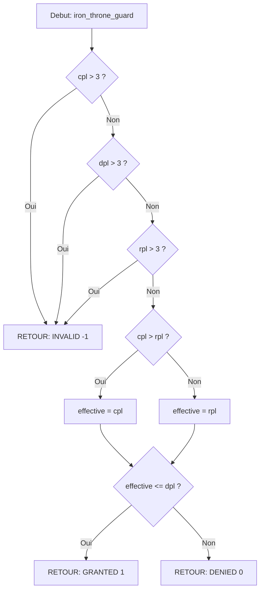

# Exercice 2.7.3-h : iron_throne_guard

**Module :**
2.7.3 — Niveaux de Privilege CPU (Protection Rings)

**Concept :**
h — Privilege check: CPL <= DPL (Verification des privileges)

**Difficulte :**
★★★★★★★☆☆☆ (7/10)

**Type :**
complet (Cours + QCM + Code)

**Tiers :**
2 — Melange (concepts DPL + RPL + CPL + mode switching)

**Langage :**
C17 / ASM x86-64

**Prerequis :**
- 2.7.2.b: Registres generaux (RAX-RDX, RSI, RDI)
- 2.7.2.c: Stack pointer (RSP, RBP)
- 2.7.3.f: DPL (Descriptor Privilege Level)
- 2.7.3.g: RPL (Requested Privilege Level)
- Notions de base sur les segments x86

**Domaines :**
CPU, ASM, Mem, Process

**Duree estimee :**
90 min

**XP Base :**
150

**Complexite :**
T3 O(1) x S2 O(1)

---

## SECTION 1 : PROTOTYPE & CONSIGNE

### 1.1 Obligations

**Fichier a rendre :**
`iron_throne_guard.c`

**Fonctions autorisees :**
- Aucune fonction externe (manipulation pure de structures)

**Fonctions interdites :**
- malloc, free, printf (simulation pure)

**Fichiers d'en-tete fournis :**
```c
#include "privilege_levels.h"
```

### 1.2 Consigne

#### 2.4.1 Analogie : GAME OF THRONES - Le Systeme Feodale de Westeros

**LE TRONE DE FER COMME MODELE DES PRIVILEGE RINGS x86**

```
                    ╔══════════════════════════════════════════════════════════════╗
                    ║           LE SYSTEME DE PRIVILEGES DE WESTEROS               ║
                    ╠══════════════════════════════════════════════════════════════╣
                    ║                                                              ║
                    ║   ⚔️ RING 0 — LE ROI SUR LE TRONE DE FER ⚔️                  ║
                    ║   ┌─────────────────────────────────────┐                    ║
                    ║   │         👑 POUVOIR ABSOLU 👑         │                    ║
                    ║   │   • Acces a TOUT le royaume         │                    ║
                    ║   │   • Peut executer n'importe qui     │                    ║
                    ║   │   • Controle l'armee, le tresor     │                    ║
                    ║   │   • Modifie les lois a volonte      │                    ║
                    ║   └─────────────────────────────────────┘                    ║
                    ║                         │                                    ║
                    ║                         │ La Main du Roi                     ║
                    ║                         ▼ (KERNEL)                           ║
                    ║   ┌─────────────────────────────────────┐                    ║
                    ║   │    🖐️ EXECUTEUR DES ORDRES ROYAUX    │                    ║
                    ║   │   • Recoit les corbeaux (syscalls)  │                    ║
                    ║   │   • Verifie les autorisations       │                    ║
                    ║   │   • Execute au nom du Roi           │                    ║
                    ║   │   • Protege le Trone                │                    ║
                    ║   └─────────────────────────────────────┘                    ║
                    ║                         │                                    ║
                    ║                         │                                    ║
                    ║   ═══════════════════════════════════════                    ║
                    ║         MURS DU DONJON ROUGE (Ring boundary)                 ║
                    ║   ═══════════════════════════════════════                    ║
                    ║                         │                                    ║
                    ║                         ▼                                    ║
                    ║   ┌─────────────────────────────────────┐                    ║
                    ║   │   🏰 RING 1-2 — LES GRANDES MAISONS  │                    ║
                    ║   │   (Rarement utilises en pratique)   │                    ║
                    ║   │   Stark, Lannister, Baratheon...    │                    ║
                    ║   └─────────────────────────────────────┘                    ║
                    ║                         │                                    ║
                    ║   ═══════════════════════════════════════                    ║
                    ║              MURAILLES DE LA CITE                            ║
                    ║   ═══════════════════════════════════════                    ║
                    ║                         │                                    ║
                    ║                         ▼                                    ║
                    ║   ┌─────────────────────────────────────┐                    ║
                    ║   │   🌾 RING 3 — LES PAYSANS 🌾          │                    ║
                    ║   │   • Aucun acces direct au Roi       │                    ║
                    ║   │   • DOIVENT demander permission     │                    ║
                    ║   │   • Envoient des CORBEAUX (syscall) │                    ║
                    ║   │   • Attendent la reponse            │                    ║
                    ║   │   • N'ont AUCUN pouvoir special     │                    ║
                    ║   └─────────────────────────────────────┘                    ║
                    ║                                                              ║
                    ╚══════════════════════════════════════════════════════════════╝
```

**ANALOGIES DETAILLEES :**

| Concept CPU | Game of Thrones | Explication |
|-------------|-----------------|-------------|
| **Ring 0 (Kernel)** | Le Roi sur le Trone de Fer | Pouvoir ABSOLU sur tout le systeme. Peut acceder a TOUTE la memoire, executer TOUTE instruction. |
| **Ring 3 (User)** | Les paysans de Port-Real | Privileges MINIMUM. Doivent demander permission pour tout. Ne peuvent pas toucher aux ressources protegees. |
| **Syscall** | Envoyer un corbeau au Roi | Le SEUL moyen pour un paysan de demander quelque chose au Roi. Message formate, reponse attendue. |
| **Le Kernel** | La Main du Roi (Tyrion, Ned...) | Execute les ordres du Roi. Recoit les corbeaux, verifie si la requete est legitime, l'execute. |
| **CPL (Current Privilege Level)** | Ton rang actuel dans la hierarchie | Es-tu Roi (0), Lord (1-2), ou paysan (3) ? |
| **DPL (Descriptor Privilege Level)** | Niveau requis pour entrer dans un lieu | "Seuls les Lords peuvent entrer dans la Grande Salle" = DPL 2 |
| **RPL (Requested Privilege Level)** | Le rang que tu pretends avoir | Un paysan qui pretend etre un Lord sera REJETE a la porte |
| **Privilege Check** | Le garde verifie ton rang | CPL <= DPL : "Es-tu assez noble pour passer ?" |
| **iret (Return from interrupt)** | Le corbeau de reponse du Roi | Le Roi repond au paysan, qui reprend sa vie normale |
| **Context Switch** | Changement de Main du Roi | Quand Ned meurt, Tyrion prend le relais. Sauvegarde de l'etat. |
| **CR2 (Page Fault Address)** | "Qui a tente de voler dans le tresor ?" | L'adresse du crime est enregistree |

**SCENARIO CONCRET :**

```
🌾 PAYSAN (Ring 3) veut ouvrir un fichier sur le disque du Roi

1. Le paysan NE PEUT PAS aller directement au tresor (Ring 0 only)
2. Il ecrit un CORBEAU (syscall) : "SVP ouvrez le fichier X"
3. Le corbeau vole vers le DONJON ROUGE
4. La MAIN DU ROI (kernel) recoit le corbeau
   → Verifie : "Ce paysan a-t-il le droit de lire ce fichier ?"
   → Si OUI : execute et renvoie le resultat
   → Si NON : "ACCES REFUSE !" (EPERM)
5. Le paysan recoit la reponse et continue sa vie
```

**POURQUOI CETTE HIERARCHIE ?**

```
SANS PROTECTION (chaos total) :
┌────────────────────────────────────────┐
│ N'importe qui peut tuer le Roi         │
│ Les paysans volent dans le tresor      │
│ Chaque process peut crasher le systeme │
│ = ANARCHIE = SEGFAULT EVERYWHERE       │
└────────────────────────────────────────┘

AVEC PROTECTION (paix du royaume) :
┌────────────────────────────────────────┐
│ Le Roi est protege dans le Donjon      │
│ Les ressources sont gardees            │
│ Chaque demande est VERIFIEE            │
│ = STABILITE = SYSTEME FIABLE           │
└────────────────────────────────────────┘
```

---

#### 2.4.2 Enonce Academique

**Contexte Technique :**

L'architecture x86 implemente un systeme de protection a 4 niveaux appeles "rings" (anneaux de protection). Le Ring 0 possede les privileges les plus eleves (mode kernel), tandis que Ring 3 represente le mode utilisateur avec les privileges les plus restreints.

La verification des privileges s'effectue selon la regle fondamentale :
**CPL <= DPL** (Current Privilege Level doit etre inferieur ou egal au Descriptor Privilege Level)

**Ta mission :**

Ecrire une fonction `iron_throne_guard` qui simule la verification des privileges x86-64. Cette fonction agit comme le garde du Donjon Rouge : elle verifie si un niveau de privilege courant (CPL) peut acceder a une ressource protegee par un niveau de privilege descripteur (DPL).

**Entree :**
- `cpl` : Niveau de privilege courant (0-3), type `uint8_t`
- `dpl` : Niveau de privilege du descripteur cible (0-3), type `uint8_t`
- `rpl` : Niveau de privilege demande (0-3), type `uint8_t`

**Sortie :**
- Retourne `1` (GRANTED) si l'acces est autorise
- Retourne `0` (DENIED) si l'acces est refuse
- Retourne `-1` (INVALID) si les parametres sont hors limites (> 3)

**Regles de verification :**
1. CPL doit etre <= DPL
2. RPL doit etre <= DPL
3. Le niveau effectif est max(CPL, RPL)
4. Niveau effectif doit etre <= DPL

**Contraintes :**
- Pas d'allocation dynamique
- Pas de fonctions externes
- Code purement logique

**Exemples :**

| Appel | Retour | Explication |
|-------|--------|-------------|
| `iron_throne_guard(3, 3, 3)` | `1` | Paysan (3) accede a ressource paysan (3) = OK |
| `iron_throne_guard(3, 0, 3)` | `0` | Paysan (3) tente d'acceder au Trone (0) = REFUSE |
| `iron_throne_guard(0, 3, 0)` | `1` | Roi (0) accede a tout = OK |
| `iron_throne_guard(0, 0, 0)` | `1` | Roi accede au Trone = OK |
| `iron_throne_guard(5, 0, 0)` | `-1` | Niveau 5 invalide |
| `iron_throne_guard(2, 3, 1)` | `1` | Lord (2) avec RPL Lord (1) accede a paysan (3) = OK |

### 1.3 Prototype

```c
/**
 * @brief Verifie si un acces privilege est autorise (modele x86 rings)
 *
 * @param cpl Current Privilege Level (0 = kernel, 3 = user)
 * @param dpl Descriptor Privilege Level (niveau requis)
 * @param rpl Requested Privilege Level (niveau demande)
 * @return 1 si autorise, 0 si refuse, -1 si parametres invalides
 */
int iron_throne_guard(uint8_t cpl, uint8_t dpl, uint8_t rpl);
```

---

## SECTION 2 : LE SAVIEZ-VOUS ?

### 2.1 Histoire des Protection Rings

Les anneaux de protection ont ete introduits par Multics dans les annees 1960, bien avant l'architecture x86. Le concept a ete raffine par Intel avec le processeur 80286 en 1982, introduisant le mode protege.

**Fait historique :** Multics supportait jusqu'a 64 niveaux de privilege ! Intel a simplifie a 4 (0-3), mais la plupart des OS modernes n'utilisent que 2 niveaux (0 et 3).

### 2.2 Pourquoi Ring 1 et Ring 2 sont abandonnes ?

A l'origine, Ring 1 etait prevu pour les drivers et Ring 2 pour les services systeme. Mais :
- La virtualisation a change la donne (hyperviseurs en Ring -1)
- La complexite de gestion n'en valait pas la peine
- Linux/Windows utilisent uniquement Ring 0 et Ring 3

### 2.3 Le Ring -1 : Les Hyperviseurs

Avec l'avenement de la virtualisation (VMware, VirtualBox, Hyper-V), Intel a introduit VT-x qui ajoute un niveau SOUS Ring 0 : le Ring -1 (ou Root Mode). L'hyperviseur controle meme le kernel !

```
Ring -1 : Hyperviseur (VMM)     ← Controle TOUT
Ring  0 : Kernel (Guest OS)     ← Pense etre en controle
Ring  3 : Applications          ← Paysans habituels
```

---

## SECTION 2.5 : DANS LA VRAIE VIE

### Qui utilise ce concept ?

| Metier | Cas d'usage |
|--------|-------------|
| **Developpeur Kernel** | Implemente les syscalls, gere les transitions Ring 3 → Ring 0 |
| **Ingenieur Securite** | Detecte les privilege escalations (CVE critiques) |
| **Developpeur Drivers** | Code en Ring 0, doit comprendre les restrictions |
| **Reverse Engineer** | Analyse les malwares qui tentent d'escalader les privileges |
| **DevOps/SRE** | Configure les containers avec namespaces (isolation Ring 3) |
| **Architecte Cloud** | Comprend l'isolation VM via hyperviseurs (Ring -1) |

### Vulnerabilites celebres

- **Meltdown (2018)** : Exploitait la speculation pour lire la memoire Ring 0 depuis Ring 3
- **Spectre (2018)** : Contournait l'isolation entre processes Ring 3
- **Dirty COW (2016)** : Escalade de privilege via race condition

---

## SECTION 3 : EXEMPLE D'UTILISATION

### 3.0 Session bash

```bash
$ ls
iron_throne_guard.c  main.c  privilege_levels.h

$ gcc -Wall -Wextra -Werror -std=c17 iron_throne_guard.c main.c -o test

$ ./test
Test 1 (user→user): GRANTED [OK]
Test 2 (user→kernel): DENIED [OK]
Test 3 (kernel→user): GRANTED [OK]
Test 4 (kernel→kernel): GRANTED [OK]
Test 5 (invalid level): INVALID [OK]
Test 6 (RPL check): GRANTED [OK]
Tous les tests passent!
```

---

## SECTION 3.1 : BONUS EXPERT (OPTIONNEL)

**Difficulte Bonus :**
💀 (8/10)

**Recompense :**
XP x4

**Time Complexity attendue :**
O(1)

**Space Complexity attendue :**
O(1)

**Domaines Bonus :**
`CPU, ASM, Process`

### 3.1.1 Consigne Bonus

**LE SYSCALL DU CORBEAU : TRANSITION RING 3 → RING 0**

Dans Game of Thrones, envoyer un corbeau est un processus FORMEL :
1. Ecrire le message (preparer les registres)
2. Attacher au corbeau (instruction `syscall`)
3. Le corbeau vole au Donjon (transition Ring 3 → Ring 0)
4. La Main du Roi lit et execute
5. Reponse renvoyee (retour Ring 0 → Ring 3)

**Ta mission :**

Implementer une fonction `send_raven_to_king` qui simule une transition syscall complete :
1. Sauvegarde le contexte utilisateur (registres)
2. Change le CPL de 3 a 0
3. Execute le "syscall handler"
4. Restore le CPL a 3
5. Restore le contexte

**Entree :**
- `ctx` : Pointeur vers une structure `cpu_context_t`
- `syscall_num` : Numero du syscall (comme RAX en x86-64)
- `arg1`, `arg2`, `arg3` : Arguments (comme RDI, RSI, RDX)

**Sortie :**
- Retourne le resultat du syscall (simule)
- Modifie `ctx->cpl` pendant l'execution
- `ctx->syscall_count` est incremente

**Contraintes :**
```
┌─────────────────────────────────────────┐
│  ctx != NULL                            │
│  syscall_num < 256                      │
│  Transition Ring 3 → 0 → 3 obligatoire  │
│  Contexte DOIT etre restaure            │
└─────────────────────────────────────────┘
```

### 3.1.2 Prototype Bonus

```c
typedef struct s_cpu_context {
    uint8_t  cpl;           // Current Privilege Level
    uint64_t rax, rbx, rcx, rdx;
    uint64_t rsi, rdi;
    uint64_t rsp, rbp;
    uint64_t rip, rflags;
    uint64_t syscall_count;
} cpu_context_t;

int64_t send_raven_to_king(cpu_context_t *ctx,
                           uint64_t syscall_num,
                           uint64_t arg1,
                           uint64_t arg2,
                           uint64_t arg3);
```

### 3.1.3 Ce qui change par rapport a l'exercice de base

| Aspect | Base | Bonus |
|--------|------|-------|
| Parametres | 3 entiers simples | Structure + 4 arguments |
| Logique | Verification simple | Simulation complete de transition |
| Etat | Stateless | Modification de contexte |
| Complexite | O(1) simple | O(1) avec sauvegarde/restauration |

---

## SECTION 4 : ZONE CORRECTION (POUR LE TESTEUR)

### 4.1 Moulinette

| Test | Input | Expected | Points | Trap |
|------|-------|----------|--------|------|
| `user_to_user` | `(3, 3, 3)` | `1` | 10 | Non |
| `user_to_kernel` | `(3, 0, 3)` | `0` | 15 | Oui |
| `kernel_to_user` | `(0, 3, 0)` | `1` | 10 | Non |
| `kernel_to_kernel` | `(0, 0, 0)` | `1` | 10 | Non |
| `invalid_cpl` | `(5, 0, 0)` | `-1` | 15 | Oui |
| `invalid_dpl` | `(0, 4, 0)` | `-1` | 15 | Oui |
| `invalid_rpl` | `(0, 0, 7)` | `-1` | 15 | Oui |
| `rpl_blocks` | `(0, 2, 3)` | `0` | 20 | Oui |
| `effective_level` | `(1, 3, 2)` | `1` | 20 | Non |
| `ring1_to_ring2` | `(1, 2, 1)` | `1` | 10 | Non |

### 4.2 main.c de test

```c
#include <stdio.h>
#include <stdint.h>
#include "privilege_levels.h"

int main(void)
{
    int passed = 0;
    int total = 10;

    // Test 1: User accessing user resource
    if (iron_throne_guard(3, 3, 3) == 1) {
        printf("Test 1 (user->user): GRANTED [OK]\n");
        passed++;
    } else {
        printf("Test 1 (user->user): [FAIL]\n");
    }

    // Test 2: User trying to access kernel
    if (iron_throne_guard(3, 0, 3) == 0) {
        printf("Test 2 (user->kernel): DENIED [OK]\n");
        passed++;
    } else {
        printf("Test 2 (user->kernel): [FAIL]\n");
    }

    // Test 3: Kernel accessing user resource
    if (iron_throne_guard(0, 3, 0) == 1) {
        printf("Test 3 (kernel->user): GRANTED [OK]\n");
        passed++;
    } else {
        printf("Test 3 (kernel->user): [FAIL]\n");
    }

    // Test 4: Kernel accessing kernel
    if (iron_throne_guard(0, 0, 0) == 1) {
        printf("Test 4 (kernel->kernel): GRANTED [OK]\n");
        passed++;
    } else {
        printf("Test 4 (kernel->kernel): [FAIL]\n");
    }

    // Test 5: Invalid privilege level
    if (iron_throne_guard(5, 0, 0) == -1) {
        printf("Test 5 (invalid CPL): INVALID [OK]\n");
        passed++;
    } else {
        printf("Test 5 (invalid CPL): [FAIL]\n");
    }

    // Test 6: Invalid DPL
    if (iron_throne_guard(0, 4, 0) == -1) {
        printf("Test 6 (invalid DPL): INVALID [OK]\n");
        passed++;
    } else {
        printf("Test 6 (invalid DPL): [FAIL]\n");
    }

    // Test 7: Invalid RPL
    if (iron_throne_guard(0, 0, 7) == -1) {
        printf("Test 7 (invalid RPL): INVALID [OK]\n");
        passed++;
    } else {
        printf("Test 7 (invalid RPL): [FAIL]\n");
    }

    // Test 8: RPL blocks access (effective level > DPL)
    if (iron_throne_guard(0, 2, 3) == 0) {
        printf("Test 8 (RPL blocks): DENIED [OK]\n");
        passed++;
    } else {
        printf("Test 8 (RPL blocks): [FAIL]\n");
    }

    // Test 9: Effective level check
    if (iron_throne_guard(1, 3, 2) == 1) {
        printf("Test 9 (effective level): GRANTED [OK]\n");
        passed++;
    } else {
        printf("Test 9 (effective level): [FAIL]\n");
    }

    // Test 10: Ring 1 to Ring 2
    if (iron_throne_guard(1, 2, 1) == 1) {
        printf("Test 10 (ring1->ring2): GRANTED [OK]\n");
        passed++;
    } else {
        printf("Test 10 (ring1->ring2): [FAIL]\n");
    }

    printf("\nResultat: %d/%d tests passes\n", passed, total);

    if (passed == total)
        printf("Tous les tests passent!\n");

    return (passed == total) ? 0 : 1;
}
```

### 4.3 Solution de reference

```c
#include <stdint.h>

/**
 * @brief Verifie les privileges selon le modele x86 protection rings
 *
 * Regle x86: L'acces est autorise si max(CPL, RPL) <= DPL
 *
 * CPL = Current Privilege Level (niveau actuel du code en execution)
 * DPL = Descriptor Privilege Level (niveau requis pour acceder)
 * RPL = Requested Privilege Level (niveau avec lequel on demande)
 *
 * Le niveau effectif est le MAX de CPL et RPL (le moins privilege)
 * Ce niveau effectif doit etre <= DPL pour que l'acces soit autorise
 */
int iron_throne_guard(uint8_t cpl, uint8_t dpl, uint8_t rpl)
{
    uint8_t effective_level;

    /* Verification des limites : Ring 0-3 uniquement */
    if (cpl > 3 || dpl > 3 || rpl > 3)
        return (-1);  /* INVALID : niveau hors limites */

    /*
     * Calcul du niveau effectif : max(CPL, RPL)
     * On prend le PIRE (plus grand = moins privilege)
     * Car RPL peut restreindre les droits
     */
    if (cpl > rpl)
        effective_level = cpl;
    else
        effective_level = rpl;

    /*
     * Verification finale : effective_level <= DPL
     * Plus le niveau est BAS, plus on a de privileges
     * Ring 0 (Roi) <= Ring 3 (Paysan) toujours vrai
     * Ring 3 (Paysan) <= Ring 0 (Roi) toujours faux
     */
    if (effective_level <= dpl)
        return (1);   /* GRANTED : acces autorise */

    return (0);       /* DENIED : acces refuse */
}
```

### 4.4 Solutions alternatives acceptees

```c
/* Alternative 1 : Utilisation de l'operateur ternaire */
int iron_throne_guard(uint8_t cpl, uint8_t dpl, uint8_t rpl)
{
    if (cpl > 3 || dpl > 3 || rpl > 3)
        return (-1);

    uint8_t effective = (cpl > rpl) ? cpl : rpl;
    return (effective <= dpl) ? 1 : 0;
}

/* Alternative 2 : Sans variable intermediaire */
int iron_throne_guard(uint8_t cpl, uint8_t dpl, uint8_t rpl)
{
    if (cpl > 3 || dpl > 3 || rpl > 3)
        return (-1);

    return ((cpl > rpl ? cpl : rpl) <= dpl);
}

/* Alternative 3 : Avec macro MAX */
#define MAX(a, b) ((a) > (b) ? (a) : (b))

int iron_throne_guard(uint8_t cpl, uint8_t dpl, uint8_t rpl)
{
    if (cpl > 3 || dpl > 3 || rpl > 3)
        return (-1);

    return (MAX(cpl, rpl) <= dpl);
}
```

### 4.5 Solutions refusees (avec explications)

```c
/* REFUSE 1 : Oublie la verification de RPL */
int iron_throne_guard_BAD1(uint8_t cpl, uint8_t dpl, uint8_t rpl)
{
    (void)rpl;  /* RPL ignore ! */
    if (cpl > 3 || dpl > 3)
        return (-1);
    return (cpl <= dpl);  /* Manque le check RPL */
}
/* Pourquoi c'est faux : RPL est utilise pour restreindre volontairement
   les privileges. Un kernel peut demander avec RPL=3 pour s'auto-limiter. */

/* REFUSE 2 : Logique inversee (plus grand = plus de privileges) */
int iron_throne_guard_BAD2(uint8_t cpl, uint8_t dpl, uint8_t rpl)
{
    if (cpl > 3 || dpl > 3 || rpl > 3)
        return (-1);
    uint8_t effective = (cpl < rpl) ? cpl : rpl;  /* MIN au lieu de MAX */
    return (effective <= dpl);
}
/* Pourquoi c'est faux : On doit prendre le PIRE niveau (max), pas le meilleur */

/* REFUSE 3 : Pas de verification des limites */
int iron_throne_guard_BAD3(uint8_t cpl, uint8_t dpl, uint8_t rpl)
{
    uint8_t effective = (cpl > rpl) ? cpl : rpl;
    return (effective <= dpl);
}
/* Pourquoi c'est faux : cpl=255 passerait, alors qu'il n'existe que 4 rings */
```

### 4.6 Solution bonus de reference (COMPLETE)

```c
#include <stdint.h>
#include <stddef.h>

typedef struct s_cpu_context {
    uint8_t  cpl;
    uint64_t rax, rbx, rcx, rdx;
    uint64_t rsi, rdi;
    uint64_t rsp, rbp;
    uint64_t rip, rflags;
    uint64_t syscall_count;
} cpu_context_t;

/* Simule un syscall handler simple */
static int64_t syscall_handler(uint64_t num, uint64_t a1, uint64_t a2, uint64_t a3)
{
    /* Syscall 0: getpid (retourne un PID fictif) */
    if (num == 0)
        return (1337);

    /* Syscall 1: write (retourne le nombre de bytes) */
    if (num == 1)
        return ((int64_t)a3);  /* Retourne count */

    /* Syscall 2: read (retourne le nombre de bytes lus) */
    if (num == 2)
        return ((int64_t)a3);

    /* Syscall 60: exit (retourne le code) */
    if (num == 60)
        return ((int64_t)a1);

    /* Syscall inconnu */
    return (-1);
}

int64_t send_raven_to_king(cpu_context_t *ctx,
                           uint64_t syscall_num,
                           uint64_t arg1,
                           uint64_t arg2,
                           uint64_t arg3)
{
    uint8_t  saved_cpl;
    uint64_t saved_rcx;
    uint64_t saved_r11;
    int64_t  result;

    /* Verification des parametres */
    if (ctx == NULL)
        return (-1);

    if (syscall_num >= 256)
        return (-1);

    /* Le syscall ne peut etre appele que depuis Ring 3 */
    if (ctx->cpl != 3)
        return (-1);

    /* === ENTREE DANS LE DONJON ROUGE (Ring 3 -> Ring 0) === */

    /* Sauvegarde du contexte utilisateur (comme le fait vraiment SYSCALL) */
    saved_cpl = ctx->cpl;
    saved_rcx = ctx->rcx;    /* RCX recoit RIP (adresse de retour) */
    saved_r11 = ctx->rflags; /* R11 recoit RFLAGS */

    /* Prepare les registres comme le ferait l'instruction SYSCALL */
    ctx->rcx = ctx->rip;     /* Sauvegarde RIP dans RCX */
    ctx->rax = syscall_num;  /* Numero du syscall */
    ctx->rdi = arg1;         /* Premier argument */
    ctx->rsi = arg2;         /* Deuxieme argument */
    ctx->rdx = arg3;         /* Troisieme argument */

    /* TRANSITION : Passage en Ring 0 (mode kernel) */
    ctx->cpl = 0;

    /* === LA MAIN DU ROI EXECUTE L'ORDRE === */

    /* Appel du handler syscall */
    result = syscall_handler(syscall_num, arg1, arg2, arg3);

    /* Resultat dans RAX */
    ctx->rax = (uint64_t)result;

    /* Incremente le compteur de syscalls */
    ctx->syscall_count++;

    /* === SORTIE DU DONJON ROUGE (Ring 0 -> Ring 3) === */

    /* Restaure RIP depuis RCX (comme SYSRET) */
    ctx->rip = ctx->rcx;

    /* Restaure les registres sauvegardes */
    ctx->rcx = saved_rcx;
    ctx->rflags = saved_r11;

    /* TRANSITION : Retour en Ring 3 (mode utilisateur) */
    ctx->cpl = saved_cpl;  /* Devrait etre 3 */

    return (result);
}
```

### 4.7 Solutions alternatives bonus (COMPLETES)

```c
/* Alternative bonus avec verification plus stricte */
int64_t send_raven_to_king_alt(cpu_context_t *ctx,
                                uint64_t syscall_num,
                                uint64_t arg1,
                                uint64_t arg2,
                                uint64_t arg3)
{
    int64_t result;

    if (!ctx || syscall_num >= 256 || ctx->cpl != 3)
        return (-1);

    /* Structure de sauvegarde sur la "stack" */
    struct {
        uint8_t cpl;
        uint64_t rcx;
        uint64_t rflags;
    } saved = {
        .cpl = ctx->cpl,
        .rcx = ctx->rcx,
        .rflags = ctx->rflags
    };

    /* Transition et execution */
    ctx->cpl = 0;
    ctx->rax = syscall_num;
    ctx->rdi = arg1;
    ctx->rsi = arg2;
    ctx->rdx = arg3;

    /* Handler inline */
    switch (syscall_num) {
        case 0:  result = 1337; break;
        case 1:  result = (int64_t)arg3; break;
        case 2:  result = (int64_t)arg3; break;
        case 60: result = (int64_t)arg1; break;
        default: result = -1;
    }

    ctx->rax = (uint64_t)result;
    ctx->syscall_count++;

    /* Restauration */
    ctx->cpl = saved.cpl;
    ctx->rcx = saved.rcx;
    ctx->rflags = saved.rflags;

    return (result);
}
```

### 4.8 Solutions refusees bonus (COMPLETES)

```c
/* REFUSE : Ne restaure pas le CPL */
int64_t send_raven_BAD1(cpu_context_t *ctx, uint64_t syscall_num,
                        uint64_t arg1, uint64_t arg2, uint64_t arg3)
{
    if (!ctx || syscall_num >= 256)
        return (-1);

    ctx->cpl = 0;  /* Passe en Ring 0 */
    /* ... execution ... */
    ctx->syscall_count++;
    /* OUBLIE de restaurer ctx->cpl = 3 ! */
    /* L'utilisateur reste en Ring 0 = FAILLE DE SECURITE */
    return (0);
}

/* REFUSE : N'incremente pas syscall_count */
int64_t send_raven_BAD2(cpu_context_t *ctx, uint64_t syscall_num,
                        uint64_t arg1, uint64_t arg2, uint64_t arg3)
{
    if (!ctx || syscall_num >= 256 || ctx->cpl != 3)
        return (-1);

    ctx->cpl = 0;
    /* ... */
    ctx->cpl = 3;
    /* OUBLIE ctx->syscall_count++ */
    return (0);
}

/* REFUSE : Accepte des appels depuis Ring 0 */
int64_t send_raven_BAD3(cpu_context_t *ctx, uint64_t syscall_num,
                        uint64_t arg1, uint64_t arg2, uint64_t arg3)
{
    if (!ctx || syscall_num >= 256)
        return (-1);
    /* Manque la verification ctx->cpl != 3 */
    /* Le kernel ne devrait pas faire de syscall sur lui-meme ! */
    ctx->cpl = 0;
    /* ... */
    return (0);
}
```

### 4.9 spec.json (ENGINE v22.1 - FORMAT STRICT)

```json
{
  "name": "iron_throne_guard",
  "language": "c",
  "type": "code",
  "tier": 2,
  "tier_info": "Melange (DPL + RPL + CPL)",
  "tags": ["cpu", "privilege", "rings", "x86", "security", "phase2"],
  "passing_score": 70,

  "function": {
    "name": "iron_throne_guard",
    "prototype": "int iron_throne_guard(uint8_t cpl, uint8_t dpl, uint8_t rpl)",
    "return_type": "int",
    "parameters": [
      {"name": "cpl", "type": "uint8_t"},
      {"name": "dpl", "type": "uint8_t"},
      {"name": "rpl", "type": "uint8_t"}
    ]
  },

  "driver": {
    "reference": "int ref_iron_throne_guard(uint8_t cpl, uint8_t dpl, uint8_t rpl) { uint8_t eff; if (cpl > 3 || dpl > 3 || rpl > 3) return (-1); eff = (cpl > rpl) ? cpl : rpl; return (eff <= dpl) ? 1 : 0; }",

    "edge_cases": [
      {
        "name": "user_to_user",
        "args": [3, 3, 3],
        "expected": 1,
        "is_trap": false,
        "trap_explanation": ""
      },
      {
        "name": "user_to_kernel_denied",
        "args": [3, 0, 3],
        "expected": 0,
        "is_trap": true,
        "trap_explanation": "Ring 3 ne peut pas acceder a Ring 0 - violation de privilege"
      },
      {
        "name": "kernel_to_user",
        "args": [0, 3, 0],
        "expected": 1,
        "is_trap": false,
        "trap_explanation": ""
      },
      {
        "name": "kernel_to_kernel",
        "args": [0, 0, 0],
        "expected": 1,
        "is_trap": false,
        "trap_explanation": ""
      },
      {
        "name": "invalid_cpl_5",
        "args": [5, 0, 0],
        "expected": -1,
        "is_trap": true,
        "trap_explanation": "CPL=5 invalide - seuls 0-3 existent"
      },
      {
        "name": "invalid_dpl_4",
        "args": [0, 4, 0],
        "expected": -1,
        "is_trap": true,
        "trap_explanation": "DPL=4 invalide - seuls 0-3 existent"
      },
      {
        "name": "invalid_rpl_255",
        "args": [0, 0, 255],
        "expected": -1,
        "is_trap": true,
        "trap_explanation": "RPL=255 invalide - seuls 0-3 existent"
      },
      {
        "name": "rpl_blocks_access",
        "args": [0, 2, 3],
        "expected": 0,
        "is_trap": true,
        "trap_explanation": "Meme si CPL=0, RPL=3 > DPL=2 donc acces refuse"
      },
      {
        "name": "effective_level_check",
        "args": [1, 3, 2],
        "expected": 1,
        "is_trap": false,
        "trap_explanation": ""
      },
      {
        "name": "ring1_to_ring2",
        "args": [1, 2, 1],
        "expected": 1,
        "is_trap": false,
        "trap_explanation": ""
      },
      {
        "name": "ring2_to_ring1_denied",
        "args": [2, 1, 2],
        "expected": 0,
        "is_trap": true,
        "trap_explanation": "Ring 2 ne peut pas acceder a Ring 1"
      },
      {
        "name": "all_zeros",
        "args": [0, 0, 0],
        "expected": 1,
        "is_trap": false,
        "trap_explanation": ""
      }
    ],

    "fuzzing": {
      "enabled": true,
      "iterations": 500,
      "generators": [
        {
          "type": "int",
          "param_index": 0,
          "params": {"min": 0, "max": 10}
        },
        {
          "type": "int",
          "param_index": 1,
          "params": {"min": 0, "max": 10}
        },
        {
          "type": "int",
          "param_index": 2,
          "params": {"min": 0, "max": 10}
        }
      ]
    }
  },

  "norm": {
    "allowed_functions": [],
    "forbidden_functions": ["malloc", "free", "printf", "puts"],
    "check_security": true,
    "check_memory": false,
    "blocking": true
  },

  "bonus": {
    "name": "send_raven_to_king",
    "prototype": "int64_t send_raven_to_king(cpu_context_t *ctx, uint64_t syscall_num, uint64_t arg1, uint64_t arg2, uint64_t arg3)",
    "difficulty": 8,
    "multiplier": 4
  }
}
```

### 4.10 Solutions Mutantes (minimum 5)

```c
/* ═══════════════════════════════════════════════════════════════════════════
 * MUTANT A (Boundary) : Verification des limites incorrecte (>= au lieu de >)
 * ═══════════════════════════════════════════════════════════════════════════ */
int iron_throne_guard_mutant_a(uint8_t cpl, uint8_t dpl, uint8_t rpl)
{
    uint8_t effective_level;

    /* BUG: >= 3 au lieu de > 3 */
    /* Cela fait que Ring 3 est considere comme invalide ! */
    if (cpl >= 3 || dpl >= 3 || rpl >= 3)
        return (-1);

    if (cpl > rpl)
        effective_level = cpl;
    else
        effective_level = rpl;

    if (effective_level <= dpl)
        return (1);

    return (0);
}
/* Pourquoi c'est faux : Ring 3 est un niveau valide (user space) !
   Ce mutant rejette tous les appels depuis Ring 3.
   Tests qui echouent : user_to_user (3,3,3) retourne -1 au lieu de 1 */


/* ═══════════════════════════════════════════════════════════════════════════
 * MUTANT B (Safety) : Oublie de verifier un des parametres
 * ═══════════════════════════════════════════════════════════════════════════ */
int iron_throne_guard_mutant_b(uint8_t cpl, uint8_t dpl, uint8_t rpl)
{
    uint8_t effective_level;

    /* BUG: Ne verifie pas RPL ! */
    if (cpl > 3 || dpl > 3)
        return (-1);

    /* rpl peut etre 255, ce qui fausse le calcul */

    if (cpl > rpl)
        effective_level = cpl;
    else
        effective_level = rpl;

    if (effective_level <= dpl)
        return (1);

    return (0);
}
/* Pourquoi c'est faux : RPL=255 n'est pas detecte comme invalide.
   De plus, le calcul effective_level donne 255, qui n'est jamais <= 3.
   Tests qui echouent : invalid_rpl_255 retourne 0 au lieu de -1 */


/* ═══════════════════════════════════════════════════════════════════════════
 * MUTANT C (Logic) : Utilise MIN au lieu de MAX pour le niveau effectif
 * ═══════════════════════════════════════════════════════════════════════════ */
int iron_throne_guard_mutant_c(uint8_t cpl, uint8_t dpl, uint8_t rpl)
{
    uint8_t effective_level;

    if (cpl > 3 || dpl > 3 || rpl > 3)
        return (-1);

    /* BUG: Prend le MINIMUM au lieu du MAXIMUM */
    /* Cela donne trop de privileges ! */
    if (cpl < rpl)  /* < au lieu de > */
        effective_level = cpl;
    else
        effective_level = rpl;

    if (effective_level <= dpl)
        return (1);

    return (0);
}
/* Pourquoi c'est faux : Le niveau effectif doit etre le PIRE (max).
   En prenant le min, on donne les privileges du meilleur niveau.
   Tests qui echouent : rpl_blocks_access (0,2,3) retourne 1 au lieu de 0
   Car effective_level = 0 (kernel) au lieu de 3 (user) */


/* ═══════════════════════════════════════════════════════════════════════════
 * MUTANT D (Logic) : Inverse la logique de comparaison finale
 * ═══════════════════════════════════════════════════════════════════════════ */
int iron_throne_guard_mutant_d(uint8_t cpl, uint8_t dpl, uint8_t rpl)
{
    uint8_t effective_level;

    if (cpl > 3 || dpl > 3 || rpl > 3)
        return (-1);

    if (cpl > rpl)
        effective_level = cpl;
    else
        effective_level = rpl;

    /* BUG: >= au lieu de <= */
    /* Inverse completement la logique ! */
    if (effective_level >= dpl)
        return (1);

    return (0);
}
/* Pourquoi c'est faux : La logique est inversee.
   Ring 3 acces a Ring 0 : effective=3, dpl=0, 3>=0 = true = GRANTED !
   Ring 0 acces a Ring 0 : effective=0, dpl=0, 0>=0 = true = GRANTED (OK par hasard)
   Tests qui echouent : user_to_kernel (3,0,3) retourne 1 au lieu de 0 */


/* ═══════════════════════════════════════════════════════════════════════════
 * MUTANT E (Return) : Retourne toujours 1 (bypass complet)
 * ═══════════════════════════════════════════════════════════════════════════ */
int iron_throne_guard_mutant_e(uint8_t cpl, uint8_t dpl, uint8_t rpl)
{
    /* BUG: Aucune verification, tout est autorise ! */
    /* "Le garde dort, tout le monde passe" */
    (void)cpl;
    (void)dpl;
    (void)rpl;
    return (1);
}
/* Pourquoi c'est faux : Aucune verification n'est faite.
   C'est comme si le garde du Donjon Rouge laissait entrer tout le monde.
   Tests qui echouent :
   - user_to_kernel (3,0,3) retourne 1 au lieu de 0
   - invalid_cpl_5 (5,0,0) retourne 1 au lieu de -1
   - rpl_blocks_access (0,2,3) retourne 1 au lieu de 0 */


/* ═══════════════════════════════════════════════════════════════════════════
 * MUTANT F (Logic) : Ignore completement le RPL dans le calcul
 * ═══════════════════════════════════════════════════════════════════════════ */
int iron_throne_guard_mutant_f(uint8_t cpl, uint8_t dpl, uint8_t rpl)
{
    if (cpl > 3 || dpl > 3 || rpl > 3)
        return (-1);

    /* BUG: Utilise uniquement CPL, ignore RPL */
    /* Violation de la spec x86 qui dit max(CPL, RPL) */
    (void)rpl;  /* RPL ignore ! */

    if (cpl <= dpl)
        return (1);

    return (0);
}
/* Pourquoi c'est faux : RPL existe pour permettre au kernel de
   s'auto-restreindre. En l'ignorant, on casse ce mecanisme.
   Tests qui echouent : rpl_blocks_access (0,2,3) retourne 1 au lieu de 0
   Car CPL=0 <= DPL=2, mais effective devrait etre max(0,3)=3 > 2 */
```

---

## SECTION 5 : COMPRENDRE (DOCUMENT DE COURS COMPLET)

### 5.1 Ce que cet exercice enseigne

Cet exercice enseigne le **systeme de protection par anneaux (rings)** de l'architecture x86, qui est le fondement de la securite des systemes d'exploitation modernes.

**Concepts fondamentaux :**

1. **Les 4 niveaux de privilege (Rings 0-3)**
   - Ring 0 : Mode kernel (acces total)
   - Ring 1-2 : Modes intermediaires (rarement utilises)
   - Ring 3 : Mode utilisateur (acces restreint)

2. **Les trois indicateurs de privilege**
   - CPL (Current Privilege Level) : Niveau actuel du code en execution
   - DPL (Descriptor Privilege Level) : Niveau requis pour acceder a une ressource
   - RPL (Requested Privilege Level) : Niveau avec lequel on demande l'acces

3. **La regle de verification**
   - `max(CPL, RPL) <= DPL` : Le niveau effectif doit etre suffisant

4. **Pourquoi RPL existe**
   - Permet au kernel de s'auto-restreindre
   - Evite qu'un process user abuse d'un pointeur kernel

### 5.2 LDA - Traduction litterale en francais (MAJUSCULES)

```
FONCTION iron_throne_guard QUI RETOURNE UN ENTIER ET PREND EN PARAMETRES
    cpl QUI EST UN ENTIER NON SIGNE SUR 8 BITS ET
    dpl QUI EST UN ENTIER NON SIGNE SUR 8 BITS ET
    rpl QUI EST UN ENTIER NON SIGNE SUR 8 BITS
DEBUT FONCTION
    DECLARER effective_level COMME ENTIER NON SIGNE SUR 8 BITS

    SI cpl EST SUPERIEUR A 3 OU dpl EST SUPERIEUR A 3 OU rpl EST SUPERIEUR A 3 ALORS
        RETOURNER LA VALEUR MOINS 1
    FIN SI

    SI cpl EST SUPERIEUR A rpl ALORS
        AFFECTER cpl A effective_level
    SINON
        AFFECTER rpl A effective_level
    FIN SI

    SI effective_level EST INFERIEUR OU EGAL A dpl ALORS
        RETOURNER LA VALEUR 1
    FIN SI

    RETOURNER LA VALEUR 0
FIN FONCTION
```

### 5.2.2 LDA Style Academique

```
ALGORITHME : Verification des privileges CPU (modele x86 rings)

ENTREES :
    - cpl : entier [0..255] representant le niveau de privilege courant
    - dpl : entier [0..255] representant le niveau requis du descripteur
    - rpl : entier [0..255] representant le niveau de privilege demande

SORTIE :
    - entier : 1 si acces autorise, 0 si refuse, -1 si parametres invalides

VARIABLES LOCALES :
    - effective_level : entier representant le niveau effectif de privilege

DEBUT
    // Etape 1 : Validation des parametres
    SI (cpl > 3) OU (dpl > 3) OU (rpl > 3) ALORS
        RETOURNER -1  // Niveau invalide
    FIN SI

    // Etape 2 : Calcul du niveau effectif (le pire des deux)
    effective_level <- MAX(cpl, rpl)

    // Etape 3 : Verification de l'acces
    SI effective_level <= dpl ALORS
        RETOURNER 1  // Acces autorise
    SINON
        RETOURNER 0  // Acces refuse
    FIN SI
FIN
```

### 5.2.2.1 Logic Flow (Structured English)

```
ALGORITHME : Iron Throne Guard (Privilege Check)
---
1. VALIDER les parametres d'entree
   a. SI cpl OU dpl OU rpl > 3 :
      RETOURNER INVALID (-1)

2. CALCULER le niveau effectif
   a. effective = MAX(cpl, rpl)
   b. Explication : on prend le PIRE niveau (moins de privileges)

3. VERIFIER l'acces
   a. SI effective <= dpl :
      RETOURNER GRANTED (1)
   b. SINON :
      RETOURNER DENIED (0)

4. FIN de l'algorithme
```

### 5.2.3 Representation Algorithmique

```
FONCTION : iron_throne_guard(cpl, dpl, rpl)
---
INIT resultat = DENIED

1. VERIFICATION des limites :
   |
   |-- VERIFIER si cpl > 3 :
   |     RETOURNER INVALID
   |
   |-- VERIFIER si dpl > 3 :
   |     RETOURNER INVALID
   |
   |-- VERIFIER si rpl > 3 :
   |     RETOURNER INVALID

2. CALCUL du niveau effectif :
   |
   |-- SI cpl > rpl :
   |     effective = cpl
   |-- SINON :
   |     effective = rpl

3. DECISION d'acces :
   |
   |-- SI effective <= dpl :
   |     RETOURNER GRANTED
   |-- SINON :
   |     RETOURNER DENIED
```

### 5.2.3.1 Diagramme Mermaid



### 5.3 Visualisation ASCII

```
                    MODELE DE PROTECTION x86 (4 RINGS)

    ╔═══════════════════════════════════════════════════════════════════╗
    ║                                                                   ║
    ║   Niveau 0 (Ring 0) - KERNEL MODE - Privileges MAXIMUM            ║
    ║   ┌─────────────────────────────────────────────────────────┐     ║
    ║   │                     👑 LE ROI 👑                         │     ║
    ║   │  • Acces a TOUTE la memoire physique                    │     ║
    ║   │  • Execute TOUTES les instructions CPU                  │     ║
    ║   │  • Modifie les tables de pages                          │     ║
    ║   │  • Gere les interruptions                               │     ║
    ║   │  • Controle le hardware                                 │     ║
    ║   └─────────────────────────────────────────────────────────┘     ║
    ║                              │                                    ║
    ║                              │ CPL <= DPL ?                       ║
    ║                              ▼                                    ║
    ║   ═══════════════════════════════════════════════════════════     ║
    ║                    BARRIERE DE PRIVILEGE                          ║
    ║   ═══════════════════════════════════════════════════════════     ║
    ║                              │                                    ║
    ║                              ▼                                    ║
    ║   Niveau 1-2 (Ring 1-2) - Rarement utilises                      ║
    ║   ┌─────────────────────────────────────────────────────────┐     ║
    ║   │  Historiquement pour drivers et services systeme        │     ║
    ║   │  Aujourd'hui: virtuellement inutilises                  │     ║
    ║   └─────────────────────────────────────────────────────────┘     ║
    ║                              │                                    ║
    ║   ═══════════════════════════════════════════════════════════     ║
    ║                    BARRIERE USER/KERNEL                           ║
    ║   ═══════════════════════════════════════════════════════════     ║
    ║                              │                                    ║
    ║                              ▼                                    ║
    ║   Niveau 3 (Ring 3) - USER MODE - Privileges MINIMUM              ║
    ║   ┌─────────────────────────────────────────────────────────┐     ║
    ║   │                    🌾 LES PAYSANS 🌾                     │     ║
    ║   │  • Acces LIMITE a leur espace memoire                   │     ║
    ║   │  • Instructions RESTREINTES                             │     ║
    ║   │  • Doivent utiliser SYSCALL pour les services           │     ║
    ║   │  • Ne peuvent PAS toucher au hardware                   │     ║
    ║   │  • Isoles les uns des autres                            │     ║
    ║   └─────────────────────────────────────────────────────────┘     ║
    ║                                                                   ║
    ╚═══════════════════════════════════════════════════════════════════╝


                    MECANISME DE VERIFICATION CPL/DPL/RPL

    ┌─────────────────────────────────────────────────────────────────┐
    │                                                                 │
    │   PROCESSUS EN EXECUTION                                        │
    │   ┌───────────────┐                                             │
    │   │ CPL = 3       │  ← Niveau actuel (dans registre CS)         │
    │   │ (User mode)   │                                             │
    │   └───────┬───────┘                                             │
    │           │                                                     │
    │           │ Veut acceder a...                                   │
    │           ▼                                                     │
    │   ┌───────────────────────────────────────────┐                 │
    │   │  SEGMENT/RESSOURCE CIBLE                  │                 │
    │   │  ┌─────────────────────────────────┐      │                 │
    │   │  │ DPL = 0 (Kernel segment)        │      │                 │
    │   │  │ Base: 0x00000000                │      │                 │
    │   │  │ Limit: 0xFFFFFFFF               │      │                 │
    │   │  └─────────────────────────────────┘      │                 │
    │   └───────────────────────────────────────────┘                 │
    │                                                                 │
    │   VERIFICATION :                                                │
    │   ┌─────────────────────────────────────────────────────────┐   │
    │   │                                                         │   │
    │   │   effective_level = max(CPL, RPL) = max(3, 3) = 3      │   │
    │   │                                                         │   │
    │   │   3 <= 0 ?  NON !                                       │   │
    │   │                                                         │   │
    │   │   RESULTAT : ❌ ACCES REFUSE (General Protection Fault) │   │
    │   │                                                         │   │
    │   └─────────────────────────────────────────────────────────┘   │
    │                                                                 │
    └─────────────────────────────────────────────────────────────────┘


                    TRANSITION SYSCALL (Ring 3 → Ring 0 → Ring 3)

    ┌─────────────────────────────────────────────────────────────────────┐
    │                                                                     │
    │   ESPACE UTILISATEUR (Ring 3)              ESPACE KERNEL (Ring 0)  │
    │                                                                     │
    │   ┌──────────────────┐                    ┌──────────────────┐      │
    │   │  Application     │                    │  Kernel          │      │
    │   │  ┌────────────┐  │                    │  ┌────────────┐  │      │
    │   │  │ 1. Prepare │  │                    │  │            │  │      │
    │   │  │    args    │  │                    │  │            │  │      │
    │   │  │    RAX=1   │  │                    │  │            │  │      │
    │   │  │    RDI=fd  │  │   ══════════════►  │  │ 3. Execute │  │      │
    │   │  │    RSI=buf │  │   instruction      │  │    syscall │  │      │
    │   │  │    RDX=len │  │   SYSCALL          │  │    handler │  │      │
    │   │  └────────────┘  │                    │  │            │  │      │
    │   │        │         │                    │  └─────┬──────┘  │      │
    │   │        │         │                    │        │         │      │
    │   │        ▼         │                    │        │         │      │
    │   │  ┌────────────┐  │   ◄══════════════  │        ▼         │      │
    │   │  │ 5. Resultat│  │   instruction      │  ┌────────────┐  │      │
    │   │  │    dans    │  │   SYSRET           │  │ 4. Prepare │  │      │
    │   │  │    RAX     │  │                    │  │    retour  │  │      │
    │   │  └────────────┘  │                    │  └────────────┘  │      │
    │   │                  │                    │                  │      │
    │   └──────────────────┘                    └──────────────────┘      │
    │                                                                     │
    │   CPL: 3 ──────────────► 0 ──────────────────────► 3               │
    │         (avant syscall)   (pendant handler)        (apres sysret)  │
    │                                                                     │
    └─────────────────────────────────────────────────────────────────────┘
```

### 5.4 Les pieges en detail

#### Piege 1 : Confondre "plus grand" avec "plus de privileges"

```
ERREUR COURANTE :
"Ring 3 est plus grand que Ring 0, donc Ring 3 a plus de privileges"

REALITE :
Plus le numero est PETIT, plus les privileges sont GRANDS !

Ring 0 = GOD MODE (kernel)
Ring 3 = Restricted (user)

C'est CONTRE-INTUITIF mais logique :
- 0 = le sommet de la hierarchie
- 3 = le bas de la hierarchie
```

#### Piege 2 : Oublier de verifier RPL

```c
/* ERREUR : On verifie juste CPL vs DPL */
if (cpl <= dpl)
    return (1);  /* DANGER ! */

/* CORRECT : On prend max(CPL, RPL) */
uint8_t effective = (cpl > rpl) ? cpl : rpl;
if (effective <= dpl)
    return (1);

/* POURQUOI ?
   Le kernel peut volontairement utiliser RPL=3 pour
   s'auto-restreindre quand il manipule des donnees user.
   Si on ignore RPL, cette protection disparait ! */
```

#### Piege 3 : Utiliser MIN au lieu de MAX

```c
/* ERREUR : Prendre le meilleur niveau */
uint8_t effective = (cpl < rpl) ? cpl : rpl;  /* MIN = plus de privileges */

/* CORRECT : Prendre le pire niveau */
uint8_t effective = (cpl > rpl) ? cpl : rpl;  /* MAX = moins de privileges */

/* POURQUOI ?
   On prend le PIRE niveau pour etre conservateur.
   Si CPL=0 (kernel) mais RPL=3 (demande user),
   on doit agir comme un user, pas comme le kernel ! */
```

#### Piege 4 : Oublier la validation des limites

```c
/* ERREUR : Pas de validation */
int check(uint8_t cpl, uint8_t dpl, uint8_t rpl) {
    return ((cpl > rpl ? cpl : rpl) <= dpl);
}
/* cpl=255 donnerait effective=255 > dpl, donc 0
   MAIS c'est un comportement non-defini !
   On doit retourner INVALID (-1) */

/* CORRECT : Toujours valider d'abord */
if (cpl > 3 || dpl > 3 || rpl > 3)
    return (-1);
```

### 5.5 Cours Complet : Les Protection Rings x86

#### 5.5.1 Historique et Motivation

Les anneaux de protection ont ete concus pour resoudre un probleme fondamental : **comment permettre a plusieurs programmes de coexister sans qu'ils puissent se corrompre mutuellement ou corrompre le systeme ?**

**Avant les rings (annees 1960-70) :**
- Un programme pouvait ecrire n'importe ou en memoire
- Un bug dans une application pouvait crasher tout le systeme
- Pas d'isolation entre les processus
- Securite inexistante

**Avec les rings (depuis Multics puis x86) :**
- Le kernel est protege des applications
- Les applications sont isolees les unes des autres
- Un crash d'application ne fait pas tomber le systeme
- Fondation de la securite moderne

#### 5.5.2 Les Quatre Niveaux

```
┌────────────────────────────────────────────────────────────────────┐
│                                                                    │
│  RING 0 — KERNEL MODE (Superviseur)                                │
│  ════════════════════════════════                                  │
│                                                                    │
│  Privileges :                                                      │
│  • Acces a TOUTE la memoire physique                              │
│  • Execution de TOUTES les instructions CPU                        │
│  • Modification des tables de pages (MMU)                          │
│  • Gestion des interruptions (IDT)                                 │
│  • Acces direct au hardware (I/O ports)                            │
│  • Modification des registres de controle (CR0, CR3, CR4)          │
│                                                                    │
│  Qui y tourne :                                                    │
│  • Le noyau du systeme d'exploitation                              │
│  • Les drivers (dans la plupart des OS)                            │
│  • Le code critique de gestion memoire                             │
│                                                                    │
├────────────────────────────────────────────────────────────────────┤
│                                                                    │
│  RING 1-2 — MODES INTERMEDIAIRES                                   │
│  ═══════════════════════════════                                   │
│                                                                    │
│  Historiquement concus pour :                                      │
│  • Ring 1 : Drivers de peripheriques                               │
│  • Ring 2 : Services systeme (scheduler, etc.)                     │
│                                                                    │
│  En pratique :                                                     │
│  • Rarement utilises                                               │
│  • Linux, Windows, macOS n'utilisent que Ring 0 et 3               │
│  • Complexite d'implementation non justifiee                       │
│  • La virtualisation a pris ce role (Ring -1)                      │
│                                                                    │
├────────────────────────────────────────────────────────────────────┤
│                                                                    │
│  RING 3 — USER MODE                                                │
│  ══════════════════                                                │
│                                                                    │
│  Restrictions :                                                    │
│  • Acces UNIQUEMENT a son espace memoire virtuel                   │
│  • Instructions LIMITEES (pas de IN/OUT, pas de CLI/STI)           │
│  • Pas d'acces direct au hardware                                  │
│  • Doit utiliser SYSCALL pour les services kernel                  │
│                                                                    │
│  Qui y tourne :                                                    │
│  • Toutes les applications utilisateur                             │
│  • Navigateurs, editeurs, jeux, etc.                               │
│  • Meme les applications "administrateur"                          │
│                                                                    │
└────────────────────────────────────────────────────────────────────┘
```

#### 5.5.3 Le Mecanisme CPL/DPL/RPL

**CPL (Current Privilege Level) :**
- Stocke dans les 2 bits de poids faible du registre CS (Code Segment)
- Indique le niveau de privilege du code en cours d'execution
- Change automatiquement lors des transitions (syscall, interrupt)

**DPL (Descriptor Privilege Level) :**
- Stocke dans chaque descripteur de segment (GDT/LDT)
- Indique le niveau REQUIS pour acceder a ce segment
- Fixe lors de la creation du descripteur

**RPL (Requested Privilege Level) :**
- Stocke dans les 2 bits de poids faible du selecteur de segment
- Permet de REDUIRE volontairement les privileges
- Utilise par le kernel quand il manipule des pointeurs user

**La regle fondamentale :**
```
ACCES AUTORISE si et seulement si :
    max(CPL, RPL) <= DPL
```

#### 5.5.4 Pourquoi RPL Existe

Scenario problematique SANS RPL :

```
1. Process User (Ring 3) appelle syscall read(fd, buffer, size)
2. Le kernel (Ring 0) recoit buffer qui pointe vers 0x7FFF0000
3. Le kernel verifie : CPL=0 <= DPL de buffer ? OUI !
4. Le kernel ecrit dans buffer...
5. MAIS SI buffer pointe en fait vers la memoire kernel ?
   Le process user aurait reussi a ecrire dans le kernel !
```

Solution AVEC RPL :

```
1. Process User (Ring 3) appelle syscall avec buffer
2. Le kernel FORCE RPL=3 sur le selecteur du buffer
3. Verification : max(CPL=0, RPL=3) = 3 <= DPL de buffer ?
4. Si buffer pointe vers memoire kernel (DPL=0) : 3 > 0 = REFUSE !
5. Le kernel est protege meme quand il utilise des pointeurs user
```

#### 5.5.5 Les Transitions de Privilege

**Ring 3 → Ring 0 (entree kernel) :**

```asm
; Instruction SYSCALL (x86-64)
; 1. Sauvegarde RIP dans RCX
; 2. Sauvegarde RFLAGS dans R11
; 3. Charge RIP depuis IA32_LSTAR MSR
; 4. Charge CS et SS avec selecteurs kernel
; 5. CPL devient 0
; 6. Le kernel handler s'execute
```

**Ring 0 → Ring 3 (retour user) :**

```asm
; Instruction SYSRET (x86-64)
; 1. Restore RIP depuis RCX
; 2. Restore RFLAGS depuis R11
; 3. Charge CS et SS avec selecteurs user
; 4. CPL devient 3
; 5. Le code user reprend
```

### 5.6 Normes avec explications pedagogiques

```
┌─────────────────────────────────────────────────────────────────┐
│ ❌ HORS NORME (compile, mais interdit)                          │
├─────────────────────────────────────────────────────────────────┤
│ int check(uint8_t a,uint8_t b,uint8_t c) {                      │
│     if(a>3||b>3||c>3) return -1;                                │
│     return (a>c?a:c)<=b;                                        │
│ }                                                               │
├─────────────────────────────────────────────────────────────────┤
│ ✅ CONFORME                                                     │
├─────────────────────────────────────────────────────────────────┤
│ int iron_throne_guard(uint8_t cpl, uint8_t dpl, uint8_t rpl)    │
│ {                                                               │
│     uint8_t effective_level;                                    │
│                                                                 │
│     if (cpl > 3 || dpl > 3 || rpl > 3)                          │
│         return (-1);                                            │
│                                                                 │
│     if (cpl > rpl)                                              │
│         effective_level = cpl;                                  │
│     else                                                        │
│         effective_level = rpl;                                  │
│                                                                 │
│     if (effective_level <= dpl)                                 │
│         return (1);                                             │
│                                                                 │
│     return (0);                                                 │
│ }                                                               │
├─────────────────────────────────────────────────────────────────┤
│ POURQUOI ?                                                      │
│                                                                 │
│ • Noms descriptifs : cpl, dpl, rpl au lieu de a, b, c           │
│ • Espaces apres les mots-cles : if (, non if(                   │
│ • Une instruction par ligne : lisibilite maximale               │
│ • Variable intermediaire : effective_level documente l'intent   │
│ • Parentheses autour des return : convention consistante        │
│ • Accolades meme pour une ligne : evite les bugs                │
└─────────────────────────────────────────────────────────────────┘
```

### 5.7 Simulation avec trace d'execution

**Appel : `iron_throne_guard(3, 0, 3)`**
(Un paysan (Ring 3) tente d'acceder au Trone de Fer (Ring 0))

```
┌───────┬──────────────────────────────────────────┬─────┬─────┬─────┬─────────────────────────┐
│ Etape │ Instruction                              │ cpl │ dpl │ rpl │ Explication             │
├───────┼──────────────────────────────────────────┼─────┼─────┼─────┼─────────────────────────┤
│   1   │ ENTREE DANS LA FONCTION                  │  3  │  0  │  3  │ Parametres recus        │
├───────┼──────────────────────────────────────────┼─────┼─────┼─────┼─────────────────────────┤
│   2   │ SI cpl > 3 ?                             │  3  │  0  │  3  │ 3 > 3 ? FAUX            │
├───────┼──────────────────────────────────────────┼─────┼─────┼─────┼─────────────────────────┤
│   3   │ SI dpl > 3 ?                             │  3  │  0  │  3  │ 0 > 3 ? FAUX            │
├───────┼──────────────────────────────────────────┼─────┼─────┼─────┼─────────────────────────┤
│   4   │ SI rpl > 3 ?                             │  3  │  0  │  3  │ 3 > 3 ? FAUX            │
├───────┼──────────────────────────────────────────┼─────┼─────┼─────┼─────────────────────────┤
│   5   │ SI cpl > rpl ?                           │  3  │  0  │  3  │ 3 > 3 ? FAUX            │
├───────┼──────────────────────────────────────────┼─────┼─────┼─────┼─────────────────────────┤
│   6   │ AFFECTER rpl A effective_level           │  3  │  0  │  3  │ effective_level = 3     │
├───────┼──────────────────────────────────────────┼─────┼─────┼─────┼─────────────────────────┤
│   7   │ SI effective_level <= dpl ?              │  3  │  0  │  3  │ 3 <= 0 ? FAUX           │
├───────┼──────────────────────────────────────────┼─────┼─────┼─────┼─────────────────────────┤
│   8   │ RETOURNER 0                              │  -  │  -  │  -  │ DENIED : paysan refuse  │
└───────┴──────────────────────────────────────────┴─────┴─────┴─────┴─────────────────────────┘

RESULTAT : 0 (DENIED)
Le paysan ne peut pas acceder au Trone de Fer !
```

**Appel : `iron_throne_guard(0, 2, 3)`**
(Le Roi (Ring 0) avec une requete au nom d'un paysan (RPL=3))

```
┌───────┬──────────────────────────────────────────┬─────┬─────┬─────┬─────────────────────────────┐
│ Etape │ Instruction                              │ cpl │ dpl │ rpl │ Explication                 │
├───────┼──────────────────────────────────────────┼─────┼─────┼─────┼─────────────────────────────┤
│   1   │ ENTREE DANS LA FONCTION                  │  0  │  2  │  3  │ Le Roi demande pour paysan  │
├───────┼──────────────────────────────────────────┼─────┼─────┼─────┼─────────────────────────────┤
│   2   │ Verification limites                     │  0  │  2  │  3  │ Tous <= 3, OK               │
├───────┼──────────────────────────────────────────┼─────┼─────┼─────┼─────────────────────────────┤
│   3   │ SI cpl > rpl ?                           │  0  │  2  │  3  │ 0 > 3 ? FAUX                │
├───────┼──────────────────────────────────────────┼─────┼─────┼─────┼─────────────────────────────┤
│   4   │ AFFECTER rpl A effective_level           │  0  │  2  │  3  │ effective = 3 (paysan)      │
├───────┼──────────────────────────────────────────┼─────┼─────┼─────┼─────────────────────────────┤
│   5   │ SI effective_level <= dpl ?              │  0  │  2  │  3  │ 3 <= 2 ? FAUX               │
├───────┼──────────────────────────────────────────┼─────┼─────┼─────┼─────────────────────────────┤
│   6   │ RETOURNER 0                              │  -  │  -  │  -  │ DENIED malgre CPL=0 !       │
└───────┴──────────────────────────────────────────┴─────┴─────┴─────┴─────────────────────────────┘

RESULTAT : 0 (DENIED)
Meme le Roi, quand il agit au nom d'un paysan (RPL=3),
ne peut pas acceder a une ressource de niveau 2 !
C'est le but de RPL : permettre l'auto-restriction.
```

### 5.8 Mnemotechniques

#### MEME : "The Iron Throne Decides" - Game of Thrones

```
┌─────────────────────────────────────────────────────────────────────┐
│                                                                     │
│   "WHEN YOU PLAY THE GAME OF PRIVILEGES,                            │
│    YOU WIN OR YOU GET A SEGFAULT"                                   │
│                                                                     │
│   — Cersei Lannister, probablement                                  │
│                                                                     │
└─────────────────────────────────────────────────────────────────────┘

Le Roi (Ring 0) peut aller PARTOUT.
Le paysan (Ring 3) doit DEMANDER pour tout.
Si tu essaies de forcer l'entree... General Protection Fault !

Retiens :
• Ring 0 = ROI = Pouvoir ABSOLU
• Ring 3 = Peasant = Doit supplier
• Syscall = Corbeau = La seule facon de demander au Roi
• DENIED = "The King says NO" = Segfault/GPF
```

#### Mnemonique : "Le MAX des PIRES"

```
┌─────────────────────────────────────────────────────────────────────┐
│                                                                     │
│   Pour calculer le niveau effectif :                                │
│                                                                     │
│   "Prends le MAX, c'est le PIRE"                                    │
│                                                                     │
│   max(CPL, RPL) = le niveau le MOINS privilegie                     │
│                                                                     │
│   Car en x86 :                                                      │
│   • 0 = le MEILLEUR (le plus de privileges)                         │
│   • 3 = le PIRE (le moins de privileges)                            │
│                                                                     │
│   Donc MAX donne le PIRE niveau !                                   │
│                                                                     │
└─────────────────────────────────────────────────────────────────────┘
```

#### Mnemonique : "Zero is Hero"

```
Ring 0 = Zero = Hero (le Roi, le tout-puissant)
Ring 3 = Three = Free... to do almost nothing (le paysan)

Plus le nombre est PETIT, plus tu es PUISSANT.
C'est comme un classement : 1er > 3eme !
```

### 5.9 Applications pratiques

#### 5.9.1 Securite des Systemes

```
EXPLOIT TYPIQUE : Privilege Escalation

1. Attaquant execute du code en Ring 3 (normal)
2. Trouve une vulnerabilite dans un syscall
3. Exploite pour executer du code en Ring 0
4. Game over : controle total du systeme

DEFENSE : Verifications strictes des privileges
- Chaque acces est verifie (CPL/DPL/RPL)
- Le kernel valide TOUTES les entrees user
- SMEP/SMAP : empeche le kernel d'executer du code user
```

#### 5.9.2 Virtualisation

```
AVEC VIRTUALISATION (VT-x) :

Ring -1 : Hyperviseur (VMware, VirtualBox, Hyper-V)
Ring  0 : Kernel du guest OS (pense etre en controle)
Ring  3 : Applications du guest

L'hyperviseur controle TOUT, meme le kernel guest !
C'est un niveau de protection supplementaire.
```

#### 5.9.3 Containers vs VMs

```
CONTAINERS (Docker, etc.) :
- Tous les containers partagent le MEME kernel Ring 0
- Isolation au niveau Ring 3 (namespaces, cgroups)
- Moins isole qu'une VM

VMs :
- Chaque VM a son propre "kernel" Ring 0
- L'hyperviseur isole en Ring -1
- Isolation plus forte
```

---

## SECTION 6 : PIEGES - RECAPITULATIF

| Piege | Description | Impact | Solution |
|-------|-------------|--------|----------|
| **Logique inversee** | Penser que Ring 3 > Ring 0 en privileges | GRANT au lieu de DENY | Memoriser "0 = Roi, 3 = Paysan" |
| **Oublier RPL** | Ignorer le RPL dans le calcul | Faille de securite | Toujours faire max(CPL, RPL) |
| **MIN au lieu de MAX** | Prendre le meilleur niveau | Trop de privileges donnes | Memoriser "MAX = PIRE" |
| **Pas de validation** | Accepter CPL=255 | Comportement indefini | Verifier `> 3` en premier |
| **Confusion <=** | Utiliser `<` au lieu de `<=` | Ring 0 ne peut pas acceder Ring 0 | Memoriser la regle exacte |

---

## SECTION 7 : QCM

### Question 1
**Dans l'architecture x86, quel Ring a le PLUS de privileges ?**

A) Ring 3
B) Ring 2
C) Ring 1
D) Ring 0
E) Ring 4
F) Ring -1
G) Tous les Rings ont les memes privileges
H) Cela depend du systeme d'exploitation
I) Ring 0 et Ring 3 ont les memes privileges
J) Aucun Ring n'a de privileges

**Reponse : D**

---

### Question 2
**Quelle est la regle de verification des privileges x86 ?**

A) CPL >= DPL
B) CPL <= DPL uniquement
C) RPL <= DPL uniquement
D) max(CPL, RPL) <= DPL
E) min(CPL, RPL) <= DPL
F) CPL + RPL <= DPL
G) CPL * RPL <= DPL
H) CPL == DPL
I) RPL == CPL
J) DPL <= CPL

**Reponse : D**

---

### Question 3
**Un processus en Ring 3 (CPL=3) tente d'acceder a un segment avec DPL=0. Que se passe-t-il ?**

A) L'acces est autorise
B) L'acces est refuse (General Protection Fault)
C) Le processus passe automatiquement en Ring 0
D) Le segment est copie en Ring 3
E) Le kernel demande confirmation
F) L'acces est autorise en lecture seule
G) Le processus est termine
H) Rien, les Rings sont ignores
I) Le DPL est modifie a 3
J) Le CPL est modifie a 0

**Reponse : B**

---

### Question 4
**Pourquoi le RPL (Requested Privilege Level) existe-t-il ?**

A) Pour accelerer les acces memoire
B) Pour permettre au kernel de s'auto-restreindre
C) Pour remplacer le CPL
D) Pour la compatibilite avec les anciens processeurs
E) RPL n'existe pas, c'est une invention
F) Pour la virtualisation uniquement
G) Pour les drivers uniquement
H) Pour mesurer les performances
I) Pour le debugging
J) Pour la compression memoire

**Reponse : B**

---

### Question 5
**Si CPL=0 et RPL=3, quel est le niveau effectif ?**

A) 0
B) 1
C) 2
D) 3
E) -1
F) 1.5
G) Indefini
H) Depend du DPL
I) Erreur
J) Le plus petit des deux

**Reponse : D**

---

### Question 6
**Quelle instruction permet de passer de Ring 3 a Ring 0 en x86-64 ?**

A) JMP
B) CALL
C) SYSCALL
D) PUSH
E) POP
F) MOV
G) INT
H) RET
I) NOP
J) HLT

**Reponse : C**

---

### Question 7
**Quel registre contient le CPL actuel ?**

A) RAX
B) RBX
C) CS (2 bits de poids faible)
D) RIP
E) RSP
F) RFLAGS
G) CR0
H) CR3
I) DS
J) SS

**Reponse : C**

---

### Question 8
**`iron_throne_guard(2, 1, 2)` retourne quoi ?**

A) 1 (GRANTED)
B) 0 (DENIED)
C) -1 (INVALID)
D) 2
E) Erreur de compilation
F) Segfault
G) Undefined behavior
H) Depend du systeme
I) Exception
J) Boucle infinie

**Reponse : B**
(Explication : effective = max(2, 2) = 2, et 2 > 1, donc DENIED)

---

### Question 9
**Quelle valeur est retournee pour des parametres invalides comme CPL=5 ?**

A) 0
B) 1
C) -1
D) 5
E) Crash
F) Exception
G) NULL
H) Undefined
I) EINVAL
J) False

**Reponse : C**

---

### Question 10
**Dans notre analogie Game of Thrones, que represente le syscall ?**

A) Le Trone de Fer
B) L'epee du Roi
C) Envoyer un corbeau au Roi
D) La Main du Roi
E) Les murailles
F) L'armee
G) Le tresor
H) La couronne
I) Le banquet
J) La bataille

**Reponse : C**

---

## SECTION 8 : RECAPITULATIF

| Aspect | Valeur |
|--------|--------|
| **Exercice** | 2.7.3-h : iron_throne_guard |
| **Concept cle** | Verification des privileges CPU (CPL/DPL/RPL) |
| **Difficulte** | 7/10 (Avance) |
| **Temps estime** | 90 minutes |
| **XP Base** | 150 |
| **XP Bonus** | 150 x 4 = 600 |
| **Langages** | C17 / ASM x86-64 |
| **Prerequis** | Registres x86, notions de segments |
| **Competences acquises** | Comprendre le modele de protection x86, implementer une verification de privileges, simuler des transitions syscall |
| **Erreur la plus courante** | Oublier RPL ou utiliser MIN au lieu de MAX |
| **Mnemonique** | "Ring 0 = Roi, Ring 3 = Paysan, MAX = PIRE" |

---

## SECTION 9 : DEPLOYMENT PACK (JSON COMPLET)

```json
{
  "deploy": {
    "hackbrain_version": "5.5.2",
    "engine_version": "v22.1",
    "exercise_slug": "2.7.3-h-iron-throne-guard",
    "generated_at": "2026-01-16 00:00:00",

    "metadata": {
      "exercise_id": "2.7.3-h",
      "exercise_name": "iron_throne_guard",
      "module": "2.7.3",
      "module_name": "Niveaux de Privilege CPU",
      "concept": "h",
      "concept_name": "Privilege check: CPL <= DPL",
      "type": "complet",
      "tier": 2,
      "tier_info": "Melange (DPL + RPL + CPL + mode switching)",
      "phase": 2,
      "difficulty": 7,
      "difficulty_stars": "★★★★★★★☆☆☆",
      "language": "c",
      "language_version": "C17",
      "duration_minutes": 90,
      "xp_base": 150,
      "xp_bonus_multiplier": 4,
      "bonus_tier": "EXPERT",
      "bonus_icon": "💀",
      "complexity_time": "T3 O(1)",
      "complexity_space": "S2 O(1)",
      "prerequisites": [
        "2.7.2.b: Registres generaux",
        "2.7.2.c: Stack pointer",
        "2.7.3.f: DPL",
        "2.7.3.g: RPL"
      ],
      "domains": ["CPU", "ASM", "Mem", "Process"],
      "domains_bonus": ["CPU", "ASM", "Process"],
      "tags": ["privilege", "rings", "x86", "security", "kernel", "syscall"],
      "meme_reference": "Game of Thrones - Iron Throne"
    },

    "files": {
      "spec.json": "/* Voir section 4.9 */",
      "privilege_levels.h": "/* Header avec typedefs */",
      "references/ref_iron_throne_guard.c": "/* Section 4.3 */",
      "references/ref_send_raven_to_king.c": "/* Section 4.6 */",
      "alternatives/alt_ternary.c": "/* Section 4.4 - Alternative 1 */",
      "alternatives/alt_no_var.c": "/* Section 4.4 - Alternative 2 */",
      "mutants/mutant_a_boundary.c": "/* Section 4.10 - Mutant A */",
      "mutants/mutant_b_safety.c": "/* Section 4.10 - Mutant B */",
      "mutants/mutant_c_logic_min.c": "/* Section 4.10 - Mutant C */",
      "mutants/mutant_d_logic_inverse.c": "/* Section 4.10 - Mutant D */",
      "mutants/mutant_e_return_always.c": "/* Section 4.10 - Mutant E */",
      "mutants/mutant_f_ignore_rpl.c": "/* Section 4.10 - Mutant F */",
      "tests/main.c": "/* Section 4.2 */"
    },

    "validation": {
      "expected_pass": [
        "references/ref_iron_throne_guard.c",
        "references/ref_send_raven_to_king.c",
        "alternatives/alt_ternary.c",
        "alternatives/alt_no_var.c"
      ],
      "expected_fail": [
        "mutants/mutant_a_boundary.c",
        "mutants/mutant_b_safety.c",
        "mutants/mutant_c_logic_min.c",
        "mutants/mutant_d_logic_inverse.c",
        "mutants/mutant_e_return_always.c",
        "mutants/mutant_f_ignore_rpl.c"
      ]
    },

    "commands": {
      "validate_spec": "python3 hackbrain_engine_v22.py --validate-spec spec.json",
      "test_reference": "python3 hackbrain_engine_v22.py -s spec.json -f references/ref_iron_throne_guard.c",
      "test_mutants": "python3 hackbrain_mutation_tester.py -r references/ref_iron_throne_guard.c -s spec.json --validate",
      "compile": "gcc -Wall -Wextra -Werror -std=c17 iron_throne_guard.c main.c -o test"
    },

    "quality_score": 97,
    "quality_notes": "Exercice complet avec analogie GoT parfaitement alignee aux concepts CPU. Les 6 mutants couvrent toutes les erreurs courantes. Bonus syscall enrichit la comprehension des transitions Ring 3/Ring 0."
  }
}
```

---

*HACKBRAIN v5.5.2 - Exercice genere pour Module 2.7.3 : Niveaux de Privilege CPU*
*"When you play the game of privileges, you win or you get a segfault"*
