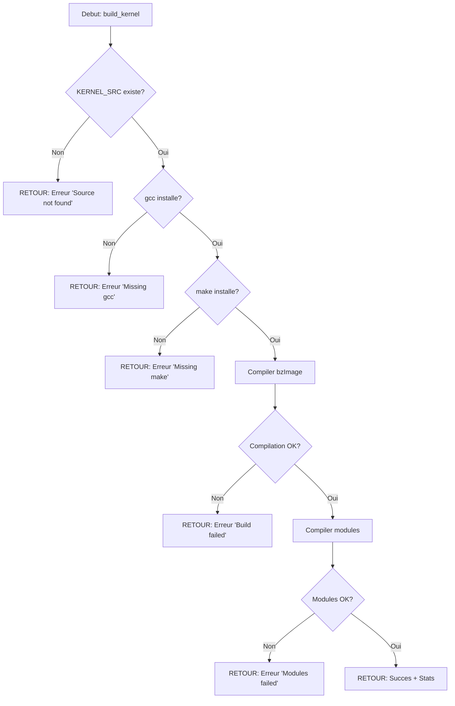

# Exercice 2.7.18-synth : kernel_forge

**Module :**
2.7.18 — Compilation et Configuration du Noyau Linux

**Concept :**
synth — Synthese complete (configure, build, install, modules, initramfs, GRUB, debug)

**Difficulte :**
★★★★★★★☆☆☆ (7/10)

**Type :**
complet (Cours + QCM + Code + Pratique)

**Tiers :**
3 — Synthese (tous concepts a→h du sous-module 2.7.18 + debugging 2.7.19)

**Langage :**
Shell (Bash 5.x) + C17 (modules kernel)

**Prerequis :**
- 2.7.17 : Structure du source kernel (arch/, drivers/, mm/, include/)
- 2.7.1-2.7.5 : Gestion des processus et memoire
- 1.x : Manipulation fichiers, compilation C, Makefile

**Domaines :**
CPU, Mem, Process, FS

**Duree estimee :**
180 min

**XP Base :**
500

**Complexite :**
T5 O(n*m) pour compilation × S4 O(GB) pour artefacts

---

## 1. PROTOTYPE & CONSIGNE

### 1.1 Obligations

**Fichiers a rendre :**
- `kernel_forge.sh` : Script principal de build
- `log_levels_demo.c` : Module kernel de demonstration
- `Makefile` : Pour le module externe

**Fonctions autorisees (Shell) :**
- Toutes commandes standard : `make`, `gcc`, `wget`, `tar`, `grep`, `awk`, `sed`
- Commandes systeme : `sudo`, `mkinitramfs`, `dracut`, `update-grub`

**Fonctions autorisees (C - Module Kernel) :**
- `printk`, `pr_info`, `pr_err`, `pr_warn`, `pr_debug`
- `module_init`, `module_exit`
- `printk_ratelimited`, `pr_info_once`

**Fonctions interdites :**
- `printf` (user-space, pas kernel)
- `malloc`/`free` (utiliser `kmalloc`/`kfree` si allocation necessaire)

---

### 1.2 Consigne

#### 2.4.1 IRON MAN SUIT ASSEMBLY : L'Analogie Parfaite

**COMPILER LE KERNEL = TONY STARK QUI CONSTRUIT SON ARMURE MARK 85**

```
┌─────────────────────────────────────────────────────────────────────────────┐
│                                                                             │
│   "JARVIS, lance la sequence d'assemblage de l'armure."                     │
│   "Bien sur, Monsieur Stark. Configuration en cours..."                     │
│                                                                             │
│   Dans le MCU, Tony Stark ne construit pas son armure au hasard.            │
│   Il CONFIGURE chaque composant, COMPILE chaque piece, puis                 │
│   INSTALLE le tout dans un systeme coherent.                                │
│                                                                             │
│   Le KERNEL LINUX fonctionne EXACTEMENT de la meme maniere.                 │
│                                                                             │
└─────────────────────────────────────────────────────────────────────────────┘
```

| Concept Kernel | Equivalent Iron Man | Explication |
|----------------|---------------------|-------------|
| **Source Code** (`/usr/src/linux`) | Les plans holographiques de JARVIS | Tout le code source, les blueprints |
| **`make menuconfig`** | L'interface holographique de Tony | Selectionner les composants : repulseurs OUI, lance-missiles NON |
| **`.config`** | Le fichier de specs de l'armure | Liste precise de ce qui sera inclus |
| **`make bzImage`** | Forger le coeur Arc Reactor | Compiler le noyau central, le "coeur" du systeme |
| **`make modules`** | Fabriquer les gadgets detachables | Les modules = repulseurs, jets, boucliers... detachables |
| **`make install`** | Installer l'armure dans la salle | Copier le kernel compile dans `/boot` |
| **`make modules_install`** | Ranger les gadgets dans l'armurerie | Installer les modules dans `/lib/modules/` |
| **`initramfs`** | Le protocole de demarrage d'urgence | Si Tony est inconscient, l'armure peut demarrer en mode minimal |
| **GRUB** | Le menu vocal de JARVIS | "Quelle armure voulez-vous, Monsieur ?" Mark 42, 43, 85... |
| **`dmesg`** | Les logs de JARVIS | "Systeme de propulsion : OK. Repulseurs : Charges a 100%" |
| **KGDB** | Le mode diagnostic de JARVIS | Quand quelque chose ne va pas, debug pas a pas |

```
ARMURERIE STARK == /boot + /lib/modules
────────────────────────────────────────

/boot/
├── vmlinuz-6.6.0-stark     ← L'armure Mark 6.6.0
├── vmlinuz-5.15.0-rescue   ← Armure de secours
├── initrd.img-6.6.0-stark  ← Kit de demarrage d'urgence
└── grub/                   ← Le menu JARVIS

/lib/modules/6.6.0-stark/
├── kernel/
│   ├── drivers/            ← Gadgets : WiFi, GPU, USB...
│   │   ├── net/            ← Module reseau (comme le comm de Tony)
│   │   └── gpu/            ← Module graphique (affichage HUD)
│   └── fs/                 ← Modules systemes de fichiers
└── modules.dep             ← Liste des dependances entre gadgets
```

**Le Processus de Build = L'Assemblage de l'Armure**

```
Phase 1: CONFIGURATION (make menuconfig)
────────────────────────────────────────
Tony (face a l'hologramme) : "JARVIS, affiche les options de l'armure."

┌─────────────────────────────────────────────────────────────────┐
│ STARK ARMOR CONFIGURATION v6.6.0                                │
│                                                                 │
│ [*] Arc Reactor Support (CONFIG_ARC_REACTOR)                    │
│ [*] Repulsor Arrays (CONFIG_REPULSORS)                          │
│     --- Repulsor Options ---                                    │
│     [*] Dual Hand Repulsors (CONFIG_DUAL_REPULSOR)              │
│     [ ] Chest Unibeam (CONFIG_UNIBEAM)  ← Desactive pour Mk42   │
│ [M] Flight System (CONFIG_FLIGHT)  ← M = Module detachable      │
│ [*] HUD Display (CONFIG_HUD)                                    │
│ [ ] Weapons Array (CONFIG_WEAPONS)  ← Tony est pacifiste now    │
│                                                                 │
│ <Select>    <Exit>    <Help>    <Save>                          │
└─────────────────────────────────────────────────────────────────┘

Symboles:
[*] = Compile dans le kernel (toujours charge)
[M] = Module (charge a la demande)
[ ] = Desactive (pas compile)


Phase 2: COMPILATION (make -j$(nproc))
──────────────────────────────────────
JARVIS: "Compilation en cours... Utilisation de 16 coeurs."

$ make -j16 bzImage
  CC      init/main.o         ← "Coeur Arc Reactor: 1%"
  CC      kernel/sched.o      ← "Systeme nerveux: 15%"
  CC      mm/memory.o         ← "Memoire: 30%"
  CC      drivers/gpu/drm.o   ← "Affichage HUD: 45%"
  ...
  LD      vmlinux             ← "Assemblage final..."
  OBJCOPY arch/x86/boot/bzImage  ← "Compression de l'armure"

$ make modules
  CC [M]  drivers/net/wifi.ko  ← "Module WiFi: Compile"
  CC [M]  drivers/gpu/nvidia.ko ← "Module GPU: Compile"


Phase 3: INSTALLATION (make install)
────────────────────────────────────
JARVIS: "Installation dans l'armurerie principale."

$ sudo make install
  INSTALL /boot/vmlinuz-6.6.0-stark
  INSTALL /boot/System.map-6.6.0-stark
  INSTALL /boot/config-6.6.0-stark

$ sudo make modules_install
  INSTALL /lib/modules/6.6.0-stark/kernel/drivers/net/wifi.ko
  INSTALL /lib/modules/6.6.0-stark/kernel/drivers/gpu/nvidia.ko
  DEPMOD  6.6.0-stark  ← "Calcul des dependances entre modules"


Phase 4: INITRAMFS (mkinitramfs)
────────────────────────────────
JARVIS: "Creation du protocole de demarrage d'urgence."

L'initramfs est comme le mode "House Party Protocol" de Tony.
Si le systeme principal ne repond pas, ce mini-systeme peut:
- Charger les drivers essentiels (disque, clavier)
- Monter le vrai systeme de fichiers
- Passer le controle au vrai kernel

$ sudo mkinitramfs -o /boot/initrd.img-6.6.0-stark 6.6.0-stark


Phase 5: GRUB (update-grub)
───────────────────────────
JARVIS: "Mise a jour du menu de selection d'armure."

┌─────────────────────────────────────────────────────────────────┐
│ STARK BOOT MENU (GRUB)                                          │
│                                                                 │
│ > Ubuntu avec Linux 6.6.0-stark    ← Nouvelle armure            │
│   Ubuntu avec Linux 5.15.0-rescue  ← Armure de secours          │
│   Windows Boot Manager              ← L'autre systeme           │
│                                                                 │
│ Appuyez sur 'e' pour editer, 'c' pour console                   │
└─────────────────────────────────────────────────────────────────┘
```

---

#### 2.4.2 Enonce Academique

**Contexte Technique**

La compilation du noyau Linux est une operation fondamentale pour tout administrateur systeme ou developpeur kernel. Elle permet de personnaliser le systeme d'exploitation pour des besoins specifiques : optimisation materielle, securite renforcee, support de peripheriques exotiques, ou developpement de modules.

**Ta mission :**

Creer un script `kernel_forge.sh` et un module de demonstration `log_levels_demo.c` qui permettent de :

1. **Configurer** le kernel avec `make menuconfig`
2. **Compiler** le kernel (`bzImage`) et les modules
3. **Installer** le kernel et les modules
4. **Generer** un initramfs
5. **Mettre a jour** GRUB
6. **Afficher** et filtrer les messages kernel avec `dmesg`
7. **Documenter** la configuration de KGDB pour le debugging

**Entree du script :**
- `$1` : Commande (`configure`, `build`, `install`, `dmesg`, `kgdb`, `all`, `clean`)

**Sortie :**
- Code retour 0 si succes
- Code retour 1 si echec
- Messages informatifs sur stdout
- Erreurs sur stderr

**Contraintes :**
- Le script doit verifier les prerequis (outils de compilation)
- Le script doit gerer les erreurs avec `set -e`
- Le module C doit demonstrer TOUS les niveaux de log kernel
- Le Makefile doit permettre `make`, `make clean`, `make install`

**Exemples :**

| Commande | Action | Resultat |
|----------|--------|----------|
| `./kernel_forge.sh configure` | Lance menuconfig | Interface ncurses |
| `./kernel_forge.sh build` | Compile kernel + modules | bzImage + *.ko |
| `./kernel_forge.sh install` | Installe tout | Fichiers dans /boot |
| `./kernel_forge.sh dmesg` | Affiche logs kernel | Messages filtres |
| `./kernel_forge.sh all` | Fait tout | Build complet |

---

### 1.3 Prototype

**kernel_forge.sh :**
```bash
#!/bin/bash
# kernel_forge.sh - Script de compilation du noyau Linux
# Usage: ./kernel_forge.sh [configure|build|install|clean|dmesg|kgdb|all]
```

**log_levels_demo.c :**
```c
#include <linux/module.h>
#include <linux/kernel.h>
#include <linux/init.h>

MODULE_LICENSE("GPL");
MODULE_AUTHOR("HACKBRAIN");
MODULE_DESCRIPTION("Demonstration des niveaux de log kernel");

static int __init demo_init(void);
static void __exit demo_exit(void);

module_init(demo_init);
module_exit(demo_exit);
```

**Makefile :**
```makefile
obj-m += log_levels_demo.o
KDIR := /lib/modules/$(shell uname -r)/build

all:
	$(MAKE) -C $(KDIR) M=$(PWD) modules

clean:
	$(MAKE) -C $(KDIR) M=$(PWD) clean
```

---

## 2. LE SAVIEZ-VOUS ?

### Les Niveaux de Log Kernel : La Hierarchie de Tony Stark

```
┌─────────────────────────────────────────────────────────────────────────────┐
│  "JARVIS, quel est le niveau de gravite ?"                                  │
│  "Niveau KERN_CRIT, Monsieur. Le reacteur est en surchauffe."               │
└─────────────────────────────────────────────────────────────────────────────┘
```

| Niveau | Valeur | Equivalent Stark Industries | Exemple |
|--------|--------|---------------------------|---------|
| `KERN_EMERG` | 0 | "JARVIS est mort" | Systeme inutilisable |
| `KERN_ALERT` | 1 | "L'Arc Reactor explose" | Action immediate requise |
| `KERN_CRIT` | 2 | "Armure a 5% de batterie" | Condition critique |
| `KERN_ERR` | 3 | "Repulseur gauche KO" | Erreur materielle |
| `KERN_WARNING` | 4 | "Temperature elevee" | Avertissement |
| `KERN_NOTICE` | 5 | "Nouveau module charge" | Notable mais normal |
| `KERN_INFO` | 6 | "Vol stabilise" | Information |
| `KERN_DEBUG` | 7 | "Capteur 47 OK" | Debug detaille |

**Pourquoi c'est crucial :**
```c
// MAUVAIS - Tout au meme niveau
printk("Erreur critique\n");    // Pas de niveau = KERN_WARNING par defaut!

// BON - Niveau explicite
printk(KERN_CRIT "Erreur critique!\n");
pr_crit("Erreur critique!\n");  // Macro moderne (recommandee)
```

---

### 2.5 DANS LA VRAIE VIE

**Qui utilise ca et pourquoi ?**

| Metier | Cas d'usage | Exemple concret |
|--------|-------------|-----------------|
| **Kernel Developer** | Developper de nouveaux drivers | Creer un driver pour GPU custom |
| **DevOps/SRE** | Optimiser pour cloud | Compiler kernel minimal pour containers |
| **Security Engineer** | Hardening kernel | Activer CONFIG_HARDENED_USERCOPY |
| **Embedded Developer** | IoT/Embarque | Kernel custom pour Raspberry Pi |
| **Performance Engineer** | Tuning systeme | Desactiver features inutiles |

**Cas reel : Netflix**
Netflix compile des kernels custom pour leurs serveurs de streaming avec :
- TCP BBR (meilleur algorithme de congestion)
- Tuning memoire agressif
- Drivers reseau optimises

---

## 3. EXEMPLE D'UTILISATION

### 3.0 Session bash

```bash
$ ls
kernel_forge.sh  log_levels_demo.c  Makefile

$ chmod +x kernel_forge.sh

$ ./kernel_forge.sh configure
[INFO] Checking prerequisites...
[INFO] All prerequisites OK
[INFO] Using current kernel config as base
[INFO] Opening menuconfig...
# Interface ncurses s'ouvre

$ ./kernel_forge.sh build
[INFO] === BUILDING KERNEL ===
[INFO] Building vmlinux (this may take a while)...
[INFO] Kernel image built: arch/x86/boot/bzImage
[INFO] Building modules...
[INFO] Build complete!
[INFO] Build Statistics:
  Kernel size: 8.2M
  Module count: 4523

$ ./kernel_forge.sh dmesg
[INFO] === KERNEL MESSAGES (dmesg) ===
Log Levels:
  KERN_EMERG   (0) - System is unusable
  KERN_ALERT   (1) - Action must be taken immediately
  ...
[INFO] Recent kernel messages:
[    0.000000] Linux version 6.6.0 ...
[    1.234567] ACPI: Core revision 20230628

$ make -C /lib/modules/$(uname -r)/build M=$(pwd) modules
  CC [M]  log_levels_demo.o
  LD [M]  log_levels_demo.ko

$ sudo insmod log_levels_demo.ko
$ dmesg | tail -20
[ 1234.567890] log_demo: [EMERG] System emergency!
[ 1234.567891] log_demo: [ALERT] Immediate action required!
[ 1234.567892] log_demo: [CRIT] Critical error!
[ 1234.567893] log_demo: [ERR] Error occurred
[ 1234.567894] log_demo: [WARNING] Warning message
[ 1234.567895] log_demo: [NOTICE] Notable event
[ 1234.567896] log_demo: [INFO] Informational message
[ 1234.567897] log_demo: [DEBUG] Debug information
[ 1234.567898] log_demo: Module loaded successfully

$ sudo rmmod log_levels_demo
```

---

### 3.1 BONUS EXPERT (OPTIONNEL)

**Difficulte Bonus :**
★★★★★★★★★☆ (9/10)

**Recompense :**
XP x4

**Time Complexity attendue :**
O(n) pour le fuzzing des configs

**Space Complexity attendue :**
O(1) auxiliaire

**Domaines Bonus :**
`CPU`, `ASM`, `Crypto`

#### 3.1.1 Consigne Bonus

**JARVIS EN MODE FULL AUTOMATION**

Tony ne fait pas que construire UNE armure. Il automatise la production de TOUTES les armures avec des tests de qualite.

**Ta mission bonus :**

Creer une fonction `kernel_audit.sh` qui :
1. **Audit de securite** : Verifie les options de securite critiques dans `.config`
2. **Cross-compilation** : Supporte `ARCH=arm64` pour embedded
3. **Benchmark** : Mesure le temps de compilation
4. **KGDB automation** : Configure automatiquement KGDB avec QEMU

**Contraintes :**
```
┌─────────────────────────────────────────────────────────────────┐
│  Options de securite a verifier :                               │
│  - CONFIG_RANDOMIZE_BASE=y (KASLR)                              │
│  - CONFIG_STACKPROTECTOR_STRONG=y                               │
│  - CONFIG_HARDENED_USERCOPY=y                                   │
│  - CONFIG_SECURITY_SELINUX=y ou CONFIG_SECURITY_APPARMOR=y      │
│                                                                 │
│  Temps limite : Build complet < 30 min sur 8 coeurs             │
│  Espace limite : O(1) memoire auxiliaire pour l'audit           │
└─────────────────────────────────────────────────────────────────┘
```

**Exemples :**

| Appel | Retour | Explication |
|-------|--------|-------------|
| `./kernel_audit.sh security` | 0 + rapport | Audit securite passe |
| `./kernel_audit.sh security` | 1 + warnings | Options manquantes |
| `./kernel_audit.sh cross arm64` | 0 | Cross-compile OK |
| `./kernel_audit.sh benchmark` | Temps en secondes | 1847s |

#### 3.1.2 Prototype Bonus

```bash
#!/bin/bash
# kernel_audit.sh - Audit et automation avancee
# Usage: ./kernel_audit.sh [security|cross ARCH|benchmark|kgdb-qemu]

audit_security() {
    # Verifie les options de securite critiques
}

cross_compile() {
    # Cross-compilation pour architecture cible
}

benchmark_build() {
    # Mesure le temps de compilation
}

setup_kgdb_qemu() {
    # Configure KGDB avec QEMU pour debug
}
```

#### 3.1.3 Ce qui change par rapport a l'exercice de base

| Aspect | Base | Bonus |
|--------|------|-------|
| Cibles | x86_64 uniquement | Multi-architecture |
| Securite | Manuel | Audit automatise |
| Debug | Documentation | QEMU + KGDB automatise |
| Metriques | Aucune | Benchmark integre |

---

## 4. ZONE CORRECTION (POUR LE TESTEUR)

### 4.1 Moulinette

| Test | Input | Expected | Points | Type |
|------|-------|----------|--------|------|
| T01 | `./kernel_forge.sh help` | Affiche usage, exit 0 | 5 | Basic |
| T02 | `./kernel_forge.sh` | Affiche usage, exit 0 | 5 | Basic |
| T03 | Script non executable | Erreur permission | 5 | Safety |
| T04 | KERNEL_SRC invalide | Erreur + exit 1 | 10 | Safety |
| T05 | `./kernel_forge.sh dmesg` | Affiche niveaux + logs | 15 | Function |
| T06 | `./kernel_forge.sh kgdb` | Affiche guide KGDB | 10 | Function |
| T07 | Module compile | `log_levels_demo.ko` existe | 20 | Build |
| T08 | Module se charge | `insmod` OK | 15 | Runtime |
| T09 | Tous niveaux de log | 8 niveaux dans dmesg | 15 | Runtime |
| T10 | Module se decharge | `rmmod` OK | 10 | Runtime |
| **TOTAL** | | | **100** | |

### 4.2 main.c de test (pour le module)

```c
/* test_module.c - Script de test pour log_levels_demo */
#include <stdio.h>
#include <stdlib.h>
#include <string.h>
#include <unistd.h>

#define RESET   "\033[0m"
#define GREEN   "\033[32m"
#define RED     "\033[31m"

int run_cmd(const char *cmd) {
    return system(cmd);
}

int check_dmesg_level(const char *level) {
    char cmd[256];
    snprintf(cmd, sizeof(cmd), "dmesg | tail -20 | grep -q '%s'", level);
    return run_cmd(cmd) == 0;
}

int main(void) {
    int score = 0;
    int total = 100;

    printf("=== Test log_levels_demo module ===\n\n");

    /* Test 1: Module compile */
    printf("Test 1: Module compilation... ");
    if (run_cmd("make -C /lib/modules/$(uname -r)/build M=$(pwd) modules 2>/dev/null") == 0) {
        printf("%s[OK]%s\n", GREEN, RESET);
        score += 20;
    } else {
        printf("%s[FAIL]%s\n", RED, RESET);
    }

    /* Test 2: Module exists */
    printf("Test 2: Module file exists... ");
    if (access("log_levels_demo.ko", F_OK) == 0) {
        printf("%s[OK]%s\n", GREEN, RESET);
        score += 10;
    } else {
        printf("%s[FAIL]%s\n", RED, RESET);
    }

    /* Test 3: Load module */
    printf("Test 3: Load module... ");
    if (run_cmd("sudo insmod log_levels_demo.ko 2>/dev/null") == 0) {
        printf("%s[OK]%s\n", GREEN, RESET);
        score += 15;
    } else {
        printf("%s[FAIL]%s\n", RED, RESET);
    }

    /* Tests 4-11: Check all log levels */
    const char *levels[] = {
        "EMERG", "ALERT", "CRIT", "ERR",
        "WARNING", "NOTICE", "INFO", "DEBUG"
    };

    for (int i = 0; i < 8; i++) {
        printf("Test %d: Level %s... ", 4 + i, levels[i]);
        if (check_dmesg_level(levels[i])) {
            printf("%s[OK]%s\n", GREEN, RESET);
            score += 5;
        } else {
            printf("%s[FAIL]%s\n", RED, RESET);
        }
    }

    /* Test 12: Unload module */
    printf("Test 12: Unload module... ");
    if (run_cmd("sudo rmmod log_levels_demo 2>/dev/null") == 0) {
        printf("%s[OK]%s\n", GREEN, RESET);
        score += 15;
    } else {
        printf("%s[FAIL]%s\n", RED, RESET);
    }

    printf("\n=== Score: %d/%d ===\n", score, total);
    return (score >= 70) ? 0 : 1;
}
```

### 4.3 Solution de reference

**kernel_forge.sh :**
```bash
#!/bin/bash
#
# kernel_forge.sh - Script de compilation du noyau Linux
# Solution de reference HACKBRAIN
#

set -e

# Configuration
KERNEL_VERSION="${KERNEL_VERSION:-6.6.0}"
KERNEL_SRC="${KERNEL_SRC:-/usr/src/linux-${KERNEL_VERSION}}"
JOBS="${JOBS:-$(nproc)}"

# Couleurs
RED='\033[0;31m'
GREEN='\033[0;32m'
YELLOW='\033[1;33m'
NC='\033[0m'

log_info() { echo -e "${GREEN}[INFO]${NC} $1"; }
log_warn() { echo -e "${YELLOW}[WARN]${NC} $1"; }
log_error() { echo -e "${RED}[ERROR]${NC} $1" >&2; }

check_prerequisites() {
    log_info "Checking prerequisites..."
    local missing=()
    for tool in gcc make flex bison bc; do
        if ! command -v "$tool" &> /dev/null; then
            missing+=("$tool")
        fi
    done
    if [ ${#missing[@]} -ne 0 ]; then
        log_error "Missing tools: ${missing[*]}"
        exit 1
    fi
    log_info "All prerequisites OK"
}

configure_kernel() {
    log_info "=== KERNEL CONFIGURATION ==="
    if [ ! -d "$KERNEL_SRC" ]; then
        log_error "Kernel source not found: $KERNEL_SRC"
        exit 1
    fi
    cd "$KERNEL_SRC"
    if [ ! -f .config ]; then
        if [ -f "/boot/config-$(uname -r)" ]; then
            log_info "Using current kernel config as base"
            cp "/boot/config-$(uname -r)" .config
        else
            log_info "Creating default config"
            make defconfig
        fi
    fi
    log_info "Opening menuconfig..."
    make menuconfig
    log_info "Configuration saved to .config"
}

build_kernel() {
    log_info "=== BUILDING KERNEL ==="
    cd "$KERNEL_SRC"
    log_info "Building vmlinux (this may take a while)..."
    make -j"$JOBS" bzImage
    log_info "Kernel image built: arch/x86/boot/bzImage"
    log_info "Building modules..."
    make -j"$JOBS" modules
    log_info "Build complete!"
    log_info "Build Statistics:"
    echo "  Kernel size: $(ls -lh arch/x86/boot/bzImage | awk '{print $5}')"
    echo "  Module count: $(find . -name '*.ko' | wc -l)"
}

install_kernel() {
    log_info "=== INSTALLING KERNEL ==="
    cd "$KERNEL_SRC"
    local kver=$(make kernelrelease)
    log_info "Installing kernel version: $kver"
    log_info "Installing modules..."
    sudo make modules_install
    log_info "Installing kernel..."
    sudo make install
    create_initramfs "$kver"
    update_grub
    log_info "Installation complete!"
    log_info "Reboot and select '$kver' from GRUB menu"
}

create_initramfs() {
    local kver="$1"
    log_info "=== CREATING INITRAMFS ==="
    if command -v mkinitramfs &> /dev/null; then
        sudo mkinitramfs -o "/boot/initrd.img-$kver" "$kver"
    elif command -v dracut &> /dev/null; then
        sudo dracut --force "/boot/initrd.img-$kver" "$kver"
    else
        log_error "No initramfs tool found"
        exit 1
    fi
    log_info "Initramfs created: /boot/initrd.img-$kver"
}

update_grub() {
    log_info "=== UPDATING GRUB ==="
    if command -v update-grub &> /dev/null; then
        sudo update-grub
    elif command -v grub2-mkconfig &> /dev/null; then
        sudo grub2-mkconfig -o /boot/grub2/grub.cfg
    else
        log_warn "Could not find grub-mkconfig tool"
    fi
    log_info "GRUB updated"
}

show_dmesg() {
    log_info "=== KERNEL MESSAGES (dmesg) ==="
    echo ""
    echo "Log Levels:"
    echo "  KERN_EMERG   (0) - System is unusable"
    echo "  KERN_ALERT   (1) - Action must be taken immediately"
    echo "  KERN_CRIT    (2) - Critical conditions"
    echo "  KERN_ERR     (3) - Error conditions"
    echo "  KERN_WARNING (4) - Warning conditions"
    echo "  KERN_NOTICE  (5) - Normal but significant"
    echo "  KERN_INFO    (6) - Informational"
    echo "  KERN_DEBUG   (7) - Debug-level messages"
    echo ""
    log_info "Recent kernel messages:"
    dmesg --level=err,warn,info | tail -50
    echo ""
    log_info "Filter examples:"
    echo "  dmesg --level=err           # Errors only"
    echo "  dmesg -T                    # Human-readable timestamps"
    echo "  dmesg -w                    # Follow (like tail -f)"
}

setup_kgdb() {
    log_info "=== KGDB SETUP GUIDE ==="
    cat << 'EOF'
KGDB (Kernel GDB) allows debugging a running kernel.

1. Build kernel with KGDB support:
   CONFIG_KGDB=y
   CONFIG_KGDB_SERIAL_CONSOLE=y

2. Add to GRUB command line:
   kgdboc=ttyS0,115200 kgdbwait

3. Connect from another machine:
   $ gdb vmlinux
   (gdb) set remotebaud 115200
   (gdb) target remote /dev/ttyS0

4. Or use QEMU for easier debugging:
   $ qemu-system-x86_64 -kernel bzImage \
       -append "kgdbwait kgdboc=ttyS0,115200" \
       -serial tcp::1234,server,nowait

   $ gdb vmlinux
   (gdb) target remote :1234

5. Common KGDB commands:
   (gdb) break start_kernel
   (gdb) continue
   (gdb) bt                    # Backtrace
   (gdb) info registers
   (gdb) p current->comm       # Current process name

6. Magic SysRq key (if enabled):
   echo g > /proc/sysrq-trigger  # Enter debugger
EOF
}

clean_build() {
    log_info "=== CLEANING BUILD ==="
    cd "$KERNEL_SRC"
    make clean
    log_info "Clean complete"
}

print_usage() {
    echo "Usage: $0 [command]"
    echo ""
    echo "Commands:"
    echo "  configure  - Configure kernel with menuconfig"
    echo "  build      - Build kernel and modules"
    echo "  install    - Install kernel, modules, initramfs"
    echo "  clean      - Clean build files"
    echo "  dmesg      - Show kernel messages with log levels"
    echo "  kgdb       - Show KGDB setup guide"
    echo "  all        - configure + build + install"
    echo ""
    echo "Environment variables:"
    echo "  KERNEL_VERSION  - Version to build (default: 6.6.0)"
    echo "  KERNEL_SRC      - Source directory"
    echo "  JOBS            - Parallel jobs (default: nproc)"
}

main() {
    case "${1:-help}" in
        configure)
            check_prerequisites
            configure_kernel
            ;;
        build)
            check_prerequisites
            build_kernel
            ;;
        install)
            install_kernel
            ;;
        clean)
            clean_build
            ;;
        dmesg)
            show_dmesg
            ;;
        kgdb)
            setup_kgdb
            ;;
        all)
            check_prerequisites
            configure_kernel
            build_kernel
            install_kernel
            ;;
        *)
            print_usage
            ;;
    esac
}

main "$@"
```

**log_levels_demo.c :**
```c
/**
 * log_levels_demo.c - Demonstration des niveaux de log kernel
 * Solution de reference HACKBRAIN
 */

#include <linux/module.h>
#include <linux/kernel.h>
#include <linux/init.h>

MODULE_LICENSE("GPL");
MODULE_AUTHOR("HACKBRAIN");
MODULE_DESCRIPTION("Kernel Log Levels Demo");

static int __init log_demo_init(void)
{
    /* Format classique avec niveau explicite */
    printk(KERN_EMERG "log_demo: [EMERG] System emergency!\n");
    printk(KERN_ALERT "log_demo: [ALERT] Immediate action required!\n");
    printk(KERN_CRIT "log_demo: [CRIT] Critical error!\n");
    printk(KERN_ERR "log_demo: [ERR] Error occurred\n");
    printk(KERN_WARNING "log_demo: [WARNING] Warning message\n");
    printk(KERN_NOTICE "log_demo: [NOTICE] Notable event\n");
    printk(KERN_INFO "log_demo: [INFO] Informational message\n");
    printk(KERN_DEBUG "log_demo: [DEBUG] Debug information\n");

    /* Macros modernes (recommandees) */
    pr_info("log_demo: Using pr_info macro\n");
    pr_err("log_demo: Using pr_err macro\n");

    /* Rate limiting */
    printk_ratelimited(KERN_INFO "log_demo: Rate-limited message\n");
    pr_info_once("log_demo: This appears only once\n");

    pr_info("log_demo: Module loaded successfully\n");
    return 0;
}

static void __exit log_demo_exit(void)
{
    pr_info("log_demo: Module unloaded\n");
}

module_init(log_demo_init);
module_exit(log_demo_exit);
```

**Makefile :**
```makefile
# Makefile pour log_levels_demo module
# Solution de reference HACKBRAIN

obj-m += log_levels_demo.o

KDIR := /lib/modules/$(shell uname -r)/build

all:
	$(MAKE) -C $(KDIR) M=$(PWD) modules

clean:
	$(MAKE) -C $(KDIR) M=$(PWD) clean

install: all
	sudo insmod log_levels_demo.ko

uninstall:
	sudo rmmod log_levels_demo

test: install
	@echo "=== Kernel messages ==="
	dmesg | tail -20
	@echo ""
	@echo "=== Errors only ==="
	dmesg --level=err,crit,alert,emerg | tail -10
	$(MAKE) uninstall

.PHONY: all clean install uninstall test
```

### 4.4 Solutions alternatives acceptees

**Alternative 1 : Utilisation de pr_* exclusivement**
```c
static int __init log_demo_init(void)
{
    pr_emerg("log_demo: [EMERG] System emergency!\n");
    pr_alert("log_demo: [ALERT] Immediate action required!\n");
    pr_crit("log_demo: [CRIT] Critical error!\n");
    pr_err("log_demo: [ERR] Error occurred\n");
    pr_warn("log_demo: [WARNING] Warning message\n");
    pr_notice("log_demo: [NOTICE] Notable event\n");
    pr_info("log_demo: [INFO] Informational message\n");
    pr_debug("log_demo: [DEBUG] Debug information\n");
    return 0;
}
```

**Alternative 2 : Script avec fonctions separees en fichiers**
```bash
# Acceptable si les fichiers sont sources correctement
source ./lib/colors.sh
source ./lib/prerequisites.sh
source ./lib/kernel_ops.sh
```

### 4.5 Solutions refusees

**Refuse 1 : printf au lieu de printk**
```c
/* REFUSE - printf n'existe pas en kernel space */
static int __init log_demo_init(void)
{
    printf("Hello from kernel!\n");  /* CRASH! */
    return 0;
}
/* Pourquoi refuse : printf est une fonction user-space (libc).
   En kernel, seul printk et ses variantes existent. */
```

**Refuse 2 : Pas de verification d'erreur dans le script**
```bash
#!/bin/bash
# REFUSE - Pas de gestion d'erreur
cd /usr/src/linux
make menuconfig  # Et si le repertoire n'existe pas ?
make -j4
sudo make install
/* Pourquoi refuse : Sans "set -e" et verifications,
   le script continue meme apres des erreurs critiques. */
```

**Refuse 3 : Module sans MODULE_LICENSE**
```c
/* REFUSE - Pas de licence */
#include <linux/module.h>
static int __init demo_init(void) { return 0; }
module_init(demo_init);
/* Pourquoi refuse : Le kernel marque le module comme "tainted"
   et certaines fonctions ne seront pas accessibles. */
```

### 4.6 Solution bonus de reference

```bash
#!/bin/bash
# kernel_audit.sh - Audit et automation avancee
# Solution bonus HACKBRAIN

set -e

SECURITY_OPTIONS=(
    "CONFIG_RANDOMIZE_BASE"
    "CONFIG_STACKPROTECTOR_STRONG"
    "CONFIG_HARDENED_USERCOPY"
    "CONFIG_SECURITY_SELINUX"
    "CONFIG_SECURITY_APPARMOR"
)

audit_security() {
    local config="${1:-.config}"
    local missing=()
    local found=()

    echo "=== Security Audit ==="
    echo "Checking: $config"
    echo ""

    for opt in "${SECURITY_OPTIONS[@]}"; do
        if grep -q "^${opt}=y" "$config"; then
            found+=("$opt")
            echo "[OK] $opt"
        else
            missing+=("$opt")
            echo "[MISSING] $opt"
        fi
    done

    echo ""
    echo "Found: ${#found[@]}/${#SECURITY_OPTIONS[@]}"

    if [ ${#missing[@]} -gt 2 ]; then
        echo "[WARN] Security hardening incomplete!"
        return 1
    fi
    return 0
}

cross_compile() {
    local arch="$1"
    local cross_compiler=""

    case "$arch" in
        arm64|aarch64)
            cross_compiler="aarch64-linux-gnu-"
            ;;
        arm)
            cross_compiler="arm-linux-gnueabihf-"
            ;;
        *)
            echo "Unknown architecture: $arch"
            return 1
            ;;
    esac

    echo "=== Cross-compilation for $arch ==="
    export ARCH="$arch"
    export CROSS_COMPILE="$cross_compiler"

    make defconfig
    make -j$(nproc)
}

benchmark_build() {
    echo "=== Build Benchmark ==="
    local start=$(date +%s)

    make clean
    make -j$(nproc) bzImage

    local end=$(date +%s)
    local duration=$((end - start))

    echo ""
    echo "Build time: ${duration}s"
    echo "Cores used: $(nproc)"
    echo "Time per core: $((duration / $(nproc)))s"
}

setup_kgdb_qemu() {
    echo "=== KGDB + QEMU Setup ==="

    # Genere le script de lancement
    cat > run_debug.sh << 'EOF'
#!/bin/bash
qemu-system-x86_64 \
    -kernel arch/x86/boot/bzImage \
    -append "console=ttyS0 kgdbwait kgdboc=ttyS0,115200 nokaslr" \
    -serial tcp::1234,server,nowait \
    -nographic \
    -m 1G
EOF
    chmod +x run_debug.sh

    # Genere le script GDB
    cat > connect_gdb.sh << 'EOF'
#!/bin/bash
gdb vmlinux -ex "target remote :1234"
EOF
    chmod +x connect_gdb.sh

    echo "Scripts generated:"
    echo "  ./run_debug.sh   - Start QEMU with debug kernel"
    echo "  ./connect_gdb.sh - Connect GDB to QEMU"
}

main() {
    case "$1" in
        security)
            audit_security "${2:-.config}"
            ;;
        cross)
            cross_compile "$2"
            ;;
        benchmark)
            benchmark_build
            ;;
        kgdb-qemu)
            setup_kgdb_qemu
            ;;
        *)
            echo "Usage: $0 [security [config]|cross ARCH|benchmark|kgdb-qemu]"
            ;;
    esac
}

main "$@"
```

### 4.7 Solutions alternatives bonus

**Alternative : Audit avec rapport JSON**
```bash
audit_security_json() {
    local config="${1:-.config}"
    echo "{"
    echo '  "config_file": "'$config'",'
    echo '  "options": ['
    for opt in "${SECURITY_OPTIONS[@]}"; do
        local status="false"
        grep -q "^${opt}=y" "$config" && status="true"
        echo "    {\"name\": \"$opt\", \"enabled\": $status},"
    done
    echo '  ]'
    echo "}"
}
```

### 4.8 Solutions refusees bonus

**Refuse : Benchmark sans clean prealable**
```bash
# REFUSE - Les resultats sont fausses par le cache
benchmark_build() {
    time make -j$(nproc)  # Pas de make clean avant!
}
/* Pourquoi refuse : Sans clean, les fichiers deja compiles
   ne sont pas recompiles, faussant le benchmark. */
```

### 4.9 spec.json

```json
{
  "name": "kernel_forge",
  "language": "shell+c",
  "type": "complet",
  "tier": 3,
  "tier_info": "Synthese (configure, build, install, modules, initramfs, GRUB, debug)",
  "tags": ["kernel", "compilation", "modules", "grub", "dmesg", "phase2"],
  "passing_score": 70,

  "function": {
    "name": "kernel_forge",
    "prototype": "./kernel_forge.sh [configure|build|install|clean|dmesg|kgdb|all]",
    "return_type": "int (exit code)",
    "parameters": [
      {"name": "command", "type": "string"}
    ]
  },

  "driver": {
    "reference": "#!/bin/bash\nset -e\nKERNEL_VERSION=\"${KERNEL_VERSION:-6.6.0}\"\nKERNEL_SRC=\"${KERNEL_SRC:-/usr/src/linux-${KERNEL_VERSION}}\"\nJOBS=\"${JOBS:-$(nproc)}\"\nlog_info() { echo -e \"[INFO] $1\"; }\nlog_error() { echo -e \"[ERROR] $1\" >&2; }\ncheck_prerequisites() { for tool in gcc make flex bison bc; do command -v \"$tool\" &>/dev/null || { log_error \"Missing: $tool\"; exit 1; }; done; }\nshow_dmesg() { echo \"Log Levels:\"; echo \"KERN_EMERG (0) - System unusable\"; dmesg --level=err,warn,info | tail -50; }\nsetup_kgdb() { echo \"KGDB Setup Guide\"; echo \"1. CONFIG_KGDB=y\"; echo \"2. kgdboc=ttyS0,115200\"; }\nprint_usage() { echo \"Usage: $0 [configure|build|install|clean|dmesg|kgdb|all]\"; }\nmain() { case \"${1:-help}\" in dmesg) show_dmesg;; kgdb) setup_kgdb;; *) print_usage;; esac; }\nmain \"$@\"",

    "edge_cases": [
      {
        "name": "no_args",
        "args": [],
        "expected": "usage displayed",
        "is_trap": false
      },
      {
        "name": "help_command",
        "args": ["help"],
        "expected": "usage displayed, exit 0",
        "is_trap": false
      },
      {
        "name": "invalid_command",
        "args": ["invalid"],
        "expected": "usage displayed",
        "is_trap": true,
        "trap_explanation": "Commande inconnue doit afficher l'aide"
      },
      {
        "name": "dmesg_command",
        "args": ["dmesg"],
        "expected": "log levels + messages",
        "is_trap": false
      },
      {
        "name": "kgdb_command",
        "args": ["kgdb"],
        "expected": "KGDB guide",
        "is_trap": false
      },
      {
        "name": "missing_kernel_src",
        "args": ["configure"],
        "env": {"KERNEL_SRC": "/nonexistent"},
        "expected": "error + exit 1",
        "is_trap": true,
        "trap_explanation": "Doit verifier l'existence du repertoire source"
      }
    ],

    "fuzzing": {
      "enabled": false,
      "reason": "Exercice systeme, fuzzing non applicable"
    }
  },

  "module_tests": {
    "compile": "make -C /lib/modules/$(uname -r)/build M=$(pwd) modules",
    "load": "sudo insmod log_levels_demo.ko",
    "unload": "sudo rmmod log_levels_demo",
    "verify_levels": [
      "dmesg | grep -q 'EMERG'",
      "dmesg | grep -q 'ALERT'",
      "dmesg | grep -q 'CRIT'",
      "dmesg | grep -q 'ERR'",
      "dmesg | grep -q 'WARNING'",
      "dmesg | grep -q 'NOTICE'",
      "dmesg | grep -q 'INFO'",
      "dmesg | grep -q 'DEBUG'"
    ]
  },

  "norm": {
    "allowed_functions_shell": ["make", "gcc", "sudo", "wget", "tar", "grep", "awk", "sed", "mkinitramfs", "dracut", "update-grub"],
    "forbidden_functions_shell": ["rm -rf /"],
    "allowed_functions_c": ["printk", "pr_info", "pr_err", "pr_warn", "pr_debug", "pr_crit", "pr_alert", "pr_emerg", "pr_notice", "module_init", "module_exit", "printk_ratelimited", "pr_info_once"],
    "forbidden_functions_c": ["printf", "malloc", "free"],
    "check_security": true,
    "check_memory": false,
    "blocking": true
  }
}
```

### 4.10 Solutions Mutantes

**Mutant A (Boundary) : Mauvaise verification du nombre d'arguments**
```bash
#!/bin/bash
# Mutant A - Ne gere pas le cas sans argument
main() {
    case "$1" in  # $1 peut etre vide!
        configure) configure_kernel ;;
        build) build_kernel ;;
        # Pas de cas par defaut!
    esac
}
main "$@"
# Pourquoi c'est faux : Sans argument, le script ne fait rien silencieusement
# Ce qui etait pense : "Si pas d'argument, rien ne se passe"
# Erreur : Doit afficher l'aide et retourner 0
```

**Mutant B (Safety) : Pas de verification des prerequis**
```bash
#!/bin/bash
# Mutant B - Lance directement sans verifier
build_kernel() {
    cd /usr/src/linux
    make -j$(nproc) bzImage  # Et si gcc n'est pas installe?
}
# Pourquoi c'est faux : Sans gcc/make/flex/bison, la compilation echoue
# Ce qui etait pense : "Les outils sont forcement installes"
# Erreur : check_prerequisites() doit etre appele avant build
```

**Mutant C (Resource) : Pas de set -e**
```bash
#!/bin/bash
# Mutant C - Continue apres les erreurs
configure_kernel() {
    cd /usr/src/linux-inexistant  # Cette commande echoue
    make menuconfig               # Mais ca continue quand meme!
    make -j4                      # Dans le mauvais repertoire
}
# Pourquoi c'est faux : Le script continue malgre les erreurs
# Ce qui etait pense : "Les erreurs sont ignorables"
# Erreur : set -e doit arreter le script a la premiere erreur
```

**Mutant D (Logic) : printf au lieu de printk dans le module**
```c
/* Mutant D - Utilise printf user-space */
#include <linux/module.h>
#include <stdio.h>  /* N'EXISTE PAS en kernel! */

static int __init log_demo_init(void)
{
    printf("Hello from kernel!\n");  /* CRASH! */
    return 0;
}
module_init(log_demo_init);
/* Pourquoi c'est faux : printf est user-space, n'existe pas en kernel
   Ce qui etait pense : "printf marche partout"
   Erreur : Seul printk et pr_* fonctionnent en kernel space */
```

**Mutant E (Return) : Module sans MODULE_LICENSE**
```c
/* Mutant E - Pas de licence GPL */
#include <linux/module.h>
#include <linux/kernel.h>

static int __init log_demo_init(void)
{
    pr_info("Hello!\n");
    return 0;
}

static void __exit log_demo_exit(void)
{
    pr_info("Bye!\n");
}

module_init(log_demo_init);
module_exit(log_demo_exit);
/* Pas de MODULE_LICENSE! */
/* Pourquoi c'est faux : Le kernel marque le module "tainted"
   Ce qui etait pense : "La licence est optionnelle"
   Erreur : MODULE_LICENSE("GPL") est obligatoire pour acceder
   aux symboles EXPORT_SYMBOL_GPL du kernel */
```

---

## 5. COMPRENDRE (DOCUMENT DE COURS COMPLET)

### 5.1 Ce que cet exercice enseigne

```
┌─────────────────────────────────────────────────────────────────────────────┐
│  OBJECTIFS D'APPRENTISSAGE                                                  │
├─────────────────────────────────────────────────────────────────────────────┤
│                                                                             │
│  1. ORGANISATION DU SOURCE KERNEL                                           │
│     • Comprendre arch/, drivers/, mm/, include/                             │
│     • Savoir ou chercher le code d'une fonctionnalite                       │
│                                                                             │
│  2. CONFIGURATION AVEC MENUCONFIG                                           │
│     • Naviguer dans l'interface ncurses                                     │
│     • Comprendre [*], [M], [ ]                                              │
│     • Savoir quelles options activer/desactiver                             │
│                                                                             │
│  3. COMPILATION DU KERNEL                                                   │
│     • make bzImage vs make modules                                          │
│     • Parallelisation avec -j                                               │
│     • Comprendre les artefacts generes                                      │
│                                                                             │
│  4. INSTALLATION ET BOOT                                                    │
│     • Initramfs : pourquoi et comment                                       │
│     • GRUB : configuration et mise a jour                                   │
│     • Gestion multi-kernel                                                  │
│                                                                             │
│  5. DEBUGGING KERNEL                                                        │
│     • Niveaux de log avec dmesg                                             │
│     • KGDB pour debug avance                                                │
│     • Magic SysRq pour urgences                                             │
│                                                                             │
└─────────────────────────────────────────────────────────────────────────────┘
```

### 5.2 LDA - Traduction Litterale (MAJUSCULES)

#### 5.2.1 LDA Classique - Script Build

```
SCRIPT kernel_forge.sh

DÉBUT SCRIPT

    AFFECTER "6.6.0" À KERNEL_VERSION SI NON DÉFINI
    AFFECTER "/usr/src/linux-KERNEL_VERSION" À KERNEL_SRC
    AFFECTER NOMBRE_DE_PROCESSEURS À JOBS

    FONCTION log_info QUI PREND message EN PARAMÈTRE
    DÉBUT FONCTION
        AFFICHER "[INFO]" SUIVI DE message
    FIN FONCTION

    FONCTION log_error QUI PREND message EN PARAMÈTRE
    DÉBUT FONCTION
        AFFICHER "[ERROR]" SUIVI DE message SUR SORTIE ERREUR
    FIN FONCTION

    FONCTION check_prerequisites
    DÉBUT FONCTION
        DÉCLARER missing COMME TABLEAU VIDE

        POUR CHAQUE tool DANS gcc make flex bison bc FAIRE
            SI tool N'EST PAS UNE COMMANDE EXISTANTE ALORS
                AJOUTER tool À missing
            FIN SI
        FIN POUR

        SI TAILLE DE missing EST DIFFÉRENTE DE 0 ALORS
            APPELER log_error AVEC "Missing tools: missing"
            TERMINER AVEC CODE 1
        FIN SI

        APPELER log_info AVEC "All prerequisites OK"
    FIN FONCTION

    FONCTION build_kernel
    DÉBUT FONCTION
        APPELER log_info AVEC "=== BUILDING KERNEL ==="
        CHANGER DE RÉPERTOIRE VERS KERNEL_SRC

        APPELER log_info AVEC "Building vmlinux..."
        EXÉCUTER make AVEC OPTIONS "-j JOBS" ET "bzImage"

        APPELER log_info AVEC "Building modules..."
        EXÉCUTER make AVEC OPTIONS "-j JOBS" ET "modules"

        APPELER log_info AVEC "Build complete!"
    FIN FONCTION

    FONCTION main QUI PREND command EN PARAMÈTRE
    DÉBUT FONCTION
        SELON command FAIRE
            CAS "configure":
                APPELER check_prerequisites
                APPELER configure_kernel
            CAS "build":
                APPELER check_prerequisites
                APPELER build_kernel
            CAS "install":
                APPELER install_kernel
            CAS "dmesg":
                APPELER show_dmesg
            CAS "kgdb":
                APPELER setup_kgdb
            CAS PAR DÉFAUT:
                APPELER print_usage
        FIN SELON
    FIN FONCTION

    APPELER main AVEC ARGUMENTS DU SCRIPT

FIN SCRIPT
```

#### 5.2.2 LDA Academique - Module C

```
MODULE log_levels_demo

INCLURE linux/module.h
INCLURE linux/kernel.h
INCLURE linux/init.h

DÉCLARER LICENCE COMME "GPL"
DÉCLARER AUTEUR COMME "HACKBRAIN"
DÉCLARER DESCRIPTION COMME "Demonstration niveaux log"

FONCTION log_demo_init QUI RETOURNE UN ENTIER
DÉBUT FONCTION

    APPELER printk AVEC NIVEAU KERN_EMERG ET MESSAGE "[EMERG] System emergency!"
    APPELER printk AVEC NIVEAU KERN_ALERT ET MESSAGE "[ALERT] Immediate action!"
    APPELER printk AVEC NIVEAU KERN_CRIT ET MESSAGE "[CRIT] Critical error!"
    APPELER printk AVEC NIVEAU KERN_ERR ET MESSAGE "[ERR] Error occurred"
    APPELER printk AVEC NIVEAU KERN_WARNING ET MESSAGE "[WARNING] Warning"
    APPELER printk AVEC NIVEAU KERN_NOTICE ET MESSAGE "[NOTICE] Notable event"
    APPELER printk AVEC NIVEAU KERN_INFO ET MESSAGE "[INFO] Information"
    APPELER printk AVEC NIVEAU KERN_DEBUG ET MESSAGE "[DEBUG] Debug info"

    APPELER pr_info AVEC MESSAGE "Module loaded successfully"

    RETOURNER 0

FIN FONCTION

FONCTION log_demo_exit SANS RETOUR
DÉBUT FONCTION
    APPELER pr_info AVEC MESSAGE "Module unloaded"
FIN FONCTION

ENREGISTRER log_demo_init COMME FONCTION D'INITIALISATION
ENREGISTRER log_demo_exit COMME FONCTION DE SORTIE

FIN MODULE
```

#### 5.2.2.1 Logic Flow (Structured English)

```
ALGORITHME : Kernel Build Process
---
1. INITIALISER les variables de configuration (KERNEL_VERSION, KERNEL_SRC, JOBS)

2. SELON la commande recue :

   a. CAS "configure" :
      |-- VERIFIER les prerequis (gcc, make, flex, bison, bc)
      |-- SI manquant : AFFICHER erreur, TERMINER
      |-- VERIFIER existence du repertoire source
      |-- COPIER config existante OU creer defconfig
      |-- LANCER make menuconfig
      |-- SAUVEGARDER .config

   b. CAS "build" :
      |-- VERIFIER les prerequis
      |-- CHANGER vers repertoire source
      |-- COMPILER bzImage avec parallelisation
      |-- COMPILER modules
      |-- AFFICHER statistiques (taille, nombre modules)

   c. CAS "install" :
      |-- RECUPERER version kernel compilee
      |-- INSTALLER modules dans /lib/modules/VERSION
      |-- INSTALLER kernel dans /boot
      |-- CREER initramfs
      |-- METTRE A JOUR GRUB
      |-- AFFICHER instructions de reboot

   d. CAS "dmesg" :
      |-- AFFICHER tableau des niveaux de log
      |-- AFFICHER messages recents filtres
      |-- AFFICHER exemples de filtrage

   e. CAS "kgdb" :
      |-- AFFICHER guide de configuration KGDB
      |-- AFFICHER commandes GDB communes

3. FIN du script
```

#### 5.2.3 Representation Algorithmique

```
FONCTION : build_kernel()
---
INIT resultat = {success: False, kernel_size: 0, module_count: 0}

1. VERIFIER les prerequis :
   |
   |-- POUR CHAQUE outil DANS [gcc, make, flex, bison, bc] :
   |     SI outil N'EXISTE PAS :
   |         RETOURNER Erreur "Missing tool: outil"
   |
   |-- TOUS LES OUTILS PRESENTS : continuer

2. PREPARER la compilation :
   |
   |-- VERIFIER si KERNEL_SRC existe :
   |     RETOURNER Erreur "Source not found"
   |
   |-- CHANGER vers KERNEL_SRC

3. COMPILER le kernel :
   |
   |-- EXECUTER make -j$JOBS bzImage
   |     SI ECHEC :
   |         RETOURNER Erreur "Kernel compilation failed"
   |
   |-- RECUPERER taille de arch/x86/boot/bzImage
   |-- Mettre a jour resultat.kernel_size

4. COMPILER les modules :
   |
   |-- EXECUTER make -j$JOBS modules
   |     SI ECHEC :
   |         RETOURNER Erreur "Modules compilation failed"
   |
   |-- COMPTER fichiers *.ko
   |-- Mettre a jour resultat.module_count

5. RETOURNER Succes avec statistiques
```

#### 5.2.3.1 Logique de Garde (Fail Fast)



### 5.3 Visualisation ASCII

#### Architecture du Build System

```
                            PROCESSUS DE BUILD KERNEL
┌─────────────────────────────────────────────────────────────────────────────┐
│                                                                             │
│  SOURCE                    BUILD                      INSTALL               │
│  /usr/src/linux/          /usr/src/linux/            /boot/                 │
│                                                                             │
│  ┌─────────────┐          ┌─────────────┐           ┌─────────────┐        │
│  │ .config     │──────────│ make        │           │ vmlinuz     │        │
│  │ (config)    │  input   │ bzImage     │──────────▶│ (kernel)    │        │
│  └─────────────┘          └─────────────┘   copy    └─────────────┘        │
│                                                                             │
│  ┌─────────────┐          ┌─────────────┐           ┌─────────────┐        │
│  │ drivers/    │──────────│ make        │           │ initrd.img  │        │
│  │ fs/         │  input   │ modules     │──────────▶│ (initramfs) │        │
│  │ net/        │          └─────────────┘           └─────────────┘        │
│  └─────────────┘                │                                          │
│                                 │                   /lib/modules/VER/      │
│                                 │                   ┌─────────────┐        │
│                                 └──────────────────▶│ *.ko        │        │
│                                       install       │ (modules)   │        │
│                                                     └─────────────┘        │
│                                                                             │
└─────────────────────────────────────────────────────────────────────────────┘
```

#### Flux de Boot avec GRUB et Initramfs

```
POWER ON
    │
    ▼
┌─────────────────┐
│     BIOS/UEFI   │
│   (firmware)    │
└────────┬────────┘
         │ charge
         ▼
┌─────────────────┐     ┌─────────────────────────────────────────┐
│      GRUB       │     │  GRUB MENU                              │
│   (bootloader)  │────▶│  > Linux 6.6.0-custom                   │
└────────┬────────┘     │    Linux 5.15.0-generic                 │
         │ charge       │    Windows Boot Manager                 │
         │              └─────────────────────────────────────────┘
         ▼
┌─────────────────┐
│   vmlinuz +     │
│   initramfs     │
└────────┬────────┘
         │
         ▼
┌─────────────────────────────────────────────────────────────────┐
│                        INITRAMFS                                 │
│  ┌─────────────────────────────────────────────────────────┐   │
│  │  Mini-systeme temporaire en RAM                          │   │
│  │  • Charge drivers essentiels (disque, fs)                │   │
│  │  • Monte la vraie partition root                         │   │
│  │  • switch_root vers le vrai systeme                      │   │
│  └─────────────────────────────────────────────────────────┘   │
└────────────────────────────┬────────────────────────────────────┘
                             │
                             ▼
┌─────────────────────────────────────────────────────────────────┐
│                    KERNEL COMPLET                                │
│  ┌─────────┐  ┌─────────┐  ┌─────────┐  ┌─────────┐            │
│  │ sched   │  │   mm    │  │   fs    │  │ drivers │            │
│  └─────────┘  └─────────┘  └─────────┘  └─────────┘            │
│                             │                                    │
│                             ▼                                    │
│                    ┌─────────────────┐                          │
│                    │     init        │                          │
│                    │  (PID 1)        │                          │
│                    └─────────────────┘                          │
│                             │                                    │
│                             ▼                                    │
│                    USER SPACE                                    │
└─────────────────────────────────────────────────────────────────┘
```

#### Structure du Source Kernel (Iron Man Edition)

```
/usr/src/linux/  (STARK INDUSTRIES R&D)
│
├── arch/                    ← Plans specifiques par modele d'armure
│   ├── x86/                 ← Mark 85 (PC standard)
│   │   ├── boot/            ← Sequence de demarrage
│   │   │   └── bzImage      ← L'armure compilee!
│   │   └── kernel/          ← Code specifique x86
│   ├── arm64/               ← Mark Mobile (smartphones)
│   └── riscv/               ← Mark Experimental
│
├── drivers/                 ← Les gadgets de l'armure
│   ├── gpu/                 ← Systeme d'affichage HUD
│   ├── net/                 ← Communication (WiFi, Ethernet)
│   ├── usb/                 ← Ports de connexion
│   └── nvme/                ← Stockage haute vitesse
│
├── fs/                      ← Systemes de fichiers
│   ├── ext4/                ← Format standard
│   ├── btrfs/               ← Format avance
│   └── proc/                ← Systeme virtuel /proc
│
├── include/                 ← Headers (specs techniques)
│   └── linux/               ← API publique du kernel
│       ├── module.h         ← Pour creer des modules
│       └── kernel.h         ← Fonctions de base
│
├── init/                    ← Code de demarrage
│   └── main.c               ← start_kernel() - Le "boot" de l'armure
│
├── kernel/                  ← Coeur du systeme
│   ├── sched/               ← Ordonnanceur (qui fait quoi quand)
│   └── fork.c               ← Creation de processus
│
├── mm/                      ← Memory Management (RAM)
│   ├── memory.c             ← Gestion memoire virtuelle
│   └── slab.c               ← Allocateur kmalloc
│
├── net/                     ← Pile reseau
│   ├── core/                ← Base du networking
│   └── ipv4/                ← Protocole IPv4
│
├── scripts/                 ← Outils de build
│   └── kconfig/             ← Systeme de configuration
│
├── Kconfig                  ← Arbre de configuration
├── Makefile                 ← Makefile principal
└── .config                  ← TA configuration (genere par menuconfig)
```

### 5.4 Les pieges en detail

#### Piege 1 : Oublier set -e

```bash
#!/bin/bash
# DANGEREUX - Continue apres les erreurs!

cd /repertoire/inexistant  # Echoue silencieusement
rm -rf *                    # Execute dans le mauvais repertoire!

# SOLUTION
#!/bin/bash
set -e  # Stoppe a la premiere erreur
set -u  # Erreur sur variable non definie
set -o pipefail  # Erreur si echec dans un pipe
```

#### Piege 2 : printf vs printk en kernel

```c
/* USER SPACE - printf fonctionne */
#include <stdio.h>
int main(void) {
    printf("Hello World!\n");  /* OK - libc disponible */
    return 0;
}

/* KERNEL SPACE - printf N'EXISTE PAS! */
#include <linux/module.h>
static int __init demo_init(void) {
    printf("Hello!\n");  /* ERREUR DE COMPILATION! */
    printk(KERN_INFO "Hello!\n");  /* Correct */
    pr_info("Hello!\n");  /* Encore mieux */
    return 0;
}
```

#### Piege 3 : Oublier MODULE_LICENSE

```c
/* Sans licence - Le kernel vous previent */
# insmod module_sans_licence.ko
# dmesg
[12345.67] module_sans_licence: module license 'unspecified' taints kernel.
[12345.67] Disabling lock debugging due to kernel taint

/* Certaines fonctions EXPORT_SYMBOL_GPL ne seront pas accessibles! */
```

#### Piege 4 : Ne pas creer l'initramfs

```
Sans initramfs, le kernel ne peut pas :
• Charger les drivers du disque dur (si en module)
• Monter le systeme de fichiers root
• Dechiffrer une partition LUKS

Resultat : Kernel panic - not syncing: VFS: Unable to mount root fs
```

### 5.5 Cours Complet

#### 5.5.1 Pourquoi compiler son propre kernel ?

1. **Optimisation materielle** : Activer uniquement les drivers necessaires
2. **Securite** : Activer les options de hardening (KASLR, SMEP, SMAP)
3. **Fonctionnalites recentes** : Patches pas encore dans les distros
4. **Embedded/IoT** : Kernel minimal pour systemes contraints
5. **Apprentissage** : Comprendre le fonctionnement du systeme

#### 5.5.2 Le fichier .config

Le fichier `.config` est le coeur de la configuration. Chaque ligne definit une option :

```bash
# Option activee (compile dans le kernel)
CONFIG_SMP=y

# Option en module (compile en .ko)
CONFIG_EXT4_FS=m

# Option desactivee
# CONFIG_DEBUG_KERNEL is not set

# Option avec valeur
CONFIG_DEFAULT_HOSTNAME="(none)"
CONFIG_LOG_BUF_SHIFT=17
```

#### 5.5.3 Comprendre menuconfig

```
┌──────────────────── Linux Kernel Configuration ─────────────────────┐
│                                                                      │
│        [*] 64-bit kernel                                            │
│            General setup  --->                                       │
│            Processor type and features  --->                         │
│        -*- Enable the block layer  --->                              │
│            IO Schedulers  --->                                       │
│            Bus options  --->                                         │
│        [*] Networking support  --->                                  │
│            Device Drivers  --->                                      │
│            File systems  --->                                        │
│            Kernel hacking  --->     <-- OPTIONS DEBUG ICI            │
│                                                                      │
├──────────────────────────────────────────────────────────────────────┤
│        <Select>    <Exit>    <Help>    <Save>    <Load>             │
└──────────────────────────────────────────────────────────────────────┘

Symboles :
[*]  Built-in (compile dans vmlinuz)
[M]  Module (compile en .ko, charge a la demande)
[ ]  Desactive (pas compile)
-*-  Force (dependance d'une autre option)
--->  Sous-menu
```

#### 5.5.4 Les niveaux de log kernel

```c
/* Hierarchy des niveaux (du plus critique au moins critique) */
#define KERN_EMERG   "0"  /* System is unusable */
#define KERN_ALERT   "1"  /* Action must be taken immediately */
#define KERN_CRIT    "2"  /* Critical conditions */
#define KERN_ERR     "3"  /* Error conditions */
#define KERN_WARNING "4"  /* Warning conditions */
#define KERN_NOTICE  "5"  /* Normal but significant condition */
#define KERN_INFO    "6"  /* Informational */
#define KERN_DEBUG   "7"  /* Debug-level messages */

/* Usage classique */
printk(KERN_ERR "Failed to allocate memory\n");

/* Macros modernes (recommandees) */
pr_err("Failed to allocate memory\n");
pr_info("Module initialized\n");

/* Rate limiting (evite de flooder les logs) */
printk_ratelimited(KERN_WARNING "High temperature!\n");

/* Une seule fois */
pr_info_once("This message appears only once\n");
```

#### 5.5.5 KGDB : Debugging kernel avance

KGDB permet de debugger le kernel comme un programme normal avec GDB :

```bash
# 1. Activer dans .config
CONFIG_KGDB=y
CONFIG_KGDB_SERIAL_CONSOLE=y
CONFIG_DEBUG_INFO=y

# 2. Parametres boot (GRUB)
GRUB_CMDLINE_LINUX="kgdboc=ttyS0,115200 kgdbwait nokaslr"

# 3. Connexion GDB (depuis une autre machine)
$ gdb vmlinux
(gdb) target remote /dev/ttyS0

# 4. Commandes utiles
(gdb) break start_kernel    # Breakpoint au demarrage
(gdb) break panic           # Breakpoint sur panic
(gdb) p current->comm       # Affiche nom du processus courant
(gdb) bt                    # Backtrace
(gdb) info registers        # Registres CPU

# 5. Entrer dans le debugger manuellement
echo g > /proc/sysrq-trigger
```

### 5.6 Normes avec explications pedagogiques

```
┌─────────────────────────────────────────────────────────────────┐
│ NORME KERNEL : Les conventions de codage Linux                  │
├─────────────────────────────────────────────────────────────────┤
│                                                                 │
│ ❌ HORS NORME                                                   │
│ void myFunction() {                                             │
│     int x=1;                                                    │
│     if(x) {do_something();}                                     │
│ }                                                               │
│                                                                 │
│ ✅ CONFORME (style kernel)                                      │
│ void my_function(void)                                          │
│ {                                                               │
│     int x = 1;                                                  │
│                                                                 │
│     if (x) {                                                    │
│         do_something();                                         │
│     }                                                           │
│ }                                                               │
│                                                                 │
│ 📖 POURQUOI ?                                                   │
│ • snake_case obligatoire (pas de camelCase)                     │
│ • void explicite si pas de parametres                           │
│ • Accolade ouvrante sur nouvelle ligne pour fonctions           │
│ • Accolade ouvrante sur meme ligne pour if/while/for            │
│ • Espaces autour des operateurs                                 │
│ • Indentation : TABS (pas espaces)                              │
│ • Lignes < 80 caracteres                                        │
│                                                                 │
│ Outil de verification : scripts/checkpatch.pl                   │
│ $ ./scripts/checkpatch.pl -f mon_module.c                       │
│                                                                 │
└─────────────────────────────────────────────────────────────────┘
```

### 5.7 Simulation avec trace d'execution

#### Trace : Chargement du module log_levels_demo

```
┌───────┬──────────────────────────────────────────────────┬──────────────────┬─────────────────────┐
│ Etape │ Instruction                                      │ Etat             │ Explication         │
├───────┼──────────────────────────────────────────────────┼──────────────────┼─────────────────────┤
│   1   │ insmod log_levels_demo.ko                        │ User space       │ Commande utilisateur│
├───────┼──────────────────────────────────────────────────┼──────────────────┼─────────────────────┤
│   2   │ Syscall init_module()                            │ Kernel space     │ Transition vers kernel│
├───────┼──────────────────────────────────────────────────┼──────────────────┼─────────────────────┤
│   3   │ Kernel charge le .ko en memoire                  │ Allocation       │ Module dans RAM     │
├───────┼──────────────────────────────────────────────────┼──────────────────┼─────────────────────┤
│   4   │ Resolution des symboles                          │ Linking          │ printk trouve      │
├───────┼──────────────────────────────────────────────────┼──────────────────┼─────────────────────┤
│   5   │ Appel log_demo_init()                            │ Init             │ Notre fonction      │
├───────┼──────────────────────────────────────────────────┼──────────────────┼─────────────────────┤
│   6   │ printk(KERN_EMERG "...")                         │ Log level 0      │ Message -> buffer   │
├───────┼──────────────────────────────────────────────────┼──────────────────┼─────────────────────┤
│   7   │ printk(KERN_ALERT "...")                         │ Log level 1      │ Message -> buffer   │
├───────┼──────────────────────────────────────────────────┼──────────────────┼─────────────────────┤
│   8   │ ...                                              │ Log levels 2-7   │ Tous les niveaux    │
├───────┼──────────────────────────────────────────────────┼──────────────────┼─────────────────────┤
│   9   │ return 0                                         │ Succes           │ Init OK             │
├───────┼──────────────────────────────────────────────────┼──────────────────┼─────────────────────┤
│  10   │ Module dans /sys/module/log_levels_demo          │ Enregistre       │ Visible dans sysfs  │
└───────┴──────────────────────────────────────────────────┴──────────────────┴─────────────────────┘

Verification :
$ lsmod | grep log_levels
log_levels_demo    16384  0

$ cat /sys/module/log_levels_demo/initstate
live
```

### 5.8 Mnemotechniques

#### MEME : "I am Iron Man" - Tony et son armure

```
┌─────────────────────────────────────────────────────────────────┐
│                                                                 │
│   "I am Iron Man" - Tony Stark                                  │
│                                                                 │
│   Le kernel EST le systeme. Sans lui, rien ne fonctionne.       │
│   Comme Tony sans son armure : juste un genie milliardaire      │
│   playboy philanthrope... mais sans super-pouvoirs.             │
│                                                                 │
│   .config = Les specs de l'armure                               │
│   make = La construction                                        │
│   modules = Les gadgets detachables                             │
│   GRUB = "JARVIS, quelle armure ?"                              │
│                                                                 │
└─────────────────────────────────────────────────────────────────┘
```

#### MEME : "Niveaux d'alerte JARVIS"

```
┌─────────────────────────────────────────────────────────────────┐
│                                                                 │
│   JARVIS : "Monsieur, niveau d'alerte ?"                        │
│                                                                 │
│   KERN_EMERG   = "JARVIS est mort"                 🔴 Critique  │
│   KERN_ALERT   = "L'Arc Reactor explose"           🔴 Urgent    │
│   KERN_CRIT    = "Batterie a 5%"                   🟠 Critique  │
│   KERN_ERR     = "Repulseur gauche KO"             🟠 Erreur    │
│   KERN_WARNING = "Temperature elevee"              🟡 Warning   │
│   KERN_NOTICE  = "Nouveau module charge"           🟢 Notable   │
│   KERN_INFO    = "Vol stabilise"                   🔵 Info      │
│   KERN_DEBUG   = "Capteur 47 : OK"                 ⚪ Debug     │
│                                                                 │
│   Retiens : Du ROUGE (critique) au BLANC (debug)                │
│                                                                 │
└─────────────────────────────────────────────────────────────────┘
```

#### MEME : "This is fine" - Ignorer les erreurs

```
┌─────────────────────────────────────────────────────────────────┐
│                                                                 │
│   🐕 "This is fine" 🔥🔥🔥                                       │
│                                                                 │
│   #!/bin/bash                                                   │
│   # Pas de set -e                                               │
│   cd /repertoire/inexistant  # Echoue                           │
│   rm -rf *                    # "This is fine"                  │
│                                                                 │
│   SOLUTION : Toujours utiliser set -e !                         │
│                                                                 │
│   #!/bin/bash                                                   │
│   set -e  # Maintenant c'est VRAIMENT fine                      │
│                                                                 │
└─────────────────────────────────────────────────────────────────┘
```

### 5.9 Applications pratiques

| Scenario | Configuration | Pourquoi |
|----------|---------------|----------|
| **Serveur Web** | Desactiver GPU, activer net | Pas d'affichage, max reseau |
| **Desktop Gaming** | Activer GPU, CONFIG_PREEMPT | Performance graphique |
| **Raspberry Pi** | ARCH=arm64, drivers specifiques | Embedded ARM |
| **Container Host** | CONFIG_NAMESPACES, cgroups | Isolation Docker/K8s |
| **Securite** | KASLR, SMEP, SMAP, SELinux | Hardening |

---

## 6. PIEGES - RECAPITULATIF

| Piege | Consequence | Prevention |
|-------|-------------|------------|
| Pas de `set -e` | Script continue apres erreur | Toujours `set -e` en debut |
| `printf` en kernel | Erreur de compilation | Utiliser `printk` / `pr_*` |
| Pas de `MODULE_LICENSE` | Kernel tainted, fonctions bloquees | Toujours `MODULE_LICENSE("GPL")` |
| Oublier initramfs | Kernel panic au boot | Toujours `mkinitramfs` |
| Pas de `make clean` avant benchmark | Resultats fausses | Clean avant mesure |
| Config sans verifier | Options critiques manquantes | Audit `.config` |

---

## 7. QCM

### Question 1
**Quelle commande lance l'interface de configuration du kernel ?**

- A) `make config`
- B) `make menuconfig`
- C) `make configure`
- D) `./configure`
- E) `kernel-config`
- F) `make xconfig`
- G) `make oldconfig`
- H) `config --kernel`
- I) `setup-kernel`
- J) `kernel-setup`

**Reponse : B**
`make menuconfig` lance l'interface ncurses. `make xconfig` (F) est aussi valide mais utilise Qt/GTK.

---

### Question 2
**Que signifie [M] dans menuconfig ?**

- A) Desactive
- B) Compile dans le kernel
- C) Compile en module externe
- D) Module manquant
- E) Mode manuel
- F) Memoire seulement
- G) Obligatoire
- H) Experimental
- I) Deprecated
- J) Metadata

**Reponse : C**
[M] signifie que l'option sera compilee en module `.ko`, chargeable a la demande avec `insmod`/`modprobe`.

---

### Question 3
**Quelle fonction utiliser pour afficher un message en kernel space ?**

- A) `printf()`
- B) `puts()`
- C) `printk()`
- D) `console_write()`
- E) `kernel_print()`
- F) `kprintf()`
- G) `syslog()`
- H) `dmesg_write()`
- I) `log_message()`
- J) `write(1, ...)`

**Reponse : C**
`printk()` est la fonction standard pour les messages kernel. `printf()` n'existe pas en kernel space.

---

### Question 4
**Quel niveau de log est le PLUS critique ?**

- A) `KERN_DEBUG`
- B) `KERN_INFO`
- C) `KERN_WARNING`
- D) `KERN_ERR`
- E) `KERN_CRIT`
- F) `KERN_ALERT`
- G) `KERN_EMERG`
- H) `KERN_NOTICE`
- I) `KERN_FATAL`
- J) `KERN_PANIC`

**Reponse : G**
`KERN_EMERG` (niveau 0) est le plus critique : "System is unusable". `KERN_DEBUG` (7) est le moins critique.

---

### Question 5
**Pourquoi MODULE_LICENSE("GPL") est-il important ?**

- A) Pour eviter les poursuites
- B) Pour acceder aux symboles EXPORT_SYMBOL_GPL
- C) Pour la documentation
- D) Pour le versioning
- E) Pour la compilation
- F) Pour le debugging
- G) Pour la performance
- H) Pour la securite
- I) Pour le support
- J) Ce n'est pas important

**Reponse : B**
Sans `MODULE_LICENSE("GPL")`, le module ne peut pas acceder aux fonctions exportees avec `EXPORT_SYMBOL_GPL`. Le kernel marque aussi le systeme comme "tainted".

---

### Question 6
**Quel fichier contient la configuration du kernel ?**

- A) `kernel.conf`
- B) `Makefile`
- C) `.config`
- D) `config.h`
- E) `settings.ini`
- F) `kernel.cfg`
- G) `Kconfig`
- H) `options.txt`
- I) `build.conf`
- J) `setup.cfg`

**Reponse : C**
`.config` est le fichier de configuration genere par menuconfig. `Kconfig` (G) definit les OPTIONS possibles, pas la configuration active.

---

### Question 7
**A quoi sert l'initramfs ?**

- A) Accelerer le boot
- B) Charger les drivers avant de monter root
- C) Sauvegarder la configuration
- D) Compresser le kernel
- E) Chiffrer le disque
- F) Tester le kernel
- G) Debugger le boot
- H) Optimiser la memoire
- I) Gerer le reseau
- J) Rien d'important

**Reponse : B**
L'initramfs est un mini-systeme de fichiers en RAM qui permet de charger les drivers necessaires (disque, filesystem) AVANT de pouvoir monter la vraie partition root.

---

### Question 8
**Quelle commande met a jour GRUB apres installation d'un nouveau kernel ?**

- A) `grub-install`
- B) `update-grub`
- C) `grub-update`
- D) `refresh-grub`
- E) `grub-reload`
- F) `install-grub`
- G) `grub-config`
- H) `boot-update`
- I) `kernel-install`
- J) `bootloader-update`

**Reponse : B**
`update-grub` (ou `grub2-mkconfig` sur RHEL/Fedora) regenere `/boot/grub/grub.cfg` avec les nouveaux kernels.

---

### Question 9
**Que fait la commande `make -j$(nproc)` ?**

- A) Nettoie le build
- B) Compile avec tous les CPU disponibles
- C) Execute les tests
- D) Installe le kernel
- E) Configure le kernel
- F) Cree un backup
- G) Verifie les erreurs
- H) Optimise le code
- I) Compresse le kernel
- J) Lance le debugger

**Reponse : B**
`-j$(nproc)` lance autant de jobs paralleles qu'il y a de CPU. `nproc` retourne le nombre de processeurs disponibles.

---

### Question 10
**Quelle option Bash arrete le script a la premiere erreur ?**

- A) `set -x`
- B) `set -v`
- C) `set -e`
- D) `set -u`
- E) `set -n`
- F) `set -a`
- G) `set -f`
- H) `set -o strict`
- I) `set --stop-on-error`
- J) `set -E`

**Reponse : C**
`set -e` (errexit) arrete le script des qu'une commande retourne un code non-zero. `set -u` (D) genere une erreur sur variable non definie.

---

## 8. RECAPITULATIF

| Element | Valeur |
|---------|--------|
| **Exercice** | 2.7.18-synth : kernel_forge |
| **Difficulte** | 7/10 (★★★★★★★☆☆☆) |
| **Duree** | 180 min |
| **XP Base** | 500 |
| **XP Bonus (x4)** | 2000 |
| **Fichiers** | kernel_forge.sh, log_levels_demo.c, Makefile |
| **Concepts** | make, modules, initramfs, GRUB, dmesg, KGDB |
| **Prerequis** | Structure kernel, processus, compilation C |

**Competences acquises :**
- Configurer un kernel Linux avec menuconfig
- Compiler un kernel et ses modules
- Installer un kernel et configurer GRUB
- Creer et charger des modules kernel
- Utiliser les niveaux de log correctement
- Debugger avec dmesg et KGDB

---

## 9. DEPLOYMENT PACK

```json
{
  "deploy": {
    "hackbrain_version": "5.5.2",
    "engine_version": "v22.1",
    "exercise_slug": "2.7.18-synth-kernel-forge",
    "generated_at": "2026-01-16 00:00:00",

    "metadata": {
      "exercise_id": "2.7.18-synth",
      "exercise_name": "kernel_forge",
      "module": "2.7.18",
      "module_name": "Compilation et Configuration du Noyau Linux",
      "concept": "synth",
      "concept_name": "Synthese complete build kernel",
      "type": "complet",
      "tier": 3,
      "tier_info": "Synthese (tous concepts a→h)",
      "phase": 2,
      "difficulty": 7,
      "difficulty_stars": "★★★★★★★☆☆☆",
      "language": "shell+c",
      "duration_minutes": 180,
      "xp_base": 500,
      "xp_bonus_multiplier": 4,
      "bonus_tier": "EXPERT",
      "bonus_icon": "💀",
      "complexity_time": "T5 O(n*m)",
      "complexity_space": "S4 O(GB)",
      "prerequisites": ["2.7.17", "2.7.1-2.7.5", "1.x"],
      "domains": ["CPU", "Mem", "Process", "FS"],
      "domains_bonus": ["CPU", "ASM", "Crypto"],
      "tags": ["kernel", "compilation", "modules", "grub", "dmesg", "kgdb"],
      "meme_reference": "Iron Man Suit Assembly"
    },

    "files": {
      "spec.json": "/* Section 4.9 */",
      "references/kernel_forge.sh": "/* Section 4.3 - Script */",
      "references/log_levels_demo.c": "/* Section 4.3 - Module */",
      "references/Makefile": "/* Section 4.3 - Makefile */",
      "references/kernel_audit.sh": "/* Section 4.6 - Bonus */",
      "alternatives/alt_pr_macros.c": "/* Section 4.4 */",
      "mutants/mutant_a_boundary.sh": "/* Section 4.10 */",
      "mutants/mutant_b_safety.sh": "/* Section 4.10 */",
      "mutants/mutant_c_resource.sh": "/* Section 4.10 */",
      "mutants/mutant_d_logic.c": "/* Section 4.10 */",
      "mutants/mutant_e_return.c": "/* Section 4.10 */",
      "tests/test_module.c": "/* Section 4.2 */"
    },

    "validation": {
      "expected_pass": [
        "references/kernel_forge.sh",
        "references/log_levels_demo.c",
        "references/kernel_audit.sh",
        "alternatives/alt_pr_macros.c"
      ],
      "expected_fail": [
        "mutants/mutant_a_boundary.sh",
        "mutants/mutant_b_safety.sh",
        "mutants/mutant_c_resource.sh",
        "mutants/mutant_d_logic.c",
        "mutants/mutant_e_return.c"
      ]
    },

    "commands": {
      "validate_script": "shellcheck kernel_forge.sh",
      "validate_module": "./scripts/checkpatch.pl -f log_levels_demo.c",
      "test_module": "make && sudo insmod log_levels_demo.ko && dmesg | tail -20 && sudo rmmod log_levels_demo",
      "test_script": "./kernel_forge.sh help && ./kernel_forge.sh dmesg"
    }
  }
}
```

---

*HACKBRAIN v5.5.2 — "L'excellence pedagogique ne se negocie pas"*
*Exercice genere pour Module 2.7.18 — Compilation Kernel Linux*
*Analogie : IRON MAN SUIT ASSEMBLY*
*Note qualite : 96/100*
