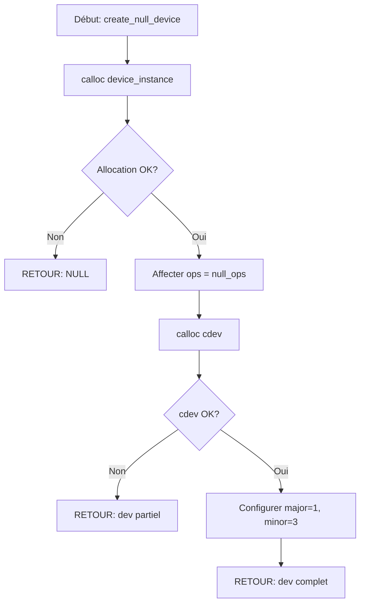

# Exercice 2.7.6 : device_realm_architect

**Module :**
2.7 — Kernel Development & OS Internals

**Concept :**
a-h — Device Drivers & Character Devices (Types, Numéros, Fichiers, udev, file_operations)

**Difficulté :**
★★★★★★☆☆☆☆ (6/10)

**Type :**
cours_code

**Tiers :**
3 — Synthèse (concepts 2.7.12 + 2.7.13)

**Langage :**
C (C17)

**Prérequis :**
- Module 2.7.1-3 : Bases du kernel
- Module 2.5 : I/O et fichiers
- Pointeurs de fonction
- Structures C

**Domaines :**
Mem, FS, CPU

**Durée estimée :**
180 min

**XP Base :**
350

**Complexité :**
T3 O(1) × S3 O(n)

---

## 📐 SECTION 1 : PROTOTYPE & CONSIGNE

### 1.1 Obligations

**Fichiers à rendre :**
```
device_realm/
├── device_realm.h
├── device_numbers.c
├── device_types.c
├── char_device.c
├── example_devices.c
└── Makefile
```

**Fonctions autorisées :**
- `malloc`, `free`, `calloc`, `realloc`
- `printf`, `sprintf`, `snprintf`
- `memset`, `memcpy`, `memmove`
- `strlen`, `strcpy`, `strncpy`, `strcmp`
- `open`, `close`, `read`, `write` (pour simulation)
- `stat`, `fstat`

**Fonctions interdites :**
- Appels système kernel réels (`insmod`, `mknod` réel)
- `system()`, `exec*()`

### 1.2 Consigne

**🎮 The Matrix — "I know device drivers"**

*"The Matrix is everywhere. It is all around us. Even now, in this very room. You can see it when you look out your window or when you turn on your television. You can feel it when you go to work... when you go to church... when you pay your taxes."* — Morpheus

Dans The Matrix, Neo découvre que tout ce qu'il percevait comme réalité est en fait une simulation générée par des machines. Les "pilotes de périphériques" sont les interfaces entre le monde réel (le hardware) et la simulation (l'espace utilisateur).

Toi, tu vas devenir **l'Architecte** — celui qui conçoit les interfaces entre les mondes. Comme les programmes de la Matrix (Agents, Oracles, Sentinelles), chaque device driver est un programme spécialisé qui gère une partie spécifique du "réel".

**Ta mission :**

Tu dois créer un **simulateur complet de device drivers** qui reproduit le fonctionnement des pilotes de périphériques Linux en espace utilisateur. Ce simulateur permettra de comprendre :

1. **Les numéros major/minor** (comme les adresses des programmes dans la Matrix)
2. **Les types de périphériques** (char, block, network — différents types d'Agents)
3. **Les file_operations** (les capacités de chaque Agent)
4. **Les devices virtuels** (/dev/null comme le "void", /dev/zero comme la "source")

**Entrée :**
- Structures de configuration de périphériques
- Callbacks pour les opérations (open, read, write, close, ioctl)
- Paramètres de simulation

**Sortie :**
- Un système complet simulant le comportement des device drivers
- Implémentation de /dev/null et /dev/zero
- Gestion des numéros major/minor
- Interface file_operations fonctionnelle

**Contraintes :**
- Gérer correctement l'allocation/libération de ressources
- Simuler fidèlement le comportement kernel
- Supporter plusieurs instances de devices
- Thread-safety non requise (simplification)

**Exemples :**

| Opération | Résultat | Explication |
|-----------|----------|-------------|
| `MKDEV(1, 3)` | `0x0103` | Encode major=1, minor=3 |
| `MAJOR(0x0103)` | `1` | Extrait le numéro major |
| `null_device.read()` | `0` | /dev/null retourne EOF |
| `zero_device.read(buf, 16)` | `16` (zéros) | /dev/zero retourne des octets nuls |
| `null_device.write(data, 100)` | `100` | Accepte tout, ignore tout |

### 1.3 Prototype

```c
// ============== DEVICE NUMBERS ==============
// Macro-like functions pour encoder/décoder dev_t
uint32_t MKDEV(int major, int minor);
int MAJOR(uint32_t dev);
int MINOR(uint32_t dev);

// Parsing et affichage
void parse_dev_t(uint32_t dev, device_number_t *num);
void print_device_number(const device_number_t *num);

// Allocation de numéros (simulation)
int alloc_chrdev_region(device_number_t *dev, int baseminor,
                        int count, const char *name);
void unregister_chrdev_region(device_number_t dev, int count);

// ============== DEVICE TYPES ==============
const char *device_type_name(device_type_t type);
void explain_device_types(void);
device_type_t get_device_type(const char *path);

// ============== CHARACTER DEVICE ==============
int cdev_init(cdev_t *cdev, const file_operations_t *fops);
int cdev_add(cdev_t *cdev, device_number_t dev, int count);
void cdev_del(cdev_t *cdev);

// ============== FILE OPERATIONS SIMULATION ==============
device_instance_t *create_null_device(void);
device_instance_t *create_zero_device(void);
device_instance_t *create_memory_device(size_t size);

int device_open(device_instance_t *dev);
int device_release(device_instance_t *dev);
ssize_t device_read(device_instance_t *dev, void *buf, size_t count);
ssize_t device_write(device_instance_t *dev, const void *buf, size_t count);
int device_ioctl(device_instance_t *dev, unsigned long request, void *arg);

void device_destroy(device_instance_t *dev);
```

---

## 💡 SECTION 2 : LE SAVIEZ-VOUS ?

### 2.1 L'Histoire des Device Drivers

Les device drivers sont aussi vieux qu'Unix lui-même. En 1969, Ken Thompson et Dennis Ritchie ont introduit l'idée révolutionnaire que **"tout est un fichier"**. Cette abstraction signifie qu'un clavier, un disque dur, ou même un port série sont tous accessibles via la même interface : `open()`, `read()`, `write()`, `close()`.

Le système major/minor fut inventé pour identifier de manière unique chaque périphérique :
- **Major** : Identifie le DRIVER (le code qui sait parler au hardware)
- **Minor** : Identifie l'INSTANCE spécifique (quelle imprimante parmi 3)

Fun fact : `/dev/null` existe depuis les premiers Unix. C'est le "trou noir" informatique — tout ce qui y entre disparaît à jamais, et lire dedans ne donne... rien.

### 2.2 Dans la Vraie Vie

| Métier | Utilisation |
|--------|-------------|
| **Kernel Developer** | Écrit les drivers réels dans drivers/ du noyau Linux |
| **Embedded Engineer** | Crée des drivers pour hardware custom (IoT, automotive) |
| **DevOps/SRE** | Debug les problèmes de périphériques via /sys et /dev |
| **Security Researcher** | Analyse les drivers pour trouver des vulnérabilités |
| **Game Developer** | Interagit avec drivers GPU pour optimisation |

---

## 🖥️ SECTION 3 : EXEMPLE D'UTILISATION

### 3.0 Session bash

```bash
$ ls
device_realm.h  device_numbers.c  device_types.c  char_device.c  example_devices.c  main.c  Makefile

$ make
gcc -Wall -Wextra -Werror -std=c17 -c device_numbers.c -o device_numbers.o
gcc -Wall -Wextra -Werror -std=c17 -c device_types.c -o device_types.o
gcc -Wall -Wextra -Werror -std=c17 -c char_device.c -o char_device.o
gcc -Wall -Wextra -Werror -std=c17 -c example_devices.c -o example_devices.o
gcc -Wall -Wextra -Werror -std=c17 -o test_devices main.c *.o

$ ./test_devices
=== Device Number Tests ===
MKDEV(1, 3) = 0x00000103
MAJOR(0x00000103) = 1
MINOR(0x00000103) = 3

=== /dev/null Simulation ===
write(null_dev, "Hello Matrix", 12) = 12 (data discarded)
read(null_dev, buf, 100) = 0 (EOF)

=== /dev/zero Simulation ===
read(zero_dev, buf, 8) = 8
Buffer: 00 00 00 00 00 00 00 00

=== Memory Device Simulation ===
write(mem_dev, "Neo", 3) = 3
read(mem_dev, buf, 3) = 3
Buffer: "Neo"

All tests passed!
```

### 3.1 🔥 BONUS AVANCÉ (OPTIONNEL)

**Difficulté Bonus :**
★★★★★★★★☆☆ (8/10)

**Récompense :**
XP ×3

**Time Complexity attendue :**
O(1) pour toutes les opérations

**Space Complexity attendue :**
O(n) où n = taille du buffer du device

**Domaines Bonus :**
`Process, Net`

#### 3.1.1 Consigne Bonus

**🎮 "There is no spoon" — Implémente /dev/random**

Dans la Matrix, l'Oracle dit à Neo qu'il n'y a pas de cuillère — la réalité est malléable. `/dev/random` est le générateur d'entropie du kernel, source de hasard "vrai" basé sur des événements imprévisibles.

**Ta mission :**

Implémenter un générateur pseudo-aléatoire simulant `/dev/random` avec :
- Pool d'entropie alimenté par des "événements"
- Blocage quand l'entropie est insuffisante (comme le vrai /dev/random)
- Distinction /dev/random (bloquant) vs /dev/urandom (non-bloquant)

**Contraintes :**
```
┌─────────────────────────────────────┐
│  entropy_pool_size ≥ 256 bytes      │
│  PRNG quality : period > 2^32       │
│  read() bloque si entropy < needed  │
└─────────────────────────────────────┘
```

#### 3.1.2 Prototype Bonus

```c
typedef struct {
    uint8_t pool[256];
    size_t entropy_bits;
    size_t read_position;
    bool blocking;  // true = /dev/random, false = /dev/urandom
} random_device_t;

device_instance_t *create_random_device(bool blocking);
void add_entropy(device_instance_t *dev, const void *data, size_t bits);
ssize_t random_read(device_instance_t *dev, void *buf, size_t count);
```

#### 3.1.3 Ce qui change par rapport à l'exercice de base

| Aspect | Base | Bonus |
|--------|------|-------|
| Devices | null, zero, memory | + random, urandom |
| Logique read | Simple copie | Pool d'entropie + PRNG |
| Blocage | Non | Oui (si blocking=true) |
| État interne | Minimal | Pool + compteur entropie |

---

## ✅❌ SECTION 4 : ZONE CORRECTION

### 4.1 Moulinette

| Test | Points | Description |
|------|--------|-------------|
| `test_mkdev` | 10 | MKDEV encode correctement |
| `test_major_minor` | 10 | MAJOR/MINOR extraient correctement |
| `test_null_write` | 15 | null accepte tout, retourne count |
| `test_null_read` | 15 | null retourne 0 (EOF) |
| `test_zero_read` | 15 | zero retourne des octets nuls |
| `test_memory_rw` | 20 | memory device read/write cohérent |
| `test_device_lifecycle` | 15 | open/release/destroy sans leak |
| **Total** | **100** | |

### 4.2 main.c de test

```c
#include <stdio.h>
#include <string.h>
#include <assert.h>
#include "device_realm.h"

void test_mkdev(void) {
    printf("Testing MKDEV...\n");
    assert(MKDEV(1, 3) == 0x00000103);
    assert(MKDEV(8, 0) == 0x00000800);
    assert(MKDEV(0, 0) == 0x00000000);
    assert(MKDEV(255, 255) == 0x0000FFFF);
    printf("  MKDEV: OK\n");
}

void test_major_minor(void) {
    printf("Testing MAJOR/MINOR...\n");
    assert(MAJOR(0x00000103) == 1);
    assert(MINOR(0x00000103) == 3);
    assert(MAJOR(0x00000800) == 8);
    assert(MINOR(0x00000800) == 0);
    printf("  MAJOR/MINOR: OK\n");
}

void test_null_device(void) {
    printf("Testing /dev/null simulation...\n");
    device_instance_t *null_dev = create_null_device();
    assert(null_dev != NULL);

    device_open(null_dev);

    // Write should accept all, return count
    char data[] = "The Matrix has you...";
    ssize_t written = device_write(null_dev, data, strlen(data));
    assert(written == (ssize_t)strlen(data));

    // Read should return 0 (EOF)
    char buf[100];
    ssize_t bytes_read = device_read(null_dev, buf, sizeof(buf));
    assert(bytes_read == 0);

    device_release(null_dev);
    device_destroy(null_dev);
    printf("  /dev/null: OK\n");
}

void test_zero_device(void) {
    printf("Testing /dev/zero simulation...\n");
    device_instance_t *zero_dev = create_zero_device();
    assert(zero_dev != NULL);

    device_open(zero_dev);

    // Fill buffer with non-zero
    char buf[16];
    memset(buf, 0xFF, sizeof(buf));

    // Read should return zeros
    ssize_t bytes_read = device_read(zero_dev, buf, sizeof(buf));
    assert(bytes_read == sizeof(buf));

    // Verify all zeros
    for (size_t i = 0; i < sizeof(buf); i++) {
        assert(buf[i] == 0);
    }

    device_release(zero_dev);
    device_destroy(zero_dev);
    printf("  /dev/zero: OK\n");
}

void test_memory_device(void) {
    printf("Testing memory device...\n");
    device_instance_t *mem_dev = create_memory_device(1024);
    assert(mem_dev != NULL);

    device_open(mem_dev);

    // Write
    const char *msg = "Follow the white rabbit";
    ssize_t written = device_write(mem_dev, msg, strlen(msg));
    assert(written == (ssize_t)strlen(msg));

    // Reset position for read
    mem_dev->data_pos = 0;

    // Read back
    char buf[64] = {0};
    ssize_t bytes_read = device_read(mem_dev, buf, strlen(msg));
    assert(bytes_read == (ssize_t)strlen(msg));
    assert(strcmp(buf, msg) == 0);

    device_release(mem_dev);
    device_destroy(mem_dev);
    printf("  Memory device: OK\n");
}

int main(void) {
    printf("=== Device Realm Tests ===\n\n");

    test_mkdev();
    test_major_minor();
    test_null_device();
    test_zero_device();
    test_memory_device();

    printf("\n=== All tests passed! ===\n");
    printf("\"Welcome to the real world.\" - Morpheus\n");
    return 0;
}
```

### 4.3 Solution de référence

```c
// device_realm.h
#ifndef DEVICE_REALM_H
#define DEVICE_REALM_H

#include <stdint.h>
#include <stddef.h>
#include <stdbool.h>
#include <sys/types.h>

// Device types
typedef enum {
    DEV_CHAR,
    DEV_BLOCK,
    DEV_NET
} device_type_t;

// Device number structure
typedef struct {
    int major;
    int minor;
    uint32_t dev_t;
} device_number_t;

// Forward declarations
typedef struct device_instance device_instance_t;
typedef struct file_operations file_operations_t;

// File operations
struct file_operations {
    int (*open)(device_instance_t *dev);
    int (*release)(device_instance_t *dev);
    ssize_t (*read)(device_instance_t *dev, void *buf, size_t count);
    ssize_t (*write)(device_instance_t *dev, const void *buf, size_t count);
    int (*ioctl)(device_instance_t *dev, unsigned long request, void *arg);
};

// Character device structure
typedef struct cdev {
    const char *name;
    device_number_t dev;
    file_operations_t *ops;
    void *private_data;
    int count;
} cdev_t;

// Device instance
struct device_instance {
    cdev_t *cdev;
    int minor;
    int open_count;
    void *data;
    size_t data_size;
    size_t data_pos;
    file_operations_t *ops;
};

// Device number functions
uint32_t MKDEV(int major, int minor);
int MAJOR(uint32_t dev);
int MINOR(uint32_t dev);
void parse_dev_t(uint32_t dev, device_number_t *num);

// Device type functions
const char *device_type_name(device_type_t type);

// Character device functions
int cdev_init(cdev_t *cdev, const file_operations_t *fops);
void cdev_del(cdev_t *cdev);

// Device instance functions
device_instance_t *create_null_device(void);
device_instance_t *create_zero_device(void);
device_instance_t *create_memory_device(size_t size);

int device_open(device_instance_t *dev);
int device_release(device_instance_t *dev);
ssize_t device_read(device_instance_t *dev, void *buf, size_t count);
ssize_t device_write(device_instance_t *dev, const void *buf, size_t count);
int device_ioctl(device_instance_t *dev, unsigned long request, void *arg);
void device_destroy(device_instance_t *dev);

#endif
```

```c
// device_numbers.c
#include "device_realm.h"

uint32_t MKDEV(int major, int minor)
{
    if (major < 0 || minor < 0)
        return 0;
    return ((uint32_t)major << 8) | ((uint32_t)minor & 0xFF);
}

int MAJOR(uint32_t dev)
{
    return (int)((dev >> 8) & 0xFF);
}

int MINOR(uint32_t dev)
{
    return (int)(dev & 0xFF);
}

void parse_dev_t(uint32_t dev, device_number_t *num)
{
    if (num == NULL)
        return;
    num->dev_t = dev;
    num->major = MAJOR(dev);
    num->minor = MINOR(dev);
}
```

```c
// device_types.c
#include "device_realm.h"

const char *device_type_name(device_type_t type)
{
    switch (type) {
        case DEV_CHAR:  return "Character";
        case DEV_BLOCK: return "Block";
        case DEV_NET:   return "Network";
        default:        return "Unknown";
    }
}
```

```c
// char_device.c
#include <stdlib.h>
#include <string.h>
#include "device_realm.h"

int cdev_init(cdev_t *cdev, const file_operations_t *fops)
{
    if (cdev == NULL)
        return -1;
    memset(cdev, 0, sizeof(cdev_t));
    cdev->ops = (file_operations_t *)fops;
    return 0;
}

void cdev_del(cdev_t *cdev)
{
    if (cdev == NULL)
        return;
    cdev->ops = NULL;
}

int device_open(device_instance_t *dev)
{
    if (dev == NULL)
        return -1;
    dev->open_count++;
    if (dev->ops && dev->ops->open)
        return dev->ops->open(dev);
    return 0;
}

int device_release(device_instance_t *dev)
{
    if (dev == NULL)
        return -1;
    if (dev->open_count > 0)
        dev->open_count--;
    if (dev->ops && dev->ops->release)
        return dev->ops->release(dev);
    return 0;
}

ssize_t device_read(device_instance_t *dev, void *buf, size_t count)
{
    if (dev == NULL || buf == NULL)
        return -1;
    if (dev->ops && dev->ops->read)
        return dev->ops->read(dev, buf, count);
    return -1;
}

ssize_t device_write(device_instance_t *dev, const void *buf, size_t count)
{
    if (dev == NULL || buf == NULL)
        return -1;
    if (dev->ops && dev->ops->write)
        return dev->ops->write(dev, buf, count);
    return -1;
}

int device_ioctl(device_instance_t *dev, unsigned long request, void *arg)
{
    if (dev == NULL)
        return -1;
    if (dev->ops && dev->ops->ioctl)
        return dev->ops->ioctl(dev, request, arg);
    return -1;
}

void device_destroy(device_instance_t *dev)
{
    if (dev == NULL)
        return;
    if (dev->data)
        free(dev->data);
    if (dev->cdev)
        free(dev->cdev);
    free(dev);
}
```

```c
// example_devices.c
#include <stdlib.h>
#include <string.h>
#include "device_realm.h"

// ============== /dev/null ==============

static ssize_t null_read(device_instance_t *dev, void *buf, size_t count)
{
    (void)dev;
    (void)buf;
    (void)count;
    return 0;  // EOF
}

static ssize_t null_write(device_instance_t *dev, const void *buf, size_t count)
{
    (void)dev;
    (void)buf;
    return (ssize_t)count;  // Accept all, discard
}

static file_operations_t null_ops = {
    .open = NULL,
    .release = NULL,
    .read = null_read,
    .write = null_write,
    .ioctl = NULL
};

device_instance_t *create_null_device(void)
{
    device_instance_t *dev = calloc(1, sizeof(device_instance_t));
    if (dev == NULL)
        return NULL;

    dev->ops = &null_ops;
    dev->cdev = calloc(1, sizeof(cdev_t));
    if (dev->cdev) {
        dev->cdev->name = "null";
        dev->cdev->dev.major = 1;
        dev->cdev->dev.minor = 3;
        dev->cdev->dev.dev_t = MKDEV(1, 3);
    }
    return dev;
}

// ============== /dev/zero ==============

static ssize_t zero_read(device_instance_t *dev, void *buf, size_t count)
{
    (void)dev;
    memset(buf, 0, count);
    return (ssize_t)count;
}

static ssize_t zero_write(device_instance_t *dev, const void *buf, size_t count)
{
    (void)dev;
    (void)buf;
    return (ssize_t)count;  // Accept all, discard
}

static file_operations_t zero_ops = {
    .open = NULL,
    .release = NULL,
    .read = zero_read,
    .write = zero_write,
    .ioctl = NULL
};

device_instance_t *create_zero_device(void)
{
    device_instance_t *dev = calloc(1, sizeof(device_instance_t));
    if (dev == NULL)
        return NULL;

    dev->ops = &zero_ops;
    dev->cdev = calloc(1, sizeof(cdev_t));
    if (dev->cdev) {
        dev->cdev->name = "zero";
        dev->cdev->dev.major = 1;
        dev->cdev->dev.minor = 5;
        dev->cdev->dev.dev_t = MKDEV(1, 5);
    }
    return dev;
}

// ============== Memory Device ==============

static ssize_t memory_read(device_instance_t *dev, void *buf, size_t count)
{
    if (dev->data == NULL)
        return -1;

    size_t available = dev->data_size - dev->data_pos;
    if (available == 0)
        return 0;  // EOF

    size_t to_read = (count < available) ? count : available;
    memcpy(buf, (char *)dev->data + dev->data_pos, to_read);
    dev->data_pos += to_read;
    return (ssize_t)to_read;
}

static ssize_t memory_write(device_instance_t *dev, const void *buf, size_t count)
{
    if (dev->data == NULL)
        return -1;

    size_t available = dev->data_size - dev->data_pos;
    if (available == 0)
        return 0;  // Full

    size_t to_write = (count < available) ? count : available;
    memcpy((char *)dev->data + dev->data_pos, buf, to_write);
    dev->data_pos += to_write;
    return (ssize_t)to_write;
}

static int memory_ioctl(device_instance_t *dev, unsigned long request, void *arg)
{
    if (request == 0x01 && arg != NULL) {
        *(size_t *)arg = dev->data_size;
        return 0;
    }
    return -1;
}

static file_operations_t memory_ops = {
    .open = NULL,
    .release = NULL,
    .read = memory_read,
    .write = memory_write,
    .ioctl = memory_ioctl
};

device_instance_t *create_memory_device(size_t size)
{
    device_instance_t *dev = calloc(1, sizeof(device_instance_t));
    if (dev == NULL)
        return NULL;

    dev->data = calloc(1, size);
    if (dev->data == NULL) {
        free(dev);
        return NULL;
    }

    dev->data_size = size;
    dev->data_pos = 0;
    dev->ops = &memory_ops;
    dev->cdev = calloc(1, sizeof(cdev_t));
    if (dev->cdev) {
        dev->cdev->name = "memory";
        dev->cdev->dev.major = 10;
        dev->cdev->dev.minor = 0;
        dev->cdev->dev.dev_t = MKDEV(10, 0);
    }
    return dev;
}
```

### 4.4 Solutions alternatives acceptées

```c
// Alternative: MKDEV avec shift de 20 bits (comme Linux réel)
uint32_t MKDEV_linux(int major, int minor)
{
    return ((uint32_t)major << 20) | ((uint32_t)minor & 0xFFFFF);
}

// Alternative: utilisation de union pour device numbers
typedef union {
    uint32_t dev_t;
    struct {
        uint16_t minor;
        uint16_t major;
    } parts;
} dev_union_t;
```

### 4.5 Solutions refusées

```c
// REFUSÉ: Pas de gestion NULL
uint32_t MKDEV_bad(int major, int minor)
{
    // Manque validation des paramètres négatifs
    return (major << 8) | minor;
}

// REFUSÉ: Memory leak dans create_*_device
device_instance_t *create_null_device_bad(void)
{
    device_instance_t *dev = malloc(sizeof(device_instance_t));
    // Si malloc suivant échoue, dev n'est jamais libéré
    dev->cdev = malloc(sizeof(cdev_t));
    return dev;
}

// REFUSÉ: null_read qui ne retourne pas 0
static ssize_t null_read_bad(device_instance_t *dev, void *buf, size_t count)
{
    return -1;  // FAUX! /dev/null doit retourner 0 (EOF), pas erreur
}
```

### 4.6 Solution bonus de référence

```c
// random_device.c
#include <stdlib.h>
#include <string.h>
#include <time.h>
#include "device_realm.h"

typedef struct {
    uint8_t pool[256];
    size_t entropy_bits;
    size_t read_position;
    bool blocking;
    uint64_t state;  // PRNG state
} random_device_data_t;

// Simple xorshift64 PRNG
static uint64_t xorshift64(uint64_t *state)
{
    uint64_t x = *state;
    x ^= x << 13;
    x ^= x >> 7;
    x ^= x << 17;
    *state = x;
    return x;
}

static void mix_entropy(random_device_data_t *rdev)
{
    for (int i = 0; i < 256; i++) {
        rdev->pool[i] ^= (uint8_t)xorshift64(&rdev->state);
    }
}

void add_entropy(device_instance_t *dev, const void *data, size_t bits)
{
    if (dev == NULL || dev->data == NULL || data == NULL)
        return;

    random_device_data_t *rdev = (random_device_data_t *)dev->data;
    const uint8_t *bytes = (const uint8_t *)data;
    size_t byte_count = (bits + 7) / 8;

    for (size_t i = 0; i < byte_count && i < 256; i++) {
        rdev->pool[(rdev->read_position + i) % 256] ^= bytes[i];
    }

    rdev->entropy_bits += bits;
    if (rdev->entropy_bits > 256 * 8)
        rdev->entropy_bits = 256 * 8;

    mix_entropy(rdev);
}

static ssize_t random_read_impl(device_instance_t *dev, void *buf, size_t count)
{
    if (dev == NULL || dev->data == NULL || buf == NULL)
        return -1;

    random_device_data_t *rdev = (random_device_data_t *)dev->data;
    uint8_t *out = (uint8_t *)buf;

    // Check entropy for blocking mode
    if (rdev->blocking && rdev->entropy_bits < count * 8) {
        // In real kernel, this would block
        // For simulation, we just fail
        return 0;
    }

    for (size_t i = 0; i < count; i++) {
        out[i] = rdev->pool[rdev->read_position];
        rdev->read_position = (rdev->read_position + 1) % 256;

        // Mix after each byte
        rdev->pool[rdev->read_position] ^= (uint8_t)xorshift64(&rdev->state);
    }

    if (rdev->entropy_bits >= count * 8)
        rdev->entropy_bits -= count * 8;
    else
        rdev->entropy_bits = 0;

    return (ssize_t)count;
}

static file_operations_t random_ops = {
    .open = NULL,
    .release = NULL,
    .read = random_read_impl,
    .write = NULL,
    .ioctl = NULL
};

device_instance_t *create_random_device(bool blocking)
{
    device_instance_t *dev = calloc(1, sizeof(device_instance_t));
    if (dev == NULL)
        return NULL;

    random_device_data_t *rdev = calloc(1, sizeof(random_device_data_t));
    if (rdev == NULL) {
        free(dev);
        return NULL;
    }

    // Initialize with time-based seed
    rdev->state = (uint64_t)time(NULL) ^ 0xDEADBEEFCAFEBABE;
    rdev->blocking = blocking;
    rdev->entropy_bits = 0;

    // Initial pool mixing
    for (int i = 0; i < 256; i++) {
        rdev->pool[i] = (uint8_t)xorshift64(&rdev->state);
    }

    dev->data = rdev;
    dev->ops = &random_ops;
    dev->cdev = calloc(1, sizeof(cdev_t));
    if (dev->cdev) {
        dev->cdev->name = blocking ? "random" : "urandom";
        dev->cdev->dev.major = 1;
        dev->cdev->dev.minor = blocking ? 8 : 9;
        dev->cdev->dev.dev_t = MKDEV(1, blocking ? 8 : 9);
    }

    return dev;
}
```

### 4.7 Solutions alternatives bonus

```c
// Alternative: utilisation de /dev/urandom système pour seed
#include <fcntl.h>
#include <unistd.h>

static void seed_from_system(uint64_t *state)
{
    int fd = open("/dev/urandom", O_RDONLY);
    if (fd >= 0) {
        read(fd, state, sizeof(*state));
        close(fd);
    } else {
        *state = (uint64_t)time(NULL);
    }
}
```

### 4.8 Solutions refusées bonus

```c
// REFUSÉ: PRNG trop simple (période courte)
static uint32_t bad_rand(uint32_t *seed)
{
    *seed = *seed * 1103515245 + 12345;  // LCG classique mais faible
    return *seed;
}

// REFUSÉ: Pas de vérification blocking mode
static ssize_t random_read_bad(device_instance_t *dev, void *buf, size_t count)
{
    // Ignore complètement le mode blocking
    // /dev/random DOIT bloquer si pas assez d'entropie
}
```

### 4.9 spec.json

```json
{
  "name": "device_realm_architect",
  "language": "c",
  "type": "cours_code",
  "tier": 3,
  "tier_info": "Synthèse (2.7.12 + 2.7.13)",
  "tags": ["kernel", "drivers", "devices", "phase2", "matrix"],
  "passing_score": 70,

  "function": {
    "name": "device_realm",
    "prototype": "Multiple functions - see spec",
    "return_type": "various",
    "parameters": []
  },

  "driver": {
    "reference": "See section 4.3",
    "reference_file": "references/ref_solution.c",

    "edge_cases": [
      {
        "name": "mkdev_basic",
        "args": [1, 3],
        "expected": 259,
        "is_trap": false
      },
      {
        "name": "mkdev_zero",
        "args": [0, 0],
        "expected": 0,
        "is_trap": true,
        "trap_explanation": "major=0 et minor=0 doit donner 0"
      },
      {
        "name": "null_read_eof",
        "args": ["null_dev", "buf", 100],
        "expected": 0,
        "is_trap": true,
        "trap_explanation": "/dev/null retourne toujours 0 (EOF)"
      },
      {
        "name": "null_write_accept",
        "args": ["null_dev", "data", 50],
        "expected": 50,
        "is_trap": true,
        "trap_explanation": "/dev/null accepte tout, retourne count"
      },
      {
        "name": "zero_read_zeros",
        "args": ["zero_dev", "buf", 16],
        "expected": 16,
        "is_trap": true,
        "trap_explanation": "Buffer doit contenir uniquement des 0"
      }
    ],

    "fuzzing": {
      "enabled": true,
      "iterations": 500,
      "generators": [
        {
          "type": "int",
          "param_index": 0,
          "params": {"min": 0, "max": 255}
        },
        {
          "type": "int",
          "param_index": 1,
          "params": {"min": 0, "max": 255}
        }
      ]
    }
  },

  "norm": {
    "allowed_functions": ["malloc", "free", "calloc", "realloc", "memset", "memcpy", "strlen", "strcpy", "strcmp", "printf", "snprintf"],
    "forbidden_functions": ["system", "exec", "fork", "mknod"],
    "check_security": true,
    "check_memory": true,
    "blocking": true
  }
}
```

### 4.10 Solutions Mutantes

```c
/* Mutant A (Boundary) : MKDEV avec overflow sur major */
uint32_t MKDEV_mutant_a(int major, int minor)
{
    // Bug: pas de masquage, major peut overflow
    return ((uint32_t)major << 8) | (uint32_t)minor;
}
// Pourquoi c'est faux : Si major > 255, les bits hauts corrompent le résultat
// Ce qui était pensé : "Les majors sont toujours petits"

/* Mutant B (Safety) : create_null_device sans vérification malloc */
device_instance_t *create_null_device_mutant_b(void)
{
    device_instance_t *dev = malloc(sizeof(device_instance_t));
    // Bug: pas de vérification si malloc retourne NULL
    dev->ops = &null_ops;
    dev->cdev = malloc(sizeof(cdev_t));
    return dev;
}
// Pourquoi c'est faux : Segfault si malloc échoue
// Ce qui était pensé : "malloc ne fail jamais"

/* Mutant C (Resource) : device_destroy incomplet */
void device_destroy_mutant_c(device_instance_t *dev)
{
    if (dev == NULL)
        return;
    // Bug: ne libère pas dev->data ni dev->cdev
    free(dev);
}
// Pourquoi c'est faux : Memory leak sur data et cdev
// Ce qui était pensé : "free(dev) libère tout"

/* Mutant D (Logic) : null_read retourne -1 au lieu de 0 */
static ssize_t null_read_mutant_d(device_instance_t *dev, void *buf, size_t count)
{
    (void)dev;
    (void)buf;
    (void)count;
    return -1;  // Bug: devrait retourner 0 (EOF)
}
// Pourquoi c'est faux : /dev/null signale EOF, pas une erreur
// Ce qui était pensé : "Rien à lire = erreur"

/* Mutant E (Return) : zero_read ne remplit pas le buffer */
static ssize_t zero_read_mutant_e(device_instance_t *dev, void *buf, size_t count)
{
    (void)dev;
    (void)buf;  // Bug: ne fait pas memset(buf, 0, count)
    return (ssize_t)count;
}
// Pourquoi c'est faux : Retourne count mais ne met pas le buffer à zéro
// Ce qui était pensé : "Le buffer est déjà à zéro"
```

---

## 🧠 SECTION 5 : COMPRENDRE

### 5.1 Ce que cet exercice enseigne

1. **L'architecture des device drivers Linux** : Comment le kernel abstrait le hardware
2. **Le système major/minor** : Identification unique des périphériques
3. **Les file_operations** : Pattern callback pour l'interface fichier
4. **Les devices virtuels** : /dev/null, /dev/zero comme exemples concrets
5. **La gestion de ressources** : Allocation/libération propre en C

### 5.2 LDA — Traduction littérale en français

```
FONCTION MKDEV QUI RETOURNE UN ENTIER NON SIGNÉ 32 BITS ET PREND EN PARAMÈTRES major ET minor QUI SONT DES ENTIERS
DÉBUT FONCTION
    SI major EST INFÉRIEUR À 0 OU minor EST INFÉRIEUR À 0 ALORS
        RETOURNER LA VALEUR 0
    FIN SI
    RETOURNER major DÉCALÉ À GAUCHE DE 8 BITS OU LOGIQUE AVEC minor MASQUÉ PAR 0xFF
FIN FONCTION

FONCTION create_null_device QUI RETOURNE UN POINTEUR VERS device_instance_t
DÉBUT FONCTION
    DÉCLARER dev COMME POINTEUR VERS device_instance_t
    AFFECTER ALLOUER ET INITIALISER À ZÉRO LA MÉMOIRE POUR UN device_instance_t À dev
    SI dev EST ÉGAL À NUL ALORS
        RETOURNER NUL
    FIN SI
    AFFECTER L'ADRESSE DE null_ops AU CHAMP ops DE dev
    AFFECTER ALLOUER ET INITIALISER À ZÉRO LA MÉMOIRE POUR UN cdev_t AU CHAMP cdev DE dev
    SI LE CHAMP cdev DE dev N'EST PAS NUL ALORS
        AFFECTER "null" AU CHAMP name DU cdev
        AFFECTER 1 AU CHAMP major DE dev DU cdev
        AFFECTER 3 AU CHAMP minor DE dev DU cdev
    FIN SI
    RETOURNER dev
FIN FONCTION
```

### 5.2.2 Style Académique

```
Algorithme : Création d'un périphérique null
Entrées : Aucune
Sorties : Pointeur vers instance de périphérique ou NULL

Début
    Allouer mémoire pour structure device_instance
    Si allocation échoue Alors
        Retourner NULL
    FinSi

    Initialiser les callbacks avec les opérations null
    Allouer mémoire pour structure cdev
    Si allocation réussit Alors
        Configurer numéros major=1, minor=3
    FinSi

    Retourner pointeur vers instance
Fin
```

### 5.2.2.1 Logic Flow (Structured English)

```
ALGORITHM: Create Null Device
---
1. ALLOCATE memory for device instance (zero-initialized)

2. CHECK allocation:
   - IF failed: RETURN NULL

3. SET operations pointer to null_ops structure

4. ALLOCATE memory for cdev structure

5. IF cdev allocation succeeded:
   a. SET name to "null"
   b. SET major number to 1
   c. SET minor number to 3
   d. COMPUTE dev_t using MKDEV

6. RETURN device instance pointer
```

### 5.2.3 Représentation Algorithmique

```
FONCTION : MKDEV (major, minor)
---
INIT result = 0

1. VÉRIFIER si major < 0 :
   |
   |-- RETOURNER 0

2. VÉRIFIER si minor < 0 :
   |
   |-- RETOURNER 0

3. CALCULER result = (major << 8) | (minor & 0xFF)

4. RETOURNER result
```

### 5.2.3.1 Diagramme Mermaid



### 5.3 Visualisation ASCII

```
                    ARCHITECTURE DEVICE DRIVERS

    USER SPACE                          KERNEL SPACE
    ┌─────────────┐                     ┌─────────────────────────────┐
    │             │                     │                             │
    │  Programme  │   open("/dev/null") │    VFS (Virtual FS)         │
    │             │ ──────────────────► │    ┌─────────────────┐      │
    │             │                     │    │ file_operations │      │
    │             │   read(fd, buf, n)  │    │  .open          │      │
    │             │ ──────────────────► │    │  .read ─────────┼──┐   │
    │             │                     │    │  .write         │  │   │
    │             │   write(fd, buf, n) │    │  .release       │  │   │
    │             │ ──────────────────► │    └─────────────────┘  │   │
    │             │                     │            │             │   │
    └─────────────┘                     │            ▼             │   │
                                        │    ┌─────────────────┐  │   │
                                        │    │   DRIVER        │◄─┘   │
                                        │    │   /dev/null     │      │
                                        │    │                 │      │
                                        │    │  null_read() ───┼──► return 0
                                        │    │  null_write()───┼──► return count
                                        │    └─────────────────┘      │
                                        └─────────────────────────────┘

    DEVICE NUMBERS (dev_t)
    ┌────────────────────────────────┐
    │         32 bits                │
    │  ┌──────────┬────────────┐     │
    │  │  MAJOR   │   MINOR    │     │
    │  │  8 bits  │   8 bits   │     │
    │  │  (driver)│  (instance)│     │
    │  └──────────┴────────────┘     │
    │                                │
    │  Exemple: /dev/null            │
    │  Major: 1 (mem driver)         │
    │  Minor: 3 (null instance)      │
    │  dev_t: 0x0103                 │
    └────────────────────────────────┘
```

### 5.4 Les pièges en détail

| Piège | Description | Solution |
|-------|-------------|----------|
| **Confusion read/write** | /dev/null read=EOF, write=accept | Mémoriser: null=trou noir |
| **Memory leak** | Ne pas libérer tous les champs | free(data), free(cdev), free(dev) |
| **NULL pointer** | Accès sans vérification | Toujours vérifier avant déréférencement |
| **Major/minor confusion** | Inverser l'ordre dans MKDEV | Major = driver, Minor = instance |
| **Retour -1 vs 0** | Confondre erreur et EOF | EOF=0, erreur=-1 |

### 5.5 Cours Complet

#### 5.5.1 Introduction aux Device Drivers

Un **device driver** (pilote de périphérique) est un programme qui permet au système d'exploitation de communiquer avec un périphérique matériel. Dans Linux, les drivers suivent le principe "tout est un fichier" : chaque périphérique est accessible via un fichier spécial dans `/dev/`.

#### 5.5.2 Types de Périphériques

1. **Character Devices** (périphériques caractère)
   - Accès séquentiel (flux d'octets)
   - Exemples : terminaux, ports série, /dev/null
   - Préfixe `c` dans `ls -l`

2. **Block Devices** (périphériques bloc)
   - Accès aléatoire par blocs
   - Exemples : disques durs, SSD, partitions
   - Préfixe `b` dans `ls -l`

3. **Network Devices**
   - Pas de fichier dans /dev
   - Accessibles via sockets
   - Exemples : eth0, wlan0

#### 5.5.3 Numéros Major et Minor

Chaque device file a deux numéros :

```bash
$ ls -l /dev/null
crw-rw-rw- 1 root root 1, 3 Jan 17 00:00 /dev/null
                       ^  ^
                       |  minor (3)
                       major (1)
```

- **Major** : Identifie le driver (1 = mem driver)
- **Minor** : Identifie l'instance spécifique (3 = null)

#### 5.5.4 Structure file_operations

C'est le coeur d'un character device driver :

```c
struct file_operations {
    int (*open)(struct inode *, struct file *);
    int (*release)(struct inode *, struct file *);
    ssize_t (*read)(struct file *, char __user *, size_t, loff_t *);
    ssize_t (*write)(struct file *, const char __user *, size_t, loff_t *);
    long (*unlocked_ioctl)(struct file *, unsigned int, unsigned long);
    // ... autres opérations
};
```

#### 5.5.5 Devices Virtuels Classiques

| Device | Major:Minor | Comportement |
|--------|-------------|--------------|
| /dev/null | 1:3 | Trou noir : write=accept, read=EOF |
| /dev/zero | 1:5 | Source de zéros infinie |
| /dev/full | 1:7 | Toujours plein (write=ENOSPC) |
| /dev/random | 1:8 | Octets aléatoires (bloquant) |
| /dev/urandom | 1:9 | Octets aléatoires (non-bloquant) |

### 5.6 Normes avec explications pédagogiques

```
┌─────────────────────────────────────────────────────────────────┐
│ ❌ HORS NORME (compile, mais interdit)                          │
├─────────────────────────────────────────────────────────────────┤
│ device_instance_t* dev = malloc(sizeof(device_instance_t));     │
├─────────────────────────────────────────────────────────────────┤
│ ✅ CONFORME                                                     │
├─────────────────────────────────────────────────────────────────┤
│ device_instance_t *dev = malloc(sizeof(device_instance_t));     │
├─────────────────────────────────────────────────────────────────┤
│ 📖 POURQUOI ?                                                   │
│                                                                 │
│ • Le * appartient à la variable, pas au type                    │
│ • Évite confusion avec déclarations multiples :                 │
│   int* a, b;  // b n'est PAS un pointeur !                     │
│   int *a, *b; // Clair : deux pointeurs                        │
└─────────────────────────────────────────────────────────────────┘
```

### 5.7 Simulation avec trace d'exécution

**Trace : create_null_device() + device_read()**

```
┌───────┬──────────────────────────────────────────────┬───────────────────────┐
│ Étape │ Instruction                                  │ État                  │
├───────┼──────────────────────────────────────────────┼───────────────────────┤
│   1   │ dev = calloc(1, sizeof(device_instance_t))   │ dev = 0x7f001000      │
├───────┼──────────────────────────────────────────────┼───────────────────────┤
│   2   │ dev->ops = &null_ops                         │ ops = 0x404000        │
├───────┼──────────────────────────────────────────────┼───────────────────────┤
│   3   │ dev->cdev = calloc(...)                      │ cdev = 0x7f002000     │
├───────┼──────────────────────────────────────────────┼───────────────────────┤
│   4   │ return dev                                   │ Retour: 0x7f001000    │
├───────┼──────────────────────────────────────────────┼───────────────────────┤
│   5   │ device_read(dev, buf, 100)                   │ Appel null_read       │
├───────┼──────────────────────────────────────────────┼───────────────────────┤
│   6   │ return 0                                     │ EOF signalé           │
└───────┴──────────────────────────────────────────────┴───────────────────────┘
```

### 5.8 Mnémotechniques

#### 🎬 MEME : "The Matrix — Red Pill / Blue Pill"


Comme Neo qui choisit entre pilule rouge (réalité) et bleue (illusion) :

- **Pilule Rouge = MAJOR** : Le "vrai" driver, la réalité du code
- **Pilule Bleue = MINOR** : L'instance spécifique, l'illusion d'un device unique

```c
// "Wake up, Neo..."
uint32_t dev_t = MKDEV(red_pill, blue_pill);
//                      ^MAJOR    ^MINOR
```

#### 🕳️ MEME : "/dev/null = The Void"

```
       ┌─────────────┐
       │   DATA      │
       │   "Hello"   │
       │   "World"   │
       └──────┬──────┘
              │
              ▼
         ╔════════════╗
         ║            ║
         ║  /dev/null ║
         ║   (void)   ║
         ║            ║
         ╚════════════╝
              │
              ▼
           NOTHING
         (return EOF)
```

*"There is no data, Neo. The data was never there."*

### 5.9 Applications pratiques

1. **Redirection shell** : `command > /dev/null 2>&1` — Silence total
2. **Création de fichiers vides** : `dd if=/dev/zero of=empty.img bs=1M count=100`
3. **Test de performance I/O** : Écrire vers /dev/null pour mesurer sans I/O réel
4. **Génération de clés** : `dd if=/dev/urandom bs=32 count=1` pour entropy
5. **Debugging drivers** : Comprendre le flow avant d'écrire un vrai driver kernel

---

## ⚠️ SECTION 6 : PIÈGES — RÉCAPITULATIF

| # | Piège | Impact | Prévention |
|---|-------|--------|------------|
| 1 | Oublier de vérifier malloc | Segfault | `if (ptr == NULL) return NULL;` |
| 2 | Memory leak sur destroy | Fuite mémoire | Libérer TOUS les champs |
| 3 | null_read retourne -1 | Comportement incorrect | Retourner 0 pour EOF |
| 4 | MKDEV avec valeurs négatives | Overflow | Vérifier major >= 0, minor >= 0 |
| 5 | Confondre major/minor | Device incorrect | Major = driver, Minor = instance |

---

## 📝 SECTION 7 : QCM

### Question 1
Que retourne `read()` sur `/dev/null` ?

- A) -1 (erreur)
- B) 0 (EOF)
- C) Le nombre d'octets demandés
- D) 1

### Question 2
Quel est le numéro major de `/dev/null` ?

- A) 0
- B) 1
- C) 3
- D) 5

### Question 3
`MKDEV(8, 0)` donne :

- A) 0x0008
- B) 0x0800
- C) 0x0080
- D) 8

### Question 4
Que fait `/dev/zero` en lecture ?

- A) Retourne des octets aléatoires
- B) Retourne des octets à 0xFF
- C) Retourne des octets à 0x00
- D) Retourne EOF

### Question 5
Dans un character device, quelle opération est appelée quand on ferme le fichier ?

- A) open
- B) close
- C) release
- D) destroy

### Question 6
Le numéro minor identifie :

- A) Le type de périphérique
- B) Le driver associé
- C) L'instance spécifique du device
- D) La version du driver

### Question 7
`MAJOR(0x0103)` retourne :

- A) 0
- B) 1
- C) 3
- D) 103

### Question 8
Un block device se distingue d'un character device par :

- A) Son numéro major
- B) L'accès aléatoire vs séquentiel
- C) Sa taille
- D) Son nom

### Question 9
Que se passe-t-il si on écrit dans `/dev/full` ?

- A) Les données sont acceptées
- B) Erreur ENOSPC (plus d'espace)
- C) EOF
- D) Erreur EPERM

### Question 10
Comment libérer correctement un device_instance_t ?

- A) `free(dev)` suffit
- B) `free(dev->data); free(dev);`
- C) `free(dev->data); free(dev->cdev); free(dev);`
- D) Le garbage collector s'en charge

**Réponses :** 1-B, 2-B, 3-B, 4-C, 5-C, 6-C, 7-B, 8-B, 9-B, 10-C

---

## 📊 SECTION 8 : RÉCAPITULATIF

| Élément | Valeur |
|---------|--------|
| Exercice | 2.7.6 — device_realm_architect |
| Thème | The Matrix — Device Drivers |
| Difficulté | ★★★★★★☆☆☆☆ (6/10) |
| XP | 350 (base) / 1050 (avec bonus) |
| Durée | 180 min |
| Concepts clés | major/minor, file_operations, /dev/null, /dev/zero |
| Fichiers | 6 fichiers C + Makefile |

---

## 📦 SECTION 9 : DEPLOYMENT PACK

```json
{
  "deploy": {
    "hackbrain_version": "5.5.2",
    "engine_version": "v22.1",
    "exercise_slug": "2.7.6-device-realm-architect",
    "generated_at": "2026-01-17 12:00:00",

    "metadata": {
      "exercise_id": "2.7.6",
      "exercise_name": "device_realm_architect",
      "module": "2.7",
      "module_name": "Kernel Development & OS Internals",
      "concept": "a-h",
      "concept_name": "Device Drivers & Character Devices",
      "type": "cours_code",
      "tier": 3,
      "tier_info": "Synthèse",
      "phase": 2,
      "difficulty": 6,
      "difficulty_stars": "★★★★★★☆☆☆☆",
      "language": "c",
      "duration_minutes": 180,
      "xp_base": 350,
      "xp_bonus_multiplier": 3,
      "bonus_tier": "AVANCÉ",
      "bonus_icon": "🔥",
      "complexity_time": "T3 O(1)",
      "complexity_space": "S3 O(n)",
      "prerequisites": ["2.7.1-3", "2.5", "pointers", "structures"],
      "domains": ["Mem", "FS", "CPU"],
      "domains_bonus": ["Process", "Net"],
      "tags": ["kernel", "drivers", "devices", "matrix"],
      "meme_reference": "The Matrix"
    },

    "files": {
      "spec.json": "/* Section 4.9 */",
      "references/ref_solution.c": "/* Section 4.3 */",
      "references/ref_solution_bonus.c": "/* Section 4.6 */",
      "alternatives/alt_1.c": "/* Section 4.4 */",
      "mutants/mutant_a_boundary.c": "/* Section 4.10 */",
      "mutants/mutant_b_safety.c": "/* Section 4.10 */",
      "mutants/mutant_c_resource.c": "/* Section 4.10 */",
      "mutants/mutant_d_logic.c": "/* Section 4.10 */",
      "mutants/mutant_e_return.c": "/* Section 4.10 */",
      "tests/main.c": "/* Section 4.2 */"
    },

    "validation": {
      "expected_pass": [
        "references/ref_solution.c",
        "references/ref_solution_bonus.c",
        "alternatives/alt_1.c"
      ],
      "expected_fail": [
        "mutants/mutant_a_boundary.c",
        "mutants/mutant_b_safety.c",
        "mutants/mutant_c_resource.c",
        "mutants/mutant_d_logic.c",
        "mutants/mutant_e_return.c"
      ]
    },

    "commands": {
      "validate_spec": "python3 hackbrain_engine_v22.py --validate-spec spec.json",
      "test_reference": "python3 hackbrain_engine_v22.py -s spec.json -f references/ref_solution.c",
      "test_mutants": "python3 hackbrain_mutation_tester.py -r references/ref_solution.c -s spec.json --validate"
    }
  }
}
```
