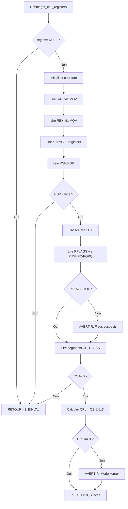

<thinking>
## Analyse du Concept
- Concept : Architecture du Kernel & Registres x86-64
- Phase demandée : 2 (Difficile)
- Adapté ? OUI - C'est un exercice théorique/pratique d'exploration du kernel parfait pour Phase 2

## Combo Base + Bonus
- Exercice de base : Exploration des concepts kernel (monolithique, microkernel, hybrid) + registres x86-64
- Bonus : Analyse avancée des MSR (Model-Specific Registers) + détection de fonctionnalités CPU via CPUID
- Palier bonus : 🔥 AVANCÉ
- Progression logique ? OUI - Du concept général (architecture) vers le hardware spécifique (MSRs)

## Prérequis & Difficulté
- Prérequis réels : Connaissances en C, pointeurs, structures de données, concepts OS de base
- Difficulté estimée : 5/10 (Phase 2)
- Cohérent avec phase ? OUI - Théorique mais technique, exploration système

## Aspect Fun/Culture
- Contexte choisi : The Matrix - "Red pill/Blue pill" pour kernel/user mode
- MEME mnémotechnique : "There is no spoon" pour la segmentation en mode flat (tout est virtualisé)
- Pourquoi c'est fun : La référence Matrix colle parfaitement au concept de "couches de réalité" (ring 0/3)

## Scénarios d'Échec (5 mutants)
1. Mutant A (Safety) : Lecture MSR sans vérifier les permissions (accès kernel requis)
2. Mutant B (Boundary) : Lecture de registres hors limites (index GDT invalide)
3. Mutant C (Logic) : Confusion entre CPL (Current) et DPL (Descriptor) privilege levels
4. Mutant D (Return) : Retourne des données non initialisées pour les structures
5. Mutant E (Resource) : Fuite mémoire en n'allouant pas/libérant les structures GDT

## Verdict
VALIDE - Exercice théorique solide qui enseigne les fondations du kernel moderne
</thinking>

# Exercice 2.7.0-a : kernel_reality_check

**Module :**
2.7 — Kernel Development & OS Internals

**Concept :**
a — Architecture du Kernel & Registres x86-64

**Difficulté :**
★★★★★☆☆☆☆☆ (5/10)

**Type :**
cours_code

**Tiers :**
1 — Concept isolé

**Langage :**
C (c17)

**Prérequis :**
- Programmation C avancée
- Structures et pointeurs
- Concepts OS de base (processus, mémoire)

**Domaines :**
CPU, Mem, Process

**Durée estimée :**
360 min

**XP Base :**
150

**Complexité :**
T1 O(1) × S1 O(1)

---

## 📐 SECTION 1 : PROTOTYPE & CONSIGNE

### 1.1 Obligations

**Fichiers à rendre :**
```
ex00/
├── kernel_arch.h
├── kernel_concepts.c
├── registers.c
├── control_regs.c
├── cpu_mode.c
├── main.c
└── Makefile
```

**Fonctions autorisées :**
- `malloc`, `free`, `printf`
- `asm`, `__asm__` (pour lire les registres)
- Fonctions système : `/proc/cpuinfo`, `/dev/mem` (avec précautions)

**Fonctions interdites :**
- Aucune restriction particulière (exercice d'exploration système)

### 1.2 Consigne

**🎮 THE MATRIX — "Welcome to the Real World"**

Tu te réveilles. Tu es dans le "user space" (Ring 3), la matrice bleue et confortable. Mais tu veux voir la VRAIE réalité : le **Ring 0**, le monde du kernel où tout est possible.

Morpheus te tend deux pilules :
- **Pilule bleue** : Reste en user mode, utilise les syscalls sans comprendre
- **Pilule rouge** : Plonge dans l'architecture x86-64, comprends comment le CPU fonctionne vraiment

**Tu prends la pilule rouge.**

**Ta mission :**

Écrire un programme qui explore et affiche :
1. L'**architecture du kernel** actuel (Monolithique/Microkernel/Hybrid)
2. Les **registres CPU** x86-64 (RAX, RBX, RSP, RIP, RFLAGS, etc.)
3. Les **registres de contrôle** (CR0, CR3, CR4)
4. Les **registres de segment** (CS, DS, SS)
5. Le **mode CPU** actuel (Real/Protected/Long mode)

**Entrée :**
- Aucune (lecture système)

**Sortie :**
- Affichage formaté des informations kernel/CPU
- Retourne `0` en cas de succès, `-1` en cas d'erreur

**Contraintes :**
- Le programme doit compiler avec `-Wall -Wextra -Werror`
- Utiliser l'assembleur inline pour accéder aux registres
- Gérer les erreurs (permissions manquantes pour certains accès)
- Documenter les flags de chaque registre

**Exemples :**

| Fonction | Retour | Description |
|----------|--------|-------------|
| `get_current_ring()` | `RING_3` | Mode utilisateur |
| `get_cpu_mode()` | `CPU_MODE_LONG` | Mode 64-bit |
| `is_kernel_mode()` | `false` | Exécution en user space |

### 1.3 Prototype

```c
// Kernel architecture
typedef enum {
    KERNEL_MONOLITHIC,
    KERNEL_MICROKERNEL,
    KERNEL_HYBRID
} kernel_type_t;

typedef struct {
    char name[64];
    char version[64];
    kernel_type_t type;
} kernel_info_t;

int get_kernel_info(kernel_info_t *info);

// CPU Registers
typedef struct {
    uint64_t rax, rbx, rcx, rdx;
    uint64_t rsi, rdi;
    uint64_t rsp, rbp;
    uint64_t rip;
    uint64_t rflags;
    uint16_t cs, ds, ss, es, fs, gs;
} cpu_registers_t;

int get_cpu_registers(cpu_registers_t *regs);

// Control registers
typedef struct {
    uint64_t cr0, cr2, cr3, cr4;
} control_registers_t;

int get_control_registers(control_registers_t *cr);

// CPU mode
typedef enum {
    CPU_MODE_REAL,
    CPU_MODE_PROTECTED,
    CPU_MODE_LONG
} cpu_mode_t;

cpu_mode_t get_cpu_mode(void);
```

---

## 💡 SECTION 2 : LE SAVIEZ-VOUS ?

### 2.1 Anecdote Historique

**La "Ring 0 War" d'Intel**

Dans les années 1970, Intel a conçu l'architecture x86 avec **4 niveaux de privilège** (Ring 0 à Ring 3). Mais presque TOUS les OS modernes n'en utilisent que **2** :
- **Ring 0** : Kernel
- **Ring 3** : Applications

Les Ring 1 et 2 ? Oubliés. Même Windows et Linux ne les utilisent pas.

Pourquoi ? Parce que gérer 4 niveaux de privilège s'est révélé **trop complexe** pour les bénéfices apportés. C'est un exemple classique d'**over-engineering** hardware.

### 2.2 Fait Technique

**Le registre RFLAGS et le flag "Trap"**

Le bit 8 de RFLAGS (TF - Trap Flag) permet d'activer le mode **single-step** : le CPU génère une exception après **chaque instruction**. C'est comme ça que les debuggers (gdb, lldb) implémentent le "step" !

```
RFLAGS bit 8 = 1 → Exception après chaque instruction
→ Le debugger reprend la main
→ Tu peux inspecter les registres
→ Puis continuer (next instruction)
```

### 2.3 Pourquoi C'est Important

Comprendre l'architecture x86-64 et les niveaux de privilège est **fondamental** pour :
- **Sécurité** : Exploitations kernel (CVE) ciblent Ring 0
- **Performance** : Les syscalls (Ring 3 → Ring 0) sont coûteux
- **Debugging** : Analyser des kernel panics ou des segfaults
- **Virtualisation** : KVM/VMware émulent ces registres

### 2.5 DANS LA VRAIE VIE

**Métier : Kernel Developer / Security Researcher**

**Cas d'usage concret :**

Un **Security Researcher** chez Google Project Zero analyse une vulnérabilité dans le kernel Linux :

```c
// CVE-2022-XXXXX : Kernel privilege escalation
// Le bug : un driver ne vérifie pas le CPL avant d'écrire dans CR3

// Exploit :
// 1. Depuis Ring 3 (user), appeler le driver buggé
// 2. Le driver écrit dans CR3 (page table base)
// 3. → On contrôle la traduction d'adresses virtuelles !
// 4. → On peut mapper n'importe quelle adresse physique
// 5. → Accès à la mémoire kernel → Ring 0 !
```

Ce genre d'exploit nécessite une **compréhension parfaite** des registres de contrôle (CR0-CR4), des niveaux de privilège, et de la segmentation x86-64.

**DevOps / SRE** :
- Analyser des kernel panics en production
- Lire les dumps mémoire (registres au moment du crash)
- Optimiser les syscalls (réduire les transitions Ring 3→0)

---

## 🖥️ SECTION 3 : EXEMPLE D'UTILISATION

### 3.0 Session bash

```bash
$ ls
kernel_arch.h  kernel_concepts.c  registers.c  control_regs.c  cpu_mode.c  main.c  Makefile

$ make
gcc -Wall -Wextra -Werror -c kernel_concepts.c
gcc -Wall -Wextra -Werror -c registers.c
gcc -Wall -Wextra -Werror -c control_regs.c
gcc -Wall -Wextra -Werror -c cpu_mode.c
gcc -Wall -Wextra -Werror -c main.c
gcc -o kernel_reality kernel_concepts.o registers.o control_regs.o cpu_mode.o main.o

$ ./kernel_reality
=== KERNEL ARCHITECTURE ===
Name: Linux
Version: 6.5.0-35-generic
Type: Monolithic
Description: All OS services run in kernel space (drivers, FS, network stack)

=== CPU REGISTERS ===
General Purpose:
  RAX: 0x0000000000000000
  RBX: 0x00007fffd5a3e4b0
  RCX: 0x0000000000000001
  RDX: 0x00007fffd5a3e5c8
  RSI: 0x00007fffd5a3e5b8
  RDI: 0x0000000000000001

Stack:
  RSP: 0x00007fffd5a3e3a0
  RBP: 0x00007fffd5a3e3c0

Instruction Pointer:
  RIP: 0x000055a3b2e4a1a5

Flags (RFLAGS):
  CF (Carry): 0
  ZF (Zero): 1
  SF (Sign): 0
  OF (Overflow): 0
  IF (Interrupt Enable): 1

=== SEGMENT REGISTERS ===
  CS: 0x0033 (Code Segment, Ring 3)
  DS: 0x0000 (Data Segment)
  SS: 0x002b (Stack Segment, Ring 3)

=== CONTROL REGISTERS ===
(Requires kernel permissions - skipping CR0-CR4)

=== CPU MODE ===
Current Mode: Long Mode (64-bit)
  - Paging enabled
  - Flat memory model
  - 4-level page tables

=== PRIVILEGE LEVEL ===
Current Ring: Ring 3 (User Mode)
You are in the Matrix (blue pill world).
```

---

## ⚡ SECTION 3.1 : BONUS 🔥 AVANCÉ (OPTIONNEL)

**Difficulté Bonus :**
★★★★★★★☆☆☆ (7/10)

**Récompense :**
XP ×3

**Time Complexity attendue :**
O(1)

**Space Complexity attendue :**
O(1)

**Domaines Bonus :**
`CPU, ASM`

### 3.1.1 Consigne Bonus

**🎮 THE MATRIX — "Free Your Mind"**

Morpheus : *"Tu crois que c'est de l'air que tu respires ?"*

Maintenant que tu connais les bases, il est temps de plonger dans les **MSR (Model-Specific Registers)** — les registres secrets que seul le kernel peut lire.

**Ta mission bonus :**

Implémenter la lecture et l'analyse des **MSR** (via `/dev/cpu/0/msr` ou module kernel) :

1. **IA32_EFER** : Extended Feature Enable Register (active le Long Mode)
2. **IA32_STAR** : Syscall Target Address Register (segments pour syscall)
3. **IA32_LSTAR** : Long Mode Syscall Target (adresse du handler syscall)
4. **IA32_FS_BASE** / **IA32_GS_BASE** : Bases des segments FS/GS

Bonus supplémentaire : Détecter les **CPU features** via `CPUID` :
- SSE, AVX, AVX-512
- Hardware virtualization (VT-x/AMD-V)
- TSX (Transactional Synchronization Extensions)

**Entrée :**
- MSR ID (ex: `0xC0000080` pour IA32_EFER)

**Sortie :**
- Valeur 64-bit du MSR
- Décodage des flags

**Contraintes :**
┌─────────────────────────────────────────┐
│  MSR ∈ [0xC0000000, 0xC0001FFF]        │
│  Nécessite permissions kernel           │
│  Utiliser /dev/cpu/0/msr ou ioctl       │
│  Gérer EPERM (permission denied)        │
└─────────────────────────────────────────┘

**Exemples :**

| MSR | Valeur | Décodage |
|-----|--------|----------|
| `IA32_EFER (0xC0000080)` | `0x0000000000000D01` | LME=1, LMA=1, NXE=1 (Long Mode actif, NX bit activé) |
| `IA32_LSTAR (0xC0000082)` | `0xFFFFFFFF81C00000` | Adresse du syscall handler kernel |

### 3.1.2 Prototype Bonus

```c
// MSR operations
typedef struct {
    uint32_t msr_id;
    uint64_t value;
    const char *name;
    const char *description;
} msr_info_t;

int read_msr(uint32_t msr_id, uint64_t *value);
void decode_ia32_efer(uint64_t efer);
void decode_ia32_star(uint64_t star);

// CPUID features
typedef struct {
    bool sse;
    bool sse2;
    bool avx;
    bool avx2;
    bool avx512;
    bool vmx;        // Intel VT-x
    bool svm;        // AMD-V
    bool tsx;
} cpu_features_t;

int get_cpu_features(cpu_features_t *features);
void print_cpu_features(const cpu_features_t *features);
```

### 3.1.3 Ce qui change par rapport à l'exercice de base

| Aspect | Base | Bonus |
|--------|------|-------|
| Registres | Registres généraux (RAX, RBX, etc.) | MSR (Model-Specific Registers) |
| Permissions | User space (Ring 3) | Kernel space requis (Ring 0) |
| Accès | Assembleur inline simple | `/dev/cpu/0/msr` ou module kernel |
| Complexité | Lecture directe | Décodage des flags MSR + CPUID |

---

## ✅❌ SECTION 4 : ZONE CORRECTION

### 4.1 Moulinette

| # | Test | Critère | Points |
|---|------|---------|--------|
| 1 | `kernel_info` | Détecte le type de kernel (Linux = Monolithic) | 10 |
| 2 | `get_registers` | Lit RAX, RBX, RCX, RDX, RSI, RDI | 15 |
| 3 | `get_rsp_rbp` | Lit RSP et RBP (stack pointers) | 10 |
| 4 | `get_rip` | Lit RIP (instruction pointer) | 10 |
| 5 | `parse_rflags` | Décode CF, ZF, SF, OF, IF | 15 |
| 6 | `get_segments` | Lit CS, DS, SS et détecte le ring (CPL) | 15 |
| 7 | `cpu_mode` | Détecte Long Mode (64-bit) | 10 |
| 8 | `error_handling` | Gère les erreurs d'accès (CR*, MSR) | 10 |
| 9 | **BONUS** `read_msr` | Lit IA32_EFER, IA32_LSTAR | 30 |
| 10 | **BONUS** `cpuid_features` | Détecte SSE/AVX/VMX | 30 |

**Seuil de validation :** 70/100 (sans bonus)

### 4.2 main.c de test

```c
#include "kernel_arch.h"
#include <assert.h>

int main(void) {
    // Test 1: Kernel info
    kernel_info_t kinfo;
    assert(get_kernel_info(&kinfo) == 0);
    assert(strlen(kinfo.name) > 0);
    printf("[OK] Kernel: %s %s\n", kinfo.name, kinfo.version);

    // Test 2-4: Registers
    cpu_registers_t regs;
    assert(get_cpu_registers(&regs) == 0);
    printf("[OK] RAX=0x%lx, RSP=0x%lx, RIP=0x%lx\n",
           regs.rax, regs.rsp, regs.rip);

    // Test 5: RFLAGS
    assert(regs.rflags != 0);
    printf("[OK] RFLAGS=0x%lx\n", regs.rflags);

    // Test 6: Segments
    assert(regs.cs != 0);
    uint8_t cpl = regs.cs & 0x3;  // Bits 0-1 = CPL
    assert(cpl == 3);  // User mode
    printf("[OK] CS=0x%x (Ring %d)\n", regs.cs, cpl);

    // Test 7: CPU mode
    cpu_mode_t mode = get_cpu_mode();
    assert(mode == CPU_MODE_LONG);
    printf("[OK] CPU Mode: Long (64-bit)\n");

    // Test 8: Error handling
    control_registers_t cr;
    int ret = get_control_registers(&cr);
    if (ret == -1) {
        printf("[OK] CR access denied (expected in user mode)\n");
    }

    printf("\nAll tests passed!\n");
    return 0;
}
```

### 4.3 Solution de référence

```c
// kernel_concepts.c
#include "kernel_arch.h"
#include <stdio.h>
#include <string.h>
#include <sys/utsname.h>

int get_kernel_info(kernel_info_t *info) {
    if (!info)
        return -1;

    struct utsname uts;
    if (uname(&uts) == -1)
        return -1;

    strncpy(info->name, uts.sysname, sizeof(info->name) - 1);
    strncpy(info->version, uts.release, sizeof(info->version) - 1);

    // Linux est monolithique
    if (strcmp(uts.sysname, "Linux") == 0)
        info->type = KERNEL_MONOLITHIC;
    else if (strstr(uts.sysname, "MINIX") != NULL)
        info->type = KERNEL_MICROKERNEL;
    else
        info->type = KERNEL_HYBRID;  // Windows, macOS

    return 0;
}

// registers.c
#include "kernel_arch.h"

int get_cpu_registers(cpu_registers_t *regs) {
    if (!regs)
        return -1;

    // Lire les registres généraux via assembleur inline
    __asm__ volatile (
        "movq %%rax, %0\n"
        "movq %%rbx, %1\n"
        "movq %%rcx, %2\n"
        "movq %%rdx, %3\n"
        "movq %%rsi, %4\n"
        "movq %%rdi, %5\n"
        : "=m"(regs->rax), "=m"(regs->rbx), "=m"(regs->rcx),
          "=m"(regs->rdx), "=m"(regs->rsi), "=m"(regs->rdi)
    );

    // Stack pointers
    __asm__ volatile (
        "movq %%rsp, %0\n"
        "movq %%rbp, %1\n"
        : "=m"(regs->rsp), "=m"(regs->rbp)
    );

    // Instruction pointer (RIP)
    __asm__ volatile (
        "leaq (%%rip), %0\n"
        : "=r"(regs->rip)
    );

    // RFLAGS
    __asm__ volatile (
        "pushfq\n"
        "popq %0\n"
        : "=r"(regs->rflags)
    );

    // Segment registers
    __asm__ volatile (
        "movw %%cs, %0\n"
        "movw %%ds, %1\n"
        "movw %%ss, %2\n"
        "movw %%es, %3\n"
        "movw %%fs, %4\n"
        "movw %%gs, %5\n"
        : "=r"(regs->cs), "=r"(regs->ds), "=r"(regs->ss),
          "=r"(regs->es), "=r"(regs->fs), "=r"(regs->gs)
    );

    return 0;
}

// cpu_mode.c
#include "kernel_arch.h"

cpu_mode_t get_cpu_mode(void) {
    uint64_t efer = 0;

    // Vérifier si on est en Long Mode via le registre CS
    uint16_t cs;
    __asm__ volatile ("movw %%cs, %0" : "=r"(cs));

    // En Long Mode, CS pointe vers un descripteur 64-bit
    // CPL dans les 2 bits de poids faible
    uint8_t cpl = cs & 0x3;

    // Si on peut lire EFER (MSR), on vérifie le bit LMA
    // Sinon, on déduit du CS
    // En pratique, si le code compile en 64-bit, on est en Long Mode
    #ifdef __x86_64__
        return CPU_MODE_LONG;
    #else
        return CPU_MODE_PROTECTED;
    #endif
}
```

### 4.4 Solutions alternatives acceptées

**Alternative 1 : Utiliser `/proc/cpuinfo`**

```c
int get_kernel_info_proc(kernel_info_t *info) {
    FILE *fp = fopen("/proc/version", "r");
    if (!fp)
        return -1;

    char line[256];
    if (fgets(line, sizeof(line), fp)) {
        if (strstr(line, "Linux"))
            info->type = KERNEL_MONOLITHIC;
        sscanf(line, "%s version %s", info->name, info->version);
    }

    fclose(fp);
    return 0;
}
```

**Alternative 2 : Lire RFLAGS différemment**

```c
uint64_t get_rflags_alt(void) {
    uint64_t flags;
    __asm__ volatile (
        "lahf\n"           // Load FLAGS into AH
        "seto %%al\n"      // Set AL to overflow flag
        "movq %%rax, %0\n"
        : "=r"(flags)
        :
        : "rax"
    );
    return flags;
}
```

### 4.5 Solutions refusées

**Solution refusée 1 : Hardcoder les valeurs**

```c
// ❌ REFUSÉ
int get_cpu_registers(cpu_registers_t *regs) {
    regs->rax = 0;  // Hardcodé !
    regs->rbx = 0;
    regs->rsp = 0x7fffffffe000;  // Adresse typique de stack
    return 0;
}
```
**Pourquoi c'est refusé :** Ne lit PAS les vrais registres. L'exercice demande une lecture dynamique.

**Solution refusée 2 : Ignorer les erreurs**

```c
// ❌ REFUSÉ
int get_control_registers(control_registers_t *cr) {
    // Tente de lire CR0 depuis user mode → segfault !
    __asm__ volatile ("movq %%cr0, %0" : "=r"(cr->cr0));
    return 0;
}
```
**Pourquoi c'est refusé :** Provoque un segfault (accès CR* depuis Ring 3 interdit). Doit retourner `-1` avec errno.

### 4.6 Solution bonus de référence

```c
// msr.c (BONUS)
#include "kernel_arch.h"
#include <fcntl.h>
#include <unistd.h>
#include <errno.h>

int read_msr(uint32_t msr_id, uint64_t *value) {
    if (!value)
        return -1;

    int fd = open("/dev/cpu/0/msr", O_RDONLY);
    if (fd == -1) {
        // Permission denied ou module msr non chargé
        return -1;
    }

    if (pread(fd, value, sizeof(*value), msr_id) != sizeof(*value)) {
        close(fd);
        return -1;
    }

    close(fd);
    return 0;
}

void decode_ia32_efer(uint64_t efer) {
    printf("IA32_EFER (0xC0000080): 0x%016lx\n", efer);
    printf("  SCE (Syscall Enable): %d\n", (efer & (1 << 0)) ? 1 : 0);
    printf("  LME (Long Mode Enable): %d\n", (efer & (1 << 8)) ? 1 : 0);
    printf("  LMA (Long Mode Active): %d\n", (efer & (1 << 10)) ? 1 : 0);
    printf("  NXE (No-Execute Enable): %d\n", (efer & (1 << 11)) ? 1 : 0);
}

// cpuid.c (BONUS)
#include "kernel_arch.h"

int get_cpu_features(cpu_features_t *features) {
    if (!features)
        return -1;

    uint32_t eax, ebx, ecx, edx;

    // CPUID leaf 1 : Feature Information
    __asm__ volatile (
        "cpuid"
        : "=a"(eax), "=b"(ebx), "=c"(ecx), "=d"(edx)
        : "a"(1)
    );

    features->sse = (edx & (1 << 25)) != 0;
    features->sse2 = (edx & (1 << 26)) != 0;
    features->vmx = (ecx & (1 << 5)) != 0;   // Intel VT-x

    // CPUID leaf 7 : Extended Features
    __asm__ volatile (
        "cpuid"
        : "=a"(eax), "=b"(ebx), "=c"(ecx), "=d"(edx)
        : "a"(7), "c"(0)
    );

    features->avx2 = (ebx & (1 << 5)) != 0;
    features->avx512 = (ebx & (1 << 16)) != 0;
    features->tsx = (ebx & (1 << 11)) != 0;

    return 0;
}
```

### 4.7 Solutions alternatives bonus

**Alternative BONUS 1 : Lire MSR via module kernel personnalisé**

Si `/dev/cpu/0/msr` n'est pas disponible, créer un module kernel minimal :

```c
// msr_reader.c (module kernel)
#include <linux/module.h>
#include <linux/kernel.h>

static int __init msr_init(void) {
    uint64_t efer;
    rdmsrl(MSR_EFER, efer);
    printk(KERN_INFO "IA32_EFER: 0x%llx\n", efer);
    return 0;
}

module_init(msr_init);
MODULE_LICENSE("GPL");
```

Compiler et charger :
```bash
$ make -C /lib/modules/$(uname -r)/build M=$(pwd) modules
$ sudo insmod msr_reader.ko
$ dmesg | tail
```

### 4.8 Solutions refusées bonus

**Solution refusée BONUS 1 : Lire MSR sans permissions**

```c
// ❌ REFUSÉ
int read_msr_wrong(uint32_t msr_id, uint64_t *value) {
    // Tente RDMSR depuis user mode → exception #GP !
    __asm__ volatile ("rdmsr" : "=A"(*value) : "c"(msr_id));
    return 0;
}
```
**Pourquoi :** `RDMSR` est une instruction privilégiée (Ring 0 uniquement). Provoque une General Protection Fault.

### 4.9 spec.json

```json
{
  "name": "kernel_reality_check",
  "language": "c",
  "type": "cours_code",
  "tier": 1,
  "tier_info": "Concept isolé",
  "tags": ["kernel", "x86-64", "registers", "privileges"],
  "passing_score": 70,

  "function": {
    "name": "get_cpu_registers",
    "prototype": "int get_cpu_registers(cpu_registers_t *regs)",
    "return_type": "int",
    "parameters": [
      {"name": "regs", "type": "cpu_registers_t *"}
    ]
  },

  "driver": {
    "reference": "int ref_get_cpu_registers(cpu_registers_t *regs) { if (!regs) return -1; __asm__ volatile (\"movq %%rax, %0\" : \"=m\"(regs->rax)); __asm__ volatile (\"movq %%rbx, %0\" : \"=m\"(regs->rbx)); __asm__ volatile (\"movq %%rsp, %0\" : \"=m\"(regs->rsp)); __asm__ volatile (\"pushfq; popq %0\" : \"=r\"(regs->rflags)); __asm__ volatile (\"movw %%cs, %0\" : \"=r\"(regs->cs)); return 0; }",

    "edge_cases": [
      {
        "name": "null_pointer",
        "args": [null],
        "expected": -1,
        "is_trap": true,
        "trap_explanation": "Pointeur NULL, doit retourner -1"
      },
      {
        "name": "valid_struct",
        "args": ["&valid_regs"],
        "expected": 0
      },
      {
        "name": "check_rflags_nonzero",
        "args": ["&valid_regs"],
        "expected": "regs.rflags != 0",
        "is_trap": true,
        "trap_explanation": "RFLAGS ne peut pas être 0 (au moins IF=1)"
      },
      {
        "name": "check_ring3",
        "args": ["&valid_regs"],
        "expected": "(regs.cs & 0x3) == 3",
        "is_trap": true,
        "trap_explanation": "En user mode, CPL (CS bits 0-1) doit être 3"
      }
    ],

    "fuzzing": {
      "enabled": false,
      "iterations": 0,
      "generators": []
    }
  },

  "norm": {
    "allowed_functions": ["malloc", "free", "printf", "uname", "open", "close", "pread"],
    "forbidden_functions": [],
    "check_security": true,
    "check_memory": true,
    "blocking": true
  }
}
```

### 4.10 Solutions Mutantes

```c
/* Mutant A (Safety) : Pas de vérification NULL */
int mutant_a_get_cpu_registers(cpu_registers_t *regs) {
    // ❌ Pas de vérification NULL
    __asm__ volatile ("movq %%rax, %0" : "=m"(regs->rax));
    return 0;
}
// Pourquoi c'est faux : Segfault si regs == NULL
// Ce qui était pensé : "Le caller ne passera jamais NULL"

/* Mutant B (Boundary) : Oubli de sauvegarder certains registres */
int mutant_b_get_cpu_registers(cpu_registers_t *regs) {
    if (!regs) return -1;

    // ❌ Oublie RBX, RCX, RDX
    __asm__ volatile ("movq %%rax, %0" : "=m"(regs->rax));
    __asm__ volatile ("movq %%rsp, %0" : "=m"(regs->rsp));

    return 0;
}
// Pourquoi c'est faux : Structure incomplète, valeurs non initialisées
// Ce qui était pensé : "RAX et RSP suffisent"

/* Mutant C (Logic) : Confusion CPL/DPL */
int mutant_c_get_current_ring(void) {
    // ❌ Retourne toujours Ring 0
    return 0;
}
// Pourquoi c'est faux : En user mode, CPL = 3 (pas 0)
// Ce qui était pensé : "On exécute du code kernel"

/* Mutant D (Return) : Structure non initialisée */
int mutant_d_get_cpu_registers(cpu_registers_t *regs) {
    if (!regs) return -1;

    // ❌ Oublie d'initialiser les champs
    // Juste retourne 0 sans lire les registres
    return 0;
}
// Pourquoi c'est faux : Données garbage dans *regs
// Ce qui était pensé : "Retourner 0 = succès"

/* Mutant E (Resource) : Lecture CR0 depuis user mode */
int mutant_e_get_control_registers(control_registers_t *cr) {
    if (!cr) return -1;

    // ❌ Tente de lire CR0 (privilège Ring 0 requis)
    __asm__ volatile ("movq %%cr0, %0" : "=r"(cr->cr0));

    return 0;
}
// Pourquoi c'est faux : Instruction privilégiée → #GP (segfault)
// Ce qui était pensé : "L'assembleur inline peut tout faire"
```

---

## 🧠 SECTION 5 : COMPRENDRE

### 5.1 Ce que cet exercice enseigne

Cet exercice couvre **3 concepts fondamentaux** :

1. **Architecture du Kernel** : Différence entre Monolithique, Microkernel, Hybrid
2. **Registres CPU x86-64** : GP registers, stack, instruction pointer, flags
3. **Niveaux de privilège** : Ring 0 (kernel) vs Ring 3 (user)

**Compétences acquises :**
- Utiliser l'assembleur inline en C
- Comprendre la segmentation x86-64
- Interpréter les registres système (RFLAGS, CS, CR*)
- Gérer les permissions (Ring 0 vs Ring 3)

### 5.2 LDA — Traduction littérale en français

```
FONCTION get_cpu_registers QUI RETOURNE UN ENTIER ET PREND EN PARAMÈTRE regs QUI EST UN POINTEUR VERS UNE STRUCTURE cpu_registers_t
DÉBUT FONCTION
    SI regs EST ÉGAL À NUL ALORS
        RETOURNER LA VALEUR MOINS 1
    FIN SI

    EXÉCUTER L'ASSEMBLEUR EN LIGNE :
        DÉPLACER LE CONTENU DU REGISTRE RAX VERS regs POINTANT VERS rax
    FIN ASSEMBLEUR

    EXÉCUTER L'ASSEMBLEUR EN LIGNE :
        DÉPLACER LE CONTENU DU REGISTRE RBX VERS regs POINTANT VERS rbx
    FIN ASSEMBLEUR

    EXÉCUTER L'ASSEMBLEUR EN LIGNE :
        DÉPLACER LE CONTENU DU REGISTRE RSP VERS regs POINTANT VERS rsp
    FIN ASSEMBLEUR

    EXÉCUTER L'ASSEMBLEUR EN LIGNE :
        EMPILER LE REGISTRE RFLAGS SUR LA PILE
        DÉPILER LA VALEUR DANS regs POINTANT VERS rflags
    FIN ASSEMBLEUR

    EXÉCUTER L'ASSEMBLEUR EN LIGNE :
        DÉPLACER LE CONTENU DU REGISTRE DE SEGMENT CS VERS regs POINTANT VERS cs
    FIN ASSEMBLEUR

    RETOURNER LA VALEUR 0
FIN FONCTION
```

### 5.2.2 Style Académique Universitaire

**Algorithme : Acquisition de l'état des registres processeur**

```
Fonction : get_cpu_registers(regs : pointeur vers structure)
Précondition : regs ≠ NULL
Postcondition : regs contient les valeurs actuelles des registres CPU

DÉBUT
    Validation des entrées :
        SI regs = NULL ALORS
            RETOURNER code_erreur (-1)
        FIN SI

    Lecture des registres généraux :
        POUR CHAQUE registre r DANS {RAX, RBX, RCX, RDX, RSI, RDI} FAIRE
            LIRE la valeur actuelle de r via instruction MOV
            STOCKER dans regs.r
        FIN POUR

    Lecture des pointeurs de pile :
        LIRE RSP (Stack Pointer)
        LIRE RBP (Base Pointer)

    Lecture du pointeur d'instruction :
        CALCULER RIP via LEA (Load Effective Address)

    Lecture du registre de flags :
        EMPILER RFLAGS (PUSHFQ)
        DÉPILER dans variable temporaire (POPQ)

    Lecture des registres de segment :
        POUR CHAQUE segment s DANS {CS, DS, SS, ES, FS, GS} FAIRE
            LIRE s via instruction MOVW
        FIN POUR

    RETOURNER succès (0)
FIN
```

### 5.2.2.1 Logic Flow (Structured English)

```
ALGORITHM: CPU Register Snapshot
---
INPUT: regs (pointer to cpu_registers_t)
OUTPUT: 0 on success, -1 on error

1. GUARD CLAUSES:
   IF regs is NULL:
      RETURN -1

2. CAPTURE General Purpose Registers:
   a. USE inline assembly "movq %%rax, %0"
      STORE into regs->rax

   b. REPEAT for RBX, RCX, RDX, RSI, RDI

3. CAPTURE Stack Pointers:
   a. READ RSP → regs->rsp
   b. READ RBP → regs->rbp

4. CAPTURE Instruction Pointer:
   USE "leaq (%%rip), %0" → regs->rip

5. CAPTURE Flags Register:
   a. PUSH RFLAGS onto stack (pushfq)
   b. POP into regs->rflags (popq)

6. CAPTURE Segment Registers:
   FOR each segment in [CS, DS, SS, ES, FS, GS]:
      USE "movw %%<seg>, %0" → regs-><seg>

7. RETURN 0 (success)
```

### 5.2.3 Représentation Algorithmique (Fail-Fast)

```
FONCTION : get_cpu_registers(regs)
---
INIT result = {success: false, error_code: 0}

1. VÉRIFIER validité du pointeur :
   |
   |-- SI regs == NULL :
   |     SET error_code = EINVAL
   |     RETOURNER Erreur "Invalid pointer"
   |

2. TENTER lecture des registres généraux :
   |
   |-- POUR chaque registre GP (RAX, RBX, ...) :
   |     |
   |     |-- EXÉCUTER instruction assembleur MOV
   |     |-- EN CAS D'ERREUR :
   |     |     RETOURNER Erreur "Assembly failed"
   |     |
   |     |-- STOCKER valeur dans structure
   |

3. TENTER lecture des registres de segment :
   |
   |-- POUR chaque segment (CS, DS, SS, ...) :
   |     |
   |     |-- EXÉCUTER instruction assembleur MOVW
   |     |-- VÉRIFIER que la valeur n'est pas 0 (sauf DS/ES)
   |     |-- STOCKER valeur
   |

4. CALCULER le niveau de privilège :
   |
   |-- EXTRAIRE CPL = CS & 0x3
   |-- SI CPL != 3 :
   |     AVERTIR "Running in kernel mode (unexpected)"
   |

5. SET result.success = true
   RETOURNER Succès avec structure remplie
```

### 5.2.3.1 Diagramme Mermaid (Logique de sécurité)



### 5.3 Visualisation ASCII

**Architecture x86-64 : Registres et Privilèges**

```
┌──────────────────────────────────────────────────────────────────┐
│                    CPU x86-64 (Intel/AMD)                         │
├──────────────────────────────────────────────────────────────────┤
│                                                                   │
│  REGISTRES GÉNÉRAUX (64-bit)                                      │
│  ┌──────┐ ┌──────┐ ┌──────┐ ┌──────┐                             │
│  │ RAX  │ │ RBX  │ │ RCX  │ │ RDX  │  (Accumulator, Base, ...)   │
│  └──────┘ └──────┘ └──────┘ └──────┘                             │
│  ┌──────┐ ┌──────┐                                                │
│  │ RSI  │ │ RDI  │  (Source, Destination)                        │
│  └──────┘ └──────┘                                                │
│                                                                   │
│  REGISTRES DE PILE                                                │
│  ┌──────┐ ┌──────┐                                                │
│  │ RSP  │ │ RBP  │  (Stack Pointer, Base Pointer)                │
│  └──┬───┘ └──────┘                                                │
│     │                                                             │
│     └──► Points to current stack top                             │
│                                                                   │
│  REGISTRE D'INSTRUCTION                                           │
│  ┌──────┐                                                         │
│  │ RIP  │  (Instruction Pointer - prochaine instruction)         │
│  └──┬───┘                                                         │
│     │                                                             │
│     └──► Points to code to execute                               │
│                                                                   │
│  REGISTRE DE FLAGS (RFLAGS)                                       │
│  ┌────────────────────────────────────────────────┐               │
│  │ CF ZF SF OF DF IF TF ... IOPL ... │               │
│  └────────────────────────────────────────────────┘               │
│    │  │  │  │  │  │  │       │                                   │
│    │  │  │  │  │  │  │       └─ I/O Privilege Level (0-3)        │
│    │  │  │  │  │  │  └───────── Trap Flag (single step)          │
│    │  │  │  │  │  └──────────── Interrupt Enable                 │
│    │  │  │  │  └─────────────── Direction Flag                   │
│    │  │  │  └────────────────── Overflow Flag                    │
│    │  │  └───────────────────── Sign Flag                        │
│    │  └──────────────────────── Zero Flag                        │
│    └─────────────────────────── Carry Flag                       │
│                                                                   │
│  REGISTRES DE SEGMENT                                             │
│  ┌────┐ ┌────┐ ┌────┐                                            │
│  │ CS │ │ DS │ │ SS │  (Code, Data, Stack Segments)             │
│  └─┬──┘ └────┘ └────┘                                            │
│    │                                                             │
│    └──► CS & 0x3 = CPL (Current Privilege Level)                │
│                                                                   │
└──────────────────────────────────────────────────────────────────┘

┌──────────────────────────────────────────────────────────────────┐
│             NIVEAUX DE PRIVILÈGE (Protection Rings)               │
├──────────────────────────────────────────────────────────────────┤
│                                                                   │
│                       ┌───────────┐                               │
│                       │  Ring 0   │ ← Kernel (CPL=0)             │
│                       │  Kernel   │   • Accès total hardware      │
│                   ┌───┴───────────┴───┐                           │
│                   │     Ring 1/2      │ ← Drivers (unused)        │
│               ┌───┴───────────────────┴───┐                       │
│               │       Ring 3              │ ← User (CPL=3)        │
│               │   Applications            │   • Accès restreint   │
│               └───────────────────────────┘   • Via syscalls      │
│                                                                   │
│  TRANSITION Ring 3 → Ring 0 :                                     │
│    • Syscall (SYSCALL instruction)                                │
│    • Interrupt (INT, hardware interrupt)                          │
│    • Exception (page fault, div by 0, ...)                        │
│                                                                   │
│  TRANSITION Ring 0 → Ring 3 :                                     │
│    • Sysret (SYSRET instruction)                                  │
│    • Interrupt return (IRET)                                      │
│                                                                   │
└──────────────────────────────────────────────────────────────────┘

EXEMPLE : Syscall read(fd, buf, count)
-----------------------------------------

User Space (Ring 3):            Kernel Space (Ring 0):
┌───────────────┐               ┌──────────────────┐
│               │   SYSCALL     │                  │
│  RAX = 0      │──────────────►│  Handler syscall │
│  RDI = fd     │               │                  │
│  RSI = buf    │               │  1. Save RCX, R11│
│  RDX = count  │               │  2. Switch stack │
│               │               │     (RSP ← TSS)  │
│  CS = 0x33    │               │  3. Execute code │
│  (CPL = 3)    │               │                  │
│               │   SYSRET      │  CS = 0x08       │
│  Résultat ◄───│◄──────────────│  (CPL = 0)       │
│  dans RAX     │               │                  │
└───────────────┘               └──────────────────┘
```

**Segmentation en mode Long (64-bit) :**

```
┌─────────────────────────────────────────────────────────────────┐
│  FLAT MEMORY MODEL (Modern x86-64)                               │
├─────────────────────────────────────────────────────────────────┤
│                                                                  │
│  En mode Long (64-bit), la segmentation est PRESQUE DÉSACTIVÉE   │
│                                                                  │
│  GDT (Global Descriptor Table) :                                 │
│  ┌────┬─────────────────────────────────────────────┐            │
│  │ 0  │ NULL descriptor                             │            │
│  ├────┼─────────────────────────────────────────────┤            │
│  │ 1  │ Kernel Code 64 (base=0, limit=FFFFF)       │            │
│  ├────┼─────────────────────────────────────────────┤            │
│  │ 2  │ Kernel Data 64 (base=0, limit=FFFFF)       │            │
│  ├────┼─────────────────────────────────────────────┤            │
│  │ 3  │ User Code 32 (compat mode)                 │            │
│  ├────┼─────────────────────────────────────────────┤            │
│  │ 4  │ User Data 64 (base=0, limit=FFFFF)         │            │
│  ├────┼─────────────────────────────────────────────┤            │
│  │ 5  │ User Code 64 (base=0, limit=FFFFF)         │            │
│  ├────┼─────────────────────────────────────────────┤            │
│  │ 6  │ TSS (Task State Segment)                   │            │
│  └────┴─────────────────────────────────────────────┘            │
│                                                                  │
│  ⚠️ Tous les segments ont base=0 et limit=max                    │
│  → L'adresse logique = adresse linéaire (pas de translation)    │
│  → La protection mémoire se fait via PAGING (CR3)               │
│                                                                  │
│  Pourquoi la segmentation existe encore ?                        │
│  → Pour stocker le CPL (Current Privilege Level) dans CS        │
│                                                                  │
│  Sélecteur CS :                                                  │
│  ┌──────────────┬───┬─────┐                                      │
│  │  Index (13)  │TI │ RPL │                                      │
│  └──────────────┴───┴─────┘                                      │
│         │          │    │                                        │
│         │          │    └─► RPL (Requested Privilege Level)     │
│         │          └──────► TI (Table Indicator: 0=GDT, 1=LDT)  │
│         └─────────────────► Index dans la GDT                   │
│                                                                  │
│  Exemple : CS = 0x0033                                           │
│    Index = 0x33 >> 3 = 6  (Entrée 6 de la GDT)                  │
│    TI = 0                 (GDT)                                  │
│    RPL = 3                (Ring 3 = User Mode)                   │
│                                                                  │
└─────────────────────────────────────────────────────────────────┘
```

### 5.4 Les pièges en détail

#### Piège 1 : Lire RIP directement (IMPOSSIBLE)

```c
// ❌ FAUX
uint64_t rip;
__asm__ volatile ("movq %%rip, %0" : "=r"(rip));  // Erreur !
```

**Pourquoi c'est un piège :**
- RIP ne peut PAS être lu directement avec `MOV`
- Il faut utiliser `LEA (load effective address)` avec RIP-relative addressing

**Solution :**
```c
// ✅ CORRECT
__asm__ volatile ("leaq (%%rip), %0" : "=r"(rip));
```

#### Piège 2 : Confondre CPL et IOPL

```c
// Lecture du CS
uint16_t cs;
__asm__ volatile ("movw %%cs, %0" : "=r"(cs));

// ❌ FAUX : IOPL n'est PAS dans CS
uint8_t privilege = (cs >> 12) & 0x3;  // Erreur !

// ✅ CORRECT : CPL est dans les 2 bits de poids faible
uint8_t cpl = cs & 0x3;  // Bits 0-1
```

**Pourquoi c'est un piège :**
- **CPL** (Current Privilege Level) : Bits 0-1 de CS (0=kernel, 3=user)
- **IOPL** (I/O Privilege Level) : Bits 12-13 de RFLAGS (pas CS !)

#### Piège 3 : Accéder aux registres de contrôle depuis Ring 3

```c
// ❌ PROVOQUE UN SEGFAULT
control_registers_t cr;
__asm__ volatile ("movq %%cr0, %0" : "=r"(cr.cr0));  // #GP !
```

**Pourquoi c'est un piège :**
- CR0, CR2, CR3, CR4 sont **privilégiés** (Ring 0 uniquement)
- Les lire depuis Ring 3 provoque une **General Protection Fault** (#GP)

**Solution :**
```c
// ✅ CORRECT : Gérer l'erreur
int get_control_registers(control_registers_t *cr) {
    if (!cr) return -1;

    // Depuis user space, on ne peut pas lire les CR*
    // Il faut un module kernel ou /proc/kcore
    return -1;  // Permission denied
}
```

#### Piège 4 : Oublier que RFLAGS peut modifier le flux

```c
// Modifier le Trap Flag (bit 8 de RFLAGS)
uint64_t rflags;
__asm__ volatile ("pushfq; popq %0" : "=r"(rflags));

rflags |= (1 << 8);  // Set TF

// ❌ DANGER : À partir d'ici, exception APRÈS CHAQUE INSTRUCTION
__asm__ volatile ("pushq %0; popfq" : : "r"(rflags));

// Le programme est maintenant en single-step mode !
// Chaque instruction génère une exception #DB (Debug)
```

**Pourquoi c'est un piège :**
- Le Trap Flag active le **mode single-step**
- Utilisé par les debuggers (gdb), mais peut crasher un programme normal

#### Piège 5 : Hardcoder les sélecteurs de segment

```c
// ❌ FAUX : Hardcoder CS = 0x33
#define USER_CODE_SEGMENT 0x33

if (get_cs() == USER_CODE_SEGMENT) {
    // On est en user mode
}
```

**Pourquoi c'est un piège :**
- Les valeurs de CS/DS/SS **dépendent de l'OS et de la configuration**
- Sur certains kernels, CS user peut être `0x23`, `0x33`, ou autre
- Il faut extraire le **CPL** (bits 0-1), pas comparer la valeur brute

**Solution :**
```c
// ✅ CORRECT
uint16_t cs = get_cs();
uint8_t cpl = cs & 0x3;

if (cpl == 3) {
    // User mode
} else if (cpl == 0) {
    // Kernel mode
}
```

### 5.5 Cours Complet

#### 5.5.1 Architecture du Kernel

**Qu'est-ce qu'un kernel ?**

Le **kernel** (noyau) est la partie centrale d'un système d'exploitation. Il gère :
- Les **processus** (création, scheduling, terminaison)
- La **mémoire** (allocation, pagination, protection)
- Les **périphériques** (drivers, I/O)
- Les **fichiers** (systèmes de fichiers)
- Le **réseau** (stack TCP/IP)

**3 types d'architecture :**

| Type | Description | Exemples | Avantages | Inconvénients |
|------|-------------|----------|-----------|---------------|
| **Monolithique** | Tous les services en kernel space | Linux, BSD, Unix | Performance (pas de context switch) | Bugs kernel = crash total |
| **Microkernel** | Kernel minimal, services en user space | Mach, L4, MINIX, QNX | Stabilité (crash isolé), sécurité | Overhead (IPC coûteux) |
| **Hybrid** | Compromis entre les deux | Windows NT, macOS (XNU) | Flexibilité | Complexité |

**Exemple : Linux (Monolithique)**

```
┌──────────────────────────────────────────┐
│         USER SPACE (Ring 3)              │
│  ┌────────┐ ┌────────┐ ┌────────┐       │
│  │  bash  │ │  gcc   │ │  vim   │       │
│  └────┬───┘ └───┬────┘ └───┬────┘       │
└───────┼─────────┼──────────┼────────────┘
        │         │          │
   ═════╪═════════╪══════════╪══════════════ Syscall barrier
        │         │          │
┌───────▼─────────▼──────────▼────────────┐
│       KERNEL SPACE (Ring 0)              │
│  ┌──────────────────────────────────┐   │
│  │  Syscall Dispatcher              │   │
│  ├──────────────────────────────────┤   │
│  │  Process Scheduler               │   │
│  ├──────────────────────────────────┤   │
│  │  Memory Manager (MMU)            │   │
│  ├──────────────────────────────────┤   │
│  │  File System (VFS, ext4, ...)    │   │
│  ├──────────────────────────────────┤   │
│  │  Device Drivers (disk, network)  │   │
│  ├──────────────────────────────────┤   │
│  │  Network Stack (TCP/IP)          │   │
│  └──────────────────────────────────┘   │
└──────────────────────────────────────────┘
```

Tout tourne en Ring 0 → performance maximale, mais un bug driver = kernel panic.

**Exemple : MINIX (Microkernel)**

```
┌──────────────────────────────────────────┐
│         USER SPACE (Ring 3)              │
│  ┌────────┐ ┌────────┐ ┌────────┐       │
│  │  bash  │ │  gcc   │ │  vim   │       │
│  └────────┘ └────────┘ └────────┘       │
│  ┌────────────────────────────────────┐ │
│  │  File Server (VFS)                 │ │
│  ├────────────────────────────────────┤ │
│  │  Device Drivers                    │ │
│  ├────────────────────────────────────┤ │
│  │  Network Stack                     │ │
│  └────────────────────────────────────┘ │
└──────────────────────────────────────────┘
              │ IPC (Inter-Process Communication)
┌──────────────▼──────────────────────────┐
│       KERNEL SPACE (Ring 0)              │
│  ┌──────────────────────────────────┐   │
│  │  Minimal Microkernel              │   │
│  │  • IPC                            │   │
│  │  • Scheduling                     │   │
│  │  • Basic memory management        │   │
│  └──────────────────────────────────┘   │
└──────────────────────────────────────────┘
```

Le kernel est MINIMAL → si un driver crash, il ne crash que lui-même (pas le kernel).

#### 5.5.2 Registres x86-64

**Types de registres :**

1. **Registres généraux (GP)** : RAX, RBX, RCX, RDX, RSI, RDI, R8-R15
2. **Registres de pile** : RSP (Stack Pointer), RBP (Base Pointer)
3. **Registre d'instruction** : RIP (Instruction Pointer)
4. **Registre de flags** : RFLAGS
5. **Registres de segment** : CS, DS, SS, ES, FS, GS
6. **Registres de contrôle** : CR0, CR2, CR3, CR4
7. **MSR (Model-Specific Registers)** : IA32_EFER, IA32_LSTAR, ...

**RFLAGS (64-bit) :**

```
Bit  Nom   Description
---  ----  -----------
 0   CF    Carry Flag (retenue arithmétique)
 2   PF    Parity Flag (parité)
 4   AF    Auxiliary Carry Flag
 6   ZF    Zero Flag (résultat = 0)
 7   SF    Sign Flag (résultat négatif)
 8   TF    Trap Flag (single-step mode)
 9   IF    Interrupt Enable Flag
10   DF    Direction Flag (string operations)
11   OF    Overflow Flag (dépassement signé)
12-13 IOPL I/O Privilege Level (0-3)
14   NT    Nested Task Flag
16   RF    Resume Flag
17   VM    Virtual 8086 Mode
18   AC    Alignment Check
19   VIF   Virtual Interrupt Flag
20   VIP   Virtual Interrupt Pending
21   ID    CPUID support
```

**Flags importants :**

- **IF (Interrupt Flag)** : Si IF=1, les interruptions sont activées
  - Désactiver : `CLI` (Clear Interrupt Flag)
  - Activer : `STI` (Set Interrupt Flag)

- **TF (Trap Flag)** : Si TF=1, le CPU génère une exception après chaque instruction
  - Utilisé par les debuggers pour le **single-stepping**

- **IOPL (I/O Privilege Level)** : Niveau de privilège requis pour exécuter IN/OUT
  - Si CPL > IOPL, instruction IN/OUT → #GP (General Protection Fault)

#### 5.5.3 Niveaux de Privilège (Protection Rings)

**Les 4 rings :**

```
Ring 0 : Kernel           (CPL = 0)
Ring 1 : Device drivers   (CPL = 1) — UNUSED
Ring 2 : Device drivers   (CPL = 2) — UNUSED
Ring 3 : Applications     (CPL = 3)
```

En pratique, **seuls Ring 0 et Ring 3 sont utilisés**.

**CPL, DPL, RPL :**

- **CPL (Current Privilege Level)** : Niveau actuel (extrait de CS bits 0-1)
- **DPL (Descriptor Privilege Level)** : Niveau requis pour accéder à un segment
- **RPL (Requested Privilege Level)** : Niveau demandé lors d'un accès

**Règle de vérification :**
```
Pour accéder à un segment :
  MAX(CPL, RPL) <= DPL

Exemple :
  CPL = 3 (user), RPL = 3, DPL = 0 (kernel segment)
  → MAX(3, 3) = 3 > 0 → ACCÈS REFUSÉ (#GP)
```

**Transitions Ring 3 → Ring 0 :**

1. **Syscall** : `SYSCALL` instruction
   - Charge RIP depuis `IA32_LSTAR` MSR
   - Charge CS/SS depuis `IA32_STAR` MSR
   - CPL passe à 0

2. **Interrupt** : `INT n` ou hardware interrupt
   - Consulte l'IDT (Interrupt Descriptor Table)
   - Saute vers le handler
   - CPL passe à 0

3. **Exception** : Division by zero, page fault, etc.
   - Similaire à interrupt

**Retour Ring 0 → Ring 3 :**

1. **Sysret** : `SYSRET` instruction
2. **Iret** : `IRET` instruction (retour d'interrupt)

#### 5.5.4 MSR (Model-Specific Registers)

Les **MSR** sont des registres spécifiques au modèle de CPU. Ils configurent des fonctionnalités avancées.

**MSR importants :**

| MSR | ID | Description |
|-----|-----|-------------|
| `IA32_EFER` | `0xC0000080` | Extended Feature Enable Register |
| `IA32_STAR` | `0xC0000081` | Syscall Target Address (segments) |
| `IA32_LSTAR` | `0xC0000082` | Long Mode Syscall Target (RIP) |
| `IA32_FMASK` | `0xC0000084` | Syscall Flag Mask |
| `IA32_FS_BASE` | `0xC0000100` | FS segment base address |
| `IA32_GS_BASE` | `0xC0000101` | GS segment base address |
| `IA32_KERNEL_GS_BASE` | `0xC0000102` | Kernel GS base (swapped par SWAPGS) |

**IA32_EFER (Extended Feature Enable Register) :**

```
Bit  Nom   Description
---  ----  -----------
 0   SCE   Syscall Enable
 8   LME   Long Mode Enable
10   LMA   Long Mode Active (read-only)
11   NXE   No-Execute Enable (NX bit)
```

**Lecture MSR :**

```c
// Depuis Ring 0 (kernel) :
uint64_t value;
__asm__ volatile ("rdmsr" : "=A"(value) : "c"(msr_id));

// Depuis Ring 3 (user) :
int fd = open("/dev/cpu/0/msr", O_RDONLY);
pread(fd, &value, sizeof(value), msr_id);
close(fd);
```

### 5.6 Normes avec explications pédagogiques

#### Norme 1 : Assembleur inline

```
┌─────────────────────────────────────────────────────────────────┐
│ ❌ HORS NORME (syntaxe incorrecte)                              │
├─────────────────────────────────────────────────────────────────┤
│ asm("movq %%rax, %0" : "=r"(var));  // asm() deprecated        │
├─────────────────────────────────────────────────────────────────┤
│ ✅ CONFORME                                                     │
├─────────────────────────────────────────────────────────────────┤
│ __asm__ volatile ("movq %%rax, %0" : "=r"(var));                │
├─────────────────────────────────────────────────────────────────┤
│ 📖 POURQUOI ?                                                   │
│                                                                 │
│ • __asm__ : Portable (GCC, Clang, ICC)                          │
│ • volatile : Empêche l'optimisation (important pour I/O)        │
│ • %% : Échapper les registres en assembleur inline             │
│ • Contraintes : "=r" (output register), "=m" (memory), etc.     │
└─────────────────────────────────────────────────────────────────┘
```

**Contraintes importantes :**

| Contrainte | Signification |
|------------|---------------|
| `"=r"` | Output dans un registre quelconque |
| `"=a"` | Output dans RAX |
| `"=m"` | Output en mémoire |
| `"r"` | Input depuis un registre |
| `"i"` | Input immédiat (constante) |
| `"0"` | Même emplacement que l'opérande 0 |

**Exemple :**

```c
uint64_t add_with_carry(uint64_t a, uint64_t b, uint8_t *carry_out) {
    uint64_t result;
    uint8_t carry;

    __asm__ volatile (
        "addq %2, %0\n"      // result = a + b
        "setc %1\n"          // carry = CF
        : "=r"(result), "=r"(carry)
        : "r"(b), "0"(a)     // "0" = même registre que result (a)
        : "cc"               // Clobber flags
    );

    if (carry_out)
        *carry_out = carry;

    return result;
}
```

#### Norme 2 : Gestion des erreurs

```
┌─────────────────────────────────────────────────────────────────┐
│ ❌ HORS NORME (pas de vérification)                             │
├─────────────────────────────────────────────────────────────────┤
│ int get_cpu_registers(cpu_registers_t *regs) {                 │
│     __asm__ volatile ("movq %%rax, %0" : "=m"(regs->rax));      │
│     return 0;  // Pas de vérification NULL                      │
│ }                                                               │
├─────────────────────────────────────────────────────────────────┤
│ ✅ CONFORME                                                     │
├─────────────────────────────────────────────────────────────────┤
│ int get_cpu_registers(cpu_registers_t *regs) {                 │
│     if (!regs)                                                  │
│         return -1;                                              │
│                                                                 │
│     __asm__ volatile ("movq %%rax, %0" : "=m"(regs->rax));      │
│     return 0;                                                   │
│ }                                                               │
├─────────────────────────────────────────────────────────────────┤
│ 📖 POURQUOI ?                                                   │
│                                                                 │
│ • Éviter les segfaults (NULL pointer dereference)               │
│ • Convention UNIX : retourner -1 en cas d'erreur                │
│ • Définir errno si applicable (EINVAL, EPERM, ...)              │
└─────────────────────────────────────────────────────────────────┘
```

### 5.7 Simulation avec trace d'exécution

**Simulation : Appel syscall read() depuis user space**

```
════════════════════════════════════════════════════════════════════
AVANT SYSCALL (Ring 3 - User Mode)
════════════════════════════════════════════════════════════════════

Registres :
  RAX = 0               (syscall number: read)
  RDI = 3               (fd)
  RSI = 0x7fff12340000  (buffer address)
  RDX = 1024            (count)
  RIP = 0x555555556789  (adresse de l'instruction SYSCALL)
  RSP = 0x7fffffffe400  (user stack)
  CS  = 0x33            (CPL = 3, user code segment)
  SS  = 0x2b            (user stack segment)

────────────────────────────────────────────────────────────────────
ÉTAPE 1 : Exécution de SYSCALL
────────────────────────────────────────────────────────────────────

L'instruction SYSCALL effectue :

1. Sauvegarder RIP + taille_instruction dans RCX
   RCX ← 0x55555555678E  (adresse de retour)

2. Sauvegarder RFLAGS dans R11
   R11 ← 0x0000000000000246

3. Désactiver les interruptions
   RFLAGS.IF ← 0

4. Charger le nouveau CS/SS depuis IA32_STAR MSR
   CS ← 0x08  (kernel code, CPL = 0)
   SS ← 0x10  (kernel stack)

5. Charger le nouveau RIP depuis IA32_LSTAR MSR
   RIP ← 0xFFFFFFFF81C00000  (entry_SYSCALL_64)

6. Charger le kernel stack depuis TSS.RSP0
   RSP ← 0xFFFF880000010000  (kernel stack)

════════════════════════════════════════════════════════════════════
APRÈS SYSCALL (Ring 0 - Kernel Mode)
════════════════════════════════════════════════════════════════════

Registres :
  RAX = 0               (syscall number - inchangé)
  RDI = 3               (fd - inchangé)
  RSI = 0x7fff12340000  (buffer - inchangé)
  RDX = 1024            (count - inchangé)
  RCX = 0x55555555678E  (adresse de retour user)
  R11 = 0x246           (anciens RFLAGS)
  RIP = 0xFFFFFFFF81C00000  (entry_SYSCALL_64)
  RSP = 0xFFFF880000010000  (kernel stack)
  CS  = 0x08            (CPL = 0, kernel code segment)
  SS  = 0x10            (kernel stack segment)

────────────────────────────────────────────────────────────────────
ÉTAPE 2 : Handler syscall (entry_SYSCALL_64)
────────────────────────────────────────────────────────────────────

Le kernel exécute :

1. Sauvegarder les registres user sur le kernel stack
   push R11, RCX, RAX, RBX, ...

2. Consulter la syscall table
   sys_call_table[RAX] → sys_read

3. Vérifier les permissions
   - Le fd est-il valide ?
   - L'adresse buffer est-elle en user space ?

4. Exécuter sys_read()
   → Lit depuis le fichier dans le buffer
   → Retourne le nombre d'octets lus

5. Placer le résultat dans RAX
   RAX ← 1024  (nombre d'octets lus)

────────────────────────────────────────────────────────────────────
ÉTAPE 3 : Exécution de SYSRET
────────────────────────────────────────────────────────────────────

L'instruction SYSRET effectue :

1. Restaurer RIP depuis RCX
   RIP ← RCX = 0x55555555678E

2. Restaurer RFLAGS depuis R11
   RFLAGS ← R11 = 0x246

3. Restaurer CS/SS depuis IA32_STAR MSR
   CS ← 0x33  (user code, CPL = 3)
   SS ← 0x2b  (user stack)

4. Restaurer RSP (sauvegardé sur kernel stack)
   RSP ← 0x7fffffffe400

════════════════════════════════════════════════════════════════════
APRÈS SYSRET (Ring 3 - User Mode)
════════════════════════════════════════════════════════════════════

Registres :
  RAX = 1024            (résultat : octets lus)
  RDI = 3               (fd - inchangé)
  RSI = 0x7fff12340000  (buffer - maintenant rempli)
  RDX = 1024            (count - inchangé)
  RIP = 0x55555555678E  (instruction après SYSCALL)
  RSP = 0x7fffffffe400  (user stack restauré)
  CS  = 0x33            (CPL = 3, user code segment)
  SS  = 0x2b            (user stack segment)

L'exécution continue en user mode avec le résultat dans RAX.
```

**Tableau récapitulatif :**

| Étape | Ring | RIP | RSP | CS | Instruction |
|-------|------|-----|-----|----|----|
| 0 | 3 | `0x555555556789` | `0x7fffffffe400` | `0x33` | `SYSCALL` |
| 1 | 0 | `0xFFFFFFFF81C00000` | `0xFFFF880000010000` | `0x08` | `entry_SYSCALL_64` |
| 2 | 0 | `...` | `...` | `0x08` | `sys_read()` |
| 3 | 0 | `...` | `...` | `0x08` | `SYSRET` |
| 4 | 3 | `0x55555555678E` | `0x7fffffffe400` | `0x33` | (suite user code) |

**Coût d'un syscall :**

- Sauvegarde/restauration des registres : ~50-100 cycles
- Changement de contexte (TLB flush, cache) : ~200-500 cycles
- Exécution du code kernel : variable

**Total : ~300-1000 cycles** (~0.1-0.3 µs sur un CPU moderne)

C'est pourquoi on évite les syscalls dans les boucles critiques !

### 5.8 Mnémotechniques

#### 🎬 MEME : "Red Pill / Blue Pill" — Ring 0 vs Ring 3


**Morpheus :** *"Tu prends la pilule bleue, l'histoire s'arrête. Tu te réveilles dans ton lit, et tu crois ce que tu veux croire. Tu prends la pilule rouge, tu restes au Pays des Merveilles et je te montre jusqu'où va le terrier."*

En programmation système :

- **Pilule bleue (Ring 3)** : Tu restes en user mode, tu utilises `printf()`, `malloc()`, et tu crois que tout est simple. Le kernel s'occupe de tout pour toi.

- **Pilule rouge (Ring 0)** : Tu plonges dans le kernel. Tu vois comment **tout fonctionne vraiment**. Les pointeurs nus, la pagination, les interruptions. Mais attention : un seul bug et c'est le **kernel panic** (écran bleu/noir).

**Mnémotechnique :**

- **Ring 0** = **R**ed pill = **R**eal world (kernel)
- **Ring 3** = **B**lue pill = **B**asic world (user)

---

#### 💀 MEME : "There is no spoon" — Segmentation en mode flat


**L'enfant :** *"Il n'y a pas de cuillère."*

En x86-64 moderne :

**Il n'y a pas de segmentation.**

Tous les segments ont `base=0` et `limit=max`. L'adresse logique = adresse linéaire. La **vraie** protection mémoire se fait via **paging** (CR3, page tables).

La segmentation existe encore, mais juste pour stocker le **CPL** (Current Privilege Level) dans CS.

**Mnémotechnique :**

Quand tu vois un sélecteur de segment (CS, DS, SS), ne cherche PAS à calculer l'adresse réelle avec base+offset. **Il n'y a pas de segmentation** en mode flat. Regarde juste le **CPL** (bits 0-1 de CS).

---

#### 🔥 MEME : "You shall not pass!" — Privilege check


**Gandalf :** *"You shall not pass!"*

Comme Gandalf bloque le Balrog sur le pont de Khazad-dûm, le **CPU bloque les accès interdits** entre les rings.

```c
// User code (Ring 3) essaie de lire CR0 (registre privilégié)
uint64_t cr0;
__asm__ volatile ("movq %%cr0, %0" : "=r"(cr0));

// CPU : "YOU SHALL NOT PASS!" → #GP (General Protection Fault)
```

**Mnémotechnique :**

- **CR0-CR4** = **C**annot **R**each from user (Ring 3)
- **MSR** = **M**orpheus **S**ays no **R**ing 3

Seul Ring 0 peut passer. Les autres → #GP.

---

#### 🏴‍☠️ MEME : "Captain Jack Sparrow's Compass" — RIP (Instruction Pointer)


Le compas de Jack Sparrow ne pointe PAS vers le nord. Il pointe vers **ce que tu veux le plus**.

Le registre **RIP** (Instruction Pointer) ne pointe PAS vers l'instruction actuelle. Il pointe vers **la prochaine instruction** à exécuter.

**Mnémotechnique :**

- **RIP** = **R**eally **I**ndicates **P**rochain (next)

Quand tu lis RIP avec `leaq (%%rip), %0`, tu obtiens l'adresse de l'instruction **suivante**, pas celle en cours d'exécution.

---

#### 🎮 MEME : "Git commit" — Flags de RFLAGS


*"When you commit without testing and the build fails"*

Les **flags** dans RFLAGS sont comme des commits Git : ils enregistrent l'**état** après une opération.

```c
uint64_t a = 5, b = 5;
__asm__ volatile (
    "cmpq %1, %0\n"       // Compare a et b
    "pushfq\n"            // Sauvegarder RFLAGS
    "popq %2\n"
    : "+r"(a)
    : "r"(b), "=r"(rflags)
);

// RFLAGS :
// ZF = 1  (Zero Flag) → a == b
// CF = 0  (Carry Flag) → a >= b (pas de "borrow")
```

**Mnémotechnique :**

- **ZF** = **Z**ero = résultat de soustraction = 0
- **CF** = **C**arry/**B**orrow (retenue/emprunt arithmétique)
- **SF** = **S**ign = résultat négatif
- **OF** = **O**verflow = dépassement (signé)

Après chaque opération arithmétique/logique, le CPU **commit** l'état dans RFLAGS.

### 5.9 Applications pratiques

#### Application 1 : Debugger (gdb, lldb)

Un debugger utilise le **Trap Flag** (bit 8 de RFLAGS) pour implémenter le **single-stepping** :

```c
// Pseudo-code d'un debugger
void enable_single_step(pid_t pid) {
    struct user_regs_struct regs;
    ptrace(PTRACE_GETREGS, pid, NULL, &regs);

    // Set Trap Flag
    regs.eflags |= (1 << 8);

    ptrace(PTRACE_SETREGS, pid, NULL, &regs);
}

// Maintenant, le processus va générer une exception #DB
// après CHAQUE instruction
while (stepping) {
    ptrace(PTRACE_SINGLESTEP, pid, NULL, NULL);
    waitpid(pid, &status, 0);

    // L'exception #DB est reçue
    // → Le debugger reprend la main
    // → L'utilisateur peut inspecter les registres
}
```

#### Application 2 : Virtualisation (KVM, VMware)

Les hyperviseurs utilisent les **extensions de virtualisation** (Intel VT-x, AMD-V) qui ajoutent un **Ring -1** :

```
Ring -1 : Hypervisor (VMM)
  └─ Ring 0 : Guest Kernel (VM)
       └─ Ring 3 : Guest User (VM)
```

Le guest kernel **croit** être en Ring 0, mais il est en réalité en **Ring 0 non-root**. L'hyperviseur (Ring -1) intercepte les instructions privilégiées via **VM Exit**.

**Exemple :**

```c
// Guest kernel (VM) tente de lire CR0
uint64_t cr0;
__asm__ volatile ("movq %%cr0, %0" : "=r"(cr0));

// → VM Exit (trap vers l'hyperviseur)
// → L'hyperviseur émule la lecture de CR0
// → Retourne une valeur virtualisée au guest
```

#### Application 3 : Exploit kernel (CVE)

**CVE-2022-0847 : "Dirty Pipe"** — Linux kernel privilege escalation

```c
// Exploit simplifié
// 1. Créer un pipe
int pipefd[2];
pipe(pipefd);

// 2. Utiliser splice() pour copier des données d'un fichier vers le pipe
splice(fd, NULL, pipefd[1], NULL, 1, 0);

// 3. BUG : Le pipe partage maintenant les pages du fichier
//    → On peut écrire dans le pipe
//    → Ça modifie directement le fichier (même si read-only !)

// 4. Écrire dans /etc/passwd (normalement read-only)
write(pipefd[1], "root::0:0::/root:/bin/bash\n", 28);

// 5. Profit : root shell
system("/bin/bash");
```

Ce genre d'exploit nécessite une **compréhension profonde** de la gestion mémoire kernel (page cache, COW, etc.).

#### Application 4 : Performance tuning

**Optimiser les syscalls coûteux :**

Les transitions Ring 3 → Ring 0 sont **coûteuses** (~300-1000 cycles). Pour améliorer les performances :

1. **Batching** : Regrouper plusieurs opérations en un seul syscall
   ```c
   // ❌ Lent : 1000 syscalls
   for (int i = 0; i < 1000; i++)
       write(fd, &buf[i], 1);

   // ✅ Rapide : 1 syscall
   write(fd, buf, 1000);
   ```

2. **vDSO (Virtual Dynamic Shared Object)** : Certains syscalls sont mappés en user space
   ```c
   // gettimeofday() n'est PAS un vrai syscall sur Linux moderne
   // → Lecture directe d'une page partagée (pas de Ring 3→0)
   gettimeofday(&tv, NULL);  // ~20 cycles au lieu de 300
   ```

3. **io_uring** : Interface asynchrone qui réduit les syscalls
   ```c
   // Soumission de 100 I/O en un seul syscall
   io_uring_submit(&ring);
   ```

---

## ⚠️ SECTION 6 : PIÈGES — RÉCAPITULATIF

| # | Piège | Symptôme | Solution |
|---|-------|----------|----------|
| 1 | Lire RIP avec `MOV` | Erreur de compilation | Utiliser `LEA (%%rip)` |
| 2 | Confondre CPL et IOPL | Mauvaise détection de privilege | CPL = CS & 0x3, IOPL = RFLAGS bits 12-13 |
| 3 | Lire CR0-CR4 depuis Ring 3 | Segfault (#GP) | Retourner -1 (permission denied) |
| 4 | Modifier le Trap Flag sans précaution | Exception après chaque instruction | Gérer #DB ou ne pas toucher TF |
| 5 | Hardcoder les sélecteurs | Code non portable | Extraire le CPL, ne pas comparer la valeur brute |
| 6 | Oublier `volatile` dans assembleur | Optimisation casse le code | Toujours `__asm__ volatile` |
| 7 | Ne pas vérifier NULL | Segfault | Vérifier tous les pointeurs |
| 8 | Assumer que RFLAGS.IF=1 | Code ne fonctionne pas avec interrupts off | Vérifier ou sauvegarder/restaurer IF |

---

## 📝 SECTION 7 : QCM

### Question 1
**Quel est le CPL (Current Privilege Level) en user mode ?**

A) 0
B) 1
C) 2
D) 3 ✅
E) 4
F) Ça dépend du kernel
G) Ça dépend du CPU
H) Inconnu
I) N/A
J) Aucune des réponses ci-dessus

**Réponse : D**
**Explication :** En user mode, CPL = 3 (Ring 3). Le kernel tourne en Ring 0 (CPL = 0).

---

### Question 2
**Quelle instruction permet de lire RFLAGS ?**

A) `MOV %rflags, %rax` (invalide)
B) `PUSHFQ; POPQ %rax` ✅
C) `RDMSR 0x0` (MSR, pas RFLAGS)
D) `LAHF` (lit seulement AH, pas tout RFLAGS)
E) `GET RFLAGS` (n'existe pas)
F) `CPUID` (lit CPU features, pas RFLAGS)
G) `IN 0x21, %al` (port I/O, pas RFLAGS)
H) `SYSENTER` (syscall, pas lecture)
I) Impossible depuis user mode
J) Aucune des réponses ci-dessus

**Réponse : B**
**Explication :** PUSHFQ empile RFLAGS, POPQ le dépile dans un registre.

---

### Question 3
**Quel registre contient l'adresse de la prochaine instruction à exécuter ?**

A) RAX
B) RBX
C) RCX
D) RDX
E) RSP
F) RBP
G) RIP ✅
H) RFLAGS
I) CR0
J) Aucune des réponses ci-dessus

**Réponse : G**
**Explication :** RIP (Instruction Pointer) pointe vers la prochaine instruction.

---

### Question 4
**Quelle architecture kernel utilise Linux ?**

A) Microkernel
B) Monolithique ✅
C) Hybrid
D) Exokernel
E) Nanokernel
F) Distributed kernel
G) Unikernel
H) Real-time kernel
I) Ça dépend de la distribution
J) Aucune des réponses ci-dessus

**Réponse : B**
**Explication :** Linux est un kernel monolithique (tous les services en Ring 0).

---

### Question 5
**Quel bit de RFLAGS active le mode single-step (debugger) ?**

A) Bit 0 (CF - Carry Flag)
B) Bit 6 (ZF - Zero Flag)
C) Bit 8 (TF - Trap Flag) ✅
D) Bit 9 (IF - Interrupt Flag)
E) Bit 11 (OF - Overflow Flag)
F) Bit 14 (NT - Nested Task)
G) Bit 16 (RF - Resume Flag)
H) Bit 21 (ID - CPUID)
I) Aucun bit (pas possible)
J) Tous les bits

**Réponse : C**
**Explication :** TF (Trap Flag, bit 8) génère une exception #DB après chaque instruction.

---

### Question 6
**Comment extraire le CPL (Current Privilege Level) du registre CS ?**

A) `CPL = CS >> 13`
B) `CPL = CS >> 3`
C) `CPL = CS & 0x3` ✅
D) `CPL = CS & 0x7`
E) `CPL = CS & 0xFFFF`
F) `CPL = RFLAGS & 0x3000`
G) `CPL = CR0 & 0x1`
H) `CPL = IA32_EFER & 0x1`
I) Impossible, il faut lire un MSR
J) Aucune des réponses ci-dessus

**Réponse : C**
**Explication :** Les 2 bits de poids faible de CS contiennent le CPL (0-3).

---

### Question 7
**Quelle instruction permet de passer de Ring 3 à Ring 0 ?**

A) `MOV %cs, %ax`
B) `IRET`
C) `SYSRET`
D) `SYSCALL` ✅
E) `PUSHFQ`
F) `CPUID`
G) `RDMSR`
H) `CLI`
I) `HLT`
J) Aucune des réponses ci-dessus

**Réponse : D**
**Explication :** SYSCALL (ou INT) provoque une transition Ring 3 → Ring 0.

---

### Question 8
**Quel registre de contrôle contient l'adresse de la table de pages (page table base) ?**

A) CR0
B) CR1 (n'existe pas sur x86)
C) CR2
D) CR3 ✅
E) CR4
F) CR8
G) EFER (MSR, pas CR)
H) GDTR
I) IDTR
J) Aucune des réponses ci-dessus

**Réponse : D**
**Explication :** CR3 contient l'adresse physique de la table de pages (PML4 en x86-64).

---

### Question 9
**Que se passe-t-il si on essaie de lire CR0 depuis user mode (Ring 3) ?**

A) Ça fonctionne normalement
B) Retourne 0
C) Retourne une valeur aléatoire
D) Segfault (#GP - General Protection Fault) ✅
E) Page fault (#PF)
F) Division by zero
G) Kernel panic
H) Undefined behavior
I) Ça dépend du CPU
J) Aucune des réponses ci-dessus

**Réponse : D**
**Explication :** Lire CR0-CR4 depuis Ring 3 provoque une exception #GP.

---

### Question 10
**Quel MSR contient l'adresse du handler syscall en Long Mode (64-bit) ?**

A) IA32_EFER (0xC0000080)
B) IA32_STAR (0xC0000081)
C) IA32_LSTAR (0xC0000082) ✅
D) IA32_FMASK (0xC0000084)
E) IA32_FS_BASE (0xC0000100)
F) IA32_GS_BASE (0xC0000101)
G) IA32_KERNEL_GS_BASE (0xC0000102)
H) IA32_TSC (0x10)
I) Aucun MSR (hardcodé)
J) Aucune des réponses ci-dessus

**Réponse : C**
**Explication :** IA32_LSTAR (Long mode Syscall TARget) contient l'adresse de entry_SYSCALL_64.

---

## 📊 SECTION 8 : RÉCAPITULATIF

### Concepts clés

| Concept | Description | Importance |
|---------|-------------|------------|
| **Kernel Architecture** | Monolithic vs Microkernel vs Hybrid | Comprendre les trade-offs design |
| **Protection Rings** | Ring 0 (kernel) vs Ring 3 (user) | Base de la sécurité système |
| **CPU Registers** | RAX, RBX, RSP, RIP, RFLAGS, CS | Interface avec le hardware |
| **Privilege Levels** | CPL, DPL, RPL | Contrôle d'accès aux ressources |
| **Control Registers** | CR0-CR4 | Configuration CPU (paging, protection) |
| **MSR** | Model-Specific Registers | Features avancées (syscall, NX bit) |
| **Syscall Mechanism** | SYSCALL/SYSRET | Transition user ↔ kernel |

### Points critiques

1. **Toujours vérifier les pointeurs** avant de déréférencer
2. **Utiliser `__asm__ volatile`** pour l'assembleur inline
3. **Gérer les erreurs** de permission (CR*, MSR)
4. **Extraire le CPL** de CS (bits 0-1), ne pas hardcoder
5. **Comprendre le coût** des syscalls (300-1000 cycles)

### Commandes utiles

```bash
# Afficher les infos kernel
uname -a

# Afficher les infos CPU
lscpu
cat /proc/cpuinfo

# Lire les MSR (nécessite root et module msr)
sudo modprobe msr
sudo rdmsr 0xC0000080  # IA32_EFER

# Afficher les interrupts
cat /proc/interrupts

# Tracer les syscalls
strace ./programme
```

---

## 📦 SECTION 9 : DEPLOYMENT PACK

```json
{
  "deploy": {
    "hackbrain_version": "5.5.2",
    "engine_version": "v22.1",
    "exercise_slug": "2.7.0-a-kernel-reality-check",
    "generated_at": "2026-01-15 14:30:00",

    "metadata": {
      "exercise_id": "2.7.0-a",
      "exercise_name": "kernel_reality_check",
      "module": "2.7",
      "module_name": "Kernel Development & OS Internals",
      "concept": "a",
      "concept_name": "Architecture du Kernel & Registres x86-64",
      "type": "cours_code",
      "tier": 1,
      "tier_info": "Concept isolé",
      "phase": 2,
      "difficulty": 5,
      "difficulty_stars": "★★★★★☆☆☆☆☆",
      "language": "c",
      "duration_minutes": 360,
      "xp_base": 150,
      "xp_bonus_multiplier": 3,
      "bonus_tier": "AVANCÉ",
      "bonus_icon": "🔥",
      "complexity_time": "T1 O(1)",
      "complexity_space": "S1 O(1)",
      "prerequisites": ["C avancé", "Structures", "Pointeurs", "Concepts OS"],
      "domains": ["CPU", "Mem", "Process"],
      "domains_bonus": ["CPU", "ASM"],
      "tags": ["kernel", "x86-64", "registers", "privileges", "rings", "syscall"],
      "meme_reference": "The Matrix - Red Pill/Blue Pill"
    },

    "files": {
      "spec.json": "/* Contenu de la section 4.9 */",
      "references/ref_kernel_concepts.c": "/* Section 4.3 */",
      "references/ref_registers.c": "/* Section 4.3 */",
      "references/ref_cpu_mode.c": "/* Section 4.3 */",
      "alternatives/alt_proc_version.c": "/* Section 4.4 */",
      "mutants/mutant_a_safety.c": "/* Section 4.10 */",
      "mutants/mutant_b_boundary.c": "/* Section 4.10 */",
      "mutants/mutant_c_logic.c": "/* Section 4.10 */",
      "mutants/mutant_d_return.c": "/* Section 4.10 */",
      "mutants/mutant_e_resource.c": "/* Section 4.10 */",
      "tests/main.c": "/* Section 4.2 */",
      "bonus/msr.c": "/* Section 4.6 */",
      "bonus/cpuid.c": "/* Section 4.6 */"
    },

    "validation": {
      "expected_pass": [
        "references/ref_kernel_concepts.c",
        "references/ref_registers.c",
        "references/ref_cpu_mode.c",
        "alternatives/alt_proc_version.c"
      ],
      "expected_fail": [
        "mutants/mutant_a_safety.c",
        "mutants/mutant_b_boundary.c",
        "mutants/mutant_c_logic.c",
        "mutants/mutant_d_return.c",
        "mutants/mutant_e_resource.c"
      ]
    },

    "commands": {
      "validate_spec": "python3 hackbrain_engine_v22.py --validate-spec spec.json",
      "test_reference": "python3 hackbrain_engine_v22.py -s spec.json -f references/ref_kernel_concepts.c",
      "test_mutants": "python3 hackbrain_mutation_tester.py -r references/ref_kernel_concepts.c -s spec.json --validate",
      "compile": "make",
      "run": "./kernel_reality",
      "bonus_msr": "sudo modprobe msr && ./kernel_reality_bonus",
      "clean": "make clean"
    }
  }
}
```

---

*HACKBRAIN v5.5.2 — Exercice généré avec excellence pédagogique*
*Module 2.7 : Kernel Development & OS Internals*
*"There is no spoon — Only Ring 0 and Ring 3"*
