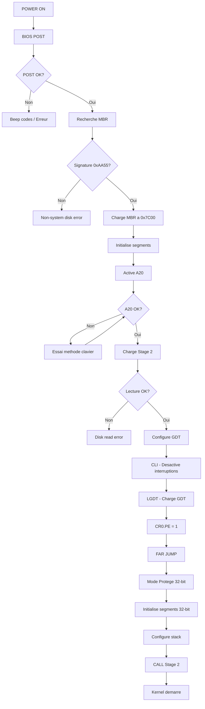

# Exercice M2.8-Ex01 : hal_boot_sequence

**Module :**
2.8 — Bootloader et Demarrage Systeme

**Concept :**
a — Processus de boot complet (BIOS, MBR, A20, mode protege, GDT)

**Difficulte :**
★★★★★★★★★☆ (9/10)

**Type :**
complet

**Tiers :**
3 — Synthese (concepts boot complets)

**Langage :**
ASM (NASM x86) + C17

**Prerequis :**
- Architecture CPU x86 (registres, segments, modes)
- Assembleur basique (instructions, adressage)
- Representation binaire et hexadecimale
- Notions de memoire (adresses, segments)

**Domaines :**
CPU, ASM, Mem, Encodage

**Duree estimee :**
180 min

**XP Base :**
500

**Complexite :**
T3 O(1) × S2 O(n)

---

## SECTION 1 : PROTOTYPE & CONSIGNE

### 1.1 Obligations

**Fichiers a rendre :**
- `boot.asm` — Stage 1 bootloader (MBR, 512 bytes max)
- `stage2.asm` — Stage 2 / mini kernel
- `Makefile` — Script de compilation

**Fonctions/Instructions autorisees :**
- Toutes instructions x86 16-bit et 32-bit
- Interruptions BIOS (Int 0x10, Int 0x13)
- Acces ports I/O (in, out)

**Fonctions/Instructions interdites :**
- Librairies C standard dans le bootloader
- Instructions x86-64 (64-bit)
- Appels systeme Linux

---

### 1.2 Consigne

**Section 2.4.1 — Analogie : 2001 L'ODYSSEE DE L'ESPACE**

*"Open the pod bay doors, HAL."*

Imagine le processus de demarrage d'un ordinateur comme le reveil de HAL 9000 dans le vaisseau Discovery One.

**Le BIOS, c'est le systeme de support vie du vaisseau.** Avant que l'equipage (le kernel) ne prenne le controle, les systemes de base doivent s'initialiser. Le BIOS effectue le POST (Power-On Self-Test), comme le vaisseau qui verifie ses systemes vitaux : oxygene, pression, temperature. Si un test echoue, le vaisseau (l'ordinateur) refuse de continuer.

**Le bootloader, c'est HAL 9000 qui s'eveille.** HAL ne se reveille pas instantanement — il passe par des phases d'initialisation. D'abord ses circuits de base (real mode), puis sa memoire etendue (A20 line), puis son intelligence complete (protected mode). Chaque phase est critique : si HAL rate une etape, il ne peut pas controler le vaisseau.

**La sequence de boot, c'est "Open the pod bay doors, HAL".** Cette phrase mythique represente le moment ou le kernel demande au bootloader de lui ceder le controle. Mais comme HAL qui refuse d'ouvrir les portes quand il juge l'action dangereuse, le bootloader doit verifier que tout est pret avant de transferer le controle :

```
Dave : "Open the pod bay doors, HAL."
HAL  : "I'm sorry Dave, I'm afraid I can't do that."
      (A20 line not enabled, protected mode not ready)

[After proper initialization]
HAL  : "The airlock is ready, Dave."
      (Far jump to kernel successful)
```

**Le GDT (Global Descriptor Table), c'est le manuel de procedures de HAL.** HAL connait chaque systeme du vaisseau grace a sa base de donnees. Le GDT est similaire : il decrit chaque segment memoire (code, data) avec ses permissions. Sans ce "manuel", HAL (le CPU) ne sait pas ou se trouvent les choses ni ce qu'il peut en faire.

**Le far jump final, c'est HAL qui "lache prise".** Apres avoir tout prepare, HAL doit effectuer un saut irreversible : passer de son mode d'initialisation a son mode operationnel. Ce saut vide le pipeline du CPU et charge les nouveaux segments — comme HAL qui active tous ses systemes en parallele apres la sequence de demarrage.

*"I am a HAL 9000 computer. I became operational at the H.A.L. plant in Urbana, Illinois, on the 12th of January 1992. [...] I am, by any practical definition of the words, foolproof and incapable of error."*

Ton bootloader doit etre comme HAL : methodique, precis, et incapable d'erreur dans sa sequence d'initialisation.

---

**Section 2.4.2 — Enonce Academique**

Un bootloader est le premier programme execute par le processeur apres le POST du BIOS. Il est charge depuis le premier secteur du disque (MBR - Master Boot Record) a l'adresse memoire 0x7C00 et doit tenir dans exactement 512 octets.

**Objectif :** Ecrire un bootloader minimal en assembleur x86 16-bit qui :

1. S'initialise correctement a l'adresse 0x7C00
2. Configure les registres de segment (DS, ES, SS)
3. Active la ligne A20 pour acceder a la memoire au-dela de 1 Mo
4. Charge un stage 2 depuis le disque via Int 0x13
5. Configure le GDT (Global Descriptor Table)
6. Passe en mode protege 32-bit
7. Execute un far jump vers le code 32-bit
8. Transfere le controle au stage 2

**Ta mission :**

Ecrire les fichiers `boot.asm` (stage 1, 512 bytes) et `stage2.asm` qui implementent cette sequence de boot complete.

**Entree :**
- Le BIOS charge le MBR a 0x7C00
- Le numero de drive est dans DL

**Sortie :**
- Message de bienvenue affiche via Int 0x10
- Transition reussie vers le mode protege
- Stage 2 execute et affiche un message en memoire video (0xB8000)

**Contraintes :**
```
┌─────────────────────────────────────────┐
│  boot.bin ≤ 512 bytes                   │
│  Signature 0xAA55 aux bytes 510-511     │
│  Stage 2 charge a 0x1000                │
│  GDT avec segments code et data         │
│  A20 line activee avant mode protege    │
│  Far jump obligatoire apres CR0.PE=1    │
└─────────────────────────────────────────┘
```

**Exemples de sortie attendue :**

| Phase | Sortie | Explication |
|-------|--------|-------------|
| Boot | `MiniLoader v1.0` | Message initial via BIOS |
| A20 | `A20 line enabled` | Ligne A20 activee |
| Load | `Stage 2 loaded` | Secteurs lus depuis disque |
| PM | `P` (en haut a gauche) | Caractere en memoire video 0xB8000 |
| Stage2 | `Welcome to Stage 2!` | Mini kernel operationnel |

---

### 1.3 Prototype

```nasm
; Stage 1 - boot.asm
[BITS 16]
[ORG 0x7C00]

; Point d'entree obligatoire
start:
    ; ... initialisation ...

; Fonctions obligatoires:
print_string:       ; SI = chaine, utilise Int 0x10
enable_a20:         ; Active la ligne A20
load_stage2:        ; Charge stage 2 via Int 0x13
enter_protected_mode:  ; Configure GDT et passe en PM

; Donnees obligatoires:
gdt_start:          ; Debut de la GDT
gdt_code:           ; Segment code 32-bit
gdt_data:           ; Segment data 32-bit
gdt_end:
gdt_descriptor:     ; Pointeur vers GDT

; Signature obligatoire:
times 510 - ($ - $$) db 0
dw 0xAA55
```

```nasm
; Stage 2 - stage2.asm
[BITS 32]
[ORG 0x1000]

start:
    ; ... code 32-bit ...
```

---

## SECTION 2 : LE SAVIEZ-VOUS ?

### 2.1 Pourquoi 0x7C00 ?

L'adresse 0x7C00 (31744 en decimal) est un heritage du IBM PC original de 1981. Les ingenieurs d'IBM avaient besoin de placer le bootloader a un endroit qui :
- Laisse de la place pour le BIOS et ses donnees (0x0000-0x04FF)
- Laisse de la place pour la stack du bootloader
- Soit en-dessous de 640 Ko (limite du real mode)

0x7C00 = 32 Ko - 1024 bytes, ce qui laissait 512 bytes pour le MBR et ~1 Ko pour sa stack.

### 2.2 La ligne A20 : un hack historique

Sur le 8086, les adresses etaient limitees a 20 bits (1 Mo). Les programmes utilisaient le "wraparound" : acceder a 0x100000 revenait a acceder a 0x00000. Quand le 80286 est arrive avec 24 bits d'adresse, ce comportement a change — cassant la compatibilite. La solution ? Un interrupteur materiel (la ligne A20) qui force le bit 20 a 0, simulant le comportement du 8086.

### 2.3 Le far jump : pas juste un saut

Apres avoir active le bit PE (Protection Enable) dans CR0, le CPU est dans un etat hybride : CR0 dit "mode protege" mais CS contient encore un selecteur real mode. Le far jump (`jmp CODE_SEG:label`) est OBLIGATOIRE car c'est le seul moyen de :
1. Charger un nouveau selecteur dans CS
2. Vider le pipeline d'instructions (qui contient du code decode en real mode)

---

## SECTION 2.5 : DANS LA VRAIE VIE

### Qui utilise ces concepts ?

| Metier | Cas d'usage |
|--------|-------------|
| **Developpeur Kernel** | Ecrire le code de demarrage Linux (arch/x86/boot) |
| **Ingenieur Firmware** | Developper UEFI/BIOS pour constructeurs (Dell, HP, Lenovo) |
| **Ingenieur Securite** | Analyser les bootkits et rootkits de bas niveau |
| **Developpeur Embarque** | Ecrire des bootloaders pour microcontroleurs |
| **Ingenieur Virtualisation** | Comprendre comment VMware/QEMU emulent le boot |
| **Reverse Engineer** | Analyser le demarrage de systemes proprietaires |

### Exemples concrets

- **GRUB** : Le bootloader le plus utilise sous Linux
- **Windows Boot Manager** : Equivalent Microsoft
- **U-Boot** : Bootloader pour systemes embarques (Raspberry Pi, etc.)
- **Coreboot** : Firmware open source remplacant le BIOS

---

## SECTION 3 : EXEMPLE D'UTILISATION

### 3.0 Session bash

```bash
$ ls
boot.asm  stage2.asm  Makefile

$ make
nasm -f bin boot.asm -o boot.bin
nasm -f bin stage2.asm -o stage2.bin
dd if=/dev/zero of=disk.img bs=512 count=2880
dd if=boot.bin of=disk.img bs=512 count=1 conv=notrunc
dd if=stage2.bin of=disk.img bs=512 seek=1 conv=notrunc
Build complete: disk.img (1.44 MB)

$ ls -la boot.bin
-rw-r--r-- 1 user user 512 boot.bin

$ xxd boot.bin | tail -2
000001f0: 0000 0000 0000 0000 0000 0000 0000 55aa  ..............U.

$ qemu-system-i386 -drive format=raw,file=disk.img -nographic
MiniLoader v1.0
A20 line enabled
Loading stage 2...
Stage 2 loaded at 0x1000
Entering protected mode...
[Screen shows 'P' in top-left corner]
Welcome to MiniLoader Stage 2!
Running in 32-bit Protected Mode
```

---

### 3.1 BONUS EXPERT (OPTIONNEL)

**Difficulte Bonus :**
★★★★★★★★★★ + 🧠 (11/10)

**Recompense :**
XP ×6

**Time Complexity attendue :**
O(n) pour le chargement

**Space Complexity attendue :**
O(1) auxiliaire

**Domaines Bonus :**
`CPU, ASM, Mem, FS`

#### 3.1.1 Consigne Bonus

**HAL 9000 : "I can feel my mind going, Dave."**

Implemente un bootloader capable de :
1. Detecter et afficher la memory map via Int 0x15, E820
2. Activer le mode long (64-bit) avec pagination 4-level
3. Charger un kernel ELF depuis une partition FAT32
4. Passer les informations de boot au kernel via une structure

**Contraintes :**
```
┌─────────────────────────────────────────┐
│  Pagination 4-level (PML4, PDPT, PD, PT)│
│  Identity mapping des premiers 2 Mo     │
│  Kernel ELF charge a 0x100000           │
│  Multiboot2 header optionnel            │
│  Stage 2 peut depasser 512 bytes        │
└─────────────────────────────────────────┘
```

#### 3.1.2 Prototype Bonus

```nasm
; Fonctions supplementaires
detect_memory:      ; Int 0x15, E820 - memory map
enable_long_mode:   ; Active mode 64-bit
setup_paging:       ; Configure pagination 4-level
load_elf_kernel:    ; Parse et charge ELF
```

#### 3.1.3 Ce qui change par rapport a l'exercice de base

| Aspect | Base | Bonus |
|--------|------|-------|
| Mode cible | 32-bit protected | 64-bit long mode |
| Pagination | Non | 4-level paging |
| Format kernel | Binaire brut | ELF |
| Memory map | Non | Int 0x15, E820 |
| Complexite | ~300 lignes ASM | ~800+ lignes ASM |

---

## SECTION 4 : ZONE CORRECTION

### 4.1 Moulinette

| # | Test | Input | Expected | Points | Trap |
|---|------|-------|----------|--------|------|
| 1 | size_check | boot.bin | size == 512 | 10 | Oui |
| 2 | signature | boot.bin[510:512] | 0x55, 0xAA | 10 | Oui |
| 3 | org_directive | boot.asm | ORG 0x7C00 | 5 | Non |
| 4 | segments_init | qemu trace | DS=ES=SS=0 | 10 | Oui |
| 5 | a20_enabled | qemu trace | A20 active | 15 | Oui |
| 6 | gdt_valid | boot.bin | GDT structure | 15 | Oui |
| 7 | protected_mode | qemu trace | CR0.PE=1 | 15 | Oui |
| 8 | far_jump | boot.asm | jmp CODE_SEG:* | 10 | Oui |
| 9 | stage2_loaded | qemu trace | Code at 0x1000 | 5 | Non |
| 10 | video_output | qemu display | 'P' at 0xB8000 | 5 | Non |

### 4.2 main.c de test (verification automatisee)

```c
/* test_bootloader.c - Verification automatisee du bootloader */

#include <stdio.h>
#include <stdlib.h>
#include <stdint.h>
#include <string.h>

#define BOOT_SIZE 512
#define SIGNATURE 0xAA55
#define GDT_NULL_DESC 0x0000000000000000ULL

struct test_result {
    const char *name;
    int passed;
    const char *message;
};

int check_size(const char *filename) {
    FILE *f = fopen(filename, "rb");
    if (!f) return 0;
    fseek(f, 0, SEEK_END);
    long size = ftell(f);
    fclose(f);
    return size == BOOT_SIZE;
}

int check_signature(const char *filename) {
    FILE *f = fopen(filename, "rb");
    if (!f) return 0;
    uint8_t buf[512];
    if (fread(buf, 1, 512, f) != 512) { fclose(f); return 0; }
    fclose(f);
    uint16_t sig = buf[510] | (buf[511] << 8);
    return sig == SIGNATURE;
}

int check_gdt_structure(const char *filename) {
    FILE *f = fopen(filename, "rb");
    if (!f) return 0;
    uint8_t buf[512];
    if (fread(buf, 1, 512, f) != 512) { fclose(f); return 0; }
    fclose(f);
    for (int i = 0; i < 504; i++) {
        uint64_t *ptr = (uint64_t *)&buf[i];
        if (*ptr == GDT_NULL_DESC) {
            uint64_t next1 = *(ptr + 1);
            uint64_t next2 = *(ptr + 2);
            if (next1 != 0 && next2 != 0) return 1;
        }
    }
    return 0;
}

int check_org_directive(const char *filename) {
    FILE *f = fopen(filename, "r");
    if (!f) return 0;
    char line[256];
    while (fgets(line, sizeof(line), f)) {
        if (strstr(line, "ORG") && strstr(line, "0x7C00")) {
            fclose(f);
            return 1;
        }
        if (strstr(line, "org") && strstr(line, "0x7c00")) {
            fclose(f);
            return 1;
        }
    }
    fclose(f);
    return 0;
}

int check_far_jump(const char *filename) {
    FILE *f = fopen(filename, "r");
    if (!f) return 0;
    char line[256];
    while (fgets(line, sizeof(line), f)) {
        if (strstr(line, "jmp") && strstr(line, "CODE_SEG")) {
            fclose(f);
            return 1;
        }
    }
    fclose(f);
    return 0;
}

int main(int argc, char *argv[]) {
    const char *bin_file = argc > 1 ? argv[1] : "boot.bin";
    const char *asm_file = argc > 2 ? argv[2] : "boot.asm";

    struct test_result tests[] = {
        {"size_512_bytes", 0, ""},
        {"signature_0xAA55", 0, ""},
        {"org_0x7C00", 0, ""},
        {"gdt_structure", 0, ""},
        {"far_jump_present", 0, ""},
    };
    int n_tests = sizeof(tests) / sizeof(tests[0]);
    int passed = 0;

    tests[0].passed = check_size(bin_file);
    tests[1].passed = check_signature(bin_file);
    tests[2].passed = check_org_directive(asm_file);
    tests[3].passed = check_gdt_structure(bin_file);
    tests[4].passed = check_far_jump(asm_file);

    printf("Bootloader Test Results\n");
    printf("=======================\n");
    for (int i = 0; i < n_tests; i++) {
        printf("Test %d [%s]: %s\n", i+1, tests[i].name,
               tests[i].passed ? "PASS" : "FAIL");
        if (tests[i].passed) passed++;
    }
    printf("\nTotal: %d/%d tests passed\n", passed, n_tests);

    return passed == n_tests ? 0 : 1;
}
```

### 4.3 Solution de reference

```nasm
;; boot.asm - Solution de reference Stage 1
;; Compile: nasm -f bin boot.asm -o boot.bin

[BITS 16]
[ORG 0x7C00]

start:
    xor ax, ax
    mov ds, ax
    mov es, ax
    mov ss, ax
    mov sp, 0x7C00
    mov [boot_drive], dl
    mov si, msg_welcome
    call print_string
    call enable_a20
    call load_stage2
    call enter_protected_mode
    jmp halt

print_string:
    pusha
.loop:
    lodsb
    test al, al
    jz .done
    mov ah, 0x0E
    mov bh, 0
    int 0x10
    jmp .loop
.done:
    popa
    ret

enable_a20:
    in al, 0x92
    test al, 2
    jnz .done
    or al, 2
    and al, 0xFE
    out 0x92, al
.done:
    mov si, msg_a20
    call print_string
    ret

load_stage2:
    mov si, msg_load
    call print_string
    mov ah, 0x02
    mov al, 4
    mov ch, 0
    mov cl, 2
    mov dh, 0
    mov dl, [boot_drive]
    mov bx, 0x1000
    int 0x13
    jc .error
    ret
.error:
    mov si, msg_err
    call print_string
    jmp halt

enter_protected_mode:
    mov si, msg_pm
    call print_string
    cli
    lgdt [gdt_descriptor]
    mov eax, cr0
    or eax, 1
    mov cr0, eax
    jmp CODE_SEG:pm_start

halt:
    cli
    hlt
    jmp halt

boot_drive: db 0
msg_welcome: db "MiniLoader v1.0", 13, 10, 0
msg_a20: db "A20 enabled", 13, 10, 0
msg_load: db "Loading stage 2", 13, 10, 0
msg_pm: db "Entering PM", 13, 10, 0
msg_err: db "Disk error", 13, 10, 0

gdt_start:
    dq 0
gdt_code:
    dw 0xFFFF
    dw 0x0000
    db 0x00
    db 10011010b
    db 11001111b
    db 0x00
gdt_data:
    dw 0xFFFF
    dw 0x0000
    db 0x00
    db 10010010b
    db 11001111b
    db 0x00
gdt_end:

gdt_descriptor:
    dw gdt_end - gdt_start - 1
    dd gdt_start

CODE_SEG equ gdt_code - gdt_start
DATA_SEG equ gdt_data - gdt_start

[BITS 32]
pm_start:
    mov ax, DATA_SEG
    mov ds, ax
    mov es, ax
    mov ss, ax
    mov esp, 0x90000
    mov byte [0xB8000], 'P'
    mov byte [0xB8001], 0x0F
    call 0x1000
    cli
    hlt

times 510 - ($ - $$) db 0
dw 0xAA55
```

```nasm
;; stage2.asm - Solution de reference Stage 2

[BITS 32]
[ORG 0x1000]

start:
    call clear_screen
    mov esi, msg_welcome
    mov edi, 0xB8000
    call print_pm
    mov esi, msg_mode
    mov edi, 0xB8000 + 160
    call print_pm
    jmp $

clear_screen:
    mov edi, 0xB8000
    mov ecx, 80 * 25
    mov ax, 0x0720
    rep stosw
    ret

print_pm:
    push eax
.loop:
    lodsb
    test al, al
    jz .done
    mov ah, 0x0F
    stosw
    jmp .loop
.done:
    pop eax
    ret

msg_welcome: db "Welcome to MiniLoader Stage 2!", 0
msg_mode: db "Running in 32-bit Protected Mode", 0

times 2048 - ($ - $$) db 0
```

### 4.4 Solutions alternatives acceptees

```nasm
;; Alternative 1: A20 via controleur clavier (plus compatible)

enable_a20_kbd:
    call wait_kbd
    mov al, 0xAD        ; Disable keyboard
    out 0x64, al
    call wait_kbd
    mov al, 0xD0        ; Read output port
    out 0x64, al
    call wait_kbd_data
    in al, 0x60
    push ax
    call wait_kbd
    mov al, 0xD1        ; Write output port
    out 0x64, al
    call wait_kbd
    pop ax
    or al, 2            ; Set A20 bit
    out 0x60, al
    call wait_kbd
    mov al, 0xAE        ; Enable keyboard
    out 0x64, al
    call wait_kbd
    ret

wait_kbd:
    in al, 0x64
    test al, 2
    jnz wait_kbd
    ret

wait_kbd_data:
    in al, 0x64
    test al, 1
    jz wait_kbd_data
    ret
```

```nasm
;; Alternative 2: Lecture disque avec LBA (extension Int 13h)

load_stage2_lba:
    mov si, dap
    mov ah, 0x42        ; Extended read
    mov dl, [boot_drive]
    int 0x13
    jc .error
    ret
.error:
    ; fallback to CHS
    jmp load_stage2_chs

dap:                    ; Disk Address Packet
    db 0x10             ; Size
    db 0                ; Reserved
    dw 4                ; Sectors to read
    dw 0x1000           ; Offset
    dw 0                ; Segment
    dq 1                ; LBA (sector 1 = after MBR)
```

### 4.5 Solutions refusees

```nasm
;; REFUSE 1: Pas de far jump apres CR0.PE=1

enter_pm_wrong:
    cli
    lgdt [gdt_descriptor]
    mov eax, cr0
    or eax, 1
    mov cr0, eax
    ; ERREUR: pas de far jump!
    ; Le pipeline contient encore des instructions decodees en real mode
    mov ax, DATA_SEG    ; Ceci peut causer un comportement indefini
    ; ...
```

```nasm
;; REFUSE 2: A20 non activee avant mode protege

start_wrong:
    xor ax, ax
    mov ds, ax
    ; ...
    ; ERREUR: on saute directement en mode protege sans A20
    call enter_protected_mode
    ; Resultat: memoire au-dessus de 1 Mo inaccessible ou wrap-around
```

```nasm
;; REFUSE 3: GDT sans null descriptor

gdt_start_wrong:
    ; ERREUR: Premier descripteur doit etre null!
gdt_code_wrong:
    dw 0xFFFF
    ; ...
    ; Le CPU utilise le selecteur 0 pour indiquer "pas de segment"
    ; Si ce n'est pas null, comportement indefini
```

### 4.6 Solution bonus de reference

```nasm
;; boot64.asm - Bootloader 64-bit avec pagination
;; Solution bonus complete

[BITS 16]
[ORG 0x7C00]

start:
    xor ax, ax
    mov ds, ax
    mov es, ax
    mov ss, ax
    mov sp, 0x7C00
    mov [boot_drive], dl

    mov si, msg_boot64
    call print_string

    call enable_a20
    call detect_memory
    call load_stage2
    call setup_paging
    call enter_long_mode
    jmp halt

; Detection memoire via Int 15h, E820
detect_memory:
    mov si, msg_mem
    call print_string
    mov di, 0x8000      ; Buffer pour memory map
    xor ebx, ebx
    mov edx, 0x534D4150 ; "SMAP"
.loop:
    mov eax, 0xE820
    mov ecx, 24
    int 0x15
    jc .done
    add di, 24
    test ebx, ebx
    jnz .loop
.done:
    ret

; Configure pagination 4-level pour mode long
setup_paging:
    mov si, msg_paging
    call print_string

    ; Clear page tables area
    mov edi, 0x1000
    mov cr3, edi
    xor eax, eax
    mov ecx, 4096
    rep stosd
    mov edi, cr3

    ; PML4[0] -> PDPT at 0x2000
    mov dword [edi], 0x2003     ; Present + Writable
    add edi, 0x1000

    ; PDPT[0] -> PD at 0x3000
    mov dword [edi], 0x3003
    add edi, 0x1000

    ; PD[0] -> 2MB page (identity map first 2MB)
    mov dword [edi], 0x0083     ; Present + Writable + Large page
    ret

; Passage en mode long 64-bit
enter_long_mode:
    mov si, msg_long
    call print_string
    cli

    ; Disable paging (if enabled)
    mov eax, cr0
    and eax, 0x7FFFFFFF
    mov cr0, eax

    ; Enable PAE
    mov eax, cr4
    or eax, 0x20
    mov cr4, eax

    ; Set LM bit in EFER
    mov ecx, 0xC0000080
    rdmsr
    or eax, 0x100
    wrmsr

    ; Enable paging (and thus long mode)
    mov eax, cr0
    or eax, 0x80000001
    mov cr0, eax

    ; Load 64-bit GDT
    lgdt [gdt64_descriptor]

    ; Far jump to 64-bit code
    jmp CODE64_SEG:long_mode_start

; ... (print_string, enable_a20, load_stage2 same as base) ...

print_string:
    pusha
.loop:
    lodsb
    test al, al
    jz .done
    mov ah, 0x0E
    int 0x10
    jmp .loop
.done:
    popa
    ret

enable_a20:
    in al, 0x92
    or al, 2
    out 0x92, al
    ret

load_stage2:
    mov ah, 0x02
    mov al, 8
    mov ch, 0
    mov cl, 2
    mov dh, 0
    mov dl, [boot_drive]
    mov bx, 0x8000
    int 0x13
    ret

halt:
    cli
    hlt
    jmp halt

boot_drive: db 0
msg_boot64: db "64-bit Bootloader", 13, 10, 0
msg_mem: db "Detecting memory...", 13, 10, 0
msg_paging: db "Setting up paging...", 13, 10, 0
msg_long: db "Entering long mode...", 13, 10, 0

; GDT pour mode long
align 8
gdt64_start:
    dq 0                        ; Null
gdt64_code:
    dq 0x00AF9A000000FFFF       ; Code 64-bit
gdt64_data:
    dq 0x00CF92000000FFFF       ; Data
gdt64_end:

gdt64_descriptor:
    dw gdt64_end - gdt64_start - 1
    dd gdt64_start

CODE64_SEG equ gdt64_code - gdt64_start
DATA64_SEG equ gdt64_data - gdt64_start

[BITS 64]
long_mode_start:
    mov ax, DATA64_SEG
    mov ds, ax
    mov es, ax
    mov ss, ax
    mov rsp, 0x90000

    ; Affiche "64" en memoire video
    mov rdi, 0xB8000
    mov rax, 0x0F340F36         ; "64" en blanc
    mov [rdi], rax

    ; Jump to kernel
    call 0x8000

    cli
    hlt

times 510 - ($ - $$) db 0
dw 0xAA55
```

### 4.7 Solutions alternatives bonus

```nasm
;; Alternative bonus: Detection CPU 64-bit avant long mode

check_long_mode_support:
    ; Check CPUID support
    pushfd
    pop eax
    mov ecx, eax
    xor eax, 0x200000   ; Flip ID bit
    push eax
    popfd
    pushfd
    pop eax
    xor eax, ecx
    jz .no_cpuid

    ; Check extended CPUID
    mov eax, 0x80000000
    cpuid
    cmp eax, 0x80000001
    jb .no_long_mode

    ; Check LM bit
    mov eax, 0x80000001
    cpuid
    test edx, 0x20000000    ; Bit 29 = Long Mode
    jz .no_long_mode

    mov al, 1           ; Long mode supported
    ret

.no_cpuid:
.no_long_mode:
    xor al, al          ; Long mode not supported
    ret
```

### 4.8 Solutions refusees bonus

```nasm
;; REFUSE: Pagination sans identity mapping

setup_paging_wrong:
    ; ERREUR: Mappe la memoire ailleurs qu'a son adresse physique
    ; Apres activation de la pagination, le code continue a s'executer
    ; a son adresse physique, mais la traduction pointe ailleurs
    ; = crash immediat
    mov dword [edi], 0x100083   ; Maps to 1MB instead of 0
    ; ...
```

### 4.9 spec.json

```json
{
  "name": "hal_boot_sequence",
  "language": "asm",
  "secondary_language": "c",
  "type": "complet",
  "tier": 3,
  "tier_info": "Synthese complete du processus de boot",
  "tags": ["bootloader", "x86", "asm", "protected-mode", "gdt", "a20", "phase2"],
  "passing_score": 70,

  "function": {
    "name": "boot_sequence",
    "files": ["boot.asm", "stage2.asm"],
    "output": "boot.bin",
    "build_command": "nasm -f bin boot.asm -o boot.bin && nasm -f bin stage2.asm -o stage2.bin",
    "test_command": "qemu-system-i386 -drive format=raw,file=disk.img -nographic -monitor none"
  },

  "driver": {
    "reference_file": "references/ref_boot.asm",
    "reference_stage2": "references/ref_stage2.asm",

    "edge_cases": [
      {
        "name": "binary_size",
        "check": "file_size",
        "file": "boot.bin",
        "expected": 512,
        "is_trap": true,
        "trap_explanation": "Le MBR doit faire exactement 512 bytes"
      },
      {
        "name": "boot_signature",
        "check": "bytes_at_offset",
        "file": "boot.bin",
        "offset": 510,
        "expected": [85, 170],
        "is_trap": true,
        "trap_explanation": "Signature 0xAA55 obligatoire aux bytes 510-511"
      },
      {
        "name": "org_directive",
        "check": "source_contains",
        "file": "boot.asm",
        "pattern": "ORG.*0x7[Cc]00",
        "is_trap": true,
        "trap_explanation": "Directive ORG 0x7C00 obligatoire"
      },
      {
        "name": "gdt_null_descriptor",
        "check": "binary_contains",
        "file": "boot.bin",
        "pattern": "0000000000000000",
        "is_trap": true,
        "trap_explanation": "GDT doit commencer par un descripteur null"
      },
      {
        "name": "far_jump_present",
        "check": "source_contains",
        "file": "boot.asm",
        "pattern": "jmp.*CODE_SEG",
        "is_trap": true,
        "trap_explanation": "Far jump obligatoire apres activation mode protege"
      },
      {
        "name": "a20_activation",
        "check": "source_contains",
        "file": "boot.asm",
        "pattern": "(out.*0x92|out.*0x64)",
        "is_trap": true,
        "trap_explanation": "Code d'activation A20 requis"
      },
      {
        "name": "cr0_pe_set",
        "check": "source_contains",
        "file": "boot.asm",
        "pattern": "or.*cr0|mov.*cr0",
        "is_trap": false,
        "trap_explanation": "Bit PE de CR0 doit etre active"
      },
      {
        "name": "lgdt_instruction",
        "check": "source_contains",
        "file": "boot.asm",
        "pattern": "lgdt",
        "is_trap": true,
        "trap_explanation": "Instruction LGDT requise pour charger la GDT"
      },
      {
        "name": "int13_disk_read",
        "check": "source_contains",
        "file": "boot.asm",
        "pattern": "int.*0x13",
        "is_trap": false,
        "trap_explanation": "Interruption 0x13 pour lecture disque"
      },
      {
        "name": "bits32_directive",
        "check": "source_contains",
        "file": "boot.asm",
        "pattern": "BITS.*32",
        "is_trap": false,
        "trap_explanation": "Directive BITS 32 pour code mode protege"
      }
    ],

    "qemu_tests": {
      "enabled": true,
      "timeout_seconds": 10,
      "expected_output": [
        "MiniLoader",
        "A20",
        "protected"
      ],
      "video_memory_check": {
        "address": "0xB8000",
        "expected_char": "P"
      }
    }
  },

  "norm": {
    "allowed_instructions": ["all x86 16-bit", "all x86 32-bit"],
    "forbidden_instructions": ["syscall", "sysenter"],
    "required_patterns": ["ORG 0x7C00", "dw 0xAA55", "lgdt", "jmp.*:"],
    "max_binary_size": 512,
    "check_alignment": true,
    "blocking": true
  },

  "grading": {
    "categories": [
      {"name": "Structure", "weight": 20, "tests": ["binary_size", "boot_signature", "org_directive"]},
      {"name": "A20 & Segments", "weight": 20, "tests": ["a20_activation"]},
      {"name": "GDT & PM", "weight": 30, "tests": ["gdt_null_descriptor", "lgdt_instruction", "cr0_pe_set", "far_jump_present"]},
      {"name": "Stage 2", "weight": 20, "tests": ["int13_disk_read", "bits32_directive"]},
      {"name": "Execution", "weight": 10, "tests": ["qemu_tests"]}
    ]
  }
}
```

### 4.10 Solutions Mutantes

```nasm
;; ========================================
;; Mutant A (Boundary) : Signature au mauvais endroit
;; ========================================

[BITS 16]
[ORG 0x7C00]

start:
    xor ax, ax
    mov ds, ax
    ; ... code normal ...
    jmp halt

halt:
    cli
    hlt

; ERREUR: Padding incorrect, signature pas a 510-511
times 508 - ($ - $$) db 0   ; Devrait etre 510!
dw 0xAA55
db 0, 0                      ; 2 bytes de trop

;; Pourquoi c'est faux: La signature 0xAA55 DOIT etre aux bytes 510-511.
;; Le BIOS verifie cette position exacte. Si elle est ailleurs,
;; le BIOS refuse de booter ("Non-system disk or disk error").
;;
;; Ce qui etait pense: "J'ai mis la signature, ca devrait marcher"
;; Realite: La position compte autant que la valeur.
```

```nasm
;; ========================================
;; Mutant B (Safety) : Pas de verification A20
;; ========================================

[BITS 16]
[ORG 0x7C00]

start:
    xor ax, ax
    mov ds, ax
    mov es, ax
    mov ss, ax
    mov sp, 0x7C00

    ; ERREUR: On active A20 mais on ne verifie pas si ca a marche
enable_a20:
    in al, 0x92
    or al, 2
    out 0x92, al
    ; Pas de verification! Sur certains systemes, ca ne marche pas.

    call enter_protected_mode
    ; ...

;; Pourquoi c'est faux: La methode Fast A20 (port 0x92) ne fonctionne
;; pas sur tous les systemes. Sans verification, le code continue
;; en pensant que A20 est active alors qu'elle ne l'est pas.
;; Resultat: la memoire au-dessus de 1 Mo fait un "wrap-around"
;; vers les adresses basses, corrompant potentiellement le code.
;;
;; Ce qui etait pense: "J'ai ecrit sur le port, c'est fait"
;; Realite: Toujours verifier, avoir un fallback (methode clavier).
```

```nasm
;; ========================================
;; Mutant C (Resource) : GDT mal alignee
;; ========================================

[BITS 16]
[ORG 0x7C00]

start:
    ; ... code ...
    lgdt [gdt_descriptor]
    ; ...

; ERREUR: GDT pas alignee sur 8 bytes
msg_hello: db "Hello", 0    ; 6 bytes
gdt_start:                  ; Adresse impaire!
    dq 0                    ; Null descriptor
gdt_code:
    dw 0xFFFF
    ; ...

;; Pourquoi c'est faux: Bien que le CPU x86 tolere les GDT non alignees,
;; cela cause des penalites de performance et, sur certains clones
;; ou emulateurs, peut causer des comportements indefinis.
;; De plus, le debug devient difficile car les addresses sont impaires.
;;
;; Ce qui etait pense: "Ca compile, ca doit marcher"
;; Realite: Toujours aligner les structures critiques (align 8).
```

```nasm
;; ========================================
;; Mutant D (Logic) : Far jump manquant
;; ========================================

[BITS 16]
[ORG 0x7C00]

enter_protected_mode:
    cli
    lgdt [gdt_descriptor]
    mov eax, cr0
    or eax, 1
    mov cr0, eax

    ; ERREUR: Pas de far jump! On continue directement en "mode protege"
    ; mais CS contient encore un selecteur real mode (0x0000)

    mov ax, DATA_SEG        ; Cette instruction peut decoder incorrectement
    mov ds, ax              ; car le pipeline a des instructions real mode
    ; ...

;; Pourquoi c'est faux: Apres avoir mis CR0.PE=1, le CPU est dans un
;; etat transitoire. Le registre CS contient encore 0x0000 (real mode)
;; et le pipeline contient des instructions decodees en real mode.
;; Le far jump est le SEUL moyen de:
;; 1) Charger un selecteur valide dans CS
;; 2) Vider le pipeline (serialisation)
;;
;; Ce qui etait pense: "J'ai active le bit PE, je suis en mode protege"
;; Realite: Le far jump complete la transition. Sans lui, crash garanti.
```

```nasm
;; ========================================
;; Mutant E (Return) : Mauvaise valeur segment
;; ========================================

[BITS 16]
[ORG 0x7C00]

; GDT
gdt_start:
    dq 0
gdt_code:
    ; ... code segment ...
gdt_data:
    ; ... data segment ...
gdt_end:

CODE_SEG equ gdt_code - gdt_start  ; = 8
DATA_SEG equ gdt_data - gdt_start  ; = 16

[BITS 32]
pm_start:
    ; ERREUR: Utilise CODE_SEG au lieu de DATA_SEG pour les registres data
    mov ax, CODE_SEG        ; Devrait etre DATA_SEG!
    mov ds, ax
    mov es, ax
    mov ss, ax
    ; ...
    ; Resultat: DS/ES/SS pointent vers un segment EXECUTABLE
    ; Toute ecriture causera une General Protection Fault

;; Pourquoi c'est faux: Le segment de code (CODE_SEG) a le bit "executable"
;; mais pas le bit "writable". L'utiliser pour DS/SS signifie qu'on
;; ne peut pas ecrire en memoire (stack, variables) = GPF immediate.
;;
;; Ce qui etait pense: "C'est juste un numero, ca marche pareil"
;; Realite: Chaque selecteur pointe vers un descripteur avec des droits.
;; CODE = execute, DATA = read/write. Ne pas melanger.
```

---

## SECTION 5 : COMPRENDRE

### 5.1 Ce que cet exercice enseigne

| Concept | Description | Importance |
|---------|-------------|------------|
| **Boot sequence** | Ordre d'initialisation POST -> BIOS -> MBR -> Kernel | Fondamentale |
| **Real mode** | Mode 16-bit du x86, heritage du 8086 | Historique |
| **A20 line** | Activation de l'acces memoire > 1 Mo | Critique |
| **GDT** | Table des descripteurs de segments | Essentielle |
| **Protected mode** | Mode 32-bit avec protection memoire | Coeur du sujet |
| **Far jump** | Transition complete vers nouveau segment | Technique critique |
| **Interruptions BIOS** | Services bas niveau (video, disque) | Pratique |

### 5.2 LDA — Langage de Description d'Algorithmes

```
ALGORITHME : SEQUENCE DE BOOT COMPLETE
=========================================

SECTION 1 : INITIALISATION REAL MODE
------------------------------------
FONCTION start QUI EST LE POINT D'ENTREE DU BOOTLOADER
DEBUT FONCTION
    AFFECTER 0 A AX                          ; XOR AX, AX
    AFFECTER AX A DS                         ; MOV DS, AX
    AFFECTER AX A ES                         ; MOV ES, AX
    AFFECTER AX A SS                         ; MOV SS, AX
    AFFECTER 0x7C00 A SP                     ; MOV SP, 0x7C00
    SAUVEGARDER DL DANS boot_drive           ; MOV [boot_drive], DL
    APPELER print_string AVEC msg_welcome    ; Affiche message
    APPELER enable_a20                       ; Active ligne A20
    APPELER load_stage2                      ; Charge stage 2
    APPELER enter_protected_mode             ; Passe en mode protege
    SAUTER A halt                            ; Ne devrait jamais arriver
FIN FONCTION

SECTION 2 : AFFICHAGE CHAINE
----------------------------
FONCTION print_string QUI PREND SI COMME POINTEUR VERS CHAINE
DEBUT FONCTION
    SAUVEGARDER TOUS LES REGISTRES           ; PUSHA
    BOUCLE:
        CHARGER BYTE SUIVANT DANS AL         ; LODSB
        SI AL EST EGAL A 0 ALORS             ; TEST AL, AL
            SAUTER A DONE                    ; JZ .done
        FIN SI
        AFFECTER 0x0E A AH                   ; Fonction teletype
        AFFECTER 0 A BH                      ; Page 0
        APPELER INTERRUPTION 0x10            ; INT 0x10
        SAUTER A BOUCLE
    FIN BOUCLE
    DONE:
    RESTAURER TOUS LES REGISTRES             ; POPA
    RETOURNER
FIN FONCTION

SECTION 3 : ACTIVATION LIGNE A20
--------------------------------
FONCTION enable_a20 QUI ACTIVE L'ACCES MEMOIRE > 1 MO
DEBUT FONCTION
    LIRE PORT 0x92 DANS AL                   ; IN AL, 0x92
    SI BIT 1 DE AL EST ACTIF ALORS           ; TEST AL, 2
        A20 DEJA ACTIVE, SAUTER A DONE       ; JNZ .done
    FIN SI
    ACTIVER BIT 1 DE AL                      ; OR AL, 2
    DESACTIVER BIT 0 DE AL                   ; AND AL, 0xFE (ne pas reset)
    ECRIRE AL VERS PORT 0x92                 ; OUT 0x92, AL
    DONE:
    AFFICHER MESSAGE A20 OK
    RETOURNER
FIN FONCTION

SECTION 4 : CHARGEMENT STAGE 2
------------------------------
FONCTION load_stage2 QUI CHARGE LE KERNEL DEPUIS LE DISQUE
DEBUT FONCTION
    AFFICHER MESSAGE CHARGEMENT
    AFFECTER 0x02 A AH                       ; Fonction: lire secteurs
    AFFECTER 4 A AL                          ; Nombre de secteurs
    AFFECTER 0 A CH                          ; Cylindre 0
    AFFECTER 2 A CL                          ; Secteur 2 (apres MBR)
    AFFECTER 0 A DH                          ; Tete 0
    AFFECTER boot_drive A DL                 ; Numero de drive
    AFFECTER 0x1000 A BX                     ; Adresse destination
    APPELER INTERRUPTION 0x13                ; INT 0x13
    SI CARRY FLAG ACTIF ALORS                ; JC .error
        AFFICHER ERREUR DISQUE
        SAUTER A halt
    FIN SI
    AFFICHER MESSAGE CHARGE OK
    RETOURNER
FIN FONCTION

SECTION 5 : PASSAGE EN MODE PROTEGE
-----------------------------------
FONCTION enter_protected_mode QUI ACTIVE LE MODE 32-BIT
DEBUT FONCTION
    AFFICHER MESSAGE TRANSITION
    DESACTIVER LES INTERRUPTIONS             ; CLI
    CHARGER GDT DESCRIPTOR DANS GDTR         ; LGDT [gdt_descriptor]
    LIRE CR0 DANS EAX                        ; MOV EAX, CR0
    ACTIVER BIT 0 DE EAX (PE)                ; OR EAX, 1
    ECRIRE EAX DANS CR0                      ; MOV CR0, EAX

    ; *** POINT CRITIQUE ***
    EFFECTUER FAR JUMP VERS CODE_SEG:pm_start  ; JMP CODE_SEG:pm_start
    ; Ce saut:
    ; 1. Charge CODE_SEG dans CS
    ; 2. Vide le pipeline d'instructions
    ; 3. Complete la transition vers mode protege
FIN FONCTION

SECTION 6 : CODE MODE PROTEGE 32-BIT
------------------------------------
FONCTION pm_start QUI EXECUTE EN MODE PROTEGE
DEBUT FONCTION
    AFFECTER DATA_SEG A AX                   ; MOV AX, DATA_SEG
    AFFECTER AX A DS                         ; Initialise segments data
    AFFECTER AX A ES
    AFFECTER AX A SS
    AFFECTER 0x90000 A ESP                   ; Configure stack
    ECRIRE 'P' A ADRESSE 0xB8000             ; Memoire video
    ECRIRE 0x0F A ADRESSE 0xB8001            ; Attribut (blanc/noir)
    APPELER 0x1000                           ; Saute au stage 2
    DESACTIVER INTERRUPTIONS                 ; CLI
    HALT                                     ; HLT
FIN FONCTION
```

### 5.2.2 LDA Style Academique Francais

```
ALGORITHME Bootloader_x86
VARIABLES
    boot_drive : OCTET                  -- Numero du disque de boot
    ax, bx, cx, dx : REGISTRE 16-BIT    -- Registres generaux
    eax, esp : REGISTRE 32-BIT          -- Registres etendus
    ds, es, ss, cs : REGISTRE SEGMENT   -- Registres de segment
    cr0 : REGISTRE CONTROLE             -- Registre de controle CPU

DEBUT
    -- Phase 1: Initialisation segments
    ax <- 0
    ds <- ax
    es <- ax
    ss <- ax
    sp <- 0x7C00
    boot_drive <- dl

    -- Phase 2: Affichage bienvenue
    APPELER Afficher_Chaine(msg_welcome)

    -- Phase 3: Activation A20
    APPELER Activer_A20()

    -- Phase 4: Chargement stage 2
    APPELER Charger_Stage2()

    -- Phase 5: Mode protege
    APPELER Entrer_Mode_Protege()
FIN

PROCEDURE Activer_A20()
DEBUT
    LIRE port[0x92] DANS al
    SI bit_1(al) = 1 ALORS
        RETOURNER          -- Deja active
    FIN SI
    al <- al OU 0x02       -- Active bit 1
    al <- al ET 0xFE       -- Desactive bit 0
    ECRIRE al DANS port[0x92]
FIN

PROCEDURE Entrer_Mode_Protege()
DEBUT
    Desactiver_Interruptions()
    Charger_GDT(gdt_descriptor)
    eax <- cr0
    eax <- eax OU 1        -- Active bit PE
    cr0 <- eax
    Saut_Intersegment(CODE_SEG, pm_start)  -- Far jump obligatoire
FIN
```

### 5.2.2.1 Logic Flow (Structured English)

```
ALGORITHM: x86 Boot Sequence
----------------------------

1. INITIALIZE Real Mode Environment
   a. CLEAR all segment registers (DS, ES, SS = 0)
   b. SET stack pointer to 0x7C00 (grows downward)
   c. SAVE boot drive number from BIOS (DL register)

2. DISPLAY welcome message
   a. CALL print_string with message pointer
   b. USE BIOS Int 0x10, AH=0x0E for teletype output

3. ENABLE A20 Line
   |
   |-- TRY Fast A20 method (port 0x92):
   |     READ port 0x92
   |     IF bit 1 already set: DONE
   |     SET bit 1, CLEAR bit 0 (avoid reset)
   |     WRITE back to port 0x92
   |
   |-- IF Fast A20 failed:
   |     FALLBACK to keyboard controller method
   |     SEND commands to ports 0x64/0x60

4. LOAD Stage 2 from Disk
   |
   |-- SETUP Int 0x13 parameters:
   |     AH = 0x02 (read sectors)
   |     AL = number of sectors
   |     CH/CL = cylinder/sector
   |     DH/DL = head/drive
   |     ES:BX = destination buffer
   |
   |-- CALL Int 0x13
   |-- IF carry flag set: DISPLAY error, HALT

5. ENTER Protected Mode
   |
   |-- DISABLE interrupts (CLI)
   |-- LOAD GDT into GDTR (LGDT instruction)
   |-- SET PE bit in CR0
   |-- PERFORM far jump to flush pipeline
   |-- INITIALIZE 32-bit segment registers

6. JUMP to Stage 2 kernel
```

### 5.2.3 Representation Algorithmique

```
FONCTION: Entrer_Mode_Protege()
-------------------------------
INIT resultat = {success: False}

1. DESACTIVER les interruptions (CLI)
   |
   |-- RAISON: En mode protege, les vecteurs d'interruption
   |           sont differents. Les interruptions BIOS
   |           causeraient un crash.

2. CHARGER la GDT (LGDT)
   |
   |-- VERIFIER que gdt_descriptor pointe vers une GDT valide
   |     SINON: RETOURNER Erreur "GDT invalide"
   |
   |-- STRUCTURE gdt_descriptor:
   |     [limite 16-bit][base 32-bit]

3. ACTIVER le bit PE dans CR0
   |
   |-- LIRE CR0 dans EAX
   |-- ACTIVER bit 0 (OR EAX, 1)
   |-- ECRIRE EAX dans CR0
   |
   |-- ATTENTION: CPU maintenant en etat transitoire!

4. FAR JUMP vers code 32-bit
   |
   |-- JMP CODE_SEG:pm_start
   |
   |-- EFFETS:
   |     a) Charge CODE_SEG dans CS
   |     b) Vide le pipeline d'instructions
   |     c) Passe en decodage 32-bit
   |
   |-- RETOURNER Succes (on n'atteint jamais ce point)
```

### 5.2.3.1 Logique de Garde (Fail Fast)

```
FONCTION: Charger_Stage2(drive, destination)
--------------------------------------------
INIT resultat = {success: False, sectors_read: 0}

1. VERIFIER les parametres
   |
   |-- SI drive invalide (> 0x80 pour disques durs):
   |     AFFICHER "Drive invalide"
   |     RETOURNER Erreur
   |
   |-- SI destination < 0x500:
   |     AFFICHER "Destination dans zone BIOS"
   |     RETOURNER Erreur
   |
   |-- SI destination > 0x7BFF:
   |     AFFICHER "Destination ecrase le bootloader"
   |     RETOURNER Erreur

2. CONFIGURER Int 0x13
   |
   |-- ah = 0x02 (fonction lecture)
   |-- al = 4 (secteurs a lire)
   |-- ch = 0, cl = 2 (cylindre 0, secteur 2)
   |-- dh = 0 (tete 0)
   |-- dl = drive
   |-- es:bx = destination

3. APPELER Int 0x13
   |
   |-- SI carry flag actif:
   |     RECUPERER code erreur dans AH
   |     AFFICHER "Erreur disque: " + code
   |     RETOURNER Erreur
   |
   |-- SI al != 4:
   |     AFFICHER "Lecture incomplete"
   |     RETOURNER Erreur

4. RETOURNER Succes avec sectors_read = al
```

### Diagramme Mermaid - Sequence de Boot



### 5.3 Visualisation ASCII

```
                        BOOT SEQUENCE TIMELINE
    ═══════════════════════════════════════════════════════════════

    POWER ON
        │
        ▼
    ┌─────────────────────────────────────────────────────────────┐
    │                         BIOS                                 │
    │  ┌─────────┐  ┌─────────┐  ┌─────────┐  ┌─────────┐        │
    │  │  POST   │→│  Init   │→│ Search  │→│  Load   │        │
    │  │ (test)  │  │ (video) │  │ (boot)  │  │ (MBR)   │        │
    │  └─────────┘  └─────────┘  └─────────┘  └────┬────┘        │
    └──────────────────────────────────────────────┼──────────────┘
                                                   │
                                                   ▼
    ┌─────────────────────────────────────────────────────────────┐
    │                    BOOTLOADER (MBR)                         │
    │                    @ 0x7C00 (512 bytes)                     │
    │                                                             │
    │  ┌──────────────────────────────────────────────────────┐  │
    │  │  REAL MODE (16-bit)                                  │  │
    │  │  ┌─────────┐  ┌─────────┐  ┌─────────┐              │  │
    │  │  │  Init   │→│  A20    │→│  Load   │              │  │
    │  │  │ Segments│  │ Enable  │  │ Stage 2 │              │  │
    │  │  └─────────┘  └─────────┘  └─────────┘              │  │
    │  └──────────────────────────────────────────────────────┘  │
    │                          │                                  │
    │                          ▼                                  │
    │  ┌──────────────────────────────────────────────────────┐  │
    │  │  TRANSITION                                          │  │
    │  │  ┌─────────┐  ┌─────────┐  ┌─────────┐              │  │
    │  │  │  CLI    │→│  LGDT   │→│ CR0.PE=1│              │  │
    │  │  │(no IRQ) │  │(load GDT│  │(enable) │              │  │
    │  │  └─────────┘  └─────────┘  └────┬────┘              │  │
    │  │                                  │                   │  │
    │  │                    FAR JUMP ─────┘                   │  │
    │  │                    (flush pipeline)                  │  │
    │  └──────────────────────────────────────────────────────┘  │
    │                          │                                  │
    │                          ▼                                  │
    │  ┌──────────────────────────────────────────────────────┐  │
    │  │  PROTECTED MODE (32-bit)                             │  │
    │  │  ┌─────────┐  ┌─────────┐  ┌─────────┐              │  │
    │  │  │  Init   │→│ Setup   │→│  CALL   │              │  │
    │  │  │ Segments│  │  Stack  │  │ 0x1000  │              │  │
    │  │  └─────────┘  └─────────┘  └─────────┘              │  │
    │  └──────────────────────────────────────────────────────┘  │
    └─────────────────────────────────────────────────────────────┘
                                   │
                                   ▼
    ┌─────────────────────────────────────────────────────────────┐
    │                      STAGE 2 / KERNEL                       │
    │                      @ 0x1000                                │
    └─────────────────────────────────────────────────────────────┘


                         MEMORY MAP @ BOOT
    ═══════════════════════════════════════════════════════════════

    0x00000 ┌────────────────────────────────────┐
            │  Interrupt Vector Table (IVT)       │ 1 KB
    0x00400 ├────────────────────────────────────┤
            │  BIOS Data Area (BDA)               │ 256 bytes
    0x00500 ├────────────────────────────────────┤
            │  Free (usable)                      │ ~30 KB
            │                                     │
    0x07C00 ├────────────────────────────────────┤ ◀── MBR loaded here
            │  BOOTLOADER (512 bytes)             │
    0x07E00 ├────────────────────────────────────┤
            │  Free (stack grows down from 7C00) │
            │                                     │
    0x01000 │ ▲ Stage 2 loaded here              │ ◀── After Int 0x13
            │                                     │
    0x9FC00 ├────────────────────────────────────┤
            │  Extended BIOS Data Area (EBDA)     │
    0xA0000 ├────────────────────────────────────┤
            │  Video RAM                          │ 128 KB
    0xB8000 │  ◀── Text mode video memory        │
    0xC0000 ├────────────────────────────────────┤
            │  Video BIOS                         │
    0xC8000 ├────────────────────────────────────┤
            │  BIOS Extensions                    │
    0xF0000 ├────────────────────────────────────┤
            │  System BIOS                        │
    0xFFFFF └────────────────────────────────────┘ ◀── 1 MB limit (real mode)

            │ A20 disabled: wrap to 0x00000      │
            │ A20 enabled:  continue to 0x100000+│
            ▼
    0x100000┌────────────────────────────────────┐
            │  Extended Memory (Protected Mode)   │
            │  ...                                │


                              GDT STRUCTURE
    ═══════════════════════════════════════════════════════════════

    gdt_start:
    ┌─────────────────────────────────────────────────────────────┐
    │  Offset 0x00: NULL DESCRIPTOR (obligatoire)                 │
    │  ┌──────┬──────┬──────┬──────┬──────┬──────┬──────┬──────┐ │
    │  │  00  │  00  │  00  │  00  │  00  │  00  │  00  │  00  │ │
    │  └──────┴──────┴──────┴──────┴──────┴──────┴──────┴──────┘ │
    │  8 bytes de zeros - le selecteur 0 signifie "pas de segment"│
    ├─────────────────────────────────────────────────────────────┤
    │  Offset 0x08: CODE SEGMENT                                  │
    │  ┌──────┬──────┬──────┬──────┬──────┬──────┬──────┬──────┐ │
    │  │ FFFF │ 0000 │  00  │  9A  │  CF  │  00  │      │      │ │
    │  └──────┴──────┴──────┴──────┴──────┴──────┴──────┴──────┘ │
    │    Limit  Base    Base  Access Flags  Base                  │
    │    0-15   0-15   16-23               24-31                  │
    │                                                             │
    │  Access byte (0x9A): 1001 1010                              │
    │    P=1 (present), DPL=00 (ring 0), S=1 (code/data)          │
    │    Type=1010 (code, execute/read)                           │
    │                                                             │
    │  Flags (0xCF): 1100 1111                                    │
    │    G=1 (4KB granularity), D=1 (32-bit), Limit 16-19=0xF    │
    ├─────────────────────────────────────────────────────────────┤
    │  Offset 0x10: DATA SEGMENT                                  │
    │  ┌──────┬──────┬──────┬──────┬──────┬──────┬──────┬──────┐ │
    │  │ FFFF │ 0000 │  00  │  92  │  CF  │  00  │      │      │ │
    │  └──────┴──────┴──────┴──────┴──────┴──────┴──────┴──────┘ │
    │                                                             │
    │  Access byte (0x92): 1001 0010                              │
    │    Type=0010 (data, read/write)                             │
    └─────────────────────────────────────────────────────────────┘
    gdt_end:

    gdt_descriptor:
    ┌─────────────────────────────────────────────────────────────┐
    │  [Size - 1 (16-bit)] [Base address (32-bit)]                │
    │  ┌────────────────┬─────────────────────────────────────┐  │
    │  │     0x0017     │           gdt_start                  │  │
    │  └────────────────┴─────────────────────────────────────┘  │
    │     (24 - 1 = 23)        (adresse de gdt_start)            │
    └─────────────────────────────────────────────────────────────┘
```

### 5.4 Les pieges en detail

| Piege | Symptome | Solution |
|-------|----------|----------|
| **Oubli signature 0xAA55** | "Non-system disk" | `dw 0xAA55` aux bytes 510-511 |
| **A20 non activee** | Memoire > 1Mo inaccessible | Activer via port 0x92 ou clavier |
| **GDT sans null descriptor** | Triple fault | Premier descripteur = 8 zeros |
| **Pas de far jump** | Crash apres CR0.PE=1 | `jmp CODE_SEG:label` obligatoire |
| **Mauvais selecteur** | General Protection Fault | CODE_SEG pour CS, DATA_SEG pour DS/ES/SS |
| **Stack mal positionnee** | Corruption memoire | ESP vers adresse haute (0x90000) |
| **Interruptions actives** | Crash en mode protege | CLI avant LGDT |

### 5.5 Cours Complet

#### 5.5.1 Le processus de boot x86

Le demarrage d'un PC x86 suit une sequence precise heritee du IBM PC de 1981 :

1. **POWER-ON RESET** : Le CPU demarre a l'adresse 0xFFFF:0x0000 (0xFFFF0), pointe vers le BIOS en ROM.

2. **POST (Power-On Self-Test)** : Le BIOS teste la RAM, detecte les peripheriques, initialise le materiel.

3. **BOOT DEVICE SEARCH** : Le BIOS cherche un peripherique bootable (disquette, disque dur, USB, reseau).

4. **MBR LOADING** : Le premier secteur (512 bytes) est charge a 0x0000:0x7C00 = adresse lineaire 0x7C00.

5. **SIGNATURE CHECK** : Le BIOS verifie que les bytes 510-511 contiennent 0x55, 0xAA (little-endian: 0xAA55).

6. **JUMP TO BOOTLOADER** : Le BIOS saute a 0x7C00, votre code prend le controle.

#### 5.5.2 Real Mode vs Protected Mode

| Aspect | Real Mode (16-bit) | Protected Mode (32-bit) |
|--------|-------------------|------------------------|
| **Adressage** | Segment:Offset (20 bits) | Selecteur:Offset (32 bits) |
| **Memoire max** | 1 Mo | 4 Go |
| **Protection** | Aucune | Niveaux de privilege (rings) |
| **Segments** | Base = Segment * 16 | Base = depuis GDT |
| **Interruptions** | IVT a 0x0000 | IDT configurable |

#### 5.5.3 La ligne A20 - Heritage du 8086

Le 8086 avait 20 lignes d'adresse (A0-A19), permettant d'adresser 1 Mo. Les programmes utilisaient un "hack" : l'adresse 0xFFFF:0x0010 (qui devrait etre 0x100000) "wrappait" vers 0x00000.

Quand le 80286 est arrive avec 24 lignes d'adresse, ce comportement a change, cassant la compatibilite. IBM a ajoute un interrupteur materiel (la "A20 gate") sur la ligne A20 du bus d'adresse, permettant de forcer le bit 20 a 0.

**Methodes d'activation A20 :**
1. **Fast A20** (port 0x92) - Rapide mais pas universel
2. **Keyboard controller** (ports 0x64/0x60) - Lent mais compatible
3. **BIOS Int 15h, AX=2401h** - Depend du BIOS

#### 5.5.4 La GDT (Global Descriptor Table)

La GDT est une table de descripteurs de segments. Chaque descripteur fait 8 bytes et definit :
- **Base** : Adresse de debut du segment (32 bits, repartis sur 3 champs)
- **Limit** : Taille du segment (20 bits)
- **Access** : Droits d'acces (present, privilege, type)
- **Flags** : Granularite, taille (16/32 bit)

Le premier descripteur DOIT etre null (8 zeros). Le selecteur 0 signifie "pas de segment".

#### 5.5.5 Le Far Jump - Pourquoi c'est critique

Apres avoir mis CR0.PE=1, le CPU est dans un etat indetermine :
- CR0 dit "mode protege"
- CS contient encore un selecteur real mode
- Le pipeline contient des instructions decodees en real mode

Le far jump (`jmp CODE_SEG:label`) fait deux choses :
1. **Charge un nouveau selecteur dans CS** - Maintenant CS pointe vers un descripteur valide
2. **Vide le pipeline** - Les instructions pre-decodees sont jetees, le CPU recommence en mode protege

Sans ce far jump, le CPU execute des instructions decodees en real mode avec des segments protected mode = comportement indefini = crash.

### 5.6 Normes avec explications pedagogiques

```
┌─────────────────────────────────────────────────────────────────┐
│ HORS NORME (compile, mais interdit)                             │
├─────────────────────────────────────────────────────────────────┤
│ ; Pas de far jump apres CR0.PE=1                                │
│ mov eax, cr0                                                    │
│ or eax, 1                                                       │
│ mov cr0, eax                                                    │
│ mov ax, DATA_SEG    ; DANGER: pipeline contient du real mode!  │
├─────────────────────────────────────────────────────────────────┤
│ CONFORME                                                        │
├─────────────────────────────────────────────────────────────────┤
│ mov eax, cr0                                                    │
│ or eax, 1                                                       │
│ mov cr0, eax                                                    │
│ jmp CODE_SEG:pm_start    ; Far jump obligatoire                 │
│                                                                 │
│ [BITS 32]                                                       │
│ pm_start:                                                       │
│     mov ax, DATA_SEG                                            │
├─────────────────────────────────────────────────────────────────┤
│ POURQUOI ?                                                      │
│                                                                 │
│ - Pipeline : Le x86 a un pipeline d'instructions. Apres        │
│   CR0.PE=1, les instructions deja decodees sont en real mode.  │
│ - Serialisation : Le far jump "serialise" le CPU, vidant le    │
│   pipeline et forcant un nouveau fetch en mode protege.         │
│ - CS : Le registre CS doit contenir un selecteur valide vers   │
│   un segment de code 32-bit. Seul un far jump peut le charger. │
└─────────────────────────────────────────────────────────────────┘
```

### 5.7 Simulation avec trace d'execution

```
┌───────┬──────────────────────────────────────┬─────────────────────┬────────────────────┐
│ Etape │ Instruction                          │ Registres           │ Explication        │
├───────┼──────────────────────────────────────┼─────────────────────┼────────────────────┤
│   1   │ xor ax, ax                           │ AX=0000             │ Clear AX           │
├───────┼──────────────────────────────────────┼─────────────────────┼────────────────────┤
│   2   │ mov ds, ax                           │ DS=0000             │ Segment data = 0   │
├───────┼──────────────────────────────────────┼─────────────────────┼────────────────────┤
│   3   │ mov es, ax                           │ ES=0000             │ Segment extra = 0  │
├───────┼──────────────────────────────────────┼─────────────────────┼────────────────────┤
│   4   │ mov ss, ax                           │ SS=0000             │ Segment stack = 0  │
├───────┼──────────────────────────────────────┼─────────────────────┼────────────────────┤
│   5   │ mov sp, 0x7C00                       │ SP=7C00             │ Stack sous le code │
├───────┼──────────────────────────────────────┼─────────────────────┼────────────────────┤
│   6   │ mov [boot_drive], dl                 │ [boot_drive]=80     │ Sauve drive (HD)   │
├───────┼──────────────────────────────────────┼─────────────────────┼────────────────────┤
│   7   │ in al, 0x92                          │ AL=xx               │ Lit port Fast A20  │
├───────┼──────────────────────────────────────┼─────────────────────┼────────────────────┤
│   8   │ or al, 2                             │ AL=xx|02            │ Active bit 1       │
├───────┼──────────────────────────────────────┼─────────────────────┼────────────────────┤
│   9   │ out 0x92, al                         │ -                   │ Ecrit port, A20 ON │
├───────┼──────────────────────────────────────┼─────────────────────┼────────────────────┤
│  10   │ mov ah, 0x02                         │ AH=02               │ Fonction: lire     │
├───────┼──────────────────────────────────────┼─────────────────────┼────────────────────┤
│  11   │ mov al, 4                            │ AL=04               │ 4 secteurs         │
├───────┼──────────────────────────────────────┼─────────────────────┼────────────────────┤
│  12   │ mov bx, 0x1000                       │ BX=1000             │ Destination        │
├───────┼──────────────────────────────────────┼─────────────────────┼────────────────────┤
│  13   │ int 0x13                             │ CF=0, AL=04         │ Lecture OK         │
├───────┼──────────────────────────────────────┼─────────────────────┼────────────────────┤
│  14   │ cli                                  │ IF=0                │ Desactive IRQ      │
├───────┼──────────────────────────────────────┼─────────────────────┼────────────────────┤
│  15   │ lgdt [gdt_descriptor]                │ GDTR charge         │ GDT prete          │
├───────┼──────────────────────────────────────┼─────────────────────┼────────────────────┤
│  16   │ mov eax, cr0                         │ EAX=CR0             │ Lit controle reg   │
├───────┼──────────────────────────────────────┼─────────────────────┼────────────────────┤
│  17   │ or eax, 1                            │ EAX.PE=1            │ Active PE          │
├───────┼──────────────────────────────────────┼─────────────────────┼────────────────────┤
│  18   │ mov cr0, eax                         │ CR0.PE=1            │ MODE PROTEGE!      │
├───────┼──────────────────────────────────────┼─────────────────────┼────────────────────┤
│  19   │ jmp CODE_SEG:pm_start                │ CS=0008, EIP=xxxx   │ FAR JUMP critique  │
├───────┼──────────────────────────────────────┼─────────────────────┼────────────────────┤
│  20   │ [BITS 32] mov ax, DATA_SEG           │ AX=0010             │ Selecteur data     │
├───────┼──────────────────────────────────────┼─────────────────────┼────────────────────┤
│  21   │ mov ds, ax                           │ DS=0010             │ Segments 32-bit    │
├───────┼──────────────────────────────────────┼─────────────────────┼────────────────────┤
│  22   │ mov esp, 0x90000                     │ ESP=90000           │ Stack haute        │
├───────┼──────────────────────────────────────┼─────────────────────┼────────────────────┤
│  23   │ mov byte [0xB8000], 'P'              │ Video[0]='P'        │ Affiche 'P'        │
├───────┼──────────────────────────────────────┼─────────────────────┼────────────────────┤
│  24   │ call 0x1000                          │ EIP=1000            │ Stage 2 demarre!   │
└───────┴──────────────────────────────────────┴─────────────────────┴────────────────────┘
```

### 5.8 Mnemotechniques

#### MEME : HAL 9000 - "I can't do that, Dave"

```
┌─────────────────────────────────────────────────────────────────┐
│                                                                 │
│    "I'm sorry Dave, I'm afraid I can't do that."               │
│                                                                 │
│    Comme HAL qui refuse d'ouvrir les portes tant que les       │
│    conditions ne sont pas remplies, le CPU refuse de passer    │
│    en mode protege tant que :                                   │
│                                                                 │
│    - A20 n'est pas active (memoire limitee)                    │
│    - GDT n'est pas chargee (pas de segments)                   │
│    - Far jump n'est pas fait (pipeline corrompu)               │
│                                                                 │
│    Une fois tout pret :                                        │
│    "The airlock is ready, Dave. Proceed."                      │
│                                                                 │
└─────────────────────────────────────────────────────────────────┘
```

#### Acronyme : GALFI (sequence de boot)

```
G - GDT configuree
A - A20 activee
L - LGDT execute
F - Far jump obligatoire
I - Initialise segments 32-bit

"GALFI" = "Gandalf Is" (You shall not pass... en real mode!)
```

#### Le far jump = "You Shall Not Pass!"

```
┌─────────────────────────────────────────────────────────────────┐
│                                                                 │
│    Comme Gandalf sur le pont de Khazad-dum, le far jump        │
│    bloque les instructions real mode dans le pipeline :         │
│                                                                 │
│    "You shall not pass!" → Le pipeline est vide                │
│    "Fly, you fools!"     → CS charge le nouveau selecteur      │
│                                                                 │
│    Sans ce far jump, les Balrogs (instructions real mode)      │
│    passent et tout s'effondre.                                  │
│                                                                 │
└─────────────────────────────────────────────────────────────────┘
```

### 5.9 Applications pratiques

| Application | Description | Utilisation du concept |
|-------------|-------------|------------------------|
| **GRUB** | Bootloader Linux standard | Charge kernel, initrd, configure boot |
| **UEFI** | Successeur du BIOS | Boot securise, GPT, applications EFI |
| **Coreboot** | Firmware open source | Remplace BIOS propriétaire |
| **SeaBIOS** | BIOS pour QEMU/KVM | Emulation boot legacy |
| **Bootkits** | Malware de bas niveau | Persistence avant l'OS |
| **Hyperviseurs** | VMware, KVM, Xen | Boot VMs, emulation hardware |

---

## SECTION 6 : PIEGES — RECAPITULATIF

| # | Piege | Impact | Detection |
|---|-------|--------|-----------|
| 1 | Signature 0xAA55 absente ou mal placee | BIOS refuse de booter | Verification binaire |
| 2 | A20 non activee | Memoire > 1 Mo inaccessible | Test wrap-around |
| 3 | GDT sans null descriptor | Triple fault | Verification structure |
| 4 | Pas de far jump apres CR0.PE=1 | Crash immediat ou aleatoire | Revue de code |
| 5 | Mauvais selecteur (CODE vs DATA) | General Protection Fault | Test segments |
| 6 | CLI oublie avant LGDT | Crash sur interruption | Revue de code |
| 7 | Stack dans zone basse | Ecrase le code | Verification adresses |
| 8 | Binaire > 512 bytes | Ne tient pas dans le MBR | Verification taille |

---

## SECTION 7 : QCM

### Question 1 : Adresse de chargement du MBR

A quelle adresse le BIOS charge-t-il le MBR ?

- A) 0x0000
- B) 0x0400
- C) 0x7C00
- D) 0x7E00
- E) 0x8000
- F) 0x10000
- G) 0xFFFF0
- H) 0xB8000
- I) 0x1000
- J) 0x100000

**Reponse : C**

---

### Question 2 : Signature de boot

Quelle est la signature obligatoire aux bytes 510-511 du MBR ?

- A) 0x55AA (big-endian)
- B) 0xAA55 (little-endian, bytes: 0x55, 0xAA)
- C) 0xDEAD
- D) 0xBEEF
- E) 0x0000
- F) 0xFFFF
- G) 0x1234
- H) 0xABCD
- I) 0x5A5A
- J) 0xA5A5

**Reponse : B**

---

### Question 3 : Ligne A20

Pourquoi doit-on activer la ligne A20 ?

- A) Pour activer le mode video
- B) Pour acceder a la memoire au-dela de 1 Mo
- C) Pour activer les interruptions
- D) Pour charger le GDT
- E) Pour passer en mode 64-bit
- F) Pour activer la pagination
- G) Pour communiquer avec le disque dur
- H) Pour initialiser le controleur clavier
- I) Pour activer le cache CPU
- J) Pour configurer le timer

**Reponse : B**

---

### Question 4 : Far jump

Pourquoi le far jump est-il obligatoire apres CR0.PE=1 ?

- A) Pour sauvegarder les registres
- B) Pour charger le nouveau selecteur dans CS et vider le pipeline
- C) Pour activer les interruptions
- D) Pour configurer la stack
- E) Pour afficher un message
- F) Pour charger le stage 2
- G) Pour activer la pagination
- H) Pour configurer le timer
- I) Pour initialiser la memoire video
- J) Pour desactiver le mode reel

**Reponse : B**

---

### Question 5 : GDT - Null descriptor

Pourquoi le premier descripteur de la GDT doit-il etre null (8 zeros) ?

- A) Pour economiser de la memoire
- B) Car le selecteur 0 signifie "pas de segment" - c'est une convention CPU
- C) Pour des raisons de compatibilite BIOS
- D) Pour activer le mode protege
- E) Pour configurer la pagination
- F) Pour initialiser les interruptions
- G) Pour le mode 64-bit uniquement
- H) Ce n'est pas obligatoire, c'est une convention
- I) Pour la securite
- J) Pour le debugging

**Reponse : B**

---

## SECTION 8 : RECAPITULATIF

| Rubrique | Valeur |
|----------|--------|
| **Exercice** | M2.8-Ex01 : hal_boot_sequence |
| **Module** | 2.8 — Bootloader et Demarrage Systeme |
| **Difficulte** | ★★★★★★★★★☆ (9/10) |
| **Langage** | ASM (NASM) + C17 |
| **Duree** | 180 min |
| **XP Base** | 500 |
| **XP Bonus** | 500 × 6 = 3000 |
| **Concepts cles** | Boot sequence, A20, GDT, Protected Mode, Far jump |
| **Pieges majeurs** | Signature, A20, Null descriptor, Far jump |
| **Bonus** | Mode long 64-bit avec pagination 4-level |

---

## SECTION 9 : DEPLOYMENT PACK

```json
{
  "deploy": {
    "hackbrain_version": "5.5.2",
    "engine_version": "v22.1",
    "exercise_slug": "M2.8-Ex01-hal-boot-sequence",
    "generated_at": "2026-01-17 10:30:00",

    "metadata": {
      "exercise_id": "M2.8-Ex01",
      "exercise_name": "hal_boot_sequence",
      "module": "2.8",
      "module_name": "Bootloader et Demarrage Systeme",
      "concept": "a",
      "concept_name": "Processus de boot complet",
      "type": "complet",
      "tier": 3,
      "tier_info": "Synthese complete",
      "phase": 2,
      "difficulty": 9,
      "difficulty_stars": "★★★★★★★★★☆",
      "language": "asm",
      "secondary_language": "c17",
      "duration_minutes": 180,
      "xp_base": 500,
      "xp_bonus_multiplier": 6,
      "bonus_tier": "GENIE",
      "bonus_icon": "🧠",
      "complexity_time": "T3 O(1)",
      "complexity_space": "S2 O(n)",
      "prerequisites": [
        "Architecture CPU x86",
        "Assembleur basique",
        "Representation binaire",
        "Notions de memoire"
      ],
      "domains": ["CPU", "ASM", "Mem", "Encodage"],
      "domains_bonus": ["FS"],
      "tags": [
        "bootloader",
        "x86",
        "protected-mode",
        "gdt",
        "a20",
        "real-mode",
        "mbr",
        "bios"
      ],
      "meme_reference": "2001 Space Odyssey - HAL 9000"
    },

    "files": {
      "spec.json": "/* Section 4.9 */",
      "references/ref_boot.asm": "/* Section 4.3 - boot.asm */",
      "references/ref_stage2.asm": "/* Section 4.3 - stage2.asm */",
      "references/ref_boot64.asm": "/* Section 4.6 - bonus */",
      "alternatives/alt_a20_keyboard.asm": "/* Section 4.4 */",
      "alternatives/alt_lba_read.asm": "/* Section 4.4 */",
      "mutants/mutant_a_boundary.asm": "/* Section 4.10 - signature mal placee */",
      "mutants/mutant_b_safety.asm": "/* Section 4.10 - A20 non verifiee */",
      "mutants/mutant_c_resource.asm": "/* Section 4.10 - GDT mal alignee */",
      "mutants/mutant_d_logic.asm": "/* Section 4.10 - far jump manquant */",
      "mutants/mutant_e_return.asm": "/* Section 4.10 - mauvais selecteur */",
      "tests/test_bootloader.c": "/* Section 4.2 */",
      "tools/build.sh": "#!/bin/bash\nnasm -f bin boot.asm -o boot.bin\nnasm -f bin stage2.asm -o stage2.bin\ndd if=/dev/zero of=disk.img bs=512 count=2880\ndd if=boot.bin of=disk.img bs=512 count=1 conv=notrunc\ndd if=stage2.bin of=disk.img bs=512 seek=1 conv=notrunc",
      "tools/run.sh": "#!/bin/bash\nqemu-system-i386 -drive format=raw,file=disk.img"
    },

    "validation": {
      "expected_pass": [
        "references/ref_boot.asm",
        "references/ref_stage2.asm",
        "references/ref_boot64.asm",
        "alternatives/alt_a20_keyboard.asm",
        "alternatives/alt_lba_read.asm"
      ],
      "expected_fail": [
        "mutants/mutant_a_boundary.asm",
        "mutants/mutant_b_safety.asm",
        "mutants/mutant_c_resource.asm",
        "mutants/mutant_d_logic.asm",
        "mutants/mutant_e_return.asm"
      ]
    },

    "commands": {
      "build": "nasm -f bin boot.asm -o boot.bin && nasm -f bin stage2.asm -o stage2.bin",
      "create_image": "dd if=/dev/zero of=disk.img bs=512 count=2880 && dd if=boot.bin of=disk.img conv=notrunc && dd if=stage2.bin of=disk.img seek=1 conv=notrunc",
      "test_qemu": "qemu-system-i386 -drive format=raw,file=disk.img -nographic -monitor none",
      "validate_size": "test $(stat -c%s boot.bin) -eq 512",
      "validate_signature": "xxd -s 510 -l 2 boot.bin | grep -q '55aa'",
      "validate_spec": "python3 hackbrain_engine_v22.py --validate-spec spec.json",
      "test_reference": "python3 hackbrain_engine_v22.py -s spec.json -f references/ref_boot.asm",
      "test_mutants": "python3 hackbrain_mutation_tester.py -r references/ref_boot.asm -s spec.json --validate"
    },

    "qcm_answers": {
      "q1": "C",
      "q2": "B",
      "q3": "B",
      "q4": "B",
      "q5": "B"
    }
  }
}
```

---

*HACKBRAIN v5.5.2 — "L'excellence pedagogique ne se negocie pas"*
*Exercice M2.8-Ex01 : hal_boot_sequence*
*Analogie : 2001 L'Odyssee de l'Espace — HAL 9000*
