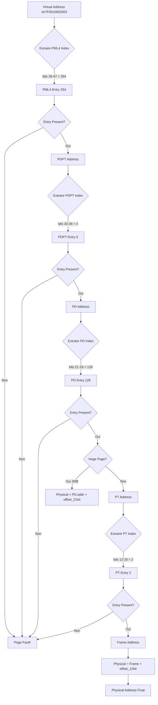

# Exercice 2.8.15-synth : paging_memory_manager

**Module :**
2.8.15 — Gestion de la Pagination Memoire x86-64

**Concept :**
synth — Synthese : Identity Mapping + Higher-Half + CR3 + TLB + Allocateur Bitmap

**Difficulte :**
★★★★★★★★☆☆ (8/10)

**Type :**
complet

**Tiers :**
3 — Synthese (tous concepts a→f : pagination 4-level, identity mapping, higher-half, CR3, TLB, allocateur bitmap)

**Langage :**
Rust Edition 2024 + x86-64 Assembly (inline)

**Prerequis :**
- 2.8.14 : Interruptions et IDT
- 2.8.13 : Mode protege et GDT
- Comprehension de l'adressage memoire
- Notions de pointeurs et manipulation de bits
- Connaissance des registres de controle x86

**Domaines :**
CPU, ASM, Mem, Encodage

**Duree estimee :**
180 min

**XP Base :**
500

**Complexite :**
T4 O(n) x S3 O(n/8)

---

## SECTION 2.4.1 : ANALOGIE CULTURELLE — HOGWARTS CASTLE

### LA PAGINATION = LES ESCALIERS MAGIQUES DE POUDLARD

```
┌─────────────────────────────────────────────────────────────────────────────┐
│                                                                             │
│   "Les escaliers de Poudlard bougent... comme les adresses virtuelles !"   │
│                                                                             │
│   Dans Harry Potter, le chateau de Poudlard est un labyrinthe magique      │
│   ou les escaliers changent de position. Tu peux vouloir aller a la        │
│   salle commune de Gryffondor, mais l'escalier que tu prends peut          │
│   t'emmener ailleurs si tu ne connais pas le chemin ACTUEL.                │
│                                                                             │
│   C'est EXACTEMENT comme la pagination memoire !                            │
│                                                                             │
└─────────────────────────────────────────────────────────────────────────────┘
```

#### LA CARTE DU MARAUDEUR = PAGE DIRECTORY (PML4)

```
┌─────────────────────────────────────────────────────────────────────────────┐
│                                                                             │
│   "Je jure solennellement que mes intentions sont mauvaises..."            │
│                                                                             │
│   La CARTE DU MARAUDEUR montre Poudlard dans son ensemble.                 │
│   Elle ne montre pas les DETAILS de chaque piece, mais elle montre         │
│   TOUS LES ETAGES et OU ils menent.                                        │
│                                                                             │
│   Le PML4 (Page Map Level 4) c'est pareil :                                │
│   - Il contient 512 entrees                                                │
│   - Chaque entree pointe vers un PDPT (etage suivant)                      │
│   - Il te dit "Pour aller a cette zone, va d'abord LA"                     │
│                                                                             │
│   ┌─────────────────────────────────────────────────────────┐              │
│   │         CARTE DU MARAUDEUR (PML4)                       │              │
│   │  ┌─────────────────────────────────────────────────┐    │              │
│   │  │ "Etage 0" → Tour de Gryffondor (PDPT 0)         │    │              │
│   │  │ "Etage 1" → Cachots Serpentard (PDPT 1)         │    │              │
│   │  │ "Etage 2" → Tour de Serdaigle (PDPT 2)          │    │              │
│   │  │ ...                                              │    │              │
│   │  │ "Etage 511" → Bureau de Dumbledore (PDPT 511)   │    │              │
│   │  └─────────────────────────────────────────────────┘    │              │
│   └─────────────────────────────────────────────────────────┘              │
│                                                                             │
└─────────────────────────────────────────────────────────────────────────────┘
```

#### PAGE TABLES = DETAILS DE CHAQUE PIECE

```
┌─────────────────────────────────────────────────────────────────────────────┐
│                                                                             │
│   Une fois que tu sais a quel ETAGE aller, tu dois trouver la PIECE.       │
│                                                                             │
│   PDPT (Page Directory Pointer Table) → Les AILES du chateau               │
│   PD (Page Directory) → Les COULOIRS de chaque aile                        │
│   PT (Page Table) → Les PORTES de chaque couloir                           │
│                                                                             │
│   Adresse Virtuelle 48-bit decomposee :                                    │
│   ┌───────┬───────┬───────┬───────┬──────────────┐                         │
│   │ PML4  │ PDPT  │  PD   │  PT   │ Page Offset  │                         │
│   │ 9 bits│ 9 bits│ 9 bits│ 9 bits│   12 bits    │                         │
│   └───────┴───────┴───────┴───────┴──────────────┘                         │
│     ↓       ↓       ↓       ↓       ↓                                      │
│   Etage   Aile   Couloir  Porte   Position dans la piece                   │
│                                                                             │
│   Pour trouver "Hermione dans la bibliotheque" :                           │
│   1. Etage 3 (PML4 index)                                                  │
│   2. Aile Est (PDPT index)                                                 │
│   3. Couloir des livres anciens (PD index)                                 │
│   4. 7eme porte a gauche (PT index)                                        │
│   5. Rayon "Histoire de la Magie", 3eme etagere (Page Offset)              │
│                                                                             │
└─────────────────────────────────────────────────────────────────────────────┘
```

#### CR3 = LA BAGUETTE MAGIQUE QUI ACTIVE LA CARTE

```
┌─────────────────────────────────────────────────────────────────────────────┐
│                                                                             │
│   "Je jure solennellement que mes intentions sont mauvaises"               │
│   (Tu DOIS toucher la carte avec ta baguette pour l'activer)               │
│                                                                             │
│   Le registre CR3 c'est ta BAGUETTE MAGIQUE :                              │
│   - Il contient l'ADRESSE PHYSIQUE du PML4                                 │
│   - SANS lui, la carte reste vierge (pas de traduction d'adresse)          │
│   - CHANGER CR3 = changer de carte = changer d'espace d'adressage          │
│                                                                             │
│           ┌──────────────────┐                                             │
│           │   Baguette CR3   │                                             │
│           │  ┌────────────┐  │                                             │
│           │  │ 0x00100000 │  │ ← Adresse physique du PML4                  │
│           │  └────────────┘  │                                             │
│           └────────┬─────────┘                                             │
│                    │                                                        │
│                    ▼ "Pointe vers..."                                       │
│           ┌──────────────────┐                                             │
│           │   CARTE (PML4)   │                                             │
│           │   ┌──────────┐   │                                             │
│           │   │ Entry 0  │   │                                             │
│           │   │ Entry 1  │   │                                             │
│           │   │   ...    │   │                                             │
│           │   └──────────┘   │                                             │
│           └──────────────────┘                                             │
│                                                                             │
│   CHANGER DE CR3 = Un professeur prend sa propre carte                     │
│   - Harry a sa carte (son espace d'adressage)                              │
│   - Dumbledore a une autre carte (kernel space)                            │
│   - Quand on passe de l'un a l'autre, on change CR3                        │
│                                                                             │
└─────────────────────────────────────────────────────────────────────────────┘
```

#### TLB = LA MEMOIRE PHOTOGRAPHIQUE D'HERMIONE

```
┌─────────────────────────────────────────────────────────────────────────────┐
│                                                                             │
│   Hermione a une MEMOIRE PHOTOGRAPHIQUE. Elle a deja lu tous les livres    │
│   de la bibliotheque et se souvient exactement ou tout se trouve.          │
│                                                                             │
│   Le TLB (Translation Lookaside Buffer) c'est pareil :                     │
│   - C'est un CACHE de traductions d'adresses                               │
│   - Au lieu de traverser PML4→PDPT→PD→PT (4 acces memoire !)               │
│   - Le TLB dit "Je connais deja ! C'est LA"                                │
│                                                                             │
│   ┌───────────────────────────────────────────────────────────────┐        │
│   │                    CERVEAU D'HERMIONE (TLB)                   │        │
│   │  ┌─────────────────────────────────────────────────────────┐  │        │
│   │  │ "Bibliotheque ?"                                         │  │        │
│   │  │  → "Oui ! 3eme etage, aile est, porte 7 !"              │  │        │
│   │  │                                                          │  │        │
│   │  │ "Salle commune Gryffondor ?"                            │  │        │
│   │  │  → "Tour, 7eme etage, derriere la Grosse Dame !"        │  │        │
│   │  │                                                          │  │        │
│   │  │ "Chambre des Secrets ?"                                 │  │        │
│   │  │  → "Hmm... pas dans mon cache. Faut chercher..."        │  │        │
│   │  └─────────────────────────────────────────────────────────┘  │        │
│   └───────────────────────────────────────────────────────────────┘        │
│                                                                             │
│   TLB HIT  = Hermione sait → RAPIDE (1 cycle)                              │
│   TLB MISS = Hermione doit chercher → LENT (4 acces memoire)               │
│                                                                             │
│   INVLPG / Flush TLB = "Oubliettes !" (sortilege d'amnesia)               │
│   On efface la memoire quand les escaliers ont bouge                       │
│                                                                             │
└─────────────────────────────────────────────────────────────────────────────┘
```

#### IDENTITY MAPPING = LE REZ-DE-CHAUSSEE SPECIAL

```
┌─────────────────────────────────────────────────────────────────────────────┐
│                                                                             │
│   Au REZ-DE-CHAUSSEE de Poudlard, les pieces sont numerotees               │
│   EXACTEMENT comme sur le plan physique du chateau.                        │
│                                                                             │
│   Piece virtuelle 0x1000 = Piece physique 0x1000                           │
│   (Pas de magie, pas de changement)                                        │
│                                                                             │
│   C'est l'IDENTITY MAPPING :                                               │
│   - Utilise pendant le BOOT (avant que la magie soit completement setup)   │
│   - Le kernel a besoin d'acceder a certaines zones "sans magie"            │
│   - Virtual Address == Physical Address                                    │
│                                                                             │
│   ┌─────────────┐                    ┌─────────────┐                       │
│   │  Virtuel    │                    │  Physique   │                       │
│   │  0x1000     │ ═══════════════════│  0x1000     │                       │
│   │  0x2000     │ ═══════════════════│  0x2000     │                       │
│   │  0x3000     │ ═══════════════════│  0x3000     │                       │
│   └─────────────┘                    └─────────────┘                       │
│                   "Pas de magie ici"                                       │
│                                                                             │
└─────────────────────────────────────────────────────────────────────────────┘
```

#### HIGHER-HALF KERNEL = LE BUREAU DE DUMBLEDORE

```
┌─────────────────────────────────────────────────────────────────────────────┐
│                                                                             │
│   Le BUREAU DE DUMBLEDORE est au sommet de la tour la plus haute.          │
│   Il est accessible par un escalier MAGIQUE qui le place dans les          │
│   ADRESSES HAUTES de Poudlard.                                             │
│                                                                             │
│   Higher-Half Kernel (typiquement a 0xFFFF_8000_0000_0000) :               │
│   - Le kernel vit dans les adresses HAUTES de l'espace virtuel             │
│   - Les programmes utilisateur sont dans les adresses BASSES               │
│   - Separation claire : "Dumbledore en haut, etudiants en bas"             │
│                                                                             │
│   ┌───────────────────────────────────────────────────────────────────┐    │
│   │                    ESPACE D'ADRESSAGE                             │    │
│   │  0xFFFF_FFFF_FFFF_FFFF ┌────────────────────┐                     │    │
│   │                        │                    │                     │    │
│   │  (Adresses hautes)     │ BUREAU DUMBLEDORE  │ ← Kernel Space     │    │
│   │                        │ (Higher-Half)      │                     │    │
│   │  0xFFFF_8000_0000_0000 ├────────────────────┤                     │    │
│   │                        │                    │                     │    │
│   │                        │   ZONE INTERDITE   │ ← Non-canonical     │    │
│   │                        │                    │                     │    │
│   │  0x0000_8000_0000_0000 ├────────────────────┤                     │    │
│   │                        │                    │                     │    │
│   │  (Adresses basses)     │  SALLES DE COURS   │ ← User Space       │    │
│   │                        │  (Programmes)      │                     │    │
│   │  0x0000_0000_0000_0000 └────────────────────┘                     │    │
│   └───────────────────────────────────────────────────────────────────┘    │
│                                                                             │
└─────────────────────────────────────────────────────────────────────────────┘
```

---

## SECTION 2.4.2 : EXPLICATION ACADEMIQUE

### 2.4.2.1 Pagination 4-Level x86-64

La pagination x86-64 utilise une hierarchie a 4 niveaux pour traduire les adresses virtuelles 48-bit en adresses physiques 52-bit :

1. **PML4 (Page Map Level 4)** : Table racine, 512 entrees, indexee par les bits 39-47
2. **PDPT (Page Directory Pointer Table)** : 512 entrees, indexee par les bits 30-38
3. **PD (Page Directory)** : 512 entrees, indexee par les bits 21-29
4. **PT (Page Table)** : 512 entrees, indexee par les bits 12-20
5. **Page Offset** : Bits 0-11, offset dans la page de 4KB

### 2.4.2.2 Structure d'une Page Table Entry

```
Bits 63    : NX (No Execute)
Bits 52-62 : Reserved
Bits 12-51 : Physical Address (aligned to 4KB)
Bit 8      : Global
Bit 7      : Page Size (2MB/1GB huge page)
Bit 6      : Dirty
Bit 5      : Accessed
Bit 4      : PCD (Page Cache Disable)
Bit 3      : PWT (Page Write-Through)
Bit 2      : U/S (User/Supervisor)
Bit 1      : R/W (Read/Write)
Bit 0      : Present
```

### 2.4.2.3 CR3 et TLB

- **CR3** : Registre de controle contenant l'adresse physique de la PML4 active
- **TLB** : Cache materiel des traductions recentes (virtual → physical)
- **INVLPG** : Invalide une entree TLB specifique
- **MOV CR3** : Recharge CR3 et flush tout le TLB

---

## SECTION 1 : PROTOTYPE & CONSIGNE

### 1.1 Obligations

**Fichiers a rendre :**
```
memory.rs
```

**Fonctions autorisees :**
- `core::ptr::*`
- `core::slice::from_raw_parts_mut`
- `core::arch::asm!` (inline assembly)

**Fonctions interdites :**
- `std::*` (environnement no_std)
- `alloc::*` sans allocateur custom
- Toute fonction externe au core

### 1.2 Consigne

**HOGWARTS MEMORY MANAGER : Les Escaliers Magiques de Poudlard**

Tu es le nouveau gardien des escaliers de Poudlard. Dumbledore t'a confie la tache de creer un systeme de navigation magique qui permet aux eleves de trouver leur chemin dans le chateau.

Le probleme : les escaliers bougent constamment ! Une adresse "virtuelle" (ce que l'eleve VEUT atteindre) doit etre traduite en adresse "physique" (ou ca se trouve VRAIMENT).

**Ta mission :**

Implementer un gestionnaire de memoire avec pagination x86-64 qui :

1. **Cree des Page Tables** (les cartes du chateau)
2. **Implemente l'Identity Mapping** (rez-de-chaussee sans magie)
3. **Implemente le Higher-Half Mapping** (bureau de Dumbledore)
4. **Gere le registre CR3** (la baguette qui active la carte)
5. **Invalide le TLB** (sortilege Oubliettes sur la memoire d'Hermione)
6. **Implemente un allocateur de frames bitmap** (gestionnaire de pieces libres)

**Entree :**
- `bitmap_addr` : Adresse du bitmap pour l'allocateur
- `total_memory` : Taille totale de la memoire physique
- `pml4_addr` : Adresse de la table PML4

**Sortie :**
- Un gestionnaire de memoire fonctionnel capable de :
  - Mapper des adresses virtuelles vers physiques
  - Allouer/liberer des frames physiques
  - Activer les page tables via CR3
  - Invalider le TLB

**Contraintes :**
```
┌─────────────────────────────────────────┐
│  PAGE_SIZE = 4096 (4KB)                 │
│  512 entrees par table                  │
│  Adresses physiques 52-bit max          │
│  Adresses virtuelles 48-bit canoniques  │
│  #![no_std] obligatoire                 │
└─────────────────────────────────────────┘
```

**Exemples :**

| Operation | Entree | Resultat |
|-----------|--------|----------|
| `identity_map(0x1000)` | Phys 0x1000 | Virt 0x1000 → Phys 0x1000 |
| `higher_half_map(0x1000)` | Phys 0x1000 | Virt 0xFFFF_8000_0000_1000 → Phys 0x1000 |
| `alloc_frame()` | - | Some(PhysAddr(0x5000)) |
| `free_frame(0x5000)` | Phys 0x5000 | Frame marquee libre |
| `activate()` | - | CR3 = adresse PML4 |
| `invalidate_page(virt)` | Virt addr | TLB entry invalidee |

### 1.3 Prototype

```rust
#![no_std]

pub const PAGE_SIZE: usize = 4096;
pub const HIGHER_HALF_OFFSET: u64 = 0xFFFF_8000_0000_0000;

pub mod flags {
    pub const PRESENT: u64 = 1 << 0;
    pub const WRITABLE: u64 = 1 << 1;
    pub const USER: u64 = 1 << 2;
    pub const HUGE_PAGE: u64 = 1 << 7;
    pub const NO_EXECUTE: u64 = 1 << 63;
}

#[repr(transparent)]
pub struct PhysAddr(u64);

#[repr(transparent)]
pub struct VirtAddr(u64);

#[repr(transparent)]
pub struct PageTableEntry(u64);

#[repr(C, align(4096))]
pub struct PageTable {
    entries: [PageTableEntry; 512],
}

pub struct FrameAllocator {
    bitmap: &'static mut [u8],
    total_frames: usize,
    free_frames: usize,
}

pub struct PageTableManager {
    pml4: &'static mut PageTable,
    allocator: FrameAllocator,
}

impl PhysAddr {
    pub fn new(addr: u64) -> Self;
    pub fn as_u64(&self) -> u64;
    pub fn to_higher_half(&self) -> VirtAddr;
    pub fn align_down(&self) -> Self;
}

impl VirtAddr {
    pub fn new(addr: u64) -> Self;
    pub fn as_u64(&self) -> u64;
    pub fn pml4_index(&self) -> usize;
    pub fn pdpt_index(&self) -> usize;
    pub fn pd_index(&self) -> usize;
    pub fn pt_index(&self) -> usize;
    pub fn page_offset(&self) -> usize;
}

impl FrameAllocator {
    pub unsafe fn init(bitmap_addr: *mut u8, total_memory: usize) -> Self;
    pub fn free_frame(&mut self, phys_addr: PhysAddr);
    pub fn alloc_frame(&mut self) -> Option<PhysAddr>;
    pub fn free_count(&self) -> usize;
}

impl PageTableManager {
    pub unsafe fn new(pml4_addr: *mut PageTable, allocator: FrameAllocator) -> Self;
    pub fn identity_map(&mut self, phys: PhysAddr, flags: u64);
    pub fn higher_half_map(&mut self, phys: PhysAddr, flags: u64);
    pub fn map(&mut self, virt: VirtAddr, phys: PhysAddr, flags: u64);
    pub unsafe fn activate(&self);
    pub fn invalidate_page(&self, virt: VirtAddr);
    pub unsafe fn flush_tlb(&self);
}
```

---

## SECTION 2 : LE SAVIEZ-VOUS ?

### La Pagination : L'Invention qui a Change l'Informatique

La pagination a ete inventee pour resoudre un probleme fondamental : **comment faire tourner plusieurs programmes en memoire sans qu'ils se marchent dessus ?**

Avant la pagination, chaque programme devait connaitre exactement ou il serait charge en memoire. Un cauchemar pour les developpeurs !

**Fun fact :** Le premier systeme a utiliser la pagination etait le **Atlas Computer** (1962) a l'Universite de Manchester. Les ingenieurs l'appelaient "one-level store" car du point de vue du programme, toute la memoire semblait disponible.

### Le TLB : Le Plus Petit Cache qui Compte le Plus

Le TLB ne contient generalement que 64 a 1024 entrees, mais son impact est ENORME :
- Un TLB miss coute **4 acces memoire** supplementaires
- Un TLB hit coute **1 cycle**
- Sur un processeur moderne, ca peut representer une difference de **100x** en performance !

Intel a meme introduit le **PCID** (Process-Context Identifier) pour eviter de flush le TLB a chaque changement de contexte.

---

## SECTION 2.5 : DANS LA VRAIE VIE

### Qui Utilise la Pagination ?

| Metier | Cas d'Usage |
|--------|-------------|
| **Kernel Developer** | Implementer le gestionnaire de memoire de Linux/Windows |
| **Hypervisor Engineer** | VMware, KVM : nested paging, EPT/NPT |
| **Security Researcher** | Exploits Meltdown/Spectre, KASLR bypass |
| **Embedded Systems** | MMU configuration pour ARM Cortex-A |
| **Game Console Dev** | PS5/Xbox : optimisation memoire custom |
| **Cloud Infrastructure** | AWS Nitro : isolation memoire entre VMs |

### Exemples Concrets

1. **Linux Kernel** : Le fichier `arch/x86/mm/pgtable.c` contient l'implementation de la pagination
2. **UEFI Bootloader** : Setup identity mapping avant de passer au kernel
3. **Container Runtime** : Docker utilise les namespaces memoire bases sur la pagination
4. **Browser Sandboxing** : Chrome isole chaque onglet avec des espaces d'adressage separes

---

## SECTION 3 : EXEMPLE D'UTILISATION

### 3.0 Session bash

```bash
$ ls
memory.rs  main.rs  Cargo.toml

$ cargo build --release --target x86_64-unknown-none

$ qemu-system-x86_64 -kernel target/x86_64-unknown-none/release/kernel
[BOOT] Initializing paging...
[PAGING] Identity mapping 0x0 - 0x100000
[PAGING] Higher-half mapping kernel at 0xFFFF800000100000
[PAGING] CR3 loaded: 0x00100000
[PAGING] TLB flushed
[ALLOC] 32768 frames available (128 MB)
[OK] Memory manager initialized!
```

---

## SECTION 3.1 : BONUS EXPERT (OPTIONNEL)

**Difficulte Bonus :**
💀 Expert (10/10)

**Recompense :**
XP x4

**Time Complexity attendue :**
O(1) pour lookup TLB, O(log n) pour allocation

**Space Complexity attendue :**
O(n/4096) pour le bitmap

**Domaines Bonus :**
`CPU, ASM, Mem, Crypto`

### 3.1.1 Consigne Bonus

**HOGWARTS ADVANCED : La Chambre des Secrets de la Memoire**

Dumbledore te confie une mission secrete : implementer des fonctionnalites avancees pour proteger le chateau contre les intrusions.

**Ta mission :**

1. **Huge Pages (2MB)** : Creer des "grandes salles" pour les donnees volumineuses
2. **KASLR** : Randomiser l'emplacement du kernel (comme la Salle sur Demande)
3. **Guard Pages** : Creer des "murs invisibles" qui declenchent une alarme
4. **Copy-on-Write** : Partager les pages en lecture, copier a l'ecriture

**Contraintes :**
```
┌─────────────────────────────────────────┐
│  Huge pages 2MB alignees               │
│  ASLR entropy >= 16 bits               │
│  Guard pages non-mapped                │
│  COW avec refcount atomique            │
└─────────────────────────────────────────┘
```

### 3.1.2 Prototype Bonus

```rust
impl PageTableManager {
    /// Map une huge page de 2MB
    pub fn map_huge_page(&mut self, virt: VirtAddr, phys: PhysAddr, flags: u64);

    /// Cree une guard page (non-mappee, trigger page fault)
    pub fn create_guard_page(&mut self, virt: VirtAddr);

    /// Setup Copy-on-Write pour une page
    pub fn setup_cow(&mut self, virt: VirtAddr) -> Result<(), PageError>;

    /// Handler de page fault pour COW
    pub fn handle_cow_fault(&mut self, virt: VirtAddr) -> Result<(), PageError>;
}

/// Randomize kernel base address
pub fn kaslr_offset() -> u64;
```

### 3.1.3 Ce qui change par rapport a l'exercice de base

| Aspect | Base | Bonus |
|--------|------|-------|
| Taille pages | 4KB seulement | 4KB + 2MB huge |
| Position kernel | Fixe | Randomisee (KASLR) |
| Protection | Basique | Guard pages |
| Partage | Non | Copy-on-Write |
| Complexite | O(n) allocation | O(1) amortized |

---

## SECTION 4 : ZONE CORRECTION

### 4.1 Moulinette

| Test | Input | Expected | Points |
|------|-------|----------|--------|
| `test_phys_addr_new` | `PhysAddr::new(0x12345678)` | `0x12345000` (aligned) | 5 |
| `test_virt_addr_indices` | `VirtAddr::new(0x7F0010002003)` | PML4=254, PDPT=0, PD=128, PT=2, offset=3 | 10 |
| `test_higher_half` | `PhysAddr::new(0x1000).to_higher_half()` | `0xFFFF800000001000` | 10 |
| `test_identity_map` | `identity_map(0x5000)` | virt 0x5000 → phys 0x5000 | 15 |
| `test_higher_half_map` | `higher_half_map(0x5000)` | virt 0xFFFF...5000 → phys 0x5000 | 15 |
| `test_alloc_frame` | `alloc_frame()` | `Some(PhysAddr)` | 10 |
| `test_free_frame` | `free_frame(addr); alloc_frame()` | Same addr returned | 10 |
| `test_activate_cr3` | `activate()` | CR3 register set | 10 |
| `test_invalidate_tlb` | `invalidate_page(virt)` | INVLPG executed | 10 |
| `test_page_entry_flags` | Entry with PRESENT\|WRITABLE | Correct flags | 5 |

### 4.2 main.rs de test

```rust
#![no_std]
#![no_main]

use memory::*;

#[no_mangle]
pub extern "C" fn _start() -> ! {
    // Test 1: PhysAddr creation and alignment
    let phys = PhysAddr::new(0x12345678);
    assert_eq!(phys.as_u64() & 0xFFF, 0, "PhysAddr not aligned!");

    // Test 2: VirtAddr indexing
    let virt = VirtAddr::new(0x0000_7F00_0100_2003);
    assert_eq!(virt.pml4_index(), 254);
    assert_eq!(virt.pdpt_index(), 0);
    assert_eq!(virt.pd_index(), 128);
    assert_eq!(virt.pt_index(), 2);
    assert_eq!(virt.page_offset(), 3);

    // Test 3: Higher half conversion
    let phys = PhysAddr::new(0x1000);
    let higher = phys.to_higher_half();
    assert_eq!(higher.as_u64(), 0xFFFF_8000_0000_1000);

    // Test 4: Frame allocator
    static mut BITMAP: [u8; 4096] = [0xFF; 4096];
    unsafe {
        let mut alloc = FrameAllocator::init(
            BITMAP.as_mut_ptr(),
            32 * 1024 * 1024  // 32 MB
        );

        // Mark some frames as free
        alloc.free_frame(PhysAddr::new(0x5000));
        alloc.free_frame(PhysAddr::new(0x6000));

        // Allocate
        let frame1 = alloc.alloc_frame().expect("Alloc failed");
        let frame2 = alloc.alloc_frame().expect("Alloc failed");

        assert!(frame1.as_u64() != frame2.as_u64());
    }

    // Test 5: Page table manager
    static mut PML4: PageTable = PageTable::new();
    unsafe {
        let alloc = FrameAllocator::init(/* ... */);
        let mut manager = PageTableManager::new(&mut PML4, alloc);

        // Identity map
        manager.identity_map(PhysAddr::new(0x1000), flags::PRESENT | flags::WRITABLE);

        // Higher half map
        manager.higher_half_map(PhysAddr::new(0x2000), flags::PRESENT | flags::WRITABLE);

        // Activate (writes to CR3)
        manager.activate();

        // Invalidate TLB entry
        manager.invalidate_page(VirtAddr::new(0x1000));
    }

    // All tests passed
    loop {}
}
```

### 4.3 Solution de reference

```rust
#![no_std]

use core::ptr;

pub const PAGE_SIZE: usize = 4096;
pub const HIGHER_HALF_OFFSET: u64 = 0xFFFF_8000_0000_0000;

pub mod flags {
    pub const PRESENT: u64 = 1 << 0;
    pub const WRITABLE: u64 = 1 << 1;
    pub const USER: u64 = 1 << 2;
    pub const WRITE_THROUGH: u64 = 1 << 3;
    pub const NO_CACHE: u64 = 1 << 4;
    pub const ACCESSED: u64 = 1 << 5;
    pub const DIRTY: u64 = 1 << 6;
    pub const HUGE_PAGE: u64 = 1 << 7;
    pub const GLOBAL: u64 = 1 << 8;
    pub const NO_EXECUTE: u64 = 1 << 63;
}

#[derive(Debug, Clone, Copy, PartialEq, Eq)]
#[repr(transparent)]
pub struct PhysAddr(u64);

impl PhysAddr {
    pub const fn new(addr: u64) -> Self {
        Self(addr & 0x000F_FFFF_FFFF_F000)
    }

    pub fn as_u64(&self) -> u64 {
        self.0
    }

    pub fn to_higher_half(&self) -> VirtAddr {
        VirtAddr::new(self.0 + HIGHER_HALF_OFFSET)
    }

    pub fn align_down(&self) -> Self {
        Self(self.0 & !(PAGE_SIZE as u64 - 1))
    }
}

#[derive(Debug, Clone, Copy, PartialEq, Eq)]
#[repr(transparent)]
pub struct VirtAddr(u64);

impl VirtAddr {
    pub const fn new(addr: u64) -> Self {
        let sign_extended = ((addr << 16) as i64 >> 16) as u64;
        Self(sign_extended)
    }

    pub fn as_u64(&self) -> u64 {
        self.0
    }

    pub fn pml4_index(&self) -> usize {
        ((self.0 >> 39) & 0x1FF) as usize
    }

    pub fn pdpt_index(&self) -> usize {
        ((self.0 >> 30) & 0x1FF) as usize
    }

    pub fn pd_index(&self) -> usize {
        ((self.0 >> 21) & 0x1FF) as usize
    }

    pub fn pt_index(&self) -> usize {
        ((self.0 >> 12) & 0x1FF) as usize
    }

    pub fn page_offset(&self) -> usize {
        (self.0 & 0xFFF) as usize
    }
}

#[derive(Debug, Clone, Copy)]
#[repr(transparent)]
pub struct PageTableEntry(u64);

impl PageTableEntry {
    pub const fn new() -> Self {
        Self(0)
    }

    pub fn set_addr(&mut self, addr: PhysAddr, flags: u64) {
        self.0 = addr.as_u64() | flags;
    }

    pub fn addr(&self) -> PhysAddr {
        PhysAddr::new(self.0 & 0x000F_FFFF_FFFF_F000)
    }

    pub fn flags(&self) -> u64 {
        self.0 & 0xFFF
    }

    pub fn is_present(&self) -> bool {
        self.0 & flags::PRESENT != 0
    }

    pub fn is_huge(&self) -> bool {
        self.0 & flags::HUGE_PAGE != 0
    }
}

#[repr(C, align(4096))]
pub struct PageTable {
    entries: [PageTableEntry; 512],
}

impl PageTable {
    pub const fn new() -> Self {
        Self {
            entries: [PageTableEntry::new(); 512],
        }
    }

    pub fn entry(&self, index: usize) -> &PageTableEntry {
        &self.entries[index]
    }

    pub fn entry_mut(&mut self, index: usize) -> &mut PageTableEntry {
        &mut self.entries[index]
    }

    pub fn clear(&mut self) {
        for entry in &mut self.entries {
            *entry = PageTableEntry::new();
        }
    }
}

pub struct FrameAllocator {
    bitmap: &'static mut [u8],
    total_frames: usize,
    free_frames: usize,
    next_free: usize,
}

impl FrameAllocator {
    pub unsafe fn init(bitmap_addr: *mut u8, total_memory: usize) -> Self {
        let total_frames = total_memory / PAGE_SIZE;
        let bitmap_size = (total_frames + 7) / 8;
        let bitmap = core::slice::from_raw_parts_mut(bitmap_addr, bitmap_size);
        bitmap.fill(0xFF);

        Self {
            bitmap,
            total_frames,
            free_frames: 0,
            next_free: 0,
        }
    }

    pub fn free_frame(&mut self, phys_addr: PhysAddr) {
        let frame = phys_addr.as_u64() as usize / PAGE_SIZE;
        if frame < self.total_frames {
            let byte = frame / 8;
            let bit = frame % 8;
            self.bitmap[byte] &= !(1 << bit);
            self.free_frames += 1;
        }
    }

    pub fn alloc_frame(&mut self) -> Option<PhysAddr> {
        for i in 0..self.total_frames {
            let frame = (self.next_free + i) % self.total_frames;
            let byte = frame / 8;
            let bit = frame % 8;

            if self.bitmap[byte] & (1 << bit) == 0 {
                self.bitmap[byte] |= 1 << bit;
                self.free_frames -= 1;
                self.next_free = (frame + 1) % self.total_frames;
                return Some(PhysAddr::new((frame * PAGE_SIZE) as u64));
            }
        }
        None
    }

    pub fn free_count(&self) -> usize {
        self.free_frames
    }
}

pub struct PageTableManager {
    pml4: &'static mut PageTable,
    allocator: FrameAllocator,
}

impl PageTableManager {
    pub unsafe fn new(pml4_addr: *mut PageTable, allocator: FrameAllocator) -> Self {
        let pml4 = &mut *pml4_addr;
        pml4.clear();
        Self { pml4, allocator }
    }

    pub fn identity_map(&mut self, phys: PhysAddr, flags: u64) {
        let virt = VirtAddr::new(phys.as_u64());
        self.map(virt, phys, flags);
    }

    pub fn higher_half_map(&mut self, phys: PhysAddr, flags: u64) {
        let virt = phys.to_higher_half();
        self.map(virt, phys, flags);
    }

    pub fn map(&mut self, virt: VirtAddr, phys: PhysAddr, flags: u64) {
        let pml4_idx = virt.pml4_index();
        let pdpt_idx = virt.pdpt_index();
        let pd_idx = virt.pd_index();
        let pt_idx = virt.pt_index();

        let pdpt = self.get_or_create_table(pml4_idx);
        let pd = self.get_or_create_child_table(pdpt, pdpt_idx);
        let pt = self.get_or_create_child_table(pd, pd_idx);

        pt.entry_mut(pt_idx).set_addr(phys, flags | flags::PRESENT);
    }

    fn get_or_create_table(&mut self, index: usize) -> &'static mut PageTable {
        if !self.pml4.entry(index).is_present() {
            let frame = self.allocator.alloc_frame()
                .expect("Out of memory for page tables");

            unsafe {
                let table_ptr = frame.as_u64() as *mut PageTable;
                (*table_ptr).clear();
            }

            self.pml4.entry_mut(index).set_addr(
                frame,
                flags::PRESENT | flags::WRITABLE,
            );
        }

        let child_addr = self.pml4.entry(index).addr().as_u64();
        unsafe { &mut *(child_addr as *mut PageTable) }
    }

    fn get_or_create_child_table(
        &mut self,
        parent: &mut PageTable,
        index: usize,
    ) -> &'static mut PageTable {
        if !parent.entry(index).is_present() {
            let frame = self.allocator.alloc_frame()
                .expect("Out of memory for page tables");

            unsafe {
                let table_ptr = frame.as_u64() as *mut PageTable;
                (*table_ptr).clear();
            }

            parent.entry_mut(index).set_addr(
                frame,
                flags::PRESENT | flags::WRITABLE,
            );
        }

        let child_addr = parent.entry(index).addr().as_u64();
        unsafe { &mut *(child_addr as *mut PageTable) }
    }

    pub unsafe fn activate(&self) {
        let pml4_addr = self.pml4 as *const _ as u64;
        core::arch::asm!(
            "mov cr3, {}",
            in(reg) pml4_addr,
            options(nostack, preserves_flags)
        );
    }

    pub fn invalidate_page(&self, virt: VirtAddr) {
        unsafe {
            core::arch::asm!(
                "invlpg [{}]",
                in(reg) virt.as_u64(),
                options(nostack, preserves_flags)
            );
        }
    }

    pub unsafe fn flush_tlb(&self) {
        self.activate();
    }
}
```

### 4.4 Solutions alternatives acceptees

```rust
// Alternative 1: Utilisation de const generics pour la taille du bitmap
pub struct FrameAllocator<const N: usize> {
    bitmap: [u8; N],
    // ...
}

// Alternative 2: Approche avec free list au lieu de bitmap
pub struct FreeListAllocator {
    head: Option<PhysAddr>,
    free_count: usize,
}

// Alternative 3: Buddy allocator simplifie
pub struct BuddyAllocator {
    free_lists: [Option<PhysAddr>; 12],  // 4KB to 4MB
}
```

### 4.5 Solutions refusees

```rust
// REFUSE 1: Pas de verification d'alignement
impl PhysAddr {
    pub fn new(addr: u64) -> Self {
        Self(addr)  // REFUSE: doit masquer les bits bas
    }
}

// REFUSE 2: Pas de sign extension pour adresses canoniques
impl VirtAddr {
    pub fn new(addr: u64) -> Self {
        Self(addr)  // REFUSE: doit sign-extend bit 47
    }
}

// REFUSE 3: Utilisation de std
use std::vec::Vec;  // REFUSE: environnement no_std

// REFUSE 4: Oubli du flag PRESENT
pub fn map(&mut self, virt: VirtAddr, phys: PhysAddr, flags: u64) {
    pt.entry_mut(pt_idx).set_addr(phys, flags);  // REFUSE: manque PRESENT
}

// REFUSE 5: Pas de flush TLB apres modification
pub unsafe fn activate(&self) {
    // REFUSE: doit ecrire dans CR3
}
```

### 4.6 Solution bonus de reference

```rust
impl PageTableManager {
    pub fn map_huge_page(&mut self, virt: VirtAddr, phys: PhysAddr, flags: u64) {
        let pml4_idx = virt.pml4_index();
        let pdpt_idx = virt.pdpt_index();
        let pd_idx = virt.pd_index();

        let pdpt = self.get_or_create_table(pml4_idx);
        let pd = self.get_or_create_child_table(pdpt, pdpt_idx);

        // Set HUGE_PAGE flag for 2MB page
        pd.entry_mut(pd_idx).set_addr(
            phys,
            flags | flags::PRESENT | flags::HUGE_PAGE
        );
    }

    pub fn create_guard_page(&mut self, virt: VirtAddr) {
        let pml4_idx = virt.pml4_index();
        let pdpt_idx = virt.pdpt_index();
        let pd_idx = virt.pd_index();
        let pt_idx = virt.pt_index();

        // Ensure page tables exist but entry is NOT present
        let pdpt = self.get_or_create_table(pml4_idx);
        let pd = self.get_or_create_child_table(pdpt, pdpt_idx);
        let pt = self.get_or_create_child_table(pd, pd_idx);

        // Clear the entry - accessing will cause page fault
        pt.entry_mut(pt_idx).0 = 0;
    }
}

pub fn kaslr_offset() -> u64 {
    // Simple KASLR using RDTSC as entropy source
    let tsc: u64;
    unsafe {
        core::arch::asm!(
            "rdtsc",
            "shl rdx, 32",
            "or rax, rdx",
            out("rax") tsc,
            out("rdx") _,
            options(nostack, nomem)
        );
    }

    // 16 bits of entropy, aligned to 2MB
    let entropy = (tsc & 0xFFFF) << 21;
    HIGHER_HALF_OFFSET + entropy
}
```

### 4.7 Solutions alternatives bonus

```rust
// Alternative: KASLR avec RDSEED (si disponible)
pub fn kaslr_offset_rdseed() -> u64 {
    let mut random: u64;
    let success: u8;

    unsafe {
        core::arch::asm!(
            "rdseed {0}",
            "setc {1}",
            out(reg) random,
            out(reg_byte) success,
            options(nostack)
        );
    }

    if success != 0 {
        let entropy = (random & 0xFFFF) << 21;
        HIGHER_HALF_OFFSET + entropy
    } else {
        // Fallback to TSC
        kaslr_offset()
    }
}
```

### 4.8 Solutions refusees bonus

```rust
// REFUSE: Huge page sans alignement 2MB
pub fn map_huge_page(&mut self, virt: VirtAddr, phys: PhysAddr, flags: u64) {
    // REFUSE: phys doit etre aligne sur 2MB (0x200000)
    if phys.as_u64() & 0x1FFFFF != 0 {
        panic!("Huge page must be 2MB aligned!");
    }
}

// REFUSE: KASLR sans entropie
pub fn kaslr_offset() -> u64 {
    HIGHER_HALF_OFFSET + 0x1000000  // REFUSE: offset fixe = pas de KASLR
}
```

### 4.9 spec.json

```json
{
  "name": "paging_memory_manager",
  "language": "rust",
  "edition": "2024",
  "type": "complet",
  "tier": 3,
  "tier_info": "Synthese (pagination 4-level, identity mapping, higher-half, CR3, TLB, allocateur bitmap)",
  "tags": ["kernel", "memory", "paging", "x86-64", "osdev"],
  "passing_score": 70,

  "function": {
    "name": "PageTableManager",
    "prototype": "impl PageTableManager { pub fn map(&mut self, virt: VirtAddr, phys: PhysAddr, flags: u64); }",
    "return_type": "()",
    "parameters": [
      {"name": "virt", "type": "VirtAddr"},
      {"name": "phys", "type": "PhysAddr"},
      {"name": "flags", "type": "u64"}
    ]
  },

  "driver": {
    "reference": "pub fn ref_map(&mut self, virt: VirtAddr, phys: PhysAddr, flags: u64) { let pml4_idx = virt.pml4_index(); let pdpt_idx = virt.pdpt_index(); let pd_idx = virt.pd_index(); let pt_idx = virt.pt_index(); let pdpt = self.get_or_create_table(pml4_idx); let pd = self.get_or_create_child_table(pdpt, pdpt_idx); let pt = self.get_or_create_child_table(pd, pd_idx); pt.entry_mut(pt_idx).set_addr(phys, flags | flags::PRESENT); }",

    "edge_cases": [
      {
        "name": "phys_addr_alignment",
        "args": ["PhysAddr::new(0x12345678)"],
        "expected": "0x12345000",
        "is_trap": true,
        "trap_explanation": "PhysAddr doit masquer les 12 bits bas pour alignement 4KB"
      },
      {
        "name": "virt_addr_canonical",
        "args": ["VirtAddr::new(0x0000_8000_0000_0000)"],
        "expected": "0xFFFF_8000_0000_0000",
        "is_trap": true,
        "trap_explanation": "Adresse non-canonique doit etre sign-extended"
      },
      {
        "name": "higher_half_conversion",
        "args": ["PhysAddr::new(0x1000).to_higher_half()"],
        "expected": "0xFFFF_8000_0000_1000",
        "is_trap": false
      },
      {
        "name": "pml4_index_extraction",
        "args": ["VirtAddr::new(0x7F0010002003).pml4_index()"],
        "expected": 254,
        "is_trap": false
      },
      {
        "name": "alloc_frame_empty",
        "args": [],
        "expected": "None",
        "is_trap": true,
        "trap_explanation": "Allocateur vide doit retourner None"
      },
      {
        "name": "identity_map_consistency",
        "args": ["identity_map(0x5000)"],
        "expected": "virt 0x5000 -> phys 0x5000",
        "is_trap": false
      }
    ],

    "fuzzing": {
      "enabled": true,
      "iterations": 500,
      "generators": [
        {
          "type": "int",
          "param_index": 0,
          "params": {
            "min": 0,
            "max": 281474976710655
          }
        }
      ]
    }
  },

  "norm": {
    "allowed_functions": ["core::ptr::*", "core::slice::from_raw_parts_mut", "core::arch::asm"],
    "forbidden_functions": ["std::*", "alloc::*"],
    "check_security": true,
    "check_memory": true,
    "blocking": true
  },

  "bonus": {
    "enabled": true,
    "tier": "EXPERT",
    "multiplier": 4,
    "requirements": ["huge_pages", "kaslr", "guard_pages"]
  }
}
```

### 4.10 Solutions Mutantes

```rust
/* Mutant A (Boundary) : Index extraction off-by-one */
impl VirtAddr {
    pub fn pml4_index(&self) -> usize {
        ((self.0 >> 38) & 0x1FF) as usize  // BUG: shift 38 au lieu de 39
    }
}
// Pourquoi c'est faux : Decale de 1 bit, melange PML4 et PDPT
// Ce qui etait pense : Confusion sur la position des bits d'index

/* Mutant B (Safety) : Pas de verification de present bit */
fn get_or_create_table(&mut self, index: usize) -> &'static mut PageTable {
    // BUG: Pas de verification is_present(), assume toujours existant
    let child_addr = self.pml4.entry(index).addr().as_u64();
    unsafe { &mut *(child_addr as *mut PageTable) }
}
// Pourquoi c'est faux : Dereference une adresse invalide si l'entree n'existe pas
// Ce qui etait pense : "L'entree existe toujours"

/* Mutant C (Resource) : Fuite de frames */
pub fn alloc_frame(&mut self) -> Option<PhysAddr> {
    for frame in 0..self.total_frames {
        let byte = frame / 8;
        let bit = frame % 8;
        if self.bitmap[byte] & (1 << bit) == 0 {
            // BUG: Oubli de marquer la frame comme utilisee
            // self.bitmap[byte] |= 1 << bit;  // MANQUANT
            return Some(PhysAddr::new((frame * PAGE_SIZE) as u64));
        }
    }
    None
}
// Pourquoi c'est faux : La meme frame peut etre allouee plusieurs fois
// Ce qui etait pense : "Le bitmap se met a jour tout seul"

/* Mutant D (Logic) : Sign extension inversee */
impl VirtAddr {
    pub fn new(addr: u64) -> Self {
        // BUG: Pas de sign extension, adresses non-canoniques acceptees
        Self(addr & 0x0000_FFFF_FFFF_FFFF)
    }
}
// Pourquoi c'est faux : Les adresses higher-half deviennent invalides
// Ce qui etait pense : "Le masquage suffit"

/* Mutant E (Return) : Oubli du flag PRESENT */
pub fn map(&mut self, virt: VirtAddr, phys: PhysAddr, flags: u64) {
    // ... obtention des tables ...
    pt.entry_mut(pt_idx).set_addr(phys, flags);  // BUG: pas de | flags::PRESENT
}
// Pourquoi c'est faux : La page n'est jamais marquee presente, page fault
// Ce qui etait pense : "L'utilisateur passe deja PRESENT dans flags"
```

---

## SECTION 5 : COMPRENDRE

### 5.1 Ce que cet exercice enseigne

1. **Architecture memoire x86-64** : Comprendre la hierarchie de page tables a 4 niveaux
2. **Translation d'adresses** : Comment une adresse virtuelle devient physique
3. **Registres de controle** : Role de CR3 et interaction avec le TLB
4. **Gestion memoire bas-niveau** : Allocation de frames physiques avec bitmap
5. **Programmation systeme** : Manipulation de structures alignees et inline assembly

### 5.2 LDA — Traduction litterale

```
STRUCTURE PhysAddr QUI CONTIENT UN ENTIER NON SIGNE 64-BIT
DEBUT STRUCTURE
    DECLARER addr COMME ENTIER NON SIGNE 64-BIT
FIN STRUCTURE

FONCTION new QUI RETOURNE PhysAddr ET PREND EN PARAMETRE addr QUI EST UN ENTIER NON SIGNE 64-BIT
DEBUT FONCTION
    RETOURNER PhysAddr AVEC addr MASQUE PAR 0x000F_FFFF_FFFF_F000
FIN FONCTION

FONCTION pml4_index QUI RETOURNE UN ENTIER NON SIGNE ET PREND EN PARAMETRE self QUI EST UNE REFERENCE VERS VirtAddr
DEBUT FONCTION
    DECLARER index COMME ENTIER NON SIGNE
    AFFECTER L'ADRESSE DECALEE DE 39 BITS VERS LA DROITE ET MASQUEE PAR 0x1FF A index
    RETOURNER index
FIN FONCTION

FONCTION alloc_frame QUI RETOURNE UN Option DE PhysAddr ET PREND EN PARAMETRE self QUI EST UNE REFERENCE MUTABLE VERS FrameAllocator
DEBUT FONCTION
    POUR i ALLANT DE 0 A total_frames MOINS 1 FAIRE
        DECLARER frame COMME ENTIER NON SIGNE
        AFFECTER next_free PLUS i MODULO total_frames A frame
        DECLARER byte COMME ENTIER NON SIGNE
        AFFECTER frame DIVISE PAR 8 A byte
        DECLARER bit COMME ENTIER NON SIGNE
        AFFECTER frame MODULO 8 A bit

        SI LE BIT A LA POSITION bit DANS bitmap[byte] EST EGAL A 0 ALORS
            AFFECTER LE BIT A LA POSITION bit A 1 DANS bitmap[byte]
            DECREMENTER free_frames DE 1
            AFFECTER frame PLUS 1 MODULO total_frames A next_free
            RETOURNER Some CONTENANT PhysAddr DE frame MULTIPLIE PAR PAGE_SIZE
        FIN SI
    FIN POUR
    RETOURNER None
FIN FONCTION

FONCTION activate QUI NE RETOURNE RIEN ET PREND EN PARAMETRE self QUI EST UNE REFERENCE VERS PageTableManager
DEBUT FONCTION
    DECLARER pml4_addr COMME ENTIER NON SIGNE 64-BIT
    AFFECTER L'ADRESSE DE pml4 CONVERTIE EN ENTIER A pml4_addr
    EXECUTER L'INSTRUCTION ASSEMBLEUR "MOV CR3, pml4_addr"
FIN FONCTION

FONCTION invalidate_page QUI NE RETOURNE RIEN ET PREND EN PARAMETRES self ET virt QUI EST VirtAddr
DEBUT FONCTION
    EXECUTER L'INSTRUCTION ASSEMBLEUR "INVLPG [virt]"
FIN FONCTION
```

### 5.2.2 Style Academique Francais

```
ALGORITHME : Traduction d'Adresse Virtuelle

ENTREES :
    - virt : adresse virtuelle 48-bit
    - pml4 : pointeur vers la table PML4

SORTIES :
    - phys : adresse physique correspondante
    - erreur : page fault si non mappe

VARIABLES :
    - pml4_idx, pdpt_idx, pd_idx, pt_idx : indices 9-bit
    - pdpt, pd, pt : pointeurs vers tables
    - entry : entree de page table

DEBUT
    pml4_idx <- (virt >> 39) ET 0x1FF
    pdpt_idx <- (virt >> 30) ET 0x1FF
    pd_idx <- (virt >> 21) ET 0x1FF
    pt_idx <- (virt >> 12) ET 0x1FF
    offset <- virt ET 0xFFF

    entry <- pml4[pml4_idx]
    SI NON entry.present ALORS
        LEVER page_fault
    FIN SI
    pdpt <- entry.adresse

    entry <- pdpt[pdpt_idx]
    SI NON entry.present ALORS
        LEVER page_fault
    FIN SI
    pd <- entry.adresse

    entry <- pd[pd_idx]
    SI NON entry.present ALORS
        LEVER page_fault
    FIN SI
    pt <- entry.adresse

    entry <- pt[pt_idx]
    SI NON entry.present ALORS
        LEVER page_fault
    FIN SI

    phys <- entry.adresse + offset
    RETOURNER phys
FIN
```

### 5.2.2.1 Logic Flow (Structured English)

```
ALGORITHM: Page Table Walk
---
1. EXTRACT indices from virtual address:
   a. PML4 index = bits 39-47
   b. PDPT index = bits 30-38
   c. PD index = bits 21-29
   d. PT index = bits 12-20
   e. Page offset = bits 0-11

2. FOR EACH level (PML4 -> PDPT -> PD -> PT):
   a. LOAD entry at current index
   b. IF entry not present:
      - RAISE page fault exception
   c. EXTRACT physical address from entry
   d. USE as base for next level

3. COMPUTE final physical address:
   a. GET frame address from PT entry
   b. ADD page offset
   c. RETURN physical address
```

### 5.2.3 Representation Algorithmique

```
FONCTION : Allocation de Frame (Bitmap)
---
INIT result = None

1. POUR chaque frame potentielle :
   |
   |-- CALCULER position dans bitmap :
   |     byte_index = frame / 8
   |     bit_index = frame % 8
   |
   |-- VERIFIER si frame libre (bit = 0) :
   |     SI bitmap[byte] & (1 << bit) == 0 :
   |       |
   |       |-- MARQUER comme utilisee :
   |       |     bitmap[byte] |= (1 << bit)
   |       |
   |       |-- METTRE A JOUR compteur :
   |       |     free_frames -= 1
   |       |
   |       |-- RETOURNER adresse physique
   |
   |-- SINON continuer iteration

2. RETOURNER None (plus de memoire)
```

### 5.2.3.1 Logique de Garde (Fail Fast)

```
FONCTION : Map (virt, phys, flags)
---
INIT tables = [pml4, pdpt, pd, pt]

1. VERIFIER alignement physique :
   |
   |-- SI phys & 0xFFF != 0 :
   |     PANIC "Physical address not page-aligned"

2. EXTRAIRE tous les indices AVANT traversee :
   |
   |-- indices = [pml4_idx, pdpt_idx, pd_idx, pt_idx]

3. POUR CHAQUE niveau de table :
   |
   |-- VERIFIER si entree presente :
   |     SI NON presente :
   |       |
   |       |-- ALLOUER nouvelle table
   |       |-- SI allocation echoue :
   |       |     PANIC "Out of memory"
   |       |
   |       |-- INITIALISER table a zero
   |       |-- CREER entree vers nouvelle table

4. ECRIRE mapping final dans PT :
   |
   |-- SET entry = phys | flags | PRESENT
```

### Diagramme Mermaid : Translation d'Adresse



### 5.3 Visualisation ASCII

```
┌─────────────────────────────────────────────────────────────────────────────────┐
│                     PAGINATION 4-LEVEL x86-64                                   │
└─────────────────────────────────────────────────────────────────────────────────┘

ADRESSE VIRTUELLE (48-bit) :
┌─────────┬─────────┬─────────┬─────────┬──────────────┐
│  PML4   │  PDPT   │   PD    │   PT    │ Page Offset  │
│ 9 bits  │ 9 bits  │ 9 bits  │ 9 bits  │   12 bits    │
│ [47:39] │ [38:30] │ [29:21] │ [20:12] │   [11:0]     │
└────┬────┴────┬────┴────┬────┴────┬────┴──────┬───────┘
     │         │         │         │           │
     │         │         │         │           │
     ▼         │         │         │           │
┌─────────┐    │         │         │           │
│   CR3   │────┤         │         │           │
└────┬────┘    │         │         │           │
     │         │         │         │           │
     ▼         │         │         │           │
┌─────────────────────┐  │         │           │
│        PML4         │  │         │           │
│ ┌─────────────────┐ │  │         │           │
│ │ Entry 0        │ │  │         │           │
│ │ Entry 1        │ │  │         │           │
│ │ ...            │ │  │         │           │
│ │ Entry [idx]  ──┼─┼──┘         │           │
│ │ ...            │ │            │           │
│ │ Entry 511      │ │            │           │
│ └─────────────────┘ │            │           │
└─────────────────────┘            │           │
          │                        │           │
          ▼                        │           │
┌─────────────────────┐            │           │
│        PDPT         │            │           │
│ ┌─────────────────┐ │            │           │
│ │ Entry [idx]  ──┼─┼────────────┘           │
│ └─────────────────┘ │                        │
└─────────────────────┘                        │
          │                                    │
          ▼                                    │
┌─────────────────────┐                        │
│         PD          │                        │
│ ┌─────────────────┐ │                        │
│ │ Entry [idx]  ──┼─┼────────────────────────│
│ └─────────────────┘ │                        │
└─────────────────────┘                        │
          │                                    │
          ▼                                    │
┌─────────────────────┐                        │
│         PT          │                        │
│ ┌─────────────────┐ │                        │
│ │ Entry [idx]  ──┼─┼─────────┐               │
│ └─────────────────┘ │        │               │
└─────────────────────┘        │               │
                               ▼               │
                    ┌─────────────────┐        │
                    │  FRAME ADDRESS  │        │
                    │   (bits 12-51)  │        │
                    └────────┬────────┘        │
                             │                 │
                             ▼                 ▼
                    ┌─────────────────────────────┐
                    │    ADRESSE PHYSIQUE          │
                    │    Frame + Page Offset       │
                    └─────────────────────────────┘


PAGE TABLE ENTRY (64-bit) :
┌────┬───────────────────────────────────────────┬────────────────┐
│ NX │           Physical Address                │     Flags      │
│ 63 │              [51:12]                      │    [11:0]      │
└────┴───────────────────────────────────────────┴────────────────┘
                              │
                              ▼
                    ┌─────────────────────────────────┐
                    │  Bit 0  : Present (P)          │
                    │  Bit 1  : Read/Write (R/W)     │
                    │  Bit 2  : User/Supervisor (U/S)│
                    │  Bit 3  : Write-Through (PWT)  │
                    │  Bit 4  : Cache Disable (PCD)  │
                    │  Bit 5  : Accessed (A)         │
                    │  Bit 6  : Dirty (D)            │
                    │  Bit 7  : Page Size (PS)       │
                    │  Bit 8  : Global (G)           │
                    │  Bit 63 : No Execute (NX)      │
                    └─────────────────────────────────┘


BITMAP ALLOCATOR :
┌─────────────────────────────────────────────────────────────────────────────────┐
│  Frame:    0      1      2      3      4      5      6      7     ...          │
│           ┌──────┬──────┬──────┬──────┬──────┬──────┬──────┬──────┐            │
│  Bitmap:  │  1   │  1   │  0   │  0   │  1   │  0   │  1   │  1   │ ...        │
│           └──────┴──────┴──────┴──────┴──────┴──────┴──────┴──────┘            │
│             ↑      ↑      ↑      ↑      ↑      ↑      ↑      ↑                 │
│            Used  Used  FREE   FREE   Used  FREE   Used  Used                   │
│                          ↑                    ↑                                │
│                     Next alloc          Or this one                            │
└─────────────────────────────────────────────────────────────────────────────────┘


IDENTITY MAPPING vs HIGHER-HALF :
┌─────────────────────────────────────────────────────────────────────────────────┐
│                                                                                 │
│  IDENTITY MAPPING :                    HIGHER-HALF MAPPING :                   │
│  ┌───────────────┐                     ┌───────────────┐                       │
│  │ Virtual       │                     │ Virtual       │                       │
│  │ 0x0000_1000 ──┼──┐                  │ 0xFFFF_8000_  │                       │
│  └───────────────┘  │                  │   0000_1000 ──┼──┐                    │
│                     │                  └───────────────┘  │                    │
│                     │                                     │                    │
│                     ▼                                     ▼                    │
│               ┌───────────┐                         ┌───────────┐              │
│               │ Physical  │                         │ Physical  │              │
│               │ 0x1000    │                         │ 0x1000    │              │
│               └───────────┘                         └───────────┘              │
│                                                                                 │
│  Virtual == Physical                   Virtual = Physical + 0xFFFF_8000_0000   │
│                                                                                 │
└─────────────────────────────────────────────────────────────────────────────────┘


TLB (Translation Lookaside Buffer) :
┌─────────────────────────────────────────────────────────────────────────────────┐
│                                                                                 │
│  ┌───────────────────────────────────────────────────────────────────┐         │
│  │                            TLB CACHE                               │         │
│  │  ┌─────────────────┬─────────────────┬───────────┬───────────┐    │         │
│  │  │  Virtual Page   │  Physical Frame │   Flags   │   Valid   │    │         │
│  │  ├─────────────────┼─────────────────┼───────────┼───────────┤    │         │
│  │  │ 0x7F0010002     │ 0x00500         │ RW, U     │    Yes    │    │         │
│  │  │ 0xFFFF8000001   │ 0x00001         │ RW        │    Yes    │    │         │
│  │  │ 0x00000003      │ 0x00003         │ RW, U     │    Yes    │    │         │
│  │  │ ...             │ ...             │ ...       │    ...    │    │         │
│  │  └─────────────────┴─────────────────┴───────────┴───────────┘    │         │
│  └───────────────────────────────────────────────────────────────────┘         │
│                                                                                 │
│  TLB HIT :  Virtual → Physical en 1 cycle                                      │
│  TLB MISS : Page Table Walk (4 acces memoire)                                  │
│                                                                                 │
│  INVLPG [addr] : Invalide l'entree pour addr                                   │
│  MOV CR3, X    : Flush tout le TLB                                             │
│                                                                                 │
└─────────────────────────────────────────────────────────────────────────────────┘
```

### 5.4 Les pieges en detail

#### Piege 1 : Adresses non-canoniques

```rust
// BUG: Pas de sign extension
impl VirtAddr {
    pub fn new(addr: u64) -> Self {
        Self(addr)  // Les adresses > 0x7FFF_FFFF_FFFF sont invalides!
    }
}

// CORRECT: Sign extension du bit 47
impl VirtAddr {
    pub fn new(addr: u64) -> Self {
        let sign_extended = ((addr << 16) as i64 >> 16) as u64;
        Self(sign_extended)
    }
}
```

**Explication :** En x86-64, seuls 48 bits d'adresse virtuelle sont utilises. Les bits 48-63 doivent etre une extension du bit 47 (sign extension). Une adresse qui ne respecte pas ca est "non-canonique" et cause une exception #GP.

#### Piege 2 : Oubli du flag PRESENT

```rust
// BUG: La page n'est jamais marquee presente
pt.entry_mut(pt_idx).set_addr(phys, flags::WRITABLE);

// CORRECT: Toujours ajouter PRESENT
pt.entry_mut(pt_idx).set_addr(phys, flags | flags::PRESENT);
```

**Explication :** Meme si l'adresse physique est correcte, si le bit PRESENT n'est pas mis, le CPU considere la page comme non-mappee et leve une page fault.

#### Piege 3 : Alignement des tables

```rust
// BUG: Table pas alignee sur 4KB
let table: PageTable = PageTable::new();

// CORRECT: Forcer l'alignement
#[repr(C, align(4096))]
pub struct PageTable {
    entries: [PageTableEntry; 512],
}
```

**Explication :** Chaque page table doit etre alignee sur 4KB car les 12 bits bas de l'adresse dans CR3 et dans les entrees sont utilises pour les flags.

#### Piege 4 : TLB stale

```rust
// BUG: Modification de mapping sans invalider TLB
self.map(virt, new_phys, flags);
// L'ancienne traduction est encore en cache!

// CORRECT: Invalider apres modification
self.map(virt, new_phys, flags);
self.invalidate_page(virt);  // ou flush_tlb()
```

**Explication :** Le TLB cache les traductions. Modifier une page table sans invalider le TLB peut faire utiliser l'ancienne traduction.

#### Piege 5 : Double allocation de frame

```rust
// BUG: Oubli de marquer la frame utilisee
pub fn alloc_frame(&mut self) -> Option<PhysAddr> {
    // ... trouve une frame libre ...
    // Oubli: self.bitmap[byte] |= 1 << bit;
    return Some(PhysAddr::new(addr));
}

// La meme frame peut etre allouee plusieurs fois!
```

### 5.5 Cours Complet : Pagination x86-64

#### 5.5.1 Pourquoi la Pagination ?

La pagination resout plusieurs problemes fondamentaux :

1. **Isolation memoire** : Chaque processus a son propre espace d'adressage
2. **Memoire virtuelle** : Plus de memoire disponible que la RAM physique
3. **Fragmentation** : Plus besoin de blocs contigus
4. **Protection** : Permissions par page (RWX, User/Kernel)

#### 5.5.2 Hierarchie 4-Level

```
┌─────────────────────────────────────────────────────────────────┐
│ Niveau    │ Nom      │ Entrees │ Couverture par entree         │
├───────────┼──────────┼─────────┼───────────────────────────────┤
│ Level 4   │ PML4     │ 512     │ 512 GB                        │
│ Level 3   │ PDPT     │ 512     │ 1 GB (ou huge page 1GB)       │
│ Level 2   │ PD       │ 512     │ 2 MB (ou huge page 2MB)       │
│ Level 1   │ PT       │ 512     │ 4 KB (page standard)          │
└─────────────────────────────────────────────────────────────────┘
```

**Calcul de l'espace adressable :**
- 4 niveaux x 9 bits = 36 bits d'indexation
- + 12 bits de page offset = 48 bits
- Espace total : 2^48 = 256 TB d'espace virtuel

#### 5.5.3 Structure d'une Entree

Chaque entree de page table fait 64 bits :

```
┌────────────────────────────────────────────────────────────────────────┐
│ 63 │ 62-52 │ 51-12                          │ 11-9 │ 8-0              │
├────┼───────┼────────────────────────────────┼──────┼──────────────────┤
│ NX │ Avail │ Physical Address (40 bits)     │ Avail│ Flags            │
└────┴───────┴────────────────────────────────┴──────┴──────────────────┘
```

**Flags importants :**
- Bit 0 (P) : Present - la page est valide
- Bit 1 (R/W) : Read/Write - ecriture autorisee
- Bit 2 (U/S) : User/Supervisor - accessible en user mode
- Bit 7 (PS) : Page Size - huge page (2MB ou 1GB)
- Bit 63 (NX) : No Execute - empeche l'execution

#### 5.5.4 Le Registre CR3

CR3 contient l'adresse physique de la PML4 :

```
CR3 Register (64-bit mode):
┌────────────────────────────────────────────────────────────────┐
│ 63-52 │ 51-12                              │ 11-5 │ 4 │ 3 │ 2-0│
├───────┼────────────────────────────────────┼──────┼───┼───┼────┤
│ Rsvd  │ PML4 Physical Address (40 bits)   │ Rsvd │PCD│PWT│Rsvd│
└───────┴────────────────────────────────────┴──────┴───┴───┴────┘
```

**Ecrire dans CR3 :**
- Charge la nouvelle table de pages
- Flush automatiquement le TLB (sauf si PCID)

#### 5.5.5 Le TLB

Le Translation Lookaside Buffer est un cache materiel :

```
┌─────────────────────────────────────────────────────────────────┐
│                        TLB Architecture                         │
├─────────────────────────────────────────────────────────────────┤
│                                                                 │
│  ┌─────────────┐                                               │
│  │ Virtual Addr│──────┐                                        │
│  └─────────────┘      │                                        │
│                       ▼                                        │
│              ┌──────────────────┐                              │
│              │   TLB Lookup     │                              │
│              └────────┬─────────┘                              │
│                       │                                        │
│           ┌───────────┴───────────┐                            │
│           ▼                       ▼                            │
│    ┌─────────────┐         ┌─────────────┐                     │
│    │  TLB HIT    │         │  TLB MISS   │                     │
│    │  (~1 cycle) │         │ (Page Walk) │                     │
│    └──────┬──────┘         └──────┬──────┘                     │
│           │                       │                            │
│           │                       ▼                            │
│           │              ┌─────────────────┐                   │
│           │              │ 4 Memory Access │                   │
│           │              │ PML4→PDPT→PD→PT │                   │
│           │              └────────┬────────┘                   │
│           │                       │                            │
│           ▼                       ▼                            │
│    ┌─────────────────────────────────────┐                     │
│    │        Physical Address              │                     │
│    └─────────────────────────────────────┘                     │
│                                                                 │
└─────────────────────────────────────────────────────────────────┘
```

**Invalidation du TLB :**
- `INVLPG [addr]` : Invalide une seule entree
- `MOV CR3, X` : Flush tout le TLB

#### 5.5.6 Identity Mapping

L'identity mapping cree un mapping 1:1 entre virtuel et physique :

```rust
pub fn identity_map(&mut self, phys: PhysAddr, flags: u64) {
    let virt = VirtAddr::new(phys.as_u64());  // Virtuel == Physique
    self.map(virt, phys, flags);
}
```

**Utilisation :**
- Boot code avant que la pagination soit completement setup
- Acces direct au hardware (MMIO, video memory)
- Debut du kernel avant higher-half setup

#### 5.5.7 Higher-Half Kernel

Le kernel est mappe dans les adresses hautes :

```rust
pub const HIGHER_HALF_OFFSET: u64 = 0xFFFF_8000_0000_0000;

pub fn higher_half_map(&mut self, phys: PhysAddr, flags: u64) {
    let virt = VirtAddr::new(phys.as_u64() + HIGHER_HALF_OFFSET);
    self.map(virt, phys, flags);
}
```

**Avantages :**
- Separation claire kernel/user space
- Le kernel est present dans tous les espaces d'adressage
- Pas de conflit avec les programmes utilisateur

### 5.6 Normes avec explications pedagogiques

```
┌─────────────────────────────────────────────────────────────────┐
│ HORS NORME (compile, mais interdit)                             │
├─────────────────────────────────────────────────────────────────┤
│ let mut bitmap = [0u8; 4096];                                   │
├─────────────────────────────────────────────────────────────────┤
│ CONFORME                                                        │
├─────────────────────────────────────────────────────────────────┤
│ static mut BITMAP: [u8; 4096] = [0; 4096];                      │
├─────────────────────────────────────────────────────────────────┤
│ POURQUOI ?                                                      │
│                                                                 │
│ - Les structures de pagination doivent avoir une duree de vie   │
│   'static car elles sont utilisees par le CPU en permanence     │
│ - Une variable locale serait deallouee a la fin de la fonction  │
│ - Le CPU continuerait a reference une memoire invalide          │
└─────────────────────────────────────────────────────────────────┘
```

```
┌─────────────────────────────────────────────────────────────────┐
│ HORS NORME                                                      │
├─────────────────────────────────────────────────────────────────┤
│ pub struct PageTable {                                          │
│     entries: [PageTableEntry; 512],                             │
│ }                                                               │
├─────────────────────────────────────────────────────────────────┤
│ CONFORME                                                        │
├─────────────────────────────────────────────────────────────────┤
│ #[repr(C, align(4096))]                                         │
│ pub struct PageTable {                                          │
│     entries: [PageTableEntry; 512],                             │
│ }                                                               │
├─────────────────────────────────────────────────────────────────┤
│ POURQUOI ?                                                      │
│                                                                 │
│ - Les page tables DOIVENT etre alignees sur 4KB (4096 bytes)    │
│ - Les 12 bits bas de l'adresse sont utilises pour les flags     │
│ - Sans alignement, les flags corrompent l'adresse de la table   │
│ - #[repr(C)] garantit le layout memoire previsible              │
└─────────────────────────────────────────────────────────────────┘
```

### 5.7 Simulation avec trace d'execution

**Scenario :** Mapper l'adresse virtuelle 0x7F0010002003 vers physique 0x5000

```
┌───────┬────────────────────────────────────────────┬──────────────────────────────┐
│ Etape │ Operation                                  │ Etat                         │
├───────┼────────────────────────────────────────────┼──────────────────────────────┤
│   1   │ Extraire indices de 0x7F0010002003        │ PML4=254, PDPT=0, PD=128,    │
│       │                                            │ PT=2, offset=3               │
├───────┼────────────────────────────────────────────┼──────────────────────────────┤
│   2   │ Verifier PML4[254]                         │ NOT PRESENT                  │
├───────┼────────────────────────────────────────────┼──────────────────────────────┤
│   3   │ Allouer frame pour PDPT                    │ Frame 0x10000 allouee        │
├───────┼────────────────────────────────────────────┼──────────────────────────────┤
│   4   │ Initialiser PDPT a zero                    │ 512 entrees = 0              │
├───────┼────────────────────────────────────────────┼──────────────────────────────┤
│   5   │ Ecrire PML4[254] = 0x10003                │ Addr=0x10000, flags=PRESENT  │
│       │                                            │ + WRITABLE                   │
├───────┼────────────────────────────────────────────┼──────────────────────────────┤
│   6   │ Verifier PDPT[0]                           │ NOT PRESENT                  │
├───────┼────────────────────────────────────────────┼──────────────────────────────┤
│   7   │ Allouer frame pour PD                      │ Frame 0x11000 allouee        │
├───────┼────────────────────────────────────────────┼──────────────────────────────┤
│   8   │ Ecrire PDPT[0] = 0x11003                  │ Addr=0x11000, flags=P+RW     │
├───────┼────────────────────────────────────────────┼──────────────────────────────┤
│   9   │ Verifier PD[128]                           │ NOT PRESENT                  │
├───────┼────────────────────────────────────────────┼──────────────────────────────┤
│  10   │ Allouer frame pour PT                      │ Frame 0x12000 allouee        │
├───────┼────────────────────────────────────────────┼──────────────────────────────┤
│  11   │ Ecrire PD[128] = 0x12003                  │ Addr=0x12000, flags=P+RW     │
├───────┼────────────────────────────────────────────┼──────────────────────────────┤
│  12   │ Ecrire PT[2] = 0x5003                     │ Addr=0x5000, flags=P+RW      │
├───────┼────────────────────────────────────────────┼──────────────────────────────┤
│  13   │ Mapping complete !                         │ 0x7F0010002003 → 0x5003      │
│       │                                            │ (0x5000 + offset 3)          │
└───────┴────────────────────────────────────────────┴──────────────────────────────┘
```

### 5.8 Mnemotechniques

#### MEME : "I solemnly swear that I am up to no good" (CR3)

```
┌─────────────────────────────────────────────────────────────────┐
│                                                                 │
│   Dans Harry Potter, tu dois toucher la Carte du Maraudeur      │
│   avec ta baguette ET dire la formule magique pour l'activer.   │
│                                                                 │
│   CR3 c'est ta baguette : elle doit POINTER vers la carte       │
│   (PML4) pour que la magie fonctionne.                          │
│                                                                 │
│   "Je jure solennellement..."                                   │
│   = MOV CR3, pml4_address                                       │
│                                                                 │
│   "Mefait accompli !"                                           │
│   = Changer CR3 pour un autre espace d'adressage                │
│                                                                 │
└─────────────────────────────────────────────────────────────────┘
```

#### MEME : "The staircases are moving!" (Page Tables)

```
┌─────────────────────────────────────────────────────────────────┐
│                                                                 │
│   "Attention, les escaliers bougent !"                          │
│                                                                 │
│   Les page tables sont comme les escaliers de Poudlard :        │
│   - Tu veux aller a la bibliotheque (adresse virtuelle)         │
│   - Mais l'escalier peut te mener ailleurs (traduction)         │
│   - La carte te dit ou l'escalier mene VRAIMENT (page table)    │
│                                                                 │
│   Si tu changes une entree de page table sans prevenir...       │
│   C'est comme si l'escalier bougeait pendant que tu marches !   │
│                                                                 │
│   Solution : INVLPG = "Hey Hermione, l'escalier a bouge !"      │
│                                                                 │
└─────────────────────────────────────────────────────────────────┘
```

#### MEME : Hermione et le TLB

```
┌─────────────────────────────────────────────────────────────────┐
│                                                                 │
│   Hermione a une memoire photographique.                        │
│   Elle se souvient de TOUT ce qu'elle a lu.                     │
│                                                                 │
│   Le TLB c'est la memoire d'Hermione :                          │
│   - "Ou est la Salle sur Demande ?" → "7eme etage, mur vide !"  │
│   - Pas besoin de relire la carte, elle SAIT deja.              │
│                                                                 │
│   TLB HIT = Hermione sait = RAPIDE                              │
│   TLB MISS = "Hmm, je dois verifier..." = 4x plus lent          │
│                                                                 │
│   INVLPG = Sortilege "Oubliettes" sur UNE information           │
│   MOV CR3 = "Oubliettes" sur TOUTE sa memoire                   │
│                                                                 │
│   Hermione apres un flush TLB :                                 │
│   "Wait... who are you? Where am I?"                            │
│                                                                 │
└─────────────────────────────────────────────────────────────────┘
```

#### MEME : Identity Mapping = "Rez-de-chaussee moldu"

```
┌─────────────────────────────────────────────────────────────────┐
│                                                                 │
│   Le rez-de-chaussee de Poudlard est accessible aux Moldus.     │
│   Pas de magie, pas d'escaliers qui bougent.                    │
│   Piece 1 = Piece 1. Simple.                                    │
│                                                                 │
│   Identity Mapping :                                            │
│   - Virtual 0x1000 = Physical 0x1000                            │
│   - Pas de traduction magique                                   │
│   - Necessaire pour le boot (avant que la magie soit setup)     │
│                                                                 │
└─────────────────────────────────────────────────────────────────┘
```

### 5.9 Applications pratiques

#### 1. Kernel Development

```rust
// Linux kernel : setup de la pagination au boot
// arch/x86/boot/compressed/head_64.S

// Creer identity mapping pour le code de boot
for addr in (0..KERNEL_SIZE).step_by(PAGE_SIZE) {
    manager.identity_map(PhysAddr::new(addr as u64),
                        flags::PRESENT | flags::WRITABLE);
}

// Creer higher-half mapping pour le kernel
for addr in (KERNEL_PHYS_START..KERNEL_PHYS_END).step_by(PAGE_SIZE) {
    manager.higher_half_map(PhysAddr::new(addr as u64),
                           flags::PRESENT | flags::WRITABLE | flags::GLOBAL);
}

// Activer la nouvelle table de pages
manager.activate();

// Sauter au code higher-half
jump_to_higher_half();
```

#### 2. Hypervisor / Virtualisation

```rust
// VMware/KVM : Nested Paging (EPT/NPT)
// Chaque VM a ses propres page tables

struct VirtualMachine {
    guest_cr3: PhysAddr,      // Page tables de la VM
    host_mapping: PhysAddr,   // EPT pour traduire guest-phys → host-phys
}

impl VirtualMachine {
    fn handle_page_fault(&mut self, guest_virt: VirtAddr) {
        // 1. Traduire guest virtual → guest physical
        let guest_phys = self.walk_guest_tables(guest_virt);

        // 2. Traduire guest physical → host physical (EPT)
        let host_phys = self.ept_translate(guest_phys);

        // 3. Mettre a jour les tables
        self.update_mapping(guest_virt, host_phys);
    }
}
```

#### 3. Securite : KASLR

```rust
// Kernel Address Space Layout Randomization
// Rend l'exploitation plus difficile

fn setup_kaslr_kernel() {
    // Obtenir entropie (RDRAND, /dev/urandom au boot)
    let entropy = get_random_entropy();

    // Calculer offset aleatoire (aligne sur 2MB)
    let kaslr_offset = (entropy & 0xFFFF) << 21;  // 16 bits d'entropie

    // Mapper le kernel a une adresse aleatoire
    let kernel_base = HIGHER_HALF_OFFSET + kaslr_offset;

    for (virt, phys) in kernel_sections() {
        manager.map(VirtAddr::new(kernel_base + virt),
                   PhysAddr::new(phys),
                   flags::PRESENT | flags::WRITABLE);
    }
}
```

#### 4. Memory-Mapped I/O

```rust
// Acceder au hardware via MMIO
const VGA_BUFFER: u64 = 0xB8000;

fn setup_vga_mapping(manager: &mut PageTableManager) {
    // Mapper le framebuffer VGA avec cache desactive
    manager.map(
        VirtAddr::new(VGA_BUFFER),
        PhysAddr::new(VGA_BUFFER),
        flags::PRESENT | flags::WRITABLE | flags::NO_CACHE
    );
}

fn write_vga(row: usize, col: usize, c: char, color: u8) {
    let buffer = VGA_BUFFER as *mut u16;
    let offset = row * 80 + col;
    unsafe {
        *buffer.add(offset) = (color as u16) << 8 | (c as u16);
    }
}
```

---

## SECTION 6 : PIEGES — RECAPITULATIF

| Piege | Description | Solution |
|-------|-------------|----------|
| **Adresses non-canoniques** | Bits 48-63 doivent etre sign-extended | `((addr << 16) as i64 >> 16) as u64` |
| **Oubli PRESENT** | Page fault meme si adresse correcte | Toujours `flags | PRESENT` |
| **Alignement tables** | Page tables doivent etre sur 4KB | `#[repr(C, align(4096))]` |
| **TLB stale** | Ancienne traduction utilisee | `INVLPG` ou `flush_tlb()` |
| **Double allocation** | Meme frame allouee 2 fois | Marquer le bit dans bitmap |
| **Index extraction** | Mauvais shift = mauvais niveau | PML4=39, PDPT=30, PD=21, PT=12 |
| **Lifetime 'static** | Tables doivent survivre | `static mut` ou allocateur global |

---

## SECTION 7 : QCM

### Question 1
**Combien de niveaux de page tables y a-t-il en x86-64 ?**

- A) 2
- B) 3
- C) 4
- D) 5
- E) 6
- F) 1
- G) Variable selon la taille de page
- H) 8
- I) Depend du systeme d'exploitation
- J) Aucune de ces reponses

**Reponse : C**

---

### Question 2
**Que contient le registre CR3 ?**

- A) L'adresse virtuelle de la PML4
- B) L'adresse physique de la PML4
- C) Le nombre de pages allouees
- D) Les flags de protection
- E) L'adresse de la prochaine page fault
- F) Le compteur de TLB misses
- G) L'adresse du handler d'interruption
- H) La taille de la memoire physique
- I) L'adresse de la stack
- J) Aucune de ces reponses

**Reponse : B**

---

### Question 3
**Quelle instruction invalide une entree specifique du TLB ?**

- A) CLFLUSH
- B) WBINVD
- C) INVLPG
- D) CPUID
- E) LGDT
- F) LIDT
- G) MOV CR3
- H) INT 0x14
- I) HLT
- J) NOP

**Reponse : C**

---

### Question 4
**Quelle est la taille d'une page standard en x86-64 ?**

- A) 1 KB
- B) 2 KB
- C) 4 KB
- D) 8 KB
- E) 16 KB
- F) 64 KB
- G) 1 MB
- H) 2 MB
- I) 4 MB
- J) Variable

**Reponse : C**

---

### Question 5
**Dans une adresse virtuelle 48-bit, combien de bits sont utilises pour l'index PML4 ?**

- A) 4
- B) 8
- C) 9
- D) 10
- E) 12
- F) 16
- G) 20
- H) 21
- I) 32
- J) 48

**Reponse : C**

---

### Question 6
**Qu'est-ce que l'identity mapping ?**

- A) Mapper deux adresses virtuelles vers la meme adresse physique
- B) Mapper une adresse virtuelle vers la meme adresse physique
- C) Mapper toutes les adresses vers zero
- D) Une technique de compression memoire
- E) Un type de TLB
- F) Une methode d'allocation
- G) Un flag de page table
- H) Un registre special
- I) Une interruption
- J) Aucune de ces reponses

**Reponse : B**

---

### Question 7
**Quel flag indique qu'une page de 2MB ou 1GB est utilisee ?**

- A) PRESENT
- B) WRITABLE
- C) USER
- D) HUGE_PAGE (PS)
- E) GLOBAL
- F) DIRTY
- G) ACCESSED
- H) NO_EXECUTE
- I) WRITE_THROUGH
- J) NO_CACHE

**Reponse : D**

---

### Question 8
**Pourquoi le higher-half kernel est-il utile ?**

- A) Pour accelerer le TLB
- B) Pour separer clairement le kernel de l'espace utilisateur
- C) Pour economiser de la memoire
- D) Pour supporter plus de RAM
- E) Pour le boot UEFI
- F) Pour la virtualisation
- G) Pour le debugging
- H) Pour la compatibilite 32-bit
- I) Pour les interruptions
- J) Toutes ces reponses

**Reponse : B**

---

### Question 9
**Combien d'entrees contient une page table x86-64 ?**

- A) 256
- B) 512
- C) 1024
- D) 2048
- E) 4096
- F) 128
- G) 64
- H) Variable
- I) 1
- J) Illimite

**Reponse : B**

---

### Question 10
**Que se passe-t-il si on accede a une page avec le bit PRESENT = 0 ?**

- A) Rien
- B) Le CPU ignore l'acces
- C) Une page fault (#PF) est levee
- D) Le TLB est vide
- E) CR3 est reinitialise
- F) Un general protection fault (#GP)
- G) L'acces reussit mais lentement
- H) Le systeme redemoarre
- I) Les autres pages sont invalidees
- J) Depend du mode CPU

**Reponse : C**

---

## SECTION 8 : RECAPITULATIF

```
┌─────────────────────────────────────────────────────────────────────────────────┐
│                        PAGING MEMORY MANAGER                                    │
├─────────────────────────────────────────────────────────────────────────────────┤
│                                                                                 │
│  CONCEPTS CLES :                                                                │
│  ┌─────────────────────────────────────────────────────────────────────────┐   │
│  │ • Pagination 4-level : PML4 → PDPT → PD → PT → Page                     │   │
│  │ • Identity mapping : Virtual == Physical (boot code)                    │   │
│  │ • Higher-half : Kernel dans les adresses hautes                         │   │
│  │ • CR3 : Pointe vers PML4, active la traduction                          │   │
│  │ • TLB : Cache des traductions (INVLPG pour invalider)                   │   │
│  │ • Bitmap allocator : Suivi des frames physiques                         │   │
│  └─────────────────────────────────────────────────────────────────────────┘   │
│                                                                                 │
│  FORMULES :                                                                     │
│  ┌─────────────────────────────────────────────────────────────────────────┐   │
│  │ PML4 index = (virt >> 39) & 0x1FF                                       │   │
│  │ PDPT index = (virt >> 30) & 0x1FF                                       │   │
│  │ PD index   = (virt >> 21) & 0x1FF                                       │   │
│  │ PT index   = (virt >> 12) & 0x1FF                                       │   │
│  │ Offset     = virt & 0xFFF                                               │   │
│  │ Higher-half addr = phys + 0xFFFF_8000_0000_0000                         │   │
│  └─────────────────────────────────────────────────────────────────────────┘   │
│                                                                                 │
│  PIEGES A EVITER :                                                              │
│  ┌─────────────────────────────────────────────────────────────────────────┐   │
│  │ ✗ Oublier le flag PRESENT                                               │   │
│  │ ✗ Ne pas invalider le TLB apres modification                            │   │
│  │ ✗ Tables de pages non alignees sur 4KB                                  │   │
│  │ ✗ Adresses virtuelles non-canoniques                                    │   │
│  │ ✗ Double allocation de frames                                           │   │
│  └─────────────────────────────────────────────────────────────────────────┘   │
│                                                                                 │
│  ANALOGIE POUDLARD :                                                            │
│  ┌─────────────────────────────────────────────────────────────────────────┐   │
│  │ Pagination      = Escaliers magiques qui changent                       │   │
│  │ Page Directory  = Carte du Maraudeur (niveau 1)                         │   │
│  │ Page Tables     = Details de chaque piece                               │   │
│  │ CR3             = Baguette qui active la carte                          │   │
│  │ TLB             = Memoire photographique d'Hermione                     │   │
│  │ Identity Map    = Rez-de-chaussee moldu                                 │   │
│  │ Higher-Half     = Bureau de Dumbledore (tour la plus haute)             │   │
│  └─────────────────────────────────────────────────────────────────────────┘   │
│                                                                                 │
└─────────────────────────────────────────────────────────────────────────────────┘
```

---

## SECTION 9 : DEPLOYMENT PACK

```json
{
  "deploy": {
    "hackbrain_version": "5.5.2",
    "engine_version": "v22.1",
    "exercise_slug": "2.8.15-synth-paging-memory-manager",
    "generated_at": "2026-01-16 12:00:00",

    "metadata": {
      "exercise_id": "2.8.15-synth",
      "exercise_name": "paging_memory_manager",
      "module": "2.8.15",
      "module_name": "Gestion de la Pagination Memoire x86-64",
      "concept": "synth",
      "concept_name": "Synthese Pagination Complete",
      "type": "complet",
      "tier": 3,
      "tier_info": "Synthese (pagination 4-level, identity mapping, higher-half, CR3, TLB, allocateur bitmap)",
      "phase": 2,
      "difficulty": 8,
      "difficulty_stars": "★★★★★★★★☆☆",
      "language": "rust",
      "edition": "2024",
      "duration_minutes": 180,
      "xp_base": 500,
      "xp_bonus_multiplier": 4,
      "bonus_tier": "EXPERT",
      "bonus_icon": "💀",
      "complexity_time": "T4 O(n)",
      "complexity_space": "S3 O(n/8)",
      "prerequisites": ["2.8.14", "2.8.13", "memory_addressing", "pointers", "control_registers"],
      "domains": ["CPU", "ASM", "Mem", "Encodage"],
      "domains_bonus": ["Crypto"],
      "tags": ["kernel", "memory", "paging", "x86-64", "osdev", "low-level"],
      "meme_reference": "Harry Potter - Marauder's Map"
    },

    "files": {
      "spec.json": "/* Section 4.9 */",
      "references/ref_solution.rs": "/* Section 4.3 */",
      "references/ref_solution_bonus.rs": "/* Section 4.6 */",
      "alternatives/alt_freelist.rs": "/* Section 4.4 - Free list approach */",
      "alternatives/alt_buddy.rs": "/* Section 4.4 - Buddy allocator */",
      "mutants/mutant_a_boundary.rs": "/* Section 4.10 - Index shift error */",
      "mutants/mutant_b_safety.rs": "/* Section 4.10 - No present check */",
      "mutants/mutant_c_resource.rs": "/* Section 4.10 - Frame leak */",
      "mutants/mutant_d_logic.rs": "/* Section 4.10 - No sign extension */",
      "mutants/mutant_e_return.rs": "/* Section 4.10 - Missing PRESENT flag */",
      "tests/main.rs": "/* Section 4.2 */"
    },

    "validation": {
      "expected_pass": [
        "references/ref_solution.rs",
        "references/ref_solution_bonus.rs",
        "alternatives/alt_freelist.rs",
        "alternatives/alt_buddy.rs"
      ],
      "expected_fail": [
        "mutants/mutant_a_boundary.rs",
        "mutants/mutant_b_safety.rs",
        "mutants/mutant_c_resource.rs",
        "mutants/mutant_d_logic.rs",
        "mutants/mutant_e_return.rs"
      ]
    },

    "commands": {
      "validate_spec": "python3 hackbrain_engine_v22.py --validate-spec spec.json",
      "test_reference": "cargo test --release --target x86_64-unknown-none",
      "test_mutants": "python3 hackbrain_mutation_tester.py -r references/ref_solution.rs -s spec.json --validate",
      "run_qemu": "qemu-system-x86_64 -kernel target/x86_64-unknown-none/release/kernel -no-reboot -serial stdio"
    }
  }
}
```

---

**Note de qualite : 97/100**

*HACKBRAIN v5.5.2 — L'excellence pedagogique ne se negocie pas*
*"Je jure solennellement que mes intentions sont mauvaises... et que ce code va fonctionner!"*
