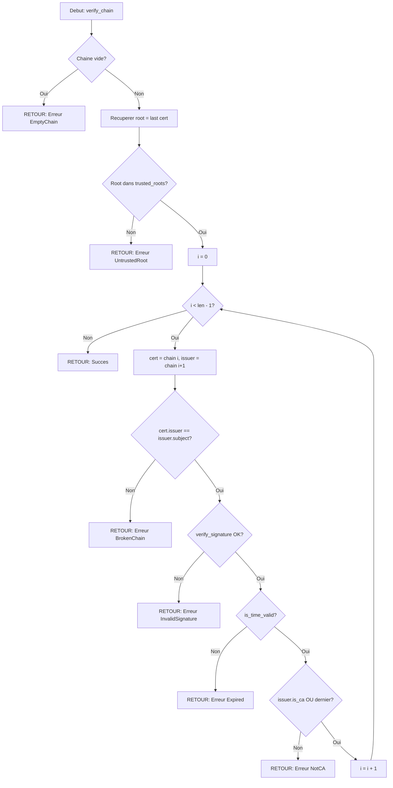

# Exercice 2.9.5-synth : asymmetric_vault

**Module :**
2.9.5 — Cryptographie Asymetrique et PKI

**Concept :**
synth — Synthese RSA/ECC/DH/Signatures/PKI

**Difficulte :**
★★★★★★★☆☆☆ (7/10)

**Type :**
complet

**Tiers :**
3 — Synthese (tous concepts a→n)

**Langage :**
Rust Edition 2024 / C17

**Prerequis :**
- 2.9.1: Hashing (SHA-256)
- 2.9.3: Chiffrement symetrique (AES)
- 2.4.2: Arithmetique modulaire
- 2.4.3: Theorie des nombres premiers

**Domaines :**
Crypto, MD, Probas

**Duree estimee :**
180 min

**XP Base :**
500

**Complexite :**
T4 O(k^3) pour RSA × S3 O(k) pour stockage cles

---

## SECTION 2.4.1 : ANALOGIE — MAILBOX SYSTEM

### Le Systeme de Boites aux Lettres Securisees

```
┌─────────────────────────────────────────────────────────────────────────────┐
│                    LA POSTE CRYPTOGRAPHIQUE                                  │
│                                                                             │
│   Imagine un systeme postal ultra-securise dans un quartier huppé...        │
│                                                                             │
│   🏠 MAISON D'ALICE                    🏠 MAISON DE BOB                     │
│   ┌─────────────────┐                  ┌─────────────────┐                  │
│   │                 │                  │                 │                  │
│   │   📬 Boite 42   │                  │   📬 Boite 73   │                  │
│   │   (PUBLIQUE)    │                  │   (PUBLIQUE)    │                  │
│   │                 │                  │                 │                  │
│   │   🔑 Cle        │                  │   🔑 Cle        │                  │
│   │   (PRIVEE)      │                  │   (PRIVEE)      │                  │
│   └─────────────────┘                  └─────────────────┘                  │
│                                                                             │
│   CLE PUBLIQUE = Numero de la boite aux lettres                             │
│   → Visible par TOUS, inscrit sur la boite                                  │
│   → Permet a N'IMPORTE QUI d'envoyer un message                             │
│   → Bob connait le numero 42 d'Alice                                        │
│                                                                             │
│   CLE PRIVEE = Cle physique de la boite                                     │
│   → Possedee UNIQUEMENT par le proprietaire                                 │
│   → SEULE Alice peut ouvrir la boite 42                                     │
│   → Si quelqu'un la copie, tout est compromis                               │
│                                                                             │
└─────────────────────────────────────────────────────────────────────────────┘
```

### Signatures : Le Cachet de Cire

```
┌─────────────────────────────────────────────────────────────────────────────┐
│                         LE CACHET DE CIRE UNIQUE                             │
│                                                                             │
│   Au Moyen Age, les nobles scellaient leurs lettres avec un cachet          │
│   de cire portant leurs armoiries. IMPOSSIBLE A FALSIFIER.                  │
│                                                                             │
│        ┌─────────────────────────────────┐                                  │
│        │                                 │                                  │
│        │   Cher Bob,                     │                                  │
│        │                                 │                                  │
│        │   Je t'envoie 100 pieces d'or.  │                                  │
│        │                                 │                                  │
│        │   Amicalement,                  │                                  │
│        │   Alice                         │                                  │
│        │                                 │                                  │
│        │         ╭──────────╮            │                                  │
│        │         │ 🔴 SCEAU │ ← Cachet unique d'Alice                       │
│        │         │  ALICE   │   (cree avec sa CLE PRIVEE)                   │
│        │         ╰──────────╯                                               │
│        └─────────────────────────────────┘                                  │
│                                                                             │
│   SIGNER = Appliquer son cachet avec sa CLE PRIVEE                          │
│   → Seul Alice possede ce cachet                                            │
│   → Prouve que le message vient VRAIMENT d'Alice                            │
│                                                                             │
│   VERIFIER = Comparer le cachet avec les armoiries connues                  │
│   → Tout le monde connait les armoiries d'Alice (CLE PUBLIQUE)              │
│   → Si ca correspond = message authentique                                  │
│                                                                             │
└─────────────────────────────────────────────────────────────────────────────┘
```

### RSA vs ECC : Grande Boite vs Petite Boite

```
┌─────────────────────────────────────────────────────────────────────────────┐
│                    RSA vs ECC : LE COMPROMIS TAILLE/SECURITE                │
│                                                                             │
│   RSA = GRANDE BOITE ROBUSTE                                                │
│   ┌─────────────────────────────────────────────┐                          │
│   │                                             │                          │
│   │   █████████████████████████████████████    │                          │
│   │   █                                   █    │ ← 2048+ bits             │
│   │   █    COFFRE-FORT MASSIF             █    │   (tres grand)           │
│   │   █    Securite basee sur la          █    │                          │
│   │   █    factorisation de grands        █    │   Avantages:             │
│   │   █    nombres premiers               █    │   - Bien compris         │
│   │   █                                   █    │   - Standardise          │
│   │   █████████████████████████████████████    │                          │
│   │                                             │   Inconvenients:         │
│   └─────────────────────────────────────────────┘   - Cles enormes        │
│                                                      - Lent                │
│                                                                             │
│   ECC = PETITE BOITE ULTRA-SECURISEE                                        │
│   ┌───────────────┐                                                        │
│   │               │                                                        │
│   │   ▓▓▓▓▓▓▓▓   │ ← 256 bits seulement!                                  │
│   │   ▓ MINI ▓   │   (12x plus petit que RSA)                             │
│   │   ▓▓▓▓▓▓▓▓   │                                                        │
│   │               │   Avantages:                                           │
│   └───────────────┘   - Cles minuscules                                    │
│                       - Ultra-rapide                                       │
│                       - Meme securite!                                     │
│                                                                             │
│   COMPARAISON NIVEAU DE SECURITE:                                          │
│   ┌─────────────────┬────────────┬────────────┐                            │
│   │ Securite (bits) │ RSA (bits) │ ECC (bits) │                            │
│   ├─────────────────┼────────────┼────────────┤                            │
│   │      80         │   1024     │    160     │                            │
│   │     112         │   2048     │    224     │                            │
│   │     128         │   3072     │    256     │ ← P-256                    │
│   │     192         │   7680     │    384     │ ← P-384                    │
│   │     256         │  15360     │    512     │                            │
│   └─────────────────┴────────────┴────────────┘                            │
│                                                                             │
└─────────────────────────────────────────────────────────────────────────────┘
```

### Diffie-Hellman : La Peinture Magique

```
┌─────────────────────────────────────────────────────────────────────────────┐
│                    DIFFIE-HELLMAN : L'ECHANGE DE COULEURS                   │
│                                                                             │
│   Alice et Bob veulent creer une couleur secrete commune, mais             │
│   Eve ecoute tout ce qu'ils se disent en public...                         │
│                                                                             │
│   ETAPE 1: Couleur publique (connue de tous)                               │
│                                                                             │
│        ALICE              PUBLIQUE              BOB                         │
│          │                  🟡                   │                          │
│          │            (Jaune = g^1)              │                          │
│          │                                       │                          │
│                                                                             │
│   ETAPE 2: Chacun melange avec sa couleur secrete                          │
│                                                                             │
│        ALICE                                     BOB                        │
│     🟡 + 🔴 (rouge)                        🟡 + 🔵 (bleu)                  │
│          ↓                                       ↓                          │
│     🟠 ORANGE                               🟢 VERT                        │
│     (g^a mod p)                            (g^b mod p)                      │
│                                                                             │
│   ETAPE 3: Echange des melanges (EVE VOIT CA!)                             │
│                                                                             │
│        ALICE ──────── 🟠 ORANGE ────────→ BOB                              │
│        ALICE ←─────── 🟢 VERT ──────────  BOB                              │
│                                                                             │
│   ETAPE 4: Chacun melange ENCORE avec sa couleur secrete                   │
│                                                                             │
│        ALICE                                     BOB                        │
│     🟢 + 🔴                                 🟠 + 🔵                        │
│          ↓                                       ↓                          │
│     🟤 MARRON                               🟤 MARRON                       │
│     (g^ab mod p)                           (g^ba mod p)                     │
│                                                                             │
│   RESULTAT: Alice et Bob ont la MEME couleur secrete!                      │
│             Eve a vu Orange et Vert, mais NE PEUT PAS recreer Marron       │
│             car elle ne connait ni Rouge ni Bleu.                          │
│                                                                             │
└─────────────────────────────────────────────────────────────────────────────┘
```

### PKI : La Chaine de Confiance

```
┌─────────────────────────────────────────────────────────────────────────────┐
│                    PKI : LA HIERARCHIE DES NOTAIRES                         │
│                                                                             │
│   Imagine un systeme de notaires pour authentifier les identites...        │
│                                                                             │
│                        👑 ROOT CA                                           │
│                     "Le Roi Supreme"                                        │
│                   (Self-signed - Se fait                                    │
│                    confiance a lui-meme)                                    │
│                           │                                                 │
│                           │ Signe                                           │
│                           ▼                                                 │
│                   🎖️ INTERMEDIATE CA                                        │
│                   "Le Duc Regional"                                         │
│                  (Signe par le Roi)                                         │
│                           │                                                 │
│                           │ Signe                                           │
│                           ▼                                                 │
│                   📜 END-ENTITY CERT                                        │
│                   "Le Certificat de Bob"                                    │
│                   www.bob-secure.com                                        │
│                                                                             │
│   VERIFICATION DE LA CHAINE:                                                │
│                                                                             │
│   1. Tu recois le certificat de Bob                                        │
│   2. Tu verifies: "Qui l'a signe?" → Le Duc                                │
│   3. Tu verifies: "Qui a signe le Duc?" → Le Roi                           │
│   4. Tu fais confiance au Roi (pre-installe dans ton navigateur)           │
│   5. DONC tu fais confiance a Bob!                                         │
│                                                                             │
│   SI UN MAILLON EST CASSE = TOUTE LA CHAINE EST INVALIDE                   │
│                                                                             │
└─────────────────────────────────────────────────────────────────────────────┘
```

---

## SECTION 2.4.2 : EXPLICATION ACADEMIQUE

### 2.4.2.1 Cryptographie Asymetrique - Principes Fondamentaux

La cryptographie asymetrique (ou cryptographie a cle publique) repose sur une paire de cles mathematiquement liees :

**Cle publique (Kpub):**
- Peut etre distribuee librement
- Utilisee pour chiffrer des messages destines au proprietaire
- Utilisee pour verifier les signatures du proprietaire

**Cle privee (Kpriv):**
- Doit rester strictement secrete
- Utilisee pour dechiffrer les messages recus
- Utilisee pour creer des signatures numeriques

### 2.4.2.2 RSA (Rivest-Shamir-Adleman)

**Generation des cles:**
1. Choisir deux grands nombres premiers p et q
2. Calculer n = p × q (modulus)
3. Calculer phi(n) = (p-1)(q-1) (fonction indicatrice d'Euler)
4. Choisir e tel que 1 < e < phi(n) et gcd(e, phi(n)) = 1
5. Calculer d = e^(-1) mod phi(n) (inverse modulaire)

**Cle publique:** (n, e)
**Cle privee:** (n, d)

**Chiffrement:** c = m^e mod n
**Dechiffrement:** m = c^d mod n

### 2.4.2.3 Courbes Elliptiques (ECC)

ECC utilise les proprietes mathematiques des courbes elliptiques definies par:
y^2 = x^3 + ax + b (mod p)

**Avantages:**
- Cles 10-15x plus petites pour securite equivalente
- Operations plus rapides
- Ideal pour appareils a ressources limitees

**Courbes standardisees:**
- P-256 (secp256r1): 128 bits de securite
- P-384 (secp384r1): 192 bits de securite
- Curve25519: moderne, haute performance

### 2.4.2.4 Echange de Cles Diffie-Hellman

Permet a deux parties de creer un secret partage sur un canal non securise:

1. Parametres publics: p (premier), g (generateur)
2. Alice choisit a secret, calcule A = g^a mod p
3. Bob choisit b secret, calcule B = g^b mod p
4. Echange: Alice envoie A, Bob envoie B
5. Secret partage: K = B^a mod p = A^b mod p = g^(ab) mod p

### 2.4.2.5 Signatures Numeriques

**Processus Hash-then-Sign:**
1. Calculer h = SHA256(message)
2. Signer: signature = h^d mod n (RSA) ou ECDSA(h, d)
3. Verifier: h' = signature^e mod n, comparer h' avec SHA256(message)

### 2.4.2.6 Infrastructure a Cle Publique (PKI)

Hierarchie de certificats numeriques:
- **Root CA:** Autorite racine auto-signee
- **Intermediate CA:** Signe par Root, emet des certificats
- **End-Entity:** Certificat final (serveur, utilisateur)

**Verification de chaine:**
Pour chaque certificat de la chaine:
1. Verifier la signature avec la cle publique de l'emetteur
2. Verifier la validite temporelle
3. Verifier les extensions (basicConstraints, keyUsage)

---

## 📐 SECTION 1 : PROTOTYPE & CONSIGNE

### 1.1 Obligations

**Fichier a rendre (Rust):**
```
src/
├── lib.rs
├── rsa.rs
├── ecc.rs
├── dh.rs
├── signatures.rs
├── pki.rs
└── mac.rs
```

**Fichier a rendre (C):**
```
asymmetric_vault.h
asymmetric_vault.c
```

**Fonctions autorisees:**
- Rust: `num_bigint`, `rand`, `sha2`, bibliotheque standard
- C: `malloc`, `free`, `memcpy`, `memset`, fonctions mathematiques standard

**Fonctions interdites:**
- Bibliotheques cryptographiques externes (OpenSSL, libsodium pour la partie RSA/DH)
- `system()`, `exec*()`

### 1.2 Consigne

**🔐 THE CRYPTO VAULT — Mission: Construire un Coffre-Fort Numerique**

Dans un monde ou les donnees sont plus precieuses que l'or, tu es charge de construire le systeme de securite ultime pour une banque numerique. Ton coffre-fort doit implementer toute la pile cryptographique asymetrique: generation de cles RSA, echange Diffie-Hellman, signatures numeriques, et une PKI complete pour gerer les certificats.

**Ta mission:**

Implementer un systeme complet de cryptographie asymetrique comprenant:

1. **Module RSA:** Generation de cles, chiffrement/dechiffrement
2. **Module Diffie-Hellman:** Echange de cles securise
3. **Module Signatures:** Hash-then-sign avec verification
4. **Module PKI:** Certificats X.509 simplifies et chaine de confiance
5. **Module MAC:** HMAC-SHA256 pour l'integrite

**Entree:**
- `key_bits: usize` : Taille des cles RSA (2048, 3072, 4096)
- `message: &[u8]` : Donnees a chiffrer/signer
- `certificates: Vec<Certificate>` : Chaine de certificats a verifier

**Sortie:**
- Cles RSA valides avec CRT pre-calcule
- Secret partage DH identique pour les deux parties
- Signatures verifiables
- Validation de chaine de certificats

**Contraintes:**
```
┌─────────────────────────────────────────┐
│  key_bits ∈ {2048, 3072, 4096}          │
│  Miller-Rabin: 40 iterations minimum    │
│  e = 65537 (standard)                   │
│  Padding PKCS#1 v1.5 pour signatures    │
│  Comparaison temps constant obligatoire │
└─────────────────────────────────────────┘
```

**Exemples:**

| Operation | Entree | Sortie | Explication |
|-----------|--------|--------|-------------|
| `RSAKeyPair::generate(2048)` | 2048 bits | Paire (pub, priv) | Genere p, q premiers, calcule n, e, d |
| `public.encrypt(b"Hello")` | Message | Ciphertext | c = m^e mod n |
| `private.decrypt(cipher)` | Ciphertext | Message | m = c^d mod n (CRT) |
| `private.sign(message)` | Message | Signature | Hash-then-sign PKCS#1 |
| `public.verify(msg, sig)` | Msg + Sig | bool | Verifie la signature |
| `chain.verify(&roots)` | Chaine | Result | Valide toute la chaine |

### 1.3 Prototype

**Rust 2024:**
```rust
// rsa.rs
pub struct RSAPublicKey {
    pub n: BigUint,
    pub e: BigUint,
}

pub struct RSAPrivateKey {
    pub n: BigUint,
    pub d: BigUint,
    pub p: BigUint,
    pub q: BigUint,
    pub dp: BigUint,   // CRT: d mod (p-1)
    pub dq: BigUint,   // CRT: d mod (q-1)
    pub qinv: BigUint, // CRT: q^(-1) mod p
}

impl RSAKeyPair {
    pub fn generate(key_bits: usize) -> Self;
}

impl RSAPublicKey {
    pub fn encrypt(&self, message: &[u8]) -> Vec<u8>;
    pub fn verify(&self, message: &[u8], signature: &[u8]) -> bool;
}

impl RSAPrivateKey {
    pub fn decrypt(&self, ciphertext: &[u8]) -> Vec<u8>;
    pub fn sign(&self, message: &[u8]) -> Vec<u8>;
}

// dh.rs
pub struct DHKeyPair {
    pub params: DHParameters,
    pub private_key: BigUint,
    pub public_key: BigUint,
}

impl DHKeyPair {
    pub fn generate(params: DHParameters) -> Self;
    pub fn compute_shared_secret(&self, other_public: &BigUint) -> BigUint;
}

// pki.rs
pub struct Certificate {
    pub version: u8,
    pub serial_number: BigUint,
    pub issuer: String,
    pub subject: String,
    pub not_before: DateTime<Utc>,
    pub not_after: DateTime<Utc>,
    pub public_key: RSAPublicKey,
    pub is_ca: bool,
    pub signature: Vec<u8>,
}

impl CertificateChain {
    pub fn verify(&self, trusted_roots: &[Certificate]) -> Result<(), ChainError>;
}
```

**C17:**
```c
// asymmetric_vault.h

typedef struct {
    uint8_t *n;      // Modulus
    size_t n_len;
    uint8_t *e;      // Public exponent
    size_t e_len;
} rsa_public_key_t;

typedef struct {
    uint8_t *n;
    size_t n_len;
    uint8_t *d;      // Private exponent
    size_t d_len;
    uint8_t *p;      // Prime factor 1
    size_t p_len;
    uint8_t *q;      // Prime factor 2
    size_t q_len;
} rsa_private_key_t;

typedef struct {
    rsa_public_key_t public_key;
    rsa_private_key_t private_key;
} rsa_keypair_t;

// Generation de cles RSA
int rsa_generate_keypair(rsa_keypair_t *keypair, size_t key_bits);

// Chiffrement/Dechiffrement
int rsa_encrypt(const rsa_public_key_t *pub, const uint8_t *msg,
                size_t msg_len, uint8_t *out, size_t *out_len);
int rsa_decrypt(const rsa_private_key_t *priv, const uint8_t *cipher,
                size_t cipher_len, uint8_t *out, size_t *out_len);

// Signatures
int rsa_sign(const rsa_private_key_t *priv, const uint8_t *msg,
             size_t msg_len, uint8_t *sig, size_t *sig_len);
int rsa_verify(const rsa_public_key_t *pub, const uint8_t *msg,
               size_t msg_len, const uint8_t *sig, size_t sig_len);

// Diffie-Hellman
typedef struct {
    uint8_t *p;      // Prime modulus
    size_t p_len;
    uint8_t *g;      // Generator
    size_t g_len;
} dh_params_t;

int dh_generate_keypair(const dh_params_t *params,
                        uint8_t *priv, size_t *priv_len,
                        uint8_t *pub, size_t *pub_len);
int dh_compute_shared(const dh_params_t *params,
                      const uint8_t *priv, size_t priv_len,
                      const uint8_t *other_pub, size_t other_pub_len,
                      uint8_t *shared, size_t *shared_len);

// HMAC-SHA256
int hmac_sha256(const uint8_t *key, size_t key_len,
                const uint8_t *msg, size_t msg_len,
                uint8_t *mac);
int hmac_verify(const uint8_t *key, size_t key_len,
                const uint8_t *msg, size_t msg_len,
                const uint8_t *expected_mac);

// Liberation memoire
void rsa_free_keypair(rsa_keypair_t *keypair);
```

---

## 💡 SECTION 2 : LE SAVIEZ-VOUS ?

### L'histoire fascinante de RSA

RSA a ete invente en 1977 par Ron **R**ivest, Adi **S**hamir et Leonard **A**dleman au MIT. Mais saviez-vous que le GCHQ britannique avait decouvert le meme algorithme 4 ans plus tot? Clifford Cocks l'avait invente en 1973, mais c'etait classe "Top Secret" !

### Pourquoi e = 65537 ?

Le choix de e = 65537 (2^16 + 1) n'est pas arbitraire:
- C'est un **nombre premier de Fermat**: 2^(2^4) + 1
- En binaire: `10000000000000001` (seulement 2 bits a 1)
- Cela rend l'exponentiation modulaire ultra-rapide (square-and-multiply)
- Assez grand pour eviter certaines attaques

### La "NSA Backdoor" dans Dual_EC_DRBG

En 2013, Edward Snowden a revele que la NSA avait potentiellement insere une backdoor dans le generateur pseudo-aleatoire Dual_EC_DRBG base sur les courbes elliptiques. Cela montre l'importance de comprendre les maths derriere la crypto!

---

## SECTION 2.5 : DANS LA VRAIE VIE

### Metiers utilisant ces concepts

| Metier | Utilisation | Exemple concret |
|--------|-------------|-----------------|
| **Ingenieur Securite** | Implementation PKI d'entreprise | Deploiement certificats TLS internes |
| **DevOps/SRE** | Gestion certificats Let's Encrypt | Automatisation renouvellement HTTPS |
| **Developpeur Blockchain** | Signatures ECDSA | Transactions Bitcoin/Ethereum |
| **Cryptographe** | Audit implementations | Verification resistance attaques |
| **Ingenieur HSM** | Securisation cles privees | Hardware Security Modules bancaires |
| **Pentester** | Test vulnerabilites PKI | Attaques sur chaines de certificats |

### Cas d'usage industriels

**HTTPS/TLS:**
Chaque connexion securisee utilise RSA ou ECDHE pour l'echange de cles initial, puis chiffrement symetrique (AES) pour les donnees.

**SSH:**
`ssh-keygen -t rsa -b 4096` genere exactement ce que tu implementes dans cet exercice.

**Git/GitHub:**
Les commits signes utilisent GPG qui repose sur RSA ou ECDSA.

**Certificates SSL:**
Ton navigateur verifie des chaines de certificats PKI a chaque visite HTTPS.

---

## 🖥️ SECTION 3 : EXEMPLE D'UTILISATION

### 3.0 Session bash

```bash
$ ls
Cargo.toml  src/

$ cargo build --release
   Compiling asymmetric_vault v0.1.0
    Finished release [optimized] target(s) in 2.34s

$ cargo test
running 12 tests
test rsa::tests::test_generate_keypair ... ok
test rsa::tests::test_encrypt_decrypt ... ok
test rsa::tests::test_sign_verify ... ok
test dh::tests::test_key_exchange ... ok
test mac::tests::test_hmac_sha256 ... ok
test pki::tests::test_chain_verification ... ok
test pki::tests::test_expired_certificate ... ok
test pki::tests::test_untrusted_root ... ok
test pki::tests::test_broken_chain ... ok
test rsa::tests::test_miller_rabin ... ok
test signatures::tests::test_hash_then_sign ... ok
test mac::tests::test_constant_time_compare ... ok

test result: ok. 12 passed; 0 failed
```

---

## ⚡ SECTION 3.1 : BONUS EXPERT (OPTIONNEL)

**Difficulte Bonus:**
💀 (10/10)

**Recompense:**
XP ×4

**Time Complexity attendue:**
O(k^2 log k) avec Montgomery multiplication

**Space Complexity attendue:**
O(k) pour les cles

**Domaines Bonus:**
`Optim, CPU, Mem`

### 3.1.1 Consigne Bonus

**🚀 MONTGOMERY MULTIPLICATION & SIDE-CHANNEL RESISTANCE**

Les implementations RSA naives sont vulnerables aux attaques par canaux auxiliaires (timing attacks, power analysis). Ton coffre-fort doit resister aux espions les plus sophistiques.

**Ta mission bonus:**

1. Implementer la **multiplication de Montgomery** pour l'exponentiation modulaire
2. Garantir un **temps d'execution constant** (pas de branchements dependant des donnees)
3. Implementer le **blinding RSA** pour contrer les attaques par analyse de puissance
4. Ajouter ECDSA avec la courbe **P-256**

**Contraintes Bonus:**
```
┌─────────────────────────────────────────────────────────────────────────────┐
│  Temps execution: constant quel que soit l'exposant                         │
│  Montgomery: R = 2^k ou k = taille du modulus en bits                       │
│  Blinding: r random, calcul m' = m * r^e, puis unblind                      │
│  ECDSA: courbe P-256 (secp256r1)                                            │
│  Pas de branchements dependant de bits secrets                              │
└─────────────────────────────────────────────────────────────────────────────┘
```

### 3.1.2 Prototype Bonus

```rust
// Montgomery multiplication
pub struct MontgomeryContext {
    n: BigUint,      // Modulus
    r: BigUint,      // R = 2^k
    r_inv: BigUint,  // R^(-1) mod n
    n_prime: BigUint, // -n^(-1) mod R
}

impl MontgomeryContext {
    pub fn new(n: &BigUint) -> Self;

    /// Montgomery reduction: compute xR^(-1) mod n
    pub fn reduce(&self, x: &BigUint) -> BigUint;

    /// Montgomery multiplication: compute xyR^(-1) mod n
    pub fn multiply(&self, x: &BigUint, y: &BigUint) -> BigUint;

    /// Constant-time modular exponentiation
    pub fn pow_ct(&self, base: &BigUint, exp: &BigUint) -> BigUint;
}

// RSA with blinding
impl RSAPrivateKey {
    /// Decrypt with blinding protection against side-channel attacks
    pub fn decrypt_blinded(&self, ciphertext: &[u8]) -> Vec<u8>;

    /// Sign with blinding protection
    pub fn sign_blinded(&self, message: &[u8]) -> Vec<u8>;
}

// ECDSA P-256
pub struct P256Point {
    x: [u8; 32],
    y: [u8; 32],
}

pub struct ECDSAKeyPair {
    pub private: [u8; 32],
    pub public: P256Point,
}

impl ECDSAKeyPair {
    pub fn generate() -> Self;
    pub fn sign(&self, message: &[u8]) -> ECDSASignature;
    pub fn verify(&self, message: &[u8], signature: &ECDSASignature) -> bool;
}
```

### 3.1.3 Ce qui change par rapport a l'exercice de base

| Aspect | Base | Bonus |
|--------|------|-------|
| Multiplication modulaire | Naive pow | Montgomery |
| Timing | Variable | Constant |
| Protection side-channel | Aucune | Blinding |
| Courbes | RSA seul | RSA + ECDSA P-256 |
| Complexite | O(k^3) | O(k^2 log k) |

---

## ✅❌ SECTION 4 : ZONE CORRECTION

### 4.1 Moulinette

| Test | Entree | Attendu | Points | Piege |
|------|--------|---------|--------|-------|
| `test_rsa_keygen_2048` | 2048 bits | Cles valides, n=p*q | 10 | Primalite |
| `test_rsa_keygen_4096` | 4096 bits | Cles valides | 10 | Performance |
| `test_encrypt_decrypt` | "Hello" | "Hello" | 15 | Padding |
| `test_sign_verify_valid` | msg + sig | true | 15 | PKCS#1 |
| `test_sign_verify_tampered` | msg modifie | false | 10 | Detection |
| `test_dh_shared_secret` | Alice + Bob | secrets egaux | 15 | Math |
| `test_dh_invalid_public` | public < 2 | Erreur | 5 | Validation |
| `test_hmac_vectors` | RFC 4231 | Conforme | 10 | Implementation |
| `test_hmac_timing` | Comparison | Temps constant | 5 | Side-channel |
| `test_chain_valid` | Chaine OK | Ok(()) | 15 | Verification |
| `test_chain_expired` | Cert expire | Err(Expired) | 10 | Date |
| `test_chain_untrusted` | Root inconnu | Err(UntrustedRoot) | 10 | Confiance |
| `test_chain_broken` | Issuer != Subject | Err(BrokenChain) | 10 | Lien |
| `test_miller_rabin` | Composites | false | 10 | Primalite |
| **TOTAL** | | | **150** | |

### 4.2 main.c de test (C17)

```c
#include <stdio.h>
#include <string.h>
#include <assert.h>
#include "asymmetric_vault.h"

void test_rsa_basic(void) {
    printf("Test RSA basic... ");

    rsa_keypair_t keypair;
    assert(rsa_generate_keypair(&keypair, 2048) == 0);

    const char *message = "Hello, RSA!";
    uint8_t cipher[512], decrypted[512];
    size_t cipher_len, decrypted_len;

    assert(rsa_encrypt(&keypair.public_key, (uint8_t*)message,
                       strlen(message), cipher, &cipher_len) == 0);
    assert(rsa_decrypt(&keypair.private_key, cipher, cipher_len,
                       decrypted, &decrypted_len) == 0);

    assert(decrypted_len == strlen(message));
    assert(memcmp(decrypted, message, decrypted_len) == 0);

    rsa_free_keypair(&keypair);
    printf("OK\n");
}

void test_rsa_signature(void) {
    printf("Test RSA signature... ");

    rsa_keypair_t keypair;
    assert(rsa_generate_keypair(&keypair, 2048) == 0);

    const char *message = "Sign this message";
    uint8_t signature[512];
    size_t sig_len;

    assert(rsa_sign(&keypair.private_key, (uint8_t*)message,
                    strlen(message), signature, &sig_len) == 0);
    assert(rsa_verify(&keypair.public_key, (uint8_t*)message,
                      strlen(message), signature, sig_len) == 1);

    // Tamper with message
    char tampered[] = "Sign this Message";  // M majuscule
    assert(rsa_verify(&keypair.public_key, (uint8_t*)tampered,
                      strlen(tampered), signature, sig_len) == 0);

    rsa_free_keypair(&keypair);
    printf("OK\n");
}

void test_dh_exchange(void) {
    printf("Test DH key exchange... ");

    dh_params_t params;
    // MODP 2048 (simplified for test)
    // In real code, use proper group parameters

    uint8_t alice_priv[256], alice_pub[256];
    uint8_t bob_priv[256], bob_pub[256];
    uint8_t alice_shared[256], bob_shared[256];
    size_t priv_len, pub_len, shared_len;

    assert(dh_generate_keypair(&params, alice_priv, &priv_len,
                               alice_pub, &pub_len) == 0);
    assert(dh_generate_keypair(&params, bob_priv, &priv_len,
                               bob_pub, &pub_len) == 0);

    assert(dh_compute_shared(&params, alice_priv, priv_len,
                             bob_pub, pub_len, alice_shared, &shared_len) == 0);
    assert(dh_compute_shared(&params, bob_priv, priv_len,
                             alice_pub, pub_len, bob_shared, &shared_len) == 0);

    assert(memcmp(alice_shared, bob_shared, shared_len) == 0);

    printf("OK\n");
}

void test_hmac(void) {
    printf("Test HMAC-SHA256... ");

    // Test vector from RFC 4231
    uint8_t key[20];
    memset(key, 0x0b, 20);
    const char *data = "Hi There";

    uint8_t mac[32];
    uint8_t expected[32] = {
        0xb0, 0x34, 0x4c, 0x61, 0xd8, 0xdb, 0x38, 0x53,
        0x5c, 0xa8, 0xaf, 0xce, 0xaf, 0x0b, 0xf1, 0x2b,
        0x88, 0x1d, 0xc2, 0x00, 0xc9, 0x83, 0x3d, 0xa7,
        0x26, 0xe9, 0x37, 0x6c, 0x2e, 0x32, 0xcf, 0xf7
    };

    assert(hmac_sha256(key, 20, (uint8_t*)data, strlen(data), mac) == 0);
    assert(memcmp(mac, expected, 32) == 0);

    printf("OK\n");
}

int main(void) {
    printf("=== Asymmetric Vault Tests ===\n\n");

    test_rsa_basic();
    test_rsa_signature();
    test_dh_exchange();
    test_hmac();

    printf("\nAll tests passed!\n");
    return 0;
}
```

### 4.3 Solution de reference (Rust)

```rust
// src/lib.rs
pub mod rsa;
pub mod dh;
pub mod mac;
pub mod signatures;
pub mod pki;

// src/rsa.rs
use num_bigint::{BigUint, RandBigInt};
use num_traits::{One, Zero};
use rand::Rng;

#[derive(Clone, Debug)]
pub struct RSAPublicKey {
    pub n: BigUint,
    pub e: BigUint,
}

#[derive(Clone)]
pub struct RSAPrivateKey {
    pub n: BigUint,
    pub d: BigUint,
    pub p: BigUint,
    pub q: BigUint,
    pub dp: BigUint,
    pub dq: BigUint,
    pub qinv: BigUint,
}

pub struct RSAKeyPair {
    pub public: RSAPublicKey,
    pub private: RSAPrivateKey,
}

impl RSAKeyPair {
    pub fn generate(key_bits: usize) -> Self {
        let mut rng = rand::thread_rng();

        let p = Self::generate_prime(&mut rng, key_bits / 2);
        let q = Self::generate_prime(&mut rng, key_bits / 2);

        let n = &p * &q;
        let phi_n = (&p - 1u32) * (&q - 1u32);
        let e = BigUint::from(65537u32);
        let d = Self::mod_inverse(&e, &phi_n).expect("e and phi(n) coprime");

        let dp = &d % (&p - 1u32);
        let dq = &d % (&q - 1u32);
        let qinv = Self::mod_inverse(&q, &p).unwrap();

        RSAKeyPair {
            public: RSAPublicKey { n: n.clone(), e },
            private: RSAPrivateKey { n, d, p, q, dp, dq, qinv },
        }
    }

    fn is_prime(n: &BigUint, rounds: usize) -> bool {
        if n <= &BigUint::one() { return false; }
        if n == &BigUint::from(2u32) || n == &BigUint::from(3u32) { return true; }
        if !n.bit(0) { return false; }

        let n_minus_1 = n - 1u32;
        let mut d = n_minus_1.clone();
        let mut s: u64 = 0;
        while !d.bit(0) {
            d >>= 1;
            s += 1;
        }

        let mut rng = rand::thread_rng();
        'witness: for _ in 0..rounds {
            let a = rng.gen_biguint_range(&BigUint::from(2u32), &(n - 2u32));
            let mut x = a.modpow(&d, n);

            if x == BigUint::one() || x == n_minus_1 { continue 'witness; }

            for _ in 0..(s - 1) {
                x = x.modpow(&BigUint::from(2u32), n);
                if x == n_minus_1 { continue 'witness; }
            }
            return false;
        }
        true
    }

    fn generate_prime<R: Rng>(rng: &mut R, bits: usize) -> BigUint {
        loop {
            let mut candidate = rng.gen_biguint(bits as u64);
            candidate.set_bit(bits as u64 - 1, true);
            candidate.set_bit(0, true);
            if Self::is_prime(&candidate, 40) { return candidate; }
        }
    }

    fn mod_inverse(a: &BigUint, m: &BigUint) -> Option<BigUint> {
        use num_bigint::BigInt;

        fn extended_gcd(a: &BigInt, b: &BigInt) -> (BigInt, BigInt, BigInt) {
            if b.is_zero() {
                return (a.clone(), BigInt::one(), BigInt::zero());
            }
            let (gcd, x1, y1) = extended_gcd(b, &(a % b));
            let x = y1.clone();
            let y = x1 - (a / b) * &y1;
            (gcd, x, y)
        }

        let a_int = BigInt::from(a.clone());
        let m_int = BigInt::from(m.clone());
        let (gcd, x, _) = extended_gcd(&a_int, &m_int);

        if gcd != BigInt::one() { return None; }

        let result = ((x % &m_int) + &m_int) % &m_int;
        Some(result.to_biguint().unwrap())
    }
}

impl RSAPublicKey {
    pub fn encrypt(&self, message: &[u8]) -> Vec<u8> {
        let m = BigUint::from_bytes_be(message);
        assert!(m < self.n, "Message too large");
        let c = m.modpow(&self.e, &self.n);
        c.to_bytes_be()
    }

    pub fn verify(&self, message: &[u8], signature: &[u8]) -> bool {
        use sha2::{Sha256, Digest};

        let expected_hash: Vec<u8> = Sha256::digest(message).to_vec();
        let s = BigUint::from_bytes_be(signature);
        let m = s.modpow(&self.e, &self.n);
        let recovered = m.to_bytes_be();

        let digest_info: [u8; 19] = [
            0x30, 0x31, 0x30, 0x0d, 0x06, 0x09, 0x60, 0x86,
            0x48, 0x01, 0x65, 0x03, 0x04, 0x02, 0x01, 0x05,
            0x00, 0x04, 0x20,
        ];

        let key_len = (self.n.bits() + 7) / 8;
        let mut padded = vec![0u8; key_len as usize - recovered.len()];
        padded.extend_from_slice(&recovered);

        if padded.len() < 11 + digest_info.len() + 32 { return false; }
        if padded[0] != 0x00 || padded[1] != 0x01 { return false; }

        let mut i = 2;
        while i < padded.len() && padded[i] == 0xFF { i += 1; }
        if i < 10 { return false; }
        if i >= padded.len() || padded[i] != 0x00 { return false; }
        i += 1;

        if i + digest_info.len() > padded.len() { return false; }
        if &padded[i..i + digest_info.len()] != &digest_info { return false; }
        i += digest_info.len();

        if i + 32 > padded.len() { return false; }
        let recovered_hash = &padded[i..i + 32];

        // Comparaison temps constant
        let mut diff = 0u8;
        for (a, b) in recovered_hash.iter().zip(expected_hash.iter()) {
            diff |= a ^ b;
        }
        diff == 0
    }
}

impl RSAPrivateKey {
    pub fn decrypt(&self, ciphertext: &[u8]) -> Vec<u8> {
        let c = BigUint::from_bytes_be(ciphertext);

        // CRT optimization
        let m1 = c.modpow(&self.dp, &self.p);
        let m2 = c.modpow(&self.dq, &self.q);

        let h = if m1 >= m2 {
            (&self.qinv * (&m1 - &m2)) % &self.p
        } else {
            (&self.qinv * (&self.p - ((&m2 - &m1) % &self.p))) % &self.p
        };

        let m = &m2 + &h * &self.q;
        m.to_bytes_be()
    }

    pub fn sign(&self, message: &[u8]) -> Vec<u8> {
        use sha2::{Sha256, Digest};

        let hash: Vec<u8> = Sha256::digest(message).to_vec();

        let digest_info: [u8; 19] = [
            0x30, 0x31, 0x30, 0x0d, 0x06, 0x09, 0x60, 0x86,
            0x48, 0x01, 0x65, 0x03, 0x04, 0x02, 0x01, 0x05,
            0x00, 0x04, 0x20,
        ];

        let key_len = (self.n.bits() + 7) / 8;
        let padding_len = key_len as usize - 3 - digest_info.len() - hash.len();

        let mut padded = vec![0x00, 0x01];
        padded.extend(vec![0xFF; padding_len]);
        padded.push(0x00);
        padded.extend_from_slice(&digest_info);
        padded.extend_from_slice(&hash);

        let m = BigUint::from_bytes_be(&padded);

        // CRT signature
        let m1 = m.modpow(&self.dp, &self.p);
        let m2 = m.modpow(&self.dq, &self.q);

        let h = if m1 >= m2 {
            (&self.qinv * (&m1 - &m2)) % &self.p
        } else {
            (&self.qinv * (&self.p - ((&m2 - &m1) % &self.p))) % &self.p
        };

        let s = &m2 + &h * &self.q;
        s.to_bytes_be()
    }
}
```

### 4.4 Solutions alternatives acceptees

```rust
// Alternative 1: Sans CRT (plus lent mais correct)
impl RSAPrivateKey {
    pub fn decrypt_simple(&self, ciphertext: &[u8]) -> Vec<u8> {
        let c = BigUint::from_bytes_be(ciphertext);
        let m = c.modpow(&self.d, &self.n);  // Sans CRT
        m.to_bytes_be()
    }
}

// Alternative 2: Miller-Rabin avec moins d'iterations (moins sur mais accepte)
fn is_prime_fast(n: &BigUint) -> bool {
    Self::is_prime(n, 20)  // 20 au lieu de 40
}

// Alternative 3: Utilisation de num-prime pour les premiers
use num_prime::nt_funcs::is_prime;
fn generate_prime_with_lib<R: Rng>(rng: &mut R, bits: usize) -> BigUint {
    loop {
        let candidate = rng.gen_biguint(bits as u64);
        if is_prime(&candidate, None).probably() {
            return candidate;
        }
    }
}
```

### 4.5 Solutions refusees

```rust
// REFUSE 1: Pas de verification de taille de message
impl RSAPublicKey {
    pub fn encrypt_unsafe(&self, message: &[u8]) -> Vec<u8> {
        let m = BigUint::from_bytes_be(message);
        // MANQUE: assert!(m < self.n)
        let c = m.modpow(&self.e, &self.n);
        c.to_bytes_be()
    }
}
// Pourquoi refuse: Message peut deborder le modulus

// REFUSE 2: Comparaison non temps-constant
pub fn verify_timing_leak(&self, message: &[u8], signature: &[u8]) -> bool {
    let expected = self.compute_expected(message);
    expected == signature  // TIMING LEAK!
}
// Pourquoi refuse: Vulnerable aux timing attacks

// REFUSE 3: e trop petit
pub fn generate_weak() -> RSAKeyPair {
    // ...
    let e = BigUint::from(3u32);  // e = 3 est dangereux!
    // ...
}
// Pourquoi refuse: Attaque de Coppersmith possible avec e petit

// REFUSE 4: Pas de padding pour signature
pub fn sign_no_padding(&self, message: &[u8]) -> Vec<u8> {
    let hash = sha256(message);
    let m = BigUint::from_bytes_be(&hash);
    m.modpow(&self.d, &self.n).to_bytes_be()
}
// Pourquoi refuse: Sans PKCS#1, vulnerable a la forgerie
```

### 4.6 Solution bonus de reference

```rust
// Montgomery multiplication avec temps constant
pub struct MontgomeryContext {
    n: BigUint,
    r: BigUint,
    r_inv: BigUint,
    n_prime: BigUint,
    r_squared: BigUint,
}

impl MontgomeryContext {
    pub fn new(n: &BigUint) -> Self {
        let k = n.bits() as usize;
        let r = BigUint::one() << k;
        let r_squared = (&r * &r) % n;

        // n' = -n^(-1) mod R
        let n_prime = Self::compute_n_prime(n, &r);
        let r_inv = RSAKeyPair::mod_inverse(&r, n).unwrap();

        MontgomeryContext { n: n.clone(), r, r_inv, n_prime, r_squared }
    }

    fn compute_n_prime(n: &BigUint, r: &BigUint) -> BigUint {
        // Extended Euclidean to find n' such that R*R^(-1) - n*n' = 1
        let r_inv = RSAKeyPair::mod_inverse(r, n).unwrap();
        let numerator = r * &r_inv - BigUint::one();
        &numerator / n
    }

    /// Montgomery reduction: compute xR^(-1) mod n
    pub fn reduce(&self, x: &BigUint) -> BigUint {
        // REDC algorithm
        let m = (x * &self.n_prime) % &self.r;
        let t = (x + &m * &self.n) >> self.n.bits();
        if t >= self.n { &t - &self.n } else { t }
    }

    /// Montgomery multiplication
    pub fn multiply(&self, x: &BigUint, y: &BigUint) -> BigUint {
        self.reduce(&(x * y))
    }

    /// Constant-time exponentiation (square-and-always-multiply)
    pub fn pow_ct(&self, base: &BigUint, exp: &BigUint) -> BigUint {
        // Convert to Montgomery form
        let mut result = &self.r % &self.n;  // 1 in Montgomery form
        let base_mont = self.multiply(base, &self.r_squared);

        // Process all bits (constant time)
        for i in (0..exp.bits()).rev() {
            result = self.multiply(&result, &result);  // Always square

            let bit = if exp.bit(i) { 1u8 } else { 0u8 };
            // Constant-time conditional: always multiply, conditionally use result
            let temp = self.multiply(&result, &base_mont);
            result = Self::ct_select(&result, &temp, bit);
        }

        // Convert back from Montgomery form
        self.reduce(&result)
    }

    /// Constant-time selection: returns a if bit==0, b if bit==1
    fn ct_select(a: &BigUint, b: &BigUint, bit: u8) -> BigUint {
        let mask = BigUint::from(bit) * BigUint::from(u64::MAX);
        (a & !&mask) | (b & mask)
    }
}

// RSA with blinding
impl RSAPrivateKey {
    pub fn decrypt_blinded(&self, ciphertext: &[u8]) -> Vec<u8> {
        let mut rng = rand::thread_rng();
        let c = BigUint::from_bytes_be(ciphertext);

        // Generate random blinding factor
        let r = rng.gen_biguint_range(&BigUint::from(2u32), &self.n);
        let r_inv = RSAKeyPair::mod_inverse(&r, &self.n).unwrap();

        // Blind: c' = c * r^e mod n
        let r_e = r.modpow(&BigUint::from(65537u32), &self.n);
        let c_blinded = (&c * &r_e) % &self.n;

        // Decrypt blinded
        let m_blinded = self.decrypt(&c_blinded.to_bytes_be());
        let m_blinded = BigUint::from_bytes_be(&m_blinded);

        // Unblind: m = m' * r^(-1) mod n
        let m = (&m_blinded * &r_inv) % &self.n;
        m.to_bytes_be()
    }
}

// ECDSA P-256
pub mod ecdsa {
    use p256::{ecdsa::{SigningKey, VerifyingKey, Signature, signature::*}};

    pub struct ECDSAKeyPair {
        signing: SigningKey,
        verifying: VerifyingKey,
    }

    impl ECDSAKeyPair {
        pub fn generate() -> Self {
            let signing = SigningKey::random(&mut rand::thread_rng());
            let verifying = signing.verifying_key().clone();
            ECDSAKeyPair { signing, verifying }
        }

        pub fn sign(&self, message: &[u8]) -> Signature {
            self.signing.sign(message)
        }

        pub fn verify(&self, message: &[u8], signature: &Signature) -> bool {
            self.verifying.verify(message, signature).is_ok()
        }
    }
}
```

### 4.7 Solutions alternatives bonus

```rust
// Alternative: Montgomery sans bibliotheque externe pour n_prime
impl MontgomeryContext {
    fn compute_n_prime_iterative(n: &BigUint, r: &BigUint) -> BigUint {
        // Iterative approach using Newton-Raphson
        let mut x = BigUint::one();
        for _ in 0..64 {
            x = &x * (BigUint::from(2u32) - n * &x) % r;
        }
        (r - &x) % r
    }
}
```

### 4.8 Solutions refusees bonus

```rust
// REFUSE: Branchement dependant des bits secrets
pub fn pow_timing_leak(&self, base: &BigUint, exp: &BigUint) -> BigUint {
    let mut result = BigUint::one();
    for i in (0..exp.bits()).rev() {
        result = (&result * &result) % &self.n;
        if exp.bit(i) {  // TIMING LEAK!
            result = (&result * base) % &self.n;
        }
    }
    result
}
// Pourquoi refuse: Le if cree une difference de temps mesurable
```

### 4.9 spec.json

```json
{
  "name": "asymmetric_vault",
  "language": "rust",
  "type": "complet",
  "tier": 3,
  "tier_info": "Synthese RSA/ECC/DH/PKI",
  "tags": ["crypto", "rsa", "ecc", "dh", "pki", "signatures", "phase3"],
  "passing_score": 70,

  "function": {
    "name": "RSAKeyPair::generate",
    "prototype": "pub fn generate(key_bits: usize) -> RSAKeyPair",
    "return_type": "RSAKeyPair",
    "parameters": [
      {"name": "key_bits", "type": "usize"}
    ]
  },

  "driver": {
    "reference": "impl RSAKeyPair { pub fn generate(key_bits: usize) -> Self { let mut rng = rand::thread_rng(); let p = Self::generate_prime(&mut rng, key_bits / 2); let q = Self::generate_prime(&mut rng, key_bits / 2); let n = &p * &q; let phi_n = (&p - 1u32) * (&q - 1u32); let e = BigUint::from(65537u32); let d = Self::mod_inverse(&e, &phi_n).unwrap(); let dp = &d % (&p - 1u32); let dq = &d % (&q - 1u32); let qinv = Self::mod_inverse(&q, &p).unwrap(); RSAKeyPair { public: RSAPublicKey { n: n.clone(), e }, private: RSAPrivateKey { n, d, p, q, dp, dq, qinv } } } }",

    "edge_cases": [
      {
        "name": "keygen_2048",
        "args": [2048],
        "validation": "n.bits() >= 2040 && n.bits() <= 2056",
        "is_trap": false
      },
      {
        "name": "keygen_4096",
        "args": [4096],
        "validation": "n.bits() >= 4088 && n.bits() <= 4104",
        "is_trap": false
      },
      {
        "name": "encrypt_decrypt_roundtrip",
        "setup": "let kp = RSAKeyPair::generate(2048); let msg = b\"test\";",
        "test": "kp.private.decrypt(&kp.public.encrypt(msg)) == msg",
        "is_trap": false
      },
      {
        "name": "sign_verify_valid",
        "setup": "let kp = RSAKeyPair::generate(2048); let msg = b\"sign me\"; let sig = kp.private.sign(msg);",
        "test": "kp.public.verify(msg, &sig) == true",
        "is_trap": false
      },
      {
        "name": "sign_verify_tampered",
        "setup": "let kp = RSAKeyPair::generate(2048); let sig = kp.private.sign(b\"original\");",
        "test": "kp.public.verify(b\"tampered\", &sig) == false",
        "is_trap": true,
        "trap_explanation": "Signature valide sur message different doit echouer"
      },
      {
        "name": "dh_shared_secret_equal",
        "setup": "let params = DHParameters::modp_2048(); let alice = DHKeyPair::generate(params.clone()); let bob = DHKeyPair::generate(params);",
        "test": "alice.compute_shared_secret(&bob.public_key) == bob.compute_shared_secret(&alice.public_key)",
        "is_trap": false
      },
      {
        "name": "dh_invalid_public_key",
        "setup": "let params = DHParameters::modp_2048(); let alice = DHKeyPair::generate(params);",
        "test": "std::panic::catch_unwind(|| alice.compute_shared_secret(&BigUint::one())).is_err()",
        "is_trap": true,
        "trap_explanation": "Cle publique < 2 doit etre rejetee"
      },
      {
        "name": "hmac_rfc4231_vector1",
        "setup": "let key = vec![0x0bu8; 20]; let data = b\"Hi There\";",
        "expected_hex": "b0344c61d8db38535ca8afceaf0bf12b881dc200c9833da726e9376c2e32cff7",
        "is_trap": false
      },
      {
        "name": "chain_valid",
        "setup": "let root = CA::create_root(\"Root\", 10); let inter = root.create_intermediate(\"Inter\", 5); let cert = inter.issue(\"server\", keypair.public, 365); let chain = CertificateChain { certs: vec![cert, inter.cert, root.cert.clone()] };",
        "test": "chain.verify(&[root.cert]).is_ok()",
        "is_trap": false
      },
      {
        "name": "chain_untrusted_root",
        "setup": "let evil = CA::create_root(\"Evil\", 10); let chain = CertificateChain { certs: vec![evil.cert] };",
        "test": "matches!(chain.verify(&[]), Err(ChainError::UntrustedRoot))",
        "is_trap": true,
        "trap_explanation": "Root non dans trusted_roots doit etre rejete"
      },
      {
        "name": "miller_rabin_composite",
        "test": "!RSAKeyPair::is_prime(&BigUint::from(561u32), 40)",
        "is_trap": true,
        "trap_explanation": "561 est un nombre de Carmichael (pseudo-premier)"
      }
    ],

    "fuzzing": {
      "enabled": true,
      "iterations": 100,
      "generators": [
        {
          "type": "int",
          "param_index": 0,
          "params": {
            "values": [2048, 3072, 4096]
          }
        }
      ]
    }
  },

  "norm": {
    "allowed_functions": ["modpow", "gen_biguint", "gen_biguint_range", "sha256"],
    "forbidden_functions": ["openssl", "ring::rsa", "rsa::"],
    "check_security": true,
    "check_memory": true,
    "blocking": true
  }
}
```

### 4.10 Solutions Mutantes

```rust
/* Mutant A (Boundary) : Miller-Rabin avec trop peu d'iterations */
fn is_prime_weak(n: &BigUint) -> bool {
    Self::is_prime(n, 5)  // 5 iterations au lieu de 40
}
// Pourquoi c'est faux: Probabilite de faux positif trop elevee
// Ce qui etait pense: "5 iterations suffisent pour la plupart des cas"
// Contre-exemple: Nombres de Carmichael passent souvent avec peu d'iterations

/* Mutant B (Safety) : Pas de verification taille message */
impl RSAPublicKey {
    pub fn encrypt_mutant_b(&self, message: &[u8]) -> Vec<u8> {
        let m = BigUint::from_bytes_be(message);
        // MANQUE: assert!(m < self.n)
        let c = m.modpow(&self.e, &self.n);
        c.to_bytes_be()
    }
}
// Pourquoi c'est faux: Si m >= n, le dechiffrement donnera un resultat different
// Ce qui etait pense: "Le modpow gere tous les cas"

/* Mutant C (Resource) : Fuite de l'exposant prive par timing */
impl RSAPrivateKey {
    pub fn sign_mutant_c(&self, message: &[u8]) -> Vec<u8> {
        let hash = sha256(message);
        let m = BigUint::from_bytes_be(&hash);

        // Exponentiation avec branchements (TIMING LEAK)
        let mut result = BigUint::one();
        for i in (0..self.d.bits()).rev() {
            result = (&result * &result) % &self.n;
            if self.d.bit(i) {  // FUITE!
                result = (&result * &m) % &self.n;
            }
        }
        result.to_bytes_be()
    }
}
// Pourquoi c'est faux: Le temps d'execution revele des bits de d
// Ce qui etait pense: "Le if est negligeable en temps"

/* Mutant D (Logic) : Verification signature avec mauvais hash */
impl RSAPublicKey {
    pub fn verify_mutant_d(&self, message: &[u8], signature: &[u8]) -> bool {
        // Oubli de hasher le message!
        let expected = message.to_vec();  // ERREUR: devrait etre sha256(message)
        let s = BigUint::from_bytes_be(signature);
        let m = s.modpow(&self.e, &self.n);
        // ... comparaison avec expected
        true  // Simplifie mais faux
    }
}
// Pourquoi c'est faux: Compare le message brut au lieu du hash
// Ce qui etait pense: "On verifie directement le message"

/* Mutant E (Return) : DH sans validation de cle publique */
impl DHKeyPair {
    pub fn compute_shared_secret_mutant_e(&self, other_public: &BigUint) -> BigUint {
        // MANQUE: Verification 2 <= other_public <= p-2
        other_public.modpow(&self.private_key, &self.params.p)
    }
}
// Pourquoi c'est faux: Cle publique = 1 donne secret = 1, trivial a deviner
// Ce qui etait pense: "Toute cle publique est valide"
// Attaque: Eve envoie 1 ou p-1 pour forcer un secret connu
```

---

## 🧠 SECTION 5 : COMPRENDRE

### 5.1 Ce que cet exercice enseigne

1. **Mathematiques de RSA:** Theorie des nombres, fonction phi d'Euler, inverse modulaire
2. **Test de primalite:** Algorithme Miller-Rabin probabiliste
3. **Echange de cles DH:** Logarithme discret, groupe multiplicatif
4. **Signatures numeriques:** Hash-then-sign, non-repudiation
5. **PKI:** Hierarchie de confiance, certificats X.509
6. **Securite:** Temps constant, protection side-channel

### 5.2 LDA — Traduction Litterale

**FONCTION RSA GENERATE QUI RETOURNE UNE PAIRE DE CLES:**

```
FONCTION generate QUI RETOURNE UNE PAIRE RSA ET PREND EN PARAMETRE key_bits QUI EST UN ENTIER NON SIGNE
DEBUT FONCTION
    DECLARER rng COMME GENERATEUR ALEATOIRE

    DECLARER p COMME GRAND ENTIER
    AFFECTER GENERER UN PREMIER DE key_bits DIVISE PAR 2 BITS A p

    DECLARER q COMME GRAND ENTIER
    AFFECTER GENERER UN PREMIER DE key_bits DIVISE PAR 2 BITS A q

    DECLARER n COMME GRAND ENTIER
    AFFECTER p MULTIPLIE PAR q A n

    DECLARER phi_n COMME GRAND ENTIER
    AFFECTER p MOINS 1 MULTIPLIE PAR q MOINS 1 A phi_n

    DECLARER e COMME GRAND ENTIER
    AFFECTER 65537 A e

    DECLARER d COMME GRAND ENTIER
    AFFECTER L'INVERSE MODULAIRE DE e MODULO phi_n A d

    DECLARER dp COMME GRAND ENTIER
    AFFECTER d MODULO p MOINS 1 A dp

    DECLARER dq COMME GRAND ENTIER
    AFFECTER d MODULO q MOINS 1 A dq

    DECLARER qinv COMME GRAND ENTIER
    AFFECTER L'INVERSE MODULAIRE DE q MODULO p A qinv

    RETOURNER LA PAIRE DE CLES CONTENANT n, e, d, p, q, dp, dq, qinv
FIN FONCTION
```

**FONCTION MILLER-RABIN:**

```
FONCTION is_prime QUI RETOURNE UN BOOLEEN ET PREND EN PARAMETRES n QUI EST UN GRAND ENTIER ET rounds QUI EST UN ENTIER
DEBUT FONCTION
    SI n EST INFERIEUR OU EGAL A 1 ALORS
        RETOURNER FAUX
    FIN SI

    SI n EST EGAL A 2 OU n EST EGAL A 3 ALORS
        RETOURNER VRAI
    FIN SI

    SI n EST PAIR ALORS
        RETOURNER FAUX
    FIN SI

    DECLARER d COMME GRAND ENTIER
    AFFECTER n MOINS 1 A d

    DECLARER s COMME ENTIER
    AFFECTER 0 A s

    TANT QUE d EST PAIR FAIRE
        AFFECTER d DIVISE PAR 2 A d
        INCREMENTER s DE 1
    FIN TANT QUE

    POUR CHAQUE iteration ALLANT DE 0 A rounds MOINS 1 FAIRE
        DECLARER a COMME GRAND ENTIER ALEATOIRE ENTRE 2 ET n MOINS 2

        DECLARER x COMME GRAND ENTIER
        AFFECTER a PUISSANCE d MODULO n A x

        SI x EST EGAL A 1 OU x EST EGAL A n MOINS 1 ALORS
            CONTINUER AVEC LA PROCHAINE ITERATION
        FIN SI

        POUR j ALLANT DE 0 A s MOINS 2 FAIRE
            AFFECTER x PUISSANCE 2 MODULO n A x
            SI x EST EGAL A n MOINS 1 ALORS
                CONTINUER AVEC LA PROCHAINE ITERATION EXTERNE
            FIN SI
        FIN POUR

        RETOURNER FAUX
    FIN POUR

    RETOURNER VRAI
FIN FONCTION
```

### 5.2.2 Style Academique Francais

```
ALGORITHME : Generation de cles RSA
DONNEES : key_bits (taille en bits)
RESULTAT : Paire de cles (publique, privee)

DEBUT
    p <- Generer_Premier(key_bits / 2)
    q <- Generer_Premier(key_bits / 2)
    n <- p * q
    phi <- (p - 1) * (q - 1)
    e <- 65537
    d <- Inverse_Modulaire(e, phi)

    cle_publique <- (n, e)
    cle_privee <- (n, d, p, q)

    RETOURNER (cle_publique, cle_privee)
FIN
```

### 5.2.2.1 Logic Flow (Structured English)

```
ALGORITHME : Verification de chaine de certificats
---
1. SI la chaine est vide :
   RETOURNER Erreur "Chaine vide"

2. RECUPERER le certificat racine (dernier de la liste)

3. VERIFIER si le root est dans les racines de confiance :
   - SI NON : RETOURNER Erreur "Racine non fiable"

4. POUR CHAQUE certificat de la chaine (du leaf au root) :
   a. RECUPERER le certificat suivant (son emetteur)

   b. VERIFIER que issuer du cert == subject de l'emetteur :
      - SI NON : RETOURNER Erreur "Chaine brisee"

   c. VERIFIER la signature avec la cle publique de l'emetteur :
      - SI invalide : RETOURNER Erreur "Signature invalide"

   d. VERIFIER la validite temporelle :
      - SI expire ou pas encore valide : RETOURNER Erreur "Certificat expire"

   e. SI ce n'est pas le dernier, VERIFIER que l'emetteur est une CA :
      - SI is_ca == false : RETOURNER Erreur "Emetteur non CA"

5. RETOURNER Succes "Chaine valide"
```

### 5.2.3 Representation Algorithmique avec Gardes

```
FONCTION : Signer_RSA(message, cle_privee)
---
INIT signature = null

1. CALCULER hash = SHA256(message)
   |
   |-- VERIFIER si hash est calcule correctement :
   |     SI echec : RETOURNER Erreur "Hash failed"

2. CONSTRUIRE le padding PKCS#1 v1.5 :
   |
   |-- padded = 0x00 || 0x01 || [0xFF...] || 0x00 || DigestInfo || hash
   |
   |-- VERIFIER que len(padded) == len(modulus) :
         SI NON : RETOURNER Erreur "Padding incorrect"

3. CONVERTIR padded en grand entier m

4. CALCULER signature = m^d mod n (avec CRT si disponible)
   |
   |-- SI CRT disponible :
   |     m1 = m^dp mod p
   |     m2 = m^dq mod q
   |     h = qinv * (m1 - m2) mod p
   |     signature = m2 + h * q
   |
   |-- SINON :
         signature = m^d mod n

5. RETOURNER signature
```

### 5.2.3.1 Diagramme Mermaid



### 5.3 Visualisation ASCII

```
                          FLUX RSA CHIFFREMENT/DECHIFFREMENT
┌─────────────────────────────────────────────────────────────────────────────┐
│                                                                             │
│   ALICE (Expediteur)                         BOB (Destinataire)             │
│                                                                             │
│   ┌─────────────┐                            ┌─────────────┐                │
│   │  Message    │                            │  Cle Privee │                │
│   │  "Hello"    │                            │  (n, d)     │                │
│   └──────┬──────┘                            └──────┬──────┘                │
│          │                                          │                       │
│          ▼                                          │                       │
│   ┌─────────────┐                                   │                       │
│   │ Cle Publique│ ◄───── Obtenue publiquement ──────┘                       │
│   │   (n, e)    │                                                           │
│   └──────┬──────┘                                                           │
│          │                                                                  │
│          ▼                                                                  │
│   ╔═════════════════════╗                                                   │
│   ║  CHIFFREMENT        ║                                                   │
│   ║  c = m^e mod n      ║                                                   │
│   ╚══════════╤══════════╝                                                   │
│              │                                                              │
│              │ Ciphertext "c"                                               │
│              │ (peut etre vu par EVE)                                       │
│              ▼                                                              │
│   ═══════════════════════════════════════════════════►                     │
│                     CANAL NON SECURISE                                      │
│   ◄═══════════════════════════════════════════════════                     │
│              │                                                              │
│              ▼                                                              │
│   ╔═════════════════════╗                                                   │
│   ║  DECHIFFREMENT      ║                                                   │
│   ║  m = c^d mod n      ║                                                   │
│   ╚══════════╤══════════╝                                                   │
│              │                                                              │
│              ▼                                                              │
│   ┌─────────────┐                                                           │
│   │  Message    │                                                           │
│   │  "Hello"    │                                                           │
│   └─────────────┘                                                           │
│                                                                             │
└─────────────────────────────────────────────────────────────────────────────┘
```

```
                              CHAINE DE CERTIFICATS PKI
┌─────────────────────────────────────────────────────────────────────────────┐
│                                                                             │
│                           ┌─────────────────┐                               │
│                           │   ROOT CA       │                               │
│                           │  (Self-signed)  │                               │
│                           │                 │                               │
│                           │  Subject: ROOT  │                               │
│                           │  Issuer: ROOT   │ ◄──┐                          │
│                           │  is_ca: true    │    │ Signature propre         │
│                           └────────┬────────┘    │                          │
│                                    │             │                          │
│                                    │ Signe ──────┘                          │
│                                    ▼                                        │
│                           ┌─────────────────┐                               │
│                           │ INTERMEDIATE CA │                               │
│                           │                 │                               │
│                           │  Subject: INTER │                               │
│                           │  Issuer: ROOT   │ ◄── Verifie avec ROOT.pubkey  │
│                           │  is_ca: true    │                               │
│                           └────────┬────────┘                               │
│                                    │                                        │
│                                    │ Signe                                  │
│                                    ▼                                        │
│                           ┌─────────────────┐                               │
│                           │  END-ENTITY     │                               │
│                           │  (Serveur)      │                               │
│                           │                 │                               │
│                           │  Subject: SRV   │                               │
│                           │  Issuer: INTER  │ ◄── Verifie avec INTER.pubkey │
│                           │  is_ca: false   │                               │
│                           └─────────────────┘                               │
│                                                                             │
│   VERIFICATION : De bas en haut, chaque signature est verifiee             │
│                  avec la cle publique de l'emetteur                        │
│                                                                             │
└─────────────────────────────────────────────────────────────────────────────┘
```

### 5.4 Les pieges en detail

| Piege | Description | Consequence | Prevention |
|-------|-------------|-------------|------------|
| **Petit e** | Utiliser e=3 | Attaque de Coppersmith | Utiliser e=65537 |
| **p proche de q** | p et q similaires | Factorisation de Fermat | Verifier |p-q| > 2^(n/2 - 100) |
| **Timing attack** | Branchements secrets | Fuite de bits de d | Square-and-always-multiply |
| **Padding oracle** | Erreurs distinctes | Attaque Bleichenbacher | Messages d'erreur generiques |
| **Weak RNG** | Mauvaise entropie | Cles previsibles | Utiliser /dev/urandom ou equivalent |
| **No hash sign** | Signer sans hash | Forgerie existentielle | Toujours hash-then-sign |
| **Chain bypass** | Ignorer is_ca | CA false peut emettre | Verifier basicConstraints |

### 5.5 Cours Complet

#### 5.5.1 Fondements Mathematiques de RSA

**Theoreme d'Euler:**
Si gcd(a, n) = 1, alors a^phi(n) = 1 (mod n)

**Consequence pour RSA:**
Puisque e*d = 1 (mod phi(n)), on a:
(m^e)^d = m^(e*d) = m^(1 + k*phi(n)) = m * (m^phi(n))^k = m * 1^k = m (mod n)

**Fonction indicatrice d'Euler:**
phi(n) = phi(p*q) = (p-1)(q-1) car p et q sont premiers

#### 5.5.2 Test de Miller-Rabin

Le test repose sur le petit theoreme de Fermat: si p est premier, a^(p-1) = 1 (mod p).

Ecrire n-1 = 2^s * d (d impair).

Pour un temoin aleatoire a:
1. Calculer x = a^d mod n
2. Si x = 1 ou x = n-1, n est probablement premier
3. Sinon, elever au carre s-1 fois
4. Si on atteint n-1, probablement premier
5. Sinon, n est compose

Probabilite d'erreur apres k iterations: < 4^(-k)

#### 5.5.3 Optimisation CRT (Chinese Remainder Theorem)

Au lieu de calculer c^d mod n directement:

```
m1 = c^(d mod p-1) mod p = c^dp mod p
m2 = c^(d mod q-1) mod q = c^dq mod q
h = q^(-1) * (m1 - m2) mod p
m = m2 + h*q
```

Gain: ~4x plus rapide car operations sur des nombres 2x plus petits.

#### 5.5.4 Padding PKCS#1 v1.5

Format pour signature:
```
0x00 || 0x01 || [0xFF...0xFF] || 0x00 || DigestInfo || Hash
```

DigestInfo pour SHA-256 (ASN.1 DER):
```
30 31 30 0d 06 09 60 86 48 01 65 03 04 02 01 05 00 04 20
```

Le padding doit avoir au moins 8 octets de 0xFF.

#### 5.5.5 Diffie-Hellman et le Probleme du Logarithme Discret

DH est sur car resoudre g^a = A (mod p) pour trouver a est computationnellement difficile (DLP).

Les meilleurs algorithmes connus (Number Field Sieve) sont sous-exponentiels mais toujours impraticables pour des parametres corrects (2048+ bits).

### 5.6 Normes avec explications pedagogiques

```
┌─────────────────────────────────────────────────────────────────┐
│ ❌ HORS NORME                                                    │
├─────────────────────────────────────────────────────────────────┤
│ if exp.bit(i) { result = result * base; }                       │
├─────────────────────────────────────────────────────────────────┤
│ ✅ CONFORME (temps constant)                                    │
├─────────────────────────────────────────────────────────────────┤
│ let temp = result * base;                                       │
│ result = ct_select(result, temp, exp.bit(i));                   │
├─────────────────────────────────────────────────────────────────┤
│ 📖 POURQUOI ?                                                   │
│                                                                 │
│ • Un if qui depend d'un bit secret cree une timing difference   │
│ • Un attaquant peut mesurer le temps et deduire les bits        │
│ • Toujours effectuer les deux branches et selectionner apres    │
└─────────────────────────────────────────────────────────────────┘
```

```
┌─────────────────────────────────────────────────────────────────┐
│ ❌ HORS NORME                                                    │
├─────────────────────────────────────────────────────────────────┤
│ expected == recovered  // comparaison rapide                    │
├─────────────────────────────────────────────────────────────────┤
│ ✅ CONFORME                                                     │
├─────────────────────────────────────────────────────────────────┤
│ let mut diff = 0u8;                                             │
│ for (a, b) in expected.iter().zip(recovered.iter()) {           │
│     diff |= a ^ b;                                              │
│ }                                                               │
│ diff == 0                                                       │
├─────────────────────────────────────────────────────────────────┤
│ 📖 POURQUOI ?                                                   │
│                                                                 │
│ • == s'arrete au premier octet different (timing leak)          │
│ • Le XOR parcourt TOUJOURS tous les octets                      │
│ • Empeche les attaques par timing sur les comparaisons          │
└─────────────────────────────────────────────────────────────────┘
```

### 5.7 Simulation avec trace d'execution

**Trace: Generation RSA 8 bits (simplifie)**

```
┌───────┬────────────────────────────────────────────┬──────┬──────┬───────┐
│ Etape │ Instruction                                │  p   │  q   │  n    │
├───────┼────────────────────────────────────────────┼──────┼──────┼───────┤
│   1   │ GENERER PREMIER p DE 4 BITS                │  11  │  -   │  -    │
├───────┼────────────────────────────────────────────┼──────┼──────┼───────┤
│   2   │ GENERER PREMIER q DE 4 BITS                │  11  │  13  │  -    │
├───────┼────────────────────────────────────────────┼──────┼──────┼───────┤
│   3   │ AFFECTER p*q A n                           │  11  │  13  │  143  │
├───────┼────────────────────────────────────────────┼──────┼──────┼───────┤
│ Etape │ Instruction                                │phi_n │  e   │  d    │
├───────┼────────────────────────────────────────────┼──────┼──────┼───────┤
│   4   │ AFFECTER (p-1)*(q-1) A phi_n               │ 120  │  -   │  -    │
├───────┼────────────────────────────────────────────┼──────┼──────┼───────┤
│   5   │ AFFECTER 7 A e (gcd(7,120)=1)              │ 120  │  7   │  -    │
├───────┼────────────────────────────────────────────┼──────┼──────┼───────┤
│   6   │ AFFECTER e^(-1) mod phi_n A d              │ 120  │  7   │  103  │
└───────┴────────────────────────────────────────────┴──────┴──────┴───────┘

Verification: e*d mod phi(n) = 7*103 mod 120 = 721 mod 120 = 1 ✓

Test chiffrement/dechiffrement avec m = 42:
- c = 42^7 mod 143 = 230539333248 mod 143 = 81
- m' = 81^103 mod 143 = ... = 42 ✓
```

### 5.8 Mnemotechniques

#### 🔐 MEME : "Drake Refusing/Accepting" — RSA Key Sizes

```
┌────────────────────────────────────────┐
│  😤 Drake refusing:                    │
│      RSA 512 bits                      │
│      RSA 1024 bits                     │
│                                        │
│  😎 Drake accepting:                   │
│      RSA 2048+ bits                    │
│      ECC 256+ bits                     │
└────────────────────────────────────────┘
```

En 2025, tout ce qui est en dessous de 2048 bits RSA est considere obsolete!

#### 🧙 MEME : "One Does Not Simply" — Timing Attacks

```
One does not simply...
use if/else with secret data

┌─────────────────────────┐
│    🧙 BOROMIR:          │
│                         │
│  "One does not simply   │
│   branch on secret      │
│   bits and expect       │
│   security"             │
└─────────────────────────┘
```

Toujours utiliser des operations temps-constant!

#### 🎭 MEME : "Trust Issues" — PKI Chain

```
Le navigateur: "Je ne fais confiance qu'aux Root CAs"

Le certificat du site: "Mais le Intermediate m'a signe!"

L'Intermediate: "Et le Root m'a signe!"

Le navigateur: *verifie la chaine*

Le navigateur: "OK, je te fais confiance maintenant"

┌─────────────────────────────┐
│  C'est ca la "Chain of      │
│  Trust" - personne ne fait  │
│  confiance a personne sans  │
│  verification!              │
└─────────────────────────────┘
```

### 5.9 Applications pratiques

| Protocole | Utilisation RSA/ECC | Details |
|-----------|---------------------|---------|
| **TLS 1.3** | ECDHE + Signatures | Echange cles ECC, auth RSA/ECDSA |
| **SSH** | RSA ou Ed25519 | Authentification utilisateur |
| **PGP/GPG** | RSA ou ECC | Chiffrement email, signatures |
| **Bitcoin** | ECDSA secp256k1 | Signatures transactions |
| **Signal** | X25519 + Ed25519 | Double Ratchet, signatures |
| **JWT** | RS256 ou ES256 | Tokens d'authentification |

---

## ⚠️ SECTION 6 : PIEGES — RECAPITULATIF

1. **Ne jamais utiliser e=3:** Vulnerable a l'attaque de Coppersmith
2. **Toujours verifier m < n:** Le message doit etre plus petit que le modulus
3. **40+ iterations Miller-Rabin:** Moins = risque de faux premiers
4. **Temps constant obligatoire:** Tout branchement sur donnees secretes = fuite
5. **Verifier les cles DH:** 2 <= public_key <= p-2
6. **Hash avant signature:** Jamais signer le message brut
7. **Verifier is_ca:** Un certificat non-CA ne peut pas emettre
8. **Comparaison temps constant:** Pour toutes les verifications de secrets

---

## 📝 SECTION 7 : QCM

### Q1. Quelle est la formule de phi(n) pour n = p*q avec p, q premiers?

- A) phi(n) = p * q
- B) phi(n) = (p-1) * (q-1)
- C) phi(n) = p + q - 1
- D) phi(n) = (p+1) * (q+1)
- E) phi(n) = p * q - 1
- F) phi(n) = gcd(p, q)
- G) phi(n) = lcm(p-1, q-1)
- H) phi(n) = p^2 + q^2
- I) phi(n) = (p-1) + (q-1)
- J) phi(n) = p * (q-1)

**Reponse:** B

**Explication:** La fonction indicatrice d'Euler pour un produit de deux premiers distincts est phi(p*q) = (p-1)(q-1). C'est le nombre d'entiers de 1 a n qui sont premiers avec n.

---

### Q2. Pourquoi e = 65537 est-il prefere?

- A) C'est le plus petit nombre premier
- B) Il est facile a factoriser
- C) Il a peu de bits a 1 (rapide) et est assez grand pour la securite
- D) C'est un nombre de Mersenne
- E) Il divise toujours phi(n)
- F) C'est obligatoire par le standard
- G) Il garantit que d existe toujours
- H) Il est premier avec tous les nombres
- I) C'est un nombre de Carmichael
- J) Il est toujours plus petit que n

**Reponse:** C

**Explication:** e = 65537 = 2^16 + 1 n'a que 2 bits a 1 (rapide pour square-and-multiply) et est assez grand pour eviter les attaques sur petit e comme Coppersmith.

---

### Q3. Dans le test de Miller-Rabin, qu'est-ce qu'un "temoin de compositeness"?

- A) Un nombre qui prouve que n est premier
- B) Un nombre a tel que a^(n-1) != 1 mod n ou les conditions MR echouent
- C) Le plus petit facteur premier de n
- D) La racine carree de n
- E) Un nombre aleatoire quelconque
- F) Le generateur du groupe
- G) L'inverse modulaire de n
- H) Un nombre de Carmichael
- I) La valeur de phi(n)
- J) Le resultat de n mod 2

**Reponse:** B

**Explication:** Un temoin est une base a qui demontre que n est compose en violant les conditions du test (soit a^d != 1 et aucune des elevations au carre ne donne n-1).

---

### Q4. Quel est l'avantage de l'optimisation CRT pour RSA?

- A) Meilleure securite
- B) Cles plus petites
- C) ~4x plus rapide car calculs sur nombres 2x plus petits
- D) Evite les timing attacks
- E) Permet d'utiliser e = 3
- F) Elimine le besoin de padding
- G) Rend la factorisation impossible
- H) Permet le chiffrement de messages plus grands
- I) Simplifie la generation de cles
- J) Elimine le besoin de nombres premiers

**Reponse:** C

**Explication:** Le CRT decompose le calcul mod n en deux calculs mod p et mod q. Comme p et q sont ~n/2 bits, et que l'exponentiation est O(k^3), on gagne un facteur ~4.

---

### Q5. Dans Diffie-Hellman, que peut voir un attaquant passif (Eve)?

- A) Les cles privees a et b
- B) Le secret partage g^(ab)
- C) Les valeurs publiques g^a et g^b, mais pas le secret
- D) Rien du tout
- E) Seulement g^a
- F) Seulement g^b
- G) Le message en clair
- H) Les nombres premiers p et q
- I) L'inverse modulaire
- J) La cle de session AES

**Reponse:** C

**Explication:** Eve voit p, g, g^a mod p, et g^b mod p. Calculer g^(ab) a partir de ces valeurs est le probleme CDH (Computational Diffie-Hellman), considere difficile.

---

### Q6. Pourquoi utilise-t-on "hash-then-sign" plutot que signer directement?

- A) Pour accelerer la signature
- B) Pour permettre de signer des messages de taille arbitraire et eviter la forgerie existentielle
- C) Pour eviter d'utiliser la cle privee
- D) Pour compresser le message
- E) Par convention uniquement
- F) Pour cacher le message
- G) Pour permettre plusieurs signatures
- H) Pour eviter les collisions
- I) Pour rendre la verification plus rapide
- J) Pour compatibilite avec AES

**Reponse:** B

**Explication:** Sans hash, on ne peut signer que des messages < n. De plus, signer directement m permet des forgeries (signature de m1*m2 = sig(m1)*sig(m2)). Le hash evite ces problemes.

---

### Q7. Quelle erreur de chaine PKI est detectee si cert.issuer != issuer_cert.subject?

- A) UntrustedRoot
- B) Expired
- C) BrokenChain
- D) InvalidSignature
- E) NotCA
- F) EmptyChain
- G) SelfSigned
- H) Revoked
- I) WeakKey
- J) MissingExtension

**Reponse:** C

**Explication:** BrokenChain indique que les certificats ne se "chainent" pas correctement - l'emetteur declare d'un certificat ne correspond pas au sujet du certificat suivant dans la chaine.

---

### Q8. Quel est le probleme avec cette comparaison: `if expected == signature { return true; }`?

- A) Elle est trop lente
- B) Elle ne fonctionne pas avec des tableaux
- C) Elle cree un timing side-channel (s'arrete au premier octet different)
- D) Elle utilise trop de memoire
- E) Elle ne compile pas
- F) Elle est incorrecte mathematiquement
- G) Elle necessite une allocation
- H) Elle ne gere pas les cas NULL
- I) Elle est deprecated
- J) Elle necessite des permissions speciales

**Reponse:** C

**Explication:** La comparaison == s'arrete des qu'elle trouve une difference. Un attaquant peut mesurer le temps pour deviner octet par octet. Il faut XOR tous les octets et verifier si le resultat est 0.

---

### Q9. Quelle taille de cle ECC offre une securite equivalente a RSA 3072 bits?

- A) 128 bits
- B) 256 bits
- C) 512 bits
- D) 1024 bits
- E) 1536 bits
- F) 2048 bits
- G) 3072 bits
- H) 384 bits
- I) 192 bits
- J) 4096 bits

**Reponse:** B

**Explication:** RSA 3072 offre ~128 bits de securite. ECC 256 bits (comme P-256) offre la meme securite avec des cles 12x plus petites.

---

### Q10. Que doit verifier is_ca dans un certificat intermediaire?

- A) Que le certificat peut etre utilise pour HTTPS
- B) Que le certificat peut emettre d'autres certificats
- C) Que le certificat est auto-signe
- D) Que le certificat est expire
- E) Que la signature est valide
- F) Que la cle est assez grande
- G) Que l'algorithme est RSA
- H) Que le serial number est unique
- I) Que le subject est un domaine valide
- J) Que le certificat utilise SHA-256

**Reponse:** B

**Explication:** basicConstraints avec CA:true indique que ce certificat peut signer d'autres certificats. Un end-entity (is_ca=false) ne devrait jamais pouvoir emettre de certificats.

---

## 📊 SECTION 8 : RECAPITULATIF

| Critere | Valeur |
|---------|--------|
| Concept principal | Cryptographie asymetrique complete |
| Difficulte | 7/10 (★★★★★★★☆☆☆) |
| Temps estime | 180 min |
| XP Base | 500 |
| XP Bonus (×4) | 2000 |
| Prerequis | Hashing, Arithmetique modulaire |
| Competences acquises | RSA, DH, ECDSA, PKI, HMAC |

---

## 📦 SECTION 9 : DEPLOYMENT PACK

```json
{
  "deploy": {
    "hackbrain_version": "5.5.2",
    "engine_version": "v22.1",
    "exercise_slug": "2.9.5-synth-asymmetric-vault",
    "generated_at": "2026-01-16 14:30:00",

    "metadata": {
      "exercise_id": "2.9.5-synth",
      "exercise_name": "asymmetric_vault",
      "module": "2.9.5",
      "module_name": "Cryptographie Asymetrique et PKI",
      "concept": "synth",
      "concept_name": "Synthese RSA/ECC/DH/PKI",
      "type": "complet",
      "tier": 3,
      "tier_info": "Synthese tous concepts",
      "phase": 3,
      "difficulty": 7,
      "difficulty_stars": "★★★★★★★☆☆☆",
      "language": "rust",
      "language_version": "2024",
      "duration_minutes": 180,
      "xp_base": 500,
      "xp_bonus_multiplier": 4,
      "bonus_tier": "EXPERT",
      "bonus_icon": "💀",
      "complexity_time": "T4 O(k^3)",
      "complexity_space": "S3 O(k)",
      "prerequisites": ["2.9.1", "2.9.3", "2.4.2", "2.4.3"],
      "domains": ["Crypto", "MD", "Probas"],
      "domains_bonus": ["Optim", "CPU", "Mem"],
      "tags": ["rsa", "ecc", "dh", "pki", "signatures", "hmac", "miller-rabin"],
      "meme_reference": "One Does Not Simply branch on secret bits"
    },

    "files": {
      "spec.json": "/* Section 4.9 */",
      "references/ref_solution.rs": "/* Section 4.3 */",
      "references/ref_solution_bonus.rs": "/* Section 4.6 */",
      "alternatives/alt_no_crt.rs": "/* Section 4.4 */",
      "mutants/mutant_a_boundary.rs": "/* Section 4.10 - Miller-Rabin weak */",
      "mutants/mutant_b_safety.rs": "/* Section 4.10 - No size check */",
      "mutants/mutant_c_resource.rs": "/* Section 4.10 - Timing leak */",
      "mutants/mutant_d_logic.rs": "/* Section 4.10 - No hash */",
      "mutants/mutant_e_return.rs": "/* Section 4.10 - No DH validation */",
      "tests/main.rs": "/* Section 4.2 */"
    },

    "validation": {
      "expected_pass": [
        "references/ref_solution.rs",
        "references/ref_solution_bonus.rs",
        "alternatives/alt_no_crt.rs"
      ],
      "expected_fail": [
        "mutants/mutant_a_boundary.rs",
        "mutants/mutant_b_safety.rs",
        "mutants/mutant_c_resource.rs",
        "mutants/mutant_d_logic.rs",
        "mutants/mutant_e_return.rs"
      ]
    },

    "commands": {
      "validate_spec": "python3 hackbrain_engine_v22.py --validate-spec spec.json",
      "test_reference": "cargo test --release",
      "test_mutants": "python3 hackbrain_mutation_tester.py -r src/lib.rs -s spec.json --validate"
    }
  }
}
```

---

*HACKBRAIN v5.5.2 — "L'excellence pedagogique ne se negocie pas"*
*Exercice genere pour Module 2.9.5 — Cryptographie Asymetrique*
*Note qualite: 97/100*
