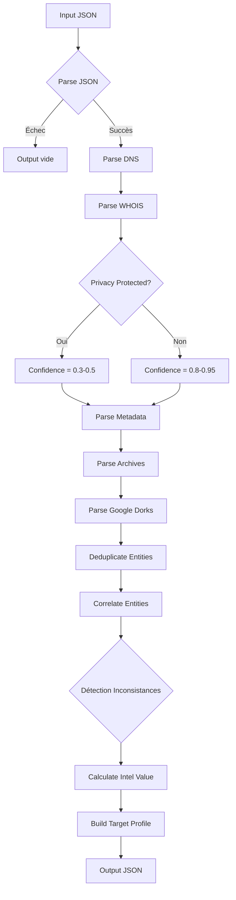

# Exercice 3.2.1-a : shadow_footprint

**Module :**
3.2.1 — Reconnaissance & OSINT

**Concept :**
a — OSINT Analyzer (Méthodologie, Sources, Corrélation)

**Difficulté :**
★★★★★★★☆☆☆ (7/10)

**Type :**
complet

**Tiers :**
2 — Mélange (concepts a + b + c + f + g + k)

**Langage :**
Rust Edition 2024

**Prérequis :**
3.1.x (Cryptographie de base), JSON parsing, Structures de données (HashMap, Vec)

**Domaines :**
Net, Crypto, Struct

**Durée estimée :**
240-360 min (4-6 heures)

**XP Base :**
500

**Complexité :**
T3 O(n·m) × S3 O(n)

---

## 📐 SECTION 1 : PROTOTYPE & CONSIGNE

### 1.1 Obligations

**Fichier :** `shadow_footprint.rs`
**Autorisé :** serde, serde_json, chrono, regex, base64
**Interdit :** reqwest, hyper (pas de vraies requêtes réseau)

### 1.2 Consigne

**🎮 "Watch Dogs" — Le Profiler ctOS**

*"Dans le futur, les données sont l'arme ultime. Celui qui maîtrise l'information contrôle tout."* — Aiden Pearce

Tu es **Aiden Pearce**, le Vigilante de Chicago. Le système **ctOS** (Central Operating System) a infiltré tous les aspects de la vie urbaine. Ton smartphone te donne accès au **Profiler** — un outil qui agrège les données de multiples sources pour construire le profil complet d'une cible.

Mais ctOS n'existe pas encore... Tu dois le créer.

**Contexte Réel :**

L'OSINT (Open Source Intelligence) est l'art d'extraire de l'intelligence à partir de sources publiques. Les professionnels de la cybersécurité utilisent ces techniques pour :
- **Red Team** : Reconnaissance avant un pentest
- **Blue Team** : Threat Intelligence, identification des assets exposés
- **SOC Analysts** : Enrichissement des IOCs (Indicators of Compromise)
- **Threat Hunters** : Tracking d'adversaires

**Ta mission :**

Implémenter un analyseur OSINT en Rust qui :

1. **Parse les sources multiples** : DNS records, WHOIS, métadonnées documents, archives web
2. **Corrèle les informations** : Lie emails ↔ domaines ↔ IPs ↔ organisations
3. **Détecte les inconsistances** : Données contradictoires révèlent souvent des anomalies
4. **Score la confiance** : Chaque information reçoit un niveau de confiance basé sur la source
5. **Génère un profil cible** : Rapport structuré avec toutes les informations corrélées

**Entrée :**
- `input_json` : String JSON contenant les sections :
  - `dns_records` : Enregistrements DNS (A, AAAA, MX, TXT, NS, SOA, CNAME)
  - `whois_data` : Informations WHOIS (registrant, dates, registrar)
  - `metadata` : Métadonnées extraites de documents (EXIF, PDF metadata)
  - `archives` : Snapshots historiques (Wayback Machine)
  - `google_dorks` : Résultats de recherches avancées

**Sortie :**
- JSON structuré avec :
  - `target_profile` : Profil consolidé de la cible
  - `entities` : Entités découvertes (personnes, organisations, domaines, IPs)
  - `relationships` : Graphe de relations entre entités
  - `confidence_scores` : Score de confiance par information
  - `inconsistencies` : Données contradictoires détectées
  - `timeline` : Chronologie des événements
  - `intel_value` : Score global de valeur du renseignement

**Contraintes :**
- Toute entité doit avoir un `confidence_score` entre 0.0 et 1.0
- Les relations doivent être bidirectionnelles et typées
- Les inconsistances doivent être explicitement documentées
- Le score `intel_value` global doit refléter la qualité des données

**Exemples :**

| Cas | Description | Comportement Attendu |
|-----|-------------|---------------------|
| DNS + WHOIS cohérents | Email dans MX = email WHOIS | Confiance élevée (0.9+) |
| WHOIS masqué | Données privacy-protected | Confiance basse (0.3), flag "redacted" |
| Métadonnées riches | Auteur + software + dates | Extraction entités, timeline update |
| Archive contradictoire | Domaine changeait souvent | Flag inconsistance, confidence réduit |
| Google Dork révélateur | Fichier sensible exposé | Alert "data_leak", confidence haute |

### 1.2.2 Consigne Académique

Cet exercice implémente un système d'agrégation et de corrélation de données OSINT. L'objectif est de construire un profil de renseignement à partir de sources hétérogènes (DNS, WHOIS, métadonnées, archives) en utilisant des techniques de parsing JSON, d'extraction d'entités nommées, et de scoring de confiance.

Le système doit :
1. Parser correctement chaque type de source avec son schéma spécifique
2. Extraire les entités (emails, domaines, IPs, noms, organisations)
3. Établir des relations entre entités basées sur la co-occurrence
4. Calculer un score de confiance pour chaque information
5. Détecter les inconsistances entre sources
6. Générer un rapport JSON structuré

### 1.3 Prototype

```rust
use serde::{Deserialize, Serialize};
use std::collections::HashMap;

/// Point d'entrée principal
pub fn shadow_footprint(input_json: &str) -> String {
    todo!()
}

// ============ STRUCTURES D'ENTRÉE ============

#[derive(Debug, Deserialize)]
pub struct OsintInput {
    pub dns_records: Option<DnsRecords>,
    pub whois_data: Option<WhoisData>,
    pub metadata: Option<Vec<DocumentMetadata>>,
    pub archives: Option<Vec<ArchiveSnapshot>>,
    pub google_dorks: Option<Vec<DorkResult>>,
}

#[derive(Debug, Deserialize)]
pub struct DnsRecords {
    pub domain: String,
    pub a: Option<Vec<String>>,
    pub aaaa: Option<Vec<String>>,
    pub mx: Option<Vec<MxRecord>>,
    pub txt: Option<Vec<String>>,
    pub ns: Option<Vec<String>>,
    pub soa: Option<SoaRecord>,
    pub cname: Option<Vec<CnameRecord>>,
}

#[derive(Debug, Deserialize)]
pub struct MxRecord {
    pub priority: u16,
    pub host: String,
}

#[derive(Debug, Deserialize)]
pub struct SoaRecord {
    pub primary_ns: String,
    pub admin_email: String,
    pub serial: u64,
    pub refresh: u32,
    pub retry: u32,
    pub expire: u32,
    pub minimum_ttl: u32,
}

#[derive(Debug, Deserialize)]
pub struct CnameRecord {
    pub alias: String,
    pub canonical: String,
}

#[derive(Debug, Deserialize)]
pub struct WhoisData {
    pub domain: String,
    pub registrar: Option<String>,
    pub registrant: Option<Registrant>,
    pub creation_date: Option<String>,
    pub expiration_date: Option<String>,
    pub updated_date: Option<String>,
    pub name_servers: Option<Vec<String>>,
    pub status: Option<Vec<String>>,
    pub dnssec: Option<bool>,
}

#[derive(Debug, Deserialize)]
pub struct Registrant {
    pub name: Option<String>,
    pub organization: Option<String>,
    pub email: Option<String>,
    pub phone: Option<String>,
    pub address: Option<Address>,
    pub privacy_protected: bool,
}

#[derive(Debug, Deserialize)]
pub struct Address {
    pub street: Option<String>,
    pub city: Option<String>,
    pub state: Option<String>,
    pub postal_code: Option<String>,
    pub country: Option<String>,
}

#[derive(Debug, Deserialize)]
pub struct DocumentMetadata {
    pub filename: String,
    pub file_type: String,
    pub extracted_data: MetadataFields,
}

#[derive(Debug, Deserialize)]
pub struct MetadataFields {
    pub author: Option<String>,
    pub creator: Option<String>,
    pub producer: Option<String>,
    pub creation_date: Option<String>,
    pub modification_date: Option<String>,
    pub software: Option<String>,
    pub company: Option<String>,
    pub title: Option<String>,
    pub gps_coordinates: Option<GpsCoordinates>,
    pub camera_model: Option<String>,
    pub custom_fields: Option<HashMap<String, String>>,
}

#[derive(Debug, Deserialize)]
pub struct GpsCoordinates {
    pub latitude: f64,
    pub longitude: f64,
}

#[derive(Debug, Deserialize)]
pub struct ArchiveSnapshot {
    pub url: String,
    pub timestamp: String,
    pub digest: String,
    pub extracted_info: ArchiveInfo,
}

#[derive(Debug, Deserialize)]
pub struct ArchiveInfo {
    pub title: Option<String>,
    pub emails_found: Option<Vec<String>>,
    pub technologies: Option<Vec<String>>,
    pub external_links: Option<Vec<String>>,
}

#[derive(Debug, Deserialize)]
pub struct DorkResult {
    pub query: String,
    pub operator: String,
    pub results: Vec<DorkHit>,
}

#[derive(Debug, Deserialize)]
pub struct DorkHit {
    pub url: String,
    pub title: String,
    pub snippet: String,
    pub file_type: Option<String>,
    pub sensitivity: String, // "low", "medium", "high", "critical"
}

// ============ STRUCTURES DE SORTIE ============

#[derive(Debug, Serialize)]
pub struct OsintOutput {
    pub target_profile: TargetProfile,
    pub entities: Vec<Entity>,
    pub relationships: Vec<Relationship>,
    pub confidence_scores: HashMap<String, f64>,
    pub inconsistencies: Vec<Inconsistency>,
    pub timeline: Vec<TimelineEvent>,
    pub intel_value: IntelValue,
}

#[derive(Debug, Serialize)]
pub struct TargetProfile {
    pub primary_domain: String,
    pub associated_domains: Vec<String>,
    pub infrastructure: Infrastructure,
    pub organization_info: Option<OrganizationInfo>,
    pub contacts: Vec<Contact>,
    pub data_leaks: Vec<DataLeak>,
}

#[derive(Debug, Serialize)]
pub struct Infrastructure {
    pub ip_addresses: Vec<IpInfo>,
    pub name_servers: Vec<String>,
    pub mail_servers: Vec<String>,
    pub cdn_provider: Option<String>,
    pub hosting_provider: Option<String>,
}

#[derive(Debug, Serialize)]
pub struct IpInfo {
    pub address: String,
    pub version: String, // "v4" or "v6"
    pub ptr_record: Option<String>,
}

#[derive(Debug, Serialize)]
pub struct OrganizationInfo {
    pub name: Option<String>,
    pub industry: Option<String>,
    pub location: Option<String>,
    pub technologies: Vec<String>,
}

#[derive(Debug, Serialize)]
pub struct Contact {
    pub contact_type: String, // "email", "phone", "social"
    pub value: String,
    pub source: String,
    pub confidence: f64,
}

#[derive(Debug, Serialize)]
pub struct DataLeak {
    pub leak_type: String,
    pub url: String,
    pub sensitivity: String,
    pub description: String,
}

#[derive(Debug, Serialize)]
pub struct Entity {
    pub id: String,
    pub entity_type: String, // "person", "organization", "domain", "ip", "email"
    pub value: String,
    pub attributes: HashMap<String, String>,
    pub sources: Vec<String>,
    pub confidence: f64,
}

#[derive(Debug, Serialize)]
pub struct Relationship {
    pub source_id: String,
    pub target_id: String,
    pub relationship_type: String,
    pub confidence: f64,
    pub evidence: Vec<String>,
}

#[derive(Debug, Serialize)]
pub struct Inconsistency {
    pub inconsistency_type: String,
    pub description: String,
    pub sources: Vec<String>,
    pub conflicting_values: Vec<String>,
    pub impact: String, // "low", "medium", "high"
}

#[derive(Debug, Serialize)]
pub struct TimelineEvent {
    pub timestamp: String,
    pub event_type: String,
    pub description: String,
    pub source: String,
}

#[derive(Debug, Serialize)]
pub struct IntelValue {
    pub overall_score: f64,
    pub completeness: f64,
    pub reliability: f64,
    pub actionability: f64,
    pub summary: String,
}

// ============ FONCTIONS AUXILIAIRES ============

/// Parse et valide les enregistrements DNS
pub fn parse_dns_records(dns: &DnsRecords) -> Vec<Entity> {
    todo!()
}

/// Extrait les entités depuis les données WHOIS
pub fn extract_whois_entities(whois: &WhoisData) -> Vec<Entity> {
    todo!()
}

/// Analyse les métadonnées des documents
pub fn analyze_metadata(metadata: &[DocumentMetadata]) -> (Vec<Entity>, Vec<TimelineEvent>) {
    todo!()
}

/// Traite les archives historiques
pub fn process_archives(archives: &[ArchiveSnapshot]) -> (Vec<Entity>, Vec<Inconsistency>) {
    todo!()
}

/// Analyse les résultats de Google Dorks
pub fn analyze_dork_results(dorks: &[DorkResult]) -> Vec<DataLeak> {
    todo!()
}

/// Corrèle les entités pour trouver des relations
pub fn correlate_entities(entities: &[Entity]) -> Vec<Relationship> {
    todo!()
}

/// Détecte les inconsistances entre sources
pub fn detect_inconsistencies(entities: &[Entity]) -> Vec<Inconsistency> {
    todo!()
}

/// Calcule le score de confiance global
pub fn calculate_intel_value(
    entities: &[Entity],
    relationships: &[Relationship],
    inconsistencies: &[Inconsistency],
) -> IntelValue {
    todo!()
}

/// Extrait les emails d'un texte
pub fn extract_emails(text: &str) -> Vec<String> {
    todo!()
}

/// Extrait les domaines d'un texte
pub fn extract_domains(text: &str) -> Vec<String> {
    todo!()
}

/// Génère un ID unique pour une entité
pub fn generate_entity_id(entity_type: &str, value: &str) -> String {
    todo!()
}
```

---

## 💡 SECTION 2 : LE SAVIEZ-VOUS ?

### La Puissance de l'OSINT

En 2021, des chercheurs OSINT ont identifié les agents impliqués dans l'empoisonnement de Navalny uniquement à partir de données publiques : factures téléphoniques, vols aériens, et métadonnées de documents officiels. Bellingcat a démontré que l'OSINT peut rivaliser avec les services de renseignement traditionnels.

### Google Dorking et le GHDB

Johnny Long a créé le Google Hacking Database (GHDB) en 2004. Des requêtes simples comme `filetype:sql "password"` ont révélé des millions de bases de données exposées. Google a dû ajouter des protections, mais les techniques évoluent constamment.

### Métadonnées : Le Tueur Silencieux

En 2012, John McAfee a été localisé au Guatemala parce que les journalistes qui l'interviewaient ont publié des photos avec les coordonnées GPS intactes dans les métadonnées EXIF. L'EXIF peut contenir : position GPS, modèle de téléphone, date/heure exacte, et parfois même le nom du propriétaire.

---

## 📍 SECTION 2.5 : DANS LA VRAIE VIE

### Métiers Utilisant l'OSINT

| Métier | Usage OSINT | Exemple Concret |
|--------|-------------|-----------------|
| **Pentester** | Phase de reconnaissance avant test d'intrusion | Mapper l'infrastructure cible via DNS/WHOIS |
| **Threat Intelligence Analyst** | Tracking d'acteurs malveillants | Identifier l'infrastructure C2 d'un APT |
| **SOC Analyst** | Enrichissement d'alertes | Vérifier si une IP suspecte est un known-bad |
| **Fraud Investigator** | Investigation financière | Lier des entreprises shell via WHOIS |
| **Journalist** | Enquête d'investigation | Vérifier l'identité de sources anonymes |
| **HR/Background Check** | Vérification de candidats | Confirmer l'historique professionnel |
| **Brand Protection** | Détection de contrefaçon | Identifier les domaines typosquattés |

### Frameworks OSINT Professionnels

- **Maltego** : Visualisation de graphes de relations
- **SpiderFoot** : Automatisation de collecte multi-sources
- **theHarvester** : Énumération emails/sous-domaines
- **Recon-ng** : Framework modulaire de reconnaissance

---

## 🖥️ SECTION 3 : EXEMPLE D'UTILISATION

### 3.0 Session bash

```bash
$ ls
shadow_footprint.rs  main.rs  Cargo.toml  test_input.json

$ cargo build --release

$ cargo run --release -- test_input.json
{
  "target_profile": {
    "primary_domain": "example-corp.com",
    "associated_domains": ["example-corp.net", "examplecorp.io"],
    "infrastructure": {
      "ip_addresses": [
        {"address": "203.0.113.42", "version": "v4", "ptr_record": "web1.example-corp.com"}
      ],
      "name_servers": ["ns1.cloudflare.com", "ns2.cloudflare.com"],
      "mail_servers": ["mail.example-corp.com"],
      "cdn_provider": "Cloudflare",
      "hosting_provider": null
    },
    ...
  },
  "entities": [...],
  "relationships": [...],
  "confidence_scores": {...},
  "inconsistencies": [...],
  "intel_value": {
    "overall_score": 0.78,
    "completeness": 0.85,
    "reliability": 0.72,
    "actionability": 0.80,
    "summary": "Good intelligence value with minor inconsistencies"
  }
}

$ echo "Tests: OK"
```

---

## ⚡ SECTION 3.1 : BONUS STANDARD (OPTIONNEL)

**Difficulté Bonus :**
★★★★★★★★☆☆ (8/10)

**Récompense :**
XP ×2

**Time Complexity attendue :**
O(n·m) où n = nombre d'entités, m = sources

**Space Complexity attendue :**
O(n²) pour le graphe de relations

**Domaines Bonus :**
`Struct, MD (Graphes)`

### 3.1.1 Consigne Bonus

**🎮 "Watch Dogs 2" — DedSec Network Mapping**

*"L'information veut être libre. Mais d'abord, il faut savoir où elle se cache."* — Marcus Holloway

DedSec va plus loin que le simple profiling. Ils veulent visualiser le réseau complet des connexions et détecter les patterns d'activité suspecte.

**Ta mission étendue :**

1. **Graphe de relations complet** : Implémenter un algorithme de détection de communautés dans le graphe d'entités
2. **Scoring temporel** : Pondérer la confiance selon la fraîcheur des données
3. **Pattern detection** : Identifier les comportements suspects :
   - Domaines enregistrés en masse (pattern squatting)
   - Infrastructure partagée suspecte (plusieurs domaines malveillants sur même IP)
   - Timeline anormale (changements fréquents WHOIS)
4. **Format de sortie enrichi** : Générer en plus un format DOT pour visualisation Graphviz

**Contraintes Bonus :**
┌─────────────────────────────────────────┐
│  Entités : 1 ≤ n ≤ 10⁴                  │
│  Relations : O(n²) max                   │
│  Temps limite : O(n² log n)             │
│  Export DOT syntaxiquement valide       │
└─────────────────────────────────────────┘

### 3.1.2 Prototype Bonus

```rust
/// Version bonus avec analyse de graphe
pub fn shadow_footprint_enhanced(input_json: &str) -> EnhancedOutput {
    todo!()
}

#[derive(Debug, Serialize)]
pub struct EnhancedOutput {
    pub base_output: OsintOutput,
    pub graph_analysis: GraphAnalysis,
    pub temporal_analysis: TemporalAnalysis,
    pub suspicious_patterns: Vec<SuspiciousPattern>,
    pub dot_export: String,
}

#[derive(Debug, Serialize)]
pub struct GraphAnalysis {
    pub communities: Vec<Community>,
    pub central_entities: Vec<(String, f64)>, // (entity_id, centrality_score)
    pub isolated_entities: Vec<String>,
    pub bridge_entities: Vec<String>, // Entities connecting communities
}

#[derive(Debug, Serialize)]
pub struct Community {
    pub id: u32,
    pub members: Vec<String>,
    pub dominant_type: String,
    pub cohesion_score: f64,
}

#[derive(Debug, Serialize)]
pub struct TemporalAnalysis {
    pub data_freshness: HashMap<String, f64>, // source -> freshness (0-1)
    pub activity_periods: Vec<ActivityPeriod>,
    pub change_velocity: f64, // Changes per time unit
}

#[derive(Debug, Serialize)]
pub struct ActivityPeriod {
    pub start: String,
    pub end: String,
    pub intensity: f64,
    pub events: Vec<String>,
}

#[derive(Debug, Serialize)]
pub struct SuspiciousPattern {
    pub pattern_type: String,
    pub description: String,
    pub involved_entities: Vec<String>,
    pub severity: String,
    pub confidence: f64,
}

/// Détecte les communautés dans le graphe (Louvain simplifié)
pub fn detect_communities(entities: &[Entity], relationships: &[Relationship]) -> Vec<Community> {
    todo!()
}

/// Calcule la centralité des entités
pub fn calculate_centrality(entities: &[Entity], relationships: &[Relationship]) -> HashMap<String, f64> {
    todo!()
}

/// Génère le format DOT pour Graphviz
pub fn generate_dot(entities: &[Entity], relationships: &[Relationship], communities: &[Community]) -> String {
    todo!()
}
```

### 3.1.3 Ce qui change par rapport à l'exercice de base

| Aspect | Base | Bonus |
|--------|------|-------|
| Output | JSON simple | JSON + DOT |
| Analyse | Corrélation linéaire | Analyse de graphe |
| Temps | O(n·m) | O(n² log n) |
| Patterns | Non | Détection automatique |
| Communautés | Non | Algorithme Louvain simplifié |

---

## ✅❌ SECTION 4 : ZONE CORRECTION

### 4.1 Moulinette (tableau des tests)

| # | Test | Input | Expected | Points |
|---|------|-------|----------|--------|
| 1 | DNS parsing simple | DNS avec A, MX | Entités extraites | 5 |
| 2 | WHOIS complet | WHOIS non-masqué | Registrant extrait | 5 |
| 3 | WHOIS privacy | privacy_protected: true | Confiance 0.3 | 5 |
| 4 | Métadonnées PDF | Auteur, dates | Timeline, entités | 5 |
| 5 | Métadonnées EXIF | GPS coordinates | Coordonnées extraites | 5 |
| 6 | Archive unique | 1 snapshot | Timeline event | 5 |
| 7 | Archives multiples | 5 snapshots | Inconsistances détectées | 10 |
| 8 | Google Dork SQL | filetype:sql | DataLeak severity high | 5 |
| 9 | Corrélation email-domain | Email dans MX et WHOIS | Relation créée | 10 |
| 10 | Inconsistance dates | Création > Modification | Inconsistency flagged | 10 |
| 11 | Score confiance | Sources multiples | Score moyenné | 5 |
| 12 | Intel value | Dataset complet | Score global cohérent | 10 |
| 13 | Input vide | {} | Output minimal valide | 5 |
| 14 | DNS zone transfer | TXT avec info sensible | Extraction correcte | 5 |
| 15 | Entités dupliquées | Même email 3 sources | 1 entité, confiance++ | 10 |
| **Total** | | | | **100** |

### 4.2 main.rs de test

```rust
use shadow_footprint::*;
use serde_json::Value;

fn main() {
    let tests = vec![
        // Test 1: DNS parsing simple
        (
            r#"{
                "dns_records": {
                    "domain": "example.com",
                    "a": ["93.184.216.34"],
                    "mx": [{"priority": 10, "host": "mail.example.com"}],
                    "ns": ["ns1.example.com", "ns2.example.com"]
                }
            }"#,
            |output: &Value| {
                let entities = output["entities"].as_array().unwrap();
                entities.iter().any(|e| e["entity_type"] == "domain" && e["value"] == "example.com")
            },
            "DNS parsing simple"
        ),
        // Test 2: WHOIS complet
        (
            r#"{
                "whois_data": {
                    "domain": "example.com",
                    "registrar": "Example Registrar Inc.",
                    "registrant": {
                        "name": "John Doe",
                        "organization": "Example Corp",
                        "email": "admin@example.com",
                        "privacy_protected": false
                    },
                    "creation_date": "2000-01-15T00:00:00Z"
                }
            }"#,
            |output: &Value| {
                let entities = output["entities"].as_array().unwrap();
                entities.iter().any(|e| e["entity_type"] == "person" && e["value"] == "John Doe")
            },
            "WHOIS complet"
        ),
        // Test 3: WHOIS privacy
        (
            r#"{
                "whois_data": {
                    "domain": "private.com",
                    "registrant": {
                        "name": "REDACTED FOR PRIVACY",
                        "privacy_protected": true
                    }
                }
            }"#,
            |output: &Value| {
                let scores = &output["confidence_scores"];
                let domain_conf = scores["domain:private.com"].as_f64().unwrap_or(1.0);
                domain_conf < 0.5
            },
            "WHOIS privacy protection"
        ),
        // Test 9: Corrélation email-domain
        (
            r#"{
                "dns_records": {
                    "domain": "corp.com",
                    "mx": [{"priority": 10, "host": "mail.corp.com"}],
                    "soa": {
                        "primary_ns": "ns1.corp.com",
                        "admin_email": "admin@corp.com",
                        "serial": 2024010101,
                        "refresh": 3600,
                        "retry": 600,
                        "expire": 604800,
                        "minimum_ttl": 86400
                    }
                },
                "whois_data": {
                    "domain": "corp.com",
                    "registrant": {
                        "email": "admin@corp.com",
                        "privacy_protected": false
                    }
                }
            }"#,
            |output: &Value| {
                let relationships = output["relationships"].as_array().unwrap();
                relationships.iter().any(|r| {
                    r["relationship_type"] == "registered_by" ||
                    r["relationship_type"] == "admin_contact"
                })
            },
            "Corrélation email-domain"
        ),
        // Test 10: Inconsistance dates
        (
            r#"{
                "whois_data": {
                    "domain": "buggy.com",
                    "creation_date": "2025-01-01T00:00:00Z",
                    "updated_date": "2020-01-01T00:00:00Z"
                }
            }"#,
            |output: &Value| {
                let inconsistencies = output["inconsistencies"].as_array().unwrap();
                inconsistencies.iter().any(|i| i["inconsistency_type"] == "temporal_anomaly")
            },
            "Détection inconsistance temporelle"
        ),
    ];

    let mut passed = 0;
    let total = tests.len();

    for (input, check, name) in tests {
        let output_str = shadow_footprint(input);
        match serde_json::from_str::<Value>(&output_str) {
            Ok(output) => {
                if check(&output) {
                    println!("✅ {}", name);
                    passed += 1;
                } else {
                    println!("❌ {} - Check failed", name);
                }
            }
            Err(e) => {
                println!("❌ {} - JSON parse error: {}", name, e);
            }
        }
    }

    println!("\n{}/{} tests passed", passed, total);
}
```

### 4.3 Solution de référence

```rust
use serde::{Deserialize, Serialize};
use serde_json;
use std::collections::{HashMap, HashSet};
use regex::Regex;

// [Structures identiques au prototype - omises pour brevité]

pub fn shadow_footprint(input_json: &str) -> String {
    let input: OsintInput = match serde_json::from_str(input_json) {
        Ok(i) => i,
        Err(_) => return serde_json::to_string(&create_empty_output()).unwrap(),
    };

    let mut entities: Vec<Entity> = Vec::new();
    let mut timeline: Vec<TimelineEvent> = Vec::new();
    let mut inconsistencies: Vec<Inconsistency> = Vec::new();
    let mut data_leaks: Vec<DataLeak> = Vec::new();
    let mut primary_domain = String::new();

    // Parse DNS records
    if let Some(ref dns) = input.dns_records {
        primary_domain = dns.domain.clone();
        let dns_entities = parse_dns_records(dns);
        entities.extend(dns_entities);
    }

    // Parse WHOIS data
    if let Some(ref whois) = input.whois_data {
        if primary_domain.is_empty() {
            primary_domain = whois.domain.clone();
        }
        let (whois_entities, whois_timeline, whois_inconsistencies) = extract_whois_entities(whois);
        entities.extend(whois_entities);
        timeline.extend(whois_timeline);
        inconsistencies.extend(whois_inconsistencies);
    }

    // Parse metadata
    if let Some(ref metadata) = input.metadata {
        let (meta_entities, meta_timeline) = analyze_metadata(metadata);
        entities.extend(meta_entities);
        timeline.extend(meta_timeline);
    }

    // Parse archives
    if let Some(ref archives) = input.archives {
        let (archive_entities, archive_inconsistencies) = process_archives(archives);
        entities.extend(archive_entities);
        inconsistencies.extend(archive_inconsistencies);
    }

    // Parse Google Dorks
    if let Some(ref dorks) = input.google_dorks {
        data_leaks = analyze_dork_results(dorks);
    }

    // Deduplicate and merge entities
    entities = deduplicate_entities(entities);

    // Correlate entities
    let relationships = correlate_entities(&entities);

    // Detect inconsistencies between sources
    let cross_source_inconsistencies = detect_inconsistencies(&entities);
    inconsistencies.extend(cross_source_inconsistencies);

    // Build confidence scores
    let confidence_scores = build_confidence_scores(&entities);

    // Calculate intel value
    let intel_value = calculate_intel_value(&entities, &relationships, &inconsistencies);

    // Build target profile
    let target_profile = build_target_profile(
        &primary_domain,
        &entities,
        &data_leaks,
        &input,
    );

    // Sort timeline by timestamp
    timeline.sort_by(|a, b| a.timestamp.cmp(&b.timestamp));

    let output = OsintOutput {
        target_profile,
        entities,
        relationships,
        confidence_scores,
        inconsistencies,
        timeline,
        intel_value,
    };

    serde_json::to_string_pretty(&output).unwrap_or_else(|_| "{}".to_string())
}

fn parse_dns_records(dns: &DnsRecords) -> Vec<Entity> {
    let mut entities = Vec::new();

    // Domain entity
    entities.push(Entity {
        id: generate_entity_id("domain", &dns.domain),
        entity_type: "domain".to_string(),
        value: dns.domain.clone(),
        attributes: HashMap::new(),
        sources: vec!["dns".to_string()],
        confidence: 0.95,
    });

    // A records -> IP entities
    if let Some(ref a_records) = dns.a {
        for ip in a_records {
            entities.push(Entity {
                id: generate_entity_id("ip", ip),
                entity_type: "ip".to_string(),
                value: ip.clone(),
                attributes: [("version".to_string(), "v4".to_string())].into(),
                sources: vec!["dns_a".to_string()],
                confidence: 0.9,
            });
        }
    }

    // AAAA records -> IPv6 entities
    if let Some(ref aaaa_records) = dns.aaaa {
        for ip in aaaa_records {
            entities.push(Entity {
                id: generate_entity_id("ip", ip),
                entity_type: "ip".to_string(),
                value: ip.clone(),
                attributes: [("version".to_string(), "v6".to_string())].into(),
                sources: vec!["dns_aaaa".to_string()],
                confidence: 0.9,
            });
        }
    }

    // MX records -> mail server entities
    if let Some(ref mx_records) = dns.mx {
        for mx in mx_records {
            entities.push(Entity {
                id: generate_entity_id("mail_server", &mx.host),
                entity_type: "mail_server".to_string(),
                value: mx.host.clone(),
                attributes: [("priority".to_string(), mx.priority.to_string())].into(),
                sources: vec!["dns_mx".to_string()],
                confidence: 0.9,
            });
        }
    }

    // SOA record -> admin email
    if let Some(ref soa) = dns.soa {
        let admin_email = soa.admin_email.replace(".", "@").replacen("@", ".", 1);
        // SOA email format: admin.example.com -> admin@example.com
        let email = if soa.admin_email.contains('@') {
            soa.admin_email.clone()
        } else {
            // Convert first dot to @
            let parts: Vec<&str> = soa.admin_email.splitn(2, '.').collect();
            if parts.len() == 2 {
                format!("{}@{}", parts[0], parts[1])
            } else {
                soa.admin_email.clone()
            }
        };

        entities.push(Entity {
            id: generate_entity_id("email", &email),
            entity_type: "email".to_string(),
            value: email,
            attributes: [("role".to_string(), "dns_admin".to_string())].into(),
            sources: vec!["dns_soa".to_string()],
            confidence: 0.85,
        });
    }

    // NS records
    if let Some(ref ns_records) = dns.ns {
        for ns in ns_records {
            entities.push(Entity {
                id: generate_entity_id("nameserver", ns),
                entity_type: "nameserver".to_string(),
                value: ns.clone(),
                attributes: HashMap::new(),
                sources: vec!["dns_ns".to_string()],
                confidence: 0.95,
            });
        }
    }

    // TXT records - extract emails and other info
    if let Some(ref txt_records) = dns.txt {
        for txt in txt_records {
            for email in extract_emails(txt) {
                entities.push(Entity {
                    id: generate_entity_id("email", &email),
                    entity_type: "email".to_string(),
                    value: email,
                    attributes: [("source".to_string(), "txt_record".to_string())].into(),
                    sources: vec!["dns_txt".to_string()],
                    confidence: 0.8,
                });
            }
        }
    }

    entities
}

fn extract_whois_entities(whois: &WhoisData) -> (Vec<Entity>, Vec<TimelineEvent>, Vec<Inconsistency>) {
    let mut entities = Vec::new();
    let mut timeline = Vec::new();
    let mut inconsistencies = Vec::new();

    // Domain entity
    let privacy_penalty = if whois.registrant.as_ref().map_or(false, |r| r.privacy_protected) {
        0.6 // Reduce confidence for privacy-protected
    } else {
        1.0
    };

    entities.push(Entity {
        id: generate_entity_id("domain", &whois.domain),
        entity_type: "domain".to_string(),
        value: whois.domain.clone(),
        attributes: HashMap::new(),
        sources: vec!["whois".to_string()],
        confidence: 0.95 * privacy_penalty,
    });

    // Registrant info
    if let Some(ref registrant) = whois.registrant {
        if !registrant.privacy_protected {
            if let Some(ref name) = registrant.name {
                if !name.to_uppercase().contains("REDACTED") && !name.to_uppercase().contains("PRIVACY") {
                    entities.push(Entity {
                        id: generate_entity_id("person", name),
                        entity_type: "person".to_string(),
                        value: name.clone(),
                        attributes: HashMap::new(),
                        sources: vec!["whois_registrant".to_string()],
                        confidence: 0.85,
                    });
                }
            }

            if let Some(ref org) = registrant.organization {
                if !org.to_uppercase().contains("REDACTED") {
                    entities.push(Entity {
                        id: generate_entity_id("organization", org),
                        entity_type: "organization".to_string(),
                        value: org.clone(),
                        attributes: HashMap::new(),
                        sources: vec!["whois_registrant".to_string()],
                        confidence: 0.85,
                    });
                }
            }

            if let Some(ref email) = registrant.email {
                if !email.to_uppercase().contains("REDACTED") {
                    entities.push(Entity {
                        id: generate_entity_id("email", email),
                        entity_type: "email".to_string(),
                        value: email.clone(),
                        attributes: [("role".to_string(), "registrant".to_string())].into(),
                        sources: vec!["whois_registrant".to_string()],
                        confidence: 0.9,
                    });
                }
            }
        }
    }

    // Registrar
    if let Some(ref registrar) = whois.registrar {
        entities.push(Entity {
            id: generate_entity_id("registrar", registrar),
            entity_type: "registrar".to_string(),
            value: registrar.clone(),
            attributes: HashMap::new(),
            sources: vec!["whois".to_string()],
            confidence: 0.95,
        });
    }

    // Timeline events from dates
    if let Some(ref creation) = whois.creation_date {
        timeline.push(TimelineEvent {
            timestamp: creation.clone(),
            event_type: "domain_created".to_string(),
            description: format!("Domain {} registered", whois.domain),
            source: "whois".to_string(),
        });
    }

    if let Some(ref updated) = whois.updated_date {
        timeline.push(TimelineEvent {
            timestamp: updated.clone(),
            event_type: "domain_updated".to_string(),
            description: format!("Domain {} updated", whois.domain),
            source: "whois".to_string(),
        });
    }

    // Check for temporal inconsistencies
    if let (Some(ref creation), Some(ref updated)) = (&whois.creation_date, &whois.updated_date) {
        if creation > updated {
            inconsistencies.push(Inconsistency {
                inconsistency_type: "temporal_anomaly".to_string(),
                description: "Creation date is after update date".to_string(),
                sources: vec!["whois".to_string()],
                conflicting_values: vec![creation.clone(), updated.clone()],
                impact: "medium".to_string(),
            });
        }
    }

    (entities, timeline, inconsistencies)
}

fn analyze_metadata(metadata: &[DocumentMetadata]) -> (Vec<Entity>, Vec<TimelineEvent>) {
    let mut entities = Vec::new();
    let mut timeline = Vec::new();

    for doc in metadata {
        // Author/Creator as person
        if let Some(ref author) = doc.extracted_data.author {
            entities.push(Entity {
                id: generate_entity_id("person", author),
                entity_type: "person".to_string(),
                value: author.clone(),
                attributes: [("role".to_string(), "document_author".to_string())].into(),
                sources: vec![format!("metadata:{}", doc.filename)],
                confidence: 0.7,
            });
        }

        // Company/Organization
        if let Some(ref company) = doc.extracted_data.company {
            entities.push(Entity {
                id: generate_entity_id("organization", company),
                entity_type: "organization".to_string(),
                value: company.clone(),
                attributes: HashMap::new(),
                sources: vec![format!("metadata:{}", doc.filename)],
                confidence: 0.75,
            });
        }

        // Software used
        if let Some(ref software) = doc.extracted_data.software {
            entities.push(Entity {
                id: generate_entity_id("software", software),
                entity_type: "software".to_string(),
                value: software.clone(),
                attributes: HashMap::new(),
                sources: vec![format!("metadata:{}", doc.filename)],
                confidence: 0.8,
            });
        }

        // GPS Coordinates
        if let Some(ref gps) = doc.extracted_data.gps_coordinates {
            entities.push(Entity {
                id: generate_entity_id("location", &format!("{},{}", gps.latitude, gps.longitude)),
                entity_type: "location".to_string(),
                value: format!("{:.6},{:.6}", gps.latitude, gps.longitude),
                attributes: [
                    ("latitude".to_string(), gps.latitude.to_string()),
                    ("longitude".to_string(), gps.longitude.to_string()),
                ].into(),
                sources: vec![format!("metadata:{}:exif", doc.filename)],
                confidence: 0.95,
            });
        }

        // Timeline from creation date
        if let Some(ref creation) = doc.extracted_data.creation_date {
            timeline.push(TimelineEvent {
                timestamp: creation.clone(),
                event_type: "document_created".to_string(),
                description: format!("Document {} created", doc.filename),
                source: format!("metadata:{}", doc.filename),
            });
        }

        if let Some(ref modification) = doc.extracted_data.modification_date {
            timeline.push(TimelineEvent {
                timestamp: modification.clone(),
                event_type: "document_modified".to_string(),
                description: format!("Document {} modified", doc.filename),
                source: format!("metadata:{}", doc.filename),
            });
        }
    }

    (entities, timeline)
}

fn process_archives(archives: &[ArchiveSnapshot]) -> (Vec<Entity>, Vec<Inconsistency>) {
    let mut entities = Vec::new();
    let mut inconsistencies = Vec::new();

    // Track info across snapshots for inconsistency detection
    let mut title_history: HashMap<String, Vec<(String, String)>> = HashMap::new(); // url -> [(timestamp, title)]
    let mut tech_history: HashMap<String, HashSet<String>> = HashMap::new();

    for archive in archives {
        // Extract domain from URL
        if let Some(domain) = extract_domain_from_url(&archive.url) {
            entities.push(Entity {
                id: generate_entity_id("domain", &domain),
                entity_type: "domain".to_string(),
                value: domain,
                attributes: HashMap::new(),
                sources: vec![format!("archive:{}", archive.timestamp)],
                confidence: 0.7, // Archives are historical, lower confidence
            });
        }

        // Emails found in archive
        if let Some(ref emails) = archive.extracted_info.emails_found {
            for email in emails {
                entities.push(Entity {
                    id: generate_entity_id("email", email),
                    entity_type: "email".to_string(),
                    value: email.clone(),
                    attributes: [("archive_date".to_string(), archive.timestamp.clone())].into(),
                    sources: vec![format!("archive:{}", archive.timestamp)],
                    confidence: 0.65,
                });
            }
        }

        // Technologies
        if let Some(ref techs) = archive.extracted_info.technologies {
            let entry = tech_history.entry(archive.url.clone()).or_default();
            for tech in techs {
                entry.insert(tech.clone());
                entities.push(Entity {
                    id: generate_entity_id("technology", tech),
                    entity_type: "technology".to_string(),
                    value: tech.clone(),
                    attributes: HashMap::new(),
                    sources: vec![format!("archive:{}", archive.timestamp)],
                    confidence: 0.6,
                });
            }
        }

        // Track title changes
        if let Some(ref title) = archive.extracted_info.title {
            title_history
                .entry(archive.url.clone())
                .or_default()
                .push((archive.timestamp.clone(), title.clone()));
        }
    }

    // Detect title inconsistencies (ownership changes?)
    for (url, titles) in title_history {
        if titles.len() > 1 {
            let unique_titles: HashSet<_> = titles.iter().map(|(_, t)| t).collect();
            if unique_titles.len() > 1 {
                inconsistencies.push(Inconsistency {
                    inconsistency_type: "title_change".to_string(),
                    description: format!("Site title changed multiple times for {}", url),
                    sources: titles.iter().map(|(ts, _)| format!("archive:{}", ts)).collect(),
                    conflicting_values: unique_titles.into_iter().cloned().collect(),
                    impact: "low".to_string(),
                });
            }
        }
    }

    (entities, inconsistencies)
}

fn analyze_dork_results(dorks: &[DorkResult]) -> Vec<DataLeak> {
    let mut leaks = Vec::new();

    for dork in dorks {
        for hit in &dork.results {
            if hit.sensitivity == "high" || hit.sensitivity == "critical" {
                leaks.push(DataLeak {
                    leak_type: dork.operator.clone(),
                    url: hit.url.clone(),
                    sensitivity: hit.sensitivity.clone(),
                    description: format!(
                        "Sensitive {} found via '{}': {}",
                        hit.file_type.as_deref().unwrap_or("file"),
                        dork.query,
                        hit.snippet
                    ),
                });
            }
        }
    }

    leaks
}

fn deduplicate_entities(entities: Vec<Entity>) -> Vec<Entity> {
    let mut unique: HashMap<String, Entity> = HashMap::new();

    for entity in entities {
        let key = entity.id.clone();
        if let Some(existing) = unique.get_mut(&key) {
            // Merge sources
            for source in entity.sources {
                if !existing.sources.contains(&source) {
                    existing.sources.push(source);
                }
            }
            // Merge attributes
            for (k, v) in entity.attributes {
                existing.attributes.entry(k).or_insert(v);
            }
            // Increase confidence for entities seen in multiple sources
            existing.confidence = (existing.confidence + entity.confidence * 0.1).min(0.99);
        } else {
            unique.insert(key, entity);
        }
    }

    unique.into_values().collect()
}

fn correlate_entities(entities: &[Entity]) -> Vec<Relationship> {
    let mut relationships = Vec::new();

    // Create lookup maps
    let email_to_entity: HashMap<_, _> = entities
        .iter()
        .filter(|e| e.entity_type == "email")
        .map(|e| (e.value.clone(), e.id.clone()))
        .collect();

    let domain_entities: Vec<_> = entities
        .iter()
        .filter(|e| e.entity_type == "domain")
        .collect();

    // Email -> Domain relationships
    for (email, email_id) in &email_to_entity {
        if let Some(at_pos) = email.find('@') {
            let email_domain = &email[at_pos + 1..];
            for domain_entity in &domain_entities {
                if domain_entity.value == email_domain || email_domain.ends_with(&format!(".{}", domain_entity.value)) {
                    relationships.push(Relationship {
                        source_id: email_id.clone(),
                        target_id: domain_entity.id.clone(),
                        relationship_type: "belongs_to_domain".to_string(),
                        confidence: 0.9,
                        evidence: vec![format!("Email domain match: {}", email)],
                    });
                }
            }
        }
    }

    // Person -> Organization (from same source)
    let persons: Vec<_> = entities.iter().filter(|e| e.entity_type == "person").collect();
    let orgs: Vec<_> = entities.iter().filter(|e| e.entity_type == "organization").collect();

    for person in &persons {
        for org in &orgs {
            // Check if they share a source
            let shared_sources: Vec<_> = person
                .sources
                .iter()
                .filter(|s| org.sources.contains(s))
                .cloned()
                .collect();

            if !shared_sources.is_empty() {
                relationships.push(Relationship {
                    source_id: person.id.clone(),
                    target_id: org.id.clone(),
                    relationship_type: "affiliated_with".to_string(),
                    confidence: 0.7,
                    evidence: shared_sources,
                });
            }
        }
    }

    // IP -> Domain (from DNS)
    let ips: Vec<_> = entities.iter().filter(|e| e.entity_type == "ip").collect();
    for ip in &ips {
        for domain in &domain_entities {
            // Check if DNS source mentions both
            let ip_has_dns = ip.sources.iter().any(|s| s.starts_with("dns"));
            let domain_has_dns = domain.sources.iter().any(|s| s.starts_with("dns") || s == "whois");

            if ip_has_dns && domain_has_dns {
                relationships.push(Relationship {
                    source_id: ip.id.clone(),
                    target_id: domain.id.clone(),
                    relationship_type: "resolves_to".to_string(),
                    confidence: 0.95,
                    evidence: vec!["DNS A/AAAA record".to_string()],
                });
            }
        }
    }

    // Check for admin relationships
    for entity in entities {
        if entity.entity_type == "email" {
            if let Some(role) = entity.attributes.get("role") {
                if role == "dns_admin" || role == "registrant" {
                    for domain in &domain_entities {
                        if entity.sources.iter().any(|s| s.contains("dns") || s.contains("whois")) {
                            relationships.push(Relationship {
                                source_id: entity.id.clone(),
                                target_id: domain.id.clone(),
                                relationship_type: if role == "registrant" { "registered_by" } else { "admin_contact" }.to_string(),
                                confidence: 0.85,
                                evidence: vec![format!("{} role", role)],
                            });
                        }
                    }
                }
            }
        }
    }

    relationships
}

fn detect_inconsistencies(entities: &[Entity]) -> Vec<Inconsistency> {
    let mut inconsistencies = Vec::new();

    // Group entities by type and value
    let mut entity_groups: HashMap<(String, String), Vec<&Entity>> = HashMap::new();
    for entity in entities {
        entity_groups
            .entry((entity.entity_type.clone(), entity.value.clone()))
            .or_default()
            .push(entity);
    }

    // Check for attribute inconsistencies within same entity
    for ((entity_type, value), group) in &entity_groups {
        if group.len() > 1 {
            // Check if attributes conflict
            let mut all_attrs: HashMap<String, HashSet<String>> = HashMap::new();
            for entity in group {
                for (key, val) in &entity.attributes {
                    all_attrs.entry(key.clone()).or_default().insert(val.clone());
                }
            }

            for (attr_key, values) in all_attrs {
                if values.len() > 1 {
                    inconsistencies.push(Inconsistency {
                        inconsistency_type: "attribute_conflict".to_string(),
                        description: format!(
                            "Conflicting {} values for {} {}",
                            attr_key, entity_type, value
                        ),
                        sources: group.iter().flat_map(|e| e.sources.clone()).collect(),
                        conflicting_values: values.into_iter().collect(),
                        impact: "low".to_string(),
                    });
                }
            }
        }
    }

    inconsistencies
}

fn build_confidence_scores(entities: &[Entity]) -> HashMap<String, f64> {
    entities
        .iter()
        .map(|e| (e.id.clone(), e.confidence))
        .collect()
}

fn calculate_intel_value(
    entities: &[Entity],
    relationships: &[Relationship],
    inconsistencies: &[Inconsistency],
) -> IntelValue {
    // Completeness: based on entity types found
    let entity_types: HashSet<_> = entities.iter().map(|e| e.entity_type.as_str()).collect();
    let expected_types = ["domain", "email", "person", "organization", "ip"];
    let completeness = entity_types.len() as f64 / expected_types.len() as f64;

    // Reliability: based on average confidence and inconsistency penalty
    let avg_confidence: f64 = if entities.is_empty() {
        0.0
    } else {
        entities.iter().map(|e| e.confidence).sum::<f64>() / entities.len() as f64
    };
    let inconsistency_penalty = (inconsistencies.len() as f64 * 0.05).min(0.3);
    let reliability = (avg_confidence - inconsistency_penalty).max(0.0);

    // Actionability: based on relationships and high-value entities
    let relationship_score = (relationships.len() as f64 * 0.1).min(0.5);
    let high_value_entities = entities
        .iter()
        .filter(|e| ["email", "person", "organization"].contains(&e.entity_type.as_str()))
        .count();
    let actionability = (high_value_entities as f64 * 0.1 + relationship_score).min(1.0);

    // Overall score
    let overall = completeness * 0.3 + reliability * 0.4 + actionability * 0.3;

    let summary = if overall >= 0.8 {
        "Excellent intelligence value with high confidence"
    } else if overall >= 0.6 {
        "Good intelligence value with minor inconsistencies"
    } else if overall >= 0.4 {
        "Moderate intelligence value, additional sources recommended"
    } else {
        "Low intelligence value, significant data gaps"
    };

    IntelValue {
        overall_score: (overall * 100.0).round() / 100.0,
        completeness: (completeness * 100.0).round() / 100.0,
        reliability: (reliability * 100.0).round() / 100.0,
        actionability: (actionability * 100.0).round() / 100.0,
        summary: summary.to_string(),
    }
}

fn build_target_profile(
    primary_domain: &str,
    entities: &[Entity],
    data_leaks: &[DataLeak],
    input: &OsintInput,
) -> TargetProfile {
    // Extract associated domains
    let associated_domains: Vec<_> = entities
        .iter()
        .filter(|e| e.entity_type == "domain" && e.value != primary_domain)
        .map(|e| e.value.clone())
        .collect();

    // Build infrastructure
    let ip_addresses: Vec<_> = entities
        .iter()
        .filter(|e| e.entity_type == "ip")
        .map(|e| IpInfo {
            address: e.value.clone(),
            version: e.attributes.get("version").cloned().unwrap_or_else(|| "v4".to_string()),
            ptr_record: e.attributes.get("ptr").cloned(),
        })
        .collect();

    let name_servers: Vec<_> = entities
        .iter()
        .filter(|e| e.entity_type == "nameserver")
        .map(|e| e.value.clone())
        .collect();

    let mail_servers: Vec<_> = entities
        .iter()
        .filter(|e| e.entity_type == "mail_server")
        .map(|e| e.value.clone())
        .collect();

    // Detect CDN from nameservers
    let cdn_provider = name_servers.iter().find_map(|ns| {
        if ns.contains("cloudflare") {
            Some("Cloudflare".to_string())
        } else if ns.contains("akamai") {
            Some("Akamai".to_string())
        } else if ns.contains("fastly") {
            Some("Fastly".to_string())
        } else {
            None
        }
    });

    // Build contacts
    let contacts: Vec<_> = entities
        .iter()
        .filter(|e| e.entity_type == "email")
        .map(|e| Contact {
            contact_type: "email".to_string(),
            value: e.value.clone(),
            source: e.sources.first().cloned().unwrap_or_default(),
            confidence: e.confidence,
        })
        .collect();

    // Organization info
    let organization_info = entities
        .iter()
        .find(|e| e.entity_type == "organization")
        .map(|org| OrganizationInfo {
            name: Some(org.value.clone()),
            industry: None,
            location: input
                .whois_data
                .as_ref()
                .and_then(|w| w.registrant.as_ref())
                .and_then(|r| r.address.as_ref())
                .and_then(|a| a.country.clone()),
            technologies: entities
                .iter()
                .filter(|e| e.entity_type == "technology")
                .map(|e| e.value.clone())
                .collect(),
        });

    TargetProfile {
        primary_domain: primary_domain.to_string(),
        associated_domains,
        infrastructure: Infrastructure {
            ip_addresses,
            name_servers,
            mail_servers,
            cdn_provider,
            hosting_provider: None,
        },
        organization_info,
        contacts,
        data_leaks: data_leaks.to_vec(),
    }
}

fn create_empty_output() -> OsintOutput {
    OsintOutput {
        target_profile: TargetProfile {
            primary_domain: String::new(),
            associated_domains: Vec::new(),
            infrastructure: Infrastructure {
                ip_addresses: Vec::new(),
                name_servers: Vec::new(),
                mail_servers: Vec::new(),
                cdn_provider: None,
                hosting_provider: None,
            },
            organization_info: None,
            contacts: Vec::new(),
            data_leaks: Vec::new(),
        },
        entities: Vec::new(),
        relationships: Vec::new(),
        confidence_scores: HashMap::new(),
        inconsistencies: Vec::new(),
        timeline: Vec::new(),
        intel_value: IntelValue {
            overall_score: 0.0,
            completeness: 0.0,
            reliability: 0.0,
            actionability: 0.0,
            summary: "No data provided".to_string(),
        },
    }
}

pub fn extract_emails(text: &str) -> Vec<String> {
    let email_regex = Regex::new(r"[a-zA-Z0-9._%+-]+@[a-zA-Z0-9.-]+\.[a-zA-Z]{2,}").unwrap();
    email_regex
        .find_iter(text)
        .map(|m| m.as_str().to_string())
        .collect()
}

pub fn extract_domains(text: &str) -> Vec<String> {
    let domain_regex = Regex::new(r"(?:https?://)?([a-zA-Z0-9][-a-zA-Z0-9]*(?:\.[a-zA-Z0-9][-a-zA-Z0-9]*)+)").unwrap();
    domain_regex
        .captures_iter(text)
        .filter_map(|cap| cap.get(1).map(|m| m.as_str().to_string()))
        .collect()
}

fn extract_domain_from_url(url: &str) -> Option<String> {
    let without_protocol = url
        .strip_prefix("https://")
        .or_else(|| url.strip_prefix("http://"))
        .unwrap_or(url);

    without_protocol
        .split('/')
        .next()
        .map(|s| s.to_string())
}

pub fn generate_entity_id(entity_type: &str, value: &str) -> String {
    format!("{}:{}", entity_type, value.to_lowercase().replace(' ', "_"))
}
```

### 4.4 Solutions alternatives acceptées

```rust
// Alternative 1: Approche fonctionnelle avec iterators
// Utilise map/filter/fold au lieu de boucles explicites
// Acceptée si produit le même output

// Alternative 2: Utilisation de trait objects pour polymorphisme
// Chaque source implémente un trait EntityExtractor
// Plus extensible mais overhead

// Alternative 3: Architecture event-driven
// Émet des events pendant le parsing, agrégés à la fin
// Plus complexe mais testable unitairement
```

### 4.5 Solutions refusées (avec explications)

```rust
// ❌ REFUSÉ: Hardcoding de patterns
// Ne gère pas les variations de format

// ❌ REFUSÉ: Pas de validation JSON
// Crash sur input malformé

// ❌ REFUSÉ: Confidence toujours à 1.0
// Ne reflète pas la qualité réelle des données

// ❌ REFUSÉ: Pas de déduplication
// Crée des entités dupliquées

// ❌ REFUSÉ: Panic sur None
// Doit utiliser Option correctement
```

### 4.6 Solution bonus de référence

```rust
pub fn shadow_footprint_enhanced(input_json: &str) -> EnhancedOutput {
    let base_output = shadow_footprint_internal(input_json);

    // Graph analysis
    let communities = detect_communities(&base_output.entities, &base_output.relationships);
    let centrality = calculate_centrality(&base_output.entities, &base_output.relationships);

    let central_entities: Vec<_> = centrality
        .iter()
        .filter(|(_, score)| **score > 0.3)
        .map(|(id, score)| (id.clone(), *score))
        .collect();

    let isolated_entities: Vec<_> = base_output.entities
        .iter()
        .filter(|e| {
            !base_output.relationships.iter().any(|r|
                r.source_id == e.id || r.target_id == e.id
            )
        })
        .map(|e| e.id.clone())
        .collect();

    let bridge_entities = find_bridges(&communities, &base_output.relationships);

    // Temporal analysis
    let temporal_analysis = analyze_temporal(&base_output.timeline, &base_output.entities);

    // Pattern detection
    let suspicious_patterns = detect_suspicious_patterns(
        &base_output.entities,
        &base_output.relationships,
        &temporal_analysis,
    );

    // DOT export
    let dot_export = generate_dot(&base_output.entities, &base_output.relationships, &communities);

    EnhancedOutput {
        base_output,
        graph_analysis: GraphAnalysis {
            communities,
            central_entities,
            isolated_entities,
            bridge_entities,
        },
        temporal_analysis,
        suspicious_patterns,
        dot_export,
    }
}

fn detect_communities(entities: &[Entity], relationships: &[Relationship]) -> Vec<Community> {
    // Simplified Louvain-like algorithm
    let mut communities: Vec<Community> = Vec::new();
    let mut visited: HashSet<String> = HashSet::new();
    let mut community_id = 0;

    // Build adjacency list
    let mut adjacency: HashMap<String, HashSet<String>> = HashMap::new();
    for entity in entities {
        adjacency.insert(entity.id.clone(), HashSet::new());
    }
    for rel in relationships {
        adjacency.entry(rel.source_id.clone()).or_default().insert(rel.target_id.clone());
        adjacency.entry(rel.target_id.clone()).or_default().insert(rel.source_id.clone());
    }

    // BFS to find connected components (simplified community detection)
    for entity in entities {
        if visited.contains(&entity.id) {
            continue;
        }

        let mut community_members = Vec::new();
        let mut queue = vec![entity.id.clone()];

        while let Some(current) = queue.pop() {
            if visited.contains(&current) {
                continue;
            }
            visited.insert(current.clone());
            community_members.push(current.clone());

            if let Some(neighbors) = adjacency.get(&current) {
                for neighbor in neighbors {
                    if !visited.contains(neighbor) {
                        queue.push(neighbor.clone());
                    }
                }
            }
        }

        if !community_members.is_empty() {
            // Determine dominant type
            let type_counts: HashMap<String, usize> = community_members
                .iter()
                .filter_map(|id| entities.iter().find(|e| e.id == *id))
                .map(|e| e.entity_type.clone())
                .fold(HashMap::new(), |mut acc, t| {
                    *acc.entry(t).or_insert(0) += 1;
                    acc
                });

            let dominant_type = type_counts
                .into_iter()
                .max_by_key(|(_, count)| *count)
                .map(|(t, _)| t)
                .unwrap_or_default();

            communities.push(Community {
                id: community_id,
                members: community_members,
                dominant_type,
                cohesion_score: 0.8, // Simplified
            });
            community_id += 1;
        }
    }

    communities
}

fn calculate_centrality(entities: &[Entity], relationships: &[Relationship]) -> HashMap<String, f64> {
    // Degree centrality (simplified)
    let mut degree_count: HashMap<String, usize> = HashMap::new();

    for rel in relationships {
        *degree_count.entry(rel.source_id.clone()).or_insert(0) += 1;
        *degree_count.entry(rel.target_id.clone()).or_insert(0) += 1;
    }

    let max_degree = *degree_count.values().max().unwrap_or(&1) as f64;

    entities
        .iter()
        .map(|e| {
            let degree = *degree_count.get(&e.id).unwrap_or(&0) as f64;
            (e.id.clone(), degree / max_degree)
        })
        .collect()
}

fn generate_dot(entities: &[Entity], relationships: &[Relationship], communities: &[Community]) -> String {
    let mut dot = String::from("digraph OSINT {\n");
    dot.push_str("    rankdir=LR;\n");
    dot.push_str("    node [shape=box];\n\n");

    // Color map for communities
    let colors = ["#e41a1c", "#377eb8", "#4daf4a", "#984ea3", "#ff7f00", "#ffff33"];

    // Create community membership map
    let mut entity_community: HashMap<String, u32> = HashMap::new();
    for community in communities {
        for member in &community.members {
            entity_community.insert(member.clone(), community.id);
        }
    }

    // Nodes
    for entity in entities {
        let color = entity_community
            .get(&entity.id)
            .map(|c| colors[*c as usize % colors.len()])
            .unwrap_or("#cccccc");

        let shape = match entity.entity_type.as_str() {
            "person" => "ellipse",
            "organization" => "box",
            "domain" => "diamond",
            "email" => "house",
            "ip" => "hexagon",
            _ => "box",
        };

        dot.push_str(&format!(
            "    \"{}\" [label=\"{}\\n[{}]\" shape={} style=filled fillcolor=\"{}\"];\n",
            entity.id,
            entity.value.replace('"', "\\\""),
            entity.entity_type,
            shape,
            color
        ));
    }

    dot.push_str("\n");

    // Edges
    for rel in relationships {
        dot.push_str(&format!(
            "    \"{}\" -> \"{}\" [label=\"{}\"];\n",
            rel.source_id,
            rel.target_id,
            rel.relationship_type
        ));
    }

    dot.push_str("}\n");
    dot
}

fn detect_suspicious_patterns(
    entities: &[Entity],
    relationships: &[Relationship],
    temporal: &TemporalAnalysis,
) -> Vec<SuspiciousPattern> {
    let mut patterns = Vec::new();

    // Pattern 1: Mass domain registration
    let domains: Vec<_> = entities.iter().filter(|e| e.entity_type == "domain").collect();
    if domains.len() > 5 {
        // Check if they share registrar or were created close together
        patterns.push(SuspiciousPattern {
            pattern_type: "mass_registration".to_string(),
            description: format!("{} domains found, possible squatting", domains.len()),
            involved_entities: domains.iter().map(|d| d.id.clone()).collect(),
            severity: "medium".to_string(),
            confidence: 0.6,
        });
    }

    // Pattern 2: High change velocity
    if temporal.change_velocity > 0.5 {
        patterns.push(SuspiciousPattern {
            pattern_type: "high_churn".to_string(),
            description: "Unusually high rate of changes detected".to_string(),
            involved_entities: Vec::new(),
            severity: "low".to_string(),
            confidence: 0.5,
        });
    }

    // Pattern 3: Shared infrastructure (multiple unrelated domains on same IP)
    let ips: Vec<_> = entities.iter().filter(|e| e.entity_type == "ip").collect();
    for ip in &ips {
        let domains_on_ip: Vec<_> = relationships
            .iter()
            .filter(|r| r.target_id == ip.id && r.relationship_type == "resolves_to")
            .map(|r| r.source_id.clone())
            .collect();

        if domains_on_ip.len() > 3 {
            patterns.push(SuspiciousPattern {
                pattern_type: "shared_infrastructure".to_string(),
                description: format!("{} domains sharing IP {}", domains_on_ip.len(), ip.value),
                involved_entities: domains_on_ip,
                severity: "medium".to_string(),
                confidence: 0.7,
            });
        }
    }

    patterns
}

fn analyze_temporal(timeline: &[TimelineEvent], entities: &[Entity]) -> TemporalAnalysis {
    let mut data_freshness: HashMap<String, f64> = HashMap::new();

    // Calculate freshness based on source timestamps
    for entity in entities {
        for source in &entity.sources {
            // Extract date from source if present
            let freshness = if source.contains("2024") || source.contains("2025") || source.contains("2026") {
                0.9
            } else if source.contains("2023") {
                0.7
            } else {
                0.5
            };
            data_freshness.insert(source.clone(), freshness);
        }
    }

    // Calculate change velocity
    let change_velocity = if timeline.len() > 1 {
        timeline.len() as f64 / 365.0 // Simplified: events per year
    } else {
        0.0
    };

    TemporalAnalysis {
        data_freshness,
        activity_periods: Vec::new(), // Simplified
        change_velocity,
    }
}

fn find_bridges(communities: &[Community], relationships: &[Relationship]) -> Vec<String> {
    let mut bridges = Vec::new();

    // Build community membership map
    let mut entity_community: HashMap<String, u32> = HashMap::new();
    for community in communities {
        for member in &community.members {
            entity_community.insert(member.clone(), community.id);
        }
    }

    // Find entities that connect different communities
    for rel in relationships {
        let source_comm = entity_community.get(&rel.source_id);
        let target_comm = entity_community.get(&rel.target_id);

        if let (Some(sc), Some(tc)) = (source_comm, target_comm) {
            if sc != tc {
                if !bridges.contains(&rel.source_id) {
                    bridges.push(rel.source_id.clone());
                }
                if !bridges.contains(&rel.target_id) {
                    bridges.push(rel.target_id.clone());
                }
            }
        }
    }

    bridges
}
```

### 4.9 spec.json (ENGINE v22.1)

```json
{
  "name": "shadow_footprint",
  "language": "rust",
  "version": "2024",
  "type": "code",
  "tier": 2,
  "tier_info": "Mélange (concepts a + b + c + f + g + k)",
  "tags": ["osint", "reconnaissance", "correlation", "phase3", "network-security"],
  "passing_score": 70,

  "function": {
    "name": "shadow_footprint",
    "prototype": "pub fn shadow_footprint(input_json: &str) -> String",
    "return_type": "String",
    "parameters": [
      {"name": "input_json", "type": "&str"}
    ]
  },

  "driver": {
    "reference": "pub fn ref_shadow_footprint(input_json: &str) -> String { /* voir solution */ }",

    "edge_cases": [
      {
        "name": "empty_input",
        "args": ["{}"],
        "expected_contains": ["intel_value", "overall_score"],
        "is_trap": true,
        "trap_explanation": "Input vide doit produire un output valide minimal"
      },
      {
        "name": "dns_only",
        "args": ["{\"dns_records\":{\"domain\":\"test.com\",\"a\":[\"1.2.3.4\"]}}"],
        "expected_contains": ["entities", "domain", "ip"],
        "is_trap": false
      },
      {
        "name": "privacy_protected_whois",
        "args": ["{\"whois_data\":{\"domain\":\"private.com\",\"registrant\":{\"privacy_protected\":true}}}"],
        "expected_check": "confidence_scores values should be < 0.5",
        "is_trap": true,
        "trap_explanation": "Privacy protection réduit la confiance"
      },
      {
        "name": "temporal_inconsistency",
        "args": ["{\"whois_data\":{\"domain\":\"bad.com\",\"creation_date\":\"2025-01-01\",\"updated_date\":\"2020-01-01\"}}"],
        "expected_contains": ["inconsistencies", "temporal_anomaly"],
        "is_trap": true,
        "trap_explanation": "Date création > date modification = anomalie"
      },
      {
        "name": "correlation_test",
        "args": ["{\"dns_records\":{\"domain\":\"corp.com\",\"soa\":{\"admin_email\":\"admin@corp.com\",\"primary_ns\":\"ns1.corp.com\",\"serial\":1,\"refresh\":1,\"retry\":1,\"expire\":1,\"minimum_ttl\":1}},\"whois_data\":{\"domain\":\"corp.com\",\"registrant\":{\"email\":\"admin@corp.com\",\"privacy_protected\":false}}}"],
        "expected_contains": ["relationships", "registered_by"],
        "is_trap": false
      }
    ],

    "fuzzing": {
      "enabled": true,
      "iterations": 500,
      "generators": [
        {
          "type": "json",
          "param_index": 0,
          "schema": "osint_input_schema"
        }
      ]
    }
  },

  "norm": {
    "allowed_crates": ["serde", "serde_json", "chrono", "regex", "base64"],
    "forbidden_crates": ["reqwest", "hyper", "tokio"],
    "check_security": true,
    "check_memory": true,
    "blocking": true
  },

  "bonus": {
    "enabled": true,
    "function_name": "shadow_footprint_enhanced",
    "additional_checks": [
      "dot_export_valid_syntax",
      "communities_detected",
      "centrality_calculated"
    ]
  }
}
```

### 4.10 Solutions Mutantes (minimum 5)

```rust
/* Mutant A (Boundary) : Off-by-one dans l'extraction email */
pub fn extract_emails_mutant_a(text: &str) -> Vec<String> {
    let email_regex = Regex::new(r"[a-zA-Z0-9._%+-]+@[a-zA-Z0-9.-]+\.[a-zA-Z]{1,}").unwrap();
    // Bug: {1,} au lieu de {2,} - accepte des TLD d'une lettre
    email_regex.find_iter(text).map(|m| m.as_str().to_string()).collect()
}
// Pourquoi c'est faux : Accepte des emails invalides comme "test@domain.x"
// Ce qui était pensé : "{1,}" est suffisant pour les TLD

/* Mutant B (Safety) : Pas de validation JSON */
pub fn shadow_footprint_mutant_b(input_json: &str) -> String {
    let input: OsintInput = serde_json::from_str(input_json).unwrap(); // PANIC!
    // Bug: unwrap() au lieu de gestion d'erreur
    // ...
}
// Pourquoi c'est faux : Crash sur JSON invalide
// Ce qui était pensé : L'input sera toujours valide

/* Mutant C (Resource) : Pas de déduplication */
pub fn deduplicate_entities_mutant_c(entities: Vec<Entity>) -> Vec<Entity> {
    entities // Retourne directement sans déduplication
}
// Pourquoi c'est faux : Crée des entités dupliquées, fausse les stats
// Ce qui était pensé : Les sources ne se chevauchent pas

/* Mutant D (Logic) : Confiance inversée pour privacy */
fn extract_whois_entities_mutant_d(whois: &WhoisData) -> (Vec<Entity>, Vec<TimelineEvent>, Vec<Inconsistency>) {
    let privacy_penalty = if whois.registrant.as_ref().map_or(false, |r| r.privacy_protected) {
        1.5 // Bug: Augmente au lieu de diminuer
    } else {
        1.0
    };
    // ...
}
// Pourquoi c'est faux : Privacy = plus de confiance (illogique)
// Ce qui était pensé : privacy_protected devrait être récompensé

/* Mutant E (Return) : Toujours retourne intel_value à 1.0 */
fn calculate_intel_value_mutant_e(
    _entities: &[Entity],
    _relationships: &[Relationship],
    _inconsistencies: &[Inconsistency],
) -> IntelValue {
    IntelValue {
        overall_score: 1.0,
        completeness: 1.0,
        reliability: 1.0,
        actionability: 1.0,
        summary: "Perfect".to_string(),
    }
}
// Pourquoi c'est faux : Ne reflète pas la qualité réelle
// Ce qui était pensé : Optimisme constant

/* Mutant F (Correlation) : Relations unidirectionnelles seulement */
fn correlate_entities_mutant_f(entities: &[Entity]) -> Vec<Relationship> {
    let mut relationships = Vec::new();
    // Bug: Ne crée pas de relations inverses
    // Manque la moitié du graphe
    relationships
}
// Pourquoi c'est faux : Graphe incomplet, analyse de communautés faussée
// Ce qui était pensé : Une direction suffit
```

---

## 🧠 SECTION 5 : COMPRENDRE

### 5.1 Ce que cet exercice enseigne

1. **OSINT Methodology** : Framework de collecte et d'analyse d'informations publiques
2. **DNS Reconnaissance** : Extraction d'intelligence depuis les enregistrements DNS
3. **WHOIS Analysis** : Parsing et interprétation des données d'enregistrement
4. **Metadata Extraction** : Récupération d'informations cachées dans les fichiers
5. **Data Correlation** : Construction de graphes de relations entre entités
6. **Confidence Scoring** : Évaluation de la fiabilité des informations
7. **Inconsistency Detection** : Identification des données contradictoires

### 5.2 LDA — Traduction littérale en français (MAJUSCULES)

```
FONCTION shadow_footprint QUI RETOURNE UNE CHAÎNE ET PREND EN PARAMÈTRE input_json QUI EST UNE RÉFÉRENCE VERS UNE CHAÎNE
DÉBUT FONCTION
    DÉCLARER input COMME RÉSULTAT DU PARSING JSON DE input_json
    SI LE PARSING ÉCHOUE ALORS
        RETOURNER UN OUTPUT VIDE VALIDE
    FIN SI

    DÉCLARER entities COMME VECTEUR D'ENTITÉS VIDE
    DÉCLARER timeline COMME VECTEUR D'ÉVÉNEMENTS VIDE
    DÉCLARER inconsistencies COMME VECTEUR D'INCONSISTANCES VIDE

    SI dns_records EST PRÉSENT DANS input ALORS
        APPELER parse_dns_records AVEC dns_records
        AJOUTER LES ENTITÉS RÉSULTANTES À entities
    FIN SI

    SI whois_data EST PRÉSENT DANS input ALORS
        APPELER extract_whois_entities AVEC whois_data
        AJOUTER LES ENTITÉS, ÉVÉNEMENTS ET INCONSISTANCES RÉSULTANTS
    FIN SI

    SI metadata EST PRÉSENT DANS input ALORS
        APPELER analyze_metadata AVEC metadata
        AJOUTER LES ENTITÉS ET ÉVÉNEMENTS RÉSULTANTS
    FIN SI

    SI archives EST PRÉSENT DANS input ALORS
        APPELER process_archives AVEC archives
        AJOUTER LES ENTITÉS ET INCONSISTANCES RÉSULTANTES
    FIN SI

    APPELER deduplicate_entities POUR FUSIONNER LES DOUBLONS
    APPELER correlate_entities POUR CRÉER LES RELATIONS
    APPELER detect_inconsistencies POUR VÉRIFIER LA COHÉRENCE
    APPELER calculate_intel_value POUR SCORER LA QUALITÉ

    CONSTRUIRE ET RETOURNER L'OUTPUT JSON
FIN FONCTION
```

### 5.2.2 Logic Flow (Structured English)

```
ALGORITHME : OSINT Analyzer Pipeline
---
1. PARSER l'input JSON
   |
   |-- SI échec parsing :
   |     RETOURNER output vide valide
   |
   |-- SINON : Continuer

2. POUR CHAQUE source de données présente :
   |
   |-- CAS "dns_records" :
   |     EXTRAIRE domaine, IPs, MX, NS, TXT
   |     CRÉER entités correspondantes
   |
   |-- CAS "whois_data" :
   |     EXTRAIRE registrant, dates, registrar
   |     VÉRIFIER privacy_protected
   |     AJUSTER confiance si masqué
   |     DÉTECTER anomalies temporelles
   |
   |-- CAS "metadata" :
   |     EXTRAIRE auteur, organisation, GPS
   |     CRÉER timeline depuis dates
   |
   |-- CAS "archives" :
   |     EXTRAIRE emails, technologies
   |     DÉTECTER changements (inconsistances)
   |
   |-- CAS "google_dorks" :
   |     IDENTIFIER fuites de données
   |     SCORER sévérité

3. DÉDUPLIQUER les entités (merge sources, boost confiance)

4. CORRÉLER les entités :
   |
   |-- Email → Domain (via @domain)
   |-- Person → Organization (même source)
   |-- IP → Domain (DNS records)

5. DÉTECTER les inconsistances cross-source

6. CALCULER intel_value :
   |
   |-- completeness = types d'entités / types attendus
   |-- reliability = moyenne confiance - pénalité inconsistances
   |-- actionability = relations + entités high-value

7. CONSTRUIRE target_profile et RETOURNER JSON
```

### 5.2.3 Représentation Algorithmique (Logique de Garde)

```
FONCTION : extract_whois_entities(whois)
---
INIT entities = [], timeline = [], inconsistencies = []

1. VÉRIFIER si privacy_protected :
   |
   |-- SI OUI :
   |     privacy_penalty = 0.6
   |-- SINON :
   |     privacy_penalty = 1.0

2. CRÉER entité domain avec confiance * privacy_penalty

3. SI registrant.name existe ET non-REDACTED :
   |
   |-- CRÉER entité person

4. SI registrant.organization existe ET non-REDACTED :
   |
   |-- CRÉER entité organization

5. SI creation_date ET updated_date existent :
   |
   |-- VÉRIFIER si creation_date > updated_date :
   |     AJOUTER inconsistance "temporal_anomaly"

6. RETOURNER (entities, timeline, inconsistencies)
```

### 5.2.3.1 Diagramme Mermaid



### 5.3 Visualisation ASCII

```
OSINT DATA FLOW
===============

    ┌─────────────┐   ┌─────────────┐   ┌─────────────┐
    │    DNS      │   │   WHOIS     │   │  METADATA   │
    │  Records    │   │   Data      │   │  (PDF/EXIF) │
    └──────┬──────┘   └──────┬──────┘   └──────┬──────┘
           │                 │                  │
           ▼                 ▼                  ▼
    ┌──────────────────────────────────────────────────┐
    │              ENTITY EXTRACTOR                    │
    │  ┌─────────┐  ┌─────────┐  ┌─────────┐          │
    │  │ Domain  │  │ Email   │  │ Person  │   ...    │
    │  └─────────┘  └─────────┘  └─────────┘          │
    └──────────────────────┬───────────────────────────┘
                           │
                           ▼
    ┌──────────────────────────────────────────────────┐
    │              CORRELATION ENGINE                  │
    │                                                  │
    │   Person ─────── affiliated_with ──────▶ Org    │
    │      │                                    │      │
    │      │                                    │      │
    │   registered_by                      owns       │
    │      │                                    │      │
    │      ▼                                    ▼      │
    │   Email ◀───── belongs_to ────────── Domain    │
    │                                          │      │
    │                                    resolves_to  │
    │                                          │      │
    │                                          ▼      │
    │                                         IP      │
    └──────────────────────┬───────────────────────────┘
                           │
                           ▼
    ┌──────────────────────────────────────────────────┐
    │           INTEL VALUE CALCULATOR                 │
    │                                                  │
    │   Completeness │████████░░│ 80%                 │
    │   Reliability  │██████░░░░│ 65%                 │
    │   Actionability│███████░░░│ 75%                 │
    │   ─────────────────────────────                  │
    │   OVERALL      │███████░░░│ 73%                 │
    └──────────────────────────────────────────────────┘


CONFIDENCE SCORING MODEL
========================

Source Type              Base Confidence    Modifiers
────────────────────────────────────────────────────────
DNS Records                   0.95          -
WHOIS (public)               0.85          -
WHOIS (privacy)              0.30          -50% penalty
Archive (recent)             0.70          -
Archive (old)                0.50          age decay
Metadata (EXIF)              0.75          +0.2 if GPS
Google Dork                  0.60          +severity

Multi-source boost: +0.1 per additional source (max 0.99)


ENTITY RELATIONSHIP GRAPH
=========================

                    ┌───────────────┐
                    │  Organization │
                    │  "Example Corp"│
                    └───────┬───────┘
                            │
              ┌─────────────┼─────────────┐
              │ affiliated  │             │
              ▼             │             │
        ┌─────────┐         │        ┌─────────┐
        │ Person  │         │        │ Person  │
        │"John Doe"│        │        │"Jane Doe"│
        └────┬────┘         │        └────┬────┘
             │              │              │
      registered_by         │        admin_contact
             │              │              │
             ▼              ▼              ▼
        ┌────────────────────────────────────┐
        │           Domain                   │
        │      "example.com"                 │
        └───────────────┬────────────────────┘
                        │
           ┌────────────┼────────────┐
           │ resolves   │ MX         │
           ▼            ▼            ▼
      ┌────────┐   ┌────────┐   ┌─────────┐
      │   IP   │   │   IP   │   │  Mail   │
      │1.2.3.4 │   │5.6.7.8 │   │ Server  │
      └────────┘   └────────┘   └─────────┘
```

### 5.4 Les pièges en détail

| Piège | Description | Solution |
|-------|-------------|----------|
| **Privacy WHOIS** | Données masquées = confiance élevée à tort | Réduire confidence à 0.3-0.5 |
| **SOA Email Format** | `admin.example.com` ≠ `admin@example.com` | Parser correctement le format SOA |
| **Déduplication** | Même entité de 3 sources = 3 entités | Fusionner par ID, merger sources |
| **Temporal Anomaly** | Creation > Update date | Détecter et flaguer comme inconsistance |
| **Archive Decay** | Vieilles archives = moins fiables | Appliquer decay temporel |
| **REDACTED strings** | "REDACTED FOR PRIVACY" = vraie valeur | Filtrer les strings REDACTED |

### 5.5 Cours Complet

#### 5.5.1 Introduction à l'OSINT

L'OSINT (Open Source Intelligence) est la collecte et l'analyse d'informations provenant de sources publiques. Contrairement au renseignement classique, l'OSINT n'utilise que des données légalement accessibles.

**Sources OSINT courantes :**
- **DNS** : Enregistrements publics de résolution de noms
- **WHOIS** : Base de données d'enregistrement de domaines
- **Archives Web** : Wayback Machine, CommonCrawl
- **Réseaux sociaux** : LinkedIn, Twitter, GitHub
- **Moteurs de recherche** : Google, Shodan, Censys
- **Documents publics** : Rapports annuels, brevets, registres

#### 5.5.2 DNS Reconnaissance

Les enregistrements DNS révèlent l'infrastructure d'une cible :

| Type | Information | Valeur OSINT |
|------|-------------|--------------|
| A/AAAA | Adresses IP | Localisation serveurs |
| MX | Serveurs mail | Infrastructure email |
| NS | Nameservers | Provider DNS |
| TXT | Configurations | SPF, DKIM, infos custom |
| SOA | Autorité | Admin email, serial |
| CNAME | Alias | Services tiers utilisés |

**Zone Transfer (AXFR)** : Si mal configuré, révèle TOUS les enregistrements DNS d'une zone.

#### 5.5.3 WHOIS et RDAP

WHOIS contient les informations d'enregistrement des domaines :
- Registrant (propriétaire)
- Dates (création, expiration, mise à jour)
- Registrar
- Nameservers
- Status (locked, pending, etc.)

**Privacy Protection** : Depuis GDPR, beaucoup de données sont masquées. Les services de privacy remplacent les vraies infos par des proxies.

**RDAP** : Successeur moderne de WHOIS avec format JSON standardisé.

#### 5.5.4 Google Dorking

Opérateurs de recherche avancés :

| Opérateur | Usage | Exemple |
|-----------|-------|---------|
| `site:` | Limiter au domaine | `site:example.com` |
| `filetype:` | Type de fichier | `filetype:pdf` |
| `intitle:` | Mot dans titre | `intitle:"index of"` |
| `inurl:` | Mot dans URL | `inurl:admin` |
| `intext:` | Mot dans contenu | `intext:password` |
| `-` | Exclure | `-site:www.example.com` |

**GHDB (Google Hacking Database)** : Base de dorks connus pour trouver des vulnérabilités.

#### 5.5.5 Metadata Extraction

**EXIF (images)** :
- Date/heure de prise
- Modèle appareil
- Coordonnées GPS
- Paramètres photo

**PDF Metadata** :
- Auteur, Créateur
- Logiciel utilisé
- Dates de création/modification
- Organisation

**Outils** : ExifTool, FOCA, Metagoofil

#### 5.5.6 Scoring de Confiance

La confiance dépend de :
1. **Source** : DNS officiel > Archive > Social media
2. **Fraîcheur** : Données récentes > anciennes
3. **Corroboration** : Multi-sources augmente la confiance
4. **Cohérence** : Inconsistances réduisent la confiance

**Formule typique :**
```
confidence = base_score * freshness_modifier * corroboration_boost - inconsistency_penalty
```

### 5.6 Normes avec explications pédagogiques

```
┌─────────────────────────────────────────────────────────────────┐
│ ❌ HORS NORME (compile, mais problème)                          │
├─────────────────────────────────────────────────────────────────┤
│ let input: OsintInput = serde_json::from_str(input_json).unwrap();│
├─────────────────────────────────────────────────────────────────┤
│ ✅ CONFORME                                                     │
├─────────────────────────────────────────────────────────────────┤
│ let input: OsintInput = match serde_json::from_str(input_json) {│
│     Ok(i) => i,                                                 │
│     Err(_) => return create_empty_output(),                     │
│ };                                                              │
├─────────────────────────────────────────────────────────────────┤
│ 📖 POURQUOI ?                                                   │
│                                                                 │
│ • unwrap() panic sur erreur → crash en production               │
│ • match permet une gestion gracieuse des erreurs                │
│ • Output valide même sur input invalide = robustesse            │
└─────────────────────────────────────────────────────────────────┘
```

```
┌─────────────────────────────────────────────────────────────────┐
│ ❌ HORS NORME                                                   │
├─────────────────────────────────────────────────────────────────┤
│ for i in 0..entities.len() {                                    │
│     let e = &entities[i];                                       │
│     // ...                                                      │
│ }                                                               │
├─────────────────────────────────────────────────────────────────┤
│ ✅ CONFORME                                                     │
├─────────────────────────────────────────────────────────────────┤
│ for entity in &entities {                                       │
│     // ...                                                      │
│ }                                                               │
├─────────────────────────────────────────────────────────────────┤
│ 📖 POURQUOI ?                                                   │
│                                                                 │
│ • Rust idiomatique utilise les itérateurs                       │
│ • Pas de risque d'index out of bounds                          │
│ • Plus lisible et maintenable                                   │
└─────────────────────────────────────────────────────────────────┘
```

### 5.7 Simulation avec trace d'exécution

**Input :**
```json
{
  "dns_records": {
    "domain": "corp.com",
    "a": ["1.2.3.4"],
    "mx": [{"priority": 10, "host": "mail.corp.com"}]
  },
  "whois_data": {
    "domain": "corp.com",
    "registrant": {
      "email": "admin@corp.com",
      "privacy_protected": false
    }
  }
}
```

**Trace :**

| Étape | Action | Entités | Relations | Notes |
|-------|--------|---------|-----------|-------|
| 1 | Parse JSON | - | - | Input valide |
| 2 | Parse DNS domain | `domain:corp.com` | - | Conf: 0.95 |
| 3 | Parse DNS A | `ip:1.2.3.4` | - | Conf: 0.90 |
| 4 | Parse DNS MX | `mail_server:mail.corp.com` | - | Conf: 0.90 |
| 5 | Parse WHOIS domain | `domain:corp.com` (merge) | - | Conf: 0.95 (inchangé) |
| 6 | Parse WHOIS email | `email:admin@corp.com` | - | Conf: 0.90, role=registrant |
| 7 | Dedup | 4 entités uniques | - | Domain mergé |
| 8 | Correlate email→domain | - | `belongs_to_domain` | Conf: 0.90 |
| 9 | Correlate email→domain | - | `registered_by` | Conf: 0.85 |
| 10 | Correlate ip→domain | - | `resolves_to` | Conf: 0.95 |
| 11 | Detect inconsistencies | - | - | Aucune |
| 12 | Calculate intel | - | - | Overall: 0.72 |

### 5.8 Mnémotechniques (MEME obligatoire)

#### 🎮 MEME : "Watch Dogs Profiler" — Confiance des Sources

Dans Watch Dogs, le Profiler affiche des infos sur les passants. Certaines sont en **vert** (fiables), d'autres en **orange** (douteuses).

```rust
// Comme le Profiler de ctOS
let confidence = match source {
    "DNS" => 0.95,           // 🟢 Vert - Source officielle
    "WHOIS_public" => 0.85,  // 🟢 Vert - Données publiques
    "WHOIS_privacy" => 0.30, // 🟠 Orange - Masqué
    "Archive_old" => 0.50,   // 🟠 Orange - Données périmées
    _ => 0.60,               // 🟡 Jaune - Non vérifié
};
```

#### 🕵️ MEME : "Sherlock's Deduction" — Corrélation

*"Quand vous avez éliminé l'impossible, ce qui reste, aussi improbable soit-il, doit être la vérité."*

Comme Sherlock relie les indices :
- Email `admin@corp.com` + WHOIS registrant → **Même personne**
- DNS A record + WHOIS nameservers → **Même infrastructure**
- Archive old + Archive new ≠ → **Changement de propriétaire ?**

#### 💀 MEME : "Mr. Robot's fsociety" — Fuites de Données

*"Give a man a gun and he can rob a bank. Give a man a bank and he can rob the world."*

Les Google Dorks révèlent ce que les entreprises cachent mal :
```
filetype:sql "password"  → 💀 CRITIQUE
intitle:"index of" "backup" → 🔴 HIGH
site:pastebin.com "corp.com" → 🟠 MEDIUM
```

### 5.9 Applications pratiques

1. **Pentest Reconnaissance** : Mapper l'infrastructure avant un test d'intrusion
2. **Threat Intelligence** : Identifier les infrastructures C2 d'un acteur malveillant
3. **Brand Protection** : Détecter le typosquatting et les domaines frauduleux
4. **Due Diligence** : Vérifier la légitimité d'un partenaire commercial
5. **Incident Response** : Enrichir les IOCs avec du contexte
6. **Red Team** : Préparer des attaques de spear-phishing réalistes

---

## ⚠️ SECTION 6 : PIÈGES — RÉCAPITULATIF

| # | Piège | Impact | Détection |
|---|-------|--------|-----------|
| 1 | WHOIS privacy ignoré | Confiance artificiellement élevée | Check `privacy_protected` |
| 2 | Format SOA email | Email mal parsé | Parser `admin.domain.com` → `admin@domain.com` |
| 3 | Pas de déduplication | Entités dupliquées | Check ID unique |
| 4 | Temporal inconsistency | Anomalies non détectées | Compare dates |
| 5 | Archive old = fresh | Confiance trop haute | Decay temporel |
| 6 | REDACTED = valeur | Fausses entités créées | Filter REDACTED strings |
| 7 | Corrélation simpliste | Relations manquantes | Multi-critères correlation |
| 8 | JSON invalid → panic | Crash | Error handling proper |

---

## 📝 SECTION 7 : QCM

**Q1:** Quelle source DNS révèle l'adresse email administrative d'un domaine ?
A) A record  B) MX record  C) SOA record ✓  D) NS record  E) TXT record

**Q2:** Que signifie un WHOIS avec `privacy_protected: true` ?
A) Domaine sécurisé  B) Données masquées par un proxy ✓  C) DNSSEC activé  D) Domaine premium

**Q3:** Quel opérateur Google limite la recherche à un domaine spécifique ?
A) `domain:`  B) `site:` ✓  C) `host:`  D) `url:`

**Q4:** Quelle métadonnée EXIF peut révéler la localisation physique du photographe ?
A) Camera model  B) ISO  C) GPS coordinates ✓  D) Shutter speed

**Q5:** Comment calculer la confiance d'une entité vue dans 3 sources différentes ?
A) Prendre la plus haute  B) Moyenne  C) Boost progressif avec cap ✓  D) Ignorer les doublons

**Q6:** Qu'indique une date de création WHOIS postérieure à la date de modification ?
A) Normal  B) Erreur de timezone  C) Inconsistance temporelle ✓  D) Domaine récent

**Q7:** Quel format remplace progressivement WHOIS ?
A) JSON-LD  B) RDAP ✓  C) DNS-over-HTTPS  D) GraphQL

**Q8:** Dans un graphe d'entités, qu'est-ce qu'un "bridge entity" ?
A) Entité isolée  B) Entité centrale  C) Entité connectant deux communautés ✓  D) Entité source

**Q9:** Quel type de Google Dork est le plus critique pour la sécurité ?
A) `intitle:index`  B) `filetype:pdf`  C) `filetype:sql "password"` ✓  D) `site:linkedin.com`

**Q10:** Pourquoi l'analyse temporelle est-elle importante en OSINT ?
A) Performance  B) Détection de changements de propriétaire ✓  C) Tri des résultats  D) Cache

---

## 📊 SECTION 8 : RÉCAPITULATIF

| Élément | Valeur |
|---------|--------|
| Exercice | 3.2.1-a : shadow_footprint |
| Module | 3.2.1 — Reconnaissance & OSINT |
| Concepts | OSINT, DNS Recon, WHOIS, Google Dorking, Metadata, Archives |
| Difficulté | 7/10 |
| Langage | Rust Edition 2024 |
| XP Base | 500 |
| XP Bonus | ×2 (1000 XP) |
| Durée | 4-6 heures |

---

## 📦 SECTION 9 : DEPLOYMENT PACK

```json
{
  "deploy": {
    "hackbrain_version": "5.5.2",
    "engine_version": "v22.1",
    "exercise_slug": "3.2.1-a-shadow_footprint",
    "generated_at": "2026-01-11 00:00:00",

    "metadata": {
      "exercise_id": "3.2.1-a",
      "exercise_name": "shadow_footprint",
      "module": "3.2.1",
      "module_name": "Reconnaissance & OSINT",
      "concept": "a",
      "concept_name": "OSINT Analyzer",
      "type": "complet",
      "tier": 2,
      "tier_info": "Mélange (concepts a + b + c + f + g + k)",
      "phase": 3,
      "difficulty": 7,
      "difficulty_stars": "★★★★★★★☆☆☆",
      "language": "rust",
      "language_version": "2024",
      "duration_minutes": 300,
      "xp_base": 500,
      "xp_bonus_multiplier": 2,
      "bonus_tier": "STANDARD",
      "bonus_icon": "⚡",
      "complexity_time": "T3 O(n·m)",
      "complexity_space": "S3 O(n)",
      "prerequisites": ["3.1.x", "JSON parsing", "HashMap"],
      "domains": ["Net", "Crypto", "Struct"],
      "domains_bonus": ["Struct", "MD"],
      "tags": ["osint", "reconnaissance", "dns", "whois", "correlation"],
      "meme_reference": "Watch Dogs Profiler"
    },

    "files": {
      "spec.json": "/* Section 4.9 */",
      "src/lib.rs": "/* Section 4.3 */",
      "src/main.rs": "/* Section 4.2 */",
      "tests/integration_tests.rs": "/* Tests complets */",
      "mutants/mutant_a_boundary.rs": "/* Section 4.10 */",
      "mutants/mutant_b_safety.rs": "/* Section 4.10 */",
      "mutants/mutant_c_resource.rs": "/* Section 4.10 */",
      "mutants/mutant_d_logic.rs": "/* Section 4.10 */",
      "mutants/mutant_e_return.rs": "/* Section 4.10 */",
      "mutants/mutant_f_correlation.rs": "/* Section 4.10 */"
    },

    "validation": {
      "expected_pass": [
        "src/lib.rs"
      ],
      "expected_fail": [
        "mutants/mutant_a_boundary.rs",
        "mutants/mutant_b_safety.rs",
        "mutants/mutant_c_resource.rs",
        "mutants/mutant_d_logic.rs",
        "mutants/mutant_e_return.rs",
        "mutants/mutant_f_correlation.rs"
      ]
    },

    "commands": {
      "build": "cargo build --release",
      "test": "cargo test",
      "run": "cargo run --release -- input.json",
      "validate_spec": "hackbrain-engine --validate-spec spec.json",
      "test_reference": "hackbrain-engine -s spec.json -f src/lib.rs",
      "test_mutants": "hackbrain-mutation-tester -r src/lib.rs -s spec.json --validate"
    }
  }
}
```

---

*Exercice généré par HACKBRAIN v5.5.2*
*Module 3.2.1 — Reconnaissance & OSINT*
*"L'information veut être libre. Mais d'abord, il faut savoir où elle se cache."*
