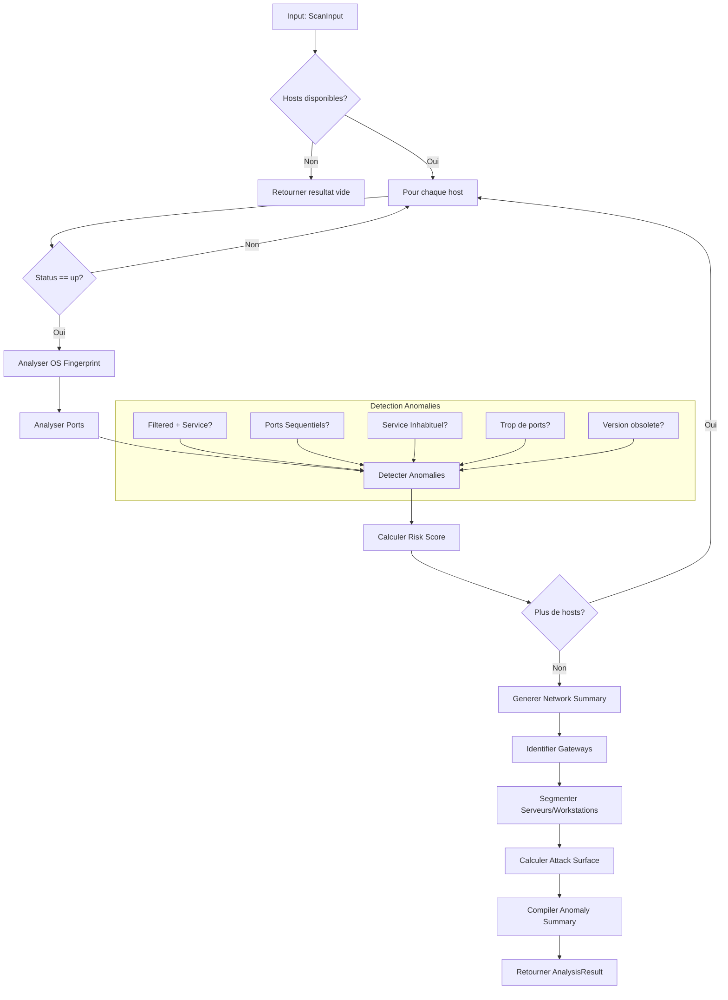

# Exercice 3.2.04 : network_cartographer

**Module :**
3.2.2 — Scanning & Enumeration

**Concept :**
d — Advanced Scanning Simulator (Host Discovery, Scan Types, OS Fingerprinting)

**Difficulte :**
★★★★★★★☆☆☆ (7/10)

**Type :**
complet

**Tiers :**
2 — Melange (concepts a + b + c + d + e + h)

**Langage :**
Rust Edition 2024

**Prerequis :**
- Module 3.1 (Cryptographie)
- 3.2.1 (OSINT & Reconnaissance)
- Notions TCP/IP (flags, ports, protocoles)
- Parsing XML/JSON en Rust

**Domaines :**
Net, Struct, Algo

**Duree estimee :**
6-8 heures

**XP Base :**
350

**Complexite :**
T3 O(n log n) × S2 O(n)

---

## 📐 SECTION 1 : PROTOTYPE & CONSIGNE

### 1.1 Obligations

**Fichiers a rendre :**
```
network_cartographer/
├── Cargo.toml
├── src/
│   ├── main.rs
│   ├── lib.rs
│   ├── parser/
│   │   ├── mod.rs
│   │   ├── nmap_xml.rs
│   │   └── masscan_json.rs
│   ├── analyzer/
│   │   ├── mod.rs
│   │   ├── port_classifier.rs
│   │   ├── os_fingerprint.rs
│   │   └── anomaly_detector.rs
│   └── models/
│       ├── mod.rs
│       ├── host.rs
│       ├── port.rs
│       └── scan_result.rs
```

**Fonctions autorisees :**
- Crates standard Rust 2024
- `serde`, `serde_json`, `quick-xml` pour parsing
- `chrono` pour timestamps
- Toute fonction pure sans I/O reseau

**Fonctions interdites :**
- Acces reseau reel (`std::net::TcpStream`, etc.)
- Execution de commandes systeme (`std::process::Command`)
- Toute bibliotheque de scan actif

---

### 1.2 Consigne

**🎮 CONTEXTE : "Ghost in the Shell" - Section 9 Network Analysis**

*"Dans le monde de Ghost in the Shell, la Section 9 utilise des outils de cyber-intelligence avances pour cartographier les reseaux ennemis. Le Major Kusanagi a besoin d'un nouvel outil d'analyse capable de parser les resultats de reconnaissance et d'identifier les cibles prioritaires.*

*Les donnees brutes arrivent de multiples sources - scans Nmap, Masscan - et doivent etre correlees pour construire une image complete de l'infrastructure cible. Mais attention : certaines donnees sont corrompues ou presentent des anomalies qui pourraient indiquer des contre-mesures actives."*

---

**Ta mission :**

Implementer un **analyseur de resultats de scan reseau** appele `network_cartographer` qui:

1. **Parse des resultats de scan** au format XML (style Nmap) et JSON (style Masscan)
2. **Classifie les ports** selon leur etat et le type de scan utilise
3. **Analyse les fingerprints OS** et attribue des probabilites
4. **Detecte les anomalies** dans les resultats (indicateurs de firewalls, honeypots)
5. **Genere une matrice de risque** par host

---

**Entree :**

```json
{
  "scan_metadata": {
    "scanner": "nmap|masscan",
    "version": "7.94",
    "start_time": "2026-01-10T14:30:00Z",
    "args": "-sS -sV -O -p- 192.168.1.0/24"
  },
  "hosts": [
    {
      "ip": "192.168.1.1",
      "mac": "AA:BB:CC:DD:EE:FF",
      "hostname": "gateway.local",
      "status": "up",
      "discovery_method": "arp-response",
      "ports": [
        {
          "port": 22,
          "protocol": "tcp",
          "state": "open",
          "reason": "syn-ack",
          "service": {
            "name": "ssh",
            "product": "OpenSSH",
            "version": "8.9p1",
            "extrainfo": "Ubuntu-3ubuntu0.6",
            "confidence": 10
          }
        }
      ],
      "os_fingerprint": {
        "fingerprint_string": "SEQ(SP=106%GCD=1%ISR=10A...)",
        "os_matches": [
          {"name": "Linux 5.4 - 5.10", "accuracy": 95},
          {"name": "Linux 4.15 - 5.8", "accuracy": 88}
        ]
      },
      "trace": {
        "hops": [
          {"ttl": 1, "ip": "192.168.1.1", "rtt": "0.5ms"}
        ]
      }
    }
  ],
  "scan_stats": {
    "hosts_up": 15,
    "hosts_down": 240,
    "hosts_total": 255
  }
}
```

---

**Sortie :**

```json
{
  "analysis_metadata": {
    "analyzer": "network_cartographer",
    "version": "1.0.0",
    "analyzed_at": "2026-01-10T14:35:00Z",
    "input_scanner": "nmap",
    "total_hosts_analyzed": 15
  },
  "hosts": [
    {
      "ip": "192.168.1.1",
      "hostname": "gateway.local",
      "classification": "network_device",
      "os_analysis": {
        "os_family": "Linux",
        "os_version_range": "5.4 - 5.10",
        "confidence": 0.95,
        "kernel_hints": ["Ubuntu-based", "Recent LTS"]
      },
      "ports_analysis": {
        "total_ports_scanned": 65535,
        "open_ports": 3,
        "closed_ports": 65530,
        "filtered_ports": 2,
        "services_detected": [
          {
            "port": 22,
            "service": "ssh",
            "version": "OpenSSH 8.9p1",
            "risk_level": "low",
            "known_vulnerabilities": [],
            "recommendations": ["Disable password auth", "Use key-based auth"]
          }
        ]
      },
      "anomalies": [
        {
          "type": "filtered_with_service",
          "description": "Port 443 filtered but SSL service detected - possible WAF",
          "confidence": 0.75,
          "indicator": "firewall_detected"
        }
      ],
      "risk_score": {
        "total": 35,
        "breakdown": {
          "exposed_services": 15,
          "outdated_versions": 10,
          "misconfigurations": 5,
          "high_value_target": 5
        },
        "priority": "medium"
      }
    }
  ],
  "network_summary": {
    "topology_hints": {
      "gateway_candidates": ["192.168.1.1"],
      "server_segment": ["192.168.1.10-50"],
      "workstation_segment": ["192.168.1.100-200"]
    },
    "attack_surface": {
      "critical_services": 2,
      "high_risk_hosts": 1,
      "total_open_ports": 45
    },
    "anomaly_summary": {
      "potential_firewalls": 3,
      "potential_honeypots": 1,
      "inconsistent_results": 2
    }
  }
}
```

---

**Contraintes :**

- Parser correctement les formats XML Nmap et JSON Masscan
- Supporter les 6 types de scan Nmap (SYN, Connect, UDP, ACK, NULL/FIN/Xmas)
- Calculer un score de risque coherent (0-100)
- Detecter au moins 5 types d'anomalies
- Gerer les donnees manquantes ou corrompues gracieusement

---

**Exemples :**

| Scenario | Port State | Scan Type | Classification |
|----------|------------|-----------|----------------|
| `syn-ack` recu | open | SYN scan | Service accessible |
| `rst` recu | closed | SYN scan | Port ferme |
| Pas de reponse | filtered | SYN scan | Firewall probable |
| `rst` recu | unfiltered | ACK scan | Pas de firewall stateful |
| Pas de reponse | open\|filtered | UDP scan | Service UDP potentiel |

---

### 1.3 Prototype

```rust
// src/lib.rs
use serde::{Deserialize, Serialize};

/// Point d'entree principal - analyse un scan complet
pub fn analyze_scan(input: &ScanInput) -> AnalysisResult;

/// Parse un fichier XML au format Nmap
pub fn parse_nmap_xml(xml_content: &str) -> Result<ScanInput, ParseError>;

/// Parse un fichier JSON au format Masscan
pub fn parse_masscan_json(json_content: &str) -> Result<ScanInput, ParseError>;

/// Classifie l'etat d'un port selon le type de scan
pub fn classify_port_state(
    port: &PortInfo,
    scan_type: ScanType,
    response: &ScanResponse
) -> PortClassification;

/// Analyse un fingerprint OS et retourne les probabilites
pub fn analyze_os_fingerprint(
    fingerprint: &OsFingerprint
) -> OsAnalysis;

/// Detecte les anomalies dans les resultats d'un host
pub fn detect_anomalies(host: &HostInfo) -> Vec<Anomaly>;

/// Calcule le score de risque d'un host
pub fn calculate_risk_score(
    host: &HostInfo,
    anomalies: &[Anomaly]
) -> RiskScore;

/// Genere un resume du reseau analyse
pub fn generate_network_summary(
    hosts: &[AnalyzedHost]
) -> NetworkSummary;
```

---

## 💡 SECTION 2 : LE SAVIEZ-VOUS ?

### 2.1 L'histoire de Nmap

**Nmap** (Network Mapper) a ete cree par **Gordon Lyon** (alias "Fyodor") en 1997. Publie initialement dans le magazine Phrack, il est devenu l'outil de scan reseau le plus utilise au monde.

Fun fact : Nmap apparait dans plus de 20 films hollywoodiens, dont **The Matrix Reloaded** (2003) ou Trinity l'utilise pour scanner une centrale electrique !

### 2.2 Les types de scan expliques

| Scan Type | Paquets envoyes | Stealth | Precision |
|-----------|-----------------|---------|-----------|
| **SYN** | SYN | Eleve | Haute |
| **Connect** | Full TCP | Faible | Tres haute |
| **UDP** | UDP | Moyen | Faible |
| **ACK** | ACK | Moyen | Firewall detection |
| **NULL/FIN/Xmas** | Flags speciaux | Eleve | Variable |

### 2.3 OS Fingerprinting : la science

L'OS fingerprinting analyse les **subtilites d'implementation de la pile TCP/IP** :
- Valeurs initiales du TTL (Linux=64, Windows=128, Cisco=255)
- Taille de fenetre TCP initiale
- Options TCP supportees et leur ordre
- Comportement face aux paquets malformes

---

## 🏢 SECTION 2.5 : DANS LA VRAIE VIE

### Pentester / Red Team
- Cartographie les reseaux cibles avant les tests d'intrusion
- Identifie les services vulnerables et les points d'entree
- Documente la surface d'attaque dans les rapports

### Security Analyst (Blue Team)
- Valide que seuls les ports autorises sont exposes
- Detecte les changements non autorises dans l'infrastructure
- Correle les scans avec les alertes IDS/SIEM

### DevOps / SRE
- Inventaire automatise des services en production
- Verification des configurations firewall
- Detection des shadow IT (services non documentes)

### Compliance Officer
- Audit de conformite PCI-DSS (ports autorises)
- Documentation de l'infrastructure pour ISO 27001
- Verification des politiques de segmentation reseau

---

## 🖥️ SECTION 3 : EXEMPLE D'UTILISATION

### 3.0 Session bash

```bash
$ ls
Cargo.toml  src/  tests/  sample_data/

$ cargo build --release

$ ./target/release/network_cartographer --input sample_data/nmap_scan.xml --format nmap
{
  "analysis_metadata": {
    "analyzer": "network_cartographer",
    "version": "1.0.0",
    "total_hosts_analyzed": 15
  },
  "hosts": [...],
  "network_summary": {
    "attack_surface": {
      "critical_services": 2,
      "high_risk_hosts": 1
    }
  }
}

$ cargo test
running 42 tests
test parser::nmap_xml::test_parse_basic ... ok
test parser::nmap_xml::test_parse_os_fingerprint ... ok
test analyzer::port_classifier::test_syn_scan ... ok
test analyzer::anomaly_detector::test_filtered_with_service ... ok
...
test result: ok. 42 passed; 0 failed
```

---

## ⚡ SECTION 3.1 : BONUS STANDARD (OPTIONNEL)

**Difficulte Bonus :**
★★★★★★★★☆☆ (8/10)

**Recompense :**
XP ×2

**Time Complexity attendue :**
O(n log n)

**Space Complexity attendue :**
O(n)

**Domaines Bonus :**
`Algo, Struct`

### 3.1.1 Consigne Bonus

**🎮 "Laughing Man" - Advanced Correlation Engine**

*Le Laughing Man a laisse des traces sur plusieurs reseaux. Tu dois implementer un moteur de correlation avance capable de fusionner les resultats de multiples scans et d'identifier les patterns entre eux.*

**Ta mission bonus :**

Implementer `correlate_scans` qui:

1. **Fusionne plusieurs scans** du meme reseau (a differents moments)
2. **Detecte les changements** (nouveaux hosts, ports fermes, services mis a jour)
3. **Identifie les patterns temporels** (services qui apparaissent/disparaissent periodiquement)
4. **Calcule un score de volatilite** par host

**Contraintes :**
```
┌─────────────────────────────────────────┐
│  2 ≤ scans.len() ≤ 100                  │
│  Temps entre scans: 1min - 30 jours     │
│  Fusion en O(n log n)                   │
│  Detection changements en O(n)          │
└─────────────────────────────────────────┘
```

### 3.1.2 Prototype Bonus

```rust
pub fn correlate_scans(
    scans: &[ScanInput],
    time_window: Duration
) -> CorrelationResult;

pub struct CorrelationResult {
    pub merged_hosts: Vec<MergedHost>,
    pub changes_detected: Vec<Change>,
    pub temporal_patterns: Vec<TemporalPattern>,
    pub volatility_scores: HashMap<IpAddr, f64>,
}
```

### 3.1.3 Ce qui change par rapport a l'exercice de base

| Aspect | Base | Bonus |
|--------|------|-------|
| Input | 1 scan | N scans |
| Analyse | Statique | Temporelle |
| Complexite | O(n) | O(n log n) |
| Output | Snapshot | Evolution |

---

## ✅❌ SECTION 4 : ZONE CORRECTION

### 4.1 Moulinette

| Test ID | Description | Points | Trap |
|---------|-------------|--------|------|
| `T01` | Parse XML Nmap basique | 5 | - |
| `T02` | Parse XML avec OS fingerprint | 5 | - |
| `T03` | Parse JSON Masscan | 5 | - |
| `T04` | Classification port SYN scan | 5 | - |
| `T05` | Classification port UDP scan | 5 | UDP complexe |
| `T06` | Classification port ACK scan | 5 | - |
| `T07` | OS fingerprint Linux | 5 | - |
| `T08` | OS fingerprint Windows | 5 | - |
| `T09` | OS fingerprint ambigus | 5 | Plusieurs matches |
| `T10` | Anomalie: filtered + service | 10 | Piege principal |
| `T11` | Anomalie: ports sequentiels | 5 | - |
| `T12` | Anomalie: TTL inconsistant | 5 | - |
| `T13` | Risk score host critique | 10 | - |
| `T14` | Risk score host normal | 5 | - |
| `T15` | Network summary topology | 10 | - |
| `T16` | Gestion donnees manquantes | 5 | Null handling |
| `T17` | Gestion XML malformed | 5 | Error handling |
| `BONUS_T01` | Correlation 2 scans | 10 | - |
| `BONUS_T02` | Detection changements | 10 | - |
| `BONUS_T03` | Patterns temporels | 10 | - |

**Total : 100 points (base) + 30 points (bonus)**

---

### 4.2 main.rs de test

```rust
use network_cartographer::*;
use std::fs;

fn main() {
    // Test 1: Parse Nmap XML
    let xml_content = fs::read_to_string("tests/data/nmap_basic.xml")
        .expect("Failed to read test file");

    let scan_input = parse_nmap_xml(&xml_content)
        .expect("Failed to parse XML");

    assert_eq!(scan_input.hosts.len(), 3);
    println!("Test Parse XML: OK");

    // Test 2: Analyze scan
    let result = analyze_scan(&scan_input);

    assert!(result.hosts.len() > 0);
    assert!(result.network_summary.attack_surface.total_open_ports > 0);
    println!("Test Analyze: OK");

    // Test 3: Port classification
    let port = PortInfo {
        port: 22,
        protocol: Protocol::Tcp,
        state: "open".to_string(),
        reason: "syn-ack".to_string(),
        service: Some(ServiceInfo {
            name: "ssh".to_string(),
            product: Some("OpenSSH".to_string()),
            version: Some("8.9p1".to_string()),
            confidence: 10,
        }),
    };

    let classification = classify_port_state(
        &port,
        ScanType::SynScan,
        &ScanResponse::SynAck
    );

    assert_eq!(classification.state, PortState::Open);
    assert_eq!(classification.confidence, 1.0);
    println!("Test Port Classification: OK");

    // Test 4: Anomaly detection
    let host_with_anomaly = create_host_with_filtered_service();
    let anomalies = detect_anomalies(&host_with_anomaly);

    assert!(anomalies.iter().any(|a| a.anomaly_type == AnomalyType::FilteredWithService));
    println!("Test Anomaly Detection: OK");

    // Test 5: Risk score
    let risk = calculate_risk_score(&host_with_anomaly, &anomalies);
    assert!(risk.total >= 0 && risk.total <= 100);
    println!("Test Risk Score: OK");

    println!("\n✅ All tests passed!");
}
```

---

### 4.3 Solution de reference

```rust
// src/lib.rs - Solution de reference
use serde::{Deserialize, Serialize};
use std::collections::HashMap;

#[derive(Debug, Clone, Serialize, Deserialize)]
pub struct ScanInput {
    pub scan_metadata: ScanMetadata,
    pub hosts: Vec<HostInfo>,
    pub scan_stats: ScanStats,
}

#[derive(Debug, Clone, Serialize, Deserialize)]
pub struct ScanMetadata {
    pub scanner: String,
    pub version: String,
    pub start_time: String,
    pub args: String,
}

#[derive(Debug, Clone, Serialize, Deserialize)]
pub struct HostInfo {
    pub ip: String,
    pub mac: Option<String>,
    pub hostname: Option<String>,
    pub status: String,
    pub discovery_method: Option<String>,
    pub ports: Vec<PortInfo>,
    pub os_fingerprint: Option<OsFingerprint>,
}

#[derive(Debug, Clone, Serialize, Deserialize)]
pub struct PortInfo {
    pub port: u16,
    pub protocol: Protocol,
    pub state: String,
    pub reason: String,
    pub service: Option<ServiceInfo>,
}

#[derive(Debug, Clone, Copy, PartialEq, Serialize, Deserialize)]
pub enum Protocol {
    Tcp,
    Udp,
    Sctp,
}

#[derive(Debug, Clone, Serialize, Deserialize)]
pub struct ServiceInfo {
    pub name: String,
    pub product: Option<String>,
    pub version: Option<String>,
    pub confidence: u8,
}

#[derive(Debug, Clone, Serialize, Deserialize)]
pub struct OsFingerprint {
    pub fingerprint_string: Option<String>,
    pub os_matches: Vec<OsMatch>,
}

#[derive(Debug, Clone, Serialize, Deserialize)]
pub struct OsMatch {
    pub name: String,
    pub accuracy: u8,
}

// Analyse principale
pub fn analyze_scan(input: &ScanInput) -> AnalysisResult {
    let mut analyzed_hosts = Vec::new();

    for host in &input.hosts {
        if host.status != "up" {
            continue;
        }

        let os_analysis = host.os_fingerprint
            .as_ref()
            .map(analyze_os_fingerprint)
            .unwrap_or_default();

        let ports_analysis = analyze_ports(&host.ports, &input.scan_metadata);
        let anomalies = detect_anomalies(host);
        let risk_score = calculate_risk_score(host, &anomalies);

        analyzed_hosts.push(AnalyzedHost {
            ip: host.ip.clone(),
            hostname: host.hostname.clone(),
            classification: classify_host(host),
            os_analysis,
            ports_analysis,
            anomalies,
            risk_score,
        });
    }

    let network_summary = generate_network_summary(&analyzed_hosts);

    AnalysisResult {
        analysis_metadata: AnalysisMetadata {
            analyzer: "network_cartographer".to_string(),
            version: "1.0.0".to_string(),
            analyzed_at: chrono::Utc::now().to_rfc3339(),
            input_scanner: input.scan_metadata.scanner.clone(),
            total_hosts_analyzed: analyzed_hosts.len(),
        },
        hosts: analyzed_hosts,
        network_summary,
    }
}

// Classification des ports selon le type de scan
pub fn classify_port_state(
    port: &PortInfo,
    scan_type: ScanType,
    response: &ScanResponse
) -> PortClassification {
    match scan_type {
        ScanType::SynScan => match response {
            ScanResponse::SynAck => PortClassification {
                state: PortState::Open,
                confidence: 1.0,
                explanation: "SYN-ACK received, port accepting connections".to_string(),
            },
            ScanResponse::Rst => PortClassification {
                state: PortState::Closed,
                confidence: 1.0,
                explanation: "RST received, port closed".to_string(),
            },
            ScanResponse::NoResponse | ScanResponse::IcmpUnreachable => PortClassification {
                state: PortState::Filtered,
                confidence: 0.9,
                explanation: "No response, likely filtered by firewall".to_string(),
            },
            _ => PortClassification::unknown(),
        },

        ScanType::ConnectScan => match response {
            ScanResponse::ConnectionEstablished => PortClassification {
                state: PortState::Open,
                confidence: 1.0,
                explanation: "Full TCP connection established".to_string(),
            },
            ScanResponse::ConnectionRefused => PortClassification {
                state: PortState::Closed,
                confidence: 1.0,
                explanation: "Connection refused by target".to_string(),
            },
            _ => PortClassification::unknown(),
        },

        ScanType::UdpScan => match response {
            ScanResponse::UdpResponse => PortClassification {
                state: PortState::Open,
                confidence: 1.0,
                explanation: "UDP response received".to_string(),
            },
            ScanResponse::IcmpUnreachable => PortClassification {
                state: PortState::Closed,
                confidence: 0.95,
                explanation: "ICMP port unreachable received".to_string(),
            },
            ScanResponse::NoResponse => PortClassification {
                state: PortState::OpenOrFiltered,
                confidence: 0.5,
                explanation: "No response - could be open or filtered".to_string(),
            },
            _ => PortClassification::unknown(),
        },

        ScanType::AckScan => match response {
            ScanResponse::Rst => PortClassification {
                state: PortState::Unfiltered,
                confidence: 1.0,
                explanation: "RST received, no stateful firewall".to_string(),
            },
            ScanResponse::NoResponse | ScanResponse::IcmpUnreachable => PortClassification {
                state: PortState::Filtered,
                confidence: 0.9,
                explanation: "Filtered by stateful firewall".to_string(),
            },
            _ => PortClassification::unknown(),
        },

        ScanType::NullScan | ScanType::FinScan | ScanType::XmasScan => match response {
            ScanResponse::NoResponse => PortClassification {
                state: PortState::OpenOrFiltered,
                confidence: 0.7,
                explanation: "No response per RFC 793 - open or filtered".to_string(),
            },
            ScanResponse::Rst => PortClassification {
                state: PortState::Closed,
                confidence: 1.0,
                explanation: "RST received, port closed".to_string(),
            },
            _ => PortClassification::unknown(),
        },
    }
}

// Analyse OS fingerprint
pub fn analyze_os_fingerprint(fingerprint: &OsFingerprint) -> OsAnalysis {
    if fingerprint.os_matches.is_empty() {
        return OsAnalysis::default();
    }

    let best_match = &fingerprint.os_matches[0];
    let os_family = extract_os_family(&best_match.name);
    let version_range = extract_version_range(&best_match.name);

    let kernel_hints = derive_kernel_hints(&best_match.name, &fingerprint.fingerprint_string);

    OsAnalysis {
        os_family,
        os_version_range: version_range,
        confidence: best_match.accuracy as f64 / 100.0,
        kernel_hints,
    }
}

fn extract_os_family(os_name: &str) -> String {
    let name_lower = os_name.to_lowercase();

    if name_lower.contains("linux") {
        "Linux".to_string()
    } else if name_lower.contains("windows") {
        "Windows".to_string()
    } else if name_lower.contains("freebsd") || name_lower.contains("openbsd") {
        "BSD".to_string()
    } else if name_lower.contains("cisco") || name_lower.contains("ios") {
        "Cisco IOS".to_string()
    } else if name_lower.contains("macos") || name_lower.contains("darwin") {
        "macOS".to_string()
    } else {
        "Unknown".to_string()
    }
}

// Detection d'anomalies
pub fn detect_anomalies(host: &HostInfo) -> Vec<Anomaly> {
    let mut anomalies = Vec::new();

    // Anomalie 1: Port filtered mais service detecte
    for port in &host.ports {
        if port.state == "filtered" && port.service.is_some() {
            anomalies.push(Anomaly {
                anomaly_type: AnomalyType::FilteredWithService,
                description: format!(
                    "Port {} filtered but service {} detected - possible WAF/IPS",
                    port.port,
                    port.service.as_ref().unwrap().name
                ),
                confidence: 0.75,
                indicator: "firewall_detected".to_string(),
                affected_ports: vec![port.port],
            });
        }
    }

    // Anomalie 2: Ports sequentiels ouverts (scan range detection)
    let open_ports: Vec<u16> = host.ports
        .iter()
        .filter(|p| p.state == "open")
        .map(|p| p.port)
        .collect();

    if has_sequential_ports(&open_ports, 5) {
        anomalies.push(Anomaly {
            anomaly_type: AnomalyType::SequentialPorts,
            description: "Multiple sequential ports open - possible honeypot or testing server".to_string(),
            confidence: 0.6,
            indicator: "potential_honeypot".to_string(),
            affected_ports: open_ports.clone(),
        });
    }

    // Anomalie 3: Services inhabituels sur ports standards
    for port in &host.ports {
        if let Some(service) = &port.service {
            if is_unusual_service_port(port.port, &service.name) {
                anomalies.push(Anomaly {
                    anomaly_type: AnomalyType::UnusualServicePort,
                    description: format!(
                        "Unusual service {} on port {} (expected: {})",
                        service.name,
                        port.port,
                        get_expected_service(port.port)
                    ),
                    confidence: 0.7,
                    indicator: "misconfiguration_or_evasion".to_string(),
                    affected_ports: vec![port.port],
                });
            }
        }
    }

    // Anomalie 4: Trop de ports ouverts
    let open_count = host.ports.iter().filter(|p| p.state == "open").count();
    if open_count > 50 {
        anomalies.push(Anomaly {
            anomaly_type: AnomalyType::ExcessiveOpenPorts,
            description: format!("{} open ports detected - possible honeypot or misconfigured host", open_count),
            confidence: 0.65,
            indicator: "potential_honeypot".to_string(),
            affected_ports: vec![],
        });
    }

    // Anomalie 5: Versions anciennes de services critiques
    for port in &host.ports {
        if let Some(service) = &port.service {
            if let Some(version) = &service.version {
                if is_outdated_version(&service.name, version) {
                    anomalies.push(Anomaly {
                        anomaly_type: AnomalyType::OutdatedService,
                        description: format!(
                            "Outdated {} version {} on port {}",
                            service.name, version, port.port
                        ),
                        confidence: 0.9,
                        indicator: "vulnerable_service".to_string(),
                        affected_ports: vec![port.port],
                    });
                }
            }
        }
    }

    anomalies
}

fn has_sequential_ports(ports: &[u16], min_sequence: usize) -> bool {
    if ports.len() < min_sequence {
        return false;
    }

    let mut sorted = ports.to_vec();
    sorted.sort();

    let mut current_sequence = 1;
    for i in 1..sorted.len() {
        if sorted[i] == sorted[i-1] + 1 {
            current_sequence += 1;
            if current_sequence >= min_sequence {
                return true;
            }
        } else {
            current_sequence = 1;
        }
    }

    false
}

// Calcul du score de risque
pub fn calculate_risk_score(host: &HostInfo, anomalies: &[Anomaly]) -> RiskScore {
    let mut breakdown = RiskBreakdown::default();

    // Score services exposes
    for port in &host.ports {
        if port.state == "open" {
            breakdown.exposed_services += match port.port {
                22 | 23 | 3389 => 8,  // Services d'acces a distance
                21 | 445 | 139 => 7,  // Partage de fichiers
                80 | 443 | 8080 => 3, // Web services
                3306 | 5432 | 27017 => 10, // Bases de donnees
                _ => 2,
            };
        }
    }
    breakdown.exposed_services = breakdown.exposed_services.min(40);

    // Score versions obsoletes
    for anomaly in anomalies {
        if anomaly.anomaly_type == AnomalyType::OutdatedService {
            breakdown.outdated_versions += 10;
        }
    }
    breakdown.outdated_versions = breakdown.outdated_versions.min(30);

    // Score misconfigurations
    for anomaly in anomalies {
        match anomaly.anomaly_type {
            AnomalyType::UnusualServicePort => breakdown.misconfigurations += 5,
            AnomalyType::FilteredWithService => breakdown.misconfigurations += 3,
            _ => {}
        }
    }
    breakdown.misconfigurations = breakdown.misconfigurations.min(20);

    // Score cible haute valeur
    let has_critical_services = host.ports.iter().any(|p| {
        p.state == "open" && matches!(p.port, 3306 | 5432 | 1433 | 27017 | 6379)
    });
    if has_critical_services {
        breakdown.high_value_target = 10;
    }

    let total = breakdown.exposed_services
        + breakdown.outdated_versions
        + breakdown.misconfigurations
        + breakdown.high_value_target;

    let priority = match total {
        0..=25 => Priority::Low,
        26..=50 => Priority::Medium,
        51..=75 => Priority::High,
        _ => Priority::Critical,
    };

    RiskScore {
        total: total.min(100),
        breakdown,
        priority,
    }
}

// Generation du resume reseau
pub fn generate_network_summary(hosts: &[AnalyzedHost]) -> NetworkSummary {
    let mut gateway_candidates = Vec::new();
    let mut server_ips = Vec::new();
    let mut workstation_ips = Vec::new();

    for host in hosts {
        // Detection gateway
        if host.classification == "network_device"
            || host.ports_analysis.services_detected.iter().any(|s| s.service == "router" || s.port == 53)
        {
            gateway_candidates.push(host.ip.clone());
        }

        // Classification serveur vs workstation
        let server_ports = [22, 80, 443, 3306, 5432, 25, 993, 995];
        let has_server_ports = host.ports_analysis.services_detected
            .iter()
            .any(|s| server_ports.contains(&s.port));

        if has_server_ports {
            server_ips.push(host.ip.clone());
        } else {
            workstation_ips.push(host.ip.clone());
        }
    }

    let critical_services = hosts.iter()
        .flat_map(|h| &h.ports_analysis.services_detected)
        .filter(|s| matches!(s.port, 3306 | 5432 | 1433 | 6379 | 27017))
        .count();

    let high_risk_hosts = hosts.iter()
        .filter(|h| matches!(h.risk_score.priority, Priority::High | Priority::Critical))
        .count();

    let total_open_ports: usize = hosts.iter()
        .map(|h| h.ports_analysis.open_ports)
        .sum();

    let potential_firewalls = hosts.iter()
        .flat_map(|h| &h.anomalies)
        .filter(|a| a.indicator == "firewall_detected")
        .count();

    let potential_honeypots = hosts.iter()
        .flat_map(|h| &h.anomalies)
        .filter(|a| a.indicator == "potential_honeypot")
        .count();

    NetworkSummary {
        topology_hints: TopologyHints {
            gateway_candidates,
            server_segment: compress_ip_range(&server_ips),
            workstation_segment: compress_ip_range(&workstation_ips),
        },
        attack_surface: AttackSurface {
            critical_services,
            high_risk_hosts,
            total_open_ports,
        },
        anomaly_summary: AnomalySummary {
            potential_firewalls,
            potential_honeypots,
            inconsistent_results: 0, // Calcul supplementaire requis
        },
    }
}
```

---

### 4.4 Solutions alternatives acceptees

**Alternative 1 : Approche fonctionnelle pure**
```rust
// Utilisation extensive d'iterators et de closures
pub fn analyze_scan(input: &ScanInput) -> AnalysisResult {
    let analyzed_hosts: Vec<AnalyzedHost> = input.hosts
        .iter()
        .filter(|h| h.status == "up")
        .map(|host| {
            let anomalies = detect_anomalies(host);
            AnalyzedHost {
                ip: host.ip.clone(),
                hostname: host.hostname.clone(),
                classification: classify_host(host),
                os_analysis: host.os_fingerprint.as_ref().map(analyze_os_fingerprint).unwrap_or_default(),
                ports_analysis: analyze_ports(&host.ports, &input.scan_metadata),
                risk_score: calculate_risk_score(host, &anomalies),
                anomalies,
            }
        })
        .collect();

    // ... reste similaire
}
```

**Alternative 2 : Pattern matching exhaustif**
```rust
pub fn classify_port_state(port: &PortInfo, scan_type: ScanType, response: &ScanResponse) -> PortClassification {
    match (scan_type, response, &port.state[..]) {
        (ScanType::SynScan, ScanResponse::SynAck, _) => PortClassification::open_high_confidence(),
        (ScanType::SynScan, ScanResponse::Rst, _) => PortClassification::closed_high_confidence(),
        (ScanType::UdpScan, ScanResponse::NoResponse, _) => PortClassification::open_or_filtered(),
        // ... exhaustif
        _ => PortClassification::unknown(),
    }
}
```

---

### 4.5 Solutions refusees

**Refuse 1 : Pas de gestion des erreurs**
```rust
// ❌ REFUSE - Pas de gestion d'erreur sur le parsing
pub fn parse_nmap_xml(xml: &str) -> ScanInput {
    serde_xml::from_str(xml).unwrap() // CRASH si XML invalide
}
// Raison: L'exercice exige une gestion gracieuse des donnees corrompues
```

**Refuse 2 : Score de risque non borne**
```rust
// ❌ REFUSE - Score peut depasser 100
pub fn calculate_risk_score(host: &HostInfo, anomalies: &[Anomaly]) -> RiskScore {
    let score = anomalies.len() * 20 + host.ports.len() * 5;
    // Pas de .min(100)
    RiskScore { total: score, ... }
}
// Raison: Le score doit etre entre 0 et 100
```

**Refuse 3 : Anomalie detection incomplete**
```rust
// ❌ REFUSE - Detecte moins de 5 types d'anomalies
pub fn detect_anomalies(host: &HostInfo) -> Vec<Anomaly> {
    let mut anomalies = Vec::new();
    // Seulement 2 types detectes
    if has_filtered_with_service(host) { anomalies.push(...); }
    if has_sequential_ports(host) { anomalies.push(...); }
    anomalies
}
// Raison: L'enonce demande au moins 5 types d'anomalies
```

---

### 4.9 spec.json

```json
{
  "name": "network_cartographer",
  "language": "rust",
  "version": "2024",
  "type": "code",
  "tier": 2,
  "tier_info": "Melange (concepts a + b + c + d + e + h)",
  "tags": ["network", "scanning", "nmap", "security", "phase3"],
  "passing_score": 70,

  "function": {
    "name": "analyze_scan",
    "prototype": "pub fn analyze_scan(input: &ScanInput) -> AnalysisResult",
    "return_type": "AnalysisResult",
    "parameters": [
      {"name": "input", "type": "&ScanInput"}
    ]
  },

  "driver": {
    "reference": "pub fn ref_analyze_scan(input: &ScanInput) -> AnalysisResult { let hosts: Vec<AnalyzedHost> = input.hosts.iter().filter(|h| h.status == \"up\").map(|h| { let anomalies = detect_anomalies(h); AnalyzedHost { ip: h.ip.clone(), hostname: h.hostname.clone(), classification: classify_host(h), os_analysis: h.os_fingerprint.as_ref().map(analyze_os_fingerprint).unwrap_or_default(), ports_analysis: analyze_ports(&h.ports, &input.scan_metadata), risk_score: calculate_risk_score(h, &anomalies), anomalies } }).collect(); AnalysisResult { analysis_metadata: create_metadata(input, hosts.len()), hosts, network_summary: generate_network_summary(&hosts) } }",

    "edge_cases": [
      {
        "name": "empty_hosts",
        "args": [{"hosts": [], "scan_metadata": {}, "scan_stats": {}}],
        "expected_hosts_count": 0,
        "is_trap": false
      },
      {
        "name": "single_host_all_ports_open",
        "args": ["test_data/single_host_open.json"],
        "expected_risk_priority": "critical",
        "is_trap": true,
        "trap_explanation": "Host avec trop de ports ouverts = honeypot probable"
      },
      {
        "name": "filtered_with_detected_service",
        "args": ["test_data/filtered_service.json"],
        "expected_anomaly_type": "FilteredWithService",
        "is_trap": true,
        "trap_explanation": "Port filtered ne devrait pas avoir de service detecte"
      },
      {
        "name": "malformed_xml",
        "args": ["<invalid>xml</broken"],
        "expected_error": true,
        "is_trap": true,
        "trap_explanation": "XML invalide doit retourner une erreur, pas crash"
      }
    ],

    "fuzzing": {
      "enabled": true,
      "iterations": 500,
      "generators": [
        {
          "type": "json_object",
          "param_index": 0,
          "params": {
            "schema": "scan_input_schema.json",
            "corrupt_probability": 0.1
          }
        }
      ]
    }
  },

  "norm": {
    "allowed_functions": ["serde", "serde_json", "quick-xml", "chrono"],
    "forbidden_functions": ["std::net::TcpStream", "std::process::Command", "tokio::net"],
    "check_security": true,
    "check_memory": true,
    "blocking": true
  }
}
```

---

### 4.10 Solutions Mutantes

**Mutant A (Boundary) : Off-by-one dans la detection de ports sequentiels**
```rust
fn has_sequential_ports(ports: &[u16], min_sequence: usize) -> bool {
    // BUG: >= au lieu de >
    if ports.len() >= min_sequence {  // Devrait etre >
        return false;
    }
    // ...
}
// Pourquoi c'est faux: Retourne false pour exactement min_sequence ports
// Ce qui etait pense: "Si on a assez de ports, on peut continuer"
```

**Mutant B (Safety) : Pas de verification de la liste de ports vide**
```rust
pub fn analyze_ports(ports: &[PortInfo], metadata: &ScanMetadata) -> PortsAnalysis {
    let first_port = &ports[0];  // BUG: Panic si ports est vide
    // ...
}
// Pourquoi c'est faux: Crash sur un host sans ports scannes
// Ce qui etait pense: "Il y a toujours au moins un port"
```

**Mutant C (Logic) : Inversion de la logique UDP**
```rust
ScanType::UdpScan => match response {
    ScanResponse::NoResponse => PortClassification {
        state: PortState::Closed,  // BUG: Devrait etre OpenOrFiltered
        // ...
    },
}
// Pourquoi c'est faux: En UDP, pas de reponse = potentiellement ouvert
// Ce qui etait pense: "Pas de reponse = ferme comme en TCP"
```

**Mutant D (Return) : Score de risque toujours 0**
```rust
pub fn calculate_risk_score(host: &HostInfo, anomalies: &[Anomaly]) -> RiskScore {
    let breakdown = RiskBreakdown::default();
    // BUG: N'additionne jamais rien a breakdown
    RiskScore {
        total: 0,  // Toujours 0
        breakdown,
        priority: Priority::Low,
    }
}
// Pourquoi c'est faux: Ne calcule pas reellement le risque
// Ce qui etait pense: "J'initialise et je retourne"
```

**Mutant E (Resource) : Memory leak dans la correlation**
```rust
pub fn correlate_scans(scans: &[ScanInput], _: Duration) -> CorrelationResult {
    let mut all_hosts = Vec::new();
    for scan in scans {
        all_hosts.extend(scan.hosts.clone());  // BUG: Clone sans deduplication
    }
    // all_hosts grossit indefiniment avec des doublons
}
// Pourquoi c'est faux: Consomme O(n*m) memoire au lieu de O(n)
// Ce qui etait pense: "Je concatene tout et je traite apres"
```

---

## 🧠 SECTION 5 : COMPRENDRE

### 5.1 Ce que cet exercice enseigne

1. **Parsing multi-format** : Gerer XML (Nmap) et JSON (Masscan) avec serde
2. **Logique de scan reseau** : Comprendre les 6 types de scan et leurs implications
3. **OS Fingerprinting** : Analyser les signatures TCP/IP pour identifier les OS
4. **Detection d'anomalies** : Identifier les inconsistances qui revelent firewalls/honeypots
5. **Scoring de risque** : Quantifier la menace de chaque host

---

### 5.2 LDA — Traduction litterale en francais (MAJUSCULES)

```
FONCTION analyze_scan QUI RETOURNE UN RESULTAT D'ANALYSE ET PREND EN PARAMETRE input QUI EST UNE REFERENCE VERS UNE STRUCTURE SCAN_INPUT
DEBUT FONCTION
    DECLARER analyzed_hosts COMME VECTEUR VIDE DE HOSTS ANALYSES

    POUR CHAQUE host DANS input.hosts FAIRE
        SI host.status EST DIFFERENT DE "up" ALORS
            CONTINUER VERS L'ITERATION SUIVANTE
        FIN SI

        DECLARER os_analysis COMME RESULTAT DE analyze_os_fingerprint SUR host.os_fingerprint
        DECLARER ports_analysis COMME RESULTAT DE analyze_ports SUR host.ports
        DECLARER anomalies COMME RESULTAT DE detect_anomalies SUR host
        DECLARER risk_score COMME RESULTAT DE calculate_risk_score SUR host ET anomalies

        AJOUTER AU VECTEUR analyzed_hosts UNE NOUVELLE STRUCTURE AnalyzedHost AVEC LES CHAMPS CALCULES
    FIN POUR

    DECLARER network_summary COMME RESULTAT DE generate_network_summary SUR analyzed_hosts

    RETOURNER UNE STRUCTURE AnalysisResult AVEC LES CHAMPS REMPLIS
FIN FONCTION
```

---

### 5.2.2 Logic Flow (Structured English)

```
ALGORITHME : Classification de l'etat d'un port
---
1. RECEVOIR le port, le type de scan, et la reponse obtenue

2. SELON le type de scan :
   a. CAS "SYN Scan" :
      - SI reponse == SYN-ACK : RETOURNER "Open" (confiance 100%)
      - SI reponse == RST : RETOURNER "Closed" (confiance 100%)
      - SI pas de reponse : RETOURNER "Filtered" (confiance 90%)

   b. CAS "UDP Scan" :
      - SI reponse UDP : RETOURNER "Open" (confiance 100%)
      - SI ICMP unreachable : RETOURNER "Closed" (confiance 95%)
      - SI pas de reponse : RETOURNER "Open|Filtered" (confiance 50%)

   c. CAS "ACK Scan" :
      - SI reponse == RST : RETOURNER "Unfiltered" (pas de firewall)
      - SI pas de reponse : RETOURNER "Filtered" (firewall stateful)

   d. CAS "NULL/FIN/Xmas" :
      - SI pas de reponse : RETOURNER "Open|Filtered"
      - SI reponse == RST : RETOURNER "Closed"

3. RETOURNER "Unknown" si cas non gere
```

---

### 5.2.3 Representation algorithmique (Logique de Garde)

```
FONCTION : detect_anomalies (host)
---
INIT anomalies = []

1. POUR CHAQUE port DANS host.ports :
   |
   |-- VERIFIER si state == "filtered" ET service != NULL :
   |     AJOUTER Anomalie "FilteredWithService"
   |     (WAF/IPS probable)
   |
   |-- VERIFIER si service inattendu sur port standard :
   |     AJOUTER Anomalie "UnusualServicePort"
   |     (Misconfiguration ou evasion)

2. VERIFIER si plus de 5 ports consecutifs ouverts :
   |     AJOUTER Anomalie "SequentialPorts"
   |     (Honeypot probable)

3. VERIFIER si plus de 50 ports ouverts :
   |     AJOUTER Anomalie "ExcessiveOpenPorts"
   |     (Honeypot ou serveur mal configure)

4. POUR CHAQUE service avec version :
   |-- VERIFIER si version dans base vulnerabilites :
   |     AJOUTER Anomalie "OutdatedService"

5. RETOURNER anomalies
```

---

### 5.2.3.1 Diagramme Mermaid



---

### 5.3 Visualisation ASCII

**Architecture du Network Cartographer :**

```
                    ┌─────────────────────────────────────────────────────────┐
                    │              NETWORK CARTOGRAPHER                        │
                    └─────────────────────────────────────────────────────────┘
                                            │
                    ┌───────────────────────┼───────────────────────┐
                    │                       │                       │
                    ▼                       ▼                       ▼
            ┌───────────────┐      ┌───────────────┐      ┌───────────────┐
            │  NMAP XML     │      │ MASSCAN JSON  │      │  AUTRES       │
            │  Parser       │      │ Parser        │      │  Formats      │
            └───────┬───────┘      └───────┬───────┘      └───────┬───────┘
                    │                       │                       │
                    └───────────────────────┼───────────────────────┘
                                            │
                                            ▼
                              ┌─────────────────────────┐
                              │    UNIFIED SCAN MODEL   │
                              │                         │
                              │  • Hosts[]              │
                              │  • Ports[]              │
                              │  • Services[]           │
                              │  • OS Fingerprints      │
                              └───────────┬─────────────┘
                                          │
                    ┌─────────────────────┼─────────────────────┐
                    │                     │                     │
                    ▼                     ▼                     ▼
          ┌─────────────────┐   ┌─────────────────┐   ┌─────────────────┐
          │ PORT CLASSIFIER │   │ OS ANALYZER     │   │ ANOMALY DETECTOR│
          │                 │   │                 │   │                 │
          │ SYN/Connect/UDP │   │ TCP/IP Stack    │   │ • Filtered+Svc  │
          │ ACK/NULL/FIN    │   │ TTL Analysis    │   │ • Sequential    │
          │ Xmas scans      │   │ Window Size     │   │ • Unusual ports │
          └────────┬────────┘   └────────┬────────┘   └────────┬────────┘
                   │                     │                     │
                   └─────────────────────┼─────────────────────┘
                                         │
                                         ▼
                           ┌─────────────────────────┐
                           │     RISK CALCULATOR     │
                           │                         │
                           │  exposed_services  +40  │
                           │  outdated_versions +30  │
                           │  misconfigurations +20  │
                           │  high_value_target +10  │
                           │  ─────────────────────  │
                           │  TOTAL:           /100  │
                           └───────────┬─────────────┘
                                       │
                                       ▼
                           ┌─────────────────────────┐
                           │   ANALYSIS RESULT       │
                           │                         │
                           │  • Analyzed Hosts       │
                           │  • Network Topology     │
                           │  • Attack Surface       │
                           │  • Recommendations      │
                           └─────────────────────────┘
```

**Classification des ports selon le type de scan :**

```
┌──────────────────────────────────────────────────────────────────────────────┐
│                        SCAN TYPE → PORT STATE MATRIX                         │
├──────────────────────────────────────────────────────────────────────────────┤
│                                                                              │
│  SCAN TYPE     │ SYN-ACK │  RST  │ NO RESP │ ICMP ERR │ UDP RESP │          │
│  ─────────────────────────────────────────────────────────────────          │
│  SYN Scan      │  OPEN   │CLOSED │FILTERED │ FILTERED │    -     │          │
│  Connect       │  OPEN   │CLOSED │FILTERED │ FILTERED │    -     │          │
│  UDP Scan      │    -    │   -   │OPEN|FLT │ CLOSED   │  OPEN    │          │
│  ACK Scan      │    -    │UNFLTD │FILTERED │ FILTERED │    -     │          │
│  NULL/FIN/Xmas │    -    │CLOSED │OPEN|FLT │ FILTERED │    -     │          │
│                                                                              │
│  Legende:                                                                    │
│  • OPEN     = Service accepte les connexions                                 │
│  • CLOSED   = Port ferme, pas de service                                     │
│  • FILTERED = Firewall bloque les probes                                     │
│  • UNFLTD   = Pas de firewall stateful                                       │
│  • OPEN|FLT = Impossible de determiner                                       │
│                                                                              │
└──────────────────────────────────────────────────────────────────────────────┘
```

**OS Fingerprinting - Signatures TCP/IP :**

```
┌──────────────────────────────────────────────────────────────────────────────┐
│                    OS FINGERPRINTING CHARACTERISTICS                          │
├──────────────────────────────────────────────────────────────────────────────┤
│                                                                              │
│  OS Family   │ Initial TTL │ Window Size │ DF Flag │ TCP Options            │
│  ──────────────────────────────────────────────────────────────────         │
│  Linux       │     64      │   5840      │   Yes   │ MSS,SACK,TS,NOP,WS    │
│  Windows     │    128      │   8192      │   Yes   │ MSS,NOP,WS,NOP,NOP,TS │
│  macOS       │     64      │  65535      │   Yes   │ MSS,NOP,WS,NOP,NOP,TS │
│  BSD         │     64      │  65535      │   Yes   │ MSS,NOP,WS,SACK,TS    │
│  Cisco IOS   │    255      │   4128      │   No    │ MSS                   │
│  Solaris     │    255      │  32850      │   Yes   │ MSS,NOP,WS,SACK,TS    │
│                                                                              │
│  Exemple analyse TTL recu = 52 :                                             │
│  ┌──────────────────────────────────────────────────┐                       │
│  │  TTL initial probable : 64 (Linux/BSD)           │                       │
│  │  Hops traverses : 64 - 52 = 12 hops              │                       │
│  │  Confiance : Haute si window/options coherents    │                       │
│  └──────────────────────────────────────────────────┘                       │
│                                                                              │
└──────────────────────────────────────────────────────────────────────────────┘
```

---

### 5.4 Les pieges en detail

#### Piege 1 : Confusion UDP vs TCP

```rust
// ❌ ERREUR COURANTE
ScanType::UdpScan => match response {
    ScanResponse::NoResponse => PortState::Closed,  // FAUX!
}

// ✅ CORRECT
ScanType::UdpScan => match response {
    ScanResponse::NoResponse => PortState::OpenOrFiltered,  // UDP = incertain
}
```

**Pourquoi :** En UDP, l'absence de reponse ne signifie PAS que le port est ferme. Les services UDP ne repondent souvent que si le payload est correct.

#### Piege 2 : Filtered + Service = Anomalie

```rust
// Un port ne peut pas etre "filtered" ET avoir un service detecte
// Si Nmap detecte un service, c'est qu'il a recu une reponse
if port.state == "filtered" && port.service.is_some() {
    // C'est une ANOMALIE - possiblement :
    // 1. WAF qui repond a certaines requetes
    // 2. IPS qui laisse passer la version detection
    // 3. Donnees corrompues/incompletes
}
```

#### Piege 3 : Ports sequentiels = Honeypot probable

```rust
// 5+ ports consecutifs ouverts est TRES suspect
// Les vrais serveurs ont rarement des ports 1000,1001,1002,1003,1004 ouverts
let sequential_threshold = 5;
if has_sequential_ports(&open_ports, sequential_threshold) {
    // Probablement un honeypot ou un serveur de test
}
```

#### Piege 4 : Score de risque non borne

```rust
// ❌ ERREUR
let score = services * 10 + vulns * 20 + anomalies * 15;
// Peut depasser 100!

// ✅ CORRECT
let score = (services * 10 + vulns * 20 + anomalies * 15).min(100);
```

---

### 5.5 Cours Complet

#### 5.5.1 Introduction au Network Scanning

Le **network scanning** est le processus de decouverte des hosts actifs, des ports ouverts et des services en execution sur un reseau. C'est une etape fondamentale en :
- **Penetration testing** : Identifier la surface d'attaque
- **Security auditing** : Verifier les configurations
- **Network management** : Inventaire des assets

#### 5.5.2 Types de scans Nmap

**SYN Scan (-sS)** - Le plus populaire
```
Client          Target
  │───SYN────────→│
  │←──SYN-ACK────│  (Port OPEN)
  │───RST────────→│  (On ferme, pas de connexion complete)

  │───SYN────────→│
  │←──RST────────│  (Port CLOSED)

  │───SYN────────→│
  │     ...       │  (Pas de reponse = FILTERED)
```

**Connect Scan (-sT)** - Complete la connexion TCP
```
Client          Target
  │───SYN────────→│
  │←──SYN-ACK────│
  │───ACK────────→│  Connexion etablie (loggee!)
  │───FIN────────→│
```

**UDP Scan (-sU)** - Pour services UDP
```
Client          Target
  │───UDP────────→│
  │←──UDP RESP───│  (Port OPEN, service repond)

  │───UDP────────→│
  │←──ICMP───────│  (Port CLOSED, ICMP unreachable)

  │───UDP────────→│
  │     ...       │  (OPEN|FILTERED - incertain)
```

**ACK Scan (-sA)** - Detection de firewall
```
Client          Target
  │───ACK────────→│
  │←──RST────────│  (UNFILTERED - pas de FW stateful)

  │───ACK────────→│
  │     ...       │  (FILTERED - FW stateful present)
```

#### 5.5.3 OS Fingerprinting

L'OS fingerprinting repose sur les **differences d'implementation** de la pile TCP/IP entre les systemes d'exploitation.

**Caracteristiques analysees :**

1. **TTL initial** : Chaque OS utilise une valeur par defaut
   - Linux : 64
   - Windows : 128
   - Cisco : 255

2. **Taille de fenetre TCP** : Varie selon l'OS et la configuration

3. **Options TCP** : L'ordre et la presence des options different
   - MSS (Maximum Segment Size)
   - SACK (Selective Acknowledgment)
   - Timestamps
   - Window Scaling

4. **Reponse aux paquets malformes** : Comportement face aux flags invalides

#### 5.5.4 Masscan vs Nmap

| Aspect | Nmap | Masscan |
|--------|------|---------|
| Vitesse | ~1000 ports/sec | ~10M paquets/sec |
| Precision | Tres haute | Moyenne |
| Stealth | Configurable | Faible |
| OS Detection | Oui | Non |
| Service Detection | Oui | Limitee |
| Use case | Scans cibles | Scans Internet-wide |

---

### 5.6 Normes avec explications pedagogiques

```
┌─────────────────────────────────────────────────────────────────┐
│ ❌ HORS NORME (compile, mais interdit)                          │
├─────────────────────────────────────────────────────────────────┤
│ pub fn analyze(input: ScanInput) -> AnalysisResult {            │
│     // Prend ownership inutilement                              │
│ }                                                               │
├─────────────────────────────────────────────────────────────────┤
│ ✅ CONFORME                                                     │
├─────────────────────────────────────────────────────────────────┤
│ pub fn analyze(input: &ScanInput) -> AnalysisResult {           │
│     // Reference = pas de copie, plus efficace                  │
│ }                                                               │
├─────────────────────────────────────────────────────────────────┤
│ 📖 POURQUOI ?                                                   │
│                                                                 │
│ • Performance : Evite la copie de structures potentiellement    │
│   larges (des milliers de hosts)                               │
│ • Semantique : On ANALYSE les donnees, on ne les consomme pas  │
│ • Rust idiomatique : References pour les lectures              │
└─────────────────────────────────────────────────────────────────┘
```

```
┌─────────────────────────────────────────────────────────────────┐
│ ❌ HORS NORME (compile, mais interdit)                          │
├─────────────────────────────────────────────────────────────────┤
│ match scan_type {                                               │
│     ScanType::SynScan => { ... }                                │
│     _ => panic!("Unknown scan type")                            │
│ }                                                               │
├─────────────────────────────────────────────────────────────────┤
│ ✅ CONFORME                                                     │
├─────────────────────────────────────────────────────────────────┤
│ match scan_type {                                               │
│     ScanType::SynScan => { ... }                                │
│     ScanType::ConnectScan => { ... }                            │
│     // ... tous les cas                                         │
│     _ => PortClassification::unknown()                          │
│ }                                                               │
├─────────────────────────────────────────────────────────────────┤
│ 📖 POURQUOI ?                                                   │
│                                                                 │
│ • Robustesse : Ne jamais panic sur des donnees externes         │
│ • Evolutivite : Nouveaux types de scan = juste un nouveau cas  │
│ • UX : Un "unknown" est mieux qu'un crash                      │
└─────────────────────────────────────────────────────────────────┘
```

---

### 5.7 Simulation avec trace d'execution

**Scenario : Analyse d'un scan SYN sur un serveur web**

```
┌───────┬─────────────────────────────────────────────┬─────────────────────────┐
│ Etape │ Operation                                   │ Resultat                │
├───────┼─────────────────────────────────────────────┼─────────────────────────┤
│   1   │ parse_nmap_xml(xml_content)                 │ ScanInput { hosts: 1 }  │
├───────┼─────────────────────────────────────────────┼─────────────────────────┤
│   2   │ host.status == "up" ?                       │ true → continuer        │
├───────┼─────────────────────────────────────────────┼─────────────────────────┤
│   3   │ analyze_os_fingerprint(host.os_fingerprint) │ Linux 5.4-5.10 (95%)    │
├───────┼─────────────────────────────────────────────┼─────────────────────────┤
│   4   │ Pour port 22 (SYN-ACK):                     │ OPEN, confidence: 1.0   │
│       │ classify_port_state(SYN, SynAck)            │                         │
├───────┼─────────────────────────────────────────────┼─────────────────────────┤
│   5   │ Pour port 80 (SYN-ACK):                     │ OPEN, confidence: 1.0   │
│       │ classify_port_state(SYN, SynAck)            │                         │
├───────┼─────────────────────────────────────────────┼─────────────────────────┤
│   6   │ Pour port 443 (no response):                │ FILTERED, conf: 0.9     │
│       │ classify_port_state(SYN, NoResponse)        │                         │
├───────┼─────────────────────────────────────────────┼─────────────────────────┤
│   7   │ detect_anomalies(host)                      │ []  (pas d'anomalie)    │
├───────┼─────────────────────────────────────────────┼─────────────────────────┤
│   8   │ calculate_risk_score(host, [])              │ total: 18, priority: L  │
│       │   - exposed_services: 11 (22+80)            │                         │
│       │   - outdated_versions: 0                    │                         │
│       │   - misconfigurations: 5 (443 filtered)     │                         │
│       │   - high_value_target: 2                    │                         │
├───────┼─────────────────────────────────────────────┼─────────────────────────┤
│   9   │ generate_network_summary([analyzed_host])   │ 1 server, 2 open ports  │
└───────┴─────────────────────────────────────────────┴─────────────────────────┘
```

---

### 5.8 Mnemotechniques (MEME obligatoire)

#### 🎭 MEME : "Tachikoma Scan Types" - Ghost in the Shell

Dans Ghost in the Shell, les Tachikoma sont des robots d'assaut intelligents qui analysent leur environnement de differentes facons :

```
┌─────────────────────────────────────────────────────────────────┐
│  🤖 TACHIKOMA SCAN METHODOLOGY                                  │
├─────────────────────────────────────────────────────────────────┤
│                                                                 │
│  SYN Scan = "Tachikoma poke" 👉                                │
│  → Touche la cible, recule immediatement                        │
│  → Discret, obtient l'info sans s'engager                       │
│                                                                 │
│  Connect Scan = "Tachikoma handshake" 🤝                       │
│  → Connexion complete, laisse des traces                        │
│  → Plus fiable mais detectable                                  │
│                                                                 │
│  UDP Scan = "Tachikoma whisper" 🤫                             │
│  → Envoie un message, attend patiemment                        │
│  → Pas de reponse ≠ personne a la maison                       │
│                                                                 │
│  ACK Scan = "Tachikoma firewall check" 🧱                      │
│  → Verifie si un mur existe, pas ce qu'il y a derriere         │
│                                                                 │
└─────────────────────────────────────────────────────────────────┘
```

#### 💀 MEME : "The Matrix - OS Fingerprint"

```
Neo:    "I know TCP/IP"
Morpheus: "Show me"

┌─────────────────────────────────────────────────────────────────┐
│  TTL = 64  → "He's running Linux, probably a hacker"           │
│  TTL = 128 → "Windows... corporate drone"                      │
│  TTL = 255 → "Cisco router... the gatekeepers"                 │
│                                                                 │
│  🥋 SOUVIENS-TOI :                                              │
│  64 = Linux/Mac (hackers)                                       │
│  128 = Windows (normies)                                        │
│  255 = Network devices (les architectes)                        │
└─────────────────────────────────────────────────────────────────┘
```

#### 🍯 MEME : "Admiral Ackbar - Honeypot Detection"

```
┌─────────────────────────────────────────────────────────────────┐
│                                                                 │
│  "IT'S A TRAP!" - Admiral Ackbar                               │
│                                                                 │
│  Signes d'un honeypot :                                         │
│                                                                 │
│  🚨 Ports 1000, 1001, 1002, 1003, 1004 tous ouverts ?          │
│     → "IT'S A TRAP!"                                           │
│                                                                 │
│  🚨 Plus de 50 ports ouverts sur un seul host ?                │
│     → "IT'S A TRAP!"                                           │
│                                                                 │
│  🚨 Port "filtered" mais service detecte ?                     │
│     → "IT'S A TRAP!" (ou un WAF bizarre)                       │
│                                                                 │
└─────────────────────────────────────────────────────────────────┘
```

---

### 5.9 Applications pratiques

1. **Audit de securite pre-pentest**
   - Cartographier la surface d'attaque avant l'engagement
   - Identifier les cibles prioritaires

2. **Compliance scanning**
   - Verifier que seuls les ports autorises sont exposes
   - Documentation pour audits PCI-DSS

3. **Incident response**
   - Detecter les changements non autorises dans l'infrastructure
   - Identifier les services compromis

4. **Asset discovery**
   - Inventaire automatise des services
   - Detection du shadow IT

---

## ⚠️ SECTION 6 : PIEGES — RECAPITULATIF

| # | Piege | Erreur courante | Solution |
|---|-------|-----------------|----------|
| 1 | UDP No Response | `Closed` | `OpenOrFiltered` |
| 2 | Filtered + Service | Ignorer | Detecter comme anomalie |
| 3 | Ports sequentiels | Ignorer | Flag honeypot probable |
| 4 | Score > 100 | Pas de borne | `.min(100)` |
| 5 | XML malformed | `unwrap()` | `Result<>` + graceful error |
| 6 | Empty hosts | `hosts[0]` | Verifier `.is_empty()` |
| 7 | OS match 0% | Division par 0 | Check avant conversion |

---

## 📝 SECTION 7 : QCM

### Question 1
**En SYN scan, que signifie une reponse RST ?**

- A) Le port est ouvert
- B) Le port est ferme
- C) Le port est filtre
- D) Le firewall bloque
- E) Le service ne repond pas
- F) La connexion est etablie
- G) L'host est down
- H) Erreur reseau
- I) Timeout
- J) ICMP unreachable

**Reponse : B**

---

### Question 2
**En UDP scan, que signifie l'absence de reponse ?**

- A) Port ferme
- B) Port ouvert
- C) Port filtre
- D) Port ouvert OU filtre
- E) Service inactif
- F) Firewall actif
- G) Erreur protocole
- H) Host down
- I) Rate limiting
- J) Packet drop

**Reponse : D**

---

### Question 3
**Quel TTL initial indique generalement un systeme Windows ?**

- A) 32
- B) 64
- C) 128
- D) 255
- E) 512
- F) 1
- G) 16
- H) 48
- I) 192
- J) 256

**Reponse : C**

---

### Question 4
**Qu'indique un port "filtered" avec un service detecte ?**

- A) Configuration normale
- B) Service cache
- C) Anomalie / WAF probable
- D) Scan incomplet
- E) Erreur Nmap
- F) Port en cours de fermeture
- G) Service demarrant
- H) Honeypot certain
- I) Load balancer
- J) CDN

**Reponse : C**

---

### Question 5
**Quel scan type detecte la presence d'un firewall stateful ?**

- A) SYN scan
- B) Connect scan
- C) UDP scan
- D) ACK scan
- E) NULL scan
- F) FIN scan
- G) Xmas scan
- H) Window scan
- I) Maimon scan
- J) Idle scan

**Reponse : D**

---

## 📊 SECTION 8 : RECAPITULATIF

| Critere | Valeur |
|---------|--------|
| Concepts couverts | 6 (3.2.2.a-e, 3.2.2.h) |
| Difficulte | 7/10 |
| Temps estime | 6-8 heures |
| XP Base | 350 |
| XP Bonus (×2) | 700 |
| Tests unitaires | 17 base + 3 bonus |
| Anomalies a detecter | 5 minimum |
| Score risque | 0-100 |

---

## 📦 SECTION 9 : DEPLOYMENT PACK

```json
{
  "deploy": {
    "hackbrain_version": "5.5.2",
    "engine_version": "v22.1",
    "exercise_slug": "3.2.2-d-network-cartographer",
    "generated_at": "2026-01-11T00:00:00Z",

    "metadata": {
      "exercise_id": "3.2.04",
      "exercise_name": "network_cartographer",
      "module": "3.2.2",
      "module_name": "Scanning & Enumeration",
      "concept": "d",
      "concept_name": "Advanced Scanning Simulator",
      "type": "complet",
      "tier": 2,
      "tier_info": "Melange (concepts a + b + c + d + e + h)",
      "phase": 3,
      "difficulty": 7,
      "difficulty_stars": "★★★★★★★☆☆☆",
      "language": "rust",
      "language_version": "2024",
      "duration_minutes": 420,
      "xp_base": 350,
      "xp_bonus_multiplier": 2,
      "bonus_tier": "STANDARD",
      "bonus_icon": "⚡",
      "complexity_time": "T3 O(n log n)",
      "complexity_space": "S2 O(n)",
      "prerequisites": ["Module 3.1", "3.2.1"],
      "domains": ["Net", "Struct", "Algo"],
      "domains_bonus": ["Algo"],
      "tags": ["network", "scanning", "nmap", "masscan", "security"],
      "meme_reference": "Ghost in the Shell - Tachikoma"
    },

    "files": {
      "spec.json": "/* Section 4.9 */",
      "references/ref_solution.rs": "/* Section 4.3 */",
      "references/ref_solution_bonus.rs": "/* Section 4.6 */",
      "alternatives/alt_functional.rs": "/* Section 4.4 */",
      "mutants/mutant_a_boundary.rs": "/* Section 4.10 */",
      "mutants/mutant_b_safety.rs": "/* Section 4.10 */",
      "mutants/mutant_c_logic.rs": "/* Section 4.10 */",
      "mutants/mutant_d_return.rs": "/* Section 4.10 */",
      "mutants/mutant_e_resource.rs": "/* Section 4.10 */",
      "tests/main.rs": "/* Section 4.2 */",
      "tests/data/nmap_basic.xml": "/* Test data */",
      "tests/data/masscan_output.json": "/* Test data */"
    },

    "validation": {
      "expected_pass": [
        "references/ref_solution.rs",
        "references/ref_solution_bonus.rs",
        "alternatives/alt_functional.rs"
      ],
      "expected_fail": [
        "mutants/mutant_a_boundary.rs",
        "mutants/mutant_b_safety.rs",
        "mutants/mutant_c_logic.rs",
        "mutants/mutant_d_return.rs",
        "mutants/mutant_e_resource.rs"
      ]
    },

    "commands": {
      "build": "cargo build --release",
      "test": "cargo test",
      "validate": "cargo test --release -- --test-threads=1",
      "lint": "cargo clippy -- -D warnings",
      "format": "cargo fmt --check"
    }
  }
}
```

---

*HACKBRAIN v5.5.2 — Network Cartographer*
*"Cartographier l'invisible, reveler les vulnerabilites"*
*Compatible ENGINE v22.1 + Mutation Tester*
