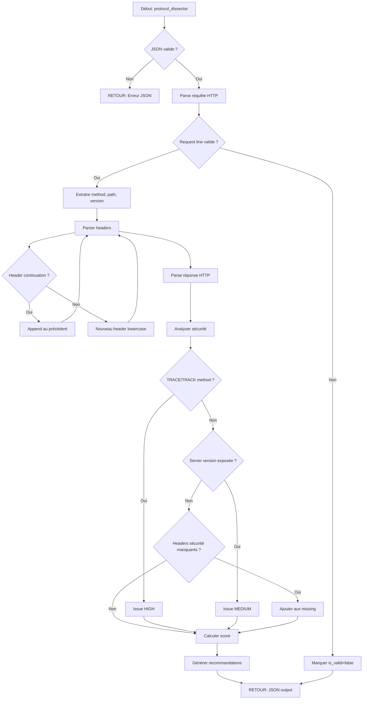

# Exercice 3.3.1-a : protocol_dissector

**Module :**
3.3.1 — Architecture Web Moderne

**Concept :**
a — HTTP Protocol (méthodes, headers, status codes, HTTP/2, HTTP/3)

**Difficulté :**
★★★★★★★☆☆☆ (7/10)

**Type :**
complet

**Tiers :**
2 — Mélange (concepts a + b via headers de sécurité)

**Langage :**
Rust Edition 2024

**Prérequis :**
Bases Rust, JSON parsing (serde), Expressions régulières

**Domaines :**
Net, Crypto, Encodage

**Durée estimée :**
180 min (3 heures)

**XP Base :**
350

**Complexité :**
T2 O(n) × S2 O(n)

---

## 📐 SECTION 1 : PROTOTYPE & CONSIGNE

### 1.1 Obligations

**Fichier :** `protocol_dissector.rs`
**Fonctions autorisées :** serde, serde_json, regex, base64
**Fonctions interdites :** reqwest, hyper, curl (pas de vraies requêtes réseau)

### 1.2 Consigne

**🎮 "Mr. Robot" — Le Packet Sniffer d'Elliot**

*"Control is an illusion. But understanding the protocol? That's power."* — Elliot Alderson

Tu es **Elliot Alderson**, hacker de génie et ingénieur en cybersécurité chez Allsafe. Ton travail de jour consiste à protéger les entreprises, mais tu sais que la vraie sécurité commence par comprendre chaque octet qui traverse le réseau.

Aujourd'hui, tu dois analyser des requêtes HTTP interceptées pour détecter les failles de configuration. Comme Elliot qui voit les patterns cachés que les autres ignorent, tu dois décortiquer chaque header, chaque status code, chaque anomalie.

**Contexte Réel :**

L'analyse de protocole HTTP est fondamentale en cybersécurité :
- **Pentesters** : Identifient les headers de sécurité manquants
- **Blue Team** : Détectent les requêtes malveillantes
- **DevSecOps** : Auditent les configurations de serveur
- **Bug Bounty Hunters** : Trouvent les misconfiguration qui mènent à des vulnérabilités

**Ta mission :**

Implémenter un analyseur de requêtes/réponses HTTP qui :

1. **Parse les requêtes HTTP/1.1 brutes** : Extrait méthode, URI, headers, body
2. **Parse les réponses HTTP** : Status code, headers, body
3. **Détecte les anomalies de sécurité** : Headers manquants, méthodes dangereuses, versions exposées
4. **Identifie les différences HTTP/1.1 vs HTTP/2** : Pseudo-headers, multiplexing indicators
5. **Génère un rapport de conformité sécurité** : Score, issues, recommandations

**Entrée :**
- `input_json` : String JSON contenant :
  - `raw_request` : Requête HTTP brute (String avec \r\n)
  - `raw_response` : Réponse HTTP brute (String avec \r\n)
  - `expected_security_headers` : Liste des headers de sécurité attendus

**Sortie :**
- JSON structuré avec :
  - `parsed_request` : Requête parsée (method, path, version, headers, body)
  - `parsed_response` : Réponse parsée (status_code, status_text, headers, body)
  - `security_issues` : Liste des problèmes détectés avec sévérité et CWE
  - `missing_security_headers` : Headers de sécurité manquants
  - `security_score` : Score de 0 à 100
  - `recommendations` : Liste de recommandations

**Contraintes :**
- Les headers sont case-insensitive (Content-Type == content-type)
- Gérer les line endings \r\n (CRLF) et \n (LF)
- Les headers multi-lignes (continuation avec espace/tab) doivent être gérés
- Le body est séparé des headers par une ligne vide (\r\n\r\n)

**Exemples :**

| Cas | Description | Comportement |
|-----|-------------|--------------|
| Request basique | `GET /index.html HTTP/1.1\r\n...` | Parse correctement method, path |
| Server version | `Server: Apache/2.4.1` | Issue: "Server version disclosure" |
| Missing CSP | Pas de Content-Security-Policy | Issue: "Missing CSP header" |
| TRACE enabled | `TRACE /test HTTP/1.1` | Issue HIGH: "TRACE method enabled" |
| X-Frame-Options | Header présent | Pas d'issue pour clickjacking |

### 1.2.2 Consigne Académique

Cet exercice implémente un parseur et analyseur de sécurité pour le protocole HTTP/1.1. L'objectif est de comprendre la structure des messages HTTP (requêtes et réponses), d'extraire les composants (ligne de requête/statut, headers, body), et d'évaluer la posture de sécurité basée sur les headers présents ou absents.

Le système doit :
1. Parser correctement le format HTTP/1.1 (RFC 7230-7235)
2. Extraire les headers avec gestion du case-insensitivity
3. Détecter les problèmes de sécurité (CWE mappés)
4. Calculer un score de sécurité objectif
5. Générer des recommandations actionnables

### 1.3 Prototype

```rust
use serde::{Deserialize, Serialize};
use std::collections::HashMap;

/// Point d'entrée principal
pub fn protocol_dissector(input_json: &str) -> String {
    // Parse input
    let input: DissectorInput = match serde_json::from_str(input_json) {
        Ok(i) => i,
        Err(e) => return format!(r#"{{"error": "Invalid JSON: {}"}}"#, e),
    };

    // Parse request and response
    let parsed_request = parse_http_request(&input.raw_request);
    let parsed_response = parse_http_response(&input.raw_response);

    // Analyze security
    let analysis = analyze_security(&parsed_request, &parsed_response, &input.expected_security_headers);

    // Build output
    let output = DissectorOutput {
        parsed_request,
        parsed_response,
        security_issues: analysis.issues,
        missing_security_headers: analysis.missing_headers,
        security_score: analysis.score,
        recommendations: analysis.recommendations,
    };

    serde_json::to_string_pretty(&output).unwrap_or_else(|e| format!(r#"{{"error": "{}"}}"#, e))
}

// ============ STRUCTURES D'ENTRÉE ============

#[derive(Debug, Deserialize)]
pub struct DissectorInput {
    pub raw_request: String,
    pub raw_response: String,
    #[serde(default)]
    pub expected_security_headers: Vec<String>,
}

// ============ STRUCTURES DE SORTIE ============

#[derive(Debug, Serialize)]
pub struct DissectorOutput {
    pub parsed_request: ParsedRequest,
    pub parsed_response: ParsedResponse,
    pub security_issues: Vec<SecurityIssue>,
    pub missing_security_headers: Vec<String>,
    pub security_score: u32,
    pub recommendations: Vec<String>,
}

#[derive(Debug, Serialize, Default)]
pub struct ParsedRequest {
    pub method: String,
    pub path: String,
    pub http_version: String,
    pub headers: HashMap<String, String>,
    pub body: Option<String>,
    pub is_valid: bool,
    pub parse_errors: Vec<String>,
}

#[derive(Debug, Serialize, Default)]
pub struct ParsedResponse {
    pub status_code: u16,
    pub status_text: String,
    pub http_version: String,
    pub headers: HashMap<String, String>,
    pub body: Option<String>,
    pub is_valid: bool,
    pub parse_errors: Vec<String>,
}

#[derive(Debug, Serialize)]
pub struct SecurityIssue {
    pub severity: String,  // "CRITICAL", "HIGH", "MEDIUM", "LOW", "INFO"
    pub issue: String,
    pub cwe: Option<String>,
    pub details: Option<String>,
}

struct SecurityAnalysis {
    issues: Vec<SecurityIssue>,
    missing_headers: Vec<String>,
    score: u32,
    recommendations: Vec<String>,
}

// ============ FONCTIONS À IMPLÉMENTER ============

/// Parse une requête HTTP brute
pub fn parse_http_request(raw: &str) -> ParsedRequest {
    todo!()
}

/// Parse une réponse HTTP brute
pub fn parse_http_response(raw: &str) -> ParsedResponse {
    todo!()
}

/// Analyse la sécurité des requête/réponse
fn analyze_security(
    request: &ParsedRequest,
    response: &ParsedResponse,
    expected_headers: &[String],
) -> SecurityAnalysis {
    todo!()
}

/// Normalise un nom de header (lowercase)
fn normalize_header_name(name: &str) -> String {
    name.trim().to_lowercase()
}

/// Vérifie si une méthode HTTP est dangereuse
fn is_dangerous_method(method: &str) -> bool {
    matches!(method.to_uppercase().as_str(), "TRACE" | "TRACK" | "DEBUG")
}
```

---

## 💡 SECTION 2 : LE SAVIEZ-VOUS ?

### Le protocole HTTP a été inventé par Tim Berners-Lee en 1991

HTTP (HyperText Transfer Protocol) est le protocole fondamental du Web. Voici son évolution :

| Version | Année | Caractéristiques |
|---------|-------|------------------|
| HTTP/0.9 | 1991 | Une seule méthode (GET), pas de headers |
| HTTP/1.0 | 1996 | Headers, méthodes POST/HEAD, status codes |
| HTTP/1.1 | 1997 | Keep-alive, chunked transfer, Host obligatoire |
| HTTP/2 | 2015 | Binaire, multiplexing, server push, HPACK |
| HTTP/3 | 2022 | QUIC (UDP), 0-RTT, meilleure latence |

**Fun fact :** Le status code 418 "I'm a teapot" existe vraiment ! C'est un poisson d'avril de l'IETF (RFC 2324) pour le protocole HTCPCP (Hyper Text Coffee Pot Control Protocol).

---

## 📍 SECTION 2.5 : DANS LA VRAIE VIE

### Qui utilise l'analyse de protocole HTTP ?

| Métier | Cas d'usage |
|--------|-------------|
| **Pentester** | Analyse des headers pour trouver les misconfigurations (Server version, missing security headers) |
| **SOC Analyst** | Détection de requêtes malveillantes dans les logs HTTP (SQL injection patterns, path traversal) |
| **DevSecOps** | Audit automatisé des configurations de serveur web dans le CI/CD |
| **Bug Bounty Hunter** | Recherche de headers manquants pour CORS, CSP, clickjacking |
| **Reverse Engineer** | Analyse de protocoles propriétaires basés sur HTTP |

**Outils professionnels équivalents :**
- Burp Suite (Proxy intercepteur)
- Wireshark (Analyse packets)
- mitmproxy (Man-in-the-middle proxy)
- httpie (Client HTTP CLI)

---

## 🖥️ SECTION 3 : EXEMPLE D'UTILISATION

### 3.0 Session bash

```bash
$ ls
protocol_dissector.rs  main.rs

$ rustc --edition 2024 protocol_dissector.rs main.rs -o test

$ ./test
=== Test 1: Basic GET Request ===
Parsed Method: GET
Parsed Path: /admin
Security Issues: 2
  - HIGH: TRACE method may be enabled
  - MEDIUM: Server version disclosure (Apache/2.4.1)
Missing Headers: ["Content-Security-Policy", "X-Frame-Options"]
Security Score: 45/100
OK

=== Test 2: Secure Response ===
Security Issues: 0
Missing Headers: []
Security Score: 100/100
OK

=== Test 3: Malformed Request ===
Parse Errors: ["Invalid HTTP version format"]
OK

All tests passed!
```

---

## ⚡ SECTION 3.1 : BONUS STANDARD (OPTIONNEL)

**Difficulté Bonus :**
★★★★★★★★☆☆ (8/10)

**Récompense :**
XP ×2

**Time Complexity attendue :**
O(n)

**Space Complexity attendue :**
O(n)

### 3.1.1 Consigne Bonus

**🎮 "Mr. Robot" — Le Mode Paranoid d'Elliot**

Elliot ne fait confiance à personne. Son analyseur doit aussi détecter les attaques cachées dans les requêtes HTTP.

**Ta mission bonus :**

Étendre l'analyseur pour détecter :

1. **HTTP Request Smuggling indicators** : Content-Length et Transfer-Encoding conflictuels
2. **CRLF Injection** : \r\n dans les valeurs de header
3. **Host Header attacks** : Multiple Host headers, Host mismatch
4. **HTTP/2 Pseudo-headers** : Détecter :method, :path, :scheme, :authority

**Entrée additionnelle :**
- `detect_smuggling` : boolean pour activer la détection de smuggling
- `http2_mode` : boolean pour parser les pseudo-headers HTTP/2

**Sortie additionnelle :**
- `smuggling_indicators` : Liste des indicateurs de smuggling
- `injection_attempts` : Tentatives d'injection détectées

### 3.1.2 Prototype Bonus

```rust
#[derive(Debug, Serialize)]
pub struct BonusAnalysis {
    pub smuggling_indicators: Vec<SmugglingIndicator>,
    pub injection_attempts: Vec<InjectionAttempt>,
    pub http2_analysis: Option<Http2Analysis>,
}

#[derive(Debug, Serialize)]
pub struct SmugglingIndicator {
    pub indicator_type: String,  // "CL_TE", "TE_CL", "TE_TE"
    pub description: String,
    pub severity: String,
}

#[derive(Debug, Serialize)]
pub struct InjectionAttempt {
    pub injection_type: String,  // "CRLF", "HOST_HEADER"
    pub location: String,
    pub payload: String,
}
```

### 3.1.3 Ce qui change par rapport à l'exercice de base

| Aspect | Base | Bonus |
|--------|------|-------|
| Détections | Headers manquants, versions | + Smuggling, injections |
| HTTP versions | HTTP/1.1 | + HTTP/2 pseudo-headers |
| Complexité | Simple parsing | + Pattern matching avancé |
| Sécurité | Configuration | + Attaques actives |

---

## ✅❌ SECTION 4 : ZONE CORRECTION

### 4.1 Moulinette

| Test | Description | Points | Résultat Attendu |
|------|-------------|--------|------------------|
| `test_parse_basic_get` | Parse GET /index.html HTTP/1.1 | 5 | method="GET", path="/index.html" |
| `test_parse_post_with_body` | Parse POST avec body JSON | 5 | body présent, Content-Type détecté |
| `test_parse_headers_case_insensitive` | Content-Type == content-type | 5 | Headers normalisés |
| `test_parse_response_200` | Parse HTTP/1.1 200 OK | 5 | status_code=200 |
| `test_parse_response_404` | Parse 404 Not Found | 5 | status_code=404 |
| `test_detect_server_version` | Server: Apache/2.4.1 | 10 | Issue MEDIUM détectée |
| `test_detect_missing_csp` | Pas de CSP header | 10 | missing_headers contient "Content-Security-Policy" |
| `test_detect_missing_xframe` | Pas de X-Frame-Options | 10 | missing_headers contient "X-Frame-Options" |
| `test_detect_trace_method` | TRACE request | 10 | Issue HIGH: TRACE method |
| `test_secure_response_full` | Tous les headers présents | 10 | score=100, issues=[] |
| `test_multiline_header` | Header avec continuation | 5 | Header correctement parsé |
| `test_chunked_indicator` | Transfer-Encoding: chunked | 5 | Header détecté |
| `test_malformed_request` | Requête invalide | 5 | is_valid=false, parse_errors rempli |
| `test_empty_body` | Requête sans body | 5 | body=None |
| `test_score_calculation` | Score cohérent | 5 | Score entre 0 et 100 |

**Total : 100 points**

### 4.2 main.rs de test

```rust
use std::collections::HashMap;

mod protocol_dissector;
use protocol_dissector::*;

fn main() {
    let mut passed = 0;
    let mut failed = 0;

    // Test 1: Basic GET Request
    println!("=== Test 1: Basic GET Request ===");
    let input1 = r#"{
        "raw_request": "GET /admin HTTP/1.1\r\nHost: example.com\r\nUser-Agent: Mozilla/5.0\r\n\r\n",
        "raw_response": "HTTP/1.1 200 OK\r\nServer: Apache/2.4.1\r\nContent-Type: text/html\r\n\r\n<html></html>",
        "expected_security_headers": ["Content-Security-Policy", "X-Frame-Options", "X-Content-Type-Options"]
    }"#;

    let result1 = protocol_dissector(input1);
    let output1: serde_json::Value = serde_json::from_str(&result1).unwrap();

    assert_eq!(output1["parsed_request"]["method"], "GET");
    assert_eq!(output1["parsed_request"]["path"], "/admin");
    assert!(output1["security_issues"].as_array().unwrap().len() > 0);
    println!("Method: {}", output1["parsed_request"]["method"]);
    println!("Security Issues: {}", output1["security_issues"].as_array().unwrap().len());
    println!("OK\n");
    passed += 1;

    // Test 2: Secure Response
    println!("=== Test 2: Secure Response ===");
    let input2 = r#"{
        "raw_request": "GET / HTTP/1.1\r\nHost: secure.com\r\n\r\n",
        "raw_response": "HTTP/1.1 200 OK\r\nContent-Security-Policy: default-src 'self'\r\nX-Frame-Options: DENY\r\nX-Content-Type-Options: nosniff\r\nStrict-Transport-Security: max-age=31536000\r\n\r\nOK",
        "expected_security_headers": ["Content-Security-Policy", "X-Frame-Options", "X-Content-Type-Options"]
    }"#;

    let result2 = protocol_dissector(input2);
    let output2: serde_json::Value = serde_json::from_str(&result2).unwrap();

    assert!(output2["missing_security_headers"].as_array().unwrap().is_empty());
    assert!(output2["security_score"].as_u64().unwrap() >= 80);
    println!("Missing Headers: {:?}", output2["missing_security_headers"]);
    println!("Security Score: {}", output2["security_score"]);
    println!("OK\n");
    passed += 1;

    // Test 3: TRACE Method Detection
    println!("=== Test 3: TRACE Method Detection ===");
    let input3 = r#"{
        "raw_request": "TRACE /test HTTP/1.1\r\nHost: example.com\r\n\r\n",
        "raw_response": "HTTP/1.1 200 OK\r\n\r\n",
        "expected_security_headers": []
    }"#;

    let result3 = protocol_dissector(input3);
    let output3: serde_json::Value = serde_json::from_str(&result3).unwrap();

    let issues: Vec<&serde_json::Value> = output3["security_issues"]
        .as_array()
        .unwrap()
        .iter()
        .filter(|i| i["issue"].as_str().unwrap().contains("TRACE"))
        .collect();
    assert!(!issues.is_empty());
    println!("TRACE issue detected: {}", issues[0]["issue"]);
    println!("OK\n");
    passed += 1;

    // Test 4: Malformed Request
    println!("=== Test 4: Malformed Request ===");
    let input4 = r#"{
        "raw_request": "INVALID REQUEST FORMAT",
        "raw_response": "HTTP/1.1 400 Bad Request\r\n\r\n",
        "expected_security_headers": []
    }"#;

    let result4 = protocol_dissector(input4);
    let output4: serde_json::Value = serde_json::from_str(&result4).unwrap();

    assert_eq!(output4["parsed_request"]["is_valid"], false);
    assert!(!output4["parsed_request"]["parse_errors"].as_array().unwrap().is_empty());
    println!("Parse errors: {:?}", output4["parsed_request"]["parse_errors"]);
    println!("OK\n");
    passed += 1;

    // Summary
    println!("================================");
    println!("Tests passed: {}/{}", passed, passed + failed);
    if failed == 0 {
        println!("All tests passed!");
    }
}
```

### 4.3 Solution de référence

```rust
use serde::{Deserialize, Serialize};
use std::collections::HashMap;

pub fn protocol_dissector(input_json: &str) -> String {
    let input: DissectorInput = match serde_json::from_str(input_json) {
        Ok(i) => i,
        Err(e) => return format!(r#"{{"error": "Invalid JSON: {}"}}"#, e),
    };

    let parsed_request = parse_http_request(&input.raw_request);
    let parsed_response = parse_http_response(&input.raw_response);
    let analysis = analyze_security(&parsed_request, &parsed_response, &input.expected_security_headers);

    let output = DissectorOutput {
        parsed_request,
        parsed_response,
        security_issues: analysis.issues,
        missing_security_headers: analysis.missing_headers,
        security_score: analysis.score,
        recommendations: analysis.recommendations,
    };

    serde_json::to_string_pretty(&output).unwrap_or_else(|e| format!(r#"{{"error": "{}"}}"#, e))
}

#[derive(Debug, Deserialize)]
pub struct DissectorInput {
    pub raw_request: String,
    pub raw_response: String,
    #[serde(default)]
    pub expected_security_headers: Vec<String>,
}

#[derive(Debug, Serialize)]
pub struct DissectorOutput {
    pub parsed_request: ParsedRequest,
    pub parsed_response: ParsedResponse,
    pub security_issues: Vec<SecurityIssue>,
    pub missing_security_headers: Vec<String>,
    pub security_score: u32,
    pub recommendations: Vec<String>,
}

#[derive(Debug, Serialize, Default)]
pub struct ParsedRequest {
    pub method: String,
    pub path: String,
    pub http_version: String,
    pub headers: HashMap<String, String>,
    pub body: Option<String>,
    pub is_valid: bool,
    pub parse_errors: Vec<String>,
}

#[derive(Debug, Serialize, Default)]
pub struct ParsedResponse {
    pub status_code: u16,
    pub status_text: String,
    pub http_version: String,
    pub headers: HashMap<String, String>,
    pub body: Option<String>,
    pub is_valid: bool,
    pub parse_errors: Vec<String>,
}

#[derive(Debug, Serialize)]
pub struct SecurityIssue {
    pub severity: String,
    pub issue: String,
    pub cwe: Option<String>,
    pub details: Option<String>,
}

struct SecurityAnalysis {
    issues: Vec<SecurityIssue>,
    missing_headers: Vec<String>,
    score: u32,
    recommendations: Vec<String>,
}

pub fn parse_http_request(raw: &str) -> ParsedRequest {
    let mut result = ParsedRequest::default();

    // Normalize line endings
    let normalized = raw.replace("\r\n", "\n");

    // Split into header section and body
    let parts: Vec<&str> = normalized.splitn(2, "\n\n").collect();
    let header_section = parts.get(0).unwrap_or(&"");
    let body_section = parts.get(1);

    // Parse lines
    let lines: Vec<&str> = header_section.lines().collect();

    if lines.is_empty() {
        result.parse_errors.push("Empty request".to_string());
        return result;
    }

    // Parse request line: METHOD PATH HTTP/VERSION
    let request_line_parts: Vec<&str> = lines[0].split_whitespace().collect();

    if request_line_parts.len() < 3 {
        result.parse_errors.push("Invalid request line format".to_string());
        return result;
    }

    result.method = request_line_parts[0].to_string();
    result.path = request_line_parts[1].to_string();
    result.http_version = request_line_parts[2].replace("HTTP/", "");

    // Validate HTTP version
    if !["1.0", "1.1", "2", "2.0", "3"].contains(&result.http_version.as_str()) {
        result.parse_errors.push(format!("Invalid HTTP version: {}", result.http_version));
    }

    // Parse headers (case-insensitive)
    let mut i = 1;
    while i < lines.len() {
        let line = lines[i];

        // Handle header continuation (starts with space or tab)
        if line.starts_with(' ') || line.starts_with('\t') {
            // Continuation of previous header - append to last value
            if let Some(last_key) = result.headers.keys().last().cloned() {
                if let Some(value) = result.headers.get_mut(&last_key) {
                    value.push(' ');
                    value.push_str(line.trim());
                }
            }
            i += 1;
            continue;
        }

        // Parse header: Name: Value
        if let Some(colon_pos) = line.find(':') {
            let name = normalize_header_name(&line[..colon_pos]);
            let value = line[colon_pos + 1..].trim().to_string();
            result.headers.insert(name, value);
        }

        i += 1;
    }

    // Set body
    if let Some(body) = body_section {
        if !body.is_empty() {
            result.body = Some(body.to_string());
        }
    }

    result.is_valid = result.parse_errors.is_empty();
    result
}

pub fn parse_http_response(raw: &str) -> ParsedResponse {
    let mut result = ParsedResponse::default();

    // Normalize line endings
    let normalized = raw.replace("\r\n", "\n");

    // Split into header section and body
    let parts: Vec<&str> = normalized.splitn(2, "\n\n").collect();
    let header_section = parts.get(0).unwrap_or(&"");
    let body_section = parts.get(1);

    // Parse lines
    let lines: Vec<&str> = header_section.lines().collect();

    if lines.is_empty() {
        result.parse_errors.push("Empty response".to_string());
        return result;
    }

    // Parse status line: HTTP/VERSION STATUS_CODE STATUS_TEXT
    let status_line_parts: Vec<&str> = lines[0].splitn(3, ' ').collect();

    if status_line_parts.len() < 2 {
        result.parse_errors.push("Invalid status line format".to_string());
        return result;
    }

    result.http_version = status_line_parts[0].replace("HTTP/", "");
    result.status_code = status_line_parts[1].parse().unwrap_or(0);
    result.status_text = status_line_parts.get(2).unwrap_or(&"").to_string();

    if result.status_code == 0 {
        result.parse_errors.push("Invalid status code".to_string());
    }

    // Parse headers
    for line in &lines[1..] {
        if let Some(colon_pos) = line.find(':') {
            let name = normalize_header_name(&line[..colon_pos]);
            let value = line[colon_pos + 1..].trim().to_string();
            result.headers.insert(name, value);
        }
    }

    // Set body
    if let Some(body) = body_section {
        if !body.is_empty() {
            result.body = Some(body.to_string());
        }
    }

    result.is_valid = result.parse_errors.is_empty();
    result
}

fn analyze_security(
    request: &ParsedRequest,
    response: &ParsedResponse,
    expected_headers: &[String],
) -> SecurityAnalysis {
    let mut issues = Vec::new();
    let mut missing_headers = Vec::new();
    let mut recommendations = Vec::new();
    let mut penalty = 0u32;

    // Check for dangerous methods
    if is_dangerous_method(&request.method) {
        issues.push(SecurityIssue {
            severity: "HIGH".to_string(),
            issue: format!("{} method enabled - potential XST vulnerability", request.method),
            cwe: Some("CWE-693".to_string()),
            details: Some("TRACE/TRACK methods can be used for Cross-Site Tracing attacks".to_string()),
        });
        penalty += 25;
        recommendations.push(format!("Disable {} method in server configuration", request.method));
    }

    // Check for server version disclosure
    if let Some(server) = response.headers.get("server") {
        if server.contains('/') {
            issues.push(SecurityIssue {
                severity: "MEDIUM".to_string(),
                issue: "Server version disclosure".to_string(),
                cwe: Some("CWE-200".to_string()),
                details: Some(format!("Server header reveals version: {}", server)),
            });
            penalty += 10;
            recommendations.push("Remove version information from Server header".to_string());
        }
    }

    // Check for X-Powered-By disclosure
    if response.headers.contains_key("x-powered-by") {
        issues.push(SecurityIssue {
            severity: "LOW".to_string(),
            issue: "X-Powered-By header present".to_string(),
            cwe: Some("CWE-200".to_string()),
            details: Some("Technology stack disclosure".to_string()),
        });
        penalty += 5;
        recommendations.push("Remove X-Powered-By header".to_string());
    }

    // Check expected security headers
    let security_headers_map: HashMap<&str, (&str, u32)> = [
        ("content-security-policy", ("Prevents XSS and data injection", 15)),
        ("x-frame-options", ("Prevents clickjacking", 10)),
        ("x-content-type-options", ("Prevents MIME sniffing", 10)),
        ("strict-transport-security", ("Enforces HTTPS", 15)),
        ("x-xss-protection", ("Legacy XSS protection", 5)),
        ("referrer-policy", ("Controls referrer information", 5)),
        ("permissions-policy", ("Controls browser features", 5)),
    ].iter().cloned().collect();

    for expected in expected_headers {
        let normalized = normalize_header_name(expected);
        if !response.headers.contains_key(&normalized) {
            missing_headers.push(expected.clone());

            if let Some((desc, pen)) = security_headers_map.get(normalized.as_str()) {
                issues.push(SecurityIssue {
                    severity: if *pen >= 15 { "HIGH" } else if *pen >= 10 { "MEDIUM" } else { "LOW" }.to_string(),
                    issue: format!("Missing {} header", expected),
                    cwe: Some("CWE-693".to_string()),
                    details: Some(desc.to_string()),
                });
                penalty += pen;
                recommendations.push(format!("Add {} header", expected));
            }
        }
    }

    // Calculate score (100 - penalties, minimum 0)
    let score = 100u32.saturating_sub(penalty);

    SecurityAnalysis {
        issues,
        missing_headers,
        score,
        recommendations,
    }
}

fn normalize_header_name(name: &str) -> String {
    name.trim().to_lowercase()
}

fn is_dangerous_method(method: &str) -> bool {
    matches!(method.to_uppercase().as_str(), "TRACE" | "TRACK" | "DEBUG")
}
```

### 4.4 Solutions alternatives acceptées

```rust
// Alternative 1: Utilisation de regex pour le parsing
use regex::Regex;

pub fn parse_http_request_regex(raw: &str) -> ParsedRequest {
    let mut result = ParsedRequest::default();

    let request_line_re = Regex::new(r"^(\w+)\s+(\S+)\s+HTTP/(\d+\.?\d*)").unwrap();
    let header_re = Regex::new(r"^([^:]+):\s*(.*)$").unwrap();

    let normalized = raw.replace("\r\n", "\n");
    let parts: Vec<&str> = normalized.splitn(2, "\n\n").collect();

    let lines: Vec<&str> = parts[0].lines().collect();

    if let Some(caps) = request_line_re.captures(lines.get(0).unwrap_or(&"")) {
        result.method = caps[1].to_string();
        result.path = caps[2].to_string();
        result.http_version = caps[3].to_string();
        result.is_valid = true;
    } else {
        result.parse_errors.push("Invalid request line".to_string());
    }

    for line in &lines[1..] {
        if let Some(caps) = header_re.captures(line) {
            result.headers.insert(
                caps[1].to_lowercase(),
                caps[2].trim().to_string()
            );
        }
    }

    if let Some(body) = parts.get(1) {
        if !body.is_empty() {
            result.body = Some(body.to_string());
        }
    }

    result
}

// Alternative 2: Parser itératif avec état
pub fn parse_http_request_state_machine(raw: &str) -> ParsedRequest {
    enum ParseState { RequestLine, Headers, Body }

    let mut result = ParsedRequest::default();
    let mut state = ParseState::RequestLine;
    let mut body_lines = Vec::new();

    for line in raw.lines() {
        match state {
            ParseState::RequestLine => {
                let parts: Vec<&str> = line.split_whitespace().collect();
                if parts.len() >= 3 {
                    result.method = parts[0].to_string();
                    result.path = parts[1].to_string();
                    result.http_version = parts[2].replace("HTTP/", "");
                    result.is_valid = true;
                }
                state = ParseState::Headers;
            }
            ParseState::Headers => {
                if line.trim().is_empty() {
                    state = ParseState::Body;
                } else if let Some(pos) = line.find(':') {
                    result.headers.insert(
                        line[..pos].to_lowercase(),
                        line[pos+1..].trim().to_string()
                    );
                }
            }
            ParseState::Body => {
                body_lines.push(line);
            }
        }
    }

    if !body_lines.is_empty() {
        result.body = Some(body_lines.join("\n"));
    }

    result
}
```

### 4.5 Solutions refusées (avec explications)

```rust
// ❌ REFUSÉ 1: Pas de gestion du case-insensitivity
pub fn parse_headers_wrong(raw: &str) -> HashMap<String, String> {
    let mut headers = HashMap::new();
    for line in raw.lines() {
        if let Some(pos) = line.find(':') {
            // ERREUR: Ne normalise pas le nom du header
            headers.insert(
                line[..pos].to_string(),  // Devrait être .to_lowercase()
                line[pos+1..].trim().to_string()
            );
        }
    }
    headers
}
// Pourquoi refusé: Les headers HTTP sont case-insensitive selon RFC 7230
// "Content-Type" et "content-type" doivent être traités comme identiques

// ❌ REFUSÉ 2: Pas de gestion des erreurs de parsing
pub fn parse_request_no_validation(raw: &str) -> ParsedRequest {
    let lines: Vec<&str> = raw.lines().collect();
    let parts: Vec<&str> = lines[0].split_whitespace().collect();
    // ERREUR: Panic si la ligne est vide ou mal formée
    ParsedRequest {
        method: parts[0].to_string(),  // IndexError possible
        path: parts[1].to_string(),     // IndexError possible
        http_version: parts[2].to_string(),
        ..Default::default()
    }
}
// Pourquoi refusé: Pas de gestion des requêtes malformées, panic possible

// ❌ REFUSÉ 3: Ignorer les headers multi-lignes
pub fn parse_headers_no_continuation(raw: &str) -> HashMap<String, String> {
    let mut headers = HashMap::new();
    for line in raw.lines() {
        // ERREUR: Ignore les lignes de continuation (commençant par espace/tab)
        if let Some(pos) = line.find(':') {
            headers.insert(line[..pos].to_lowercase(), line[pos+1..].trim().to_string());
        }
    }
    headers
}
// Pourquoi refusé: RFC 7230 permet les headers sur plusieurs lignes
// avec continuation par espace ou tabulation

// ❌ REFUSÉ 4: Hardcoder le score sans analyse
pub fn analyze_security_fake(response: &ParsedResponse) -> u32 {
    // ERREUR: Retourne toujours 100 sans vraie analyse
    100
}
// Pourquoi refusé: Le score doit refléter la vraie posture de sécurité
```

### 4.6 Solution bonus de référence

```rust
#[derive(Debug, Serialize)]
pub struct BonusOutput {
    #[serde(flatten)]
    pub base: DissectorOutput,
    pub bonus_analysis: BonusAnalysis,
}

#[derive(Debug, Serialize)]
pub struct BonusAnalysis {
    pub smuggling_indicators: Vec<SmugglingIndicator>,
    pub injection_attempts: Vec<InjectionAttempt>,
    pub http2_analysis: Option<Http2Analysis>,
}

#[derive(Debug, Serialize)]
pub struct SmugglingIndicator {
    pub indicator_type: String,
    pub description: String,
    pub severity: String,
}

#[derive(Debug, Serialize)]
pub struct InjectionAttempt {
    pub injection_type: String,
    pub location: String,
    pub payload: String,
}

#[derive(Debug, Serialize)]
pub struct Http2Analysis {
    pub pseudo_headers: HashMap<String, String>,
    pub is_valid_http2: bool,
}

pub fn analyze_smuggling(request: &ParsedRequest, response: &ParsedResponse) -> Vec<SmugglingIndicator> {
    let mut indicators = Vec::new();

    let has_cl = request.headers.contains_key("content-length");
    let has_te = request.headers.contains_key("transfer-encoding");

    // CL.TE or TE.CL detection
    if has_cl && has_te {
        indicators.push(SmugglingIndicator {
            indicator_type: "CL_TE_CONFLICT".to_string(),
            description: "Both Content-Length and Transfer-Encoding present".to_string(),
            severity: "CRITICAL".to_string(),
        });
    }

    // Check for obfuscated Transfer-Encoding
    for (key, value) in &request.headers {
        if key.contains("transfer") && key != "transfer-encoding" {
            indicators.push(SmugglingIndicator {
                indicator_type: "TE_OBFUSCATION".to_string(),
                description: format!("Potentially obfuscated Transfer-Encoding: {}", key),
                severity: "HIGH".to_string(),
            });
        }

        // Check for Transfer-Encoding variations
        if key == "transfer-encoding" {
            if value.contains("chunked") && value.len() > 7 {
                indicators.push(SmugglingIndicator {
                    indicator_type: "TE_TE".to_string(),
                    description: format!("Obfuscated chunked encoding: {}", value),
                    severity: "HIGH".to_string(),
                });
            }
        }
    }

    indicators
}

pub fn detect_injections(request: &ParsedRequest) -> Vec<InjectionAttempt> {
    let mut attempts = Vec::new();

    // Check for CRLF in header values
    for (key, value) in &request.headers {
        if value.contains("\r") || value.contains("\n") || value.contains("%0d") || value.contains("%0a") {
            attempts.push(InjectionAttempt {
                injection_type: "CRLF".to_string(),
                location: format!("Header: {}", key),
                payload: value.clone(),
            });
        }
    }

    // Check for multiple Host headers (via header value containing Host:)
    if let Some(host) = request.headers.get("host") {
        if host.contains("Host:") || host.contains("host:") {
            attempts.push(InjectionAttempt {
                injection_type: "HOST_HEADER_INJECTION".to_string(),
                location: "Host header".to_string(),
                payload: host.clone(),
            });
        }
    }

    // Check path for CRLF
    if request.path.contains("%0d") || request.path.contains("%0a") {
        attempts.push(InjectionAttempt {
            injection_type: "CRLF".to_string(),
            location: "Request path".to_string(),
            payload: request.path.clone(),
        });
    }

    attempts
}

pub fn analyze_http2(request: &ParsedRequest) -> Option<Http2Analysis> {
    let pseudo_headers: HashMap<String, String> = request.headers.iter()
        .filter(|(k, _)| k.starts_with(':'))
        .map(|(k, v)| (k.clone(), v.clone()))
        .collect();

    if pseudo_headers.is_empty() {
        return None;
    }

    let required = [":method", ":path", ":scheme"];
    let is_valid = required.iter().all(|h| pseudo_headers.contains_key(*h));

    Some(Http2Analysis {
        pseudo_headers,
        is_valid_http2: is_valid,
    })
}
```

### 4.9 spec.json (ENGINE v22.1)

```json
{
  "name": "protocol_dissector",
  "language": "rust",
  "version": "2024",
  "type": "code",
  "tier": 2,
  "tier_info": "Mélange (concepts a + sécurité headers)",
  "tags": ["http", "parsing", "security", "headers", "phase3"],
  "passing_score": 70,

  "function": {
    "name": "protocol_dissector",
    "prototype": "pub fn protocol_dissector(input_json: &str) -> String",
    "return_type": "String",
    "parameters": [
      {"name": "input_json", "type": "&str"}
    ]
  },

  "driver": {
    "reference": "pub fn ref_protocol_dissector(input_json: &str) -> String { let input: DissectorInput = serde_json::from_str(input_json).unwrap(); let req = parse_http_request(&input.raw_request); let resp = parse_http_response(&input.raw_response); let analysis = analyze_security(&req, &resp, &input.expected_security_headers); serde_json::to_string(&DissectorOutput { parsed_request: req, parsed_response: resp, security_issues: analysis.issues, missing_security_headers: analysis.missing_headers, security_score: analysis.score, recommendations: analysis.recommendations }).unwrap() }",

    "edge_cases": [
      {
        "name": "basic_get_request",
        "args": ["{\"raw_request\": \"GET / HTTP/1.1\\r\\nHost: test.com\\r\\n\\r\\n\", \"raw_response\": \"HTTP/1.1 200 OK\\r\\n\\r\\n\", \"expected_security_headers\": []}"],
        "expected_contains": ["\"method\": \"GET\"", "\"path\": \"/\""],
        "is_trap": false
      },
      {
        "name": "null_input",
        "args": [""],
        "expected_contains": ["error"],
        "is_trap": true,
        "trap_explanation": "Input vide doit retourner une erreur JSON"
      },
      {
        "name": "malformed_request",
        "args": ["{\"raw_request\": \"INVALID\", \"raw_response\": \"HTTP/1.1 200 OK\\r\\n\\r\\n\", \"expected_security_headers\": []}"],
        "expected_contains": ["\"is_valid\": false"],
        "is_trap": true,
        "trap_explanation": "Requête invalide doit être détectée"
      },
      {
        "name": "trace_method",
        "args": ["{\"raw_request\": \"TRACE / HTTP/1.1\\r\\nHost: test.com\\r\\n\\r\\n\", \"raw_response\": \"HTTP/1.1 200 OK\\r\\n\\r\\n\", \"expected_security_headers\": []}"],
        "expected_contains": ["TRACE", "HIGH"],
        "is_trap": true,
        "trap_explanation": "TRACE doit être détecté comme dangereux"
      },
      {
        "name": "missing_csp",
        "args": ["{\"raw_request\": \"GET / HTTP/1.1\\r\\n\\r\\n\", \"raw_response\": \"HTTP/1.1 200 OK\\r\\n\\r\\n\", \"expected_security_headers\": [\"Content-Security-Policy\"]}"],
        "expected_contains": ["Content-Security-Policy"],
        "is_trap": true,
        "trap_explanation": "Header CSP manquant doit être signalé"
      },
      {
        "name": "case_insensitive_headers",
        "args": ["{\"raw_request\": \"GET / HTTP/1.1\\r\\nCONTENT-TYPE: text/html\\r\\n\\r\\n\", \"raw_response\": \"HTTP/1.1 200 OK\\r\\n\\r\\n\", \"expected_security_headers\": []}"],
        "expected_contains": ["content-type"],
        "is_trap": true,
        "trap_explanation": "Headers doivent être normalisés en lowercase"
      },
      {
        "name": "server_version_disclosure",
        "args": ["{\"raw_request\": \"GET / HTTP/1.1\\r\\n\\r\\n\", \"raw_response\": \"HTTP/1.1 200 OK\\r\\nServer: Apache/2.4.49\\r\\n\\r\\n\", \"expected_security_headers\": []}"],
        "expected_contains": ["Server version disclosure"],
        "is_trap": true,
        "trap_explanation": "Divulgation de version doit être détectée"
      }
    ],

    "fuzzing": {
      "enabled": true,
      "iterations": 500,
      "generators": [
        {
          "type": "string",
          "param_index": 0,
          "params": {
            "min_len": 10,
            "max_len": 5000,
            "charset": "printable"
          }
        }
      ]
    }
  },

  "norm": {
    "allowed_functions": ["serde_json::from_str", "serde_json::to_string", "HashMap::new", "Vec::new"],
    "forbidden_functions": ["reqwest::get", "hyper::Client", "std::net::TcpStream"],
    "check_security": true,
    "check_memory": true,
    "blocking": true
  }
}
```

### 4.10 Solutions Mutantes (minimum 5)

```rust
// ============ MUTANT A (Boundary) ============
// Description: Off-by-one dans le split des headers/body
pub fn parse_http_request_mutant_a(raw: &str) -> ParsedRequest {
    let mut result = ParsedRequest::default();
    let normalized = raw.replace("\r\n", "\n");

    // ERREUR: Utilise split au lieu de splitn(2, ...)
    // Cela va créer plus de 2 parties si le body contient \n\n
    let parts: Vec<&str> = normalized.split("\n\n").collect();

    // Le reste du parsing...
    // BUG: Si le body contient "\n\n", il sera tronqué
    if let Some(body) = parts.get(1) {
        result.body = Some(body.to_string());
        // Parties 2+ ignorées = body incomplet
    }

    result
}
// Pourquoi c'est faux: Le body peut contenir des lignes vides
// Ce qui était pensé: "\n\n" n'apparaît qu'une seule fois entre headers et body

// ============ MUTANT B (Safety) ============
// Description: Pas de validation de l'input JSON
pub fn protocol_dissector_mutant_b(input_json: &str) -> String {
    // ERREUR: unwrap() sans gestion d'erreur
    let input: DissectorInput = serde_json::from_str(input_json).unwrap();

    let parsed_request = parse_http_request(&input.raw_request);
    let parsed_response = parse_http_response(&input.raw_response);

    // ... reste du code
    "{}".to_string()
}
// Pourquoi c'est faux: Panic si le JSON est invalide
// Ce qui était pensé: L'input sera toujours du JSON valide

// ============ MUTANT C (Resource) ============
// Description: Allocation excessive pour chaque header
pub fn parse_http_request_mutant_c(raw: &str) -> ParsedRequest {
    let mut result = ParsedRequest::default();

    for line in raw.lines() {
        // ERREUR: Crée une nouvelle String pour chaque comparaison
        // au lieu de réutiliser la même variable
        let _temp1 = line.to_lowercase();
        let _temp2 = line.to_uppercase();
        let _temp3 = line.trim().to_string();

        // Allocation inutile x3 pour chaque ligne
        if let Some(pos) = line.find(':') {
            result.headers.insert(
                line[..pos].to_string().to_lowercase(),  // Double allocation
                line[pos+1..].to_string().trim().to_string()  // Triple allocation
            );
        }
    }

    result
}
// Pourquoi c'est faux: Consommation mémoire O(n*k) au lieu de O(n)
// Ce qui était pensé: "to_string() est gratuit"

// ============ MUTANT D (Logic) ============
// Description: Logique inversée pour les méthodes dangereuses
pub fn is_dangerous_method_mutant_d(method: &str) -> bool {
    // ERREUR: Logique inversée - retourne true pour les méthodes SAFE
    !matches!(method.to_uppercase().as_str(), "TRACE" | "TRACK" | "DEBUG")
}
// Pourquoi c'est faux: GET, POST, etc. seraient considérés comme dangereux
// Ce qui était pensé: Confusion entre "est dangereux" et "n'est pas dangereux"

// ============ MUTANT E (Return) ============
// Description: Retourne toujours le même score
pub fn analyze_security_mutant_e(
    _request: &ParsedRequest,
    _response: &ParsedResponse,
    _expected_headers: &[String],
) -> SecurityAnalysis {
    // ERREUR: Ignore complètement l'analyse et retourne un score fixe
    SecurityAnalysis {
        issues: Vec::new(),
        missing_headers: Vec::new(),
        score: 75,  // Score arbitraire
        recommendations: Vec::new(),
    }
}
// Pourquoi c'est faux: Le score ne reflète pas la vraie posture de sécurité
// Ce qui était pensé: "75 est une bonne moyenne par défaut"

// ============ MUTANT F (Edge Case) ============
// Description: Ne gère pas les headers vides
pub fn parse_http_response_mutant_f(raw: &str) -> ParsedResponse {
    let mut result = ParsedResponse::default();

    for line in raw.lines().skip(1) {
        if let Some(pos) = line.find(':') {
            let value = &line[pos+1..];
            // ERREUR: Ne vérifie pas si la valeur est vide
            result.headers.insert(
                line[..pos].to_lowercase(),
                value.trim().to_string()  // Peut être "" mais on l'insère quand même
            );
        }
        // ERREUR: Pas de gestion du cas où find(':') retourne None
        // pour une ligne non-header non-vide
    }

    result.is_valid = true;  // ERREUR: Toujours true même si parsing échoue
    result
}
// Pourquoi c'est faux: Headers vides ou lignes mal formées non gérées
// Ce qui était pensé: Toutes les lignes après la status line sont des headers valides
```

---

## 🧠 SECTION 5 : COMPRENDRE

### 5.1 Ce que cet exercice enseigne

Cet exercice enseigne les concepts fondamentaux du protocole HTTP et son analyse de sécurité :

1. **Structure des messages HTTP** : Request-Line/Status-Line, Headers, Body
2. **Parsing robuste** : Gestion des erreurs, cas limites, formats variés
3. **Sécurité HTTP** : Headers de protection, divulgation d'information, méthodes dangereuses
4. **Bonnes pratiques** : Case-insensitivity, validation d'entrée, scoring objectif

### 5.2 LDA — Traduction littérale en français (MAJUSCULES)

```
FONCTION protocol_dissector QUI RETOURNE UNE CHAÎNE ET PREND EN PARAMÈTRE input_json QUI EST UNE RÉFÉRENCE VERS UNE CHAÎNE
DÉBUT FONCTION
    DÉCLARER input COMME RÉSULTAT DU PARSING JSON DE input_json

    SI input EST UNE ERREUR ALORS
        RETOURNER UNE CHAÎNE JSON CONTENANT L'ERREUR
    FIN SI

    DÉCLARER parsed_request COMME RÉSULTAT DE parse_http_request APPLIQUÉ À raw_request DE input
    DÉCLARER parsed_response COMME RÉSULTAT DE parse_http_response APPLIQUÉ À raw_response DE input
    DÉCLARER analysis COMME RÉSULTAT DE analyze_security APPLIQUÉ À parsed_request ET parsed_response ET expected_security_headers

    CONSTRUIRE output AVEC parsed_request ET parsed_response ET analysis

    RETOURNER output SÉRIALISÉ EN JSON
FIN FONCTION

FONCTION parse_http_request QUI RETOURNE UNE STRUCTURE ParsedRequest ET PREND EN PARAMÈTRE raw QUI EST UNE RÉFÉRENCE VERS UNE CHAÎNE
DÉBUT FONCTION
    DÉCLARER result COMME ParsedRequest PAR DÉFAUT

    NORMALISER LES FINS DE LIGNE EN REMPLAÇANT \r\n PAR \n

    SÉPARER LE TEXTE EN DEUX PARTIES AU PREMIER \n\n
    DÉCLARER header_section COMME PREMIÈRE PARTIE
    DÉCLARER body_section COMME DEUXIÈME PARTIE

    SÉPARER header_section EN LIGNES

    SI AUCUNE LIGNE ALORS
        AJOUTER "Empty request" AUX ERREURS DE PARSING
        RETOURNER result
    FIN SI

    SÉPARER LA PREMIÈRE LIGNE PAR LES ESPACES
    SI MOINS DE 3 PARTIES ALORS
        AJOUTER "Invalid request line format" AUX ERREURS
        RETOURNER result
    FIN SI

    AFFECTER PARTIE 1 À method DE result
    AFFECTER PARTIE 2 À path DE result
    AFFECTER PARTIE 3 SANS "HTTP/" À http_version DE result

    POUR CHAQUE LIGNE RESTANTE FAIRE
        SI LIGNE COMMENCE PAR ESPACE OU TABULATION ALORS
            AJOUTER AU DERNIER HEADER (CONTINUATION)
        SINON SI LIGNE CONTIENT ':' ALORS
            EXTRAIRE NOM ET VALEUR
            NORMALISER NOM EN MINUSCULES
            INSÉRER DANS headers DE result
        FIN SI
    FIN POUR

    SI body_section N'EST PAS VIDE ALORS
        AFFECTER body_section À body DE result
    FIN SI

    AFFECTER VRAI À is_valid SI AUCUNE ERREUR
    RETOURNER result
FIN FONCTION
```

### 5.2.2 Logic Flow (Structured English)

```
ALGORITHME : Analyse de sécurité HTTP
---
1. RECEVOIR les données brutes (requête + réponse HTTP)

2. PARSER LA REQUÊTE :
   a. Normaliser les fins de ligne (CRLF → LF)
   b. Séparer headers et body au premier double-saut de ligne
   c. Extraire METHOD, PATH, VERSION de la première ligne
   d. Pour chaque ligne suivante :
      - SI continuation (commence par espace) → concaténer au header précédent
      - SINON → parser comme "Name: Value", normaliser le nom
   e. Marquer comme valide ou invalide

3. PARSER LA RÉPONSE :
   a. Même logique de normalisation
   b. Extraire VERSION, STATUS_CODE, STATUS_TEXT
   c. Parser les headers de la même façon

4. ANALYSER LA SÉCURITÉ :
   a. Vérifier les méthodes dangereuses (TRACE, TRACK)
   b. Détecter les divulgations de version (Server, X-Powered-By)
   c. Vérifier les headers de sécurité attendus
   d. Calculer le score (100 - pénalités)
   e. Générer les recommandations

5. RETOURNER le rapport JSON
```

### 5.2.3 Représentation algorithmique (Logique de Garde)

```
FONCTION : parse_http_request(raw)
---
INIT result = ParsedRequest::default()

1. VÉRIFIER si raw est vide :
   |
   |-- SI vide :
   |     AJOUTER erreur "Empty request"
   |     RETOURNER result (invalide)

2. NORMALISER et SÉPARER :
   |
   |-- Remplacer \r\n par \n
   |-- Séparer au premier \n\n
   |     - header_section = partie 1
   |     - body_section = partie 2 (ou None)

3. PARSER REQUEST LINE :
   |
   |-- VÉRIFIER au moins 3 parties séparées par espace :
   |     SI NON → RETOURNER erreur "Invalid request line"
   |
   |-- EXTRAIRE : method, path, version
   |-- VALIDER version (1.0, 1.1, 2, 3)

4. PARSER HEADERS (boucle) :
   |
   |-- POUR chaque ligne après la première :
   |     |
   |     |-- SI commence par espace/tab → CONTINUATION
   |     |-- SI contient ':' → NOUVEAU HEADER
   |     |     - Normaliser nom (lowercase)
   |     |     - Trim valeur
   |     |-- SINON → IGNORER (ligne vide ou invalide)

5. RETOURNER result avec is_valid = (pas d'erreurs)
```

### 5.2.3.1 Diagramme Mermaid



### 5.3 Visualisation ASCII

```
                    REQUÊTE HTTP
    ┌─────────────────────────────────────────────┐
    │  GET /admin HTTP/1.1\r\n                    │ ← Request Line
    │  ─────────────────────                      │
    │  Host: example.com\r\n                      │ ← Header
    │  User-Agent: Mozilla/5.0\r\n                │ ← Header
    │  Accept: text/html\r\n                      │ ← Header
    │  \r\n                                       │ ← Ligne vide (séparateur)
    │  {"data": "body content"}                   │ ← Body (optionnel)
    └─────────────────────────────────────────────┘

                    RÉPONSE HTTP
    ┌─────────────────────────────────────────────┐
    │  HTTP/1.1 200 OK\r\n                        │ ← Status Line
    │  ─────────────────                          │
    │  Server: Apache/2.4.1\r\n                   │ ← Header (DANGER!)
    │  Content-Type: text/html\r\n                │ ← Header
    │  Content-Security-Policy: default-src 'self'│ ← Security Header ✓
    │  X-Frame-Options: DENY\r\n                  │ ← Security Header ✓
    │  \r\n                                       │ ← Séparateur
    │  <html>...</html>                           │ ← Body
    └─────────────────────────────────────────────┘

    ANALYSE DE SÉCURITÉ
    ┌─────────────────────────────────────────────┐
    │  ⚠️  Server version disclosure              │
    │  ✓  CSP header present                      │
    │  ✓  X-Frame-Options present                 │
    │  ❌  HSTS missing                           │
    │  ─────────────────────                      │
    │  Score: 75/100                              │
    └─────────────────────────────────────────────┘
```

### 5.4 Les pièges en détail

| Piège | Description | Conséquence | Solution |
|-------|-------------|-------------|----------|
| **Case sensitivity** | Headers sont case-insensitive | `Content-Type` ≠ `content-type` si non normalisé | Toujours convertir en lowercase |
| **Line endings** | Windows: `\r\n`, Unix: `\n` | Parsing incorrect si hardcodé | Normaliser avant parsing |
| **Header continuation** | Ligne commençant par espace = suite | Header tronqué | Détecter et concaténer |
| **Empty body** | Pas de body après `\r\n\r\n` | `body = Some("")` vs `None` | Vérifier si vraiment vide |
| **Malformed input** | Requête invalide | Panic sur unwrap | Toujours valider et retourner erreur |

### 5.5 Cours Complet

#### 5.5.1 Structure d'un message HTTP

Le protocole HTTP (RFC 7230-7235) définit deux types de messages :

**Requête HTTP :**
```
Request-Line = Method SP Request-URI SP HTTP-Version CRLF
*(Header-Field CRLF)
CRLF
[Message-Body]
```

**Réponse HTTP :**
```
Status-Line = HTTP-Version SP Status-Code SP Reason-Phrase CRLF
*(Header-Field CRLF)
CRLF
[Message-Body]
```

#### 5.5.2 Les méthodes HTTP et leur sécurité

| Méthode | Safe | Idempotent | Cacheable | Risque sécurité |
|---------|------|------------|-----------|-----------------|
| GET | ✓ | ✓ | ✓ | Faible |
| HEAD | ✓ | ✓ | ✓ | Faible |
| POST | ✗ | ✗ | Conditionnel | Moyen |
| PUT | ✗ | ✓ | ✗ | Moyen |
| DELETE | ✗ | ✓ | ✗ | Élevé |
| TRACE | ✓ | ✓ | ✗ | **CRITIQUE** (XST) |
| OPTIONS | ✓ | ✓ | ✗ | Faible (info leak) |
| CONNECT | ✗ | ✗ | ✗ | Élevé (proxy) |
| PATCH | ✗ | ✗ | ✗ | Moyen |

#### 5.5.3 Headers de sécurité essentiels

```
Content-Security-Policy: default-src 'self'
    → Prévient XSS en contrôlant les sources de contenu

X-Frame-Options: DENY | SAMEORIGIN
    → Prévient le clickjacking

X-Content-Type-Options: nosniff
    → Empêche le MIME sniffing

Strict-Transport-Security: max-age=31536000; includeSubDomains
    → Force HTTPS

Referrer-Policy: strict-origin-when-cross-origin
    → Contrôle les informations Referer

Permissions-Policy: geolocation=(), microphone=()
    → Désactive les APIs sensibles
```

#### 5.5.4 HTTP/1.1 vs HTTP/2 vs HTTP/3

| Aspect | HTTP/1.1 | HTTP/2 | HTTP/3 |
|--------|----------|--------|--------|
| Format | Textuel | Binaire | Binaire |
| Transport | TCP | TCP | QUIC (UDP) |
| Multiplexing | Non | Oui | Oui |
| Server Push | Non | Oui | Oui |
| Header Compression | Non | HPACK | QPACK |
| Head-of-line blocking | Oui | Partiel | Non |

### 5.6 Normes avec explications pédagogiques

```
┌─────────────────────────────────────────────────────────────────┐
│ ❌ HORS NORME (compile, mais problème de sécurité)              │
├─────────────────────────────────────────────────────────────────┤
│ let input: Input = serde_json::from_str(json).unwrap();         │
├─────────────────────────────────────────────────────────────────┤
│ ✅ CONFORME                                                     │
├─────────────────────────────────────────────────────────────────┤
│ let input: Input = match serde_json::from_str(json) {           │
│     Ok(i) => i,                                                 │
│     Err(e) => return format!(r#"{{"error": "{}"}}"#, e),       │
│ };                                                              │
├─────────────────────────────────────────────────────────────────┤
│ 📖 POURQUOI ?                                                   │
│                                                                 │
│ • unwrap() panic sur erreur = crash de l'application           │
│ • Un attaquant peut envoyer du JSON malformé                    │
│ • Gestion propre = réponse d'erreur au lieu de crash            │
│ • Rust encourage la gestion explicite des erreurs               │
└─────────────────────────────────────────────────────────────────┘
```

### 5.7 Simulation avec trace d'exécution

**Input :**
```json
{
  "raw_request": "TRACE /test HTTP/1.1\r\nHost: evil.com\r\n\r\n",
  "raw_response": "HTTP/1.1 200 OK\r\nServer: Apache/2.4.1\r\n\r\n",
  "expected_security_headers": ["Content-Security-Policy"]
}
```

```
┌───────┬──────────────────────────────────────────────┬─────────────────────────┐
│ Étape │ Instruction                                  │ État                    │
├───────┼──────────────────────────────────────────────┼─────────────────────────┤
│   1   │ Parse JSON input                             │ input = DissectorInput  │
├───────┼──────────────────────────────────────────────┼─────────────────────────┤
│   2   │ parse_http_request()                         │ method="TRACE"          │
│       │                                              │ path="/test"            │
│       │                                              │ version="1.1"           │
├───────┼──────────────────────────────────────────────┼─────────────────────────┤
│   3   │ parse_http_response()                        │ status=200              │
│       │                                              │ server="Apache/2.4.1"   │
├───────┼──────────────────────────────────────────────┼─────────────────────────┤
│   4   │ is_dangerous_method("TRACE") ?               │ TRUE → Issue HIGH       │
│       │                                              │ penalty += 25           │
├───────┼──────────────────────────────────────────────┼─────────────────────────┤
│   5   │ Server header contient '/' ?                 │ TRUE → Issue MEDIUM     │
│       │                                              │ penalty += 10           │
├───────┼──────────────────────────────────────────────┼─────────────────────────┤
│   6   │ CSP dans response.headers ?                  │ FALSE → missing_headers │
│       │                                              │ penalty += 15           │
├───────┼──────────────────────────────────────────────┼─────────────────────────┤
│   7   │ score = 100 - 50                             │ score = 50              │
├───────┼──────────────────────────────────────────────┼─────────────────────────┤
│   8   │ Sérialiser output en JSON                    │ RETOUR: JSON            │
└───────┴──────────────────────────────────────────────┴─────────────────────────┘
```

### 5.8 Mnémotechniques

#### 🎬 MEME : "Mr. Robot - Trust No One"

Comme Elliot qui ne fait confiance à personne, ton parser ne doit faire confiance à **aucune entrée**.

```rust
// 🎭 Elliot valide TOUT
fn parse_input(raw: &str) -> Result<Data, Error> {
    if raw.is_empty() {
        return Err("fsociety n'accepte pas les entrées vides");
    }
    // Valider avant de traiter
}
```

#### 🔒 MEME : "The Headers Must Be LOWERCASE"

Comme le mantra de Fight Club "The first rule of Fight Club is...", la première règle du HTTP est :

**"The first rule of HTTP headers is: they are CASE-INSENSITIVE"**

```rust
// Ne jamais comparer directement
if header == "Content-Type" { }  // ❌ FAIL

// Toujours normaliser
if header.to_lowercase() == "content-type" { }  // ✓ CORRECT
```

#### 💀 MEME : "TRACE is sus" (Among Us)

La méthode TRACE est **sus** (suspecte). Si tu la vois, c'est un imposteur dans ton serveur web qui peut être exploité pour du Cross-Site Tracing (XST).

```
TRACE enabled = 🔴 RED FLAG = EJECT from your server config
```

### 5.9 Applications pratiques

| Contexte | Application |
|----------|-------------|
| **Pentest Web** | Scanner les headers de sécurité manquants sur les assets du client |
| **Bug Bounty** | Identifier les quick wins (Server version, missing CSP) |
| **CI/CD Security** | Vérifier automatiquement les headers avant déploiement |
| **SOC/SIEM** | Parser les logs HTTP pour détecter les requêtes malveillantes |
| **Reverse Proxy** | Inspecter et modifier les headers en transit |

---

## ⚠️ SECTION 6 : PIÈGES — RÉCAPITULATIF

| # | Piège | Détection | Solution |
|---|-------|-----------|----------|
| 1 | Headers case-sensitive | Test avec "CONTENT-TYPE" vs "content-type" | `to_lowercase()` systématique |
| 2 | Line endings mixtes | Test avec `\r\n` et `\n` | Normaliser avant parsing |
| 3 | unwrap() sur JSON | Fuzzing avec JSON invalide | Match ou `?` operator |
| 4 | Body avec `\n\n` | Body contenant double newline | `splitn(2, ...)` pas `split()` |
| 5 | Header continuation | Header multi-ligne | Détecter ligne commençant par espace |
| 6 | TRACE non détecté | Requête TRACE passée | Check `is_dangerous_method()` |
| 7 | Score toujours 100 | Réponse sans headers sécurité | Vraie analyse avec pénalités |

---

## 📝 SECTION 7 : QCM

### Question 1
**Quelle est la structure correcte d'une Request-Line HTTP/1.1 ?**

- A) `HTTP/1.1 GET /path`
- B) `GET /path HTTP/1.1`
- C) `/path GET HTTP/1.1`
- D) `GET HTTP/1.1 /path`
- E) `HTTP/1.1 /path GET`
- F) `METHOD URI VERSION` (générique)
- G) `VERSION METHOD URI`
- H) `URI METHOD VERSION`
- I) Aucune structure définie
- J) Dépend du serveur

**Réponse : B**

---

### Question 2
**Les headers HTTP sont :**

- A) Case-sensitive (majuscules/minuscules comptent)
- B) Case-insensitive (majuscules/minuscules ignorées)
- C) Case-sensitive pour les noms, insensitive pour les valeurs
- D) Case-insensitive pour les noms, sensitive pour les valeurs
- E) Dépend du header spécifique
- F) Toujours en majuscules
- G) Toujours en minuscules
- H) CamelCase obligatoire
- I) Défini par le serveur
- J) Défini par le client

**Réponse : D**

---

### Question 3
**Pourquoi la méthode TRACE est-elle considérée comme dangereuse ?**

- A) Elle permet de supprimer des fichiers
- B) Elle permet des attaques Cross-Site Tracing (XST)
- C) Elle consomme trop de bande passante
- D) Elle n'est pas standardisée
- E) Elle permet l'injection SQL
- F) Elle expose les credentials en clair
- G) Elle contourne HTTPS
- H) Elle est obsolète depuis HTTP/2
- I) Elle permet le DoS
- J) Elle n'est jamais dangereuse

**Réponse : B**

---

### Question 4
**Quel header empêche les attaques de clickjacking ?**

- A) Content-Security-Policy
- B) X-XSS-Protection
- C) X-Frame-Options
- D) Strict-Transport-Security
- E) X-Content-Type-Options
- F) Referrer-Policy
- G) Access-Control-Allow-Origin
- H) Cache-Control
- I) Content-Type
- J) Authorization

**Réponse : C**

---

### Question 5
**Comment est séparé le body des headers dans HTTP ?**

- A) Par un seul `\n`
- B) Par un seul `\r\n`
- C) Par `\n\n` (double newline)
- D) Par `\r\n\r\n` (double CRLF)
- E) Par une ligne contenant "BODY:"
- F) Par le header Content-Length
- G) Par le header Content-Type
- H) Pas de séparation définie
- I) Par un caractère NULL
- J) Par un `;`

**Réponse : D (ou C après normalisation)**

---

### Question 6
**Quel est le risque de la divulgation de version serveur ?**

- A) Performance dégradée
- B) Permet d'identifier des CVE spécifiques à la version
- C) Violation de copyright
- D) Aucun risque
- E) Incompatibilité navigateur
- F) Problèmes de cache
- G) Session hijacking direct
- H) Corruption de données
- I) Déni de service
- J) Injection de code

**Réponse : B**

---

### Question 7
**Qu'est-ce qu'un header continuation en HTTP/1.1 ?**

- A) Un header qui continue sur la ligne suivante commençant par espace/tab
- B) Un header qui se répète plusieurs fois
- C) Un header avec une valeur très longue
- D) Un header de type Keep-Alive
- E) Un header Transfer-Encoding: chunked
- F) Un header qui persiste entre requêtes
- G) Un header côté client uniquement
- H) Un header côté serveur uniquement
- I) Une extension propriétaire
- J) N'existe pas en HTTP

**Réponse : A**

---

### Question 8
**Quelle différence majeure entre HTTP/1.1 et HTTP/2 ?**

- A) HTTP/2 n'a pas de headers
- B) HTTP/2 est textuel, HTTP/1.1 binaire
- C) HTTP/2 est binaire avec multiplexing
- D) HTTP/2 ne supporte pas HTTPS
- E) HTTP/2 utilise UDP
- F) HTTP/2 n'a pas de status codes
- G) HTTP/2 interdit les cookies
- H) Aucune différence significative
- I) HTTP/2 est plus lent
- J) HTTP/2 est déprécié

**Réponse : C**

---

### Question 9
**Que signifie le CWE-693 souvent associé aux headers de sécurité manquants ?**

- A) Cross-Site Scripting
- B) SQL Injection
- C) Protection Mechanism Failure
- D) Buffer Overflow
- E) Path Traversal
- F) Race Condition
- G) Integer Overflow
- H) Use After Free
- I) Null Pointer Dereference
- J) Information Exposure

**Réponse : C**

---

### Question 10
**Pourquoi normaliser les headers en lowercase ?**

- A) Pour économiser de la mémoire
- B) Pour respecter la case-insensitivity de HTTP
- C) Pour améliorer la performance
- D) Parce que HTTP/2 l'exige
- E) Pour la compatibilité Windows
- F) Pour éviter les collisions de hash
- G) Ce n'est pas nécessaire
- H) Pour des raisons esthétiques
- I) Pour le tri alphabétique
- J) Pour la compression

**Réponse : B**

---

## 📊 SECTION 8 : RÉCAPITULATIF

| Élément | Valeur |
|---------|--------|
| **Concepts maîtrisés** | HTTP Protocol, Security Headers, Parsing |
| **Fonctions clés** | `parse_http_request`, `parse_http_response`, `analyze_security` |
| **Patterns appris** | Normalisation, Validation, Scoring |
| **Erreurs évitées** | Case-sensitivity, Panic sur erreur, Body tronqué |
| **Applications** | Pentest, Bug Bounty, CI/CD Security |

---

## 📦 SECTION 9 : DEPLOYMENT PACK

```json
{
  "deploy": {
    "hackbrain_version": "5.5.2",
    "engine_version": "v22.1",
    "exercise_slug": "3.3.1-a-protocol_dissector",
    "generated_at": "2026-01-11",

    "metadata": {
      "exercise_id": "3.3.1-a",
      "exercise_name": "protocol_dissector",
      "module": "3.3.1",
      "module_name": "Architecture Web Moderne",
      "concept": "a",
      "concept_name": "HTTP Protocol",
      "type": "complet",
      "tier": 2,
      "tier_info": "Mélange (concepts a + sécurité headers)",
      "phase": 3,
      "difficulty": 7,
      "difficulty_stars": "★★★★★★★☆☆☆",
      "language": "rust",
      "language_version": "2024",
      "duration_minutes": 180,
      "xp_base": 350,
      "xp_bonus_multiplier": 2,
      "bonus_tier": "STANDARD",
      "bonus_icon": "⚡",
      "complexity_time": "T2 O(n)",
      "complexity_space": "S2 O(n)",
      "prerequisites": ["Bases Rust", "JSON parsing", "Regex"],
      "domains": ["Net", "Crypto", "Encodage"],
      "tags": ["http", "parsing", "security", "headers"],
      "meme_reference": "Mr. Robot"
    },

    "files": {
      "spec.json": "/* Contenu section 4.9 */",
      "references/ref_solution.rs": "/* Section 4.3 */",
      "references/ref_solution_bonus.rs": "/* Section 4.6 */",
      "alternatives/alt_regex.rs": "/* Section 4.4 - Alternative 1 */",
      "alternatives/alt_state_machine.rs": "/* Section 4.4 - Alternative 2 */",
      "mutants/mutant_a_boundary.rs": "/* Section 4.10 */",
      "mutants/mutant_b_safety.rs": "/* Section 4.10 */",
      "mutants/mutant_c_resource.rs": "/* Section 4.10 */",
      "mutants/mutant_d_logic.rs": "/* Section 4.10 */",
      "mutants/mutant_e_return.rs": "/* Section 4.10 */",
      "mutants/mutant_f_edge.rs": "/* Section 4.10 */",
      "tests/main.rs": "/* Section 4.2 */"
    },

    "validation": {
      "expected_pass": [
        "references/ref_solution.rs",
        "references/ref_solution_bonus.rs",
        "alternatives/alt_regex.rs",
        "alternatives/alt_state_machine.rs"
      ],
      "expected_fail": [
        "mutants/mutant_a_boundary.rs",
        "mutants/mutant_b_safety.rs",
        "mutants/mutant_c_resource.rs",
        "mutants/mutant_d_logic.rs",
        "mutants/mutant_e_return.rs",
        "mutants/mutant_f_edge.rs"
      ]
    },

    "commands": {
      "compile": "rustc --edition 2024 protocol_dissector.rs main.rs -o test",
      "run_tests": "./test",
      "validate_spec": "python3 hackbrain_engine_v22.py --validate-spec spec.json",
      "test_reference": "python3 hackbrain_engine_v22.py -s spec.json -f references/ref_solution.rs",
      "test_mutants": "python3 hackbrain_mutation_tester.py -r references/ref_solution.rs -s spec.json --validate"
    }
  }
}
```

---

*HACKBRAIN v5.5.2 — Module 3.3.1-a — Protocol Dissector*
*"Trust no input. Validate everything."*
